# **Commerce 2025 R1**

# **Contents**

| Copyright10                                                              |  |
|--------------------------------------------------------------------------|--|
| Integration with BigCommerce 11                                          |  |
| Initial Configuration of a BigCommerce Store 11                          |  |
| Initial Configuration: General Information11                             |  |
| Initial Configuration: Implementation Checklist 15                       |  |
| Initial Configuration: Setting Up a BigCommerce Store18                  |  |
| Initial Configuration: To Set Up a BigCommerce Store 20                  |  |
| Initial Configuration: To Prepare the Acumatica ERP Instance24           |  |
| Initial Configuration: To Capture Store Connection Information 27        |  |
| Initial Configuration: To Establish and Configure the Store Connection28 |  |
| Overview of Data Synchronization 32                                      |  |
| Data Synchronization: General Information 32                             |  |
| Data Synchronization: Synchronization Statuses37                         |  |
| Data Synchronization: Manual Synchronization37                           |  |
| Data Synchronization: To Perform the First Synchronization38             |  |
| Preparing Entities for Synchronization 47                                |  |
| Preparing Entities for Synchronization: General Information48            |  |
| Preparing Entities for Synchronization: Updating Product Details 50      |  |
| Preparing Entities for Synchronization: Filtering 51                     |  |
| Preparing Entities for Synchronization: Field Mapping53                  |  |
| Preparing Entities for Synchronization: Implementation Activity 58       |  |
| Automating Synchronization 61                                            |  |
| Automated Synchronization: General Information 61                        |  |
| Automated Synchronization: Scheduled Synchronization 62                  |  |
| Automated Synchronization: Real-Time Synchronization 64                  |  |
| Automated Synchronization: Recommended Setup 66                          |  |
| Automated Synchronization: To Configure a New Automation Schedule67      |  |
| Automated Synchronization: To Turn On Real-Time Synchronization  69      |  |
| Automated Synchronization: Business Events for Aborted Records 71        |  |
| Automated Synchronization: To Activate a Predefined Business Event72     |  |
| Synchronizing Customers74                                                |  |
| Synchronizing Customers: General Information74                           |  |
| Synchronizing Customers: Implementation Checklist 80                     |  |
| Synchronizing Customers: To Perform Bidirectional Synchronization81      |  |

#### Contents | **3**

| Synchronizing Customers: To Synchronize Customers with Multiple Locations 85 |  |
|------------------------------------------------------------------------------|--|
| Synchronizing Products91                                                     |  |
| Product Synchronization: General Information91                               |  |
| Product Synchronization: Default Store Settings 92                           |  |
| Product Synchronization: Settings of Individual Items93                      |  |
| Product Synchronization: Sales Categories 94                                 |  |
| Product Synchronization: To Synchronize Non-Stock Items with Attributes94    |  |
| Product Synchronization: To Synchronize Stock Items with Attributes 99       |  |
| Product Synchronization: Product Images 102                                  |  |
| Product Synchronization: To Export Product Images 103                        |  |
| Product Synchronization: Related Items 106                                   |  |
| Importing Products107                                                        |  |
| Product Import: General Information 107                                      |  |
| Product Import: Settings of Imported Items 109                               |  |
| Product Import: To Import Stock Items 111                                    |  |
| Synchronizing Sales Prices115                                                |  |
| Price Synchronization: General Information115                                |  |
| Price Synchronization: Volume-Based Prices 117                               |  |
| Price Synchronization: To Export Base Prices117                              |  |
| Price Synchronization: Prices for Customer Groups121                         |  |
| Price Synchronization: To Export Prices for Customer Groups 121              |  |
| Synchronizing Product Availability125                                        |  |
| Product Availability: General Information 125                                |  |
| Product Availability: Calculation of Available Quantities127                 |  |
| Product Availability: To Export Product Availability Data 128                |  |
| Synchronizing Orders 134                                                     |  |
| Order Synchronization: General Information 134                               |  |
| Order Synchronization: Non-Card Payments138                                  |  |
| Order Synchronization: Card Payments139                                      |  |
| Order Synchronization: To Configure and Import Authorize.Net Payments 143    |  |
| Order Synchronization: Orders with Gi Wrapping148                           |  |
| Importing Orders with Taxes149                                               |  |
| Import of Taxes: General Information 149                                     |  |
| Import of Taxes: External Tax Provider152                                    |  |
| Import of Taxes: Substitution Lists153                                       |  |
| Import of Taxes: Process Activity154                                         |  |

| Importing Orders with Discounts160                                              |  |
|---------------------------------------------------------------------------------|--|
| Import of Orders with Discounts: General Information160                         |  |
| Import of Orders with Discounts: Process Activity 161                           |  |
| Importing Orders with Freight Charges166                                        |  |
| Importing an Order with Freight Charges: General Information166                 |  |
| Importing an Order with Freight Charges: Activity167                            |  |
| Importing Non-Card Refunds171                                                   |  |
| Importing Non-Card Refunds: General Information171                              |  |
| Importing Non-Card Refunds: Implementation Activity 172                         |  |
| Importing Non-Card Refunds: Implementation Checklist174                         |  |
| Importing Non-Card Refunds: Order-Level Refunds175                              |  |
| Importing Non-Card Refunds: Item-Level Refunds 177                              |  |
| Importing Non-Card Refunds: To Process a Refund for a Not-Yet-Shipped Order 179 |  |
| Importing Non-Card Refunds: To Process a Refund for a Shipped Order184          |  |
| Importing Card Refunds 191                                                      |  |
| Importing Card Refunds: General Information 191                                 |  |
| Importing Card Refunds: Implementation Checklist192                             |  |
| Importing Card Refunds: Order-Level Refunds193                                  |  |
| Importing Card Refunds: Item-Level Refunds195                                   |  |
| Selling and Accepting Gi Certificates 197                                      |  |
| Gi Certificates: General Information 197                                       |  |
| Gi Certificates: Process Activity 198                                          |  |
| Importing Products with Variants204                                             |  |
| Import of Products with Variants: General Information204                        |  |
| Import of Products with Variants: Settings of Imported Items 207                |  |
| Selling Matrix Items in a BigCommerce Store210                                  |  |
| Selling Matrix Items: General Information 211                                   |  |
| Selling Matrix Items: To Export Matrix Items 213                                |  |
| Selling Matrix Items: Export of Product Images217                               |  |
| Selling Matrix Items: To Export Product Images218                               |  |
| Selling Matrix Items: Export of Product Availability Data222                    |  |
| Selling Matrix Items: To Export Product Availability Data224                    |  |
| Selling Matrix Items: Export of Item Prices 227                                 |  |
| Selling Matrix Items: To Export Base Prices 229                                 |  |
| Selling Matrix Items: Import of Orders with Matrix Items 231                    |  |
| Selling Matrix Items: To Import an Order with Matrix Items 232                  |  |
|                                                                                 |  |

| Initial Configuration of a Shopify Store235 Initial Configuration: General Information235 Initial Configuration: Implementation Checklist 238 Initial Configuration: Setting Up a Shopify Store 241 Initial Configuration: To Set Up a Shopify Store242 Initial Configuration: To Establish the Store Connection with a Custom App 245 Initial Configuration: To Establish the Store Connection with a Public App 247 Initial Configuration: To Prepare the Acumatica ERP Instance248 Initial Configuration: To Configure the Store Connection251 Overview of Data Synchronization 254 |  |
|-------------------------------------------------------------------------------------------------------------------------------------------------------------------------------------------------------------------------------------------------------------------------------------------------------------------------------------------------------------------------------------------------------------------------------------------------------------------------------------------------------------------------------------------------------------------------------------------------------------------|--|
|                                                                                                                                                                                                                                                                                                                                                                                                                                                                                                                                                                                                                   |  |
|                                                                                                                                                                                                                                                                                                                                                                                                                                                                                                                                                                                                                   |  |
|                                                                                                                                                                                                                                                                                                                                                                                                                                                                                                                                                                                                                   |  |
|                                                                                                                                                                                                                                                                                                                                                                                                                                                                                                                                                                                                                   |  |
|                                                                                                                                                                                                                                                                                                                                                                                                                                                                                                                                                                                                                   |  |
|                                                                                                                                                                                                                                                                                                                                                                                                                                                                                                                                                                                                                   |  |
|                                                                                                                                                                                                                                                                                                                                                                                                                                                                                                                                                                                                                   |  |
|                                                                                                                                                                                                                                                                                                                                                                                                                                                                                                                                                                                                                   |  |
|                                                                                                                                                                                                                                                                                                                                                                                                                                                                                                                                                                                                                   |  |
|                                                                                                                                                                                                                                                                                                                                                                                                                                                                                                                                                                                                                   |  |
| Data Synchronization: General Information 254                                                                                                                                                                                                                                                                                                                                                                                                                                                                                                                                                                     |  |
| Data Synchronization: Synchronization Statuses259                                                                                                                                                                                                                                                                                                                                                                                                                                                                                                                                                                 |  |
| Data Synchronization: Manual Synchronization259                                                                                                                                                                                                                                                                                                                                                                                                                                                                                                                                                                   |  |
| Data Synchronization: To Perform the First Synchronization260                                                                                                                                                                                                                                                                                                                                                                                                                                                                                                                                                     |  |
| Preparing Entities for Synchronization 269                                                                                                                                                                                                                                                                                                                                                                                                                                                                                                                                                                        |  |
| Preparing Entities for Synchronization: General Information269                                                                                                                                                                                                                                                                                                                                                                                                                                                                                                                                                    |  |
| Preparing Entities for Synchronization: Updating Product Details 271                                                                                                                                                                                                                                                                                                                                                                                                                                                                                                                                              |  |
| Preparing Entities for Synchronization: Filtering 272                                                                                                                                                                                                                                                                                                                                                                                                                                                                                                                                                             |  |
| Preparing Entities for Synchronization: Field Mapping274                                                                                                                                                                                                                                                                                                                                                                                                                                                                                                                                                          |  |
| Preparing Entities for Synchronization: Shopify Metafields277                                                                                                                                                                                                                                                                                                                                                                                                                                                                                                                                                     |  |
| Automating Synchronization 278                                                                                                                                                                                                                                                                                                                                                                                                                                                                                                                                                                                    |  |
| Automated Synchronization: General Information 278                                                                                                                                                                                                                                                                                                                                                                                                                                                                                                                                                                |  |
| Automated Synchronization: Scheduled Synchronization 279                                                                                                                                                                                                                                                                                                                                                                                                                                                                                                                                                          |  |
| Automated Synchronization: Real-Time Synchronization 281                                                                                                                                                                                                                                                                                                                                                                                                                                                                                                                                                          |  |
| Automated Synchronization: Recommended Setup 283                                                                                                                                                                                                                                                                                                                                                                                                                                                                                                                                                                  |  |
| Automated Synchronization: To Activate a Predefined Automation Schedule284                                                                                                                                                                                                                                                                                                                                                                                                                                                                                                                                        |  |
| Automated Synchronization: To Configure a New Automation Schedule286                                                                                                                                                                                                                                                                                                                                                                                                                                                                                                                                              |  |
| Automated Synchronization: To Turn On Real-Time Synchronization 288                                                                                                                                                                                                                                                                                                                                                                                                                                                                                                                                               |  |
| Automated Synchronization: Business Events for Aborted Records 290                                                                                                                                                                                                                                                                                                                                                                                                                                                                                                                                                |  |
| Automated Synchronization: To Activate a Predefined Business Event291                                                                                                                                                                                                                                                                                                                                                                                                                                                                                                                                             |  |
| Synchronizing Individual and Business Customers293                                                                                                                                                                                                                                                                                                                                                                                                                                                                                                                                                                |  |
| Customer Synchronization: General Information293                                                                                                                                                                                                                                                                                                                                                                                                                                                                                                                                                                  |  |
| Customer Synchronization: Default Settings 294                                                                                                                                                                                                                                                                                                                                                                                                                                                                                                                                                                    |  |
| Customer Synchronization: Individual Customers 295                                                                                                                                                                                                                                                                                                                                                                                                                                                                                                                                                                |  |
| Customer Synchronization: Business Customers 300                                                                                                                                                                                                                                                                                                                                                                                                                                                                                                                                                                  |  |

#### Contents | **6**

| Customer Synchronization: To Synchronize Customers with Multiple Locations301 |  |
|-------------------------------------------------------------------------------|--|
| Synchronizing Products307                                                     |  |
| Product Synchronization: General Information307                               |  |
| Product Synchronization: Default Store Settings 308                           |  |
| Product Synchronization: Settings of Individual Items309                      |  |
| Product Synchronization: Product Images 310                                   |  |
| Product Synchronization: To Sync Product Images 311                           |  |
| Importing Products315                                                         |  |
| Product Import: General Information 315                                       |  |
| Product Import: Settings of Imported Items 317                                |  |
| Product Import: To Import Stock Items 319                                     |  |
| Synchronizing Product Availability323                                         |  |
| Product Availability: General Information 323                                 |  |
| Product Availability: Calculation of Available Quantities325                  |  |
| Product Availability: To Export Product Availability Data 327                 |  |
| Synchronizing Sales Price Lists330                                            |  |
| Sales Price Lists: General Information330                                     |  |
| Synchronizing Orders 333                                                      |  |
| Order Synchronization: General Information 333                                |  |
| Order Synchronization: Implementation Checklist 339                           |  |
| Order Synchronization: Card Payments340                                       |  |
| Order Synchronization: To Configure and Import Shopify Payments 344           |  |
| Order Synchronization: Import of Payment Terms352                             |  |
| Order Synchronization: Export of Orders to the Shopify Store353               |  |
| Order Synchronization: Orders for Companies354                                |  |
| Order Synchronization: Import of Order Risk Information 355                   |  |
| Order Synchronization: Import of POS Orders 356                               |  |
| Order Synchronization: Import of POS Exchanges 357                            |  |
| Importing Orders with Taxes359                                                |  |
| Import of Taxes: General Information 359                                      |  |
| Import of Taxes: Manual Tax Setup 359                                         |  |
| Import of Taxes: External Tax Provider361                                     |  |
| Import of Taxes: Substitution Lists363                                        |  |
| Import of Taxes: Tax Calculation Mode 364                                     |  |
| Import of Taxes: To Set Up Tax Synchronization 364                            |  |
| Importing Orders with Discounts371                                            |  |

#### Contents | **7**

| Import of Orders with Discounts: General Information371                         |  |
|---------------------------------------------------------------------------------|--|
| Import of Orders with Discounts: Process Activity 371                           |  |
| Importing Non-Card Refunds375                                                   |  |
| Importing Non-Card Refunds: General Information375                              |  |
| Importing Non-Card Refunds: Implementation Activity 377                         |  |
| Importing Non-Card Refunds: Implementation Checklist379                         |  |
| Importing Non-Card Refunds: Order-Level Refunds380                              |  |
| Importing Non-Card Refunds: Item-Level Refunds 382                              |  |
| Importing Non-Card Refunds: To Process a Refund for a Not-Yet-Shipped Order 384 |  |
| Importing Non-Card Refunds: To Process a Refund for a Shipped Order389          |  |
| Importing Card Refunds 394                                                      |  |
| Importing Card Refunds: General Information 394                                 |  |
| Importing Card Refunds: Implementation Activity396                              |  |
| Importing Card Refunds: Implementation Checklist398                             |  |
| Importing Card Refunds: Order-Level Refunds399                                  |  |
| Importing Card Refunds: Item-Level Refunds401                                   |  |
| Importing Card Refunds: To Process a Refund for a Not-Yet-Shipped Order 404     |  |
| Importing Card Refunds: To Process a Refund for a Shipped Order409              |  |
| Selling and Accepting Gi Cards416                                              |  |
| Gi Cards: General Information416                                               |  |
| Gi Cards: Process Activity 417                                                 |  |
| Importing Products with Variants423                                             |  |
| Import of Products with Variants: General Information423                        |  |
| Import of Products with Variants: Settings of Imported Items 426                |  |
| Selling Matrix Items in a Shopify Store 428                                     |  |
| Sale of Matrix Items: General Information 428                                   |  |
| Sale of Matrix Items: To Export Matrix Items 430                                |  |
| Sale of Matrix Items: Export of Product Images434                               |  |
| Sale of Matrix Items: To Export Product Images435                               |  |
| Sale of Matrix Items: Export of Product Availability Data439                    |  |
| Sale of Matrix Items: To Export Product Availability Data440                    |  |
| Sale of Matrix Items: Import of Orders with Matrix Items 444                    |  |
| Sale of Matrix Items: To Import an Order with Matrix Items 445                  |  |
| Integration with Amazon 448                                                     |  |
| Initial Configuration of an Amazon Store448                                     |  |
| Initial Configuration: General Information448                                   |  |

| Overview of Data Synchronization 450                   |  |
|--------------------------------------------------------|--|
| Data Synchronization: General Information 450          |  |
| Data Synchronization: Synchronization Statuses455      |  |
| Data Synchronization: Manual Synchronization455        |  |
| Synchronizing Product Availability456                  |  |
| Product Availability: General Information 457          |  |
| Synchronizing Orders 459                               |  |
| Order Synchronization: General Information 459         |  |
| Order Synchronization: Seller-Fulfilled Orders460      |  |
| Order Synchronization: Marketplace-Fulfilled Orders462 |  |
| Order Synchronization: Import of Payments 464          |  |
| Order Synchronization: Import of Returns465            |  |
| Order Synchronization: Import of Taxes 466             |  |
| Order Synchronization: Non-Order Fees467               |  |
| Order Synchronization: Protection of Personal Data 468 |  |
| Synchronizing Inbound Shipments 468                    |  |
| Inbound Shipments: General Information469              |  |
| Retail Edition Form Reference474                       |  |
| BigCommerce Stores 474                                 |  |
| Shopify Stores 493                                     |  |
| Amazon Stores 511                                      |  |
| Entities522                                            |  |
| Attribute Mapping for Template Item Import 528         |  |
| Prepare Data 530                                       |  |
| Process Data534                                        |  |
| Sync History 540                                       |  |
| Protect Personal Data548                               |  |
| Retail Edition Entity Reference 552                    |  |
| BigCommerce Mapping Reference552                       |  |
| Customer Entity 552                                    |  |
| Customer Location Entity 557                           |  |
| Sales Category Entity 562                              |  |
| Stock Item Entity 562                                  |  |
| Non-Stock Item Entity 569                              |  |
| Template Item Entity573                                |  |
| Product Availability Entity 579                        |  |
|                                                        |  |

| Sales Order Entity581           |  |
|---------------------------------|--|
| Shipment Entity592              |  |
| Payment Entity 593              |  |
| Shopify Mapping Reference 596   |  |
| Customer Entity 596             |  |
| Customer Location Entity 600    |  |
| Stock Item Entity 603           |  |
| Non-Stock Item Entity 608       |  |
| Template Item Entity612         |  |
| Product Availability Entity 617 |  |
| Sales Order Entity619           |  |
| Shipment Entity627              |  |
| Payment Entity 628              |  |
| Appendix632                     |  |
| Reports 632                     |  |
| Report Form632                  |  |
| Report637                       |  |
| Form Toolbar and More Menu639   |  |
| Table Toolbar 646               |  |

# **Copyright**

#### **© 2025 Acumatica, Inc.**

#### **ALL RIGHTS RESERVED.**

No part of this document may be reproduced, copied, or transmitted without the express prior consent of Acumatica, Inc.

3075 112th Avenue NE, Suite 200, Bellevue, WA 98004, USA

# **Restricted Rights**

The product is provided with restricted rights. Use, duplication, or disclosure by the United States Government is subject to restrictions as set forth in the applicable License and Services Agreement and in subparagraph (c)(1)(ii) of the Rights in Technical Data and Computer Soware clause at DFARS 252.227-7013 or subparagraphs (c)(1) and (c)(2) of the Commercial Computer Soware-Restricted Rights at 48 CFR 52.227-19, as applicable.

#### **Disclaimer**

Acumatica, Inc. makes no representations or warranties with respect to the contents or use of this document, and specifically disclaims any express or implied warranties of merchantability or fitness for any particular purpose. Further, Acumatica, Inc. reserves the right to revise this document and make changes in its content at any time, without obligation to notify any person or entity of such revisions or changes.

## **Trademarks**

Acumatica is a registered trademark of Acumatica, Inc. HubSpot is a registered trademark of HubSpot, Inc. Microso Exchange and Microso Exchange Server are registered trademarks of Microso Corporation. All other product names and services herein are trademarks or service marks of their respective companies.

Soware Version: 2025 R1 Last Updated: 06/01/2025

# **Integration with BigCommerce**

This part of the guide describes the minimum configuration of the BigCommerce integration, as well as the implementation of the ecommerce functionality in Acumatica ERP.

# **Initial Configuration of a BigCommerce Store**

In this section, you will learn about the initial configuration that must be performed in a BigCommerce store and in Acumatica ERP to set up integration between these systems.

# **Initial Configuration: General Information**

Before you can start using the ecommerce functionality of Acumatica ERP Retail Edition, you need to set up a BigCommerce store, establish a connection between the Acumatica ERP instance and the BigCommerce store, and perform the initial configuration of the connection.

## **Learning Objectives**

In this section, you will learn what general steps are involved in establishing a connection between Acumatica ERP and the BigCommerce store and in performing the initial configuration of these systems.

## **Steps for Establishing the Store Connection and Performing the Initial Configuration**

In order to connect the Acumatica ERP instance to the BigCommerce store, you perform the following general steps:

- 1. Set up a BigCommerce store.
- 2. Obtain the BigCommerce API keys.
- 3. Prepare the Acumatica ERP instance.
- 4. Establish the connection to the BigCommerce store.
- 5. Perform the initial configuration of the store connection.
- 6. Configure the entities enabled for synchronization.
- 7. Start synchronizing data.

Each of these steps is described in greater detail below.

#### **Setup of a BigCommerce Store**

Before you can connect Acumatica ERP to a BigCommerce store, you need to set up the store. For a test implementation, we recommend that you sign up for a BigCommerce trial site. For more information, see *[Initial](#page-19-1) Configuration: To Set Up a [BigCommerce](#page-19-1) Store*.

## **Obtaining of the BigCommerce API Keys and WebDAV Information**

When you create a BigCommerce store in Acumatica ERP, you need to specify the following details:

- Store admin path, which is the URL of the BigCommerce store followed by */manage*
- API credentials (API path, client ID, and access token)

For details on obtaining API information, see *Initial [Configuration:](#page-27-1) To Establish and Configure the Store Connection*.

#### **Preparation of the Acumatica ERP Instance**

During the configuration of the connection to the BigCommerce store, you need to specify certain values coming from the Acumatica ERP instance, such as the numbering sequence to be used for generating the identifiers of customers imported from the BigCommerce store, and the payment methods that will be mapped to the payment methods configured in the BigCommerce store. Some of these values can be defined at the time of the initial configuration. However, we recommend that the Acumatica ERP instance be prepared in advance.

For more information, see *Initial [Configuration:](#page-23-1) To Prepare the Acumatica ERP Instance*.

#### **Establishing of the Connection to the BigCommerce Store**

Once you have captured the API account details for your BigCommerce store, you proceed to set up the connection on the **General** tab of the *[BigCommerce Stores](#page-473-2)* (BC201000) form. You specify the store name, the admin path to the store, and the API account details. Once you have specified these settings, you click**Test Connection** on the form toolbar to ensure that the data has been specified correctly.

#### **Initial Configuration of the Store Connection**

Aer you have successfully established a connection to the BigCommerce store, you perform the basic required configuration. This step involves the following substeps:

1. On the **Entities** tab of the *[BigCommerce Stores](#page-473-2)* (BC201000) form, you activate the needed entities—that is, you select the **Active** check box in the row of each entity whose records you want to synchronize between Acumatica ERP and the BigCommerce store.

The synchronization of a particular entity may require that some other entities also be synchronized as a prerequisite. When you select the **Active** check box for such an entity, the system automatically selects it for all other entities required as a prerequisite. Similarly, when you clear the **Active** check box for an entity that is a required entity for other entities, the check box becomes cleared for all dependent entities.

In this substep, you also review the following default synchronization settings for each entity for which the **Active** check box is selected, and make sure the default settings are appropriate for your configuration needs:

- **Sync Direction**: The direction of the synchronization, which can be *Import* (data is imported to Acumatica ERP), *Export* (data is exported to the BigCommerce store), and *Bidirectional* (data is both exported to the BigCommerce store and imported to Acumatica ERP).
- **PrimarySystem**: The system, *ERP* (Acumatica ERP) or *External System* (the BigCommerce store), whose data takes precedence if conflicts occur during the synchronization.
- **Real-Time Import**: The status of the real-time import process. At the time of the initial configuration, this status is either *Stopped* (that is, real-time synchronization is currently not running in the *Import* direction) or *Not Supported* (that is, real-time synchronization cannot be started in the *Import* direction).
- **Real-Time Export**: The status of the real-time export process. At the time of the initial configuration, this status is either *Stopped* (that is, real-time synchronization is currently not running in the *Export* direction) or *Not Supported* (that is, real-time synchronization cannot be started in the *Export* direction).
- **Real-Time Mode**: The mode of the processing of the synchronization records, which can be either of the following:
  - *Prepare*: As soon as a push notification about a change to data is received, the corresponding synchronization record is placed in the processing queue.
  - *Prepare & Process*: As soon as a push notification about a change to data is received, the corresponding synchronization record is placed in the processing queue, and the data synchronization process is immediately started for the synchronization record.

• **Max. Failed Attempts**: The maximum number of errors that are allowed during the import or export before the record is automatically skipped. By default, 5 attempts are allowed.

Although all settings except *Real-Time Import* and *Real-Time Export* can be changed, we recommend that you leave the default values during the initial configuration. For more information about configuring synchronization, see *[Data Synchronization: General Information](#page-31-2)*.

- 2. On the **Customers** tab, you specify the following settings, which will be applied to customers and customer locations imported from the BigCommerce store to Acumatica ERP:
  - **Customer Class**: The customer class from which default customer settings will be populated for new customers that are imported from the BigCommerce store.

If the *Multiple Base Currencies* feature is enabled on the *[Enable/Disable Features](https://help-2025r1.acumatica.com/Help?ScreenId=ShowWiki&pageid=c1555e43-1bc5-4f6f-ba9d-b323f94d8a6b)* (CS100000) form, the **RestrictVisibilityTo** value of the customer class on the *[Customer Classes](https://help-2025r1.acumatica.com/Help?ScreenId=ShowWiki&pageid=806e39d6-6f89-4e6c-9a24-61c6fb0c9a57)* (AR201000) form should be set to the branch selected in the **Branch** box on the **Orders** tab of the *[BigCommerce Stores](#page-473-2)* (BC201000) form or to the company this branch belongs to.

- **Customer NumberingSequence**: The numbering sequence the system will use to automatically generate the identifiers of the customers that are imported from the BigCommerce store.
- **Location NumberingSequence**: The numbering sequence the system will use to automatically generate identifiers of the customer locations (that is, addresses) that are imported from the BigCommerce store.
- **Generic Guest Customer**: The customer account to be used in orders placed in the BigCommerce store by non-registered customers if guest orders are allowed in the BigCommerce store.

Also, the system will assign this customer account to any imported order if the synchronization of customers is not configured for the store—that is, the *Customer* entity is inactive for the store on the **Entities** tab.

If your company uses segmented keys that consist of multiple segments for customers and customer locations, you also need to specify the numbering templates in the **Customer NumberingTemplate** and **Location NumberingTemplate** boxes.

- 3. On the **Inventory** tab, you specify the following settings that apply to inventory items:
  - **DefaultStock Categories** and **Default Non-Stock Categories**: The sales item categories that are assigned to stock and non-stock items, respectively, when the items are exported to the BigCommerce store, if these items are not assigned any item sales category in Acumatica ERP.
  - **Related Items**: The types of related items information about which can be exported to the BigCommerce store. In the drop-down list, you select the check box of each type of related items to be exported, and the system displays the selected categories in the box, separated by commas.

If an item is specified as a related item of any of the selected types for a stock item or non-stock item on the **Related Items** tab of the *[Stock Items](https://help-2025r1.acumatica.com/Help?ScreenId=ShowWiki&pageid=77786a70-1f1e-4d63-ad98-96f98e4fcb0e)* (IN202500) or *[Non-Stock Items](https://help-2025r1.acumatica.com/Help?ScreenId=ShowWiki&pageid=bf68dd4f-63d4-460d-8dc0-9152f2bd6bf1)* (IN202000) form, information about this item is exported to the BigCommerce store during the synchronization of the *Stock Item* or *Non-Stock Item* entity, respectively.

- **Default Availability**: The default availability assigned to stock and non-stock items exported from Acumatica ERP. You can select any of the following options:
  - *Set as Available (Track Qty.)*: The exported items will be available in the store, and their quantity will be tracked.
  - *Set as Available (Don't Track Qty.)*: The exported items will be available in the store, and their quantity will not be tracked.
  - *Set as Pre-Order*: The exported items will be available for pre-order—that is, the **Purchasability** of the items in BigCommerce will be set to *This product is coming soon but I want to take pre-orders*.
  - *Set as Unavailable*: The exported items will not be available for purchase—that is, the **Purchasability** setting of the items in BigCommerce will be set to *This product cannot be purchased in my online store*.

The default availability can be overridden for each particular item on the **eCommerce** tab of the *[Stock Items](https://help-2025r1.acumatica.com/Help?ScreenId=ShowWiki&pageid=77786a70-1f1e-4d63-ad98-96f98e4fcb0e)* or *[Non-Stock Items](https://help-2025r1.acumatica.com/Help?ScreenId=ShowWiki&pageid=bf68dd4f-63d4-460d-8dc0-9152f2bd6bf1)* form.

If you select *Set as Available (Track Qty.)*, in the **When Qty. Unavailable** box, you also need to select the action to be taken if aer the synchronization of the *Product Availability* entity the item's available quantity becomes zero. You can select one of the following actions:

- *Do Nothing*: The system should perform no action. The item's availability settings in the store remain unchanged.
- *Set as Unavailable*: The system should make the item unavailable for purchase.
- *Set as Pre-Order*: The system should make the item unavailable for purchase but available for preorder.
- **Availability Mode**: You select which item quantities need to be synchronized with the BigCommerce store: all available items, items available for shipping, or items on hand.
- **Warehouse Mode**: You specify if you want to use all warehouses or only specific warehouses for quantity calculations. In the latter case, you need to specify the warehouses whose quantities are to be included in calculations.

If *Multiple Warehouse Locations* feature is enabled on the *[Enable/Disable Features](https://help-2025r1.acumatica.com/Help?ScreenId=ShowWiki&pageid=c1555e43-1bc5-4f6f-ba9d-b323f94d8a6b)* (CS101000) form, you can specify warehouse locations whose item quantities should be used for calculating the items' available quantities in the BigCommerce store.

- 4. On the **Orders** tab, you define default settings for the BigCommerce store as follows:
  - In the **General** section, you select the branch that will appear on sales orders imported from the BigCommerce store. The base currency of the branch must match the default currency of the BigCommerce store, which is displayed in the **Default Currency** box of the**Store Properties** section on the **General** tab.
  - In the **Order** section, you select the order types to be assigned to sales orders and return orders imported from the BigCommerce store and order types that should be exported to the store. Here you also specify if discounts should be aggregated on the level of the entire document or for particular items in the order (if discounts are provided), and select the non-stock item that will represent gi certificates that you can sell in the BigCommerce store and accept as payment. For more information about order synchronization, see *[Order Synchronization: General Information](#page-133-2)*. For details about importing refunds from the BigCommerce store, see *[Importing Non-Card Refunds: General Information](#page-170-2)* and *[Importing Card](#page-190-2) [Refunds: General Information](#page-190-2)*.
  - In the **Taxes** section, you specify if taxes need to be synchronized with the BigCommerce store. If synchronization of taxes is enabled—that is, if the**TaxSynchronization** check box is selected—you can also specify in the **DefaultTax Zone** box, the tax zone that the system will assign to imported sales orders if no tax zone was identified during the order import. In some cases, for example, if you use an external tax calculation service, you might need to always assign a particular tax zone to imported orders. In this case, you select the **Use as PrimaryTax Zone** check box. For more information about tax synchronization, see *Import of Taxes: General [Information](#page-148-2)*.
  - In the **Substitution Lists** section, you can select the substitution lists that you will use to map tax codes and tax categories between Acumatica ERP and the BigCommerce store.

In this section, you can also specify a substitution list that maps Ship Via codes with the names of shipping carriers used in the BigCommerce store. During the synchronization of the *Shipment* entity with an external system, the retail-commerce connector checks whether a substitution value exists for the Ship Via code in the substitution list. If it exists, the connector will try to generate the tracking link based on the substitution value. Otherwise, the retail-commerce connector exports the Ship Via code as the carrier name, and the link is generated if the Ship Via code matches the carrier name.

5. On the **Payments** tab, you map the payment methods defined in the BigCommerce store (that is, the values in the **Store Payment Methods** column) to the combination of the payment method and cash account defined in Acumatica ERP (that is, with the values in the **ERP Payment Method** and **Cash Account** columns, respectively). To indicate that payments by a specific payment method should be processed in Acumatica ERP, you select the **Active** check box for a particular store payment method; you can also indicate that payments based on a specific payment method that are imported from the BigCommerce store should

be released on import automatically by selecting the check box in the **Release Payments and Refunds** column.

- 6. On the **Shipping** tab, you specify the**Ship Via** options for the combinations of the shipping zone and shipping method configured in the BigCommerce store. For each combination of the store shipping zone and store shipping method, you can optionally specify the shipping zone and shipping terms to make the mapping more granular. The values specified in this table appear on the**Shipping** tab of orders imported to Acumatica ERP from the BigCommerce store.
- 7. On the form toolbar, you click**Save** to save the settings.

#### **Configuration of the Entities Enabled for Synchronization**

For each entity that you want to synchronize between Acumatica ERP and the BigCommerce store and that you have activated on the **Entities** tab of the *[BigCommerce Stores](#page-473-2)* form, you can also set up the mapping of custom fields for synchronization and synchronization filtering settings on the *[Entities](#page-521-1)* (BC202000) form.

For more information about defining filtering and mapping settings for the needed entities, see *[Preparing Entities](#page-50-1) [for Synchronization: Filtering](#page-50-1)* and *[Preparing Entities for Synchronization: Field Mapping](#page-52-1)*.

#### **Synchronization of Data**

Aer you have performed the initial configuration, you can start to synchronize data between Acumatica ERP and the BigCommerce store. First, you perform manual synchronization for entities in a specific order. Then you set up synchronization to run automatically, either in real-time or according to a specific schedule. For information about synchronization, see *[Data Synchronization: General Information](#page-31-2)*.

# **Initial Configuration: Implementation Checklist**

You can use the information in this topic to quickly check what needs to be configured in the BigCommerce store and in the Acumatica ERP instance, and what information must be obtained before you can start implementing the integration with the BigCommerce store.

#### **API Credentials to Capture in the BigCommerce Store**

The table below lists the API information that is necessary for configuring a store connection and should be captured beforehand. For more information, see *Initial [Configuration:](#page-26-1) To Capture Store Connection Information*.

| Required Information | Description                                                                                                                                                                                   |  |
|----------------------|-----------------------------------------------------------------------------------------------------------------------------------------------------------------------------------------------|--|
| Store Admin Path     | The permanent URL of the ecommerce store followed by /manage. This path is used for navigating to BigCommerce pages from the Sync History (BC301000) and Process Data (BC501500) forms. |  |
| RESTSettings         |                                                                                                                                                                                               |  |
| API Path             | The URL of the BigCommerce API.                                                                                                                                                               |  |
| Client ID            | An ID that is provided by BigCommerce when a new store is set up on the BigCommerce platform.                                                                                              |  |

| Required Information | Description                                                                                                                                                                                                                                                              |
|----------------------|--------------------------------------------------------------------------------------------------------------------------------------------------------------------------------------------------------------------------------------------------------------------------|
| Access Token         | An access token provided by BigCommerce when a new store is set up on the BigCommerce platform.                                                                                                                                                                       |
|                      | For synchronization to work properly, the access token should have the nec essary access permissions in BigCommerce. We recommend that you grant the maximum access permissions, as described in Initial Configuration: To Capture Store Connection Information |

## **Settings in the BigCommerce Store**

In the table below, you will find the information about the settings that you should specify in the BigCommerce store before you start setting up the integration with Acumatica ERP. For more information, see *[Initial Configuration:](#page-19-1) To Set Up a [BigCommerce](#page-19-1) Store*.

| Required Settings                            | Description                                                                                                                                                                                      |  |
|----------------------------------------------|--------------------------------------------------------------------------------------------------------------------------------------------------------------------------------------------------|--|
| Store profile                                | The basic information about the online store, including the store name, ad dress, country, and contact details.                                                                               |  |
|                                              | The store country is important because it determines which payment and shipping options are available for your store.                                                                         |  |
| Default currency                             | The default currency in which prices are displayed to users and which trans actions are made. The default currency should be the same as the base cur rency in the Acumatica ERP instance. |  |
| Payment methods for the de fault currency | The payment methods that can be used for transactions in the default cur rency.                                                                                                               |  |
| Shipping rules                               | The shipping zones and rates that you want to use in your store.                                                                                                                                 |  |
| Taxes                                        | The tax settings that apply to your online store.                                                                                                                                                |  |

### **Settings in Acumatica ERP**

The table below contains the features that need to be enabled, the entities that need to be created, and the settings that need to be specified in Acumatica ERP before you can specify the appropriate settings on the *[BigCommerce Stores](#page-473-2)* (BC201000) form.

| Form                                  | Things to Check                                                                                                                                                                                                                        | Notes                                                 |
|---------------------------------------|----------------------------------------------------------------------------------------------------------------------------------------------------------------------------------------------------------------------------------------|-------------------------------------------------------|
| Enable/Disable Features (CS100000) | The following required features are enabled: • Business Account Locations • Retail Commerce • BigCommerce Connector • Custom Order Types • Inventory • Scheduled Processing • Volume Pricing | See Preparing an Instance: Acumatica ERP Features. |

| Form                                | Things to Check                                                                                                                                                                                        | Notes                                                                                      |
|-------------------------------------|--------------------------------------------------------------------------------------------------------------------------------------------------------------------------------------------------------|--------------------------------------------------------------------------------------------|
|                                     | The Inventory Subitems feature is disabled.                                                                                                                                                            |                                                                                            |
|                                     | If this feature is enabled, the import of sales orders will not work.                                                                                                                               |                                                                                            |
|                                     | The following recommended features are en abled:                                                                                                                                                    |                                                                                            |
|                                     | • Drop Shipments                                                                                                                                                                                    |                                                                                            |
|                                     | • External Tax Calculation Integration                                                                                                                                                              |                                                                                            |
|                                     | • Customer Discounts                                                                                                                                                                                |                                                                                            |
|                                     | • Multiсurrency Accounting                                                                                                                                                                          |                                                                                            |
|                                     | • Multiple Warehouses                                                                                                                                                                               |                                                                                            |
|                                     | • Multiple Warehouse Locations                                                                                                                                                                      |                                                                                            |
|                                     | • Shipping Carrier Integrations                                                                                                                                                                     |                                                                                            |
| Customer Classes (AR201000)      | The customer class for ecommerce customers has been created. This customer class is used for creating customer records in Acumatica ERP for customers imported from the BigCommerce store. | See Accounts Receivable: Customer Classes.                                              |
| Customers (AR303000)                | The customer account for importing to Acumati ca ERP orders placed in the online store by guest users has been created.                                                                          | See Customers: General Infor mation.                                                    |
| Numbering Sequences (CS201010)   | • A numbering sequence has been defined for the auto-numbered segment that will be used for generating customer IDs on import.                                                                | See Use of Numbering Se quences.                                                        |
|                                     | • A numbering sequence has been defined for the auto-numbered segment that will be used for generating customer location IDs on import.                                                    |                                                                                            |
| Item Sales Categories (IN204060) | The sales categories under which the stock items and non-stock items are placed have been con figured and assigned to individual items.                                                          | See Managing the Invento ry Catalog in the Self-Service Portal: General Information. |
|                                     | A sales category under which non-stock and stock items will be placed if they are not as signed any category in Acumatica ERP has been configured.                                            |                                                                                            |
| Order Types (SO201000)              | A unique order type has been created for orders imported from the online store.                                                                                                                     | See Sales Order Types: Gen eral Information.                                            |
| Taxes (TX205000)                    | The sales taxes applicable to the products that you sell have been configured.                                                                                                                      | See Sales Taxes: General In formation.                                                  |
| Ship via Codes (CS207500)           | The ship via codes for the delivery services that the company uses have been created.                                                                                                               | See To Create a Ship via Code.                                                          |

| Form               | Things to Check                                                                                               | Notes                                            |
|--------------------|---------------------------------------------------------------------------------------------------------------|--------------------------------------------------|
| Cash Accounts      | The cash accounts associated with payment methods used in the ecommerce transactions have been created. | See Cash Management: To Create Cash Accounts. |
| Payment Methods    | The payment methods used in the ecommerce transactions have been configured.                               | See Cash Management: Pay ment Methods.        |
| Processing Centers | The processing center to be used for processing credit card payments has been configured.                  | See To Configure Acumatica Payments.          |

# **Initial Configuration: Setting Up a BigCommerce Store**

Before you start configuring the integration between Acumatica ERP and BigCommerce, you should set up the BigCommerce store, prepare entities in Acumatica ERP, and obtain store connection information. In this topic, you will learn about the minimum settings of the BigCommerce store that you need to configure.

This topic covers only the essential settings that you need to configure in BigCommerce for integration with the Acumatica ERP instance. For details on the configuration of other settings, refer to the BigCommerce documentation.

# **Setting Up a BigCommerce Store**

You use the control panel in BigCommerce to initially set up and configure your store, as well as to perform ongoing management of products, customers, and orders. By using the control panel, you set up the BigCommerce store by performing the following general steps:

- 1. Signing up for a BigCommerce account
- 2. Completing the store profile
- 3. Setting up the currencies in which goods will be available for purchase and the payment methods that you will accept
- 4. Setting up taxes
- 5. Configuring the shipping zones and shipping rules

### **Signing Up for a BigCommerce Trial Account**

Before you implement the integration with Acumatica ERP on the production BigCommerce store, we recommend that you test your desired configuration in a test environment. To do that, you need a free BigCommerce trial account, which you can sign up for on the *[BigCommerce](https://www.bigcommerce.com/essentials/free-trial/) Essentials Trial* page. The registration requires that you provide a valid email address, the name of your store (which you can change at any time), your name and contact details, and your admin password.

For information about the detailed steps that you need to complete to create a trial account, see the *[BigCommerce](https://support.bigcommerce.com/s/article/Starting-a-Bigcommerce-Trial) [documentation](https://support.bigcommerce.com/s/article/Starting-a-Bigcommerce-Trial)*.

## **Completing the Store Profile**

Aer you have created a new BigCommerce store, you need to set it up so that you can accept and process orders. The first thing you should do is complete the store's profile on the**Store profile** page. To access the page, you click **Settings** in the le pane, and on the**Settings** page, in the**Setup** section, you click**Store profile**. Here you can

specify such settings as the store name, store address, store country, contact email address, and contact phone. It is important to specify the store country early in the setup process because this setting determines which payment gateways or shipping providers are available for use in your store.

For more information about setting up the store profile, see *[Store Profile Settings](https://support.bigcommerce.com/s/article/Store-Profile-Settings)* in the BigCommerce documentation.

#### **Setting Up Currencies and Payment Methods**

You set up the currencies that your store's customers will see and can be charged in on the **Currencies** page. To access the page, you click**Settings** in the le pane, and on the**Settings** page, in the**Setup** section, you click **Currencies**.

You can configure multiple currencies to be used as display currencies and transaction currencies in your store. The default currency is determined based on the store's general settings; however, it can be changed. For each currency that you want to use as a transactional currency in your store, at least one acceptable payment method must be configured.

You should check and, if necessary, update the display settings of the default currency, and then configure at least one payment method for this currency on the **Payment Methods** page. To access the page, you click**Settings** in the le pane, and on the**Settings** page, in the**Setup** section, you click **Payments**.

For more information about working with currencies in BigCommerce, see *[Managing Currencies](https://support.bigcommerce.com/s/article/Managing-Currencies)* in the BigCommerce documentation. For details on payment methods, see *[Online Payment Methods](https://support.bigcommerce.com/s/article/Online-Payment-Methods)* and *[Offline Payment](https://support.bigcommerce.com/s/article/Offline-Payment-Methods) [Methods](https://support.bigcommerce.com/s/article/Offline-Payment-Methods)*.

## **Configuring Taxes**

You set up tax zones, tax calculation rules, the way of displaying taxes in the storefront, and the way of specifying prices for products (that is, whether prices are entered inclusive or exclusive of tax) on the**Tax** page. To access the page, you click**Settings** in the le pane, and on the**Settings** page, in the**Setup** section, you click**Tax**.

For more information about configuring taxes, see *Tax [Overview](https://support.bigcommerce.com/s/article/Tax-Overview)* in the BigCommerce documentation.

### **Configuring Shipping**

BigCommerce provides a wide range of shipping options that you can flexibly configure to your needs. You specify the place where you will ship your products from, as well as the shipping zones and shipping rules on the**Shipping Manager** page. To access the page, you click**Settings** in the le pane, and on the**Settings** page, in the**Setup** section, you click**Shipping**.

For information about configuring shipping, see *[Shipping Setup](https://support.bigcommerce.com/s/article/Shipping-Setup)* in the BigCommerce documentation.

#### **Deleting Existing Orders, Product Categories, Products, Customers, and Customer Groups**

If you are planning to use an existing store for testing the BigCommerce integration with Acumatica ERP, you might want to delete customers, customer groups, products, product categories, and orders that already exist in the store. Deleting these entities from the store will reduce the amount of data that needs to be synchronized; thus, you can more easily see which data comes from which system when you configure synchronization between Acumatica ERP and the BigCommerce store.

You delete customers, products, product categories, and orders as follows:

- To delete customers, you click **Customers > All customers** in the le pane to open the **Customers** page. On this page, you select the unlabeled check box for all customers in the list and click the Delete button on the table toolbar; then in the confirmation dialog box that opens, you click **OK**.
- To delete customer groups, you click **Customers > Customer Groups** in the le pane to open the **Customer Groups** page. On this page, you select the unlabeled check box for all customer groups in the list and click the Delete button on the table toolbar; then in the confirmation dialog box that opens, you click **OK**.

- To delete product categories, you click **Products > Categories** in the le pane to open the **Product categories** page. On this page, you select the unlabeled check box for all product categories in the list and then click the **Delete** button on the table toolbar. In the **Delete categories** dialog box, which opens, you click **Delete categories**.
- To delete products, you click **Products > All products** in the le pane to open the **Products** page. On this page, you select the unlabeled check box for all products in the list and then click the **Delete** button on the table toolbar. In the **Delete products** dialog box, which opens, you click **Delete**.
- To delete orders, you click **Orders > All orders** in the le pane to open the **Orders** page. On this page, you select the unlabeled check box for all orders in the list and click the Delete button on the table toolbar; then in the confirmation dialog box that opens, you click **OK**.

## **Turning Off Notifications About Changes to Customer Accounts**

If you are planning to export customer records from Acumatica ERP to the BigCommerce store, we recommend that you turn off sending email notifications about changes to customer accounts in the BigCommerce store. If such notifications are turned on and customers are configured to be exported or to be synchronized in both directions (that is, to be exported and imported), a customer will be sent an email every time the ecommerce connector synchronizes the customer data, which may look to the customer as if their store account has been hacked.

You manage sending notifications to customers on the**Transactional emails** page, which you open by clicking **Marketing > Transactional Emails** in the le pane of the control panel. To disable notifications about changes in the customer account, you click the button in the rightmost column in the row of the *Account Settings Edited* template, and in the menu that opens, you click **Disable**.

# **Initial Configuration: To Set Up a BigCommerce Store**

This activity will guide you through the process of signing up for a BigCommerce trial account and performing the minimum configuration of a BigCommerce store so that it can be connected with the Acumatica ERP instance.

#### **Story**

The SweetLife company is planning on opening an online store built on the BigCommerce platform. The store's warehouse, from which the goods sold online will be shipped, is based in New York. The company maintains the prices of its products in U.S. dollars and delivers products across New York by using the company's own vehicles. For orders in the amount of \$100 and more, the company offers free shipping.

As an implementation consultant helping SweetLife to implement the integration between BigCommerce and Acumatica ERP, you want to set up a new store and perform the minimum required configuration of the BigCommerce store that will be sufficient to proceed with the configuration of the integration.

This activity covers the creation and basic configuration of a new BigCommerce store. The results of performing the instructions presented below are used in subsequent activities. We recommend that you sign up for a new trial account and create a new store for testing purposes. If you have an existing test store and do not want to set up another one, make sure that in the subsequent activities, you make the necessary adjustments where the results of the current activity are used.

#### **Process Overview**

In this activity, you will perform the following steps in BigCommerce:

- 1. Signing up for a BigCommerce trial account
- 2. Completing the store profile

- 3. Specifying the default currency
- 4. Configuring the shipping rules
- 5. Turning off notifications about changes to customer accounts
- 6. Deleting existing products and product categories

# **Step 1: Signing Up for a BigCommerce Trial Account**

Create a BigCommerce trial account by following *[the instructions in the BigCommerce documentation](https://support.bigcommerce.com/s/article/Starting-a-Bigcommerce-Trial)*. Make a note of the login and password that you have created, because you will use them to sign in to the control panel of your store as the store owner.

# **Step 2: Completing the Store Profile**

To complete the profile of the BigCommerce store, do the following:

1. Sign in to the BigCommerce store as the store owner by using the username and password you have created in the previous step.

You are now viewing the BigCommerce control panel, which you will use for setup and management of the store.

- 2. In the le pane, click**Settings**.
- 3. On the **Settings** page, in the**Setup** section, click**Store profile**.
- 4. On the **Store profile** page, in the **Contact information** section, specify the following details:
  - **Store display name**: SweetStore BC
  - **Address**: 3950 Hoffman Avenue, Elmont, New York
  - **Address type**: *Retail*
- 5. In the **Locale** section, make sure that the following values are selected:
  - **Default country**: *United States*
  - **Default language**: *English (en)*

Make sure that you have selected the correct country because it affects the range of payment, shipping, and tax options available for your store.

6. In the lower right, click**Save** to save your changes.

### **Step 3: Specifying the Default Currency**

To specify the default currency in which prices will be displayed to customers and in which transactions will be made, do the following:

- 1. While you are still signed in to the control panel of your BigCommerce store, in the le pane, click**Settings**.
- 2. On the **Settings** page, in the**Setup** section, click **Currencies**.
- 3. On the **Currencies** page, which opens, in the **Default Currency** section, make sure that the default currency (which is determined by BigCommerce automatically) is *US Dollar - USD*.

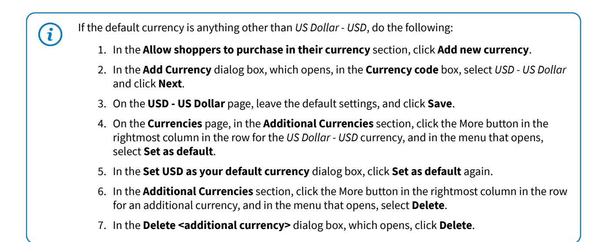

Because SweetLife wants to display prices and sell products only in United States dollars, the configuration of other currencies is not needed.

For the purposes of the initial configuration and first synchronization, which you will perform in *[Data](#page-37-1) [Synchronization:](#page-37-1) To Perform the First Synchronization*, you do not need to set up any payment methods at this time.

# **Step 4: Configuring the Shipping Rules**

To configure the shipping rules for your online store, do the following:

- 1. While you are signed in to the BigCommerce store, in the le pane of the control panel, click**Settings**,
- 2. On the **Settings** page, in the**Setup** section, click**Shipping**.
- 3. On the **Shipping** page, which opens, in the**Shipping origin** section, review the location from which products are going to be shipped. If the address is not displayed, add it as follows:
  - a. In the **Shipping origin** section, click **Add shipping address**.
  - b. In the **Configure shipping address** dialog box, which opens, specify the following details:
    - **Address Line 1**: 3950 Hoffman Avenue
    - **City**: New York
    - **Postcode**: 11003
    - **Country**: *United States* (default)
    - **State**: *New York*
  - c. In the lower right, click**Submit**.
- 4. In the **Checkout shipping options** section, do the following:
  - a. Click **Add shipping zone > Add a custom zone**.
  - b. In the **Add custom zone** dialog box, which opens, on the **Zone** tab, specify the following settings:
    - **Name**: New York State
    - **Type**: *Selection of states or provinces*
    - **Country**: *United States*
    - **State**: *New York*
  - c. Click **Submit** to save the changes and close the dialog box.

In the **Basic shipping rules** subsection, notice that the *New York State* rule is now active (the toggle is switched on for it).

d. Delete any other shipping rules by clicking the **Delete** button in the row with this shipping rule.

- 5. In the **Basic shipping rules** subsection, in the row of *New York State*, click **Configure**.
- 6. On the **New YorkState** page, in the**Static shipping quotes** section, switch on the toggle to enable the *Free Shipping* rule.
- 7. In the **Free shipping options** dialog box, which opens, specify the following settings:
  - **Limit to order over**: Selected
  - Amount (USD): 100.00
  - **Use discounted order subtotal**: Selected
  - **Make products with a fixed shipping cost ineligible for free shipping**: Selected

With these settings, the orders in the amount of \$100 or more will be eligible for free shipping.

- 8. In the lower right of the dialog box, click**Submit** to save your changes.
- 9. In the lower right of the **New YorkState** page, to which you return, click **Done**.

For simplicity, you do not need to specify any other shipping rules at this time. In a production environment, you are most likely to configure the shipping options on a more granular level.

#### **Step 5: Turning Off Notifications About Changes to Customer Accounts**

For testing purposes we recommend that you turn off sending email notifications to customers every time their details are changed. To do this, do the following:

- 1. While you are signed in to the control panel of the BigCommerce store, in the le pane, click **Marketing > Transactional Emails**.
- 2. On the **Transactional emails** page, in the row of the *Account Settings Edited* template, click the More button in the rightmost column, and on the menu that opens, click **Disable**.

The status of the template id changed to *Disabled*.

#### **Step 6 (Optional): Deleting Existing Product Categories and Products**

Sample products and product categories have been preloaded to your BigCommerce store for demo purposes. To delete these product categories and products assigned to these categories in your BigCommerce store, do the following:

- 1. In the le pane, click **Products > Categories**.
- 2. On the table toolbar of the **Product categories** page, select the **<Number> categories** check box.

This selects check boxes in all the rows in the list of categories. Also, additional buttons appear right to the selected check box on the table toolbar.

- 3. On the table toolbar, click the **Delete** button.
- 4. In the **Delete categories** dialog box, which opens, click **Delete categories**.

The system deletes all the categories.

- 5. In the le pane, click **Products > All products**.
- 6. On the table toolbar of the **Products** page, select the **<Number> products** check box.

This selects check boxes in all the rows in the list of products. Also, additional buttons appear right to the selected check box on the table toolbar.

- 7. On the table toolbar, click the **Delete** button.
- 8. In the **Delete products** dialog box, which opens, click **Delete**.

The system deletes all the products.

You have specified the minimum set of store settings that you will need for the basic configuration of the BigCommerce integration.

Now you should proceed to review the configuration of your Acumatica ERP instance, as described in *[Initial](#page-23-1) [Configuration:](#page-23-1) To Prepare the Acumatica ERP Instance*.

# **Initial Configuration: To Prepare the Acumatica ERP Instance**

In this activity, you will go through the settings that need to be specified in the Acumatica ERP instance before you set up the connection to the BigCommerce store.

This activity is based on the *U100* dataset. If you are using another dataset, or if any system settings have been changed in *U100*, these changes can affect the workflow of the activity and the results of the processing. To avoid any issues, restore the *U100* dataset to its initial state.

#### **Story**

The SweetLife company is planning on opening an online store built on the BigCommerce platform. The warehouse from which the goods will be shipped is based in New York. The company maintains the prices of its products in United States dollars and delivers products across New York by using the company's own vehicles. As an implementation consultant helping SweetLife to implement the integration between BigCommerce and Acumatica ERP, you want to make sure that the features required for the ecommerce functionality are enabled and the necessary entities are created and configured in the Acumatica ERP instance.

## **Process Overview**

The Acumatica ERP instance with the *U100* dataset already contains most of the settings and data that you will need to specify when you start configuring the store connection. In this activity, you will review the following settings or entities on the following forms of the Acumatica ERP instance:

- *[Enable/Disable Features](https://help-2025r1.acumatica.com/Help?ScreenId=ShowWiki&pageid=c1555e43-1bc5-4f6f-ba9d-b323f94d8a6b)* (CS100000) form: The features that have been enabled to support ecommerce functionality
- *[Customer Classes](https://help-2025r1.acumatica.com/Help?ScreenId=ShowWiki&pageid=806e39d6-6f89-4e6c-9a24-61c6fb0c9a57)* (AR201000) form: The customer class for the customers imported from the BigCommerce store
- *[Numbering Sequences](https://help-2025r1.acumatica.com/Help?ScreenId=ShowWiki&pageid=a8d11c23-21f2-42a3-b17d-9637c9cf8031)* (CS201010) form: The numbering sequences to be used for generating the identifiers for new customers and customer locations imported from the BigCommerce store
- *[Customers](https://help-2025r1.acumatica.com/Help?ScreenId=ShowWiki&pageid=652929bc-9606-4056-aa6e-0c2d1147171b)* (AR303000) form: The customer account to be used for guest orders (orders placed by unregistered users) in the online store
- *[Item Sales Categories](https://help-2025r1.acumatica.com/Help?ScreenId=ShowWiki&pageid=1cd87b69-9b41-4210-98fb-58b869df8a5f)* (IN204060) form: The item sales category to be used as the default sales category; items that have no item sales category in Acumatica ERP will be displayed under this category in the online store
- *Order [Types](https://help-2025r1.acumatica.com/Help?ScreenId=ShowWiki&pageid=e6984218-4260-4438-99e1-aee2b3765369)* (SO201000) form: The order type to be used for orders imported from the BigCommerce store, and the order type to be used for handling returns of online purchases
- *[Ship via Codes](https://help-2025r1.acumatica.com/Help?ScreenId=ShowWiki&pageid=ba3b1fc4-3656-4ed9-b5a9-21377637841a)* (CS207500): The carrier to be used for handling shipping
- *[Cash Accounts](https://help-2025r1.acumatica.com/Help?ScreenId=ShowWiki&pageid=10f71454-88f9-4d6c-8d09-32856d8c6741)* (CA202000): The cash account to be used for ecommerce orders
- *[Payment Methods](https://help-2025r1.acumatica.com/Help?ScreenId=ShowWiki&pageid=509285d1-cfae-4e87-95c3-a968451952e6)* (CA204000): The payment method to which payment methods from the BigCommerce store will be mapped

#### **System Preparation**

Sign in to the Acumatica ERP instance with the *U100* dataset preloaded by using the following credentials:

- **Username**: *gibbs*
- **Password**: *123*

## **Step 1: Enabling the Needed Features**

To make sure the needed features for ecommerce functionality have been enabled, do the following:

- 1. Open the *[Enable/Disable Features](https://help-2025r1.acumatica.com/Help?ScreenId=ShowWiki&pageid=c1555e43-1bc5-4f6f-ba9d-b323f94d8a6b)* (CS100000) form.
- 2. Make sure that the following features are enabled:
  - *Business Account Locations* (under the *Standard Financials* group of features)
  - *Inventory* (under the *Inventory and Order Management* group of features)
  - *Retail Commerce* (under the *Third-Party Integrations* group of features)
  - *BigCommerce Connector*

Depending on the setup of your BigCommerce store and the inventory and order management processes in your company, you might need to enable additional features. For more information, see *[Initial Configuration: Implementation Checklist](#page-14-1)*.

# **Step 2: Reviewing the Customer Class for Customers Imported from BigCommerce**

During the process of establishing and configuring the connection between Acumatica ERP and the BigCommerce store, you will need to specify the customer class that will be used for creating customer records for customers imported from the BigCommerce store. You can use an existing customer class or create a new one with a different set of default settings to be used specifically for online customers. In the instance with the *U100* data preloaded, a dedicated customer class for online customers has already been created.

To review the customer class that will be used for customers imported from the BigCommerce store, do the following:

- 1. Open the *[Customer Classes](https://help-2025r1.acumatica.com/Help?ScreenId=ShowWiki&pageid=806e39d6-6f89-4e6c-9a24-61c6fb0c9a57)* (AR201000) form.
- 2. In the **Class ID** box, select *ECCUSTOMER*.

In a subsequent activity, you will specify this customer class in the store settings so that the system will use the settings of this customer class to populate customer records for new customers that will be imported from the BigCommerce store to Acumatica ERP.

## **Step 3: Reviewing the Numbering Sequences for Customers and Customer Locations**

To review the numbering sequences that Acumatica ERP will use to assign identifiers to customers and customer locations (addresses) imported from the BigCommerce store, do the following:

- 1. Open the *[Numbering Sequences](https://help-2025r1.acumatica.com/Help?ScreenId=ShowWiki&pageid=a8d11c23-21f2-42a3-b17d-9637c9cf8031)* (CS201010) form.
- 2. In the **Numbering ID** box, select *ECCUSTOMER*.

Review the settings of the numbering sequence that will be used to automatically generate the identifiers of the customers imported from the BigCommerce store to Acumatica ERP. With these settings, these customers will be assigned identifiers that start with the letter *C* followed by a numerical portion.

3. In the **Numbering ID** box, select *ECLOCATION*.

Review the settings of the numbering sequence that will be used to automatically generate the identifiers of the customer locations imported from the BigCommerce store to Acumatica ERP. With these settings, these customer locations will be assigned identifiers that start with the letter *L* followed by a numerical portion.

In a subsequent activity, you will specify these numbering sequences in the store settings so that the system will use them to create identifiers for customers and addresses imported from the BigCommerce store to Acumatica ERP.

#### **Step 4: Reviewing the Customer Record to Be Used for Guest Orders**

SweetLife's online store is going to accept guest orders (that is, orders from customers who are not registered in the store). During the configuration of the store connection, you will need to select the customer record in Acumatica ERP that will appear in orders that are placed as guest orders in the BigCommerce store. In the instance with the *U100* data preloaded, the generic online customer account has already been created.

To review the customer account that will be used for guest orders, do the following:

- 1. Open the *[Customers](https://help-2025r1.acumatica.com/Help?ScreenId=ShowWiki&pageid=652929bc-9606-4056-aa6e-0c2d1147171b)* (AR303000) form.
- 2. In the Summary area, in the **Customer ID** box, select *ECOMGUEST*.

In a subsequent activity, you will specify this customer in the store settings to make it appear on all orders imported from the BigCommerce store that were placed in the store by non-registered customers.

#### **Step 5: Reviewing the Item Sales Categories**

To review the inventory-related settings that you will need to specify during the configuration of the store connection, do the following:

- 1. Open the *[Item Sales Categories](https://help-2025r1.acumatica.com/Help?ScreenId=ShowWiki&pageid=1cd87b69-9b41-4210-98fb-58b869df8a5f)* (IN204060) form.
- 2. In the **Categories** tree, click *Other*.

Notice that no stock or non-stock items are currently assigned to this category. You will select this category in a subsequent activity to make stock and non-stock items that do not have their own categories appear under the *Other* category aer they are imported to the BigCommerce store.

#### **Step 6: Reviewing the Order Settings**

In order to review the order type created for the sales orders coming from the BigCommerce store, do the following:

- 1. Open the *Order [Types](https://help-2025r1.acumatica.com/Help?ScreenId=ShowWiki&pageid=e6984218-4260-4438-99e1-aee2b3765369)* (SO201000) form.
- 2. In the **OrderType** box, select *EO - eCommerce Order*.

In the **OrderTemplate** box of the Summary area, notice that this order type is based on the *SO* order template. In a subsequent activity, you will configure the system to assign this order type to all orders imported from the BigCommerce store.

#### **Step 7: Reviewing the Shipping Settings**

To review the Acumatica ERP shipping settings that you will need to specify during the configuration of the store connection, do the following:

- 1. Open the *[Ship via Codes](https://help-2025r1.acumatica.com/Help?ScreenId=ShowWiki&pageid=ba3b1fc4-3656-4ed9-b5a9-21377637841a)* (CS207500) form.
- 2. In the **Ship Via** box, select *SWEETSHIP*.

Because SweetLife is going to deliver the products sold in the online store by using only its own fleet of vehicles, you will specify this shipping option when you configure the store connection.

## **Step 8: Reviewing the Cash Account and Payment Method Settings**

To review the payment method in Acumatica ERP that will be mapped to the BigCommerce payment methods configured in the online store, do the following:

- 1. Open the *[Payment Methods](https://help-2025r1.acumatica.com/Help?ScreenId=ShowWiki&pageid=509285d1-cfae-4e87-95c3-a968451952e6)* (CA204000) form.
- 2. In the **Payment Method ID** box, select *ONLINE*.

For simplicity, you will later map this payment method to all payment methods configured in the BigCommerce store. On the **Allowed Cash Accounts** tab, notice that the table contains only one cash account, *10250ST - Company Merchant Account*.

- 3. In the **Cash Account** column, click the link with the cash account identifier.
- 4. On the *[Cash Accounts](https://help-2025r1.acumatica.com/Help?ScreenId=ShowWiki&pageid=10f71454-88f9-4d6c-8d09-32856d8c6741)* (CA202000) form, which opens in a pop-up window, review the cash account settings.

In the Summary area, notice that the *10250ST* cash account has been configured for the *RETAIL* branch and the *USD* currency.

In the next activity, *Initial [Configuration:](#page-26-1) To Capture Store Connection Information*, you will learn how to capture the store's API information required for establishing the connection between your instance of Acumatica ERP and the BigCommerce store.

# **Initial Configuration: To Capture Store Connection Information**

Before you can start setting up a connection to the BigCommerce store in Acumatica ERP, you need to obtain the following BigCommerce connection information:

- The store admin path, which is the URL of the BigCommerce store followed by */manage*
- The API credentials (API path, client ID, and access token)

In this activity, you will learn where to find the listed information.

#### **Process Overview**

In this activity, you will obtain the API credentials of the BigCommerce store.

## **System Preparation**

- 1. Before you start this activity, make sure that you have completed the instructions in *Initial [Configuration:](#page-19-1) To [Set Up a BigCommerce Store](#page-19-1)*.
- 2. Sign in to the control panel of the BigCommerce store as the store administrator.

## **Step: Obtaining the BigCommerce Store API Credentials**

Before you can establish a connection between your instance of Acumatica ERP and the online store, you need to generate an API account. Do the following:

- 1. In the le pane of the control panel, click**Settings**.
- 2. On the **Settings** page, in the **API** section, click**Store-level API accounts**.
- 3. On the **Store-level API accounts** page, click **Create API account**.
- 4. On the **Create account** page, specify the following settings:
  - **Token type**: *V2/V3 API token*

- **Name**: Acumatica ERP Integration
- 5. Make a note the store's API path, which is displayed in the **API path** box.
- 6. For each scope under **OAuth scopes**, set the permission to the highest (rightmost) level.
- 7. In the lower right, click**Save** to save your changes.
- 8. In the **BigCommerce API credentials** dialog box, which appears, the following details of the created API account are displayed:
  - Client ID
  - Client secret
  - Access token

If you are using Chrome, Firefox, or Edge, a text file with this information, as well as the API Path, will be automatically downloaded to your computer.

9. Save the API account information to a file.

Make sure to securely store these API credentials. If you lose this information, you will have to delete the account and create a new one.

10.Click **Done** to close the dialog box.

On the **Store-level API accounts** page, to which you return, the information about the *Acumatica ERP Integration* account is now displayed.

Now you can move on to establish a connection between Acumatica ERP and the BigCommerce store and perform the minimum configuration of the connection. To do so, follow the steps described in *Initial [Configuration:](#page-27-1) To [Establish and Configure the Store Connection](#page-27-1)*.

# **Initial Configuration: To Establish and Configure the Store Connection**

In this activity, you will learn how to connect your Acumatica ERP instance to the BigCommerce store and perform the initial configuration of the connection.

The following activity is based on the *U100* dataset. If you are using another dataset, or if any system settings have been changed in *U100*, these changes can affect the workflow of the activity. To avoid any issues, restore the *U100* dataset to its initial state.

### **Story**

Suppose that the manager of the SweetLife company wants to sell jam in its online store deployed on the BigCommerce platform. SweetLife is already using Acumatica ERP and now needs to integrate it with a new BigCommerce store. As SweetLife's implementation consultant, you need to configure the connection to the BigCommerce store and perform the minimum configuration required for synchronization of data between Acumatica ERP and the BigCommerce store.

## **Configuration Overview**

In the *U100* dataset, the following tasks have been performed to support this activity:

- On the *[Enable/Disable Features](https://help-2025r1.acumatica.com/Help?ScreenId=ShowWiki&pageid=c1555e43-1bc5-4f6f-ba9d-b323f94d8a6b)* (CS100000) form, the *Retail Commerce* and *BigCommerce Connector* features have been enabled.
- On the *[Customer Classes](https://help-2025r1.acumatica.com/Help?ScreenId=ShowWiki&pageid=806e39d6-6f89-4e6c-9a24-61c6fb0c9a57)* (AR201000) form, the *ECCUSTOMER* customer class has been defined.
- On the *[Numbering Sequences](https://help-2025r1.acumatica.com/Help?ScreenId=ShowWiki&pageid=a8d11c23-21f2-42a3-b17d-9637c9cf8031)* (CS201010) form, the *ECCUSTOMER* numbering sequence has been defined,

- On the *[Customers](https://help-2025r1.acumatica.com/Help?ScreenId=ShowWiki&pageid=652929bc-9606-4056-aa6e-0c2d1147171b)* (AR303000) form, the *ECOMGUEST* customer record has been created.
- On the *[Non-Stock Items](https://help-2025r1.acumatica.com/Help?ScreenId=ShowWiki&pageid=bf68dd4f-63d4-460d-8dc0-9152f2bd6bf1)* (IN202000) form, the *REFUNDAMT* non-stock item has been defined.
- On the *Order [Types](https://help-2025r1.acumatica.com/Help?ScreenId=ShowWiki&pageid=e6984218-4260-4438-99e1-aee2b3765369)* (SO201000) form, the *EO - eCommerce Order* has been defined based on the *SO* order template.
- On the *[Ship via Codes](https://help-2025r1.acumatica.com/Help?ScreenId=ShowWiki&pageid=ba3b1fc4-3656-4ed9-b5a9-21377637841a)* (CS207500) form, the *SWEETSHIP* ship via code has been created.
- On the *[Cash Accounts](https://help-2025r1.acumatica.com/Help?ScreenId=ShowWiki&pageid=10f71454-88f9-4d6c-8d09-32856d8c6741)* (CA202000) form, the *10250ST* cash account has been configured for the *RETAIL* branch and the *USD* currency.
- On the *[Payment Methods](https://help-2025r1.acumatica.com/Help?ScreenId=ShowWiki&pageid=509285d1-cfae-4e87-95c3-a968451952e6)* (CA204000) form, the *ONLINE* payment method has been set up to be used with the *10250ST* cash account.

#### **Process Overview**

On the *[BigCommerce Stores](#page-473-2)* (BC201000) form, you will create a new connection to the online store by using the information you captured in *Initial [Configuration:](#page-26-1) To Capture Store Connection Information*. Aer the connection is successfully established, you will perform the minimum configuration of the store settings.

#### **System Preparation**

Before you start this activity, do the following:

- 1. Make sure that you have completed the following activities:
  - *Initial Configuration: To Set Up a [BigCommerce](#page-19-1) Store*
  - *Initial [Configuration:](#page-26-1) To Capture Store Connection Information* You will need to specify the captured information in Step 1 below.
  - *Initial [Configuration:](#page-23-1) To Prepare the Acumatica ERP Instance*
- 2. Sign in to the Acumatica ERP instance with the *U100* dataset preloaded by using the following credentials:
  - **Username**: *gibbs*
  - **Password**: *123*
- 3. Sign in to the control panel of the BigCommerce store as the store administrator.

## **Step 1: Establishing a Connection Between Acumatica ERP and the BigCommerce Store**

To establish a connection with the BigCommerce store in your instance of Acumatica ERP, do the following:

1. On the *[BigCommerce Stores](#page-473-2)* (BC201000) form, add a new record.

Notice that the **Active** check box is selected for the new store.

- 2. In the **Store Name** box of the Summary area, type SweetStore BC.
- 3. On the **General** tab (**Connection** section), use the information that you have captured while completing *Initial [Configuration:](#page-26-1) To Capture Store Connection Information* to specify the settings as follows:
  - In the **Store Admin Path** box, enter the URL of your BigCommerce store. Notice that the system automatically appends */manage* to the store URL.
  - Specify **API Path**. Notice that the system automatically removes the API version at the end of the API path.
  - Specify **Client ID** and **AccessToken**.
    - Notice that once you enter the client ID or access token and then click elsewhere, the system masks the value you have entered.
- 4. On the form toolbar, click**Save**.

Notice that the connection is established automatically, and the **Default Currency**, **Supported Currencies**, and **StoreTime Zone** boxes have been populated automatically based on the values specified in the BigCommerce store.

You can check if the specified connection settings are correct any time by clicking**Test Connection** on the form toolbar.

## **Step 2: Activating the Needed Entities**

To specify the entity settings, while you are still viewing the *[BigCommerce Stores](#page-473-2)* (BC201000) form, do the following:

1. Go to the **Entities** tab.

The table displays all entities that are supported by the BigCommerce connector and their default settings (such as, the synchronization direction and primary system).

- 2. In the table, select the **Active** check box for the following entities:
  - *Customer*
  - *Sales Category*
  - *Stock Item*
  - *Sales Order*
  - *Payment*
  - *Shipment*

Leave the default settings of the activated entities as they are.

#### **Step 3: Specifying the Customer Settings**

To specify the settings that will be used by default for importing customers from the BigCommerce store to Acumatica ERP, while you are still viewing the *[BigCommerce Stores](#page-473-2)* (BC201000) form, do the following:

- 1. Go to the **Customers** tab.
- 2. In the **Customer** section, select the following values:
  - **Customer Class**: *ECCUSTOMER*

This is the default customer class based on which customer records will be created in Acumatica ERP for customers imported from the online store.

• **Customer NumberingSequence**: *ECCUSTOMER*

This numbering sequence has been configured in Acumatica ERP to automatically generate identifiers for customer records imported from the BigCommerce store.

• **Generic Guest Customer**: *ECOMGUEST*

This customer account, which has been created in Acumatica ERP, will appear on orders imported from the BigCommerce stores and placed by non-registered users.

#### **Step 4: Specifying the Order Settings**

To specify the order-related settings, while you are still viewing the *[BigCommerce Stores](#page-473-2)* (BC201000) form, do the following:

- 1. Go to the **Orders** tab.
- 2. In the **Branch** box (in the **General** section), select *RETAIL*.

This branch will be inserted in sales orders imported from the *SweetStore - BC* store.

- 3. In the **Order** section, select the following values:
  - **OrderType for Import**: *EO - eCommerce Order*

This order type has been configured specifically for sales orders imported from BigCommerce stores.

• **Refund Amount Item**: *REFUNDAMT*

This non-stock item, which does not reflect an actual item, will be used to reflect refunded amounts in sales orders and return orders for returns initiated in the BigCommerce store.

Although the **Refund Amount Item** box is required and you need to specify its value during the initial setup, it will only be used during the configuration and processing of refunds, which is described in *[Importing Card Refunds: General Information](#page-190-2)*.

4. In the **Taxes** section, leave the**TaxSynchronization** check box cleared.

For simplicity, you do not need to configure the synchronization of taxes at this point.

5. On the form toolbar, click**Save** to save your changes.

### **Step 5: Specifying the Payment Settings**

To import payments based on a particular payment method configured in the BigCommerce store to Acumatica ERP, you need to map the payment method to a corresponding payment method configured in Acumatica ERP.

To configure the payment method mapping, while you are still viewing the *[BigCommerce Stores](#page-473-2)* (BC201000) form, do the following:

- 1. Go to the **Payments** tab.
- 2. In the table of this tab, in the row of the *CUSTOM (CUSTOM)* payment method, specify the following settings:
  - **Active**: Selected
  - **Store Currency**: *USD* (inserted automatically)
  - **ERP Payment Method**: *ONLINE*
  - **Cash Account**: *10250ST*

The *CUSTOM (CUSTOM)* value in the table corresponds to the *Manual payment* payment method in the BigCommerce store. With these settings, the payments made with the *Manual payment* payment method will be imported to Acumatica ERP. In the imported payments and related sales orders, the mapped payment method, *ONLINE*, will be displayed.

3. On the form toolbar, click**Save** to save your changes.

### **Step 6: Specifying the Shipping Settings**

Now you need to map the shipping options that you set up in the BigCommerce store with the Ship Via codes defined in Acumatica ERP. Do the following:

- 1. Go to the**Shipping** tab.
- 2. In the table, add a new row and specify the following settings in the added row:
  - **Active**: Selected
  - **StoreShipping Zone**: New York State
  - **StoreShipping Method**: Free Shipping
  - **Ship Via**: *SWEETSHIP*
- 3. On the form toolbar, click**Save** to save your changes.

Now that the initial configuration is complete, you can move on to synchronize your data for the first time. For information on data synchronization, see *[Data Synchronization: General Information](#page-31-2)* and *Data [Synchronization:](#page-37-1) To [Perform the First Synchronization](#page-37-1)*.

# **Overview of Data Synchronization**

In this chapter, you will learn how the synchronization of data between Acumatica ERP and BigCommerce works.

# **Data Synchronization: General Information**

Aer the connection between Acumatica ERP and the BigCommerce store has been established and the initial configuration performed, you can start synchronizing data between the two systems.

## **Learning Objectives**

In this chapter, you will learn how data synchronization works and how to synchronize data manually.

# **Applicable Scenarios**

You synchronize data between Acumatica ERP and the BigCommerce store manually in the following cases:

- During the implementation of the integration between Acumatica ERP and the BigCommerce store, when you test how the synchronization works
- When you troubleshoot synchronization issues and need to resynchronize specific data manually

#### **Stages of the Synchronization Process**

The process of the synchronization of data between Acumatica ERP and the ecommerce store consists of the following stages:

- Preparing out-of-sync data for synchronization. For details, see the *[Preparation of Out-of-Sync Data for](#page-31-3) [Synchronization](#page-31-3)* section below.
- Processing out-of-sync data, as described in the *[Processing of Out-of-Sync Data](#page-34-0)* section below.

#### **Preparation of Out-of-Sync Data for Synchronization**

During the preparation of data for synchronization, the system receives the data that needs to be synchronized between Acumatica ERP and the ecommerce system and puts it in the processing queue. The following mechanisms can be used for obtaining data:

- *Data preparation process*: The data preparation process pulls the data to be synchronized from Acumatica ERP and the ecommerce system through API calls and puts it in the processing queue. You determine which data should be included in the synchronization by selecting one of the following modes:
  - *Full*: All records that have been created or modified during the specified date range are prepared, regardless of whether they have been processed previously or not. If no range is specified, all records are prepared.
  - *Incremental*: Only the records that have been modified since the date of the last successful data preparation are prepared.
  - *Incremental by Date*: Only records that have been modified during the specified date range and that have not yet been processed are prepared.

The prepared data is then filtered according to the filtering criteria defined on the *[Entities](#page-521-1)* (BC202000) form and saved in the processing queue as synchronization records with the *Prepared* status, which indicates

that these synchronization records have not yet been processed. The synchronization records are then processed as described in the *Processing of Out-of-Sync Data* section below.

The data preparation process can be started in the following ways:

- Manually, on the *[Prepare Data](#page-529-1)* (BC501000) form. For information on manual synchronization, see *[Data](#page-36-2) [Synchronization: Manual Synchronization](#page-36-2)*.
- By an automation schedule. For details about scheduling synchronization, see *[Automated](#page-60-2) [Synchronization: General Information](#page-60-2)*.
- *Push notifications*: If real-time synchronization is enabled for an entity on the *[Entities](#page-521-1)* (BC202000) form, whenever a record is changed in the source system, the ecommerce connector is immediately notified about the change, and the corresponding synchronization record is created or updated in the processing queue. This synchronization record is saved with the *Prepared* status and remains in the processing queue until it is processed.

The following diagram shows the process of preparing data for synchronization.

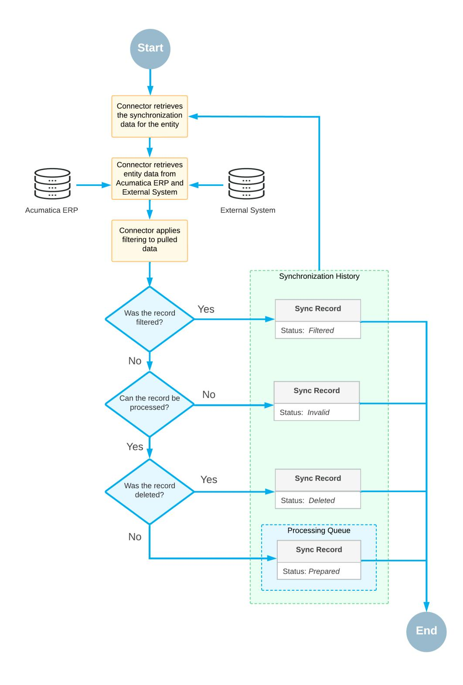

*Figure: Preparing data for synchronization*

# **Processing of Out-of-Sync Data**

During the data processing stage, the system processes the synchronization records in the processing queue according to the synchronization settings defined for the corresponding entity on the *[Entities](#page-521-1)* (BC202000) form or on the **Entities** tab of the *[BigCommerce Stores](#page-473-2)* (BC201000) form, and the synchronized data is saved in Acumatica ERP, in the BigCommerce store, or in both systems.

During the processing of out-of-sync data, the system performs the following operations for each synchronization record in the processing queue:

- 1. Pulling the record details from Acumatica ERP and the external ecommerce system.
- 2. Determining the direction of the synchronization—that is, if data should be imported to Acumatica ERP, exported to the external system, or synchronized in both directions.

The synchronization direction is displayed for each entity in the Summary area of the *[Entities](#page-521-1)* (BC202000) form.

- 3. Determining if any other records should be synchronized as a prerequisite for the synchronization of the current record, and attempting to synchronize the prerequisite records.
- 4. Applying the standard field mapping for the entity.

The default field mapping for each entity is detailed in *[Retail Edition Entity Reference](#page-551-3)*.

- 5. Applying the field mapping configured for the entity on the *[Entities](#page-521-1)* form.
- 6. Saving the synchronized data in the destination system or systems.
- 7. Changing the status of the synchronization record to *Processed*.

The processing of out-of-sync data can be started as follows:

- You can start data processing manually, as described in *[Data Synchronization: Manual Synchronization](#page-36-2)*.
- You can configure an automation schedule that will start data processing at regular intervals, as described in *[Automated Synchronization: Scheduled Synchronization](#page-61-1)*.
- You can configure the system to immediately start data processing for each synchronization record created or updated as a result of the real-time synchronization process. To do this, on the *[Entities](#page-521-1)* form, you set **Real-Time Mode** for an entity to *Prepare & Process*. For more information about real-time synchronization, see *Automated [Synchronization:](#page-63-1) Real-Time Synchronization*.

In the following diagram, you can see the flow of the processing of data prepared for synchronization.

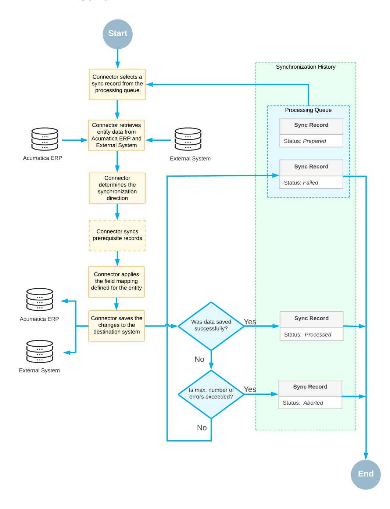

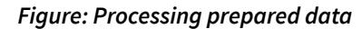

## **Preparation of Deleted Records**

If a previously processed entity record is deleted in Acumatica ERP, in the external system, or in both systems, its synchronization record is assigned the *Deleted* status on the *[Sync History](#page-539-1)* (BC301000) form. When the entity is prepared, the synchronization record is assigned the *Prepared* status in the following cases:

• If the entity record was deleted in the primary system or in both systems and then was restored in the primary system

• If the entity record was deleted only in the secondary system and then was modified in the primary system

During the entity preparation, synchronization records that were never processed and were manually assigned the *Deleted* status on the *[Sync History](#page-539-1)* form, are assigned the *Prepared* status regardless of the changes to the entity records in either of the systems.

# **Data Synchronization: Synchronization Statuses**

When a synchronization record is prepared and processed, the system assigns it one of the statuses described in the following table. You can review the synchronization status of any synchronization record on the *[Sync History](#page-539-1)* (BC301000) form.

| Status    | Description                                                                                                                                                                                                                                                                                                                                                                                                                                                                                                                                            |
|-----------|--------------------------------------------------------------------------------------------------------------------------------------------------------------------------------------------------------------------------------------------------------------------------------------------------------------------------------------------------------------------------------------------------------------------------------------------------------------------------------------------------------------------------------------------------------|
| Prepared  | The synchronization record has been created or updated, but out-of-sync data has not been saved in the destination system or systems.                                                                                                                                                                                                                                                                                                                                                                                                               |
| Processed | The synchronization record has been processed, and data has been recorded to the destination system or systems according to the synchronization settings config ured for the entity.                                                                                                                                                                                                                                                                                                                                                             |
| Failed    | The processing of the synchronization record has failed and data could not be recorded to the destination system or systems.                                                                                                                                                                                                                                                                                                                                                                                                                        |
| Aborted   | The synchronization record was excluded from synchronization by the system. The system automatically assigns the Aborted status to a synchronization record if the processing of the synchronization record has failed the number of times specified for the entity in the Max. Number of Failed Attempts box on the Entities (BC202000) form. The information about the error that occurred during the syn chronization is available for the synchronization record in the Last Error column of the table on the Sync History form. |
| Skipped   | The synchronization record was manually excluded from synchronization by a user.                                                                                                                                                                                                                                                                                                                                                                                                                                                                       |
| Deleted   | The record in the synchronization record has been deleted in Acumatica ERP, in the external system, or in both systems.                                                                                                                                                                                                                                                                                                                                                                                                                             |
| Invalid   | The synchronization record cannot be processed because its synchronization is not possible.                                                                                                                                                                                                                                                                                                                                                                                                                                                         |
| Filtered  | The entity has been filtered as a result of applying a filter defined in the code or on the Entities form.                                                                                                                                                                                                                                                                                                                                                                                                                                          |

# **Data Synchronization: Manual Synchronization**

Manual synchronization might be useful when you need to synchronize data during the initial configuration or when data has not been synchronized for some reason and manual troubleshooting is needed.

#### **Manual Data Preparation**

To manually start the data preparation process, you perform the following general steps:

- 1. You open the *[Prepare Data](#page-529-1)* (BC501000) form.
- 2. In the Summary area of the form, in the**Store** box, you select the online store with which you are synchronizing data.
- 3. In the **Prepare Mode** box, you select one of the following options:
  - *Incremental*: You select this mode to prepare for processing only the synchronization records that have changed since the last successful data preparation.
  - *Full*: You select this mode to prepare for processing all records of the selected entity, even if they have been synchronized previously.
  - *Incremental by Date*: You select this mode to prepare for processing only records that have been modified during the specified date range and that have not yet been processed.

If you are starting the data preparation process for an entity for the first time, *Full* mode is used, regardless of the mode selected in the **Prepare Mode** box.

4. In the table, you select the unlabeled check box in the rows of the needed entities, and on the form toolbar, you click **Prepare**.

#### **Manual Data Processing**

To manually start data processing, you perform the following general steps:

- 1. You open the *[Process Data](#page-533-1)* (BC501500) form.
- 2. In the Summary area, in the**Store** box, you select the online store with which you are synchronizing data.

The table shows only the synchronization records that require processing (that is, the synchronization records with the *Prepared* and *Failed* status).

3. In the **Entity** box, you select the entity for which you want to display synchronization records in the table.

If you want to process out-of-sync synchronization records for all entities, leave the box empty.

- 4. In the table, you select the unlabeled check box in the rows of the synchronization records that you need to process.
- 5. On the form toolbar, you click **Process** to synchronize the selected synchronization records.

If you want to process all synchronization records in the table, you click **Process All** on the form toolbar.

If you synchronize a large number of records, we recommend that you limit the number of rows to be loaded to the table of the *[Process Data](#page-533-1)* form by selecting a value in the **Processing Limit (Rows)** box of the Selection area. The loaded records are included in processing when you click **Process All** on the form toolbar. When the system completes the processing of loaded records, the remaining records are loaded to the table until the limit is reached.

For an example with step-by-step instructions on how to synchronize data manually, see *Data [Synchronization:](#page-37-1) To [Perform the First Synchronization](#page-37-1)*.

# **Data Synchronization: To Perform the First Synchronization**

The following activity will walk you through the process of manually exporting items from Acumatica ERP to the BigCommerce store. You will also perform the instructions to place a test order online in the BigCommerce store and then synchronize the order with Acumatica ERP. Finally, you will create a shipment for the order in Acumatica ERP and synchronize the created shipment with the BigCommerce store.

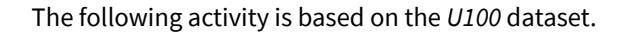

#### **Story**

Suppose that you are an implementation consultant helping the SweetLife Fruits & Jams company to set up an online store. You have completed the minimum initial configuration of the integration with BigCommerce and now want to explore how synchronization works. You will configure synchronization for and then synchronize a subset of stock items that are maintained in Acumatica ERP (stock items of the *Jam* item class) with the BigCommerce store, where the term *products* describes what are called *items* in Acumatica ERP. You will then perform a test purchase of one of the synchronized products and explore how the online order is processed in the BigCommerce store and in Acumatica ERP.

## **Process Overview**

In this activity, you will perform the following steps:

- 1. On the *[Stock Items](https://help-2025r1.acumatica.com/Help?ScreenId=ShowWiki&pageid=77786a70-1f1e-4d63-ad98-96f98e4fcb0e)* (IN202500) form of Acumatica ERP, review the stock items that need to be exported to the BigCommerce store.
- 2. On the *[Entities](#page-521-1)* (BC202000) form, configure the filtering options for the *Stock Item* entity to include in the synchronization only the stock items of the *Jam* item class.
- 3. On the *[Prepare Data](#page-529-1)* (BC501000) form, start the data preparation process for the *Stock Item* entity to prepare out-of-sync data for export.
- 4. On the *[Sync History](#page-539-1)* (BC301000) form, review the result of the data preparation process.
- 5. On the *[Process Data](#page-533-1)* (BC501500) form, start data processing for the *Stock Item* entity to save the synchronized product data in the BigCommerce store.
- 6. On the *[Sync History](#page-539-1)* form, review the results of data processing.
- 7. In the BigCommerce store, review the products that have been imported from Acumatica ERP.
- 8. By using the control panel of the store, place an order for one of the products that have been imported from Acumatica ERP.
- 9. On the *[Prepare Data](#page-529-1)* form of Acumatica ERP, start the data preparation process for the *Sales Order* entity to prepare out-of-sync order data for import; on the *[Process Data](#page-533-1)* form, synchronize the prepared sales order data.
- 10.On the *[Sync History](#page-539-1)* form, review the results of data synchronization.
- 11.On the *[Sales Orders](https://help-2025r1.acumatica.com/Help?ScreenId=ShowWiki&pageid=19e4021c-1b84-49fd-be12-0320c5f1c7e5)* (SO301000) form, review the details of the imported sales order.
- 12.On the *[Sales Orders](https://help-2025r1.acumatica.com/Help?ScreenId=ShowWiki&pageid=19e4021c-1b84-49fd-be12-0320c5f1c7e5)* form, create a shipment for the imported order, and on the *[Shipments](https://help-2025r1.acumatica.com/Help?ScreenId=ShowWiki&pageid=f47cffcc-543e-469c-a204-a9c1e3da346d)* (SO302000) form, confirm the shipment.
- 13.On the *[Prepare Data](#page-529-1)* form, start the data preparation process for the *Shipment* entity; on the *[Process Data](#page-533-1)* form, synchronize the prepared shipment data.
- 14.In the control panel of the BigCommerce store, review the updated order details and the shipment exported from Acumatica ERP.

#### **System Preparation**

Do the following:

- 1. Make sure that the following prerequisites have been met:
  - The BigCommerce store has been created and configured, as described in *Initial [Configuration:](#page-19-1) To Set Up [a BigCommerce Store](#page-19-1)*.
  - The connection to the BigCommerce store has been established and the initial configuration has been performed, as described in *Initial [Configuration:](#page-27-1) To Establish and Configure the Store Connection*.

- 2. Launch the Acumatica ERP website, and sign in as an administrator by using the following credentials:
  - **Username**: *gibbs*
  - **Password**: *123*
- 3. Sign in to the control panel of the BigCommerce store as the store administrator.

## **Step 1: Finding and Reviewing the Stock Items to Be Sold Online**

To find and review the stock items that will be sold online, do the following:

- 1. Open the Stock Items (IN2025PL) form.
- 2. Filter the stock items to display only the items of the *Jam* item class as follows:
  - a. In the **Item Class** column, click the column header.
  - b. In the menu that opens, select the *Equals* filter condition.
  - c. In the box at the bottom of the menu, type Jam.
  - d. Click **OK** to apply the filter.

Now all stock items of the *Jam* item class are displayed. Notice how many items are in the class; scan the list so you are familiar with the stock items that you need to export to the BigCommerce store.

#### **Step 2: Configuring the Export of a Subset of Stock Items**

To configure a filtering condition for the *Stock Item* entity to export only stock items of the *Jam* item class to the BigCommerce store, do the following:

- 1. On the *[Entities](#page-521-1)* (BC202000) form, specify the following settings in the Summary area:
  - **Store Name**: *SweetStore - BC*
  - **Entity**: *Stock Item*

Notice that the *Export* option is selected in the**Sync Direction** box meaning that the entity can be exported to the BigCommerce store but not imported to Acumatica ERP.

- 2. To create a filtering condition for stock items to be exported to the BigCommerce store, on the **Export Filtering** tab, click **Add Row** on the table toolbar, and specify the following settings in the row:
  - **Active**: Selected
  - **Field Name**: *Item Class*
  - **Condition**: *Equals*
  - **Value**: Jam
- 3. On the form toolbar, click**Save** to save your changes.

Now when you prepare and process the *Stock Item* entity, only the stock items of the *Jam* item class will be exported to the BigCommerce store.

Filtering rules are not applied to data that has already been synchronized. For example, if you synchronize the *Stock Item* entity without filters (which will result in exporting all stock items to the online store), apply the filter described above, and prepare and process the *Stock Item* entity again, all previously synchronized stock items that no longer match the filtering conditions will remain synchronized.

## **Step 3: Preparing the Product Data for Synchronization**

To prepare the stock item data that needs to be synchronized to the BigCommerce store, do the following:

- 1. On the *[Prepare Data](#page-529-1)* (BC501000) form, specify the following settings in the Summary area:
  - **Store**: *SweetStore - BC*
  - **Prepare Mode**: *Incremental*

This setting controls which data will be loaded. *Incremental* indicates that the system will load only the data that has been modified since the previous data synchronization. Because you are starting the data preparation process for the *Stock Item* for the first time, all stock item data will be prepared.

- 2. In the table, select the check box in the unlabeled column in the row of the *Stock Item* entity, and on the form toolbar, click **Prepare**.
- 3. In the **Processing** dialog box, which opens, review the results of the processing, and click **Close** to close the dialog box.

In the table on the form, notice that the **Ready to Process** column shows the number of synchronization records that have been prepared and are ready to be processed. The **Processed Records** column shows the number of records that have been processed (that is, records that have been successfully synchronized and assigned the *Processed* status.

You can click the link in the **Ready to Process** column to open the *[Process Data](#page-533-1)* (BC501500) form with the store and the entity selected; you can click the link in the **Processed Records** column to open the *[Sync History](#page-539-1)* (BC301000) form with the store and the entity selected and the list of processed synchronization records (that is, records that have been successfully synchronized and assigned the *Processed* status) displayed on the **Drilldown** filter tab.

## **Step 4: Reviewing the Results of Data Preparation**

To review the results of the preparation of data for synchronization, do the following:

1. While you are still viewing the *[Prepare Data](#page-529-1)* (BC501000) form, click the link in the**Total Records** in the row of the *Stock Item* entity. The *[Sync History](#page-539-1)* (BC301000) form opens in a new browser tab with the *SweetStore - BC* store and the *Stock Item* entity selected in the Summary area.

On the **Filtered** filter tab, notice that all synchronization records on this tab have the *Filtered* status. These are the stock items that were excluded from synchronization based on the filtering conditions that you specified for stock items on the *[Entities](#page-521-1)* (BC202000) form.

2. Go to the **Ready to Process** filter tab.

Notice that the table is displaying the list of stock item synchronization records with the *Prepared* status, as shown in the screenshot below. This status means that the data for these items has been prepared and the items are now ready to be processed. The **Ready to Process** filter tab shows only the items with the *JAM* item class.

For each of these items, the **ERP ID** column displays a link with the item description that you can click to open the item on the *[Stock Items](https://help-2025r1.acumatica.com/Help?ScreenId=ShowWiki&pageid=77786a70-1f1e-4d63-ad98-96f98e4fcb0e)* (IN202500) form. Notice that the **External ID** column currently does not display any values because the stock items have not yet been exported to the BigCommerce store.

|   |                                |         |             | Sync History $\hat{x}$  |                            |                                                     |                |                                |               |                        | <b>CUSTOMIZATION</b>              |                                | TOOLS $\star$                    |
|---|--------------------------------|---------|-------------|-------------------------|----------------------------|-----------------------------------------------------|----------------|--------------------------------|---------------|------------------------|-----------------------------------|--------------------------------|----------------------------------|
|   | Ò                              | $\Box$  |             | $\Omega$ <b>SYNC</b> | $\mathbf x$ $\mathbb H$ | $\triangledown$ .                                |                |                                |               |                        |                                   |                                |                                  |
|   | Q Store: SweetStore - BC |         |             |                         |                            |                                                     |                |                                |               |                        |                                   |                                |                                  |
|   |                                | Entity: |             | <b>Stock Item</b>       |                            | $\checkmark$                                        |                |                                |               |                        |                                   |                                |                                  |
|   |                                |         | ALL RECORDS |                         | <b>READY TO PROCESS</b>    | <b>FAILED</b> <b>PROCESSED</b> <b>SKIPPED</b> | <b>ABORTED</b> | <b>DELETED</b>                 |               | <b>FILTERED</b>        | <b>INACTIVE</b> <b>INVALID</b> |                                |                                  |
| 冒 | 0                              | $\Box$  |             | <b>Entity</b>           | <b>Store</b>               | <b>ERP ID</b>                                       | External ID | External <b>Description</b> | <b>Status</b> | Last <b>Message</b> | <b>Last Operation</b>             | <b>Attempt Active</b> Count |                                  |
|   | 0                              | D       |             | <b>Stock Item</b>       | SweetStore - BC            | STRAWJAM96, Strawberry jam 96 oz                    |                |                                | Prepared      |                        | <b>Modified in ERP</b>            | $\mathbf{0}$                   | $\boxed{\text{v}}$               |
|   | 0                              | D       |             | <b>Stock Item</b>       | <b>SweetStore - BC</b>     | STRAWJAM32, Strawberry jam 32 oz                    |                |                                | Prepared      |                        | <b>Modified in ERP</b>            | $\mathbf{0}$                   | $\boxed{\checkmark}$             |
|   | 0                              | ם       |             | <b>Stock Item</b>       | <b>SweetStore - BC</b>     | STRAWJAM08, Strawberry jam 8 oz.                    |                | Prepared                       |               | <b>Modified in ERP</b> | $\mathbf{0}$                      | $\overline{\vee}$              |                                  |
|   | 0                              | ם       |             | <b>Stock Item</b>       | SweetStore - BC            | RASPJAM96, Raspberry jam 96 oz                      |                | Prepared                       |               | <b>Modified in ERP</b> | $\mathbf{0}$                      | $\boxed{\text{v}}$             |                                  |
|   | 0                              | n       |             | <b>Stock Item</b>       | SweetStore - BC            | RASPJAM32, Raspberry jam 32 oz                      |                |                                | Prepared      |                        | <b>Modified in FRP</b>            | $\bf{0}$                       | $\overline{\vee}$                |
|   | 0                              | D       |             | <b>Stock Item</b>       | <b>SweetStore - BC</b>     | RASPJAM08, Raspberry jam 08 oz                      |                |                                | Prepared      |                        | <b>Modified in ERP</b>            | $\bf{0}$                       | $\boxed{\textcolor{blue}{\vee}}$ |
|   | 0                              | D       |             | <b>Stock Item</b>       | <b>SweetStore - BC</b>     | PLUMJAM96, Plum jam 96 oz                           |                |                                | Prepared      |                        | <b>Modified in ERP</b>            | $\mathbf{0}$                   | $\boxed{\checkmark}$             |
|   | 0                              | D       |             | <b>Stock Item</b>       | SweetStore - BC            | PLUMJAM32, Plum jam 32 oz                           |                |                                | Prepared      |                        | <b>Modified in ERP</b>            | 0                              | $\boxed{\checkmark}$             |

*Figure: Stock item synchronization records prepared for processing*

#### **Step 5: Processing the Prepared Product Data**

To process the *Stock Item* entity, do the following:

- 1. On the *[Process Data](#page-533-1)* (BC501500) form, select the following settings in the Summary area:
  - **Store**: *SweetStore - BC*
  - **Entity**: *Stock Item*

The table displays only the list of stock items that have been prepared for synchronization.

- 2. On the form toolbar, click **Process All** to process all synchronization records displayed on the form.
- 3. In the **Processing** dialog box, which opens, click **Close** to close the dialog box.

#### **Step 6: Reviewing the Synchronization Status of the Product Data**

To again review the synchronization status of the product data, do the following:

- 1. On the *[Sync History](#page-539-1)* (BC301000) form, specify the following settings in the Summary area:
  - **Store**: *SweetStore - BC*
  - **Entity**: *Stock Item*
- 2. Go to the **Processed** filter tab.

The tab shows the list of items that have been synchronized with the BigCommerce store. For each item, there is now a product identifier in the **External ID** column. In the table, the **Last Operation** value has changed to *Inserted Externally* and the time stamp in the **Last Attempt** column has changed to the date and time when you ran data processing on the *[Process Data](#page-533-1)* (BC501500) form.

#### **Step 7: Viewing an Exported Product in the BigCommerce Store**

To view the *KIWIJAM96* stock item (which has the description *Kiwi jam 96 oz*) in the BigCommerce store, do the following:

1. While you are still viewing the *[Sync History](#page-539-1)* (BC301000) form, click the link in the **External ID** column in the row of the synchronization record for the *Kiwi jam 96 oz* item.

The product management page for the *Kiwi jam 96 oz* item in the BigCommerce store opens in a new browser tab.

2. Scan the product details that have been exported to the BigCommerce store.

Notice that the following information has been imported for *Kiwi jam 96 oz* from Acumatica ERP:

- The product description (*Kiwi jam 96 oz*) in the **Product Name** box in the **Basic Information** section
- The item's inventory ID (*KIWIJAM96*) in the **SKU** box
- The default price (*45.15*) in the **Default Price (excluding tax)** box
- The package weight (*2.84*) in the **Weight** box
- The product description (*Thick and sweet kiwi jam – goes great on toast or on pancakes.*) in the **Description** section
- The product image in the **Images** subsection of the **Images & Videos** section

#### **Step 8: Placing an Order from the Control Panel**

To purchase a 96-ounce jar of kiwi jam, while you are still signed in to the control panel of your BigCommerce store, do the following:

- 1. In the le pane of the control panel, click **Orders > Add**. The **Add an order** page opens.
- 2. On the **Add an order > Customer info** page, create the order as follows:
  - a. In the **Customer information** section, select the **New Customer** option button right of **Order for**.
  - b. In the **Account details** subsection, specify the following settings:
    - **Email Address**: larry@example.com
    - **Password**: !Q123456
    - **Confirm Password**: !Q123456
  - c. In the **Billing information** section, specify the following details:
    - **First Name**: Larry
    - **Last Name**: Coleman
    - **Address Line 1**: 1970 Duncan Avenue
    - **Suburb/City**: New York
    - **Country**: *United States*
    - **State/Province**: *New York*
    - **Zip/Postcode**: 10016
    - **Save to customer's address book**: Selected
- 3. In the lower right, click **Next**.
- 4. On the **Add an order > Items** page, under **Add products**, do the following:
  - a. In the **Search** box, start typing kiwi, and in the list of search results, select *KIWIJAM96*.
  - b. In the row of the *Kiwi jam 96 oz* product, change the quantity to 5.
  - c. In the lower right, click **Next**.
- 5. On the **Add an order > Fulfillment** page, in the**Shipping method** section, click the *Fetch shipping quotes* link.
- 6. In the box with the list of shipping options that appears, click *Free Shipping (\$0.00)*. The *Free Shipping* option is available for the order because its total amount is greater than \$100.
- 7. In the lower right, click **Next**.

The **Add an order > Payment** page opens. The information about the customer's billing address is displayed in the **Customer billing details** section, the shipping address, shipping method and the items included in the order are displayed in the **Fulfillment details** section, and the order amount is displayed in the **Summary** section.

8. In the **Payment** section, select the *Manual payment* payment method.

This payment method is used to record payments accepted outside of the BigCommerce store.

- 9. Click **Save & process payment**.
- 10.On the **View orders** page, which opens, make a note of the reference number of the created order in the **Order ID** column. You will review and process this order in Acumatica ERP further in this activity. Notice that the order status is *Awaiting Fulfillment*.

#### **Step 9: Importing the Sales Order Data to Acumatica ERP**

To import sales orders from the BigCommerce store to Acumatica ERP, do the following:

- 1. On the *[Prepare Data](#page-529-1)* (BC501000) form, specify the following settings in the Summary area:
  - **Store**: *SweetStore - BC*
  - **Prepare Mode**: *Incremental*
- 2. In the table, select the check box in the unlabeled column in the row of the *Sales Order* entity, and on the form toolbar, click **Prepare**.
- 3. In the **Processing** dialog box, which opens, review the results of the processing, and click **Close** to close the dialog box.

Notice that the **Ready to Process** column now shows *1* in the row of the *Sales Order* entity because you have created only one order in the BigCommerce store.

4. In the row of the *Sales Order* entity, click the link in the **Ready to Process** column.

The system opens the *[Process Data](#page-533-1)* (BC501500) form with the *SweetStore - BC* store and the *Sales Order* entity selected in the Summary area. Notice that the **External ID** column of the table displays the order identifier assigned to the order in the BigCommerce store.

- 5. Select the unlabeled check box in the only row, and on the form toolbar, click **Process**.
- 6. In the **Processing** dialog box, which opens, click **Close** to close the dialog box.

#### **Step 10: Reviewing the Synchronization Status of the Imported Sales Order**

To review the synchronization status of the order you imported in the previous step, do the following:

- 1. On the *[Sync History](#page-539-1)* (BC301000) form, select the following settings in the Summary area:
  - **Store**: *SweetStore - BC*
  - **Entity**: Leave empty

In the table on the **Processed** filter tab, review the synchronization records that were created during the import of the sales order (shown in the following screenshot).

|   |                                                                                                                                               |         | <b>Sync History</b> |               |                    |                        |                  |                |                           |                    |                             |                                          | <b>CUSTOMIZATION</b> | TOOLS $\sim$           |
|---|-----------------------------------------------------------------------------------------------------------------------------------------------|---------|---------------------|---------------|--------------------|------------------------|------------------|----------------|---------------------------|--------------------|-----------------------------|------------------------------------------|----------------------|------------------------|
|   | Ò                                                                                                                                             | $\Box$  |                     | $\Omega$      | <b>SYNC</b>        | ⊢                      | $\mathbf x$ Υ | $\cdots$       |                           |                    |                             |                                          |                      |                        |
|   | Q Store: SweetStore - BC                                                                                                                |         |                     |               |                    |                        |                  |                |                           |                    |                             |                                          |                      |                        |
|   |                                                                                                                                               | Entity: |                     |               |                    |                        |                  | $\checkmark$   |                           |                    |                             |                                          |                      |                        |
|   | ALL RECORDS <b>READY TO PROCESS</b> <b>FAILED</b> <b>PROCESSED</b> <b>SKIPPED</b> <b>ABORTED</b> DELETED <b>FILTERED</b> |         |                     |               |                    |                        |                  | <b>INVALID</b> | <b>INACTIVE</b>           |                    |                             |                                          |                      |                        |
| 髙 | 0                                                                                                                                             | $\Box$  | п                   | <b>Entity</b> |                    | <b>Store</b>           |                  | ERP ID         |                           | <b>External ID</b> | <b>External Description</b> | <b>Status</b>                            | Last Message      | <b>Last Operation</b>  |
|   | 0                                                                                                                                             | D       | L                   |               | Payment            | SweetStore - BC        |                  |                | Prepayment, 000080        | 100:987259928      | 100                         | Processed                                |                      | <b>Inserted in ERP</b> |
|   | 0                                                                                                                                             | D       |                     |               | <b>Sales Order</b> | SweetStore - BC        |                  | EO. 000075     |                           | 100                | 100                         | Processed                                |                      | <b>Inserted in ERP</b> |
|   | 0                                                                                                                                             | n       |                     |               | <b>Customer</b>    | <b>SweetStore - BC</b> |                  |                | C000000001, Larry Coleman | $\mathbf{1}$       | larry@example.com           | !!!!!!!!!!!!!!!!!!!!!!!!!!!!!!!!!!!!!!!! |                      | <b>Inserted in ERP</b> |

#### *Figure: The synchronization records created during the import of the sales order*

Notice the following:

- *Sales Order*: The sales order that you placed in the BigCommerce store. The **ERP ID** column displays the order type (*EO*) and the order ID. The order type is based on the value selected in the **OrderType for Import** box on the **Orders** tab of the *[BigCommerce Stores](#page-473-2)* (BC201000) form. The **External ID** column displays the order number assigned to the order in BigCommerce.
- *Customer*: The customer that you created during the placement of the order in the BigCommerce store. The **ERP ID** column displays the customer ID and the name of the customer. The customer ID was assigned to the customer record based on the numbering sequence specified in the **Customer NumberingSequence** box on the **Customers** tab of the *[BigCommerce Stores](#page-473-2)* form. The customer name was imported from the BigCommerce store.
- *Payment*: The payment used to pay the order in the BigCommerce store. The **ERP ID** column displays the payment type (*Prepayment*) and the payment identifier.

The payment has been imported because the payment method you used to pay the order has been mapped to an Acumatica ERP payment method and the mapping has been activated on the **Payments** tab of the *[BigCommerce Stores](#page-473-2)* form.

#### **Step 11: Reviewing the Imported Sales Order**

To review the details of the imported sales order, do the following:

- 1. While you are still viewing the synchronization results on the *[Sync History](#page-539-1)* (BC301000) form, click the link in the **ERP ID** column for the sales order you imported.
- 2. On the *[Sales Orders](https://help-2025r1.acumatica.com/Help?ScreenId=ShowWiki&pageid=19e4021c-1b84-49fd-be12-0320c5f1c7e5)* (SO301000) form, which opens in a pop-up window, review the details of the order, as shown in the following screenshot.

| <b>Sales Orders</b> EO 000075 - Larry Coleman                                                                                                                        |                               |                                        | <b>PHOTES</b>      | <b>ACTIVITIES</b>           | <b>FILES</b> <b>CUSTOMIZATION</b> | TOOLS $\sim$                                   |  |  |  |  |
|-------------------------------------------------------------------------------------------------------------------------------------------------------------------------|-------------------------------|----------------------------------------|--------------------|-----------------------------|--------------------------------------|------------------------------------------------|--|--|--|--|
| 뭐 n 侕 ↶ +                                                                                                                                                   | n -lK ≺ $\checkmark$ | QUICK PROCESS $\geq$ ⋋           |                    | <b>CREATE SHIPMENT</b>      | <b>HOLD</b>                       |                                                |  |  |  |  |
| EO * Order Type: Q                                                                                                                                                | * Customer:                   | C000000001 - Larry Coleman             | Q $\mathscr{O}$ | Ordered Qty.:               | 5.00                                 | ∼                                              |  |  |  |  |
| Order Nbr.: 000075 Ω                                                                                                                                              | * Location:                   | <b>MAIN - Primary Location</b>         | Q 0             | <b>Detail Total:</b>        | 225.75                               |                                                |  |  |  |  |
| Status: Open                                                                                                                                                         | Contact:                      | Larry Coleman                          | Q $\mathscr{O}$ | Line Discounts:             | 0.00                                 |                                                |  |  |  |  |
| $\star$ Date: 3/21/2025 Ä                                                                                                                                         | * Project:                    | X - Non-Project Code.                  | Q $\mathscr{O}$ | Document Dis                | 0.00                                 |                                                |  |  |  |  |
| * Requested On: 3/21/2025                                                                                                                                            | Description:                  | SweetStore - BC   Order: 100   Status: |                    | <b>Freight Total:</b>       | 0.00                                 |                                                |  |  |  |  |
| Customer Ord                                                                                                                                                            |                               | <b>Awaiting Fulfillment</b>            |                    | <b>Tax Total:</b>           | 0.00                                 |                                                |  |  |  |  |
| External Refer 100 - SweetSto                                                                                                                                        |                               |                                        |                    | <b>Order Total:</b>         | 225.75                               |                                                |  |  |  |  |
| <b>DETAILS</b> <b>O</b> TOTALS <b>TAXES</b> <b>FINANCIAL</b> <b>RELATIONS</b> <b>SHIPPING</b> <b>ADDRESSES</b> <b>SHIPMENTS</b> <b>PAYMENTS</b> |                               |                                        |                    |                             |                                      |                                                |  |  |  |  |
| <b>ADD ITEMS</b> <b>ADD MATRIX ITEMS</b> ADD BLANKET SO LINE <b>LINE DETAILS</b> Ò ADD INVOICE PO LINK D $\mathsf{x}$ ≫                      |                               |                                        |                    |                             |                                      |                                                |  |  |  |  |
| 0 D 阊 *Branch *Inventory ID                                                                                                                                 | Warehouse Free Item     | *UOM Line <b>Description</b>     | Quantity           | Qtv. On <b>Shipments</b> | <b>Unit</b> Open Qtv. Price | <b>Manual</b> Ext. Price <b>Price</b> |  |  |  |  |
| 0 <b>RETAIL</b> KIWIJAM96                                                                                                                                         | <b>RETAIL</b>                 | <b>PIECE</b> Kiwi jam 96 oz         | 5.00               | 0.00                        | 5.00 45.1500                      | ☑ 225.75                                    |  |  |  |  |

#### *Figure: Sales order imported from the store*

In the Summary area, notice the following:

- The imported order has the *EO* type (shown in the **OrderType**), which is configured on the *[BigCommerce](#page-473-2) [Stores](#page-473-2)* (BC201000) form to be assigned to all sales orders imported from the *SweetStore - BC* store.
- In the **External Reference** box, the order number assigned to the order in the BigCommerce store and the name of the store are displayed.
- The **Date** of the sales order is the same as the date on which the order was created in the BigCommerce store.
- In the **Description** box, the store name, the order number, and the payment status of the order are displayed.
- The **Customer** and **Location** boxes display the information about the customer and customer location that were created in Acumatica ERP during the import of the sales order; both were created during the order placement in the BigCommerce store.

On the **Details** tab, review the only line in the table. Notice the following:

- **Branch** is set to *RETAIL*, which is the default branch configured on the *[BigCommerce Stores](#page-473-2)* form to appear on sales orders imported from the *SweetStore - BC* store.
- The inventory ID, quantity, unit price, and extended price of the item are exactly the same as the values on the order in the BigCommerce store.

On the **Payments** tab, notice that a prepayment in the order amount has been applied to the sales order.

#### **Step 12: Creating and Confirming a Shipment**

To process a shipment for the imported order, do the following:

- 1. While you are still viewing the sales order on the *[Sales Orders](https://help-2025r1.acumatica.com/Help?ScreenId=ShowWiki&pageid=19e4021c-1b84-49fd-be12-0320c5f1c7e5)* (SO301000) form, on the form toolbar, click **CreateShipment**.
- 2. In the **SpecifyShipment Parameters** dialog box, which opens, make sure the current date and the *RETAIL* warehouse are selected, and click **OK**.

The system creates a shipment and opens it on the *[Shipments](https://help-2025r1.acumatica.com/Help?ScreenId=ShowWiki&pageid=f47cffcc-543e-469c-a204-a9c1e3da346d)* (SO302000) form in the same pop-up window.

3. On the form toolbar, click **Confirm Shipment**.

The shipment is assigned the *Confirmed* status. The sales order is assigned the *Completed* status.

4. Close the pop-up window with the *[Shipments](https://help-2025r1.acumatica.com/Help?ScreenId=ShowWiki&pageid=f47cffcc-543e-469c-a204-a9c1e3da346d)* form.

## **Step 13: Synchronizing the Shipment with the BigCommerce Store**

To synchronize with the *SweetStore - BC* store the shipment that you created and confirmed in the previous steps, do the following:

- 1. On the *[Prepare Data](#page-529-1)* (BC501000) form, specify the following settings in the Summary area:
  - **Store**: *SweetStore - BC*
  - **Prepare Mode**: *Incremental*
- 2. In the table, select the check box in the unlabeled column for the *Shipment* entity.
- 3. On the form toolbar, click **Prepare**.
- 4. In the **Processing** dialog box, which opens, click **Close** to close the dialog box.
- 5. Click the link in the **Ready to Process** (which shows *1* because only one shipment has been created) in the row of the *Shipment* entity.

The *[Process Data](#page-533-1)* (BC501500) form opens with the *SweetStore - BC* store and the *Shipment* entity selected.

- 6. Select the unlabeled check box for the only row of the table, and click **Process** on the form toolbar.
- 7. In the **Processing** dialog box, which opens, click **Close** to close the dialog box.

#### **Step 14: Reviewing the Updated Order and Shipment in BigCommerce**

To check whether the shipment and the updated order have been imported to the BigCommerce store correctly, do the following:

- 1. On the *[Sync History](#page-539-1)* (BC301000) form, specify the following settings in the Summary area:
  - **Store**: *SweetStore - BC*
  - **Entity**: *Shipment*
- 2. On the **Processed** tab, notice that the synchronization record of the shipment is now displayed in the only row of the table. The **External ID** column displays the identifier of the shipment in BigCommerce, which consists of two parts—the identifier of the order and the identifier of the shipment.
- 3. Click the link in the **External ID** column.

The order page of the BigCommerce store opens in a new browser tab. Notice that the status of the order has changed to *Shipped*. The rightmost column now displays the summary information about the shipment.

You can click the link with the shipment number in the rightmost column to view the shipment details.

You have now performed the first manual synchronization of products, sales orders, and shipments.

# **Preparing Entities for Synchronization**

In this chapter, you will learn how to prepare entities in Acumatica ERP for synchronization—that is, how to configure additional mapping of fields to be synchronized, set up filters, and add ecommerce-related information to stock and non-stock items.

# **Preparing Entities for Synchronization: General Information**

Acumatica ERP Retail Edition provides flexible tools that you can use to prepare the data for synchronization with your BigCommerce store and configure the synchronization settings.

## **Learning Objectives**

In this chapter, you will learn the following:

- How to filter data that needs to be synchronized between Acumatica ERP and the BigCommerce store
- How to configure mapping of standard and custom fields that need to be synchronized
- How to update stock items and non-stock items with ecommerce-related data

### **Applicable Scenarios**

You might want to configure additional mapping if you have defined custom fields in Acumatica ERP, in the BigCommerce store, or in both systems, and you want these fields to be synchronized between the two systems. For example, you might want to define an extra field on the customer registration form in the online store and map this field to a user-defined field or an attribute in a customer record in Acumatica ERP.

Filtering is useful if you do not want to synchronize all data of a particular entity. For example, you might want to define a subset of items in Acumatica ERP (which are referred to as *products* in BigCommerce) that you want to export to the online store, or exclude from export the customers that have incomplete information in Acumatica ERP (that is, the customers that have the *On Hold* status).

You might want to update ecommerce-related information about items in Acumatica ERP if you want to override default inventory settings related to export that have been configured for the store on the *[BigCommerce Stores](#page-473-2)* (BC201000) form or if you want to maintain all product data, ecommerce-related or otherwise, in one system.

## **Configuration of Synchronization Preferences**

During the initial configuration of the connection between Acumatica ERP and the BigCommerce store, you determine which of the entities supported by the BigCommerce connector need to be synchronized between the two systems. To do this, you select the **Active** check box for each required entity on the **Entities** tab of the *[BigCommerce Stores](#page-473-2)* (BC201000) form. On this tab, you can also configure the following:

- The direction of the synchronization. For each entity, you specify whether data should be exported to BigCommerce, imported to Acumatica ERP, or synchronized in both directions.
- The primary system. You indicate which of the systems, *ERP* (that is, Acumatica ERP) or *External System* (that is, BigCommerce), should be used as the source of data if conflicts occur during the synchronization of a particular entity.
- The real-time synchronization mode. You indicate whether the synchronization records for a particular entity should be processed immediately aer the data is prepared by selecting either of the following options:
  - *Prepare*: As soon as a push notification about a change to data is received, the corresponding synchronization record is placed in the processing queue.
  - *Prepare & Process*: As soon as a push notification about a change to data is received, the corresponding synchronization record is placed in the processing queue, and data processing is immediately started for the synchronization record.
- The number of attempts when an error occurs. You specify the number of times the system will try to process each synchronization record before the synchronization record is assigned the *Aborted* status and excluded from synchronization.

You can also change these settings for each particular entity by using the *[Entities](#page-521-1)* (BC202000) form.

## **Filtering and Field Mapping for Export and Import**

For some of the entities supported by the ecommerce connector, on the *[Entities](#page-521-1)* (BC202000) form, you can configure the additional synchronization settings—for example, define a filter to be applied during the synchronization of entity data, or define a new mapping between the fields in Acumatica ERP and the fields in BigCommerce. You define filters and mappings for the import and export processes on the following tabs:

- Filtering for import: **Import Filtering** tab
- Filtering for export: **Export Filtering** tab
- Mapping for import: **Import Mapping** tab
- Mapping for export: **Export Mapping** tab

On these tabs, you can change the order of any row in the table by dragging it to its new position.

The display of the listed tabs is determined by the entity selected in the Summary area. The table below shows the availability of filtering and mapping functionality for particular entities.

| Entity in            | Import Mapping | Import Filtering | Export Mapping | Export Filtering |
|----------------------|----------------|------------------|----------------|------------------|
| Customer             | Yes            | Yes              | Yes            | Yes              |
| Customer Price Class | Yes            | Yes              | Yes            | Yes              |
| Customer Location    | No             | Yes              | No             | Yes              |
| Sales Category       | Yes            | Yes              | Yes            | Yes              |
| Stock Item           | No             | No               | Yes            | Yes              |
| Non-Stock Item       | No             | No               | Yes            | Yes              |
| Template Item        | No             | No               | Yes            | Yes              |
| Base Sales Price     | No             | No               | No             | No               |
| Price List           | No             | No               | No             | No               |
| Product Image        | No             | No               | No             | No               |
| Product Availability | No             | No               | No             | No               |
| Sales Order          | Yes            | Yes              | Yes            | Yes              |
| Payment              | Yes            | Yes              | No             | No               |
| Shipment             | No             | No               | Yes            | Yes              |

| Table: Availability of Filtering and Mapping Options for Entities |  |  |
|-------------------------------------------------------------------|--|--|
|                                                                   |  |  |

For information about standard mapping of entities, see *[Retail Edition Entity Reference](#page-551-3)*. For details about filtering and mapping for the export and import processes, see *[Preparing Entities for Synchronization: Filtering](#page-50-1)* and *[Preparing](#page-52-1) [Entities for Synchronization: Field Mapping](#page-52-1)*.

# **Preparing Entities for Synchronization: Updating Product Details**

Before you export stock items and non-stock items to the online store, you might want to specify commerce-related settings that are specific to a particular product or specify commerce-related information.

If the *Retail Commerce* feature is enabled on the *[Enable/Disable Features](https://help-2025r1.acumatica.com/Help?ScreenId=ShowWiki&pageid=c1555e43-1bc5-4f6f-ba9d-b323f94d8a6b)* (CS100000) form, the **eCommerce** tab appears on the *[Stock Items](https://help-2025r1.acumatica.com/Help?ScreenId=ShowWiki&pageid=77786a70-1f1e-4d63-ad98-96f98e4fcb0e)* (IN202500) and *[Non-Stock Items](https://help-2025r1.acumatica.com/Help?ScreenId=ShowWiki&pageid=bf68dd4f-63d4-460d-8dc0-9152f2bd6bf1)* (IN202000) forms. On this tab, you can specify the settings that are applied to the items exported from Acumatica ERP to the BigCommerce store. The settings you specify on this tab for a particular item override the default settings specified on the *[BigCommerce Stores](#page-473-2)* (BC201000) form.

If the *Matrix Items* feature is enabled on the *[Enable/Disable Features](https://help-2025r1.acumatica.com/Help?ScreenId=ShowWiki&pageid=c1555e43-1bc5-4f6f-ba9d-b323f94d8a6b)* form, the **eCommerce** tab is also displayed on the *[Template](https://help-2025r1.acumatica.com/Help?ScreenId=ShowWiki&pageid=4cb927f0-5880-4169-9fdf-4529fd7bffdf) Items* (IN203000) form.

For each stock or non-stock item, on the **eCommerce** tab, you can define the following:

• The visibility of the product in the online store.

You define visibility by selecting the appropriate option in the**Visibility** box: *Visible* to make the product visible on the storefront, *Invisible* to hide it from customers, or *Featured* to make the product visible and add it to the *Featured* sales category.

• The availability assigned to the item when it is exported to the online store.

You define the availability of the item by selecting the needed option in the **Availability** box. You select *Store Default* to apply the availability option selected in the store settings to be used by default for exported products. To make the product available and not track its quantity, you select *Set as Available (Don't Track Qty.)*. If you want to make the product available for pre-order, you select *Set as Pre-Order*. To make the product unavailable aer import, you select *Set as Unavailable*. For a stock item whose quantity you want to track, you select *Set as Available (Track Qty.)*.

For stock items whose availability is tracked (that is, for the items for which the **Availability** is set to *Set as Available (Track Qty.)*), you can also specify what action should be performed if the item runs out of stock. To do this, you select in the **When Qty. Unavailable** box one of the following options:

- *Store Default*: To apply the default value configured in the store settings
- *Do Nothing*: To not perform any action
- *Set as Unavailable*: To make the item unavailable for purchase in the online store
- *Set as Pre-Order*: To change the item's availability to *Pre-Order*
- The custom URL of the product page in the online store.

You specify the custom URL of the product page in the **Custom URL** box.

By default, product URLs are generated in the BigCommerce store automatically, based on the URL generation rules configured in the **Product URLSettings** section on the**StoreSettings** page in the control panel of your BigCommerce store. The URL specified in the **Custom URL** box, when the product is exported, is copied into the **Product URL** box in the**Search Engine Optimization** section of the**View Products** page of for the product. The URL in the **Product URL** box overrides the automatically generated URL.

• The title of the product page.

You can specify the title of the product page in the **PageTitle** box. Aer the product is imported to the BigCommerce store, the text you have specified in this box is copied into the **PageTitle** box in the**Search Engine Optimization** section of the**View Products** page for the product. This text is used in the <title> tag in the HTML code of the product page.

• Search keywords.

You specify the keywords and search terms that are relevant to the item in the**Search Keywords** box. Search keywords are used when a customer searches from within the online store.

• Meta keywords.

You specify meta keywords in the **Meta Keywords** box. Meta keywords are included in the <meta> tag in the HTML code of the product page.

• Meta description.

You specify the meta description in the **Meta Description** box. Aer the product is imported into the BigCommerce store, the meta description you have specified in this box will be displayed in the **Meta Description** box in the**Search Engine Optimization** section of the**View Products** page for the product. The meta description is included in the <meta> tag in the HTML code of the product page.

# **Preparing Entities for Synchronization: Filtering**

In this topic, you will learn how you can define export and import filtering settings.

# **Export and Import Filtering**

You can configure the rules according to which data from Acumatica ERP should be exported to the online store by using the **Export Filtering** tab of the *[Entities](#page-521-1)* (BC202000) form. You define the filters for data import on the **Import Filtering** tab.

To define a filter, you need to specify at least one filtering condition. Each condition includes the following components:

• **Field Name**: The data field by which data needs to be filtered.

The particular fields that you can select in the **Field Name** column depend on the selected entity.

- **Condition**: The logical operation to apply to the value of the selected data field.
- **Value**: The value you enter for the logical condition used to filter the data, if the selected condition requires a value.
- **Value 2**: The second value for the logical condition, if the selected logical condition requires a second value. For example, the *Is Between* logical condition requires a second value.

A filter may contain multiple simple conditions or lines combined into one logical expression with brackets and logical operators (*And* and *Or*).

Only data that matches the filtering conditions is included in the synchronization. See the subsequent sections for more information and examples of filtering conditions.

# **Export Filtering by Custom Fields**

Export filtering by custom fields, which are fields added to a form as a result of publishing a customization project, is available for the *Customer*, *Stock Item*, *Non-Stock Item*, *Template Item*, and *Sales Order* entities.

To use a custom field in a filtering condition, on the **Export Filtering** tab of the *[Entities](#page-521-1)* (BC202000) form, you should type the name of the field in the **Field Name** column of the table. The system validates the field name against the API field list and displays an error if the field name cannot be found.

To avoid typing errors, you can copy the name of the needed field from the API Advanced list as follows:

- 1. On the **Export Mapping** tab, in the **ERP Object** column, select the *<Entity> → Advanced* option.
- 2. In the **ERP Field /Value** column, click the down arrow, and then select and copy the needed field name.

In some situations, a custom field used in a filtering condition may become unavailable during export, for example, if a customization project that added the field has been unpublished. In this case, the system will treat the value in the condition that contains the missing field as *null*. To avoid issues during the export, the *Is Not Empty* condition should be added to each filtering condition that includes custom fields.

## **Export Filtering by Attributes**

Export filtering by attributes is available for the *Customer*, *Stock Item*, and *Non-Stock Item*, and *Template Item* entities.

When an attribute is created and added to a customer class or item class, it becomes available for selection on the *[Entities](#page-521-1)* (BC202000) form. To use an attribute in a filtering condition, you should select it in the **Field Name** column of the table on the **Export Filtering** tab. An attribute can be distinguished from other fields by the *Attributes* prefix before its name.

In some situations, an attribute used in a filtering condition may become unavailable during export, for example, if an attribute has been removed from an item class or a customer class of an item or a customer, respectively, being exported. In this case, the system will treat the value in the condition that contains the missing field as *null*. To avoid issues during the export, the *Is Not Empty* condition should be added to each filtering condition that includes attributes.

## **Updating the Filtering Conditions**

If you change the import filter settings aer an import has been completed, all records that have been previously processed and match the filtering conditions will remain synchronized (that is, the corresponding data will not be deleted from Acumatica ERP) but their synchronization records will be assigned the *Filtered* status on the *[Sync](#page-539-1) [History](#page-539-1)* (BC301000) form.

#### **Example 1**

Suppose that you want to sell in your store only a subset of your stock items—that is, only the stock items of the *NUTS* item class. To configure the filter to export only the stock items of this class, you select the *Stock Item* entity in the Summary area of the *[Entities](#page-521-1)* (BC202000) form, and on the **Export Filtering** tab, you specify the condition corresponding to the settings shown in the following table.

| Active   | Brackets | Field Name | Condition | Value | Value 2 | Brackets | Operator |
|----------|----------|------------|-----------|-------|---------|----------|----------|
| Selected | -        | Item Class | Equals    | NUTS  | Empty   | -        | And      |

#### **Example 2**

Suppose that you use separate online stores for international and domestic sales, and you want to exclude international customers—that is, customers of any customer class that contains *INTL* in its ID—from the synchronization with your store. To configure the filter, you select the *Customer* entity in the Summary area of the *[Entities](#page-521-1)* (BC202000) form, and on the **Export Filtering** tab, you specify the condition corresponding to the settings shown in the following table.

| Active   | Brackets | Field Name        | Condition           | Value | Value 2 | Brackets | Operator |
|----------|----------|-------------------|---------------------|-------|---------|----------|----------|
| Selected | -        | Customer Class | Does Not Contain | INTL  | Empty   | -        | And      |

## **Example 3**

Suppose that orders placed in the store by guest customers to Acumatica ERP. To configure the filter to import only orders that have been placed by registered customers, you select the *Sales Order* entity in the Summary area of the *[Entities](#page-521-1)* (BC202000) form, and on the **Import Filtering** tab, you specify the condition corresponding to the settings shown in the following table.

| Active   | Brackets | Field Name     | Condition         | Value | Value 2 | Brackets | Operator |
|----------|----------|----------------|-------------------|-------|---------|----------|----------|
| Selected | -        | Customer ID | Does Not Equal | 0     | Empty   | -        | And      |

# **Preparing Entities for Synchronization: Field Mapping**

In this topic, you will learn how you can map fields between Acumatica ERP and BigCommerce to override the standard field mapping or define an additional mapping to suit your synchronization requirements.

## **Mapping of Fields for Export**

Acumatica ERP Retail Edition provides you with the ability to map fields, which are related to synchronized entities, in Acumatica ERP with fields in BigCommerce. You can define additional mappings of standard or custom fields as well as override the standard mappings provided with the BigCommerce integration.

You define the mappings of fields that should be processed during the export of data from Acumatica ERP into BigCommerce on the **Export Mapping** tab of the *[Entities](#page-521-1)* (BC202000) form. During the export, data from the specified fields is prepared and processed according to the defined mappings.

To map two fields that will be processed during the export, you specify values in the following columns:

• **External Object**: The object in the external system whose field is set to the value of the ERP field or to a calculated value on export.

The list of available options depends on the selected entity and the ecommerce connector.

• **External Field**: The field of the selected external object that is set to the value of the ERP field or to a calculated value on export.

The list of available options depends on the selected entity, the ecommerce connector, and the external object.

- **ERP Object**: The object in Acumatica ERP whose field's value is assigned to the external field on export. The list of available options depends on the selected entity and the ecommerce connector.
- **ERP Field /Value**: The field of the selected ERP object whose value is assigned to the external field on export, or the expression to be executed on export to generate the value that is assigned to the external field.

The list of available options depends on the selected entity and the ERP object.

# **Mapping of Fields for Import**

Acumatica ERP Retail Edition provides you with the ability to map fields, which are related to synchronized entities, in Acumatica ERP with fields in BigCommerce. You can define additional mappings of standard or custom fields, as well as override the standard mappings provided with the BigCommerce integration.

You define the mappings of fields that should be processed during the import of data from BigCommerce into Acumatica ERP on the **Import Mapping** tab of the *[Entities](#page-521-1)* (BC202000) form. During the import process, data from the specified fields is prepared and processed according to the defined mappings.

To map two fields that will be processed during the import process, you specify values in the following columns:

• **ERP Object**: The object in Acumatica ERP whose field is set to the value of the external field or to a calculated value on import.

The list of available options depends on the selected entity.

• **ERP Field**: The field of the selected ERP object that is set to the value of the mapped external field or a to calculated value on import.

The fields that are displayed in the list depend on the selected object.

- **External Object**: The object in the external system whose field's value is assigned to the ERP field. The list of available options depends on the selected entity and the ecommerce connector.
- **External Field /Value**: The field of the external object whose value is assigned to the ERP field, or the expression to be executed on import to generate the value that is assigned to the ERP field.

The list of available options depends on the selected entity, the ecommerce connector, and the external object.

# **Auto-Mapping of Fields**

When configuring the mapping of fields of the *Stock Item*, *Non-Stock Item*, and *Template Item* entities, instead of selecting a particular target field, you can type <<Auto\_Mapping>> in the **Target Field** column. During the synchronization process, the system looks for a field similar to the source field and does one of the following:

- If the field is found, maps it to the source field
- If the field is not found, creates a new text field in the ecommerce system with the same name as that of the source field

If *<<Auto\_Mapping>>* is entered in the target field, you cannot use a formula in the source field.

## **Removing Standard Mapping for a Field**

You can remove the mapping for fields that you do not want to be synchronized between Acumatica ERP and the external system. You perform the unmapping for import and export directions separately as follows:

- 1. On the *[Entities](#page-521-1)* (BC202000) form, you select the store and the entity for which you want to modify field mapping.
- 2. Depending on the synchronization direction, you do one of the following:
  - To remove the mapping from an Acumatica ERP field so that it is not used during the import, on the **Import Mapping** tab, you select the needed values in the **ERP Object** and **ERP Field** columns, and then in the **External Object** column, you select *<<Unmap>>*.
  - To remove the mapping from a field in the external ecommerce system so that it is not used during the export, on the **Export Mapping** tab, you select the needed values in the **External Object** and **External Field** columns, and then in the **ERP Object** column, you select *<<Unmap>>*.

During the synchronization, the system will not pull data from the unmapped fields or record data to these fields.

### **Using of Formulas in Field Mapping**

When you define mappings between fields in Acumatica ERP and in the external system on the *[Entities](#page-521-1)* (BC202000) form, you can use formulas to calculate the values to be displayed in the target fields. Formulas give you the ability to use advanced calculations and data transformation functions if some values are calculated or depend on the data from other sources.

You can enter the formula directly in the **External Field /Value** column (**Import Mapping** tab) or **ERP Field /Value** column (**Export Mapping**) or in the *[Formula Editor Dialog Box](https://help-2025r1.acumatica.com/Help?ScreenId=ShowWiki&pageid=7f062f40-561a-41fd-99a4-19a1d9d59e4a)*, which you invoke by clicking the Edit button in these columns.

Operators and functions that you can use in formulas on the *[Entities](#page-521-1)* form are the same as the operators and functions that are used on the *[Import Scenarios](https://help-2025r1.acumatica.com/Help?ScreenId=ShowWiki&pageid=254e8347-6bac-469d-8f14-dbe383740475)* (SM206025) and *[Export Scenarios](https://help-2025r1.acumatica.com/Help?ScreenId=ShowWiki&pageid=deef5450-afa4-41bf-9eb6-9c47eeca0336)* (SM207025) forms. For more information about formulas, functions, and operators, see *[The Use of Formulas](https://help-2025r1.acumatica.com/Help?ScreenId=ShowWiki&pageid=06fbe8fb-26e8-42e0-a3f0-557b63887dd2)*, *[Operators](https://help-2025r1.acumatica.com/Help?ScreenId=ShowWiki&pageid=7f38bb3b-0bf6-413b-9208-3a57e5e48c95)*, and *[Functions](https://help-2025r1.acumatica.com/Help?ScreenId=ShowWiki&pageid=3eacd492-e7bb-4bf9-888d-fa3c9155329f)*.

#### **Mappable Fields and Mapping Limitations**

You can define additional mapping or override default mapping for the following types of Acumatica ERP fields:

- *Standard fields*: These fields are available in Acumatica ERP out of the box.
- *Custom fields*: These fields are not present in the out-of-the-box version of Acumatica ERP and are created when a customization project is published.

Only custom fields created on the *[Customers](https://help-2025r1.acumatica.com/Help?ScreenId=ShowWiki&pageid=652929bc-9606-4056-aa6e-0c2d1147171b)* (AR303000), *[Non-Stock Items](https://help-2025r1.acumatica.com/Help?ScreenId=ShowWiki&pageid=bf68dd4f-63d4-460d-8dc0-9152f2bd6bf1)* (IN202000), and *[Stock Items](https://help-2025r1.acumatica.com/Help?ScreenId=ShowWiki&pageid=77786a70-1f1e-4d63-ad98-96f98e4fcb0e)* (IN202500) forms can be used for mapping with BigCommerce.

• *Attribute fields*: You define an attribute (that is, additional properties) of customers on the *[Attributes](https://help-2025r1.acumatica.com/Help?ScreenId=ShowWiki&pageid=de0a353f-40d0-452d-9152-e65605e69788)* (CS205000) form. Then you add the attribute to a customer class on the **Attributes** tab of the *[Customer](https://help-2025r1.acumatica.com/Help?ScreenId=ShowWiki&pageid=806e39d6-6f89-4e6c-9a24-61c6fb0c9a57) [Classes](https://help-2025r1.acumatica.com/Help?ScreenId=ShowWiki&pageid=806e39d6-6f89-4e6c-9a24-61c6fb0c9a57)* (AR201000) form. Aer that, you specify the appropriate attribute values for particular customers on the **Attributes** tab of the *[Customers](https://help-2025r1.acumatica.com/Help?ScreenId=ShowWiki&pageid=652929bc-9606-4056-aa6e-0c2d1147171b)* form. Similarly, you add attributes of inventory items to an item class on the *[Item Classes](https://help-2025r1.acumatica.com/Help?ScreenId=ShowWiki&pageid=80a3301b-4eb2-4ce2-94c5-0407c786a0f1)* (IN102000) form, and then specify the appropriate attribute values for particular stock items, non-stock items, and template items on the *[Non-Stock Items](https://help-2025r1.acumatica.com/Help?ScreenId=ShowWiki&pageid=bf68dd4f-63d4-460d-8dc0-9152f2bd6bf1)*, *[Stock Items](https://help-2025r1.acumatica.com/Help?ScreenId=ShowWiki&pageid=77786a70-1f1e-4d63-ad98-96f98e4fcb0e)*, and *[Template](https://help-2025r1.acumatica.com/Help?ScreenId=ShowWiki&pageid=4cb927f0-5880-4169-9fdf-4529fd7bffdf) Items* (IN203000) forms, respectively.

For more information about attributes, see *[Attributes](https://help-2025r1.acumatica.com/Help?ScreenId=ShowWiki&pageid=51966695-681a-4ca7-9365-d1b5058a1596)*.

• *User-defined fields*: User-defined fields are similar to attribute fields but are represented differently on Acumatica ERP forms.

User-defined fields are not supported on the *[Stock Items](https://help-2025r1.acumatica.com/Help?ScreenId=ShowWiki&pageid=77786a70-1f1e-4d63-ad98-96f98e4fcb0e)* and *[Non-Stock Items](https://help-2025r1.acumatica.com/Help?ScreenId=ShowWiki&pageid=bf68dd4f-63d4-460d-8dc0-9152f2bd6bf1)* forms but are supported on the *[Customers](https://help-2025r1.acumatica.com/Help?ScreenId=ShowWiki&pageid=652929bc-9606-4056-aa6e-0c2d1147171b)* and *[Customer Locations](https://help-2025r1.acumatica.com/Help?ScreenId=ShowWiki&pageid=61a8c6de-6a51-434b-8c2d-4304ec982ae0)* (AR303020) forms. Thus, you can use in mappings only the user-defined fields created on these forms.

For more information about user-defined fields, see *[User-Defined Fields](https://help-2025r1.acumatica.com/Help?ScreenId=ShowWiki&pageid=96dd287d-b37f-4f23-b401-b3122cf8a0a1)*.

The table below lists the entities for which the mapping of nonstandard fields is supported, as well as the types of fields that are supported for each entity. The last column also displays the objects in BigCommerce to which the nonstandard Acumatica ERP fields can be mapped.

| Acumatica ERP Object  | BigCommerce Object |                  |                        |                                                                                                  |
|-----------------------|--------------------|------------------|------------------------|--------------------------------------------------------------------------------------------------|
| Entity                | Custom Fields      | Attribute Fields | User-Defined Fields |                                                                                                  |
| Stock Item            | Yes                | Yes              | No                     | Product                                                                                          |
| Non-Stock Item        | Yes                | Yes              | No                     | Product                                                                                          |
| Customer              | Yes                | Yes              | Yes                    | • Customer • Customer → Customer Ad dress • Customer → Customer Form Fields |
| Customer Loca tion | Yes                | Yes              | Yes                    | • Customer Address Data • Customer Address Data → Form Fields                        |

*Table: Supported field types for entities in Acumatica ERP*

## **Import Mapping of Sales Order Details**

You can map the fields with information about the products included in an order in BigCommerce with the fields used in sales order detail lines in Acumatica ERP.

When you define the field mapping to be used for importing sales orders from an external system, you can use both predefined and custom Acumatica ERP fields of sales order detail lines—that is, fields that are used in sales order lines, which are displayed on the **Details** tab of the *[Sales Orders](https://help-2025r1.acumatica.com/Help?ScreenId=ShowWiki&pageid=19e4021c-1b84-49fd-be12-0320c5f1c7e5)* (SO301000) form. During order synchronization, details of the products in an order placed in BigCommerce is sent to the mapped fields in Acumatica ERP.

To use a sales order detail field in import mapping, on the **Import Mapping** tab of the *[Entities](#page-521-1)* (BC202000) form, you do the following:

- 1. In the **ERP Object** column, select the *Sales Order → Details* or *Sales Order → Details → Advanced* option.
- 2. In the **ERP Value** column, select a field from the list of fields that hold information about sales order details. Custom fields have the prefix *Usr*.
- 3. In the **External Object** column, select the *Order Data → Order Products* option.
- 4. In the **External Field /Value** column, select a field from the list of fields holding information about products in BigCommerce orders.

## **Import Mapping of BigCommerce Product Modifiers**

You can map the fields used to modify a product in BigCommerce (which are called *product modifiers* or *customizations* in BigCommerce) to the fields shown in sales order lines in Acumatica ERP. Product modifiers are used to customize existing products without creating new product variants. For more information about product modifiers, see *[the BigCommerce documentation](https://support.bigcommerce.com/s/article/Product-Options-v3)*.

To use a product modifier in an import mapping, on the **Import Mapping** tab of the *[Entities](#page-521-1)* (BC202000) for, you select *Order Data → Order Products → Order Product Options* in the **External Object** column and type the name of the product modifier as it appears on the user interface in BigCommerce. To define a more advanced mapping—for example, to display data from multiple product modifier fields to a single sales order line field in Acumatica ERP you can specify a formula in this column.

# **Example 1**

Suppose that you do not want inventory IDs of stock items maintained in Acumatica ERP to be publicly displayed as SKU names on the storefront of your BigCommerce store. Instead, you want to show IDs maintained for stock items in a custom field, UsrExtInvID, which you show in the **External Inventory ID** box added to the *[Stock Items](https://help-2025r1.acumatica.com/Help?ScreenId=ShowWiki&pageid=77786a70-1f1e-4d63-ad98-96f98e4fcb0e)* (IN202500) form. To map the external inventory IDs of stock items in Acumatica ERP to SKUs in BigCommerce, on the **Export Mapping** tab of the *[Entities](#page-521-1)* form, you select the store and the *Stock Item* entity, and in the table row, you specify the conditions corresponding to the settings shown in the following table.

| Active   | External Object | External Field     | ERP Object                 | ERP Field / Value            |
|----------|-----------------|--------------------|----------------------------|------------------------------|
| Selected | Product         | Stock Keeping Unit | Stock Items → Ad vanced | ItemSettings.UsrEx tInvID |

# **Example 2**

Suppose that you want to provide the customers of your BigCommerce store the ability to add a note when signing up for a new account. You also want this note to be imported into Acumatica ERP during the synchronization of customer data. The standard customer sign-up form available in the BigCommerce store does not contain a field for a note. To add a note field in BigCommerce and map it to an attribute field in Acumatica ERP, you need to perform the following steps:

- 1. In the BigCommerce store, you open the **Form Fields** page by clicking **Advanced Settings > Account Signup Form** in the le pane, and you create a new field of the text type, *Message for Admin*.
- 2. In Acumatica ERP, on the *[Attributes](https://help-2025r1.acumatica.com/Help?ScreenId=ShowWiki&pageid=de0a353f-40d0-452d-9152-e65605e69788)* (CS205000) form, you define an attribute with the following settings:
  - **Attribute ID**: MESSAGE
  - **Description**: Message for Admin
  - **ControlType**: *Text*
- 3. On the *[Customer Classes](https://help-2025r1.acumatica.com/Help?ScreenId=ShowWiki&pageid=806e39d6-6f89-4e6c-9a24-61c6fb0c9a57)* (AR201000) form, you select a customer class based on which customer records are created when BigCommerce customers are imported to Acumatica ERP—that is, the customer class specified for the store in the **Customer Class** box on the **Customers** tab of the *[BigCommerce Stores](#page-473-2)* (BC201000) form—and on the **Attributes** tab, you add the created attribute.
- 4. On the *[Entities](#page-521-1)* form, you select the store and the *Customer* entity, and on the **Import Mapping** tab, you specify the following settings.

| Active   | ERP Object                | ERP Field        | External Object           | External Field / Value |
|----------|---------------------------|------------------|---------------------------|---------------------------|
| Selected | Customer → Attrib utes | Message to Admin | Customer → Form Fields | Message for Admin         |

With this mapping, the text that a customer enters in the **Message to Admin** field in the customer registration form in the BigCommerce store will be imported to Acumatica ERP during the synchronization of customer data, and will be displayed for the customer in the row of the *Message for Admin* attribute on the **Attributes** tab of the *[Customers](https://help-2025r1.acumatica.com/Help?ScreenId=ShowWiki&pageid=652929bc-9606-4056-aa6e-0c2d1147171b)* (AR303000) form.

For step-by-step instructions on mapping a nonstandard field for customers, see *[Preparing Entities for](#page-57-1) [Synchronization: Implementation Activity](#page-57-1)*.

#### **Example 3**

Suppose that you keep the information about template items along with their matrix items in Acumatica ERP and synchronize this information with the BigCommerce store. However, the information about the matrix items' weights is updated directly in the BigCommerce store. To avoid the override of the weights during the synchronization of the *Template Item* entity, you need to unmap the corresponding field. To do this, you select the *Template Item* entity in the Summary area of the *[Entities](#page-521-1)* form, and on the **Export Mapping** tab, you specify the conditions corresponding to the settings shown in the following table.

| Active   | External Object               | External Field | ERP Object            | ERP Field / Value |
|----------|-------------------------------|----------------|-----------------------|-------------------|
| Selected | Product → Product Variants | Weight         | < <unmap>&gt;</unmap> | Cleared           |

# **Preparing Entities for Synchronization: Implementation Activity**

In this activity, you will define a subset of stock items maintained in Acumatica ERP that should be synchronized with the BigCommerce store. You will also learn how to exclude a particular customer from synchronization, and map a custom field on the customer registration form in BigCommerce to the corresponding attribute form in Acumatica ERP.

The following activity is based on the *U100* dataset.

# **Story**

As an implementation consultant helping SweetLife to set up the integration between Acumatica ERP and the online store deployed on the BigCommerce platform, you need to configure the synchronization of only a subset of stock items that will be available for sale on the ecommerce website. The SweetLife store is going to sell jams, and all stock items that need to be prepared for synchronization belong to the *Jam* item class.

You also need to configure the generic retail customer, *RETSALE*, to be excluded from the synchronization processes.

Additionally, you want to update the customer registration form in the BigCommerce store to have an additional field that you use to collect information about the size of your business customers. You want this information to be imported to Acumatica ERP along with the other customer data.

## **Process Overview**

In this activity, you will first review the stock items that need to be exported to the BigCommerce store on the *[Stock](https://help-2025r1.acumatica.com/Help?ScreenId=ShowWiki&pageid=77786a70-1f1e-4d63-ad98-96f98e4fcb0e) [Items](https://help-2025r1.acumatica.com/Help?ScreenId=ShowWiki&pageid=77786a70-1f1e-4d63-ad98-96f98e4fcb0e)* (IN202500) form. Then on the *[Entities](#page-521-1)* (BC202000) form, you will configure the filtering options for the *Stock Item* entity to include in the synchronization only stock items of the *Jam* item class.

While remaining on the *[Entities](#page-521-1)* form, you will set up the filtering options for the *Customer* entity to exclude the *RETSALE* customer from synchronization.

Finally, you will create a custom field on the customer registration form in the BigCommerce store, add the *ORGSIZE* attribute to the customer class of ecommerce customers (that is, the *ECCUSTOMER* class) on the *[Customer Classes](https://help-2025r1.acumatica.com/Help?ScreenId=ShowWiki&pageid=806e39d6-6f89-4e6c-9a24-61c6fb0c9a57)* (AR201000) form, and map the attribute to the BigCommerce organization size field on the *[Entities](#page-521-1)* form.

## **System Preparation**

Before you start the synchronization process, do the following:

- Make sure the connection to the BigCommerce store has been established and the minimum configuration has been performed, as described in *Initial [Configuration:](#page-27-1) To Establish and Configure the Store Connection*.
- Sign in to the Acumatica ERP instance with the *U100* dataset preloaded by using the *gibbs* username and the *123* password.

## **Step 1: Reviewing the Stock Items to Be Sold Online**

To find the stock items that will be sold online, do the following:

- 1. Open the Stock Items (IN2025PL) form.
- 2. Filter the stock items to display only the items of the *Jam* item class as follows:
  - a. In the **Item Class** column, click the column header.
  - b. In the menu that opens, select the *Equals* filter condition.
  - c. In the box at the bottom of the menu, type Jam.
  - d. Click **OK** to apply the filter.

Now all stock items of the *Jam* item class are displayed. These are the stock items that will need to be exported to the BigCommerce store.

# **Step 2: Configuring the Stock Item Entity to Export a Subset of Stock Items**

To configure the *Stock Item* entity to export to the BigCommerce store only stock items of the *Jam* item class, do the following:

- 1. Open the *[Entities](#page-521-1)* (BC202000) form.
- 2. In the **Store** box, select *SweetStore*.
- 3. In the **Entity** box, select *Stock Item*.

Notice that this entity is configured to be only exported to the BigCommerce store (the**Sync Direction** is set to *Export*), and only two tabs, **Export Mapping** and **Export Filtering**, are displayed.

- 4. On the **Export Filtering** tab, add a row to the table, and in the row, specify the following settings to define the filtering condition:
  - **Active**: Selected
  - **Field Name**: *Item Class*
  - **Condition**: *Equals*
  - **Value**: Jam
- 5. On the form toolbar, click**Save** to save your changes.

Now when you synchronize the *Stock Item* entity, only the stock items of the *Jam* item class will be exported to the BigCommerce store.

Filtering rules do not affect data that has already been synchronized. For example, if you first synchronize the *Stock Item* entity without filters, apply the filter described above, and run the synchronization again, previously synchronized stock items will remain synchronized; however, they will be excluded from subsequent synchronizations.

# **Step 3: Configuring the Customer Entity to Not Sync a Particular Customer Record**

To configure the *Customer* entity to exclude the *RETSALE* customer from synchronization, do the following:

- 1. Open the *[Entities](#page-521-1)* (BC202000) form.
- 2. In the **Store** box, select *SweetStore*.
- 3. In the **Entity** box, select *Customer*.

Notice that this entity is configured to be both imported and exported (that is,**Sync Direction** is set to *Bidirectional*), so four tabs—**Import Mapping**, **Import Filtering**, **Export Mapping**, and **Export Filtering**—are displayed on the form.

- 4. On the **Export Filtering** tab, add a row to the table, and in the row, specify the following settings to define the filtering condition:
  - **Active**: Selected
  - **Field Name**: *Customer ID*
  - **Condition**: *Does Not Equal*
  - **Value**: RETSALE
- 5. On the form toolbar, click**Save** to save your changes.

Now when you synchronize the *Customer* entity, the *RETSALE* customer will be excluded from the process.

## **Step 4: Reviewing the Organization Size Attribute in Acumatica ERP**

To see how the *ORGSIZE* attribute has been set up in the Acumatica ERP instance, do the following:

1. On the *[Attributes](https://help-2025r1.acumatica.com/Help?ScreenId=ShowWiki&pageid=de0a353f-40d0-452d-9152-e65605e69788)* (CS205000) form, in the **Attribute ID** box, select *ORGSIZE*.

Take note of the description of the attribute and the descriptions of the attribute values. You will use them for creating the corresponding custom field in BigCommerce.

- 2. On the *[Customer Classes](https://help-2025r1.acumatica.com/Help?ScreenId=ShowWiki&pageid=806e39d6-6f89-4e6c-9a24-61c6fb0c9a57)* (AR201000) form, in the **Class ID** box, select *ECCUSTOMER*.
- 3. On the **Attributes** tab, click **Add Row** on the table toolbar.
- 4. In the **Attribute ID** column, select the *ORGSIZE* attribute.
- 5. Click **Save & Close** on the form toolbar to save your changes.

## **Step 5: Adding a Custom Field to the Customer Registration Form in BigCommerce**

To add a new field to the customer registration form in the BigCommerce store, do the following:

- 1. Sign in to the BigCommerce store by using the administrator credentials.
- 2. In the le pane, click **Advanced Settings > AccountSignup Form**.
- 3. On the **AccountSignup Fields** tab of the **Form Fields** page, which opens, click **Create a New Field > Pick List**.
- 4. In the **Create a Radio Buttons** dialog box, specify the following settings:
  - **Field Name**: Organization size
    - This field name corresponds to the description of the *ORGSIZE* attribute in Acumatica ERP.
  - **InstructionalText**: Tell us how large your company is
  - **List ofValues**:
    - 1-100 employees
    - 100-500 employees

• Over 500 employees

These values correspond to the descriptions of values of the *ORGSIZE* attribute in Acumatica ERP.

5. Click **Save** to save the new field.

# **Step 6: Mapping the ORGSIZE Customer Attribute in Acumatica ERP to the Custom Organization Size Field in BigCommerce**

To map the *ORGSIZE* customer attribute that you configured in Step 4 to the **Organization Size** field that you configured in Step 5, do the following:

- 1. Open the *[Entities](#page-521-1)* (BC202000) form.
- 2. In the **Store** box, select *SweetStore*.
- 3. In the **Entity** box, select *Customer*.
- 4. On the **Import Mapping** tab, specify the following condition:
  - **Active**: Selected
  - **ERP Object**: *Customer → Attributes*
  - **ERP Field**: *Organization size*
  - **External Object**: *Customer → Form Fields*
  - **External Field /Value**: *Organization size*
- 5. Click **Save** on the form toolbar to save your changes.

Now if a customer selects a value in the **Organization size** drop-down box on the BigCommerce registration form, aer the *Customer* entity is synchronized with Acumatica ERP, the selected option will appear on the **Attributes** tab of the *[Customers](https://help-2025r1.acumatica.com/Help?ScreenId=ShowWiki&pageid=652929bc-9606-4056-aa6e-0c2d1147171b)* (AR303000) form.

You have configured the filtering and mapping settings for customers and stock items and can now proceed to the synchronization of these entities.

# **Automating Synchronization**

In this chapter, you will learn how to automate the synchronization of entities between Acumatica ERP and the BigCommerce store by setting up automation schedules or by turning on real-time synchronization.

# **Automated Synchronization: General Information**

Aer you have performed the initial synchronization between Acumatica ERP and the BigCommerce store for the needed entities, you might want to set up some of the entities to be synchronized in real time or at regular intervals. For example, you can configure sales orders, payments, and shipments to be imported from the BigCommerce store into Acumatica ERP as soon as each order is completed, whereas you can configure the export of customers from Acumatica ERP to the BigCommerce store to be performed only once a month.

# **Learning Objectives**

In this chapter, you will learn how to do the following:

- Set up automation schedules for data preparation and processing
- Turn on real-time synchronization of entities
- Configure automated synchronization for optimized performance

### **Applicable Scenarios**

You automate the synchronization of entities aer you have configured and manually tested the synchronization between Acumatica ERP and the BigCommerce store to ensure that in your production environment, all needed data is exported and imported to the appropriate system in a timely manner.

### **Scheduled and Real-Time Synchronization**

You can automate the synchronization of data of a particular entity between Acumatica ERP and the BigCommerce store in the following ways:

- You configure automation schedules for data preparation or for data processing on the *[Automation](https://help-2025r1.acumatica.com/Help?ScreenId=ShowWiki&pageid=76757610-2d0f-4ead-a948-d67da24ec116) [Schedules](https://help-2025r1.acumatica.com/Help?ScreenId=ShowWiki&pageid=76757610-2d0f-4ead-a948-d67da24ec116)* (SM205020) form. Data preparation or processing is started for the entity when the automation schedule is executed. For information about scheduled synchronization, see *[Automated Synchronization:](#page-61-1) [Scheduled Synchronization](#page-61-1)*.
- You turn on real-time synchronization for a particular entity on the *[Entities](#page-521-1)* (BC202000) form. When realtime synchronization is on, Acumatica ERP attempts to prepare or prepare and process data as soon as a change is made to the entity in Acumatica ERP or in the ecommerce system. For information about real-time synchronization, see *Automated [Synchronization:](#page-63-1) Real-Time Synchronization*.

Scheduled synchronization and real-time synchronization do not interfere with each other or with manual synchronization and can be used together. For recommendations on synchronization frequency, see *[Automated](#page-65-1) [Synchronization: Recommended Setup](#page-65-1)*.

# **Automated Synchronization: Scheduled Synchronization**

Scheduled synchronization is the process in which each of the synchronization operations—that is, data preparation and data processing—for an entity is executed by an automation schedule. Because data preparation and data processing processes are independent of each other, they are scheduled separately and can be performed in parallel.

### **Predefined Automation Schedules for Data Preparation and Processing**

Acumatica ERP provides a number of predefined automation schedules—some for data preparation and others for data processing—that you can use as starting points for setting up your own automation schedules. The following table lists these schedules by the **Description** settings on the *[Automation Schedules](https://help-2025r1.acumatica.com/Help?ScreenId=ShowWiki&pageid=76757610-2d0f-4ead-a948-d67da24ec116)* (SM205020) form, along with each schedule's predefined frequency of execution.

| Schedule Description                         | Execution Frequency |  |
|----------------------------------------------|---------------------|--|
| Prepare Stock, Non-Stock, and Template Items | Daily, once a day   |  |
| Prepare Product Availability                 | Daily, every hour   |  |
| Prepare Sales Orders                         | Daily, every 10 min |  |
| Prepare Shipments                            | Daily, every 30 min |  |
| Prepare Refunds                              | Daily, every 20 min |  |
| Process Non-Stock Items                      | Daily, every hour   |  |

#### *Table: Predefined Schedules for Data Preparation*

| Schedule Description         | Execution Frequency |
|------------------------------|---------------------|
| Process Stock Items          | Daily, every hour   |
| Process Template Items       | Daily, every hour   |
| Process Product Availability | Daily, every hour   |
| Process Sales Orders         | Daily, every 10 min |
| Process Shipments            | Daily, every 10 min |
| Process Refunds              | Daily, every 10 min |

Before a predefined schedule can be executed, you need to update it to meet your needs and then activate it. To activate and modify a predefined schedule, you do the following:

1. You open the *[Automation Schedules](https://help-2025r1.acumatica.com/Help?ScreenId=ShowWiki&pageid=76757610-2d0f-4ead-a948-d67da24ec116)* form.

You can open this form by clicking**Schedule > Add** or **Schedule > View** on the form toolbar of the *[Prepare Data](#page-529-1)* (BC501000) and *[Process Data](#page-533-1)* (BC501500) forms.

- 2. You modify the schedule's settings as follows:
  - On the **Filters** tab, add a filter condition to include the store for which the schedule should be executed.
  - On the **Schedule** tab, adjust the schedule execution frequency, if necessary.

The execution frequency of each predefined schedule has been specified according to the general scheduling recommendations and should be fine-tuned to meet the needs of the particular business.

- 3. You activate the schedule by selecting the **Active** check box in the Summary area.
- 4. You save your changes to the schedule.

Once the store has been specified in the filter settings and the schedule has been activated, the process for which the schedule was defined will be automatically executed according to the schedule's settings.

For detailed instructions on activating a predefined automation schedule, see *Automated [Synchronization:](#page-66-1) To [Configure a New Automation Schedule](#page-66-1)*.

# **Defining Automation Schedules for Data Preparation and Data Processing from Scratch**

You might need to define an automation schedule from scratch for entities that do not need frequent synchronization (for example, *Sales Category* or *Customer Price Class*). Acumatica ERP does not provide predefined automation schedules for such entities.

You set up automation schedules for synchronizing specific entities between the two systems by using the *[Automation Schedules](https://help-2025r1.acumatica.com/Help?ScreenId=ShowWiki&pageid=76757610-2d0f-4ead-a948-d67da24ec116)* (SM205020) form.

To configure a schedule for data preparation, you do the following:

- 1. On the *[Prepare Data](#page-529-1)* form, in the Summary area, you specify the BigCommerce store with which you are configuring synchronization, as well as the data preparation mode.
- 2. In the table, you select the unlabeled check box for each entity that should be processed when the schedule is executed.
- 3. On the table toolbar, you click **Schedule > Add**.

The system opens the *[Automation Schedules](https://help-2025r1.acumatica.com/Help?ScreenId=ShowWiki&pageid=76757610-2d0f-4ead-a948-d67da24ec116)* form in a pop-up window. The settings that you have specified appear on the **Conditions** and **FilterValues** tabs of the form.

- 4. You specify a name and description for the schedule, as well as its frequency, expiration information, execution dates and times, and other settings.
- 5. You activate and save the schedule.

To configure a schedule for processing synchronization records with the *Prepared* and *Failed* statuses, you do the following:

1. In the Summary area of the *[Process Data](#page-533-1)* form, you specify the BigCommerce store for which you are configuring synchronization and the entity that needs to be processed.

To select all entities, clear the value in the **Entity** box.

2. On the table toolbar, you click**Schedule > Add**.

The *[Automation Schedules](https://help-2025r1.acumatica.com/Help?ScreenId=ShowWiki&pageid=76757610-2d0f-4ead-a948-d67da24ec116)* form opens in a pop-up window. The settings that you have specified appear on the **FilterValues** tab of the form.

- 3. You specify a name and description for the schedule, as well as its frequency, expiration information, execution dates and times, and other settings.
- 4. You activate and save the schedule.

For step-by-step instructions on creating a schedule for preparing and processing data, see *[Automated](#page-66-1) [Synchronization:](#page-66-1) To Configure a New Automation Schedule*.

# **Automated Synchronization: Real-Time Synchronization**

With real-time synchronization, Acumatica ERP attempts to prepare data or prepare and process data as soon as a change occurs in Acumatica ERP or in the ecommerce system. Depending on the entity involved and your company's processes, real-time synchronization can involve import or export or can be bidirectional. (For some entities, the direction of the synchronization is system-specified and cannot be changed.)

Real-time import relies on webhooks that Acumatica ERP receives from an ecommerce system, and real-time export makes use of the push notification mechanism available in Acumatica ERP. For general information about push notifications in Acumatica ERP, see *[Push Notifications: General Information](https://help-2025r1.acumatica.com/Help?ScreenId=ShowWiki&pageid=562ccb34-3b08-45c4-9cf9-d51a8a54ae01)*.

#### **Real-Time Mode**

Before you turn on real-time synchronization for an entity, you specify how changes to records of the entity should be handled. To do so, in the Summary area of the *[Entities](#page-521-1)* (BC202000) form, in the **Real-Time Mode** box, you select one of the following options:

- *Prepare*: As soon as a push notification about a change to data is received, the corresponding synchronization record is placed in the processing queue. The synchronization record appears on the *[Sync History](#page-539-1)* (BC301000) form, but the change is not recorded to the destination system unless the synchronization record is processed manually or by an automation schedule.
- *Prepare & Process*: As soon as a push notification about a change to data is received, the corresponding synchronization record is placed in the processing queue. At the same time, a background process will immediately start processing synchronization records from that queue.

# **Turning On Real-Time Synchronization**

To turn on real-time synchronization for an entity, on the *[Entities](#page-521-1)* (BC202000) form, you select the store and the entity and then click **Start Real-TimeSync** on the form toolbar. Real-time synchronization is turned on for the direction specified in the**Sync Direction** box of the Summary area as follows:

- If the **Sync Direction** is *Export*, only real-time export is turned on for the entity.
- If the **Sync Direction** is *Import*, only real-time import is turned on for the entity.
- If the **Sync Direction** is *Bidirectional*, both real-time export and real-time import are turned on for the entity.

The status of the real-time import and export processes for an entity are displayed in the **Real-Time Import** and **Real-Time Export** boxes in the Summary area and can be either of the following:

- *Running*: Real-time synchronization has been turned on.
- *Stopped*: Real-time synchronization is off but can be turned on.
- *Not Supported*: Real-time synchronization cannot be turned on.

To turn off real-time synchronization for an entity, you select the store and the entity in the Summary area, and then click **Stop Real-TimeSync** on the form toolbar.

For detailed instructions on how to enable real-time synchronization, see *Automated [Synchronization:](#page-68-1) To Turn On Real-Time [Synchronization](#page-68-1)*.

## **Webhook URL for Real-Time Import**

If the synchronization direction is set to *Import* or *Bidirectional*, when you open a particular entity on the *[Entities](#page-521-1)* (BC202000) form and click**Start Real-TimeSync** on the More menu, the system opens the**Start Real-TimeSync** dialog box. In the **Real-Time Webhook URL** box of this dialog box, you can update the URL which Acumatica ERP will use for webhook notifications from the ecommerce system, if necessary. The webhook URL must be publicly accessible and have SSL/TLS encryption. If a webhook cannot be delivered to the webhook URL, real-time import will not work. When real-time synchronization is running, the URL that is currently used to receive webhooks for the entity is displayed in the **Real-Time Webhook URL** box of the Summary area.

## **Limitations of Real-Time Synchronization**

The use of real-time synchronization has the following limitations:

- Real-time synchronization in the *Import* direction might not be reliable. Webhooks may be lost, disabled, or deleted, in which case notifications about the changes will not be received and the synchronization will not happen. We recommend that for each entity for which you have configured real-time synchronization, you set up an automation schedule to run data preparation in *Incremental* mode at least once a night.
- The background process makes only one attempt to process each synchronization record placed in the processing queue by the real-time synchronization process. If the attempt fails, processing continues for other records in the queue. We recommend that you set up an automation schedule to regularly run data processing to ensure that failed synchronization records are synchronized.
- In some cases, Acumatica ERP or an ecommerce system may generate multiple notifications for the same record. For example, when a shipment is processed, Acumatica ERP generates multiple notifications about updates to the sales order. For optimal performance, incoming notifications are processed with a delay of 15 to 20 seconds to ensure that all related notifications are processed simultaneously.

# **Automated Synchronization: Recommended Setup**

Depending on the volume of orders processed by your company, we recommend that you configure entities to be synchronized automatically as indicated in the following tables.

The schedules in the following table are recommended for companies that process no more than 1,000 orders daily.

#### *Table: Recommended Synchronization Setup for Lower Volumes*

| Entity                                       | Real-Time Synchroniza tion                   | Data Preparation        | Data Processing         |
|----------------------------------------------|-------------------------------------------------|-------------------------|-------------------------|
| Sales Order                                  | Started Real-time mode: Prepare & Process | Daily, once a night     | Daily, once a night     |
| Refund                                       | Started Real-time mode: Prepare & Process | Daily, once a night     | Daily, once a night     |
| Shipment                                     | Started Real-time mode: Prepare & Process | Daily, once a night     | Daily, once a night     |
| Stock Item, Non-Stock Item, Template Item | Started Real-time mode: Prepare & Process | Daily, once a night     | Daily, once a night     |
| Product Availability                         | Stopped                                         | Daily, every 60 minutes | Daily, every 60 minutes |
| Other entities                               | Stopped                                         | Daily, once a night     | Daily, once a night     |

We recommend that you not enable real-time synchronization if you plan to change configuration settings or to perform mass-addition, mass-deletion, and mass-update operations, including by means of import scenarios. We also recommend that you start real-time synchronization only aer you begin production use to avoid unnecessary server traffic during the implementation.

The schedules in the following table are recommended for companies that process 1,000 or more online orders daily.

| Entity      | Real-Time Synchroniza tion | Data Preparation        | Data Processing         |
|-------------|-------------------------------|-------------------------|-------------------------|
| Sales Order | Stopped                       | Daily, every 10 minutes | Daily, every 10 minutes |
| Refund      | Stopped                       | Daily, every 20 minutes | Daily, every 10 minutes |
| Shipment    | Stopped                       | Daily, every 30 minutes | Daily, every 10 minutes |

| Entity                                       | Real-Time Synchroniza tion | Data Preparation        | Data Processing         |
|----------------------------------------------|-------------------------------|-------------------------|-------------------------|
| Stock Item, Non-Stock Item, Template Item | Stopped                       | Daily, once a night     | Daily, every 60 minutes |
| Product Availability                         | Stopped                       | Daily, every 60 minutes | Daily, every 60 minutes |
| Other entities                               | Stopped                       | Daily, once a night     | Daily, once a night     |

# **Automated Synchronization: To Configure a New Automation Schedule**

The following activity will walk you through the process of creating an automation schedule from scratch. To gain greater familiarity with the process, you will create two automation schedules: one that starts data preparation, and one that starts data processing for the customer data.

The following activity is based on the *U100* dataset.

#### **Story**

Suppose that as an implementation consultant helping SweetLife to set up integration with BigCommerce, you want to configure continuous synchronization of entities. As part of the setup, you need to configure the system to synchronize new and updated customers between Acumatica ERP and the BigCommerce store once a day (at night). Because Acumatica ERP does not provide any predefined automation schedules for the *Customer* entity, you will need to create two automation schedules from scratch. The first schedule will prepare the customer data for processing, and the second schedule will start the processing of the prepared data.

#### **Process Overview**

You will do the following:

- 1. On the *[Prepare Data](#page-529-1)* (BC501000) form, define the conditions for preparing data of the *Customer* entity.
- 2. On the *[Automation Schedules](https://help-2025r1.acumatica.com/Help?ScreenId=ShowWiki&pageid=76757610-2d0f-4ead-a948-d67da24ec116)* form, create an automation schedule to start data preparation for the *Customer* entity once a day.
- 3. On the *[Process Data](#page-533-1)* (BC501500) form, define the conditions for processing data of the *Customer* entity.
- 4. On the *[Automation Schedules](https://help-2025r1.acumatica.com/Help?ScreenId=ShowWiki&pageid=76757610-2d0f-4ead-a948-d67da24ec116)* form, create an automation schedule to start data processing for the *Customer* entity once a day.

### **System Preparation**

Before you perform the instructions of this activity, do the following:

- 1. Make sure that the following prerequisites have been met:
  - The BigCommerce store has been created and configured, as described in *Initial [Configuration:](#page-19-1) To Set Up [a BigCommerce Store](#page-19-1)*.
  - The connection to the BigCommerce store has been established and the initial configuration has been performed, as detailed in the steps in *Initial [Configuration:](#page-27-1) To Establish and Configure the Store Connection*.
- 2. Sign in to the Acumatica ERP instance with the *U100* dataset preloaded by using the following credentials:
  - **Username**: *gibbs*

• **Password**: *123*

# **Step 1: Scheduling of the Automatic Data Preparation for Customers**

To configure an automation schedule that will start the data preparation process for the *Customer* entity once every night, do the following:

- 1. On the *[Prepare Data](#page-529-1)* (BC501000) form, specify the following settings in the Summary area:
  - **Store**: *SweetStore - BC*
  - **Prepare Mode**: *Incremental*

With this option selected, only data that has been modified since the previous data synchronization will be placed in the processing queue.

- 2. In the table, select the check box in the unlabeled column in the row of the *Customer* entity.
- 3. On the form toolbar, click**Schedules > Add** to open the *[Automation Schedules](https://help-2025r1.acumatica.com/Help?ScreenId=ShowWiki&pageid=76757610-2d0f-4ead-a948-d67da24ec116)* (SM205020) form.
- 4. In the **Description** box, type Prepare Customers.

In the Summary area, the system has inserted *Prepare Data* in the **Screen ID** box and *Prepare All* in the **Action Name** box. Notice that the **Active** check box has been selected.

On the **FilterValues** tab, the system has added the settings summarized in the following table, which correspond to the selections you have made in the Selection area of the *[Prepare Data](#page-529-1)* form earlier in this step.

| Field Name   | Value           |
|--------------|-----------------|
| Store        | SweetStore - BC |
| Prepare Mode | Incremental     |

On the **Conditions** tab, the system has added the conditions summarized in the following table, which also correspond to the settings you have made on the *[Prepare Data](#page-529-1)* form. The action specified in the **Action Name** box of the Summary area of the *[Automation Schedules](https://help-2025r1.acumatica.com/Help?ScreenId=ShowWiki&pageid=76757610-2d0f-4ead-a948-d67da24ec116)* form will be executed for the entities on the *[Prepare Data](#page-529-1)* form that meet these conditions.

| Field Name | Condition | Value           |
|------------|-----------|-----------------|
| Connector  | Equals    | BigCommerce     |
| Store      | Equals    | SweetStore - BC |
| Entity     | Equals    | Customer        |

- 5. On the **Details** tab, specify the additional settings of the schedule as follows:
  - In the **Starts On** box, leave the default value, which is the current business date.
  - Select the **No Execution Limit** check box.
- 6. On the **Schedule** tab, specify the execution dates and times as follows:
  - In the **Execution Date** section, in the **Frequency** box, select *Daily*.
  - In the **Every** box, leave *1* day.
  - In the **Execution Time** section, in the**StartsTime** box, select *11:30 PM*.

With these settings, the schedule execution will be started every day at 11:30 PM.

7. On the form toolbar, click**Save & Close** to save the changes to the automation schedule.

## **Step 2: Scheduling of the Automatic Data Processing for Customers**

To configure an automation schedule that will start data processing for the *Customer* entity once a day, do the following:

- 1. On the *[Process Data](#page-533-1)* (BC501500) form, specify the following settings in the Summary area:
  - **Store**: *SweetStore - BC*
  - **Entity**: *Customer*
- 2. On the form toolbar, click**Schedules > Add** to open the *[Automation Schedules](https://help-2025r1.acumatica.com/Help?ScreenId=ShowWiki&pageid=76757610-2d0f-4ead-a948-d67da24ec116)* (SM205020) form.
- 3. In the **Description** box, enter Process Customers.

In the Summary area, the system has inserted *Process Data* in the **Screen ID** box and *Process All* in the **Action Name** box. Notice that the **Active** check box has been selected.

On the **FilterValues** tab, the system has added the settings summarized in the following table, which correspond to the selections you have made on the *[Process Data](#page-533-1)* form earlier in this step.

| Field Name | Value           |
|------------|-----------------|
| Store      | SweetStore - BC |
| Entity     | Customer        |
| Row Limit  | No Limit        |

- 4. On the **Details** tab, specify the additional settings of the schedule as follows:
  - In the **Starts On** box, leave the default value, which is the current business date.
  - Select the **No Execution Limit** check box.
- 5. On the **Schedule** tab, specify the execution dates and times as follows:
  - In the **Execution Date** section, in the **Frequency** box, select *Daily*.
  - In the **Every** box, leave *1* day.
  - In the **Execution Time** section, in the**StartsTime** box, select *12:30 AM*.

With these settings, the schedule execution will be started every day at 12:30 AM.

6. On the form toolbar, click**Save & Close** to save your changes to the automation schedule.

You have configured two automation schedules for the *Customer* entity. Now the first automation schedule will start the data preparation process every night at 11:30 PM to retrieve the changed data if any changes have occurred in customers in Acumatica ERP since the previous data preparation, and will place it in the processing queue. The second schedule will start the data processing for the *Customer* entity to process the synchronization records that are out of sync. During data processing, the system will also attempt to synchronize the customer synchronization records that could not be processed before (that is, the synchronization records that have the *Failed* status).

# **Automated Synchronization: To Turn On Real-Time Synchronization**

In this activity, you will learn how to turn on real-time synchronization for an entity.

The following activity is based on the *U100* dataset.

#### **Story**

Suppose that as an implementation consultant helping SweetLife to set up integration with BigCommerce, you want to configure continuous synchronization of particular entities. As part of the setup, you need to turn on realtime synchronization of shipments so that they are exported to the BigCommerce store as soon as they are created or updated in Acumatica ERP.

#### **Process Overview**

In this activity, you will turn on real-time synchronization for the *Shipment* entity on the *[Entities](#page-521-1)* (BC202000) form so that the system immediately exports the changes in shipments to the BigCommerce store.

# **System Preparation**

Before you perform the instructions of this activity, do the following:

- 1. Make sure that the following prerequisites have been met:
  - The BigCommerce store has been created and configured, as described in *Initial [Configuration:](#page-19-1) To Set Up [a BigCommerce Store](#page-19-1)*.
  - The connection to the BigCommerce store has been established and the initial configuration has been performed, as described in *Initial [Configuration:](#page-27-1) To Establish and Configure the Store Connection*.
- 2. Sign in to the Acumatica ERP instance with the *U100* dataset preloaded by using the following credentials:
  - **Username**: *gibbs*
  - **Password**: *123*

## **Step: Enabling Real-Time Synchronization for Shipments**

Perform the following instructions to enable real-time synchronization for shipments:

- 1. On the *[Entities](#page-521-1)* (BC202000) form, specify the following settings in the Summary area:
  - **Store Name**: *SweetStore - BC*
  - **Entity**: *Shipment*

Notice that this entity can only be exported to the BigCommerce store (that is,**Sync Direction** is set to *Export*).

2. In the **Real-Time Mode** box, select *Prepare & Process*.

With this option selected, when the system creates or updates a synchronization record for a shipment as part of real-time synchronization, it will also start processing this synchronization record so that out-of-sync shipment data is saved in the BigCommerce store.

3. On the form toolbar, click**Start Real-TimeSync**.

Starting real-time synchronization can take a few seconds. Aer the real-time synchronization is turned on, **Real-Time Export** is changed from *Stopped* to *Running*.

We recommend that you test the configuration by creating a new shipment for a sales order imported from the *SweetStore - BC* store to Acumatica ERP, and then reviewing the corresponding shipment in the *SweetStore - BC* store. If for some reason the changes have not been synchronized, review the corresponding synchronization record on the *[Sync History](#page-539-1)* (BC301000) form.

# **Automated Synchronization: Business Events for Aborted Records**

Acumatica ERP provides a set of predefined business events that can be activated to trigger the sending of an email notification to the administrator of an online store about aborted synchronization records. Each of the predefined business events is defined for one of the following entities: *Sales Order*, *Payment*, *Shipment*, or *Refund*. The notification is sent when the commerce connector fails to process a synchronization record related to the entity if the maximum allowed number of failed attempts has been exceeded. The administrator specifies the maximum allowed number of failed attempts for each entity on the *[Entities](#page-521-1)* (BC202000) form or on the *[BigCommerce Stores](#page-473-2)* (BC201000) form.

To cause any of the predefined business events to start triggering email notifications about aborted synchronization records of the entity whose synchronization records are monitored by the business event, you need to perform the following general steps:

- On the **General** tab of the *[BigCommerce Stores](#page-473-2)* form, specify the administrator of the store in the **Administrator** box.
- On the *[Business Events](https://help-2025r1.acumatica.com/Help?ScreenId=ShowWiki&pageid=d83a15de-e962-4b94-9f5f-51f501a96b47)* (SM302050) form, activate the needed business event by selecting the **Active** check box in the Selection area for the event.

Once the business event has been activated and the administrator of the store has been specified, the system will automatically start sending the store administrator email notifications each time a synchronization record of the corresponding entity is aborted.

The following table lists the predefined business events that you can activate on the *[Business Events](https://help-2025r1.acumatica.com/Help?ScreenId=ShowWiki&pageid=d83a15de-e962-4b94-9f5f-51f501a96b47)* form, the description of the business event, the underlying generic inquiry (that is, the inquiry that defines the data the system should monitor, which is aborted synchronization records of the entity, to detect whether this business event has occurred), and the notification template that has been specified as a subscriber to the business event.

| Business Event ID | Description                                                                                 | Generic Inquiry            | Notification Template             |
|-------------------|---------------------------------------------------------------------------------------------|----------------------------|-----------------------------------|
| BCAbortedOrder    | Triggers notifications for abort ed synchronization records of the Sales Order entity | BC-DB-AbortedOrders        | Aborted Order Notifica tion    |
| BCAbortedPayment  | Triggers notifications for aborted synchronization records of the Pay ment entity     | BC-DB-AbortedPay ments  | Aborted Payment Noti fication  |
| BCAbortedRefund   | Triggers notifications for aborted synchronization records of the Re fund entity      | BC-DB-AbortedRefunds       | Aborted Refund Notifi cation   |
| BCAbortedShipment | Triggers notifications for abort ed synchronization records of the Shipment entity    | BC-DB-AbortedShip ments | Aborted Shipment Noti fication |

#### *Table: Predefined Business Events for Aborted Synchronization Records*

For information about email notifications that are triggered by business events, see *[Business Events: Subscribers](https://help-2025r1.acumatica.com/Help?ScreenId=ShowWiki&pageid=a0558ab9-930d-4a92-b40d-d8a428129d80)*.

# **Automated Synchronization: To Activate a Predefined Business Event**

The following activity will walk you through the process of configuring a business event that sends an email notification to the store administrator when the synchronization of an order placed in the ecommerce system is aborted.

The following activity is based on the *U100* dataset.

# **Story**

Suppose that you have configured the automated import of sales orders from the ecommerce store and want Jerald Stevens, an ecommerce manager of SweetLife, to be notified when the system has failed to process a synchronization record of a sales order too many times (based on the setting specified in the system) and has set its status to *Aborted*, which excludes the record from synchronization. To make the system send a notification to the ecommerce manager, Jerald Stevens, every time the synchronization of a sales order is aborted, you need to activate a predefined business event that will trigger the sending of an email message to the store administrator every time the status of a synchronization record of a sales order changes to *Aborted*. You also want to review the notification template to make sure it is sent to the correct recipient and contains the necessary data about the aborted records.

#### **Configuration Overview**

In the *U100* dataset, the following tasks have been performed to support this activity:

- On the *Email [Templates](https://help-2025r1.acumatica.com/Help?ScreenId=ShowWiki&pageid=ebcda76a-433f-4bde-8aed-efc69474fd03)* (SM204003) form, the *Aborted Synchronization Record* notification template has been defined.
- On the *[Users](https://help-2025r1.acumatica.com/Help?ScreenId=ShowWiki&pageid=834cc181-97fa-4db4-a7e0-3eaba142c166)* (SM201010) form, the *stevens* user record has been created.

#### **Process Overview**

You will do the following:

- 1. On the *[BigCommerce Stores](#page-473-2)* (BC201000) form, specify the store administrator who should receive email notifications about aborted synchronization records.
- 2. On the *[Business Events](https://help-2025r1.acumatica.com/Help?ScreenId=ShowWiki&pageid=d83a15de-e962-4b94-9f5f-51f501a96b47)* (SM302050) form, activate a predefined business event that will trigger the sending of an email when the system fails to process a sales order synchronization record more than the maximum number of synchronization attempts allowed, which by default is five.
- 3. On the *Email [Templates](https://help-2025r1.acumatica.com/Help?ScreenId=ShowWiki&pageid=ebcda76a-433f-4bde-8aed-efc69474fd03)* (SM204003) form, review the notification template used for notifications about aborted sales orders.

## **System Preparation**

Do the following:

- 1. Make sure that the following prerequisites have been met:
  - a. The BigCommerce store has been created and configured, as described in *Initial [Configuration:](#page-19-1) To Set Up [a BigCommerce Store](#page-19-1)*.
  - b. The connection to the BigCommerce store has been established and the initial configuration has been performed, as described in *Initial [Configuration:](#page-27-1) To Establish and Configure the Store Connection*.

- 2. Sign in to Acumatica ERP by using the following credentials:
  - **Username**: *gibbs*
  - **Password**: *123*

## **Step 1: Specifying the Store Administrator**

To specify the administrator of the *SweetStore - BC* store, do the following:

- 1. On the *[BigCommerce Stores](#page-473-2)* (BC201000) form, select the *SweetStore - BC* store.
- 2. On the **General** tab, in the **Administrator** box (the **Miscellaneous** section), select *stevens*.

The user you select in this box will become the recipient of email notifications sent by the business event that you will activate in the next step.

3. On the form toolbar, click**Save**.

#### **Step 2: Activating the Business Event**

To activate the business event that will trigger the sending of email notifications to the store administrator, do the following:

1. On the *[Business Events](https://help-2025r1.acumatica.com/Help?ScreenId=ShowWiki&pageid=d83a15de-e962-4b94-9f5f-51f501a96b47)* (SM302050) form, select the *BCAbortedOrder* event.

In the Summary area, notice that the**Screen Name** is set to *BC-DB-AbortedOrders*, which is the generic inquiry that collects aborted synchronization records of the *Sales Order* entity for all stores in Acumatica ERP for which the administrator has been specified.

Also in this area, notice that **Raise Event** is set to *For Each Record*; on the **Trigger Condition** tab, notice that the operation of the only condition in the table is *Record Inserted*. With these settings, a business event will be raised for each synchronization record that is added to the results of the generic inquiry.

On the **Subscribers** tab, the only subscriber to this business event is *Email Notification* (the **Type** column), which indicates that an email is sent whenever the business event is raised. In the**Subscriber ID** column, which holds the ID of the notification template for an email notification, *Aborted Order Notification* is selected. In the next step, you will review the template used for the email notifications.

- 2. In the Summary area, select the **Active** check box.
- 3. On the form toolbar, click**Save**.

You have activated the business event that will trigger sending Jerald Stevens an email notification every time a synchronization record of the *Sales Order* entity is assigned the *Aborted* status.

## **Step 3: Reviewing the Notification Template**

To review the template for notifications about aborted sales order synchronization records sent to the store administrator, do the following:

- 1. While you are still viewing the *BCAbortedOrder* business event on the *[Business Events](https://help-2025r1.acumatica.com/Help?ScreenId=ShowWiki&pageid=d83a15de-e962-4b94-9f5f-51f501a96b47)* (SM302050) form, on the **Subscribers** tab, click the *Aborted Order Notification* link in the **Subscriber ID** column.
- 2. On the *Email [Templates](https://help-2025r1.acumatica.com/Help?ScreenId=ShowWiki&pageid=ebcda76a-433f-4bde-8aed-efc69474fd03)* (SM204003) form, which opens in a new tab, review the details of the template.

In the **To** box, notice that instead of a specific user name or email address, a variable is used. So emails are sent to whoever is specified as the administrator of the store to which the aborted synchronization record belongs.

On the **Message** tab, review the details of the aborted synchronization record. The information includes the store name, the entity type, the local and external identifiers of the record, the last operation, and the last error. The email body also contains the link to the *[Sync History](#page-539-1)* (BC301000) form, on which you can review the status of all synchronization records and resynchronize them aer the issues are resolved.

In this activity, you have activated the predefined business event that will trigger the sending of an email to the store administrator about aborted synchronization of sales orders.

# **Synchronizing Customers**

In the topics of this chapter, you will read about customer synchronization between Acumatica ERP and the BigCommerce store.

# **Synchronizing Customers: General Information**

In Acumatica ERP Retail Edition, you can synchronize customer records between Acumatica ERP and the BigCommerce store.

## **Learning Objectives**

In this chapter, you will learn how to do the following:

- Set up the synchronization of customers and customer locations (addresses) so that they can be both exported to the BigCommerce store and imported from the BigCommerce store to Acumatica ERP.
- Define the filtering of customers based on various conditions.
- Synchronize customers that have multiple locations.

#### **Applicable Scenarios**

You configure the import of customers if you want to synchronize changes to customer information made in the BigCommerce store to Acumatica ERP. The synchronization of customers is a prerequisite for the synchronization of orders. So if you plan to import online orders placed in the BigCommerce store by new, existing, or guest customers and then further process these orders in Acumatica ERP, you need to synchronize customers first.

You configure the export of customers from Acumatica ERP to the BigCommerce store if you maintain records of customers in Acumatica ERP and want the details of these customers to be available in the BigCommerce store so that the up-to-date customer information, such as customer billing and address details, is available when registered customers place orders online.

#### **Synchronization of Customers Without Customer Locations**

Before you can start synchronizing customer records between Acumatica ERP and the BigCommerce store, you need to activate the *Customer* entity for the store. To do this, on the *[BigCommerce Stores](#page-473-2)* (BC201000) form, you select the store, and on the **Entities** tab, you select the **Active** check box for the *Customer* entity. Then on the **Customers** tab, you need to also fill in the following boxes:

• **Customer Class**: The customer class that is assigned to new customers imported to Acumatica ERP from the BigCommerce store and thus used to provide their default settings. For information about creating a customer class, see *[Accounts Receivable: Customer Classes](https://help-2025r1.acumatica.com/Help?ScreenId=ShowWiki&pageid=c90069cc-5719-4ebc-997a-a92f831e57da)* and *[Customers: Customer Class Settings](https://help-2025r1.acumatica.com/Help?ScreenId=ShowWiki&pageid=9c074949-cc36-4a7c-a70f-506f04828251)*.

If the *Multiple Base Currencies* feature is enabled on the *[Enable/Disable Features](https://help-2025r1.acumatica.com/Help?ScreenId=ShowWiki&pageid=c1555e43-1bc5-4f6f-ba9d-b323f94d8a6b)* (CS100000) form, the **RestrictVisibilityTo** value of the customer class on the *[Customer Classes](https://help-2025r1.acumatica.com/Help?ScreenId=ShowWiki&pageid=806e39d6-6f89-4e6c-9a24-61c6fb0c9a57)* (AR201000) form should be set to the branch selected in the **Branch** box on the **Orders** tab of the *[BigCommerce Stores](#page-473-2)* (BC201000) form or to the company this branch belongs to.

• **Customer NumberingTemplate** (available for editing only if the *CUSTOMER* segmented key has more than one segment): The template that is used to provide the identifiers of new customers imported to Acumatica ERP from the BigCommerce store. This character string, such as *\_\_\_\_-\_\_\_\_-######*, initially shows the number and length of segments in the *CUSTOMER* segmented key, which is configured on the *[Segmented](https://help-2025r1.acumatica.com/Help?ScreenId=ShowWiki&pageid=78bd7bd1-6bf6-409e-a8a5-8b18e8b80722)*

*[Keys](https://help-2025r1.acumatica.com/Help?ScreenId=ShowWiki&pageid=78bd7bd1-6bf6-409e-a8a5-8b18e8b80722)* (CS202000) form and defines the structure of the identifiers used for customers in Acumatica ERP. The groups of underscores represent the constant segments, and the number signs represent the autonumbered segment.

You replace the underscores with the values of the constant segments to be used in the identifiers of the customers imported from the BigCommerce store, as shown in the following example: *ECUS-RET1-######*. With this setting, the identifiers of all customers imported from BigCommerce to Acumatica ERP would start with *ECUS-RET1*, for easy identification, and the system would automatically assign the numerical part of the identifier according to the numbering sequence selected in the **Customer NumberingSequence** box. These settings do not affect the assignment of identifiers to other customers in the system (those that already exist or those that are created directly in Acumatica ERP).

• **Customer NumberingSequence**: The numbering sequence that the system uses to automatically generate identifiers for customers imported from the BigCommerce store.

If the *CUSTOMER* segmented key consists of more than one segment, the numbering sequence that you select in this box applies to the automatically numbered segment (a group of number signs in the **Customer NumberingTemplate** box). The length of the numbering sequence must match the length of the autonumbered segment.

Selecting a numbering sequence in this box does not change the **Numbering ID** setting of the *CUSTOMER* segmented key on the *[Segmented Keys](https://help-2025r1.acumatica.com/Help?ScreenId=ShowWiki&pageid=78bd7bd1-6bf6-409e-a8a5-8b18e8b80722)* form. The selected numbering sequence applies only to customers that are imported from the BigCommerce store and does not affect the assignment of identifiers to other customers in the system (those that already exist or those that are created directly in Acumatica ERP).

For more information about segmented keys and numbering sequences, see *[Managing Segmented Keys](https://help-2025r1.acumatica.com/Help?ScreenId=ShowWiki&pageid=f56166d3-7509-4572-b83c-1a7ca3b3f6d0)*.

• **Generic Guest Customer** (optional): The generic customer account that appears on imported sales orders that were placed in the BigCommerce store as guest orders. This customer account is not exported to the BigCommerce store during the synchronization of customers. For more information about creating a customer, see *[Customers: General Information](https://help-2025r1.acumatica.com/Help?ScreenId=ShowWiki&pageid=f38972e8-a206-4279-8681-b9e2743759c0)*.

If the *Customer* entity is activated and the *Customer Location* entity is not activated on the *[BigCommerce Stores](#page-473-2)* form, when the *Customer* entity is synchronized between the BigCommerce store and Acumatica ERP, the customer location (address) data is not copied from one system to the other.

When a sales order created in the BigCommerce store is imported, the address information (that is, the billing address and shipping address) specified in the order is imported to Acumatica ERP as part of sales order data; however, new locations are not created and existing locations are not updated with the imported data.

#### **Synchronization of Customers with Customer Locations**

To save shoppers time on entering address details with each purchase, BigCommerce provides the ability to store each customer's shipping addresses in the customer's address book. In Acumatica ERP, you can save more than one location for a customer account if the *Business Account Locations* feature is enabled on the *[Enable/Disable](https://help-2025r1.acumatica.com/Help?ScreenId=ShowWiki&pageid=c1555e43-1bc5-4f6f-ba9d-b323f94d8a6b) [Features](https://help-2025r1.acumatica.com/Help?ScreenId=ShowWiki&pageid=c1555e43-1bc5-4f6f-ba9d-b323f94d8a6b)* (CS100000) form.

Before you can start synchronizing customer records along with customer location (address) records between Acumatica ERP and the BigCommerce store, you need to activate the *Customer Location* entity for the store. To do this, on the *[BigCommerce Stores](#page-473-2)* (BC201000) form, you select the store, and on the **Entities** tab, you select the **Active** check box for the *Customer Location* entity. Then on the **Customers** tab, you need to also fill in the following boxes:

• **Location NumberingTemplate** (available for editing only if the *LOCATION* segmented key has more than one segment): The template that is used to provide the identifiers of new customer locations imported to Acumatica ERP from the BigCommerce store. This character string, such as *\_\_\_\_-\_\_\_\_-######*, initially shows the number and length of segments in the *LOCATION* segmented key, which is configured on the *[Segmented](https://help-2025r1.acumatica.com/Help?ScreenId=ShowWiki&pageid=78bd7bd1-6bf6-409e-a8a5-8b18e8b80722) [Keys](https://help-2025r1.acumatica.com/Help?ScreenId=ShowWiki&pageid=78bd7bd1-6bf6-409e-a8a5-8b18e8b80722)* form and defines the structure of the identifiers used for customer locations in Acumatica ERP. The underscores represent the constant segments, and the number signs represent the automatically numbered segment.

You replace the underscores with values of the constant segments to be used in the identifiers of the customer locations imported from the BigCommerce store, as shown in the following example: *ECOM-RET1- ######*. With this setting, the identifiers of all customer locations imported from BigCommerce to Acumatica ERP would start with *ECOM-RET1*, for easy identification, and the system would automatically assign the numerical part of the identifier according to the numbering sequence selected in the **Location Numbering Sequence** box. These settings do not affect the assignment of identifiers to other customer locations in the system (those that already exist or those that are created directly in Acumatica ERP).

If you will be importing customer locations from an online store, one of the segments of the *LOCATION* segmented key must be automatically numbered.

• **Location NumberingSequence**: The numbering sequence that the system uses to automatically generate identifiers for customer locations imported from the BigCommerce store.

If the *LOCATION* segmented key consists of more than one segment, the numbering sequence that you select in this box applies to the automatically numbered segment (a group of number signs in the **Location NumberingTemplate** box). The length of the numbering sequence must match the length of the autonumbered segment.

Selecting a numbering sequence in this box does not change the **Numbering ID** setting of the *LOCATION* segmented key on the *[Segmented Keys](https://help-2025r1.acumatica.com/Help?ScreenId=ShowWiki&pageid=78bd7bd1-6bf6-409e-a8a5-8b18e8b80722)* form. The selected numbering sequence applies only to customer locations that are imported from the BigCommerce store and does not affect the assignment of identifiers to other customer locations in the system (those that already exist or those that are created directly in Acumatica ERP).

For more information about segmented keys and numbering sequences, see *[Managing Segmented Keys](https://help-2025r1.acumatica.com/Help?ScreenId=ShowWiki&pageid=f56166d3-7509-4572-b83c-1a7ca3b3f6d0)*.

When the *Customer* entity is synchronized between the BigCommerce store and Acumatica ERP, customer location (address) data is copied from one system to the other along with the customer data. The remaining sections of this topic describe what happens during the synchronization if a customer was created without an address or if an address was created, updated, or deleted in either system.

## **Creation of a Customer Without an Address**

With the *Customer* and *Customer Location* entities activated on the *[BigCommerce Stores](#page-473-2)* (BC201000) form, when a new customer is created in the BigCommerce store without an address, aer the *Customer* entity is synchronized, a customer record is created in Acumatica ERP with the *MAIN* location. In the *MAIN* location, the system populates the **Country** and **Ship Via** values based on the customer class specified in the **Customer Class** box on the **Customers** tab of the *[BigCommerce Stores](#page-473-2)* (BC201000) form. However, the address lines are le blank.

In Acumatica ERP, whenever a new customer is created, the default *MAIN* location is created and specified for the customer. When the *Customer* entity is exported, in the BigCommerce store, this customer is created without an address record in the customer address book.

The following diagram illustrates the synchronization of customers created without an address.

*Figure: Synchronization of customers created without an address*

# **Creation of a Customer Address**

If the *Customer* and *Customer Location* entities are activated on the *[BigCommerce Stores](#page-473-2)* (BC201000) form and a new address was created for a customer in the BigCommerce store, during the import of the *Customer* entity, the ecommerce connector does one of the following:

- If the default *MAIN* location has empty address lines, the new address is used to populate the elements of the *MAIN* location.
- If the default location has been deleted in Acumatica ERP, and there is a corresponding synchronization record with the *Deleted* status on the *[Sync History](#page-539-1)* (BC301000) form, the ecommerce connector creates a new location and makes it the default.
- If the default location exists and the address lines in it are filled in, the connector creates a new location.

If a new location was created for a customer in Acumatica ERP, when the *Customer* entity is exported, the corresponding new address is created for the customer in the BigCommerce store with the data of the new location.

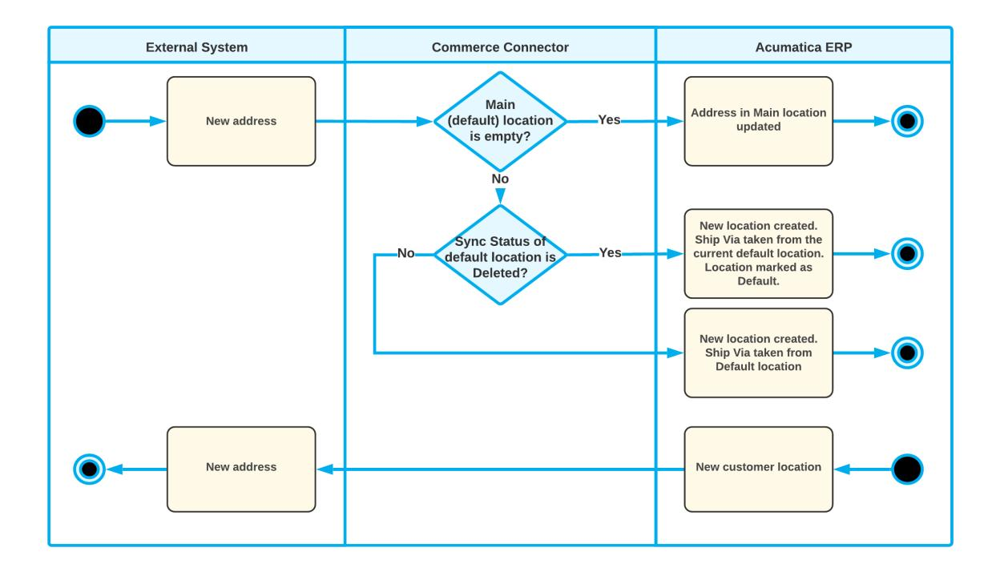

The following diagram illustrates the synchronization of a new customer address.

*Figure: Synchronization of a new customer address*

#### **Editing of a Customer Address**

With the *Customer* and *Customer Location* entities activated on the *[BigCommerce Stores](#page-473-2)* (BC201000) form, if an existing customer address synchronized with Acumatica ERP is edited in the BigCommerce store, during the import of the *Customer* entity, the corresponding customer location in Acumatica ERP is updated with the changes made to the customer address in the BigCommerce store.

If an existing customer location is edited in Acumatica ERP, during the export of the *Customer* entity, the ecommerce connector does one of the following:

- 1. If the customer location is active—that is, if the **Active** check box is selected for it on the *[Customer Locations](https://help-2025r1.acumatica.com/Help?ScreenId=ShowWiki&pageid=61a8c6de-6a51-434b-8c2d-4304ec982ae0)* (AR303020) form—the corresponding customer address in the BigCommerce store is updated based on the changes to the customer location.
- 2. If the customer location is inactive (that is, if the **Active** check box is cleared for it), the synchronization proceeds as follows:
  - If the location's synchronization record has a status other than *Deleted*, the corresponding customer address in the BigCommerce store is updated based on the changes to the customer location.
  - If the location's synchronization record has the *Deleted* status or the location has not been synchronized previously, the location is not synchronized with the BigCommerce store.

The following diagram illustrates the synchronization of an updated customer address.

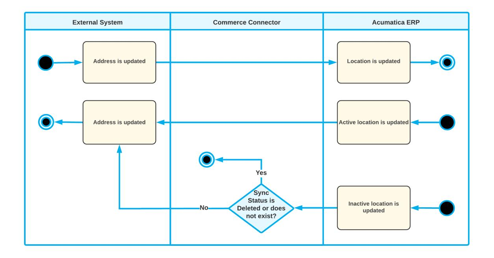

#### *Figure: Synchronization of an updated customer address*

# **Deletion of a Customer Address**

With the *Customer* and *Customer Location* entities activated on the *[BigCommerce Stores](#page-473-2)* (BC201000) form, if a customer address is deleted in the BigCommerce store, the import of the *Customer* entity proceeds as follows:

- If the corresponding customer location in Acumatica ERP is not the default customer location, the system makes it inactive and its synchronization status changes to *Deleted*.
- If the corresponding customer location in Acumatica ERP is the default customer location, the connector does one of the following:
  - If the customer location is the only active location of a customer, the connector assigns the *Deleted* status to the location's synchronization record.
  - If other active locations exist for the customer, the connector makes this default location inactive, assigns the *Deleted* status to its synchronization record, and makes one of the other active locations the default one.

If an existing customer location is made inactive in Acumatica ERP, when the *Customer* entity is exported, the inactive customer location is not synchronized with the BigCommerce store.

The following diagram illustrates the synchronization of a deleted customer address.

*Figure: Synchronization of a deleted customer address*

## **Use of the Guest Customer Account**

If you want to allow placing orders in your store without providing the customer's phone number or email address and want to import such orders into Acumatica ERP, you need to fill in the **Generic Guest Customer** box on the **CustomerSettings** tab of the *[BigCommerce Stores](#page-473-2)* (BC201000) form. This customer account appears on imported sales orders that have been placed in the BigCommerce store without customer details.

The customer record selected in the **Generic Guest Customer** box is not exported to the BigCommerce store during the synchronization of customers.

You can also configure the system to change a guest customer account aer a particular number of sales orders have been created for this account. You do so by selecting the **Use Multiple Guest Accounts** check box. When the maximum allowed number of sales orders is exceeded, the system creates a new customer and inserts its identifier in the **Generic Guest Customer** box. The settings of the new customer account are copied from the previous generic guest customer account, and its identifier is generated based on the numbering sequence specified in the **Customer NumberingSequence** box.

By default, the allowed number of sales orders per guest customer account is limited to 10,000. You can override this number by adding the MaxOrdersPerGuestAccount key to the <appSettings> section of the web.config file. For example, to change the guest customer account aer every 500 sales orders, add the following key:

<add key="MaxOrdersPerGuestAccount" value="500"/>

For more information about creating a customer, see *[Customers: General Information](https://help-2025r1.acumatica.com/Help?ScreenId=ShowWiki&pageid=f38972e8-a206-4279-8681-b9e2743759c0)*.

# **Synchronizing Customers: Implementation Checklist**

The following sections provide details you can use to ensure that the system is configured properly for the synchronization of customers and customer locations between Acumatica ERP and the BigCommerce store, and to understand (and change, if needed) the settings that affect the processing workflow.

## **Implementation Checklist**

We recommend that before you initially synchronize customers and customer locations between Acumatica ERP and the BigCommerce store, you make sure the needed features have been enabled and settings have been specified, as summarized in the following checklist.

| Form                               | Criteria to Check                                                                                                                                                                                                                                  |  |  |  |  |
|------------------------------------|----------------------------------------------------------------------------------------------------------------------------------------------------------------------------------------------------------------------------------------------------|--|--|--|--|
| Enable/Disable Features (CS100000) | The following features have been enabled:                                                                                                                                                                                                          |  |  |  |  |
|                                    | • Retail Commerce                                                                                                                                                                                                                               |  |  |  |  |
|                                    | • BigCommerce Connector                                                                                                                                                                                                                         |  |  |  |  |
|                                    | • Business Account Locations (for synchronization of customer ad dresses)                                                                                                                                                                    |  |  |  |  |
| Customer Classes (AR201000)        | The customer class for ecommerce customers has been creat ed. This customer class is used for creating customer records in Acumatica ERP for customers imported from the BigCommerce store. See Accounts Receivable: Customer Classes. |  |  |  |  |
|                                    |                                                                                                                                                                                                                                                    |  |  |  |  |
| Customers (AR303000)               | The customer account for importing to Acumatica ERP orders placed in the online store by guest users has been created.                                                                                                                          |  |  |  |  |
|                                    | See Customers: General Information.                                                                                                                                                                                                                |  |  |  |  |
| Numbering Sequences (CS201010)     | • A numbering sequence has been defined for the auto-numbered segment that will be used for generating customer IDs on im port.                                                                                                           |  |  |  |  |
|                                    | • A numbering sequence has been defined for the auto-numbered segment that will be used for generating customer location IDs on import.                                                                                                   |  |  |  |  |
|                                    | See Use of Numbering Sequences.                                                                                                                                                                                                                    |  |  |  |  |
| BigCommerce Stores (BC201000) form | • The connection to the BigCommerce store has been established as described in Initial Configuration of a BigCommerce Store.                                                                                                                 |  |  |  |  |
|                                    | • On the Entities tab, the following entities have been activated:                                                                                                                                                                              |  |  |  |  |
|                                    | • Customer                                                                                                                                                                                                                                      |  |  |  |  |
|                                    | • Customer Location (if customer locations should be synchro nized together with customers)                                                                                                                                                  |  |  |  |  |
|                                    | • On the Customers tab, the following boxes have been filled in:                                                                                                                                                                                |  |  |  |  |
|                                    | • Customer Class                                                                                                                                                                                                                                |  |  |  |  |

| Form                | Criteria to Check                                                                                                   |  |  |  |  |  |
|---------------------|---------------------------------------------------------------------------------------------------------------------|--|--|--|--|--|
|                     | • Customer Numbering Template (if the CUSTOMER segment ed key has more than one segment)                      |  |  |  |  |  |
|                     | • Customer Numbering Sequence                                                                                    |  |  |  |  |  |
|                     | Location Numbering Template (if the LOCATION segmented • key has more than one segment)                       |  |  |  |  |  |
|                     | • Location Numbering Sequence                                                                                    |  |  |  |  |  |
|                     | • Generic Guest Customer                                                                                         |  |  |  |  |  |
| Entities (BC202000) | • The filtering conditions for the export and import of the Cus tomer entity have been defined, if necessary. |  |  |  |  |  |
|                     | • The additional mappings for the export and import of the Cus tomer entity have been defined, if necessary.  |  |  |  |  |  |

# **Validation of Configuration**

To make sure that all configuration has been performed correctly, we recommend that in your system, you perform instructions similar to those described in *Synchronizing Customers: To Perform Bidirectional [Synchronization](#page-80-1)* and *[Synchronizing](#page-84-1) Customers: To Synchronize Customers with Multiple Locations*.

# **Synchronizing Customers: To Perform Bidirectional Synchronization**

The following activity will walk you through the process of setting up the bidirectional synchronization of customers and performing the synchronization of customers between Acumatica ERP and the BigCommerce store.

The following activity is based on the *U100* dataset.

# **Story**

Suppose that the SweetLife Fruits & Jams company has multiple corporate customers from the United States and Canada in the system. The company management wants customer records for US customers to be exported from Acumatica ERP to the BigCommerce store. At the same time, new customers that place orders in the BigCommerce store should be imported to Acumatica ERP.

Because an email address is a key field for a customer in BigCommerce, customers that do not have it specified in Acumatica ERP will not be saved in the BigCommerce store during the export.

Acting as an implementation consultant helping SweetLife to set up the integration of Acumatica ERP with the BigCommerce store, you need to configure the bidirectional synchronization of customers, and configure the filtering conditions to export only records for US customers that have an email specified.

# **Configuration Overview**

In the *U100* dataset, the following tasks have been performed to support this activity:

- On the *[Customer Classes](https://help-2025r1.acumatica.com/Help?ScreenId=ShowWiki&pageid=806e39d6-6f89-4e6c-9a24-61c6fb0c9a57)* (AR201000) form, the *COMMERCEBB* and *ECCUSTOMER* customer classes have been configured. The *COMMERCEBB* customer class is assigned to local (US) customers that need to be exported to the external system.
- On the *[Customers](https://help-2025r1.acumatica.com/Help?ScreenId=ShowWiki&pageid=652929bc-9606-4056-aa6e-0c2d1147171b)* (AR303000) form, the following customer records have been created and assigned the *COMMERCEBB* customer class:

- *FRUITICO*: On the **General** tab, notice that no details have been specified in the boxes of the **Primary Contact** section. In the **Additional Account Info** section, the account's email address and phone number have been specified.
- *JAMIFIQUE*: On the **General** tab, notice that in the **Primary Contact** section, the name of the contact (*Colleen Plunkett*) has been filled in. In the **Additional Account Info** section, the account's email address and phone number have been specified.
- On the *[Numbering Sequences](https://help-2025r1.acumatica.com/Help?ScreenId=ShowWiki&pageid=a8d11c23-21f2-42a3-b17d-9637c9cf8031)* (CS201010) form, the *ECCUSTOMER* numbering sequence has been defined.

## **Process Overview**

In this activity, you will perform the following steps:

- 1. On the *[BigCommerce Stores](#page-473-2)* (BC201000) form, review the settings of the *Customer* entity.
- 2. On the *[Entities](#page-521-1)* (BC202000) form, configure the filtering condition for the export of customers from Acumatica ERP to the BigCommerce store.
- 3. On the *[Prepare Data](#page-529-1)* (BC501000) form, start the data preparation process for the *Customer* entity to prepare out-of-sync data for export.
- 4. On the *[Process Data](#page-533-1)* (BC501500) form, start data processing for the *Customer* entity to save the synchronized customer data in the BigCommerce store.
- 5. On the *[Sync History](#page-539-1)* (BC301000) form, review the synchronization status of the processed synchronization records.
- 6. In the BigCommerce store, review the customers that have been imported from Acumatica ERP.

## **System Preparation**

Before you complete the instructions in this activity, do the following:

- 1. Make sure that the following prerequisites have been met:
  - The BigCommerce store has been created and configured, as described in *Initial [Configuration:](#page-19-1) To Set Up [a BigCommerce Store](#page-19-1)*.
  - The connection to the BigCommerce store has been established and the initial configuration has been performed, as described in *Initial [Configuration:](#page-27-1) To Establish and Configure the Store Connection*.
- 2. Launch the Acumatica ERP website with the *U100* dataset preloaded, and sign in with the following credentials:
  - **Username**: *gibbs*
  - **Password**: *123*
- 3. Sign in to the control panel of the BigCommerce store as the store administrator.

#### **Step 1: Reviewing the Synchronization Settings of the Customer Entity**

To review the synchronization settings of the *Customer* entity, do the following:

- 1. Open the *[BigCommerce Stores](#page-473-2)* (BC201000) form, select the *SweetStore - BC* store.
- 2. On the **Entities** tab, in the row with the *Customer* entity, make sure that the following settings have been specified:
  - **Active** Selected
  - **Sync Direction**: *Bidirectional*
  - **PrimarySystem**: *External System*
- 3. On the **Customers** tab, make sure that the following settings have been specified:

#### • **Customer Class**: *ECCUSTOMER*

When a new customer is imported from the BigCommerce store to Acumatica ERP, its default settings will be defined based on the customer class selected in this box.

• **Customer NumberingSequence**: *ECCUSTOMER*

Each new customer imported from the BigCommerce store will be assigned an identifier based on the numbering sequence selected in this box.

4. If you have changed any of the settings, click**Save** on the form toolbar to save your changes.

# **Step 2: Configuring the Filtering Condition**

To configure the export of only customer records that are assigned to the *COMMERCEBB* customer class, do the following:

- 1. On the *[Entities](#page-521-1)* (BC202000) form, specify the following settings in the Summary area:
  - **Store Name**: *SweetStore - BC*
  - **Entity**: *Customer*
- 2. To create a first filtering condition, on the **Export Filtering** tab, click **Add Row** on the table toolbar, and specify the following settings in the row:
  - **Active**: Selected
  - **Field Name**: *Customer Class*
  - **Condition**: *Equals*
  - **Value**: COMMERCEBB
  - **Operator**: *And*
- 3. To create a second filtering condition, and another row and specify the following settings in the row:
  - **Active**: Selected
  - **Field Name**: *Email*
  - **Condition**: *Is Not Empty*
- 4. On the form toolbar, click**Save** to save your changes.

Now when you prepare the *Customer* entity for synchronization and process the prepared customer data, only the customers that have the *COMMERCEBB* customer class and an email address specified will be exported to the *SweetStore - BC* store.

## **Step 3: Preparing the Customer Data for Synchronization**

To prepare the customer data for synchronization, do the following:

- 1. On the *[Prepare Data](#page-529-1)* (BC501000) form, specify the following settings in the Summary area:
  - **Store**: *SweetStore - BC*
  - **Prepare Mode**: *Incremental*
- 2. In the table, select the check box in the unlabeled column in the row of the *Customer* entity, and on the form toolbar, click **Prepare**.
- 3. In the **Processing** dialog box, which opens, review the results of the processing, and click **Close** to close the dialog box and return to the *[Prepare Data](#page-529-1)* form.

Notice that the **Prepared Records** column shows the number of synchronization records that have been prepared and are ready to be processed.

#### **Step 4: Processing the Prepared Customer Data**

To process the customer data you have prepared for synchronization, do the following:

1. While you are still viewing the *[Prepare Data](#page-529-1)* (BC501000) form, click the link in the **Ready to Process** column of the row with the *Customer* entity.

The *[Process Data](#page-533-1)* (BC501500) form opens with the *SweetStore - BC* store and the *Customer* entity selected in the Summary area. The table displays all synchronization records of the *Customer* entity that the system has prepared in the previous step.

- 2. On the form toolbar, click **Process All** to process both synchronization records displayed in the table.
- 3. In the **Processing** dialog box, which opens, click **Close** to close the dialog box.

#### **Step 5: Reviewing the Synchronization Status**

To review the synchronization status of the synchronization records that you processed in the previous step, do the following:

- 1. On the *[Sync History](#page-539-1)* (BC301000) form, specify the following settings in the Summary area:
  - **Store**: *SweetStore - BC*
  - **Entity**: *Customer*
- 2. Go to the **Processed** tab.

The tab shows the items that have been synchronized with the *SweetStore - BC* store (see the following screenshot). For each customer of the *COMMERCEBB* customer class that you processed, the system displays an identifier in the **External ID** column. In the table, the **Last Operation** column is set to *Inserted Externally* and the time stamp in the **Last Attempt** column now shows the date and time when you ran data processing on the *[Process Data](#page-533-1)* (BC501500) form.

|                                            |   |        | <b>Sync History</b> |                                                                        |                        |               |                                            |                |                       |                                   | <b>CUSTOMIZATION</b> | TOOLS $\overline{\phantom{a}}$ |
|--------------------------------------------|---|--------|---------------------|------------------------------------------------------------------------|------------------------|---------------|--------------------------------------------|----------------|-----------------------|-----------------------------------|----------------------|--------------------------------|
|                                            | Ò | $\Box$ |                     | <b>SYNC</b> $\Omega$                                                | $\mathbf x$ ℍ       | Y $\cdots$ |                                            |                |                       |                                   |                      |                                |
|                                            |   | Store: |                     |                                                                        | SweetStore - BC        | Q             |                                            |                |                       |                                   |                      |                                |
| Entity: <b>Customer</b> $\checkmark$ |   |        |                     |                                                                        |                        |               |                                            |                |                       |                                   |                      |                                |
|                                            |   |        | ALL RECORDS         |                                                                        | READY TO PROCESS       | <b>FAILED</b> | <b>PROCESSED</b>                           | <b>SKIPPED</b> | <b>ABORTED</b>        | <b>DELETED</b> <b>FILTERED</b> | <b>INVALID</b>       | <b>INACTIVE</b>                |
| 冒                                          | 0 | ם      |                     | Entity                                                                 | <b>Store</b>           | <b>ERP ID</b> |                                            |                | <b>External</b> ID | <b>External Description</b>       | <b>Status</b>        | <b>Last Operation</b>          |
|                                            | 0 | D      |                     | <b>Customer</b>                                                        | <b>SweetStore - BC</b> |               | JAMIFIQUE, Jamifique factory               |                | 3                     | colleenp jamifique@example.com    | Processed            | <b>Inserted Externally</b>     |
|                                            | 0 | D      |                     | <b>Customer</b>                                                        | SweetStore - BC        |               | <b>FRUITICO, Fruitico Coffee and Cakes</b> |                | $\overline{2}$        | fruitico info@example.com         | Processed            | <b>Inserted Externally</b>     |
|                                            | 0 | D      |                     | C000000001, Larry Coleman <b>SweetStore - BC</b> <b>Customer</b> |                        |               |                                            |                |                       | larry@example.com                 | Processed            | <b>Inserted in ERP</b>         |

*Figure: Synchronization records for processed customer entities*

#### **Step 6: Viewing Exported Customer Records**

1. While you are still viewing the *[Sync History](#page-539-1)* (BC301000) form, locate the row with *JAMIFIQUE, Jamifique factory* in the **ERP ID** column, and click the link in the **External ID** column of that row.

The **Customer details** tab of the **Edit customer** page of the control panel of the BigCommerce store opens for *Colleen Plunkett*, who is the primary contact of the *JAMIFIQUE* customer.

If you are not signed in to the control panel of the BigCommerce store in the same browser, you will need to enter your sign-in credentials.

Notice that the details that have been filled in for the customer based on the information from the **General** tab of the *[Customers](https://help-2025r1.acumatica.com/Help?ScreenId=ShowWiki&pageid=652929bc-9606-4056-aa6e-0c2d1147171b)* (AR303000) form. The name from the **Primary Contact** section has been imported as the customer's first name and last name (*Colleen* and *Plunkett*, respectively). The **Email** and **Phone** boxes have been filled in with the email address and the phone number from the **Additional Account Info** section of the same tab.

2. Go to the **Customer address book** tab.

Notice that no addresses have been added for the customer. Because the *Customer Location* entity was not activated on the **Entities** tab of the *[BigCommerce Stores](#page-473-2)* (BC201000) form, the location information has not been imported to the BigCommerce store for this customer and other customers synchronized in the previous steps of this activity.

- 3. In the le pane, click **Customers > All Customers**.
- 4. On the **View customers** page, which opens, review the list of customers that have been exported.

Because you have configured the filtering condition so that the system exports from Acumatica ERP only the customers of the *COMMERCEBB* customer class, only the customers of that customer class and the customers created directly in the BigCommerce store are displayed on the**View Customers** page.

5. Click the row of *Fruitico Coffee and Cakes*.

The **Edit customer** page opens. Because the **Name** box of the **Primary Contact** section was empty for this customer on the *[Customers](https://help-2025r1.acumatica.com/Help?ScreenId=ShowWiki&pageid=652929bc-9606-4056-aa6e-0c2d1147171b)* (AR303000) form, the **First name** and **Last name** boxes on the **Customer details** tab have been filled in with the information from the **Account Name** box of the **Account Info** section on the *[Customers](https://help-2025r1.acumatica.com/Help?ScreenId=ShowWiki&pageid=652929bc-9606-4056-aa6e-0c2d1147171b)* form (*Fruitico* and *Coffee and Cakes*, respectively) because the **Name** box of the **Primary Contact** section is empty for this customer.

# **Synchronizing Customers: To Synchronize Customers with Multiple Locations**

The following activity will walk you through the process of setting up the synchronization of customer locations and performing the synchronization of customers with locations between Acumatica ERP and the BigCommerce store.

The following activity is based on the *U100* dataset.

### **Story**

Suppose that the SweetLife Fruits & Jams company works with corporate customers that order items to be delivered to multiple locations. The company's sales managers keep track of customer addresses by using the customer address book functionality in the BigCommerce store and need the addresses from the BigCommerce store to be in sync with customer locations in Acumatica ERP.

Acting as an implementation consultant helping SweetLife to set up the integration of Acumatica ERP with the BigCommerce store, you need to set up the synchronization of customer locations between the two systems, as well as test it and explore how the synchronization works in both systems.

# **Configuration Overview**

In the *U100* dataset, the following tasks have been performed to support this activity:

- On the *[Enable/Disable Features](https://help-2025r1.acumatica.com/Help?ScreenId=ShowWiki&pageid=c1555e43-1bc5-4f6f-ba9d-b323f94d8a6b)* (CS100000) form, the *Business Account Locations* feature has been enabled.
- On the *[Customer Classes](https://help-2025r1.acumatica.com/Help?ScreenId=ShowWiki&pageid=806e39d6-6f89-4e6c-9a24-61c6fb0c9a57)* (AR201000) form, the *ECCUSTOMER* customer class has been defined.
- On the *[Numbering Sequences](https://help-2025r1.acumatica.com/Help?ScreenId=ShowWiki&pageid=a8d11c23-21f2-42a3-b17d-9637c9cf8031)* (CS201010) form, the *ECCUSTOMER* and *ECLOCATION* numbering sequences have been defined.

#### **Process Overview**

In this activity, you will do the following:

- 1. On the *[BigCommerce Stores](#page-473-2)* (BC201000) form, update the settings of the *Customer* and *Customer Locations* entities.
- 2. In the control panel of the BigCommerce store, create a new customer with two addresses.
- 3. On the *[Prepare Data](#page-529-1)* (BC501000) form, prepare the customer and customer address data for synchronization.
- 4. On the *[Process Data](#page-533-1)* (BC501500) form, process the customer and customer address data prepared for synchronization.
- 5. On the *[Customers](https://help-2025r1.acumatica.com/Help?ScreenId=ShowWiki&pageid=652929bc-9606-4056-aa6e-0c2d1147171b)* (AR303000) form, review the imported customer data.
- 6. On the *[Customer Locations](https://help-2025r1.acumatica.com/Help?ScreenId=ShowWiki&pageid=61a8c6de-6a51-434b-8c2d-4304ec982ae0)* (AR303020) form, review the imported customer address data and update one of the customer locations.
- 7. By using the *[Sync History](#page-539-1)* (BC301000) form, synchronize the updated customer location with the BigCommerce store.
- 8. In the control panel of the BigCommerce store, review the updated customer address.

# **System Preparation**

Before you perform the instructions in this activity, do the following:

- 1. Make sure that the following prerequisites have been met:
  - The BigCommerce store has been created and configured, as described in *Initial [Configuration:](#page-19-1) To Set Up [a BigCommerce Store](#page-19-1)*.
  - The connection to the BigCommerce store has been established and the initial configuration has been performed, as described in *Initial [Configuration:](#page-27-1) To Establish and Configure the Store Connection*.
- 2. Launch the Acumatica ERP website with the *U100* dataset preloaded, and sign in with the following credentials:
  - **Username**: *gibbs*
  - **Password**: *123*
- 3. Sign in to the control panel of the BigCommerce store as the store administrator.

## **Step 1: Configuring the Synchronization Settings of the Customer and Customer Location Entities**

To review the synchronization settings of the *Customer* and *Customer Locations* entities, do the following:

- 1. On the *[BigCommerce Stores](#page-473-2)* (BC201000) form, select the *SweetStore - BC* store.
- 2. On the **Entities** tab, do the following:
  - a. In the row of the *Customer* entity, make sure that**Sync Direction** is set to *Bidirectional*.
  - b. In the row of the *Customer Location* entity, select the **Active** check box.

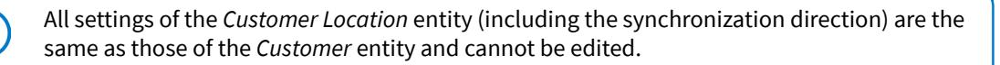

- 3. On the **Customers** tab, make sure that the following settings have been specified:
  - **Customer Class**: *ECCUSTOMER*

When a new customer is imported from the BigCommerce store to Acumatica ERP, its default settings are defined based on the customer class selected in this box.

• **Customer NumberingSequence**: *ECCUSTOMER*

Each new customer imported from the BigCommerce store will be assigned an identifier based on the numbering sequence selected in this box.

• **Location NumberingSequence**: *ECLOCATION*

Each new customer location imported from the BigCommerce store will be assigned an identifier based on the numbering sequence selected in this box.

4. On the form toolbar, click**Save** to save your changes.

## **Step 2: Creating a Customer in the BigCommerce Store**

To create a customer with two addresses, in the control panel of the BigCommerce store, do the following:

- 1. Open the control panel of the BigCommerce store.
- 2. In the le pane, click **Customers > Add** to open the **Add customer** page.
- 3. In the **Customer details** section of the **Customer details** tab, specify the following details:
  - **First name**: Isabelle
  - **Last name**: Bober
  - **Company name**: Hoppy Place Coffee and Cakes
  - **Email**: hoppy\_info@example.com
- 4. In the **Password** section, specify the following settings:
  - **Password**: !Q123456
  - **Confirm password**: !Q123456
- 5. In the lower right, click **Add customer** to save the new customer record.

#### **Step 3: Adding Two Addresses for the Customer**

To add the first address for the customer record that you created in the previous step, do the following in the BigCommerce store:

- 1. While you are still signed in to the control panel of the BigCommerce store, on the**View customers** page, click the row of *Isabelle Bober*.
- 2. On the **Edit customer** page, which opens with the details of *Isabelle Bober*, on the **Customer address book** tab, click **Add an address**.
- 3. On the **Add address** page, which opens, specify the following settings:
  - **First name**: Isabelle
  - **Last name**: Bober
  - **Company name**: Hoppy Place Coffee and Cakes
  - **Phone number**: 212-555-0143
  - **Address line 1**: 3690 Taylor Street
  - **Suburb/City**: New York
  - **Country**: *United States*
  - **State/Province**: *New York*
  - **Zip/Postcode**: 10007
  - **Type**: **Commercial**
- 4. In the lower right, click**Save and Add Another**.

- 5. To add a second address for the customer, on the **Add address** page, which opens, specify the following settings:
  - **First name**: William
  - **Last name**: Duncan
  - **Company name**: Hoppy Wellby
  - **Phone number**: 212-555-0164
  - **Address line 1**: 2671 Simons Hollow Road
  - **Suburb/City**: New York
  - **Country**: *United States*
  - **State/Province**: *New York*
  - **Zip/Postcode**: 10001
- 6. In the lower right, click**Save**.

The system saves the second address.

- 7. In the le pane, click **Customers > All Customers** to open the **Add customer** page.
- 8. On the **View customers** page, which opens, click the row of *Isabelle Bober*.
- 9. On the **Edit customer** page, which opens with the details of *Isabelle Bober*, click the **Customer address book** tab and review the list of addresses that you have added.

#### **Step 4: Preparing the Customer and Customer Location Data**

To prepare the customer and customer location data for synchronization, in the Acumatica ERP instance, do the following:

- 1. On the *[Prepare Data](#page-529-1)* (BC501000) form, specify the following settings in the Summary area:
  - **Store**: *SweetStore - BC*
  - **Prepare Mode**: *Incremental*

This setting controls which data will be loaded. *Incremental* indicates that only the customer records that match the filtering conditions and have been modified since the previous processing of the data have been prepared for synchronization.

2. In the table, select the check box in the unlabeled column in the row of the *Customer* entity, and on the form toolbar, click **Prepare**.

Because customer locations are synchronized automatically along with customers during the synchronization of the *Customer* entity, the *Customer Location* entity is not listed in the table and cannot be prepared separately.

3. In the **Processing** dialog box, which opens, review the results of the processing, and click **Close** to close the dialog box and return to the *[Prepare Data](#page-529-1)* form.

Notice that the **Prepared Records** column shows the number of synchronization records that have been prepared and are ready to be processed.

#### **Step 5: Processing the Prepared Customer and Customer Location Data**

To process the customer and customer location data you have prepared for synchronization, do the following:

1. While you are still viewing the *[Prepare Data](#page-529-1)* (BC501000) form, click the link in the **Ready to Process** column of the row with the *Customer* entity.

The *[Process Data](#page-533-1)* (BC501500) form opens with the *SweetStore - BC* store and the *Customer* entity selected in the Summary area.

2. In the table, select the unlabeled check box in the only row, which has a number in the **External ID** column but does not have any value in the **ERP ID** column.

The empty **ERP ID** indicates that the record has been created in the BigCommerce store but has not yet been synchronized with Acumatica ERP.

- 3. On the form toolbar, click **Process** to process the selected synchronization record.
- 4. In the **Processing** dialog box, which opens, click **Close** to close the dialog box.

#### **Step 6: Reviewing the Imported Customers and Customer Locations**

Perform the following instructions to review the customers and customer locations that have been imported to Acumatica ERP:

- 1. Open the Customers (AR3030PL) form.
- 2. In the list of customers, in the **Customer Name** column, locate the *Hoppy Place Coffee and Cakes* customer, which you created in the BigCommerce store, and click the link for this customer in the **Customer ID** column.
- 3. On the *[Customers](https://help-2025r1.acumatica.com/Help?ScreenId=ShowWiki&pageid=652929bc-9606-4056-aa6e-0c2d1147171b)* (AR303000) form, which opens for *Hoppy Place Coffee and Cakes*, on the **Locations** tab, review the locations the system created when the customer record was synchronized.

Notice that the table displays the following locations (shown in the screenshot below):

- The location with the *MAIN* identifier, which is the location that you have created first for the customer in the BigCommerce store. This location is also marked as the default (that is, the **Default** check box is selected for this location).
- The location with the identifier that the system assigned to it based on the numbering sequence selected for locations in the store settings on the *[BigCommerce Stores](#page-473-2)* (BC201000) form.

| <b>Customers</b> <b>PHOTES</b> <b>FILES</b> <b>CUSTOMIZATION</b> TOOLS $\star$ C000000002 - Hoppy Place Coffee and Cakes |                                                                         |                |                    |             |                                                  |   |                  |                                 |                                     |                 |   |                 |                                   |                    |                 |              |                          |                     |
|-----------------------------------------------------------------------------------------------------------------------------------------|-------------------------------------------------------------------------|----------------|--------------------|-------------|--------------------------------------------------|---|------------------|---------------------------------|-------------------------------------|-----------------|---|-----------------|-----------------------------------|--------------------|-----------------|--------------|--------------------------|---------------------|
|                                                                                                                                         | 冒                                                                       | Ħ              | ┿                  | ∽           | 侕                                                | n | $\checkmark$     | K                               | ≺                                   | >               | Ы |                 | <b>VIEW ACCOUNT</b>               |                    | .               |              |                          |                     |
|                                                                                                                                         |                                                                         | * Customer ID: |                    |             | C000000002 - Hoppy Place Coffee an $\varnothing$ |   |                  |                                 |                                     |                 |   |                 | <b>Balance</b>                    |                    |                 | 0.00         |                          | $\hat{\phantom{a}}$ |
|                                                                                                                                         |                                                                         |                | * Customer Status: |             | Active                                           |   |                  |                                 |                                     | $\checkmark$    |   |                 | <b>Prepayment Balance</b> 0.00 |                    |                 |              |                          |                     |
|                                                                                                                                         | Q * Customer Class: <b>ECCUSTOMER - Online Customers</b>          |                |                    |             |                                                  |   | 0                | <b>Retained Balance</b> 0.00 |                                     |                 |   |                 |                                   |                    |                 |              |                          |                     |
| Individual <b>Customer Category:</b> $\checkmark$                                                                                 |                                                                         |                |                    |             |                                                  |   |                  |                                 |                                     |                 |   |                 |                                   |                    |                 |              |                          |                     |
|                                                                                                                                         | <b>GENERAL</b> <b>FINANCIAL</b> <b>BILLING</b> <b>SHIPPING</b> |                |                    |             |                                                  |   | <b>LOCATIONS</b> |                                 |                                     | PAYMENT METHODS |   | <b>CONTACTS</b> |                                   | ≫                  |                 |              |                          |                     |
|                                                                                                                                         | Ò                                                                       |                |                    |             | <b>SET AS DEFAULT</b>                            | ⊢ |                  | 図                               |                                     |                 |   |                 | Q                                 | <b>All Records</b> |                 |              | $\overline{\phantom{a}}$ | Y                   |
| 自                                                                                                                                       | 0                                                                       | D              | <b>Active</b>      |             | *Location ID                                     |   |                  | <b>Location Name</b>            |                                     |                 |   |                 | <b>Default</b>                    | City               |                 | <b>State</b> | Country                  |                     |
|                                                                                                                                         | 0                                                                       | $\Box$         | ☑                  |             | L000000001                                       |   |                  | <b>Hoppy Wellby</b>             |                                     |                 |   |                 |                                   |                    | <b>New York</b> | <b>NY</b>    | <b>US</b>                |                     |
|                                                                                                                                         | 0                                                                       | D              | ☑                  | <b>MAIN</b> |                                                  |   |                  |                                 | <b>Hoppy Place Coffee and Cakes</b> |                 |   |                 | ☑                                 |                    | New York        | <b>NY</b>    | <b>US</b>                |                     |

#### *Figure: Customer locations imported from the store*

4. Click the *MAIN* link in the **Location ID** column.

On the *[Customer Locations](https://help-2025r1.acumatica.com/Help?ScreenId=ShowWiki&pageid=61a8c6de-6a51-434b-8c2d-4304ec982ae0)* (AR303020) form, which the system has opened in a pop-up window, on the **General** tab, review the location details that have been imported from the BigCommerce store.

Notice that the **Company Name** value from the address in BigCommerce has been imported as the **Location Name** of the **Location Info** section and the **Account Name** box of the **Additional Location Info** section.

The address lines, city, state, country, and postal code have been imported to the appropriate boxes of the **Location Address** section.

The first and last name of the address in BigCommerce have been imported to the **Attention** box of the **Additional Location Info** section.

#### **Step 7: Updating the Customer Location**

Suppose that you need to update the contact and address details of the *MAIN* customer location of the *Hoppy Place Coffee and Cakes* customer. Do the following:

- 1. While you are still viewing the *MAIN* customer location on the *[Customer Locations](https://help-2025r1.acumatica.com/Help?ScreenId=ShowWiki&pageid=61a8c6de-6a51-434b-8c2d-4304ec982ae0)* (AR303020) form, on the **General** tab, in the **Additional Location Info** section, type Gail Anderson in the **Attention** box.
- 2. In the **Location Address** section, change **Address Line 1** to 3650 Taylor Street.
- 3. On the form toolbar, click**Save & Close** to save your changes and close the pop-up window.

## **Step 8: Synchronizing the Updated Location with the BigCommerce Store**

To synchronize the updated customer location with the BigCommerce store in order to update the address in the store, do the following:

- 1. On the *[Sync History](#page-539-1)* (BC301000) form, in the Selection area, specify the following settings:
  - **Store**: *SweetStore - BC*
  - **Entity**: *Customer Location*
- 2. On the **Processed** tab, select the unlabeled check box in the row of the *MAIN, Hoppy Place Coffee and Cakes* location, and on the form toolbar, click**Sync**.

When you change a location of a customer, the ecommerce connector recognizes the customer record as having been modified as well. So in this step, you could have selected the synchronization record for the *Hoppy Place Coffee and Cakes* customer and clicked**Sync**, and the updated customer location would have been synchronized as part of the customer synchronization process. Alternatively, you could have prepared the *Customer* entity for synchronization on the *[Prepare Data](#page-529-1)* (BC501000) form and then processed the prepared synchronization records on the *[Process Data](#page-533-1)* (BC501500) form.

#### **Step 9: Reviewing the Updated Customer Address in the BigCommerce Store**

To review the updated customer address in the BigCommerce store, do the following:

1. While you are still viewing the *[Sync History](#page-539-1)* (BC301000) form, in the row of the *MAIN, Hoppy Place Coffee and Cakes*, click the link in the **External ID** column.

The **Edit customer address** page of the control panel of the BigCommerce store opens for the corresponding address of the *Hoppy Place Coffee and Cakes* customer.

If you are not signed in to the control panel of the BigCommerce store in the same browser, you will need to enter your sign-in credentials.

2. In the **Customer address details** section, review the updated details of the customer address.

Notice that the **First name** box now displays *Gail*, **Last name** is set to *Anderson*, and the **Address line 1** has been changed to *3650 Taylor Street*.

# **Synchronizing Products**

In the topics of this chapter, you will read about product export from Acumatica ERP to the BigCommerce store.

# **Product Synchronization: General Information**

Acumatica ERP Retail Edition provides you with the ability to export product data (that is, data of stock and nonstock items) from Acumatica ERP to the BigCommerce store.

## **Learning Objectives**

In this chapter, you will learn how to export stock and non-stock items to the BigCommerce store.

## **Applicable Scenarios**

You export items from Acumatica ERP to an external system in the following cases:

- When you are initially configuring the external system and need to transfer stock and non-stock items that have already been defined in Acumatica ERP
- If you manage product information in Acumatica ERP, have updated any of the item settings aer the item was synchronized with the external system, and need the changes to be reflected in the product settings in the system

### **Configuration of Product Synchronization**

Before exporting stock and non-stock items defined in Acumatica ERP to the BigCommerce store, you need to perform the following general steps:

- 1. Activate the *Stock Item* and *Non-Stock Item* entity. To do this, on the *[BigCommerce Stores](#page-473-2)* (BC201000) form, you select the store, and on the **Entities** tab, you select the **Active** check box for the *Stock Item* and *Non-Stock Item* entity.
- 2. Configure the default visibility and purchasability settings for items exported to the BigCommerce store. For details, see *[Product Synchronization: Default Store Settings](#page-91-1)*.
- 3. Determine which items should be exported and define the visibility and purchasability settings for individual items. For details, see *[Product Synchronization: Settings of Individual Items](#page-92-1)*.

## **Synchronization of Stock and Non-Stock Items**

Depending on the item type, the settings of an item in the BigCommerce store are updated as part of the synchronization of the *Stock Item* or *Non-Stock Item* entity.

During the export, the system updates the availability and visibility settings of each item exported to BigCommerce based on the settings specified for the item on the **eCommerce** tab of the *[Non-Stock Items](https://help-2025r1.acumatica.com/Help?ScreenId=ShowWiki&pageid=bf68dd4f-63d4-460d-8dc0-9152f2bd6bf1)* form or *[Stock Items](https://help-2025r1.acumatica.com/Help?ScreenId=ShowWiki&pageid=77786a70-1f1e-4d63-ad98-96f98e4fcb0e)* form and for the store on the **Inventory** tab of the *[BigCommerce Stores](#page-473-2)* (BC201000) form.

For details about the information exported to the BigCommerce store during the synchronization of a stock item or a non-stock item, see *[Stock Item Entity](#page-561-2)* and *[Non-Stock Item Entity](#page-568-1)*.

# **Product Synchronization: Default Store Settings**

When you set up a connection to a BigCommerce store on the *[BigCommerce Stores](#page-473-2)* (BC201000) form, you specify the availability and visibility settings that are applied by default to all items synchronized with the BigCommerce store.

# **Default Product Availability Settings**

On the **Inventory** tab of the *[BigCommerce Stores](#page-473-2)* (BC201000) form, you define the default availability status that is assigned to items exported from Acumatica ERP. This status determines whether the exported item can be purchased in the BigCommerce store. To define the default availability status, you select one of the following options in the **Default Availability** box:

• *Set as Available (Track Qty.)*: The stock items exported to the BigCommerce store are available for purchase via the storefront, and their quantities are tracked, meaning that the items can be purchased only if their quantities are greater than zero. In BigCommerce, on the product management page for each of these items, the**This product can be purchased in my online store** option button (in the **Purchasability** section) and the **Track inventory** check box (in the **Inventory** section) are selected.

For stock items, the available quantities are tracked on the product level (that is, the **On the product level** option button is selected under the**Track Inventory** check box).

The non-stock items exported to the BigCommerce store are available for purchase via the storefront, and their quantities are not tracked (that is, the**Track inventory** check box is cleared).

- *Set as Available (Don't Track Qty.)*: The non-stock and stock items exported to the BigCommerce store are available for purchase via the storefront, and their quantities are not tracked. In BigCommerce, on the product management page for each of these items, the**This product can be purchased in my online store** option button (in the **Purchasability** section) is selected and the**Track inventory** check box (in the **Inventory** section) is cleared.
- *Set as Pre-Order*: The non-stock and stock items exported to the BigCommerce store are not available for purchase but customers can pre-order them. In BigCommerce, on the product management page for each of these items, the**This product is coming soon but I want to take pre-orders** option button (in the **Purchasability** section) is selected.
- *Do Not Update*: The availability settings and quantity of the item in the BigCommerce store are not updated.
- *Set as Unavailable*: The non-stock and stock items exported to the BigCommerce store are not available for purchase. In BigCommerce, on the product management page for each of these items, the**This product cannot be purchased in my online store** option button (in the **Purchasability** section) is selected.

The **Default Availability** setting applies if the **Availability** setting for a particular item is set to *Store Default* on the *[Non-Stock Items](https://help-2025r1.acumatica.com/Help?ScreenId=ShowWiki&pageid=bf68dd4f-63d4-460d-8dc0-9152f2bd6bf1)* (IN202000) or *[Stock Items](https://help-2025r1.acumatica.com/Help?ScreenId=ShowWiki&pageid=77786a70-1f1e-4d63-ad98-96f98e4fcb0e)* (IN202500) form.

If you select the *Set as Available (Track Qty.)* option in the **Default Availability** box, you need to also specify what action the system should perform with out-of-stock items (that is, with stock items whose quantities become zero). To do so, in the **When Qty. Unavailable** box, you select one of the following options:

- *Do Nothing*: The system does not change the availability settings of the item. In BigCommerce, in the **Purchasability** section of the product management page, the currently selected option button remains selected.
- *Set as Unavailable*: The system makes the item unavailable for purchase via the storefront. In BigCommerce, in the **Purchasability** section of the product management page, the**This product cannot be purchased in my online store** option button becomes selected.
- *Set as Pre-Order*: The system makes the item unavailable for purchase but available for pre-order. In BigCommerce, in the **Purchasability** section of the product management page, the**This product is coming soon but I want to take pre-orders** option button becomes selected.

If you have synchronized the *Product Availability* entity, when you modify any of the settings described in this section, the system resets the availability synchronization status for all synchronized items in the BigCommerce store, and you need to perform the full synchronization of the *Product Availability* entity again.

#### **Default Visibility Settings**

You can specify visibility settings that will be applied by default to each item exported to the BigCommerce store on the **Inventory** tab of the *[BigCommerce Stores](#page-473-2)* (BC201000) form. To instruct the system to make all items by default immediately available on the storefront aer they are exported to the BigCommerce store, you select *Visible* in the **DefaultVisibility** box. To make items by default available for management in the store's control panel but hidden from the storefront, you select *Invisible* in this box. To make items visible on the storefront and included in the group of featured products (which are displayed in specific places across the storefront, depending on the theme set up for the store), you select *Featured* in this box.

# **Product Synchronization: Settings of Individual Items**

By default, the availability and visibility settings defined for the store on the *[BigCommerce Stores](#page-473-2)* (BC201000) form are applied to all stock and non-stock items synchronized with the BigCommerce store. However, you can override the default values for a particular item, as described in the sections below.

## **Excluding Items from Synchronization**

You can exclude an individual stock or non-stock items from exporting to the BigCommerce store (or any other ecommerce system) by clearing the **Export to ExternalSystem** check box on the **eCommerce** tab of the *[Stock](https://help-2025r1.acumatica.com/Help?ScreenId=ShowWiki&pageid=77786a70-1f1e-4d63-ad98-96f98e4fcb0e) [Items](https://help-2025r1.acumatica.com/Help?ScreenId=ShowWiki&pageid=77786a70-1f1e-4d63-ad98-96f98e4fcb0e)* (IN202500) or *[Non-Stock Items](https://help-2025r1.acumatica.com/Help?ScreenId=ShowWiki&pageid=bf68dd4f-63d4-460d-8dc0-9152f2bd6bf1)* (IN202000) form.

The status of an item in Acumatica ERP affects the purchasability status of the item in BigCommerce. If the item's status in Acumatica ERP is *Inactive*, *No Sales*, or *Marked for Deletion*—that is, if any of these options is selected in the **Status** box in the Summary area of the *[Non-Stock Items](https://help-2025r1.acumatica.com/Help?ScreenId=ShowWiki&pageid=bf68dd4f-63d4-460d-8dc0-9152f2bd6bf1)* or *[Stock Items](https://help-2025r1.acumatica.com/Help?ScreenId=ShowWiki&pageid=77786a70-1f1e-4d63-ad98-96f98e4fcb0e)* form—aer the synchronization of the relevant entity, in the **Purchasability** section of the product management page of the item in the BigCommerce store, the**This product cannot be purchased in my online store** option button is selected, regardless of the **Availability** setting of this item in Acumatica ERP.

## **Visibility of an Exported Item**

You can specify the visibility settings for an individual item on the **eCommerce** tab of the *[Stock Items](https://help-2025r1.acumatica.com/Help?ScreenId=ShowWiki&pageid=77786a70-1f1e-4d63-ad98-96f98e4fcb0e)* (IN202500) or *[Non-Stock Items](https://help-2025r1.acumatica.com/Help?ScreenId=ShowWiki&pageid=bf68dd4f-63d4-460d-8dc0-9152f2bd6bf1)* (IN202000) form. To make the item visible on the storefront immediately aer it is exported, you select *Visible* in the **Visibility** box. To make the item available in the control panel of BigCommerce store but hidden from the storefront, you select *Invisible*. To make the item visible on the storefront and included in the group of featured products (which are displayed in specific places across the storefront, depending on the theme set up for the store), you select *Featured* in this box.

The option selected in the**Visibility** box for a particular item takes precedence over the default visibility setting specified for the store in the **DefaultVisibility** box on the **Inventory** tab of the *[BigCommerce Stores](#page-473-2)* (BC201000) form. If *Store Default* is selected, the store's default visibility settings applies.

### **Availability of an Exported Item**

When a stock or non-stock item is exported to or created in a BigCommerce store, it is assigned an availability (purchasability) status in the **Purchasability** section of the product management page in the store's control panel. In Acumatica ERP, you can determine which status is to be assigned to an item exported to BigCommerce by selecting a corresponding option in the **Availability** box on the **eCommerce** tab of the *[Stock Items](https://help-2025r1.acumatica.com/Help?ScreenId=ShowWiki&pageid=77786a70-1f1e-4d63-ad98-96f98e4fcb0e)* (IN202500) or *[Non-Stock Items](https://help-2025r1.acumatica.com/Help?ScreenId=ShowWiki&pageid=bf68dd4f-63d4-460d-8dc0-9152f2bd6bf1)* (IN202000) form:

- To make the item available for purchase via the storefront, you select *Set as Available (Don't Track Qty.)*. In BigCommerce, on the product management page, the**This product can be purchased in my online store** option button is selected.
- To make the item unavailable for purchase via the storefront but available for pre-order, you select *Set as Pre-Order*. In BigCommerce, on the product management page, the**This product is coming soon but I want to take pre-orders** option button is selected.
- To make the item unavailable for purchase via the storefront, you select *Set as Unavailable*. In BigCommerce, on the product management page, the**This product cannot be purchased in my online store** option button is selected.

The option selected in the **Availability** box for a particular item takes precedence over the default setting specified for the store in the **Default Availability** box on the **Inventory** tab of the *[BigCommerce Stores](#page-473-2)* (BC201000) form. If *Store Default* is selected, the store's default visibility setting applies.

For information about tracking quantities of exported stock items, see *Product [Availability:](#page-124-2) General Information*.

# **Product Synchronization: Sales Categories**

Items' sales categories are exported during the synchronization of the *Sales Category* entity. To synchronize the *Sales Category* entity with a BigCommerce store, it should be activated for the store on the **Entities** tab of the *[BigCommerce Stores](#page-473-2)* (BC201000) form.

If the *Sales Category* entity has been activated, during the synchronization of a stock or non-stock item, the system does the following:

- If any sales categories are assigned to the item in Acumatica ERP and have been exported to the BigCommerce store (or created there), assigns the exported item to these categories in the BigCommerce store
- If no sales categories are assigned to the item, the default sales category or categories have been specified on the **Inventory** tab of the *[BigCommerce Stores](#page-473-2)* store, and the default sales categories have been synchronized with the BigCommerce store, assigns the exported item to these categories in the BigCommerce store
- If no sales categories are assigned to the item and no default categories have been specified, exports the item and does not assign it to any sales categories in the BigCommerce store.

Any categories that have been assigned to the item in the BigCommerce store become unassigned.

For details about the information exported to the BigCommerce store and imported from the BigCommerce store during the synchronization of the *Sales Category* entity, see *[Sales Category Entity](#page-561-3)*.

# **Product Synchronization: To Synchronize Non-Stock Items with Attributes**

The following activity will walk you through the processes of creating an attribute for a non-stock item and synchronizing this item with the BigCommerce store.

The following activity is based on the *U100* dataset.

#### **Story**

Suppose that the SweetLife Fruits & Jams company is going to start selling training courses in a few months. However, it wants to let the shoppers of its online store know when the courses will be available for purchase.

Acting as an implementation consultant helping SweetLife to set up the integration of Acumatica ERP with the BigCommerce store, you need to define an attribute for the course availability date and then export this date to the BigCommerce store.

# **Configuration Overview**

In the *U100* dataset, the following tasks have been performed to support this activity:

- On the *[Item Classes](https://help-2025r1.acumatica.com/Help?ScreenId=ShowWiki&pageid=80a3301b-4eb2-4ce2-94c5-0407c786a0f1)* (IN201000) form, the *TRAINING* item class has been defined.
- On the *[Non-Stock Items](https://help-2025r1.acumatica.com/Help?ScreenId=ShowWiki&pageid=bf68dd4f-63d4-460d-8dc0-9152f2bd6bf1)* (IN202000), the *ONLCOURSE* non-stock item of the *TRAINING* item class has been created.

## **Process Overview**

In this activity, you will perform the following:

- 1. On the *[Attributes](https://help-2025r1.acumatica.com/Help?ScreenId=ShowWiki&pageid=de0a353f-40d0-452d-9152-e65605e69788)* (CS205000) form, create an attribute for the course release date.
- 2. On the *[Item Classes](https://help-2025r1.acumatica.com/Help?ScreenId=ShowWiki&pageid=80a3301b-4eb2-4ce2-94c5-0407c786a0f1)* (IN201000) form, add the attribute to the *TRAINING* item class.
- 3. On the *[Non-Stock Items](https://help-2025r1.acumatica.com/Help?ScreenId=ShowWiki&pageid=bf68dd4f-63d4-460d-8dc0-9152f2bd6bf1)* (IN202000) form, assign a value to the created attribute for a particular non-stock item.
- 4. On the *[Entities](#page-521-1)* (BC202000) form, map the attribute field with a product field in the BigCommerce store.
- 5. On the *[Prepare Data](#page-529-1)* (BC501000) form, prepare the non-stock item data for synchronization.
- 6. On the *[Process Data](#page-533-1)* (BC501500) form, process the data prepared for synchronization.
- 7. In the control panel of the BigCommerce store, review the exported product.

#### **System Preparation**

Before performing the instructions of this activity, do the following:

- 1. Make sure that the following prerequisites have been met:
  - The BigCommerce store has been created and configured, as described in *Initial [Configuration:](#page-19-1) To Set Up [a BigCommerce Store](#page-19-1)*.
  - The connection to the BigCommerce store has been established and the initial configuration has been performed, as described in *Initial [Configuration:](#page-27-1) To Establish and Configure the Store Connection*.
- 2. Launch the Acumatica ERP website with the *U100* dataset preloaded, and sign in with the following credentials:
  - **Username**: *gibbs*
  - **Password**: *123*
- 3. Sign in to the control panel of the BigCommerce store as the store administrator.
- 4. On the *[BigCommerce Stores](#page-473-2)* (BC201000) form, select the *SweetStore - BC* store.
- 5. On the **Entities** tab, select the **Active** check box in the row of the *Non-Stock Item* entity and make sure that the *Export* sync direction is selected for the entity.
- 6. Save your changes.

## **Step 1: Creating an Attribute**

To create an attribute for the release date of a product that is a non-stock item, do the following:

- 1. On the *[Attributes](https://help-2025r1.acumatica.com/Help?ScreenId=ShowWiki&pageid=de0a353f-40d0-452d-9152-e65605e69788)* (CS205000) form, add a new record.
- 2. In the Summary area, specify the following settings:
  - **Attribute ID**: RELDATE
  - **Description**: Pre-Order Release Date
  - **ControlType**: *Datetime*
- 3. On the form toolbar, click**Save**.

# **Step 2: Adding the Attribute to the Needed Item Class**

To add the *Pre-Order Release Date* attribute to the *TRAINING* item class, do the following:

- 1. Open the *[Item Classes](https://help-2025r1.acumatica.com/Help?ScreenId=ShowWiki&pageid=80a3301b-4eb2-4ce2-94c5-0407c786a0f1)* (IN201000) form.
- 2. In the **Item ClassTree** pane, select the *TRAINING* item class.
- 3. In the right pane, on the **Attributes** tab, click **Add Row** on the table toolbar of the upper table.
- 4. In the added row, in the **Attribute ID** column, select *RELDATE*.
- 5. On the form toolbar, click**Save**.

## **Step 3: Assigning a Value to the Added Attribute**

To assign a specific value to the created attribute for the *ONLCOURSE* non-stock item, do the following:

- 1. On the *[Non-Stock Items](https://help-2025r1.acumatica.com/Help?ScreenId=ShowWiki&pageid=bf68dd4f-63d4-460d-8dc0-9152f2bd6bf1)* (IN202000) form, select the *ONLCOURSE* item.
- 2. On the **Attributes** tab, in the row of the **Attributes** table with the *Pre-Order Release Date* attribute, set**Value** to *1/1/2026*.
- 3. On the **eCommerce** tab, in the **Availability** box, select *Set as Pre-Order*.
- 4. On the form toolbar, click**Save**.

## **Step 4: Mapping the Attribute to a Field in the BigCommerce Store**

To map the release date attribute with the BigCommerce field, do the following:

- 1. On the *[Entities](#page-521-1)* (BC202000) form, select the following settings in the Summary area:
  - **Store Name**: *SweetStore - BC*
  - **Entity**: *Non-Stock Item*

Notice that the**Sync Direction** is set to *Export*, which means that this entity is only exported to the BigCommerce store.

- 2. On the **Export Mapping** tab, click **Add Row**.
- 3. In the row you have added to the table, specify the following settings:
  - **Active**: Selected
  - **External Object**: *Product*
  - **External Field**: *Pre-Order Release Date*
  - **ERP Object**: *Non-Stock Item → Attributes*

- **ERP Field /Value**: =Year(CDate([NonStockItem -> Attributes.Pre-Order Release Date]))+'-'+Month(CDate([NonStockItem -> Attributes.Pre-Order Release Date]))+'-'+Day(CDate([NonStockItem -> Attributes.Pre-Order Release Date]))+'T00:00:00+00:00'
- 4. On the form toolbar, click**Save**.

# **Step 5: Configuring the Export of a Subset of Non-Stock Items**

To configure the *Non-Stock Item* entity to export to the BigCommerce store only stock items of the *TRAINING* item class, do the following:

- 1. While you are still viewing the *[Entities](#page-521-1)* (BC202000) form for the *SweetStore - BC* store and the *Non-Stock Item* entity, on the **Export Filtering** tab, add a row and specify the following settings:
  - **Active**: Selected
  - **Field Name**: *Item Class*
  - **Condition**: *Equals*
  - **Value**: Training
- 2. On the form toolbar, click**Save**.

#### **Step 6: Preparing Product Data for Synchronization**

To prepare the non-stock item data for synchronization, do the following:

- 1. On the *[Prepare Data](#page-529-1)* (BC501000) form, specify the following settings in the Summary area:
  - **Store**: *SweetStore - BC*
  - **Prepare Mode**: *Incremental*

This setting controls which data will be loaded. *Incremental* indicates that the system will load only the data that has been modified since the previous data synchronization.

- 2. In the table, select the check box in the unlabeled column in the row of the *Non-Stock Item* entity, and on the form toolbar, click **Prepare**.
- 3. In the **Processing** dialog box, which opens, review the results of the processing, and click **Close** to close the dialog box.

Notice that the **Ready to Process** column shows the number of synchronization records that have been prepared and are ready to be processed. The **Processed Records** column shows the number of records that have been processed (that is, records that have been successfully synchronized).

#### **Step 7: Processing the Prepared Product Data**

To process the product data that has been prepared for synchronization, do the following:

1. While you are still viewing the *[Prepare Data](#page-529-1)* (BC501000) form, click the link in the **Ready to Process** column in the row of the *Non-Stock Item* entity.

The *[Process Data](#page-533-1)* (BC501500) form opens with the *SweetStore - BC* store and the *Non-Stock Item* entity selected in the Summary area. The table displays all synchronization records of the *Non-Stock Item* entity that the system prepared in the previous step.

- 2. In the row of the *ONLCOURSE, Home canning courses online (website session)* non-stock item, select the unlabeled check box, and on the form toolbar, click **Process**.
- 3. In the **Processing** dialog box, which opens, click **Close** to close the dialog box.

#### **Step 12: Viewing the Exported Product**

To view the exported product data in the BigCommerce store, do the following:

- 1. On the *[Sync History](#page-539-1)* (BC301000) form, specify the following settings in the Summary area:
  - **Store**: *SweetStore - BC*
  - **Entity**: *Non-Stock Item*

On the **Processed** tab, notice that the synchronization record of the *ONLCOURSE, Home canning courses online (website session)* item is displayed in the only row of the table. The **External ID** column displays the identifier of the item in BigCommerce.

2. Click the link in the **External ID** column to open the product in the BigCommerce control panel.

If you are not signed in to the control panel of the BigCommerce store in the same browser, you will need to enter your sign-in credentials.

3. On the **View products** page, which opens for the *Home canning courses online (website session)* product, review the details of the exported item. This item corresponds to the *ONLCOURSE* non-stock item in Acumatica ERP.

Notice that in the **Purchasability** section, the**This product is coming soon but I want to take pre-orders** option button is selected, and in the **Release Date** box, the pre-order release date that you specified for the *ONLCOURSE* non-stock item has been inserted (*2026 Jan 1*).

4. At the top of the page, next to the product name, click**View on Storefront**.

The storefront page for the *Home canning courses online (website session)* product opens. Notice that the product is only available for pre-order, and that the message to customers indicates that the product will be available starting *2026 Jan 1st*. This date was specified as an attribute value in Acumatica ERP and exported during the synchronization of the *Non-Stock Item* entity.

|  | Home canning courses online (website session) |
|--|--------------------------------------------------|
|  | \$15.00                                          |
|  | <b>★★★★★(No reviews yet)</b> Write a Review      |
|  | SKU: <b>ONLCOURSE</b>                         |
|  |                                                  |
|  | Expected release date is 2026 Jan 1st            |
|  | Quantity:                                        |
|  | $\checkmark$ $\hat{\phantom{a}}$              |
|  | Add to Wish List $\;\vee\;$ Pre-Order Now     |

*Figure: The custom attribute shown on the storefront*

# **Product Synchronization: To Synchronize Stock Items with Attributes**

The following activity will walk you through the processes of creating an attribute for a stock item and synchronizing this item with the BigCommerce store.

The following activity is based on the *U100* dataset.

## **Story**

Suppose that the SweetLife Fruits & Jams company wants to display the sugar levels of jams it sells in the online store on the product detail pages on the storefront.

Acting as an implementation consultant helping SweetLife to set up the integration of Acumatica ERP with the BigCommerce store, you need to define an attribute for the sugar level and then export these sugar levels to the BigCommerce store.

## **Configuration Overview**

In the *U100* dataset, the following tasks have been performed to support this activity:

- On the *[Item Classes](https://help-2025r1.acumatica.com/Help?ScreenId=ShowWiki&pageid=80a3301b-4eb2-4ce2-94c5-0407c786a0f1)* (IN201000) form, the *JAM* item class has been defined.
- On the *[Stock Items](https://help-2025r1.acumatica.com/Help?ScreenId=ShowWiki&pageid=77786a70-1f1e-4d63-ad98-96f98e4fcb0e)* (IN202500) form, the *CHERJAM96* stock item of the *JAM* item class has been created.

## **Process Overview**

In this activity, you will perform the following:

- 1. On the *[Attributes](https://help-2025r1.acumatica.com/Help?ScreenId=ShowWiki&pageid=de0a353f-40d0-452d-9152-e65605e69788)* form, create an attribute for the sugar level of the products.
- 2. On the *[Item Classes](https://help-2025r1.acumatica.com/Help?ScreenId=ShowWiki&pageid=80a3301b-4eb2-4ce2-94c5-0407c786a0f1)* form, add the attribute to the *JAM* item class.
- 3. On the *[Stock Items](https://help-2025r1.acumatica.com/Help?ScreenId=ShowWiki&pageid=77786a70-1f1e-4d63-ad98-96f98e4fcb0e)* (IN202500) form, assign a value to the created attribute for a particular stock item.
- 4. On the *[Entities](#page-521-1)* form, map the attribute field with a product field in the BigCommerce store.
- 5. On the *[Prepare Data](#page-529-1)* (BC501000) form, prepare stock item data for synchronization.
- 6. On the *[Process Data](#page-533-1)* (BC501500) form, process the data prepared for synchronization.
- 7. In the control panel of the BigCommerce store, review the exported product.

#### **System Preparation**

Before performing the instructions of this activity, do the following:

- 1. Make sure that the following prerequisites have been met:
  - The BigCommerce store has been created and configured, as described in *Initial [Configuration:](#page-19-1) To Set Up [a BigCommerce Store](#page-19-1)*.
  - The connection to the BigCommerce store has been established and the initial configuration has been performed, as described in *Initial [Configuration:](#page-27-1) To Establish and Configure the Store Connection*.
- 2. Launch the Acumatica ERP website with the *U100* dataset preloaded, and sign in with the following credentials:
  - **Username**: *gibbs*
  - **Password**: *123*

3. Sign in to the control panel of the BigCommerce store as the store administrator.

## **Step 1: Creating an Attribute**

To create an attribute that will indicate the sugar level of products, do the following:

- 1. On the *[Attributes](https://help-2025r1.acumatica.com/Help?ScreenId=ShowWiki&pageid=de0a353f-40d0-452d-9152-e65605e69788)* (CS205000) form, add a new record.
- 2. In the Summary area, specify the following settings:
  - **Attribute ID**: SUGARLEVEL
  - **Description**: Sugar Level
  - **ControlType**: *Text*
- 3. On the form toolbar, click**Save**.

## **Step 2: Adding the Attribute to the Needed Item Class**

To add the *Sugar Level* attribute to the *JAM* item class, do the following:

- 1. Open the *[Item Classes](https://help-2025r1.acumatica.com/Help?ScreenId=ShowWiki&pageid=80a3301b-4eb2-4ce2-94c5-0407c786a0f1)* (IN201000) form.
- 2. In the **Item ClassTree** pane, select the *JAM* item class.
- 3. In the upper table on the **Attributes** tab, click **Add Row** on the table toolbar.
- 4. In the added row, in the **Attribute ID** column, select *SUGARLEVEL*.
- 5. On the form toolbar, click**Save**.

## **Step 3: Assigning a Value to the Added Attribute**

To assign a specific value to the created attribute for the *CHERJAM96* stock item, do the following:

- 1. On the *[Stock Items](https://help-2025r1.acumatica.com/Help?ScreenId=ShowWiki&pageid=77786a70-1f1e-4d63-ad98-96f98e4fcb0e)* (IN202500) form, select the *CHERJAM96* item.
- 2. In the **Attributes** table on the **Attributes** tab, in the row with the *Sugar Level* attribute, enter Sugar-free as the **Value**.
- 3. On the form toolbar, click**Save**.

## **Step 4: Mapping the Attribute to a Field in the BigCommerce Store**

To map the *Sugar Level* attribute with the BigCommerce field, do the following:

- 1. On the *[Entities](#page-521-1)* (BC202000) form, specify the following settings in the Summary area:
  - **Store Name**: *SweetStore - BC*
  - **Entity**: *Stock Item*
- 2. On the **Export Mapping** tab, click **Add Row**, and in the added row, specify the following settings:
  - **Active**: Selected
  - **External Object**: *Product → Custom Fields*
  - **External Field**: *<<Auto\_Mapping>>*
  - **ERP Object**: *Stock Item → Attributes*
  - **ERP Field /Value**: *Sugar Level*
- 3. On the form toolbar, click**Save**.

# **Step 5: Preparing Product Data for Synchronization**

To prepare the product data for synchronization, do the following:

- 1. On the *[Prepare Data](#page-529-1)* (BC501000) form, specify the following settings in the Summary area:
  - **Store**: *SweetStore - BC*
  - **Prepare Mode**: *Incremental*

This setting controls which data will be loaded. *Incremental* indicates that the system will load only the data that has been modified since the previous data synchronization.

- 2. In the table, select the check box in the unlabeled column in the row of the *Stock Item* entity, and on the form toolbar, click **Prepare**.
- 3. In the **Processing** dialog box, which opens, review the results of the processing, and click **Close** to close the dialog box.

Notice that the **Ready to Process** column shows the number of synchronization records that have been prepared and are ready to be processed. The **Processed Records** column shows the number of records that have been processed (that is, records that have been successfully synchronized).

# **Step 6: Processing the Prepared Product Data**

To process the product data that has been prepared for synchronization, do the following:

1. While you are still viewing the *[Prepare Data](#page-529-1)* (BC501000) form, click the link in the **Ready to Process** column in the row of the *Stock Item* entity.

The *[Process Data](#page-533-1)* (BC501500) form opens with the *SweetStore - BC* store and the *Stock Item* entity selected in the Summary area. The table displays all synchronization records of the *Stock Item* entity that the system prepared in the previous step.

- 2. In the row of the *CHERJAM96, Cherry jam 96 oz* stock item, select the unlabeled check box, and on the form toolbar, click **Process**.
- 3. In the **Processing** dialog box, which opens, click **Close** to close the dialog box.

# **Step 7: Viewing the Exported Products**

To view the exported product data in the BigCommerce store, do the following:

- 1. On the*[Sync History](#page-539-1)* (BC301000) form, specify the following settings in the Summary area:
  - **Store**: *SweetStore - BC*
  - **Entity**: *Stock Item*
- 2. In the row of the *CHERJAM96, Cherry jam 96 oz* item, click the link in the **External ID** column.

If you are not signed in to the control panel of the BigCommerce store in the same browser, you will need to enter your sign-in credentials.

3. On the **View products** page, which opens for the *Cherry jam 96 oz* product in the BigCommerce control panel, review the details of the exported item.

Notice that in the **Custom Fields** section, the *Sugar Level* custom field has been created and set to *Sugarfree*.

4. At the top of the page, next to the product name, click**View on Storefront**.

The storefront page for the *Cherry jam 96 oz* product opens. Notice that the name of the custom field (**Sugar Level**) and the assigned value (*Sugar-free*) are displayed, as shown in the following screenshot.

|     | Cherry jam 96 oz                            |  |  |  |  |
|-----|---------------------------------------------|--|--|--|--|
| -12 | \$45.15                                     |  |  |  |  |
|     | <b>★★★★★(No reviews yet)</b> Write a Review |  |  |  |  |
|     | SKU: CHERJAM96                           |  |  |  |  |
|     | UPC:                                        |  |  |  |  |
|     | CHJ96                                       |  |  |  |  |
|     | Sugar Level: Sugar-free                  |  |  |  |  |
|     |                                             |  |  |  |  |
|     | Quantity:                                   |  |  |  |  |
|     | $\wedge$ $\checkmark$                    |  |  |  |  |
|     | Add to Wish List $\vee$ Pre-Order Now    |  |  |  |  |

*Figure: The custom attribute shown on the storefront*

# **Product Synchronization: Product Images**

Acumatica ERP Retail Edition provides you with the ability to export product images from Acumatica ERP to the BigCommerce store.

#### **Learning Objectives**

In this chapter, you will learn how to export product images from Acumatica ERP to the BigCommerce store.

#### **Applicable Scenarios**

You export product images from to your BigCommerce store if they are saved in Acumatica ERP in either of the following ways:

- As attachments to an item
- As links to an external storage

#### **Export of Images Attached to an Item**

You can save product images on the **Attributes** tab of the *[Stock Items](https://help-2025r1.acumatica.com/Help?ScreenId=ShowWiki&pageid=77786a70-1f1e-4d63-ad98-96f98e4fcb0e)* (IN202500) and *[Non-Stock Items](https://help-2025r1.acumatica.com/Help?ScreenId=ShowWiki&pageid=bf68dd4f-63d4-460d-8dc0-9152f2bd6bf1)* (IN202000) forms. Images that have been attached to an item are exported to the BigCommerce store during the synchronization of the *Product Image* entity. When you activate the *Product Image* entity on the **Entities** tab of the *[BigCommerce Stores](#page-473-2)* (BC201000) form, you need to specify the WebDAV credentials that the system will use to export images to the BigCommerce store. On the **General** tab of the *[BigCommerce Stores](#page-473-2)* form, you enter the WebDAV path, username, and password for the BigCommerce store. For information about obtaining the WebDAV credentials, see *File Access [\(WebDAV\)](https://support.bigcommerce.com/s/article/File-Access-WebDAV)* in the BigCommerce documentation.

The item must be exported to the BigCommerce store or created in the BigCommerce store before images attached to it are exported. Of all files attached to the item, the system exports only the files with extensions for which the **Image** check box is selected on the *[File Upload Preferences](https://help-2025r1.acumatica.com/Help?ScreenId=ShowWiki&pageid=83ab66ec-f00e-4487-bbe7-969734a99693)* (SM202550) form.

#### **Export of Images Saved as Links to An External Storage**

You can save links to product images in the **Media URLs** table on the **eCommerce** tab of the *[Stock Items](https://help-2025r1.acumatica.com/Help?ScreenId=ShowWiki&pageid=77786a70-1f1e-4d63-ad98-96f98e4fcb0e)* and *[Non-Stock Items](https://help-2025r1.acumatica.com/Help?ScreenId=ShowWiki&pageid=bf68dd4f-63d4-460d-8dc0-9152f2bd6bf1)* forms. Such images are exported during the synchronization of the item (that is, during the synchronization of the *Stock Item* and *Non-Stock Item* entities). When the item is exported to the BigCommerce store, the images are added to the product management page of the exported item in the control panel of the BigCommerce store. For successful synchronization, images must be publicly accessible (that is, access to them should not require authentication or authorization).

In the **Media URLs** table, you can also specify links to videos on a public video hosting service, such as YouTube. These videos are added to the product page in the BigCommerce store during the synchronization of the item (that is, during the synchronization of the *Stock Item* and *Non-Stock Item* entities). For YouTube, you can specify the full URL or the Share URL (that is, a short URL generated when you click the**Share** button under the video) of a publicly accessible video.

If you delete a link to an image or video from the **Media URLs** table, the image or video will also be deleted from the product page in the BigCommerce store during the next synchronization of the item.

# **Product Synchronization: To Export Product Images**

The following activity will walk you through the process of synchronizing product images.

The following activity is based on the *U100* dataset.

#### **Story**

Suppose that the SweetLife Fruits & Jams company stores product images in Acumatica ERP as attachments to items. Acting as an implementation consultant helping SweetLife to set up the integration of Acumatica ERP with the BigCommerce store, you want to set up the export of images stored in Acumatica ERP to the BigCommerce store.

#### **Configuration Overview**

In the *U100* dataset, for the purposes of this activity, on the *[Stock Items](https://help-2025r1.acumatica.com/Help?ScreenId=ShowWiki&pageid=77786a70-1f1e-4d63-ad98-96f98e4fcb0e)* (IN202500) form, the *APJAM08* stock item of the *JAM* item class been created.

#### **Process Overview**

In this activity, you will do the following:

- 1. In the BigCommerce store, locate WebDAV credentials needed for the synchronization of product images.
- 2. On the *[BigCommerce Stores](#page-473-2)* (BC201000) form, activate the *Product Image* entity.
- 3. On the *[Prepare Data](#page-529-1)* form, prepare the product image data for synchronization.
- 4. On the *[Process Data](#page-533-1)* form, process the product image data prepared for synchronization.
- 5. In the control panel of the BigCommerce store, review the exported images.

#### **System Preparation**

Before you complete the instructions in this activity, do the following:

- 1. Make sure that the following prerequisites have been met:
  - The BigCommerce store has been created and configured, as described in *Initial [Configuration:](#page-19-1) To Set Up [a BigCommerce Store](#page-19-1)*.
  - The connection to the BigCommerce store has been established and the initial configuration has been performed, as described in *Initial [Configuration:](#page-27-1) To Establish and Configure the Store Connection*.
  - The initial synchronization of stock items with the BigCommerce store has been performed, as described in *Data [Synchronization:](#page-37-1) To Perform the First Synchronization*.
- 2. Download the *AppleJam1.png* and *AppleJam2.png* files to your device.
- 3. Launch the Acumatica ERP website with the *U100* dataset preloaded, and sign in with the following credentials:
  - **Username**: *gibbs*
  - **Password**: *123*
- 4. Sign in to the control panel of the BigCommerce store as the store owner.

## **Step 1: Obtaining the WebDAV Credentials**

To find the information that is required to set up file transfer between Acumatica ERP and the online store over the WebDAV protocol, do the following in the BigCommerce store:

- 1. In the le pane of the control panel, select**Settings**.
- 2. On the **Settings** page, in the **Advanced** section, click **File access (WebDAV)**.

On the **File Access** page, which opens, notice the following WebDAV information:

- WebDAV Path
- WebDAV Username
- WebDAV Password
- 3. Save this information to a file. You will need it in the next step.

# **Step 2: Activating the Needed Entity**

To activate the *Product Image* entity and specify the required information, do the following:

- 1. On the *[BigCommerce Stores](#page-473-2)* (BC201000) form, select the *SweetStore - BC* store.
- 2. On the **General** tab, fill in the **WebDAV Username** and **WebDAV Password** boxes with the information you saved in the previous step.

Note that the **WebDAV Path** box is filled in by the system automatically.

- 3. On the **Entities** tab, select the **Active** check box in the row of the *Product Image* entity.
- 4. On the form toolbar, click**Save**.

## **Step 3: Adding an Image to the Stock Item**

To add an image to the *APJAM08* stock item, do the following:

- 1. On the *[Stock Items](https://help-2025r1.acumatica.com/Help?ScreenId=ShowWiki&pageid=77786a70-1f1e-4d63-ad98-96f98e4fcb0e)* (IN202500) form, select the *APJAM08* stock item.
- 2. On the **Attributes** tab, drag the files you downloaded to the Image area.

The files are attached to the form. You can browse them in the Image area or access them by clicking **Files** in the form title bar. The image that is visible in the Image area, aer being exported, will be the main image of the product in the BigCommerce store.

3. On the form toolbar, click**Save**.

#### **Step 4: Preparing the Image Data for Synchronization**

To prepare the image data for synchronization, do the following:

- 1. On the *[Prepare Data](#page-529-1)* (BC501000) form, specify the following settings in the Summary area:
  - **Store**: *SweetStore - BC*
  - **Prepare Mode**: *Incremental*

This setting controls which data will be loaded. *Incremental* indicates that the system will load only the data that has been modified since the previous data synchronization.

2. In the table, select the check box in the unlabeled column in the row of the *Product Image* entity, and on the form toolbar, click **Prepare**.

Note that images are synchronized only for stock and non-stock items that have been already synchronized with the BigCommerce store. If an item has not been synchronized, images added to it will not be exported during the synchronization of the *Product Image* entity.

3. In the **Processing** dialog box, which opens, review the results of the processing, and click **Close** to close the dialog box and return to the *[Prepare Data](#page-529-1)* form.

Notice that the **Prepared Records** column shows the number of synchronization records that have been prepared and are ready to be processed.

#### **Step 5: Processing the Prepared Image Data**

To process the image data prepared for synchronization, do the following:

1. While you are still viewing the *[Prepare Data](#page-529-1)* (BC501000) form, click the link in the **Ready to Process** column in the row of the *Product Image* entity.

The *[Process Data](#page-533-1)* (BC501500) form opens with the *SweetStore - BC* store and the *Product Image* entity selected in the Summary area. The table displays synchronization records of the *Product Image* entity.

The **ERP ID** column displays the item type (stock item) and identifier (*APJAM08*) followed by the backslash and then the name of the image file. You can click the link in this column to open the file details on the *[File Maintenance](https://help-2025r1.acumatica.com/Help?ScreenId=ShowWiki&pageid=cedc116f-1c35-4053-9aae-65a525be642f)* (SM202510) form.

- 2. In two rows of images of the *APJAM08* stock item, select the unlabeled check box, and on the form toolbar, click **Process**.
- 3. In the **Processing** dialog box, which opens, click **Close** to close the dialog box.

#### **Step 6: Reviewing the Synchronized Images**

To review the images that have been exported for the *Apple jam 8 oz.* product, do the following:

- 1. On the *[Sync History](#page-539-1)* (BC301000) form, specify the following settings in the Summary area:
  - **Store**: *SweetStore - BC*
  - **Entity**: *Product Image*
- 2. Go to the **Processed** tab.

The table displays two synchronization records of the *Product Image* entity, as shown in the following screenshot. In the **External ID** column, notice that the identifier of each image in the BigCommerce store consists of two parts—the identifier of the product and the identifier of the image.

|   |    |         | <b>Sync History</b> |                         |                                   |               |                                     |                |                |                                |                 | <b>CUSTOMIZATION</b>   |                           | TOOLS $\sim$ |
|---|----|---------|---------------------|-------------------------|-----------------------------------|---------------|-------------------------------------|----------------|----------------|--------------------------------|-----------------|------------------------|---------------------------|--------------|
|   | Ò  | $\Box$  |                     | <b>SYNC</b> $\Omega$ | $\mathbf{\overline{x}}$ ⊢ Y | $\cdots$      |                                     |                |                |                                |                 |                        |                           |              |
|   |    | Store:  |                     | SweetStore - BC         |                                   | Q             |                                     |                |                |                                |                 |                        |                           |              |
|   |    | Entity: |                     | <b>Product Image</b>    |                                   | $\checkmark$  |                                     |                |                |                                |                 |                        |                           |              |
|   |    |         | ALL RECORDS         |                         | <b>READY TO PROCESS</b>           | <b>FAILED</b> | <b>PROCESSED</b>                    | <b>SKIPPED</b> | <b>ABORTED</b> | DELETED                        | <b>FILTERED</b> | <b>INVALID</b>         | <b>INACTIVE</b>           |              |
| 冒 | 0  | D       |                     | <b>Entity</b>           | <b>Store</b>                      | <b>ERP ID</b> |                                     |                | External ID | External <b>Description</b> | <b>Status</b>   | Last <b>Message</b> | <b>Last Operation</b>     |              |
| ≻ | 0  | D       |                     | <b>Product Image</b>    | SweetStore - BC                   |               | Stock Items (APJAM08)\AppleJam1.png |                | 112;385        | Apple jam 8 oz.                | Processed       |                        | <b>Updated Externally</b> |              |
|   | O, | ם       |                     | <b>Product Image</b>    | SweetStore - BC                   |               | Stock Items (APJAM08)\AppleJam2.png |                | 112;384        | Apple jam 8 oz.                | Processed       |                        | <b>Updated Externally</b> |              |

*Figure: Synchronization records for the product images*

3. In the first row of the table, click the link in the **External ID** column to review the item in the BigCommerce store. The product management page opens for the *Apple jam 8 oz.* product.

If you are not signed in to the control panel of the BigCommerce store in the same browser, you will need to enter your sign-in credentials.

Notice that the **Images** section (under **Images & Videos**) now contains two images that you uploaded in this activity. The main product image (for which the**Thumbnail** option button is selected) is the image that is visible in the Image area of the **Attributes** tab.

4. At the top of the page, next to the product name, click**View on Storefront**.

The storefront page for the *Apple jam 8 oz.* product opens. Notice that a thumbnail image is displayed for this product, and review how the other image is displayed.

# **Product Synchronization: Related Items**

For each stock and non-stock item in Acumatica ERP, an organization can maintain a list of related items that shoppers might be interested in buying in addition to or instead of the original item. These items might include items complementary to the original item (for example, a cover case or a mouse may be offered to the customer when a laptop is purchased), additional services (such as, assembly services for sold furniture), items that are purchased by other shoppers with similar buying habits, and higher-priced variants of the original item.

When the *Related Items* feature is enabled on the *[Enable/Disable Features](https://help-2025r1.acumatica.com/Help?ScreenId=ShowWiki&pageid=c1555e43-1bc5-4f6f-ba9d-b323f94d8a6b)* (CS100000) form, the **Related Items** tab is displayed on the *[Stock Items](https://help-2025r1.acumatica.com/Help?ScreenId=ShowWiki&pageid=77786a70-1f1e-4d63-ad98-96f98e4fcb0e)* (IN202500) and *[Non-Stock Items](https://help-2025r1.acumatica.com/Help?ScreenId=ShowWiki&pageid=bf68dd4f-63d4-460d-8dc0-9152f2bd6bf1)* (IN202000) forms. On this tab, you can list the items related to the original item (which is the stock or non-stock item that is selected on the form) and specify the relation.

If the *BigCommerce Connector* features is enabled on the *[Enable/Disable Features](https://help-2025r1.acumatica.com/Help?ScreenId=ShowWiki&pageid=c1555e43-1bc5-4f6f-ba9d-b323f94d8a6b)* (CS100000) form and the integration between the Acumatica ERP instance and the BigCommerce store has been configured, you can export stock and non-stock items from Acumatica ERP to the BigCommerce store along with the list of related items that have been defined for each item.

During the configuration of a BigCommerce store, on the **Inventory** tab of the *[BigCommerce Stores](#page-473-2)* (BC201000) form, you can select the types of related items whose information needs to be exported to the BigCommerce store during the synchronization of stock and non-stock items. You select the check box for any or all of the following options:

• *Cross-Sell*

- *Up-Sell*
- *Substitute*
- *Other*

By default, none of these options is selected, and during the synchronization of stock, non-stock, and items with the BigCommerce store, information about related items is not exported to the BigCommerce store, even if the item relations have been specified in Acumatica ERP. If an option is selected in this box and any related items are specified for the original stock or non-stock item with a relation that corresponds to the selected option, the information about the related item is exported to the BigCommerce store when the original item is exported.

Aer the original item has been exported to the BigCommerce store, all its related items are listed in the **Related Products** section of the product management page. When a shopper browses the original item on the storefront, they can see the list of its related items at the bottom of the product page (depending on the theme applied to the store).

# **Importing Products**

In the topics of this chapter, you will read about the importing of products from the BigCommerce store to Acumatica ERP, where they will be defined as stock items and non-stock items.

# **Product Import: General Information**

You can import to Acumatica ERP products that were initially configured in the BigCommerce store.

## **Learning Objectives**

In this chapter, you will learn how to import products from the BigCommerce store to Acumatica ERP, where they will be defined as stock and non-stock items.

# **Applicable Scenarios**

You import products from an external system to Acumatica ERP in the following cases:

- You are initially configuring Acumatica ERP and need to import products that have already been defined in the external system.
- You manage product information in the external system, have updated any product settings aer the product was synchronized with Acumatica ERP, and need the changes to be reflected in the corresponding inventory items in Acumatica ERP.

# **Configuration of Importing Products**

Before initially importing products from the BigCommerce store to Acumatica ERP, you need to specify the needed store settings. To do this, on the *[BigCommerce Stores](#page-473-2)* (BC201000) form, you select the store and perform the following general steps:

- 1. You activate the *Stock Item* and *Non-Stock Item* entities and specify the proper sync direction for them. To do this, for the *Stock Item* and *Non-Stock Item* entities on the **EntitySettings** tab, you select the **Active** check box and select the *Import* option in the**Sync Direction** column.
- 2. You decide whether the inventory ID assigned to each item imported to Acumatica ERP should be the stock-keeping unit (SKU) of the corresponding product in the external system or an ID based on an autonumbering sequence defined in Acumatica ERP. Depending on this decision, you do one of the following on the **InventorySettings** tab (**ImportSettings** section):

- Leave the **Inventory NumberingSequence** box empty. In this case, for each imported item in Acumatica ERP, the system populates the **Inventory ID** box of the *[Stock Items](https://help-2025r1.acumatica.com/Help?ScreenId=ShowWiki&pageid=77786a70-1f1e-4d63-ad98-96f98e4fcb0e)* (IN202500) or *[Non-Stock Items](https://help-2025r1.acumatica.com/Help?ScreenId=ShowWiki&pageid=bf68dd4f-63d4-460d-8dc0-9152f2bd6bf1)* (IN202000) form with the SKU of the corresponding product in the external system. If a product has no SKU in the external system, the system fails to import it because the assignment of an SKU is required.
- Select an auto-numbering sequence in the **Inventory NumberingSequence** box. The system uses this numbering sequence to generate inventory identifiers for imported stock and non-stock items.

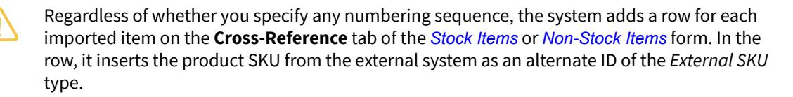

3. You specify the default item classes for imported items in the **Item Class forStock Items** and **Item Class for Non-Stock Items** boxes on the **InventorySettings** tab (**ImportSettings** section).

#### **Product Import and Item Creation**

The system imports products from the BigCommerce store to Acumatica ERP while synchronizing the *Stock Item* and *Non-Stock Item* entities, depending on whether the products are physical or not. First, an ecommerce manager prepares the data on the *[Prepare Data](#page-529-1)* (BC501000) form, and then they process it on the *[Process Data](#page-533-1)* (BC501500) form.

Depending on the option selected for a product in the **ProductType** box (**Basic Information** section) of the product management page in the BigCommerce store, the system imports the product as follows:

- As a stock item on the *[Stock Items](https://help-2025r1.acumatica.com/Help?ScreenId=ShowWiki&pageid=77786a70-1f1e-4d63-ad98-96f98e4fcb0e)* (IN202500) form if the *Physical* option is selected
- As a non-stock item on the *[Non-Stock Items](https://help-2025r1.acumatica.com/Help?ScreenId=ShowWiki&pageid=bf68dd4f-63d4-460d-8dc0-9152f2bd6bf1)* (IN202000) form if the *Digital* option is selected

During the import, some settings of the created stock and non-stock items are imported from the external system, while others are copied from the item class. The system assigns each imported stock or non-stock item the item class specified in the **Item Class forStock Items** or **Item Class for Non-Stock Items** box, respectively, on the **Inventory** tab of the *[BigCommerce Stores](#page-473-2)* (BC201000) form. For more details on how the system inserts the settings of imported items, see *[Product Import: Settings of Imported Items](#page-108-1)*.

If a product has been already imported to Acumatica ERP and some product settings are changed in the BigCommerce store, during the next import, the system updates the corresponding existing stock or non-stock item.

#### **Limitations of Importing Products**

The following limitations apply to the importing of products from the BigCommerce store:

- The length of the product SKU must not exceed the length of the *INVENTORY* segmented key configured on the *[Segmented Keys](https://help-2025r1.acumatica.com/Help?ScreenId=ShowWiki&pageid=78bd7bd1-6bf6-409e-a8a5-8b18e8b80722)* (CS202000) form; otherwise, the import fails.
- Product images are not imported.
- The price and availability settings are imported only when Acumatica ERP creates items. Aer that, these settings are updated in Acumatica ERP and exported to the external system to prevent discrepancies in the systems.

Also, an alternate ID of the *External SKU* type assigned to an inventory item during import cannot be updated on the **Cross-Reference** tab of the *[Stock Items](https://help-2025r1.acumatica.com/Help?ScreenId=ShowWiki&pageid=77786a70-1f1e-4d63-ad98-96f98e4fcb0e)* (IN202500) or *[Non-Stock Items](https://help-2025r1.acumatica.com/Help?ScreenId=ShowWiki&pageid=bf68dd4f-63d4-460d-8dc0-9152f2bd6bf1)* (IN202000) form. However, the row of the *External SKU* type with this alternate ID can be deleted in Acumatica ERP; this will not lead to the deletion of the SKU in the external system during the export of the item from Acumatica ERP. The SKU can also be updated in the external system and synchronized during the import to Acumatica ERP; in this case, the system adds the new SKU to the existing inventory item.

If there is no synchronization record for a product being imported, the external SKU is used to map the product with an existing item in Acumatica ERP. In this case, during the import of products, the system searches for a product that matches that matches an inventory item. It performs the following steps for each product until it finds a match:

- 1. Checks if the SKU matches the inventory ID
- 2. Checks if the SKU matches an alternate ID of the *Global* type
- 3. Checks if the SKU matches an alternate ID of the *External SKU* type

# **Product Import: Settings of Imported Items**

You can import products that have been defined in the BigCommerce store instead of creating them manually in Acumatica ERP. These imported products are defined as stock or non-stock items on the *[Stock Items](https://help-2025r1.acumatica.com/Help?ScreenId=ShowWiki&pageid=77786a70-1f1e-4d63-ad98-96f98e4fcb0e)* (IN202500) or *[Non-Stock Items](https://help-2025r1.acumatica.com/Help?ScreenId=ShowWiki&pageid=bf68dd4f-63d4-460d-8dc0-9152f2bd6bf1)* (IN202000) form.

#### **Item Settings Imported from the External System**

The following table shows the settings that are assigned to a stock or non-stock item created in Acumatica ERP on the *[Stock Items](https://help-2025r1.acumatica.com/Help?ScreenId=ShowWiki&pageid=77786a70-1f1e-4d63-ad98-96f98e4fcb0e)* (IN202500) or *[Non-Stock Items](https://help-2025r1.acumatica.com/Help?ScreenId=ShowWiki&pageid=bf68dd4f-63d4-460d-8dc0-9152f2bd6bf1)* (IN202000) form based on the corresponding settings of the source product from the product management page in the BigCommerce store.

| Acumatica ERP Element                                                                                                                                          | BigCommerce Ele ment |
|----------------------------------------------------------------------------------------------------------------------------------------------------------------|-------------------------|
| Summary area                                                                                                                                                   |                         |
| Description                                                                                                                                                    | Product Name            |
| Item Status                                                                                                                                                    | Purchasability          |
| The item is assigned either of the following statuses, depending on the option button se lected in the Purchasability section of the corresponding product: |                         |
| • Active: This product can be purchased in my online store or This product is coming soon but I want to take pre-orders is selected.                     |                         |
| Inactive: This product cannot be purchased in my online store is selected. •                                                                                |                         |
| Price/Cost tab                                                                                                                                                 |                         |
| Default Price                                                                                                                                                  | Default Price           |
| MSRP                                                                                                                                                           | MSRP                    |
| Description tab                                                                                                                                                |                         |
| Item description                                                                                                                                               | Description             |
| Attributes tab                                                                                                                                                 |                         |

| Acumatica ERP Element                                                                                                                                                                                                                                                                                                                                                                                                                                                                 | BigCommerce Ele ment                                     |  |  |  |  |
|---------------------------------------------------------------------------------------------------------------------------------------------------------------------------------------------------------------------------------------------------------------------------------------------------------------------------------------------------------------------------------------------------------------------------------------------------------------------------------------|-------------------------------------------------------------|--|--|--|--|
| Sales Categories table. For each sales category of the product, the system adds a row to the table on the Stock Items (IN202500) or Non-Stock Items (IN202000) form and in serts the sales category defined on the Item Sales Categories (IN204060) form that has a matching description. If there is no sales category on the Item Sales Categories form with a matching description, the system creates a new one in addition to listing this category for the item. | Sales Categories                                            |  |  |  |  |
| The system imports sales categories only if import has been configured for the Sales Category entity on the Entities tab of the BigCommerce Stores (BC201000) form.                                                                                                                                                                                                                                                                                                             |                                                             |  |  |  |  |
| Cross-Reference tab                                                                                                                                                                                                                                                                                                                                                                                                                                                                   |                                                             |  |  |  |  |
| Alternate ID (in a row with the External SKU alternate type)                                                                                                                                                                                                                                                                                                                                                                                                                          | SKU                                                         |  |  |  |  |
| Alternate ID (in a row with the GTIN/EAN/UPC/ISBN alternate type)                                                                                                                                                                                                                                                                                                                                                                                                                     | GlobalTrade Item Number (GTIN)                           |  |  |  |  |
| The barcodes of the EAN and UPC types can have only numeric values of 8, 12, 13, or 14 symbols. The barcodes of the ISBN type can have only numeric values up to 14 symbols.                                                                                                                                                                                                                                                                                                       |                                                             |  |  |  |  |
| eCommerce tab                                                                                                                                                                                                                                                                                                                                                                                                                                                                         |                                                             |  |  |  |  |
| Visibility. The system inserts one of the following options, depending on the settings of the corresponding product: • Visible: The Visible on Storefront check box is selected, and theSet as a Featured                                                                                                                                                                                                                                                                    | Visible on Store front, Set as a Fea tured Product on |  |  |  |  |
| Product on my Storefront check box is cleared.                                                                                                                                                                                                                                                                                                                                                                                                                                        | my Storefront                                               |  |  |  |  |
| • Invisible: The Visible on Storefront check box is cleared.                                                                                                                                                                                                                                                                                                                                                                                                                       |                                                             |  |  |  |  |
| • Featured: The Visible on Storefront and Set as a Featured Product on myStore front check boxes are selected.                                                                                                                                                                                                                                                                                                                                                                  |                                                             |  |  |  |  |

| Acumatica ERP Element                                                                                                                                                                                        | BigCommerce Ele ment            |  |  |  |
|--------------------------------------------------------------------------------------------------------------------------------------------------------------------------------------------------------------|------------------------------------|--|--|--|
| Availability. For a stock item, the system inserts one of the following options, depending on the settings of the corresponding product:                                                                  | Purchasability, Track Inventory |  |  |  |
| • Set as Available (Track Qty.): The This product can be purchased in my online store option button is selected in the Purchasability section, and the Track Inventory check box is selected.       |                                    |  |  |  |
| • Set as Available (Don't Track Qty.): The This product can be purchased in my online store option button is selected in the Purchasability section, and the Track Invento ry check box is cleared. |                                    |  |  |  |
| • Set as Unavailable: The This product cannot be purchased in my online store option button is selected in the Purchasability section.                                                                 |                                    |  |  |  |
| • Set as Pre-Order: The This product is coming soon but I want to take pre-orders op tion button is selected in the Purchasability section.                                                            |                                    |  |  |  |
| For a non-stock item, the system inserts one of the following options, depending on the option buttons selected in the Purchasability section for the corresponding product:                              |                                    |  |  |  |
| • Set as Available (Don't Track Qty.): The This product can be purchased in my online store option button is selected.                                                                                 |                                    |  |  |  |
| • Set as Unavailable: The This product cannot be purchased in my online store option button is selected.                                                                                               |                                    |  |  |  |
| • Set as Pre-Order: The This product is coming soon but I want to take pre-orders op tion button is selected.                                                                                          |                                    |  |  |  |
| When Qty. Unavailable                                                                                                                                                                                        |                                    |  |  |  |
| For a stock item, the system inserts the Store Default option.                                                                                                                                               |                                    |  |  |  |
| Packaging tab                                                                                                                                                                                                |                                    |  |  |  |
| Weight                                                                                                                                                                                                       | Weight                             |  |  |  |
| The system populates the box for only a stock item.                                                                                                                                                          |                                    |  |  |  |

#### **Assignment of the Tax Category**

During the import of a product from the BigCommerce store, the system searches for the tax category to assign to the corresponding stock or non-stock item created on the *[Stock Items](https://help-2025r1.acumatica.com/Help?ScreenId=ShowWiki&pageid=77786a70-1f1e-4d63-ad98-96f98e4fcb0e)* (IN202500) or *[Non-Stock Items](https://help-2025r1.acumatica.com/Help?ScreenId=ShowWiki&pageid=bf68dd4f-63d4-460d-8dc0-9152f2bd6bf1)* (IN202000) form as follows until it finds a tax category:

- 1. It checks the mapping settings on the **Import Mapping** tab of the *[Entities](#page-521-1)* (BC202000) form for the corresponding store and the *Stock Item* or *Non-Stock Item* entity.
- 2. It checks the substitution list specified in the**Tax Categories** box (**Substitution Lists** section) on the **Orders** tab of the *[BigCommerce Stores](#page-473-2)* (BC201000) form.
- 3. It checks the tax category of the item class assigned to the item on the **General** tab of the *[Stock Items](https://help-2025r1.acumatica.com/Help?ScreenId=ShowWiki&pageid=77786a70-1f1e-4d63-ad98-96f98e4fcb0e)* or *[Non-Stock Items](https://help-2025r1.acumatica.com/Help?ScreenId=ShowWiki&pageid=bf68dd4f-63d4-460d-8dc0-9152f2bd6bf1)* form.

# **Product Import: To Import Stock Items**

The following activity will walk you through the processes of importing stock items from the BigCommerce store to Acumatica ERP.

#### **Story**

Suppose that for each product that has been created directly in the BigCommerce store, the SweetLife Fruits & Jams company wants to maintain item information in Acumatica ERP. Acting as an implementation consultant helping SweetLife to set up the integration of Acumatica ERP with the BigCommerce store, you need to configure the import of stock items from the BigCommerce store to Acumatica ERP and import the existing products from the store. Because these are physical products, they will be defined as stock items.

# **Configuration Overview**

In the *U100* dataset, the *JAM* item class has been defined on the *[Item Classes](https://help-2025r1.acumatica.com/Help?ScreenId=ShowWiki&pageid=80a3301b-4eb2-4ce2-94c5-0407c786a0f1)* (IN201000) form for the purposes of this activity.

#### **Process Overview**

In this activity, you will do the following:

- 1. In the admin area of the BigCommerce store, create products
- 2. On the *[BigCommerce Stores](#page-473-2)* (BC201000) form, perform the minimum configuration required for the import of stock items from the BigCommerce store to Acumatica ERP
- 3. On the *[Prepare Data](#page-529-1)* (BC501000) form, prepare product data for import
- 4. On the *[Process Data](#page-533-1)* (BC501500) form, process the product data prepared for import
- 5. On the *[Sync History](#page-539-1)* (BC301000) form, review the results of the synchronization
- 6. On the *[Stock Items](https://help-2025r1.acumatica.com/Help?ScreenId=ShowWiki&pageid=77786a70-1f1e-4d63-ad98-96f98e4fcb0e)* (IN202500) form, review the imported stock items

#### **System Preparation**

Before performing the instructions of this activity, do the following:

- 1. Make sure that the following prerequisites have been met:
  - The BigCommerce store has been created and configured, as described in *Initial [Configuration:](#page-19-1) To Set Up [a BigCommerce Store](#page-19-1)*.
  - The connection to the BigCommerce store has been established and the initial configuration has been performed, as described in *Initial [Configuration:](#page-27-1) To Establish and Configure the Store Connection*.
- 2. Launch the Acumatica ERP website with the *U100* dataset preloaded, and sign in with the following credentials:
  - **Username**: *gibbs*
  - **Password**: *123*
- 3. In the same browser, sign in to the control panel of the BigCommerce store as the store administrator.

#### **Step 1: Creating Products in the BigCommerce Store**

In the BigCommerce store, create the products to be imported to Acumatica ERP as follows:

- 1. In the le menu, click **Products**.
- 2. On the **View Products** page, in the upper le, click **Add** to create the Blueberry Jam 8 oz product.
- 3. On the **Add Product** page, which opens, specify the following settings in the **Basic Information** section:
  - **Product Name**: Blueberry Jam 8 oz
  - **SKU** : BLJAM08

- **ProductType**: *Physical* (the default option) Based on this setting, the item will be imported to Acumatica ERP as a stock item.
- **Default Price**: 4.15
- **Weight**: 0.25
- 4. In the lower right, click**Save** to save the product.

The product management page opens with the created product.

- 5. In the upper le, click**View Products** above the product name to return to the**View Products** page.
- 6. On the **View Products** page, in the upper le, click **Add** to create the Blueberry Jam 32 oz product.
- 7. On the **Add Product** page, which opens, specify the following settings in the **Basic Information** section:
  - **Title**: Blueberry Jam 32 oz
  - **Default Price**: 16.89
  - **Weight**: 0.91
- 8. In the lower right, click**Save** to save the product.

The product management page opens with the created product.

# **Step 2: Activating the Needed Entity**

To activate the import of stock items from the BigCommerce store to Acumatica ERP, do the following:

- 1. On the *[BigCommerce Stores](#page-473-2)* (BC201000) form, open the *SweetStore - BC* store.
- 2. On the **Entities** tab, in the row with the *Stock Item* entity, specify the following settings:
  - **Active**: Selected
  - **Sync Direction**: *Import*

When you change the sync direction for the *Stock Item* entity, notice that the system inserts *External System* in the **PrimarySystem** column.

## **Step 3: Specifying the Inventory Settings**

To specify the settings that will be used by default for importing stock items from the BigCommerce store to Acumatica ERP, do the following:

- 1. While you are still viewing the *SweetStore - BC* store on the *[BigCommerce Stores](#page-473-2)* (BC201000) form, go to the **Inventory** tab.
- 2. In the **ImportSettings** section, specify the following settings:
  - **Inventory NumberingSequence**: Empty (the default value)

Based on this setting, when assigning each inventory ID of an item imported to Acumatica ERP, the system uses the stock-keeping unit (SKU) of the corresponding product in the Acumatica ERP store.

• **Item Class forStock Items**: *JAM*

This is the item class based on which stock item records will be created in Acumatica ERP for products imported from the online store.

3. On the form toolbar, click**Save**.

### **Step 4: Preparing the Product Data for Import**

To prepare the stock item data that needs to be imported to the BigCommerce store, do the following:

1. On the *[Prepare Data](#page-529-1)* (BC501000) form, specify the following settings in the Summary area of the form:

- **Store**: *SweetStore - BC*
- **Prepare Mode**: *Incremental*
- 2. In the table, select the check box in the unlabeled column in the row of the *Stock Item* entity.
- 3. On the form toolbar, click **Prepare**.
- 4. In the **Processing** dialog box, which opens, click **Close**.

In the table row with the *Stock Item* entity, the **Ready to Process** column shows the number of synchronization records that have been prepared and are ready to be processed.

## **Step 5: Processing the Prepared Product Data**

To import the prepared product data from the BigCommerce store, while you are still reviewing the data on the *[Prepare Data](#page-529-1)* (BC501000) form, do the following:

- 1. In the row with the *Stock Item* entity, click the link in the **Ready to Process** column.
- 2. On the *[Process Data](#page-533-1)* (BC501500) form, which opens with the *SweetStore - BC* store and the *Stock Item* entity selected, select the unlabeled check boxes in the two rows with the empty **ERP ID** column and *Blueberry Jam 8 oz* and *Blueberry Jam 32 oz* in the **External Description** column.
- 3. On the form toolbar, click **Process**.
- 4. In the **Processing** dialog box, which opens, review the results of the processing.

Notice that the system has processed one product (as you can see on the **Processed** tile) and failed to process the other one (**Errors** tile).

5. Click the **Errors** tile. The system expands the table with the results of the processing.

Because you have specified no inventory numbering sequence for import settings in Step 3, the system inserts the stock-keeping unit of each product as the corresponding inventory ID. The *Blueberry Jam 32 oz* product has no SKU defined in the BigCommerce store, so the system has failed to import it and assigned it the *Failed* status.

6. Click **Close** to close the dialog box.

#### **Step 6: Viewing the Imported Products**

To view the imported product data, do the following:

- 1. Open the *[Sync History](#page-539-1)* (BC301000) form.
- 2. In the Summary area of the form, specify the following settings:
  - **Store**: *SweetStore - BC*
  - **Entity**: *Stock Item*
- 3. On the **Processed** tab, in the row with the *Blueberry Jam 8 oz* external description, click the link in the **ERP ID** column to review the imported stock item. The system opens the *[Stock Items](https://help-2025r1.acumatica.com/Help?ScreenId=ShowWiki&pageid=77786a70-1f1e-4d63-ad98-96f98e4fcb0e)* (IN202500) form in a pop-up window with the item selected.

In the Summary area, notice that the system has inserted the product's SKU, *BLJAM08*, as the item's identifier and that the *Blueberry Jam 8 oz* item description matches the product title in the external system.

On the **General** tab, notice that the system has assigned the item the *JAM* item class based on the item class you have specified for import settings in Step 3.

4. Click the **Price/Cost** tab.

Notice that the system has assigned the item the *4.15* default price based on the product's price.

5. Click the **Cross-Reference** tab.

Notice that the system has added a row to the table with the *External SKU* alternate type and the *BLJAM08* alternate ID, which matches the product SKU in the external system.

- 6. Close the pop-up window with the *[Stock Items](https://help-2025r1.acumatica.com/Help?ScreenId=ShowWiki&pageid=77786a70-1f1e-4d63-ad98-96f98e4fcb0e)* form.
- 7. On the *[Sync History](#page-539-1)* form, to which you return, go to the **Failed** tab.

In the row with the *Blueberry Jam 32 oz* external description, notice that the **ERP ID** column is empty because the system failed to import the item. The **Last Message** column contains the error explaining the processing failure.

#### **Step 7 (Optional): Reattempting the Product Import**

To reattempt the import of the *Blueberry Jam 32 oz* item, while you are still viewing the synchronization record on the **Failed** tab of the *[Sync History](#page-539-1)* (BC301000) form, do the following:

1. In the row with the *Blueberry Jam 32 oz* external description, click the link in the **External ID** column.

The product management page for the *Blueberry Jam 32 oz* product in the BigCommerce store opens in a new browser tab.

- 2. In the **SKU** box (**Basic Information** section), enter BLJAM32.
- 3. In the lower right, click**Save** to save your changes to the product.
- 4. Go back to the browser tab with the *[Sync History](#page-539-1)* form.
- 5. On the **Failed** tab, in the row with the *Blueberry Jam 32 oz* external description, select the unlabeled check box.
- 6. On the form toolbar, click**Sync**.

The system resynchronizes the synchronization record. When the processing has finished successfully, the record disappears from the **Failed** filter tab and is now displayed on the **Processed** filter tab.

7. On the **Processed** filter tab, review the synchronization record for the *Blueberry Jam 32 oz* item, and make sure that in the **ERP ID** column, the system now displays the inventory ID (BLJAM32) along with the description. Also notice that the synchronization record is now assigned the *Processed* status.

In this activity, you have configured the product import in Acumatica ERP and then imported products from the BigCommerce store as stock items.

# **Synchronizing Sales Prices**

In this chapter, you will learn how sales prices are synchronized between Acumatica ERP and the BigCommerce store.

# **Price Synchronization: General Information**

Acumatica ERP Retail Edition provides flexible ways of managing sales prices. You can assign prices to stock and non-stock items, maintain specific prices for particular customers or groups of customers with similar buying habits, or assign discounted prices for customers buying in bulk. For more information about the types of prices supported in Acumatica ERP, see *[Sales Prices: General Information](https://help-2025r1.acumatica.com/Help?ScreenId=ShowWiki&pageid=d63d6b6c-15ee-4576-bf27-8de69f8f5da6)*. The sections below describe which prices can be exported to the BigCommerce store.

#### **Learning Objectives**

In this section, you will learn how to synchronize base sales prices between Acumatica ERP and the BigCommerce store.

## **Applicable Scenarios**

You might want to synchronize sales prices from Acumatica ERP with the BigCommerce store if you maintain base prices of non-stock and stock items in Acumatica ERP and want to quickly update sales prices of the corresponding products in BigCommerce.

# **Synchronization of Default Item Prices**

The default price of a particular stock item is specified on the *[Stock Items](https://help-2025r1.acumatica.com/Help?ScreenId=ShowWiki&pageid=77786a70-1f1e-4d63-ad98-96f98e4fcb0e)* (IN202500) form and is exported to the BigCommerce store during the synchronization of the stock item. Similarly, the default price of a non-stock item is maintained on the *[Non-Stock Items](https://help-2025r1.acumatica.com/Help?ScreenId=ShowWiki&pageid=bf68dd4f-63d4-460d-8dc0-9152f2bd6bf1)* (IN202000) form and is exported to the BigCommerce store when the nonstock item is synchronized. For information about the synchronization of stock and non-stock items, see *[Product](#page-90-2) [Synchronization: General Information](#page-90-2)*.

In the BigCommerce store, the default prices of stock and non-stock items are displayed in the **Default Price** box in the **Pricing** subsection of the **Product Information** section on the**View Products** page for a particular stock or non-stock item.

### **Synchronization of Base Sales Prices**

Base prices—that is, the prices that are not specific to any customer—are maintained on the *[Sales Prices](https://help-2025r1.acumatica.com/Help?ScreenId=ShowWiki&pageid=62bfca2c-0893-495b-bb1d-125b64899afc)* (AR202000) form or the *[Sales Price Worksheets](https://help-2025r1.acumatica.com/Help?ScreenId=ShowWiki&pageid=6379952d-248a-421d-aa29-285e371be559)* (AR202010) form and are exported to the BigCommerce store as a separate entity, *Base Sales Price*.

Sales prices of the *Base* type imported from Acumatica ERP are saved in BigCommerce in the **Sale Price** box in the **Pricing** subsection of the **Product Information** section on the**View Products** page for a particular stock or nonstock item.

In BigCommerce, the sales price has a higher priority than the default price. Therefore, when the**Sale Price** box is populated for an item, the price specified in this box is the effective price of the item.

For information about defining base sales prices in Acumatica ERP, see *[Sales Prices: General Information](https://help-2025r1.acumatica.com/Help?ScreenId=ShowWiki&pageid=d63d6b6c-15ee-4576-bf27-8de69f8f5da6)*.

## **Limitations of Sales Price Synchronization**

The following price types maintained in Acumatica ERP cannot be exported to a BigCommerce store:

- *Customer-specific prices*: Prices defined in Acumatica ERP for a particular customer—that is, prices that have the *Customer* type—cannot be exported to the BigCommerce store. If you want to provide a particular customer with the ability to purchase products at individual prices, create a separate customer price class for this customer. This way, the prices that you define for this customer price class will be available for only the customer that you add to this customer price class.
- *UOM-specific prices*: In Acumatica ERP, if the *Multiple Units of Measure* feature is enabled on the *[Enable/](https://help-2025r1.acumatica.com/Help?ScreenId=ShowWiki&pageid=c1555e43-1bc5-4f6f-ba9d-b323f94d8a6b) [Disable Features](https://help-2025r1.acumatica.com/Help?ScreenId=ShowWiki&pageid=c1555e43-1bc5-4f6f-ba9d-b323f94d8a6b)* (CS100000) form, you can define a sales price of an item for each of the units of measure in which your company sells this item. However, only prices defined for the sales UOM can be exported to BigCommerce.
- *Warehouse-specific prices*: If the *Multiple Warehouses* feature is enabled on the *[Enable/Disable Features](https://help-2025r1.acumatica.com/Help?ScreenId=ShowWiki&pageid=c1555e43-1bc5-4f6f-ba9d-b323f94d8a6b)* form, prices that are defined to apply only when products are sold from a particular warehouse—that is, when a specific warehouse ID is selected in the **Warehouse** column for a particular price—are not exported to the BigCommerce store.

Only prices that are effective on the date of the synchronization are exported; historical prices and prices with an effective date in the future are not synchronized. If an item has multiple prices of the same type that are effective on the date of the synchronization, the price of the highest priority is imported. For example, if a regular base price of \$5 and a promotional base price of \$4.50 for the same item are effective on January 31, 2022, which is the date when you synchronize the *Base Sales Price* entity, the promotional price of \$4.50 will be exported to the BigCommerce store. For more information about price priorities, see *[Sales Prices: Rules of Price Selection](https://help-2025r1.acumatica.com/Help?ScreenId=ShowWiki&pageid=e0863703-06d1-415e-8e5a-c736fc4a965f)* and *Sales [Prices:](https://help-2025r1.acumatica.com/Help?ScreenId=ShowWiki&pageid=f37bcab6-5791-4e67-82fb-a26062c11b0c) To [Explore Regular and Promotional Prices](https://help-2025r1.acumatica.com/Help?ScreenId=ShowWiki&pageid=f37bcab6-5791-4e67-82fb-a26062c11b0c)*.

# **Price Synchronization: Volume-Based Prices**

In Acumatica ERP, if the *Volume Pricing* feature is enabled on the *[Enable/Disable Features](https://help-2025r1.acumatica.com/Help?ScreenId=ShowWiki&pageid=c1555e43-1bc5-4f6f-ba9d-b323f94d8a6b)* (CS100000) form, you can define prices that are dependent on the quantity of the products being purchased by a customer. These prices can be defined for all customers (that is, they have the *Base* type) or for particular customer classes (that is, they have the *Customer Price Class* type). For more information on how volume-based pricing works in Acumatica ERP, see *Sales Prices: To Explore [Volume-Based](https://help-2025r1.acumatica.com/Help?ScreenId=ShowWiki&pageid=cee56c19-e21c-4e5b-91e1-d880f94ab506) Prices*.

Volume prices are exported to the BigCommerce store according to their type.

Imported volume-dependent prices of the *Base* type defined for a product appear in BigCommerce as a table under **Bulk Pricing** in the **Pricing** subsection on the**View Products** page of a particular product. This table contains the **Min Quantity** column (which corresponds to a quantity break point in Acumatica ERP) and the **Unit Price** column. These prices override the sales price when the quantity of the purchase is higher than the minimum quantity specified for the unit price in the table. For details, see *[Price Synchronization: General Information](#page-114-2)*.

Imported volume-dependent prices of the *Customer Price Class* defined for a product appear in BigCommerce in a price list for a particular customer group. To open the price list, you select **Products > Price Lists** in the le pane to open the **Price Lists** page, and then click the name of the price list that corresponds to the customer group. To bring up a table for volume-dependent prices for a particular product, you click the cell in the **New Bulk Pricing** column for this product. The volume-dependent prices defined for a product in a price list for a particular group override all other prices when the right combination of the customer, product, and quantity is met (that is, when the customer belonging to the customer group is signed in, and buys the product in quantities corresponding to one of the quantity tiers for which volume-based prices have been defined). For details, see *[Price Synchronization:](#page-120-2) [Prices for Customer Groups](#page-120-2)*.

# **Price Synchronization: To Export Base Prices**

In this activity, you will explore how sales prices of the *Base* type are exported from Acumatica ERP to and saved in the BigCommerce store.

The following activity is based on the *U100* dataset.

#### **Story**

Suppose that SweetLife Fruits & Jams wants to maintain all of its sales prices, including the prices of products sold in the BigCommerce store, in Acumatica ERP.

SweetLife's pricing manager has added a new base price for 96-ounce jars of pear jam (\$45) and the following quantity-specific prices for 96-ounce jars of banana jams:

- From 1 to 4 pieces: \$45
- From 5 to 9 pieces: \$43

• More than 9 pieces: \$40

The new prices are effective as of July 1, 2024.

As an implementation consultant, you want to export the effective sales prices for the jams from Acumatica ERP to the BigCommerce store.

# **Configuration Overview**

In the *U100* dataset, the following tasks have been performed to support this activity:

- On the *[Enable/Disable Features](https://help-2025r1.acumatica.com/Help?ScreenId=ShowWiki&pageid=c1555e43-1bc5-4f6f-ba9d-b323f94d8a6b)* (CS100000) form, the *Volume Pricing* feature has been enabled.
- On the *[Stock Items](https://help-2025r1.acumatica.com/Help?ScreenId=ShowWiki&pageid=77786a70-1f1e-4d63-ad98-96f98e4fcb0e)* (IN202500) form, the *PEARJAM96* and *BANJAM96* stock items have been created.
- On the *[Sales Prices](https://help-2025r1.acumatica.com/Help?ScreenId=ShowWiki&pageid=62bfca2c-0893-495b-bb1d-125b64899afc)* (AR202000) form, the sales prices listed in the following table have been defined.

| Inventory ID | Price Type | Price Code | UOM   | Break Qty | Price |
|--------------|------------|------------|-------|-----------|-------|
| PEARJAM96    | Base       | Empty      | PIECE | 0         | 45.00 |
| BANJAM96     | Base       | Empty      | PIECE | 0         | 45.00 |
| BANJAM96     | Base       | Empty      | PIECE | 5         | 43.00 |
| BANJAM96     | Base       | Empty      | PIECE | 10        | 40.00 |

#### **Process Overview**

In this activity, you will do the following:

- 1. On the *[BigCommerce Stores](#page-473-2)* (BC201000) form, activate the *Base Sales Price* entity.
- 2. On the *[Sales Prices](https://help-2025r1.acumatica.com/Help?ScreenId=ShowWiki&pageid=62bfca2c-0893-495b-bb1d-125b64899afc)* (AR202000) form, review the sales prices of the *Base* type, including volume-dependent prices, defined for particular items.
- 3. On the *[Prepare Data](#page-529-1)* (BC501000) form, prepare the base sales price data for synchronization; on the *[Process](#page-533-1) [Data](#page-533-1)* (BC501500) form, process the prepared data.
- 4. In the control panel of the BigCommerce store, review the exported prices of items.

## **System Preparation**

Before you start this activity, do the following:

- 1. Make sure that the following prerequisite activities have been performed:
  - a. *Initial [Configuration:](#page-27-1) To Establish and Configure the Store Connection*
  - b. *Data [Synchronization:](#page-37-1) To Perform the First Synchronization*
- 2. Sign in to the control panel of the BigCommerce store as the store administrator.
- 3. Sign in to the Acumatica ERP instance with the *U100* dataset preloaded by using the following credentials:
  - **Username**: *gibbs*
  - **Password**: *123*
- 4. Open the *[BigCommerce Stores](#page-473-2)* (BC201000) form.
- 5. On the **Entities** tab, select the **Active** check box in the row of the *Base Sales Price* entity.

When you process this entity, the sales prices of the *Base* type defined on the *[Sales Prices](https://help-2025r1.acumatica.com/Help?ScreenId=ShowWiki&pageid=62bfca2c-0893-495b-bb1d-125b64899afc)* (AR202000) form are exported.

6. On the form toolbar, click**Save**.

# **Step 1: Reviewing the Base Sales Prices Defined for Stock Items**

To review the sales prices of the *Base* type defined for stock items in Acumatica ERP, do the following:

- 1. On the *[Sales Prices](https://help-2025r1.acumatica.com/Help?ScreenId=ShowWiki&pageid=62bfca2c-0893-495b-bb1d-125b64899afc)* (AR202000) form, specify the following settings in the Selection area:
  - **PriceType**: *Base*
  - **Inventory ID**: *PEARJAM96*

In the table, notice that there is one effective price of the *Base* type for this stock item (*\$45.00*), which is effective for all customers starting from 7/1/2024.

2. In the **Inventory ID** box of the Selection area, select *BANJAM96*.

Notice that for the *BANJAM96* stock item, the table contains three different prices of the *Base* type, which depend on the value in the **Break Qty** column. When a customer buys 1 to 4 jars of banana jam, each jar will cost \$45; for the purchase of 5 to 9 jars, the effective price will be \$43, and if a customer buys 10 or more jars, each will cost \$40.

# **Step 2: Synchronizing the Prices of Stock Items**

To synchronize the base sales prices, do the following:

- 1. On the *[Prepare Data](#page-529-1)* (BC501000) form, specify the following settings in the Summary area:
  - **Store**: *SweetStore - BC*
  - **Prepare Mode**: *Incremental*
- 2. In the table, select the check box in the unlabeled column for the *Base Sales Price* entity, and on the form toolbar, click **Prepare**.
- 3. In the **Processing** dialog box, which opens, click **Close** to close the dialog box.
- 4. In the row of the *Base Sales Price* entity, click the link in the **Ready to Process** column.
- 5. On the *[Process Data](#page-533-1)* (BC501500) form, which opens with the *SweetStore - BC* store and the *Base Sales Price* entity selected in the Summary area, on the form toolbar, click **Process All**.
- 6. In the **Processing** dialog box, which opens, click **Close** to close the dialog box.

# **Step 3: Reviewing the Exported Base Prices**

To view the exported prices of the *PEARJAM96* item, in the control panel of the BigCommerce store, do the following:

- 1. In the le pane, click **Products > All products**.
- 2. On the **View Products** page, which opens, locate the *PEARJAM96* item in the list of products, and in the row of this item, click the link in the **Name** column.
- 3. On the product management page, which opens, in the **Pricing** section, click the *Show Advanced Pricing* link.

Notice that for this product two prices are specified (as shown in the following screenshot):

- The default price shown in the **Default Price** box. This is the price, which was defined for the item on the **Price/Cost** tab of the *[Stock Items](https://help-2025r1.acumatica.com/Help?ScreenId=ShowWiki&pageid=77786a70-1f1e-4d63-ad98-96f98e4fcb0e)* (IN202500) form was exported during the synchronization of the *Stock Item* entity.
- The sales price shown in the**Sale Price** box. This is the base sales price, which was exported during the synchronization of the *Base Sales Price* entity.

| Pear jam 96 oz Z $\leftarrow$       |                                            | 12 of 38           | くゝ |  |
|----------------------------------------|--------------------------------------------|--------------------|----|--|
| Basic information Description       | Pricing                                    |                    |    |  |
| Images & videos Product identifiers | Default Price * (excluding tax) \$45.15 |                    |    |  |
| Pricing Inventory                   | Tax Class @ <b>Default Tax Class</b>    |                    | ٠  |  |
| Variations                             | $\vee$ Hide Advanced Pricing               |                    |    |  |
| Customizations                         | Cost \$0                                | <b>MSRP</b> \$0 |    |  |
| Storefront details Custom fields    | <b>Sale Price</b>                          |                    |    |  |
| Related products                       | \$45.00                                    |                    |    |  |

#### *Figure: Base prices and default price specified for the item*

4. At the top of the page, next to the product name, click**View on Storefront**.

On the product page, which opens with the *Pear jam 96 oz.* product, notice the price that is displayed for shoppers (\$45.00).

#### **Step 4: Reviewing the Exported Volume-Based Prices**

To view the sales prices of the *BANJAM96* item that depend on the quantity being purchased, do the following:

- 1. Return to the control panel of the BigCommerce store.
- 2. In the le pane, click **Products > All products**.
- 3. On the **View Products** page, in the list of products, locate the *BANJAM96* item, and in the row of this item, click the link in the **Name** column.
- 4. On the product management page, which opens, in the **Pricing** section, click the *Show Advanced Pricing* link.

Notice the price in the**Sale Price** box, *\$45.00*, which corresponds to the price with a break quantity of *0* defined on the *[Sales Prices](https://help-2025r1.acumatica.com/Help?ScreenId=ShowWiki&pageid=62bfca2c-0893-495b-bb1d-125b64899afc)* (AR202000) form of Acumatica ERP. In the **Bulk Pricing** subsection, review the two rows of bulk pricing options, which correspond to the two sales prices with break quantities of *5* and *10* defined for the item on the *[Sales Prices](https://help-2025r1.acumatica.com/Help?ScreenId=ShowWiki&pageid=62bfca2c-0893-495b-bb1d-125b64899afc)* form.

- 5. At the top of the page, next to the product name, click**View on Storefront**.
- 6. On the product page, which opens, notice that *\$45.00* is displayed as the item's price.
- 7. Click *Buy in bulk and save* under **Bulk Pricing**.
- 8. In the **Bulk discount rates** dialog box, which opens, review the description and the following bulk discount options:
  - *Buy 5 9 and pay only \$43.00 each*
  - *Buy 10 or above and pay only \$40.00 each*
- 9. Close the dialog box.
- 10.Leave the quantity of *1* and click **Add to Cart**.
- 11.On the confirmation page, click**View or edit your cart**.
  - In the row of *Banana jam 96 oz*, notice that the price for 1 jar of jam is \$45.
- 12.Change the quantity to *7*.

You might need to click elsewhere on the page to refresh the price and the total. Notice that the price has changed to \$43, and the total is now \$301.

13.Change the quantity to *10*.

Notice that the price has changed to \$40, and the total is now \$400.

You have exported base sales prices, including volume-based sales prices, to the BigCommerce store.

# **Price Synchronization: Prices for Customer Groups**

Prices that are effective for a particular group of customers—that is, prices that have the *Customer Price Class* type —are defined on the *[Sales Prices](https://help-2025r1.acumatica.com/Help?ScreenId=ShowWiki&pageid=62bfca2c-0893-495b-bb1d-125b64899afc)* (AR202000) form or the *[Sales Price Worksheets](https://help-2025r1.acumatica.com/Help?ScreenId=ShowWiki&pageid=6379952d-248a-421d-aa29-285e371be559)* (AR202010) form and are exported to the BigCommerce store as a separate entity, *Price List*.

You can export price lists to the BigCommerce store if the *Business-to-Business Entities* feature is enabled on the *[Enable/Disable Features](https://help-2025r1.acumatica.com/Help?ScreenId=ShowWiki&pageid=c1555e43-1bc5-4f6f-ba9d-b323f94d8a6b)* (CS100000) form and the *Customer Price Class* and *Price List* entities are activated for the store on the *[BigCommerce Stores](#page-473-2)* (BC201000) form.

## **Synchronization of Customer Price Classes and Price Lists**

*Customer Price Classes* maintained in Acumatica ERP correspond to customer groups on the **Customer Groups** page, which you open by clicking **Customers > Customer Groups** in the le pane. Prices of the *Customer Price Class* type defined for a particular price class imported from Acumatica ERP are saved in the BigCommerce store as a price list for the corresponding customer group on the**View Price Lists** page.

Prices in a price list are similar to sales prices but are created to be specific to a customer group in BigCommerce. The price of a product defined in a price list for a customer group has a higher priority than the default price or the sales price of the product specified on the product page. The price specific to a customer group is displayed to a customer on the storefront if the customer belongs to the customer group and is signed in.

Before you can export the list of prices specific to a customer price class (that is, to synchronize the *Price List* entity) from Acumatica ERP, you must first synchronize the *Customer Price Class* entity. For the price list specific to a customer group to be functional in BigCommerce, you must export customers (that is, synchronize the *Customer* entity) assigned to the corresponding customer price class in Acumatica ERP.

You can export price lists from Acumatica ERP only to BigCommerce stores on the *Enterprise* subscription plan. For information about BigCommerce subscription plans and available features, see the *[Pricing](https://www.bigcommerce.com/essentials/pricing/)* page.

# **Price Synchronization: To Export Prices for Customer Groups**

In this activity, you will explore how sales prices of the *Customer Price Class* type are exported from Acumatica ERP to and saved in the BigCommerce store.

- The following activity is based on the *U100* dataset.
  - You can export price lists from Acumatica ERP only to BigCommerce stores on the *Enterprise* subscription plan. For information about BigCommerce subscription plans and available features, see the *[Pricing](https://www.bigcommerce.com/essentials/pricing/)* page.

# **Story**

Suppose that SweetLife Fruits & Jams wants to maintain all of its sales prices, including the prices of products sold in the BigCommerce online store, in Acumatica ERP. As an implementation consultant, you want to export sales prices of the *Customer Price Class* type for different types of jam from Acumatica ERP to the BigCommerce store so that you can offer a product to various groups of customers at different prices.

The company wants to sell the *Pear jam 96 oz* stock item at a discounted price of \$43.70 to customers of the *LOCAL* customer price class and at a regular price of \$45 to all other customers.

# **Configuration Overview**

In the *U100* dataset, the following tasks have been performed to support this activity:

- On the *[Enable/Disable Features](https://help-2025r1.acumatica.com/Help?ScreenId=ShowWiki&pageid=c1555e43-1bc5-4f6f-ba9d-b323f94d8a6b)* (CS100000) form, the *Business-to-Business Entities* feature has been enabled.
- On the *[Stock Items](https://help-2025r1.acumatica.com/Help?ScreenId=ShowWiki&pageid=77786a70-1f1e-4d63-ad98-96f98e4fcb0e)* (IN202500) form, the *PEARJAM96* stock item has been created.
- On the *[Customer Price Classes](https://help-2025r1.acumatica.com/Help?ScreenId=ShowWiki&pageid=3ce3e787-f916-4e18-b64c-2f1865dee0bc)* (AR208000) form, the *LOCAL* (for local customers) customer price class has been created.
- On the *[Customers](https://help-2025r1.acumatica.com/Help?ScreenId=ShowWiki&pageid=652929bc-9606-4056-aa6e-0c2d1147171b)* (AR303000) form, the *FRUITICO* customer has been configured.
- On the *[Sales Prices](https://help-2025r1.acumatica.com/Help?ScreenId=ShowWiki&pageid=62bfca2c-0893-495b-bb1d-125b64899afc)* (AR202000) form, the sales prices listed in the following table have been defined. Both prices are effective.

| Inventory ID | Price Type           | Price Code | UOM   | Price |
|--------------|----------------------|------------|-------|-------|
| PEARJAM96    | Base                 | Empty      | PIECE | 45.00 |
| PEARJAM96    | Customer Price Class | LOCAL      | PIECE | 43.70 |

## **Process Overview**

In this activity, you will do the following:

- 1. On the *[Prepare Data](#page-529-1)* (BC501000) form, prepare the customer price class, customer, and sales price list data for synchronization.
- 2. On the *[Process Data](#page-533-1)* (BC501500) form, process the prepared data of customer price classes, customers, and price lists.
- 3. In the control panel of the BigCommerce store, review the customer groups, the exported prices of the item, the exported price list, and create a password for the customer account.
- 4. On the storefront, view the product page as a signed-in customer.

## **System Preparation**

Before you start this activity, do the following:

- 1. Make sure that the following prerequisite activities have been performed:
  - a. *Initial [Configuration:](#page-27-1) To Establish and Configure the Store Connection*
  - b. *Data [Synchronization:](#page-37-1) To Perform the First Synchronization*
- 2. Sign in to the control panel of the BigCommerce store as the store administrator.
- 3. Sign in to the Acumatica ERP instance with the *U100* dataset preloaded by using the following credentials:
  - **Username**: *gibbs*

- **Password**: *123*
- 4. On the *[BigCommerce Stores](#page-473-2)* (BC201000) form, open the *SweetStore - BC* store.
- 5. On the **Entities** tab, select the unlabeled check box in the row of the *Price List* entity. Notice that the system has automatically selected this check box for *Customer Price Class* entity.

You select the *Price List* entity to export prices specific to customer price classes.

- 6. On the form toolbar, click**Save**.
- 7. On the *[Customers](https://help-2025r1.acumatica.com/Help?ScreenId=ShowWiki&pageid=652929bc-9606-4056-aa6e-0c2d1147171b)* (AR303000) form, open the *FRUITICO* customer.
- 8. On the **Shipping** tab (**OtherSettings** section), in the **Price Class** box, select *LOCAL*.
- 9. On the form toolbar, click**Save**.

#### **Step 1: Preparing the Data**

To synchronize the customer price classes and prices of the stock items that are specific to customer price classes, do the following:

- 1. Open the *[Prepare Data](#page-529-1)* (BC501000) form.
- 2. In the Summary area, specify the following settings:
  - **Store**: *SweetStore - BC*
  - **Prepare Mode**: *Full*
  - **Date Range**: Empty
- 3. In the table, select the check box in the unlabeled column for each of the following entities:
  - *Customer Price Class*
  - *Customer*
  - *Price List*

The *Customer* entity is included in this synchronization process to make sure the customers assigned to the *LOCAL* customer price class are exported to the BigCommerce store and are added to the customer group corresponding to their price class. You will use a customer of this customer price class (*FRUITICO*) later in this activity.

- 4. On the form toolbar, click **Prepare**.
- 5. In the **Processing** dialog box, which opens, click **Close** to close the dialog box.

#### **Step 2: Processing the Prepared Data**

To process the customer price class, customer, and price list data, do the following:

- 1. Open the *[Process Data](#page-533-1)* (BC501500) form.
- 2. In the Summary area, specify the following settings:
  - **Store**: *SweetStore - BC*
  - **Entity**: *Customer Price Class*
- 3. On the form toolbar, click **Process**.
- 4. In the **Processing** dialog box, which opens, click **Close** to close the dialog box.
- 5. In the **Entity** box, select *Customer*.
- 6. On the form toolbar, click **Process**.
- 7. In the **Processing** dialog box, which opens, click **Close** to close the dialog box.
- 8. In the **Entity** box, select *Price List*.

9. On the form toolbar, click **Process**.

10.In the **Processing** dialog box, which opens, click **Close** to close the dialog box.

#### **Step 3: Reviewing the Customer Groups**

To review the customer groups, in the control panel of the BigCommerce store, do the following:

1. In the le pane, click **Customers > Customer Groups**.

On the **Customer Groups** page, which opens, notice that two customer groups have been created (*INTERN* and *LOCAL*).

Customer price classes defined in Acumatica ERP are mapped to customer groups in the BigCommerce store. In the **Customers in Group** column, notice the number of customers that have been assigned to each of the customer groups.

2. In the row of the *LOCAL* customer group, click the *View* link in the **Customers in Group** column.

On the **View Customers** page, which opens, the system displays two customers assigned to the customer group, including the *FourStar Coffee & Sweets Shop* customer.

#### **Step 4: Reviewing the Exported Sales Prices of the Item**

To review the sales prices of the *PEARJAM96* stock item in the BigCommerce store, do the following:

- 1. In the le pane, click **Products > All products**.
- 2. On the **View Products** page, in the list of products, locate the *PEARJAM96* stock item, and in the row of this item, click the link in the **Name** column.
- 3. On the product management page, which opens for *Pear jam 96 oz*, in the **Pricing** subsection of the **Product Information** section, click the**Show Advanced Pricing** link.

Notice that two prices are displayed in this section: the default price of \$45.15, which is the default price of the stock item maintained on the *[Stock Items](https://help-2025r1.acumatica.com/Help?ScreenId=ShowWiki&pageid=77786a70-1f1e-4d63-ad98-96f98e4fcb0e)* (IN202500) form; and the sales price of \$45.00, which is the sales price of the *Base* type defined for the stock item on the *[Sales Prices](https://help-2025r1.acumatica.com/Help?ScreenId=ShowWiki&pageid=62bfca2c-0893-495b-bb1d-125b64899afc)* (AR202000) form.

4. At the top of the page, click**View on Storefront**.

On the product detail page, which opens for *Pear jam 96 oz*, notice that the sales price of \$45.00 is displayed as the item's price, and the default price is displayed as the previous price.

#### **Step 5: Reviewing the Exported Price List**

To review the *LOCAL* price list, which is specific to customers belonging to the *LOCAL* customer group, do the following:

- 1. Return to the control panel of the BigCommerce store.
- 2. In the le pane, click **Products > Price Lists**.
- 3. On the **Price Lists** page, which opens, in the **Price List Name** column, click *LOCAL*.

On the **View Price Lists / LOCAL (USD)** page, which opens, review the prices on the **Prices** tab.

Notice that for the *PEARJAM96* item, the **New Sale Price** column shows a value of \$43.70, which is the price of the item defined for the *LOCAL* customer price class on the *[Sales Prices](https://help-2025r1.acumatica.com/Help?ScreenId=ShowWiki&pageid=62bfca2c-0893-495b-bb1d-125b64899afc)* form.

If the **New Sale Price** column is not displayed in the table, click **Edit column** in the upper right of the table and select the check box for the **New Sale Price** column.

#### **Step 6: Creating a Password for the Customer**

To create a password for the *FourStar Coffee & Sweets Shop* customer, do the following:

- 1. In the le pane, click **Customers > All customers**.
- 2. While you are still viewing the**View Customers** page, click the *FourStar Coffee & Sweets Shop* link in the **Name** column.
- 3. On the **Edit Customer** page, which opens, in the **Customer Password** section, specify the customer password of !Q123456 in both the **Password** box and the **Confirm Password** box.
- 4. In the lower right, click**Save & Exit** to save your changes.

# **Step 7: Viewing the Product Page as a Signed-In Customer**

To view customer price, do the following:

- 1. At the upper right, click**View storefront** to open the storefront.
- 2. On the storefront, click**Sign In** in the upper right of the main page.
- 3. On the Sign-In page, enter the following credentials:
  - **Email Address**: salesperson.fourstars@example.com
  - **Password**: !Q123456
- 4. Click **Sign in** to sign in to the account of the *FourStar Coffee & Sweets Shop* customer.
- 5. In the upper right, click**Search**, and start typing pearjam in the search box.
- 6. In the list of search results, click the tile of *Pear jam 96 oz*.

On the product detail page, which opens for *Pear jam 96 oz*, review the product price. *Pear jam 96 oz* is available for purchase at \$43.70, which is the price specific to the *LOCAL* customer price class (or customer group) to which the *FourStar Coffee & Sweets Shop* is assigned.

7. In the upper right, click**Sign Out** to sign out of the *FourStar Coffee & Sweets Shop* account.

# **Synchronizing Product Availability**

The topics of this chapter explain the availability settings of stock items, non-stock items, and template items that are exported to the BigCommerce store.

# **Product Availability: General Information**

Acumatica ERP Retail Edition provides you with the ability to track the available quantities of stock items that you sell via the BigCommerce store and maintain in Acumatica ERP. You have the flexibility to configure which quantities of a stock item should be included in calculations of the quantity available for sale in the online store.

## **Learning Objectives**

In this chapter, you will learn how to do the following:

- Define how the available quantities of items exported to the BigCommerce store should be calculated
- Set up quantity tracking for stock items exported to the BigCommerce store

• Synchronize the available quantities of exported stock items for which quantity tracking is turned on

#### **Applicable Scenarios**

You track available quantities of stock items exported to the BigCommerce store if you want to make these items available for purchase by shoppers through the storefront only if there is a sufficient quantity in stock.

#### **Configuration of Product Availability Synchronization**

Before you start exporting available quantities of stock items from Acumatica ERP to a BigCommerce, you need to perform the following general steps:

- 1. Activate the *Product Availability* entity. To do this, on the *[BigCommerce Stores](#page-473-2)* (BC201000) form, you select the store, and on the **Entities** tab, you select the **Active** check box for the *Product Availability* entity.
- 2. Specify the quantity calculation settings for the store on the **Inventory** tab of the *[BigCommerce Stores](#page-473-2)* form. For details, see *Product [Availability:](#page-126-1) Calculation of Available Quantities*.
- 3. Determine the stock items for which available quantities should be exported. For more information, see the *Tracking Available Quantities of Exported Stock Items* section below.

#### **Tracking Available Quantities of Exported Stock Items**

You can track available quantities of stock items exported to a BigCommerce store and make them available for purchase via the storefront only when they are in stock. You can also determine how the system should handle items that go out of stock.

To make an exported stock item available for purchase via the storefront and enable quantity tracking for it, on the **eCommerce** tab of the *[Stock Items](https://help-2025r1.acumatica.com/Help?ScreenId=ShowWiki&pageid=77786a70-1f1e-4d63-ad98-96f98e4fcb0e)* (IN202500) form, you select *Set as Available (Track Qty.)* in the **Availability** box.

When the item is synchronized, in BigCommerce, on the product management page for the item, the system applies the following settings:

- In the **Purchasability** section, the**This product can be purchased in my online store** option button is selected.
- In the **Inventory** section, the**Track inventory** check box is selected.

Under the **Track inventory** check box, the **On the product level** option button is also selected because stock items do not have product variants and the available quantities of exported stock items are tracked for the entire product.

If you select the *Set as Available (Track Qty.)* option in the **Availability** box, you need to also specify the action that the system should perform with stock items whose quantities become zero, as follows:

- To make the item unavailable for purchase via the storefront, select *Set as Unavailable* in the **When Qty. Unavailable** box. In BigCommerce, in the **Purchasability** section of the product management page, the **This product cannot be purchased in my online store** option button becomes selected.
- To make the item unavailable for purchase via the storefront but available for pre-order, select *Set as Pre-Order/Continue Selling* in the **When Qty. Unavailable** box. In BigCommerce, the **This product is coming soon but I want to take pre-orders** option button becomes selected.

The **Track inventory** check box in the **Inventory** section becomes cleared.

• To keep the current purchasability settings of the item, select *Do Nothing*. In BigCommerce, the currently selected option button remains selected.

#### **Synchronization of Availability Settings**

The availability (purchasability) settings of a stock item in the BigCommerce store are updated as part of the synchronization of the *Stock Item* entity. During the synchronization, the system updates the purchasability

settings of each item exported to BigCommerce based on the option selected in the **Availability** box on the **eCommerce** tab of the *[Stock Items](https://help-2025r1.acumatica.com/Help?ScreenId=ShowWiki&pageid=77786a70-1f1e-4d63-ad98-96f98e4fcb0e)* (IN202500) form.

For stock items whose quantities are tracked and have been synchronized with the BigCommerce store, during the synchronization of the *Stock Item* entity, the system also checks if the item is in stock (See the *Synchronization of Available Quantities* section below). If the item has no available quantity (that is, its calculated quantity is less than or equal to zero), the system also updates the item's purchasability settings according to the **When Qty. Unavailable** setting specified on the **eCommerce** tab of the *[Stock Items](https://help-2025r1.acumatica.com/Help?ScreenId=ShowWiki&pageid=77786a70-1f1e-4d63-ad98-96f98e4fcb0e)* form.

#### **Synchronization of Available Quantities**

Available quantities of stock items are exported to the BigCommerce store during the synchronization of the *Product Availability* entity.

The synchronization of the *Product Availability* entity affects only the stock items that have **Availability** set to *Set as Available (Track Qty.)* on the **eCommerce** tab of the *[Stock Items](https://help-2025r1.acumatica.com/Help?ScreenId=ShowWiki&pageid=77786a70-1f1e-4d63-ad98-96f98e4fcb0e)* (IN202500) form.

During the synchronization, the system updates the item's quantity in BigCommerce based on the **Warehouse Mode** and **Availability Mode** settings specified on the **Inventory** tab of the *[BigCommerce Stores](#page-473-2)* (BC201000) form. For details, see *Product [Availability:](#page-126-1) Calculation of Available Quantities*.

If the item has no available quantity (that us its calculated quantity is less than or equal to zero), the system also updates the item's purchasability settings according to the **When Qty. Unavailable** setting specified on the **eCommerce** tab of the *[Stock Items](https://help-2025r1.acumatica.com/Help?ScreenId=ShowWiki&pageid=77786a70-1f1e-4d63-ad98-96f98e4fcb0e)* form.

## **Units of Measure of Available Item Quantities**

An item's available quantity is exported to the BigCommerce store in the item's sales unit of measure, which is defined on the **General** tab of the *[Stock Items](https://help-2025r1.acumatica.com/Help?ScreenId=ShowWiki&pageid=77786a70-1f1e-4d63-ad98-96f98e4fcb0e)* (IN202500) form. If an item's base UOM is different from its sales UOM, during the synchronization of the *Product Availability* entity, the item's available quantity is converted to the sales UOM before being exported to the BigCommerce store.

To avoid discrepancies in sales orders imported into Acumatica ERP, we recommend that before changing an item's sales UOM you make sure that there are no unsynchronized sales orders that contain the item. Also, you should synchronize the item's available quantity immediately aer changing its sales UOM so that new orders for the item are created in the BigCommerce store with the updated UOM.

# **Product Availability: Calculation of Available Quantities**

When you set up the synchronization of product availability, you select the rules of calculating the available quantities for items whose availability should be tracked, which includes selecting the type of quantity to export and the warehouses to be included in the availability calculation.

#### **Selection of the Availability Mode**

During the configuration of a BigCommerce store, you specify which item quantity in Acumatica ERP you want to be synchronized with the store for the items whose quantities are tracked. To do so, you select one of the following options in the **Availability Mode** box on the **Inventory** tab of the *[BigCommerce Stores](#page-473-2)* (BC201000) form:

- *On Hand*: The system synchronizes the on-hand quantity stored at particular warehouses or warehouse locations.
- *Available for Shipping*: The system synchronizes the quantity available for shipping.

• *Available*: The system synchronizes the available quantity. You can configure the way the available quantity is calculated by using an availability calculation rule.

For more information, see *Availability Calculation Rules: General [Information](https://help-2025r1.acumatica.com/Help?ScreenId=ShowWiki&pageid=36d6e854-c66e-4d9f-b150-6abbf0ece76b)*.

#### **Selection of the Warehouse Mode**

You also select whether quantity calculations should include available quantities from all warehouses or from only the specified warehouses or warehouse locations. To do so, in the **Warehouse Mode** box on the **Inventory** tab of the *[BigCommerce Stores](#page-473-2)* (BC201000) form, you select one of the following options:

- *All Warehouses*: To use for calculation the quantities of the item from all warehouses
- *Specific Warehouses*: To use for calculation the quantities from only the specified warehouses or warehouse locations.

When you select this option, the system displays a table in which you should specify the needed warehouses and warehouse locations. If you specify a warehouse but do not specify any of its locations, quantities available from the entire warehouse are used for quantity calculations. If you specify multiple warehouses and warehouse locations, the quantities available from all specified warehouses and warehouse locations are used for quantity calculations.

The functionality of multiple warehouses and multiple warehouse locations is available if the *Multiple Warehouses* and *Multiple Warehouse Locations* features are enabled on the *[Enable/](https://help-2025r1.acumatica.com/Help?ScreenId=ShowWiki&pageid=c1555e43-1bc5-4f6f-ba9d-b323f94d8a6b) [Disable Features](https://help-2025r1.acumatica.com/Help?ScreenId=ShowWiki&pageid=c1555e43-1bc5-4f6f-ba9d-b323f94d8a6b)* (CS100000) form.

If you have previously synchronized the *Product Availability* entity, when you modify any of the settings described in this section, the system resets the availability synchronization status for all items synchronized with the BigCommerce store, and you need to perform the full synchronization of the *Product Availability* entity again.

#### **Adjustment of Available Quantities**

You can manually adjust the available quantity calculated for an item by specifying a value in the **Availability Adjustment** box on the **eCommerce** tab of the *[Stock Items](https://help-2025r1.acumatica.com/Help?ScreenId=ShowWiki&pageid=77786a70-1f1e-4d63-ad98-96f98e4fcb0e)* (IN202500) form.

You specify the adjustment quantity in the sales UOM of the item. Acceptable values include whole numbers and decimal numbers. To increase the available quantity, you should use a positive value not preceded by any sign. To decrease the available quantity, precede the value with the minus sign. Percentage values (for example, *10%*) are not accepted.

# **Product Availability: To Export Product Availability Data**

In this activity, you will specify the default availability settings for the BigCommerce store, specify the availability settings for particular stock items, export product availability data to the BigCommerce store, and review the results of the export.

The following activity is based on the *U100* dataset.

#### **Story**

Suppose that the SweetLife Fruits & Jams company sells several kinds of jams in its online store. The jams can be ordered in the online store as follows:

• Banana jams (*BANJAM96* and *BANJAM08*) should always be available for purchase, regardless of the quantity in stock.

- Pear jams (*PEARJAM96* and *PEARJAM08*) should be available for purchase only if there is a sufficient quantity in stock. If there is no quantity in stock, the item is unavailable for purchase.
- Plum jams (*PLUMJAM96* and *PLUMJAM08*) should be available for purchase when there is a sufficient quantity in stock. If there is no quantity in stock, the availability of the item for purchase should be determined by the settings specified for the item on the product management page in the BigCommerce store.
- Cherry jam in 96-ounce jars (*CHERJAM96*) is currently unavailable for purchase. You expect it to be restocked soon and want to accept orders for it regardless of its available quantities.

Item quantities are available for purchase in the online store only if they are available for shipping from the *JS1* location in the *RETAIL* warehouse.

Acting as an implementation consultant helping SweetLife to set up the integration of Acumatica ERP with the BigCommerce store, you need to configure the system so that the items' availability will be tracked according to the company's preferences.

# **Configuration Overview**

In the *U100* dataset, the following tasks have been performed to support this activity:

- On the *[Enable/Disable Features](https://help-2025r1.acumatica.com/Help?ScreenId=ShowWiki&pageid=c1555e43-1bc5-4f6f-ba9d-b323f94d8a6b)* (CS100000) form, the following features have been enabled:
  - *Multiple Warehouses*, which provides the functionality of working with several warehouses (including virtual warehouses)
  - *Multiple Warehouse Locations*, which supports multiple locations for each warehouse
- On the *[Warehouses](https://help-2025r1.acumatica.com/Help?ScreenId=ShowWiki&pageid=264b0ef7-2b6c-40b4-a7d9-f1a5e067939b)* (IN204000) form, the *RETAIL* warehouse and the *JS1* warehouse location have been configured.
- On the *[Stock Items](https://help-2025r1.acumatica.com/Help?ScreenId=ShowWiki&pageid=77786a70-1f1e-4d63-ad98-96f98e4fcb0e)* (IN202500) form, the stock items have been created in the system and assigned the availability settings as listed in the following table.

| Stock Item | Availability                  | When Qty. Unavailable |
|------------|-------------------------------|-----------------------|
| BANJAM96   | Store Default                 | Store Default         |
| BANJAM08   | Store Default                 | Store Default         |
| PEARJAM96  | Set as Available (Track Qty.) | Set as Unavailable    |
| PEARJAM08  | Set as Available (Track Qty.) | Set as Unavailable    |
| PLUMJAM96  | Set as Available (Track Qty.) | Do Nothing            |
| PLUMJAM08  | Set as Available (Track Qty.) | Do Nothing            |
| CHERJAM96  | Set as Pre-Order              | Store Default         |

#### **Process Overview**

In this activity, you will do the following:

- 1. On the *[BigCommerce Stores](#page-473-2)* (BC201000) form, update the default availability settings for the BigCommerce store.
- 2. On the *Storage Details by Item [Warehouse](https://help-2025r1.acumatica.com/Help?ScreenId=ShowWiki&pageid=f106256f-7396-4248-a259-0ac3bcb5be1a) Location* (IN408055) form, review the quantities of stock items available in the *RETAIL* warehouse.

- 3. On the *[Prepare Data](#page-529-1)* (BC501000) form, prepare the product availability data for synchronization, and on the *[Process Data](#page-533-1)* (BC501500) form, process the prepared product availability data.
- 4. In the BigCommerce store, review the availability settings and quantities of the exported stock items.

#### **System Preparation**

Before you complete the instructions in this activity, do the following:

- 1. Make sure that the following prerequisites have been met:
  - The BigCommerce store has been created and configured, as described in *Initial [Configuration:](#page-19-1) To Set Up [a BigCommerce Store](#page-19-1)*.
  - The connection to the BigCommerce store has been established and the initial configuration has been performed, as described in *Initial [Configuration:](#page-27-1) To Establish and Configure the Store Connection*.
- 2. Launch the Acumatica ERP website with the *U100* dataset preloaded, and sign in with the following credentials:
  - **Username**: *gibbs*
  - **Password**: *123*
- 3. Sign in to the control panel of the BigCommerce store as the store administrator.
- 4. On the *[BigCommerce Stores](#page-473-2)* (BC201000) form, select the *SweetStore - BC* store.
- 5. On the **Entities** tab, select the **Active** check box in the row of the *Product Availability* entity.
- 6. On the form toolbar, click**Save**.

#### **Step 1: Updating the Default Availability Settings**

Now you need to specify the availability settings that the system will apply by default to stock items and non-stock items exported from Acumatica ERP to the BigCommerce store. While you are viewing the *[BigCommerce Stores](#page-473-2)* (BC201000) form for the *SweetStore - BC* store, do the following:

- 1. On the **Inventory** tab, specify the following settings:
  - **Default Availability**: *Set as Available (Track Qty.)*

With this setting, by default, a stock item exported to the BigCommerce store will be available for purchase through the storefront, and its quantity will be tracked.

• **When Qty. Unavailable**: *Set as Pre-Order*

With this setting, aer the synchronization of the *Product Availability* entity, if the stock item's quantity becomes 0, the stock item will no longer be available for purchase in the BigCommerce store, but customers will be able to place pre-orders.

- **Availability Mode**: *Available for Shipping*
- **Warehouse Mode**: *Specific Warehouses*
- 2. In the **WarehouseSettings** table, add a new row and specify the following settings:
  - **Warehouse**: *RETAIL*
  - **Location ID**: *JS1*

For each item, only its quantity available for shipping at the *JS1* location in the *RETAIL* warehouse is synchronized with the BigCommerce store.

3. On the form toolbar, click**Save** to save the settings.

#### **Step 2: Reviewing the Available Quantities of Items**

To review the availability quantity of the stock items, do the following:

1. In the Selection area of the *Storage Details by Item [Warehouse](https://help-2025r1.acumatica.com/Help?ScreenId=ShowWiki&pageid=f106256f-7396-4248-a259-0ac3bcb5be1a) Location* (IN408055) form, select the *RETAIL* warehouse.

The system displays the quantities of all items stored in the *RETAIL* warehouse.

2. Click the header of the **Location ID** column, and in the dialog box that opens, select *Equals*, type JS1 in the box below, and click **OK**.

The system now displays only the items that are stored in the *JS1* warehouse location. Because you have set the **Availability Mode** setting to *Available for Shipping*, the quantities of the items displayed in the **Qty. Available forShipping in Location** column (which is shown in the following screenshot) will be synchronized with the BigCommerce store. Notice that the *BANJAM96*, *CHERJAM96*, *PEARJAM96*, and *PLUMJAM96* stock items are available at the *JS1* location (a nonzero quantity is displayed for each of these items in the **Qty. Available forShipping in Location** column), whereas the *BANJAM08*, *PEARJAM08*, and *PLUMJAM08* stock items have quantities of 0.

| <b>CUSTOMIZATION -</b> TOOLS $\star$ Storage Details by Item Warehouse Location |                                |                              |                                |                                             |                                                        |  |                             |                               |                                                   |                                                |
|---------------------------------------------------------------------------------------|--------------------------------|------------------------------|--------------------------------|---------------------------------------------|--------------------------------------------------------|--|-----------------------------|-------------------------------|---------------------------------------------------|------------------------------------------------|
| Ò $\Omega$                                                                         | $\mathbf{x}$ $\overline{ }$ |                              |                                |                                             |                                                        |  |                             |                               |                                                   |                                                |
| Warehouse:                                                                            | <b>RETAIL</b>                  |                              | ρ                              |                                             |                                                        |  |                             |                               |                                                   |                                                |
| Location ID: = 'JS1 ' $\rightarrow$                                                   |                                |                              |                                |                                             |                                                        |  |                             | $\triangledown$               | B $\cdots$                                     | Q                                              |
| <b>B</b> Inventory ID                                                                 | Warehouse ID                | Qty. On Hand in Warehouse | Qty. Available in Warehouse | Qty. Available for Shipping in Warehouse | Qty. Available for Location T Issue in Warehouse ID |  | Qty. On Hand in Location | Qtv. Available in Location | Qty. Available for <b>Shipping in Location</b> | Qty. Available for <b>Issue in Location</b> |
| BANJAM08                                                                              | <b>RETAIL</b>                  | 0.00                         | 0.00                           | 0.00                                        | $0.00$ JS1                                             |  | 0.00                        | 0.00                          | 0.00                                              | 0.00                                           |
| BANJAM96                                                                              | <b>RETAIL</b>                  | 70.00                        | 60.00                          | 60.00                                       | 70.00 JS1                                              |  | 50.00                       | 40.00                         | 40.00                                             | 50.00                                          |
| CHERJAM08                                                                             | <b>RETAIL</b>                  | 0.00                         | 0.00                           | 0.00                                        | $0.00$ JS1                                             |  | 0.00                        | 0.00                          | 0.00                                              | 0.00                                           |
| CHERJAM96                                                                             | <b>RETAIL</b>                  | 70.00                        | 65.00                          | 65.00                                       | 70.00 JS1                                              |  | 50.00                       | 45.00                         | 45.00                                             | 50.00                                          |
| KIWIJAM08                                                                             | <b>RETAIL</b>                  | 0.00                         | 0.00                           | 0.00                                        | $0.00$ JS1                                             |  | 0.00                        | 0.00                          | 0.00                                              | 0.00                                           |
| KIWIJAM96                                                                             | <b>RETAIL</b>                  | 70.00                        | 53.00                          | 53.00                                       | 65.00 JS1                                              |  | 50.00                       | 33.00                         | 33.00                                             | 45.00                                          |
| PEARJAM08                                                                             | <b>RETAIL</b>                  | 0.00                         | 0.00                           | 0.00                                        | $0.00$ JS1                                             |  | 0.00                        | 0.00                          | 0.00                                              | 0.00                                           |
| PEARJAM96                                                                             | <b>RETAIL</b>                  | 70.00                        | 55.00                          | 55.00                                       | 70.00 JS1                                              |  | 50.00                       | 35.00                         | 35.00                                             | 50.00                                          |
| PLUMJAM08                                                                             | <b>RETAIL</b>                  | 0.00                         | 0.00                           | 0.00                                        | $0.00$ JS1                                             |  | 0.00                        | 0.00                          | 0.00                                              | 0.00                                           |
| PLUMJAM96                                                                             | <b>RETAIL</b>                  | 70.00                        | 62.00                          | 62.00                                       | 70.00 JS1                                              |  | 50.00                       | 42.00                         | 42.00                                             | 50.00                                          |

*Figure: Quantities of stock items available for shipping*

#### **Step 3: Synchronizing the Product Availability Data**

To synchronize the availability settings and the quantities of the stock items, do the following:

- 1. On the *[Prepare Data](#page-529-1)* (BC501000) form, specify the following settings in the Summary area:
  - **Store**: *SweetStore - BC*
  - **Prepare Mode**: *Incremental*
- 2. In the table, select the check box in the unlabeled column in the row with the *Product Availability* entity.
- 3. On the form toolbar, click **Prepare**.
- 4. In the **Processing** dialog box, which opens, click **Close** to close the dialog box.
- 5. Click the link in the **Ready to Process** column in the row with the *Product Availability* entity.

The *[Process Data](#page-533-1)* (BC501500) form opens with the *SweetStore - BC* store and the *Product Availability* entity selected in the Summary area.

- 6. On the form toolbar, click **Process All** to process the prepared synchronization records of the stock items you updated in the previous steps.
- 7. In the **Processing** dialog box, which opens, click **Close** to close the dialog box.

#### **Step 4: Reviewing the Synchronized Data**

To review the synchronized availability data in the BigCommerce store, do the following:

- 1. In the le pane of the control panel, click **Products > All products**.
- 2. On the **View products** page, which opens, review the *BANJAM96* and *BANJAM08* products.

In the **CurrentStock** column, notice that for the *BANJAM96* product, the current stock quantity is *40*. That indicates that the product's quantity is tracked and the product is in stock. For *BANJAM08*, the column contains *—*, meaning that the product's quantity is not tracked.

Considering the available quantities of the items (40 for *BANJAM96*, and 0 for *BANJAM08*), the system has specified the inventory and purchasability settings for both products based on the following availability settings specified at the store level on the **Inventory** tab of the *[BigCommerce Stores](#page-473-2)* (BC201000): *Set as Available (Track Qty.)* if the item is available and *Set as Pre-Order* if it is unavailable.

The system used the store-level settings based on the item-level visibility, which was set to *Store Default* for both items on the **eCommerce** tab of the *[Stock Items](https://help-2025r1.acumatica.com/Help?ScreenId=ShowWiki&pageid=77786a70-1f1e-4d63-ad98-96f98e4fcb0e)* (IN202500) form.

- 3. To review the *BANJAM96* product, do the following:
  - a. Click the *Banana jam 96 oz.* link in the **Name** column.

On the **View products** page, which opens for the *Banana jam 96 oz.* product, notice the following settings, which have been assigned to the product based on the availability setting because its available quantity is greater than 0:

- In the **Inventory** section, the**Track inventory** check box is selected.
- The current stock quantity, which is tracked on the product level, is *40*.
- In the **Purchasability** section, the**This product can be purchased in my online store** option button is selected.
- b. In the le pane of the control panel, click **Products > All products**.
- 4. On the **View products** page, to which you return, do the following to review the *BANJAM08* product:
  - a. Click the *Banana jam 8 oz.* link in the **Name** column.

On the **View products** page, which opens for the *Banana jam 8 oz.* product, notice the following settings, which have been assigned to the product based on the unavailability setting because its available quantity is 0:

- In the **Inventory** section, the**Track inventory** check box is cleared.
- In the **Purchasability** section, the**This product is coming soon but I want to take pre-orders** option button is selected.
- b. In the le pane of the control panel, click **Products > All products**.
- 5. On the **View products** page, to which you return, review the *PEARJAM96* and *PEARJAM08* products.

In the **CurrentStock** column, notice that for the *PEARJAM96* product, the current stock quantity is *35*. That indicates that the product's quantity is tracked and the product is in stock. For *PEARJAM08*, the current stock quantity is *0* and a red dot is shown le to the quantity. That means that the product's quantity is tracked and the item is currently out of stock.

Considering the available quantities of the items (35 for *PEARJAM96*, and 0 for *PEARJAM08*), the system has specified the inventory and purchasability settings for both products based on the following availability settings specified at the item level on the **eCommerce** tab of the *[Stock Items](https://help-2025r1.acumatica.com/Help?ScreenId=ShowWiki&pageid=77786a70-1f1e-4d63-ad98-96f98e4fcb0e)* form: *Set as Available (Track Qty.)* if the item is available and *Set as Unavailable* if it is unavailable.

- 6. To review the *PEARJAM96* product, do the following:
  - a. Click the *Pear jam 96 oz.* link in the **Name** column.

On the **View products** page, which opens for the *Pear jam 96 oz.* product, notice the following settings, which have been assigned to the product based on the availability setting because its available quantity is greater than 0:

- In the **Inventory** section, the**Track inventory** check box is selected.
- The current stock quantity, which is tracked on the product level, is *35*.
- In the **Purchasability** section, the**This product can be purchased in my online store** option button is selected.
- b. In the le pane of the control panel, click **Products > All products**.
- 7. On the **View products** page, to which you return, do the following to review the *PEARJAM08* product:
  - a. Click the *Pear jam 8 oz.* link in the **Name** column.

On the **View products** page, which opens for the *Pear jam 8 oz.* product, notice the following settings, which have been assigned to the product based on the unavailability setting because its available quantity is 0:

- In the **Inventory** section, the**Track inventory** check box is selected.
- The current stock quantity, which is tracked on the product level, is *0*.
- In the **Purchasability** section, the**This product cannot be purchased in my online store** option button is selected.
- b. In the le pane of the control panel, click **Products > All products**.
- 8. On the **View products** page, to which you return, review the *PLUMJAM96* and *PLUMJAM08* products.

In the **CurrentStock** column, notice that for the *PLUMJAM96* product, the current stock quantity is *42*. That indicates that the product's quantity is tracked and the product is in stock. For *PLUMJAM08*, the current stock quantity is *0* and a red dot is shown le to the quantity. That means that the product's quantity is tracked and the item is currently out of stock.

The system has specified the inventory and purchasability settings for both products based on the availability settings (*Set as Available (Track Qty.)* if the item is available, and *Do Nothing* if it is unavailable) specified at the item level on the **eCommerce** tab of the *[Stock Items](https://help-2025r1.acumatica.com/Help?ScreenId=ShowWiki&pageid=77786a70-1f1e-4d63-ad98-96f98e4fcb0e)* form. The system did not change the inventory and purchasability settings depending on the available quantity because of the *Do Nothing* setting for unavailable items.

- 9. To review the *PLUMJAM96* product, do the following:
  - a. Click the *Plum jam 96 oz.* link in the **Name** column.

On the **View products** page, which opens for the *Plum jam 96 oz.* product, notice the following settings, which have been assigned to the product based on the availability setting:

- In the **Inventory** section, the**Track inventory** check box is selected.
- The current stock quantity, which is tracked on the product level, is *42*.
- In the **Purchasability** section, the**This product can be purchased in my online store** option button is selected.

Despite the *Pear jam 8 oz.* product being out of stock, the product can still be purchased.

b. In the le pane of the control panel, click **Products > All products**.

The *Plum jam 8 oz.* product, which is out of stock, has the same inventory and purchasability settings as *Plum jam 96 oz.* because for these products, the settings do not rely on the available quantity.

10.On the **View products** page, to which you return, review the *CHERJAM96* product.

In the **CurrentStock** column, notice the *—* option, meaning that the product's quantity is not tracked.

The system has specified the inventory and purchasability settings for the product based on the availability settings (*Set as Pre-Order* if the item is available, and *Set as Pre-Order* if it is unavailable). The system does not consider the available quantity because of these availability settings, and *Cherry jam 96 oz.* can be preordered regardless of the available quantity.

11.Click the *Cherry jam 96 oz.* link in the **Name** column.

On the **View products** page, which opens for the *Cherry jam 96 oz.* product, notice the following settings, which have been assigned to the product based on the availability setting:

- In the **Inventory** section, the**Track inventory** check box is cleared.
- In the **Purchasability** section, the**This product is coming soon but I want to take pre-orders** option button is selected.

You have now configured the synchronization of product availability data and exported the items' availability settings and available quantities to the BigCommerce store.

# **Synchronizing Orders**

In the topics of this chapter, you will read about the main features of the synchronization of orders between Acumatica ERP and the BigCommerce store.

# **Order Synchronization: General Information**

You can import sales orders placed in the BigCommerce store to Acumatica ERP for further processing.

## **Learning Objectives**

In this chapter, you will learn how to do the following:

- Configure the synchronization of orders between Acumatica ERP and the BigCommerce store
- Configure the synchronization of payments between Acumatica ERP and the BigCommerce store
- Import sales orders with payments from the BigCommerce store to Acumatica ERP
- Configure the card payment processing in Acumatica ERP and BigCommerce

#### **Applicable Scenarios**

The synchronization of orders is the main scenario for the integration between an ERP system and an external ecommerce system. You set up the import of orders from the BigCommerce store to Acumatica ERP so that you can process the imported orders further, for example, create a shipment for it, invoice the customer, and process the payment.

#### **Minimal Configuration of Order Synchronization**

To start importing sales orders from the BigCommerce store, you need to activate the required entities and specify the minimal settings for the activated entities on the *[BigCommerce Stores](#page-473-2)* (BC201000) form.

On the **Entities** tab, you activate the *Sales Order* and *Customer* entities, as well as the *Stock Item* entity, *Non-Stock Item* entity, or both entities. You specify the minimal required settings for the activated entities as follows:

- *Customer*: You specify the settings for customer synchronization on the **Customers** tab. For information, see *[Synchronizing Customers: General Information](#page-73-2)*.
- *Stock Item* and *Non-Stock Item*: You specify the settings for the synchronization of stock and non-stock items on the **Inventory** tab. For details, see *[Product Synchronization: General Information](#page-90-2)*.
- *Sales Order*: On the **Orders** tab, in the **Branch** box, you specify the branch the system will insert in imported sales orders. In the **OrderType for Import** box, you specify the order type that will be assigned to and provide the default settings for the imported sales orders. In the **Refund Amount Item** box, you specify a non-stock item to represent refund amounts in imported sales orders. On the**Shipping** tab, you map

each shipping option (which is a combination of a shipping zone and shipping method) defined in the BigCommerce store with the ship via code and, optionally, shipping zone and shipping terms defined in Acumatica ERP.

If shipments created and processed in Acumatica ERP for the imported order should be synchronized with the BigCommerce store, you need to activate the *Shipment* entity.

#### **Import of Orders Without Customers**

If you do not need to process the customer data in Acumatica ERP, you can import orders from the BigCommerce store without importing customers using a generic guest customer instead.

To configure the synchronization of orders without customers for the BigCommerce store, you should perform the steps described in the *[Minimal Configuration of Order Synchronization](#page-133-3)* topic above with the following differences on the *[BigCommerce Stores](#page-473-2)* (BC201000) form:

- Selecting *Import* in the **Sync Direction** column for the *Sales Order* entity on the **Entities** tab.
- Skipping the activation of the *Customer* entity on the **Entities** tab. That is, the **Active** check box remains cleared for the *Customer* entity, and no steps are performed to activate the entity.
- Specifying a guest customer in the **Generic Guest Customer** box on the **Customers** tab,

When the system imports orders from the BigCommerce store, the guest customer is assigned as the customer for each created sales order. The system does not import customers from the store and does not create new customer records. On the **Addresses** tab of the *[Sales Orders](https://help-2025r1.acumatica.com/Help?ScreenId=ShowWiki&pageid=19e4021c-1b84-49fd-be12-0320c5f1c7e5)* (SO301000), the system selects the **Override Contact** and **Override Address** check boxes and fills in the ship-to and bill-to information with the corresponding customer's data from the BigCommerce store.

#### **The Order Time Zone**

While you are performing the initial configuration of the BigCommerce store, on the **Orders** tab of the *[BigCommerce](#page-473-2) [Stores](#page-473-2)* (BC201000) form, you should specify the **OrderTime Zone** that the system will use for each sales order imported from the BigCommerce store when it is created in Acumatica ERP. The order time zone is needed to determine the correct date and time of the order if Acumatica ERP and the BigCommerce store are located in different time zones.

#### **Limiting the Date Range for Order Import**

If you have had the BigCommerce store for a while before implementing Acumatica ERP, you might want to prevent old orders from being imported to Acumatica ERP when you start synchronizing orders. On the **Orders** tab of the *[BigCommerce Stores](#page-473-2)* (BC201000) form, you specify the **Earliest Order Date**. Orders created before this date in the BigCommerce store are excluded from synchronization between Acumatica ERP and the BigCommerce store. Payments and shipments created for such orders are excluded from synchronization too.

#### **Tracking Imported Sales Orders in the BigCommerce Store**

You might want to have information about the orders that have already been imported to Acumatica ERP available in the BigCommerce store. On the **Orders** tab of the *[BigCommerce Stores](#page-473-2)* (BC201000) form, you select the**Tag Ext. Order with ERP Order Nbr.** check box. When a sales order is imported from the BigCommerce store and assigned an order number in Acumatica ERP, the Acumatica ERP order number is exported and saved as a metafield of the sales order in BigCommerce.

#### **Mapping of Shipping Options**

You define the mapping of each shipping option (which is a combination of a shipping zone and shipping method) defined in BigCommerce to the ship via code, and optionally, shipping zone and shipping terms defined in Acumatica ERP the table on the**Shipping** tab of the *[BigCommerce Stores](#page-473-2)* (BC201000) form. The**StoreShipping**

**Zone** and **StoreShipping Method** columns of the table are populated with the settings from BigCommerce automatically for shipping options defined in the BigCommerce store.

#### **Synchronization of Sales Orders and Payments**

Orders are imported from a BigCommerce store during the synchronization of the *Sales Order* entity. During the data processing stage of the order import, the system does the following in Acumatica ERP:

1. Creates a sales order on the *[Sales Orders](https://help-2025r1.acumatica.com/Help?ScreenId=ShowWiki&pageid=19e4021c-1b84-49fd-be12-0320c5f1c7e5)* (SO301000) form. For information about the details and settings that the system inserts in the created sales order, see *[Sales Order Entity](#page-580-1)*.

Note that orders that have the *Archived* status in the BigCommerce store are filtered during the order import. That is, for each order with this status, the system creates a synchronization record and assigns it the *Filtered* status on the *[Sync History](#page-539-1)* (BC301000) form.

2. Searches for products (that is, stock and non-stock items) included in the sales order.

Products included in a sales order must be synchronized with or created in Acumatica ERP. During the import of a sales order, the system searches for an inventory ID of an inventory item in Acumatica ERP that matches the product's SKU in the BigCommerce store. If no matching inventory ID has been found, the system continues to search for a matching alternate ID. An alternate ID is an additional identifier of the item, which can be an identifier used by your company's customer or vendor, that is specified on the **Cross-Reference** tab of the *[Stock Items](https://help-2025r1.acumatica.com/Help?ScreenId=ShowWiki&pageid=77786a70-1f1e-4d63-ad98-96f98e4fcb0e)* (IN202500) form for a stock item and of the *[Non-Stock Items](https://help-2025r1.acumatica.com/Help?ScreenId=ShowWiki&pageid=bf68dd4f-63d4-460d-8dc0-9152f2bd6bf1)* (IN202000) form for a non-stock item. If the matching alternate ID has been found, the system inserts in the imported order an inventory item associated with this alternate ID.

- 3. Searches for a customer that placed the order, and inserts it in the sales order. If the customer has been updated in the BigCommerce store, updates the customer record in Acumatica ERP. If the customer has not been found, creates a new customer on the *[Customers](https://help-2025r1.acumatica.com/Help?ScreenId=ShowWiki&pageid=652929bc-9606-4056-aa6e-0c2d1147171b)* (AR303000) form, and inserts it in the sales order.
- 4. Creates a document of the *Prepayment* type on the *[Payments and Applications](https://help-2025r1.acumatica.com/Help?ScreenId=ShowWiki&pageid=ae844bf4-1aef-42cd-9e2f-49b3ee1bc8d7)* (AR302000) form, if the payment method used for paying the sales order in the BigCommerce store has an active mapping with a payment method defined in Acumatica ERP on the *[BigCommerce Stores](#page-473-2)* (BC201000) form, and applies it to the sales order.

If the mapping of the store payment method is inactive or has not been configured, the system creates a synchronization record for the payment on the *[Sync History](#page-539-1)* form and assigns it the *Filtered* status. In this case, the prepayment document is not created on the *[Payments and Applications](https://help-2025r1.acumatica.com/Help?ScreenId=ShowWiki&pageid=ae844bf4-1aef-42cd-9e2f-49b3ee1bc8d7)* form.

For information about the synchronization of payments, see *[Order Synchronization: Non-Card Payments](#page-137-1)* and *[Order Synchronization: Card Payments](#page-138-1)*.

#### **Workflow of Importing a Sales Order with a Manual Payment**

The following diagram illustrates the workflow of importing a sales order to Acumatica ERP from a BigCommerce store where it was placed and paid by a manual payment method or a card payment method without integrated card processing.

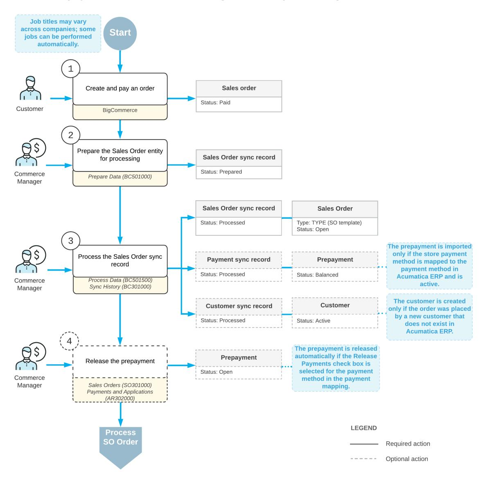

#### **Use of the Guest Customer Account**

If you want to allow placing orders in your store without providing the customer's phone number or email address and want to import such orders into Acumatica ERP, you need to fill in the **Generic Guest Customer** box on the

**CustomerSettings** tab of the *[BigCommerce Stores](#page-473-2)* (BC201000) form. This customer account appears on imported sales orders that have been placed in the BigCommerce store without customer details.

The customer record selected in the **Generic Guest Customer** box is not exported to the BigCommerce store during the synchronization of customers.

You can also configure the system to change a guest customer account aer a particular number of sales orders have been created for this account. You do so by selecting the **Use Multiple Guest Accounts** check box. When the maximum allowed number of sales orders is exceeded, the system creates a new customer and inserts its identifier in the **Generic Guest Customer** box. The settings of the new customer account are copied from the previous generic guest customer account, and its identifier is generated based on the numbering sequence specified in the **Customer NumberingSequence** box.

By default, the allowed number of sales orders per guest customer account is limited to 10,000. You can override this number by adding the MaxOrdersPerGuestAccount key to the <appSettings> section of the web.config file. For example, to change the guest customer account aer every 500 sales orders, add the following key:

<add key="MaxOrdersPerGuestAccount" value="500"/>

For more information about creating a customer, see *[Customers: General Information](https://help-2025r1.acumatica.com/Help?ScreenId=ShowWiki&pageid=f38972e8-a206-4279-8681-b9e2743759c0)*.

# **Order Synchronization: Non-Card Payments**

The following sections describe how to set up the import of payments from the BigCommerce store to Acumatica ERP.

#### **Configuration of Payment Synchronization**

If payments for at least one payment method set up in the BigCommerce store should be imported to Acumatica ERP, you need to activate the *Payment* entity on the **Entities** tab of the *[BigCommerce Stores](#page-473-2)* (BC201000) form.

For each store payment method—that is, each payment method defined and activated in the BigCommerce store payments by which should be imported to Acumatica ERP, you need to create a mapping with a payment method defined in Acumatica ERP on the **Payments** tab. The system automatically adds a row with the store payment method and the currency it was defined for specified (in the**Store Payment Method** and the **Store Currency** boxes, respectively) for each store payment method that is active in the BigCommerce store.

To map the combination of the store payment method and the store currency with the Acumatica ERP payment method, in the table of the **Payments** tab, you specify the following settings:

- To indicate that payments by a specific store payment method should be imported to Acumatica ERP, you select the **Active** check box.
- In the **ERP Payment Method** column, you select the payment method defined in Acumatica ERP for the store payment method. Payments imported from the BigCommerce store to Acumatica ERP will have this payment method inserted. For information about setting up payment methods in Acumatica ERP, see *[Cash](https://help-2025r1.acumatica.com/Help?ScreenId=ShowWiki&pageid=69a90616-7eba-4c89-8c96-0ba2e29071c8) [Management: Payment Methods](https://help-2025r1.acumatica.com/Help?ScreenId=ShowWiki&pageid=69a90616-7eba-4c89-8c96-0ba2e29071c8)*.
- In the **Cash Account** column, you select a cash account associated with the payment method. The cash account must be in the currency of the store payment method and belong to the branch selected on the **Orders** tab. For information about setting up cash accounts in Acumatica ERP, see *[Cash Management: Cash](https://help-2025r1.acumatica.com/Help?ScreenId=ShowWiki&pageid=2f56337a-d98d-4f85-8f3b-54cf3b931a55) [Accounts](https://help-2025r1.acumatica.com/Help?ScreenId=ShowWiki&pageid=2f56337a-d98d-4f85-8f3b-54cf3b931a55)* and *[Configuring Cash Accounts](https://help-2025r1.acumatica.com/Help?ScreenId=ShowWiki&pageid=dbcaef0b-a94c-4de9-83d3-783af727cb77)*.

You can also indicate that payments that are imported from the BigCommerce store should be automatically released as soon as they are imported by selecting the check box in the **Release Payments and Refunds** column. If refunds issued in the store should be imported to Acumatica ERP, you select the **Process Refunds** check box.

#### **Synchronization of Payments**

You can import payments independently of orders by preparing and processing the *Payment* entity.

During the synchronization of the *Payment* entity, the system creates a document of the *Prepayment* type on the *[Payments and Applications](https://help-2025r1.acumatica.com/Help?ScreenId=ShowWiki&pageid=ae844bf4-1aef-42cd-9e2f-49b3ee1bc8d7)* (AR302000) form and applies it to the sales order if the following conditions are met:

- The store payment method with which the order was paid is mapped to an Acumatica ERP payment method and the mapping is active on the *[BigCommerce Stores](#page-473-2)* (BC201000) form.
- The sales order has the *Open* status and has an unbilled balance, or the sales order has the *Canceled* status.

If the mapping of the store payment method is inactive or has not been configured, the system creates a synchronization record for the payment on the *[Sync History](#page-539-1)* (BC301000) form and assigns it the *Filtered* status. In this case, the prepayment document is not created on the *[Payments and Applications](https://help-2025r1.acumatica.com/Help?ScreenId=ShowWiki&pageid=ae844bf4-1aef-42cd-9e2f-49b3ee1bc8d7)* form.

If the sales order has been fully invoiced, the system cannot apply the prepayment to the sales order. In this case, the prepayment is applied to the invoice or invoices created for the sales order.

If the sales order has been partially invoiced, the prepayment is applied to the sales order only in the amount equal to the unbilled amount of the sales order. You need to manually apply the remaining amount to the invoice or invoices.

# **Order Synchronization: Card Payments**

In Acumatica ERP Retail Edition, users can import and, if necessary, process debit and credit card payments from external ecommerce systems through integration with payment gateways. The ability to use card-processing features, such as authorization, capture, voiding, and refunding card transactions, is available if the *Integrated Card Processing* feature is enabled on the *[Enable/Disable Features](https://help-2025r1.acumatica.com/Help?ScreenId=ShowWiki&pageid=c1555e43-1bc5-4f6f-ba9d-b323f94d8a6b)* (CS100000) form. This topic explains how to configure a payment provider for processing of payments made in the BigCommerce store aer they are imported to Acumatica ERP.

# **Mapping of Card-Based Payment Methods**

During the configuration of a connection to the BigCommerce store, one of the steps you perform is the mapping of payment methods configured in Acumatica ERP with payment methods configured in the BigCommerce store. You define payment method mapping in the table on the **Payments** tab of the *[BigCommerce Stores](#page-473-2)* (BC201000) form.

For the Authorize.Net store payment method, you specify the following:

- **ERP Payment Method**: The identifier of the payment method in Acumatica ERP that was configured to use the same processing center as was used for setting up the payment provider in the online store.
- **Cash Account**: A cash account that was specified for the payment method on the **Allowed Cash Accounts** tab on the *[Payment Methods](https://help-2025r1.acumatica.com/Help?ScreenId=ShowWiki&pageid=509285d1-cfae-4e87-95c3-a968451952e6)* (CA204000) form.
- **Proc. Center ID**: The identifier of the processing center configured for the payment method on the **Processing Centers** tab of the *[Processing Centers](https://help-2025r1.acumatica.com/Help?ScreenId=ShowWiki&pageid=e27d8932-6b69-4d7b-9b8e-198f13cc17e3)* (CA205000) form.
- **Active**: A check box that you select for a payment method to indicate that payments made in the ecommerce system that are based on should be imported to Acumatica ERP.
- **Release Payments and Refunds**: A check box that you select to indicate that the payment should be immediately released aer it is imported to Acumatica ERP. If this check box is selected for a card-based payment method associated with a credit card processing center in Acumatica ERP (that is, for the payment method for which a processing center is selected in the **Proc. Center ID** column), only payments that have been captured in the store will be automatically released on import. Payments that have been authorized but not captured in the store need to be processed aer import and then released manually or by using the *[Release AR Documents](https://help-2025r1.acumatica.com/Help?ScreenId=ShowWiki&pageid=78ad2d21-b6a8-46d0-8f2d-98dd0a23f75e)* (AR501000) form.

• **Process Refunds**: A check box that indicates (if selected) that refunds made to the payment method should be imported to Acumatica ERP. This check box is selected and unavailable for card payment methods for which a processing center is specified, which indicates that all refunds made to such payment methods must be imported to Acumatica ERP.

## **Mapping of the Authorize.Net Payment Method**

Because the support of the Authorize.Net plug-in has been deprecated in Acumatica ERP, you can no longer create new transactions with Authorize.Net. If you continue using Authorize.Net in the BigCommerce store, you can import the payments processed with this payment method only as non-card payments. You need to specify the following settings for the Authorize.Net store payment method on the **Payments** tab of the *[BigCommerce Stores](#page-473-2)* (BC201000) form:

- **ERP Payment Method**: A *Cash/Check* payment method of Acumatica ERP.
- **Cash Account**: A cash account that was specified for the payment method on the **Allowed Cash Accounts** tab on the *[Payment Methods](https://help-2025r1.acumatica.com/Help?ScreenId=ShowWiki&pageid=509285d1-cfae-4e87-95c3-a968451952e6)* (CA204000) form.
- **Proc. Center ID**: Cleared
- **Active**: A check box that you select for a payment method to indicate that payments made in the ecommerce system that are based on should be imported to Acumatica ERP.
- **Release Payments and Refunds**: A check box that you select to indicate that the payment should be immediately released aer it is imported to Acumatica ERP.
- **Process Refunds**: A check box that indicates (if selected) that refunds made to the payment method should be imported to Acumatica ERP.

In the BigCommerce store, on the**Settings > Payments** page, on the **Authorize.NetSettings** tab, we recommend you to select *Authorize & Capture* in the **Transaction Type** box. This setting prevents the *Open* status from being assigned to a non-captured payment imported to Acumatica ERP, which is an incorrect status for a payment with unfinished processing.

For step-by-step instructions on configuring and importing payments based on the Authorize.Net payment method, see *Order [Synchronization:](#page-142-1) To Configure and Import Authorize.Net Payments*.

With these settings, credit card payments processed with Authorize.Net in the BigCommerce store will be imported to Acumatica ERP as non-card payments. These payments can be captured, voided, or refunded only in the BigCommerce store. For more details on processing non-card payments for BigCommerce, see *[Order](#page-137-1) [Synchronization: Non-Card Payments](#page-137-1)*.

Refunds created for these payments will be imported as non-card refunds. For more details on processing non-card refunds for BigCommerce, see *[Importing Non-Card Refunds](#page-170-3)*.

#### **Import of Payments Based on Credit Cards**

A customer who has signed in to the BigCommerce store can save credit card details during checkout. When this customer selects a payment method, enters the details of a new card, selects the**Save this card for future transactions** check box, and then places an order, the details of the credit card are saved in the processing center configured in the BigCommerce store.

When the payment is imported from BigCommerce to Acumatica ERP (as part of the synchronization of the *Sales Order* entity or the *Payment* entity), on the *[Payments and Applications](https://help-2025r1.acumatica.com/Help?ScreenId=ShowWiki&pageid=ae844bf4-1aef-42cd-9e2f-49b3ee1bc8d7)* (AR302000) form, the system creates a document of the *Prepayment* type with the *Pending Processing* status. In the Summary area of the created document, the system inserts the following information:

- **Payment Method**: The payment method that has been mapped to the store payment method on the **Payments** tab of the *[BigCommerce Stores](#page-473-2)* (BC201000) form
- **Cash Account**: The cash account selected for the mapped payment method
- **Payment Ref.**: The number of the related credit card transaction in the processing center

- **ProcessingStatus**: The processing status of the credit card transaction. Depending on the last successful operation with the transaction, the processing status can be one of the following:
  - *Pre-Authorized*: The payment has been authorized but the funds have not been captured. The last successful operation was *Authorize Only*.
  - *Captured*: The funds have been captured. The last successful operation with the credit card transaction was either *Authorize and Capture* or *Capture Authorized*.
  - *Pre-Auth./Capture Pending Validation*: The last successful operation with the credit card transaction is unknown. To get the correct processing status of the credit card transaction, you can use the**Validate Card Payment** action on the *[Payments and Applications](https://help-2025r1.acumatica.com/Help?ScreenId=ShowWiki&pageid=ae844bf4-1aef-42cd-9e2f-49b3ee1bc8d7)* form.

On the **Card Processing** tab on the *[Payments and Applications](https://help-2025r1.acumatica.com/Help?ScreenId=ShowWiki&pageid=ae844bf4-1aef-42cd-9e2f-49b3ee1bc8d7)* form, the system creates a row for the last successful operation with the credit card transaction. In the **Proc. Center Response Reason** box, *Imported External Transaction* indicates that the information about the credit card transaction operation has been imported from the external ecommerce system.

In the **Tran.Type** box, the transaction operation can have one of the following types:

- *Authorize Only*: The payment was authorized when the order was placed but has not yet been captured.
- *Authorize and Capture*: The payment was captured when the order was placed.
- *Capture Authorized*: The payment was authorized when the order was placed, and then the funds were captured in the control panel of the store.
- *Unknown*: The status of the operation with the credit card transaction is unknown.

The following diagram illustrates the workflow of importing a sales order to Acumatica ERP from a BigCommerce store where it was placed and paid by a card based on a payment method for which integrated card processing has been configured in Acumatica ERP.

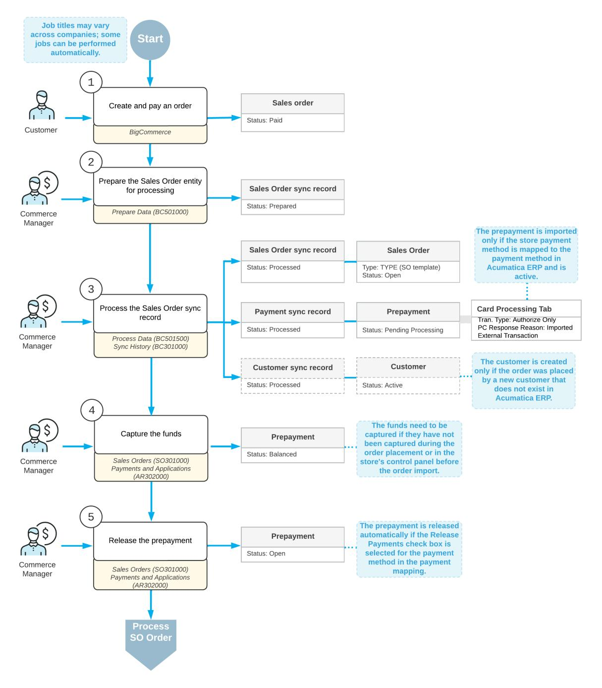

# **Deferred Processing of Imported Credit Card Payments**

Credit card transactions created in Acumatica ERP during the import of payments based on credit card payment methods require validation in the following cases:

- If the customer used a previously saved credit card
- If the customer entered the details of a new card and selected the**Save this card for future transactions** check box during checkout
- If the last operation on the credit card transaction has the *Unknown* status

External credit card transactions that require validation are displayed on the **Deferred Processing Required** tab of the *Validate Card [Payments](https://help-2025r1.acumatica.com/Help?ScreenId=ShowWiki&pageid=5998b9d7-04c2-49c1-acf3-b8807d77ff37)* (AR513000) form and have the **Load Payment Profile** check box selected.

When the validation process is started, the system performs the following actions:

- 1. On the *[Customer Payment Methods](https://help-2025r1.acumatica.com/Help?ScreenId=ShowWiki&pageid=4293eea3-63d3-494e-8ee1-3d3f4a245ee1)* (AR303010) form, creates a customer payment method based on the payment profile from the processing center.
- 2. Links the customer payment method to the credit card transaction.
- 3. Links the customer payment method to the imported payment.
- 4. Requests the status of the credit card transaction, and updates the processing status of the transaction and the status of the prepayment, if necessary.

If the updated processing status of the transaction is *Captured*, the status of the prepayment changes to *Balanced*. If on the **General** tab of the *[Accounts Receivable Preferences](https://help-2025r1.acumatica.com/Help?ScreenId=ShowWiki&pageid=f7b52067-5299-45e8-b601-485cd709f58b)* (AR101000) form, the **Enable Integrated CC Processing** check box is selected, the system releases the prepayment.

Customizations may support forced validation of all imported credit card transactions. In this case, all credit card transactions imported from external systems will be displayed on the **Deferred Processing Required** tab of the *Validate Card [Payments](https://help-2025r1.acumatica.com/Help?ScreenId=ShowWiki&pageid=5998b9d7-04c2-49c1-acf3-b8807d77ff37)* form and will need to be validated.

A sales order can be fulfilled only if the credit card payment imported for it from an external ecommerce system has been validated. To streamline shipping of orders, you can set up an automation schedule on the *Validate Card [Payments](https://help-2025r1.acumatica.com/Help?ScreenId=ShowWiki&pageid=5998b9d7-04c2-49c1-acf3-b8807d77ff37)* form to regularly process imported card transactions that require validation. For information about automation schedules, see *[Automated](https://help-2025r1.acumatica.com/Help?ScreenId=ShowWiki&pageid=8a6c65f2-2379-48e1-b249-fb70d8122c4e) [Processing: General Information](https://help-2025r1.acumatica.com/Help?ScreenId=ShowWiki&pageid=8a6c65f2-2379-48e1-b249-fb70d8122c4e)*.

# **Order Synchronization: To Configure and Import Authorize.Net Payments**

The following activity will walk you through the process of configuring the system so that you can import card payments from the BigCommerce store to Acumatica ERP and then further process them, if necessary.

The following activity is based on the *U100* dataset.

### **Story**

Suppose that the SweetLife Fruits & Jams company wants to accept card payments in the BigCommerce store. The company already has the Authorize.Net account for processing card payments.

Acting as an implementation consultant helping SweetLife to set up the integration of Acumatica ERP with the BigCommerce store, you need to configure Authorize.Net as a card payment provider in the BigCommerce store, and then configure the import of card payments from the BigCommerce store to Acumatica ERP.

Because the support of the Authorize.Net plug-in has been deprecated in Acumatica ERP, you can import the payments processed with Authorize.Net only as non-card payments.

#### **Configuration Overview**

In the *U100* dataset, the following tasks have been performed to support this activity:

- On the *[Enable/Disable Features](https://help-2025r1.acumatica.com/Help?ScreenId=ShowWiki&pageid=c1555e43-1bc5-4f6f-ba9d-b323f94d8a6b)* (CS100000) form, the *Integrated Card Processing* feature has been enabled.
- On the *[Cash Accounts](https://help-2025r1.acumatica.com/Help?ScreenId=ShowWiki&pageid=10f71454-88f9-4d6c-8d09-32856d8c6741)* (CA202000) form, the *10250ST* cash account has been created.

• On the *[Payment Methods](https://help-2025r1.acumatica.com/Help?ScreenId=ShowWiki&pageid=509285d1-cfae-4e87-95c3-a968451952e6)* (CA204000) form, the *ONLINE* payment method has been set up to be used with the *10250ST* cash account.

## **Process Overview**

In this activity, you will do the following:

- 1. In the control panel of the BigCommerce store, enable the Authorize.Net payment gateway for accepting card payments.
- 2. On the *[BigCommerce Stores](#page-473-2)* (BC201000) form, map the Authorize.Net store payment method with a *Cash/ Check* payment method defined in Acumatica ERP.
- 3. On the storefront of the BigCommerce store, create a test order paid by card.
- 4. In the control panel of the BigCommerce store, review the created test sales order.
- 5. On the *[Prepare Data](#page-529-1)* (BC501000) form, prepare the sales order for synchronization; on the *[Process Data](#page-533-1)* (BC501500) form, process the sales order data prepared for synchronization.
- 6. On the *[Sales Orders](https://help-2025r1.acumatica.com/Help?ScreenId=ShowWiki&pageid=19e4021c-1b84-49fd-be12-0320c5f1c7e5)* (SO301000) form, review the imported sales order.

## **System Preparation**

Before you complete the instructions in this activity, do the following:

1. Sign up for an Authorize.Net sandbox account at *[https://developer.authorize.net/hello\\_world/sandbox.html](https://developer.authorize.net/hello_world/sandbox.html)*. Aer you create an account, you will get the credentials to use in payment processing (API Login ID and Transaction Key). You will use these credentials in this activity.

In your Authorize.Net sandbox account, make sure that you enable *Live* transaction processing mode. However, you will enable test mode when you configure the Authorize.Net payment method in your BigCommerce store and when you set up the Authorize.Net processing center in Acumatica ERP.

- 2. Make sure that the following prerequisites have been met:
  - The BigCommerce store has been created and configured, as described in *Initial [Configuration:](#page-19-1) To Set Up [a BigCommerce Store](#page-19-1)*.
  - The connection to the BigCommerce store has been established and the initial configuration has been performed, as described in *Initial [Configuration:](#page-27-1) To Establish and Configure the Store Connection*.
- 3. Launch the Acumatica ERP website with the *U100* dataset preloaded, and sign in with the following credentials:
  - **Username**: *gibbs*
  - **Password**: *123*
- 4. Sign in to the control panel of the BigCommerce store as the store administrator.

#### **Step 1: Defining the Authorize.Net Payment Gateway in the BigCommerce Store**

To define the Authorize.Net payment method that the store will accept for the United States Dollar (USD) currency, in the BigCommerce control panel, do the following:

- 1. In the le pane, click**Settings**.
- 2. On the **Settings** page, in the**Setup** section, click **Payments**.
- 3. On the **Payment Methods** page, which opens, in the**Show payment methods for** box, make sure *USD (US Dollar)* is selected.

The system displays the **Checkout PaymentSettings** tab and a tab for each payment method activated for the selected currency.

- 4. On the **Checkout PaymentSettings** tab, under **Additional providers**, expand the **Online Payment Methods** group.
- 5. In the row of *Authorize.Net*, click **Set up**.
- 6. On the **Authorize.NetSettings** tab, which appears, specify the following settings:
  - **API Login ID**: The API Login ID of your Authorize.Net sandbox account
  - **Transaction Key**: The Transaction Key of your Authorize.Net sandbox account

You should use **API Login ID** and **Transaction Key** that you used when you configured the connection to Authorize.Net payment gateway.

- **Transaction Type**: *Authorize & Capture*
- **Test Mode**: *Yes*
- 7. In the lower right, click**Save** to save your changes.

#### **Step 2: Creating the Mapping for the Authorize.Net Store Payment Method**

To configure the mapping for the Authorize.Net store payment method in Acumatica ERP, do the following:

- 1. On the *[BigCommerce Stores](#page-473-2)* (BC201000) form, select the *SweetStore - BC* store.
- 2. In the table of the **Payments** tab, update the settings in the row with the *AUTHORIZENET (CREDIT\_CARD)* payment method as follows:
  - **Active**: Selected
  - **Store Currency**: *USD*
  - **ERP Payment Method**: *ONLINE*
  - **Cash Account**: *10250ST*

Because the support of the Authorize.Net plug-in has been deprecated in Acumatica ERP, you can map it only with a *Cash/Check* payment method and import the payments processed with Authorize.Net as noncard payments.

3. On the form toolbar, click**Save** to save your changes.

## **Step 3: Creating an Order Through the Storefront**

To purchase a jar of jam, so that you can later import the order and review the credit card payment, in the BigCommerce control panel, do the following:

- 1. At the upper right, click**View storefront** to open the storefront.
- 2. On the storefront, click**Search** in the upper right, and then start typing plum in the search box that appears.
- 3. In the search results, click the tile of the *Plum jam 96 oz* product.
- 4. On the page for the *Plum jam 96 oz* product, which opens, select a quantity of *3*, and click **Add to Cart**.
- 5. In the pop-up window that opens, click **Proceed to checkout**.
- 6. On the checkout page, specify the needed settings as follows:
  - a. In the **Customer** section, in the **Email** box, specify melody@example.com, and click **Continue**.
  - b. In the **Shipping** section, fill in the shipping address boxes as follows:
    - **First Name**: Melody
    - **Last Name**: Keys

- **Address**: 3402 Angus Road
- **City**: New York
- **Country**: *United States*
- **State/Province**: *New York*
- **Postal Code**: 10003
- **My billing address is the same as my shipping address**: Selected (default state)
- c. In the **Shipping Method** section, make sure that the *Free Shipping* option is selected, and click **Continue**.
- 7. In the **Payment** section, make sure the **Authorize.Net** option button is selected, and specify the following card settings:
  - **Credit Card Number**: 4111 1111 1111 1111
  - **Expiration**: 12/25
  - **Name on Card**: Melody Keys
- 8. Click **Place Order** to place your order.

Your order has been created, and on the confirmation page, the order number is displayed. You will process the order with this order number further in this activity.

#### **Step 4: Reviewing the Sales Order in the Control Panel**

To review the sales order that you placed in the previous step, in the BigCommerce control panel, do the following:

- 1. In the le pane, click **Orders > All orders**.
- 2. On the **View orders** page, which opens, click the plus button next to the order of *Melody Keys* that you have just created to expand the order details.

Notice that the**Status** of the order is set to *Awaiting Fulfillment*. The payment funds have been already captured because you have configured the *Authorize.Net* payment option to authorize and capture the payment amount when the order is placed.

## **Step 5: Importing the Sales Order**

To prepare the sales order data for synchronization and then process it, do the following:

- 1. On the *[Prepare Data](#page-529-1)* (BC501000) form, specify the following settings in the Summary area:
  - **Store**: *SweetStore - BC*
  - **Prepare Mode**: *Incremental*
- 2. In the table, select the check box in the unlabeled column in the row of the *Sales Order* entity, and on the form toolbar, click **Prepare**.
- 3. In the **Processing** dialog box, which opens, click **Close** to close the dialog box.
- 4. In the row of the *Sales Order* entity, click the link with the number of prepared synchronization records in the **Ready to Process** column. The *[Process Data](#page-533-1)* (BC501500) form opens with the *SweetStore - BC* store and the *Sales Order* entity selected.
- 5. In the table on the *[Process Data](#page-533-1)* form, select the unlabeled check box for the only row, and click **Process** on the form toolbar.
- 6. In the **Processing** dialog box, which opens, click **Close** to close the dialog box.

#### **Step 6: Reviewing the Imported Sales Order**

To review the settings of the imported sales order, do the following:

- 1. On the *[Sync History](#page-539-1)* (BC301000) form, specify the following settings in the Summary area:
  - **Store**: *SweetStore - BC*
  - **Entity**: *Sales Order*
- 2. On the **Processed** tab, in the row of the sales order that you have just imported (which you can locate by its external ID), click the link in the **ERP ID** column.
- 3. On the *[Sales Orders](https://help-2025r1.acumatica.com/Help?ScreenId=ShowWiki&pageid=19e4021c-1b84-49fd-be12-0320c5f1c7e5)* (SO301000) form, which opens for the imported order in a pop-up window, review the settings of the order.

In the Summary area, notice that the **External Reference** and **Description** boxes include the order number from BigCommerce. In the **Customer** box, the system has inserted the ID of the generic guest customer that you have selected on the *[BigCommerce Stores](#page-473-2)* (BC201000) form.

4. On the **Payments** tab, review the details of the created payment document.

Notice that the payment document has the *Prepayment* type. It includes the external credit card transaction associated with the purchase. The number of the transaction is displayed in the **Payment Ref.** column.

| <b>Sales Orders</b> EO 000076 - eCommerce Guest Customer  |                |                       |                  |                   |   |                             |                  |                                |                                        |   |                 |                     |                        |             | <b>PI NOTES</b> |               | <b>ACTIVITIES</b>       | <b>FILES</b> | <b>CUSTOMIZATION</b>   | TOOLS $\sim$ |
|--------------------------------------------------------------|----------------|-----------------------|------------------|-------------------|---|-----------------------------|------------------|--------------------------------|----------------------------------------|---|-----------------|---------------------|------------------------|-------------|-----------------|---------------|-------------------------|--------------|------------------------|--------------|
| $\begin{bmatrix} 1 \\ 1 \\ 1 \end{bmatrix}$ 뭐 $\Omega$ | $\pm$          | 侕                     | n $\check{ }$ | K                 | ≺ | $\mathcal{P}$               | Я                |                                | QUICK PROCESS                          |   |                 |                     | <b>CREATE SHIPMENT</b> | <b>HOLD</b> | $\cdots$        |               |                         |              |                        |              |
| * Order Type:                                                | EO             | α                     |                  | * Customer:       |   |                             |                  |                                | ECOMGUEST - eCommerce Guest Ct P       |   | $\mathscr{O}$   |                     | Ordered Qty.:          |             | 3.00            |               |                         |              |                        | $\lambda$    |
| Order Nbr.:                                                  | 000076         | α                     |                  | * Location:       |   |                             |                  | <b>MAIN - Primary Location</b> |                                        | α | $\mathscr{O}$   |                     | <b>Detail Total:</b>   |             | 135.45          |               |                         |              |                        |              |
| Status:                                                      | Open           |                       |                  | Contact:          |   |                             |                  |                                |                                        | Q | $\mathscr{O}$   |                     | Line Discounts:        |             | 0.00            |               |                         |              |                        |              |
| * Date:                                                      | 3/25/2025      | Ä                     |                  | * Project:        |   |                             |                  | X - Non-Project Code.          |                                        | Q | $\mathscr{O}$   |                     | Document Dis           |             | 0.00            |               |                         |              |                        |              |
| * Requested On:                                              | 3/25/2025      |                       |                  | Description:      |   |                             |                  |                                | SweetStore - BC   Order: 102   Status: |   |                 |                     | <b>Freight Total:</b>  |             | 0.00            |               |                         |              |                        |              |
| Customer Ord                                                 |                |                       |                  |                   |   | <b>Awaiting Fulfillment</b> |                  |                                |                                        |   |                 | <b>Tax Total:</b>   |                        |             | 0.00            |               |                         |              |                        |              |
| External Refer                                               | 102 - SweetSto |                       |                  |                   |   |                             |                  |                                |                                        |   |                 |                     | <b>Order Total:</b>    |             | 135.45          |               |                         |              |                        |              |
| <b>DETAILS</b>                                               | <b>TAXES</b>   | <b>FINANCIAL</b>      |                  | <b>SHIPPING</b>   |   |                             | <b>ADDRESSES</b> |                                | <b>SHIPMENTS</b>                       |   | <b>PAYMENTS</b> |                     | <b>RELATIONS</b>       |             | <b>O</b> TOTALS |               |                         |              |                        |              |
| Ò $\pm$ $\mathsf{x}$                                   |                | <b>CREATE PAYMENT</b> |                  |                   |   | <b>CREATE PREPAYMENT</b>    |                  | CAPTURE                        | <b>VOID CARD PAYMENT</b>               |   |                 |                     | Active                 |             |                 | ्र $\cdot$ |                         |              | Not Released:          | 135.45       |
| 0 D R. Doc. Type                                    |                | *Reference            |                  | <b>Applied To</b> |   | <b>Transferred</b>          |                  | <b>Balance Status</b>          |                                        |   |                 | <b>Payment Ref.</b> | Payment                | Cash        |                 |               | <b>Payment Currency</b> |              | Authorized:            | 0.00         |
|                                                              |                | Nbr.                  |                  | Order             |   | to Invoice                  |                  |                                |                                        |   |                 |                     | <b>Method</b>          |             | <b>Account</b>  | <b>Amount</b> |                         |              | Released:              | 0.00         |
| 0 D Prepayment                                         |                | 000081                |                  | 135.45            |   | 0.00                        |                  | 0.00                           | Balanced                               |   |                 | 80039517205         | <b>ONLINE</b>          |             | 10250ST         | 135.45        | <b>USD</b>              |              | <b>Total Paid:</b>     | 135.45       |
|                                                              |                |                       |                  |                   |   |                             |                  |                                |                                        |   |                 |                     |                        |             |                 |               |                         |              | <b>Total Transferr</b> | 0.00         |
|                                                              |                |                       |                  |                   |   |                             |                  |                                |                                        |   |                 |                     |                        |             |                 |               |                         |              |                        |              |
|                                                              |                |                       |                  |                   |   |                             |                  |                                |                                        |   |                 |                     |                        |             |                 |               |                         |              | <b>Unpaid Balance:</b> | 0.00         |
|                                                              |                |                       |                  |                   |   |                             |                  |                                |                                        |   |                 |                     |                        |             |                 |               |                         |              | Unbilled Balan         | 135.45       |

#### *Figure: The prepayment applied to the order*

- 5. Click the link in the **Reference Nbr.** column to open the payment.
- 6. On the *[Payments and Applications](https://help-2025r1.acumatica.com/Help?ScreenId=ShowWiki&pageid=ae844bf4-1aef-42cd-9e2f-49b3ee1bc8d7)* (AR302000) form, which opens in a pop-up window, review the payment details.

Notice that in the **Payment Ref.** box of the Summary area, the payment identifier assigned to the payment in the BigCommerce store is displayed. The **Description** box contains the store payment method, the order number, and the payment ID.

The prepayment has the *Balanced* status because the **Release Payments and Refunds** check box was cleared for the *AUTHORIZENET (CREDIT\_CARD)* payment method in the mapping table on the **Payments** tab of the *[BigCommerce Stores](#page-473-2)* (BC201000) form.

7. Close the pup-up windows with the *[Payments and Applications](https://help-2025r1.acumatica.com/Help?ScreenId=ShowWiki&pageid=ae844bf4-1aef-42cd-9e2f-49b3ee1bc8d7)* and *[Sales Orders](https://help-2025r1.acumatica.com/Help?ScreenId=ShowWiki&pageid=19e4021c-1b84-49fd-be12-0320c5f1c7e5)* forms.

Next you would proceed to create and confirm the related shipment, prepare the related invoice, release the payment, and synchronize the shipment back to the BigCommerce store. For the purposes of this activity, you do not have to perform any of these operations.

# **Order Synchronization: Orders with Gi Wrapping**

In a BigCommerce store, a merchant can provide its customers with the option of having their purchase gi wrapped. The BigCommerce gi-wrapping functionality supports creating gi-wrapping options for specific products or for all products, for free or at various pricing levels. If a customer purchases an item for which gi wrapping options have been configured, they have the option to add gi wrapping and a gi message to their purchase while viewing their shopping cart.

# **Configuration of Gi Wrapping Import**

To configure the import of gi-wrapped items to Acumatica ERP, you perform the following general steps:

- 1. On the *[Non-Stock Items](https://help-2025r1.acumatica.com/Help?ScreenId=ShowWiki&pageid=bf68dd4f-63d4-460d-8dc0-9152f2bd6bf1)* (IN202000) form, define a non-stock item to represent gi wrapping in sales orders, shipments, and invoices. This non-stock item should have the following settings:
  - **Item Status** (in the Summary area): *Active*, *No Purchases*, or *No Request*
  - **Type** (the **General** tab): *Non-Stock Item* or *Service*
  - **Require Receipt**: Selected
  - **RequireShipment**: Selected
- 2. On the **Orders** tab of the *[BigCommerce Stores](#page-473-2)* (BC201000) form, select the non-stock item that represents gi wrapping in the new **Gi Wrapping Item** box. The non-stock item selected in this box is excluded from synchronization and is not exported when the *Non-Stock Item* entity is synchronized with the BigCommerce store.

When a sales order that includes gi-wrapped items is imported from the BigCommerce store to Acumatica ERP, on the **Details** tab of the *[Sales Orders](https://help-2025r1.acumatica.com/Help?ScreenId=ShowWiki&pageid=19e4021c-1b84-49fd-be12-0320c5f1c7e5)* (SO301000) form, the imported sales order contains a line for gi wrapping for each of the gi-wrapped items. In the line for the gi-wrapping item, the system inserts the same warehouse as is assigned to the main item. The line number of the item to which the gi wrapping pertains is shown in the **Associated Order Line Nbr.** column.

#### **Import of Gi Messages**

You can set up an import mapping to display a gi message, if a customer le one while adding gi wrapping for an item in the BigCommerce store, in the **Gi Message** column of the line of the gi wrapping of the imported order. To do this, on the **Import Mapping** tab of the *[Entities](#page-521-1)* (BC202000) form, you select the BigCommerce store and the *Sales Order* entity and specify the mapping settings as shown in the following table.

| Active   | ERP Object            | ERP Field   | External Object             | External Field / Value |
|----------|-----------------------|-------------|-----------------------------|---------------------------|
| Selected | Sales Order → Details | Gi Message | Order Data → Order Products | Wrapping Mes sage      |

## **Gi Wrapping Details in the Sales Order Synchronization Record Information**

You can view the information about the gi-wrapping item on the *[Sync History](#page-539-1)* (BC301000) form. To do this, you select a row of a sales order synchronization record in the table and click**View Details** on the More menu. In the **Sync Record Details** dialog box, which is opened, information about the sales order line containing the gi wrapping item is displayed along with information about the sales order line of the item for which gi wrapping was added in the BigCommerce store. The gi wrapping order line contains *Sales Order Line (Gi Wrapping)* in the **EntityType** column. The sales order line for gi wrapping has the same value in the **External ID** column as the sales order line of the item to be gi wrapped.

# **Importing Orders with Taxes**

In this chapter, you will learn how to configure tax synchronization between Acumatica ERP and the BigCommerce store.

# **Import of Taxes: General Information**

During the implementation of the integration between Acumatica ERP and the BigCommerce store, you decide if taxes should be synchronized during the export or import of sales orders.

# **Learning Objectives**

In this chapter, you will learn how to set up tax synchronization if you collect tax on products you sell in the BigCommerce store.

## **Applicable Scenarios**

You set up tax synchronization during the configuration of the connection between Acumatica ERP and the BigCommerce store to make sure that taxes collected on online orders are reflected in an imported order and, if necessary, correctly recalculated when a shipment and an invoice are created for the order.

# **Configuration of Tax Synchronization for Manual Tax Setup**

If you plan to use only Acumatica ERP (without a dedicated tax calculation provider) for tax calculation and reporting, you perform the following general steps:

- 1. Configure manual tax calculation rules in the BigCommerce store. For information, see *[Manual](https://support.bigcommerce.com/s/article/Manual-Tax-Setup) Tax Setup* in the BigCommerce documentation.
- 2. Implement the tax functionality by configuring a tax agency, tax zones, tax categories, and sales taxes.

For detailed information about configuring sales taxes in Acumatica ERP, see *[Implementing](https://help-2025r1.acumatica.com/Help?ScreenId=ShowWiki&pageid=59d8b6a4-fc87-44e8-a3a6-d971eef04268) Taxes*.

The manual tax configuration should match in the BigCommerce store and in Acumatica ERP, otherwise issues might occur during the synchronization of entities. Tax categories and taxes in Acumatica ERP should be configured in the same way as tax classes and tax rates in BigCommerce. If you use different names for a tax or a tax category in both systems, you should map tax IDs by using substitution lists, as described in *Import of Taxes: [Substitution](#page-152-1) [Lists](#page-152-1)*.

Taxes that have the same name in the BigCommerce store and Acumatica ERP (or that have been mapped via the substitution list) should be defined with exactly the same rates. Although an order for which the taxes have different rates will be imported successfully, when an invoice is prepared for this imported sales order, the taxes are recalculated based on the tax settings configured in Acumatica ERP. If the tax rates differ, there will be a discrepancy between the amount of the invoice created in Acumatica ERP and the amount of the order created in the BigCommerce store.

- 3. Specify the tax synchronization settings on the **Orders** tab of the *[BigCommerce Stores](#page-473-2)* (BC201000) form as follows:
  - **TaxSynchronization**: Selected

- **DefaultTax Zone**: The tax zone that the system will assign to the order if no tax zone has been identified during the order import.
- **Use as PrimaryTax Zone**: Cleared

During the import of an order, the system searches for the tax zone that should be used for tax calculation as follows, stopping the search when it finds a qualifying tax zone:

- 1. The system searches for the primary tax zone.
- 2. The system searches for the tax zone of the customer location.
- 3. The system tries to determine the tax zone based on the zip code of the shipping address.
- 4. The system searches for the default tax zone.

This process is illustrated in the following diagram.

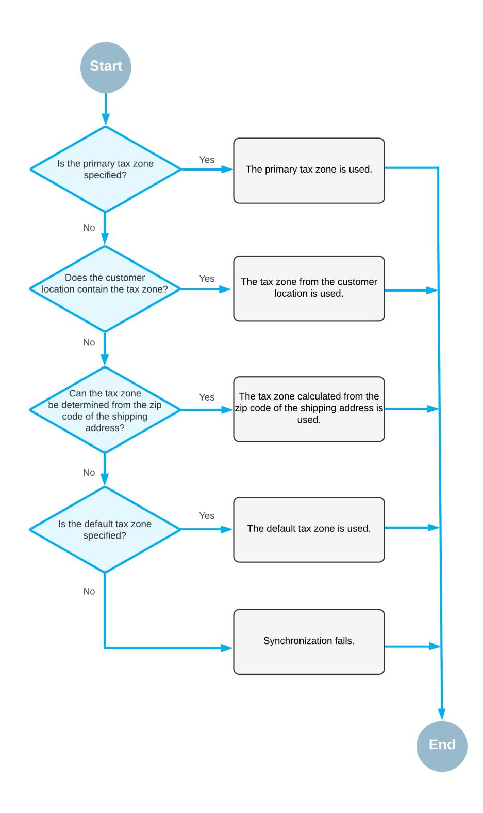

## **Handling of Long Tax Names**

If an external tax provider is used for tax calculation, sometimes tax names returned by the external tax provider can exceed the maximum allowed length of tax IDs supported by Acumatica ERP, (which is currently 60 characters). Long tax IDs are processed as follows:

• If there is no hyphen in the tax ID, any characters that exceed the maximum length are truncated.

- If there is a hyphen in the tax ID, the tax ID is processed as follows:
  - If the tax ID contains the word *SPECIAL*, the part of the ID to the right of the hyphen is used. Any characters that still exceed the maximum length are truncated.
  - If the tax ID does not contain the word *SPECIAL*, the part of the ID to the le of the hyphen is used. Any characters that still exceed the maximum length are truncated.

#### **Tax Calculation Mode in Imported Sales Orders**

In BigCommerce, you can indicate whether the prices of products are entered in the control panel of the store inclusive or exclusive of tax. However, information about this setting is not passed during the import of sales orders from BigCommerce to Acumatica ERP. If the *Net/Gross Entry Mode* feature is enabled on the *[Enable/Disable Features](https://help-2025r1.acumatica.com/Help?ScreenId=ShowWiki&pageid=c1555e43-1bc5-4f6f-ba9d-b323f94d8a6b)* (CS100000) form, for sales orders imported from the BigCommerce store, the system inserts *Tax Settings* in the **Tax Calculation Mode** box on the **Financial** tab of the *[Sales Orders](https://help-2025r1.acumatica.com/Help?ScreenId=ShowWiki&pageid=19e4021c-1b84-49fd-be12-0320c5f1c7e5)* (SO301000) form. This option is inserted regardless of the price settings in the BigCommerce store and the configuration of tax calculation in Acumatica ERP.

# **Import of Taxes: External Tax Provider**

You can set up the synchronization of taxes if you use an external tax provider for automatic tax calculation and for tax reporting.

# **Configuration of Tax Synchronization for the External Tax Service**

To set up the synchronization of taxes for an external tax provider, you need to perform the following general steps:

- 1. Configure automatic tax calculation in the BigCommerce store. For information, see *[Automatic](https://support.bigcommerce.com/s/article/Automatic-Tax-Setup) Tax Setup* in the BigCommerce documentation.
- 2. Configure the integration of Acumatica ERP with the external tax provider by using the same account as was used in the previous step. For instructions on how to integrate Acumatica ERP with Avalara AvaTax or Vertex, see *Setup of Online [Integration](https://help-2025r1.acumatica.com/Help?ScreenId=ShowWiki&pageid=8a0eea54-8340-458b-973d-28a29f09b24a) with Avalara AvaTax* or *Online Integration with Vertex Tax [Calculation](https://help-2025r1.acumatica.com/Help?ScreenId=ShowWiki&pageid=4b2baf3e-867a-49cd-9d9b-9a658bf44025)*.
- 3. Configure the synchronization of taxes with the BigCommerce store as described in the following section.

# **Tax Synchronization Settings**

To set up the tax synchronization with the BigCommerce store, you specify the following settings on the **Orders** tab of the *[BigCommerce Stores](#page-473-2)* (BC201000) form:

1. In the **Order** section, in the **OrderType for Import** box, select an order type for which the calculation of taxes has been enabled on the *Order [Types](https://help-2025r1.acumatica.com/Help?ScreenId=ShowWiki&pageid=e6984218-4260-4438-99e1-aee2b3765369)* (SO201000) form—that is, the **Disable AutomaticTax Calculation** check box is cleared on the **General** tab.

For information on disabling tax calculation, see *Tax Application in Sales [Documents](https://help-2025r1.acumatica.com/Help?ScreenId=ShowWiki&pageid=39c67aca-9e64-47f3-bed5-08227508e62c)*.

Selecting an order type that allows tax recalculation may lead to amount inconsistencies.

- 2. In the **Taxes** section, specify the following settings:
  - Select the**TaxSynchronization** check box.
  - In the **DefaultTax Zone**, select the tax zone that you have configured for the external tax provider.
  - Select the **Use as PrimaryTax Zone** check box.

With these settings, the tax zone specified in the **DefaultTax Zone** will always be used for tax calculation, which means that the taxes calculated by the external tax provider will be imported with the order. If

the taxes in the imported order do not yet exist in Acumatica ERP, the system creates them on the *[Taxes](https://help-2025r1.acumatica.com/Help?ScreenId=ShowWiki&pageid=692e30c9-e0af-4aa3-b0f6-f3ba190d257a)* (TX205000) form.

3. In the **Substitution Lists** section, specify the substitution list that contains the mapping of tax categories in Acumatica ERP with tax classes in the BigCommerce store in the**Tax Category List** box.

For information about the use of substitution lists for the synchronization of taxes, see *Import of [Taxes:](#page-152-1) [Substitution Lists](#page-152-1)*.

# **Import of Taxes: Substitution Lists**

When you set up the synchronization of taxes between Acumatica ERP and the BigCommerce store, you specify the substitution lists in the**Substitution Lists** section of the **Orders** tab of the *[BigCommerce Stores](#page-473-2)* (BC201000) form. The following sections describe how substitution lists specified in these boxes are used during the synchronization of orders and stock and non-stock items.

#### **Substitution List for Taxes**

If you use Acumatica ERP for tax reporting (without an external tax provider), when you configure tax synchronization, you need to make sure that all taxes that might be applied in the BigCommerce store have also been set up on the *[Taxes](https://help-2025r1.acumatica.com/Help?ScreenId=ShowWiki&pageid=692e30c9-e0af-4aa3-b0f6-f3ba190d257a)* (TX205000) form. Taxes whose IDs do not match the IDs of taxes in the BigCommerce store should be mapped with external tax IDs in a substitution list as follows:

- On the *[Substitution Lists](https://help-2025r1.acumatica.com/Help?ScreenId=ShowWiki&pageid=e1b0125f-cb2f-4451-91af-c5eeaff3b5ac)* (SM206026) form, you specify tax IDs from the external system in the **OriginalValue** column. For each external tax ID, you add a corresponding tax ID from Acumatica ERP in the **Substitution Value** column.
- On the *[BigCommerce Stores](#page-473-2)* (BC201000) form (**Orders** tab), you specify the substitution list in the**Tax List** box.

When an order containing taxes is being imported to Acumatica ERP, for each tax that has been added to the order in the store, the system searches for a matching tax in Acumatica ERP as follows:

- 1. Searches for the tax on the *[Taxes](https://help-2025r1.acumatica.com/Help?ScreenId=ShowWiki&pageid=692e30c9-e0af-4aa3-b0f6-f3ba190d257a)* form.
- 2. Searches for the tax in the substitution list, and then searches for its substitution value on the *[Taxes](https://help-2025r1.acumatica.com/Help?ScreenId=ShowWiki&pageid=692e30c9-e0af-4aa3-b0f6-f3ba190d257a)* form.

If the tax has been found, the system adds it to the imported order. Otherwise, the synchronization of the order fails and an error is displayed for the order's synchronization record on the *[Sync History](#page-539-1)* (BC301000) form.

# **Substitution List for Tax Categories**

In Acumatica ERP, you can assign tax categories to stock and non-stock items. To make sure taxes are calculated correctly when an item is ordered in a BigCommerce store, you need to map the tax categories in Acumatica ERP to the tax classes in the BigCommerce store by using a substitution list as follows:

- 1. On the *[Substitution Lists](https://help-2025r1.acumatica.com/Help?ScreenId=ShowWiki&pageid=e1b0125f-cb2f-4451-91af-c5eeaff3b5ac)* (SM206026) form, you create a substitution list. In the **OriginalValue** column, you add Acumatica ERP tax categories, and in the**Substitution Value** column, you add a tax class from the BigCommerce store for each of the tax categories.
- 2. On the *[BigCommerce Stores](#page-473-2)* (BC201000) form (**Orders** tab), you select the substitution list in the**Tax Category List** box.

When a stock or non-stock item is synchronized with the BigCommerce store, a tax class is assigned to the item in the BigCommerce store based on the tax category assigned to the item on the *[Non-Stock Items](https://help-2025r1.acumatica.com/Help?ScreenId=ShowWiki&pageid=bf68dd4f-63d4-460d-8dc0-9152f2bd6bf1)* (IN202000) or *[Stock Items](https://help-2025r1.acumatica.com/Help?ScreenId=ShowWiki&pageid=77786a70-1f1e-4d63-ad98-96f98e4fcb0e)* (IN202500) form, and the substitution value specified for the tax category in the substitution list on the *[Substitution Lists](https://help-2025r1.acumatica.com/Help?ScreenId=ShowWiki&pageid=e1b0125f-cb2f-4451-91af-c5eeaff3b5ac)* form.

The substitution list specified in the**Tax Category List** box is used only for the export of items. The tax category that is shown for an item in an imported order is copied from the item's settings on the *[Non-Stock Items](https://help-2025r1.acumatica.com/Help?ScreenId=ShowWiki&pageid=bf68dd4f-63d4-460d-8dc0-9152f2bd6bf1)* or *[Stock Items](https://help-2025r1.acumatica.com/Help?ScreenId=ShowWiki&pageid=77786a70-1f1e-4d63-ad98-96f98e4fcb0e)* form and is not imported from the BigCommerce store. To avoid discrepancies between the tax amount calculated in the BigCommerce store when an order is placed and the tax amount calculated in Acumatica ERP when an invoice is generated for the imported order, make sure that the item's tax category is in sync between the two systems before the order is created.

# **Import of Taxes: Process Activity**

The following activity will walk you through the process of configuring the synchronization of taxes between the BigCommerce store and Acumatica ERP.

The following activity is based on the *U100* dataset.

#### **Story**

Suppose that SweetLife is using only Acumatica ERP (without an external tax provider) for calculating and reporting taxes on the goods and services it sells. As an implementation consultant helping SweetLife to set up a BigCommerce store, you need to set up taxes in the store and then make sure that the taxes on online sales orders are correctly passed to Acumatica ERP when the orders are imported.

#### **Configuration Overview**

In the *U100* dataset, the following tasks have been performed to support this activity:

- On the *Tax [Zones](https://help-2025r1.acumatica.com/Help?ScreenId=ShowWiki&pageid=361e36b3-a660-4fcb-a0cf-377b5bdb7aec)* (TX206000) form, the *NYSTATE* tax zone has been configured.
- On the *Tax [Categories](https://help-2025r1.acumatica.com/Help?ScreenId=ShowWiki&pageid=db5e7fad-054d-467d-877e-2db4ee180ead)* (TX205500) form, the *TAXABLE* and *EXEMPT* tax categories have been configured. These tax categories have been assigned to item classes on the *[Item Classes](https://help-2025r1.acumatica.com/Help?ScreenId=ShowWiki&pageid=80a3301b-4eb2-4ce2-94c5-0407c786a0f1)* (IN201000) form, and to individual stock and non-stock items on the *[Stock Items](https://help-2025r1.acumatica.com/Help?ScreenId=ShowWiki&pageid=77786a70-1f1e-4d63-ad98-96f98e4fcb0e)* (IN202500) and *[Non-Stock Items](https://help-2025r1.acumatica.com/Help?ScreenId=ShowWiki&pageid=bf68dd4f-63d4-460d-8dc0-9152f2bd6bf1)* (IN202000) forms, respectively.
- On the *[Taxes](https://help-2025r1.acumatica.com/Help?ScreenId=ShowWiki&pageid=692e30c9-e0af-4aa3-b0f6-f3ba190d257a)* (TX205000) form, the *NYSTATETAX* tax has been set up.

#### **Process Overview**

In this activity, you will do the following:

- 1. In the control panel of the BigCommerce store, define a sales tax that you will collect on products sold to customers in New York State.
- 2. On the *Tax [Categories](https://help-2025r1.acumatica.com/Help?ScreenId=ShowWiki&pageid=db5e7fad-054d-467d-877e-2db4ee180ead)* (TX205500), *Tax [Zones](https://help-2025r1.acumatica.com/Help?ScreenId=ShowWiki&pageid=361e36b3-a660-4fcb-a0cf-377b5bdb7aec)* (TX206000), and *[Taxes](https://help-2025r1.acumatica.com/Help?ScreenId=ShowWiki&pageid=692e30c9-e0af-4aa3-b0f6-f3ba190d257a)* (TX205000) forms, review some of the tax-related entities that have been predefined in the *U100* dataset.
- 3. On the *[BigCommerce Stores](#page-473-2)* (BC201000) form, specify the tax synchronization settings for your BigCommerce store.
- 4. On the *[Substitution Lists](https://help-2025r1.acumatica.com/Help?ScreenId=ShowWiki&pageid=e1b0125f-cb2f-4451-91af-c5eeaff3b5ac)* (SM206026) form, map tax categories in Acumatica ERP to tax classes in the BigCommerce store.
- 5. Also on the *[Substitution Lists](https://help-2025r1.acumatica.com/Help?ScreenId=ShowWiki&pageid=e1b0125f-cb2f-4451-91af-c5eeaff3b5ac)* form, map the sales tax defined in Acumatica ERP to the sales tax defined in the BigCommerce store.
- 6. On the *[Entities](#page-521-1)* (BC202000) form, update the export filtering settings to include stock items of one more item class.

- 7. On the *[Prepare Data](#page-529-1)* (BC501000) form, prepare the stock item data for synchronization; on the *[Process Data](#page-533-1)* (BC501500) form, process the prepared data.
- 8. In the control panel of the BigCommerce store, review the exported items.
- 9. To make sure that the tax applied to a sales order in the BigCommerce store is imported to Acumatica ERP correctly, create an online order in the control panel of the BigCommerce store.

10.Import the sales order to Acumatica ERP by using the *[Prepare Data](#page-529-1)* and *[Process Data](#page-533-1)* forms.

11.On the *[Sales Orders](https://help-2025r1.acumatica.com/Help?ScreenId=ShowWiki&pageid=19e4021c-1b84-49fd-be12-0320c5f1c7e5)* (SO301000) form, review the imported sales order.

#### **System Preparation**

Do the following:

- 1. Make sure that the following prerequisites have been met:
  - a. The connection to the BigCommerce store has been established and the initial configuration has been performed, as described in *Initial [Configuration:](#page-27-1) To Establish and Configure the Store Connection*.
  - b. Customers have been created and synchronized with the BigCommerce store, as described in *[Synchronizing](#page-84-1) Customers: To Synchronize Customers with Multiple Locations*.
- 2. Sign in to the control panel of the BigCommerce store as the store administrator.

#### **Step 1: Configuring the Sales Tax in BigCommerce**

To configure the sales tax for New York in the BigCommerce store, do the following:

- 1. In the le pane of the control panel, click**Settings**.
- 2. On the **Settings** page, in the**Setup** section, click**Tax**.
- 3. On the **Tax** page, which opens, in the**Tax rules** section, click **Edit**.

On the **General** tab, notice that *Basic Tax* has been enabled.

4. On the **Tax classes** tab, review the default tax classes.

Tax classes in BigCommerce correspond to tax categories in Acumatica ERP. You should not delete any of the default classes, even though you do not collect tax on shipping or gi wrapping.

- 5. On the **Tax rates and zones** tab, click **Add a tax zone**.
- 6. On the **Add a tax zone** page, specify the following settings:
  - **Tax zone name**: New York State
  - **This tax zone is based on one or more**: *Subdivisions*
  - **Country**: *United States*
  - **Subdivisions**: *New York*
  - **Tax zone applies to**: *All customers in my store*
  - **Enable this tax zone**: Selected
- 7. In the lower right, click**Save**.
- 8. On the **Tax rates** tab of the **Edit New YorkState**, which opens, click **Add a tax rate**.

A *tax rate* in BigCommerce corresponds to a *tax* in Acumatica ERP.

- 9. In the **Add a tax rate** section, which appears, specify the following settings:
  - **Tax rate name**: NYSTATETAX
  - **% for products marked as "DefaultTax Class"**: 8.875

- **% for products marked as "Non-Taxable"**: 0
- **% for products marked as "Shipping"**: 0
- **% for products marked as "Gi Wrapping"**: 0
- **Enable this tax rate**: Selected

10.In the lower right, click**Save**.

For the purposes of this activity, you do not need to add any other tax rates.

# **Step 2: Reviewing the Tax Configuration in Acumatica ERP**

To review the taxes that have been predefined, in Acumatica ERP, do the following:

1. Open the Tax Categories (TX2055PL) form.

Tax categories in Acumatica ERP correspond to tax classes in BigCommerce. Notice that there are only two tax categories on the form (*TAXABLE* and *EXEMPT*).

- 2. On the *Tax [Zones](https://help-2025r1.acumatica.com/Help?ScreenId=ShowWiki&pageid=361e36b3-a660-4fcb-a0cf-377b5bdb7aec)* (TX206000) form, select the *NYSTATE* tax zone.
- 3. On the **ApplicableTaxes** tab, in the row of *NYSTATETAX*, click the link in the **Tax ID** column.

The system opens the *[Taxes](https://help-2025r1.acumatica.com/Help?ScreenId=ShowWiki&pageid=692e30c9-e0af-4aa3-b0f6-f3ba190d257a)* (TX205000) form in a pop-up window. Review the settings of the *NYSTATETAX* tax and notice the following:

- On the **TaxSchedule** tab, the current tax rate (effective starting *1/1/2025*) is *8.875*.
- On the **Categories** tab, the *TAXABLE* category has been added for this tax.
- On the **Zones** tab, the *NYSTATE* tax zone has been added for the tax.

With these settings, the *NYSTATETAX* tax is applied to all taxable items (that is, items assigned to the *TAXABLE* tax category) sold to customers assigned to the *NYSTATE* tax zone.

4. Close the pop-up window with the *[Taxes](https://help-2025r1.acumatica.com/Help?ScreenId=ShowWiki&pageid=692e30c9-e0af-4aa3-b0f6-f3ba190d257a)* form.

## **Step 3: Configuring Tax Synchronization**

To configure the synchronization of taxes between Acumatica ERP and the BigCommerce store, do the following:

- 1. On the *[BigCommerce Stores](#page-473-2)* (BC201000) form, select the *SweetStore - BC* store.
- 2. On the **Orders** tab (**Taxes** section), specify the following settings:
  - **TaxSynchronization**: Selected
  - **DefaultTax Zone**: *NYSTATE*

With this setting specified, if a tax zone cannot be determined during the import of an order from the BigCommerce store, the *NYSTATE* tax zone will be used.

- 3. In the **Substitution Lists** section, note the substitution lists used for taxes (*BCСTAXCODES*) and tax categories (*BCCTAXCLASSES*). These substitution lists are predefined and are inserted as the default values in these boxes. For the purposes of this activity, you do not need to change the selected values; you will instead update these substitution lists. However, in a production environment, you can create other substitution lists on the *[Substitution Lists](https://help-2025r1.acumatica.com/Help?ScreenId=ShowWiki&pageid=e1b0125f-cb2f-4451-91af-c5eeaff3b5ac)* (SM206026) form and specify them in these boxes.
- 4. On the form toolbar, click**Save**.

### **Step 4: Updating the Substitution List for Tax Categories**

As you may have noticed while completing Steps 1 and 2, in Acumatica ERP, two tax categories (*TAXABLE* and *EXEMPT*) have been defined, whereas in the BigCommerce store, there are four tax classes—*Default Tax Class*, *Non-Taxable Products*, *Shipping*, and *Gi Wrapping*. To make sure that stock and non-stock items exported from Acumatica ERP are assigned the correct tax class in the BigCommerce store, do the following:

1. On the *[Substitution Lists](https://help-2025r1.acumatica.com/Help?ScreenId=ShowWiki&pageid=e1b0125f-cb2f-4451-91af-c5eeaff3b5ac)* (SM206026) form, select the *BCCTAXCLASSES* substitution list.

Notice that the table contains the only row with **OriginalValue** set to *TAXABLE* and **Substitution Value** set to *Default Tax Class*.

- 2. In the table, add one more row with the following settings:
  - **OriginalValue**: EXEMPT
  - **Substitution Value**: Non-Taxable Products

With these settings, non-stock and stock items that have the *TAXABLE* tax category in Acumatica ERP will be assigned the *Default Tax Class* tax class in the BigCommerce store when they are exported. Non-stock and stock items of the *EXEMPT* category will be assigned the *Non-Taxable Products* tax class.

3. On the form toolbar, click**Save**.

#### **Step 5: Updating the Substitution List for Taxes**

For smooth import of online orders on which you collect taxes from the *SweetStore - BC* store to Acumatica ERP, the tax names defined in both systems must be the same. In Step 1, you created the *New York State Tax* tax rate in the BigCommerce store. (A tax rate is defined in BigCommerce; in Acumatica ERP, a tax is the entity you define.) The same tax has the name *NYSTATETAX* in Acumatica ERP. To make the import of sales orders work, you can either update the tax names (in either system or both systems) so that they match, or map the different tax names in a substitution list. The mappings of tax names between the BigCommerce store and Acumatica ERP are specified in the predefined *BCCTAXCODES* substitution list, which by default is specified on the *[BigCommerce Stores](#page-473-2)* (BC201000) form as the tax substitution list to be used for synchronization with the store.

To map tax names in a substitution list, do the following:

- 1. While you are still viewing the *[Substitution Lists](https://help-2025r1.acumatica.com/Help?ScreenId=ShowWiki&pageid=e1b0125f-cb2f-4451-91af-c5eeaff3b5ac)* (SM206026) form, in the**Substitution List** box, select *BCCTAXCODES*.
- 2. On the table toolbar, click **Add Row**, and in the added row, specify the following values:
  - **OriginalValue**: New York State Tax
  - **Substitution Value**: NYSTATETAX

With this mapping, when *New York State Tax* is applied to products in an online order in the *SweetStore - BC* store, its name will be replaced with *NYSTATETAX* in the order imported from the BigCommerce store to Acumatica ERP.

3. On the form toolbar, click**Save** to save your changes.

#### **Step 6: Exporting the Stock Items**

- 1. On the *[Prepare Data](#page-529-1)* (BC501000) form, specify the following settings in the Summary area:
  - **Store**: *SweetStore - BC*
  - **Prepare Mode**: *Full*
  - **Date Range**: Cleared
- 2. In the table, select the check box in the row of the *Stock Item* entity.
- 3. On the form toolbar, click **Prepare**.
- 4. In the **Processing** dialog box, which opens, click **Close** to close the dialog box.
- 5. In the row of the *Stock Item* entity, click the link in the **Ready to Process** column.
- 6. On the *[Process Data](#page-533-1)* (BC501500) form, which opens with the *SweetStore - BC* store and the *Stock Item* entity selected, click **Process All** on the form toolbar.
- 7. In the **Processing** dialog box, which opens, click **Close** to close the dialog box.

To avoid discrepancies between the tax amount calculated in the BigCommerce store when an order is placed and the tax amount calculated in Acumatica ERP when an invoice is generated for an imported order, make sure that product data (which includes the information about the product's tax category) is in sync between the two systems before the order is created.

## **Step 7: Viewing the Synchronized Stock Items in the Store**

To review the items that have been synchronized between Acumatica ERP and the BigCommerce store and verify that they have been exported to the BigCommerce store with the correct tax category, do the following:

- 1. In the le pane of the control panel of the BigCommerce store, click **Products > All products**.
- 2. In the list of products, for the *KIWIJAM96* product, click the link in the **Name** column.
- 3. On the product management page, which opens, review the details of the *Kiwi jam 96 oz.* product.

Notice that in the **Pricing** section, the**Tax Class** is set to *Default Tax Class*. The system assigned this tax class to the product because the *KIWIJAM96* stock item has the *TAXABLE* tax category in Acumatica ERP.

You can verify that the tax category is assigned correctly to non-stock items by completing instructions similar to those described above.

#### **Step 8: Creating an Online Order**

To make sure that the taxes applied to taxable products in an online order are imported correctly during the order synchronization, you need to create an order in the BigCommerce store and import it to Acumatica ERP.

To create an order with the taxable products, while you are signed in to the control panel of the BigCommerce store, do the following:

- 1. In the le pane, click **Orders > Add**.
- 2. On the **Add an order** page (**Customer info** step), create the order as follows:
  - a. In the **Customer information** section, select the **Existing customer** option button right of **Order for**.
  - b. In the **Search** box, start typing the customer's name, Isabelle, and select *Isabelle Bober* in the list of search results.
  - c. In the **Billing Information** section, click *Use this address* right of the address details for *William Duncan*.

The billing address elements are filled with the settings from the previously saved address of this customer.

- d. Clear the**Save to customer's address book** check box.
- e. In the lower right, click **Next**.
- 3. On the **Add an order > Items** page, under **Add products**, do the following:
  - a. In the **Search** box, start typing kiwi, and in the list of search results, select *KIWIJAM96* and specify the quantity of *5*.
  - b. In the lower right, click **Next**.
- 4. On the **Add an order > Fulfillment** page, do the following:
  - a. In the **Shipping method** section, click the *Fetch shipping quotes* link.
  - b. In the box with the list of shipping options, click *Free Shipping (\$0.00)*.
  - c. In the lower right, click **Next**.
- 5. On the **Add an order > Payment** page, do the following:
  - a. Review the information in the **Customer billing details**, **Fulfillment Details**, and **Summary** sections. Make a note of the amount of the tax applied to the order (*\$20.04*).

- b. In the **Payment** section, select the *Manual payment* payment method.
- c. In the lower right, click**Save & process payment**.
- 6. On the **View orders** page, which opens, make a note of the reference number of the created order.

#### **Step 9: Importing the Sales Order to Acumatica ERP**

To import the sales order, in Acumatica ERP, do the following:

- 1. On the *[Prepare Data](#page-529-1)* (BC501000) form, specify the following settings in the Summary area:
  - **Store**: *SweetStore - BC*
  - **Prepare Mode**: *Incremental*
- 2. In the table, in the row of the *Sales Order* entity, select the check box in the unlabeled column.
- 3. On the form toolbar, click **Prepare**.
- 4. In the **Processing** dialog box, which opens, click **Close** to close the dialog box.
- 5. In the row of the *Sales Order* entity, click the link in the **Ready to Process** column.
- 6. On the *[Process Data](#page-533-1)* (BC501500) form, which opens with the *SweetStore - BC* store and the *Sales Order* entity selected, select the unlabeled check box in the row of the sales order that you created earlier in this activity, and on the form toolbar, click **Process**.
- 7. In the **Processing** dialog box, which opens, click **Close** to close the dialog box.

#### **Step 10: Reviewing the Taxes in the Imported Sales Order**

To review how the taxes are displayed in the imported sales order, do the following:

- 1. On the *[Sync History](#page-539-1)* (BC301000) form, specify the following settings in the Summary area:
  - **Store**: *SweetStore - BC*
  - **Entity**: *Sales Order*
- 2. On the **Processed** tab, in the row of the sales order that you have just imported (which you can locate by its external ID), click the link in the **ERP ID** column.
- 3. On the *[Sales Orders](https://help-2025r1.acumatica.com/Help?ScreenId=ShowWiki&pageid=19e4021c-1b84-49fd-be12-0320c5f1c7e5)* (SO301000) form, which opens in a pop-up window, review the order that have been imported.

In the Summary area, notice that the**TaxTotal** amount matches the tax amount of the order in the BigCommerce store (\$20.04), as shown in the following screenshot. On the**Taxes** tab, which lists all taxes applied to individual order lines, notice that the *NYSTATETAX* is displayed.

| <b>Sales Orders</b> EO 000080 - Hoppy Place Coffee and Cakes |                             | $\Gamma$ notes                                     | <b>ACTIVITIES</b>    | <b>CUSTOMIZATION</b> <b>FILES</b> | TOOLS $\star$    |  |  |
|-----------------------------------------------------------------|-----------------------------|----------------------------------------------------|----------------------|--------------------------------------|------------------|--|--|
| 뭐 Ħ 而 ∽                                                | ∩ К ≺ $\checkmark$ | Ы $\rightarrow$                                 | <b>QUICK PROCESS</b> | <b>CREATE SHIPMENT</b>               | <b>HOLD</b> . |  |  |
| Q * Order Type: <b>EO</b>                                 | * Customer:                 | $CO00000002$ - Hoppy Place Coffee an $\varnothing$ |                      | Ordered Qty.: 0                   | ∼ 5.00        |  |  |
| Order Nbr.: Q 000080                                      | * Location:                 | L000000001 - Hoppy Wellby                          | Q                    | Detail Total: 0                   | 225.75           |  |  |
| Status: Open                                                 | Contact:                    | <b>Isabelle Bober</b>                              | Q                    | Line Discounts: $\mathscr{Q}$     | 0.00             |  |  |
| $\star$ Date: 3/26/2025                                      | * Project:                  | X - Non-Project Code.                              | Q                    | 0 Document Dis                    | 0.00             |  |  |
| * Requested On: 3/26/2025                                    | Description:                | SweetStore - BC   Order: 106   Status:             |                      | <b>Freight Total:</b>                | 0.00             |  |  |
| Customer Ord                                                    |                             | <b>Awaiting Fulfillment</b>                        |                      | <b>Tax Total:</b>                    | 20.04            |  |  |
| External Refer 106 - SweetSto                                |                             |                                                    |                      | Order Total:                         | 245.79           |  |  |
| <b>TAXES</b> <b>DETAILS</b> <b>FINANCIAL</b>              | <b>SHIPPING</b>             | <b>ADDRESSES</b>                                   | <b>DISCOUNTS</b>     | <b>PAYMENTS</b> <b>SHIPMENTS</b>  | $\grave{ }$      |  |  |
| Ò $\pm$ $ \mathbf{x} $ $\boldsymbol{\mathsf{x}}$ ℍ  |                             |                                                    |                      |                                      |                  |  |  |
| 图 *Tax ID                                                       | <b>Tax Rate</b>             | <b>Taxable Amount</b>                              | <b>Tax Amount</b>    |                                      |                  |  |  |
| <b>NYSTATETAX</b>                                               | 8.875000                    | 225.75                                             | 20.04                |                                      |                  |  |  |

#### *Figure: Sales order with calculated taxes*

On the **Details** tab, notice that for the only line with the *KIWIJAM96* item,**Tax Category** is set to *TAXABLE*. The tax category that appears in the sales order is copied from the**Tax Category** box of the **General** tab of the *[Stock Items](https://help-2025r1.acumatica.com/Help?ScreenId=ShowWiki&pageid=77786a70-1f1e-4d63-ad98-96f98e4fcb0e)* (IN202500) form and is not imported from the tax class assigned to the item in the BigCommerce store.

4. Close the pop-up window with the *[Sales Orders](https://help-2025r1.acumatica.com/Help?ScreenId=ShowWiki&pageid=19e4021c-1b84-49fd-be12-0320c5f1c7e5)* form.

# **Importing Orders with Discounts**

In this chapter, you will learn how to set up the import of orders with discounts from the BigCommerce store to Acumatica ERP.

# **Import of Orders with Discounts: General Information**

You may offer customers of your BigCommerce store discounts of various types. If the *Customer Discounts* feature is enabled on the *[Enable/Disable Features](https://help-2025r1.acumatica.com/Help?ScreenId=ShowWiki&pageid=c1555e43-1bc5-4f6f-ba9d-b323f94d8a6b)* (CS100000) form, you can select the level at which the discounts will be displayed in orders imported to Acumatica ERP from the BigCommerce store.

#### **Learning Objectives**

In this chapter, you will learn how to set up the import of sales orders with discounts from the BigCommerce store to Acumatica ERP.

#### **Applicable Scenarios**

You specify the level at which discounts should be displayed in imported orders if the *Customer Discounts* feature is enabled on the *[Enable/Disable Features](https://help-2025r1.acumatica.com/Help?ScreenId=ShowWiki&pageid=c1555e43-1bc5-4f6f-ba9d-b323f94d8a6b)* (CS100000) form.

#### **Displaying of Discounts in Imported Orders**

If the *Customer Discounts* feature is enabled on the *[Enable/Disable Features](https://help-2025r1.acumatica.com/Help?ScreenId=ShowWiki&pageid=c1555e43-1bc5-4f6f-ba9d-b323f94d8a6b)* (CS100000) form, when you configure the order synchronization settings, you have the option to select the level at which discounts that have been

applied to an online sales order will be displayed in the order aer it is imported to Acumatica ERP from the BigCommerce store. On the **Orders** tab of the *[BigCommerce Stores](#page-473-2)* (BC201000) form, you can select in the**Show Discounts As** box one of the following options:

- *Line Discounts*: Discounts applied to the order are distributed between the sales order lines and appear in the **Discount Amount** column on the **Details** tab of the *[Sales Orders](https://help-2025r1.acumatica.com/Help?ScreenId=ShowWiki&pageid=19e4021c-1b84-49fd-be12-0320c5f1c7e5)* (SO301000) form.
- *Document Discounts*: Discounts applied to the order are aggregated and displayed on the **Discounts** tab of the *[Sales Orders](https://help-2025r1.acumatica.com/Help?ScreenId=ShowWiki&pageid=19e4021c-1b84-49fd-be12-0320c5f1c7e5)* form.

For an example of configuring discounts in the BigCommerce store and importing an order with the discounts, see *[Import of Orders with Discounts: Process Activity](#page-160-1)*.

# **Import of Orders with Discounts: Process Activity**

The following activity will walk you through the process of importing orders that contain items with discounts.

The following activity is based on the *U100* dataset.

#### **Story**

Suppose that SweetLife decided to offer discounts for some of the products that the company sells in its BigCommerce store. Starting from today, the company provides the following discounts:

- An extra gi item for purchases of 96-ounce jar of banana jam
- A 10 percent discount on purchases of 96-ounce jar of plum jam
- A 5 percent discount on orders of \$100 or more

As SweetLife's implementation consultant, you need to define these discounts in the BigCommerce store and make sure that orders that contain discounts or items with discounts are imported to Acumatica ERP with the discounts applied correctly.

## **Configuration Overview**

In the *U100* dataset, on the *[Stock Items](https://help-2025r1.acumatica.com/Help?ScreenId=ShowWiki&pageid=77786a70-1f1e-4d63-ad98-96f98e4fcb0e)* (IN202500) form, the *BANJAM96* and *PLUMJAM96* stock items have been created for the purposes of this activity.

#### **Process Overview**

In this activity, you will do the following:

- 1. On the *[BigCommerce Stores](#page-473-2)* (BC201000) form, update the discount-related settings.
- 2. In the control panel of the BigCommerce store, define three discounts of different types.
- 3. In the control panel, create a sales order with the automatically applied discounts.
- 4. On the *[Prepare Data](#page-529-1)* (BC501000) form, prepare the sales order data for synchronization; on the *[Process Data](#page-533-1)* (BC501500) form, process the sales order data prepared for synchronization.
- 5. On the *[Sales Orders](https://help-2025r1.acumatica.com/Help?ScreenId=ShowWiki&pageid=19e4021c-1b84-49fd-be12-0320c5f1c7e5)* (SO301000) form, review the imported sales order and applied discounts.

#### **System Preparation**

Before you complete the instructions in this activity, do the following:

1. Make sure that the following prerequisite activities have been performed:

- *Initial [Configuration:](#page-27-1) To Establish and Configure the Store Connection*
- *Synchronizing Customers: To Perform Bidirectional [Synchronization](#page-80-1)*
- *Price [Synchronization:](#page-116-2) To Export Base Prices*
- *[Synchronizing](#page-84-1) Customers: To Synchronize Customers with Multiple Locations*.
- 2. Launch the Acumatica ERP website with the *U100* dataset preloaded, and sign in with the following credentials:
  - **Username**: *gibbs*
  - **Password**: *123*
- 3. On the *[Enable/Disable Features](https://help-2025r1.acumatica.com/Help?ScreenId=ShowWiki&pageid=c1555e43-1bc5-4f6f-ba9d-b323f94d8a6b)* (CS100000) form, enable the *Customer Discounts* feature.

#### **Step 1: Updating Discount-Related Settings**

To review the settings specified in Acumatica ERP for the import of online orders with discounts, do the following:

- 1. On the *[BigCommerce Stores](#page-473-2)* (BC201000) form, select the *SweetStore - BC* store.
- 2. On the **Orders** tab (**Order** section), in the**Show Discounts As** box, select *Document Discounts*.

With this option selected, the system aggregates discounts applied to particular lines of the order in the BigCommerce store and displays these discounts at the document level.

If the *Line Discounts* option were selected, the system would show all discounts in the imported orders on the **Details** tab split between order lines.

3. On the form toolbar, click**Save**.

#### **Step 2: Defining the First Discount**

In this step, you will define the first discount, a "buy one, get one free" discount that will be applied to the *Banana jam 96 oz* product.

In the control panel of the BigCommerce store, do the following:

1. In the le pane, click **Marketing > Promotions**.

The **Promotions** page opens.

2. In the upper right of the **Automatic** tab, click **Create > With standard editor**.

The **Create Promotion** page opens.

- 3. In the **Promotion name** box (**Summary** section), type Buy one, get one free (Banana jam 96 oz).
- 4. Under **Schedule**, make sure that the date and time inserted by default are earlier than the current date and time. The discount should be effective when you create an order with this item later in this activity.
- 5. In the **Rules** section, click **Add rule**.
- 6. In the **Choose a rule for your promotion** dialog box, click the **Buy one, get one free** option button and click **Apply template**.
- 7. On the **Create Promotion > Rules** page, define the promotion rule as follows:
  - **If the customer**: *Buys Products*
  - **Reaching a**: *Quantity* 1 products
  - **Including products**: *Individual Products Banana jam 96 oz*
  - **Then reward**: *A gi in their cart Once* per cart
  - **Include**: 1 *Banana jam 96 oz* in the customer's cart for free.
- 8. In the lower right, click **Add rule to promotion** to save the rule and return to the **Create Promotion** page.

9. In the lower right, click **Create promotion**.

#### **Step 3: Define a Second Discount**

To define a 10% discount that will be applied to the price of the *Plum jam 96 oz* product, do the following:

- 1. While you are viewing the **Promotions** page (**Automatic** tab), click **Create > With standard editor**. The **Create Promotion** page opens.
- 2. In the **Promotion name** box (**Summary** section), type 10% off Plum jam 96 oz.
- 3. Under **Schedule**, make sure that the date and time inserted by default are earlier than the current date and time. The discount should be effective when you create an order with this item later in this activity.
- 4. In the **Rules** section, click **Add rule**.
- 5. In the **Choose a rule for your promotion** dialog box, make sure the **Custom rules** option button is selected, and click **Apply template**.
- 6. On the **Create Promotion > Rules** page, define the promotion rule as follows:
  - **If the customer**: *No conditions*
  - **Then reward**: *Discount on products*
  - **By a**: *Percentage* 10 % from *Each product's price*
  - **Applied on**: *All* products
  - **Including products already on sale**: Cleared
  - **Including products**: *Individual Products Plum jam 96 oz*
- 7. In the lower right, click **Add rule to promotion** to save the rule and return to the **Create Promotion** page.
- 8. In the lower right, click **Create promotion**.

#### **Step 4: Defining a Third Discount**

To define a discount that will be applied to all orders that exceed the \$100 threshold, do the following:

1. While you are viewing the **Promotions** page (**Automatic** tab), click **Create > With standard editor**.

The **Create Promotion** page opens.

- 2. In the **Promotion name** box (**Summary** section), type 5% discount on orders of \$100 or more.
- 3. Under **Schedule**, make sure that the date and time inserted by default are earlier than the current date and time. The discount should be effective when you create an order with this item later in this activity.
- 4. In the **Rules** section, click **Add rule**.
- 5. In the **Choose a rule for your promotion** dialog box, click the **Discount order subtotal** option button and click **Apply template**.
- 6. On the **Create Promotion > Rules** page, define the promotion rule as follows:
  - **If the customer**: *Reaches an order sub-total*
  - **Spending at least**: 100 on the order
  - **Then reward**: *Discount on order sub-total Once* per cart
  - **Discounting by a**: *Percentage* 5 from the order sub-total
- 7. In the lower right, click **Add rule to promotion** to save the rule and return to the **Create Promotion** page.
- 8. In the lower right, click **Create promotion**.

#### **Step 5: Creating a Sales Order**

To create an order for the *Banana jam 96 oz* and *Plum jam 96 oz* products (to which the first and second discounts apply), do the following:

- 1. In the le pane of the control panel of the BigCommerce store, click **Orders > Add**.
- 2. On the **Add an order > Customer info** page, complete the order as follows:
  - a. In the **Customer information** section, select the **Existing customer** option button to the right of **Order for**.
  - b. In the **Search** box, start typing the customer's name, Isabelle, and select *Isabelle Bober* in the list of search results.
  - c. In the **Billing information** section, click *Use this address* right of the address details for *William Duncan*.

The billing address elements are filled with the settings from the previously saved address of this customer.

- d. Clear the**Save to customer's address book** check box.
- e. In the lower right, click **Next**.
- 3. On the **Add an order > Items** page, under **Add products**, do the following:
  - a. In the **Search** box, start typing plum, and in the list of search results, select *Plum jam 96 oz*.
  - b. In the only row for *Plum jam 96 oz*, in the **Qty** column, make sure *1* is specified.

Notice that in the **Price** column, the price of the product is *\$45.15*, which is the default price, but the **Total** is \$40.63, which is the price aer the second product discount has been applied.

c. In the **Search** box, start typing banana, and in the list of search results, select *Banana jam 96 oz*.

Notice that two lines have been added for the *Banana jam 96 oz* product. The price and total in the first line are \$45. In the second line, the price and total are zero, because this is the free item that you specified for the first discount.

- d. In the line of the *Plum jam 96 oz*, change the quantity to *2*.
- e. Notice that the amount in the**Total** column has changed for the items (except the free item)—\$76.91 for *Plum jam 96 oz* and \$42.59 for *Banana jam 96 oz*—because the order total now exceeds the \$100 threshold and the order-level discount has been applied. The order subtotal is *\$135.30*.
- f. In the lower right, click **Next**.
- 4. On the **Add an order > Fulfillment** page, do the following:
  - a. In the **Shipping Method** section, click the *Fetch shipping quotes* link.
  - b. In the box with the list of shipping options, click *Free Shipping (\$0.00)*.
  - c. In the lower right, click **Next**.
- 5. On the **Add an order > Payment** page, do the following:
  - a. Review the information in the **Customer billing details**, **Fulfillment Details**, and **Summary** sections, and make sure that the order grand total aer applying all discounts is *\$119.50* and the discount amount is *\$15.80*.
  - b. In the **Payment** section, select the *Manual payment* payment method.
  - c. In the lower right, click**Save & process payment**.
- 6. On the **View orders** page, which opens, make a note of the reference number of the created order.

#### **Step 6: Importing the Sales Order**

To import the sales order, in Acumatica ERP, do the following:

- 1. On the *[Prepare Data](#page-529-1)* (BC501000) form, specify the following settings in the Summary area:
  - **Store**: *SweetStore - BC*
  - **Prepare Mode**: *Incremental*
- 2. In the table, in the row of the *Sales Order* entity, select the check box in the unlabeled column.
- 3. On the form toolbar, click **Prepare**.
- 4. In the **Processing** dialog box, which opens, click **Close** to close the dialog box.
- 5. In the row of the *Sales Order* entity, click the link in the **Ready to Process** column.
- 6. On the *[Process Data](#page-533-1)* (BC501500) form, which opens with the *SweetStore - BC* store and the *Sales Order* entity selected, select the unlabeled check box in the row of the sales order you created in this activity.
- 7. On the form toolbar, click **Process**.
- 8. In the **Processing** dialog box, which opens, click **Close** to close the dialog box.

#### **Step 7: Reviewing the Discounts in the Imported Sales Order**

To review how the discounts are displayed in the imported sales order, do the following:

- 1. On the *[Sync History](#page-539-1)* (BC301000) form, specify the following settings in the Summary area:
  - **Store**: *SweetStore - BC*
  - **Entity**: *Sales Order*
- 2. On the **Processed** tab, in the row of the sales order that you have just imported (which you can locate by its external ID), click the link in the **ERP ID** column.
- 3. On the *[Sales Orders](https://help-2025r1.acumatica.com/Help?ScreenId=ShowWiki&pageid=19e4021c-1b84-49fd-be12-0320c5f1c7e5)* (SO301000) form, which opens, review the settings of the order.

On the **Details** tab, notice that for the free item, *Banana jam 96 oz*, a separate line has been created with the **Free Item** check box selected. In the **Discount Amount** and **Discount Percent** column, the system has inserted zeros in all lines.

On the **Discounts** tab, notice that one line has been created for all discounts applied to the order in the BigCommerce store (as shown in the following screenshot). The text in the**Type** column (*External Document*) reflects the fact that the discounts were not applied in Acumatica ERP but were instead imported from an external system. The amount in the **Discount Amt.** column corresponds to the **Discount** value of the order in the BigCommerce store (\$15.80).

| <b>Sales Orders</b> EO 000079 - Hoppy Place Coffee and Cakes                                                                                                                                                                                                                          |                                   |   |                   |                 |             |                          |                             |                                                                                        |                     |               |                             | <b>TH NOTES</b>         | <b>ACTIVITIES</b> | <b>FILES</b>                                      | <b>CUSTOMIZATION</b>       | TOOLS $\star$ |
|------------------------------------------------------------------------------------------------------------------------------------------------------------------------------------------------------------------------------------------------------------------------------------------|-----------------------------------|---|-------------------|-----------------|-------------|--------------------------|-----------------------------|----------------------------------------------------------------------------------------|---------------------|---------------|-----------------------------|-------------------------|-------------------|---------------------------------------------------|----------------------------|---------------|
| $\Box$ 뭐 ↶                                                                                                                                                                                                                                                                         |                                   | 侕 | n $\checkmark$ | К               | ≺           | ⋗                        | $\geq$                      | <b>QUICK PROCESS</b>                                                                   |                     |               | <b>CREATE SHIPMENT</b>      | <b>HOLD</b>             | $\cdots$          |                                                   |                            |               |
| * Order Type:                                                                                                                                                                                                                                                                            | EO                                | Q |                   | * Customer:     |             |                          |                             | C000000002 - Hoppy Place Coffee an P                                                   |                     | 0             | Ordered Qtv.:               |                         | 4.00              |                                                   |                            | $\lambda$     |
| Order Nbr.:                                                                                                                                                                                                                                                                              | 000079                            | Q |                   | * Location:     |             |                          | L000000001 - Hoppy Wellby   |                                                                                        |                     | $\mathscr{O}$ | <b>Detail Total:</b>        |                         | 135.30            |                                                   |                            |               |
| Status:                                                                                                                                                                                                                                                                                  | Open                              |   |                   | <b>Contact:</b> |             | <b>Isabelle Bober</b>    |                             |                                                                                        | Q                   | $\mathscr{O}$ | Line Discounts:             |                         | 0.00              |                                                   |                            |               |
| * Date:                                                                                                                                                                                                                                                                                  | 3/25/2025                         | 自 |                   | * Project:      |             | X - Non-Project Code.    |                             |                                                                                        | Q                   | 0             | Document Dis                |                         | 15.80             |                                                   |                            |               |
| * Requested On:                                                                                                                                                                                                                                                                          | 3/25/2025                         | 户 |                   | Description:    |             |                          |                             | SweetStore - BC   Order: 105   Status:                                                 |                     |               | Freight Total:              |                         | 0.00              |                                                   |                            |               |
| Customer Ord                                                                                                                                                                                                                                                                             |                                   |   |                   |                 |             |                          | <b>Awaiting Fulfillment</b> |                                                                                        |                     |               | <b>Tax Total:</b>           |                         | 0.00              |                                                   |                            |               |
| External Refer                                                                                                                                                                                                                                                                           | 105 - SweetSto                    |   |                   |                 |             | <b>Order Total:</b>      |                             |                                                                                        |                     |               |                             |                         | 119.50            |                                                   |                            |               |
| <b>DISCOUNTS</b> <b>O</b> TOTALS <b>DETAILS</b> <b>TAXES</b> <b>FINANCIAL</b> <b>SHIPPING</b> <b>ADDRESSES</b> <b>SHIPMENTS</b> <b>PAYMENTS</b> <b>RELATIONS</b> V Disable Automatic Discount Update $\mathbf{\overline{N}}$ Ò ┿ $\times$ ℍ |                                   |   |                   |                 |             |                          |                             |                                                                                        |                     |               |                             |                         |                   |                                                   |                            |               |
| 冒 <b>Skip</b> <b>Discount</b>                                                                                                                                                                                                                                                      | *Discount Line Code Nbr. |   | * Sequence ID  |                 | <b>Type</b> |                          |                             | Manual <b>Discount</b>                                                              | <b>Discountable</b> | Amt.          | <b>Discountable</b> Qty. | <b>Discount</b> Amt. |                   | Discount External <b>Percent Discount Code</b> | <b>Description</b>         |               |
|                                                                                                                                                                                                                                                                                          | 1                                 |   |                   |                 |             | <b>External Document</b> |                             | $\boxed{\small\!\!\!\!\!\!\!\!\!\!\!\!\!\!\!\!\!\!\!\!\!\!\!\!\!\!\!\!\!\!\!\!\!\!\!\$ | 135.30              |               |                             | 15.80                   | 11.677753         | <b>Manual</b>                                     | Discounts applied: 3, 2, 1 |               |

#### *Figure: The discounts imported from the store*

4. Close the pop-up window with the *[Sales Orders](https://help-2025r1.acumatica.com/Help?ScreenId=ShowWiki&pageid=19e4021c-1b84-49fd-be12-0320c5f1c7e5)* form.

You have created automatic discounts of different types in the BigCommerce store, explored how they are applied to an order in the store, and reviewed how they are displayed on the order aer it has been imported to Acumatica ERP. If you were to continue processing the order, you would also notice that the document-level discounts are posted to a separate expense account specified for the customer in the **Discount Account** box on the **GL Accounts** tab of the *[Customers](https://help-2025r1.acumatica.com/Help?ScreenId=ShowWiki&pageid=652929bc-9606-4056-aa6e-0c2d1147171b)* (AR303000) form.

#### **Step 8: Deactivating the Discounts**

To deactivate the discounts that you have set up in this activity, while you are signed in to the control panel of the BigCommerce store, do the following:

- 1. In the le pane, click **Marketing > Promotions**.
- 2. On the **Automatic** tab, switch off the toggle in the **Active?** column for each of the discounts.

# **Importing Orders with Freight Charges**

The topics of this chapter provide information about the representation of freight charges in sales orders imported to Acumatica ERP from the BigCommerce store.

# **Importing an Order with Freight Charges: General Information**

When you provide delivery service to customers of your organization, you need to calculate the freight prices to charge customers. When a sales order is placed in the BigCommerce store, the freight price, which is calculated based on the shipping rules configured in the store, is added to the sales order.

#### **Learning Objectives**

In this chapter, you will learn how to configure shipping rules to charge customers for freight and how freight fees are represented in sales orders imported from BigCommerce to Acumatica ERP for fulfillment.

# **Freight Charges in Imported Orders**

When you set up your BigCommerce store, one of the things you do is configuring shipping. This includes specifying the address of the shipping origin and the geographical areas to which you plan to ship products (the shipping zones), as well as configuring the shipping options available to customers (the shipping methods). For each shipping zone, you can also specify a fee for handling orders. The shipping options and their accompanying costs are displayed to the customer in the cart and at checkout. The sales order includes the total of the shipping fees corresponding to the shipping method selected by the customer and the handling fees, if any have been configured for the customer's shipping zone. For more information about the configuration of shipping in the BigCommerce store, see *[Shipping Setup](https://support.bigcommerce.com/s/article/Shipping-Setup)* in the BigCommerce documentation.

During the configuration of the synchronization settings of the store on the *[BigCommerce Stores](#page-473-2)* (BC201000) form of Acumatica ERP, in the **Shipping Zone Mapping** section on the **Orders** tab, you map each shipping method set up in BigCommerce with the ship via code (which represents a particular service method provided by a carrier and determines the freight cost) and, optionally, and, optionally, with the shipping zone or shipping terms (or both) configured in Acumatica ERP. For more information about ship via codes and shipping terms in Acumatica ERP, see *[Integration with Carriers](https://help-2025r1.acumatica.com/Help?ScreenId=ShowWiki&pageid=ac936fae-1e11-4077-a934-a0c39f290ec8)* and *[Freight Price Calculation](https://help-2025r1.acumatica.com/Help?ScreenId=ShowWiki&pageid=861acb8b-9292-48fc-b348-4fc920724249)*.

In Acumatica ERP, when an invoice is created for a sales order imported from the online store, the system recalculates the freight price amount based on the freight information from the sales order or the shipment. If the freight price is calculated based on shipments, there might be a discrepancy between the freight amount in the invoice generated in Acumatica ERP and the order amount paid by the customer in the online store. To present customers with the correct amount to be paid in the online store and avoid the discrepancy, you need to be sure that the shipping terms mapped to the shipping method selected by the customer at checkout stipulate that freight in a sales order invoice be calculated based on a sales order rather than shipment—that is, in the Summary area of the *[Shipping](https://help-2025r1.acumatica.com/Help?ScreenId=ShowWiki&pageid=705d3726-b8f8-4c96-8562-1b475d2fb653) Terms* (CS208000) form, the **Invoice Freight Price Based On** box should be set to *Sales Order*.

When the sales order is imported from the BigCommerce store to Acumatica ERP, the shipping fees and handling fees are added together and the resulting amount is displayed in the **Freight Price** box on the**Totals** tab of the *[Sales Orders](https://help-2025r1.acumatica.com/Help?ScreenId=ShowWiki&pageid=19e4021c-1b84-49fd-be12-0320c5f1c7e5)* (SO301000) form.

When you create a sales order on the *[Sales Orders](https://help-2025r1.acumatica.com/Help?ScreenId=ShowWiki&pageid=19e4021c-1b84-49fd-be12-0320c5f1c7e5)* form of Acumatica ERP, you specify additional freight charges for handling an order in the **Premium Freight Price** box on the**Totals** tab. However, in orders imported from BigCommerce, handling fees are included in the freight price and are not displayed in this box.

# **Importing an Order with Freight Charges: Activity**

The following activity will walk you through the process of configuring a shipping method in the BigCommerce store and mapping it to an existing ship via code in Acumatica ERP. You will also create a sales order for stock items that need to be shipped to the customer's location, import the order to Acumatica ERP, and then review the results of the import.

The following activity is based on the *U100* dataset.

### **Story**

Suppose that you are an implementation consultant helping the SweetLife Fruits & Jams company to configure the integration with the BigCommerce store. As part of the implementation process, you want to explore how freight

charges added to an online order in the BigCommerce store are imported to Acumatica ERP. For testing purposes, you need to configure a shipping zone that will correspond to Manhattan, where SweetLife's head office and main warehouse are also located. For shipments to this area, you will charge a small handling fee of \$5. You need to create at least one shipping method for the shipping zone. For simplicity, you will charge a \$30 shipping fee per order. Before processing an order placed with the shipping method, you need to map it to the ship via code and shipping terms defined in Acumatica ERP.

To test the configuration, you need to create a BigCommerce order that requires shipment; you will then synchronize it with Acumatica ERP and review the details of the imported order. For training purposes, you will process a purchase of a cherry jam for the GoodFood One Restaurant customer. GoodFood is located in Manhattan and the shipping option corresponding to the created shipping rule will be available to this customer in the cart and at checkout.

#### **Process Overview**

In this activity, you will do the following:

- 1. In the BigCommerce store, on the**Shipping Manager** page, you will create a shipping zone for Manhattan and configure a shipping rule for this shipping zone based on a flat fee.
- 2. On the *[BigCommerce Stores](#page-473-2)* (BC201000) form of Acumatica ERP, you will map the shipping rule you created to the *LOCAL* ship via code, which has been preconfigured in Acumatica ERP.
- 3. By using the control panel of the BigCommerce store, you will create a sales order for the *GoodFood* customer.
- 4. On the *[Prepare Data](#page-529-1)* (BC501000) form of Acumatica ERP, you will prepare sales order data for import from BigCommerce to Acumatica ERP.
- 5. On the *[Process Data](#page-533-1)* (BC501500) form, you will synchronize sales order data.
- 6. On the *[Sales Orders](https://help-2025r1.acumatica.com/Help?ScreenId=ShowWiki&pageid=19e4021c-1b84-49fd-be12-0320c5f1c7e5)* (SO301000) form, you will review the imported sales order and analyze how the freight fees have been imported to Acumatica ERP.

#### **System Preparation**

Before you complete the steps described in this activity, do the following:

- Make sure that the following prerequisites have been met:
  - The BigCommerce store has been created and configured, as described in *Initial [Configuration:](#page-19-1) To Set Up [a BigCommerce Store](#page-19-1)*.
  - The connection to the BigCommerce store has been established and the initial configuration has been performed, as described in *Initial [Configuration:](#page-27-1) To Establish and Configure the Store Connection*.
  - The entities have been prepared for synchronization, as described in *[Preparing Entities for](#page-57-1) [Synchronization: Implementation Activity](#page-57-1)*.
  - The first synchronization of data has been completed manually, as described in *Data [Synchronization:](#page-37-1) To [Perform the First Synchronization](#page-37-1)*.
- Sign in to the control panel of the BigCommerce store as an administrator.

## **Step 1: Configuring a Shipping Rule in the BigCommerce Store**

To configure a shipping rule in the BigCommerce store, do the following:

- 1. In the le menu of the control panel, click**StoreSetup > Shipping**.
- 2. On the **Shipping Manager** page, which opens, in the **CheckoutShipping Options** section, click **Add shipping zone > Add a custom zone**.
- 3. On the **Zone** tab of the **Add custom zone** dialog box, which opens, specify the following settings:

- **Name**: *New York, Manhattan*
- **Type**: *Advanced Selection*
- **Multiple postcodes**: Selected
- **Country**: *United States*
- **Multiple postcodes**: 100\*, 101\*, 102\*

These masks cover most of the ZIP codes of Manhattan. For more information about using masks in this box, see the BigCommerce documentation.

- 4. On the **Handling fee** tab, in the **Default handling fee** section, select the **Apply a single handling fee to all shipping methods in this zone** option button.
- 5. In the **Handling FeeType** box, which appears, select *Fixed*.
- 6. In the **Handling Fee** box, which appears, specify 5.00.
- 7. Click **Submit** to save your changes and close the dialog box.
- 8. On the **Shipping Manager** page, in the **Default shipping rules** section, click **Configure** in the row of the *New York, Manhattan* shipping zone.
- 9. On the **New York, Manhattan** page, which opens, in the**Static shipping quotes** section, switch on the toggle to enable the *Flat Rate* shipping rule.

10.In the **Flat Rate Options** dialog box, specify the following settings:

- **Display name**: Flat rate (entered by default)
- **Shipping rate**: 30.00
- **Type**: *Per Order*
- 11.Click **Submit** to save your changes and close the dialog box.

#### **Step 2: Updating the Store's Settings in Acumatica ERP**

To map the shipping rule you created in Step 1 with the ship via code in Acumatica ERP, do the following:

- 1. Sign in to the Acumatica ERP instance with the *U100* dataset preloaded and the BigCommerce store configured by using the *gibbs* username and *123* password.
- 2. Open the *[BigCommerce Stores](#page-473-2)* (BC201000) form.
- 3. To map the shipping rule configured in BigCommerce with the ship via code in Acumatica ERP in the **Shipping Zone Mapping** section of the **Orders** tab, click the**Ship Via** column in the row of the *New York, Manhattan* store shipping zone and the *Flat Rate* store shipping method, and select *LOCAL* in the lookup table.

For the purposes of this activity, leave the**Shipping Zone** and **ShippingTerms** columns empty.

4. On the form toolbar, click**Save**.

## **Step 3: Creating a Sales Order**

To create a sales order for the *GOODFOOD* customer in the BigCommerce store, do the following:

- 1. In the le menu of the control panel of the BigCommerce store, click **Orders > Add**.
- 2. On the **Add an Order - Customer Info** page, complete the order as follows:
  - a. In the **Customer Information** section, set **Order for** to *Existing Customer*.
  - b. In the **Search** box, start typing the customer name, GOODFOOD, and select the *GoodFood One Restaurant* customer from the list of search results.
  - c. In the **Transactional Currency** section, make sure that *US Dollar - USD* is selected in the **Currency** box.

d. In the **Billing Information** section, click **Use this address** right of the address boxes to use the existing customer address as a billing address.

The billing address elements are filled with the settings from the previously saved customer's address.

- e. At the bottom of the page, click **Next**.
- 3. On the **Add an Order - Items** page, under **Add Products**, do the following:
  - a. In the **Search** box, start typing Cherry, and from the list of search results, select *Cherry jam 96 oz*.
  - b. In the only row for *Cherry jam 96 oz*, in the **Qty** column, type 30.

Notice that in the **Item Price** column, the price of the product is \$45.15, which is the default price of the *CHERJAM96* stock item that was imported from Acumatica ERP.

- c. At the bottom of the page, click **Next**.
- 4. On the **Add an Order -Shipping** page, in the**Shipping Method** section, click the **Fetch Shipping Quotes** link.
- 5. In the box with the list of shipping options, select *Flat Rate (\$35.00)*.

Note that this amount combines a \$30 shipping fee, which corresponds to the flat-rate shipping rule, and a \$5 handling fee, which you configured for the *New York, Manhattan* shipping zone (to which the customer's shipping address belongs).

For the purposes of this activity, you can assume that the billing address and shipping address are the same.

- 6. At the bottom of the page, click **Next**.
- 7. On the **Add an Order - Finalize** page, do the following:
  - Review the information in the **Customer Billing Details**, **Shipping Details**, and **Summary** sections
  - In the **Finalize** section, select the *Manual Payment* payment method.
- 8. At the bottom of the page, click**Save & Process Payment**.
- 9. On the **View Orders** page, which opens, notice that the order has been created.

#### **Step 4: Importing the Sales Order**

To import the sales order you created in Step 3 to Acumatica ERP, do the following:

- 1. Sign in to Acumatica ERP by using the *gibbs* username.
- 2. Open the *[Prepare Data](#page-529-1)* (BC501000) form.
- 3. In the Summary area, specify the following settings:
  - **Store**: The name of your BigCommerce store
  - **Prepare Mode**: *Incremental*
- 4. In the table, in the row of the *Sales Order* entity, select the unlabeled check box.
- 5. On the form toolbar, click **Prepare**.
- 6. In the **Processing** dialog box, which opens, review the results of the processing, and click **Close** to close the dialog box.
- 7. On the *[Process Data](#page-533-1)* (BC501500) form, on the form toolbar, click **Process All** to process all out-of-sync synchronization records.
- 8. In the **Processing** dialog box, which opens, review the results of the processing, and click **Close** to close the dialog box.

#### **Step 5: Reviewing the Imported Sales Order**

To review how the freight charges are displayed in the imported sales order, do the following:

- 1. Open the Sales Orders (SO3010PL) form.
- 2. In the list of orders, click the order number link of the sales order for the *GOODFOOD* customer that you created in Step 3 and imported in Step 4.
- 3. On the *[Sales Orders](https://help-2025r1.acumatica.com/Help?ScreenId=ShowWiki&pageid=19e4021c-1b84-49fd-be12-0320c5f1c7e5)* (SO301000) form, on the**Totals** tab, review the freight details in the **Freight Info** section.

Notice that the \$35.00 amount is displayed in the **Freight Price** box. During the import of the sales order, the system combined the \$30 shipping fee and the \$5 handling fee.

# **Importing Non-Card Refunds**

In this chapter, you will learn how to configure the Acumatica ERP instance for importing non-card refunds from the BigCommerce store. You will also explore how non-card refunds are imported and applied to imported sales orders.

# **Importing Non-Card Refunds: General Information**

You can import to Acumatica ERP non-card refunds: that is, refunds issued for orders in your BigCommerce store that have been paid and refunded with non-card payment methods or with card payment methods that are mapped to an Acumatica ERP payment method for which integrated card processing is not configured.

#### **Learning Objectives**

In this chapter, you will learn how to do the following:

- Configure the import of refunds for non-card payment methods from a BigCommerce store to Acumatica ERP
- Import refunds for non-card payment methods from a BigCommerce store to Acumatica ERP

### **Applicable Scenarios**

You import refunds of payments based on a non-card payment method from BigCommerce to Acumatica ERP so that you can keep track of refunded payments and restocked items. You may issue non-card refunds in the BigCommerce store if any of the following events has occurred:

- A customer has been overcharged in error and part of the order amount needs to be refunded.
- A customer has not received the purchased item or has received an excessive quantity of the item.
- A customer has received the purchased item but is not satisfied with its quality or performance and wants to return it.

#### **Configuration of the Import of Refunds**

To configure the import of refunds from a BigCommerce store to Acumatica ERP, you perform the following general steps:

1. Define a return order type.

On the *Order [Types](https://help-2025r1.acumatica.com/Help?ScreenId=ShowWiki&pageid=e6984218-4260-4438-99e1-aee2b3765369)* (SO201000) form, you define an order type to be used for return orders created during the import of refunds from the BigCommerce store to Acumatica ERP. A return order type should be created with the following settings selected on the**Template** tab:

- **Automation Behavior**: *RMA Order*
- **Default Operation**: *Receipt*

#### • **AR DocumentType**: *Credit Memo*

2. Define an item to represent imported refund amounts.

On the *[Non-Stock Items](https://help-2025r1.acumatica.com/Help?ScreenId=ShowWiki&pageid=bf68dd4f-63d4-460d-8dc0-9152f2bd6bf1)* (IN202000) form, you define a non-stock item that will represent imported refund amounts in sales orders and in return orders. For this non-stock item, you should specify the following settings on the **General** tab:

- **Tax Category**: A tax category corresponding to tax-exempt items
- **Require Receipt**: Cleared
- **RequireShipment**: Cleared
- 3. Define a reason code.

On the *[Reason Codes](https://help-2025r1.acumatica.com/Help?ScreenId=ShowWiki&pageid=fe53f1bf-3670-465e-8b7c-922d8246f123)* (CS211000) form, you create a define a reason code to be inserted in return orders for refunds imported from the BigCommerce store. This reason code must be of the *Issue* usage type.

4. Activate the *Refund* entity.

On the **Entities** tab of the *[BigCommerce Stores](#page-473-2)* (BC201000) form, you activate the *Refund* entity for the BigCommerce store.

5. Specify the refund import settings.

On the **Orders** tab, you specify the identifiers of the entities you have created (in Steps 1 through 3) in the following boxes:

- **Return OrderType**
- **Refund Amount Item**
- **Refund Reason Code**
- 6. Specify the payment methods for which you need to import refunds.

On the **Payments** tab of the *[BigCommerce Stores](#page-473-2)* form, you select the **Process Refunds** check box for each payment method for which you want to import refunds.

# **Import of Refunds for Non-Card Payment Methods**

Refunds are imported from the BigCommerce store to Acumatica ERP as part of the synchronization of the *Refund* entity, which can be synchronized only in the *Import* direction. During the preparation of refund data for synchronization, the system creates one synchronization record for all refunds that have been issued for a single sales order in the BigCommerce store.

For a refund to be imported successfully, all of the following conditions must be met for the sales order associated with the refund:

- The original sales order has been synchronized.
- The original sales order has not been shipped at all or has been shipped in full. If the sales order has been shipped partially, the refund will not be imported.
- The payment for the original sales order to which the refund pertains has been imported and released.

For information about the synchronization process, see *[Data Synchronization: General Information](#page-31-2)*. For information about the import of various types of refunds, see *[Importing Non-Card Refunds: Order-Level Refunds](#page-174-1)* and *[Importing](#page-176-1) [Non-Card Refunds: Item-Level Refunds](#page-176-1)*.

# **Importing Non-Card Refunds: Implementation Activity**

The following activity will walk you through the configuration of refund import so that you can import to Acumatica ERP refunds and returns issued to a customer in the BigCommerce store for orders paid with non-card payment methods.

The following activity is based on the *U100* dataset.

#### **Story**

Suppose that the SweetLife Fruits & Jams company sells several kinds of jams in its BigCommerce store and wants Acumatica ERP to keep information about the returns and refunds issued in the BigCommerce store. Acting as an implementation consultant, you need to set up the import of refunds from the BigCommerce store to Acumatica ERP.

## **Configuration Overview**

In the *U100* dataset, for the purposes of this activity, the following features have been enabled on the *[Enable/](https://help-2025r1.acumatica.com/Help?ScreenId=ShowWiki&pageid=c1555e43-1bc5-4f6f-ba9d-b323f94d8a6b) [Disable Features](https://help-2025r1.acumatica.com/Help?ScreenId=ShowWiki&pageid=c1555e43-1bc5-4f6f-ba9d-b323f94d8a6b)* (CS100000) form:

- *Retail Commerce*
- *BigCommerce Connector*
- *Custom Order Types*

The following entities, which you will use in this activity, have been predefined in the *U100* dataset:

- The *ER* order type on the *Order [Types](https://help-2025r1.acumatica.com/Help?ScreenId=ShowWiki&pageid=e6984218-4260-4438-99e1-aee2b3765369)* (SO201000) form
- The *REFUNDAMT* non-stock item on the *[Non-Stock Items](https://help-2025r1.acumatica.com/Help?ScreenId=ShowWiki&pageid=bf68dd4f-63d4-460d-8dc0-9152f2bd6bf1)* (IN202000) form
- The *EREFUND* reason code on the *[Reason Codes](https://help-2025r1.acumatica.com/Help?ScreenId=ShowWiki&pageid=fe53f1bf-3670-465e-8b7c-922d8246f123)* (CS211000) form

#### **Process Overview**

In this activity, you will do the following:

- 1. On the **Entities** tab of the *[BigCommerce Stores](#page-473-2)* (BC201000) form, activate the *Refund* entity.
- 2. On the **Orders** tab, review the settings related to refund import.
- 3. On the **Payments** tab, activate the import of refunds for a non-card payment method.

#### **System Preparation**

To prepare the system for the steps of this activity, do the following:

- 1. Make sure the connection to the BigCommerce store has been established and the minimum configuration has been performed, as described in *Initial [Configuration:](#page-27-1) To Establish and Configure the Store Connection*.
- 2. Sign in to the Acumatica ERP instance with the U100 dataset preloaded. You should sign in as an administrator an administrator by using the following credentials:
  - **Username**: *gibbs*
  - **Password**: *123*

### **Step 1: Activating the Refund Entity**

Before you start importing refunds from the BigCommerce store to Acumatica ERP, you need to activate the *Refund* entity as follows:

- 1. Open the *[BigCommerce Stores](#page-473-2)* (BC201000) form.
- 2. In the **Store Name** box of the Summary area, select *SweetStore - BC*.
- 3. On the **Entities** tab, make sure that the **Active** check box has been selected for the *Refund* entity.

You select the **Active** check box for an entity to indicate that the entity's data needs to be synchronized between Acumatica ERP and the BigCommerce store.

4. On the form toolbar, click**Save** to save your changes.

#### **Step 2: Reviewing the Refund Import Settings**

To review the settings that will be applied to refunds imported from the BigCommerce store, do the following:

- 1. While you are still viewing the *[BigCommerce Stores](#page-473-2)* (BC201000) form, go to the **Orders** tab.
- 2. In the **Order** section of the **Orders** tab, make sure that the following settings have been specified:
  - **Return OrderType**: *ER - eCommerce Return Order* This order type is based on the *RC* order template.
  - **Refund Amount Item**: *REFUNDAMT*

This tax-exempt non-stock item is used to represent the refunded amounts in documents.

• **Refund Reason Code**: *EREFUND*

This reason code of the *Issue* usage type is inserted in documents to indicate that the line represents a refund issued.

3. On the form toolbar, click**Save** to save your changes.

# **Step 3: Activating the Import of Refunds for a Non-Card Payment Method**

To import refunds for the *Manual Payment* payment method, which you have configured in *Initial [Configuration:](#page-27-1) To [Establish and Configure the Store Connection](#page-27-1)*, do the following:

- 1. While you are still viewing the *[BigCommerce Stores](#page-473-2)* (BC201000) form, go to the **Payments** tab.
- 2. In the table of this tab, select the **Process Refunds** check box in the rows of the *CUSTOM* and *CUSTOM (CUSTOM)* store payment methods.

The resulting settings related to the mapping of the payment method are shown in the following table.

| Active   | Store Payment Method | Store Cur rency | ERP Pay ment Method | Cash Ac count | Release Payments and Re funds | Process Re funds |
|----------|----------------------------|--------------------|---------------------------|------------------|----------------------------------------|---------------------|
| Selected | CUSTOM                     | USD                | ONLINE                    | 10250ST          | Cleared                                | Selected            |
| Selected | CUSTOM (CUSTOM)         | USD                | ONLINE                    | 10250ST          | Cleared                                | Selected            |

3. On the form toolbar, click**Save** to save your changes.

You have now configured the import of refunds from the BigCommerce store to Acumatica ERP for payments made by using a non-card payment method (*Manual Payment*).

# **Importing Non-Card Refunds: Implementation Checklist**

The following sections provide details you can use to ensure that the system is configured for importing refunds for non-card payment methods from the BigCommerce store to Acumatica ERP, and to understand (and change, if needed) the settings that affect the processing workflow.

# **Implementation Checklist**

We recommend that before you import refunds issued in the BigCommerce store for non-card payment methods, you make sure the needed features have been enabled, settings have been specified, and entities have been created, as summarized in the following checklist.

| Form                               | Criteria to Check                                                                                                                                                                                                                                 |
|------------------------------------|---------------------------------------------------------------------------------------------------------------------------------------------------------------------------------------------------------------------------------------------------|
| Enable/Disable Features (CS100000) | The following features have been enabled:                                                                                                                                                                                                         |
|                                    | • Retail Commerce                                                                                                                                                                                                                              |
|                                    | • BigCommerce Connector                                                                                                                                                                                                                        |
|                                    | • Custom Order Types                                                                                                                                                                                                                           |
| Order Types (SO201000)             | An order type for return orders has been defined.                                                                                                                                                                                                 |
| Non-Stock Items (IN202000)         | A non-stock item has been created to represent the amounts of re funds imported from the BigCommerce store to Acumatica ERP.                                                                                                                   |
| Reason Codes (CS211000)            | A reason code for imported refunds has been defined.                                                                                                                                                                                              |
| BigCommerce Stores (BC201000)      | • On the Entities tab: The Refund entity has been activated.                                                                                                                                                                                   |
|                                    | • On the Orders tab:                                                                                                                                                                                                                           |
|                                    | • The order type you created for returns has been selected in the Return OrderTypes box.                                                                                                                                                    |
|                                    | • The reason code you created for refunds has been specified in the Refund Reason Code box.                                                                                                                                                 |
|                                    | • The non-stock item you created to represent refunded amounts has been specified in the Refund Amount box.                                                                                                                                 |
|                                    | • On the Payments tab: The Process Refunds check box has been selected for a non-card payment method or card payment method that is mapped to an Acumatica ERP payment method for which integrated card processing is not configured. |

# **Validation of Configuration**

To make sure that all configuration has been performed correctly, we recommend that in your system, you import refunds from your BigCommerce store by performing instructions similar to those described in *[Importing Non-Card](#page-178-1) Refunds: To Process a Refund for a [Not-Yet-Shipped](#page-178-1) Order* and *Importing [Non-Card](#page-183-1) Refunds: To Process a Refund for [a Shipped Order](#page-183-1)*.

# **Importing Non-Card Refunds: Order-Level Refunds**

An order-level refund may be issued, for example, if a customer has been overcharged or is not content with the quality of the product or service and needs to be partially reimbursed.

During the import of refunds on order amounts, if the original sales order has the *Open* or *On Hold* status on the *[Sales Orders](https://help-2025r1.acumatica.com/Help?ScreenId=ShowWiki&pageid=19e4021c-1b84-49fd-be12-0320c5f1c7e5)* (SO301000) form, the system does the following:

• On the *[Payments and Applications](https://help-2025r1.acumatica.com/Help?ScreenId=ShowWiki&pageid=ae844bf4-1aef-42cd-9e2f-49b3ee1bc8d7)* (AR302000) form, creates a payment of the *Refund* type in the refunded amount and applies it to the original payment.

• In the original sales order, on the **Details** tab of the *[Sales Orders](https://help-2025r1.acumatica.com/Help?ScreenId=ShowWiki&pageid=19e4021c-1b84-49fd-be12-0320c5f1c7e5)* form, inserts a line for the non-stock item that was specified in the **Refund Amount Item** box on the **Orders** tab of the *[BigCommerce Stores](#page-473-2)* (BC201000) form. In the **Unit Price** and **Ext. Price** columns, the system inserts the reversed refund amount (that is, the amount with the minus sign). In the **Reason Code** column, the system inserts the reason code that was specified on the **Orders** tab of the *[BigCommerce Stores](#page-473-2)* form.

The following diagram illustrates the processing of an order-level refund for a non-card payment method when the refund is issued before the sales order has been shipped.

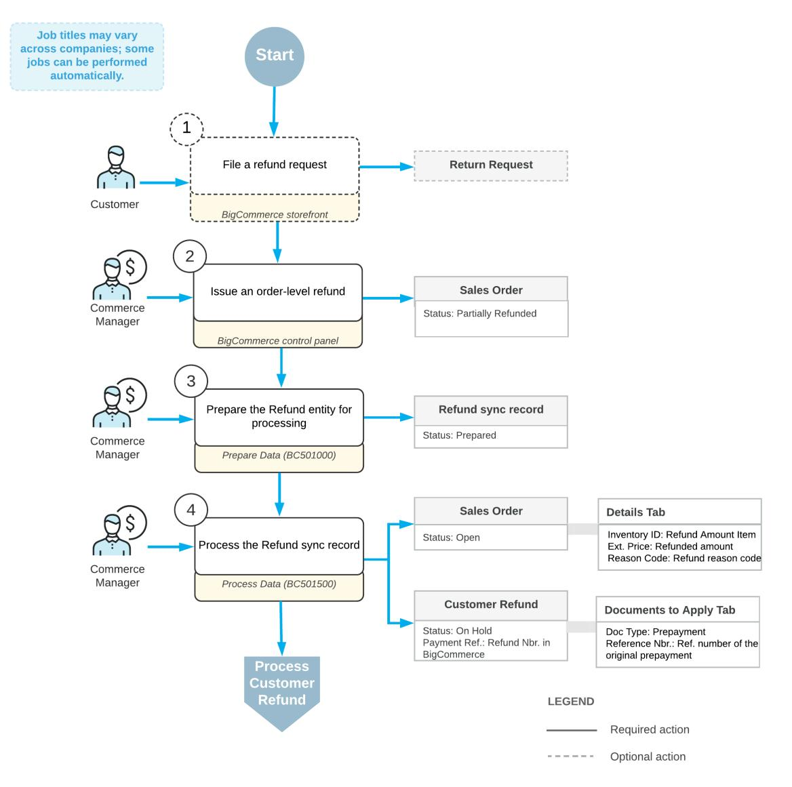

If the original sales order has the *Completed* status on the *[Sales Orders](https://help-2025r1.acumatica.com/Help?ScreenId=ShowWiki&pageid=19e4021c-1b84-49fd-be12-0320c5f1c7e5)* form, the following actions are performed:

- On the *[Sales Orders](https://help-2025r1.acumatica.com/Help?ScreenId=ShowWiki&pageid=19e4021c-1b84-49fd-be12-0320c5f1c7e5)* form, the system creates a return order of the type selected in the **Return OrderType** box on the **Orders** tab of the *[BigCommerce Stores](#page-473-2)* form. In the **External Reference** box of the Summary area, the system inserts the identifier of the refund that is used in the BigCommerce store.
- In the return order, on the **Details** tab of the *[Sales Orders](https://help-2025r1.acumatica.com/Help?ScreenId=ShowWiki&pageid=19e4021c-1b84-49fd-be12-0320c5f1c7e5)* form, the system inserts a line with the non-stock item that was specified in the **Refund Amount Item** box on the **Orders** tab of the *[BigCommerce Stores](#page-473-2)* form. In the **Unit Price** and **Ext. Price** columns, the system inserts the refund amount. In the **Reason Code**

column, the system inserts the reason code that was specified on the **Orders** tab of the *[BigCommerce Stores](#page-473-2)* form.

• On the *[Payments and Applications](https://help-2025r1.acumatica.com/Help?ScreenId=ShowWiki&pageid=ae844bf4-1aef-42cd-9e2f-49b3ee1bc8d7)* (AR302000) form, creates a payment of the *Refund* type in the refunded amount and links it to the return order.

The following diagram illustrates the processing of an order-level refund for a non-card payment method when this refund is issued aer the sales order has been shipped.

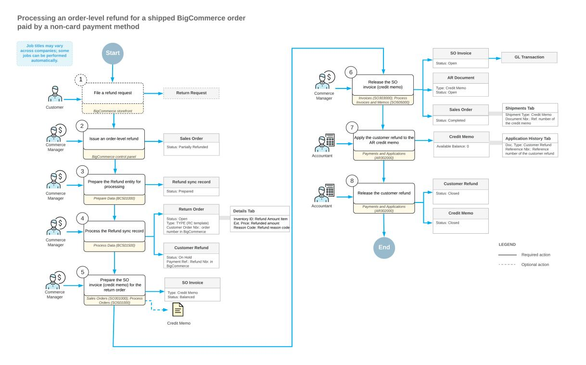

If the original sales order has a status other than *Open*, *On Hold*, or *Completed* on the *[Sales Orders](https://help-2025r1.acumatica.com/Help?ScreenId=ShowWiki&pageid=19e4021c-1b84-49fd-be12-0320c5f1c7e5)* form, the system displays an error message saying that the refund cannot be applied.

# **Importing Non-Card Refunds: Item-Level Refunds**

A refund of an ordered item may be issued if, for example, a customer wants to amend a not-yet-shipped order to decrease the quantity of a purchased item or because they want to return the item whose condition or performance is unsatisfactory.

During the import of item refunds, if the original sales order has the *Open* or *On Hold* status on the *[Sales Orders](https://help-2025r1.acumatica.com/Help?ScreenId=ShowWiki&pageid=19e4021c-1b84-49fd-be12-0320c5f1c7e5)* (SO301000) form, the system does the following:

- On the *[Payments and Applications](https://help-2025r1.acumatica.com/Help?ScreenId=ShowWiki&pageid=ae844bf4-1aef-42cd-9e2f-49b3ee1bc8d7)* (AR302000) form, creates a payment of the *Refund* type in the refunded amount and applies it to the original payment.
- In the original sales order, on the **Details** tab of the *[Sales Orders](https://help-2025r1.acumatica.com/Help?ScreenId=ShowWiki&pageid=19e4021c-1b84-49fd-be12-0320c5f1c7e5)* form, updates the order line or lines to decrease the item quantities. If discounts and taxes have been applied, they are recalculated accordingly.

The following diagram illustrates the processing of an item refund for a non-card payment method when the refund is issued before the sales order has been shipped.

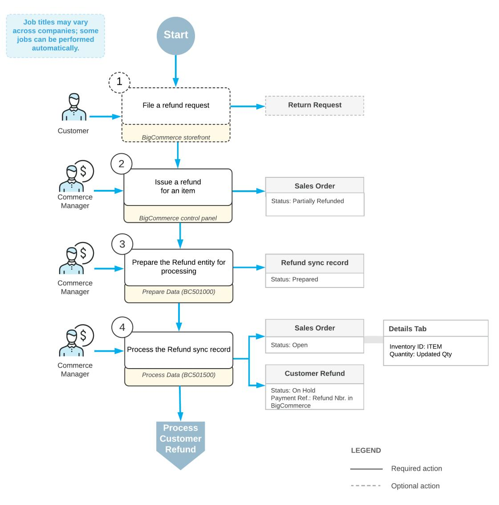

If the original sales order has the *Completed* status on the *[Sales Orders](https://help-2025r1.acumatica.com/Help?ScreenId=ShowWiki&pageid=19e4021c-1b84-49fd-be12-0320c5f1c7e5)* form, the following actions occur:

- On the *[Sales Orders](https://help-2025r1.acumatica.com/Help?ScreenId=ShowWiki&pageid=19e4021c-1b84-49fd-be12-0320c5f1c7e5)* form, the system creates a return order of the type that was specified in the **Return OrderType** box on the **Orders** tab of the *[BigCommerce Stores](#page-473-2)* (BC201000) form. In the **External Reference** box of the Summary area, the system inserts the identifier of the refund that is used in the BigCommerce store.
- In the return order, on the **Details** tab of the *[Sales Orders](https://help-2025r1.acumatica.com/Help?ScreenId=ShowWiki&pageid=19e4021c-1b84-49fd-be12-0320c5f1c7e5)* form, the system inserts a line with the applicable quantity of the returned item. In the **Reason Code** column, the system inserts the reason code that was specified on the **Orders** tab of the *[BigCommerce Stores](#page-473-2)* form.
- On the *[Payments and Applications](https://help-2025r1.acumatica.com/Help?ScreenId=ShowWiki&pageid=ae844bf4-1aef-42cd-9e2f-49b3ee1bc8d7)* (AR302000) form, creates a payment of the *Refund* type in the refunded amount and links it to the return order.

The following diagram illustrates the processing of an item return for non-card payment methods when this return is issued aer the sales order has been shipped.

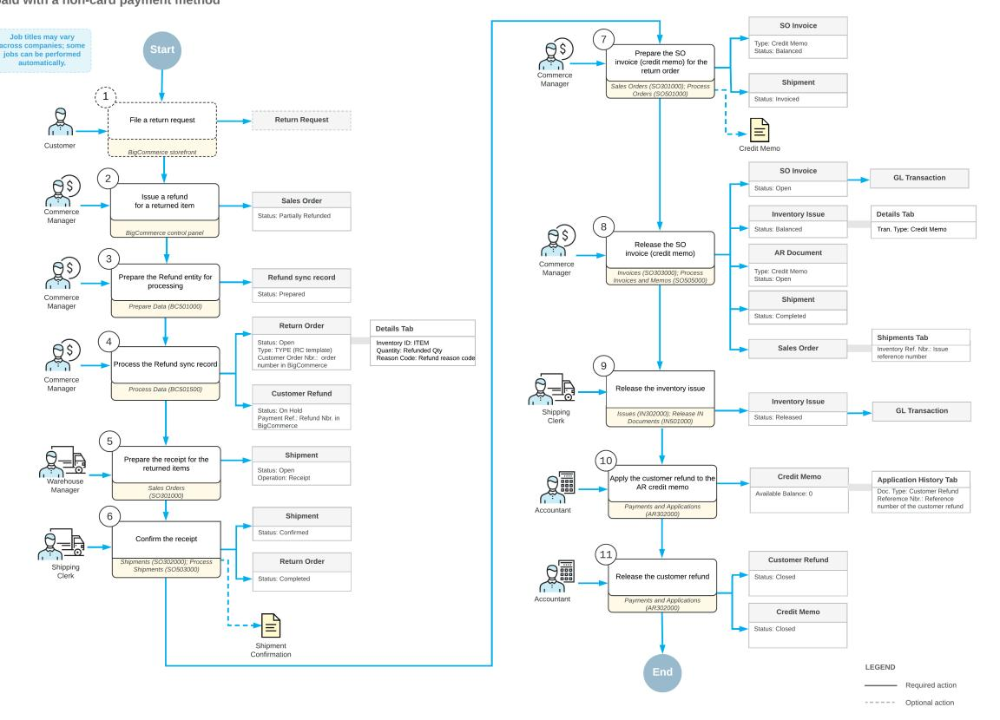

If the original sales order has a status other than *Open*, *On Hold*, or *Completed* on the *[Sales Orders](https://help-2025r1.acumatica.com/Help?ScreenId=ShowWiki&pageid=19e4021c-1b84-49fd-be12-0320c5f1c7e5)* form, the system displays an error message saying that the refund cannot be applied.

# **Importing Non-Card Refunds: To Process a Refund for a Not-Yet-Shipped Order**

The following activity will walk you through the process of importing a partial refund from the BigCommerce store to Acumatica ERP. This is a partial refund of an order that has been paid by a non-card payment method and has not yet been shipped.

The following activity is based on the *U100* dataset.

#### **Story**

Suppose that a representative of the GoodFood One Restaurant customer placed an order for 10 jars of banana jam in the SweetLife Fruits & Jams retail store and paid the entire order amount upfront in cash. The jam was to be delivered from the SweetLife Fruits & Jams warehouse within seven days. Later the same day, before the jam was shipped, the representative of GoodFood One Restaurant showed up in the retail store. The representative informed the store manager that an error had occurred and only 5 jars of banana jam should have been purchased, and asked the manager to refund the cost of the remaining quantity of banana jam. As the store manager, you need to refund the cost of 5 jars of banana jam and import this refund to Acumatica ERP so that the correct quantities of jam will be issued from SweetLife Fruits & Jams's warehouse.

# **Configuration Overview**

In the *U100* dataset, for the purposes of this activity, the following features have been enabled on the *[Enable/](https://help-2025r1.acumatica.com/Help?ScreenId=ShowWiki&pageid=c1555e43-1bc5-4f6f-ba9d-b323f94d8a6b) [Disable Features](https://help-2025r1.acumatica.com/Help?ScreenId=ShowWiki&pageid=c1555e43-1bc5-4f6f-ba9d-b323f94d8a6b)* (CS100000) form:

- *Retail Commerce*
- *BigCommerce Connector*
- *Custom Order Types*

The following entities, which you will use in this activity, have been predefined in the system:

- The *ER* order type on the *Order [Types](https://help-2025r1.acumatica.com/Help?ScreenId=ShowWiki&pageid=e6984218-4260-4438-99e1-aee2b3765369)* (SO201000) form
- The *REFUNDAMT* non-stock item on the *[Non-Stock Items](https://help-2025r1.acumatica.com/Help?ScreenId=ShowWiki&pageid=bf68dd4f-63d4-460d-8dc0-9152f2bd6bf1)* (IN202000) form
- The *EREFUND* reason code on the *[Reason Codes](https://help-2025r1.acumatica.com/Help?ScreenId=ShowWiki&pageid=fe53f1bf-3670-465e-8b7c-922d8246f123)* (CS211000) form

#### **Process Overview**

In this activity, you will do the following:

- 1. In the control panel of the BigCommerce store, place a sales order for a customer.
- 2. On the *[Prepare Data](#page-529-1)* (BC501000) form, prepare the sales order data for processing, and on the *[Process Data](#page-533-1)* (BC501500) form, process the sales order data.
- 3. On the *[Sales Orders](https://help-2025r1.acumatica.com/Help?ScreenId=ShowWiki&pageid=19e4021c-1b84-49fd-be12-0320c5f1c7e5)* (SO301000) form, review the imported sales order.
- 4. On the *[Payments and Applications](https://help-2025r1.acumatica.com/Help?ScreenId=ShowWiki&pageid=ae844bf4-1aef-42cd-9e2f-49b3ee1bc8d7)* (AR302000) form, release the prepayment related to the imported sales order.
- 5. In the control panel of the BigCommerce store, update the order quantities, and issue a refund to the customer.
- 6. On the *[Prepare Data](#page-529-1)* form, prepare the refund data for processing, and on the *[Process Data](#page-533-1)* form, process the refund data.
- 7. On the *[Sales Orders](https://help-2025r1.acumatica.com/Help?ScreenId=ShowWiki&pageid=19e4021c-1b84-49fd-be12-0320c5f1c7e5)* form, review the updated sales order, and on the *[Payments and Applications](https://help-2025r1.acumatica.com/Help?ScreenId=ShowWiki&pageid=ae844bf4-1aef-42cd-9e2f-49b3ee1bc8d7)* form, review the updated prepayment.
- 8. On the *[Payments and Applications](https://help-2025r1.acumatica.com/Help?ScreenId=ShowWiki&pageid=ae844bf4-1aef-42cd-9e2f-49b3ee1bc8d7)* form, review and release the refund.

#### **System Preparation**

To prepare the system for the steps of this activity, do the following:

- 1. Make sure that the following prerequisite activities have been performed:
  - *Initial [Configuration:](#page-27-1) To Establish and Configure the Store Connection*
  - *Data [Synchronization:](#page-37-1) To Perform the First Synchronization*
  - *[Importing Non-Card Refunds: Implementation Activity](#page-171-1)*
- 2. Sign in to the control panel of the BigCommerce store as the store administrator.

#### **Step 1: Creating an Order**

To place an order for ten 96-ounce jars of banana jam, do the following:

- 1. In the le pane of the control panel of the BigCommerce store, click **Orders > Add**.
- 2. On the **Add an Order** page (**Customer Info** step), create the order as follows:
  - a. In the **Customer Information** section, select the **Existing Customer** option button right of **Order for**.

- b. In the **Search** box, start typing the customer name, GOODFOOD; select the *GoodFood One Restaurant* customer in the list of search results.
- c. Near the top of the **Billing Information** section, click *Use this address* to use the existing customer address as the billing address.

The elements of the billing address are populated with the settings from the previously saved address of this customer.

- d. In the bottom right, click **Next**.
- 3. On the **Add an Order** page (**Items** step), under **Add Products**, do the following:
  - a. In the **Search** box, start typing banana; in the list of search results, select *Banana jam 96 oz*.
  - b. In the line of the *Banana jam 96 oz*, change the quantity to *10*.
  - c. At the bottom of the page, click **Next**.
- 4. On the **Add an Order** page (**Shipping** step), in the**Shipping Method** section, click the *Fetch Shipping Quotes* link.
- 5. In the box with the list of shipping options, select *Free Shipping*.

You created this shipping option during the completion of the *Data [Synchronization:](#page-37-1) To Perform the First [Synchronization](#page-37-1)* prerequisite activity.

For the purposes of this activity, you should assume that the billing address and shipping address are the same.

- 6. In the bottom right, click **Next**.
- 7. On the **Add an Order** page (**Finalize** step), do the following:
  - Review the information in the **Customer Billing Details**, **Shipping Details**, and **Summary** sections
  - In the **Finalize** section, select the *Manual Payment* payment method.
- 8. In the bottom right, click**Save & Process Payment**.

The system creates an order and opens the**View Orders** page with the last order displayed at the top of the order list. Make a note of the order number of the last created order (which is shown in the **Order ID** column).

Because you have already accepted the payment outside of BigCommerce, the status of the order is *Awaiting Fulfillment*.

#### **Step 2: Importing the Sales Order**

To import the sales order into Acumatica ERP, do the following:

- 1. Sign in to Acumatica ERP by using the following credentials:
  - **Username**: *gibbs*
  - **Password**: *123*
- 2. Open the *[Prepare Data](#page-529-1)* (BC501000) form.
- 3. In the Summary area, specify the following settings:
  - **Store**: *SweetStore - BC*
  - **Prepare Mode**: *Incremental*
- 4. In the table, select the check box in the unlabeled column in the row with the *Sales Order* entity.
- 5. On the form toolbar, click **Prepare**.
- 6. In the **Processing** dialog box, which opens, click **Close** to close the dialog box.
- 7. In the row with the *Sales Order* entity, click the link in the **Ready to Process** column.

- 8. On the *[Process Data](#page-533-1)* (BC501500) form, which opens with the *SweetStore - BC* store and the *Sales Order* entity selected in the Summary area, select the unlabeled check box in the row with the sales order that you created in the previous step (which you can identify by its order number in the **External ID** column).
- 9. On the form toolbar, click **Process**.

10.In the **Processing** dialog box, which opens, click **Close** to close the dialog box.

#### **Step 3: Reviewing the Imported Sales Order**

To review the imported sales order, do the following:

- 1. Open the *[Sync History](#page-539-1)* (BC301000) form.
- 2. In the Summary area, specify the following settings:
  - **Store**: *SweetStore - BC*
  - **Entity**: *Sales Order*
- 3. On the **Processed** tab, in the row of the sales order that you have just imported (which you can locate by its external ID), click the link in the **ERP ID** column.
- 4. On the *[Sales Orders](https://help-2025r1.acumatica.com/Help?ScreenId=ShowWiki&pageid=19e4021c-1b84-49fd-be12-0320c5f1c7e5)* (SO301000) form, which opens, review the settings of the sales order as follows:
  - a. In the Summary area, notice that the sales order has the *Open* status. The **Description** box shows the status of the order in the BigCommerce store, which is *Awaiting Fulfillment*.
  - b. On the **Details** tab, review the quantity of the *BANJAM96* item, which is *10*.
  - c. On the **Payments** tab, review the details of the prepayment that was imported from the BigCommerce store along with the sales order. Notice that the **Payment Method** and **Cash Account** columns show the payment method and cash account (*ONLINE* and *10250ST*, respectively) that were defined in Acumatica ERP and mapped to the *Manual Payment* store payment method. The prepayment has the *Balanced* status. Before you can process and import a refund in the BigCommerce store, you need to release this prepayment.

#### **Step 4: Releasing the Imported Payment**

To release the payment that was imported from the BigCommerce store along with the sales order, do the following:

- 1. While you are still viewing the **Payments** tab of the *[Sales Orders](https://help-2025r1.acumatica.com/Help?ScreenId=ShowWiki&pageid=19e4021c-1b84-49fd-be12-0320c5f1c7e5)* (SO301000) form, click the link with the prepayment number in the **Reference Nbr.** column.
- 2. On the *[Payments and Applications](https://help-2025r1.acumatica.com/Help?ScreenId=ShowWiki&pageid=ae844bf4-1aef-42cd-9e2f-49b3ee1bc8d7)* (AR302000) form, which opens in a pop-up window with the prepayment selected, click **Release** on the form toolbar.

Once the prepayment is successfully released, its status is changed to *Open*.

#### **Step 5: Issuing a Refund for an Individual Item**

To issue a refund for units of an individual item in your BigCommerce store, while you are signed in to the control panel of the BigCommerce store, do the following:

- 1. In the le pane, click **Orders > All orders**.
- 2. On the **View Orders** page, in the row with the order for *GoodFood One Restaurant*, on the **Actions** menu, click **Refund**.
- 3. On the **Refund order** page, which opens, on the **Refund individual items** tab (**Refundable items** section), specify *5* in the **Units to refund** column in the row with the banana jam.
- 4. In the bottom right, click **Continue**.

- 5. On the **Confirm refund** page, which opens, in the **Refund method** section, select the **Refund customer through third party provider** option button.
- 6. In the bottom right, click **Confirm Refund**.
- 7. On the **View Orders** page, which opens for the partially refunded order, notice that the number of refunded items (which is *5*) is now displayed under the number of ordered banana jam jars. The refunded amount is also displayed under **Grand Total**.

#### **Step 6: Importing the Refund**

To import the refund to Acumatica ERP, do the following:

- 1. Open the *[Prepare Data](#page-529-1)* (BC501000) form.
- 2. In the Summary area, specify the following settings:
  - **Store**: *SweetStore - BC*
  - **Prepare Mode**: *Incremental*
- 3. In the table, select the check box in the unlabeled column in the row with the *Refund* entity.
- 4. On the form toolbar, click **Prepare**.
- 5. In the **Processing** dialog box, which opens, click **Close** to close the dialog box.
- 6. Click the link in the **Ready to Process** column in the row with the *Refund* entity.
- 7. On the *[Process Data](#page-533-1)* (BC501500) form, which opens with the *SweetStore - BC* store and the *Refund* entity selected in the Summary area, select the unlabeled check box in the row with the refund (which you can identify by the number of the order it refers to in the **External ID** column).
- 8. On the form toolbar, click **Process**.
- 9. In the **Processing** dialog box, which opens, click **Close** to close the dialog box.

#### **Step 7: Reviewing the Results of the Import**

To review how the refund has been imported to Acumatica ERP, do the following:

- 1. Open the *[Sync History](#page-539-1)* (BC301000) form.
- 2. In the Summary area, specify the following settings:
  - **Store**: *SweetStore - BC*
  - **Entity**: *Sales Order*
- 3. On the **Processed** tab, in the row of the refund that you have just imported (which you can locate by the external ID of the related order), click the link in the **ERP ID** column.

On the *[Sales Orders](https://help-2025r1.acumatica.com/Help?ScreenId=ShowWiki&pageid=19e4021c-1b84-49fd-be12-0320c5f1c7e5)* (SO301000) form, which opens in a pop-up window, review the order as follows:

- On the **Details** tab, notice that the quantity of the *BANJAM96* stock item has been reduced from *10* to *5*.
- In the Summary area, notice that the order total has been reduced to reflect the new item quantities. The **Description** box now shows the updated status of the order in the BigCommerce store, which is *Partially Refunded*.
- 4. On the **Payments** tab, click the link of the prepayment number in the **Reference Nbr.** column.

On the *[Payments and Applications](https://help-2025r1.acumatica.com/Help?ScreenId=ShowWiki&pageid=ae844bf4-1aef-42cd-9e2f-49b3ee1bc8d7)* (AR302000) form, which opens with the prepayment selected, notice that the applied amount and the available balance reflect the reduced order amount and the refunded amount, respectively.

#### **Step 8: Reviewing and Releasing the Refund**

- 1. Open the Payments and Applications (AR3020PL) form.
- 2. Filter the list of records as follows:
  - a. In the list of records, click the header of the **Description** column.
  - b. In the list of filter conditions, select **Contains**.
  - c. In the text box, type SweetStore.
  - d. Click **OK** to apply the filter.

In the list of documents, notice that a new *Refund* document has been created for the refund you imported in Step 6. (You can identify it by the order number and transaction type shown in the **Description** column).

- 3. In the **Reference Nbr.** column, click the link with the identifier of the refund.
- 4. On the form toolbar of the *[Payments and Applications](https://help-2025r1.acumatica.com/Help?ScreenId=ShowWiki&pageid=ae844bf4-1aef-42cd-9e2f-49b3ee1bc8d7)* (AR302000) form, which opens with the refund selected, click **Release**.

Once the processing of the refund is finished, its status changes to *Closed*.

- 5. On the **Application History** tab, which shows the prepayment to which the refund was applied, in the only row, click the link in the **Reference Nbr.** column.
- 6. On the *[Payments and Applications](https://help-2025r1.acumatica.com/Help?ScreenId=ShowWiki&pageid=ae844bf4-1aef-42cd-9e2f-49b3ee1bc8d7)* form, which opens with the prepayment selected, notice that the available balance has become zero.

You have now imported a partial refund for ordered items in an order that has not yet been shipped and processed this partial refund.

# **Importing Non-Card Refunds: To Process a Refund for a Shipped Order**

The following activity will walk you through the process of importing a partial refund from the BigCommerce store to Acumatica ERP. This partial refund is for a shipped order that has already been fully delivered.

The following activity is based on the *U100* dataset.

### **Story**

Suppose that a representative of the West BBQ Restaurant customer placed an order for 10 jars of plum jam in the SweetLife Fruits & Jams retail store, and paid the entire order amount upfront in cash. Four days later, aer the purchased jam has already been delivered, a representative of West BBQ Restaurant returned 2 jars of plum jam. As the store manager, you need to process the return of 2 jars of plum jam. You also want to reimburse the customer \$10 for the inconvenience of returning part of the purchase in person.

### **Configuration Overview**

In the *U100* dataset, for the purposes of this activity, the following features have been enabled on the *[Enable/](https://help-2025r1.acumatica.com/Help?ScreenId=ShowWiki&pageid=c1555e43-1bc5-4f6f-ba9d-b323f94d8a6b) [Disable Features](https://help-2025r1.acumatica.com/Help?ScreenId=ShowWiki&pageid=c1555e43-1bc5-4f6f-ba9d-b323f94d8a6b)* (CS100000) form:

- *Retail Commerce*
- *BigCommerce Connector*
- *Custom Order Types*

The following entities, which you will use in this activity, have been predefined in the *U100* dataset:

- The *ER* order type on the *Order [Types](https://help-2025r1.acumatica.com/Help?ScreenId=ShowWiki&pageid=e6984218-4260-4438-99e1-aee2b3765369)* (SO201000) form
- The *REFUNDAMT* non-stock item on the *[Non-Stock Items](https://help-2025r1.acumatica.com/Help?ScreenId=ShowWiki&pageid=bf68dd4f-63d4-460d-8dc0-9152f2bd6bf1)* (IN202000) form
- The *EREFUND* reason code on the *[Reason Codes](https://help-2025r1.acumatica.com/Help?ScreenId=ShowWiki&pageid=fe53f1bf-3670-465e-8b7c-922d8246f123)* (CS211000) form

#### **Process Overview**

In this activity, you will do the following:

- 1. In the control panel of the BigCommerce store, place a sales order for a customer.
- 2. On the *[Prepare Data](#page-529-1)* (BC501000) form, prepare the sales order data for processing, and on the *[Process Data](#page-533-1)* (BC501500) form, process the sales order data.
- 3. On the *[Sales Orders](https://help-2025r1.acumatica.com/Help?ScreenId=ShowWiki&pageid=19e4021c-1b84-49fd-be12-0320c5f1c7e5)* (SO301000) form, review the imported sales order.
- 4. On the *[Payments and Applications](https://help-2025r1.acumatica.com/Help?ScreenId=ShowWiki&pageid=ae844bf4-1aef-42cd-9e2f-49b3ee1bc8d7)* (AR302000) form, release the prepayment related to the imported sales order.
- 5. Using the *[Sales Orders](https://help-2025r1.acumatica.com/Help?ScreenId=ShowWiki&pageid=19e4021c-1b84-49fd-be12-0320c5f1c7e5)* form as a starting point, create a shipment.
- 6. On the *[Shipments](https://help-2025r1.acumatica.com/Help?ScreenId=ShowWiki&pageid=f47cffcc-543e-469c-a204-a9c1e3da346d)* (SO302000) form, confirm the shipment.
- 7. On the *[Prepare Data](#page-529-1)* form, prepare the shipment data for processing, and on the *[Process Data](#page-533-1)* form, process the shipment data.
- 8. In the control panel of the BigCommerce store, issue a refund for a returned item.
- 9. In the control panel of the BigCommerce store, issue an order-level refund.
- 10.On the *[Prepare Data](#page-529-1)* form, prepare the refund data for processing, and on the *[Process Data](#page-533-1)* form, process the refund data.
- 11.On the *[Sales Orders](https://help-2025r1.acumatica.com/Help?ScreenId=ShowWiki&pageid=19e4021c-1b84-49fd-be12-0320c5f1c7e5)* form, review the return orders the system created aer the refunds were imported.
- 12.On the *[Payments and Applications](https://help-2025r1.acumatica.com/Help?ScreenId=ShowWiki&pageid=ae844bf4-1aef-42cd-9e2f-49b3ee1bc8d7)* form, review the refunds created for each of the return orders.

#### **System Preparation**

To prepare the system for the steps of this activity, do the following:

- 1. Make sure the following prerequisite activities have been performed:
  - a. *Initial [Configuration:](#page-27-1) To Establish and Configure the Store Connection*
  - b. *Data [Synchronization:](#page-37-1) To Perform the First Synchronization*
  - c. *[Importing Non-Card Refunds: Implementation Activity](#page-171-1)*
- 2. Sign in to the control panel of the BigCommerce store as the store administrator.

#### **Step 1: Creating a Sales Order in BigCommerce**

To place an order for ten 96-ounce jars of plum jam, do the following:

- 1. In the le pane of the control panel of the BigCommerce store, click **Orders > Add**.
- 2. On the **Add an Order** page (**Customer Info** step), create the order as follows:
  - a. In the **Customer Information** section, select the **Existing Customer** option button right of **Order for**.
  - b. In the **Search** box, start typing the customer name, west; select the *West BBQ Restaurant* customer in the list of search results.
  - c. Near the top of the **Billing Information** section, click *Use this address* to use the existing customer address as the billing address.

The elements of the billing address are populated with the settings from the previously saved address of this customer.

- d. In the bottom right, click **Next**.
- 3. On the **Add an Order** page (**Items** step), under **Add Products**, do the following:
  - a. In the **Search** box, start typing plum; in the list of search results, select *Plum jam 96 oz*.
  - b. In the line of the *Plum jam 96 oz*, change the quantity to 10.
  - c. In the bottom right, click **Next**.
- 4. On the **Add an Order** page (**Shipping** step), in the**Shipping Method** section, click the *Fetch Shipping Quotes* link.
- 5. In the box with the list of shipping options, select *Free Shipping*.

You created this shipping option during the completion of the *Initial [Configuration:](#page-27-1) To Establish and Configure [the Store Connection](#page-27-1)* prerequisite activity.

For the purposes of this activity, you should assume that the billing address and shipping address are the same.

- 6. In the bottom right, click **Next**.
- 7. On the **Add an Order** page (**Finalize** step), do the following:
  - Review the information in the **Customer Billing Details**, **Shipping Details**, and **Summary** sections.
  - In the **Finalize** section, select the *Manual Payment* payment method.
- 8. In the bottom right, click**Save & Process Payment**.

The system creates an order and opens the**View Orders** page with the created order displayed at the top of the order list. Make a note of the order number of the last created order (which is shown in the **Order ID** column).

Notice that the status of the order is *Awaiting Fulfillment*.

#### **Step 2: Importing the Sales Order**

To import the sales order you created into Acumatica ERP, do the following:

- 1. Sign in to Acumatica ERP by using the following credentials:
  - **Username**: *gibbs*
  - **Password**: *123*
- 2. Open the *[Prepare Data](#page-529-1)* (BC501000) form.
- 3. In the Summary area, specify the following settings:
  - **Store**: *SweetStore - BC*
  - **Prepare Mode**: *Incremental*
- 4. In the table, in the row with the *Sales Order* entity, select the unlabeled check box.
- 5. On the form toolbar, click **Prepare**.
- 6. In the **Processing** dialog box, which opens, click **Close** to close the dialog box.
- 7. In the row with the *Sales Order* entity, click the link in the **Ready to Process** column.
- 8. On the *[Process Data](#page-533-1)* (BC501500) form, which opens with the *SweetStore - BC* store and the *Sales Order* entity selected in the Summary area, select the unlabeled check box in the row with the sales order that you created in the previous step.
- 9. On the form toolbar, click **Process**.

10.In the **Processing** dialog box, which opens, click **Close** to close the dialog box.

## **Step 3: Reviewing the Imported Order**

To review the imported sales order, do the following:

- 1. Open the *[Sync History](#page-539-1)* (BC301000) form.
- 2. In the Summary area, specify the following settings:
  - **Store**: *SweetStore - BC*
  - **Entity**: *Sales Order*
- 3. On the **Processed** tab, in the row of the sales order that you have just imported (which you can locate by its external ID), click the link in the **ERP ID** column.
- 4. On the *[Sales Orders](https://help-2025r1.acumatica.com/Help?ScreenId=ShowWiki&pageid=19e4021c-1b84-49fd-be12-0320c5f1c7e5)* (SO301000) form, which opens, review the settings of the sales order.

In the Summary area, notice that the sales order has the *Open* status. The **Description** box shows the status of the order in the BigCommerce store, which is *Awaiting Fulfillment*.

On the **Details** tab, review the quantity of the *PLUMJAM96* item, which is *10*.

On the **Payments** tab, review the details of the prepayment that was imported from the BigCommerce store along with the sales order. Notice that the **Payment Method** and **Cash Account** columns show the payment method and cash account (*ONLINE* and *10250ST*, respectively) that were defined in Acumatica ERP and mapped to the *Manual Payment* store payment method. The prepayment has the *Balanced* status. Before you can process and import a refund in the BigCommerce store, you need to release this prepayment.

## **Step 4: Releasing the Imported Payment**

To release the payment that was imported from the BigCommerce store along with the sales order, do the following:

- 1. While you are still viewing the **Payments** tab of the *[Sales Orders](https://help-2025r1.acumatica.com/Help?ScreenId=ShowWiki&pageid=19e4021c-1b84-49fd-be12-0320c5f1c7e5)* (SO301000) form, click the link with the prepayment number in the **Reference Nbr.** column.
- 2. On the form toolbar of the *[Payments and Applications](https://help-2025r1.acumatica.com/Help?ScreenId=ShowWiki&pageid=ae844bf4-1aef-42cd-9e2f-49b3ee1bc8d7)* (AR302000) form, which opens in a pop-up window with the prepayment selected, click **Release**.

Once the processing of the prepayment finishes successfully, its status is changed to *Open*.

3. Close the pop-up window with the *[Payments and Applications](https://help-2025r1.acumatica.com/Help?ScreenId=ShowWiki&pageid=ae844bf4-1aef-42cd-9e2f-49b3ee1bc8d7)* form to return to the *[Sales Orders](https://help-2025r1.acumatica.com/Help?ScreenId=ShowWiki&pageid=19e4021c-1b84-49fd-be12-0320c5f1c7e5)* form.

## **Step 5: Creating a Shipment for the Imported Order**

To create a shipment for the order you have imported, do the following:

- 1. While you are viewing the imported order on the *[Sales Orders](https://help-2025r1.acumatica.com/Help?ScreenId=ShowWiki&pageid=19e4021c-1b84-49fd-be12-0320c5f1c7e5)* (SO301000) form, click **CreateShipment** on the form toolbar.
- 2. In the **SpecifyShipment Parameters** dialog box, which opens, make sure the current date and the *RETAIL* warehouse are selected, and click **OK**. The system creates a shipment and opens it on the *[Shipments](https://help-2025r1.acumatica.com/Help?ScreenId=ShowWiki&pageid=f47cffcc-543e-469c-a204-a9c1e3da346d)* (SO302000) form.

# **Step 6: Confirming the Shipment for the Imported Order**

To confirm the shipment for the order, do the following:

- 1. While you are still viewing the shipment on the *[Shipments](https://help-2025r1.acumatica.com/Help?ScreenId=ShowWiki&pageid=f47cffcc-543e-469c-a204-a9c1e3da346d)* (SO302000) form, review the line on the **Details** tab. Make sure of the following:
  - The correct order line is included in the shipment.

- The *RETAIL* warehouse is specified for the item.
- The shipped quantity is equal to the ordered quantity.
- 2. On the form toolbar, click **Confirm Shipment**.

Notice that the shipment has been assigned the *Confirmed* status. Make a note of the shipment number; you will use it to identify the shipment to be exported to the BigCommerce store in the next step.

Because you have confirmed the shipment, on the *[Sales Orders](https://help-2025r1.acumatica.com/Help?ScreenId=ShowWiki&pageid=19e4021c-1b84-49fd-be12-0320c5f1c7e5)* (SO301000) form, the status of the imported sales order has changed to *Completed*.

### **Step 7: Synchronizing the Shipment with the BigCommerce Store**

To synchronize with the BigCommerce store the shipment that you have created and confirmed, do the following:

- 1. Open the *[Prepare Data](#page-529-1)* (BC501000) form.
- 2. In the Summary area, specify the following settings:
  - **Store**: *SweetStore - BC*
  - **Prepare Mode**: *Incremental*
- 3. In the table, select the check box in the unlabeled column for the *Shipment* entity.
- 4. On the form toolbar, click **Prepare**.
- 5. In the **Processing** dialog box, which opens, click **Close** to close the dialog box.
- 6. In the row with the *Shipment* entity, click the link in the **Ready to Process** column.
- 7. On the *[Process Data](#page-533-1)* (BC501500) form, which opens with the *SweetStore - BC* store and the *Shipment* entity selected in the Summary area, select the unlabeled check box for the shipment that you created and confirmed (which you can identify by the shipment number in the **ERP ID** column).
- 8. On the form toolbar, click **Process**.
- 9. In the **Processing** dialog box, which opens, click **Close** to close the dialog box.

### **Step 8: Issuing a Refund for an Individual Item**

To issue a refund for units of an individual item in your BigCommerce store, do the following:

- 1. In the le pane of the control panel of the BigCommerce store, click **Orders > All orders**.
- 2. On the **View Orders** page, in the list of orders, locate the order for the *West BBQ Restaurant* customer that you created and imported.

Notice that the status of the order has changed to *Shipped*.

- 3. In the row with the same order, on the **Actions** menu, click **Refund**.
- 4. On the **Refund order** page, which opens, on the **Refund individual items** tab (**Refundable items** section), specify *2* in the **Units to refund** column in the row with the *Plum jam 96 oz* item.
- 5. In the bottom right, click **Continue**.
- 6. On the **Confirm refund** page, which opens, in the **Refund method** section, select the **Refund customer through third party provider** option button.
- 7. In the bottom right, click **Confirm Refund**.
- 8. On the **View Orders** page, which opens, notice that the number of returned items (which is *2*) is now displayed under the number of ordered plum jam jars, and the order status has changed to *Partially Refunded*. The refunded amount is also displayed under **Grand Total**.

## **Step 9: Issuing a Partial Refund of the Order Amount**

To reimburse the customer for having to return part of the purchase in person, do the following:

- 1. While you are still viewing the order for which you created a refund in the previous step, on the **Actions** menu, click **Refund**.
- 2. On the **Refund order** page, on the **Apply an order level refund** tab (**Refundable items** section), specify 10 in the **Amount to be refunded** box.
- 3. In the bottom right, click **Continue**.
- 4. On the **Confirm refund** page, which opens, in the **Refund method** section, select the **Refund customer through third party provider** option button.
- 5. In the bottom right, click **Confirm Refund**.
- 6. On the **View Orders** page, which opens, notice that the refunded amount under **Grand Total** has increased by \$10.

# **Step 10: Importing the Refunds**

To import the refunds into Acumatica ERP, do the following:

- 1. Open the *[Prepare Data](#page-529-1)* (BC501000) form.
- 2. In the Summary area, specify the following settings:
  - **Store**: *SweetStore - BC*
  - **Prepare Mode**: *Incremental*
- 3. In the table, select the check box in the unlabeled column in the row with the *Refund* entity.
- 4. On the form toolbar, click **Prepare**.
- 5. In the **Processing** dialog box, which opens, click **Close** to close the dialog box.
- 6. Click the link in the **Ready to Process** in the row with the *Refund* entity.
- 7. On the *[Process Data](#page-533-1)* (BC501500) form, which opens with the *SweetStore - BC* store and the *Refund* entity selected in the Summary area, select the unlabeled check box in the row with the refund that you issued in the previous step.
- 8. On the form toolbar, click **Process**.

You can identify the refund you need by the number of the order it pertains to in the **External ID** column. Because the refund has not been synchronized before, it does not have a value in the **ERP ID** column. Notice that only one synchronization record was created for both refunds issued in the BigCommerce store for the same order.

9. In the **Processing** dialog box, which opens, click **Close** to close the dialog box.

## **Step 11: Reviewing the Return Orders**

To review the return orders created in Acumatica ERP as a result of the importing of refunds, do the following:

- 1. Open the Sales Orders (SO3010PL) form.
- 2. Filter the list of records as follows:
  - a. In the list of records, click the header of the **Customer**.
  - b. In the list of filter conditions, select **Equals**.
  - c. In the text box, type WESTBBQ.

d. Click **OK** to apply the filter.

Notice that two orders of the *ER* type have been created for the *WESTBBQ* customer. Because the original sales order had the *Completed* status, return orders were created. The return orders have the *ER* type because this type was selected in the **Return OrderType** box on the **Orders** tab of the *[BigCommerce Stores](#page-473-2)* (BC201000) form in *[Importing Non-Card Refunds: Implementation Activity](#page-171-1)*.

- 3. In the row with the return order for the *WESTBBQ* customer and an ordered quantity of *2*, click the link in the **Order Nbr.** column.
- 4. On the *[Sales Orders](https://help-2025r1.acumatica.com/Help?ScreenId=ShowWiki&pageid=19e4021c-1b84-49fd-be12-0320c5f1c7e5)* (SO301000) form, which opens with the return order selected, review the order as follows:
  - In the Summary area, notice that the **Customer Order Nbr.** and **Description** boxes contain the reference number of the original order in the BigCommerce store. In the **External Reference** box, the system has inserted the identifier of the refund in the BigCommerce store.
  - On the **Details** tab, the system has created a line with the returned item (*PLUMJAM96*) and the quantity you specified while creating the refund in the BigCommerce store (which is *2*). Notice that in the **Reason Code** column of this line, the system has inserted *EREFUND*, which is the reason code you specified in the **Refund Reason Code** box on the **Orders** tab of the *[BigCommerce Stores](#page-473-2)* form in *[Importing Non-Card](#page-171-1) [Refunds: Implementation Activity](#page-171-1)*.
- 5. On the form toolbar, click **Go to Next Record** to open the second return order.

On the **Details** tab of this order, notice that a line has been created for the *REFUNDAMT* non-stock item with the order-level refund amount that you specified in the BigCommerce store (\$10). The system inserted this item because it was specified in **Refund Amount Item** box on the **Orders** tab of the *[BigCommerce Stores](#page-473-2)* form in *[Importing Non-Card Refunds: Implementation Activity](#page-171-1)*.

#### **Step 12: Reviewing the Refunds**

To review the refunds created for each of the return orders, do the following:

- 1. Open the Payments and Applications (AR3020PL) form.
- 2. Filter the list of records as follows:
  - a. In the list of records, click the header of the **Customer**.
  - b. In the list of filter conditions, select **Equals**.
  - c. In the text box, type WESTBBQ.
  - d. Click **OK** to apply the filter.

Notice that two documents of the *Refund* type have been created for the *WESTBBQ* customer, one for each of the refunds you issued in the BigCommerce store. The **Payment Ref.** column shows the identifier of each of these refunds in the BigCommerce store.

- 3. In the **Reference Nbr.** column, click the link with the reference number of the refund created for the two returned jars of the plum jam. (Of the two refunds for the *WESTBBQ* customer, the one you need has a smaller identifier in the **Payment Ref.** column.)
- 4. On the *[Payments and Applications](https://help-2025r1.acumatica.com/Help?ScreenId=ShowWiki&pageid=ae844bf4-1aef-42cd-9e2f-49b3ee1bc8d7)* form, which opens with the refund selected, review the document settings in the Summary area.

In the **Description** box, notice the information about the store name, sales order number, and store payment method to which the refund was applied. The **Available Balance** column reflects the amount refunded in the BigCommerce store. The **Payment Method** and **Cash Account** boxes have the same values as the original prepayment (*ONLINE* and *10250ST*, respectively).

On the **Sales Orders** tab, notice that the refund has been linked to the first return order.

5. On the form toolbar, click **Go to Next Record** to open the second refund.

In the **Reference Nbr.** box, select the number of the second refund created for the *WESTBBQ* customer. Notice that it has the same settings as the first refund, except for the refund identifier (which is shown in the **Payment Ref.** box and in the **Description** box), and the available balance (which reflects an order-level refund of \$10 issued in the BigCommerce store).

On the **Sales Orders** tab, notice that the refund has been linked to the second return order.

You have now imported to Acumatica ERP a refund for a returned item and a partial refund of the order amount. For the purposes of this activity, you do not need to process the return orders or refunds further.

# **Importing Card Refunds**

In this chapter, you will learn how to configure the Acumatica ERP instance for importing card refunds from the BigCommerce store. You will also explore how card refunds are imported and applied to imported sales orders.

# **Importing Card Refunds: General Information**

You can import to Acumatica ERP refunds issued for orders paid with card-based payment methods to customers in your BigCommerce store.

#### **Learning Objectives**

In this chapter, you will learn how to do the following:

- Configure the import of refunds for card-based payment methods from a BigCommerce store to Acumatica ERP
- Import refunds for card-based payment methods from a BigCommerce store to Acumatica ERP

#### **Applicable Scenarios**

You import refunds of payments based on a card-based payment method from BigCommerce to Acumatica ERP to keep track of refunded payments and restocked items. You may issue refunds in the BigCommerce store in the following cases:

- A customer has been overcharged in error and part of the order amount needs to be refunded.
- A customer has not received the purchased item or has received an excessive quantity of the item.
- A customer has received the purchased item but is not satisfied with its quality or performance and wants to return it.

#### **Configuration of Refund Import**

To configure the import of refunds from a BigCommerce store to Acumatica ERP, you perform the following general steps:

1. Define a return order type.

On the *Order [Types](https://help-2025r1.acumatica.com/Help?ScreenId=ShowWiki&pageid=e6984218-4260-4438-99e1-aee2b3765369)* (SO201000) form, you define an order type to be used for return orders imported from the BigCommerce store to Acumatica ERP. A return order type should be created with the following settings selected on the**Template** tab:

- **Automation Behavior**: *RMA Order*
- **Default Operation**: *Receipt*
- **AR DocumentType**: *Credit Memo*
- 2. Define a refund amount item.

On the *[Non-Stock Items](https://help-2025r1.acumatica.com/Help?ScreenId=ShowWiki&pageid=bf68dd4f-63d4-460d-8dc0-9152f2bd6bf1)* (IN202000) form, you define a non-stock item that will represent imported refund amounts in sales orders and in return orders. This non-stock item should be defined with the following settings on the **General** tab:

- **Tax Category**: A category corresponding to tax-exempt items
- **Require Receipt**: Cleared
- **RequireShipment**: Cleared
- 3. Define a reason code.

On the *[Reason Codes](https://help-2025r1.acumatica.com/Help?ScreenId=ShowWiki&pageid=fe53f1bf-3670-465e-8b7c-922d8246f123)* (CS211000) form, you create a define a reason code to be inserted in return orders for refunds imported from the BigCommerce store. This reason code must be of the *Issue* usage type.

4. Activate the *Refund* entity.

On the **Entities** tab of the *[BigCommerce Stores](#page-473-2)* (BC201000) form, you activate the *Refund* entity for the BigCommerce store.

5. Specify the refund import settings.

On the **Orders** tab, you specify settings in the following boxes:

- **Return OrderType**
- **Refund Amount Item**
- **Refund Reason Code**
- 6. Specify payment methods for which you need to import refunds.

On the **Payments** tab of the *[BigCommerce Stores](#page-473-2)* form, you select the **Process Refunds** check box for each payment method for which you want to import refunds. For store payment methods that are mapped to card-based payment methods in Acumatica ERP, this check box is selected by default and cannot be edited.

### **Import of Refunds for Card-Based Payment Methods**

Refunds are imported from the BigCommerce store to Acumatica ERP as part of the synchronization of the *Refund* entity, which can be synchronized only in the *Import* direction. During the preparation of refund data for synchronization, the system creates one synchronization record for all refunds that have been issued for a single sales order in the BigCommerce store.

For a refund to be imported successfully, all of the following conditions must be met:

- The original sales order has been synchronized.
- The original sales order has not been shipped at all or has been shipped in full. If the sales order has been shipped partially, the refund will not be imported.
- The original payment to which the refund pertains has been imported and released.

For information about the synchronization process, see *[Data Synchronization: General Information](#page-31-2)*.

# **Importing Card Refunds: Implementation Checklist**

The following sections provide details you can use to ensure that the system is configured for importing refunds for card-based payment methods from the BigCommerce store to Acumatica ERP, and to understand (and change, if needed) the settings that affect the processing workflow.

#### **Implementation Checklist**

We recommend that before you import refunds issued in the BigCommerce store for card-based payment methods, you make sure the needed features have been enabled, settings have been specified, and entities have been created, as summarized in the following checklist.

| Form                               | Criteria to Check                                                                                                                 |
|------------------------------------|-----------------------------------------------------------------------------------------------------------------------------------|
| Enable/Disable Features (CS100000) | The following features have been enabled:                                                                                         |
|                                    | • Retail Commerce                                                                                                              |
|                                    | BigCommerce Connector •                                                                                                        |
|                                    | Custom Order Types •                                                                                                           |
| Order Types (SO201000)             | The order type for return orders has been defined.                                                                                |
| Non-Stock Items (IN202000)         | The non-stock item has been created to represent the amounts of re funds imported from the BigCommerce store to Acumatica ERP. |
| Reason Codes (CS211000)            | The reason code for imported refunds has been defined.                                                                            |
| BigCommerce Stores (BC201000)      | On the Entities tab: The Refund entity has been activated. •                                                                   |
|                                    | • On the Orders tab:                                                                                                           |
|                                    | • The order type to be used for returns has been selected in the Return OrderTypes box.                                     |
|                                    | • The reason code for refunds has been specified in the Refund Reason Code box.                                             |
|                                    | • The non-stock item that represents refunded amounts has been specified in the Refund Amount box.                          |

# **Importing Card Refunds: Order-Level Refunds**

An order-level refund may be issued, for example, if a customer has been overcharged or is not content with the quality of the product or service and needs to be partially reimbursed.

During the import of refunds on order amounts, if the original sales order has the *Open* or *On Hold* status on the *[Sales Orders](https://help-2025r1.acumatica.com/Help?ScreenId=ShowWiki&pageid=19e4021c-1b84-49fd-be12-0320c5f1c7e5)* (SO301000) form, the following actions occur:

- On the *[Payments and Applications](https://help-2025r1.acumatica.com/Help?ScreenId=ShowWiki&pageid=ae844bf4-1aef-42cd-9e2f-49b3ee1bc8d7)* (AR302000) form, the system creates a payment of the *Refund* type in the refunded amount and applies it to the original payment. If the sales order is fully refunded or canceled and the processing status of the original payment is *Authorized*, the original payment is voided.
- In the original sales order, on the **Details** tab of the *[Sales Orders](https://help-2025r1.acumatica.com/Help?ScreenId=ShowWiki&pageid=19e4021c-1b84-49fd-be12-0320c5f1c7e5)* form, the system inserts a line for the nonstock item that was specified in the **Refund Amount Item** box on the **Orders** tab of the *[BigCommerce Stores](#page-473-2)* (BC201000) form. In the **Unit Price** and **Ext. Price** columns, the system inserts the reversed refund amount (that is, the amount with the minus sign). In the **Reason Code** column, the system inserts the reason code that was specified on the **Orders** tab of the *[BigCommerce Stores](#page-473-2)* form.

The following diagram illustrates the processing of an order-level refund for a card-based payment method that is issued before the sales order has been shipped.

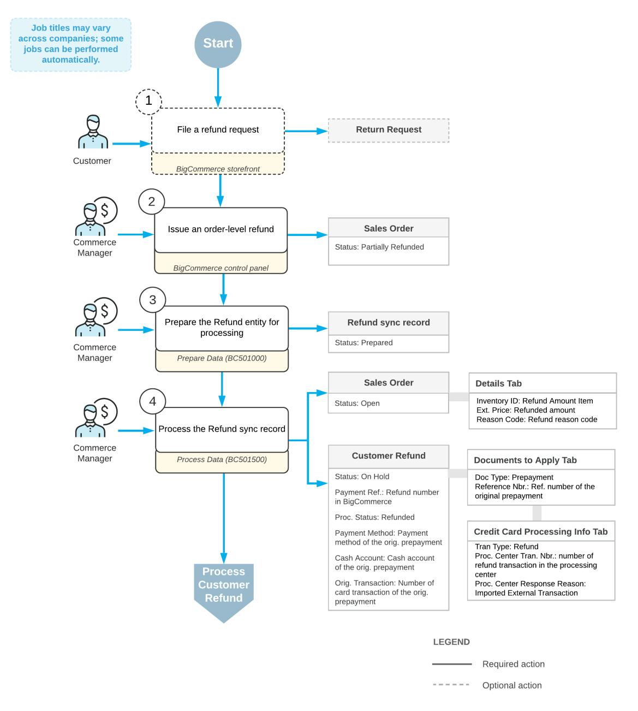

If the original sales order has the *Completed* status on the *[Sales Orders](https://help-2025r1.acumatica.com/Help?ScreenId=ShowWiki&pageid=19e4021c-1b84-49fd-be12-0320c5f1c7e5)* form, the following actions are performed:

- On the *[Sales Orders](https://help-2025r1.acumatica.com/Help?ScreenId=ShowWiki&pageid=19e4021c-1b84-49fd-be12-0320c5f1c7e5)* form, the system creates a return order of the type selected in the **Return OrderType** box on the **Orders** tab of the *[BigCommerce Stores](#page-473-2)* form. In the **External Reference** box of the Summary area, the system inserts the identifier of the refund in the BigCommerce store.
- In the return order, on the **Details** tab, the system inserts a line with the non-stock item that was specified in the **Refund Amount Item** box on the **Orders** tab of the *[BigCommerce Stores](#page-473-2)* form. In the **Unit Price** and **Ext. Price** columns, the system inserts the refund amount. In the **Reason Code** column, the system inserts the reason code that was specified on the **Orders** tab of the *[BigCommerce Stores](#page-473-2)* form.
- On the *[Payments and Applications](https://help-2025r1.acumatica.com/Help?ScreenId=ShowWiki&pageid=ae844bf4-1aef-42cd-9e2f-49b3ee1bc8d7)* (AR302000) form, creates a payment of the *Refund* type in the refunded amount and links it to the return order.

The following diagram illustrates the processing of an order-level refund for a card-based payment method that is issued aer the sales order has been shipped.

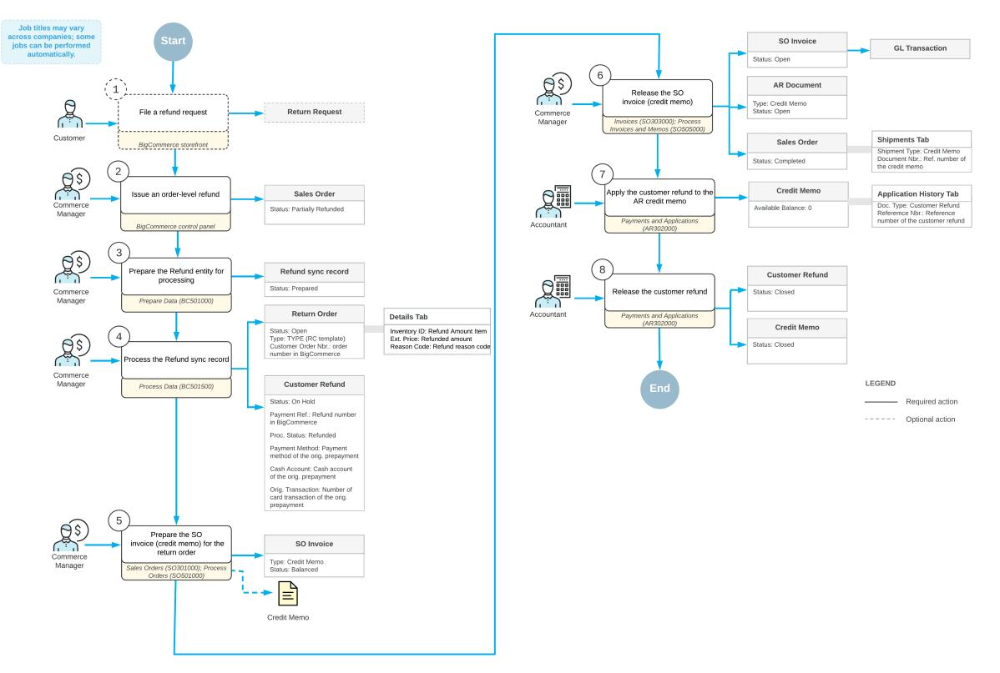

If the original sales order has a status other than *Open*, *On Hold*, or *Completed* on the *[Sales Orders](https://help-2025r1.acumatica.com/Help?ScreenId=ShowWiki&pageid=19e4021c-1b84-49fd-be12-0320c5f1c7e5)* form, the system displays an error message saying that the refund cannot be applied.

# **Importing Card Refunds: Item-Level Refunds**

A refund of an ordered item may be issued if, for example, a customer wants to amend the order to decrease the quantity of a purchased item or because they want to return the item whose condition or performance is unsatisfactory.

During the import of item refunds, if the original sales order has the *Open* or *On Hold* status, the following actions occur:

- On the *[Payments and Applications](https://help-2025r1.acumatica.com/Help?ScreenId=ShowWiki&pageid=ae844bf4-1aef-42cd-9e2f-49b3ee1bc8d7)* (AR302000) form, the system creates a payment of the *Refund* type in the refunded amount and applies it to the original payment.
- In the original sales order, on the **Details** tab of the *[Sales Orders](https://help-2025r1.acumatica.com/Help?ScreenId=ShowWiki&pageid=19e4021c-1b84-49fd-be12-0320c5f1c7e5)* (SO301000) form, the system updates the order line or lines to decrease the item quantities. Discounts and taxes, if applied, are recalculated accordingly.
- If the sales order is fully refunded or canceled and the processing status of the original payment is *Authorized*, then the original payment is voided.
- If the sales order is fully refunded or canceled and the processing status of the original payment is *Captured* or *Settled*, then a new voided payment is created against the original payment.

The following diagram illustrates the processing of an item return for a card-based payment method that is issued before the sales order has been shipped.

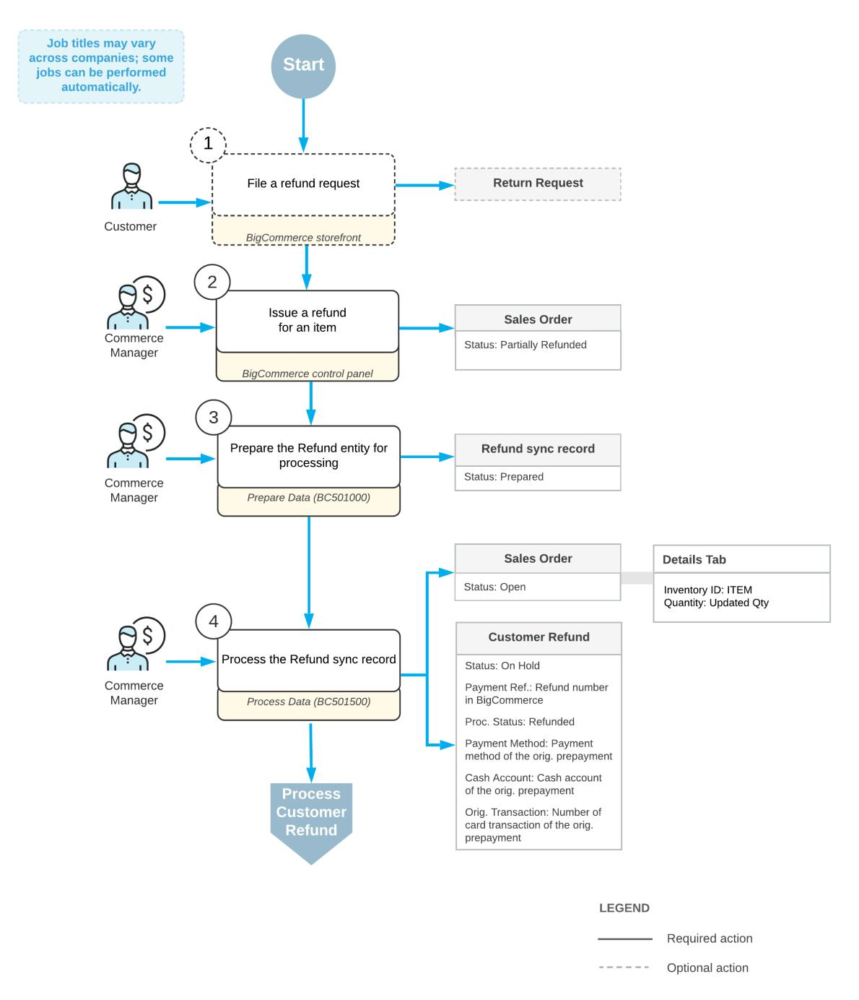

If the original sales order has the *Completed* status, the following actions occur:

- On the *[Sales Orders](https://help-2025r1.acumatica.com/Help?ScreenId=ShowWiki&pageid=19e4021c-1b84-49fd-be12-0320c5f1c7e5)* form, the system creates a return order of the type that was specified in the **Return OrderType** box on the **Orders** tab of the *[BigCommerce Stores](#page-473-2)* (BC201000) form. In the **External Reference** box of the Summary area, the system inserts the identifier of the refund in the BigCommerce store.
- In the return order, on the **Details** tab of the *[Sales Orders](https://help-2025r1.acumatica.com/Help?ScreenId=ShowWiki&pageid=19e4021c-1b84-49fd-be12-0320c5f1c7e5)* form, the system inserts a line with the applicable quantity of the returned item. In the **Reason Code** column, the system inserts the reason code that was specified on the **Orders** tab of the *[BigCommerce Stores](#page-473-2)* form.

- In the return order, on the **Details** tab of the *[Sales Orders](https://help-2025r1.acumatica.com/Help?ScreenId=ShowWiki&pageid=19e4021c-1b84-49fd-be12-0320c5f1c7e5)* form, the system inserts a line with the non-stock item that was specified in the **Refund Amount Item** box on the **Orders** tab of the *[BigCommerce Stores](#page-473-2)* form. In the **Unit Price** and **Ext. Price** columns, the system inserts the refund amount. In the **Reason Code** column, the system inserts the reason code that was specified on the **Orders** tab of the *[BigCommerce Stores](#page-473-2)* form.
- On the *[Payments and Applications](https://help-2025r1.acumatica.com/Help?ScreenId=ShowWiki&pageid=ae844bf4-1aef-42cd-9e2f-49b3ee1bc8d7)* (AR302000) form, creates a payment of the *Refund* type in the refunded amount and links it to the return order.

The following diagram illustrates the processing of an item return for a non-card payment method that is issued aer the sales order has been shipped.

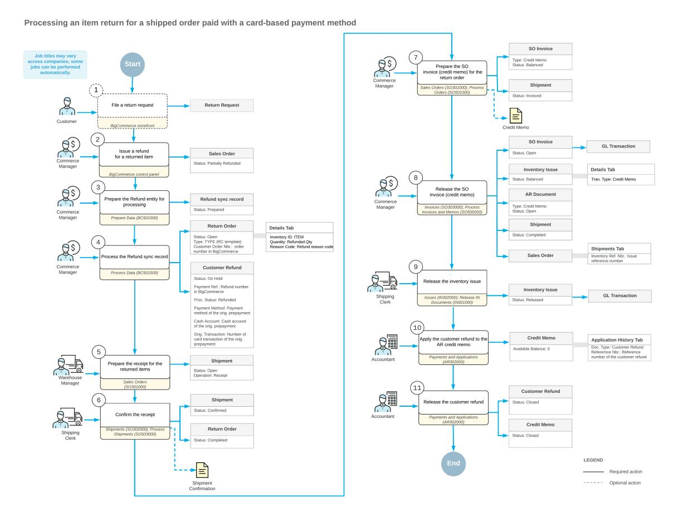

If the original sales order has a status other than *Open*, *On Hold*, or *Completed*, the system displays an error message saying that the refund cannot be applied.

# **Selling and Accepting Gi Certificates**

In this chapter, you will learn how to configure the gi certificate functionality to be able to sell gi certificates in the BigCommerce store and accept the gi certificates as payment.

# **Gi Certificates: General Information**

You can sell gi certificates in the BigCommerce store and then accept them as full or partial payments.

#### **Learning Objectives**

In this chapter, you will learn how to do the following:

- Create gi certificates so that you can sell them in the BigCommerce store
- Set up a payment method to use gi certificate balance to pay orders placed in the BigCommerce store

## **Applicable Scenarios**

You set up gi certificates if you want to offer customers the ability to buy a gi certificate and then accept the sold gi certificates as payments for orders.

#### **Selling Gi Certificates**

In order to be able to sell gi certificates to customers and then import sales orders containing the gi cards from the BigCommerce store to Acumatica ERP, you perform the following general steps:

- 1. In the control panel of the BigCommerce store, you enable the gi certificate functionality and define gi certificates that will be available to shoppers online.
- 2. In Acumatica ERP, define a non-stock item that will be used to represent a gi certificate in imported sales orders.
- 3. On the **Orders** tab of the *[BigCommerce Stores](#page-473-2)* (BC201000) form, in the **Gi Certificate Item** box, you specify the non-stock item that will represent sold gi certificates in imported sales orders.

#### **Accepting Gi Certificates as Payment**

To be able to import orders that are paid, fully or in part, by gi certificates from the BigCommerce store to Acumatica ERP, you need to map the store payment method representing a gi card to a payment method defined in Acumatica ERP on the **Payments** tab of the *[BigCommerce Stores](#page-473-2)* (BC201000) form. For information about payment mapping, see *[Order Synchronization: General Information](#page-133-2)*.

When a sales order that has been fully or partially paid by a gi certificate is imported to Acumatica ERP, a document of the *Prepayment* type is created on the *[Payments and Applications](https://help-2025r1.acumatica.com/Help?ScreenId=ShowWiki&pageid=ae844bf4-1aef-42cd-9e2f-49b3ee1bc8d7)* (AR302000) form for the gi certificate payment. The **Description** of the prepayment contains the identifier of the gi certificate in the BigCommerce store.

For step-by-step instructions for implementing gi certificates, see *[Gift Certificates: Process Activity](#page-197-1)*.

# **Gi Certificates: Process Activity**

In this activity, you will learn how to implement gi certificates in the BigCommerce store and explore how gi certificates can be used to pay, in full or in part, for an online purchase in the BigCommerce store.

The following activity is based on the *U100* dataset.

### **Story**

Suppose that a sales manager of SweetLife wants to give its online customers the ability to purchase gi certificates and use these certificates when purchasing goods in the SweetLife online store. You also want to track payments made with gi certificates in Acumatica ERP by using a dedicated payment method.

As an implementation consultant, you need to set up a non-stock item that will be used to record a sale of a gi certificate as well as a payment method that will be used to track payments made with gi certificates.

#### **Configuration Overview**

In the *U100* dataset, the following tasks have been performed to support this activity:

- On the *[Non-Stock Items](https://help-2025r1.acumatica.com/Help?ScreenId=ShowWiki&pageid=bf68dd4f-63d4-460d-8dc0-9152f2bd6bf1)* (IN202000) form, the *GIFTCERT* non-stock item has been created to represent gi certificates sold in the online store.
- On the *[Payment Methods](https://help-2025r1.acumatica.com/Help?ScreenId=ShowWiki&pageid=509285d1-cfae-4e87-95c3-a968451952e6)* (CA204000) form, the *GIFTCARDS* payment method has been created.

#### **Process Overview**

You will do the following:

- 1. On the *[BigCommerce Stores](#page-473-2)* (BC201000) form, configure the gi certificate settings.
- 2. In the control panel of the BigCommerce store, enable the gi certificate functionality and define gi certificates in various amounts to be sold in the online store.
- 3. On the storefront, purchase a gi certificate.
- 4. In the control panel of the BigCommerce store, capture the payment and complete the order (aer which the system will send the certificate to its recipient).
- 5. On the *[Prepare Data](#page-529-1)* (BC501000) form, prepare the sales order data for synchronization, and on the *[Process](#page-533-1) [Data](#page-533-1)* (BC501500) form, you will process the prepared data.
- 6. On the *[Sales Orders](https://help-2025r1.acumatica.com/Help?ScreenId=ShowWiki&pageid=19e4021c-1b84-49fd-be12-0320c5f1c7e5)* (SO301000) form, review the imported sales order.
- 7. On the storefront, you will create an order and pay part of it with the purchased gi certificate.
- 8. On the *[Prepare Data](#page-529-1)* form, prepare the sales order data for synchronization, and on the *[Process Data](#page-533-1)* form, you will process the prepared data.
- 9. On the *[Sales Orders](https://help-2025r1.acumatica.com/Help?ScreenId=ShowWiki&pageid=19e4021c-1b84-49fd-be12-0320c5f1c7e5)* form, review the imported sales order corresponding to your order on the storefront that was partially paid for with the gi certificate.

## **System Preparation**

Before you start configuring the gi certificates, do the following:

- 1. Make sure the connection to the BigCommerce store is established and the minimum configuration is performed as described in *Initial [Configuration:](#page-27-1) To Establish and Configure the Store Connection*.
- 2. Make sure that the *PLUMJAM08* stock item has been exported to the BigCommerce store during the synchronization of the *Stock Item* entity (as described in *Product [Synchronization:](#page-93-2) To Synchronize Non-Stock [Items with Attributes](#page-93-2)*).
- 3. Make sure that integration with Authorize.Net has been implemented as described in *[Order Synchronization:](#page-142-1) To Configure and Import [Authorize.Net](#page-142-1) Payments*.
- 4. Sign in to the Acumatica ERP instance with the *U100* dataset preloaded by using the following credentials:
  - **Username**: *gibbs*
  - **Password**: *123*

#### **Step 1: Configuring the Store Settings**

To specify the gi certificate settings in Acumatica ERP, perform the following instructions:

1. On the *[BigCommerce Stores](#page-473-2)* (BC201000) form, select the *SweetStore - BC* store.

2. On the **Orders** tab (**Order** section), in the **Gi Certificate Item** box, select *GIFTCERT*.

All purchases of gi certificates in the online store will be recorded in Acumatica ERP as purchases of this item.

- 3. In the table of the **Payments** tab, in the row of the *GIFTCERTIFICATE (GIFT\_CERTIFICATE)* store payment method, specify the following settings:
  - **Active**: Selected
  - **ERP Payment Method**: *GIFTCARDS*
  - **Cash Account**: *10250ST*
  - **Release Payments and Refunds**: Cleared (default state)
- 4. On the form toolbar, click**Save**.

# **Step 2: Configuring Gi Certificates in the Store**

To enable the gi certificate functionality, in the BigCommerce store, do the following:

- 1. In the le pane of the control panel, click **Marketing > Gi certificates**.
- 2. On the **Gi Certificates** page (**Gi CertificateSettings** section), in the**Select a currency** box, make sure *US Dollar -USD* is selected.
- 3. Right of **Enable Gi Certificates?**, select the **Yes, enable the gi certificate system** check box.
- 4. Right of **Gi CertificateValues**, make sure the**Specify a list of allowed gi certificate amounts** option button is selected. In the box that is located under the option button, specify the following values (each value in a separate row of the box):
  - 10.00
  - 25.00
- 5. In the lower right, click**Save** to save your changes.

## **Step 3: Purchasing a Gi Certificate**

To create an order in which you purchase a \$25 gi certificate in the BigCommerce store, while you are still signed in to the control panel of the BigCommerce store, do the following:

- 1. At the upper right, click**View storefront** to open the storefront.
- 2. On the storefront, at the upper right, click **Gi Certificates**.
- 3. On the **Gi Certificates** page which opens, on the **Purchase Gi Certificate** tab, specify the following information:
  - **Your Name**: Danny Heady
  - **Your Email**: dheady@example.com
  - **Recipient's Name**: Melody Keys
  - **Recipient's Email**: melody@example.com

In this box, you can specify a real email address to which you have access to receive the gi certificate.

- **Amount**: *\$25.00*
- **I agree that Gi Certificates are nonrefundable**: Selected
- **Gi CertificateTheme**: *Celebration*
- 4. Click **Add Gi Certificate to Cart**.
- 5. In the cart, click **Check out**.

- 6. On the checkout page, complete the process of creating the order as follows:
  - a. In the **Customer** section, in the **Email** box, specify dheady@example.com, and click **Continue**.
  - b. In the **Billing** section, fill in the shipping address boxes as follows:
    - **First Name**: Danny
    - **Last Name**: Heady
    - **Address**: 2779 Cantebury Drive
    - **City**: New York
    - **Country**: *United States*
    - **State/Province**: *New York*
    - **Postal Code**: 10005
  - c. Click **Continue**.
  - d. In the **Payment** section, select the **Authorize.Net** option button, and specify the following card details:
    - **Credit Card Number**: 4242 4242 4242 4242
    - **Expiration**: 12/25
    - **Name on Card**: Danny Heady
  - e. Click **Place Order** to place your order.

Your order has been created, and on the confirmation page, the order number is displayed. Note the number because you will process the order with this number further in this activity.

- 7. Return to the control panel of the BigCommerce store, and in the le pane, click **Orders > All orders**.
- 8. On the **View orders** page, which opens, click the plus button next to the order of *Danny Heady* that you have just created and which number you have noted to expand the order details.

The order has the *\$25.00* value in the**Total** column and the**Status** of the order is set to *Completed*. An email with the gi certificate code has been sent to the gi certificate recipient's email address (**Recipient's Email**) that you specified in the order with the certificate.

## **Step 4: Importing the Order with the Gi Certificate**

To import the order to Acumatica ERP, do the following:

- 1. On the *[Prepare Data](#page-529-1)* (BC501000) form, specify the following settings in the Summary area:
  - **Store**: *SweetStore - BC*
  - **Prepare Mode**: *Incremental*
- 2. In the table, select the check box in the unlabeled column in the row of the *Sales Order* entity, and on the form toolbar, click **Prepare**.
- 3. In the **Processing** dialog box, which opens, click **Close** to close the dialog box.
- 4. In the row of the *Sales Order* entity, click the link with the number of prepared synchronization records in the **Ready to Process** column.
- 5. On the *[Process Data](#page-533-1)* (BC501500) form, which opens with the store and the *Sales Order* entity selected, select the unlabeled check box in the row of the order that you created earlier in this activity, which you can identify by the order number in the **External ID** column and by the empty **ERP ID** column.
- 6. On the form toolbar, click **Process**.
- 7. In the **Processing** dialog box, which opens, click **Close** to close the dialog box.

#### **Step 6: Reviewing the Imported Order**

To review the details of the imported sales order in Acumatica ERP, do the following:

- 1. On the *[Sync History](#page-539-1)* (BC301000) form, specify the following settings in the Summary area:
  - **Store**: *SweetStore - BC*
  - **Entity**: *Sales Order*
- 2. On the **Processed** tab, in the row of the sales order that you have just imported (which you can locate by its external ID), click the link in the **ERP ID** column.
- 3. On the *[Sales Orders](https://help-2025r1.acumatica.com/Help?ScreenId=ShowWiki&pageid=19e4021c-1b84-49fd-be12-0320c5f1c7e5)* (SO301000) form, which opens with the imported order in a pop-up window, review the order details.

On the **Details** tab, notice one line that corresponds to the *GIFTCERT* non-stock item, which you specified as the **Gi Certificate Item** box on the **Orders** tab of the *[BigCommerce Stores](#page-473-2)* (BC201000) form. The **Order Total** in the Summary area is *25.00*.

4. Close the pup-up window with the *[Sales Orders](https://help-2025r1.acumatica.com/Help?ScreenId=ShowWiki&pageid=19e4021c-1b84-49fd-be12-0320c5f1c7e5)* form.

### **Step 5: Paying for the Order with a Gi Certificate**

To create an order and pay for part of it with the gi certificate, in the control panel of the BigCommerce store, do the following:

- 1. In the le pane, click **Orders > Gi certificates**.
- 2. On the **All gi certificates** tab of the **Gi certificates** page, which opens, in the row with *Danny Heady* customer, memorize the gi certificate code in the **Code** column.
- 3. At the upper right, click**View storefront** to open the storefront.
- 4. On the storefront, click**Search** in the upper right, and then start typing kiwi in the search box that appears.
- 5. In the search results, click *Kiwi jam 96 oz*.
- 6. On the page for the *Kiwi jam 96 oz* product, which opens, select a quantity of *3*, and click **Add to Cart**.
- 7. In the pop-up window that opens, click **Proceed to checkout**.
- 8. On the checkout page, in the **OrderSummary** section, click *Coupon/Gi Certificate*.
- 9. In the box that appears, enter the gi certificate code, and click **Apply**.

Notice that the order amount has been decreased by the gi certificate amount (\$25).

10.Complete the order settings as follows:

- a. In the **Customer** section, in the **Email Address** box, specify melody@example.com, and click **Continue**.
- b. In the **Shipping** section, fill in the shipping address boxes as follows:
  - **First Name**: Melody
  - **Last Name**: Keys
  - **Address**: 3402 Angus Road
  - **City**: New York
  - **Country**: *United States*
  - **State/Province**: *New York*
  - **Postal Code**: 10003
  - **My billing address is the same as my shipping address**: Selected (default state)

- c. In the **Shipping Method** section, make sure that the *Free Shipping* option is selected, and click **Continue**.
- 11.In the **Payment Method** section, select the **Authorize.Net** option button, and specify the following card settings:
  - **Credit Card Number**: 4111 1111 1111 1111
  - **Expiration**: 12/25
  - **Name on Card**: *Melody Keys*
- 12.Click **Place Order** to place your order.

On the confirmation page, notice that the reference number of the created order.

#### **Step 6: Importing the Sales Order Paid with the Gi Certificate**

To import the sales order, in Acumatica ERP, do the following:

- 1. On the *[Prepare Data](#page-529-1)* (BC501000) form, specify the following settings in the Summary area:
  - **Store**: *SweetStore - BC*
  - **Prepare Mode**: *Incremental*
- 2. In the table, select the check box in the unlabeled column in the row of the *Sales Order* entity, and on the form toolbar, click **Prepare**.
- 3. In the **Processing** dialog box, which opens, click **Close** to close the dialog box.
- 4. In the row of the *Sales Order* entity, click the link with the number of prepared synchronization records in the **Ready to Process** column.
- 5. On the *[Process Data](#page-533-1)* (BC501500) form, which opens with the *SweetStore - BC* store and the *Sales Order* entity selected, select the unlabeled check box in the row of the order that you created in the previous step, which you can identify by the order number in the **External ID** column and by the empty **ERP ID** column.
- 6. On the form toolbar, click **Process**.
- 7. In the **Processing** dialog box, which opens, click **Close** to close the dialog box.

#### **Step 7: Reviewing the Imported Sales Order**

To review the settings of the imported sales order, do the following:

- 1. On the *[Sync History](#page-539-1)* (BC301000) form, specify the following settings in the Summary area:
  - **Store**: *SweetStore - BC*
  - **Entity**: *Sales Order*
- 2. On the **Processed** tab, in the row of the sales order that you have just imported (which you can locate by its external ID), click the link in the **ERP ID** column.
- 3. On the *[Sales Orders](https://help-2025r1.acumatica.com/Help?ScreenId=ShowWiki&pageid=19e4021c-1b84-49fd-be12-0320c5f1c7e5)* (SO301000) form, which opens in a pop-up window, review the settings of the order (as shown in the screenshot below).

On the **Payments** tab, notice that two prepayments have been applied to the order: a credit card payment (mapped to the *ONLINE* payment method) and a gi card payment (mapped to the *GIFTCARDS* payment method).

|         | <b>Sales Orders</b> |                        |                |                       | EO 000078 - eCommerce Guest Customer |                   |   |                             |        |                                |                                        |   |                   |                        |                        |             |                 | <b>PI NOTES</b> |               | <b>ACTIVITIES</b> | <b>FILES</b> | <b>CUSTOMIZATION</b>   | TOOLS $\sim$   |
|---------|---------------------|------------------------|----------------|-----------------------|--------------------------------------|-------------------|---|-----------------------------|--------|--------------------------------|----------------------------------------|---|-------------------|------------------------|------------------------|-------------|-----------------|-----------------|---------------|-------------------|--------------|------------------------|----------------|
| 뭐       | $\Box$              | ↶                      | +              | 侕                     | n $\check{~}$                     | K                 | ≺ | $\rightarrow$               | $\geq$ |                                | QUICK PROCESS                          |   |                   | <b>CREATE SHIPMENT</b> |                        | <b>HOLD</b> | $\cdots$        |                 |               |                   |              |                        |                |
|         | * Order Type:       |                        | E O | Q                     |                                      | * Customer:       |   |                             |        |                                | ECOMGUEST - eCommerce Guest Ct P       |   | 0                 | Ordered Qtv.:          |                        |             | 3.00            |                 |               |                   |              |                        | $\overline{ }$ |
|         | Order Nbr.:         |                        | 000078         | Q                     |                                      | * Location:       |   |                             |        | <b>MAIN - Primary Location</b> |                                        | Q | 0                 | <b>Detail Total:</b>   |                        |             | 135.45          |                 |               |                   |              |                        |                |
|         | Status:             |                        | Open           |                       |                                      | Contact:          |   |                             |        |                                |                                        | Q | 0                 |                        | <b>Line Discounts:</b> |             | 0.00            |                 |               |                   |              |                        |                |
| * Date: |                     |                        | 3/25/2025      | Ä                     |                                      | * Project:        |   | X - Non-Project Code.       |        |                                |                                        | Q | 0                 |                        | Document Dis           |             | 0.00            |                 |               |                   |              |                        |                |
|         |                     | * Requested On:        | 3/25/2025      | Ä                     |                                      | Description:      |   | <b>Awaiting Fulfillment</b> |        |                                | SweetStore - BC   Order: 104   Status: |   |                   | <b>Freight Total:</b>  |                        |             | 0.00            |                 |               |                   |              |                        |                |
|         |                     | Customer Ord           |                |                       |                                      |                   |   |                             |        |                                |                                        |   | <b>Tax Total:</b> |                        |                        | 0.00        |                 |                 |               |                   |              |                        |                |
|         |                     | <b>External Refer.</b> |                | 104 - SweetSto        |                                      |                   |   |                             |        |                                |                                        |   |                   | <b>Order Total:</b>    |                        |             | 135.45          |                 |               |                   |              |                        |                |
|         | <b>DETAILS</b>      |                        | <b>TAXES</b>   | <b>FINANCIAL</b>      |                                      | <b>SHIPPING</b>   |   | <b>ADDRESSES</b>            |        |                                | <b>SHIPMENTS</b>                       |   | <b>PAYMENTS</b>   |                        | <b>RELATIONS</b>       |             | <b>O</b> TOTALS |                 |               |                   |              |                        |                |
| Ò       | $\mathrm{+}$        | $\times$               |                | <b>CREATE PAYMENT</b> |                                      |                   |   | <b>CREATE PREPAYMENT</b>    |        | CAPTURE                        | <b>VOID CARD PAYMENT</b>               |   |                   |                        | Active                 |             |                 | $\checkmark$    | ৡ             |                   |              | Not Released:          | 135.45         |
| 0 R  |                     | $\Box$ Doc. Type       |                | *Reference            |                                      | <b>Applied To</b> |   | <b>Transferred</b>          |        | <b>Balance Status</b>          |                                        |   |                   | Payment Ref.           | Payment                |             | Cash            |                 |               | Payment Currency  |              | Authorized:            | 0.00           |
|         |                     |                        |                | Nbr.                  |                                      | Order             |   | to Invoice                  |        |                                |                                        |   |                   |                        | Method                 |             | <b>Account</b>  |                 | <b>Amount</b> |                   |              | Released:              | 0.00           |
| 0       | D                   | Prepayment             |                | 000083                |                                      | 110.45            |   | 0.00                        |        | 0.00                           | <b>Balanced</b>                        |   |                   | 80039539875            | <b>ONLINE</b>          |             | 10250ST         |                 | 110.45 USD    |                   |              | <b>Total Paid:</b>     | 135.45         |
| 0       | D                   | Prepayment             |                | 000084                |                                      | 25.00             |   | 0.00                        |        | 0.00                           | <b>Balanced</b>                        |   | 989345404         |                        | <b>GIFTCARDS</b>       |             | 10250ST         |                 | 25.00 USD     |                   |              | <b>Total Transferr</b> | 0.00           |
|         |                     |                        |                |                       |                                      |                   |   |                             |        |                                |                                        |   |                   |                        |                        |             |                 |                 |               |                   |              |                        |                |
|         |                     |                        |                |                       |                                      |                   |   |                             |        |                                |                                        |   |                   |                        |                        |             |                 |                 |               |                   |              | <b>Unpaid Balance:</b> | 0.00           |
|         |                     |                        |                |                       |                                      |                   |   |                             |        |                                |                                        |   |                   |                        |                        |             |                 |                 |               |                   |              | Unbilled Balan         | 135.45         |

*Figure: The prepayment and the gi certificate applied to the order*

- 4. In the row of the gi card payment, which has an applied amount of \$25, click the link in the **Reference Nbr.** column.
- 5. On the *[Payments and Applications](https://help-2025r1.acumatica.com/Help?ScreenId=ShowWiki&pageid=ae844bf4-1aef-42cd-9e2f-49b3ee1bc8d7)* (AR302000) form, which opens in a pop-up window, review the payment details.

Notice that in the **Payment Ref.** box of the Summary area, the payment identifier assigned to the payment in the BigCommerce store is displayed. The **Description** box contains the store payment method, the code of the gi certificate that was applied to the order, the order number, and the payment ID.

The prepayment has the *Balanced* status because the **Release Payments and Refunds** check box was cleared for the *GIFTCARDS* payment method in the mapping table on the **Payments** tab of the *[BigCommerce](#page-473-2) [Stores](#page-473-2)* (BC201000) form.

6. Close the pup-up windows with the *[Payments and Applications](https://help-2025r1.acumatica.com/Help?ScreenId=ShowWiki&pageid=ae844bf4-1aef-42cd-9e2f-49b3ee1bc8d7)* and *[Sales Orders](https://help-2025r1.acumatica.com/Help?ScreenId=ShowWiki&pageid=19e4021c-1b84-49fd-be12-0320c5f1c7e5)* form.

# **Importing Products with Variants**

In the topics of this chapter, you will read about the importing of products with variants from the BigCommerce store to Acumatica ERP, where the corresponding template items and matrix items will be created.

# **Import of Products with Variants: General Information**

You can import to Acumatica ERP products with variants that were initially configured in the BigCommerce store if the *Matrix Items* feature is enabled on the *[Enable/Disable Features](https://help-2025r1.acumatica.com/Help?ScreenId=ShowWiki&pageid=c1555e43-1bc5-4f6f-ba9d-b323f94d8a6b)* (CS100000) form.

*Variants* are versions of the product with different traits or attributes—which are also referred to in BigCommerce as *options*—such as color, scent, size, and material.

During the import of products with variants, the corresponding template items and matrix items are created in Acumatica ERP. A matrix item is a stock or non-stock item that corresponds to a product with a particular set of attributes. A template item is a high-level item that contains the default settings of a particular group of matrix items, such as the attributes in the matrix rows and columns.

#### **Learning Objectives**

In this chapter, you will learn how to import products with variants from the BigCommerce store to Acumatica ERP, where they will be defined as template items and matrix items.

## **Applicable Scenarios**

You import products from an external system to Acumatica ERP in the following cases:

- You are initially configuring Acumatica ERP and need to import products that have already been defined in the external system.
- You manage product information in the external system, have updated any product settings aer the product was synchronized with Acumatica ERP, and need the changes to be reflected in the corresponding inventory items in Acumatica ERP.

# **Configuration of Importing Products with Variants**

Before initially importing products with variants from the BigCommerce store to Acumatica ERP, you need to perform the following general steps:

- 1. On the *[BigCommerce Stores](#page-473-2)* (BC201000) form, you select the store and specify the following settings:
  - a. For the *Template Item* entity on the **EntitySettings** tab, you select the **Active** check box and select *Import* in the **Sync Direction** column.
  - b. On the **InventorySettings** tab (**ImportSettings** section), you select an auto-numbering sequence in the **Inventory NumberingSequence** box. The system uses that numbering sequence to generate the identifiers for imported template and matrix items.
- 2. On the *[Attributes](https://help-2025r1.acumatica.com/Help?ScreenId=ShowWiki&pageid=de0a353f-40d0-452d-9152-e65605e69788)* (CS205000) form, you perform the following steps:
  - a. You make sure that Acumatica ERP has an attribute that corresponds to each of the product variants on the product management page in the external system. To optimize auto-matching during the import, specify an attribute description that matches the variant name on the product management page in the external system.
  - b. You make sure that each attribute has the set of values that the variant in the external system has. In the table, specify a description for each attribute value that matches the variant value on the product management page in the external system.
- 3. On the *[Item Classes](https://help-2025r1.acumatica.com/Help?ScreenId=ShowWiki&pageid=80a3301b-4eb2-4ce2-94c5-0407c786a0f1)* (IN201000) form, you make sure that at least one item class has been defined for the import of template and matrix items. In the right pane of the form, in the topmost table on the **Attributes** tab, each item class must have the same number of attributes as the number of variant options of the product. The attributes must have the following settings in the table:
  - **Active**: Selected
  - **Category**: *Variant*

Also, in the **Default Column Attribute ID** and **Default Row Attribute ID** boxes below the table, you must specify different default attributes. If the item class has only a single attribute, you should fill in only one of the boxes with it.

#### **Product Import and Item Creation**

The system imports products with variants from the BigCommerce store to Acumatica ERP while synchronizing the *Template Item* entity if the products have variants in the**Variations** section of the product management page in the BigCommerce store. To import products with variants, you perform the following general steps:

1. On the *[Prepare Data](#page-529-1)* (BC501000) form, you prepare the data of the *Template Item* entity for import.

As a result, for the first import, the system creates mapping records for the product on the *[Attribute Mapping](#page-527-1) for [Template](#page-527-1) Item Import* (BC203000) form. The mapping has the product identifier, its description, and variants with values.

- 2. On the *Attribute Mapping for [Template](#page-527-1) Item Import* form, for the mapping records prepared for the product, you assign an item class and attributes with values as follows:
  - a. In the **ERP Item Class** column of each row, you specify an item class that has been defined on the *[Item](https://help-2025r1.acumatica.com/Help?ScreenId=ShowWiki&pageid=80a3301b-4eb2-4ce2-94c5-0407c786a0f1) [Classes](https://help-2025r1.acumatica.com/Help?ScreenId=ShowWiki&pageid=80a3301b-4eb2-4ce2-94c5-0407c786a0f1)* (IN201000) form and will be assigned to the imported items. The system uses the selected item class to insert the settings of the template and matrix items during the creation. You select the item class in one of the following ways:
    - Manually select the item class in each row.
    - Select an item class in the **Item Class to Assign** box in the Summary area, click a row, and then click **Update Item Class** on the form toolbar to make the system automatically inserts the selected item class to the selected row.

You use this method as an easier way to assign the same item class to multiple products being imported.

Regardless of how you have inserted the item class for a particular row, the system automatically assigns the inserted item class to all the rows that have the same identifier in the **External ID** column as the one in the updated row. You cannot specify different item classes for a product and its variants.

Also, aer the selection of the item class in any row, the system attempts to populate the **ERP Attribute** and **ERP AttributeValue** columns with the attributes and their values defined on the *[Attributes](https://help-2025r1.acumatica.com/Help?ScreenId=ShowWiki&pageid=de0a353f-40d0-452d-9152-e65605e69788)* (CS205000) form and specified in the selected item class. If the description of an attribute matches the value in the **External Option** column, the system adds this attribute to the **ERP Attribute** columns of the mapping. If the description of one of the values of the selected attribute matches the **External Option Value**, the system adds this attribute value to the **ERP AttributeValue** columns of the mapping.

- b. If the system does not populate the **ERP Attribute** and **ERP AttributeValue** columns for any row, you fill them in manually. Once you specify an attribute for an external option in a mapping, the system automatically inserts this attribute for all the mappings with the same product identifier and external option.
- c. To complete the mapping of the product variants and Acumatica ERP attributes, you save the changes. Then you can proceed with the import.
- 3. On the *[Process Data](#page-533-1)* (BC501500) form, you process the synchronization records prepared for the *Template Item* entity.

As a result, for each imported product with variants, the system creates a template item on the *[Template](https://help-2025r1.acumatica.com/Help?ScreenId=ShowWiki&pageid=4cb927f0-5880-4169-9fdf-4529fd7bffdf) Items* (IN203000) form. It also creates a matrix item for each combination of the variant and its value on the *[Stock Items](https://help-2025r1.acumatica.com/Help?ScreenId=ShowWiki&pageid=77786a70-1f1e-4d63-ad98-96f98e4fcb0e)* (IN202500) or *[Non-Stock Items](https://help-2025r1.acumatica.com/Help?ScreenId=ShowWiki&pageid=bf68dd4f-63d4-460d-8dc0-9152f2bd6bf1)* (IN202000) form, depending on whether the product is physical or not. That is, depending on the option selected in the **ProductType** box for the product on the product management page (**Basic Information** section) of the BigCommerce store, the system imports the product variants as follows:

- As stock items on the *[Stock Items](https://help-2025r1.acumatica.com/Help?ScreenId=ShowWiki&pageid=77786a70-1f1e-4d63-ad98-96f98e4fcb0e)* (IN202500) form if the *Physical* option is selected
- As non-stock items on the *[Non-Stock Items](https://help-2025r1.acumatica.com/Help?ScreenId=ShowWiki&pageid=bf68dd4f-63d4-460d-8dc0-9152f2bd6bf1)* (IN202000) form if the *Digital* option is selected

During the import, some settings of the created template and matrix items are imported from the external system,while others are copied from the item class specified on the *Attribute Mapping for [Template](#page-527-1) Item Import* form. For more details on how the system inserts the settings of imported items, see *Import of [Products](#page-425-1) with Variants: [Settings of Imported Items](#page-425-1)*.

#### **Product Synchronization**

If a product with variants has been already imported to Acumatica ERP and any product settings have been changed in the external system, during the next import, the system updates the corresponding template and matrix items in Acumatica ERP.

If a new variant value is added to an already-imported product, during the next import, the system uses the item class assigned to the corresponding template item to map the new variant value with one of the values of the corresponding attribute. If the mapping is successful, the system creates the matrix items. Otherwise, the import fails; in this case, you need to process the created mapping records on the *Attribute Mapping for [Template](#page-527-1) Item Import* (BC203000) form manually and then repeat the synchronization.

## **Limitations of Importing Products with Variants**

The following limitations apply to the importing of product with variants from the BigCommerce store:

- Product images are not imported.
- The price and availability settings are imported only when Acumatica ERP creates items. Aer that, these settings are updated in Acumatica ERP and exported to the external system to prevent discrepancies in the systems.

Also, an alternate ID of the *External SKU* type assigned to an inventory item during import cannot be updated on the **Cross-Reference** tab of the *[Stock Items](https://help-2025r1.acumatica.com/Help?ScreenId=ShowWiki&pageid=77786a70-1f1e-4d63-ad98-96f98e4fcb0e)* (IN202500) or *[Non-Stock Items](https://help-2025r1.acumatica.com/Help?ScreenId=ShowWiki&pageid=bf68dd4f-63d4-460d-8dc0-9152f2bd6bf1)* (IN202000) form. However, the row of the *External SKU* type with this alternate ID can be deleted in Acumatica ERP; this will not lead to the deletion of the SKU in the external system during the export of the item from Acumatica ERP. The SKU can also be updated in the external system and synchronized during the import to Acumatica ERP; in this case, the system adds the new SKU to the existing inventory item.

If there is no synchronization record for a product variant being imported, the external SKU is used to map the product with an existing item in Acumatica ERP. In this case, during the import of products with variants, the system searches for a product variant that matches an existing inventory item. It performs the following steps for each product variant until it finds a match:

- 1. Checks if the SKU matches the inventory ID
- 2. Checks if the SKU matches an alternate ID of the *Global* type
- 3. Checks if the SKU matches an alternate ID of the *External SKU* type
- 4. Checks if the product title matches the item description

# **Import of Products with Variants: Settings of Imported Items**

You can import products with variants that have been defined in the external system instead of creating the products manually in Acumatica ERP. When you import these products, the following items are created in Acumatica ERP:

- Template items on the *[Template](https://help-2025r1.acumatica.com/Help?ScreenId=ShowWiki&pageid=4cb927f0-5880-4169-9fdf-4529fd7bffdf) Items* (IN203000) form
- Matrix items on the *[Stock Items](https://help-2025r1.acumatica.com/Help?ScreenId=ShowWiki&pageid=77786a70-1f1e-4d63-ad98-96f98e4fcb0e)* or *[Non-Stock Items](https://help-2025r1.acumatica.com/Help?ScreenId=ShowWiki&pageid=bf68dd4f-63d4-460d-8dc0-9152f2bd6bf1)* (IN202000) form, depending on whether the products represent physical items

## **Template Item Settings Imported from the External System**

The following table shows the settings that are assigned to a template item on the *[Template](https://help-2025r1.acumatica.com/Help?ScreenId=ShowWiki&pageid=4cb927f0-5880-4169-9fdf-4529fd7bffdf) Items* (IN203000) form based on the corresponding settings of the source product from the product management page in the BigCommerce store.

| Acumatica ERP Element | BigCommerce Ele ment |
|-----------------------|-------------------------|
| Summary area          |                         |

| Acumatica ERP Element                                                                                                                                                                                      | BigCommerce Ele ment                 |
|------------------------------------------------------------------------------------------------------------------------------------------------------------------------------------------------------------|-----------------------------------------|
| Description                                                                                                                                                                                                | Product name                            |
| Price/Cost tab                                                                                                                                                                                             |                                         |
| Default Price                                                                                                                                                                                              | Default Price                           |
| MSRP                                                                                                                                                                                                       | MSRP                                    |
| Description tab                                                                                                                                                                                            |                                         |
| Item description                                                                                                                                                                                           | Description                             |
| eCommerce tab                                                                                                                                                                                              |                                         |
| Visibility. The system inserts one of the following options, depending on the settings of the corresponding product:                                                                                    | Visible on Store front, Set as a Fea |
| • Visible: The Visible on Storefront check box is selected, and theSet as a Featured Product on my Storefront check box is cleared.                                                                  | tured Product on my Storefront       |
| • Invisible: The Visible on Storefront check box is cleared.                                                                                                                                            |                                         |
| • Featured: The Visible on Storefront and Set as a Featured Product on myStore front check boxes are selected.                                                                                       |                                         |
| Availability                                                                                                                                                                                               | Purchasability,                         |
| The system inserts one of the following options, depending on the settings of the corre sponding product:                                                                                               | Track Inventory                         |
| • Set as Available (Track Qty.): The This product can be purchased in my online store option button is selected in the Purchasability section, and the Track Inventory is selected.               |                                         |
| • Set as Available (Don't Track Qty.): The This product can be purchased in my online store option button is selected in the Purchasability section and the Track Inventory check box is cleared. |                                         |
| • Set as Unavailable: The This product cannot be purchased in my online store option button is selected in the Purchasability section.                                                               |                                         |
| • Set as Pre-Order: The This product is coming soon but I want to take pre-orders op tion button is selected in the Purchasability section.                                                          |                                         |
| When Qty. Unavailable                                                                                                                                                                                      | Not applicable                          |
| The system always inserts the Store Default option.                                                                                                                                                        |                                         |

## **Matrix Item Settings Imported from the External System**

The following table shows the settings that are assigned to each matrix item created on the *[Stock Items](https://help-2025r1.acumatica.com/Help?ScreenId=ShowWiki&pageid=77786a70-1f1e-4d63-ad98-96f98e4fcb0e)* (IN202500) or *[Non-Stock Items](https://help-2025r1.acumatica.com/Help?ScreenId=ShowWiki&pageid=bf68dd4f-63d4-460d-8dc0-9152f2bd6bf1)* (IN202000) form when you import a product with variants. The system uses the settings of the template item that it has created for the product and the settings of the source product and product variants, which are specified on the product management page in the BigCommerce store.

| Acumatica ERP Element                                                                                                                                                                                                                                                                                                                                                                                                                                                                 | BigCommerce Ele ment                                                      |  |
|---------------------------------------------------------------------------------------------------------------------------------------------------------------------------------------------------------------------------------------------------------------------------------------------------------------------------------------------------------------------------------------------------------------------------------------------------------------------------------------|------------------------------------------------------------------------------|--|
| Summary area                                                                                                                                                                                                                                                                                                                                                                                                                                                                          |                                                                              |  |
| Description                                                                                                                                                                                                                                                                                                                                                                                                                                                                           | SKU, Product name                                                            |  |
| The system composes the description of the matrix item as follows: <sku> (<product name&gt;).</product </sku>                                                                                                                                                                                                                                                                                                                                                                   |                                                                              |  |
| Price/Cost tab                                                                                                                                                                                                                                                                                                                                                                                                                                                                        |                                                                              |  |
| Default Price                                                                                                                                                                                                                                                                                                                                                                                                                                                                         | Default Price (Vari ants section)                                         |  |
| MSRP                                                                                                                                                                                                                                                                                                                                                                                                                                                                                  | MSRP (Variants section)                                                   |  |
| Attributes tab                                                                                                                                                                                                                                                                                                                                                                                                                                                                        |                                                                              |  |
| Sales Categories table. For each sales category of the product, the system adds a row to the table on the Stock Items (IN202500) or Non-Stock Items (IN202000) form and in serts the sales category defined on the Item Sales Categories (IN204060) form that has a matching description. If there is no sales category on the Item Sales Categories form with a matching description, the system creates a new one in addition to listing this category for the item. | Sales Categories                                                             |  |
| The system imports sales categories only if import has been configured for the Sales Category entity on the Entities tab of the BigCommerce Stores (BC201000) form.                                                                                                                                                                                                                                                                                                             |                                                                              |  |
| Cross-Reference tab                                                                                                                                                                                                                                                                                                                                                                                                                                                                   |                                                                              |  |
| Alternate ID (in a row with the External SKU alternate type)                                                                                                                                                                                                                                                                                                                                                                                                                          | SKU (Variants sec tion)                                                   |  |
| Alternate ID (in a row with the GTIN/EAN/UPC/ISBN alternate type)                                                                                                                                                                                                                                                                                                                                                                                                                     | GlobalTrade Item                                                             |  |
| The barcodes of the EAN and UPC types can have only numeric values of 8, 12, 13, or 14 symbols. The barcodes of the ISBN type can have only numeric values up to 14 symbols.                                                                                                                                                                                                                                                                                                       | Number (GTIN)                                                                |  |
| eCommerce tab                                                                                                                                                                                                                                                                                                                                                                                                                                                                         |                                                                              |  |
| Visibility. The system inserts one of the following options, depending on the settings of the corresponding product: • Visible: The Visible on Storefront check box is selected, and theSet as a Featured Product on my Storefront check box is cleared.                                                                                                                                                                                                                  | Visible on Store front, Set as a Fea tured Product on my Storefront |  |
| • Invisible: The Visible on Storefront check box is cleared.                                                                                                                                                                                                                                                                                                                                                                                                                       |                                                                              |  |
| • Featured: The Visible on Storefront and Set as a Featured Product on myStore front check boxes are selected.                                                                                                                                                                                                                                                                                                                                                                  |                                                                              |  |

| Acumatica ERP Element                                                                                                                                                                                        | BigCommerce Ele ment            |
|--------------------------------------------------------------------------------------------------------------------------------------------------------------------------------------------------------------|------------------------------------|
| Availability. For a stock item, the system inserts one of the following options, depending on the settings of the corresponding product:                                                                  | Purchasability, Track Inventory |
| Set as Available (Track Qty.): The This product can be purchased in my online store • option button is selected in the Purchasability section, and the Track Inventory check box is selected.       |                                    |
| • Set as Available (Don't Track Qty.): The This product can be purchased in my online store option button is selected in the Purchasability section, and the Track Invento ry check box is cleared. |                                    |
| • Set as Unavailable: The This product cannot be purchased in my online store option button is selected in the Purchasability section.                                                                 |                                    |
| • Set as Pre-Order: The This product is coming soon but I want to take pre-orders op tion button is selected in the Purchasability section.                                                            |                                    |
| For a non-stock item, the system inserts one of the following options, depending on the option buttons selected in the Purchasability section for the corresponding product:                              |                                    |
| • Set as Available (Don't Track Qty.): The This product can be purchased in my online store option button is selected.                                                                                 |                                    |
| • Set as Unavailable: The This product cannot be purchased in my online store option button is selected.                                                                                               |                                    |
| Set as Pre-Order: The This product is coming soon but I want to take pre-orders op • tion button is selected.                                                                                          |                                    |
| When Qty. Unavailable                                                                                                                                                                                        |                                    |
| For a stock item, the system inserts the Store Default option.                                                                                                                                               |                                    |
| Packaging tab                                                                                                                                                                                                |                                    |
| Weight                                                                                                                                                                                                       | Weight                             |
| The system populates the box for only a stock item.                                                                                                                                                          |                                    |

#### **Assignment of the Tax Category**

During the import of a product with variants from the Shopify store, the system searches for a tax category to assign to the corresponding template and matrix items created on the *[Template](https://help-2025r1.acumatica.com/Help?ScreenId=ShowWiki&pageid=4cb927f0-5880-4169-9fdf-4529fd7bffdf) Items* (IN203000), *[Stock Items](https://help-2025r1.acumatica.com/Help?ScreenId=ShowWiki&pageid=77786a70-1f1e-4d63-ad98-96f98e4fcb0e)* (IN202500), and *[Non-Stock Items](https://help-2025r1.acumatica.com/Help?ScreenId=ShowWiki&pageid=bf68dd4f-63d4-460d-8dc0-9152f2bd6bf1)* (IN202000) forms as follows until it finds a tax category:

- 1. It checks the mapping settings on the **Import Mapping** tab of the *[Entities](#page-521-1)* (BC202000) form for the corresponding store and the *Template Item* entity.
- 2. It checks the substitution list specified in the**Tax Categories** box (**Substitution Lists** section) on the **Orders** tab of the *[BigCommerce Stores](#page-473-2)* (BC201000) form.
- 3. It checks the tax category from the item class assigned to the template and matrix item on the **General** tab of the *[Template](https://help-2025r1.acumatica.com/Help?ScreenId=ShowWiki&pageid=4cb927f0-5880-4169-9fdf-4529fd7bffdf) Items*, *[Stock Items](https://help-2025r1.acumatica.com/Help?ScreenId=ShowWiki&pageid=77786a70-1f1e-4d63-ad98-96f98e4fcb0e)*, and *[Non-Stock Items](https://help-2025r1.acumatica.com/Help?ScreenId=ShowWiki&pageid=bf68dd4f-63d4-460d-8dc0-9152f2bd6bf1)* forms.

# **Selling Matrix Items in a BigCommerce Store**

In the topics of this chapter, you will read about how to export matrix items created in Acumatica ERP to a BigCommerce store and how to import orders with matrix items from BigCommerce to Acumatica ERP.

# **Selling Matrix Items: General Information**

Acumatica ERP Retail Edition provides you with the ability to export template items, along with the matrix items that were generated based on these template items, from Acumatica ERP to the BigCommerce store if the *Matrix Items* feature is enabled on the *[Enable/Disable Features](https://help-2025r1.acumatica.com/Help?ScreenId=ShowWiki&pageid=c1555e43-1bc5-4f6f-ba9d-b323f94d8a6b)* (CS100000) form.

For details about managing template items in Acumatica ERP, see *[Managing Matrix Items](https://help-2025r1.acumatica.com/Help?ScreenId=ShowWiki&pageid=2f5989e9-88dc-46ff-bc46-e298f9c10c48)*.

### **Learning Objectives**

In this chapter, you will learn how to export template items and matrix items from Acumatica ERP to the BigCommerce store.

# **Applicable Scenarios**

You export matrix items from Acumatica ERP to an external system in the following cases:

- You are initially configuring the external system and need to transfer template items (and matrix items based on these template items) that have already been defined in Acumatica ERP
- If you manage template and matrix items in Acumatica ERP, have updated any of the settings of a template item or matrix item in Acumatica ERP aer the template item was synchronized with the external system, and need the changes to be reflected in the product settings in the external system

# **Configuration of Template Item Synchronization**

Before exporting template items defined in Acumatica ERP to the BigCommerce store, you need to perform the following general steps:

- 1. Activate the *Template Item* entity. on the *[BigCommerce Stores](#page-473-2)* (BC201000) form, you select the store, and on the **Entities** tab, you select the **Active** check box for the *Template Item* entity.
- 2. Configure the default visibility and purchasability settings for items exported to the BigCommerce store. For details, see *[Product Synchronization: Default Store Settings](#page-91-1)*.
- 3. Determine which template items and matrix items should be exported and define the visibility and purchasability settings for individual items.

# **Synchronization of Template Items**

Template items are exported to the BigCommerce store during the synchronization of the *Template Item* entity. Matrix items (both stock items and non-stock items) based on a template item are synchronized along with the template item.

During the export, the system updates the availability and visibility settings of each item exported to BigCommerce based on the settings specified for the template item on the **eCommerce** tab of the *[Template](https://help-2025r1.acumatica.com/Help?ScreenId=ShowWiki&pageid=4cb927f0-5880-4169-9fdf-4529fd7bffdf) Items* (IN203000) form, for the matrix items on the **eCommerce** tab of the *[Stock Items](https://help-2025r1.acumatica.com/Help?ScreenId=ShowWiki&pageid=77786a70-1f1e-4d63-ad98-96f98e4fcb0e)* (IN202500) form or on the *[Non-Stock Items](https://help-2025r1.acumatica.com/Help?ScreenId=ShowWiki&pageid=bf68dd4f-63d4-460d-8dc0-9152f2bd6bf1)* (IN202000) form and for the store on the **Inventory** tab of the *[BigCommerce Stores](#page-473-2)* (BC201000) form.

For details about the information exported to the BigCommerce store during the synchronization of a template item, see *[Template](#page-572-1) Item Entity*.

## **Excluding Items from Synchronization**

The template item is exported to the BigCommerce store if it meets the following criteria:

- The template item's status is *Active*, *No Purchases*, or *No Request*.
- The **Export to ExternalSystem** check box is selected for this template item on the **eCommerce** tab of the *[Template](https://help-2025r1.acumatica.com/Help?ScreenId=ShowWiki&pageid=4cb927f0-5880-4169-9fdf-4529fd7bffdf) Items* (IN203000) form.
- At least one matrix item based on this template item has the *Active*, *No Purchases*, or *No Request* status and **Export to ExternalSystem** check box selected on the **eCommerce** tab of the *[Stock Items](https://help-2025r1.acumatica.com/Help?ScreenId=ShowWiki&pageid=77786a70-1f1e-4d63-ad98-96f98e4fcb0e)* (IN202500) form or of the *[Non-Stock Items](https://help-2025r1.acumatica.com/Help?ScreenId=ShowWiki&pageid=bf68dd4f-63d4-460d-8dc0-9152f2bd6bf1)* (IN202000) form.

You can exclude a template item from synchronization with the BigCommerce store by clearing the **Export to ExternalSystem** check box on the **eCommerce** tab of the *[Template](https://help-2025r1.acumatica.com/Help?ScreenId=ShowWiki&pageid=4cb927f0-5880-4169-9fdf-4529fd7bffdf) Items* form.

If you select this check box for a template item, the system selects it on the **eCommerce** tab of the *[Stock Items](https://help-2025r1.acumatica.com/Help?ScreenId=ShowWiki&pageid=77786a70-1f1e-4d63-ad98-96f98e4fcb0e)* form or of the *[Non-Stock Items](https://help-2025r1.acumatica.com/Help?ScreenId=ShowWiki&pageid=bf68dd4f-63d4-460d-8dc0-9152f2bd6bf1)* form for all matrix items of this template item when these matrix items are generated.

You can clear the **Export to ExternalSystem** check box for an individual matrix item to exclude it from the export to the BigCommerce store. If the matrix item has already been exported to the BigCommerce store, during the next synchronization of the template item, it will be deleted from the**Variants** table on the product management page of the template item.

If the matrix item's status in Acumatica ERP is *Inactive*, *No Sales*, or *Marked for Deletion*—that is, if the matrix item has one of these statuses selected in the**Status** box of the Summary area of the *[Non-Stock Items](https://help-2025r1.acumatica.com/Help?ScreenId=ShowWiki&pageid=bf68dd4f-63d4-460d-8dc0-9152f2bd6bf1)* form or the *[Stock](https://help-2025r1.acumatica.com/Help?ScreenId=ShowWiki&pageid=77786a70-1f1e-4d63-ad98-96f98e4fcb0e) [Items](https://help-2025r1.acumatica.com/Help?ScreenId=ShowWiki&pageid=77786a70-1f1e-4d63-ad98-96f98e4fcb0e)* form—it is not exported and does not appear in the**Variants** table on the product management page of the template item.

#### **Visibility of an Exported Template Item**

You can specify the visibility settings for an individual template item on the **eCommerce** tab of the *[Template](https://help-2025r1.acumatica.com/Help?ScreenId=ShowWiki&pageid=4cb927f0-5880-4169-9fdf-4529fd7bffdf) Items* (IN203000) form. To make the template item visible on the storefront immediately aer it is exported, you select *Visible* in the **Visibility** box of the **eCommerce** tab. To make it visible on the storefront and include it in the group of featured products (which are displayed in specific places across the storefront, depending on the theme set up for the store), you select *Featured* in this box.

The option selected in the**Visibility** box for a particular template item takes precedence over the default visibility setting specified for the store in the **DefaultVisibility** box on the **Inventory** tab of the *[BigCommerce Stores](#page-473-2)* (BC201000) form. If *Store Default* is selected, the store's default visibility settings applies.

#### **Availability Settings of an Exported Template Item**

When a template item is exported to a BigCommerce store, it is assigned an availability (purchasability) status in the **Purchasability** section of the product management page in the store's control panel. In Acumatica ERP, you can determine which status is to be assigned to an item exported to BigCommerce by selecting a corresponding option in the **Availability** box on the **eCommerce** tab of the *[Template](https://help-2025r1.acumatica.com/Help?ScreenId=ShowWiki&pageid=4cb927f0-5880-4169-9fdf-4529fd7bffdf) Items* (IN203000) form:

- To make the item available for purchase via the storefront, you select *Set as Available (Don't Track Qty.)*. In BigCommerce, on the product management page, the**This product can be purchased in my online store** option button is selected.
- To make the item unavailable for purchase via the storefront but available for pre-order, you select *Set as Pre-Order*. In BigCommerce, on the product management page, the**This product is coming soon but I want to take pre-orders** option button is selected.
- To make the item unavailable for purchase via the storefront, you select *Set as Unavailable*. In BigCommerce, on the product management page, the**This product cannot be purchased in my online store** option button is selected.

The option selected in the **Availability** box for a particular item takes precedence over the default setting specified for the store in the **Default Availability** box on the **Inventory** tab of the *[BigCommerce Stores](#page-473-2)* (BC201000) form. If *Store Default* is selected, the store's default visibility settings applies.

For information about tracking quantities of exported template and matrix items, see *[Selling Matrix Items: Export of](#page-221-1) Product [Availability](#page-221-1) Data*.

### **Availability Settings of an Exported Matrix Item**

For each matrix item, you can specify availability settings on the **eCommerce** tab of the *[Non-Stock Items](https://help-2025r1.acumatica.com/Help?ScreenId=ShowWiki&pageid=bf68dd4f-63d4-460d-8dc0-9152f2bd6bf1)* (IN202000) form (if the matrix item is a non-stock item) or the *[Stock Items](https://help-2025r1.acumatica.com/Help?ScreenId=ShowWiki&pageid=77786a70-1f1e-4d63-ad98-96f98e4fcb0e)* (IN202500) form (if the matrix item is a stock item).

These settings will be exported to the BigCommerce store during the synchronization of the *Template Item* entity; however, the actual availability of the matrix item for purchase on the storefront depends on the purchasability of the template item itself.

To make a particular matrix item unavailable for purchase even if the template item is available for purchase or for pre-order, on the **eCommerce** tab of the *[Non-Stock Items](https://help-2025r1.acumatica.com/Help?ScreenId=ShowWiki&pageid=bf68dd4f-63d4-460d-8dc0-9152f2bd6bf1)* form or the *[Stock Items](https://help-2025r1.acumatica.com/Help?ScreenId=ShowWiki&pageid=77786a70-1f1e-4d63-ad98-96f98e4fcb0e)* form , you select *Set as Unavailable* in the **Availability** box. When the template item is synchronized with the BigCommerce store, the **Purchasable** check box becomes cleared for the matrix item in the**Variants** table on the product management page of the template item. With any other option selected in the **Availability** box, the **Purchasable** check box becomes selected for the matrix item.

# **Selling Matrix Items: To Export Matrix Items**

The following activity will walk you through the process of exporting a template item (and the matrix items based on this template item) defined in Acumatica ERP to the BigCommerce store.

The following activity is based on the *U100* dataset.

#### **Story**

Suppose that SweetLife Fruits & Jams company is going to sell juices in its BigCommerce online store. Acting as an implementation consultant helping SweetLife to set up the integration of Acumatica ERP with the BigCommerce store, you need to export the *JUICE* template item to the BigCommerce store.

## **Configuration Overview**

In the *U100* dataset, for the purposes of this activity, the following entities have been created:

- On the *[Enable/Disable Features](https://help-2025r1.acumatica.com/Help?ScreenId=ShowWiki&pageid=c1555e43-1bc5-4f6f-ba9d-b323f94d8a6b)* (CS100000) form, the *Matrix Items* feature has been enabled.
- On the *[Item Classes](https://help-2025r1.acumatica.com/Help?ScreenId=ShowWiki&pageid=80a3301b-4eb2-4ce2-94c5-0407c786a0f1)* (IN201000) form, the *MJUICE* item class
- On the *[Template](https://help-2025r1.acumatica.com/Help?ScreenId=ShowWiki&pageid=4cb927f0-5880-4169-9fdf-4529fd7bffdf) Items* (IN203000) form, the *JUICE* template item
- On the *[Stock Items](https://help-2025r1.acumatica.com/Help?ScreenId=ShowWiki&pageid=77786a70-1f1e-4d63-ad98-96f98e4fcb0e)* (IN202500) form, the matrix items listed in the following table

| Inventory ID | Description                                      |
|--------------|--------------------------------------------------|
| APL-16OZ-GBT | Apple juice in glass bottles of 16 fluid ounces  |
| APL-32OZ-GBT | Apple juice in glass bottles of 32 fluid ounces  |
| CHR-32OZ-GBT | Cherry juice in glass bottles of 32 fluid ounces |
| ORG-16OZ-GBT | Orange juice in glass bottles of 16 fluid ounces |
| ORG-32OZ-GBT | Orange juice in glass bottles of 32 fluid ounces |
| PCH-32OZ-GBT | Peach juice in glass bottles of 32 fluid ounces  |

| Inventory ID | Description                                          |
|--------------|------------------------------------------------------|
| PNL-16OZ-GBT | Pineapple juice in glass bottles of 16 fluid ounces  |
| SWB-32OZ-GBT | Strawberry juice in glass bottles of 32 fluid ounces |
| TMT-16OZ-GBT | Tomato juice in glass bottles of 16 fluid ounces     |

• On the *[Attributes](https://help-2025r1.acumatica.com/Help?ScreenId=ShowWiki&pageid=de0a353f-40d0-452d-9152-e65605e69788)* (CS205000) form, the attributes and the attribute values listed in the following table

| Attribute  | Attribute Values                                                                                             |
|------------|--------------------------------------------------------------------------------------------------------------|
| Ingredient | APL (Apple), CHR (Cherry), ORG (Orange), PCH (Peach), PNL (Pineapple), SWB (Strawberry), and TMT (Tomato) |
| Package    | BOX (Box), GBT (Glass bottle), JAR (Jar), PBT (Plastic bottle), and TIN (Tin)                                |
| Volume     | 08OZ (08 fl oz), 12OZ (12 fl oz), 16OZ (16 fl oz), 32OZ (32 fl oz), and 96OZ (96 fl oz)                      |

## **Process Overview**

In this activity, you will do the following:

- 1. On the *[Template](https://help-2025r1.acumatica.com/Help?ScreenId=ShowWiki&pageid=4cb927f0-5880-4169-9fdf-4529fd7bffdf) Items* (IN203000) form, review the *JUICE* template item.
- 2. On the *[BigCommerce Stores](#page-473-2)* (BC201000) form, activate the *Template Item* entity.
- 3. On the *[Entities](#page-521-1)* (BC202000) form, update the filtering conditions to export the template items of the *MJUICE* item class.
- 4. On the *[Prepare Data](#page-529-1)* (BC501000) form, prepare the template item data for synchronization.
- 5. On the *[Process Data](#page-533-1)* (BC501500) form, process the template item data that has been prepared for synchronization.
- 6. In the control panel of the BigCommerce store, review the exported item.

#### **System Preparation**

Before you complete the instructions in this activity, do the following:

- 1. Make sure that the following prerequisites have been met:
  - The BigCommerce store has been created and configured, as described in *Initial [Configuration:](#page-19-1) To Set Up [a BigCommerce Store](#page-19-1)*.
  - The connection to the BigCommerce store has been established and the initial configuration has been performed, as described in *Initial [Configuration:](#page-27-1) To Establish and Configure the Store Connection*.
  - The sales categories have been synchronized with the BigCommerce store, as described in the steps of the following activity: *Data [Synchronization:](#page-37-1) To Perform the First Synchronization*.
- 2. Launch the Acumatica ERP website with the *U100* dataset preloaded, and sign in with the following credentials:
  - **Username**: *gibbs*
  - **Password**: *123*
- 3. On the *[Enable/Disable Features](https://help-2025r1.acumatica.com/Help?ScreenId=ShowWiki&pageid=c1555e43-1bc5-4f6f-ba9d-b323f94d8a6b)* (CS100000) form, make sure that the *Matrix Items* feature is enabled as follows:

- a. On the form toolbar, click **Modify**, and select the **Matrix Items** check box under **Inventory and Order Management**.
- b. On the form toolbar, click **Enable**.

#### **Step 1: Reviewing the Template Item and the Matrix Items**

To review the *JUICE* template item and the matrix items that have been generated based on it, do the following:

- 1. Open the *[Template](https://help-2025r1.acumatica.com/Help?ScreenId=ShowWiki&pageid=4cb927f0-5880-4169-9fdf-4529fd7bffdf) Items* (IN203000) form.
- 2. In the **Template ID** box, select *JUICE*.
- 3. On the **Configuration** tab, review the attributes specified for the template item and their settings.

In the **Attributes** table, notice that the following attributes of the *Variant* type have been defined (and can be used for the matrix items of the template item):

- *Ingredient*
- *Package*
- *Volume*

See the *Configuration Overview* section for details on the values defined for these attributes.

- 4. In the **Inventory ID SegmentSettings** table, notice the settings for the automatic generation of the identifiers that have been assigned to matrix items. The segments are generated based on the attribute values (**SegmentType** is set to *Attribute Value* for all segments), and the length of each segment is determined by the value in the **Number of Characters** column.
- 5. On the **Matrix Items** tab, review the list of matrix items that have been generated based on the attributes configured for the *Juice* template item.

In the subsequent steps of this activity, you will export these items to the BigCommerce store.

#### **Step 2: Activating the Template Item Entity**

You can skip this step, if you activated the *Template Item* entity while performing the following activity: *[Initial](#page-27-1) [Configuration:](#page-27-1) To Establish and Configure the Store Connection*.

To activate the *Template Item* entity, do the following:

- 1. Open the *[BigCommerce Stores](#page-473-2)* (BC201000) form.
- 2. In the **Store Name** box of the Summary area, select *SweetStore - BC*.
- 3. In the table of the **Entities** tab, select the **Active** check box in the row of the *Template Item* entity.
- 4. On the form toolbar, click**Save**.

#### **Step 3: Updating the Filtering Condition**

To configure the *Template Item* entity to export to the BigCommerce store only template items of the *MJUICE* item class, do the following:

- 1. Open the Entities (BC2020PL) form.
- 2. In the **Store Name** box of the Selection area, select *SweetStore - BC*.
- 3. In the **Entity** column, click the *Template Item* link.

The system opens the *[Entities](#page-521-1)* (BC202000) form with the *SweetStore - BC* store and the *Template Item* entity selected in the Summary area. Notice that this entity can only be exported to the BigCommerce store (that is, **Sync Direction** is set to *Export*), and that only two tabs, **Export Mapping** and **Export Filtering**, are displayed.

- 4. To create a filtering condition for template items, on the **Export Filtering** tab, click **Add Row** on the table toolbar, and specify the following settings in the row:
  - **Active**: Selected
  - **Field Name**: *Item Class*
  - **Condition**: *Equals*
  - **Value**: MJUICE
- 5. On the form toolbar, click**Save** to save your changes.

Now when you prepare and process the *Template Item* entity, only the template items of the *MJUICE* item class will be exported to the BigCommerce store.

#### **Step 4: Preparing the Template Item Data for Synchronization**

To prepare the template item data (which includes the data of the matrix items generated based on the template item) for synchronization, do the following:

- 1. Open the *[Prepare Data](#page-529-1)* (BC501000) form.
- 2. In the Summary area, specify the following settings:
  - **Store**: *SweetStore - BC*
  - **Prepare Mode**: *Incremental*

*Incremental* indicates that only records that have been modified since the last successful data preparation will be prepared. However, because you have not prepared the *Template Item* entity for *SweetStore - BC* before, all records will be prepared (as they would be if *Full* were selected).

- 3. In the table, select the check box in the unlabeled column in the row of the *Template Item* entity.
- 4. On the form toolbar, click **Prepare**.
- 5. In the **Processing** dialog box, which opens, review the results of the processing, and click **Close** to close the dialog box.

Notice that the **Ready to Process** column shows the number of synchronization records that have been prepared for the *Template Item* entity.

#### **Step 5: Processing the Prepared Template Item Data**

To process the prepared data of the template item, do the following:

- 1. While you are still viewing the *[Prepare Data](#page-529-1)* (BC501000) form with the *SweetStore - BC* store selected, click the link in the **Ready to Process** column in the row of the *Template Item* entity.
- 2. On the *[Process Data](#page-533-1)* (BC501500) form, which opens with the *SweetStore - BC* store and the *Template Item* entity selected, select the unlabeled check box in the row of the *JUICE* template item (for which the **ERP ID** column shows *Juice*).
- 3. On the form toolbar, click **Process**.
- 4. In the **Processing** dialog box, which opens, click **Close** to close the dialog box.

#### **Step 6: Viewing the Exported Item**

To view the exported *Juice* template item in the BigCommerce store, do the following:

- 1. Sign in to the control panel of the BigCommerce store as the store administrator.
- 2. In the le pane, click **Products > All products**.
- 3. On the **View Products** page, which opens, locate the *Juice* product, and click the link in the **Name** column.

4. On the product management page of the *Juice* product, review the exported settings.

In the **Product Options** section, notice that in the**Variant Options** section, the option names (which correspond to the attributes that were configured and added for the template item in Acumatica ERP) and their values are displayed.

In the **Variants** table, the variants of the *Juice* product (which are the matrix items that were generated in Acumatica ERP) are displayed. The**SKU** column of the table shows the identifiers of matrix items assigned by Acumatica ERP.

5. At the top of the page, click**View on Storefront**.

On the product page, which opens for the *Juice* product, notice three boxes (**Ingredient**, **Package**, and **Volume**), which correspond to product options on the product management page and attributes of the *Variant* type assigned to the *JUICE* template item in Acumatica ERP.

# **Selling Matrix Items: Export of Product Images**

Product images and videos can help customers select the most suitable products and choose variants, such as colors or patterns. In Acumatica ERP, you can save images and videos of template items (such as a video showing the use of a particular model of running shoes) and images of particular matrix items (such as the colors of this model of running shoes). You can then export the saved images and videos to the BigCommerce store.

#### **Learning Objectives**

In this chapter, you will learn how to do the following:

- 1. Export images for template and matrix items from Acumatica ERP to the BigCommerce store
- 2. Export videos for template items from Acumatica ERP to the BigCommerce store

#### **Applicable Scenarios**

You export images and videos for template items and images for matrix items from Acumatica ERP to the BigCommerce store in the following cases:

- You are initially configuring the BigCommerce store and need to export template items and matrix items (including images and videos that have been saved for them) from Acumatica ERP to the store.
- You have updated the images and videos of a template item or the images of a matrix item in Acumatica ERP aer the template item was synchronized with the BigCommerce store, and you need the changes to be reflected in the product settings in the store.

## **Export of Images for Template Items**

In Acumatica ERP, you can associate images with template items in two ways:

- As links to external storage: In the **Media URLs** table on the **eCommerce** tab of the *[Template](https://help-2025r1.acumatica.com/Help?ScreenId=ShowWiki&pageid=4cb927f0-5880-4169-9fdf-4529fd7bffdf) Items* (IN203000) form
- As attachments to an item: On the **Configuration** tab of the same form

Images specified as links in the **Media URLs** table on the **eCommerce** tab are exported along with the template item (that is, during the synchronization of the *Template Item* entity). When the template item is exported to the BigCommerce store, the images are added to the **Images & Videos** section of the product management page of the exported template item. For successful synchronization, images must be publicly accessible (that is, access to them should not require authentication or authorization).

If you delete a link to an image or video from the **Media URLs** table, the image or video will also be deleted from the product page in the BigCommerce store during the next synchronization of the item.

Images that have been attached to a template item on the *[Template](https://help-2025r1.acumatica.com/Help?ScreenId=ShowWiki&pageid=4cb927f0-5880-4169-9fdf-4529fd7bffdf) Items* form are exported to the BigCommerce store during the synchronization of the *Product Image* entity. The items the images belong to must be exported to the BigCommerce store or created in the BigCommerce store before the images attached to it are exported. The system exports the files attached to the item only if they have extensions for which the **Image** check box is selected on the *[File Upload Preferences](https://help-2025r1.acumatica.com/Help?ScreenId=ShowWiki&pageid=83ab66ec-f00e-4487-bbe7-969734a99693)* (SM202550) form.

#### **Export of Videos for Template Items**

For a template item, you can add links to YouTube videos in the **Media URLs** table on the **eCommerce** tab of the *[Template](https://help-2025r1.acumatica.com/Help?ScreenId=ShowWiki&pageid=4cb927f0-5880-4169-9fdf-4529fd7bffdf) Items* (IN203000) form. During the synchronization of this template item (that is, during the synchronization of the *Template Item* entity), these videos are added to the **Images & Videos** section of the product management page of the exported template item in BigCommerce. You can specify the full URL or the Share URL (that is, the short URL generated when you click the**Share** button under the video). For successful synchronization, videos must be publicly accessible (that is, access to them should not require authentication or authorization).

#### **Export of Images for Matrix Items**

In Acumatica ERP, you can attach images to a matrix item on the **Attributes** tab of the *[Stock Items](https://help-2025r1.acumatica.com/Help?ScreenId=ShowWiki&pageid=77786a70-1f1e-4d63-ad98-96f98e4fcb0e)* (IN202500) or *[Non-Stock Items](https://help-2025r1.acumatica.com/Help?ScreenId=ShowWiki&pageid=bf68dd4f-63d4-460d-8dc0-9152f2bd6bf1)* (IN202000) form (depending on the type of the item).

During the synchronization of the *Product Image* entity, one of the images attached to a matrix item is exported to the BigCommerce store. The exported image is added to the **Image** column in the**Variants** table of the**Variations** section of the product management page of the template item the matrix item is based on. The template item and the matrix item must be synchronized with the BigCommerce store or created in the BigCommerce store before images attached to the matrix item can be exported. Only the files with extensions for which the **Image** check box is selected on the *[File Upload Preferences](https://help-2025r1.acumatica.com/Help?ScreenId=ShowWiki&pageid=83ab66ec-f00e-4487-bbe7-969734a99693)* (SM202550) form can be exported.

If images are added for a matrix item as links in the **Media URLs** table on the **eCommerce** tab of the *[Stock Items](https://help-2025r1.acumatica.com/Help?ScreenId=ShowWiki&pageid=77786a70-1f1e-4d63-ad98-96f98e4fcb0e)* (if the matrix item is a stock item) or *[Non-Stock Items](https://help-2025r1.acumatica.com/Help?ScreenId=ShowWiki&pageid=bf68dd4f-63d4-460d-8dc0-9152f2bd6bf1)* form (if the matrix item is a nonstock item), these images are not exported to BigCommerce.

# **Selling Matrix Items: To Export Product Images**

The following activity will walk you through the process of exporting product images in Acumatica ERP to the BigCommerce store. These images have been added for a template and for a matrix item.

The following activity is based on the *U100* dataset.

#### **Story**

Suppose that the SweetLife Fruits & Jams company wants to export to the BigCommerce store the images it has added for the *JUICE* template and for one of its variants. Some images of the template item are stored in external storage. The others, however, are attached to items in Acumatica ERP. Acting as an implementation consultant helping SweetLife to set up the integration of Acumatica ERP with the BigCommerce store, you need to export to the BigCommerce store an image of the *JUICE* template item and an image of a matrix item generated from this template item.

# **Configuration Overview**

In the *U100* dataset, for the purposes of this activity, the following items have been created:

- On the *[Template](https://help-2025r1.acumatica.com/Help?ScreenId=ShowWiki&pageid=4cb927f0-5880-4169-9fdf-4529fd7bffdf) Items* (IN203000) form, the *JUICE* template item
- On the *[Stock Items](https://help-2025r1.acumatica.com/Help?ScreenId=ShowWiki&pageid=77786a70-1f1e-4d63-ad98-96f98e4fcb0e)* (IN202500) form, the *PCH-32OZ-GBT* stock item, which is a matrix item generated from the *JUICE* template

## **Process Overview**

In this activity, you will do the following:

- 1. On the *[Template](https://help-2025r1.acumatica.com/Help?ScreenId=ShowWiki&pageid=4cb927f0-5880-4169-9fdf-4529fd7bffdf) Items* (IN203000) form, add an image for the template item.
- 2. On the *[Stock Items](https://help-2025r1.acumatica.com/Help?ScreenId=ShowWiki&pageid=77786a70-1f1e-4d63-ad98-96f98e4fcb0e)* (IN202500) form, add an image for the stock item (which is a matrix item generated from the *JUICE* template).
- 3. On the *[Prepare Data](#page-529-1)* (BC501000) form, prepare the template item data for synchronization; on the *[Process](#page-533-1) [Data](#page-533-1)* (BC501500) form, process the template item data.
- 4. In the control panel of the BigCommerce store, review the exported images.
- 5. On the *[BigCommerce Stores](#page-473-2)* (BC201000) form, activate the *Product Image* entity.
- 6. On the *[Prepare Data](#page-529-1)* (BC501000) form, prepare the product image data for synchronization; on the *[Process](#page-533-1) [Data](#page-533-1)* (BC501500) form, process the product image data.
- 7. In the admin area of the BigCommerce store, review the exported images.

## **System Preparation**

Before you complete the instructions in this activity, do the following:

- 1. Make sure that the following prerequisites have been met:
  - The BigCommerce store has been created and configured, as described in *Initial [Configuration:](#page-19-1) To Set Up [a BigCommerce Store](#page-19-1)*.
  - The connection to the BigCommerce store has been established and the initial configuration has been performed, as described in *Initial [Configuration:](#page-27-1) To Establish and Configure the Store Connection*.
- 2. Download the following files to your local computer:
  - http://acumatica-builds.s3.amazonaws.com/builds/University/CommerceTraining/Juice1.png
  - http://acumatica-builds.s3.amazonaws.com/builds/University/CommerceTraining/Juice2.png
- 3. Launch the Acumatica ERP website with the *U100* dataset preloaded, and sign in with the following credentials:
  - **Username**: *gibbs*
  - **Password**: *123*
- 4. On the *[Enable/Disable Features](https://help-2025r1.acumatica.com/Help?ScreenId=ShowWiki&pageid=c1555e43-1bc5-4f6f-ba9d-b323f94d8a6b)* (CS100000) form, make sure that the *Matrix Items* feature is enabled as follows:
  - a. On the form toolbar, click **Modify**, and select the **Matrix Items** check box under **Inventory and Order Management**.
  - b. On the form toolbar, click **Enable**.

### **Step 1: Adding an Image to the Template Item**

To add an image to the *JUICE* template item, do the following:

- 1. Open the *[Template](https://help-2025r1.acumatica.com/Help?ScreenId=ShowWiki&pageid=4cb927f0-5880-4169-9fdf-4529fd7bffdf) Items* (IN203000) form.
- 2. In the **Inventory ID** box of the Summary area, select *Juice*.
- 3. On the **Configuration** tab, drag the Juice1.png file, which you have downloaded, to the Image area. The file is uploaded, and you can browse it in the Image area or access it by clicking **Files** on the form title bar.
- 4. On the **eCommerce** tab, in the **Media URLs** table, add a row with the settings shown in the following table.

| URL                                                                                         | Type  |
|---------------------------------------------------------------------------------------------|-------|
| https://acumatica-builds.s3.amazonaws.com/builds/Universi ty/CommerceTraining/Juice3.png | Image |

5. On the form toolbar, click**Save**.

#### **Step 2: Adding an Image to the Matrix Item**

To add an image to the *PCH-32OZ-GBT* stock item, which is a matrix item based on the *JUICE* template item, do the following:

- 1. Open the *[Stock Items](https://help-2025r1.acumatica.com/Help?ScreenId=ShowWiki&pageid=77786a70-1f1e-4d63-ad98-96f98e4fcb0e)* (IN202500) form.
- 2. In the **Inventory ID** box of the Summary area, select *PCH-32OZ-GBT*.
- 3. On the **Attributes** tab, drag the Juice2.png file, which you downloaded, to the Image area.

The file is uploaded, and you can browse it in the Image area or access it by clicking **Files** on the form title bar.

4. On the form toolbar, click**Save**.

#### **Step 3: Synchronizing the Template Item Data**

To prepare and process the template item data (which includes the data of the matrix items generated from the template item) for synchronization, do the following:

- 1. Open the *[Prepare Data](#page-529-1)* (BC501000) form.
- 2. In the **Store** box, select *SweetStore - BC*.
- 3. In the **Prepare Mode** box, leave *Incremental*.

*Incremental* indicates that only the records that have been modified since the last successful data preparation will be prepared.

- 4. In the table, select the check box in the unlabeled column in the row of the *Template Item* entity.
- 5. On the form toolbar, click **Prepare**.
- 6. In the **Processing** dialog box, which opens, click **Close** to close the dialog box.
- 7. In the row of the *Template Item* entity, click the link in the **Ready to Process** column.
- 8. On the *[Process Data](#page-533-1)* (BC501500) form, which opens with the *SweetStore - BC* store and the *Template Item* entity selected, select the unlabeled check box in the row of the *JUICE* template item (for which the **ERP ID** column shows *Juice*).
- 9. On the form toolbar, click **Process**.

10.In the **Processing** dialog box, which opens, click **Close** to close the dialog box.

#### **Step 4: Reviewing the Synchronized Images**

To review the images that have been exported to the BigCommerce store for the *Juice* template item, do the following:

- 1. Sign in to the control panel of the BigCommerce store as the store administrator.
- 2. In the le menu, click **Products > All products**.
- 3. On the **View Products** page, which opens, locate the *Juice* product, and click the link in the **Name** column.

On the product management page of the *Juice* product, which opens, notice that the **Images & Videos** section contains only one image; you added this image to the *Juice* template item as an external link in the **Media URLs** table on the **eCommerce** tab of the *[Template](https://help-2025r1.acumatica.com/Help?ScreenId=ShowWiki&pageid=4cb927f0-5880-4169-9fdf-4529fd7bffdf) Items* (IN203000) form. Images added to this table are synchronized as part of the synchronization of the *Template Item* entity.

# **Step 5: Activating the Product Image Entity**

To activate the *Product Image* entity, do the following:

- 1. Open the *[BigCommerce Stores](#page-473-2)* (BC201000) form.
- 2. In the **Store Name** box of the Summary area, select *SweetStore - BC*.
- 3. On the **Entities** tab, select the **Active** check box in the row of the *Product Image* entity.
- 4. On the form toolbar, click**Save**.

#### **Step 6: Synchronizing the Product Image Data**

To prepare and process the product image data (which includes the data of the images attached to template items and matrix items) for synchronization, do the following:

- 1. Open the *[Prepare Data](#page-529-1)* (BC501000) form.
- 2. In the Summary area, specify the following settings:
  - **Store**: *SweetStore - BC*
  - **Prepare Mode**: *Incremental*
- 3. In the table, select the check box in the unlabeled column in the row of the *Product Image* entity.
- 4. On the form toolbar, click **Prepare**.
- 5. In the **Processing** dialog box, which opens, click **Close** to close the dialog box.
- 6. In the row of the *Product Image* entity, click the link in the **Ready to Process** column.
- 7. On the toolbar of the *[Process Data](#page-533-1)* (BC501500) form, which opens with the *SweetStore - BC* store and the *Product Image* entity selected, click **Process All**.
- 8. In the **Processing** dialog box, which opens, click **Close** to close the dialog box.

#### **Step 7: Reviewing the Exported Images**

To review the images that have been exported to the BigCommerce store for the *Juice* template item and the matrix item, do the following:

- 1. While you are signed in to the control panel of the BigCommerce store, in the le menu, click **Products > All products**.
- 2. On the **View Products** page, which opens, locate the *Juice* product, and click the link in the **Name** column.

On the product management page of the *Juice* product, which opens, notice that two more images have been added. The image you attached to the *JUICE* template item was added to the **Images & Videos** section, and the image you attached to the *PCH-32OZ-GBT* stock item was added to the **Image** column of the **Variants** table of the**Variations** section.

# **Selling Matrix Items: Export of Product Availability Data**

Acumatica ERP Retail Edition provides you with the ability to track the available quantities of template items (and matrix items based on them) that you sell in the BigCommerce store and maintain in Acumatica ERP. You have the flexibility to specify which quantities of items should be included in calculations of the quantities available for sale in the online store.

## **Learning Objectives**

In this chapter, you will learn how to do the following:

- Determine how the available quantities of template and matrix items exported to the BigCommerce store should be calculated
- Set up quantity tracking for template and matrix items exported to the BigCommerce store
- Synchronize the available quantities of exported template and matrix items for which quantity tracking is turned on

#### **Applicable Scenarios**

You track available quantities of template items and matrix items exported to the BigCommerce store if you want to make these items available for purchase by shoppers through the storefront only if there is a sufficient quantity in stock.

## **Configuration of Product Availability Synchronization**

Before you start exporting available quantities of stock items between Acumatica ERP and a BigCommerce store, you need to perform the following general steps:

- 1. Activate the *Product Availability* entity. To do this, on the *[BigCommerce Stores](#page-473-2)* (BC201000) form, you select the store, and on the **Entities** tab, you select the **Active** check box for the *Product Availability* entity.
- 2. Specify the quantity calculation settings for the store on the **Inventory** tab of the *[BigCommerce Stores](#page-473-2)* form. For details, see *Product [Availability:](#page-126-1) Calculation of Available Quantities*.
- 3. Determine the template and matrix items for which available quantities should be exported.

#### **Tracking Available Quantities of Exported Template and Matrix Items**

You can track available quantities of template items exported to a BigCommerce store and make them available for purchase via the storefront only when they are in stock. You can also determine how the system should handle items that go out of stock.

To make an exported template item available for purchase via the storefront and enable quantity tracking for it, on the **eCommerce** tab of the *[Template](https://help-2025r1.acumatica.com/Help?ScreenId=ShowWiki&pageid=4cb927f0-5880-4169-9fdf-4529fd7bffdf) Items* (IN203000) form, you select *Set as Available (Track Qty.)* in the **Availability** box.

When the item is synchronized, in BigCommerce, on the product management page for the item, the system applies the following settings:

- In the **Purchasability** section, the**This product can be purchased in my online store** option button is selected.
- In the **Inventory** section, the**Track inventory** check box is selected.

Under the **Track inventory** check box, the **On the variant level** option button is also selected because the quantity of a template item is calculated as the sum of quantities of its variants.

If you select the *Set as Available (Track Qty.)* option in the **Availability** box, you need to also specify the action that the system should perform with the template item if its quantity becomes zero, as follows:

- To make the item unavailable for purchase via the storefront, select *Set as Unavailable* in the **When Qty. Unavailable** box. In BigCommerce, in the **Purchasability** section of the product management page, the **This product cannot be purchased in my online store** option button becomes selected.
- To make the item unavailable for purchase via the storefront but available for pre-order, select *Set as Pre-Order* in the **When Qty. Unavailable** box. In BigCommerce, the **This product is coming soon but I want to take pre-orders** option button becomes selected.
- To keep the current purchasability settings of the item, select *Do Nothing*. In BigCommerce, the currently selected option button remains selected.

The available quantity of an exported template item is calculated as a sum of available quantities of its exported matrix items. To track the available quantity of an exported matrix item, on the **eCommerce** tab of the *[Stock Items](https://help-2025r1.acumatica.com/Help?ScreenId=ShowWiki&pageid=77786a70-1f1e-4d63-ad98-96f98e4fcb0e)* (IN202500) form, you select *Set as Available (Track Qty.)* in the **Availability** box. With this setting selected, you need to specify the action that the system should perform with matrix item whose quantity becomes zero. If you select *Set as Unavailable* in the **When Qty. Unavailable** box, the **Purchasable** check box will be cleared for the matrix item. With any other option specified in this box, the check box will remain selected.

## **Synchronization of Availability Qualities**

The availability settings of a template item in the BigCommerce store are updated as part of the synchronization of the *Template Item* entity. During the export, the system updates the availability and visibility settings of each item exported to BigCommerce based on the settings specified for the template item on the **eCommerce** tab of the *[Template](https://help-2025r1.acumatica.com/Help?ScreenId=ShowWiki&pageid=4cb927f0-5880-4169-9fdf-4529fd7bffdf) Items* (IN203000) form, for the matrix items on the **eCommerce** tab of the *[Stock Items](https://help-2025r1.acumatica.com/Help?ScreenId=ShowWiki&pageid=77786a70-1f1e-4d63-ad98-96f98e4fcb0e)* (IN202500) form or on the *[Non-Stock Items](https://help-2025r1.acumatica.com/Help?ScreenId=ShowWiki&pageid=bf68dd4f-63d4-460d-8dc0-9152f2bd6bf1)* (IN202000) form and for the store on the **Inventory** tab of the *[BigCommerce Stores](#page-473-2)* (BC201000) form.

For template items whose quantities are tracked and have been synchronized with the BigCommerce store, during the synchronization of the *Template Item* entity, the system also checks if each of its matrix item is in stock. If the item has no available quantity (that is, its calculated quantity is less than or equal to zero), the system also updates the item's purchasability status according to the **When Qty. Unavailable** setting specified for the matrix item on the **eCommerce** tab of the *[Stock Items](https://help-2025r1.acumatica.com/Help?ScreenId=ShowWiki&pageid=77786a70-1f1e-4d63-ad98-96f98e4fcb0e)* form. If neither of the matrix items is in stock and the template item has no available quantity, the system updates the template item's purchasability status according to the **When Qty. Unavailable** setting specified for the template item on the **eCommerce** tab of the *[Stock Items](https://help-2025r1.acumatica.com/Help?ScreenId=ShowWiki&pageid=77786a70-1f1e-4d63-ad98-96f98e4fcb0e)* form.

# **Units of Measure of Available Item Quantities**

An item's available quantity is exported to the BigCommerce store in the item's sales unit of measure, which is defined on the **General** tab of the *[Stock Items](https://help-2025r1.acumatica.com/Help?ScreenId=ShowWiki&pageid=77786a70-1f1e-4d63-ad98-96f98e4fcb0e)* (IN202500) form. If an item's base UOM is different from its sales UOM, during the synchronization of the *Product Availability* entity, the item's available quantity is converted to the sales UOM before being exported to the BigCommerce store.

To avoid discrepancies in sales orders imported into Acumatica ERP, we recommend that before changing an item's sales UOM you make sure that there are no unsynchronized sales orders that contain the item. Also, you should synchronize the item's available quantity immediately aer changing its sales UOM so that new orders for the item are created in the BigCommerce store with the updated UOM.

# **Selling Matrix Items: To Export Product Availability Data**

In this activity, you will specify the default availability settings for the BigCommerce store, as well as the availability settings for a particular template item and the matrix items generated based on this template item. You will then export the product availability data to the BigCommerce store and review the results of the export.

The following activity is based on the *U100* dataset.

#### **Story**

Suppose that the SweetLife Fruits & Jams company wants to sell several variants of juices in its online store. The company needs to track the quantity of juice available for shipping from a particular location of its retail warehouse.

Acting as an implementation consultant helping SweetLife to set up the integration of Acumatica ERP with the BigCommerce store, you need to export to the BigCommerce store the availability settings and data of the *JUICE* template item and the matrix items based on this template item. You also need to export the quantities of matrix items available for shipping from the *JS3* warehouse location of the *RETAIL* warehouse.

To explore how various availability settings specified for the store, template item, and matrix items in Acumatica ERP affect the availability settings of the exported template item and matrix items in BigCommerce, you will become familiar with various availability settings for items.

# **Configuration Overview**

For the purposes of this activity, the following tasks have been performed in the *U100* dataset:

- On the *[Enable/Disable Features](https://help-2025r1.acumatica.com/Help?ScreenId=ShowWiki&pageid=c1555e43-1bc5-4f6f-ba9d-b323f94d8a6b)* (CS100000) form, the *Multiple Warehouses* and *Multiple Warehouse Locations* features have been enabled.
- On the *[Warehouses](https://help-2025r1.acumatica.com/Help?ScreenId=ShowWiki&pageid=264b0ef7-2b6c-40b4-a7d9-f1a5e067939b)* (IN204000) form, the *RETAIL* warehouse and the *JS3* warehouse location have been configured.
- On the *[Template](https://help-2025r1.acumatica.com/Help?ScreenId=ShowWiki&pageid=4cb927f0-5880-4169-9fdf-4529fd7bffdf) Items* (IN203000) form, the *JUICE* template item has been defined.
- On the *[Stock Items](https://help-2025r1.acumatica.com/Help?ScreenId=ShowWiki&pageid=77786a70-1f1e-4d63-ad98-96f98e4fcb0e)* (IN202500) form, the matrix items based on the *JUICE* template item have been defined.

# **Process Overview**

In this activity, you will do the following:

- 1. On the *[BigCommerce Stores](#page-473-2)* (BC201000) form, review the default availability settings.
- 2. On the *[Template](https://help-2025r1.acumatica.com/Help?ScreenId=ShowWiki&pageid=4cb927f0-5880-4169-9fdf-4529fd7bffdf) Items* (IN203000) form, update the availability settings of the *JUICE* template item.
- 3. On the *[Stock Items](https://help-2025r1.acumatica.com/Help?ScreenId=ShowWiki&pageid=77786a70-1f1e-4d63-ad98-96f98e4fcb0e)* (IN202500) form, update the availability settings of the matrix items that have been generated based on the *JUICE* template item.
- 4. On the *Storage Details by Item [Warehouse](https://help-2025r1.acumatica.com/Help?ScreenId=ShowWiki&pageid=f106256f-7396-4248-a259-0ac3bcb5be1a) Location* (IN408055) form, review the quantities of the matrix items available in the *JS3* location of the *RETAIL* warehouse.
- 5. On the *[Prepare Data](#page-529-1)* (BC501000) form, prepare the template item data and the availability data for synchronization; on the *[Process Data](#page-533-1)* (BC501500) form, process the prepared data.
- 6. In the control panel of the BigCommerce store, review the items' settings and exported quantities.

#### **System Preparation**

Before you complete the instructions in this activity, do the following:

- 1. Make sure that the following prerequisites have been met:
  - The BigCommerce store has been created and configured, as described in *Initial [Configuration:](#page-19-1) To Set Up [a BigCommerce Store](#page-19-1)*.
  - The connection to the BigCommerce store has been established and the initial configuration has been performed, as described in *Initial [Configuration:](#page-27-1) To Establish and Configure the Store Connection*.
- 2. Launch the Acumatica ERP website with the *U100* dataset preloaded, and sign in with the following credentials:
  - **Username**: *gibbs*
  - **Password**: *123*
- 3. Activate the *Product Availability* entity as follows:
  - a. Open the *[BigCommerce Stores](#page-473-2)* (BC201000) form.
  - b. On the **Entities** tab, select the **Active** check box in the row of the *Product Availability* entity.
  - c. On the form toolbar, click**Save**.

## **Step 1: Updating the Default Availability Settings**

To specify the availability settings that the system will apply by default to items exported from Acumatica ERP to the BigCommerce store, do the following:

- 1. Open the *[BigCommerce Stores](#page-473-2)* (BC201000) form.
- 2. In the **Store Name** box of the Summary area, select *SweetStore - BC*.
- 3. On the **Inventory** tab, specify the following settings:
  - **Default Availability**: *Set as Available (Don't Track Qty.)*
  - **Availability Mode**: *Available for Shipping*
  - **Warehouse Mode**: *Specific Warehouses*
  - **Warehouse**: *RETAIL*
  - **Location ID**: *JS3*

With these settings, by default, items exported to the BigCommerce store will be available for purchase through the storefront, and their quantity will not be tracked. For each item, only its quantity available for shipping in the *JS3* location of the *RETAIL* warehouse is synchronized with the BigCommerce store.

4. On the form toolbar, click**Save** to save the settings.

# **Step 2: Updating the Availability Settings of the JUICE Template Item**

To specify the availability settings that the system will apply to the *JUICE* template item when it is exported from Acumatica ERP to the BigCommerce store, do the following:

- 1. Open the *[Template](https://help-2025r1.acumatica.com/Help?ScreenId=ShowWiki&pageid=4cb927f0-5880-4169-9fdf-4529fd7bffdf) Items* (IN203000) form.
- 2. In the **Template ID** box of the Summary area, select *JUICE*.
- 3. On the **eCommerce** tab, specify the following settings:
  - **Availability**: *Set as Available (Track Qty.)*
  - **When Qty. Unavailable**: *Set as Unavailable*

With these settings specified, when you synchronize the *Template Item* entity with the BigCommerce store, the system will override the default settings specified for the store, and the quantities of matrix items based on the *JUICE* template item (product variants) will be tracked. If all juice variants are sold out, the *JUICE* product can no longer be purchased via the storefront of the BigCommerce store.

4. On the form toolbar, click**Save**.

## **Step 3: Updating the Availability Settings of the Matrix Items**

Suppose that you do not need the *SWB-32OZ-GBT* item, which is a matrix item based on the *JUICE* template item, to be available for purchase in the store. To make it unavailable for purchase aer it is exported to the BigCommerce store, do the following:

- 1. Open the *[Stock Items](https://help-2025r1.acumatica.com/Help?ScreenId=ShowWiki&pageid=77786a70-1f1e-4d63-ad98-96f98e4fcb0e)* (IN202500) form.
- 2. In the **Inventory ID** box, select *SWB-32OZ-GBT*.
- 3. On the **eCommerce** tab, in the **Availability** box, select *Set as Unavailable*.
- 4. On the form toolbar, click**Save**.

The *Store Default* option is specified in this box for all other matrix items based on the *JUICE* template item; you will not change this option.

#### **Step 4: Reviewing the Available Quantities of the Matrix Items**

To review the available quantities of the matrix items in the *RETAIL* warehouse, do the following:

- 1. Open the *Storage Details by Item [Warehouse](https://help-2025r1.acumatica.com/Help?ScreenId=ShowWiki&pageid=f106256f-7396-4248-a259-0ac3bcb5be1a) Location* (IN408055) form.
- 2. In the Selection area, in the **Warehouse** box, select *RETAIL*.

The system displays the quantities of all items stored in the *RETAIL* warehouse.

3. Click the header of the **Location ID** column, and in the dialog box that opens, select *Equals*, type JS3 in the text box, and click **OK**.

The system now displays only the items that are stored in the *JS3* warehouse location. Notice the quantities in the **Qty. Available forShipping in Location** column.

#### **Step 5: Synchronizing the Product Availability Data**

To synchronize the availability settings and the quantities of the matrix items you reviewed in the previous step, do the following:

- 1. Open the *[Prepare Data](#page-529-1)* (BC501000) form.
- 2. In the Summary area, specify the following settings:
  - **Store**: *SweetStore - BC*
  - **Prepare Mode**: *Full*
  - **Date Range**: Cleared
- 3. In the table, select the check box in the unlabeled column in the rows of the *Template Item* entity and the *Product Availability* entity.

Before the quantity of a matrix item and its availability settings can be exported, the template item (and the matrix items based on this template item) must be synchronized with the BigCommerce store.

- 4. On the form toolbar, click **Prepare**.
- 5. In the **Processing** dialog box, which opens, click **Close** to close the dialog box.
- 6. In the row of the *Template Item* entity, click the link in the **Ready to Process** column.

- 7. On the *[Process Data](#page-533-1)* (BC501500) form, which opens with the *SweetStore - BC* store and the *Template Item* entity selected, select the check box in the row of the *Juice* template item.
- 8. On the form toolbar, click **Process**.
- 9. In the **Processing** dialog box, which opens, click **Close** to close the dialog box.
- 10.In the **Entity** box of the Summary area, select *Product Availability*.
- 11.On the form toolbar, click **Process All**.
- 12.In the **Processing** dialog box, which opens, click **Close** to close the dialog box.

#### **Step 6: Reviewing the Synchronized Data**

To review the synchronized availability data in the BigCommerce store, do the following:

- 1. Sign in to the control panel of the BigCommerce store as an administrator.
- 2. In the le pane of the control panel, click **Products > All products**.
- 3. On the **View Products** page, which opens, locate the *Juice* product, and click the link in the **Name** column.
- 4. On the product management page of the *Juice* product, review the exported settings.

In the **Inventory** section, notice that the**Track inventory** check box is selected, and below this check box, the **On the variant level** option button is selected.

In the **Variants** table of the **Product Options** section (**Variations** subsection), notice that the quantities of items that you reviewed in Step 4 are now displayed in the **CurrentStock** column.

If this column is not displayed in the table, click **Edit Columns** right of **Variants**, and in the menu, select the**Stock** check box.

Also in the table, notice that the **Purchasable** check box is cleared for the *SWB-32OZ-GBT* variant. (You set the **Availability** of this item to *Set as Unavailable* in Step 3.)

The available quantity is tracked for all items in the table, regardless of the availability settings defined for each matrix item on the **eCommerce** tab of the *[Stock Items](https://help-2025r1.acumatica.com/Help?ScreenId=ShowWiki&pageid=77786a70-1f1e-4d63-ad98-96f98e4fcb0e)* (IN202500) form (which was *Store Default* for all items except for *SWB-32OZ-GBT*). The availability settings defined for the *JUICE* template item on the **eCommerce** tab of the *[Template](https://help-2025r1.acumatica.com/Help?ScreenId=ShowWiki&pageid=4cb927f0-5880-4169-9fdf-4529fd7bffdf) Items* (IN203000) form overrode the default availability settings specified for the *SweetStore - BC* store on the *[BigCommerce Stores](#page-473-2)* (BC201000) form.

# **Selling Matrix Items: Export of Item Prices**

In Acumatica ERP, you can add sales prices for matrix items and export these prices to your BigCommerce store.

#### **Learning Objectives**

In this section, you will learn how to export the sales prices of matrix items from Acumatica ERP to the BigCommerce store.

#### **Applicable Scenarios**

You export the sales prices of matrix items from Acumatica ERP to the BigCommerce store if you keep the sales prices of matrix items in Acumatica ERP and want to quickly update the sales prices of the corresponding products in BigCommerce.

# **Types of Prices that Can Be Synchronized for Matrix Items**

The following types of prices that you keep in Acumatica ERP can be synchronized with the BigCommerce store for matrix items:

• Default prices: The default price of a particular matrix item is specified on the *[Stock Items](https://help-2025r1.acumatica.com/Help?ScreenId=ShowWiki&pageid=77786a70-1f1e-4d63-ad98-96f98e4fcb0e)* (IN202500) form (if the matrix item is a stock item) or the *[Non-Stock Items](https://help-2025r1.acumatica.com/Help?ScreenId=ShowWiki&pageid=bf68dd4f-63d4-460d-8dc0-9152f2bd6bf1)* (IN202000) form (if the matrix item is a non-stock item) and is exported to the BigCommerce store during the processing of the *Template Item* entity—that is, during synchronization of the template item the matrix item is based on.

In the BigCommerce store, the default prices of matrix items are displayed in the**Variants** table (**Default Price** column) of the**Variations** section of the product management page of the template item.

• Base prices: Base prices—that is, sales prices that have the *Base* type and are not specific to any customer are maintained on the *[Sales Prices](https://help-2025r1.acumatica.com/Help?ScreenId=ShowWiki&pageid=62bfca2c-0893-495b-bb1d-125b64899afc)* (AR202000) form or the *[Sales Price Worksheets](https://help-2025r1.acumatica.com/Help?ScreenId=ShowWiki&pageid=6379952d-248a-421d-aa29-285e371be559)* (AR202010) form and are exported to the BigCommerce store as a separate entity, *Base Sales Price*. You define prices of this type for each matrix item the same way you would for other stock or non-stock items.

Sales prices of the *Base* type imported from Acumatica ERP are saved in BigCommerce in the**Sale Price** column of the**Variants** table of the**Variations** section on the product management page of the template item.

In BigCommerce, the sales price has a higher priority than the default price. Therefore, when the**Sale Price** column is populated for an item, the price specified in this column is the effective price of the item.

### **Limitations of Sales Price Synchronization for Matrix Items**

The following price types maintained in Acumatica ERP are not exported to the BigCommerce store for matrix items:

- *Customer-specific prices*: Prices defined in Acumatica ERP for a particular customer—that is, prices that have the *Customer* type on the *[Sales Prices](https://help-2025r1.acumatica.com/Help?ScreenId=ShowWiki&pageid=62bfca2c-0893-495b-bb1d-125b64899afc)* (AR202000) form—cannot be exported to the BigCommerce store.
- *UOM-specific prices*: In Acumatica ERP, if the *Multiple Units of Measure* feature is enabled on the *[Enable/](https://help-2025r1.acumatica.com/Help?ScreenId=ShowWiki&pageid=c1555e43-1bc5-4f6f-ba9d-b323f94d8a6b) [Disable Features](https://help-2025r1.acumatica.com/Help?ScreenId=ShowWiki&pageid=c1555e43-1bc5-4f6f-ba9d-b323f94d8a6b)* (CS100000) form, you can define a sales price of an item for each of the units of measure in which your company sells this item. However, only sales prices defined for the sales UOM of the item can be exported to BigCommerce.
- *Warehouse-specific prices*: If the *Multiple Warehouses* feature is enabled on the *[Enable/Disable Features](https://help-2025r1.acumatica.com/Help?ScreenId=ShowWiki&pageid=c1555e43-1bc5-4f6f-ba9d-b323f94d8a6b)* form, you can define a sales price that is applied only when products are sold from a particular warehouse. If a warehouse is specified for a price, the price is not exported to the BigCommerce store.
- *Volume-dependent prices*: If the *Volume Pricing* feature is enabled on the *[Enable/Disable Features](https://help-2025r1.acumatica.com/Help?ScreenId=ShowWiki&pageid=c1555e43-1bc5-4f6f-ba9d-b323f94d8a6b)* form, you can define sales prices that are applied when a customer purchases a quantity of an item that is greater than the specified threshold (break quantity). However, prices of matrix items with a nonzero break quantity are not exported to the BigCommerce store.

Only prices that are effective on the date of the synchronization are exported; historical prices and prices with an effective date in the future are not synchronized. If an item has multiple prices of the same type that are effective on the date of the synchronization, the price of the highest priority is imported. For example, if a regular base price of \$5 and a promotional base price of \$4.50 for the same item are effective on January 31, 2021, which is the date when you synchronize the *Base Sales Price* entity, the promotional price of \$4.50 will be exported to the BigCommerce store. For more information about price priorities, see *[Sales Prices: Rules of Price Selection](https://help-2025r1.acumatica.com/Help?ScreenId=ShowWiki&pageid=e0863703-06d1-415e-8e5a-c736fc4a965f)* and *Sales [Prices:](https://help-2025r1.acumatica.com/Help?ScreenId=ShowWiki&pageid=f37bcab6-5791-4e67-82fb-a26062c11b0c) To [Explore Regular and Promotional Prices](https://help-2025r1.acumatica.com/Help?ScreenId=ShowWiki&pageid=f37bcab6-5791-4e67-82fb-a26062c11b0c)*.

# **Selling Matrix Items: To Export Base Prices**

In this activity, you will explore how the base sales prices defined for matrix items are exported from Acumatica ERP and saved in the BigCommerce store.

The following activity is based on the *U100* dataset.

## **Story**

Suppose that SweetLife Fruits & Jams keeps all of its sales prices, including the prices of matrix items sold in the BigCommerce store, in Acumatica ERP. As an implementation consultant, you want to export sales prices of the *Base* type for all variants of juice (that is, for all matrix items based on the *JUICE* template item) from Acumatica ERP to the BigCommerce store.

## **Configuration Overview**

In the *U100* dataset, for the purposes of this activity, the following entities have been created:

- On the *[Template](https://help-2025r1.acumatica.com/Help?ScreenId=ShowWiki&pageid=4cb927f0-5880-4169-9fdf-4529fd7bffdf) Items* (IN203000), the *JUICE* template item
- On the *[Stock Items](https://help-2025r1.acumatica.com/Help?ScreenId=ShowWiki&pageid=77786a70-1f1e-4d63-ad98-96f98e4fcb0e)* (IN202500) form, the matrix items listed in the following table

| Inventory ID | Description                                                                                              |  |
|--------------|----------------------------------------------------------------------------------------------------------|--|
| APL-16OZ-GBT | Apple juice in glass bottles of 16 fluid ounces Apple juice in glass bottles of 32 fluid ounces       |  |
| APL-32OZ-GBT |                                                                                                          |  |
| CHR-32OZ-GBT | Cherry juice in glass bottles of 32 fluid ounces                                                         |  |
| ORG-16OZ-GBT | Orange juice in glass bottles of 16 fluid ounces                                                         |  |
| ORG-32OZ-GBT | Orange juice in glass bottles of 32 fluid ounces                                                         |  |
| PCH-32OZ-GBT | Peach juice in glass bottles of 32 fluid ounces                                                          |  |
| PNL-16OZ-GBT | Pineapple juice in glass bottles of 16 fluid ounces                                                      |  |
| SWB-32OZ-GBT | Strawberry juice in glass bottles of 32 fluid ounces Tomato juice in glass bottles of 16 fluid ounces |  |
| TMT-16OZ-GBT |                                                                                                          |  |

• On the *[Sales Price Worksheets](https://help-2025r1.acumatica.com/Help?ScreenId=ShowWiki&pageid=6379952d-248a-421d-aa29-285e371be559)* (AR202010) form, a sales price worksheet with the base prices for the matrix items (juice variants)

#### **Process Overview**

In this activity, you will do the following:

1. On the *[Sales Price Worksheets](https://help-2025r1.acumatica.com/Help?ScreenId=ShowWiki&pageid=6379952d-248a-421d-aa29-285e371be559)* (AR202010) form, release a sales price worksheet for the matrix items; on the *[Sales Prices](https://help-2025r1.acumatica.com/Help?ScreenId=ShowWiki&pageid=62bfca2c-0893-495b-bb1d-125b64899afc)* (AR202000) form, review the added sales prices.

- 2. On the *[BigCommerce Stores](#page-473-2)* (BC201000) form, activate the *Base Sales Price* entity.
- 3. On the *[Prepare Data](#page-529-1)* (BC501000) form, prepare the base sales price data for synchronization; on the *[Process](#page-533-1) [Data](#page-533-1)* (BC501500) form, process the prepared data.
- 4. In the control panel of the BigCommerce store, review the exported prices of items.

#### **System Preparation**

Before you complete the instructions in this activity, do the following:

- 1. Make sure that the following prerequisites have been met:
  - The BigCommerce store has been created and configured, as described in *Initial [Configuration:](#page-19-1) To Set Up [a BigCommerce Store](#page-19-1)*.
  - The connection to the BigCommerce store has been established and the initial configuration has been performed, as described in *Initial [Configuration:](#page-27-1) To Establish and Configure the Store Connection*.
  - The *JUICE* template item has been synchronized with the BigCommerce store, as described in *[Selling](#page-212-1) Matrix Items: To [Export](#page-212-1) Matrix Items*.
- 2. Sign in to the Acumatica ERP instance with the *U100* dataset preloaded by using the following credentials:
  - **Username**: *gibbs*
  - **Password**: *123*

#### **Step 1: Adding Base Sales Prices for the Matrix Items**

To add sales prices of the *Base* type for the matrix items based on the *JUICE* template item, do the following:

- 1. Open the Sales Price Worksheets (AR2020PL) form.
- 2. In the row of the sale price worksheet with the description *Juices, January 2025*, click the link in the **Reference Nbr.** column.
- 3. On the *[Sales Price Worksheets](https://help-2025r1.acumatica.com/Help?ScreenId=ShowWiki&pageid=6379952d-248a-421d-aa29-285e371be559)* (AR202010) form, which opens, review the details of the worksheet and the individual price records.

In the table, notice that each sales price has the *Base* type and a nonzero value in the **Pending Price** column.

In the Summary area, notice that **Effective Date** is set to *1/1/2025* and there is no value in the **Expiration Date** column. Only prices that are effective at the time of the synchronization are exported to the BigCommerce store.

- 4. On the form toolbar, click **Remove Hold** and then click **Release** to release the sales price worksheet.
- 5. Open the *[Sales Prices](https://help-2025r1.acumatica.com/Help?ScreenId=ShowWiki&pageid=62bfca2c-0893-495b-bb1d-125b64899afc)* (AR202000) form.
- 6. In the **Item Class ID** box of the Summary area, select *MJUICE*.

Notice that the table displays all sales prices from the sales price worksheet you released in this step.

#### **Step 2: Activating the Needed Entity**

To export sales prices of the base type, you need to activate the *Base Sales Price* entity as follows:

- 1. Open the *[BigCommerce Stores](#page-473-2)* (BC201000) form.
- 2. On the **Entities** tab, select the **Active** check box in the row of the *Base Sales Price* entity.

When you process this entity, the sales prices of the *Base* type defined on the *[Sales Prices](https://help-2025r1.acumatica.com/Help?ScreenId=ShowWiki&pageid=62bfca2c-0893-495b-bb1d-125b64899afc)* (AR202000) form are exported.

3. On the form toolbar, click**Save**.

#### **Step 3: Synchronizing the Base Sales Prices**

To synchronize the base sales prices, do the following:

- 1. Open the *[Prepare Data](#page-529-1)* (BC501000) form.
- 2. In the Summary area, specify the following settings:
  - **Store**: *SweetStore - BC*
  - **Prepare Mode**: *Incremental*
- 3. In the table, select the check box in the unlabeled column for the *Base Sales Price* entity.
- 4. On the form toolbar, click **Prepare**.
- 5. In the **Processing** dialog box, which opens, click **Close** to close the dialog box.
- 6. In the row of the *Base Sales Price* entity, click the link in the **Ready to Process** column.
- 7. On the *[Process Data](#page-533-1)* (BC501500) form, which opens with the *SweetStore - BC* store and the *Base Sales Price* entity selected, click **Process All** on the form toolbar.
- 8. In the **Processing** dialog box, which opens, click **Close** to close the dialog box.

#### **Step 4: Reviewing the Exported Base Prices**

To view the exported prices of the matrix items based on the *JUICE* template item, do the following:

- 1. Sign in to the control panel of the BigCommerce store as the store administrator.
- 2. In the le pane, click **Products > All products**.
- 3. On the **View Products** page, which opens, locate the *JUICE* item in the list of products, and in the row of this item, click the link in the **Name** column.
- 4. On the product management page, which opens, in the**Variations** subsection of the **Product Options** section, click **Edit Columns** right of **Variants**, and in the menu, select the**Sale Price** check box.

Notice that the sales prices that you added in Step 1 and synchronized in Step 3 are displayed in the**Sale Price** column.

# **Selling Matrix Items: Import of Orders with Matrix Items**

Acumatica ERP Retail Edition provides you with the ability to sell matrix items created in Acumatica ERP in a BigCommerce store.

#### **Learning Objectives**

In this chapter, you will learn how sales orders containing matrix items (also referred to as product variants in BigCommerce) are imported to Acumatica ERP from a BigCommerce store and how these items appear in imported sales orders.

#### **Applicable Scenarios**

You import a sales order with matrix items if you offer products with variants in your BigCommerce store and a customer places an order that contains at least one variant.

Sales orders containing matrix items are imported from a BigCommerce store to Acumatica ERP the same way as any other sales orders placed in the BigCommerce store are. In imported sales orders, on the **Details** tab of the *[Sales Orders](https://help-2025r1.acumatica.com/Help?ScreenId=ShowWiki&pageid=19e4021c-1b84-49fd-be12-0320c5f1c7e5)* (SO301000) form, a line is created for each product variant added to the sales order in the

BigCommerce store. The **Inventory ID** column shows the identifier of a particular matrix item (that is, the identifier of the stock or non-stock item) and not the identifier of the template item that was used to generate the matrix item and that was synchronized with the BigCommerce store.

# **Selling Matrix Items: To Import an Order with Matrix Items**

The following activity will walk you through the processes of purchasing product variants (matrix items) in the BigCommerce store and importing the sales order containing these products into Acumatica ERP.

The following activity is based on the *U100* dataset.

## **Story**

Suppose that SweetLife Fruits and Jams sells juices (which are defined in Acumatica ERP as matrix items based on the *JUICE* template item) in its BigCommerce store. Acting as an implementation consultant helping SweetLife to set up the integration between Acumatica ERP and the BigCommerce store, you want to explore how online orders containing matrix items (product variants) are imported to Acumatica ERP and review the results of the import.

#### **Process Overview**

In this activity, you will do the following:

- 1. On the storefront of the BigCommerce store, place an order with two variants of the *JUICE* product.
- 2. On the *[Prepare Data](#page-529-1)* (BC501000) form, prepare the sales order data for synchronization; on the *[Process Data](#page-533-1)* (BC501500) form, process the prepared data.
- 3. On the *[Sales Orders](https://help-2025r1.acumatica.com/Help?ScreenId=ShowWiki&pageid=19e4021c-1b84-49fd-be12-0320c5f1c7e5)* (SO301000) form, review the imported sales order.

## **System Preparation**

Before you complete the instructions in this activity, do the following:

- 1. Make sure that the following prerequisites have been met:
  - The BigCommerce store has been created and configured, as described in *Initial [Configuration:](#page-19-1) To Set Up [a BigCommerce Store](#page-19-1)*.
  - The connection to the BigCommerce store has been established and the initial configuration has been performed, as described in *Initial [Configuration:](#page-27-1) To Establish and Configure the Store Connection*.
  - Customers have been created and synchronized with the BigCommerce store, as described in *[Synchronizing](#page-84-1) Customers: To Synchronize Customers with Multiple Locations*.
  - The *JUICE* template item has been exported to the BigCommerce store, as described in *[Selling Matrix](#page-212-1) Items: To [Export](#page-212-1) Matrix Items*.
  - The available quantities of the matrix items based on the *JUICE* template item have been exported, ass described in *Selling Matrix Items: To Export Product [Availability](#page-223-1) Data*.
  - Sales prices of the matrix items based on the *JUICE* template item have been exported, as described in *[Selling](#page-228-1) Matrix Items: To Export Base Prices*.
- 2. Sign in to the control panel of the BigCommerce store as the store administrator.

#### **Step 1: Creating an Order**

To create an order for 10 bottles of peach juice and 5 bottles of apple juice, while you are signed in to the control panel of the BigCommerce store, do the following:

- 1. In the le pane, click **Orders > Add**.
- 2. On the **Add an order** page (**Customer info** step), create the order as follows:
  - a. In the **Customer information** section, select the **Existing customer** option button right of **Order for**.
  - b. In the **Search** box, start typing the customer's name, Isabelle, and select *Isabelle Bober* in the list of search results.
  - c. In the **Billing Information** section, click *Use this address* right of the address details for *William Duncan*. The billing address elements are filled with the settings from the previously saved address of this customer.
  - d. Clear the**Save to customer's address book** check box.
  - e. In the lower right, click **Next**.
- 3. On the **Add an order > Items** page, under **Add products**, do the following:
  - a. In the **Search** box, start typing juice, and in the list of search results, select *Juice*.
  - b. In the **Customize Juice** dialog box, which opens, specify the following settings:
    - **Ingredient**: *Peach*
    - **Package**: *Glass bottle*
    - **Volume**: *32 fl oz*
  - c. In the lower right of the dialog box, click **Add item** to add the item to the order and close the dialog box.
  - d. Specify the quantity of *10* for the added peach juice.
  - e. In the **Search** box, start typing juice, and in the list of search results, select *Juice*.
  - f. In the **Customize Juice** dialog box, which opens, specify the following settings:
    - **Ingredient**: *Apple*
    - **Package**: *Glass bottle*
    - **Volume**: *16 fl oz*
  - g. In the lower right of the dialog box, click **Add item** to add the item to the order and close the dialog box.
  - h. Specify the quantity of *5* for the added apple juice.
  - j. In the lower right, click **Next**.
- 4. On the **Add an order > Fulfillment** page, do the following:
  - a. In the **Shipping method** section, click the *Fetch shipping quotes* link.
  - b. In the box with the list of shipping options, click *Free Shipping (\$0.00)*.
  - c. In the lower right, click **Next**.
- 5. On the **Add an order > Payment** page, do the following:
  - a. In the **Payment** section, select the *Manual payment* payment method.
  - b. In the lower right, click**Save & process payment**.
- 6. On the **View orders** page, which opens, make a note of the reference number of the created order.

#### **Step 2: Importing the Sales Order**

To import the order that you created to Acumatica ERP, do the following:

- 1. Sign in to Acumatica ERP by using the following credentials:
  - **Username**: *gibbs*
  - **Password**: *123*
- 2. On the *[Prepare Data](#page-529-1)* (BC501000) form, specify the following settings in the Summary area:
  - **Store**: *SweetStore - BC*
  - **Prepare Mode**: *Incremental*
- 3. In the table, select the check box in the unlabeled column in the row of the *Sales Order* entity.
- 4. On the form toolbar, click **Prepare**.
- 5. In the **Processing** dialog box, which opens, click **Close** to close the dialog box.
- 6. In the row of the *Sales Order* entity, click the link with the number of prepared synchronization records in the **Ready to Process** column.
- 7. On the *[Process Data](#page-533-1)* (BC501500) form, which opens with the *SweetStore - BC* store and the *Sales Order* entity selected, select the unlabeled check box in the row of the order that you created in Step 1, and on the form toolbar, click **Process**.
- 8. In the **Processing** dialog box, which opens, click **Close** to close the dialog box.

## **Step 3: Reviewing the Imported Sales Order**

To review the details of the imported sales order, do the following:

- 1. On the *[Sync History](#page-539-1)* (BC301000) form, specify the following settings in the Summary area:
  - **Store**: *SweetStore - BC*
  - **Entity**: *Sales Order*
- 2. On the **Processed** tab, in the row of the sales order that you have just imported (which you can locate by its external ID), click the link in the **ERP ID** column.
- 3. On the *[Sales Orders](https://help-2025r1.acumatica.com/Help?ScreenId=ShowWiki&pageid=19e4021c-1b84-49fd-be12-0320c5f1c7e5)* (SO301000) form, which opens for the imported order in a pop-up window, review the order details.

On the **Details** tab, notice that a separate line was added for each product variant that was sold. The **Inventory ID** column contains the identifiers of the matrix items generated for the *JUICE* template item (which are *PCH-32OZ-GBT* and *APL-16OZ-GBT*) and not the identifier of the *JUICE* template item itself.

For the purposes of this activity, you do not need to process the sales order.

# **Integration with Shopify**

This part of the guide describes the minimum configuration of the Shopify integration, as well as the implementation of the ecommerce functionality in Acumatica ERP.

# **Initial Configuration of a Shopify Store**

In this section, you will learn about the initial configuration that must be performed in a Shopify store and in Acumatica ERP to set up the integration between these systems.

# **Initial Configuration: General Information**

Before you can start using the ecommerce functionality of Acumatica ERP Retail Edition, you need to set up a Shopify store, establish a connection between the Acumatica ERP instance and the Shopify store, and perform the initial configuration of the connection.

## **Learning Objectives**

In this section, you will learn what general steps are involved in establishing a connection between Acumatica ERP and the Shopify store and in performing the initial configuration of these systems.

## **Steps for Establishing the Store Connection and Performing the Initial Configuration**

In order to connect the Acumatica ERP instance to the Shopify store, you perform the following general steps:

- 1. Set up a Shopify store.
- 2. Prepare the Acumatica ERP instance.
- 3. Establish the connection to the Shopify store.
- 4. Configure the entities enabled for synchronization.
- 5. Start synchronizing data.

Each of these steps is described in greater detail below.

#### **Setup of a Shopify Store**

Before you can connect Acumatica ERP to a Shopify store, you need to set up the store. For a test implementation, we recommend that you sign up for a Shopify trial account. For more information, see *[the Shopify pricing page](https://www.shopify.com/pricing)*.

If you are registered in the *[Shopify Partner Program](https://help.shopify.com/en/partners/about)*, you can create a new *[development store](https://help.shopify.com/en/partners/dashboard/managing-stores/development-stores)* and use it instead.

#### **Preparation of the Acumatica ERP Instance**

During the configuration of the connection to the Shopify store, you need to specify certain values coming from the Acumatica ERP instance, such as the numbering sequence to be used for generating the identifiers of customers imported from the Shopify store, and the payment methods that will be mapped to the payment methods configured in the Shopify store. Some of these values can be created on the fly. However, we recommend that the Acumatica ERP instance be prepared in advance.

For more information, see *Initial [Configuration:](#page-247-1) To Prepare the Acumatica ERP Instance*.

# **Establishing of the Connection to the Shopify Store**

You can establish a connection between your Shopify store and the Acumatica ERP instance in the following ways:

• By using the public Acumatica Cloud ERP app, which you add to your Shopify store from the *[Shopify App](https://apps.shopify.com/) [Store](https://apps.shopify.com/)*. For step-by-step instructions of connecting a store with the public app, see *Initial [Configuration:](#page-246-1) To [Establish the Store Connection with a Public App](#page-246-1)*.

To connect a Shopify by using the public app, the URL of your instance must be publicly accessible from the internet.

• By using a custom app that you create and install in your Shopify store. For detailed instructions, see *[Initial](#page-244-1) [Configuration:](#page-244-1) To Establish the Store Connection with a Custom App*.

# **Initial Configuration of the Store Connection**

Aer you have successfully established a connection to the Shopify store, you can perform the basic required configuration. This step involves the following substeps:

1. *Activating the entities that need to be synchronized.* On the **Entities** tab of the *[Shopify Stores](#page-492-1)* (BC201010) form, you activate the needed entities—that is, you select the **Active** check box in the row of each entity whose records you want to synchronize between Acumatica ERP and the Shopify store.

The synchronization of a particular entity may require that some other entities be synchronized as a prerequisite. When you select the **Active** check box for such an entity, the system automatically selects it for all other entities required as a prerequisite. Similarly, when you clear the **Active** check box for an entity that is a required entity for other entities, the check box becomes cleared for all dependent entities.

In this substep, you also review the following default synchronization settings for each entity for which the **Active** check box is selected, and make sure the default settings are appropriate for your configuration needs:

- **Sync Direction**: The direction of the synchronization, which can be *Import* (data is imported to Acumatica ERP), *Export* (data is exported to the Shopify store), and *Bidirectional* (data is both exported to the Shopify store and imported to Acumatica ERP).
- **PrimarySystem**: The system, *ERP* (Acumatica ERP) or *External System* (the Shopify store), whose data takes precedence if conflicts occur during the synchronization.
- **Real-Time Import**: The status of the real-time import process. At the time of the initial configuration, this status is either *Stopped* (real-time synchronization is supported but has not been started) or *Not Supported* (real-time synchronization cannot be started).
- **Real-Time Export**: The status of the real-time export process. At the time of the initial configuration, this status is either *Stopped* (real-time synchronization is supported but has not been started) or *Not Supported* (real-time synchronization cannot be started).
- **Real-Time Mode**: The mode of the processing synchronization records, which can be either of the following:
  - *Prepare*: As soon as a push notification about a change to data is received, the corresponding synchronization record is placed in the processing queue.
  - *Prepare & Process*: As soon as a push notification about a change to data is received, the corresponding synchronization record is placed in the processing queue, and the data synchronization process is immediately started for the synchronization record.
- **Max. Failed Attempts**: The maximum number of errors that are allowed during the import or export before the record is automatically skipped. By default, 5 attempts are allowed.

Although most of the settings on this tab can be changed, we recommend that you leave the default values during the initial configuration. For more information about configuring synchronization, see *[Data](#page-253-2) [Synchronization: General Information](#page-253-2)*.

- 2. *Specifying the settings that apply to the customer synchronization.* On the **Customers** tab, you specify the settings related to the synchronization of customers and customer locations (addresses). For details, see *[Customer Synchronization: General Information](#page-292-2)*.
- 3. *Specifying the settings related to the synchronization of stock, non-stock, and template items.* On the **Inventory** tab, you can define the following default settings:
  - Export of sales categories as tags for the exported items.

You can cause the system to export sales categories assigned to a stock or non-stock item in Acumatica ERP to be exported to the Shopify store as product tags during the synchronization of the item. To do this, on the **InventorySettings** tab of the *[Shopify Stores](#page-492-1)* (BC201010) form, you set**Sales Category Export** to *Export as Product Tags*. You can view sales categories on the *[Item Sales Categories](https://help-2025r1.acumatica.com/Help?ScreenId=ShowWiki&pageid=1cd87b69-9b41-4210-98fb-58b869df8a5f)* (IN204060) form.

• Default visibility of items exported to the Shopify store.

To specify that by default items should be visible on the storefront immediately aer they are exported to the store, you select *Visible* in the **DefaultVisibility** box. To export items but make them hidden from the storefront, you select *Invisible*. For information about managing visibility of exported items, see *[Product](#page-306-2) [Synchronization: General Information](#page-306-2)*.

- Default availability of items exported to the Shopify store. For details, see *Product [Availability:](#page-322-2) General [Information](#page-322-2)*.
- 4. *Specifying the settings related to the synchronization of orders.* You define the default order-related settings on the **Orders** tab as follows:
  - You select the branch that will appear on sales orders imported from the Shopify store. The base currency of the branch must match the default currency of the Shopify store, which is displayed in the **Default Currency** box of the**Store Properties** section on the **General** tab.
  - In the **Order** section, you provide the settings for the synchronization of orders, processing of returns and refunds, importing of orders with discounts (if discounts are provided), selling gi cards, handling the risky orders, etc. For details, see *[Order Synchronization: General Information](#page-332-2)*, *[Gift Cards: General](#page-415-2) [Information](#page-415-2)*, *[Import of Orders with Discounts: Process Activity](#page-370-3)*, *[Importing Card Refunds: General Information](#page-393-2)*, and
  - In the **Taxes** section, you specify if taxes need to be synchronized with the Shopify store; in the **Substitution Lists** section, you can specify the substitution lists to be used for tax synchronization. For details, see *Import of Taxes: General [Information](#page-358-3)*.
- 5. *Specifying the settings related to the synchronization of payments.* On the **Payments** tab, you map the payment methods defined in the Shopify store to the combination of the payment method and cash account defined in Acumatica ERP. For information, see *[Order Synchronization: General Information](#page-332-2)* and *[Order Synchronization: Card Payments](#page-339-1)*.
- 6. *Specifying the settings related to the synchronization of shipments.* On the **Shipping** tab, you define the mapping of each shipping option (which is a combination of a shipping zone and shipping method) defined in Shopify to the ship via code, and optionally, shipping zone and shipping terms defined in Acumatica ERP. The **StoreShipping Zone** and **StoreShipping Method** columns of the table are populated with the settings from Shopify when the correct API credentials are entered and saved on the **General** tab.

On the **Orders** tab, you can also specify a substitution list to map Ship Via codes with shipping carrier names in Shopify.

During the synchronization of the *Shipment* entity with the Shopify store, the retail-commerce connector checks whether a substitution value exists for the Ship Via code in the substitution list. If it exists, the connector will try to generate the tracking link based on the substitution value. If the Ship Via code does not exist in the substitution list or if no substitution list is selected in the**Shipping Carriers** box, the retailcommerce connector exports the Ship Via code as the carrier name. The link is generated if the Ship Via code matches the carrier name.

7. On the form toolbar, you click**Save** to save the settings.

## **Configuration of the Entities Enabled for Synchronization**

For each entity that you want to synchronize between Acumatica ERP and the Shopify store and that you have activated on the **Entities** tab of the *[Shopify Stores](#page-492-1)* (BC201010) form, you can also set up the mapping of custom fields for synchronization and synchronization filtering settings on the *[Entities](#page-521-1)* (BC202000) form.

For more information about defining filtering and mapping settings for the needed entities, see *[Preparing Entities](#page-268-2) [for Synchronization](#page-268-2)*.

## **Synchronization of Data**

Aer you have performed the initial configuration, you can start to synchronize data between Acumatica ERP and the Shopify store. First, you perform manual synchronization for entities in a specific order. Then you set up synchronization to run automatically, either in real-time or according to a specific schedule. For information about synchronization, see *[Data Synchronization: General Information](#page-253-2)*.

# **Initial Configuration: Implementation Checklist**

You can use the information in this topic to quickly check what needs to be configured in the Shopify store and in the Acumatica ERP instance before you can start implementing the integration with the Shopify store.

#### **API Credentials to Capture in the Shopify Store**

If you connect a Shopify store to Acumatica ERP by using a custom app, you need to capture the API credentials of the custom app in the Shopify store, which are listed in the following table. You will need to specify these credentials on the **General** tab of the *[Shopify Stores](#page-492-1)* (BC201010) form when you establish the store connection. For more information, see *Initial [Configuration:](#page-244-1) To Establish the Store Connection with a Custom App*.

| Required Information | Description                                                                                                                          |
|----------------------|--------------------------------------------------------------------------------------------------------------------------------------|
| Store Admin URL      | The permanent URL of the store followed by /admin.                                                                                   |
|                      | This path is used for navigating to the Shopify store's pages from the Sync History (BC301000) and Process Data (BC501500) forms. |
| API Access Token     | The API access token that was generated for the custom app added to the Shopify store to integrate it with Acumatica ERP.         |
| APISecret Key        | The API secret key that was generated for the custom app created in the Shopify store to integrate it with Acumatica ERP.         |

## **Settings in the Shopify Store**

In the table below, you will find the information about the settings that you should specify in the Shopify store before you start setting up the integration with Acumatica ERP. For more information, see *Initial [Configuration:](#page-241-1) To [Set Up a Shopify Store](#page-241-1)*.

| Required Settings                            | Description                                                                                                                                                                                    |  |
|----------------------------------------------|------------------------------------------------------------------------------------------------------------------------------------------------------------------------------------------------|--|
| Store profile                                | The basic information about the online store, including the store name, business name and address.                                                                                          |  |
|                                              | The store country is important because it determines which payment and shipping options are available for your store.                                                                       |  |
| Default currency                             | The default currency in which prices are displayed to users and which transactions are made. The default currency should be the same as the base currency in the Acumatica ERP instance. |  |
| Payment methods for the default cur rency | The payment methods that can be used for transactions in the de fault currency.                                                                                                             |  |
| Shipping rules                               | The shipping zones and rates that you want to use in your store.                                                                                                                               |  |
| Taxes                                        | The tax settings that apply to your online store.                                                                                                                                              |  |

## **Settings in Acumatica ERP**

The table below contains the features that need to be enabled, the entities that need to be created, and the settings that need to be specified in Acumatica ERP before you can specify the appropriate settings on the *[Shopify](#page-492-1) [Stores](#page-492-1)* (BC201010) form.

| Form                               | Criteria to Check                                                                                                                                                                                                                                                                       | Notes                                                  |
|------------------------------------|-----------------------------------------------------------------------------------------------------------------------------------------------------------------------------------------------------------------------------------------------------------------------------------------|--------------------------------------------------------|
| Enable/Disable Features (CS100000) | The following required features are enabled:                                                                                                                                                                                                                                         | See Preparing an Instance: Acumati ca ERP Features. |
|                                    | • Business Account Locations • Retail Commerce • Shopify Connector • Custom Order Types • Inventory • Scheduled Processing The Inventory Subitems feature is disabled. If this feature is en abled, the import of sales orders will not |                                                        |
|                                    | work. The following recommended fea tures are enabled:                                                                                                                                                                                                                            |                                                        |
|                                    | • Drop Shipments • External Tax Calculation Integra tion • Customer Discounts Multiсurrency Accounting •                                                                                                                                                        |                                                        |

| Form                           | Criteria to Check                                                                                                                                                                                                                                                                                        | Notes                                            |
|--------------------------------|----------------------------------------------------------------------------------------------------------------------------------------------------------------------------------------------------------------------------------------------------------------------------------------------------------|--------------------------------------------------|
|                                | • Multiple Warehouses • Multiple Warehouse Locations • Shipping Carrier Integrations                                                                                                                                                                                                      |                                                  |
| Customer Classes (AR201000)    | The customer class for ecommerce customers has been created. This customer class is used for creating customer records in Acumatica ERP for customers imported from the Shopify store.                                                                                                    | See Accounts Receivable: Customer Classes.    |
| Customers (AR303000)           | The customer account for import ing to Acumatica ERP orders placed in the online store by guest users has been created.                                                                                                                                                                         | See Customers: General Information.              |
| Numbering Sequences (CS201010) | • A numbering sequence has been defined for the auto-numbered segment that will be used for generating customer IDs on im port. • A numbering sequence has been defined for the auto-numbered segment that will be used for generating customer location IDs on import. | See Use of Numbering Sequences.                  |
| Order Types (SO201000)         | A unique order type has been creat ed for orders imported from the on line store.                                                                                                                                                                                                                  | See Sales Order Types: General In formation.  |
| Taxes (TX205000)               | The sales taxes applicable to the products that you sell have been configured.                                                                                                                                                                                                                     | See Sales Taxes: General Informa tion.        |
| Ship via Codes (CS207500)      | The ship via codes for the deliv ery services that the company uses have been created.                                                                                                                                                                                                             | See To Create a Ship via Code.                   |
| Cash Accounts (CA202000)       | The cash accounts associated with payment methods used in the ecommerce transactions have been created.                                                                                                                                                                                         | See Cash Management: To Create Cash Accounts. |
| Payment Methods (CA204000)     | The payment methods to be mapped to store payment meth ods used in the ecommerce trans actions have been configured.                                                                                                                                                                            | See Cash Management: Payment Methods.         |
| Processing Centers (CA205000)  | The processing center to be used for processing credit card pay ments has been configured.                                                                                                                                                                                                         | See To Configure Acumatica Pay ments.         |

# **Initial Configuration: Setting Up a Shopify Store**

Before you start configuring the integration between Acumatica ERP and Shopify, you should set up the Shopify store. In this topic, you will learn about the minimum settings of the Shopify store that you need to configure.

This topic covers only the essential settings that you need to configure in Shopify for integration with the Acumatica ERP instance. For details on the configuration of other settings, refer to the Shopify documentation.

# **Setting Up a Shopify Store**

You use the admin area in Shopify to initially set up and configure your store, as well as to perform ongoing management of products, customers, and orders. By using the admin area, you set up the store by performing the following general steps:

- 1. Signing up for a Shopify account
- 2. Setting up a Shopify store
- 3. Setting the store time zone
- 4. Setting up the currencies in which goods will be available for purchase and the payment methods that you will accept
- 5. Setting up taxes
- 6. Configuring the shipping zones and shipping rules

## **Signing Up for a Shopify Trial Account**

Before you implement the integration with Acumatica ERP on the production Shopify store, we recommend that you test your desired configuration in a test environment.

If you have a Shopify Partner account, you can create a new development store. Otherwise, you need a Shopify trial account, which you can sign up for on *<https://www.shopify.com/>*. The registration requires that you provide a valid email address, the name of your store, your name and contact details, and your admin password.

In trial accounts, you can create orders other than dra orders only if you have selected a subscription plan, which requires entering bank card details.

For information about the detailed steps that you need to complete to create a trial account, see the *[Free trial page](https://help.shopify.com/en/manual/intro-to-shopify/pricing-plans/free-trial) [in the Shopify Help Center](https://help.shopify.com/en/manual/intro-to-shopify/pricing-plans/free-trial)*.

#### **Setting Up a Shopify Store**

The following sections of this topic list the groups of settings that need to be specified in a Shopify store for configuring the initial integration of Acumatica ERP and Shopify. For general information about initial configuration of a Shopify store, refer to the *[Initial setup articles in the Shopify Help Center](https://help.shopify.com/en/manual/intro-to-shopify/initial-setup)*.

#### **Setting the Store Time Zone**

The time zone of your store is used in time conversion so that if different time zones have been set up in the store and in the Acumatica ERP instance, orders, payments, and other data is assigned the correct time in the target

system aer the synchronization. To set up the store time zone, in the**Standards and formats** section of the**Store details** settings page of the Shopify admin area, you select the needed time zone in the**Time zone** box.

#### **Setting Up the Store Currency and Payment Methods**

You set up the store currency that your customers will be charged in the**Store currency** section of the**Store details** settings page of the Shopify admin area. The currency you select in this section is locked aer the first sale and cannot be changed.

In Shopify, you can configure additional currencies in which prices will be displayed for customers. However, customers will be able to check out only by using the store currency selected on the**Store details** settings page.

Once the store currency has been set up, you can configure payment methods that will be used to accept payments. You configure payment providers and payment methods on the **Payments** settings page. For information about configuring payment methods, see the *[Getting paid article in the Shopify Help Center](https://help.shopify.com/en/manual/payments/getting-paid)*.

#### **Configuring Taxes**

You set up tax rates and tax calculation rules for your store on the**Taxes** settings page of your Shopify admin area. For information about configuring taxes, refer to the *Taxes articles in the [Shopify](https://help.shopify.com/en/manual/taxes) Help Center*.

#### **Configuring Shipping**

Shopify provides a wide range of shipping options that you can flexibly configure to your needs. On the**Shipping and delivery** settings page of the Shopify admin area, you specify the shipping zones to which you want to offer delivery as well as shipping rates.

For information about configuring shipping, see *[Shipping and delivery articles in the Shopify Help Center](https://help.shopify.com/en/manual/shipping)*.

# **Initial Configuration: To Set Up a Shopify Store**

This activity will guide you through the process of signing up for a Shopify trial account and performing the minimum configuration of a Shopify store so that it can be connected with the Acumatica ERP instance.

#### **Story**

The SweetLife company is planning on opening an online store built on the Shopify platform. The store's warehouse, from which the goods sold online will be shipped, is based in New York. The company maintains the prices of its products in U.S. dollars and delivers products across New York by using the company's own vehicles. As an implementation consultant helping SweetLife to implement the integration between Shopify and Acumatica ERP, you want to set up a new store and perform the minimum required configuration of the Shopify store that will be sufficient to proceed with the configuration of the integration.

#### **Process Overview**

In this activity, you will perform the following steps in Shopify:

- 1. Sign up for a Shopify trial account
- 2. Set the store name and address
- 3. Set the store time zone
- 4. Set up the store currency
- 5. Review the default shipping options

6. Review the storefront settings

#### **Step 1: Signing Up for a Shopify Trial Account**

This activity covers the creation and basic configuration of a new Shopify store. The results of performing the instructions presented below are used in subsequent activities. We recommend that you sign up for a new trial account and create a new store for testing purposes. If you have an existing test store and do not want to set up another one, make sure that in the subsequent activities, you make the necessary adjustments where the results of the current activity are used.

Create a Shopify trial account as follows:

- 1. On the *<http://www.shopify.com>* webpage, click**Start free trial**.
- 2. On the sign-up page, that opens, in the upper le, select *us United States*.
- 3. Sign up using your email or account.

Make sure to memorize the password because you will need it to sign in to the store.

- 4. On the questionnaire page, which opens, in the lower le, click **I don't want help setting up** to skip the personalization steps.
- 5. On the plan selection page, which opens, in the lower right, click**Skip, I'll decide pater** to skip the plan selection.

You will be signed in to the admin area of your Shopify store.

Add the link to the admin area of your Shopify store to your favorites to quickly access it.

#### **Step 2: Setting the Store Name**

To specify the store name, while you are signed in to the admin area of your Shopify store, do the following:

- 1. In the lower le of the admin area, click**Settings**.
- 2. In the le menu of the page that opens, click **General**.
- 3. On the **General** page, which opens, in the**Store details** section, hover over the *My Store* name of your store, which Shopify has assigned by default, and click the pencil button that appears on the right.
- 4. In the **Edit profile** dialog box, which opens, enter the store name in the**Store name** box.

In subsequent activities, *SweetStore - SP* will be used as the store name.

- 5. In the **Store phone** box, enter 516 555 0150.
- 6. In the lower right, click**Save**.

#### **Step 3: Specifying the Default Store Settings**

To specify the store time zone and to select the currency that will be used for charging customers, do the following:

- 1. While you are still viewing the **General** settings page, in the**Store defaults** section, set**Time zone** to *(GMT-05:00) Eastern Time (US & Canada)*.
- 2. Notice that in the **Currency display** section, the store default currency is listed. If the currency is set to any value other than *US Dollar (USD \$)*, change the currency as follows:
  - a. Click the More button next to the currency and then click **Change store currency**.
  - b. In the **Change store currency** dialog box, which opens, select *US Dollar (USD \$)*

- c. In the lower right, click**Save** to save the currency and close the dialog box.
- 3. In the lower right, click**Save** if you have made any changes.

#### **Step 4: Setting the Store Address**

To specify the store address, do the following:

- 1. While you are signed in to the admin area of your Shopify store and reviewing the store settings, in the le menu, click **Locations**.
- 2. On the **Locations** page, in the **All locations** section, click the only listed default shop location with the *Shop location* name.
- 3. On the **Shop location** page, which opens, in the **Locations details** section, click **Add** right to **Address**.
- 4. In the **Edit location address** dialog box, which opens, specify the following settings:
  - **Country/region**: *United States*
  - **Address**: 2330 Hoffman Avenue
  - **City**: Elmont
  - **State**: *New York*
  - **ZIP code**: 11003
  - **Phone** box: 516 555 0150.
- 5. In the lower right, click**Save**.

The dialog box closes and you return to the**Shop location** page.

6. In the lower right, click**Save**.

The address you have entered is the default address of your store that will be used for calculation of shipping rates.

#### **Step 5: Reviewing the Default Shipping Options**

To review shipping options that will be available to shoppers, do the following:

- 1. While you are signed in to the admin area of your Shopify store and reviewing the store settings, in the le menu, click **Shipping and delivery**.
- 2. On the **Shipping and delivery** page, which opens, in the**Shipping** section, click **General shipping rates**.
- 3. On the **General profile** page, which opens, review that the settings that have been defined by default during the creation of the store.

Notice that the **Fulfillment location** section displays the address that you specified for your store. Notice that two shipping zones (*Domestic* and *International*) have been created by default, and a set of rates has been defined for the *Domestic* shipping zone. This shipping zone will be used in subsequent activities.

#### **Step 6: Reviewing the Storefront Settings**

To review the storefront settings and the storefront itself, do the following:

- 1. While you are signed in to the admin area of your Shopify store and reviewing the store settings, close the settings page to return to the main page of the admin area.
- 2. In the le pane, click the **OnlineStore** sales channel.
- 3. On the **Themes** page, which opens, make sure that any theme is installed.

If no theme is installed, you will see the **No theme is installed** section on the top of the page.

- 4. If no theme is installed, click **Install default theme**.
- 5. In the upper right, click**View your store** to review the storefront with the installed theme, which opens in a new tab.

In the browser address bar notice the store URL, which usually looks like this: *https://<store name>.myshopify.com/*. You will use it to connect the Shopify store to your Acumatica ERP instance.

You have specified the minimum set of store settings that you will need for the basic configuration of the Shopify integration with Acumatica ERP. Now you should proceed to establish the connection between the Shopify store and your Acumatica ERP instance, as described in *Initial [Configuration:](#page-244-1) To Establish the Store Connection with a [Custom App](#page-244-1)*.

# **Initial Configuration: To Establish the Store Connection with a Custom App**

The following activity will walk you through the process of creating a custom Shopify app and connecting your Shopify store to your Acumatica ERP instance with the credentials of the custom app.

This activity is based on the *U100* dataset. If you are using another dataset, or if any system settings have been changed in *U100*, these changes can affect the workflow of the activity and the results of the processing. To avoid any issues, restore the *U100* dataset to its initial state.

#### **Story**

Suppose that the SweetLife Fruits & Jams company wants to sell jam in its online store, which is deployed on the Shopify platform. SweetLife is already using Acumatica ERP and now needs to integrate its instance with a new Shopify store. As SweetLife's implementation consultant, you need to create and install a custom app in your Shopify store and establish the connection between Acumatica ERP and the Shopify store using the app's credentials .

#### **Process Overview**

In this activity, you will create a custom app in your Shopify store and assign it the necessary access permissions. Then you will install the app to generate an access token for it. Finally, use will use the app's credentials to connect Acumatica ERP to your Shopify store.

#### **System Preparation**

Before you start this activity, do the following

- 1. Make sure you have deployed an Acumatica ERP instance and made it publicly accessible through the internet.
- 2. Make sure you have set up a Shopify store, as described in *Initial [Configuration:](#page-241-1) To Set Up a Shopify Store*.
- 3. Sign in to Acumatica ERP by using the *gibbs* username and the *123* password.
- 4. Sign in to the Shopify store as the store owner.

#### **Step 1: Creating a Custom App**

Before you can establish a connection between your instance of Acumatica ERP and the online store, you need to create a custom app for the store as follows:

- 1. In the lower le of the Shopify admin area, click**Settings**.
- 2. In the le menu of the page that opens, click **Apps and sales channels**.

- 3. In the top right, click **Develop apps**.
- 4. On the **App development** page, in the**Start developing apps on your store** section, click **Allow custom app development**.
- 5. On the page that opens, click **Allow custom app development**.
- 6. On the **App development** page that opens, in the **Create a custom app** section, click **Create an app**.
- 7. In the **Create an app** dialog box, which opens, specify the following settings:
  - **App name**: Acumatica ERP Custom
  - **App developer**: The account of the app developer

The app developer can be the store owner or any staff or collaborator account with the *Develop apps* permission.

8. Click **Create app**.

The system creates the custom app, closes the dialog box, and opens the page of the *Acumatica ERP Custom* app.

#### **Step 2: Specifying the App Permissions**

Aer you have created the custom app, you need to assign API scopes to it. To do this, while you are still viewing the *Acumatica ERP Custom* page, do the following:

- 1. On the **Overview** tab, click **Configure Admin API scopes**.
- 2. In the **Admin API access scopes** section of the **Configuration** tab, select the check boxes for all the listed scopes.

When you select the check box for the *write* scope, the check box for the corresponding *read* scope is selected automatically.

- 3. In the **Webhook subscriptions** section, leave the default value, which is the current version of the Shopify API.
- 4. In the lower right, click**Save** to save your changes.

#### **Step 3: Obtaining the API Credentials**

To obtain an access token and shared secret for the custom app, while you are still viewing the *Acumatica ERP Custom* page, do the following:

- 1. On the **API credentials** tab, click **Install app**.
- 2. In the confirmation dialog box that opens, click **Install**.

The system generates an access token and closes the dialog box.

3. In the **Admin API access token** section, click **Reveal token once**.

The access token is displayed only once because it provides API access to sensitive store data. You should save it to a secure location because you will not be able to reveal it again.

In the **API key and secret key** section, notice the API secret key. You will use it along with the access token to connect the Shopify store to your Acumatica ERP instance.

#### **Step 4: Establishing the Store Connection**

To establish a connection with the Shopify store, in your instance of Acumatica ERP, do the following:

- 1. On the *[Shopify Stores](#page-492-1)* (BC201010) form, create a new record.
- 2. In the Summary area, enter *SweetStore - SP* in the **Store Name** box.
- 3. On the **General** tab, use the information that you have captured in the previous step to specify the settings as follows:
  - In the **Store Admin URL** box, enter the path of your Shopify store with *admin/* added to the end. The full URL usually looks like this: *https://<store name>.myshopify.com/admin/*.
  - In the **API AccessToken** box, enter the access token that was generated for the custom app that you have installed in your Shopify store.
  - In the **APISecret Key** box, enter the API secret key that was generated for the custom app that you have installed in your Shopify.
- 4. On the form toolbar, click**Save** to save your changes.
- 5. Click **Test Connection** on the form toolbar to verify that you have specified the connection settings correctly.

If the connection test is successful, you can proceed to specifying the required settings for entities, customers, inventory, orders, and payments.

# **Initial Configuration: To Establish the Store Connection with a Public App**

The following activity will walk you through the process of connecting your Shopify store to your Acumatica ERP instance.

This activity is based on the *U100* dataset. If you are using another dataset, or if any system settings have been changed in *U100*, these changes can affect the workflow of the activity and the results of the processing. To avoid any issues, restore the *U100* dataset to its initial state.

#### **Story**

Suppose that the SweetLife Fruits & Jams company wants to sell jam in its online store deployed on the Shopify platform. SweetLife is already using Acumatica ERP and now needs to integrate its instance with a new Shopify store. As SweetLife's implementation consultant, you need to install the Acumatica Cloud ERP app from the Shopify App Store and establish the connection between Acumatica ERP and the Shopify store.

#### **Process Overview**

In this activity, you will install the Acumatica Cloud ERP app from the Shopify App Store and then use it to connect Acumatica ERP to your Shopify store.

#### **System Preparation**

Before you start this activity, make sure of the following:

- 1. You have deployed an Acumatica ERP instance and made it publicly accessible through the internet.
- 2. You have set up a Shopify store, as described in *Initial [Configuration:](#page-241-1) To Set Up a Shopify Store*.

#### **Step 1: Installing the Acumatica Cloud ERP App**

To install the Acumatica Cloud ERP app, while you are signed in to your Shopify store, do the following:

1. In the le menu, click **Apps**.

- 2. In the upper right of the **Apps** page, which opens, click **Customize your store**.
- 3. If prompted, sign in with your Shopify credentials.

The main page of the Shopify App Store opens.

- 4. In the search bar, type acumatica.
- 5. In the search results, click **Acumatica Cloud ERP**.
- 6. On the page of the Acumatica Cloud ERP app, which opens, click **Add app**.
- 7. On the app installation page of your Shopify store, which opens, review the permissions the Acumatica Cloud ERP app will be granted in your store, and click **Install app**.

The system installs the Acumatica Cloud ERP app and opens the first page of a wizard that walks you through connecting Acumatica ERP to the Shopify store.

You can open the Acumatica Cloud ERP app by clicking the app name in the **Installed apps** section of the **Apps** page. You navigate to this page by clicking **Apps** in the le menu.

#### **Step 2: Connecting the Acumatica ERP Instance**

To connect Acumatica ERP to your Shopify store, while you are viewing the first step of the connection wizard, do the following:

- 1. In the **Connect to Acumatica** step, right of *Do you have an instance of Acumatica ERP ready for connection?*, click **Yes**.
- 2. In the **Connect your Acumatica ERP Account** step, specify the following settings:
  - **Acumatica ERP URL with full path**: The full public URL of your Acumatica ERP instance deployed for training
  - **Tenant**: The name of the tenant with the *U100* dataset
- 3. Click **Authorize**.
- 4. On the Acumatica ERP sign-in page, which opens in a pop-up window, make sure the correct tenant is selected, enter the *gibbs* username and *123* password, and click**Sign In**.

The app establishes the connection to the Acumatica ERP instance and creates a new Shopify store on the *[Shopify Stores](#page-492-1)* (BC201010) form.

If the app shows a warning that your version of Acumatica ERP is not supported, ignore it and continue with the configuration.

5. In the **Connect your Acumatica ERP Account** step, which now shows the question *Is this a sandbox?*, click **Yes**.

You have now connected your Acumatica ERP instance with the Shopify store.

In a production environment, you would need to answer **No** to the last question and provide additional details about yourself and your business so that representatives of Acumatica Inc. could contact you and help you get started.

# **Initial Configuration: To Prepare the Acumatica ERP Instance**

In this activity, you will go through the settings that need to be specified in the Acumatica ERP instance before you set up the connection to the Shopify store.

The following activity is based on the *U100* dataset.

#### **Story**

SweetLife Fruits & Jams is planning on opening an online store built on the Shopify platform. The warehouse from which the goods will be shipped is based in New York. The company maintains the prices of its products in United States dollars and delivers products across New York by using the company's own vehicles. As an implementation consultant helping SweetLife to implement the integration between Shopify and Acumatica ERP, you want to make sure that the features required for the ecommerce functionality are enabled and the necessary entities are created and configured in the Acumatica ERP instance.

## **Process Overview**

The Acumatica ERP instance with the *U100* dataset already contains most of the settings and data that you will need to specify when you start configuring the store connection. In this activity, you will review the following settings or entities on the following forms of the Acumatica ERP instance:

- *[Enable/Disable Features](https://help-2025r1.acumatica.com/Help?ScreenId=ShowWiki&pageid=c1555e43-1bc5-4f6f-ba9d-b323f94d8a6b)* (CS100000) form: The features that have been enabled to support ecommerce functionality
- *[Customer Classes](https://help-2025r1.acumatica.com/Help?ScreenId=ShowWiki&pageid=806e39d6-6f89-4e6c-9a24-61c6fb0c9a57)* (AR201000) form: The customer class for the customers imported from the Shopify store
- *[Numbering Sequences](https://help-2025r1.acumatica.com/Help?ScreenId=ShowWiki&pageid=a8d11c23-21f2-42a3-b17d-9637c9cf8031)* (CS201010) form: The numbering sequences to be used for generating the identifiers for new customers and customer locations imported from the Shopify store
- *[Customers](https://help-2025r1.acumatica.com/Help?ScreenId=ShowWiki&pageid=652929bc-9606-4056-aa6e-0c2d1147171b)* (AR303000) form: The customer account to be used for guest orders (orders placed by unregistered users) in the online store
- *Order [Types](https://help-2025r1.acumatica.com/Help?ScreenId=ShowWiki&pageid=e6984218-4260-4438-99e1-aee2b3765369)* (SO201000) form: The order type to be used for orders imported from the Shopify store, and the order type to be used for handling returns of online purchases
- *[Ship via Codes](https://help-2025r1.acumatica.com/Help?ScreenId=ShowWiki&pageid=ba3b1fc4-3656-4ed9-b5a9-21377637841a)* (CS207500): The carrier to be used for handling shipping
- *[Cash Accounts](https://help-2025r1.acumatica.com/Help?ScreenId=ShowWiki&pageid=10f71454-88f9-4d6c-8d09-32856d8c6741)* (CA202000): The cash account to be used for ecommerce orders
- *[Payment Methods](https://help-2025r1.acumatica.com/Help?ScreenId=ShowWiki&pageid=509285d1-cfae-4e87-95c3-a968451952e6)* (CA204000): The payment method to which payment methods from the Shopify store will be mapped

## **System Preparation**

Sign in to the Acumatica ERP instance with the *U100* dataset preloaded by using the following credentials:

- **Username**: *gibbs*
- **Password**: *123*

#### **Step 1: Enabling the Needed Features**

To make sure the needed features for ecommerce functionality have been enabled, do the following:

- 1. Open the *[Enable/Disable Features](https://help-2025r1.acumatica.com/Help?ScreenId=ShowWiki&pageid=c1555e43-1bc5-4f6f-ba9d-b323f94d8a6b)* (CS100000) form.
- 2. Make sure that the following features are enabled:
  - *Inventory*
  - *Business Account Locations*
  - *Retail Commerce*
  - *Shopify Connector*

If any of these features is not enabled, click **Modify** on the form toolbar, select the check box that activates the feature, and click **Enable** on the form toolbar.

Depending on the setup of your Shopify store and the inventory and order management processes in your company, you might need to enable additional features. For more information, see *[Initial Configuration: Implementation Checklist](#page-237-1)*.

# **Step 2: Reviewing the Customer Class for Customers Imported from Shopify**

During the process of establishing and configuring the connection between Acumatica ERP and the Shopify store, you will need to specify the customer class that will be assigned to customer records imported from the Shopify store and that will provide the default settings for the imported customers. You can use an existing customer class or create a new one with a different set of default settings to be used specifically for online customers. In the instance with the *U100* data preloaded, a dedicated customer class for online customers has already been created.

To review the customer class that will be used for customers imported from the Shopify store, do the following:

- 1. Open the *[Customer Classes](https://help-2025r1.acumatica.com/Help?ScreenId=ShowWiki&pageid=806e39d6-6f89-4e6c-9a24-61c6fb0c9a57)* (AR201000) form.
- 2. In the **Class ID** box, select *ECCUSTOMER*.

In a subsequent activity, you will specify this customer class in the store settings so that the system will use the settings of this customer class to populate customer records for new customers that will be imported from the Shopify store to Acumatica ERP.

## **Step 3: Reviewing the Numbering Sequences for Customers and Customer Locations**

To review the numbering sequences that Acumatica ERP will use to assign identifiers to customers and customer locations (addresses) imported from the Shopify store, do the following:

- 1. Open the *[Numbering Sequences](https://help-2025r1.acumatica.com/Help?ScreenId=ShowWiki&pageid=a8d11c23-21f2-42a3-b17d-9637c9cf8031)* (CS201010) form.
- 2. In the **Numbering ID** box, select *ECCUSTOMER*.

Review the settings of the numbering sequence that will be used to automatically generate the identifiers of the customers imported from the Shopify store to Acumatica ERP. With these settings, these customers will be assigned identifiers that start with the letter *C* followed by a numerical portion.

3. In the **Numbering ID** box, select *ECLOCATION*.

Review the settings of the numbering sequence that will be used to automatically generate the identifiers of the customer locations imported from the Shopify store to Acumatica ERP. With these settings, these customer locations will be assigned identifiers that start with the letter *L* followed by a numerical portion.

In a subsequent activity, you will specify these numbering sequences in the store settings so that the system will use them to create identifiers for customers and customer locations imported from the Shopify store to Acumatica ERP.

#### **Step 4: Reviewing the Order Settings**

To review the order type created for the orders coming from the Shopify store, do the following:

- 1. Open the *Order [Types](https://help-2025r1.acumatica.com/Help?ScreenId=ShowWiki&pageid=e6984218-4260-4438-99e1-aee2b3765369)* (SO201000) form.
- 2. In the **OrderType** box, select *EO - eCommerce Order*.

In the **OrderTemplate** box notice that this order type is based on the *SO* order template. In a subsequent activity, you will configure the system to assign this order type to all orders imported from the Shopify store.

#### **Step 5: Reviewing the Shipping Settings**

To review the Acumatica ERP shipping settings that you will need to specify during the configuration of the store connection, do the following:

- 1. On the *[Ship via Codes](https://help-2025r1.acumatica.com/Help?ScreenId=ShowWiki&pageid=ba3b1fc4-3656-4ed9-b5a9-21377637841a)* (CS207500) form.
- 2. In the **Ship Via** box, select *SWEETSHIP*.

Because SweetLife is going to deliver the products by using only its own fleet of vehicles, you will specify this shipping option when you configure the store connection.

## **Step 6: Reviewing the Cash Account and Payment Method Settings**

To review the payment method in Acumatica ERP that will be mapped to the Shopify payment methods configured in the online store, do the following:

- 1. Open the *[Payment Methods](https://help-2025r1.acumatica.com/Help?ScreenId=ShowWiki&pageid=509285d1-cfae-4e87-95c3-a968451952e6)* (CA204000) form.
- 2. In the **ERP Payment Method** box, select *ONLINE*.

For simplicity, this payment method will be mapped to all payment methods configured in the Shopify store. On the **Allowed Cash Accounts** tab, notice that the table contains only one cash account, *10250ST - Company Merchant Account*.

- 3. In the **Cash Account** column, click the link with the cash account name.
- 4. On the *[Cash Accounts](https://help-2025r1.acumatica.com/Help?ScreenId=ShowWiki&pageid=10f71454-88f9-4d6c-8d09-32856d8c6741)* (CA202000) form, which opens in a pop-up window, review the cash account settings.

In the Summary area, notice that the *10250ST* cash account has been configured for the *USD* currency and the *RETAIL* branch.

5. Close the dialog box.

# **Initial Configuration: To Configure the Store Connection**

In this activity, you will learn how to perform the initial configuration of the synchronization between Acumatica ERP and the Shopify store.

The following activity is based on the *U100* dataset.

#### **Story**

Suppose that the SweetLife Fruits & Jams company wants to sell jam in its online store deployed on the Shopify platform. SweetLife has already connected Acumatica ERP and its Shopify store. As SweetLife's implementation consultant, you need to perform the minimum configuration required for synchronization of data between Acumatica ERP and the Shopify store.

## **Configuration Overview**

In the *U100* dataset, the following tasks have been performed to support this activity:

- On the *[Enable/Disable Features](https://help-2025r1.acumatica.com/Help?ScreenId=ShowWiki&pageid=c1555e43-1bc5-4f6f-ba9d-b323f94d8a6b)* (CS100000) form, the *Retail Commerce* and *Shopify Connector* features have been enabled.
- On the *[Customer Classes](https://help-2025r1.acumatica.com/Help?ScreenId=ShowWiki&pageid=806e39d6-6f89-4e6c-9a24-61c6fb0c9a57)* (AR201000) form, the *ECCUSTOMER* customer class has been defined.
- On the *[Numbering Sequences](https://help-2025r1.acumatica.com/Help?ScreenId=ShowWiki&pageid=a8d11c23-21f2-42a3-b17d-9637c9cf8031)* (CS201010) form, the *ECCUSTOMER* numbering sequence has been defined,

- On the *[Customers](https://help-2025r1.acumatica.com/Help?ScreenId=ShowWiki&pageid=652929bc-9606-4056-aa6e-0c2d1147171b)* (AR303000) form, the *ECOMGUEST* customer record has been created.
- On the *[Non-Stock Items](https://help-2025r1.acumatica.com/Help?ScreenId=ShowWiki&pageid=bf68dd4f-63d4-460d-8dc0-9152f2bd6bf1)* (IN202000) form, the *REFUNDAMT* non-stock item has been defined.
- On the *[Item Sales Categories](https://help-2025r1.acumatica.com/Help?ScreenId=ShowWiki&pageid=1cd87b69-9b41-4210-98fb-58b869df8a5f)* (IN204060) form, the *Other* sales category has been created.
- On the *Order [Types](https://help-2025r1.acumatica.com/Help?ScreenId=ShowWiki&pageid=e6984218-4260-4438-99e1-aee2b3765369)* (SO201000) form, the *EO - eCommerce Order* has been defined based on the *SO* order template.
- On the *[Ship via Codes](https://help-2025r1.acumatica.com/Help?ScreenId=ShowWiki&pageid=ba3b1fc4-3656-4ed9-b5a9-21377637841a)* (CS207500) form, the *SWEETSHIP* ship via code has been created.
- On the *[Cash Accounts](https://help-2025r1.acumatica.com/Help?ScreenId=ShowWiki&pageid=10f71454-88f9-4d6c-8d09-32856d8c6741)* (CA202000) form, the *10250ST* cash account has been configured for the *RETAIL* branch and the *USD* currency.
- On the *[Payment Methods](https://help-2025r1.acumatica.com/Help?ScreenId=ShowWiki&pageid=509285d1-cfae-4e87-95c3-a968451952e6)* (CA204000) form, the *ONLINE* payment method has been set up to be used with the *10250ST* cash account.

## **Process Overview**

On the *[Shopify Stores](#page-492-1)* (BC201010) form, you perform the minimum configuration of the settings required for the synchronization of data between Acumatica ERP and the Shopify store.

#### **System Preparation**

Before you start this activity, do the following:

- 1. Make sure that you have completed the following activities:
  - *Initial [Configuration:](#page-241-1) To Set Up a Shopify Store*
  - *Initial [Configuration:](#page-247-1) To Prepare the Acumatica ERP Instance*
  - *Initial [Configuration:](#page-246-1) To Establish the Store Connection with a Public App*
- 2. Sign in to the Acumatica ERP instance with the *U100* dataset preloaded by using the following credentials:
  - **Username**: *gibbs*
  - **Password**: *123*

### **Step 1: Activating the Needed Entities**

Do the following to specify the entity settings:

- 1. On the *[Shopify Stores](#page-492-1)* (BC201010) form, select the *SweetStore - SP* store.
- 2. On the **Entities** tab, select the **Active** check box in the table for the following entities:
  - *Customer*
  - *Stock Item*
  - *Sales Order*
  - *Payment*
  - *Shipment*

Leave the default settings of the activated entities as they are.

#### **Step 2: Specifying the Customer Settings**

To specify the settings that will be used by default for importing customers from the Shopify store to Acumatica ERP, do the following:

- 1. While you are still viewing the *SweetStore - SP* store on the *[Shopify Stores](#page-492-1)* (BC201010) form, open the **Customers** tab.
- 2. In the **Customer** section, select the following values:

#### • **Customer Class**: *ECCUSTOMER*

This is the default customer class based on which customer records will be created in Acumatica ERP for customers imported from the online store.

• **Customer NumberingSequence**: *ECCUSTOMER*

This numbering sequence has been configured in Acumatica ERP to automatically generate identifiers for customer records imported from the Shopify store.

# **Step 3: Specifying the Order Settings**

To specify the order-related settings, do the following:

- 1. While you are still viewing the *SweetStore - SP* store on the *[Shopify Stores](#page-492-1)* (BC201010) form, go to the **Orders** tab.
- 2. Set **Branch** to *RETAIL*.

The *RETAIL* branch will be inserted by default in sales orders imported from the *SweetStore - SP* store.

- 3. In the **Order** section, select the following options:
  - **OrderType for Import**: *EO - eCommerce Order*

This order type has been configured specifically for sales orders imported from Shopify stores.

• **Refund Amount Item**: *REFUNDAMT - eCommerce Refund Amount Item*

This non-stock item is used as a "product" to reflect refunded amounts in sales orders and return orders for refunds initiated in the Shopify store. Although the **Refund Amount Item** box is required and you need to specify its value during the initial setup, it will only be used during the configuration and processing of refunds, which is described in *[Importing Non-Card Refunds](#page-374-2)* and *[Importing Card Refunds](#page-393-3)*.

• **Tag Ext. Order with ERP Order Nbr.**: Selected.

With this check box selected, for each order imported from the Shopify store to Acumatica ERP, two tags will be added in the Shopify store—*ERP* and a tag with the order number assigned to the order in Acumatica ERP.

4. In the **Taxes** section, leave the**TaxSynchronization** check box cleared.

For simplicity, you do not need to configure the synchronization of taxes at this point.

5. On the form toolbar, click**Save** to save your changes.

#### **Step 4: Reviewing the Payment Method Mapping**

If you want to import payments based on a particular payment method activated in the Shopify store to Acumatica ERP, you need to map the payment method to a corresponding payment method configured in Acumatica ERP. To configure the payment method mapping, do the following:

- 1. While you are still viewing the *SweetStore - SP* store on the *[Shopify Stores](#page-492-1)* (BC201010) form, go to the **Payments** tab.
- 2. In the table of this tab, add a row, and in the added row, map the payment method set up in the Shopify store with the payment method activated in Acumatica ERP as follows.

| Active   | Store Payment | Store Cur | ERP Payment | Cash Ac | Release Payments |  |
|----------|---------------|-----------|-------------|---------|------------------|--|
|          | Method        | rency     | Method      | count   | and Refunds      |  |
| Selected | MANUAL        | USD       | ONLINE      | 10250ST | Cleared          |  |

With these settings, the payments for orders created with the manual payment method in the Shopify store will be imported to Acumatica ERP for further processing. In imported sales orders and payments made with this payment method, the mapped payment method, *ONLINE*, will be displayed. For simplicity, you do not need to map any other payment methods at this time.

3. On the form toolbar, click**Save** to save your changes.

#### **Step 5: Specifying the Shipping Settings**

To map the shipping methods defined in Shopify with the Ship Via codes defined in Acumatica ERP, do the following:

1. While you are still viewing the *SweetStore - SP* store on the *[Shopify Stores](#page-492-1)* (BC201010) form, go to the **Shipping** tab.

Notice that the system has automatically added a row for each shipping option defined in the Shopify store.

2. In the table of this tab, in the existing rows with the *Standard* and *Economy* store shipping methods of the *Domestic* store shipping zone, specify the settings described in the following table.

| Active   | Store Shipping Zone | Store Shipping Method | Ship Via  | Shipping Zone | Shipping Terms |
|----------|------------------------|--------------------------|-----------|---------------|-------------------|
| Selected | Domestic               | Standard                 | SWEETSHIP | Leave empty   | Leave empty       |
| Selected | Domestic               | Economy                  | SWEETSHIP | Leave empty   | Leave empty       |

3. On the form toolbar, click**Save** to save your changes.

Now that the initial configuration is complete, you can move on to synchronize your data for the first time. For information on data synchronization, see *[Data Synchronization: General Information](#page-253-2)* and *Data [Synchronization:](#page-259-1) To [Perform the First Synchronization](#page-259-1)*.

# **Overview of Data Synchronization**

In this chapter, you will learn how the synchronization of data between Acumatica ERP and Shopify works.

# **Data Synchronization: General Information**

Aer the connection between Acumatica ERP and the Shopify store has been established and the initial configuration performed, you can start synchronizing data between the two systems.

#### **Learning Objectives**

In this chapter, you will learn how data synchronization works and how to synchronize data manually.

#### **Stages of the Synchronization Process**

The process of the synchronization of data between Acumatica ERP and the ecommerce store consists of the following stages:

- Preparing out-of-sync data for synchronization. For details, see the *[Preparation of Out-of-Sync Data for](#page-254-0) [Synchronization](#page-254-0)* section below.
- Processing out-of-sync data, as described in the *[Processing of Out-of-Sync Data](#page-256-0)* section below.

#### **Preparation of Out-of-Sync Data for Synchronization**

During the preparation of data for synchronization, the system receives the data that needs to be synchronized between Acumatica ERP and the ecommerce system and puts it in the processing queue. The following mechanisms can be used for obtaining data:

- *Data preparation process*: The data preparation process pulls the data to be synchronized from Acumatica ERP and the ecommerce system through API calls and puts it in the processing queue. You determine which data should be included in the synchronization by selecting one of the following modes:
  - *Full*: All records that have been created or modified during the specified date range are prepared, regardless of whether they have been processed previously or not. If no range is specified, all records are prepared.
  - *Incremental*: Only the records that have been modified since the date of the last successful data preparation are prepared.
  - *Incremental by Date*: Only records that have been modified during the specified date range and that have not yet been processed are prepared.

The pulled data is then filtered according to the filtering criteria defined on the *[Entities](#page-521-1)* (BC202000) form and saved in the processing queue as synchronization records with the *Prepared* status, which indicates that these synchronization records have not yet been processed. The synchronization records are then processed as described in the *[Processing of Out-of-Sync Data](#page-256-0)*.

The data preparation process can be started in the following ways:

- Manually, on the *[Prepare Data](#page-529-1)* (BC501000) form. For information on manual synchronization, see *[Data](#page-258-2) [Synchronization: Manual Synchronization](#page-258-2)*.
- By an automation schedule. For details about scheduling synchronization, see *[Automated](#page-277-2) [Synchronization: General Information](#page-277-2)*.
- *Push notifications*: If real-time synchronization is enabled for an entity on the *[Entities](#page-521-1)* (BC202000) form, whenever a record is changed in the source system, the ecommerce connector is immediately notified about the change, and the corresponding synchronization record is created or updated in the processing queue.

This synchronization record is saved with the *Prepared* status and remains in the processing queue until it is processed.

The following diagram shows the process of preparing data for synchronization.

*Figure: Preparing data for synchronization*

## **Processing of Out-of-Sync Data**

During the data processing stage, the system processes the synchronization records in the processing queue according to the synchronization settings defined for the corresponding entity on the *[Entities](#page-521-1)* (BC202000) form or on the **Entities** tab of the *[Shopify Stores](#page-492-1)* (BC201010) form, and the synchronized data is saved in Acumatica ERP, in the Shopify store, or in both systems.

During the processing of out-of-sync data, the system performs the following operations for each synchronization record:

- 1. Pulling the record details from Acumatica ERP and the external ecommerce system.
- 2. Determining the direction of the synchronization—that is, if data should be imported to Acumatica ERP, exported to the external system, or synchronized in both directions.

The synchronization direction is displayed for each entity in the Summary area of the *[Entities](#page-521-1)* (BC202000) form.

- 3. Determining if any other records should be synchronized as a prerequisite for the synchronization of the current record, and attempting to synchronize the prerequisite records.
- 4. Applying the standard field mapping for the entity.

The default field mapping for each entity is detailed in *[Retail Edition Entity Reference](#page-551-3)*.

- 5. Applying the field mapping configured for the entity on the *[Entities](#page-521-1)* form.
- 6. Saving the synchronized data in the destination system or systems.
- 7. Changing the status of the synchronization record to *Processed*.

The processing of out-of-sync data can be started as follows:

- You can start data processing manually, as described in *[Data Synchronization: Manual Synchronization](#page-258-2)*.
- You can configure an automation schedule that will start data processing at regular intervals, as described in *[Automated Synchronization: General Information](#page-277-2)*.
- You can configure the system to immediately start data processing for each synchronization record created or updated as a result of the real-time synchronization process. To do this, on the *[Entities](#page-521-1)* (BC202000) form, you set **Real-Time Mode** for an entity to *Prepare & Process*. For more information about real-time synchronization, see *Automated [Synchronization:](#page-280-1) Real-Time Synchronization*.

In the following diagram, you can see the flow of the processing of data prepared for synchronization.

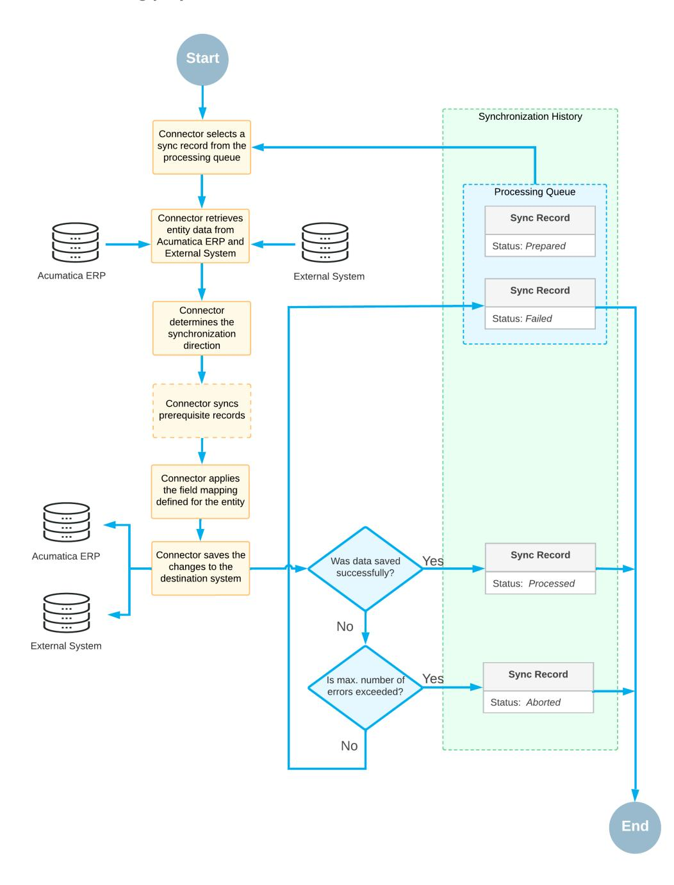

## **Preparation of Deleted Records**

If a previously processed entity record is deleted in Acumatica ERP, in the external system, or in both systems, its synchronization record is assigned the *Deleted* status on the *[Sync History](#page-539-1)* (BC301000) form. When the entity is prepared, the synchronization record is assigned the *Prepared* status in the following cases:

• If the entity record was deleted in the primary system or in both systems and then was restored in the primary system

• If the entity record was deleted only in the secondary system and then was modified in the primary system

During the entity preparation, synchronization records that were never processed and were manually assigned the *Deleted* status on the *[Sync History](#page-539-1)* form, are assigned the *Prepared* status regardless of the changes to the entity records in either of the systems.

# **Data Synchronization: Synchronization Statuses**

When a synchronization record is prepared and processed, the system assigns it one of the statuses described in the following table. You can review the synchronization status of any synchronization record on the *[Sync History](#page-539-1)* (BC301000) form.

| Status    | Description                                                                                                                                                                                                                                                                                                                                                                                                                                                                                                                                            |
|-----------|--------------------------------------------------------------------------------------------------------------------------------------------------------------------------------------------------------------------------------------------------------------------------------------------------------------------------------------------------------------------------------------------------------------------------------------------------------------------------------------------------------------------------------------------------------|
| Prepared  | The synchronization record has been created or updated, but out-of-sync data has not been saved in the destination system or systems.                                                                                                                                                                                                                                                                                                                                                                                                               |
| Processed | The synchronization record has been processed, and data has been recorded to the destination system or systems according to the synchronization settings config ured for the entity.                                                                                                                                                                                                                                                                                                                                                             |
| Failed    | The processing of the synchronization record has failed and data could not be recorded to the destination system or systems.                                                                                                                                                                                                                                                                                                                                                                                                                        |
| Aborted   | The synchronization record was excluded from synchronization by the system. The system automatically assigns the Aborted status to a synchronization record if the processing of the synchronization record has failed the number of times specified for the entity in the Max. Number of Failed Attempts box on the Entities (BC202000) form. The information about the error that occurred during the syn chronization is available for the synchronization record in the Last Error column of the table on the Sync History form. |
| Skipped   | The synchronization record was manually excluded from synchronization by a user.                                                                                                                                                                                                                                                                                                                                                                                                                                                                       |
| Deleted   | The record in the synchronization record has been deleted in Acumatica ERP, in the external system, or in both systems.                                                                                                                                                                                                                                                                                                                                                                                                                             |
| Invalid   | The synchronization record cannot be processed because its synchronization is not possible.                                                                                                                                                                                                                                                                                                                                                                                                                                                         |
| Filtered  | The entity has been filtered as a result of applying a filter defined in the code or on the Entities form.                                                                                                                                                                                                                                                                                                                                                                                                                                          |

# **Data Synchronization: Manual Synchronization**

Manual synchronization might be useful when you need to synchronize data during the initial configuration or when data has not been synchronized for some reason and manual troubleshooting is needed.

#### **Manual Data Preparation**

To manually start the data preparation process, you perform the following general steps:

- 1. You open the *[Prepare Data](#page-529-1)* (BC501000) form.
- 2. In the Selection area of the form, in the**Store** box, you select the online store with which you are synchronizing data.
- 3. In the **Prepare Mode** box, you select one of the following options:
  - *Incremental*: You select this mode to prepare for processing only the synchronization records that have changed since the last successful data preparation.
  - *Incremental by Date*: You select this mode to prepare for processing only records that have been modified during the specified date range and that have not yet been processed.
  - *Full*: You select this mode to prepare for processing all records of the selected entity, even if they have been synchronized previously.

If you are starting the data preparation process for an entity for the first time, *Full* mode is used, regardless of the mode selected in the **Prepare Mode** box.

4. In the table, you select the unlabeled check box in the rows of the needed entities, and on the form toolbar, you click **Prepare**.

#### **Manual Data Processing**

To manually start data processing, you perform the following general steps:

- 1. You open the *[Process Data](#page-533-1)* (BC501500) form.
- 2. In the Selection area, in the**Store** box, you select the online store with which you are synchronizing data.

The table shows only the synchronization records that have not been synchronized yet (that is, the synchronization records with the *Prepared* and *Failed* status).

3. In the **Entity** box, you select the entity for which you want to display synchronization records in the table.

If you want to process out-of-sync synchronization records for all entities, leave the box empty.

- 4. In the table, you select the unlabeled check box in the rows of the synchronization records that you need to process.
- 5. On the form toolbar, you click **Process** to synchronize the selected synchronization records.

If you want to process all synchronization records in the table, you click **Process All** on the form toolbar.

If you synchronize a large number of records, we recommend that you limit the number of rows to be loaded to the table of the *[Process Data](#page-533-1)* form by selecting a value in the **Processing Limit (Rows)** box of the Selection area. The loaded records are included in processing when you click **Process All** on the form toolbar. When the system completes the processing of loaded records, the remaining records are loaded to the table until the limit is reached.

For an example with step-by-step instructions on how to synchronize data manually, see *Data [Synchronization:](#page-259-1) To [Perform the First Synchronization](#page-259-1)*.

# **Data Synchronization: To Perform the First Synchronization**

The following activity will walk you through the process of manually exporting items from Acumatica ERP to the Shopify store. You will also perform the instructions to place a test order online in the Shopify store and then synchronize the order and the payment with Acumatica ERP. Finally, you will create a shipment for the order in Acumatica ERP and synchronize the created shipment with the Shopify store.

The following activity is based on the *U100* dataset.

#### **Story**

Suppose that you are an implementation consultant helping the SweetLife Fruits & Jams company to set up an online store. You have completed the minimum initial configuration of the integration with Shopify and now want to explore how synchronization works. You will configure synchronization for and then synchronize a subset of stock items that are maintained in Acumatica ERP (stock items of the *Jam* item class) with the Shopify store. You will then place a test order for one of the synchronized products and explore how the online order is processed in the Shopify store and in Acumatica ERP.

## **Process Overview**

In this activity, you will perform the following steps:

- 1. On the *[Stock Items](https://help-2025r1.acumatica.com/Help?ScreenId=ShowWiki&pageid=77786a70-1f1e-4d63-ad98-96f98e4fcb0e)* (IN202500) form of Acumatica ERP, review the stock items that need to be exported to the Shopify store.
- 2. On the *[Entities](#page-521-1)* (BC202000) form, configure the filtering options for the *Stock Item* entity to include in the synchronization only the stock items of the *Jam* item class.
- 3. On the *[Prepare Data](#page-529-1)* (BC501000) form, start the data preparation for the *Stock Item* entity to prepare the stock item data for export.
- 4. On the *[Sync History](#page-539-1)* (BC301000) form, review the result of the data preparation process.
- 5. On the *[Process Data](#page-533-1)* (BC501500) form, start data processing for the *Stock Item* entity to save the synchronized product data in the Shopify store.
- 6. On the *[Sync History](#page-539-1)* form, review the results of the data processing.
- 7. In the admin area of the Shopify store, review the products that have been imported from Acumatica ERP.
- 8. By using the admin area of the Shopify store, place an order for one of the products that have been imported from Acumatica ERP.
- 9. On the *[Prepare Data](#page-529-1)* form of Acumatica ERP, start the data preparation process for the *Sales Order* entity to prepare the order data for import; on the *[Process Data](#page-533-1)* form, process the prepared sales order data.
- 10.On the *[Sync History](#page-539-1)* form, review the synchronization status of the imported order data.
- 11.On the *[Sales Orders](https://help-2025r1.acumatica.com/Help?ScreenId=ShowWiki&pageid=19e4021c-1b84-49fd-be12-0320c5f1c7e5)* (SO301000) form, review the details of the imported sales order.
- 12.On the *[Sales Orders](https://help-2025r1.acumatica.com/Help?ScreenId=ShowWiki&pageid=19e4021c-1b84-49fd-be12-0320c5f1c7e5)* form, create a shipment for the imported order.
- 13.On the *[Shipments](https://help-2025r1.acumatica.com/Help?ScreenId=ShowWiki&pageid=f47cffcc-543e-469c-a204-a9c1e3da346d)* (SO302000) form, confirm the shipment.
- 14.On the *[Prepare Data](#page-529-1)* form, start the data preparation for the *Shipment* entity; on the *[Process Data](#page-533-1)* form, start data processing for the shipment.
- 15.In the admin area of the Shopify store, review the updated order details and the shipment exported from Acumatica ERP.

#### **System Preparation**

Do the following:

- 1. Make sure that the following prerequisites have been met:
  - The Shopify store has been created and configured, as described in *Initial [Configuration:](#page-241-1) To Set Up a [Shopify Store](#page-241-1)*.
  - The connection to the Shopify store has been established and the initial configuration has been performed, as described in *Initial [Configuration:](#page-250-1) To Configure the Store Connection*.
- 2. Launch the Acumatica ERP website, and sign in as an administrator by using the following credentials:
  - **Username**: *gibbs*

#### • **Password**: *123*

3. Sign in to the admin area of the Shopify store as the store administrator in the same browser.

# **Step 1: Finding and Reviewing the Stock Items to Be Sold Online**

To find and review the stock items that will be sold online, on the Stock Items (IN2025PL) form, filter the stock items to display only the items of the *Jam* item class as follows:

- 1. In the **Item Class** column, click the column header.
- 2. In the menu that opens, select the *Equals* filter condition.
- 3. In the box at the bottom of the menu, type Jam.
- 4. Click **OK** to apply the filter.

Now all stock items of the *Jam* item class are displayed. In the table footer, notice how many items are in the class; scan the list so you are familiar with the stock items that you need to export to the Shopify store.

# **Step 2: Configuring the Export of a Subset of Stock Items**

To configure the *Stock Item* entity to export to the Shopify store only stock items of the *Jam* item class, do the following:

- 1. On the *[Entities](#page-521-1)* (BC202000) form, specify the following settings in the Summary area:
  - a. **Store Name**: *SweetStore - SP*
  - b. **Entity**: *Stock Item*

Notice that the entity can only be exported to the Shopify store (that is,**Sync Direction** is set to *Export*).

- 2. To create a filtering condition for the export of stock items, on the **Export Filtering** tab, click **Add Row** on the table toolbar, and specify the following settings in the row:
  - **Active**: Selected
  - **Field Name**: *Item Class*
  - **Condition**: *Equals*
  - **Value**: Jam
- 3. On the form toolbar, click**Save** to save your changes.

Now when you synchronize the *Stock Item* entity, only the stock items of the *Jam* item class will be exported to the Shopify store.

Filtering rules are not applied to data that has already been synchronized. For example, if you synchronize the *Stock Item* entity without filters (which will result in exporting all stock items to the online store), apply the filter described above, and prepare and process the *Stock Item* entity again, all previously synchronized stock items that no longer match the filtering conditions will remain synchronized.

## **Step 3: Preparing the Product Data for Synchronization**

To prepare the stock item data that needs to be synchronized to the Shopify store, do the following:

- 1. On *[Prepare Data](#page-529-1)* (BC501000) form, specify the following settings in the Summary area :
  - **Store**: *SweetStore - SP*
  - **Prepare Mode**: *Incremental*

This setting controls which data will be loaded. *Incremental* indicates that the system will load only the data that has been modified since the previous data synchronization. Because you start the data preparation process for the *Stock Item* for the first time, all stock item data will be prepared.

- 2. In the table, select the check box in the unlabeled column in the row of the *Stock Item* entity.
- 3. On the form toolbar, click **Prepare**.
- 4. In the **Processing** dialog box, which opens, review the results of the processing, and click **Close** to close the dialog box.

In the table on the form, notice that the **Ready to Process** column shows the number of synchronization records that have been prepared and are ready to be processed. Notice that this number matches the total number of the items with the *Jam* class you reviewed in Step 1.

The **Processed Records** column shows the number of records that have been processed (that is, records that have been successfully synchronized and assigned the *Processed* status). This number is now *0* because you have not processed any record yet.

You can click the link in the **Ready to Process** column to open the *[Process Data](#page-533-1)* (BC501500) form with the store and the entity selected; you can click the link in the **Processed Records** column to open the *[Sync History](#page-539-1)* (BC301000) form with the store and the entity selected and the list of processed synchronization records (that is, records that have been successfully synchronized and assigned the *Processed* status) displayed on the **Drilldown** filter tab.

#### **Step 4: Reviewing the Results of Data Preparation**

To review the results of preparation of product data for synchronization, do the following:

1. While you are still viewing the *[Prepare Data](#page-529-1)* (BC501000) form, click the link in the**Total Records** in the row of the *Stock Item* entity.

The *[Sync History](#page-539-1)* (BC301000) form opens in a new browser tab with the *SweetStore - SP* store and the *Stock Item* entity selected in the Summary area.

2. On the **Filtered** tab, review the synchronization records.

Notice that all synchronization records on this tab have the *Filtered* status. These are the stock items that were excluded from synchronization based on the filtering conditions that you configured earlier.

3. Go to the **Ready to Process** tab.

Notice that the table is displaying only synchronization records with the *Prepared* status, as shown in the screenshot below. This status means that these records have been prepared and are now ready to be processed.

For each of these items, the **ERP ID** column displays a link that you can click to open the item on the *[Stock](https://help-2025r1.acumatica.com/Help?ScreenId=ShowWiki&pageid=77786a70-1f1e-4d63-ad98-96f98e4fcb0e) [Items](https://help-2025r1.acumatica.com/Help?ScreenId=ShowWiki&pageid=77786a70-1f1e-4d63-ad98-96f98e4fcb0e)* (IN202500) form. Notice that the **External ID** column currently does not display any values because the stock items have not yet been exported to the Shopify store.

| <b>CUSTOMIZATION</b> TOOLS $\overline{\phantom{a}}$ <b>Sync History</b> |    |         |             |               |                   |                             |               |                                  |                |                    |                             |                 |                     |                        |
|-------------------------------------------------------------------------------|----|---------|-------------|---------------|-------------------|-----------------------------|---------------|----------------------------------|----------------|--------------------|-----------------------------|-----------------|---------------------|------------------------|
|                                                                               | Ò  | $\Box$  |             | ↶             | <b>SYNC</b>       | $ \mathbf{x} $ $\mapsto$ | ▽ $\cdots$ |                                  |                |                    |                             |                 |                     |                        |
|                                                                               |    | Store:  |             |               |                   | SweetStore - SP             | Q             |                                  |                |                    |                             |                 |                     |                        |
|                                                                               |    | Entity: |             |               | <b>Stock Item</b> |                             | $\checkmark$  |                                  |                |                    |                             |                 |                     |                        |
|                                                                               |    |         | ALL RECORDS |               |                   | <b>READY TO PROCESS</b>     | <b>FAILED</b> | PROCESSED                        | <b>SKIPPED</b> | ABORTED            | DELETED                     | <b>FILTERED</b> | <b>INVALID</b>      | <b>INACTIVE</b>        |
| 圓                                                                             | 0  | $\Box$  | Æ           | <b>Entity</b> |                   | <b>Store</b>                | <b>ERP ID</b> |                                  |                | <b>External ID</b> | <b>External Description</b> | <b>Status</b>   | <b>Last Message</b> | <b>Last Operation</b>  |
|                                                                               | 0  | D       |             |               | <b>Stock Item</b> | SweetStore - SP             |               | STRAWJAM96, Strawberry jam 96 oz |                |                    |                             | Prepared        |                     | <b>Modified in ERP</b> |
|                                                                               | 0  | n       |             |               | <b>Stock Item</b> | SweetStore - SP             |               | STRAWJAM32, Strawberry jam 32 oz |                |                    |                             | Prepared        |                     | <b>Modified in ERP</b> |
|                                                                               | 0  |         |             |               | <b>Stock Item</b> | SweetStore - SP             |               | STRAWJAM08, Strawberry jam 8 oz. |                |                    |                             | Prepared        |                     | <b>Modified in ERP</b> |
|                                                                               | O, | n       | . .         |               | <b>Stock Item</b> | SweetStore - SP             |               | RASPJAM96, Raspberry jam 96 oz   |                |                    |                             | Prepared        |                     | <b>Modified in ERP</b> |
|                                                                               | O, |         |             |               | <b>Stock Item</b> | SweetStore - SP             |               | RASPJAM32, Raspberry jam 32 oz   |                |                    |                             | Prepared        |                     | <b>Modified in ERP</b> |
|                                                                               | 0  | п       |             |               | <b>Stock Item</b> | SweetStore - SP             |               | RASPJAM08, Raspberry jam 08 oz   |                |                    |                             | Prepared        |                     | <b>Modified in ERP</b> |

*Figure: Data prepared for processing*

## **Step 5: Processing the Prepared Product Data**

To process the prepared product data (that is, to synchronize it with the Shopify store), do the following:

- 1. On the *[Process Data](#page-533-1)* (BC501500) form, select the following settings in the Summary area:
  - **Store**: *SweetStore - SP*
  - **Entity**: *Stock Item*

The table displays only the list of the items that you have prepared for synchronization (that is, the items with the *Prepared* status).

2. On the form toolbar, click **Process All** to synchronize all the records displayed in the table.

Wait until the processing finishes.

3. In the **Processing** dialog box, which opens, click **Close** to close the dialog box.

### **Step 6: Reviewing the Synchronization Status of the Product Data**

To again review the synchronization status of the product data, do the following:

- 1. On the *[Sync History](#page-539-1)* (BC301000) form, select the following settings in the Summary area:
  - **Store**: *SweetStore - SP*
  - **Entity**: *Stock Item*
- 2. Go to the **Ready to Process** tab.

Notice that the table contains no records because you have already processed all the prepared records.

3. Go to the **Processed** tab.

The tab shows the list of items that have been processed—that is, synchronized with the Shopify store. For each item, there is now a product identifier in the **External ID** column. In the table, the **Last Operation** value has changed to *Inserted Externally* and the time stamp in the **Last Attempt** column has changed to the date and time when you ran data processing on the *[Process Data](#page-533-1)* (BC501500) form.

#### **Step 7: Viewing an Exported Product in the Shopify Store**

To view the *KIWIJAM96* stock item (which has the description *Kiwi jam 96 oz*) in the Shopify store, do the following:

1. While you are still viewing the *[Sync History](#page-539-1)* (BC301000) form, click the link in the **External ID** column in the row of the synchronization record for the *Kiwi jam 96 oz* item.

The product management page for the *Kiwi jam 96 oz* product (which is a page in the admin area of the Shopify store where you manage details of a particular product) opens in a new browser tab.

2. Scan the product details that have been exported to the Shopify store.

Notice that the following information has been imported for *Kiwi jam 96 oz* from Acumatica ERP:

- The item description (*Kiwi jam 96 oz*) in the **Title** box
- The extended item description (*Thick and sweet kiwi jam – goes great on toast or on pancakes.*) in the **Description** box
- The product image in the **Media** section
- The default price (*45.15*) in the **Price** box (**Pricing** section)
- The item inventory ID (*KIWIJAM96*) in the **SKU (Stock Keeping Unit)** box (**Inventory** section)
- The item class (*Jam*) in the **Type** box (**Product organization** section)

#### **Step 8: Placing an Order from the Admin Area**

To create an order for five 96-ounce jars of kiwi jam from the admin area of your Shopify store, do the following:

- 1. While you are still viewing the admin area of the Shopify store, in the le menu, click **Orders**.
- 2. On the **Orders** page, which opens, click **Create order**.
- 3. On the **Create order** page, which opens, in the **Products** section, start typing Kiwi jam in the search product box.
- 4. In the list of search results, which are shown in a pop-up window, select the check box next to *Kiwi jam 96 oz*, and click **Add** in the lower right.
- 5. In the row of the *Kiwi jam 96 oz* product, change the quantity to 5.
- 6. In the **Customer** section, click in the search box and in the menu that opens, select **Create a new customer**.
- 7. In the **Create a new customer** pop-up window, which opens, fill in the boxes as follows:
  - **First name**: Larry
  - **Last name**: Coleman
  - **Email**: larry@example.com
  - **Country/region**: *United States*
  - **Address**: 1970 Duncan Avenue
  - **City**: New York
  - **State**: *New York*
  - **ZIP code**: 10016
- 8. In the lower right, click**Save**.
- 9. In the **Payment** section, click **Collect payment > Mark as paid**.

10.In the **Mark as paid** dialog box, which appears, click **Create order**.

The system closes the **Mark as paid** dialog box and creates the order. At the top of the page, notice that the system has assigned the order an order number, the *Paid* payment status, and the *Unfulfilled* fulfillment status.

Shopify assigns each order an order number, which by default is represented by the prefix *#* and a numbering sequence. The order number is displayed at the top of the order page next to the order's payment status and fulfillment status. If needed, you can change the format of the order number on the **General** settings page in the Shopify admin area.

Each order is also assigned a numeric identifier, which you can see in the URL of the Shopify order page.

On the *[Process Data](#page-533-1)* (BC501500) and *[Sync History](#page-539-1)* (BC301000) forms, the order identifier is displayed in the **External ID** column, and the order number is displayed in the **External Description** column.

# **Step 9: Importing the Sales Order Data to Acumatica ERP**

To import the order from the Shopify store to Acumatica ERP, do the following:

- 1. On the *[Prepare Data](#page-529-1)* (BC501000) form, specify the following settings in the Summary area:
  - **Store**: *SweetStore - SP*
  - **Prepare Mode**: *Incremental*
- 2. In the table, select the check box in the unlabeled column in the row of the *Sales Order* entity.
- 3. On the form toolbar, click **Prepare**.
- 4. In the **Processing** dialog box, which opens, click **Close** to close the dialog box.
- 5. In the row of the *Sales Order* entity, click the link in the **Ready to Process** column (which shows *1* because you have created only one order in the Shopify store).

The *[Process Data](#page-533-1)* (BC501500) form opens with the *SweetStore - SP* store and the *Sales Order* entity selected.

Notice that the order identifier and the order number assigned to the order in Shopify are displayed in the **External ID** and **External Description** columns, respectively.

- 6. Select the unlabeled check box in the only row of the table, and on the form toolbar, click **Process**.
- 7. In the **Processing** dialog box, which opens, click **Close** to close the dialog box.

#### **Step 10: Reviewing the Synchronization Status of the Imported Data**

To review the synchronization status of the order you imported in the previous step, on the *[Sync History](#page-539-1)* (BC301000) form, specify the following settings in the Summary area:

- **Store**: *SweetStore - SP*
- **Entity**: Leave empty

In the table of the **Processed** tab, notice that three synchronization records were created when the sales order was processed (see the screenshot below):

- *Sales Order*: The sales order that you placed in the Shopify store. The **ERP ID** column displays the order type (*EO*) and the order ID. The order type is based on the value selected in the **OrderType for Import** box on the **Orders** tab of the *[Shopify Stores](#page-492-1)* (BC201010) form.
- *Customer*: The customer that you created in the Shopify store when placing the order. The **ERP ID** column displays the customer ID and the name of the customer. The customer ID was assigned to the customer record based on the numbering sequence specified in the **Customer NumberingSequence** box on the **Customers** tab of the *[Shopify Stores](#page-492-1)* form. The customer name was imported from the Shopify store.
- *Payment*: The payment used to pay the order in the Shopify store. The **ERP ID** column displays the payment type (*Prepayment*) and the payment identifier.

The payment has been imported because the payment method you used to pay the order has been mapped to an Acumatica ERP payment method and the mapping has been activated on the **Payments** tab of the *[Shopify Stores](#page-492-1)* form.

|   |   |                                                   | <b>Sync History</b> |                    |                 |                             |               |                            |           |                    |                |                |                             | <b>CUSTOMIZATION</b> | TOOLS $\sim$        |
|---|---|---------------------------------------------------|---------------------|--------------------|-----------------|-----------------------------|---------------|----------------------------|-----------|--------------------|----------------|----------------|-----------------------------|----------------------|---------------------|
|   | Ò | $\Box$                                            |                     | $\Omega$           | <b>SYNC</b>     | $\mathbf x$ ℍ            | Υ             | $\cdots$                   |           |                    |                |                |                             |                      |                     |
|   |   | Store:                                            |                     |                    | SweetStore - SP |                             | Q             |                            |           |                    |                |                |                             |                      |                     |
|   |   | Entity:                                           |                     |                    |                 |                             | $\checkmark$  |                            |           |                    |                |                |                             |                      |                     |
|   |   |                                                   | <b>ALL RECORDS</b>  |                    |                 | <b>READY TO PROCESS</b>     |               | PROCESSED <b>FAILED</b> |           | <b>SKIPPED</b>     | <b>ABORTED</b> | <b>DELETED</b> | <b>FILTERED</b>             | <b>INVALID</b>       | <b>INACTIVE</b>     |
| 圓 | 0 | D                                                 |                     | Entity             |                 | <b>Store</b>                |               | <b>ERP ID</b>              |           | <b>External ID</b> |                |                | <b>External Description</b> | <b>Status</b>        | <b>Last Message</b> |
|   | 0 | D Payment SweetStore - SP                   |                     | Prepayment, 000080 |                 | 5896279261399:7104522551511 |               | #1001                      | Processed |                    |                |                |                             |                      |                     |
|   | 0 | <b>Sales Order</b> <b>SweetStore - SP</b> D |                     |                    | EO, 000075      |                             | 5896279261399 |                            | #1001     | Processed          |                |                |                             |                      |                     |
|   | 0 | ◻                                                 |                     |                    | <b>Customer</b> | SweetStore - SP             |               | C000000001, Larry Coleman  |           | 7859853295831      |                |                | larry@example.com           | Processed            |                     |

*Figure: The sales order, customer, and payment records imported from the Shopify store*

For each of the entities created in the system during the synchronization, you can open the appropriate form with the entity selected by clicking the link in the **ERP ID** column of the table.

## **Step 11: Reviewing the Imported Sales Order**

To review the details of the imported sales order, do the following:

- 1. While you are still viewing the synchronization results on the *[Sync History](#page-539-1)* (BC301000) form, click the link in the **ERP ID** column for the sales order you imported.
- 2. On the *[Sales Orders](https://help-2025r1.acumatica.com/Help?ScreenId=ShowWiki&pageid=19e4021c-1b84-49fd-be12-0320c5f1c7e5)* (SO301000) form, which opens in a pop-up window, review the details of the order (which are shown in the following screenshot).

| <b>Sales Orders</b> EO 000075 - Larry Coleman   |                                             |                                          | <b>TH NOTES</b>      |          | <b>ACTIVITIES</b>           | <b>FILES</b>     | <b>CUSTOMIZATION</b> |                 | TOOLS $\sim$  |
|----------------------------------------------------|---------------------------------------------|------------------------------------------|----------------------|----------|-----------------------------|------------------|----------------------|-----------------|---------------|
| 뭐 Ħ πī ∽                                  | n K ≺ $\check{ }$                  | Ы >                                   | <b>QUICK PROCESS</b> |          | <b>CREATE SHIPMENT</b>      |                  | <b>HOLD</b>          | .               |               |
| EO Q * Order Type:                           | * Customer:                                 | C000000001 - Larry Coleman               |                      | ام       | 0 Ordered Qty.:          |                  |                      | 5.00            | ㅅ             |
| Order Nbr.: Q 000075                         | * Location:                                 | <b>MAIN - Primary Location</b>           |                      | ρ        | Detail Total: 0          |                  |                      | 225.75          |               |
| Status: Open                                    | Contact:                                    | Larry Coleman                            |                      | α        | Line Discounts: 0        |                  |                      | 0.00            |               |
| 4/10/2025 $\star$ Date:                         | * Project:                                  | X - Non-Project Code.                    |                      | α        | 0 Document Dis           |                  |                      | 0.00            |               |
| * Requested On: 4/10/2025                       | Description:                                | SweetStore - SP   Order: #1001   Status: |                      |          | <b>Freight Total:</b>       |                  |                      | 0.00            |               |
| Customer Ord. #1001                             |                                             | Paid                                     |                      |          | <b>Tax Total:</b>           |                  |                      | 0.00            |               |
| External Refer 589627926139                     |                                             |                                          |                      |          | Order Total:                |                  |                      | 225.75          |               |
| <b>DETAILS</b> <b>TAXES</b> <b>FINANCIAL</b> | <b>SHIPPING</b>                             | <b>ADDRESSES</b>                         | <b>SHIPMENTS</b>     |          | <b>PAYMENTS</b>             | <b>RELATIONS</b> |                      | <b>O</b> TOTALS |               |
| Ò $\times$ 0                                 | <b>ADD ITEMS</b> <b>ADD MATRIX ITEMS</b> |                                          | ADD INVOICE          |          | ADD BLANKET SO LINE         |                  | <b>LINE DETAILS</b>  | <b>PO LINK</b>  | ≫             |
| D 冒 0 *Inventory *Branch ID         | Warehouse Free Item                   | Line <b>Description</b>               | *UOM                 | Quantity | Qty. On <b>Shipments</b> | Open Qty.     | Unit Price        | Manual Price | Ext. Price |
| 0 <b>RETAIL</b> n KIWIJAM96               | <b>RETAIL</b> ш                          | Kiwi jam 96 oz                           | <b>PIECE</b>         | 5.00     | 0.00                        | 5.00             | 45.1500              | ☑               | 225.75        |

#### *Figure: The sales order imported from the Shopify store*

In the Summary area, notice the following:

- The imported order has the *EO* type (shown in the **OrderType** box), which is configured on the *[Shopify](#page-492-1) [Stores](#page-492-1)* (BC201010) form to be assigned to all sales orders imported from the *SweetStore - SP* store.
- In the **Customer Order Nbr.** box, the order number assigned to the order in the Shopify store is displayed.
- In the **External Reference** box, the order identifier assigned to the order in the Shopify store and the name of the store are displayed.

- The **Date** of the sales order is the same as the date on which the order was created in the Shopify store.
- In the **Description** box, the store name, the order number and the payment status of the order are displayed.
- The **Customer** and **Location** boxes display the information about the customer and customer location that were created in Acumatica ERP during the import of the sales order; both were created during the order placement in the Shopify store.

On the **Details** tab, review the only line in the table. Notice the following:

- **Branch** is set to *RETAIL*, which is the default branch configured to appear on sales orders imported from the *SweetStore - SP* store on the *[Shopify Stores](#page-492-1)* form.
- The inventory ID, quantity, unit price, and extended price of the item are exactly the same as the values on the order in the Shopify store.

On the **Payments** tab, notice that a prepayment in the order amount has been applied to the sales order.

#### **Step 12: Creating and Confirming a Shipment**

To process a shipment for the imported sales order, do the following:

- 1. While you are still viewing the sales order on the *[Sales Orders](https://help-2025r1.acumatica.com/Help?ScreenId=ShowWiki&pageid=19e4021c-1b84-49fd-be12-0320c5f1c7e5)* (SO301000) form, on the form toolbar, click **CreateShipment**.
- 2. In the **SpecifyShipment Parameters** dialog box, which opens, make sure the current date and the *RETAIL* warehouse are selected, and click **OK**. The system creates a shipment and opens it on the *[Shipments](https://help-2025r1.acumatica.com/Help?ScreenId=ShowWiki&pageid=f47cffcc-543e-469c-a204-a9c1e3da346d)* (SO302000) form in the same pop-up window.
- 3. On the form toolbar, click **Confirm Shipment**.

The shipment is assigned the *Confirmed* status; the sales order is assigned the *Completed* status.

4. Close the pop-up window with the *[Shipments](https://help-2025r1.acumatica.com/Help?ScreenId=ShowWiki&pageid=f47cffcc-543e-469c-a204-a9c1e3da346d)* form.

#### **Step 13: Synchronizing the Shipment with the Shopify Store**

To export the shipment to the *SweetStore - SP* store, do the following:

- 1. In the Summary area on the *[Prepare Data](#page-529-1)* (BC501000) form, select the following settings:
  - **Store**: *SweetStore - SP*
  - **Prepare Mode**: *Incremental*
- 2. In the table, select the check box in the unlabeled column for the *Shipment* entity.
- 3. On the form toolbar, click **Prepare**.
- 4. In the **Processing** dialog box, which opens, click **Close** to close the dialog box.
- 5. Click the link in the **Ready to Process** (which shows *1* because only one shipment has been created) in the row of the *Shipment* entity.

The *[Process Data](#page-533-1)* (BC501500) form opens with the *SweetStore - SP* store and the *Shipment* entity selected.

- 6. Select the unlabeled check box for the only row in the table.
- 7. On the form toolbar, and click **Process**.
- 8. In the **Processing** dialog box, which opens, click **Close** to close the dialog box.

#### **Step 15: Reviewing the Updated Order and Shipment in Shopify**

To check whether the shipment and the updated sales order have been exported to the Shopify store correctly, do the following:

- 1. On the *[Sync History](#page-539-1)* (BC301000) form, specify the following settings in the Summary area:
  - **Store**: *SweetStore - SP*
  - **Entity**: *Shipment*
- 2. On the **Processed** tab, notice that the synchronization record of the shipment is displayed in the only row of the table. The **External ID** column displays the identifier of the shipment in Shopify, which consists of two parts—the identifier of the order and the identifier of the shipment.
- 3. Click the link in the **External ID** column.
- 4. On the order page of the Shopify store, which opens in a new browser tab, notice the following:
  - The fulfillment status of the order has been changed to *Fulfilled*. Notice the fulfillment number next to the *Fulfilled* status above the fulfilled items.
  - The order has been archived. By default, orders that have been fully paid and fulfilled are automatically assigned the *Archived* status.

You can change the default behavior on the **Checkout** settings page in the admin area of the Shopify store.

• In the **Tags** section, two tags have been added to the order—*ERP* and a tag with the sales order number from Acumatica ERP. Both tags were created during the order synchronization in Step 9.

You have now performed the first manual synchronization of products, sales orders, and shipments.

# **Preparing Entities for Synchronization**

In this chapter, you will learn how to prepare entities in Acumatica ERP for synchronization—that is, how to configure additional mapping of fields to be synchronized, set up filters, and add ecommerce-related information to stock and non-stock items.

# **Preparing Entities for Synchronization: General Information**

Acumatica ERP Retail Edition provides flexible tools that you can use to prepare the data for synchronization with your Shopify store and configure the synchronization settings.

#### **Learning Objectives**

In this chapter, you will learn the following:

- How to filter data that needs to be synchronized between Acumatica ERP and the Shopify store
- How to configure mapping of standard and custom fields that need to be synchronized
- How to update stock items and non-stock items with ecommerce-related data

#### **Applicable Scenarios**

You might want to configure additional mapping if you have defined custom fields in Acumatica ERP, in the Shopify store, or in both systems, and you want these fields to be synchronized between the two systems. For example, you might want to define an extra field on the customer registration form in the online store and map this field to a user-defined field or an attribute in a customer record in Acumatica ERP.

Filtering is useful if you do not want to synchronize all data of a particular entity. For example, you might want to define a subset of items in Acumatica ERP (which are referred to as *products* in Shopify) that you want to export to the online store, or exclude from export the customers that have incomplete information in Acumatica ERP (that is, the customers that have the *On Hold* status).

You might want to update ecommerce-related information about items in Acumatica ERP if you want to override default inventory settings related to export that have been configured for the store on the *[Shopify Stores](#page-492-1)* (BC201010) form or if you want to maintain all product data, ecommerce-related or otherwise, in one system.

## **Configuration of Synchronization Preferences**

During the initial configuration of the connection between Acumatica ERP and the Shopify store, you determine which of the entities supported by the Shopify connector need to be synchronized between the two systems. To do this, you select the **Active** check box for each required entity on the **Entities** tab of the *[Shopify Stores](#page-492-1)* (BC201010) form. On this tab, you can also configure the following:

- The direction of the synchronization. For each entity, you specify whether data should be exported to Shopify, imported to Acumatica ERP, or synchronized in both directions.
- The primary system. You indicate which of the systems, *ERP* (that is, Acumatica ERP) or *External System* (that is, Shopify), should be used as the source of data if conflicts occur during the synchronization of a particular entity.
- The real-time synchronization mode. You indicate whether the synchronization records for a particular entity should be processed immediately aer the data is prepared by selecting either of the following options:
  - *Prepare*: As soon as a push notification about a change to data is received, the corresponding synchronization record is placed in the processing queue.
  - *Prepare & Process*: As soon as a push notification about a change to data is received, the corresponding synchronization record is placed in the processing queue, and data processing is immediately started for the synchronization record.
- The number of attempts when an error occurs. You specify the number of times the system will try to process the synchronization records before excluding them from further synchronization attempts.

You can also change these settings for each particular entity by using the *[Entities](#page-521-1)* (BC202000) form.

#### **Filtering and Field Mapping for Export and Import**

For some of the entities supported by the ecommerce connector, on the *[Entities](#page-521-1)* (BC202000) form, you can configure the additional synchronization settings—for example, define a filter to be applied during the synchronization of entity data, or define a new mapping between the fields in Acumatica ERP and the fields in Shopify. You define filters and mappings for the import and export processes on the following tabs:

- Filtering for import: **Import Filtering** tab
- Filtering for export: **Export Filtering** tab
- Mapping for import: **Import Mapping** tab
- Mapping for export: **Export Mapping** tab

On these tabs, you can change the order of any row in the table by dragging it to its new position.

The display of the listed tabs is determined by the entity selected in the Summary area. The table below shows the availability of filtering and mapping functionality for particular entities.

*Table: Availability of Filtering and Mapping Options for Entities*

| Entity in Acumatica ERP | Import Mapping | Import Filtering | Export Mapping | Export Filtering |
|----------------------------|----------------|------------------|----------------|------------------|
| Customer                   | Yes            | Yes              | Yes            | Yes              |

| Entity in Acumatica ERP | Import Mapping | Import Filtering | Export Mapping | Export Filtering |
|----------------------------|----------------|------------------|----------------|------------------|
| Customer Location          | No             | Yes              | No             | Yes              |
| Stock Item                 | No             | No               | Yes            | Yes              |
| Non-Stock Item             | No             | No               | Yes            | Yes              |
| Template Item              | No             | No               | Yes            | Yes              |
| Product Image              | No             | No               | No             | No               |
| Product Availability       | No             | No               | No             | No               |
| Sales Order                | Yes            | Yes              | No             | No               |
| Payment                    | Yes            | Yes              | No             | No               |
| Shipment                   | No             | No               | Yes            | Yes              |
| Refund                     | No             | No               | No             | No               |

For information about standard mapping of entities, see *[Retail Edition Entity Reference](#page-551-3)*. For details about filtering and mapping for the export and import processes, see *[Preparing Entities for Synchronization: Filtering](#page-271-1)* and *[Preparing](#page-273-1) [Entities for Synchronization: Field Mapping](#page-273-1)*.

# **Preparing Entities for Synchronization: Updating Product Details**

Before you export stock items and non-stock items to the online store, you might want to specify commerce-related settings that are specific to a particular product or specify commerce-related information.

If the *Retail Commerce* feature is enabled on the *[Enable/Disable Features](https://help-2025r1.acumatica.com/Help?ScreenId=ShowWiki&pageid=c1555e43-1bc5-4f6f-ba9d-b323f94d8a6b)* (CS100000) form, the **eCommerce** tab appears on the *[Stock Items](https://help-2025r1.acumatica.com/Help?ScreenId=ShowWiki&pageid=77786a70-1f1e-4d63-ad98-96f98e4fcb0e)* (IN202500) and *[Non-Stock Items](https://help-2025r1.acumatica.com/Help?ScreenId=ShowWiki&pageid=bf68dd4f-63d4-460d-8dc0-9152f2bd6bf1)* (IN202000) forms. On this tab, you can specify the settings that are applied to the items exported from Acumatica ERP to the Shopify store. The settings you specify on this tab for a particular item override the default settings specified on the *[Shopify Stores](#page-492-1)* (BC201010) form.

If the *Matrix Items* feature is enabled on the *[Enable/Disable Features](https://help-2025r1.acumatica.com/Help?ScreenId=ShowWiki&pageid=c1555e43-1bc5-4f6f-ba9d-b323f94d8a6b)* form, the **eCommerce** tab is also displayed on the *[Template](https://help-2025r1.acumatica.com/Help?ScreenId=ShowWiki&pageid=4cb927f0-5880-4169-9fdf-4529fd7bffdf) Items* (IN203000) form.

For each stock or non-stock item, on the **eCommerce** tab, you can define the following:

• The visibility of the product in the online store.

You define visibility by selecting the appropriate option in the**Visibility** box: *Visible* to make the product visible on the storefront, *Invisible* to hide it from customers.

Shopify does not support featuring products, so the third option, *Featured*, will make the product visible on the storefront (same as the *Visible* option).

• The availability assigned to the item when it is exported to the online store.

You define the availability of the item by selecting the needed option in the **Availability** box. You select *Store Default* to apply the availability option selected in the store settings to be used by default for exported products. To make the product available and not track its quantity, you select *Set as Available (Don't Track Qty.)*. If you want to make the product available for pre-order, you select *Set as Pre-Order*. To make the

product unavailable aer import, you select *Set as Unavailable*. For a stock item whose quantity you want to track, you select *Set as Available (Track Qty.)*.

For stock items whose availability is tracked (that is, for the items for which the **Availability** is set to *Set as Available (Track Qty.)*), you can also specify what action should be performed if the item runs out of stock. To do this, you select in the **When Qty. Unavailable** box one of the following options:

- *Store Default*: To apply the default value configured in the store settings
- *Do Nothing*: To not perform any action
- *Set as Unavailable*: To make the item unavailable for purchase in the online store
- The title of the product page.

You can specify the title of the product page in the **PageTitle** box. Aer the product is imported to the Shopify store, the text you have specified in this box is copied into the **Page title** box in the**Search engine listing preview** section of the product management page. This text is used in the <title> tag in the HTML code of the product page.

• Meta description.

You specify the meta description in the **Meta Description** box. Aer the product is imported to the Shopify store, the meta description you have specified in this box will be displayed in the **Description** box in the **Search engine listing preview** section of the product management page. The meta description is included in the <meta> tag in the HTML code of the product page.

# **Preparing Entities for Synchronization: Filtering**

In this topic, you will learn how you can define export and import filtering settings.

#### **Export and Import Filtering**

You can configure the rules according to which data from Acumatica ERP should be exported to the online store by using the **Export Filtering** tab of the *[Entities](#page-521-1)* (BC202000) form. You define the filters for data import on the **Import Filtering** tab.

To define a filter, you need to specify at least one filtering condition. Each condition includes the following components:

• **Field Name**: The data field by which data needs to be filtered.

The particular fields that you can select in the **Field Name** column depend on the selected entity.

- **Condition**: The logical operation to apply to the value of the selected data field.
- **Value**: The value you enter for the logical condition used to filter the data, if the selected condition requires a value.
- **Value 2**: The second value for the logical condition, if the selected logical condition requires a second value. For example, the *Is Between* logical condition requires a second value.

A filter may contain multiple simple conditions or lines combined into one logical expression with brackets and logical operators (*And* and *Or*).

Only data that matches the filtering conditions is included in the synchronization. See the subsequent sections for more information and examples of filtering conditions.

#### **Export Filtering by Custom Fields**

Export filtering by custom fields, which are fields added to a form as a result of publishing a customization project, is available for the *Customer*, *Stock Item*, *Non-Stock Item*, *Template Item*, and *Sales Order* entities.

To use a custom field in a filtering condition, on the **Export Filtering** tab of the *[Entities](#page-521-1)* (BC202000) form, you should type the name of the field in the **Field Name** column of the table. The system validates the field name against the API field list and displays an error if the field name cannot be found.

To avoid typing errors, you can copy the name of the needed field from the API Advanced list as follows:

- 1. On the **Export Mapping** tab, in the **ERP Object** column, select the *<Entity> → Advanced* option.
- 2. In the **ERP Field /Value** column, click the down arrow, and then select and copy the needed field name.

In some situations, a custom field used in a filtering condition may become unavailable during export, for example, if a customization project that added the field has been unpublished. In this case, the system will treat the value in the condition that contains the missing field as *null*. To avoid issues during the export, the *Is Not Empty* condition should be added to each filtering condition that includes custom fields.

# **Export Filtering by Attributes**

Export filtering by attributes is available for the *Customer*, *Stock Item*, *Non-Stock Item*, and *Template Item* entities.

When an attribute is created and added to a customer class or item class, it becomes available for selection on the *[Entities](#page-521-1)* (BC202000) form. To use an attribute in a filtering condition, you should select it in the **Field Name** column of the table on the **Export Filtering** tab. An attribute can be distinguished from other fields by the *Attributes* prefix before its name.

In some situations, an attribute used in a filtering condition may become unavailable during export, for example, if an attribute has been removed from an item class or a customer class of an item or a customer, respectively, being exported. In this case, the system will treat the value in the condition that contains the missing field as *null*. To avoid issues during the export, the *Is Not Empty* condition should be added to each filtering condition that includes attributes.

## **Updating the Filtering Conditions**

If you change the import filter settings aer an import has been completed, all records that have been previously processed and match the filtering conditions will remain synchronized (that is, the corresponding data will not be deleted from Acumatica ERP) but their synchronization records will be assigned the *Filtered* status on the *[Sync](#page-539-1) [History](#page-539-1)* (BC301000) form.

## **Example 1**

Suppose that you want to sell in your store only a subset of your stock items—that is, only the stock items of the *NUTS* item class. To configure the filter to export only the stock items of this class, you select the *Stock Item* entity in the Summary area of the *[Entities](#page-521-1)* (BC202000) form, and on the **Export Filtering** tab, you specify the condition corresponding to the settings shown in the following table.

| Active   | Brackets | Field Name | Condition | Value | Value 2 | Brackets | Operator |
|----------|----------|------------|-----------|-------|---------|----------|----------|
| Selected | -        | Item Class | Equals    | NUTS  | Empty   | -        | And      |

# **Example 2**

Suppose that you use separate online stores for international and domestic sales, and you want to exclude international customers—that is, customers of any customer class that contains *INTL* in its ID—from the synchronization with your store. To configure the filter, you select the *Customer* entity in the Summary area of the *[Entities](#page-521-1)* (BC202000) form, and on the **Export Filtering** tab, you specify the condition corresponding to the settings shown in the following table.

| Active   | Brackets | Field Name        | Condition           | Value | Value 2 | Brackets | Operator |
|----------|----------|-------------------|---------------------|-------|---------|----------|----------|
| Selected | -        | Customer Class | Does Not Contain | INTL  | Empty   | -        | And      |

# **Example 3**

Suppose that you sell some of the products through Instagram. These orders are fulfilled by a third-party logistic service provider, and you do not want to import them into Acumatica ERP. To exclude orders with the *instagram* source, you select the *Sales Order* entity in the Summary area of the *[Entities](#page-521-1)* (BC202000) form, and on the **Import Filtering** tab, you specify the condition corresponding to the settings shown in the following table.

| Active   | Brackets | Field Name     | Condition         | Value         | Value 2 | Brackets | Operator |
|----------|----------|----------------|-------------------|---------------|---------|----------|----------|
| Selected | -        | Source Name | Does Not Equal | insta gram | Empty   | -        | And      |

# **Preparing Entities for Synchronization: Field Mapping**

In this topic, you will learn how you can map fields between Acumatica ERP and Shopify to override the standard field mapping or define an additional mapping to suit your synchronization requirements.

# **Mapping of Fields for Export**

Acumatica ERP Retail Edition provides you with the ability to map fields, which are related to synchronized entities, in Acumatica ERP with fields in the Shopify store. You can define additional mappings of standard or custom fields as well as override the standard mappings provided with the Shopify integration.

You define the mappings of fields that should be processed during the export of data from Acumatica ERP to Shopify on the **Export Mapping** tab of the *[Entities](#page-521-1)* (BC202000) form. During the export, data from the specified fields is prepared and processed according to the defined mappings.

To map two fields that will be processed during the export, you specify values in the following columns:

• **External Object**: The object in the external system whose field is set to the value of the ERP field or to a calculated value on export.

The list of available options depends on the selected entity and the ecommerce connector.

• **External Field**: The field of the selected external object that is set to the value of the ERP field or to a calculated value on export.

The list of available options depends on the selected entity, the ecommerce connector, and the external object.

• **ERP Object**: The object in Acumatica ERP whose field's value is assigned to the external field on export. The list of available options depends on the selected entity and the ecommerce connector.

• **ERP Field /Value**: The field of the selected ERP object whose value is assigned to the external field on export, or the expression to be executed on export to generate the value that is assigned to the external field.

The list of available options depends on the selected entity and the ERP object.

# **Mapping of Fields for Import**

Acumatica ERP Retail Edition provides you with the ability to map fields, which are related to synchronized entities, in Acumatica ERP with fields in Shopify. You can define additional mappings of standard or custom fields, as well as override the standard mappings provided with the Shopify integration.

You define the mappings of fields that should be processed during the import of data from Shopify to Acumatica ERP on the **Import Mapping** tab of the *[Entities](#page-521-1)* (BC202000) form. During the import process, data from the specified fields is prepared and processed according to the defined mappings.

To map two fields that will be processed during the import process, you specify values in the following columns:

• **ERP Object**: The object in Acumatica ERP whose field is set to the value of the external field or to a calculated value on import.

The list of available options depends on the selected entity.

• **ERP Field**: The field of the selected ERP object that is set to the value of the mapped external field or a to calculated value on import.

The fields that are displayed in the list depend on the selected object.

- **External Object**: The object in the external system whose field's value is assigned to the ERP field. The list of available options depends on the selected entity and the ecommerce connector.
- **External Field /Value**: The field of the external object whose value is assigned to the ERP field, or the expression to be executed on import to generate the value that is assigned to the ERP field.

The list of available options depends on the selected entity, the ecommerce connector, and the external object.

## **Removing Standard Mapping for a Field**

You can remove the mapping for fields that you do not want to be synchronized between Acumatica ERP and the external system. You perform the unmapping for import and export directions separately as follows:

- 1. On the *[Entities](#page-521-1)* (BC202000) form, you select the store and the entity for which you want to modify field mapping.
- 2. Depending on the synchronization direction, you do one of the following:
  - To remove the mapping from an Acumatica ERP field so that it is not used during the import, on the **Import Mapping** tab, you select the needed values in the **ERP Object** and **ERP Field** columns, and then in the **External Object** column, you select *<<Unmap>>*.
  - To remove the mapping from a field in the external ecommerce system so that it is not used during the export, on the **Export Mapping** tab, you select the needed values in the **External Object** and **External Field** columns, and then in the **ERP Object** column, you select *<<Unmap>>*.

During the synchronization, the system will not pull data from the unmapped fields or record data to these fields.

## **Using of Formulas in Field Mapping**

When you define mappings between fields in Acumatica ERP and in the external system on the *[Entities](#page-521-1)* (BC202000) form, you can use formulas to calculate the values to be displayed in the target fields. Formulas give you the ability to use advanced calculations and data transformation functions if some values are calculated or depend on the data from other sources.

You can enter the formula directly in the **External Field /Value** column (**Import Mapping** tab) or **ERP Field /Value** column (**Export Mapping**) or in the *[Formula Editor Dialog Box](https://help-2025r1.acumatica.com/Help?ScreenId=ShowWiki&pageid=7f062f40-561a-41fd-99a4-19a1d9d59e4a)*, which you invoke by clicking the Edit button in these columns.

Operators and functions that you can use in formulas on the *[Entities](#page-521-1)* form are the same as the operators and functions that are used on the *[Import Scenarios](https://help-2025r1.acumatica.com/Help?ScreenId=ShowWiki&pageid=254e8347-6bac-469d-8f14-dbe383740475)* (SM206025) and *[Export Scenarios](https://help-2025r1.acumatica.com/Help?ScreenId=ShowWiki&pageid=deef5450-afa4-41bf-9eb6-9c47eeca0336)* (SM207025) forms. For more information about formulas, functions, and operators, see *[The Use of Formulas](https://help-2025r1.acumatica.com/Help?ScreenId=ShowWiki&pageid=06fbe8fb-26e8-42e0-a3f0-557b63887dd2)*, *[Operators](https://help-2025r1.acumatica.com/Help?ScreenId=ShowWiki&pageid=7f38bb3b-0bf6-413b-9208-3a57e5e48c95)*, and *[Functions](https://help-2025r1.acumatica.com/Help?ScreenId=ShowWiki&pageid=3eacd492-e7bb-4bf9-888d-fa3c9155329f)*.

#### **Import Mapping of Sales Order Details**

You can map the fields with information about the products included in an order in Shopify with the fields used in sales order detail lines in Acumatica ERP.

When you define the field mapping to be used for importing sales orders from an external system, you can use both predefined and custom Acumatica ERP fields of sales order detail lines—that is, fields that are used in sales order lines, which are displayed on the **Details** tab of the *[Sales Orders](https://help-2025r1.acumatica.com/Help?ScreenId=ShowWiki&pageid=19e4021c-1b84-49fd-be12-0320c5f1c7e5)* (SO301000) form. During order synchronization, details of the products in an order placed in Shopify is sent to the mapped fields in Acumatica ERP.

To use a sales order detail field in import mapping, on the **Import Mapping** tab of the *[Entities](#page-521-1)* (BC202000) form, you do the following:

- 1. In the **ERP Object** column, select the *Sales Order → Details* or *Sales Order → Details → Advanced* option.
- 2. In the **ERP Value** column, select a field from the list of fields that hold information about sales order details. Custom fields have the prefix *Usr*.
- 3. In the **External Object** column, select the *Order Data → Line Item* option.
- 4. In the **External Field /Value** column, select a field from the list of fields holding information about products in Shopify orders.

## **Example 1**

Suppose that you do not want inventory IDs of stock items maintained in Acumatica ERP to be publicly displayed as SKU names on the storefront of your Shopify store. Instead, you want to show IDs maintained for stock items in a custom field, UsrExtInvID, which you show in the **External Inventory ID** box added to the *[Stock Items](https://help-2025r1.acumatica.com/Help?ScreenId=ShowWiki&pageid=77786a70-1f1e-4d63-ad98-96f98e4fcb0e)* (IN202500) form. To map the external inventory IDs of stock items in Acumatica ERP to SKUs in Shopify, on the **Export Mapping** tab of the *[Entities](#page-521-1)* form, you select the store and the *Stock Item* entity, and in the table row, you specify the conditions corresponding to the settings shown in the following table.

| Active   | External Object | External Field     | ERP Object                 | ERP Field / Value            |
|----------|-----------------|--------------------|----------------------------|------------------------------|
| Selected | Product         | Stock Keeping Unit | Stock Items → Ad vanced | ItemSettings.UsrEx tInvID |

#### **Example 2**

Suppose that you keep the information about template items along with their matrix items in Acumatica ERP and synchronize this information with the Shopify store. However, the information about the matrix items' weights is updated directly in the Shopify store. To avoid the override of the weights during the synchronization of the *Template Item* entity, you need to unmap the corresponding field. To do this, you select the *Template Item* entity in the Summary area of the *[Entities](#page-521-1)* form, and on the **Export Mapping** tab, you specify the conditions corresponding to the settings shown in the following table.

| Active   | External Object               | External Field | ERP Object            | ERP Field / Value |
|----------|-------------------------------|----------------|-----------------------|-------------------|
| Selected | Product → Product Variants | Weight         | < <unmap>&gt;</unmap> | Cleared           |

# **Preparing Entities for Synchronization: Shopify Metafields**

Shopify customers can create custom fields in their stores to hold additional information about customers, products, orders, blog posts, or even the store itself. Data from metafields can be used for internal purposes (for example, for reporting and analysis) or added to the store's theme to customize the appearance of the storefront to show more information to customers. For example, you might want to display additional information about a product on a product page, to add information about a customer (which is or is not visible to the customer in their store account), or to add an additional box to the checkout page to request information about the urgency of the order fulfillment. For more information about metafields in Shopify, see *[the Shopify documentation](https://help.shopify.com/en/manual/metafields)*.

# **Using Shopify Metafields in Field Mapping**

You can map fields from Acumatica ERP to metafields created in a Shopify store for the following entities maintained on the *[Entities](#page-521-1)* (BC202000) form:

- *Stock Item*
- *Non-Stock Item*
- *Template Item*
- *Customer*
- *Sales Order*

To use a Shopify metafield in field mapping for data import, you need to select the appropriate option in the **External Object** column of the table on the **Import Mapping** tab or the **Export Mapping** tab, depending on the synchronization direction. The options that are available for each of the entities are summarized in the following table.

|  | Table: External Objects for Mapping Shopify Metafields |
|--|--------------------------------------------------------|
|  |                                                        |

| Entity         | Tab            | External Object                         |
|----------------|----------------|-----------------------------------------|
| Stock Item     | Export Mapping | Product → Metafields                    |
|                |                | Product → Product Variants → Metafields |
| Non-Stock Item | Export Mapping | Product → Metafields                    |
|                |                | Product → Product Variants → Metafields |
| Template Item  | Export Mapping | Product → Metafields                    |
|                |                | Product → Product Variants → Metafields |
| Customer       | Export Mapping | Customer → Metafields                   |
|                | Import Mapping |                                         |

| Entity      | Tab            | External Object                    |
|-------------|----------------|------------------------------------|
| Sales Order | Import Mapping | Order Data - Metafields            |
|             |                | Order Data → Customer → Metafields |

Metafields in Shopify have several properties, including the following:

- *Namespace*: A category or container that groups some metafields and differentiates them from other metafields
- *Key*: The name of the metafield; it is used to reference the information stored in the metafield
- *Value*: The content of the metafield

When you are configuring an import mapping for the *Customer* or *Sales Order* entity, to map a Shopify metafield with an Acumatica ERP field, they need to select the metafield object in the **External Object** column and type the metafield name in the **External Field /Value** column in the following format: Namespace.Key.

When you are configuring an export mapping for the *Stock Item* , *Non-Stock Item*, *Template Item*, or *Customer* entity, to map an Acumatica ERP field with a Shopify metafield, you need to select the metafield object in the **External Object** column and type the metafield name in the **External** column in the following format: Namespace.Key. During the synchronization of the entity, the system will check whether the metafield with this name exists and do either of the following:

- If the metafield exists, update its value based on the settings of the **External Field /Value** column.
- If the metafield does not exist, create it with the specified namespace and key, and assign it the value according to the mapping settings for the particular object.

You can also use metafields in formulas. When a metafield is used in a formula, its namespace and key should be enclosed in square brackets: [Namespace.Key].

# **Automating Synchronization**

In this section, you will learn how to automate the synchronization of entities between Acumatica ERP and the Shopify store by setting up automation schedules or by turning on real-time synchronization.

# **Automated Synchronization: General Information**

Aer you have performed the initial synchronization between Acumatica ERP and the Shopify store for the needed entities, you might want to set up some of the entities to be synchronized in real time or at regular intervals. For example, you can configure sales orders, payments, and shipments to be imported from the Shopify store into Acumatica ERP as soon as each order is completed, whereas you can configure the export of customers from Acumatica ERP to the Shopify store to be performed only once a month.

## **Learning Objectives**

In this chapter, you will learn how to do the following:

- Set up automation schedules for data preparation and processing
- Turn on real-time synchronization of entities
- Configure automated synchronization for optimized performance

# **Applicable Scenarios**

You automate the synchronization of entities aer you have configured and manually tested the synchronization between Acumatica ERP and the Shopify store to ensure that in your production environment, all needed data is exported and imported to the appropriate system in a timely manner.

## **Scheduled and Real-Time Synchronization**

You can automate the synchronization of data of a particular entity between Acumatica ERP and the Shopify store in the following ways:

- You configure automation schedules for data preparation or data processing on the *[Automation Schedules](https://help-2025r1.acumatica.com/Help?ScreenId=ShowWiki&pageid=76757610-2d0f-4ead-a948-d67da24ec116)* (SM205020) form. Data preparation or processing is started for the entity when the automation schedule is executed. For information about scheduled synchronization, see *[Automated Synchronization: Scheduled](#page-278-1) [Synchronization](#page-278-1)*.
- You turn on real-time synchronization for a particular entity on the *[Entities](#page-521-1)* (BC202000) form. When realtime synchronization is on, Acumatica ERP attempts to prepare or prepare and process data as soon as a change is made to the entity in Acumatica ERP or in the ecommerce system. To learn more about real-time synchronization, see *Automated [Synchronization:](#page-280-1) Real-Time Synchronization*.

Scheduled synchronization and real-time synchronization do not interfere with each other or with manual synchronization and can be used together. For recommendations on the frequency of synchronization, see *[Automated Synchronization: Recommended Setup](#page-282-1)*.

# **Automated Synchronization: Scheduled Synchronization**

Scheduled synchronization is the process in which each of the synchronization operations—that is, data preparation and data processing—for an entity is executed by an automation schedule. Because data preparation and data processing processes are independent of each other, they are scheduled separately and can be performed in parallel.

# **Using Predefined Automation Schedules for Data Preparation and Processing**

Acumatica ERP provides a number of predefined automation schedules—some for data preparation and others for data processing—that you can use as starting points for setting up your own automation schedules. The following table lists these schedules by the **Description** settings on the *[Automation Schedules](https://help-2025r1.acumatica.com/Help?ScreenId=ShowWiki&pageid=76757610-2d0f-4ead-a948-d67da24ec116)* (SM205020) form, along with each schedule's predefined frequency of execution.

| Schedule Description                         | Execution Frequency |
|----------------------------------------------|---------------------|
| Prepare Stock, Non-Stock, and Template Items | Daily, once a day   |
| Prepare Product Availability                 | Daily, every hour   |
| Prepare Sales Orders                         | Daily, every 10 min |
| Prepare Shipments                            | Daily, every 30 min |
| Prepare Refunds                              | Daily, every 20 min |
| Process Non-Stock Items                      | Daily, every hour   |

#### *Table: Predefined Schedules for Data Preparation or Data Processing*

| Schedule Description         | Execution Frequency |
|------------------------------|---------------------|
| Process Stock Items          | Daily, every hour   |
| Process Template Items       | Daily, every hour   |
| Process Product Availability | Daily, every hour   |
| Process Sales Orders         | Daily, every 10 min |
| Process Shipments            | Daily, every 10 min |
| Process Refunds              | Daily, every 10 min |

Before a predefined schedule can be executed, you need to update it to meet your needs and then activate it. To activate and modify a predefined schedule, you do the following:

1. You open the *[Automation Schedules](https://help-2025r1.acumatica.com/Help?ScreenId=ShowWiki&pageid=76757610-2d0f-4ead-a948-d67da24ec116)* form.

You can open this form by clicking**Schedule > Add** or **Schedule > View** on the form toolbar of the *[Prepare Data](#page-529-1)* (BC501000) and *[Process Data](#page-533-1)* (BC501500) forms.

- 2. You modify the schedule's settings as follows:
  - On the **Filters** tab, add a filter condition to include the store for which the schedule should be executed.
  - On the **Schedule** tab, adjust the schedule execution frequency, if necessary.

The execution frequency of each predefined schedule has been specified according to the general scheduling recommendations and should be fine-tuned to meet the needs of the particular business.

- 3. You activate the schedule by selecting the **Active** check box in the Summary area.
- 4. You save your changes to the schedule.

Once the store has been specified in the filter settings and the schedule has been activated, the process for which the schedule was defined will be automatically executed according to the schedule's settings.

For detailed instructions on activating a predefined automation schedule, see *Automated [Synchronization:](#page-285-1) To [Configure a New Automation Schedule](#page-285-1)*.

# **Defining Automation Schedules for Data Preparation and Data Processing from Scratch**

You might need to define an automation schedule from scratch for entities that do not need frequent synchronization (for example, *Customer*). Acumatica ERP does not provide predefined automation schedules for these entities.

You set up automation schedules for synchronizing specific entities between the two systems by using the *[Automation Schedules](https://help-2025r1.acumatica.com/Help?ScreenId=ShowWiki&pageid=76757610-2d0f-4ead-a948-d67da24ec116)* (SM205020) form, which you can open directly or by clicking**Schedule > Add** on the form toolbar of the *[Prepare Data](#page-529-1)* (BC501000) and *[Process Data](#page-533-1)* (BC501500) form.

To configure a schedule for data preparation, you do the following:

- 1. On the *[Prepare Data](#page-529-1)* form, in the Summary area, you specify the Shopify store with which you are configuring synchronization, as well as the data preparation mode.
- 2. In the table, you select the unlabeled check box for each entity that should be processed when the schedule is executed.

3. On the table toolbar, you click **Schedule > Add**.

The system opens the *[Automation Schedules](https://help-2025r1.acumatica.com/Help?ScreenId=ShowWiki&pageid=76757610-2d0f-4ead-a948-d67da24ec116)* form in a pop-up window. The settings that you have specified appear on the **Conditions** and **FilterValues** tabs of the form.

- 4. You specify a name and description for the schedule, as well as its frequency, expiration information, execution dates and times, and other settings.
- 5. You activate and save the schedule.

To configure a schedule for processing synchronization records with the *Pending* and *Failed* statuses, you do the following:

1. In the Summary area of the *[Process Data](#page-533-1)* form, you specify the Shopify store for which you are configuring synchronization and the entity that needs to be processed.

To select all entities, clear the value in the **Entity** box.

2. On the table toolbar, you click**Schedule > Add**.

The *[Automation Schedules](https://help-2025r1.acumatica.com/Help?ScreenId=ShowWiki&pageid=76757610-2d0f-4ead-a948-d67da24ec116)* form opens in a pop-up window. The settings that you have specified appear on the **FilterValues** tab of the form.

- 3. You specify a name and description for the schedule, as well as its frequency, expiration information, execution dates and times, and other settings.
- 4. You activate and save the schedule.

For detailed instructions on creating a schedule for preparing and processing data, see *[Automated Synchronization:](#page-66-1) To Configure a New [Automation](#page-66-1) Schedule*.

# **Automated Synchronization: Real-Time Synchronization**

With real-time synchronization, Acumatica ERP attempts to prepare data or prepare and process data as soon as a change occurs in Acumatica ERP or in the ecommerce system. Depending on the entity involved and your company's processes, real-time synchronization can involve import or export or can be bidirectional. (For some entities, the direction of the synchronization is system-specified and cannot be changed.)

Real-time import relies on webhooks that Acumatica ERP receives from an ecommerce system, and real-time export makes use of the push notification mechanism available in Acumatica ERP. For general information about push notifications in Acumatica ERP, see *[Push Notifications: General Information](https://help-2025r1.acumatica.com/Help?ScreenId=ShowWiki&pageid=562ccb34-3b08-45c4-9cf9-d51a8a54ae01)*.

## **Real-Time Mode**

Before you turn on real-time synchronization for an entity, you specify how changes to records of the entity should be handled. To do so, in the Summary area of the *[Entities](#page-521-1)* (BC202000) form, in the **Real-Time Mode** box, you select one of the following options:

- *Prepare*: As soon as a push notification about a change to data is received, the corresponding synchronization record is placed in the processing queue. The synchronization record appears on the *[Sync History](#page-539-1)* (BC301000) form, but the change is not recorded to the destination system unless the synchronization record is processed manually or by an automation schedule.
- *Prepare & Process*: As soon as a push notification about a change to data is received, the corresponding synchronization record is placed in the processing queue. At the same time, a background process will immediately start processing synchronization records from that queue.

You can also specify the real-time mode for an entity on the **Entities** tab of the *[Shopify Stores](#page-492-1)* (BC201010) form.

#### **Turning On of Real-Time Synchronization**

To turn on real-time synchronization for an entity, on the *[Entities](#page-521-1)* (BC202000) form, you select the store and the entity and then click **Start Real-TimeSync** on the form toolbar. Real-time synchronization is turned on for the direction specified in the**Sync Direction** box of the Summary area as follows:

- If the **Sync Direction** is *Export*, only real-time export is turned on for the entity.
- If the **Sync Direction** is *Import*, only real-time import is turned on for the entity.
- If the **Sync Direction** is *Bidirectional*, both real-time export and real-time import are turned on for the entity.

The status of the real-time import and export processes for an entity are displayed in the **Real-Time Import** and **Real-Time Export** boxes in the Summary area and can be either of the following:

- *Running*: Real-time synchronization has been turned on.
- *Stopped*: Real-time synchronization is off but can be turned on.
- *Not Supported*: Real-time synchronization cannot be turned on.

To turn off real-time synchronization for an entity, you select the store and the entity in the Summary area, and then click **Stop Real-TimeSync** on the form toolbar.

For detailed instructions on how to enable real-time synchronization, see *Automated [Synchronization:](#page-287-1) To Turn On Real-Time [Synchronization](#page-287-1)*.

#### **Webhook URL for Real-Time Import**

If the synchronization direction is set to *Import* or *Bidirectional*, when you click**Start Real-TimeSync** on the form toolbar of the *[Entities](#page-521-1)* (BC202000) form, the system displays the**Start Real-TimeSync** dialog box. In the **Real-Time Webhook URL** box of this dialog box, you can update the URL which Acumatica ERP will use for webhook notifications from the ecommerce system, if necessary. The webhook URL must be publicly accessible and have SSL/TLS encryption. If a webhook cannot be delivered to the webhook URL, real-time import will not work. When real-time synchronization is running, the URL that is currently used to receive webhooks for the entity is displayed in the **Real-Time Webhook URL** box of the Summary area.

#### **Limitations of Real-Time Synchronization**

The use of real-time synchronization has the following limitations:

- Real-time synchronization in the *Import* direction is not reliable. Webhooks may be lost, disabled, or deleted, in which case notifications about the changes will not be received and the synchronization will not happen. We recommend that for each entity for which you have configured real-time synchronization, you set up an automation schedule to run data preparation in *Incremental* mode at least once a night.
- The background process makes only one attempt to process each synchronization record placed in the processing queue by the real-time synchronization process. If the attempt fails, processing continues for other records in the queue. We recommend that you set up an automation schedule to regularly run data processing to ensure that failed synchronization records are synchronized.
- In some cases, Acumatica ERP or an ecommerce system may generate multiple notifications for the same record. For example, when a shipment is processed, Acumatica ERP generates multiple notifications about updates to the sales order. For optimal performance, incoming notifications are processed with a delay of 15 to 20 seconds to ensure that all related notifications are processed simultaneously.

# **Automated Synchronization: Recommended Setup**

Depending on the volume of orders processed by your company, we recommend that you configure entities to be synchronized automatically as indicated in the following tables.

The schedules in the following table are recommended for companies that process no more than 1,000 orders daily.

#### *Table: Recommended Synchronization Setup for Lower Volumes*

| Entity                | Real-Time Synchronization            | Data Preparation        | Data Processing         |
|-----------------------|--------------------------------------|-------------------------|-------------------------|
| Sales Order           | Started                              | Daily, once a night     | Daily, once a night     |
|                       | Real-time mode: Prepare & Process |                         |                         |
| Refund                | Started                              | Daily, once a night     | Daily, once a night     |
|                       | Real-time mode: Prepare & Process |                         |                         |
| Shipment              | Started                              | Daily, once a night     | Daily, once a night     |
|                       | Real-time mode: Prepare & Process |                         |                         |
| Stock Item, Non-Stock | Started                              | Daily, once a night     | Daily, once a night     |
| Item, Template Item   | Real-time mode: Prepare & Process |                         |                         |
| Product Availability  | Stopped                              | Daily, every 60 minutes | Daily, every 60 minutes |
| Other entities        | Stopped                              | Daily, once a night     | Daily, once a night     |

We recommend that you not enable real-time synchronization if you plan to change configuration settings or to perform mass-addition, mass-deletion, and mass-update operations, including by means of import scenarios. We also recommend that you start real-time synchronization only aer you begin production use to avoid unnecessary server traffic during the implementation.

The schedules in the following table are recommended for companies that process 1,000 or more online orders daily.

| Entity                                       | Real-Time Synchronization | Data Preparation        | Data Processing         |
|----------------------------------------------|---------------------------|-------------------------|-------------------------|
| Sales Order                                  | Stopped                   | Daily, every 10 minutes | Daily, every 10 minutes |
| Refund                                       | Stopped                   | Daily, every 20 minutes | Daily, every 10 minutes |
| Shipment                                     | Stopped                   | Daily, every 30 minutes | Daily, every 10 minutes |
| Stock Item, Non-Stock Item, Template Item | Stopped                   | Daily, once a night     | Daily, every 60 minutes |

| Entity               | Real-Time Synchronization | Data Preparation        | Data Processing         |
|----------------------|---------------------------|-------------------------|-------------------------|
| Product Availability | Stopped                   | Daily, every 60 minutes | Daily, every 60 minutes |
| Other entities       | Stopped                   | Daily, once a night     | Daily, once a night     |

# **Automated Synchronization: To Activate a Predefined Automation Schedule**

The following activity will walk you through the setup and activation of two predefined automation schedules that start the data preparation and data processing for sales orders.

The following activity is based on the *U100* dataset.

# **Story**

Suppose that as an implementation consultant helping SweetLife to set up integration with Shopify, you want to configure continuous synchronization of entities. As part of the setup, you need to configure the system to capture new and changed sales orders in Shopify every 10 minutes and import these changes to Acumatica ERP.

## **Process Overview**

In this activity, you will set up and activate the predefined automation schedule on the *[Automation Schedules](https://help-2025r1.acumatica.com/Help?ScreenId=ShowWiki&pageid=76757610-2d0f-4ead-a948-d67da24ec116)* (SM205020) form to prepare sales order data. Then on the same form, you will set up and activate the predefined automation schedule for processing the prepared sales order data.

#### **System Preparation**

Before you perform the instructions of this activity, do the following:

- 1. Make sure that the following prerequisites have been met:
  - The Shopify store has been created and configured, as described in *Initial [Configuration:](#page-241-1) To Set Up a [Shopify Store](#page-241-1)*.
  - The connection to the Shopify store has been established and the initial configuration has been performed, as detailed in *Initial [Configuration:](#page-250-1) To Configure the Store Connection*.
- 2. Sign in to an Acumatica ERP instance with the *U100* dataset preloaded. You should sign in by using the following credentials:
  - **Username**: *gibbs*
  - **Password**: *123*
- 3. Sign in to the admin area of the Shopify store as the store administrator in the same browser.

## **Step 1: Activating and Setting Up the First Synchronization Schedule**

To set up and activate the first predefined synchronization schedule, which will start the data preparation process for the sales order data, do the following:

- 1. Open the *[Automation Schedules](https://help-2025r1.acumatica.com/Help?ScreenId=ShowWiki&pageid=76757610-2d0f-4ead-a948-d67da24ec116)* (SM205020) form.
- 2. In the **Schedule ID** box of the Summary area, select *Prepare Sales Orders*.

On the **Details** tab, notice that the schedule does not have an expiration date or execution limit (that is, the **No Expiration Date** and **No Execution Limit** check boxes are selected). On the**Schedule** tab, the **Daily** schedule type is selected, and in the **Execution Time** section, **Every** is set to *00:10*.

- 3. On the **Schedule Details** tab, in the **Next Execution Date** box, make sure the current date (that is, today's date) is specified.
- 4. On the **FilterValues** tab, add a row to the table, and in the added row, specify the following settings:
  - **Field Name**: *Store*
  - **Value**: *SweetStore - SP*

With these settings, the data preparation process will be started for the *SweetStore - SP* store.

- 5. In the Summary area, select the **Active** check box to activate the automation schedule.
- 6. On the form toolbar, click**Save**.

Now when the schedule is executed, which will happen every 10 minutes until you deactivate or delete the schedule, any changes that have occurred in sales orders in *SweetStore - SP* since the previous data preparation, will be pulled to Acumatica ERP and placed in the processing queue. In the next step, you will set up an automation schedule that will start data processing for the prepared sales order data.

#### **Step 2: Activating and Setting Up the Second Synchronization Schedule**

To set up and activate the second predefined synchronization schedule, which will start data processing for the prepared sales order data, do the following:

- 1. Open the *[Automation Schedules](https://help-2025r1.acumatica.com/Help?ScreenId=ShowWiki&pageid=76757610-2d0f-4ead-a948-d67da24ec116)* (SM205020) form.
- 2. In the **Schedule ID** box of the Summary area, select *Process Sales Orders*.

On the **Details** tab, notice that the schedule does not have an expiration date or execution limit (that is, the **No Expiration Date** and **No Execution Limit** check boxes are selected). On the**Schedule** tab, the **Daily** schedule type is selected, and in the **Execution Time** section, **Every** is set to *00:10*.

- 3. On the **Schedule Details** tab, in the **Next Execution Date** box, make sure the current date (that is, today's date) is specified.
- 4. On the **FilterValues** tab, add a row to the table, and in the added row, specify the following settings:
  - **Field Name**: *Store*
  - **Value**: *SweetStore - SP*

With these settings, data processing will be started for the *SweetStore - SP* store.

- 5. In the Summary area, select the **Active** check box to activate the automation schedule.
- 6. On the form toolbar, click**Save**.

The schedule will now start the processing of the prepared sales order data for the *SweetStore - SP* store every 10 minutes.

We recommend that you test the configured schedules by creating a new sales order or updating an existing one in the *SweetStore - SP* store, waiting for 20 minutes to give the schedules enough time to be executed, and then reviewing the corresponding sales order in Acumatica ERP. If for some reason the changes have not been synchronized, review the corresponding synchronization record on the *[Sync History](#page-539-1)* (BC301000) form.

# **Automated Synchronization: To Configure a New Automation Schedule**

The following activity will walk you through the process of creating an automation schedule from scratch. To gain greater familiarity with the process, you will create two automation schedules: one that starts data preparation, and one that starts data processing for the customer data.

The following activity is based on the *U100* dataset.

# **Story**

Suppose that as an implementation consultant helping SweetLife to set up integration with Shopify, you want to configure continuous synchronization of entities. As part of the setup, you need to configure the system to synchronize new and updated customers between Acumatica ERP and the Shopify store once a day (at night). Because Acumatica ERP does not provide any predefined automation schedules for the *Customer* entity, you need to create two automation schedules from scratch. The first schedule will prepare the customer data for processing, and the second schedule will start the processing of the prepared data.

#### **Process Overview**

You will do the following:

- 1. On the *[Prepare Data](#page-529-1)* (BC501000) form, define the conditions for preparing the data of the *Customer* entity.
- 2. On the *[Automation Schedules](https://help-2025r1.acumatica.com/Help?ScreenId=ShowWiki&pageid=76757610-2d0f-4ead-a948-d67da24ec116)* (SM205020) form, create an automation schedule to start data preparation for the *Customer* entity once a day.
- 3. On the *[Process Data](#page-533-1)* (BC501500) form, define the conditions for processing the data of the *Customer* entity.
- 4. On the *[Automation Schedules](https://help-2025r1.acumatica.com/Help?ScreenId=ShowWiki&pageid=76757610-2d0f-4ead-a948-d67da24ec116)* form, create an automation schedule to start the data processing for the *Customer* entity once a day.

## **System Preparation**

Before you perform the instructions of this activity, do the following:

- 1. Make sure that the following prerequisites have been met:
  - The Shopify store has been created and configured, as described in *Initial [Configuration:](#page-241-1) To Set Up a [Shopify Store](#page-241-1)*.
  - The connection to the Shopify store has been established and the initial configuration has been performed, as detailed in *Initial [Configuration:](#page-250-1) To Configure the Store Connection*.
- 2. Sign in to an Acumatica ERP instance with the *U100* dataset preloaded. You should sign in by using the following credentials:
  - **Username**: *gibbs*
  - **Password**: *123*
- 3. Sign in to the admin area of the Shopify store as the store administrator in the same browser.

#### **Step 1: Schedule the Automatic Data Preparation for Customers**

To configure an automation schedule that will start the data preparation process for the *Customer* entity once every night, do the following:

- 1. On the *[Prepare Data](#page-529-1)* (BC501000) form, specify the following settings in the Summary area:
  - **Store**: *SweetStore - SP*
  - **Prepare Mode**: *Incremental*

With this option selected, only data that has been modified since the previous data synchronization will be placed in the processing queue.

- 2. In the table, select the check box in the unlabeled column in the row of the *Customer* entity.
- 3. On the form toolbar, click**Schedules > Add**. The dialog box with the *[Automation Schedules](https://help-2025r1.acumatica.com/Help?ScreenId=ShowWiki&pageid=76757610-2d0f-4ead-a948-d67da24ec116)* (SM205020) form opens.
- 4. In the **Description** box, enter Prepare Customers.

In the Summary area, the system has inserted *Prepare Data* in the **Screen ID** box and *Prepare All* in the **Action Name** box. Notice that the **Active** check box has been selected.

On the **FilterValues** tab, the system has added the settings summarized in the following table, which correspond to the settings you have made in the Selection area of the *[Prepare Data](#page-529-1)* form earlier in this step.

| Field Name   | Value           |
|--------------|-----------------|
| Store        | SweetStore - SP |
| Prepare Mode | Incremental     |

On the **Conditions** tab, the system has added the conditions summarized in the following table, which also correspond to the settings you have made on the *[Prepare Data](#page-529-1)* form. The action specified in the **Action Name** box of the Summary area of the *[Automation Schedules](https://help-2025r1.acumatica.com/Help?ScreenId=ShowWiki&pageid=76757610-2d0f-4ead-a948-d67da24ec116)* form will be executed for the entities on the *[Prepare Data](#page-529-1)* form that meet these conditions.

| Field Name | Condition | Value           |
|------------|-----------|-----------------|
| Connector  | Equals    | Shopify         |
| Store      | Equals    | SweetStore - SP |
| Entity     | Equals    | Customer        |

- 5. On the **Details** tab, specify the additional settings of the schedule as follows:
  - In the **Starts On** box, leave the default value, which is the current business date.
  - Select the **No Execution Limit** check box.
- 6. On the **Schedule** tab, specify the execution dates and times as follows:
  - In the **Frequency** box (the **Execution Time** section), select *Daily*.
  - In the **StartsTime** box (the **Execution Time** section), select *11:30 PM*.

With these settings, the schedule execution will be started every day at 11:30 PM.

7. On the form toolbar, click**Save & Close** to save the changes to the automation schedule and close the dialog box.

#### **Step 2: Schedule Automatic Data Processing for Customers**

To configure an automation schedule that will start data processing for the *Customer* entity once a day, do the following:

1. On the *[Process Data](#page-533-1)* (BC501500) form, specify the following settings in the Summary area:

- **Store**: *SweetStore - SP*
- **Entity**: *Customer*
- 2. On the form toolbar, click**Schedules > Add**. The dialog box with the *[Automation Schedules](https://help-2025r1.acumatica.com/Help?ScreenId=ShowWiki&pageid=76757610-2d0f-4ead-a948-d67da24ec116)* (SM205020) form opens.
- 3. In the **Description** box, enter Process Customers.

In the Summary area, the system has inserted *Process Data* in the **Screen ID** box and *Process All* in the **Action Name** box. Notice that the **Active** check box has been selected.

Also, on the **FilterValues** tab, the system has added the settings summarized in the following table, which correspond to the selections you have made on the *[Process Data](#page-533-1)* form earlier in this step.

| Field Name | Value           |
|------------|-----------------|
| Store      | SweetStore - SP |
| Entity     | Customer        |
| Row Limit  | No Limit        |

- 4. On the **Details** tab, specify the additional settings of the schedule as follows:
  - In the **Starts On** box, leave the default value, which is the current business date.
  - Select the **No Execution Limit** check box.
- 5. On the **Schedule** tab, specify the execution dates and times as follows:
  - In the **Frequency** box (the **Execution Time** section), select *Daily*.
  - In the **StartsTime** box (the **Execution Time** section), select *12:30 AM*.

With these settings, the schedule execution will be started every day at 12:30 AM.

6. On the form toolbar, click**Save & Close** to save your changes to the automation schedule and close the dialog box.

You have configured two automation schedules for the *Customer* entity. Now the first automation schedule will start the data preparation process every night at 11:30 PM to retrieve the changed customer data if any changes have occurred in Acumatica ERP, in the *SweetStore - SP* store, or in both systems (depending on the synchronization direction set for the *Customer* entity) since the previous data preparation, and will place it in the processing queue. The second schedule will start the data processing for the *Customer* entity to process the synchronization records that are out of sync. During data processing, the system will also attempt to synchronize the customer synchronization records that could not be processed before (that is, the synchronization records that have the *Failed* status).

# **Automated Synchronization: To Turn On Real-Time Synchronization**

In this activity, you will learn how to turn on real-time synchronization for an entity.

The following activity is based on the *U100* dataset.

### **Story**

Suppose that as an implementation consultant helping SweetLife to set up integration with Shopify, you want to configure continuous synchronization of particular entities. As part of the setup, you need to turn on real-time

synchronization of shipments so that they are exported to the Shopify store as soon as they are created or updated in Acumatica ERP.

#### **Process Overview**

In this activity, you will turn on real-time synchronization for the *Shipment* entity on the *[Entities](#page-521-1)* (BC202000) form so that the system immediately exports the changes in shipments to the Shopify store.

#### **System Preparation**

Before you perform the instructions of this activity, do the following:

- 1. Make sure that the following prerequisites have been met:
  - The Shopify store has been created and configured, as described in *Initial [Configuration:](#page-241-1) To Set Up a [Shopify Store](#page-241-1)*.
  - The connection to the Shopify store has been established and the initial configuration has been performed, as described in *Initial [Configuration:](#page-250-1) To Configure the Store Connection*.
- 2. Sign in to an Acumatica ERP instance with the *U100* dataset preloaded. You should sign in by using the following credentials:
  - **Username**: *gibbs*
  - **Password**: *123*
- 3. Sign in to the admin area of the Shopify store as the store administrator in the same browser.

#### **Step: Enabling Real-Time Synchronization for Shipments**

Perform the following instructions to enable real-time synchronization for shipments:

- 1. On the *[Entities](#page-521-1)* (BC202000) form, specify the following settings in the Summary area:
  - **Store Name**: *SweetStore - SP*
  - **Entity**: *Shipment*

Notice that this entity can only be exported to the Shopify store (that is,**Sync Direction** is set to *Export*).

2. In the Summary area, in the **Real-Time Mode** box, select *Prepare & Process*.

With this option selected, when the system creates or updates a synchronization record for a shipment as part of real-time synchronization, it will also start processing this synchronization record so that out-of-sync shipment data is saved in the Shopify store.

- 3. On the form toolbar, click**Save**.
- 4. On the form toolbar, click**Start Real-TimeSync**.

Starting real-time synchronization can take a few seconds. Aer the real-time synchronization is turned on, **Real-Time Export** (the Summary area) is changed from *Stopped* to *Running*.

We recommend that you test the configuration by creating a new shipment for a sales order imported from the *SweetStore - SP* store to Acumatica ERP, and then reviewing the corresponding shipment in the *SweetStore - SP* store. If for some reason the changes have not been synchronized, review the corresponding synchronization record on the *[Sync History](#page-539-1)* (BC301000) form.

# **Automated Synchronization: Business Events for Aborted Records**

Acumatica ERP provides a set of predefined business events that can be activated to trigger the sending of an email notification to the administrator of an online store about aborted synchronization records. Each of the predefined business events is defined for one of the following entities: *Sales Order*, *Payment*, *Shipment*, or *Refund*. The notification is sent when the commerce connector fails to process a synchronization record related to the entity if the maximum allowed number of failed attempts has been exceeded. The administrator specifies the maximum allowed number of failed attempts for each entity on the *[Entities](#page-521-1)* (BC202000) form or on the *[Shopify](#page-492-1) [Stores](#page-492-1)* (BC201010) form.

To cause any of the predefined business events to start triggering email notifications about aborted synchronization records of the entity whose synchronization records are monitored by the business event, you need to perform the following general steps:

- On the **General** tab of the *[Shopify Stores](#page-492-1)* form, specify the administrator of the store in the **Administrator** box.
- On the *[Business Events](https://help-2025r1.acumatica.com/Help?ScreenId=ShowWiki&pageid=d83a15de-e962-4b94-9f5f-51f501a96b47)* (SM302050) form, activate the needed business event by selecting the **Active** check box in the Selection area for the event.

Once the business event has been activated and the administrator of the store has been specified, the system will automatically start sending the store administrator email notifications each time a synchronization record of the corresponding entity is aborted.

The following table lists the predefined business events that you can activate on the *[Business Events](https://help-2025r1.acumatica.com/Help?ScreenId=ShowWiki&pageid=d83a15de-e962-4b94-9f5f-51f501a96b47)* form, the description of the business event, the underlying generic inquiry (that is, the inquiry that defines the data the system should monitor, which is aborted synchronization records of the entity, to detect whether this business event has occurred), and the notification template that has been specified as a subscriber to the business event.

#### *Table: Predefined Business Events for Aborted Synchronization Records*

| Business Event ID | Description                                                                                | Generic Inquiry        | Notification Tem plate        |
|-------------------|--------------------------------------------------------------------------------------------|------------------------|----------------------------------|
| BCAbortedOrder    | Triggers notifications for aborted synchronization records of the Sales Order entity | BC-DB-AbortedOrders    | Aborted Order Noti fication   |
| BCAbortedPayment  | Triggers notifications for aborted synchronization records of the Pay ment entity    | BC-DB-AbortedPayments  | Aborted Payment Notification  |
| BCAbortedRefund   | Triggers notifications for aborted synchronization records of the Re fund entity     | BC-DB-AbortedRefunds   | Aborted Refund No tification  |
| BCAbortedShipment | Triggers notifications for aborted synchronization records of the Ship ment entity   | BC-DB-AbortedShipments | Aborted Shipment Notification |

For information about email notifications that are triggered by business events, see *[Business Events: Subscribers](https://help-2025r1.acumatica.com/Help?ScreenId=ShowWiki&pageid=a0558ab9-930d-4a92-b40d-d8a428129d80)*.

# **Automated Synchronization: To Activate a Predefined Business Event**

The following activity will walk you through the process of configuring a business event that sends an email notification to the store administrator when the synchronization of an order placed in the ecommerce system is aborted.

The following activity is based on the *U100* dataset.

# **Story**

Suppose that you have configured the automated import of sales orders from the ecommerce store and want Jerald Stevens, an ecommerce manager of SweetLife, to be notified when the system has failed to process a synchronization record of a sales order too many times (based on the setting specified in the system) and has set its status to *Aborted*, which excludes the record from synchronization. To make the system send a notification to the ecommerce manager, Jerald Stevens, every time the synchronization of a sales order is aborted, you need to activate a predefined business event that will trigger the sending of an email message to the store administrator every time the status of a synchronization record of a sales order changes to *Aborted*.

## **Configuration Overview**

In the *U100* dataset, the following tasks have been performed to support this activity:

- On the *Email [Templates](https://help-2025r1.acumatica.com/Help?ScreenId=ShowWiki&pageid=ebcda76a-433f-4bde-8aed-efc69474fd03)* (SM204003) form, the *Aborted Synchronization Record* notification template has been defined.
- On the *[Users](https://help-2025r1.acumatica.com/Help?ScreenId=ShowWiki&pageid=834cc181-97fa-4db4-a7e0-3eaba142c166)* (SM201010) form, the *stevens* user record has been created.

#### **Process Overview**

You will do the following:

- 1. On the *[Shopify Stores](#page-492-1)* (BC201010) form, specify the store administrator who should receive email notifications about aborted synchronization records.
- 2. On the *[Business Events](https://help-2025r1.acumatica.com/Help?ScreenId=ShowWiki&pageid=d83a15de-e962-4b94-9f5f-51f501a96b47)* (SM302050) form, activate the predefined business event that will trigger the sending of an email when the system fails to process a sales order synchronization record more than the maximum number of synchronization attempts allowed.
- 3. On the *Email [Templates](https://help-2025r1.acumatica.com/Help?ScreenId=ShowWiki&pageid=ebcda76a-433f-4bde-8aed-efc69474fd03)* (SM204003) form, review the notification template that is used for notifications about aborted sales orders.

## **System Preparation**

Before you perform the instructions of this activity, do the following:

- 1. Make sure that the following prerequisites have been met:
  - a. The Shopify store has been created and configured, as described in *Initial [Configuration:](#page-241-1) To Set Up a [Shopify Store](#page-241-1)*.
  - b. The connection to the Shopify store has been established and the initial configuration has been performed, as described in *Initial [Configuration:](#page-250-1) To Configure the Store Connection*.
- 2. Sign in to an Acumatica ERP instance with the *U100* dataset preloaded. You should sign in by using the following credentials:

- **Username**: *gibbs*
- **Password**: *123*
- 3. Sign in to the admin area of the Shopify store as the store administrator in the same browser.

#### **Step 1: Specifying the Store Administrator**

To specify the administrator of the *SweetStore - SP* store, do the following:

- 1. On the *[Shopify Stores](#page-492-1)* (BC201010) form, select the *SweetStore - SP* store.
- 2. On the **General** tab, in the **Administrator** box (the **Miscellaneous** section), select *stevens*.

The user you select in this box will become the recipient of email notifications sent by the business event that you will activate in the next step.

3. On the form toolbar, click**Save**.

#### **Step 2: Activating the Business Event**

To activate the business event that will trigger the sending of email notifications to the store administrator, do the following:

1. On the *[Business Events](https://help-2025r1.acumatica.com/Help?ScreenId=ShowWiki&pageid=d83a15de-e962-4b94-9f5f-51f501a96b47)* (SM302050) form, select the *BCAbortedOrder* event.

In the Summary area, notice that the**Screen Name** is set to *BC-DB-AbortedOrders*, which is the generic inquiry that collects aborted synchronization records of the *Sales Order* entity for all stores in Acumatica ERP for which the administrator has been specified.

Also in this area, notice that **Raise Event** is set to *For Each Record*; on the **Trigger Condition** tab, notice that the operation of the only condition in the table is *Record Inserted*. With these settings, a business event will be raised for each synchronization record that is added to the results of the generic inquiry.

On the **Subscribers** tab, the only subscriber to this business event is *Email Notification* (the **Type** column), which indicates that an email is sent whenever the business event is raised. In the**Subscriber ID** column, which holds the ID of the notification template for an email notification, *Aborted Order Notification* is selected. In the next step, you will review the template used for the email notifications.

- 2. In the Summary area, select the **Active** check box.
- 3. On the form toolbar, click**Save**.

You have activated the business event that will trigger sending Jerald Stevens an email notification every time a synchronization record of the *Sales Order* entity is assigned the *Aborted* status.

## **Step 3: Reviewing the Notification Template**

To review the template for notifications about aborted sales order synchronization records sent to the store administrator, do the following:

- 1. While you are still viewing the *BCAbortedOrder* business event on the *[Business Events](https://help-2025r1.acumatica.com/Help?ScreenId=ShowWiki&pageid=d83a15de-e962-4b94-9f5f-51f501a96b47)* (SM302050) form, on the **Subscribers** tab, click the *Aborted Order Notification* link in the **Subscriber ID** column.
- 2. On the *Email [Templates](https://help-2025r1.acumatica.com/Help?ScreenId=ShowWiki&pageid=ebcda76a-433f-4bde-8aed-efc69474fd03)* (SM204003) form, which opens in a new tab, review the details of the template.

In the **To** box, notice that instead of a specific user name or email address, a variable is used. So emails are sent to whoever is specified as the administrator of the store to which the aborted synchronization record belongs.

On the **Message** tab, review the details of the aborted synchronization record. The information includes the store name, the entity type, the local and external identifiers of the record, the last operation, and the last error. The email body also contains the link to the *[Sync History](#page-539-1)* (BC301000) form, on which you can review the status of all synchronization records and resynchronize them aer the issues are resolved.

In this activity, you have activated the predefined business event that will trigger the sending of an email to the store administrator about aborted synchronization of sales orders.

# **Synchronizing Individual and Business Customers**

In the topics of this chapter, you will read about the synchronization of individual customers and business customers between Acumatica ERP and the Shopify store.

# **Customer Synchronization: General Information**

In Acumatica ERP Retail Edition, you can synchronize customer records between Acumatica ERP and the Shopify store.

## **Learning Objectives**

In this chapter, you will learn how to do the following:

- Set up the synchronization of individual and business customers and customer locations so that they can be both exported to the Shopify store and imported from the Shopify store to Acumatica ERP
- Synchronize individual customers that have multiple locations
- Synchronize business customers

#### **Applicable Scenarios**

You configure the import of customers if you want to synchronize changes to customer information made in the Shopify store to Acumatica ERP.

You configure the export of customers from Acumatica ERP to the Shopify store if you maintain records of customers in Acumatica ERP and want the details of these customers to be available in the Shopify store so that the up-to-date customer information, such as customer billing and address details, is available when registered customers place orders online.

The synchronization of customers is a prerequisite for the synchronization of orders. When an order placed in the Shopify store is imported to Acumatica ERP, information about the customer that placed the order is imported to Acumatica ERP during the synchronization of the order. Similarly, when an order placed in Acumatica ERP is exported to the Shopify store, information about the customer that placed the order is exported to the Shopify store during the synchronization of the order.

## **The Customer and Company Entities**

In Acumatica ERP, individual customers are synchronized during the synchronization of the *Customer* entity, and business customers are synchronized during the synchronization of the *Company* entity. In the context of customer synchronization with Shopify, a *business customer* refers to a customer for which the **Customer Category** box is set to *Organization* on the *[Customers](https://help-2025r1.acumatica.com/Help?ScreenId=ShowWiki&pageid=652929bc-9606-4056-aa6e-0c2d1147171b)* (AR303000) form or to a company in the Shopify store.

The synchronization of business customers is available if both the *Shopify Connector* feature and the *Business-to-Business Entities* feature are enabled on the *[Enable/Disable Features](https://help-2025r1.acumatica.com/Help?ScreenId=ShowWiki&pageid=c1555e43-1bc5-4f6f-ba9d-b323f94d8a6b)* (CS100000) form.

When you activate either of these entities on the **Entities** tab of the *[Shopify Stores](#page-492-1)* (BC201010) form, you must specify the default settings that will be applied to imported customers and customer locations.

For information about the default settings of customers and customer locations, see *[Customer Synchronization:](#page-293-1) [Default Settings](#page-293-1)*.

For details about the synchronization of individual customers, see *[Customer Synchronization: Individual Customers](#page-294-1)*. For information about the synchronization of business customers, see *[Customer Synchronization: Business](#page-299-1) [Customers](#page-299-1)*.

# **Customer Synchronization: Default Settings**

The settings described in the sections below are applicable to the synchronization of both individual customers and business customers.

#### **Default Customer Settings**

When you activate the *Customer* or *Company* entity on the **Entities** tab of the *[Shopify Stores](#page-492-1)* (BC201010) form, you need to also fill in the following boxes on the **Customers** tab:

• **Customer Class**: The customer class that is assigned to new customers imported to Acumatica ERP from the Shopify store and thus used to provide their default settings. For information about creating a customer class, see *[Accounts Receivable: Customer Classes](https://help-2025r1.acumatica.com/Help?ScreenId=ShowWiki&pageid=c90069cc-5719-4ebc-997a-a92f831e57da)* and *[Customers: Customer Class Settings](https://help-2025r1.acumatica.com/Help?ScreenId=ShowWiki&pageid=9c074949-cc36-4a7c-a70f-506f04828251)*.

If the *Multiple Base Currencies* feature is enabled on the *[Enable/Disable Features](https://help-2025r1.acumatica.com/Help?ScreenId=ShowWiki&pageid=c1555e43-1bc5-4f6f-ba9d-b323f94d8a6b)* (CS100000) form, the **RestrictVisibilityTo** value of the customer class on the *[Customer Classes](https://help-2025r1.acumatica.com/Help?ScreenId=ShowWiki&pageid=806e39d6-6f89-4e6c-9a24-61c6fb0c9a57)* (AR201000) form should be set to the branch selected in the **Branch** box on the **Orders** tab of the *[Shopify Stores](#page-492-1)* (BC201010) form or to the company this branch belongs to.

• **Customer NumberingTemplate** (available for editing only if the *CUSTOMER* segmented key has more than one segment): The template that is used to provide the identifiers of new customers imported to Acumatica ERP from the Shopify store. This character string, such as *\_\_\_\_-\_\_\_\_-######*, initially shows the number and length of segments in the *CUSTOMER* segmented key, which is configured on the *[Segmented](https://help-2025r1.acumatica.com/Help?ScreenId=ShowWiki&pageid=78bd7bd1-6bf6-409e-a8a5-8b18e8b80722) [Keys](https://help-2025r1.acumatica.com/Help?ScreenId=ShowWiki&pageid=78bd7bd1-6bf6-409e-a8a5-8b18e8b80722)* (CS202000) form and defines the structure of the identifiers used for customers in Acumatica ERP. The groups of underscores represent the constant segments, and the number signs represent the autonumbered segment.

You replace the underscores with the values of the constant segments to be used in the identifiers of the customers imported from the Shopify store, as shown in the following example: *ECUS-RET1-######*. With this setting, the identifiers of all customers imported from Shopify to Acumatica ERP would start with *ECUS-RET1*, for easy identification, and the system would automatically assign the numerical part of the identifier according to the numbering sequence selected in the **Customer NumberingSequence** box. These settings do not affect the assignment of identifiers to other customers in the system (those that already exist or those that are created directly in Acumatica ERP).

• **Customer NumberingSequence**: The numbering sequence that the system uses to automatically generate identifiers for customers imported from the Shopify store.

If the *CUSTOMER* segmented key consists of more than one segment, the numbering sequence that you select in this box applies to the automatically numbered segment (a group of number signs in the **Customer NumberingTemplate** box). The length of the numbering sequence must match the length of the autonumbered segment.

Selecting a numbering sequence in this box does not change the **Numbering ID** setting of the *CUSTOMER* segmented key on the *[Segmented Keys](https://help-2025r1.acumatica.com/Help?ScreenId=ShowWiki&pageid=78bd7bd1-6bf6-409e-a8a5-8b18e8b80722)* form. The selected numbering sequence applies only to customers that are imported from the Shopify store and does not affect the assignment of identifiers to other customers in the system (those that already exist or those that are created directly in Acumatica ERP).

For more information about segmented keys and numbering sequences, see *[Managing Segmented Keys](https://help-2025r1.acumatica.com/Help?ScreenId=ShowWiki&pageid=f56166d3-7509-4572-b83c-1a7ca3b3f6d0)*.

#### **Default Customer Location Settings**

To save shoppers time on entering address details with each purchase, Shopify provides the ability to store each customer's shipping addresses as well as create locations for companies. In Acumatica ERP, you can save more than one location for a customer account if the *Business Account Locations* feature is enabled on the *[Enable/Disable](https://help-2025r1.acumatica.com/Help?ScreenId=ShowWiki&pageid=c1555e43-1bc5-4f6f-ba9d-b323f94d8a6b) [Features](https://help-2025r1.acumatica.com/Help?ScreenId=ShowWiki&pageid=c1555e43-1bc5-4f6f-ba9d-b323f94d8a6b)* (CS100000) form.

When you activate the *Customer* and *Customer Location* entities or when you activate the *Company* entity on the **Entities** tab of the *[Shopify Stores](#page-492-1)* (BC201010) form, you need to also fill in the following boxes:

• **Location NumberingTemplate** (available for editing only if the *LOCATION* segmented key has more than one segment): The template that is used to provide the identifiers of new customer locations imported to Acumatica ERP from the Shopify store. This character string, such as *\_\_\_\_-\_\_\_\_-######*, initially shows the number and length of segments in the *LOCATION* segmented key, which is configured on the *[Segmented](https://help-2025r1.acumatica.com/Help?ScreenId=ShowWiki&pageid=78bd7bd1-6bf6-409e-a8a5-8b18e8b80722) [Keys](https://help-2025r1.acumatica.com/Help?ScreenId=ShowWiki&pageid=78bd7bd1-6bf6-409e-a8a5-8b18e8b80722)* form and defines the structure of the identifiers used for customer locations in Acumatica ERP. The underscores represent the constant segments, and the number signs represent the automatically numbered segment.

You replace the underscores with values of the constant segments to be used in the identifiers of the customer locations imported from the Shopify store, as shown in the following example: *ECOM-RET1-######*. With this setting, the identifiers of all customer locations imported from Shopify to Acumatica ERP would start with *ECOM-RET1*, for easy identification, and the system would automatically assign the numerical part of the identifier according to the numbering sequence selected in the **Location NumberingSequence** box. These settings do not affect the assignment of identifiers to other customer locations in the system (those that already exist or those that are created directly in Acumatica ERP).

If you will be importing customer locations from an online store, one of the segments of the *LOCATION* segmented key must be automatically numbered.

• **Location NumberingSequence**: The numbering sequence that the system uses to automatically generate identifiers for customer locations imported from the Shopify store.

If the *LOCATION* segmented key consists of more than one segment, the numbering sequence that you select in this box applies to the automatically numbered segment (a group of number signs in the **Location NumberingTemplate** box). The length of the numbering sequence must match the length of the autonumbered segment.

Selecting a numbering sequence in this box does not change the **Numbering ID** setting of the *LOCATION* segmented key on the *[Segmented Keys](https://help-2025r1.acumatica.com/Help?ScreenId=ShowWiki&pageid=78bd7bd1-6bf6-409e-a8a5-8b18e8b80722)* form. The selected numbering sequence applies only to customer locations that are imported from the Shopify store and does not affect the assignment of identifiers to other customer locations in the system (those that already exist or those that are created directly in Acumatica ERP).

For more information about segmented keys and numbering sequences, see *[Managing Segmented Keys](https://help-2025r1.acumatica.com/Help?ScreenId=ShowWiki&pageid=f56166d3-7509-4572-b83c-1a7ca3b3f6d0)*.

# **Customer Synchronization: Individual Customers**

Individual customers are synchronized during the synchronization of the *Customer* entity. The sections below describe what happens during the synchronization of customers that have one or multiple locations when the *Customer Location* entity is both disabled and enabled.

#### **Synchronization of Individual Customers Without Customer Locations**

If the *Customer* entity is activated and the *Customer Location* entity is not activated on the *[Shopify Stores](#page-492-1)* (BC201010) form, when the *Customer* entity is synchronized between the Shopify store and Acumatica ERP, the customer location (address) data is not copied from one system to the other.

When an individual customer created in the Shopify store is imported to Acumatica ERP, the system creates a new customer on the *[Customers](https://help-2025r1.acumatica.com/Help?ScreenId=ShowWiki&pageid=652929bc-9606-4056-aa6e-0c2d1147171b)* (AR303000) form. In the **Customer Category** box, the system selects *Individual*, which

indicates that the customer is an individual rather than a company. In the **Ext. Ref. Nbr.** box on the **General** tab, the system inserts the identifier of the customer from the Shopify store, along with the store name, in the following format: *<Customer Identifier> - <Store Name>*.

When a sales order created in the Shopify store is imported, the address information (that is, the billing address and shipping address) specified in the order is imported to Acumatica ERP as part of sales order data; however, new locations are not created and existing locations are not updated with the imported data.

# **Creation of a Customer Without an Address**

If you need to synchronize individual customers along with their locations, both the *Customer* entity and the *Customer Location* entity must be activated on the *[Shopify Stores](#page-492-1)* (BC201010) form.

With both entities activated, when a new customer is created in the Shopify store without an address, aer the *Customer* entity is synchronized, a customer record is created in Acumatica ERP with the *MAIN* location. In the *MAIN* location, the system populates the **Country** and **Ship Via** values based on the customer class specified in the **Customer Class** box on the **Customers** tab of the *[Shopify Stores](#page-492-1)* form. However, the address lines are le blank.

In Acumatica ERP, when a new customer is created, the default *MAIN* location is always created and specified for the customer. When the *Customer* entity is exported, in the Shopify store, this customer is created with an address record.

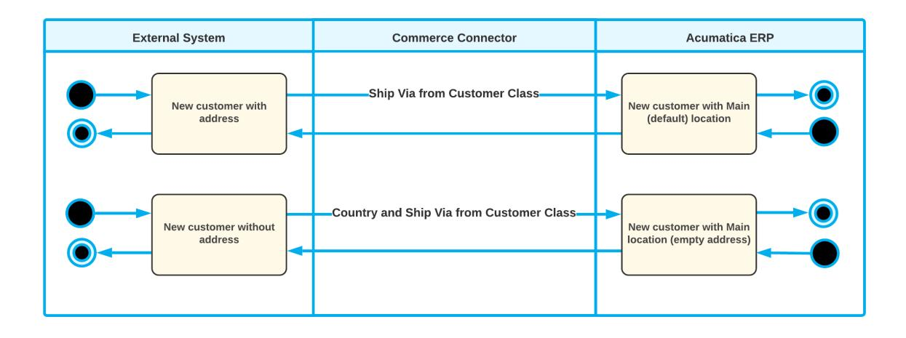

The following diagram illustrates the synchronization of customers created without an address.

#### *Figure: Synchronization of customers created without an address*

### **Creation of a Customer Address**

If the *Customer* and *Customer Location* entities are activated on the *[Shopify Stores](#page-492-1)* (BC201010) form and a new address was created for a customer in the Shopify store, during the import of the *Customer* entity, the ecommerce connector does one of the following:

- If the default *MAIN* location has empty address lines, the new address is used to populate the elements of the *MAIN* location.
- If the default location has been deleted in Acumatica ERP, and there is a corresponding synchronization record with the *Deleted* status on the *[Sync History](#page-539-1)* (BC301000) form, the ecommerce connector creates a new location and makes it the default.
- If the default location exists and the address lines in it are filled in, the connector creates a new location.

For the imported location, the system inserts the identifier of the location from the Shopify store, along with the store name, in the **External ID** box on the **General** tab of the *[Customer Locations](https://help-2025r1.acumatica.com/Help?ScreenId=ShowWiki&pageid=61a8c6de-6a51-434b-8c2d-4304ec982ae0)* (AR303020) form in the following format: *<Location Identifier> - <Store Name>*.

If a new location was created for a customer in Acumatica ERP, when the *Customer* entity is exported, the corresponding new address is created for the customer in the Shopify store with the data of the new location.

The following diagram illustrates the synchronization of a new customer address.

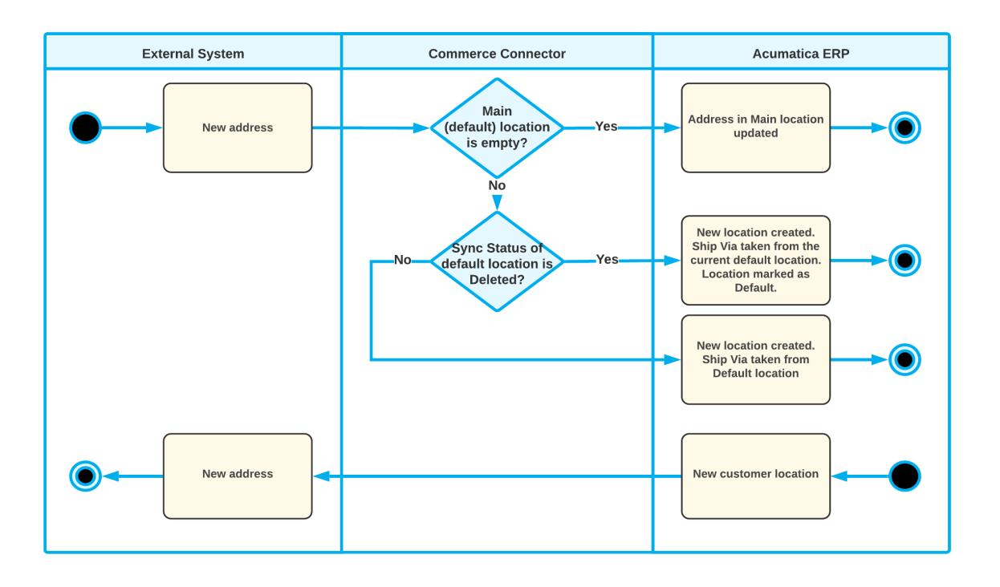

#### *Figure: Synchronization of a new customer address*

#### **Editing of a Customer Address**

With the *Customer* and *Customer Location* entities activated on the *[Shopify Stores](#page-492-1)* (BC201010) form, if an existing customer address synchronized with Acumatica ERP is edited in the Shopify store, during the import of the *Customer* entity, the corresponding customer location in Acumatica ERP is updated with the changes made to the customer address in the Shopify store.

If an existing customer location is edited in Acumatica ERP, during the export of the *Customer* entity, the ecommerce connector does one of the following:

- 1. If the customer location is active—that is, if the **Active** check box is selected for it on the *[Customer Locations](https://help-2025r1.acumatica.com/Help?ScreenId=ShowWiki&pageid=61a8c6de-6a51-434b-8c2d-4304ec982ae0)* (AR303020) form—the corresponding customer address in the Shopify store is updated based on the changes to the customer location.
- 2. If the customer location is inactive (that is, if the **Active** check box is cleared for it), the synchronization proceeds as follows:
  - If the location's synchronization record has a status other than *Deleted*, the corresponding customer address in the Shopify store is updated based on the changes to the customer location.
  - If the location's synchronization record has the *Deleted* status or the location has not been synchronized previously, the location is not synchronized with the Shopify store.

The following diagram illustrates the synchronization of an updated customer address.

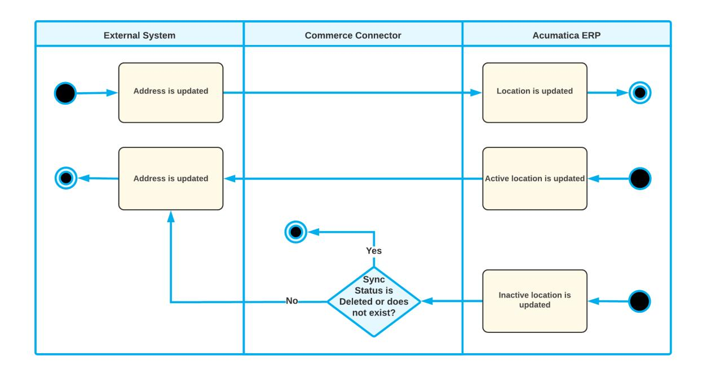

*Figure: Synchronization of an updated customer address*

## **Deletion of a Customer Address**

With the *Customer* and *Customer Location* entities activated on the *[Shopify Stores](#page-492-1)* (BC201010) form, if a customer address is deleted in the Shopify store, the import of the *Customer* entity proceeds as follows:

- If the corresponding customer location in Acumatica ERP is not the default customer location, the system makes it inactive and its synchronization status changes to *Deleted*.
- If the corresponding customer location in Acumatica ERP is the default customer location, the connector does one of the following:
  - If the customer location is the only active location of a customer, the connector assigns the *Deleted* status to the location's synchronization record.
  - If other active locations exist for the customer, the connector makes this default location inactive, assigns the *Deleted* status to its synchronization record, and makes one of the other active locations the default one.

If an existing customer location is made inactive in Acumatica ERP, when the *Customer* entity is exported, the inactive customer location is not synchronized with the Shopify store.

The following diagram illustrates the synchronization of a deleted customer address.

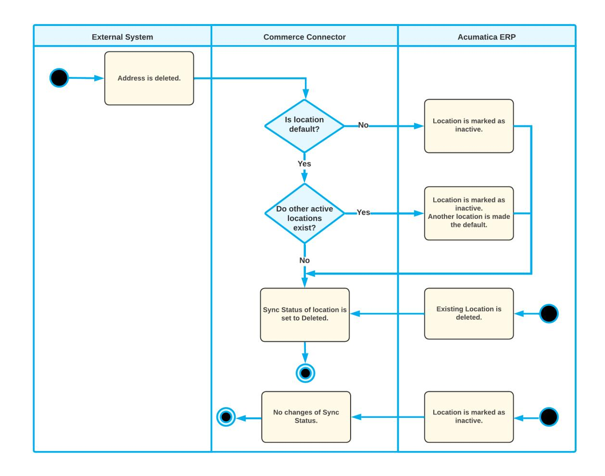

*Figure: Synchronization of a deleted customer address*

## **Use of the Guest Customer Account**

If you want to allow placing orders in your store without providing the customer's phone number or email address and want to import such orders to Acumatica ERP, you need to fill in the **Generic Guest Customer** box on the **CustomerSettings** tab of the *[Shopify Stores](#page-492-1)* (BC201010) form. This customer account appears on imported sales orders that have been placed in the Shopify store without customer details.

The customer record selected in the **Generic Guest Customer** box is not exported to the Shopify store during the synchronization of customers.

You can also configure the system to change a guest customer account aer a particular number of sales orders have been created for this account. You do so by selecting the **Use Multiple Guest Accounts** check box. When the maximum allowed number of sales orders is exceeded, the system creates a new customer and inserts its identifier in the **Generic Guest Customer** box. The settings of the new customer account are copied from the previous generic guest customer account, and its identifier is generated based on the numbering sequence specified in the **Customer NumberingSequence** box.

By default, the allowed number of sales orders per guest customer account is limited to 10,000. You can override this number by adding the MaxOrdersPerGuestAccount key to the <appSettings> section of the web.config file. For example, to change the guest customer account aer every 500 sales orders, add the following key:

<add key="MaxOrdersPerGuestAccount" value="500"/>

For more information about creating a customer, see *[Customers: General Information](https://help-2025r1.acumatica.com/Help?ScreenId=ShowWiki&pageid=f38972e8-a206-4279-8681-b9e2743759c0)*.

# **Customer Synchronization: Business Customers**

In Shopify, it is possible to sell goods and services to business customers without using third-party apps. A business customer is set up in the Shopify store as a *company*. A company may have multiple locations, and multiple customers may be associated with the same company. Each customer that is associated with a company may be assigned either the *Ordering only* role or the *Location admin* role in any of the company's locations. When a customer associated with a company signs in to the Shopify store, they select the location for which they are placing an order, and they are offered the prices and payment terms that have been set up in the store for that company location.

For more information about setting up companies in Shopify, see *[the Shopify documentation](https://help.shopify.com/en/manual/b2b/companies)*.

Business-to-business functionality in Shopify is available on the Shopify Plus subscription plan.

You can synchronize business customers between Acumatica ERP and a Shopify store, as described in the sections below. You can also synchronize orders that have been placed by contacts associated with business customers, as described in *[Order Synchronization: Orders for Companies](#page-353-1)*.

The synchronization of business customers is available if both the *Shopify Connector* feature and the *Business-to-Business Entities* feature are enabled on the *[Enable/Disable Features](https://help-2025r1.acumatica.com/Help?ScreenId=ShowWiki&pageid=c1555e43-1bc5-4f6f-ba9d-b323f94d8a6b)* (CS100000) form.

#### **Import of Business Customers**

During the import of a company from a Shopify store to Acumatica ERP, the system does the following:

- Creates a customer for the company on the *[Customers](https://help-2025r1.acumatica.com/Help?ScreenId=ShowWiki&pageid=652929bc-9606-4056-aa6e-0c2d1147171b)* (AR303000) form
- For each location that has been defined for the company in the Shopify store, creates a customer location on the *[Customer Locations](https://help-2025r1.acumatica.com/Help?ScreenId=ShowWiki&pageid=61a8c6de-6a51-434b-8c2d-4304ec982ae0)* (AR303020) form
- For each customer associated with the company in the Shopify store, creates a contact on the *[Contacts](https://help-2025r1.acumatica.com/Help?ScreenId=ShowWiki&pageid=75a5dea9-d640-4b71-95b1-88534c4afad7)* (CR302000) form

The created customer is assigned settings as follows:

- The system generates the identifier of the business customer imported from a Shopify store based on the numbering sequence selected in the **Customer NumberingSequence** box on the **Customers** tab of the *[Shopify Stores](#page-492-1)* (BC201010) form.
- The system inserts the customer class that is specified in the **Customer Class** box of the **Customers** tab of the *[Shopify Stores](#page-492-1)* form. This class provides default settings for the customer.
- The system inserts *Organization* in the **Customer Category** box on the *[Customers](https://help-2025r1.acumatica.com/Help?ScreenId=ShowWiki&pageid=652929bc-9606-4056-aa6e-0c2d1147171b)* form, which indicates that the customer is a business customer.
- The system inserts the company identifier from the Shopify store, along with the store name, in the **Ext. Ref. Nbr.** box on the **General** tab of the *[Customers](https://help-2025r1.acumatica.com/Help?ScreenId=ShowWiki&pageid=652929bc-9606-4056-aa6e-0c2d1147171b)* form in the following format: *<Company Identifier> - <Store Name>*.

The created locations are assigned settings as follows:

- The system generates the identifiers of the imported locations based on the numbering sequence specified in the **Location NumberingSequence** box on the **Customers** tab of the *[Shopify Stores](#page-492-1)* form.
- The system inserts the location identifier from the Shopify store, along with the store name, in the **External ID** box on the **General** tab of the *[Customer Locations](https://help-2025r1.acumatica.com/Help?ScreenId=ShowWiki&pageid=61a8c6de-6a51-434b-8c2d-4304ec982ae0)* form in the following format: *<Location Identifier> - <Store Name>*.

• The **Contacts** tab of the *[Customer Locations](https://help-2025r1.acumatica.com/Help?ScreenId=ShowWiki&pageid=61a8c6de-6a51-434b-8c2d-4304ec982ae0)* form shows all contacts that are assigned a role in a particular location.

The created contacts are assigned settings as follows:

- On the **Locations** tab of the *[Contacts](https://help-2025r1.acumatica.com/Help?ScreenId=ShowWiki&pageid=75a5dea9-d640-4b71-95b1-88534c4afad7)* form and on the **Contacts** tab of the *[Customer Locations](https://help-2025r1.acumatica.com/Help?ScreenId=ShowWiki&pageid=61a8c6de-6a51-434b-8c2d-4304ec982ae0)* form, the system assigns the roles to contacts in the customer locations based on the roles the customers had in each of the locations in the Shopify store as follows:
  - If the customer has the *Ordering only* role in the Shopify store, the contact is assigned the *User* role in Acumatica ERP.
  - If the customer has the *Location admin* role in the Shopify store, the contact is assigned the *Admin* role in Acumatica ERP.
- The system inserts the customer identifier from the Shopify store, along with the store name, in the **Ext. Ref. Nbr.** box on the **CRM Info** tab of the *[Contacts](https://help-2025r1.acumatica.com/Help?ScreenId=ShowWiki&pageid=75a5dea9-d640-4b71-95b1-88534c4afad7)* form in the following format: *<Customer Identifier> - <Store Name>*.
- The **Locations** tab of the *[Contacts](https://help-2025r1.acumatica.com/Help?ScreenId=ShowWiki&pageid=75a5dea9-d640-4b71-95b1-88534c4afad7)* form shows the locations in which a contact is assigned a role.

If a customer associated with a company is deleted in the Shopify store aer the company has been synchronized, during the next synchronization, the corresponding contact in Acumatica ERP becomes inactive. Similarly, if a location is deleted in the Shopify store, the corresponding customer location in Acumatica ERP becomes inactive.

#### **Export of Business Customers**

If the synchronization direction is set to *Export* or *Bidirectional* for the *Company* entity for the store on the **Entities** tab of the *[Shopify Stores](#page-492-1)* (BC201010) form, business customers can be exported to the Shopify store. Customers are exported only if the **Customer Category** box contains *Organization* on the *[Customers](https://help-2025r1.acumatica.com/Help?ScreenId=ShowWiki&pageid=652929bc-9606-4056-aa6e-0c2d1147171b)* (AR303000) form.

During the export of a business customer, the system does the following in the Shopify store:

- Creates a company.
- Creates a company location for each customer location created for the business customer on the *[Customer](https://help-2025r1.acumatica.com/Help?ScreenId=ShowWiki&pageid=61a8c6de-6a51-434b-8c2d-4304ec982ae0) [Locations](https://help-2025r1.acumatica.com/Help?ScreenId=ShowWiki&pageid=61a8c6de-6a51-434b-8c2d-4304ec982ae0)* (AR303020) form.

If changes have been made to a location aer the company has been synchronized, these changes are exported to the Shopify store during the next synchronization. However, if a location is deactivated or deleted in Acumatica ERP, the corresponding company location is not updated in the Shopify store.

- Creates a customer for each contact created for the business customer on the *[Contacts](https://help-2025r1.acumatica.com/Help?ScreenId=ShowWiki&pageid=75a5dea9-d640-4b71-95b1-88534c4afad7)* (CR302000) form and associates it with the company. The customers are assigned roles in the company's locations according to the contacts' roles in Acumatica ERP as follows:
  - If the contact has the *User* role in Acumatica ERP, the customer is assigned the *Ordering only* role in Shopify.
  - If the contact has the *Admin* role in Acumatica ERP, the customer is assigned the *Location admin* role in Shopify.

If changes have been made to a contact aer the company has been synchronized, these changes are exported to the Shopify store during the next synchronization. However, if the contact is deactivated or deleted in Acumatica ERP, the corresponding customer is not updated in the Shopify store.

# **Customer Synchronization: To Synchronize Customers with Multiple Locations**

The following activity will walk you through the process of setting up the synchronization of customer locations and performing the synchronization of individual customers with locations between Acumatica ERP and the Shopify store.

The following activity is based on the *U100* dataset.

In this activity, you will be synchronizing business customers by following the business-to-consumer (B2C) path. This approach is useful if your Shopify subscription plan does not include business-tobusiness (B2B) features.

#### **Story**

Suppose that SweetLife Fruits & Jams works with individual customers and small businesses that order items to be delivered to multiple locations. The company keeps track of customer addresses in the Shopify store and wants these addresses to be in sync with customer locations in Acumatica ERP.

SweetLife's Shopify subscription does not include business-to-business features, so individual and business customers should be synchronized together.

Acting as an implementation consultant helping SweetLife to set up the integration of Acumatica ERP with the Shopify store, you need to configure the synchronization of customers along with their locations between the two systems. You will then test the import of customers with multiple locations, then update location details, and test the export of the updated data.

# **Configuration Overview**

In the *U100* dataset, the following tasks have been performed to support this activity:

- On the *[Enable/Disable Features](https://help-2025r1.acumatica.com/Help?ScreenId=ShowWiki&pageid=c1555e43-1bc5-4f6f-ba9d-b323f94d8a6b)* (CS100000) form, the *Business Account Locations* feature has been enabled.
- On the *[Customer Classes](https://help-2025r1.acumatica.com/Help?ScreenId=ShowWiki&pageid=806e39d6-6f89-4e6c-9a24-61c6fb0c9a57)* (AR201000) form, the *ECCUSTOMER* customer class has been configured.
- On the *[Numbering Sequences](https://help-2025r1.acumatica.com/Help?ScreenId=ShowWiki&pageid=a8d11c23-21f2-42a3-b17d-9637c9cf8031)* (CS201010) form, the *ECCUSTOMER* and *ECLOCATION* numbering sequences have been defined.

#### **Process Overview**

In this activity, you will do the following:

- 1. On the *[Shopify Stores](#page-492-1)* (BC201010) form, update the settings of the *Customer* and *Customer Locations* entities.
- 2. In the admin area of the Shopify store, create a new customer with two addresses.
- 3. On the *[Prepare Data](#page-529-1)* (BC501000) form, prepare the customer and customer address data for synchronization.
- 4. On the *[Process Data](#page-533-1)* (BC501500) form, process the customer and customer address data prepared for synchronization.
- 5. On the *[Customers](https://help-2025r1.acumatica.com/Help?ScreenId=ShowWiki&pageid=652929bc-9606-4056-aa6e-0c2d1147171b)* (AR303000) form, review the imported customer data.
- 6. On the *[Customer Locations](https://help-2025r1.acumatica.com/Help?ScreenId=ShowWiki&pageid=61a8c6de-6a51-434b-8c2d-4304ec982ae0)* (AR303020) form, review the imported customer address data and update one of the customer locations.
- 7. By using the *[Sync History](#page-539-1)* (BC301000) form, synchronize the updated customer location with the Shopify store.
- 8. In the admin area of the Shopify store, review the updated customer address.

#### **System Preparation**

Before you perform the instructions in this activity, do the following:

1. Make sure that the following prerequisites have been met:

- The Shopify store has been created and configured, as described in *Initial [Configuration:](#page-241-1) To Set Up a [Shopify Store](#page-241-1)*.
- The connection to the Shopify store has been established and the initial configuration has been performed, as described in *Initial [Configuration:](#page-250-1) To Configure the Store Connection*.
- 2. Launch the Acumatica ERP website with the *U100* dataset preloaded, and sign in with the following credentials:
  - **Username**: *gibbs*
  - **Password**: *123*
- 3. Sign in to the admin area of the Shopify store as the store administrator in the same browser.

# **Step 1: Configuring the Synchronization Settings of the Customer and Customer Location Entities**

To review the synchronization settings of the *Customer* and *Customer Locations* entities, do the following:

- 1. On the *[Shopify Stores](#page-492-1)* (BC201010) form, select the *SweetStore - SP* store.
- 2. On the **Entities** tab, do the following:
  - a. Make sure that the **Active** check box is selected in the rows of the *Customer* and *Customer Location* entities.
  - b. In the row of the *Customer* entity, make sure that**Sync Direction** is set to *Bidirectional*.

Notice that all other settings of the *Customer Location* entity (including the synchronization direction) are the same as those of the *Customer* entity and cannot be edited.

- 3. On the **Customers** tab, make sure that the following settings have been specified:
  - **Customer Class**: *ECCUSTOMER*

When a new customer is imported from the Shopify store to Acumatica ERP, its default settings are defined based on the customer class selected in this box.

• **Customer NumberingSequence**: *ECCUSTOMER*

Each new customer imported from the Shopify store will be assigned an identifier based on the numbering sequence selected in this box.

• **Location NumberingSequence**: *ECLOCATION*

Each new customer location imported from the Shopify store will be assigned an identifier based on the numbering sequence selected in this box.

4. On the form toolbar, click**Save** to save your changes.

### **Step 2: Creating a Customer in the Shopify Store**

To create a customer and a first address, in the admin area of the Shopify store, do the following:

- 1. In the le menu of the Shopify admin area, click **Customers**.
- 2. On the **Customers** page that opens, click **Add customer** in the upper right.
- 3. On the **New customer** page that opens, specify the following details in the **Customer overview** section:
  - **First name**: Isabelle
  - **Last name**: Bober
  - **Email**: hoppy\_info@example.com
- 4. In the **Default address** section, click **Add address**.
- 5. In the **Add default address** dialog box, which opens, specify the following details:
  - **Country/region**: *United States* (inserted by default)

- **First name**: Isabelle (inserted by default based on the information specified in the customer overview section)
- **Last name**: Bober (inserted by default based on the information specified in the customer overview section)
- **Company**: Hoppy Place Coffee and Cakes
- **Address**: 3690 Taylor Street
- **City**: New York
- **State**: *New York*
- **ZIP code**: 10007
- 6. Click **Save** to save the address.

The system closes the dialog box and adds the primary address for the customer.

7. At the top of the page, in the **Unsaved changes** bar, click**Save** to save the customer record.

The customer page opens for *Isabel Bober*. Notice that in the **Customer** section, the email address is displayed, and the **Default Address** section shows the address lines that you entered in this step.

#### **Step 3: Adding an Address for the Customer**

To add a second address for the customer you created in the previous step, while you are still viewing the **Customers** page for *Isabelle Bober*, do the following:

- 1. In the **Customer** section, in the upper right, click the More button and then click **Manage addresses**.
- 2. In the **Manage addresses** dialog box, which opens, click **Add new address**.
- 3. The **Add new address** dialog box, which opens, in the **Country/region** box, select *United States*. The **State** and **ZIP code** boxes appear in the dialog box.
- 4. Fill in the boxes as follows:
  - **First name**: William
  - **Last name**: Duncan
  - **Company**: Hoppy Wellby
  - **Address**: 2671 Simons Hollow Road
  - **City**: New York
  - **State**: *New York*
  - **ZIP code**: 10001
- 5. Click **Save** to save the address.

The dialog box closes and you return to the customer page for *Isabel Bober*.

- 6. In the **Customer** section, in the upper right, click the More button and then click **Manage addresses**. In the **Manage addresses** dialog box, which opens, notice that the second address has been added.
- 7. Close the **Manage addresses** dialog box.

#### **Step 4: Preparing the Customer and Customer Location Data for Synchronization**

To prepare the customer and customer location data for synchronization, in Acumatica ERP, do the following:

- 1. On the *[Prepare Data](#page-529-1)* (BC501000) form, specify the following settings in the Summary area:
  - **Store**: *SweetStore - SP*
  - **Prepare Mode**: *Incremental*

This setting controls which data will be loaded. *Incremental* indicates that only the customer records that match the filtering conditions and have been modified since the previous processing of the data have been prepared for synchronization.

- 2. In the table, select the check box in the unlabeled column in the row of the *Customer* entity.
- 3. On the form toolbar, click **Prepare**.

Because customer locations are synchronized along with customers during the synchronization of the *Customer* entity, the *Customer Location* entity is not listed in the table and cannot be prepared separately.

4. In the **Processing** dialog box, which opens, review the results of the processing, and click **Close** to close the dialog box and return to the *[Prepare Data](#page-529-1)* form.

Notice that the **Prepared Records** column shows the number of synchronization records that have been prepared and are ready to be processed.

#### **Step 5: Processing the Prepared Customer and Customer Location Data**

To process the customer and customer location data you have prepared for synchronization, do the following:

1. While you are still viewing the *[Prepare Data](#page-529-1)* (BC501000) form, click the link in the **Ready to Process** column of the row with the *Customer* entity.

The *[Process Data](#page-533-1)* (BC501500) form opens with the *SweetStore - SP* store and the *Customer* entity selected in the Summary area. The table displays all synchronization records of the *Customer* entity that you prepared.

2. In the table, select the unlabeled check box in the only row that has a number in the **External ID** column but does not have any value in the **ERP ID** column.

The empty **ERP ID** column indicates that the record has been created in the Shopify store but has not yet been synchronized with Acumatica ERP.

- 3. On the form toolbar, click **Process** to process the selected synchronization record.
- 4. In the **Processing** dialog box, which opens, click **Close** to close the dialog box.

#### **Step 6: Reviewing the Imported Customer and Customer Locations**

Perform the following instructions to review the customer and customer locations that have been imported to Acumatica ERP:

- 1. Open the Customers (AR3030PL) form.
- 2. In the list of customers, in the **Customer Name** column, locate the *Isabelle Bober* customer, and click the link for this customer in the **Customer ID** column.
- 3. On the *[Customers](https://help-2025r1.acumatica.com/Help?ScreenId=ShowWiki&pageid=652929bc-9606-4056-aa6e-0c2d1147171b)* (AR303000) form, which opens for *Isabelle Bober*, on the **General** tab, notice that the system has inserted the customer identifier from Shopify in the **Ext. Ref. Nbr.** box (**Additional Account Info** section).
- 4. Open the **Locations** tab and review the locations that the system created when the customer record was synchronized.

Notice that the table displays the following locations, as shown in the screenshot below:

- The location with the *MAIN* identifier, which was created for the customer first in the Shopify store. This location is also marked as the default (that is, the **Default** check box is selected for this location).
- The location with the identifier that the system assigned to it based on the numbering sequence selected for locations in the store settings on the *[Shopify Stores](#page-492-1)* (BC201010) form.

| <b>Customers</b> C000000002 - Isabelle Bober                                                                       |                                                                      |        |                    |             |              |   |                                      |                                                | $\Gamma$ NOTES |                      |   | <b>FILES</b> <b>CUSTOMIZATION</b> |                     | TOOLS $\sim$ |           |  |
|-----------------------------------------------------------------------------------------------------------------------|----------------------------------------------------------------------|--------|--------------------|-------------|--------------|---|--------------------------------------|------------------------------------------------|----------------|----------------------|---|--------------------------------------|---------------------|--------------|-----------|--|
|                                                                                                                       | $\leftarrow$                                                         | 뭐      | n                  |             | ↶            | 侕 | Ĥ $\checkmark$                    | к                                              | ≺              | >                    | Ы |                                      | <b>VIEW ACCOUNT</b> | .            |           |  |
|                                                                                                                       | Q * Customer ID: C000000002 - Isabelle Bober <b>Balance</b> |        |                    |             |              |   |                                      |                                                |                |                      |   |                                      | 0.00                | ㅅ            |           |  |
|                                                                                                                       |                                                                      |        | * Customer Status: |             | Active       |   |                                      |                                                | $\checkmark$   |                      |   | <b>Prepayment Balance</b>            |                     | 0.00         |           |  |
|                                                                                                                       |                                                                      |        | * Customer Class:  |             |              |   | <b>ECCUSTOMER - Online Customers</b> |                                                | Q              | $\mathscr{Q}$        |   | <b>Retained Balance</b>              |                     | 0.00         |           |  |
|                                                                                                                       | Individual <b>Customer Category:</b> $\checkmark$              |        |                    |             |              |   |                                      |                                                |                |                      |   |                                      |                     |              |           |  |
| <b>LOCATIONS</b> <b>GENERAL</b> <b>FINANCIAL</b> <b>SHIPPING</b> <b>PAYMENT METHODS</b> <b>BILLING</b> |                                                                      |        |                    |             |              |   |                                      |                                                |                |                      |   | $\grave{ }$                          |                     |              |           |  |
|                                                                                                                       | ረን <b>SET AS DEFAULT</b> Q ⊢ $\pm$ <b>All Records</b> |        |                    |             |              |   |                                      |                                                |                | ۰                    | ৡ |                                      |                     |              |           |  |
| 周                                                                                                                     | 0                                                                    | D      | <b>Active</b>      |             | *Location ID |   |                                      | <b>Location Name</b> <b>Default</b> City |                |                      |   |                                      |                     | <b>State</b> | Country   |  |
|                                                                                                                       | 0                                                                    | $\Box$ | ☑                  |             | L000000001   |   | <b>Hoppy Wellby</b>                  |                                                |                |                      |   | ш                                    | <b>New York</b>     | <b>NY</b>    | <b>US</b> |  |
|                                                                                                                       | 0                                                                    | D      | ☑                  | <b>MAIN</b> |              |   | Hoppy Place Coffee and Cakes         |                                                |                | ☑ <b>New York</b> |   |                                      |                     | <b>NY</b>    | US        |  |

#### *Figure: Customer locations imported from the store*

- 5. Click the *MAIN* link in the **Location ID** column.
- 6. On the *[Customer Locations](https://help-2025r1.acumatica.com/Help?ScreenId=ShowWiki&pageid=61a8c6de-6a51-434b-8c2d-4304ec982ae0)* (AR303020) form, which the system has opened in a pop-up window, on the **General** tab, review the location details that have been imported from the Shopify store. Notice the following:
  - The **Company** value from the address in Shopify has been imported as the **Location Name** of the **Location Info** section and the **Account Name** box of the **Additional Location Info** section.

The address lines, city, state, country, and postal code have been imported to the appropriate boxes of the **Location Address** section.

The first and last name of the address in Shopify have been imported to the **Attention** box of the **Additional Location Info** section.

The location identifier from Shopify along with the store name have been imported to the **External ID** box of the **OtherSettings** section.

#### **Step 7: Updating the Customer Location**

Suppose that you need to update the contact and address details of the *MAIN* customer location for *Isabelle Bober*. Do the following:

- 1. While you are still viewing the *[Customer Locations](https://help-2025r1.acumatica.com/Help?ScreenId=ShowWiki&pageid=61a8c6de-6a51-434b-8c2d-4304ec982ae0)* (AR303020) form with the *MAIN* location of the *Isabelle Bober* customer, on the **General** tab, in the **Additional Location Info** section, type Gail Anderson in the **Attention** box.
- 2. In the **Location Address** section, change **Address Line 1** to 3650 Taylor Street.
- 3. On the form toolbar, click**Save & Close** to save your changes and close the pop-up window with the *[Customer Locations](https://help-2025r1.acumatica.com/Help?ScreenId=ShowWiki&pageid=61a8c6de-6a51-434b-8c2d-4304ec982ae0)* form.

#### **Step 8: Synchronizing the Updated Location with the Shopify Store**

To synchronize the updated customer location with the Shopify store in order to update the address in the store, do the following:

- 1. On the *[Sync History](#page-539-1)* (BC301000) form, in the Summary area, specify the following settings:
  - **Store**: *SweetStore - SP*
  - **Entity**: *Customer Location*
- 2. On the **Processed** tab, select the unlabeled check box in the row of the *MAIN, Hoppy Place Coffee and Cakes* location, and on the form toolbar, click**Sync**.

When you change a location of a customer, the ecommerce connector recognizes the customer record as having been modified as well. So in this step, you could have selected the synchronization record for the *Isabelle Bober* customer and clicked**Sync**, and the updated customer location would have been synchronized as part of the customer synchronization process. Alternatively, you could have prepared the *Customer* entity for synchronization on the *[Prepare Data](#page-529-1)* (BC501000) form and then processed the prepared synchronization records on the *[Process Data](#page-533-1)* (BC501500) form.

## **Step 9: Reviewing the Updated Customer Address in the Shopify Store**

To review the updated customer address in the Shopify store, do the following:

1. While you are still viewing the *[Sync History](#page-539-1)* (BC301000) form, in the row of the *MAIN, Hoppy Place Coffee and Cakes* customer location, click the link in the **External ID** column.

The customer page of the admin area of the Shopify store opens for *Isabelle Bober*.

2. In the **Customer** section, under **Default Address**, review the updated details of the customer address.

Notice that the first name, last name, and the address line have been updated to reflect the changes that you made to the customer location. The name is now *Gail Anderson*, and the address has been changed to *3650 Taylor Street*.

# **Synchronizing Products**

In the topics of this chapter, you will read about product export from Acumatica ERP to the Shopify store.

# **Product Synchronization: General Information**

Acumatica ERP Retail Edition provides you with the ability to export product data (that is, data of stock and nonstock items) from Acumatica ERP to the Shopify store.

#### **Learning Objectives**

In this chapter, you will learn how to export stock and non-stock items to the Shopify store.

## **Applicable Scenarios**

You export items from Acumatica ERP to an external system in the following cases:

- When you are initially configuring the external system and need to transfer stock and non-stock items that have already been defined in Acumatica ERP
- If you manage product information in Acumatica ERP, have updated any of the item settings aer the item was synchronized with the external system, and need the changes to be reflected in the product settings in the system

## **Configuration of Product Synchronization**

Before exporting stock and non-stock items defined in Acumatica ERP to the Shopify store, you need to perform the following general steps:

- 1. Activate the *Stock Item* and *Non-Stock Item* entities. To do this, on the *[Shopify Stores](#page-492-1)* (BC201010) form, you select the store, and on the **Entities** tab, you select the **Active** check box for the *Stock Item* and *Non-Stock Item* entities.
- 2. Configure the default visibility and purchasability settings for items exported to the Shopify store. For details, see *[Product Synchronization: Default Store Settings](#page-307-1)*.
- 3. Determine which items should be exported and define the visibility and purchasability settings for individual items. For details, see *[Product Synchronization: Settings of Individual Items](#page-308-1)*.

#### **Synchronization of Stock and Non-Stock Items**

Depending on the item type, the settings of an item in the Shopify store are updated as part of the synchronization of the *Stock Item* or *Non-Stock Item* entity.

During the export, the system updates the availability and visibility settings of each item exported to Shopify based on the settings specified for the item on the **eCommerce** tab of the *[Non-Stock Items](https://help-2025r1.acumatica.com/Help?ScreenId=ShowWiki&pageid=bf68dd4f-63d4-460d-8dc0-9152f2bd6bf1)* or *[Stock Items](https://help-2025r1.acumatica.com/Help?ScreenId=ShowWiki&pageid=77786a70-1f1e-4d63-ad98-96f98e4fcb0e)* form and for the store on the **Inventory** tab of the *[Shopify Stores](#page-492-1)* (BC201010) form.

For details about the information exported to the Shopify store during the synchronization of a stock and non-stock item, see *[Stock Item Entity](#page-602-1)* and *[Non-Stock Item Entity](#page-607-1)*.

#### **Export of Sales Categories as Tags**

You can cause the system to export sales categories assigned to a stock or non-stock item in Acumatica ERP to be exported to the Shopify store as product tags during the synchronization of the item. To do this, on the **Inventory Settings** tab of the *[Shopify Stores](#page-492-1)* (BC201010) form, you set**Sales Category Export** to *Export as Product Tags*. You can view sales categories on the *[Item Sales Categories](https://help-2025r1.acumatica.com/Help?ScreenId=ShowWiki&pageid=1cd87b69-9b41-4210-98fb-58b869df8a5f)* (IN204060) form.

#### **Synchronization of Non-Stock Items Requiring Shipment**

In the Shopify store, a product that can be shipped is marked as a physical product. That is, in the**Shipping** section of the product management page, the**This is a physical product** check box is selected for this product.

For stock items that you export to the Shopify store, the system automatically selects the**This is a physical product** check box. For exported non-stock items, the state of the check box is determined as follows:

- If the **RequireShipment** check box is selected for the non-stock item on the **General** tab of the *[Non-Stock](https://help-2025r1.acumatica.com/Help?ScreenId=ShowWiki&pageid=bf68dd4f-63d4-460d-8dc0-9152f2bd6bf1) [Items](https://help-2025r1.acumatica.com/Help?ScreenId=ShowWiki&pageid=bf68dd4f-63d4-460d-8dc0-9152f2bd6bf1)* (IN202000) form, the**This is a physical product** check box is selected.
- If the **RequireShipment** check box is cleared,**This is a physical product** check box is cleared.

# **Product Synchronization: Default Store Settings**

When you set up a connection to a Shopify store on the *[Shopify Stores](#page-492-1)* (BC201010) form, you specify the availability and visibility settings that are applied by default to all items synchronized with the Shopify store.

#### **Default Product Availability Settings**

On the **Inventory** tab of the *[Shopify Stores](#page-492-1)* (BC201010) form, you define the default availability settings that are applied to items exported from Acumatica ERP. These settings determine whether the exported item can be purchased in the Shopify store. To define the default availability settings, you select one of the following options in the **Default Availability** box:

• *Set as Available (Track Qty.)*: The stock items exported to the Shopify store are available for purchase via the storefront, and their quantities are tracked, meaning that the items can be purchased only if their quantities are greater than zero. In Shopify, on the product management page for each of these items, the *Online Store*

sales channel is listed below the product status and the**Track quantity** check box in the **Inventory** section is selected.

The non-stock items exported to the Shopify store are available for purchase via the storefront, and their quantities are not tracked (that is, the**Track quantity** check box in the **Inventory** section is cleared).

- *Set as Available (Don't Track Qty.)*: The non-stock and stock items exported to the Shopify store are available for purchase via the storefront, and their quantities are not tracked. In Shopify, on the product management page for each of these items, the *Online Store* sales channel is listed below the product status and the**Track quantity** check box in the **Inventory** section is cleared.
- *Do Not Update*: The availability settings and quantity of the item in the Shopify store are not updated.
- *Set as Unavailable*: The non-stock and stock items exported to the Shopify store are not available for purchase. In Shopify, on the product management page for each of these items, the**Track quantity** check box (in the **Inventory** section) is cleared and the *Online Store* sales channel is not listed below the product status (in the upper right).

The **Default Availability** setting applies if the **Availability** setting for a particular item is set to *Store Default* on the *[Non-Stock Items](https://help-2025r1.acumatica.com/Help?ScreenId=ShowWiki&pageid=bf68dd4f-63d4-460d-8dc0-9152f2bd6bf1)* (IN202000) or *[Stock Items](https://help-2025r1.acumatica.com/Help?ScreenId=ShowWiki&pageid=77786a70-1f1e-4d63-ad98-96f98e4fcb0e)* (IN202500) form.

If you select the *Set as Available (Track Qty.)* option in the **Default Availability** box, you need to also specify what action the system should perform with out-of-stock items (that is, with stock items whose quantities become zero). To do so, in the **When Qty. Unavailable** box, you select one of the following options:

- *Do Nothing*: The system does not change the availability settings of the item.
- *Set as Unavailable*: The system makes the item unavailable for purchase via the storefront. In Shopify, on the product management page for each of these items, the**Track quantity** check box (in the **Inventory** section) becomes cleared and the *Online Store* sales channel below the product status disappears.
- *Set as Continue Selling*: The system selects the **Continue selling when out of stock** check box for the item in the Shopify store.

If you have synchronized the *Product Availability* entity, when you modify any of the settings described in this section, the system resets the availability synchronization status for all synchronized items in the Shopify store, and you need to perform the synchronization of the *Product Availability* entity again.

### **Default Visibility Settings**

You can specify visibility settings that will be applied by default to each item exported to the Shopify store on the **Inventory** tab of the *[Shopify Stores](#page-492-1)* (BC201010) form. To instruct the system to make all items by default immediately available on the storefront aer they are exported to the Shopify store, you select *Visible* in the **DefaultVisibility** box. To make items by default available for management in the store's admin area but hidden from the storefront, you select *Invisible* in this box.

# **Product Synchronization: Settings of Individual Items**

By default, the availability and visibility settings defined for the store on the *[Shopify Stores](#page-492-1)* (BC201010) form are applied to all stock and non-stock items synchronized with the Shopify store. However, you can override the default values for a particular item, as described in the sections below.

#### **Excluding Items from Synchronization**

You can exclude an individual stock or non-stock item from exporting to the Shopify store (or any other ecommerce system) by clearing the **Export to ExternalSystem** check box on the **eCommerce** tab of the *[Stock Items](https://help-2025r1.acumatica.com/Help?ScreenId=ShowWiki&pageid=77786a70-1f1e-4d63-ad98-96f98e4fcb0e)* (IN202500) or *[Non-Stock Items](https://help-2025r1.acumatica.com/Help?ScreenId=ShowWiki&pageid=bf68dd4f-63d4-460d-8dc0-9152f2bd6bf1)* (IN202000) form.

The status of an item in Acumatica ERP affects the purchasability status of the item in Shopify. If the item's status in Acumatica ERP is *Inactive*, *No Sales*, or *Marked for Deletion*—that is, if any of these options is selected in the**Status**

box in the Summary area of the *[Non-Stock Items](https://help-2025r1.acumatica.com/Help?ScreenId=ShowWiki&pageid=bf68dd4f-63d4-460d-8dc0-9152f2bd6bf1)* (IN202000) form or the *[Stock Items](https://help-2025r1.acumatica.com/Help?ScreenId=ShowWiki&pageid=77786a70-1f1e-4d63-ad98-96f98e4fcb0e)* (IN202500) form—aer the synchronization of the relevant entity, these items appear with the *Online Store* sales channel cleared, regardless of the **Availability** setting of this item in Acumatica ERP.

#### **Visibility of an Exported Item**

You can specify the visibility settings for an individual item on the **eCommerce** tab of the *[Stock Items](https://help-2025r1.acumatica.com/Help?ScreenId=ShowWiki&pageid=77786a70-1f1e-4d63-ad98-96f98e4fcb0e)* (IN202500) or *[Non-Stock Items](https://help-2025r1.acumatica.com/Help?ScreenId=ShowWiki&pageid=bf68dd4f-63d4-460d-8dc0-9152f2bd6bf1)* (IN202000) form. To make the item visible on the storefront immediately aer it is exported, you select *Visible* in the **Visibility** box. To make the item available in the admin area of Shopify store but hidden from the storefront, you select *Invisible* in this box.

The option selected in the**Visibility** box for a particular item takes precedence over the default visibility setting specified for the store. If *Store Default* is selected, the store's default visibility setting applies.

### **Availability of an Exported Item**

By default, the availability settings defined for the store on the *[Shopify Stores](#page-492-1)* (BC201010) form are applied to all stock and non-stock items exported to the Shopify store. However, you can override the default values for a particular stock item on the **eCommerce** tab of the *[Stock Items](https://help-2025r1.acumatica.com/Help?ScreenId=ShowWiki&pageid=77786a70-1f1e-4d63-ad98-96f98e4fcb0e)* (IN202500) form and for a particular non-stock item on the same tab of the *[Non-Stock Items](https://help-2025r1.acumatica.com/Help?ScreenId=ShowWiki&pageid=bf68dd4f-63d4-460d-8dc0-9152f2bd6bf1)* (IN202000) form.

The options available for selection in the **Availability** box on the **eCommerce** tab are similar to the options of the **Default Availability** box on the *[Shopify Stores](#page-492-1)* form with the following exceptions:

- The *Set as Available (Track Qty.)* option does not appear in the **Availability** box for non-stock items.
- The *Store Default* option (which is not in the **Default Availability** box) is available in the **Availability** box for stock and non-stock items. When this option is selected, the system applies the setting selected in the **Default Availability** box on the **Inventory** tab of the *[Shopify Stores](#page-492-1)* form.

Because the tracking of quantities is not applicable to non-stock items, if **Default Availability** in the store settings is set to *Set as Available (Track Qty.)* and **Availability** of a non-stock item is set to *Store Default*, aer the non-stock item is exported to the Shopify store, it is available for purchase but its quantity is not tracked.

Additionally, for a stock item, if the *Set as Available (Track Qty.)* option is selected in the **Availability** box on the **eCommerce** tab, you need to specify the action that the system should perform if aer the synchronization of the *Product Availability* entity, the item has an available quantity of zero. The available options include all options of the **When Qty. Unavailable** box on the **Inventory** tab of the *[Shopify Stores](#page-492-1)* form, as well as the *Store Default* option, which (if selected) indicates that the setting specified in the box of the same name on the *[Shopify Stores](#page-492-1)* form should be applied.

# **Product Synchronization: Product Images**

Acumatica ERP Retail Edition provides you with the ability to export product images from Acumatica ERP to the Shopify store.

#### **Learning Objectives**

In this chapter, you will learn how to export product images from Acumatica ERP to the Shopify store.

#### **Applicable Scenarios**

You export product images from Acumatica ERP to your Shopify store in the following cases:

• You maintain product information in Acumatica ERP, export this information to the Shopify store, and use Acumatica ERP to store images of exported stock and non-stock items.

• You maintain product information in Acumatica ERP, export this information to the Shopify store, store images of exported stock and non-stock items in an external storage but keep links to the image files in Acumatica ERP.

## **Export of Product Images**

In Acumatica ERP, you can save images for stock and non-stock items in two ways:

- As attachments to an item: On the **Attributes** tab of the *[Stock Items](https://help-2025r1.acumatica.com/Help?ScreenId=ShowWiki&pageid=77786a70-1f1e-4d63-ad98-96f98e4fcb0e)* (IN202500) and *[Non-Stock Items](https://help-2025r1.acumatica.com/Help?ScreenId=ShowWiki&pageid=bf68dd4f-63d4-460d-8dc0-9152f2bd6bf1)* (IN202000) forms
- As links to an external storage: In the **Media URLs** table on the **eCommerce** tab of the *[Stock Items](https://help-2025r1.acumatica.com/Help?ScreenId=ShowWiki&pageid=77786a70-1f1e-4d63-ad98-96f98e4fcb0e)* and *[Non-](https://help-2025r1.acumatica.com/Help?ScreenId=ShowWiki&pageid=bf68dd4f-63d4-460d-8dc0-9152f2bd6bf1)[Stock Items](https://help-2025r1.acumatica.com/Help?ScreenId=ShowWiki&pageid=bf68dd4f-63d4-460d-8dc0-9152f2bd6bf1)* forms

Images that have been attached to an item on the *[Stock Items](https://help-2025r1.acumatica.com/Help?ScreenId=ShowWiki&pageid=77786a70-1f1e-4d63-ad98-96f98e4fcb0e)* or *[Non-Stock Items](https://help-2025r1.acumatica.com/Help?ScreenId=ShowWiki&pageid=bf68dd4f-63d4-460d-8dc0-9152f2bd6bf1)* form are exported to the Shopify store during the synchronization of the *Product Image* entity. The item they belong to must be exported to the Shopify store or created in the Shopify store before images attached to it are exported. Of all files attached to the item on the *[Stock Items](https://help-2025r1.acumatica.com/Help?ScreenId=ShowWiki&pageid=77786a70-1f1e-4d63-ad98-96f98e4fcb0e)* or *[Non-Stock Items](https://help-2025r1.acumatica.com/Help?ScreenId=ShowWiki&pageid=bf68dd4f-63d4-460d-8dc0-9152f2bd6bf1)* form, the system exports only the files with extensions for which the **Image** check box is selected on the *[File Upload Preferences](https://help-2025r1.acumatica.com/Help?ScreenId=ShowWiki&pageid=83ab66ec-f00e-4487-bbe7-969734a99693)* (SM202550) form.

Images specified as links in the **Media URLs** table on the **eCommerce** tab are exported together with the item (that is, during the synchronization of the *Stock Item* and *Non-Stock Item* entities). When the item is exported to the Shopify store, the images are added to the product management page of the exported item in the control panel of the Shopify store. For successful synchronization, images must be publicly accessible (that is, access to them should not require authentication or authorization).

If you delete a link to an image from the **Media URLs** table, the image will also be deleted from the product page in the Shopify store during the next synchronization of the item.

# **Product Synchronization: To Sync Product Images**

The following activity will walk you through the process of synchronizing product images between Acumatica ERP and the Shopify store.

The following activity is based on the *U100* dataset.

#### **Story**

Suppose that the SweetLife Fruits & Jams company wants to store some images of the products it sells in the online store in an external storage. Some of the images, however, are attached to items in the Acumatica ERP instance.

Acting as an implementation consultant helping SweetLife to set up the integration of Acumatica ERP with the Shopify store, you want to test how images stored in Acumatica ERP are exported to the Shopify store.

#### **Configuration Overview**

In the *U100* dataset, for the purposes of this activity, on the *[Stock Items](https://help-2025r1.acumatica.com/Help?ScreenId=ShowWiki&pageid=77786a70-1f1e-4d63-ad98-96f98e4fcb0e)* (IN202500) form, the *APJAM08* stock item of the *JAM* item class been created.

## **Process Overview**

In this activity, you will do the following:

- 1. On the *[Shopify Stores](#page-492-1)* (BC201010) form, activate the *Customer Locations* entity.
- 2. On the *[Stock Items](https://help-2025r1.acumatica.com/Help?ScreenId=ShowWiki&pageid=77786a70-1f1e-4d63-ad98-96f98e4fcb0e)* (IN202500) form, add images to the *APJAM08* stock item.

- 3. On the *[Prepare Data](#page-529-1)* (BC501000) form, prepare the stock item data for synchronization.
- 4. On the *[Process Data](#page-533-1)* (BC501500) form, process the stock item data prepared for synchronization.
- 5. In the admin area of the Shopify store, review the exported stock item.
- 6. On the *[Shopify Stores](#page-492-1)* (BC201010) form, activate the *Product Image* entity.
- 7. On the *[Prepare Data](#page-529-1)* form, prepare the product image data for synchronization.
- 8. On the *[Process Data](#page-533-1)* form, process the product image data prepared for synchronization.
- 9. In the admin area of the Shopify store, review the exported images.

#### **System Preparation**

Before you complete the instructions in this activity, do the following:

- 1. Make sure that the following prerequisites have been met:
  - The Shopify store has been created and configured, as described in *Initial [Configuration:](#page-241-1) To Set Up a [Shopify Store](#page-241-1)*.
  - The connection to the Shopify store has been established and the initial configuration has been performed, as described in *Initial [Configuration:](#page-250-1) To Configure the Store Connection*.
- 2. Download the *AppleJam1.png* and *AppleJam2.png* files to your device.
- 3. Launch the Acumatica ERP website with the *U100* dataset preloaded, and sign in with the following credentials:
  - **Username**: *gibbs*
  - **Password**: *123*
- 4. On the *[Shopify Stores](#page-492-1)* (BC201010) form, select the *SweetStore - SP* store.
- 5. On the **Entities** tab, select the **Active** check box in the row of the *Product Image* entity.
- 6. On the form toolbar, click**Save**.
- 7. Sign in to the admin area of the Shopify store as the store administrator in the same browser.

#### **Step 1: Adding an Image to the Stock Item**

To add an image to the *APJAM08* stock item in Acumatica ERP, do the following:

- 1. On the *[Stock Items](https://help-2025r1.acumatica.com/Help?ScreenId=ShowWiki&pageid=77786a70-1f1e-4d63-ad98-96f98e4fcb0e)* (IN202500) form, select the *APJAM08* inventory item.
- 2. On the **Attributes** tab, drag each of the files you downloaded to the Image area.

The files are attached to the form. You can browse them in the Image area or access them by clicking **Files** on the form title bar. The image that is visible in the Image area, aer being exported, will be the main image of the product in the Shopify store.

- 3. On the **eCommerce** tab, in the **Media URLs** table, add a row and specify the following settings of the image in the added row:
  - **URL**: http://acumatica-builds.s3.amazonaws.com/builds/University/ CommerceTraining/AppleJam3.png
  - **Type**: *Image*
- 4. On the form toolbar, click**Save**.

## **Step 2: Preparing the Stock Item Data for Synchronization**

Before you can synchronize images for a stock item, you need to synchronize the stock item itself. To prepare the stock item data for synchronization, do the following:

- 1. On the *[Prepare Data](#page-529-1)* (BC501000) form, specify the following settings in the Summary area:
  - **Store**: *SweetStore - SP*
  - **Prepare Mode**: *Incremental*
- 2. In the table, select the check box in the unlabeled column in the row of the *Stock Item* entity, and on the form toolbar, click **Prepare**.
- 3. In the **Processing** dialog box, which opens, review the results of the processing, and click **Close** to close the dialog box and return to the *[Prepare Data](#page-529-1)* form.

Notice that the **Prepared Records** column shows the number of synchronization records that have been prepared and are ready to be processed.

## **Step 3: Processing the Prepared Stock Item Data**

To process the stock item data prepared for synchronization, do the following:

1. While you are still viewing the *[Prepare Data](#page-529-1)* (BC501000) form, click the link in the **Ready to Process** column in the row of the *Stock Item* entity.

The *[Process Data](#page-533-1)* (BC501500) form opens with the *SweetStore - SP* store and the *Stock Item* entity selected in the Summary area.

- 2. Select the unlabeled check box in the row with the *Apple jam 8 oz.* item, and on the form toolbar, click **Process**.
- 3. In the **Processing** dialog box, which opens, click **Close** to close the dialog box.

## **Step 4: Reviewing the Synchronized Stock Item**

To review the *Apple jam 8 oz.* stock item, in the Shopify store, do the following:

- 1. In the le menu, click **Products**.
- 2. On the **Products** page, which opens, click the row of the *Apple jam 8 oz.* product to open the product management page of this product.

Notice that the **Media** section contains only one image, which you added as an external link to the **Media URLs** table on the **eCommerce** tab of the *[Stock Items](https://help-2025r1.acumatica.com/Help?ScreenId=ShowWiki&pageid=77786a70-1f1e-4d63-ad98-96f98e4fcb0e)* (IN202500) form. Images added to this table are synchronized as part of the synchronization of the *Stock Item* entity.

In the next steps, you will synchronize the images that you uploaded on the **Attributes** tab of the *[Stock](https://help-2025r1.acumatica.com/Help?ScreenId=ShowWiki&pageid=77786a70-1f1e-4d63-ad98-96f98e4fcb0e) [Items](https://help-2025r1.acumatica.com/Help?ScreenId=ShowWiki&pageid=77786a70-1f1e-4d63-ad98-96f98e4fcb0e)* form.

## **Step 5: Preparing the Image Data for Synchronization**

To prepare the image data for synchronization, in Acumatica ERP, do the following:

- 1. On the *[Prepare Data](#page-529-1)* (BC501000) form, specify the following settings шn the Summary area:
  - **Store**: *SweetStore - SP*
  - **Prepare Mode**: *Incremental*

Because you have not processed the *Product Image* entity before, the system will prepare all images attached to the synchronized items as it would if *Full* mode were selected.

Note that images are synchronized only for stock and non-stock items that have been synchronized with the Shopify store. If an item has not been synchronized, images added to it will not be exported during the synchronization of the *Product Image* entity.

- 2. In the table, select the unlabeled check box in the row of the *Product Image* entity, and on the form toolbar, click **Prepare**.
- 3. In the **Processing** dialog box, which opens, review the results of the processing, and click **Close** to close the dialog box and return to the *[Prepare Data](#page-529-1)* form.

Notice that the **Prepared Records** column shows the number of synchronization records that have been prepared and are ready to be processed.

## **Step 6: Processing the Prepared Image Data**

To process the image data prepared for synchronization, do the following:

1. While you are still viewing the *[Prepare Data](#page-529-1)* (BC501000) form, click the link in the **Ready to Process** column in the row of the *Product Image* entity.

The *[Process Data](#page-533-1)* (BC501500) form opens with the *SweetStore - SP* store and the *Product Image* entity selected in the Summary area. The table displays at least two synchronization records of the *Product Image* entity.

The **ERP ID** column displays the item type (stock items) and identifier (*APJAM08*) followed by the backslash and then the name of the image file. You can click the link in this column to open the image details on the *[File Maintenance](https://help-2025r1.acumatica.com/Help?ScreenId=ShowWiki&pageid=cedc116f-1c35-4053-9aae-65a525be642f)* (SM202510) form.

- 2. On the form toolbar, click **Process All** to process both synchronization records displayed in the table.
- 3. In the **Processing** dialog box, which opens, click **Close** to close the dialog box.

#### **Step 7: Reviewing the Synchronized Images**

To review the images that have been exported for the *Apple jam 8 oz.* product, do the following:

- 1. On the *[Sync History](#page-539-1)* (BC301000) form, specify the following settings in the Summary area:
  - **Store**: *SweetStore - SP*
  - **Entity**: *Product Image*
- 2. Open the **Processed** tab.

The table displays synchronization records of the *Product Image* entity, as shown in the following screenshot. In the **External ID** column, notice that the identifier of each image in the Shopify store consists of the identifier of the product and the identifier of the image.

|   |   | <b>Sync History</b>                    |               |                      |                         |                         |              |               |           |                                         |                    |                |                              | <b>CUSTOMIZATION</b>        | TOOLS $\sim$                             |
|---|---|----------------------------------------|---------------|----------------------|-------------------------|-------------------------|--------------|---------------|-----------|-----------------------------------------|--------------------|----------------|------------------------------|-----------------------------|------------------------------------------|
|   | Ò | $\begin{bmatrix} 1 \\ 1 \end{bmatrix}$ | ∽             | <b>SYNC</b>          | ℍ                       | $\mathbf{\overline{x}}$ | Υ            | $\cdots$      |           |                                         |                    |                |                              |                             |                                          |
|   |   | Store:                                 |               | SweetStore - SP      |                         |                         | Q            |               |           |                                         |                    |                |                              |                             |                                          |
|   |   | Entity:                                |               | <b>Product Image</b> |                         |                         | $\checkmark$ |               |           |                                         |                    |                |                              |                             |                                          |
|   |   | <b>ALL RECORDS</b>                     |               |                      | <b>READY TO PROCESS</b> |                         |              | <b>FAILED</b> | PROCESSED | <b>SKIPPED</b>                          | <b>ABORTED</b>     | <b>DELETED</b> | <b>FILTERED</b>              | <b>INVALID</b>              | <b>INACTIVE</b>                          |
| 圖 | 0 | $\Box$                                 | <b>Entity</b> |                      | <b>Store</b>            |                         |              | ERP ID        |           |                                         | <b>External ID</b> |                |                              | <b>External Description</b> | <b>Status</b>                            |
|   | 0 | $\Box$                                 |               | <b>Product Image</b> | SweetStore - SP         |                         |              |               |           | Stock Items (APJAM08)\AppleJam1.png     |                    |                | 8884618854615;43305949757655 | Apple jam 8 oz.             | !!!!!!!!!!!!!!!!!!!!!!!!!!!!!!!!!!!!!!!! |
|   | 0 | D                                      |               | <b>Product Image</b> | SweetStore - SP         |                         |              |               |           | Stock Items (APJAM08)\AppleJam2.png     |                    |                | 8884618854615;43305949036759 | Apple jam 8 oz.             | Processed                                |
|   | 0 |                                        |               | <b>Product Image</b> | SweetStore - SP         |                         |              |               |           | Stock Items (CHERJAM96 )\cherry jam.png |                    |                | 8884619673815;43305950380247 | Cherry jam 96 oz            | !!!!!!!!!!!!!!!!!!!!!!!!!!!!!!!!!!!!!!!! |

#### *Figure: Synchronization records for the product images*

3. In any row with the *Apple jam 8 oz.* external description, click the link in the **External ID** column to review the item in the Shopify store. The product management page opens for the *Apple jam 8 oz.* product.

Notice that the **Media** section now contains three images. The two images uploaded on the **Attributes** tab of the *[Stock Items](https://help-2025r1.acumatica.com/Help?ScreenId=ShowWiki&pageid=77786a70-1f1e-4d63-ad98-96f98e4fcb0e)* form were exported as part of the synchronization of the *Product Image* entity. The main product image (which is the image that appears larger than other thumbnails) is the image that is visible in the Image area of the **Attributes** tab.

- 4. In the upper right, click **Preview**, and review how the imported images are displayed on the product page on the storefront.
- 5. At the top of the page, click **Catalog**. Locate the *Apple jam 8 oz.* product and review how the main product image is displayed on the product listing page.

# **Importing Products**

In the topics of this chapter, you will read about product import from the Shopify store to Acumatica ERP.

# **Product Import: General Information**

You can import to Acumatica ERP products that were initially configured in the Shopify store.

#### **Learning Objectives**

In this chapter, you will learn how to import products from the Shopify store to Acumatica ERP, where they will be defined as stock and non-stock items.

#### **Applicable Scenarios**

You import products from an external system to Acumatica ERP in the following cases:

- You are initially configuring Acumatica ERP and need to import products that have already been defined in the external system.
- You manage product information in the external system, have updated any product settings aer the product was synchronized with Acumatica ERP, and need the changes to be reflected in the corresponding inventory items in Acumatica ERP.

# **Configuration of Importing Products**

Before initially importing products from the Shopify store to Acumatica ERP, you need to specify the needed store settings. To do this, on the *[Shopify Stores](#page-492-1)* (BC201010) form, you select the store and perform the following general steps:

- 1. You activate the *Stock Item* and *Non-Stock Item* entities and specify the proper sync direction for them. To do this, for the *Stock Item* and *Non-Stock Item* entities on the **EntitySettings** tab, you select the **Active** check box and select the *Import* option in the**Sync Direction** column.
- 2. You decide whether the inventory ID assigned to each item imported to Acumatica ERP should be the stock-keeping unit (SKU) of the corresponding product in the external system or an ID based on an autonumbering sequence defined in Acumatica ERP. Depending on this decision, you do one of the following on the **InventorySettings** tab (**ImportSettings** section):
  - Leave the **Inventory NumberingSequence** box empty. In this case, for each imported item in Acumatica ERP, the system populates the **Inventory ID** box of the *[Stock Items](https://help-2025r1.acumatica.com/Help?ScreenId=ShowWiki&pageid=77786a70-1f1e-4d63-ad98-96f98e4fcb0e)* (IN202500) or *[Non-Stock Items](https://help-2025r1.acumatica.com/Help?ScreenId=ShowWiki&pageid=bf68dd4f-63d4-460d-8dc0-9152f2bd6bf1)* (IN202000) form with the SKU of the corresponding product in the external system. If a product has no SKU in the external system, the system fails to import it because the assignment of an SKU is required.
  - Select an auto-numbering sequence in the **Inventory NumberingSequence** box. The system uses this numbering sequence to generate inventory identifiers for imported stock and non-stock items.

Regardless of whether you specify any numbering sequence, the system adds a row for each imported item on the **Cross-Reference** tab of the *[Stock Items](https://help-2025r1.acumatica.com/Help?ScreenId=ShowWiki&pageid=77786a70-1f1e-4d63-ad98-96f98e4fcb0e)* or *[Non-Stock Items](https://help-2025r1.acumatica.com/Help?ScreenId=ShowWiki&pageid=bf68dd4f-63d4-460d-8dc0-9152f2bd6bf1)* form. In the row, it inserts the product SKU from the external system as an alternate ID of the *External SKU* type.

- 3. You specify the default item classes for imported items in the **Item Class forStock Items** and **Item Class for Non-Stock Items** boxes on the **InventorySettings** tab (**ImportSettings** section).
- 4. Optional: You specify a substitution list in the**Substitution List for Item Classes** box. On the *[Substitution](https://help-2025r1.acumatica.com/Help?ScreenId=ShowWiki&pageid=e1b0125f-cb2f-4451-91af-c5eeaff3b5ac) [Lists](https://help-2025r1.acumatica.com/Help?ScreenId=ShowWiki&pageid=e1b0125f-cb2f-4451-91af-c5eeaff3b5ac)* (SM206026) form, the specified substitution list should contain mapping between the product types used in the Shopify store and the item classes defined on the *[Item Classes](https://help-2025r1.acumatica.com/Help?ScreenId=ShowWiki&pageid=80a3301b-4eb2-4ce2-94c5-0407c786a0f1)* (IN201000) form.

# **Product Import and Item Creation**

The system imports the products from the Shopify store to Acumatica ERP as part of the synchronization of the *Stock Item* and *Non-Stock Item* entities, depending on whether the products are physical or not. First, an ecommerce manager prepares data on the *[Prepare Data](#page-529-1)* (BC501000) form, and then they process it on the *[Process](#page-533-1) [Data](#page-533-1)* (BC501500) form.

Depending on the state of the**This is a physical product** check box for a product in the**Shipping** section of the product management page in the Shopify store, the system imports the product as follows:

- As a stock item on the *[Stock Items](https://help-2025r1.acumatica.com/Help?ScreenId=ShowWiki&pageid=77786a70-1f1e-4d63-ad98-96f98e4fcb0e)* (IN202500) form if the check box is selected
- As a non-stock item on the *[Non-Stock Items](https://help-2025r1.acumatica.com/Help?ScreenId=ShowWiki&pageid=bf68dd4f-63d4-460d-8dc0-9152f2bd6bf1)* (IN202000) form if the check box is cleared

During the import, some settings of the created stock and non-stock items are imported from the external system, while others are copied from the item class assigned to the items. For more details on how the system populates the settings of imported items, see *[Product Import: Settings of Imported Items](#page-316-1)*.

If a product has been already imported to Acumatica ERP and some product settings are changed in the Shopify store, during the next import, the system updates the corresponding existing stock or non-stock item.

# **Limitations of Importing Products**

The import of products from the Shopify store has the following limitations:

- The length of the product SKU must not exceed the length of the *INVENTORY* segmented key configured on the *[Segmented Keys](https://help-2025r1.acumatica.com/Help?ScreenId=ShowWiki&pageid=78bd7bd1-6bf6-409e-a8a5-8b18e8b80722)* (CS202000) form; otherwise, the import fails.
- Products with the *Archived* status are excluded from import.
- Tags and product images are not imported.
- The item class is assigned only with the first synchronization when Acumatica ERP creates items. Aer that, if the product type is changed in the Shopify store, it is not synchronized during import.
- The price and availability settings are imported only when Acumatica ERP creates items. Aer that, these settings are updated in Acumatica ERP and exported to the external system to prevent discrepancies in the systems.

Also, an alternate ID of the *External SKU* type assigned to an inventory item during import cannot be updated on the **Cross-Reference** tab of the *[Stock Items](https://help-2025r1.acumatica.com/Help?ScreenId=ShowWiki&pageid=77786a70-1f1e-4d63-ad98-96f98e4fcb0e)* (IN202500) or *[Non-Stock Items](https://help-2025r1.acumatica.com/Help?ScreenId=ShowWiki&pageid=bf68dd4f-63d4-460d-8dc0-9152f2bd6bf1)* (IN202000) form. However, the row of the *External SKU* type with this alternate ID can be deleted in Acumatica ERP; this will not lead to the deletion of the SKU in the external system during the export of the item from Acumatica ERP. The SKU can also be updated in the external system and synchronized during the import to Acumatica ERP; in this case, the system adds the new SKU to the existing inventory item.

If there is no synchronization record for a product being imported, the external SKU is used to map the product with an existing item in Acumatica ERP. In this case, during the import of products, the system searches for a product that matches that matches an inventory item. It performs the following steps for each product until it finds a match:

- 1. Checks if the SKU matches the inventory ID
- 2. Checks if the SKU matches an alternate ID of the *Global* type
- 3. Checks if the SKU matches an alternate ID of the *External SKU* type

# **Product Import: Settings of Imported Items**

You can import products that have been defined in the Shopify store instead of creating them manually in Acumatica ERP. The imported products are defined as stock or non-stock items on the *[Stock Items](https://help-2025r1.acumatica.com/Help?ScreenId=ShowWiki&pageid=77786a70-1f1e-4d63-ad98-96f98e4fcb0e)* (IN202500) or *[Non-Stock Items](https://help-2025r1.acumatica.com/Help?ScreenId=ShowWiki&pageid=bf68dd4f-63d4-460d-8dc0-9152f2bd6bf1)* (IN202000) form.

#### **Assignment of Item Classes**

During the import of a product, some settings of the stock or non-stock item created on the *[Stock Items](https://help-2025r1.acumatica.com/Help?ScreenId=ShowWiki&pageid=77786a70-1f1e-4d63-ad98-96f98e4fcb0e)* (IN202500) or *[Non-Stock Items](https://help-2025r1.acumatica.com/Help?ScreenId=ShowWiki&pageid=bf68dd4f-63d4-460d-8dc0-9152f2bd6bf1)* (IN202000) form, are imported from the Shopify store, whereas other settings are copied from the item class assigned to the item. To determine which item class the system should assign to the item, it uses the type of the imported product from the**Type** box in the **Product organization** section of the product management page in the Shopify store and does the following until it finds a class:

- 1. Checks whether the product type is mapped to any item class in the store's substitution list, which is specified in the **Substitution List for Item Classes** box on the **Inventory** tab (**ImportSettings** section) of the *[Shopify Stores](#page-492-1)* (BC201010) form.
- 2. Checks whether the product type is the same as any item class that has been defined on the *[Item Classes](https://help-2025r1.acumatica.com/Help?ScreenId=ShowWiki&pageid=80a3301b-4eb2-4ce2-94c5-0407c786a0f1)* (IN201000) form.
- 3. Assigns the default item class that has been specified for the store. It finds this class in the **Item Class for Stock Items** or **Item Class for Non-Stock Items** box of the **Inventory** tab (**ImportSettings** section) of the *[Shopify Stores](#page-492-1)* form.

# **Item Settings Imported from the External System**

The following table shows the settings that are assigned to a stock or non-stock item created in Acumatica ERP on the *[Stock Items](https://help-2025r1.acumatica.com/Help?ScreenId=ShowWiki&pageid=77786a70-1f1e-4d63-ad98-96f98e4fcb0e)* (IN202500) or *[Non-Stock Items](https://help-2025r1.acumatica.com/Help?ScreenId=ShowWiki&pageid=bf68dd4f-63d4-460d-8dc0-9152f2bd6bf1)* (IN202000) form, respectively, based on the corresponding settings of the source product from the product management page in the Shopify store.

| Acumatica ERP Element                                                                                                                                                                                                                                                    | Shopify Element   |
|--------------------------------------------------------------------------------------------------------------------------------------------------------------------------------------------------------------------------------------------------------------------------|-------------------|
| Summary area                                                                                                                                                                                                                                                             |                   |
| Description                                                                                                                                                                                                                                                              | Title             |
| Item Status                                                                                                                                                                                                                                                              | Status            |
| An item is assigned the Active status if the corresponding product has the Active status, and the Inactive status if the product has the Dra status.                                                                                                                 |                   |
| Price/Cost tab                                                                                                                                                                                                                                                           |                   |
| Default Price                                                                                                                                                                                                                                                            | Price             |
| MSRP                                                                                                                                                                                                                                                                     | Compare-at price  |
| Description tab                                                                                                                                                                                                                                                          |                   |
| Item description                                                                                                                                                                                                                                                         | Description       |
| Cross-Reference tab                                                                                                                                                                                                                                                      |                   |
| Alternate ID (in a row with the External SKU alternate type)                                                                                                                                                                                                             | SKU               |
| Alternate ID (in a row with the Barcode alternate type)                                                                                                                                                                                                                  | Barcode           |
| eCommerce tab                                                                                                                                                                                                                                                            |                   |
| Availability                                                                                                                                                                                                                                                             | Track quantity    |
| For a stock item, the Set as Available (Track Qty.) option is inserted in the box for the item if the corresponding product has the Track quantity check box selected, and the Set as Available (Don't Track Qty.) option is inserted if the check box is cleared. |                   |
| For a non-stock item, the systems ignores the state of theTrack quantity check box and always selects the Set as Available (Don't Track Qty.) option.                                                                                                                 |                   |
| When Qty. Unavailable                                                                                                                                                                                                                                                    | Continue selling  |
| For a stock item, the Do Nothing option is selected in the box for the item if the corre sponding product has the Continue selling when out of stock check box selected, and the Set as Unavailable option is selected if the check box is cleared.                | when out of stock |
| Packaging tab                                                                                                                                                                                                                                                            |                   |
| Weight                                                                                                                                                                                                                                                                   | Weight            |
| The system populates the box for only stock items.                                                                                                                                                                                                                       |                   |

| Acumatica ERP Element                              | Shopify Element     |
|----------------------------------------------------|---------------------|
| Weight UOM                                         | Weight, the unit of |
| The system populates the box for only stock items. | measure             |

## **Assignment of the Tax Category**

During the import of a product from the Shopify store, the system searches for the tax category to assign to the corresponding stock or non-stock item created on the *[Stock Items](https://help-2025r1.acumatica.com/Help?ScreenId=ShowWiki&pageid=77786a70-1f1e-4d63-ad98-96f98e4fcb0e)* (IN202500) or *[Non-Stock Items](https://help-2025r1.acumatica.com/Help?ScreenId=ShowWiki&pageid=bf68dd4f-63d4-460d-8dc0-9152f2bd6bf1)* (IN202000) form as follows until it finds a tax category:

- 1. It checks the mapping settings on the **Import Mapping** tab of the *[Entities](#page-521-1)* (BC202000) form for the corresponding store and the *Stock Item* or *Non-Stock Item* entity.
- 2. It checks the substitution list specified in the**Tax Categories** box (**Substitution Lists** section) on the **Orders** tab of the *[Shopify Stores](#page-492-1)* (BC201010) form.
- 3. It checks the tax category from the item class assigned to the item on the **General** tab of the *[Stock Items](https://help-2025r1.acumatica.com/Help?ScreenId=ShowWiki&pageid=77786a70-1f1e-4d63-ad98-96f98e4fcb0e)* or *[Non-Stock Items](https://help-2025r1.acumatica.com/Help?ScreenId=ShowWiki&pageid=bf68dd4f-63d4-460d-8dc0-9152f2bd6bf1)* form.

## **Assignment of the Vendor**

During the import of a product, if the product has a vendor specified in the**Vendor** box in the **Product organization** section of the product management page in the Shopify store, and this vendor matches any existing vendor name in the **Account Name** box on the **General** tab of the *[Vendors](https://help-2025r1.acumatica.com/Help?ScreenId=ShowWiki&pageid=a9584be3-f2bd-4d67-80d4-8041d809df56)* (AP303000) form, the system adds a row with this vendor on the**Vendors** tab to the corresponding stock or non-stock item created or updated on the *[Stock](https://help-2025r1.acumatica.com/Help?ScreenId=ShowWiki&pageid=77786a70-1f1e-4d63-ad98-96f98e4fcb0e) [Items](https://help-2025r1.acumatica.com/Help?ScreenId=ShowWiki&pageid=77786a70-1f1e-4d63-ad98-96f98e4fcb0e)* (IN202500) or *[Non-Stock Items](https://help-2025r1.acumatica.com/Help?ScreenId=ShowWiki&pageid=bf68dd4f-63d4-460d-8dc0-9152f2bd6bf1)* (IN202000) form. Also, the system selects the **Default** check box in the row with the added vendor.

# **Product Import: To Import Stock Items**

The following activity will walk you through the processes of importing stock items from the Shopify store.

#### **Story**

Suppose that for each product that has been created directly in the Shopify store, the SweetLife Fruits & Jams company wants to maintain item information in Acumatica ERP. Acting as an implementation consultant helping SweetLife to set up the integration of Acumatica ERP with the Shopify store, you need to configure the import of stock items from the Shopify store to Acumatica ERP and import the existing products from the store.

## **Configuration Overview**

In the *U100* dataset, the *JAM* and *ALLOTHER* item classes have been defined on the *[Item Classes](https://help-2025r1.acumatica.com/Help?ScreenId=ShowWiki&pageid=80a3301b-4eb2-4ce2-94c5-0407c786a0f1)* (IN201000) form for the purposes of this activity.

#### **Process Overview**

In this activity, you will do the following:

- 1. In the admin area of the Shopify store, create products
- 2. On the *[Shopify Stores](#page-492-1)* (BC201010) form, perform the minimum configuration of the settings required for the import of stock items from the Shopify store to Acumatica ERP
- 3. On the *[Prepare Data](#page-529-1)* (BC501000) form, prepare product data for import

- 4. On the *[Process Data](#page-533-1)* (BC501500) form, process the product data prepared for import
- 5. On the *[Sync History](#page-539-1)* (BC301000) form, review the results of the synchronization
- 6. On the *[Stock Items](https://help-2025r1.acumatica.com/Help?ScreenId=ShowWiki&pageid=77786a70-1f1e-4d63-ad98-96f98e4fcb0e)* (IN202500) form, review the imported stock items

#### **System Preparation**

Do the following:

- 1. Make sure that the following prerequisites have been met:
  - The Shopify store has been created and configured, as described in *Initial [Configuration:](#page-241-1) To Set Up a [Shopify Store](#page-241-1)*.
  - The connection to the Shopify store has been established, as described in *Initial [Configuration:](#page-246-1) To [Establish the Store Connection with a Public App](#page-246-1)*.
- 2. Launch the Acumatica ERP website with the *U100* dataset preloaded, and sign in with the following credentials:
  - **Username**: *gibbs*
  - **Password**: *123*
- 3. In the same browser, sign in to the admin area of the Shopify store as the store administrator.

#### **Step 1: Creating Products in the Shopify Store**

In the Shopify store, create products to be imported to Acumatica ERP as follows:

- 1. Do the following to create the Blueberry Jam 8 oz product:
  - a. In the le menu, click **Products**.
  - b. On the **Products** page, which opens, in the upper right, click **Add product**.
  - c. On the **Add product** page, which opens, specify the following settings:
    - **Title**: Blueberry Jam 8 oz
    - **Price** (**Pricing** section) : 4.15
    - **Status**: *Active* (the default option)
    - **Type** (**Product organization** section) : Jam
    - **SKU (Stock Keeping Unit)** (**Inventory** section) : BLJAM08
    - **This is a physical product** (**Shipping** section) : Selected (the default state) Based on this setting, the item will be imported to Acumatica ERP as a stock item.
  - d. In the upper right, click**Save** to save the product.

The product management page opens with the created product.

- 2. Do the following to create the Blueberry Jam 32 oz product:
  - a. In the le menu, click **Products**.
  - b. On the **Products** page, which opens, in the upper right, click **Add product**.
  - c. On the **Add product** page, which opens, specify the following settings:
    - **Title**: Blueberry Jam 32 oz
    - **Price** (**Pricing** section) : 16.89
    - **SKU (Stock Keeping Unit)** (**Inventory** section) : BLJAM32
  - d. In the upper right, click**Save** to save the product.

The product management page opens with the created product.

- 3. Do the following to create the Blueberry Jam 96 oz product:
  - a. In the le menu, click **Products**.
  - b. On the **Products** page, which opens, in the upper right, click **Add product**.
  - c. On the **Add product** page, which opens, specify the following settings:
    - **Title**: Blueberry Jam 96 oz
    - **Price** (**Pricing** section) : 45.15
    - **Type** (**Product organization** section) : Jam
  - d. In the upper right, click**Save** to save the product.

The product management page opens with the created product.

#### **Step 2: Activating the Needed Entity**

To activate the import of stock items from the Shopify store to Acumatica ERP, do the following:

- 1. On the *[Shopify Stores](#page-492-1)* (BC201010) form, open the *SweetStore - SP* store.
- 2. On the **Entities** tab, in the row with the *Stock Item* entity, specify the following settings:
  - **Active**: Selected
  - **Sync Direction**: *Import*

When you change the sync direction, notice that the system inserts *External System* in the **PrimarySystem** column for the *Stock Item* entity.

#### **Step 3: Specifying the Inventory Settings**

To specify the settings that will be used by default for importing stock items from the Shopify store to Acumatica ERP, do the following:

- 1. While you are still viewing the *SweetStore - SP* store on the *[Shopify Stores](#page-492-1)* (BC201010) form, go to the **Inventory** tab.
- 2. In the **ImportSettings** section, specify the following settings:
  - **Inventory NumberingSequence**: Empty (the default value)

Based on this setting, the system assigns inventory identifiers to items imported to Acumatica ERP based on the stock-keeping unit (SKU) of the corresponding products in the Shopify store.

• **Item Class forStock Items**: *ALLOTHER*

This is the default item class based on which stock item records will be created in Acumatica ERP for products imported from the online store.

3. On the form toolbar, click**Save**.

#### **Step 4: Preparing the Product Data for Import**

To prepare the stock item data that needs to be imported to the Shopify store, do the following:

- 1. On the *[Prepare Data](#page-529-1)* (BC501000) form, specify the following settings in the Summary area of the form:
  - **Store**: *SweetStore - SP*
  - **Prepare Mode**: *Incremental*
- 2. In the table, select the check box in the unlabeled column in the row of the *Stock Item* entity.
- 3. On the form toolbar, click **Prepare**.
- 4. In the **Processing** dialog box, which opens, click **Close**.

In the table row with the *Stock Item* entity, notice that the **Ready to Process** column shows the number of synchronization records that have been prepared and are ready to be processed.

#### **Step 5: Processing the Prepared Product Data**

To import the prepared product data from the Shopify store, while you are still reviewing the data on the *[Prepare](#page-529-1) [Data](#page-529-1)* (BC501000) form, do the following:

- 1. In the row with the *Stock Item* entity, click the link in the **Ready to Process** column.
- 2. On the *[Process Data](#page-533-1)* (BC501500) form, which opens with the *SweetStore - SP* store and the *Stock Item* entity selected, select the unlabeled check boxes in the three rows with no value in the **ERP ID** column and *Blueberry Jam 8 oz*, *Blueberry Jam 32 oz*, and *Blueberry Jam 96 oz* in the **External Description** column.
- 3. On the form toolbar, and click **Process**.
- 4. In the **Processing** dialog box, which opens, review the results of the processing.

Notice that the system has processed two products (as you can see on the **Processed** tile) and failed to process the third one (**Errors** tile).

5. Click the **Errors** tile. The system expands the table with the results of the processing.

Because you have specified no inventory numbering sequence for import settings in Step 3, the system assigns inventory identifiers to imported items based on the stock-keeping unit of the corresponding products. The *Blueberry Jam 96 oz* product has no SKU defined in the Shopify store, so the system has failed to import it and assigned it the *Failed* status.

6. Click **Close** to close the dialog box.

#### **Step 6: Viewing the Imported Products**

To view the imported product data, do the following:

- 1. Open the *[Sync History](#page-539-1)* (BC301000) form.
- 2. In the Summary area of the form, specify the following settings:
  - **Store**: *SweetStore - SP*
  - **Entity**: *Stock Item*
- 3. On the **Processed** tab, in the row with the *Blueberry Jam 8 oz* external description, click the link in the **ERP ID** column to review the imported stock item. The system opens the *[Stock Items](https://help-2025r1.acumatica.com/Help?ScreenId=ShowWiki&pageid=77786a70-1f1e-4d63-ad98-96f98e4fcb0e)* (IN202500) form in a pop-up window with the item selected.

In the Summary area, notice that the system has inserted the product's SKU, *BLJAM08*, as the item's identifier and that the *Blueberry Jam 8 oz* item description matches the product title in the external system.

On the **General** tab, notice that the system has assigned the item the *JAM* item class. Based on the *Jam* product type, the system has found a class with the same name on the *[Item Classes](https://help-2025r1.acumatica.com/Help?ScreenId=ShowWiki&pageid=80a3301b-4eb2-4ce2-94c5-0407c786a0f1)* (IN201000) form.

4. Click the **Price/Cost** tab.

Notice that the system has assigned the item the *4.15* default price based on the product price.

5. Click the **Cross-Reference** tab.

Notice that the system has added a row to the table with the *External SKU* alternate type and the *BLJAM08* alternate ID, which matches the product SKU in the external system.

- 6. Close the pop-up window with the *[Stock Items](https://help-2025r1.acumatica.com/Help?ScreenId=ShowWiki&pageid=77786a70-1f1e-4d63-ad98-96f98e4fcb0e)* form.
- 7. On the **Processed** tab of the *[Sync History](#page-539-1)* form, to which you return, in the row with the *Blueberry Jam 32 oz* external description, click the link in the **ERP ID** column to review the imported stock item. The system opens the *[Stock Items](https://help-2025r1.acumatica.com/Help?ScreenId=ShowWiki&pageid=77786a70-1f1e-4d63-ad98-96f98e4fcb0e)* form in a pop-up window with the item selected.

In the Summary area, notice that the system has inserted the product's SKU, *BLJAM32*, as the item's identifier and that the *Blueberry Jam 32 oz* item description matches the product title in the external system.

On the **General** tab, notice that the system has assigned the item the *ALLOTHER* item class. Because the *Blueberry Jam 32 oz* product has no product type specified in the Shopify store, the system could not find a corresponding item class on the *[Item Classes](https://help-2025r1.acumatica.com/Help?ScreenId=ShowWiki&pageid=80a3301b-4eb2-4ce2-94c5-0407c786a0f1)* form. Thus, it assigned the item the default item class for the import of stock items (which you specified in Step 3).

- 8. Close the pop-up window with the *[Stock Items](https://help-2025r1.acumatica.com/Help?ScreenId=ShowWiki&pageid=77786a70-1f1e-4d63-ad98-96f98e4fcb0e)* form.
- 9. On the *[Sync History](#page-539-1)* form, to which you return, go to the **Failed** tab.

In the row with the *Blueberry Jam 96 oz* external description, notice that the **ERP ID** column is empty because the system has failed to import the item. In the **Last Message** column, the system displays the error explaining the processing failure.

#### **Step 7 (Optional): Reattempting the Product Import**

To reattempt the import of the *Blueberry Jam 96 oz* item, while you are still viewing the synchronization record on the **Failed** tab of the *[Sync History](#page-539-1)* (BC301000) form, do the following:

1. In the row with the *Blueberry Jam 96 oz* external description, click the link in the **External ID** column.

The product management page for the *Blueberry Jam 96 oz* product in the Shopify store opens in a new browser tab.

- 2. In the **SKU (Stock Keeping Unit)** box (**Inventory** section), enter BLJAM96.
- 3. In the upper right, click**Save** to save your changes to the product.
- 4. Go back to the browser tab with the *[Sync History](#page-539-1)* form.
- 5. On the **Failed** tab, in the row with the *Blueberry Jam 96 oz* external description, select the unlabeled check box.
- 6. On the form toolbar, click**Sync**.

The system resynchronizes the synchronization record. When the processing has finished successfully, the record disappears from the **Failed** filter tab and is now displayed on the **Processed** filter tab.

7. On the **Processed** filter tab, review the synchronization record for the *Blueberry Jam 96 oz* item, and make sure that in the **ERP ID** column, the system now displays the item ID (BLJAM96) along with the description. Also notice that the synchronization record is now assigned the *Processed* status.

In this activity, you have configured the product import in Acumatica ERP and then imported products from the Shopify store as stock items.

# **Synchronizing Product Availability**

The topics of this chapter explain the availability settings of stock items and non-stock items that are exported to the Shopify store.

# **Product Availability: General Information**

Acumatica ERP Retail Edition provides you with the ability to track the availability of stock items that you sell via the Shopify store and maintain in Acumatica ERP. You have the flexibility to configure which quantities of a stock item should be included in calculations of the quantity available for sale in the online store.

## **Learning Objectives**

In this chapter, you will learn how to do the following:

- Define how the available quantities of items exported to the Shopify store should be calculated
- Set up quantity tracking for stock items exported to the Shopify store
- Synchronize the available quantities of exported stock items for which quantity tracking is turned on

# **Applicable Scenarios**

You track available quantities of stock items exported to the Shopify store if you want to make these items available for purchase by shoppers through the storefront only if there is a sufficient quantity in stock.

### **Configuration of Product Availability Synchronization**

Before you start exporting available quantities of stock items between Acumatica ERP and a Shopify, you need to perform the following general steps:

- 1. Activate the *Product Availability* entity. To do this, on the *[Shopify Stores](#page-492-1)* (BC201010) form, you select the store, and on the **Entities** tab, you select the **Active** check box for the *Product Availability* entity.
- 2. Specify the quantity calculation settings for the store on the **Inventory** tab of the *[Shopify Stores](#page-492-1)* form. For details, see *Product [Availability:](#page-324-1) Calculation of Available Quantities*.
- 3. Determine the stock items for which available quantities should be exported. For more information, see the *Tracking Available Quantities of Exported Stock Items* section below.

# **Tracking Available Quantities of Exported Stock Items**

You can track available quantities of stock items exported to a Shopify store and make them available for purchase via the storefront only when they are in stock. You can also determine how the system should handle items that go out of stock.

To make an exported stock item available for purchase via the storefront and enable quantity tracking for it, on the **eCommerce** tab of the *[Stock Items](https://help-2025r1.acumatica.com/Help?ScreenId=ShowWiki&pageid=77786a70-1f1e-4d63-ad98-96f98e4fcb0e)* (IN202500) form, you select *Set as Available (Track Qty.)* in the **Availability** box.

When the item is synchronized, in Shopify, on the product management page for the item, the *Online Store* sales channel is listed below the product status and the**Track quantity** check box in the **Inventory** section is selected.

If you select the *Set as Available (Track Qty.)* option in the **Availability** box, you need to also specify the action that the system should perform with stock items whose quantities become zero, as follows:

- To make the item unavailable for purchase via the storefront, select *Set as Unavailable* in the **When Qty. Unavailable** box. In Shopify, on the product management page for each of these items, the**Track quantity** check box (in the **Inventory** section) will become cleared and the *Online Store* sales channel below the product status will disappear.
- To make the item unavailable for purchase via the storefront but available for pre-order, select *Set as Pre-Order/Continue Selling* in the **When Qty. Unavailable** box. The system will select the **Continue selling when out of stock** check box for the item in the Shopify store.
- To keep the current purchasability settings of the item, select *Do Nothing*.

# **Synchronization of Availability Settings**

The availability (purchasability) settings of a stock item in the Shopify store are updated as part of the synchronization of the *Stock Item* entity. During the synchronization, the system updates the availability settings of each item exported to Shopify based on the option selected in the **Availability** box on the **eCommerce** tab of the *[Stock Items](https://help-2025r1.acumatica.com/Help?ScreenId=ShowWiki&pageid=77786a70-1f1e-4d63-ad98-96f98e4fcb0e)* (IN202500) form.

For stock items whose quantities are tracked and have been synchronized with the Shopify store, during the synchronization of the *Stock Item* entity, the system also checks if the item is in stock (See the *Synchronization of Available Quantities* section below). If the item has no available quantity (that is, its calculated quantity is less than or equal to zero), the system also updates the item's purchasability settings according to the **When Qty. Unavailable** setting specified on the **eCommerce** tab of the *[Stock Items](https://help-2025r1.acumatica.com/Help?ScreenId=ShowWiki&pageid=77786a70-1f1e-4d63-ad98-96f98e4fcb0e)* form.

#### **Synchronization of Available Quantities**

Available quantities of stock items are exported to the Shopify store when the *Product Availability* entity is synchronized.

The synchronization of the *Product Availability* entity affects only the stock items that have **Availability** set to *Set as Available (Track Qty.)* on the **eCommerce** tab of the *[Stock Items](https://help-2025r1.acumatica.com/Help?ScreenId=ShowWiki&pageid=77786a70-1f1e-4d63-ad98-96f98e4fcb0e)* (IN202500) form.

During the synchronization, the system updates the item's quantity in Shopify based on the **Warehouse Mode** and **Availability Mode** settings specified on the **Inventory** tab of the *[Shopify Stores](#page-492-1)* (BC201010) form. For details, see *Product [Availability:](#page-324-1) Calculation of Available Quantities*.

If the item has no available quantity (that us its calculated quantity is less than or equal to zero), the system also updates the item's purchasability settings according to the **When Qty. Unavailable** setting specified on the **eCommerce** tab of the *[Stock Items](https://help-2025r1.acumatica.com/Help?ScreenId=ShowWiki&pageid=77786a70-1f1e-4d63-ad98-96f98e4fcb0e)* form.

#### **Units of Measure of Available Item Quantities**

An item's available quantity is exported to the Shopify store in the item's sales unit of measure, which is defined on the **General** tab of the *[Stock Items](https://help-2025r1.acumatica.com/Help?ScreenId=ShowWiki&pageid=77786a70-1f1e-4d63-ad98-96f98e4fcb0e)* (IN202500) form. If an item's base UOM is different from its sales UOM, during the synchronization of the *Product Availability* entity, the item's available quantity is converted to the sales UOM before being exported to the Shopify store,

To avoid discrepancies in sales orders imported into Acumatica ERP, we recommend that before changing an item's sales UOM you make sure that there are no unsynchronized sales orders that contain the item. Also, you should synchronize the item's available quantity immediately aer changing its sales UOM so that new orders for the item are created in the Shopify store with the updated UOM.

# **Product Availability: Calculation of Available Quantities**

When you set up the synchronization of product availability, you select the rules of calculating the available quantities for items whose availability should be tracked, which includes selecting the type of quantity to export and the warehouses to be included in the availability calculation.

#### **Selection of the Availability Mode**

During the configuration of Acumatica ERP Retail Edition, you can specify which item quantity in Acumatica ERP you want to be synchronized with the Shopify store for the items whose quantities are tracked. To do so, you select one of the following options in the **Availability Mode** box on the **Inventory** tab of the *[Shopify Stores](#page-492-1)* (BC201010) form:

- *On Hand*: The system synchronizes the on-hand quantity stored at particular warehouses or warehouse locations.
- *Available for Shipping*: The system synchronizes the quantity available for shipping.

• *Available*: The system synchronizes the available quantity. You can configure the way the available quantity is calculated by using an availability calculation rule.

For more information, see *Availability Calculation Rules: General [Information](https://help-2025r1.acumatica.com/Help?ScreenId=ShowWiki&pageid=36d6e854-c66e-4d9f-b150-6abbf0ece76b)*.

#### **Selection of the Warehouse Mode**

You also select whether quantity calculations should include available quantities from all warehouses or from only the specified warehouses or warehouse locations. To do so, in the **Warehouse Mode** box on the **Inventory** tab of the *[Shopify Stores](#page-492-1)* (BC201010) form, you select one of the following options:

- *All Warehouses*: To calculate the available quantity of the item in the Shopify store based on the quantity of the item in all warehouses. If *All Warehouses* warehouse mode is selected and multiple locations exist in the Shopify store, the available quantities of items are synchronized with the first location created in the Shopify store.
- *Specific Warehouses*: To calculate the available quantity of the item based on the quantity in the selected warehouses and warehouse locations.

When you select this option, the **Warehouse Mapping for Inventory Export** table appears below the **Warehouse Mode** box. In this table, you specify a list of warehouses and warehouse locations to be used the calculation of item availability. If multiple warehouse locations have been created in the Shopify store, you can specify which Shopify location should be updated with the availability data from a particular warehouse or warehouse location from Acumatica ERP.

The **Warehouse Mapping for Inventory Export** table contains the following columns:

- **Warehouse** (required): A warehouse from Acumatica ERP that holds inventory items whose availability data should be exported to the Shopify store. You can select a warehouse from the list of all active warehouses that have been created on the *[Warehouses](https://help-2025r1.acumatica.com/Help?ScreenId=ShowWiki&pageid=264b0ef7-2b6c-40b4-a7d9-f1a5e067939b)* (IN204000) form.
- **Location ID** (optional): A warehouse location from Acumatica ERP that contains inventory items whose availability data should be exported to the Shopify store. You can select a warehouse location from the list, which contains the active locations that have been created on the *[Warehouses](https://help-2025r1.acumatica.com/Help?ScreenId=ShowWiki&pageid=264b0ef7-2b6c-40b4-a7d9-f1a5e067939b)* form for the warehouse selected in the **Warehouse** column of the row. If no location is selected, the system exports the availability data for items stored in all locations of the selected warehouse.
- **Shopify Location** (required): The Shopify warehouse location to which the system will export availability data for inventory items from Acumatica ERP. You select a location from the list, which contains all the warehouse locations created in the Shopify store.

If *Specific Warehouses* warehouse mode is selected and no values are specified in the **Warehouse Mapping for Inventory Export** table, the system will behave as it would if the *All Warehouses* mode was selected.

Multiple warehouses and warehouse locations require that the following features be enabled on the *[Enable/Disable Features](https://help-2025r1.acumatica.com/Help?ScreenId=ShowWiki&pageid=c1555e43-1bc5-4f6f-ba9d-b323f94d8a6b)* (CS100000) form:

- The *Multiple Warehouses* feature, which provides the functionality of working with multiple warehouses (including virtual warehouses)
- The *Multiple Warehouse Locations* feature, which supports multiple locations for each warehouse

If you have synchronized the *Product Availability* entity, when you modify any of the settings described in this section, the system resets the availability synchronization status for all synchronized items in the Shopify store, and you need to perform the full synchronization of the *Product Availability* entity again.

#### **Adjustment of Available Quantities**

You can manually adjust the available quantity calculated for an item by specifying a value in the **Availability Adjustment** box on the **eCommerce** tab of the *[Stock Items](https://help-2025r1.acumatica.com/Help?ScreenId=ShowWiki&pageid=77786a70-1f1e-4d63-ad98-96f98e4fcb0e)* (IN202500) form.

You specify the adjustment quantity in the sales UOM of the item. Acceptable values include whole numbers and decimal numbers. To increase the available quantity, you should use a positive value not preceded by any sign. To decrease the available quantity, precede the value with the minus sign. Percentage values (for example, *10%*) are not accepted.

# **Product Availability: To Export Product Availability Data**

In this activity, you will specify the default availability settings for the Shopify store, specify item-specific availability settings for particular stock items, export product availability data to the Shopify store, and review the results of the export.

The following activity is based on the *U100* dataset.

## **Story**

Suppose that the SweetLife Fruits & Jams company sells several kinds of jams in its online store. By default, items should be available for purchase in the store only if they are in stock. Some of the jams, however, need to be available for purchase all the time, regardless of their stock levels. The jams can be ordered in the online store as follows:

- Banana jams (*BANJAM96* and *BANJAM08*) should be available for purchase only if there is enough stock.
- Plum jams (*PLUMJAM96* and *PLUMJAM08*) should be available for purchase when there is sufficient quantity in stock. If there is no quantity in stock, the availability to purchase the item should be determined by the settings specified for the item on the product management page in the BigCommerce store.

Acting as an implementation consultant helping SweetLife to set up the synchronization of Acumatica ERP with the Shopify store, you need to configure the system so that the items' availability will be tracked according to the business needs.

## **Configuration Overview**

In the *U100* dataset, the following tasks have been performed to support this activity:

- For the purposes of this activity, the following features have been enabled on the *[Enable/Disable Features](https://help-2025r1.acumatica.com/Help?ScreenId=ShowWiki&pageid=c1555e43-1bc5-4f6f-ba9d-b323f94d8a6b)* (CS100000) form:
  - *Multiple Warehouses*, which provides the functionality of working with several warehouses (including virtual warehouses)
  - *Multiple Warehouse Locations*, which supports multiple locations for each warehouse
- On the *[Warehouses](https://help-2025r1.acumatica.com/Help?ScreenId=ShowWiki&pageid=264b0ef7-2b6c-40b4-a7d9-f1a5e067939b)* (IN204000) form, the *RETAIL* warehouse and the *JS1* warehouse location have been configured.
- On the *[Stock Items](https://help-2025r1.acumatica.com/Help?ScreenId=ShowWiki&pageid=77786a70-1f1e-4d63-ad98-96f98e4fcb0e)* (IN202500) form, the stock items have been created in the system and assigned the availability settings as listed in the following table.

| Stock Item | Availability                  | When Qty. Unavailable |
|------------|-------------------------------|-----------------------|
| BANJAM96   | Store Default                 | Store Default         |
| BANJAM08   | Store Default                 | Store Default         |
| PLUMJAM96  | Set as Available (Track Qty.) | Do Nothing            |
| PLUMJAM08  | Set as Available (Track Qty.) | Do Nothing            |

#### **Process Overview**

In this activity, you will do the following:

- 1. On the *[Shopify Stores](#page-492-1)* (BC201010) form, update the default availability settings for the Shopify store.
- 2. On the *Storage Details by Item [Warehouse](https://help-2025r1.acumatica.com/Help?ScreenId=ShowWiki&pageid=f106256f-7396-4248-a259-0ac3bcb5be1a) Location* (IN408055) form, review the quantities of stock items available in the *RETAIL* warehouse.
- 3. On the *[Prepare Data](#page-529-1)* (BC501000) form, prepare the product availability data for synchronization, and on the *[Process Data](#page-533-1)* (BC501500) form, process the prepared product availability data.
- 4. In the Shopify store, review the availability settings and quantities of the exported stock items.

# **System Preparation**

Before you complete the instructions in this activity, do the following:

- 1. Make sure that the following prerequisites have been met:
  - The Shopify store has been created and configured, as described in *Initial [Configuration:](#page-241-1) To Set Up a [Shopify Store](#page-241-1)*.
  - The connection to the Shopify store has been established and the initial configuration has been performed, as described in *Initial [Configuration:](#page-250-1) To Configure the Store Connection*.
- 2. Launch the Acumatica ERP website with the *U100* dataset preloaded, and sign in with the following credentials:
  - **Username**: *gibbs*
  - **Password**: *123*
- 3. On the *[Shopify Stores](#page-492-1)* (BC201010) form, select the *SweetStore - SP* store.
- 4. On the **Entities** tab, select the **Active** check box in the row of the *Product Availability* entity.
- 5. On the form toolbar, click**Save**.
- 6. Sign in to the admin area of the Shopify store as the store administrator in the same browser.

### **Step 1: Updating the Default Availability Settings**

You need to specify the availability settings that the system will apply by default to stock items and non-stock items exported from Acumatica ERP to the Shopify store. While you are still viewing the *[Shopify Stores](#page-492-1)* (BC201010) form for the *SweetStore - SP* store, do the following:

- 1. On the **Inventory** tab, specify the following settings:
  - **Default Availability**: *Set as Available (Track Qty.)*

With this setting, by default, a stock item exported to the Shopify store will be available for purchase through the storefront (from the specified Shopify location), and its quantity will be tracked.

• **When Qty. Unavailable**: *Set as Unavailable*

With this setting, if the stock item's quantity becomes zero, the stock item will no longer be available for purchase in the Shopify store.

- **Availability Mode**: *Available for Shipping*
- **Warehouse Mode**: *Specific Warehouses*
- 2. In the **Warehouse Mapping for Inventory Export** table, add a row, and in the added row, specify the following settings:
  - **Warehouse**: *RETAIL*
  - **Location ID**: *JS1*

• **Shopify Location**: *Shop location* (which is the only location that was created when you were registering the *SweetStore - SP* store)

For each item, only its quantity available for shipping at the *JS1* location in the *RETAIL* warehouse is synchronized with the Shopify store's location.

3. On the form toolbar, click**Save** to save the settings.

## **Step 2: Reviewing the Available Quantities of Items**

To review the item quantities available from the *RETAIL* warehouse, do the following:

- 1. Open the *Storage Details by Item [Warehouse](https://help-2025r1.acumatica.com/Help?ScreenId=ShowWiki&pageid=f106256f-7396-4248-a259-0ac3bcb5be1a) Location* (IN408055) form.
- 2. Click the header of the **Location ID** column, and in the dialog box that opens, select *Equals*, type JS1 in the text box, and click **OK**.

The system now displays only the items that are stored in the *JS1* warehouse location. Because in Step 1 you have set the **Availability Mode** setting to *Available for Shipping*, the quantities of the items displayed in the **Qty. Available forShipping in Location** column (which is shown in the following screenshot) will be synchronized with the Shopify store. Notice that the *BANJAM96* and *PLUMJAM96* stock items are available at the *JS1* location (a nonzero quantity is displayed for each of these items in the **Qty. Available forShipping in Location** column), whereas the *BANJAM08* and *PLUMJAM08* stock items have zero quantities.

| CUSTOMIZATION - Storage Details by Item Warehouse Location |                         |                                        |                                   |                                                |                                                         |     |              | TOOLS $\sim$                   |                                  |                                               |                                            |
|---------------------------------------------------------------|-------------------------|----------------------------------------|-----------------------------------|------------------------------------------------|---------------------------------------------------------|-----|--------------|--------------------------------|----------------------------------|-----------------------------------------------|--------------------------------------------|
| Ò ↶ ⊢                                                   | $\overline{\mathbf{x}}$ |                                        |                                   |                                                |                                                         |     |              |                                |                                  |                                               |                                            |
| Warehouse:                                                    |                         |                                        | $\varphi$                         |                                                |                                                         |     |              |                                |                                  |                                               |                                            |
| Location $ID: = 'JS1' +$ B Υ Q $\cdots$           |                         |                                        |                                   |                                                |                                                         |     |              |                                |                                  |                                               |                                            |
| <b>图 Inventory ID</b>                                         | <b>Warehouse ID</b>     | Qtv. On <b>Hand</b> in Warehouse | Qty. Available in Warehouse | Qty. Available for Shipping in Warehouse | Qty. Available Location ID for Issue in Warehouse |     | $\mathbf{r}$ | Qty. On Hand in Location | Qty. Available in Location | Qty. Available for Shipping in Location | Qty. Available for Issue in Location |
| BANJAM08                                                      | <b>RETAIL</b>           | 0.00                                   | 0.00                              | 0.00                                           | 0.00                                                    | JS1 |              | 0.00                           | 0.00                             | 0.00                                          | 0.00                                       |
| BANJAM96                                                      | <b>RETAIL</b>           | 70.00                                  | 60.00                             | 60.00                                          | 70.00                                                   | JS1 |              | 50.00                          | 40.00                            | 40.00                                         | 50.00                                      |
| CHERJAM08                                                     | <b>RETAIL</b>           | 0.00                                   | 0.00                              | 0.00                                           | 0.00                                                    | JS1 |              | 0.00                           | 0.00                             | 0.00                                          | 0.00                                       |
| CHERJAM96                                                     | <b>RETAIL</b>           | 70.00                                  | 65.00                             | 65.00                                          | 70.00                                                   | JS1 |              | 50.00                          | 45.00                            | 45.00                                         | 50.00                                      |
| KIWIJAM08                                                     | <b>RETAIL</b>           | 0.00                                   | 0.00                              | 0.00                                           | 0.00                                                    | JS1 |              | 0.00                           | 0.00                             | 0.00                                          | 0.00                                       |
| KIWIJAM96                                                     | <b>RETAIL</b>           | 70.00                                  | 53.00                             | 53.00                                          | 65.00                                                   | JS1 |              | 50.00                          | 33.00                            | 33.00                                         | 45.00                                      |
| PEARJAM08                                                     | <b>RETAIL</b>           | 0.00                                   | 0.00                              | 0.00                                           | 0.00                                                    | JS1 |              | 0.00                           | 0.00                             | 0.00                                          | 0.00                                       |
| PEARJAM96                                                     | <b>RETAIL</b>           | 70.00                                  | 55.00                             | 55.00                                          | 70.00                                                   | JS1 |              | 50.00                          | 35.00                            | 35.00                                         | 50.00                                      |
| PLUMJAM08                                                     | <b>RETAIL</b>           | 0.00                                   | 0.00                              | 0.00                                           | 0.00                                                    | JS1 |              | 0.00                           | 0.00                             | 0.00                                          | 0.00                                       |
| PLUMJAM96                                                     | <b>RETAIL</b>           | 70.00                                  | 62.00                             | 62.00                                          | 70.00                                                   | JS1 |              | 50.00                          | 42.00                            | 42.00                                         | 50.00                                      |

*Figure: Quantities available for shipping at the JS1 location of the RETAIL warehouse*

#### **Step 3: Synchronizing the Product Availability Entity**

To synchronize the availability settings and the quantities of the stock items you reviewed in the previous step, do the following:

- 1. On the *[Prepare Data](#page-529-1)* (BC501000) form, specify the following settings in the Summary area:
  - **Store**: *SweetStore - SP*
  - **Prepare Mode**: *Incremental*
- 2. In the table, select the check box in the unlabeled column in the row of the *Product Availability* entity.

Before the quantity of a stock item and its availability settings can be exported, the stock item itself must be synchronized. Quantities of items that have been prepared but not processed will not be updated in the Shopify store.

3. On the form toolbar, click **Prepare**.

- 4. In the **Processing** dialog box, which opens, click **Close** to close the dialog box.
- 5. Click the link in the **Ready to Process** column in the row of the *Product Availability* entity.

The *[Process Data](#page-533-1)* (BC501500) form opens with the *SweetStore - SP* store and the *Product Availability* entity selected in the Summary area.

- 6. On the form toolbar, click **Process All** to process the prepared synchronization records of the stock items you updated in the previous steps.
- 7. In the **Processing** dialog box, which opens, click **Close** to close the dialog box.

#### **Step 4: Reviewing the Synchronized Data**

To review the synchronized availability data, in the admin area of the Shopify store, do the following:

- 1. In the le menu, click **Products**.
- 2. On the **Products** page, click the row of *Banana jam 96 oz.*.

On the product management page for the *Banana jam 96 oz.* stock item, which opens, in the **Inventory** section, notice that the**Track quantity** check box is selected and the **Continue selling when out of stock** check box is cleared. In the only line in the **Quantity** table, notice that the quantity in the **Available** column is *40*.

- 3. In the le menu, click **Products** to return to the list of products.
- 4. On the **Products** page, click the row of *Banana jam 8 oz.*.

On the product management page for the *Banana jam 8 oz.* stock item, which opens, in the **Inventory** section, notice that the**Track quantity** check box is selected, the **Continue selling when out of stock** check box is cleared. In the only line in the **Quantity** table, notice that the quantity in the **Available** column is zero.

- 5. At the top of the page, click **Preview**.
- 6. On the product page, notice that the *Sold out* message is displayed for the *Banana jam 8 oz* item and this item is not available for purchase.
- 7. Return to the admin area of the Shopify store.
- 8. On the **Products** page, click the row of *Plum jam 8 oz.*.

On the product management page for the *Plum jam 8 oz.* stock item, which opens, in the **Inventory** section, notice that the**Track quantity** check box and the **Continue selling when out of stock** check box are selected. In the only line in the **Quantity** table, notice that the quantity in the **Available** column is zero, which means that *Plum jam 8 oz.* is still available for purchase despite that this item is not in stock.

9. At the top of the page, click **Preview**.

10.On the product page, notice that the *Plum jam 8 oz.* item is available for purchase.

# **Synchronizing Sales Price Lists**

In this chapter, you will learn how sales price lists are synchronized between Acumatica ERP and the Shopify store.

# **Sales Price Lists: General Information**

You export price lists defined in Acumatica ERP to the Shopify store.

This functionality is available if both the *Shopify Connector* feature and the *Business-to-Business Entities* feature are enabled on *[Enable/Disable Features](https://help-2025r1.acumatica.com/Help?ScreenId=ShowWiki&pageid=c1555e43-1bc5-4f6f-ba9d-b323f94d8a6b)* (CS100000) form.

Catalogs are available to Shopify customers as part of the business-to-business functionality, which is included in the Shopify Plus subscription plan.

For more information about catalogs in Shopify, see *[the Shopify documentation](https://help.shopify.com/en/manual/b2b/companies)*.

#### **Learning Objectives**

In this chapter, you will learn how to do the following:

- Export price lists defined for customer price classes in Acumatica ERP to the Shopify store
- Define volume prices and quantity rules at the price-list level and export them to the Shopify store

#### **Applicable Scenarios**

You might want to synchronize sales prices from Acumatica ERP with the Shopify store if you use business-tobusiness functionality in your Shopify store, maintain sales price lists for customers assigned to particular customer price classes in Acumatica ERP and would like to export these price lists to Shopify.

You company may need to configure quantity rules and volume pricing for business customers and export them to the Shopify store in the following cases:

- To sell a product in certain increments
- To provide the minimum quantity of the product that a customer can purchase at the same time
- To offer price breaks to customers who purchase a particular quantity of a product

#### **The Price List Entity**

To export price lists from Acumatica ERP to a Shopify store, you first need to activate the *Price List* entity on the **Entities** tab of the *[Shopify Stores](#page-492-1)* (BC201010) form. This entity can only be exported to the external system (that is, its**Sync Direction** is set to *Export* and cannot be changed), and its primary system is *ERP*.

#### **Filtering of Price List Prices**

During the synchronization of the *Price List* entity, the system exports prices created on the *[Sales Prices](https://help-2025r1.acumatica.com/Help?ScreenId=ShowWiki&pageid=62bfca2c-0893-495b-bb1d-125b64899afc)* (AR202000) form only if the prices meet the following criteria:

- **PriceType** is set to *Customer Price Class*, and the customer price class is specified in the **Price Code** column.
- In the **UOM** column, the sales unit of measure of the item is specified.
- If the *Multiple Warehouses* feature is enabled on the *[Enable/Disable Features](https://help-2025r1.acumatica.com/Help?ScreenId=ShowWiki&pageid=c1555e43-1bc5-4f6f-ba9d-b323f94d8a6b)* (CS100000) form, no warehouse is specified in the **Warehouse** column.
- If the *Multicurrency Accounting* feature is enabled, the currency specified in the **Currency** column has been activated for a market in the Shopify store.
- If the *Volume Pricing* feature is enabled, **Break Qty** is set to a positive whole number.

Only prices that are effective on the date of the synchronization are exported. If both a regular price and a promotional price exist for the same item, customer price class, UOM, and currency, the promotional price is exported, whereas the regular price is skipped during the synchronization. For more information on price lists, see *[Sales Prices: General Information](https://help-2025r1.acumatica.com/Help?ScreenId=ShowWiki&pageid=d63d6b6c-15ee-4576-bf27-8de69f8f5da6)*.

### **Configuration of Quantity Rules**

To define the minimum quantity of an item that can be sold in the Shopify store, you create a price of the *Customer Price Class* type for the item on the *[Sales Prices](https://help-2025r1.acumatica.com/Help?ScreenId=ShowWiki&pageid=62bfca2c-0893-495b-bb1d-125b64899afc)* (AR202000) form. For the price, you specify a whole number greater than *1* as the break quantity.

During the synchronization of price lists to the Shopify store, the system defines quantity rules for the product in the corresponding catalog with a minimum quantity that is equal to the item's break quantity in Acumatica ERP.

If an item has multiple prices with the same customer price class, UOM, and currency but with different break quantities on the *[Sales Prices](https://help-2025r1.acumatica.com/Help?ScreenId=ShowWiki&pageid=62bfca2c-0893-495b-bb1d-125b64899afc)* form, during the export, the system uses the lowest break quantity as the minimum quantity.

If an item has only a price with a break quantity of either *0* or *1*, the system does not create quantity rules for the product.

#### **Configuration of Volume Pricing**

To define volume pricing for an item, you create a set of prices of the *Customer Price Class* type for the item on the *[Sales Prices](https://help-2025r1.acumatica.com/Help?ScreenId=ShowWiki&pageid=62bfca2c-0893-495b-bb1d-125b64899afc)* (AR202000) form. For these prices, you specify the same customer price class, UOM, and currency but different break quantities and prices.

During the synchronization of price lists to the Shopify store, the system defines volume pricing for the product in the corresponding catalog based on the item's break quantities and prices from Acumatica ERP.

If there are break quantities greater than *1* among the item's prices with the same customer price class, UOM, and currency on the *[Sales Prices](https://help-2025r1.acumatica.com/Help?ScreenId=ShowWiki&pageid=62bfca2c-0893-495b-bb1d-125b64899afc)* form, the system also defines quantity rules for the product with the minimum quantity equal to the item's lowest break quantity.

#### **Export of Price Lists**

During the synchronization of the *Price List* entity, the system creates a catalog in the Shopify store for each combination of the customer price class and currency. The name of the catalog is created as a combination of the customer price class ID followed by a hyphen and the currency code. For example, prices that have been defined for the *LOCAL* customer price class in *USD* and *CAD* will be exported to the *LOCAL-USD* and *LOCAL-CAD* catalogs in the Shopify store.

In the **Included** section of the catalog, the system adds all the products for which the prices have been exported. Each exported price added to the catalogs is marked as a *fixed price*. The rest of the products, which have already been synchronized with the Shopify store but have no effective prices within the price class, are added to the **Excluded** section. The excluded items are hidden from customers assigned to the catalog.

On the *[Sync History](#page-539-1)* (BC301000) form, the system creates one synchronization record per customer price class. The **External Description** column lists all catalogs created in the Shopify store, and the **Last Message** column shows the number of price records exported to each of the catalogs. If any errors happen during the import of price lists with volume pricing and quantity rules, the system also creates detailed log records that can be accessed by clicking **Tools > Trace** on the form title bar.

A customer price class can be assigned to a customer location on the *[Customer Locations](https://help-2025r1.acumatica.com/Help?ScreenId=ShowWiki&pageid=61a8c6de-6a51-434b-8c2d-4304ec982ae0)* (AR303020) form. If the location belongs to a business customer—that is, if **Customer Category** is set to *Organization* for the customer on the *[Customers](https://help-2025r1.acumatica.com/Help?ScreenId=ShowWiki&pageid=652929bc-9606-4056-aa6e-0c2d1147171b)* (AR303000) form—during the synchronization of the *Price List* entity, the corresponding location in the Shopify store is added to the exported catalog.

Items, customers, and customer locations must be synchronized with the Shopify store before the price lists can be exported.

Any changes that have made to the exported catalog in the Shopify store are overwritten during the next synchronization of the price list.

If a customer price class has been deleted in Acumatica ERP, the corresponding catalog is deleted in the Shopify store. If a price list has been exported and then a filter is created on the *[Entities](#page-521-1)* (BC202000) form that excludes the price list from synchronization, during the next synchronization, the corresponding catalog in the Shopify store is not deleted but is instead assigned the *Archived* status.

## **Limitations of Exporting Price Lists**

The following limitations apply to the exporting of price lists to Shopify:

- A maximum of 11 price tiers can be exported per item in a price list with volume pricing. Price tiers beyond the limit are skipped.
- In the admin area of the Shopify store, the incremental value for new quantity rules created during the export is always *1* and is not updated. For example, if the incremental value is changed for the quantity rules, the system does not update it during the subsequent imports.
- The system neither specifies nor updates the maximum value for quantity rules during the export.
- If the incremental value, the maximum quantity, or both are changed for the quantity rules of a product in the admin area of the Shopify store, the system exports only those item prices whose break quantities comply with the incremental value and are not greater than the maximum quantity.
- If an item has prices with a break quantity of *0* and a break quantity of *1* and the same customer price class, UOM, and currency on the *[Sales Prices](https://help-2025r1.acumatica.com/Help?ScreenId=ShowWiki&pageid=62bfca2c-0893-495b-bb1d-125b64899afc)* form, the system exports the price with a break quantity of *1* rather than the one with a break quantity of *0*. If the price with a break quantity of *0* is promotional, the system instead exports this price.
- If all the prices of an item already exported to the Shopify store are deleted in Acumatica ERP, during the synchronization, the system deletes the volume pricing for the corresponding product from the catalog. The system also deletes the quantity rules, which resets the minimum quantity to the default value of *1*, if the incremental value has not been manually changed for the product in the admin area of the Shopify store. If the incremental value has been changed, the system does not delete the quantity rules and does not reset the minimum quantity.

# **Synchronizing Orders**

In the topics of this chapter, you will read about the main features of order synchronization between Acumatica ERP and the Shopify store.

# **Order Synchronization: General Information**

You can import sales orders placed in the Shopify store to Acumatica ERP for further processing.

#### **Learning Objectives**

In this chapter, you will learn how to do the following:

- Configure the synchronization of orders between Acumatica ERP and the Shopify store
- Configure the synchronization of payments between Acumatica ERP and the Shopify store

- Import sales orders with payments from the Shopify store to Acumatica ERP
- Configure card payment processing in Acumatica ERP and Shopify

## **Applicable Scenarios**

The synchronization of orders is the main scenario for the integration between an ERP system and an external ecommerce system. You set up the import of orders from the Shopify store to Acumatica ERP so that you can process the imported orders further, for example, create a shipment, invoice the customer, and process the payment.

You set up the import of payments if you want to track them within Acumatica ERP. For card payments, you may want to set up integrated card processing so that you can capture the payment in Acumatica ERP aer the order has been shipped.

## **Minimal Configuration of Order Synchronization**

To start importing sales orders from the Shopify store, you need to activate the required entities and specify the minimal settings for the activated entities on the *[Shopify Stores](#page-492-1)* (BC201010) form. On the **Entities** tab, you activate the *Sales Order* and *Customer* entities, as well as the *Stock Item* entity, *Non-Stock Item* entity, or both entities. If shipments created and processed in Acumatica ERP for the imported order should be synchronized with the Shopify store, you need to activate the *Shipment* entity.

You specify the minimal required settings for the activated entities as follows:

- *Customer*: You specify the settings for customer synchronization on the **Customers** tab. For information, see *[Customer Synchronization: General Information](#page-292-2)*.
- *Stock Item* and *Non-Stock Item*: You specify the settings for the synchronization of stock and non-stock items on the **Inventory** tab. For details, see *[Product Synchronization: General Information](#page-306-2)*.
- *Sales Order*: On the **Orders** tab, in the **Branch** box, you specify the branch the system will insert in imported sales orders, and in the **OrderType for Import** box, you specify the order type that will be assigned to and provide the default settings for the imported sales orders. On the**Shipping** tab, you map each shipping option (which is a combination of a shipping zone and shipping method) defined in the Shopify store with the ship via code and, optionally, shipping zone and shipping terms defined in Acumatica ERP.

#### **Import of Orders Without Customers**

If you do not need to process the customer data in Acumatica ERP, you can import orders from the Shopify store without importing customers using a generic guest customer instead.

To configure the synchronization of orders without customers for the Shopify store, you should perform the steps described in the *[Minimal Configuration of Order Synchronization](#page-333-0)* topic above with the following differences on the *[Shopify Stores](#page-492-1)* (BC201010) form:

- Selecting *Import* in the **Sync Direction** column for the *Sales Order* entity on the **Entities** tab.
- Skipping the activation of the *Customer* entity on the **Entities** tab. That is, the **Active** check box remains cleared for the *Customer* entity, and no steps are performed to activate the entity.
- Specifying a guest customer in the **Generic Guest Customer** box on the **Customers** tab,

When the system imports orders from the Shopify store, the guest customer is assigned as the customer for each created sales order. The system does not import customers from the store and does not create new customer records. On the **Addresses** tab of the *[Sales Orders](https://help-2025r1.acumatica.com/Help?ScreenId=ShowWiki&pageid=19e4021c-1b84-49fd-be12-0320c5f1c7e5)* (SO301000), the system selects the **Override Contact** and **Override Address** check boxes and fills in the ship-to and bill-to information with the corresponding customer's data from the Shopify store.

#### **The Order Time Zone**

While you are performing the initial configuration of the Shopify store, on the **Orders** tab of the *[Shopify Stores](#page-492-1)* (BC201010) form, you can specify the **OrderTime Zone** that the system will use for each sales order imported from the Shopify store when it is created in Acumatica ERP. The order time zone is needed to determine the correct date and time of the order if Acumatica ERP and the Shopify store are located in different time zones.

## **Limiting the Date Range for Order Import**

If you have had the Shopify store for a while before implementing Acumatica ERP, you might want to prevent old orders from being imported to Acumatica ERP when you start synchronizing orders. On the **Orders** tab of the *[Shopify Stores](#page-492-1)* (BC201010) form, you specify the **Earliest Order Date**. Orders created before this date in the Shopify store will be excluded from synchronization between Acumatica ERP and the Shopify store. Payments and shipments created for such orders are excluded from synchronization too.

# **Tracking Imported Sales Orders in the Shopify Store**

If your Shopify store accepts a large number of orders, it might be useful to be able to see at a glance which orders have already been imported to Acumatica ERP. On the **Orders** tab of the *[Shopify Stores](#page-492-1)* (BC201010) form, you select the **Tag Ext. Order with ERP Order Nbr.** check box. When a sales order is imported from the Shopify store and assigned an order number in Acumatica ERP, the order in Shopify is assigned two tags, *ERP* and a tag with the order number from Acumatica ERP.

#### **Mapping of Shipping Options**

You define the mapping of each shipping option (which is a combination of a shipping zone and shipping method) defined in Shopify to the ship via code, and optionally, shipping zone and shipping terms defined in Acumatica ERP on the **Shipping** tab of the *[Shopify Stores](#page-492-1)* (BC201010) form. The**StoreShipping Zone** and **StoreShipping Method** columns of the table are populated with the settings from Shopify automatically for shipping options defined in the Shopify store.

### **Configuration of Payment Synchronization**

If payments for at least one payment method set up in the Shopify store should be imported to Acumatica ERP, you need to activate the *Payment* entity on the **Entities** tab of the *[Shopify Stores](#page-492-1)* (BC201010) form.

For each store payment method—that is, each payment method defined and activated in the Shopify store payments by which should be imported to Acumatica ERP, you need to create a mapping with a payment method defined in Acumatica ERP on the **Payments** tab. The system automatically adds a row with the store payment method and the currency it was defined for specified (in the**Store Payment Method** and the **Store Currency** boxes, respectively) for each store payment method that is active in the Shopify store.

To map the combination of the store payment method and the store currency with the Acumatica ERP payment method, in the table of the **Payments** tab, you specify the following settings:

- To indicate that payments by a specific store payment method should be imported to Acumatica ERP, you select the **Active** check box.
- In the **ERP Payment Method** column, you select the payment method defined in Acumatica ERP for the store payment method. Payments imported from the Shopify store to Acumatica ERP will have this payment method inserted. For information about setting up payment methods in Acumatica ERP, see *[Cash](https://help-2025r1.acumatica.com/Help?ScreenId=ShowWiki&pageid=69a90616-7eba-4c89-8c96-0ba2e29071c8) [Management: Payment Methods](https://help-2025r1.acumatica.com/Help?ScreenId=ShowWiki&pageid=69a90616-7eba-4c89-8c96-0ba2e29071c8)*.
- In the **Cash Account** column, you select a cash account associated with the payment method. The cash account must be in the currency of the store payment method and belong to the branch selected on the **Orders** tab. For information about setting up cash accounts in Acumatica ERP, see *[Cash Management: Cash](https://help-2025r1.acumatica.com/Help?ScreenId=ShowWiki&pageid=2f56337a-d98d-4f85-8f3b-54cf3b931a55) [Accounts](https://help-2025r1.acumatica.com/Help?ScreenId=ShowWiki&pageid=2f56337a-d98d-4f85-8f3b-54cf3b931a55)* and *[Configuring Cash Accounts](https://help-2025r1.acumatica.com/Help?ScreenId=ShowWiki&pageid=dbcaef0b-a94c-4de9-83d3-783af727cb77)*.

You can also indicate that payments that are imported from the Shopify store should be automatically released as soon as they are imported by selecting the check box in the **Release Payments and Refunds** column. If refunds issued in the store should be imported to Acumatica ERP, you select the **Import Refunds** check box.

#### **Synchronization of Sales Orders and Payments**

Orders are imported from a Shopify store during the synchronization of the *Sales Order* entity. During the data processing stage of the order import, the system does the following in Acumatica ERP:

1. Creates a sales order on the *[Sales Orders](https://help-2025r1.acumatica.com/Help?ScreenId=ShowWiki&pageid=19e4021c-1b84-49fd-be12-0320c5f1c7e5)* (SO301000) form. For information about the details and settings that the system inserts in the created sales order, see *[Sales Order Entity](#page-618-1)*.

> Note that orders that have the *Archived* status in the Shopify store are filtered during the order import. That is, for each order with this status, the system creates a synchronization record and assigns it the *Filtered* status on the *[Sync History](#page-539-1)* (BC301000) form.

2. Searches for products (that is, stock and non-stock items) included in the sales order.

Products included in a sales order must be synchronized with or created in Acumatica ERP. During the import of a sales order, the system searches for an inventory ID of an inventory item in Acumatica ERP that matches the product's SKU in the Shopify store. If no matching inventory ID has been found, the system continues to search for a matching alternate ID (that is, an additional identifier of the item, which can be an identifier used by your company's customer or vendor, that is specified on the **Cross-Reference** tab of the *[Stock Items](https://help-2025r1.acumatica.com/Help?ScreenId=ShowWiki&pageid=77786a70-1f1e-4d63-ad98-96f98e4fcb0e)* (IN202500) form for a stock item and of the *[Non-Stock Items](https://help-2025r1.acumatica.com/Help?ScreenId=ShowWiki&pageid=bf68dd4f-63d4-460d-8dc0-9152f2bd6bf1)* (IN202000) form for a non-stock item). If the matching alternate ID has been found, the system inserts in the imported order an inventory item associated with this alternate ID.

- 3. Searches for a customer that placed the order, and inserts it in the sales order. If the customer has been updated in the Shopify store, updates the customer record in Acumatica ERP. If the customer has not been found, creates a new customer on the *[Customers](https://help-2025r1.acumatica.com/Help?ScreenId=ShowWiki&pageid=652929bc-9606-4056-aa6e-0c2d1147171b)* (AR303000) form, and inserts it in the sales order.
- 4. Creates a document of the *Prepayment* type on the *[Payments and Applications](https://help-2025r1.acumatica.com/Help?ScreenId=ShowWiki&pageid=ae844bf4-1aef-42cd-9e2f-49b3ee1bc8d7)* (AR302000) form, if the payment method used for paying the sales order in the Shopify store has an active mapping with a payment method defined in Acumatica ERP on the *[Shopify Stores](#page-492-1)* (BC201010) form, and applies it to the sales order.

If the mapping of the store payment method is inactive or has not been configured, the system creates a synchronization record for the payment on the *[Sync History](#page-539-1)* form and assigns it the *Filtered* status. In this case, the prepayment document is not created on the *[Payments and Applications](https://help-2025r1.acumatica.com/Help?ScreenId=ShowWiki&pageid=ae844bf4-1aef-42cd-9e2f-49b3ee1bc8d7)* form.

### **Workflow of Importing a Sales Order with a Manual Payment**

The following diagram illustrates the workflow of importing a sales order to Acumatica ERP from a Shopify store where it was placed and paid by a manual payment method or a card payment method without integrated card processing.

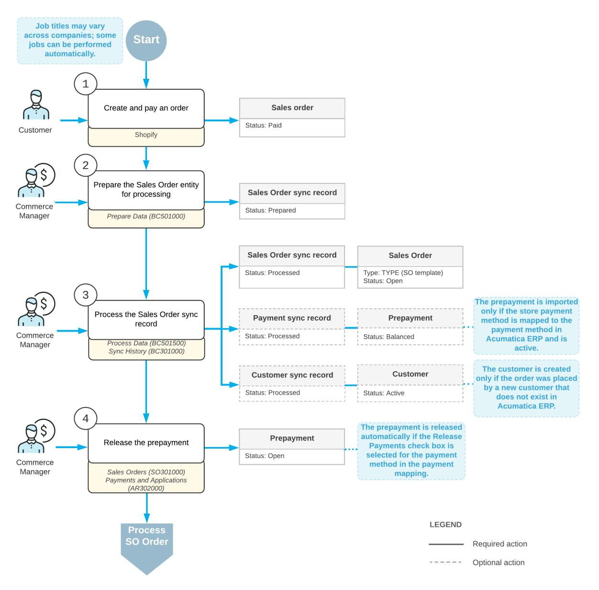

## **Synchronization of Payments**

You can import payments independently of orders by preparing and processing the *Payment* entity.

During the synchronization of the *Payment* entity, the system creates a document of the *Prepayment* type on the *[Payments and Applications](https://help-2025r1.acumatica.com/Help?ScreenId=ShowWiki&pageid=ae844bf4-1aef-42cd-9e2f-49b3ee1bc8d7)* (AR302000) form and applies it to the sales order if the following conditions are met:

- The store payment method with which the order was paid is mapped to an Acumatica ERP payment method and the mapping is active on the *[Shopify Stores](#page-492-1)* (BC201010) form.
- The sales order has the *Open* status and has an unbilled balance, or the sales order has the *Canceled* status.

If the mapping of the store payment method is inactive or has not been configured, the system creates a synchronization record for the payment on the *[Sync History](#page-539-1)* (BC301000) form and assigns it the *Filtered* status. In this case, the prepayment document is not created on the *[Payments and Applications](https://help-2025r1.acumatica.com/Help?ScreenId=ShowWiki&pageid=ae844bf4-1aef-42cd-9e2f-49b3ee1bc8d7)* form.

If the sales order has been fully invoiced, the system cannot apply the prepayment to the sales order. In this case, the prepayment is applied to the invoice or invoices created for the sales order.

If the sales order has been partially invoiced, the prepayment is applied to the sales order only in the amount equal to the unbilled amount of the sales order. You need to manually apply the remaining amount to the invoice or invoices.

#### **Synchronization of Sales Orders in the Default Store Currency**

Your Shopify store can support multiple currencies so that customers can pay their orders not only in the default store currency. In this case, if you do not need multicurrency accounting in Acumatica ERP, you can import orders and the related payments and refunds from Shopify using only the default store currency.

To make the system import documents from the Shopify store in only the default store currency, you select the **Import in External Default Currency** check box on the **Orders** tab of the *[Shopify Stores](#page-492-1)* (BC201010) form. You also configure mappings of store payment methods with Acumatica ERP payment methods using the default store currency on the **Payments** tab.

With these settings specified, the system imports orders from the Shopify store in the default store currency even if they were paid in another currency. The system also imports all the documents related to these orders as payments and refunds in the default store currency.

The following limitations apply to the import of documents in the default store currency:

- If a Shopify order has already been imported to Acumatica ERP in a currency that is different than the default store currency, and then the **Import in External Default Currency** check box is selected on the **Orders** tab of the *[Shopify Stores](#page-492-1)* form, all the documents related to that order will be imported in the same order currency.
- If a credit card payment is imported to Acumatica ERP in a currency other than the one in which the customer paid in the Shopify store, the payment can be captured, voided, or refunded only in the Shopify store.

#### **Import of the Shipping Price**

When the shipping price of an order is updated in a Shopify store, the freight price of the corresponding sales order that has been already imported to Acumatica ERP is updated only if all of the following conditions are met:

- The imported sales order has the *Open*, *Back Order*, or *Shipping* status on the *[Sales Orders](https://help-2025r1.acumatica.com/Help?ScreenId=ShowWiki&pageid=19e4021c-1b84-49fd-be12-0320c5f1c7e5)* (SO301000) form.
- If the Shopify order has not been paid yet, the shipping price has been either increased or decreased.
- If the Shopify order has been already paid, the shipping price has been increased.

#### **Use of the Guest Customer Account**

If you want to allow placing orders in your store without providing the customer's phone number or email address and want to import such orders to Acumatica ERP, you need to fill in the **Generic Guest Customer** box on the **CustomerSettings** tab of the *[Shopify Stores](#page-492-1)* (BC201010) form. This customer account appears on imported sales orders that have been placed in the Shopify store without customer details.

The customer record selected in the **Generic Guest Customer** box is not exported to the Shopify store during the synchronization of customers.

You can also configure the system to change a guest customer account aer a particular number of sales orders have been created for this account. You do so by selecting the **Use Multiple Guest Accounts** check box. When the maximum allowed number of sales orders is exceeded, the system creates a new customer and inserts its identifier in the **Generic Guest Customer** box. The settings of the new customer account are copied from the previous generic guest customer account, and its identifier is generated based on the numbering sequence specified in the **Customer NumberingSequence** box.

By default, the allowed number of sales orders per guest customer account is limited to 10,000. You can override this number by adding the MaxOrdersPerGuestAccount key to the <appSettings> section of the web.config file. For example, to change the guest customer account aer every 500 sales orders, add the following key:

<add key="MaxOrdersPerGuestAccount" value="500"/>

For more information about creating a customer, see *[Customers: General Information](https://help-2025r1.acumatica.com/Help?ScreenId=ShowWiki&pageid=f38972e8-a206-4279-8681-b9e2743759c0)*.

# **Order Synchronization: Implementation Checklist**

The following sections provide details you can use to ensure that the system is configured properly for importing sales orders, and to understand (and change, if needed) the settings that affect the processing workflow.

#### **Implementation Checklist**

We recommend that before you initially import orders from the Shopify store, you make sure the needed features have been enabled, settings have been specified, and entities have been created, as summarized in the following checklist.

| Form                               | Criteria to Check                                                                                                                           |
|------------------------------------|---------------------------------------------------------------------------------------------------------------------------------------------|
| Enable/Disable Features (CS100000) | The following features have been enabled:                                                                                                   |
|                                    | • Retail Commerce                                                                                                                        |
|                                    | • Shopify Connector                                                                                                                      |
| Shopify Stores (BC201010)          | The necessary settings have been specified, as demonstrated in the ex ample of Initial Configuration: To Configure the Store Connection. |

*Table: Checklist for Order Import if Payments Do Not Require Processing*

#### *Table: Checklist for Order Import if Payments Require Processing*

| Form                               | Criteria to Check                                                                                                                                                                                                                                                                                                                                                                        |
|------------------------------------|------------------------------------------------------------------------------------------------------------------------------------------------------------------------------------------------------------------------------------------------------------------------------------------------------------------------------------------------------------------------------------------|
| Enable/Disable Features (CS100000) | The following features have been enabled: • Retail Commerce • Shopify Connector                                                                                                                                                                                                                                                                                              |
| Processing Centers (CA205000)      | The processing center for processing payments has been created, as demonstrated in the example of Order Synchronization: To Configure and Import Shopify Payments.                                                                                                                                                                                                                 |
| Shopify Stores (BC201010)          | • The necessary settings have been specified, as demonstrated in the example of Initial Configuration: To Configure the Store Connection. • On the Payments tab, the payment mapping has been defined for store payment methods representing payment gateways, as demon strated in the example of Order Synchronization: To Configure and Im port Shopify Payments. |

#### **Other Settings That Affect the Workflow**

You can affect the workflow of the import of orders and payments by specifying additional settings. To automatically release payments related to the imported order, select the **Release Payments and Refunds** check box for the store payment method on the **Payments** tab of the *[Shopify Stores](#page-492-1)* (BC201010) form.

## **Validation of Configuration**

To make sure that all configuration has been performed correctly, we recommend that in your system, you perform instructions similar to those described in *Order [Synchronization:](#page-343-1) To Configure and Import Shopify Payments*.

# **Order Synchronization: Card Payments**

In Acumatica ERP Retail Edition, users can import and, if necessary, process debit and credit card payments from external ecommerce systems through integration with payment gateways. The ability to use card-processing features, such as authorization, capture, voiding, and refunding card transactions, is available if the *Integrated Card Processing* feature is enabled on the *[Enable/Disable Features](https://help-2025r1.acumatica.com/Help?ScreenId=ShowWiki&pageid=c1555e43-1bc5-4f6f-ba9d-b323f94d8a6b)* (CS100000) form. This topic explains how to configure payment providers for processing of payments made in the Shopify store aer they are imported to Acumatica ERP.

### **Configuration of Shopify Payments for Integrated Card Processing**

Shopify Payments is a payment provider available to Shopify customers in certain countries and regions. It supports all major payment methods, does not require additional registration, and can be used as soon as the store is created. For information about availability of Shopify Payments, see *[the Shopify documentation](https://help.shopify.com/en/manual/payments/shopify-payments/shopify-payments-requirements)*.

Before payments based on Shopify Payments can be imported from the Shopify store to Acumatica ERP, you need to configure payment processing via Shopify Payments as follows:

1. Set up Shopify Payments in your Shopify store.

You activate Shopify Payments on the **Payments** settings page of your Shopify store. When you set up Shopify Payments, you might be required to provide information about your business and bank account details to receive payouts. For information about setting up Shopify Payments in the Shopify store, see *[the](https://help.shopify.com/en/manual/payments/shopify-payments) [Shopify documentation](https://help.shopify.com/en/manual/payments/shopify-payments)*.

2. Activate integrated card processing.

You activate integrated card processing (that is, the ability to use additional card processing steps for AR payments) by selecting the **Enable Integrated CC Processing** check box on the *[Accounts Receivable](https://help-2025r1.acumatica.com/Help?ScreenId=ShowWiki&pageid=f7b52067-5299-45e8-b601-485cd709f58b) [Preferences](https://help-2025r1.acumatica.com/Help?ScreenId=ShowWiki&pageid=f7b52067-5299-45e8-b601-485cd709f58b)* (AR101000) form.

- 3. Configure a processing center for Shopify Payments in Acumatica ERP. You set up the processing center on the *[Processing Centers](https://help-2025r1.acumatica.com/Help?ScreenId=ShowWiki&pageid=e27d8932-6b69-4d7b-9b8e-198f13cc17e3)* (CA205000) form. During the configuration, you select the *Shopify Payments API plug-in* as the **Payment Plug-In (Type)** and on the **Plug-In Parameters** tab, you specify the *STORENAME* parameter, which is the name of the Shopify store as it is defined on the *[Shopify Stores](#page-492-1)* (BC201010) form.
- 4. Configure a card-based payment method in Acumatica ERP.

Aer you have configured the processing center, on the *[Payment Methods](https://help-2025r1.acumatica.com/Help?ScreenId=ShowWiki&pageid=509285d1-cfae-4e87-95c3-a968451952e6)* (CA204000) form, you need to set up a payment method that will be associated with the processing center. For information about setting up payment methods in Acumatica ERP, see *[Cash Management: Payment Methods](https://help-2025r1.acumatica.com/Help?ScreenId=ShowWiki&pageid=69a90616-7eba-4c89-8c96-0ba2e29071c8)*.

5. Map the card-based payment method with the Shopify Payments store payment method.

You map payment methods between Acumatica ERP and the Shopify store on the *[Shopify Stores](#page-492-1)* (BC201010) form. When a payment is imported from the Shopify store to Acumatica ERP, a prepayment is created on the *[Payments and Applications](https://help-2025r1.acumatica.com/Help?ScreenId=ShowWiki&pageid=ae844bf4-1aef-42cd-9e2f-49b3ee1bc8d7)* (AR302000) form based on the payment method from Acumatica ERP that was mapped to the payment method used for payment in the Shopify store.

For step-by-step instructions on configuring and importing payments based on the Shopify Payments payment method, see *Order [Synchronization:](#page-343-1) To Configure and Import Shopify Payments*.

#### **Mapping of Card-Based Payment Methods**

During the configuration of a connection to the Shopify store, one of the steps you perform is the mapping of payment methods configured in Acumatica ERP with payment methods configured in the Shopify store. You define payment method mapping in the table on the **Payments** tab of the *[Shopify Stores](#page-492-1)* (BC201010) form.

You specify the following:

- **Active**: A check box that you select for a payment method to indicate that payments made in the ecommerce system that are based on should be imported to Acumatica ERP.
- **ERP Payment Method**: The identifier of the payment method in Acumatica ERP that was configured to use the same processing center as was used for setting up the payment provider in the online store.
- **Cash Account**: A cash account that was specified for the payment method on the **Allowed Cash Accounts** tab on the *[Payment Methods](https://help-2025r1.acumatica.com/Help?ScreenId=ShowWiki&pageid=509285d1-cfae-4e87-95c3-a968451952e6)* (CA204000) form.
- **Proc. Center ID**: The identifier of the processing center configured for the payment method on the **Processing Centers** tab of the *[Processing Centers](https://help-2025r1.acumatica.com/Help?ScreenId=ShowWiki&pageid=e27d8932-6b69-4d7b-9b8e-198f13cc17e3)* (CA205000) form.
- **Release Payments and Refunds**: A check box that you select to indicate that the payment should be immediately released aer it is imported to Acumatica ERP. If this check box is selected for a card-based payment method associated with a credit card processing center in Acumatica ERP (that is, for the payment method for which a processing center is selected in the **Proc. Center ID** column), only payments that have been captured in the store will be automatically released on import. Payments that have been authorized but not captured in the store need to be processed aer import and then released manually or by using the *[Release AR Documents](https://help-2025r1.acumatica.com/Help?ScreenId=ShowWiki&pageid=78ad2d21-b6a8-46d0-8f2d-98dd0a23f75e)* (AR501000) form.
- **Process Refunds**: A check box that indicates (if selected) that refunds made to the payment method should be imported to Acumatica ERP. This check box is selected and unavailable for card payment methods for which a processing center is specified, which indicates that all refunds made to such payment methods must be imported to Acumatica ERP.

#### **Additional Mapping for Shopify Payments Fees**

You can import the breakdown of fees charged on each payment made with Shopify Payments in a Shopify store.

Shopify Payments fees can be imported only for payments that have been captured in the Shopify store. Also, this payment method must be mapped with a card-based payment method in Acumatica ERP that has been configured with a processing center based on the Shopify Payments plug-in.

To import the Shopify Payments fees to Acumatica ERP, you need to perform the following additional configuration steps:

1. Create the entry types on the *Entry [Types](https://help-2025r1.acumatica.com/Help?ScreenId=ShowWiki&pageid=0253dfdd-b06b-4274-b44e-9c7a584b15f2)* (CA203000) form. These entry types will be used to reflect the breakdown of Shopify Payments fees imported from the Shopify store.

An entry type can be used in the fee mapping if it meets the following criteria:

- The entry type has the *Disbursement* type.
- A default offset account has been specified for the entry type.
- The **Deduct from Payment** check box is selected for the entry type.
- On the *[Cash Accounts](https://help-2025r1.acumatica.com/Help?ScreenId=ShowWiki&pageid=10f71454-88f9-4d6c-8d09-32856d8c6741)* (CA202000) form, the entry type has been added to the cash account specified in the mapping for the Shopify Payments payment method.
- 2. Map Shopify Payments fees to the entry types in the**Shopify Fees** table on the *[Shopify Stores](#page-492-1)* form.

Initially, the**Shopify Fees** table is empty. During the first import of a payment containing Shopify Payments fees, the synchronization fails, and the **FeeType** column is populated with the Shopify Payments fees.

You need to map each Shopify Payments fee type with an entry type by specifying the entry type of the *Disbursement* type in the **ERP EntryType** column, and then sync the payment again.

#### **Import of Card Payments with Integrated Card Processing**

When the pre-authorized payment is imported from Shopify to Acumatica ERP (as part of the synchronization of the *Sales Order* entity or the *Payment* entity), on the *[Payments and Applications](https://help-2025r1.acumatica.com/Help?ScreenId=ShowWiki&pageid=ae844bf4-1aef-42cd-9e2f-49b3ee1bc8d7)* (AR302000) form, the system creates a document of the *Prepayment* type with the *Pending Processing* status. In the Summary area of the created document, the system inserts the following information:

- **Payment Method**: The payment method that has been mapped to the store payment method in the table on the **Payments** tab of the *[Shopify Stores](#page-492-1)* (BC201010) form
- **Cash Account**: The cash account selected for the mapped payment method
- **Payment Ref.**: The number of the related credit card transaction in the processing center
- **ProcessingStatus**: The processing status of the credit card transaction. Depending on the last successful operation with the transaction, the processing status can be one of the following:
  - *Pre-Authorized*: The payment has been authorized but the funds have not been captured. The last successful operation was *Authorize Only*.
  - *Captured*: The funds have been captured. The last successful operation with the credit card transaction was either *Authorize and Capture* or *Capture Authorized*.
  - *Pre-Auth./Capture Pending Validation*: The last successful operation with the credit card transaction is unknown. To get the correct processing status of the credit card transaction, you can use the**Validate Card Payment** action on the *[Payments and Applications](https://help-2025r1.acumatica.com/Help?ScreenId=ShowWiki&pageid=ae844bf4-1aef-42cd-9e2f-49b3ee1bc8d7)* form.

On the **Card Processing** tab, the system creates a row for the last successful operation with the credit card transaction. In the **PC Response Reason** box, *Imported External Transaction* indicates that the information about the credit card transaction operation has been imported from the external ecommerce system. The transaction operation can have one of the following types:

- *Authorize Only*: The payment was authorized when the order was placed but has not yet been captured.
- *Authorize and Capture*: The payment was captured when the order was placed.
- *Capture Authorized*: The payment was authorized when the order was placed, and then the funds were captured in the admin area of the store.
- *Unknown*: The status of the operation with the credit card transaction is unknown.

If the **Import in External Default Currency** check box is selected for the store on the **Orders** tab of the *[Shopify Stores](#page-492-1)* form, and the customer paid an order in the Shopify store in a currency other than the default store currency, the system imports the credit card payment to Acumatica ERP in the default store currency. This payment can be captured, voided, or refunded only in the Shopify store.

The following diagram illustrates the workflow of importing a sales order to Acumatica ERP from a Shopify store where it was placed and paid by a card based on a payment method for which integrated card processing has been configured in Acumatica ERP.

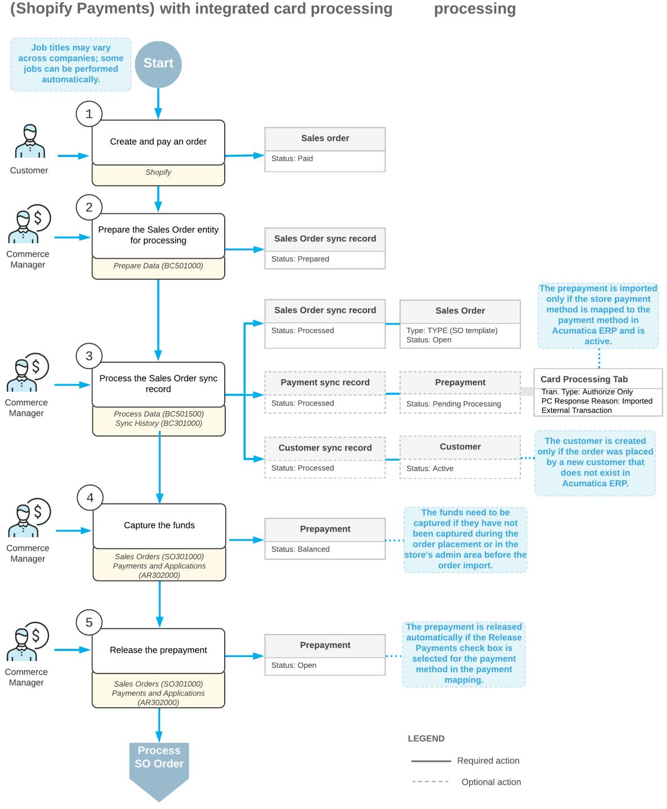

### **Deferred Processing of Imported Credit Card Payments**

Credit card transactions created in Acumatica ERP during the import of payments based on credit card payment methods require validation if the last operation on the credit card transaction has the *Unknown* status.

External credit card transactions that meet this condition are displayed on the **Deferred Processing Required** tab of the *Validate Card [Payments](https://help-2025r1.acumatica.com/Help?ScreenId=ShowWiki&pageid=5998b9d7-04c2-49c1-acf3-b8807d77ff37)* (AR513000) form.

When you start the validation process, the system requests the status of the credit card transaction, and updates the processing status of the transaction and the status of the prepayment, if necessary. If the updated processing status of the transaction is *Captured*, the status of the prepayment changes to *Balanced*. If on the **GeneralSettings** tab of the *[Accounts Receivable Preferences](https://help-2025r1.acumatica.com/Help?ScreenId=ShowWiki&pageid=f7b52067-5299-45e8-b601-485cd709f58b)* (AR101000) form, the **Enable Integrated CC Processing** check box is selected, the system releases the prepayment.

Customizations may support forced validation of all imported credit card transactions. In this case, all credit card transactions imported from external systems will be displayed on the **Deferred Processing Required** tab of the *Validate Card [Payments](https://help-2025r1.acumatica.com/Help?ScreenId=ShowWiki&pageid=5998b9d7-04c2-49c1-acf3-b8807d77ff37)* form and will need to be validated.

A sales order can be fulfilled only if the credit card payment imported for it from an external ecommerce system has been validated. To streamline shipping of orders, you can set up an automation schedule on the *Validate Card [Payments](https://help-2025r1.acumatica.com/Help?ScreenId=ShowWiki&pageid=5998b9d7-04c2-49c1-acf3-b8807d77ff37)* form to regularly process imported card transactions that require validation. For information about automation schedules, see *[Automated](https://help-2025r1.acumatica.com/Help?ScreenId=ShowWiki&pageid=8a6c65f2-2379-48e1-b249-fb70d8122c4e) [Processing: General Information](https://help-2025r1.acumatica.com/Help?ScreenId=ShowWiki&pageid=8a6c65f2-2379-48e1-b249-fb70d8122c4e)*.

# **Order Synchronization: To Configure and Import Shopify Payments**

The following activity will walk you through the configuration of the system so that you can import payments based on the Shopify Payments payment method from the Shopify store to Acumatica ERP.

The following activity is based on the *U100* dataset.

#### **Story**

Suppose that the SweetLife Fruits & Jams company wants to accept card payments in the Shopify store. The company sells its products in the United States, where Shopify Payments is supported.

Further suppose that the company management wants to import the Shopify Payments fees to Acumatica ERP for tracking purposes.

Acting as an implementation consultant helping SweetLife to set up the synchronization of data between Acumatica ERP and the Shopify store, you need to configure Shopify Payments as a card payment provider in the Shopify store, configure the card payment processing in Acumatica ERP, and then configure the import of card payments from the Shopify store to Acumatica ERP.

## **Configuration Overview**

In the *U100* dataset, the following tasks have been performed to support this activity:

- On the *[Enable/Disable Features](https://help-2025r1.acumatica.com/Help?ScreenId=ShowWiki&pageid=c1555e43-1bc5-4f6f-ba9d-b323f94d8a6b)* (CS100000) form, the *Integrated Card Processing* feature has been enabled.
- On the *[Cash Accounts](https://help-2025r1.acumatica.com/Help?ScreenId=ShowWiki&pageid=10f71454-88f9-4d6c-8d09-32856d8c6741)* (CA202000) form, the *10250ST* cash account has been created.
- On the *Entry [Types](https://help-2025r1.acumatica.com/Help?ScreenId=ShowWiki&pageid=0253dfdd-b06b-4274-b44e-9c7a584b15f2)* (CA203000) form, the *SHOPIFYFEE* entry type of the *Disbursement* type has been defined.

#### **Process Overview**

In this activity, you will do the following:

- 1. On the *[Accounts Receivable Preferences](https://help-2025r1.acumatica.com/Help?ScreenId=ShowWiki&pageid=f7b52067-5299-45e8-b601-485cd709f58b)* (AR101000) form, activate integrated card processing.
- 2. On the *[Processing Centers](https://help-2025r1.acumatica.com/Help?ScreenId=ShowWiki&pageid=e27d8932-6b69-4d7b-9b8e-198f13cc17e3)* (CA205000) form, define a processing center.
- 3. On the *[Processing Centers](https://help-2025r1.acumatica.com/Help?ScreenId=ShowWiki&pageid=e27d8932-6b69-4d7b-9b8e-198f13cc17e3)* form, connect the processing center to the Shopify store.

- 4. On the *[Payment Methods](https://help-2025r1.acumatica.com/Help?ScreenId=ShowWiki&pageid=509285d1-cfae-4e87-95c3-a968451952e6)* (CA204000) form, define a payment method that will represent payments based on the Shopify Payments store payment method.
- 5. In the admin area of the Shopify store, activate the *Shopify Stores* payment option.
- 6. On the *[Shopify Stores](#page-492-1)* (BC201010) form, map the *Shopify Payments* store payment method with the payment method defined in Acumatica ERP.
- 7. On the *[Shopify Stores](#page-492-1)* (BC201010) form, map the Shopify fees to the entry types defined in Acumatica ERP.
- 8. On the storefront of the Shopify store, create a test sales order paid by card.
- 9. In the admin area of the Shopify store, review the created test sales order.
- 10.On the *[Prepare Data](#page-529-1)* (BC501000) form, prepare the sales order for synchronization; on the *[Process Data](#page-533-1)* (BC501500) form, process the sales order data prepared for synchronization.
- 11.On the *[Sales Orders](https://help-2025r1.acumatica.com/Help?ScreenId=ShowWiki&pageid=19e4021c-1b84-49fd-be12-0320c5f1c7e5)* (SO301000) form, review the imported sales order.

#### **System Preparation**

Before you complete the instructions in this activity, do the following:

- 1. Make sure that the following prerequisites have been met:
  - The Shopify store has been created and configured, as described in *Initial [Configuration:](#page-241-1) To Set Up a [Shopify Store](#page-241-1)*.
  - The connection to the Shopify store has been established and the initial configuration has been performed, as described in *Initial [Configuration:](#page-250-1) To Configure the Store Connection*.
- 2. Launch the Acumatica ERP website with the *U100* dataset preloaded, and sign in with the following credentials:
  - **Username**: *gibbs*
  - **Password**: *123*
- 3. Sign in to the admin area of the Shopify store as the store administrator in the same browser.

## **Step 1: Activating Integrated Card Processing**

To activate integrated card processing, do the following:

- 1. On the*[Accounts Receivable Preferences](https://help-2025r1.acumatica.com/Help?ScreenId=ShowWiki&pageid=f7b52067-5299-45e8-b601-485cd709f58b)* (AR101000) form, in the **Data ProcessingSettings** section, select the *Enable Integrated CC Processing* check box.
- 2. On the form toolbar, click**Save**.

## **Step 2: Creating the Processing Center**

To create the processing center that will be connected to the Shopify Payments payment gateway, do the following:

- 1. On the *[Processing Centers](https://help-2025r1.acumatica.com/Help?ScreenId=ShowWiki&pageid=e27d8932-6b69-4d7b-9b8e-198f13cc17e3)* (CA205000) form, create a new record.
- 2. In the Summary area, specify the following settings:
  - **Proc. Center ID**: SHOPIFYPAY

This processing center represents the connection to the Shopify store for the credit card processing transactions from the online store.

- **Name**: Shopify Payments
- **Cash Account**: *10250ST - Company Merchant Account*

This cash account determines the currency in which the system will make the authorization and capture credit card transactions.

- **Active**: Selected
- **Payment Plug-In (Type)**: *Shopify Payments API plug-in*

The selected payment plug-in is a card processing plug-in supplied with Acumatica ERP that interacts with the Shopify store.

- 3. On the **Plug-In Parameters** tab, in the table row of the *STORENAME* parameter, select *SweetStore - SP* in the **Value** column.
- 4. On the form toolbar, click**Save**.
- 5. On the form toolbar, click**Test Credentials** to test the connection settings.

If the test connection is successful, the system will display the following confirmation message in the **Result** dialog box, which opens: *The credentials were accepted by the processing center.*

#### **Step 3: Configuring a Payment Method That Represents Shopify Payments**

To create the *SHOPIFYPAY* payment method for all payments by credit card, do the following:

- 1. On the *[Payment Methods](https://help-2025r1.acumatica.com/Help?ScreenId=ShowWiki&pageid=509285d1-cfae-4e87-95c3-a968451952e6)* (CA204000) form, create a new record.
- 2. In the Summary area, specify the following settings:
  - **Payment Method ID**: SHOPIFYPAY
  - **Active**: Selected
  - **Means of Payment**: *Credit Card*

When you set **Means of Payment** to *Credit Card*, on the **Settings for Use in AR** tab, the **Integrated Processing** check box becomes selected, and the **Processing Centers** tab appears.

- **Description**: Shopify Payments
- **Use in AP**: Cleared
- **Use in AR**: Selected (default state)
- **Require Remittance Information for Cash Account**: Cleared
- 3. On the **Allowed Cash Accounts** tab, do the following:
  - a. On the table toolbar, click **Add Row**.
  - b. In the new row, select the *10250ST* cash account in the **Cash Account** column.
  - c. Make sure the **Use in AR** check box is selected.
- 4. On the **Processing Centers** tab, add a row, and specify the following settings in the row:
  - **Proc. Center ID**: *SHOPIFYPAY*
  - **Active**: Selected
  - **Default**: Selected
- 5. On the form toolbar, click**Save** to save your changes.

#### **Step 4: Activating Shopify Payments in the Shopify Store**

To activate the *Shopify Payments* payment provider in the Shopify store, do the following:

- 1. In the lower le of the admin area, click**Settings**.
- 2. In the le menu of the page that opens, click **Payments**. The **Payments** page opens.
- 3. In the **Shopify Payments** section, click **Complete account setup**.
- 4. On the **Complete account setup** page, which opens, click**Submit details**.
- 5. On the **Set up Shopify Payments** page, which opens, do the following:

- a. In **Step 1 of 4**, in the **I'm running my store as** section, select the **An individual** option button.
- b. In the lower right, click **Next**.
- c. In **Step 2 of 4**, in the **Account representative** section, specify the following settings:
  - **First name**: Your first mane
  - **Last name**: Your last mane
  - **Date of birth Name**: Your date of birth
  - **SocialSecurity number (SSN)**: Your SIN, for example, 345555555
  - **Email**: Your email
  - **Phone number**: 516 555 0150
- d. In the **Residential address** section, specify the following settings:
  - **Country/region**: *United States* (selected by default)
  - **Address**: 2330 Hoffman Avenue
  - **City**: Elmont
  - **State**: *New York*
  - **ZIP code**: 11003
- e. In the lower right, click **Next**.
- f. In **Step 3 of 4**, in the **Industry type** section, specify the following settings:
  - **Category**: *Food and drink*
  - **Sub-category**: *Candy, nuts, and confectionaries*
  - **Description of products or services**: Fresh fruit, berries, and jams
- g. In the lower right, click **Next**.
- h. In **Step 4 of 4**, in the section with the company details, click **Confirm**.

The section with the company details rolls up and the next section with the account representative details unrolls.

j. In the section with the account representative details, click **Confirm**.

The section with the account representative details rolls up and the **Review terms** section unrolls.

- k. In the **Review terms** section, click **Confirm**.
- l. In the lower right, click**Submit for verification**.

The **Complete account setup** page opens with a notification saying that your information has been submitted for verification.

#### **Step 5: Configuring Test Mode for the Payment Provider**

To configure test mode for the *Shopify Payments* payment provider in the Shopify store, do the following:

- 1. While you are signed in to the admin area of your Shopify store and reviewing the store settings, in the le menu, click **Payments**.
- 2. On the **Payments** page, which opens, in the**Shopify Payments** section, click **Manage**.
- 3. On the **Shopify Payments** page, which opens, in the**Test mode** section, switch on the only toggle to enable the test mode for the payment provider.

When the test mode is switched on, at the top of the page, the *Test mode* status appears on the right of the page name.

4. At the top of the page, click Back.

The **Payments** page opens. In the**Shopify Payments** section, notice that the *Test mode* status has appeared right to the section name.

- 5. In the **Payment capture method** section, select the **Manually** option button.
- 6. Clear**Send a warning 1 days before an authorization expires to <your email>** check box.
- 7. At the top of the page, in the **Unsaved changes** bar, click**Save**.

#### **Step 6: Creating the Mapping for the Shopify Payments Store Payment Method**

To map the Shopify Payments store payment method to the payment method defined for it in Acumatica ERP, do the following:

- 1. On the *[Shopify Stores](#page-492-1)* (BC201010) form, select the *SweetStore - SP* store.
- 2. In the table on the **Payments** tab, in the existing row of the *SHOPIFY\_PAYMENTS* store payment method, specify the following settings:
  - **Active**: Selected
  - **Store Currency**: *USD* (inserted by default)
  - **ERP Payment Method**: *SHOPIFYPAY*
  - **Cash Account**: *10250ST*
  - **Proc. Center ID**: *SHOPIFYPAY*
- 3. On the form toolbar, click**Save** to save your changes.

#### **Step 6: Mapping the Shopify Fees**

To map Shopify fees to entry types, while you are still viewing the *[Shopify Stores](#page-492-1)* (BC201010) form, do the following:

- 1. On the **Payments** tab, in the table, click the row with the *SHOPIFY\_PAYMENTS* store payment method.
- 2. On the toolbar of the**Shopify Fees** table, click **Add Row**.
- 3. In the added row, specify the following settings:
  - **FeeType**: processing\_fee
  - **ERP EntryType**: *SHOPIFYFEE*
- 4. On the form toolbar, click**Save** to save your changes.

If at least one Shopify fee has not been mapped to an entry type, the synchronization of payments made with the Shopify Payments payment method will fail, and the system will automatically add the unmapped fees to the**Shopify Fees** table. You need to manually map each fee type to an ERP entry type, and then resynchronize the failed payments.

#### **Step 7: Creating an Order Through the Storefront**

To purchase a jar of jam, so that you can later import the order and review the credit card payment, in the Shopify store, do the following:

- 1. In the le menu of the admin area, under**Sales Channels**, hover over the **OnlineStore** sales channel, and click the **View your online store** icon, which appears right of the channel, to open the storefront.
- 2. On the storefront, start typing plum in the search bar, and in the list of search results, click *Plum jam 96 oz*.
- 3. On the page for the *Plum jam 96 oz* product, change the quantity to *3* and click **Add to cart**. In the pop-up, click **Check out**.

The checkout page opens.

- 4. In the **Contact** section, in the **Email or mobile phone number** box, specify melody@example.com.
- 5. In the **Delivery** section, fill in the shipping address boxes as follows:
  - **Country/region**: *United States*
  - **First name**: Melody
  - **Last name**: Keys
  - **Address**: 3402 Angus Road
  - **City**: New York
  - **State**: *New York*
  - **ZIP code**: 10003
- 6. In the **Shipping method** section, make sure that *Economy* is selected.
- 7. In the **Payment** section, specify the following card settings under **Credit card**:
  - **Card number**: 4242 4242 4242 4242
  - **Expiration date**: 12/25
  - **Security code**: 123
  - **Name on card**: Melody Keys (inserted by default)
- 8. Select the **Use shipping address as billing address** check box.
- 9. At the bottom of the page, click **Pay now** to place and pay your order. The order confirmation page opens.

# **Step 8: Reviewing the Sales Order in the Admin Area**

To review the sales order that you placed in the previous step, in the admin area of the Shopify store, do the following:

- 1. In the le menu, click **Orders**.
- 2. On the **Orders** page, which opens, click the row of the order for *Melody Keys*.
- 3. On the order details page, which opens, review the order details.

At the top of the page, notice the order number which is represented by the prefix *#* followed by four digits. In the URL of the order page, aer */orders/*, note the order identifier. This is the identifier that will be shown in Acumatica ERP, in the **External ID** column on the *[Process Data](#page-533-1)* (BC501500) form and on the *[Sync History](#page-539-1)* (BC301000) form.

You can change the format of the order number on the **General** settings page in the Shopify admin area.

Notice that the payment status is *Authorized*.

- 4. In the payment section, click **Capture payment**.
- 5. In the **Capture payment** dialog box, which opens, click **Accept**.

Notice that the payment status of the order has changed to *Paid*.

6. Under **Timeline**, expand the first listed link, which indicates that the order total amount has been captured, and then expand the *Information from the gateway* link.

You may need to refresh the page to make the link appear in the timeline.

Notice the**Transaction fee total amount**, which is the Shopify Payments fee associated with the payment transaction.

## **Step 9: Importing the Sales Order**

To prepare the sales order data for synchronization and then process it, in Acumatica ERP, do the following:

- 1. On the *[Prepare Data](#page-529-1)* (BC501000) form, specify the following settings in the Summary area:
  - **Store**: *SweetStore - SP*
  - **Prepare Mode**: *Incremental*
- 2. In the table, select the check box in the unlabeled column in the row of the *Sales Order* entity, and on the form toolbar, click **Prepare**.
- 3. In the **Processing** dialog box, which opens, click **Close** to close the dialog box.
- 4. In the row of the *Sales Order* entity, click the link in the **Ready to Process** column.
- 5. On the *[Process Data](#page-533-1)* (BC501500) form, which opens with the *SweetStore - SP* store and the *Sales Order* entity selected, select the unlabeled check box in the only row, and click **Process** on the form toolbar.
- 6. In the **Processing** dialog box, which opens, click **Close** to close the dialog box.

#### **Step 10: Reviewing the Imported Sales Order**

To review the settings of the imported sales order, do the following:

- 1. On the *[Sync History](#page-539-1)* (BC301000) form, specify the following settings in the Summary area:
  - **Store**: *SweetStore - SP*
  - **Entity**: *Sales Order*
- 2. On the **Processed** tab, in the row of the sales order that you have just imported, click the link in the **ERP ID** column.
- 3. On the *[Sales Orders](https://help-2025r1.acumatica.com/Help?ScreenId=ShowWiki&pageid=19e4021c-1b84-49fd-be12-0320c5f1c7e5)* (SO301000) form, which opens for the imported order in a pop-up window, review the settings of the order (see the following screenshot).

| <b>Sales Orders</b> EO 000076 - Melody Keys             |                         |                                          | <b>TH NOTES</b>      | <b>ACTIVITIES</b> <b>FILES</b>   | <b>CUSTOMIZATION</b>                                   | TOOLS $\sim$         |
|------------------------------------------------------------|-------------------------|------------------------------------------|----------------------|-------------------------------------|--------------------------------------------------------|----------------------|
| 뭐 n Ħ 侕 ∽ $\check{ }$                       | к ⋋ ‹             | Ы                                        | <b>QUICK PROCESS</b> | <b>CREATE SHIPMENT</b>              | <b>HOLD</b> .                                       |                      |
| EO * Order Type: ρ                                   | * Customer:             | C000000003 - Melody Keys                 | Q                    | $\mathscr{O}$ Ordered Qty.:      | 3.00                                                   | ㅅ                    |
| Order Nbr.: α 000076                                 | * Location:             | MAIN - Melody Keys                       | Q                    | Detail Total: 0                  | 135.45                                                 |                      |
| Open Status:                                            | Contact:                | <b>Melody Keys</b>                       | α                    | Line Discounts: $\mathscr{O}$    | 0.00                                                   |                      |
| 4/10/2025 * Date:                                       | * Project:              | X - Non-Project Code.                    | Q                    | Document Dis 0                   | 0.00                                                   |                      |
| * Requested On: 4/10/2025                               | Description: Paid    | SweetStore - SP   Order: #1002   Status: |                      | <b>Freight Total:</b>               | 0.00                                                   |                      |
| Customer Ord #1002                                      |                         |                                          |                      | <b>Tax Total:</b>                   | 0.00                                                   |                      |
| External Refer 589664554210                             |                         |                                          |                      | Order Total:                        | 135.45                                                 |                      |
| <b>DETAILS</b> <b>FINANCIAL</b> <b>TAXES</b>         | <b>SHIPPING</b>         | <b>ADDRESSES</b>                         | <b>SHIPMENTS</b>     | <b>PAYMENTS</b> <b>RISKS</b>     | <b>RELATIONS</b>                                       | $\grave{ }$          |
| <b>ADD ITEMS</b> Ò $\times$ 0                     | <b>ADD MATRIX ITEMS</b> | ADD INVOICE                              |                      | <b>ADD BLANKET SO LINE</b>          | <b>LINE DETAILS</b> PO LINK                         | ≫                    |
| 0 D 圓 *Branch *Inventory Free ID Item | Warehouse               | Line <b>Description</b>               | *UOM Quantity     | Qty. On Open <b>Shipments</b> | <b>Manual</b> <b>Unit</b> Price Qty. Price | Ext. <b>Price</b> |
| 0 <b>RETAIL</b> PLUMJAM96 n ш                  | <b>RETAIL</b>           | Plum jam 96 oz                           | <b>PIECE</b> 3.00 | 0.00 3.00                        | ☑ 45.1500                                           | 135.45               |

In the Summary area, notice the following:

- The imported order has the *EO* type (shown in the **OrderType**), which is configured on the *[Shopify Stores](#page-492-1)* (BC201010) form to be assigned to all sales orders imported from the *SweetStore - SP* store.
- In the **Customer Order Nbr.** box, the order number assigned to the order in the Shopify store is displayed.

- In the **External Reference** box, the order identifier assigned to the order in the Shopify store and the name of the store are displayed.
- The **Date** of the sales order is the same as the date on which the order was created in the Shopify store.
- In the **Description** box, the store name, the order number and the payment status of the order are displayed.
- The **Customer** and **Location** boxes display the information about the customer and customer location that were created in Acumatica ERP during the import of the sales order; both were created during the order placement in the Shopify store. The customer and location IDs were generated based on the customer numbering sequence and location numbering sequence specified on the *[Shopify Stores](#page-492-1)* (BC201010) form
- 4. On the **Payments** tab, review the details of the created payment document of the *Prepayment* type.

The document includes the external credit card transaction associated with the purchase. The number of the transaction (which in Shopify is shown in the**Timeline** section) is displayed in the **Payment Ref.** column. The transaction's status, which is *Captured*, is displayed in the **Proc.Status** column, and the payment's status, which is *Balanced*, is displayed in the**Status** column.

#### **Step 11: Reviewing the Shopify Fees**

To review the Shopify fees in the imported payment, while you are still viewing the *[Sales Orders](https://help-2025r1.acumatica.com/Help?ScreenId=ShowWiki&pageid=19e4021c-1b84-49fd-be12-0320c5f1c7e5)* (SO301000) form, do the following:

1. On the **Payments** tab, click the link in the **Reference Nbr.** column.

The *[Payments and Applications](https://help-2025r1.acumatica.com/Help?ScreenId=ShowWiki&pageid=ae844bf4-1aef-42cd-9e2f-49b3ee1bc8d7)* (AR302000) form opens in a new pop-up window with the payment selected.

On the **Charges** tab, notice that the Shopify processing fee that you mapped in this activity has been imported with the payment, as the following screenshot shows. The *61900* account is the default offset account associated with the *SHOPIFYFEE* entry type.

| <b>Payments and Applications</b> Prepayment 000081 - Melody Keys                                     |                        |                                      | $\Gamma$ notes <b>ACTIVITIES</b> | <b>FILES</b>           | <b>CUSTOMIZATION</b> | TOOLS $\blacktriangleright$ |
|---------------------------------------------------------------------------------------------------------|------------------------|--------------------------------------|-------------------------------------|------------------------|----------------------|-----------------------------|
| 목 閂 血 ∩ ↶                                                                                   | K ∢ $\checkmark$ | Ы <b>RELEASE</b> ⋗             | $\cdots$                            |                        |                      |                             |
| Type: Prepayme v                                                                                     | Customer:              | C000000003 - Melody Keys             |                                     | Payment Amo 1       | 135.45 ©             | ㅅ                           |
| Reference Nbr.: Q 000081                                                                          | Location:              | MAIN - Melody Keys                   |                                     | Applied to Doc         | 0.00                 |                             |
| <b>Balanced</b> Status:                                                                              | Payment Meth           | SHOPIFYPAY - Shopify Payments        |                                     | Applied to Ord         | 135.45               |                             |
| * Application Date: 4/10/2025                                                                        | Proc. Center ID:       | <b>SHOPIFYPAY - Shopify Payments</b> |                                     | Available Bala         | 0.00                 |                             |
| * Application Pe Ω 04-2025                                                                        | Processing St          | Captured                             |                                     | Write-Off Amo          | 0.00                 |                             |
| Payment Ref.: 710512338555                                                                           | Cash Account:          | 10250ST - Company Merchant Account   |                                     | Finance Charg          | 5.58                 |                             |
|                                                                                                         |                        |                                      |                                     | Deducted Cha           | 5.58                 |                             |
| Description: SweetStore - SP   Order: #1002   Type: Authorization   Status: Success   Gateway: shopi |                        |                                      |                                     |                        |                      |                             |
|                                                                                                         |                        |                                      |                                     |                        |                      |                             |
| <b>DOCUMENTS TO APPLY</b>                                                                               | <b>SALES ORDERS</b>    | <b>APPLICATION HISTORY</b>           | <b>FINANCIAL</b>                    | <b>CARD PROCESSING</b> | <b>CHARGES</b>       | ≫                           |
| Õ $ \mathbf{x} $ $\pm$ $\left  \leftrightarrow \right $ $\times$                            |                        |                                      |                                     |                        |                      |                             |
| <b>B</b> * Entry Type <b>Description</b>                                                             |                        | * Offset <b>Account</b>           | Amount * Project                    |                        | * Project Task       | *Cost Code               |
| <b>SHOPIFYFEE</b> <b>Shopify Fees</b>                                                                |                        | 61900                                | 5.58                                | $\mathbf{x}$           |                      |                             |

#### *Figure: The imported Shopify fees*

- 2. On the form toolbar, click **Release** to release the payment.
- 3. Close the pop-up windows with the *[Payments and Applications](https://help-2025r1.acumatica.com/Help?ScreenId=ShowWiki&pageid=ae844bf4-1aef-42cd-9e2f-49b3ee1bc8d7)* and *[Sales Orders](https://help-2025r1.acumatica.com/Help?ScreenId=ShowWiki&pageid=19e4021c-1b84-49fd-be12-0320c5f1c7e5)* forms.
- 4. On the *[Account Details](https://help-2025r1.acumatica.com/Help?ScreenId=ShowWiki&pageid=517044d6-d4e9-406b-a40e-6139b9b53bd9)* (GL404000) form, in the Selection area, specify the following settings to review the charges for the Shopify processing:

- **Company/Branch**: *RETAIL*
- **Account**: *61900*

In the table, review the Shopify processing fee that debited the offset account associated with the *SHOPIFYFEE* entry type when you released the payment.

In a production setting, you would create and confirm the shipment and prepare the invoice, which is beyond the scope of this activity.

# **Order Synchronization: Import of Payment Terms**

Shopify provides the ability to select payment terms for orders that are due to be paid at a later date. In this topic, you will read about importing payment terms from Shopify to Acumatica ERP sales orders.

#### **Mapping of Payment Terms**

To make the system assign the proper credit terms to an order imported from a Shopify store, you perform the following steps to set up the mapping of the Shopify payment terms:

- 1. You define a set of credit terms on the *Credit [Terms](https://help-2025r1.acumatica.com/Help?ScreenId=ShowWiki&pageid=c39f7b9f-4ab2-4b67-b449-667802d58a57)* (CS206500) form that corresponds to each set of payment terms in Shopify.
- 2. You create a substitution list for payment terms on the *[Substitution Lists](https://help-2025r1.acumatica.com/Help?ScreenId=ShowWiki&pageid=e1b0125f-cb2f-4451-91af-c5eeaff3b5ac)* (SM206026) form. For each identifier of a set of payment terms from Shopify in the **OriginalValue** column, you specify the identifier of a set of credit terms defined on the *Credit [Terms](https://help-2025r1.acumatica.com/Help?ScreenId=ShowWiki&pageid=c39f7b9f-4ab2-4b67-b449-667802d58a57)* form in the**Substitution Value** column.
- 3. You select the substitution list in the **PaymentTerms** box of the **Orders** tab on the *[Shopify Stores](#page-492-1)* (BC201010) form.

The following table lists all the options that can be selected for an order in the **Payment terms** drop-down box in Shopify (in the le column) and their identifiers (in the right column), which should be mapped with Acumatica ERP credit terms.

| Payment Terms      | Identifier         |
|--------------------|--------------------|
| Due on receipt     | Due on receipt     |
| Due on fulfillment | Due on fulfillment |
| Within 7 days      | Net 7              |
| Within 15 days     | Net 15             |
| Within 30 days     | Net 30             |
| Within 45 days     | Net 45             |
| Within 60 days     | Net 60             |
| Within 90 days     | Net 90             |
| Fixed date         | Fixed              |

#### **Import of Payment Terms**

When sales orders with payment terms selected are imported from the Shopify store, the system searches for the credit terms to fill in the**Terms** box on the **Financial** tab of the *[Sales Orders](https://help-2025r1.acumatica.com/Help?ScreenId=ShowWiki&pageid=19e4021c-1b84-49fd-be12-0320c5f1c7e5)* (SO301000) form for the corresponding sales order as follows:

- 1. Checks whether the payment terms are mapped to any credit terms in the substitution list specified in the **PaymentTerms** box of the **Orders** tab on the *[Shopify Stores](#page-492-1)* (BC201010) form; if so, it inserts the terms and stops the search.
- 2. Checks whether the identifier of payment terms matches any identifier of credit terms on the *Credit [Terms](https://help-2025r1.acumatica.com/Help?ScreenId=ShowWiki&pageid=c39f7b9f-4ab2-4b67-b449-667802d58a57)* (CS206500) form; if so, it inserts the terms and stops the search.
- 3. Inserts the credit terms that have been specified for the customer on the **Financial** tab of the *[Customers](https://help-2025r1.acumatica.com/Help?ScreenId=ShowWiki&pageid=652929bc-9606-4056-aa6e-0c2d1147171b)* (AR303000) form.

If no payment terms are specified for an order in the Shopify store, the system uses the customer's credit terms for the sales order imported to Acumatica ERP.

# **Order Synchronization: Export of Orders to the Shopify Store**

You can import sales orders placed in Acumatica ERP to the Shopify store.

## **Setting Up the Order Export**

Before sales orders can be exported to a Shopify store, you need to specify the order type of the orders that can be exported to the Shopify store. To do this, you select the type in the new **OrderTypes for Export** box on the **Orders** tab of the *[Shopify Stores](#page-492-1)* (BC201010) form.

Order types are available for selection in this box only if they are based on the *SO* (Sales Order) or *SA* (Sales Order with Allocation) order template. The order template of an order type is specified on the *Order [Types](https://help-2025r1.acumatica.com/Help?ScreenId=ShowWiki&pageid=e6984218-4260-4438-99e1-aee2b3765369)* (SO201000) form.

The export of sales orders follows the same process as the order import does. That is, the *Sales Order* entity is first prepared on the *[Prepare Data](#page-529-1)* (BC501500) form and then processed on the *[Process Data](#page-533-1)* (BC501500) form. During the synchronization, the**Sync Direction** of the *Sales Order* entity should be set to *Export* or *Bidirectional*.

A sales order is exported if it has the order type selected in the store settings on the *[Shopify Stores](#page-492-1)* form and if it has one of the following statuses:

- *Open*
- *Pending Processing*
- *Shipping*
- *Back Order*
- *Completed*

When a sales order created in Acumatica ERP is exported, it is assigned the *Paid* status in Shopify regardless of its open balance in Acumatica ERP. If the sales order has not yet been fully paid, you need to collect the payment and create the corresponding payment document in Acumatica ERP.

#### **Exporting Customers, Items, and Taxes**

A customer specified in a sales order in Acumatica ERP is exported along with the order. If the customer has not been previously exported to the Shopify store, the retail-commerce connector creates it in the Shopify store and adds it to the exported sales order during the order export.

Stock and non-stock items added to a sales order in Acumatica ERP must be synchronized with the Shopify store. Also, each item must be added in its sales unit of measure; otherwise, an error occurs during the export of the sales order.

The synchronization of the taxes applied to a sales order depends on the state of the**TaxSynchronization** check box on the **Orders** tab (**Taxes** section) of the *[Shopify Stores](#page-492-1)* (BC201010) form for the store. If the**Tax Synchronization** check box is selected, taxes corresponding to the tax IDs from the order settings are created and applied to the exported sales order in the Shopify store. These tax IDs as listed on the**Taxes** tab of the *[Sales Orders](https://help-2025r1.acumatica.com/Help?ScreenId=ShowWiki&pageid=19e4021c-1b84-49fd-be12-0320c5f1c7e5)* (SO301000) form.

## **Updating Synchronized Orders**

Aer a sales order has been exported from Acumatica ERP to a Shopify store, you can still make changes to the sales order in Acumatica ERP if these changes do not affect the order total. For example, you can update the shipping address or change the customer's email address or phone number. The sales order can then be resynchronized so that the sales order in the Shopify store reflects the most recent changes.

Sales orders created in Acumatica ERP and exported to Shopify cannot be edited in the Shopify admin area. If you need to make any changes to such an order (that is, the changes that you would normally make aer clicking the **Edit** button at the top of the Shopify order page), you should cancel the order and recreate it with the correct settings and details.

You can allow adding items to sales orders that have been exported to Shopify. To do so, you select the **Allow Adding Items to Processed Orders** check box on the **Orders** tab of the *[Shopify Stores](#page-492-1)* (BC201010) form. When this check box is selected for a store, a new column, **Excluded from Export**, is displayed for sales orders synchronized with the store on the **Details** tab of the *[Sales Orders](https://help-2025r1.acumatica.com/Help?ScreenId=ShowWiki&pageid=19e4021c-1b84-49fd-be12-0320c5f1c7e5)* (SO301000) form. If you add an item to such an order, the**Excluded from Export** check box automatically becomes selected, which indicates that this item will not be reflected in the order in the Shopify store aer the sales order is resynchronized.

# **Order Synchronization: Orders for Companies**

You can export orders that have been on behalf of a business customer (company) between Acumatica ERP and a Shopify store.

## **Import of an Order Placed on Behalf of a Company**

Orders that a customer has placed in a Shopify store on behalf of a company are synchronized during the synchronization of the *Sales Order* entity. During the import of each order to Acumatica ERP, the system does the following:

- If the company for which the order has been placed has not yet been imported, imports it first along with its locations and contacts, as described in *[Customer Synchronization: Business Customers](#page-299-1)*
- Creates a sales order on the *[Sales Orders](https://help-2025r1.acumatica.com/Help?ScreenId=ShowWiki&pageid=19e4021c-1b84-49fd-be12-0320c5f1c7e5)* (SO301000) form and inserts the following in the Summary area:
  - In the **Customer** box: The identifier of the company on behalf of which the order was placed
  - In the **Contact** box: The identifier of the customer that placed the order
  - In the **Location** box: The identifier of the location that was selected during the order placement
  - In the **Customer Order Nbr.** box: The identifier of the customer's purchase order if it has been specified in the **PO number** box on the order page in the Shopify store

- On the **Addresses** tab of the *[Sales Orders](https://help-2025r1.acumatica.com/Help?ScreenId=ShowWiki&pageid=19e4021c-1b84-49fd-be12-0320c5f1c7e5)* form, inserts the following:
  - a. The shipping address, based on the settings of the company's location that was selected during order placement
  - b. The shipping contact, based on the settings of the customer that placed the order
  - c. The billing details, based on the settings of the company's location that was selected during order placement

#### **Export of an Order Placed on Behalf of a Company**

In Acumatica ERP, a business customer is a customer for which **Customer Category** is set to *Organization* on the *[Customers](https://help-2025r1.acumatica.com/Help?ScreenId=ShowWiki&pageid=652929bc-9606-4056-aa6e-0c2d1147171b)* (AR303000) form. Orders that have been created in Acumatica ERP for a business customer are exported to a Shopify store during the synchronization of the *Sales Order* entity. During the export of such an order, the system does the following in the Shopify store:

- If the business customer has not been synchronized yet, exports the business customer, as described in *[Customer Synchronization: Business Customers](#page-299-1)*
- Creates an order as follows:
  - Specifies the business customer (which is exported to the Shopify store as a company) as the purchasing entity
  - Specifies the contact that was selected in the order in Acumatica ERP as the customer
  - Inserts the shipping and billing addresses from the location that was selected in the order in Acumatica ERP
  - Inserts the identifier of the customer's purchase order in the **PO number** box if it has been specified in the **Customer Order Nbr.** box in the Summary area of the *[Sales Orders](https://help-2025r1.acumatica.com/Help?ScreenId=ShowWiki&pageid=19e4021c-1b84-49fd-be12-0320c5f1c7e5)* (SO301000) form

# **Order Synchronization: Import of Order Risk Information**

Shopify provides the fraud analysis functionality to help merchants identify potentially fraudulent orders. In this topic, you will read about importing order risk information from Shopify to Acumatica ERP.

#### **Configuration of the Import of Fraud Analysis Information**

To set up the import of fraud analysis data along with sales orders from the Shopify store, you do the following in the **Order** section of the **Orders** tab of the *[Shopify Stores](#page-492-1)* (BC201010) form:

- 1. Select the **Import Order Risks** check box.
- 2. In the new **Hold on RiskStatus** box, which becomes available when you select the check box, select one of the following options:
  - *High Risk*: The system will assign the *Risk Hold* status to imported sales orders with high risk.
  - *Medium or High Risk*: The system will assign the *Risk Hold* status to imported sales orders with medium risk and high risk.

The risk analysis information is imported from the Shopify store to Acumatica ERP along when the *Sales Order* entity is synchronized. For more information about data synchronization, see *[Data Synchronization: General](#page-253-2) [Information](#page-253-2)*.

#### **Review of the Imported Risk Analysis Information**

If a sales order imported from the Shopify store is assigned the *Risk Hold* status, before fulfilling the order, you should review the following order risk information on the **Risks** tab of the *[Sales Orders](https://help-2025r1.acumatica.com/Help?ScreenId=ShowWiki&pageid=19e4021c-1b84-49fd-be12-0320c5f1c7e5)* (SO301000) form:

- The status in the **RiskStatus** box, which can be *Low*, *Medium*, or *High*
- The score in the**Score %** column of the table
- The recommendations in the **Recommendation** column

Each order can have more than one risk recommendation and score. The **RiskStatus** box displays the maximum risk in the list of risk recommendations.

#### *Table: Mapping of risk scores and statuses*

| Score %      | Risk Status |
|--------------|-------------|
| 0.00–20.00   | Low         |
| 20.00–60.00  | Medium      |
| 60.00–100.00 | High        |

Aer you have investigated the order, you can do the following:

- To cancel the order that is too risky to process, you click **Actions > Cancel Order** on the form toolbar. The order is assigned the *Canceled* status and excluded from processing.
- To process the order, you click the **Remove Risk Hold** button on the form toolbar. The order is assigned the *Open* or *Pending Approval* status, depending on the workflow configuration.

# **Order Synchronization: Import of POS Orders**

If your company uses Shopify point-of-sale (POS) functionality, you can configure the import of POS orders to Acumatica ERP. This functionality is available only when the *Shopify POS Connector* feature is enabled on the *[Enable/Disable Features](https://help-2025r1.acumatica.com/Help?ScreenId=ShowWiki&pageid=c1555e43-1bc5-4f6f-ba9d-b323f94d8a6b)* (CS10000) form.

# **Configuration of the Import of Shopify POS Orders**

To define the import settings for Shopify POS orders, you perform the following steps on the **Orders** tab of the *[Shopify Stores](#page-492-1)* (BC201010) form:

- 1. Select the **Import POS Orders** check box.
- 2. In the **OrderType for Import** box (**Direct POS Orders** section), select the order type to be assigned to the orders that do not involve shipping and have already been fulfilled from the brick-and-mortar store. In this box, the order types with the *IN - Invoice* order type template are displayed.
- 3. In the **OrderType for Import** box (**Shipped POS Orders** section), select the order type to be assigned to orders with shipping. In this box, the order types based on the *SO - Sales Order* template are displayed. Orders of this type are included in the shipment export process—that is, when a shipment is created and confirmed for it and the shipment is synchronized with the Shopify store, the order is also updated in the Shopify store.
- 4. In the **Warehouse Mapping for Order Import**, map locations created in Shopify to specific warehouses and warehouse locations in Acumatica ERP. When an order is imported, the system will assign the mapped location to each order line. If the warehouses and locations are not specified, the system will use the default warehouse and location specified in the settings of the item on the *[Stock Items](https://help-2025r1.acumatica.com/Help?ScreenId=ShowWiki&pageid=77786a70-1f1e-4d63-ad98-96f98e4fcb0e)* (IN202500) form.

Create dedicated order types for Shopify POS orders so that it is easier to tell them from other orders.

# **Synchronization of Shopify POS Orders**

Shopify POS orders are imported to Acumatica ERP during the synchronization of the *Sales Order* entity, similar to orders placed in the Shopify online store.

## **Import of Archived Shopify POS Orders**

By default, orders that have been paid and fulfilled are assigned the *Archived* status in the Shopify store. Orders that have been placed in an online store (online orders) with this status are excluded from synchronization with Acumatica ERP. When the *Sales Order* entity is prepared for synchronization, such orders are assigned the *Filtered* status and are displayed on the **Filtered** tab of the *[Sync History](#page-539-1)* (BC301000) form. POS orders, however, are imported even if they have the *Archived* status in the Shopify store. When the *Sales Order* entity is prepared, archived POS orders are assigned the *Prepared* status and are displayed on the **Ready to Process** tab of the *[Sync](#page-539-1) [History](#page-539-1)* form.

# **Order Synchronization: Import of POS Exchanges**

If your company uses Shopify point-of-sale (POS) functionality and imports POS orders from a Shopify store into Acumatica ERP, you can also configure the import of exchanges for POS orders into Acumatica ERP. The import of Shopify POS orders and exchanges is available only when the *Shopify POS Connector* feature is enabled on the *[Enable/Disable Features](https://help-2025r1.acumatica.com/Help?ScreenId=ShowWiki&pageid=c1555e43-1bc5-4f6f-ba9d-b323f94d8a6b)* (CS100000) form.

Before you can import Shopify POS exchanges into Acumatica ERP, Shopify must enable API access for POS exchange data in the store itself. Contact Shopify to request access.

## **Configuring the Import of Shopify POS Exchanges**

To define the settings for importing Shopify POS exchanges, you perform the following general steps on the *[Shopify](#page-492-1) [Stores](#page-492-1)* (BC201010) form:

- 1. On the **Entities** tab, activate the *Refund* entity.
- 2. On the **Orders** tab, select the **Import POS Orders** check box.
- 3. In the **OrderType for Exchange** box (**Direct POS Orders** section), select the order type to be assigned to return orders for exchanges that happen over the counter and do not require shipping. In this box, you can select only an order type that is based on the *MO - Mixed Order* template and has both the *Receipt* operation and the *Issue* operation activated.
- 4. In the **OrderType for Exchange** box (**Shipped POS Orders** section), select the order type to be assigned to return orders with shipping. In this box, you can select only an order type that is based on the *RC - Return for Credit* template and has both the *Receipt* operation and the *Issue* operation activated.

Create dedicated order types for Shopify POS exchanges instead of modifying predefined order types.

#### **Synchronizing Shopify POS Exchanges**

Exchanges for both direct and shipped Shopify POS orders are imported during the synchronization of the *Refund* entity, which you activate on the **Entities** tab of the *[Shopify Stores](#page-492-1)* (BC201010) form. The import process is similar to the synchronization of other entities. For more information on data synchronization, see *[Data Synchronization:](#page-253-2) [General Information](#page-253-2)*.

## **Importing Direct POS Exchanges**

When a direct Shopify POS exchange is imported, the system processes the documents depending on the status of the Shopify POS order on the *[Sales Orders](https://help-2025r1.acumatica.com/Help?ScreenId=ShowWiki&pageid=19e4021c-1b84-49fd-be12-0320c5f1c7e5)* (SO301000) form.

If the sales order has the *Open* or *On Hold* status, the system does the following:

- In the sales order, inserts a line for the new item.
- Creates a return order for the exchanged item with the order type specified in the **OrderType for Exchange** box of the **Direct POS Orders** section on the **Orders** tab of the *[Shopify Stores](#page-492-1)* (BC201010) form.
- In the new order, inserts a line for the exchanged item with the *Receipt* operation.
- Creates a payment, a refund, or both for the exchange.

Because of API limitations, the order total now includes the amounts of both the exchanged item and the new item. You need to manually create an additional payment and refund for the exchange on the *[Payments and Applications](https://help-2025r1.acumatica.com/Help?ScreenId=ShowWiki&pageid=ae844bf4-1aef-42cd-9e2f-49b3ee1bc8d7)* (AR302000) form. The amounts of the payment and refund depend on whether the item was exchanged at the same price, a higher price, or a lower price, as described in the following table.

| Price Change                        | Payment Amount                          | Refund Amount                           |
|-------------------------------------|-----------------------------------------|-----------------------------------------|
| The new item's price is the same.   | Extended price of the exchanged item | Extended price of the exchanged item |
| The new item's price is the higher. | Extended price of the exchanged item | Extended price of the exchanged item |
| The new item's price is the lower.  | Extended price of the new item          | Extended price of the new item          |

We recommend processing each direct POS order as soon as it is imported into Acumatica ERP so that it has the *Completed* status before an exchange is initiated. Thus, you will not have to create additional payments and refunds manually.

If the sales order that has the *Completed* status, the system does the following:

- On the *[Sales Orders](https://help-2025r1.acumatica.com/Help?ScreenId=ShowWiki&pageid=19e4021c-1b84-49fd-be12-0320c5f1c7e5)* (SO301000) form, creates a new sales order with the order type specified in the **Order Type for Exchange** box of the **Direct POS Orders** section on the **Orders** tab of the *[Shopify Stores](#page-492-1)* form.
- In the new order, inserts a line for the exchanged item with the *Receipt* operation, and a line for the new item with the *Issue* operation.
- If the price of the new item is different from the price of the original item, creates a payment for the additional amount or a refund for the amount that needs to be returned to the customer on the *[Payments](https://help-2025r1.acumatica.com/Help?ScreenId=ShowWiki&pageid=ae844bf4-1aef-42cd-9e2f-49b3ee1bc8d7) [and Applications](https://help-2025r1.acumatica.com/Help?ScreenId=ShowWiki&pageid=ae844bf4-1aef-42cd-9e2f-49b3ee1bc8d7)* form.

### **Importing Shipped POS Exchanges**

Items in a shipped POS order can be exchanged only if the order has been fully shipped. When a Shopify POS exchange is imported, the system does the following:

- On the *[Sales Orders](https://help-2025r1.acumatica.com/Help?ScreenId=ShowWiki&pageid=19e4021c-1b84-49fd-be12-0320c5f1c7e5)* (SO301000) form, creates a new sales order with the order type specified in the **Order Type for Exchange** box of the**Shipped POS Orders** section on the **Orders** tab of the *[Shopify Stores](#page-492-1)* form.
- In the new order, inserts a line for the exchanged item with the *Receipt* operation, and a line for the new item with the *Issue* operation.
- Applies the invoice of the original sales order to the new order.

• If the price of the new item is different from the price of the original item, creates a payment for an additional amount or a refund for the amount that needs to be returned to the customer on the *[Payments](https://help-2025r1.acumatica.com/Help?ScreenId=ShowWiki&pageid=ae844bf4-1aef-42cd-9e2f-49b3ee1bc8d7) [and Applications](https://help-2025r1.acumatica.com/Help?ScreenId=ShowWiki&pageid=ae844bf4-1aef-42cd-9e2f-49b3ee1bc8d7)* form.

# **Importing Orders with Taxes**

In this chapter, you will learn how to configure tax synchronization between Acumatica ERP and the Shopify store.

# **Import of Taxes: General Information**

During the implementation of the integration between Acumatica ERP and the Shopify store, you decide if taxes should be synchronized during the export or import of sales orders.

#### **Learning Objectives**

In this chapter, you will learn how to set up tax synchronization if you collect tax on products you sell in the Shopify store.

#### **Applicable Scenarios**

You set up tax synchronization during the configuration of the connection between Acumatica ERP and the Shopify store to make sure that taxes collected on online orders are reflected in an imported order and then correctly recalculated when a shipment and an invoice are created for the order.

# **Import of Taxes: Manual Tax Setup**

If you plan to use only Acumatica ERP (without a dedicated tax calculation provider) for tax calculation and reporting, you perform the following general steps:

- 1. Configure manual tax calculation rules in the Shopify store. For information, see *[General set-up steps and](https://help.shopify.com/en/manual/taxes/general-steps) [tax reports](https://help.shopify.com/en/manual/taxes/general-steps)* in the Shopify documentation.
- 2. Implement the tax functionality by configuring a tax agency, tax zones, tax categories, and sales taxes.

For detailed information about configuring sales taxes in Acumatica ERP, see *[Implementing](https://help-2025r1.acumatica.com/Help?ScreenId=ShowWiki&pageid=59d8b6a4-fc87-44e8-a3a6-d971eef04268) Taxes*.

The manual tax configuration should match in the Shopify store and in Acumatica ERP, otherwise issues might occur during the synchronization of entities. Tax categories and taxes in Acumatica ERP should be configured in the same way as tax rates and exemptions in Shopify. If you use different names for a tax or an exemption in both systems, you should map tax IDs in the substitution list specified in the**Tax List** box and tax categories in the substitution list specified in the**Tax Category List** box on the **Orders** tab of the *[Shopify Stores](#page-492-1)* (BC201010) form. If during the import of a sales order, the system cannot find the tax ID or tax category specified in the order, it will check to see if there is a mapping defined for the tax ID or tax category in these substitution lists.

Taxes that have the same name in the Shopify store and Acumatica ERP (or that have been mapped via the substitution list) should be defined with exactly the same rates. Although an order for which the taxes have different rates will be imported successfully, when an invoice is prepared for this imported sales order, the taxes are recalculated based on the tax settings configured in Acumatica ERP. If the tax rates differ, there will be a discrepancy between the amount of the invoice created in Acumatica ERP and the amount of the order created in the Shopify store.

- 3. Specify the tax synchronization settings on the **Orders** tab of the *[Shopify Stores](#page-492-1)* (BC201010) form as follows:
  - **TaxSynchronization**: Selected
  - **DefaultTax Zone**: The tax zone that the system will assign to the order if no tax zone has been identified during the order import.
  - **Use as PrimaryTax Zone**: Cleared

#### **Determination of the Tax Zone**

During the import of an order, the system searches for the tax zone that should be used for tax calculation as follows, stopping the search when it finds a qualifying tax zone:

- 1. The system searches for the primary tax zone.
- 2. The system searches for the tax zone of the customer location.
- 3. The system tries to determine the tax zone based on the zip code of the shipping address.
- 4. The system searches for the default tax zone.

This process is illustrated in the following diagram.

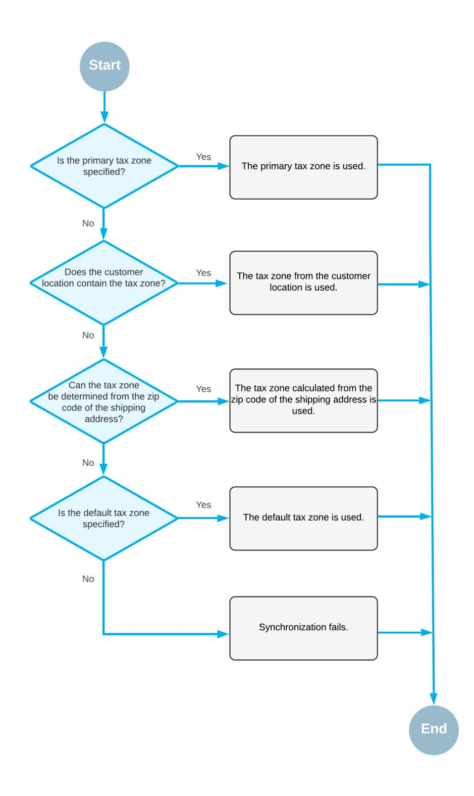

# **Import of Taxes: External Tax Provider**

You can set up the synchronization of taxes if you use an external tax provider for automatic tax calculation and for tax reporting.

## **Configuration of Tax Synchronization for the External Tax Service**

To set up the synchronization of taxes for an external tax provider, you need to perform the following general steps:

- 1. Configure automatic tax calculation in the Shopify store. For information, see *Tax [services](https://help.shopify.com/en/manual/taxes/tax-services) with Avalara [AvaTax](https://help.shopify.com/en/manual/taxes/tax-services)* in the Shopify documentation.
- 2. Configure the integration of Acumatica ERP with the external tax provider by using the same account as was used in the previous step. For instructions on how to integrate Acumatica ERP with Avalara AvaTax, see *Setup of Online [Integration](https://help-2025r1.acumatica.com/Help?ScreenId=ShowWiki&pageid=8a0eea54-8340-458b-973d-28a29f09b24a) with Avalara AvaTax*.
- 3. Configure the synchronization of taxes with the Shopify store as described in the following section.

# **Tax Synchronization Settings**

To set up the tax synchronization with the Shopify store, you specify the following settings on the **Orders** tab of the *[Shopify Stores](#page-492-1)* (BC201010) form as follows:

1. In the **Order** section, in the **OrderType for Import** box, select an order type for which the calculation of taxes has been enables on the *Order [Types](https://help-2025r1.acumatica.com/Help?ScreenId=ShowWiki&pageid=e6984218-4260-4438-99e1-aee2b3765369)* (SO201000) form—that is, the **Disable AutomaticTax Calculation** check box is cleared on the **General** tab.

For information on enabling and disabling tax calculation, see *Tax Application in Sales [Documents](https://help-2025r1.acumatica.com/Help?ScreenId=ShowWiki&pageid=39c67aca-9e64-47f3-bed5-08227508e62c)*.

Selecting an order type that allows tax recalculation may lead to amount inconsistencies.

- 2. In the **Taxes** section, specify the following settings:
  - Select the**TaxSynchronization** check box.
  - In the **DefaultTax Zone**, select the tax zone that you have configured for the external tax provider.
  - Select the **Use as PrimaryTax Zone** check box.

With these settings, the tax zone specified in the **DefaultTax Zone** will always be used for tax calculation, which means that the taxes calculated by the external tax provider will be imported with the order. If the taxes in the imported order do not yet exist in Acumatica ERP, the system creates them on the *[Taxes](https://help-2025r1.acumatica.com/Help?ScreenId=ShowWiki&pageid=692e30c9-e0af-4aa3-b0f6-f3ba190d257a)* (TX205000) form.

3. In the **Substitution Lists** section, specify the substitution list that contains the mapping of tax categories in Acumatica ERP with the tax categories in the Shopify store in the**Tax Category List** box.

For information about the use of substitution lists for the synchronization of taxes, see *Import of [Taxes:](#page-152-1) [Substitution Lists](#page-152-1)*.

# **Handling of Long Tax Names**

If an external tax provider is used for tax calculation, sometimes tax names returned by the external tax provider can exceed the maximum allowed length of tax IDs supported by Acumatica ERP, (which is currently 60 characters). Long tax IDs are processed as follows:

- If there is no hyphen in the tax ID, any characters that exceed the maximum length are truncated.
- If there is a hyphen in the tax ID, the tax ID is processed as follows:
  - If the tax ID contains the word *SPECIAL*, the part of the ID to the right of the hyphen is used. Any characters that still exceed the maximum length are truncated.
  - If the tax ID does not contain the word *SPECIAL*, the part of the ID to the le of the hyphen is used. Any characters that still exceed the maximum length are truncated.

# **Import of Taxes: Substitution Lists**

When you set up the synchronization of taxes between Acumatica ERP and the Shopify store, you specify the substitution lists in the**Substitution Lists** section of the **Orders** tab of the *[Shopify Stores](#page-492-1)* (BC201010) form. The following sections describe how substitution lists specified in these boxes are used during the synchronization of orders and stock and non-stock items.

# **Substitution List for Taxes**

If you use Acumatica ERP for tax reporting (without an external tax provider), when you configure tax synchronization, you need to make sure that all taxes that might be applied in the Shopify store have also been set up on the *[Taxes](https://help-2025r1.acumatica.com/Help?ScreenId=ShowWiki&pageid=692e30c9-e0af-4aa3-b0f6-f3ba190d257a)* (TX205000) form. Taxes whose IDs do not match the IDs of taxes in the Shopify store should be mapped with external tax IDs in a substitution list as follows: Taxes whose IDs in the Shopify store do not match the IDs of taxes in Acumatica ERP or taxes with the same ID but different rates in the Shopify store should be mapped with tax IDs in Acumatica ERP in a substitution list as follows:

1. On the *[Substitution Lists](https://help-2025r1.acumatica.com/Help?ScreenId=ShowWiki&pageid=e1b0125f-cb2f-4451-91af-c5eeaff3b5ac)* (SM206026) form, you specify taxes from the external system in the **OriginalValue** column. For each external tax, you add a corresponding tax ID from Acumatica ERP in the **Substitution Value** column.

You specify a tax from the Shopify store in the **OriginalValue** column in either of the following ways:

- *<Tax ID>*: The tax ID if the ID is unique in the Shopify store (for example, *Arkansas State Tax*).
- *<Tax ID> <Tax Rate>*: The tax ID followed by the space character and the tax rate if there are multiple taxes with the same ID but different rates (for example, *Arkansas State Tax 6.5%*).

You specify the tax rate as a decimal followed by the *%* character, as it is represented in the Shopify store. For example, the tax rate of 6.5% is specified as *6.5%* and the tax rate of 0.125% is specified as *0.125%*.

If you specify the tax ID along with the tax rate for a tax with a unique ID in the Shopify store, the system still correctly processes this mapping.

2. On the *[Shopify Stores](#page-492-1)* (BC201010) form (**Orders** tab), you specify the substitution list in the**Tax List** box.

When an order containing taxes is being imported to Acumatica ERP, for each tax that has been added to the order in the store, the system searches for a matching tax in Acumatica ERP as follows:

- 1. Searches for the tax on the *[Taxes](https://help-2025r1.acumatica.com/Help?ScreenId=ShowWiki&pageid=692e30c9-e0af-4aa3-b0f6-f3ba190d257a)* form.
- 2. Searches for the tax in the substitution list, and then searches for its substitution value on the *[Taxes](https://help-2025r1.acumatica.com/Help?ScreenId=ShowWiki&pageid=692e30c9-e0af-4aa3-b0f6-f3ba190d257a)* form.

If the tax has been found, the system adds it to the imported order. Otherwise, the synchronization of the order fails and an error is displayed for the order's synchronization record on the *[Sync History](#page-539-1)* (BC301000) form.

## **Substitution List for Tax Categories**

In Acumatica ERP, you can assign tax categories to stock and non-stock items. To make sure taxes are calculated correctly when an item is ordered in a Shopify store, you need to map the tax categories in Acumatica ERP to the tax categories in the Shopify store by using a substitution list as follows:

- 1. On the *[Substitution Lists](https://help-2025r1.acumatica.com/Help?ScreenId=ShowWiki&pageid=e1b0125f-cb2f-4451-91af-c5eeaff3b5ac)* (SM206026) form, you create a substitution list. In the **OriginalValue** column, you add Acumatica ERP tax categories, and in the**Substitution Value** column, you add a tax category from the Shopify store for each of the tax categories.
- 2. On the *[Shopify Stores](#page-492-1)* (BC201010) form (**Orders** tab), you select the substitution list in the**Tax Category List** box.

When a stock or non-stock item is synchronized with the Shopify store, a tax category is assigned to the item in the Shopify store based on the tax category assigned to the item on the *[Non-Stock Items](https://help-2025r1.acumatica.com/Help?ScreenId=ShowWiki&pageid=bf68dd4f-63d4-460d-8dc0-9152f2bd6bf1)* (IN202000) or *[Stock Items](https://help-2025r1.acumatica.com/Help?ScreenId=ShowWiki&pageid=77786a70-1f1e-4d63-ad98-96f98e4fcb0e)* (IN202500) form, and the substitution value specified for the tax category in the substitution list on the *[Substitution](https://help-2025r1.acumatica.com/Help?ScreenId=ShowWiki&pageid=e1b0125f-cb2f-4451-91af-c5eeaff3b5ac) [Lists](https://help-2025r1.acumatica.com/Help?ScreenId=ShowWiki&pageid=e1b0125f-cb2f-4451-91af-c5eeaff3b5ac)* form.

The substitution list specified in the**Tax Category List** box is used only for the export of items. The tax category that is shown for an item in an imported order is copied from the item's settings on the *[Non-](https://help-2025r1.acumatica.com/Help?ScreenId=ShowWiki&pageid=bf68dd4f-63d4-460d-8dc0-9152f2bd6bf1)[Stock Items](https://help-2025r1.acumatica.com/Help?ScreenId=ShowWiki&pageid=bf68dd4f-63d4-460d-8dc0-9152f2bd6bf1)* or *[Stock Items](https://help-2025r1.acumatica.com/Help?ScreenId=ShowWiki&pageid=77786a70-1f1e-4d63-ad98-96f98e4fcb0e)* form and is not imported from the Shopify store. To avoid discrepancies between the tax amount calculated in the Shopify store when an order is placed and the tax amount calculated in Acumatica ERP when an invoice is generated for the imported order, make sure that the item's tax category is in sync between the two systems before the order is created.

# **Import of Taxes: Tax Calculation Mode**

If the *Net/Gross Entry Mode* feature is enabled on the *[Enable/Disable Features](https://help-2025r1.acumatica.com/Help?ScreenId=ShowWiki&pageid=c1555e43-1bc5-4f6f-ba9d-b323f94d8a6b)* (CS100000) form, for a sales order imported from a Shopify store, the**Tax Calculation Mode** setting on the **Financial** tab of the *[Sales Orders](https://help-2025r1.acumatica.com/Help?ScreenId=ShowWiki&pageid=19e4021c-1b84-49fd-be12-0320c5f1c7e5)* (SO301000) form is determined based on the tax synchronization settings specified on the *[Shopify Stores](#page-492-1)* (BC201010) form and the price settings specified in the Shopify store.

If only Acumatica ERP is used for tax calculation, the setting is determined by the price settings specified in the Shopify store as follows:

- If the prices of items in the store include taxes (that is, if on the**Taxes** settings page, the **All prices include tax** check box is selected), the system inserts *Gross* in the **Tax Calculation Mode** box of the *[Sales Orders](https://help-2025r1.acumatica.com/Help?ScreenId=ShowWiki&pageid=19e4021c-1b84-49fd-be12-0320c5f1c7e5)* form for the imported sales order.
- If prices are entered for items exclusive of tax (that is, if the **All prices include taxes** check box is cleared), the system inserts *Net* in the **Tax Calculation Mode** box of the *[Sales Orders](https://help-2025r1.acumatica.com/Help?ScreenId=ShowWiki&pageid=19e4021c-1b84-49fd-be12-0320c5f1c7e5)* form for the imported sales order.

If an external tax provider—for example, Avalara AvaTax—is configured, the system inserts *Tax Settings* in the **Tax Calculation Mode** box of the *[Sales Orders](https://help-2025r1.acumatica.com/Help?ScreenId=ShowWiki&pageid=19e4021c-1b84-49fd-be12-0320c5f1c7e5)* form for the imported sales orders. With this option selected, the sales order inherits the settings of the customer, or of the customer's location if the *Business Account Locations* feature has been enabled on the *[Enable/Disable Features](https://help-2025r1.acumatica.com/Help?ScreenId=ShowWiki&pageid=c1555e43-1bc5-4f6f-ba9d-b323f94d8a6b)* form.

# **Import of Taxes: To Set Up Tax Synchronization**

The following activity will walk you through the process of setting up the synchronization of taxes between the Shopify store and Acumatica ERP.

The following activity is based on the *U100* dataset.

### **Story**

Suppose that SweetLife is using Acumatica ERP and Avalara AvaTax for calculating and reporting taxes on the goods and services it sells. The company currently sells products and needs to collect taxes only in New York State.

As an implementation consultant helping SweetLife to set up a Shopify store, you need to set up the tax calculation in the store for New York State and then make sure that the taxes calculated for online orders appear correctly in sales orders imported to Acumatica ERP.

#### **Configuration Overview**

For the purposes of this activity, a company profile has been defined for SweetLife in an Avalara AvaTax sandbox account.

In the *U100* dataset, the following tasks have been performed to support this activity:

- On the *Tax [Providers](https://help-2025r1.acumatica.com/Help?ScreenId=ShowWiki&pageid=e56ee66b-7ff5-4322-b3bc-bdd989a6931d)* (TX102000) form, the *AVALARA* tax provider has been created, a connection to the Avalara AvaTax account has been established, and the SweetLife branches have been mapped to a company profile defined for SweetLife in the AvaTax account.
- On the *Tax [Zones](https://help-2025r1.acumatica.com/Help?ScreenId=ShowWiki&pageid=361e36b3-a660-4fcb-a0cf-377b5bdb7aec)* (TX206000) form, the *AVALARA* tax zone has been defined.
- On the *Tax [Categories](https://help-2025r1.acumatica.com/Help?ScreenId=ShowWiki&pageid=db5e7fad-054d-467d-877e-2db4ee180ead)* (TX205500) form, the *TAXABLE* and *EXEMPT* tax categories have been defined. These tax categories have been assigned to item classes on the *[Item Classes](https://help-2025r1.acumatica.com/Help?ScreenId=ShowWiki&pageid=80a3301b-4eb2-4ce2-94c5-0407c786a0f1)* (IN201000) form, and to individual stock and non-stock items on the *[Stock Items](https://help-2025r1.acumatica.com/Help?ScreenId=ShowWiki&pageid=77786a70-1f1e-4d63-ad98-96f98e4fcb0e)* (IN202500) and *[Non-Stock Items](https://help-2025r1.acumatica.com/Help?ScreenId=ShowWiki&pageid=bf68dd4f-63d4-460d-8dc0-9152f2bd6bf1)* (IN202000) forms, respectively.
- On the **General** tab of the *Order [Types](https://help-2025r1.acumatica.com/Help?ScreenId=ShowWiki&pageid=e6984218-4260-4438-99e1-aee2b3765369)* (SO201000) form, for the *EO - eCommerce Order* order template, the **Disable AutomaticTax Calculation** check box (the **OrderSettings** section) has been cleared.

## **Process Overview**

In this activity, you will do the following:

- 1. In the admin area of the Shopify store, review the tax regions where you will collect sales tax on products sold to customers.
- 2. On the *[Enable/Disable Features](https://help-2025r1.acumatica.com/Help?ScreenId=ShowWiki&pageid=c1555e43-1bc5-4f6f-ba9d-b323f94d8a6b)* (CS100000) form, enable the *External Tax Calculation Integration* feature.
- 3. On the *Tax [Categories](https://help-2025r1.acumatica.com/Help?ScreenId=ShowWiki&pageid=db5e7fad-054d-467d-877e-2db4ee180ead)* (TX205500) and *Tax [Zones](https://help-2025r1.acumatica.com/Help?ScreenId=ShowWiki&pageid=361e36b3-a660-4fcb-a0cf-377b5bdb7aec)* (TX206000) forms, review some of the tax-related entities that have been predefined in the *U100* dataset.
- 4. On the *[Shopify Stores](#page-492-1)* (BC201010) form, specify the tax synchronization settings for your Shopify store.
- 5. On the *[Substitution Lists](https://help-2025r1.acumatica.com/Help?ScreenId=ShowWiki&pageid=e1b0125f-cb2f-4451-91af-c5eeaff3b5ac)* (SM206026) form, review the mapping of tax categories between Acumatica ERP and the Shopify store.
- 6. On the *[Entities](#page-521-1)* (BC202000) form, update the export filtering settings to include stock items of one more item class.
- 7. On the *[Prepare Data](#page-529-1)* (BC501000) form, prepare the stock item data for synchronization; on the *[Process Data](#page-533-1)* (BC501500) form, process the prepared data.
- 8. Review the exported items in the admin area of the Shopify store.
- 9. To make sure that the tax applied to a sales order in the Shopify store is imported to Acumatica ERP correctly, create an online order in the admin area of the Shopify store.

10.Import the sales order to Acumatica ERP by using the *[Prepare Data](#page-529-1)* and *[Process Data](#page-533-1)* forms.

11.On the *[Sales Orders](https://help-2025r1.acumatica.com/Help?ScreenId=ShowWiki&pageid=19e4021c-1b84-49fd-be12-0320c5f1c7e5)* (SO301000) form, review the imported sales order.

#### **System Preparation**

Do the following:

- 1. Make sure the connection to the Shopify store is established and the minimum configuration is performed as described in the prerequisite activity, *Initial [Configuration:](#page-250-1) To Configure the Store Connection*.
- 2. Make sure that the customers of the *DEFAULT* customer class have been exported to the Shopify store.
- 3. Make sure that the integration with the Shopify Payments payment provider has been implemented, as described in *Order [Synchronization:](#page-343-1) To Configure and Import Shopify Payments*.

4. Sign in to the admin area of the Shopify store as the store administrator in the same browser.

## **Step 1: Configuring Sales Tax Collection in the Shopify Store**

To make sure that tax collection is set up in your store for New York State, in the Shopify store, do the following:

- 1. In the bottom of the le menu, click**Settings**.
- 2. In the le menu of the page that opens, click**Taxes and duties**.
- 3. On the **Taxes and duties** page, which opens, in the **Regional settings** section, click the line with the *United States* region in the table.

If you do not see the needed region in the table, turn the list of regions with the arrow buttons below the table.

On the page that opens, notice that *Shopify Tax* is displayed in the**Tax service** section.

- 4. In the **Regions you're collecting in** section, click **Collect in new region**.
- 5. In the **Collect sales tax** dialog box, which opens, in the**State** box, select *New York*.
- 6. Click **Collect sales tax** to save your changes and close the dialog box.

## **Step 2: Enabling the Needed Feature**

To enable the *External Tax Calculation Integration* feature, which is required for integration of Acumatica ERP with Avalara AvaTax, in Acumatica ERP, do the following:

- 1. Open the *[Enable/Disable Features](https://help-2025r1.acumatica.com/Help?ScreenId=ShowWiki&pageid=c1555e43-1bc5-4f6f-ba9d-b323f94d8a6b)* (CS100000) form.
- 2. On the form toolbar, click **Modify**.
- 3. Under **Third-Party Integrations**, select the **ExternalTax Calculation Integration** check box.
- 4. On the form toolbar, click **Enable**.

### **Step 3: Reviewing the Tax Configuration in Acumatica ERP**

To review the tax configuration that has been predefined in Acumatica ERP, do the following:

1. Open the Tax Categories (TX2055PL) form.

Notice that there are only two tax categories listed in the table (*TAXABLE* and *EXEMPT*). Tax categories in Acumatica ERP determine whether exported products will be taxable or nontaxable in the Shopify store. In the following steps, you will review how these categories are mapped between Acumatica ERP and the Shopify store.

2. On the *Tax [Zones](https://help-2025r1.acumatica.com/Help?ScreenId=ShowWiki&pageid=361e36b3-a660-4fcb-a0cf-377b5bdb7aec)* (TX206000) form, select the *AVALARA* tax zone.

Notice that the **ExternalTax Provider** check box is selected, which indicates that this tax zone is used for setting up tax calculation by using an external tax provider, and *AVALARA* is selected as the tax provider.

# **Step 4: Configuring Tax Synchronization**

To configure the synchronization of taxes between Acumatica ERP and the Shopify store, in Acumatica ERP, do the following:

- 1. On the *[Shopify Stores](#page-492-1)* (BC201010) form, select the *SweetStore - SP* store.
- 2. On the **Orders** tab (**Taxes** section), specify the following settings:

- **TaxSynchronization**: Selected
- **DefaultTax Zone**: *AVALARA*
- **Use as PrimaryTax Zone**: Selected

With these settings specified, a sales order placed in the Shopify store will be imported to Acumatica ERP with sales taxes that have been calculated for the order in the Shopify store. Because the *AVALARA* tax zone has been selected as the primary tax zone, the taxes will be recalculated by the Avalara AvaTax service.

Note that the *EO* order type has been set up to recalculate taxes in the orders on invoice creation.

3. In the **Substitution Lists** section, note the substitution lists used for taxes (*SPCTAXCODES*) and tax categories (*SPCTAXCLASSES*). These substitution lists are predefined and are inserted as the default values in these boxes.

> For the purposes of this activity, you do not need to change the selected values. However, in a production environment, you can create other substitution lists on the *[Substitution Lists](https://help-2025r1.acumatica.com/Help?ScreenId=ShowWiki&pageid=e1b0125f-cb2f-4451-91af-c5eeaff3b5ac)* (SM206026) form and specify them in these boxes.

4. On the form toolbar, click**Save** to save your changes.

## **Step 5: Reviewing the Substitution List for Tax Categories**

To make sure that stock and non-stock items exported from Acumatica ERP are assigned the correct tax category in the Shopify store, do the following:

- 1. Open the *[Substitution Lists](https://help-2025r1.acumatica.com/Help?ScreenId=ShowWiki&pageid=e1b0125f-cb2f-4451-91af-c5eeaff3b5ac)* (SM206026) form.
- 2. In the **Substitution List** box, select *SPCTAXCLASSES*.

Notice that the table contains two rows, shown in the following table.

| Original Value | Substitution Value |
|----------------|--------------------|
| TAXABLE        | TRUE               |
| EXEMPT         | FALSE              |

With these settings, non-stock and stock items that have the *TAXABLE* tax category in Acumatica ERP, aer being exported, have the **Charge tax on this product** check box selected, and items with the *Exempt* tax category have the same check box cleared.

This mapping affects only the export of stock and non-stock items. If the state of the check box is changed for a product in the Shopify store and then a sales order with this item is placed and imported to Acumatica ERP, the tax category that appears in the sales order is copied from the**Tax Category** box of the **General** tab of the *[Stock Items](https://help-2025r1.acumatica.com/Help?ScreenId=ShowWiki&pageid=77786a70-1f1e-4d63-ad98-96f98e4fcb0e)* (IN202500) or *[Non-Stock](https://help-2025r1.acumatica.com/Help?ScreenId=ShowWiki&pageid=bf68dd4f-63d4-460d-8dc0-9152f2bd6bf1) [Items](https://help-2025r1.acumatica.com/Help?ScreenId=ShowWiki&pageid=bf68dd4f-63d4-460d-8dc0-9152f2bd6bf1)* (IN202000) form (depending on the type of the item). When taxes are recalculated in Acumatica ERP, there might be discrepancies between the order tax amount in the Shopify store and the tax amount calculated in Acumatica ERP. To avoid these discrepancies, make sure that the same changes are made to product tax settings in both systems (that is, that products are synchronized in a timely manner).

## **Step 6: Updating the Export Filter for Stock Items**

To verify that stock items are exported to the Shopify store with the correct tax category, you need to synchronize (or resynchronize) them between the two systems. Before you do it, you need to update the filter for stock items so that more stock items are synchronized with the Shopify store (in this step, you will add stock items of the *JUICER* item class). Do the following:

- 1. On the *[Entities](#page-521-1)* (BC202000) form, specify the following settings in the Summary area:
  - a. **Store Name**: *SweetStore - SP*
  - b. **Entity**: *Stock Item*
- 2. On the **Export Filtering** tab, update the filtering conditions by adding one more line and specifying the settings described in the following table:

| Active   | Opening Brackets | Field Name | Condition | Value  | Closing Brackets | Operator |
|----------|---------------------|------------|-----------|--------|---------------------|----------|
| Selected | (                   | Item Class | Equals    | Jam    | -                   | Or       |
| Selected | -                   | Item Class | Equals    | Juicer | )                   | And      |

3. On the form toolbar, click**Save**.

## **Step 7: Exporting the Stock Items**

- 1. On the *[Prepare Data](#page-529-1)* (BC501000) form, specify the following settings in the Summary area:
  - **Store**: *SweetStore - SP*
  - **Prepare Mode**: *Full*
  - **Date Range**: Cleared
- 2. In the table, select the check box in the unlabeled column in the row of the *Stock Item* entity.
- 3. On the form toolbar, click **Prepare**.
- 4. In the **Processing** dialog box, which opens, click **Close** to close the dialog box.
- 5. In the row of the *Stock Item* entity, click the link in the **Ready to Process** column.
- 6. On the *[Process Data](#page-533-1)* (BC501500) form, which opens with the *SweetStore - SP* store and the *Stock Item* entity selected, click **Process All** on the form toolbar.
- 7. In the **Processing** dialog box, which opens, click **Close** to close the dialog box.

#### **Step 8: Viewing the Synchronized Stock Items in the Store**

To review the items that have been synchronized between Acumatica ERP and the Shopify store and verify that they have been exported to the Shopify store with the correct tax category, in the Shopify admin area, do the following:

- 1. In the le menu, click **Products**.
- 2. On the **Products** page, click the row of the *Commercial citrus juicer with a production rate of 2 liters per minute* product.
- 3. On the product management page, which opens for the *Commercial citrus juicer with a production rate of 2 liters per minute* product, review the product details.

Notice that in the **Pricing** section, the **Charge tax on this product** check box is cleared. The system assigned this tax category to the product because the *JUICER20C* stock item is assigned the *EXEMPT* tax category in Acumatica ERP.

- 4. In the le menu, click **Products** to return to the **Products** page.
- 5. On the **Products** page, click the row of the *Kiwi jam 96 oz* product.

6. On the product management page, which opens for the *Kiwi jam 96 oz* product, review the product details.

Notice that in the **Pricing** section, the **Charge tax on this product** check box is selected. The system assigned this tax category to the product because the *KIWIJAM96* stock item is assigned the *TAXABLE* tax category in Acumatica ERP.

#### **Step 9: Creating a Sales Order in the Shopify Store**

To make sure that the taxes applied to taxable products in an online order are imported correctly during the order synchronization, you need to create an order in the Shopify store and import it to Acumatica ERP.

To create an order with the taxable and nontaxable products, in the admin area of the Shopify store, do the following:

- 1. In the le menu, click **Orders**.
- 2. On the **Orders** page, which opens, in the upper right, click **Create order**.
- 3. On the **Create order** page, which opens, in the **Products** section, start typing Kiwi jam in the search bar.
- 4. In the list of search results, select the check box next to *Kiwi jam 96 oz*, and click **Add**.
- 5. In the **Customer** section, click in the search bar and in the menu that opens, select *Melody Keys*.
- 6. In the **Payment** section, click **Add shipping or delivery**.
- 7. In the **Shipping or delivery options** dialog box, which appears, select the *Economy* shipping rate, and click **Done**.
- 8. In the **Payment** section, click **Collect payment > Mark as paid**.

For the purposes of this activity, assume that the payment was received outside Shopify.

9. In the **Mark as paid** dialog box, which appears, click **Create order**.

The system closes the **Mark as paid** dialog box and creates the order. At the top of the order page, which opens, notice that the system has assigned the order an order number, the *Paid* payment status, and *Unfulfilled* fulfillment status.

In the **Paid** section, in the**Taxes** row, notice the tax amount of \$5.78 has been applied to the order.

10.Expand the *Tax details* link in the **Taxes** row and notice that the following taxes have been applied:

- *New York State Tax 4%*: \$2.61
- *New York City City Tax 4.5%*: \$2.93
- *Metropolitan Commuter Transportation District 0.375%*: \$0.24

Notice the identifier of the order (which is the number in the page URL that follows */orders/*). You will use it to identify this order during the order import.

#### **Step 10: Importing the Sales Order**

To import the sales order to Acumatica ERP, in Acumatica ERP, do the following:

- 1. On the *[Prepare Data](#page-529-1)* (BC501000) form, specify the following settings in the Summary area:
  - **Store**: *SweetStore - SP*
  - **Prepare Mode**: *Incremental*
- 2. In the table, select the check box in the unlabeled column in the row of the *Sales Order* entity.
- 3. On the form toolbar, click **Prepare**.
- 4. In the **Processing** dialog box, which opens, click **Close** to close the dialog box.
- 5. In the row of the *Sales Order* entity, click the link in the **Ready to Process** column.

- 6. On the *[Process Data](#page-533-1)* (BC501500) form, which opens with the *SweetStore - SP* store and the *Sales Order* entity selected, select the unlabeled check box in the row of the sales order that you created (which you can find by its identifier in the **External ID** column and empty **ERP ID**), and on the form toolbar, click **Process**.
- 7. In the **Processing** dialog box, which opens, click **Close** to close the dialog box.

#### **Step 11: Reviewing the Taxes in the Imported Sales Order**

To review how the taxes are displayed in the imported sales order, do the following:

- 1. On the *[Sync History](#page-539-1)* (BC301000) form, specify the following settings in the Summary area:
  - **Store**: *SweetStore - SP*
  - **Entity**: *Sales Order*
- 2. On the **Processed** tab, in the row of the sales order that you have just imported (which you can locate by its external ID), click the link in the **ERP ID** column.
- 3. On the *[Sales Orders](https://help-2025r1.acumatica.com/Help?ScreenId=ShowWiki&pageid=19e4021c-1b84-49fd-be12-0320c5f1c7e5)* (SO301000) form, which opens, review the settings of the order, as shown in the screenshot below.

In the Summary area, the**TaxTotal** amount matches the tax amount of the order in the Shopify store (which is \$5.78).

In the table on the**Taxes** tab, review the taxes that have been applied to the order lines. Notice that the table shows the same taxes that you observed on the order page in the Shopify store.

| <b>Sales Orders</b> <b>TH NOTES</b> <b>ACTIVITIES</b> <b>FILES</b> <b>CUSTOMIZATION</b> TOOLS $\star$ EO 000077 - Melody Keys                                                                           |                             |                                                  |                      |                                |                   |  |  |  |
|---------------------------------------------------------------------------------------------------------------------------------------------------------------------------------------------------------------------------|-----------------------------|--------------------------------------------------|----------------------|--------------------------------|-------------------|--|--|--|
| 뭐 n ↶ 而 $+$                                                                                                                                                                                                   | Ĥ K ≺ $\checkmark$ | ⋗ Ы                                           | <b>QUICK PROCESS</b> | <b>CREATE SHIPMENT</b>         | <b>HOLD</b> .  |  |  |  |
| α * Order Type: <b>EO</b>                                                                                                                                                                                           | * Customer:                 | C000000003 - Melody Keys                         | α                    | $\mathscr{O}$ Ordered Qty.: | ㅅ 1.00         |  |  |  |
| Q Order Nbr.: 000077                                                                                                                                                                                                | * Location:                 | MAIN - Melody Keys                               | Q                    | Detail Total: 0             | 45.15             |  |  |  |
| Status: Open                                                                                                                                                                                                           | Contact:                    | <b>Melody Keys</b>                               | Q                    | Line Discounts: 0           | 0.00              |  |  |  |
| $\star$ Date: 4/11/2025                                                                                                                                                                                                | * Project:                  | X - Non-Project Code.                            | Q                    | Document Dis 0              | 0.00              |  |  |  |
| * Requested On: 4/11/2025                                                                                                                                                                                              | Description:                | SweetStore - SP   Order: #1003   Status: Paid |                      | Freight Total:                 | 19.90             |  |  |  |
| Customer Ord #1003                                                                                                                                                                                                     |                             |                                                  |                      | <b>Tax Total:</b>              | 5.78              |  |  |  |
| External Refer 589735182357                                                                                                                                                                                            |                             |                                                  |                      | <b>Order Total:</b>            | 70.83             |  |  |  |
| <b>TAXES</b> <b>DETAILS</b> <b>FINANCIAL</b> <b>SHIPPING</b> <b>ADDRESSES</b> <b>SHIPMENTS</b> <b>PAYMENTS</b> <b>RISKS</b> $\grave{z}$ Ò $\mathbf{\overline{N}}$ $\pm$ $\times$ ℍ |                             |                                                  |                      |                                |                   |  |  |  |
| 图 *Tax ID                                                                                                                                                                                                                 |                             |                                                  | <b>Tax Rate</b>      | <b>Taxable Amount</b>          | <b>Tax Amount</b> |  |  |  |
| METROPOLITAN COMMUTER TRANSPORTATION DISTRICT                                                                                                                                                                             |                             | 0.368900 65.05                                |                      | 0.24                           |                   |  |  |  |
| NEW YORK CITY CITY TAX                                                                                                                                                                                                    |                             | 4.504200 65.05                                |                      | 2.93                           |                   |  |  |  |
| <b>NEW YORK STATE TAX</b> 4.012300 2.61 65.05                                                                                                                                                                    |                             |                                                  |                      |                                |                   |  |  |  |

#### *Figure: Imported sales order with taxes*

4. Go to the **Details** tab. In the line with the *KIWIJAM96* item,**Tax Category** is set to *TAXABLE*. This tax category has been copied from the**Tax Category** box of the **General** tab of the *[Stock Items](https://help-2025r1.acumatica.com/Help?ScreenId=ShowWiki&pageid=77786a70-1f1e-4d63-ad98-96f98e4fcb0e)* (IN202500) form.

# **Importing Orders with Discounts**

In this chapter, you will learn how to set up the import of orders with discounts from the Shopify store to Acumatica ERP.

# **Import of Orders with Discounts: General Information**

You may offer customers of your Shopify store discounts of various types. If the *Customer Discounts* feature is enabled on the *[Enable/Disable Features](https://help-2025r1.acumatica.com/Help?ScreenId=ShowWiki&pageid=c1555e43-1bc5-4f6f-ba9d-b323f94d8a6b)* (CS100000) form, you can select the level at which the discounts will be displayed in orders imported to Acumatica ERP from the Shopify store.

# **Learning Objectives**

In this chapter, you will learn how to set up the import of sales orders with discounts from the Shopify store to Acumatica ERP.

## **Applicable Scenarios**

You specify the level at which discounts should be displayed in imported orders if the *Customer Discounts* feature is enabled on the *[Enable/Disable Features](https://help-2025r1.acumatica.com/Help?ScreenId=ShowWiki&pageid=c1555e43-1bc5-4f6f-ba9d-b323f94d8a6b)* (CS100000) form.

## **Displaying of Discounts in Imported Orders**

If the *Customer Discounts* feature is enabled on the *[Enable/Disable Features](https://help-2025r1.acumatica.com/Help?ScreenId=ShowWiki&pageid=c1555e43-1bc5-4f6f-ba9d-b323f94d8a6b)* (CS100000) form, when you configure the order synchronization settings, you have the option to select the level at which discounts that have been applied to an online sales order will be displayed in the order aer it is imported to Acumatica ERP from the Shopify store. On the **Orders** tab of the *[Shopify Stores](#page-492-1)* (BC201010) form, you can select in the**Show Discounts As** box one of the following options:

- *Line Discounts*: Discounts applied to the order are distributed between the sales order lines and appear in the **Discount Amount** column on the **Details** tab of the *[Sales Orders](https://help-2025r1.acumatica.com/Help?ScreenId=ShowWiki&pageid=19e4021c-1b84-49fd-be12-0320c5f1c7e5)* (SO301000) form.
- *Document Discounts*: Discounts applied to the order are aggregated and displayed on the **Discounts** tab of the *[Sales Orders](https://help-2025r1.acumatica.com/Help?ScreenId=ShowWiki&pageid=19e4021c-1b84-49fd-be12-0320c5f1c7e5)* form.

For an example of configuring discounts in the Shopify store and importing an order with the discounts, see *[Import](#page-370-3) [of Orders with Discounts: Process Activity](#page-370-3)*.

# **Import of Orders with Discounts: Process Activity**

The following activity will walk you through the process of importing orders that contain items with discounts.

The following activity is based on the *U100* dataset.

### **Story**

Suppose that the SweetLife sales manager decided to offer discounts for some of the products that the company sells in its Shopify store. Starting from today, the company provides the following discounts:

- A 10% discount on the purchase of a 96-ounce jar of plum jam
- A five-dollar discount on the purchase of a 96-ounce jar of banana jam
- An additional discount in the amount of \$20 for the orders of \$500 or more

As SweetLife's implementation consultant, you need to create an order with discounts of multiple types, import it to Acumatica ERP, and then explore how the applied discounts are displayed in the imported order.

### **Configuration Overview**

In the *U100* dataset, for the purposes of this activity, the *PLUMJAM96* and *BANJAM96* stock items have been created on the *[Stock Items](https://help-2025r1.acumatica.com/Help?ScreenId=ShowWiki&pageid=77786a70-1f1e-4d63-ad98-96f98e4fcb0e)* (IN202500) form.

### **Process Overview**

In this activity, you will do the following:

- 1. On the *[Enable/Disable Features](https://help-2025r1.acumatica.com/Help?ScreenId=ShowWiki&pageid=c1555e43-1bc5-4f6f-ba9d-b323f94d8a6b)* (CS100000) form, activate the *Customer Discounts* feature.
- 2. On the *[Shopify Stores](#page-492-1)* (BC201010) form, review the discount-related settings.
- 3. In the admin area, create an order and apply multiple discounts to it.
- 4. On the *[Prepare Data](#page-529-1)* (BC501000) form, prepare the sales order data for synchronization; on the *[Process Data](#page-533-1)* (BC501500) form, process the sales order data prepared for synchronization.
- 5. On the *[Sales Orders](https://help-2025r1.acumatica.com/Help?ScreenId=ShowWiki&pageid=19e4021c-1b84-49fd-be12-0320c5f1c7e5)* (SO301000) form, review the imported sales order and applied discount.

#### **System Preparation**

Before you complete the instructions in this activity, do the following:

- 1. Make sure that the following prerequisites have been met:
  - The Shopify store has been created and configured, as described in *Initial [Configuration:](#page-241-1) To Set Up a [Shopify Store](#page-241-1)*.
  - The connection to the Shopify store has been established and the initial configuration has been performed, as described in *Initial [Configuration:](#page-250-1) To Configure the Store Connection*.
  - Make sure that the *PLUMJAM96* and *BANJAM96* stock items have been exported to the Shopify store during the synchronization of the *Stock Item* entity, as described in *Data [Synchronization:](#page-259-1) To Perform the [First Synchronization](#page-259-1)*.
  - Make sure that the integration with the Shopify Payments payment provider has been implemented, as described in *Order [Synchronization:](#page-343-1) To Configure and Import Shopify Payments*.
- 2. Launch the Acumatica ERP website with the *U100* dataset preloaded, and sign in with the following credentials:
  - **Username**: *gibbs*
  - **Password**: *123*
- 3. Open the *[Enable/Disable Features](https://help-2025r1.acumatica.com/Help?ScreenId=ShowWiki&pageid=c1555e43-1bc5-4f6f-ba9d-b323f94d8a6b)* (CS100000) form.
- 4. On the form toolbar, click **Modify**, and select the **Customer Discounts** check box under **Advanced Financials**.
- 5. On the form toolbar, click **Enable**.
- 6. Sign in to the admin area of the Shopify store as the store administrator in the same browser.

### **Step 1: Configuring Discount-Related Settings**

To update the store settings for the import of online orders with discounts, in Acumatica ERP, do the following:

- 1. On the *[Shopify Stores](#page-492-1)* (BC201010) form, select the *SweetStore - SP* store.
- 2. On the **Orders** tab (**Order** section), in the**Show Discounts As** box, select *Document Discounts*.

With this option selected, the system aggregates discounts applied to particular lines of the order in the Shopify store and displays these discounts at the document level in the imported sales orders—that is, on the **Discounts** tab of the *[Sales Orders](https://help-2025r1.acumatica.com/Help?ScreenId=ShowWiki&pageid=19e4021c-1b84-49fd-be12-0320c5f1c7e5)* (SO301000) form.

3. On the form toolbar, click**Save**.

#### **Step 2: Creating a Sales Order**

To create an order for ten 96-ounce jars of plum jam and ten 96-ounce jars of banana jam, in the Shopify admin area, do the following:

- 1. In the le menu, click **Orders**.
- 2. On the **Orders** page, which opens, in the upper right, click **Create order**.

The **Create order** page opens.

- 3. To add ten 96-ounce jars of plum jam to the order, do the following:
  - a. In the **Products** section, start typing plum jam in the search bar.
  - b. In the **All products** dialog box, which opens with the search results, select the unlabeled check box in the row with the *Plum jam 96 oz* product, and click **Add**.
  - c. In the row of the *Plum jam 96 oz* product, change the quantity to 10.
- 4. To add ten 96-ounce jars of banana jam to the order, do the following:
  - a. In the **Products** section, start typing banana jam in the search bar.
  - b. In the **All products** dialog box, select the unlabeled check box in the row with the *Banana jam 96 oz*, and click **Add**.
  - c. In the row of the *Banana jam 96 oz* product, change the quantity to 10.
- 5. In the **Customer** section, click in the search bar and in the menu that opens, select *Melody Keys*.
- 6. To add a 10% discount on the purchase of a 96-ounce jar of plum jam, do the following:
  - a. In the **Products** section, click the price of the *Plum jam 96 oz* product (*\$45.15*).
  - b. In the **Add discount** dialog box, which opens, in the **Discount type** box, select *Percentage*, in the **Value** box, enter 10, and click **Done**.

Notice that the discount has been applied and the product price has changed to *\$40.64*.

- 7. To add a \$5 discount on the purchase of a 96-ounce jar of banana jam, do the following:
  - a. In the **Products** section, click the price of the *Banana jam 96 oz* product (also *\$45.15*).
  - b. In the **Add discount** dialog box, which opens, in the **Discount type** box, leave *Amount*, in the **Value** box, enter 5, and click **Done**.

Notice that the discount has been applied and the product price has changed to *\$40.15*.

- 8. To add an additional discount in the amount of \$20 for orders of \$500 or more, do the following:
  - a. In the **Payment** section, click **Add discount** to add an order-level discount.
  - b. In the **Add discount** dialog box, which opens, specify the following settings:
    - **Add custom order discount**: Selected
    - **Discount type**: *Amount* (selected by default)
    - **Value**: 20
  - c. Click **Done**.

The system closes the dialog box and applies the \$20 discount to the order.

For the purposes of this activity, assume that the payment was received outside Shopify.

- 9. In the **Payment** section, click **Collect payment > Mark as paid**.
- 10.In the **Mark as paid** dialog box, which opens, click **Create order**.

The system closes the dialog box and creates the order. At the top of the page, notice that the system has assigned the order an order number, the *Paid* payment status, and the *Unfulfilled* fulfillment status.

You have created an order and applied two line-level discounts and one order-level discount to it. In the next step, you will import this order to Acumatica ERP.

## **Step 3: Importing the Sales Order**

To import the sales order, in Acumatica ERP, do the following:

- 1. On the *[Prepare Data](#page-529-1)* (BC501000) form, specify the following settings in the Summary area:
  - **Store**: *SweetStore - SP*
  - **Prepare Mode**: *Incremental*
- 2. In the table, select the check box in the unlabeled column in the row of the *Sales Order* entity.
- 3. On the form toolbar, click **Prepare**.
- 4. In the **Processing** dialog box, which opens, click **Close** to close the dialog box.
- 5. In the row of the *Sales Order* entity, click the link with the number of prepared synchronization records in the **Ready to Process** column.
- 6. On the *[Process Data](#page-533-1)* (BC501500) form, which opens with the *SweetStore - SP* store and the *Sales Order* entity selected, in the row of the order you created (which you can find by its identifier in the **External ID** column and empty **ERP ID**), select the unlabeled check box.
- 7. On the form toolbar, click **Process**.
- 8. In the **Processing** dialog box, which opens, click **Close** to close the dialog box.

#### **Step 4: Reviewing the Discount in the Imported Sales Order**

To review how the discount is displayed in the imported sales order, do the following:

- 1. On the *[Sync History](#page-539-1)* (BC301000) form, specify the following settings in the Summary area:
  - **Store**: *SweetStore - SP*
  - **Entity**: *Sales Order*
- 2. On the **Processed** tab, in the row of the sales order that you have just imported, click the link in the **ERP ID** column.
- 3. On the *[Sales Orders](https://help-2025r1.acumatica.com/Help?ScreenId=ShowWiki&pageid=19e4021c-1b84-49fd-be12-0320c5f1c7e5)* (SO301000) form, which opens in a pop-up window, review the settings of the sales order.

On the **Details** tab, notice that in the **Discount Amount** and **Discount Percent** columns, the system has inserted zeros in both lines.

On the **Discounts** tab, notice that a single row has been added, as shown in the following screenshot. The *External Document* type in the **Type** column reflects the fact that the discounts were imported from an external system. The values in the **Discount Amt.** and **Discount Percent** columns reflect the discounts applied in the Shopify store.

| <b>Sales Orders</b> EO 000080 - Melody Keys                                                                                                                                                                                                                                                              |                                    |     |                  |              |                          |                     | <b>P NOTES</b>                           | <b>ACTIVITIES</b>           |              | <b>FILES</b>                | <b>CUSTOMIZATION</b>    | TOOLS $\star$                     |
|-------------------------------------------------------------------------------------------------------------------------------------------------------------------------------------------------------------------------------------------------------------------------------------------------------------|------------------------------------|-----|------------------|--------------|--------------------------|---------------------|------------------------------------------|-----------------------------|--------------|-----------------------------|-------------------------|-----------------------------------|
| 목 n ∽                                                                                                                                                                                                                                                                                                 |                                    | ाती | Ĥ $\check{ }$ | K            | ≺                        | ⋋                   | $\geq$                                   | <b>QUICK PROCESS</b>        |              | <b>CREATE SHIPMENT</b>      | <b>HOLD</b>             | $\cdots$                          |
| * Order Type:                                                                                                                                                                                                                                                                                               | E O                     | Q   |                  | * Customer:  |                          |                     | C000000003 - Melody Keys                 | Q                           | 0            | Ordered Qtv.:               |                         | ㅅ 20.00                        |
| Order Nbr.:                                                                                                                                                                                                                                                                                                 | 000080                             | Q   |                  | * Location:  |                          |                     | <b>MAIN - Melody Keys</b>                | Q                           | $\mathcal O$ | Detail Total:               |                         | 903.00                            |
| Status:                                                                                                                                                                                                                                                                                                     | Open                               |     |                  | Contact:     |                          | <b>Melody Keys</b>  |                                          | Q                           | 0            | Line Discounts:             |                         | 0.00                              |
| * Date:                                                                                                                                                                                                                                                                                                     | 4/11/2025                          | Ä   | * Project:       |              |                          |                     | X - Non-Project Code.                    | Q                           | 0            | Document Dis                |                         | 115.15                            |
| * Requested On:                                                                                                                                                                                                                                                                                             | 4/11/2025                          |     |                  | Description: |                          | Paid                | SweetStore - SP   Order: #1009   Status: |                             |              | Freight Total:              |                         | 0.00                              |
| Customer Ord                                                                                                                                                                                                                                                                                                | #1009                              |     |                  |              |                          |                     |                                          |                             |              | <b>Tax Total:</b>           |                         | 0.00                              |
| External Refer 589788427080                                                                                                                                                                                                                                                                              |                                    |     |                  |              |                          | <b>Order Total:</b> |                                          | 787.85                      |              |                             |                         |                                   |
| <b>DISCOUNTS</b> <b>FINANCIAL</b> <b>SHIPPING</b> <b>DETAILS</b> <b>TAXES</b> <b>ADDRESSES</b> <b>SHIPMENTS</b> <b>PAYMENTS</b> <b>RISKS</b> $\grave{\mathcal{L}}$ V Disable Automatic Discount Update Ò $\mathbf{\overline{x}}$ $\pm$ $\times$ $\overline{a}$ |                                    |     |                  |              |                          |                     |                                          |                             |              |                             |                         |                                   |
| 冐 <b>Skip</b> <b>Discount</b>                                                                                                                                                                                                                                                                         | * Discount Line Nbr. Code |     | * Sequence ID |              | <b>Type</b>              |                     | <b>Manual</b> <b>Discount</b>         | <b>Discountable</b> Amt. |              | <b>Discountable</b> Qty. | <b>Discount</b> Amt. | <b>Discount</b> <b>Percent</b> |
| n                                                                                                                                                                                                                                                                                                           | 1                                  |     |                  |              | <b>External Document</b> |                     | ☑                                        | 903.00                      |              |                             | 115.15                  | 12.751938                         |

#### *Figure: Imported sales order with discounts*

4. Close the pop-up window with the *[Sales Orders](https://help-2025r1.acumatica.com/Help?ScreenId=ShowWiki&pageid=19e4021c-1b84-49fd-be12-0320c5f1c7e5)* form.

You have created an order with discounts of various types in the Shopify store, explored how they are applied to an order in the store, and reviewed how they are displayed in the order aer it has been imported to Acumatica ERP.

# **Importing Non-Card Refunds**

In this chapter, you will learn how to configure the Acumatica ERP instance for importing non-card refunds from the Shopify store. You will also explore how non-card refunds are imported and applied to imported sales orders.

# **Importing Non-Card Refunds: General Information**

You can import to Acumatica ERP non-card refunds: that is, refunds issued for orders in your Shopify store that have been paid and refunded with non-card payment methods or with card payment methods that are mapped to an Acumatica ERP payment method for which integrated card processing is not configured.

#### **Learning Objectives**

In this chapter, you will learn how to do the following:

- Configure the import of refunds for non-card payment methods from a Shopify store to Acumatica ERP
- Import refunds for non-card payment methods from a Shopify store to Acumatica ERP

#### **Applicable Scenarios**

You import refunds of payments based on a non-card payment method from Shopify to Acumatica ERP so that you can keep track of refunded payments and restocked items. You may issue refunds in the Shopify store in the following cases:

- A customer has been overcharged in error and part of the order amount needs to be refunded.
- A customer has not received the purchased item or has received an excessive quantity of the item.
- A customer has received the purchased item but is not satisfied with its quality or performance and wants to return it.

## **Configuration of the Import of Refunds**

To configure the import of refunds from a Shopify store to Acumatica ERP, you perform the following general steps:

1. Define a return order type.

On the *Order [Types](https://help-2025r1.acumatica.com/Help?ScreenId=ShowWiki&pageid=e6984218-4260-4438-99e1-aee2b3765369)* (SO201000) form, you define an order type to be used for return orders created during the import of refunds from the Shopify store to Acumatica ERP. A return order type should be created with the following settings selected on the**Template** tab:

- **Automation Behavior**: *RMA Order*
- **Default Operation**: *Receipt*
- **AR DocumentType**: *Credit Memo*
- 2. Define an item to represent imported refund amounts.

On the *[Non-Stock Items](https://help-2025r1.acumatica.com/Help?ScreenId=ShowWiki&pageid=bf68dd4f-63d4-460d-8dc0-9152f2bd6bf1)* (IN202000) form, you define a non-stock item that will represent imported refund amounts in sales orders and in return orders. For this non-stock item, you should specify the following settings on the **General** tab:

- **Tax Category**: A tax category corresponding to tax-exempt items
- **Require Receipt**: Cleared
- **RequireShipment**: Cleared
- 3. Define a reason code.

On the *[Reason Codes](https://help-2025r1.acumatica.com/Help?ScreenId=ShowWiki&pageid=fe53f1bf-3670-465e-8b7c-922d8246f123)* (CS211000) form, you create a define a reason code to be inserted in return orders for refunds imported from the Shopify store. This reason code must be of the *Issue* usage type.

4. Activate the *Refund* entity.

On the **Entities** tab of the *[Shopify Stores](#page-492-1)* (BC201010) form, you activate the *Refund* entity for the Shopify store.

5. Specify the refund import settings.

On the **Orders** tab, you specify the identifiers of the entities you have created (in Steps 1 through 3) in the following boxes:

- **Return OrderType**
- **Refund Amount Item**
- **Refund Reason Code**
- 6. Specify the payment methods for which you need to import refunds.

On the **Payments** tab of the *[Shopify Stores](#page-492-1)* form, you select the **Process Refunds** check box for each payment method for which you want to import refunds. For details, see *[Order Synchronization: General](#page-332-2) [Information](#page-332-2)*.

## **Import of Refunds for Non-Card Payment Methods**

Refunds are imported from the Shopify store to Acumatica ERP as part of the synchronization of the *Refund* entity, which can be synchronized only in the *Import* direction. During the preparation of refund data for synchronization, the system creates one synchronization record for all refunds that have been issued for a single sales order in the Shopify store.

For a refund to be imported successfully, all of the following conditions must be met for the sales order associated with the refund:

- The original sales order has been synchronized.
- The payment for the original sales order to which the refund pertains has been imported and released.

If automatic tax recalculation is disabled for orders imported from the Shopify store, the system imports each sales order with the **Disable AutomaticTax Calculation** check box selected on the **Financial** tab of the *[Sales Orders](https://help-2025r1.acumatica.com/Help?ScreenId=ShowWiki&pageid=19e4021c-1b84-49fd-be12-0320c5f1c7e5)* (SO301000) form. If such an order is partially shipped and an invoice has been created for the shipment, the prepayment amount applied to the invoice includes the total tax amount of the order. The prepayment amount is shown in the **Applied to Documents** box on the *[Payments and Applications](https://help-2025r1.acumatica.com/Help?ScreenId=ShowWiki&pageid=ae844bf4-1aef-42cd-9e2f-49b3ee1bc8d7)* (AR302000) form.

When a refund is created for the remaining items of the order that have not been shipped yet, the refund amount becomes greater than the remaining prepayment amount, which is shown in the **Applied to Orders** box on the *[Payments and Applications](https://help-2025r1.acumatica.com/Help?ScreenId=ShowWiki&pageid=ae844bf4-1aef-42cd-9e2f-49b3ee1bc8d7)* form. In this case, during the import, the system sets the **Payment Amount** of the imported refund to be equal to the remaining prepayment amount. Also, in the **Available Balance** box on the *[Payments and Applications](https://help-2025r1.acumatica.com/Help?ScreenId=ShowWiki&pageid=ae844bf4-1aef-42cd-9e2f-49b3ee1bc8d7)* form, the system records the difference as the available balance of the refund.

For information about the synchronization process, see *[Data Synchronization: General Information](#page-253-2)*. For information about the import of various types of refunds, see *[Importing Non-Card Refunds: Order-Level Refunds](#page-379-1)* and *[Importing](#page-381-1) [Non-Card Refunds: Item-Level Refunds](#page-381-1)*.

# **Importing Non-Card Refunds: Implementation Activity**

The following activity will walk you through the configuration of refund import so that you can import to Acumatica ERP refunds and returns issued to a customer in the Shopify store for orders paid with non-card payment methods.

The following activity is based on the *U100* dataset.

### **Story**

Suppose that the SweetLife Fruits & Jams company sells several kinds of jams in its Shopify store and wants Acumatica ERP to keep information about the returns and refunds issued in the Shopify store. Acting as an implementation consultant, you need to set up the import of refunds from the Shopify store to Acumatica ERP.

### **Configuration Overview**

In the *U100* dataset, for the purposes of this activity, the following features have been enabled on the *[Enable/](https://help-2025r1.acumatica.com/Help?ScreenId=ShowWiki&pageid=c1555e43-1bc5-4f6f-ba9d-b323f94d8a6b) [Disable Features](https://help-2025r1.acumatica.com/Help?ScreenId=ShowWiki&pageid=c1555e43-1bc5-4f6f-ba9d-b323f94d8a6b)* (CS100000) form:

- *Retail Commerce*
- *Shopify Connector*
- *Custom Order Types*

The following entities, which you will use in this activity, have been predefined in the *U100* dataset:

- The *ER* order type on the *Order [Types](https://help-2025r1.acumatica.com/Help?ScreenId=ShowWiki&pageid=e6984218-4260-4438-99e1-aee2b3765369)* (SO201000) form
- The *REFUNDAMT* non-stock item on the *[Non-Stock Items](https://help-2025r1.acumatica.com/Help?ScreenId=ShowWiki&pageid=bf68dd4f-63d4-460d-8dc0-9152f2bd6bf1)* (IN202000) form
- The *EREFUND* reason code on the *[Reason Codes](https://help-2025r1.acumatica.com/Help?ScreenId=ShowWiki&pageid=fe53f1bf-3670-465e-8b7c-922d8246f123)* (CS211000) form

#### **Process Overview**

In this activity, you will do the following:

- 1. On the **Entities** tab of the *[Shopify Stores](#page-492-1)* (BC201010) form, activate the *Refund* entity.
- 2. On the **Orders** tab, review the settings related to refund import.
- 3. On the **Payments** tab, activate the import of refunds for a non-card payment method (*Manual*).

# **System Preparation**

To prepare the system for the steps of this activity, do the following:

- 1. Make sure the connection to the Shopify store has been established and the minimum configuration has been performed, as described in *Initial [Configuration:](#page-250-1) To Configure the Store Connection*.
- 2. Sign in to the Acumatica ERP instance with the U100 dataset preloaded. You should sign in as an administrator an administrator by using the following credentials:
  - Username: *gibbs*
  - Password: *123*

# **Step 1: Activating the Refund Entity**

Before you start importing refunds from the Shopify store to Acumatica ERP, you need to activate the *Refund* entity as follows:

- 1. Open the (BC201000) form.
- 2. In the **Store Name** box of the Summary area, select *SweetStore - SP*, which is the store that you created in *Initial [Configuration:](#page-250-1) To Configure the Store Connection*.
- 3. On the **Entities** tab, make sure that the **Active** check box has been selected for the *Refund* entity.

You select the **Active** check box for an entity to indicate that the entity's data needs to be synchronized between Acumatica ERP and the Shopify store.

4. On the form toolbar, click**Save** to save your changes.

# **Step 2: Reviewing the Refund Import Settings**

To review the settings that will be applied to refunds imported from the Shopify store, do the following:

- 1. While you are still viewing the *[Shopify Stores](#page-492-1)* (BC201010) form, go to the **Orders** tab.
- 2. In the **Order** section of the **Orders** tab, make sure that the following settings have been specified:
  - **Return OrderType**: *ER - eCommerce Return Order* This order type is based on the *RC* order template.
  - **Refund Amount Item**: *REFUNDAMT*

This tax-exempt non-stock item is used to represent the refunded amounts in documents.

- **Refund Reason Code**: *EREFUND* This reason code of the *Issue* usage type is inserted in documents to indicate that the line represents a refund issued.
- 3. On the form toolbar, click**Save** to save your changes.

## **Step 3: Activating the Import of Refunds for a Non-Card Payment Method**

To turn on the import of refunds for the *Manual* payment method, which you have configured in *[Initial Configuration:](#page-250-1) To Configure the Store [Connection](#page-250-1)*, do the following:

- 1. While you are still viewing the *[Shopify Stores](#page-492-1)* (BC201010) form, go to the **Payments** tab.
- 2. In the table of this tab, select the **Process Refunds** check box in the row of the *MANUAL* store payment method.

The resulting payment method mapping is shown in the following table.

| Active   | Store Payment Method | Store Cur rency | ERP Pay ment Method | Cash Ac count | Release Payments and Re funds | Process Re funds |
|----------|----------------------------|--------------------|---------------------------|------------------|----------------------------------------|---------------------|
| Selected | MANUAL                     | USD                | ONLINE                    | 10250ST          | Cleared                                | Selected            |

3. On the form toolbar, click**Save** to save your changes.

You have now configured the import of refunds from the Shopify store to Acumatica ERP for payments made by using a non-card payment method (*Manual*).

# **Importing Non-Card Refunds: Implementation Checklist**

The following sections provide details you can use to ensure that the system is configured for importing refunds for non-card payment methods from the Shopify store to Acumatica ERP, and to understand (and change, if needed) the settings that affect the processing workflow.

# **Implementation Checklist**

We recommend that before you import refunds issued in the Shopify store for non-card payment methods, you make sure the needed features have been enabled, settings have been specified, and entities have been created, as summarized in the following checklist.

| Form                               | Criteria to Check                                                                                                           |  |  |  |  |
|------------------------------------|-----------------------------------------------------------------------------------------------------------------------------|--|--|--|--|
| Enable/Disable Features (CS100000) | The following features have been enabled:                                                                                   |  |  |  |  |
|                                    | • Retail Commerce                                                                                                        |  |  |  |  |
|                                    | • Shopify Connector                                                                                                      |  |  |  |  |
|                                    | • Custom Order Types                                                                                                     |  |  |  |  |
| Order Types (SO201000)             | An order type for return orders has been defined.                                                                           |  |  |  |  |
| Non-Stock Items (IN202000)         | A non-stock item has been created to represent the amounts of re funds imported from the Shopify store to Acumatica ERP. |  |  |  |  |
| Reason Codes (CS211000)            | The reason code for imported refunds has been defined.                                                                      |  |  |  |  |

| Form                      | Criteria to Check                                                                                                                                                                                                                                 |
|---------------------------|---------------------------------------------------------------------------------------------------------------------------------------------------------------------------------------------------------------------------------------------------|
| Shopify Stores (BC201010) | • On the Entities tab: The Refund entity has been activated. • On the Orders tab:                                                                                                                                                        |
|                           | • The order type you created for returns has been selected in the Return OrderTypes box.                                                                                                                                                    |
|                           | • The reason code you created for refunds has been specified in the Refund Reason Code box.                                                                                                                                                 |
|                           | • The non-stock item that you created to represent refunded amounts has been specified in the Refund Amount box.                                                                                                                            |
|                           | • On the Payments tab: The Process Refunds check box has been selected for a non-card payment method or card payment method that is mapped to an Acumatica ERP payment method for which integrated card processing is not configured. |

### **Validation of Configuration**

To make sure that all configuration has been performed correctly, we recommend that in your system, you import refunds from your Shopify store by performing instructions similar to those described in *[Importing Non-Card](#page-383-1) Refunds: To Process a Refund for a [Not-Yet-Shipped](#page-383-1) Order* and *Importing [Non-Card](#page-388-1) Refunds: To Process a Refund for [a Shipped Order](#page-388-1)*.

# **Importing Non-Card Refunds: Order-Level Refunds**

An order-level refund may be issued, for example, if a customer has been overcharged or is not content with the quality of the product or service and needs to be partially reimbursed.

# **Import of Order-Level Refunds for Not-Yet-Shipped Orders**

During the import of refunds on order amounts, if the original sales order has not been shipped (that is, it has the *Open* or *On Hold* status on the *[Sales Orders](https://help-2025r1.acumatica.com/Help?ScreenId=ShowWiki&pageid=19e4021c-1b84-49fd-be12-0320c5f1c7e5)* (SO301000) form), the system does the following:

- On the *[Payments and Applications](https://help-2025r1.acumatica.com/Help?ScreenId=ShowWiki&pageid=ae844bf4-1aef-42cd-9e2f-49b3ee1bc8d7)* (AR302000) form, creates a payment of the *Refund* type in the refunded amount and applies it to the original payment.
- In the original sales order, on the **Details** tab of the *[Sales Orders](https://help-2025r1.acumatica.com/Help?ScreenId=ShowWiki&pageid=19e4021c-1b84-49fd-be12-0320c5f1c7e5)* form, inserts a line for the non-stock item that was specified in the **Refund Amount Item** box on the **Orders** tab of the *[Shopify Stores](#page-492-1)* (BC201010) form. In the **Unit Price** and **Ext. Price** columns, the system inserts the reversed refund amount (that is, the amount with the minus sign). In the **Reason Code** column, the system inserts the reason code that was specified on the **Orders** tab of the *[Shopify Stores](#page-492-1)* form.

The following diagram illustrates the processing of an order-level refund for a non-card payment method when the refund is issued before the sales order has been shipped.

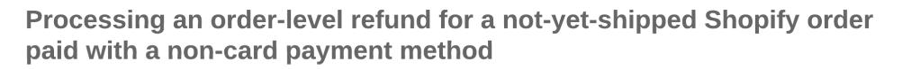

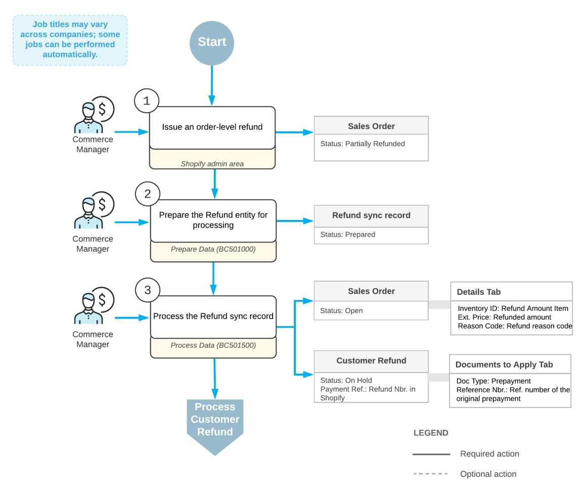

# **Import of Order-Level Refunds for Shipped Orders**

If the original sales order has been fully shipped (that is, it has the *Completed* status on the *[Sales Orders](https://help-2025r1.acumatica.com/Help?ScreenId=ShowWiki&pageid=19e4021c-1b84-49fd-be12-0320c5f1c7e5)* (SO301000) form), the following actions occur when an order-level refund is being imported to Acumatica ERP:

- On the *[Sales Orders](https://help-2025r1.acumatica.com/Help?ScreenId=ShowWiki&pageid=19e4021c-1b84-49fd-be12-0320c5f1c7e5)* form, the system creates a return order of the type selected in the **Return OrderType** box on the **Orders** tab of the *[Shopify Stores](#page-492-1)* form. In the **External Reference** box of the Summary area, the system inserts the identifier of the refund that is used in the Shopify store.
- In the return order, on the **Details** tab of the *[Sales Orders](https://help-2025r1.acumatica.com/Help?ScreenId=ShowWiki&pageid=19e4021c-1b84-49fd-be12-0320c5f1c7e5)* form, the system inserts a line with the non-stock item that was specified in the **Refund Amount Item** box on the **Orders** tab of the *[Shopify Stores](#page-492-1)* form. In the **Unit Price** and **Ext. Price** columns, the system inserts the refund amount (with the plus sign). In the **Reason Code** column, the system inserts the reason code that was specified on the **Orders** tab of the *[Shopify Stores](#page-492-1)* form.
- On the *[Payments and Applications](https://help-2025r1.acumatica.com/Help?ScreenId=ShowWiki&pageid=ae844bf4-1aef-42cd-9e2f-49b3ee1bc8d7)* (AR302000) form, creates a payment of the *Refund* type in the refunded amount and links it to the return order.

The following diagram illustrates the processing of an order-level refund for a non-card payment method when the refund is issued aer the sales order has been shipped.

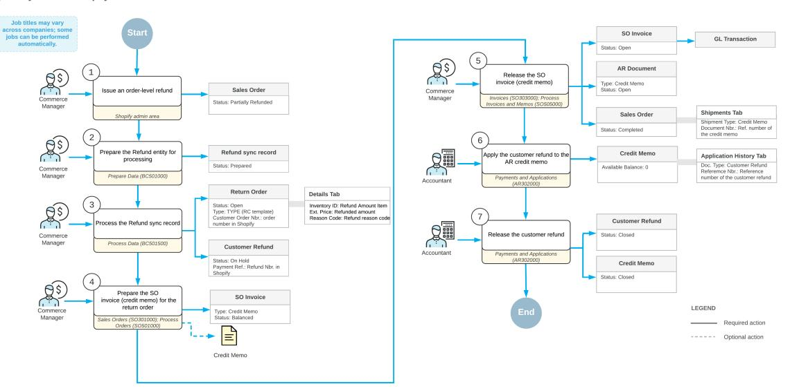

# **Importing Non-Card Refunds: Item-Level Refunds**

An item-level refund may be issued if, for example, a customer wants to amend a not-yet-shipped order to decrease the quantity of a purchased item or because they want to return the item whose condition or performance is unsatisfactory.

# **Import of Item Refunds for Not-Yet-Shipped Orders**

During the import of item refunds, if the original sales order that has not been shipped (that is, that has the *Open* or *On Hold* status of the *[Sales Orders](https://help-2025r1.acumatica.com/Help?ScreenId=ShowWiki&pageid=19e4021c-1b84-49fd-be12-0320c5f1c7e5)* (SO301000) form), the following actions occur:

- On the *[Payments and Applications](https://help-2025r1.acumatica.com/Help?ScreenId=ShowWiki&pageid=ae844bf4-1aef-42cd-9e2f-49b3ee1bc8d7)* (AR302000) form, the system creates a payment of the *Refund* type in the refunded amount and applies it to the original payment.
- In the original sales order, on the **Details** tab of the *[Sales Orders](https://help-2025r1.acumatica.com/Help?ScreenId=ShowWiki&pageid=19e4021c-1b84-49fd-be12-0320c5f1c7e5)* form, the system updates the order line or lines to decrease the item quantities. If discounts and taxes have been applied, they are recalculated accordingly.

The following diagram illustrates the processing of an item refund for a non-card payment method when the refund is issued before the sales order has been shipped.

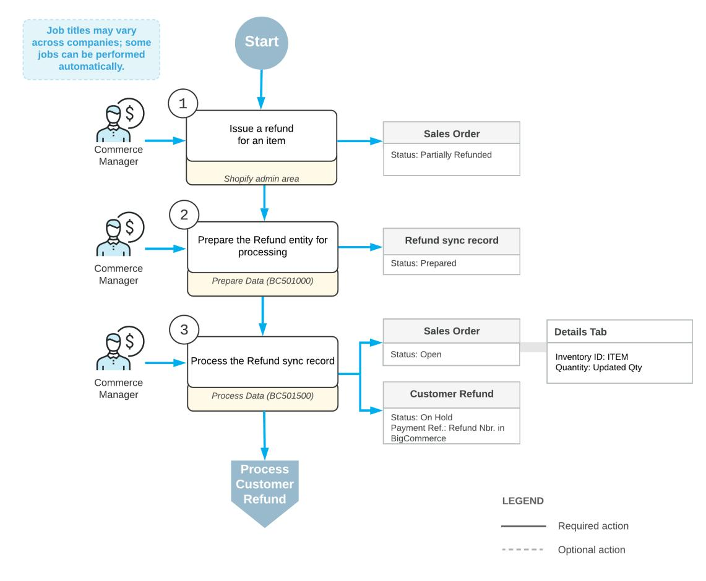

# **Import of Item Refunds for Fully Shipped Orders**

If the original sales order has been shipped in full (that is, it has the *Completed* status on the *[Sales Orders](https://help-2025r1.acumatica.com/Help?ScreenId=ShowWiki&pageid=19e4021c-1b84-49fd-be12-0320c5f1c7e5)* form), the following actions occur when an item refund is being imported to Acumatica ERP:

- On the *[Sales Orders](https://help-2025r1.acumatica.com/Help?ScreenId=ShowWiki&pageid=19e4021c-1b84-49fd-be12-0320c5f1c7e5)* form, the system creates a return order of the type that was specified in the **Return OrderType** box on the **Orders** tab of the *[Shopify Stores](#page-492-1)* form. In the **External Reference** box of the Summary area, the system inserts the identifier of the refund that is used in the Shopify store.
- In the return order, on the **Details** tab, the system inserts a line with the applicable quantity of the returned item. In the **Reason Code** column, the system inserts the reason code that was specified on the **Orders** tab of the *[Shopify Stores](#page-492-1)* form.
- On the *[Payments and Applications](https://help-2025r1.acumatica.com/Help?ScreenId=ShowWiki&pageid=ae844bf4-1aef-42cd-9e2f-49b3ee1bc8d7)* (AR302000) form, creates a payment of the *Refund* type in the refunded amount and links it to the return order.

The following diagram illustrates the processing of an item return for non-card payment methods when the refund is issued aer the sales order has been fully shipped.

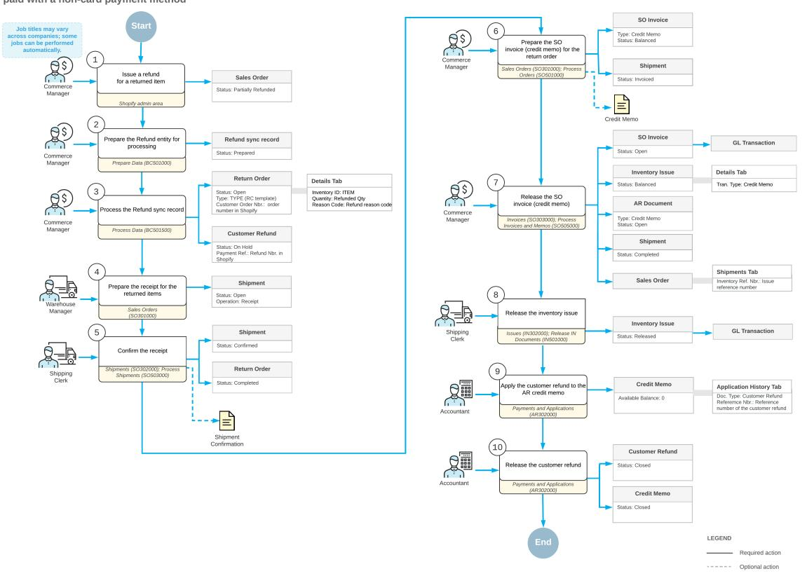

# **Import of Refunds for Partially Shipped Orders**

When an item refund that has been issued for a partially shipped order is being imported from Shopify to Acumatica ERP, the following actions occur:

- For not-yet-shipped items, the system adjusts the item quantity in the original sales order on the *[Sales](https://help-2025r1.acumatica.com/Help?ScreenId=ShowWiki&pageid=19e4021c-1b84-49fd-be12-0320c5f1c7e5) [Orders](https://help-2025r1.acumatica.com/Help?ScreenId=ShowWiki&pageid=19e4021c-1b84-49fd-be12-0320c5f1c7e5)* (SO301000) form, creates a refund on the *[Payments and Applications](https://help-2025r1.acumatica.com/Help?ScreenId=ShowWiki&pageid=ae844bf4-1aef-42cd-9e2f-49b3ee1bc8d7)* (AR302000) form, and applies the refund to the original payment.
- For shipped items, the system creates a return order on the *[Sales Orders](https://help-2025r1.acumatica.com/Help?ScreenId=ShowWiki&pageid=19e4021c-1b84-49fd-be12-0320c5f1c7e5)* form and a refund on the *[Payments](https://help-2025r1.acumatica.com/Help?ScreenId=ShowWiki&pageid=ae844bf4-1aef-42cd-9e2f-49b3ee1bc8d7) [and Applications](https://help-2025r1.acumatica.com/Help?ScreenId=ShowWiki&pageid=ae844bf4-1aef-42cd-9e2f-49b3ee1bc8d7)* form, and applies the refund to the return order.

The process is similar to the import of item refunds for not-yet-shipped orders and the import of item refunds for fully shipped orders, which are described in the sections above.

To avoid issues with the import of refunds for partially shipped orders, make sure to select the **Restock item** check box when you initiate a return of an item in the Shopify store.

# **Importing Non-Card Refunds: To Process a Refund for a Not-Yet-Shipped Order**

The following activity will walk you through the process of importing a partial refund from the Shopify store to Acumatica ERP. This is a partial refund of an order that has been paid by a non-card payment method and has not yet been shipped.

The following activity is based on the *U100* dataset.

#### **Story**

Suppose that a representative of the GoodFood One Restaurant customer placed an order for 10 jars of banana jam in the SweetLife Fruits & Jams retail store and paid the entire order amount upfront in cash. The jam was to be delivered from the SweetLife Fruits & Jams warehouse within seven days. Later the same day, before the jam was shipped, the representative of GoodFood One Restaurant showed up in the retail store. The representative informed the store manager that an error had occurred and only 3 jars of banana jam should have been purchased, and asked the manager to refund the cost of the remaining quantity of banana jam. As the store manager, you need to refund the cost of 3 jars of banana jam and import this refund to Acumatica ERP so that the correct quantities of jam will be issued from SweetLife Fruits & Jams's warehouse.

# **Configuration Overview**

In the *U100* dataset, for the purposes of this activity, the following features have been enabled on the *[Enable/](https://help-2025r1.acumatica.com/Help?ScreenId=ShowWiki&pageid=c1555e43-1bc5-4f6f-ba9d-b323f94d8a6b) [Disable Features](https://help-2025r1.acumatica.com/Help?ScreenId=ShowWiki&pageid=c1555e43-1bc5-4f6f-ba9d-b323f94d8a6b)* (CS100000) form:

- *Retail Commerce*
- *Shopify Connector*
- *Custom Order Types*

The following entities, which you will use in this activity, have been predefined in the system:

- The *ER* order type on the *Order [Types](https://help-2025r1.acumatica.com/Help?ScreenId=ShowWiki&pageid=e6984218-4260-4438-99e1-aee2b3765369)* (SO201000) form
- The *REFUNDAMT* non-stock item on the *[Non-Stock Items](https://help-2025r1.acumatica.com/Help?ScreenId=ShowWiki&pageid=bf68dd4f-63d4-460d-8dc0-9152f2bd6bf1)* (IN202000) form
- The *EREFUND* reason code on the *[Reason Codes](https://help-2025r1.acumatica.com/Help?ScreenId=ShowWiki&pageid=fe53f1bf-3670-465e-8b7c-922d8246f123)* (CS211000) form

#### **Process Overview**

In this activity, you will do the following:

- 1. In the admin area of the Shopify store, place a sales order for a customer.
- 2. On the *[Prepare Data](#page-529-1)* (BC501000) form, prepare the sales order data for processing, and on the *[Process Data](#page-533-1)* (BC501500) form, process the sales order data.
- 3. On the *[Sales Orders](https://help-2025r1.acumatica.com/Help?ScreenId=ShowWiki&pageid=19e4021c-1b84-49fd-be12-0320c5f1c7e5)* (SO301000) form, review the imported sales order.
- 4. On the *[Payments and Applications](https://help-2025r1.acumatica.com/Help?ScreenId=ShowWiki&pageid=ae844bf4-1aef-42cd-9e2f-49b3ee1bc8d7)* (AR302000) form, release the prepayment related to the imported sales order.
- 5. In the admin area of the Shopify store, update the order quantities, and issue a refund to the customer.
- 6. On the *[Prepare Data](#page-529-1)* form, prepare the refund data for processing, and on the *[Process Data](#page-533-1)* form, process the refund data.
- 7. On the *[Sales Orders](https://help-2025r1.acumatica.com/Help?ScreenId=ShowWiki&pageid=19e4021c-1b84-49fd-be12-0320c5f1c7e5)* form, review the updated sales order, and on the *[Payments and Applications](https://help-2025r1.acumatica.com/Help?ScreenId=ShowWiki&pageid=ae844bf4-1aef-42cd-9e2f-49b3ee1bc8d7)* form, review the updated prepayment.
- 8. On the *[Payments and Applications](https://help-2025r1.acumatica.com/Help?ScreenId=ShowWiki&pageid=ae844bf4-1aef-42cd-9e2f-49b3ee1bc8d7)* form, review and release the refund.

#### **System Preparation**

To prepare the system for the steps of this activity, do the following:

- 1. Make sure that the following prerequisite activities have been performed:
  - *Initial [Configuration:](#page-250-1) To Configure the Store Connection*
  - *Data [Synchronization:](#page-259-1) To Perform the First Synchronization*
  - *[Importing Non-Card Refunds: Implementation Activity](#page-376-1)*

2. Sign in to the admin area of the Shopify store as the store administrator.

## **Step 1: Placing an Order**

To create an order for ten 96-ounce jars of banana jam from the Shopify admin area, do the following:

- 1. In the le menu of the admin area, click **Orders**.
- 2. On the **Orders** page, which opens, in the top right, click **Create order**.
- 3. On the **Create order** page, which opens, in the **Order details** section, start typing Banana in the search bar.
- 4. In the list of search results, which are shown in a pop-up window, select *Banana jam 96 oz*, and click **Add to order**.
- 5. In the row with the *Banana jam 96 oz* product, change the quantity to 10.
- 6. In the **Find or create a customer** section, start typing good in the search bar. In the list of search results, select *GoodFood One Restaurant*.
- 7. In the bottom right, click**Save**.
- 8. In the **Payment** section, click **Mark as Paid**.
- 9. In the **Mark as paid** pop-up window, in the**Type of payment received** box, select *Other* and click **Create order**.

Note the order number and the identifier of the order in the address bar (the numeric part in the URL that follows *<store\_name>.myshopify.com/admin/orders/*).

Besides the order number, Shopify assigns each order an identifier (a numeric sequence) that you can see in the URL of the Shopify order page. You can use this identifier to locate the necessary order on the *[Process Data](#page-533-1)* (BC501500) form (in the **External ID** column), for example, if you need to import an individual order from the Shopify store to Acumatica ERP.

# **Step 2: Importing the Sales Order**

To import the sales order you created in the previous step to Acumatica ERP, do the following:

- 1. Sign in to Acumatica ERP by using the following credentials:
  - Username: *gibbs*
  - Password: *123*
- 2. Open the *[Prepare Data](#page-529-1)* (BC501000) form.
- 3. In the Summary area, specify the following settings:
  - **Store**: *SweetStore - SP*
  - **Prepare Mode**: *Incremental*
- 4. In the table, select the unlabeled check box in the row with the *Sales Order* entity.
- 5. On the form toolbar, click **Prepare**.
- 6. In the **Processing** dialog box, which opens, review the results of the processing, and click **Close** to close the dialog box.
- 7. In the row with the *Sales Order* entity, click the link with the number of prepared synchronization records in the **Ready to Process** column.
- 8. On the *[Process Data](#page-533-1)* (BC501500) form, which opens with the *SweetStore - SP* store and the *Sales Order* entity selected
- 9. On the form toolbar, click **Process All**.

10.In the **Processing** dialog box, which opens, review the results of the processing, and click **Close** to close the dialog box.

#### **Step 3: Reviewing the Imported Sales Order**

To review the imported sales order, do the following:

- 1. Open the Sales Orders (SO3010PL) form.
- 2. In the list of orders, click the order number link of the last sales order of the *EO* type for *GoodFood One Restaurant* (which is the order you imported in the previous step).
- 3. On the *[Sales Orders](https://help-2025r1.acumatica.com/Help?ScreenId=ShowWiki&pageid=19e4021c-1b84-49fd-be12-0320c5f1c7e5)* (SO301000) form, which opens, review the settings of the sales order.

In the Summary area, notice that the **Customer Order Nbr.** and **Description** boxes include the order number from Shopify. In the **Customer** box, the system has inserted the ID of the customer that was generated based on the customer numbering sequence defined on the *[Shopify Stores](#page-492-1)* (BC201010) form.

On the **Details** tab, review the quantity of the *BANJAM96* items, which is 10 pieces.

On the **Payments** tab, review the details of the prepayment that was created and applied to the sales order when the sales order was imported. Notice that the **Payment Method** and **Cash Account** columns show the payment method and cash account defined in Acumatica ERP and mapped to the *MANUAL* store payment method (*ONLINE* and *10250ST*, respectively). The prepayment has the *Balanced* status. Before you can process and import a refund in the Shopify store, you need to release this prepayment.

## **Step 4: Releasing the Imported Payment**

To release the payment imported with the sales order from the Shopify store, do the following:

- 1. While you are still viewing the **Payments** tab of the *[Sales Orders](https://help-2025r1.acumatica.com/Help?ScreenId=ShowWiki&pageid=19e4021c-1b84-49fd-be12-0320c5f1c7e5)* (SO301000) form, click the link with the prepayment number in the **Reference Nbr.** column.
- 2. On the form toolbar of the *[Payments and Applications](https://help-2025r1.acumatica.com/Help?ScreenId=ShowWiki&pageid=ae844bf4-1aef-42cd-9e2f-49b3ee1bc8d7)* (AR302000) form, which opens in a pop-up window with the prepayment selected, click **Release**.

Once the prepayment is successfully released, its status is changed to *Open*.

#### **Step 5: Issuing a Refund for an Individual Item**

To issue a refund for units of an individual item in your Shopify store, do the following:

- 1. Sign in to the admin area of your Shopify store.
- 2. In the le menu, expand the **Orders** node and click **Orders**.
- 3. On the **Orders** page, in the list of orders, open the order that you created and imported.
- 4. On the sales order page, which opens, on the page toolbar, click **Refund**.
- 5. On the **Refund** page, in the item quantity box, specify *3*.
- 6. In the Summary section, review the refunded amount and click **Refund \$147.48**.

The refund amount includes the item subtotal (\$135.45) and applicable taxes (\$12.03).

#### **Step 6: Importing the Refund**

To import the refund to Acumatica ERP, do the following:

- 1. Open the *[Prepare Data](#page-529-1)* (BC501000) form.
- 2. In the **Store** box, select *SweetStore - SP*.

- 3. In the **Prepare Mode** box, select *Incremental*.
- 4. In the table, select the unlabeled check box in the row with the *Refund* entity.
- 5. On the form toolbar, click **Prepare**.
- 6. In the **Processing** dialog box, which opens, review the results of the processing, and click **Close** to close the dialog box.
- 7. Click the link in the **Ready to Process** column in the row with the *Refund* entity.
- 8. On the *[Process Data](#page-533-1)* (BC501500) form, which opens with the *SweetStore - SP* store and the *Refund* entity selected in the Summary area, select the unlabeled check box in the row with the refund (which you can identify by the number of the order it refers to in the **External ID** column).
- 9. On the form toolbar, click **Process**.
- 10.In the **Processing** dialog box, which opens, review the results of the processing, and click **Close** to close the dialog box.

#### **Step 7: Reviewing the Results of the Import**

To review how the refund has been imported to Acumatica ERP, do the following:

- 1. On the *[Sales Orders](https://help-2025r1.acumatica.com/Help?ScreenId=ShowWiki&pageid=19e4021c-1b84-49fd-be12-0320c5f1c7e5)* (SO301000) form, open the sales order that you created and imported earlier in this activity, and review the order as follows:
  - On the **Details** tab, notice that the quantity of the *BANJAM96* stock item has been reduced from *10* to *7*.
  - In the Summary area, notice that the order total has been reduced to reflect the new item quantity. The **Description** box now shows the updated status of the order in the Shopify store, which is *Partially Refunded*.
- 2. On the **Payments** tab, click the link of prepayment number in the **Reference Nbr.** column.
- 3. On the *[Payments and Applications](https://help-2025r1.acumatica.com/Help?ScreenId=ShowWiki&pageid=ae844bf4-1aef-42cd-9e2f-49b3ee1bc8d7)* (AR302000) form, which opens with the prepayment selected, notice that the applied amount and the available balance reflect the reduced order amount and the refunded amount, respectively.

#### **Step 8: Reviewing and Releasing the Refund**

1. Open the Payments and Applications (AR3020PL) form.

In the list of documents, notice that a new *Refund* document has been created for the refund you imported in Step 6. (You can identify it by the order number and transaction type shown in the **Description** column).

- 2. In the **Reference Nbr.** column, click the link with the identifier of the refund.
- 3. On the form toolbar of the *[Payments and Applications](https://help-2025r1.acumatica.com/Help?ScreenId=ShowWiki&pageid=ae844bf4-1aef-42cd-9e2f-49b3ee1bc8d7)* (AR302000) form, which opens with the refund selected, click **Remove Hold**, and then click **Release**.

Once the processing of the refund is finished, its status changes to *Closed*.

- 4. On the **Application History** tab, which shows the prepayment to which the refund was applied, in the only row, click the link in the **Reference Nbr.** column.
- 5. On the *[Payments and Applications](https://help-2025r1.acumatica.com/Help?ScreenId=ShowWiki&pageid=ae844bf4-1aef-42cd-9e2f-49b3ee1bc8d7)* form, which opens with the prepayment selected, notice that the available balance has become zero.

You have now imported a partial refund for ordered items in an order that has not yet been shipped and processed this partial refund.

# **Importing Non-Card Refunds: To Process a Refund for a Shipped Order**

The following activity will walk you through the process of importing a partial refund from the BigCommerce store to Acumatica ERP. This partial refund is for a shipped order that has already been fully delivered.

The following activity is based on the *U100* dataset.

## **Story**

Suppose that a representative of the West BBQ Restaurant customer placed an order for 10 jars of plum jam in the SweetLife Fruits & Jams retail store, and paid the entire order amount upfront in cash. Four days later, aer the purchased jam has already been delivered, a representative of West BBQ Restaurant returned 2 jars of plum jam. As the store manager, you need to process the return of 2 jars of plum jam. You also want to reimburse the customer \$10 for the inconvenience of returning part of the purchase in person.

## **Configuration Overview**

In the *U100* dataset, for the purposes of this activity, the following features have been enabled on the *[Enable/](https://help-2025r1.acumatica.com/Help?ScreenId=ShowWiki&pageid=c1555e43-1bc5-4f6f-ba9d-b323f94d8a6b) [Disable Features](https://help-2025r1.acumatica.com/Help?ScreenId=ShowWiki&pageid=c1555e43-1bc5-4f6f-ba9d-b323f94d8a6b)* (CS100000) form:

- *Retail Commerce*
- *Shopify Connector*
- *Custom Order Types*

The following entities, which you will use in this activity, have been predefined in the *U100* dataset:

- The *ER* order type on the *Order [Types](https://help-2025r1.acumatica.com/Help?ScreenId=ShowWiki&pageid=e6984218-4260-4438-99e1-aee2b3765369)* (SO201000) form
- The *REFUNDAMT* non-stock item on the *[Non-Stock Items](https://help-2025r1.acumatica.com/Help?ScreenId=ShowWiki&pageid=bf68dd4f-63d4-460d-8dc0-9152f2bd6bf1)* (IN202000) form
- The *EREFUND* reason code on the *[Reason Codes](https://help-2025r1.acumatica.com/Help?ScreenId=ShowWiki&pageid=fe53f1bf-3670-465e-8b7c-922d8246f123)* (CS211000) form

#### **Process Overview**

In this activity, you will do the following:

- 1. In the admin area of the Shopify store, place a sales order for a customer.
- 2. On the *[Prepare Data](#page-529-1)* (BC501000) form, prepare the sales order data for processing, and on the *[Process Data](#page-533-1)* (BC501500) form, process the sales order data.
- 3. On the *[Sales Orders](https://help-2025r1.acumatica.com/Help?ScreenId=ShowWiki&pageid=19e4021c-1b84-49fd-be12-0320c5f1c7e5)* (SO301000) form, review the imported sales order.
- 4. On the *[Payments and Applications](https://help-2025r1.acumatica.com/Help?ScreenId=ShowWiki&pageid=ae844bf4-1aef-42cd-9e2f-49b3ee1bc8d7)* (AR302000) form, release the prepayment related to the imported sales order.
- 5. Using the *[Sales Orders](https://help-2025r1.acumatica.com/Help?ScreenId=ShowWiki&pageid=19e4021c-1b84-49fd-be12-0320c5f1c7e5)* form as a starting point, create a shipment.
- 6. On the *[Shipments](https://help-2025r1.acumatica.com/Help?ScreenId=ShowWiki&pageid=f47cffcc-543e-469c-a204-a9c1e3da346d)* (SO302000) form, confirm the shipment.
- 7. On the *[Sales Orders](https://help-2025r1.acumatica.com/Help?ScreenId=ShowWiki&pageid=19e4021c-1b84-49fd-be12-0320c5f1c7e5)* form, create a shipment.
- 8. On the *[Prepare Data](#page-529-1)* form, prepare the shipment data for processing, and on the *[Process Data](#page-533-1)* form, process the shipment data.
- 9. In the admin area of the Shopify store, issue a refund to the customer.
- 10.On the *[Prepare Data](#page-529-1)* form, prepare the refund data for processing, and on the *[Process Data](#page-533-1)* form, process the refund data.

- 11.On the *[Sales Orders](https://help-2025r1.acumatica.com/Help?ScreenId=ShowWiki&pageid=19e4021c-1b84-49fd-be12-0320c5f1c7e5)* form, review the updated sales order, and on the *[Payments and Applications](https://help-2025r1.acumatica.com/Help?ScreenId=ShowWiki&pageid=ae844bf4-1aef-42cd-9e2f-49b3ee1bc8d7)* form, review the updated prepayment.
- 12.On the *[Payments and Applications](https://help-2025r1.acumatica.com/Help?ScreenId=ShowWiki&pageid=ae844bf4-1aef-42cd-9e2f-49b3ee1bc8d7)* form, review the refunds created for each of the return orders.

#### **System Preparation**

To prepare the system for the steps of this activity, do the following:

- 1. Make sure the following prerequisite activities have been performed:
  - a. *Initial [Configuration:](#page-250-1) To Configure the Store Connection*
  - b. *Data [Synchronization:](#page-259-1) To Perform the First Synchronization*
  - c. *[Importing Non-Card Refunds: Implementation Activity](#page-376-1)*
- 2. Sign in to the admin area of the Shopify store as the store administrator.

## **Step 1: Creating a Sales Order in Shopify**

To create an order for ten 96-ounce jars of plum jam from the Shopify admin area, do the following:

- 1. In the le menu of the admin area, click **Orders**.
- 2. On the **Orders** page, which opens, in the top right, click **Create order**.
- 3. On the **Create order** page, which opens, in the **Order details** section, start typing plum in the search bar.
- 4. In the list of search results, which are shown in a pop-up window, select *Plum jam 96 oz*, and click **Add to order**.
- 5. In the row with the *Plum jam 96 oz* product, change the quantity to 10.
- 6. In the **Find or create a customer** section, start typing west in the search bar. In the list of search results, select *West BBQ Restaurant*.
- 7. In the bottom right, click**Save**.
- 8. In the **Payment** section, click **Mark as Paid**.
- 9. In the **Mark as paid** pop-up window, in the**Type of payment received** box, select *Other* and click **Create order**.

Note the order number and the identifier of the order in the address bar (the numeric part in the URL that follows *<store\_name>.myshopify.com/admin/orders/*).

Besides the order number, Shopify assigns each order an identifier (a numeric sequence) that you can see in the URL of the Shopify order page. You can use this identifier to locate the necessary order on the *[Process Data](#page-533-1)* (BC501500) form (in the **External ID** column), for example, if you need to import an individual order from the Shopify store to Acumatica ERP.

#### **Step 2: Importing the Sales Order**

To import the sales order you created in the previous step to Acumatica ERP, do the following:

- 1. Sign in to Acumatica ERP by using the following credentials:
  - Username: *gibbs*
  - Password: *123*
- 2. Open the *[Prepare Data](#page-529-1)* (BC501000) form.
- 3. In the Summary area, specify the following settings:

- **Store**: *SweetStore - SP*
- **Prepare Mode**: *Incremental*
- 4. In the table, select the unlabeled check box in the row with the *Sales Order* entity.
- 5. On the form toolbar, click **Prepare**.
- 6. In the **Processing** dialog box, which opens, review the results of the processing, and click **Close** to close the dialog box.
- 7. In the row with the *Sales Order* entity, click the link with the number of prepared synchronization records in the **Ready to Process** column.
- 8. On the *[Process Data](#page-533-1)* (BC501500) form, which opens with the *SweetStore - SP* store and the *Sales Order* entity selected.
- 9. On the form toolbar, click **Process All**.
- 10.In the **Processing** dialog box, which opens, review the results of the processing, and click **Close** to close the dialog box.

## **Step 3: Reviewing the Imported Sales Order**

To review the imported sales order, do the following:

- 1. Open the Sales Orders (SO3010PL) form.
- 2. In the list of orders, click the order number link of the last sales order of the *EO* type for *West BBQ Restaurant*.
- 3. On the *[Sales Orders](https://help-2025r1.acumatica.com/Help?ScreenId=ShowWiki&pageid=19e4021c-1b84-49fd-be12-0320c5f1c7e5)* (SO301000) form, which opens, review the settings of the sales order.

In the Summary area, notice that the **Customer Order Nbr.** and **Description** boxes include the order number from Shopify. In the **Customer** box, the system has inserted the ID of the customer that was generated based on the customer numbering sequence defined on the *[Shopify Stores](#page-492-1)* (BC201010) form.

On the **Details** tab, review the quantity of the *PLUMJAM96* item, which is *10*.

On the **Payments** tab, review the details of the prepayment that was created and applied to the sales order when the sales order was imported. Notice that the **Payment Method** and **Cash Account** columns show the payment method and cash account (*ONLINE* and *10250ST*, respectively) that were defined in Acumatica ERP and mapped to the *MANUAL* store payment method. The prepayment has the *Balanced* status. Before you can process and import a refund in the Shopify store, you need to release this prepayment.

#### **Step 4: Releasing the Imported Payment**

To release the payment that was imported from the Shopify store along with the sales order, do the following:

- 1. While you are still viewing the **Payments** tab of the *[Sales Orders](https://help-2025r1.acumatica.com/Help?ScreenId=ShowWiki&pageid=19e4021c-1b84-49fd-be12-0320c5f1c7e5)* (SO301000) form, click the link with the prepayment number in the **Reference Nbr.** column.
- 2. On the form toolbar of the *[Payments and Applications](https://help-2025r1.acumatica.com/Help?ScreenId=ShowWiki&pageid=ae844bf4-1aef-42cd-9e2f-49b3ee1bc8d7)* (AR302000) form, which opens in a pop-up window with the prepayment selected, click **Release**.

Once the prepayment is successfully released, its status is changed to *Open*.

3. Close the pop-up window with the *[Payments and Applications](https://help-2025r1.acumatica.com/Help?ScreenId=ShowWiki&pageid=ae844bf4-1aef-42cd-9e2f-49b3ee1bc8d7)* form to return to the *[Sales Orders](https://help-2025r1.acumatica.com/Help?ScreenId=ShowWiki&pageid=19e4021c-1b84-49fd-be12-0320c5f1c7e5)* form.

## **Step 5: Creating a Shipment for the Imported Order**

To create a shipment for the order you have imported, do the following:

1. While you are viewing the imported order on the *[Sales Orders](https://help-2025r1.acumatica.com/Help?ScreenId=ShowWiki&pageid=19e4021c-1b84-49fd-be12-0320c5f1c7e5)* (SO301000) form, click **CreateShipment** on the form toolbar.

2. In the **SpecifyShipment Parameters** dialog box, which opens, make sure the current date and the *RETAIL* warehouse are selected, and click **OK**. The system creates a shipment and opens it on the *[Shipments](https://help-2025r1.acumatica.com/Help?ScreenId=ShowWiki&pageid=f47cffcc-543e-469c-a204-a9c1e3da346d)* (SO302000) form.

#### **Step 6: Confirming the Shipment for the Imported Order**

To confirm the shipment for the order, do the following:

- 1. While you are still viewing the shipment on the *[Shipments](https://help-2025r1.acumatica.com/Help?ScreenId=ShowWiki&pageid=f47cffcc-543e-469c-a204-a9c1e3da346d)* (SO302000) form, review the line on the **Details** tab. Make sure of the following:
  - The correct order line is included in the shipment.
  - The *RETAIL* warehouse is specified for the item.
  - The shipped quantity is equal to the ordered quantity.
- 2. On the form toolbar, click **Confirm Shipment**.

Notice that the shipment has been assigned the *Confirmed* status. Make a note of the shipment number; you will use it to identify the shipment to be exported to the Shopify store in the next step.

Because you have confirmed the shipment, on the *[Sales Orders](https://help-2025r1.acumatica.com/Help?ScreenId=ShowWiki&pageid=19e4021c-1b84-49fd-be12-0320c5f1c7e5)* (SO301000) form, the status of the imported sales order has changed to *Completed*.

#### **Step 7: Synchronizing the Shipment with the Shopify Store**

To synchronize with the Shopify store the shipment that you have created and confirmed, do the following:

- 1. On the *[Prepare Data](#page-529-1)* (BC501000) form, do the following:
  - a. In the Summary area, select the following settings:
    - **Store**: *SweetStore - SP*
    - **Prepare Mode**: *Incremental*
  - b. In the table, select the unlabeled check box for the *Shipment* entity.
  - c. On the form toolbar, click **Prepare**.
  - d. In the **Processing** dialog box, which opens, review the results of the processing, and click **Close** when the processing has completed.
- 2. In the row with the *Shipment* entity, click the link in the **Ready to Process** column.
- 3. On the *[Process Data](#page-533-1)* (BC501500) form, which opens with the *SweetStore - SP* store and the *Shipment* entity selected in the Summary area, select the unlabeled check box for the shipment that you created and confirmed (which you can identify by the shipment number in the **ERP ID** column).
- 4. On the form toolbar, click **Process**.
- 5. In the **Processing** dialog box, which opens, review the results of the processing, and click **Close** to close the dialog box.

#### **Step 8: Issuing a Refund in the Shopify Store**

To issue a refund for units of an individual item in your Shopify store, do the following:

- 1. Sign in to the admin area of your Shopify store.
- 2. In the le menu, expand the **Orders** node and click **Orders**.
- 3. On the **Orders** page, in the list of orders, open the order that you created and imported.
- 4. On the sales order page, which opens, on the page toolbar, click **Refund**.
- 5. On the **Refund** page, in the item quantity box, specify *2*.

- 6. In the Summary section, review the **Refund total** amount (\$98.32, which includes \$8.02 in taxes).
- 7. To reimburse the customer for having to return part of the purchase, in the **Manual** box, change the amount to 108.32.
- 8. Click **Refund \$108.32**.

#### **Step 9: Importing the Refund**

To import the refund to Acumatica ERP, do the following:

- 1. Open the *[Prepare Data](#page-529-1)* (BC501000) form.
- 2. In the **Store** box, select *SweetStore - SP*.
- 3. In the **Prepare Mode** box, select *Incremental*.
- 4. In the table, select the unlabeled check box in the row with the *Refund* entity.
- 5. On the form toolbar, click **Prepare**.
- 6. In the **Processing** dialog box, which opens, review the results of the processing, and click **Close** to close the dialog box.
- 7. Click the link in the **Ready to Process** column in the row with the *Refund* entity.
- 8. On the *[Process Data](#page-533-1)* (BC501500) form, which opens with the *SweetStore - SP* store and the *Refund* entity selected in the Summary area, select the unlabeled check box in the row or the refund (which you can identify by the number of the order it refers to in the **External ID** column).
- 9. On the form toolbar, click **Process**.
- 10.In the **Processing** dialog box, which opens, review the results of the processing, and click **Close** to close the dialog box.

#### **Step 11: Reviewing the Return Order**

To review the return orders created in Acumatica ERP as a result of the importing of refunds, do the following:

1. Open the Sales Orders (SO3010PL) form.

Notice that an order of the *ER* type has been created for the *WESTBBQ* customer. Because the original sales order had the *Completed* status, it could not be modified and the return order was created. The return order has the *ER* type because this type was selected in the **Return OrderType** box on the **Orders** tab of the *[Shopify Stores](#page-492-1)* (BC201010) form in *[Importing Non-Card Refunds: Implementation Activity](#page-376-1)*.

- 2. In the row with the return order for the *WESTBBQ* customer, click the link in the **Order Nbr.** column.
- 3. On the *[Sales Orders](https://help-2025r1.acumatica.com/Help?ScreenId=ShowWiki&pageid=19e4021c-1b84-49fd-be12-0320c5f1c7e5)* (SO301000) form, which opens with the return order selected, review the order as follows:
  - In the Summary area, notice that the **Customer Order Nbr.** and **Description** boxes contain the reference number of the original order in the Shopify store. In the **External Reference** box, the system has inserted the identifier of the refund in the Shopify store.
  - On the **Details** tab, the system has inserted two lines: one with the returned item (*PLUMJAM96*) with a quantity of 2; the other one with the *REFUNDAMT* non-stock item, which reflects an order-level refund of \$10 that you specified in the Shopify store. Notice that in the **Reason Code** column of both lines, the system inserted *EREFUND*, which is the reason code you specified in the **Refund Reason Code** box on the **Orders** tab of the *[Shopify Stores](#page-492-1)* (BC201010) form in *[Importing Non-Card Refunds: Implementation Activity](#page-376-1)*.

#### **Step 12: Reviewing the Refund**

To review the refund created for the return order, do the following:

1. Open the Payments and Applications (AR3020PL) form.

Notice that a document of the *Refund* type has been created for the *WESTBBQ* customer.

- 2. In the row with this refund, click the link in the **Reference Nbr.** column.
- 3. On the *[Payments and Applications](https://help-2025r1.acumatica.com/Help?ScreenId=ShowWiki&pageid=ae844bf4-1aef-42cd-9e2f-49b3ee1bc8d7)* form, which opens with the refund selected, review the document details.

In the **Description** box, notice the information about the store name, sales order number, and store payment method to which the refund was applied. The **Available Balance** column reflects the amount refunded in the Shopify store. The **Payment Method** and **Cash Account** boxes have the same values as the original prepayment (*ONLINE* and *10250ST*, respectively).

On the **Sales Orders** tab, notice that the refund has been linked to the return order.

You have now imported to Acumatica ERP a refund for a returned item and a partial refund of the order amount for an order that has been fully shipped. For the purposes of this activity, you do not need to process the return order or refund further.

# **Importing Card Refunds**

In this chapter, you will learn how to configure the Acumatica ERP instance for importing card refunds from the BigCommerce store,. You will also explore how card refunds are imported and applied to imported sales orders.

# **Importing Card Refunds: General Information**

You can import to Acumatica ERP refunds issued for orders paid with card-based payment methods to customers in your Shopify store.

#### **Learning Objectives**

In this chapter, you will learn how to do the following:

- Configure the import of refunds for card-based payment methods from a Shopify store to Acumatica ERP
- Import refunds for card-based payment methods from a Shopify store to Acumatica ERP

#### **Applicable Scenarios**

You import refunds of payments based on a card-based payment method from Shopify to Acumatica ERP to keep track of refunded payments and restocked items. You may issue refunds in the Shopify store in the following cases:

- A customer has been overcharged in error and part of the order amount needs to be refunded.
- A customer has not received the purchased item or has received an excessive quantity of the item.
- A customer has received the purchased item but is not satisfied with its quality or performance and wants to return it.

#### **Configuration of Refund Import**

To configure the import of refunds from a Shopify store to Acumatica ERP, you perform the following general steps:

1. Define a return order type.

On the *Order [Types](https://help-2025r1.acumatica.com/Help?ScreenId=ShowWiki&pageid=e6984218-4260-4438-99e1-aee2b3765369)* (SO201000) form, you define an order type to be used for return orders imported from the Shopify store to Acumatica ERP. A return order type should be created with the following settings selected on the**Template** tab:

- **Automation Behavior**: *RMA Order*
- **Default Operation**: *Receipt*
- **AR DocumentType**: *Credit Memo*
- 2. Define a refund amount item.

On the *[Non-Stock Items](https://help-2025r1.acumatica.com/Help?ScreenId=ShowWiki&pageid=bf68dd4f-63d4-460d-8dc0-9152f2bd6bf1)* (IN202000) form, you define a non-stock item that will represent imported refund amounts in sales orders and in return orders. This non-stock item should be defined with the following settings on the **General** tab:

- **Tax Category**: A category corresponding to tax-exempt items
- **Require Receipt**: Cleared
- **RequireShipment**: Cleared
- 3. Define a reason code.

On the *[Reason Codes](https://help-2025r1.acumatica.com/Help?ScreenId=ShowWiki&pageid=fe53f1bf-3670-465e-8b7c-922d8246f123)* (CS211000) form, you create a define a reason code to be inserted in return orders for refunds imported from the Shopify store. This reason code must be of the *Issue* usage type.

4. Activate the *Refund* entity.

On the **Entities** tab of the *[Shopify Stores](#page-492-1)* (BC201010) form, you activate the *Refund* entity for the Shopify store.

5. Specify the refund import settings.

On the **Orders** tab, you specify settings in the following boxes:

- **Return OrderType**
- **Refund Amount Item**
- **Refund Reason Code**
- 6. Specify payment methods for which you need to import refunds.

On the **Payments** tab of the *[Shopify Stores](#page-492-1)* form, you select the **Process Refunds** check box for each payment method for which you want to import refunds. For store payment methods that are mapped to card-based payment methods in Acumatica ERP, this check box is selected by default and cannot be edited.

#### **Import of Refunds for Card-Based Payment Methods**

Refunds are imported from the Shopify store to Acumatica ERP as part of the synchronization of the *Refund* entity, which can be synchronized only in the *Import* direction. During the preparation of refund data for synchronization, the system creates one synchronization record for all refunds that have been issued for a single sales order in the Shopify store.

For a refund to be imported successfully, all of the following conditions must be met:

- The original sales order has been synchronized.
- The original payment to which the refund pertains has been imported and released.

If automatic tax recalculation is disabled for orders imported from the Shopify store, the system imports each sales order with the **Disable AutomaticTax Calculation** check box selected on the **Financial** tab of the *[Sales Orders](https://help-2025r1.acumatica.com/Help?ScreenId=ShowWiki&pageid=19e4021c-1b84-49fd-be12-0320c5f1c7e5)* (SO301000) form. If such an order is partially shipped and an invoice has been created for the shipment, the prepayment amount applied to the invoice includes the total tax amount of the order. The prepayment amount is shown in the **Applied to Documents** box on the *[Payments and Applications](https://help-2025r1.acumatica.com/Help?ScreenId=ShowWiki&pageid=ae844bf4-1aef-42cd-9e2f-49b3ee1bc8d7)* (AR302000) form.

When a refund is created for the remaining items of the order that have not been shipped yet, the refund amount becomes greater than the remaining prepayment amount, which is shown in the **Applied to Orders** box on the *[Payments and Applications](https://help-2025r1.acumatica.com/Help?ScreenId=ShowWiki&pageid=ae844bf4-1aef-42cd-9e2f-49b3ee1bc8d7)* form. In this case, during the import, the system sets the **Payment Amount** of the imported refund to be equal to the remaining prepayment amount. Also, in the **Available Balance** box on the *[Payments and Applications](https://help-2025r1.acumatica.com/Help?ScreenId=ShowWiki&pageid=ae844bf4-1aef-42cd-9e2f-49b3ee1bc8d7)* form, the system records the difference as the available balance of the refund.

For more information about the synchronization process, see *[Data Synchronization: General Information](#page-253-2)*. For more information about the import of various types of refunds, see *[Importing Card Refunds: Order-Level Refunds](#page-398-1)* and *[Importing Card Refunds: Item-Level Refunds](#page-400-1)*.

# **Importing Card Refunds: Implementation Activity**

The following activity will walk you through the configuration of refund import so that you can import to Acumatica ERP refunds issued to a customer in the Shopify store for an order paid by a credit card and processed by using the Shopify Payments payment gateway.

The following activity is based on the *U100* dataset.

# **Story**

Suppose that the SweetLife Fruits & Jams company sells several kinds of jams in its Shopify store and wants to track returns and refunds issued in the Shopify store from within Acumatica ERP. Acting as an implementation consultant, you need to set up the import of returns and refunds issued in the Shopify store for orders paid by a card and processed by using the Shopify Payments payment gateway. Further suppose that the Shopify Payments payment gateway is configured to be used for processing card payments both in the Shopify store and in Acumatica ERP.

## **Configuration Overview**

For the purposes of this activity, the following features have been enabled on the *[Enable/Disable Features](https://help-2025r1.acumatica.com/Help?ScreenId=ShowWiki&pageid=c1555e43-1bc5-4f6f-ba9d-b323f94d8a6b)* (CS100000) form:

- *Retail Commerce*
- *Shopify Connector*
- *Custom Order Types*

The following entities, which you will use in this activity, have been predefined in the system:

- The *ER* order type on the *Order [Types](https://help-2025r1.acumatica.com/Help?ScreenId=ShowWiki&pageid=e6984218-4260-4438-99e1-aee2b3765369)* (SO201000) form
- The *REFUNDAMT* non-stock item on the *[Non-Stock Items](https://help-2025r1.acumatica.com/Help?ScreenId=ShowWiki&pageid=bf68dd4f-63d4-460d-8dc0-9152f2bd6bf1)* (IN202000) form
- The *EREFUND* reason code on the *[Reason Codes](https://help-2025r1.acumatica.com/Help?ScreenId=ShowWiki&pageid=fe53f1bf-3670-465e-8b7c-922d8246f123)* (CS211000) form

#### **Process Overview**

In this activity, you will do the following:

- 1. On the **Entities** tab of the *[Shopify Stores](#page-492-1)* (BC201010) form, activate the *Refund* entity.
- 2. On the **Orders** tab, you will review the settings of refund import.
- 3. On the **Payments** tab, you will activate the import of refunds for the Shopify Payments payment method.

# **System Preparation**

Do the following:

- 1. Make sure the connection to the Shopify store has been established and the minimum configuration has been performed, as described in *Initial [Configuration:](#page-250-1) To Configure the Store Connection*.
- 2. Make sure that the mapping of the Shopify Payments payment method has been set up as described in *Order [Synchronization:](#page-343-1) To Configure and Import Shopify Payments*.
- 3. Launch the Acumatica ERP website, and sign in as an administrator by using the following credentials:
  - **Username**: *gibbs*
  - **Password**: *123*

## **Step 1: Activating the Refund Entity**

Before you start importing refunds from the Shopify store to Acumatica ERP, you need to activate the *Refund* entity as follows:

- 1. Open the *[Shopify Stores](#page-492-1)* (BC201010) form.
- 2. In the **Store Name** box, select *SweetStore - SP*.
- 3. On the **Entities** tab, make sure that the **Active** check box has been selected for the *Refund* entity.

You select the **Active** check box for an entity to indicate that the entity data needs to be synchronized between Acumatica ERP and the Shopify store.

4. On the form toolbar, click**Save** to save your changes.

#### **Step 2: Reviewing the Refund Import Settings**

To review the settings that will be applied to refunds imported from the Shopify store, do the following:

- 1. While you are still viewing the *[Shopify Stores](#page-492-1)* (BC201010) form, go to the **Orders** tab.
- 2. In the **Order** section of the **Orders** tab, make sure that the following settings have been specified:
  - **Return OrderType**: *ER - eCommerce Return Order*

This order type is based on the *RC* order template.

• **Refund Amount Item**: *REFUNDAMT*

This tax-exempt non-stock item is used to represent refunded amounts in documents.

• **Refund Reason Code**: *EREFUND*

This reason code of the *Issue* usage type is inserted in documents to indicate that the line represents a refund issued.

3. On the form toolbar, click**Save** to save your changes.

## **Step 3: Reviewing the Refund Import Settings for the Payment Method**

To import refunds for the *SHOPIFYPAY* payment method, which you have configured in *Order [Synchronization:](#page-343-1) To [Configure and Import Shopify Payments](#page-343-1)*, do the following:

- 1. While you are still viewing the *[Shopify Stores](#page-492-1)* (BC201010) form, open the **Payments** tab.
- 2. In the table of this tab, make sure that the mappings are defined for the *SHOPIFY\_PAYMENTS* store payment method as shown in the following table.

| Active   | Store Payment Method | Store Cur rency | ERP Pay ment Method | Cash Ac count | Proc. Cen ter ID | Release Payments and Re funds | Process Refunds |
|----------|----------------------------|--------------------|---------------------------|------------------|---------------------|----------------------------------------|--------------------|
| Selected | SHOPI FY_PAY MENTS   | USD                | SHOPIFY PAY            | 10250ST          | SHOPIFY PAY      | Cleared                                | Selected           |

Notice that the **Process Refunds** check box is selected for this store payment method and is not available.

3. On the form toolbar, click**Save** to save your changes.

You have now configured the import of refunds to Acumatica ERP for payments made in the Shopify store with a card by using the Shopify Payments payment gateway.

# **Importing Card Refunds: Implementation Checklist**

The following sections provide details you can use to ensure that the system is configured for importing refunds for card-based payment methods from the Shopify store to Acumatica ERP, and to understand (and change, if needed) the settings that affect the processing workflow.

# **Implementation Checklist**

We recommend that before you import refunds issued in the Shopify store for card-based payment methods, you make sure the needed features have been enabled, settings have been specified, and entities have been created, as summarized in the following checklist.

| Form                               | Criteria to Check                                                                                                             |
|------------------------------------|-------------------------------------------------------------------------------------------------------------------------------|
| Enable/Disable Features (CS100000) | The following features have been enabled: • Retail Commerce • Shopify Connector • Custom Order Types        |
| Order Types (SO201000)             | The order type for return orders has been defined.                                                                            |
| Non-Stock Items (IN202000)         | The non-stock item has been created to represent the amounts of re funds imported from the Shopify store to Acumatica ERP. |
| Reason Codes (CS211000)            | The reason code for imported refunds has been defined.                                                                        |

| Form                      | Criteria to Check                                                                                                                                                 |
|---------------------------|-------------------------------------------------------------------------------------------------------------------------------------------------------------------|
| Shopify Stores (BC201010) | • On the Entities tab: The Refund entity has been activated. • On the Orders tab: • The order type to be used for returns has been selected in the |
|                           | Return OrderTypes box. • The reason code for refunds has been specified in the Refund Reason Code box.                                                   |
|                           | • The non-stock item that represents refunded amounts has been specified in the Refund Amount box.                                                          |

# **Validation of Configuration**

To make sure that all configuration has been performed correctly, we recommend that in your system, you import refunds from your BigCommerce store by performing instructions similar to those described in *[Importing Card](#page-403-1) Refunds: To Process a Refund for a [Not-Yet-Shipped](#page-403-1) Order* and *[Importing](#page-408-1) Card Refunds: To Process a Refund for a [Shipped Order](#page-408-1)*.

# **Importing Card Refunds: Order-Level Refunds**

An order-level refund may be issued, for example, if a customer has been overcharged or is not content with the quality of the product or service and needs to be partially reimbursed.

# **Import of Order-Level Refunds for Not-Yet-Shipped Orders**

During the import of refunds on order amounts, if the original sales order has not been shipped (that is, it has the *Open* or *On Hold* status on the *[Sales Orders](https://help-2025r1.acumatica.com/Help?ScreenId=ShowWiki&pageid=19e4021c-1b84-49fd-be12-0320c5f1c7e5)* (SO301000) form), the system does the following:

- On the *[Payments and Applications](https://help-2025r1.acumatica.com/Help?ScreenId=ShowWiki&pageid=ae844bf4-1aef-42cd-9e2f-49b3ee1bc8d7)* (AR302000) form, the system creates a payment of the *Refund* type in the refunded amount and applies it to the original payment. If the sales order is fully refunded or canceled and the processing status of the original payment is *Authorized*, the original payment is voided.
- In the original sales order, on the **Details** tab of the *[Sales Orders](https://help-2025r1.acumatica.com/Help?ScreenId=ShowWiki&pageid=19e4021c-1b84-49fd-be12-0320c5f1c7e5)* form, the system inserts a line for the non-stock item that was specified in the **Refund Amount Item** box on the **Orders** tab of the *[Shopify Stores](#page-492-1)* (BC201010) form. In the **Unit Price** and **Ext. Price** columns, the system inserts the reversed refund amount (that is, the amount with the minus sign). In the **Reason Code** column, the system inserts the reason code that was specified on the **Orders** tab of the *[Shopify Stores](#page-492-1)* form.

The following diagram illustrates the processing of an order-level refund for a card-based payment method that is issued before the sales order has been shipped.

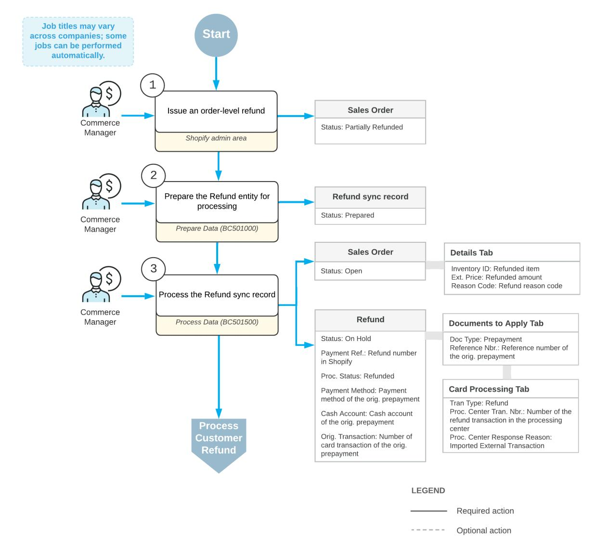

# **Import of Order-Level Refunds for Shipped Orders**

If the original sales order has been fully shipped (that is, it has the *Completed* status on the *[Sales Orders](https://help-2025r1.acumatica.com/Help?ScreenId=ShowWiki&pageid=19e4021c-1b84-49fd-be12-0320c5f1c7e5)* (SO301000) form), the following actions occur when an order-level refund is being imported to Acumatica ERP:

- On the *[Sales Orders](https://help-2025r1.acumatica.com/Help?ScreenId=ShowWiki&pageid=19e4021c-1b84-49fd-be12-0320c5f1c7e5)* form, the system creates a return order of the type selected in the **Return OrderType** box on the **Orders** tab of the *[Shopify Stores](#page-492-1)* form. In the **External Reference** box of the Summary area, the system inserts the identifier of the refund in the Shopify store.
- In the return order, on the **Details** tab, the system inserts a line with the non-stock item that was specified in the **Refund Amount Item** box on the **Orders** tab of the *[Shopify Stores](#page-492-1)* form. In the **Unit Price** and **Ext. Price** columns, the system inserts the refund amount. In the **Reason Code** column, the system inserts the reason code that was specified on the **Orders** tab of the *[Shopify Stores](#page-492-1)* form.
- On the *[Payments and Applications](https://help-2025r1.acumatica.com/Help?ScreenId=ShowWiki&pageid=ae844bf4-1aef-42cd-9e2f-49b3ee1bc8d7)* (AR302000) form, creates a payment of the *Refund* type in the refunded amount and links it to the return order.

The following diagram illustrates the processing of an order-level refund for a card-based payment method that is issued aer the sales order has been shipped.

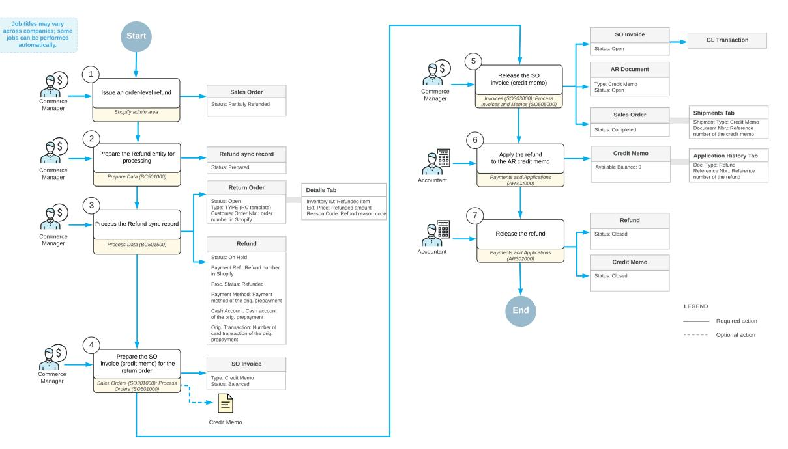

# **Importing Card Refunds: Item-Level Refunds**

A refund of an ordered item may be issued if, for example, a customer wants to amend the order to decrease the quantity of a purchased item or because they want to return the item whose condition or performance is unsatisfactory.

# **Import of Refunds for Not-Yet-Shipped Orders**

During the import of item refunds, if the original sales order has not been shipped (that is, it has the *Open* or *On Hold* status on the *[Sales Orders](https://help-2025r1.acumatica.com/Help?ScreenId=ShowWiki&pageid=19e4021c-1b84-49fd-be12-0320c5f1c7e5)* (SO301000) form), the following actions occur:

- In the original sales order, on the **Details** tab of the *[Sales Orders](https://help-2025r1.acumatica.com/Help?ScreenId=ShowWiki&pageid=19e4021c-1b84-49fd-be12-0320c5f1c7e5)* form, the system updates the order line or lines to decrease the item quantities. Discounts and taxes, if applied, are recalculated accordingly.
- If the processing status of the original payment is *Captured*, the system creates a payment of the *Refund* type in the refunded amount on the *[Payments and Applications](https://help-2025r1.acumatica.com/Help?ScreenId=ShowWiki&pageid=ae844bf4-1aef-42cd-9e2f-49b3ee1bc8d7)* (AR302000) form, assigns it the *Closed* status, and applies it to the original payment.
- If the original payment is refunded in full, it is assigned the *Closed* status.
- If the sales order is fully refunded or canceled and the processing status of the original payment is *Authorized*, then the original payment is voided.

The following diagram illustrates the processing of an item return for a card-based payment method that is issued before the sales order has been shipped.

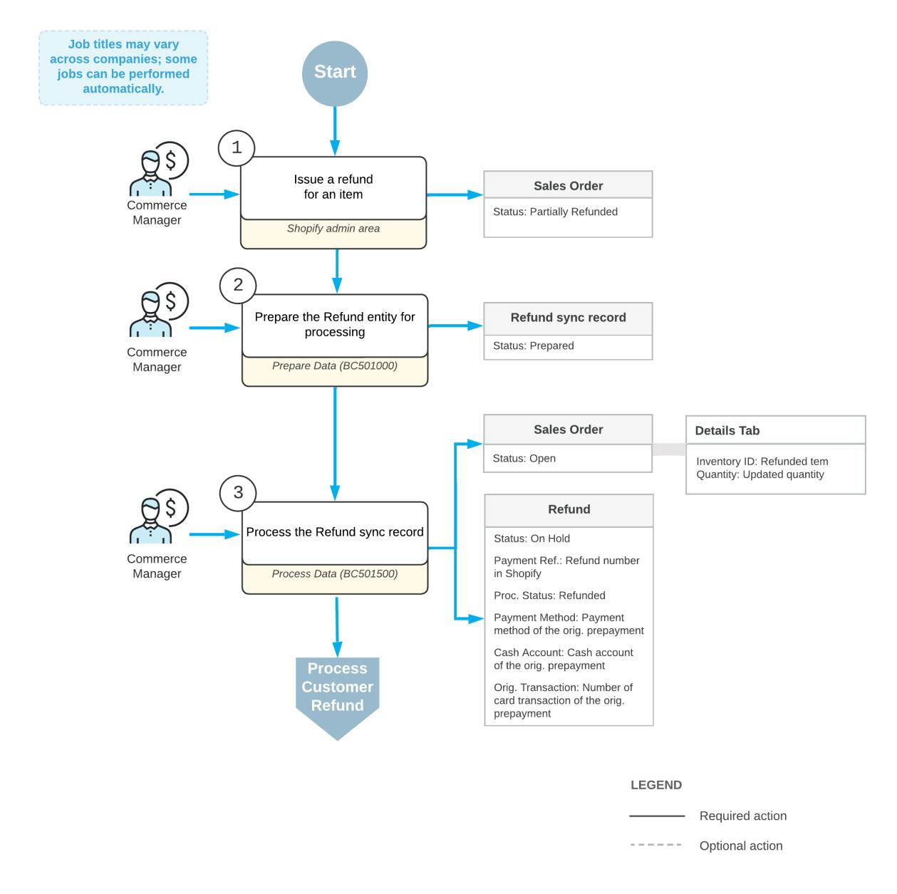

## **Import of Refunds for Fully Shipped Orders**

If the original sales order has been fully shipped (that is, it has the *Completed* status on the *[Sales Orders](https://help-2025r1.acumatica.com/Help?ScreenId=ShowWiki&pageid=19e4021c-1b84-49fd-be12-0320c5f1c7e5)* (SO301000) form) and the processing status of the original payment is *Open* or *Closed* on the *[Payments and](https://help-2025r1.acumatica.com/Help?ScreenId=ShowWiki&pageid=ae844bf4-1aef-42cd-9e2f-49b3ee1bc8d7) [Applications](https://help-2025r1.acumatica.com/Help?ScreenId=ShowWiki&pageid=ae844bf4-1aef-42cd-9e2f-49b3ee1bc8d7)* (AR302000) form, the following actions occur when an item refund is being imported to Acumatica ERP:

- On the *[Sales Orders](https://help-2025r1.acumatica.com/Help?ScreenId=ShowWiki&pageid=19e4021c-1b84-49fd-be12-0320c5f1c7e5)* form, the system creates a return order of the type that was specified in the **Return OrderType** box on the **Orders** tab of the *[Shopify Stores](#page-492-1)* (BC201010) form. In the **External Reference** box of the Summary area, the system inserts the identifier of the refund in the Shopify store.
- In the return order, on the **Details** tab of the *[Sales Orders](https://help-2025r1.acumatica.com/Help?ScreenId=ShowWiki&pageid=19e4021c-1b84-49fd-be12-0320c5f1c7e5)* form, the system inserts a line with the applicable quantity of the returned item. In the **Reason Code** column, the system inserts the reason code that was specified on the **Orders** tab of the *[Shopify Stores](#page-492-1)* form.
- If the processing status of the original payment is *Captured*, the system creates a payment of the *Refund* type in the refunded amount on the *[Payments and Applications](https://help-2025r1.acumatica.com/Help?ScreenId=ShowWiki&pageid=ae844bf4-1aef-42cd-9e2f-49b3ee1bc8d7)* form, and links it to the return order.

• If the processing status of the original payment is *Authorized*, then the original payment is voided.

The following diagram illustrates the processing of an item return for a card-based payment method that is issued aer the sales order has been fully shipped.

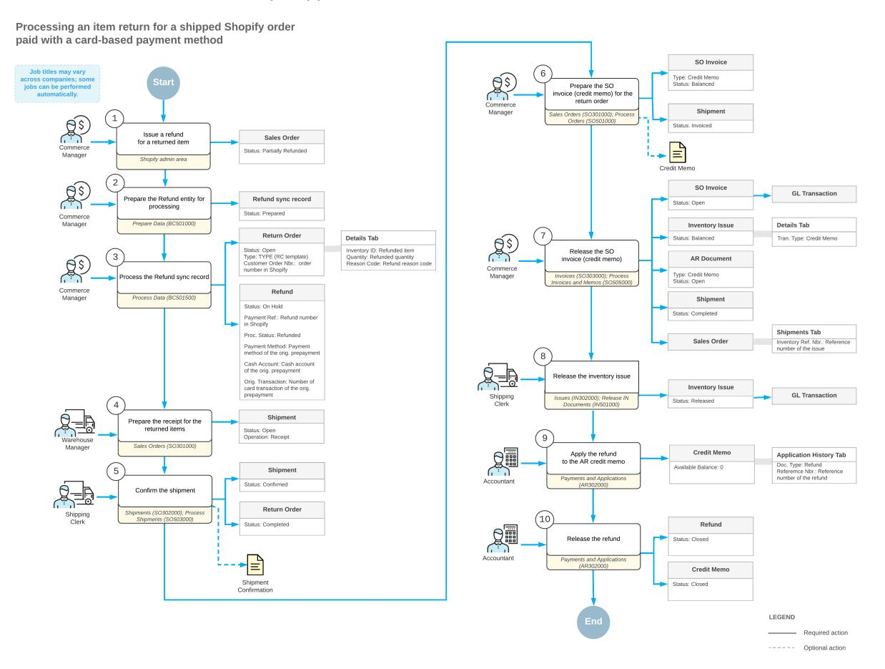

#### **Import of Refunds for Partially Shipped Orders**

When an item refund that has been issued for a partially shipped order is being imported from Shopify to Acumatica ERP, the following actions occur:

- For a not-yet-shipped item, the system adjusts the item quantity in the original sales order on the *[Sales](https://help-2025r1.acumatica.com/Help?ScreenId=ShowWiki&pageid=19e4021c-1b84-49fd-be12-0320c5f1c7e5) [Orders](https://help-2025r1.acumatica.com/Help?ScreenId=ShowWiki&pageid=19e4021c-1b84-49fd-be12-0320c5f1c7e5)* (SO301000) form.
- The system creates a refund for the full order amount on the *[Payments and Applications](https://help-2025r1.acumatica.com/Help?ScreenId=ShowWiki&pageid=ae844bf4-1aef-42cd-9e2f-49b3ee1bc8d7)* (AR302000) form, and applies the part of the refund amount related to the not-yet-shipped items to the original payment.
- For a shipped item, the system creates a return order on the *[Sales Orders](https://help-2025r1.acumatica.com/Help?ScreenId=ShowWiki&pageid=19e4021c-1b84-49fd-be12-0320c5f1c7e5)* form. You have to process the order manually, create and release a credit memo, and apply the refund to the credit memo.
- The original payment assigned the *Closed* status if an invoice has been already created for the shipped items and released.

The process is similar to the import of item refunds for not-yet-shipped orders and the import of item refunds for fully shipped orders, which are described in the sections above.

To avoid issues with the import of refunds for partially shipped orders, make sure to select the **Restock item** check box when you initiate a return of an item in the Shopify store.

# **Importing Card Refunds: To Process a Refund for a Not-Yet-Shipped Order**

The following activity will walk you through the process of importing from the Shopify store to Acumatica ERP a partial refund of an order that has been paid by a card-based payment method and has not yet been shipped.

The following activity is based on the *U100* dataset.

## **Story**

Suppose that a customer placed an order for 10 jars of kiwi jam in the online store, and paid for it by card. The jam was to be delivered later by the SweetLife Fruits & Jams within 7 days of purchase. Later the same day, the customer called the store to inform the store manager that an error had occurred and only 7 jars of kiwi jam were to be purchased, and asked the remaining 3 jars of kiwi jam to be refunded. As the store manager, you need to refund 3 jars of kiwi jam and import this refund to Acumatica ERP so that the correct quantities of jam will be issued from the SweetLife Fruits & Jams warehouse.

## **Configuration Overview**

In the *U100* dataset, for the purposes of this activity, the following features have been enabled on the *[Enable/](https://help-2025r1.acumatica.com/Help?ScreenId=ShowWiki&pageid=c1555e43-1bc5-4f6f-ba9d-b323f94d8a6b) [Disable Features](https://help-2025r1.acumatica.com/Help?ScreenId=ShowWiki&pageid=c1555e43-1bc5-4f6f-ba9d-b323f94d8a6b)* (CS100000) form:

- *Retail Commerce*
- *Shopify Connector*
- *Custom Order Types*

The following entities, which you will use in this activity, have been predefined in the *U100* dataset:

- The *ER* order type on the *Order [Types](https://help-2025r1.acumatica.com/Help?ScreenId=ShowWiki&pageid=e6984218-4260-4438-99e1-aee2b3765369)* (SO201000) form
- The *REFUNDAMT* non-stock item on the *[Non-Stock Items](https://help-2025r1.acumatica.com/Help?ScreenId=ShowWiki&pageid=bf68dd4f-63d4-460d-8dc0-9152f2bd6bf1)* (IN202000) form
- The *EREFUND* reason code on the *[Reason Codes](https://help-2025r1.acumatica.com/Help?ScreenId=ShowWiki&pageid=fe53f1bf-3670-465e-8b7c-922d8246f123)* (CS211000) form

#### **Process Overview**

In this activity, you will do the following:

- 1. In the Shopify store, place a sales order for a customer through the storefront and pay for it with a credit card.
- 2. In the admin area of the Shopify store, review the sales order.
- 3. On the *[Prepare Data](#page-529-1)* (BC501000) form, prepare the sales order data for processing, and on the *[Process Data](#page-533-1)* (BC501500) form, process the sales order data.
- 4. On the *[Sales Orders](https://help-2025r1.acumatica.com/Help?ScreenId=ShowWiki&pageid=19e4021c-1b84-49fd-be12-0320c5f1c7e5)* (SO301000) form, review the imported sales order.
- 5. On the *[Payments and Applications](https://help-2025r1.acumatica.com/Help?ScreenId=ShowWiki&pageid=ae844bf4-1aef-42cd-9e2f-49b3ee1bc8d7)* (AR302000) form, review the prepayment created for the imported sales order, capture the funds, and release the prepayment.
- 6. In the admin area of the Shopify store, issue a refund for an individual item.
- 7. On the *[Prepare Data](#page-529-1)* form, prepare the refund data for processing, and on the *[Process Data](#page-533-1)* form, process the refund data.
- 8. On the *[Sales Orders](https://help-2025r1.acumatica.com/Help?ScreenId=ShowWiki&pageid=19e4021c-1b84-49fd-be12-0320c5f1c7e5)* form, review the updated sales order, and on the *[Payments and Applications](https://help-2025r1.acumatica.com/Help?ScreenId=ShowWiki&pageid=ae844bf4-1aef-42cd-9e2f-49b3ee1bc8d7)* form, review the updated prepayment.

9. On the *[Payments and Applications](https://help-2025r1.acumatica.com/Help?ScreenId=ShowWiki&pageid=ae844bf4-1aef-42cd-9e2f-49b3ee1bc8d7)* form, review and release the refund.

#### **System Preparation**

To prepare the system for the steps of this activity, do the following:

- 1. Make sure that the following prerequisite activities have been performed:
  - a. *Initial [Configuration:](#page-250-1) To Configure the Store Connection*
  - b. *Data [Synchronization:](#page-259-1) To Perform the First Synchronization*
  - c. *[Importing Card Refunds: Implementation Activity](#page-395-1)*
- 2. Sign in to the admin area of the Shopify store as the store administrator.

# **Step 1: Placing an Order**

To create an order for ten 96-ounce jars of kiwi jam from the Shopify admin area, do the following:

- 1. In the le menu, under **Sales Channels**, click the Preview button right of **OnlineStore**.
- 2. On the storefront, start typing kiwi in the search bar, and in the list of search results, click *Kiwi jam 96 oz*.
- 3. On the page for the *Kiwi jam 96 oz* product, click **Add to cart**.
- 4. In the top right, click**View my cart**.
- 5. On the **Your cart** page, which opens, change the quantity of the *Kiwi jam 96 oz* product to *10*.
- 6. Click **Check out**.
- 7. On the order creation page (**Information** step), specify the needed settings as follows:
  - a. In the **Contact** section, in the **Email or mobile phone number** box, specify *melody@example.com*.
  - b. In the **Shipping address** section, fill in the shipping address boxes as follows:
    - **First name**: Melody
    - **Last name**: Keys
    - **Address**: 3402 Angus Road
    - **City**: New York
    - **Country/region**: *United States*
    - **State**: *New York*
    - **ZIP code**: 10003
  - c. At the bottom of the page, click **Continue to shipping**.
- 8. On the order creation page (**Shipping** step), in the**Shipping method** section, select the **Economy** option button, and click **Continue to payment**.
- 9. On the order creation page (**Payment** step), in the **Payment** section, select the **Credit card** option button, and specify the following card settings:
  - **Card number**: 4242 4242 4242 4242
  - **Name on card**: Melody Keys
  - **Expiration**: 12/23
  - **Security code**: 123

10.In the **Billing address** section, select the**Same as shipping address** option button.

11.Click **Pay now** to place and pay your order.

Your order has been created, and on the confirmation page, the order number is displayed. You will process the order with this order number further in this activity.

Shopify assigns each order an order number, which by default is represented by the prefix *#* and a numbering sequence. The order number is displayed at the top of the order page next to the order's payment status and fulfillment status. If needed, you can change the format of the order number on the **General** settings page in the Shopify admin area.

Each order is also assigned a numeric identifier, which you can see in the URL of the Shopify order page.

On the *[Process Data](#page-533-1)* (BC501500) and *[Sync History](#page-539-1)* (BC301000) forms, the order identifier is displayed in the **External ID** column, and the order number is displayed in the **External Description** column.

### **Step 2: Reviewing the Sales Order in the Admin Area**

To review the sales order that you placed in the previous step, while you are signed in to the admin area of the Shopify store, do the following:

- 1. In the le menu, click **Orders**.
- 2. On the **Orders** page, which opens, click the row with the order for *Melody Keys*.
- 3. On the order details page, which opens, review the order details.

Notice that the payment status is *Authorized* and the **Capture payment** button is displayed. Because you have configured the payment provider to only authorize (but not capture) the payment amount when the order is placed, the payment funds have not yet been captured.

You can view the details of the card transaction by expanding the corresponding link in the **Timeline** section.

#### **Step 3: Importing the Sales Order**

To import the sales order to Acumatica ERP, do the following:

- 1. Sign in to Acumatica ERP by using the following credentials:
  - **Username**: *gibbs*
  - **Password**: *123*
- 2. Open the *[Prepare Data](#page-529-1)* (BC501000) form.
- 3. In the Summary area, specify the following settings:
  - **Store**: *SweetStore - SP*
  - **Prepare Mode**: *Incremental*
- 4. In the table, select the check box in the unlabeled column in the row with the *Sales Order* entity.
- 5. On the form toolbar, click **Prepare**.
- 6. In the **Processing** dialog box, which opens, click **Close** to close the dialog box.
- 7. In the row with the *Sales Order* entity, click the link with the number of prepared synchronization records in the **Ready to Process** column.
- 8. On the *[Process Data](#page-533-1)* (BC501500) form, which opens with the *SweetStore - SP* store and the *Sales Order* entity selected, select the unlabeled check box in the row with the order you created in Step 1 (which you can identify by its number in the **External ID** column).
- 9. On the form toolbar, click **Process**.

10.In the **Processing** dialog box, which opens, click **Close** to close the dialog box.

#### **Step 4: Reviewing the Imported Sales Order and Payment**

To review the imported sales order, do the following:

- 1. Open the *[Sync History](#page-539-1)* (BC301000) form.
- 2. In the Summary area, specify the following settings:
  - **Store**: *SweetStore - SP*
  - **Entity**: *Sales Order*
- 3. On the **Processed** tab, in the row of the sales order that you have just imported (which you can locate by its external ID), click the link in the **ERP ID** column.
- 4. On the *[Sales Orders](https://help-2025r1.acumatica.com/Help?ScreenId=ShowWiki&pageid=19e4021c-1b84-49fd-be12-0320c5f1c7e5)* (SO301000) form, which opens, review the settings of the sales order.

In the Summary area, notice that the **Customer Order Nbr.** and **Description** boxes include the order number from Shopify. In the **Customer** box, the system has inserted the ID of the customer that was generated based on the customer numbering sequence defined on the *[Shopify Stores](#page-492-1)* (BC201010) form.

On the **Details** tab, review the quantity of the *KIWIJAM96* items, which is 10 pieces.

On the **Payments** tab, review the details of the created payment document.

Notice that the payment document has the *Prepayment* type. It includes the external credit card transaction associated with the purchase. The number of the transaction (which in Shopify is shown in the**Timeline** section) is displayed in the **Payment Ref.** column and its status, which is *Pre-Authorized*, is displayed in the **Proc.Status** column. The **Payment Method** and **Cash Account** columns show the payment method and cash account defined in Acumatica ERP and mapped to the *SHOPIFY\_PAYMENTS* store payment method (*SHOPIFYPAY* and *10250ST*, respectively). Because the payment has been authorized but not captured, the prepayment has the *Pending Processing* status. Before you can process and import a refund in the Shopify store, you need to capture and release the prepayment.

#### **Step 5: Capturing and Releasing the Payment**

To capture the funds and release the prepayment, do the following:

1. While you are viewing the **Payments** tab of the *[Sales Orders](https://help-2025r1.acumatica.com/Help?ScreenId=ShowWiki&pageid=19e4021c-1b84-49fd-be12-0320c5f1c7e5)* (SO301000) form, click the link with the prepayment number in the **Reference Nbr.** column.

The *[Payments and Applications](https://help-2025r1.acumatica.com/Help?ScreenId=ShowWiki&pageid=ae844bf4-1aef-42cd-9e2f-49b3ee1bc8d7)* (AR302000) form opens in a pop-up window with the prepayment selected.

2. On the More menu (under **Card Processing**), click **Capture**.

Once the funds are successfully captured, the processing status of the payment changes to *Captured*, and its status changes from *Pending Processing* to *Balanced*.

3. On the form toolbar, click **Release** to release the payment.

The status of the prepayment changes to *Open*.

#### **Step 6: Issuing a Refund for an Individual Item**

Now you will issue a refund for an individual item. While you are signed in to the admin area of the Shopify store, do the following:

- 1. In the le menu, click **Orders**.
- 2. On the **Orders** page, click the row of the order that you created and imported earlier in this activity.
- 3. On the order page, which opens, click **Refund** on the page toolbar.
- 4. On the **Refund** page, in the item quantity box, specify *3*.

In the **Summary** section, review the refunded amount, which includes the item subtotal (\$135.45) and applicable taxes (\$12.02).

5. In the **Summary** section, click **Refund \$147.47**.

#### **Step 7: Importing the Refund**

To import the refund to Acumatica ERP, do the following:

- 1. Open the *[Prepare Data](#page-529-1)* (BC501000) form.
- 2. In the Summary area, specify the following settings:
  - **Store**: *SweetStore - SP*
  - **Prepare Mode**: *Incremental*
- 3. In the table, select the check box in the unlabeled column in the row with the *Refund* entity.
- 4. On the form toolbar, click **Prepare**.
- 5. In the **Processing** dialog box, which opens, click **Close** to close the dialog box.
- 6. Click the link in the **Ready to Process** column in the row with the *Refund* entity.
- 7. On the *[Process Data](#page-533-1)* (BC501500) form, which opens with the *SweetStore - SP* store and the *Refund* entity selected in the Summary area, select the unlabeled check box in the row of the refund (which you can identify by the number of the order it refers to in the **External ID** column).
- 8. On the form toolbar, click **Process**.
- 9. In the **Processing** dialog box, which opens, click **Close** to close the dialog box.

#### **Step 8: Reviewing the Results of the Import**

To review how the refund has been imported to Acumatica ERP, do the following:

- 1. Open the *[Sync History](#page-539-1)* (BC301000) form.
- 2. In the Summary area, specify the following settings:
  - **Store**: *SweetStore - SP*
  - **Entity**: *Refund*
- 3. On the **Processed** tab, in the row of the refund that you have just imported (which you can locate by the external ID of the related order), click the link in the **ERP ID** column.

On the *[Sales Orders](https://help-2025r1.acumatica.com/Help?ScreenId=ShowWiki&pageid=19e4021c-1b84-49fd-be12-0320c5f1c7e5)* (SO301000) form, which opens in a pop-up window, review the order as follows:

- On the **Details** tab, notice that the quantity of the *KIWIJAM96* stock item has been reduced from *10* to *7*.
- In the Summary area, the order total has been reduced to reflect the new item quantity. The **Description** box now shows the updated status of the order in the Shopify store, which is *Partially Refunded*.
- 4. On the **Payments** tab, click the prepayment number link in the **Reference Nbr.** column.

On the *[Payments and Applications](https://help-2025r1.acumatica.com/Help?ScreenId=ShowWiki&pageid=ae844bf4-1aef-42cd-9e2f-49b3ee1bc8d7)* (AR302000) form, which opens with the prepayment selected, notice that the applied amount and the available balance reflect the reduced order amount and the refunded amount, respectively.

#### **Step 9: Reviewing and Releasing the Refund**

- 1. Open the Payments and Applications (AR3020PL) form.
- 2. Filter the list of records as follows:
  - a. In the list of records, click the header of the **Description** column.

- b. In the list of filter conditions, select **Contains**.
- c. In the text box, type SweetStore.
- d. Click **OK** to apply the filter.

In the list of documents, notice that a new *Refund* document has been created for the refund you imported in Step 7. (You can identify it by the order number and transaction type shown in the **Description** column).

3. Click the link with the identifier of the refund in the **Reference Nbr.** column.

On the *[Payments and Applications](https://help-2025r1.acumatica.com/Help?ScreenId=ShowWiki&pageid=ae844bf4-1aef-42cd-9e2f-49b3ee1bc8d7)* (AR302000) form, which opens with the refund selected, review the details of the refund. In the **Description** box of the Summary area, notice the information about the store name, sales order number, and store payment method to which the refund was applied. The **Payment Method** and **Cash Account** boxes contain the same settings that were used in the original prepayment. The **Orig. Transaction** box shows the identifier of the capture transaction of the original prepayment.

On the **Card Processing** tab, notice that the transaction type of the card transaction (shown in the**Tran. Type** box) is *Refund*, and the **Proc. Center Response Reason** column shows *Imported External Transaction*, which indicates that the refund was imported from an external ecommerce system rather than issued in Acumatica ERP.

4. On the form toolbar, click **Release**.

Once the processing of the refund is finished, its status changes to *Closed*. In the **Application History** tab, the system now shows the original prepayment to which the refund was applied.

5. On the **Application History** tab, in the only row, click the link in the **Reference Nbr.** column.

On the *[Payments and Applications](https://help-2025r1.acumatica.com/Help?ScreenId=ShowWiki&pageid=ae844bf4-1aef-42cd-9e2f-49b3ee1bc8d7)* form, which opens in a pop-up window with the original prepayment selected, notice that the available balance of the prepayment has become zero.

You have now imported to Acumatica ERP a partial refund for the ordered items for the order that has not been shipped. For the purposes of this activity, you do not need to process the sales order further.

# **Importing Card Refunds: To Process a Refund for a Shipped Order**

The following activity will walk you through the process of importing from the Shopify store to Acumatica ERP a partial refund of an order paid by card that has been fully delivered.

The following activity is based on the *U100* dataset.

# **Story**

Suppose that a customer placed an order for 10 jars of pear jam in the SweetLife Fruits & Jams online store, and paid the entire order by card. Four days later, aer the purchased jam has already been delivered, the customer returned 2 jars of pear jam to the store. As the store manager, you need to process the return of 2 jars of pear jam. You also want to reimburse the customer for returning part of the purchase in person.

# **Configuration Overview**

In the *U100* dataset, for the purposes of this activity, the following features have been enabled on the *[Enable/](https://help-2025r1.acumatica.com/Help?ScreenId=ShowWiki&pageid=c1555e43-1bc5-4f6f-ba9d-b323f94d8a6b) [Disable Features](https://help-2025r1.acumatica.com/Help?ScreenId=ShowWiki&pageid=c1555e43-1bc5-4f6f-ba9d-b323f94d8a6b)* (CS100000) form:

- *Retail Commerce*
- *Shopify Connector*
- *Custom Order Types*

The following entities, which you will use in this activity, have been predefined in the *U100* dataset:

- The *ER* order type on the *Order [Types](https://help-2025r1.acumatica.com/Help?ScreenId=ShowWiki&pageid=e6984218-4260-4438-99e1-aee2b3765369)* (SO201000) form
- The *REFUNDAMT* non-stock item on the *[Non-Stock Items](https://help-2025r1.acumatica.com/Help?ScreenId=ShowWiki&pageid=bf68dd4f-63d4-460d-8dc0-9152f2bd6bf1)* (IN202000) form
- The *EREFUND* reason code on the *[Reason Codes](https://help-2025r1.acumatica.com/Help?ScreenId=ShowWiki&pageid=fe53f1bf-3670-465e-8b7c-922d8246f123)* (CS211000) form

#### **Process Overview**

In this activity, you will do the following:

- 1. On the storefront of the Shopify store, place a sales order for a customer through the storefront and pay for it with a credit card.
- 2. In the admin area of the Shopify store, review the sales order.
- 3. On the *[Prepare Data](#page-529-1)* (BC501000) form, prepare the sales order data for processing, and on the *[Process Data](#page-533-1)* (BC501500) form, process the sales order data.
- 4. On the *[Sales Orders](https://help-2025r1.acumatica.com/Help?ScreenId=ShowWiki&pageid=19e4021c-1b84-49fd-be12-0320c5f1c7e5)* (SO301000) form, review the imported sales order.
- 5. On the *[Payments and Applications](https://help-2025r1.acumatica.com/Help?ScreenId=ShowWiki&pageid=ae844bf4-1aef-42cd-9e2f-49b3ee1bc8d7)* (AR302000) form, review the prepayment created for the imported sales order, capture the funds, and release the prepayment.
- 6. On the *[Sales Orders](https://help-2025r1.acumatica.com/Help?ScreenId=ShowWiki&pageid=19e4021c-1b84-49fd-be12-0320c5f1c7e5)* form, create a shipment.
- 7. On the *[Shipments](https://help-2025r1.acumatica.com/Help?ScreenId=ShowWiki&pageid=f47cffcc-543e-469c-a204-a9c1e3da346d)* (SO302000) form, confirm the shipment.
- 8. On the *[Prepare Data](#page-529-1)* (BC501000) form, prepare the shipment data for processing, and on the *[Process Data](#page-533-1)* (BC501500) form, process the shipment data.
- 9. In the admin area of the Shopify store, issue a refund for an individual item.
- 10.On the *[Prepare Data](#page-529-1)* form, prepare the refund data for processing, and on the *[Process Data](#page-533-1)* form, process the refund data.
- 11.On the *[Sales Orders](https://help-2025r1.acumatica.com/Help?ScreenId=ShowWiki&pageid=19e4021c-1b84-49fd-be12-0320c5f1c7e5)* form, review the return order, and on the *[Payments and Applications](https://help-2025r1.acumatica.com/Help?ScreenId=ShowWiki&pageid=ae844bf4-1aef-42cd-9e2f-49b3ee1bc8d7)* form, review the updated prepayment.
- 12.On the *[Payments and Applications](https://help-2025r1.acumatica.com/Help?ScreenId=ShowWiki&pageid=ae844bf4-1aef-42cd-9e2f-49b3ee1bc8d7)* form, review and release the refund.

#### **System Preparation**

To prepare the system for the steps of this activity, do the following:

- 1. Make sure that the following prerequisite activities have been performed:
  - a. *Initial [Configuration:](#page-250-1) To Configure the Store Connection*
  - b. *Data [Synchronization:](#page-259-1) To Perform the First Synchronization*
  - c. *[Importing Card Refunds: Implementation Activity](#page-395-1)*
- 2. Sign in to the admin area of the Shopify store as the store administrator.

#### **Step 1: Placing an Order**

To create an order for ten 96-ounce jars of pear jam from the Shopify admin area, do the following:

- 1. In the le menu, under **Sales Channels**, click the Preview button right of **OnlineStore**.
- 2. On the storefront, start typing pear in the search bar, and in the list of search results, click *Pear jam 96 oz*.
- 3. On the page for the *Pear jam 96 oz* product, click **Add to cart**.
- 4. In the top right, click**View my cart**.
- 5. On the **Your cart** page, which opens, change the quantity of the *Pear jam 96 oz* product to *10*.
- 6. Click **Check out**.

- 7. On the order creation page (**Information** step), specify the needed settings as follows:
  - a. In the **Contact** section, in the **Email or mobile phone number** box, specify *melody@example.com*.
  - b. In the **Shipping address** section, fill in the shipping address boxes as follows:
    - **First name**: Melody
    - **Last name**: Keys
    - **Address**: 3402 Angus Road
    - **City**: New York
    - **Country/region**: *United States*
    - **State**: *New York*
    - **ZIP code**: 10003
  - c. At the bottom of the page, click **Continue to shipping**.
- 8. On the order creation page (**Shipping** step), in the**Shipping method** section, select the **Economy** option button, and click **Continue to payment**.
- 9. On the order creation page (**Payment** step), in the **Payment** section, select the **Credit card** option button, and specify the following card settings:
  - **Card number**: 4242 4242 4242 4242
  - **Name on card**: Melody Keys
  - **Expiration date**: 12/23
  - **Security code**: 123

10.In the **Billing address** section, select the**Same as shipping address** option button.

11.Click **Pay now** to place and pay your order.

Your order has been created, and on the confirmation page, the order number is displayed. You will process the order with this order number further in this activity.

## **Step 2: Reviewing the Sales Order in the Admin Area**

To review the sales order that you placed in the previous step, while you are signed in to the admin area of the Shopify store, do the following:

- 1. In the le menu, click **Orders**.
- 2. On the **Orders** page, which opens, click the row with the order for *Melody Keys*.
- 3. On the order details page, which opens, review the order details.

Notice that the payment status is *Authorized* and the **Capture payment** button is displayed. Because you have configured the *Shopify Payments* payment option to only authorize (but not capture) the payment amount when the order is placed, the payment funds have not yet been captured.

- You can view the details of the card transaction by expanding the corresponding link in the **Timeline** section.
  - Besides the order number, Shopify assigns each order an identifier (a numeric sequence) that you can see in the URL of the order page in the store admin area. You can use this identifier to locate the necessary order on the *[Process Data](#page-533-1)* (BC501500) form (in the **External ID** column), for example, if you need to import an individual order from the Shopify store to Acumatica ERP.

## **Step 3: Importing the Sales Order**

To import the sales order to Acumatica ERP, do the following:

- 1. Sign in to Acumatica ERP by using the following credentials:
  - **Username**: *gibbs*
  - **Password**: *123*
- 2. Open the *[Prepare Data](#page-529-1)* (BC501000) form.
- 3. In the Summary area, specify the following settings:
  - **Store**: *SweetStore - SP*
  - **Prepare Mode**: *Incremental*
- 4. In the table, select the check box in the unlabeled column in the row with the *Sales Order* entity.
- 5. On the form toolbar, click **Prepare**.
- 6. In the **Processing** dialog box, which opens, click **Close** to close the dialog box.
- 7. In the row with the *Sales Order* entity, click the link with the number of prepared synchronization records in the **Ready to Process** column.
- 8. On the *[Process Data](#page-533-1)* (BC501500) form, which opens with the *SweetStore - SP* store and the *Sales Order* entity selected, select the unlabeled check box in the row with the order you created in Step 1 (which you can identify by its number in the **External ID** column).
- 9. On the form toolbar, click **Process**.

10.In the **Processing** dialog box, which opens, click **Close** to close the dialog box.

# **Step 4: Reviewing the Imported Sales Order and Payment**

To review the imported sales order, do the following:

- 1. Open the *[Sync History](#page-539-1)* (BC301000) form.
- 2. In the Summary area, specify the following settings:
  - **Store**: *SweetStore - SP*
  - **Entity**: *Sales Order*
- 3. On the **Processed** tab, in the row of the sales order that you have just imported (which you can locate by its external ID), click the link in the **ERP ID** column.
- 4. On the *[Sales Orders](https://help-2025r1.acumatica.com/Help?ScreenId=ShowWiki&pageid=19e4021c-1b84-49fd-be12-0320c5f1c7e5)* (SO301000) form, which opens, review the settings of the sales order.

In the Summary area, notice that the **Customer Order Nbr.** and **Description** boxes include the order number from Shopify. In the **Customer** box, the system has inserted the ID of the customer that was generated based on the customer numbering sequence defined on the *[Shopify Stores](#page-492-1)* (BC201010) form.

On the **Details** tab, review the quantity of the *PEARJAM96* items, which is 10 pieces.

On the **Payments** tab, review the details of the created payment document.

Notice that the payment document has the *Prepayment* type. It includes the external credit card transaction associated with the purchase. The number of the transaction (which in Shopify is shown in the**Timeline** section) is displayed in the **Payment Ref.** column and its status, which is *Pre-Authorized*, is displayed in the **Proc.Status** column. The **Payment Method** and **Cash Account** columns show the payment method and cash account defined in Acumatica ERP and mapped to the *SHOPIFY\_PAYMENTS* store payment method (*SHOPIFYPAY* and *10250ST*, respectively). Because the payment has been authorized but not captured, the prepayment has the *Pending Processing* status. Before you can process and import a refund in the Shopify store, you need to capture and release the prepayment.

# **Step 5: Capturing and Releasing the Payment**

To capture the funds and release the prepayment, do the following:

1. While you are viewing the **Payments** tab of the *[Sales Orders](https://help-2025r1.acumatica.com/Help?ScreenId=ShowWiki&pageid=19e4021c-1b84-49fd-be12-0320c5f1c7e5)* (SO301000) form, click the link with the prepayment number in the **Reference Nbr.** column.

The *[Payments and Applications](https://help-2025r1.acumatica.com/Help?ScreenId=ShowWiki&pageid=ae844bf4-1aef-42cd-9e2f-49b3ee1bc8d7)* (AR302000) form opens in a pop-up window with the prepayment selected.

2. On the More menu (under **Card Processing**), click **Capture**.

Once the funds are successfully captured, the processing status of the payment changes to *Captured*, and its status changes from *Pending Processing* to *Balanced*.

3. On the form toolbar, click **Release** to release the payment.

The status of the prepayment changes to *Open*.

4. Close the pop-up window with the *[Payments and Applications](https://help-2025r1.acumatica.com/Help?ScreenId=ShowWiki&pageid=ae844bf4-1aef-42cd-9e2f-49b3ee1bc8d7)* form to return to the *[Sales Orders](https://help-2025r1.acumatica.com/Help?ScreenId=ShowWiki&pageid=19e4021c-1b84-49fd-be12-0320c5f1c7e5)* form.

#### **Step 6: Creating a Shipment for the Imported Order**

To create a shipment for the order, do the following:

- 1. While you are viewing the imported order on the *[Sales Orders](https://help-2025r1.acumatica.com/Help?ScreenId=ShowWiki&pageid=19e4021c-1b84-49fd-be12-0320c5f1c7e5)* (SO301000) form, click **CreateShipment** on the form toolbar.
- 2. In the **SpecifyShipment Parameters** dialog box, which opens, make sure the current date and the *RETAIL* warehouse are selected, and click **OK**. The system creates a shipment and opens it on the *[Shipments](https://help-2025r1.acumatica.com/Help?ScreenId=ShowWiki&pageid=f47cffcc-543e-469c-a204-a9c1e3da346d)* (SO302000) form.

## **Step 7: Confirming the Shipment for the Imported Order**

To confirm the shipment for the order, do the following:

- 1. While you are still viewing the shipment on the *[Shipments](https://help-2025r1.acumatica.com/Help?ScreenId=ShowWiki&pageid=f47cffcc-543e-469c-a204-a9c1e3da346d)* (SO302000) form, review the line on the **Details** tab. Make sure of the following:
  - The correct order line is included in the shipment.
  - The *RETAIL* warehouse is specified for the item.
  - The shipped quantity is equal to the ordered quantity.
- 2. On the form toolbar, click **Confirm Shipment**.

Notice that the shipment has been assigned the *Confirmed* status. Make a note of the shipment number; you will use it to identify the shipment to be exported to the Shopify store in the next step.

Because you have confirmed the shipment, on the *[Sales Orders](https://help-2025r1.acumatica.com/Help?ScreenId=ShowWiki&pageid=19e4021c-1b84-49fd-be12-0320c5f1c7e5)* (SO301000) form, the status of the imported sales order has changed to *Completed*.

## **Step 8: Synchronizing the Shipment with the Shopify Store**

To synchronize with the Shopify store the shipment that you created and confirmed in Steps 6 and 7, do the following:

- 1. On the *[Prepare Data](#page-529-1)* (BC501000) form.
- 2. In the Summary area, specify the following settings:
  - **Store**: *SweetStore - SP*
  - **Prepare Mode**: *Incremental*
- 3. In the table, select the check box in the unlabeled column for the *Shipment* entity.
- 4. On the form toolbar, click **Prepare**.
- 5. In the **Processing** dialog box, which opens, click **Close** to close the dialog box.
- 6. Click the link in the **Ready to Process** column in the row with the *Shipment* entity.

- 7. On the *[Process Data](#page-533-1)* (BC501500) form, which opens with the *SweetStore - SP* store and the *Shipment* entity selected, select the unlabeled check box for the shipment created and confirmed in the previous steps (which you can identify by the shipment number in the **ERP ID** column).
- 8. On the form toolbar, click **Process**.
- 9. In the **Processing** dialog box, which opens, click **Close** to close the dialog box.

## **Step 9: Issuing a Refund in the Shopify Store**

Now you will issue a refund for an individual item. While you are signed in to the admin area of your Shopify store, do the following:

- 1. In the le menu, click **Orders**.
- 2. On the **Orders** page, click the row of the order that you created and imported earlier in the activity.
- 3. On the sales order page, which opens, click **Refund** on the page toolbar.
- 4. On the **Refund** page, in the item quantity box, specify *2*.
- 5. In the Summary section, review the **Refund total** amount (\$98.31, which includes \$8.01 in taxes)
- 6. To reimburse the customer for having to return part of the purchase, in the **Refund amount** box, change the amount to 108.31.
- 7. Click **Refund \$108.31**.

## **Step 10: Importing the Refund**

To import the refund to Acumatica ERP, do the following:

- 1. Open the *[Prepare Data](#page-529-1)* (BC501000) form.
- 2. In the Summary area, specify the following settings:
  - **Store**: *SweetStore - SP*
  - **Prepare Mode**: *Incremental*
- 3. In the table, select the check box in the unlabeled column in the row with the *Refund* entity.
- 4. On the form toolbar, click **Prepare**.
- 5. In the **Processing** dialog box, which opens, click **Close** to close the dialog box.
- 6. Click the link in the **Ready to Process** column in the row with the *Refund* entity.
- 7. On the *[Process Data](#page-533-1)* (BC501500) form, which opens with the *SweetStore - SP* store and the *Refund* entity selected in the Summary area, select the unlabeled check box in the row of the refund (which you can identify by the number of the order it refers to in the **External ID** column).
- 8. On the form toolbar, click **Process**.
- 9. In the **Processing** dialog box, which opens, click **Close** to close the dialog box.

#### **Step 11: Reviewing the Return Order**

To review the return order created in Acumatica ERP as a result of the refund import, do the following:

- 1. Open the Sales Orders (SO3010PL) form.
- 2. Filter the list of records as follows:
  - a. In the list of records, click the header of the **Customer Name**.
  - b. In the list of filter conditions, select **Contains**.

- c. In the text box, type Melody.
- d. Click **OK** to apply the filter.

Notice that an order of the *ER* type has been created for *Melody Keys*. Because the original sales order had the *Completed* status, it could not be modified and the return order was created. The return order has the *ER* type because this type was selected in the **Return OrderType** box on the **Orders** tab of the *[Shopify Stores](#page-492-1)* (BC201010) form in *[Importing Card Refunds: Implementation Activity](#page-395-1)*.

3. In the row with the return order for *Melody Keys*, click the link in the **Order Nbr.** column.

The *[Sales Orders](https://help-2025r1.acumatica.com/Help?ScreenId=ShowWiki&pageid=19e4021c-1b84-49fd-be12-0320c5f1c7e5)* (SO301000) form opens with the return order selected.

In the Summary area, notice that the **Customer Order Nbr.** and **Description** boxes contain the reference number of the original order in the Shopify store. In the **External Reference** box, the system inserted the identifier of the refund in the Shopify store.

On the **Details** tab, the system inserted two lines: one with the returned item (*PEARJAM96*) with the quantity of 2; the other one with the *REFUNDAMT* non-stock item, which reflects an order-level refund of \$10 that you specified in the Shopify store.

Notice that in the **Reason Code** column of both lines, the system inserted *EREFUND*, which is the reason code you specified in the **Refund Reason Code** box on the **Orders** tab of the *[Shopify Stores](#page-492-1)* (BC201010) form in *[Importing Card Refunds: Implementation Activity](#page-395-1)*.

#### **Step 12: Reviewing the Refund**

To review the refund created for the return order, do the following:

- 1. Open the Payments and Applications (AR3020PL) form.
- 2. Filter the list of records as follows:
  - a. In the list of records, click the header of the **Customer Name**.
  - b. In the list of filter conditions, select **Contains**.
  - c. In the text box, type Melody.
  - d. Click **OK** to apply the filter.

Notice that a document of the *Refund* type has been created for *Melody Keys* and assigned the *Balanced* status.

3. In the row with this refund, click the link in the **Reference Nbr.** column.

On the *[Payments and Applications](https://help-2025r1.acumatica.com/Help?ScreenId=ShowWiki&pageid=ae844bf4-1aef-42cd-9e2f-49b3ee1bc8d7)* (AR302000) form, which opens with the refund selected, review the details of the refund. In the **Description** box of the Summary area, notice the information about the store name, sales order number, and store payment method to which the refund was applied. The **Payment Method** and **Cash Account** boxes contain the same settings that were used in the original prepayment. The **Orig. Transaction** box shows the identifier of the card transaction of the original prepayment.

On the **Sales Orders** tab, notice that the refund has been linked to the return order.

On the **Card Processing** tab, notice that the transaction type of the card transaction (shown in the**Tran. Type** box) is *Refund*, and the **Proc. Center Response Reason** column shows *Imported External Transaction*, which indicates that the refund was imported from an external ecommerce system rather than issued in Acumatica ERP.

You have now imported to Acumatica ERP a refund for a returned item and a partial refund of the order amount for an order that has been fully shipped. For the purposes of this activity, you do not need to process the return order or refund further.

# **Selling and Accepting Gi Cards**

In this chapter, you will learn how to configure the gi card functionality to be able to sell gi cards in the Shopify store and accept the gi cards as payment.

# **Gi Cards: General Information**

You can sell gi certificates in the Shopify store and then accept them as full or partial payments.

# **Learning Objectives**

In this chapter, you will learn how to do the following:

- Create gi cards so that you can sell them in the Shopify store
- Set up gi cards as a payment method that can be used to pay orders placed in the Shopify store

## **Applicable Scenarios**

You set up gi cards if you want to offer customers the ability to buy a gi card and then accept the sold gi cards as payments for orders.

#### **Selling Gi Cards**

In order to be able to sell gi cards to customers and then import sales orders containing the gi cards from the Shopify store to Acumatica ERP, you perform the following general steps:

- 1. In the admin area of the Shopify store, enable the gi certificate functionality and define gi certificates that will be available to shoppers online.
- 2. In Acumatica ERP, define a non-stock item that will be used to represent a gi certificate in imported sales orders.
- 3. On the **Orders** tab of the *[Shopify Stores](#page-492-1)* (BC201010) form, in the **Gi Certificate Item** box, specify the created non-stock item that will represent sold gi certificates in imported sales orders.

## **Accepting Gi Cards as Payment**

To be able to import orders that are paid, fully or in part, by gi cards from the Shopify store to Acumatica ERP, you need to map the store payment method representing a gi card to a payment method defined in Acumatica ERP on the **Payments** tab of the *[Shopify Stores](#page-492-1)* (BC201010) form. For information about payment mapping, see *[Order](#page-332-2) [Synchronization: General Information](#page-332-2)*.

When a sales order that has been fully or partially paid by a gi card is imported to Acumatica ERP, a document of the *Prepayment* type is created on the *[Payments and Applications](https://help-2025r1.acumatica.com/Help?ScreenId=ShowWiki&pageid=ae844bf4-1aef-42cd-9e2f-49b3ee1bc8d7)* (AR302000) form for the gi card payment. The **Description** of the prepayment contains the identifier of the gi card in the Shopify store.

The identifier of the gi card is not the gi card number entered during the order placement. In Shopify, you can locate the identifier and the last four characters of the number of the gi card used to pay the order by expanding the subsection with gi card payment details in the**Timeline** section of the order page.

For step-by-step instructions for implementing gi cards, see *[Gift Cards: Process Activity](#page-416-1)*.

# **Gi Cards: Process Activity**

In this activity, you will learn how to implement gi cards in the Shopify store and explore how gi cards can be used to pay, in full or in part, for an online purchase in the Shopify store.

The following activity is based on the *U100* dataset.

#### **Story**

Suppose that SweetLife wants to give its online customers the ability to purchase gi cards and use these cards when purchasing goods in the SweetLife online store. As an implementation consultant, you need to configure the gi card functionality—that is, the ability to sell gi cards as items and use the cards as payment methods—and test it.

#### **Configuration Overview**

In the *U100* dataset, for the purposes of this activity, on the *[Non-Stock Items](https://help-2025r1.acumatica.com/Help?ScreenId=ShowWiki&pageid=bf68dd4f-63d4-460d-8dc0-9152f2bd6bf1)* (IN202000) form, the *GIFTCERT* nonstock item has been created to represent gi cards sold in the online store. All purchases of gi cards in the online store will be recorded in Acumatica ERP as purchases of this item.

#### **Process Overview**

You will do the following:

- 1. In the admin area of the Shopify store, enable the gi card functionality and create gi cards in various amounts to be sold in the online store.
- 2. On the storefront, purchase a gi card.
- 3. In the admin area of the Shopify store, send the gi card to the customer.
- 4. On the *[Shopify Stores](#page-492-1)* (BC201010) form, review the gi card settings.
- 5. On the *[Prepare Data](#page-529-1)* (BC501000) form, prepare the sales order data for synchronization, and on the *[Process](#page-533-1) [Data](#page-533-1)* (BC501500) form, process the prepared data.
- 6. On the *[Sales Orders](https://help-2025r1.acumatica.com/Help?ScreenId=ShowWiki&pageid=19e4021c-1b84-49fd-be12-0320c5f1c7e5)* (SO301000) form, review the imported sales order.
- 7. On the storefront, create an order and pay part of it with the purchased gi card.
- 8. In the admin area of the Shopify store, review the order.
- 9. On the *[Prepare Data](#page-529-1)* form, prepare the sales order data for synchronization, and on the *[Process Data](#page-533-1)* form, process the prepared data.

10.On the *[Sales Orders](https://help-2025r1.acumatica.com/Help?ScreenId=ShowWiki&pageid=19e4021c-1b84-49fd-be12-0320c5f1c7e5)* form, review the imported sales order that was partially paid for with the gi card.

#### **System Preparation**

Before you start configuring the gi cards, do the following:

1. Make sure the connection to the Shopify store is established and the minimum configuration is performed as described in *Initial [Configuration:](#page-250-1) To Configure the Store Connection*.

- 2. Make sure that the *PLUMJAM96* stock item has been exported to the Shopify store during the synchronization of the *Stock Item* entity, as described in *Data [Synchronization:](#page-259-1) To Perform the First [Synchronization](#page-259-1)*.
- 3. Make sure that the integration with the Shopify Payments payment provider has been implemented, as described in *Order [Synchronization:](#page-343-1) To Configure and Import Shopify Payments*.
- 4. Sign in to the admin area of the Shopify store as the store administrator in the same browser.

#### **Step 1: Configuring Gi Cards in the Store**

To enable the gi card functionality, in the Shopify store, do the following:

- 1. In the le menu, click **Products > Gi cards**.
- 2. On the **Gi cards** page, click **Add gi card product**.
- 3. On the **Create gi card product** page, specify the following settings:
  - **Title**: SweetStore Gift Card
  - **Status**: *Active*

In the **Denominations** section, review the default balances of the gi cards (\$10, \$25, \$50, and \$100). Leave all other settings as they are.

4. In the lower right, click**Save gi card product** to save your changes.

#### **Step 2: Purchasing a Present and a Gi Card**

To create an order in which you purchase a \$25 gi card, in the Shopify store, do the following:

- 1. In the le menu, hover over the **OnlineStore** sales channel, and click the **View your online store** icon, which appears right to the channel name, to open the storefront.
- 2. On the storefront, locate the *SweetStore Gi Card* product.
- 3. On the **SweetStore Gi Card** page, under **Denominations**, click *\$25.00*, and then click **Add to cart**.
- 4. In the dialog box that appears, click**View cart**.
- 5. On the **Your cart** page, click **Check out**.
- 6. On the order creation page, specify the settings as follows:
  - a. In the **Contact** section, in the **Email or mobile phone number** box, specify your email address.

Specify a real email address to which you have access. The gi card will be sent to this email address aer the order is completed.

- b. In the **Payment** section, specify the following settings under **Credit card**:
  - **Card number**: 4242 4242 4242 4242
  - **Expiration date**: 12/25
  - **Security code**: 123
  - **Name on card**: *Melody Keys*
- c. In the **Billing address** section, fill in the address boxes as follows:
  - **Country/region**: *United States*
  - **First name**: Melody
  - **Last name**: Keys
  - **Address**: 3402 Angus Road
  - **City**: New York

- **State**: *New York*
- **ZIP code**: 10003
- 7. In the **Remember me** section, clear the**Save my information for a faster checkout with aShop account** check box.
- 8. Click **Pay now** to place and pay your order. The confirmation page with the order number opens.

# **Step 3: Updating the Order Settings**

To update the gi card settings, in Acumatica ERP, perform the following instructions:

- 1. On the *[Shopify Stores](#page-492-1)* (BC201010) form, select the *SweetStore - SP* store.
- 2. On the **Orders** tab, in the **Gi Certificate Item** box, select *GIFTCERT*.
- 3. On the form toolbar, click**Save**.

### **Step 4: Importing the Order with the Gi Card**

To import the created order, in Acumatica ERP, do the following:

- 1. On the *[Prepare Data](#page-529-1)* (BC501000) form, specify the following settings in the Summary area:
  - **Store**: *SweetStore - SP*
  - **Prepare Mode**: *Incremental*
- 2. In the table, select the check box in the unlabeled column in the row of the *Sales Order* entity.
- 3. On the form toolbar, click **Prepare**.
- 4. In the **Processing** dialog box, which opens, click **Close** to close the dialog box.
- 5. In the row of the *Sales Order* entity, click the link with the number of prepared synchronization records in the **Ready to Process** column.
- 6. On the *[Process Data](#page-533-1)* (BC501500) form, which opens with the *SweetStore - SP* store and the *Sales Order* entity selected, in the row of the order you created (which you can find by its identifier in the **External ID** column and empty **ERP ID**), select the unlabeled check box.
- 7. On the form toolbar, click **Process**.
- 8. In the **Processing** dialog box, which opens, click **Close** to close the dialog box.

## **Step 5: Reviewing the Imported Order**

To review the details of the imported sales order in Acumatica ERP, do the following:

- 1. On the *[Sync History](#page-539-1)* (BC301000) form, specify the following settings in the Summary area:
  - **Store**: *SweetStore - SP*
  - **Entity**: *Sales Order*
- 2. On the **Processed** tab, in the row of the sales order that you have just imported, click the link in the **ERP ID** column.
- 3. On the *[Sales Orders](https://help-2025r1.acumatica.com/Help?ScreenId=ShowWiki&pageid=19e4021c-1b84-49fd-be12-0320c5f1c7e5)* (SO301000) form, which opens for the imported order, review the order details.

On the **Details** tab, notice the line with the *GIFTCERT* non-stock item, which you specified as the **Gi Certificate Item** on the **Orders** tab of the *[Shopify Stores](#page-492-1)* (BC201010) form. The **Line Description** column shows the description of the gi card in the Shopify store and the card denomination.

For the purposes of this activity, you do not need to process the created sales order further.

### **Step 6: Sending the Gi Card to the Customer**

To send the gi card to the customer, in the admin area of the Shopify store, do the following:

- 1. In the le menu, click **Orders**.
- 2. On the **Orders** page, which opens, click the row of the order for *Melody Keys* that you have created.
- 3. In the **Unfulfilled** section with the *SweetStore Gi Card*, click **Send gi card**.
- 4. On the **Fulfill item** page, which opens, click **Fulfill item**.

An email with the gi card code is sent to the email address that you have specified earlier in this activity.

# **Step 7: Updating the Payment Settings**

To update the payment settings, in Acumatica ERP, perform the following instructions:

- 1. On the *[Shopify Stores](#page-492-1)* (BC201010) form, select the *SweetStore - SP* store.
- 2. On the **Payments** tab, in the existing row of the *GIFT\_CARD* store payment method, specify the following settings:
  - **Active**: Selected
  - **ERP Payment Method**: *GIFTCARDS*
  - **Cash Account**: *10250ST*
- 3. On the form toolbar, click**Save**.

# **Step 8: Paying for the Order with the Gi Card**

Before you perform this step, make sure that you have the code of the gi card ready.

To create an order and pay for part of it with the gi card, in the admin area of the Shopify store, do the following:

- 1. In the le menu, hover over the **OnlineStore** sales channel, and click the **View your online store** icon, which appears right to the channel name, to open the storefront.
- 2. On the storefront, start typing plum in the search bar and then select *Plum jam 96 oz* from the list of search results.
- 3. On the page of *Plum jam 96 oz*, specify a quantity of *3*, and click **Add to cart**. In the pop-up, click **Check out**. The order creation page opens.
- 4. In the **Contact** section, in the **Email or mobile phone number** box, specify dheady@example.com.
- 5. In the **Delivery** section, fill in the shipping address boxes as follows:
  - **Country/region**: *United States*
  - **First name**: Danny
  - **Last name**: Heady
  - **Address**: 2779 Cantebury Drive
  - **City**: New York
  - **State**: *New York*
  - **ZIP code**: 10005
- 6. In the **Shipping method** section, make sure that *Economy* is selected.
- 7. In the **Payment** section, specify the following settings under **Credit card**:

- **Card number**: 4242 4242 4242 4242
- **Expiration date**: 12/25
- **Security code**: 123
- **Name on card**: Danny Heady
- **Use shipping address as billing address**: Selected
- 8. In the **Remember me** section, clear the**Save my information for a faster checkout with aShop account** check box.
- 9. In the **Gi card** box, enter the code of the gi card that you received, and click **Apply**.

Notice that the order total has been reduced by the amount of the gi card (\$25).

If you have not received the gi card by email, as a workaround, you can issue a new gi card on the **Gi cards** page, which you open by clicking **Products > Gi cards** in the le menu of the admin area. To generate a new gi card code, you click **Create gi card** in the upper right, specify the card balance, specify the optional expiration date, and then click**Save**. Make sure to copy the generated gi card code because you will not be able to access it once you close the page.

10.Click **Pay now** to place and pay your order. The order confirmation page opens.

#### **Step 9: Reviewing the Sales Order**

To review the sales order, in the admin area of the Shopify store, do the following:

- 1. In the le menu, click **Orders**.
- 2. On the **Orders** page, which opens, click the row of the order for *Danny Heady*.

On the order details page, which opens, review the order details and notice the order number at the top of the page.

3. In the **Timeline** section at the bottom of the page, expand the link of the gi card payment, and then expand the *Information from the gateway* link.

Under **Gi card**, notice the identifier of the gi card; under **Gi card last characters**, notice the last four characters of the gi card that was used to pay the order.

# **Step 10: Importing the Sales Order Paid with the Gi Card**

To import the sales order, in Acumatica ERP, do the following:

- 1. On the *[Prepare Data](#page-529-1)* (BC501000) form, specify the following settings in the Summary area:
  - **Store**: *SweetStore - SP*
  - **Prepare Mode**: *Incremental*
- 2. In the table, select the check box in the unlabeled column in the row of the *Sales Order* entity.
- 3. On the form toolbar, click **Prepare**.
- 4. In the **Processing** dialog box, which opens, click **Close** to close the dialog box.
- 5. In the row of the *Sales Order* entity, click the link in the **Ready to Process** column.
- 6. On the *[Process Data](#page-533-1)* (BC501500) form, which opens with the *SweetStore - SP* and the *Sales Order* entity selected, in the row of the order you created (which you can find by its identifier in the **External ID** column and empty **ERP ID**), select the unlabeled check box.
- 7. On the form toolbar, click **Process**.

8. In the **Processing** dialog box, which opens, click **Close** to close the dialog box.

#### **Step 11: Reviewing the Imported Sales Order**

To review the settings of the imported sales order, do the following:

- 1. On the *[Sync History](#page-539-1)* (BC301000) form, specify the following settings in the Summary area:
  - **Store**: *SweetStore - SP*
  - **Entity**: *Sales Order*
- 2. On the **Processed** tab, in the row of the sales order that you have just imported, click the link in the **ERP ID** column.
- 3. On the *[Sales Orders](https://help-2025r1.acumatica.com/Help?ScreenId=ShowWiki&pageid=19e4021c-1b84-49fd-be12-0320c5f1c7e5)* (SO301000) form, which opens in a pop-up window, review the settings of the order, as shown in the following screenshot.

|     | <b>Sales Orders</b>                           |                                | EO 000079 - Danny Heady |                  |                       |                          |                           |      |                                          |         |                 |                        |         |                            |                 |        |        | $D$ NOTES               | <b>ACTIVITIES</b> | <b>FILES</b> | <b>CUSTOMIZATION</b>   | TOOLS $\sim$ |
|-----|-----------------------------------------------|--------------------------------|-------------------------|------------------|-----------------------|--------------------------|---------------------------|------|------------------------------------------|---------|-----------------|------------------------|---------|----------------------------|-----------------|--------|--------|-------------------------|-------------------|--------------|------------------------|--------------|
| 목   |                                               | 日 ↶                         | ⋒                       |                  | n ĸ $\check{ }$ | ≺ ⋗                   | $\geq$                    |      | <b>QUICK PROCESS</b>                     |         |                 | <b>CREATE SHIPMENT</b> |         | <b>HOLD</b>                | $\cdots$        |        |        |                         |                   |              |                        |              |
|     | * Order Type:                                 |                                | EO                      | Q                | * Customer:           |                          |                           |      | C000000006 - Danny Heady                 | $\circ$ | 0               | Ordered Qty.:          |         |                            | 3.00            |        |        |                         |                   |              |                        | $\sim$       |
|     | Order Nbr.:                                   |                                | 000079                  | Q                | * Location:           |                          | <b>MAIN - Danny Heady</b> |      |                                          | $\circ$ | 0               | <b>Detail Total:</b>   |         | 135.45                     |                 |        |        |                         |                   |              |                        |              |
|     | Status:                                       |                                | Open                    |                  | Contact:              |                          | Danny Heady               |      |                                          | Q       |                 | <b>Line Discounts:</b> |         |                            | 0.00            |        |        |                         |                   |              |                        |              |
|     | * Date:                                       |                                | 4/11/2025               | 自                | * Project:            |                          | X - Non-Project Code.     |      |                                          | ا هر    |                 | Document Dis           |         |                            | 0.00            |        |        |                         |                   |              |                        |              |
|     |                                               | * Requested On:                | 4/11/2025               | 户                | Description:          |                          |                           |      | SweetStore - SP   Order: #1008   Status: |         |                 | <b>Freight Total:</b>  |         |                            | 0.00            |        |        |                         |                   |              |                        |              |
|     |                                               | Customer Ord                   | #1008                   |                  |                       | Authorized               |                           |      |                                          |         |                 | <b>Tax Total:</b>      |         |                            | 0.00            |        |        |                         |                   |              |                        |              |
|     |                                               | <b>External Refer.</b>         | 589782351893            |                  |                       |                          |                           |      |                                          |         |                 | <b>Order Total:</b>    |         | 135.45                     |                 |        |        |                         |                   |              |                        |              |
|     |                                               |                                |                         |                  |                       |                          |                           |      |                                          |         |                 |                        |         |                            |                 |        |        |                         |                   |              |                        |              |
|     | <b>DETAILS</b>                                |                                | <b>TAXES</b>            | <b>FINANCIAL</b> | <b>SHIPPING</b>       |                          | <b>ADDRESSES</b>          |      | <b>SHIPMENTS</b>                         |         | <b>PAYMENTS</b> | <b>RISKS</b>           |         | <b>RELATIONS</b>           | <b>O</b> TOTALS |        |        |                         |                   |              |                        |              |
|     | Ò                                             | $\pm$ $\times$              | <b>CREATE PAYMENT</b>   |                  |                       | <b>CREATE PREPAYMENT</b> |                           |      | CAPTURE <b>VOID CARD PAYMENT</b>      |         |                 |                        |         | <b>IMPORT CARD PAYMENT</b> |                 | Active |        |                         | ≫ $\mathbf{v}$ |              | Not Released:          | 25.00        |
| R 0 |                                               | D Doc. Type                    | *Reference              |                  | <b>Applied</b>        | <b>Transferred</b>       |                           |      | <b>Balance Status</b>                    |         |                 | <b>Payment Ref.</b>    | Payment |                            | Cash            |        |        | <b>Payment</b> Currency | Proc. Status      |              | Authorized:            | 110.45       |
|     |                                               |                                | Nbr.                    |                  | <b>To Order</b>       | to Invoice               |                           |      |                                          |         |                 |                        | Method  |                            | <b>Account</b>  |        | Amount |                         |                   |              | Released:              | 0.00         |
|     | 0 !!!!!!!!!!!!!!!!!!!!!!!!!!!!!!!!!!!!!!!! | Prepayment                     | 000084                  |                  | 25.00                 | 0.00                     |                           | 0.00 | <b>Balanced</b>                          |         |                 | 7106818310359          |         | <b>GIFTCARDS</b>           | 10250ST         |        |        | 25.00 USD               |                   |              | <b>Total Paid:</b>     | 135.45       |
|     |                                               | $\mathbf{0}$ $\Box$ Prepayment | 000085                  |                  | 110.45                | 0.00                     |                           | 0.00 | <b>Pending Processing</b>                |         |                 | 7106818343127          |         | <b>SHOPIFYPAY</b>          | 10250ST         |        | 110.45 | <b>USD</b>              | Pre-Authorized    |              | <b>Total Transferr</b> | 0.00         |
|     |                                               |                                |                         |                  |                       |                          |                           |      |                                          |         |                 |                        |         |                            |                 |        |        |                         |                   |              |                        |              |
|     |                                               |                                |                         |                  |                       |                          |                           |      |                                          |         |                 |                        |         |                            |                 |        |        |                         |                   |              | Unpaid Balance:        | 0.00         |
|     |                                               |                                |                         |                  |                       |                          |                           |      |                                          |         |                 |                        |         |                            |                 |        |        |                         |                   |              | Unbilled Balan         | 135.45       |

#### *Figure: Payment by a gi card applied to the sales order*

On the **Payments** tab, notice that two prepayments have been applied to the order: a credit card payment (mapped to the *SHOPIFYPAY* payment method) in the amount of \$110.45 and a gi card payment (mapped to the *GIFTCARDS* payment method) in the amount of \$25.

4. In the row of the gi card payment, which has an applied amount of \$25, click the link in the **Reference Nbr.** column.

On the *[Payments and Applications](https://help-2025r1.acumatica.com/Help?ScreenId=ShowWiki&pageid=ae844bf4-1aef-42cd-9e2f-49b3ee1bc8d7)* (AR302000) form, which opens in a pop-up window, review the payment details.

Notice that the **Description** box contains the order number assigned to the related order in the Shopify store and the identifier of the gi card used to pay the order.

The prepayment has the *Balanced* status because the **Release Payments and Refunds** check box was cleared in the mapping of the *GIFT\_CARD* payment method in the table on the **Payments** tab of the *[Shopify](#page-492-1) [Stores](#page-492-1)* (BC201010) form.

5. Close the pop-up windows with the *[Payments and Applications](https://help-2025r1.acumatica.com/Help?ScreenId=ShowWiki&pageid=ae844bf4-1aef-42cd-9e2f-49b3ee1bc8d7)* and *[Sales Orders](https://help-2025r1.acumatica.com/Help?ScreenId=ShowWiki&pageid=19e4021c-1b84-49fd-be12-0320c5f1c7e5)* forms.

You have finished processing a payment for the sales order with a gi certificate. In a production setting, you would release the prepayment, which is beyond the scope of this activity.

# **Importing Products with Variants**

In the topics of this chapter, you will read about the importing of products with variants from the Shopify store to Acumatica ERP, where the corresponding template items and matrix items will be created.

# **Import of Products with Variants: General Information**

You can import to Acumatica ERP products with variants that were initially configured in the Shopify store if the *Matrix Items* feature is enabled on the *[Enable/Disable Features](https://help-2025r1.acumatica.com/Help?ScreenId=ShowWiki&pageid=c1555e43-1bc5-4f6f-ba9d-b323f94d8a6b)* (CS100000) form.

*Variants* are versions of the product with different traits or attributes—which are also referred to in Shopify as *options*—such as color, scent, size, and material.

During the import of products with variants, the corresponding template items and matrix items are created in Acumatica ERP. A matrix item is a stock or non-stock item that corresponds to a product with a particular set of attributes. A template item is a high-level item that contains the default settings of a particular group of matrix items, such as the attributes in the matrix rows and columns.

## **Learning Objectives**

In this chapter, you will learn how to import products with variants from the Shopify store to Acumatica ERP, where they will be defined as template items and matrix items.

### **Applicable Scenarios**

You import products from an external system to Acumatica ERP in the following cases:

- You are initially configuring Acumatica ERP and need to import products that have already been defined in the external system.
- You manage product information in the external system, have updated any product settings aer the product was synchronized with Acumatica ERP, and need the changes to be reflected in the corresponding inventory items in Acumatica ERP.

## **Configuration of Importing Products with Variants**

Before initially importing products with variants from the Shopify store to Acumatica ERP, you need to perform the following general steps:

- 1. On the *[Shopify Stores](#page-492-1)* (BC201010) form, you select the store and do the following:
  - a. For the *Template Item* entity on the **EntitySettings** tab, you select the **Active** check box and select *Import* in the **Sync Direction** column.
  - b. On the **InventorySettings** tab (**ImportSettings** section), you select an auto-numbering sequence in the **Inventory NumberingSequence** box. The system uses that numbering sequence to generate the identifiers for imported template and matrix items.
- 2. On the *[Attributes](https://help-2025r1.acumatica.com/Help?ScreenId=ShowWiki&pageid=de0a353f-40d0-452d-9152-e65605e69788)* (CS205000) form, you perform the following steps:
  - a. You make sure that Acumatica ERP has an attribute that corresponds to each of the product variants on the product management page in the external system. To optimize auto-matching during the import, specify an attribute description that matches the variant name on the product management page in the external system.

- b. You make sure that each attribute has the set of values that the variant in the external system has. In the table, specify a description for each attribute value that matches the variant value on the product management page in the external system.
- 3. On the *[Item Classes](https://help-2025r1.acumatica.com/Help?ScreenId=ShowWiki&pageid=80a3301b-4eb2-4ce2-94c5-0407c786a0f1)* (IN201000) form, you make sure that at least one item class has been defined for the import of template and matrix items. In the right pane of the form, in the topmost table on the **Attributes** tab, each item class must have the same number of attributes as the number of variant options of the product. The attributes must have the following settings in the table:
  - **Active**: Selected
  - **Category**: *Variant*

Also, in the **Default Column Attribute ID** and **Default Row Attribute ID** boxes below the table, you must specify different default attributes. If the item class has only a single attribute, you should fill in only one of the boxes with it.

#### **Product Import and Item Creation**

The system imports products with variants from the Shopify store to Acumatica ERP while synchronizing the *Template Item* entity if the products have variants in the**Variants** section of the product management page in the Shopify store. To import products with variants, you perform the following general steps:

1. On the *[Prepare Data](#page-529-1)* (BC501000) form, you prepare the data of the *Template Item* entity for import.

As a result, for the first import, the system creates mapping records for the product on the *[Attribute Mapping](#page-527-1) for [Template](#page-527-1) Item Import* (BC203000) form. The mapping has the product identifier, its description, and variants with values.

- 2. On the *Attribute Mapping for [Template](#page-527-1) Item Import* form, for the mapping records prepared for the product, you assign an item class and attributes with values as follows:
  - a. In the **ERP Item Class** column of each row, you specify an item class that has been defined on the *[Item](https://help-2025r1.acumatica.com/Help?ScreenId=ShowWiki&pageid=80a3301b-4eb2-4ce2-94c5-0407c786a0f1) [Classes](https://help-2025r1.acumatica.com/Help?ScreenId=ShowWiki&pageid=80a3301b-4eb2-4ce2-94c5-0407c786a0f1)* (IN201000) form and will be assigned to the imported items. The system uses the selected item class to insert the settings of the template and matrix items during the creation. You select the item class in one of the following ways:
    - Manually select the item class in each row.
    - Select an item class in the **Item Class to Assign** box in the Summary area, click a row, and then click **Update Item Class** on the form toolbar to make the system automatically inserts the selected item class to the selected row.

You use this method as an easier way to assign the same item class to multiple products being imported.

Regardless of how you have inserted the item class for a particular row, the system automatically assigns the inserted item class to all the rows that have the same identifier in the **External ID** column as the one in the updated row. You cannot specify different item classes for a product and its variants.

Also, aer the selection of the item class in any row, the system attempts to populate the **ERP Attribute** and **ERP AttributeValue** columns with the attributes and their values defined on the *[Attributes](https://help-2025r1.acumatica.com/Help?ScreenId=ShowWiki&pageid=de0a353f-40d0-452d-9152-e65605e69788)* (CS205000) form and specified in the selected item class. If the description of an attribute matches the value in the **External Option** column, the system adds this attribute to the **ERP Attribute** columns of the mapping. If the description of one of the values of the selected attribute matches the **External Option Value**, the system adds this attribute value to the **ERP AttributeValue** columns of the mapping.

b. If the system does not populate the **ERP Attribute** and **ERP AttributeValue** columns for any row, you fill them in manually. Once you specify an attribute for an external option in a mapping, the system automatically inserts this attribute for all the mappings with the same product identifier and external option.

- c. To complete the mapping of the product variants and Acumatica ERP attributes, you save the changes. Then you can proceed with the import.
- 3. On the *[Process Data](#page-533-1)* (BC501500) form, you process the synchronization records prepared for the *Template Item* entity.

As a result, for each imported product with variants, the system creates a template item on the *[Template](https://help-2025r1.acumatica.com/Help?ScreenId=ShowWiki&pageid=4cb927f0-5880-4169-9fdf-4529fd7bffdf) Items* (IN203000) form. It also creates a matrix item for each variant on the *[Stock Items](https://help-2025r1.acumatica.com/Help?ScreenId=ShowWiki&pageid=77786a70-1f1e-4d63-ad98-96f98e4fcb0e)* (IN202500) or *[Non-Stock Items](https://help-2025r1.acumatica.com/Help?ScreenId=ShowWiki&pageid=bf68dd4f-63d4-460d-8dc0-9152f2bd6bf1)* (IN202000) form, depending on whether the product is physical or not. That is, depending on the state of the**This is a physical product** check box for the product variant on the variant management page (**Shipping** section) of the Shopify store, the system imports the product variants as follows:

- As stock items on the *[Stock Items](https://help-2025r1.acumatica.com/Help?ScreenId=ShowWiki&pageid=77786a70-1f1e-4d63-ad98-96f98e4fcb0e)* form if the check box is selected
- As non-stock items on the *[Non-Stock Items](https://help-2025r1.acumatica.com/Help?ScreenId=ShowWiki&pageid=bf68dd4f-63d4-460d-8dc0-9152f2bd6bf1)* form if the check box is cleared

During the import, some settings of the created template and matrix items are imported from the external system, while others are copied from the item class specified on the *Attribute Mapping for [Template](#page-527-1) Item Import* form. For more details on how the system inserts the settings of imported items, see *Import of [Products](#page-425-1) with Variants: Settings [of Imported Items](#page-425-1)*.

## **Product Synchronization**

If a product with variants has been already imported to Acumatica ERP and any product settings have been changed in the external system, during the next import, the system updates the corresponding template and matrix items in Acumatica ERP.

If a new variant value is added to an already-imported product, during the next import, the system uses the item class assigned to the corresponding template item to map the new variant value with one of the values of the corresponding attribute. If the mapping is successful, the system creates the matrix items. Otherwise, the import fails; in this case, you need to process the created mapping records on the *Attribute Mapping for [Template](#page-527-1) Item Import* (BC203000) form manually and then repeat the synchronization.

#### **Limitations of Importing Products with Variants**

The following limitations apply to the importing of products with variants from the Shopify store:

- Products with the *Archived* status are excluded from import.
- Tags and product images are not imported.
- The price and availability settings are imported only when Acumatica ERP creates items. Aer that, these settings are updated in Acumatica ERP and exported to the external system to prevent discrepancies in the systems.

Also, an alternate ID of the *External SKU* type assigned to an inventory item during import cannot be updated on the **Cross-Reference** tab of the *[Stock Items](https://help-2025r1.acumatica.com/Help?ScreenId=ShowWiki&pageid=77786a70-1f1e-4d63-ad98-96f98e4fcb0e)* (IN202500) or *[Non-Stock Items](https://help-2025r1.acumatica.com/Help?ScreenId=ShowWiki&pageid=bf68dd4f-63d4-460d-8dc0-9152f2bd6bf1)* (IN202000) form. However, the row of the *External SKU* type with this alternate ID can be deleted in Acumatica ERP; this will not lead to the deletion of the SKU in the external system during the export of the item from Acumatica ERP. The SKU can also be updated in the external system and synchronized during the import to Acumatica ERP; in this case, the system adds the new SKU to the existing inventory item.

If there is no synchronization record for a product variant being imported, the external SKU is used to map the product with an existing item in Acumatica ERP. In this case, during the import of products with variants, the system searches for a product variant that matches an existing inventory item. It performs the following steps for each product variant until it finds a match:

- 1. Checks if the SKU matches the inventory ID
- 2. Checks if the SKU matches an alternate ID of the *Global* type
- 3. Checks if the SKU matches an alternate ID of the *External SKU* type
- 4. Checks if the product title matches the item description

# **Import of Products with Variants: Settings of Imported Items**

You can import products with variants that have been defined in the external system instead of creating the products manually in Acumatica ERP. When you import these products, the following items are created in Acumatica ERP:

- Template items on the *[Template](https://help-2025r1.acumatica.com/Help?ScreenId=ShowWiki&pageid=4cb927f0-5880-4169-9fdf-4529fd7bffdf) Items* (IN203000) form
- Matrix items on the *[Stock Items](https://help-2025r1.acumatica.com/Help?ScreenId=ShowWiki&pageid=77786a70-1f1e-4d63-ad98-96f98e4fcb0e)* or *[Non-Stock Items](https://help-2025r1.acumatica.com/Help?ScreenId=ShowWiki&pageid=bf68dd4f-63d4-460d-8dc0-9152f2bd6bf1)* (IN202000) form, depending on whether the products represent physical items

#### **Template Item Settings Imported from the External System**

The following table shows the settings that are assigned to a template item on the *[Template](https://help-2025r1.acumatica.com/Help?ScreenId=ShowWiki&pageid=4cb927f0-5880-4169-9fdf-4529fd7bffdf) Items* (IN203000) form based on the corresponding settings of the source product from the product management page in the Shopify store.

| Acumatica ERP Element                                                                                                                                              | Shopify Element |  |  |
|--------------------------------------------------------------------------------------------------------------------------------------------------------------------|-----------------|--|--|
| Summary area                                                                                                                                                       |                 |  |  |
| Description                                                                                                                                                        | Title           |  |  |
| General tab                                                                                                                                                        |                 |  |  |
| Item Status                                                                                                                                                        | Status          |  |  |
| The template item is assigned the Active status if the corresponding product has the Ac tive status and the Inactive status if the product has the Dra status. |                 |  |  |
| Description tab                                                                                                                                                    |                 |  |  |
| Item description                                                                                                                                                   | Description     |  |  |

#### **Matrix Item Settings Imported from the External System**

The following table shows the settings that are assigned to each matrix item created on the *[Stock Items](https://help-2025r1.acumatica.com/Help?ScreenId=ShowWiki&pageid=77786a70-1f1e-4d63-ad98-96f98e4fcb0e)* (IN202500) or *[Non-Stock Items](https://help-2025r1.acumatica.com/Help?ScreenId=ShowWiki&pageid=bf68dd4f-63d4-460d-8dc0-9152f2bd6bf1)* (IN202000) form when you import a product with variants. The system uses the settings of the template item that it has created for the product and the settings of the source product and product variants, which are specified on the product management and variant management pages in the Shopify store.

| Acumatica ERP Element                                                                                                                                                                                                                                   | Shopify Element     |  |  |
|---------------------------------------------------------------------------------------------------------------------------------------------------------------------------------------------------------------------------------------------------------|---------------------|--|--|
| Summary area                                                                                                                                                                                                                                            |                     |  |  |
| Description                                                                                                                                                                                                                                             | SKU, Title          |  |  |
| The system composes the description of the matrix item as follows: <sku> (<title>).</title></sku>                                                                                                                                                       |                     |  |  |
| Price/Cost tab                                                                                                                                                                                                                                          |                     |  |  |
| Default Price                                                                                                                                                                                                                                           | Price               |  |  |
| MSRP                                                                                                                                                                                                                                                    | Compare-at price    |  |  |
| Description tab                                                                                                                                                                                                                                         |                     |  |  |
| Item description                                                                                                                                                                                                                                        | Description         |  |  |
| Because variants have no description, the system uses the description of the product.                                                                                                                                                                   |                     |  |  |
| Cross-Reference tab                                                                                                                                                                                                                                     |                     |  |  |
| Alternate ID (in a row with the External SKU alternate type)                                                                                                                                                                                            | SKU                 |  |  |
| Alternate ID (in a row with the Barcode alternate type)                                                                                                                                                                                                 | Barcode             |  |  |
| eCommerce tab                                                                                                                                                                                                                                           |                     |  |  |
| Availability                                                                                                                                                                                                                                            | Track quantity      |  |  |
| The Set as Available (Track Qty.) option is inserted in the box for the item if the corre sponding product has the Track quantity check box selected, and the Set as Available (Don't Track Qty.) option is inserted if the check box is cleared. |                     |  |  |
| When Qty. Unavailable                                                                                                                                                                                                                                   | Continue selling    |  |  |
| The Do Nothing option is inserted in the box for the item if the corresponding product has the Continue selling when out of stock check box selected, and the Set as Unavailable option is inserted if the check box is cleared.                  | when out of stock   |  |  |
| Packaging tab                                                                                                                                                                                                                                           |                     |  |  |
| Weight                                                                                                                                                                                                                                                  | Weight              |  |  |
| The system populates the box for only a stock item.                                                                                                                                                                                                     |                     |  |  |
| Weight UOM                                                                                                                                                                                                                                              | Weight, the unit of |  |  |
| The system populates the box for only a stock item.                                                                                                                                                                                                     | measure             |  |  |

### **Assignment of the Tax Category**

During the import of a product with variants from the Shopify store, the system searches for a tax category to assign to the corresponding template and matrix items created on the *[Template](https://help-2025r1.acumatica.com/Help?ScreenId=ShowWiki&pageid=4cb927f0-5880-4169-9fdf-4529fd7bffdf) Items* (IN203000), *[Stock Items](https://help-2025r1.acumatica.com/Help?ScreenId=ShowWiki&pageid=77786a70-1f1e-4d63-ad98-96f98e4fcb0e)* (IN202500), and *[Non-Stock Items](https://help-2025r1.acumatica.com/Help?ScreenId=ShowWiki&pageid=bf68dd4f-63d4-460d-8dc0-9152f2bd6bf1)* (IN202000) forms as follows until it finds a tax category:

- 1. It checks the mapping settings on the **Import Mapping** tab of the *[Entities](#page-521-1)* (BC202000) form for the corresponding store and the *Template Item* entity.
- 2. It checks the substitution list specified in the**Tax Categories** box (**Substitution Lists** section) on the **Orders** tab of the *[Shopify Stores](#page-492-1)* (BC201010) form.
- 3. It checks the tax category from the item class assigned to the template and matrix item on the **General** tab of the *[Template](https://help-2025r1.acumatica.com/Help?ScreenId=ShowWiki&pageid=4cb927f0-5880-4169-9fdf-4529fd7bffdf) Items*, *[Stock Items](https://help-2025r1.acumatica.com/Help?ScreenId=ShowWiki&pageid=77786a70-1f1e-4d63-ad98-96f98e4fcb0e)*, and *[Non-Stock Items](https://help-2025r1.acumatica.com/Help?ScreenId=ShowWiki&pageid=bf68dd4f-63d4-460d-8dc0-9152f2bd6bf1)* forms.

#### **Assignment of the Vendor**

During the import of a product with variants, the system may import vendor data for the imported products if both of the following conditions are met:

- The product has a vendor specified in the**Vendor** box (**Product organization** section) of the product management page in the Shopify store.
- The vendor specified for the product matches any existing vendor name in the **Account Name** box on the **General** tab of the *[Vendors](https://help-2025r1.acumatica.com/Help?ScreenId=ShowWiki&pageid=a9584be3-f2bd-4d67-80d4-8041d809df56)* (AP303000) form.

In this case, the system adds a row with this vendor on the**Vendors** tab to the corresponding template and matrix items created or updated on the *[Template](https://help-2025r1.acumatica.com/Help?ScreenId=ShowWiki&pageid=4cb927f0-5880-4169-9fdf-4529fd7bffdf) Items* (IN203000), *[Stock Items](https://help-2025r1.acumatica.com/Help?ScreenId=ShowWiki&pageid=77786a70-1f1e-4d63-ad98-96f98e4fcb0e)* (IN202500), and *[Non-Stock Items](https://help-2025r1.acumatica.com/Help?ScreenId=ShowWiki&pageid=bf68dd4f-63d4-460d-8dc0-9152f2bd6bf1)* (IN202000) forms. Also, the system selects the **Default** check box in the row with the added vendor.

# **Selling Matrix Items in a Shopify Store**

In the topics of this chapter, you will read about how to export matrix items created in Acumatica ERP to a Shopify store and how to import orders with matrix items from Shopify to Acumatica ERP.

# **Sale of Matrix Items: General Information**

Acumatica ERP Retail Edition provides you with the ability to export template items, along with the matrix items that were generated based on these template items, from Acumatica ERP to the Shopify store if the *Matrix Items* feature is enabled on the *[Enable/Disable Features](https://help-2025r1.acumatica.com/Help?ScreenId=ShowWiki&pageid=c1555e43-1bc5-4f6f-ba9d-b323f94d8a6b)* (CS100000) form..

For details about managing template items in Acumatica ERP, see *[Managing Matrix Items](https://help-2025r1.acumatica.com/Help?ScreenId=ShowWiki&pageid=2f5989e9-88dc-46ff-bc46-e298f9c10c48)*.

#### **Learning Objectives**

In this chapter, you will learn how to do export template items and matrix items from Acumatica ERP to the Shopify store.

#### **Applicable Scenarios**

You export matrix items from Acumatica ERP to an external system in the following cases:

- You are initially configuring the external system and need to transfer template items (and matrix items based on these template items) that have already been defined in Acumatica ERP
- If you manage template and matrix items in Acumatica ERP, have updated any of the settings of a template item or matrix item in Acumatica ERP aer the template item was synchronized with the external system, and need the changes to be reflected in the product settings in the external system

## **Configuration of Template Item Synchronization**

Before exporting template items defined in Acumatica ERP to the Shopify store, you need to perform the following general steps:

- 1. Activate the *Template Item* entity. on the *[Shopify Stores](#page-492-1)* (BC201010) form, you select the store, and on the **Entities** tab, you select the **Active** check box for the *Template Item* entity.
- 2. Configure the default visibility and purchasability settings for items exported to the Shopify store. For details, see *[Product Synchronization: Default Store Settings](#page-307-1)*.
- 3. Determine which template items and matrix items should be exported and define the visibility and purchasability settings for individual items.

# **Synchronization of Template Items**

Template items are exported to the Shopify store during the synchronization of the *Template Item* entity. Matrix items (both stock items and non-stock items) based on a template item are synchronized along with the template item.

During the export, the system updates the availability and visibility settings of each item exported to BigCommerce based on the settings specified for the template item on the **eCommerce** tab of the *[Template](https://help-2025r1.acumatica.com/Help?ScreenId=ShowWiki&pageid=4cb927f0-5880-4169-9fdf-4529fd7bffdf) Items* (IN203000) form, for the matrix items on the **eCommerce** tab of the *[Stock Items](https://help-2025r1.acumatica.com/Help?ScreenId=ShowWiki&pageid=77786a70-1f1e-4d63-ad98-96f98e4fcb0e)* (IN202500) form or on the *[Non-Stock Items](https://help-2025r1.acumatica.com/Help?ScreenId=ShowWiki&pageid=bf68dd4f-63d4-460d-8dc0-9152f2bd6bf1)* (IN202000) form and for the store on the **Inventory** tab of the *[Shopify Stores](#page-492-1)* (BC201010) form.

For details about the information exported to the Shopify store during the synchronization of a template item, see *[Template](#page-611-1) Item Entity*.

# **Excluding Items from Synchronization**

The template item is exported to the Shopify store if it meets the following criteria:

- The template item's status is *Active*, *No Purchases*, or *No Request*.
- The **Export to ExternalSystem** check box is selected for this template item on the **eCommerce** tab of the *[Template](https://help-2025r1.acumatica.com/Help?ScreenId=ShowWiki&pageid=4cb927f0-5880-4169-9fdf-4529fd7bffdf) Items* (IN203000) form.
- At least one matrix item based on this template item has the *Active*, *No Purchases*, or *No Request* status and **Export to ExternalSystem** check box selected on the **eCommerce** tab of the *[Stock Items](https://help-2025r1.acumatica.com/Help?ScreenId=ShowWiki&pageid=77786a70-1f1e-4d63-ad98-96f98e4fcb0e)* (IN202500) form or of the *[Non-Stock Items](https://help-2025r1.acumatica.com/Help?ScreenId=ShowWiki&pageid=bf68dd4f-63d4-460d-8dc0-9152f2bd6bf1)* (IN202000) form.

You can exclude a template item from synchronization with the Shopify store by clearing the **Export to External System** check box for this item on the **eCommerce** tab of the *[Template](https://help-2025r1.acumatica.com/Help?ScreenId=ShowWiki&pageid=4cb927f0-5880-4169-9fdf-4529fd7bffdf) Items* form.

If you select this check box for a template item, the system also selects it on the **eCommerce** tab of the *[Stock](https://help-2025r1.acumatica.com/Help?ScreenId=ShowWiki&pageid=77786a70-1f1e-4d63-ad98-96f98e4fcb0e) [Items](https://help-2025r1.acumatica.com/Help?ScreenId=ShowWiki&pageid=77786a70-1f1e-4d63-ad98-96f98e4fcb0e)* form or of the *[Non-Stock Items](https://help-2025r1.acumatica.com/Help?ScreenId=ShowWiki&pageid=bf68dd4f-63d4-460d-8dc0-9152f2bd6bf1)* form for all matrix items of this template item when these matrix items are generated.

You can clear the **Export to ExternalSystem** check box for an individual matrix item to exclude it from the export to the Shopify store. If the matrix item has already been exported to the Shopify store, during the next synchronization of the template item, it will be deleted from the**Variants** table on the product management page of the template item.

If the matrix item's status in Acumatica ERP is *Inactive*, *No Sales*, or *Marked for Deletion*—that is, if the matrix item has one of these statuses selected in the**Status** box of the Summary area of the *[Non-Stock Items](https://help-2025r1.acumatica.com/Help?ScreenId=ShowWiki&pageid=bf68dd4f-63d4-460d-8dc0-9152f2bd6bf1)* form or the *[Stock](https://help-2025r1.acumatica.com/Help?ScreenId=ShowWiki&pageid=77786a70-1f1e-4d63-ad98-96f98e4fcb0e) [Items](https://help-2025r1.acumatica.com/Help?ScreenId=ShowWiki&pageid=77786a70-1f1e-4d63-ad98-96f98e4fcb0e)* form—it is not exported and does not appear in the**Variants** table on the product management page of the template item.

#### **Visibility of an Exported Template Item**

You can specify the visibility settings for an individual template item on the **eCommerce** tab of the *[Template](https://help-2025r1.acumatica.com/Help?ScreenId=ShowWiki&pageid=4cb927f0-5880-4169-9fdf-4529fd7bffdf) Items* (IN203000) form. To make the item visible on the storefront immediately aer it is exported, you select *Visible* in the **Visibility** box. To make the item available in the admin area of Shopify store but hidden from the storefront, you select *Invisible* in this box.

The option selected in the**Visibility** box for a particular template item takes precedence over the default visibility setting specified for the store. If *Store Default* is selected, the store's default visibility setting applies.

# **Availability Settings of Exported Matrix Items**

For products with variants in Shopify, available item quantities are tracked on the level of each product variant, not for an entire product. Because of this, availability settings specified for a template item on the **eCommerce** of the *[Template](https://help-2025r1.acumatica.com/Help?ScreenId=ShowWiki&pageid=4cb927f0-5880-4169-9fdf-4529fd7bffdf) Items* (IN203000) form are not applied when the *Template Item* entity is synchronized with a Shopify store.

You can specify the settings for each matrix item to determine if the item's quantity should be tracked and if selling of the item should be allowed if the item's quantity becomes zero. To do this, on the **eCommerce** tab of the *[Stock](https://help-2025r1.acumatica.com/Help?ScreenId=ShowWiki&pageid=77786a70-1f1e-4d63-ad98-96f98e4fcb0e) [Items](https://help-2025r1.acumatica.com/Help?ScreenId=ShowWiki&pageid=77786a70-1f1e-4d63-ad98-96f98e4fcb0e)* (IN202500) form, you select the options as follows:

- To track the quantity of the item, you select *Set as Available (Track Qty.)* in the **Availability** box. In Shopify, on the product management page for the matrix item, the system selects the**Track quantity** check box in the **Inventory** section.
- To allow including the item in orders even if its quantity is zero, you select *Set as Pre-Order/Continue Selling* in the **When Qty. Unavailable** box (which is available only if *Set as Available (Track Qty.)* is selected in the **Availability** box. In Shopify, on the product management page for the matrix item, the system selects the **Continue selling when out of stock** check box in the **Inventory** section.

# **Sale of Matrix Items: To Export Matrix Items**

The following activity will walk you through the process of exporting a template item (and the matrix items based on this template item) defined in Acumatica ERP to the Shopify store.

The following activity is based on the *U100* dataset.

## **Story**

Suppose that SweetLife Fruits & Jams company is going to sell juices in its Shopify online store. Acting as an implementation consultant helping SweetLife to set up the integration of Acumatica ERP with the Shopify store, you need to export the *JUICE* template item to the Shopify store.

#### **Configuration Overview**

In the *U100* dataset, the following configuration tasks have been performed to prepare the system for this activity:

- On the *[Enable/Disable Features](https://help-2025r1.acumatica.com/Help?ScreenId=ShowWiki&pageid=c1555e43-1bc5-4f6f-ba9d-b323f94d8a6b)* (CS100000) form, the *Matrix Items* feature has been enabled.
- On the *[Item Classes](https://help-2025r1.acumatica.com/Help?ScreenId=ShowWiki&pageid=80a3301b-4eb2-4ce2-94c5-0407c786a0f1)* (IN201000) form, the *MJUICE* item class has been created.
- On the *[Attributes](https://help-2025r1.acumatica.com/Help?ScreenId=ShowWiki&pageid=de0a353f-40d0-452d-9152-e65605e69788)* (CS205000) form, the attributes and the attribute values listed in the following table have been defined.

| Attribute  | Attribute Values                                                                                             |
|------------|--------------------------------------------------------------------------------------------------------------|
| Ingredient | APL (Apple), CHR (Cherry), ORG (Orange), PCH (Peach), PNL (Pineapple), SWB (Strawberry), and TMT (Tomato) |
| Package    | BOX (Box), GBT (Glass bottle), JAR (Jar), PBT (Plastic bottle), and TIN (Tin)                                |
| Volume     | 08OZ (08 fl oz), 12OZ (12 fl oz), 16OZ (16 fl oz), 32OZ (32 fl oz), and 96OZ (96 fl oz)                      |

- On the *[Template](https://help-2025r1.acumatica.com/Help?ScreenId=ShowWiki&pageid=4cb927f0-5880-4169-9fdf-4529fd7bffdf) Items* (IN203000), the *JUICE* template item has been created based on the *MJUICE* item class and the *Ingredient*, *Package*, and *Volume* attributes.
- On the *[Stock Items](https://help-2025r1.acumatica.com/Help?ScreenId=ShowWiki&pageid=77786a70-1f1e-4d63-ad98-96f98e4fcb0e)* (IN202500) form, the matrix items listed in the following table have been generated based on the *JUICE* template item.

| Inventory ID | Description                                          |
|--------------|------------------------------------------------------|
| APL-16OZ-GBT | Apple juice in glass bottles of 16 fluid ounces      |
| APL-32OZ-GBT | Apple juice in glass bottles of 32 fluid ounces      |
| CHR-32OZ-GBT | Cherry juice in glass bottles of 32 fluid ounces     |
| ORG-16OZ-GBT | Orange juice in glass bottles of 16 fluid ounces     |
| ORG-32OZ-GBT | Orange juice in glass bottles of 32 fluid ounces     |
| PCH-32OZ-GBT | Peach juice in glass bottles of 32 fluid ounces      |
| PNL-16OZ-GBT | Pineapple juice in glass bottles of 16 fluid ounces  |
| SWB-32OZ-GBT | Strawberry juice in glass bottles of 32 fluid ounces |
| TMT-16OZ-GBT | Tomato juice in glass bottles of 16 fluid ounces     |

# **Process Overview**

In this activity, you will do the following:

- 1. On the *[Template](https://help-2025r1.acumatica.com/Help?ScreenId=ShowWiki&pageid=4cb927f0-5880-4169-9fdf-4529fd7bffdf) Items* (IN203000) form, review the *JUICE* template item.
- 2. On the *[Entities](#page-521-1)* (BC202000) form, update the filtering conditions to export the template items of the *MJUICE* item class.
- 3. On the *[Shopify Stores](#page-492-1)* (BC201010) form, activate the *Template Item* entity.
- 4. On the *[Prepare Data](#page-529-1)* (BC501000) form, prepare the template item data for synchronization.
- 5. On the *[Process Data](#page-533-1)* (BC501500) form, process the template item data that has been prepared for synchronization.
- 6. In the admin area of the Shopify store, review the exported item.

#### **System Preparation**

Before you complete the instructions in this activity, do the following:

- 1. Make sure that the following prerequisites have been met:
  - The Shopify store has been created and configured, as described in *Initial [Configuration:](#page-241-1) To Set Up a [Shopify Store](#page-241-1)*.
  - The connection to the Shopify store has been established and the initial configuration has been performed, as described in *Initial [Configuration:](#page-250-1) To Configure the Store Connection*.
- 2. Launch the Acumatica ERP website with the *U100* dataset preloaded, and sign in with the following credentials:
  - **Username**: *gibbs*
  - **Password**: *123*

#### **Step 1: Reviewing the Template Item and the Matrix Items**

To review the *JUICE* template item and the matrix items that have been generated based on it, do the following:

- 1. Open the *[Template](https://help-2025r1.acumatica.com/Help?ScreenId=ShowWiki&pageid=4cb927f0-5880-4169-9fdf-4529fd7bffdf) Items* (IN203000) form.
- 2. In the **Template ID** box, select *JUICE*.
- 3. On the **Configuration** tab, review the attributes specified for the template item and their settings.

In the **Attributes** table, notice that the following attributes of the *Variant* type have been defined (and can be used for the matrix items of the template item):

- *Ingredient*
- *Package*
- *Volume*
- 4. In the **Inventory ID SegmentSettings** table, notice the settings for the automatic generation of the identifiers that have been assigned to matrix items. The segments are generated based on the attribute values (**SegmentType** is set to *Attribute Value* for all segments), and the length of each segment is determined by the value in the **Number of Characters** column.
- 5. On the **Matrix Items** tab, review the list of matrix items that have been generated based on the attributes configured for the *Juice* template item.

In the subsequent steps of this activity, you will export these items to the Shopify store.

#### **Step 2: Activating the Template Item Entity**

You can skip this step, if you activated the *Template Item* entity while performing the following activity: *[Initial](#page-250-1) [Configuration:](#page-250-1) To Configure the Store Connection*.

To activate the *Template Item* entity, do the following:

- 1. Open the *[Shopify Stores](#page-492-1)* (BC201010) form.
- 2. In the **Store Name** box of the Summary area, select *SweetStore - SP*.
- 3. In the table of the **Entities** tab, select the **Active** check box in the row of the *Template Item* entity.
- 4. On the form toolbar, click**Save**.

#### **Step 3: Updating the Filtering Condition**

To configure the *Template Item* entity to export to the Shopify store only template items of the *MJUICE* item class, do the following:

- 1. Open the Entities (BC2020PL) form.
- 2. In the **Store Name** box of the Selection area, select *SweetStore - SP*.

3. In the **Entity** column, click the *Template Item* link.

The system opens the *[Entities](#page-521-1)* (BC202000) form with the *SweetStore - SP* store and the *Template Item* entity selected in the Summary area. Notice that this entity can only be exported to the Shopify store (that is,**Sync Direction** is set to *Export*), and that only two tabs, **Export Mapping** and **Export Filtering**, are displayed.

- 4. To create a filtering condition for template items, on the **Export Filtering** tab, click **Add Row** on the table toolbar, and specify the following settings in the row:
  - **Active**: Selected
  - **Field Name**: *Item Class*
  - **Condition**: *Equals*
  - **Value**: MJUICE
- 5. On the form toolbar, click**Save** to save your changes.

Now when you prepare and process the *Template Item* entity, only the template items of the *MJUICE* item class will be exported to the Shopify store.

#### **Step 3: Preparing the Template Item Data for Synchronization**

To prepare the template item data (which includes the data of the matrix items generated based on the template item) for synchronization, do the following:

- 1. Open the *[Prepare Data](#page-529-1)* (BC501000) form.
- 2. In the Summary area of the form, specify the following settings:
  - **Store**: *SweetStore - SP*
  - **Prepare Mode**: *Incremental*
  - Because you have not processed the *Template Item* entity for *SweetStore - SP* before, the system will prepare all template item records will be prepared as it would if *Full* mode were selected.
- 3. In the table, select the check box in the unlabeled column in the row of the *Template Item* entity.
- 4. On the form toolbar, click **Prepare**.
- 5. In the **Processing** dialog box, which opens, review the results of the processing, and click **Close** to close the dialog box and return to the *[Prepare Data](#page-529-1)* form.

Notice that the **Prepared Records** column shows the number of synchronization records that have been prepared and are ready to be processed.

#### **Step 4: Processing the Prepared Template Item Data**

To process the prepared data of the template item, do the following:

- 1. While you are still viewing the *[Prepare Data](#page-529-1)* (BC501000) form with the *SweetStore - SP* store selected, click the link in the **Ready to Process** column in the row of the *Template Item* entity.
- 2. On the *[Process Data](#page-533-1)* (BC501500) form, which opens with the *SweetStore - SP* store and the *Template Item* entity selected, notice that the table contains a single row of the *JUICE* template item (for which the **ERP ID** column shows *Juice*).
- 3. On the form toolbar, click **Process All**.
- 4. In the **Processing** dialog box, which opens, click **Close** to close the dialog box.

#### **Step 5: Viewing the Exported Item**

To view the exported *Juice* template item in the Shopify store, do the following:

- 1. Open the *[Sync History](#page-539-1)* (BC301000) form.
- 2. In the Summary area of the form, specify the following settings:
  - **Store**: *SweetStore - SP*
  - **Entity**: *Template Item*
- 3. On the **Processed** tab, in the row of the *Juice* template item, click the link in the **External ID** column.

If you are not signed in to the admin area of the Shopify store in the same browser, you will need to enter your sign-in credentials.

4. On the product management page, which opens for the *Juice* product, review the exported settings.

In the **Variants** table, notice that the variants of the product (which are the matrix items that were generated in Acumatica ERP) are displayed.

You have now exported the template item and its matrix items to the Shopify store.

# **Sale of Matrix Items: Export of Product Images**

Product images and videos can help customers select the most suitable products and choose variants, such as colors or patterns. In Acumatica ERP, you can save images of template items (such as a particular model of running shoes), as well as images of the matrix items that were generated based on these template items (such as the colors of this model of running shoes). You can then export the saved images to the Shopify store.

#### **Learning Objectives**

In this chapter, you will learn how to export images for template and matrix items from Acumatica ERP to the Shopify store.

## **Applicable Scenarios**

You export images for template items and matrix items from Acumatica ERP to the Shopify store in the following cases:

- You are initially configuring the Shopify store and need to export template items and matrix items (including images that have been saved for them) from Acumatica ERP to the store.
- You have updated the images of a template item or the images of a matrix item in Acumatica ERP aer the template item was synchronized with the Shopify store, and you need the changes to be reflected in the product settings in the store.

## **Export of Images for Template Items**

In Acumatica ERP, you can associate images with template items in two ways:

- As links to external storage: In the **Media URLs** table on the **eCommerce** tab of the *[Template](https://help-2025r1.acumatica.com/Help?ScreenId=ShowWiki&pageid=4cb927f0-5880-4169-9fdf-4529fd7bffdf) Items* (IN203000) form
- As attachments to an item: On the **Configuration** tab of the same form

Images specified as links in the **Media URLs** table on the **eCommerce** tab are exported along with the template item (that is, during the synchronization of the *Template Item* entity). When the template item is exported to the Shopify store, the images are added to the **Media** section of the product management page of the exported template item. For successful synchronization, images must be publicly accessible (that is, access to them should not require authentication or authorization). If you delete a link to an image from the **Media URLs** table, the image will also be deleted from the product page in the Shopify store during the next synchronization of the item.

Images that have been attached to a template item on the *[Template](https://help-2025r1.acumatica.com/Help?ScreenId=ShowWiki&pageid=4cb927f0-5880-4169-9fdf-4529fd7bffdf) Items* form are exported to the Shopify store during the synchronization of the *Product Image* entity. The items the images belong to must be exported to the Shopify store or created in the Shopify store before the images attached to it are exported. The system exports the files attached to the item only if they have extensions for which the **Image** check box is selected on the *[File Upload](https://help-2025r1.acumatica.com/Help?ScreenId=ShowWiki&pageid=83ab66ec-f00e-4487-bbe7-969734a99693) [Preferences](https://help-2025r1.acumatica.com/Help?ScreenId=ShowWiki&pageid=83ab66ec-f00e-4487-bbe7-969734a99693)* (SM202550) form.

## **Export of Images for Matrix Items**

In Acumatica ERP, you can attach images to a matrix item on the **Attributes** tab of the *[Stock Items](https://help-2025r1.acumatica.com/Help?ScreenId=ShowWiki&pageid=77786a70-1f1e-4d63-ad98-96f98e4fcb0e)* (IN202500) or *[Non-Stock Items](https://help-2025r1.acumatica.com/Help?ScreenId=ShowWiki&pageid=bf68dd4f-63d4-460d-8dc0-9152f2bd6bf1)* (IN202000) form (depending on the type of the item).

During the synchronization of the *Product Image* entity, images attached to a matrix item are exported to the Shopify store and added to the product management page of the template item as follows:

- All exported images are added to the **Media** section.
- One of the exported images is added to the table in the**Variants** section (the Image column of the row of the matrix item).

The template item and the matrix item must be synchronized with the Shopify store or created in the Shopify store before images attached to the matrix item can be exported. Only the files with extensions for which the **Image** check box is selected on the *[File Upload Preferences](https://help-2025r1.acumatica.com/Help?ScreenId=ShowWiki&pageid=83ab66ec-f00e-4487-bbe7-969734a99693)* (SM202550) form can be exported.

If images are added for a matrix item as links in the **Media URLs** table on the **eCommerce** tab of the *[Stock Items](https://help-2025r1.acumatica.com/Help?ScreenId=ShowWiki&pageid=77786a70-1f1e-4d63-ad98-96f98e4fcb0e)* form (if the matrix item is a stock item) or *[Non-Stock Items](https://help-2025r1.acumatica.com/Help?ScreenId=ShowWiki&pageid=bf68dd4f-63d4-460d-8dc0-9152f2bd6bf1)* form (if the matrix item is a non-stock item), these images are not exported to Shopify.

# **Sale of Matrix Items: To Export Product Images**

The following activity will walk you through the process of exporting the product images added for a template item and for a matrix item in Acumatica ERP to the Shopify store.

The following activity is based on the *U100* dataset.

#### **Story**

Suppose that the SweetLife Fruits & Jams company wants to export to the Shopify store the images it has added for the *JUICE* template and for one of its variants. Some images of the template item are stored in external storage. The others, however, are attached to items in Acumatica ERP. Acting as an implementation consultant helping SweetLife to set up the integration of Acumatica ERP with the Shopify store, you need to export to the Shopify store an image of the *JUICE* template item and a matrix item generated from this template item.

# **Configuration Overview**

In the *U100* dataset, for the purposes of this activity, the following steps have been performed:

- On the *[Enable/Disable Features](https://help-2025r1.acumatica.com/Help?ScreenId=ShowWiki&pageid=c1555e43-1bc5-4f6f-ba9d-b323f94d8a6b)* (CS100000) form, the *Matrix Items* feature has been enabled.
- On the *[Template](https://help-2025r1.acumatica.com/Help?ScreenId=ShowWiki&pageid=4cb927f0-5880-4169-9fdf-4529fd7bffdf) Items* (IN203000) form, the *JUICE* template item has been created.
- On the *[Stock Items](https://help-2025r1.acumatica.com/Help?ScreenId=ShowWiki&pageid=77786a70-1f1e-4d63-ad98-96f98e4fcb0e)* (IN202500) form, the *PCH-32OZ-GBT* matrix item has been generated from the *JUICE* template item.

#### **Process Overview**

In this activity, you will do the following:

- 1. On the *[Template](https://help-2025r1.acumatica.com/Help?ScreenId=ShowWiki&pageid=4cb927f0-5880-4169-9fdf-4529fd7bffdf) Items* (IN203000) form, add an image for the template item.
- 2. On the *[Stock Items](https://help-2025r1.acumatica.com/Help?ScreenId=ShowWiki&pageid=77786a70-1f1e-4d63-ad98-96f98e4fcb0e)* (IN202500) form, add an image for the stock item (which is a matrix item generated from the *JUICE* template).
- 3. On the *[Prepare Data](#page-529-1)* (BC501000) form, prepare the template item data for synchronization; on the *[Process](#page-533-1) [Data](#page-533-1)* (BC501500) form, process the template item data.
- 4. In the admin area of the Shopify store, review the exported images.
- 5. On the *[Shopify Stores](#page-492-1)* (BC201010) form, activate the *Product Image* entity.
- 6. On the *[Prepare Data](#page-529-1)* (BC501000) form, prepare the product image data for synchronization; on the *[Process](#page-533-1) [Data](#page-533-1)* (BC501500) form, process the product image data.
- 7. In the admin area of the Shopify store, review the exported images.

# **System Preparation**

Before you complete the instructions in this activity, do the following:

- 1. Make sure that the following prerequisites have been met:
  - The Shopify store has been created and configured, as described in *Initial [Configuration:](#page-241-1) To Set Up a [Shopify Store](#page-241-1)*.
  - The connection to the Shopify store has been established and the initial configuration has been performed, as described in *Initial [Configuration:](#page-250-1) To Configure the Store Connection*.
- 2. Download the following files to your computer:
  - http://acumatica-builds.s3.amazonaws.com/builds/University/CommerceTraining/Juice1.png
  - http://acumatica-builds.s3.amazonaws.com/builds/University/CommerceTraining/Juice2.png
- 3. Launch the Acumatica ERP website with the *U100* dataset preloaded, and sign in with the following credentials:
  - **Username**: *gibbs*
  - **Password**: *123*

## **Step 1: Adding an Image to the Template Item**

To add an image to the *JUICE* template item, do the following:

- 1. Open the *[Template](https://help-2025r1.acumatica.com/Help?ScreenId=ShowWiki&pageid=4cb927f0-5880-4169-9fdf-4529fd7bffdf) Items* (IN203000) form.
- 2. In the Summary area, in the **Inventory ID** box, select *Juice*.
- 3. On the **Configuration** tab, drag the Juice1.png file, which you have downloaded, to the Image area. The file is uploaded, and you can browse it in the Image area or access it by clicking **Files** on the form title bar.
- 4. On the **eCommerce** tab, in the **Media URLs** table, add a row with the settings shown in the following table.

| URL                                                                                        | Type  |
|--------------------------------------------------------------------------------------------|-------|
| http://acumatica-builds.s3.amazonaws.com/builds/Universi ty/CommerceTraining/Juice3.png | Image |

5. On the form toolbar, click**Save**.

# **Step 2: Adding an Image to the Matrix Item**

To add an image to the *PCH-32OZ-GBT* stock item, which is a matrix item based on the *JUICE* template item, do the following:

- 1. Open the *[Stock Items](https://help-2025r1.acumatica.com/Help?ScreenId=ShowWiki&pageid=77786a70-1f1e-4d63-ad98-96f98e4fcb0e)* (IN202500) form.
- 2. In the Summary area, in the **Inventory ID** box, select *PCH-32OZ-GBT*.
- 3. On the **Attribute** tab, drag the Juice2.png file, which you downloaded, to the Image area.

The file is uploaded, and you can browse it in the Image area or access it by clicking **Files** on the form title bar.

4. On the form toolbar, click**Save**.

## **Step 3: Synchronizing the Template Item Data**

To prepare and process the template item data (which includes the data of the matrix items generated from the template item) for synchronization, do the following:

- 1. Open the *[Prepare Data](#page-529-1)* (BC501000) form.
- 2. In the Summary area of the form, specify the following settings:
  - **Store**: *SweetStore - SP*
  - **Prepare Mode**: *Incremental*

*Incremental* indicates that only the records that have been modified since the last successful data synchronization will be prepared.

- 3. In the table, select the check box in the unlabeled column in the row of the *Template Item* entity.
- 4. On the form toolbar, click **Prepare**.
- 5. In the **Processing** dialog box, which opens, click **Close** to close the dialog box.
- 6. In the row of the *Template Item* entity, click the link in the **Ready to Process** column.
- 7. On the *[Process Data](#page-533-1)* (BC501500) form, which opens with the *SweetStore - SP* store and the *Template Item* entity selected, select the unlabeled check box in the row of the *JUICE* template item (for which the **ERP ID** column shows *Juice*).
- 8. On the form toolbar, click **Process**.
- 9. In the **Processing** dialog box, which opens, click **Close** to close the dialog box.

#### **Step 4: Reviewing the Synchronized Images**

To review the images that have been exported to the Shopify store for the *Juice* template item, do the following:

- 1. Sign in to the admin area of the Shopify store as the store administrator.
- 2. In the le menu, click **Products**.
- 3. On the **Products** page, which opens, click the row of the *Juice* product to open its product management page.

On the product management page of the *Juice* product, which opens, notice that the **Media** section contains only one image; this is the image you added to the *Juice* template item as an external link in the **Media URLs** table on the **eCommerce** tab of the *[Template](https://help-2025r1.acumatica.com/Help?ScreenId=ShowWiki&pageid=4cb927f0-5880-4169-9fdf-4529fd7bffdf) Items* (IN203000) form. Images added to this table are synchronized as part of the synchronization of the *Template Item* entity.

#### **Step 5: Activating the Product Image Entity**

You can skip this step if you have completed the following activity: *Product [Synchronization:](#page-310-1) To Sync Product Images*.

To activate the *Product Image* entity, do the following:

- 1. Open the *[Shopify Stores](#page-492-1)* (BC201010) form.
- 2. In the **Store Name** box of the Summary area, select *SweetStore - SP*.
- 3. On the **Entities** tab, select the **Active** check box in the row of the *Product Image* entity.
- 4. On the form toolbar, click**Save**.

#### **Step 6: Synchronizing the Product Image Data**

To prepare and process the product image data (which includes the data of the images attached to template items and matrix items) for synchronization, do the following:

- 1. Open the *[Prepare Data](#page-529-1)* (BC501000) form.
- 2. In the Summary area of the form, specify the following settings:
  - **Store**: *SweetStore - SP*
  - **Prepare Mode**: *Incremental*
- 3. In the table, select the check box in the unlabeled column in the row of the *Product Image* entity.
- 4. On the form toolbar, click **Prepare**.
- 5. In the **Processing** dialog box, which opens, click **Close** to close the dialog box.
- 6. In the row of the *Product Image* entity, click the link in the **Ready to Process** column.
- 7. On the toolbar of the *[Process Data](#page-533-1)* (BC501500) form, which opens with the *SweetStore - SP* store and the *Product Image* entity selected, click **Process All**.
- 8. In the **Processing** dialog box, which opens, click **Close** to close the dialog box.

#### **Step 7: Reviewing the Exported Images**

To review the images that have been exported to the Shopify store for the *Juice* template item and the matrix item, do the following:

- 1. In the le menu of the admin area of the Shopify store, click **Products**.
- 2. On the **Products** page, which opens, click the row of the *Juice* product.

On the product management page of the *Juice* product, which opens, notice that two more images have been added to the **Media** section: one added for the *JUICE* template item on the **Configuration** tab of the *[Template](https://help-2025r1.acumatica.com/Help?ScreenId=ShowWiki&pageid=4cb927f0-5880-4169-9fdf-4529fd7bffdf) Items* (IN203000) form, and the other added for the *PCH-32OZ-GBT* stock item on the **Attributes** tab of the *[Stock Items](https://help-2025r1.acumatica.com/Help?ScreenId=ShowWiki&pageid=77786a70-1f1e-4d63-ad98-96f98e4fcb0e)* (IN202500) form. Both images were exported during the synchronization of the *Product Image* entity. The image that was attached to the template item on the **Configuration** tab of the *[Template](https://help-2025r1.acumatica.com/Help?ScreenId=ShowWiki&pageid=4cb927f0-5880-4169-9fdf-4529fd7bffdf) [Items](https://help-2025r1.acumatica.com/Help?ScreenId=ShowWiki&pageid=4cb927f0-5880-4169-9fdf-4529fd7bffdf)* form is the main product image and appears larger than other thumbnails.

In the **Variants** section, notice that the image added for the *PCH-32OZ-GBT* stock item is also displayed for the peach juice as a thumbnail image.

- 3. In the top right, click **Preview**, and review how the imported images are displayed on the product page on the storefront.
- 4. At the top of the page, click **Catalog**, locate the *Juice* product, and review how the main product image is displayed on the product listing page.

The display of images may differ depending on the theme applied to the store.

# **Sale of Matrix Items: Export of Product Availability Data**

Acumatica ERP Retail Edition provides you with the ability to track the availability of template items (and matrix items based on them) that you sell in the Shopify store and maintain in Acumatica ERP. You have the flexibility to configure which quantities of items should be included in calculations of the quantities available for sale in the online store.

#### **Learning Objectives**

In this chapter, you will learn how to do the following:

- Determine how the available quantities of template and matrix items exported to the Shopify store should be calculated
- Set up quantity tracking for matrix items exported to the Shopify store
- Synchronize the available quantities of exported matrix items for which quantity tracking is turned on

#### **Applicable Scenarios**

You track available quantities of matrix items exported to the Shopify store if you want to make these items available for purchase by shoppers through the storefront only if there is a sufficient quantity in stock.

### **Configuration of Product Availability Synchronization**

Before you start exporting available quantities of stock items between Acumatica ERP and a Shopify store, you need to perform the following general steps:

- 1. Activate the *Product Availability* entity. To do this, on the *[Shopify Stores](#page-492-1)* (BC201010) form, you select the store, and on the **Entities** tab, you select the **Active** check box for the *Product Availability* entity.
- 2. Specify the quantity calculation settings for the store on the **Inventory** tab of the *[Shopify Stores](#page-492-1)* form. For details, see *Product [Availability:](#page-324-1) Calculation of Available Quantities*.
- 3. Determine the matrix items for which available quantities should be exported.

### **Synchronization of Available Quantities**

Available quantities of matrix items are exported to the Shopify store during the synchronization of the *Product Availability* entity.

Because available quantities of products with variants in Shopify are tracked on the variant level, the synchronization of the *Product Availability* entity affects only the matrix items that have **Availability** set to *Set as Available (Track Qty.)* on the **eCommerce** tab of the *[Stock Items](https://help-2025r1.acumatica.com/Help?ScreenId=ShowWiki&pageid=77786a70-1f1e-4d63-ad98-96f98e4fcb0e)* (IN202500) form.

During the synchronization, the system updates the matrix item's quantity in Shopify based on the **Warehouse Mode** and **Availability Mode** settings specified on the **Inventory** tab of the *[Shopify Stores](#page-492-1)* (BC201010) form. For details, see *Product [Availability:](#page-324-1) Calculation of Available Quantities*.

If the matrix item has no available quantity (that us its calculated quantity is less than or equal to zero), the system updates the matrix item's purchasability settings according to the **When Qty. Unavailable** setting specified on the **eCommerce** tab of the *[Stock Items](https://help-2025r1.acumatica.com/Help?ScreenId=ShowWiki&pageid=77786a70-1f1e-4d63-ad98-96f98e4fcb0e)* form.

## **Units of Measure of Available Item Quantities**

An item's available quantity is exported to the Shopify store in the item's sales unit of measure, which is defined on the **General** tab of the *[Stock Items](https://help-2025r1.acumatica.com/Help?ScreenId=ShowWiki&pageid=77786a70-1f1e-4d63-ad98-96f98e4fcb0e)* (IN202500) form. If an item's base UOM is different from its sales UOM, during the synchronization of the *Product Availability* entity, the item's available quantity is converted to the sales UOM before being exported to the Shopify store,

To avoid discrepancies in sales orders imported into Acumatica ERP, we recommend that before changing an item's sales UOM you make sure that there are no unsynchronized sales orders that contain the item. Also, you should synchronize the item's available quantity immediately aer changing its sales UOM so that new orders for the item are created in the Shopify store with the updated UOM.

# **Sale of Matrix Items: To Export Product Availability Data**

In this activity, you will specify the default availability settings for the Shopify store, as well as the availability settings for a particular template item and the matrix items generated based on this template item. You will then export the product availability data to the Shopify store and review the results of the export.

The following activity is based on the *U100* dataset.

## **Story**

Suppose that the SweetLife Fruits & Jams company wants to sell several variants of juices in its online store. The company needs to track the quantity of juice available for shipping from a particular location of its retail warehouse.

Acting as an implementation consultant helping SweetLife to set up the integration of Acumatica ERP with the Shopify store, you need to export to the Shopify store the availability settings of the *JUICE* template item and the matrix items based on this template item. You also need to export the quantities of matrix items available for shipping from the *JS3* warehouse location of the *RETAIL* warehouse.

To explore how various availability settings specified for the store, template item, and matrix items in Acumatica ERP affect the availability settings of the exported template item and matrix items in Shopify, you will gain familiarity with various availability settings for items.

# **Configuration Overview**

For the purposes of this activity, the following tasks have been performed in the *U100* dataset:

- On the *[Enable/Disable Features](https://help-2025r1.acumatica.com/Help?ScreenId=ShowWiki&pageid=c1555e43-1bc5-4f6f-ba9d-b323f94d8a6b)* (CS100000) form, the *Multiple Warehouses* and *Multiple Warehouse Locations* features have been enabled.
- On the *[Warehouses](https://help-2025r1.acumatica.com/Help?ScreenId=ShowWiki&pageid=264b0ef7-2b6c-40b4-a7d9-f1a5e067939b)* (IN204000) form, the *RETAIL* warehouse and the *JS3* warehouse location have been configured.
- On the *[Template](https://help-2025r1.acumatica.com/Help?ScreenId=ShowWiki&pageid=4cb927f0-5880-4169-9fdf-4529fd7bffdf) Items* (IN203000) form, the *JUICE* template item has been defined.
- On the *[Stock Items](https://help-2025r1.acumatica.com/Help?ScreenId=ShowWiki&pageid=77786a70-1f1e-4d63-ad98-96f98e4fcb0e)* (IN202500) form, the matrix items based on the *JUICE* template item have been defined.

## **Process Overview**

In this activity, you will do the following:

- 1. On the *[Shopify Stores](#page-492-1)* (BC201010) form, activate the needed entity.
- 2. On the *[Shopify Stores](#page-492-1)* form, review the default availability settings.
- 3. On the *[Template](https://help-2025r1.acumatica.com/Help?ScreenId=ShowWiki&pageid=4cb927f0-5880-4169-9fdf-4529fd7bffdf) Items* (IN203000) form, update the availability settings of the *JUICE* template item.
- 4. On the *[Stock Items](https://help-2025r1.acumatica.com/Help?ScreenId=ShowWiki&pageid=77786a70-1f1e-4d63-ad98-96f98e4fcb0e)* (IN202500) form, update the availability settings of the matrix items that have been generated based on the *JUICE* template item.
- 5. On the *Storage Details by Item [Warehouse](https://help-2025r1.acumatica.com/Help?ScreenId=ShowWiki&pageid=f106256f-7396-4248-a259-0ac3bcb5be1a) Location* (IN408055) form, review the quantities of the matrix items available in the *JS3* location of the *RETAIL* warehouse.
- 6. On the *[Prepare Data](#page-529-1)* (BC501000) form, prepare the template item data for synchronization; on the *[Process](#page-533-1) [Data](#page-533-1)* (BC501500) form, process the prepared data.
- 7. On the *[Prepare Data](#page-529-1)* form, prepare the product availability data for synchronization; on the *[Process Data](#page-533-1)* form, process the prepared data.
- 8. In the admin area of the Shopify store, review the items' settings and exported quantities.

#### **System Preparation**

Before you complete the instructions in this activity, do the following:

- 1. Make sure that the following prerequisites have been met:
  - The Shopify store has been created and configured, as described in *Initial [Configuration:](#page-241-1) To Set Up a [Shopify Store](#page-241-1)*.
  - The connection to the Shopify store has been established and the initial configuration has been performed, as described in *Initial [Configuration:](#page-250-1) To Configure the Store Connection*.
- 2. Launch the Acumatica ERP website with the *U100* dataset preloaded, and sign in with the following credentials:
  - **Username**: *gibbs*
  - **Password**: *123*

#### **Step 1: Activating the Needed Entity**

You can skip this step if you have completed the following activity: *Product [Availability:](#page-326-1) To Export Product Availability [Data](#page-326-1)*.

To activate the *Product Availability* entity, do the following:

- 1. Open the *[Shopify Stores](#page-492-1)* (BC201010) form.
- 2. On the **Entities** tab, select the **Active** check box in the row of the *Product Availability* entity.
- 3. On the form toolbar, click**Save**.

#### **Step 2: Updating the Default Availability Settings**

To specify the availability settings that the system will apply by default to items exported from Acumatica ERP to the Shopify store, do the following:

- 1. Open the *[Shopify Stores](#page-492-1)* (BC201010) form.
- 2. In the **Store Name** box of the Summary area, select *SweetStore - SP*.
- 3. On the **Inventory** tab, specify the following settings:
  - **Default Availability**: *Set as Available (Don't Track Qty.)*
  - **Availability Mode**: *Available for Shipping*
  - **Warehouse Mode**: *Specific Warehouses*

- 4. In the **Warehouse Mapping for Inventory Export** table, add a row with the following settings:
  - **Warehouse**: *RETAIL*
  - **Location ID**: *JS3*
  - **Shopify Location**: *2330 Hoffman Avenue*

With these settings, by default, items exported to the Shopify store will be available for purchase through the storefront, and their quantities will not be tracked. For each item, only its quantity available for shipping in the *JS3* location of the *RETAIL* warehouse is synchronized with the Shopify store.

5. On the form toolbar, click**Save** to save the settings.

#### **Step 3: Updating the Availability Settings of the JUICE Template Item**

To specify the availability settings that the system will apply to the *JUICE* template item when it is exported from Acumatica ERP to the Shopify store, do the following:

- 1. Open the *[Template](https://help-2025r1.acumatica.com/Help?ScreenId=ShowWiki&pageid=4cb927f0-5880-4169-9fdf-4529fd7bffdf) Items* (IN203000) form.
- 2. In the **Template ID** box of the Summary area, select *JUICE*.
- 3. On the **eCommerce** tab, specify the following settings:
  - **Availability**: *Set as Available (Track Qty.)*
  - **When Qty. Unavailable**: *Set as Unavailable*
- 4. On the form toolbar, click**Save**.

#### **Step 4: Updating the Availability Settings of the Matrix Items**

To specify the availability settings that the system will apply to the juice variants (that is, the matrix items generated based on the *JUICE* template item) exported from Acumatica ERP to the Shopify store, do the following:

- 1. Open the *[Stock Items](https://help-2025r1.acumatica.com/Help?ScreenId=ShowWiki&pageid=77786a70-1f1e-4d63-ad98-96f98e4fcb0e)* (IN202500) form.
- 2. In the **Inventory ID** box, select *PCH-32OZ-GBT*.
- 3. On the **eCommerce** tab, specify the following settings:
  - **Availability**: *Set as Available (Track Qty.)*
  - **When Qty. Unavailable**: *Do Nothing*
- 4. On the form toolbar, click**Save**.
- 5. Repeat the previous instructions for each of the matrix items listed in the following table, and specify the indicated **Availability** and **When Qty. Unavailable** settings.

| Stock Item   | Availability                  | When Qty. Unavailable |
|--------------|-------------------------------|-----------------------|
| ORG-16OZ-GBT | Set as Available (Track Qty.) | Set as Unavailable    |
| PNL-16OZ-GBT | Set as Unavailable            | N/A                   |

The *Store Default* option is specified in the **Availability** box for all other matrix items based on the *JUICE* template item; you will not change this option for these items.

#### **Step 5: Reviewing the Available Quantities of the Matrix Items**

To review the available quantities of the matrix items in the *RETAIL* warehouse, do the following:

1. Open the *Storage Details by Item [Warehouse](https://help-2025r1.acumatica.com/Help?ScreenId=ShowWiki&pageid=f106256f-7396-4248-a259-0ac3bcb5be1a) Location* (IN408055) form.

2. In the Selection area, in the **Warehouse** box, select *RETAIL*.

The system displays the quantities of all items stored in the *RETAIL* warehouse.

3. Click the header of the **Location ID** column, and in the dialog box that opens, select *Equals*, type JS3 in the text box, and click **OK**.

The system now displays only the items that are stored in the *JS3* warehouse location. Notice the item quantities in the **Qty. Available forShipping in Location** column.

#### **Step 6: Synchronizing the Template Item Data**

Before the quantity of a matrix item and its availability settings can be exported, the template item (and the matrix items based on this template item) must be synchronized with the Shopify store.

To prepare and process the template item data, do the following:

- 1. Open the *[Prepare Data](#page-529-1)* (BC501000) form.
- 2. In the Summary area, specify the following settings:
  - **Store**: *SweetStore - SP*
  - **Prepare Mode**: *Full*
  - **Date Range**: Cleared
- 3. In the table, select the check box in the unlabeled column in the rows of the *Template Item* entity.
- 4. On the form toolbar, click **Prepare**.
- 5. In the **Processing** dialog box, which opens, click **Close** to close the dialog box.
- 6. In the row of the *Template Item* entity, click the link in the **Ready to Process** column.
- 7. On the *[Process Data](#page-533-1)* (BC501500) form, which opens with the *SweetStore - SP* store and the *Template Item* entity selected, select the check box in the row of the *Juice* template item.
- 8. On the form toolbar, click **Process**.
- 9. In the **Processing** dialog box, which opens, click **Close** to close the dialog box.

#### **Step 7: Synchronizing the Product Availability Data**

To prepare and process the product availability data, do the following:

- 1. Open the *[Prepare Data](#page-529-1)* (BC501000) form.
- 2. In the Summary area, specify the following settings:
  - **Store**: *SweetStore - SP*
  - **Prepare Mode**: *Full*
  - **Date Range**: Cleared
- 3. In the **Entity** box of the Summary area, select *Product Availability*.
- 4. On the form toolbar, click **Prepare**.
- 5. In the **Processing** dialog box, which opens, click **Close** to close the dialog box.
- 6. In the row of the *Product Availability* entity, click the link in the **Ready to Process** column.
- 7. On the *[Process Data](#page-533-1)* (BC501500) form, which opens with the *SweetStore - SP* store and the *Product Availability* entity selected, click **Process All** on the form toolbar.
- 8. In the **Processing** dialog box, which opens, click **Close** to close the dialog box.

#### **Step 8: Reviewing the Synchronized Data**

To review the synchronized availability data in the Shopify store, do the following:

- 1. Sign in to the admin area of the Shopify store as the store administrator.
- 2. In the le menu, click **Products**.
- 3. On the **Products** page, click the row of *Juice*.
- 4. On the product management page for the *Juice* template item, review the exported settings.

In the **Variants** table, notice that the **Quantity** column shows quantities for only the *PCH-32OZ-GBT* and *ORG-16OZ-GBT* items.

- 5. In the row of *PCH-32OZ-GBT*, click **Edit**.
- 6. On the product management page of *Peach / Glass bottle / 32 fl oz*, notice that the**Track quantity** and **Continue selling when out of stock** check boxes (in the **Inventory** section) are selected, and in the **Available** box of the **Quantity** subsection, the available quantity of the item is displayed.
- 7. In the **Variants** section, click **Edit** for *Pineapple / Glass bottle / 16 fl oz*.
- 8. On the product management page of *Pineapple / Glass bottle / 16 fl oz*, notice that the**Track quantity** check box is cleared.
- 9. In the **Variants** section, click *Orange / Glass bottle / 16 fl oz*.
- 10.On the product management page of *Orange / Glass bottle / 16 fl oz*, notice that the**Track quantity** check box is selected, the **Continue selling when out of stock** check box is cleared, and in the **Available** box of the **Quantity** subsection, the available quantity of the item is displayed.

For all other items, the**Track quantity** check box is cleared because the **Availability** setting for each of them was set to *Store Default* on the **eCommerce** tab of the *[Stock Items](https://help-2025r1.acumatica.com/Help?ScreenId=ShowWiki&pageid=77786a70-1f1e-4d63-ad98-96f98e4fcb0e)* (IN202500) form and the default availability setting specified for the *SweetStore - SP* store on the *[Shopify Stores](#page-492-1)* (BC201010) form was *Set as Available (Don't Track Qty.)*.

# **Sale of Matrix Items: Import of Orders with Matrix Items**

Acumatica ERP Retail Edition provides you with the ability to sell matrix items created in Acumatica ERP in a Shopify store.

#### **Learning Objectives**

In this chapter, you will learn how sales orders containing matrix items (also referred to as product variants in Shopify) are imported to Acumatica ERP from a Shopify store and how these items appear in imported sales orders.

#### **Applicable Scenarios**

You import a sales order with matrix items if you offer products with variants in your Shopify store and a customer places an order that contains at least one variant.

#### **Import of Orders with Matrix Items**

Sales orders containing matrix items are imported from a Shopify store to Acumatica ERP the same way as any other sales orders placed in the Shopify store are. In imported sales orders, on the **Details** tab of the *[Sales Orders](https://help-2025r1.acumatica.com/Help?ScreenId=ShowWiki&pageid=19e4021c-1b84-49fd-be12-0320c5f1c7e5)* (SO301000) form, a line is created for each product variant added to the sales order in the Shopify store. The **Inventory ID** column shows the identifier of a particular matrix item (that is, the identifier of the stock or nonstock item) and not the identifier of the template item that was used to generate the matrix item and that was synchronized with the Shopify store.

# **Sale of Matrix Items: To Import an Order with Matrix Items**

The following activity will walk you through the processes of purchasing products with variants (matrix items) in the Shopify store and importing the sales order with these products into Acumatica ERP.

The following activity is based on the *U100* dataset.

## **Story**

Suppose that SweetLife Fruits & Jams sells juices (which are defined in Acumatica ERP as matrix items based on the *JUICE* template item) in its Shopify store. Acting as an implementation consultant helping SweetLife to set up the integration between Acumatica ERP and the Shopify store, you want to explore how online orders containing matrix items (product variants) are imported to Acumatica ERP and review the results of the import.

#### **Process Overview**

In this activity, you will do the following:

- 1. On the storefront of the Shopify store, place an order with two variants of the *Juice* product.
- 2. On the *[Prepare Data](#page-529-1)* (BC501000) form, prepare the sales order data for synchronization; on the *[Process Data](#page-533-1)* (BC501500) form, process the prepared data.
- 3. On the *[Sales Orders](https://help-2025r1.acumatica.com/Help?ScreenId=ShowWiki&pageid=19e4021c-1b84-49fd-be12-0320c5f1c7e5)* (SO301000) form, review the imported sales order.

## **System Preparation**

Before you complete the instructions in this activity, do the following:

- 1. Make sure that the following prerequisites have been met:
  - The Shopify store has been created and configured, as described in *Initial [Configuration:](#page-241-1) To Set Up a [Shopify Store](#page-241-1)*.
  - The connection to the Shopify store has been established and the initial configuration has been performed, as described in *Initial [Configuration:](#page-250-1) To Configure the Store Connection*.
  - The *JUICE* template item has been exported to the Shopify store, as described in *Sale of [Matrix](#page-429-1) Items: To [Export Matrix Items](#page-429-1)*.
  - The *SHOPIFYPAY* payment method has been defined and mapped to the store payment method configured for the Shopify Payments payment provider, as described in *Order [Synchronization:](#page-343-1) To [Configure and Import Shopify Payments](#page-343-1)*.
- 2. Sign in to the admin area of the Shopify store as the store administrator.

#### **Step 1: Creating an Order**

To create an order for five 32-fluid-ounce bottles of peach juice and five 16-fluid-ounce bottles of apple juice in the storefront, do the following:

- 1. In the le menu of the admin area, click Preview right of **OnlineStore**.
- 2. On the storefront, start typing juice in the search bar, and then select *Juice* in the search results.

- 3. On the page for *Juice*, select the following options:
  - **Ingredient**: *Peach*
  - **Package**: *Glass bottle*
  - **Volume**: *32 fl oz*
- 4. Click **Add to cart**.
- 5. On the page of *Juice*, select the following options:
  - **Ingredient**: *Apple*
  - **Package**: *Glass bottle*
  - **Volume**: *16 fl oz*
- 6. Click **Add to cart**.
- 7. In the confirmation pop-up window that opens, click**View my cart**.
- 8. In your cart, specify a quantity of 5 for each product, and click **Check out**.
- 9. On the order creation page, specify the needed settings as follows:
  - a. In the **Contact** section, in the **Email or mobile phone number** box, type melody@example.com.
  - b. In the **Shipping address** section, specify the following settings:
    - **First name**: Melody
    - **Last name**: Keys
    - **Address**: 3402 Angus Road
    - **City**: New York
    - **Country/region**: *United States*
    - **State**: *New York*
    - **ZIP code**: 10003
  - c. At the bottom of the page, click **Continue to shipping**.
- 10.On the order creation page (**Shipping** step), in the**Shipping method** section, make sure that the **Economy** option button is selected, and click **Continue to payment**.
- 11.On the order creation page (**Payment** step), in the **Payment** section, specify the following settings under **Credit card**:
  - **Card number**: 4242 4242 4242 4242
  - **Name on card**: *Melody Keys*
  - **Expiration date**: 12/23
  - **Security code**: 123

12.In the **Billing address** section, select the**Same as shipping address** option button.

13.Click **Pay now** to place and pay your order.

Your order has been created, and on the confirmation page, the order number is displayed. You will process the order with this order number further in this activity.

# **Step 2: Importing the Sales Order**

To import the order that you created to Acumatica ERP, do the following:

- 1. Sign in to Acumatica ERP by using the following credentials:
  - **Username**: *gibbs*
  - **Password**: *123*
- 2. Open the *[Prepare Data](#page-529-1)* (BC501000) form.

- 3. In the Summary area, specify the following settings:
  - **Store**: *SweetStore - SP*
  - **Prepare Mode**: *Incremental*
- 4. In the table, select the check box in the unlabeled column in the row of the *Sales Order* entity.
- 5. On the form toolbar, click **Prepare**.
- 6. In the **Processing** dialog box, which opens, click **Close** to close the dialog box.
- 7. In the row of the *Sales Order* entity, click the link with the number of prepared synchronization records in the **Ready to Process** column.
- 8. On the *[Process Data](#page-533-1)* (BC501500) form, which opens with the *SweetStore - SP* store and the *Sales Order* entity selected, select the unlabeled check box in the row of the order that you created in Step 1, and on the form toolbar, click **Process**.
- 9. In the **Processing** dialog box, which opens, click **Close** to close the dialog box.

## **Step 3: Reviewing the Imported Sales Order**

To review the details of the imported sales order, do the following:

- 1. Open the *[Sync History](#page-539-1)* (BC301000) form.
- 2. In the Summary area of the form, specify the following settings:
  - **Store**: *SweetStore - SP*
  - **Entity**: *Sales Order*
- 3. On the **Processed** tab, in the row of the sales order that you have just imported (which you can locate by its external ID), click the link in the **ERP ID** column.
- 4. On the *[Sales Orders](https://help-2025r1.acumatica.com/Help?ScreenId=ShowWiki&pageid=19e4021c-1b84-49fd-be12-0320c5f1c7e5)* (SO301000) form, which opens for the imported order, review the order details.

On the **Details** tab, notice that a separate line was added for each product variant that was sold. The **Inventory ID** column contains the identifiers of the matrix items generated for the *JUICE* template item (which are *PCH-32OZ-GBT* and *APL-16OZ-GBT*) and not the identifier of the *JUICE* template item itself.

For the purposes of this activity, you do not need to process the sales order.

# **Integration with Amazon**

This part of the guide describes the minimum configuration of the Amazon integration, as well as the implementation of the ecommerce functionality in Acumatica ERP.

# **Initial Configuration of an Amazon Store**

In this section, you will learn about the initial configuration that must be performed to set up integration between Acumatica ERP and Amazon.

# **Initial Configuration: General Information**

Before you can start using the ecommerce functionality of Acumatica ERP Retail Edition, you need to establish a connection between the Acumatica ERP instance and the Amazon seller account, and perform the initial configuration.

# **Learning Objectives**

In this section, you will learn what general steps are involved in establishing a connection between Acumatica ERP and the Amazon seller account and in performing the initial configuration of these systems.

## **Steps for Establishing the Store Connection and Performing the Initial Configuration**

In order to connect the Acumatica ERP instance to the Amazon seller account, you perform the following general steps:

- 1. Establish the connection to the Amazon seller account.
- 2. Activate the entities that need to be synchronized.

Each of these steps is described in greater detail below.

### **Establishing the Connection to the Amazon Seller Account**

Before you can connect Acumatica ERP to an Amazon seller account, you need to set it up first. For details on creating and setting up an Amazon seller account, see *[the Amazon documentation](https://sell.amazon.com/sell)*.

Once the seller account is ready, you perform the following general steps to connect your Amazon seller account to Acumatica ERP:

1. On the *[Amazon Stores](#page-510-1)* (BC201020) form, create an Amazon store to represent your Amazon seller account. You do this by specifying the name for the new store in the Summary area and by filling out the **Region** and **Marketplace** boxes on the **General** tab.

The region and marketplace you specify on this tab must match the region and marketplace of your Amazon seller account.

Acumatica ERP supports synchronization for the following marketplaces in the *North America* region:

- *United States of America*
- *Canada*
- *Mexico*
- 2. On the *[Amazon Stores](#page-510-1)* (BC201020) form, connect the new store to the Amazon seller account. You initiate the connection by clicking **Authorize** on the form toolbar. In the new browser window, which opens with the Amazon Seller Central sign-in page, you sign in to your Amazon seller account. Once the sign-in is completed, Amazon Seller Central prompts you to review and confirm the access rights that will be granted to Acumatica ERP. The Amazon connector will access this data during the data synchronization between Acumatica ERP and the Amazon seller account.

As soon as the connection is established, you can test the connection to the seller account any time by clicking **Test Connection** on the form toolbar.

# **Activating and Setting Up the Supported Entities**

For the entities that need to be synchronized between the Acumatica ERP instance and the Amazon seller account, you select the **Active** check box on the **Entities** tab of the *[Amazon Stores](#page-510-1)* (BC201020) form.

The following table lists the entities that can be activated on the **Entities** tab, along with the supported synchronization direction. The synchronization direction is predefined for each entity and cannot be changed.

| Entity                          | Sync Direction | Description                                                                                                                     |
|---------------------------------|----------------|---------------------------------------------------------------------------------------------------------------------------------|
| Product (Linking Only)          | Import         | Establishes a link with seller-fulfilled products added to the Amazon seller account.                                        |
| Product Availability            | Export         | Exports information about the items' available quanti ties to the Amazon seller account.                                     |
| Sales Order                     | Import         | Imports seller-fulfilled orders from Amazon to Acumatica ERP.                                                                |
| Marketplace-Fulfilled Or der | Import         | Imports marketplace-fulfilled orders from Amazon to Acumatica ERP.                                                           |
| Sales Invoice (Obsolete)        | Import         | Resynchronizes marketplace-fulfilled orders imported as invoices in previous versions of Acumatica ERP.                      |
| Payment                         | Import         | Imports payments for seller-fulfilled and market place-fulfilled orders from Amazon to Acumatica ERP.                        |
| Non-Order Fees                  | Import         | Imports fees that are not associated with seller-ful filled or marketplace-fulfilled orders from Amazon to Acumatica ERP. |
| Shipment                        | Export         | Exports information about shipments for seller-ful filled orders from Acumatica ERP to Amazon.                               |

*Table: The Entities Supported by the Amazon Connector*

You use the **Inventory**, **Orders**, **Payments**, and **Shipping** tabs to specify the synchronization settings for the activated entities.

Aer the initial configuration has been completed, you can configure the mapping and filtering for active entities on the *[Entities](#page-521-1)* (BC202000) form. You can create filters to narrow the data to be synchronized, override the default mappings, or define additional mappings of data fields between the Acumatica ERP instance and the Amazon seller account. Then you can start synchronizing data.

On the *[Entities](#page-521-1)* form, filtering and mapping are not available for the *Product (Linking Only)* and *Product Availability* entities.

#### **Synchronization of Data**

Aer you have performed the initial configuration, you can start to synchronize data between Acumatica ERP and the Amazon seller account. For information about synchronization, see *[Overview of Data Synchronization](#page-449-2)*.

# **Overview of Data Synchronization**

In this chapter, you will learn how the synchronization of data between Acumatica ERP and Amazon works.

# **Data Synchronization: General Information**

Aer the connection between Acumatica ERP and the Amazon seller account has been established and the initial configuration performed, you can start synchronizing data between the two systems.

## **Learning Objectives**

In this chapter, you will learn how data synchronization works and how to synchronize data manually.

#### **Stages of the Synchronization Process**

The process of the synchronization of data between Acumatica ERP and the ecommerce system consists of the following stages:

- 1. Preparing data for synchronization
- 2. Processing out-of-sync data

# **Preparation of Data for Synchronization**

During the preparation of data for synchronization, the system receives the data that needs to be synchronized between Acumatica ERP and the ecommerce system and puts it in the processing queue. The following mechanisms can be used for obtaining data:

- *Data preparation process*: The data preparation process pulls the data to be synchronized from Acumatica ERP and the ecommerce system through API calls and puts it in the processing queue. You determine which data should be included in the synchronization by selecting one of the following modes:
  - *Full*: All records that have been created or modified during the specified date range are prepared, regardless of whether they have been processed previously or not. If no range is specified, all records are prepared.
  - *Incremental*: Only the records that have been modified since the date of the last successful data preparation are prepared.
  - *Incremental by Date*: Only records that have been modified during the specified date range and that have not yet been processed are prepared.

The pulled data is then filtered according to the filtering criteria defined on the *[Entities](#page-521-1)* (BC202000) form and saved in the processing queue as synchronization records with the *Prepared* status, which indicates that these synchronization records have not yet been processed. The synchronization records are then processed.

The data preparation process can be started in the following ways:

- Manually, on the *[Prepare Data](#page-529-1)* (BC501000) form. For information on manual synchronization, see *[Data](#page-454-2) [Synchronization: Manual Synchronization](#page-454-2)*.
- By an automation schedule.

The following diagram shows the process of preparing data for synchronization.

*Figure: Preparing data for synchronization*

### **Processing of Out-of-Sync Data**

During the data processing stage, the system processes the synchronization records in the processing queue according to the synchronization settings defined for the corresponding entity on the *[Entities](#page-521-1)* (BC202000) form or on the **Entities** tab of the *[Amazon Stores](#page-510-1)* (BC201020) form, and the synchronized data is saved in Acumatica ERP, in the external system, or in both systems.

During the processing of out-of-sync data, the system performs the following operations for each synchronization record:

- 1. Pulling the record details from Acumatica ERP and the external ecommerce system.
- 2. Determining the direction of the synchronization—that is, if data should be imported to Acumatica ERP, exported to the external system, or synchronized in both directions.

The synchronization direction is displayed for each entity on the **Entities** tab of the *[Amazon Stores](#page-510-1)* form and in the Summary area of the *[Entities](#page-521-1)* (BC202000) form.

- 3. Determining if any other records should be synchronized as a prerequisite for the synchronization of the current record, and attempting to synchronize the prerequisite records.
- 4. Applying the standard field mapping for the entity.
- 5. Applying the field mapping configured for the entity on the *[Entities](#page-521-1)* form.
- 6. Saving the synchronized data in the destination system or systems.
- 7. Changing the status of the synchronization record to *Processed*.

The processing of out-of-sync data can be started as follows:

- Manually, on the *[Process Data](#page-533-1)* (BC501500) form. For information on manual synchronization, see *[Data](#page-454-2) [Synchronization: Manual Synchronization](#page-454-2)*.
- By an automation schedule.

In the following diagram, you can see the flow of the processing of data prepared for synchronization.

## **Preparation of Deleted Records**

If a previously processed entity record is deleted in Acumatica ERP, in the external system, or in both systems, its synchronization record is assigned the *Deleted* status on the *[Sync History](#page-539-1)* (BC301000) form. When the entity is prepared, the synchronization record is assigned the *Prepared* status in the following cases:

• If the entity record was deleted in the primary system or in both systems and then was restored in the primary system

• If the entity record was deleted only in the secondary system and then was modified in the primary system

During the entity preparation, synchronization records that were never processed and were manually assigned the *Deleted* status on the *[Sync History](#page-539-1)* form, are assigned the *Prepared* status regardless of the changes to the entity records in either of the systems.

# **Data Synchronization: Synchronization Statuses**

When a synchronization record is prepared and processed, the system assigns it one of the statuses described in the following table. You can review the synchronization status of any synchronization record on the *[Sync History](#page-539-1)* (BC301000) form.

| Status    | Description                                                                                                                                                                                                                                                                                                                                                                                                                                                                                                                                            |
|-----------|--------------------------------------------------------------------------------------------------------------------------------------------------------------------------------------------------------------------------------------------------------------------------------------------------------------------------------------------------------------------------------------------------------------------------------------------------------------------------------------------------------------------------------------------------------|
| Prepared  | The synchronization record has been created or updated, but out-of-sync data has not been saved in the destination system or systems.                                                                                                                                                                                                                                                                                                                                                                                                               |
| Processed | The synchronization record has been processed, and data has been recorded to the destination system or systems according to the synchronization settings config ured for the entity.                                                                                                                                                                                                                                                                                                                                                             |
| Failed    | The processing of the synchronization record has failed and data could not be recorded to the destination system or systems.                                                                                                                                                                                                                                                                                                                                                                                                                        |
| Aborted   | The synchronization record was excluded from synchronization by the system. The system automatically assigns the Aborted status to a synchronization record if the processing of the synchronization record has failed the number of times specified for the entity in the Max. Number of Failed Attempts box on the Entities (BC202000) form. The information about the error that occurred during the syn chronization is available for the synchronization record in the Last Error column of the table on the Sync History form. |
| Skipped   | The synchronization record was manually excluded from synchronization by a user.                                                                                                                                                                                                                                                                                                                                                                                                                                                                       |
| Deleted   | The record in the synchronization record has been deleted in Acumatica ERP, in the external system, or in both systems.                                                                                                                                                                                                                                                                                                                                                                                                                             |
| Invalid   | The synchronization record cannot be processed because its synchronization is not possible.                                                                                                                                                                                                                                                                                                                                                                                                                                                         |
| Filtered  | The entity has been filtered as a result of applying a filter defined in the code or on the Entities form.                                                                                                                                                                                                                                                                                                                                                                                                                                          |

# **Data Synchronization: Manual Synchronization**

Manual synchronization might be useful when you need to synchronize data during the initial configuration or when data has not been synchronized for some reason and manual troubleshooting is needed.

#### **Manual Data Preparation**

To manually start the data preparation process, you perform the following general steps:

- 1. You open the *[Prepare Data](#page-529-1)* (BC501000) form.
- 2. In the **Store** box of the Selection area, you select the Amazon seller account you are synchronizing data with.
- 3. In the **Prepare Mode** box, you select one of the following options:
  - *Incremental*: You select this mode to prepare for processing only the synchronization records that have changed since the last successful data preparation.
  - *Incremental by Date*: You select this mode to prepare for processing only records that have been modified during the specified date range and that have not yet been processed.
  - *Full*: You select this mode to prepare for processing all records of the selected entity, even if they have been synchronized previously.

If you are starting the data preparation process for an entity for the first time, *Full* mode is used, regardless of the mode selected in the **Prepare Mode** box.

4. In the table, you select the unlabeled check box in the rows of the needed entities, and on the form toolbar, you click **Prepare**.

#### **Manual Data Processing**

To manually start data processing, you perform the following general steps:

- 1. You open the *[Process Data](#page-533-1)* (BC501500) form.
- 2. In the **Store** box of the Selection area, you select the Amazon seller account you are synchronizing data with.

The table shows only the synchronization records that have not been synchronized yet (that is, the synchronization records with the *Prepared* and *Failed* statuses).

3. In the **Entity** box, you select the entity for which you want to display synchronization records in the table.

If you want to process out-of-sync synchronization records for all entities, leave the box empty.

- 4. In the table, you select the unlabeled check box in the rows of the synchronization records that you need to process.
- 5. On the form toolbar, you click **Process** to synchronize the selected synchronization records.

If you want to process all synchronization records in the table, you click **Process All** on the form toolbar.

If you synchronize a large number of records, we recommend that you limit the number of rows to be loaded to the table of the *[Process Data](#page-533-1)* form by selecting a value in the **Processing Limit (Rows)** box of the Selection area. The loaded records are included in processing when you click **Process All** on the form toolbar. When the system completes the processing of loaded records, the remaining records are loaded to the table until the limit is reached.

# **Synchronizing Product Availability**

The topics of this chapter explain the availability settings of stock items and non-stock items that are sold in Amazon.

# **Product Availability: General Information**

Acumatica ERP provides you with the ability to track the available quantities of stock items that you sell on Amazon and fulfill from your own warehouses. You have the flexibility to configure which quantities of a stock item should be included in calculations of the quantity available for sale on Amazon.

Export of availability information is supported only for products that are marked as seller-fulfilled in the Amazon seller account.

#### **Learning Objectives**

In this chapter, you will learn how to do the following:

- Link seller-fulfilled items sold on Amazon with items in Acumatica ERP
- Define how the system should calculate available item quantity that will be exported to the Amazon seller account
- Export the available item quantity to the Amazon seller account

#### **Applicable Scenarios**

You might want to synchronize product availability information to track available quantities of items that you sell on Amazon and ship from your own warehouses.

#### **Setting Up the Export of Product Availability Information**

To export information about product availability to the Amazon seller account, you need to perform the following general steps:

1. Activate the entities.

To export the available quantities of items, you need to activate the following entities on the **Entities** tab of the *[Amazon Stores](#page-510-1)* (BC201020) form:

- *Product (Linking Only)*
- *Product Availability*
- 2. Configure marketplace-level inventory settings.

During the configuration of the Amazon store on the *[Amazon Stores](#page-510-1)* form, you can specify which item quantity in Acumatica ERP needs to be exported to Amazon. To do so, you select one of the following options in the **Availability Mode** box:

- *On Hand*: The system exports the on-hand quantity.
- *Available for Shipping*: The system exports the quantity available for shipping.
- *Available*: The system exports the available quantity. You can configure the way the available quantity is calculated by using an availability calculation rule.

For more information, see *Availability Calculation Rules: General [Information](https://help-2025r1.acumatica.com/Help?ScreenId=ShowWiki&pageid=36d6e854-c66e-4d9f-b150-6abbf0ece76b)*.

You should also indicate whether quantity calculations should include available quantities from all warehouses or from only the specified warehouses or warehouse locations. To do so, in the **Warehouse Mode** box on the **Inventory** tab of the *[Amazon Stores](#page-510-1)* form, you select one of the following options:

• *All Warehouses*: To calculate the available quantity of the item in the Amazon seller account based on the quantity of the item in all warehouses.

• *Specific Warehouses*: To calculate the available quantity of the item based on the quantity in the selected warehouses and warehouse locations. When this option is selected, the **Warehouse Mapping for Inventory Export** table appears below the **Warehouse Mode** box. In this table,you can list the warehouses and warehouse locations to be used in the calculation of item availability.

If you specify a warehouse but do not specify any of its locations, quantities available from the entire warehouse are used for quantity calculations. If you specify multiple warehouses and warehouse locations, the quantities available from all specified warehouses and warehouse locations are used for quantity calculations.

The functionality of multiple warehouses and multiple warehouse locations is available if the *Multiple Warehouses* and *Multiple Warehouse Locations* features are enabled on the *[Enable/Disable Features](https://help-2025r1.acumatica.com/Help?ScreenId=ShowWiki&pageid=c1555e43-1bc5-4f6f-ba9d-b323f94d8a6b)* (CS100000) form.

# **Linking Seller-Fulfilled Products**

Before the information about stock levels can be exported to Amazon, a link must be established between stock items in Acumatica ERP and the items that are marked as seller-fulfilled in the Amazon seller account. This link is established during the synchronization of the *Product (Linking Only)* entity.

You also synchronize the *Product (Linking Only)* entity aer updating inventory catalogs in the Amazon seller account and in Acumatica ERP.

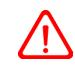

The link is created only with active seller-fulfilled products in the Amazon seller account—that is, with active items for which **I will ship this item myself** is selected in the **Fulfillment Channel** section of the **Offer** tab of the product management page.

During the synchronization, for each seller-fulfilled product in the Amazon seller account, the system searches for a matching product among stock items and template items that have the *Active*, *No Purchase*, or *No Request* status as follows:

- 1. The product's SKU is compared with the inventory ID of the item.
- 2. The product's SKU is compared with the alternate ID of the item.

An inventory item can have only a single cross-reference with the product's SKU specified as the alternate ID. That is, you cannot match a single product with multiple UOMs from the Amazon seller account with a single inventory item by using multiple cross-references in Acumatica ERP. Each product's UOM with the SKU from the Amazon seller account should be matched with a separate inventory item in Acumatica ERP.

If a match is found, the system creates a synchronization record on the *[Sync History](#page-539-1)* (BC301000) form with the *Processed* status. If no match is found, the sync record is created with the *Failed* status, and the **Last Message** column displays a corresponding error message.

# **Exporting Product Availability Information**

The information about the stock levels is updated in the Amazon seller account during the synchronization of the *Product Availability* entity. The synchronization affects only the stock and template items for which the link has been successfully created during the synchronization of the *Product (Linking Only)* entity. The available item quantity to export is calculated based on the settings specified on the **Inventory** tab of the *[Amazon Stores](#page-510-1)* (BC201020) form. The quantity is exported in the item's sales UOM.

If the total available quantity of an item is negative, a quantity of 0 is exported for this item.

# **Synchronizing Orders**

In the topics of this chapter, you will read about the main features of order synchronization between Acumatica ERP and the Amazon seller account.

# **Order Synchronization: General Information**

You can import orders that have been placed in Amazon to Acumatica ERP for further processing.

# **Learning Objectives**

In this chapter, you will learn how to do the following:

- Configure the synchronization of orders between Acumatica ERP and the Amazon seller account
- Configure the synchronization of payments between Acumatica ERP and the Amazon seller account
- Configure the synchronization of returns between Acumatica ERP and the Amazon seller account
- Import sales orders with payments from the Amazon store to Acumatica ERP

#### **Applicable Scenarios**

The synchronization of orders is the main scenario for the integration between an ERP system and an external ecommerce system.

You set up the import of seller-fulfilled orders from Amazon to Acumatica ERP so that you can process the imported orders further, for example, create a shipment, invoice the customer, and process the payment. For details on importing seller-fulfilled orders, see *[Order Synchronization: Seller-Fulfilled Orders](#page-459-1)*.

For marketplace-fulfilled orders, you configure the import for accurate tracking of inventory and payments even though the order fulfillment is performed by Amazon. For details on importing marketplace-fulfilled orders, see *[Order Synchronization: Marketplace-Fulfilled Orders](#page-461-1)*.

#### **Determining the Order Time Zone**

While you are performing the initial configuration of the Amazon store, on the **Orders** tab of the *[Amazon Stores](#page-510-1)* (BC201020) form, you can specify the **OrderTime Zone** that the system will use for each order imported from the Amazon seller account when it is created in Acumatica ERP. The order time zone is needed to determine the correct date and time of the order if Acumatica ERP and the Amazon seller account belong to different time zones.

#### **Limiting the Date Range for Order Import**

If you have had the Amazon seller account for a while before implementing Acumatica ERP, you might want to prevent old orders from being imported to Acumatica ERP when you start synchronizing orders. On the **Orders** tab of the *[Amazon Stores](#page-510-1)* (BC201020) form, you fill in the **Earliest Order Date** box. Orders placed before this date in Amazon will be excluded from the import to Acumatica ERP.

# **Order Synchronization: Seller-Fulfilled Orders**

For seller-fulfilled orders, sales orders are imported into Acumatica ERP and processed and shipped by the seller. The information about the shipments is then exported to the Amazon seller account.

# **Setting Up the Import of Seller-Fulfilled Orders**

To set up the synchronization of data for seller-fulfilled orders, you perform the following general steps:

1. Encrypt the data.

Make sure that the Acumatica ERP database is encrypted with an algorithm with a minimum of 2048 bit encryption. For an overview of encrypting data in Acumatica ERP, see *[Digital Certificates: General](https://help-2025r1.acumatica.com/Help?ScreenId=ShowWiki&pageid=084ff52c-ae9e-4d76-829f-5bf8f84b192d) [Information](https://help-2025r1.acumatica.com/Help?ScreenId=ShowWiki&pageid=084ff52c-ae9e-4d76-829f-5bf8f84b192d)*.

2. Activate the entities.

To synchronize seller-fulfilled orders, the following entities should be activated on the **Entities** tab of the *[Amazon Stores](#page-510-1)* (BC201020) form:

- *Sales Order*
- *Shipment*
- *Payment*
- 3. Specify the order type for imported orders.

On the **Orders** tab (**Order** section), you must specify the order type that will be used for imported sales orders in the**Seller-Fulfilled OrderType** box. The order type must be defined on the *Order [Types](https://help-2025r1.acumatica.com/Help?ScreenId=ShowWiki&pageid=e6984218-4260-4438-99e1-aee2b3765369)* (SO201000) form based on the *SO - Sales Order* template and have the **Protect Personal Data** check box selected.

4. Specify the common order synchronization settings.

On the **Orders** tab (**General** and **Order** section), you specify the general settings related to the synchronization of orders, such as the branch that will appear on the imported documents, the earliest order date (which eliminates earlier orders that should not be imported), and the generic customer ID that will be inserted in the imported documents.

We recommend that the generic customer ID be created without address details other than the country.

5. Make sure that the product identifiers match.

For each product in the Amazon seller account, the seller SKU or the ASIN number should match the inventory ID or an alternate ID of the stock or template item on the *[Stock Items](https://help-2025r1.acumatica.com/Help?ScreenId=ShowWiki&pageid=77786a70-1f1e-4d63-ad98-96f98e4fcb0e)* (IN202500) or *[Template](https://help-2025r1.acumatica.com/Help?ScreenId=ShowWiki&pageid=4cb927f0-5880-4169-9fdf-4529fd7bffdf) Items* (IN203000) form.

An inventory item can have only a single cross-reference with the product's SKU specified as the alternate ID. That is, you cannot match a single product with multiple UOMs from the Amazon seller account with a single inventory item by using multiple cross-references in Acumatica ERP. Each product's UOM with the SKU from the Amazon seller account should be matched with a separate inventory item in Acumatica ERP.

6. Map the shipping methods.

On the **Shipping** tab of the *[Amazon Stores](#page-510-1)* form, you map the Amazon shipping methods with the Ship Via codes defined in Acumatica ERP.

When the order synchronization is started without the shipping method mapping, it fails. The Amazon connector populates the**StoreShipping Method** column, which you can then map with the Ship Via code.

You must also map each Ship Via code with a carrier from Amazon in a substitution list on the *[Substitution](https://help-2025r1.acumatica.com/Help?ScreenId=ShowWiki&pageid=e1b0125f-cb2f-4451-91af-c5eeaff3b5ac) [Lists](https://help-2025r1.acumatica.com/Help?ScreenId=ShowWiki&pageid=e1b0125f-cb2f-4451-91af-c5eeaff3b5ac)* (SM206026) form, and then specify this substitution list in the**Ship Via Codes to Carriers** box on the **Orders** tab of the *[Amazon Stores](#page-510-1)* form. Similarly, you must map each Ship Via code with a carrier service from Amazon in a substitution list, and then specify the substitution list in the**Ship Via Codes to Carrier Services** box on the **Orders** tab. If the carrier and carrier service method that have been defined for a Ship Via code do not match those defined in Amazon, during the export of a shipment, the carrier or carrier service method in Amazon will be updated based on the substitution values specified in these substitution lists.

#### **Synchronizing Seller-Fulfilled Orders**

Seller-fulfilled orders are imported from an Amazon seller account during the synchronization of the *Sales Order* entity. For details about data synchronization, see *[Data Synchronization: General Information](#page-449-3)*.

During the data processing stage of the order import, a sales order is created on the *[Sales Orders](https://help-2025r1.acumatica.com/Help?ScreenId=ShowWiki&pageid=19e4021c-1b84-49fd-be12-0320c5f1c7e5)* (SO301000) form with the following settings:

- The order type is assigned based on the value specified in the**Seller-Fulfilled OrderType** box on the **Orders** tab of the *[Amazon Stores](#page-510-1)* (BC201020) form.
- The customer is inserted based on the value specified in the **Generic Customer** box on the **Orders** tab.

#### **Exporting Shipments for Seller-Fulfilled Orders**

For orders that are imported from Amazon to Acumatica ERP for processing, you can export information about the created and confirmed shipments to the Amazon seller account. Shipments are exported during the synchronization of the *Shipment* entity.

For the successful synchronization of shipments, the following conditions must be met on the *[Shipments](https://help-2025r1.acumatica.com/Help?ScreenId=ShowWiki&pageid=f47cffcc-543e-469c-a204-a9c1e3da346d)* (SO302000) form:

- The shipment must not be empty.
- All items in the shipment must be assigned to a single box, and the box should have a tracking number.
- The shipment must be confirmed.

During the synchronization of shipments, the following information is exported to the Amazon seller account:

- The shipment date
- The items added to the box and their quantity
- The carrier name
- The carrier service method
- The tracking number

#### **Importing Replacement Orders**

Amazon creates a replacement order when a user replaces any products in an existing order in the Amazon seller account. Replacement orders are imported from the Amazon seller account during the synchronization of the *Sales Order* entity.

As a result of importing a replacement order, the system creates a sales order with the following description on the *[Sales Orders](https://help-2025r1.acumatica.com/Help?ScreenId=ShowWiki&pageid=19e4021c-1b84-49fd-be12-0320c5f1c7e5)* (SO301000) form: *Replacement order <Replacement order external ID> for Amazon order <Replaced order external ID> from <Store name> store*. The total amount of the replacement order is \$0 and a payment is neither created nor imported for the replacement order.

# **Order Synchronization: Marketplace-Fulfilled Orders**

For marketplace-fulfilled orders, Amazon handles order fulfillment. Such orders are imported to Acumatica ERP as sales orders of the *Invoice* type. Shipments are neither created in Acumatica ERP nor exported to the Amazon seller account. The sections of below explain how to set up the synchronization of marketplace-fulfilled orders.

# **Setting Up the Import of Marketplace-Fulfilled Orders**

To set up the synchronization of data for marketplace-fulfilled orders, you perform the following general steps:

1. Encrypt the data.

Make sure that the Acumatica ERP database is encrypted with an algorithm with a minimum of 2048 bit encryption. For an overview of encrypting data in Acumatica ERP, see *[Digital Certificates: General](https://help-2025r1.acumatica.com/Help?ScreenId=ShowWiki&pageid=084ff52c-ae9e-4d76-829f-5bf8f84b192d) [Information](https://help-2025r1.acumatica.com/Help?ScreenId=ShowWiki&pageid=084ff52c-ae9e-4d76-829f-5bf8f84b192d)*.

2. Activate the entities.

To synchronize seller-fulfilled orders, the following entities should be activated on the **Entities** tab of the *[Amazon Stores](#page-510-1)* (BC201020) form:

- *Marketplace-Fulfilled Order*
- *Payment*
- 3. Specify the order type for imported orders.

On the **Orders** tab (**Order** section), you must specify the order type that will be used for imported marketplace-fulfilled orders in the **Marketplace-Fulfilled OrderType** box. The order type must be defined on the *Order [Types](https://help-2025r1.acumatica.com/Help?ScreenId=ShowWiki&pageid=e6984218-4260-4438-99e1-aee2b3765369)* (SO201000) form based on the *IN - Invoice* template.

4. Specify the shipping price item.

On the **Orders** tab (**Order** section), you fill in the**Shipping Price Item** box with a non-stock item representing shipping fees in the imported marketplace-fulfilled orders.

5. Specify the common order synchronization settings.

On the **Orders** tab (**General** and **Order** sections), you specify the general settings related to the synchronization of orders, such as the branch that will appear on the imported documents, the earliest order date (which eliminates earlier orders that should not be imported), and the generic customer ID that will be inserted in the imported documents.

We recommend that the generic customer ID be created without address details other than the country.

6. Specify the synchronization settings specific to marketplace-fulfilled orders.

In the **Orders** tab (**Marketplace-Fulfilled Order** section), you specify the warehouse and warehouse location created for the marketplace on the *[Warehouses](https://help-2025r1.acumatica.com/Help?ScreenId=ShowWiki&pageid=264b0ef7-2b6c-40b4-a7d9-f1a5e067939b)* (IN204000) form. The warehouse and location specified in this section are inserted in imported marketplace-fulfilled orders. Make sure that they contain at least the same quantity of items that were sent to Amazon warehouses.

The issue of items to be sent to Amazon warehouses should be processed manually.

You can also specify a dedicated shipping account (and subaccount) to be used for marketplace-fulfilled orders. If no shipping account (and subaccount) has been specified in this section, the amounts will be recorded to the freight account (and subaccount) specified for the default warehouse of the generic customer.

7. Make sure that the product identifiers match.

For each product in the Amazon seller account, the seller SKU or the ASIN number should match the inventory ID or an alternate ID of the stock or template item on the *[Stock Items](https://help-2025r1.acumatica.com/Help?ScreenId=ShowWiki&pageid=77786a70-1f1e-4d63-ad98-96f98e4fcb0e)* (IN202500) or *[Template](https://help-2025r1.acumatica.com/Help?ScreenId=ShowWiki&pageid=4cb927f0-5880-4169-9fdf-4529fd7bffdf) Items* (IN203000) form.

An inventory item can have only a single cross-reference with the product's SKU specified as the alternate ID. That is, you cannot match a single product with multiple UOMs from the Amazon seller account with a single inventory item by using multiple cross-references in Acumatica ERP. Each product's UOM with the SKU from the Amazon seller account should be matched with a separate inventory item in Acumatica ERP.

8. Map the payment methods.

Map the payment methods set up in the Amazon seller account with the payment methods defined in Acumatica ERP, as described in *[Order Synchronization: Import of Payments](#page-463-1)*.

# **Synchronizing Marketplace-Fulfilled Orders**

Seller-fulfilled orders are imported from an Amazon seller account during the synchronization of the *Marketplace-Fulfilled Order* entity. Only marketplace-fulfilled orders that have been fully shipped are imported to Acumatica ERP. For details about data synchronization, see *[Data Synchronization: General Information](#page-449-3)*.

During the data processing stage of the order import, a sales order is created on the *[Sales Orders](https://help-2025r1.acumatica.com/Help?ScreenId=ShowWiki&pageid=19e4021c-1b84-49fd-be12-0320c5f1c7e5)* (SO301000) form with the following settings:

- In the Summary area, the order type is assigned based on the value specified in the **Marketplace-Fulfilled OrderType** box on the **Orders** tab of the *[Amazon Stores](#page-510-1)* (BC201020) form.
- In the Summary area, the customer is inserted based on the customer record specified in the **Generic Customer** box on the **Orders** tab.
- On the **Details** tab, the warehouse and the warehouse location are inserted for the imported items o based on the settings specified in the **Marketplace-Fulfilled Order** section of the **Orders** tab.
- On the **Details** tab, a line with the shipping price item is added. The system inserts the non-stock item based on the value in the**Shipping Price Item** box on the **Orders** tab.

#### **Importing Replacement Orders**

Amazon creates a replacement order when a user replaces any products in an existing order in the Amazon seller account. Replacement orders are imported from the Amazon seller account during the synchronization of the *Sales Order* entity.

As a result of importing a replacement order, the system creates a sales order with the following description on the *[Sales Orders](https://help-2025r1.acumatica.com/Help?ScreenId=ShowWiki&pageid=19e4021c-1b84-49fd-be12-0320c5f1c7e5)* (SO301000) form: *Replacement order <Replacement order external ID> for Amazon order <Replaced order external ID> from <Store name> store*. The total amount of the replacement order is \$0 and a payment is neither created nor imported for the replacement order.

#### **Using the Sales Invoice (Obsolete) Entity**

Companies that used the Amazon connector as customization can use the *Sales Invoice (Obsolete)* entity to resynchronize marketplace-fulfilled orders that were imported in previous versions of Acumatica ERP as invoices on the *[Invoices](https://help-2025r1.acumatica.com/Help?ScreenId=ShowWiki&pageid=0acc9738-f141-4ea0-a2be-f34ea9d1b63a)* (SO303000) form. For new synchronizations, the *Marketplace-Fulfilled Order* entity should be used.

# **Order Synchronization: Import of Payments**

To track financial information, you can import payments along with seller-fulfilled and marketplace-fulfilled orders from Amazon to Acumatica ERP.

## **Setting Up the Import of Payments**

To set up the synchronization of payments, you perform the following general steps:

1. Activate the entity.

To synchronize payments, you must activate the *Payment* entity on the **Entities** tab of the *[Amazon Stores](#page-510-1)* (BC201020) form.

2. Map the payment methods.

Each payment method used in the Amazon seller account must be mapped with a payment method defined in Acumatica ERP. The mapping is defined on the **Payments** tab of the *[Amazon Stores](#page-510-1)* form. Initially, the upper table of the tab is empty. Aer an order and a payment have been created in the Amazon seller account, you need to start the payment synchronization with no payment method mapped. The synchronization fails, and the Amazon connector populates the**Store Payment Method** column of the upper table. You then complete the mapping by specifying values in the **ERP Payment Method** and **Cash Account** columns. The ERP payment method must be defined on the *[Payment Methods](https://help-2025r1.acumatica.com/Help?ScreenId=ShowWiki&pageid=509285d1-cfae-4e87-95c3-a968451952e6)* (CA204000) form with the *Cash/Check* means of payment.

3. Map the Amazon fees.

The **Amazon Fees** table of the *[Amazon Stores](#page-510-1)* is initially empty. Once the payment methods are mapped, you need to start the payment synchronization. The synchronization fails, and the Amazon connector populates the **FeeType** column of the table. You then map each Amazon fee type with an ERP entry type.

Entry types are defined on the *Entry [Types](https://help-2025r1.acumatica.com/Help?ScreenId=ShowWiki&pageid=0253dfdd-b06b-4274-b44e-9c7a584b15f2)* (CA203000) form. An entry type can be used in the fee mapping if it meets the following criteria:

- The entry type has the *Disbursement* type.
- A default offset account has been specified for the entry type.
- The **Deduct from Payment** check box is selected for the entry type.
- For the cash account specified in the mapping for the Amazon payment method in the upper table, the entry type has been added on the *[Cash Accounts](https://help-2025r1.acumatica.com/Help?ScreenId=ShowWiki&pageid=10f71454-88f9-4d6c-8d09-32856d8c6741)* (CA202000) form.

#### **Synchronizing Payments**

Payments are imported into Acumatica ERP during the synchronization of the *Payment* entity. The payment or payments become available for synchronization aer the order has been fully shipped. If an order has multiple payments, the system imports all the payments to Acumatica ERP as a single document. The external identifier of such a payment is the same as the external identifier of the order on the *[Sync History](#page-539-1)* (BC301000) form.

During the processing stage of data synchronization, the system creates a document of the *Payment* type on the *[Payments and Applications](https://help-2025r1.acumatica.com/Help?ScreenId=ShowWiki&pageid=ae844bf4-1aef-42cd-9e2f-49b3ee1bc8d7)* (AR302000) form and applies it to the order or to the invoice (if the invoice has been prepared for the order).

Amazon fees imported with the payment are grouped by entry type and are displayed on the **Charges** tab of the *[Payments and Applications](https://help-2025r1.acumatica.com/Help?ScreenId=ShowWiki&pageid=ae844bf4-1aef-42cd-9e2f-49b3ee1bc8d7)* form.

# **Order Synchronization: Import of Returns**

To track information about returns and refunds, you can import returns along with seller-fulfilled and marketplacefulfilled orders from Amazon to Acumatica ERP. The details of these returns are available in the return reports provided by Amazon.

# **Configuration of the Import of Seller-Fulfilled Returns**

To set up the synchronization of seller-fulfilled returns, you perform the following general steps on the *[Amazon](#page-510-1) [Stores](#page-510-1)* (BC201020) form:

1. Activate the entity.

To synchronize seller-fulfilled returns, you must activate the *Seller-Fulfilled Return* entity on the **Entities** tab.

2. Specify the order type for imported returns.

In the **Seller-Fulfilled Return Type** box on the **Orders** tab (**Returns** section), you must specify the order type that will be used for imported seller-fulfilled returns. An order type is available for selection in this box only if it is defined on the *Order [Types](https://help-2025r1.acumatica.com/Help?ScreenId=ShowWiki&pageid=e6984218-4260-4438-99e1-aee2b3765369)* (SO201000) form based on the *RC - Return for Credit* template.

3. Specify the refund reason code.

On the **Orders** tab (**Returns** section), you fill in the **Refund Reason Code** box with a reason code of the *Issue* usage type that will be used for the lines of the imported seller-fulfilled returns to indicate an issued refund.

## **Configuration of the Import of Marketplace-Fulfilled Returns**

To set up the synchronization of marketplace-fulfilled returns, you perform the following general steps on the *[Amazon Stores](#page-510-1)* (BC201020) form:

1. Activate the entity.

To synchronize marketplace-fulfilled returns, you must activate the *Marketplace-Fulfilled Return* entity on the **Entities** tab.

2. Specify the order type for imported returns.

In the **Marketplace-Fulfilled Return Type** box of the **Orders** tab (**Returns** section), you must specify the order type that will be used for imported marketplace-fulfilled returns. An order type is available for selection in this box only if it is defined on the *Order [Types](https://help-2025r1.acumatica.com/Help?ScreenId=ShowWiki&pageid=e6984218-4260-4438-99e1-aee2b3765369)* (SO201000) form based on the *CM - Credit Memo* template.

3. Specify the refund reason code.

On the **Orders** tab (**Returns** section), you fill in the **Refund Reason Code** box with a reason code of the *Issue* usage type that will be used for the lines of the imported marketplace-fulfilled returns to indicate an issued refund.

# **Synchronization of Returns and Refunds**

Returns are imported into Acumatica ERP during the synchronization of the *Seller-Fulfilled Refund* and *Marketplace-Fulfilled Refund* entities. A return can be imported only aer the processing of the refund is completed in the Amazon seller account—that is, only if the refund has the *Prior refund: Applied* or *Prior refund: Pending* status.

During the import, the system creates a return order of the type specified on the **Orders** tab of the *[Amazon Stores](#page-510-1)* (BC201020) form that corresponds to the return fulfillment. The system imports a return order only if the original order (the order for which the return was created) has been already imported to Acumatica ERP. For each return

order, the system also imports the payment with the refunded amount if the payment for the original order has already been imported.

On the **Details** tab of the *[Sales Orders](https://help-2025r1.acumatica.com/Help?ScreenId=ShowWiki&pageid=19e4021c-1b84-49fd-be12-0320c5f1c7e5)* (SO301000) form, the system adds returned items to the created return order with the following settings:

• **Warehouse**: The default warehouse of the item.

For a marketplace-fulfilled return, the system uses the warehouse (if any) specified in the **Marketplace Warehouse** box on the **Orders** tab (**Marketplace-Fulfilled Order** section) of the *[Amazon Stores](#page-510-1)* form.

• **Location**: The default receipt location of the item.

For a marketplace-fulfilled return, the system uses the location (if any) specified in the **Marketplace Warehouse Location** box on the **Orders** tab (**Marketplace-Fulfilled Order** section) of the *[Amazon Stores](#page-510-1)* form.

- **UOM**: The sales UOM of the item.
- **Reason Code**: The reason code specified in the **Refund Reason Code** box on the **Orders** tab of the *[Amazon](#page-510-1) [Stores](#page-510-1)* form.
- **Notes**: The specific reason code from the Amazon store in the following format: *<return type> || <return reason code>*.

For the created return order, on the **Payments** tab of the *[Sales Orders](https://help-2025r1.acumatica.com/Help?ScreenId=ShowWiki&pageid=19e4021c-1b84-49fd-be12-0320c5f1c7e5)* form, the system also adds the payment of the *Refund* type with the refunded amount that is imported along with the return order.

## **Limitations of Importing Returns and Refunds**

The following limitations apply to the import of returns and refunds from Amazon:

- The system does not support real-time synchronization of returns and refunds because Amazon provides information about them with the return reports but not through the API.
- Amazon limits the time you can generate the same report again by 30 minutes. That means you cannot resynchronize the failed record immediately; you can do so only when at least 30 minutes have passed. If you configure an automation schedule to sync returns and refunds, the schedule's frequency must exceed 30 minutes.
- Returns can be imported for a date range of not more than 60 days at once. That is, on the *[Prepare Data](#page-529-1)* (BC501000) form, in the *Incremental* mode, the system prepares the returns to be imported that have been created within the last 60 days. In the *Incremental by Date* or *Full* mode, the selected date range must not exceed 60 days.
- During the import of marketplace-fulfilled returns for which Amazon's warehouse has received returned items, Amazon provides no information if the items have been discarded or put back in stock. Thus, the system always puts the returned items in stock with the imported marketplace-fulfilled returns.
- Amazon charges a seller fees for refunds and pays the seller back the refund amount deducting the fee. However, these refund fees are not imported to Acumatica ERP and added to payments.

# **Order Synchronization: Import of Taxes**

Amazon handles tax calculation and reporting on behalf of merchants. However, you can import the total order tax amount from the Amazon seller account to Acumatica ERP along with each order.

#### **Setting Up the Tax Synchronization**

To synchronize taxes, on the **Orders** tab of the *[Amazon Stores](#page-510-1)* (BC201020) form, you select the**Tax Synchronization** check box and specify the following settings:

- **PrimaryTax Zone**: This tax zone is inserted in imported documents. In this box, you should specify the tax zone for which the default tax has been set up.
- **DefaultTax**: This tax ID is inserted in imported documents for the order tax amount charged in the Amazon seller account.

The tax zone and tax you specify in these boxes are not used for calculating taxes in imported orders. To avoid discrepancies in tax amounts, disable tax recalculation for the order types that are used for importing marketplacefulfilled and seller-fulfilled orders as well as marketplace-fulfilled and seller-fulfilled returns. You do this by selecting the **Disable AutomaticTax Calculation** check box on the **General** tab of the *Order [Types](https://help-2025r1.acumatica.com/Help?ScreenId=ShowWiki&pageid=e6984218-4260-4438-99e1-aee2b3765369)* (SO201000) form.

For information about disabling tax recalculation, see *Tax Application in Sales [Documents](https://help-2025r1.acumatica.com/Help?ScreenId=ShowWiki&pageid=39c67aca-9e64-47f3-bed5-08227508e62c)*.

#### **Importing Taxes**

Taxes are imported during the synchronization of seller-fulfilled and marketplace-fulfilled orders (that is, during the synchronization of the *Sales Order* and *Marketplace-Fulfilled Order* entities).

Only the total tax amount is imported; tax names and rates are not synchronized.

In imported orders, the tax zone and tax ID are inserted based on the settings specified on the **Orders** tab of the *[Amazon Stores](#page-510-1)* (BC201020) form.

# **Order Synchronization: Non-Order Fees**

Amazon charges merchants fees that are not related to particular orders, for example, storage or advertising fees. The details of these fees are available in the settlement reports provided by Amazon. You can import such fees into Acumatica ERP to gain greater visibility into per-unit profitability—that is, how much the company makes on the products it sells on Amazon and how much it is charged for each of the products.

#### **Setting Up the Import of Non-Order Fees**

To set up the import of non-order fees to Acumatica ERP, you perform the following general steps:

1. Activate the entity.

To synchronize non-order fees, you must activate the *Non-Order Fees* entity on the **Entities** tab of the *[Amazon Stores](#page-510-1)* (BC201020) form.

2. Map the Amazon non-order fees.

Initially, when no non-order fees are mapped, the synchronization of the *Non-Order Fees* entity fails. The Amazon connector adds a row for each supported non-order fee to the **Amazon Fees** table of the **Payments** tab and populates the **FeeType** column. You must map each Amazon fee type with an ERP entry type, which is defined on the *Entry [Types](https://help-2025r1.acumatica.com/Help?ScreenId=ShowWiki&pageid=0253dfdd-b06b-4274-b44e-9c7a584b15f2)* (CA203000) form.

An entry type can be used in the fee mapping if it meets the following criteria:

- The entry type has the *Disbursement* or *Receipt* type.
- A default offset account has been specified for the entry type.
- For the cash account specified in the mapping for the Amazon payment method in the upper table, the entry type has been added on the *[Cash Accounts](https://help-2025r1.acumatica.com/Help?ScreenId=ShowWiki&pageid=10f71454-88f9-4d6c-8d09-32856d8c6741)* (CA202000) form.

#### **Synchronizing Non-Order Fees**

Amazon fees that are not related to any particular Amazon order are imported during the synchronization of the *Non-Order Fees* entity. Imported non-order fees are displayed as a cash transaction on the *Cash [Transactions](https://help-2025r1.acumatica.com/Help?ScreenId=ShowWiki&pageid=1e55821c-556b-4c3e-829c-95383eb2c8e2)* (CA304000) form.

The **Sync Record Details** dialog box of the *[Sync History](#page-539-1)* (BC301000) form displays the following information about imported non-order fees:

- The **ERP ID** column: the identifier of the cash transactions created for the settlement report
- The **External ID** column: the identifier of the settlement report generated by Amazon

# **Order Synchronization: Protection of Personal Data**

Amazon requires that companies not store the customer's personal data related to sales orders imported from Amazon for more than 30 days aer the order's creation. This data includes the ship-to address, bill-to address, ship-to contact, and bill-to contact in an imported order as well as its related shipment and invoice. To comply with this requirement, you can erase or pseudonymize personal data in sales orders imported from Amazon Seller Central as well as in related invoices and shipments (if applicable) by using the *[Protect Personal Data](#page-547-1)* (BC502000) form.

To define the action to be performed on each selected document when the **Process** or **Process All** command is invoked, you select one of the following values in the **Action** box of the Selection area:

- *Pseudonymize*: Replaces personally identifiable information with placeholders in the selected documents.
- *Erase*: Permanently deletes personally identifiable information in the selected documents.
- *Restore*: Restores previously pseudonymized data.

The table on the form displays the following documents:

- Completed and canceled sales orders that belong to the order type for which the **Protect Personal Data** check box is selected on the *Order [Types](https://help-2025r1.acumatica.com/Help?ScreenId=ShowWiki&pageid=e6984218-4260-4438-99e1-aee2b3765369)* (SO201000) form
- Sales invoices that have been created for such sales orders

Shipments are not displayed in the table, but they will be processed along with the related sales orders.

You can narrow down the list of documents to be displayed in the table by specifying the following settings of the Selection area:

- **Entity**: The type of documents, which can be *Sales Order* or *Invoice*.
- **Max. Document Age (Days)**: The maximum age (in days) of documents to be displayed in the table. By default, *30* is specified in this box.

We recommend setting up an automation schedule to erase or pseudonymize personal data in imported sales orders and related documents regularly.

# **Synchronizing Inbound Shipments**

In the topics of this chapter, you will read about the synchronization of inbound shipments between Acumatica ERP and Amazon.

# **Inbound Shipments: General Information**

Acumatica ERP provides you with the ability to import marketplace-fulfilled orders from Amazon. To fulfill these orders, you send *inbound shipments* with stock items that you sell to Amazon fulfillment centers, and Amazon uses the stock sent to handle the order fulfillment. You have the ability to import these inbound shipments to Acumatica ERP to streamline inventory management and improve inventory accounting.

## **Learning Objectives**

In this chapter, you will learn how to do the following:

- Configure the synchronization of inbound shipments between the Amazon seller account and Acumatica ERP
- Import inbound shipments form the Amazon seller account to Acumatica ERP

# **Applicable Scenarios**

You might want to synchronize inbound shipments to track available quantities of items that you send from the company warehouse to the Amazon fulfillment center.

# **Configuration of the Store**

To import inbound shipments from the Amazon seller account (also referred to as the *store* in Acumatica ERP), you need to configure the store. To do this, perform the following general steps on the *[Amazon Stores](#page-510-1)* (BC201020) form:

- 1. Activate the following entities on the **Entities** tab:
  - *Marketplace Transfer Order*
  - *Marketplace Transfer Receipt*
- 2. Specify an order type in the **OrderType for Import** box on the **Inventory** tab.

The selected order type must have the *TR - Transfer* order template specified on the *Order [Types](https://help-2025r1.acumatica.com/Help?ScreenId=ShowWiki&pageid=e6984218-4260-4438-99e1-aee2b3765369)* (SO201000) form. The system will use the specified order type to create transfer orders during the import of inbound shipments.

3. Specify a date in the **EarliestShipment Date** box on the **Inventory** tab.

The system will import inbound shipments from the Amazon seller account if they have been created on or aer the specified date.

4. Specify a company warehouse in the**Source Warehouse** box on the **Inventory** tab.

This is the warehouse from which stock items are shipped to the Amazon fulfillment center. The source warehouse must differ from the marketplace warehouse specified on the **Orders** tab for the store.

5. Specify the warehouse that represents the Amazon fulfillment center in the **Marketplace Warehouse** box on the **Orders** tab.

You send stock items to that warehouse, and Amazon fulfills your orders from it. The marketplace warehouse must differ from the source warehouse specified on the **Inventory** tab for the store.

6. If the carrier names from the Amazon seller account do not match the ship-via codes from Acumatica ERP, configure the matching of the names and codes with a substitution list on the *[Substitution Lists](https://help-2025r1.acumatica.com/Help?ScreenId=ShowWiki&pageid=e1b0125f-cb2f-4451-91af-c5eeaff3b5ac)* (SM206026) form. Specify the substitution list in the**Ship-Via Codes to Carriers** box on the **Inventory** tab.

## **Import of Inbound Shipments from Amazon**

To import inbound shipments sent from the company warehouse to the Amazon fulfillment center, you perform the following general steps:

1. Prepare the data for the *Marketplace Transfer Order* entity on the *[Prepare Data](#page-529-1)* (BC501000) form.

The system creates a *Marketplace Transfer Order* sync record for each inbound shipment created on or aer the date specified in the **EarliestShipment Date** box on the **Inventory** tab of the *[Amazon Stores](#page-510-1)* (BC201020) form.

2. Process the data prepared for the *Marketplace Transfer Order* entity on the *[Process Data](#page-533-1)* (BC501500) form.

For each processed sync record, the system creates a transfer order on the *[Sales Orders](https://help-2025r1.acumatica.com/Help?ScreenId=ShowWiki&pageid=19e4021c-1b84-49fd-be12-0320c5f1c7e5)* (SO301000) form with the type specified in the **OrderType for Import** box on the **Inventory** tab of the *[Amazon Stores](#page-510-1)* form. For the created transfer order, the system inserts the marketplace warehouse specified for the Amazon store to the **Destination Warehouse** box in the Summary area of the *[Sales Orders](https://help-2025r1.acumatica.com/Help?ScreenId=ShowWiki&pageid=19e4021c-1b84-49fd-be12-0320c5f1c7e5)* form. In each line on the **Details** tab, the system inserts the source warehouse specified for the Amazon store in the **Warehouse** column.

- 3. Create a shipment of the *Transfer* type for the transfer order on the *[Shipments](https://help-2025r1.acumatica.com/Help?ScreenId=ShowWiki&pageid=f47cffcc-543e-469c-a204-a9c1e3da346d)* (SO302000) form, and release the shipment.
- 4. Update inventory for the shipment.

The system creates a transfer of the *2-Step* type on the *[Transfers](https://help-2025r1.acumatica.com/Help?ScreenId=ShowWiki&pageid=ea1539b6-fafa-443e-8b49-cd1ced95389f)* (IN304000) form and releases the transfer.

5. Prepare the data for the *Marketplace Transfer Receipt* entity on the *[Prepare Data](#page-529-1)* form.

The system creates a *Marketplace Transfer Receipt* sync record for each imported transfer order if the following conditions are met:

- The corresponding inbound shipment in Amazon is being received (has the *Receiving* status) or has been received (has the *Closed* status).
- The transfer order has been processed and has a released transfer of the *2-Step* type created on the *[Transfers](https://help-2025r1.acumatica.com/Help?ScreenId=ShowWiki&pageid=ea1539b6-fafa-443e-8b49-cd1ced95389f)* form.
- 6. Process the data prepared for the *Marketplace Transfer Receipt* entity on the *[Process Data](#page-533-1)* form.

For each processed sync record, the system creates a purchase receipt of the *Transfer Receipt* type on the *[Purchase Receipts](https://help-2025r1.acumatica.com/Help?ScreenId=ShowWiki&pageid=d9901c8d-486d-45ed-8088-ea3d8ee3af19)* (PO302000) form.

If the Amazon fulfillment center receives an inbound shipment gradually in multiple steps, the system creates a purchase receipt for each.

The following diagram shows the process of importing inbound shipments from the Amazon seller account to Acumatica ERP.

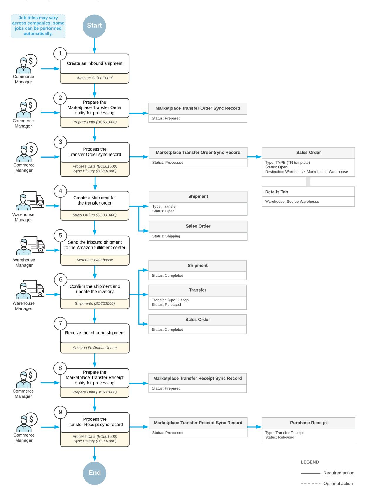

#### **Import of Shipments with Lot- or Serial-Tracked Items**

The synchronization of inbound shipments with lot- or serial-tracked inventory items is automated partially because Amazon does not provide any information about the lot or serial numbers of the received items.

While you prepare and process the data for the *Marketplace Transfer Order* entity on the *[Prepare Data](#page-529-1)* (BC501000) and *[Process Data](#page-533-1)* (BC501500) forms, the system creates a transfer order for an inbound shipment with lot- or serialtracked items without information about lot or serial numbers. You need to manually process the transfer order to add lot or serial numbers for the shipping items.

Aer the processing of the transfer order is finished and a transfer of the *2-Step* type has been created and released on the *[Transfers](https://help-2025r1.acumatica.com/Help?ScreenId=ShowWiki&pageid=ea1539b6-fafa-443e-8b49-cd1ced95389f)* (IN304000) form, you skip the synchronization of the *Marketplace Transfer Receipt* entity. Instead, you manually create a purchase receipt of the *Transfer Receipt* type on the *[Purchase Receipts](https://help-2025r1.acumatica.com/Help?ScreenId=ShowWiki&pageid=d9901c8d-486d-45ed-8088-ea3d8ee3af19)* (PO302000) form for the transfer.

#### **Import of Shipments with Non-Stock Kits**

The synchronization of inbound shipments with non-stock kits is automated partially.

While you process a transfer order created for an inbound shipment with a non-stock kit, the system creates a transfer on the *[Transfers](https://help-2025r1.acumatica.com/Help?ScreenId=ShowWiki&pageid=ea1539b6-fafa-443e-8b49-cd1ced95389f)* (IN304000) form and adds the components of the non-stock kit to that transfer based on the kit specification from the *[Kit Specifications](https://help-2025r1.acumatica.com/Help?ScreenId=ShowWiki&pageid=c4a1e276-bcdb-4995-9522-c7b6dcb5f6c7)* (IN209500) form. You skip the synchronization of the *Marketplace Transfer Receipt* entity. Instead, you manually create a purchase receipt of the *Transfer Receipt* type on the *[Purchase](https://help-2025r1.acumatica.com/Help?ScreenId=ShowWiki&pageid=d9901c8d-486d-45ed-8088-ea3d8ee3af19) [Receipts](https://help-2025r1.acumatica.com/Help?ScreenId=ShowWiki&pageid=d9901c8d-486d-45ed-8088-ea3d8ee3af19)* (PO302000) form for the kit components from the transfer.

## **Reconciliation of Discrepancies During the Import of Shipments**

Consider that an inbound shipment has been imported to Acumatica ERP and then the Amazon fulfillment center has received it—that is, the inbound shipment has been assigned the *Closed* status. Also, consider that the received quantity of an item of the inbound shipment differs from the initially shipped quantity imported to Acumatica ERP. During the processing of the *Marketplace Transfer Receipt* entity for the shipment, the system does not add that item to the purchase receipt created on the *[Purchase Receipts](https://help-2025r1.acumatica.com/Help?ScreenId=ShowWiki&pageid=d9901c8d-486d-45ed-8088-ea3d8ee3af19)* (PO302000) form. You need to manually process the item.

You create a purchase receipt of the *Transfer Receipt* type on the *[Purchase Receipts](https://help-2025r1.acumatica.com/Help?ScreenId=ShowWiki&pageid=d9901c8d-486d-45ed-8088-ea3d8ee3af19)* form for the initially shipped quantity of the item. For the discrepancy between the shipped and received quantities, you create an inventory adjustment on the *[Adjustments](https://help-2025r1.acumatica.com/Help?ScreenId=ShowWiki&pageid=31ba83fe-8b3a-4d52-a355-edea838b5c8e)* (IN303000) form with a positive value for the exceeded quantity or with a negative value for the insufficient quantity.

# **Limitations of Importing Inbound Shipments**

The following limitations apply to the import of inbound shipments:

- The system can import inbound shipments that have been created only within the last 18 months. To avoid data inconsistencies, we recommend specifying a date within the past 18 months in the **EarliestShipment Date** box on the **Inventory** tab of the *[Amazon Stores](#page-510-1)* (BC201020).
- When you process the data for the *Marketplace Transfer Order* entity on the *[Prepare Data](#page-529-1)* (BC501000) form, the system creates sync records with the *Invalid* status for inbound shipments that have not been imported yet but have already been closed in Amazon. These records are excluded from further processing. If you need to import these inbound shipments, you need to force-synchronize the corresponding sync records on the *[Sync History](#page-539-1)* (BC301000) form.
- The system may experience delays with the processing of adjustments made in Amazon to already-imported inbound shipments because Amazon does not provide the date of the shipment modification.

As an example, consider an inbound shipment that has been imported to Acumatica ERP, and then some changes have been made to the shipment in Amazon. If you need to receive these changes in Acumatica

ERP as soon as possible, you should force-synchronize the sync record of the inbound shipment on the *[Sync](#page-539-1) [History](#page-539-1)* form.

• To comply with the limitations of the Amazon API and to optimize the system load, we recommended preparing and processing of the data for the *Marketplace Transfer Order* and *Marketplace Transfer Receipt* entities once a day, at nighttime.

# **Retail Edition Form Reference**

This section describes the UI elements on forms that are specific to Acumatica ERP Retail Edition.

# **BigCommerce Stores**

Form ID: (BC201000)

You use this form to set up a connection between Acumatica ERP and an online store that has been created on the shopping cart soware hosted by BigCommerce. Aer the connection has been established, on this form, you specify the store settings, select the entities that need to be synchronized, and define the default settings for the synchronization of customers and customer locations, inventory items, and orders. You also use this form to map shipping rules and payment methods between Acumatica ERP and the BigCommerce store.

During the initial specification of settings, the required settings on the **Entities** , **Customers**, **Inventory**, **Orders**, and **Payments** must be specified at the same time. You will not be able to save your changes until all required settings on these tabs of the form are filled in.

- This form is available only if the *Retail Commerce* and *BigCommerce Connector* features are enabled on the *[Enable/Disable Features](https://help-2025r1.acumatica.com/Help?ScreenId=ShowWiki&pageid=c1555e43-1bc5-4f6f-ba9d-b323f94d8a6b)* (CS100000) form.
  - The number of BigCommerce stores to which you can establish a connection on this form is limited by your license.

## **Form Toolbar**

The form toolbar includes standard and form-specific buttons and commands. For the list of standard buttons, see *Form [Toolbar](#page-638-1) and More Menu*. The form-specific commands are listed in the following table.

| Button          | Description                                                                                                                                                                                                                                                          |
|-----------------|----------------------------------------------------------------------------------------------------------------------------------------------------------------------------------------------------------------------------------------------------------------------|
| Test Connection | By using the information specified on the General tab, tests the ability to connect to the BigCommerce store via the API. It is also used to connect to the BigCommerce file storage via WebDAV, if the Product Image entity is activated on the Entities tab. |

## **Summary Area**

In this area, you specify the basic settings of a particular BigCommerce store, or select a store to view and edit its settings.

| Element    | Description                                                                                                                                                                            |
|------------|----------------------------------------------------------------------------------------------------------------------------------------------------------------------------------------|
| Connector  | A read-only box with the name of the ecommerce connector (BigCommerce) of a store configured on this form.                                                                          |
| Store Name | The name of the BigCommerce store to which the connection is being configured. The store name is specified when the connection is first configured; you cannot change it lat er. |

| Element | Description                                                                                                                                                                                                                                                                                                                                                                                                                                                      |
|---------|------------------------------------------------------------------------------------------------------------------------------------------------------------------------------------------------------------------------------------------------------------------------------------------------------------------------------------------------------------------------------------------------------------------------------------------------------------------|
| Active  | A check box that indicates (if selected) that the store configuration is active and the enti ties activated and configured for this store are synchronized between Acumatica ERP and the store.                                                                                                                                                                                                                                                            |
|         | For inactive stores, you can modify the store settings on the current form, but entities are not synchronized; you can see the history of the synchronization of entities on the Sync History (BC301000) form.                                                                                                                                                                                                                                             |
| Default | A check box that you select to indicate that this store is the default store in Acumatica ERP.                                                                                                                                                                                                                                                                                                                                                                |
|         | If multiple stores have been configured on this form and on the Shopify Stores (BC201010) form, if applicable, when you open other commerce-related forms, the store you have de fined as the default is automatically inserted in the Store box.                                                                                                                                                                                                          |
|         | The system requires a store to be defined as the default store. When you are defining the first store in the system—on this form or on the Shopify Stores (BC201010) form— this check box is selected automatically. When you define another store, this check box is cleared by default; if you select this check box for the store being defined, the system clears this check box for the store that was previously defined as the default store. |

# **General Tab**

The tab includes the path and connection details that are used to connect Acumatica ERP to the BigCommerce store.

| Element          | Description                                                                                                                                    |
|------------------|------------------------------------------------------------------------------------------------------------------------------------------------|
| Store Admin Path | The administrator URL of the BigCommerce store—that is, the store's permanent URL fol lowed by /manage.                                     |
|                  | Acumatica ERP uses this path when a user navigates to BigCommerce pages from the Sync History (BC301000) and Process Data (BC501500) forms. |
| API Path         | The URL of the BigCommerce API.                                                                                                                |
| Client ID        | An ID that is provided by BigCommerce when a new store is set up on the BigCommerce platform.                                               |
| Access Token     | An access token provided by BigCommerce when a new store is set up on the BigCom merce platform.                                            |
|                  | The access token should have the necessary access permissions in BigCommerce for syn chronization to work properly.                         |

#### *Table: Connection Section*

#### *Table: File Access Section*

The settings of this section are required if the *Product Image* entity is active on the **Entities** tab of the form.

| Element         | Description                                                                                                                                                                                                                                                                                                      |
|-----------------|------------------------------------------------------------------------------------------------------------------------------------------------------------------------------------------------------------------------------------------------------------------------------------------------------------------|
| WebDAV Path     | The URL of the store used for file management. This path facilitates the exchange of data between Acumatica ERP and the BigCommerce store. Specifically, this path is the store's permanent URL followed by DAV. This URL is used by Acumatica ERP to upload files and images to the BigCommerce store. |
| WebDAV Username | The email address of the registered owner of the BigCommerce store, which is used to connect to the BigCommerce store.                                                                                                                                                                                        |
| WebDAV Password | The password that is used to connect to the BigCommerce file storage. The WebDAV password is a string of random letters and numbers. You can find this pass word on the File Access page of the BigCommerce control panel.                                                                                 |

#### *Table: Miscellaneous Section*

| Element       | Description                                                                                                                                                                                                                                                                                                                                       |
|---------------|---------------------------------------------------------------------------------------------------------------------------------------------------------------------------------------------------------------------------------------------------------------------------------------------------------------------------------------------------|
| Locale        | The locale of Acumatica ERP to be synchronized with the BigCommerce store. If multiple locales have been configured in Acumatica ERP and data is maintained in mul tiple languages, in this box, you select the locale that will be synchronized with the Big Commerce store.                                                            |
| Administrator | The administrator of the BigCommerce store, which is the user who receives notifications (triggered by predefined business events) about aborted synchronization records. For more information about predefined business events for aborted synchronization records, see Automated Synchronization: Business Events for Aborted Records. |

#### *Table: Store Properties Section*

The read-only boxes of this section are filled in automatically as soon as the connection to the BigCommerce store is established.

| Element                  | Description                                                                                        |
|--------------------------|----------------------------------------------------------------------------------------------------|
| Default Currency         | The currency specified as the default in the control panel of the BigCommerce store.               |
| Supported Curren cies | The list of all currencies that have been set up in the control panel of the BigCommerce store. |
| StoreTime Zone           | The time zone of the BigCommerce store.                                                            |

#### *Table: License Restrictions Section*

| Element        | Description                                                                     |
|----------------|---------------------------------------------------------------------------------|
| Max. Number of | The maximum number of BigCommerce stores that can be connected to the Acumatica |
| Stores         | ERP instance.                                                                   |

### **Entities Tab**

The rows of this tab are automatically populated with the entities that can be synchronized between Acumatica ERP and the BigCommerce store. You can activate the entities that you need to synchronize between the systems; you can also view and specify synchronization settings for these entities.

The table toolbar includes only standard buttons. For the list of standard buttons, see *Table [Toolbar](#page-645-1)*.

*Table: Table Columns*

| Column | Description                                                                                                                                                                                                             |
|--------|-------------------------------------------------------------------------------------------------------------------------------------------------------------------------------------------------------------------------|
| Active | A check box that indicates (if selected) that the entity is synchronized between Acumatica ERP and the BigCommerce store.                                                                                            |
|        | If an entity requires other entities to be synchronized when this entity is synchronized, if you select this check box for the entity, the system also se lects the Active check box for these required entities. |
| Entity | The entity that can be synchronized between Acumatica ERP and the BigCommerce store, which is one of the following:                                                                                                  |
|        | • Customer Price Class                                                                                                                                                                                               |
|        | Customer •                                                                                                                                                                                                           |
|        | For information about the data that is synchronized as part of this entity and standard mapping of fields, see Customer Entity.                                                                                      |
|        | • Customer Location                                                                                                                                                                                                  |
|        | For information about the data that is synchronized as part of this entity and standard mapping of fields, see Customer Location Entity.                                                                             |
|        | • Sales Category                                                                                                                                                                                                     |
|        | For information about the data that is synchronized as part of this entity and standard mapping of fields, see Sales Category Entity.                                                                                |
|        | • Stock Item                                                                                                                                                                                                         |
|        | For information about the data that is synchronized as part of this entity and standard mapping of fields, see Stock Item Entity.                                                                                    |
|        | • Non-Stock Item                                                                                                                                                                                                     |
|        | For information about the data that is synchronized as part of this entity and standard mapping of fields, see Non-Stock Item Entity.                                                                                |
|        | • Template Item                                                                                                                                                                                                      |
|        | For information about the data that is synchronized as part of this entity and standard mapping of fields, see Template Item Entity.                                                                                 |
|        | • Base Sales Price                                                                                                                                                                                                   |
|        | • Price List                                                                                                                                                                                                         |
|        | • Product Image                                                                                                                                                                                                      |
|        | • Product Availability                                                                                                                                                                                               |
|        | For information about the data that is synchronized as part of this entity and standard mapping of fields, see Product Availability Entity.                                                                          |
|        | • Sales Order                                                                                                                                                                                                        |
|        | For information about the data that is synchronized as part of this entity and standard mapping of fields, see Sales Order Entity.                                                                                   |

| Column         | Description                                                                                                                                                                                                                                                 |
|----------------|-------------------------------------------------------------------------------------------------------------------------------------------------------------------------------------------------------------------------------------------------------------|
|                | Payment •                                                                                                                                                                                                                                                |
|                | For information about the data that is synchronized as part of this entity and standard mapping of fields, see Payment Entity.                                                                                                                           |
|                | • Shipment                                                                                                                                                                                                                                               |
|                | For information about the data that is synchronized as part of this entity and standard mapping of fields, see Shipment Entity.                                                                                                                          |
|                | • Refund                                                                                                                                                                                                                                                 |
|                | You can click the link with each entity name to open the Entities (BC202000) form in a pop up window and specify the mapping and filtering settings for the entity.                                                                                      |
| Sync Direction | The direction in which the entity should be synchronized. The direction can be one of the following:                                                                                                                                                     |
|                | • Export: Data is exported from Acumatica ERP to the BigCommerce store.                                                                                                                                                                                  |
|                | • Import: Data is imported to Acumatica ERP from the BigCommerce store.                                                                                                                                                                                  |
|                | • Bidirectional: Data is synchronized between Acumatica ERP and the BigCommerce store in both directions.                                                                                                                                             |
|                | The direction of the synchronization is predefined by the system and cannot be changed for the following entities:                                                                                                                                       |
|                | Stock Item (predefined as Export) •                                                                                                                                                                                                                      |
|                | • Non-Stock Item (predefined as Export)                                                                                                                                                                                                                  |
|                | • Template Item (predefined as Export)                                                                                                                                                                                                                   |
|                | • Base Sales Price (predefined as Export)                                                                                                                                                                                                                |
|                | • Price List (predefined as Export)                                                                                                                                                                                                                      |
|                | • Product Image (predefined as Export)                                                                                                                                                                                                                   |
|                | • Product Availability (predefined as Export)                                                                                                                                                                                                            |
|                | • Payment (predefined as Import)                                                                                                                                                                                                                         |
|                | • Shipment (predefined as Import)                                                                                                                                                                                                                        |
| Primary System | The system that is used as the source of data during the synchronization of entities. If bidirectional synchronization is selected for the entity, the data of the primary system takes precedence if any conflicts arise during the synchronization. |
|                | The primary system can be either of the following:                                                                                                                                                                                                          |
|                | • ERP (that is, Acumatica ERP)                                                                                                                                                                                                                           |
|                | • External System (that is, the BigCommerce store)                                                                                                                                                                                                       |
|                | The primary system is determined based on theSync Direction setting as follows:                                                                                                                                                                             |
|                | • For Export, ERP is set to be the primary system and cannot be changed.                                                                                                                                                                                 |
|                | • For Import, External System is set to be the primary system and cannot be changed.                                                                                                                                                                     |
|                | • For Bidirectional, you can select which system should be used as the primary system based on your processes.                                                                                                                                        |

| Column                   | Description                                                                                                                                                                                                                                                                                                                                                                                                                                                                                                                                         |
|--------------------------|-----------------------------------------------------------------------------------------------------------------------------------------------------------------------------------------------------------------------------------------------------------------------------------------------------------------------------------------------------------------------------------------------------------------------------------------------------------------------------------------------------------------------------------------------------|
| Real-Time Import         | The status of the real-time import for the entity. The status can be one of the following options: • Stopped: Real-time synchronization has not been started for the Import direction. • Running: Real-time synchronization has been started for the Import direction. • Not Supported: Real-time synchronization cannot be started for the Import direction.                                                                                                                                                                  |
| Real-Time Export         | The status of the real-time export for the entity. The status can be one of the following: • Stopped: Real-time synchronization has not been started for the Export direction. • Running: Real-time synchronization has been started for the Export direction. • Not Supported: Real-time synchronization cannot be started for the Export direction.                                                                                                                                                                             |
| Real-Time Mode           | The mode of the processing of the synchronization records, which can be either of the following: • Prepare: As soon as a push notification about a change to data is received, the corre sponding synchronization record is placed in the processing queue. • Prepare & Process: As soon as a push notification about a change to data is received, the corresponding synchronization record is placed in the processing queue, and the data synchronization process is immediately started for the synchronization record. |
| Max. Failed At tempts | The maximum number of errors allowed during the import or export of data before the synchronization record is skipped (that is, excluded from further synchronization). By default, the column contains 5: That is, the system allows 5 failed attempts before ex cluding the synchronization record from further processing.                                                                                                                                                                                                              |

# **Customers Tab**

The settings that you specify on this tab are used to create customers and customer locations in Acumatica ERP when you import customers and customer addresses from the BigCommerce store.

#### *Table: Customer Section*

| Element        | Description                                                                                                                                                   |
|----------------|---------------------------------------------------------------------------------------------------------------------------------------------------------------|
| Customer Class | The customer class that is assigned to new customers imported to Acumatica ERP from the BigCommerce store and thus used to provide their default settings. |

| Element                         | Description                                                                                                                                                                                                                                                                                                                                                                                                                                                                                                                                                                                                                                                                                                                               |
|---------------------------------|-------------------------------------------------------------------------------------------------------------------------------------------------------------------------------------------------------------------------------------------------------------------------------------------------------------------------------------------------------------------------------------------------------------------------------------------------------------------------------------------------------------------------------------------------------------------------------------------------------------------------------------------------------------------------------------------------------------------------------------------|
| Customer Number ing Template | The template that is used to provide the identifiers of new customers imported to Acumatica ERP from the BigCommerce store. This character string, such as ____-____- ######, initially shows the number and length of segments in the CUSTOMER segmented key, which is configured on the Segmented Keys (CS202000) form and defines the struc ture of the identifiers used for customers in Acumatica ERP. The groups of underscores represent the constant segments, and the number signs represent the auto-numbered segment.                                                                                                                                                                                        |
|                                 | You replace the underscores with the values of the constant segments to be used in the identifiers of the customers imported from the BigCommerce store, as shown in the fol lowing example: ECUS-RET1-######. With this setting, the identifiers of all customers im ported from BigCommerce to Acumatica ERP would start with ECUS-RET1, for easy iden tification, and the system would automatically assign the numerical part of the identifier according to the numbering sequence selected in the Customer Numbering Sequence box. These settings do not affect the assignment of identifiers to other customers in the system (those that already exist or those that are created directly in Acumatica ERP). |
|                                 | This box is available for editing only if the CUSTOMER segmented key has more than one segment.                                                                                                                                                                                                                                                                                                                                                                                                                                                                                                                                                                                                                                        |
|                                 | If you will be importing customers from an online store, one of the segments of the CUS TOMER segmented key must be automatically numbered.                                                                                                                                                                                                                                                                                                                                                                                                                                                                                                                                                                                            |
| Customer Number ing Sequence | The numbering sequence that the system uses to automatically generate identifiers for customers imported from the BigCommerce store.                                                                                                                                                                                                                                                                                                                                                                                                                                                                                                                                                                                                   |
|                                 | If the CUSTOMER segmented key consists of more than one segment, the numbering se quence that you select in this box applies to the automatically numbered segment (the group of number signs in the Customer Numbering Template box). The length of the numbering sequence must match the length of the auto-numbered segment.                                                                                                                                                                                                                                                                                                                                                                                                  |
|                                 | Selecting a numbering sequence in this box does not change the Numbering ID setting of the CUSTOMER segmented key on the Segmented Keys (CS202000) form. The select ed numbering sequence applies only to customers that are imported from the BigCom merce store and does not affect the assignment of identifiers to other customers in the system (those that already exist or those that are created directly in Acumatica ERP).                                                                                                                                                                                                                                                                                          |

| Element                         | Description                                                                                                                                                                                                                                                                                                                                                                                                                                                                                                                                                                                                                                                                                                                                                         |
|---------------------------------|---------------------------------------------------------------------------------------------------------------------------------------------------------------------------------------------------------------------------------------------------------------------------------------------------------------------------------------------------------------------------------------------------------------------------------------------------------------------------------------------------------------------------------------------------------------------------------------------------------------------------------------------------------------------------------------------------------------------------------------------------------------------|
| Location Number ing Template | The template that is used to provide the identifiers of new customer locations import ed to Acumatica ERP from the BigCommerce store. This character string, such as ____- ____-######, initially shows the number and length of segments in the LOCATION seg mented key, which is configured on the Segmented Keys (CS202000) form and defines the structure of the identifiers used for customer locations in Acumatica ERP. The under scores represent the constant segments, and the number signs represent the automati cally numbered segment.                                                                                                                                                                                              |
|                                 | You replace the underscores with values of the constant segments to be used in the iden tifiers of the customer locations imported from the BigCommerce store, as shown in the following example: ECUS-RET1-######. With this setting, the identifiers of all customer locations imported from BigCommerce to Acumatica ERP would start with ECUS-RET1, for easy identification, and the system would automatically assign the numerical part of the identifier according to the numbering sequence selected in the Location Number ing Sequence box. These settings do not affect the assignment of identifiers to other cus tomer locations in the system (those that already exist or those that are created directly in Acumatica ERP). |
|                                 | This box is available for editing only if the LOCATION segmented key has more than one segment.                                                                                                                                                                                                                                                                                                                                                                                                                                                                                                                                                                                                                                                                  |
|                                 | If you will be importing customer locations from an online store, one of the segments of the LOCATION segmented key must be automatically numbered.                                                                                                                                                                                                                                                                                                                                                                                                                                                                                                                                                                                                              |
| Location Number ing Sequence | The numbering sequence that the system uses to automatically generate identifiers for customer locations imported from the BigCommerce store.                                                                                                                                                                                                                                                                                                                                                                                                                                                                                                                                                                                                                    |
|                                 | If the LOCATION segmented key consists of more than one segment, the numbering se quence that you select in this box applies to the automatically numbered segment (the group of number signs in the Location Numbering Template box). The length of the numbering sequence must match the length of the auto-numbered segment.                                                                                                                                                                                                                                                                                                                                                                                                                            |
|                                 | Selecting a numbering sequence in this box does not change the Numbering ID setting of the LOCATION segmented key on the Segmented Keys (CS202000) form. The selected numbering sequence applies to only customer locations that are imported from the Big Commerce store and does not affect the assignment of identifiers to other customer loca tions in the system (those that already exist or those that are created directly in Acumati ca ERP).                                                                                                                                                                                                                                                                                              |
| Generic Guest Cus tomer      | The generic customer account that appears on imported sales orders in the following cases:                                                                                                                                                                                                                                                                                                                                                                                                                                                                                                                                                                                                                                                                       |
|                                 | • The Customer entity is inactive for the store on the Entities tab so customers are not imported to Acumatica ERP from the BigCommerce store.                                                                                                                                                                                                                                                                                                                                                                                                                                                                                                                                                                                                                |
|                                 | • The imported orders were placed in the BigCommerce store as guest orders.                                                                                                                                                                                                                                                                                                                                                                                                                                                                                                                                                                                                                                                                                      |
|                                 | This customer account is not exported to the BigCommerce store during the synchroniza tion of customers.                                                                                                                                                                                                                                                                                                                                                                                                                                                                                                                                                                                                                                                         |

| Element                        | Description                                                                                                                                                                                                                                                                                                                                                                                                                                                                                                                                                                                                                                                                                                                                    |
|--------------------------------|------------------------------------------------------------------------------------------------------------------------------------------------------------------------------------------------------------------------------------------------------------------------------------------------------------------------------------------------------------------------------------------------------------------------------------------------------------------------------------------------------------------------------------------------------------------------------------------------------------------------------------------------------------------------------------------------------------------------------------------------|
| Use Multiple Guest Accounts | A check box that indicates (if selected) that multiple guest customer accounts should be created to record imported guest sales orders. When this check box is selected, the system limits the number of sales orders that can be created in Acumatica ERP for the customer account selected in the Generic Guest Customer box. When the maximum al lowed number of sales orders is exceeded, the system creates a new customer and in serts its identifier in the Generic Guest Customer box. The settings of the new customer account are copied from the previous generic guest customer account, and its identifier is generated based on the numbering sequence specified in the Customer Numbering Sequence box. |
|                                | By default, the allowed number of sales orders per guest customer account is limited to 10,000. You can override this number by adding the Max OrdersPerGuestAccount key to the <appsettings> section of the web.config file. For example, to change the guest customer account af ter every 500 sales orders, add the following key: <add key="MaxOrdersPerGuestAccount" value="500"></add></appsettings>                                                                                                                                                                                                                                                                                                                   |

#### **Inventory Tab**

This tab contains the default inventory settings that need to be set up in Acumatica ERP for exporting items to the BigCommerce store.

| Element                     | Description                                                                                                                                                                                                                                                                                                                            |
|-----------------------------|----------------------------------------------------------------------------------------------------------------------------------------------------------------------------------------------------------------------------------------------------------------------------------------------------------------------------------------|
| DefaultStock Cate gories | The item sales categories that are assigned by default to exported stock items that do not have item sales categories assigned in Acumatica ERP.                                                                                                                                                                                    |
|                             | In the multiselect drop-down list, you select the check box of each item sales category to be assigned to these items, and the system displays the selected categories in the box, separated by commas. The categories available for selection are those that have been defined on the Item Sales Categories (IN204060) form. |
|                             | Sales categories are synchronized during the synchronization of the Sales Category enti ty.                                                                                                                                                                                                                                         |
|                             | During the synchronization of stock items, sales categories are assigned to exported stock items only if the Sales Category entity is activated on the Entities tab of the Big Commerce Stores (BC201000) form.                                                                                                                  |

#### *Table: Inventory Settings Section*

| Element                         | Description                                                                                                                                                                                                                                                                                                                                  |
|---------------------------------|----------------------------------------------------------------------------------------------------------------------------------------------------------------------------------------------------------------------------------------------------------------------------------------------------------------------------------------------|
| Default Non-Stock Categories | The item sales categories that are assigned by default to exported non-stock items that do not have item sales categories assigned in Acumatica ERP.                                                                                                                                                                                      |
|                                 | In the multiselect drop-down list, you select the check box of each item sales category to be assigned to these items, and the system displays the selected categories in the box, separated by commas. The categories available for selection are those that have been defined on the Item Sales Categories (IN204060) form.       |
|                                 | Sales categories are synchronized during the synchronization of the Sales Category enti ty.                                                                                                                                                                                                                                               |
|                                 | During the synchronization of non-stock items, sales categories are assigned to export ed non-stock items only if the Sales Category entity is activated on the Entities tab of the BigCommerce Stores (BC201000) form.                                                                                                                |
| Related Items                   | The types of related item information that can be exported to the BigCommerce store. In the multiselect drop-down list, you select the check box of each type of related items to be exported, and the system displays the selected related item types in the box, separat ed by commas. You can select any of the following types: |
|                                 | Cross-Sell • Up-Sell • • Substitute • Other                                                                                                                                                                                                                                                                             |
|                                 | If an item is specified as a related item of any of the selected types, for any of the follow ing items, information about this item is exported to the BigCommerce store during the synchronization of the respective entity as follows:                                                                                              |
|                                 | • For a stock item on the Related Items tab of the Stock Items (IN202500): The Stock Item entity                                                                                                                                                                                                                                       |
|                                 | • For a non-stock item on the Related Items tab of the Non-Stock Items (IN202000) form: The Non-Stock Item entity                                                                                                                                                                                                                      |
|                                 | • For a template item on the Related Items tab of the Template Items (IN203000) form: The Template Item entity                                                                                                                                                                                                                         |
| Default Visibility              | The default visibility that is assigned to stock and non-stock items exported to the Big Commerce store. You can select one of the following options:                                                                                                                                                                                     |
|                                 | • Visible: The items are visible on the storefront immediately after synchronization with the store.                                                                                                                                                                                                                                   |
|                                 | Featured: The items are visible on the storefront and are listed among featured prod • ucts displayed on the front page of the store.                                                                                                                                                                                                  |
|                                 | • Invisible: The items are exported to the product list of the external ecommerce system but do not appear on the storefront.                                                                                                                                                                                                          |

| Element                   | Description                                                                                                                                                                                                                                                                                                                                               |
|---------------------------|-----------------------------------------------------------------------------------------------------------------------------------------------------------------------------------------------------------------------------------------------------------------------------------------------------------------------------------------------------------|
| Default Availability      | The default availability that is assigned to stock and non-stock items exported to the Big Commerce store. You can select one of the following options:                                                                                                                                                                                                |
|                           | • Set as Available (Track Qty.): The exported items are available in the BigCommerce store, and their quantities are tracked.                                                                                                                                                                                                                       |
|                           | Set as Available (Don't Track Qty.): The exported items are available in the BigCom • merce store, and their quantities are not tracked.                                                                                                                                                                                                            |
|                           | • Set as Pre-Order: The exported items are available for pre-order.                                                                                                                                                                                                                                                                                    |
|                           | • Do Not Update: The availability status and the available quantities of items are not up dated in the store.                                                                                                                                                                                                                                       |
|                           | • Set as Unavailable: The exported items are marked as unavailable for purchasing.                                                                                                                                                                                                                                                                     |
|                           | The default availability can be overridden for each particular item on the eCommerce tab of Stock Items (IN202500), Non-Stock Items (IN202000), or Template Items (IN203000) form.                                                                                                                                                                     |
| When Qty. Unavail able | The action that the system must perform on an item when there is no stock le. You can select one of the following options:                                                                                                                                                                                                                            |
|                           | • Do Nothing: No action should be performed. The item's availability settings in the store remain unchanged.                                                                                                                                                                                                                                        |
|                           | • Set as Unavailable: The item should be made unavailable for purchasing.                                                                                                                                                                                                                                                                              |
|                           | Set as Pre-Order: The item should be made available for pre-order. •                                                                                                                                                                                                                                                                                   |
|                           | This box is available only if the Default Availability is set to Set as Available (Track Qty.).                                                                                                                                                                                                                                                           |
|                           | The setting is applied to products in BigCommerce during the synchronization of the Product Availability entity.                                                                                                                                                                                                                                       |
| Availability Mode         | The type of item quantity that is exported to the BigCommerce store during the synchro nization of the Product Availability entity. You can select one of the following options:                                                                                                                                                                       |
|                           | • Available: The item's available quantity in BigCommerce is based on the entire avail able quantity of the item in Acumatica ERP.                                                                                                                                                                                                                  |
|                           | Available for Shipping: The item's available quantity in BigCommerce is based on the • quantity available for shipping in Acumatica ERP.                                                                                                                                                                                                            |
|                           | • On Hand: The item's available quantity in BigCommerce is based on the on-hand quantity in Acumatica ERP.                                                                                                                                                                                                                                          |
|                           | For information about availability calculation in Acumatica ERP, see Availability Calcula tion Rules: General Information.                                                                                                                                                                                                                             |
| Warehouse Mode            | An option that determines whether all warehouses or specific warehouses and locations are used for determining the available quantity of the item in the BigCommerce store.                                                                                                                                                                            |
|                           | You can select one of the following options:                                                                                                                                                                                                                                                                                                              |
|                           | • All Warehouses: The available quantity of the item is calculated based on the on-hand quantity of the item in all warehouses.                                                                                                                                                                                                                     |
|                           | • Specific Warehouses: The available quantity of the item is calculated based on the on hand quantity in the selected warehouses and warehouse locations. If this option is selected, a list of warehouses and warehouse locations to be used should be specified in the Warehouse Settings table, which appears when you select this option. |

#### *Table: Warehouse Settings Table*

In this table, you select the specific warehouses and locations whose item quantities should be used to calculate the item's available quantity in the BigCommerce store. This table is displayed if the **Warehouse Mode** is set to *Specific Warehouses*.

The table toolbar includes only standard buttons. For the list of standard buttons, see *Table [Toolbar](#page-645-1)*.

| Column      | Description                                                                                                                                                                                                                                                                                                                                                                                                                  |
|-------------|------------------------------------------------------------------------------------------------------------------------------------------------------------------------------------------------------------------------------------------------------------------------------------------------------------------------------------------------------------------------------------------------------------------------------|
| Warehouse   | The identifier of the warehouse in Acumatica ERP whose item quantity should be used for calculating the item's available quantity in the BigCommerce store.                                                                                                                                                                                                                                                               |
|             | You can select a warehouse from the list, which contains all active warehouses that have been created on the Warehouses (IN204000) form.                                                                                                                                                                                                                                                                                  |
| Location ID | The identifier of the warehouse location in Acumatica ERP that contains inventory items whose availability data should be exported to the BigCommerce store.                                                                                                                                                                                                                                                              |
|             | If you specify a location, only this specific location of the selected warehouse is used. If no location is selected, the system exports the availability data for items stored in all lo cations of the selected warehouse.                                                                                                                                                                                           |
|             | You can select a warehouse location from the list of locations that have been created on the Warehouses (IN204000) form for the warehouse selected in the Warehouse column. The list displays only the locations that are active and sales from which are allowed—that is, the locations for which the Active and Sales Allowed check boxes are selected on the Locations tab of the Warehouses (IN204000) form. |

#### *Table: Import Settings Section*

In this table, you specify the settings to be used for importing items from the BigCommerce store to Acumatica ERP.

| Element                          | Description                                                                                                                                                                                                                                                                                                                                                                                                                                                                          |
|----------------------------------|--------------------------------------------------------------------------------------------------------------------------------------------------------------------------------------------------------------------------------------------------------------------------------------------------------------------------------------------------------------------------------------------------------------------------------------------------------------------------------------|
| Inventory Number ing Sequence | The numbering sequence that the system uses to automatically generate identifiers for inventory items imported from the BigCommerce store.                                                                                                                                                                                                                                                                                                                                        |
|                                  | If the INVENTORY segmented key consists of more than one segment, the numbering se quence that you select in this box applies to the key segment represented by the group of number signs specified in the Inventory Numbering Template box. The length of the numbering sequence must match the length of the segment of the INVENTORY segment ed key to be auto-numbered.                                                                                              |
|                                  | If you select a numbering sequence in this box, the Numbering ID setting of the INVEN TORY segmented key on the Segmented Keys (CS202000) form remains unchanged. The numbering sequence selected in this box is used for only inventory items that are import ed from the BigCommerce store and does not affect the assignment of identifiers to other inventory items in the system (those that already exist or those that are created directly in Acumatica ERP). |

| Element Description                                   |                                                                                                                                                                                                                                                                                                                                                                                                                                                                                                                                                                                                                                                                                                                                                |
|----------------------------------------------------------|------------------------------------------------------------------------------------------------------------------------------------------------------------------------------------------------------------------------------------------------------------------------------------------------------------------------------------------------------------------------------------------------------------------------------------------------------------------------------------------------------------------------------------------------------------------------------------------------------------------------------------------------------------------------------------------------------------------------------------------------|
| Inventory Number ing Template bering Template box. | The template that is used to provide the identifiers of new inventory items imported to Acumatica ERP from the BigCommerce store. This character string, such as ____-____- ######, initially shows the number and length of segments in the INVENTORY segmented key, which is configured on the Segmented Keys (CS202000) form and defines the struc ture of the identifiers used for inventory items in Acumatica ERP. The groups of under scores represent the constant segments, and the number signs represent the auto-num bered segment to be filled in with the segmented key specified in the Inventory Num                                                                                                         |
| ca ERP).                                                 | You replace the underscores with the values of the constant segments to be used in the identifiers of the inventory items imported from the BigCommerce store, as shown in the following example: ITEM-RET1-######. With this setting, the identifiers of all invento ry items imported from BigCommerce to Acumatica ERP would start with ITEM-RET1 for easy identification, and the system would automatically assign the numerical part of the identifier based on the numbering sequence selected in the Inventory Numbering Se quence box. These settings do not affect the assignment of identifiers to other inventory items in the system (those that already exist or those that are created directly in Acumati |
| segment.                                                 | This box is available for editing only if the INVENTORY segmented key has more than one                                                                                                                                                                                                                                                                                                                                                                                                                                                                                                                                                                                                                                                        |
|                                                          | If you will be importing inventory items from an online store, one of the segments of the INVENTORY segmented key must be automatically numbered.                                                                                                                                                                                                                                                                                                                                                                                                                                                                                                                                                                                           |
| Item Class for Stock Items tings.                  | The default item class that is assigned to new template and stock items imported to Acumatica ERP from the BigCommerce store and thus is used to provide their default set You must specify an item class to make the system able to perform the import of tem                                                                                                                                                                                                                                                                                                                                                                                                                                                                           |
| plate and stock items.                                   |                                                                                                                                                                                                                                                                                                                                                                                                                                                                                                                                                                                                                                                                                                                                                |
| Item Class for Non Stock Items stock items.        | The default item class that is assigned to new non-stock items imported to Acumatica ERP from the BigCommerce store and thus is used to provide their default settings. You must specify an item class to make the system able to perform the import of non                                                                                                                                                                                                                                                                                                                                                                                                                                                                              |

## **Orders Tab**

On this tab, you define the default settings for the import of sales orders. You also specify if taxes should be synchronized between Acumatica ERP and the BigCommerce stores.

#### *Table: General Section*

| Element | Description                                                                                                                                                                                       |
|---------|---------------------------------------------------------------------------------------------------------------------------------------------------------------------------------------------------|
| Branch  | The branch that is inserted in the sales orders and payments imported to Acumatica ERP from the BigCommerce store.                                                                             |
|         | The base currency of the branch must match the default currency of the BigCommerce store, which is displayed in the Default Currency box of theStore Properties section on the General tab. |

#### *Table: Order Section*

| Element                   | Description                                                                                                                                                                                                                                                                                                                                                                                                                                                                                                                                                                                                                                 |
|---------------------------|---------------------------------------------------------------------------------------------------------------------------------------------------------------------------------------------------------------------------------------------------------------------------------------------------------------------------------------------------------------------------------------------------------------------------------------------------------------------------------------------------------------------------------------------------------------------------------------------------------------------------------------------|
| OrderType for Im port  | The order type in Acumatica ERP that is assigned to imported sales orders to indicate that the orders have originated in the BigCommerce store.                                                                                                                                                                                                                                                                                                                                                                                                                                                                                          |
| OrderTypes for Ex port | The types of orders in Acumatica ERP to be exported to the BigCommerce store. Orders of these types are exported to the BigCommerce store only if the synchronization direction of the Sales Order entity is set to Export or Bidirectional for that store on this form or on the Entities (BC202000) form. This box is available only if the Custom Order Types feature is enabled on the Enable/Dis able Features (CS100000) form.                                                                                                                                                                                         |
| Return OrderType          | The order type that the system will use as a source of default settings for creating a re turn order when a refund is issued in the BigCommerce store. An order type is available for selection only if it has all of the following settings on theTemplate tab of the Order Types (SO201000) form: • Automation Behavior: RMA Order Default Operation: Receipt • AR DocumentType: Credit Memo •                                                                                                                                                                                                                 |
| Refund Amount Item     | The non-stock item that is used to represent a refund amount in an imported sales order. The non-stock item selected in this box is excluded from synchronization and is not ex ported when the Non-Stock Item entity is synchronized. The non-stock item represent ing refund amounts should be exempt from taxes; that is, on the General tab of the Non Stock Items (IN202000) form, in theTax Category box, a category corresponding to tax exempt items should be assigned. On the same tab, the Require Receipt and Require Shipment check boxes must be cleared for the item.                                      |
| Refund Reason Code     | The reason code that the system will insert in each return order line for a refund or return imported from the BigCommerce store. The reason code must have the Issue usage type specified on the Reason Codes (CS211000) form.                                                                                                                                                                                                                                                                                                                                                                                                       |
| OrderTime Zone            | The time zone the system will use for each sales order imported from the BigCommerce store when it is created in Acumatica ERP. The order time zone is needed to determine the correct date and time of the order if Acumatica ERP and the BigCommerce store are located in different time zones.                                                                                                                                                                                                                                                                                                                                  |
| Show Discounts As         | The level on which discounts appear in each sales order imported from BigCommerce. You can select either of the following options: • Line Discounts: Discounts applied to the order are distributed between the sales order lines and appear in the Discount Amount column on the Details tab of the Sales Or ders (SO301000) form. • Document Discounts: Discounts applied to the order are aggregated and displayed on the Discounts tab of the Sales Orders (SO301000) form. You can select this option only if the Customer Discounts feature is en abled on the Enable/Disable Features (CS100000) form. |

| Element                               | Description                                                                                                                                                                                                                                                                               |
|---------------------------------------|-------------------------------------------------------------------------------------------------------------------------------------------------------------------------------------------------------------------------------------------------------------------------------------------|
| Gi Certificate Item               | The non-stock item in Acumatica ERP that is used to record the sale of gi certificates in the BigCommerce store. This item is excluded from synchronization (that is, it is not ex ported to the BigCommerce store during the synchronization of the Non-Stock Item enti ty).   |
| Gi Wrapping Item                     | The non-stock item in Acumatica ERP that is used to represent gi wrapping in sales or ders, shipments, and invoices. This item is excluded from synchronization (that is, it is not exported to the BigCommerce store during the synchronization of the Non-Stock Item entity). |
|                                       | On the Non-Stock Items (IN202000) form, this non-stock item must have the Non-Stock Item or Service type (tin the Item Defaults section of the General tab of the form) and the Active, No Purchases, or No Request item status (in the Summary area).                              |
| Tag Ext. Order with ERP Order Nbr. | A check box that indicates (if selected) that after a sales order has been imported from the BigCommerce store and assigned an order number in Acumatica ERP, the assigned order number should be exported to the BigCommerce store and saved as a metafield of the sales order. |
| Earliest Order Date                   | The earliest order creation date included in synchronization. Orders created in the Big Commerce store earlier than this date are not imported to Acumatica ERP, even if syn chronization is performed in Full preparation mode.                                                    |

#### *Table: Taxes Section*

| Element                   | Description                                                                                                                                                                                                                                                                                                                                                      |
|---------------------------|------------------------------------------------------------------------------------------------------------------------------------------------------------------------------------------------------------------------------------------------------------------------------------------------------------------------------------------------------------------|
| TaxSynchroniza tion    | A check box that indicates (if selected) that taxes should be synchronized between Acumatica ERP and the BigCommerce store during the export or import of sales orders.                                                                                                                                                                                       |
| DefaultTax Zone           | The tax zone that is assigned by default to each sales order imported to Acumatica ERP from the BigCommerce store if no other tax zone has been identified during the import of the order. The box is available if theTaxSynchronization check box is selected.                                                                                         |
| Use as PrimaryTax Zone | A check box that you select to indicate that the tax zone selected in the DefaultTax Zone box should be assigned to each sales order imported to Acumatica ERP from the BigCom merce store, regardless of whether any other tax zone has been identified during the im port of the order. This box is available if the DefaultTax Zone is specified. |

#### *Table: Substitution Lists Section*

| Element  | Description                                                                                                                                                                                  |
|----------|----------------------------------------------------------------------------------------------------------------------------------------------------------------------------------------------|
| Tax List | The substitution list to be used for mapping tax IDs between Acumatica ERP and the Big Commerce store.                                                                                    |
|          | During the import of each sales order, if the system cannot find the tax ID specified in the order, it checks if there is a mapped tax ID in the substitution list specified in this box. |
|          | By default, the BCCTAXCODES substitution list is selected in this box. Substitution lists are defined on the Substitution Lists (SM206026) form.                                          |

| Element           | Description                                                                                                                                                                                                                                                                                                                                                                                                                                                                                                                                                                                                      |
|-------------------|------------------------------------------------------------------------------------------------------------------------------------------------------------------------------------------------------------------------------------------------------------------------------------------------------------------------------------------------------------------------------------------------------------------------------------------------------------------------------------------------------------------------------------------------------------------------------------------------------------------|
| Tax Category List | The substitution list to be used for mapping tax categories Acumatica ERP with tax class es in the BigCommerce store.                                                                                                                                                                                                                                                                                                                                                                                                                                                                                         |
|                   | During the import of a sales order, if the system cannot find the tax category specified in the order, it checks if there is a mapped tax category in the substitution list specified in this box.                                                                                                                                                                                                                                                                                                                                                                                                         |
|                   | By default, the BCCTAXCLASSES substitution list is selected in this box. Substitution lists are defined on the Substitution Lists (SM206026) form.                                                                                                                                                                                                                                                                                                                                                                                                                                                            |
| Shipping Carriers | The substitution list to be used for mapping Ship Via codes with shipping carrier names in the BigCommerce store.                                                                                                                                                                                                                                                                                                                                                                                                                                                                                             |
|                   | During the synchronization of the Shipment entity with the BigCommerce store, the re tail-commerce connector checks whether a substitution value exists for the Ship Via code in the substitution list. If it exists, the connector will try to generate the tracking link based on the substitution value. If the Ship Via code does not exist in the substitution list or if no substitution list is selected in theShipping Carriers box, the retail-commerce connector exports the Ship Via code as the carrier name. The link is generated if the Ship Via code matches the carrier name. |
|                   | By default, the BCCCARRIERS substitution list is selected in this box. Substitution lists are defined on the Substitution Lists (SM206026) form.                                                                                                                                                                                                                                                                                                                                                                                                                                                              |

# **Payments Tab**

On this tab, you map the payment methods configured in the BigCommerce store with the payment methods defined in Acumatica ERP. The **Store Payment Method** and **Store Currency** columns are initially populated based on the settings from the BigCommerce store when the correct API credentials are entered and saved on the **General** tab.

Whenever a new payment method is created in the BigCommerce store, a row is automatically added to this table with the **Store Payment Method** and **Store Currency** columns filled in. You can manually add rows to the table by clicking **Add Row** on the table toolbar; you can also delete manually added rows from the table by clicking **Delete Row** on the table toolbar. If you delete a row that was automatically added to the table by the API, the deleted row will reappear when you click **Refresh** on the table toolbar or**Save** on the form toolbar.

The table toolbar includes only standard buttons. For the list of standard buttons, see *Table [Toolbar](#page-645-1)*.

#### *Table: Table Columns*

| Column | Description                                                                                                                                                                                                                                         |
|--------|-----------------------------------------------------------------------------------------------------------------------------------------------------------------------------------------------------------------------------------------------------|
| Active | A check box that indicates (if selected) that payment processing is enabled for the pay ment method.                                                                                                                                             |
|        | If this check box is cleared for a payment method, when an order is placed in the BigCom merce store and this payment method is selected at checkout, the corresponding pay ment is not imported from the BigCommerce store to Acumatica ERP. |
|        | This check box is cleared by default.                                                                                                                                                                                                               |

| Column                  | Description                                                                                                                                                                                                                          |
|-------------------------|--------------------------------------------------------------------------------------------------------------------------------------------------------------------------------------------------------------------------------------|
| Store Payment Method | The payment method defined in the BigCommerce store. This column is populated auto matically. However, you can manually add additional mappings of payment options, if necessary.                                              |
|                         | The system populates the table with the following store payment methods even if these store payment methods have not been configured in the BigCommerce store:                                                                    |
|                         | AMAZON • • GIFTCERTIFICATE (GIFT_CERTIFICATE) • PAYPAL • STORECREDIT (STORE_CREDIT) • TEST PAYMENT GATEWAY                                                                                                |
| Store Currency          | The currency for which the store payment method has been defined in the BigCommerce                                                                                                                                                  |
|                         | store.                                                                                                                                                                                                                               |
|                         | You can select a currency from the list of active currencies defined on the Currencies (CM202000) form. This column is filled in automatically for store payment methods that are added to the table automatically by the API. |
| ERP Payment Method   | The identifier of the payment method in Acumatica ERP. This payment method is used to create payment documents in Acumatica ERP for imported payments based on the store payment method.                                       |
|                         | If you click this identifier, the system opens the payment method on the Payment Meth ods (CA204000) form in a pop-up window.                                                                                                     |
| Cash Account            | The identifier of the cash account associated with the payment method in Acumatica ERP. You can select only cash accounts in the store currency.                                                                                  |
|                         | If you click this identifier, the system opens the cash account on the Cash Accounts (CA202000) form in a pop-up window.                                                                                                          |
| Proc. Center ID         | The identifier of the processing center configured in Acumatica ERP for the card-based payment method selected in the ERP Payment Method column and the cash account se lected in the Cash Account column.                     |
|                         | If you click this identifier, the system opens the processing center on the Processing Cen ters (CA205000) form in a pop-up window.                                                                                               |
|                         | This column is displayed if the Integrated Card Processing feature is enabled on the En able/Disable Features (CS100000) form.                                                                                                    |

| Column                          | Description                                                                                                                                                                                                                                                                                                                                    |
|---------------------------------|------------------------------------------------------------------------------------------------------------------------------------------------------------------------------------------------------------------------------------------------------------------------------------------------------------------------------------------------|
| Release Payments and Refunds | A check box that you select to indicate that payments and refunds should be automati cally released as soon as they are imported to Acumatica ERP.                                                                                                                                                                                          |
|                                 | If this check box is selected for a card-based payment method associated with a credit card processing center in Acumatica ERP (that is, for a payment method for which a pro cessing center is selected in the Proc. Center ID column), only payments that have been captured in the store will be automatically released on import. |
|                                 | If the Hold Documents on Entry check box is selected on the General tab of the Accounts Receivable Preferences (AR101000) form along with this check box, the system processes imported documents as follows: • Releases payments                                                                                                  |
|                                 | • Does not release refunds                                                                                                                                                                                                                                                                                                                  |
| Process Refunds                 | A check box that you select to indicate that refunds issued in the store for the store pay ment method should be imported to Acumatica ERP.                                                                                                                                                                                                 |
|                                 | This check box is selected and unavailable for a card-based store payment method (for example, Stripe) that is mapped to a payment method in Acumatica ERP for which a pro cessing center configured on the Processing Centers (CA205000) form has been specified in the Proc. Center ID column of this table.                        |
| Create Payment from Order    | A check box that indicates (if selected) that if a payment is imported from the BigCom merce store without payment details, the system should create a payment in Acumatica ERP based on the information from the imported sales order.                                                                                                  |
|                                 | This check box is selected by default for the following store payment methods:                                                                                                                                                                                                                                                                 |
|                                 | • AMAZON                                                                                                                                                                                                                                                                                                                                    |
|                                 | PAYPAL •                                                                                                                                                                                                                                                                                                                                    |
|                                 | • TEST PAYMENT GATEWAY                                                                                                                                                                                                                                                                                                                      |
|                                 | For card-based payment methods with integrated card processing (that is, for card-based payment methods for which a processing center has been configured and selected in the table), this check box is cleared and unavailable.                                                                                                         |
|                                 | This column is hidden by default.                                                                                                                                                                                                                                                                                                              |
| Store Order Pay ment Method  | The payment method that is specified in the store order.                                                                                                                                                                                                                                                                                       |
|                                 | This column is hidden by default.                                                                                                                                                                                                                                                                                                              |

# **Shipping Tab**

In the table on this tab, you define the mapping of each shipping option (which is a combination of a shipping zone and shipping method) defined in BigCommerce to the ship via code, and optionally, shipping zone and shipping terms defined in Acumatica ERP. The **StoreShipping Zone** and **StoreShipping Method** columns of the table are populated with the settings from BigCommerce when the correct API credentials are entered and saved on the **General** tab. The list of mappings can be updated in the following ways:

• The system automatically adds the shipping options (store shipping zones and store shipping methods) to the table or removes them from the table based on the shipping options that are active in the BigCommerce store. You can make changes to the settings in the**Ship Via**, **Shipping Zone**, and **ShippingTerms** columns.

However, you cannot remove the automatically added shipping options by using the **Delete Row** button on the table toolbar.

- You can manually add rows for active shipping options in the BigCommerce store by using the **Add Row** button on the table toolbar; you can also delete the manually added rows by using the **Delete Row** button on the table toolbar.
- The system automatically adds a shipping option to the table if during the importing of sales orders, the shipping zone and the shipping method specified in a particular sales order are missing from the table.

The table toolbar includes only standard buttons. For the list of standard buttons, see *Table [Toolbar](#page-645-1)*.

| Column                  | Description                                                                                                                                                                                                                                                                                                                                                                                                                                                                                                |
|-------------------------|------------------------------------------------------------------------------------------------------------------------------------------------------------------------------------------------------------------------------------------------------------------------------------------------------------------------------------------------------------------------------------------------------------------------------------------------------------------------------------------------------------|
| Active                  | A check box that indicates (if selected) that the system should use the mapped ship via, shipping zone, and shipping terms when importing orders from the BigCommerce store.                                                                                                                                                                                                                                                                                                                            |
| StoreShipping Zone   | The shipping zone that has been set up in the BigCommerce store.                                                                                                                                                                                                                                                                                                                                                                                                                                           |
| StoreShipping Method | The shipping method for the specified shipping zone that has been set up in the BigCom merce store.                                                                                                                                                                                                                                                                                                                                                                                                     |
|                         | For each store shipping zone, one of the values in this column is always None even though this shipping method does not exist in the BigCommerce store.                                                                                                                                                                                                                                                                                                                                                 |
| Ship Via                | The Ship Via code in Acumatica ERP that is mapped to the combination of the store ship ping zone and the store shipping method.                                                                                                                                                                                                                                                                                                                                                                         |
|                         | The value selected in this column is assigned to orders imported into Acumatica ERP and is displayed on the Shipping tab of the Sales Orders (SO301000) form for these orders.                                                                                                                                                                                                                                                                                                                          |
|                         | If you click code, the system opens the Ship via Codes (CS207500) form, on which you can review the Ship Via code's details.                                                                                                                                                                                                                                                                                                                                                                            |
| Shipping Zone           | The identifier of the shipping zone in Acumatica ERP, which is defined on the Shipping Zones (CS207510) form, that is mapped to the combination of the store shipping zone and the store shipping method. The value selected in this column is assigned to each sales order imported to Acumatica ERP with the store shipping zone and store shipping method specified in this row. This value is also inserted on theShipping tab of the Sales Orders (SO301000) form for the sales order. |
|                         | This value is optional. If you leave it empty, theShipping Zone box on theShipping tab of the Sales Orders (SO301000) form will not be populated when a sales order with the store shipping zone and store shipping method specified in the row is imported.                                                                                                                                                                                                                                         |
|                         | If you click this identifier, the system opens the shipping zone on the Shipping Zones (CS207510) form.                                                                                                                                                                                                                                                                                                                                                                                                 |

| Column        | Description                                                                                                                                                                                                                                                                                                                                                                                                                                                                                                                       |
|---------------|-----------------------------------------------------------------------------------------------------------------------------------------------------------------------------------------------------------------------------------------------------------------------------------------------------------------------------------------------------------------------------------------------------------------------------------------------------------------------------------------------------------------------------------|
| ShippingTerms | The identifier of the shipping terms in Acumatica ERP, which is defined on the Ship ping Terms (CS208000) form, that is mapped to the combination of the store shipping zone and store shipping method. The value selected in this column is assigned to each sales order imported to Acumatica ERP with the store shipping zone and store shipping method specified in this row. This value is also inserted in theShippingTerms box on the Shipping tab of the Sales Orders (SO301000) form for the sales order. |
|               | This value is optional. If you leave it empty, theShippingTerms box on theShipping tab of the Sales Orders (SO301000) form will not be populated when a sales order with the store shipping zone and store shipping method specified in the row is imported.                                                                                                                                                                                                                                                                |
|               | If you click this identifier, the system opens the shipping terms on the Shipping Terms (CS208000) form.                                                                                                                                                                                                                                                                                                                                                                                                                       |

# **Shopify Stores**

Form ID: (BC201010)

You use this form to set up a connection between Acumatica ERP and an online store that has been created on the shopping cart soware hosted by Shopify. Aer the connection has been established, on this form, you specify the store settings, select the entities that need to be synchronized, and define the default settings for the synchronization of customers and customer locations, inventory items, and orders. You also use this form to map shipping rules and payment methods between Acumatica ERP and the Shopify store.

During the initial specification of settings, the required settings on the **Entities**, **Customers**, **Inventory**, **Orders**, and **Payments** tabs must be specified at the same time. You will not be able to save your changes until all required settings on these tabs of the form are filled in.

- This form is available only if the *Retail Commerce* and *Shopify Connector* features are enabled on the *[Enable/Disable Features](https://help-2025r1.acumatica.com/Help?ScreenId=ShowWiki&pageid=c1555e43-1bc5-4f6f-ba9d-b323f94d8a6b)* (CS100000) form.
  - The number of Shopify stores to which you can establish a connection on this form is limited by your license.

# **Form Toolbar**

The form toolbar includes standard and form-specific buttons and commands. For the list of standard buttons, see *Form [Toolbar](#page-638-1) and More Menu*. The form-specific commands are listed in the following table.

| Button          | Description                                                                                                              |
|-----------------|--------------------------------------------------------------------------------------------------------------------------|
| Test Connection | By using the information specified on the General tab, tests the ability to connect to the Shopify store via the API. |

#### **Summary Area**

In this area, you specify the basic settings of a particular Shopify store, or select a store to view and edit its settings.

| Element    | Description                                                                                                                                                                                                                                                                                                                                                                                                                                                          |
|------------|----------------------------------------------------------------------------------------------------------------------------------------------------------------------------------------------------------------------------------------------------------------------------------------------------------------------------------------------------------------------------------------------------------------------------------------------------------------------|
| Connector  | A read-only box with the name of the ecommerce connector (Shopify) of a store config ured on this form.                                                                                                                                                                                                                                                                                                                                                           |
| Store Name | The name of the Shopify store to which the connection is being configured. The store name is specified when the connection is first configured; you cannot change it later.                                                                                                                                                                                                                                                                                       |
| Active     | A check box that indicates (if selected) that the store configuration is active and the enti ties activated and configured for this store are synchronized between Acumatica ERP and the store.                                                                                                                                                                                                                                                                |
|            | For inactive stores, you can modify the store settings on the current form, but entities are not synchronized; you can see the history of the synchronization of entities on the Sync History (BC301000) form.                                                                                                                                                                                                                                                 |
| Default    | A check box that you select to indicate that this store is the default store in Acumatica ERP.                                                                                                                                                                                                                                                                                                                                                                    |
|            | If multiple stores have been configured on this form or on the BigCommerce Stores (BC201000) form, if applicable, when you open other commerce-related forms, the store you have defined as the default is automatically inserted in theStore box.                                                                                                                                                                                                             |
|            | The system requires a store to be defined as the default store. When you are defining the first store in the system—on this form or on the BigCommerce Stores (BC201000) form— this check box is selected automatically. When you define another store, this check box is cleared by default; if you select this check box for the store being defined, the system clears this check box for the store that was previously defined as the default store. |

# **General Tab**

The tab includes the path and connection details that are used to connect Acumatica ERP to the Shopify store.

#### *Table: Connection Section*

| Element          | Description                                                                                                                                                                                                                                                                                                                                                                                                                                                                                                                                         |
|------------------|-----------------------------------------------------------------------------------------------------------------------------------------------------------------------------------------------------------------------------------------------------------------------------------------------------------------------------------------------------------------------------------------------------------------------------------------------------------------------------------------------------------------------------------------------------|
| Store Admin URL  | The administrator URL of the Shopify store—that is, the store's permanent URL followed by /admin.                                                                                                                                                                                                                                                                                                                                                                                                                                                |
|                  | The entered URL must comply with the following format: https:// <store name="">.myshopi fy.com/admin/. However, if your Shopify store has a custom domain instead of the de fault one, you can enter the administrator URL that contains this custom domain. When you save the store settings or test the connection—that is, clickTest Connection on the form toolbar—the system automatically replaces the entered administrator URL contain ing the custom domain with the original administrator URL of your store.</store> |
|                  | If you have configured a custom domain for your Shopify store after you created and configured the store in Acumatica ERP, you do not need to change the original administrator URL that was initially entered in this box.                                                                                                                                                                                                                                                                                                                   |
| API Access Token | The API access token that was generated for the custom app created in the Shopify store to integrate it with Acumatica ERP.                                                                                                                                                                                                                                                                                                                                                                                                                      |

| Element       | Description                                                                                                                  |
|---------------|------------------------------------------------------------------------------------------------------------------------------|
| APISecret Key | The API secret key that was generated for the custom app created in the Shopify store to integrate it with Acumatica ERP. |
| Store Plan    | The subscription plan of the Shopify store.                                                                                  |

#### *Table: Miscellaneous Section*

| Element       | Description                                                                                                                                                                                                                                                                                                                                   |
|---------------|-----------------------------------------------------------------------------------------------------------------------------------------------------------------------------------------------------------------------------------------------------------------------------------------------------------------------------------------------|
| Locale        | The locale of Acumatica ERP to be synchronized with the Shopify store. If multiple locales have been configured in Acumatica ERP and data is maintained in multiple languages, in this box, you select the locale that will be synchronized with the Shopify store.                                                                  |
| Administrator | The administrator of the Shopify store, which is the user who receives notifications about aborted synchronization records triggered by predefined business events. For more infor mation about predefined business events for aborted synchronization records, see Auto mated Synchronization: Business Events for Aborted Records. |

#### *Table: Store Properties Section*

The read-only boxes of this section are filled in or updated automatically each time the connection to the Shopify store is established or the store settings are saved.

| Element                  | Description                                                        |
|--------------------------|--------------------------------------------------------------------|
| Store URL                | The URL of the Shopify store.                                      |
| API Version              | The version of the Shopify API used in the Acumatica ERP instance. |
| Default Currency         | The currency specified as the default in the Shopify store.        |
| Supported Curren cies | The list of currencies that are supported by the Shopify store.    |
| StoreTime Zone           | The time zone of the Shopify store.                                |

#### *Table: License Restrictions Section*

| Element        | Description                                                                        |
|----------------|------------------------------------------------------------------------------------|
| Max. Number of | The maximum number of Shopify stores that can be connected to the Acumatica ERP in |
| Stores         | stance.                                                                            |

#### **Entities Tab**

The rows of this tab are automatically populated with the entities that can be synchronized between Acumatica ERP and the Shopify store. You can activate the entities that you need to synchronize between the systems; you can also view and specify synchronization settings for these entities.

The table toolbar includes only standard buttons. For the list of standard buttons, see *Table [Toolbar](#page-645-1)*.

#### *Table: Table Columns*

| Column         | Description                                                                                                                                                                                                                                                                                                                                                                                                                                                                                                                                                                                                                                               |
|----------------|-----------------------------------------------------------------------------------------------------------------------------------------------------------------------------------------------------------------------------------------------------------------------------------------------------------------------------------------------------------------------------------------------------------------------------------------------------------------------------------------------------------------------------------------------------------------------------------------------------------------------------------------------------------|
| Active         | A check box that indicates (if selected) that the entity is synchronized between Acumatica ERP and the Shopify store.                                                                                                                                                                                                                                                                                                                                                                                                                                                                                                                                  |
|                | If an entity requires other entities to be synchronized when this entity is synchronized, if you select this check box for the entity, the system also se lects the Active check box for these required entities.                                                                                                                                                                                                                                                                                                                                                                                                                                   |
| Entity         | The entity that can be synchronized between Acumatica ERP and the Shopify store, which is one of the following: • Customer • Company • Customer Location                                                                                                                                                                                                                                                                                                                                                                                                                                                                             |
|                | Stock Item • Non-Stock Item • • Template Item • Product Image • Product Availability • Sales Order • Payment • Shipment • Refund You can click the link with each entity name to open the Entities (BC202000) form in a pop up window and specify the mapping and filtering settings for the entity.                                                                                                                                                                                                                                                                                             |
| Sync Direction | The direction in which the entity should be synchronized. The direction can be one of the following:                                                                                                                                                                                                                                                                                                                                                                                                                                                                                                                                                   |
|                | • Export: Data is exported from Acumatica ERP to the Shopify store. • Import: Data is imported to Acumatica ERP from the Shopify store. • Bidirectional: Data is synchronized between Acumatica ERP and the Shopify store in both directions. The direction of the synchronization is predefined by the system and cannot be changed for the following entities: • Product Image (predefined as Export) • Product Availability (predefined as Export) • Sales Order (predefined as Import) • Payment (predefined as Import) • Shipment (predefined as Export) • Refund (predefined as Import) |

| Column                   | Description                                                                                                                                                                                                                                                              |
|--------------------------|--------------------------------------------------------------------------------------------------------------------------------------------------------------------------------------------------------------------------------------------------------------------------|
| Primary System           | The system that is used as the source of data during the synchronization of entities. If bidirectional synchronization is selected for the entity, the data of the primary system takes precedence if any conflicts arise during the synchronization.              |
|                          | The primary system can be either of the following:                                                                                                                                                                                                                       |
|                          | • ERP (that is, Acumatica ERP)                                                                                                                                                                                                                                        |
|                          | • External System (that is, the Shopify store)                                                                                                                                                                                                                        |
|                          | The primary system is determined based on theSync Direction setting as follows:                                                                                                                                                                                          |
|                          | For Export, ERP is set to be the primary system and cannot be changed. •                                                                                                                                                                                              |
|                          | For Import, External System is set to be the primary system and cannot be changed. •                                                                                                                                                                                  |
|                          | • For Bidirectional, you can select which system should be used as the primary system based on your processes.                                                                                                                                                     |
| Real-Time Import         | The status of the real-time import for the entity. The status can be one of the following options:                                                                                                                                                                    |
|                          | • Stopped: Real-time synchronization has not been started for the Import direction.                                                                                                                                                                                   |
|                          | • Running: Real-time synchronization has been started for the Import direction.                                                                                                                                                                                       |
|                          | • Not Supported: Real-time synchronization cannot be started for the Import direction.                                                                                                                                                                                |
|                          | You can start or stop real-time synchronization on the Entities (BC202000) form.                                                                                                                                                                                         |
| Real-Time Export         | The status of the real-time export for the entity. The status can be one of the following:                                                                                                                                                                               |
|                          | • Stopped: Real-time synchronization has not been started for the Export direction.                                                                                                                                                                                   |
|                          | • Running: Real-time synchronization has been started for the Export direction.                                                                                                                                                                                       |
|                          | • Not Supported: Real-time synchronization cannot be started for the Export direction.                                                                                                                                                                                |
|                          | You can start or stop real-time synchronization on the Entities (BC202000) form.                                                                                                                                                                                         |
| Real-Time Mode           | The mode of the processing of the synchronization records, which can be either of the following:                                                                                                                                                                      |
|                          | • Prepare: As soon as a push notification about a change to data is received, the corre sponding synchronization record is placed in the processing queue.                                                                                                         |
|                          | • Prepare & Process: As soon as a push notification about a change to data is received, the corresponding synchronization record is placed in the processing queue, and the data synchronization process is immediately started for the synchronization record. |
| Max. Failed At tempts | The maximum number of errors allowed during the import or export of data before the synchronization record is skipped (that is, excluded from further synchronization).                                                                                               |
|                          | By default, the column contains 5: That is, the system allows 5 failed attempts before ex cluding the synchronization record from further processing.                                                                                                                 |

# **Customers Tab**

The settings that you specify on this tab are used to create customers and customer locations in Acumatica ERP when you import customers and customer addresses from the Shopify store.

#### *Table: Customer Section*

| Element                         | Description                                                                                                                                                                                                                                                                                                                                                                                                                                                                                                                                                                                                                                                                                                                       |
|---------------------------------|-----------------------------------------------------------------------------------------------------------------------------------------------------------------------------------------------------------------------------------------------------------------------------------------------------------------------------------------------------------------------------------------------------------------------------------------------------------------------------------------------------------------------------------------------------------------------------------------------------------------------------------------------------------------------------------------------------------------------------------|
| Customer Class                  | The customer class that is assigned to new customers imported to Acumatica ERP from the Shopify store and thus used to provide their default settings.                                                                                                                                                                                                                                                                                                                                                                                                                                                                                                                                                                         |
| Customer Number ing Template | The template that is used to provide the identifiers of new customers imported to Acumatica ERP from the Shopify store. This character string, such as ____-____-######, initially shows the number and length of segments in the CUSTOMER segmented key, which is configured on the Segmented Keys (CS202000) form and defines the structure of the identifiers used for customers in Acumatica ERP. The groups of underscores rep resent the constant segments, and the number signs represent the auto-numbered seg ment.                                                                                                                                                                                    |
|                                 | You replace the underscores with the values of the constant segments to be used in the identifiers of the customers imported from the Shopify store, as shown in the following example: ECUS-RET1-######. With this setting, the identifiers of all customers import ed from Shopify to Acumatica ERP would start with ECUS-RET1, for easy identification, and the system would automatically assign the numerical part of the identifier accord ing to the numbering sequence selected in the Customer Numbering Sequence box. These settings do not affect the assignment of identifiers to other customers in the sys tem (those that already exist or those that are created directly in Acumatica ERP). |
|                                 | This box is available for editing only if the CUSTOMER segmented key has more than one segment.                                                                                                                                                                                                                                                                                                                                                                                                                                                                                                                                                                                                                                |
|                                 | If you will be importing customers from an online store, one of the segments of the CUS TOMER segmented key must be automatically numbered.                                                                                                                                                                                                                                                                                                                                                                                                                                                                                                                                                                                    |
| Customer Number ing Sequence | The numbering sequence that the system uses to automatically generate identifiers for customers imported from the Shopify store.                                                                                                                                                                                                                                                                                                                                                                                                                                                                                                                                                                                               |
|                                 | If the CUSTOMER segmented key consists of more than one segment, the numbering se quence that you select in this box applies to the automatically numbered segment (the group of number signs in the Customer Numbering Template box). The length of the numbering sequence must match the length of the auto-numbered segment.                                                                                                                                                                                                                                                                                                                                                                                          |
|                                 | Selecting a numbering sequence in this box does not change the Numbering ID setting of the CUSTOMER segmented key on the Segmented Keys (CS202000) form. The selected numbering sequence applies only to customers that are imported from the Shopify store and does not affect the assignment of identifiers to other customers in the system (those that already exist or those that are created directly in Acumatica ERP).                                                                                                                                                                                                                                                                                        |

| Element                         | Description                                                                                                                                                                                                                                                                                                                                                                                                                                                                                                                                                                                                                                                                                                                                                   |
|---------------------------------|---------------------------------------------------------------------------------------------------------------------------------------------------------------------------------------------------------------------------------------------------------------------------------------------------------------------------------------------------------------------------------------------------------------------------------------------------------------------------------------------------------------------------------------------------------------------------------------------------------------------------------------------------------------------------------------------------------------------------------------------------------------|
| Location Number ing Template | The template that is used to provide the identifiers of new customer locations import ed to Acumatica ERP from the Shopify store. This character string, such as ____-____- ######, initially shows the number and length of segments in the LOCATION segmented key, which is configured on the Segmented Keys (CS202000) form and defines the struc ture of the identifiers used for customer locations in Acumatica ERP. The underscores represent the constant segments, and the number signs represent the automatically numbered segment.                                                                                                                                                                                              |
|                                 | You replace the underscores with values of the constant segments to be used in the iden tifiers of the customer locations imported from the Shopify store, as shown in the fol lowing example: ECOM-RET1-######. With this setting, the identifiers of all customer lo cations imported from Shopify to Acumatica ERP would start with ECOM-RET1, for easy identification, and the system would automatically assign the numerical part of the iden tifier according to the numbering sequence selected in the Location Numbering Se quence box. These settings do not affect the assignment of identifiers to other customer locations in the system (those that already exist or those that are created directly in Acumatica ERP). |
|                                 | This box is available for editing only if the LOCATION segmented key has more than one segment.                                                                                                                                                                                                                                                                                                                                                                                                                                                                                                                                                                                                                                                            |
|                                 | If you will be importing customer locations from an online store, one of the segments of the LOCATION segmented key must be automatically numbered.                                                                                                                                                                                                                                                                                                                                                                                                                                                                                                                                                                                                        |
| Location Number ing Sequence | The numbering sequence that the system uses to automatically generate identifiers for customer locations imported from the Shopify store.                                                                                                                                                                                                                                                                                                                                                                                                                                                                                                                                                                                                                  |
|                                 | If the LOCATION segmented key consists of more than one segment, the numbering se quence that you select in this box applies to the automatically numbered segment (the group of number signs in the Location Numbering Template box). The length of the numbering sequence must match the length of the auto-numbered segment.                                                                                                                                                                                                                                                                                                                                                                                                                      |
|                                 | Selecting a numbering sequence in this box does not change the Numbering ID setting of the LOCATION segmented key on the Segmented Keys (CS202000) form. The select ed numbering sequence applies to only customer locations that are imported from the Shopify store and does not affect the assignment of identifiers to other customer loca tions in the system (those that already exist or those that are created directly in Acumati ca ERP).                                                                                                                                                                                                                                                                                            |
| Generic Guest Cus tomer      | The generic customer account that appears on imported sales orders in the following cases:                                                                                                                                                                                                                                                                                                                                                                                                                                                                                                                                                                                                                                                                 |
|                                 | • The Customer entity is inactive for the store on the Entities tab so customers are not imported to Acumatica ERP from the Shopify store.                                                                                                                                                                                                                                                                                                                                                                                                                                                                                                                                                                                                              |
|                                 | • The imported orders were placed in the Shopify store as guest orders.                                                                                                                                                                                                                                                                                                                                                                                                                                                                                                                                                                                                                                                                                    |
|                                 | This customer account is not exported to the Shopify store during the synchronization of customers.                                                                                                                                                                                                                                                                                                                                                                                                                                                                                                                                                                                                                                                        |

| Element                        | Description                                                                                                                                                                                                                                                                                                                                                                                                                                                                                                                                                                                                                                                                                                                                    |
|--------------------------------|------------------------------------------------------------------------------------------------------------------------------------------------------------------------------------------------------------------------------------------------------------------------------------------------------------------------------------------------------------------------------------------------------------------------------------------------------------------------------------------------------------------------------------------------------------------------------------------------------------------------------------------------------------------------------------------------------------------------------------------------|
| Use Multiple Guest Accounts | A check box that indicates (if selected) that multiple guest customer accounts should be created to record imported guest sales orders. When this check box is selected, the system limits the number of sales orders that can be created in Acumatica ERP for the customer account selected in the Generic Guest Customer box. When the maximum al lowed number of sales orders is exceeded, the system creates a new customer and in serts its identifier in the Generic Guest Customer box. The settings of the new customer account are copied from the previous generic guest customer account, and its identifier is generated based on the numbering sequence specified in the Customer Numbering Sequence box. |
|                                | By default, the allowed number of sales orders per guest customer account is limited to 10,000. You can override this number by adding the Max OrdersPerGuestAccount key to the <appsettings> section of the web.config file. For example, to change the guest customer account af ter every 500 sales orders, add the following key: <add key="MaxOrdersPerGuestAccount" value="500"></add></appsettings>                                                                                                                                                                                                                                                                                                                   |

#### **Inventory Tab**

This tab contains the default inventory settings that need to be set up in Acumatica ERP for synchronizing items with the Shopify store.

#### *Table: Export Settings Section*

In this table, you specify the settings to be used for exporting items from Acumatica ERP to the Shopify store.

| Element                   | Description                                                                                                                                                                                                                                                                                                                                                                                                               |
|---------------------------|---------------------------------------------------------------------------------------------------------------------------------------------------------------------------------------------------------------------------------------------------------------------------------------------------------------------------------------------------------------------------------------------------------------------------|
| Sales Category Ex port | The way in which sales category export is handled. You can select either of the following options:                                                                                                                                                                                                                                                                                                                     |
|                           | • Do Not Export: Item sales categories assigned to an item in Acumatica ERP are not ex ported to the Shopify store.                                                                                                                                                                                                                                                                                                 |
|                           | • Export as Product Tags: Item sales categories are exported with product tags in the Shopify store. During the exporting of stock items, non-stock items, or template items, these items will be added to the Shopify store's collections based on product tags (if any collections have been created based on product tags) according to the sales cate gories assigned to these items in Acumatica ERP. |
| Default Visibility        | The default visibility that is assigned to stock and non-stock items exported to the Shopi fy store. You can select one of the following options:                                                                                                                                                                                                                                                                      |
|                           | Visible: The items are visible on the storefront immediately after they are exported to • the store.                                                                                                                                                                                                                                                                                                                |
|                           | • Invisible: The items are exported to the product list of the external ecommerce system but do not appear on the storefront.                                                                                                                                                                                                                                                                                       |

| Element                   | Description                                                                                                                                                                                                                                                                                                                                                             |
|---------------------------|-------------------------------------------------------------------------------------------------------------------------------------------------------------------------------------------------------------------------------------------------------------------------------------------------------------------------------------------------------------------------|
| Default Availability      | The default availability that is assigned to stock items exported to the Shopify store. You can select one of the following options:                                                                                                                                                                                                                                 |
|                           | Set as Available (Track Qty.): The exported items are available in the Shopify store, and • their quantities are tracked.                                                                                                                                                                                                                                         |
|                           | • Set as Available (Don't Track Qty.): The exported items are available in the Shopify store, and their quantities are not tracked.                                                                                                                                                                                                                               |
|                           | • Do Not Update: The availability status and the available quantities of items are not up dated in the store.                                                                                                                                                                                                                                                     |
|                           | Set as Unavailable: The exported items are marked as unavailable for purchasing. •                                                                                                                                                                                                                                                                                   |
|                           | The default availability can be overridden for each particular item on the eCommerce tab of the Stock Items (IN202500) form.                                                                                                                                                                                                                                         |
| When Qty. Unavail able | The action that the system must perform on an item when there is no stock le. You can select one of the following options:                                                                                                                                                                                                                                          |
|                           | • Do Nothing: No action should be performed. The item's availability settings in the store remain unchanged.                                                                                                                                                                                                                                                      |
|                           | • Set as Unavailable: The item should be made unavailable for purchasing.                                                                                                                                                                                                                                                                                            |
|                           | • Set as Continue Selling: The item should continue to be available for purchasing. The system selects the Continue selling when out of stock check box for the item in the Shopify store.                                                                                                                                                                     |
|                           | This box is available only if the Default Availability is set to Set as Available (Track Qty.).                                                                                                                                                                                                                                                                         |
|                           | The setting is applied to products in Shopify during the export of the Stock Item, Tem plate Item, and Product Availability entities.                                                                                                                                                                                                                                |
| Availability Mode         | The type of item quantity that is exported to the Shopify store during the export of the Product Availability entity. You can select one of the following options:                                                                                                                                                                                                   |
|                           | Available: The item's available quantity in Shopify is based on the entire available • quantity of the item in Acumatica ERP.                                                                                                                                                                                                                                     |
|                           | • Available for Shipping: The item's available quantity in Shopify is based on the quanti ty available for shipping in Acumatica ERP.                                                                                                                                                                                                                             |
|                           | • On Hand: The item's available quantity in Shopify is based on the on-hand quantity in Acumatica ERP.                                                                                                                                                                                                                                                            |
|                           | For information about availability calculation in Acumatica ERP, see Availability Calcula tion Rules: General Information.                                                                                                                                                                                                                                           |
| Warehouse Mode            | An option that determines whether all warehouses or specific warehouses and locations are used for determining the available quantity of the item in the Shopify store.                                                                                                                                                                                              |
|                           | You can select one of the following options:                                                                                                                                                                                                                                                                                                                            |
|                           | • All Warehouses: The available quantity of the item is calculated based on the quantity of the item in all warehouses.                                                                                                                                                                                                                                           |
|                           | Specific Warehouses: The available quantity of the item is calculated based on the • quantity in the selected warehouses and warehouse locations. If this option is select ed, a list of warehouses and warehouse locations to be used must be specified in the Warehouse Mapping for Inventory Export table, which appears when you select this option. |

#### *Table: Warehouse Mapping for Inventory Export Table*

In this table, you can select the specific warehouses and locations in Acumatica ERP whose item quantities should be used to calculate the item's available quantity and map them to specific warehouse locations in Shopify. This table is displayed if the **Warehouse Mode** is set to *Specific Warehouses*.

The table toolbar includes only standard buttons. For the list of standard buttons, see *Table [Toolbar](#page-645-1)*.

| Column           | Description                                                                                                                                                                                                                                                                                                                                                                                                                  |
|------------------|------------------------------------------------------------------------------------------------------------------------------------------------------------------------------------------------------------------------------------------------------------------------------------------------------------------------------------------------------------------------------------------------------------------------------|
| Warehouse        | The identifier of the warehouse in Acumatica ERP whose item quantity should be used for calculating the item's available quantity in the Shopify location.                                                                                                                                                                                                                                                                |
|                  | You can select a warehouse from the list, which contains all active warehouses that have been created on the Warehouses (IN204000) form.                                                                                                                                                                                                                                                                                  |
| Location ID      | The identifier of the warehouse location in Acumatica ERP that contains inventory items whose availability data should be exported to the Shopify store.                                                                                                                                                                                                                                                                  |
|                  | If you specify a location, only this specific location of the selected warehouse is used. If no location is selected, the system exports the availability data for items stored in all lo cations of the selected warehouse.                                                                                                                                                                                           |
|                  | You can select a warehouse location from the list of locations that have been created on the Warehouses (IN204000) form for the warehouse selected in the Warehouse column. The list displays only the locations that are active and sales from which are allowed—that is, the locations for which the Active and Sales Allowed check boxes are selected on the Locations tab of the Warehouses (IN204000) form. |
| Shopify Location | The Shopify warehouse location to which the system will export availability data for in ventory items from Acumatica ERP.                                                                                                                                                                                                                                                                                                 |
|                  | You select a location from the list, which contains all the warehouse locations created in the Shopify store.                                                                                                                                                                                                                                                                                                             |

#### *Table: Import Settings Section*

In this table, you specify the settings to be used for importing items from the Shopify store to Acumatica ERP.

| Element                          | Description                                                                                                                                                                                                                                                                                                                                                                                                                                                                       |
|----------------------------------|-----------------------------------------------------------------------------------------------------------------------------------------------------------------------------------------------------------------------------------------------------------------------------------------------------------------------------------------------------------------------------------------------------------------------------------------------------------------------------------|
| Inventory Number ing Sequence | The numbering sequence that the system uses to automatically generate identifiers for inventory items imported from the Shopify store.                                                                                                                                                                                                                                                                                                                                         |
|                                  | If the INVENTORY segmented key consists of more than one segment, the numbering se quence that you select in this box applies to the key segment represented by the group of number signs specified in the Inventory Numbering Template box. The length of the numbering sequence must match the length of the segment of the INVENTORY segment ed key to be auto-numbered.                                                                                           |
|                                  | If you select a numbering sequence in this box, the Numbering ID setting of the INVEN TORY segmented key on the Segmented Keys (CS202000) form remains unchanged. The numbering sequence selected in this box is used for only inventory items that are import ed from the Shopify store and does not affect the assignment of identifiers to other in ventory items in the system (those that already exist or those that are created directly in Acumatica ERP). |

| Element                               | Description                                                                                                                                                                                                                                                                                                                                                                                                                                                                                                                                                                                                                                                                                                                                    |
|---------------------------------------|------------------------------------------------------------------------------------------------------------------------------------------------------------------------------------------------------------------------------------------------------------------------------------------------------------------------------------------------------------------------------------------------------------------------------------------------------------------------------------------------------------------------------------------------------------------------------------------------------------------------------------------------------------------------------------------------------------------------------------------------|
| Inventory Number ing Template      | The template that is used to provide the identifiers of new inventory items imported to Acumatica ERP from the Shopify store. This character string, such as ____-____-######, initially shows the number and length of segments in the INVENTORY segmented key, which is configured on the Segmented Keys (CS202000) form and defines the structure of the identifiers used for inventory items in Acumatica ERP. The groups of underscores rep resent the constant segments, and the number signs represent the auto-numbered seg ment to be filled in with the segmented key specified in the Inventory Numbering Tem plate box.                                                                                       |
|                                       | You replace the underscores with the values of the constant segments to be used in the identifiers of the inventory items imported from the Shopify store, as shown in the follow ing example: ITEM-RET1-######. With this setting, the identifiers of all inventory items im ported from Shopify to Acumatica ERP would start with ITEM-RET1 for easy identification, and the system would automatically assign the numerical part of the identifier based on the numbering sequence selected in the Inventory Numbering Sequence box. These settings do not affect the assignment of identifiers to other inventory items in the system (those that already exist or those that are created directly in Acumatica ERP). |
|                                       | This box is available for editing only if the INVENTORY segmented key has more than one segment.                                                                                                                                                                                                                                                                                                                                                                                                                                                                                                                                                                                                                                            |
|                                       | If you will be importing inventory items from an online store, one of the segments of the INVENTORY segmented key must be automatically numbered.                                                                                                                                                                                                                                                                                                                                                                                                                                                                                                                                                                                           |
| Substitution List for Item Classes | The substitution list to be used for mapping the product types defined for items in the Shopify store with item classes in Acumatica ERP.                                                                                                                                                                                                                                                                                                                                                                                                                                                                                                                                                                                                   |
|                                       | During the import of an item from the Shopify store, if the system finds the product type of the item in the substitution list specified in this box, it assigns to the imported item the item class that corresponds to its product type. If no substitution list is specified in this box or the system cannot find the product type in the specified substitution list, it assigns the default item class specified in the Item Class forStock Items box to the imported template or stock item, and it assigns the default item class specified in the Item Class for Non-Stock Items box to the imported non-stock item,                                                                                                |
|                                       | Substitution lists are defined on the Substitution Lists (SM206026) form.                                                                                                                                                                                                                                                                                                                                                                                                                                                                                                                                                                                                                                                                      |
| Item Class for Stock Items         | The default item class that is assigned to new template and stock items imported to Acumatica ERP from the Shopify store and thus is used to provide their default settings.                                                                                                                                                                                                                                                                                                                                                                                                                                                                                                                                                                |
|                                       | You must specify an item class to make the system able to perform the import of tem plate and stock items.                                                                                                                                                                                                                                                                                                                                                                                                                                                                                                                                                                                                                                  |
| Item Class for Non Stock Items     | The default item class that is assigned to new non-stock items imported to Acumatica ERP from the Shopify store and thus is used to provide their default settings.                                                                                                                                                                                                                                                                                                                                                                                                                                                                                                                                                                         |
|                                       | You must specify an item class to make the system able to perform the import of non stock items.                                                                                                                                                                                                                                                                                                                                                                                                                                                                                                                                                                                                                                            |

#### **Orders Tab**

On this tab, you define the default settings for the import of sales orders. You also specify if taxes should be synchronized between Acumatica ERP and the Shopify store.

| Element | Description                                                                                                                                                                                   |
|---------|-----------------------------------------------------------------------------------------------------------------------------------------------------------------------------------------------|
| Branch  | The branch that is inserted as the default in the sales orders and payments imported to Acumatica ERP from the Shopify store.                                                              |
|         | The base currency of the branch must match the default currency of the Shopify store, which is displayed in the Default Currency box of theStore Properties section on the General tab. |

*Table: Order Section*

| Element                   | Description                                                                                                                                                                                                                                                                                                                                                                                                                                                                                                                                                                                            |
|---------------------------|--------------------------------------------------------------------------------------------------------------------------------------------------------------------------------------------------------------------------------------------------------------------------------------------------------------------------------------------------------------------------------------------------------------------------------------------------------------------------------------------------------------------------------------------------------------------------------------------------------|
| OrderType for Im port  | The order type in Acumatica ERP that is assigned to imported sales orders to indicate that the orders have originated in the Shopify store.                                                                                                                                                                                                                                                                                                                                                                                                                                                         |
| OrderTypes for Ex port | The types of orders in Acumatica ERP to be exported to the Shopify store. Orders of these types are exported to the Shopify store only if the synchronization direc tion of the Sales Order entity is set to Export or Bidirectional for that store on this form or on the Entities (BC202000) form.                                                                                                                                                                                                                                                                                          |
| Return OrderType          | The order type that the system will use as a source of default settings for creating a re turn order when a refund is issued in the Shopify store. An order type is available for se lection only if it has all of the following settings on the Template tab of the Order Types (SO201000) form: • Automation Behavior: RMA Order • Default Operation: Receipt • AR DocumentType: Credit Memo                                                                                                                                                                              |
| Refund Amount Item     | The non-stock item that is used to represent a refund amount in an imported sales order. The non-stock item selected in this box is excluded from synchronization and is not ex ported when the Non-Stock Item entity is synchronized. The non-stock item represent ing refund amounts should be exempt from taxes; that is, on the General tab of the Non Stock Items (IN202000) form, in theTax Category box, a category corresponding to tax exempt items should be assigned. On the same tab, the Require Receipt and Require Shipment check boxes must be cleared for the item. |
| Refund Reason Code     | The reason code that the system will insert in each return order line for a refund or return imported from the Shopify store. The reason code must have the Issue usage type speci fied on the Reason Codes (CS211000) form.                                                                                                                                                                                                                                                                                                                                                                     |
| OrderTime Zone            | The time zone the system will use for each sales order imported from the Shopify store when it is created in Acumatica ERP. The order time zone is needed to determine the cor rect date and time of the order if Acumatica ERP and the Shopify store are located in dif ferent time zones.                                                                                                                                                                                                                                                                                                   |

| Element                                       | Description                                                                                                                                                                                                                                                                                                                                                                                                                                                                                                                                                                    |
|-----------------------------------------------|--------------------------------------------------------------------------------------------------------------------------------------------------------------------------------------------------------------------------------------------------------------------------------------------------------------------------------------------------------------------------------------------------------------------------------------------------------------------------------------------------------------------------------------------------------------------------------|
| Show Discounts As                             | The level on which discounts appear in each sales order imported from Shopify. You can select either of the following options: • Line Discounts: Discounts applied to the order are distributed between the sales order lines and appear in the Discount Amount column on the Details tab of the Sales Or ders (SO301000) form. • Document Discounts: Discounts applied to the order are aggregated and displayed on the Discounts tab of the Sales Orders (SO301000) form. You can select this option only if the Customer Discounts feature is en |
|                                               | abled on the Enable/Disable Features (CS100000) form.                                                                                                                                                                                                                                                                                                                                                                                                                                                                                                                          |
| Import Order Risks                            | A check box that indicates (if selected) that the risk analysis information for a sales order should be imported from the Shopify store when the sales order is synchronized. This check box is selected by default.                                                                                                                                                                                                                                                                                                                                                     |
| Hold on Risk Sta tus                       | The risk status or statuses of the sales order for which the system assigns the order the Risk Hold status. You can select either of the following options: • High Risk (default): Only imported sales orders with the High risk status are assigned the Risk Hold status. • Medium or High Risk: Imported sales orders with the High and Medium risk statuses are assigned the Risk Hold status.                                                                                                                                                         |
| Gi Certificate Item                       | The non-stock item in Acumatica ERP that is used to record the sale of gi cards in the Shopify store. This item is excluded from synchronization (that is, it is not exported to the Shopify store during the synchronization of the Non-Stock Item entity).                                                                                                                                                                                                                                                                                                            |
| Earliest Order Date                           | The earliest order creation date included in synchronization. Orders created in the Shopi fy store earlier than this date are not imported to Acumatica ERP, even if synchronization is performed in Full preparation mode.                                                                                                                                                                                                                                                                                                                                              |
| Tag Ext. Order with ERP Order Nbr.         | A check box that indicates (if selected) that after a sales order has been imported from the Shopify store and assigned an order number in Acumatica ERP, the system should add two tags to the order in the Shopify store—ERP and a tag with the order number from Acumatica ERP.                                                                                                                                                                                                                                                                                    |
| Allow Adding Items to Processed Or ders | A check box that indicates (if selected) that after a sales order has been synchronized be tween Acumatica ERP and the Shopify store, users can add items to it on the Details tab of the Sales Orders (SO301000) form.                                                                                                                                                                                                                                                                                                                                                  |
| Import in External Default Currency        | A check box that indicates (if selected) that the system imports orders from the Shopify store in the default store currency even if they were paid in another currency. The system also imports all the documents related to these orders as payments and re funds in the default store currency if proper mappings that have the default store curren cy are configured for the store on the Payments tab.                                                                                                                                                       |

#### *Table: Warehouse Mapping for Order Import Table*

In this table, you can specify the warehouses and warehouse locations in Acumatica ERP that the system should use for each of the order lines when it imports the orders from the Shopify store. If the warehouses and locations are not specified, the system will use the default warehouse and location specified in the settings of the item on

the *[Stock Items](https://help-2025r1.acumatica.com/Help?ScreenId=ShowWiki&pageid=77786a70-1f1e-4d63-ad98-96f98e4fcb0e)* (IN202500) form. The table is displayed only if the *Shopify POS Connector* feature is enabled on the *[Enable/Disable Features](https://help-2025r1.acumatica.com/Help?ScreenId=ShowWiki&pageid=c1555e43-1bc5-4f6f-ba9d-b323f94d8a6b)* (CS100000) form.

| Column           | Description                                                                                                                                                                                                                                                                                                                                                                           |
|------------------|---------------------------------------------------------------------------------------------------------------------------------------------------------------------------------------------------------------------------------------------------------------------------------------------------------------------------------------------------------------------------------------|
| Shopify Location | The Shopify warehouse location from which the order is fulfilled. You can select a loca tion from the list, which includes all active locations configured in the Shopify store.                                                                                                                                                                                                   |
| Warehouse        | The Acumatica ERP warehouse that should appear in the order line of the imported order that was fulfilled from the specified Shopify location. You can select a warehouse from the list, which contains the active warehouses that have been created on the Warehouses (IN204000) form.                                                                                      |
| Location ID      | The Acumatica ERP warehouse location that should appear in the order line of the im ported order that was fulfilled from the specified Shopify location. You can select a ware house location from the list, which contains the active locations that have been created on the Warehouses (IN204000) form for the warehouse selected in the Warehouse col umn of the row. |

#### *Table: Taxes Section*

| Element                   | Description                                                                                                                                                                                                                                                                                                                                                      |
|---------------------------|------------------------------------------------------------------------------------------------------------------------------------------------------------------------------------------------------------------------------------------------------------------------------------------------------------------------------------------------------------------|
| TaxSynchroniza tion    | A check box that indicates (if selected) that taxes should be synchronized between Acumatica ERP and the Shopify store during the export or import of sales orders.                                                                                                                                                                                           |
| DefaultTax Zone           | The tax zone that is assigned by default to each sales order imported to Acumatica ERP from the Shopify store if no other tax zone has been identified during the import of the order. The box is available if theTaxSynchronization check box is selected.                                                                                             |
| Use as PrimaryTax Zone | A check box that you select to indicate that the tax zone selected in the DefaultTax Zone box should be assigned to each sales order imported to Acumatica ERP from the Shopify store, regardless of whether any other tax zone has been identified during the import of the order. This check box is available if the DefaultTax Zone is specified. |

#### *Table: Substitution Lists Section*

| Element  | Description                                                                                                                                                                                  |
|----------|----------------------------------------------------------------------------------------------------------------------------------------------------------------------------------------------|
| Tax List | The substitution list to be used for mapping tax IDs between Acumatica ERP and the Shopify store.                                                                                         |
|          | During the import of each sales order, if the system cannot find the tax ID specified in the order, it checks if there is a mapped tax ID in the substitution list specified in this box. |
|          | By default, the SPCTAXCODES substitution list is selected in this box. Substitution lists are defined on the Substitution Lists (SM206026) form.                                          |

| Element           | Description                                                                                                                                                                                                                                                                                                                                                                                                                                                                                                                                                                                                  |
|-------------------|--------------------------------------------------------------------------------------------------------------------------------------------------------------------------------------------------------------------------------------------------------------------------------------------------------------------------------------------------------------------------------------------------------------------------------------------------------------------------------------------------------------------------------------------------------------------------------------------------------------|
| Tax Category List | The substitution list to be used for mapping tax categories Acumatica ERP with tax class es in the Shopify store.                                                                                                                                                                                                                                                                                                                                                                                                                                                                                         |
|                   | During the import of each sales order, if the system cannot find the tax category specified in the order, it checks if there is a mapped tax category in the substitution list specified in this box.                                                                                                                                                                                                                                                                                                                                                                                                  |
|                   | By default, the SPCTAXCLASSES substitution list is selected in this box. Substitution lists are defined on the Substitution Lists (SM206026) form.                                                                                                                                                                                                                                                                                                                                                                                                                                                        |
| Shipping Carriers | The substitution list to be used for mapping Ship Via codes with shipping carrier names in the Shopify store.                                                                                                                                                                                                                                                                                                                                                                                                                                                                                             |
|                   | During the synchronization of the Shipment entity with the Shopify store, the retail-com merce connector checks whether a substitution value exists for the Ship Via code in the substitution list. If it exists, the connector will try to generate the tracking link based on the substitution value. If the Ship Via code does not exist in the substitution list or if no substitution list is selected in theShipping Carriers box, the retail-commerce connector exports the Ship Via code as the carrier name. The link is generated if the Ship Via code matches the carrier name. |
|                   | By default, the SPCCARRIERS substitution list is selected in this box. Substitution lists are defined on the Substitution Lists (SM206026) form.                                                                                                                                                                                                                                                                                                                                                                                                                                                          |
| PaymentTerms      | The substitution list to be used for mapping credit terms with payment terms in the Shopify store.                                                                                                                                                                                                                                                                                                                                                                                                                                                                                                        |
|                   | During the import of orders with specified payment terms, the system checks if there are mapped credit terms in this substitution list.                                                                                                                                                                                                                                                                                                                                                                                                                                                                   |

#### *Table: Point-of-Sale Orders Section*

In this section, you can turn on the import of point-of sale (POS) orders from the Shopify store to Acumatica ERP. This section is displayed only if the *Shopify POS Connector* feature is enabled on the *[Enable/Disable Features](https://help-2025r1.acumatica.com/Help?ScreenId=ShowWiki&pageid=c1555e43-1bc5-4f6f-ba9d-b323f94d8a6b)* (CS100000) form.

| Element           | Description                                                                                                             |
|-------------------|-------------------------------------------------------------------------------------------------------------------------|
| Import POS Orders | A check box that indicates (if selected) that POS orders should be imported from the Shopify store to Acumatica ERP. |

#### *Table: Direct POS Orders Section*

In this section, you specify the order types for sales orders and return orders that are created for orders that have been fulfilled in the brick-and-mortar store. This section is displayed only if the *Shopify POS Connector* feature is enabled on the *[Enable/Disable Features](https://help-2025r1.acumatica.com/Help?ScreenId=ShowWiki&pageid=c1555e43-1bc5-4f6f-ba9d-b323f94d8a6b)* (CS100000) form.

| Element                  | Description                                                                                                                                                                                                                             |
|--------------------------|-----------------------------------------------------------------------------------------------------------------------------------------------------------------------------------------------------------------------------------------|
| OrderType for Im port | The order type that is used by the system for the orders that do not involve shipping and have already been fulfilled from the brick-and-mortar store. In this box, the order types with the IN - Invoice template are displayed. |

| Element                    | Description                                                                                                                                                                                        |
|----------------------------|----------------------------------------------------------------------------------------------------------------------------------------------------------------------------------------------------|
| OrderType for Ex change | The order type to be assigned to the return orders that have been fulfilled from the brick and-mortar store. In this box, the order types with the MO - Mixed Order template are dis played. |

#### *Table: Shipped POS Orders Section*

In this section, you specify the order types for sales orders and return orders that are created for orders that involve shipping. This section is displayed only if the *Shopify POS Connector* feature is enabled on the *[Enable/Disable](https://help-2025r1.acumatica.com/Help?ScreenId=ShowWiki&pageid=c1555e43-1bc5-4f6f-ba9d-b323f94d8a6b) [Features](https://help-2025r1.acumatica.com/Help?ScreenId=ShowWiki&pageid=c1555e43-1bc5-4f6f-ba9d-b323f94d8a6b)* (CS100000) form.

| Element                    | Description                                                                                                                                                                                                 |
|----------------------------|-------------------------------------------------------------------------------------------------------------------------------------------------------------------------------------------------------------|
| OrderType for Im port   | The order type that is used for orders with shipping. In this box, the order types with the SO - Sales Order template are displayed. Orders of this type are included in the shipment export process. |
| OrderType for Ex change | The order type to be assigned to return orders with shipping. In this box, you can select an order type that has both the Receipt operation and the Issue operation activated.                           |

## **Payments Tab**

On this tab, you map the payment methods configured in the Shopify store with the payment methods defined in Acumatica ERP. The **Store Payment Method** column is initially populated based on the settings from the Shopify store when the correct API credentials are entered and saved on the **General** tab.

Whenever a new payment method is created in the Shopify store, a row is automatically added to this table with the **Store Payment Method** column populated. You can add rows to the table by clicking **Add Row** on the table toolbar; you can also delete manually added rows from the table by clicking **Delete Row**. If you delete a row that was added to the table by the API, the deleted row will reappear when you click **Refresh** on the table toolbar or **Save** on the form toolbar.

The table toolbar includes only standard buttons. For the list of standard buttons, see *Table [Toolbar](#page-645-1)*.

| Description                                                                                                                                                                                                                                                                                                                    |
|--------------------------------------------------------------------------------------------------------------------------------------------------------------------------------------------------------------------------------------------------------------------------------------------------------------------------------|
| A check box that indicates (if selected) that payment processing is enabled for the pay ment method.                                                                                                                                                                                                                        |
| If this check box is cleared for a payment method, when an order is placed in the Shopi fy store and this payment method is selected at checkout, the corresponding payment is not imported from the Shopify store to Acumatica ERP.                                                                                     |
| This check box is cleared by default.                                                                                                                                                                                                                                                                                          |
| The payment method defined in the Shopify store. This column is populated automati cally. However, you can manually add additional mappings of payment options.                                                                                                                                                             |
| The currency for which the store payment method has been defined in the Shopify store. You can select a currency from the list of active currencies defined on the Currencies (CM202000) form. This column is filled in automatically for store payment methods that are added to the table automatically by the API. |
|                                                                                                                                                                                                                                                                                                                                |

#### *Table: Table Columns*

| Column                          | Description                                                                                                                                                                                                                                                                                                                                    |
|---------------------------------|------------------------------------------------------------------------------------------------------------------------------------------------------------------------------------------------------------------------------------------------------------------------------------------------------------------------------------------------|
| ERP Payment Method           | The identifier of the payment method in Acumatica ERP. This payment method is used to create payment documents in Acumatica ERP for imported payments based on the store payment method.                                                                                                                                                 |
|                                 | If you click this identifier, the system opens the payment method on the Payment Meth ods (CA204000) form in a pop-up window.                                                                                                                                                                                                               |
| Cash Account                    | The identifier of the cash account associated with the payment method in Acumatica ERP. You can select only cash accounts in the store currency.                                                                                                                                                                                            |
|                                 | If you click this identifier, the system opens the cash account on the Cash Accounts (CA202000) form in a pop-up window.                                                                                                                                                                                                                    |
| Proc. Center ID                 | The identifier of the processing center configured in Acumatica ERP for the card-based payment method selected in the ERP Payment Method column and the cash account se lected in the Cash Account column.                                                                                                                               |
|                                 | If you click this identifier, the system opens the processing center on the Processing Cen ters (CA205000) form in a pop-up window.                                                                                                                                                                                                         |
|                                 | This column is displayed if the Integrated Card Processing feature is enabled on the En able/Disable Features (CS100000) form.                                                                                                                                                                                                              |
| Release Payments and Refunds | A check box that you select to indicate that payments and refunds should be automati cally released as soon as they are imported to Acumatica ERP.                                                                                                                                                                                          |
|                                 | If this check box is selected for a card-based payment method associated with a credit card processing center in Acumatica ERP (that is, for a payment method for which a pro cessing center is selected in the Proc. Center ID column), only payments that have been captured in the store will be automatically released on import. |
|                                 | If the Hold Documents on Entry check box is selected on the General tab of the Accounts Receivable Preferences (AR101000) form along with this check box, the system processes imported documents as follows:                                                                                                                            |
|                                 | • Releases payments • Does not release refunds                                                                                                                                                                                                                                                                                        |
| Process Refunds                 | A check box that you select to indicate that refunds issued in the store for the store pay                                                                                                                                                                                                                                                     |
|                                 | ment method should be imported to Acumatica ERP.                                                                                                                                                                                                                                                                                               |
|                                 | This check box is selected and unavailable for a card-based store payment method (for example, Shopify Payments) that is mapped to a payment method in Acumatica ERP for which a processing center has been configured on the Processing Centers (CA205000) form and specified in the Proc. Center ID column of this table.           |

#### *Table: Shopify Fees Table Columns*

| Column        | Description                                                                    |
|---------------|--------------------------------------------------------------------------------|
| FeeType       | The type of the Shopify fee.                                                   |
| ERP EntryType | An entry type of the Disbursement type that has been defined in Acumatica ERP. |

| Column                    | Description                                                                                                                                                                 |
|---------------------------|-----------------------------------------------------------------------------------------------------------------------------------------------------------------------------|
| EntryType De scription | The description of the entry type. The column is populated automatically based on the ERP EntryType column and is not available for editing.                          |
| Transaction Type          | The type of the transaction the entry type was created for. The column is populated automatically based on the ERP EntryType column and is not available for editing. |

# **Shipping Tab**

In the table on this tab, you define the mapping of each shipping option (which is a combination of a shipping zone and shipping method) defined in Shopify to the ship via code, and optionally, shipping zone and shipping terms defined in Acumatica ERP. The **StoreShipping Zone** and **StoreShipping Method** columns of the table are populated with the settings from Shopify when the correct API credentials are entered and saved on the **General** tab. The list of mappings can be updated in the following ways:

- The system automatically adds the shipping options (store shipping zones and store shipping methods) to the table or removes them from the table based on the shipping options that are active in the Shopify store. You can make changes to the settings in the**Ship Via**, **Shipping Zone**, and **ShippingTerms** columns. However, you cannot remove the automatically added shipping options by using the **Delete Row** button on the table toolbar.
- You can manually add rows for active shipping options in the Shopify store by using the **Add Row** button on the table toolbar; you can also delete the manually added rows by using the **Delete Row** button on the table toolbar.
- The system automatically adds a shipping option to the table if during the import of sales orders, the shipping zone and the shipping method specified in a particular sales order are missing from the table.

| Column                  | Description                                                                                                                                                                       |
|-------------------------|-----------------------------------------------------------------------------------------------------------------------------------------------------------------------------------|
| Active                  | A check box that indicates (if selected) that the system should use the mapped ship via, shipping zone, and shipping terms when importing orders from the Shopify store.       |
| StoreShipping Zone   | The shipping zone that has been set up in the Shopify store.                                                                                                                      |
| StoreShipping Method | The shipping method for the specified shipping zone that has been set up in the Shopify store.                                                                                 |
| Ship Via                | The Ship Via code in Acumatica ERP that is mapped to the combination of the store ship ping zone and the store shipping method.                                                |
|                         | The value selected in this column is assigned to orders imported into Acumatica ERP and is displayed on the Shipping tab of the Sales Orders (SO301000) form for these orders. |
|                         | If you click code, the system opens the Ship via Codes (CS207500) form, on which you can review the Ship Via code's details.                                                   |

The table toolbar includes only standard buttons. For the list of standard buttons, see *Table [Toolbar](#page-645-1)*.

| Column        | Description                                                                                                                                                                                                                                                                                                                                                                                                                                                                                                                       |
|---------------|-----------------------------------------------------------------------------------------------------------------------------------------------------------------------------------------------------------------------------------------------------------------------------------------------------------------------------------------------------------------------------------------------------------------------------------------------------------------------------------------------------------------------------------|
| Shipping Zone | The identifier of the shipping zone in Acumatica ERP, which is defined on the Shipping Zones (CS207510) form, that is mapped to the combination of the store shipping zone and the store shipping method. The value selected in this column is assigned to each sales order imported to Acumatica ERP with the store shipping zone and store shipping method specified in this row. This value is also inserted on theShipping tab of the Sales Orders (SO301000) form for the sales order.                        |
|               | This value is optional. If you leave it empty, theShipping Zone box on theShipping tab of the Sales Orders (SO301000) form will not be populated when a sales order with the store shipping zone and store shipping method specified in the row is imported.                                                                                                                                                                                                                                                                |
|               | If you click this identifier, the system opens the shipping zone on the Shipping Zones (CS207510) form.                                                                                                                                                                                                                                                                                                                                                                                                                        |
| ShippingTerms | The identifier of the shipping terms in Acumatica ERP, which is defined on the Ship ping Terms (CS208000) form, that is mapped to the combination of the store shipping zone and store shipping method. The value selected in this column is assigned to each sales order imported to Acumatica ERP with the store shipping zone and store shipping method specified in this row. This value is also inserted in theShippingTerms box on the Shipping tab of the Sales Orders (SO301000) form for the sales order. |
|               | This value is optional. If you leave it empty, theShippingTerms box on theShipping tab of the Sales Orders (SO301000) form will not be populated when a sales order with the store shipping zone and store shipping method specified in the row is imported.                                                                                                                                                                                                                                                                |
|               | If you click this identifier, the system opens the shipping terms on the Shipping Terms (CS208000) form.                                                                                                                                                                                                                                                                                                                                                                                                                       |

# **Amazon Stores**

Form ID: (BC201020)

You use this form to set up a connection to your Amazon seller account (which is referred to as a *store* in Acumatica ERP). Aer the connection has been established, on this form, you specify the marketplace settings, activate the entities that need to be synchronized between Acumatica ERP and the Amazon store, and define the synchronization settings for the active entities.

| • | This form is available only if the Retail Commerce and Amazon Connector features are enabled on the Enable/Disable Features (CS100000) form. |
|---|-------------------------------------------------------------------------------------------------------------------------------------------------|
|   |                                                                                                                                                 |

• The number of Amazon seller accounts to which you can establish a connection on this form is limited by your license.

# **Form Toolbar**

The form toolbar includes standard and form-specific buttons and commands. For the list of standard buttons, see *Form [Toolbar](#page-638-1) and More Menu*. The form-specific commands are listed in the following table.

| Button    | Description                                                                                                                                                          |
|-----------|----------------------------------------------------------------------------------------------------------------------------------------------------------------------|
| Authorize | Invokes the Sign-In screen for the Amazon Seller Central, in which you provide the cre dentials for the Amazon seller account and establish the connection to it. |

| Button          | Description                                                                                                                      |
|-----------------|----------------------------------------------------------------------------------------------------------------------------------|
| Test Connection | By using the information specified on the General tab, tests the ability to connect to the Amazon seller account via the API. |

#### **Summary Area**

In this area, you specify the basic settings of a particular Amazon store, or select a store to view and edit its settings.

| Element    | Description                                                                                                                                                                                                                                                                                                                                                                                                                                                                                |
|------------|--------------------------------------------------------------------------------------------------------------------------------------------------------------------------------------------------------------------------------------------------------------------------------------------------------------------------------------------------------------------------------------------------------------------------------------------------------------------------------------------|
| Connector  | A read-only box with the name of the ecommerce connector (Amazon) of a store con figured on this form.                                                                                                                                                                                                                                                                                                                                                                                  |
| Store Name | The name of the Amazon store to which the connection is being established. The store name is specified when the connection is first configured; you cannot change it later.                                                                                                                                                                                                                                                                                                             |
| Active     | A check box that indicates (if selected) that the store configuration is active and the en tities activated and configured for this store are synchronized between Acumatica ERP and the Amazon store.                                                                                                                                                                                                                                                                               |
|            | For inactive stores, you can modify the store settings on the current form, but entities are not synchronized; you can see the history of the synchronization of entities on the Sync History (BC301000) form.                                                                                                                                                                                                                                                                       |
| Default    | A check box that you select to indicate that this store is the default store in Acumatica ERP.                                                                                                                                                                                                                                                                                                                                                                                          |
|            | If multiple stores have been configured on this form, on the BigCommerce Stores (BC201000) form, or on the Shopify Stores (BC201010) form, if applicable, when you open other commerce-related forms, the store you have defined as the default is auto matically inserted in the Store box.                                                                                                                                                                                      |
|            | The system requires a store to be defined as the default store. When you are defining the first store in the system—on this form, on the BigCommerce Stores form, or on the Shopify Stores form—this check box is selected automatically. When you define anoth er store, this check box is cleared by default; if you select this check box for the store being defined, the system clears this check box for the store that was previously de fined as the default store. |

# **General Tab**

On this tab, you specify the information that is required to establish the connection to an Amazon seller account (that is, create a new Amazon store in Acumatica ERP), or view general settings of an existing Amazon store.

#### *Table: Connection Section*

This section contains the settings related to the region and marketplace to which the Acumatica ERP seller account belongs. You specify these settings before you can initiate establishing a connection to the Acumatica ERP seller account

| Element | Description                                            |
|---------|--------------------------------------------------------|
| Region  | The region to which the Amazon seller account belongs. |

| Element     | Description                                                 |
|-------------|-------------------------------------------------------------|
| Marketplace | The marketplace to which the Amazon seller account belongs. |

#### *Table: Miscellaneous Section*

| Element       | Description                                                                                                                                                                                                                                                                                                                                 |
|---------------|---------------------------------------------------------------------------------------------------------------------------------------------------------------------------------------------------------------------------------------------------------------------------------------------------------------------------------------------|
| Locale        | The locale of Acumatica ERP to be synchronized with the Amazon seller account. If multiple locales have been configured in Acumatica ERP and data is maintained in multiple languages, in this box, you select the locale that will be synchronized with the Amazon seller account.                                                |
| Administrator | The administrator of the Amazon store, which is the user who receives notifications about aborted synchronization that are triggered by predefined business events. For more information about predefined business events for aborted synchronization records, see Automated Synchronization: Business Events for Aborted Records. |

#### *Table: License Restrictions Section*

| Element              | Description                                                                                                              |
|----------------------|--------------------------------------------------------------------------------------------------------------------------|
| Max. Number ofStores | The maximum number of Amazon stores that can be created in the Acumatica ERP instance.                                |
|                      | The number of Amazon seller accounts to which you can establish a connection on this form is limited by your license. |

#### **Entities Tab**

The table rows on this tab are automatically populated with the entities that can be synchronized between Acumatica ERP and the Amazon seller account. You can activate the entities that you need to synchronize between the systems; you can also view and specify synchronization settings for these entities.

The table toolbar includes only standard buttons. For the list of standard buttons, see *Table [Toolbar](#page-645-1)*.

|  | Table: Table Columns |
|--|----------------------|
|  |                      |

| Column | Description                                                                                                                                                                                                                                    |
|--------|------------------------------------------------------------------------------------------------------------------------------------------------------------------------------------------------------------------------------------------------|
| Active | A check box that indicates (if selected) that the entity is synchronized between Acumatica ERP and the Amazon seller account.                                                                                                               |
|        | If an entity requires other entities to be synchronized along with it, when you select this check box for the entity, the system also selects the Active check box for these required entities.                                          |
| Entity | The entity that can be synchronized between Acumatica ERP and the Amazon seller account, which is one of the following: Product (Linking Only) • • Product Availability • Sales Order • Marketplace-Fulfilled Order |

| Column         | Description                                                                                                                                                                                                                                                                                                                                                                                                                                                                                                                                                                                                                                                                                                                                                                                                                                                                                                                                                                                      |
|----------------|--------------------------------------------------------------------------------------------------------------------------------------------------------------------------------------------------------------------------------------------------------------------------------------------------------------------------------------------------------------------------------------------------------------------------------------------------------------------------------------------------------------------------------------------------------------------------------------------------------------------------------------------------------------------------------------------------------------------------------------------------------------------------------------------------------------------------------------------------------------------------------------------------------------------------------------------------------------------------------------------------|
|                | • Sales Invoice (Obsolete) • Payment • Non-Order Fees • Shipment • Seller-Fulfilled Refund • Marketplace-Fulfilled Refund • Marketplace Transfer Order • Marketplace Transfer Receipt You can click the link with each entity name to open the Entities (BC202000) form in a pop-up window and specify the mapping and filtering settings for the entity.                                                                                                                                                                                                                                                                                                                                                                                                                                                                                                                                                                                     |
| Sync Direction | The direction in which the entity should be synchronized. The direction can be either of the following: • Export: Data is exported from Acumatica ERP to the Amazon seller account. • Import: Data is imported to Acumatica ERP from the Amazon seller account. The direction of the synchronization is predefined by the system as follows: • Product (Linking Only), predefined as Import • Product Availability, predefined as Export • Sales Order, predefined as Import • Marketplace-Fulfilled Order, predefined as Import • Sales Invoice (Obsolete), predefined as Import • Payment, predefined as Import • Non-Order Fees, predefined as Import • Shipment, predefined as Export • Seller-Fulfilled Refund, predefined as Import • Marketplace-Fulfilled Refund, predefined as Import • Marketplace Transfer Order, predefined as Import Marketplace Transfer Receipt, predefined as Import • |
| Primary System | The system that is used as the source of data during the synchronization of entities. If bidirectional synchronization is selected for the entity, the data of the primary system takes precedence if any conflicts arise during the synchronization. The primary system can be either of the following: • ERP (that is, Acumatica ERP) • External System (that is, the Amazon seller account) The primary system is determined based on theSync Direction setting as follows: • For Export, ERP is set to be the primary system and cannot be changed. • For Import, External System is set to be the primary system and cannot be changed.                                                                                                                                                                                                                                                                                                              |

| Column               | Description                                                                                                                                                           |
|----------------------|-----------------------------------------------------------------------------------------------------------------------------------------------------------------------|
| Max. Failed Attempts | The maximum number of errors allowed during the import or export of data before the sync record is excluded from (that is, excluded from further synchronization). |
|                      | By default, the column contains 5: That is, the system allows 5 failed attempts be fore excluding the synchronization record from further processing.              |

# **Inventory Tab**

On this tab, you can define which item quantities should be exported to the Amazon seller account.

#### *Table: Inventory Settings Section*

This section contains the settings related to the export of item availability information to the Amazon seller account.

| Element           | Description                                                                                                                                                                                                                                                                    |
|-------------------|--------------------------------------------------------------------------------------------------------------------------------------------------------------------------------------------------------------------------------------------------------------------------------|
| Availability Mode | The type of item quantity that is exported to the Amazon seller account during the synchronization of the Product Availability entity. You can select one of the follow ing options:                                                                                     |
|                   | Available: The item's available quantity in Amazon is based on the entire avail • able quantity of the item in Acumatica ERP.                                                                                                                                            |
|                   | • Available for Shipping: The item's available quantity in Amazon is based on the quantity available for shipping in Acumatica ERP.                                                                                                                                      |
|                   | • On Hand: The item's available quantity in Amazon is based on the on-hand quantity of the item in Acumatica ERP.                                                                                                                                                        |
|                   | For information about availability calculation in Acumatica ERP, see Availability Cal culation Rules: General Information.                                                                                                                                                  |
| Warehouse Mode    | An option that determines whether all warehouses or specific warehouses and lo cations are used for determining the available quantity of the item in the Amazon seller account.                                                                                         |
|                   | You can select one of the following options:                                                                                                                                                                                                                                   |
|                   | • All Warehouses: The available quantity of the item is calculated based on the on hand quantity of the item in all warehouses.                                                                                                                                          |
|                   | • Specific Warehouses: The available quantity of the item is calculated based on the on-hand quantity in the selected warehouses and warehouse locations. If this option is selected, a list of warehouses and warehouse locations to be used should be specified. |

#### *Table: Warehouse Mapping for Inventory Export Table*

In this table, you select the specific warehouses and locations whose item quantities should be used to calculate the item's available quantity in the Amazon seller account. This section is displayed if the **Warehouse Mode** is set to**Specific Warehouses**.

The table toolbar includes only standard buttons. For the list of standard buttons, see *Table [Toolbar](#page-645-1)*.

| Column      | Description                                                                                                                                                                                                                                                                                                                                                                                                                    |
|-------------|--------------------------------------------------------------------------------------------------------------------------------------------------------------------------------------------------------------------------------------------------------------------------------------------------------------------------------------------------------------------------------------------------------------------------------|
| Warehouse   | The identifier of the warehouse in Acumatica ERP whose item quantity should be used for calculating the item's available quantity in the Amazon seller account.                                                                                                                                                                                                                                                             |
|             | You can select a warehouse from the list, which contains all active warehouses that have been created on the Warehouses (IN204000) form.                                                                                                                                                                                                                                                                                    |
| Location ID | The identifier of the warehouse location in Acumatica ERP that contains inventory items whose availability data should be exported to the Amazon seller account.                                                                                                                                                                                                                                                            |
|             | If you specify a location, only this specific location of the selected warehouse is used. If no location is selected, the system exports the availability data for items stored in all locations of the selected warehouse.                                                                                                                                                                                              |
|             | You can select a warehouse location from the list of locations that have been cre ated on the Warehouses (IN204000) form for the warehouse selected in the Ware house column. The list displays only the locations that are active and sales from which are allowed—that is, the locations for which the Active and Sales Allowed check boxes are selected on the Locations tab of the Warehouses (IN204000) form. |

#### *Table: Marketplace Transfer Orders Section*

This section contains settings related to the import of inbound shipments from the Amazon seller account.

| Element               | Description                                                                                                                                                                       |
|-----------------------|-----------------------------------------------------------------------------------------------------------------------------------------------------------------------------------|
| OrderType for Import  | The order type in Acumatica ERP that is assigned to inbound shipments imported from Amazon as marketplace transfer orders.                                                     |
|                       | The list of available types contains only the order types that are based on the TR - Transfer template on the Order Types (SO201000) form.                                     |
| EarliestShipment Date | The earliest creation date of inbound shipments included in synchronization. In bound shipments created in Amazon earlier than this date are not imported to Acumatica ERP. |
| Source Warehouse      | The warehouse that is inserted as the source warehouse of the imported market place transfer orders from Amazon.                                                               |
|                       | This warehouse must differ from the warehouse specified in the Marketplace Warehouse box of the Orders tab for the store.                                                      |

#### *Table: Substitution Lists Section*

This section contains the settings related to the substitution lists that are used if the names of carriers and carrier services in the Amazon seller account differ from the ship-via codes defined in Acumatica ERP.

| Element                 | Description                                                                      |
|-------------------------|----------------------------------------------------------------------------------|
| Ship-Via Codes to Carri | The substitution list to be used for mapping carrier names defined in the Amazon |
| ers                     | seller account with ship-via codes in Acumatica ERP.                             |

### **Orders Tab**

On this tab, you define the default settings for the import of seller-fulfilled and marketplace-fulfilled orders placed on Amazon. You also specify if taxes should be imported to Acumatica ERP from the Amazon seller account.

#### *Table: General Section*

This section contains the general settings related to the import of any orders from Amazon.

| Element          | Description                                                                                                                |
|------------------|----------------------------------------------------------------------------------------------------------------------------|
| Branch           | The branch that is inserted in the sales orders and payments imported to Acumati ca ERP from the Amazon seller account. |
| Generic Customer | The generic customer that is inserted in all orders imported from Amazon.                                                  |

#### *Table: Order Section*

This section contains the general settings related to the import of seller-fulfilled and marketplace-fulfilled orders from Amazon.

| Element                            | Description                                                                                                                                                                                                                                                                                                                                                                                           |
|------------------------------------|-------------------------------------------------------------------------------------------------------------------------------------------------------------------------------------------------------------------------------------------------------------------------------------------------------------------------------------------------------------------------------------------------------|
| Seller-Fulfilled Order Type     | The order type in Acumatica ERP that is assigned to seller-fulfilled orders imported from Amazon.                                                                                                                                                                                                                                                                                                  |
|                                    | The list shows only the order types that are based on the SO - Sales Order tem plate and have the Protect Personal Data check box selected on the Order Types (SO201000) form.                                                                                                                                                                                                                  |
| Marketplace-Fulfilled OrderType | The order type in Acumatica ERP that is assigned to marketplace-fulfilled orders imported from Amazon.                                                                                                                                                                                                                                                                                             |
|                                    | The list shows only the order types that are based on the IN - Invoice template on the Order Types (SO201000) form.                                                                                                                                                                                                                                                                                |
| OrderTime Zone                     | The time zone the system will use for each order imported from Amazon when it is created in Acumatica ERP. The order time zone is needed to determine the correct date and time of the order if Acumatica ERP and the Amazon seller account belong to different time zones. By default, this box displays the time zone of the server on which the Acumatica ERP instance is deployed. |
| Show Discounts As                  | The level on which discounts appear in each order imported from Amazon. This box displays Document Discounts, which indicates that discounts are aggregat ed for the order and displayed on the Discounts tab of the Sales Orders (SO301000) form. This box cannot be edited.                                                                                                             |
|                                    | For the correct import of discounts, the Customer Discounts feature must be enabled on the Enable/Disable Features (CS100000) form.                                                                                                                                                                                                                                                                |
| Earliest Order Date                | The earliest order creation date included in synchronization. Orders created in Amazon earlier than this date are not imported to Acumatica ERP.                                                                                                                                                                                                                                                   |

| Element             | Description                                                                                                                                                                                                                                                                                                                                                                  |
|---------------------|------------------------------------------------------------------------------------------------------------------------------------------------------------------------------------------------------------------------------------------------------------------------------------------------------------------------------------------------------------------------------|
| Gi Wrapping Item   | The non-stock item in Acumatica ERP that is used to represent gi wrapping in or ders imported from Amazon. On the Non-Stock Items (IN202000) form, this non-stock item has the Non-Stock Item or Service type (the Type box in the Item Defaults section of the General tab) and the Active, No Purchases, or No Request status (Item Status box in the Summary |
|                     | area).                                                                                                                                                                                                                                                                                                                                                                       |
| Shipping Price Item | The non-stock item in Acumatica ERP that is used to represent the shipping price in orders imported from Amazon.                                                                                                                                                                                                                                                          |

#### *Table: Marketplace-Fulfilled Order Section*

This section contains the settings related to the synchronization of orders fulfilled by Amazon.

| Element                           | Description                                                                                                                                                                                                                                                                                                                                                         |
|-----------------------------------|---------------------------------------------------------------------------------------------------------------------------------------------------------------------------------------------------------------------------------------------------------------------------------------------------------------------------------------------------------------------|
| Release Invoices                  | A check box that you select to indicate that the system should release each invoice created in Acumatica ERP during the import of marketplace-fulfilled orders. This check box is used during the synchronization of the Sales Invoice (Obsolete) en tity.                                                                                                 |
| Marketplace Warehouse             | The warehouse that is inserted in detail lines of imported marketplace-fulfilled or ders and marketplace transfer orders from Amazon. The item's quantity is adjusted in this warehouse's location when the order is fulfilled. This warehouse must differ from the warehouse specified in theSource Ware house box of the Inventory tab for the store. |
| Marketplace Warehouse Location | The warehouse location that is inserted in detail lines of imported marketplace-ful filled orders and marketplace transfer orders from Amazon. The item's quantity is adjusted in this warehouse location when the order is fulfilled.                                                                                                                        |
| Shipping Account                  | The GL account that is debited for the shipping prices included in imported market place-fulfilled orders.                                                                                                                                                                                                                                                       |
| Shipping Subaccount               | The subaccount of the shipping account. This box is displayed only if the Subaccounts feature is enabled on the Enable/Dis able Features (CS100000) form.                                                                                                                                                                                                     |

#### *Table: Taxes Section*

This section contains the settings related to the synchronization of taxes applied to orders in Amazon.

| Element            | Description                                                                                                                                                        |
|--------------------|--------------------------------------------------------------------------------------------------------------------------------------------------------------------|
| TaxSynchronization | A check box that indicates (if selected) that taxes should be imported from Amazon to Acumatica ERP during the import of orders.                                |
| PrimaryTax Zone    | The tax zone that the system assigns to orders imported from Amazon. This box is available for editing only if theTaxSynchronization check box is select ed. |

| Element    | Description                                                                                                                                                                          |
|------------|--------------------------------------------------------------------------------------------------------------------------------------------------------------------------------------|
| DefaultTax | The tax ID that the system inserts in imported orders.                                                                                                                               |
|            | This box is available for editing only if theTaxSynchronization check box is select ed. The default tax should be set up for the tax zone selected in the PrimaryTax Zone box. |

#### *Table: Substitution Lists Section*

This section contains the settings related to the substitution lists that are used if the names of carriers and carrier services in the Amazon seller account differ from Ship-Via codes defined in Acumatica ERP.

| Element                   | Description                                                                          |
|---------------------------|--------------------------------------------------------------------------------------|
| Ship Via Codes to Carri   | The substitution list to be used for mapping Ship-Via codes with carrier names de    |
| ers                       | fined in the Amazon seller account.                                                  |
| Ship Via Codes to Carrier | The substitution list to be used for mapping Ship-Via codes with carrier services de |
| Services                  | fined in the Amazon seller account.                                                  |

#### *Table: Returns Section*

This section contains the general settings related to the import of seller-fulfilled and marketplace-fulfilled returns from Amazon.

| Element                              | Description                                                                                                                                                                                                                              |
|--------------------------------------|------------------------------------------------------------------------------------------------------------------------------------------------------------------------------------------------------------------------------------------|
| Seller-Fulfilled Return Type      | The order type in Acumatica ERP that is assigned to seller-fulfilled returns imported from Amazon.                                                                                                                                    |
|                                      | The list shows only the order types that are based on the RC - Return for Credit tem plate on the Order Types (SO201000) form.                                                                                                        |
| Marketplace-Fulfilled Return Type | The order type in Acumatica ERP that is assigned to marketplace-fulfilled returns imported from Amazon.                                                                                                                               |
|                                      | The list shows only the order types that are based on the CM - Credit Memo template on the Order Types (SO201000) form.                                                                                                               |
| Refund Reason Code                   | The reason code that the system will insert in each return order line for a refund or return imported from the Acumatica ERP store. The reason code must have the Is sue usage type specified on the Reason Codes (CS211000) form. |

### **Payments Tab**

On this tab, you map the payment methods defined in Amazon with the payment methods and cash accounts defined in Acumatica ERP. Also, you map Amazon order-related and non-order fees with entry types defined in Acumatica ERP to track charges separately.

The table toolbar includes only standard buttons. For the list of standard buttons, see *Table [Toolbar](#page-645-1)*.

#### *Table: Upper Table Columns*

| Column               | Description                                                                                                                                                                                                                             |
|----------------------|-----------------------------------------------------------------------------------------------------------------------------------------------------------------------------------------------------------------------------------------|
| Active               | A check box that indicates (if selected) that payment processing is enabled for the payment method.                                                                                                                                  |
|                      | If this check box is cleared for a payment method, when an order is placed on Ama zon and this payment method is selected at checkout, the corresponding payment is not imported from the Amazon seller account to Acumatica ERP. |
|                      | This check box is cleared by default.                                                                                                                                                                                                   |
| Store Payment Method | The payment method defined in Amazon.                                                                                                                                                                                                   |
| Store Currency       | The currency for which the store payment method has been defined in Amazon.                                                                                                                                                             |
| ERP Payment Method   | The identifier of the payment method in Acumatica ERP. This payment method is used to create payment documents in Acumatica ERP for imported payments based on the mapped store payment method.                                   |
|                      | If you click this identifier, the system opens the payment method on the Payment Methods (CA204000) form.                                                                                                                            |
| Cash Account         | The identifier of the cash account associated with the payment method in Acumati ca ERP. You can select only cash accounts in the store currency.                                                                                    |
|                      | If you click this identifier, the system opens the cash account on the Cash Accounts (CA202000) form.                                                                                                                                |
| Release Transactions | A check box that you select to indicate that payments and cash transactions should be automatically released as soon as they are imported to Acumatica ERP.                                                                          |

#### *Table: Amazon Fees Table Columns*

| Column                | Description                                                                                                                                        |
|-----------------------|----------------------------------------------------------------------------------------------------------------------------------------------------|
| Active                | A check box that indicates (if selected) that the fees of this fee type should be im ported to Acumatica ERP.                                   |
| FeeType               | The type of the Amazon fee.                                                                                                                        |
| Fee Description       | The description of the fee type. The column is populated automatically based on the FeeType column and is not available for editing.         |
| ERP EntryType         | An entry type that has been defined on the Entry Types (CA203000) form.                                                                            |
| EntryType Description | The description of the entry type. The column is populated automatically based on the ERP EntryType column and is not available for editing. |

| Column           | Description                                                                                                                                |
|------------------|--------------------------------------------------------------------------------------------------------------------------------------------|
| Transaction Type | The type of the transaction the entry type was created for. The column is populated automatically based on the ERP EntryType column and |
|                  | is not available for editing.                                                                                                              |

#### **Shipment Tab**

The table toolbar includes only standard buttons. For the list of standard buttons, see *Table [Toolbar](#page-645-1)*.

#### *Table: Table Columns*

| Column               | Description                                                                                                                                                                                                                                                                                                                                                                                                                                                                                                    |
|----------------------|----------------------------------------------------------------------------------------------------------------------------------------------------------------------------------------------------------------------------------------------------------------------------------------------------------------------------------------------------------------------------------------------------------------------------------------------------------------------------------------------------------------|
| Active               | A check box that indicates (if selected) that the system should use the mapped Ship Via code, shipping zone, and shipping terms when importing orders from the Amazon seller account.                                                                                                                                                                                                                                                                                                                    |
| StoreShipping Zone   | The shipping zone that has been set up in the Amazon seller account.                                                                                                                                                                                                                                                                                                                                                                                                                                           |
| StoreShipping Method | The shipping method for the specified shipping zone that has been set up in the Amazon seller account.                                                                                                                                                                                                                                                                                                                                                                                                      |
| Ship Via             | The Ship Via code in Acumatica ERP that is mapped to the combination of the store shipping zone and the store shipping method.                                                                                                                                                                                                                                                                                                                                                                              |
|                      | The value selected in this column is assigned to orders imported into Acumatica ERP and is displayed on the Shipping tab of the Sales Orders (SO301000) form for these orders.                                                                                                                                                                                                                                                                                                                           |
|                      | If you click code, the system opens the Ship via Codes (CS207500) form, on which you can review the Ship Via code's details.                                                                                                                                                                                                                                                                                                                                                                                |
| Shipping Zone        | The identifier of the shipping zone in Acumatica ERP, which is defined on the Ship ping Zones (CS207510) form, that is mapped to the combination of the store ship ping zone and the store shipping method. The value selected in this column is as signed to each sales order imported to Acumatica ERP with the store shipping zone and store shipping method specified in this row. This value is also inserted on the Shipping tab of the Sales Orders (SO301000) form for the sales order. |
|                      | This value is optional. If you leave it empty, theShipping Zone box on theShip ping tab of the Sales Orders (SO301000) form will not be populated when a sales order with the store shipping zone and store shipping method specified in the row is imported.                                                                                                                                                                                                                                         |
|                      | If you click this identifier, the system opens the shipping zone on the Shipping Zones (CS207510) form.                                                                                                                                                                                                                                                                                                                                                                                                     |

| Column        | Description                                                                                                                                                                                                                                                                                                                                                                                                                                                                                                                          |
|---------------|--------------------------------------------------------------------------------------------------------------------------------------------------------------------------------------------------------------------------------------------------------------------------------------------------------------------------------------------------------------------------------------------------------------------------------------------------------------------------------------------------------------------------------------|
| ShippingTerms | The identifier of the shipping terms in Acumatica ERP, which is defined on the Shipping Terms (CS208000) form, that is mapped to the combination of the store shipping zone and store shipping method. The value selected in this column is as signed to each sales order imported to Acumatica ERP with the store shipping zone and store shipping method specified in this row. This value is also inserted in the ShippingTerms box on theShipping tab of the Sales Orders (SO301000) form for the sales order. |
|               | This value is optional. If you leave it empty, theShippingTerms box on theShip ping tab of the Sales Orders (SO301000) form will not be populated when a sales order with the store shipping zone and store shipping method specified in the row is imported. If you click this identifier, the system opens the shipping terms on the Shipping Terms (CS208000) form.                                                                                                                                                |

# **Entities**

#### Form ID: (BC202000)

On this form, you specify the import and export settings for entities supported by the ecommerce connector. Additionally, you can configure filters to determine which data needs to be synchronized or excluded from the synchronization process. You can also use this form to define the rules for mapping Acumatica ERP fields to fields in the online store—for example, to map additional standard or custom fields or to override the default mapping.

This form is available only if the *Retail Commerce* feature is enabled on the *[Enable/Disable Features](https://help-2025r1.acumatica.com/Help?ScreenId=ShowWiki&pageid=c1555e43-1bc5-4f6f-ba9d-b323f94d8a6b)* (CS100000) form.

### **Form Toolbar**

The form toolbar includes standard buttons and form-specific buttons and commands. For the list of standard buttons, see *Form [Toolbar](#page-638-1) and More Menu*. The form-specific commands can be shown as buttons on the form toolbar, as commands on the More menu, or in both places. These commands are listed in the following table in alphabetical order.

| Command                 | Description                                                                                                                                                                                                     |
|-------------------------|-----------------------------------------------------------------------------------------------------------------------------------------------------------------------------------------------------------------|
| ClearSync Data          | Opens the ClearSync Data dialog box, which you can use to delete all synchronization information for the selected entity.                                                                                    |
| Start Real-Time Sync | For the Export synchronization direction: Starts the real-time synchronization process and sets the Real-Time Export status to Running for the selected entity.                                              |
|                         | For the Import and Bidirectional synchronization direction: Opens the Start Real-Time Sync dialog box.                                                                                                       |
| Stop Real-Time Sync  | Disables the real-time synchronization process and sets the Real-Time Export or Re al-Time Import status, depending on the selected direction of the synchronization, to Stopped for the selected entity. |

#### *Table: Start Real-Time Sync Dialog Box*

| Element                                             | Description                                                                                                                                                                  |  |
|-----------------------------------------------------|------------------------------------------------------------------------------------------------------------------------------------------------------------------------------|--|
| Real-Time Web hook URL                           | The URL that will be used to receive push notifications from the external system. By de fault, the URL of your instance is displayed, but you can change it if necessary. |  |
| The dialog box also contains the following buttons. |                                                                                                                                                                              |  |
| Continue                                            | Starts the real-time synchronization process, sets the Real-Time Import status to Run ning for the selected entity, and closes the dialog box.                            |  |
| Cancel                                              | Closes the dialog box without starting real-time synchronization.                                                                                                            |  |

#### *Table: Clear Sync Data Dialog Box*

| Element                                             | Description                                                                                                                                                |
|-----------------------------------------------------|------------------------------------------------------------------------------------------------------------------------------------------------------------|
| Entity Name                                         | The name of the entity for which synchronization data needs to be deleted. This name should be the same as the entity selected in the Summary area.     |
| The dialog box also contains the following buttons. |                                                                                                                                                            |
| Continue                                            | Deletes all synchronization information for the entity specified in the Entity Name box, and closes the dialog box. This operation cannot be undone. |
| Cancel                                              | Closes the dialog box without deleting synchronization information.                                                                                        |

#### **Summary Area**

In this area, you can select a particular entity for which you want to configure field mapping and filtering rules that are applied when data is imported to Acumatica ERP or exported to the external system. The elements also display the general settings for the selected entity.

| Element   |                                                                                                                                                                                                                                                                  |
|-----------|------------------------------------------------------------------------------------------------------------------------------------------------------------------------------------------------------------------------------------------------------------------|
| Connector | The name of the ecommerce connector, which corresponds to the platform on which the online store has been deployed.                                                                                                                                           |
| Store     | The name of the online store. By default, the system inserts the store for which the Default check box is selected on the BigCommerce Stores (BC201000), Shopify Stores (BC201010), or Amazon Stores (BC201020) form, but you can select another store. |

| Element        |                                                                                                                                                                                                                                                                                                  |
|----------------|--------------------------------------------------------------------------------------------------------------------------------------------------------------------------------------------------------------------------------------------------------------------------------------------------|
| Entity         | The name of the entity supported by the connector. The available options are the follow ing, based on the entities for which the connector supports synchronization:                                                                                                                          |
|                | • For BigCommerce: Customer Price Class, Customer, Customer Location, Sales Category, Stock Item, Non-Stock Item, Template Item, Base Sales Price, Price List, Product Image, Product Availability, Sales Order, Payment, Shipment, Refund                                              |
|                | • For Shopify: Customer, Company, Customer Location, Stock Item, Non-Stock Item, Tem plate Item, Product Image, Product Availability, Sales Order, Payment, Shipment, Re fund, Price List                                                                                               |
|                | • For Amazon: Product (Linking Only), Product Availability, Sales Order, Marketplace-Ful filled Order, Sales Invoice (Obsolete), Payment, Non-Order Fees, Shipment, Seller-Ful filled Refund, Marketplace-Fulfilled Refund, Marketplace Transfer Order, Marketplace Transfer Receipt |
| Active         | A read-only check box that indicates (if selected) that the entity has been activated (that is, selected for synchronization) for the store on the BigCommerce Stores (BC201000), Shopify Stores (BC201010), or Amazon Stores (BC201020) form.                                             |
| Sync Direction | The direction in which the entity should be synchronized, which can be one of the follow ing:                                                                                                                                                                                                 |
|                | • Export: Data is exported from Acumatica ERP to the external system.                                                                                                                                                                                                                         |
|                | • Import: Data is imported to Acumatica ERP from the external system.                                                                                                                                                                                                                         |
|                | • Bidirectional: Data is synchronized between Acumatica ERP and the external system in both directions.                                                                                                                                                                                    |
|                | For the BigCommerce stores, the direction of the synchronization is inserted by the sys tem and cannot be changed for the following entities:                                                                                                                                                 |
|                | Base Sales Price (predefined as Export) •                                                                                                                                                                                                                                                     |
|                | • Price List (predefined as Export)                                                                                                                                                                                                                                                           |
|                | • Product Image (predefined as Export)                                                                                                                                                                                                                                                        |
|                | • Product Availability (predefined as Export)                                                                                                                                                                                                                                                 |
|                | • Payment (predefined as Import)                                                                                                                                                                                                                                                              |
|                | • Shipment (predefined as Export)                                                                                                                                                                                                                                                             |
|                | • Refund (predefined as Import)                                                                                                                                                                                                                                                               |
|                | For the Shopify stores, the direction of the synchronization is inserted by the system and cannot be changed for the following entities:                                                                                                                                                      |
|                | • Product Image (predefined as Export)                                                                                                                                                                                                                                                        |
|                | • Product Availability (predefined as Export)                                                                                                                                                                                                                                                 |
|                | • Sales Order (predefined as Import)                                                                                                                                                                                                                                                          |
|                | • Payment (predefined as Import)                                                                                                                                                                                                                                                              |
|                | • Shipment (predefined as Export)                                                                                                                                                                                                                                                             |
|                | • Refund (predefined as Import)                                                                                                                                                                                                                                                               |
|                | For the Amazon stores, the direction of the synchronization is inserted by the system and cannot be changed for all the entities.                                                                                                                                                             |

| Element                   |                                                                                                                                                                                                                                                             |
|---------------------------|-------------------------------------------------------------------------------------------------------------------------------------------------------------------------------------------------------------------------------------------------------------|
| Primary System            | The system that is used as the source of data during the synchronization of entities. If bidirectional synchronization is selected for the entity, the data of the primary system takes precedence if any conflicts arise during the synchronization. |
|                           | The primary system can be either of the following:                                                                                                                                                                                                          |
|                           | • ERP (that is, Acumatica ERP)                                                                                                                                                                                                                           |
|                           | • External System (that is, the external system)                                                                                                                                                                                                         |
|                           | The primary system is determined based on the direction of the synchronization as fol lows:                                                                                                                                                              |
|                           | • For Export, ERP is set to be the primary system and cannot be changed.                                                                                                                                                                                 |
|                           | • For Import, External System is set to be the primary system and cannot be changed.                                                                                                                                                                     |
|                           | • For Bidirectional, you can select which system should be used as the primary system, based on your synchronization processes.                                                                                                                       |
| Max. Failed At tempts  | The maximum number of errors that are allowed during the import or export of data be fore the synchronization record is skipped (that is, excluded from further synchroniza tion).                                                                    |
|                           | By default, the box contains 5, indicating that the system allows five failed attempts be fore excluding the synchronization record from further processing.                                                                                             |
| Real-Time Import          | The status of real-time import for the entity. The system inserts the status, which is one of the following:                                                                                                                                             |
|                           | • Stopped: Real-time synchronization is not started for the Import direction.                                                                                                                                                                            |
|                           | • Running: Real-time synchronization is started for the Import direction.                                                                                                                                                                                |
|                           | • Not Supported: Real-time synchronization is not supported for the Import direction.                                                                                                                                                                    |
| Real-Time Export          | The status of real-time export for the entity. The system inserts the status, which is one of the following:                                                                                                                                             |
|                           | • Stopped: Real-time synchronization is not started for the Export direction.                                                                                                                                                                            |
|                           | • Running: Real-time synchronization is started for the Export direction.                                                                                                                                                                                |
|                           | • Not Supported: Real-time synchronization is not supported for the Export direction.                                                                                                                                                                    |
| Real-Time Mode            | The mode of the processing of the synchronization records, which can be either of the following:                                                                                                                                                         |
|                           | • Prepare: As soon as a push notification about a change to data is received, the corre sponding synchronization record is placed in the processing queue.                                                                                            |
|                           | • Prepare & Process: As soon as a push notification about a change to data is received, the corresponding synchronization record is placed in the processing queue, and the data processing is immediately started for the synchronization record. |
| Real-Time Web hook URL | The URL that has been specified for receiving push notifications from the external system for the entity.                                                                                                                                                |

# **Import Mapping Tab**

By using the table on this tab, you configure the mapping of standard or custom fields to be used in import processing. This tab is displayed only if the *Import* direction is supported for the selected entity. You can use the drag-and-drop functionality to arrange rows of the table in the needed order.

The table toolbar includes only standard buttons. For the list of standard buttons, see *Table [Toolbar](#page-645-1)*.

| Column                    | Description                                                                                                                                                                                                                                                                                             |
|---------------------------|---------------------------------------------------------------------------------------------------------------------------------------------------------------------------------------------------------------------------------------------------------------------------------------------------------|
| Active                    | A check box that indicates (if selected) that the import mapping rule is active.                                                                                                                                                                                                                        |
| ERP Object                | The object in Acumatica ERP whose field is set to the value of the external field or to a cal culated value on import. The list of available options depends on the selected entity.                                                                                                              |
| ERP Field                 | The field of the selected ERP object that is set to the value of the mapped external field or a to calculated value on import. The list of fields available for selection depends on the selected ERP object.                                                                                     |
| External Object           | The object in the external system whose field's value is assigned to the ERP field. The list of available options depends on the selected entity and the ecommerce connec tor.                                                                                                                    |
| External Field / Value | The field of the external object whose value is assigned to the ERP field, or the expression to be executed on import to generate the value that is assigned to the ERP field. The list of available options depends on the selected entity, the ecommerce connector, and the external object. |

#### **Import Filtering Tab**

By using the table on this tab, you can set up the rules according to which data will be included in or excluded from the import processing. This tab is displayed only if the *Import* direction is supported for the selected entity. You can use the drag-and-drop functionality to arrange rows of the table in the needed order.

Only data that matches the filtering conditions is included in the synchronization. See the subsequent sections for more information and examples of filtering conditions.

The table toolbar includes only standard buttons. For the list of standard buttons, see *Table [Toolbar](#page-645-1)*.

#### *Table: Table Columns*

| Column           | Description                                                                                                                                                                                                               |
|------------------|---------------------------------------------------------------------------------------------------------------------------------------------------------------------------------------------------------------------------|
| Active           | A check box that indicates (if selected) that the condition is active and is used for filter ing.                                                                                                                      |
| Opening Brackets | The opening bracket or brackets for enclosing a logical expression. Brackets are used to designate the order of the operation within the rule. There can be up to five brackets (and up to five levels of nesting). |
| Field Name       | The name of the field in the external system to which the filter will be applied. The list of available options depends on the selected entity.                                                                        |

| Column           | Description                                                                                                                                                                                                                                                                                                                                       |
|------------------|---------------------------------------------------------------------------------------------------------------------------------------------------------------------------------------------------------------------------------------------------------------------------------------------------------------------------------------------------|
| Condition        | The logical operation to apply to the value of the selected field. The following options are available: Equals, Does Not Equal, Is Greater Than, Is Greater Than or Equal To, Is Less Than, Is Less Than or Equal To, Contains, Starts With, Ends With, Does Not Contain, Is Be tween, Is Empty, Is Not Empty, Is Null, and Is Not Null. |
| Value            | The primary value of the condition to be compared with the value of the selected field.                                                                                                                                                                                                                                                           |
| Value 2          | The secondary value, if required by the selected condition. Most of the conditions require only one value, while Is Between requires two values.                                                                                                                                                                                               |
| Closing Brackets | The closing bracket or brackets for enclosing a logical expression.                                                                                                                                                                                                                                                                               |
| Operator         | The logical operator, And or Or, to be used to join logical expressions on different lines.                                                                                                                                                                                                                                                       |

## **Export Mapping Tab**

By using the table on this tab, you configure manual mapping of standard or custom fields to be used in export processing. This tab is displayed only if the *Export* direction is supported for the selected entity. You can use the drag-and-drop functionality to arrange rows of the table in the needed order.

The table toolbar includes only standard buttons. For the list of standard buttons, see *Table [Toolbar](#page-645-1)*.

| Column            | Description                                                                                                                                                                                                        |
|-------------------|--------------------------------------------------------------------------------------------------------------------------------------------------------------------------------------------------------------------|
| Active            | A check box that indicates (if selected) that the export mapping rule is active.                                                                                                                                   |
| External Object   | The object in the external system whose field is set to the value of the ERP field or to a calculated value on export. The list of available options depends on the selected entity and the ecommerce connec |
|                   | tor.                                                                                                                                                                                                               |
| External Field    | The field of the selected external object that is set to the value of the ERP field or to a cal culated value on export.                                                                                        |
|                   | The list of available options depends on the selected entity, the ecommerce connector, and the external object.                                                                                                 |
| ERP Object        | The object in Acumatica ERP whose field's value is assigned to the external field on ex port.                                                                                                                   |
|                   | The list of available options depends on the selected entity and the ecommerce connec tor.                                                                                                                      |
| ERP Field / Value | The field of the selected ERP object whose value is assigned to the external field on ex port, or the expression to be executed on export to generate the value that is assigned to the external field.      |
|                   | The list of available options depends on the selected entity and the ERP object.                                                                                                                                   |

#### *Table: Table Columns*

# **Export Filtering Tab**

By using the table on this tab, you can set up the rules according to which data will be included in or excluded from the export processing. This tab is displayed only if the *Export* direction is supported for the selected entity. You can use the drag-and-drop functionality to arrange rows of the table in the needed order.

Only data that matches the filtering conditions is included in the synchronization. See the subsequent sections for more information and examples of filtering conditions.

| Column           | Description                                                                                                                                                                                                                                                                                                                                          |
|------------------|------------------------------------------------------------------------------------------------------------------------------------------------------------------------------------------------------------------------------------------------------------------------------------------------------------------------------------------------------|
| Active           | A check box that indicates (if selected) that the condition is active and is used for filter ing.                                                                                                                                                                                                                                                 |
| Opening Brackets | The opening bracket or brackets for enclosing a logical expression. Brackets are used to designate the order of the operation within the rule. There can be up to five brackets (and up to five levels of nesting).                                                                                                                            |
| Field Name       | The name of the field in Acumatica ERP to which the filter will be applied.                                                                                                                                                                                                                                                                          |
|                  | The list of available options depends on the selected entity.                                                                                                                                                                                                                                                                                        |
| Condition        | The logical operation to apply to the value of the chosen data field. The following options are available: Equals, Does Not Equal, Is Greater Than, Is Greater Than or Equal To, Is Less Than, Is Less Than or Equal To, Contains, Starts With, Ends With, Does Not Contain, Is Be tween, Is Empty, Is Not Empty, Is Null, and Is Not Null. |
| Value            | The primary value of the condition to be compared with the selected data field value.                                                                                                                                                                                                                                                                |
| Value 2          | The secondary value, if required by the selected condition. Most of the conditions require only one value, while Is Between requires two values.                                                                                                                                                                                                  |
| Closing Brackets | The closing bracket or brackets for enclosing a logical expression.                                                                                                                                                                                                                                                                                  |
| Operator         | The logical operator, And or Or, to be used to join logical expressions on different lines.                                                                                                                                                                                                                                                          |

The table toolbar includes only standard buttons. For the list of standard buttons, see *Table [Toolbar](#page-645-1)*.

# **Attribute Mapping for Template Item Import**

#### Form ID: (BC203000)

On this form, you define the rules for mapping Acumatica ERP attributes and their values to product variants and their values from an external ecommerce system. These mappings are used while creating template items during product import from the external system.

The system adds rows to the table on the form aer product import is prepared from the external ecommerce system on the *[Prepare Data](#page-529-1)* (BC501000) form if the products to be imported have variants in the external system. The system deletes rows from the table on the form when the corresponding mappings are successfully used to create the template and matrix items.

This form is available only if the *Retail Commerce* feature is enabled on the *[Enable/Disable Features](https://help-2025r1.acumatica.com/Help?ScreenId=ShowWiki&pageid=c1555e43-1bc5-4f6f-ba9d-b323f94d8a6b)* (CS100000) form.

# **Form Toolbar**

The form toolbar includes standard and form-specific buttons and commands. For the list of standard buttons, see *Form [Toolbar](#page-638-1) and More Menu*. The form-specific commands are listed in the following table.

| Button            | Description                                                                                                                                                                                                                                                                                                                                 |
|-------------------|---------------------------------------------------------------------------------------------------------------------------------------------------------------------------------------------------------------------------------------------------------------------------------------------------------------------------------------------|
| View Attributes   | Opens the Attributes (CS205000) form in a pop-up window. You can use this form to review and update existing attributes and their values, as well as to create new attributes and values.                                                                                                                                             |
| Update Item Class | Populates the ERP Item Class column in the table with the item class selected in the Item Class to Assign box in the Summary area for the selected row (that is, the row you have clicked before clicking this button) and all the rows with the same identifier in the External ID column as the external ID in the selected row. |

### **Summary Area**

In this area, you can select the item class to be assigned to the mappings shown in the table.

| Element          | Description                                                                            |
|------------------|----------------------------------------------------------------------------------------|
| Item Class to As | The item class the system assigns to mappings shown in the table when you click Update |
| sign             | Item Class on the form toolbar.                                                        |

## **Table Toolbar**

The table toolbar includes only standard buttons. For the list of standard buttons, see *Table [Toolbar](#page-645-1)*.

# **Table Columns**

This table contains pairs of values, with each row containing the original value that is being replaced and the substitute value that will be used instead of the original value.

| Column                   | Description                                                                                                                                   |
|--------------------------|-----------------------------------------------------------------------------------------------------------------------------------------------|
| External Descrip tion | The product name (title) in the external ecommerce system. The column is read-only.                                                        |
| External ID              | The product identifier in the external ecommerce system. The column is read-only.                                                          |
| External Option          | The variant option of the product in the external ecommerce system that is set to the ERP attribute on import. The column is read-only. |

| Column                   | Description                                                                                                                                                                                                                                                                                                                                                                                                                                                                                                                                                                                          |
|--------------------------|------------------------------------------------------------------------------------------------------------------------------------------------------------------------------------------------------------------------------------------------------------------------------------------------------------------------------------------------------------------------------------------------------------------------------------------------------------------------------------------------------------------------------------------------------------------------------------------------------|
| External Option Value | The variant value in the external ecommerce system that is set to the ERP attribute value on import. The column is read-only.                                                                                                                                                                                                                                                                                                                                                                                                                                                                  |
| ERP Item Class           | The item class to be assigned to each template item imported to Acumatica ERP from the external ecommerce system. This item class will be used to provide its default settings. You can select the item class manually; alternatively, you can click a row in the table and then click Update Item Class on the form toolbar to automatically populate this column with the item class selected in the Item Class to Assign box. The system also assigns the inserted item class to all the rows with the same identifier in the External ID column as the one in the updated row. |
| ERP Attribute            | The Acumatica ERP attribute that corresponds to the external product variant. This at tribute has been defined on the Attributes (CS205000) form. When you select a attribute, the system assigns the attribute to all the rows with the same external identifier and external option as in the updated row.                                                                                                                                                                                                                                                                                |
| ERP Attribute Val ue  | The value of the Acumatica ERP attribute that corresponds to the value of the external product variant. This attribute value has been defined on the Attributes (CS205000) form.                                                                                                                                                                                                                                                                                                                                                                                                                  |

#### **Related Links**

- *Import of Products with Variants: General [Information](#page-422-2)*
- *Import of Products with Variants: General [Information](#page-203-2)*

# **Prepare Data**

Form ID: (BC501000)

By using this form, you can manually start the data fetch process for a single entity or multiple entities. For details on the data fetch process, see *[Data Synchronization: General Information](#page-31-2)*.

This form is available only if the *Retail Commerce* feature is enabled on the *[Enable/Disable Features](https://help-2025r1.acumatica.com/Help?ScreenId=ShowWiki&pageid=c1555e43-1bc5-4f6f-ba9d-b323f94d8a6b)* (CS100000) form.

### **Form Toolbar**

The form toolbar includes standard and form-specific buttons and commands. For the list of standard buttons, see *Form [Toolbar](#page-638-1) and More Menu*. The form-specific commands are listed in the following table.

| Button  | Description                                                                             |
|---------|-----------------------------------------------------------------------------------------|
| Prepare | Starts the data preparation process for the entities you have selected in the table. |

# **Selection Area**

By using the elements in this area, you can configure the data fetch process to be started for the entities in the table.

| Element      | Description                                                                                                                                                                                                                                         |
|--------------|-----------------------------------------------------------------------------------------------------------------------------------------------------------------------------------------------------------------------------------------------------|
| Store        | The name of the online store.                                                                                                                                                                                                                       |
|              | By default, the system inserts the store for which the Default check box is selected on the BigCommerce Stores(BC201000) or Shopify Stores (BC201010) form.                                                                                   |
| Entity       | The entity for which the data preparation process should be started.                                                                                                                                                                             |
| Prepare Mode | An indicator of which data should be pulled from Acumatica ERP and the online store and placed in the processing queue during the data preparation process.                                                                                   |
|              | You select either of the following options:                                                                                                                                                                                                         |
|              | • Incremental (default): Only document or entity records that have been modified since the last successful full or incremental data preparation (whichever happened most recently) should be pulled and put in the processing queue. |
|              | Incremental by Date: Document or entity records • are pulled and placed in the processing queue on ly if they have been modified during the date range specified in the Date Range box, and if they have not been processed.         |
|              | • Full: All document or entity records created or up dated during the date range specified in the Date Range should be pulled and placed in the process ing queue, regardless of whether they have been processed previously or not. |
| Date Range   | Records that have been modified in this date range are prepared for synchronization.                                                                                                                                                             |
|              | The box is available for editing only if Incremental by Date or Full is selected in the Prepare Mode box.                                                                                                                                        |

# **Table**

In this table, you can select the entities that should be prepared for synchronization and view the information about the previous data preparation processes, including the date and time of the previous full and incremental fetch, and the errors that occurred during the last data preparation attempt, if any.

The table toolbar includes only standard buttons. For the list of standard buttons, see *Table [Toolbar](#page-645-1)*.

#### *Table: Table Columns*

| Column           | Description                                                                                                                                                                                                                                                                                                                                                                                                       |
|------------------|-------------------------------------------------------------------------------------------------------------------------------------------------------------------------------------------------------------------------------------------------------------------------------------------------------------------------------------------------------------------------------------------------------------------|
| Included         | An unlabeled check box that you select to include the entity in processing when you click Prepare.                                                                                                                                                                                                                                                                                                             |
| Store            | The online store with which the entity is synchronized. If you click the link with the store name, the system opens the form with the store settings, which can be BigCommerce Stores (BC201000) or Shopify Stores (BC201010), in a pop-up window.                                                                                                                                                    |
| Entity           | The entity that has been activated for synchronization with the store in the store settings. If you click the link with the entity name, the system opens the Entities (BC202000) form.                                                                                                                                                                                                                  |
| Sync Direction   | The direction of the synchronization. One of the fol lowing options may be displayed: • Export: Data is exported from Acumatica ERP to the external ecommerce system. Import: Data is imported to Acumatica ERP from the • external ecommerce system. • Bidirectional: Data is synchronized between Acumatica ERP and the external ecommerce sys tem in both directions.         |
| Primary System   | The system that is used as a source of data during the synchronization of entities. If bidirectional synchro nization is selected, the data of the primary system takes precedence if any conflicts arise during the syn chronization. The primary system can be either of the following: • ERP (that is, Acumatica ERP) External System (that is, the external ecommerce • system) |
| Last Error       | The last error that occurred during the data fetch process (if any).                                                                                                                                                                                                                                                                                                                                           |
| Ready to Process | The number of synchronization records that have been created for the entity and that have the Prepared and Failed statuses. If you click the link with the number of records, the Process Data (BC501500) form opens with the store and the entity selected in the Selection area and the list of prepared and failed synchronization records dis played in the table.                       |

| Column                     | Description                                                                                                                                                                                                                                                                       |
|----------------------------|-----------------------------------------------------------------------------------------------------------------------------------------------------------------------------------------------------------------------------------------------------------------------------------|
| Processed Records          | The number of synchronization records that have been successfully synchronized and assigned the Processed status.                                                                                                                                                           |
|                            | If you click the link with the number of records, the Sync History (BC301000) form opens with the store and entity selected in the Selection area and the list of suc cessfully processed synchronization records displayed in the table of the Drilldown filter tab, |
| Total Records              | The total number of synchronization records hat have been created for the entity.                                                                                                                                                                                              |
|                            | If you click the link with the number of records, the Sync History (BC301000) form opens with the store and entity selected in the Selection area and the list of all records displayed on the All Records filter tab.                                                   |
| Latest Incremental Import  | The date and time of the last incremental data fetch for the Import direction.                                                                                                                                                                                                 |
| Latest Incremental Export  | The date and time of the last incremental data fetch for the Export direction.                                                                                                                                                                                                 |
| Connector                  | A read-only column that shows the name of the ecom merce connector.                                                                                                                                                                                                            |
|                            | This column is hidden by default.                                                                                                                                                                                                                                                 |
| Last Reconciliation Export | A read-only column that shows the date and time of the last data preparation in the Incremental by Date mode for the Export direction.                                                                                                                                      |
|                            | This column is hidden by default.                                                                                                                                                                                                                                                 |
| Last Reconciliation Import | A read-only column that shows the date and time of the last data preparation in the Incremental by Date mode for the Import direction.                                                                                                                                      |
|                            | This column is hidden by default.                                                                                                                                                                                                                                                 |
| Real-Time Export           | A read-only column that shows the status of real-time export for the entity. The status can be one of the fol lowing:                                                                                                                                                       |
|                            | • Stopped: Real-time synchronization is not enabled for the Export direction.                                                                                                                                                                                               |
|                            | • Running: Real-time synchronization is enabled for the Export direction.                                                                                                                                                                                                   |
|                            | • Not Supported: Real-time synchronization is not available for the Export direction.                                                                                                                                                                                       |
|                            | This column is hidden by default.                                                                                                                                                                                                                                                 |

| Column           | Description                                                                                                                                                                                                                                                     |
|------------------|-----------------------------------------------------------------------------------------------------------------------------------------------------------------------------------------------------------------------------------------------------------------|
| Real-Time Import | A read-only column that shows the status of real-time import for the entity. The status can be one of the fol lowing options:                                                                                                                             |
|                  | • Stopped: Real-time synchronization is not enabled for the Import direction.                                                                                                                                                                             |
|                  | Running: Real-time synchronization is enabled for • the Import direction.                                                                                                                                                                                 |
|                  | • Not Supported: Real-time synchronization is not available for the Import direction.                                                                                                                                                                     |
|                  | This column is hidden by default.                                                                                                                                                                                                                               |
| Real-Time Mode   | A read-only column that shows the mode of the pro cessing of the synchronization records, which can be either of the following:                                                                                                                           |
|                  | • Prepare: As soon as a push notification about a change to data is received, the corresponding syn chronization record is placed in the processing queue.                                                                                          |
|                  | • Prepare & Process: As soon as a push notification about a change to data is received, the correspond ing synchronization record is placed in the pro cessing queue, and data processing is immediately started for the synchronization record. |
|                  | This column is hidden by default.                                                                                                                                                                                                                               |
| Sync Order       | A read-only column that shows the order of entity synchronization. The entity with the lowest value is processed first.                                                                                                                                   |
|                  | This column is hidden by default.                                                                                                                                                                                                                               |

# **Process Data**

Form ID: (BC501500)

By using this form, you can view the synchronization records that are pending synchronization between Acumatica ERP and the external ecommerce system. You can manually start the data synchronization process for all of these synchronization records or only those you select.

This form is available only if the *Retail Commerce* feature is enabled on the *[Enable/Disable Features](https://help-2025r1.acumatica.com/Help?ScreenId=ShowWiki&pageid=c1555e43-1bc5-4f6f-ba9d-b323f94d8a6b)* (CS100000) form.

# **Form Toolbar**

The form toolbar includes standard buttons and form-specific buttons and commands. For the list of standard buttons, see *Form [Toolbar](#page-638-1) and More Menu*. The form-specific commands can be shown as buttons on the form toolbar, as commands on the More menu, or in both places. These commands are listed in the following table in alphabetical order.

| Command              | Description                                                                                                                                                                                                                                                                                                                  |
|----------------------|------------------------------------------------------------------------------------------------------------------------------------------------------------------------------------------------------------------------------------------------------------------------------------------------------------------------------|
| Process              | Starts the data synchronization process for the syn chronization records you have selected in the table.                                                                                                                                                                                                                  |
| Process All          | Starts the data synchronization process for all syn chronization records listed in the table.                                                                                                                                                                                                                             |
| Set All as Processed | Sets the status of all synchronization records in the ta ble to Processed, updates the date and time of the last synchronization with the current date and time, and removes the synchronization records from the table.                                                                                            |
|                      | A synchronization record can be set as processed on ly if both the ERP ID and the External ID exist for this record.                                                                                                                                                                                                   |
|                      | Synchronization records set as synchronized are listed on the Processed filter tab of the Sync History form.                                                                                                                                                                                                              |
| Set as Processed     | Sets the status of the selected synchronization record or records (that is, all records for which the unlabeled check box is selected) to Processed, updates the date and time of the last synchronization with the cur rent date and time, and removes the synchronization record or records from the table. |
|                      | A synchronization record can be set as processed on ly if both the ERP ID and the External ID exist for this record.                                                                                                                                                                                                   |
|                      | Synchronization records set as synchronized are listed on the Processed filter tab of the Sync History form.                                                                                                                                                                                                              |
| Skip                 | Sets the status of the selected synchronization record or records (that is, all records for which the unlabeled check box is selected) to Skipped, which excludes the selected synchronization record or records from fur ther synchronization and removes them from the ta ble.                              |
|                      | Skipped records are listed on theSkipped filter tab of the Sync History (BC301000) form.                                                                                                                                                                                                                                  |
| Skip All             | Sets the status of all synchronization records in the ta ble to Skipped, which excludes the selected synchro nization records from further synchronization and re moves them from the table.                                                                                                                        |
|                      | Skipped records are listed on theSkipped filter tab of the Sync History (BC301000) form.                                                                                                                                                                                                                                  |

# **Selection Area**

By using the elements in this area, you can filter the synchronization records to be shown in the table.

| Element   | Description                                                                                                                                                                                                                                                                                                                                         |
|-----------|-----------------------------------------------------------------------------------------------------------------------------------------------------------------------------------------------------------------------------------------------------------------------------------------------------------------------------------------------------|
| Store     | The name of the ecommerce store for which you need to display data in the table.                                                                                                                                                                                                                                                                 |
|           | By default, the system inserts the store for which the Default check box is selected on the BigCommerce Stores(BC201000) or Shopify Stores (BC201010) form.                                                                                                                                                                                   |
| Entity    | The entity synchronized with the selected store for which you want to display data pending synchroniza tion in the table.                                                                                                                                                                                                                     |
| Row Limit | The maximum number of records pending synchro nization that are loaded to the table. You can select one of the following options:                                                                                                                                                                                                             |
|           | No Limit: All the records that are pending synchro • nization are displayed. This is the default value. • 1,000: No more than 1,000 records are displayed. • 2,500: No more than 2,500 records are displayed. • 5,000: No more than 5,000 records are displayed. • 10,000: No more than 10,000 records are displayed. |
|           |                                                                                                                                                                                                                                                                                                                                                     |

# **Table**

By using this table, you can select the synchronization records to be processed during the data synchronization process.

#### *Table: Table Columns*

| Column   | Description                                                                                                                                    |
|----------|------------------------------------------------------------------------------------------------------------------------------------------------|
| Included | An unlabeled check box that you select to indicate that the record should be processed if you click Process on the form toolbar.         |
| Store    | The online store with which the entity is synchronized.                                                                                        |
| Entity   | The entity of the synchronization record.                                                                                                      |
| ERP ID   | The ID of the document or entity record in Acumatica ERP.                                                                                   |
|          | If you click the link in this column, the system opens the corresponding Acumatica ERP form in a pop-up window with the record selected. |

| Column               | Description                                                                                                                                                                                                                                                                                           |
|----------------------|-------------------------------------------------------------------------------------------------------------------------------------------------------------------------------------------------------------------------------------------------------------------------------------------------------|
| External ID          | The ID of the document or entity record in the external ecommerce system.                                                                                                                                                                                                                          |
|                      | If you click the link in this column, the system opens the corresponding page of the external ecommerce system in a new window and displays the details of the record.                                                                                                                       |
|                      | The value in this column may be simple or combined. A combined external ID includes two identifiers sep arated by a comma. For example, if the record rep resents a sales order that has been paid, the column contains the order number and the payment number, separated by a comma. |
| External Description | The description of the document or entity record in the external ecommerce system. The value in this col umn depends on the entity type of the synchronization record.                                                                                                                       |
| Status               | The status of the synchronization record.                                                                                                                                                                                                                                                             |
|                      | In this table, only synchronization records pending synchronization (that is, synchronization records that have the Prepared or Failed status) are displayed.                                                                                                                                   |
| Last Error           | The error, if any, that occurred during the last attempt to run the process.                                                                                                                                                                                                                       |
| Last Operation       | The operation that was last performed on the record, which is one of the following options:                                                                                                                                                                                                        |
|                      | • Inserted in ERP: The synchronization record was syn chronized; during the synchronization, a new docu ment or entity record was created in Acumatica ERP.                                                                                                                                  |
|                      | • Updated in ERP: The synchronization record was synchronized; during the synchronization, the ex isting document or entity record was updated in Acumatica ERP.                                                                                                                          |
|                      | • Deleted in ERP: The synchronization record was syn chronized; during the synchronization, the existing document or entity record was deleted in Acumatica ERP.                                                                                                                          |
|                      | • Modified in ERP: The document or entity record was changed in Acumatica ERP but not synchronized.                                                                                                                                                                                             |
|                      | • Failed to Save in ERP: An error occurred while the document or entity record was being saved in Acumatica ERP.                                                                                                                                                                             |
|                      | Conflict Resolved by Override in ERP: The synchro • nization record was synchronized; during the syn chronization, a conflict occurred that the system re solved by updating the document or entity record in Acumatica ERP with the changes from the external ecommerce system.    |

| Column                                              | Description                                                                                                                                                                                                                                                                                                                                                                                                                                                                                                                                                                                                                            |
|-----------------------------------------------------|----------------------------------------------------------------------------------------------------------------------------------------------------------------------------------------------------------------------------------------------------------------------------------------------------------------------------------------------------------------------------------------------------------------------------------------------------------------------------------------------------------------------------------------------------------------------------------------------------------------------------------------|
|                                                     | • Inserted Externally : T h e s y n c h r o n i z a t i o n r e c o r d w a s s y n c h r o n i z e d ; d u r i n g t h e s y n c h r o n i z a t i o n , a n e w d o c u m e n t o r e n t i t y r e c o r d w a s c r e a t e d i n t h e e x t e r - nal ecommerce system. |
|                                                     | • Updated Externally : T h e s y n c h r o n i z a t i o n r e c o r d w a s synchronized; during the synchronization, the exist- ing document or entity record was updated in the external ecommerce system.                                                                                                                                                                                                                                                                                                                          |
|                                                     | • Deleted Externally : T h e s y n c h r o n i z a t i o n r e c o r d w a s synchronized; during the synchronization, the exist- ing document or entity record was deleted in the ex ternal ecommerce system.                                                                                                                                                                                                                                                                                                                         |
|                                                     | • Modified Externally : T h e d o c u m e n t o r e n t i t y r e c o r d w a s c h a n g e d i n t h e e x t e r n a l e c o m m e r c e s y s t e m b u t n o t s y n c h r o n i z e d                                                                                                                                                                                     |
|                                                     | • Fa i l e d t o S a ve Ex t e rn a l ly: An error occurred while the d o c u m e n t o r e n t i t y r e c o r d w a s s a v e d i n t h e e x t e r n a l ecommerce system.                                                                                                                                                                                                                                                                   |
|                                                     | • C o n fl i c t R e s o l v e d by O v e rri d e Ex t e rn a l ly: The syn chronization record was synchronized; during th e synchronization, a conflict occurred that the system resolved by updating the document or entity record in the external ecommerce system with the changes from Acumatica ERP.                                                                                                                                                                                                                   |
|                                                     | Syn c Fa i l e d: An error occurred during the synchro • nization.                                                                                                                                                                                                                                                                                                                                                                                                                                                                                                                                             |
|                                                     | • Manually Synchronized : T h e s y n c h r o n i z a t i o n r e c o r d w a s m a n u a l l y s y n c h r o n i z e d b y t h e u s e r ; t i m e s t a m p s w e r e u p d a t e d i n t h e s y n c h r o n i z a t i o n r e c o r d                                                                |
|                                                     | • Fo rc e d t o R e syn c : T h e s y n c h r o n i z a t i o n r e c o r d w a s f o r c e - s y n c h r o n i z e d                                                                                                                                                                                                                                                                                                                                          |
|                                                     | • N o t Fo u n d: During the synchronization, the docu ment or entity record was not found in Acumatica ERP or in the external ecommerce system. The syn- chronization record is marked as deleted.                                                                                                                                                                                                                                                                                                                                                                                                      |
|                                                     | • Sync Settings Reconfigured: The synchronization set- tings for the entity were updated.                                                                                                                                                                                                                                                                                                                                                                                                                                                                                                                                        |
|                                                     | • Skipped from Sync: The record was skipped during the synchronization.                                                                                                                                                                                                                                                                                                                                                                                                                                                                                                                                                          |
|                                                     | • Filtering Applied: Filtering conditions defined in the code or on the Entities (BC202000) form have been applied.                                                                                                                                                                                                                                                                                                                                                                                                                                                                                                           |
| L a s t A t t e m p t | T h e d a t e a n d t i m e w h e n t h e l a s t a t t e m p t t o r u n t h e d a - t a s y n c h r o n i z a t i o n p r o c e s s o c c u r r e d                                                                                                                                                                                                                                                    |
| Connector                                           | T h e e c o m m e r c e c o n n e c t o r u s e d f o r s y n c h r o n i z a t i o n                                                                                                                                                                                                                                                                                                                                                                                                                    |
|                                                     | T h i s c o l u m n i s h i d d e n b y d e f a u l t                                                                                                                                                                                                                                                                                                                                                                                                                                                                                                    |

| Column                   | Description                                                                                                                                                                                                                                        |
|--------------------------|----------------------------------------------------------------------------------------------------------------------------------------------------------------------------------------------------------------------------------------------------|
| Last Externally Modified | The date and time when the document or entity record was last modified in the external ecommerce system.                                                                                                                                        |
|                          | This column is hidden by default.                                                                                                                                                                                                                  |
| Last Locally Modified    | The date and time when the document or entity record was last modified in Acumatica ERP.                                                                                                                                                        |
|                          | This column is hidden by default.                                                                                                                                                                                                                  |
| Primary System           | The system that is used as a source of data during the synchronization of entities. If bidirectional synchro nization is selected, the data of the primary system takes precedence if any conflicts arise during the syn chronization. |
|                          | The primary system can be either of the following:                                                                                                                                                                                                 |
|                          | • ERP (that is, Acumatica ERP)                                                                                                                                                                                                                  |
|                          | • External System (that is, the external ecommerce system)                                                                                                                                                                                   |
|                          | This column is hidden by default.                                                                                                                                                                                                                  |
| Sync Direction           | The direction of the synchronization. One of the fol lowing options may be displayed:                                                                                                                                                           |
|                          | • Export: Data is exported from Acumatica ERP to the external ecommerce system.                                                                                                                                                              |
|                          | • Import: Data is imported to Acumatica ERP from the external ecommerce system.                                                                                                                                                              |
|                          | • Bidirectional: Data is synchronized between Acumatica ERP and the external ecommerce sys tem in both directions.                                                                                                                        |
|                          | This column is hidden by default.                                                                                                                                                                                                                  |
| Sync Record ID           | The identifier of the synchronization record.                                                                                                                                                                                                      |
|                          | This column is hidden by default.                                                                                                                                                                                                                  |
| Created Date (ERP)       | The date and time of creating documents in Acumati ca ERP during the import of the following documents from the Amazon store:                                                                                                                |
|                          | • Seller-fulfilled orders                                                                                                                                                                                                                       |
|                          | • Marketplace-fulfilled orders • Payments                                                                                                                                                                                                 |
|                          | This date may not match the document date in Acumatica ERP, which is set as the created date of the corresponding external document.                                                                                                         |
|                          | This column is hidden by default and displays applica ble dates for only Amazon stores.                                                                                                                                                         |

| Column                  | Description                                                                                                                   |
|-------------------------|-------------------------------------------------------------------------------------------------------------------------------|
| Created Date (External) | The date and time of creating the document in the Amazon store, which are the following depending on the document type: |
|                         | • Seller-fulfilled orders: Purchase date                                                                                   |
|                         | • Marketplace-fulfilled orders: Purchase date                                                                              |
|                         | • Payments: Posted date                                                                                                    |
|                         | This column is hidden by default and displays applica ble dates for only Amazon stores.                                    |

# **Sync History**

Form ID: (BC301000)

By using this form, you can view the status of all synchronization records related to a particular entity or quickly view particular groups of synchronization records related to the entity on separate tabs, based on what their status is or whether they are active synchronization records.

You can also use the form to manually synchronize individual synchronization records between Acumatica ERP and the external ecommerce system, delete synchronization records, and set the status of particular synchronization records to *Skipped* or *Processed*.

This form is available only if the *Retail Commerce* feature is enabled on the *[Enable/Disable Features](https://help-2025r1.acumatica.com/Help?ScreenId=ShowWiki&pageid=c1555e43-1bc5-4f6f-ba9d-b323f94d8a6b)* (CS100000) form.

# **Form Toolbar**

The form toolbar includes standard buttons and form-specific buttons and commands. For the list of standard buttons, see *Form [Toolbar](#page-638-1) and More Menu*. The form-specific commands can be shown as buttons on the form toolbar, as commands on the More menu, or in both places. These commands are listed in the following table in alphabetical order.

| Command | Description                                                                                                                                                                                                                 |
|---------|-----------------------------------------------------------------------------------------------------------------------------------------------------------------------------------------------------------------------------|
| Add New | Opens the Add or Edit Sync Status dialog box for adding a new synchroniza tion record.                                                                                                                                   |
| Delete  | Deletes the selected synchronization record or records from the table on the tab. You select a synchronization record by selecting the Included check box for it or by clicking its row before invoking this command. |

| Command          | Description                                                                                                                                                                                                                                                                                                                                                 |
|------------------|-------------------------------------------------------------------------------------------------------------------------------------------------------------------------------------------------------------------------------------------------------------------------------------------------------------------------------------------------------------|
| Edit             | Opens the Add or Edit Sync Status dialog box for editing the selected syn chronization record. You select a synchronization record by selecting the In cluded check box for it or by clicking its row before invoking this command.                                                                                                                   |
|                  | Synchronization records can be edited for the following entities:                                                                                                                                                                                                                                                                                           |
|                  | • For BigCommerce: Stock Item, Non-Stock Item, Template Item, Sales Or der, Shipment, Customer Price Class, Sales Category, Customer                                                                                                                                                                                                                  |
|                  | For Shopify: Stock Item, Non-Stock Item, Template Item, Sales Order, Ship • ment, Customer                                                                                                                                                                                                                                                            |
| Prepare          | Starts the data preparation process in Incremental mode for the entity se lected in the Entity box of the Summary area.                                                                                                                                                                                                                                  |
|                  | This command is available only if an entity is selected in the Entity box.                                                                                                                                                                                                                                                                                  |
| Set as Prepared  | Sets the status of the selected synchronization record or records (that is, all records for which you have selected the Included check box) to Prepared, up dates the date and time of the last synchronization with the current date and time for these records, and sets the Last Operation value to Forced to Resync for these records.      |
|                  | Synchronization records set as prepared are listed on the Prepared filter tab of this form.                                                                                                                                                                                                                                                              |
| Set as Processed | Sets the status of the selected synchronization record or records (that is, all records for which you have selected the Included check box) to Processed, updates the date and time of the last synchronization with the current date and time for these records, and sets the Last Operation value to Manually Synchronized for these records. |
|                  | Synchronization records set as processed are listed on the Processed filter tab of this form.                                                                                                                                                                                                                                                            |
| Skip             | Sets the status of the selected synchronization record or records to Skipped, which excludes the synchronization record from further synchronization and removes it from the table. You select a synchronization record by selecting the Included check box for it.                                                                                |
|                  | Skipped synchronization records are listed on theSkipped filter tab of this form.                                                                                                                                                                                                                                                                        |
| Sync             | Starts the data synchronization process for the selected synchronization record or records. You select a synchronization record by selecting the In cluded check box for it or by clicking its row before invoking this command.                                                                                                                      |
|                  | This button launches forced synchronization. That is, even if the synchro nization record already has a status of Processed, the system synchronizes it again, with the data in the primary system (the system used as the source of data) taking precedence.                                                                                      |
| View Details     | Opens the Sync Record Details dialog box for the selected synchronization record. You select a synchronization record by selecting the Included check box for it or by clicking its row before invoking this command.                                                                                                                                 |

#### *Table: Add or Edit Sync Status Dialog Box*

By using this dialog box, you can create a new synchronization record or update an existing one.

| Element                                            | Description                                                                                                                                                                 |
|----------------------------------------------------|-----------------------------------------------------------------------------------------------------------------------------------------------------------------------------|
| Connector                                          | The ecommerce connector used for the synchronization of data between Acumatica ERP and the external ecommerce system.                                                    |
| Store                                              | Required. The name of the ecommerce store with which data is synchro nized. Only stores configured for the selected connector are displayed in the drop down list. |
| Entity                                             | The entity for which data is synchronized.                                                                                                                                  |
| ERP ID                                             | The identifier in Acumatica ERP of the record being synchronized.                                                                                                           |
| External ID                                        | The identifier in the external ecommerce system of the record being syn chronized.                                                                                       |
| Need toSync                                        | A check box that you select to indicate that the new or updated record must be synchronized.                                                                             |
| The dialog box also contains the following button. |                                                                                                                                                                             |
| OK                                                 | Creates or updates the synchronization record with the specified values and                                                                                                 |

#### *Table: Sync Record Details Dialog Box*

The table of this dialog box shows the details of the entity records that were synchronized during the processing of the selected synchronization record.

closes the dialog box.

| Column      | Description                                                                                                                                      |
|-------------|--------------------------------------------------------------------------------------------------------------------------------------------------|
| EntityType  | The type of entity that was synchronized during the processing of the syn chronization record.                                                |
| ERP ID      | The identifier of the entity record in Acumatica ERP that was synchronized during the processing of the synchronization record.               |
|             | If you click the link in this column, the system opens the corresponding Acumatica ERP form with the record selected.                         |
| External ID | The identifier of the entity record in the external system that was synchro nized during the processing of the synchronization record.        |
|             | If you click the link in this column, the system opens the corresponding page of the ecommerce system and displays the details of the record. |

#### **Selection Area**

In this area, you select the criteria of the synchronization records to be displayed on the tabs of the form.

| Element | Description                                                                                                                                                        |
|---------|--------------------------------------------------------------------------------------------------------------------------------------------------------------------|
|         |                                                                                                                                                                    |
| Store   | The name of the ecommerce store for which you want to display synchro nization records on the tabs.                                                             |
|         | By default, the system inserts the store for which the Default check box is selected on the BigCommerce Stores (BC201000) or Shopify Stores (BC201010) form. |
| Entity  | The entity for which you want to display synchronization records on the tabs.                                                                                   |
|         | The drop-down list contains only the entities that have been activated for the selected store.                                                                  |
|         | If no option is selected in this box, the synchronization records of all entities are listed on the tabs.                                                       |

## **Filter Tabs**

Below the Selection area is a series of filter tabs, each of which has a table that displays particular synchronization records:

- **All Records**: This tab displays all synchronization records for the selected store and entity.
- **Ready to Process**: This tab displays active synchronization records that have the *Prepared* status or the *Failed* status. The system attempts to synchronize records with either of these statuses when data processing is started for the corresponding entity.
- **Failed**: This tab displays active synchronization records that have the *Failed* status, which the system assigns if the system could not process a synchronization record but the number of synchronization attempts is below the allowed maximum specified for the entity to which the synchronization record belongs. The system attempts to process synchronization records with this status when data processing is started for the corresponding entity.
- **Processed**: This tab displays active synchronization records that have the *Processed* status—that is, active synchronization records that have been successfully processed by the system.
- **Skipped**: This tab displays the active synchronization records that have the *Skipped* status—that is, the active synchronization records that have been manually excluded from the synchronization by users.
- **Aborted**: This tab displays active synchronization records with the *Aborted* status—that is, active synchronization records that have been excluded from the synchronization by the system. The system assigns the *Aborted* status to a synchronization record if it fails to process it for more than the maximum number of failed attempts allowed for the synchronization of the entity to which the synchronization record belongs.
- **Deleted**: This tab displays active synchronization records that have the *Deleted* status, which is assigned to a synchronization record if the record data it contains has been prepared (that is, pulled from Acumatica ERP and the external ecommerce system) and then deleted in the primary system of the entity.
- **Filtered**: This tab displays active synchronization records that have the *Filtered* status. The system assigns this status to a synchronization record if it has been prepared and then filtered out during the synchronization because filtering conditions defined for the entity on the *[Entities](#page-521-1)* (BC202000) form have been applied.
- **Invalid**: This tab displays active synchronization records that the system has assigned the *Invalid* status that is, synchronization records generated for document or entity records that cannot be synchronized, for example, if they have been used in the store settings. For instance, a customer record that has been selected as the **Generic Guest Customer** is not synchronized during the synchronization of the *Customer* entity.

• **Inactive**: This tab displays synchronization records for entities that have been deactivated (that is, the **Active** check box is cleared) on the **Entities** tab of the *[BigCommerce Stores](#page-473-2)* (BC201000) and *[Shopify Stores](#page-492-1)* (BC201010) forms. Inactive synchronization records have the **Active** check box cleared in the table.

#### *Table: Table Columns*

| Column               | Description                                                                                                                                                                                                                                                                                                                                                                                                              |
|----------------------|--------------------------------------------------------------------------------------------------------------------------------------------------------------------------------------------------------------------------------------------------------------------------------------------------------------------------------------------------------------------------------------------------------------------------|
| Included             | An unlabeled check box that you select to indicate that this synchroniza tion record should be processed when you click an available button on the form toolbar or click an available command on the More menu. The possible commands that can be clicked for areSync, Delete, Skip, Set as Processed Edit, and View Details.                                                                                |
|                      | This check box is available for selection only if the entity and the store the synchronization record was generated for are activated in the store settings—that is, if the Active check box is selected for the store in the Summary area of the BigCommerce Stores (BC201000) or Shopify Stores (BC201010) form and the Active check box is selected for the entity on the Entities tab of these forms. |
| Entity               | The entity for which the synchronization record was generated.                                                                                                                                                                                                                                                                                                                                                           |
| Store                | The online store with which the entity is synchronized.                                                                                                                                                                                                                                                                                                                                                                  |
| ERP ID               | The ID of the document or entity record in Acumatica ERP.                                                                                                                                                                                                                                                                                                                                                                |
|                      | If you click the link in this column, the system opens the corresponding Acumatica ERP form in a pop-up window with the document or record se lected.                                                                                                                                                                                                                                                              |
| External ID          | The ID of the document or entity record in the external ecommerce system.                                                                                                                                                                                                                                                                                                                                                |
|                      | If you click the link in this column, the system opens the corresponding page of the ecommerce system in a new window and displays the details of the document or record.                                                                                                                                                                                                                                          |
|                      | The value in this column may be simple or combined. A combined exter nal ID includes two identifiers separated by a comma. For example, if the record represents a sales order that has been paid, this column would con tain the order number and the payment number, separated by a comma.                                                                                                                    |
| External Description | The description of the document or entity record in the external ecom merce system. The value in this column depends on the entity type of the synchronization record.                                                                                                                                                                                                                                             |

| Column         | Description                                                                                                                                                                                                                                                                               |
|----------------|-------------------------------------------------------------------------------------------------------------------------------------------------------------------------------------------------------------------------------------------------------------------------------------------|
| Status         | The status of the synchronization record.                                                                                                                                                                                                                                                 |
|                | The statuses for which active synchronization records are shown on a par ticular tab are generally indicated by the tab name. A synchronization record can have any of the following statuses:, which can be any of the fol lowing:                                              |
|                | • Failed: The processing of the synchronization record has failed.                                                                                                                                                                                                                     |
|                | • Prepared: The processing of the synchronization record has not yet been performed.                                                                                                                                                                                                |
|                | • Processed: The synchronization process for the synchronization record has been completed successfully.                                                                                                                                                                            |
|                | • Aborted: The synchronization record was excluded from synchroniza tion by the system.                                                                                                                                                                                             |
|                | • Skipped: The synchronization record was manually excluded from syn chronization by a user.                                                                                                                                                                                        |
|                | • Deleted: The document or entity record associated with the synchro nization record has been deleted in one system or both systems.                                                                                                                                                |
|                | • Invalid: The synchronization record cannot be processed because the synchronization of the document or entity record associated with it is not supported, for example, if the document or entity record was used in the store settings.                                     |
|                | • Filtered: The synchronization record has been excluded from process ing because the filtering conditions defined in the code or on the Enti ties (BC202000) form have been applied.                                                                                            |
| Last Error     | The error, if any, that occurred during the last attempt to process the syn chronization record.                                                                                                                                                                                       |
| Last Operation | The operation that was last performed on the document or entity record, which is one of the following options:                                                                                                                                                                         |
|                | • Inserted in ERP: The synchronization record was successfully processed; during the synchronization, a new document or entity record was creat ed in Acumatica ERP.                                                                                                             |
|                | • Updated in ERP: The synchronization record was successfully processed; during the synchronization, the existing document or entity record was updated in Acumatica ERP.                                                                                                        |
|                | • Deleted in ERP: The synchronization record was successfully processed; during the synchronization, the existing document or entity record was deleted in Acumatica ERP.                                                                                                        |
|                | • Modified in ERP: The document or entity record associated with this syn chronization record was changed in Acumatica ERP but not synchro nized.                                                                                                                                |
|                | Failed to Save in ERP: An error occurred while the document or entity • record was being saved in Acumatica ERP.                                                                                                                                                                    |
|                | • Conflict Resolved by Override in ERP: The synchronization record was successfully processed; during the synchronization, a conflict occurred that the system resolved by updating the document or entity record in Acumatica ERP with the changes from the external system. |

| Column           | Description                                                                                                                                                                                                                                                                                       |
|------------------|---------------------------------------------------------------------------------------------------------------------------------------------------------------------------------------------------------------------------------------------------------------------------------------------------|
|                  | • Inserted Externally: The synchronization record was successfully processed; during the synchronization, a new document or entity record was created in the external system.                                                                                                            |
|                  | • Updated Externally: The synchronization record was successfully processed; during the synchronization, the existing document or entity record was updated in the ecommerce system.                                                                                                     |
|                  | • Deleted Externally: The synchronization record was successfully processed; during the synchronization, the existing document or entity record was deleted in the external ecommerce system.                                                                                            |
|                  | Modified Externally: The document or entity record was changed in the • external ecommerce system but not synchronized.                                                                                                                                                                     |
|                  | • Failed to Save Externally: An error occurred while the document or entity record was saved in the external ecommerce system.                                                                                                                                                              |
|                  | • Conflict Resolved by Override Externally: The synchronization record was successfully processed; during the synchronization, a conflict occurred that was resolved by updating the document or entity record in the ex ternal ecommerce system with the changes from Acumatica ERP. |
|                  | • Sync Failed: An error occurred during the synchronization.                                                                                                                                                                                                                                   |
|                  | • Manually Synchronized: The synchronization record was manually syn chronized by the user.                                                                                                                                                                                                 |
|                  | Forced to Resync: The synchronization record was force-synchronized. •                                                                                                                                                                                                                         |
|                  | Not Found: During the synchronization, the document or entity record • was not found in Acumatica ERP or in the external system.                                                                                                                                                            |
|                  | • Sync Settings Reconfigured: The synchronization settings for the entity were updated.                                                                                                                                                                                                     |
|                  | • Skipped from Sync: The document or entity record was skipped during the synchronization.                                                                                                                                                                                                  |
|                  | Filtering Applied: Filtering conditions defined in the code or on the Enti • ties (BC202000) form have been applied.                                                                                                                                                                        |
| Last Attempt     | The date and time when the last attempt to run the data synchronization process occurred.                                                                                                                                                                                                      |
| Attempt Count    | The total number of attempts to process the synchronization record if the attempt resulted in an error; otherwise, the column contains 0.                                                                                                                                                      |
| Active           | A read-only check box that indicates (if selected) that the entity to which the synchronization record belongs is activated in the store settings on the Entities tab of the BigCommerce Stores (BC201000) or Shopify Stores (BC201010) form.                                            |
| External Hash    | The security value generated during the export or import operation if the document or entity record does not have a time stamp.                                                                                                                                                                |
| Ready to Process | A read-only check box that indicates (if selected) that the synchronization record needs to be processed.                                                                                                                                                                                      |
| Connector        | The ecommerce connector used for synchronization.                                                                                                                                                                                                                                                 |
|                  | This column is hidden by default.                                                                                                                                                                                                                                                                 |

| Column                   | Description                                                                                                                                                                                                          |
|--------------------------|----------------------------------------------------------------------------------------------------------------------------------------------------------------------------------------------------------------------|
| Last Externally Modified | The date and time when the document or entity record was last modified in the external ecommerce system.                                                                                                          |
|                          | This column is hidden by default.                                                                                                                                                                                    |
| Last Locally Modified    | The date and time when the document or entity record was last modified in Acumatica ERP.                                                                                                                          |
|                          | This column is hidden by default.                                                                                                                                                                                    |
| Primary System           | The system that is used as the source of data during the synchronization of entities.                                                                                                                             |
|                          | The primary system can be either of the following:                                                                                                                                                                   |
|                          | • ERP (that is, Acumatica ERP)                                                                                                                                                                                    |
|                          | • External System (that is, the external ecommerce system)                                                                                                                                                        |
|                          | If an entity is synchronized in both directions (Bidirectional is specified in the Sync Direction column), the data of the primary system takes prece dence if any conflicts arise during the synchronization. |
|                          | This column is hidden by default.                                                                                                                                                                                    |
| Sync Direction           | The direction of the synchronization. One of the following options may be displayed:                                                                                                                              |
|                          | • Export: Data is exported from Acumatica ERP to the external ecom merce system.                                                                                                                               |
|                          | • Import: Data is imported to Acumatica ERP from the external ecom merce system.                                                                                                                               |
|                          | • Bidirectional: Data is synchronized between Acumatica ERP and the ex ternal ecommerce system in both directions.                                                                                             |
|                          | This column is hidden by default.                                                                                                                                                                                    |
| Sync Record ID           | The identifier of the synchronization record.                                                                                                                                                                        |
|                          | This column is hidden by default.                                                                                                                                                                                    |
| Created Date (ERP)       | The date and time of creating documents in Acumatica ERP during the im port of the following documents from the Amazon store:                                                                                     |
|                          | • Seller-fulfilled orders                                                                                                                                                                                         |
|                          | • Marketplace-fulfilled orders                                                                                                                                                                                    |
|                          | • Payments                                                                                                                                                                                                        |
|                          | This date may not match the document date in Acumatica ERP, which is set as the created date of the corresponding external document.                                                                              |
|                          | This column is hidden by default and displays applicable dates for only Amazon stores.                                                                                                                            |

| Column                  | Description                                                                                                                |
|-------------------------|----------------------------------------------------------------------------------------------------------------------------|
| Created Date (External) | The date and time of creating the document in the Amazon store, which are the following depending on the document type: |
|                         | • Seller-fulfilled orders: Purchase date                                                                                |
|                         | • Marketplace-fulfilled orders: Purchase date                                                                           |
|                         | • Payments: Posted date                                                                                                 |
|                         | This column is hidden by default and displays applicable dates for only Amazon stores.                                  |

# **Protect Personal Data**

#### Form ID: (BC502000)

You use this form to specify criteria for filtering the documents and then to process all of the listed documents or only selected ones. By using this form, you can erase or pseudonymize personal data in the sales orders of protected types as well as related invoices and shipments. An order type is protected if the **Protect Personal Data** check box is selected for it on the *Order [Types](https://help-2025r1.acumatica.com/Help?ScreenId=ShowWiki&pageid=e6984218-4260-4438-99e1-aee2b3765369)* (SO201000) form.

Amazon requires that you not store the customer's personal data in an imported order or its related shipment and invoice, for more than 30 days aer the order's creation. This data includes the ship-to address, bill-to address, ship-to contact, and bill-to contact information, which is displayed on the **Addresses** tab of the *[Sales Orders](https://help-2025r1.acumatica.com/Help?ScreenId=ShowWiki&pageid=19e4021c-1b84-49fd-be12-0320c5f1c7e5)* (SO301000), *[Shipments](https://help-2025r1.acumatica.com/Help?ScreenId=ShowWiki&pageid=f47cffcc-543e-469c-a204-a9c1e3da346d)* (SO302000), and *[Invoices](https://help-2025r1.acumatica.com/Help?ScreenId=ShowWiki&pageid=0acc9738-f141-4ea0-a2be-f34ea9d1b63a)* (SO303000) forms.

| • | This form is available only if the Retail Commerce group of features is enabled on the Enable/ |
|---|------------------------------------------------------------------------------------------------|
|   | Disable Features (CS100000) form.                                                              |

- This form displays only documents imported by Shopify, BigCommerce, and Amazon connectors.
- To ensure compliance with Amazon's data protection requirements, we recommend that you set up an automation schedule to erase or pseudonymize personal data in documents on this form regularly.

# **Form Toolbar**

The form toolbar includes standard and form-specific buttons and commands. For the list of standard buttons, see *Form [Toolbar](#page-638-1) and More Menu*. The form-specific commands are listed in the following table.

| Button      | Description                                                                                                                                                                                                                                 |
|-------------|---------------------------------------------------------------------------------------------------------------------------------------------------------------------------------------------------------------------------------------------|
| Process     | Initiates the selected processing (based on the Action you select) for the documents you have selected in the table. If the selected document is a sales order, the action is also invoked for the related ship ment or shipments. |
| Process All | Initiates the selected processing (based on the Action you select) for all documents listed in the table. If the selected document is a sales order, the action is also invoked for the related ship ment or shipments.            |

# **Selection Area**

In this area, you can define the criteria for the documents to be displayed in the table below, as well as the action to be applied when you click **Process** or **Process All**.

| Element                     | Description                                                                                                                                                 |
|-----------------------------|-------------------------------------------------------------------------------------------------------------------------------------------------------------|
| Action                      | The action to be taken on each processed document when you click Process or Process All on the form toolbar. Select one of the following options:        |
|                             | • Pseudonymize: Pseudonymizes the customer's personal data in the selected docu ments. These pseudonymized values are replaced with placeholders (*). |
|                             | Erase: Deletes the customer's personal data in the selected documents. •                                                                                 |
|                             | This action cannot be undone.                                                                                                                               |
|                             | • Restore: Restores the previously pseudonymized data.                                                                                                   |
| Entity                      | The type of document, which can be Sales Order or Invoice.                                                                                                  |
| Max. Document Age (Days) | The maximum age (in days) of documents to be displayed in the table.                                                                                        |
|                             | The default value is 30.                                                                                                                                    |

#### **Table**

This table displays the documents that match the criteria you have specified in the Selection area. Review the list, and process all documents or only those you have selected by using the check boxes in the first column.

When no filters are applied, the table displays the following documents:

- Completed and canceled sales orders that belong to the order type for which the **Protect Personal Data** check box is selected on the *Order [Types](https://help-2025r1.acumatica.com/Help?ScreenId=ShowWiki&pageid=e6984218-4260-4438-99e1-aee2b3765369)* (SO201000) form
- Sales invoices that have been created for such sales orders

The table toolbar includes only standard buttons. For the list of standard buttons, see *Table [Toolbar](#page-645-1)*.

| Table: Table Columns |  |  |
|----------------------|--|--|
|                      |  |  |

| Column    | Description                                                                                                                                                                                                                                                                                                        |
|-----------|--------------------------------------------------------------------------------------------------------------------------------------------------------------------------------------------------------------------------------------------------------------------------------------------------------------------|
| Included  | An unlabeled check box that you select to include the document in processing when you click Process.                                                                                                                                                                                                            |
| Doc.Type  | The type of the sales order or sales invoice, which can be either of the following: • Sales order: The type of the sales order • Sales invoice: INV                                                                                                                                                    |
| Ref. Nbr. | The identifier of the document, which can be either of the following: • Sales order: The order number • Invoice: The invoice identifier You can click the link in this column to open the sales order on the Sales Orders (SO301000) form and the sales invoice on the Invoices (SO303000) form. |

| Column                    | Description                                                                      |  |
|---------------------------|----------------------------------------------------------------------------------|--|
| Entity                    | The type of document, which can be Sales Order or Invoice.                       |  |
| Ship-To Attention         | The attention line in the shipping contact settings of the document in this row. |  |
|                           | This column is hidden by default.                                                |  |
| Ship-To Account Name   | The account name in the shipping contact settings of the document in this row.   |  |
|                           | This column is hidden by default.                                                |  |
| Ship-To Email             | The email address of the shipping contact of the document in this row.           |  |
| Ship-To Phone 1           | The default phone number of the shipping contact of the document in this row.    |  |
| Ship-To Address Line 1 | The first line of the shipping address of the document in this row.              |  |
| Ship-To Address           | The second line of the shipping address of the document in this row.             |  |
| Line 2                    | This column is hidden by default.                                                |  |
| Ship-To City              | The city in the shipping address settings of the document in this row.           |  |
| Ship-ToState              | The state in the shipping address settings of the document in this row.          |  |
| Ship-To Country           | The country in the shipping address settings of the document in this row.        |  |
| Ship-To Postal Code       | The postal code in the shipping address settings of the document in this row.    |  |
| Bill-To Attention         | The attention line in the billing contact settings of the document in this row.  |  |
| Bill-To Account Name   | The account name in the billing contact settings of the document in this row.    |  |
| Bill-To Email             | The email address of the billing contact of the document in this row.            |  |
| Bill-To Phone 1           | The default phone number of the billing contact of the document in this row.     |  |
| Bill-To Address Line 1 | The first line of the billing address of the document in this row.               |  |
| Bill-To Address Line      | The second line of the billing address of the document in this row.              |  |
| 2                         | This column is hidden by default.                                                |  |
| Bill-To City              | The city in the billing address settings of the document in this row.            |  |
| Bill-ToState              | The state in the billing address settings of the document in this row.           |  |
| Bill-To Country           | The country in the billing address settings of the document in this row.         |  |
| Bill-To Postal Code       | The postal code in the billing address settings of the document in this row.     |  |

| Column        | Description                                                                                                                                                                        |
|---------------|------------------------------------------------------------------------------------------------------------------------------------------------------------------------------------|
| Pseudonymized | A check box that indicates (if selected) that the personally identifiable data has been pseudonymized—that is, replaced with placeholders. This column is hidden by default. |

# **Retail Edition Entity Reference**

In this chapter, you will find reference topics that show the field mapping used during the synchronization of entities between Acumatica ERP and external ecommerce systems, BigCommerce and Shopify. The mapping settings described in these topics are preconfigured and available in Acumatica ERP Retail Edition out of the box. You can override the standard mapping or map additional fields on the *[Entities](#page-521-1)* (BC202000) form, as described in *[Preparing Entities for Synchronization](#page-46-1)*.

The topics also contain information about any standard filters that may be applied during the synchronization process, as well as information about the merging of duplicate records.

# **BigCommerce Mapping Reference**

In this chapter, you will find reference topics that show the field mapping used during the synchronization of entities between Acumatica ERP and BigCommerce. The mapping settings described in these topics are preconfigured and available in Acumatica ERP Retail Edition out of the box. You can override the standard mapping or map additional fields on the *[Entities](#page-521-1)* (BC202000) form, as described in *[Preparing Entities for Synchronization](#page-46-1)*.

The topics also contain information about any standard filters that may be applied during the synchronization process, as well as information about the merging of duplicate records.

# **Customer Entity**

This topic provides reference information about the standard filtering and field mapping used for the *Customer* entity during the synchronization between Acumatica ERP and BigCommerce. The topic also contains information about the merging of duplicate records during the synchronization.

# **Customer Filtering**

During the export of the *Customer* entity from Acumatica ERP, the guest customer account—which is the account selected in the **Generic Guest Customer** box on the **Customers** tab of the *[BigCommerce Stores](#page-473-2)* (BC201000) form—is excluded from synchronization.

## **Merging of Duplicates**

During the synchronization of the *Customer* entity (for both the *Export* direction and the *Import* direction), a customer record in the source system is merged with an existing customer record in the target system if both records have the same email address.

#### **Customer Export Mapping**

The following table shows the mapping of Acumatica ERP fields to BigCommerce fields that is used during the export of customer data to BigCommerce.

| Source Fields (Acumatica ERP) |             | Target Fields (BigCommerce) |             |       |  |
|-------------------------------|-------------|-----------------------------|-------------|-------|--|
| Field Name                    | Form Object | Field Name                  | Page Object | Notes |  |
| Customers (AR303000) form     |             |                             |             |       |  |

#### *Table: Customer Export Mapping*

| Source Fields (Acumatica ERP)                    |                                                      | Target Fields (BigCommerce) |                                                          |                                                                                                                                                                                                                               |
|--------------------------------------------------|------------------------------------------------------|-----------------------------|----------------------------------------------------------|-------------------------------------------------------------------------------------------------------------------------------------------------------------------------------------------------------------------------------|
| Field Name                                       | Form Object                                          | Field Name                  | Page Object                                              | Notes                                                                                                                                                                                                                         |
| Name (part before the first space)            | General tab > Pri mary Contact sec tion        | First Name                  | Edit Customer page > Customer Details sec tion     |                                                                                                                                                                                                                               |
| Name (part after the first space)             | General tab > Pri mary Contact sec tion        | Last Name                   | Edit Customer page > Customer Details sec tion     |                                                                                                                                                                                                                               |
| Account Name                                     | General tab > Ac count Info section               | Company Name                | Edit Customer page > Customer Details sec tion     |                                                                                                                                                                                                                               |
| Account Email                                    | General tab > Addi tional Account Info section | Email                       | Edit Customer page > Customer Details sec tion     |                                                                                                                                                                                                                               |
| Phone 2                                          | General tab > Addi tional Account Info section | Phone Number                | Edit Customer page > Customer Details sec tion     | If Phone 2 is empty, Phone 1 is used.                                                                                                                                                                                   |
| Price Class                                      | Shipping tab > Oth er Settings section            | Customer Group              | Edit Customer page > Customer Details sec tion     | Customer price classes are mapped to customer groups only if the Customer Price Class en tity is activated on the BigCom merce Stores form.                                                     |
| Address Line 1                                   | General tab > Ac count Address sec tion        | Address Line 1              | Edit Customer page > Customer Address Book section | These map pings apply if the Customer                                                                                                                                                                                   |
| Address Line 2                                   | General tab > Ac count Address sec tion        | Address Line 2              | Edit Customer page > Customer Address Book section | Location enti ty is activated on the Entity Settings tab of the BigCom merce Stores (BC201000) form and the corresponding boxes are emp ty on the Cus tomer Locations (AR303020) form. |
| Account Name                                     | General tab > Ac count Info section               | Company Name                | Edit Customer page > Customer Address Book section |                                                                                                                                                                                                                               |
| Account Name (part before the first space) | General tab > Ac count Info section               | First Name                  | Edit Customer page > Customer Address Book section |                                                                                                                                                                                                                               |
| Account Name (part after the first space)  | General tab > Ac count Info section               | Last Name                   | Edit Customer page > Customer Address Book section |                                                                                                                                                                                                                               |

| Source Fields (Acumatica ERP) |                                               | Target Fields (BigCommerce) |                                                                      |                                                                                                                                                                                                                                                                                                                                                        |
|-------------------------------|-----------------------------------------------|-----------------------------|----------------------------------------------------------------------|--------------------------------------------------------------------------------------------------------------------------------------------------------------------------------------------------------------------------------------------------------------------------------------------------------------------------------------------------------|
| Field Name                    | Form Object                                   | Field Name                  | Page Object                                                          | Notes                                                                                                                                                                                                                                                                                                                                                  |
| City                          | General tab > Ac count Address sec tion | Suburb/City                 | Edit Customer page > Customer Address Book section             |                                                                                                                                                                                                                                                                                                                                                        |
| Country                       | General tab > Ac count Address sec tion | Country                     | Edit Customer page > Customer Address Book section             | The ISO coun try code is transformed to the coun try name. This mapping ap plies if the Cus tomer Loca tion entity is activated on the Entity Set tings tab of the BigCom merce Stores (BC201000) form and the correspond ing box is emp ty on the Cus tomer Locations (AR303020) form. |
| State                         | General tab > Ac count Address sec tion | State/Province              | Edit Customer Address page > Customer Ad dress Details section | The state code is transformed to the state name. This mapping ap plies if the Cus tomer Loca tion entity is activated on the Entity Set tings tab of the BigCom merce Stores (BC201000) form and the correspond ing box is emp ty on the Cus tomer Locations (AR303020) form.              |

| Source Fields (Acumatica ERP) |                                                      | Target Fields (BigCommerce) |                                                                      |                                                                                                                                                                                                                                                                                                                                         |
|-------------------------------|------------------------------------------------------|-----------------------------|----------------------------------------------------------------------|-----------------------------------------------------------------------------------------------------------------------------------------------------------------------------------------------------------------------------------------------------------------------------------------------------------------------------------------|
| Field Name                    | Form Object                                          | Field Name                  | Page Object                                                          | Notes                                                                                                                                                                                                                                                                                                                                   |
| Postal Code                   | General tab > Ac count Address sec tion        | Zip/Postcode                | Edit Customer page > Customer Address Book section             | Zip/Postcode is a required field in Big Commerce. This mapping applies if the Customer Lo cation entity is activated on the Entity Settings tab of the BigCom merce Stores (BC201000) form and the correspond ing box is emp ty on the Cus tomer Locations (AR303020) form. |
| Phone 1                       | General tab > Addi tional Account Info section | Phone Number                | Edit Customer page > Customer Address Book section             | This mapping applies if the Customer Lo cation entity is activated on the Entity Settings tab of the BigCom merce Stores (BC201000) form and the correspond ing box is emp ty on the Cus tomer Locations (AR303020) form.                                                               |
|                               |                                                      | AddressType                 | Edit Customer Address page > Customer Ad dress Details section | Default: Resi dential                                                                                                                                                                                                                                                                                                                |

### **Customer Import Mapping**

The following table shows the mapping of BigCommerce fields to Acumatica ERP fields that is used during the import of customer data from BigCommerce.

| Source Fields (BigCommerce) |                                                              | Target Fields (Acumatica ERP)                 |                                                      |                                                                                                                                                                                    |  |
|-----------------------------|--------------------------------------------------------------|-----------------------------------------------|------------------------------------------------------|------------------------------------------------------------------------------------------------------------------------------------------------------------------------------------|--|
| Field Name                  | Page Object                                                  | Field Name                                    | Form Object                                          | Notes                                                                                                                                                                              |  |
|                             |                                                              | Customers (AR303000) form                     |                                                      |                                                                                                                                                                                    |  |
|                             |                                                              | Customer ID                                   | Summary area                                         | Auto-numbering of customers must be enabled, and a numbering se quence must be selected on the Customers tab of the BigCommerce Stores (BC201000) form. |  |
|                             |                                                              | Customer Status                               | Summary area                                         | By default, a cus tomer imported from a BigCom merce store is as signed the Active status.                                                                          |  |
|                             |                                                              | Customer Class                                | Summary area                                         | The default cus tomer class that is specified on the Customers tab of the BigCommerce Stores form is used.                                                          |  |
|                             |                                                              | General tab > Account Info section            |                                                      |                                                                                                                                                                                    |  |
| Company Name                | Edit Customer page > Customer Details section          | Account Name                                  | General tab > Ac count Info section               |                                                                                                                                                                                    |  |
|                             |                                                              | General tab > Additional Account Info section |                                                      |                                                                                                                                                                                    |  |
| Phone Number                | Edit Customer page > Customer Address Book sec tion | Phone 1                                       | General tab > Addi tional Account Info section | The phone number is copied from the first address in the customer address book.                                                                                        |  |
| Phone Number                | Edit Customer page > Customer Details section          | Phone 2                                       | General tab > Addi tional Account Info section |                                                                                                                                                                                    |  |
| Email Address               | Edit Customer page > Customer Details section          | Account Email                                 | General tab > Addi tional Account Info section |                                                                                                                                                                                    |  |

#### *Table: Customer Import Mapping*

| Source Fields (BigCommerce) |                                                                           | Target Fields (Acumatica ERP)         |                                                      |                                                                                                                                                                                         |  |
|-----------------------------|---------------------------------------------------------------------------|---------------------------------------|------------------------------------------------------|-----------------------------------------------------------------------------------------------------------------------------------------------------------------------------------------|--|
| Field Name                  | Page Object                                                               | Field Name                            | Form Object                                          | Notes                                                                                                                                                                                   |  |
| Customer ID                 | Edit Customer page > URL                                               | Ext. Ref. Nbr.                        | General tab > Addi tional Account Info section | The value in the Ext. Ref. Nbr. box consists of the cus tomer ID from the customer's page URL in BigCom merce, a hyphen, and the name of the BigCommerce store. |  |
|                             |                                                                           | General tab > Account Address section |                                                      |                                                                                                                                                                                         |  |
| Address Line 1              | Edit Customer Ad dress page > Cus tomer Address De tails section | Address Line 1                        | General tab > Ac count Address sec tion        |                                                                                                                                                                                         |  |
| Address Line 2              | Edit Customer Ad dress page > Cus tomer Address De tails section | Address Line 2                        | General tab > Ac count Address sec tion        |                                                                                                                                                                                         |  |
| Suburb/City                 | Edit Customer Ad dress page > Cus tomer Address De tails section | City                                  | General tab > Ac count Address sec tion        |                                                                                                                                                                                         |  |
| State/Province              | Edit Customer Ad dress page > Cus tomer Address De tails section | State                                 | General tab > Ac count Address sec tion        | The state name is transformed to the state code.                                                                                                                                  |  |
| Zip/Postcode                | Edit Customer Ad dress page > Cus tomer Address De tails section | Postal Code                           | General tab > Ac count Address sec tion        |                                                                                                                                                                                         |  |
| Country                     | Edit Customer Ad dress page > Cus tomer Address De tails section | Country                               | General tab > Ac count Address sec tion        | The country name is transformed to the ISO country code.                                                                                                                          |  |

# **Customer Location Entity**

This topic provides reference information about the standard filtering and field mapping used for the *Customer Location* entity during the synchronization between Acumatica ERP and BigCommerce.

## **Customer Location Filtering**

Filters are applied during the export of customer locations to BigCommerce. A customer location is skipped if any of the following is true:

- The customer location is a location of the guest customer. The guest customer is excluded from synchronization so its locations are not synchronized.
- The customer to which the customer location refers has not been synchronized.

During the import of customer locations to Acumatica ERP, the customer location is skipped if the corresponding customer has not been synchronized.

## **Customer Location Export Mapping**

The following table shows the mapping of Acumatica ERP fields to BigCommerce fields that is used during the export of customer location data to BigCommerce.

*Table: Customer Location Export Mapping*

| Source Fields (Acumatica ERP)               |                                                        | Target Fields (BigCommerce) |                                                                           |                                                                                                                                                                  |
|---------------------------------------------|--------------------------------------------------------|-----------------------------|---------------------------------------------------------------------------|------------------------------------------------------------------------------------------------------------------------------------------------------------------|
| Field Name                                  | Form Object                                            | Field Name                  | Page Object                                                               | Notes                                                                                                                                                            |
| Customer Locations (AR303020) form          |                                                        |                             |                                                                           |                                                                                                                                                                  |
| Attention (part be fore the first space) | General tab > Addi tional Location In fo section | First Name                  | Edit Customer Ad dress page > Cus tomer Address De tails section | • If Attention is empty, Location Name is used. • If Attention consists of one word, it is used for both First Name and Last Name. |
| Attention (part af ter the first space)  | General tab > Addi tional Location In fo section | Last Name                   | Edit Customer Ad dress page > Cus tomer Address De tails section | • If Attention is empty, Location Name is used. • If Attention consists of one word, it is used for both First Name and Last Name. |
| Account Name                                | General tab > Addi tional Location In fo section | Company Name                | Edit Customer Ad dress page > Cus tomer Address De tails section | If Account Name is empty, Location Name is used.                                                                                                           |
| Phone 1                                     | General tab > Addi tional Location In fo section | Phone Number                | Edit Customer page >Customer Details section                        | If Phone 1 is empty, Phone 2 is used.                                                                                                                         |

| Source Fields (Acumatica ERP) |                                                | Target Fields (BigCommerce) |                                                                           |                                                                   |
|-------------------------------|------------------------------------------------|-----------------------------|---------------------------------------------------------------------------|-------------------------------------------------------------------|
| Field Name                    | Form Object                                    | Field Name                  | Page Object                                                               | Notes                                                             |
| Address Line 1                | General tab > Lo cation Address sec tion | Address Line 1              | Edit Customer Ad dress page > Cus tomer Address De tails section |                                                                   |
| Address Line 2                | General tab > Lo cation Address sec tion | Address Line 2              | Edit Customer Ad dress page > Cus tomer Address De tails section |                                                                   |
| City                          | General tab > Loca tion Address sec tion | Suburb/City                 | Edit Customer Ad dress page > Cus tomer Address De tails section |                                                                   |
| Country                       | General tab > Loca tion Address sec tion | Country                     | Edit Customer Ad dress page > Cus tomer Address De tails section | The ISO country code is transformed to the company name. |
| State                         | General tab > Loca tion Address sec tion | State/Province              | Edit Customer Ad dress page > Cus tomer Address De tails section | The state code is transformed to the state name.            |
| Postal Code                   | General tab > Lo cation Address sec tion | Zip/Postcode                | Edit Customer Ad dress page > Cus tomer Address De tails section | Zip/Postcode is a required field in Big Commerce.           |
|                               |                                                | AddressType                 | Edit Customer Ad dress page > Cus tomer Address De tails section | Default: Residential                                              |

## **Customer Location Import Mapping**

The following table shows the mapping of Acumatica ERP fields to BigCommerce fields that is used during the import of customer location data to Acumatica ERP.

| Source Fields (BigCommerce) |             | Target Fields (Acumatica ERP)      |             |       |
|-----------------------------|-------------|------------------------------------|-------------|-------|
| Field Name                  | Page Object | Field Name                         | Form Object | Notes |
|                             |             | Customer Locations (AR303020) form |             |       |

| Source Fields (BigCommerce) |                                                                           | Target Fields (Acumatica ERP)                 |                                                        |                                                                                                                                                                               |
|-----------------------------|---------------------------------------------------------------------------|-----------------------------------------------|--------------------------------------------------------|-------------------------------------------------------------------------------------------------------------------------------------------------------------------------------|
| Field Name                  | Page Object                                                               | Field Name                                    | Form Object                                            | Notes                                                                                                                                                                         |
|                             |                                                                           | Customer                                      | Summary area                                           | The customer ID is generated based on the numbering se quence specified for customers on the Customers tab of the BigCommerce Stores (BC201000) form. |
|                             |                                                                           | Location ID                                   | Summary area                                           | The location ID is generated based on the numbering se quence specified for customer locations on the Customers tab of the BigCom merce Stores form.     |
|                             |                                                                           | Status                                        | Summary area                                           | By default, a cus tomer location im ported from a Big Commerce store is assigned the Active status.                                                            |
| Company Name                | Edit Customer Ad dress page > Cus tomer Address De tails section | Location Name                                 | Summary area                                           | If Company Name is empty, First Name and Last Name are used.                                                                                                         |
|                             |                                                                           | General tab >Additional Location Info section |                                                        |                                                                                                                                                                               |
|                             |                                                                           | Override                                      | General tab > Addi tional Location In fo section | Default: Selected                                                                                                                                                             |
| Company Name                | Edit Customer Ad dress page > Cus tomer Address De tails section | Account Name                                  | General tab > Addi tional Location In fo section | If Company Name is empty, First Name and Last Name are used.                                                                                                         |
| First Name and Last Name | Edit Customer Ad dress page > Cus tomer Address De tails section | Attention                                     | General tab > Addi tional Location In fo section |                                                                                                                                                                               |
| Email Address               | Edit Customer page > Customer Details section                       | Email                                         | General tab > Addi tional Location In fo section |                                                                                                                                                                               |

| Source Fields (BigCommerce) |                                                                           | Target Fields (Acumatica ERP)   |                                                            |                                                                                             |
|-----------------------------|---------------------------------------------------------------------------|---------------------------------|------------------------------------------------------------|---------------------------------------------------------------------------------------------|
| Field Name                  | Page Object                                                               | Field Name                      | Form Object                                                | Notes                                                                                       |
| Phone Number                | Edit Customer Ad dress page > Cus tomer Address De tails section | Phone 1                         | General tab > Addi tional Location In fo section     | The phone num ber from the first address in the cus tomer address book is used. |
| Phone Number                | Edit Customer page >Customer Details section                        | Phone 2                         | General Info tab > Additional Loca tion Info section |                                                                                             |
|                             |                                                                           | General Info > Location Address |                                                            |                                                                                             |
|                             |                                                                           | Override                        | General tab > Loca tion Address sec tion             | Default: Selected                                                                           |
| Address Line 1              | Edit Customer Ad dress page > Cus tomer Address De tails section | Address Line 1                  | General tab > Loca tion Address sec tion             |                                                                                             |
| Address Line 2              | Edit Customer Ad dress page > Cus tomer Address De tails section | Address Line 2                  | General tab > Loca tion Address sec tion             |                                                                                             |
| Suburb/City                 | Edit Customer Ad dress page > Cus tomer Address De tails section | City                            | General tab > Loca tion Address sec tion             |                                                                                             |
| Country                     | Edit Customer Ad dress page > Cus tomer Address De tails section | Country                         | General tab > Loca tion Address sec tion             | The country name is transformed to the ISO country code.                              |
| State/Province              | Edit Customer Ad dress page > Cus tomer Address De tails section | State                           | General tab > Loca tion Address sec tion             | The state name is transformed to the state code.                                      |
| Zip/Postcode                | Edit Customer Ad dress page > Cus tomer Address De tails section | Postal Code                     | General tab > Loca tion Address sec tion             |                                                                                             |

# **Sales Category Entity**

This topic provides reference information about the standard filtering and field mapping used for the *Sales Category* entity during the synchronization between Acumatica ERP and BigCommerce. The topic also contains information about the merging of duplicate records during the synchronization.

## **Merging of Duplicates**

During the synchronization of the *Sales Category* entity, a sales category in the source system is merged with an existing sales category in the destination system if the **Name** of the product category in BigCommerce matches the **Description** of the item sales category in Acumatica ERP.

## **Sales Category Mapping**

The following table shows the mapping of Acumatica ERP fields and BigCommerce fields that is used during the export of sales category data from Acumatica ERP to BigCommerce and during the import from BigCommerce to Acumatica ERP.

| BigCommerce                                     |  | Acumatica ERP |  |  |
|-------------------------------------------------|--|---------------|--|--|
| Table: Sales Category Export and Import Mapping |  |               |  |  |

| BigCommerce     |                                                  | Acumatica ERP   |                                     |  |
|-----------------|--------------------------------------------------|-----------------|-------------------------------------|--|
| Field Name      | Page Object                                      | Field Name      | Form Object                         |  |
| Name            | Edit Category page > Category Details section | Description     | Item Sales Categories (IN204060) |  |
| Parent Category | Edit Category page > Category Details section | Parent Category | Item Sales Categories               |  |

When the *Sales Category* entity is synchronized, the order in which item sales categories are displayed on the *[Item](https://help-2025r1.acumatica.com/Help?ScreenId=ShowWiki&pageid=1cd87b69-9b41-4210-98fb-58b869df8a5f) [Sales Categories](https://help-2025r1.acumatica.com/Help?ScreenId=ShowWiki&pageid=1cd87b69-9b41-4210-98fb-58b869df8a5f)* form in Acumatica ERP and on the *Product Category* page in BigCommerce (and ultimately on the storefront) is also synchronized.

# **Stock Item Entity**

This topic provides reference information about the standard filtering and field mapping used for the *Stock Item* entity during the synchronization between Acumatica ERP and BigCommerce. The topic also contains information about the merging of duplicate records during the synchronization.

### **Stock Item Filtering**

Filters are applied during the export of stock items. A stock item is skipped if any of the following is true:

- The stock item is a matrix item—that is, a template is specified for the item in the**Template ID** box on the **General** tab of the *[Stock Items](https://help-2025r1.acumatica.com/Help?ScreenId=ShowWiki&pageid=77786a70-1f1e-4d63-ad98-96f98e4fcb0e)* (IN202500) form. Matrix items are synchronized as part of the synchronization of template items.
- No item sales category is assigned to the stock item and no default category is selected in the **DefaultStock Categories** box on the **Inventory** tab of the *[BigCommerce Stores](#page-473-2)* (BC201000) form.

#### **Merging of Duplicates**

During the export of stock items from Acumatica ERP, a stock item is merged with an existing product in BigCommerce if at least one of the following conditions is met:

- The stock item's description in Acumatica ERP—that is, the value in the **Description** box on the *[Stock Items](https://help-2025r1.acumatica.com/Help?ScreenId=ShowWiki&pageid=77786a70-1f1e-4d63-ad98-96f98e4fcb0e)* (IN202500) form—matches the **Product Name** of the product in BigCommerce.
- The stock item's ID in Acumatica ERP—that is, the value in the **Inventory ID** box on the *[Stock Items](https://help-2025r1.acumatica.com/Help?ScreenId=ShowWiki&pageid=77786a70-1f1e-4d63-ad98-96f98e4fcb0e)* form matches the**SKU** of the product in BigCommerce.

#### **Stock Item Export Mapping**

The following table shows the mapping of Acumatica ERP fields to BigCommerce fields that is used during the export of stock items to BigCommerce.

| Table: Stock Item Export Mapping |  |
|----------------------------------|--|
|----------------------------------|--|

| Source Fields (Acumatica ERP) |                                        | Target Fields (BigCommerce) |                                                                |                                                        |  |
|-------------------------------|----------------------------------------|-----------------------------|----------------------------------------------------------------|--------------------------------------------------------|--|
| Field Name                    | Form Object                            | Field Name                  | Page Object                                                    | Notes                                                  |  |
| Stock Items (IN202500) form   |                                        |                             |                                                                |                                                        |  |
| Inventory ID                  | Summary area                           | SKU                         | Product manage ment page > Basic Information sec tion | SKU also appears under Product Identifiers.      |  |
| Description                   | Summary area                           | Product Name                | Product manage ment page > Basic Information sec tion | The Description in Acumatica ERP must be unique. |  |
|                               |                                        | ProductType: Phys ical   | Product manage ment page > Basic Information sec tion |                                                        |  |
| Description                   | Description tab                        | Description                 | Product manage ment page > De scription section          |                                                        |  |
| Weight                        | Packaging tab > Di mensions section | Weight                      | Product manage ment page > Basic Information sec tion |                                                        |  |

| Source Fields (Acumatica ERP) |                                                 | Target Fields (BigCommerce)         |                                                                   |                                                                                                                                                                                                                                                                               |
|-------------------------------|-------------------------------------------------|-------------------------------------|-------------------------------------------------------------------|-------------------------------------------------------------------------------------------------------------------------------------------------------------------------------------------------------------------------------------------------------------------------------|
| Field Name                    | Form Object                                     | Field Name                          | Page Object                                                       | Notes                                                                                                                                                                                                                                                                         |
| Default Price                 | Price/Cost tab > Price Management section | Default Price                       | Product manage ment page > Pricing section                  | If the Multiple Base Currencies feature is enabled on the Enable/Disable Fea tures (CS100000) form, the system exports the default price defined in the currency of the branch selected on the Orders tab of the BigCommerce Stores form. |
| MSRP                          | Price/Cost tab > Price Management section | MSRP                                | Product manage ment page > Pricing section                  | If the Multiple Base Currencies feature is enabled on the Enable/Disable Fea tures (CS100000) form, the system ex ports the MSRP de fined in the curren cy of the branch se lected on the Or ders tab of the Big Commerce Stores form.    |
| Current Cost                  | Price/Cost tab > Standard Cost sec tion   | Cost                                | Product manage ment page > Pricing section                  |                                                                                                                                                                                                                                                                               |
| General tab                   |                                                 |                                     |                                                                   |                                                                                                                                                                                                                                                                               |
| Default Issue From            | General tab > Warehouse De faults section | Bin Picking Num ber (BPN)        | Product manage ment page > Prod uct Identifiers sec tion |                                                                                                                                                                                                                                                                               |
| Category ID                   | Attributes tab > Sales Categories table   | Categories                          | Product manage ment page > Basic Information sec tion    |                                                                                                                                                                                                                                                                               |
| eCommerce tab                 |                                                 |                                     |                                                                   |                                                                                                                                                                                                                                                                               |
| Visibility: Visible           | eCommerce tab                                   | Visible on Store front: Selected | Product manage ment page > Basic Information sec tion    |                                                                                                                                                                                                                                                                               |

| Source Fields (Acumatica ERP)        |                                     | Target Fields (BigCommerce)                      |                                                                        |                                                                                 |
|--------------------------------------|-------------------------------------|--------------------------------------------------|------------------------------------------------------------------------|---------------------------------------------------------------------------------|
| Field Name                           | Form Object                         | Field Name                                       | Page Object                                                            | Notes                                                                           |
| Visibility: Featured                 | eCommerce tab                       | Visible on Store front                        | Product manage ment page > Basic Information sec tion         |                                                                                 |
|                                      |                                     | Set as a Featured Product on my Storefront | Product manage ment page >Store front Details sec tion        |                                                                                 |
| Visibility: Invisible                | eCommerce tab                       | Visible on Store front: Cleared               | Product manage ment page > Basic Information sec tion         |                                                                                 |
| Search Keywords                      | eCommerce tab                       | Search Keywords                                  | Product manage ment page >Store front Details sec tion        |                                                                                 |
| PageTitle                            | eCommerce tab                       | PageTitle                                        | Product manage ment page >Search Engine Optimiza tion section |                                                                                 |
| Meta Description                     | eCommerce tab                       | Meta Description                                 | Product manage ment page >Search Engine Optimiza tion section |                                                                                 |
| Custom URL                           | eCommerce tab                       | Product URL                                      | Product manage ment page >Search Engine Optimiza tion section |                                                                                 |
| URL (Image)                          | eCommerce tab > Media URLs table | Images                                           | Product manage ment page > Images & Videos section               |                                                                                 |
| URL (Video)                          | eCommerce tab > Media URLs table | Videos                                           | Product manage ment page > Images & Videos section               |                                                                                 |
| Cross-Reference tab                  |                                     |                                                  |                                                                        |                                                                                 |
| AlternateType: Vendor Part Number | Cross-Reference tab              | Manufacturer Part Number (MPN)                | Product manage ment page > Prod uct Identifiers sec tion      | The first row for Vendor Part Num ber with the default vendor is used. |

| Source Fields (Acumatica ERP)       |                        | Target Fields (BigCommerce)       |                                                                   |                                                                                                                           |  |
|-------------------------------------|------------------------|-----------------------------------|-------------------------------------------------------------------|---------------------------------------------------------------------------------------------------------------------------|--|
| Field Name                          | Form Object            | Field Name                        | Page Object                                                       | Notes                                                                                                                     |  |
| AlternateType: Barcode           | Cross-Reference tab | Product UPC/EAN                   | Product manage ment page > Prod uct Identifiers sec tion | The system search es for the matching cross-reference of the Barcode type to export as follows:               |  |
|                                     |                        |                                   |                                                                   | 1. With the sales UOM                                                                                                  |  |
|                                     |                        |                                   |                                                                   | 2. With the base UOM                                                                                                   |  |
|                                     |                        |                                   |                                                                   | 3. With no UOM (or any other UOM)                                                                                      |  |
| AlternateType: GTIN/EAN/UPC/ISBN | Cross-Reference tab | GlobalTrade Item Number (GTIN) | Product manage ment page > Prod uct Identifiers sec tion | The system search es for the matching cross-reference of the GTIN/EAN/UPC/ ISBN type to export as follows: |  |
|                                     |                        |                                   |                                                                   | 1. With the sales UOM                                                                                                  |  |
|                                     |                        |                                   |                                                                   | 2. With the base UOM                                                                                                   |  |
|                                     |                        |                                   |                                                                   | 3. With no UOM (or any other UOM)                                                                                      |  |

*Table: Product Availability Export Mapping*

| Source Fields (Acumatica ERP)                                                      |                                                                                    | Target Fields (BigCommerce)                    |                                                        |  |
|------------------------------------------------------------------------------------|------------------------------------------------------------------------------------|------------------------------------------------|--------------------------------------------------------|--|
| Field Name                                                                         | Form Object                                                                        | Field Name                                     | Page Object                                            |  |
| Stock Items (IN202500) form, eCommerce tab                                         |                                                                                    |                                                |                                                        |  |
| Availability: Set as Avail eCommerce tab able (Track Qty.) store: Cleared |                                                                                    | This product can be pur chased in my online | Product management page > Purchasability section |  |
|                                                                                    |                                                                                    | Track inventory: Selected                      | Product management page > Inventory section         |  |
| Availability: Set as Avail able (Don't Track Qty.)                              | eCommerce tab This product can be pur chased in my online store: Selected |                                                | Product management page > Purchasability section |  |
|                                                                                    |                                                                                    | Track inventory: Cleared                       | Product management page > Inventory section         |  |

| Source Fields (Acumatica ERP)                                                                                                  |               | Target Fields (BigCommerce)                                                 |                                                        |  |
|--------------------------------------------------------------------------------------------------------------------------------|---------------|-----------------------------------------------------------------------------|--------------------------------------------------------|--|
| Field Name                                                                                                                     | Form Object   | Field Name                                                                  | Page Object                                            |  |
| Availability: Set as Pre Order                                                                                              | eCommerce tab | This product is coming soon but I want to take pre-orders: Selected   | Product management page > Purchasability section |  |
|                                                                                                                                |               | Track inventory: Cleared                                                    | Product management page > Inventory section         |  |
| Availability: Set as Un available                                                                                           | eCommerce tab | This product cannot be purchased in my online store: Selected         | Product management page > Purchasability section |  |
|                                                                                                                                |               | Track inventory: Cleared                                                    | Product management page > Inventory section         |  |
| Availability: Store Default                                                                                                    | eCommerce tab | See the following rows of the table.                                        |                                                        |  |
| The following settings are applied if Availability on the eCommerce tab of the Stock Items form is set to Store Default. |               |                                                                             |                                                        |  |
| BigCommerce Stores form, Inventory tab                                                                                         |               |                                                                             |                                                        |  |
| Default Availability: Set as Available (Track Qty.)                                                                         | Inventory tab | This product can be pur chased in my online store: Cleared            | Product management page > Purchasability section |  |
|                                                                                                                                |               | Track inventory: Selected                                                   | Product management page > Inventory section         |  |
| Default Availability: Set as Available (Don't Track Qty.)                                                                | Inventory tab | This product can be pur chased in my online store: Selected           | Product management page > Purchasability section |  |
|                                                                                                                                |               | Track inventory: Cleared                                                    | Product management page > Inventory section         |  |
| Default Availability: Set as Pre-Order                                                                                      | Inventory tab | This product is coming soon but I want to take pre-orders: Selected   | Product management page > Purchasability section |  |
|                                                                                                                                |               | Track inventory: Cleared                                                    | Product management page > Inventory section         |  |
| Default Availability: Do Not Update                                                                                         | Inventory tab | This product is coming soon but I want to take pre-orders: No Changes | Product management page > Purchasability section |  |
|                                                                                                                                |               | Track inventory: No Changes                                              | Product management page > Inventory section         |  |

| Source Fields (Acumatica ERP)                                                                                                                                        |               | Target Fields (BigCommerce)                                               |                                                        |  |
|----------------------------------------------------------------------------------------------------------------------------------------------------------------------|---------------|---------------------------------------------------------------------------|--------------------------------------------------------|--|
| Field Name                                                                                                                                                           | Form Object   | Field Name                                                                | Page Object                                            |  |
| Default Availability: Set as Unavailable                                                                                                                          | Inventory tab | This product cannot be purchased in my online store: Selected       | Product management page > Purchasability section |  |
|                                                                                                                                                                      |               | Track inventory: Cleared                                                  | Product management page > Inventory section         |  |
| The following settings are applied if Availability is set to Set as Available (Track Qty.) and the item quantity becomes 0.                                    |               |                                                                           |                                                        |  |
| Stock Items (IN202500) form, eCommerce tab                                                                                                                           |               |                                                                           |                                                        |  |
| When Qty. Unavailable: Do Nothing                                                                                                                                 | eCommerce tab | No changes                                                                | Product management page > Purchasability section |  |
| When Qty. Unavailable: Set as Unavailable                                                                                                                         | eCommerce tab | This product cannot be purchased in my online store: Selected       | Product management page > Purchasability section |  |
|                                                                                                                                                                      |               | Track inventory: Cleared                                                  | Product management page > Inventory section         |  |
| When Qty. Unavailable: Set as Pre-Order/Continue Selling                                                                                                       | eCommerce tab | This product is coming soon but I want to take pre-orders: Selected | Product management page > Purchasability section |  |
|                                                                                                                                                                      |               | Track inventory: Cleared                                                  | Product management page > Inventory section         |  |
| The following settings are applied if When Qty. Unavailable is set to Store Default on the eCommerce tab of the Stock Items form and the item quantity becomes 0. |               |                                                                           |                                                        |  |
| BigCommerce Stores (BC201000) form, Inventory tab                                                                                                                    |               |                                                                           |                                                        |  |
| When Qty. Unavailable: Do Nothing                                                                                                                                 | Inventory tab | No changes                                                                | Product management page > Purchasability section |  |
|                                                                                                                                                                      |               |                                                                           | Product management page > Inventory section         |  |
| When Qty. Unavailable: Set as Unavailable                                                                                                                         | Inventory tab | This product cannot be purchased in my online store: Selected       | Product management page > Purchasability section |  |
|                                                                                                                                                                      |               | Track inventory: Cleared                                                  | Product management page > Inventory section         |  |

| Source Fields (Acumatica ERP)              |               | Target Fields (BigCommerce)                                               |                                                        |  |
|--------------------------------------------|---------------|---------------------------------------------------------------------------|--------------------------------------------------------|--|
| Field Name                                 | Form Object   | Field Name                                                                | Page Object                                            |  |
| When Qty. Unavailable: Set as Pre-Order | Inventory tab | This product is coming soon but I want to take pre-orders: Selected | Product management page > Purchasability section |  |
|                                            |               | Track inventory: Cleared                                                  | Product management page > Inventory section         |  |

# **Non-Stock Item Entity**

This topic provides reference information about the standard filtering and field mapping used for the *Non-Stock Item* entity during the synchronization between Acumatica ERP and BigCommerce. The topic also contains information about the merging of duplicate records during the synchronization.

# **Non-Stock Item Filtering**

Filters are applied during the export of stock items. A non-stock item is skipped if any of the following is true:

- The non stock item is a matrix item—that is, a template is specified for the item in the**Template ID** box on the **General** tab of the *[Non-Stock Items](https://help-2025r1.acumatica.com/Help?ScreenId=ShowWiki&pageid=bf68dd4f-63d4-460d-8dc0-9152f2bd6bf1)* (IN202000) form. Matrix items are synchronized as part of the synchronization of template items.
- No item sales category is assigned to the non-stock item and no default category is selected in the **Default Non-Stock Categories** box on the **Inventory** tab of the *[BigCommerce Stores](#page-473-2)* (BC201000) form.
- The non-stock item is the gi certificate item—that is, the item selected in the **Gi Certificate Item** box in the **Order** section on the **Orders** tab of the *[BigCommerce Stores](#page-473-2)* form.

## **Merging of Duplicates**

During the export of non-stock items from Acumatica ERP, a non-stock item is merged with an existing product in BigCommerce if at least one of the following conditions is met:

- The non-stock item's description in Acumatica ERP—that is, the value in the **Description** box on the *[Non-](https://help-2025r1.acumatica.com/Help?ScreenId=ShowWiki&pageid=bf68dd4f-63d4-460d-8dc0-9152f2bd6bf1)[Stock Items](https://help-2025r1.acumatica.com/Help?ScreenId=ShowWiki&pageid=bf68dd4f-63d4-460d-8dc0-9152f2bd6bf1)* (IN202000) form—matches the **Product Name** of the product in BigCommerce.
- The non-stock item's ID in Acumatica ERP—that is, the value in the **Inventory ID** box on the *[Non-Stock Items](https://help-2025r1.acumatica.com/Help?ScreenId=ShowWiki&pageid=bf68dd4f-63d4-460d-8dc0-9152f2bd6bf1)* form—matches the**SKU** of the product in BigCommerce.

## **Non-Stock Item Export Mapping**

The following table shows the mapping of Acumatica ERP fields to BigCommerce fields that is used during the export of non-stock items to BigCommerce.

| Source Fields (Acumatica ERP)   |             | Target Fields (BigCommerce) |             |       |
|---------------------------------|-------------|-----------------------------|-------------|-------|
| Field Name                      | Form Object | Field Name                  | Page Object | Notes |
| Non-Stock Items (IN202000) form |             |                             |             |       |

#### *Table: Non-Stock Item Export Mapping*

| Source Fields (Acumatica ERP) |                                                 | Target Fields (BigCommerce) |                                                                |                                                                                                                                                                                                                                                                               |
|-------------------------------|-------------------------------------------------|-----------------------------|----------------------------------------------------------------|-------------------------------------------------------------------------------------------------------------------------------------------------------------------------------------------------------------------------------------------------------------------------------|
| Field Name                    | Form Object                                     | Field Name                  | Page Object                                                    | Notes                                                                                                                                                                                                                                                                         |
| Inventory ID                  | Summary area                                    | SKU                         | Product manage ment page > Basic Information sec tion | SKU also appears under Product Identifiers.                                                                                                                                                                                                                             |
| Description                   | Summary area                                    | Product Name                | Product manage ment page > Basic Information sec tion | The Description in Acumatica ERP must be unique.                                                                                                                                                                                                                        |
| Require Shipment: Cleared  | General tab                                     | ProductType: Digi tal    | Product manage ment page > Basic Information sec tion |                                                                                                                                                                                                                                                                               |
| Require Shipment: Selected | General tab                                     | ProductType: Physical    | Product manage ment page > Basic Information sec tion |                                                                                                                                                                                                                                                                               |
| Description                   | Description tab                                 | Description                 | Product manage ment page > De scription section          |                                                                                                                                                                                                                                                                               |
| Weight                        | Packaging tab > Di mensions section          | Weight                      | Product manage ment page > Basic Information sec tion |                                                                                                                                                                                                                                                                               |
| Default Price                 | Price/Cost tab > Price Management section | Default Price               | Product manage ment page > Pricing section               | If the Multiple Base Currencies feature is enabled on the Enable/Disable Fea tures (CS100000) form, the system exports the default price defined in the currency of the branch selected on the Orders tab of the BigCommerce Stores form. |

| Source Fields (Acumatica ERP) |                                                 | Target Fields (BigCommerce)                      |                                                                 |                                                                                                                                                                                                                                                                            |
|-------------------------------|-------------------------------------------------|--------------------------------------------------|-----------------------------------------------------------------|----------------------------------------------------------------------------------------------------------------------------------------------------------------------------------------------------------------------------------------------------------------------------|
| Field Name                    | Form Object                                     | Field Name                                       | Page Object                                                     | Notes                                                                                                                                                                                                                                                                      |
| MSRP                          | Price/Cost tab > Price Management section | MSRP                                             | Product manage ment page > Pricing section                | If the Multiple Base Currencies feature is enabled on the Enable/Disable Fea tures (CS100000) form, the system ex ports the MSRP de fined in the curren cy of the branch se lected on the Or ders tab of the Big Commerce Stores form. |
| Current Cost                  | Price/Cost tab > Standard Cost sec tion   | Cost                                             | Product manage ment page > Pricing section                |                                                                                                                                                                                                                                                                            |
| General tab                   |                                                 |                                                  |                                                                 |                                                                                                                                                                                                                                                                            |
| Category ID                   | Attributes tab > Sales Categories table   | Categories                                       | Product manage ment page > Basic Information sec tion  |                                                                                                                                                                                                                                                                            |
| eCommerce tab                 |                                                 |                                                  |                                                                 |                                                                                                                                                                                                                                                                            |
| Visibility: Visible           | eCommerce tab                                   | Visible on Store front                        | Product manage ment page > Basic Information sec tion  | The Visible on Storefront check box is selected.                                                                                                                                                                                                                     |
| Visibility: Featured          | eCommerce tab                                   | Set as a Featured Product on my Storefront | Product manage ment page >Store front Details sec tion | The Visible on Storefront check box is selected and the Set as a Fea tured Product on my Storefront check box is select ed.                                                                                                                           |
| Visibility: Invisible         | eCommerce tab                                   | Visible on Store front                        | Product manage ment page > Basic Information sec tion  | The Visible on Storefront check box is cleared.                                                                                                                                                                                                                      |
| Search Keywords               | eCommerce tab                                   | Search Keywords                                  | Product manage ment page >Store front Details sec tion |                                                                                                                                                                                                                                                                            |

| Source Fields (Acumatica ERP)                           |                                     | Target Fields (BigCommerce)                                                    |                                                                        |       |
|---------------------------------------------------------|-------------------------------------|--------------------------------------------------------------------------------|------------------------------------------------------------------------|-------|
| Field Name                                              | Form Object                         | Field Name                                                                     | Page Object                                                            | Notes |
| PageTitle                                               | eCommerce tab                       | PageTitle                                                                      | Product manage ment page >Search Engine Optimiza tion section |       |
| Meta Description                                        | eCommerce tab                       | Meta Description                                                               | Product manage ment page >Search Engine Optimiza tion section |       |
| Availability: Set as Available (Don't Track Qty.) | eCommerce tab                       | Track inventory: Cleared                                                    | Product manage ment page > Inven tory section                    |       |
|                                                         |                                     | This product can be purchased in my online store: Selected            | Product manage ment page > Pur chasability section               |       |
| Availability: Set as Pre-Order                       | eCommerce tab                       | This product is coming soon but I want to take pre orders: Selected   | Product manage ment page > Pur chasability section               |       |
| Availability: Do Not Update                          | eCommerce tab                       | This product is coming soon but I want to take pre orders: No changes | Product manage ment page > Pur chasability section               |       |
| Availability: Set as Unavailable                     | eCommerce tab                       | This product can not be purchased in my online store: Selected        | Product manage ment page > Pur chasability section               |       |
| Custom URL                                              | eCommerce tab                       | Product URL                                                                    | Product manage ment page >Search Engine Optimiza tion section |       |
| URL (Image)                                             | eCommerce tab > Media URLs table | Images                                                                         | Product manage ment page > Images & Videos section               |       |
| URL (Video)                                             | eCommerce tab > Media URLs table | Videos                                                                         | Product manage ment page > Images & Videos section               |       |
| Cross-Reference tab                                     |                                     |                                                                                |                                                                        |       |

| Source Fields (Acumatica ERP)        |                        | Target Fields (BigCommerce)       |                                                                   |                                                                                                                                                                                                                          |
|--------------------------------------|------------------------|-----------------------------------|-------------------------------------------------------------------|--------------------------------------------------------------------------------------------------------------------------------------------------------------------------------------------------------------------------|
| Field Name                           | Form Object            | Field Name                        | Page Object                                                       | Notes                                                                                                                                                                                                                    |
| AlternateType: Vendor Part Number | Cross-Reference tab | Manufacturer Part Number (MPN) | Product manage ment page > Prod uct Identifiers sec tion | The first row for Vendor Part Num ber with the default vendor is used.                                                                                                                                          |
| AlternateType: Barcode            | Cross-Reference tab | Product UPC/EAN                   | Product manage ment page > Prod uct Identifiers sec tion | The system search es for the matching cross-reference of the Barcode type to export as follows: 1. With the sales UOM 2. With the base UOM 3. With no UOM (or any other UOM)               |
| AlternateType: GTIN/EAN/UPC/ISBN  | Cross-Reference tab | GlobalTrade Item Number (GTIN) | Product manage ment page > Prod uct Identifiers sec tion | The system search es for the matching cross-reference of the GTIN/EAN/UPC/ ISBN type to export as follows: 1. With the sales UOM 2. With the base UOM 3. With no UOM (or any other UOM) |

# **Template Item Entity**

This topic provides reference information about the standard filtering and field mapping used for the *Template Item* entity during the synchronization between Acumatica ERP and BigCommerce. The topic also contains information about the merging of duplicate records during the synchronization.

### **Merging of Duplicates**

During the export of template items from Acumatica ERP, a template item is merged with an existing product in BigCommerce if at least of the following conditions is met:

- The template item's description in Acumatica ERP—that is, the value in the **Description** box on the *[Template](https://help-2025r1.acumatica.com/Help?ScreenId=ShowWiki&pageid=4cb927f0-5880-4169-9fdf-4529fd7bffdf) [Items](https://help-2025r1.acumatica.com/Help?ScreenId=ShowWiki&pageid=4cb927f0-5880-4169-9fdf-4529fd7bffdf)* (IN203000) form—matches the **Product Name** of the product in BigCommerce.
- The template item's ID in Acumatica ERP—that is, the value in the **Inventory ID** box on the *[Template](https://help-2025r1.acumatica.com/Help?ScreenId=ShowWiki&pageid=4cb927f0-5880-4169-9fdf-4529fd7bffdf) Items* form—matches the**SKU** of the product in BigCommerce.

#### **Template Item Export Mapping**

The following table shows the mapping of Acumatica ERP fields to BigCommerce fields that is used during the export of template items to BigCommerce.

*Table: Template Item Export Mapping*

| Source Fields (Acumatica ERP)                        |                                         | Target Fields (BigCommerce) |                                                                |                                                        |
|------------------------------------------------------|-----------------------------------------|-----------------------------|----------------------------------------------------------------|--------------------------------------------------------|
| Field Name                                           | Form Object                             | Field Name                  | Page Object                                                    | Notes                                                  |
| Template Items (IN203000) form                       |                                         |                             |                                                                |                                                        |
| Template ID                                          | Summary area                            | SKU                         | Product manage ment page > Basic Information sec tion | SKU also appears under Product Identifiers.      |
| Description                                          | Summary area                            | Product Name                | Product manage ment page > Basic Information sec tion | The Description in Acumatica ERP must be unique. |
| Stock Item: Select ed                             | Summary area                            | ProductType                 | Product manage ment page > Basic Information sec tion | ProductType is set to Physical                      |
| Stock Item: Cleared;Require Shipment: Selected | Summary area                            | ProductType                 | Product manage ment page > Basic Information sec tion | ProductType is set to Physical                      |
| Stock Item: Cleared;Require Shipment: Cleared  | Summary area                            | ProductType                 | Product manage ment page > Basic Information sec tion | ProductType is set to Digital                       |
| Description                                          | Description tab                         | Description                 | Product manage ment page > De scription section          |                                                        |
| Weight                                               | Fulfillment tab > Dimensions section | Weight                      | Product manage ment page > Basic Information sec tion |                                                        |

| Source Fields (Acumatica ERP) |                                                 | Target Fields (BigCommerce)  |                                                                   |                                                                                                                                                                                                                                                                               |
|-------------------------------|-------------------------------------------------|------------------------------|-------------------------------------------------------------------|-------------------------------------------------------------------------------------------------------------------------------------------------------------------------------------------------------------------------------------------------------------------------------|
| Field Name                    | Form Object                                     | Field Name                   | Page Object                                                       | Notes                                                                                                                                                                                                                                                                         |
| Default Price                 | Price/Cost tab > Price Management section | Default Price                | Product manage ment page > Pric ing section                 | If the Multiple Base Currencies feature is enabled on the Enable/Disable Fea tures (CS100000) form, the system exports the default price defined in the currency of the branch selected on the Orders tab of the BigCommerce Stores form. |
| MSRP                          | Price/Cost tab > Price Management section | MSRP                         | Product manage ment page > Pric ing section                 | If the Multiple Base Currencies feature is enabled on the Enable/Disable Fea tures (CS100000) form, the system ex ports the MSRP de fined in the curren cy of the branch se lected on the Or ders tab of the Big Commerce Stores form.    |
| Current Cost                  | Price/Cost tab > Standard Cost sec tion   | Cost                         | Product manage ment page > Pric ing section                 |                                                                                                                                                                                                                                                                               |
| General tab                   |                                                 |                              |                                                                   |                                                                                                                                                                                                                                                                               |
| Default Issue From            | General tab > Warehouse De faults section | Bin Picking Num ber (BPN) | Product manage ment page > Prod uct Identifiers sec tion |                                                                                                                                                                                                                                                                               |
| Category ID                   | Fulfillment tab > Sales Categories table  | Categories                   | Product manage ment page > Basic Information sec tion    |                                                                                                                                                                                                                                                                               |
| eCommerce tab                 |                                                 |                              |                                                                   |                                                                                                                                                                                                                                                                               |
| Visibility: Visible           | eCommerce tab                                   | Visible on Store front    | Product manage ment page > Basic Information sec tion    | The Visible on Storefront check box is selected.                                                                                                                                                                                                                        |

| Source Fields (Acumatica ERP)                           |               | Target Fields (BigCommerce)                                                  |                                                                        |                                                                                                                                     |
|---------------------------------------------------------|---------------|------------------------------------------------------------------------------|------------------------------------------------------------------------|-------------------------------------------------------------------------------------------------------------------------------------|
| Field Name                                              | Form Object   | Field Name                                                                   | Page Object                                                            | Notes                                                                                                                               |
| Visibility: Featured                                    | eCommerce tab | Set as a Featured Product on my Storefront                             | Product manage ment page >Store front Details sec tion        | The Visible on Storefront check box is selected, and the Set as a Fea tured Product on my Storefront is selected. |
| Visibility: Invisible                                   | eCommerce tab | Visible on Store front                                                    | Product manage ment page > Basic Information sec tion         | The Visible on Storefront check box is cleared.                                                                               |
| Search Keywords                                         | eCommerce tab | Search Keywords                                                              | Product manage ment page >Store front Details sec tion        |                                                                                                                                     |
| PageTitle                                               | eCommerce tab | PageTitle                                                                    | Product manage ment page >Search Engine Optimiza tion section |                                                                                                                                     |
| Meta Description                                        | eCommerce tab | Meta Description                                                             | Product manage ment page >Search Engine Optimiza tion section |                                                                                                                                     |
| Availability: Set as Available (Track Qty.)       | eCommerce tab | Track inventory                                                              | Product manage ment page > Inven tory section                    |                                                                                                                                     |
|                                                         |               | This product can be purchased in my online store: Select ed         | Product manage ment page > Pur chasability section               |                                                                                                                                     |
| Availability: Set as Available (Don't Track Qty.) | eCommerce tab | Track inventory: Cleared                                                  | Product manage ment page > Inven tory section                    |                                                                                                                                     |
|                                                         |               | This product can be purchased in my online store: Select ed         | Product manage ment page > Pur chasability section               |                                                                                                                                     |
| Availability: Set as Pre-Order                       | eCommerce tab | This product is coming soon but I want to take pre orders: Selected | Product manage ment page > Pur chasability section               |                                                                                                                                     |

| Source Fields (Acumatica ERP)       |                                           | Target Fields (BigCommerce)                                             |                                                                                    |       |
|-------------------------------------|-------------------------------------------|-------------------------------------------------------------------------|------------------------------------------------------------------------------------|-------|
| Field Name                          | Form Object                               | Field Name                                                              | Page Object                                                                        | Notes |
| Availability: Do Not Update      | eCommerce tab                             | No changes                                                              | Product manage ment page > Pur chasability section                           |       |
| Availability: Set as Unavailable | eCommerce tab                             | This product can not be purchased in my online store: Selected | Product manage ment page > Pur chasability section                           |       |
| Custom URL                          | eCommerce tab                             | Product URL                                                             | Product manage ment page >Search Engine Optimiza tion section             |       |
| URL (Image)                         | eCommerce tab > Media URLs table       | Images                                                                  | Product man agement page > Images & Videos section                        |       |
| URL (Video)                         | eCommerce tab > Media URLs table       | Videos                                                                  | Product man agement page > Images & Videos section                        |       |
| Attribute                           | Configuration tab > Attributes section | Option Name                                                             | Product manage ment page >Vari ations section > Variant Options ta ble |       |
| Attribute Value                     | Item Creation tab > table              | Values                                                                  | Product manage ment page >Vari ations section > Variant Options ta ble |       |

The following table includes the mapping of Acumatica ERP fields to BigCommerce fields that is used during the export of matrix items to BigCommerce as part of the synchronization of the *Template Item* entity.

|  |  |  |  | Table: Matrix Item Export Mapping |
|--|--|--|--|-----------------------------------|
|--|--|--|--|-----------------------------------|

| Source Fields (Acumatica ERP)                                                                                                |              | Target Fields (BigCommerce) |                                                                          |       |
|------------------------------------------------------------------------------------------------------------------------------|--------------|-----------------------------|--------------------------------------------------------------------------|-------|
| Field Name                                                                                                                   | Form Object  | Field Name                  | Page Object                                                              | Notes |
| Stock Items form (if the matrix item is a stock item) or Non-Stock Items form (if the matrix item is a non-stock item) |              |                             |                                                                          |       |
| Description                                                                                                                  | Summary area | Variant                     | Product manage ment page >Varia tions section > Vari ants table |       |

| Source Fields (Acumatica ERP)        |                                                 | Target Fields (BigCommerce) |                                                                          |                                                                                                                                                                                                                                                                               |
|--------------------------------------|-------------------------------------------------|-----------------------------|--------------------------------------------------------------------------|-------------------------------------------------------------------------------------------------------------------------------------------------------------------------------------------------------------------------------------------------------------------------------|
| Field Name                           | Form Object                                     | Field Name                  | Page Object                                                              | Notes                                                                                                                                                                                                                                                                         |
| Inventory ID                         | Summary area                                    | SKU                         | Product manage ment page >Varia tions section > Vari ants table |                                                                                                                                                                                                                                                                               |
| Default Price                        | Price/Cost tab > Price Management section | Default Price               | Product manage ment page >Varia tions section > Vari ants table | If the Multiple Base Currencies feature is enabled on the Enable/Disable Fea tures (CS100000) form, the system exports the default price defined in the currency of the branch selected on the Orders tab of the BigCommerce Stores form. |
| MSRP Cross-Reference tab          | Price/Cost tab > Price Management section | MSRP                        | Product manage ment page >Varia tions section > Vari ants table | If the Multiple Base Currencies feature is enabled on the Enable/Disable Fea tures (CS100000) form, the system ex ports the MSRP de fined in the curren cy of the branch se lected on the Or ders tab of the Big Commerce Stores form.    |
| AlternateType: Vendor Part Number | Cross-Reference tab                          | MPN                         | Product manage ment page >Varia tions section > Vari ants table | The first row for Vendor Part Num ber with the default vendor is used.                                                                                                                                                                                               |
| AlternateType: Barcode            | Cross-Reference tab                          | UPC/EAN                     | Product manage ment page >Varia tions section > Vari ants table | The system search es for the matching cross-reference of the Barcode type to export as follows: 1. With the sales UOM 2. With the base UOM 3. With no UOM (or any other UOM)                                                                    |

| Source Fields (Acumatica ERP)       |                        | Target Fields (BigCommerce) |                                                                          |                                                                                                                                                                                                                          |
|-------------------------------------|------------------------|-----------------------------|--------------------------------------------------------------------------|--------------------------------------------------------------------------------------------------------------------------------------------------------------------------------------------------------------------------|
| Field Name                          | Form Object            | Field Name                  | Page Object                                                              | Notes                                                                                                                                                                                                                    |
| AlternateType: GTIN/EAN/UPC/ISBN | Cross-Reference tab | GTIN                        | Product manage ment page >Varia tions section > Vari ants table | The system search es for the matching cross-reference of the GTIN/EAN/UPC/ ISBN type to export as follows: 1. With the sales UOM 2. With the base UOM 3. With no UOM (or any other UOM) |

# **Product Availability Entity**

This topic provides reference information about the standard field mapping used for the *Product Availability* entity during the synchronization between Acumatica ERP and BigCommerce.

## **Units of Measure of Available Item Quantities**

An item's available quantity is exported to the BigCommerce store in the item's sales unit of measure, which is defined on the **General** tab of the *[Stock Items](https://help-2025r1.acumatica.com/Help?ScreenId=ShowWiki&pageid=77786a70-1f1e-4d63-ad98-96f98e4fcb0e)* (IN202500) form. If an item's base UOM is different from its sales UOM, during the synchronization of the *Product Availability* entity, the item's available quantity is converted to the sales UOM before being exported to the BigCommerce store.

To avoid discrepancies in sales orders imported into Acumatica ERP, we recommend that before changing an item's sales UOM you make sure that there are no unsynchronized sales orders that contain the item. Also, you should synchronize the item's available quantity immediately aer changing its sales UOM so that new orders for the item are created in the BigCommerce store with the updated UOM.

# **Product Availability Export Mapping for Stock Items**

The following table shows the mapping of Acumatica ERP fields to BigCommerce fields that is used during the export of availability data of stock items to BigCommerce.

The available quantity to export depends on the warehouse mode and the availability mode selected for the store on the **Inventory** tab of the *[BigCommerce Stores](#page-473-2)* (BC2010000) form. For details, see *Product [Availability:](#page-126-1) Calculation of Available [Quantities](#page-126-1)*.

#### *Table: Available Quantities of Stock Items*

| Source Fields (Acumatica ERP)                          |                                                          | Target Fields (BigCommerce)              |                                                |  |
|--------------------------------------------------------|----------------------------------------------------------|------------------------------------------|------------------------------------------------|--|
| Field Name                                             | Form Object                                              | Field Name                               | Page Object                                    |  |
| Availability: Set as Avail able (Track Qty.)        | eCommerce tab of the Stock Items (IN202500) form   | Stock: Available quantity of the item | Product management page > Inventory section |  |
| Availability: Store Default                            | Stock Items (IN202500) form, eCommerce tab            | Stock: Available quantity of the item | Product management page > Inventory section |  |
| Default Availability: Set as Available (Track Qty.) | BigCommerce Stores (BC201000) form, Inven tory tab |                                          |                                                |  |

#### *Table: Availability Settings for Stock Items*

| Source Fields (Acumatica ERP)                                                                                                                                     |               | Target Fields (BigCommerce)                                               |                                                        |  |
|-------------------------------------------------------------------------------------------------------------------------------------------------------------------|---------------|---------------------------------------------------------------------------|--------------------------------------------------------|--|
| Field Name                                                                                                                                                        | Form Object   | Field Name                                                                | Page Object                                            |  |
| Stock Items (IN202500) form, eCommerce tab                                                                                                                        |               |                                                                           |                                                        |  |
| Availability: Set as Avail able (Track Qty.)                                                                                                                   | eCommerce tab |                                                                           |                                                        |  |
| The following settings are applied if Availability is set to Set as Available (Track Qty.) on the Stock Items (IN202500) form and the item quantity becomes 0. |               |                                                                           |                                                        |  |
| Stock Items form, eCommerce tab                                                                                                                                   |               |                                                                           |                                                        |  |
| When Qty. Unavailable: Do Nothing                                                                                                                              | eCommerce tab | No changes                                                                | Product management page > Purchasability section |  |
| When Qty. Unavailable: Set as Unavailable                                                                                                                      | eCommerce tab | This product cannot be purchased in my online store: Selected       | Product management page > Purchasability section |  |
|                                                                                                                                                                   |               | Track inventory: Cleared                                                  | Product management page > Inventory section         |  |
| When Qty. Unavailable: Set as Pre-Order/Continue Selling                                                                                                    | eCommerce tab | This product is coming soon but I want to take pre-orders: Selected | Product management page > Purchasability section |  |
|                                                                                                                                                                   |               | Track inventory: Cleared                                                  | Product management page > Inventory section         |  |
| When Qty. Unavailable: Store Default                                                                                                                           | eCommerce tab | See the following rows of the table.                                      |                                                        |  |

The following settings are applied if **When Qty. Unavailable** is set to *Store Default* on the **eCommerce** tab of the *[Stock Items](https://help-2025r1.acumatica.com/Help?ScreenId=ShowWiki&pageid=77786a70-1f1e-4d63-ad98-96f98e4fcb0e)* form and the item quantity becomes 0.

| Source Fields (Acumatica ERP)                |               | Target Fields (BigCommerce)                                               |                                                        |  |
|----------------------------------------------|---------------|---------------------------------------------------------------------------|--------------------------------------------------------|--|
| Field Name                                   | Form Object   | Field Name                                                                | Page Object                                            |  |
| BigCommerce Stores form, Inventory tab       |               |                                                                           |                                                        |  |
| When Qty. Unavailable: Do Nothing         | Inventory tab | No changes                                                                | Product management page > Purchasability section |  |
|                                              |               |                                                                           | Product management page > Inventory section         |  |
| When Qty. Unavailable: Set as Unavailable | Inventory tab | This product cannot be purchased in my online store: Selected       | Product management page > Purchasability section |  |
|                                              |               | Track inventory: Cleared                                                  | Product management page > Inventory section         |  |
| When Qty. Unavailable: Set as Pre-Order   | Inventory tab | This product is coming soon but I want to take pre-orders: Selected | Product management page > Purchasability section |  |
|                                              |               | Track inventory: Cleared                                                  | Product management page > Inventory section         |  |

# **Sales Order Entity**

This topic provides reference information about the standard filtering and field mapping used for the *Sales Order* entity during the synchronization between Acumatica ERP and BigCommerce. The topic also contains information about the merging of duplicate records during the synchronization.

# **Sales Order Filtering**

During the export of sales orders from Acumatica ERP, a sales order is skipped if any of the following conditions are met:

- It has the *Completed* or *Canceled* status.
- Its type is not supported. Only the order types that are selected in the **OrderTypes for Export** box and the **Return OrderType** boxes on the **Orders** tab (**Order** section) of the *[BigCommerce Stores](#page-473-2)* (BC201000) form are supported.
- The sales order is a guest order—that is, a previously imported order saved in Acumatica ERP with the generic guest customer account (the customer specified in the **Generic Guest Customer** box on the **Customers** tab of the *[BigCommerce Stores](#page-473-2)* form) or an order that was created in Acumatica ERP for the generic guest customer.

During the import of sales orders, for each order with the *Completed* or *Archived* status in BigCommerce, the system creates a synchronization record in Acumatica ERP and assigns it the *Filtered* status on the *[Sync History](#page-539-1)* (BC301000) form.

#### **Merging of Duplicates**

A sales order imported from the BigCommerce store is merged with an existing sales order in Acumatica ERP if the **ID** of the BigCommerce order (found on the**View orders** page) matches the **External Reference** of the order, which is located on the *[Sales Orders](https://help-2025r1.acumatica.com/Help?ScreenId=ShowWiki&pageid=19e4021c-1b84-49fd-be12-0320c5f1c7e5)* (SO301000) form, in Acumatica ERP.

#### **Sales Order Export Mapping**

The following table shows the mapping of Acumatica ERP fields to BigCommerce fields that is used during the export of sales order data to BigCommerce.

| Source Fields (Acumatica ERP) |              | Target Fields (BigCommerce) |                                                          |                                                                                                                                                     |  |
|-------------------------------|--------------|-----------------------------|----------------------------------------------------------|-----------------------------------------------------------------------------------------------------------------------------------------------------|--|
| Field Name                    | Form Object  | Field Name                  | Page Object                                              | Notes                                                                                                                                               |  |
| Sales Orders (SO301000) form  |              |                             |                                                          |                                                                                                                                                     |  |
| Order Nbr.                    | Summary area | Order ID                    | View Orders page                                         |                                                                                                                                                     |  |
| Customer                      | Summary area | Customer                    | View Orders page                                         |                                                                                                                                                     |  |
| Date                          | Summary area | Date                        | View Orders page                                         |                                                                                                                                                     |  |
| Currency                      | Summary area | Currency                    | View Orders page > Transactional Cur rency section | This box is shown only if the Multic urrency Account ing feature is en abled on the En able/Disable Fea tures (CS100000) form. |  |

#### *Table: Sales Order Export Mapping*

| Source Fields (Acumatica ERP)               |                                                | Target Fields (BigCommerce) |                                                         |                                                                                                                                                                                                                                                                                                                                                                                                                             |
|---------------------------------------------|------------------------------------------------|-----------------------------|---------------------------------------------------------|-----------------------------------------------------------------------------------------------------------------------------------------------------------------------------------------------------------------------------------------------------------------------------------------------------------------------------------------------------------------------------------------------------------------------------|
| Field Name                                  | Form Object                                    | Field Name                  | Page Object                                             | Notes                                                                                                                                                                                                                                                                                                                                                                                                                       |
| Status                                      | Summary area                                   | Status                      | View Orders page                                        | The statuses are mapped as follows: • Back Order -> Partially shipped • Canceled -> Can celled • Completed -> Shipped • Credit Hold -> Verification re quired On Hold -> Pend • ing • Open -> Awaiting fulfillment • Balanced -> Man ual verification required • Shipping -> Awaiting ship ment • Invoiced -> Awaiting fulfill |
| TaxTotal                                    | Summary area                                   | Tax                         | View Orders page                                        | ment                                                                                                                                                                                                                                                                                                                                                                                                                        |
| Freight Price                               | Totals tab > Freight Info section           | Shipping                    | View Orders page                                        |                                                                                                                                                                                                                                                                                                                                                                                                                             |
| Attention (part be fore the first space) | Addresses tab > Bill-To Contact sec tion | First Name                  | Edit an Order page > Billing Informa tion section | If there is no space in Attention, the whole value is copied to First Name.                                                                                                                                                                                                                                                                                                                                     |
| Attention (part af ter the space)        | Addresses tab > Bill-To Contact sec tion | Last Name                   | Edit an Order page > Billing Informa tion section | If there is no space in Attention, the whole value is copied to Last Name.                                                                                                                                                                                                                                                                                                                                      |
| Account Name                                | Addresses tab > Bill-To Contact sec tion | Company Name                | Edit an Order page > Billing Informa tion section |                                                                                                                                                                                                                                                                                                                                                                                                                             |
| Address Line 1                              | Addresses tab > Bill-To Contact sec tion | Address Line 1              | Edit an Order page > Billing Informa tion section |                                                                                                                                                                                                                                                                                                                                                                                                                             |

| Source Fields (Acumatica ERP)               |                                                | Target Fields (BigCommerce) |                                                         |                                                                   |  |
|---------------------------------------------|------------------------------------------------|-----------------------------|---------------------------------------------------------|-------------------------------------------------------------------|--|
| Field Name                                  | Form Object                                    | Field Name                  | Page Object                                             | Notes                                                             |  |
| Address Line 2                              | Addresses tab > Bill-To Contact sec tion | Address Line 2              | Edit an Order page > Billing Informa tion section |                                                                   |  |
| City                                        | Addresses tab > Bill-To Contact sec tion | Suburb/City                 | Edit an Order page > Billing Informa tion section |                                                                   |  |
| Country                                     | Addresses tab > Bill-To Contact sec tion | Country                     | Edit an Order page > Billing Informa tion section | The ISO country code is transformed to the country name. |  |
| State                                       | Addresses tab > Bill-To Contact sec tion | State/Province              | Edit an Order page > Billing Informa tion section | The state code is transformed to the state name.            |  |
| Postal Code                                 | Addresses tab > Bill-To Contact sec tion | Zip/Postcode                | Edit an Order page > Billing Informa tion section |                                                                   |  |
| Phone 1                                     | Addresses tab > Bill-To Contact sec tion | Phone Number                | Edit an Order page > Billing Informa tion section |                                                                   |  |
| Email                                       | Addresses tab > Bill-To Contact sec tion | Email                       | Edit an Order page > Billing Informa tion section |                                                                   |  |
| Attention (part be fore the first space) | Addresses tab > Ship-To Contact section  | First Name                  | Edit an Order page > Shipping section                |                                                                   |  |
| Attention (part af ter the first space)  | Addresses tab > Ship-To Contact section  | Last Name                   | Edit an Order page > Shipping section                |                                                                   |  |
| Account Name                                | Addresses tab > Ship-To Contact section  | Company Name                | Edit an Order page > Shipping section                |                                                                   |  |
| Address Line 1                              | Addresses tab > Ship-To Address section  | Address Line 1              | Edit an Order page > Shipping section                |                                                                   |  |
| Address Line 2                              | Addresses tab > Ship-To Address section  | Address Line 2              | Edit an Order page > Shipping section                |                                                                   |  |
| City                                        | Addresses tab > Ship-To Address section  | Suburb/City                 | Edit an Order page > Shipping section                |                                                                   |  |

| Source Fields (Acumatica ERP) |                                               | Target Fields (BigCommerce) |                                                  |                                                                   |
|-------------------------------|-----------------------------------------------|-----------------------------|--------------------------------------------------|-------------------------------------------------------------------|
| Field Name                    | Form Object                                   | Field Name                  | Page Object                                      | Notes                                                             |
| Country                       | Addresses tab > Ship-To Address section | Country                     | Edit an Order page > Shipping section         | The ISO country code is transformed to the country name. |
| State                         | Addresses tab > Ship-To Address section | State/Province              | Edit an Order page > Shipping section         | The state code is transformed to the state name.            |
| Postal Code                   | Addresses tab > Ship-To Address section | Zip/Postcode                | Edit an Order page > Shipping section         |                                                                   |
| Phone 1                       | Addresses tab > Ship-To Contact section | Phone Number                | Edit an Order page > Shipping section         |                                                                   |
| Inventory ID                  | Details tab                                   | Product ID                  |                                                  |                                                                   |
| Quantity                      | Details tab                                   | Qty                         | Edit an Order page > Add Products sec tion |                                                                   |
| Unit Price                    | Details tab                                   | Price                       | Edit an Order page > Add Products sec tion |                                                                   |
| Line Description              | Details tab                                   | Product Name                | Edit an Order page > Add Products sec tion |                                                                   |
| Discount Amount               | Details tab                                   | Manual Discount             | Edit an Order page > Summary section          | All discounts are summed and the total amount is added.  |

# **Sales Order Import Mapping**

The following table shows the mapping of BigCommerce fields to Acumatica ERP fields that is used during the import of sales order data from BigCommerce.

|  |  | Table: Sales Order Import Mapping |
|--|--|-----------------------------------|
|  |  |                                   |

| Source Fields (BigCommerce) |             | Target Fields (Acumatica ERP) |             |       |
|-----------------------------|-------------|-------------------------------|-------------|-------|
| Field Name                  | Page Object | Field Name                    | Form Object | Notes |
| Order Summary               |             | Sales Orders (SO301000) form  |             |       |

| Source Fields (BigCommerce) |                                                           | Target Fields (Acumatica ERP) |              |                                                                                                                                                                                 |
|-----------------------------|-----------------------------------------------------------|-------------------------------|--------------|---------------------------------------------------------------------------------------------------------------------------------------------------------------------------------|
| Field Name                  | Page Object                                               | Field Name                    | Form Object  | Notes                                                                                                                                                                           |
|                             |                                                           | OrderType                     | Summary area | The order type is specified in the Order section on the Orders tab of the BigCommerce Stores (BC201000) form.                                                 |
|                             |                                                           | Order Nbr.                    | Summary area | The identifier is generated based on the numbering se quence defined for sales orders.                                                                              |
| Date                        | View Orders page                                          | Date                          | Summary area |                                                                                                                                                                                 |
|                             |                                                           | Description                   | Summary area | Default: <store name&gt;   Order: <or der number&gt;   Sta tus: <order status=""></order></or </store                                                           |
| Date                        | View Orders page                                          | Requested On                  | Summary area |                                                                                                                                                                                 |
| Currency                    | Edit an Order page > Transactional Currency section | Currency                      | Summary area | To use a currency other than the base currency, curren cy override must be enabled for the cus tomer.                                                            |
| Order ID                    | View Orders page                                          | External Reference            | Summary area |                                                                                                                                                                                 |
| Customer                    | View Orders page                                          | Customer                      | Summary area | If an order is a guest order, the customer account selected in the Generic Guest Customer box on the Customers tab of the BigCommerce Stores form is used. |

| Source Fields (BigCommerce) |                                                       | Target Fields (Acumatica ERP) |                                                       |                                                                                                                                                                                                                                                                                                                                                                                      |
|-----------------------------|-------------------------------------------------------|-------------------------------|-------------------------------------------------------|--------------------------------------------------------------------------------------------------------------------------------------------------------------------------------------------------------------------------------------------------------------------------------------------------------------------------------------------------------------------------------------|
| Field Name                  | Page Object                                           | Field Name                    | Form Object                                           | Notes                                                                                                                                                                                                                                                                                                                                                                                |
| Address                     | View Orders page > Shipping section                | Location                      | Summary area                                          | If the shipping ad dress of the or der is saved to the customer address book in BigCom merce and if syn chronization of lo cations/address es is turned on, the saved address is im ported to Acumat ica ERP as a cus tomer location and this customer loca tion is used for the order. Otherwise, the primary loca tion is used. |
| Status                      | View Orders page                                      | Status                        | Summary area                                          |                                                                                                                                                                                                                                                                                                                                                                                      |
| Staff Notes                 | Edit an Order page > Comments and Notes section | Notes                         | Form title bar                                        | Default: Staff Notes: <text> (combined with Customer Notes)</text>                                                                                                                                                                                                                                                                                                        |
| Comments                    | Edit an Order page > Comments and Notes section | Notes                         | Form title bar                                        | Default: Customer Notes: <text> (com bined with Staff Notes)</text>                                                                                                                                                                                                                                                                                                       |
|                             |                                                       | Branch                        | Financial tab > Fi nancial Informa tion section | The branch speci fied in the General section on the Or ders tab of the Big Commerce Stores form is used.                                                                                                                                                                                                                                                              |
|                             |                                                       | Override Freight Price     | Totals tab > Freight Info section                  | This check box is selected if the ship ping terms allow freight calculation on orders.                                                                                                                                                                                                                                                                                   |
| Shipping                    | View Orders page                                      | Freight Price                 | Totals tab > Freight Info section                  | This mapping is used if the shipping terms allow freight calculation on or der.                                                                                                                                                                                                                                                                                          |
| Billing Information         |                                                       |                               |                                                       |                                                                                                                                                                                                                                                                                                                                                                                      |

| Source Fields (BigCommerce) |                                                         | Target Fields (Acumatica ERP) |                                                |                                                                   |
|-----------------------------|---------------------------------------------------------|-------------------------------|------------------------------------------------|-------------------------------------------------------------------|
| Field Name                  | Page Object                                             | Field Name                    | Form Object                                    | Notes                                                             |
|                             |                                                         | Override Address              | Addresses tab > Bill-To Address sec tion | The check box is se lected.                                    |
|                             |                                                         | Override Contact              | Addresses tab > Bill-To Contact sec tion | The check box is se lected.                                    |
| First Name and Last Name | Edit an Order page > Billing Informa tion section | Attention                     | Addresses tab > Bill-To Contact sec tion | The First Name is concatenated with the Last Name.          |
| Company Name                | Edit an Order page > Billing Informa tion section | Account Name                  | Addresses tab > Bill-To Contact sec tion |                                                                   |
| Address Line 1              | Edit an Order page > Billing Informa tion section | Address Line 1                | Addresses tab > Bill-To Address sec tion |                                                                   |
| Address Line 2              | Edit an Order page > Billing Informa tion section | Address Line 2                | Addresses tab > Bill-To Address sec tion |                                                                   |
| Suburb/City                 | Edit an Order page > Billing Informa tion section | City                          | Addresses tab > Bill-To Address sec tion |                                                                   |
| Country                     | Edit an Order page > Billing Informa tion section | Country                       | Addresses tab > Bill-To Address sec tion | The country name is transformed to the ISO country code. |
| State                       | Edit an Order page > Billing Informa tion section | State                         | Addresses tab > Bill-To Address sec tion | The state name is transformed to the state code.            |
| Zip/Postcode                | Edit an Order page > Billing Informa tion section | Postal Code                   | Addresses tab > Bill-To Address sec tion |                                                                   |
| Phone Number                | Edit an Order page > Billing Informa tion section | Phone 1                       | Addresses tab > Bill-To Contact sec tion |                                                                   |
| Email                       | Edit an Order page > Billing Informa tion section | Email                         | Addresses tab > Bill-To Contact sec tion |                                                                   |
| Shipping Info               |                                                         |                               |                                                |                                                                   |

| Source Fields (BigCommerce) |                                          | Target Fields (Acumatica ERP) |                                               |                                                                                                                                                                                                               |
|-----------------------------|------------------------------------------|-------------------------------|-----------------------------------------------|---------------------------------------------------------------------------------------------------------------------------------------------------------------------------------------------------------------|
| Field Name                  | Page Object                              | Field Name                    | Form Object                                   | Notes                                                                                                                                                                                                         |
|                             |                                          |                               |                                               | BigCommerce sup ports multiple ship ping addresses, whereas Acumati ca ERP supports on ly one shipping ad dress. Only the first shipping address is imported with the sales order. |
|                             |                                          | Override Contact              | Addresses tab > Ship-To Contact section | The check box is se lected.                                                                                                                                                                                |
|                             |                                          | Override Address              | Addresses tab > Ship-To Address section | The check box is se lected.                                                                                                                                                                                |
| First Name and Last Name | Edit an Order page > Shipping section | Attention                     | Addresses tab > Ship-To Contact section |                                                                                                                                                                                                               |
| Company Name                | Edit an Order page > Shipping section | Account Name                  | Addresses tab > Ship To Contact section |                                                                                                                                                                                                               |
| Address Line 1              | Edit an Order page > Shipping section | Address Line 1                | Addresses tab > Ship To Address section |                                                                                                                                                                                                               |
| Address Line 2              | Edit an Order page > Shipping section | Address Line 2                | Addresses tab > Ship To Address section |                                                                                                                                                                                                               |
| Suburb/City                 | Edit an Order page > Shipping section | City                          | Addresses tab > Ship To Address section |                                                                                                                                                                                                               |
| Country                     | Edit an Order page > Shipping section | Country                       | Addresses tab > Ship To Address section | The country name is transformed to the ISO country code.                                                                                                                                             |
| State                       | Edit an Order page > Shipping section | State                         | Addresses tab > Ship To Address section | The state name is transformed to the state code.                                                                                                                                                        |
| Zip/Postcode                | Edit an Order page > Shipping section | Postal Code                   | Addresses tab > Ship To Address section |                                                                                                                                                                                                               |

| Source Fields (BigCommerce) |                                          | Target Fields (Acumatica ERP) |                                                  |                                                                                                                                                                                                                 |
|-----------------------------|------------------------------------------|-------------------------------|--------------------------------------------------|-----------------------------------------------------------------------------------------------------------------------------------------------------------------------------------------------------------------|
| Field Name                  | Page Object                              | Field Name                    | Form Object                                      | Notes                                                                                                                                                                                                           |
| Phone Number                | Edit an Order page > Shipping section | Phone 1                       | Addresses tab > Ship To Contact section    |                                                                                                                                                                                                                 |
| Email                       | View Orders page > Shipping section   | Email                         | Addresses tab > Ship To Contact section    |                                                                                                                                                                                                                 |
|                             |                                          | Ship Via                      | Shipping tab > De livery Settings sec tion | The system uses the ship via code mapped to the store's shipping zone and ship ping method in the Shipping Option Mapping table on the Orders tab of the BigCommerce Stores form. |
|                             |                                          | ShippingTerms                 | Shipping tab > De livery Settings sec tion | The system uses the shipping terms mapped to the store's shipping zone and shipping method in theShip ping Zone Mapping table on the Orders tab of the BigCom merce Stores form.     |
|                             |                                          | Shipping Zone                 | Shipping tab > De livery Settings sec tion | The system uses the shipping zone mapped to the store's shipping zone and shipping method in theShip ping Zone Mapping table on the Orders tab of the BigCom merce Stores form.      |
| Order Lines                 |                                          |                               |                                                  |                                                                                                                                                                                                                 |
|                             |                                          | Branch                        | Details tab                                      | The branch speci fied in the General section on the Or ders tab of the Big Commerce Stores form is used.                                                                                         |

| Source Fields (BigCommerce) |                                                  | Target Fields (Acumatica ERP) |               |                                                                                                                                                                                              |
|-----------------------------|--------------------------------------------------|-------------------------------|---------------|----------------------------------------------------------------------------------------------------------------------------------------------------------------------------------------------|
| Field Name                  | Page Object                                      | Field Name                    | Form Object   | Notes                                                                                                                                                                                        |
| Product ID                  | Not on the UI                                    | Inventory ID                  | Details tab   | If the product is a gi certificate, the system uses the In ventory ID speci fied in the Gi Cer tificate Item box on the Orders tab of the BigCommerce Stores form. |
| Qty                         | Edit an Order page > Add Products sec tion | Quantity                      | Details tab   |                                                                                                                                                                                              |
| Item Price                  | Edit an Order page > Add Products sec tion | Unit Price                    | Details tab   |                                                                                                                                                                                              |
| Product Name                | Edit an Order page > Add Products sec tion | Line Description              | Details tab   |                                                                                                                                                                                              |
| Product Discount            | Edit an Order page > Summary section          | Discount Amount               | Details tab   | Used if discounts are configured to appear on the line level on the Orders tab of the BigCom merce Stores form.                                                               |
| Order Discounts             |                                                  |                               |               |                                                                                                                                                                                              |
|                             |                                                  | Disable Automatic             | Discounts tab | The check box is se                                                                                                                                                                          |

|                 |                                         | Disable Automatic Discount Update | Discounts tab | The check box is se lected.                                                  |
|-----------------|-----------------------------------------|--------------------------------------|---------------|---------------------------------------------------------------------------------|
| Manual Discount | Edit an Order page > Summary section | Discount Amt.                        | Discounts tab | A separate row is added for the man ual discount on the Discounts tab. |

| Source Fields (BigCommerce) |                                         | Target Fields (Acumatica ERP) |               |                                                                                                                                                                                                                                                                                |
|-----------------------------|-----------------------------------------|-------------------------------|---------------|--------------------------------------------------------------------------------------------------------------------------------------------------------------------------------------------------------------------------------------------------------------------------------|
| Field Name                  | Page Object                             | Field Name                    | Form Object   | Notes                                                                                                                                                                                                                                                                          |
| Product Discount            | Edit an Order page > Summary section | Discount Amt.                 | Discounts tab | If discounts are configured to ap pear on the doc ument level on the Orders tab of the BigCommerce Stores form, all product line dis counts are dis played on the Dis counts tab grouped by discount code (one row per dis count code). |
| Coupon                      | Edit an Order page > Summary section | External Discount Code     | Discounts tab |                                                                                                                                                                                                                                                                                |

# **Shipment Entity**

This topic provides reference information about the standard filtering and field mapping used for the *Shipment* entity during the synchronization between Acumatica ERP and BigCommerce.

## **Shipment Filtering**

When shipments are exported to Shopify, a shipment is skipped if any of the following conditions are met:

- The status of the shipment is *Confirmed*, *Invoiced*, or *Completed*.
- The sales order related to the shipment has not been synchronized.

#### **Shipment Export Mapping**

The following table shows the mapping of Acumatica ERP fields to BigCommerce fields that is used during the export of shipment data to BigCommerce.

#### *Table: Shipment Export Mapping*

| Source Fields (Acumatica ERP) |              | Target Fields (BigCommerce) |                        |       |
|-------------------------------|--------------|-----------------------------|------------------------|-------|
| Field Name                    | Form Object  | Field Name                  | Page Object            | Notes |
| Shipments (SO302000) form     |              |                             |                        |       |
| Shipment Nbr.                 | Summary area | Shipment ID                 | View Shipments page |       |

| Source Fields (Acumatica ERP) |                                                    | Target Fields (BigCommerce) |                        |                                                                                                                                                                                                                                                                        |
|-------------------------------|----------------------------------------------------|-----------------------------|------------------------|------------------------------------------------------------------------------------------------------------------------------------------------------------------------------------------------------------------------------------------------------------------------|
| Field Name                    | Form Object                                        | Field Name                  | Page Object            | Notes                                                                                                                                                                                                                                                                  |
| Ship Via                      | Shipping tab > Shipping Informa tion section | Shipping Method             | View Shipments page | If a shipment is a drop-shipment, the ship via code is copied from the purchase order.                                                                                                                                                                     |
| Tracking Number               | Packages tab                                       | Shipping Tracking Number | View Shipments page | • If a shipment is a drop shipment, the vendor ref erence number from the pur chase order is used. • Multiple track ing numbers are concatenated together. If the maximum length is exceeded, the value is truncat ed. |
| Notes                         |                                                    | Shipment Com ments       | View Shipments page |                                                                                                                                                                                                                                                                        |
| Inventory ID                  | Details tab                                        | Product ID                  | View Shipments page |                                                                                                                                                                                                                                                                        |
| Shipped Qty.                  | Details tab                                        | Quantity                    | View Shipments page |                                                                                                                                                                                                                                                                        |

# **Payment Entity**

This topic provides reference information about the standard filtering and field mapping used for the *Payment* entity during the synchronization between Acumatica ERP and BigCommerce.

# **Payment Filtering**

Filters are applied during the import of payments to Acumatica ERP. A payment is skipped if any of the following is true:

- Its status is *Error*—for example, if the credit card payment transaction was not successful.
- The manual payment method used for purchase is not supported.
- The sales order related to the payment has not been synchronized.

If the mapping of the store payment method has not been configured or is inactive on the **Payments** tab of the *[BigCommerce Stores](#page-473-2)* (BC201000) form, the system creates a synchronization record for the payment on the *[Sync](#page-539-1) [History](#page-539-1)* (BC301000) form and assigns it the *Filtered* status.

#### **Payment Import Mapping**

The following table shows the mapping of BigCommerce fields to Acumatica ERP fields that is used during the import of payment data from BigCommerce.

| Table: Payment Import Mapping |  |
|-------------------------------|--|
|-------------------------------|--|

| Source Fields (BigCommerce)                            |                                                           | Target Fields (Acumatica ERP)             |              |                                                                                                                                                     |  |
|--------------------------------------------------------|-----------------------------------------------------------|-------------------------------------------|--------------|-----------------------------------------------------------------------------------------------------------------------------------------------------|--|
| Field Name                                             | Page Object                                               | Field Name                                | Form Object  | Notes                                                                                                                                               |  |
|                                                        |                                                           | Payments and Applications (AR302000) form |              |                                                                                                                                                     |  |
|                                                        |                                                           | Type                                      | Summary area | Default: Prepay ment                                                                                                                             |  |
|                                                        |                                                           | Customer                                  | Summary area | The customer ID is the same as the cus tomer ID on the re lated sales order.                                                               |  |
|                                                        |                                                           | Location                                  | Summary area | The location is the same as the loca tion on the related order.                                                                            |  |
| Currency                                               | Edit an Order page > Transactional Currency section | Currency                                  | Summary area | This box is shown only if the Multic urrency Account ing feature is en abled on the En able/Disable Fea tures (CS100000) form. |  |
| Date                                                   | Payment transac tion                                   | Application Date                          | Summary area | The payment trans action date is used.                                                                                                           |  |
| Amount                                                 | Payment transac tion                                   | Payment Amount                            | Summary area | The payment trans action amount is used.                                                                                                      |  |
| GatewayTrans actionId or Refer enceTransactionId | Payment transac tion                                   | Payment Ref.                              | Summary area | If GatewayTrans actionId is empty, ReferenceTransac tionId is used.                                                                        |  |
| Payment Method                                         | Payment transac tion                                   | Payment Method                            | Summary area | The payment method that is mapped to the store's payment method on the Payments tab of the BigCommerce Stores form.            |  |

| Source Fields (BigCommerce) |             | Target Fields (Acumatica ERP) |                                       |                                                                                                                                                                                                                                                                                                                                                                                                                                         |
|-----------------------------|-------------|-------------------------------|---------------------------------------|-----------------------------------------------------------------------------------------------------------------------------------------------------------------------------------------------------------------------------------------------------------------------------------------------------------------------------------------------------------------------------------------------------------------------------------------|
| Field Name                  | Page Object | Field Name                    | Form Object                           | Notes                                                                                                                                                                                                                                                                                                                                                                                                                                   |
|                             |             | Cash Account                  | Summary area                          | The cash account corresponds to the payment method that is mapped to the store's payment methods used for the purchase and the transaction cur rency of the sales order.                                                                                                                                                                                                                                     |
|                             |             | Description                   | Summary area                          | Default: <store name&gt;   Payment Method: <the pay<br="">ment method used for purchase&gt;   Or der: <order number="">   Payment ID: <pay ment number&gt;</pay </order></the></store                                                                                                                                                                                                                       |
|                             |             | Branch                        | Financial tab > Link to GL section | The branch speci fied in the General section on the Or ders tab of the Big Commerce Stores form.                                                                                                                                                                                                                                                                                                                         |
|                             |             | Status                        | Summary area                          | The status depends on the state of the Release Payments and Refunds check box in the row of the payment method in the table on the Payments tab of the BigCommerce Stores form. If the check box is select ed, the status is Open (meaning that the payment is re leased). If the check box is cleared, the status is Balanced (indicating that the payment is not re leased). |

# **Shopify Mapping Reference**

In this chapter, you will find reference topics that show the field mapping used during the synchronization of entities between Acumatica ERP and Shopify. The mapping settings described in these topics are preconfigured and available in Acumatica ERP Retail Edition out of the box. You can override the standard mapping or map additional fields on the *[Entities](#page-521-1)* (BC202000) form, as described in *[Preparing Entities for Synchronization](#page-268-2)*.

The topics also contain information about any standard filters that may be applied during the synchronization process, as well as information about the merging of duplicate records.

# **Customer Entity**

This topic provides reference information about the standard filtering and field mapping used for the *Customer* entity during the synchronization between Acumatica ERP and Shopify. The topic also contains information about the merging of duplicate records during the synchronization.

#### **Customer Filtering**

During the export of the *Customer* entity from Acumatica ERP, the guest customer account—which is the account selected in the **Generic Guest Customer** box on the **Customers** tab of the *[Shopify Stores](#page-492-1)* (BC201010) form—is excluded from synchronization.

#### **Merging of Duplicates**

During the synchronization of the *Customer* entity (for both the *Export* direction and the *Import* direction), a customer record in the source system is merged with an existing customer record in the target system if both records have the same email address or the same phone number (if there is no email address).

# **Customer Export Mapping**

The following table shows the mapping of Acumatica ERP fields to Shopify fields that is used during the export of customer data to Shopify.

| Table: Customer Export Mapping |  |  |
|--------------------------------|--|--|
|--------------------------------|--|--|

| Source Fields (Acumatica ERP) |             | Target Fields (Shopify) |                                                                                                                                      |                                                           |
|-------------------------------|-------------|-------------------------|--------------------------------------------------------------------------------------------------------------------------------------|-----------------------------------------------------------|
| Field Name                    | Form Object | Field Name              | Page Object                                                                                                                          | Notes                                                     |
| Customers (AR303000) form     |             |                         |                                                                                                                                      |                                                           |
|                               |             | Customer ID             | Visible in the page URL (admin.shopi fy.com/store/ <store url="">/cus tomers/<customer ID&gt;)</customer </store> | The Customer ID is generated by Shopi fy on import. |

| Source Fields (Acumatica ERP)                    |                                                      | Target Fields (Shopify)   |                                                     |                                                                                             |
|--------------------------------------------------|------------------------------------------------------|---------------------------|-----------------------------------------------------|---------------------------------------------------------------------------------------------|
| Field Name                                       | Form Object                                          | Field Name                | Page Object                                         | Notes                                                                                       |
| Name (part before the first space)            | General tab > Pri mary Contact sec tion        | First name                | New customer page > Customer overview section | If Primary Contact is empty, Account Name in the Ac count Info section is used. |
| Name (part after the first space)             | General tab > Pri mary Contact sec tion        | Last name                 | New customer page > Customer overview section | If Primary Contact is empty, Account Name in the Ac count Info section is used. |
| Phone 1                                          | General tab > Addi tional Account Info section | Phone number              | New customer page > Customer overview section | If Phone 1 is empty, Phone 2 is used.                                                    |
| Account Email                                    | General tab > Addi tional Account Info section | Email                     | New customer page > Customer overview section |                                                                                             |
| Address Line 1                                   | General tab > Ac count Address sec tion        | Address                   | New customer page > Address sec tion          |                                                                                             |
| Address Line 2                                   | General tab > Ac count Address sec tion        | Apartment, suite, etc. | New customer page >Address sec tion           |                                                                                             |
| Account Name                                     | General tab > Ac count Info section               | Company                   | New customer page > Address sec tion          |                                                                                             |
| Account Name (part before the first space) | General tab > Ac count Info section               | First name                | New customer page > Address sec tion          |                                                                                             |
| Account Name (part after the first space)  | General tab > Ac count Info section               | Last name                 | New customer page > Address sec tion          |                                                                                             |
| City                                             | General tab > Ac count Address sec tion        | City                      | New customer page > Address sec tion          |                                                                                             |
| Country                                          | General tab > Ac count Address sec tion        | Country/region            | New customer page > Address sec tion          |                                                                                             |
| State                                            | General tab > Ac count Address sec tion        | State                     | New customer page > Address sec tion          |                                                                                             |

| Source Fields (Acumatica ERP) |                                                      | Target Fields (Shopify) |                                            |       |
|-------------------------------|------------------------------------------------------|-------------------------|--------------------------------------------|-------|
| Field Name                    | Form Object                                          | Field Name              | Page Object                                | Notes |
| Postal Code                   | General tab > Ac count Address sec tion        | ZIP code                | New customer page > Address sec tion |       |
| Phone 1                       | General tab > Addi tional Account Info section | Phone                   | New customer page > Address sec tion |       |

## **Customer Import Mapping**

The following table shows the mapping of Shopify fields to Acumatica ERP fields that is used during the import of customer data from Shopify.

#### *Table: Customer Import Mapping*

| Source Fields (Shopify) |                                               | Target Fields (Acumatica ERP)      |                                        |                                                                                                                                                                             |
|-------------------------|-----------------------------------------------|------------------------------------|----------------------------------------|-----------------------------------------------------------------------------------------------------------------------------------------------------------------------------|
| Field Name              | Page Object                                   | Field Name                         | Form Object                            | Notes                                                                                                                                                                       |
|                         |                                               | Customers (AR303000) form          |                                        |                                                                                                                                                                             |
|                         |                                               | Customer ID                        | Summary area                           | Auto-numbering of customers must be enabled, and a numbering se quence must be selected on the Customers tab of the Shopify Stores (BC201010) form. |
|                         |                                               | Customer Status                    | Summary area                           | By default, a cus tomer imported from a Shopify store is assigned the Ac tive status.                                                                           |
|                         |                                               | Customer Class                     | Summary area                           | The default cus tomer class that is specified on the Customers tab of the Shopify Stores form is used.                                                       |
|                         |                                               | Customer Catego ry              | Summary area                           | Individual                                                                                                                                                                  |
|                         |                                               | General tab > Account Info section |                                        |                                                                                                                                                                             |
| Company                 | Customer page > Default Address section | Account Name                       | General tab > Ac count Info section |                                                                                                                                                                             |

| Source Fields (Shopify)   |                                                                                                                                      | Target Fields (Acumatica ERP)                 |                                                      |                                                                                                                                                                                |
|---------------------------|--------------------------------------------------------------------------------------------------------------------------------------|-----------------------------------------------|------------------------------------------------------|--------------------------------------------------------------------------------------------------------------------------------------------------------------------------------|
| Field Name                | Page Object                                                                                                                          | Field Name                                    | Form Object                                          | Notes                                                                                                                                                                          |
|                           |                                                                                                                                      | General tab > Primary Contact section         |                                                      |                                                                                                                                                                                |
| First Name                | Customer page > Customer section                                                                                                  | Name (part before the first space)         | General tab > Pri mary Contact sec tion        |                                                                                                                                                                                |
| Last Name                 | Customer page > Customer section                                                                                                  | Name (part after the first space)          | General tab > Pri mary Contact sec tion        |                                                                                                                                                                                |
|                           |                                                                                                                                      | General tab > Additional Account Info section |                                                      |                                                                                                                                                                                |
| Email                     | Customer page > Customer section                                                                                                  | Account Email                                 | General tab > Addi tional Account Info section |                                                                                                                                                                                |
| Phone number              | Customer page > Customer section                                                                                                  | Phone 1                                       | General tab > Addi tional Account Info section |                                                                                                                                                                                |
| Phone                     | Customer page > Default address section                                                                                        | Phone 2                                       | General tab > Addi tional Account Info section |                                                                                                                                                                                |
| Customer ID               | Visible in the page URL (admin.shopi fy.com/store/ <store url="">/cus tomers/<customer ID&gt;)</customer </store> | Ext. Ref. Nbr.                                | General tab > Addi tional Account Info section | The value in the Ext. Ref. Nbr. box consists of the cus tomer ID from the customer's page URL in Shopify, a hyphen, and the name of the Shopify store. |
|                           |                                                                                                                                      | General tab > Account Address section         |                                                      |                                                                                                                                                                                |
| Address                   | Customer page > Default address section                                                                                        | Address Line 1                                | General tab > Addi tional Account Info section |                                                                                                                                                                                |
| Apartment, suite, etc. | Customer page > Default address section                                                                                        | Address Line 2                                | General tab > Addi tional Account Info section |                                                                                                                                                                                |
| City                      | Customer page > Default address section                                                                                        | City                                          | General tab > Addi tional Account Info section |                                                                                                                                                                                |
| Country/region            | Customer page > Default address section                                                                                        | Country                                       | General tab > Addi tional Account Info section | The country name is transformed to the ISO country code.                                                                                                                 |

| Source Fields (Shopify) |                                               | Target Fields (Acumatica ERP) |                                                      |                                                        |
|-------------------------|-----------------------------------------------|-------------------------------|------------------------------------------------------|--------------------------------------------------------|
| Field Name              | Page Object                                   | Field Name                    | Form Object                                          | Notes                                                  |
| State/Province          | Customer page > Default address section | State                         | General tab > Addi tional Account Info section | The state name is transformed to the state code. |
| ZIP code                | Customer page > Default address section | Postal Code                   | General tab > Addi tional Account Info section |                                                        |

# **Customer Location Entity**

This topic provides reference information about the standard filtering and field mapping used for the *Customer Location* entity during the synchronization between Acumatica ERP and Shopify.

# **Customer Location Filtering**

Filters are applied during the export of customer locations to Shopify. A customer location is skipped if any of the following is true:

- The customer location is a location of the guest customer. The guest customer is excluded from synchronization so its locations are not synchronized.
- The customer to which the customer location refers has not been synchronized.

During the import of customer locations to Acumatica ERP, the customer location is skipped if the corresponding customer has not been synchronized.

## **Customer Location Export Mapping**

The following table shows the mapping of Acumatica ERP fields to Shopify fields that is used during the export of customer location data to Shopify.

| Table: Customer Location Export Mapping |  |
|-----------------------------------------|--|
|-----------------------------------------|--|

| Source Fields (Acumatica ERP)               |                                                            | Target Fields (Shopify) |                                            |                                                                                   |
|---------------------------------------------|------------------------------------------------------------|-------------------------|--------------------------------------------|-----------------------------------------------------------------------------------|
| Field Name                                  | Form Object                                                | Field Name              | Page Object                                | Notes                                                                             |
| Customer Locations (AR303020) form          |                                                            |                         |                                            |                                                                                   |
| Attention (part be fore the first space) | General tab > Addi tional Location In fo section     | First name              | New customer page > Address sec tion | If Attention is emp ty, Account Name is used.                               |
| Attention (part af ter the first space)  | General tab > Addi tional Location In fo section     | Last name               | New customer page > Address sec tion | If Attention is emp ty, Account Name is used.                               |
| Account Name                                | General Info tab > Additional Loca tion Info section | Company                 | New customer page > Address sec tion | If Account Name is empty, Customer Name of the related customer is used. |

| Source Fields (Acumatica ERP) |                                                        | Target Fields (Shopify)   |                                            |                                                                      |
|-------------------------------|--------------------------------------------------------|---------------------------|--------------------------------------------|----------------------------------------------------------------------|
| Field Name                    | Form Object                                            | Field Name                | Page Object                                | Notes                                                                |
|                               |                                                        | Customer ID               | Not in the UI                              | Customer ID of the related customer, generated by Shopi fy. |
|                               |                                                        | Address ID                | Not in the UI                              | Address ID is gener ated by Shopify.                              |
| Address Line 1                | General tab > Loca tion Address sec tion         | Address                   | New customer page > Address sec tion |                                                                      |
| Address Line 2                | General tab > Loca tion Address sec tion         | Apartment, suite, etc. | New customer page > Address sec tion |                                                                      |
| City                          | General tab > Loca tion Address sec tion         | City                      | New customer page > Address sec tion |                                                                      |
| State                         | General tab > Loca tion Address sec tion         | State/Province            | New customer page > Address sec tion | The state code is transformed to the state name.               |
| Postal Code                   | General tab > Loca tion Address sec tion         | Postal code               | New customer page > Address sec tion |                                                                      |
| Country                       | General tab > Loca tion Address sec tion         | Country/Region            | New customer page > Address sec tion | The ISO country code is transformed to the country name.    |
| Phone 1                       | General tab > Addi tional Location In fo section | Phone                     | New customer page > Address sec tion | If Phone 1 is empty, Phone 2 is used.                             |

## **Customer Location Import Mapping**

The following table shows the mapping of Acumatica ERP fields to Shopify fields that is used during the import of customer location data to Acumatica ERP.

|  |  | Table: Customer Location Import Mapping |
|--|--|-----------------------------------------|
|--|--|-----------------------------------------|

| Source Fields (Shopify) |                                    | Target Fields (Acumatica ERP) |             |       |
|-------------------------|------------------------------------|-------------------------------|-------------|-------|
| Field Name              | Page Object                        | Field Name                    | Form Object | Notes |
|                         | Customer Locations (AR303020) form |                               |             |       |

| Source Fields (Shopify) |                                               | Target Fields (Acumatica ERP) |                                                        |                                                                                                                                                                        |
|-------------------------|-----------------------------------------------|-------------------------------|--------------------------------------------------------|------------------------------------------------------------------------------------------------------------------------------------------------------------------------|
| Field Name              | Page Object                                   | Field Name                    | Form Object                                            | Notes                                                                                                                                                                  |
|                         |                                               | Customer                      | Summary area                                           | The customer ID is generated based on the numbering se quence specified for customers on the Customers tab of the Shopify Stores (BC201010) form. |
|                         |                                               | Location ID                   | Summary area                                           | The location ID is generated based on the numbering se quence specified for customer locations on the Customers tab of the Shopify Stores form.   |
|                         |                                               | Status                        | Summary area                                           | By default, a cus tomer location im ported from a Shopi fy store is assigned the Active status.                                                            |
| Company                 | Customer page > Default address section | Location Name                 | Summary area                                           | If Company is emp ty, First Name and Last Name are used.                                                                                                         |
|                         |                                               | Override                      | General tab > Addi tional Location In fo section | The Override check box is selected.                                                                                                                                 |
| Company                 | Customer page > Default address section | Account Name                  | General tab > Addi tional Location In fo section |                                                                                                                                                                        |
| First name              | Customer page > Default address section | Attention                     | General tab > Addi tional Location In fo section |                                                                                                                                                                        |
| Last name               | Customer page > Default address section | Attention                     | General tab > Addi tional Location In fo section |                                                                                                                                                                        |
| Email                   | Customer page > Customer section           | Email                         | General tab > Addi tional Location In fo section |                                                                                                                                                                        |
| Phone                   | Customer page > Default address section | Phone 1                       | General tab > Addi tional Location In fo section |                                                                                                                                                                        |

| Source Fields (Shopify)   |                                               | Target Fields (Acumatica ERP) |                                                        |                                                                                                                                         |
|---------------------------|-----------------------------------------------|-------------------------------|--------------------------------------------------------|-----------------------------------------------------------------------------------------------------------------------------------------|
| Field Name                | Page Object                                   | Field Name                    | Form Object                                            | Notes                                                                                                                                   |
| Phone number              | Customer page > Customer section           | Phone 2                       | General tab > Addi tional Location In fo section |                                                                                                                                         |
| Address                   | Customer page > Default address section | Address Line 1                | General tab > Lo cation Address section          |                                                                                                                                         |
| Apartment, suite, etc. | Customer page > Default address section | Address Line 2                | General tab > Lo cation Address section          |                                                                                                                                         |
| City                      | Customer page > Default address section | City                          | General tab > Lo cation Address section          |                                                                                                                                         |
| Country/Region            | Customer page > Default address section | Country                       | General tab > Lo cation Address section          | The country name is converted to the ISO country code.                                                                            |
| State/Province            | Customer page > Default address section | State                         | General tab > Lo cation Address section          | The state name is converted to state code.                                                                                        |
| Postal code               | Customer page > Default address section | Postal Code                   | General tab > Lo cation Address section          |                                                                                                                                         |
| Location ID               |                                               | External ID                   | General tab > Oth er Settings section               | The value in the Ex ternal ID box con sists of the location ID in Shopify, a hy phen, and the name of the Shopify store. |

# **Stock Item Entity**

This topic provides reference information about the standard filtering and field mapping used for the *Stock Item* entity during the synchronization between Acumatica ERP and Shopify. The topic also contains information about the merging of duplicate records during the synchronization.

## **Stock Item Filtering**

A stock item is skipped if it is a matrix item—that is, if a template is specified for the item in the**Template ID** box on the **General** tab of the *[Stock Items](https://help-2025r1.acumatica.com/Help?ScreenId=ShowWiki&pageid=77786a70-1f1e-4d63-ad98-96f98e4fcb0e)* (IN202500) form. Matrix items are synchronized as part of the synchronization of template items.

## **Merging of Duplicates**

During the export of stock items from Acumatica ERP, a stock item is merged with an existing product in BigCommerce if its ID in Acumatica ERP—that is, the value in the **Inventory ID** box on the *[Stock Items](https://help-2025r1.acumatica.com/Help?ScreenId=ShowWiki&pageid=77786a70-1f1e-4d63-ad98-96f98e4fcb0e)* form matches the**SKU** of the product in Shopify.

#### **Stock Item Export Mapping**

The following table shows the mapping of Acumatica ERP fields to Shopify fields that is used during the export of stock items to Shopify.

| Source Fields (Acumatica ERP) |                                              | Target Fields (Shopify) |                                                                                                                                |                                                                                                                                                                            |
|-------------------------------|----------------------------------------------|-------------------------|--------------------------------------------------------------------------------------------------------------------------------|----------------------------------------------------------------------------------------------------------------------------------------------------------------------------|
| Field Name                    | Form Object                                  | Field Name              | Page Object                                                                                                                    | Notes                                                                                                                                                                      |
| Stock Items (IN202500) form   |                                              |                         |                                                                                                                                |                                                                                                                                                                            |
|                               |                                              | id                      | Visible in the URL of the product page (admin.shopi fy.com/store/ <store name="">/prod ucts/<id>)</id></store> | Product ID is gener ated by Shopify.                                                                                                                                    |
| Description                   | Summary area                                 | Title                   | Product page                                                                                                                   |                                                                                                                                                                            |
| Item Class                    | General tab, Item Defaults section        | Type                    | Product page, Prod uct organization section                                                                              |                                                                                                                                                                            |
| Description                   | Description tab                              | Description             | Product page                                                                                                                   | Images contained in the description in Acumatica ERP are not exported.                                                                                            |
| Vendor ID                     | Vendors tab                                  | Vendor                  | Product page, Prod uct organization section                                                                              | The vendor for which the Default check box is select ed on the Vendors tab is exported.                                                                        |
| Search Keywords               | eCommerce tab                                | Tags                    | Product page, Prod uct organization section                                                                              |                                                                                                                                                                            |
| Category ID                   | Attributes tab, Sales Categories table | Tags                    | Product page, Prod uct organization section                                                                              | Sales categories are exported to tags on ly if on the Shopify Stores (BC201010) form, theSales Cat egory Export box is set to Export as Product Tags. |

#### *Table: Stock Item Export Mapping*

| Source Fields (Acumatica ERP) |                                                | Target Fields (Shopify)       |                                                         |                                                                                                                                                                                                                                                                           |
|-------------------------------|------------------------------------------------|-------------------------------|---------------------------------------------------------|---------------------------------------------------------------------------------------------------------------------------------------------------------------------------------------------------------------------------------------------------------------------------|
| Field Name                    | Form Object                                    | Field Name                    | Page Object                                             | Notes                                                                                                                                                                                                                                                                     |
| Visibility: Visible           | eCommerce tab                                  |                               | Product page,Sta tus section                         | The status is set to Active and the Online Store sales channel is selected.                                                                                                                                                                                      |
| Visibility: Featured          | eCommerce tab                                  |                               | Product page,Sta tus section                         | The status is set to Active and the Online Store sales channel is selected.                                                                                                                                                                                      |
| Visibility: Invisible         | eCommerce tab                                  |                               | Product page,Sta tus section                         | The status is set to Dra.                                                                                                                                                                                                                                             |
|                               | Summary area                                   | SKU (Stock Keep ing Unit)  | Product page, In ventory section                     |                                                                                                                                                                                                                                                                           |
| Weight                        | Packaging tab, Di mensions section          | Weight                        | Product page, Shipping section, Weight subsection |                                                                                                                                                                                                                                                                           |
| Weight UOM                    | Packaging tab, Di mensions section          | Weight                        | Product page, Shipping section, Weight subsection |                                                                                                                                                                                                                                                                           |
| Default Price                 | Price/Cost tab, Price Management section | Price                         | Product page, Pric ing section                       | If the Multiple Base Currencies feature is enabled on the Enable/Disable Fea tures (CS100000) form, the system exports the default price defined in the currency of the branch selected on the Orders tab of the Shopify Stores form. |
| Tax Category                  | General tab, Item Defaults section          | Charge tax on this product | Product page, Pric ing section                       | The check box is se lected if Tax Cate gory is set to Tax able; the check box is cleared ifTax Cat egory is set to Ex empt.                                                                                                                             |

| Source Fields (Acumatica ERP)                     |                                                | Target Fields (Shopify)                 |                                                    |                                                                                                                                                                                                                                                                                                                                                                              |
|---------------------------------------------------|------------------------------------------------|-----------------------------------------|----------------------------------------------------|------------------------------------------------------------------------------------------------------------------------------------------------------------------------------------------------------------------------------------------------------------------------------------------------------------------------------------------------------------------------------|
| Field Name                                        | Form Object                                    | Field Name                              | Page Object                                        | Notes                                                                                                                                                                                                                                                                                                                                                                        |
| MSRP                                              | Price/Cost tab, Price Management section | Compare-at price                        | Product page, Pric ing section                  | If the Multiple Base Currencies feature is enabled on the Enable/Disable Fea tures (CS100000) form, the system exports the MSRP defined in the cur rency of the branch selected on the Orders tab of the Shopify Stores form.                                                                                                               |
| AlternateType: GTIN/EAN/UPC/ISBN or Barcode | Cross-Reference tab                         | Barcode (ISBN, UPC, GTIN, etc.)      | Product page, In ventory section                | The system search es for the matching cross-reference of the GTIN/EAN/UPC/ ISBN type to export as follows: 1. With the sales UOM 2. With the base UOM 3. With no UOM (or any other UOM) If no match is found, the system contin ues the search for the matching cross reference of the Barcode type in the same order. |
| Stock Item                                        | General tab, Gener al Settings settings     | This is a physical product: Selected | Product page,Ship ping section                  |                                                                                                                                                                                                                                                                                                                                                                              |
| PageTitle                                         | eCommerce tab                                  | Page title                              | Product page, Search engine list ing section |                                                                                                                                                                                                                                                                                                                                                                              |
| Meta Description                                  | eCommerce tab                                  | Meta description                        | Product page, Search engine list ing section |                                                                                                                                                                                                                                                                                                                                                                              |

| Source Fields (Acumatica ERP)                                                                                                                                               |               | Target Fields (Shopify)                                    |                                     |  |
|-----------------------------------------------------------------------------------------------------------------------------------------------------------------------------|---------------|------------------------------------------------------------|-------------------------------------|--|
| Field Name                                                                                                                                                                  | Form Object   | Field Name                                                 | Page Object                         |  |
| Stock Items (IN202500) form, eCommerce tab                                                                                                                                  |               |                                                            |                                     |  |
| Availability: Set as Avail able (Track Qty.)                                                                                                                             | eCommerce tab | Track quantity: Selected                                   | Product page, Inventory section  |  |
| Availability: Set as Avail able (Don't Track Qty.)                                                                                                                       | eCommerce tab | Track quantity: Cleared                                    | Product page, Inventory section  |  |
| Availability: Set as Pre Order                                                                                                                                           | eCommerce tab | Track quantity: Cleared                                    | Product page, Inventory section  |  |
| Availability: Do Not Up date                                                                                                                                             | eCommerce tab | Track quantity: No changes                              | Product page, Inventory section  |  |
| Availability: Set as Un available                                                                                                                                        | eCommerce tab | Track quantity: Cleared                                    | Product page, Inventory section  |  |
|                                                                                                                                                                             |               | Sales channels: Not in cluded in any sales chan nels | Product page, Publishing section |  |
| Availability: Store Default                                                                                                                                                 | eCommerce tab | See the following rows of the table.                       |                                     |  |
| The following settings are applied if Availability on the eCommerce tab of the Stock Items form is set to Store Default.                                                 |               |                                                            |                                     |  |
| Shopify Stores form, Inventory tab                                                                                                                                          |               |                                                            |                                     |  |
| Default Availability: Set as Available (Track Qty.)                                                                                                                      | Inventory tab | Track quantity: Selected                                   | Product page, Inventory section  |  |
| Default Availability: Set as Available (Don't Track Qty.)                                                                                                             | Inventory tab | Track quantity: Cleared                                    | Product page, Inventory section  |  |
| Default Availability: Do Not Update                                                                                                                                      | Inventory tab | Track quantity: No changes                              | Product page, Inventory section  |  |
| Default Availability: Set as Unavailable                                                                                                                                 | Inventory tab | Track quantity: Cleared                                    | Product page, Inventory section  |  |
|                                                                                                                                                                             |               | Sales channels: Not in cluded in any sales chan nels | Product page, Publishing section |  |
| The following settings are applied if Availability is set to Set as Available (Track Qty.) on the eCommerce tab of the Stock Items form and the item quantity becomes 0. |               |                                                            |                                     |  |
| Stock Items form, eCommerce tab                                                                                                                                             |               |                                                            |                                     |  |

*Table: Product Availability Export Mapping*

| Source Fields (Acumatica ERP)                                                                                                                                        |               | Target Fields (Shopify)                                    |                                     |  |
|----------------------------------------------------------------------------------------------------------------------------------------------------------------------|---------------|------------------------------------------------------------|-------------------------------------|--|
| Field Name                                                                                                                                                           | Form Object   | Field Name                                                 | Page Object                         |  |
| When Qty. Unavailable: Do Nothing                                                                                                                                 | eCommerce tab | Continue selling when out of stock: No changes          | Product page, Inventory section  |  |
| When Qty. Unavailable: eCommerce tab Set as Unavailable                                                                                                        |               | Continue selling when out of stock: Cleared             | Product page, Inventory section  |  |
|                                                                                                                                                                      |               | Sales channels: Not in cluded in any sales chan nels | Product page, Publishing section |  |
| When Qty. Unavailable: Set as Pre-Order/Continue Selling                                                                                                       | eCommerce tab | Continue selling when out of stock: Selected            | Product page, Inventory section  |  |
| The following settings are applied if When Qty. Unavailable is set to Store Default on the eCommerce tab of the Stock Items form and the item quantity becomes 0. |               |                                                            |                                     |  |
| Shopify Stores form, Inventory tab                                                                                                                                   |               |                                                            |                                     |  |
| When Qty. Unavailable: Do Nothing                                                                                                                                 | Inventory tab | Continue selling when out of stock: No changes          | Product page, Inventory section  |  |
| When Qty. Unavailable: Set as Unavailable                                                                                                                         | Inventory tab | Continue selling when out of stock: Cleared             | Product page, Inventory section  |  |
| When Qty. Unavailable: Set as Continue Selling                                                                                                                    | Inventory tab | Continue selling when out of stock: Selected            | Product page, Inventory section  |  |

# **Non-Stock Item Entity**

This topic provides reference information about the standard filtering and field mapping used for the *Non-Stock Item* entity during the synchronization between Acumatica ERP and Shopify. The topic also contains information about the merging of duplicate records during the synchronization.

### **Non-Stock Item Filtering**

During the export of non-stock items, a non-stock item is skipped if it is a matrix item—that is, a template is specified for the item in the**Template ID** box on the **General** tab of the *[Non-Stock Items](https://help-2025r1.acumatica.com/Help?ScreenId=ShowWiki&pageid=bf68dd4f-63d4-460d-8dc0-9152f2bd6bf1)* (IN202000) form. Matrix items are synchronized as part of the synchronization of template items

## **Merging of Duplicates**

During the export of non-stock items from Acumatica ERP, a non-stock item is merged with an existing product in Shopify if its ID in Acumatica ERP—that is, the value in the **Inventory ID** box on the *[Non-Stock Items](https://help-2025r1.acumatica.com/Help?ScreenId=ShowWiki&pageid=bf68dd4f-63d4-460d-8dc0-9152f2bd6bf1)* form—matches the **SKU** of the product in Shopify.

## **Non-Stock Item Export Mapping**

The following table shows the mapping of Acumatica ERP fields to Shopify fields that is used during the export of non-stock items to Shopify.

*Table: Non-Stock Item Export Mapping*

| Source Fields (Acumatica ERP)   |                                              | Target Fields (Shopify)                 |                                                                                                                                |                                                                                                                                                                            |
|---------------------------------|----------------------------------------------|-----------------------------------------|--------------------------------------------------------------------------------------------------------------------------------|----------------------------------------------------------------------------------------------------------------------------------------------------------------------------|
| Field Name                      | Form Object                                  | Field Name                              | Page Object                                                                                                                    | Notes                                                                                                                                                                      |
| Non-Stock Items (IN202000) form |                                              |                                         |                                                                                                                                |                                                                                                                                                                            |
|                                 |                                              | id                                      | Visible in the URL of the product page (admin.shopi fy.com/store/ <store name="">/prod ucts/<id>)</id></store> | Product ID is gener ated by Shopify.                                                                                                                                    |
| Description                     | Summary area                                 | Title                                   | Product page                                                                                                                   |                                                                                                                                                                            |
| Item Class                      | General tab, Item Defaults section        | Type                                    | Product page, Prod uct organization section                                                                              |                                                                                                                                                                            |
| Description                     | Description tab                              | Description                             | Product page                                                                                                                   | Images contained in the description in Acumatica ERP are not exported.                                                                                            |
| Require Shipment: Cleared    | General tab                                  | This is a physical product: Cleared  | Product page,Ship ping section                                                                                              |                                                                                                                                                                            |
| Require Shipment: Selected   | General tab                                  | This is a physical product: Selected | Product page,Ship ping section                                                                                              |                                                                                                                                                                            |
| Vendor ID                       | Vendors tab                                  | Vendor                                  | Product page, Prod uct organization section                                                                              | The vendor for which the Default check box is select ed on the Vendors tab is exported.                                                                        |
| Search Keywords                 | eCommerce tab                                | Tags                                    | Product page, Prod uct organization section                                                                              |                                                                                                                                                                            |
| Category ID                     | Attributes tab, Sales Categories table | Tags                                    | Product page, Prod uct organization section                                                                              | Sales categories are exported to tags on ly if on the Shopify Stores (BC201010) form, theSales Cat egory Export box is set to Export as Product Tags. |

| Source Fields (Acumatica ERP)                           |                                                | Target Fields (Shopify)                                  |                                      |                                                                                                                                                                                                                                                                           |
|---------------------------------------------------------|------------------------------------------------|----------------------------------------------------------|--------------------------------------|---------------------------------------------------------------------------------------------------------------------------------------------------------------------------------------------------------------------------------------------------------------------------|
| Field Name                                              | Form Object                                    | Field Name                                               | Page Object                          | Notes                                                                                                                                                                                                                                                                     |
| Visibility: Visible                                     | eCommerce tab                                  |                                                          | Product page,Sta tus section      | The status is set to Active and the Online Store sales channel is selected.                                                                                                                                                                                      |
| Visibility: Featured                                    | eCommerce tab                                  |                                                          | Product page,Sta tus section      | The status is set to Active and the Online Store sales channel is selected.                                                                                                                                                                                      |
| Visibility: Invisible                                   | eCommerce tab                                  |                                                          | Product page,Sta tus section      | The status is set to Dra.                                                                                                                                                                                                                                             |
| Availability: Set as Available (Don't Track Qty.) | eCommerce tab                                  | Track quantity: Cleared                               | Product page, In ventory section  |                                                                                                                                                                                                                                                                           |
| Availability: Set as Pre-Order                       | eCommerce tab                                  | Track quantity: Cleared                               | Product page, In ventory section  |                                                                                                                                                                                                                                                                           |
| Availability: Do Not Update                          | eCommerce tab                                  | Track quantity: No changes                            | Product page, In ventory section  |                                                                                                                                                                                                                                                                           |
| Availability: Set as Unavailable                     | eCommerce tab                                  | Track quantity: Cleared                               | Product page, In ventory section  |                                                                                                                                                                                                                                                                           |
|                                                         |                                                | Sales channels: Not included in any sales channels | Product page, Pub lishing section |                                                                                                                                                                                                                                                                           |
| Inventory ID                                            | Summary area                                   | SKU (Stock Keep ing Unit)                             | Product page, In ventory section  |                                                                                                                                                                                                                                                                           |
| Default Price                                           | Price/Cost tab, Price Management section | Price                                                    | Product page, Pric ing section    | If the Multiple Base Currencies feature is enabled on the Enable/Disable Fea tures (CS100000) form, the system exports the default price defined in the currency of the branch selected on the Orders tab of the Shopify Stores form. |

| Source Fields (Acumatica ERP)                     |                                                | Target Fields (Shopify)            |                                     |                                                                                                                                                                                                                                                                                                                                                                              |
|---------------------------------------------------|------------------------------------------------|------------------------------------|-------------------------------------|------------------------------------------------------------------------------------------------------------------------------------------------------------------------------------------------------------------------------------------------------------------------------------------------------------------------------------------------------------------------------|
| Field Name                                        | Form Object                                    | Field Name                         | Page Object                         | Notes                                                                                                                                                                                                                                                                                                                                                                        |
| Tax Category                                      | General tab, Item Defaults section          | Charge tax on this product      | Product page, Pric ing section   | The check box is se lected if Tax Cate gory is set to Tax able; the check box is cleared ifTax Cat egory is set to Ex empt.                                                                                                                                                                                                                                |
| MSRP                                              | Price/Cost tab, Price Management section | Compare-at price                   | Product page, Pric ing section   | If the Multiple Base Currencies feature is enabled on the Enable/Disable Fea tures (CS100000) form, the system exports the MSRP defined in the cur rency of the branch selected on the Orders tab of the Shopify Stores form.                                                                                                               |
| URL (Image)                                       | eCommerce tab, Media URLs table             |                                    | Product page, Me dia section     |                                                                                                                                                                                                                                                                                                                                                                              |
| AlternateType: GTIN/EAN/UPC/ISBN or Barcode | Cross-Reference tab                         | Barcode (ISBN, UPC, GTIN, etc.) | Product page, In ventory section | The system search es for the matching cross-reference of the GTIN/EAN/UPC/ ISBN type to export as follows: 1. With the sales UOM 2. With the base UOM 3. With no UOM (or any other UOM) If no match is found, the system contin ues the search for the matching cross reference of the Barcode type in the same order. |

# **Template Item Entity**

This topic provides reference information about the standard filtering and field mapping used for the *Template Item* entity during the synchronization between Acumatica ERP and Shopify. The topic also contains information about the merging of duplicate records during the synchronization.

## **Merging of Duplicates**

During the export of template items from Acumatica ERP, a template item is merged with an existing product in Shopify if its ID in Acumatica ERP—that is, the value in the **Inventory ID** box on the *[Template](https://help-2025r1.acumatica.com/Help?ScreenId=ShowWiki&pageid=4cb927f0-5880-4169-9fdf-4529fd7bffdf) Items* form—matches the **SKU** of the product in Shopify.

## **Template Item Export Mapping**

The following table shows the mapping of Acumatica ERP fields to Shopify fields that is used during the export of template items to Shopify.

| Table: Template Item Export Mapping |  |
|-------------------------------------|--|
|-------------------------------------|--|

| Source Fields (Acumatica ERP)  |                                       | Target Fields (Shopify) |                                                                                                                                |                                                                                                     |
|--------------------------------|---------------------------------------|-------------------------|--------------------------------------------------------------------------------------------------------------------------------|-----------------------------------------------------------------------------------------------------|
| Field Name                     | Form Object                           | Field Name              | Page Object                                                                                                                    | Notes                                                                                               |
| Template Items (IN203000) form |                                       |                         |                                                                                                                                |                                                                                                     |
|                                |                                       | Product ID              | Visible in the URL of the product page (admin.shopi fy.com/store/ <store name="">/prod ucts/<id>)</id></store> | Product ID is gener ated by Shopify.                                                             |
| Description                    | Summary area                          | Title                   | Product page                                                                                                                   |                                                                                                     |
| Item Class                     | General tab, Item Defaults section | Type                    | Product page, Prod uct organization section                                                                              |                                                                                                     |
| Description                    | Description tab                       | Description             | Product page                                                                                                                   | Images contained in the description in Acumatica ERP are not exported.                     |
| Vendor ID                      | Vendors tab                           | Vendor                  | Product page, Prod uct organization section                                                                              | The vendor for which the Default check box is select ed on the Vendors tab is exported. |
| Search Keywords                | eCommerce tab                         | Tags                    | Product page, Prod uct organization section                                                                              |                                                                                                     |

| Source Fields (Acumatica ERP) |                                               | Target Fields (Shopify) |                                                    |                                                                                                                                                                            |
|-------------------------------|-----------------------------------------------|-------------------------|----------------------------------------------------|----------------------------------------------------------------------------------------------------------------------------------------------------------------------------|
| Field Name                    | Form Object                                   | Field Name              | Page Object                                        | Notes                                                                                                                                                                      |
| Category ID                   | Fulfillment tab, Sales Categories table | Tags                    | Products page, Product organiza tion section | Sales categories are exported to tags on ly if on the Shopify Stores (BC201010) form, theSales Cat egory Export box is set to Export as Product Tags. |
| Visibility: Visible           | eCommerce tab                                 |                         | Product page, Prod uct status section           | The status is set to Active and the Online Store sales channel is selected.                                                                                       |
| Visibility: Featured          | eCommerce tab                                 |                         | Product page, Prod uct status section           | The status is set to Active and the Online Store sales channel is selected.                                                                                       |
| Visibility: Invisible         | eCommerce tab                                 |                         | Product page, Prod uct status section           | The status is set to Dra.                                                                                                                                              |

The following table includes the mapping of Acumatica ERP fields to Shopify fields that is used during the export of matrix items to Shopify as part of the synchronization of the *Template Item* entity.

#### *Table: Matrix Item Export Mapping*

| Source Fields (Acumatica ERP)  |                                          | Target Fields (Shopify) |                                                                                                                                                                        |                                                                                                   |
|--------------------------------|------------------------------------------|-------------------------|------------------------------------------------------------------------------------------------------------------------------------------------------------------------|---------------------------------------------------------------------------------------------------|
| Field Name                     | Form Object                              | Field Name              | Page Object                                                                                                                                                            | Notes                                                                                             |
|                                |                                          | Variant ID              | Visible in the URL of the product page (admin.shopi fy.com/store/ <store name="">/prod ucts/<id>/vari ants/<variant id="">)</variant></id></store> | Variant ID is gen erated by Shopify. Shopify supports up to 100 variants per product. |
| Template Items (IN203000) form |                                          |                         |                                                                                                                                                                        |                                                                                                   |
| Attribute                      | Configuration tab, Attributes section |                         | Product variant page, Options sec tion                                                                                                                           | Shopify supports up to three options.                                                          |
| Attribute Value                | Item Creation tab                        |                         | Product variant page, Options sec tion                                                                                                                           |                                                                                                   |

| Source Fields (Acumatica ERP)                           |                                                | Target Fields (Shopify)       |                                                     |                                                                                                                                                                                                                                                                           |
|---------------------------------------------------------|------------------------------------------------|-------------------------------|-----------------------------------------------------|---------------------------------------------------------------------------------------------------------------------------------------------------------------------------------------------------------------------------------------------------------------------------|
| Field Name                                              | Form Object                                    | Field Name                    | Page Object                                         | Notes                                                                                                                                                                                                                                                                     |
| Default Price                                           | Price/Cost tab, Price Management section | Price                         | Product variant page, Pricing sec tion        | If the Multiple Base Currencies feature is enabled on the Enable/Disable Fea tures (CS100000) form, the system exports the default price defined in the currency of the branch selected on the Orders tab of the Shopify Stores form. |
| Tax Category                                            | General tab, Item Defaults section          | Charge tax on this variant | Product variant page, Pricing sec tion        | The check box is se lected if Tax Cate gory is set to Tax able; the check box is cleared ifTax Cat egory is set to Ex empt.                                                                                                                             |
| MSRP                                                    | Price/Cost tab, Price Management section | Compare at price              | Product variant page, Pricing sec tion        | If the Multiple Base Currencies feature is enabled on the Enable/Disable Fea tures (CS100000) form, the system exports the MSRP defined in the cur rency of the branch selected on the Orders tab of the Shopify Stores form.            |
| PageTitle                                               | eCommerce tab                                  | Page title                    | Product page, Search engine list ing section  |                                                                                                                                                                                                                                                                           |
| Meta Description                                        | eCommerce tab                                  | Meta Description              | Product page,, Search engine list ing section |                                                                                                                                                                                                                                                                           |
| Availability: Set as Available (Track Qty.)       | eCommerce tab                                  | Track quantity: Selected   | Product variant page, Inventory section       |                                                                                                                                                                                                                                                                           |
| Availability: Set as Available (Don't Track Qty.) | eCommerce tab                                  | Track quantity: Cleared    | Product variant page, Inventory section       |                                                                                                                                                                                                                                                                           |

| Source Fields (Acumatica ERP)                     |               | Target Fields (Shopify)                                  |                                               |                                                                                                                                                                   |
|---------------------------------------------------|---------------|----------------------------------------------------------|-----------------------------------------------|-------------------------------------------------------------------------------------------------------------------------------------------------------------------|
| Field Name                                        | Form Object   | Field Name                                               | Page Object                                   | Notes                                                                                                                                                             |
| Availability: Set as Pre-Order                 | eCommerce tab | Track quantity: Cleared                               | Product variant page, Inventory section |                                                                                                                                                                   |
| Availability: Do Not Update                    | eCommerce tab | Track quantity: No changes                            | Product variant page, Inventory section |                                                                                                                                                                   |
| Availability: Set as Unavailable               | eCommerce tab | Track quantity: Cleared                               | Product variant page, Inventory section |                                                                                                                                                                   |
|                                                   |               | Sales channels: Not included in any sales channels | Product page, Pub lishing section          |                                                                                                                                                                   |
| When Qty. Unavail able: Do Nothing             | eCommerce tab | Continue selling when out of stock                    | Product variant page, Inventory section | The setting applies only to synchro nized items whose quantities have been synchronized. If Available in the Quantity subsec tion becomes ze |
|                                                   |               |                                                          |                                               | ro, the state of the Continue selling when out of stock check box remains unchanged.                                                                  |
| When Qty. Unavail able: Set as Unavail able | eCommerce tab | Continue selling when out of stock                    | Product variant page, Inventory section | The setting applies only to synchro nized items whose quantities have been synchronized.                                                              |
|                                                   |               |                                                          |                                               | If Available in the Quantity subsec tion becomes zero, the Continue sell ing when out of stock check box is cleared.                            |

| Source Fields (Acumatica ERP)                                                                                                |                                       | Target Fields (Shopify)               |                                                                     |                                                                                                                                                                                                                                                     |
|------------------------------------------------------------------------------------------------------------------------------|---------------------------------------|---------------------------------------|---------------------------------------------------------------------|-----------------------------------------------------------------------------------------------------------------------------------------------------------------------------------------------------------------------------------------------------|
| Field Name                                                                                                                   | Form Object                           | Field Name                            | Page Object                                                         | Notes                                                                                                                                                                                                                                               |
| When Qty. Unavail able: Set as Pre-Or der/Continue Selling                                                             | eCommerce tab                         | Continue selling when out of stock | Product variant page, Inventory section                       | The setting applies only to synchro nized items whose quantities have been synchronized. If Available in the Quantity subsec tion becomes zero, the Continue sell ing when out of stock check box is select ed. |
| Stock Items form (if the matrix item is a stock item) or Non-Stock Items form (if the matrix item is a non-stock item) |                                       |                                       |                                                                     |                                                                                                                                                                                                                                                     |
| Inventory ID                                                                                                                 | Summary area                          | SKU (Stock Keep ing Unit)          | Product variant page, Inventory section                       |                                                                                                                                                                                                                                                     |
| Weight                                                                                                                       | Packaging tab, Di mensions section | Weight                                | Product variant page,Shipping sec tion, Weight sub section | Only for matrix items that are stock items.                                                                                                                                                                                                   |
| Weight UOM                                                                                                                   | Packaging tab, Di mensions section | Weight                                | Product variant page,Shipping sec tion, Weight sub section | Only for matrix items that are stock items.                                                                                                                                                                                                   |

| Source Fields (Acumatica ERP)                     |                        | Target Fields (Shopify)            |                                               |                                                                                                                                                                                                                                                                                                                                                                              |
|---------------------------------------------------|------------------------|------------------------------------|-----------------------------------------------|------------------------------------------------------------------------------------------------------------------------------------------------------------------------------------------------------------------------------------------------------------------------------------------------------------------------------------------------------------------------------|
| Field Name                                        | Form Object            | Field Name                         | Page Object                                   | Notes                                                                                                                                                                                                                                                                                                                                                                        |
| AlternateType: GTIN/EAN/UPC/ISBN or Barcode | Cross-Reference tab | Barcode (ISBN, UPC, GTIN, etc.) | Product variant page, Inventory section | The system search es for the matching cross-reference of the GTIN/EAN/UPC/ ISBN type to export as follows: 1. With the sales UOM 2. With the base UOM 3. With no UOM (or any other UOM) If no match is found, the system contin ues the search for the matching cross reference of the Barcode type in the same order. |

# **Product Availability Entity**

This topic provides reference information about the standard field mapping used for the *Product Availability* entity during the synchronization between Acumatica ERP and Shopify.

# **Units of Measure of Available Item Quantities**

An item's available quantity is exported to the Shopify store in the item's sales unit of measure, which is defined on the **General** tab of the *[Stock Items](https://help-2025r1.acumatica.com/Help?ScreenId=ShowWiki&pageid=77786a70-1f1e-4d63-ad98-96f98e4fcb0e)* (IN202500) form. If an item's base UOM is different from its sales UOM, during the synchronization of the *Product Availability* entity, the item's available quantity is converted to the sales UOM before being exported to the Shopify store,

To avoid discrepancies in sales orders imported into Acumatica ERP, we recommend that before changing an item's sales UOM you make sure that there are no unsynchronized sales orders that contain the item. Also, you should synchronize the item's available quantity immediately aer changing its sales UOM so that new orders for the item are created in the Shopify store with the updated UOM.

# **Product Availability Export Mapping**

The following table shows the mapping of Acumatica ERP fields to Shopify fields that is used during the export of availability data of stock items to Shopify.

| Table: Available Quantities of Stock Items      |                                                        |                         |                                    |  |  |
|-------------------------------------------------|--------------------------------------------------------|-------------------------|------------------------------------|--|--|
| Source Fields (Acumatica ERP)                   |                                                        | Target Fields (Shopify) |                                    |  |  |
| Field Name                                      | Form Object                                            | Field Name              | Page Object                        |  |  |
| Availability: Set as Avail able (Track Qty.) | eCommerce tab of the Stock Items (IN202500) form | Available               | Product page, Inventory section |  |  |
| Availability: Store Default                     | Stock Items (IN202500) form, eCommerce tab          | Available               | Product page, Inventory section |  |  |
| Default Availability: Set                       | Shopify Stores (BC201010)                              |                         |                                    |  |  |

form, **Inventory** tab

#### *Table: Available Quantities of Stock Items*

*Table: Availability Settings for Stock Items*

*as Available (Track Qty.)*

| Source Fields (Acumatica ERP)                                                                                                                                            |                                      | Target Fields (Shopify)                              |                                     |       |
|--------------------------------------------------------------------------------------------------------------------------------------------------------------------------|--------------------------------------|------------------------------------------------------|-------------------------------------|-------|
| Field Name                                                                                                                                                               | Form Object                          | Field Name                                           | Page Object                         | Notes |
| The following settings are applied if Avail ability is set to Set as Available (Track Qty.) on the Stock Items (IN202500) form and the item quantity becomes 0. |                                      |                                                      |                                     |       |
| Stock Items form, eCommerce tab                                                                                                                                          |                                      |                                                      |                                     |       |
| When Qty. Unavail able: Do Nothing                                                                                                                                    | eCommerce tab                        | Continue selling when out of stock: No changes | Product page, In ventory section |       |
| When Qty. Unavail able: Set as Unavail able                                                                                                                        | eCommerce tab                        | Continue selling when out of stock: Cleared    | Product page, In ventory section |       |
| When Qty. Unavail able: Set as Pre-Or der/Continue Selling                                                                                                         | eCommerce tab                        | Continue selling when out of stock: Selected   | Product page, In ventory section |       |
| When Qty. Unavail able: Store Default                                                                                                                                 | eCommerce tab                        | See the following rows of the table.                 |                                     |       |
| The following settings are applied if When Qty. Unavailable is set to Store Default on the eCommerce tab of the Stock Items form and the item quantity becomes 0.     |                                      |                                                      |                                     |       |
| Shopify Stores (BC201010) form, Inventory tab                                                                                                                         |                                      |                                                      |                                     |       |
| When Qty. Unavail able: Do Nothing                                                                                                                                    | Inventory tab, In ventory section | Continue selling when out of stock: Unchanged  | Product page, In ventory section |       |

| Source Fields (Acumatica ERP)                          |                                      | Target Fields (Shopify)                            |                                     |       |
|--------------------------------------------------------|--------------------------------------|----------------------------------------------------|-------------------------------------|-------|
| Field Name                                             | Form Object                          | Field Name                                         | Page Object                         | Notes |
| When Qty. Unavail able: Set as Unavail able      | Inventory tab, In ventory section | Continue selling when out of stock: Cleared  | Product page, In ventory section |       |
| When Qty. Unavail able: Set as Contin ue Selling | Inventory tab, In ventory section | Continue selling when out of stock: Selected | Product page, In ventory section |       |

# **Sales Order Entity**

This topic provides reference information about the standard filtering and field mapping used for the *Sales Order* entity during the synchronization between Acumatica ERP and Shopify. The topic also contains information about the merging of duplicate records during the synchronization.

# **Sales Order Filtering**

During the import of sales orders, a sales order is skipped if its status in Shopify is *Canceled*. For each order with the *Completed* or *Archived* status in Shopify, the system creates a synchronization record in Acumatica ERP and assigns it the *Filtered* status on the *[Sync History](#page-539-1)* (BC301000) form.

During the export of sales orders, only sales orders that match the following conditions are exported:

- The order's type is selected in the **OrderTypes for Export** box on the **Orders** tab of the *[Shopify Stores](#page-492-1)* (BC201010) form.
- The order's status is *Open*, *Pending Processing*, *Shipping*, *Back Order*, or *Completed*—that is, the **Status** box in the Summary area of the *[Sales Orders](https://help-2025r1.acumatica.com/Help?ScreenId=ShowWiki&pageid=19e4021c-1b84-49fd-be12-0320c5f1c7e5)* (SO301000) form is set to any of these values.

# **Merging of Duplicates**

A sales order imported from the ecommerce store is merged with an existing sales order in Acumatica ERP if the **ID** of the Shopify order (found in the URL of the order page) matches the **External Reference** of the order, which is located on the *[Sales Orders](https://help-2025r1.acumatica.com/Help?ScreenId=ShowWiki&pageid=19e4021c-1b84-49fd-be12-0320c5f1c7e5)* (SO301000) form, in Acumatica ERP.

### **Sales Order Import Mapping**

The following table shows the mapping of Shopify fields to Acumatica ERP fields that is used during the import of sales order data from Shopify.

| Source Fields (Shopify) |             | Target Fields (Acumatica ERP) |             |       |
|-------------------------|-------------|-------------------------------|-------------|-------|
| Field Name              | Page Object | Field Name                    | Form Object | Notes |
|                         |             | Sales Orders (SO301000) form  |             |       |

#### *Table: Sales Order Import Mapping*

| Source Fields (Shopify)   |                                                 | Target Fields (Acumatica ERP) |                                                |                                                                                                                                                                     |
|---------------------------|-------------------------------------------------|-------------------------------|------------------------------------------------|---------------------------------------------------------------------------------------------------------------------------------------------------------------------|
| Field Name                | Page Object                                     | Field Name                    | Form Object                                    | Notes                                                                                                                                                               |
|                           |                                                 | OrderType                     | Summary area                                   | The order type is specified in the Order section on the Orders tab of the Shopify Stores (BC201010) form.                                            |
|                           |                                                 | Description                   | Summary area                                   | Default: <store name&gt;   Order: <or der number&gt;   Sta tus: <payment sta<br="">tus&gt;</payment></or </store                                    |
| created_at                | Order page > order summary                   | Requested On                  | Summary area                                   | This date is the same as the date shown in the Date box in the Summary area.                                                                            |
|                           |                                                 | Status                        | Summary area                                   | Default: Open                                                                                                                                                       |
| Order Summary Information |                                                 |                               |                                                |                                                                                                                                                                     |
| Email                     | Order page > Con tact information section | Email                         | Addresses tab > Bill-To Contact sec tion |                                                                                                                                                                     |
| Notes                     | Order page > Notes section                   | Notes                         | Form toolbar                                   |                                                                                                                                                                     |
| total_weight              | Not in the UI                                   | Order Weight                  | Totals tab > Freight Info section           |                                                                                                                                                                     |
| currency                  |                                                 | Currency                      | Summary area                                   | This is the currency of the transaction.                                                                                                                         |
| total_discounts           | Order page > to tal of discount amounts   | Discount Total                | Summary area                                   | Applies if on the Or ders tab (Order sec tion) of the Shopify Stores (BC201010) form, theShow Dis counts As box is set to Document Dis counts. |
| order_number              | Order page > order summary                   | External Reference            | Summary area                                   | The External Ref erence contains the order number and the store name.                                                                                      |

| Source Fields (Shopify) |                                                | Target Fields (Acumatica ERP) |                                                |                                                                                                                                    |
|-------------------------|------------------------------------------------|-------------------------------|------------------------------------------------|------------------------------------------------------------------------------------------------------------------------------------|
| Field Name              | Page Object                                    | Field Name                    | Form Object                                    | Notes                                                                                                                              |
| po_number               | Order page > order summary                  | Customer Order Nbr.        | Summary area                                   | The PO number is imported if it has been specified in an order placed on be half of a company in the Shopify store. |
| created_at              | Order page > order summary                  | Date                          | Summary area                                   |                                                                                                                                    |
| contact_email           | Order page >Con tact information section | Email                         | Addresses tab > Ship-To Contact section  |                                                                                                                                    |
| Discounts               |                                                |                               |                                                |                                                                                                                                    |
| discount_codes          | Order page > dis count amounts              | External Discount Code     | Discounts tab                                  |                                                                                                                                    |
| Taxes                   |                                                |                               |                                                |                                                                                                                                    |
| title                   | Order page > tax lines                      | Tax ID                        | Taxes tab                                      |                                                                                                                                    |
| rate                    | Order page > tax lines                      | Tax Rate                      | Taxes tab                                      |                                                                                                                                    |
| price                   | Order page > tax lines                      | Tax Amount                    | Taxes tab                                      |                                                                                                                                    |
| Billing Address         |                                                |                               |                                                |                                                                                                                                    |
| name                    | Order page > Billing Address section        | Attention                     | Addresses tab > Bill-To Contact sec tion |                                                                                                                                    |
| company                 | Order page > Billing Address section        | Account Name                  | Addresses tab > Bill-To Contact sec tion |                                                                                                                                    |
| address1                | Order page > Billing Address section        | Address Line 1                | Addresses tab > Bill-To Address sec tion |                                                                                                                                    |
| address2                | Order page > Billing Address section        | Address Line 2                | Addresses tab > Bill-To Address sec tion |                                                                                                                                    |
| city                    | Order page > Billing Address section        | City                          | Addresses tab > Bill-To Address sec tion |                                                                                                                                    |

| Source Fields (Shopify) |                                              | Target Fields (Acumatica ERP) |                                                |                                                            |
|-------------------------|----------------------------------------------|-------------------------------|------------------------------------------------|------------------------------------------------------------|
| Field Name              | Page Object                                  | Field Name                    | Form Object                                    | Notes                                                      |
| zip                     | Order page > Billing Address section      | Postal Code                   | Addresses tab > Bill-To Address sec tion |                                                            |
| phone                   | Order page > Billing Address section      | Phone 1                       | Addresses tab > Bill-To Contact sec tion |                                                            |
| country_code            | Order page > Billing Address section      | Country                       | Addresses tab > Bill-To Address sec tion | The country code is transformed to the country name. |
| province_code           | Order page > Billing Address section      | State                         | Addresses tab > Bill-To Address sec tion |                                                            |
| Shipping Address        |                                              |                               |                                                |                                                            |
| name                    | Order page >Ship ping Address sec tion | Attention                     | Addresses tab > Ship-To Contact section  |                                                            |
| company                 | Order page >Ship ping Address sec tion | Account Name                  | Addresses tab > Ship-To Contact section  |                                                            |
| address1                | Order page >Ship ping Address sec tion | Address Line 1                | Addresses tab > Ship-To Address section  |                                                            |
| address2                | Order page >Ship ping Address sec tion | Address Line 2                | Addresses tab > Ship-To Address section  |                                                            |
| city                    | Order page >Ship ping Address sec tion | City                          | Addresses tab > Ship-To Address section  |                                                            |
| zip                     | Order page >Ship ping Address sec tion | Postal Code                   | Addresses tab > Ship-To Address section  |                                                            |
| phone                   | Order page >Ship ping Address sec tion | Phone 1                       | Addresses tab > Ship-To Contact section  |                                                            |
| country_code            | Order page >Ship ping Address sec tion | Country                       | Addresses tab > Ship-To Contact section  | The country code is transformed to the country name. |

| Source Fields (Shopify) |                                                 | Target Fields (Acumatica ERP) |                                               |                                                                                                                                                             |
|-------------------------|-------------------------------------------------|-------------------------------|-----------------------------------------------|-------------------------------------------------------------------------------------------------------------------------------------------------------------|
| Field Name              | Page Object                                     | Field Name                    | Form Object                                   | Notes                                                                                                                                                       |
| province_code           | Order page >Ship ping Address sec tion    | State                         | Addresses tab > Ship-To Contact section |                                                                                                                                                             |
| Customer Details        |                                                 |                               |                                               |                                                                                                                                                             |
| id                      | Order page > Con tact information section | Customer                      | Summary area                                  |                                                                                                                                                             |
| email                   | Order page > Con tact information section | Email                         | Addresses tab > Ship-To Contact section |                                                                                                                                                             |
| Sales Order Details     |                                                 |                               |                                               |                                                                                                                                                             |
| quantity                | Order page > line items                      | Quantity                      | Details tab                                   |                                                                                                                                                             |
| sku                     | Order page > line items                      | Inventory ID                  | Details tab                                   |                                                                                                                                                             |
| price                   | Order page > line items                      | Unit Price                    | Details tab                                   |                                                                                                                                                             |
| total_discount          | Order page > line items                      | Discount Amount               | Details tab                                   | Applies if on the Or ders tab (Order sec tion) of the Shopify Stores (BC201010) form, theShow Dis counts As box is set to Line Discounts. |
| total_discount          | Order page > line items                      | Discount Amt.                 | Discounts tab                                 | Applies if on the Orders tab of the Shopify Stores form, the Show Dis counts As box is set to Document Dis counts.                        |

# **Sales Order Export Mapping**

The following table shows the mapping of Acumatica ERP fields to Shopify fields that is used during the export of sales order data from Acumatica ERP to Shopify.

# **Source Fields (Acumatica ERP) Target Fields (Shopify) Field Name Form Object Field Name Page Object Notes** *[Sales Orders](https://help-2025r1.acumatica.com/Help?ScreenId=ShowWiki&pageid=19e4021c-1b84-49fd-be12-0320c5f1c7e5)* (SO301000) form **Date** Summary area created\_at Order page > order summary **Customer Order Nbr.** Summary area po\_number Order page > order summary The customer order number is exported if it has been specified in an order placed on behalf of a company. **External Reference** Summary area id Order page > order summary The order identifier is displayed in the URL of the order page. **Discount Amt. Discounts** tab amount Order page > discount amounts **Discount Code**/**External Discount Code Discounts** tab code Order page > discount amounts **Sales Order Details Inventory ID Details** tab sku / variant\_id Order page > line items **Line Description Details** tab title / variant\_title Order page > line items **Quantity Details** tab quantity Order page > line items **Disc. Unit Price Details** tab price Order page > line items **Tax Category Details** tab taxable Order page > line items **Sales OrderTax Tax ID Taxes** tab title Order page > tax lines **Tax Rate Taxes** tab rate Order page > tax lines

#### *Table: Sales Order Export Mapping*

| Source Fields (Acumatica ERP) |                                                | Target Fields (Shopify)  |                                                 |       |  |
|-------------------------------|------------------------------------------------|--------------------------|-------------------------------------------------|-------|--|
| Field Name                    | Form Object                                    | Field Name               | Page Object                                     | Notes |  |
| Tax Amount                    | Taxes tab                                      | price                    | Order page > tax lines                       |       |  |
| Shipping Address              |                                                |                          |                                                 |       |  |
| Account Name                  | Addresses tab > Ship-To Contact section  | company                  | Order page >Ship ping Address sec tion    |       |  |
| Attention                     | Addresses tab > Ship-To Contact section  | first_name, last_name | Order page >Ship ping Address sec tion    |       |  |
| Phone 1                       | Addresses tab > Ship-To Contact section  | phone                    | Order page >Ship ping Address sec tion    |       |  |
| Email                         | Addresses tab > Ship-To Contact section  | email                    | Order page > Con tact information section |       |  |
| Address Line 1                | Addresses tab > Ship-To Address section  | address1                 | Order page >Ship ping Address sec tion    |       |  |
| Address Line 2                | Addresses tab > Ship-To Address section  | address2                 | Order page >Ship ping Address sec tion    |       |  |
| City                          | Addresses tab > Ship-To Address section  | city                     | Order page >Ship ping Address sec tion    |       |  |
| Country                       | Addresses tab > Ship-To Address section  | country_code             | Order page >Ship ping Address sec tion    |       |  |
| Postal Code                   | Addresses tab > Ship-To Address section  | zip                      | Order page >Ship ping Address sec tion    |       |  |
| State                         | Addresses tab > Ship-To Address section  | province_code            | Order page >Ship ping Address sec tion    |       |  |
| Billing Address               |                                                |                          |                                                 |       |  |
| Account Name                  | Addresses tab > Bill-To Contact sec tion | company                  | Order page > Billing Address section         |       |  |

| Source Fields (Acumatica ERP) |                                                        | Target Fields (Shopify)  |                                                 |       |
|-------------------------------|--------------------------------------------------------|--------------------------|-------------------------------------------------|-------|
| Field Name                    | Form Object                                            | Field Name               | Page Object                                     | Notes |
| Attention                     | Addresses tab > Bill-To Contact sec tion         | first_name, last_name | Order page > Billing Address section         |       |
| Phone 1                       | Addresses tab > Bill-To Contact sec tion         | phone                    | Order page > Billing Address section         |       |
| Email                         | Addresses tab > Bill-To Contact sec tion         | email                    | Order page > Con tact information section |       |
| Address Line 1                | Addresses tab > Bill-To Address sec tion         | address1                 | Order page > Billing Address section         |       |
| Address Line 2                | Addresses tab > Bill-To Address sec tion         | address2                 | Order page > Billing Address section         |       |
| City                          | Addresses tab > Bill-To Address sec tion         | city                     | Order page > Billing Address section         |       |
| Country                       | Addresses tab > Bill-To Address sec tion         | country_code             | Order page > Billing Address section         |       |
| State                         | Addresses tab > Bill-To Address sec tion         | province_code            | Order page > Billing Address section         |       |
| Postal Code                   | Addresses tab > Bill-To Address sec tion         | zip                      | Order page > Billing Address section         |       |
| Customer Details              |                                                        |                          |                                                 |       |
| Email                         | Addresses tab > Ship-To Contact section          | email                    | Order page > Con tact information section |       |
| Account Name                  | Addresses tab > Ship-To Contact section          | first_name, last_name | Order page > Cus tomer section               |       |
| Order Totals                  |                                                        |                          |                                                 |       |
| Order Weight                  | Shipping tab > Or der Shipping Set tings section | total_weight             |                                                 |       |

| Source Fields (Acumatica ERP)             |              | Target Fields (Shopify) |                               |                                                                                                 |
|-------------------------------------------|--------------|-------------------------|-------------------------------|-------------------------------------------------------------------------------------------------|
| Field Name                                | Form Object  | Field Name              | Page Object                   | Notes                                                                                           |
| Freight Price / Pre mium Freight Price | Totals tab   | price, code, title      |                               | The title and code are the shipping method mapped to the ship via code of the order |
| Payment                                   |              |                         |                               |                                                                                                 |
| Status                                    | Payments tab | financial_status        | Order page > order summary | The exported order is assigned the Paid status in Shopify.                                |

# **Shipment Entity**

This topic provides reference information about the standard filtering and field mapping used for the *Shipment* entity during the synchronization between Acumatica ERP and Shopify.

# **Shipment Filtering**

When shipments are exported to Shopify, a shipment is skipped if any of the following conditions are met:

- The status of the shipment is *Confirmed*, *Invoiced*, or *Completed*.
- The sales order related to the shipment has not been synchronized.

### **Shipment Export Mapping**

The following table shows the mapping of Acumatica ERP fields to Shopify fields that is used during the export of shipment data to Shopify.

#### *Table: Shipment Export Mapping*

| Source Fields (Acumatica ERP) |              | Target Fields (Shopify)               |  |  |
|-------------------------------|--------------|---------------------------------------|--|--|
| Field Name                    | Form Object  | Field Name Notes                   |  |  |
| Shipments (SO302000) form     |              |                                       |  |  |
|                               |              | Fulfillments                          |  |  |
| Carrier Name                  |              | tracking_company                      |  |  |
| Tracking Number               | Packages tab | tracking_number, track ing numbers |  |  |
|                               |              | Line Items                            |  |  |
| Shipped Qty.                  | Summary area | quantity                              |  |  |
| Sales Orders form             |              |                                       |  |  |

| Source Fields (Acumatica ERP) |             | Target Fields (Shopify) |       |
|-------------------------------|-------------|-------------------------|-------|
| Field Name                    | Form Object | Field Name              | Notes |
| Inventory ID                  | Details tab | sku                     |       |

# **Payment Entity**

This topic provides reference information about the standard filtering and field mapping used for payment data during the synchronization of the *Payment* entity between Acumatica ERP and Shopify.

## **Payment Filtering**

Filters are applied during the import of payments to Acumatica ERP. A payment is skipped if any of the following is true:

- Its status is *Error*—for example, if the credit card payment transaction was not successful.
- The manual payment method used for purchase is not supported.
- The sales order related to the payment has not been synchronized.

If the mapping of the store payment method has not been configured or is inactive on the **Payments** tab of the *[Shopify Stores](#page-492-1)* (BC201010) form, the system creates a synchronization record for the payment on the *[Sync History](#page-539-1)* (BC301000) form and assigns it the *Filtered* status.

#### **Payment Import Mapping**

The following table shows the mapping of Shopify fields to Acumatica ERP fields that is used during the import of payment data from Shopify.

| Source Fields (Shopify) | Target Fields (Acumatica ERP)             |              |                                                                                                                                             |
|-------------------------|-------------------------------------------|--------------|---------------------------------------------------------------------------------------------------------------------------------------------|
| Field Name              | Field Name                                | Form Object  | Notes                                                                                                                                       |
|                         | Payments and Applications (AR302000) form |              |                                                                                                                                             |
|                         | Type                                      | Summary area | Default Prepayment.                                                                                                                         |
|                         | Customer                                  | Summary area | The customer ID is the same as the customer ID in the related sales order.                                                            |
|                         | Location                                  | Summary area | The location is the same as the location in the re lated order.                                                                       |
| currency                | Currency                                  | Summary area | This box is shown only if the Multicurrency Ac counting feature is en abled on the Enable/Dis able Features (CS100000) form. |

#### *Table: Payment Import Mapping*

| Source Fields (Shopify)    | Target Fields (Acumatica ERP) |                                       |                                                                                                                                                                                                                                                                |
|----------------------------|-------------------------------|---------------------------------------|----------------------------------------------------------------------------------------------------------------------------------------------------------------------------------------------------------------------------------------------------------------|
| Field Name                 | Field Name                    | Form Object                           | Notes                                                                                                                                                                                                                                                          |
| created_at (for the order) | Application Date              | Summary area                          | The payment transaction date is used.                                                                                                                                                                                                                       |
| amount                     | Payment Amount                | Summary area                          | The payment transaction amount is used.                                                                                                                                                                                                                     |
| authorization              | Payment Ref.                  | Summary area                          | The number of the relat ed credit card transaction in the processing center.                                                                                                                                                                             |
| transaction_id             | Payment Ref.                  |                                       | The number of the relat ed credit card transaction in the processing cen ter. The transaction_id is used only if the authoriza tion field is empty.                                                                                             |
| gateway                    | Payment Method                | Summary area                          | The payment method that is mapped to the store's payment method on the Payments tab of the Shopify Stores form.                                                                                                                                    |
|                            | Cash Account                  | Summary area                          | The cash account corre sponds to the payment method that is mapped to the store's payment methods used for the pur chase and the transaction currency of the sales or der.                                                                |
|                            | Description                   | Summary area                          | Default: <store name="">   Order: <store num<br="" order="">ber and payment num ber&gt;   Type: <type of="" trans<br="">action&gt;   Status: <status of transaction&gt; Gateway: <gateway name=""></gateway></status </type></store></store> |
|                            | Branch                        | Financial tab > Link to GL section | The branch specified on the Orders tab of the Shopify Stores form.                                                                                                                                                                                       |

| Source Fields (Shopify) | Target Fields (Acumatica ERP) |                     |                                                                                                                                                                                                                                                                                                                                                                                                                                                                                                                                     |
|-------------------------|-------------------------------|---------------------|-------------------------------------------------------------------------------------------------------------------------------------------------------------------------------------------------------------------------------------------------------------------------------------------------------------------------------------------------------------------------------------------------------------------------------------------------------------------------------------------------------------------------------------|
| Field Name              | Field Name                    | Form Object         | Notes                                                                                                                                                                                                                                                                                                                                                                                                                                                                                                                               |
|                         | Status                        | Summary area        | The status depends on the state of the Release Payments and Refunds check box in the row of the payment method in the table on the Pay ments tab of the Shopify Stores form. If the check box is selected, the status is Open (meaning that the payment is released). If the check box is cleared, the status is Balanced (indicating that the pay ment is not released). Payments based on cred it card payment meth ods are created with the Pending Processing sta tus. |
|                         | Proc. Center                  | Card Processing tab | The processing center configured for the pay ment method mapped with the store payment method on the Payments tab of the Shopify Stores form.                                                                                                                                                                                                                                                                                                                                                                     |
| kind                    | Tran.Type                     | Card Processing tab | The type of the last suc cessful operation with the credit card transaction.                                                                                                                                                                                                                                                                                                                                                                                                                                                  |
| amount                  | Tran. Amount                  | Card Processing tab | The amount of the trans action.                                                                                                                                                                                                                                                                                                                                                                                                                                                                                                  |
| authorization           | Proc. CenterTran. Nbr.        | Card Processing tab | The number of the cred it card transaction in the processing center (also displayed in the Payment Ref. box in the Summary area).                                                                                                                                                                                                                                                                                                                                                                                    |
| transaction_id          | Proc. CenterTran. Nbr.        | Card Processing tab | The number of the cred it card transaction in the processing center (also displayed in the Payment Ref. box in the Summary area). The transaction_id field is used only if the au thorization field is empty                                                                                                                                                                                                                                                                                                   |

| Source Fields (Shopify)    | Target Fields (Acumatica ERP) |                     |                                                                                                                                          |
|----------------------------|-------------------------------|---------------------|------------------------------------------------------------------------------------------------------------------------------------------|
| Field Name                 | Field Name                    | Form Object         | Notes                                                                                                                                    |
|                            | PC Response Reason            | Card Processing tab | This column is set to Im ported External Transac tion to indicate that the transaction was imported from an external system. |
| created_at (for the order) | Tran.Time                     | Card Processing tab | The time when the trans action operation was per formed.                                                                           |

# **Appendix**

The appendix provides some reference information relevant for this document. The additional information in this section is a useful source for readers who need some reference material that is related to system forms and tables, as well as running reports.

#### **In this section:**

- *[Reports](#page-631-3)*
- *Form [Toolbar](#page-638-1) and More Menu*
- *Table [Toolbar](#page-645-1)*
- *[Glossary](https://help-2025r1.acumatica.com/Help?ScreenId=ShowWiki&pageid=a2c92852-5ae8-4f4b-bf82-7f70cca0fdfa)*

# **Reports**

In addition to offering a comprehensive collection of reports, Acumatica ERP gives you a high degree of control over each report.

On a typical report form, described in *[Report Form](#page-631-4)*, you can adjust the report settings to meet your specific informational needs. You can specify sorting and filtering options and select the data by using report-specific settings—such as financial period, ledger, and account—and configure additional processing settings for each report. The settings can be saved as a report template for later use. For details, see *To Run a [Report](https://help-2025r1.acumatica.com/Help?ScreenId=ShowWiki&pageid=d0531b2f-178f-4d70-8c4c-6bc897cd6c0a)* and *To [Create](https://help-2025r1.acumatica.com/Help?ScreenId=ShowWiki&pageid=5adbb4bd-4347-4f81-a1ff-4d4d47d1fb1b) a Report [Template](https://help-2025r1.acumatica.com/Help?ScreenId=ShowWiki&pageid=5adbb4bd-4347-4f81-a1ff-4d4d47d1fb1b)*.

Aer you run a report, the prepared report appears on your screen. You can print the report, export the report to a file, or send the report by email.

This chapter describes a typical report form and the main tasks related to using reports.

## **In This Chapter**

- *[Report Form](#page-631-4)*
- *To Run a [Report](https://help-2025r1.acumatica.com/Help?ScreenId=ShowWiki&pageid=d0531b2f-178f-4d70-8c4c-6bc897cd6c0a)*
- *To Modify a Filter on a [Report](https://help-2025r1.acumatica.com/Help?ScreenId=ShowWiki&pageid=2513e10e-abb1-432e-85e0-a5e3f6cabf9c) Form*
- *To Create a Report [Template](https://help-2025r1.acumatica.com/Help?ScreenId=ShowWiki&pageid=5adbb4bd-4347-4f81-a1ff-4d4d47d1fb1b)*

# **Report Form**

Before you run a report, you specify the needed parameters on the report form. You can select a template and manually make selections that affect the information collected. Also, you can specify appropriate settings to print or email the finished report.

The following screenshot shows a typical report form.

| TOOLS $\star$ <b>Daily Sales Profitability</b> |                                                                                       |   |
|---------------------------------------------------|---------------------------------------------------------------------------------------|---|
| ↶ <b>RUN REPORT</b>                            | REMOVE TEMPLATE 1 <b>SAVE TEMPLATE</b>                                          |   |
| Template                                          | $\times$ $\scriptstyle\rm\sim$ 2 □ Default □ Shared                             |   |
| <b>REPORT PARAMETERS</b>                          | ADDITIONAL SORT AND FILTERS PRINT AND EMAIL SETTINGS <b>EMAIL NOTIFICATIONS</b> |   |
| <b>Report Format</b>                              | <b>Detailed</b> $\checkmark$                                                       |   |
| Company/Branch:                                   | HEADOFFICE - SweetLife Head Offi v                                                    |   |
| <b>From Date</b>                                  | 2/1/2025 Ä                                                                         |   |
| <b>To Date</b>                                    | 2/20/2025 Ħ                                                                        |   |
| <b>Document Type</b>                              | $\checkmark$                                                                          | 3 |
| Warehouse:                                        | Q                                                                                     |   |
| Customer:                                         | Q                                                                                     |   |
| Inventory:                                        | Q                                                                                     |   |
|                                                   | Released Transactions Only                                                            |   |
|                                                   | Completed Transactions Only                                                           |   |
|                                                   |                                                                                       |   |

#### *Figure: Report form*

- 1. Report form toolbar
- 2. Selection area
- 3. Details area

#### **Report Form Toolbar**

The following table lists the buttons of the report form toolbar, which appears on the report form when you are configuring a report.

| Button              | Description                                                                                                              |
|---------------------|--------------------------------------------------------------------------------------------------------------------------|
| Cancel              | Clears any changes you have made on the report form and restores the default settings.                                   |
| Run Report          | Initiates data collection for the report and displays the generated report.                                              |
| SaveTemplate        | Gives you the ability to save the currently selected report as a template with all the select ed settings.            |
| Remove Tem plate | Removes the previously saved template. This button is available only when a template is specified on the report form. |

#### **Report Toolbar**

The following table lists the buttons of the report toolbar, which is shown on the generated report that you have run.

| Buttons    | Icon | Description                                                                |
|------------|------|----------------------------------------------------------------------------|
| Parameters |      | Navigates back to the report form to let you change the report parameters. |

| Buttons                 | Icon | Description                                                                                                                                                                                                    |
|-------------------------|------|----------------------------------------------------------------------------------------------------------------------------------------------------------------------------------------------------------------|
| Refresh                 |      | Refreshes the information displayed in the report (if any data changes were made).                                                                                                                             |
| Groups                  |      | Adds to the report a le pane where the report structure is shown. Click a report node to highlight the pertinent data in the right pane.                                                                   |
| View PDF / View HTML | /    | Displays the report as a PDF, or displays the report in HTML format. The available but ton depends on the current report view; if you're viewing a PDF, for instance, you will see the View HTML button. |
| First                   |      | Displays the first page of the report.                                                                                                                                                                         |
| Previous                |      | Displays the previous page.                                                                                                                                                                                    |
| Next                    |      | Displays the next page.                                                                                                                                                                                        |
| Last                    |      | Displays the last page of the report.                                                                                                                                                                          |
| Print                   |      | Opens the browser dialog box so you can print the report.                                                                                                                                                      |
| Send                    |      | Opens the Email Activity dialog box, which you use to send the report file (in the se lected format) to the specified email address.                                                                        |
| Export                  |      | Enables you to export the data in the selected format (Excel or PDF).                                                                                                                                          |

## **Selection Area**

You use the elements in this area to select an existing template, which you can share with other users or use as your default report settings. You can also select the locale and the localization.

The elements of this area, which are available for all reports, are described in the following table.

| Element  | Description                                                                                                                                            |
|----------|--------------------------------------------------------------------------------------------------------------------------------------------------------|
| Template | The template to be used for the report. If any templates have been created and saved, you can select a template to use its settings for the report. |
| Default  | A check box that indicates (if selected) that the selected template is marked as the default one for you. A default template cannot be shared.      |

| Element      | Description                                                                                                                                                                                                                                                                                                            |
|--------------|------------------------------------------------------------------------------------------------------------------------------------------------------------------------------------------------------------------------------------------------------------------------------------------------------------------------|
| Shared       | A check box that indicates (if selected) that the selected template is shared with other users. A shared template cannot be marked as the default.                                                                                                                                                                  |
| Locale       | A locale that you select to indicate to the system that the report should be prepared with the data translated to the language associated with this locale. This box is displayed if there are multiple active locales in the system. For details, see Locales and Languages.                                    |
| Localization | The localization that is used for the report.                                                                                                                                                                                                                                                                          |
|              | This box appears on the form if the following conditions are met:                                                                                                                                                                                                                                                      |
|              | The Canadian Localization or UK Localization feature is enabled on the Enable/Disable • Features (CS100000) form.                                                                                                                                                                                                |
|              | • A localized version of the report exists in the system.                                                                                                                                                                                                                                                           |
|              | One of the following options can be selected in the box:                                                                                                                                                                                                                                                               |
|              | None (default): Even though the report has a localized version, the report will be printed • without any localization applied.                                                                                                                                                                                   |
|              | • Canada: The Canadian version of the report will be printed. If the company in which you are signed in has Canada selected in the Localization box on the Company Details tab (Configuration Settings section) on the Companies (CS101500) form, this setting is se lected by default in the current box. |
|              | To determine if a localized version of a report exists, the system checks the Site\ReportsDefault directory, the database, the ReportsCus tomized folder, and the ReportsDefault folder.                                                                                                                         |

#### **Report Parameters Tab**

The **Report Parameters** tab has sections where you can specify the contents of the report depending on the current report and vary in the following regards:

- Which elements are available on a particular report
- Whether elements contain default values
- Whether specific elements require values to be selected
- Whether elements may be le blank to let you display a broader range of data

## **Additional Sort and Filters Tab**

The **AdditionalSort and Filter** tab contains additional sorting and filtering conditions:

- **Additional sorting conditions**: Defines the sorting order. You can add a line, select one of the reportspecific properties, and select the *Descending* or *Ascending* sort order for the column.
- **Additional filtering conditions**: Defines the report filter. You can add a line, select one of the reportspecific properties, and define a condition and its value. The list of conditions include one-operand and two-operand conditions. To create a more complicated logical expression, you can use brackets and logical operations between brackets. For more information on creating filters, see *[Managing Advanced Filters](https://help-2025r1.acumatica.com/Help?ScreenId=ShowWiki&pageid=c621d79a-274d-4b72-a699-0e92d78a7b23)*. For detailed procedures on using ad hoc filters, see *[Reports: Process Activity](https://help-2025r1.acumatica.com/Help?ScreenId=ShowWiki&pageid=2b4d7aa8-25dc-4777-880a-fee2274990c7)*.

# **Print and Email Settings Tab**

If you plan to print the report or save the report as a PDF, select the appropriate settings in the **PrintSettings** area.

#### *Table: Print Settings Section*

| Element                 | Description                                                          |
|-------------------------|----------------------------------------------------------------------|
| Deleted Records         | Selects the visibility of the data deleted from the database.        |
| Print All Pages         | Causes all pages of the report to be printed.                        |
| Print in PDF format     | Displays the report in PDF format.                                   |
| Compress PDF file       | Indicates that the system will generate a compressed PDF.            |
| Embed fonts in PDF file | Indicates that the system will generate the PDF with fonts embedded. |

If you plan to send the report as an email, in the **EmailSettings** area, specify the format in which the report will be sent, as well as the email subject, the recipients of copies of the report, and the email account of the recipient.

#### *Table: Email Settings Section*

| Field         | Description                                                                                                                                                                                                                 |
|---------------|-----------------------------------------------------------------------------------------------------------------------------------------------------------------------------------------------------------------------------|
| Format        | The format (HTML, PDF, or Excel) in which the report will be emailed.                                                                                                                                                       |
|               | Merge function for reports in Excel format is not supported. If you want to merge a report with other reports and send an aggregated report by email, you should select either the HTML or PDF format for the report. |
| Email Account | The email address of the recipient.                                                                                                                                                                                         |
| CC            | An additional addressee to receive a carbon copy (CC) of the email.                                                                                                                                                         |
| BCC           | The email address of a person to receive a blind carbon copy (BCC) of the email; an address entered in this box will be hidden from other recipients.                                                                    |
| Subject       | The subject of the email.                                                                                                                                                                                                   |

## **Report Versions Tab**

If the report has multiple versions, you can select one of them.

This tab displays the data only to users assigned with report designer user role.

Report versions are designed in the Report Designer. To activate editing report versions, give the user report designer role.

*Table: Report Versions Tab Toolbar*

| Button  | Description                            |
|---------|----------------------------------------|
| Refresh | Refreshes the list of report versions. |

| Button | Description                                        |
|--------|----------------------------------------------------|
| Select | Temporarily activates the selected report version. |

#### **Email Notifications Tab**

The **Email Notifications** tab lists the email templates used to send the report.

#### *Table: Table Toolbar*

The table toolbar includes standard buttons and buttons that are specific to this table. For the list of standard buttons, see *Table [Toolbar](#page-645-1)*. The table-specific buttons are listed below.

| Button          | Description                                                                                                                                                                     |
|-----------------|---------------------------------------------------------------------------------------------------------------------------------------------------------------------------------|
| Schedule Report | Opens the Email Templates (SM204003) form, where you can select or create a new email template that can be used to send the report and specify a schedule for notifications. |
|                 | The button appears only if the user account to which you are signed in has at least the Insert level of access rights to the Email Templates (SM204003) form.                |

#### *Table: Table Columns*

| Column                   | Description                                                                                                     |  |  |  |  |  |
|--------------------------|-----------------------------------------------------------------------------------------------------------------|--|--|--|--|--|
| Email Template           | The email template to be used to generate the body of the email notification.                                   |  |  |  |  |  |
| Screen ID                | The identifier of the form whose elements are used as the source of specific placeholders for this template. |  |  |  |  |  |
| Recipients               | The email addresses of the people to receive the email. Use semicolons as separators be tween addresses.     |  |  |  |  |  |
| Report Template          | The template configured for the report.                                                                         |  |  |  |  |  |
| Report Template Owner | The name of the user who created the template.                                                                  |  |  |  |  |  |

#### **Related Links**

- *To Run a [Report](https://help-2025r1.acumatica.com/Help?ScreenId=ShowWiki&pageid=d0531b2f-178f-4d70-8c4c-6bc897cd6c0a)*
- *To Create a Report [Template](https://help-2025r1.acumatica.com/Help?ScreenId=ShowWiki&pageid=5adbb4bd-4347-4f81-a1ff-4d4d47d1fb1b)*
- *Types of [Filters](https://help-2025r1.acumatica.com/Help?ScreenId=ShowWiki&pageid=9371f240-f73a-4b7a-8f16-72add7be7b62)*
- *[Automation Schedule Statuses](https://help-2025r1.acumatica.com/Help?ScreenId=ShowWiki&pageid=97fb65d2-2303-4993-9351-b6fbe112c37d)*

# **Report**

Once you click **Run Report**, the prepared report appears on your screen. You can print the report, export the report to a file, or send the report by email.

The prepared report is displayed in the report view of the report form. For more information about setting up the report parameters and the parameters view of the report form, see *[Report Form](#page-631-4)*.

# **Report Toolbar**

The following table lists report toolbar buttons.

| Buttons                 | Icon | Description                                                                                                                                                                                                    |
|-------------------------|------|----------------------------------------------------------------------------------------------------------------------------------------------------------------------------------------------------------------|
| Parameters              |      | Navigates back to the report form to let you change the report parameters.                                                                                                                                     |
| Refresh                 |      | Refreshes the information displayed in the report (if any data changes were made).                                                                                                                             |
| Groups                  |      | Adds to the report a le pane where the report structure is shown. Click a report node to highlight the pertinent data in the right pane.                                                                   |
| View PDF / View HTML | /    | Displays the report as a PDF, or displays the report in HTML format. The available but ton depends on the current report view; if you're viewing a PDF, for instance, you will see the View HTML button. |
| First                   |      | Displays the first page of the report.                                                                                                                                                                         |
| Previous                |      | Displays the previous page.                                                                                                                                                                                    |
| Next                    |      | Displays the next page.                                                                                                                                                                                        |
| Last                    |      | Displays the last page of the report.                                                                                                                                                                          |
| Print                   |      | Opens the browser dialog box so you can print the report.                                                                                                                                                      |
| Send                    |      | Opens the Email Activity dialog box, which you use to send the report file (in the cho sen format) to the specified email address.                                                                          |
| Export                  |      | Enables you to export the data in the chosen format (Excel or PDF).                                                                                                                                            |

#### **Related Links**

- *[Filters](https://help-2025r1.acumatica.com/Help?ScreenId=ShowWiki&pageid=fad0b170-9d7c-4851-8f73-4b841f977c0f)*
- *[Report](#page-636-1)*

# **Form Toolbar and More Menu**

The form toolbar, which is available on most forms, is located near the top of the form, under the form name (and record title, if the form has one), as shown in the following screenshot.

The form toolbar includes the following:

- Standard buttons (see Item 1 in the following screenshot), with the particular set of buttons depending on the specific form
- On some forms, form-specific buttons (Item 2)
- On some form, the More button (Item 3); clicking this button opens the More menu (Item 4), which contains additional form-specific commands

| Opportunities <b>PINOTES</b> <b>CUSTOMIZATION</b> <b>FILES</b> 000004 - A juicer with the installation and training for Lake Cafe 3                                                                                                                                                                                                                                                                                                                                                                                                                                                                                                                |            |                    |                |  |                         |                         |                          | TOOLS $\blacktriangleright$                            |                                                             |                                  |                                                               |            |                                          |  |                     |
|-------------------------------------------------------------------------------------------------------------------------------------------------------------------------------------------------------------------------------------------------------------------------------------------------------------------------------------------------------------------------------------------------------------------------------------------------------------------------------------------------------------------------------------------------------------------------------------------------------------------------------------------------------------------|------------|--------------------|----------------|--|-------------------------|-------------------------|--------------------------|--------------------------------------------------------|-------------------------------------------------------------|----------------------------------|---------------------------------------------------------------|------------|------------------------------------------|--|---------------------|
| - 5 $\Box$ $\Omega$ $\leftarrow$                                                                                                                                                                                                                                                                                                                                                                                                                                                                                                                                                                                                                         |            | $+$                | $\mathbb{O}$ . |  | 面                       | $\overline{\mathsf{K}}$ | $\overline{\phantom{0}}$ |                                                        | <b>OPEN</b> $\geq$                                       | <b>CREATE QUOTE</b>              | $\cdots$                                                      |            |                                          |  |                     |
| Opportunity ID: Status: * Class ID: Stage:                                                                                                                                                                                                                                                                                                                                                                                                                                                                                                                                                                                                               | <b>New</b> | 000004 Prospect |                |  | PROJECT - Project Sales |                         |                          | $\varphi$ $\circ$ 10 $\overline{\phantom{a}}$ | <b>Business Account:</b> Location: Contact: Owner: | 2 LAKECAFE - MAIN - Primal | Processing Open $\bullet$ Close as Won Close as Lost | Activities | <b>Create Task</b> <b>Create Note</b> |  | $\hat{\phantom{a}}$ |
| * Estimated Close Date: 1/4/2021 Other $\overline{\phantom{a}}$ <b>Record Creation</b> <b>Recalculate Prices</b> * Subject: A juicer with the installation and training for Lake Cafe <b>Create Quote</b> <b>Validate Addresses</b> <b>Create Sales Order</b> <b>ACTIVITIES</b> <b>DETAILS</b> <b>CRM INFO</b> <b>FINANCIAL</b> <b>SHIPPING</b> <b>QUOTES</b> CONTACT <b>ATT</b> <b>Create Account</b>                                                                                                                                                                                                   |            |                    |                |  |                         |                         |                          |                                                        |                                                             |                                  |                                                               |            |                                          |  |                     |
| <b>CREATE TASK</b> $\left  \rightarrow \right $ <b>CREATE EVENT</b> <b>CREATE EMAIL</b> CREATE ACTIVITY + <b>PIN/UNPIN</b> $\mathcal{C}$ <b>Create Contact</b> $\uparrow \qquad \qquad \uparrow$ $\qquad \qquad$ $\uparrow$ $\qquad$ $\qquad$ $\qquad$ $\qquad$ $\qquad$ $\qquad$ $\qquad$ $\qquad$ $\qquad$ $\qquad$ $\qquad$ $\qquad$ $\qquad$ $\qquad$ $\qquad$ $\qquad$ $\qquad$ $\qquad$ $\qquad$ $\qquad$ $\qquad$ $\qquad$ $\qquad$ $\qquad$ $\qquad$ $\qquad$ $\qquad$ $\qquad$ $\qquad$ $\qquad$ $\qquad$ $\qquad$ D. Type 圓 * Summary <b>Status</b> Start <b>Create Invoice</b> $\overline{\mathbf{k}}$ |            |                    |                |  |                         |                         |                          | $\triangledown$                                        |                                                             |                                  |                                                               |            |                                          |  |                     |

#### *Figure: The form toolbar and the More menu*

You use the standard buttons on the form toolbar to navigate through entities that were created by using the current form, insert or delete an entity, use the clipboard, save the data you have entered, or cancel your work on the form.

A form toolbar on a particular form may include form-specific buttons in addition to standard buttons; it may also (or instead) include commands on the More menu. By using these form-specific buttons and commands, users can navigate to related records and forms, initiate specific actions, and perform modifications or processing related to the functionality of the form.

#### **Standard Form Toolbar Buttons**

The following table lists the standard buttons of the form toolbar. A form toolbar may include some or all of these buttons.

#### *Table: Standard Form Toolbar Buttons*

| Button                       | Icon | Description                                                                                                                                                                                                                                                                                                                                                                                                        |
|------------------------------|------|--------------------------------------------------------------------------------------------------------------------------------------------------------------------------------------------------------------------------------------------------------------------------------------------------------------------------------------------------------------------------------------------------------------------|
| Discard Changes and Close |      | Discards any unsaved changes made to the entity, and navigates to the list of records that is related to the current form.                                                                                                                                                                                                                                                                                      |
|                              |      | If the system opened the current form in a pop-up window (from a different form), this button is not displayed. To return to the original form, click Close.                                                                                                                                                                                                                                                 |
| Save & Close                 |      | Saves the changes made to the entity, and navigates to the list of records that is related to the current form.                                                                                                                                                                                                                                                                                                 |
| Save                         |      | Saves the changes made to the entity.                                                                                                                                                                                                                                                                                                                                                                              |
| Cancel                       |      | Depending on the context, does one of the following:                                                                                                                                                                                                                                                                                                                                                               |
|                              |      | • Discards any unsaved changes you have made to entities and retrieves the last saved version.                                                                                                                                                                                                                                                                                                               |
|                              |      | • Clears all changes and restores the default settings.                                                                                                                                                                                                                                                                                                                                                         |
| Add New Record               |      | Clears any values you've specified on the form, restores any default values, and initiates the creation of a new entity.                                                                                                                                                                                                                                                                                        |
| Delete                       |      | Deletes the currently selected entity, clears any values you have specified on the form, and populates elements with the default values that the system in serts when a new entity is created.                                                                                                                                                                                                               |
|                              |      | You can delete an entity only if it is not linked with another enti ty.                                                                                                                                                                                                                                                                                                                                         |
| Archive                      |      | Archives the document that is opened on the form. This button is available if archival is set up on the Archival Policy (SM200400) form for the type of the document open on the form and if the document meets the archival crite ria—that is, if the document is older than the retention period specified on the Archival Policy form and has been processed to completion or canceled.             |
|                              |      | For more information on archiving the documents, see Archiving Old Docu ments in the Acumatica ERP System Administration guide.                                                                                                                                                                                                                                                                                 |
| Extract                      |      | Extracts the archived document from the archive and makes the system use this document in day-to-day operations. This button is available if archival is set up on the Archival Policy (SM200400) form for the type of the document opened on the form is archived. For more information on archiving the documents, see Archiving Old Docu ments in the Acumatica ERP System Administration guide. |

#### Appendix | **641**

| Button                   | Icon | Description                                                                                                                                                                                                                                                                                                                                                                                                                                                                                                                                                                                                                                                           |
|--------------------------|------|-----------------------------------------------------------------------------------------------------------------------------------------------------------------------------------------------------------------------------------------------------------------------------------------------------------------------------------------------------------------------------------------------------------------------------------------------------------------------------------------------------------------------------------------------------------------------------------------------------------------------------------------------------------------------|
| Clipboard                |      | Provides menu commands you can use to do the following: • Copy: Copy the selected entity to the clipboard. • Paste: Paste an entity or template from the clipboard. • Save asTemplate: Create a template based on the selected entity. • Import from XML: Import an entity or a template from an .xml file. • Export to XML: Export the selected entity to an .xml file. For more information on templates and copy-and-paste operations in Acumatica ERP, see Using Forms. For more information on importing and ex porting .xml files, see Importing and Exporting Data to Excel and XML in the Acumatica ERP User Guide. |
| Go to First Record       |      | Displays the first entity (in the list of entities of the specific type) and its de tails.                                                                                                                                                                                                                                                                                                                                                                                                                                                                                                                                                                         |
| Go to Previous Record |      | Displays the previous entity and its details.                                                                                                                                                                                                                                                                                                                                                                                                                                                                                                                                                                                                                         |
| Go to Next Record        |      | Displays the next entity and its details.                                                                                                                                                                                                                                                                                                                                                                                                                                                                                                                                                                                                                             |
| Go to Last Record        |      | Displays the last entity (in the list of entities of the specific type) and its de tails.                                                                                                                                                                                                                                                                                                                                                                                                                                                                                                                                                                          |
| View Schedule            |      | Gives you the ability to schedule the processing. For more information, see Automated Processing: General Information.                                                                                                                                                                                                                                                                                                                                                                                                                                                                                                                                             |

## **Inquiry Form Toolbar Buttons**

Acumatica ERP inquiry forms present data in a tabular format; they may also have selection criteria you can use to filter the data in the table. Predefined inquiry forms are provided as part of Acumatica ERP out of the box, and inquiry forms can be designed by a user with the appropriate access rights by using the Generic Inquiry tool (for details, see *[Managing Generic Inquiries](https://help-2025r1.acumatica.com/Help?ScreenId=ShowWiki&pageid=5737bca9-aebb-446d-9e1a-bc5fcfad6797)* in the Acumatica ERP Reporting Tools Guide). A form toolbar of an inquiry form contains both the standard form toolbar buttons (described in the table above) and the additional buttons described below.

| Button  | Icon | Description                                                                                                                                                    |
|---------|------|----------------------------------------------------------------------------------------------------------------------------------------------------------------|
| Refresh |      | Refreshes the inquiry data in the table.                                                                                                                       |
| Cancel  |      | Clears all changes (including selection criteria that has been specified, if the generic inquiry form has this criteria) and restores the default settings. |

| Button          | Icon | Description                                                                                                                                                                                                                       |
|-----------------|------|-----------------------------------------------------------------------------------------------------------------------------------------------------------------------------------------------------------------------------------|
| Add New Record  |      | Initiates the creation of a new entity.                                                                                                                                                                                           |
| Edit            |      | Opens the applicable data entry form with the selected record.                                                                                                                                                                    |
| Fit toScreen    |      | Expands the form to fit on the screen and adjusts the column widths propor tionally.                                                                                                                                           |
| Export to Excel |      | Exports the data to an Excel file. For more information, see Integration with Ex cel in the Acumatica ERP Getting Started Guide.                                                                                               |
| Filter Settings |      | Opens the Filter Settings dialog box, which you can use to define a new filter. After the filter has been created and saved, the corresponding tab appears on the table. For more information about filtering, see Filters. |

#### **The More Menu and Form-Specific Buttons**

If there are multiple form-specific commands on the form toolbar, they are displayed on a single menu—the More menu—and listed under descriptive categories, which makes it easier to find the needed menu command. On the More menu, you can easily define your favorite menu commands, which eases access to them.

On some forms, the system places a button (which is highlighted in green) on the form toolbar for the expected next command, which represents the likely next step to be performed on the selected record. The following screenshot, which shows the *Cash [Transactions](https://help-2025r1.acumatica.com/Help?ScreenId=ShowWiki&pageid=1e55821c-556b-4c3e-829c-95383eb2c8e2)* (CA304000) form, illustrates an example of the form toolbar and the More menu, which contains categories and menu commands.

|                               | <b>Transactions</b> |                     | Cash Entry 000228 - 10200 Company Checking Account |                           |                      |        |                          |                                                |               |                 |         |                         | $\overline{2}$ | $\lceil 3 \rceil$    | <b>PINOTES</b> | <b>ACTIVITIES</b> | <b>FILES</b>   | <b>CUSTOMIZATION</b> | TOOLS $\sim$           |
|-------------------------------|---------------------|---------------------|----------------------------------------------------|---------------------------|----------------------|--------|--------------------------|------------------------------------------------|---------------|-----------------|---------|-------------------------|----------------|----------------------|----------------|-------------------|----------------|----------------------|------------------------|
| $\leftarrow$                  | 周                   | $\Box$              | $\Omega$                                           |                           | 顶                    | n ٠ | $\overline{\mathsf{K}}$  | ∢                                              | ⋗             | $\geq$          |         | <b>RELEASE</b>          | <b>HOLD</b>    | $\cdots$             |                |                   | 4              |                      |                        |
|                               | Tran. Type:         |                     | <b>Cash Entry</b>                                  |                           |                      |        |                          |                                                | * Tran. Date: |                 |         | 5/26/2021               |                | Reports              |                |                   | Corrections    |                      |                        |
| Reference Nbr. Q 000228 |                     |                     |                                                    | * Fin. Period: 05-2021 |                      |        |                          | $\mathcal{L}$ $\hat{\mathbf{x}}$ Activities |               |                 | Reverse |                         |                |                      |                |                   |                |                      |                        |
|                               | Cash Account:       |                     | 10200 - Company Checking Account                   |                           |                      |        |                          |                                                |               | Entry Type:     |         | <b>INTEREST - In</b>    |                |                      |                |                   |                |                      |                        |
|                               | Currency:           |                     | <b>USD</b>                                         | 1.00                      |                      |        | - VIEW BASE              |                                                |               | Disbursement/.  |         | Receipt                 |                | Processing           |                |                   |                |                      |                        |
| Status:                       |                     |                     | Balanced                                           |                           |                      |        |                          |                                                |               | * Document Ref. |         | <b>INT-145</b>          |                | Hold                 |                |                   |                |                      |                        |
|                               |                     |                     |                                                    |                           |                      |        |                          |                                                | Owner:        |                 |         | EP00000002-             |                | Remove Hold          | $6^{\circ}$    |                   |                |                      |                        |
|                               | Description:        |                     |                                                    |                           |                      |        |                          |                                                |               |                 |         |                         |                | Release ® |                |                   |                |                      |                        |
|                               |                     |                     | <b>TRANSACTION DETAILS</b>                         |                           | <b>TAX DETAILS</b>   |        | <b>FINANCIAL DETAILS</b> |                                                |               |                 |         | <b>APPROVAL DETAILS</b> |                |                      |                |                   |                |                      |                        |
|                               |                     | 1                   | $\times$                                           | $\vdash$                  | $\boxed{\mathbf{x}}$ | 工      |                          |                                                |               |                 |         |                         |                |                      |                |                   |                |                      |                        |
| B 0                           | D.                  | * Branch |                                                    | Item ID                   |                      |        | <b>Description</b>       |                                                |               |                 |         |                         |                | Quantity             | <b>UOM</b>     | Price             | Amount *Offset | Account              | <b>Account Descrip</b> |
| $\Omega$                      | $\Box$              | PRODWHOLF           |                                                    |                           |                      |        | Interest                 |                                                |               |                 |         |                         |                | 100                  |                | 20.00             | 20.00          | 49300                | Other Income: In       |

*Figure: The form toolbar of the Transactions form*

The numbered items in the screenshot indicate the following:

- 1. A highlighted button for the expected next command, which represents the next logical step to be performed on the record selected on the form
- 2. Another button for a command that is commonly performed on the form
- 3. The More button, which you click to open the More menu

- 4. The More menu with most form-specific menu commands and descriptive categories on it
- 5. The star icon, which is used to mark the individual user's favorite commands on the form
- 6. An unavailable command

#### **Favorite Commands**

Based on your role in the company and your job duties, you may use some commands more oen than others. On the form toolbar, you can specify these commands as favorites. This will cause the system to duplicate the commands as form toolbar buttons, easing access to them.

To add a command to the form toolbar as a button, you open the More menu, hover over the needed command, and click the star icon when it appears. The yellow color of the star indicates that the command has been added to your favorites, and a button for the command appears on the form toolbar immediately. The following example shows two commands that have been added to the user's favorites on the *[Invoices and Memos](https://help-2025r1.acumatica.com/Help?ScreenId=ShowWiki&pageid=5e6f3b27-b7af-412f-a40a-1d4f4be70cba)* (AR301000) form and thus added as buttons on the form toolbar.

| <b>RELEASE</b> $\Box$ $\bigcirc$ - $\geq$ <b>HOLD</b> <b>CUSTOMER DETAILS</b> 周 冊 $\pm$ $\overline{\mathsf{K}}$ $\rightarrow$ $\curvearrowleft$ ᄾ $\leftarrow$ Invoice Type: $\overline{\phantom{a}}$ Processing Intercompany | $\cdots$                                                                                         |
|-------------------------------------------------------------------------------------------------------------------------------------------------------------------------------------------------------------------------------------------------------------------------------------|--------------------------------------------------------------------------------------------------|
|                                                                                                                                                                                                                                                                                     |                                                                                                  |
| AR009654 Q Reference Nbr.: <b>Remove Hold</b> <b>Generate AP Document</b> <b>Balanced</b> Status: $\star$ Hold                                                                                                                                                    | <b>Related Documents</b> SO Invoice Pro Forma                                              |
| Approval 5/27/2021 * Date: $\overline{\phantom{a}}$ Release O 05-2021 * Post Period: <b>Remove Credit Hold</b> $\mathcal{Q}$ Pay Customer Ord <b>Credit Hold</b> $\star$ Release Retainage                                        | <b>Inquiries</b> <b>Customer Details</b>                                                      |
| <b>Printing and Emailing</b> Weekly Description: Corrections Print Reverse Email Reverse and Apply to Memo <b>FINANCIAL</b> <b>DETAILS</b> <b>ADDRES</b> Mark as Do not Email                                                                      | <b>Project Transactions</b> Reports <b>AR Edit Detailed</b> <b>AR Register Detailed</b> |
| Write Off $\mathcal{C}_{1}$ $\times$ P <b>VIEW DEFE</b> Reclassify GL Batch Other ョ <b>Inventory ID</b> *Branch <b>Add to Schedule</b> <b>Recalculate Prices</b> <b>Send Email</b> <b>PRODWHOLE</b> <b>SUPP OFF</b> $\mathbf{0}$ n  |                                                                                                  |

#### *Figure: Favorite commands on the More menu and the corresponding toolbar buttons*

Favorites are individual to each user account, specific to a particular form, and preserved across user sessions.

## **Highlighted Buttons and Commands**

On some forms, the system applies predefined logic to commands for specific records. Based on this logic, the system may place a button on the form toolbar, highlight it using some color, or do both of these things.

If a command is the expected next command (that is, the command that is most likely to be clicked for a record with the current status), it is shown both on the form toolbar and on the More menu. The primary command on the form toolbar is highlighted in green (see Item 1 in the following screenshot), and on the More menu, it is marked with a green dot (Item 2). Below is an example of a cash transaction on the *Cash [Transactions](https://help-2025r1.acumatica.com/Help?ScreenId=ShowWiki&pageid=1e55821c-556b-4c3e-829c-95383eb2c8e2)* (CA304000) form that has the *On Hold* status (Item 3). Before you can process it, you need to remove it from hold. Because **Remove Hold** is the next logical command, it is displayed as a button on the form toolbar and highlighted in green.

| <b>Transactions</b> Cash Entry 000228 - 10200 Company Checking Account $\begin{array}{c} \square \\ \square \end{array}$ $\Box$ 血 $\curvearrowleft$ $\leftarrow$ $\pm$                          | Õ $\mathsf{K}$ $\geq$ ≺ $\mathcal{P}$ $\overline{\phantom{a}}$                                                    | <b>P</b> NOTES <b>REMOVE HOLD</b> $\cdots$                                                 | <b>ACTIVITIES</b> <b>FILES</b> | TOOLS $\blacktriangledown$ <b>CUSTOMIZATION</b> |  |  |  |  |  |  |
|----------------------------------------------------------------------------------------------------------------------------------------------------------------------------------------------------------------------|----------------------------------------------------------------------------------------------------------------------------------|--------------------------------------------------------------------------------------------------|-----------------------------------|----------------------------------------------------|--|--|--|--|--|--|
| Tran. Type: <b>Cash Entry</b> Reference Nbr.: 000228 $\mathcal{Q}$ Cash Account: 10200 - Company Checking Account 1.00 <b>USD</b> Currency: Status: On Hold l 3. Description: | * Tran. Date: * Fin. Period: Entry Type: $\blacktriangleright$ VIEW BASE Disbursement/ * Document Ref.: Owner: | Reports <b>Activities</b> Processing Hold $\mathfrak{p}$ Remove Hold ● Release | Corrections Reverse            |                                                    |  |  |  |  |  |  |
| <b>TRANSACTION DETAILS</b> <b>TAX DETAILS</b> <b>FINANCIAL DETAILS</b> <b>APPROVAL DETAILS</b>                                                                                                              |                                                                                                                                  |                                                                                                  |                                   |                                                    |  |  |  |  |  |  |
| $\mathbf{\overline{X}}$ رم $\vdash$ $\times$ $\mathscr{D}$ 90 n. *Branch <b>Item ID</b>                                                                                                      | 土 <b>Description</b>                                                                                                          | Quantity                                                                                         | <b>UOM</b> Price               | Amount * Offset <b>Account</b>                  |  |  |  |  |  |  |
| <b>PRODWHOLE</b> $\omega$ D                                                                                                                                                                                    | Interest                                                                                                                         | 1.00                                                                                             | 20.00                             | 20.00 49300                                     |  |  |  |  |  |  |

*Figure: The highlighted command and the corresponding status*

# **Unavailable Commands on the More Menu**

By default, on the More menu, the system displays all commands that could be available for the form, based on the system configuration. Some of these commands may be unavailable (that is, they are listed but cannot be clicked). These are the commands that are not applicable to the record based on its current status or other factors.

### **The Responsive Form Toolbar and More Menu**

The form toolbar and the More menu have a responsive layout, meaning that they dynamically adjust to different screen sizes. When there is enough space, buttons for highlighted and favorite commands are displayed on the form toolbar. When the screen size decreases, the system moves the commands off the form toolbar one by one but keeps them on the More menu.

If there are multiple categories on the More menu, the categories and menu commands can be displayed in multiple columns on the More menu, depending on the screen size and the number of categories. When the screen size decreases, the system moves some categories and menu commands to the le to decrease the number of columns, and in the screens of the smallest size, all categories are displayed in one column. Below are two examples of the same menu in different screen sizes for a record on the *[Bills and Adjustments](https://help-2025r1.acumatica.com/Help?ScreenId=ShowWiki&pageid=956b4e51-3078-4d2d-85b3-65c080d95234)* (AP301000) form.

| <b>Bills and Adjustments</b> <b>P NOTES</b> <b>ACTIVITIES</b> TOOLS $\blacktriangleright$ <b>FILES</b> <b>CUSTOMIZATION</b> Bill 002862 - Empire BlueCross BlueShield |                   |                                     |                                |            |                            |                              |                       |                  |                              |  |
|-----------------------------------------------------------------------------------------------------------------------------------------------------------------------------------------|-------------------|-------------------------------------|--------------------------------|------------|----------------------------|------------------------------|-----------------------|------------------|------------------------------|--|
| 周 $\Box$ $\leftarrow$                                                                                                                                                             | $\curvearrowleft$ | n 侕 $\blacktriangledown$      | <b>REMOVE HOLD</b>             |            | <b>RECALCULATE PRICES</b>  |                              | <b>VENDOR DETAILS</b> |                  | AP EDIT DETAILED $\cdots$ |  |
| Type:                                                                                                                                                                                   | <b>Bill</b>       | Vendor: $\blacktriangledown$     | <b>EBLUECROSS - Empire</b>     |            | Processing                 |                              |                       | Other            |                              |  |
| Reference Nbr.:                                                                                                                                                                         | 002862            | $\mathcal{Q}$ * Location:        | <b>MAIN - Primary Location</b> |            | Remove Hold O   |                              |                       |                  | Add to Schedule              |  |
| Status:                                                                                                                                                                                 | On Hold           | Currency:                           | $USD \quad \rho$ 1.00          |            | Hold                       |                              |                       |                  | <b>Recalculate Prices</b>    |  |
| $\star$ Date:                                                                                                                                                                           | 5/27/2021         | * Terms: $\overline{\mathbf{v}}$ | 30D - 30 Days                  |            | Pre-release                |                              |                       |                  |                              |  |
| * Post Period:                                                                                                                                                                          | 05-2021           | * Due Date: $\circ$              | 6/26/2021                      | $\Box$ App | Release                    |                              |                       | <b>Inquiries</b> |                              |  |
| * Vendor Ref.:                                                                                                                                                                          | <b>REG 000472</b> | * Cash Discount 6/26/2021           |                                | $\Box$ Pay |                            |                              |                       |                  | <b>Vendor Details</b>        |  |
|                                                                                                                                                                                         |                   |                                     |                                |            | Pay                        |                              |                       |                  |                              |  |
| <b>Payroll Liabilities</b> Description:                                                                                                                                              |                   |                                     |                                |            |                            | Release Retainage Reports |                       |                  |                              |  |
| ★ AP Edit Detailed                                                                                                                                                                      |                   |                                     |                                |            |                            |                              |                       |                  |                              |  |
| Corrections <b>DETAILS</b> <b>FINANCIAL</b> <b>TAXES</b> <b>APPROVALS</b> <b>DISCOUNTS</b> AP <b>AP Register Detailed</b>                                          |                   |                                     |                                |            |                            |                              |                       |                  |                              |  |
| Reverse                                                                                                                                                                                 |                   |                                     |                                |            |                            |                              |                       |                  |                              |  |
| Ò $\times$ $\Lambda$ <b>VIEW DEFERRALS</b> <b>ADD PO RECEIPT</b> <b>ADD PC</b> Void                                                                                   |                   |                                     |                                |            |                            |                              |                       |                  |                              |  |
| 割 *Branch n                                                                                                                                                                       |                   | <b>Inventory ID</b>                 | <b>Transaction Descr.</b>      |            | <b>Reclassify GL Batch</b> |                              |                       |                  |                              |  |

*Figure: The form toolbar and More menu on a wide screen*

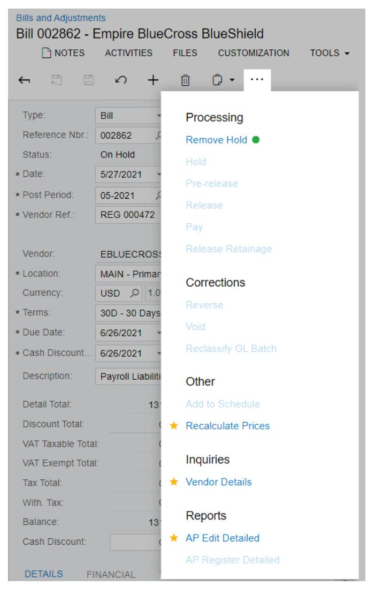

*Figure: The form toolbar and More menu on a narrow screen*

#### **Related Links**

- *[Integration with Excel](https://help-2025r1.acumatica.com/Help?ScreenId=ShowWiki&pageid=d4e757d5-bdf6-4d82-92e3-f26563d48ad4)*
- *To Copy a [Document](https://help-2025r1.acumatica.com/Help?ScreenId=ShowWiki&pageid=aa2b9a0f-794d-4dc7-80b4-14ed0702aea3) Contents to a New Document*
- *To Create a [Document](https://help-2025r1.acumatica.com/Help?ScreenId=ShowWiki&pageid=480487bd-b225-4065-9d82-97a3b68d7994) with a Template*

# **Table Toolbar**

Each table on an Acumatica ERP form, tab, dialog box, or page has a table toolbar, which contains the buttons you can use to work with the details or objects of the table. A toolbar, shown in the following screenshot, includes buttons that are specific to the table, standard buttons that most table toolbars have, and the search box (for some tables; for others, the search box is displayed in the filtering area).

| с             |    | ∽ | ∣⇔∣                                         | $\mathbf{x}$                      |                          |           |                       |               |                 |               |               |
|---------------|----|---|---------------------------------------------|-----------------------------------|--------------------------|-----------|-----------------------|---------------|-----------------|---------------|---------------|
|               |    |   | ALL RECORDS <b>ACTIVE</b>                |                                   |                          |           |                       |               |                 |               |               |
|               |    |   | Drag column header here to configure filter |                                   |                          |           |                       | R             |                 |               | ρ             |
| 髙             | O, | n | <b>Customer ID</b>                          | <b>Customer Name</b>              | Customer <b>Class</b> | Country   | City                  | Currenc ID | <b>Terms</b>    | <b>Status</b> |               |
| $\rightarrow$ | ा  | n | <b>ABARTENDE</b>                            | <b>USA Bartending School</b>      | <b>KEY</b>               | <b>US</b> | <b>Little Falls</b>   | USD.          | 30 D | Active        |               |
|               | O  |   | <b>ABCHOLDING</b>                           | <b>ABC Holdings Inc.</b>          | <b>KEY</b>               | <b>US</b> | New York              | <b>USD</b>    | 30 D | Active        |               |
|               | û, |   | !!!!!!!!!!!!!!!!!!!!!!!!!!!!!!!!!!!!!!!!    | <b>ABC Studios Inc.</b>           | <b>KEY</b>               | <b>US</b> | New York              | <b>USD</b>    | 30 D | Active        |               |
|               | Û  |   | <b>ABCVENTURE</b>                           | <b>ABC Capital Ventures</b>       | <b>KEY</b>               | <b>US</b> | Philadelphia          | <b>USD</b>    | 30 D | Active        |               |
|               | Û  |   | <b>ACTIVESTAF</b>                           | <b>Active Staffing Service</b>    | <b>LOCAL</b>             | <b>US</b> | <b>New York</b>       | <b>USD</b>    | 30 D | Active        |               |
|               | Û  |   | ALPHABETLD                                  | <b>Alphabetland School Center</b> | LOCAL                    | <b>US</b> | <b>North Bellmore</b> | <b>USD</b>    | 30 D | Active        |               |
|               |    |   |                                             |                                   |                          |           |                       |               |                 |               |               |
|               |    |   | 1-6 of 103 records                          |                                   |                          |           |                       | К             | 1.              | of 18 pages   | $\rightarrow$ |

#### *Figure: Table toolbar*

### **Standard Table Toolbar Buttons**

The following table describes the standard table toolbar buttons. A table toolbar may include some or all of those buttons. If a table toolbar includes table-specific buttons, they are described in the reference help topic.

| Button                          | Icon | Description                                                                                                                                                                                           |
|---------------------------------|------|-------------------------------------------------------------------------------------------------------------------------------------------------------------------------------------------------------|
| Refresh                         |      | Refreshes the data in the table.                                                                                                                                                                      |
| Switch Between Grid and Form |      | Controls how the elements are displayed: in a table (grid) with rows and columns; or as separately arranged elements for one table row, with navigation tools you use to move between row data. |
| Add Row                         |      | Appends a new row to the table so you can define a new detail or object. The new row may contain some default values.                                                                              |
| Delete Row                      |      | Deletes the selected row or rows.                                                                                                                                                                     |

| Button                    | Icon | Description                                                                                                                                                                                                                                                                                                               |
|---------------------------|------|---------------------------------------------------------------------------------------------------------------------------------------------------------------------------------------------------------------------------------------------------------------------------------------------------------------------------|
| Move Row Up               |      | Moves the selected row one position up.                                                                                                                                                                                                                                                                                   |
| Move Row Down             |      | Moves the selected row one position down.                                                                                                                                                                                                                                                                                 |
| Fit toScreen              |      | Adjusts the table to the screen width and makes the column width proportional.                                                                                                                                                                                                                                            |
| Export to Excel           |      | Exports the data in the table to an Excel file. For more information, see Integration with Excel in the Acumatica ERP Getting Started Guide.                                                                                                                                                                           |
| Filter Settings           |      | Opens the Filter Settings dialog box, which you can use to define a new advanced filter. After you create and save the filter, the corresponding tab appears on the ta ble. For more information about filtering, see Filters. For details on the Filter Settings dialog box, see Filter Settings Dialog Box. |
| Load Records from File |      | Opens the File Upload dialog box, described in detail below, so you can locate and upload a local file for import. You can use this option to import data from an Excel spreadsheet (.xlsx) or .csv file. For the detailed procedure, see To Import Data from a Local File to a Table.                           |
| Search                    |      | A box in which you can type a word, part of a word, or multiple words. As you type, the system filters the contents of the table to display only rows that contain the string you have typed in any column.                                                                                                         |
| Download                  |      | Downloads the selected file.                                                                                                                                                                                                                                                                                              |

# **File Upload Dialog Box**

With the **File Upload** dialog box, you select a file of one of the supported formats (.csv or .xlsx) to import data from the file.

| Element                                  | Description                                                                                                                         |  |
|------------------------------------------|-------------------------------------------------------------------------------------------------------------------------------------|--|
| File Path                                | The path to the file you want to upload. To select the file, click Browse, and then find and select the file you want to upload. |  |
| The dialog box has the following button. |                                                                                                                                     |  |
| Upload                                   | Closes the dialog box and opens the Common Settings dialog box, where you specify the import settings.                           |  |

## **Common Settings Dialog Box**

In the **Common Settings** dialog box, which opens if you click **Upload** in the **File Upload** dialog box, you specify the import settings for a file that you has selected in the **File Upload** dialog box.

| Element                                   | Description                                                                                                                                                                    |  |  |  |  |
|-------------------------------------------|--------------------------------------------------------------------------------------------------------------------------------------------------------------------------------|--|--|--|--|
| Separator Chars                           | The character that is used as the separator in the imported file.                                                                                                              |  |  |  |  |
|                                           | By default, the comma is used as the separator. You specify the separator character if the imported file uses any other separator.                                          |  |  |  |  |
|                                           | This box appears only if you import data from a .csv file.                                                                                                                     |  |  |  |  |
| Null Value                                | Optional. The value that is used to mark an empty column in the imported file. You speci fy the null value if the value in the imported file differs from the empty string. |  |  |  |  |
| Encoding                                  | The encoding that is used in the imported file.                                                                                                                                |  |  |  |  |
|                                           | This box appears only if you import data from a .csv file.                                                                                                                     |  |  |  |  |
| Culture                                   | The regional format that has been used to display the time, currency, and other measure ments in the imported file.                                                         |  |  |  |  |
| Mode                                      | The mode that determines which rows of the uploaded file will be imported into the ta ble. The following options are available:                                             |  |  |  |  |
|                                           | • Update Existing: The rows already present in the table will be updated, and the rows not present in the table will be added.                                           |  |  |  |  |
|                                           | • Bypass Existing: Only the new rows that are not present in the table will be imported. The rows that are already present in the table will not be updated.             |  |  |  |  |
|                                           | • Insert All Records: All the rows from the file will be imported into the table.                                                                                           |  |  |  |  |
|                                           | If you select this option, you may get duplicated rows because the sys tem does not check for duplicates when importing rows from the file.                                 |  |  |  |  |
| The dialog box has the following buttons. |                                                                                                                                                                                |  |  |  |  |
| OK                                        | Closes the dialog box and opens the Columns dialog box.                                                                                                                        |  |  |  |  |
| Cancel                                    | Closes the dialog box without importing the data from the file.                                                                                                                |  |  |  |  |

## **Columns Dialog Box**

In the **Columns** dialog box, which opens if you click **OK** in the **Common Settings** dialog box, you match the columns in the imported file that you have selected in the **File Upload** dialog box to the columns in the Acumatica ERP table to which you are importing data.

| Element       | Description                                                         |
|---------------|---------------------------------------------------------------------|
| Column Name   | The name of the column in the uploaded file.                        |
| Property Name | The name of the corresponding column in the table in Acumatica ERP. |

| Element                                   | Description                                                     |
|-------------------------------------------|-----------------------------------------------------------------|
| The dialog box has the following buttons. |                                                                 |
| OK                                        | Closes the dialog box and imports the selected file.            |
| Cancel                                    | Closes the dialog box without importing the data from the file. |

#### **Related Links**

- *[Tables](https://help-2025r1.acumatica.com/Help?ScreenId=ShowWiki&pageid=87a128a5-1230-4584-8c7a-ad05bcd08b75)*
- *[Integration with Excel](https://help-2025r1.acumatica.com/Help?ScreenId=ShowWiki&pageid=d4e757d5-bdf6-4d82-92e3-f26563d48ad4)*
- *To [Import](https://help-2025r1.acumatica.com/Help?ScreenId=ShowWiki&pageid=96773e07-5811-474d-a088-243f76f48f61) Data from a Local File to a Table*