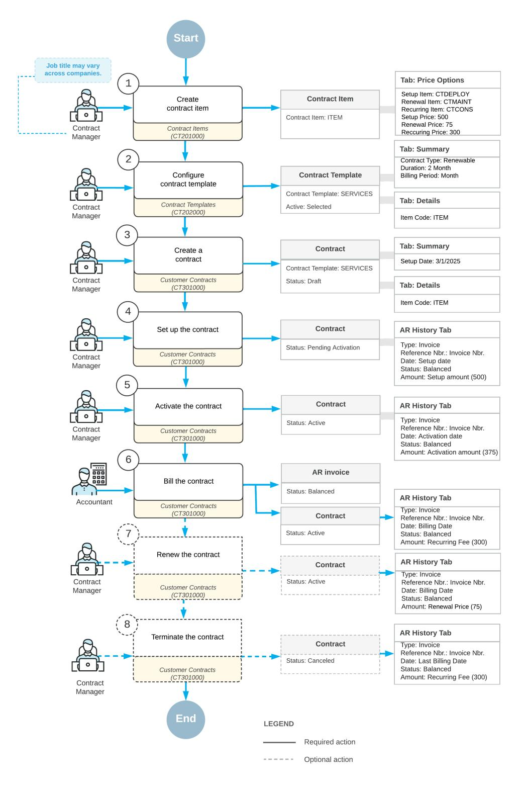

# **Contract Management 2025 R1**

## **Contents**

| Copyright4                                                                                 |  |
|--------------------------------------------------------------------------------------------|--|
| Implementing the Contract Functionality5                                                   |  |
| Contract Functionality Implementation: General Information5                                |  |
| Contract Functionality Implementation: Configuration Prerequisites 9                       |  |
| Contract Functionality Implementation: Implementation Activity10                           |  |
| Contract Functionality Implementation: Discount Application to a Contract12                |  |
| Creating Contract Items 14                                                                 |  |
| Contract Item Creation: Contract Items 14                                                  |  |
| Contract Item Creation: To Create a Renewal Contract Item (Regular Contract)15             |  |
| Contract Item Creation: To Create a Deposit Contract Item (Deposit Contract) 19            |  |
| Creating Contract Templates  24                                                            |  |
| Contract Template Creation: Contract Templates 24                                          |  |
| Contract Template Creation: To Create a Regular Contract Template24                        |  |
| Contract Template Creation: To Create an Empty Consulting Contract Template28              |  |
| Contract Template Creation: To Create an Empty Support Contract Template30                 |  |
| Contract Template Creation: To Create a Deposit Contract Template32                        |  |
| Configuring Contracts 35                                                                   |  |
| Contract Configuration: Deposit Contracts35                                                |  |
| Contract Configuration: To Create a Regular Contract Dra36                                |  |
| Contract Configuration: To Create Entities for a Consulting Contract39                     |  |
| Contract Configuration: To Create Entities for a Support Contract 42                       |  |
| Setting Up and Activating Contracts46                                                      |  |
| Contract Setup and Activation: General Information 46                                      |  |
| Contract Setup and Activation: To Set Up and Activate a Regular Contract 47                |  |
| Contract Setup and Activation: To Create and Activate an Empty Consulting Contract Dra 52 |  |
| Contract Setup and Activation: To Create and Activate an Empty Support Contract Dra 56    |  |
| Contract Setup and Activation: To Create and Activate a Deposit Contract58                 |  |
| Managing Contracts 62                                                                      |  |
| Contract Management: General Information62                                                 |  |
| Contract Management: Implementation Checklist64                                            |  |
| Contract Management: Fixed-Price Contracts 64                                              |  |
| Contract Management: Contract Upgrade 65                                                   |  |
| Contract Management: To Upgrade a Contract 66                                              |  |
| Contract Management: Last Action Cancellation 70                                           |  |

| Contract Management: To Cancel the Last Action71                               |  |
|--------------------------------------------------------------------------------|--|
| Contract Management: Contract Renewal 73                                       |  |
| Contract Management: To Renew a Contract 75                                    |  |
| Contract Management: To Terminate a Contract 78                                |  |
| Contract Management: Related Reports and Inquiries 83                          |  |
| Tracking Contract Usage 85                                                     |  |
| Contract Usage: General Information85                                          |  |
| Contract Usage: Contract Usage86                                               |  |
| Contract Usage: To Create Case Usage (Support Contract) 88                     |  |
| Contract Usage: Labor Items for Billing Contracts 91                           |  |
| Contract Usage: To Create Employee Activity Usage (Consulting Contract) 92     |  |
| Contract Usage: To Create Usage (Deposit Contract) 96                          |  |
| Billing Contracts 99                                                           |  |
| Contract Billing: General Information 99                                       |  |
| Contract Billing: Contract Examples100                                         |  |
| Contract Billing: Mass-Processing101                                           |  |
| Contract Billing: To Bill a Regular Contract on a Schedule 102                 |  |
| Contract Billing: To Bill a Consulting Contract by Employee Activity Usage 104 |  |
| Contract Billing: To Bill a Support Contract by Case Usage 106                 |  |
| Contract Billing: To Bill a Deposit Contract by Usage Entered Manually108      |  |
| Appendix113                                                                    |  |
| Reports 113                                                                    |  |
| Report Form113                                                                 |  |
| Report118                                                                      |  |
| Form Toolbar and More Menu120                                                  |  |
| Table Toolbar 127                                                              |  |

## **Copyright**

#### **© 2025 Acumatica, Inc.**

#### **ALL RIGHTS RESERVED.**

No part of this document may be reproduced, copied, or transmitted without the express prior consent of Acumatica, Inc.

3075 112th Avenue NE, Suite 200, Bellevue, WA 98004, USA

#### **Restricted Rights**

The product is provided with restricted rights. Use, duplication, or disclosure by the United States Government is subject to restrictions as set forth in the applicable License and Services Agreement and in subparagraph (c)(1)(ii) of the Rights in Technical Data and Computer Soware clause at DFARS 252.227-7013 or subparagraphs (c)(1) and (c)(2) of the Commercial Computer Soware-Restricted Rights at 48 CFR 52.227-19, as applicable.

#### **Disclaimer**

Acumatica, Inc. makes no representations or warranties with respect to the contents or use of this document, and specifically disclaims any express or implied warranties of merchantability or fitness for any particular purpose. Further, Acumatica, Inc. reserves the right to revise this document and make changes in its content at any time, without obligation to notify any person or entity of such revisions or changes.

#### **Trademarks**

Acumatica is a registered trademark of Acumatica, Inc. HubSpot is a registered trademark of HubSpot, Inc. Microso Exchange and Microso Exchange Server are registered trademarks of Microso Corporation. All other product names and services herein are trademarks or service marks of their respective companies.

Soware Version: 2025 R1 Last Updated: 06/01/2025

## **Implementing the Contract Functionality**

This chapter provides information about the initial steps required to create contracts in Acumatica ERP. You will learn about specifying the basic contract management settings you will use for creating contracts.

## **Contract Functionality Implementation: General Information**

In Acumatica ERP, contracts reflect the binding agreements your organization has with its customers and the specific terms of these agreements. During the implementation process, you perform the initial system configuration, define the entities used in a contract, and enter the basic terms of each contract into Acumatica ERP.

These initial tasks must be performed before you can implement the steps related to the fulfillment of a contract, such as setting it up, activating it, recording contract usage, billing the contract, changing the terms of the contract, renewing, or terminating the contract.

#### **Learning Objectives**

In this chapter, you will learn how to do the following:

- Configure the contract management functionality
- Create contract items and contract templates
- Create preliminary contract dras

#### **Applicable Scenarios**

You perform the tasks involved in contract implementation if your company needs to create configurable contracts that reflect the services that your company regularly provides to customers.

#### **Preparation for Contract Creation**

Before you create a contract, you need to perform the system configuration tasks and then create all the entities that will be used during the creation of contracts, such as non-stock items (to represent specific services in the contract), contract items, and contract templates.

Before you perform the system configuration tasks, on the *[Enable/Disable Features](https://help-2025r1.acumatica.com/Help?ScreenId=ShowWiki&pageid=c1555e43-1bc5-4f6f-ba9d-b323f94d8a6b)* (CS100000) form, you activate the *Contract Management* feature in your Acumatica ERP instance. Then on the **General** tab of the *[Accounts](https://help-2025r1.acumatica.com/Help?ScreenId=ShowWiki&pageid=f7b52067-5299-45e8-b601-485cd709f58b) [Receivable Preferences](https://help-2025r1.acumatica.com/Help?ScreenId=ShowWiki&pageid=f7b52067-5299-45e8-b601-485cd709f58b)* (AR101000) form, you clear the **Hold Documents on Entry** check box, which affects on the status of an invoice that the system generates when you bill a contract. In the final configuration step, you enable auto-numbering for contracts. For more information, see *[Managing Segmented Keys](https://help-2025r1.acumatica.com/Help?ScreenId=ShowWiki&pageid=f56166d3-7509-4572-b83c-1a7ca3b3f6d0)*.

Aer configuring the system, you create the main contract entities (non-stock items, contract items, and contract templates):

1. On the *[Non-Stock Items](https://help-2025r1.acumatica.com/Help?ScreenId=ShowWiki&pageid=bf68dd4f-63d4-460d-8dc0-9152f2bd6bf1)* (IN202000) form, a non-stock item must be created for each item to be included in the contract. You create these items if they do not already exist in Acumatica ERP.

For more information, see *[Non-Stock Item: General Information](https://help-2025r1.acumatica.com/Help?ScreenId=ShowWiki&pageid=054919f5-29c5-492f-a5dc-0b7a71b7a44b)*.

2. Aer you have created any needed non-stock items, on the *[Contract Items](https://help-2025r1.acumatica.com/Help?ScreenId=ShowWiki&pageid=caaae3d8-0e2f-415a-8378-83875c651052)* (CT201000) form, you create the contract items that you may want to include in a contract template.

A *contract item* is an entity that includes at least one service (which is represented by a non-stock item that you have defined) as well as related information about pricing and provisioning.

For more information, see *[Contract Item Creation: Contract Items](#page-13-2)*.

3. On the *Contract [Templates](https://help-2025r1.acumatica.com/Help?ScreenId=ShowWiki&pageid=1d443263-e802-4d25-a166-d08fb31fea9b)* (CT202000) form, you create a contract template to provide all the settings to the contract, except for the customer name and location. The contract template provides basic settings, as well as those related to billing, refund, and renewal for a typical contract of the type.

For more information, see *Contract Template Creation: Contract [Templates](#page-23-3)*.

#### **Creation of a Contract**

Aer you have created the contract template, you create a contract. On the *[Customer Contracts](https://help-2025r1.acumatica.com/Help?ScreenId=ShowWiki&pageid=63f6e9ef-6dda-4aed-9d23-743ae7a1332c)* (CT301000) form, you select a template and a customer account. The system inserts the default settings provided by the selected template and customer account. Also, it assigns the *Dra* status to the newly created contract.

You can change the included quantity of contract items within the allowed limits, specify the setup and activation dates, and modify the billing information. You can modify the list of contract items if these modifications are allowed, based on the settings of the selected contract template. Also, you can change the prices if the pricing policy of the contract item allows these changes. For more information, see *[Contract Management: Contract](#page-64-1) [Upgrade](#page-64-1)*.

For step-by-step instructions on the initial creation of a contract, see *Contract [Configuration:](#page-35-1) To Create a Regular [Contract Draft](#page-35-1)*.

Aer the contract has been created, it can then proceed to setup and activation, which are described in *[Contract](#page-45-2) [Setup and Activation: General Information](#page-45-2)*.

#### **Lifecycle of Contract Preparation and Management**

The following diagram shows the entire lifecycle of contract preparation and management. The implementation of contract management functionality is the earliest part of this lifecycle (Items 1 through 3 in the diagram).

Aer you have created a dra of the contract with appropriate conditions, you set up and activate the contract. These actions trigger the contract fulfillment process.

The fulfillment process of the contract includes mandatory and optional steps.

The following steps are mandatory:

- Contract setup and contract activation: Depending on the business processes of your company, the system gives you the opportunity to start the contract fulfillment process in either of the following ways:
  - To set up the contract separately (which actually corresponds to its signing) and then activate it (which defines the moment from which a company starts providing services)
  - To perform two actions simultaneously: set up and activate the contract

Once you have prepared a contract, you can set it up. If the service covered by a contract requires setup before contract activation, you may initiate billing for the setup separately. For example, contracts involving internet access may require the installation of a router or other equipment. When you initiate the contract setup, the contract becomes effective and the customer is billed for any services associated with setup. For more information, see *[Contract Setup and Activation: General Information](#page-45-2)*. When setup is finished, you activate the contract and start providing the service. Aer the activation of the contract, you can bill the customer for the service rendered.

If you do not need to separate the setup of the contract and the activation, these steps can be done simultaneously.

• Contract fulfillment: During this stage, the customer obtains the services described in the contract, and billing is performed according to the terms defined in the contract and the contract items. For details, see *[Contract Billing: General Information](#page-98-2)* and *[Contract Usage: Contract Usage](#page-85-1)*.

The following steps are optional:

- Contract upgrade: You or the customer may want to change (upgrade or downgrade) the set of services within the scope of an active contract. Contract upgrading has two steps: preparation and activation. During preparation, contract billing and service provision are done according to the initial settings of the contract. For details, see *[Contract Management: Contract Upgrade](#page-64-1)*.
- Contract renewal: The renewal scenario depends on the type of the expired contract, which is determined by the contract template.

The three types of contracts are *Renewable*, *Expiring*, and *Unlimited*:

- A contract of the *Renewable* type can be prolonged (its expiration date will be moved to the future) if it is renewed within the grace period. Aer renewal, the contract has the *Active* status. If the grace period has been finished, the renewal process creates a copy of the contract with the *Dra* status. You need to activate the copied contract to start the provision of services. During the renewal process, the system changes the expiration date of the contract and generates an invoice for the renewal fee, if any. Aer renewal is completed, the contract is again in the fulfillment stage. For details about renewing contracts, see *[Contract Management: Contract Renewal](#page-72-1)*.
- A contract of the *Expiring* type cannot be prolonged; the renewal process creates a new contract as a copy of an existing contract. A contract of this type expires at the end of its duration, but it is available for a renewal operation—manual or automatic. When this contract is renewed, a copy of the expired contract is created with the *Dra* status, and you need to activate the copied contract to start the provision of services
- A contract of the *Unlimited* type has no expiration date and can end only when it is terminated For more information, see *[Contract Management: Contract Renewal](#page-72-1)*.
- Contract expiration: Each time you run the contract billing process, it checks whether the next billing date is later than or the same as the contract expiration date. If it is, the contract billing process sets the next billing day to be the same as the contract expiration date. The next time you run the contract billing process, the system generates an invoice for the rendered service or contract usage and changes the contract status to *Expired*. You can not record any contract usage for an expired contract.
- Contract termination: Contract termination may be done at any point in the contract lifecycle if you or the customer decide to discontinue the relationship between the parties defined by the contract. You can terminate an expired contract if you are not going to renew it. When you initiate the contract termination, the system gathers information on the unbilled usage and unfulfilled services of the contract and generates an invoice or a credit memo, if needed.

The termination date must be within the current billing period (between the last and the next billing date). You can check these dates on the Summary tab of the *[Customer Contracts](https://help-2025r1.acumatica.com/Help?ScreenId=ShowWiki&pageid=63f6e9ef-6dda-4aed-9d23-743ae7a1332c)* (CT301000) form (**Billing Schedule** section). For more information, see *[Contract Management: General Information](#page-61-2)*.

If the contract termination date is within the refund period specified in the **Refund Period** box on the **Summary** tab of the *Contract [Templates](https://help-2025r1.acumatica.com/Help?ScreenId=ShowWiki&pageid=1d443263-e802-4d25-a166-d08fb31fea9b)* (CT202000) form and the contract termination date is earlier than or the same as the contract expiration date, the system will generate a credit memo for any refundable items. When the termination operation completes successfully, the status of the contract is *Canceled*.

## **Contract Functionality Implementation: Configuration Prerequisites**

Before starting to create contracts, you should be sure that the needed feature has been enabled, the needed settings have been specified, and the applicable entities have been created, as described in the following sections.

#### **Enabling the Needed Feature**

On the *[Enable/Disable Features](https://help-2025r1.acumatica.com/Help?ScreenId=ShowWiki&pageid=c1555e43-1bc5-4f6f-ba9d-b323f94d8a6b)* (CS100000) form, the *Contract Management* feature must be enabled.

#### **Configuring Project Identifiers**

The *CONTRACT* segmented key on the *[Segmented Keys](https://help-2025r1.acumatica.com/Help?ScreenId=ShowWiki&pageid=78bd7bd1-6bf6-409e-a8a5-8b18e8b80722)* (CS202000) form defines the identifier of the contracts. By default, this segmented key specifies that the contract identifier is an alphanumeric string of up to 10 characters. For the key, you can define how many segments it is to have, what values may be used, whether these values should be validated, and whether auto-numbering should be used in one of the segments. You can also divide item identifiers into segments with specific values. For more information on configuring segmented keys, see *[Segmented](https://help-2025r1.acumatica.com/Help?ScreenId=ShowWiki&pageid=a2f667ab-0de9-4738-9f05-58e9cbfc1735) [Identifiers](https://help-2025r1.acumatica.com/Help?ScreenId=ShowWiki&pageid=a2f667ab-0de9-4738-9f05-58e9cbfc1735)*.

#### **Configuring the System**

You need to make sure the following tasks have been performed in Acumatica ERP before you begin to create contracts:

- On the *[Companies](https://help-2025r1.acumatica.com/Help?ScreenId=ShowWiki&pageid=fedad435-8496-4397-b8a3-50a473629f76)* (CS101500) form, you need to make sure that the companies of the organization have been configured. For more information, see *Company Without [Branches:](https://help-2025r1.acumatica.com/Help?ScreenId=ShowWiki&pageid=082a5d06-0e65-44c0-8049-4df32ebf59d3) To Configure a Company Without [Branches](https://help-2025r1.acumatica.com/Help?ScreenId=ShowWiki&pageid=082a5d06-0e65-44c0-8049-4df32ebf59d3)*.
- On the *[Accounts Receivable Preferences](https://help-2025r1.acumatica.com/Help?ScreenId=ShowWiki&pageid=f7b52067-5299-45e8-b601-485cd709f58b)* (AR101000) form, you need to make sure that the account receivable functionality has been configured.
- On the *[Chart of Accounts](https://help-2025r1.acumatica.com/Help?ScreenId=ShowWiki&pageid=85557f41-a4af-47a8-b198-2a01461ce9c3)* (GL202500) form, the accounts to be used with the accounts receivable functionality have been defined. For more information, see *General Ledger: To Create a Chart of [Accounts](https://help-2025r1.acumatica.com/Help?ScreenId=ShowWiki&pageid=535eabd7-26e2-4777-ac7d-fedf23846eb1)*.

#### **Contract Numbering**

As a part of the preparation for contract creation, you need to develop a strategy for assigning identifiers to contracts. A *segmented key*, which is defined on the *[Segmented Keys](https://help-2025r1.acumatica.com/Help?ScreenId=ShowWiki&pageid=78bd7bd1-6bf6-409e-a8a5-8b18e8b80722)* (CS202000) form, defines the structure of identifiers for a certain entity and then serves as a template when a user creates an identifier for a new record of the type. You can either configure the segmented key to be auto-numerated, so that the system will generate the new numbers automatically, or make the segmented key manually numbered, if you want to have some meaningful titles for the contracts.

Contract identifiers are based on the *CONTRACT* segmented key, which inherits its structure from the *PROJECT* segmented key. If you are using the same structure for both segmented keys, and auto-numbering is disabled for them, you will not be able to create contracts with the identifiers that are already used in existing projects

or project templates. Also, you cannot use the identifier that is specified as the non-project code on the *[Projects](https://help-2025r1.acumatica.com/Help?ScreenId=ShowWiki&pageid=de2ca225-4a0c-4129-b09d-3f3ed05198f9) [Preferences](https://help-2025r1.acumatica.com/Help?ScreenId=ShowWiki&pageid=de2ca225-4a0c-4129-b09d-3f3ed05198f9)* (PM101000) form as an identifier of a contract.

If both *Contract Management* and *Projects* features are in use in the system, a number of entry forms have a **Project/Contract** element (box or column) in which you select the project or contract that is related to a record on the form (such as an invoice or credit memo) or a detail line of a record (such as a line of an expense claim). In a lookup table that opens for such UI element, and both projects and contracts are listed. If you want to provide the users the ability to distinguish between projects and contracts in these lookup tables, you need to reserve one segment of the key for a value that designates whether the identifier belongs to projects or contracts. You can use one of the following approaches to defining the keys:

- You configure two segments in the *PROJECT* segmented key: a two-letter segment with two possible character strings (such as *PR* and *CT*) to designate the type of identifier, and a 10-character auto-numbered segment to identify the particular project or contract. For the second segment of the *CONTRACT* segmented key, you assign a different numbering sequence than the one used for to maintain the numbers for contracts independently from those of projects. Numbering sequences are created and modified on the *[Numbering](https://help-2025r1.acumatica.com/Help?ScreenId=ShowWiki&pageid=a8d11c23-21f2-42a3-b17d-9637c9cf8031) [Sequences](https://help-2025r1.acumatica.com/Help?ScreenId=ShowWiki&pageid=a8d11c23-21f2-42a3-b17d-9637c9cf8031)* (CS201010) form.
- If you decide to define a one-segment structure for the *PROJECT* segmented key with an auto-numbered segment, you can assign different numbering sequences to the *PROJECT* and *CONTRACT* keys. On the *[Numbering Sequences](https://help-2025r1.acumatica.com/Help?ScreenId=ShowWiki&pageid=a8d11c23-21f2-42a3-b17d-9637c9cf8031)* form, create the sequence intended for projects with *PR* as a prefix, and define the sequence intended for contracts with the *CT* prefix.

#### **Defining Entities**

You need to define the following Acumatica ERP entities before you create contracts:

- Customer accounts and locations: The customers you will specify in contracts must be created on the *[Customers](https://help-2025r1.acumatica.com/Help?ScreenId=ShowWiki&pageid=652929bc-9606-4056-aa6e-0c2d1147171b)* (AR303000) form. Also, the needed customer locations must be created on the *[Customer](https://help-2025r1.acumatica.com/Help?ScreenId=ShowWiki&pageid=61a8c6de-6a51-434b-8c2d-4304ec982ae0) [Locations](https://help-2025r1.acumatica.com/Help?ScreenId=ShowWiki&pageid=61a8c6de-6a51-434b-8c2d-4304ec982ae0)* (AR303020) form, which is available if the *Business Account Locations* feature is enabled on the *[Enable/Disable Features](https://help-2025r1.acumatica.com/Help?ScreenId=ShowWiki&pageid=c1555e43-1bc5-4f6f-ba9d-b323f94d8a6b)* (CS100000) form. When you create a contract on the *[Customer Contracts](https://help-2025r1.acumatica.com/Help?ScreenId=ShowWiki&pageid=63f6e9ef-6dda-4aed-9d23-743ae7a1332c)* (CT301000) form and select a customer account, the system fills in the applicable billing settings that have been specified for the customer.
- Discount: If you want to give any customer a discount for services provided recurrently through the contract, you should create the needed discount code, which determines the discount rate, the application rules, and the non-stock items it is applied to. You will specify this discount code when you create a contract. You create each needed discount code on the *[Discount Codes](https://help-2025r1.acumatica.com/Help?ScreenId=ShowWiki&pageid=2c72ab3c-6c27-4891-9d29-8721bd5fbba9)* (AR209000) form and the discount sequences of each discount code on the *[Discounts](https://help-2025r1.acumatica.com/Help?ScreenId=ShowWiki&pageid=79dd801c-7289-461e-8daa-44460412e717)* (AR209500) form. For details on creating discounts, see *[Customer](https://help-2025r1.acumatica.com/Help?ScreenId=ShowWiki&pageid=fcb8c6cc-1b39-4f5b-9742-ddf86a477710) [Discounts: General Information](https://help-2025r1.acumatica.com/Help?ScreenId=ShowWiki&pageid=fcb8c6cc-1b39-4f5b-9742-ddf86a477710)*.
- Contract template: A contract is based on a contract template, which provides the default settings of the contract. For each type of contract (such as a service agreement or support plan) your company has with its customers, you can create a contract template. Then when you create a contract, you select the appropriate contract template, which causes the default settings of the contract to be filled in. A contract template may also provide a list of products and services that you want to sell. These services and products are represented by contract items, which you create separately.

## **Contract Functionality Implementation: Implementation Activity**

In this implementation activity, you will learn how to enable the *Contract Management* feature and review the basic contract management settings.

This activity is based on the *U100* dataset. If you are using another dataset, or if any system settings have been changed in *U100*, these changes can affect the workflow of the activity and the results of the processing. To avoid any issues, restore the *U100* dataset to its initial state.

#### **Story**

Suppose that you are an administrative user of the SweetLife company. You are configuring the minimum required functionality to prepare the system for creating and processing of contracts.

#### **Process Overview**

To set up the basic contract management settings, you will do the following:

- 1. On the *[Enable/Disable Features](https://help-2025r1.acumatica.com/Help?ScreenId=ShowWiki&pageid=c1555e43-1bc5-4f6f-ba9d-b323f94d8a6b)* (CS100000) form, you will enable the *Contract Management* feature to support the contract management functionality.
- 2. On the *[Accounts Receivable Preferences](https://help-2025r1.acumatica.com/Help?ScreenId=ShowWiki&pageid=f7b52067-5299-45e8-b601-485cd709f58b)* (AR101000) form, you will clear the **Hold Documents on Entry** check box to use the needed accounts receivable functionality in activities of the guide.
- 3. On the *[Numbering Sequences](https://help-2025r1.acumatica.com/Help?ScreenId=ShowWiki&pageid=a8d11c23-21f2-42a3-b17d-9637c9cf8031)* (CS201010) form, you will enable auto-numbering for contracts. The numbering sequence will be used to assign automatically numbered identifiers to contracts.

#### **System Preparation**

Before you start performing the initial configuration of the contract management functionality, launch the Acumatica ERP website, and sign in to a company with the *U100* dataset preloaded.

You should sign in as a system administrator by using the *gibbs* username and the *123* password.

#### **Step 1: Enabling the Contract Management Feature**

To activate the needed feature to use the contract functionality, do the following:

- 1. Open the *[Enable/Disable Features](https://help-2025r1.acumatica.com/Help?ScreenId=ShowWiki&pageid=c1555e43-1bc5-4f6f-ba9d-b323f94d8a6b)* (CS100000) form.
- 2. On the form toolbar, click **Modify**.
- 3. Under the *Advanced Financials* group of features, select the **Contract Management** check box.

The *Contract Management* feature provides support for contracts, including contract billing, in Acumatica ERP. It makes available forms related to contract processing and provides integration with accounts receivable and the tracking of time and expenses.

4. On the form toolbar, click **Enable**.

#### **Step 2: Configuring the Settings of the Accounts Receivable Functionality**

To be able to use the needed accounts receivable functionality, on the *[Accounts Receivable Preferences](https://help-2025r1.acumatica.com/Help?ScreenId=ShowWiki&pageid=f7b52067-5299-45e8-b601-485cd709f58b)* (AR101000) form, do the following:

1. On the **General** tab, clear the **Hold Documents on Entry** check box.

With this check box cleared, any invoice issued when a contract is billed will have the *Balanced* status.

2. On the form toolbar, click**Save**.

The step is optional. You may perform it during your activities in the case you want the system issues invoices in the *Balanced* status. You can then release invoices in bulk from the *[Release AR Documents](https://help-2025r1.acumatica.com/Help?ScreenId=ShowWiki&pageid=78ad2d21-b6a8-46d0-8f2d-98dd0a23f75e)* (AR501000) form.

#### **Step 3: Enabling Auto-Numbering for Contracts**

In Acumatica ERP, contract identifiers are created based on the *CONTRACT* segmented key. To configure the system to assign automatically numbered identifiers to contracts, do the following:

- 1. In the **Segmented Key ID** box of the *[Segmented Keys](https://help-2025r1.acumatica.com/Help?ScreenId=ShowWiki&pageid=78bd7bd1-6bf6-409e-a8a5-8b18e8b80722)* (CS202000) form (the Summary area), select *CONTRACT*.
- 2. Click **Edit** to the right of the **Numbering ID** box to view the configuration of the *CONTRACT* numbering sequence on the *[Numbering Sequences](https://help-2025r1.acumatica.com/Help?ScreenId=ShowWiki&pageid=a8d11c23-21f2-42a3-b17d-9637c9cf8031)* (CS201010) form. This predefined numbering sequence is used in the *CONTRACT* segmented key by default.
- 3. Close the *[Numbering Sequences](https://help-2025r1.acumatica.com/Help?ScreenId=ShowWiki&pageid=a8d11c23-21f2-42a3-b17d-9637c9cf8031)* form.
- 4. In the table on the *[Segmented Keys](https://help-2025r1.acumatica.com/Help?ScreenId=ShowWiki&pageid=78bd7bd1-6bf6-409e-a8a5-8b18e8b80722)* form, select the **Auto Number** check box for the only row, which contains the settings of the single segment included in the segmented key (see the following screenshot).

| <b>Segmented Keys</b>             |                                                                                                                         |                   |             |                  |                    |          | <b>CUSTOMIZATION</b>  | TOOLS $\sim$        |
|-----------------------------------|-------------------------------------------------------------------------------------------------------------------------|-------------------|-------------|------------------|--------------------|----------|-----------------------|---------------------|
| B ffill. $\Omega$ $^{+}$ | $\begin{array}{ccccccccccccccccccccc} \cap & \circ & \circ & \circ & \circ & \circ & \circ & \circ & \circ \end{array}$ |                   |             |                  |                    |          |                       |                     |
| * Segmented Key ID:               | <b>CONTRACT</b>                                                                                                         | ρ                 | Max Length: |                  | 30                 |          |                       | $\hat{\phantom{a}}$ |
| Parent:                           | <b>PROJECT</b>                                                                                                          |                   | Length:     |                  | 10                 |          |                       |                     |
| Lookup Mode:                      | By Segmented Key                                                                                                        | $\check{~}$       | Segments:   |                  | 1                  |          |                       |                     |
|                                   | Allow Adding New Values On the Fly                                                                                      |                   |             |                  |                    |          |                       |                     |
| Specific Module:                  |                                                                                                                         | Ω                 |             |                  |                    |          |                       |                     |
| Numbering ID:                     | <b>CONTRACT</b>                                                                                                         | Ω $\mathcal O$ |             |                  |                    |          |                       |                     |
| * Description:                    | <b>Contract ID</b>                                                                                                      |                   |             |                  |                    |          |                       |                     |
| Ò $\times$ $\pm$            | <b>VIEW SEGMENT</b> $\left  \rightarrow \right $                                                                     | $\mathbf{x}$      |             |                  |                    |          |                       |                     |
| 冒 Segment ID *Description      | Override                                                                                                                | Length Align      |             | <b>Edit Mask</b> | Case Conversion | Validate | Auto <b>Number</b> | * Separator         |
| Contract $\mathbf{1}$          | $\boxed{\small\!\!\!\!\!\!\!\!\!\!\!\!\!\!\!\!\!\!\!\!\!\!\!\!\!\!\!\!\!\!\!\!\!\!\!\$                                  | 10 1   | Left        | <b>Unicode</b>   | Uppercase          | □        | ☑                     | $\blacksquare$      |
|                                   |                                                                                                                         |                   |             |                  |                    |          |                       |                     |
|                                   |                                                                                                                         |                   |             |                  |                    |          |                       |                     |

#### *Figure: Settings of the CONTRACT segmented key*

Contract identifiers can be defined to include multiple segments. However, automatic numbering can be enabled for only one segment. Note that the length of the auto-numbered segment must match the length of the numbering sequence specified in the **Numbering ID** box.

5. On the form toolbar, click**Save**.

## **Contract Functionality Implementation: Discount Application to a Contract**

In this topic, you will find details on the discount code that you can apply to a contract. The discount code determines the discount rate, the application rules, and the items it can be applied to.

The discount codes that may be available for selection are created on the *[Discount Codes](https://help-2025r1.acumatica.com/Help?ScreenId=ShowWiki&pageid=2c72ab3c-6c27-4891-9d29-8721bd5fbba9)* (AR209000) form, and the discount sequences of each discount code are created on the *[Discounts](https://help-2025r1.acumatica.com/Help?ScreenId=ShowWiki&pageid=79dd801c-7289-461e-8daa-44460412e717)* (AR209500) form.

#### **Discounts Available for Selection**

To apply a discount to a contract, open the **Details** tab on the *[Customer Contracts](https://help-2025r1.acumatica.com/Help?ScreenId=ShowWiki&pageid=63f6e9ef-6dda-4aed-9d23-743ae7a1332c)* (CT301000) form, and select a discount code in the lookup table for the **Promo Code** box.

The system forms the list of discount codes in the lookup table as follows:

- 1. The system selects all discount codes with the *Line* type that have at least one active discount sequence.
- 2. For the discount codes that have not been excluded in Step 1, the system checks the conditions defined in the active discount sequences of the discount codes. A discount code proceeds to Step 3 for possible conclusion only if the code is applicable to any of the following:
  - The customer account for which you are preparing a contract
  - The customer price class to which the customer account belongs
  - The non-stock items used in the contract items
  - The item price class to which the non-stock item belongs

The system displays in the lookup table for the **Promo Code** box all discount codes that may be applicable to the items in the contract. In other words, the selector might show some discount codes that aren't suitable for any of the contract items at the current moment.

3. For each discount code that has not been excluded in Step 2, if an applicable discount sequence of the discount code is marked as promotional, the discount code will be listed in the lookup table only if the contract start date is in the promotional range.

If you do not specify a discount code for a contract, the system will apply the best active line discount when you run the contract billing process. If you specify a discount code for a contract, the system will apply the specified discount, even if a better discount is available.

The system applies the specified discount to only the non-stock items used in contract items. If you record the contract usage of a non-stock item that is not included in the contract, the system will apply the best available discount for this non-stock item.

For more information, see *[Customer Discounts: General Information](https://help-2025r1.acumatica.com/Help?ScreenId=ShowWiki&pageid=fcb8c6cc-1b39-4f5b-9742-ddf86a477710)*.

## **Creating Contract Items**

This chapter provides information about the initial steps required to create contracts in Acumatica ERP. You will learn about creating the contract items that you will use for creating templates and contracts.

## **Contract Item Creation: Contract Items**

In Acumatica ERP, a contract item is an entity that you create on the *[Contract Items](https://help-2025r1.acumatica.com/Help?ScreenId=ShowWiki&pageid=caaae3d8-0e2f-415a-8378-83875c651052)* (CT201000) form that represents the services you provide to customers as part of the contract. The contract items of a particular contract are listed on the **Details** tab of the *[Customer Contracts](https://help-2025r1.acumatica.com/Help?ScreenId=ShowWiki&pageid=63f6e9ef-6dda-4aed-9d23-743ae7a1332c)* (CT301000) form.

A contract item consists of such settings as the services that are provided on setup, on renewal, or on a recurring basis for this contract item. It also contains the pricing and provisioning settings. The services that are specified for a contract item must be first defined as non-stock items in the system.

#### **Non-Stock Items Included in a Contract Item**

Before you create a contract item on the *[Contract Items](https://help-2025r1.acumatica.com/Help?ScreenId=ShowWiki&pageid=caaae3d8-0e2f-415a-8378-83875c651052)* (CT201000) form, you should consider what services you will offer to your customers as the setup item, renewal item, or recurring item of the contract item.

These items should be defined as non-stock items on the *[Non-Stock Items](https://help-2025r1.acumatica.com/Help?ScreenId=ShowWiki&pageid=bf68dd4f-63d4-460d-8dc0-9152f2bd6bf1)* (IN202000) form before the contract items are created. The base price of the non-stock item will be used to calculate the price of the contract item, and the GL sales account and subaccount of the non-stock item will be used to record item-related transactions. For details on creating non-stock items, see *[Non-Stock Items: General Information](https://help-2025r1.acumatica.com/Help?ScreenId=ShowWiki&pageid=2c0fcd08-d59d-4335-98e3-83471a287f18)*.

You cannot use a non-stock item that is a kit in a contract item.

#### **Contract Item**

Once you have defined the needed non-stock items, you define the contract items on the *[Contract Items](https://help-2025r1.acumatica.com/Help?ScreenId=ShowWiki&pageid=caaae3d8-0e2f-415a-8378-83875c651052)* (CT201000) form.

All non-stock items included in a contract item should be priced in the same currency.

The key settings of a contract item are specified on the **Price Options** tab of the form. They cover the following parts of contract fulfillment, and a contract item can have settings specified for any or all of the parts:

- Setup: In the**Setup and Renewal** section of the **Price Options** tab, you specify the setup item, which is the non-stock item that you want to provide during contract setup, and specify the pricing policy to be used to calculate the setup price. Also, you can use these settings to create the deposit contract item that is used in deposit contracts. For details on creating deposit contract, see *[Contract Configuration: Deposit Contracts](#page-34-2)*.
- Renewal: The renewal settings of the contract item are also specified in the**Setup and Renewal** section of the **Price Options** tab. You specify the renewal item, which is the non-stock item that you want to provide during contract renewal, and specify the pricing policy to be used to calculate the renewal price. You can define the renewal price to be dependent on the setup price.
- Recurring: In the **Recurring Billing** settings of the **Price Options** tab, you define the policy for the recurring billing, specify the non-stock item you want to provide recurrently, and define the pricing policy to be used to calculate the recurring price. For items that are provided recurrently, you can specify a price for extra usage, which is the usage that exceeds the included usage; thus, the extra quantity can be billed at a different price. You can set up both the recurring price and the extra usage price to be dependent on the setup price.

For example, you might provide a customer with a soware package or another product that might need ongoing service or support. In this case, you would specify the soware or product as the setup item and specify the support services as the recurring item.

For each of these parts, you select one of the following pricing options in the**Setup Pricing**, **Renewal Pricing**, or **Recurring Pricing** box:

- *Use Item Price*: The price is determined by the first available source of the non-stock item price, which the system checks in the following order: customer price lists, customer price class prices, base price lists, and the default price.
- *Percent of Item Price*: The price is a percentage that the system calculates by applying the percent specified in the **Item Price/Percent** box of the *[Contract Items](https://help-2025r1.acumatica.com/Help?ScreenId=ShowWiki&pageid=caaae3d8-0e2f-415a-8378-83875c651052)* (CT201000) form to the price of the non-stock item.
- *Percent of Setup Price* (for renewal and recurring items only): The system calculates the item price by applying the percent specified in the **Item Price/Percent** box to the contract item setup price.
- *Enter Manually*: The price should be specified manually in the **Item Price/Percent** box of the *[Contract Items](https://help-2025r1.acumatica.com/Help?ScreenId=ShowWiki&pageid=caaae3d8-0e2f-415a-8378-83875c651052)* form. It can be changed in a contract.

## **Contract Item Creation: To Create a Renewal Contract Item (Regular Contract)**

In this activity, you will learn how to create a contract item for a regular contract. You will later use this contract item for creating a contract template.

This activity is based on the *U100* dataset. If you are using another dataset, or if any system settings have been changed in *U100*, these changes can affect the workflow of the activity and the results of the processing. To avoid any issues, restore the *U100* dataset to its initial state.

#### **Story**

Suppose that the SweetLife Fruits & Jams company supplies its Unifruit LLC customer with a piece of equipment for juice production and provides deployment service for the purchased equipment. A regular deployment fixedprice contract includes the deployment of equipment, a maintenance support service, and monthly consulting. In a fixed-price contract, payment amounts are constant and do not change depending on the costs incurred by SweetLife during the fulfillment of the contract. The start date of the contract is *3/1/2025*. The contract should span two months, with the possibility of renewal.

According to the terms of the contract, the customer will be billed in the amount of \$500 for the juicer deployment service and the initial actions when contract setup takes place. In addition, the customer will be billed a fixed amount of \$75, which is 15% of the deployment fee for a juicer maintenance at the moment of contract activation or on contract renewal. The customer will also be billed monthly in the amount of \$300 at the beginning of each scheduled billing period for the consulting service that is to be provided during the duration of the contract.

Acting as a sales manager, you need to create a renewal contract item to establish the prices and settings for the included services.

#### **Configuration Overview**

In the *U100* dataset, the following tasks have been performed to support this activity:

- On the *[Enable/Disable Features](https://help-2025r1.acumatica.com/Help?ScreenId=ShowWiki&pageid=c1555e43-1bc5-4f6f-ba9d-b323f94d8a6b)* (CS100000) form, the *Contract Management* feature has been enabled.
- On the *[Customers](https://help-2025r1.acumatica.com/Help?ScreenId=ShowWiki&pageid=652929bc-9606-4056-aa6e-0c2d1147171b)* (AR303000) form, the *UNIFRUIT (Unifruit LLC)* customer has been created.
- On the *[Chart of Accounts](https://help-2025r1.acumatica.com/Help?ScreenId=ShowWiki&pageid=85557f41-a4af-47a8-b198-2a01461ce9c3)* (GL202500) form, the *79000* (*Contract Expenses*) expense account, *40600* (*Contracts - Deployment of equipment*), and the *40800* (*Contracts - Trainings*) sales accounts have been created.

#### **Process Overview**

In this activity, on the *[Non-Stock Items](https://help-2025r1.acumatica.com/Help?ScreenId=ShowWiki&pageid=bf68dd4f-63d4-460d-8dc0-9152f2bd6bf1)* (IN202000) form, you will create new non-stock items and specify setup, renewal, and recurring settings. On the *[Stock Items](https://help-2025r1.acumatica.com/Help?ScreenId=ShowWiki&pageid=77786a70-1f1e-4d63-ad98-96f98e4fcb0e)* (202500) form, you will then create a renewal contract item that you will use in the process of template creation.

#### **System Preparation**

To prepare to perform the instructions of this activity, do the following:

- 1. As a prerequisite to this activity, complete the *[Contract Functionality Implementation: Implementation Activity](#page-9-1)* to activate the needed features to use the contract functionality.
- 2. Launch the Acumatica ERP website with the *U100* dataset preloaded, and sign in as the sales manager David Chubb by using the *chubb* username and the *123* password.

#### **Step 1: Creating Non-Stock Items**

To create non-stock items, do the following:

- 1. On the *[Non-Stock Items](https://help-2025r1.acumatica.com/Help?ScreenId=ShowWiki&pageid=bf68dd4f-63d4-460d-8dc0-9152f2bd6bf1)* (IN202000) form, create the non-stock item for the deployment service as follows:
  - a. Add a new record.
  - b. Specify the following settings in the Summary area:
    - **Inventory ID**: CTDEPLOY
    - **Description**: Juicer equipment deployment
  - c. On the **General** tab, specify the following settings:
    - **Type**: *Service*
    - **Posting Class**: *NONSTOCK*
    - **Tax Category**: *EXEMPT*
    - **Require Receipt**: Cleared
    - **RequireShipment**: Cleared
    - **Base Unit**: *ITEM*
    - **Sales Unit**: *ITEM*
    - **Purchase Unit**: *ITEM*
  - d. On the **Price/Cost** tab, specify 500 (the deployment fee) in the **Default Price** box.
  - e. On the **GL Accounts** tab, specify the following settings:
    - **Expense Account**: *79000* (*Contract Expenses*)
      - This account accumulates the expenses that company spends to provide contract preparation.
    - **Sales Account**: *40600* (*Contracts - Deployment of equipment*)
      - This account accumulates the revenue earned when employees provide deployment services.
  - f. On the form toolbar, click**Save** to save the non-stock item.
- 2. Create the non-stock item for the equipment maintenance service as follows:
  - a. Add a new record.
  - b. Specify the following settings in the Summary area:
    - **Inventory ID**: CTMAINT
    - **Description**: After-sales maintenance
  - c. On the **General** tab, specify the following settings:

- **Type**: *Service*
- **Posting Class**: *NONSTOCK*
- **Tax Category**: *EXEMPT*
- **Require Receipt**: Cleared
- **RequireShipment**: Cleared
- **Base Unit**: *ITEM*
- **Sales Unit**: *ITEM*
- **Purchase Unit**: *ITEM*
- d. On the **GL Accounts** tab, specify the following settings:
  - **Expense Account**: *79000* (*Contract Expenses*)
  - **Sales Account**: *40600* (*Contracts - Deployment of equipment*)
- e. On the form toolbar, click**Save** to save the non-stock item.
- 3. Create the non-stock item for a consulting service as follows:
  - a. Add a new record.
  - b. Specify the following settings in the Summary area:
    - **Inventory ID**: CTCONS
    - **Description**: Consulting on operating juicers
  - c. On the **General** tab, specify the following settings:
    - **Type**: *Non-Stock Item*
    - **Posting Class**: *NONSTOCK*
    - **Tax Category**: *EXEMPT*
    - **Require Receipt**: Cleared
    - **RequireShipment**: Cleared
    - **Base Unit**: *ITEM*
    - **Sales Unit**: *ITEM*
    - **Purchase Unit**: *ITEM*
  - d. On the **Price/Cost** tab, specify 300 in the **Default Price** box.
  - e. On the **GL Accounts** tab, specify the following settings:
    - **Expense Account**: *79000* (*Contract Expenses*)
    - **Sales Account**: *40800* (*Contracts - Trainings*)
  - f. On the form toolbar, click**Save** to save the non-stock item.

#### **Step 2: Creating a Contract Item**

In this step, you will create a renewal contract item to establish the prices and settings for the included services.

To create a contract item, do the following:

- 1. On the *[Contract Items](https://help-2025r1.acumatica.com/Help?ScreenId=ShowWiki&pageid=caaae3d8-0e2f-415a-8378-83875c651052)* (CT201000) form, add a new record.
- 2. In the **Description** box of the Summary area, type Deployment of juicers.

The **Contract Item** box contains the <NEW> placeholder, which means that auto-numbering is enabled for the key segment and the identifier will be assigned automatically when you save the new record.

3. On the **Price Options** tab, enter the following settings:

- **Maximum Allowed Quantity**: 3
- **Minimum Allowed Quantity**: 0
- **Default Quantity**: 1

Under a contract that includes this contract item, the customer will be able to deploy juicers. These settings are quantities of this contract item. In a contract template or a contract that includes this contract item, the value in the **Default Quantity** box can be modified in a template or a contract within the allowed limits (which are defined by the **Maximum Allowed Quantity** and **Minimum Allowed Quantity**). If the contract usage in a particular contract exceeds the included quantity, the excess is considered extra usage. The allowed quantity limits do not apply to extra usage.

- 4. In the **Setup and Renewal** section of the tab, do the following:
  - a. In the **Setup Item** box, select *CTDEPLOY*. The customer will be billed for the juicer deployment (which is represented by this non-stock item) and initial actions when contract setup occurs.
  - b. In the **Setup Pricing** box, leave *Use Item Price* so that the base price of the specified non-stock item will be used for billing.
  - c. Make sure that the **Refundable** check box is cleared because you do not want to provide the ability to refund payments in this example.

If this check box is selected, the amount the customer paid for setup will be refunded if the contract is terminated.

- d. In the **Renewal Item** box, select *CTMAINT* so that when contract renewal occurs, the customer will be billed a fixed amount for juicer maintenance, which the selected non-stock item represents.
- e. Select the **Collect Renewal Fee on Activation** check box so that the customer will be billed for maintenance both at the moment of contract activation and on contract renewal.
- f. In the **Renewal Pricing** box, leave *Percent of Setup Price* so that the price is calculated by applying the percent specified in the **Item Price/Percent** box to the setup price of the contract item—that is, of the deployment fee.
- g. In the **Item Price/Percent** box, type 15. The contract renewal price (the maintenance fee in this example) will be calculated as 15 percent of the deployment fee (\$75).
- 5. In the **Recurring Billing** section of this tab, do the following:
  - a. In the **BillingType** box, select *Prepaid*. The *Prepaid* billing type indicates that the customer will be billed at the beginning of each scheduled billing period for the services that are to be provided during the period.

If you had selected the *Postpaid* billing type, the customer would be billed at the end of the billing period for the services provided during the period.

- b. In the **Recurring Item** box, select *CTCONS*. This is the non-stock item that represents the consulting services you want to provide and bill on a recurring basis.
- c. Leave the **Reset Usage on Billing** check box cleared.

When it is selected, the contract item usage will be reset aer billing has been performed for a billing period.

- d. In the **Recurring Pricing** box, select *Use Item Price*.
- e. In the **Extra Usage Pricing** box, leave *Use Item Price*. No extra usage is planned for this item.
- 6. On the form toolbar, click**Save** to save the created contract item, which should look as shown in the following screenshot.

| <b>Contract Items</b>              |                           |                |                                          |              |   |                         |   |               |                          |                       |                        |                                        |
|------------------------------------|---------------------------|----------------|------------------------------------------|--------------|---|-------------------------|---|---------------|--------------------------|-----------------------|------------------------|----------------------------------------|
| CI00000001 - Deployment of juicers |                           |                |                                          |              |   |                         |   |               |                          |                       |                        |                                        |
| 日 $\overline{\mathbf{y}}$       |                           | 血              | Ĥ                                        | $\check{ }$  | K | ≺                       |   | $\rightarrow$ | $\geq$                   |                       |                        |                                        |
| Contract Item:                     |                           |                | CI00000001 - Deployment of juicers       |              |   |                         |   |               |                          |                       |                        |                                        |
|                                    |                           |                |                                          |              |   |                         |   |               |                          |                       |                        |                                        |
| * Description:                     |                           |                | Deployment of juicers                    |              |   |                         |   |               |                          |                       |                        |                                        |
| <b>PRICE OPTIONS</b>               | <b>CONTRACT TEMPLATES</b> |                |                                          |              |   | <b>ACTIVE CONTRACTS</b> |   |               |                          |                       |                        |                                        |
| Maximum Allowed Qua                |                           |                |                                          | 3.00         |   |                         |   |               | Setup Price:             |                       | 500.000000             |                                        |
| Minimum Allowed Quan               |                           |                |                                          | 0.00         |   |                         |   |               | Recurring Price:         |                       | 300.000000             |                                        |
| Default Quantity:                  |                           |                |                                          | 1.00         |   |                         |   |               | Extra Usage Price:       |                       | 300.000000             |                                        |
| <b>SETUP AND RENEWAL.</b>          |                           |                |                                          |              |   |                         |   |               | Renewal Price:           |                       | 75.000000              |                                        |
| Setup Item:                        |                           |                | CTDEPLOY - Juicer equipment deploy O     |              |   |                         |   | $\mathcal O$  | <b>RECURRING BILLING</b> |                       |                        |                                        |
| Setup Pricing:                     |                           | Use Item Price |                                          | $\checkmark$ |   |                         |   |               | <b>Billing Type:</b>     | Prepaid               | $\checkmark$           |                                        |
| Item Price/Percent:                |                           |                | 100.000000                               |              |   |                         |   |               | * Recurring Item:        |                       |                        | CTCONS - Consulting on operating jui Q |
| Retain Rate:                       |                           |                |                                          | 0.00         |   |                         |   |               |                          |                       | Reset Usage on Billing |                                        |
|                                    | Deposit                   |                |                                          |              |   |                         |   |               | Recurring Pricing:       | <b>Use Item Price</b> |                        |                                        |
|                                    |                           | Refundable     |                                          |              |   |                         |   |               | Item Price/Percent:      |                       | 100.000000             |                                        |
|                                    |                           | Prorate Setup  |                                          |              |   |                         |   |               | Extra Usage Pricing:     | <b>Use Item Price</b> |                        |                                        |
| Renewal Item:                      |                           |                | <b>CTMAINT</b> - After-sales maintenance |              |   |                         | Q | 0             | Item Price/Percent:      |                       | 100.000000             |                                        |
|                                    |                           |                | Collect Renewal Fee on Activation        |              |   |                         |   |               | Deposit Item:            |                       |                        | Q                                      |
| Renewal Pricing:                   |                           |                | Percent of Setup P v                     |              |   |                         |   |               |                          |                       |                        |                                        |
| Item Price/Percent:                |                           |                | 15.000000                                |              |   |                         |   |               |                          |                       |                        |                                        |

#### *Figure: Settings of the contract item*

You have created the *CI00000001 (Deployment of juicers)* renewal contract item, and now you can add this contract item to a contract template you will create in the next activity.

## **Contract Item Creation: To Create a Deposit Contract Item (Deposit Contract)**

In this activity, you will learn how to create a deposit contract item.

This activity is based on the *U100* dataset. If you are using another dataset, or if any system settings have been changed in *U100*, these changes can affect the workflow of the activity and the results of the processing. To avoid any issues, restore the *U100* dataset to its initial state.

#### **Story**

Suppose that the Citrus Store customer wants to purchase a fixed number of support hours in advance, for which the SweetLife Fruits & Jams company offers a discount. According to the terms of the deposit contract, the customer pays a deposit in advance for work that will be performed later, and the total price of the provided service will be deducted from the deposit in parts upon completion of service.

According to the terms of the contract, SweetLife will receive an advance payment from the Citrus Store customer in the amount of \$5,000. SweetLife's employees will provide consulting services in total on 50 support hours by discounted price in the amount of \$100 per hour. All support hours beyond the included hours will be billed at a higher price in the amount of \$120 per hour.

Acting as a sales manager to create a deposit contract, you need to create two contract items: a contract item marked as a deposit, and a contract item for a standard support service.

#### **Configuration Overview**

In the *U100* dataset, the following tasks have been performed to support this activity:

- On the *[Enable/Disable Features](https://help-2025r1.acumatica.com/Help?ScreenId=ShowWiki&pageid=c1555e43-1bc5-4f6f-ba9d-b323f94d8a6b)* (CS100000) form, the *Contract Management* feature has been enabled.
- On the *[Customers](https://help-2025r1.acumatica.com/Help?ScreenId=ShowWiki&pageid=652929bc-9606-4056-aa6e-0c2d1147171b)* (AR303000) form, the *CITRUS (Citrus Store)* customer has been created.
- On the *[Chart of Accounts](https://help-2025r1.acumatica.com/Help?ScreenId=ShowWiki&pageid=85557f41-a4af-47a8-b198-2a01461ce9c3)* (GL202500) form, the *14000* expense account *(Prepaid Expenses for Customers)* and the *24400 (Customer Deposits)* sales account have been created.

#### **Process Overview**

In this activity, you will create a new deposit non-stock item on the *[Non-Stock Items](https://help-2025r1.acumatica.com/Help?ScreenId=ShowWiki&pageid=bf68dd4f-63d4-460d-8dc0-9152f2bd6bf1)* (IN202000) form, and specify deposit settings. On the *[Stock Items](https://help-2025r1.acumatica.com/Help?ScreenId=ShowWiki&pageid=77786a70-1f1e-4d63-ad98-96f98e4fcb0e)* (202500) form, you will then create a deposit contract item that you will use during the creation of the template for a deposit contract.

#### **System Preparation**

To prepare to perform the instructions of this activity, launch the Acumatica ERP website with the *U100* dataset preloaded, and sign in as the sales manager David Chubb using the *chubb* username and the *123* password.

#### **Step 1: Creating a Deposit Non-Stock Item**

To create the deposit non-stock item, do the following:

- 1. On the *[Non-Stock Items](https://help-2025r1.acumatica.com/Help?ScreenId=ShowWiki&pageid=bf68dd4f-63d4-460d-8dc0-9152f2bd6bf1)* (IN202000) form, add a new record.
- 2. Specify the following settings in the Summary area:
  - **Inventory ID**: CTDEPOSIT
  - **Description**: Contract Deposit
- 3. On the **General** tab, specify the following settings:
  - **Type**: *Charge*
  - **Posting Class**: *LABOR*
  - **Tax Category**: *EXEMPT*
  - **Require Receipt**: Cleared
  - **RequireShipment**: Cleared
  - **Base Unit**: *ITEM*
  - **Sales Unit**: *ITEM*
  - **Purchase Unit**: *ITEM*
- 4. On the **GL Accounts** tab, specify the liability account on which you want to keep the amount of unused retainers:
  - **Expense Account**: *14000 (Prepaid Expenses for Customers)*

This account accumulates the expenses that the company spends to provide consulting services under a prepaid contract.

• **Sales Account**: *24400 (Customer Deposits)*

This account accumulates the deposit that company gained from the contracting party (the customer) to whom the service will be provided in the future.

5. On the form toolbar, click**Save** to save the non-stock item.

#### **Step 2: Creating a Deposit Contract Item**

To create a deposit contract item, do the following:

- 1. On the *[Contract Items](https://help-2025r1.acumatica.com/Help?ScreenId=ShowWiki&pageid=caaae3d8-0e2f-415a-8378-83875c651052)* (CT201000) form, add a new record.
- 2. In the **Description** box of the Summary area, type Deposit.
- 3. On the **Price Options** tab, enter the following settings:
  - **Maximum Allowed Quantity**: 1
  - **Minimum Allowed Quantity**: 1
  - **Default Quantity**: 1

Because you have specified the same minimum and maximum allowed quantity (*1*), you will be able to include only one deposit item in a contract.

- 4. In the **Setup and Renewal** section of this tab, do the following:
  - a. In the **Setup Item** box, select *CTDEPOSIT*, which is the non-stock item you configured earlier with a designated liability account specified as the sales account in its GL account settings. Deposit-related transactions will be posted to this account.
  - b. In the **Setup Pricing** box, select *Enter Manually* because you want to be able to specify a contract-specific deposit amount.
  - c. In the **Item Price/Percent** box, type 5000.
  - d. Select the **Deposit** check box to mark this contract item as a deposit.

When you select this check box, the UI elements related to a renewal item and those in the **Recurring Billing** section become hidden (see the following screenshot).

| <b>Contract Items</b> Deposit     |                                                        |                | $\cap$ notes <b>ACTIVITIES</b> | TOOLS $\star$ <b>FILES</b> |
|--------------------------------------|--------------------------------------------------------|----------------|-----------------------------------|-------------------------------|
| $\boxplus$ 剽 ↶ $\leftarrow$ | +                                                      |                | $\geq$                            |                               |
| Contract Item: * Description:     | $<$ NEW $>$ Deposit                                 | ₽              |                                   |                               |
| PRICE OPTIONS                        | CONTRACT TEMPLATES ACTIVE CONTRACTS                    |                |                                   |                               |
| Maximum Allowed Qua                  | 1.00                                                   |                | Setup Price:                      | 5,000.000000                  |
| Minimum Allowed Quan                 | 1.00                                                   |                | Recurring Price:                  | 0.000000                      |
| Default Quantity:                    | 1.00                                                   |                | Extra Usage Price:                | 0.000000                      |
| <b>SETUP AND RENEWAL</b>             |                                                        |                | Renewal Price:                    | 0.000000                      |
| Setup Item:                          | <b>CTDEPOSIT - Contract Deposit</b>                    | $\varphi$ 0 |                                   |                               |
| Setup Pricing:                       | <b>Enter Manually</b> $\checkmark$                  |                |                                   |                               |
| Item Price/Percent:                  | 5,000.000000                                           |                |                                   |                               |
| Retain Rate:                         | 0.00                                                   |                |                                   |                               |
|                                      | Oeposit                                                |                |                                   |                               |
|                                      | Refundable !!!!!!!!!!!!!!!!!!!!!!!!!!!!!!!!!!!!!!!! |                |                                   |                               |
|                                      | Prorate Setup                                          |                |                                   |                               |
|                                      |                                                        |                |                                   |                               |
|                                      |                                                        |                |                                   |                               |

*Figure: Deposit contract item*

5. On the form toolbar, click**Save**.

#### **Step 3: Creating a Support Hours Contract Item**

Proceed as follows to create support hours contract item for the deposit contract:

- 1. On the *[Contract Items](https://help-2025r1.acumatica.com/Help?ScreenId=ShowWiki&pageid=caaae3d8-0e2f-415a-8378-83875c651052)* (CT201000) form, add a new record.
- 2. In the **Description** box of the Summary area, type Support hours.
- 3. On the **Price Options** tab, leave 0.00 as the **Maximum Allowed Quantity**, **Minimum Allowed Quantity**, and **Default Quantity**. For the quantity that can be purchased with the deposit amount, the system uses the price specified for the recurring item. When the deposit is exhausted, further usage of the recurring item is priced as extra usage.
- 4. In the **BillingType** box of the **Recurring Billing** section, select *Postpaid*. This setting means that at the end of a billing period, the customer will be billed for the services provided during the period.
- 5. In the **Recurring Item** box, select *CTDEPOSIT*.
- 6. In the **Recurring Pricing** box, select *Enter Manually*.
- 7. In the **Item Price/Percent** box, leave 100.

The deposit amount, which is \$5,000, covers the total price of 50 support hours (\$100 x 50 hours).

- 8. In the **Extra Usage Pricing** box, select *Enter Manually*.
- 9. In the **Item Price/Percent** box, type 120.

Thus, all support hours beyond the included hours will be billed at a higher price.

10.In the **Deposit Item** box, select contract item with description **Deposit** to indicate the deposit from which the price of usage will be deducted (as shown in the following screenshot).

|              | <b>Contract Items</b> Support hours |                      |          |             |                |                                                                                                       |                         |         |                            | $\Box$ notes          | <b>ACTIVITIES</b>                   | <b>FILES</b> | TOOLS $\blacktriangledown$ |
|--------------|----------------------------------------|----------------------|----------|-------------|----------------|-------------------------------------------------------------------------------------------------------|-------------------------|---------|----------------------------|-----------------------|-------------------------------------|--------------|----------------------------|
| $\leftarrow$ | 圕                                      | 圕                    | $\Omega$ | $+$         | ि ।            | $\begin{array}{ccccccc}\n\mathbb{D} & \mathbb{V} & \mathbb{K} & \mathbb{K} & \mathbb{V}\n\end{array}$ |                         |         | $\rightarrow$              |                       |                                     |              |                            |
|              | Contract Item:                         |                      |          | <new></new> |                |                                                                                                       | Ω                       |         |                            |                       |                                     |              |                            |
|              | * Description:                         |                      |          |             | Support hours  |                                                                                                       |                         |         |                            |                       |                                     |              |                            |
|              | PRICE OPTIONS                          |                      |          |             |                | <b>CONTRACT TEMPLATES</b>                                                                             | <b>ACTIVE CONTRACTS</b> |         |                            |                       |                                     |              |                            |
|              |                                        | Maximum Allowed Qua  |          |             |                | 0.00                                                                                                  |                         |         | Setup Price:               |                       | 0.000000                            |              |                            |
|              |                                        | Minimum Allowed Quan |          |             |                | 0.00                                                                                                  |                         |         | Recurring Price:           |                       | 100.000000                          |              |                            |
|              | Default Quantity:                      |                      |          |             |                | 0.00                                                                                                  |                         |         | Extra Usage Price:         |                       | 120.000000                          |              |                            |
|              |                                        | SETUP AND RENEWAL _  |          |             |                |                                                                                                       |                         |         | Renewal Price:             |                       | 0.000000                            |              |                            |
|              | Setup Item:                            |                      |          |             |                |                                                                                                       |                         | $\circ$ | <b>RECURRING BILLING .</b> |                       |                                     |              |                            |
|              | Setup Pricing:                         |                      |          |             | Use Item Price |                                                                                                       |                         |         | <b>Billing Type:</b>       | Postpaid              | $\checkmark$                        |              |                            |
|              |                                        | Item Price/Percent:  |          |             |                | 100.000000                                                                                            |                         |         | * Recurring Item:          |                       | <b>CTDEPOSIT - Contract Deposit</b> |              | $\circ$                    |
|              | Retain Rate:                           |                      |          |             |                | 0.00                                                                                                  |                         |         |                            |                       | Reset Usage on Billing              |              |                            |
|              |                                        |                      |          | Deposit     |                |                                                                                                       |                         |         | Recurring Pricing:         | <b>Enter Manually</b> | $\checkmark$                        |              |                            |
|              |                                        |                      |          |             | Refundable     |                                                                                                       |                         |         | Item Price/Percent:        |                       | 100.000000                          |              |                            |
|              |                                        |                      |          |             | Prorate Setup  |                                                                                                       |                         |         | Extra Usage Pricing:       | <b>Enter Manually</b> | $\checkmark$                        |              |                            |
|              | Renewal Item:                          |                      |          |             |                |                                                                                                       |                         | $\circ$ | Item Price/Percent:        |                       | 120.000000                          |              |                            |
|              |                                        |                      |          |             |                | Collect Renewal Fee on Activation                                                                     |                         |         | Deposit Item:              | CI00000003            |                                     |              | Q 0                     |
|              | Renewal Pricing:                       |                      |          |             |                | Percent of Setup Price                                                                                |                         |         |                            |                       |                                     |              |                            |
|              |                                        | Item Price/Percent:  |          |             |                | 100.000000                                                                                            |                         |         |                            |                       |                                     |              |                            |

#### *Figure: Support hours contract item*

11.On the form toolbar, click**Save**.

You have created the deposit non-stock item, deposit contract item, and support hours contract item for the deposit contract. Now you can create a contract template for deposit contracts and then add the required contract items to this template.

## **Creating Contract Templates**

This chapter provides information about the initial steps required to create contracts in Acumatica ERP. You will learn about creating the contract templates that you will use for creating dras of contracts.

## **Contract Template Creation: Contract Templates**

A contract template provides the billing, refund, and renewal settings to be copied to a contract for which this template is selected. A contract template must be specified for each contract and defines the settings for all contracts that are based on the template.

### **Creation of a Contract Template**

You define each contract template on the *Contract [Templates](https://help-2025r1.acumatica.com/Help?ScreenId=ShowWiki&pageid=1d443263-e802-4d25-a166-d08fb31fea9b)* (CT202000) form and specify all of the needed settings for contracts that use the template. These settings include the contract duration, the default grace period to be used for contracts, the settings related to refunded fees for unused services, and the contract type, which determines whether it can be renewed at the end of its duration, expires at that time, or is unlimited.

You can also specify billing settings, such as the billing period and the starting point of the billing schedule (which can be contract setup or activation). You can also specify the formulas the system uses to generate the invoice and line descriptions, as described in the *Use of Formulas to Generate Descriptions* section of this topic.

On the **Details** tab of the *Contract [Templates](https://help-2025r1.acumatica.com/Help?ScreenId=ShowWiki&pageid=1d443263-e802-4d25-a166-d08fb31fea9b)* form, the contract template may contain a list of the contract items to be included in a contract for which the template is selected. Contract items need to be created on the *[Contract](https://help-2025r1.acumatica.com/Help?ScreenId=ShowWiki&pageid=caaae3d8-0e2f-415a-8378-83875c651052) [Items](https://help-2025r1.acumatica.com/Help?ScreenId=ShowWiki&pageid=caaae3d8-0e2f-415a-8378-83875c651052)* (CT201000) form before they are listed in the contract template. When you are creating a contract and you select the contract template it is based on, the list of contract items is copied to the contract. You can modify the list of items in the contract, change the quantity and description of any contract item, add new contract items, and remove contract items from the list if in the selected contract template, the **EnableTemplate Item Override** check box on the *Contract [Templates](https://help-2025r1.acumatica.com/Help?ScreenId=ShowWiki&pageid=1d443263-e802-4d25-a166-d08fb31fea9b)* form is selected.

#### **Use of Formulas to Generate Descriptions**

In Acumatica ERP, users can customize the descriptions of invoices and invoice lines for invoices created during contract billing by specifying the formulas that the system uses to generate these descriptions. These formulas can be defined in the **Invoice Description** box and **Line Description** box of the**Summary** tab of the *Contract [Templates](https://help-2025r1.acumatica.com/Help?ScreenId=ShowWiki&pageid=1d443263-e802-4d25-a166-d08fb31fea9b)* (CT202000) form.

The default formulas in a contract, which are provided by the applicable template, can be overridden on the *[Customer Contracts](https://help-2025r1.acumatica.com/Help?ScreenId=ShowWiki&pageid=63f6e9ef-6dda-4aed-9d23-743ae7a1332c)* (CT301000) form if the **Enable Overriding Formulas in Contracts** check box has been selected for the template on the *Contract [Templates](https://help-2025r1.acumatica.com/Help?ScreenId=ShowWiki&pageid=1d443263-e802-4d25-a166-d08fb31fea9b)* form. For more information about the entities and values available when you define the description formula, see *Contract [Templates](https://help-2025r1.acumatica.com/Help?ScreenId=ShowWiki&pageid=1d443263-e802-4d25-a166-d08fb31fea9b)*.

## **Contract Template Creation: To Create a Regular Contract Template**

In this activity, you will learn how to create a contract template for a regular contract.

This activity is based on the *U100* dataset. If you are using another dataset, or if any system settings have been changed in *U100*, these changes can affect the workflow of the activity and the results of the processing. To avoid any issues, restore the *U100* dataset to its initial state.

#### **Story**

Suppose that from time to time, the SweetLife Fruits & Jams company provides deployment, maintenance, and consulting services to different customers. In most cases, many of the terms of the contracts of SweetLife are the same. Thus, SweetLife needs to have one template in the system that the company's employees can use when creating an unlimited number of regular contracts.

A typical deployment fixed-price contract includes the deployment of equipment, a maintenance support service, and consulting. In a fixed-price contract, payment amounts are constant and do not change depending on the costs incurred by SweetLife during the fulfillment of the contract.

Suppose that on *3/1/2025*, Unifruit asks the company to deploy juicers in the newly opened restaurant. Because the contract agreement is standard, the deployment contract will be created based on the data included in the template, which holds as many settings as are necessary for a typical contract. Regular deployment contract includes such terms as a two-month contract span, the activation date as the starting point of billing schedule, a monthly billing period, renewability, a 10-day grace period, and the *CI00000001 (Deployment of juicers)* contract item.

Acting as a sales manager, you will create a contract template for a regular contract containing all the above terms. When you create a contract and select a contract template, the contract item or items specified for the template will be copied to the contract, along with other settings.

### **Configuration Overview**

In the *U100* dataset, the following tasks have been performed to support this activity:

- On the *[Enable/Disable Features](https://help-2025r1.acumatica.com/Help?ScreenId=ShowWiki&pageid=c1555e43-1bc5-4f6f-ba9d-b323f94d8a6b)* (CS100000) form, the *Contract Management* feature has been enabled.
- On the *[Customers](https://help-2025r1.acumatica.com/Help?ScreenId=ShowWiki&pageid=652929bc-9606-4056-aa6e-0c2d1147171b)* (AR303000) form, the *UNIFRUIT (Unifruit LLC)* customer has been created.

#### **Process Overview**

In this activity, on the *Contract [Templates](https://help-2025r1.acumatica.com/Help?ScreenId=ShowWiki&pageid=1d443263-e802-4d25-a166-d08fb31fea9b)* (CT202000) form, you will create a contract template for a regular service contract. The contract template will include the contract item *CI00000001 (Deployment of juicers)* that you have created in the *Contract Item Creation: To Create a Renewal Contract Item (Regular [Contract\)](#page-14-1)* activity.

#### **System Preparation**

To prepare to perform the instructions of this activity, do the following:

- 1. As a prerequisite to this activity, complete the *Contract Item [Creation:](#page-14-1) To Create a Renewal Contract Item [\(Regular Contract\)](#page-14-1)* to create the *CI00000001 (Deployment of juicers)* contract item you will use during the creation on the contract template.
- 2. Launch the Acumatica ERP website with the *U100* dataset preloaded, and sign in as the sales manager David Chubb by using the *chubb* username and the *123* password.

#### **Step: Creating a Contract Template**

To create a contract template, do the following:

- 1. On the *Contract [Templates](https://help-2025r1.acumatica.com/Help?ScreenId=ShowWiki&pageid=1d443263-e802-4d25-a166-d08fb31fea9b)* (CT202000) form, add a new record.
- 2. In the **ContractTemplate** box of the Summary area, type DEPLOYMENT.

The unique identifier of a contract template complies with the *TMCONTRACT* segmented key.

- 3. In the **Description** box, type Deployment of juicers.
- 4. On the **Summary** tab, in the **ContractSettings** section, do the following:
  - a. In the **ContractType** box, leave *Renewable* because you want the ability to extend contracts based on this template.

When you renew a contract of this type, the expiration date is changed and an invoice is generated for any renewal fees that have been specified for contract items included in the contract. A contract should be renewed during its grace period. If you renew the contract aer the grace period, the status of the contract will be changed to *Expired*, and a copy of the contract will be created with the *Dra* status.

- b. In the **Duration** boxes, enter 2 and *Month* to define the span during which a contract based on this template is valid.
- c. Make sure that the **Refundable** check box is cleared.

If it was selected, the setup and renewal fee would be refunded when a contract based on this template is terminated. The setup fee is refunded if both the contract and the applicable contract item are marked as refundable. If a renewal fee is collected on activation, it is refunded along with the setup fee. If the contract is terminated, the recurring charges are refunded in proportion to the unused services.

- d. Select the **Mass Renewal** check box so that it is possible to later use the *[Renew Contracts](https://help-2025r1.acumatica.com/Help?ScreenId=ShowWiki&pageid=a1d6e2b8-18f6-4944-94ba-ff6cade077c7)* (CT502000) form to renew contracts based on this template.
- e. Leave *0* in the **Renewal Point** box. This is the number of days before contract expiration when the contract becomes available for renewal on the *[Renew Contracts](https://help-2025r1.acumatica.com/Help?ScreenId=ShowWiki&pageid=a1d6e2b8-18f6-4944-94ba-ff6cade077c7)* form.
- f. In the **Grace Period** box, type 10 to specify the number of days aer the expiration date when services under a contract are still provided and the contract can be renewed. If you renew the contract aer the end of the grace period, a copy of the contract with the *Dra* status will be created.
- g. Select the **EnableTemplate Item Override** check box to allow users to modify the list of contract items or to adjust their included quantity for each contract based on this template (for example, if the customer wants to include an additional consulting service in the contract).
- 5. In the **BillingSettings** section, do the following:
  - a. In the **Billing Period** box, leave *Month*. This divides the contract billing schedule into months because according to the terms of the contract, the customer is billed monthly.
  - b. In the **BillTo** box, leave *Customer Account*. This indicates that by default, a contract based on this template is to be billed to the customer account specified for the contract.

For any contract based on the template, this setting can be overridden on the *[Customer Contracts](https://help-2025r1.acumatica.com/Help?ScreenId=ShowWiki&pageid=63f6e9ef-6dda-4aed-9d23-743ae7a1332c)* (CT301000) form.

- c. In the **BillingScheduleStarts On** box, leave *Activation Date* to specify the starting point of the contract billing schedule. The contract expiration date is calculated based on this setting.
- d. In the **Billing Format** box, leave *Summary* to define the format of invoices for billing contracts based on the template. With this format, contract item usage will be summed and shown as a single line that includes the total quantity and the total sum.

If you had selected *Detail*, each occurrence of contract item usage would be shown as a separate line in the resulting invoices. You can change the billing format for a template at any time, and this change will affect the format of the invoices generated aerward for the existing contracts based on the template.

6. On the form toolbar, click**Save**. The settings of the contract template should look like those shown in the following screenshot.

| <b>Contract Templates</b>        | DEPLOYMENT - Deployment of juicers                                                                                  |                                |                                                       | $\Box$ NOTES | <b>ACTIVITIES</b>                                   | <b>FILES</b> | TOOLS $\blacktriangledown$ |
|----------------------------------|---------------------------------------------------------------------------------------------------------------------|--------------------------------|-------------------------------------------------------|--------------|-----------------------------------------------------|--------------|----------------------------|
| 목 n ↶ $\leftarrow$      | <b>ロ v K K X &gt; &gt; &gt; &gt; &gt; &gt; &gt; &gt; &gt; &gt; &gt; &gt; &gt; &gt; &gt; &gt; &gt;</b> 血 $\pm$ |                                |                                                       |              |                                                     |              |                            |
| * Contract Template:             | DEPLOYMENT - Deployment of juicer Q                                                                                 | $\blacksquare$ Active          |                                                       |              |                                                     |              |                            |
| * Description:                   | Deployment of juicers                                                                                               |                                |                                                       |              |                                                     |              |                            |
| <b>DETAILS</b> <b>SUMMARY</b> | CONTRACTS <b>SLATERMS</b>                                                                                        | <b>ATTRIBUTES</b>              |                                                       |              |                                                     |              |                            |
|                                  | CONTRACT SETTINGS ____________________________________                                                              |                                | BILLING SETTINGS ____________________________________ |              |                                                     |              |                            |
| Contract Type:                   | Renewable v                                                                                                      | * Billing Period:              | Month                                                 |              | v                                                   |              |                            |
| Duration:                        | $\overline{2}$ Month ◡                                                                                        | Bill To:                       | <b>Customer Account</b>                               |              | ◡                                                   |              |                            |
|                                  | Refundable                                                                                                          | Billing Schedule Starts        | <b>Activation Date</b>                                |              | v                                                   |              |                            |
| Refund Period:                   | $\mathbf{0}$ Days                                                                                                | <b>Billing Format:</b>         | Summary                                               |              | v                                                   |              |                            |
|                                  | Mass Renewal                                                                                                        | * Invoice Description:         |                                                       |              | =@ActionInvoice+"+[Contract.ContractCD]+": ' Q      |              |                            |
| Renewal Point:                   | $\bf{0}$ Days Before Expiration                                                                                  | * Line Description:            |                                                       |              | =IIf(@Prefix=Null, ", @Prefix+": ')+ IIf( @Action O |              |                            |
| Grace Period:                    | 10 1 Days                                                                                             |                                | Enable Overriding Formulas in Contracts               |              |                                                     |              |                            |
|                                  | Z Enable Template Item Override                                                                                     | <b>CASE BILLING SETTINGS _</b> |                                                       |              |                                                     |              |                            |
|                                  | Automatically Release AR Documents                                                                                  | Case Count Item:               |                                                       |              | $\rho$                                              |              |                            |
| <b>Effective From:</b>           |                                                                                                                     |                                |                                                       |              |                                                     |              |                            |
| Discontinue After:               | Ä                                                                                                                   |                                |                                                       |              |                                                     |              |                            |
|                                  |                                                                                                                     |                                |                                                       |              |                                                     |              |                            |
|                                  |                                                                                                                     |                                |                                                       |              |                                                     |              |                            |

#### *Figure: Settings of the contract template*

- 7. To add the contract item to the contract template, on the **Details** tab, do the following:
  - a. On the table toolbar, click **Add Row**.
  - b. In the **Item Code** column, select *CI00000001 (Deployment of juicers)*. The system inserts the settings of the contract item in the corresponding columns (as shown in the following screenshot). You can change the item description and quantity within the allowed limits.

|               | <b>Contract Templates</b> | DEPLOYMENT - Deployment of juicers |                |      |                    |                                     |                 |                                         |                   |                         |          |                    | <b>P NOTES</b> | <b>ACTIVITIES</b> | <b>FILES</b>                | TOOLS $\blacktriangledown$ |
|---------------|---------------------------|------------------------------------|----------------|------|--------------------|-------------------------------------|-----------------|-----------------------------------------|-------------------|-------------------------|----------|--------------------|----------------|-------------------|-----------------------------|----------------------------|
| $\leftarrow$  | 周                         | H                                  | $\Omega$       | $^+$ | 侕                  | ∩                                   | $\sim$ 1<       | < > > > > > + + + + + + + + + + + + + + |                   |                         |          |                    |                |                   |                             |                            |
|               |                           | * Contract Template:               |                |      |                    | DEPLOYMENT - Deployment of juicer Q |                 |                                         |                   | $\triangleright$ Active |          |                    |                |                   |                             |                            |
|               | * Description:            |                                    |                |      |                    | Deployment of juicers               |                 |                                         |                   |                         |          |                    |                |                   |                             |                            |
|               | <b>SUMMARY</b>            |                                    | <b>DETAILS</b> |      | <b>CONTRACTS</b>   |                                     | <b>SLATERMS</b> |                                         | <b>ATTRIBUTES</b> |                         |          |                    |                |                   |                             |                            |
| $\zeta$       | ┿                         | $\times$                           | $\vdash$       | ⊠    |                    |                                     |                 |                                         |                   |                         |          |                    |                |                   |                             |                            |
| 冒 $\omega$ | $\Box$                    | * Item Code                        |                |      | <b>Description</b> |                                     |                 |                                         |                   |                         | Quantity | <b>Setup Price</b> | Recurring      | Price             | <b>Extra Usage</b> Price | Renewal Price           |
| $\mathbf{0}$  | D                         | CI00000001                         |                |      |                    | Deployment of juicers               |                 |                                         |                   |                         | 1.00     | 500.000000         | 300.000000     |                   | 300.000000                  | 75.000000                  |
|               |                           |                                    |                |      |                    |                                     |                 |                                         |                   |                         |          |                    |                |                   |                             |                            |

#### *Figure: Contract item added to the contract template*

- 8. In the Summary area, make sure the **Active** check box is selected. This indicates that contracts can be created based on the template.
- 9. On the form toolbar, click**Save**.

You have created the contract template for a regular contract and now you can proceed to contract preparation.

## **Contract Template Creation: To Create an Empty Consulting Contract Template**

In this activity, you will learn how to create an empty contract template of the *Unlimited* type for a consulting contract.

This contract and the template it is based on will be empty, containing no contract items, although other settings are specified for them.

This activity is based on the *U100* dataset. If you are using another dataset, or if any system settings have been changed in *U100*, these changes can affect the workflow of the activity and the results of the processing. To avoid any issues, restore the *U100* dataset to its initial state.

#### **Story**

Suppose that aer purchasing the juicers, the Healthy Drink Alley customer needs a consulting contract to teach employees about the proper use of juicers and related equipment. This service is provided by the SweetLife Fruits & Jams company's consultants of different qualifications: senior consultants, whose services cost \$120 per hour, and regular consultants, whose services cost \$100 per hour.

According to the terms of the contract, in April 2025, the customer obtains consulting in the amount of 20 hours from the senior consultant William Perkins, and in the amount of 4 hours from the consultant David Chubb for a total amount of \$2,800. The billing of the contract will be performed on demand and on a per-activity basis.

Acting as a sales manager, you will create an empty contract template.

#### **Process Overview**

In this activity on the *Contract [Templates](https://help-2025r1.acumatica.com/Help?ScreenId=ShowWiki&pageid=1d443263-e802-4d25-a166-d08fb31fea9b)* (CT202000) form, you will create the empty contract template with employee rates that depend on their qualifications.

#### **Configuration Overview**

In the *U100* dataset, the following tasks have been performed to support this activity:

- On the *[Enable/Disable Features](https://help-2025r1.acumatica.com/Help?ScreenId=ShowWiki&pageid=c1555e43-1bc5-4f6f-ba9d-b323f94d8a6b)* (CS100000) form, the *Contract Management* feature has been enabled.
- On the *[Customers](https://help-2025r1.acumatica.com/Help?ScreenId=ShowWiki&pageid=652929bc-9606-4056-aa6e-0c2d1147171b)* (AR303000) form, the *HDALLEY (Healthy Drink Alley)* customer has been created.

#### **System Preparation**

To prepare to perform the instructions of this activity, do the following:

- 1. As a prerequisite to this activity, complete the *Contract [Configuration:](#page-38-1) To Create Entities for a Consulting [Contract](#page-38-1)* to create labor items and a case class you will use during the creation on the empty contract.
- 2. To prepare to perform the instructions of this activity, launch the Acumatica ERP website with the *U100* dataset preloaded, and sign in as the sales manager David Chubb using the *chubb* username and the *123* password.

#### **Step: Creating an Empty Contract Template**

To create an empty contract template, do the following:

1. On the *Contract [Templates](https://help-2025r1.acumatica.com/Help?ScreenId=ShowWiki&pageid=1d443263-e802-4d25-a166-d08fb31fea9b)* (CT202000) form, add a new record.

- 2. In the **ContractTemplate** box of the Summary area, type CONSULTING.
- 3. In the **Description** box, type Consulting services contract.
- 4. In the **ContractSettings** section of the**Summary** tab, do the following:
  - a. In the **ContractType** box, select *Unlimited*.

Contracts of this type have no expiration date. If you want to discontinue the providing of services under the terms of an unlimited contract, you must terminate the contract.

- b. Select the **Automatically Release AR Documents** check box so that the invoices and credit memos are automatically released when the contract is billed.
- 5. In the **BillingSettings** section of the**Summary** tab, do the following:
  - a. In the **Billing Period** box, select *On Demand*, which indicates that no billing is scheduled for the contracts based on this template, and you will be able to run contract billing any time you need to bill the customer for the services you have provided. This option cannot be used with any contract item that includes a recurring item unless the recurring item is associated with a deposit item or has a default quantity of zero.
  - b. In the **Billing Format** box, select *Detail*. Each occurrence of contract usage (that is, each employee activity) will be shown as a separate line in the invoices generated when you bill the contract. You can change the billing format for this template at any time, and this change will affect the format of the invoices generated aerward for any existing contracts based on the template. You can see the settings of the template in the following screenshot.

| <b>Contract Templates</b>        | CONSULTING - Consulting services contract              |                                   | $\Gamma$ notes <b>FILES</b> TOOLS $\sim$ <b>ACTIVITIES</b> |
|----------------------------------|--------------------------------------------------------|-----------------------------------|---------------------------------------------------------------------|
| 뭐 圕 ↶ $\leftarrow$      | Ĥν K ≺ 侕 $\rightarrow$                     | $\geq$                            |                                                                     |
| * Contract Template:             | <b>CONSULTING</b> Q                                 | $\triangledown$ Active            |                                                                     |
| * Description:                   | Consulting services contract                           |                                   |                                                                     |
| <b>SUMMARY</b> <b>DETAILS</b> | CONTRACTS <b>SLATERMS</b>                           | <b>ATTRIBUTES</b>                 |                                                                     |
|                                  | CONTRACT SETTINGS ____________________________________ | BILLING SETTINGS ________________ |                                                                     |
| Contract Type:                   | <b>Unlimited</b> $\checkmark$                       | * Billing Period:                 | On Demand $\check{ }$                                            |
| Duration:                        | Year 1.                                             | Bill To:                          | <b>Customer Account</b> $\checkmark$                             |
|                                  | Refundable                                             | Billing Schedule Starts           | <b>Activation Date</b> $\checkmark$                              |
| Refund Period:                   | $\mathbf{0}$ Days                                   | <b>Billing Format:</b>            | Detail $\checkmark$                                              |
|                                  | Mass Renewal                                           | * Invoice Description:            | =@ActionInvoice+"+[Contract.ContractCD]+": ' Q                      |
| Renewal Point:                   | $\bf{0}$ Days Before Expiration                     | * Line Description:               | =IIf(@Prefix=Null,",@Prefix+': ')+ IIf(@Action Q                    |
| Grace Period:                    | Days 0                                              |                                   | Enable Overriding Formulas in Contracts                             |
|                                  | Enable Template Item Override                          | <b>CASE BILLING SETTINGS</b>      |                                                                     |
|                                  | Automatically Release AR Documents                     | Case Count Item:                  | Q 0                                                              |
| Effective From:                  | Ħ                                                      |                                   |                                                                     |
| Discontinue After:               | Ä                                                      |                                   |                                                                     |
|                                  |                                                        |                                   |                                                                     |

*Figure: Template for the consulting contract*

- 6. In the Summary area, make sure the **Active** check box is selected so that contracts can be created based on the template.
- 7. On the form toolbar, click**Save**.

You have created the empty contract template with billing on demand and on per-activity base for consulting contracts and now you can proceed to a contract preparation.

## **Contract Template Creation: To Create an Empty Support Contract Template**

In this activity, you will learn how to create an empty template for a support contract.

This activity is based on the *U100* dataset. If you are using another dataset, or if any system settings have been changed in *U100*, these changes can affect the workflow of the activity and the results of the processing. To avoid any issues, restore the *U100* dataset to its initial state.

#### **Story**

Suppose that the SweetLife Fruits & Jams company, in addition to deploying juicers, also specializes in providing maintenance. The Unifruit LLC customer previously purchased juicers and now needs to enter into a maintenance support contract. On *3/8/2025*, the support contract was signed by both parties.

According to the terms of the contract, it has the *Expiring* type, and the contract span is three months. On *3/10/2025*, the service under the contract was provided by one regular specialist for four hours for a total sum of \$480. This service was reflected in the system in a separate case.

The service of maintenance specialists costs \$120 per hour, and the price is not dependent on the skills and position of the employee performing the service. The billing of the contract will be performed monthly and on a per-case basis.

Acting as a sales manager, you will create an empty contract template for the support contract.

#### **Process Overview**

On the *Contract [Templates](https://help-2025r1.acumatica.com/Help?ScreenId=ShowWiki&pageid=1d443263-e802-4d25-a166-d08fb31fea9b)* (CT202000) form, you will create an empty template for a support contract.

#### **Configuration Overview**

In the *U100* dataset, the following tasks have been performed to support this activity:

- On the *[Enable/Disable Features](https://help-2025r1.acumatica.com/Help?ScreenId=ShowWiki&pageid=c1555e43-1bc5-4f6f-ba9d-b323f94d8a6b)* (CS100000) form, the *Contract Management* feature has been enabled.
- On the *[Customers](https://help-2025r1.acumatica.com/Help?ScreenId=ShowWiki&pageid=652929bc-9606-4056-aa6e-0c2d1147171b)* (AR303000) form, the *UNIFRUIT (Unifruit LLC)* customer has been created.

#### **System Preparation**

To prepare to perform the instructions of this activity, do the following:

- 1. As a prerequisite to this activity, complete the *Contract [Configuration:](#page-41-1) To Create Entities for a Support Contract* to create a labor item and a new case class for the support services you will use during the creation of the empty contract template.
- 2. Launch the Acumatica ERP website with the *U100* dataset preloaded, and sign in as the sales manager David Chubb by using the *chubb* username and the *123* password.

#### **Step: Creating an Empty Contract Template**

Now you need to create an empty contract template and specify the default settings for a support contract.

On the *Contract [Templates](https://help-2025r1.acumatica.com/Help?ScreenId=ShowWiki&pageid=1d443263-e802-4d25-a166-d08fb31fea9b)* (CT202000) form, do the following:

1. Add a new record.

- 2. In the **ContractTemplate** box of the Summary area, type REGULARSUP.
- 3. In the **Description** box, type Regular support services.
- 4. In the **ContractSettings** section of the**Summary** tab, do the following:
  - a. In the **ContractType** box, select *Expiring*.
  - b. In the **Duration** boxes, enter 1, and select *Quarter*.
  - c. Leave the **Refundable** and **EnableTemplate Item Override** check boxes cleared.
- 5. In the **BillingSettings** section, do the following:
  - a. In the **Billing Period** box, leave *Month* to define the time period into which the contract billing schedule should be divided.
  - b. In the **BillTo** box, leave *Customer Account* to indicate that by default, a contract based on this template is to be billed to the customer account specified for the contract.
  - c. In the **BillingScheduleStarts On** box, leave *Activation Date* to specify the starting point of the contract billing schedule. (In this lesson, it does not matter which value you select in this box, because you will activate the contract of this type by using the**Set Up and Activate** command, and the setup date will be the same as the activation date.)
  - d. In the **Billing Format** box, select *Detail* to define the format of an invoice generated when a contract based on this template is billed. Each occurrence of contract usage (that is, each case) will be shown as a separate line in the resulting invoice. You can change the billing format of this template at any time, and this change will affect the format of the invoices generated aerward for any existing contracts based on the template.

By editing the Line Description formula, you can modify the descriptions shown in the invoices issued for the contracts.

6. Make sure the **Active** check box is selected in the Summary area, so that you can create contracts based on the template. These settings are shown in the following screenshot.

| <b>Contract Templates</b> REGULARSUP - Regular support services |                 |                                    |    |                                                           |              |                                                       | $\Box$ notes                                        | <b>ACTIVITIES</b> | <b>FILES</b> | TOOLS $\blacktriangledown$ |
|--------------------------------------------------------------------|-----------------|------------------------------------|----|-----------------------------------------------------------|--------------|-------------------------------------------------------|-----------------------------------------------------|-------------------|--------------|----------------------------|
| 圐 圕 ↶ $\leftarrow$                                        |                 | 侕                                  | Ĥν | $\vert \langle \quad \vert \langle \quad \rangle \rangle$ |              | $\geq$                                                |                                                     |                   |              |                            |
| * Contract Template:                                               |                 | <b>REGULARSUP</b>                  |    |                                                           | ρ            | $\blacksquare$ Active                                 |                                                     |                   |              |                            |
| * Description:                                                     |                 | Regular support services           |    |                                                           |              |                                                       |                                                     |                   |              |                            |
| <b>DETAILS</b> <b>SUMMARY</b>                                   |                 | CONTRACTS                          |    | <b>SLATERMS</b>                                           |              | <b>ATTRIBUTES</b>                                     |                                                     |                   |              |                            |
| CONTRACT SETTINGS ____________________________________             |                 |                                    |    |                                                           |              | BILLING SETTINGS ____________________________________ |                                                     |                   |              |                            |
| Contract Type:                                                     | <b>Expiring</b> |                                    |    |                                                           | $\checkmark$ | * Billing Period:                                     | Month                                               | v                 |              |                            |
| Duration:                                                          | $\mathbf{1}$    | Quarter                            |    |                                                           | $\checkmark$ | <b>Bill To:</b>                                       | <b>Customer Account</b>                             | $\checkmark$      |              |                            |
|                                                                    | Refundable      |                                    |    |                                                           |              | Billing Schedule Starts                               | <b>Activation Date</b>                              | $\checkmark$      |              |                            |
| Refund Period:                                                     | $\bf{0}$        | Days                               |    |                                                           |              | <b>Billing Format:</b>                                | Detail                                              | v                 |              |                            |
|                                                                    |                 | □ Mass Renewal                     |    |                                                           |              | * Invoice Description:                                | =@ActionInvoice+' '+[Contract.ContractCD]+': ' O    |                   |              |                            |
| Renewal Point:                                                     | 0               | Days Before Expiration             |    |                                                           |              | * Line Description:                                   | =IIf(@Prefix=Null, ", @Prefix+": ')+ IIf( @Actior Q |                   |              |                            |
| Grace Period:                                                      | 0               | Days                               |    |                                                           |              |                                                       | Enable Overriding Formulas in Contracts             |                   |              |                            |
|                                                                    |                 | Enable Template Item Override      |    |                                                           |              | <b>CASE BILLING SETTINGS</b>                          |                                                     |                   |              |                            |
|                                                                    |                 | Automatically Release AR Documents |    |                                                           |              | Case Count Item:                                      |                                                     |                   | $\rho$       |                            |
| Effective From:                                                    |                 |                                    |    |                                                           |              |                                                       |                                                     |                   |              |                            |
|                                                                    |                 |                                    |    |                                                           |              |                                                       |                                                     |                   |              |                            |

#### *Figure: Template for support contract*

7. On the form toolbar, click**Save**.

You have created an empty contract template for a support contract and now you can configure an empty support contract.

## **Contract Template Creation: To Create a Deposit Contract Template**

In this activity, you will learn how to create deposit contract template.

This activity is based on the *U100* dataset. If you are using another dataset, or if any system settings have been changed in *U100*, these changes can affect the workflow of the activity and the results of the processing. To avoid any issues, restore the *U100* dataset to its initial state.

#### **Story**

Suppose that the Citrus Store customer wants to purchase a fixed number of support hours in advance, for which the SweetLife Fruits & Jams company offers a discount. According to the terms of the deposit contract, the customer pays a deposit in advance for work that will be performed later, and the total price of the provided service will be deducted from the deposit in parts upon completion of service.

According to the terms of the contract, SweetLife will receive an advance payment from the Citrus Store in the amount of \$5,000. SweetLife's employees will provide consulting services in total on 50 support hours by discounted price in the amount of \$100 per hour. All support hours beyond the included hours will be billed at a higher price in the amount of \$120 per hour. The billing of the contract will be performed on demand.

Acting as a sales manager, you will create a deposit contract template.

#### **Configuration Overview**

In the *U100* dataset, the following tasks have been performed to support this activity:

- On the *[Enable/Disable Features](https://help-2025r1.acumatica.com/Help?ScreenId=ShowWiki&pageid=c1555e43-1bc5-4f6f-ba9d-b323f94d8a6b)* (CS100000) form, the *Contract Management* feature has been enabled.
- On the *[Customers](https://help-2025r1.acumatica.com/Help?ScreenId=ShowWiki&pageid=652929bc-9606-4056-aa6e-0c2d1147171b)* (AR303000) form, the *CITRUS (Citrus Store)* customer has been created.

#### **Process Overview**

In this activity, on the *Contract [Templates](https://help-2025r1.acumatica.com/Help?ScreenId=ShowWiki&pageid=1d443263-e802-4d25-a166-d08fb31fea9b)* (CT202000) form, you will create a new deposit contract template.

#### **System Preparation**

To prepare to perform the instructions of this activity, do the following:

- 1. As a prerequisite to this activity, complete the *Contract Item [Creation:](#page-18-1) To Create a Deposit Contract Item [\(Deposit Contract\)](#page-18-1)* to create the *Deposit* and *Support hours* contract items you will use during the creation of the deposit contract template.
- 2. To prepare to perform the instructions of this activity, launch the Acumatica ERP website with the *U100* dataset preloaded, and sign in as the sales manager David Chubb using the *chubb* username and the *123* password.

#### **Step: Creating a Deposit Contract Template**

To create a template for deposit contracts, proceed as follows:

- 1. On the *Contract [Templates](https://help-2025r1.acumatica.com/Help?ScreenId=ShowWiki&pageid=1d443263-e802-4d25-a166-d08fb31fea9b)* (CT202000) form, add a new record.
- 2. In the **ContractTemplate** box of the Summary area, type CTDEPOSIT.
- 3. In the **Description** box, type Deposit contracts.
- 4. On the **Summary** tab, do the following:
  - a. In the **ContractType** box, select *Unlimited*.

A contract of this type has no expiration date, and you can terminate the contract at any time.

- b. Select the **Automatically Release AR Documents** check box so that the invoices and credit memos are automatically released when the contract is billed.
- c. In the **Billing Period** box, select *On Demand*, which indicates that billing is not scheduled for the contracts based on this template, and you will be able to run contract billing whenever you need to bill the customer for the services you have provided.
- 5. On the **Details** tab, add a row, and select the contract item with description *Support hours*.

When you add a contract item to a contract template, the system checks whether the contract item is associated with a deposit. If this association exists but the deposit is not yet included in the contract template, the deposit contract item(*CI00000003 (Deposit)* contract item) is added automatically (as shown in the following screenshot).

| <b>Contract Templates</b> CTDEPOSIT - Deposit contracts 霌 n $\curvearrowleft$ $\leftarrow$ | D v K < > > > > > + + + + + + + + + + + + + + णि $^{+}$                                                                   |          |                    | $\Box$ NOTES       | <b>FILES</b> <b>ACTIVITIES</b> | TOOLS $\tau$     |
|-----------------------------------------------------------------------------------------------------------|---------------------------------------------------------------------------------------------------------------------------------|----------|--------------------|--------------------|-----------------------------------|------------------|
| * Contract Template: * Description: <b>SUMMARY</b> <b>DETAILS</b>                                | $\blacksquare$ Active <b>CTDEPOSIT</b> Q Deposit contracts <b>CONTRACTS</b> <b>SLATERMS</b> <b>ATTRIBUTES</b> |          |                    |                    |                                   |                  |
| Ò $^{+}$ $\vdash$ $\times$                                                                       | $\overline{\mathbf{x}}$                                                                                                         |          |                    |                    |                                   |                  |
| $\mathbf{0}$ D 目 * Item Code                                                                     | Description                                                                                                                     | Quantity | <b>Setup Price</b> | Recurring Price | Extra Usage Price              | Renewal Price |
| 0 D C100000004                                                                                      | Support hours                                                                                                                   | 0.00     | 0.000000           | 100.000000         | 120.000000                        | 0.000000         |
| 0 C100000003 D                                                                                      | Deposit                                                                                                                         | 1.00     | 5,000.000000       | 0.000000           | 0.000000                          | 0.000000         |
|                                                                                                           |                                                                                                                                 |          |                    |                    |                                   |                  |

#### *Figure: Template for the deposit contract*

- 6. In the Summary area, make sure the **Active** check box is selected so that users can create contracts based on the template.
- 7. On the form toolbar, click**Save**.

You have created the deposit contract template you will use to create and activate a deposit contract.

## **Configuring Contracts**

This chapter provides information about the initial steps required to create contracts in Acumatica ERP. You will learn about creating a dra of a contract.

## **Contract Configuration: Deposit Contracts**

In some cases, a contract includes a deposit (that is, a fee paid in advance to secure services). The customer is then charged for the actual usage of services based on its billing schedule, and the cost of provided services is deducted from the deposit until entire amount of the deposit is not spent; aer that, the provided services if any will be billed by a different price.

In this topic, you will read about the creation and management of a deposit contract.

#### **Creation of a Deposit Contract**

A deposit is defined in Acumatica ERP as a *deposit contract item*. To create it, you create a contract item marked as a deposit by selecting the **Deposit** check box on the **Price Options** tab of the *[Contract Items](https://help-2025r1.acumatica.com/Help?ScreenId=ShowWiki&pageid=caaae3d8-0e2f-415a-8378-83875c651052)* (CT201000) form (**Setup and Renewal** section). This contract item represents a deposit that the customer should pay at contract setup.

You then need to assign this deposit contract item to the contract items that represent services to be provided in a deposit contract. That is, you specify the deposit contract item in the **Deposit Item** box (**Recurring Billing** section) for each contract item whose cost of usage is to be deducted from the deposit. Aer the required contract items have been created, you add them (except for the deposit contract item) to the **Details** tab of the *Contract [Templates](https://help-2025r1.acumatica.com/Help?ScreenId=ShowWiki&pageid=1d443263-e802-4d25-a166-d08fb31fea9b)* (CT202000) form for a contract template designed for deposit contracts.

When you add a contract item to a contract template, the system checks whether the item has a deposit contract item assigned. If there is one, it checks whether the deposit has been added to the template already. If a contract item has a deposit item assigned that is not yet present in the contract template, this deposit contract item is added automatically to the **Details** tab.

You create a deposit contract based on the contract template that you have configured for deposit contracts and then you activate the contract. The detailed procedure is described in *Contract Setup and [Activation:](#page-57-1) To Create and [Activate a Deposit Contract](#page-57-1)*.

#### **Deposit Contract Restrictions**

When you create a deposit contract, make sure that the contract, its contract template, and the included contract items comply with the following restrictions:

- 1. The contract template must have only one deposit contract item on the **Details** tab of the *[Contract](https://help-2025r1.acumatica.com/Help?ScreenId=ShowWiki&pageid=1d443263-e802-4d25-a166-d08fb31fea9b) [Templates](https://help-2025r1.acumatica.com/Help?ScreenId=ShowWiki&pageid=1d443263-e802-4d25-a166-d08fb31fea9b)* (CR202000) form. The system does not allow a contract template to be saved if there are multiple deposit contract items.
- 2. The included quantity of the recurring contract items should be zero. That is, for each contract item whose cost of usage is to be deducted from the deposit, you type 0 in the **Default Quantity** box on the *[Contract](https://help-2025r1.acumatica.com/Help?ScreenId=ShowWiki&pageid=caaae3d8-0e2f-415a-8378-83875c651052) [Items](https://help-2025r1.acumatica.com/Help?ScreenId=ShowWiki&pageid=caaae3d8-0e2f-415a-8378-83875c651052)* (CT201000) form.
- 3. The contract must be of either the *Expiring* type or the *Unlimited* type. The contract type is determined by the **ContractType** setting on the *Contract [Templates](https://help-2025r1.acumatica.com/Help?ScreenId=ShowWiki&pageid=1d443263-e802-4d25-a166-d08fb31fea9b)* form for the contract template that the contract is based on.

#### **Deposit Contract Billing**

By default, the billing process uses the included quantity of the recurring contract items to define which price (the recurring price or for the extra usage) should be used to bill the usage of the item. If you have recorded usage that

exceeds the included quantity for the contract item in the contract, the billing process will use the price defined for the extra usage to bill the excess quantity.

The billing process for deposit contracts uses the deposit amount to define which price should be taken to bill the usage. If the entire amount of the deposit is not spent, to calculate the price of the recorded usage of each service, the system uses the pricing policy defined in the **Recurring Pricing** box on the *[Contract Items](https://help-2025r1.acumatica.com/Help?ScreenId=ShowWiki&pageid=caaae3d8-0e2f-415a-8378-83875c651052)* (CT201000) form for the respective contract item. This amount will be deducted from the available amount of the deposit and zeroamount invoice will be issued to the client. When the deposit has been spent, the customer is billed for each service usage according to the pricing policy selected in the **Extra Usage Pricing** box on the *[Contract Items](https://help-2025r1.acumatica.com/Help?ScreenId=ShowWiki&pageid=caaae3d8-0e2f-415a-8378-83875c651052)* form for the respective contract item.

When you provide services to a customer, you record the usage of the services in the contract. You bill the customer according to the billing schedule, and the system generates invoices as a result of the billing process. The billable usage of each provided service and of the deposit are displayed as separate lines in the invoice.

#### **Deposit Replenishment**

If a customer wants to replenish a deposit, this can be done through the contract upgrade procedure. You can change the deposit contract item quantity if the contract template allows the overriding of contract items.

For details, see *[Contract Management: Contract Upgrade](#page-64-1)*.

## **Contract Configuration: To Create a Regular Contract Dra**

In this activity, you will learn how to create a dra of a regular contract.

This activity is based on the *U100* dataset. If you are using another dataset, or if any system settings have been changed in *U100*, these changes can affect the workflow of the activity and the results of the processing. To avoid any issues, restore the *U100* dataset to its initial state.

#### **Story**

Suppose that the SweetLife Fruits & Jams company supplies its customers with a piece of equipment for juice production and provides deployment, maintenance, and consulting services. On *3/1/2025*, the Unifruit LLC customer asks the company to deploy juicers in a newly opened restaurant.

Because the contract agreement is standard, a fixed-price contract dra for deployment will be created based on the data included in the template. A regular fixed-price contract for deployment includes such terms as a twomonth contract span, the activation date as the starting point of the billing schedule, a monthly billing period, the ability to renew the contract, a 10-day grace period, and the *CI00000001 (Deployment of juicers)* contract item. In a fixed-price contract, payment amounts are constant and do not change depending on the costs incurred by SweetLife during the fulfillment of the contract.

Acting as a sales manager, you need to create a fixed-price contract dra for the particular customer based on the contract template that you have created.

#### **Configuration Overview**

In the *U100* dataset, the following tasks have been performed to support this activity:

- On the *[Enable/Disable Features](https://help-2025r1.acumatica.com/Help?ScreenId=ShowWiki&pageid=c1555e43-1bc5-4f6f-ba9d-b323f94d8a6b)* (CS100000) form, the *Contract Management* feature has been enabled.
- On the *[Customers](https://help-2025r1.acumatica.com/Help?ScreenId=ShowWiki&pageid=652929bc-9606-4056-aa6e-0c2d1147171b)* (AR303000) form, the *UNIFRUIT (Unifruit LLC)* customer has been created.
- On the *[Segmented Keys](https://help-2025r1.acumatica.com/Help?ScreenId=ShowWiki&pageid=78bd7bd1-6bf6-409e-a8a5-8b18e8b80722)* (CS202000) form, auto-numbering for the *CONTRACT* segmented key has been enabled.

#### **Process Overview**

In this activity, on the *[Customer Contracts](https://help-2025r1.acumatica.com/Help?ScreenId=ShowWiki&pageid=63f6e9ef-6dda-4aed-9d23-743ae7a1332c)* (CT301000) form, you will create a new contract dra. The contract dra will be based on the contract template that you have created in the *Contract [Template](#page-23-4) Creation: To Create a Regular Contract [Template](#page-23-4)* activity.

#### **System Preparation**

To prepare to perform the instructions of this activity, do the following:

- 1. As a prerequisite to this activity, complete *Contract [Template](#page-23-4) Creation: To Create a Regular Contract Template* to create the contract template you will use to create the contract dra for a regular service contract.
- 2. Launch the Acumatica ERP website with the *U100* dataset preloaded, and sign in as the sales manager David Chubb by using the *chubb* username and the *123* password.
- 3. In the info area, in the upper-right corner of the top pane of the Acumatica ERP screen, make sure that the business date in your system is set to *3/1/2025*. For simplicity, in this activity, you will create and process all documents in the system on this business date.

#### **Step: Creating a Contract Dra**

To create a contract dra, do the following:

- 1. On the *[Customer Contracts](https://help-2025r1.acumatica.com/Help?ScreenId=ShowWiki&pageid=63f6e9ef-6dda-4aed-9d23-743ae7a1332c)* (CT301000) form, add a new record.
- 2. In the **ContractTemplate** box of the Summary area, select *DEPLOYMENT* to base the new contract on this template. The system automatically fills in settings—such as the contract item, the expiration date, and the billing policy—with the default values copied from the selected template.

Because you have selected the **EnableTemplate Item Override** check box for the contract template on the *Contract [Templates](https://help-2025r1.acumatica.com/Help?ScreenId=ShowWiki&pageid=1d443263-e802-4d25-a166-d08fb31fea9b)* (CT202000) form, on the **Details** tab, you can modify the contract items included in the contract, change the quantity and description of any contract item, add new contract items, and remove contract items from the list. Also, you can enter new prices for non-stock items that have the pricing policy set to *Enter Manually* on the **Price Options** tab of the *[Contract Items](https://help-2025r1.acumatica.com/Help?ScreenId=ShowWiki&pageid=caaae3d8-0e2f-415a-8378-83875c651052)* (CT201000) form.

- 3. In the **Customer** box, select *UNIFRUIT*. The contract will be billed to this customer account because the **Bill To** box on the**Summary** tab of the form contains the *Customer Account* option.
- 4. In the **Description** box, type Unifruit deployment of juicers.
- 5. In the **ContractSettings** section of the**Summary** tab, specify the following settings (as shown in the screenshot below):
  - **Setup Date**: *3/1/2025*
  - **Activation Date**: *3/1/2025*

You can change these dates when you click the**Set Up Contract** or **Activate Contract** commands on the More menu (under **Processing**). The **Setup Date** and **Activation Date** boxes become read-only aer the respective command has been performed.

| <b>Customer Contracts</b> 0000000001 - UNIFRUIT |                                                                                        |                                                                  | <b>NOTES</b> <b>ACTIVITIES</b>                     | <b>FILES</b> TOOLS $\sim$ |
|----------------------------------------------------|----------------------------------------------------------------------------------------|------------------------------------------------------------------|-------------------------------------------------------|------------------------------|
| 回 圖 $\Omega$ $\leftarrow$                 | ⋒ $\mathsf{K}$ $\geq$ $^{+}$ $\left\langle \right\rangle$ $\rightarrow$ | <b>SET UP CONTRACT</b> $\cdots$                               |                                                       |                              |
| * Contract ID: Contract Template:               | 0000000001 - Unifrui Q Customer: DEPLOYMENT - Deploy Location:                | <b>UNIFRUIT - Unifruit LLC</b> <b>MAIN - Primary Location</b> | 0 Balance: 0.00 00                           |                              |
| Status:                                            | <b>Draft</b> * Description:                                                         | Unifruit - deployment of juicers                                 |                                                       |                              |
| <b>SUMMARY</b> <b>DETAILS</b>                   | <b>RECURRING SUMMARY</b> <b>EMPLOYEE OVERRIDES</b>                                  | <b>CONTRACT HISTORY</b>                                          | AR HISTORY <b>ATTRIBUTES</b>                       |                              |
| <b>CONTRACT SETTINGS.</b>                          |                                                                                        | <b>BILLING INFORMATION</b>                                       |                                                       |                              |
| * Setup Date:                                      | 3/1/2025                                                                               | Bill To:                                                         | <b>Customer Account</b> $\checkmark$               |                              |
| <b>Activation Date:</b>                            | 3/1/2025                                                                               | Account:                                                         | <b>UNIFRUIT - Unifruit LLC</b> 0                   |                              |
| <b>Expiration Date:</b>                            | 4/30/2025                                                                              | Location:                                                        | <b>MAIN - Primary Location</b>                        |                              |
| <b>Termination Date:</b>                           |                                                                                        | Shipping Branch:                                                 |                                                       |                              |
|                                                    | Mass Renewal                                                                           | <b>Invoice Description:</b>                                      | =@ActionInvoice+' '+[Contract.ContractCD]+': '+[C     |                              |
| Renewal Point:                                     | Days Before Expiration $\Omega$                                                     | Line Description:                                                | =IIf(@Prefix=Null, ", @Prefix+': ')+ IIf( @ActionIter |                              |
| Grace Period:                                      | Days: 10                                                                            | <b>CONTRACT MANAGEMENT</b>                                       |                                                       |                              |
| <b>BILLING SCHEDULE _</b>                          |                                                                                        | Owner:                                                           | Q                                                     |                              |
| Billing Schedule Starts                            |                                                                                        | Sales Person:                                                    | $\varnothing$                                         |                              |
| <b>Billing Period:</b>                             | Month                                                                                  | Case Count Item:                                                 | $\varphi$ $\overline{\mathscr{O}}$                 |                              |
| Last Billing Date:                                 |                                                                                        |                                                                  |                                                       |                              |
| Next Billing Date:                                 |                                                                                        |                                                                  |                                                       |                              |
|                                                    |                                                                                        |                                                                  |                                                       |                              |

#### *Figure: Contract settings*

- 6. On the **Details** tab, make sure that only the line with the *CI00000001 (Deployment of juicers)* contract item has been added.
- 7. On the form toolbar, click**Save**.

Because you have enabled auto-numbering for the *CONTRACT* segmented key, on which contract identifiers are based, the system will assign the contract identifier automatically when the contract is saved. (If auto-numbering had been disabled, in the **Contract ID** box, you would specify the ID of the contract manually; otherwise, the system would issue an error when you save the contract dra.)

8. On the **RecurringSummary** tab, view the details of all recurring items associated with the contract, as shown in the following screenshot.

| <b>Customer Contracts</b> 0000000001 - UNIFRUIT                     |                                                                           |                                  |             |                                    |                    | $\Box$ NOTES            | <b>ACTIVITIES</b>       | <b>FILES</b> | TOOLS $\star$       |
|------------------------------------------------------------------------|---------------------------------------------------------------------------|----------------------------------|-------------|------------------------------------|--------------------|-------------------------|-------------------------|--------------|---------------------|
| 찀 Ħ $\Omega$ $\leftarrow$                                     | 血 $+$ $\mathsf{K}$ $\left\langle \right\rangle$ $\rightarrow$ | <b>SET UP CONTRACT</b> $\geq$ |             | $\cdots$                           |                    |                         |                         |              |                     |
| * Contract ID:                                                         | 0000000001 - Unifrui Q                                                    | Customer:                        |             | <b>UNIFRUIT - Unifruit LLC</b>     | ╱ Balance:      |                         | 0.00                    |              | $\hat{\phantom{a}}$ |
| <b>Contract Template:</b>                                              | DEPLOYMENT - Deploy                                                       | Location:                        |             | <b>MAIN - Primary Location</b>     | 00                 |                         |                         |              |                     |
| Status:                                                                | <b>Draft</b>                                                              | * Description:                   |             | Unifruit - deployment of juicers   |                    |                         |                         |              |                     |
| <b>DETAILS</b> <b>SUMMARY</b>                                       | <b>RECURRING SUMMARY</b>                                                  | <b>EMPLOYEE OVERRIDES</b>        |             | <b>CONTRACT HISTORY</b>            | <b>AR HISTORY</b>  | <b>ATTRIBUTES</b>       |                         |              |                     |
| Recurring Total:                                                       | 300,0000                                                                  |                                  |             |                                    |                    |                         |                         |              |                     |
| Extra Usage Total:                                                     | 0.0000                                                                    |                                  |             |                                    |                    |                         |                         |              |                     |
| Total Due:                                                             | 300.0000                                                                  |                                  |             |                                    |                    |                         |                         |              |                     |
| $\mathbf{x}$ Ò $\vdash$                                          |                                                                           |                                  |             |                                    |                    |                         |                         |              |                     |
| $\omega$ B $\Box$ * Item Code                                    | <b>Description</b>                                                        | <b>Inventory ID</b>              | <b>UOM</b>  | <b>Billing</b> Included Type | Recurring Price | Recurring Discount.% | Extra Usage Price | Unbilled     | Used Total       |
| $\bf \omega$ !!!!!!!!!!!!!!!!!!!!!!!!!!!!!!!!!!!!!!!! C100000001 | Deployment of juicers                                                     | <b>CTCONS</b>                    | <b>ITEM</b> | Prepaid 1.00                    | 300.000000         | 0.000000                | 300.000000              | 0.00         | 0.00                |
|                                                                        |                                                                           |                                  |             |                                    |                    |                         |                         |              |                     |
|                                                                        |                                                                           |                                  |             |                                    |                    |                         |                         |              |                     |

*Figure: Recurring Summary tab*

You have created the contract with the *Dra* status. Now you can proceed to signing and activating it.

## **Contract Configuration: To Create Entities for a Consulting Contract**

In this activity, you will learn how to create labor items and a case class for an empty contract template that will be used for a consulting contract.

This activity is based on the *U100* dataset. If you are using another dataset, or if any system settings have been changed in *U100*, these changes can affect the workflow of the activity and the results of the processing. To avoid any issues, restore the *U100* dataset to its initial state.

#### **Story**

Suppose that aer purchasing the juicers, the Healthy Drink Alley customer needs a consulting contract to teach employees about the proper use of juicers and related equipment. This service is provided by the SweetLife Fruits & Jams company's consultants of different qualifications: senior consultants, whose services cost \$120 per hour, and other regular consultants, whose services cost \$100 per hour.

According to the terms of the contract, in April 2025, the customer obtains 20 hours of consulting from the senior consultant William Perkins, and 4 hours from the consultant David Chubb for the total amount of \$2,800. The billing of the contract will be performed on demand and on a per-activity basis.

Acting as a sales manager, you will create a contract for which prices depend on the skills and position of the consulting specialist, who can be a regular or a senior consultant.

#### **Process Overview**

In this activity on the *[Non-Stock Items](https://help-2025r1.acumatica.com/Help?ScreenId=ShowWiki&pageid=bf68dd4f-63d4-460d-8dc0-9152f2bd6bf1)* (IN202000) form, you will create labor items with employee rates for a regular and a senior consultants, and then on the *[Case Classes](https://help-2025r1.acumatica.com/Help?ScreenId=ShowWiki&pageid=3831be44-0b11-433c-a2a9-eb2d6183012f)* (CR206000) form, you will create a case class.

#### **Configuration Overview**

In the *U100* dataset, the following tasks have been performed to support this activity:

- On the *[Enable/Disable Features](https://help-2025r1.acumatica.com/Help?ScreenId=ShowWiki&pageid=c1555e43-1bc5-4f6f-ba9d-b323f94d8a6b)* (CS100000) form, the *Contract Management* feature has been enabled.
- On the *[Customers](https://help-2025r1.acumatica.com/Help?ScreenId=ShowWiki&pageid=652929bc-9606-4056-aa6e-0c2d1147171b)* (AR303000) form, the *HDALLEY (Healthy Drink Alley)* customer has been created.
- On the *[Chart of Accounts](https://help-2025r1.acumatica.com/Help?ScreenId=ShowWiki&pageid=85557f41-a4af-47a8-b198-2a01461ce9c3)* (GL202500) form, the *79000* (*Contract Expenses*) expense account and the *40300* (*Sales - Consulting Services*) sales accounts have been created.

#### **System Preparation**

To prepare to perform the instructions of this activity, launch the Acumatica ERP website with the *U100* dataset preloaded, and sign in as the sales manager David Chubb using the *chubb* username and the *123* password.

#### **Step 1: Creating Labor Items with Employee Rates**

On the *[Non-Stock Items](https://help-2025r1.acumatica.com/Help?ScreenId=ShowWiki&pageid=bf68dd4f-63d4-460d-8dc0-9152f2bd6bf1)* (IN202000) form, perform the following instructions:

- 1. To create a non-stock item for the consulting services that are performed by a regular specialist, do the following:
  - a. Add a new record.
  - b. Specify the following settings in the Summary area:
    - **Inventory ID**: CTCONSREG
    - **Description**: Consulting services by regular consultant
  - c. On the **General** tab, specify the following settings:
    - **Type**: *Labor*
    - **Posting Class**: *NONSTOCK*
    - **Tax Category**: *EXEMPT*
    - **Require Receipt**: Cleared
    - **RequireShipment**: Cleared
    - **Base Unit**: *HOUR*
    - **Sales Unit**: *HOUR*
    - **Purchase Unit**: *HOUR*
  - d. On the **Price/Cost** tab, specify 100 in the **Default Price** box.
  - e. On the **GL Accounts** tab, specify the following settings:
    - **Expense Account**: *79000* (*Contract Expenses*)

This account accumulates the expenses that company spends to provide contract preparation.

- **Sales Account**: *40300* (*Sales - Consulting Services*)
  - This account accumulates the revenue earned when employees provide consulting services.
- f. On the form toolbar, click**Save** to save the non-stock item.
- 2. To create a non-stock item for the consulting services that are performed by a senior consultant, do the following:
  - a. Add a new record.
  - b. Specify the following settings in the Summary area:
    - **Inventory ID**: CTCONSSEN
    - **Description**: Consulting services by senior consultant
  - c. On the **General** tab, specify the following settings:
    - **Type**: *Labor*
    - **Posting Class**: *NONSTOCK*
    - **Tax Category**: *EXEMPT*

- **Require Receipt**: Cleared
- **RequireShipment**: Cleared
- **Base Unit**: *HOUR*
- **Sales Unit**: *HOUR*
- **Purchase Unit**: *HOUR*
- d. On the **Price/Cost** tab, specify 120 in the **Default Price** box.
- e. On the **GL Accounts** tab, specify the following settings:
  - **Expense Account**: *79000* (*Contract Expenses*)
  - **Sales Account**: *40300* (*Sales - Consulting Services*)
- f. On the form toolbar, click**Save** to save the non-stock item.

### **Step 2: Creating a Case Class of Per Activity Billing Mode**

To create a case class for consulting services, do the following:

- 1. On the *[Case Classes](https://help-2025r1.acumatica.com/Help?ScreenId=ShowWiki&pageid=3831be44-0b11-433c-a2a9-eb2d6183012f)* (CR206000) form, add a new record.
- 2. In the Summary area, specify CONSULTING in the **Case Class ID** box and Consulting services by contract in the **Description** box.
- 3. On the **Details** tab, specify the following settings (see the screenshot below):
  - **Require Customer**: Selected
  - **Require Contract**: Selected
  - **Billing Mode**: *Per Activity*

The *Per Activity* billing mode indicates that the cases of the class will be billed on a per-activity basis. For example, you can use this option for large cases that cannot be closed by the end of the billing period so that you can bill activities associated with an ongoing case. For each activity associated with a case of the class, you can specify whether it is billable or not.

| <b>Case Classes</b>                  | CONSULTING - Consulting services by contract                            |                          | <b>P</b> NOTES <b>ACTIVITIES</b> | <b>FILES</b> | TOOLS $\blacktriangledown$ |
|--------------------------------------|-------------------------------------------------------------------------|--------------------------|-------------------------------------|--------------|----------------------------|
| H 周 $\Omega$ $\leftarrow$   | Ŵ $\bigcap$ $\vee$ $\big $ $\big $ $+$ $\langle \quad \rangle$ | $\geq$                   |                                     |              |                            |
| * Case Class ID:                     | <b>CONSULTING</b> Q                                                  | * Work Calendar:         | 24H7WD - 24x7                       | 00           | $\sim$                     |
| * Description:                       | Consulting services by contract                                         | Workday Hours:           | 24:00                               |              |                            |
|                                      | $\Box$ Internal                                                         |                          |                                     |              |                            |
| <b>COMMITMENTS</b> <b>DETAILS</b> | LABOR ITEMS ATTRIBUTES                                                  |                          |                                     |              |                            |
| DATA ENTRY SETTINGS                  |                                                                         | <b>ACTIVITY SETTINGS</b> |                                     |              |                            |
|                                      | Require Customer                                                        | Default Email Account:   |                                     | Q            |                            |
|                                      | Require Contact                                                         |                          | Track Solutions in Activities       |              |                            |
|                                      | Allow Selecting Employee as Case Contact                                | Days Allowed to Reope    |                                     |              |                            |
|                                      | Require Contract                                                        |                          |                                     |              |                            |
|                                      | Require Case Closure Notes                                              |                          |                                     |              |                            |
| <b>BILLING SETTINGS _</b>            |                                                                         |                          |                                     |              |                            |
|                                      | <b>Billable</b>                                                         |                          |                                     |              |                            |
|                                      | Enable Billable Option Override                                         |                          |                                     |              |                            |
| <b>Billing Mode:</b>                 | Per Activity                                                            |                          |                                     |              |                            |
| Overtime Labor Item:                 | 0                                                                       |                          |                                     |              |                            |
| Labor Item:                          | ╱                                                                       |                          |                                     |              |                            |
| Min. Billable Time:                  | 00:00 $\overline{\mathbf v}$                                         |                          |                                     |              |                            |
| Round Time By:                       | 00:00 $\overline{\phantom{a}}$                                       |                          |                                     |              |                            |

#### *Figure: Case class for the consulting contract*

4. Click **Save** to save the created case class.

In this activity you have created the labor items and the case class with per-activity billing settings. These entities you will use later to create an empty contract template for the consulting contract.

## **Contract Configuration: To Create Entities for a Support Contract**

In this activity, you will learn how to create a labor non-stock item and a case class of the *Per Case* billing mode to create an empty template for a support contract.

This activity is based on the *U100* dataset. If you are using another dataset, or if any system settings have been changed in *U100*, these changes can affect the workflow of the activity and the results of the processing. To avoid any issues, restore the *U100* dataset to its initial state.

#### **Story**

Suppose that the SweetLife Fruits & Jams company, in addition to deploying juicers, also specializes in providing maintenance. The Unifruit LLC customer previously purchased juicers and now needs to enter into a maintenance support contract. On *3/8/2025*, the support contract was signed by both parties.

According to the terms of the contract, it has the *Expiring* type, and the contract span is three months. The service of maintenance specialists costs \$120 per hour, and the price is not dependent on the skills and position of the employee who performs this service. The billing of the contract will be performed on a per-case basis. On *3/10/2025*, the service under the contract was provided by one regular specialist for hours for a total sum of \$480.

Acting as an accountant, you will add a new GL account to the chart of accounts.

Then acting as a sales manager, you will create a non-stock labor item and a case class to be used in an empty contract template for a support contract.

#### **Process Overview**

On the *[Chart of Accounts](https://help-2025r1.acumatica.com/Help?ScreenId=ShowWiki&pageid=85557f41-a4af-47a8-b198-2a01461ce9c3)* (GL202500) form, you will update the chart of accounts. On the *[Non-Stock Items](https://help-2025r1.acumatica.com/Help?ScreenId=ShowWiki&pageid=bf68dd4f-63d4-460d-8dc0-9152f2bd6bf1)* (IN202000) form, you will create a labor non-stock item and specify the default price of the item. Then on the *[Case Classes](https://help-2025r1.acumatica.com/Help?ScreenId=ShowWiki&pageid=3831be44-0b11-433c-a2a9-eb2d6183012f)* (CR206000) form, you will create a new case class for the support services and specify the reaction time for cases with different priority levels.

#### **Configuration Overview**

In the *U100* dataset, the following tasks have been performed to support this activity:

- On the *[Enable/Disable Features](https://help-2025r1.acumatica.com/Help?ScreenId=ShowWiki&pageid=c1555e43-1bc5-4f6f-ba9d-b323f94d8a6b)* (CS100000) form, the *Contract Management* feature has been enabled.
- On the *[Customers](https://help-2025r1.acumatica.com/Help?ScreenId=ShowWiki&pageid=652929bc-9606-4056-aa6e-0c2d1147171b)* (AR303000) form, the *UNIFRUIT (Unifruit LLC)* customer has been created.
- On the *[Chart of Accounts](https://help-2025r1.acumatica.com/Help?ScreenId=ShowWiki&pageid=85557f41-a4af-47a8-b198-2a01461ce9c3)* (GL202500) form, the *79000* (*Contract Expenses*) expense account has been created.

#### **System Preparation**

To prepare to perform the instructions of this activity, launch the Acumatica ERP website with the *U100* dataset preloaded, and for Step 1 sign in to the system as the accountant Anna Johnson by using the *johnson* username and the *123* password. For Step 2 and Step 3 sign in as the sales manager David Chubb by using the *chubb* username and the *123* password.

#### **Step 1: Updating the Chart of Accounts**

First, you need to add a new GL account to the chart of accounts. This account will accumulate the revenue earned when SweetLife Fruits & Jams provides support services. To add this account, proceed as follows:

- 1. On the table toolbar of the *[Chart of Accounts](https://help-2025r1.acumatica.com/Help?ScreenId=ShowWiki&pageid=85557f41-a4af-47a8-b198-2a01461ce9c3)* (GL202500) form, click **Add Row**, and specify the following settings:
  - **Account**: 40400
  - **Account Class**: *SALES*
  - **Description**: Sales Support Hours
- 2. Save your changes.

#### **Step 2: Creating a Labor Item**

Now you need to create a labor non-stock item and specify the default price of the item. Do the following:

- 1. Sign in to the system as a sales manager by using the *chubb* username and the *123* password.
- 2. Create the non-stock labor item for the support service as follows:
  - a. On the *[Non-Stock Items](https://help-2025r1.acumatica.com/Help?ScreenId=ShowWiki&pageid=bf68dd4f-63d4-460d-8dc0-9152f2bd6bf1)* (IN202000) form, add a new record.
  - b. Specify the following settings in the Summary area:
    - **Inventory ID**: CTSUPPORT
    - **Description**: Support service by contract
  - c. On the **General** tab, specify the following settings:
    - **Type**: *Labor*
    - **Posting Class**: *NONSTOCK*
    - **Tax Category**: *EXEMPT*

- **Require Receipt**: Cleared
- **RequireShipment**: Cleared
- **Base Unit**: *HOUR*
- **Sales Unit**: *HOUR*
- **Purchase Unit**: *HOUR*
- d. On the **Price/Cost** tab, specify 120 in the **Default Price** box.
- e. On the **GL Accounts** tab, specify the following settings:
  - **Expense Account**: *79000* (*Contract Expenses*)
  - **Sales Account**: *40400* (*Sales - Support Hours*)
- f. On the form toolbar, click**Save** to save the non-stock item.

### **Step 3: Creating a Case Class of the Per Case Billing Mode**

Now you need to create a case class. A case class contains the settings specific to a particular category of cases. The system will automatically add these settings to the case that you create later.

To create a case for support contract on the *[Case Classes](https://help-2025r1.acumatica.com/Help?ScreenId=ShowWiki&pageid=3831be44-0b11-433c-a2a9-eb2d6183012f)* (CR206000) form, do the following:

- 1. Add a new record.
- 2. Specify the following settings in the Summary area:
  - **Case Class ID**: *REGULARSUP*
  - **Description**: *Regular support services*
- 3. On the **Details** tab, specify the following settings:
  - **Require Customer**: Selected

With this check box selected, a customer must be specified for each new case of the class; otherwise, the user will not be able to save the case.

• **Require Contract**: Selected

With this check box selected, a contract must be specified for each new case of the class; otherwise, the user will not be able to save the case.

• **Billable**: Selected

With this check box selected, all new cases of the class are marked as billable.

• **Billing Mode**: *Per Case*

The *Per Case* billing mode indicates that the cases of the class will be billed on a per-case basis. A case of this class can be billed only aer all work related to the case is completed and the case is closed.

- **Labor Item**: *CTSUPPORT*
- **Overtime Labor Item**: *CTSUPPORT*

In the **Labor Item** and **Overtime Labor Item** boxes, you have selected non-stock items of the *Labor* type. These items will be used as the sources of prices for billing.

• On the **Commitments** tab, specify the resolution time for cases with different priority levels, as shown in the table below. (The settings in the first row, for example, mean that a case with the *Urgent* severity level should be updated by SweetLife's employee within half an hour aer the case has been submitted.) You specify these settings for informational purposes. The system does not enforce them.

| Severity | Enable (with the Target Reso lution Time Tooltip) Check Box | Target Resolution Time |  |  |  |  |
|----------|----------------------------------------------------------------|------------------------|--|--|--|--|
| Urgent   | Selected                                                       | 000d 00h 30m           |  |  |  |  |
| High     | Selected                                                       | 000d 01h 00m           |  |  |  |  |

| Severity | Enable (with the Target Reso lution Time Tooltip) Check Box | Target Resolution Time |  |  |  |
|----------|----------------------------------------------------------------|------------------------|--|--|--|
| Medium   | Selected                                                       | 000d 08h 00m           |  |  |  |
| Low      | Selected                                                       | 002d 00h 00m           |  |  |  |

4. Click **Save** to save the created case class.

In this activity, you have created the labor item and a case class you will use later for creating an empty contract template for support contracts.

## **Setting Up and Activating Contracts**

This chapter will help you learn what tasks must be performed before a contract becomes active. It describes contract setup and activation, which are the key parts of the contract lifecycle.

Aer activating the contract, you will be able to perform the basic steps of working with the contract, such as billing it.

## **Contract Setup and Activation: General Information**

Aer you have created a contract dra and specified the needed settings, you need to set up the contract and activate it to continue performing operations with it.

#### **Learning Objectives**

In this chapter, you will learn how to perform the setup and activation of the contract.

#### **Applicable Scenarios**

You set up and activate the contract to start recording the business processes that occur during the lifecycle of the contract.

#### **Contract Setup and Activation as Separate Actions**

Aer you have implemented the contract functionality, draed a particular contract, and made needed revisions to the contract based on internal and customer feedback, you can proceed to the setup and activation of the contract.

In Acumatica ERP, *contract setup* is used to describe both organizations signing the contract, which codifies their agreement to its terms and causes it to become legally enforceable. The date when the contract is signed is called the *setup date*. The start of the provision of services is referred to as *contract activation*, and the date of contract activation is called the *activation date*.

To reflect contract setup in the system, on the *[Customer Contracts](https://help-2025r1.acumatica.com/Help?ScreenId=ShowWiki&pageid=63f6e9ef-6dda-4aed-9d23-743ae7a1332c)* (CT301000) form, select the contract with the *Dra* status that has been signed. On the form toolbar or More menu, click**Set Up Contract**. The contract is assigned the *Pending Activation* status, and an invoice is generated for any service to be provided on setup.

You activate the contract on the *[Customer Contracts](https://help-2025r1.acumatica.com/Help?ScreenId=ShowWiki&pageid=63f6e9ef-6dda-4aed-9d23-743ae7a1332c)* form by clicking **Activate Contract** on the form toolbar or More menu. (This button or command is available only if the contract has the *Pending Activation* status.) The contract is assigned the *Active* status and an invoice for prepaid services is generated.

You can record contract usage aer you have activated the contract.

#### **Simultaneous Contract Setup and Activation**

The way you initiate a contract may depend on the services you provide. You may want the contract signing and the start of provision of services to occur at different times. For example, you might need some time to install the equipment required for the provision of services, and you may want to bill the customer for this equipment before the installation. In this case, the recurring billing should begin at the start date of provision. If you don't need to separate the time of the contract signing and the service provision, then you can perform these two actions simultaneously.

To set up and activate a contract simultaneously, on the More menu (under **Processing**) of the *[Customer Contracts](https://help-2025r1.acumatica.com/Help?ScreenId=ShowWiki&pageid=63f6e9ef-6dda-4aed-9d23-743ae7a1332c)* (CT301000) form, click**Set Up and Activate Contract**. This command is available only if the contract has the *Dra* status. The contract is assigned the *Active* status, and an invoice is generated for the setup and prepaid services.

## **Contract Setup and Activation: To Set Up and Activate a Regular Contract**

In this activity, you will learn how to set up and activate a contract.

This activity is based on the *U100* dataset. If you are using another dataset, or if any system settings have been changed in *U100*, these changes can affect the workflow of the activity and the results of the processing. To avoid any issues, restore the *U100* dataset to its initial state.

#### **Story**

Suppose that the SweetLife Fruits & Jams company supplies its customer, Unifruit LLC, with equipment for juice production and provides deployment services for the purchased equipment. A typical deployment fixed-price contract includes the deployment of equipment, a maintenance support service, and consulting. In a fixed-price contract, payment amounts are constant and do not change depending on the costs incurred by the SweetLife Fruits & Jams company during the fulfillment of the contract.

The setup date of the contract is *3/1/2025*, and the activation date of the contract is *3/8/2025* because the SweetLife Fruits & Jams company will provide the services starting on this date. The contract should span two months, with the possibility of renewal.

According to the terms of the contract, the customer will be billed in the amount of \$500 for the juicer deployment service and the initial actions when contract setup takes place. In addition, the customer will be billed a fixed amount of \$75, which is 15% of the deployment fee for a juicer maintenance at the moment of contract activation or on contract renewal. The customer will also be billed monthly in the amount of \$300 at the beginning of each scheduled billing period for the consulting service that is to be provided during the duration of the contract.

Acting as a sales manager, you need to set up and activate the contract. Also, you need to review the activation and setup invoices, which indicate the successful activation of the contract.

### **Configuration Overview**

In the *U100* dataset, the following tasks have been performed to support this activity:

- On the *[Enable/Disable Features](https://help-2025r1.acumatica.com/Help?ScreenId=ShowWiki&pageid=c1555e43-1bc5-4f6f-ba9d-b323f94d8a6b)* (CS100000) form, the *Contract Management* feature has been enabled.
- On the *[Accounts Receivable Preferences](https://help-2025r1.acumatica.com/Help?ScreenId=ShowWiki&pageid=f7b52067-5299-45e8-b601-485cd709f58b)* (AR101000) form on the **General** tab (**Data EntrySettings** section), the **Hold Documents on Entry** check box has been cleared.
- On the *[Customers](https://help-2025r1.acumatica.com/Help?ScreenId=ShowWiki&pageid=652929bc-9606-4056-aa6e-0c2d1147171b)* (AR303000) form, the *UNIFRUIT (Unifruit LLC)* customer has been created.

#### **Process Overview**

In this activity, on the *[Customer Contracts](https://help-2025r1.acumatica.com/Help?ScreenId=ShowWiki&pageid=63f6e9ef-6dda-4aed-9d23-743ae7a1332c)* (CT301000) form, you will set up the contract. Then on the *[Invoices and](https://help-2025r1.acumatica.com/Help?ScreenId=ShowWiki&pageid=5e6f3b27-b7af-412f-a40a-1d4f4be70cba) [Memos](https://help-2025r1.acumatica.com/Help?ScreenId=ShowWiki&pageid=5e6f3b27-b7af-412f-a40a-1d4f4be70cba)* (AR301000) form, you will review the setup invoice. You will then activate the contract and review the activation invoice by using these forms.

#### **System Preparation**

To prepare to perform the instructions of this activity, do the following:

- 1. As a prerequisite to this activity, in *Contract [Configuration:](#page-35-1) To Create a Regular Contract Draft* activity, the *0000000001 (Unifruit - deployment of juicers)* contract has been created and now it has the *Dra* status.
- 2. Launch the Acumatica ERP website with the *U100* dataset preloaded, and sign in as the sales manager David Chubb by using the *chubb* username and the *123* password.

3. In the info area, in the upper-right corner of the top pane of the Acumatica ERP screen, make sure that the business date in your system is set to *3/1/2025*. For simplicity, in this activity, you will create and process all documents in the system on this business date.

#### **Step 1: Setting Up the Contract**

On the *[Customer Contracts](https://help-2025r1.acumatica.com/Help?ScreenId=ShowWiki&pageid=63f6e9ef-6dda-4aed-9d23-743ae7a1332c)* (CT301000) form, proceed as follows:

- 1. In the **Contract ID** box, select *0000000001 (Unifruit - deployment of juicers)*.
- 2. On the form toolbar, click**Set Up Contract**.

The **Set Up Contract** dialog box opens.

3. In the **Setup Date** box, make sure that *3/1/2025* is specified, and then click **OK**.

Notice the following changes on the form:

- The contract has the *Pending Activation* status.
- On the **Summary** tab, the setup date is unavailable for editing (also shown in the screenshot).

| <b>Customer Contracts</b> 0000000001 - UNIFRUIT     |                                                                                                                      |                                                                                                      | × The operation has ✓ completed.             |
|--------------------------------------------------------|----------------------------------------------------------------------------------------------------------------------|------------------------------------------------------------------------------------------------------|-------------------------------------------------------|
| 뭐 周 ↶ $\leftarrow$                            | 面 $\mathsf{K}$ $^{+}$ $\rightarrow$ $\geq$ $\prec$                                                    | <b>ACTIVATE CONTRACT</b> $\cdots$                                                                 |                                                       |
| * Contract ID: <b>Contract Template:</b> Status: | 0000000001 - Unifrui Customer: DEPLOYMENT - Deploy Location: <b>Pending Activation</b> * Description: | <b>UNIFRUIT - Unifruit LLC</b> <b>MAIN - Primary Location</b> Unifruit - deployment of juicers | 0.00 0 Balance: $\circ$ 0                 |
| <b>SUMMARY</b> <b>DETAILS</b>                       | <b>RECURRING SUMMARY</b> <b>EMPLOYEE OVERRIDES</b>                                                                | <b>CONTRACT HISTORY</b>                                                                              | AR HISTORY <b>ATTRIBUTES</b>                       |
| <b>CONTRACT SETTINGS </b>                              |                                                                                                                      | <b>BILLING INFORMATION</b>                                                                           |                                                       |
| Setup Date:                                            | 3/1/2025                                                                                                             | <b>Bill To:</b>                                                                                      | <b>Customer Account</b> v                          |
| <b>Activation Date:</b>                                | 3/1/2025                                                                                                             | Account:                                                                                             | <b>UNIFRUIT - Unifruit LLC</b> 0                   |
| <b>Expiration Date:</b>                                | 4/30/2025                                                                                                            | Location:                                                                                            | <b>MAIN - Primary Location</b>                        |
| <b>Termination Date:</b>                               |                                                                                                                      | Shipping Branch:                                                                                     |                                                       |
|                                                        | Mass Renewal                                                                                                         | <b>Invoice Description:</b>                                                                          | =@ActionInvoice+' '+[Contract.ContractCD]+': '+[C     |
| Renewal Point:                                         | Days Before Expiration $\mathbf{0}$                                                                               | Line Description:                                                                                    | =IIf(@Prefix=Null, ", @Prefix+": ')+ IIf( @ActionIter |
| Grace Period:                                          | 10 Days                                                                                                           | <b>CONTRACT MANAGEMENT</b>                                                                           |                                                       |
| <b>BILLING SCHEDULE</b>                                |                                                                                                                      | Owner:                                                                                               | Q                                                     |
| Billing Schedule Starts                                |                                                                                                                      | Sales Person:                                                                                        | $\varphi$                                             |
| <b>Billing Period:</b>                                 | <b>Month</b>                                                                                                         | Case Count Item:                                                                                     | 00                                                    |
| Last Billing Date:                                     |                                                                                                                      |                                                                                                      |                                                       |
| Next Billing Date:                                     |                                                                                                                      |                                                                                                      |                                                       |
|                                                        |                                                                                                                      |                                                                                                      |                                                       |

*Figure: Settings of a contract aer setup*

#### **Step 2: Reviewing the Setup Invoice**

To review the setup invoice, do the following:

1. While you are still viewing the contract on the *[Customer Contracts](https://help-2025r1.acumatica.com/Help?ScreenId=ShowWiki&pageid=63f6e9ef-6dda-4aed-9d23-743ae7a1332c)* (CT301000) form, review the **AR History** tab (shown in the following screenshot). Notice that it now shows the details of the invoice that the system has issued for the deployment services provided on contract setup.

|                                  |              |           | <b>Customer Contracts</b> 0000000001 - UNIFRUIT |          |                |                                             |   |                 |               |              |                           |                          |                         | $\Box$ NOTES | <b>ACTIVITIES</b> | <b>FILES</b> | TOOLS Y                          |
|----------------------------------|--------------|-----------|----------------------------------------------------|----------|----------------|---------------------------------------------|---|-----------------|---------------|--------------|---------------------------|--------------------------|-------------------------|--------------|-------------------|--------------|----------------------------------|
|                                  | $\leftarrow$ | 몸         | Ħ                                                  | ↶        | $^{+}$         | 面                                           | ド | ≺               | $\rightarrow$ | $\lambda$    |                           | <b>ACTIVATE CONTRACT</b> | .                       |              |                   |              |                                  |
|                                  |              |           | * Contract ID: Contract Template:               |          |                | 0000000001 - Unifrui DEPLOYMENT - Deploy |   |                 | 0             |              |                           |                          |                         |              |                   |              | ㅅ                                |
|                                  |              | Status:   |                                                    |          |                | <b>Pending Activation</b>                   |   |                 |               |              |                           |                          |                         |              |                   |              |                                  |
|                                  |              | Customer: |                                                    |          |                | <b>UNIFRUIT - Unifruit LLC</b>              |   |                 |               | 1            | Balance:                  |                          | 0.00                    |              |                   |              |                                  |
|                                  |              | Location: |                                                    |          |                | <b>MAIN - Primary Location</b>              |   |                 | Q             | $\mathcal O$ |                           |                          |                         |              |                   |              |                                  |
|                                  |              |           | * Description:                                     |          |                | Unifruit - deployment of juicers            |   |                 |               |              |                           |                          |                         |              |                   |              |                                  |
| <b>SUMMARY</b> <b>DETAILS</b> |              |           |                                                    |          |                | <b>RECURRING SUMMARY</b>                    |   |                 |               |              | <b>EMPLOYEE OVERRIDES</b> |                          | <b>CONTRACT HISTORY</b> |              | <b>AR HISTORY</b> |              | $\mathcal{L}$                    |
|                                  | Ò            | $\div$    | $\times$                                           | $\vdash$ | $ \mathbf{x} $ |                                             |   |                 |               |              |                           |                          |                         |              |                   |              |                                  |
| a                                | $\omega$     |           | $\Box$ Type                                        |          |                | Reference Nbr.                           |   | *Post Period |               | * Date       | Due Date                  | <b>Status</b>            |                         | Amount       |                   |              | <b>Balance</b> Payment Method |
|                                  | 0            | D         | Invoice                                            |          |                | 000119                                      |   | 03-2025         |               |              | 3/1/2025 3/31/2025        | Balanced                 |                         | 500.00       |                   | 500.00       | <b>CHECK</b>                     |
|                                  |              |           |                                                    |          |                |                                             |   |                 |               |              |                           |                          |                         |              |                   |              |                                  |

*Figure: AR History tab listing the setup invoice*

Because you have cleared the **Hold Documents on Entry** check box on the *[Accounts Receivable Preferences](https://help-2025r1.acumatica.com/Help?ScreenId=ShowWiki&pageid=f7b52067-5299-45e8-b601-485cd709f58b)* (AR101000) form, the status of the generated invoice depends on whether the **Automatically Release AR Documents** check box is selected for the contract template on the *Contract [Templates](https://help-2025r1.acumatica.com/Help?ScreenId=ShowWiki&pageid=1d443263-e802-4d25-a166-d08fb31fea9b)* (CT202000) form. For the *DEPLOYMENT* contract template, this check box is cleared, so the generated invoice has the *Balanced* status.

2. Click the link in the **Reference Nbr.** column to open the setup invoice on the *[Invoices and Memos](https://help-2025r1.acumatica.com/Help?ScreenId=ShowWiki&pageid=5e6f3b27-b7af-412f-a40a-1d4f4be70cba)* (AR301000) form.

| <b>Invoices and Memos</b> Invoice 000119 - Unifruit LLC 재 $\Box$ $\Omega$                              | $^+$                                                                            | 恼 Ĥ                                                | K $\check{~}$                                                                       | $\left\langle \right\rangle$ $\rightarrow$ $\geq$                                                                                                                                                                                                                 | <b>RELEASE</b> $\cdots$                          |             |                                                                                                                     |           |                                                          |            | <b>NOTES</b>               | <b>ACTIVITIES</b>         | <b>FILES</b> | TOOLS $\blacktriangledown$ |
|--------------------------------------------------------------------------------------------------------------------|---------------------------------------------------------------------------------|-------------------------------------------------------|----------------------------------------------------------------------------------------|-------------------------------------------------------------------------------------------------------------------------------------------------------------------------------------------------------------------------------------------------------------------------|-----------------------------------------------------|-------------|---------------------------------------------------------------------------------------------------------------------|-----------|----------------------------------------------------------|------------|----------------------------|---------------------------|--------------|----------------------------|
| Type: Reference Nbr.: Status: » Date: * Post Period: Customer Ord Description: <b>DETAILS</b> | Invoice 000119 <b>Balanced</b> 3/1/2025 03-2025 <b>FINANCIAL</b> | $\checkmark$ Q Ä $\circ$ <b>ADDRESSES</b> | Customer: * Location: * Terms: * Due Date: * Cash Discount <b>TAXES</b> | <b>UNIFRUIT - Unifruit LLC</b> <b>MAIN - Primary Location</b> 30D - 30 Days 3/31/2025 3/31/2025 n Project/Contract: 0000000001 - Unifruit - deployment of juic Contract Setup 0000000001: Unifruit - deployment of juicers. <b>APPLICATIONS</b> | Apply Retainage Pay by Line <b>COMPLIANCE</b> | 0 Q Q | Detail Total: Line Discounts: Document Dis Retained Amo <b>Tax Total:</b> Balance: Cash Discount: |           | 500.00 0.00 0.00 0.00 0.00 500.00 0.00 |            |                            |                           |              | $\sim$                     |
| 0 $^{+}$ O                                                                                                   | $\times$                                                                        | $\mathbf{x}$ ы                                     | - 1                                                                                    |                                                                                                                                                                                                                                                                         |                                                     |             |                                                                                                                     |           |                                                          |            |                            |                           |              |                            |
| $\Box$ 图 0 *Branch                                                                                           |                                                                                 | <b>Inventory ID</b>                                   |                                                                                        | <b>Transaction Descr.</b>                                                                                                                                                                                                                                               |                                                     |             | Quantity UOM                                                                                                        |           | <b>Unit Price</b>                                        | Ext. Price | <b>Discount</b> Percent | <b>Discount</b> Amount |              | Amount *Account            |
| $0$ $\Box$ <b>HEADOFFICE</b>                                                                                    |                                                                                 | <b>CTDEPLOY</b>                                       |                                                                                        | Setup: Deployment of juicers                                                                                                                                                                                                                                            |                                                     |             |                                                                                                                     | 1.00 ITEM | 500.0000                                                 | 500.00     | 0.000000                   | 0.00                      | 500.00       | 40600                      |
|                                                                                                                    |                                                                                 |                                                       |                                                                                        |                                                                                                                                                                                                                                                                         |                                                     |             |                                                                                                                     |           |                                                          |            |                            |                           |              |                            |

Review the invoice, which is shown in the following screenshot.

#### *Figure: Setup invoice*

The invoice includes only one line, whose settings have been copied from the *CTDEPLOY* non-stock item.

The invoice date, which is displayed in the **Date** box of the Summary area, matches the setup date of the related contract, whose identifier and description are displayed in the **Project/Contract** box.

#### **Step 3: Activating the Contract**

On the *[Customer Contracts](https://help-2025r1.acumatica.com/Help?ScreenId=ShowWiki&pageid=63f6e9ef-6dda-4aed-9d23-743ae7a1332c)* (CT301000) form, again open the contract that you have created and set up, and proceed as follows:

- 1. On the form toolbar, click **Activate Contract**.
- 2. In the **Activation Date** box of the **Activate Contract** dialog box, which opens, specify *3/8/2025*, and then click **OK**. Notice the following changes on the form (as shown in the screenshot below):
  - The contract has the *Active* status.
  - The activation date is unavailable for editing.
  - The **Expiration Date** is set to *5/7/2025*, and the **Billing Schedule** section has been populated with the appropriate details.

| <b>Customer Contracts</b> The operation has 0000000001 - UNIFRUIT completed. |                                                                                                                                |                                                                                                      |                                                    |  |  |  |  |  |  |  |  |  |
|---------------------------------------------------------------------------------------|--------------------------------------------------------------------------------------------------------------------------------|------------------------------------------------------------------------------------------------------|----------------------------------------------------|--|--|--|--|--|--|--|--|--|
| 뭐 周 ↶ $\leftarrow$                                                           | >1 间 $\mathsf{K}$ $\prec$ $\rightarrow$ $^{+}$                                                                  | <b>RUN CONTRACT BILLING</b> $\cdots$                                                              |                                                    |  |  |  |  |  |  |  |  |  |
| * Contract ID: Contract Template: Status:                                       | 0000000001 - Unifrui Customer: DEPLOYMENT - Deploy Location: Active * Description:                              | <b>UNIFRUIT - Unifruit LLC</b> <b>MAIN - Primary Location</b> Unifruit - deployment of juicers | Balance: 0.00 $\circ$ 0                   |  |  |  |  |  |  |  |  |  |
| <b>SUMMARY</b>                                                                        | <b>DETAILS</b> RECURRING SUMMARY <b>EMPLOYEE OVERRIDES</b> <b>CONTRACT HISTORY</b> AR HISTORY <b>ATTRIBUTES</b> |                                                                                                      |                                                    |  |  |  |  |  |  |  |  |  |
| <b>CONTRACT SETTINGS _</b>                                                            |                                                                                                                                | <b>BILLING INFORMATION</b>                                                                           |                                                    |  |  |  |  |  |  |  |  |  |
| Setup Date:                                                                           | 3/1/2025                                                                                                                       | <b>Bill To:</b>                                                                                      | <b>Customer Account</b> $\checkmark$            |  |  |  |  |  |  |  |  |  |
| <b>Activation Date:</b>                                                               | 3/8/2025                                                                                                                       | Account:                                                                                             | <b>UNIFRUIT - Unifruit LLC</b>                     |  |  |  |  |  |  |  |  |  |
| <b>Expiration Date:</b>                                                               | 5/7/2025                                                                                                                       | Location:                                                                                            | <b>MAIN - Primary Location</b>                     |  |  |  |  |  |  |  |  |  |
| <b>Termination Date:</b>                                                              |                                                                                                                                | Shipping Branch:                                                                                     |                                                    |  |  |  |  |  |  |  |  |  |
|                                                                                       | Mass Renewal                                                                                                                   | <b>Invoice Description:</b>                                                                          | =@ActionInvoice+' '+[Contract.ContractCD]+': '+[C  |  |  |  |  |  |  |  |  |  |
| Renewal Point:                                                                        | $\mathbf 0$ Days Before Expiration                                                                                          | Line Description:                                                                                    | =IIf(@Prefix=Null,",@Prefix+': ')+ IIf(@ActionIter |  |  |  |  |  |  |  |  |  |
| Grace Period:                                                                         | 10 Day:                                                                                                                     | CONTRACT MANAGEMENT                                                                                  |                                                    |  |  |  |  |  |  |  |  |  |
| <b>BILLING SCHEDULE</b>                                                               |                                                                                                                                | Owner:                                                                                               | ρ                                                  |  |  |  |  |  |  |  |  |  |
| Billing Schedule Starts  3/8/2025                                                     |                                                                                                                                | Sales Person:                                                                                        | Q                                                  |  |  |  |  |  |  |  |  |  |
| <b>Billing Period:</b>                                                                | Month                                                                                                                          | Case Count Item:                                                                                     | 0                                                  |  |  |  |  |  |  |  |  |  |
| Last Billing Date:                                                                    | 3/8/2025                                                                                                                       |                                                                                                      |                                                    |  |  |  |  |  |  |  |  |  |
| Next Billing Date:                                                                    | 4/8/2025                                                                                                                       |                                                                                                      |                                                    |  |  |  |  |  |  |  |  |  |
|                                                                                       |                                                                                                                                |                                                                                                      |                                                    |  |  |  |  |  |  |  |  |  |

*Figure: Settings of the successfully activated contract*

#### **Step 4: Reviewing the Activation Invoice**

To review the activation invoice, do the following:

1. While you are still viewing the contract on the *[Customer Contracts](https://help-2025r1.acumatica.com/Help?ScreenId=ShowWiki&pageid=63f6e9ef-6dda-4aed-9d23-743ae7a1332c)* (CT301000) form, on the **AR History** tab, review the list of the invoices that have been issued for the customer contract (see the following screenshot).

| <b>Customer Contracts</b> 0000000001 - UNIFRUIT |  |                                               |                                                                                                                                        |                                                |   |                                    |               |                                                                                                     |                                                                                              |                            |          |                                         | $\Box$ Notes                |                            | <b>FILES</b> | TOOLS $\blacktriangledown$             |
|----------------------------------------------------|--|-----------------------------------------------|----------------------------------------------------------------------------------------------------------------------------------------|------------------------------------------------|---|------------------------------------|---------------|-----------------------------------------------------------------------------------------------------|----------------------------------------------------------------------------------------------|----------------------------|----------|-----------------------------------------|-----------------------------|----------------------------|--------------|----------------------------------------|
|                                                    |  | 阊                                             | ↶                                                                                                                                      | $^{+}$                                         | 面 | K                                  |               |                                                                                                     |                                                                                              | $\geq$                     |          |                                         | .                           |                            |              |                                        |
|                                                    |  |                                               |                                                                                                                                        |                                                |   |                                    |               |                                                                                                     |                                                                                              |                            |          |                                         |                             |                            |              | $\sim$                                 |
|                                                    |  |                                               |                                                                                                                                        |                                                |   |                                    |               |                                                                                                     |                                                                                              |                            |          |                                         |                             |                            |              |                                        |
|                                                    |  |                                               |                                                                                                                                        |                                                |   |                                    |               |                                                                                                     |                                                                                              |                            |          |                                         |                             |                            |              |                                        |
|                                                    |  |                                               |                                                                                                                                        |                                                |   |                                    | Balance: 1 |                                                                                                     |                                                                                              |                            |          |                                         | 0.00                        |                            |              |                                        |
|                                                    |  |                                               |                                                                                                                                        |                                                |   |                                    |               |                                                                                                     | $\mathscr{O}$                                                                                |                            |          |                                         |                             |                            |              |                                        |
|                                                    |  |                                               |                                                                                                                                        |                                                |   |                                    |               |                                                                                                     |                                                                                              |                            |          |                                         |                             |                            |              |                                        |
|                                                    |  |                                               |                                                                                                                                        | RECURRING SUMMARY <b>EMPLOYEE OVERRIDES</b> |   |                                    |               |                                                                                                     |                                                                                              |                            |          |                                         |                             | $\stackrel{>}{\downarrow}$ |              |                                        |
|                                                    |  |                                               | $\mathbb{H}$                                                                                                                           | $ \mathbf{x} $                                 |   |                                    |               |                                                                                                     |                                                                                              |                            |          |                                         |                             |                            |              |                                        |
|                                                    |  |                                               |                                                                                                                                        |                                                |   |                                    |               |                                                                                                     |                                                                                              |                            | Due Date | <b>Status</b>                           |                             | Amount                     |              | Balance Payment Method              |
| $\bf \omega$                                       |  |                                               |                                                                                                                                        |                                                |   |                                    |               |                                                                                                     |                                                                                              |                            |          | Balanced                                |                             | 500.00                     | 500.00       | <b>CHECK</b>                           |
| $\bf \omega$                                       |  |                                               |                                                                                                                                        |                                                |   |                                    |               |                                                                                                     |                                                                                              |                            |          | Balanced                                |                             | 375.00                     | 375.00       | <b>CHECK</b>                           |
|                                                    |  |                                               |                                                                                                                                        |                                                |   |                                    |               |                                                                                                     |                                                                                              |                            |          |                                         |                             |                            |              |                                        |
|                                                    |  | 뭐 Status: Location: $^{+}$ D D | * Contract ID: Contract Template: Customer: * Description: <b>SUMMARY</b> $\times$ $\Box$ Type Invoice Invoice | <b>DETAILS</b>                                 |   | Active Nbr. 000119 000120 | Reference     | 0000000001 - Unifrui Q <b>UNIFRUIT - Unifruit LLC</b> <b>MAIN - Primary Location</b> *Post | ≺ DEPLOYMENT - Deploy Unifruit - deployment of juicers Period 03-2025 03-2025 | $\rightarrow$ $\varphi$ | * Date   | 3/1/2025 3/31/2025 3/8/2025 4/7/2025 | <b>RUN CONTRACT BILLING</b> | <b>CONTRACT HISTORY</b>    |              | <b>ACTIVITIES</b> <b>AR HISTORY</b> |

#### *Figure: Generated invoice on the AR History tab*

- 2. Click the **Reference Nbr.** link in the second row to open the invoice for review on the *[Invoices and Memos](https://help-2025r1.acumatica.com/Help?ScreenId=ShowWiki&pageid=5e6f3b27-b7af-412f-a40a-1d4f4be70cba)* (AR301000) form (shown in the screenshot below), and make sure of the following:
  - The invoice date, which is displayed in the **Date** box, matches the activation date of the related contract (*3/8/2025*).
  - The invoice amount is \$375. Notice that the invoice also includes the **Activate/Renew** fee, which is generated on contract activation.

The **Activate/Renew** fee is set for the *CTMAINT* non-stock item in the **Renewal Price** box of the *[Contract](https://help-2025r1.acumatica.com/Help?ScreenId=ShowWiki&pageid=caaae3d8-0e2f-415a-8378-83875c651052) [Items](https://help-2025r1.acumatica.com/Help?ScreenId=ShowWiki&pageid=caaae3d8-0e2f-415a-8378-83875c651052)* (CT201000) form (**Price Options** tab), and calculated as 15% of the setup item price (\$500 \* 0.15 = \$75).

- The activation invoice includes two lines:
  - The line with the *CTMAINT* item, which represents the activation/renewal item in the amount of the activation/renewal price (\$75)
  - The line with the *CTCONS* item, which represents a recurring item, the amount of recurring fees for consulting (\$300)

| <b>Invoices and Memos</b> Invoice 000120 - Unifruit LLC |                  |                          |                                                              |                                                                   |          |                   |                   |            | <b>NOTES</b>               | <b>ACTIVITIES</b>         | <b>FILES</b> | TOOLS $\sim$    |
|------------------------------------------------------------|------------------|--------------------------|--------------------------------------------------------------|-------------------------------------------------------------------|----------|-------------------|-------------------|------------|----------------------------|---------------------------|--------------|-----------------|
| 뭐 $\Box$ $\Omega$                                    | $\pm$            | n 侕                   | $\mathsf{K}$ $\left\langle \right\rangle$ $\checkmark$ | <b>RELEASE</b> $\rightarrow$ $\geq$                         | $\cdots$ |                   |                   |            |                            |                           |              |                 |
| Type:                                                      | Invoice          | $\checkmark$             | Customer:                                                    | <b>UNIFRUIT - Unifruit LLC</b>                                    | 0        | Detail Total:     | 375.00            |            |                            |                           |              | $\sim$          |
| Reference Nbr.:                                            | 000120           | ρ                        | * Location:                                                  | <b>MAIN - Primary Location</b>                                    | Q        | Line Discounts:   | 0.00              |            |                            |                           |              |                 |
| Status:                                                    | <b>Balanced</b>  |                          | $\star$ Terms:                                               | 30D - 30 Days                                                     | Q        | Document Dis      | 0.00              |            |                            |                           |              |                 |
| » Date:                                                    | 3/8/2025         |                          | * Due Date:                                                  | Apply Retainage 户 4/7/2025                                  |          | Retained Amo      | 0.00              |            |                            |                           |              |                 |
| * Post Period:                                             | 03-2025          | Ω                        | * Cash Discount                                              | 4/7/2025 A $\Box$ Pay by Line                               |          | <b>Tax Total:</b> | 0.00              |            |                            |                           |              |                 |
| Customer Ord                                               |                  |                          |                                                              | Project/Contract: 0000000001 - Unifruit - deployment of juit      |          | Balance:          | 375.00            |            |                            |                           |              |                 |
|                                                            |                  |                          |                                                              |                                                                   |          | Cash Discount:    | 0.00              |            |                            |                           |              |                 |
| Description:                                               |                  |                          |                                                              | Contract Activation 0000000001: Unifruit - deployment of juicers. |          |                   |                   |            |                            |                           |              |                 |
|                                                            |                  |                          |                                                              |                                                                   |          |                   |                   |            |                            |                           |              |                 |
|                                                            |                  |                          |                                                              |                                                                   |          |                   |                   |            |                            |                           |              |                 |
| <b>DETAILS</b>                                             | <b>FINANCIAL</b> |                          | <b>ADDRESSES</b> <b>TAXES</b>                             | <b>APPLICATIONS</b> <b>COMPLIANCE</b>                          |          |                   |                   |            |                            |                           |              |                 |
| O D                                                     | $\times$         | $\mathbf{x}$ $\vdash$ | 土                                                            |                                                                   |          |                   |                   |            |                            |                           |              |                 |
| $\Box$ B 0 *Branch                                   |                  | <b>Inventory ID</b>      |                                                              | <b>Transaction Descr.</b>                                         |          | Quantity UOM      | <b>Unit Price</b> | Ext. Price | <b>Discount</b> Percent | <b>Discount</b> Amount |              | Amount *Account |
| $\mathbf{0}$ D <b>HEADOFFICE</b>                     |                  | <b>CTMAINT</b>           |                                                              | Activate/Renew: After-sales maintenance                           |          | 1.00 ITEM         | 75.0000           | 75.00      | 0.000000                   | 0.00                      | 75.00        | 40600           |
| 0 <b>HEADOFFICE</b> D                                |                  | <b>CTCONS</b>            |                                                              | Prepaid: Consulting on operating juicers                          |          | 1.00 ITEM         | 300,0000          | 300.00     | 0.000000                   | 0.00                      | 300.00       | 40800           |

#### *Figure: The activation invoice*

You have set up and activated the contract with the *Dra* status and now the contract has an *Active* status. Now you can proceed with billing the contract.

## **Contract Setup and Activation: To Create and Activate an Empty Consulting Contract Dra**

In this activity, you will learn how to create an empty contract dra for consulting contract and activate it.

This activity is based on the *U100* dataset. If you are using another dataset, or if any system settings have been changed in *U100*, these changes can affect the workflow of the activity and the results of the processing. To avoid any issues, restore the *U100* dataset to its initial state.

#### **Story**

Suppose that aer purchasing the juicers, the Healthy Drink Alley customer needs a consulting contract to teach employees about the proper use of juicers and related equipment. This service is provided by the SweetLife Fruits & Jams company's consultants of different qualifications: senior consultants, whose services cost \$120 per hour, and regular consultants, whose services cost \$100 per hour.

According to the terms of the contract, in April 2025, the customer obtains consulting in the amount of 20 hours from the senior consultant William Perkins, and in the amount of 4 hours from the consultant David Chubb for the total amount of \$2,800. The billing of the contract will be performed on demand and on per-activity basis.

Acting as a sales manager, you will create an empty contract whose terms determine prices depending on the skills and position of the consulting specialist, who can be a regular specialist or a senior consultant. Then you will activate the contract.

#### **Process Overview**

In this activity, on the *[Segmented Keys](https://help-2025r1.acumatica.com/Help?ScreenId=ShowWiki&pageid=78bd7bd1-6bf6-409e-a8a5-8b18e8b80722)* (CS202000) form, you will first configure the system to assign automatically numbered identifiers to contracts. On the *[Accounts Receivable Preferences](https://help-2025r1.acumatica.com/Help?ScreenId=ShowWiki&pageid=f7b52067-5299-45e8-b601-485cd709f58b)* (AR101000) form, you will configure the settings of the accounts receivable functionality.Then on the *[Customer Contracts](https://help-2025r1.acumatica.com/Help?ScreenId=ShowWiki&pageid=63f6e9ef-6dda-4aed-9d23-743ae7a1332c)* (CT301000) form, you will create an empty consulting contract with *Dra* status. Then you will set up and activate the contract simultaneously.

### **Configuration Overview**

In the *U100* dataset, the following tasks have been performed to support this activity:

- On the *[Enable/Disable Features](https://help-2025r1.acumatica.com/Help?ScreenId=ShowWiki&pageid=c1555e43-1bc5-4f6f-ba9d-b323f94d8a6b)* (CS100000) form, the *Contract Management* feature has been enabled.
- On the *[Customers](https://help-2025r1.acumatica.com/Help?ScreenId=ShowWiki&pageid=652929bc-9606-4056-aa6e-0c2d1147171b)* (AR303000) form, the *HDALLEY (Healthy Drink Alley)* customer has been created.

#### **System Preparation**

To prepare to perform the instructions of this activity, do the following:

- 1. As a prerequisite to this activity, complete *Contract Template Creation: To Create an Empty [Consulting](#page-27-1) Contract [Template](#page-27-1)* activity to create the empty contract template you will use to create the contract dra.
- 2. Launch the Acumatica ERP website with the *U100* dataset preloaded, and for Step 1 and Step 2 sign in to the system as a system administrator Kimberly Gibbs by using the *gibbs* username and the *123* password. For Step 3 and Step 4 sign in as the sales manager David Chubb by using the *chubb* username and the *123* password.
- 3. In the info area, in the upper-right corner of the top pane of the Acumatica ERP screen, make sure that the business date in your system is set to *4/1/2025*.

#### **Step 1: Enabling Auto-Numbering for Contracts**

In Acumatica ERP, contract identifiers are created based on the *CONTRACT* segmented key. To configure the system to assign automatically numbered identifiers to contracts, on the *[Segmented Keys](https://help-2025r1.acumatica.com/Help?ScreenId=ShowWiki&pageid=78bd7bd1-6bf6-409e-a8a5-8b18e8b80722)* (CS202000) form, do the following:

- 1. On the Summary area in the**Segmented Key ID** box, select *CONTRACT*.
- 2. Click **Edit** to the right of the **Numbering ID** box to review the configuration of the *CONTRACT* numbering sequence on the *[Numbering Sequences](https://help-2025r1.acumatica.com/Help?ScreenId=ShowWiki&pageid=a8d11c23-21f2-42a3-b17d-9637c9cf8031)* (CS201010) form. This predefined numbering sequence is used in the *CONTRACT* segmented key by default.
- 3. Close the *[Numbering Sequences](https://help-2025r1.acumatica.com/Help?ScreenId=ShowWiki&pageid=a8d11c23-21f2-42a3-b17d-9637c9cf8031)* form.
- 4. In the table on the *[Segmented Keys](https://help-2025r1.acumatica.com/Help?ScreenId=ShowWiki&pageid=78bd7bd1-6bf6-409e-a8a5-8b18e8b80722)* form, select the **Auto Number** check box for the only row, which contains the settings of the single segment included in the segmented key.

Contract identifiers can be defined to include multiple segments. However, automatic numbering can be enabled for only one segment. Note that the length of the auto-numbered segment must match the length of the numbering sequence specified in the **Numbering ID** box.

5. On the form toolbar, click**Save**.

### **Step 2: Configuring the Settings of the Accounts Receivable Functionality**

To be able to use the needed accounts receivable functionality, on the *[Accounts Receivable Preferences](https://help-2025r1.acumatica.com/Help?ScreenId=ShowWiki&pageid=f7b52067-5299-45e8-b601-485cd709f58b)* (AR101000) form, do the following:

1. On the **General** tab, clear the **Hold Documents on Entry** check box.

With this check box cleared, any invoice issued when a contract is billed will have the *Balanced* status.

2. On the form toolbar, click**Save**.

#### **Step 3: Creating an Empty Contract Dra**

To create an empty contract dra for consulting contract, do the following:

- 1. Sign in to the system as a sales manager by using the *chubb* username and the *123* password.
- 2. On the *[Customer Contracts](https://help-2025r1.acumatica.com/Help?ScreenId=ShowWiki&pageid=63f6e9ef-6dda-4aed-9d23-743ae7a1332c)* (CT301000) form, add a new record.
- 3. In the Summary area, specify the contract settings as follows:
  - a. In the **ContractTemplate** box, select *CONSULTING*.
  - b. In the **Customer** box, select *HDALLEY*.
  - c. In the **Description** box, type Hdalley Consulting services by employee rates.
- 4. On the **Employees Overrides** tab, add two rows to the table to specify the relations between the earning types, labor items, and employees. In the rows, enter the settings in the following table (as shown in the following screenshot). A relation determines which labor item will be used as the source of the service price and the sales accounts for recording the contract usage.

| Earning Type | Labor Item | Employee                                                                                         |
|--------------|------------|--------------------------------------------------------------------------------------------------|
| RG           | CTCONSREG  | Leave empty (when you leave this column empty, the system inserts the All Employees value) |
| RG           | CTCONSSEN  | EP00000020 - William Perkins                                                                     |

Thus, the *CTCONSREG* labor item will be used for recording contract usage based on the activities performed during regular hours by any consultant except William Perkins, a senior consultant, whose rate is defined by the *CTCONSSEN* labor item (see the following screenshot).

|                | <b>Customer Contracts</b> <b>HDALLEY</b> |          |                                  |                                                     |                                                 |                  |                           |               |               |                           | $\cap$ notes           |  | <b>ACTIVITIES</b>      | <b>FILES</b>            | TOOLS $\star$ |  |  |
|----------------|---------------------------------------------|----------|----------------------------------|-----------------------------------------------------|-------------------------------------------------|------------------|---------------------------|---------------|---------------|---------------------------|------------------------|--|------------------------|-------------------------|---------------|--|--|
| $\leftarrow$   | 冐                                           | H        | ↶                                | $^{+}$                                              | 侕                                               |                  | $\mathsf{K}$ $\mathsf{K}$ | $\rightarrow$ | Ы             |                           | <b>SET UP CONTRACT</b> |  | .                      |                         |               |  |  |
|                | * Contract ID:                              |          |                                  |                                                     | Q $<$ NEW $>$                                |                  |                           |               |               |                           |                        |  |                        |                         |               |  |  |
|                | * Contract Template:                        |          |                                  |                                                     | CONSULTING - Con P                              |                  |                           |               |               |                           |                        |  |                        |                         |               |  |  |
| Status:        |                                             |          |                                  | Draft                                               |                                                 |                  |                           |               |               |                           |                        |  |                        |                         |               |  |  |
|                | * Customer:                                 |          |                                  | Balance: HDALLEY - Healthy Drink Alle Q 0     |                                                 |                  |                           |               |               |                           |                        |  | 0.00                   |                         |               |  |  |
|                | Location:                                   |          |                                  | Q $\mathcal O$ <b>MAIN - Primary Location</b> |                                                 |                  |                           |               |               |                           |                        |  |                        |                         |               |  |  |
| * Description: |                                             |          |                                  |                                                     | Hdalley - Consulting services by employee rates |                  |                           |               |               |                           |                        |  |                        |                         |               |  |  |
|                |                                             |          |                                  |                                                     |                                                 |                  |                           |               |               |                           |                        |  |                        |                         |               |  |  |
|                | <b>SUMMARY</b>                              |          | <b>DETAILS</b>                   |                                                     |                                                 |                  | <b>RECURRING SUMMARY</b>  |               |               | <b>EMPLOYEE OVERRIDES</b> |                        |  |                        | <b>CONTRACT HISTORY</b> | $\grave{ }$   |  |  |
| Ò              | $^{+}$                                      | $\times$ | $\left  \leftrightarrow \right $ | $\mathbf{x}$                                        |                                                 |                  |                           |               |               |                           |                        |  |                        |                         |               |  |  |
|                | 图 *Earning Type                             |          | <b>Description</b>               |                                                     |                                                 | *Labor Item      |                           |               | Employee      |                           |                        |  | <b>Employee Name</b>   |                         |               |  |  |
| RG             |                                             |          |                                  |                                                     |                                                 | <b>CTCONSREG</b> |                           |               | All Employees |                           |                        |  |                        |                         |               |  |  |
| RG             |                                             |          | <b>Regular Hours</b>             |                                                     |                                                 | <b>CTCONSSEN</b> |                           |               | EP00000020    |                           |                        |  | <b>William Perkins</b> |                         |               |  |  |
|                |                                             |          |                                  |                                                     |                                                 |                  |                           |               |               |                           |                        |  |                        |                         |               |  |  |
|                |                                             |          |                                  |                                                     |                                                 |                  |                           |               |               |                           |                        |  |                        |                         |               |  |  |

#### *Figure: Employee overrides tab for the consulting contract dra*

5. On the form toolbar, click**Save**.

#### **Step 4: Setting Up and Activating the Contract Simultaneously**

To set up and activate the consulting contract simultaneously, do the following:

- 1. On the *[Customer Contracts](https://help-2025r1.acumatica.com/Help?ScreenId=ShowWiki&pageid=63f6e9ef-6dda-4aed-9d23-743ae7a1332c)* (CT301000) form, open the *Hdalley - Consulting services by employee rates* contract you have created in Step 3.
- 2. On the More menu (under **Processing**), click **Set Up and Activate Contract** to activate the contract.
- 3. In the **Activation Date** box of the **Activate Contract** dialog box, which opens, leave *4/1/2025* in the **Activation Date** box, and then click **OK**.

Aer the contract is set up and activated, notice the following (see the screenshot below):

- The contract now has the *Active* status.
- The setup and activation dates have become unavailable for editing.
- The expiration date is empty because the contact template that you have specified for the contract is of the *Unlimited* type.
- The *Next Billing Date* box is empty because the contract template that you have specified for the consulting contract has *On Demand* billing period in the **Summary** tab (**BillingSettings** section) of the *Contract [Templates](https://help-2025r1.acumatica.com/Help?ScreenId=ShowWiki&pageid=1d443263-e802-4d25-a166-d08fb31fea9b)* (CT202000) form.
- The boxes in the **Billing Schedule** section have been populated based on the template settings and the activation date that you have specified.
- No invoice has been generated on initiation of an empty contract, so the table on the **AR History** tab of the form is still empty.

| <b>Customer Contracts</b> 0000000003 - HDALLEY             |                          |                                                                     |                                                 | The operation has $\checkmark$ completed.       | $\times$ |
|---------------------------------------------------------------|--------------------------|---------------------------------------------------------------------|-------------------------------------------------|-------------------------------------------------------|----------|
| $\overline{\mathbb{R}}$ $\Box$ $\Omega$ $\leftarrow$ | $^{+}$ 间              | $\vert \langle \quad \vert \langle \quad \rangle \rangle$ $\geq$ | <b>RUN CONTRACT BILLING</b> $\cdots$         |                                                       |          |
| * Contract ID:                                                | 0000000003 - Hdalle Q    | Customer:                                                           | HDALLEY - Healthy Drink Alley 2                 | Balance: 0.00                                      |          |
| Contract Template:                                            | CONSULTING - Consult 2   | Location:                                                           | <b>MAIN - Primary Location</b>                  | $\circ$                                               |          |
| Status:                                                       | Active                   | * Description:                                                      | Hdalley - Consulting services by employee rates |                                                       |          |
| <b>SUMMARY</b> <b>DETAILS</b>                              | <b>RECURRING SUMMARY</b> | <b>EMPLOYEE OVERRIDES</b>                                           | <b>CONTRACT HISTORY</b>                         | AR HISTORY <b>ATTRIBUTES</b>                       |          |
| CONTRACT SETTINGS                                             |                          |                                                                     | <b>BILLING INFORMATION -</b>                    |                                                       |          |
| Setup Date:                                                   | 4/1/2025                 |                                                                     | Bill To:                                        | <b>Customer Account</b> $\checkmark$               |          |
| Activation Date:                                              | 4/1/2025                 |                                                                     | Account:                                        | HDALLEY - Healthy Drink Alley 2                       |          |
| <b>Expiration Date:</b>                                       |                          |                                                                     | Location:                                       | <b>MAIN - Primary Location</b>                        |          |
| <b>Termination Date:</b>                                      |                          |                                                                     | Shipping Branch:                                |                                                       |          |
|                                                               | Mass Renewal             |                                                                     | Invoice Description:                            | =@ActionInvoice+"+[Contract.ContractCD]+": '+[C       |          |
| Renewal Point:                                                | $\mathbf{0}$             | Days Before Expiration                                              | Line Description:                               | =IIf(@Prefix=Null, ", @Prefix+": ')+ IIf( @ActionIter |          |
| Grace Period:                                                 | $\mathbf{0}$ Days     |                                                                     | CONTRACT MANAGEMENT                             |                                                       |          |
| <b>BILLING SCHEDULE _</b>                                     |                          |                                                                     | Owner:                                          | $\varphi$                                             |          |
| Billing Schedule Starts  4/1/2025                             |                          |                                                                     | Sales Person:                                   | $\varnothing$                                         |          |
| <b>Billing Period:</b>                                        | On Demand                |                                                                     | Case Count Item:                                | 0                                                     |          |
| Last Billing Date:                                            | 4/1/2025                 |                                                                     |                                                 |                                                       |          |
| Next Billing Date:                                            |                          |                                                                     |                                                 |                                                       |          |
|                                                               |                          |                                                                     |                                                 |                                                       |          |

*Figure: The activated consulting contract*

You have created the empty consulting contract and activated it.

## **Contract Setup and Activation: To Create and Activate an Empty Support Contract Dra**

In this activity, you will learn how to create an empty contract dra for a support contract and activate it.

This activity is based on the *U100* dataset. If you are using another dataset, or if any system settings have been changed in *U100*, these changes can affect the workflow of the activity and the results of the processing. To avoid any issues, restore the *U100* dataset to its initial state.

#### **Story**

Suppose that the SweetLife Fruits & Jams company, in addition to deploying juicers, also specializes in providing maintenance. The Unifruit LLC customer previously purchased juicers and now needs to enter into a maintenance support contract. On *3/8/2025*, the support contract was signed by both parties.

According to the terms of the contract, it has the *Expiring* type, and the contract span is three months. On *3/10/2025*, the service under the contract was provided by one regular specialist for four hours for a total sum of \$480. This service was reflected in the system in a separate case.

The service of maintenance specialists costs \$120 per hour, and the price is not dependent on the skills and position of the employee. The billing of the contract will be performed monthly and on a per-case basis.

Acting as a sales manager, you will create an empty contract dra for a support contract and activate it.

#### **Process Overview**

In this activity, on the *[Segmented Keys](https://help-2025r1.acumatica.com/Help?ScreenId=ShowWiki&pageid=78bd7bd1-6bf6-409e-a8a5-8b18e8b80722)* (CS202000) form, you will first configure the system to assign automatically numbered identifiers to contracts. On the *[Accounts Receivable Preferences](https://help-2025r1.acumatica.com/Help?ScreenId=ShowWiki&pageid=f7b52067-5299-45e8-b601-485cd709f58b)* (AR101000) form, you will configure the settings of the accounts receivable functionality. Then on the *[Customer Contracts](https://help-2025r1.acumatica.com/Help?ScreenId=ShowWiki&pageid=63f6e9ef-6dda-4aed-9d23-743ae7a1332c)* (CT301000) form, you will create an empty support contract with *Dra* status. Then you will set up and activate the contract simultaneously.

#### **Configuration Overview**

In the *U100* dataset, the following tasks have been performed to support this activity:

- On the *[Enable/Disable Features](https://help-2025r1.acumatica.com/Help?ScreenId=ShowWiki&pageid=c1555e43-1bc5-4f6f-ba9d-b323f94d8a6b)* (CS100000) form, the *Contract Management* feature has been enabled.
- On the *[Customers](https://help-2025r1.acumatica.com/Help?ScreenId=ShowWiki&pageid=652929bc-9606-4056-aa6e-0c2d1147171b)* (AR303000) form, the *UNIFRUIT (Unifruit LLC)* customer has been created.

#### **System Preparation**

To prepare to perform the instructions of this activity, do the following:

- 1. As a prerequisite to this activity, complete the *Contract [Template](#page-29-1) Creation: To Create an Empty Support Contract [Template](#page-29-1)* activity to create the empty contract template that you will use during the creation of the empty contract dra for the support contract.
- 2. Launch the Acumatica ERP website with the *U100* dataset preloaded, and for Step 1 and Step 2 sign in to the system as a system administrator Kimberly Gibbs by using the *gibbs* username and the *123* password. For Step 3 and Step 4 sign in as the sales manager David Chubb by using the *chubb* username and the *123* password.
- 3. In the info area, in the upper-right corner of the top pane of the Acumatica ERP screen, make sure that the business date in your system is set to *3/8/2025*.

#### **Step 1: Enabling Auto-Numbering for Contracts**

In Acumatica ERP, contract identifiers are created based on the *CONTRACT* segmented key. To configure the system to assign automatically numbered identifiers to contracts, on the *[Segmented Keys](https://help-2025r1.acumatica.com/Help?ScreenId=ShowWiki&pageid=78bd7bd1-6bf6-409e-a8a5-8b18e8b80722)* (CS202000) form, do the following:

- 1. On the Summary area in the**Segmented Key ID** box, select *CONTRACT*.
- 2. Click **Edit** to the right of the **Numbering ID** box to review the configuration of the *CONTRACT* numbering sequence on the *[Numbering Sequences](https://help-2025r1.acumatica.com/Help?ScreenId=ShowWiki&pageid=a8d11c23-21f2-42a3-b17d-9637c9cf8031)* (CS201010) form. This predefined numbering sequence is used in the *CONTRACT* segmented key by default.
- 3. Close the *[Numbering Sequences](https://help-2025r1.acumatica.com/Help?ScreenId=ShowWiki&pageid=a8d11c23-21f2-42a3-b17d-9637c9cf8031)* form.
- 4. In the table on the *[Segmented Keys](https://help-2025r1.acumatica.com/Help?ScreenId=ShowWiki&pageid=78bd7bd1-6bf6-409e-a8a5-8b18e8b80722)* form, select the **Auto Number** check box for the only row, which contains the settings of the single segment included in the segmented key.

Contract identifiers can be defined to include multiple segments. However, automatic numbering can be enabled for only one segment. Note that the length of the auto-numbered segment must match the length of the numbering sequence specified in the **Numbering ID** box.

5. On the form toolbar, click**Save**.

### **Step 2: Configuring the Settings of the Accounts Receivable Functionality**

To be able to use the needed accounts receivable functionality, on the *[Accounts Receivable Preferences](https://help-2025r1.acumatica.com/Help?ScreenId=ShowWiki&pageid=f7b52067-5299-45e8-b601-485cd709f58b)* (AR101000) form, do the following:

1. On the **General** tab, clear the **Hold Documents on Entry** check box.

With this check box cleared, any invoice issued when a contract is billed will have the *Balanced* status.

2. On the form toolbar, click**Save**.

#### **Step 3: Configuring an Empty Contract**

To create an empty support contract, do the following:

- 1. Sign in to the system as a sales manager by using the *chubb* username and the *123* password.
- 2. On the *[Customer Contracts](https://help-2025r1.acumatica.com/Help?ScreenId=ShowWiki&pageid=63f6e9ef-6dda-4aed-9d23-743ae7a1332c)* (CT301000) form, add a new record.
- 3. In the Summary area, do the following:
  - a. In the **ContractTemplate** box, select *REGULARSUP*. The system will automatically fill in the billing policy settings with those of the selected template.
  - b. In the **Customer** box, select *UNIFRUIT*.
- 4. On the form toolbar, click**Save**.

#### **Step 4: Setting Up and Activating the Contract Simultaneously**

To set up and activate the consulting contract simultaneously, do the following:

- 1. On the *[Customer Contracts](https://help-2025r1.acumatica.com/Help?ScreenId=ShowWiki&pageid=63f6e9ef-6dda-4aed-9d23-743ae7a1332c)* (CT301000) form, open the *Regular support services)*contract you have created in Step 3.
- 2. On the More menu (under **Processing**), click **Set Up and Activate Contract** to activate the contract.
- 3. In the **Activation Date** box of the **Activate Contract** dialog box, which opens, leave *3/8/2025*, and then click **OK** (see the screenshot below). Aer the contract is set up and activated, notice the following:

- The contract now has the *Active* status.
- The setup and activation dates have become unavailable for editing.
- The **Expiration Date** is *6/7/2025* and the boxes in the **Billing Schedule** section have been populated based on the template settings and the activation date that you have specified.
- The next billing date is *4/8/2025*.
- No invoice has been generated on the initiation of an empty contract, so the table on the **AR History** tab of the form is still empty.

| <b>Customer Contracts</b> 0000000002 - UNIFRUIT |                                                                  |                                                         |                             |                             | ✓                       | The operation has completed.                       | × |
|----------------------------------------------------|------------------------------------------------------------------|---------------------------------------------------------|-----------------------------|-----------------------------|-------------------------|-------------------------------------------------------|---|
| Ħ $\leftarrow$                                  | 间 $\mathsf{K}$ $\pm$                                       | $\geq$ $\left\langle \right\rangle$ $\rightarrow$ | <b>RUN CONTRACT BILLING</b> |                             |                         |                                                       |   |
| * Contract ID: Contract Template: Status:    | 0000000002 - Regult Q REGULARSUP - Regula / Active         |                                                         |                             |                             |                         |                                                       | ∼ |
| Customer: Location:                             | <b>UNIFRUIT - Unifruit LLC</b> <b>MAIN - Primary Location</b> | 0 $\circ$                                            | Balance:                    | 0.00                        |                         |                                                       |   |
| * Description:                                     | Regular support services                                         |                                                         |                             |                             |                         |                                                       |   |
| <b>DETAILS</b> <b>SUMMARY</b>                   | RECURRING SUMMARY                                                |                                                         | EMPLOYEE OVERRIDES          | <b>CONTRACT HISTORY</b>     |                         | AR HISTORY <b>ATTRIBUTES</b>                       |   |
| <b>CONTRACT SETTINGS.</b>                          |                                                                  |                                                         |                             | <b>BILLING INFORMATION.</b> |                         |                                                       |   |
| Setup Date:                                        | 3/8/2025                                                         |                                                         | Bill To:                    |                             | <b>Customer Account</b> | v                                                     |   |
| <b>Activation Date:</b>                            | 3/8/2025                                                         |                                                         |                             | Account:                    |                         | <b>UNIFRUIT - Unifruit LLC</b>                        |   |
| <b>Expiration Date:</b>                            | 6/7/2025 Ħ                                                    |                                                         |                             | Location:                   |                         | <b>MAIN - Primary Location</b>                        |   |
| <b>Termination Date:</b>                           |                                                                  |                                                         |                             | Shipping Branch:            |                         |                                                       |   |
|                                                    | □ Mass Renewal                                                   |                                                         |                             | Invoice Description:        |                         | =@ActionInvoice+''+[Contract.ContractCD]+': '+[C      |   |
| Renewal Point:                                     | 0 Days Before Expiration                                      |                                                         |                             | Line Description:           |                         | =IIf(@Prefix=Null, ", @Prefix+': ')+ IIf( @ActionIter |   |
| Grace Period:                                      | 0 Days                                                        |                                                         |                             | <b>CONTRACT MANAGEMENT</b>  |                         |                                                       |   |
| <b>BILLING SCHEDULE</b>                            |                                                                  |                                                         |                             | Owner:                      |                         | Q                                                     |   |
| Billing Schedule Starts  3/8/2025                  |                                                                  |                                                         |                             | Sales Person:               |                         | Q                                                     |   |
| <b>Billing Period:</b>                             | Month                                                            |                                                         |                             | Case Count Item:            |                         |                                                       | ╱ |
| Last Billing Date:                                 | 3/8/2025                                                         |                                                         |                             |                             |                         |                                                       |   |
| Next Billing Date:                                 | 4/8/2025                                                         |                                                         |                             |                             |                         |                                                       |   |
|                                                    |                                                                  |                                                         |                             |                             |                         |                                                       |   |
|                                                    |                                                                  |                                                         |                             |                             |                         |                                                       |   |

#### *Figure: The activated support contract*

You have created the empty support contract and activated it. Now you can proceed to creating the case usage for the support contract.

## **Contract Setup and Activation: To Create and Activate a Deposit Contract**

In this activity, you will learn how to create deposit contract dra and activate it.

This activity is based on the *U100* dataset. If you are using another dataset, or if any system settings have been changed in *U100*, these changes can affect the workflow of the activity and the results of the processing. To avoid any issues, restore the *U100* dataset to its initial state.

#### **Story**

Suppose that the Citrus Store customer wants to purchase a fixed number of support hours in advance, for which the SweetLife Fruits & Jams company offers a discount. According to the terms of the deposit contract, the customer pays a deposit in advance for work that will be performed later, and the total price of the provided service will be deducted from the deposit in parts upon completion of service.

According to the terms of the contract, SweetLife will receive an advance payment from the Citrus Store customer in the amount of \$5,000. In May 2025, SweetLife's employees will provide consulting services in total on 50 support hours by discounted price in the amount of \$100 per hour. All support hours beyond the included hours will be billed at a higher price in the amount of \$120 per hour.

Acting as a sales manager, you will create a deposit contract and activate it.

#### **Configuration Overview**

In the *U100* dataset, the following tasks have been performed to support this activity:

- On the *[Enable/Disable Features](https://help-2025r1.acumatica.com/Help?ScreenId=ShowWiki&pageid=c1555e43-1bc5-4f6f-ba9d-b323f94d8a6b)* (CS100000) form, the *Contract Management* feature has been enabled.
- On the *[Customers](https://help-2025r1.acumatica.com/Help?ScreenId=ShowWiki&pageid=652929bc-9606-4056-aa6e-0c2d1147171b)* (AR303000) form, the *CITRUS (Citrus Store)* customer has been created.

#### **Process Overview**

In this activity, *[Customer Contracts](https://help-2025r1.acumatica.com/Help?ScreenId=ShowWiki&pageid=63f6e9ef-6dda-4aed-9d23-743ae7a1332c)* (CT301000) form, you will create a new deposit contract with *Dra* status and activate it.

#### **System Preparation**

To prepare to perform the instructions of this activity, do the following:

- 1. As a prerequisite to this activity, complete the *Contract [Template](#page-31-1) Creation: To Create a Deposit Contract [Template](#page-31-1)* to create the template you will use during the creation of the contract.
- 2. Launch the Acumatica ERP website with the *U100* dataset preloaded, and for Step 1 and Step 2 sign in to the system as a system administrator Kimberly Gibbs by using the *gibbs* username and the *123* password. For Step 3 and Step 4 sign in as the sales manager David Chubb by using the *chubb* username and the *123* password.
- 3. In the info area, in the upper-right corner of the top pane of the Acumatica ERP screen, make sure that the business date in your system is set to *5/1/2025*. For simplicity, in this activity, you will create and process all documents in the system on this business date.

#### **Step 1: Enabling Auto-Numbering for Contracts**

In Acumatica ERP, contract identifiers are created based on the *CONTRACT* segmented key. To configure the system to assign automatically numbered identifiers to contracts, on the *[Segmented Keys](https://help-2025r1.acumatica.com/Help?ScreenId=ShowWiki&pageid=78bd7bd1-6bf6-409e-a8a5-8b18e8b80722)* (CS202000) form, do the following:

- 1. On the Summary area in the**Segmented Key ID** box, select *CONTRACT*.
- 2. Click **Edit** to the right of the **Numbering ID** box to review the configuration of the *CONTRACT* numbering sequence on the *[Numbering Sequences](https://help-2025r1.acumatica.com/Help?ScreenId=ShowWiki&pageid=a8d11c23-21f2-42a3-b17d-9637c9cf8031)* (CS201010) form. This predefined numbering sequence is used in the *CONTRACT* segmented key by default.
- 3. Close the *[Numbering Sequences](https://help-2025r1.acumatica.com/Help?ScreenId=ShowWiki&pageid=a8d11c23-21f2-42a3-b17d-9637c9cf8031)* form.
- 4. In the table on the *[Segmented Keys](https://help-2025r1.acumatica.com/Help?ScreenId=ShowWiki&pageid=78bd7bd1-6bf6-409e-a8a5-8b18e8b80722)* form, select the **Auto Number** check box for the only row, which contains the settings of the single segment included in the segmented key.

Contract identifiers can be defined to include multiple segments. However, automatic numbering can be enabled for only one segment. Note that the length of the auto-numbered segment must match the length of the numbering sequence specified in the **Numbering ID** box.

5. On the form toolbar, click**Save**.

#### **Step 2: Configuring the Settings of the Accounts Receivable Functionality**

To be able to use the needed accounts receivable functionality, on the *[Accounts Receivable Preferences](https://help-2025r1.acumatica.com/Help?ScreenId=ShowWiki&pageid=f7b52067-5299-45e8-b601-485cd709f58b)* (AR101000) form, do the following:

1. On the **General** tab, clear the **Hold Documents on Entry** check box.

With this check box cleared, any invoice issued when a contract is billed will have the *Balanced* status.

2. On the form toolbar, click**Save**.

#### **Step 3: Creating a Deposit Contract Dra**

To create a deposit contract dra, do the following:

- 1. Sign in to the system as a sales manager by using the *chubb* username and the *123* password.
- 2. On the *[Customer Contracts](https://help-2025r1.acumatica.com/Help?ScreenId=ShowWiki&pageid=63f6e9ef-6dda-4aed-9d23-743ae7a1332c)* (CT301000) form, add a new record.
- 3. In the Summary area, do the following to specify the contract settings:
  - In the **ContractTemplate** box, select *CTDEPOSIT*. The system automatically includes the contract items of the selected template and fills in the billing policy settings with those of the template.
  - In the **Customer** box, select *CITRUS*.
  - In the **Description** box, type Citrus Deposit contracts.
- 4. Click **Save** on the form toolbar to save the deposit contract. Note now the contract has the **Dra** status.

#### **Step 4: Setting up and Activating the Deposit Contract Simultaneously**

To set up and activate the deposit contract simultaneously, while you are still viewing the deposit contract on the *[Customer Contracts](https://help-2025r1.acumatica.com/Help?ScreenId=ShowWiki&pageid=63f6e9ef-6dda-4aed-9d23-743ae7a1332c)* (CT301000) form, proceed as follows:

- 1. On the More menu (under **Processing**), click **Set Up and Activate Contract**.
- 2. In the **Activate Contract** dialog box, which opens, leave *5/1/2025* in the **Activation Date** box, and then click **OK**. The contract is assigned the *Active* status, and the setup and activation dates become unavailable for editing on the **Summary** tab. Also, when the contract is activated, the system generates and releases an invoice for the deposit.
- 3. On the **AR History** tab, click the **Reference Nbr.** link in the only row of the table to open and review the invoice on the *[Invoices and Memos](https://help-2025r1.acumatica.com/Help?ScreenId=ShowWiki&pageid=5e6f3b27-b7af-412f-a40a-1d4f4be70cba)* (AR301000) form. The deposit fee has been posted to the *Customer Deposits* liability account (see the following screenshot).

| <b>Invoices and Memos</b> Invoice 000130 - Citrus Store   |                  |                  |                                              |                                                             |                  |             |                   |            |                            |                           | $\Box$ NOTES | <b>ACTIVITIES</b> | TOOLS $\sim$ <b>FILES</b> |
|--------------------------------------------------------------|------------------|------------------|----------------------------------------------|-------------------------------------------------------------|------------------|-------------|-------------------|------------|----------------------------|---------------------------|--------------|-------------------|------------------------------|
| $\begin{bmatrix} 1 \\ 1 \\ 2 \end{bmatrix}$ 품 $\Omega$ | $^{+}$           | 而                | n $\overline{\mathsf{K}}$ $\checkmark$ | $\left\langle \right\rangle$ >1 $\rightarrow$         | PAY $\cdots$  |             |                   |            |                            |                           |              |                   |                              |
| Type:                                                        | Invoice          | $\checkmark$     | Customer:                                    | <b>CITRUS - Citrus Store</b>                                |                  |             | Detail Total:     | 5.000.00   |                            |                           |              |                   | ᄉ                            |
| Reference Nbr.:                                              | 000130           | Q                | Location:                                    | <b>MAIN - Primary Location</b>                              |                  |             | Line Discounts:   | 0.00       |                            |                           |              |                   |                              |
| Status:                                                      | Open             |                  | Terms:                                       | 30D - 30 Days                                               |                  |             | Document Dis      | 0.00       |                            |                           |              |                   |                              |
| Date:                                                        | 5/1/2025         |                  | * Due Date:                                  | 5/31/2025                                                   | $\Box$           |             | Retained Amo      | 0.00       |                            |                           |              |                   |                              |
| Post Period:                                                 | 05-2025          |                  | * Cash Discount                              | 5/31/2025                                                   | Pay by Line 自 |             | <b>Tax Total:</b> | 0.00       |                            |                           |              |                   |                              |
| Customer Ord                                                 |                  |                  |                                              | Project/Contract: 0000000004 - Citrus - Deposit contracts   |                  | 0           | Amount:           | 5.000.00   |                            |                           |              |                   |                              |
|                                                              |                  |                  |                                              |                                                             |                  |             | Balance:          | 5,000.00   |                            |                           |              |                   |                              |
| Description:                                                 |                  |                  |                                              | Contract Activation 0000000004: Citrus - Deposit contracts. |                  |             | Cash Discount:    | 0.00       |                            |                           |              |                   |                              |
|                                                              |                  |                  |                                              |                                                             |                  |             |                   |            |                            |                           |              |                   |                              |
| <b>DETAILS</b>                                               | <b>FINANCIAL</b> |                  | <b>ADDRESSES</b>                             | <b>TAXES</b> <b>APPLICATIONS</b>                         |                  | COMPLIANCE  |                   |            |                            |                           |              |                   |                              |
| 0 Õ                                                       | $\times$         | $\vdash$         | $\boxed{\mathbf{x}}$ 土                    |                                                             |                  |             |                   |            |                            |                           |              |                   |                              |
| $\Box$ 图 0 *Branch                                     |                  | Inventory ID     |                                              | <b>Transaction Descr.</b>                                   | Quantity UOM     |             | <b>Unit Price</b> | Ext. Price | <b>Discount</b> Percent | <b>Discount</b> Amount |              | Amount *Account   | <b>Description</b>           |
| 0 D <b>HEADOFFICE</b>                                     |                  | <b>CTDEPOSIT</b> |                                              | Setup: Deposit                                              | 1.00             | <b>ITEM</b> | 5,000.0000        | 5,000.00   | 0.000000                   | 0.00                      | 5,000.00     | 24400             | <b>Customer Deposits</b>     |
|                                                              |                  |                  |                                              |                                                             |                  |             |                   |            |                            |                           |              |                   |                              |

*Figure: Invoice for the deposit contract*

You have created and activated the deposit contract. Now you can proceed to the creating manual contract usage.

## **Managing Contracts**

This chapter will help you to use contracts aer their initial creation, setup, and activation. The topics of this chapter describe such stages of the contract lifecycle as renewing a contract and terminating it.

With Acumatica ERP, you can perform the most common contract-related tasks, such as making changes in a contract or canceling the last action.

In this chapter you will also learn how to work with related reports and inquiries.

## **Contract Management: General Information**

Contracts contain the basic terms of your business relationship with the customer, such as the cost of the services provided, the billing and payment stipulations, the duration of the contract, and the possibility of extending the contract duration. During the execution of a contract, you (or other users who work with the customer) perform basic actions and reflect them in Acumatica ERP. You can also use the system to monitor and implement the main processes related to contract management. These processes include changing the terms of the contract (upgrading the contract), canceling the last action performed on the contract, renewing the contract, and terminating the contract. To control the actions performed, you can also use related reports and inquiries.

#### **Learning Objectives**

In this chapter, you will learn how to do the following:

- Cancel the last action you have performed while managing a particular contract
- Change the terms of a the contract (contract upgrade)
- Renew and terminate the contract
- Work with contract-related reports and inquiries

#### **Applicable Scenarios**

You manage contracts in the following cases:

- When you need to cancel the last action you performed on the contract
- When you need to upgrade or downgrade an active contract, which gives you the ability to change its terms or contract items
- When it is time to renew a contract that has expired or is about to expire
- When you need to terminate a contract

#### **Contract Upgrades**

During the contract lifecycle, you may need to make some changes and modify the contract terms that are already reflected in the activated contract (upgrade or downgrade a contract). These modifications may include changes to contract settings; you may also need to change the set of contract items included in the contract, to add contract items or delete included ones, or to change the quantity of contract items.

On the *[Customer Contracts](https://help-2025r1.acumatica.com/Help?ScreenId=ShowWiki&pageid=63f6e9ef-6dda-4aed-9d23-743ae7a1332c)* (CT301000) form, you click **Upgrade Contract** to change the contract's status to *Pending Upgrade*, then you modify the terms of the contract as needed.

You then click **Activate Contract**, which changes the contract back to *Active*. The command initiates the provision of contract services according to the new settings. If you bill a contract that has the *Pending Upgrade* status, the

contract will be billed according to the settings that became effective before the upgrade. The new settings do not apply until you click the **Activate Upgrade** command.

For example, suppose that you need to create an additional contract item, which represents a new service that your company will provide recurrently, and add it to the terms of an existing contract. On the *[Non-Stock Items](https://help-2025r1.acumatica.com/Help?ScreenId=ShowWiki&pageid=bf68dd4f-63d4-460d-8dc0-9152f2bd6bf1)* (IN202000) form, you create a new non-stock item to represent the new service, and you specify the appropriate settings for it. Then on the *[Contract Items](https://help-2025r1.acumatica.com/Help?ScreenId=ShowWiki&pageid=caaae3d8-0e2f-415a-8378-83875c651052)* (CT201000) form, you create a new contract item with the new service non-stock item specified as the recurring item. On the *[Customer Contracts](https://help-2025r1.acumatica.com/Help?ScreenId=ShowWiki&pageid=63f6e9ef-6dda-4aed-9d23-743ae7a1332c)* form, aer you change the status of the contract to *Pending Upgrade*, you add the contract item on the **Details** tab. You then activate the contract upgrade.

For more information about contract upgrades, see *[Contract Management: Contract Upgrade](#page-64-1)*.

#### **Contract Renewal**

When a contract has expired or is about to expire, your company and your customer may want to extend the duration of the contract and continue the relationship under the same terms. In this case, you can renew the expiring contract to avoid any interruptions to the provision of services. In Acumatica ERP, you can renew a contract if it has the *Renewable* or *Expiring* type.

You can track contracts that are about to expire by using the *[Expiring Customer Contracts](https://help-2025r1.acumatica.com/Help?ScreenId=ShowWiki&pageid=0c79b8cd-646b-43ee-8660-2f36fccd6768)* (CT401000) form.

To renew a contract, on the form toolbar or More menu of the *[Customer Contracts](https://help-2025r1.acumatica.com/Help?ScreenId=ShowWiki&pageid=63f6e9ef-6dda-4aed-9d23-743ae7a1332c)* (CT301000) form, you click **Renew Contract**. In the **Renewal Date** box of the **Renew Contract** dialog box, which opens, you specify the start date of the new duration of the contract.

The system extends the contract for the number of days specified for the template of the contract in the **Duration** box on the**Summary** tab of the *Contract [Templates](https://help-2025r1.acumatica.com/Help?ScreenId=ShowWiki&pageid=1d443263-e802-4d25-a166-d08fb31fea9b)* (CT202000) form. The system extends only contracts of the **Renewable** type if they are renewed before their expiration dates or within the grace periods. If you renew a contract of **Expiring** type or a contract of **Renewable** type when its grace period is over, the system will create a new contract with the *Dra* status as a copy of the one being renewed.

For more information, see *[Contract Management: Contract Renewal](#page-72-1)*.

#### **Contract Termination**

If the parties of the contract have agreed not to continue the relationship under the contract, you can terminate the contract, which causes it to be assigned the *Canceled* status. You terminate a contract on the *[Customer Contracts](https://help-2025r1.acumatica.com/Help?ScreenId=ShowWiki&pageid=63f6e9ef-6dda-4aed-9d23-743ae7a1332c)* (CT301000) form by clicking**Terminate Contract** on the More menu (under **Processing**) for the selected contract.

The termination date must be within the current billing period (between the last and the next billing date and including the starting and ending dates of this period). The system generates an error if you try to terminate a contract beyond this period. You can view these dates on the**Summary** tab of the *[Customer Contracts](https://help-2025r1.acumatica.com/Help?ScreenId=ShowWiki&pageid=63f6e9ef-6dda-4aed-9d23-743ae7a1332c)* (CT301000) form (**Billing Schedule** section). You cannot terminate a contract on a date that is earlier than the date of the last invoice the system issued. Also, you cannot terminate a contract on a date that is later than the **Next Billing** date because all billing actions must be performed before you terminate the contact.

When you initiate the contract termination, the system gathers information on the unbilled usage and unfulfilled services of the contract and generates an invoice or a credit memo, if needed.

In the created credit memo, the system fills in the credit terms on the *[Invoices and Memos](https://help-2025r1.acumatica.com/Help?ScreenId=ShowWiki&pageid=5e6f3b27-b7af-412f-a40a-1d4f4be70cba)* form based on whether the **Use CreditTerms in Credit Memos** check box is selected on the *[Accounts Receivable Preferences](https://help-2025r1.acumatica.com/Help?ScreenId=ShowWiki&pageid=f7b52067-5299-45e8-b601-485cd709f58b)* (AR101000) form as follows:

- If the check box is selected, the credit terms are copied from the customer's settings.
- If the check box is cleared, no credit terms are specified for the credit memo.

#### **Cancellation of the Last Action**

If you need to cancel the last action that you have performed, you can do so by clicking **Undo Last Action** on the More menu of the *[Customer Contracts](https://help-2025r1.acumatica.com/Help?ScreenId=ShowWiki&pageid=63f6e9ef-6dda-4aed-9d23-743ae7a1332c)* (CT301000) form. You can cancel only one action at a time—the most recent one.

If the last action generated an invoice and it has been released, it needs to be reversed and applied to the reversing credit memo to make the **Undo Last** command available. You can review the list of the actions performed for a contract on the **Contract History** tab of the *[Customer Contracts](https://help-2025r1.acumatica.com/Help?ScreenId=ShowWiki&pageid=63f6e9ef-6dda-4aed-9d23-743ae7a1332c)* form.

For more information, see *[Contract Management: Last Action Cancellation](#page-69-1)*.

To obtain more information that may be related to contracts, you can use a variety of other Acumatica ERP forms and reports, as described in *[Customers: Related Reports and Inquiries](https://help-2025r1.acumatica.com/Help?ScreenId=ShowWiki&pageid=efc0b5c6-93e3-4701-b997-de03809652b0)*.

## **Contract Management: Implementation Checklist**

The following sections provide details you can use to ensure that the system is configured properly for managing contracts, and to understand (and change, if needed) the settings that affect the processing workflow.

#### **Implementation Checklist**

We recommend that before you initially manage contracts, you make sure the needed features have been enabled, settings have been specified, and entities have been created, as summarized in the following checklist.

| Form                                            | Criteria to Check                                                            |
|-------------------------------------------------|------------------------------------------------------------------------------|
| Enable/Disable Features (CS100000) form         | Make sure that the Contract Management feature has been enabled.          |
| Accounts Receivable Preferences (AR101000) form | Make sure that the accounts receivable functionality has been configured. |
| Chart of Accounts (GL202500) form               | Check whether the necessary accounts have been cre ated.                  |
| Customers (AR303000) form                       | Make sure that the necessary customers are existing in the system.        |
| Non-Stock Items (IN202000) form                 | Make sure that the necessary non-stock items have been created.           |

## **Contract Management: Fixed-Price Contracts**

You may offer services to a customer at a fixed price, which is not based on the service's usage, as with a fee for internet connection or domain name registration. In fixed-priced contracts, a fixed price is set from the outset and will not change unless there is a change in scope. A fixed price contract allows a customer more predictability about the service (or products) costs in the future. You generally collect such a fee on a schedule—for example, once a year or on a monthly basis.

Consider an example: You offer domain name registration and maintenance for a year with the option to renew the contract. To implement such a scenario, you would do the following:

- 1. By using the *[Non-Stock Items](https://help-2025r1.acumatica.com/Help?ScreenId=ShowWiki&pageid=bf68dd4f-63d4-460d-8dc0-9152f2bd6bf1)* (IN202000) form, you create the *Domain Name Registration* and *Maintenance* non-stock items, which represent services you offer.
- 2. On the *[Contract Items](https://help-2025r1.acumatica.com/Help?ScreenId=ShowWiki&pageid=caaae3d8-0e2f-415a-8378-83875c651052)* (CT201000) form, you create a contract item and specify its key settings on the **Price Options** tab as follows:
  - In the **Setup Item** box, you select the *Domain Name Registration* non-stock item and specify the pricing policy for the setup item. The specification of this item reflects that you will provide a domain name (which is represented by the *Domain Name Registration* non-stock item) and bill for it during the contract setup stage.
  - In the **Renewal Item** box, you select the *Maintenance* non-stock item and specify the pricing policy for the renewal item. The specification of this item reflects that you will provide maintenance (which is represented by the *Maintenance* non-stock item) only aer renewal and bill for it when the contract is renewed.
  - To bill the customer for maintenance during the first year, you select the **Collect Renewal Fee on Activation** check box. The fee for the renewal item will be included in the first invoice.
  - You fill in other required settings (and any optional ones) at your discretion.

For details on configuring contract items, see *Contract Item [Creation:](#page-14-1) To Create a Renewal Contract Item [\(Regular Contract\)](#page-14-1)*.

- 3. By using the *Contract [Templates](https://help-2025r1.acumatica.com/Help?ScreenId=ShowWiki&pageid=1d443263-e802-4d25-a166-d08fb31fea9b)* (CT202000) form, you create a contract template as follows:
  - You set the **ContractType** to *Renewable* and the **Duration** to *1 Year*.
  - You specify *Year* as the **Billing Period**.
  - In the **BillingScheduleStarts On** box, you select *Setup Date*.
  - You fill in other required settings (and any optional ones) at your discretion.
  - You add the contract item you have configured to the contract template.

For details on configuring a contract template, see *Contract [Template](#page-23-4) Creation: To Create a Regular Contract [Template](#page-23-4)*.

- 4. You set up and activate the contract. An invoice for domain name registration and maintenance is issued automatically as a result of the setup procedure. For more information, see *[Contract Setup and Activation:](#page-45-2) [General Information](#page-45-2)*.
- 5. In a year, you renew the contract. An invoice for maintenance only is issued automatically as a result of the renewal procedure. For details, see *[Contract Management: Contract Renewal](#page-72-1)*.

You can combine fixed-price contract items with ones that are billed based on usage. For example, suppose that you provide bandwidth or disk space along with a domain name. In this case, you could include in one contract item a domain name as the setup item and some quantity of disk space as the recurring item, or you could create separate contract items.

### **Contract Management: Contract Upgrade**

Before the setup and activation of a contract created on the *[Customer Contracts](https://help-2025r1.acumatica.com/Help?ScreenId=ShowWiki&pageid=63f6e9ef-6dda-4aed-9d23-743ae7a1332c)* (CT301000) form, the contract has the *Dra* status, and you can make any needed changes.

Aer contract setup and activation, you can make only limited changes to the contract. To begin making these changes, if the contract has the *Active* status, you start the upgrade process by clicking **Upgrade Contract** on the More menu. This changes the status of the contract to *Pending Upgrade* and gives you the ability to make allowable changes to the contract.

Once you have finished making the needed changes to the contract, you click **Activate Upgrade** on the More menu (under **Processing**).

#### **Permissible Changes During Contract Upgrade**

Not all elements of the *[Customer Contracts](https://help-2025r1.acumatica.com/Help?ScreenId=ShowWiki&pageid=63f6e9ef-6dda-4aed-9d23-743ae7a1332c)* (CT301000) form can be changed during a contract upgrade. In the Summary area of the form, you can select a different customer location or modify the description of the contract. These changes can be done for a contract with the *Active* status without the upgrade procedure.

On the **Summary** tab, you can change most settings in the **ContractSettings** and **Contract Management** sections. None of the settings in the **Billing Schedule** section can be changed, and in the **Billing Information** section, you can change only the option selected in the **BillTo** box.

On the **Details** tab, you can change the effective date of the upgrade (in the **Effective From** box) and apply a new discount code (in the **Promo Code** box). Also, in the table of the tab, you can change the set of included contract items and change their quantities within allowable limits. Note that you can change the set of provided contract items only if for the template the contract is based on, the **EnableTemplate Item Override** check box is selected on the *Contract [Templates](https://help-2025r1.acumatica.com/Help?ScreenId=ShowWiki&pageid=1d443263-e802-4d25-a166-d08fb31fea9b)* (CT202000) form.

#### **Contract Billing and Provisioning of an Upgraded Contract**

The process of upgrading a contract begins when you click **Upgrade Contract** on the *[Customer Contracts](https://help-2025r1.acumatica.com/Help?ScreenId=ShowWiki&pageid=63f6e9ef-6dda-4aed-9d23-743ae7a1332c)* (CT301000) form. Until you activate the upgrade, contract billing and provision are still performed based on the settings of the contract before the upgrade process was started.

When you have finished making changes to the contract, you activate the changes by clicking **Activate Upgrade** on the form toolbar. With the contract again active, contract billing and provision are performed according to the new settings.

## **Contract Management: To Upgrade a Contract**

In this activity, you will learn how to modify terms of the contract and activate the contract upgrade.

This activity is based on the *U100* dataset. If you are using another dataset, or if any system settings have been changed in *U100*, these changes can affect the workflow of the activity and the results of the processing. To avoid any issues, restore the *U100* dataset to its initial state.

#### **Story**

Suppose that on *3/1/2025*, the Unifruit LLC customer asks the SweetLife Fruits & Jams company to deploy juicers in the newly opened restaurant. SweetLife supplies Unifruit with equipment for a juice production and provides deployment, maintenance support service, and consulting. A regular deployment contract includes such terms as a two–month contract span, the activation date as the starting point of the billing schedule, a monthly billing period, a recurring billing amount of \$300, the ability to be renewed, a 10-day grace period, and the *CI00000001 (Deployment of juicers)* contract item.

In the end of March 2025, during the fulfillment of the contract, Unifruit asked SweetLife to change the terms of the contract, add an additional consulting service to the contract, and define *4/2/2025* as the date when the additional consulting service begins.

According to the upgraded terms of the contract, when the contract is upgraded, the customer will obtain a supplementary consulting service in addition to the service, which the parties stipulated in the primary terms of the contract. According to the terms of the modified contract, it will be billed for consulting services in the amount of \$700 (\$300 + \$400) aer the contract upgrade.

Acting as a sales manager, first you will create a new non-stock item and a contract item for the additional consulting service to define new terms of the contract. Then you will activate the contract upgrade.

#### **Configuration Overview**

In the *U100* dataset, the following tasks have been performed to support this activity:

- On the *[Enable/Disable Features](https://help-2025r1.acumatica.com/Help?ScreenId=ShowWiki&pageid=c1555e43-1bc5-4f6f-ba9d-b323f94d8a6b)* (CS100000) form, the *Contract Management* feature has been enabled.
- On the *[Accounts Receivable Preferences](https://help-2025r1.acumatica.com/Help?ScreenId=ShowWiki&pageid=f7b52067-5299-45e8-b601-485cd709f58b)* (AR101000) form on the **General** tab (**Data EntrySettings** section), the **Hold Documents on Entry** check box has been cleared.
- On the *[Customers](https://help-2025r1.acumatica.com/Help?ScreenId=ShowWiki&pageid=652929bc-9606-4056-aa6e-0c2d1147171b)* (AR303000) form, the *UNIFRUIT (Unifruit LLC)* customer has been created.
- On the *[Chart of Accounts](https://help-2025r1.acumatica.com/Help?ScreenId=ShowWiki&pageid=85557f41-a4af-47a8-b198-2a01461ce9c3)* (GL202500) form, the *79000* expense account (*Contract Expenses*) and the *40800* (*Contracts - Trainings*) sales account have been created.

#### **Process Overview**

In this activity, on the *[Non-Stock Items](https://help-2025r1.acumatica.com/Help?ScreenId=ShowWiki&pageid=bf68dd4f-63d4-460d-8dc0-9152f2bd6bf1)* (IN202000) form, you will create a new non-stock item and specify recurring settings for it. On the *[Stock Items](https://help-2025r1.acumatica.com/Help?ScreenId=ShowWiki&pageid=77786a70-1f1e-4d63-ad98-96f98e4fcb0e)* (IN202500) form, you will then create a contract item for an additional consulting service. On the *[Customer Contracts](https://help-2025r1.acumatica.com/Help?ScreenId=ShowWiki&pageid=63f6e9ef-6dda-4aed-9d23-743ae7a1332c)* (CT301000) form, you will modify the contract and activate the contract upgrade.

#### **System Preparation**

To prepare to perform the instructions of this activity, do the following:

- 1. As a prerequisite to this activity, the contract has been billed once and invoice have been released, as described in the *Contract Billing: To Bill a Regular Contract on a [Schedule](#page-101-1)* activity, then the billing action was canceled as described in the *Contract [Management:](#page-70-1) To Cancel the Last Action* activity.
- 2. Launch the Acumatica ERP website with the *U100* dataset preloaded, and sign in as the sales manager David Chubb by using the *chubb* username and the *123* password.
- 3. In the info area, in the upper-right corner of the top pane of the Acumatica ERP screen, make sure that the business date in your system is set to *4/2/2025*. For simplicity, in this activity, you will create and process all documents in the system on this business date.

#### **Step 1: Creating a Non-Stock Item**

To create the non-stock item for the additional consulting service, proceed as follows:

- 1. On the *[Non-Stock Items](https://help-2025r1.acumatica.com/Help?ScreenId=ShowWiki&pageid=bf68dd4f-63d4-460d-8dc0-9152f2bd6bf1)* (IN202000) form, add a new record.
- 2. Specify the following settings in the Summary area:
  - **Inventory ID**: CTCONSADD
  - **Description**: Additional consulting service
- 3. On the **General** tab, specify the following settings:
  - **Type**: *Non-Stock Item*
  - **Posting Class**: *NONSTOCK*
  - **Tax Category**: *EXEMPT*
  - **Require Receipt**: Cleared
  - **RequireShipment**: Cleared
  - **Base Unit**: *ITEM*
  - **Purchase Unit**: *ITEM*

- **Base Unit**: *ITEM*
- 4. On the **Price/Cost** tab, specify 400 in the **Default Price** box.
- 5. On the **GL Accounts** tab, specify the following settings:
  - **Expense Account**: *79000* (*Contract Expenses*)
  - **Sales Account**: *40800* (*Contracts - Trainings*)
- 6. On the form toolbar, click**Save** to save the non-stock item.

#### **Step 2: Creating a Contract Item**

Now you will create a contract item for an additional contract service. You will then include this contract item in the existing deployment contract to modify it. To create a new contract item, do the following:

- 1. On the *[Contract Items](https://help-2025r1.acumatica.com/Help?ScreenId=ShowWiki&pageid=caaae3d8-0e2f-415a-8378-83875c651052)* (CT201000) form, add a new record.
- 2. In the **Description** box of the Summary area, type Additional consulting service.
- 3. On the **Price Options** tab, specify the following settings:
  - **Maximum Allowed Quantity**: 1
  - **Minimum Allowed Quantity**: 1
  - **Default Quantity**: 1
- 4. In the **Recurring Billing** section of the tab, specify the following settings:
  - **BillingType**: *Prepaid*
  - **Recurring Item**:*CTCONSADD*
  - **Recurring Pricing**: *Use Item Price*
- 5. On the form toolbar, click**Save**.

#### **Step 3: Modifying the Contract Terms**

To modify terms of the deployment contract for the Unifruit LLC customer, proceed as follows:

- 1. On the *[Customer Contracts](https://help-2025r1.acumatica.com/Help?ScreenId=ShowWiki&pageid=63f6e9ef-6dda-4aed-9d23-743ae7a1332c)* (CT301000) form, open the *0000000001 (Unifruit - Deployment of juicers)* contract.
- 2. On the More menu (under **Processing**), click **Upgrade Contract**. The status of the contract changes to *Pending Upgrade*. With this status, you can now modify the list of items included in the contract.
- 3. On the **Details** tab, add a new row to the table, and in the **Item Code** column, select *CI00000002 (Additional consulting service)*.
- 4. In the **Effective From** box, specify *4/2/2025*. This is the date when your company is going to start providing the additional services (see the following screenshot).

| <b>Customer Contracts</b> 0000000001 - UNIFRUIT 霌 H 面 $+$ $\mathsf{K}$ $\geq$ $\Omega$ $\rightarrow$ $\left\langle \right\rangle$ $\overline{\phantom{0}}$                                                                           | <b>ACTIVATE UPGRADE</b>         | $\cdots$                                                                                             |                                                                        |                      |                                                      | <b>NOTES</b>             | <b>ACTIVITIES</b> <b>FILES</b> | TOOLS $\blacktriangledown$ |
|-----------------------------------------------------------------------------------------------------------------------------------------------------------------------------------------------------------------------------------------------------------------------|---------------------------------|------------------------------------------------------------------------------------------------------|------------------------------------------------------------------------|----------------------|------------------------------------------------------|--------------------------|-----------------------------------|----------------------------|
| 0000000001 - Unifrui * Contract ID: Customer: DEPLOYMENT - Deploy <b>Contract Template:</b> Location: Status: <b>Pending Upgrade</b> * Description:                                                                                           |                                 | <b>UNIFRUIT - Unifruit LLC</b> <b>MAIN - Primary Location</b> Unifruit - deployment of juicers | 0 $\circ$ $\mathscr{O}$                                          | Balance:             |                                                      | 0.00                     |                                   | ́                          |
| <b>SUMMARY</b> <b>DETAILS</b> <b>RECURRING SUMMARY</b> <b>EMPLOYEE OVERRIDES</b> 4/2/2025 $\Box$ <b>Effective From:</b> Pending Setup: <b>Pending Recurring:</b> Promo Code: $\mathcal{L}$ Pending Renewal: <b>Total Pending:</b> | 700.0000 75,0000 775.0000 | <b>CONTRACT HISTORY</b> 0.0000                                                                    | Current Setup: <b>Current Recurring:</b> <b>Current Renewal:</b> | <b>AR HISTORY</b>    | <b>ATTRIBUTES</b> 500.0000 300.0000 75,0000 |                          |                                   |                            |
| $\mathbf{\overline{X}}$ $\mathbb{H}$ Ò $^+$ $\times$ 图 0 D * Item Code <b>Description</b>                                                                                                                                                     | Included                        | <b>Difference</b>                                                                                    | Setup Price                                                         | Setup Discount,   | Recurring Price                                   | Extra Usage Price  | Recurring Discount,%           | Renewal Price           |
| $\omega$ CI00000001 D Deployment of juicers D $\bf \omega$ C100000002 Additional consulting service                                                                                                                                              | 1.00 1.00                    | 0.00 1.00                                                                                         | 500.000000 0.000000                                                 | 0.000000 0.000000 | 300.000000 400.000000                             | 300.000000 400.000000 | 0.000000 0.000000              | 75.000000 0.000000      |

#### *Figure: Details tab during the upgrade procedure*

5. Click **Save** on the form toolbar.

Now you can activate the contract upgrade.

Whether you are upgrading a contract, the process is performed in two stages: preparation and activation. During the preparation stage, while you are modifying the terms of the contract, the contract can be billed and services can be provided in accordance with the initial settings of the contract. The system starts using the settings you specify only aer the contract upgrade has been activated.

#### **Step 4: Activating the Contract Upgrade**

On the *[Customer Contracts](https://help-2025r1.acumatica.com/Help?ScreenId=ShowWiki&pageid=63f6e9ef-6dda-4aed-9d23-743ae7a1332c)* (CT301000) form, open the *0000000001 (Unifruit - Deployment of juicers)* contract, and do the following:

- 1. In the **Description** box of the Summary area, type Unifruit deployment of juicers (upgrade).
- 2. On the form toolbar, click **Activate Upgrade**.
- 3. In the **Activation Date** box of the **Activate Contract** dialog box, which opens, leave *4/2/2025*, and then click **OK**. The contract is assigned the *Active* status.

Starting on the upgrade activation date, the new terms will be used for contract billing.

4. On the **AR History** tab, click the **Reference Nbr.** link of the invoice in the last row in the table. The system opens the *[Invoices and Memos](https://help-2025r1.acumatica.com/Help?ScreenId=ShowWiki&pageid=5e6f3b27-b7af-412f-a40a-1d4f4be70cba)* (AR301000) form with the invoice that was generated when the contract upgrade was activated.

The details of this invoice (see the screenshot below) include a newly added service in the amount of \$400. In the Summary area of the invoice, review the value in the **DetailTotal** box, which is \$77.42 because the company has rendered an additional service to the Unifruit LLC customer from *4/2/2025* through *4/8/2025* aer activation of the upgrade.

| Invoice 000123 - Unifruit LLC                  | <b>Invoices and Memos</b> |                                                         |                                                                          |               |                        |                   |            | n NOTES                    | <b>ACTIVITIES</b>         | <b>FILES</b> | TOOLS -                  |
|------------------------------------------------|---------------------------|---------------------------------------------------------|--------------------------------------------------------------------------|---------------|------------------------|-------------------|------------|----------------------------|---------------------------|--------------|--------------------------|
| $\Box$ 재 ↶                               | ÷                         | û Ĥ K ≺ $\checkmark$                        | <b>RELEASE</b> $\geq$ $\rightarrow$ $\cdots$                    |               |                        |                   |            |                            |                           |              |                          |
| Type:                                          | Invoice                   | Customer: $\checkmark$                               | <b>UNIFRUIT - Unifruit LLC</b>                                           | $\mathscr{O}$ | Detail Total:          | 77.42             |            |                            |                           |              |                          |
| Reference Nbr.:                                | 000123                    | Q * Location:                                        | <b>MAIN - Primary Location</b>                                           | Q             | <b>Line Discounts:</b> | 0.00              |            |                            |                           |              |                          |
| Status:                                        | Balanced                  | * Terms:                                                | 30D - 30 Days                                                            | Q             | Document Dis           | 0.00              |            |                            |                           |              |                          |
| * Date:                                        | 4/2/2025                  | 自 * Due Date:                                        | Apply Retainage $\Box$ 5/2/2025                                    |               | Retained Amo           | 0.00              |            |                            |                           |              |                          |
| * Post Period:                                 | 04-2025                   | * Cash Discount. $\circ$                             | 5/2/2025 $\Box$ Pay by Line                                        |               | <b>Tax Total:</b>      | 0.00              |            |                            |                           |              |                          |
| Customer Ord                                   |                           |                                                         | Project/Contract: 0000000001 - Unifruit - deployment of juit             |               | Balance:               | 77.42             |            |                            |                           |              |                          |
|                                                |                           |                                                         |                                                                          |               | Cash Discount:         | 0.00              |            |                            |                           |              |                          |
|                                                |                           |                                                         |                                                                          |               |                        |                   |            |                            |                           |              |                          |
| Description:                                   |                           |                                                         | Contract Upgrade 0000000001: Unifruit - deployment of juicers (upgrade). |               |                        |                   |            |                            |                           |              |                          |
|                                                |                           |                                                         |                                                                          |               |                        |                   |            |                            |                           |              |                          |
| <b>DETAILS</b>                                 | <b>FINANCIAL</b>          | <b>ADDRESSES</b> <b>TAXES</b>                        | <b>APPLICATIONS</b> COMPLIANCE                                        |               |                        |                   |            |                            |                           |              |                          |
| 0 $^+$                                      | $\times$                  | $\overline{\mathbf{x}}$ $\mathbb{H}$ $\mathbf{t}$ |                                                                          |               |                        |                   |            |                            |                           |              |                          |
| D. *Branch                                  |                           | <b>Inventory ID</b>                                     | <b>Transaction Descr.</b>                                                |               | Quantity UOM           | <b>Unit Price</b> | Ext. Price | <b>Discount</b> Percent | <b>Discount</b> Amount |              |                          |
| O <b>B</b> 0 0 D <b>HEADOFFICE</b> |                           | !!!!!!!!!!!!!!!!!!!!!!!!!!!!!!!!!!!!!!!!                | Prepaid: Consulting on operating juicers                                 |               | 0.00 ITEM              | 300,0000          | 0.00       | 0.000000                   | 0.00                      | 0.00         | Amount *Account 40800 |

*Figure: Invoice generated aer activating of the contract upgrade*

Starting on the next billing date (*4/8/2025*), recurring invoices will be issued according to the contract billing schedule for upgraded services in the amount of \$700 (\$300 + \$400).

You have modified the contract terms and activated the contract upgrade. Now you can proceed with billing the contract on new terms, renewing, or terminating it.

## **Contract Management: Last Action Cancellation**

Sometimes you realize that the last action you performed on a contract was incorrect, or it needs to be reversed because of a change in the customer's intentions. You can cancel the most recent action you performed on the contract by opening the contract on the *[Customer Contracts](https://help-2025r1.acumatica.com/Help?ScreenId=ShowWiki&pageid=63f6e9ef-6dda-4aed-9d23-743ae7a1332c)* (CT301000) form and clicking **Undo Last Action** on the More menu.

However, the following limitations apply to the availability of this command:

- You can cancel only one action at a time but not a sequence of actions. That is, if you have successfully canceled an action, you cannot proceed to canceling the action that preceded the one you just canceled. Only aer you have performed a new action on the contract does the **Undo Last Action** command become available again.
- You cannot cancel the contract setup if you have set up and activated the contract by using two different actions (because the setup action was followed by a separate action: the contract activation). However, if you have clicked**Set Up and Activate Contract** as the most recent action, you can cancel both the setup and the activation at once because in this case, they were performed as a single action.
- You cannot cancel an action aer the release of an invoice that has been issued as a result of that action. However, if you reverse the released invoice, you can then cancel the action. Also, you can cancel an action if the invoice or credit memo resulting from the action has the *On Hold* or *Balanced* status—that is, if the invoice has not yet been released. In this case, if you click **Undo Last Action**, the system deletes the invoice or credit memo.

You can view the log of actions that have been performed on the selected contract on the **Contract History** tab of the *[Customer Contracts](https://help-2025r1.acumatica.com/Help?ScreenId=ShowWiki&pageid=63f6e9ef-6dda-4aed-9d23-743ae7a1332c)* form. To see the most recent changes on the **Contract History** tab, you can press Esc to refresh the form.

## **Contract Management: To Cancel the Last Action**

In this activity, you will learn how to cancel the last action.

This activity is based on the *U100* dataset. If you are using another dataset, or if any system settings have been changed in *U100*, these changes can affect the workflow of the activity and the results of the processing. To avoid any issues, restore the *U100* dataset to its initial state.

#### **Story**

The SweetLife Fruits & Jams company supplies the Unifruit LLC customer with equipment for a juice production and provides deployment, maintenance support service and consulting. A regular deployment contract includes such terms as a two-month contract span, the activation date as the starting point of the billing schedule, a monthly billing period, a recurring billing amount of \$300, the ability to be renewed, and a 10-day grace period.

According to the terms of the contract, the customer will be billed in the amount of \$500 for the juicer deployment service and for the initial actions when contract setup takes place. In addition, the customer will be billed a fixed amount of \$75, which is 15% of the deployment fee for a juicer maintenance at the moment of contract activation or on contract renewal. The customer will also be billed monthly in the amount of \$300 at the beginning of each scheduled billing period for the consulting service that is to be provided during the duration of the contract.

Suppose that the contract was set up and activated in the beginning of March, 2025. On *4/1/2025*, an accountant has billed the customer for the consulting service and released the \$300 invoice.

Meanwhile, during the fulfillment of the contract, the Unifruit LLC customer asked SweetLife to change the terms of the contract, add an additional consulting service to the contract, and define *4/2/2025* as the date when the additional consulting service begins. SweetLife's accountant should cancel the previous billing, change the terms of the contract (upgrade it), and then bill the customer using the new terms of the contract for both services.

Acting as an accountant, you need to cancel the most recent billing (which was the last action performed on the contract) and reverse the invoice.

#### **Configuration Overview**

In the *U100* dataset, the following tasks have been performed to support this activity:

- On the *[Enable/Disable Features](https://help-2025r1.acumatica.com/Help?ScreenId=ShowWiki&pageid=c1555e43-1bc5-4f6f-ba9d-b323f94d8a6b)* (CS100000) form, the *Contract Management* feature has been enabled.
- On the *[Accounts Receivable Preferences](https://help-2025r1.acumatica.com/Help?ScreenId=ShowWiki&pageid=f7b52067-5299-45e8-b601-485cd709f58b)* (AR101000) form on the **General** tab (**Data EntrySettings** section), the **Hold Documents on Entry** check box has been cleared.
- On the *[Customers](https://help-2025r1.acumatica.com/Help?ScreenId=ShowWiki&pageid=652929bc-9606-4056-aa6e-0c2d1147171b)* (AR303000) form, the *UNIFRUIT (Unifruit LLC)* customer has been created.

#### **Process Overview**

In this activity, on the *[Invoices and Memos](https://help-2025r1.acumatica.com/Help?ScreenId=ShowWiki&pageid=5e6f3b27-b7af-412f-a40a-1d4f4be70cba)* (AR301000) form, you will reverse the invoice and create the credit memo. Then on the *[Customer Contracts](https://help-2025r1.acumatica.com/Help?ScreenId=ShowWiki&pageid=63f6e9ef-6dda-4aed-9d23-743ae7a1332c)* (CT301000) form, you will cancel the last action (billing).

#### **System Preparation**

To prepare to perform the instructions of this activity, do the following:

1. As a prerequisite to this activity, the contract has been billed once and the invoice has been released, as described in Step 1 and Step 2 of the *Contract Billing: To Bill a Regular Contract on a [Schedule](#page-101-1)* activity.

- 2. Launch the Acumatica ERP website with the *U100* dataset preloaded, and sign in as the accountant Anna Johnson by using the *johnson* username and the *123* password.
- 3. In the info area, in the upper-right corner of the top pane of the Acumatica ERP screen, make sure that the business date in your system is set to *4/2/2025*. For simplicity, in this activity, you will create and process all documents in the system on this business date.

#### **Step 1: Reverse the Released Invoice**

To reverse the released invoice before the cancellation of the billing, do the following:

- 1. On the *[Customer Contracts](https://help-2025r1.acumatica.com/Help?ScreenId=ShowWiki&pageid=63f6e9ef-6dda-4aed-9d23-743ae7a1332c)* (CT301000) form, open the *0000000001 (Unifruit - deployment of juicers)* contract.
- 2. On the **Contract History** tab, view the log of actions performed upon the contract. Notice that the last action in the log is the contract billing.
- 3. In the table on the **AR History** tab, click the reference number of the last invoice with the **Open** status in the amount of \$300 to open the invoice for reversing. The invoice opens on the *[Invoices and Memos](https://help-2025r1.acumatica.com/Help?ScreenId=ShowWiki&pageid=5e6f3b27-b7af-412f-a40a-1d4f4be70cba)* (AR301000) form.
- 4. On the More menu (under **Corrections**), click **Reverse**. The system creates a credit memo with the *Balanced* status for the invoice and opens it on the same form.

If you instead click **Reverse and Apply to Memo**, then you do not need to apply the memo to the invoice manually.

5. On the **Applications** tab of the credit memo, add a row. In the **Reference Nbr.** column, select the reference number of the invoice for the Unifruit LLC company that you want to reverse. In the **Amount Paid** column of the **Applications** tab, specify an amount that matches the invoice amount (\$300), as shown in the following screenshot.

| <b>Invoices and Memos</b> Credit Memo - Unifruit LLC |                                |                                                                |                                                                 |                   |                  |                 |        | <b>NOTES</b>                                                   | <b>ACTIVITIES</b> | <b>FILES</b> | <b>TOOLS</b> |
|---------------------------------------------------------|--------------------------------|----------------------------------------------------------------|-----------------------------------------------------------------|-------------------|------------------|-----------------|--------|----------------------------------------------------------------|-------------------|--------------|--------------|
| H 罰 $\Omega$                                      | 冊 $\pm$                     | Ĥ $\overline{\mathbf{K}}$ $\checkmark$                   | $\geq$ $\overline{\left( \right. }%$ $\rightarrow$        | <b>RELEASE</b>    | $\cdots$         |                 |        |                                                                |                   |              |              |
| Type:                                                   | Credit Me v                    | Customer:                                                      | <b>UNIFRUIT - Unifruit LLC</b>                                  |                   | 0                | Detail Total:   | 300.00 |                                                                |                   |              |              |
| Reference Nbr.:                                         | $<$ NEW $>$                    | * Location: ρ                                               | <b>MAIN - Primary Location</b>                                  |                   | Q                | Line Discounts: | 0.00   |                                                                |                   |              |              |
| Status:                                                 | Balanced                       | Terms:                                                         |                                                                 |                   |                  | Document Dis    | 0.00   |                                                                |                   |              |              |
| * Date:                                                 | 4/8/2025                       | Due Date:                                                      |                                                                 | □ Apply Retainage |                  | Retained Amo    | 0.00   |                                                                |                   |              |              |
| * Post Period:                                          | 04-2025                        | Cash Discount Q                                             |                                                                 | Pay by Line       |                  | Tax Total:      | 0.00   |                                                                |                   |              |              |
| Customer Ord                                            |                                |                                                                | * Project/Contract: 0000000001 - Unifruit - deployment of Q   0 |                   |                  | Balance:        | 300.00 |                                                                |                   |              |              |
|                                                         |                                |                                                                |                                                                 |                   |                  | Cash Discount:  | 0.00   |                                                                |                   |              |              |
| Description:                                            |                                | Contract Billing 0000000001: Unifruit - deployment of juicers. |                                                                 |                   |                  |                 |        |                                                                |                   |              |              |
|                                                         |                                |                                                                |                                                                 |                   |                  |                 |        |                                                                |                   |              |              |
|                                                         |                                |                                                                |                                                                 |                   |                  |                 |        |                                                                |                   |              |              |
| <b>DETAILS</b>                                          | <b>FINANCIAL</b>               | <b>ADDRESSES</b> <b>TAXES</b>                               | <b>APPLICATIONS</b>                                             | COMPLIANCE        |                  |                 |        |                                                                |                   |              |              |
| Ò $\times$ $\pm$                                  | $ \mathbf{x} $ $\mathbb{H}$ |                                                                |                                                                 |                   |                  |                 |        |                                                                |                   |              |              |
| $D$ BranchID 18 O                                    |                                | Doc. Type                                                      | *Reference Nbr.                                                 | Customer          | Amount Paid Date |                 |        | <b>Balance Description</b>                                     |                   |              |              |
| 0 $\Box$ <b>HEADOFFICE</b> z.                  |                                | Invoice                                                        | 000121                                                          | <b>UNIFRUIT</b>   | 300.00           | 4/8/2025        | 300.00 | Contract Billing 0000000001: Unifruit - deployment of juicers. |                   |              |              |
|                                                         |                                |                                                                |                                                                 |                   |                  |                 |        |                                                                |                   |              |              |

#### *Figure: The credit memo during the reversal of the invoice*

- 6. Save the credit memo.
- 7. On the form toolbar, click **Release** to release the credit memo. Now the credit memo has the *Closed* status and the released invoice has been reversed.

Now you can proceed to the cancellation of the latest action, which was the billing.

#### **Step 2: Cancel the Last Action**

In this step, you will cancel the latest billing for the contract, which resulted in a released invoice.

- 1. On the *[Customer Contracts](https://help-2025r1.acumatica.com/Help?ScreenId=ShowWiki&pageid=63f6e9ef-6dda-4aed-9d23-743ae7a1332c)* (CT301000) form, again open the *0000000001 (Unifruit - deployment of juicers)* contract.
- 2. On the **AR History** tab, click **Refresh** in the le corner of the table toolbar to refresh the data in the table.

Now the credit memo that reverses the invoice is also listed in the table, as you can see in the screenshot below. Both the invoice and the credit memo have the *Closed* status, because you have released the application of the credit memo to the invoice.

3. Press Esc to refresh the form. In the Summary area of the *[Customer Contracts](https://help-2025r1.acumatica.com/Help?ScreenId=ShowWiki&pageid=63f6e9ef-6dda-4aed-9d23-743ae7a1332c)* form, review the contract balance, which is \$0 now because you have reversed the released invoice.

|   |              |                | <b>Customer Contracts</b> 0000000001 - UNIFRUIT |                |                |                                  |   |                 |               |               |          |                           |                             | $\Box$ NOTES            |                   | <b>ACTIVITIES</b> <b>FILES</b> |                           | TOOLS $\blacktriangledown$         |
|---|--------------|----------------|----------------------------------------------------|----------------|----------------|----------------------------------|---|-----------------|---------------|---------------|----------|---------------------------|-----------------------------|-------------------------|-------------------|-----------------------------------|---------------------------|------------------------------------|
|   | $\leftarrow$ | 뭐              | Ħ                                                  | ↶              | $\pm$          | 面                                | К | ≺               | $\rightarrow$ | >1            |          |                           | <b>RUN CONTRACT BILLING</b> | $\cdots$                |                   |                                   |                           |                                    |
|   |              |                | * Contract ID:                                     |                |                | 0000000001 - Unifrui Q           |   |                 |               |               |          |                           |                             |                         |                   |                                   |                           | $\sim$                             |
|   |              |                | <b>Contract Template:</b>                          |                |                | DEPLOYMENT - Deploy              |   |                 | 0             |               |          |                           |                             |                         |                   |                                   |                           |                                    |
|   |              | Status:        |                                                    |                | Active         |                                  |   |                 |               |               |          |                           |                             |                         |                   |                                   |                           |                                    |
|   |              | Customer:      |                                                    |                |                | <b>UNIFRUIT - Unifruit LLC</b>   |   |                 |               | $\mathscr{O}$ |          | Balance:                  |                             | 0.00                    |                   |                                   |                           |                                    |
|   |              | Location:      |                                                    |                |                | <b>MAIN - Primary Location</b>   |   |                 | α             | 0             |          |                           |                             |                         |                   |                                   |                           |                                    |
|   |              |                | * Description:                                     |                |                | Unifruit - deployment of juicers |   |                 |               |               |          |                           |                             |                         |                   |                                   |                           |                                    |
|   |              |                |                                                    |                |                |                                  |   |                 |               |               |          |                           |                             |                         |                   |                                   |                           |                                    |
|   |              | <b>SUMMARY</b> |                                                    | <b>DETAILS</b> |                | RECURRING SUMMARY                |   |                 |               |               |          | <b>EMPLOYEE OVERRIDES</b> |                             | <b>CONTRACT HISTORY</b> | <b>AR HISTORY</b> |                                   |                           | $\stackrel{>}{\scriptstyle\smile}$ |
|   | Ò            | $\div$         | $\times$                                           | $\vdash$       | $ \mathbf{x} $ |                                  |   |                 |               |               |          |                           |                             |                         |                   |                                   |                           |                                    |
| B | $\omega$     |                | $\Box$ Type                                        |                |                | Reference Nbr.                |   | *Post Period |               | * Date        |          | Due Date                  | <b>Status</b>               |                         | Amount            |                                   | Balance Payment Method |                                    |
|   | $\bf \omega$ | D              | <b>Credit Memo</b>                                 |                |                | 000122                           |   | 04-2025         |               |               | 4/8/2025 |                           | Closed                      |                         | 300.00            | 0.00                              | <b>CHECK</b>              |                                    |
|   | 0            | D              | Invoice                                            |                |                | 000119                           |   | 03-2025         |               |               |          | 3/1/2025 3/31/2025        | Balanced                    |                         | 500.00            | 500.00                            | <b>CHECK</b>              |                                    |
|   | 0            | D              | Invoice                                            |                |                | 000120                           |   | 03-2025         |               |               |          | 3/8/2025 4/7/2025         | Balanced                    |                         | 375.00            | 375.00                            | <b>CHECK</b>              |                                    |
|   | 0            | D              | Invoice                                            |                |                | 000121                           |   | 04-2025         |               |               |          | 4/8/2025 5/8/2025         | <b>Closed</b>               |                         | 300.00            | 0.00                              | <b>CHECK</b>              |                                    |
|   |              |                |                                                    |                |                |                                  |   |                 |               |               |          |                           |                             |                         |                   |                                   |                           |                                    |

*Figure: The closed credit memo and invoice aer reversal of the released invoice*

4. On the More menu (under **Processing**), click **Undo Last Action**.

On the **Contract History** tab, notice that the bottom record (with the *Bill* action) has disappeared. However, the credit memo and the invoice remain listed in the table on the **AR History** tab.

In the **Billing Schedule** section of the**Summary** tab, notice the date of the next billing, which is *4/8/2025*.

You have canceled the last billing, which resulted in the released invoice, and now you can proceed with other contract actions.

## **Contract Management: Contract Renewal**

When a contract has been expired or is about to expire, your company and your customer may want to continue the relationship under the same terms. In this case, you can renew the contract to avoid the provision of services being interrupted.

In this topic, you will read about the details of renewing a contract.

#### **Setup of Contract Renewal**

You define a renewal fee by adding to a template (or to a contract) a contract item for which the renewal part is configured. For details about creating a contract item with renewal configured, see *[Contract Item Creation: Contract](#page-13-2) [Items](#page-13-2)*.

On the **Details** tab of the *[Customer Contracts](https://help-2025r1.acumatica.com/Help?ScreenId=ShowWiki&pageid=63f6e9ef-6dda-4aed-9d23-743ae7a1332c)* (CT301000) form, you can add new contract items and remove them from the list if in the selected contract template, the **EnableTemplate Item Override** check box on the *Contract [Templates](https://help-2025r1.acumatica.com/Help?ScreenId=ShowWiki&pageid=1d443263-e802-4d25-a166-d08fb31fea9b)* (CT202000) form is selected for a contract you are about to renew.

The contract renewal process and its outcome are determined by the contract type, which you specify on the *Contract [Templates](https://help-2025r1.acumatica.com/Help?ScreenId=ShowWiki&pageid=1d443263-e802-4d25-a166-d08fb31fea9b)* form for the contract template.

Contracts of the *Renewable* or *Expiring* type can be renewed. For details, see *[Contract Functionality Implementation:](#page-4-2) [General Information](#page-4-2)*.

Also, by selecting the **Mass Renewal** check box on the *Contract [Templates](https://help-2025r1.acumatica.com/Help?ScreenId=ShowWiki&pageid=1d443263-e802-4d25-a166-d08fb31fea9b)* form, you can indicate to the system that contracts based on the selected template are available for mass renewal—that is, they will be displayed on the *[Renew Contracts](https://help-2025r1.acumatica.com/Help?ScreenId=ShowWiki&pageid=a1d6e2b8-18f6-4944-94ba-ff6cade077c7)* (CT502000) form. Additionally, in the **Renewal Point** box on the *Contract [Templates](https://help-2025r1.acumatica.com/Help?ScreenId=ShowWiki&pageid=1d443263-e802-4d25-a166-d08fb31fea9b)* form, you can specify the number of days before the contract expiration date when the system starts to display the contract on the *[Renew Contracts](https://help-2025r1.acumatica.com/Help?ScreenId=ShowWiki&pageid=a1d6e2b8-18f6-4944-94ba-ff6cade077c7)* form.

#### **Initiation of the Renewal Process**

You can track contracts that are about to expire by using the *[Expiring Customer Contracts](https://help-2025r1.acumatica.com/Help?ScreenId=ShowWiki&pageid=0c79b8cd-646b-43ee-8660-2f36fccd6768)* (CT401000) form.

You initiate the renewal process for a particular contract by clicking **Renew Contract** (under **Processing**) on the More menu of the *[Customer Contracts](https://help-2025r1.acumatica.com/Help?ScreenId=ShowWiki&pageid=63f6e9ef-6dda-4aed-9d23-743ae7a1332c)* (CT301000) form.

If the **Mass Renewal** check box is selected in the **ContractSettings** section of the**Summary** tab of the *[Customer](https://help-2025r1.acumatica.com/Help?ScreenId=ShowWiki&pageid=63f6e9ef-6dda-4aed-9d23-743ae7a1332c) [Contracts](https://help-2025r1.acumatica.com/Help?ScreenId=ShowWiki&pageid=63f6e9ef-6dda-4aed-9d23-743ae7a1332c)* form, and the date when you want to renew the contract is the same as or later than the contract expiration date minus the number of days specified in the **Renewal Point** box in the same section of the tab, the contract is displayed on the *[Renew Contracts](https://help-2025r1.acumatica.com/Help?ScreenId=ShowWiki&pageid=a1d6e2b8-18f6-4944-94ba-ff6cade077c7)* (CT502000) mass processing form.

#### **Renewal of Renewable Contracts**

The renewal process can be run for each contract of the *Renewable* type that meets both of the following criteria:

- The contract status is *Active* or *Expired*.
- The contract is in the last billing period before expiration.

If a contract meets these criteria, the **Renew Contract** button and command are available for the contract on the *[Customer Contracts](https://help-2025r1.acumatica.com/Help?ScreenId=ShowWiki&pageid=63f6e9ef-6dda-4aed-9d23-743ae7a1332c)* (CT301000) form.

You should specify the renewal date for a contract in the **Renew Contract** dialog box before you run the renewal process. The system uses this date to define whether the contract grace period has ended and to generate the invoice for a renewal fee that is specified in the**Setup and Renewal** section of the **Price Options** tab of the *[Contract](https://help-2025r1.acumatica.com/Help?ScreenId=ShowWiki&pageid=caaae3d8-0e2f-415a-8378-83875c651052) [Items](https://help-2025r1.acumatica.com/Help?ScreenId=ShowWiki&pageid=caaae3d8-0e2f-415a-8378-83875c651052)* (CT201000) form. Also, this date is used to record the renewal action on the **Contract History** tab of the *[Customer Contracts](https://help-2025r1.acumatica.com/Help?ScreenId=ShowWiki&pageid=63f6e9ef-6dda-4aed-9d23-743ae7a1332c)* form.

If the renewal date is earlier than or the same as the end date of the grace period, the system does the following:

- Shis the expiration date of the contract by the contract duration
- Bills the renewal fee, if one is configured, and generates the renewal invoice on the renewal date

When you renew a contract of the *Renewable* type, the system compares the renewal date to the end date of the contract grace period.

Aer the renewal is completed, contract fulfillment can continue, and the recurring billing is performed according to the schedule defined on the**Summary** tab of the *[Customer Contracts](https://help-2025r1.acumatica.com/Help?ScreenId=ShowWiki&pageid=63f6e9ef-6dda-4aed-9d23-743ae7a1332c)* form.

If you renew a contract aer the end of the grace period, the system does the following:

- Creates a copy of the original contract with the *Dra* status
- Leaves the current status of the original contract (*Active* or *Expired*) unchanged

You can modify the new details of the contract, if required, and activate it on the date of your choice. For details on contract activation, see *[Contract Setup and Activation: General Information](#page-45-2)*.

If the status of the original contract is *Active* and it is fully billed, the system changes the status to *Expired* when you activate the new contract. If the original contract is not fully billed yet, the system warns you that the new contract could not be activated until the original contract is fully billed.

#### **Renewal of Expiring Contracts**

The renewal process can be run for each contract of the *Expiring* type that meets both of the following criteria:

- The contract status is *Active* or *Expired*.
- The contract is in the last billing period before expiration.

If a contract meets these criteria, the **Renew Contract** button and command are available for the contract on the *[Customer Contracts](https://help-2025r1.acumatica.com/Help?ScreenId=ShowWiki&pageid=63f6e9ef-6dda-4aed-9d23-743ae7a1332c)* (CT301000) form.

The **Renew Contract** button and command are always available for a contract of the *Expiring* type with the billing period set to *On Demand*.

You specify the renewal date before you run the renewal process. The system uses this date to record the renewal action on the **Contract History** tab.

When you renew a contract of the *Expiring* type, the system does the following:

- Creates a copy of the original contract with the *Dra* status
- Leaves the current status of the original contract (*Active* or *Expired*) unchanged

You can modify the new contract details, if required, and activate the contract on the date of your choice. Before you activate the new contract, make sure that the original contract is fully billed. That is, make sure that the invoice for an included fee is issued and there is no usage that requires billing.

You can delete unbilled usage if you are not going to bill it.

## **Contract Management: To Renew a Contract**

In this activity, you will learn how to renew a contract of the *Renewable* type.

This activity is based on the *U100* dataset. If you are using another dataset, or if any system settings have been changed in *U100*, these changes can affect the workflow of the activity and the results of the processing. To avoid any issues, restore the *U100* dataset to its initial state.

#### **Story**

Suppose that the SweetLife Fruits & Jams company supplies its Unifruit LLC customer with juicers and provides deployment, maintenance support, and consulting services. The contract span of the regular contract is two months, and the starting date of the contract is *3/1/2025*. Before signing the contract during contract negotiations, the customer asked to add to the contract the capability to renew the contract under the same terms and to specify *5/8/2025* as the contract renewal date.

According to the terms of the contract, when contract renewal occurs, the customer will be billed a fixed amount of \$75, which is calculated from the amount of the deployment fee (\$500 \* 15% = \$75). On *4/2/2025*, the contract was upgraded, so the recurring fee for consulting services increased from \$300 to \$700.

Acting as an accountant, you will first bill the contract for the consulting services until the contract obtains an *Expired* status.

Then acting as a sales manager, you will renew the contract.

#### **Configuration Overview**

In the *U100* dataset, the following tasks have been performed to support this activity:

- On the *[Enable/Disable Features](https://help-2025r1.acumatica.com/Help?ScreenId=ShowWiki&pageid=c1555e43-1bc5-4f6f-ba9d-b323f94d8a6b)* (CS100000) form, the *Contract Management* feature has been enabled.
- On the *[Accounts Receivable Preferences](https://help-2025r1.acumatica.com/Help?ScreenId=ShowWiki&pageid=f7b52067-5299-45e8-b601-485cd709f58b)* (AR101000) form, on the **General** tab (**Data EntrySettings** section), the **Hold Documents on Entry** check box has been cleared.
- On the *[Customers](https://help-2025r1.acumatica.com/Help?ScreenId=ShowWiki&pageid=652929bc-9606-4056-aa6e-0c2d1147171b)* (AR303000) form, the *UNIFRUIT (Unifruit LLC)* customer has been created.

#### **Process Overview**

In this activity, on the *[Run Contract Billing](https://help-2025r1.acumatica.com/Help?ScreenId=ShowWiki&pageid=e61936e7-00f6-4cd6-8a63-375867dc1b9d)* (CT501000) and *[Customer Contracts](https://help-2025r1.acumatica.com/Help?ScreenId=ShowWiki&pageid=63f6e9ef-6dda-4aed-9d23-743ae7a1332c)* (CT301000) form, you will first bill the deployment contract until it obtains the *Expired* status, and then you will renew the contract.

Then you will review the generated invoice by using the *[Invoices and Memos](https://help-2025r1.acumatica.com/Help?ScreenId=ShowWiki&pageid=5e6f3b27-b7af-412f-a40a-1d4f4be70cba)* (AR301000) form.

#### **System Preparation**

To prepare to perform the instructions of this activity, do the following:

- 1. As a prerequisite to this activity, make sure that the contract has been upgraded, as described in the *Contract [Management:](#page-65-1) To Upgrade a Contract* activity.
- 2. Launch the Acumatica ERP website with the *U100* dataset preloaded, and sign in as the accountant Anna Johnson by using the *johnson* username and the *123* password.
- 3. In the info area, in the upper-right corner of the top pane of the Acumatica ERP screen, make sure that the business date in your system is set to *4/8/2025*. For simplicity, in this activity, you will create and process all documents in the system on this business date.

#### **Step 1: Billing the Contracts**

On the *[Run Contract Billing](https://help-2025r1.acumatica.com/Help?ScreenId=ShowWiki&pageid=e61936e7-00f6-4cd6-8a63-375867dc1b9d)* (CT501000) mass-processing form, you can bill multiple contracts at the same time (or just one contract).

To bill the contract by using a mass-processing form, do the following:

- 1. Open the *[Run Contract Billing](https://help-2025r1.acumatica.com/Help?ScreenId=ShowWiki&pageid=e61936e7-00f6-4cd6-8a63-375867dc1b9d)* (CT501000) form.
- 2. In the **Billing Date** box, select *4/8/2025*.

The system displays a list of contracts whose next billing date is earlier than the billing date or the same as it.

3. In the table, select the unlabeled check box for the *0000000001 (Unifruit - deployment of juicers (upgrade))* contract, as shown in the following screenshot.

|   |   |                           | <b>Run Contract Billing</b> |          |                    |                                                               |                                     |                      |                             |                                       |                    | TOOLS $\blacktriangledown$ |
|---|---|---------------------------|-----------------------------|----------|--------------------|---------------------------------------------------------------|-------------------------------------|----------------------|-----------------------------|---------------------------------------|--------------------|----------------------------|
|   | Ò | $\Omega$                  | <b>PROCESS</b>              |          | PROCESS ALL        | !!!!!!!!!!!!!!!!!!!!!!!!!!!!!!!!!!!!!!!! H $\checkmark$ | Υ $\mathbf{x}$                   |                      |                             |                                       |                    |                            |
|   |   | * Billing Date:           | Contract Template:          | 4/8/2025 | A                  | Q                                                             | <b>Customer Class:</b> Customer: |                      | Ω ρ                      |                                       |                    |                            |
| 圓 | 0 | $D$ $D$                   | Contract ID                 |          | <b>Description</b> |                                                               | Customer                            | <b>Customer Name</b> | <b>Last Billing</b> Date | <b>Next</b> <b>Billing</b> Date | Expiration Date | Contract Template       |
|   |   | $\bullet$ $\circ$ $\circ$ | 0000000001                  |          |                    | Unifruit - deployment of juicer                               | <b>UNIFRUIT</b>                     | <b>Unifruit LLC</b>  | 3/8/2025                    | 4/8/2025                              | 5/7/2025           | <b>DEPLOYMENT</b>          |
|   |   |                           |                             |          |                    |                                                               |                                     |                      |                             |                                       |                    |                            |

#### *Figure: Mass-processing billing*

- 4. On the form toolbar, click **Process**.
- 5. In the **Processing** dialog box, which opens, review the results of the processing and click **Close** to close the dialog box.
- 6. On the *[Customer Contracts](https://help-2025r1.acumatica.com/Help?ScreenId=ShowWiki&pageid=63f6e9ef-6dda-4aed-9d23-743ae7a1332c)* (CT301000) form, open the *0000000001 (Unifruit - deployment of juicers (upgrade))* contract. Notice the next billing date (*5/7/2025*) in the **Next Billing Date** box on the**Summary** tab.
- 7. In the info area, in the upper-right corner of the top pane of the Acumatica ERP screen, select the business date 5/7/2025.
- 8. On the form toolbar, click **Run Contract Billing**.
- 9. Notice that the contract now has the *Expired* status, and no invoice has been issued because *5/7/2025* is the final billing date of the contract. According to the terms of the modified contract, on the *4/8/2025*, it was billed for consulting services in the amount of \$700 (\$300 + \$400) aer the contract upgrade.

|   |                          |                           | <b>Customer Contracts</b> 0000000001 - UNIFRUIT |                |                                                                  |              |                  |               |              |                           |                         | <b>NOTES</b> | <b>ACTIVITIES</b> | <b>FILES</b> | TOOLS $\blacktriangledown$       |                            |
|---|--------------------------|---------------------------|----------------------------------------------------|----------------|------------------------------------------------------------------|--------------|------------------|---------------|--------------|---------------------------|-------------------------|--------------|-------------------|--------------|----------------------------------|----------------------------|
|   | $\overline{\phantom{0}}$ | 뭐                         | Ħ ↶                                             | $\pm$          | 间                                                                | $\mathsf{K}$ | $\prec$          | $\rightarrow$ | $\geq$       | <b>RENEW CONTRACT</b>     | $\cdots$                |              |                   |              |                                  |                            |
|   |                          | * Contract ID: Status: | Contract Template:                                 |                | 0000000001 - Unifrui Q DEPLOYMENT - Deploy <b>Expired</b>  |              |                  | - 11          |              |                           |                         |              |                   |              |                                  | ㅅ                          |
|   |                          | Customer: Location:    |                                                    |                | <b>UNIFRUIT - Unifruit LLC</b> <b>MAIN - Primary Location</b> |              |                  |               | 1 $\circ$ | Balance:                  |                         | 0.00         |                   |              |                                  |                            |
|   |                          | * Description:            |                                                    |                | Unifruit - deployment of juicers (upgrade)                       |              |                  |               |              |                           |                         |              |                   |              |                                  |                            |
|   |                          | <b>SUMMARY</b>            | <b>DETAILS</b>                                     |                | RECURRING SUMMARY                                                |              |                  |               |              | <b>EMPLOYEE OVERRIDES</b> | <b>CONTRACT HISTORY</b> |              | <b>AR HISTORY</b> |              |                                  | $\stackrel{>}{\downarrow}$ |
|   | Ò                        | $\pm$                     | $\vdash$ $\times$                               | $ \mathbf{x} $ |                                                                  |              |                  |               |              |                           |                         |              |                   |              |                                  |                            |
| 훀 | $\bf \omega$             |                           | $\Box$ Type                                        |                | Reference Nbr.                                                |              | * Post Period |               | * Date       | Due Date                  | <b>Status</b>           |              | Amount            |              | <b>Balance</b> Payment Method |                            |
|   | $\bf \omega$             | D                         | <b>Credit Memo</b>                                 |                | 000122                                                           |              | 04-2025          |               | 4/8/2025     |                           | Closed                  |              | 300.00            | 0.00         | <b>CHECK</b>                     |                            |
|   | 0                        | D                         | Invoice                                            |                | 000119                                                           |              | 03-2025          |               |              | 3/1/2025 3/31/2025        | Balanced                |              | 500.00            | 500.00       | <b>CHECK</b>                     |                            |
|   | 0                        | D                         | Invoice                                            |                | 000120                                                           |              | 03-2025          |               |              | 3/8/2025 4/7/2025         | Balanced                |              | 375.00            | 375.00       | <b>CHECK</b>                     |                            |
|   | 0                        | ם                         | Invoice                                            |                | 000121                                                           |              | 04-2025          |               |              | 4/8/2025 5/8/2025         | Closed                  |              | 300.00            | 0.00         | <b>CHECK</b>                     |                            |
|   | 0                        | D                         | Invoice                                            |                | 000123                                                           |              | 04-2025          |               |              | 4/2/2025 5/2/2025         | Balanced                |              | 77.42             | 77.42        | <b>CHECK</b>                     |                            |
|   | 0                        | D                         | Invoice                                            |                | 000124                                                           |              | 04-2025          |               |              | 4/8/2025 5/8/2025         | Balanced                |              | 700.00            | 700.00       | <b>CHECK</b>                     |                            |
|   |                          |                           |                                                    |                |                                                                  |              |                  |               |              |                           |                         |              |                   |              |                                  |                            |

*Figure: The expired contract*

You have billed the regular contract twice, and now it has the *Expired* status. Now you can proceed with renewing the contract to a new period.

#### **Step 2: Renewing the Contract**

To renew the contract of the *Renewable* type with an *Expired* status, do the following:

- 1. Sign in to the system as a sales manager by using the *chubb* username and the *123* password.
- 2. In the info area, in the upper-right corner of the top pane of the Acumatica ERP screen, make sure that the business date in your system is set to *5/8/2025*.
- 3. On the *[Customer Contracts](https://help-2025r1.acumatica.com/Help?ScreenId=ShowWiki&pageid=63f6e9ef-6dda-4aed-9d23-743ae7a1332c)* (CT301000) form, in the **Contract ID** box, select *0000000001 (Unifruit - deployment of juicers (upgrade))*.
- 4. On the form toolbar, click **Renew Contract**.
- 5. In the **Renewal Date** box of the **Renew Contract** dialog box, which opens, leave *5/8/2025*, and then click **OK**.

Aer the operation has completed, the system sets the expiration date of the contract to *7/7/2025* because on the *Contract [Templates](https://help-2025r1.acumatica.com/Help?ScreenId=ShowWiki&pageid=1d443263-e802-4d25-a166-d08fb31fea9b)* (CT202000) form, you specified the duration of the deployment contract to be two months. Also, the contract's status changes to *Active*, and the renewal fee of \$75 is billed.

6. On the **AR History** tab of the form, click the **Reference Nbr.** link in the last row to review the last generated invoice in the amount of \$75 on the *[Invoices and Memos](https://help-2025r1.acumatica.com/Help?ScreenId=ShowWiki&pageid=5e6f3b27-b7af-412f-a40a-1d4f4be70cba)* (AR301000) form.

In the invoice, the *CTMAINT* non-stock item is listed on the **Details** tab, because this non-stock item has been specified as a renewal item on the **Price Options** tab of the *[Contract Items](https://help-2025r1.acumatica.com/Help?ScreenId=ShowWiki&pageid=caaae3d8-0e2f-415a-8378-83875c651052)* (CT201000) form (**Setup and Renewal** section). The unit price for the *CI00000001 (Deployment of juicers)* contract item is calculated as 15% of the setup item price (\$500 \* 0.15 = \$75). The invoice date (*5/8/2025*) matches the date of the contract renewal.

| Invoice 000125 - Unifruit LLC | <b>Invoices and Memos</b> |                     |                                                                          |                                                         |                                                                |   |                   |                |                   |            | notes                      | <b>ACTIVITIES</b>         | <b>FILES</b> | TOOLS -             |
|-------------------------------|---------------------------|---------------------|--------------------------------------------------------------------------|---------------------------------------------------------|----------------------------------------------------------------|---|-------------------|----------------|-------------------|------------|----------------------------|---------------------------|--------------|---------------------|
| $\Xi$ 뭐 $\Omega$        | $\pm$                     | 面                   | Ů K $\checkmark$                                                   | $\geq$ $\rightarrow$ $\left\langle \right\rangle$ | <b>RELEASE</b> $\cdots$                                     |   |                   |                |                   |            |                            |                           |              |                     |
| Type:                         | Invoice                   | $\checkmark$        | Customer:                                                                |                                                         | <b>UNIFRUIT - Unifruit LLC</b>                                 | 0 | Detail Total:     |                | 75.00             |            |                            |                           |              | $\hat{\phantom{a}}$ |
| Reference Nbr.:               | 000125                    | Ω                   | * Location:                                                              |                                                         | <b>MAIN - Primary Location</b>                                 | ρ | Line Discounts:   |                | 0.00              |            |                            |                           |              |                     |
| Status:                       | <b>Balanced</b>           |                     | * Terms:                                                                 | 30D - 30 Days                                           |                                                                | Q |                   | Document Dis   | 0.00              |            |                            |                           |              |                     |
| l* Date:                      | 5/8/2025                  | m                   | * Due Date:                                                              | 6/7/2025                                                | Apply Retainage                                                |   |                   | Retained Amo   | 0.00              |            |                            |                           |              |                     |
| * Post Period:                | 05-2025                   | Q                   |                                                                          | * Cash Discount 6/7/2025                                | Pay by Line                                                    |   | <b>Tax Total:</b> |                | 0.00              |            |                            |                           |              |                     |
| Customer Ord                  |                           |                     |                                                                          |                                                         | Project/Contract: 0000000001 - Unifruit - deployment of juit 2 |   | Balance:          |                | 75.00             |            |                            |                           |              |                     |
|                               |                           |                     |                                                                          |                                                         |                                                                |   |                   | Cash Discount: | 0.00              |            |                            |                           |              |                     |
|                               |                           |                     |                                                                          |                                                         |                                                                |   |                   |                |                   |            |                            |                           |              |                     |
| Description:                  |                           |                     |                                                                          |                                                         |                                                                |   |                   |                |                   |            |                            |                           |              |                     |
|                               |                           |                     | Contract Renewal 0000000001: Unifruit - deployment of juicers (upgrade). |                                                         |                                                                |   |                   |                |                   |            |                            |                           |              |                     |
|                               |                           |                     |                                                                          |                                                         |                                                                |   |                   |                |                   |            |                            |                           |              |                     |
| <b>DETAILS</b>                | <b>FINANCIAL</b>          |                     | <b>ADDRESSES</b>                                                         | <b>TAXES</b> <b>APPLICATIONS</b>                     | COMPLIANCE                                                     |   |                   |                |                   |            |                            |                           |              |                     |
| O $\pm$ 0               | $\times$                  | $\vdash$            | $\mathbf{x}$ $\Lambda$ .                                              |                                                         |                                                                |   |                   |                |                   |            |                            |                           |              |                     |
| <b>B</b> 0 D *Branch          |                           | <b>Inventory ID</b> |                                                                          | <b>Transaction Descr.</b>                               |                                                                |   | Quantity UOM      |                | <b>Unit Price</b> | Ext. Price | <b>Discount</b> Percent | <b>Discount</b> Amount |              | Amount *Account     |

#### *Figure: Invoice aer the renewal of the contract*

You have renewed the contract. Now you can proceed with terminating it.

### **Contract Management: To Terminate a Contract**

In this activity, you will learn how to terminate a contract.

This activity is based on the *U100* dataset. If you are using another dataset, or if any system settings have been changed in *U100*, these changes can affect the workflow of the activity and the results of the processing. To avoid any issues, restore the *U100* dataset to its initial state.

#### **Story**

Suppose that the SweetLife Fruits & Jams company supplies its Unifruit LLC customer with juicers and provides deployment services for the purchased equipment. A typical regular deployment contract includes deployment, maintenance support, and consulting services. The start date of the contract is *3/1/2025*. The contract should span two months, with the possibility of renewal.

According to the terms of the contract, the customer will be billed once in the amount of \$500 for the juicer deployment service and initial actions when contract setup takes place. Also, the customer will be billed a fixed amount of \$75, which is 15% of the deployment fee for juicer maintenance at the moment of contract activation or on contract renewal. In addition, the customer will be billed monthly for \$700 at the beginning of each scheduled billing period for the consulting service that is to be provided during the duration of the contract.

The parties have started to perform the contract in March 2025, and on *5/7/2025*, SweetLife Fruits & Jams has completed the billing of the contract, causing the contract to be assigned the *Expired* status. Because at the moment of concluding of the contract, the parties determined that they would renew the contract, it was renewed on *5/8/2025* on the same terms.

However, on *6/2/2025*, Unifruit urgently informed SweetLife that the service under the contract is no longer required and asked to terminate the contract as of *6/7/2025*.

SweetLife and Unifruit agreed to terminate the contract starting on this date.

Acting as an accountant, you will first bill the renewed contract by the schedule for the consulting service rendered before termination of the contract.

Then acting as a sales manager, you will terminate the contract since *6/7/2025*.

#### **Configuration Overview**

In the *U100* dataset, the following tasks have been performed to support this activity:

- On the *[Enable/Disable Features](https://help-2025r1.acumatica.com/Help?ScreenId=ShowWiki&pageid=c1555e43-1bc5-4f6f-ba9d-b323f94d8a6b)* (CS100000) form, the *Contract Management* feature has been enabled.
- On the *[Accounts Receivable Preferences](https://help-2025r1.acumatica.com/Help?ScreenId=ShowWiki&pageid=f7b52067-5299-45e8-b601-485cd709f58b)* (AR101000) form, on the **General** tab (**Data EntrySettings** section), the **Hold Documents on Entry** check box has been cleared.
- On the *[Customers](https://help-2025r1.acumatica.com/Help?ScreenId=ShowWiki&pageid=652929bc-9606-4056-aa6e-0c2d1147171b)* (AR303000) form, the *UNIFRUIT (Unifruit LLC)* customer has been created.

#### **Process Overview**

In this activity, on the *[Customer Contracts](https://help-2025r1.acumatica.com/Help?ScreenId=ShowWiki&pageid=63f6e9ef-6dda-4aed-9d23-743ae7a1332c)* (CT301000) form, you will first bill the deployment contract to provide consulting services until the termination date of the contract. Then on the *[Invoices and Memos](https://help-2025r1.acumatica.com/Help?ScreenId=ShowWiki&pageid=5e6f3b27-b7af-412f-a40a-1d4f4be70cba)* (AR301000) form, you will release the invoice issued for the services provided.

On the *[Customer Contracts](https://help-2025r1.acumatica.com/Help?ScreenId=ShowWiki&pageid=63f6e9ef-6dda-4aed-9d23-743ae7a1332c)* form, you will terminate the contract, and on the *[Invoices and Memos](https://help-2025r1.acumatica.com/Help?ScreenId=ShowWiki&pageid=5e6f3b27-b7af-412f-a40a-1d4f4be70cba)* form, you will review the credit memo the system has issued aer termination of the contract.

#### **System Preparation**

To prepare to perform the instructions of this activity, do the following:

1. As a prerequisite to this activity, make sure that the contract has been renewed, as described in *[Contract](#page-74-1) [Management:](#page-74-1) To Renew a Contract* activity.

- 2. Launch the Acumatica ERP website with the *U100* dataset preloaded, and sign in as the accountant Anna Johnson by using the *johnson* username and the *123* password.
- 3. In the info area, in the upper-right corner of the top pane of the Acumatica ERP screen, make sure that the business date in your system is set to *5/8/2025*.

#### **Step 1: Billing the Contract**

To bill the contract, do the following:

- 1. On the *[Customer Contracts](https://help-2025r1.acumatica.com/Help?ScreenId=ShowWiki&pageid=63f6e9ef-6dda-4aed-9d23-743ae7a1332c)* (CT301000) form, open the *0000000001 (Unifruit - deployment of juicers (upgrade))* contract. Notice the next billing date (*5/8/2025*) in the **Next Billing Date** box on the**Summary** tab.
- 2. On the form toolbar, click **Run Contract Billing** to perform billing for consulting services. Notice the next billing date (*6/8/2025*) on the **Summary** tab.

Now you can proceed with the releasing the invoice.

#### **Step 2: Releasing the Invoice**

Do the following to release the invoice that has been generated during billing by schedule for the consulting services:

- 1. While you are still viewing the contract on the *[Customer Contracts](https://help-2025r1.acumatica.com/Help?ScreenId=ShowWiki&pageid=63f6e9ef-6dda-4aed-9d23-743ae7a1332c)* (CT301000) form, on the **AR History** tab, click the **Reference Nbr.** link to open the invoice that you have created in Step 1. Notice that the invoice has the *Balanced* status.
- 2. On the form toolbar of the *[Invoices and Memos](https://help-2025r1.acumatica.com/Help?ScreenId=ShowWiki&pageid=5e6f3b27-b7af-412f-a40a-1d4f4be70cba)* (AR301000) form, click **Release**. The system generates and releases a batch in the general ledger. You can see the batch on the **Financial** tab (**Link to GL** section) of the *[Invoices and Memos](https://help-2025r1.acumatica.com/Help?ScreenId=ShowWiki&pageid=5e6f3b27-b7af-412f-a40a-1d4f4be70cba)* form.
- 3. On the *[Customer Contracts](https://help-2025r1.acumatica.com/Help?ScreenId=ShowWiki&pageid=63f6e9ef-6dda-4aed-9d23-743ae7a1332c)* (CT301000) form, open the *0000000001 (Unifruit - deployment of juicers (upgrade))* contract. Press Esc to refresh the form.

On the **AR History** form, notice that the invoice now has the *Open* status. Review the contract balance (\$700), which is calculated as the sum of the balances of open invoices associated with the contract (as shown in the following screenshot).

|   |              |                      | <b>Customer Contracts</b> 0000000001 - UNIFRUIT |          |                         |                                                                                 |   |                                            |               |          |                           |                             | $\Box$ NOTES            | <b>ACTIVITIES</b> | <b>FILES</b> | TOOLS $\blacktriangledown$       |
|---|--------------|----------------------|----------------------------------------------------|----------|-------------------------|---------------------------------------------------------------------------------|---|--------------------------------------------|---------------|----------|---------------------------|-----------------------------|-------------------------|-------------------|--------------|----------------------------------|
|   | $\leftarrow$ | 뭐                    | 阊                                                  | ↶        | $\pm$                   | 面                                                                               | К | $\checkmark$                               | $\rightarrow$ | $\geq$   |                           | <b>RUN CONTRACT BILLING</b> | $\cdots$                |                   |              |                                  |
|   |              | Status: Customer: | * Contract ID: Contract Template:               |          | Active                  | 0000000001 - Unifrui Q DEPLOYMENT - Deploy <b>UNIFRUIT - Unifruit LLC</b> |   |                                            |               | 0        | Balance:                  |                             | 700.00                  |                   |              | ^                                |
|   |              | Location:            |                                                    |          |                         | <b>MAIN - Primary Location</b>                                                  |   |                                            | $\Omega$      |          |                           |                             |                         |                   |              |                                  |
|   |              |                      | * Description:                                     |          |                         |                                                                                 |   | Unifruit - deployment of juicers (upgrade) |               |          |                           |                             |                         |                   |              |                                  |
|   |              | <b>SUMMARY</b>       | <b>DETAILS</b>                                     |          |                         |                                                                                 |   | RECURRING SUMMARY                          |               |          | <b>EMPLOYEE OVERRIDES</b> |                             | <b>CONTRACT HISTORY</b> | <b>AR HISTORY</b> |              | $\stackrel{>}{\downarrow}$       |
|   | Ò            | $^{+}$               | $\times$                                           | $\vdash$ | $\mathbf{\overline{X}}$ |                                                                                 |   |                                            |               |          |                           |                             |                         |                   |              |                                  |
| 目 | $\theta$     | D                    | Type                                               |          | Nbr.                    | Reference                                                                       |   | *Post Period                            |               | * Date   | Due Date                  | <b>Status</b>               |                         | Amount            |              | <b>Balance</b> Payment Method |
|   | 0            | D                    | <b>Credit Memo</b>                                 |          |                         | 000122                                                                          |   | 04-2025                                    |               | 4/8/2025 |                           | Closed                      |                         | 300.00            | 0.00         | <b>CHECK</b>                     |
|   | O,           | D                    | Invoice                                            |          |                         | 000119                                                                          |   | 03-2025                                    |               |          | 3/1/2025 3/31/2025        | <b>Balanced</b>             |                         | 500.00            | 500.00       | <b>CHECK</b>                     |
|   | 0            | D                    | Invoice                                            |          |                         | 000120                                                                          |   | 03-2025                                    |               |          | 3/8/2025 4/7/2025         | Balanced                    |                         | 375.00            | 375.00       | <b>CHECK</b>                     |
|   | 0            | D                    | Invoice                                            |          |                         | 000121                                                                          |   | 04-2025                                    |               |          | 4/8/2025 5/8/2025         | Closed                      |                         | 300.00            | 0.00         | <b>CHECK</b>                     |
|   | 0            | D                    | Invoice                                            |          |                         | 000123                                                                          |   | 04-2025                                    |               |          | 4/2/2025 5/2/2025         | <b>Balanced</b>             |                         | 77.42             | 77.42        | <b>CHECK</b>                     |
|   | 0            | D                    | Invoice                                            |          |                         | 000124                                                                          |   | 04-2025                                    |               |          | 4/8/2025 5/8/2025         | <b>Balanced</b>             |                         | 700.00            | 700.00       | <b>CHECK</b>                     |
|   | 0            | D                    | Invoice                                            |          |                         | 000125                                                                          |   | 05-2025                                    |               |          | 5/8/2025 6/7/2025         | Balanced                    |                         | 75.00             | 75.00        | <b>CHECK</b>                     |
|   | $\bf \omega$ | D                    | Invoice                                            |          |                         | 000126                                                                          |   | 05-2025                                    |               |          | 5/8/2025 6/7/2025         | Open                        |                         | 700.00            | 700.00       | <b>CHECK</b>                     |
|   |              |                      |                                                    |          |                         |                                                                                 |   |                                            |               |          |                           |                             |                         |                   |              |                                  |

*Figure: AR History tab aer the releasing of the invoice*

You have released the invoice that the system has generated aer billing. Now you can proceed with the termination of the contract.

#### **Step 3: Terminating the Contract**

To terminate the contract, do the following:

- 1. Sign in to the system as a sales manager by using the *chubb* username and the *123* password.
- 2. In the info area, in the upper-right corner of the top pane of the Acumatica ERP screen, make sure that the business date in your system is set to *6/7/2025*.
- 3. On the *[Customer Contracts](https://help-2025r1.acumatica.com/Help?ScreenId=ShowWiki&pageid=63f6e9ef-6dda-4aed-9d23-743ae7a1332c)* (CT301000) form, open the *0000000001 (Unifruit - deployment of juicers (upgrade))* contract.
- 4. On the More menu (under **Processing**), click **Terminate Contract**. In the **Terminate Contract** dialog box, which opens, leave *6/7/2025* in the **Termination Date** box, and then click **OK**.

When the termination operation completes successfully, the status of the contract is *Canceled*.

Notice that the balance of the contract is \$700. At the moment of contract termination, if the contract has any unbilled usage or prepaid refundable items, the system generates an invoice or a credit memo, respectively. In our example, for the *0000000001 (Unifruit - deployment of juicers)* contract, the system has generated a credit memo in the amount of \$22.58, which you can see on the **AR History** tab (see the following screenshot).

|   |                    | <b>Customer Contracts</b> × The operation has 0000000001 - UNIFRUIT !!!!!!!!!!!!!!!!!!!!!!!!!!!!!!!!!!!!!!!! completed. |                          |                                                           |                                            |   |                 |               |          |                           |                         |  |            |        |                                   |
|---|--------------------|----------------------------------------------------------------------------------------------------------------------------------------|--------------------------|-----------------------------------------------------------|--------------------------------------------|---|-----------------|---------------|----------|---------------------------|-------------------------|--|------------|--------|-----------------------------------|
|   | ←                  | 뭐                                                                                                                                      | H ↶                   | $\pm$                                                     | 间                                          | К | ≺               | $\rightarrow$ | >1       | $\cdots$                  |                         |  |            |        |                                   |
|   |                    |                                                                                                                                        |                          |                                                           |                                            |   |                 |               |          |                           |                         |  |            |        | $\lambda$                         |
|   |                    |                                                                                                                                        | * Contract ID:           |                                                           | 0000000001 - Unifrui Q                     |   |                 |               |          |                           |                         |  |            |        |                                   |
|   | Contract Template: |                                                                                                                                        |                          |                                                           | DEPLOYMENT - Deploy                        |   |                 |               |          |                           |                         |  |            |        |                                   |
|   |                    | Status:                                                                                                                                |                          |                                                           | Canceled                                   |   |                 |               |          |                           |                         |  |            |        |                                   |
|   |                    | Customer:                                                                                                                              |                          | Balance: <b>UNIFRUIT - Unifruit LLC</b> 0 700.00 |                                            |   |                 |               |          |                           |                         |  |            |        |                                   |
|   |                    | Location:                                                                                                                              |                          |                                                           | <b>MAIN - Primary Location</b>             |   |                 | $\Omega$      |          |                           |                         |  |            |        |                                   |
|   |                    |                                                                                                                                        | * Description:           |                                                           | Unifruit - deployment of juicers (upgrade) |   |                 |               |          |                           |                         |  |            |        |                                   |
|   |                    |                                                                                                                                        |                          |                                                           |                                            |   |                 |               |          |                           |                         |  |            |        |                                   |
|   |                    | <b>SUMMARY</b>                                                                                                                         | <b>DETAILS</b>           |                                                           | RECURRING SUMMARY                          |   |                 |               |          | <b>EMPLOYEE OVERRIDES</b> | <b>CONTRACT HISTORY</b> |  | AR HISTORY |        | $\stackrel{\textstyle\geq}{\ast}$ |
|   | Ò                  | ÷                                                                                                                                      | $\mathbb{H}$ $\times$ | $\overline{\mathbf{x}}$                                   |                                            |   |                 |               |          |                           |                         |  |            |        |                                   |
| B | $\mathbf{0}$       |                                                                                                                                        | $\Box$ Type              |                                                           | Reference Nbr.                          |   | *Post Period |               | * Date   | Due Date                  | <b>Status</b>           |  | Amount     |        | <b>Balance</b> Payment Method  |
| 5 | 0                  | D                                                                                                                                      | <b>Credit Memo</b>       |                                                           | 000122                                     |   | 04-2025         |               | 4/8/2025 |                           | Closed                  |  | 300.00     | 0.00   | <b>CHECK</b>                      |
|   | 0                  | D                                                                                                                                      | <b>Credit Memo</b>       |                                                           | 000128                                     |   | 06-2025         |               | 6/7/2025 |                           | Balanced                |  | 22.58      | 22.58  | <b>CHECK</b>                      |
|   | 0                  | D                                                                                                                                      | Invoice                  |                                                           | 000119                                     |   | 03-2025         |               |          | 3/1/2025 3/31/2025        | Balanced                |  | 500.00     | 500.00 | <b>CHECK</b>                      |
|   | Q,                 | D                                                                                                                                      | Invoice                  |                                                           | 000120                                     |   | 03-2025         |               |          | 3/8/2025 4/7/2025         | <b>Balanced</b>         |  | 375.00     | 375.00 | <b>CHECK</b>                      |
|   | O.                 | D                                                                                                                                      | Invoice                  |                                                           | 000121                                     |   | 04-2025         |               |          | 4/8/2025 5/8/2025         | Closed                  |  | 300.00     | 0.00   | <b>CHECK</b>                      |
|   | O,                 |                                                                                                                                        | Invoice                  |                                                           | 000123                                     |   | 04-2025         |               |          | 4/2/2025 5/2/2025         | Balanced                |  | 77.42      | 77.42  | <b>CHECK</b>                      |
|   | O,                 | D                                                                                                                                      | Invoice                  |                                                           | 000124                                     |   | 04-2025         |               |          | 4/8/2025 5/8/2025         | <b>Balanced</b>         |  | 700.00     | 700.00 | <b>CHECK</b>                      |
|   | 0                  | D                                                                                                                                      | Invoice                  |                                                           | 000125                                     |   | 05-2025         |               |          | 5/8/2025 6/7/2025         | <b>Balanced</b>         |  | 75.00      | 75.00  | <b>CHECK</b>                      |
|   | 0                  | D                                                                                                                                      | Invoice                  |                                                           | 000126                                     |   | 05-2025         |               |          | 5/8/2025 6/7/2025         | Open                    |  | 700.00     | 700.00 | <b>CHECK</b>                      |
|   |                    |                                                                                                                                        |                          |                                                           |                                            |   |                 |               |          |                           |                         |  |            |        |                                   |
|   |                    |                                                                                                                                        |                          |                                                           |                                            |   |                 |               |          |                           |                         |  |            |        |                                   |

*Figure: Credit memo on the AR History tab aer termination of the contract*

#### **Step 4: Releasing of the Credit Memo**

To release the credit memo, do the following:

- 1. Sign in to the system as an accountant by using the *johnson* username and the *123* password.
- 2. In the info area, in the upper-right corner of the top pane of the Acumatica ERP screen, make sure that the business date in your system is set to *6/7/2025*.
- 3. On the *[Customer Contracts](https://help-2025r1.acumatica.com/Help?ScreenId=ShowWiki&pageid=63f6e9ef-6dda-4aed-9d23-743ae7a1332c)* (CT301000) form, open the *0000000001 (Unifruit - deployment of juicers (upgrade))* contract.
- 4. In the table on the **AR History** tab, click the reference number of the last credit memo with the **Balanced** status in the amount of \$22.58 to open the credit memo for releasing it. The credit memo opens on the *[Invoices and Memos](https://help-2025r1.acumatica.com/Help?ScreenId=ShowWiki&pageid=5e6f3b27-b7af-412f-a40a-1d4f4be70cba)* (AR301000) form.
- 5. On the form toolbar, click **Release**. The system generates and releases a batch in the general ledger. You can see the batch on the **Financial** tab (**Link to GL** section) of the *[Invoices and Memos](https://help-2025r1.acumatica.com/Help?ScreenId=ShowWiki&pageid=5e6f3b27-b7af-412f-a40a-1d4f4be70cba)* form.
- 6. On the *[Customer Contracts](https://help-2025r1.acumatica.com/Help?ScreenId=ShowWiki&pageid=63f6e9ef-6dda-4aed-9d23-743ae7a1332c)* (CT301000) form, open the *0000000001 (Unifruit - deployment of juicers))* contract. Press Esc to refresh the form.

Notice that on the **AR History** form, the credit memo now has the *Open* status. Review the contract balance (\$677.42), which is the sum of the services rendered to the customer until the moment of the contract termination (as shown in the following screenshot).

|                                                                                              | <b>Customer Contracts</b> $\Box$ NOTES <b>FILES</b> TOOLS $\blacktriangledown$ <b>ACTIVITIES</b> 0000000001 - UNIFRUIT |                |                      |                                            |                 |                         |                           |                         |        |            |                           |
|----------------------------------------------------------------------------------------------|---------------------------------------------------------------------------------------------------------------------------------------|----------------|----------------------|--------------------------------------------|-----------------|-------------------------|---------------------------|-------------------------|--------|------------|---------------------------|
|                                                                                              | $\leftarrow$                                                                                                                          | 뭐              | n ↶               | 间 K $^+$                             | ≺               | $\rightarrow$ $\geq$ | $\cdots$                  |                         |        |            |                           |
| 0000000001 - Unifrui Q * Contract ID: <b>Contract Template:</b> DEPLOYMENT - Deploy |                                                                                                                                       |                |                      |                                            |                 |                         |                           |                         |        |            | ^                         |
|                                                                                              |                                                                                                                                       | Status:        |                      | Canceled                                   |                 |                         |                           |                         |        |            |                           |
|                                                                                              |                                                                                                                                       | Customer:      |                      | <b>UNIFRUIT - Unifruit LLC</b>             |                 | 0                       | Balance:                  | 677.42                  |        |            |                           |
|                                                                                              |                                                                                                                                       | Location:      |                      | <b>MAIN - Primary Location</b>             |                 | $\circ$                 |                           |                         |        |            |                           |
|                                                                                              |                                                                                                                                       |                | * Description:       | Unifruit - deployment of juicers (upgrade) |                 |                         |                           |                         |        |            |                           |
|                                                                                              |                                                                                                                                       |                |                      |                                            |                 |                         |                           |                         |        |            |                           |
|                                                                                              |                                                                                                                                       | <b>SUMMARY</b> | <b>DETAILS</b>       | <b>RECURRING SUMMARY</b>                   |                 |                         | <b>EMPLOYEE OVERRIDES</b> | <b>CONTRACT HISTORY</b> |        | AR HISTORY | $\hat{\mathcal{L}}$       |
|                                                                                              | Ò                                                                                                                                     | $^{+}$         | $\vdash$ $\times$ | $\overline{\mathbf{x}}$                    |                 |                         |                           |                         |        |            |                           |
| 탐                                                                                            | $\mathbf{0}$                                                                                                                          | D              | Type                 | Reference Nbr.                          | *Post Period | * Date                  | Due Date                  | <b>Status</b>           | Amount |            | Balance Payment Method |
|                                                                                              | 0                                                                                                                                     | D              | <b>Credit Memo</b>   | 000122                                     | 04-2025         | 4/8/2025                |                           | Closed                  | 300.00 | 0.00       | <b>CHECK</b>              |
|                                                                                              | 0                                                                                                                                     | D              | <b>Credit Memo</b>   | 000128                                     | 06-2025         | 6/7/2025                |                           | Open                    | 22.58  | 22.58      | <b>CHECK</b>              |
|                                                                                              | 0                                                                                                                                     | D              | Invoice              | 000119                                     | 03-2025         |                         | 3/1/2025 3/31/2025        | Balanced                | 500.00 | 500.00     | <b>CHECK</b>              |
|                                                                                              | 0                                                                                                                                     | D              | Invoice              | 000120                                     | 03-2025         |                         | 3/8/2025 4/7/2025         | Balanced                | 375.00 | 375.00     | <b>CHECK</b>              |
|                                                                                              | 0                                                                                                                                     | D              | Invoice              | 000121                                     | 04-2025         |                         | 4/8/2025 5/8/2025         | Closed                  | 300.00 | 0.00       | <b>CHECK</b>              |
|                                                                                              | 0                                                                                                                                     | D              | Invoice              | 000123                                     | 04-2025         |                         | 4/2/2025 5/2/2025         | <b>Balanced</b>         | 77.42  |            | 77.42 CHECK               |
|                                                                                              | 0                                                                                                                                     | D              | Invoice              | 000124                                     | 04-2025         |                         | 4/8/2025 5/8/2025         | <b>Balanced</b>         | 700.00 | 700.00     | <b>CHECK</b>              |
|                                                                                              | 0                                                                                                                                     | D              | Invoice              | 000125                                     | 05-2025         |                         | 5/8/2025 6/7/2025         | Balanced                | 75.00  | 75.00      | <b>CHECK</b>              |
|                                                                                              | 0                                                                                                                                     | D              | Invoice              | 000126                                     | 05-2025         |                         | 5/8/2025 6/7/2025         | Open                    | 700.00 | 700.00     | <b>CHECK</b>              |
|                                                                                              |                                                                                                                                       |                |                      |                                            |                 |                         |                           |                         |        |            |                           |

*Figure: The AR History tab with the released credit memo*

You have terminated the contract.

## **Contract Management: Related Reports and Inquiries**

This topic describes the reports, inquiries, and forms you may review to gather information about customers.

If you do not see a report or inquiry, this could mean that you have signed in to the system with a user account that does not have access rights to a form. Sign in as the *admin* user, or contact your system administrator.

#### **Reviewing Expiring Customer Contracts**

You can view contracts that will expire soon, as well as auto-renewable contracts (those that have the **Mass Renewal** check box selected) on the *[Expiring Customer Contracts](https://help-2025r1.acumatica.com/Help?ScreenId=ShowWiki&pageid=0c79b8cd-646b-43ee-8660-2f36fccd6768)* (CT401000) form. To see expiring contracts, in the Selection area, you select a customer class, contract template, and the dates of the expiration window.

On this form, you can view auto-renewable contracts that will expire during the specified date range by clicking **Show Contracts Available for Mass Renewal** in the Selection area. A contract can be renewed automatically if it has the **Mass Renewal** check box selected on the**Summary** tab (**ContractSettings** section) of the *[Customer](https://help-2025r1.acumatica.com/Help?ScreenId=ShowWiki&pageid=63f6e9ef-6dda-4aed-9d23-743ae7a1332c) [Contracts](https://help-2025r1.acumatica.com/Help?ScreenId=ShowWiki&pageid=63f6e9ef-6dda-4aed-9d23-743ae7a1332c)* (CT301000) form.

#### **Reviewing Customer Documents**

You can review a customer's documents at any time on the *[Customer Details](https://help-2025r1.acumatica.com/Help?ScreenId=ShowWiki&pageid=2ed5542b-a76c-4cfd-9ee3-52c2f08a2692)* (AR402000) form. The form shows the detailed balance and the list of documents for the selected customer. If you select the customer and no other selection criteria, the form shows all the customer's open documents. You can also run this inquiry by clicking **Customer Details** (under **Inquiries**) on the More menu of the *[Customers](https://help-2025r1.acumatica.com/Help?ScreenId=ShowWiki&pageid=652929bc-9606-4056-aa6e-0c2d1147171b)* (AR303000) form.

To review the customer documents that have been released (documents with the *Open*, *Closed*, and *Reserved* statuses), you run the *[AR Register](https://help-2025r1.acumatica.com/Help?ScreenId=ShowWiki&pageid=052d83b2-b676-4ebc-9ec5-6f616a98484c)* (AR621500) report. You can also run this inquiry by clicking **AR Register** (under **Reports**) on the More menu of the *[Customers](https://help-2025r1.acumatica.com/Help?ScreenId=ShowWiki&pageid=652929bc-9606-4056-aa6e-0c2d1147171b)* form.

#### **Reviewing Activities**

The *[Activities](https://help-2025r1.acumatica.com/Help?ScreenId=ShowWiki&pageid=8b7cac26-6610-4c65-87c4-d87aa94edd73)* (EP404300) form displays the activities assigned to you or your workgroup and the activities assigned to users of other workgroups. On this form, you can create a new activity and link it with a workgroup and project, track time spent on activity, view the details of an existing activity, or edit any activity.

#### **Reviewing a Customer Profile**

To review the database information for a particular customer, you run the *[Customer Profiles](https://help-2025r1.acumatica.com/Help?ScreenId=ShowWiki&pageid=5ccded3d-8f60-46a3-b1f1-554bfe2b4359)* (AR651000) report. You can also run this report by clicking **Customer Profile** (under **Reports**) on the More menu of the *[Customers](https://help-2025r1.acumatica.com/Help?ScreenId=ShowWiki&pageid=652929bc-9606-4056-aa6e-0c2d1147171b)* (AR303000) form.

## **Tracking Contract Usage**

The topics of this chapter describe the process of tracking contract usage. You begin to track contract usage to run the contact billing aer contract usage has been recorded.

In this chapter, you will learn how to record contract usage based on the business scenario and your needs.

## **Contract Usage: General Information**

Aer contract activation, your company can start providing the services defined by the contract. You record all services executed by employees in accordance with the terms of the contract by tracking them in the system as contract usage. The type of contract usage you record depends on the business scenario and your needs.

#### **Learning Objectives**

In this chapter, you will learn how to do the following:

- For a support contract:
  - Create a support case (case usage) and specify a contract for the case
  - Bill support contract by case usage (per-case billing) and release the invoice
- For a consulting contract:
  - Create labor items with different employee rates and create a per-activity case class
  - Create employee activities usage for a consulting contract
  - Bill the consulting contract by employee activities usage (per-activity billing)
- For a deposit contract:
  - Create usage manually for a deposit contract (directly entering usage transaction)
  - Bill the deposit contract by usage entered manually

#### **Applicable Scenarios**

You track contract usage for a contract if you need to bill the customer based on its usage of particular services included in the contract.

#### **Entry of Contract Usage**

Aer contract activation, your company starts providing the services defined by the contract. Billing is performed for the usage that has accumulated during a particular billing period.

Contract usage is the sum of the used units of each non-stock item associated with the contract. You enter contract usage to reflect in the system the services that are actually provided to a customer and the time spent on their provision.

Before billing can be performed, the contract usage must be reflected in the system. For more information, see *[Contract Usage: Contract Usage](#page-85-1)*.

You can track contract usage for the following entities on the noted forms:

- By using cases that you create on the *[Cases](https://help-2025r1.acumatica.com/Help?ScreenId=ShowWiki&pageid=a492a091-9649-4826-bcc3-dccdf8765efd)* (CR306000) form (per-case basis)
- By using case activities that you create from the *[Cases](https://help-2025r1.acumatica.com/Help?ScreenId=ShowWiki&pageid=a492a091-9649-4826-bcc3-dccdf8765efd)* form by opening the *[Activity](https://help-2025r1.acumatica.com/Help?ScreenId=ShowWiki&pageid=09cd2553-0e9e-4450-804d-106159f9a5b6)* (CR306010) form (peractivity basis)

• By directly entering a usage transaction on the *[Contract Usage](https://help-2025r1.acumatica.com/Help?ScreenId=ShowWiki&pageid=11eff0b1-f502-404c-8c44-85d10177cc3b)* (CT303000) form with a particular non-stock item specified (usage entered manually)

You use the *[Contract Usage](https://help-2025r1.acumatica.com/Help?ScreenId=ShowWiki&pageid=11eff0b1-f502-404c-8c44-85d10177cc3b)* form to view all usage transactions associated with a contract. To view the usage of contract items provided recurrently, you use the *[Customer Contracts](https://help-2025r1.acumatica.com/Help?ScreenId=ShowWiki&pageid=63f6e9ef-6dda-4aed-9d23-743ae7a1332c)* (CT301000) form.

#### **Setup of Employee Labor Rates**

In some cases, a service is provided to a customer by multiple employees with different qualifications. To calculate the service fee that should be used during billing, you should first set up employee labor rates for the contract and then record contract usage in the system by using time activities.

To set up employee rates for different employees, on the *[Non-Stock Items](https://help-2025r1.acumatica.com/Help?ScreenId=ShowWiki&pageid=bf68dd4f-63d4-460d-8dc0-9152f2bd6bf1)* (IN202000) form, you create non-stock items with the *Labor* type to represent hours of labor performed by an employee of a particular type, and you specify the respective hourly rates for an employee of the type.

On the *[Case Classes](https://help-2025r1.acumatica.com/Help?ScreenId=ShowWiki&pageid=3831be44-0b11-433c-a2a9-eb2d6183012f)* (CR206000) form, you create a per-activity case class that you will use to create an empty contract template for a consulting contract. You specify the *Per Activity* billing mode, which indicates that the cases of the class will be billed on a per-activity basis.

While you are creating a contract dra on the *[Customer Contracts](https://help-2025r1.acumatica.com/Help?ScreenId=ShowWiki&pageid=63f6e9ef-6dda-4aed-9d23-743ae7a1332c)* (CT301000) form, on the **Employee Overrides** tab, you enter the appropriate combinations of earning type, labor item, and employee that will provide a service to a customer. These data determine which labor item will be used as the source of the service price and the sales accounts for recording the contract usage. For more information, see *Contract Setup and [Activation:](#page-51-1) To Create and [Activate an Empty Consulting Contract Draft](#page-51-1)*.

Now you can proceed with the entering contract usage. For more information, see *[Contract](#page-91-1) Usage: To Create [Employee Activity Usage \(Consulting Contract\)](#page-91-1)*.

Before performing the billing process, you should record the billable time the employee spent for providing the services for a contract; you then associate the work of your employees with a contract by associating employee activities with a case or case activity or by associating employee activities directly with a contract.

When you release an activity, the system starts searching for a non-stock item (of the *Labor* type) to use in order to create a usage transaction. You can explicitly specify which non-stock item the system should use for creating a usage transaction, depending on the earning type and the employee you specify in the activity. To specify the nonstock item to be used to create a usage transaction, you use one of the following forms: *[Case Classes](https://help-2025r1.acumatica.com/Help?ScreenId=ShowWiki&pageid=3831be44-0b11-433c-a2a9-eb2d6183012f)*, *[Customer](https://help-2025r1.acumatica.com/Help?ScreenId=ShowWiki&pageid=63f6e9ef-6dda-4aed-9d23-743ae7a1332c) [Contracts](https://help-2025r1.acumatica.com/Help?ScreenId=ShowWiki&pageid=63f6e9ef-6dda-4aed-9d23-743ae7a1332c)*, or *[Employees](https://help-2025r1.acumatica.com/Help?ScreenId=ShowWiki&pageid=dae5144b-49b3-43a4-bce0-93f31b3f2321)* (EP203000).

### **Contract Usage: Contract Usage**

Aer the activation of a contract, your company can start providing the contract items defined by the contract. The contract is billed in accordance with its billing schedule, and billing is performed for the usage that has accumulated during a billing period. If the contract is billed on demand, billing is performed for usage accumulated up to the date of the billing.

Contract usage is the sum of the used units of each non-stock item associated with the contract. You can view or enter contract usage on the *[Contract Usage](https://help-2025r1.acumatica.com/Help?ScreenId=ShowWiki&pageid=11eff0b1-f502-404c-8c44-85d10177cc3b)* (CT303000) form, which has a tab to show unbilled usage transactions and a tab where you can view billed usage transactions. You can enter contract usage directly or through such system entities as cases, case activities (available only if the *Customer Management* feature is disabled on the *[Enable/Disable Features](https://help-2025r1.acumatica.com/Help?ScreenId=ShowWiki&pageid=c1555e43-1bc5-4f6f-ba9d-b323f94d8a6b)* (CS100000) form).

You can track the usage of a particular non-stock item during a billing period or the whole duration of the contract. To track the usage of this item, you create a contract item on the *[Contract Items](https://help-2025r1.acumatica.com/Help?ScreenId=ShowWiki&pageid=caaae3d8-0e2f-415a-8378-83875c651052)* (CT201000) form and on the **Price Options** tab (**Recurring billing** section), specify this non-stock item as the one that is provided recurrently. You then add this contract item to the contract template on the *Contract [Templates](https://help-2025r1.acumatica.com/Help?ScreenId=ShowWiki&pageid=1d443263-e802-4d25-a166-d08fb31fea9b)* (CT202000) form. When a contract based on this template is activated, contract items that have non-stock items provided recurrently are listed on the **RecurringSummary** tab of the *[Customer Contracts](https://help-2025r1.acumatica.com/Help?ScreenId=ShowWiki&pageid=63f6e9ef-6dda-4aed-9d23-743ae7a1332c)* (CT301000) form. Here you can view the usage of each of these contract items, which is the sum of the used units of the non-stock item provided recurrently.

You can track the contract usage in the following ways:

• By using cases (per-case basis): You can associate a case that you create on the *[Cases](https://help-2025r1.acumatica.com/Help?ScreenId=ShowWiki&pageid=a492a091-9649-4826-bcc3-dccdf8765efd)* (CR306000) form with a contract. To recognize the billable time of the case as usage of a contract item, you should assign a nonstock item that is provided recurrently to a case class that is billed on a per-case basis on the *[Case Classes](https://help-2025r1.acumatica.com/Help?ScreenId=ShowWiki&pageid=3831be44-0b11-433c-a2a9-eb2d6183012f)* (CR206000) form.

When a case of this class is closed and released, its billable time is added to the usage of the contract item. The billable time of cases associated with non-stock items that are not included in the contract is presented on the invoice as a separate line. For details, see *Contract Usage: To Create Case Usage (Support [Contract\)](#page-87-1)*.

• By using case activities (per-activity basis): If a case belongs to a case class that is billed on a per-activity basis, you can associate the case activity with a contract as well. To do this, you must first use the *[Case](https://help-2025r1.acumatica.com/Help?ScreenId=ShowWiki&pageid=3831be44-0b11-433c-a2a9-eb2d6183012f) [Classes](https://help-2025r1.acumatica.com/Help?ScreenId=ShowWiki&pageid=3831be44-0b11-433c-a2a9-eb2d6183012f)* (CR206000) form to create a case class for cases that will be billed on a per-activity basis. Then on the *[Cases](https://help-2025r1.acumatica.com/Help?ScreenId=ShowWiki&pageid=a492a091-9649-4826-bcc3-dccdf8765efd)* (CR306000) form, you create a case and select the case class that you have created. The case needs to be associated with the contract.

While viewing the case, on the **Activities** tab, you open the *[Activity](https://help-2025r1.acumatica.com/Help?ScreenId=ShowWiki&pageid=09cd2553-0e9e-4450-804d-106159f9a5b6)* (CR306010) form and enter the case activity. When a case activity is completed and released, the respective transaction can be viewed on the *[Contract Usage](https://help-2025r1.acumatica.com/Help?ScreenId=ShowWiki&pageid=11eff0b1-f502-404c-8c44-85d10177cc3b)* (CT303000) form. The billable time of activities of a non-stock item that is not included in the contract is presented on the invoice as a separate line. For more information, see *[Contract](#page-91-1) Usage: To Create [Employee Activity Usage \(Consulting Contract\)](#page-91-1)*.

• By manually entering a line for the contract usage transaction (usage entered manually): You can associate the usage of any non-stock item with a contract on the *[Contract Usage](https://help-2025r1.acumatica.com/Help?ScreenId=ShowWiki&pageid=11eff0b1-f502-404c-8c44-85d10177cc3b)* form. The usage of a non-stock item that is not included in the contract is presented on the invoice as a separate line. For details on entering usage transactions, see *Contract Usage: To Create Usage (Deposit [Contract\)](#page-95-1)*.

You can enter item usage for past, current, and future billing periods. If you have entered transactions with a date in a past billing period, they will be billed in the next billing period. If you have entered a transaction with a date in the future, the transaction will be billed in the billing period that contains the date. When you run the contract billing process, the system checks the date of transactions and bills those with a date before or the same as the billing date which is either the next billing date of the contract billed by a schedule or the billing date specified for on-demand billing. Records of usage transactions are presented as invoice details according to the billing format settings of the applicable contract template.

You may offer a service at a price that depends on the usage of the service, such as support hours or support cases. You can bill customers for services at the regular price and at an extra usage price, and you can provide some quantity for free (if you have offered a discount to a customer). You can track the usage of the services that are provided recurrently within a billing period as well as for the whole contract duration. Consider the examples in the following sections.

#### **Annual Support with Free Options**

If you offer annual support with free options, you can use Acumatica ERP to implement the following scenarios (see the **Settings for the Examples** table for the settings you would use to implement the scenario):

• Annual support with hours for free: To implement this example, use the settings listed in the appropriate column of the table below.

Annual support that includes free hours might be structured as follows:

- *The first 10 hours for free*: You could offer a contract for annual support with the first 10 hours free and additional hours billed at \$100 per hour. The contract is billed monthly.
- *10 hours for free each month*: You might offer a contract for annual support with 10 hours free each month and other hours billed at \$100 per hour. The contract is billed monthly.
- Annual support with cases for free: To implement this example, you use the settings listed in the appropriate column of the table below.

Annual support that includes free cases might be structured as follows:

- The first 10 cases for free: You might offer a contract for annual support with the first 10 cases free and additional cases billed at \$100 per case. The contract is billed monthly.
- 10 cases for free each month: You could offer a contract for annual support with 10 free cases each month and additional cases billed at \$100 per case. The contract is billed monthly.

#### **Settings for the Examples**

This table shows the settings you would use to implement each of the examples described above.

| Entity                                                                        | Annual Support with Hours for Free                                                                                                                                                                                                                                                                                                                                                   | Annual Support with Cases for Free                                                                                                                                                                                                                                                                                                                                                 |
|-------------------------------------------------------------------------------|--------------------------------------------------------------------------------------------------------------------------------------------------------------------------------------------------------------------------------------------------------------------------------------------------------------------------------------------------------------------------------------|------------------------------------------------------------------------------------------------------------------------------------------------------------------------------------------------------------------------------------------------------------------------------------------------------------------------------------------------------------------------------------|
| Non-Stock Item created on the Non-Stock Items (IN202000) form        | • Inventory ID: SUPPORTHOURS • Item Status: Active • Type: Labor • UOMs: Hours                                                                                                                                                                                                                                                                                  | • Inventory ID: CASENUMBER • Item Status: Active • Type: Non-Stock Item • UOMs: ITEM                                                                                                                                                                                                                                                                          |
| Contract Item created on the (CT201000 form                             | • Default Quantity: 10 • Recurring Item: SUPPORTHOURS • Reset Usage on Billing: • Cleared for the The First 10 Hours For Free scenario Selected for the 10 Hours For Free • Each Month scenario • Recurring Pricing: Enter Manually • Item Price/Percent: 0 • Extra Usage Pricing: Enter Manually • Item Price/Percent: 100 | • Default Quantity: 10 • Recurring Item: CASENUMBER • Reset Usage on Billing: • Cleared for the The First 10 Cases for Free scenario Selected for the 10 Cases for Free • Each Month scenario • Recurring Pricing: Enter Manually • Item Price/Percent: 0 • Extra Usage Pricing: Enter Manually • Item Price/Percent: 100 |
| Contract template created on the Con tract Templates (CT202000) form | • Duration: 1 Year • Billing Period: Month                                                                                                                                                                                                                                                                                                                                  | • Duration: 1 Year • Billing Period: Month • Case Count Item: CASENUMBER                                                                                                                                                                                                                                                                                            |

The table lists only the key settings. You would fill in settings that are not mentioned in the table at your discretion.

## **Contract Usage: To Create Case Usage (Support Contract)**

In this activity, you will learn how to create case usage for a support contract.

This activity is based on the *U100* dataset. If you are using another dataset, or if any system settings have been changed in *U100*, these changes can affect the workflow of the activity and the results of the processing. To avoid any issues, restore the *U100* dataset to its initial state.

#### **Story**

Suppose that the SweetLife Fruits & Jams company, in addition to deploying juicers, also specializes in providing maintenance. The Unifruit LLC customer previously purchased juicers and now needs to enter into a maintenance support contract. On *3/8/2025*, the support contract was signed by both parties.

According to the terms of the contract, it has the *Expiring* type, and the contract span is three months. On *3/10/2025*, the service under the contract was provided by one regular specialist for four hours for a total sum of \$480. This service was reflected in the system in a separate case.

The service of maintenance specialists costs \$120 per hour, and the price is not dependent on the skills and position of the employee. The billing of the contract will be performed monthly and on a per-case basis.

Now you have an empty support contract in the system. Acting as a sales manager, you will create case usage for the support contract.

#### **Process Overview**

On the *[Cases](https://help-2025r1.acumatica.com/Help?ScreenId=ShowWiki&pageid=a492a091-9649-4826-bcc3-dccdf8765efd)* (CR306000) form, you will create, resolve, and release a case to reflect the rendering service in the system. Then on the *[Contract Usage](https://help-2025r1.acumatica.com/Help?ScreenId=ShowWiki&pageid=11eff0b1-f502-404c-8c44-85d10177cc3b)* (CT303000) form, you will review the contract usage to make sure the usage of contract has been created in the system.

#### **Configuration Overview**

In the *U100* dataset, the following tasks have been performed to support this activity:

- On the *[Enable/Disable Features](https://help-2025r1.acumatica.com/Help?ScreenId=ShowWiki&pageid=c1555e43-1bc5-4f6f-ba9d-b323f94d8a6b)* (CS100000) form, the *Contract Management* feature has been enabled.
- On the *[Customers](https://help-2025r1.acumatica.com/Help?ScreenId=ShowWiki&pageid=652929bc-9606-4056-aa6e-0c2d1147171b)* (AR303000) form, the *UNIFRUIT (Unifruit LLC)* customer has been created.

#### **System Preparation**

To prepare to perform the instructions of this activity, do the following:

- 1. As a prerequisite to this activity, complete the *Contract Setup and [Activation:](#page-55-1) To Create and Activate an Empty [Support Contract Draft](#page-55-1)* activity to create an empty contract dra and activate it. You will use this contract during the creation of the case.
- 2. Launch the Acumatica ERP website with the *U100* dataset preloaded, and sign in as the sales manager David Chubb by using the *chubb* username and the *123* password.
- 3. In the info area, in the upper-right corner of the top pane of the Acumatica ERP screen, make sure that the business date in your system is set to *3/10/2025*.

#### **Step 1: Entering a Case**

To enter a support case, proceed as follows:

- 1. On the *[Cases](https://help-2025r1.acumatica.com/Help?ScreenId=ShowWiki&pageid=a492a091-9649-4826-bcc3-dccdf8765efd)* (CR306000) form, add a new record.
- 2. In the Summary area, specify the following settings:
  - **Case Class**: *REGULARSUP*

When you selected the *REGULARSUP* case class, default values of the class were filled in for the case.

- **Business Account**: *UNIFRUIT*
- **Contact**: *Chris Johnson*
- **Subject**: Unifruit Maintenance service (cleaning the juicer)

3. On the **Details** tab, in the text area, type the following description of the request or issue that pertained to the case:

The customer wants the company to clean, wash, and sterilize the juicer.

- 4. On the **CRM Info** tab, in the **Contract** box, make sure that the contract with description *Unifruit - Regular support services* has been specified (as shown in the screenshot below).
- 5. On the form toolbar, click**Save**.

When you save the case, the system fills in the read-only **Resolution Due** box in the Summary area (**Documents** tab). This box is also shown on the **CRM Info** tab, as you can see in the screenshot. The inserted time is based on the settings of the *REGULARSUP* case class, which indicate that cases with medium severity should be resolved within eight hours aer the case was initially saved.

| Cases                                           | 000012 - Unifruit - Maintenance service (cleaning the juicer) |                                                                |                                |         | <b>NOTES</b>           | <b>FILES</b> <b>CUSTOMIZATION</b> | TOOLS +             |
|-------------------------------------------------|---------------------------------------------------------------|----------------------------------------------------------------|--------------------------------|---------|------------------------|--------------------------------------|---------------------|
| 뭐 阊 $\Omega$ $\leftarrow$              | Ĥ 侕 $+$ $\mathsf{K}$ ≺ $\checkmark$            | <b>OPEN</b> $\lambda$ $\rightarrow$                      | <b>TAKE CASE</b> $\cdots$   |         |                        |                                      |                     |
| <b>DOCUMENT</b>                                 | <b>USER-DEFINED FIELDS</b>                                    |                                                                |                                |         |                        |                                      |                     |
| Case ID:                                        | 000012 Q                                                   | * Business Account:                                            | <b>UNIFRUIT - Unifruit LLC</b> | 00      | Reported On:           | 9/27/2024 6:35 AM $\Box$          | $\hat{\phantom{a}}$ |
| <b>* Case Class:</b>                            | REGULARSUP - Regular support serv Q                           | Location:                                                      | <b>MAIN - Primary Location</b> | 00      | Severity:              | Medium $\checkmark$               |                     |
| Status:                                         | <b>New</b>                                                    | Contact:                                                       | Chris Johnson                  | $\circ$ | Priority:              | Medium $\checkmark$               |                     |
| Reason:                                         | Unassigned $\checkmark$                                    | Owner:                                                         | $\varphi$                      |         | <b>Resolution Due:</b> | 9/27/2024 2:35 PM                    |                     |
| * Subject:                                      | Unifruit - Maintenance service (cleaning the juicer)          |                                                                |                                |         |                        |                                      |                     |
| <b>DETAILS</b> <b>CRM INFO</b> <b>CRM</b> | <b>ATTRIBUTES</b> <b>ACTIVITIES</b>                        | <b>RELATED CASES</b> <b>RELATIONS</b> <b>COMMITMENTS</b> | <b>CLOSURE NOTES</b>           |         |                        |                                      |                     |
| Workgroup:                                      | Q                                                             | <b>Resolution Due:</b>                                         | 9/27/2024 2:35 PM              |         |                        |                                      |                     |
|                                                 | Active                                                        | Solution Provided In:                                          |                                | 00      |                        |                                      |                     |
| <b>ENTITLEMENT</b>                              |                                                               | Solution Provided On:                                          |                                |         |                        |                                      |                     |
| * Contract:                                     | 0000000002 - Regular support service Q                        | 0 <b>ACTIVITIES </b>                                        |                                |         |                        |                                      |                     |
| <b>BILLING.</b>                                 |                                                               | First Outgoing Activity:                                       |                                |         |                        |                                      |                     |
|                                                 | <b>Billable</b>                                               | Last Activity:                                                 |                                |         |                        |                                      |                     |
|                                                 | □ Manual Override                                             | Last Incoming Activity:                                        | 9/27/2024 6:35 AM              |         |                        |                                      |                     |
| <b>Billable Time:</b>                           | $0h$ 00 $m$                                                   | Last Outgoing Activity:                                        |                                |         |                        |                                      |                     |
| <b>Billable Overtime:</b> <b>STATISTICS</b>  | $0h$ 00 $m$                                                   |                                                                |                                |         |                        |                                      |                     |
|                                                 | 0 h 00 m                                                      |                                                                |                                |         |                        |                                      |                     |
| Time Spent: Overtime Spent:                  | 0 h 00 m                                                      |                                                                |                                |         |                        |                                      |                     |
|                                                 |                                                               |                                                                |                                |         |                        |                                      |                     |

#### *Figure: Case created for the support contract*

- 6. On the form toolbar, click **Open** to open the case.
- 7. In the **Open** dialog box, leave *In Process* in the **Reason** box, and click **OK**. Now the case has the *Open* status.

#### **Step 2: Resolving and Releasing the Case**

While remaining on the *[Cases](https://help-2025r1.acumatica.com/Help?ScreenId=ShowWiki&pageid=a492a091-9649-4826-bcc3-dccdf8765efd)* (CR306000) form viewing the case you have created, do the following to resolve the case:

- 1. On the **CRM Info** tab, select the **Manual Override** check box, and in the **Billable Time** box, type 4h 00m, which is the number of hours it has taken the specialist to resolve the case.
- 2. On the form toolbar, click **Close** to mark the case as resolved (because only resolved and closed cases can be released for billing).
- 3. In the **Close** dialog box, leave *Resolved* in the **Reason** box, and click **OK**. Notice that the case now has the *Closed* status.

As a result, the case becomes resolved, and most of the boxes on the form become unavailable for editing.

4. On the form toolbar, click **Release** to release the case.

The status of the case has changed to *Released*. The released case creates contract usage of the contract, so if you bill the contract now, the resulting invoice will contain information about the case.

#### **Step 3: Reviewing the Contract Usage**

Before billing the contract, you may want to review the contract usage so that you know what exactly will be included in the invoice. For these purposes, on the *[Contract Usage](https://help-2025r1.acumatica.com/Help?ScreenId=ShowWiki&pageid=11eff0b1-f502-404c-8c44-85d10177cc3b)* (CT303000) form, do the following:

- 1. In the Summary area, select the contract with description *Unifruit - Regular support services* in the **Contract ID** box.
- 2. On the **Unbilled** tab, view the record that represents the case you have just released.

On this tab, the system shows information about unbilled usage for the selected contract. You can edit the records in the table; also, you can add or delete records to adjust the total amount of unbilled contract usage.

You have created, resolved, and released the case to create the contract usage in the system for the support contract. Now you can proceed to billing the contract by case usage.

## **Contract Usage: Labor Items for Billing Contracts**

In Acumatica ERP, you can associate the work of your employees with a contract by associating employee activities with a case (an employee activity associated with a case is called a *case activity*) or by associating non-case-related employee activities directly with a contract.

An activity in Acumatica ERP includes information about the amount of billable time, the employee responsible for completing the activity, and the earning type, which represents the type of time spent. When you release an activity, the system starts searching for a non-stock item (of the *Labor* type) to use in order to create a usage transaction. The system uses the earning type and the employee ID from the activity as keys to determine the labor item.

You can configure general rates of labor for an employee as well as rates that are specific to the case class or the contract. You define the rate by using the price of a non-stock item of the *Labor* type. You can explicitly specify which non-stock item the system should use for creating a usage transaction, depending on the earning type and the employee you specify in the activity. A non-stock item also has an assigned sales account and subaccount, which makes your sales recording more specific and transparent.

You can specify the non-stock item to be used to create a usage transaction by using one of the following forms:

- *[Case Classes](https://help-2025r1.acumatica.com/Help?ScreenId=ShowWiki&pageid=3831be44-0b11-433c-a2a9-eb2d6183012f)* (CR206000)
- *[Customer Contracts](https://help-2025r1.acumatica.com/Help?ScreenId=ShowWiki&pageid=63f6e9ef-6dda-4aed-9d23-743ae7a1332c)* (CT301000)
- *[Employees](https://help-2025r1.acumatica.com/Help?ScreenId=ShowWiki&pageid=dae5144b-49b3-43a4-bce0-93f31b3f2321)* (EP203000)

#### **Finding the Labor Item to Bill a Case Activity**

If the activity is associated with a case, when you release the activity, the system determines the labor item to be used in the contract usage transaction as follows:

1. The system checks the list of earning types that are defined on the **Labor Items** tab of the *[Case Classes](https://help-2025r1.acumatica.com/Help?ScreenId=ShowWiki&pageid=3831be44-0b11-433c-a2a9-eb2d6183012f)* (CR206000) form for the case class associated with the activity. The system uses the earning type as a key to find the labor item to be used in the usage transaction. If the system finds the particular earning type, the system uses the labor item listed for it to create the usage transaction and does not search any further.

The **Labor Items** tab is available only if the *Per Activity* billing mode has been selected on the **Details** tab of the *[Case Classes](https://help-2025r1.acumatica.com/Help?ScreenId=ShowWiki&pageid=3831be44-0b11-433c-a2a9-eb2d6183012f)* form.

- 2. The system checks the contract associated with the case class on the **Employee Overrides** tab of the *[Customer Contracts](https://help-2025r1.acumatica.com/Help?ScreenId=ShowWiki&pageid=63f6e9ef-6dda-4aed-9d23-743ae7a1332c)* (CT301000) form in two stages:
  - a. The system checks the list on this tab by using the earning type and employee ID as the keys. If a listed combination includes the particular earning type and employee ID, the system uses the labor item from this row to create the usage transaction and does not search any further.
  - b. The system again checks the list on the tab by using as the keys the earning type and *All Employees* as the employee ID. If a listed combination includes the particular earning type and *All Employees*, the system uses the labor item from this row to create the usage transaction and does not search any further.
- 3. The system uses the employee associated with the activity being released to find the rate specified for the employee. The system checks the list of earning types on the **Labor Item Overrides** tab of the *[Employees](https://help-2025r1.acumatica.com/Help?ScreenId=ShowWiki&pageid=dae5144b-49b3-43a4-bce0-93f31b3f2321)* (EP203000) form. It uses the earning type as the key. If a combination includes the particular earning type, the system uses the labor item from this combination to create the usage transaction and does not search any further.
- 4. The system uses the default labor item specified for the employee. This item is specified in the **Labor Item** box on the **General** tab of the *[Employees](https://help-2025r1.acumatica.com/Help?ScreenId=ShowWiki&pageid=dae5144b-49b3-43a4-bce0-93f31b3f2321)* form.

Aer the system determines the labor item, it adds a usage transaction for the time specified as billable in the activity with a price specified in the labor item.

For more details, see *Contract Billing: To Bill a Support [Contract](#page-105-1) by Case Usage*.

#### **Finding the Labor Item to Bill the Employee Activity**

If the activity is associated with a contract, when you release the activity, the system determines the labor item to be used in the contract usage transaction as follows:

- 1. On the **Employee Overrides** tab of the *[Customer Contracts](https://help-2025r1.acumatica.com/Help?ScreenId=ShowWiki&pageid=63f6e9ef-6dda-4aed-9d23-743ae7a1332c)* (CT301000) form, the system checks the following:
  - a. The list on this tab by using the earning type and employee ID as the keys. If a listed combination includes the particular earning type and employee ID, the system uses the labor item from this row to create the usage transaction and does not search any further.
  - b. The list on this tab again by using as the keys the earning type and *All employees* as the employee ID. If a listed combination includes the particular earning type and *All employees*, the system uses the labor item from this combination to create the usage transaction and does not search any further.
- 2. The system uses the employee associated with the released activity to find the rate specified for the employee. The system checks the list of earning types on the **Labor Item Overrides** tab of the *[Employees](https://help-2025r1.acumatica.com/Help?ScreenId=ShowWiki&pageid=dae5144b-49b3-43a4-bce0-93f31b3f2321)* (EP203000) form and uses the earning type as the key. If a row includes the particular earning type, the system uses the labor item from this row to create the usage transaction and does not search any further.
- 3. The system uses the default labor item specified for the employee in the **Labor Item** field on the **General** tab of the *[Employees](https://help-2025r1.acumatica.com/Help?ScreenId=ShowWiki&pageid=dae5144b-49b3-43a4-bce0-93f31b3f2321)* form.

For information about setting up a contract with billing by time activity where the rate is defined for a contract by using the *[Customer Contracts](https://help-2025r1.acumatica.com/Help?ScreenId=ShowWiki&pageid=63f6e9ef-6dda-4aed-9d23-743ae7a1332c)* form, see *Contract Usage: To Create Employee Activity Usage [\(Consulting](#page-91-1) Contract)*.

## **Contract Usage: To Create Employee Activity Usage (Consulting Contract)**

In this activity, you will learn how to create contract usage by employee activities (cases), and then you will create and release a case.

This activity is based on the *U100* dataset. If you are using another dataset, or if any system settings have been changed in *U100*, these changes can affect the workflow of the activity and the results of the processing. To avoid any issues, restore the *U100* dataset to its initial state.

#### **Story**

Suppose that aer purchasing the juicers, the Healthy Drink Alley customer needs a consulting contract to teach employees about the proper use of juicers and related equipment. This service is provided by the SweetLife Fruits & Jams company's consultants of different qualifications: senior consultants, whose services cost \$120 per hour, and consultants, whose services cost \$100 per hour.

According to the terms of the contract, on *4/10/2025* the customer obtains consulting in the amount of 20 hours from the senior consultant William Perkins, and in the amount of 4 hours from the consultant David Chubb in the total amount of \$2,800. The billing of the contract will be performed on demand and on per-activity basis.

Acting as a sales manager, you have created an empty contract whose terms determine prices depending on the skills and position of the consulting specialist, who can be a regular specialist or a senior consultant. You will create contract usage to reflect rendering services in the system.

#### **Process Overview**

In this activity, on the *[Cases](https://help-2025r1.acumatica.com/Help?ScreenId=ShowWiki&pageid=a492a091-9649-4826-bcc3-dccdf8765efd)* (CR306000) form, you will create a case and then on the *[Activity](https://help-2025r1.acumatica.com/Help?ScreenId=ShowWiki&pageid=09cd2553-0e9e-4450-804d-106159f9a5b6)* (CR306010) form, you will create case activities of employees with different qualifications. On the *[Activity](https://help-2025r1.acumatica.com/Help?ScreenId=ShowWiki&pageid=09cd2553-0e9e-4450-804d-106159f9a5b6)* form, you will release activities simultaneously creating contract usage you will bill later.

#### **Configuration Overview**

In the *U100* dataset, the following tasks have been performed to support this activity:

- On the *[Enable/Disable Features](https://help-2025r1.acumatica.com/Help?ScreenId=ShowWiki&pageid=c1555e43-1bc5-4f6f-ba9d-b323f94d8a6b)* (CS100000) form, the *Contract Management* feature has been enabled.
- On the *[Customers](https://help-2025r1.acumatica.com/Help?ScreenId=ShowWiki&pageid=652929bc-9606-4056-aa6e-0c2d1147171b)* (AR303000) form, the *HDALLEY (Healthy Drink Alley)* customer has been created.

#### **System Preparation**

To prepare to perform the instructions of this activity, do the following:

- 1. As a prerequisite to this activity, complete *Contract Setup and [Activation:](#page-51-1) To Create and Activate an Empty [Consulting Contract Draft](#page-51-1)* activity to create and activate the empty contract you will use to create employee activities usage.
- 2. To prepare to perform the instructions of this activity, launch the Acumatica ERP website with the *U100* dataset preloaded, and sign in as the sales manager David Chubb using the *chubb* username and the *123* password.
- 3. In the info area, in the upper-right corner of the top pane of the Acumatica ERP screen, make sure that the business date in your system is set to *4/10/2025*. For simplicity, in this activity, you will create and process all documents in the system on this business date.

#### **Step 1: Creating a Case**

To create the case for the consulting contract, do the following:

- 1. On the *[Cases](https://help-2025r1.acumatica.com/Help?ScreenId=ShowWiki&pageid=a492a091-9649-4826-bcc3-dccdf8765efd)* (CR306000) form, add new record.
- 2. In the Summary area, specify the following settings:
  - **Case Class**: *CONSULTING*

- **Business Account**: *HDALLEY*
- **Subject**: Hdalley initial troubleshooting steps
- 3. On the form toolbar, click **Open**.
- 4. In the **Open** dialog box, make sure *In Process* is selected in the **Reason** box, and click **OK**. Notice that the system has assigned the *Open* status to the case.
- 5. On the **CRM Info** tab, make sure that the contract with description *Hdalley - Consulting services by employee rates* is selected in the **Contract** box. The system selects the contract automatically because it is the only contract associated with the selected customer (see the following screenshot).

| Cases                               | 000013 - Hdalley - initial troubleshooting steps                                           |                                                         |                                      |                    |              | <b>PINOTES</b> <b>FILES</b> | TOOLS $\sim$ |
|-------------------------------------|--------------------------------------------------------------------------------------------|---------------------------------------------------------|--------------------------------------|--------------------|--------------|--------------------------------|--------------|
| ㅋ $\Box$ $\leftarrow$         | 血 $\bigcap_{\alpha}$ v $\Omega$ $^{+}$ $\overline{\mathsf{K}}$ $\checkmark$ | <b>TAKE CASE</b> $\lambda$ $\rightarrow$          | <b>CLOSE</b> $\cdots$             |                    |              |                                |              |
| <b>DOCUMENT</b>                     | <b>USER-DEFINED FIELDS</b>                                                                 |                                                         |                                      |                    |              |                                |              |
| Case ID:                            | Q 000013                                                                                | * Business Account:                                     | <b>HDALLEY - Healthy Drink Alley</b> | $\circ$            | Reported On: | 9/27/2024 2:27 PM              | 自            |
| * Case Class:                       | CONSULTING - Consulting services b Q Q                                                     | Location:                                               | <b>MAIN - Primary Location</b>       | Q $\mathscr{Q}$ | Severity:    | Medium                         | $\checkmark$ |
| Status:                             | Open                                                                                       | Contact:                                                | Andy William                         | $\varphi$ 0     | Priority:    | Medium                         | $\checkmark$ |
| Reason:                             | In Process $\checkmark$                                                                 | Owner:                                                  |                                      | Q                  |              |                                |              |
| * Subject:                          | Hdalley - initial troubleshooting steps                                                    |                                                         |                                      |                    |              |                                |              |
| <b>CRM INFO</b> <b>DETAILS</b>   | <b>ATTRIBUTES</b> <b>ACTIVITIES</b>                                                     | <b>RELATED CASES</b> <b>RELATIONS</b>                | <b>CLOSURE NOTES</b>                 |                    |              |                                |              |
|                                     |                                                                                            |                                                         |                                      |                    |              |                                |              |
|                                     |                                                                                            |                                                         |                                      |                    |              |                                |              |
| <b>CRM</b>                          |                                                                                            | <b>ACTIVITIES</b>                                       |                                      |                    |              |                                |              |
| Workgroup:                          | $\varphi$                                                                                  | First Outgoing Activity:                                |                                      |                    |              |                                |              |
|                                     | Active                                                                                     | Last Activity:                                          |                                      |                    |              |                                |              |
| <b>ENTITLEMENT .</b> * Contract: | 0000000003 - Hdalley - Consulting ser Q                                                    | Last Incoming Activity: 0 Last Outgoing Activity: | 9/27/2024 2:27 PM                    |                    |              |                                |              |
| <b>BILLING _</b>                    |                                                                                            |                                                         |                                      |                    |              |                                |              |
|                                     | <b>Billable</b>                                                                            |                                                         |                                      |                    |              |                                |              |
|                                     | Manual Override                                                                            |                                                         |                                      |                    |              |                                |              |
| <b>Billable Time:</b>               | 0 h 00 m                                                                                   |                                                         |                                      |                    |              |                                |              |
| <b>Billable Overtime:</b>           | $0h$ 00 $m$                                                                                |                                                         |                                      |                    |              |                                |              |
| <b>STATISTICS</b>                   |                                                                                            |                                                         |                                      |                    |              |                                |              |
| Time Spent:                         | 0 h 00 m                                                                                   |                                                         |                                      |                    |              |                                |              |

*Figure: Created case for the consulting contract*

#### **Step 2: Creating Employee Case Activities**

In Acumatica ERP, time activities are activities for which employees report the time that they have spent on them. You use case activities, which are billable time activities of employees, to create contract usage.

To create billable time activities for the case you created, do the following:

- 1. While you are still viewing the case you have created on the *[Cases](https://help-2025r1.acumatica.com/Help?ScreenId=ShowWiki&pageid=a492a091-9649-4826-bcc3-dccdf8765efd)* (CR306000) form, go to the **Activities** tab.
- 2. On the table toolbar, click **Create Activity > Create Work Item**.
- 3. On the *[Activity](https://help-2025r1.acumatica.com/Help?ScreenId=ShowWiki&pageid=09cd2553-0e9e-4450-804d-106159f9a5b6)* (CR306010) form, which opens, specify the following settings (as shown in the following screenshot):
  - **Summary**: Consultation: Initial steps for juicer troubleshooting (identification and elimination)
  - **Start Date**: *4/10/2025*
  - **Owner**: *William Perkins*
  - **Project**: *X - Non-Project Code*
  - **Time Spent**: *20:00*
  - **Billable Time**: *20:00*

| Activity                    |                                                                                         |              |               |                       | $\Box$ NOTES <b>FILES</b>  | TOOLS $\star$ |
|-----------------------------|-----------------------------------------------------------------------------------------|--------------|---------------|-----------------------|-------------------------------|---------------|
| 뭐 圕 侕 ↶            | <b>COMPLETE</b>                                                                         |              |               |                       |                               |               |
| * Summary:                  | Consultation: Initial steps for juicer troubleshooting (identification and elimination) |              |               |                       |                               |               |
| * Type:                     | Work Item                                                                               | ρ            |               |                       | $\triangledown$ Internal      |               |
| Start Date:                 | 2:47 PM 4/10/2025                                                                    | G)           |               |                       | <b>V</b> Track Time and Costs |               |
| Completed On:               |                                                                                         | C.           |               | Status:               | Open                          | $\checkmark$  |
| Workgroup:                  |                                                                                         | ల            |               | Approver:             |                               |               |
| Owner:                      | <b>William Perkins</b>                                                                  | ₽            |               | * Earning Type:       | RG - Regular Hours            | Q             |
| <b>Related Entity Type:</b> | Case                                                                                    | $\checkmark$ |               | WCC Code:             |                               | α             |
| <b>Related Entity:</b>      | 000013, Hdalley - initial troubl Q                                                      |              | €             | Shift Code:           |                               | ρ             |
| Response Provided In:       |                                                                                         |              |               | Time Spent:           | 20:00                         |               |
| Parent Activity:            |                                                                                         | Q            | Ø             |                       | $\triangledown$ Billable      |               |
| * Project:                  | X - Non-Project Code.                                                                   | ρ            | Certified Job |                       | Released                      |               |
| Project Task:               |                                                                                         |              |               | <b>Billable Time:</b> | 20:00                         |               |
| Cost Code:                  | 00-000 - Default Cost Code                                                              | Q            |               | Reference Nbr.:       |                               |               |
| Labor Item:                 |                                                                                         | Q            |               |                       |                               |               |
| Union Local:                |                                                                                         | ○            |               |                       |                               |               |
| VISUAL Y ↶ $\alpha$   | В I Paragraph                                                                     |              | $U$ $\sim$    | 温。 Ξ▼              | 温 一遍                       | ≫             |
|                             |                                                                                         |              |               |                       |                               |               |

#### *Figure: Created case activity for the consulting contract*

4. On the form toolbar, click**Save** and then click **Complete** to complete the activity.

The system closes the window with the form and returns you to the *[Cases](https://help-2025r1.acumatica.com/Help?ScreenId=ShowWiki&pageid=a492a091-9649-4826-bcc3-dccdf8765efd)* form.

- 5. On the table toolbar of the **Activities** tab, click **Create Activity > Create Work Item**.
- 6. On the *[Activity](https://help-2025r1.acumatica.com/Help?ScreenId=ShowWiki&pageid=09cd2553-0e9e-4450-804d-106159f9a5b6)* form, which opens, specify the following settings:
  - **Summary**: Consultation: Preventative maintenance for juicers
  - **Start Date**: *4/10/2025*
  - **Owner**: *David Chubb*
  - **Project**: *X - Non-Project Code*
  - **Time Spent**: *04:00*
  - **Billable Time**: *04:00*
- 7. On the form toolbar, click**Save** and then click **Complete** on the form toolbar, to complete the activity. The system closes the window with the form and returns you to the *[Cases](https://help-2025r1.acumatica.com/Help?ScreenId=ShowWiki&pageid=a492a091-9649-4826-bcc3-dccdf8765efd)* form.

Notice that both activities are listed on the **Activities** tab.

#### **Step 3: Releasing Case Activities**

To release the case activities for a future billing, do the following:

1. Open the *Release Time [Activities](https://help-2025r1.acumatica.com/Help?ScreenId=ShowWiki&pageid=6c9e64df-a6d7-47f9-8a8d-7f3b102e08c6)* (EP507020) form.

2. In the Summary area, in the **Contract** box, select the contract with description *Hdalley - Consulting services by employee rates*. The list now shows activities for only this contract. Select the check boxes for both case activities in the table as shown in the following screenshot.

| Release Time Activities           |            |                                                        |               |      |              |                              |              |                 |               |          |                  |                                                    |                                                                                         |           |          |                  |         |             | TOOLS *                                  |
|-----------------------------------|------------|--------------------------------------------------------|---------------|------|--------------|------------------------------|--------------|-----------------|---------------|----------|------------------|----------------------------------------------------|-----------------------------------------------------------------------------------------|-----------|----------|------------------|---------|-------------|------------------------------------------|
| PROCESS Ò $\Omega$          |            | PROCESS ALL $\circlearrowright$ $\vee$ $\vdash$ $\Box$ |               |      |              |                              |              |                 |               |          |                  |                                                    |                                                                                         |           |          |                  |         |             |                                          |
| Employee:                         |            | $\circ$                                                | Project       |      |              |                              | $\circ$      | <b>REGULAR</b>  |               |          |                  | OVERTIME                                           | <b>TOTAL</b>                                                                            |           |          |                  |         |             | $\lambda$                                |
| From Date:                        | $\Box$     |                                                        | Project Task: |      |              |                              |              | Time S 24:00    |               |          |                  | 00:00                                              | 24:00                                                                                   |           |          |                  |         |             |                                          |
| · Until Date:                     | 4/10/2025  |                                                        | Contract:     |      |              | 0000000003 - Hdalley - Cor P |              | Billable: 24:00 |               |          |                  | 00:00                                              | 24:00                                                                                   |           |          |                  |         |             |                                          |
| <b>BD</b> Date                    | Owner      | Employee Name                                          | Earning Type  | Task | Project      | Project Task              | Cost Code | Shift Code   | Time Spent | Billable | Billable Time | Summary                                            |                                                                                         | Workgroup | Approver | Approved Date | Case ID | Case Status | Contract ID                              |
| $\bullet$ $\Box$ $\Box$ 10/2/2024 | EP00000014 | David Chubb                                            | RG            |      | $\mathbf{x}$ |                              | 00-000       |                 | 04:00         | ⊠        | 04:00            | Consultation: Preventative maintenance for juicers |                                                                                         |           |          |                  | 000013  | Open        | 0000000003                               |
| $\bullet$ $\Box$ 10/2/2024        | EP00000020 | <b>William Perkins</b>                                 | <b>RG</b>     |      | $\mathbf{x}$ |                              | 00.000       |                 | 20:00         | ⊠        | 20:00            |                                                    | Consultation: Initial steps for juicer troubleshooting (identification and elimination) |           |          |                  | 000013  | Open        | !!!!!!!!!!!!!!!!!!!!!!!!!!!!!!!!!!!!!!!! |
|                                   |            |                                                        |               |      |              |                              |              |                 |               |          |                  |                                                    |                                                                                         |           |          |                  |         |             |                                          |

#### *Figure: Releasing the activities for the consulting contract*

3. On the form toolbar, click **Release**.

The released activities created usages for the consulting contract. If you bill the contract, the resulting invoice will contain information about each of the activities.

#### **Step 4: Viewing Contract Usage Details**

To view the generated contract usages, do the following:

- 1. On the *[Contract Usage](https://help-2025r1.acumatica.com/Help?ScreenId=ShowWiki&pageid=11eff0b1-f502-404c-8c44-85d10177cc3b)* (CT303000) form, in the **Contract ID** box, select the contract with description *Hdalley - Consulting services by employee rates*.
- 2. On the **Unbilled** tab, review the details about both of the released activities. This tab displays information about both accumulated unbilled usages for the selected contract.

You have created employee activities usage for the consulting contract and now you can proceed to billing the contract by per-activity basic.

## **Contract Usage: To Create Usage (Deposit Contract)**

In the following implementation activity, you will learn how to manually create contract usage for a deposit contract.

This activity is based on the *U100* dataset. If you are using another dataset, or if any system settings have been changed in *U100*, these changes can affect the workflow of the activity and the results of the processing. To avoid any issues, restore the *U100* dataset to its initial state.

#### **Story**

Suppose that the Citrus Store customer wants to purchase a fixed number of support hours in advance, for which the SweetLife Fruits & Jams company offers a discount. According to the terms of the deposit contract, the customer pays a deposit in advance for work that will be performed later, and the total price of the provided service will be deducted from the deposit in parts upon the completion of each service.

According to the terms of the contract, SweetLife will receive an advance payment from the Citrus Store in the amount of \$5,000. In May 2025, SweetLife's employees will provide consulting services for a total of 50 support hours at a discounted price of \$100 per hour. All support hours beyond the included hours will be billed at a higher price of \$120 per hour.

Acting as a sales manager, you will manually create contract usage in the amount of 40 hours for a deposit contract.

#### **Configuration Overview**

In the *U100* dataset, the following tasks have been performed to support this activity:

- On the *[Enable/Disable Features](https://help-2025r1.acumatica.com/Help?ScreenId=ShowWiki&pageid=c1555e43-1bc5-4f6f-ba9d-b323f94d8a6b)* (CS100000) form, the *Contract Management* feature has been enabled.
- On the *[Customers](https://help-2025r1.acumatica.com/Help?ScreenId=ShowWiki&pageid=652929bc-9606-4056-aa6e-0c2d1147171b)* (AR303000) form, the *CITRUS (Citrus Store)* customer has been created.

#### **Process Overview**

On the *[Cases](https://help-2025r1.acumatica.com/Help?ScreenId=ShowWiki&pageid=a492a091-9649-4826-bcc3-dccdf8765efd)* (CR306000) form, you will create contract usage manually to reflect the rendering service in the system for a deposit contract.

#### **System Preparation**

To prepare to perform the instructions of this activity, do the following:

- 1. As a prerequisite to this activity, complete the *Contract Setup and [Activation:](#page-57-1) To Create and Activate a Deposit [Contract](#page-57-1)* to create and activate the deposit contract you will use during the creation of contract usage.
- 2. To prepare to perform the instructions of this activity, launch the Acumatica ERP website with the *U100* dataset preloaded, and sign in as the sales manager David Chubb using the *chubb* username and the *123* password.
- 3. In the info area, in the upper-right corner of the top pane of the Acumatica ERP screen, make sure that the business date in your system is set to *5/1/2025*.

#### **Step: Manual Creating of a Contract Usage**

To manually add contract usage in the system for the deposit contract, do the following:

- 1. Open the *[Contract Usage](https://help-2025r1.acumatica.com/Help?ScreenId=ShowWiki&pageid=11eff0b1-f502-404c-8c44-85d10177cc3b)* (CT303000) form.
- 2. In the **Contract ID** box, select the contract with description *Citrus - Deposit contracts*.
- 3. On the **Unbilled** tab, add a row to the table, and enter the following settings in the added row (as shown in the following screenshot):
  - **Branch**: *HEADOFFICE*
  - **Inventory ID**: *CTDEPOSIT*
  - **Quantity**: 40
  - **Date**: *5/1/2025*

|    | TOOLS $\star$ <b>Contract Usage</b>         |                 |                                       |               |                         |               |                      |  |            |                |  |         |
|----|------------------------------------------------|-----------------|---------------------------------------|---------------|-------------------------|---------------|----------------------|--|------------|----------------|--|---------|
| H  |                                                | $\Omega$        | Ô $\checkmark$                     |               |                         |               |                      |  |            |                |  |         |
|    | 0000000004 - Citrus - Deposi Q Contract ID: |                 |                                       |               |                         |               |                      |  |            |                |  |         |
|    |                                                | <b>UNBILLED</b> |                                       | <b>BILLED</b> |                         |               |                      |  |            |                |  |         |
| O  |                                                | $^+$            | $\times$                              | $\mathbb H$   | $\mathbf{x}$            | 一击            |                      |  |            |                |  |         |
| 目  | 0                                              | $\Box$          | *Branch                               |               |                         | *Inventory ID | <b>Description</b>   |  | <b>UOM</b> | Quantity *Date |  | Case ID |
| z. | 0                                              | ם               | <b>HEADOFFICE</b> <b>CTDEPOSIT</b> |               | <b>Contract Deposit</b> |               | <b>ITEM</b> 40.00 |  | 5/1/2025   |                |  |         |
|    |                                                |                 |                                       |               |                         |               |                      |  |            |                |  |         |
|    |                                                |                 |                                       |               |                         |               |                      |  |            |                |  |         |

*Figure: Manual contract usage for the deposit contract*

4. Click **Save** on the form toolbar.

You have created the contract usage manually for the deposit contract. Now you can proceed to the billing of the contract.

## **Billing Contracts**

The topics of this chapter describe process of billing for contract usage. You begin to run the contact billing aer contract usage has been recorded.

In Acumatica ERP, you can set up different billing scenarios that depend on your business needs and contract terms. Some contracts may include services that your company provides—such as cable TV service, internet access, or web account hosting—to customers during a specified period of time. Other contracts may contain service agreements to maintain and repair a product during the warranty period of the manufacturer or aer it has expired. These contracts include a number of cases that may be solved during the warranty period.

In this chapter, you will learn how to perform a contract billing depending on the business scenario and your needs.

## **Contract Billing: General Information**

In Acumatica ERP, you begin billing the customer aer setup and activation of a contract. You can also bill a customer aer contract usage has been recorded. You can also perform mass-processing billing for a contract with no usage.

#### **Learning Objectives**

In this chapter, you will learn how to do the following:

- Run contract billing
- Perform scheduled billing and billing on demand
- Perform billing by case, by case activity, and by the number of cases

#### **Applicable Scenarios**

You perform the contract billing process when your company needs to bill customers for the services provided to them.

#### **Billing of Contracts**

Aer contract activation, your company starts providing the services defined by the contract. Billing is performed for the usage accumulated during a billing period. You also can perform billing for prepaid included services that have not been performed yet. Each time you run contract billing, an invoice is generated.

You can run contract billing for a particular contract on the *[Customer Contracts](https://help-2025r1.acumatica.com/Help?ScreenId=ShowWiki&pageid=63f6e9ef-6dda-4aed-9d23-743ae7a1332c)* (CT301000) form as long as the contract has the *Active* or *Pending Upgrade* status. If needed, you can use the *[Run Contract Billing](https://help-2025r1.acumatica.com/Help?ScreenId=ShowWiki&pageid=e61936e7-00f6-4cd6-8a63-375867dc1b9d)* (CT501000) form to run the billing process for multiple contracts at once (mass-processing of billing).

#### **Common Billing Scenarios**

In Acumatica ERP, you can choose the frequency of billing depending on the terms of the contract and specify scheduled billing or on-demand billing.

Also, in Acumatica ERP, you can bill a customer for the services included in a contract on a per-case basis or a peractivity basis, or you can bill multiple contracts simultaneously.

#### **Billing Scenarios**

Common billing scenarios include the following:

- Billing on a schedule: You bill on a schedule for the usage accumulated during a billing period, which can be a week, month, quarter, or year. Scheduled billing is the most common way to bill customers recurrently. The billing schedule for a contract can be viewed on the**Summary** tab on the *[Customer](https://help-2025r1.acumatica.com/Help?ScreenId=ShowWiki&pageid=63f6e9ef-6dda-4aed-9d23-743ae7a1332c) [Contracts](https://help-2025r1.acumatica.com/Help?ScreenId=ShowWiki&pageid=63f6e9ef-6dda-4aed-9d23-743ae7a1332c)* (CT301000) form. When you run contract billing, the system generates an invoice with the next billing date and shis the schedule dates by the incrementation step. In the **Billing Schedule** section of the **Summary** tab, you can see the start date of the billing schedule, the billing period, the date of the last (most recent) invoice, and the date of the next invoice. On the **AR History** tab of the *[Customer Contracts](https://help-2025r1.acumatica.com/Help?ScreenId=ShowWiki&pageid=63f6e9ef-6dda-4aed-9d23-743ae7a1332c)* form, you can view the invoices that have been generated previously for the selected contract.
- Billing on demand: In some cases, you might want to perform contract billing any time services of the contract have been provided. If the contract is billed on demand, billing is performed for the usage accumulated up to the date of the billing.

For more information, see *[Contract Billing: Contract Examples](#page-99-1)*

#### **Ways of Billing a Customer**

In Acumatica ERP, you can bill a customer in the following ways:

• *Billing on a per-case basis*: In Acumatica ERP, you can bill a customer recurrently and on a per-case basis for time and overtime. If you are billing the customer in this way, on the *[Non-Stock Items](https://help-2025r1.acumatica.com/Help?ScreenId=ShowWiki&pageid=bf68dd4f-63d4-460d-8dc0-9152f2bd6bf1)* (IN202000) form, you should first create a non-stock item of the *Labor* type. Then on the *[Case Classes](https://help-2025r1.acumatica.com/Help?ScreenId=ShowWiki&pageid=3831be44-0b11-433c-a2a9-eb2d6183012f)* (CR206000) form, you create a case class for cases that are billed on a per-case basis. On the *[Contract Items](https://help-2025r1.acumatica.com/Help?ScreenId=ShowWiki&pageid=caaae3d8-0e2f-415a-8378-83875c651052)* (CT201000) form, you create a contract item, and in the **Recurring Item** box, you specify the recurring item.

Aer you create, set up, and activate the contract that includes the contract item, you create a case on the *[Cases](https://help-2025r1.acumatica.com/Help?ScreenId=ShowWiki&pageid=a492a091-9649-4826-bcc3-dccdf8765efd)* (CR306000) form. On the **CRM Info** tab, you specify the billable time and billable overtime. Then you release the case.

With per-case billing you can bill the customer only aer the case is closed.

For more information, see *Contract Billing: To Bill a Support [Contract](#page-105-1) by Case Usage*.

• *Billing on a per-activity basis*: In Acumatica ERP, you can also bill a customer on a per-activity basis for time and overtime. To set up billing by case activities, on the *[Non-Stock Items](https://help-2025r1.acumatica.com/Help?ScreenId=ShowWiki&pageid=bf68dd4f-63d4-460d-8dc0-9152f2bd6bf1)* form, you should first create a nonstock item of the *Labor* type. Then on the *[Case Classes](https://help-2025r1.acumatica.com/Help?ScreenId=ShowWiki&pageid=3831be44-0b11-433c-a2a9-eb2d6183012f)* form, you create a case class for cases which will be billed based on a per-activity. On the *[Contract Items](https://help-2025r1.acumatica.com/Help?ScreenId=ShowWiki&pageid=caaae3d8-0e2f-415a-8378-83875c651052)* form, you create a contract item, and in the **Recurring Item** box, you specify the recurring item.

Aer you create, set up, and activate the contract that includes this contract item, you create a case on the *[Cases](https://help-2025r1.acumatica.com/Help?ScreenId=ShowWiki&pageid=a492a091-9649-4826-bcc3-dccdf8765efd)* form. On the **CRM Info** tab, you link the contract to the case in the **Contract** box, and on the **Activities** tab, you add the activity and specify the billable time or overtime for each act of rendering services. Then you release the case and bill the contract. For more information, see *[Contract](#page-103-1) Billing: To Bill a [Consulting Contract by Employee Activity Usage](#page-103-1)*.

## **Contract Billing: Contract Examples**

In Acumatica ERP you can perform contract billing to fit different scenarios.

#### **Contracts with Recurring Billing**

Common examples of contracts with recurring billing that can be handled in Acumatica ERP can be found in the following topics:

- *[Contract Management: Fixed-Price Contracts](#page-63-2)*
- *[Contract Configuration: Deposit Contracts](#page-34-2)*
- *[Contract Usage: Contract Usage](#page-85-1)*

#### **Contracts with Billing on Demand**

You may want to have the ability to provide a customer with a service or solution at any time and bill the customer as needed, which is also described as *billing on demand*. To implement such a scenario, you perform the following general steps:

1. You create an active contract template with the billing period set to *On Demand*, and do not add any contract items. You then prepare a contract with the *Dra* status based on this template. For details, see *Contract Billing: To Bill a [Consulting](#page-103-1) Contract by Employee Activity Usage*.

If you add recurring contract items to contracts that are billed on demand, we recommend that you specify an included quantity of zero for these contract items.

- 2. You set up and activate the contract. The contract's status is changed to *Active*, and you can record contract usage. For more information, see *[Contract Setup and Activation: General Information](#page-45-2)*.
- 3. You bill the contract any time you need to, as described in *Contract Billing: To Bill a [Consulting](#page-103-1) Contract by [Employee Activity Usage](#page-103-1)* and *Contract Billing: To Bill a Deposit Contract by Usage Entered [Manually](#page-107-1)*.

## **Contract Billing: Mass-Processing**

In Acumatica ERP, you can perform mass-processing billing (to bill multiple contracts simultaneously) for a contract aer contract usage has been recorded or you can perform mass-processing billing for a contract with no usage.

In Acumatica ERP, multiple contracts can be billed simultaneously on the *[Run Contract Billing](https://help-2025r1.acumatica.com/Help?ScreenId=ShowWiki&pageid=e61936e7-00f6-4cd6-8a63-375867dc1b9d)* (CT501000) form. On this form, you specify a billing date, and the system displays a list of contracts whose next billing date is earlier or equal than the billing date. You can initiate contract billing for the contract or contracts you selected, or run the billing process for all listed contracts at once.

If the contracts were billed successfully, the system marks them with green check marks.

When you run the contract billing process, invoices are generated for each contract. Each invoice is generated with the *Balanced* status or with the *On Hold* status, depending on whether the **Hold Documents on Entry** check box is cleared or selected, respectively on the *[Accounts Receivable Preferences](https://help-2025r1.acumatica.com/Help?ScreenId=ShowWiki&pageid=f7b52067-5299-45e8-b601-485cd709f58b)* (AR101000) form.

Aer the mass-processing billing completes, you can view and further process any generated invoice on the *[Invoices and Memos](https://help-2025r1.acumatica.com/Help?ScreenId=ShowWiki&pageid=5e6f3b27-b7af-412f-a40a-1d4f4be70cba)* (AR301000) form, either by accessing it directly or from the **AR History** tab of the *[Customer](https://help-2025r1.acumatica.com/Help?ScreenId=ShowWiki&pageid=63f6e9ef-6dda-4aed-9d23-743ae7a1332c) [Contracts](https://help-2025r1.acumatica.com/Help?ScreenId=ShowWiki&pageid=63f6e9ef-6dda-4aed-9d23-743ae7a1332c)* form, if you click the link of the reference number of any of the invoices listed for the selected contract. For more information, see *[Processing AR Invoices](https://help-2025r1.acumatica.com/Help?ScreenId=ShowWiki&pageid=f5eea8b8-c260-4f1f-8603-d65e9bf25e9d)*.

## **Contract Billing: To Bill a Regular Contract on a Schedule**

In this activity, you will learn how to bill a regular contract by using a schedule.

This activity is based on the *U100* dataset. If you are using another dataset, or if any system settings have been changed in *U100*, these changes can affect the workflow of the activity and the results of the processing. To avoid any issues, restore the *U100* dataset to its initial state.

#### **Story**

Suppose that the SweetLife Fruits & Jams company supplies its customer Unifruit LLC with equipment for juice production and provides deployment services for the purchased equipment.

A typical regular deployment contract includes the deployment of equipment, a maintenance support service, and consulting. The start date of the contract is *3/1/2025*, and the contract should span two months, with the possibility of renewal.

According to the terms of the contract, the customer will be billed in the amount of \$500 for the juicer deployment service and the initial actions when contract setup takes place. In addition, the customer will be billed a fixed amount of \$75, which is 15% of the deployment fee for a juicer maintenance at the moment of contract activation or on contract renewal. The customer will also be billed monthly in the amount of \$300 at the beginning of each scheduled billing period for the consulting service that is to be provided during the duration of the contract.

Acting as an accountant, *4/1/2025* you need to bill the contract by using a schedule.

#### **Process Overview**

In this activity, on the *[Customer Contracts](https://help-2025r1.acumatica.com/Help?ScreenId=ShowWiki&pageid=63f6e9ef-6dda-4aed-9d23-743ae7a1332c)* (CT301000) form, you will bill the contract. On the *[Invoices and Memos](https://help-2025r1.acumatica.com/Help?ScreenId=ShowWiki&pageid=5e6f3b27-b7af-412f-a40a-1d4f4be70cba)* (AR301000) form, you will review the last generated invoice and then release it.

#### **Configuration Overview**

In the *U100* dataset, the following tasks have been performed to support this activity:

- On the *[Enable/Disable Features](https://help-2025r1.acumatica.com/Help?ScreenId=ShowWiki&pageid=c1555e43-1bc5-4f6f-ba9d-b323f94d8a6b)* (CS100000) form, the *Contract Management* feature has been enabled.
- On the *[Accounts Receivable Preferences](https://help-2025r1.acumatica.com/Help?ScreenId=ShowWiki&pageid=f7b52067-5299-45e8-b601-485cd709f58b)* (AR101000) form on the **General** tab (**Data EntrySettings** section), the **Hold Documents on Entry** check box has been cleared.
- On the *[Customers](https://help-2025r1.acumatica.com/Help?ScreenId=ShowWiki&pageid=652929bc-9606-4056-aa6e-0c2d1147171b)* (AR303000) form, the *UNIFRUIT (Unifruit LLC)* customer has been created.

#### **System Preparation**

To prepare to perform the instructions of this activity, do the following:

- 1. As a prerequisite to this activity, the contract has been set up and activated, as described in the *[Contract](#page-46-1) Setup and [Activation:](#page-46-1) To Set Up and Activate a Regular Contract*.
- 2. Launch the Acumatica ERP website with the *U100* dataset preloaded, and sign in as the accountant Anna Johnson by using the *johnson* username and the *123* password.
- 3. In the info area, in the upper-right corner of the top pane of the Acumatica ERP screen, make sure that the business date in your system is set to *4/1/2025*.

#### **Step 1: Running Contract Billing for a Particular Contract**

To initiate contract billing, on the *[Customer Contracts](https://help-2025r1.acumatica.com/Help?ScreenId=ShowWiki&pageid=63f6e9ef-6dda-4aed-9d23-743ae7a1332c)* (CT301000) form, do the following:

1. In the **Contract ID** box, select *0000000001 (Unifruit - deployment of juicers)*.

Notice the next billing date (*4/8/2025*) in the **Next Billing Date** box on the**Summary** tab.

- 2. On the form toolbar, click **Run Contract Billing**.
- 3. On the **AR History** tab, click the **Reference Nbr.** link of the last generated invoice to open it for review on the *[Invoices and Memos](https://help-2025r1.acumatica.com/Help?ScreenId=ShowWiki&pageid=5e6f3b27-b7af-412f-a40a-1d4f4be70cba)* (AR301000) form (see the following screenshot).

| <b>Invoices and Memos</b> Invoice 000121 - Unifruit LLC   |                  |                                          |                                  |                                                                           |                   |                   |                   |            | <b>NOTES</b>               | <b>ACTIVITIES</b>         | <b>FILES</b> | TOOLS -         |
|--------------------------------------------------------------|------------------|------------------------------------------|----------------------------------|---------------------------------------------------------------------------|-------------------|-------------------|-------------------|------------|----------------------------|---------------------------|--------------|-----------------|
| $\begin{bmatrix} 1 \\ 1 \\ 2 \end{bmatrix}$ 뭐 $\Omega$ | ÷                | ाणि                                      | n K $\checkmark$           | <b>RELEASE</b> $\geq$ $\left\langle \right\rangle$ $\rightarrow$ | $\cdots$          |                   |                   |            |                            |                           |              |                 |
| Type:                                                        | Invoice          | $\checkmark$                             | Customer:                        | <b>UNIFRUIT - Unifruit LLC</b>                                            |                   | Detail Total:     | 300.00            |            |                            |                           |              |                 |
| Reference Nbr.:                                              | 000121           | Q                                        | * Location:                      | <b>MAIN - Primary Location</b>                                            | Q                 | Line Discounts:   | 0.00              |            |                            |                           |              |                 |
| Status:                                                      | Balanced         |                                          | * Terms:                         | 30D - 30 Days                                                             | Q                 | Document Dis      | 0.00              |            |                            |                           |              |                 |
| l* Date:                                                     | 4/8/2025         |                                          | * Due Date:                      | 5/8/2025 A                                                             | Apply Retainage   | Retained Amo      | 0.00              |            |                            |                           |              |                 |
| * Post Period:                                               | 04-2025          | Q                                        | * Cash Discount.                 | 5/8/2025 $\Box$                                                        | Pay by Line       | <b>Tax Total:</b> | 0.00              |            |                            |                           |              |                 |
| Customer Ord                                                 |                  |                                          |                                  | Project/Contract: 0000000001 - Unifruit - deployment of juic /            |                   | Balance:          | 300.00            |            |                            |                           |              |                 |
|                                                              |                  |                                          |                                  |                                                                           |                   | Cash Discount:    | 0.00              |            |                            |                           |              |                 |
| Description:                                                 |                  |                                          |                                  | Contract Billing 0000000001: Unifruit - deployment of juicers.            |                   |                   |                   |            |                            |                           |              |                 |
|                                                              |                  |                                          |                                  |                                                                           |                   |                   |                   |            |                            |                           |              |                 |
|                                                              |                  |                                          |                                  |                                                                           |                   |                   |                   |            |                            |                           |              |                 |
| <b>DETAILS</b>                                               | <b>FINANCIAL</b> |                                          | <b>ADDRESSES</b> <b>TAXES</b> | <b>APPLICATIONS</b>                                                       | <b>COMPLIANCE</b> |                   |                   |            |                            |                           |              |                 |
| $^+$ $\mathscr{O}$ O                                   | $\times$         | $\mathbb{H}$                             | $\boxed{\mathbf{x}}$ 土        |                                                                           |                   |                   |                   |            |                            |                           |              |                 |
| 图 0 !!!!!!!!!!!!!!!!!!!!!!!!!!!!!!!!!!!!!!!!              |                  | <b>Inventory ID</b>                      |                                  | <b>Transaction Descr.</b>                                                 |                   | Quantity UOM      | <b>Unit Price</b> | Ext. Price | <b>Discount</b> Percent | <b>Discount</b> Amount |              | Amount *Account |
| $\bf{0}$ D HEADOFFICE                                     |                  | !!!!!!!!!!!!!!!!!!!!!!!!!!!!!!!!!!!!!!!! |                                  | Prepaid: Consulting on operating juicers                                  |                   | 1.00 ITEM         | 300.0000          | 300.00     | 0.000000                   | 0.00                      | 300.00       | 40800           |
|                                                              |                  |                                          |                                  |                                                                           |                   |                   |                   |            |                            |                           |              |                 |

#### *Figure: Invoice aer scheduled billing*

The invoice date (*4/8/2025*) matches the date of the contract billing. The invoice includes the recurring part of the contract item, which in the current example consists of only the *CTCONS* non-stock item. This item's default price has been used as the unit price for billing in the amount of \$300. The default price is set for the *CTCONS* non-stock item on the **Price Cost** tab of the *[Non-Stock Items](https://help-2025r1.acumatica.com/Help?ScreenId=ShowWiki&pageid=bf68dd4f-63d4-460d-8dc0-9152f2bd6bf1)* (IN202000) form, in the **Default Price** box.

You have billed the regular contract once by using a schedule for the consulting service. Now you can proceed with releasing the invoice.

#### **Step 2: Releasing the Invoice**

Do the following to release the invoice that has been generated during billing by using a schedule:

1. While you are still viewing the contract on the *[Customer Contracts](https://help-2025r1.acumatica.com/Help?ScreenId=ShowWiki&pageid=63f6e9ef-6dda-4aed-9d23-743ae7a1332c)* (CT301000) form, on the **AR History** tab, click the **Reference Nbr.** link to open the invoice that you have created in Step 1.

Notice that the invoice has the **Balanced** status.

- 2. On the form toolbar, click **Release**. The system generates and releases a batch in the general ledger. You can see the batch number on the **Financial** tab (**Link to GL** section) of the *[Invoices and Memos](https://help-2025r1.acumatica.com/Help?ScreenId=ShowWiki&pageid=5e6f3b27-b7af-412f-a40a-1d4f4be70cba)* (AR301000) form.
- 3. On the *[Customer Contracts](https://help-2025r1.acumatica.com/Help?ScreenId=ShowWiki&pageid=63f6e9ef-6dda-4aed-9d23-743ae7a1332c)* (CT301000) form, open the *0000000001 (Unifruit - deployment of juicers)* contract. Press Esc to refresh the form.

Notice that on the **AR History** form, the invoice now has the *Open* status. Review the contract balance (\$300), which is calculated as the sum of the balances of open invoices associated with the contract (see the following screenshot).

| <b>Customer Contracts</b> 0000000001 - UNIFRUIT                                                                                                      |                         |                                  |                           | $\Box$ NOTES           | <b>ACTIVITIES</b> | <b>FILES</b> TOOLS $\tau$ |  |  |  |  |
|---------------------------------------------------------------------------------------------------------------------------------------------------------|-------------------------|----------------------------------|---------------------------|------------------------|-------------------|------------------------------|--|--|--|--|
| 面 $\overline{C}$ H $^{+}$ K $\left\langle \right\rangle$ $\curvearrowleft$ $\leftarrow$                                            | $\rightarrow$ $\geq$ | <b>RUN CONTRACT BILLING</b> . |                           |                        |                   |                              |  |  |  |  |
| 0000000001 - Unifrui * Contract ID:                                                                                                                  | Customer:               | <b>UNIFRUIT - Unifruit LLC</b>   | $\mathscr{O}$ Balance: |                        |                   | $\lambda$ 300.00          |  |  |  |  |
| Contract Template: DEPLOYMENT - Deploy $\mathscr{D}$                                                                                              | Location:               | <b>MAIN - Primary Location</b>   |                           |                        |                   |                              |  |  |  |  |
| Status: Active                                                                                                                                       | * Description:          | Unifruit - deployment of juicers |                           |                        |                   |                              |  |  |  |  |
| AR HISTORY <b>EMPLOYEE OVERRIDES</b> <b>CONTRACT HISTORY</b> <b>ATTRIBUTES</b> <b>SUMMARY</b> <b>DETAILS</b> <b>RECURRING SUMMARY</b> |                         |                                  |                           |                        |                   |                              |  |  |  |  |
| Ò $ \mathbf{x} $ $\mathbb{H}$ $\times$ $\overline{+}$                                                                                       |                         |                                  |                           |                        |                   |                              |  |  |  |  |
| $\omega$ $\Box$ Type *Post Reference Nbr. Period                                                                                         | * Date Due Date      | <b>Status</b>                    | Amount                    | <b>Balance</b> Payment | Method            |                              |  |  |  |  |
| 0 D Invoice 03-2025 000119                                                                                                                  | 3/1/2025 3/31/2025      | Balanced                         | 500.00                    | 500.00                 | <b>CHECK</b>      |                              |  |  |  |  |
| 0 n 03-2025 Invoice 000120                                                                                                                  | 3/8/2025 4/7/2025       | Balanced                         | 375.00                    |                        | 375.00 CHECK      |                              |  |  |  |  |
| 0 D 04-2025 Invoice 000121                                                                                                                  | 4/8/2025 5/8/2025       | Open                             | 300.00                    |                        | 300.00 CHECK      |                              |  |  |  |  |

*Figure: AR History tab aer releasing of the invoice*

You have performed the contract billing by using a schedule and released the invoice that the system has generated. Now you can proceed with other actions.

## **Contract Billing: To Bill a Consulting Contract by Employee Activity Usage**

In this activity, you will learn how to bill the contract by employee activity usage.

This activity is based on the *U100* dataset. If you are using another dataset, or if any system settings have been changed in *U100*, these changes can affect the workflow of the activity and the results of the processing. To avoid any issues, restore the *U100* dataset to its initial state.

#### **Story**

Suppose that aer purchasing the juicers, the Healthy Drink Alley customer needs a consulting contract to teach employees about the proper use of juicers and related equipment. This service is provided by the SweetLife Fruits & Jams company's consultants of different qualifications: senior consultants, whose services cost \$120 per hour, and regular consultants, whose services cost \$100 per hour.

According to the terms of the contract, on *4/10/2025*, the customer obtains consulting in the amount of 20 hours from the senior consultant William Perkins, and in the amount of 4 hours from the consultant David Chubb for the total amount of \$2,800. The billing of the contract will be performed on demand and on per-activity basis.

Earlier you have created an empty contract whose terms determine prices depending on the skills and position of the consulting specialist, who can be a regular specialist or a senior consultant, and have created contract usage to reflect rendering services in the system.

Acting as an accountant, you will bill the contract by employee activities usage on *4/20/2025*.

#### **Process Overview**

In this activity, on the *[Customer Contracts](https://help-2025r1.acumatica.com/Help?ScreenId=ShowWiki&pageid=63f6e9ef-6dda-4aed-9d23-743ae7a1332c)* (CT301000) form, you will bill a contract by employee activities usage.

#### **Configuration Overview**

In the *U100* dataset, the following tasks have been performed to support this activity:

- On the *[Enable/Disable Features](https://help-2025r1.acumatica.com/Help?ScreenId=ShowWiki&pageid=c1555e43-1bc5-4f6f-ba9d-b323f94d8a6b)* (CS100000) form, the *Contract Management* feature has been enabled.
- On the *[Customers](https://help-2025r1.acumatica.com/Help?ScreenId=ShowWiki&pageid=652929bc-9606-4056-aa6e-0c2d1147171b)* (AR303000) form, the *HDALLEY (Healthy Drink Alley)* customer has been created.

#### **System Preparation**

To prepare to perform the instructions of this activity, do the following:

- 1. As a prerequisite to this activity, complete *Contract Usage: To Create Employee Activity Usage [\(Consulting](#page-91-1) [Contract\)](#page-91-1)* activity to create a case and employee case activities to bill a contract by employee activities usage.
- 2. Launch the Acumatica ERP website with the *U100* dataset preloaded, and sign in as the accountant Anna Johnson by using the *johnson* username and the *123* password.
- 3. In the info area, in the upper-right corner of the top pane of the Acumatica ERP screen, make sure that the business date in your system is set to *4/20/2025*. For simplicity, in this activity, you will create and process all documents in the system on this business date.

#### **Step 1: Billing the Contract**

To initiate the contract billing, do the following:

- 1. On the *[Customer Contracts](https://help-2025r1.acumatica.com/Help?ScreenId=ShowWiki&pageid=63f6e9ef-6dda-4aed-9d23-743ae7a1332c)* (CT301000) form, open the the contract with description *Hdalley - Consulting services by employee rates* contract.
- 2. On the form toolbar, select **Run Contract Billing**.
- 3. In the **Billing On Demand** dialog box (which opens), leave *4/20/2025* in the **Billing Date** box, and click **OK**.
- 4. Review the **AR History** tab. Aer the billing operation completed successfully, the system issued an invoice for the billed contract usage and automatically released the invoice.

Note that now the invoice has the *Open* status because you have selected the **Automatically Release AR Documents** check box on the**Summary** tab of the *Contract [Templates](https://help-2025r1.acumatica.com/Help?ScreenId=ShowWiki&pageid=1d443263-e802-4d25-a166-d08fb31fea9b)* (CT202000) form, so that the invoices and credit memos are automatically released when the contract is billed.

5. In the only row in the table, click the **Reference Nbr.** link to open and review the invoice on the *[Invoices and](https://help-2025r1.acumatica.com/Help?ScreenId=ShowWiki&pageid=5e6f3b27-b7af-412f-a40a-1d4f4be70cba) [Memos](https://help-2025r1.acumatica.com/Help?ScreenId=ShowWiki&pageid=5e6f3b27-b7af-412f-a40a-1d4f4be70cba)* (AR301000) form, as shown in the screenshot below. On the **Details** tab, each activity is shown in a separate line. The date of the invoice matches the billing date. The default prices of the non-stock items that are specified as labor items in the corresponding case class are used as unit prices in the invoice. In the Summary area note that the **Detail total** is \$2,800, that is the sum of services performed by employees.

| <b>Invoices and Memos</b> Invoice 000130 - Healthy Drink Alley |                         |                                                                  |                                                                               |          |                   |                                          |                   |            | <b>NOTES</b>               | <b>ACTIVITIES</b>         | <b>FILES</b> | TOOLS $\blacktriangledown$ |  |
|-------------------------------------------------------------------|-------------------------|------------------------------------------------------------------|-------------------------------------------------------------------------------|----------|-------------------|------------------------------------------|-------------------|------------|----------------------------|---------------------------|--------------|----------------------------|--|
| $\Box$ 뭐 $\Omega$                                           | $+$ 面                | $\mathbb{D}$ $\sim$ $\mathbb{R}$ $\left\langle \right\rangle$ | PAY $\rightarrow$ $\geq$ $\cdots$                                    |          |                   |                                          |                   |            |                            |                           |              |                            |  |
| Type:                                                             | Invoice $\checkmark$ | Customer:                                                        | <b>HDALLEY - Healthy Drink Alley</b>                                          | $\theta$ | Detail Total:     |                                          | 2,800.00          |            |                            |                           |              | $\sim$                     |  |
| Reference Nbr.                                                    | 000130 Q             | Location:                                                        | MAIN - Primary Location                                                       |          | Line Discounts:   |                                          | 0.00              |            |                            |                           |              |                            |  |
| Status:                                                           | Open                    | Terms:                                                           | 30D - 30 Days                                                                 |          | Document Dis      |                                          | 0.00              |            |                            |                           |              |                            |  |
| Date:                                                             | 4/20/2025               | * Due Date:                                                      | 5/20/2025 ₿                                                                |          | Retained Amo      |                                          | 0.00              |            |                            |                           |              |                            |  |
| Post Period:                                                      | 04-2025                 | * Cash Discount                                                  | 5/20/2025 A Pay by Line                                                 |          | <b>Tax Total:</b> |                                          | 0.00              |            |                            |                           |              |                            |  |
| Customer Ord                                                      |                         |                                                                  | Project/Contract: 0000000003 - Hdalley - Consulting servic 2                  |          | Amount:           |                                          | 2.800.00          |            |                            |                           |              |                            |  |
|                                                                   |                         |                                                                  |                                                                               |          | Balance:          |                                          | 2,800.00          |            |                            |                           |              |                            |  |
| Description:                                                      |                         |                                                                  | Contract Billing 0000000003: Hdalley - Consulting services by employee rates. |          | Cash Discount:    |                                          | 0.00              |            |                            |                           |              |                            |  |
|                                                                   |                         |                                                                  |                                                                               |          |                   |                                          |                   |            |                            |                           |              |                            |  |
| <b>DETAILS</b>                                                    | <b>FINANCIAL</b>        | <b>ADDRESSES</b> <b>TAXES</b>                                 | <b>APPLICATIONS</b> COMPLIANCE                                             |          |                   |                                          |                   |            |                            |                           |              |                            |  |
| P                                                                 | $\vdash$ $\times$    | $\mathbf{\overline{x}}$ $\uparrow$                            |                                                                               |          |                   |                                          |                   |            |                            |                           |              |                            |  |
| D B 0 *Branch                                               |                         | <b>Inventory ID</b>                                              | <b>Transaction Descr.</b>                                                     |          | Quantity UOM      |                                          | <b>Unit Price</b> | Ext. Price | <b>Discount</b> Percent | <b>Discount</b> Amount |              | Amount * Account           |  |
| D 0 <b>HEADOFFICE</b>                                       |                         | <b>CTCONSREG</b>                                                 | Consultation: Preventative maintenance for juicers                            |          | 4.00              | <b>HOUR</b>                              | 100,0000          | 400.00     | 0.000000                   | 0.00                      | 400.00       | 40300                      |  |
| 0 ▫ <b>HEADOFFICE</b>                                       |                         | <b>CTCONSSEN</b>                                                 | Consultation: Initial steps for juicer troubleshooting (id                    |          |                   | !!!!!!!!!!!!!!!!!!!!!!!!!!!!!!!!!!!!!!!! | 120,0000          | 2,400.00   | 0.000000                   | 0.00                      | 2,400.00     | 40300                      |  |
|                                                                   |                         |                                                                  |                                                                               |          |                   |                                          |                   |            |                            |                           |              |                            |  |

*Figure: Invoice for the consulting contract*

#### **Step 2: Viewing Contract Usage Details**

To view the result of contract billing by usage, do the following:

- 1. On the *[Contract Usage](https://help-2025r1.acumatica.com/Help?ScreenId=ShowWiki&pageid=11eff0b1-f502-404c-8c44-85d10177cc3b)* (CT303000) form, in the **Contract ID** box, select the contract with description *Hdalley - Consulting services by employee rates* contract.
- 2. On the **Billed** tab, review the details about both of the billed activities. This tab displays information about accumulated billed usage for the selected contract.

In this activity, you have performed the contract billing by employee activities usage.

### **Contract Billing: To Bill a Support Contract by Case Usage**

In this activity, you will learn how to bill support contract by case usage.

This activity is based on the *U100* dataset. If you are using another dataset, or if any system settings have been changed in *U100*, these changes can affect the workflow of the activity and the results of the processing. To avoid any issues, restore the *U100* dataset to its initial state.

#### **Story**

Suppose that the SweetLife Fruits & Jams company, in addition to deploying juicers, also specializes in providing maintenance. The Unifruit LLC customer previously purchased juicers and now needs to enter into a maintenance support contract. On *3/8/2025*, the support contract was signed by both parties.

According to the terms of the contract, it has the *Expiring* type, and the contract span is three months. On *3/10/2025*, the service under the contract was provided by one regular specialist for four hours for a total sum of \$480. This service was reflected in the system in a separate case.

The service of maintenance specialists costs \$120 per hour, and the price is not dependent on the skills and position of the employee performing the service. Now you have the released case for the support contract in the system. The billing of the contract will be performed monthly and on a per-case basis.

Acting as an accountant, on *4/8/2025*, you will bill support contract by case usage.

#### **Configuration Overview**

In the *U100* dataset, the following tasks have been performed to support this activity:

- On the *[Enable/Disable Features](https://help-2025r1.acumatica.com/Help?ScreenId=ShowWiki&pageid=c1555e43-1bc5-4f6f-ba9d-b323f94d8a6b)* (CS100000) form, the *Contract Management* feature has been enabled.
- On the *[Accounts Receivable Preferences](https://help-2025r1.acumatica.com/Help?ScreenId=ShowWiki&pageid=f7b52067-5299-45e8-b601-485cd709f58b)* (AR101000) form, on the **General** tab (**Data EntrySettings** section), the **Hold Documents on Entry** check box has been cleared.
- On the *[Customers](https://help-2025r1.acumatica.com/Help?ScreenId=ShowWiki&pageid=652929bc-9606-4056-aa6e-0c2d1147171b)* (AR303000) form, the *UNIFRUIT (Unifruit LLC)* customer has been created.

### **Process Overview**

In this activity, on the *[Customer Contracts](https://help-2025r1.acumatica.com/Help?ScreenId=ShowWiki&pageid=63f6e9ef-6dda-4aed-9d23-743ae7a1332c)* (CT301000) form, you will bill a contract by case usage. Then on the *[Invoices and Memos](https://help-2025r1.acumatica.com/Help?ScreenId=ShowWiki&pageid=5e6f3b27-b7af-412f-a40a-1d4f4be70cba)* (AR301000) form, you will release the resulting invoice.

#### **System Preparation**

To prepare to perform the instructions of this activity, do the following:

- 1. As a prerequisite to this activity, complete *Contract Usage: To Create Case Usage (Support [Contract\)](#page-87-1)* activity to create a case that you will use to bill a contract by case usage.
- 2. Launch the Acumatica ERP website with the *U100* dataset preloaded, and sign in as the accountant Anna Johnson by using the *johnson* username and the *123* password.
- 3. In the info area, in the upper-right corner of the top pane of the Acumatica ERP screen, make sure that the business date in your system is set to *4/8/2025*. For simplicity, in this activity, you will create and process all documents in the system on this business date.

#### **Step 1: Billing the Contract Usage**

To initiate contract billing, do the following:

- 1. On the *[Customer Contracts](https://help-2025r1.acumatica.com/Help?ScreenId=ShowWiki&pageid=63f6e9ef-6dda-4aed-9d23-743ae7a1332c)* (CT301000) form, open the contract with description *Unifruit - Regular support services*. Notice that on the**Summary** tab, the **Next Billing Date** is set to *4/8/2025*.
- 2. On the form toolbar, click **Run Contract Billing**.

When the billing operation has completed successfully, the **Next Billing Date** is set to *5/8/2025*, and the system has generated the invoice in the amount of \$480 for the billed contract usage. You can see the invoice on the **AR History** tab. The invoice has the *Balanced* status.

#### **Step 2: Releasing the Invoice**

Do the following to release the invoice for the support contract:

1. While you are still viewing the contract on the *[Customer Contracts](https://help-2025r1.acumatica.com/Help?ScreenId=ShowWiki&pageid=63f6e9ef-6dda-4aed-9d23-743ae7a1332c)* (CT301000) form, on the **AR History** tab, click the **Reference Nbr.** link in the only row to open the invoice on the *[Invoices and Memos](https://help-2025r1.acumatica.com/Help?ScreenId=ShowWiki&pageid=5e6f3b27-b7af-412f-a40a-1d4f4be70cba)* (AR301000) form. Review the settings of the invoice (see the following screenshot). The balance of the invoice is \$480, which is the cost of services rendered to the customer by case usage.

| <b>Invoices and Memos</b> Invoice 000129 - Unifruit LLC |                  |                                                        |                                   |                                                          |                    |              |          |                                 |          |                                                         | notes  | <b>ACTIVITIES</b> | <b>FILES</b>       | TOOLS $\blacktriangledown$ |
|------------------------------------------------------------|------------------|--------------------------------------------------------|-----------------------------------|----------------------------------------------------------|--------------------|--------------|----------|---------------------------------|----------|---------------------------------------------------------|--------|-------------------|--------------------|----------------------------|
| 뭐 E $\curvearrowleft$                                | $^+$             | 侕 n $\checkmark$                                 | K $\left\langle \right\rangle$ | <b>RELEASE</b> $\lambda$ $\rightarrow$ $\cdots$ |                    |              |          |                                 |          |                                                         |        |                   |                    |                            |
| Type:                                                      | Invoice          | $\checkmark$                                           | Customer:                         | <b>UNIFRUIT - Unifruit LLC</b>                           | Detail Total: 0 |              | 480.00   |                                 |          |                                                         |        |                   |                    | $\hat{ }$                  |
| Reference Nbr.:                                            | 000129           | $\circ$ * Location:                                 |                                   | <b>MAIN - Primary Location</b> $\circ$                | Line Discounts:    |              | 0.00     |                                 |          |                                                         |        |                   |                    |                            |
| Status:                                                    | Balanced         | * Terms:                                               |                                   | 30D - 30 Days Q                                       | Document Dis       |              | 0.00     |                                 |          |                                                         |        |                   |                    |                            |
| * Date:                                                    | 4/8/2025         | $\equiv$                                               | * Due Date:                       | 5/8/2025 m Apply Retainage                         | Retained Amo       |              | 0.00     |                                 |          |                                                         |        |                   |                    |                            |
| * Post Period:                                             | 04-2025          | Ω                                                      | · Cash Discount                   | 5/8/2025 ⊟ $\Box$ Pay by Line                      | <b>Tax Total:</b>  |              | 0.00     |                                 |          |                                                         |        |                   |                    |                            |
| Customer Ord                                               |                  |                                                        | Project/Contract:                 | 0000000002 - Regular support services                    | Balance: 0      |              | 480.00   |                                 |          |                                                         |        |                   |                    |                            |
|                                                            |                  |                                                        |                                   |                                                          | Cash Discount:     |              | 0.00     |                                 |          |                                                         |        |                   |                    |                            |
| Description:                                               |                  | Contract Billing 0000000002: Regular support services. |                                   |                                                          |                    |              |          |                                 |          |                                                         |        |                   |                    |                            |
|                                                            |                  |                                                        |                                   |                                                          |                    |              |          |                                 |          |                                                         |        |                   |                    |                            |
|                                                            |                  |                                                        |                                   |                                                          |                    |              |          |                                 |          |                                                         |        |                   |                    |                            |
| <b>DETAILS</b>                                             | <b>FINANCIAL</b> | ADDRESSES                                              | <b>TAXES</b>                      | <b>APPLICATIONS</b> COMPLIANCE                        |                    |              |          |                                 |          |                                                         |        |                   |                    |                            |
| Ò $^{+}$ 0                                           | $\times$         | $\overline{\mathbf{x}}$ $\mathbb{H}$ 土           |                                   |                                                          |                    |              |          |                                 |          |                                                         |        |                   |                    |                            |
| 图 0 D *Branch                                              |                  | <b>Inventory ID</b>                                    | <b>Transaction Descr.</b>         |                                                          |                    | Quantity UOM |          | <b>Unit Price</b> Ext. Price |          | <b>Discount</b> <b>Discount</b> Percent Amount |        | Amount *Account   | <b>Description</b> |                            |
| $0$ $\Box$ HEADOFFICE                                      |                  | <b>CTSUPPORT</b>                                       |                                   | Unifruit - Maintenance service (cleaning the juicer)     |                    | 4.00 HOUR    | 120,0000 | 480.00                          | 0.000000 | 0.00                                                    | 480.00 | 40400             |                    | Sales - Support Hours      |
|                                                            |                  |                                                        |                                   |                                                          |                    |              |          |                                 |          |                                                         |        |                   |                    |                            |

*Figure: Invoice for the support contract*

An invoice issued at contract billing includes all the contract's unbilled usage whose dates precede the billing date.

- 2. On the form toolbar, click **Release**. The system generates and releases a batch in the general ledger. You can see the batch on the **Financial** tab of the *[Invoices and Memos](https://help-2025r1.acumatica.com/Help?ScreenId=ShowWiki&pageid=5e6f3b27-b7af-412f-a40a-1d4f4be70cba)* form (**Link to GL** section).
- 3. On the *[Customer Contracts](https://help-2025r1.acumatica.com/Help?ScreenId=ShowWiki&pageid=63f6e9ef-6dda-4aed-9d23-743ae7a1332c)* (CT301000) form, open the contract with description *Unifruit - Regular support services*. Press Esc to refresh the form, and review the contract balance (\$480), which is calculated as the sum of the balances of open invoices associated with the contract.
- 4. Open the **AR History** tab on the *[Customer Contracts](https://help-2025r1.acumatica.com/Help?ScreenId=ShowWiki&pageid=63f6e9ef-6dda-4aed-9d23-743ae7a1332c)* (CT301000) form, and note that the invoice in the amount of \$480 now has the *Open* status.

You have billed the support contract by case usage and released the invoice.

## **Contract Billing: To Bill a Deposit Contract by Usage Entered Manually**

In the following implementation activity, you will learn how to bill a deposit contract by usage entered manually for regular and extra hours. You will also learn how the system warns you that the deposit has been fully used.

This activity is based on the *U100* dataset. If you are using another dataset, or if any system settings have been changed in *U100*, these changes can affect the workflow of the activity and the results of the processing. To avoid any issues, restore the *U100* dataset to its initial state.

#### **Story**

Suppose that the Citrus Store customer wants to purchase a fixed number of support hours in advance, for which the SweetLife Fruits & Jams company offers a discount. According to the terms of the deposit contract, the customer pays a deposit in advance for work that will be performed later, and the total price of the provided service will be deducted from the deposit in parts upon completion of each service.

According to the terms of the contract, the SweetLife Fruits & Jams company will receive an advance payment from the Citrus Store customer in the amount of \$5,000. In May 2025, SweetLife's employees will provide consulting services for a total of 50 support hours at a discounted price of \$100 per hour. All support hours beyond the included hours will be billed at a higher price of \$120 per hour.

Acting as an accountant, you will bill a deposit contract by usage entered manually for regular and extra hours.

#### **Configuration Overview**

In the *U100* dataset, the following tasks have been performed to support this activity:

- On the *[Enable/Disable Features](https://help-2025r1.acumatica.com/Help?ScreenId=ShowWiki&pageid=c1555e43-1bc5-4f6f-ba9d-b323f94d8a6b)* (CS100000) form, the *Contract Management* feature has been enabled.
- On the *[Accounts Receivable Preferences](https://help-2025r1.acumatica.com/Help?ScreenId=ShowWiki&pageid=f7b52067-5299-45e8-b601-485cd709f58b)* (AR101000) form on the **General** tab (**Data EntrySettings** section), the **Hold Documents on Entry** check box has been cleared.
- On the *[Customers](https://help-2025r1.acumatica.com/Help?ScreenId=ShowWiki&pageid=652929bc-9606-4056-aa6e-0c2d1147171b)* (AR303000) form, the *CITRUS (Citrus Store)* customer has been created.

#### **Process Overview**

On the *[Customer Contracts](https://help-2025r1.acumatica.com/Help?ScreenId=ShowWiki&pageid=63f6e9ef-6dda-4aed-9d23-743ae7a1332c)* (CT301000) form, you will bill deposit contract by usage entered manually for regular hours. Then you will create an additional manual contract usage and will bill contract for extra hours.

#### **System Preparation**

To prepare to perform the instructions of this activity, do the following:

- 1. As a prerequisite to this activity, complete the *Contract Usage: To Create Usage (Deposit [Contract\)](#page-95-1)* to create the contract usage for a deposit contract manually.
- 2. Launch the Acumatica ERP website with the *U100* dataset preloaded, and sign in as the accountant Anna Johnson by using the *johnson* username and the *123* password.
- 3. In the info area, in the upper-right corner of the top pane of the Acumatica ERP screen, make sure that the business date in your system is set to *5/1/2025*. For simplicity, in this activity, you will create and process all documents in the system on this business date.

#### **Step 1: Billing the Deposit Contract**

To bill the deposit contract, proceed as follows:

- 1. On the *[Customer Contracts](https://help-2025r1.acumatica.com/Help?ScreenId=ShowWiki&pageid=63f6e9ef-6dda-4aed-9d23-743ae7a1332c)* (CT301000) form, open the the contract with description *Citrus - Deposit contracts* contract.
- 2. On the form toolbar, click **Run Contract Billing**.
- 3. In the **Billing On Demand** dialog box, which opens, leave *5/1/2025* the **Billing Date** box, and then click **OK**.
- 4. On the **RecurringSummary** tab, view the total quantity of the included items (see the screenshot below).

The **Unbilled** column shows the total quantity of each included item that has been used but has not yet been billed. The **Used Total** column shows the total quantity of the recurring item, both billed and unbilled, that has been used since contract activation. For the deposit, the system displays the total amount that has been spent on the related recurring items. It may exceed the deposit and include the price of extra usage. For the deposit item, the system updates the value in the **Used Total** column only aer the contract has been billed.

| <b>Customer Contracts</b> 0000000004 - CITRUS                         |                             |                                                         |                                      |                              |                         |                           | r. (V               | The operation has completed. |                 | $\times$                    |  |  |
|--------------------------------------------------------------------------|-----------------------------|---------------------------------------------------------|--------------------------------------|------------------------------|-------------------------|---------------------------|------------------------|---------------------------------|-----------------|-----------------------------|--|--|
| 뭐 $\begin{bmatrix} 2 \\ -1 \end{bmatrix}$ $\Omega$ $\leftarrow$ | 间 $\mathsf{K}$ $^{+}$ | $\rightarrow$ $\geq$ $\left\langle \right\rangle$ |                                      | <b>RUN CONTRACT BILLING</b>  | .                       |                           |                        |                                 |                 |                             |  |  |
| * Contract ID:                                                           | 0000000004 - Citrus Q       | Customer:                                               |                                      | <b>CITRUS - Citrus Store</b> |                         | Balance: 0             |                        |                                 | 5.000.00        |                             |  |  |
| <b>Contract Template:</b>                                                | CTDEPOSIT - Deposit c ∕     | Location:                                               | 00 <b>MAIN - Primary Location</b> |                              |                         |                           |                        |                                 |                 |                             |  |  |
| Status:                                                                  | Active                      | * Description:                                          | Citrus - Deposit contracts           |                              |                         |                           |                        |                                 |                 |                             |  |  |
| <b>DETAILS</b> <b>SUMMARY</b>                                         | <b>RECURRING SUMMARY</b>    |                                                         | <b>EMPLOYEE OVERRIDES</b>            |                              | <b>CONTRACT HISTORY</b> | <b>AR HISTORY</b>         |                        | <b>ATTRIBUTES</b>               |                 |                             |  |  |
| <b>Recurring Total:</b>                                                  | 0.0000                      |                                                         |                                      |                              |                         |                           |                        |                                 |                 |                             |  |  |
| Extra Usage Total:                                                       | 0.0000                      |                                                         |                                      |                              |                         |                           |                        |                                 |                 |                             |  |  |
| <b>Total Due:</b>                                                        | 0.0000                      |                                                         |                                      |                              |                         |                           |                        |                                 |                 |                             |  |  |
| $\mathbf{\overline{x}}$ O ⊢                                        |                             |                                                         |                                      |                              |                         |                           |                        |                                 |                 |                             |  |  |
| D. 0 * Item Code R                                              | <b>Description</b>          | <b>Inventory ID</b>                                     | <b>UOM</b>                           | <b>Billing Type</b>          | Included                | <b>Recurring</b> Price | Recurring Discount, | Extra Usage Price         | <b>Unbilled</b> | <b>Used</b> <b>Total</b> |  |  |
| 0 CI00000004 D                                                     | <b>Support hours</b>        | <b>CTDEPOSIT</b>                                        | <b>ITEM</b>                          | Postpaid                     | 0.00                    | 100.000000                | 0.000000               | 120.000000                      | 0.00            | 40.00                       |  |  |
| 0 D CI00000003                                                     | Deposit                     | <b>CTDEPOSIT</b>                                        | <b>USD</b>                           | Deposit                      | 5.000.00                | 0.000000                  | 0.000000               | 0.000000                        | 0.00            | 4,000.00                    |  |  |
|                                                                          |                             |                                                         |                                      |                              |                         |                           |                        |                                 |                 |                             |  |  |
|                                                                          |                             |                                                         |                                      |                              |                         |                           |                        |                                 |                 |                             |  |  |

#### *Figure: Recurring Summary tab for the deposit contract*

5. On the **AR History** tab, click the **Reference Nbr.** link in the second row to open the invoice for review on the *[Invoices and Memos](https://help-2025r1.acumatica.com/Help?ScreenId=ShowWiki&pageid=5e6f3b27-b7af-412f-a40a-1d4f4be70cba)* (AR301000) form. In the invoice, the provided service and the retainer are displayed as separate lines (as shown in the screenshot below).

The customer is billed for the service usage according to the pricing policy specified in the **Recurring Pricing** box of the *[Contract Items](https://help-2025r1.acumatica.com/Help?ScreenId=ShowWiki&pageid=caaae3d8-0e2f-415a-8378-83875c651052)* (CT201000) form for the contract item. The invoice has zero amount because the fee for the support has been deducted from the deposit paid and the Customer Deposits account (24400) has been debited on the amount of the fee.

| <b>Invoices and Memos</b> | Invoice 000131 - Citrus Store |                                                          |                                                           |                   |                   |                   |             |                            |                           | NOTES             | <b>ACTIVITIES</b> | <b>TOOLS</b> <b>FILES</b> |
|---------------------------|-------------------------------|----------------------------------------------------------|-----------------------------------------------------------|-------------------|-------------------|-------------------|-------------|----------------------------|---------------------------|-------------------|-------------------|------------------------------|
| $\Box$ 뭐 ↶          | 血                             | n $\mathsf{K}$ ≺ $\check{~}$                    | $\geq$ $\rightarrow$ $\cdots$                       |                   |                   |                   |             |                            |                           |                   |                   |                              |
| Type:                     | Invoice $\checkmark$       | Customer:                                                | <b>CITRUS - Citrus Store</b>                              |                   | $\triangle$       | Detail Total:     | 0.00        |                            |                           |                   |                   |                              |
| Reference Nbr.            | 000131 $\circ$             | Location:                                                | <b>MAIN - Primary Location</b>                            |                   |                   | Line Discounts:   | 0.00        |                            |                           |                   |                   |                              |
| Status:                   | Closed                        | Terms:                                                   | 30D - 30 Days                                             |                   |                   | Document Dis      | 0.00        |                            |                           |                   |                   |                              |
| Date:                     | 5/1/2025                      | Due Date:                                                | 5/31/2025                                                 |                   |                   | Retained Amo      | 0.00        |                            |                           |                   |                   |                              |
| Post Period:              | 05-2025                       | Cash Discount 5/31/2025                                  | Pay by Line                                               |                   | <b>Tax Total:</b> |                   | 0.00        |                            |                           |                   |                   |                              |
| Customer Ord              |                               |                                                          | Project/Contract: 0000000004 - Citrus - Deposit contracts |                   | Amount: 0      |                   | 0.00        |                            |                           |                   |                   |                              |
|                           |                               |                                                          |                                                           |                   | Balance:          |                   | 0.00        |                            |                           |                   |                   |                              |
| Description:              |                               | Contract Billing 0000000004: Citrus - Deposit contracts. |                                                           |                   |                   | Cash Discount:    | 0.00        |                            |                           |                   |                   |                              |
|                           |                               |                                                          |                                                           |                   |                   |                   |             |                            |                           |                   |                   |                              |
| <b>DETAILS</b>            | <b>FINANCIAL</b>              | <b>ADDRESSES</b> <b>TAXES</b>                         | <b>APPLICATIONS</b>                                       | <b>COMPLIANCE</b> |                   |                   |             |                            |                           |                   |                   |                              |
| 0 O                    | $\vdash$ $\times$          | $\mathbf{x}$ 土                                        |                                                           |                   |                   |                   |             |                            |                           |                   |                   |                              |
| $\Box$ 80 *Branch   | <b>Inventory ID</b>           | <b>Transaction Descr.</b>                                |                                                           | Quantity UOM      |                   | <b>Unit Price</b> | Ext. Price  | <b>Discount</b> Percent | <b>Discount</b> Amount |                   | Amount *Account   | <b>Description</b>           |
| <b>0 D HEADOFFICE</b>     | <b>CTDEPOSIT</b>              |                                                          | <b>Prepaid Usage: Contract Deposit</b>                    |                   | 40.00 ITEM        | 100.0000          | 4,000.00    | 0.000000                   | 0.00                      | 4.000.00 24400    |                   | <b>Customer Deposits</b>     |
|                           |                               |                                                          | <b>Prepaid Usage: Contract Deposit</b>                    | 0.00              |                   | 0.0000            | $-4,000.00$ | 0.000000                   | 0.00                      | $-4,000.00$ 24400 |                   | <b>Customer Deposits</b>     |

*Figure: Invoice for the deposit contract*

#### **Step 2: Creating an Additional Manual Contract Usage**

- 1. Return to the *[Customer Contracts](https://help-2025r1.acumatica.com/Help?ScreenId=ShowWiki&pageid=63f6e9ef-6dda-4aed-9d23-743ae7a1332c)* (CT301000) form with the the contract with description *Citrus Deposit contracts* contract open.
- 2. On the More menu (under **Other**), click **Contract Usage**. The *[Contract Usage](https://help-2025r1.acumatica.com/Help?ScreenId=ShowWiki&pageid=11eff0b1-f502-404c-8c44-85d10177cc3b)* form opens with the *Citrus - Deposit contracts* contract selected.

3. On the **Billed** tab, review the list of records of the billed usage accumulated since contract activation (see the following screenshot).

|            | TOOLS $\sim$ <b>Contract Usage</b>                                                                       |                                  |                  |                         |             |                |          |             |                   |                     |         |  |  |
|------------|-------------------------------------------------------------------------------------------------------------|----------------------------------|------------------|-------------------------|-------------|----------------|----------|-------------|-------------------|---------------------|---------|--|--|
|            | $\begin{smallmatrix} 1 & 0 \\ 0 & 1 \end{smallmatrix}$ - 6 $\circ$ $\sim$ $\Omega$ $\leftarrow$ |                                  |                  |                         |             |                |          |             |                   |                     |         |  |  |
|            | 0000000004 - Citrus - Deposi Q Contract ID:                                                              |                                  |                  |                         |             |                |          |             |                   |                     |         |  |  |
|            | <b>BILLED</b> <b>UNBILLED</b>                                                                            |                                  |                  |                         |             |                |          |             |                   |                     |         |  |  |
|            |                                                                                                             | Post Period:                     |                  | $\varnothing$           |             |                |          |             |                   |                     |         |  |  |
| $\circ$    |                                                                                                             | $^{+}$ $\times$ $\rightarrow$ | $\mathbf{X}$     |                         |             |                |          |             |                   |                     |         |  |  |
| <b>B</b> 0 |                                                                                                             | $\Box$ * Branch                  | *Inventory ID    | <b>Description</b>      | <b>UOM</b>  | Quantity *Date |          | <b>Type</b> | Reference Nbr. | <b>Billing Date</b> | Case ID |  |  |
|            | $\bf \omega$                                                                                                | $\Box$ <b>HEADOFFICE</b>      | <b>CTDEPOSIT</b> | <b>Contract Deposit</b> | <b>ITEM</b> | 40.00          | 5/1/2025 | Invoice     | 000131            | 5/1/2025            |         |  |  |
|            |                                                                                                             |                                  |                  |                         |             |                |          |             |                   |                     |         |  |  |

#### *Figure: Billed manual contract usage for the deposit contract*

- 4. On the **Unbilled** tab, add a row to the table, and enter the following settings for it:
  - **Branch**: *HEADOFFICE*
  - **Inventory ID**: *CTDEPOSIT*
  - **Quantity**: 20
  - **Date**: *5/1/2025*
- 5. Click **Save** on the form toolbar.

As a result, the included 50 hours of services and the deposit were provided, and 10 hours will be billed as extra usage.

#### **Step 3: Billing the Deposit Contract for Extra Hours**

- 1. On the *[Customer Contracts](https://help-2025r1.acumatica.com/Help?ScreenId=ShowWiki&pageid=63f6e9ef-6dda-4aed-9d23-743ae7a1332c)* (CT301000) form, open the the contract with description *Citrus - Deposit contracts* contract. On the form toolbar, click **Run Contract Billing**.
- 2. In the **Billing On Demand** dialog box, which opens, leave *5/1/2025* in the **Billing Date** box, and then click **OK**.
- 3. On the **RecurringSummary** tab, view the total quantity of the included items (see the following screenshot). On this tab, the system shows a warning icon on the le side of the line with the deposit item, indicating that the deposit has been fully used.

| <b>Customer Contracts</b> 0000000004 - CITRUS                                                                                                                 |                                                                                     |                         |                                                                                                   |                             |          |                    | l v                    | The operation has completed. |                 | $\times$                    |  |  |
|------------------------------------------------------------------------------------------------------------------------------------------------------------------|-------------------------------------------------------------------------------------|-------------------------|---------------------------------------------------------------------------------------------------|-----------------------------|----------|--------------------|------------------------|---------------------------------|-----------------|-----------------------------|--|--|
| 圖 $\mathbb{F}$ ↶ $\leftarrow$                                                                                                                           | $\widehat{   }$ $^+$ $\mathsf{K}$ !!!!!!!!!!!!!!!!!!!!!!!!!!!!!!!!!!!!!!!! | $\rightarrow$ $\geq$ |                                                                                                   | <b>RUN CONTRACT BILLING</b> | $\cdots$ |                    |                        |                                 |                 |                             |  |  |
| * Contract ID: <b>Contract Template:</b>                                                                                                                      | 0000000004 - Citrus Q CTDEPOSIT - Deposit c ∕                                    | Customer: Location:  | Balance: <b>CITRUS - Citrus Store</b> 0 6.200.00 00 <b>MAIN - Primary Location</b> |                             |          |                    |                        |                                 |                 |                             |  |  |
| Status:                                                                                                                                                          | Active                                                                              |                         | Citrus - Deposit contracts                                                                        |                             |          |                    |                        |                                 |                 |                             |  |  |
| <b>O RECURRING SUMMARY</b> <b>DETAILS</b> <b>EMPLOYEE OVERRIDES</b> <b>SUMMARY</b> <b>CONTRACT HISTORY</b> <b>AR HISTORY</b> <b>ATTRIBUTES</b> |                                                                                     |                         |                                                                                                   |                             |          |                    |                        |                                 |                 |                             |  |  |
| <b>Recurring Total:</b>                                                                                                                                          | 0.0000                                                                              |                         |                                                                                                   |                             |          |                    |                        |                                 |                 |                             |  |  |
| Extra Usage Total:                                                                                                                                               | 0.0000                                                                              |                         |                                                                                                   |                             |          |                    |                        |                                 |                 |                             |  |  |
| <b>Total Due:</b>                                                                                                                                                | 0.0000                                                                              |                         |                                                                                                   |                             |          |                    |                        |                                 |                 |                             |  |  |
| $ \mathbf{x} $ Ò $\left  \rightarrow \right $                                                                                                              |                                                                                     |                         |                                                                                                   |                             |          |                    |                        |                                 |                 |                             |  |  |
| D 0 * Item Code 圓                                                                                                                                       | <b>Description</b>                                                                  | <b>Inventory ID</b>     | <b>UOM</b>                                                                                        | <b>Billing Type</b>         | Included | Recurring Price | Recurring Discount. | Extra Usage Price         | <b>Unbilled</b> | <b>Used</b> <b>Total</b> |  |  |
| D CI00000004 $\bf{0}$ $\rightarrow$                                                                                                                     | <b>Support hours</b>                                                                | <b>CTDEPOSIT</b>        | <b>ITEM</b>                                                                                       | Postpaid                    | 0.00     | 100.000000         | 0.000000               | 120.000000                      | 0.00            | 60.00                       |  |  |
| $\bf \omega$ ם CI00000003 $\bullet$                                                                                                                     | Deposit                                                                             | <b>CTDEPOSIT</b>        | <b>USD</b>                                                                                        | Deposit                     | 5,000.00 | 0.000000           | 0.000000               | 0.000000                        | 0.00            | 6,200.00                    |  |  |
| The deposit has been fully used.                                                                                                                                 |                                                                                     |                         |                                                                                                   |                             |          |                    |                        |                                 |                 |                             |  |  |
|                                                                                                                                                                  |                                                                                     |                         |                                                                                                   |                             |          |                    |                        |                                 |                 |                             |  |  |
|                                                                                                                                                                  |                                                                                     |                         |                                                                                                   |                             |          |                    |                        |                                 |                 |                             |  |  |

*Figure: Recurring Summary tab for the deposit contract for extra hours*

4. On the **AR History** tab, click the **Reference Nbr.** link in the last row of the table to review the details of the generated invoice on the *[Invoices and Memos](https://help-2025r1.acumatica.com/Help?ScreenId=ShowWiki&pageid=5e6f3b27-b7af-412f-a40a-1d4f4be70cba)* (AR301000) form, shown in the screenshot below.

Because the deposit has been completely spent, the customer is being billed for the extra 10 hours, according to the pricing policy specified in the **Extra Usage Pricing** box of the *[Contract Items](https://help-2025r1.acumatica.com/Help?ScreenId=ShowWiki&pageid=caaae3d8-0e2f-415a-8378-83875c651052)* (CT201000) form (**Price Options** tab) of the recurring contract item. So the overused amount is \$1,200.

| <b>Invoices and Memos</b> Invoice 000132 - Citrus Store |                   |                                                          |                              |                                                           |             |              |             |                      |             |                            |                           | <b>PINOTES</b> | <b>ACTIVITIES</b> | <b>FILES</b>             | TOOLS $\rightarrow$ |
|------------------------------------------------------------|-------------------|----------------------------------------------------------|------------------------------|-----------------------------------------------------------|-------------|--------------|-------------|----------------------|-------------|----------------------------|---------------------------|----------------|-------------------|--------------------------|---------------------|
| $\Box$ ㅋ $\Omega$                                    |                   | 血 n $\check{~}$                                    | $\overline{\mathbf{K}}$ ≺ | >1 $\rightarrow$                                       | PAY         | $\cdots$     |             |                      |             |                            |                           |                |                   |                          |                     |
| Type:                                                      | Invoice           | Customer: $\checkmark$                                |                              | <b>CITRUS - Citrus Store</b>                              |             |              |             | <b>Detail Total:</b> | 1,200.00    |                            |                           |                |                   |                          | $\lambda$           |
| Reference Nbr.                                             | 000132            | $\circ$ Location:                                     |                              | <b>MAIN - Primary Location</b>                            |             |              |             | Line Discounts:      | 0.00        |                            |                           |                |                   |                          |                     |
| Status:                                                    | Open              | Terms:                                                   |                              | 30D - 30 Days                                             |             |              |             | Document Dis         | 0.00        |                            |                           |                |                   |                          |                     |
| Date:                                                      | 5/1/2025          | * Due Date:                                              |                              | 5/31/2025 $\Box$                                       |             |              |             | Retained Amo         | 0.00        |                            |                           |                |                   |                          |                     |
| Post Period                                                | 05-2025           |                                                          | * Cash Discount              | 5/31/2025 n.                                           | Pay by Line |              |             | <b>Tax Total:</b>    | 0.00        |                            |                           |                |                   |                          |                     |
| Customer Ord                                               |                   |                                                          |                              | Project/Contract: 0000000004 - Citrus - Deposit contracts |             |              | 0           | Amount:              | 1,200.00    |                            |                           |                |                   |                          |                     |
|                                                            |                   |                                                          |                              |                                                           |             |              |             | Balance:             | 1.200.00    |                            |                           |                |                   |                          |                     |
| Description:                                               |                   | Contract Billing 0000000004: Citrus - Deposit contracts. |                              |                                                           |             |              |             | Cash Discount:       | 0.00        |                            |                           |                |                   |                          |                     |
|                                                            |                   |                                                          |                              |                                                           |             |              |             |                      |             |                            |                           |                |                   |                          |                     |
|                                                            |                   |                                                          |                              |                                                           |             |              |             |                      |             |                            |                           |                |                   |                          |                     |
| <b>DETAILS</b>                                             | <b>FINANCIAL</b>  | <b>ADDRESSES</b>                                         | <b>TAXES</b>                 | <b>APPLICATIONS</b>                                       |             | COMPLIANCE   |             |                      |             |                            |                           |                |                   |                          |                     |
| Ò                                                          | D $\times$     | $\mathbf{X}$ Ĵ, $\vdash$                           |                              |                                                           |             |              |             |                      |             |                            |                           |                |                   |                          |                     |
| D $\omega$ *Branch R.                             |                   | <b>Inventory ID</b>                                      | <b>Transaction Descr.</b>    |                                                           |             | Quantity UOM |             | <b>Unit Price</b>    | Ext. Price  | <b>Discount</b> Percent | <b>Discount</b> Amount |                | Amount *Account   | <b>Description</b>       |                     |
| $\omega$ D                                              | <b>HEADOFFICE</b> | <b>CTDEPOSIT</b>                                         |                              | Prepaid Usage: Contract Deposit                           |             | 10.00        | <b>ITEM</b> | 100.0000             | 1.000.00    | 0.000000                   | 0.00                      | 1.000.00       | 24400             | <b>Customer Deposits</b> |                     |
| $\boldsymbol{0}$ D                                      | <b>HEADOFFICE</b> | <b>CTDEPOSIT</b>                                         |                              | <b>Overused: Contract Deposit</b>                         |             |              | 10.00 ITEM  | 120,0000             | 1,200.00    | 0.000000                   | 0.00                      | 1.200.00       | 24400             | <b>Customer Deposits</b> |                     |
| $\bf \omega$ <b>D</b> HEADOFFICE                        |                   | <b>CTDEPOSIT</b>                                         |                              | <b>Prepaid Usage: Contract Deposit</b>                    |             | 0.00         |             | 0.0000               | $-1,000.00$ | 0.000000                   | 0.00                      | $-1,000.00$    | 24400             | <b>Customer Deposits</b> |                     |
|                                                            |                   |                                                          |                              |                                                           |             |              |             |                      |             |                            |                           |                |                   |                          |                     |

*Figure: Invoice for the overused contract deposit*

You have created the manual contract usage and performed the contract billing for the deposit contract by usage entered manually for regular and extra hours.

## **Appendix**

The appendix provides some reference information relevant for this document. The additional information in this section is a useful source for readers who need some reference material that is related to system forms and tables, as well as running reports.

#### **In this section:**

- *[Reports](#page-112-3)*
- *Form [Toolbar](#page-119-1) and More Menu*
- *Table [Toolbar](#page-126-1)*
- *[Glossary](https://help-2025r1.acumatica.com/Help?ScreenId=ShowWiki&pageid=a2c92852-5ae8-4f4b-bf82-7f70cca0fdfa)*

## **Reports**

In addition to offering a comprehensive collection of reports, Acumatica ERP gives you a high degree of control over each report.

On a typical report form, described in *[Report Form](#page-112-4)*, you can adjust the report settings to meet your specific informational needs. You can specify sorting and filtering options and select the data by using report-specific settings—such as financial period, ledger, and account—and configure additional processing settings for each report. The settings can be saved as a report template for later use. For details, see *To Run a [Report](https://help-2025r1.acumatica.com/Help?ScreenId=ShowWiki&pageid=d0531b2f-178f-4d70-8c4c-6bc897cd6c0a)* and *To [Create](https://help-2025r1.acumatica.com/Help?ScreenId=ShowWiki&pageid=5adbb4bd-4347-4f81-a1ff-4d4d47d1fb1b) a Report [Template](https://help-2025r1.acumatica.com/Help?ScreenId=ShowWiki&pageid=5adbb4bd-4347-4f81-a1ff-4d4d47d1fb1b)*.

Aer you run a report, the prepared report appears on your screen. You can print the report, export the report to a file, or send the report by email.

This chapter describes a typical report form and the main tasks related to using reports.

#### **In This Chapter**

- *[Report Form](#page-112-4)*
- *To Run a [Report](https://help-2025r1.acumatica.com/Help?ScreenId=ShowWiki&pageid=d0531b2f-178f-4d70-8c4c-6bc897cd6c0a)*
- *To Modify a Filter on a [Report](https://help-2025r1.acumatica.com/Help?ScreenId=ShowWiki&pageid=2513e10e-abb1-432e-85e0-a5e3f6cabf9c) Form*
- *To Create a Report [Template](https://help-2025r1.acumatica.com/Help?ScreenId=ShowWiki&pageid=5adbb4bd-4347-4f81-a1ff-4d4d47d1fb1b)*

## **Report Form**

Before you run a report, you specify the needed parameters on the report form. You can select a template and manually make selections that affect the information collected. Also, you can specify appropriate settings to print or email the finished report.

The following screenshot shows a typical report form.

| <b>Daily Sales Profitability</b> |                                                                                       | TOOLS $\star$ |
|----------------------------------|---------------------------------------------------------------------------------------|---------------|
| ↶ <b>RUN REPORT</b>           | REMOVE TEMPLATE 1 <b>SAVE TEMPLATE</b>                                          |               |
| Template                         | $\times$ $\scriptstyle\rm\sim$ 2 □ Default □ Shared                             |               |
| <b>REPORT PARAMETERS</b>         | ADDITIONAL SORT AND FILTERS PRINT AND EMAIL SETTINGS <b>EMAIL NOTIFICATIONS</b> |               |
| <b>Report Format</b>             | <b>Detailed</b> $\checkmark$                                                       |               |
| Company/Branch:                  | HEADOFFICE - SweetLife Head Offi v                                                    |               |
| <b>From Date</b>                 | 2/1/2025 Ä                                                                         |               |
| <b>To Date</b>                   | 2/20/2025 Ħ                                                                        |               |
| <b>Document Type</b>             | $\checkmark$                                                                          | 3             |
| Warehouse:                       | Q                                                                                     |               |
| Customer:                        | Q                                                                                     |               |
| Inventory:                       | Q                                                                                     |               |
|                                  | Released Transactions Only                                                            |               |
|                                  | Completed Transactions Only                                                           |               |
|                                  |                                                                                       |               |

#### *Figure: Report form*

- 1. Report form toolbar
- 2. Selection area
- 3. Details area

#### **Report Form Toolbar**

The following table lists the buttons of the report form toolbar, which appears on the report form when you are configuring a report.

| Button              | Description                                                                                                              |
|---------------------|--------------------------------------------------------------------------------------------------------------------------|
| Cancel              | Clears any changes you have made on the report form and restores the default settings.                                   |
| Run Report          | Initiates data collection for the report and displays the generated report.                                              |
| SaveTemplate        | Gives you the ability to save the currently selected report as a template with all the select ed settings.            |
| Remove Tem plate | Removes the previously saved template. This button is available only when a template is specified on the report form. |

#### **Report Toolbar**

The following table lists the buttons of the report toolbar, which is shown on the generated report that you have run.

| Buttons    | Icon | Description                                                                |
|------------|------|----------------------------------------------------------------------------|
| Parameters |      | Navigates back to the report form to let you change the report parameters. |

| Buttons                 | Icon | Description                                                                                                                                                                                                    |
|-------------------------|------|----------------------------------------------------------------------------------------------------------------------------------------------------------------------------------------------------------------|
| Refresh                 |      | Refreshes the information displayed in the report (if any data changes were made).                                                                                                                             |
| Groups                  |      | Adds to the report a le pane where the report structure is shown. Click a report node to highlight the pertinent data in the right pane.                                                                   |
| View PDF / View HTML | /    | Displays the report as a PDF, or displays the report in HTML format. The available but ton depends on the current report view; if you're viewing a PDF, for instance, you will see the View HTML button. |
| First                   |      | Displays the first page of the report.                                                                                                                                                                         |
| Previous                |      | Displays the previous page.                                                                                                                                                                                    |
| Next                    |      | Displays the next page.                                                                                                                                                                                        |
| Last                    |      | Displays the last page of the report.                                                                                                                                                                          |
| Print                   |      | Opens the browser dialog box so you can print the report.                                                                                                                                                      |
| Send                    |      | Opens the Email Activity dialog box, which you use to send the report file (in the se lected format) to the specified email address.                                                                        |
| Export                  |      | Enables you to export the data in the selected format (Excel or PDF).                                                                                                                                          |

#### **Selection Area**

You use the elements in this area to select an existing template, which you can share with other users or use as your default report settings. You can also select the locale and the localization.

The elements of this area, which are available for all reports, are described in the following table.

| Element  | Description                                                                                                                                            |
|----------|--------------------------------------------------------------------------------------------------------------------------------------------------------|
| Template | The template to be used for the report. If any templates have been created and saved, you can select a template to use its settings for the report. |
| Default  | A check box that indicates (if selected) that the selected template is marked as the default one for you. A default template cannot be shared.      |

| Element      | Description                                                                                                                                                                                                                                                                                                            |
|--------------|------------------------------------------------------------------------------------------------------------------------------------------------------------------------------------------------------------------------------------------------------------------------------------------------------------------------|
| Shared       | A check box that indicates (if selected) that the selected template is shared with other users. A shared template cannot be marked as the default.                                                                                                                                                                  |
| Locale       | A locale that you select to indicate to the system that the report should be prepared with the data translated to the language associated with this locale. This box is displayed if there are multiple active locales in the system. For details, see Locales and Languages.                                    |
| Localization | The localization that is used for the report.                                                                                                                                                                                                                                                                          |
|              | This box appears on the form if the following conditions are met:                                                                                                                                                                                                                                                      |
|              | • The Canadian Localization or UK Localization feature is enabled on the Enable/Disable Features (CS100000) form.                                                                                                                                                                                                |
|              | • A localized version of the report exists in the system.                                                                                                                                                                                                                                                           |
|              | One of the following options can be selected in the box:                                                                                                                                                                                                                                                               |
|              | • None (default): Even though the report has a localized version, the report will be printed without any localization applied.                                                                                                                                                                                   |
|              | • Canada: The Canadian version of the report will be printed. If the company in which you are signed in has Canada selected in the Localization box on the Company Details tab (Configuration Settings section) on the Companies (CS101500) form, this setting is se lected by default in the current box. |
|              | To determine if a localized version of a report exists, the system checks the Site\ReportsDefault directory, the database, the ReportsCus tomized folder, and the ReportsDefault folder.                                                                                                                         |

#### **Report Parameters Tab**

The **Report Parameters** tab has sections where you can specify the contents of the report depending on the current report and vary in the following regards:

- Which elements are available on a particular report
- Whether elements contain default values
- Whether specific elements require values to be selected
- Whether elements may be le blank to let you display a broader range of data

#### **Additional Sort and Filters Tab**

The **AdditionalSort and Filter** tab contains additional sorting and filtering conditions:

- **Additional sorting conditions**: Defines the sorting order. You can add a line, select one of the reportspecific properties, and select the *Descending* or *Ascending* sort order for the column.
- **Additional filtering conditions**: Defines the report filter. You can add a line, select one of the reportspecific properties, and define a condition and its value. The list of conditions include one-operand and two-operand conditions. To create a more complicated logical expression, you can use brackets and logical operations between brackets. For more information on creating filters, see *[Managing Advanced Filters](https://help-2025r1.acumatica.com/Help?ScreenId=ShowWiki&pageid=c621d79a-274d-4b72-a699-0e92d78a7b23)*. For detailed procedures on using ad hoc filters, see *[Reports: Process Activity](https://help-2025r1.acumatica.com/Help?ScreenId=ShowWiki&pageid=2b4d7aa8-25dc-4777-880a-fee2274990c7)*.

#### **Print and Email Settings Tab**

If you plan to print the report or save the report as a PDF, select the appropriate settings in the **PrintSettings** area.

#### *Table: Print Settings Section*

| Element                 | Description                                                          |
|-------------------------|----------------------------------------------------------------------|
| Deleted Records         | Selects the visibility of the data deleted from the database.        |
| Print All Pages         | Causes all pages of the report to be printed.                        |
| Print in PDF format     | Displays the report in PDF format.                                   |
| Compress PDF file       | Indicates that the system will generate a compressed PDF.            |
| Embed fonts in PDF file | Indicates that the system will generate the PDF with fonts embedded. |

If you plan to send the report as an email, in the **EmailSettings** area, specify the format in which the report will be sent, as well as the email subject, the recipients of copies of the report, and the email account of the recipient.

#### *Table: Email Settings Section*

| Field         | Description                                                                                                                                                                                                                 |  |
|---------------|-----------------------------------------------------------------------------------------------------------------------------------------------------------------------------------------------------------------------------|--|
| Format        | The format (HTML, PDF, or Excel) in which the report will be emailed.                                                                                                                                                       |  |
|               | Merge function for reports in Excel format is not supported. If you want to merge a report with other reports and send an aggregated report by email, you should select either the HTML or PDF format for the report. |  |
| Email Account | The email address of the recipient.                                                                                                                                                                                         |  |
| CC            | An additional addressee to receive a carbon copy (CC) of the email.                                                                                                                                                         |  |
| BCC           | The email address of a person to receive a blind carbon copy (BCC) of the email; an address entered in this box will be hidden from other recipients.                                                                    |  |
| Subject       | The subject of the email.                                                                                                                                                                                                   |  |

#### **Report Versions Tab**

If the report has multiple versions, you can select one of them.

This tab displays the data only to users assigned with report designer user role.

Report versions are designed in the Report Designer. To activate editing report versions, give the user report designer role.

*Table: Report Versions Tab Toolbar*

| Button  | Description                            |
|---------|----------------------------------------|
| Refresh | Refreshes the list of report versions. |

| Button | Description                                        |
|--------|----------------------------------------------------|
| Select | Temporarily activates the selected report version. |

#### **Email Notifications Tab**

The **Email Notifications** tab lists the email templates used to send the report.

#### *Table: Table Toolbar*

The table toolbar includes standard buttons and buttons that are specific to this table. For the list of standard buttons, see *Table [Toolbar](#page-126-1)*. The table-specific buttons are listed below.

| Button          | Description                                                                                                                                                                     |
|-----------------|---------------------------------------------------------------------------------------------------------------------------------------------------------------------------------|
| Schedule Report | Opens the Email Templates (SM204003) form, where you can select or create a new email template that can be used to send the report and specify a schedule for notifications. |
|                 | The button appears only if the user account to which you are signed in has at least the Insert level of access rights to the Email Templates (SM204003) form.                |

#### *Table: Table Columns*

| Column                   | Description                                                                                                     |
|--------------------------|-----------------------------------------------------------------------------------------------------------------|
| Email Template           | The email template to be used to generate the body of the email notification.                                   |
| Screen ID                | The identifier of the form whose elements are used as the source of specific placeholders for this template. |
| Recipients               | The email addresses of the people to receive the email. Use semicolons as separators be tween addresses.     |
| Report Template          | The template configured for the report.                                                                         |
| Report Template Owner | The name of the user who created the template.                                                                  |

#### **Related Links**

- *To Run a [Report](https://help-2025r1.acumatica.com/Help?ScreenId=ShowWiki&pageid=d0531b2f-178f-4d70-8c4c-6bc897cd6c0a)*
- *To Create a Report [Template](https://help-2025r1.acumatica.com/Help?ScreenId=ShowWiki&pageid=5adbb4bd-4347-4f81-a1ff-4d4d47d1fb1b)*
- *Types of [Filters](https://help-2025r1.acumatica.com/Help?ScreenId=ShowWiki&pageid=9371f240-f73a-4b7a-8f16-72add7be7b62)*
- *[Automation Schedule Statuses](https://help-2025r1.acumatica.com/Help?ScreenId=ShowWiki&pageid=97fb65d2-2303-4993-9351-b6fbe112c37d)*

## **Report**

Once you click **Run Report**, the prepared report appears on your screen. You can print the report, export the report to a file, or send the report by email.

The prepared report is displayed in the report view of the report form. For more information about setting up the report parameters and the parameters view of the report form, see *[Report Form](#page-112-4)*.

### **Report Toolbar**

The following table lists report toolbar buttons.

| Buttons                 | Icon | Description                                                                                                                                                                                                    |
|-------------------------|------|----------------------------------------------------------------------------------------------------------------------------------------------------------------------------------------------------------------|
| Parameters              |      | Navigates back to the report form to let you change the report parameters.                                                                                                                                     |
| Refresh                 |      | Refreshes the information displayed in the report (if any data changes were made).                                                                                                                             |
| Groups                  |      | Adds to the report a le pane where the report structure is shown. Click a report node to highlight the pertinent data in the right pane.                                                                   |
| View PDF / View HTML | /    | Displays the report as a PDF, or displays the report in HTML format. The available but ton depends on the current report view; if you're viewing a PDF, for instance, you will see the View HTML button. |
| First                   |      | Displays the first page of the report.                                                                                                                                                                         |
| Previous                |      | Displays the previous page.                                                                                                                                                                                    |
| Next                    |      | Displays the next page.                                                                                                                                                                                        |
| Last                    |      | Displays the last page of the report.                                                                                                                                                                          |
| Print                   |      | Opens the browser dialog box so you can print the report.                                                                                                                                                      |
| Send                    |      | Opens the Email Activity dialog box, which you use to send the report file (in the cho sen format) to the specified email address.                                                                          |
| Export                  |      | Enables you to export the data in the chosen format (Excel or PDF).                                                                                                                                            |

#### **Related Links**

- *[Filters](https://help-2025r1.acumatica.com/Help?ScreenId=ShowWiki&pageid=fad0b170-9d7c-4851-8f73-4b841f977c0f)*
- *[Report](#page-117-1)*

## **Form Toolbar and More Menu**

The form toolbar, which is available on most forms, is located near the top of the form, under the form name (and record title, if the form has one), as shown in the following screenshot.

The form toolbar includes the following:

- Standard buttons (see Item 1 in the following screenshot), with the particular set of buttons depending on the specific form
- On some forms, form-specific buttons (Item 2)
- On some form, the More button (Item 3); clicking this button opens the More menu (Item 4), which contains additional form-specific commands

| Opportunities 000004 - A juicer with the installation and training for Lake Cafe                                                                                                                                                                                                                                                                                                               |                                              |                                                            |           |                         |                                                  |               |                                                             |                                 | 3                     |                                                               | <b>PINOTES</b> <b>FILES</b>                                | TOOLS $\blacktriangleright$ <b>CUSTOMIZATION</b> |
|---------------------------------------------------------------------------------------------------------------------------------------------------------------------------------------------------------------------------------------------------------------------------------------------------------------------------------------------------------------------------------------------------|----------------------------------------------|------------------------------------------------------------|-----------|-------------------------|--------------------------------------------------|---------------|-------------------------------------------------------------|---------------------------------|-----------------------|---------------------------------------------------------------|---------------------------------------------------------------|-----------------------------------------------------|
| $\begin{array}{c} \boxed{11} \\ \boxed{11} \end{array}$ $\Box$ $\Omega$ $\leftarrow$                                                                                                                                                                                                                                                                                                     | $+$                                          | $\mathbb{O}$ .                                             | 面         | $\overline{\mathsf{K}}$ | ◟                                                | $\rightarrow$ | <b>OPEN</b> $\geq$                                       | <b>CREATE QUOTE</b>             | $\cdots$              |                                                               |                                                               |                                                     |
| Opportunity ID: Status: * Class ID: Stage: * Estimated Close Date:                                                                                                                                                                                                                                                                                                                    | 000004 <b>New</b> Prospect 1/4/2021 | <b>PROJECT - Project Sales</b> $\overline{\phantom{a}}$ |           |                         | $\varphi$ $\circ$ $\overline{\phantom{a}}$ | $\mathscr{O}$ | <b>Business Account:</b> Location: Contact: Owner: | 2 LAKECAFE - MAIN - Prima |                       | Processing Open $\bullet$ Close as Won Close as Lost | <b>Activities</b> <b>Create Task</b> <b>Create Note</b> | $\hat{\phantom{a}}$                                 |
| Other <b>Record Creation</b> <b>Recalculate Prices</b> * Subject: A juicer with the installation and training for Lake Cafe <b>Validate Addresses</b> <b>Create Quote</b> <b>Create Sales Order</b> <b>ACTIVITIES</b> <b>DETAILS</b> <b>QUOTES</b> <b>CRM INFO</b> <b>FINANCIAL</b> <b>SHIPPING</b> AT 1 CONTACT <b>Create Account</b> |                                              |                                                            |           |                         |                                                  |               |                                                             |                                 |                       |                                                               |                                                               |                                                     |
| <b>CREATE TASK</b> $\mathcal{C}$ $4 \times 1$ $\circ$ D. RI <b>I</b> c                                                                                                                                                                                                                                                                                                             | Type                                         | <b>CREATE EVENT</b>                                        | * Summary | <b>CREATE EMAIL</b>     |                                                  |               | CREATE ACTIVITY + <b>Status</b>                          | PIN/UNPIN                       | $\mathbb{H}$ Start | <b>Create Contact</b> <b>Create Invoice</b>                |                                                               | $\triangledown$                                     |

#### *Figure: The form toolbar and the More menu*

You use the standard buttons on the form toolbar to navigate through entities that were created by using the current form, insert or delete an entity, use the clipboard, save the data you have entered, or cancel your work on the form.

A form toolbar on a particular form may include form-specific buttons in addition to standard buttons; it may also (or instead) include commands on the More menu. By using these form-specific buttons and commands, users can navigate to related records and forms, initiate specific actions, and perform modifications or processing related to the functionality of the form.

#### **Standard Form Toolbar Buttons**

The following table lists the standard buttons of the form toolbar. A form toolbar may include some or all of these buttons.

#### *Table: Standard Form Toolbar Buttons*

| Button                       | Icon | Description                                                                                                                                                                                                                                                                                                                                                                                                        |  |  |  |  |  |  |  |  |
|------------------------------|------|--------------------------------------------------------------------------------------------------------------------------------------------------------------------------------------------------------------------------------------------------------------------------------------------------------------------------------------------------------------------------------------------------------------------|--|--|--|--|--|--|--|--|
| Discard Changes and Close |      | Discards any unsaved changes made to the entity, and navigates to the list of records that is related to the current form.                                                                                                                                                                                                                                                                                      |  |  |  |  |  |  |  |  |
|                              |      | If the system opened the current form in a pop-up window (from a different form), this button is not displayed. To return to the original form, click Close.                                                                                                                                                                                                                                                 |  |  |  |  |  |  |  |  |
| Save & Close                 |      | Saves the changes made to the entity, and navigates to the list of records that is related to the current form.                                                                                                                                                                                                                                                                                                 |  |  |  |  |  |  |  |  |
| Save                         |      | Saves the changes made to the entity.                                                                                                                                                                                                                                                                                                                                                                              |  |  |  |  |  |  |  |  |
| Cancel                       |      | Depending on the context, does one of the following:                                                                                                                                                                                                                                                                                                                                                               |  |  |  |  |  |  |  |  |
|                              |      | • Discards any unsaved changes you have made to entities and retrieves the last saved version.                                                                                                                                                                                                                                                                                                               |  |  |  |  |  |  |  |  |
|                              |      | • Clears all changes and restores the default settings.                                                                                                                                                                                                                                                                                                                                                         |  |  |  |  |  |  |  |  |
| Add New Record               |      | Clears any values you've specified on the form, restores any default values, and initiates the creation of a new entity.                                                                                                                                                                                                                                                                                        |  |  |  |  |  |  |  |  |
| Delete                       |      | Deletes the currently selected entity, clears any values you have specified on the form, and populates elements with the default values that the system in serts when a new entity is created.                                                                                                                                                                                                               |  |  |  |  |  |  |  |  |
|                              |      | You can delete an entity only if it is not linked with another enti ty.                                                                                                                                                                                                                                                                                                                                         |  |  |  |  |  |  |  |  |
| Archive                      |      | Archives the document that is opened on the form. This button is available if archival is set up on the Archival Policy (SM200400) form for the type of the document open on the form and if the document meets the archival crite ria—that is, if the document is older than the retention period specified on the Archival Policy form and has been processed to completion or canceled.             |  |  |  |  |  |  |  |  |
|                              |      | For more information on archiving the documents, see Archiving Old Docu ments in the Acumatica ERP System Administration guide.                                                                                                                                                                                                                                                                                 |  |  |  |  |  |  |  |  |
| Extract                      |      | Extracts the archived document from the archive and makes the system use this document in day-to-day operations. This button is available if archival is set up on the Archival Policy (SM200400) form for the type of the document opened on the form is archived. For more information on archiving the documents, see Archiving Old Docu ments in the Acumatica ERP System Administration guide. |  |  |  |  |  |  |  |  |

#### Appendix | **122**

| Button                   | Icon | Description                                                                                                                                                                                                                                                                                                                                                                                                                                                                                                                                                                                                                                                           |
|--------------------------|------|-----------------------------------------------------------------------------------------------------------------------------------------------------------------------------------------------------------------------------------------------------------------------------------------------------------------------------------------------------------------------------------------------------------------------------------------------------------------------------------------------------------------------------------------------------------------------------------------------------------------------------------------------------------------------|
| Clipboard                |      | Provides menu commands you can use to do the following: • Copy: Copy the selected entity to the clipboard. • Paste: Paste an entity or template from the clipboard. • Save asTemplate: Create a template based on the selected entity. • Import from XML: Import an entity or a template from an .xml file. • Export to XML: Export the selected entity to an .xml file. For more information on templates and copy-and-paste operations in Acumatica ERP, see Using Forms. For more information on importing and ex porting .xml files, see Importing and Exporting Data to Excel and XML in the Acumatica ERP User Guide. |
| Go to First Record       |      | Displays the first entity (in the list of entities of the specific type) and its de tails.                                                                                                                                                                                                                                                                                                                                                                                                                                                                                                                                                                         |
| Go to Previous Record |      | Displays the previous entity and its details.                                                                                                                                                                                                                                                                                                                                                                                                                                                                                                                                                                                                                         |
| Go to Next Record        |      | Displays the next entity and its details.                                                                                                                                                                                                                                                                                                                                                                                                                                                                                                                                                                                                                             |
| Go to Last Record        |      | Displays the last entity (in the list of entities of the specific type) and its de tails.                                                                                                                                                                                                                                                                                                                                                                                                                                                                                                                                                                          |
| View Schedule            |      | Gives you the ability to schedule the processing. For more information, see Automated Processing: General Information.                                                                                                                                                                                                                                                                                                                                                                                                                                                                                                                                             |

#### **Inquiry Form Toolbar Buttons**

Acumatica ERP inquiry forms present data in a tabular format; they may also have selection criteria you can use to filter the data in the table. Predefined inquiry forms are provided as part of Acumatica ERP out of the box, and inquiry forms can be designed by a user with the appropriate access rights by using the Generic Inquiry tool (for details, see *[Managing Generic Inquiries](https://help-2025r1.acumatica.com/Help?ScreenId=ShowWiki&pageid=5737bca9-aebb-446d-9e1a-bc5fcfad6797)* in the Acumatica ERP Reporting Tools Guide). A form toolbar of an inquiry form contains both the standard form toolbar buttons (described in the table above) and the additional buttons described below.

| Button  | Icon | Description                                                                                                                                                    |
|---------|------|----------------------------------------------------------------------------------------------------------------------------------------------------------------|
| Refresh |      | Refreshes the inquiry data in the table.                                                                                                                       |
| Cancel  |      | Clears all changes (including selection criteria that has been specified, if the generic inquiry form has this criteria) and restores the default settings. |

| Button          | Icon | Description                                                                                                                                                                                                                       |
|-----------------|------|-----------------------------------------------------------------------------------------------------------------------------------------------------------------------------------------------------------------------------------|
| Add New Record  |      | Initiates the creation of a new entity.                                                                                                                                                                                           |
| Edit            |      | Opens the applicable data entry form with the selected record.                                                                                                                                                                    |
| Fit toScreen    |      | Expands the form to fit on the screen and adjusts the column widths propor tionally.                                                                                                                                           |
| Export to Excel |      | Exports the data to an Excel file. For more information, see Integration with Ex cel in the Acumatica ERP Getting Started Guide.                                                                                               |
| Filter Settings |      | Opens the Filter Settings dialog box, which you can use to define a new filter. After the filter has been created and saved, the corresponding tab appears on the table. For more information about filtering, see Filters. |

#### **The More Menu and Form-Specific Buttons**

If there are multiple form-specific commands on the form toolbar, they are displayed on a single menu—the More menu—and listed under descriptive categories, which makes it easier to find the needed menu command. On the More menu, you can easily define your favorite menu commands, which eases access to them.

On some forms, the system places a button (which is highlighted in green) on the form toolbar for the expected next command, which represents the likely next step to be performed on the selected record. The following screenshot, which shows the *Cash [Transactions](https://help-2025r1.acumatica.com/Help?ScreenId=ShowWiki&pageid=1e55821c-556b-4c3e-829c-95383eb2c8e2)* (CA304000) form, illustrates an example of the form toolbar and the More menu, which contains categories and menu commands.

|                                                   | <b>Transactions</b>                      |                     | Cash Entry 000228 - 10200 Company Checking Account |                                                 |                      |        |                                   |                      |               |                               |            |                         |  | $\overline{2}$ | $\lceil 3 \rceil$ | <b>PINOTES</b>       | <b>ACTIVITIES</b> |  | <b>FILES</b>   | <b>CUSTOMIZATION</b> | TOOLS $\sim$           |
|---------------------------------------------------|------------------------------------------|---------------------|----------------------------------------------------|-------------------------------------------------|----------------------|--------|-----------------------------------|----------------------|---------------|-------------------------------|------------|-------------------------|--|----------------|-------------------|----------------------|-------------------|--|----------------|----------------------|------------------------|
| $\leftarrow$                                      | 周                                        | $\Box$              | $\Omega$                                           |                                                 | 顶                    | n ٠ | $\overline{\mathsf{K}}$           | ∢                    | ⋗             | $\geq$                        |            | <b>RELEASE</b>          |  | <b>HOLD</b>    | $\cdots$          |                      |                   |  | 4              |                      |                        |
|                                                   | Tran. Type:                              |                     | <b>Cash Entry</b>                                  |                                                 |                      |        |                                   |                      | * Tran. Date: |                               |            | 5/26/2021               |  |                | Reports           |                      |                   |  | Corrections    |                      |                        |
| Reference Nbr. Q 000228                     |                                          |                     |                                                    | * Fin. Period: Entry Type: Disbursement/. |                      |        | 05-2021 $\mathcal{L}$          |                      |               | $\hat{\mathbf{x}}$ Activities |            |                         |  | Reverse        |                   |                      |                   |  |                |                      |                        |
| Cash Account: 10200 - Company Checking Account |                                          |                     |                                                    |                                                 |                      |        |                                   | <b>INTEREST - In</b> |               |                               |            |                         |  |                |                   |                      |                   |  |                |                      |                        |
| - VIEW BASE 1.00 <b>USD</b> Currency:    |                                          |                     |                                                    |                                                 |                      |        |                                   | Receipt              |               |                               | Processing |                         |  |                |                   |                      |                   |  |                |                      |                        |
| Status:                                           |                                          | Balanced            |                                                    |                                                 |                      |        | * Document Ref. <b>INT-145</b> |                      |               |                               | Hold       |                         |  |                |                   |                      |                   |  |                |                      |                        |
|                                                   |                                          |                     |                                                    |                                                 |                      |        |                                   |                      | Owner:        |                               |            | EP00000002-             |  |                | Remove Hold       | $6^{\circ}$          |                   |  |                |                      |                        |
|                                                   | Description:                             |                     |                                                    |                                                 |                      |        |                                   |                      |               |                               |            |                         |  |                |                   | Release ® |                   |  |                |                      |                        |
|                                                   |                                          |                     | <b>TRANSACTION DETAILS</b>                         |                                                 | <b>TAX DETAILS</b>   |        | <b>FINANCIAL DETAILS</b>          |                      |               |                               |            | <b>APPROVAL DETAILS</b> |  |                |                   |                      |                   |  |                |                      |                        |
|                                                   |                                          | 1                   | $\times$                                           | $\vdash$                                        | $\boxed{\mathbf{x}}$ | 工      |                                   |                      |               |                               |            |                         |  |                |                   |                      |                   |  |                |                      |                        |
| B 0                                               | D.                                       | * Branch |                                                    | Item ID                                         |                      |        | <b>Description</b>                |                      |               |                               |            |                         |  |                | Quantity          | <b>UOM</b>           | Price             |  | Amount *Offset | Account              | <b>Account Descrip</b> |
| $\Omega$                                          | !!!!!!!!!!!!!!!!!!!!!!!!!!!!!!!!!!!!!!!! | PRODWHOLF           |                                                    |                                                 |                      |        | Interest                          |                      |               |                               |            |                         |  |                | 100               |                      | 20.00             |  | 20.00          | 49300                | Other Income: In       |

*Figure: The form toolbar of the Transactions form*

The numbered items in the screenshot indicate the following:

- 1. A highlighted button for the expected next command, which represents the next logical step to be performed on the record selected on the form
- 2. Another button for a command that is commonly performed on the form
- 3. The More button, which you click to open the More menu

- 4. The More menu with most form-specific menu commands and descriptive categories on it
- 5. The star icon, which is used to mark the individual user's favorite commands on the form
- 6. An unavailable command

#### **Favorite Commands**

Based on your role in the company and your job duties, you may use some commands more oen than others. On the form toolbar, you can specify these commands as favorites. This will cause the system to duplicate the commands as form toolbar buttons, easing access to them.

To add a command to the form toolbar as a button, you open the More menu, hover over the needed command, and click the star icon when it appears. The yellow color of the star indicates that the command has been added to your favorites, and a button for the command appears on the form toolbar immediately. The following example shows two commands that have been added to the user's favorites on the *[Invoices and Memos](https://help-2025r1.acumatica.com/Help?ScreenId=ShowWiki&pageid=5e6f3b27-b7af-412f-a40a-1d4f4be70cba)* (AR301000) form and thus added as buttons on the form toolbar.

| <b>RELEASE</b> $\Box$ $\bigcirc$ - $\geq$ <b>HOLD</b> <b>CUSTOMER DETAILS</b> 周 冊 $\pm$ $\overline{\mathsf{K}}$ $\rightarrow$ $\curvearrowleft$ ᄾ $\leftarrow$ Invoice Type: $\overline{\phantom{a}}$ Processing Intercompany | $\cdots$                                                                                         |
|-------------------------------------------------------------------------------------------------------------------------------------------------------------------------------------------------------------------------------------------------------------------------------------|--------------------------------------------------------------------------------------------------|
|                                                                                                                                                                                                                                                                                     |                                                                                                  |
| AR009654 Q Reference Nbr.: <b>Remove Hold</b> <b>Generate AP Document</b> <b>Balanced</b> Status: $\star$ Hold                                                                                                                                                    | <b>Related Documents</b> SO Invoice Pro Forma                                              |
| Approval 5/27/2021 * Date: $\overline{\phantom{a}}$ Release O 05-2021 * Post Period: <b>Remove Credit Hold</b> $\mathcal{Q}$ Pay Customer Ord <b>Credit Hold</b> $\star$ Release Retainage                                        | <b>Inquiries</b> <b>Customer Details</b>                                                      |
| <b>Printing and Emailing</b> Weekly Description: Corrections Print Reverse Email Reverse and Apply to Memo <b>FINANCIAL</b> <b>DETAILS</b> <b>ADDRES</b> Mark as Do not Email                                                                      | <b>Project Transactions</b> Reports <b>AR Edit Detailed</b> <b>AR Register Detailed</b> |
| Write Off $\mathcal{C}_{1}$ $\times$ P <b>VIEW DEFE</b> Reclassify GL Batch Other ョ <b>Inventory ID</b> *Branch <b>Add to Schedule</b> <b>Recalculate Prices</b> <b>Send Email</b> <b>PRODWHOLE</b> <b>SUPP OFF</b> $\mathbf{0}$ n  |                                                                                                  |

#### *Figure: Favorite commands on the More menu and the corresponding toolbar buttons*

Favorites are individual to each user account, specific to a particular form, and preserved across user sessions.

#### **Highlighted Buttons and Commands**

On some forms, the system applies predefined logic to commands for specific records. Based on this logic, the system may place a button on the form toolbar, highlight it using some color, or do both of these things.

If a command is the expected next command (that is, the command that is most likely to be clicked for a record with the current status), it is shown both on the form toolbar and on the More menu. The primary command on the form toolbar is highlighted in green (see Item 1 in the following screenshot), and on the More menu, it is marked with a green dot (Item 2). Below is an example of a cash transaction on the *Cash [Transactions](https://help-2025r1.acumatica.com/Help?ScreenId=ShowWiki&pageid=1e55821c-556b-4c3e-829c-95383eb2c8e2)* (CA304000) form that has the *On Hold* status (Item 3). Before you can process it, you need to remove it from hold. Because **Remove Hold** is the next logical command, it is displayed as a button on the form toolbar and highlighted in green.

| <b>Transactions</b> <b>P</b> NOTES <b>ACTIVITIES</b> <b>FILES</b> <b>CUSTOMIZATION</b> TOOLS $\blacktriangledown$ Cash Entry 000228 - 10200 Company Checking Account $\Xi$ 血 Ô $\boxdot$ <b>REMOVE HOLD</b> $\geq$ $\mathsf{K}$ $\Omega$ $\pm$ ≺ $\leftarrow$ ≻ $\cdots$ $\overline{\phantom{a}}$ |                                                                                                                                                  |                                             |            |                        |                |                |  |  |
|---------------------------------------------------------------------------------------------------------------------------------------------------------------------------------------------------------------------------------------------------------------------------------------------------------------------------------------------------------------|--------------------------------------------------------------------------------------------------------------------------------------------------|---------------------------------------------|------------|------------------------|----------------|----------------|--|--|
| Tran. Type: <b>Cash Entry</b> 000228 $\varphi$ Reference Nbr.: Cash Account: 10200 - Company Checking Account 1.00 VIEW BASE <b>USD</b> Currency: Status: On Hold 3 Description:                                                                                                                                    | * Tran. Date: Reports * Fin. Period: <b>Activities</b> Entry Type: Disbursement/ * Document Ref.: Hold Owner: Release | Processing Remove Hold O 0 |            | Corrections Reverse |                |                |  |  |
| <b>TRANSACTION DETAILS</b> <b>TAX DETAILS</b> <b>FINANCIAL DETAILS</b> <b>APPROVAL DETAILS</b>                                                                                                                                                                                                                                                       |                                                                                                                                                  |                                             |            |                        |                |                |  |  |
| $\mathbf{\overline{X}}$ Ò 土 $^{+}$ $\times$ $\vdash$ $\mathscr{D}$                                                                                                                                                                                                                                                                          |                                                                                                                                                  |                                             |            |                        |                |                |  |  |
| 9 G n *Branch Item ID <b>Description</b>                                                                                                                                                                                                                                                                                                          |                                                                                                                                                  | Quantity                                    | <b>UOM</b> | Price                  | Amount *Offset | <b>Account</b> |  |  |
| <b>PRODWHOLE</b> $\omega$ n Interest                                                                                                                                                                                                                                                                                                                 |                                                                                                                                                  | 1.00                                        |            | 20.00                  | 20.00          | 49300          |  |  |

*Figure: The highlighted command and the corresponding status*

### **Unavailable Commands on the More Menu**

By default, on the More menu, the system displays all commands that could be available for the form, based on the system configuration. Some of these commands may be unavailable (that is, they are listed but cannot be clicked). These are the commands that are not applicable to the record based on its current status or other factors.

#### **The Responsive Form Toolbar and More Menu**

The form toolbar and the More menu have a responsive layout, meaning that they dynamically adjust to different screen sizes. When there is enough space, buttons for highlighted and favorite commands are displayed on the form toolbar. When the screen size decreases, the system moves the commands off the form toolbar one by one but keeps them on the More menu.

If there are multiple categories on the More menu, the categories and menu commands can be displayed in multiple columns on the More menu, depending on the screen size and the number of categories. When the screen size decreases, the system moves some categories and menu commands to the le to decrease the number of columns, and in the screens of the smallest size, all categories are displayed in one column. Below are two examples of the same menu in different screen sizes for a record on the *[Bills and Adjustments](https://help-2025r1.acumatica.com/Help?ScreenId=ShowWiki&pageid=956b4e51-3078-4d2d-85b3-65c080d95234)* (AP301000) form.

| <b>Bills and Adjustments</b> <b>P</b> NOTES <b>ACTIVITIES</b> <b>FILES</b> TOOLS $\blacktriangleright$ <b>CUSTOMIZATION</b> Bill 002862 - Empire BlueCross BlueShield O 周 $\Box$ <b>REMOVE HOLD</b> 侕 <b>RECALCULATE PRICES</b> AP EDIT DETAILED <b>VENDOR DETAILS</b> $\curvearrowleft$ $\cdots$ $\leftarrow$ $\overline{\phantom{a}}$                                                                                               |                                                                                                                                                      |                                                                                             |                                                                                                                                                 |                                                                                 |                                                                                                                    |  |  |
|---------------------------------------------------------------------------------------------------------------------------------------------------------------------------------------------------------------------------------------------------------------------------------------------------------------------------------------------------------------------------------------------------------------------------------------------------------------------------------------------|------------------------------------------------------------------------------------------------------------------------------------------------------|---------------------------------------------------------------------------------------------|-------------------------------------------------------------------------------------------------------------------------------------------------|---------------------------------------------------------------------------------|--------------------------------------------------------------------------------------------------------------------|--|--|
| Type: Reference Nbr.: Status: $\star$ Date: * Post Period: * Vendor Ref.:                                                                                                                                                                                                                                                                                                                                                                                                    | <b>Bill</b> $\mathbf{v}$ 002862 $\mathcal{Q}$ On Hold 5/27/2021 $\overline{\mathbf{v}}$ 05-2021 $\circ$ <b>REG 000472</b> | Vendor: * Location: Currency: * Terms: * Due Date: * Cash Discount 6/26/2021 | <b>EBLUECROSS - Empire</b> <b>MAIN - Primary Location</b> $USD \quad \rho$ 1.00 30D - 30 Days 6/26/2021 $\Box$ App $\Box$ Pay | Processing Remove Hold O Hold Pre-release Release Pay | Other Add to Schedule <b>Recalculate Prices</b> ÷ <b>Inquiries</b> <b>Vendor Details</b> $\star$ |  |  |
| Release Retainage Reports <b>Payroll Liabilities</b> Description: <b>AP Edit Detailed</b> ÷ Corrections <b>DETAILS</b> <b>FINANCIAL</b> <b>TAXES</b> <b>APPROVALS</b> <b>DISCOUNTS</b> AP <b>AP Register Detailed</b> Reverse Ò $\mathscr{Q}$ $\times$ <b>VIEW DEFERRALS</b> <b>ADD PO RECEIPT</b> <b>ADD PC</b> Void 阊 <b>Transaction Descr.</b> *Branch <b>Inventory ID</b> n <b>Reclassify GL Batch</b> |                                                                                                                                                      |                                                                                             |                                                                                                                                                 |                                                                                 |                                                                                                                    |  |  |

*Figure: The form toolbar and More menu on a wide screen*

*Figure: The form toolbar and More menu on a narrow screen*

#### **Related Links**

- *[Integration with Excel](https://help-2025r1.acumatica.com/Help?ScreenId=ShowWiki&pageid=d4e757d5-bdf6-4d82-92e3-f26563d48ad4)*
- *To Copy a [Document](https://help-2025r1.acumatica.com/Help?ScreenId=ShowWiki&pageid=aa2b9a0f-794d-4dc7-80b4-14ed0702aea3) Contents to a New Document*
- *To Create a [Document](https://help-2025r1.acumatica.com/Help?ScreenId=ShowWiki&pageid=480487bd-b225-4065-9d82-97a3b68d7994) with a Template*

## **Table Toolbar**

Each table on an Acumatica ERP form, tab, dialog box, or page has a table toolbar, which contains the buttons you can use to work with the details or objects of the table. A toolbar, shown in the following screenshot, includes buttons that are specific to the table, standard buttons that most table toolbars have, and the search box (for some tables; for others, the search box is displayed in the filtering area).

|               | с  | ∽  | ⊢                                           | $\mathbf{x}$                      |                          |           |                       |               |                 |               |               |
|---------------|----|----|---------------------------------------------|-----------------------------------|--------------------------|-----------|-----------------------|---------------|-----------------|---------------|---------------|
|               |    |    | ALL RECORDS <b>ACTIVE</b>                |                                   |                          |           |                       |               |                 |               |               |
|               |    |    | Drag column header here to configure filter |                                   |                          |           |                       | a Y        | $\cdots$        |               | ρ             |
| 髙             | O, | D  | <b>Customer ID</b>                          | <b>Customer Name</b>              | Customer <b>Class</b> | Country   | City                  | Currenc ID | <b>Terms</b>    | <b>Status</b> |               |
| $\rightarrow$ | ा  | I٦ | <b>ABARTENDE</b>                            | <b>USA Bartending School</b>      | <b>KEY</b>               | <b>US</b> | <b>Little Falls</b>   | USD.          | 30 D | Active        |               |
|               | O  |    | <b>ABCHOLDING</b>                           | <b>ABC Holdings Inc.</b>          | <b>KEY</b>               | <b>US</b> | New York              | <b>USD</b>    | 30 D | Active        |               |
|               | ū  |    | !!!!!!!!!!!!!!!!!!!!!!!!!!!!!!!!!!!!!!!!    | <b>ABC Studios Inc.</b>           | <b>KEY</b>               | <b>US</b> | <b>New York</b>       | <b>USD</b>    | 30 D | Active        |               |
|               | Ù  |    | <b>ABCVENTURE</b>                           | <b>ABC Capital Ventures</b>       | <b>KEY</b>               | <b>US</b> | Philadelphia          | <b>USD</b>    | 30 D | Active        |               |
|               | Û  |    | <b>ACTIVESTAF</b>                           | <b>Active Staffing Service</b>    | <b>LOCAL</b>             | <b>US</b> | <b>New York</b>       | <b>USD</b>    | 30 D | Active        |               |
|               | Û. |    | ALPHABETLD                                  | <b>Alphabetland School Center</b> | LOCAL                    | <b>US</b> | <b>North Bellmore</b> | <b>USD</b>    | 30 D | Active        |               |
|               |    |    |                                             |                                   |                          |           |                       |               |                 |               |               |
|               |    |    | 1-6 of 103 records                          |                                   |                          |           |                       | K             | 1               | of 18 pages   | $\rightarrow$ |

#### *Figure: Table toolbar*

#### **Standard Table Toolbar Buttons**

The following table describes the standard table toolbar buttons. A table toolbar may include some or all of those buttons. If a table toolbar includes table-specific buttons, they are described in the reference help topic.

| Button                          | Icon | Description                                                                                                                                                                                           |
|---------------------------------|------|-------------------------------------------------------------------------------------------------------------------------------------------------------------------------------------------------------|
| Refresh                         |      | Refreshes the data in the table.                                                                                                                                                                      |
| Switch Between Grid and Form |      | Controls how the elements are displayed: in a table (grid) with rows and columns; or as separately arranged elements for one table row, with navigation tools you use to move between row data. |
| Add Row                         |      | Appends a new row to the table so you can define a new detail or object. The new row may contain some default values.                                                                              |
| Delete Row                      |      | Deletes the selected row or rows.                                                                                                                                                                     |

| Button                    | Icon | Description                                                                                                                                                                                                                                                                                                               |
|---------------------------|------|---------------------------------------------------------------------------------------------------------------------------------------------------------------------------------------------------------------------------------------------------------------------------------------------------------------------------|
| Move Row Up               |      | Moves the selected row one position up.                                                                                                                                                                                                                                                                                   |
| Move Row Down             |      | Moves the selected row one position down.                                                                                                                                                                                                                                                                                 |
| Fit toScreen              |      | Adjusts the table to the screen width and makes the column width proportional.                                                                                                                                                                                                                                            |
| Export to Excel           |      | Exports the data in the table to an Excel file. For more information, see Integration with Excel in the Acumatica ERP Getting Started Guide.                                                                                                                                                                           |
| Filter Settings           |      | Opens the Filter Settings dialog box, which you can use to define a new advanced filter. After you create and save the filter, the corresponding tab appears on the ta ble. For more information about filtering, see Filters. For details on the Filter Settings dialog box, see Filter Settings Dialog Box. |
| Load Records from File |      | Opens the File Upload dialog box, described in detail below, so you can locate and upload a local file for import. You can use this option to import data from an Excel spreadsheet (.xlsx) or .csv file. For the detailed procedure, see To Import Data from a Local File to a Table.                           |
| Search                    |      | A box in which you can type a word, part of a word, or multiple words. As you type, the system filters the contents of the table to display only rows that contain the string you have typed in any column.                                                                                                         |
| Download                  |      | Downloads the selected file.                                                                                                                                                                                                                                                                                              |

### **File Upload Dialog Box**

With the **File Upload** dialog box, you select a file of one of the supported formats (.csv or .xlsx) to import data from the file.

| Element                                  | Description                                                                                                                         |  |
|------------------------------------------|-------------------------------------------------------------------------------------------------------------------------------------|--|
| File Path                                | The path to the file you want to upload. To select the file, click Browse, and then find and select the file you want to upload. |  |
| The dialog box has the following button. |                                                                                                                                     |  |
| Upload                                   | Closes the dialog box and opens the Common Settings dialog box, where you specify the import settings.                           |  |

### **Common Settings Dialog Box**

In the **Common Settings** dialog box, which opens if you click **Upload** in the **File Upload** dialog box, you specify the import settings for a file that you has selected in the **File Upload** dialog box.

| Element                                   | Description                                                                                                                                                                    |  |
|-------------------------------------------|--------------------------------------------------------------------------------------------------------------------------------------------------------------------------------|--|
| Separator Chars                           | The character that is used as the separator in the imported file.                                                                                                              |  |
|                                           | By default, the comma is used as the separator. You specify the separator character if the imported file uses any other separator.                                          |  |
|                                           | This box appears only if you import data from a .csv file.                                                                                                                     |  |
| Null Value                                | Optional. The value that is used to mark an empty column in the imported file. You speci fy the null value if the value in the imported file differs from the empty string. |  |
| Encoding                                  | The encoding that is used in the imported file.                                                                                                                                |  |
|                                           | This box appears only if you import data from a .csv file.                                                                                                                     |  |
| Culture                                   | The regional format that has been used to display the time, currency, and other measure ments in the imported file.                                                         |  |
| Mode                                      | The mode that determines which rows of the uploaded file will be imported into the ta ble. The following options are available:                                             |  |
|                                           | • Update Existing: The rows already present in the table will be updated, and the rows not present in the table will be added.                                           |  |
|                                           | • Bypass Existing: Only the new rows that are not present in the table will be imported. The rows that are already present in the table will not be updated.             |  |
|                                           | • Insert All Records: All the rows from the file will be imported into the table.                                                                                           |  |
|                                           | If you select this option, you may get duplicated rows because the sys tem does not check for duplicates when importing rows from the file.                                 |  |
| The dialog box has the following buttons. |                                                                                                                                                                                |  |
| OK                                        | Closes the dialog box and opens the Columns dialog box.                                                                                                                        |  |
| Cancel                                    | Closes the dialog box without importing the data from the file.                                                                                                                |  |

#### **Columns Dialog Box**

In the **Columns** dialog box, which opens if you click **OK** in the **Common Settings** dialog box, you match the columns in the imported file that you have selected in the **File Upload** dialog box to the columns in the Acumatica ERP table to which you are importing data.

| Element       | Description                                                         |
|---------------|---------------------------------------------------------------------|
| Column Name   | The name of the column in the uploaded file.                        |
| Property Name | The name of the corresponding column in the table in Acumatica ERP. |

| Element                                   | Description                                                     |  |
|-------------------------------------------|-----------------------------------------------------------------|--|
| The dialog box has the following buttons. |                                                                 |  |
| OK                                        | Closes the dialog box and imports the selected file.            |  |
| Cancel                                    | Closes the dialog box without importing the data from the file. |  |

#### **Related Links**

- *[Tables](https://help-2025r1.acumatica.com/Help?ScreenId=ShowWiki&pageid=87a128a5-1230-4584-8c7a-ad05bcd08b75)*
- *[Integration with Excel](https://help-2025r1.acumatica.com/Help?ScreenId=ShowWiki&pageid=d4e757d5-bdf6-4d82-92e3-f26563d48ad4)*
- *To [Import](https://help-2025r1.acumatica.com/Help?ScreenId=ShowWiki&pageid=96773e07-5811-474d-a088-243f76f48f61) Data from a Local File to a Table*