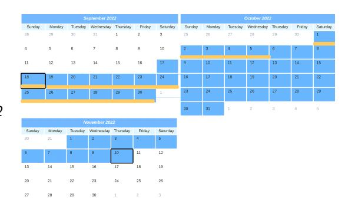
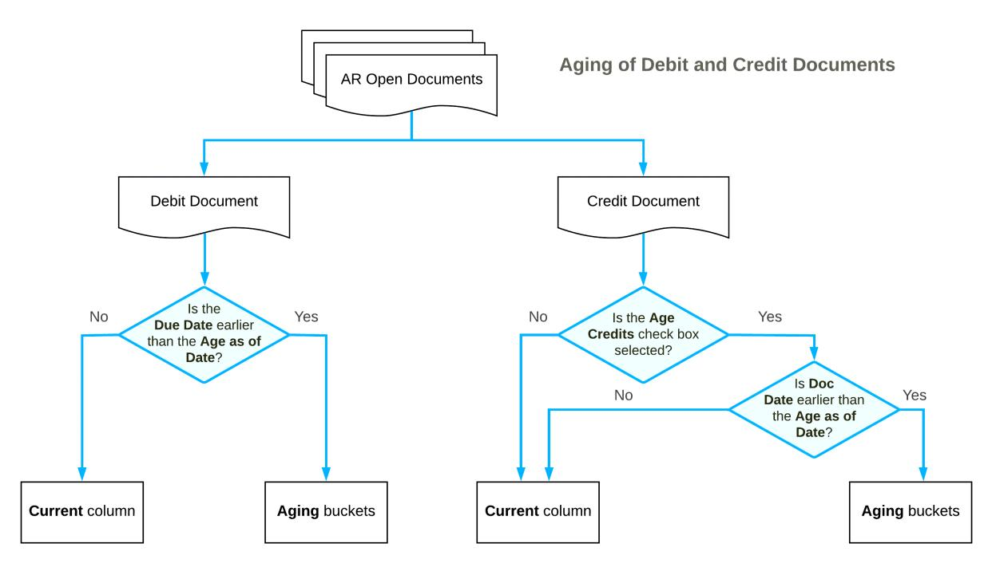
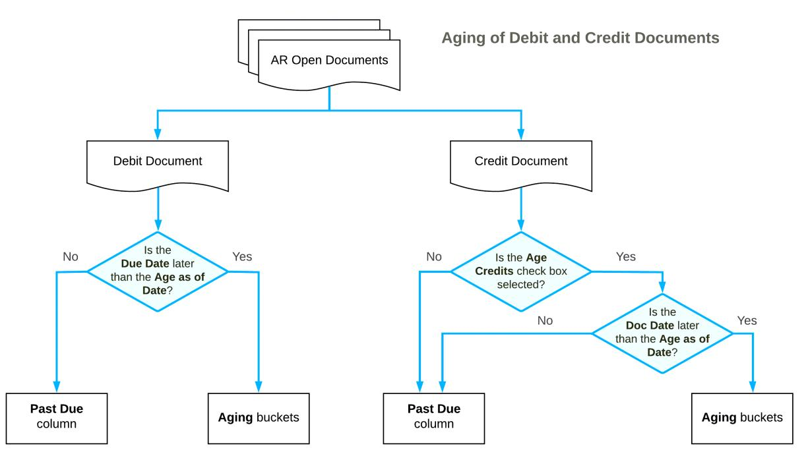
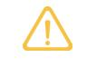
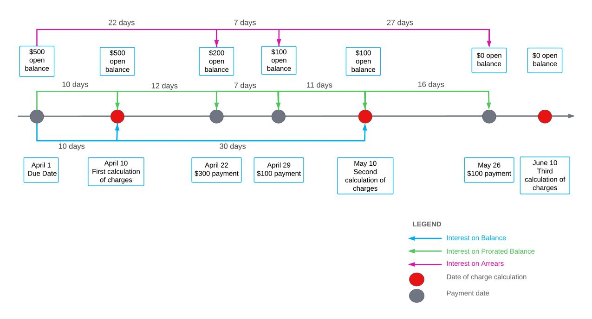
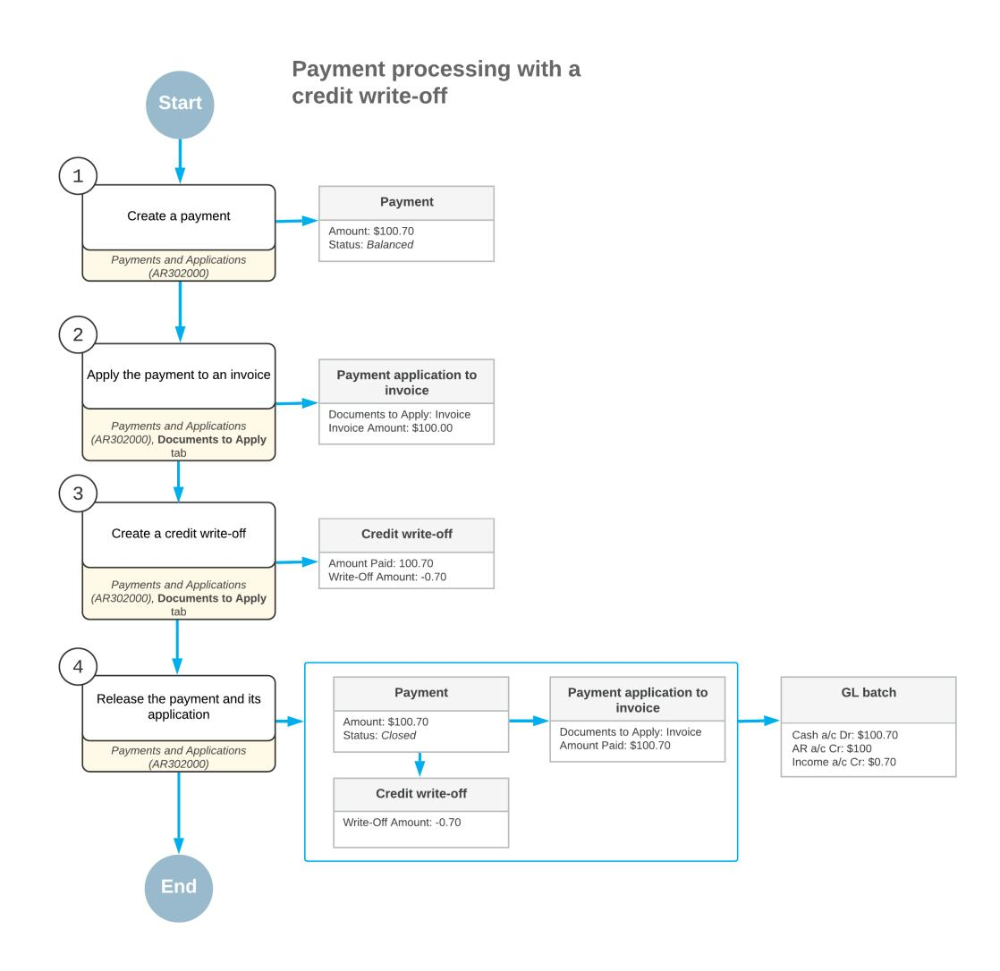
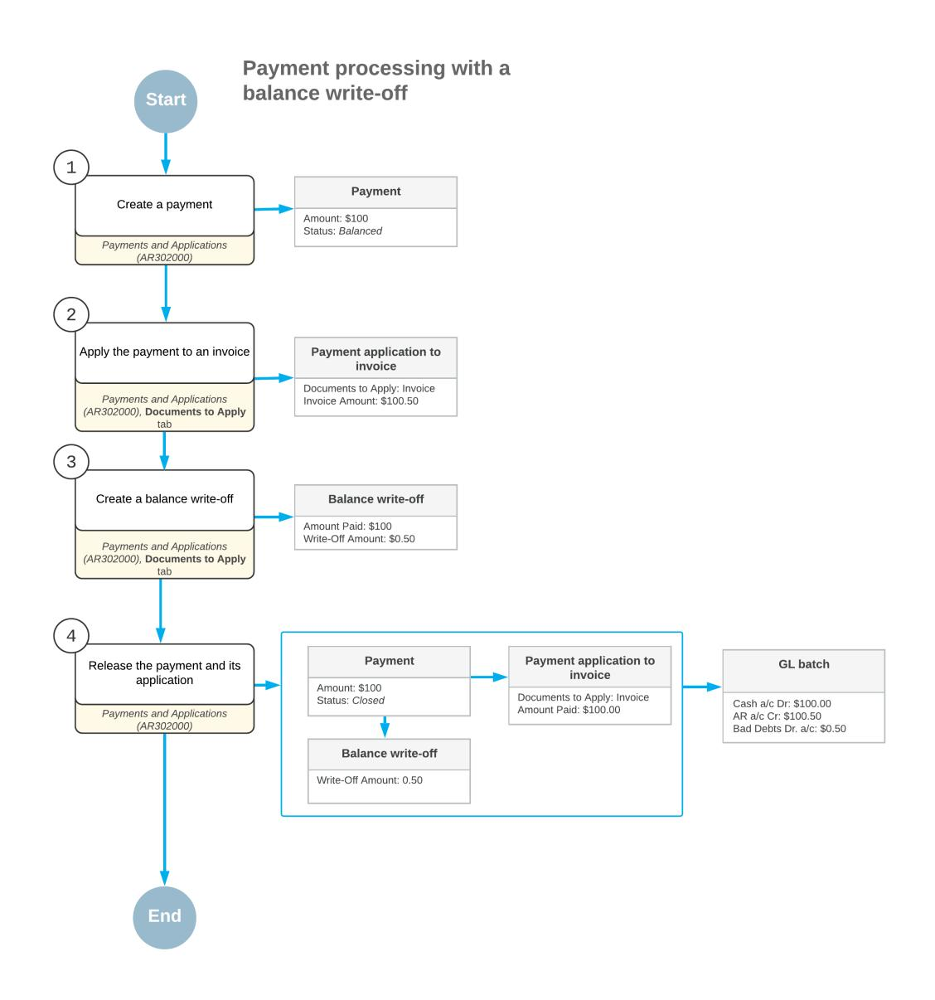
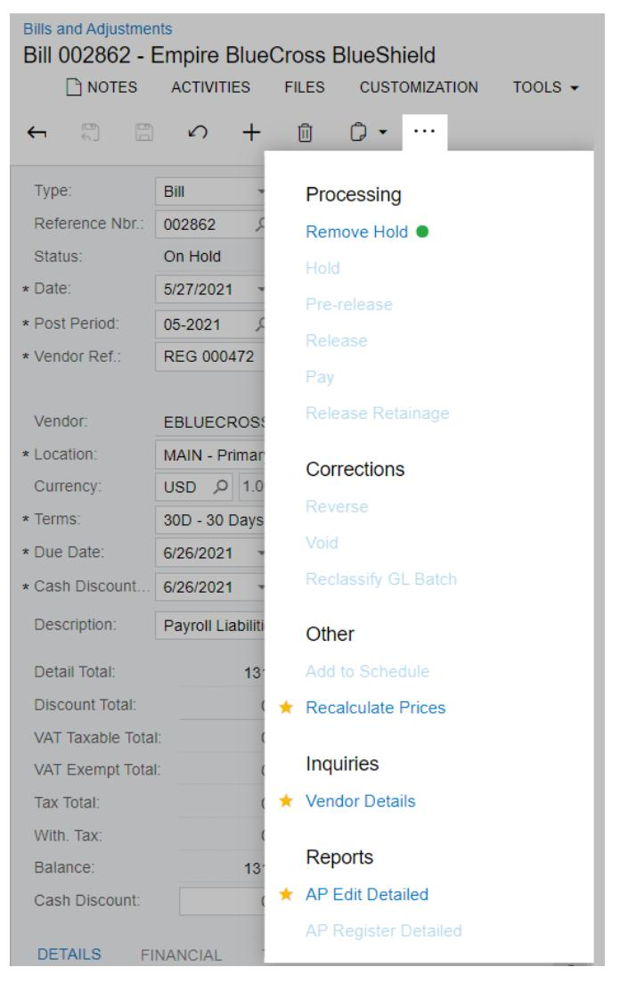

# **Credit Policy 2025 R1**

| Copyright5                                                        |  |
|-------------------------------------------------------------------|--|
| Managing Credit Policy 6                                          |  |
| Configuring Credit Verification Rules 8                           |  |
| Credit Verification Rules: General Information 8                  |  |
| Credit Verification Rules: Configuration Prerequisites 9          |  |
| Credit Verification Rules: Implementation Activity10              |  |
| To Configure Default Credit Verification Rules11                  |  |
| Analyzing Automatic Credit Verification for Customers 13          |  |
| Automatic Credit Verification: General Information13              |  |
| Automatic Credit Verification: Implementation Checklist14         |  |
| Automatic Credit Verification: Process Activity15                 |  |
| Credit Terms18                                                    |  |
| Setup of Credit Terms19                                           |  |
| Setup and Calculation of Cash Discounts 21                        |  |
| Examples of Credit and Cash Discount Periods 22                   |  |
| To Configure Multiple-Installment Credit Terms31                  |  |
| To Configure Single-Installment Credit Terms31                    |  |
| To Disable Credit Terms 32                                        |  |
| Preparing Customer Statements 33                                  |  |
| Customer Statements: General Information 33                       |  |
| Customer Statements: Multicurrency and Consolidated Statements 35 |  |
| Customer Statements: Statements for Specific Branches36           |  |
| Customer Statements: Implementation Checklist37                   |  |
| Customer Statements: Process Activity38                           |  |
| Customer Statements: Related Report and Inquiry Forms 40          |  |
| Regenerating Customer Statements 42                               |  |
| Regeneration of Statements: General Information42                 |  |
| Regenerating Statements: Implementation Checklist42               |  |
| Regeneration of Statements: Process Activity 44                   |  |
| Regeneration of Statements: Related Report and Inquiry Forms46    |  |
| Preparing an On-Demand Statement48                                |  |
| On-Demand Statements: General Information 48                      |  |
| On-Demand Statements: Implementation Checklist48                  |  |
| On-Demand Statements: Process Activity49                          |  |

| Setting Up the Dunning Process52                                  |  |
|-------------------------------------------------------------------|--|
| Dunning Process Setup: General Information52                      |  |
| Dunning Process Setup: Configuration Prerequisites55              |  |
| Dunning Process Setup: Implementation Activity 55                 |  |
| To Set Up a Dunning Letter Mailing57                              |  |
| Preparing Dunning Letters 59                                      |  |
| Preparation of Dunning Letters: General Information59             |  |
| Preparation of Dunning Letters: Dunning Process by Customer61     |  |
| Preparation of Dunning Letters: Dunning Process by Document 62    |  |
| Preparation of Dunning Letters: Using the AR Aging Report67       |  |
| Preparation of Dunning Letters: Implementation Checklist 68       |  |
| Preparation of Dunning Letters: Generated Transactions69          |  |
| Preparation of Dunning Letters: To Run the AR Aging Report70      |  |
| Preparation of Dunning Letters: To Prepare Dunning Letters 71     |  |
| Preparation of Dunning Letters: Related Reports74                 |  |
| Managing Customers' Credit Status78                               |  |
| Credit Status: General Information78                              |  |
| Credit Status: Implementation Checklist 78                        |  |
| Credit Status: Process Activity 79                                |  |
| Applying Overdue Charges 83                                       |  |
| Overdue Charges: General Information83                            |  |
| Overdue Charges: Charge Codes 85                                  |  |
| Overdue Charges: Criteria for Creating Overdue Charge Documents87 |  |
| Overdue Charges: Example of Applying Calculation Methods 88       |  |
| Overdue Charges: Implementation Checklist 90                      |  |
| Overdue Charges: Generated Transactions91                         |  |
| Overdue Charges: Implementation Activity 92                       |  |
| Overdue Charges: Process Activity 95                              |  |
| Processing Direct Write-Offs 99                                   |  |
| Direct Write-Offs: General Information99                          |  |
| Direct Write-Offs: Write-Off Setup100                             |  |
| Direct Write-Offs: Implementation Checklist 101                   |  |
| Direct Write-Offs: Generated Transactions102                      |  |
| Direct Write-Offs: Implementation Activity 103                    |  |
| Direct Write-Offs: To Process a Credit Write-Off105               |  |
| Direct Write-Offs: To Process a Balance Write-Off107              |  |
|                                                                   |  |

| Direct Write-Offs: Mass Processing 109                                     |  |
|----------------------------------------------------------------------------|--|
| Processing Payments with Write-Offs 110                                    |  |
| Payments with Write-Offs: General Information110                           |  |
| Payments with Write-Offs: Implementation Checklist113                      |  |
| Payments with Write-Offs: Generated Transactions 114                       |  |
| Payments with Write-Offs: To Create a Payment with a Credit Write-Off 115  |  |
| Payments with Write-Offs: To Create a Payment with a Balance Write-Off 117 |  |
| Payments with Write-Offs: Related Reports and Forms 119                    |  |
| Appendix121                                                                |  |
| Reports 121                                                                |  |
| Report Form121                                                             |  |
| Report126                                                                  |  |
| Form Toolbar and More Menu128                                              |  |
| Table Toolbar 135                                                          |  |

# **Copyright**

#### **© 2025 Acumatica, Inc.**

#### **ALL RIGHTS RESERVED.**

No part of this document may be reproduced, copied, or transmitted without the express prior consent of Acumatica, Inc.

3075 112th Avenue NE, Suite 200, Bellevue, WA 98004, USA

#### **Restricted Rights**

The product is provided with restricted rights. Use, duplication, or disclosure by the United States Government is subject to restrictions as set forth in the applicable License and Services Agreement and in subparagraph (c)(1)(ii) of the Rights in Technical Data and Computer Soware clause at DFARS 252.227-7013 or subparagraphs (c)(1) and (c)(2) of the Commercial Computer Soware-Restricted Rights at 48 CFR 52.227-19, as applicable.

#### **Disclaimer**

Acumatica, Inc. makes no representations or warranties with respect to the contents or use of this document, and specifically disclaims any express or implied warranties of merchantability or fitness for any particular purpose. Further, Acumatica, Inc. reserves the right to revise this document and make changes in its content at any time, without obligation to notify any person or entity of such revisions or changes.

#### **Trademarks**

Acumatica is a registered trademark of Acumatica, Inc. HubSpot is a registered trademark of HubSpot, Inc. Microso Exchange and Microso Exchange Server are registered trademarks of Microso Corporation. All other product names and services herein are trademarks or service marks of their respective companies.

Soware Version: 2025 R1 Last Updated: 06/01/2025

# **Managing Credit Policy**

With Acumatica ERP, you can use the following credit management tools:

- *Credit terms*: You configure credit terms to define documents' due dates. Credit terms may be used for giving a customer discount for early payment. For details on configuring and applying credit terms, see *[Setup of](#page-18-1) Credit [Terms](#page-18-1)*.
- *Credit verification*: You can enable a credit check process for each customer that automatically puts overdue invoices on hold and forbids the issuing of new invoices for a customer that has failed a credit check. For details on configuring and applying credit verification rules, see *Credit Verification Rules: General [Information](#page-7-2)*.
- *Customer credit hold*: You can manually put a customer on credit hold any time you consider it necessary. This causes the customer's documents to also be put on credit hold. If needed, you can remove any such document from credit hold and release the document. For more information, see *[Automatic Credit](#page-12-2) [Verification:](#page-12-2) General Information*.
- *Overdue charges*: You can configure additional charges to be applied to outstanding balances of customers who are consistently paying too late or not paying in full. For details on configuring and applying overdue charges, see *[Overdue Charges: General Information](#page-82-2)*.
- *Statement cycles*: You can configure customer statement cycles to provide customers with information about their balances with your organization. For details, see *[Customer Statements: General Information](#page-32-2)* and *[Customer Statements: Multicurrency and Consolidated Statements](#page-34-1)*.
- *Dunning letters*: You can configure a sequence of dunning letters to remind customers about overdue invoices. For details on configuring customer notifications, see *[Dunning Process Setup: General Information](#page-51-2)*.
- *Direct Write-Off method*: You can use the direct write-off method to handle expenses that are required to run the business or that have been incurred in the operation of the business. For details on configuring and using direct write-offs, see *[Direct Write-Offs: General Information](#page-98-2)* and *[Direct Write-Offs: Write-Off Setup](#page-99-1)*.

We do not recommend that you use the direct write-off method for handling bad debts as it oen violates the matching principle of accounting because it recognizes bad debt expense that is partly related to a previous accounting period.

• *Allowance method*: You can handle bad debts by using the allowance method. The allowance method is a better alternative to the direct write-off method because it follows the matching principle of accounting. For details on configuring and using allowance method, see *[Direct Write-Offs: General Information](#page-98-2)*.

### **Managing Credit Policy**

To configure the options related to implementing your company's credit policy for all customers, you can specify the following settings on the *[Accounts Receivable Preferences](https://help-2025r1.acumatica.com/Help?ScreenId=ShowWiki&pageid=f7b52067-5299-45e8-b601-485cd709f58b)* (AR101000) form:

- **Hold Document on Failed Credit Check**: You select this check box if you want new invoices and memos to be placed on hold for customers that have failed the credit check. If the check box is not selected, new documents can be saved and processed regardless of the credit check result, although the system warns the user about the customers that have failed their credit check. For details on credit verification, see *[Credit](#page-7-2) Verification Rules: General [Information](#page-7-2)*.
- **Age Credits**: You select this check box if you want the balances of credit memos and open payments to be taken into account when a customer statement is generated. For details, see *[Customer Statements: General](#page-32-2) [Information](#page-32-2)*.
- **Set Default Overdue Charges byStatement Cycle**: You select this check box to use the overdue charges specified for the statement cycle assigned to a customer account instead of the overdue charges specified for the customer class that is also assigned to the customer account.
- **Calculate on Overdue Charges Documents**: You select this check box if you want overdue charges to be calculated on overdue charge documents as well as on invoices.

• **Apply Payments to Overdue Charges First**: You select this check box if you have enabled automatic payment application for a customer account—that is, you have selected the **Auto-Apply Payments** check box on the *[Customers](https://help-2025r1.acumatica.com/Help?ScreenId=ShowWiki&pageid=652929bc-9606-4056-aa6e-0c2d1147171b)* (AR303000) form—and want new payments to be applied first to overdue charges and then to outstanding invoices. For details on the processing of overdue charges, see *[Overdue Charges:](#page-82-2) [General Information](#page-82-2)*.

#### **Preparing Consolidating Statements and Dunning Letters**

Depending on the policies established in your company, you can prepare a single consolidated statement for each customer or prepare multiple statements for each branch of your company. To prepare consolidated statements for all customers, select the **ConsolidateStatements for All Branches** check box, and in the**Statement From** box, select the branch that will be specified as the sender.

You can prepare consolidated dunning letters as well. To prepare consolidated dunning letters for all customers, select the **Consolidate Dunning Letters for All Branches** check box, and in the **Dunning Letter from Branch** box, select the branch that will be specified as the sender.

# **Configuring Credit Verification Rules**

In this chapter, you will find general information on how to configure credit verification rules, configuration prerequisites, and an activity that describes how to set up credit verification rules for specific customers.

# **Credit Verification Rules: General Information**

Although accurate evaluation of customers' credit worthiness is required, employees may perform it outside of the system by gathering data on the financial health of potential customers, including their current credit score.

In Acumatica ERP, credit verification is invoked each time a user creates an invoice for a customer in accounts receivable.

#### **Learning Objectives**

In this chapter, you will learn how to set up credit verification rules for specific customers.

#### **Credit Verification in Accounts Receivable**

When you create an invoice and the customer fails the credit check, the system checks the value of the **Hold Documents on Failed Credit Check** check box on the *[Accounts Receivable Preferences](https://help-2025r1.acumatica.com/Help?ScreenId=ShowWiki&pageid=f7b52067-5299-45e8-b601-485cd709f58b)* (AR101000) form, which defines what happens to new invoices if the credit check fails:

- If the check box is selected, you may save the document (invoice or debit memo) with the *On Hold* status, but the document cannot be released until the credit violation is resolved.
- If the check box is cleared, you can save new documents with the *Balanced* status and process them regardless of the credit check result, although the system warns users about customers that have failed their credit check.

#### **Credit Verification in Sales Orders**

If the *Inventory and Order Management* features are enabled on the *[Enable/Disable Features](https://help-2025r1.acumatica.com/Help?ScreenId=ShowWiki&pageid=c1555e43-1bc5-4f6f-ba9d-b323f94d8a6b)* (CS100000) form, credit verification is invoked each time an invoice is generated based on a sales order. When you create an invoice by using the *[Invoices](https://help-2025r1.acumatica.com/Help?ScreenId=ShowWiki&pageid=0acc9738-f141-4ea0-a2be-f34ea9d1b63a)* (SO303000) form and the customer fails the credit check, the system checks the value of the **Hold Invoices on Failed Credit Check** check box on the *[Sales Orders Preferences](https://help-2025r1.acumatica.com/Help?ScreenId=ShowWiki&pageid=1817779c-413b-4187-b7fe-38e97845a1cb)* (SO101000) form. This check box defines what happens to new invoices if the credit check fails:

- If the check box is selected, the invoice gets the *Credit Hold* status and can be saved with only the *Credit Hold* or *On Hold* status. For invoices with the *Credit Hold* status, on the *[Process Invoices and Memos](https://help-2025r1.acumatica.com/Help?ScreenId=ShowWiki&pageid=9a26ac3c-34d8-4d56-a809-396ab92efa91)* (SO505000) form, you can select remove the credit hold by selecting *Remove Credit Hold* in the **Action** box and clicking **Process** on the form toolbar. When the action is completed, the system saves the invoice with the *Balanced* status and you can process it further.
- If the check box is cleared, you can save new documents with the *Balanced* status and process them regardless of the credit check result, although the system warns users about customers that have failed their credit check.

Credit verification is invoked for orders that are based on an order type that has the **Hold Document on Failed Credit Check** check box selected on the *Order [Types](https://help-2025r1.acumatica.com/Help?ScreenId=ShowWiki&pageid=e6984218-4260-4438-99e1-aee2b3765369)* (SO201000) form. For an order of such a type, when you create a sales order and try to change the status of the sales order to *Open*, the system performs a credit check of the customer, and if the customer fails the credit check, the document gets the *Credit Hold* status (and can be saved with only the *Credit Hold* or *On Hold* status). For orders with these statuses, on the *[Process Orders](https://help-2025r1.acumatica.com/Help?ScreenId=ShowWiki&pageid=c06a334c-f39d-4eff-9d80-b167657dff73)* (SO501000) form, you can remove credit hold by selecting *Remove Credit Hold* in the **Action** box and clicking **Process**. This initiates credit checks for each order selected, and if the credit check is successful, the orders receive the *Open* status.

#### **Setup of Credit Verification Rules**

You can set up credit verification rules for individual customers and for groups of customers. To provide default credit verification settings for groups of similar customers, you can specify credit rules by customer class on the *[Customer Classes](https://help-2025r1.acumatica.com/Help?ScreenId=ShowWiki&pageid=806e39d6-6f89-4e6c-9a24-61c6fb0c9a57)* (AR201000) form. If needed, you can disable or redefine the default rules for individual customers by using the *[Customers](https://help-2025r1.acumatica.com/Help?ScreenId=ShowWiki&pageid=652929bc-9606-4056-aa6e-0c2d1147171b)* (AR303000) form.

In the **CreditVerification** box on these forms, you can select one of the following options:

- *Credit Limit*: If the customer's total outstanding balance is greater than the amount specified in the **Credit Limit** box, the system generates a warning. If the value in the **Over-Limit Amount** box on the *[Customer](https://help-2025r1.acumatica.com/Help?ScreenId=ShowWiki&pageid=806e39d6-6f89-4e6c-9a24-61c6fb0c9a57) [Classes](https://help-2025r1.acumatica.com/Help?ScreenId=ShowWiki&pageid=806e39d6-6f89-4e6c-9a24-61c6fb0c9a57)* (AR201000) form is also exceeded, the system puts new invoices on hold or issues a warning, depending on the state of the **Hold Documents on Failed Credit Check** check box and on the state of the **Hold Invoices on Failed Credit Check** check box if sales orders are used.
- *Days Past Due*: Credit terms are defined and due dates are calculated based on the customer's terms. If the customer has a document that is past due by more days than the number of days past due specified in the **Credit Days Past Due** box, the system puts new invoices on hold or issues a warning, depending on the state of the **Hold Documents on Failed Credit Check** check box and on the state of the **Hold Invoices on Failed Credit Check** check box if sales orders are used.
- *Limit and Days Past Due*: Both types of rules are applied: The customer's debt should not exceed the credit limit, and the payment date should not exceed the due date of an invoice by more days than the specified number of days past due. If either rule is violated (or both rules are), the system puts new invoices on hold or issues a warning, depending on the state of the **Hold Documents on Failed Credit Check** check box and on the state of the **Hold Invoices on Failed Credit Check** check box is sales orders are used.
- *Disabled*: No credit rules are to be applied.

You can view the unused credit limit of a customer in the **Available Credit** box on the **General** tab of the *[Customers](https://help-2025r1.acumatica.com/Help?ScreenId=ShowWiki&pageid=652929bc-9606-4056-aa6e-0c2d1147171b)* form.

#### **Recalculation of Customer Balances**

You can use the *[Recalculate Customer Balances](https://help-2025r1.acumatica.com/Help?ScreenId=ShowWiki&pageid=59f0827e-c41f-4140-af09-9c8efa9508fa)* (AR509900) form to recalculate customer balances and match them with the account balances stored in the database. In the Selection area of the form, you select a particular customer class or leave the **Customer Class** box blank to view the customers of all classes.

You can run this process if there is any discrepancy between the customer balance and the total amount of all the released customer documents.

# **Credit Verification Rules: Configuration Prerequisites**

Before starting to set up credit verification rules, you should be sure that the needed features have been enabled, settings have been specified, and entities have been created, as described in the following sections.

#### **Enabling the Needed Features**

On the *[Enable/Disable Features](https://help-2025r1.acumatica.com/Help?ScreenId=ShowWiki&pageid=c1555e43-1bc5-4f6f-ba9d-b323f94d8a6b)* (CS100000) form, the minimum set of features has to be enabled. For details, see *Company Without [Branches:](https://help-2025r1.acumatica.com/Help?ScreenId=ShowWiki&pageid=082a5d06-0e65-44c0-8049-4df32ebf59d3) To Configure a Company Without Branches*.

#### **Configuring the System**

You need to make sure the following tasks have been performed in Acumatica ERP before you begin to set up credit verification rules:

- On the *[Companies](https://help-2025r1.acumatica.com/Help?ScreenId=ShowWiki&pageid=fedad435-8496-4397-b8a3-50a473629f76)* (CS101500) form, you need to make sure that the companies of the organization have been configured and that the appropriate actual ledger has been assigned to each of them. For more information, see *Company Without [Branches:](https://help-2025r1.acumatica.com/Help?ScreenId=ShowWiki&pageid=082a5d06-0e65-44c0-8049-4df32ebf59d3) To Configure a Company Without Branches* and *[General Ledger:](https://help-2025r1.acumatica.com/Help?ScreenId=ShowWiki&pageid=fda48dc3-65e6-4ef1-8196-b4b1f9751e91) To Create an Actual [Ledger](https://help-2025r1.acumatica.com/Help?ScreenId=ShowWiki&pageid=fda48dc3-65e6-4ef1-8196-b4b1f9751e91)*.
- On multiple forms, you need to make sure that the accounts receivable subledger has been configured as described in *Accounts [Receivable:](https://help-2025r1.acumatica.com/Help?ScreenId=ShowWiki&pageid=98d9bb2a-43ff-40b7-bfbc-f0b49c771e6f) To Create a Statement Cycle*, *Accounts [Receivable:](https://help-2025r1.acumatica.com/Help?ScreenId=ShowWiki&pageid=9c04e7d3-f378-497e-857f-04d6f9ea5125) To Create a Customer [Class](https://help-2025r1.acumatica.com/Help?ScreenId=ShowWiki&pageid=9c04e7d3-f378-497e-857f-04d6f9ea5125)*, and *Accounts Receivable: To Specify Accounts Receivable [Preferences](https://help-2025r1.acumatica.com/Help?ScreenId=ShowWiki&pageid=7d50ea5c-cda7-44ca-8fc5-23c9f353297b)*.
- On the *[Customers](https://help-2025r1.acumatica.com/Help?ScreenId=ShowWiki&pageid=652929bc-9606-4056-aa6e-0c2d1147171b)* (AR303000) form, the needed customer records have been created and set up. For more information, see *[Customers: Implementation Activity](https://help-2025r1.acumatica.com/Help?ScreenId=ShowWiki&pageid=9e9f3669-1d14-4dc4-a314-8c03ee2e5861)*.

# **Credit Verification Rules: Implementation Activity**

In the following implementation activity, you will learn how to set up credit verification rules for specific customers.

This activity is based on the *U100* dataset. If you are using another dataset, or if any system settings have been changed in *U100*, these changes can affect the workflow of the activity and the results of the processing. To avoid any issues, restore the *U100* dataset to its initial state.

#### **Story**

Suppose that SweetLife Fruits & Jams has decided to start tracking credit limits and days past due for some of the customers. The *COFFEESHOP* customer has multiple unpaid documents and a large balance. This customer should be put on credit hold if the total balance of its open documents exceeds \$2,000. For this customer, the *Credit Limit* verification rule should be used.

The *GOODFOOD* customer sometimes fails to pay the documents in time, so the *Days Past Due* verification rule should be used for this customer. Acting as Yona Jones, an accountant in charge of the Credit Control team, you need to set up the credit verification rules for these customers.

#### **Process Overview**

In this activity, on the *[Customers](https://help-2025r1.acumatica.com/Help?ScreenId=ShowWiki&pageid=652929bc-9606-4056-aa6e-0c2d1147171b)* (AR303000) form, you will set up credit verification rules for the *COFFEESHOP* and *GOODFOOD* customers. On the *[Accounts Receivable Preferences](https://help-2025r1.acumatica.com/Help?ScreenId=ShowWiki&pageid=f7b52067-5299-45e8-b601-485cd709f58b)* (AR101000) form, you will review the accounts receivable preferences settings and make sure that the **Hold Document on Failed Credit Check** check box is selected.

#### **System Preparation**

Before you start setting up credit verification rules, launch the Acumatica ERP website, and sign in to a company with the *U100* dataset preloaded. You should sign in as an accountant with the *jones* username and the *123* password.

#### **Step 1: Setting Up Credit Verification Rules**

To set up credit verification rules for specific customers, do the following:

- 1. On the *[Customers](https://help-2025r1.acumatica.com/Help?ScreenId=ShowWiki&pageid=652929bc-9606-4056-aa6e-0c2d1147171b)* (AR303000) form, open the *COFFEESHOP* customer.
- 2. On the **Financial** tab (**CreditVerification Rules** section), specify the following settings:
  - **CreditVerification**: *Credit Limit*
  - **Credit Limit**: 2000

The specified credit limit means that the maximum total balance of open documents of the customer in the system should not exceed the credit limit (\$2,000). The **Available Credit** box shows the difference between the limit, the open order balance, and the customer balance displayed on the form, which in this case is *– 6066.30*.

- 3. On the form toolbar, click**Save** to save the changes.
- 4. In the **Customer ID** box, select *GOODFOOD*.
- 5. On the **Financial** tab, specify the following settings:
  - **CreditVerification**: *Days Past Due*
  - **Credit Days Past Due**: 15
- 6. On the form toolbar, click**Save** to save the changes.

#### **Step 2: Reviewing the Accounts Receivable Preferences**

To review the accounts receivable preferences, do the following:

- 1. Open the *[Accounts Receivable Preferences](https://help-2025r1.acumatica.com/Help?ScreenId=ShowWiki&pageid=f7b52067-5299-45e8-b601-485cd709f58b)* (AR101000) form.
- 2. On the **General** tab, make sure that the **Hold Document on Failed Credit Check** check box is selected.

Because this check box is selected, users will not be able to release documents for the customers who failed credit check.

# **To Configure Default Credit Verification Rules**

You define the default credit verification rules for customer classes by using the *[Customer Classes](https://help-2025r1.acumatica.com/Help?ScreenId=ShowWiki&pageid=806e39d6-6f89-4e6c-9a24-61c6fb0c9a57)* (AR201000) form. When you create a customer on the *[Customers](https://help-2025r1.acumatica.com/Help?ScreenId=ShowWiki&pageid=652929bc-9606-4056-aa6e-0c2d1147171b)* (AR303000) form and specify the class, the customer initially is assigned the credit verification settings of that class. However, you can override the default credit verification settings for the customer.

#### **To Configure Default Credit Verification Rules for Customers of a Customer Class**

- 1. Open the *[Customer Classes](https://help-2025r1.acumatica.com/Help?ScreenId=ShowWiki&pageid=806e39d6-6f89-4e6c-9a24-61c6fb0c9a57)* (AR201000) form.
- 2. In the **Class ID** box, select the customer class for which you want to configure credit verification rules.
- 3. On the **General** tab (in the **Default CreditVerification Settings** section), in the **CreditVerification** box, select the default rule to be used for credit verification for customers of the class (which might be the rule to disable credit verification). The following options are available:
  - *Credit Limit*: If the customer's total outstanding balance is less than the amount specified in the **Credit Limit** box, the system generates a warning. If the value in the **Over-Limit Amount** box is also exceeded, the system puts new invoices of the customer on hold.
  - *Days Past Due*: Credit terms are defined and documents' due dates are calculated based on the customer's terms. If the customer has a document that is past due longer than the number of days specified in the **Credit Days Past Due** box, the system puts new invoices of the customer on hold.
  - *Limit and Days Past Due*: Both types of rules are applied: The customer's debt should not exceed the credit limit, and the payment date should not exceed the due date of an invoice by more days than the specified number of days past due. If either rule is violated (or both rules are), the system puts new invoices on hold.
  - *Disabled*: No credit rules are to be applied.
- 4. If you have not disabled verification for the class, specify the appropriate conditions for the selected credit verification rule. Do one of the following:
  - If you have selected the *Credit Limit* option:

- In the **Credit Limit** box, type the amount to compare the customer's outstanding balance with.
- In the **Over-Limit Amount** box, type the amount to compare to the difference between the customer's outstanding balance and the allowed credit limit.
- If you have selected the *Limit and Days Past Due* option:
  - In the **Credit Limit** box, type the amount to compare the customer's outstanding balance with.
  - In the **Over-Limit Amount** box, type the amount to compare to the difference between the customer's outstanding balance and the allowed credit limit.
  - In the **Credit Days Past Due** box, type the number of days a document may be past due.
- If you have selected the *Days Past Due* option, in the **Credit Days Past Due** box, type the number of days a document may be past due.
- 5. On the form toolbar, click**Save**.

# **Analyzing Automatic Credit Verification for Customers**

In this chapter, you will find general information on how to manage credit holds, a checklist for system implementation, and an activity that describes how to analyze automatically applied credit checks and remove credit hold for an invoice.

# **Automatic Credit Verification: General Information**

You may encounter an unfortunate situation when a customer has not paid for a long time and has not responded to any inquiries or requests for payment. You might have notified the customer about due invoices with a sequence of dunning letters or in some other way. In this case, you can put a hold on the customer's credit until the issue is resolved.

#### **Learning Objectives**

In this chapter, you will learn how to do the following:

- Analyze how credit verification rules affect customers' credit check
- Remove credit hold for an invoice

#### **Putting AR Documents and Customers on Credit Hold**

On the *[Invoices and Memos](https://help-2025r1.acumatica.com/Help?ScreenId=ShowWiki&pageid=5e6f3b27-b7af-412f-a40a-1d4f4be70cba)* (AR301000) form, you can put an AR document on credit hold, even if the customer for whom the document is created is not on credit hold and has passed credit verification.

An employee who is authorized to manage customer credit can apply credit holds to applicable customers by using the *[Manage Credit Holds](https://help-2025r1.acumatica.com/Help?ScreenId=ShowWiki&pageid=80041c93-17fa-40b0-a600-d483c2e8b888)* (AR523000) form. Once a credit hold has been applied to a customer account, no new sales orders or invoices can be created for this customer.

#### **Removing Credit Hold for AR Documents and Customers**

On the *[Invoices and Memos](https://help-2025r1.acumatica.com/Help?ScreenId=ShowWiki&pageid=5e6f3b27-b7af-412f-a40a-1d4f4be70cba)* (AR301000) form, when you save an AR invoice (or other document on the form) for the customer or click **Remove Hold** on the form toolbar, the system validates the customer's credit limit and places the invoice on credit hold if the validation has failed (which can occur when the credit limit has been exceeded or a document is long past due). When the system places the invoice on credit hold, it changes the status of the document to *Credit Hold*.

To remove credit hold from a document, you click **Remove Credit Hold** (under **Approval**) on the More menu of the *[Invoices and Memos](https://help-2025r1.acumatica.com/Help?ScreenId=ShowWiki&pageid=5e6f3b27-b7af-412f-a40a-1d4f4be70cba)* form. When you remove credit hold from the document, the system changes the document's status to the one it had before it was put on credit hold—*Balanced*, *Pending Print*, or *Pending Email*. If you modify a document for which credit hold was removed, the system puts this document on credit hold again when you save these modifications if the updated document's amount is greater than the amount at the moment when credit hold was removed for the document.

An authorized user can manually remove a customer from credit hold by changing the customer status from *Credit Hold* to *Active*. To do this, the authorized user's role should have access to the**Status** box of the *[Customers](https://help-2025r1.acumatica.com/Help?ScreenId=ShowWiki&pageid=652929bc-9606-4056-aa6e-0c2d1147171b)* (AR303000) form. This can also be done on the *[Manage Credit Holds](https://help-2025r1.acumatica.com/Help?ScreenId=ShowWiki&pageid=80041c93-17fa-40b0-a600-d483c2e8b888)* (AR523000) form.

If approvals are configured for AR documents created on the *[Invoices and Memos](https://help-2025r1.acumatica.com/Help?ScreenId=ShowWiki&pageid=5e6f3b27-b7af-412f-a40a-1d4f4be70cba)* form—that is, if the *Approval Workflow* feature is enabled on the *[Enable/Disable Features](https://help-2025r1.acumatica.com/Help?ScreenId=ShowWiki&pageid=c1555e43-1bc5-4f6f-ba9d-b323f94d8a6b)* (CS100000) form and an approval map is defined on the *[Approval Maps](https://help-2025r1.acumatica.com/Help?ScreenId=ShowWiki&pageid=d97cb216-f487-4ec9-a561-d5034fd3b8b3)* (EP205015) form—an invoice that has been on credit hold is assigned the *Pending Approval* status when you click **Remove Credit Hold** on the More menu of the *[Invoices and Memos](https://help-2025r1.acumatica.com/Help?ScreenId=ShowWiki&pageid=5e6f3b27-b7af-412f-a40a-1d4f4be70cba)* form. Once this invoice is approved, it is assigned the *Credit Hold* status and can then be removed from credit hold. For more information on approvals, see *[Approval of Accounts Receivable Documents](https://help-2025r1.acumatica.com/Help?ScreenId=ShowWiki&pageid=186b674c-d428-4445-9bf9-9af1898f7bc1)*.

### **Automatic Credit Verification: Implementation Checklist**

The following sections provide details you can use to ensure that the system is configured properly for analyzing automatic credit verification, and to understand (and change, if needed) the settings that affect the processing workflow.

#### **Implementation Checklist**

We recommend that before you initially analyze automatic credit verification and release documents from credit hold, you make sure the needed features have been enabled, settings have been specified, and entities have been created, as summarized in the following checklist.

| Form                               | Criteria to Check                                                                                                                                                                                                                                                            |
|------------------------------------|------------------------------------------------------------------------------------------------------------------------------------------------------------------------------------------------------------------------------------------------------------------------------|
| Enable/Disable Features (CS100000) | Make sure the minimal features have been enabled, as described in Com pany Without Branches: General Information, Company with Branches that Do Not Require Balancing: General Information, and Company with Branch es that Require Balancing: General Information. |
| Customers (AR303000)               | Be sure that the customer accounts for the customers for which you will create AR invoices have been defined.                                                                                                                                                             |

#### **Other Settings That Affect the Workflow**

You can affect the workflow of automatic credit verification by specifying additional settings as follows:

- To cause GL batches to be immediately posted aer they are released, make sure that the **Automatically Post on Release** check box is selected on the **General** tab of the *[General Ledger Preferences](https://help-2025r1.acumatica.com/Help?ScreenId=ShowWiki&pageid=e4913d06-c511-4258-a0f9-f36c1b854e6b)* (GL102000) form.
- To cause every AR transaction you enter to be posted as an individual batch to the general ledger, make sure that the **Generate Consolidated Batches** check box on the *[General Ledger Preferences](https://help-2025r1.acumatica.com/Help?ScreenId=ShowWiki&pageid=e4913d06-c511-4258-a0f9-f36c1b854e6b)* form is cleared. (When this check box is selected, the system consolidates into a single batch all transactions in the same currency posted to the same period for all documents being released.)
- The following accounts receivable settings should be specified on the **General** tab of the *[Accounts](https://help-2025r1.acumatica.com/Help?ScreenId=ShowWiki&pageid=f7b52067-5299-45e8-b601-485cd709f58b) [Receivable Preferences](https://help-2025r1.acumatica.com/Help?ScreenId=ShowWiki&pageid=f7b52067-5299-45e8-b601-485cd709f58b)* (AR101000) form:
  - Select the **Hold Documents on Entry** check box in the **Data EntrySettings** section. This setting gives the created AR invoices the *On Hold* status.
  - Make sure that the **Hold Document on Failed Credit Check** check box is selected. This setting gives a document for a customer that failed a credit check the *Credit Hold* status.
  - Make sure that the **Automatically Post on Release** check box is selected in the **PostingSettings** section. This setting causes AR invoices to be automatically posted to the general ledger once they are released.

#### **Validation of Configuration**

To make sure that all configuration has been performed correctly, we recommend that in your system, you process documents of customers that failed a credit check by performing instructions similar to those described in *Automatic Credit [Verification:](#page-14-1) Process Activity*.

# **Automatic Credit Verification: Process Activity**

The following activity will walk you through the process of analyzing how credit verification rules affect customers' credit check and removing credit hold for an invoice.

#### **Story**

Suppose that credit verification rules have been defined for some of SweetLife customers. On January 30, 2025, the *COFFEESHOP* customer bought online training services, but failed the credit check. On the same date, the *GOODFOOD* customer bought consulting services, but also failed the credit check.

Yona Jones called the *COFFEESHOP* customer and they told him that they sent the payment the day before but it had not yet been received. Yona decided to release the invoice from credit hold.

Acting as Yona Jones, you need to create two invoices for these customers and analyze how the credit verification rules set up earlier affect the customers' credit check. Then you need to remove credit hold for an invoice of the *COFFEESHOP* customer.

#### **Configuration Overview**

In the *U100* dataset, the following tasks have been performed to support this activity:

- On the *[Enable/Disable Features](https://help-2025r1.acumatica.com/Help?ScreenId=ShowWiki&pageid=c1555e43-1bc5-4f6f-ba9d-b323f94d8a6b)* (CS100000) form, *Standard Financials*, *Multibranch Support*, and *Multicompany Support* features have been enabled.
- On the *[Accounts Receivable Preferences](https://help-2025r1.acumatica.com/Help?ScreenId=ShowWiki&pageid=f7b52067-5299-45e8-b601-485cd709f58b)* (AR101000) form, the **Hold Documents on Entry** and **Hold Documents on Failed Credit Check** check boxes have been selected in the **Data EntrySettings** section.
- On the *[Customers](https://help-2025r1.acumatica.com/Help?ScreenId=ShowWiki&pageid=652929bc-9606-4056-aa6e-0c2d1147171b)* (AR303000) form, the *GOODFOOD (GoodFood One Restaurant)* and *COFFEESHOP (FourStar Coffee & Sweets Shop)* customers have been configured.

#### **Process Overview**

In this activity, on the *[Invoices and Memos](https://help-2025r1.acumatica.com/Help?ScreenId=ShowWiki&pageid=5e6f3b27-b7af-412f-a40a-1d4f4be70cba)* (AR301000) form, you will create two invoices for customers that failed the credit check. On the same form, you will remove credit hold for one of the invoices and release the invoice.

#### **System Preparation**

Before you begin analyzing automatic credit verification, do the following:

- 1. Launch the Acumatica ERP website with the *U100* dataset preloaded, and sign in as an accountant by using the *jones* username and the *123* password.
- 2. In the info area, in the upper-right corner of the top pane of the Acumatica ERP screen, make sure that the business date in your system is set to *1/30/2025*. If a different date is displayed, click the Business Date menu button and select *1/30/2025* on the calendar. For simplicity, in this activity, you will create and process all documents in the system on this business date.
- 3. As a prerequisite activity, in the company to which you are signed in, be sure you have set up credit verification rules, as described in *Credit Verification Rules: [Implementation](#page-9-1) Activity*.
- 4. On the Company and Branch Selection menu on the top pane of the Acumatica ERP screen, select the *SweetLife Head Office and Wholesale Center* branch.

#### **Step 1: Creating AR Invoices**

To create an AR invoice for each customer, do the following:

- 1. On the *[Invoices and Memos](https://help-2025r1.acumatica.com/Help?ScreenId=ShowWiki&pageid=5e6f3b27-b7af-412f-a40a-1d4f4be70cba)* (AR301000) form, add a new record.
- 2. In the Summary area, specify the following settings:
  - **Type**: *Invoice*
  - **Customer**: *GOODFOOD*
  - **Date**: *1/30/2025* (inserted automatically)
  - **Post Period**: *01-2025* (inserted automatically)
  - **Description**: Consulting

Notice that the system displays a warning near the **Customer** box that the customer's days past due limit has been exceeded.

- 3. On the table toolbar of the **Details** tab, click **Add Row** and specify the following settings for the added row:
  - **Branch**: *HEADOFFICE*
  - **Transaction Descr.**: Consulting
  - **Ext. Price**: 380
- 4. On the form toolbar, click**Save** to save your changes.
- 5. On the form toolbar, click **Remove Hold**. The status of the document has changed to *Credit Hold* because the **Hold Document on Failed Credit Check** check box is selected on the *[Accounts Receivable Preferences](https://help-2025r1.acumatica.com/Help?ScreenId=ShowWiki&pageid=f7b52067-5299-45e8-b601-485cd709f58b)* (AR101000) form and the customer's document is on credit hold. You cannot release this document. (If the check box was cleared, you could release any document of the customer despite the warning.)
- 6. On the form toolbar, click**Save** to save your changes.
- 7. On the form toolbar, click **Add New Record** to enter the other invoice and in the Summary area, specify the following settings:
  - **Type**: *Invoice*
  - **Customer**: *COFFEESHOP*
  - **Date**: *1/30/2025* (inserted automatically)
  - **Post Period**: *01-2025* (inserted automatically)
  - **Description**: Online training

Notice that the system displays a warning near the **Customer** box that the customer's credit limit has been exceeded.

- 8. On the table toolbar of the **Details** tab, click **Add Row** and specify the following settings for the added row:
  - **Branch**: *HEADOFFICE*
  - **Transaction Descr.**: Online training
  - **Ext. Price**: 1450
- 9. On the form toolbar, click**Save** to save your changes.
- 10.On the form toolbar, click **Remove Hold**. The status of the document has also changed to *Credit Hold*. You now need to remove the credit hold for this document.

#### **Step 2: Removing Credit Hold for the Document**

To remove the credit hold for the document, do the following:

1. While you are still viewing the invoice on the *[Invoices and Memos](https://help-2025r1.acumatica.com/Help?ScreenId=ShowWiki&pageid=5e6f3b27-b7af-412f-a40a-1d4f4be70cba)* (AR301000) form, on the form toolbar, click **Remove Credit Hold**.

The document's status has changed to *Balanced* and you can now release the document.

2. On the form toolbar, click **Release**. The document's status has changed to *Open*.

# **Credit Terms**

Credit terms define the specific details of the seller's payment requirements that the buyer should meet in order to purchase goods on credit. These details include the date when a payment should be made, the conditions for cash discounts when any outstanding balance is paid early, and the setting that determines whether an outstanding balance is to be paid as a single installment or in multiple installments. You configure credit terms by using the *Credit [Terms](https://help-2025r1.acumatica.com/Help?ScreenId=ShowWiki&pageid=c39f7b9f-4ab2-4b67-b449-667802d58a57)* (CS206500) form.

### **Single Installment**

For a single-installment payment, you should specify a due date and conditions for a cash discount.

You can set one *due date* or two due dates. In case of two due dates (implemented by selecting the *Custom* option in the **Due DateType** list), you should set two time intervals for the document dates. Consider the example shown in the following table.

| N   | Due Day | Start Day | End Day |
|-----|---------|-----------|---------|
| (1) | 10      | 1         | 15      |
| (2) | 25      | 16        | 30      |

The first due date is the 10th of the next month for documents issued between day 1 and day 15 of the current month. The second due date is the 25th of the next month for documents issued between day 16 and day 30 of the current month. The following rules are applied to each set of days:

- The end day should be greater than the start day.
- If the due day is greater than (or equal to) the end day, the due date will be in the current month.
- If the due day is less than the end day, the due date will be in the next month.

A *cash discount* is available for only a single-installment payment. If two due dates are set, you should specify a fixed number of days during which the discount is available for each group of documents. As a rule, the discount is available for a time interval starting on the document day and ending on the day of the month specified on the *Credit [Terms](https://help-2025r1.acumatica.com/Help?ScreenId=ShowWiki&pageid=c39f7b9f-4ab2-4b67-b449-667802d58a57)* form. The discount is set as a percentage. Whether it is applied to the document amount or it affects the taxable amount, too, is specified for each tax.

#### **Multiple Installments**

Outstanding balances can be paid in multiple installments if you select *Multiple* in the **InstallmentType** box. You should specify the number of installments, the frequency or schedule, and the installment method.

You can divide the payment into the specified number of installments by selecting any of these options in the **Installment Method** box on the *Credit [Terms](https://help-2025r1.acumatica.com/Help?ScreenId=ShowWiki&pageid=c39f7b9f-4ab2-4b67-b449-667802d58a57)* (CS206500) form:

- *Equal Parts*: The document total amount (with all the applicable taxes added) is divided into equal parts.
- *Tax in First Installment*: The amount of the document (the total before taxes) is divided into equal parts, and the tax amount is added to the first installment.
- *Split by Percent in Table*: The installment amounts are calculated according to percentages you specify for each installment.

**Installment Frequency** defines the interval between installments and cannot be used with the**Split by Percent in Table** installment method. The following payment frequency options are available:

- **Weekly**: Installments will be one week apart.
- **Monthly**: Installments will be one month apart.

• **Bimonthly**: Installments will be two months apart.

The **InstallmentsSchedule** table is available only if the *Split by Percent in Table* option is selected as the installment method. By using this table, you can set for each installment the number of days from the due date and the percentage of the total document amount. The first installment (which is due on the due date) should have *0* in the **Day** column, and other installments' dates are specified with the respect to the due date.

#### **Overdue Charges**

Terms are also used with overdue charges. For this type of terms, specify a due date or two due dates. It is assumed that no cash discount will be used with overdue charges.

# **Setup of Credit Terms**

You need to plan the credit terms your company offers to customers, as well as outline the details of the credit terms offered to your company by vendors, which are already defined, in preparation for entering them into the system. We recommend that you decide on the following points when you plan each set of credit terms:

- The length of the credit period and the ways its due date is calculated. For details, see *[Setting Up Due Date](#page-19-0) [Calculation](#page-19-0)*.
- The number of installments and the installment payment schedule (if the company offers installment buying). For details, see *[Configuring Installment Payments](#page-20-1)*.

You can configure a cash discount for only a single-installment payment.

• The cash discount conditions and the way they are affected by the length of the credit period. For details, see *[Setup and Calculation of Cash Discounts](#page-20-2)*.

If your company has been operating for some time, you already have established credit terms. We recommend that you compare the credit terms your company offers to customers and the credit terms offered to your company by vendors, because in Acumatica ERP, you can use the same credit terms for both customer payments and payments to vendors, if needed.

#### **Setting Up Credit Terms**

These are the general steps you need to perform to create a set of credit terms by using the *Credit [Terms](https://help-2025r1.acumatica.com/Help?ScreenId=ShowWiki&pageid=c39f7b9f-4ab2-4b67-b449-667802d58a57)* (CS206500) form:

1. You specify a descriptive identifier for the credit terms you want to configure. The length of an identifier can be up to 10 Unicode symbols.

We do not recommend using any special symbols in the identifiers of entities.

- 2. You define the scope of the credit terms: whether they apply to only customer documents, only vendor documents, or both types of documents.
- 3. You configure how a due date is calculated for a document.
- 4. Optional: You configure the cash discount conditions.
- 5. Optional: If needed, you change the default installment type of credit terms, which is *Single*, to *Multiple* and define the number of installments and their payment schedule.

#### **Configuring the Assignment of Credit Terms**

By using the credit terms that have been manually or automatically assigned to a document, the system calculates the due date of the document. If a cash discount is applied, the system also calculates the end date of the cash discount period and the cash discount amount for the document.

In Acumatica ERP, you can assign credit terms to the following types of documents:

- Accounts Receivable: Invoices, debit memos, credit memos, and overdue charges
- Accounts Payable: Bills, debit adjustments, and credit adjustments

To make the system automatically assign credit terms to customer documents, you assign the credit terms to customer classes, and by default, a customer is assigned the credit terms specified for the customer class it belongs to. You can manually specify the credit terms for each customer (or override the class setting) by using the *[Customers](https://help-2025r1.acumatica.com/Help?ScreenId=ShowWiki&pageid=652929bc-9606-4056-aa6e-0c2d1147171b)* (AR303000) form. When you create a document and select a customer, the system automatically associates with the document the credit terms specified for the customer. (The credit terms for the document can also be overridden.)

Automatic assignment of credit terms to vendor documents is configured similarly to automatic assignment of credit terms to customer documents, with terms being assigned to vendor classes. You also can manually specify or change the credit terms for each vendor by using the *[Vendors](https://help-2025r1.acumatica.com/Help?ScreenId=ShowWiki&pageid=a9584be3-f2bd-4d67-80d4-8041d809df56)* (AP303000) form.

#### **Setting Up Due Date Calculation**

Certain settings specified for the credit terms on the *Credit [Terms](https://help-2025r1.acumatica.com/Help?ScreenId=ShowWiki&pageid=c39f7b9f-4ab2-4b67-b449-667802d58a57)* (CS206500) form determine the credit period: the time interval that starts when a customer purchases a product or a service (on the document date) and ends when the customer's payment is due. In Acumatica ERP, you do not specify the length of the credit period; you instead specify the way the document due date will be calculated based on the date of the document's creation.

By specifying the appropriate **Due DateType** setting on the *Credit [Terms](https://help-2025r1.acumatica.com/Help?ScreenId=ShowWiki&pageid=c39f7b9f-4ab2-4b67-b449-667802d58a57)* form, you set up the system to calculate the due date based on one of the following factors:

• **A day in a month** (the *Day of Next Month*, *End of Month*, *End of Next Month*, and *Day of the Month* options): You can specify a day of the month (in the **Due Day 1** box) to be the due date for all documents issued before this day, or the end of the current or next month can be the due date.

The *10th, 20th, or Last Day of Next Month* option determines the due date of a document according to the ten-day range of the month of the document creation (the first ten-day range, the second ten-day range, or the third ten-day range of the month) as follows:

- If the document creation date is in the range of the 1st to 10th day of the month, then the due date is the 10th day of the next month.
- If the document creation date is in the range of the 11th to 20th day of the month, then the due date is the 20th day of the next month.
- If the document creation date is in the range of the 21st day of the month to the end of the month, then the due date is the last day of the next month.
- **A fixed number of days** (the *Fixed Number of Days* and *Fixed Number of Days Starting Next Month* options): You can specify the period of time (in the **Due Day 1** box) that is used to calculate the due date, based on the document date or the first day of the next month. (To determine the due date of the document, the system adds the specified number of days to either the document date or the first day of the next month.)
- **Multiple custom dates** (the *Custom* option): With this option selected, you can set two time intervals for the document dates and specify a due date for each interval. The settings for configuring the first interval are **Due Day 1**, **Day From 1** (automatically filled in by the system and read-only), and **DayTo 1**. The settings for configuring the second interval are **Due Day 2**, **Day From 2** (automatically filled in by the system and readonly), and **DayTo 2** (automatically set to *31* by the system and read-only).

The following rules are applied to each set of days:

• The end day should be later than or the same as the start day.

- If the day of the **Due Day N** setting is later than or the same as the day of the **DayTo N** setting, the due date will be in the current month.
- If the day of the **Due Day N** setting is earlier than the day of the **DayTo N** setting, the due date will be in the next month.

Newly created credit terms cannot be created with gaps between intervals. For existing credit terms, aer the system upgrade, if a document date doesn't match either interval, the due date won't be calculated. For example, if an existing document is dated 1/31/2014 and the intervals are 1–15 and 16–30, the due date won't be calculated for the document.

For more examples of the ways a credit period is calculated, see *[Examples of Credit and Cash Discount Periods](#page-21-1)*.

#### **Configuring Installment Payments**

Outstanding balances can be paid in a single installment or multiple installments. To configure installment payments, select the *Multiple* option in the **InstallmentType** list. By default, the installment type for new credit terms is *Single*. You then specify the number of installments, the frequency or schedule, and the installment method.

You can configure either an installment frequency or an installment schedule. To configure a frequency, in the **Installment Frequency** box, you can select the interval between installments. The following payment frequency options are available:

- *Weekly*: Installments will be one week apart.
- *Monthly*: Installments will be one month apart.
- *Semi-monthly*: Installments will be a half a month apart.

To determine how the amounts of installments are calculated for the selected frequency, select one of these options in the **Installment Method** list:

- *Equal Parts*: The document total amount (with all the applicable taxes added) is divided into equal parts.
- *Tax in First Installment*: The amount of the document (the total before taxes) is divided into equal parts, and the tax amount is added to the first installment.

To configure an installment schedule, you leave the **Installment Frequency** box blank and select the *Split by Percent in Table* installment method. The installment amounts are calculated according to the percentages that you specify for each installment in the **InstallmentsSchedule** table. For each installment, you can specify the number of days from the due date and the percent of the total document amount. The first installment (which is due on the due date) should have *0* in the **Day** column, and other installments' dates are specified with the respect to the due date.

# **Setup and Calculation of Cash Discounts**

In different businesses, a cash discount can be named a *prompt payment discount*, an *early payment discount*, or an *early settlement discount*.

You can configure a cash discount for only single-installment credit terms. The cash discount is available for a time interval (that is, the cash discount period) that starts on the document date and ends in the number of days specified in the **Cash DiscountSettings** section of the *Credit [Terms](https://help-2025r1.acumatica.com/Help?ScreenId=ShowWiki&pageid=c39f7b9f-4ab2-4b67-b449-667802d58a57)* (CS206500) form. The cash discount period falls within the credit period. If custom due dates are set, discount settings are applied to both intervals.

The length of the cash discount period is defined by the following settings specified in the **Cash DiscountSettings** section on the *Credit [Terms](https://help-2025r1.acumatica.com/Help?ScreenId=ShowWiki&pageid=c39f7b9f-4ab2-4b67-b449-667802d58a57)* form:

• **DiscountType**: This setting defines the method of calculating the end date of the discount period (which is similar to the method of calculating the due date). The option you select in the **Due DateType** box

determines the options available for selection in the **DiscountType** box. If the *End of Month* option is selected in the **Due DateType** box, configuration of a cash discount is not available.

• **Discount Day**: This setting determines the number of days or the particular day of the month, depending on the method selected in the **DiscountType** box.

For examples of the ways a cash discount period is calculated, see *[Examples of Credit and Cash Discount Periods](#page-21-1)*.

Cash discounts are calculated automatically on the *[Invoices and Memos](https://help-2025r1.acumatica.com/Help?ScreenId=ShowWiki&pageid=5e6f3b27-b7af-412f-a40a-1d4f4be70cba)* (AR301000), *[Bills and Adjustments](https://help-2025r1.acumatica.com/Help?ScreenId=ShowWiki&pageid=956b4e51-3078-4d2d-85b3-65c080d95234)* (AP301000), *[Cash Sales](https://help-2025r1.acumatica.com/Help?ScreenId=ShowWiki&pageid=f8e8a35f-4de7-40c0-8030-ebf9f7910119)* (AR304000), *[Cash Purchases](https://help-2025r1.acumatica.com/Help?ScreenId=ShowWiki&pageid=346e1395-7d30-4c25-b28b-7bcd824dcffd)* (AP304000), *[Invoices](https://help-2025r1.acumatica.com/Help?ScreenId=ShowWiki&pageid=0acc9738-f141-4ea0-a2be-f34ea9d1b63a)* (SO303000), and *Journal [Vouchers](https://help-2025r1.acumatica.com/Help?ScreenId=ShowWiki&pageid=a1c8c3cf-9874-450f-8082-c00af1f194f3)* (GL304000) forms. The system calculates cash discounts as follows:

- If the document's originating branch belongs to a company with *Document Amount* specified in the **Cash Discount Base** box on the *[Companies](https://help-2025r1.acumatica.com/Help?ScreenId=ShowWiki&pageid=fedad435-8496-4397-b8a3-50a473629f76)* (CS101500) form, the cash discount is calculated as Cash Discount = Document Amount \* cash discount %.
- If the document's originating branch belongs to a company with *Document Amount Less Taxes* specified in the **Cash Discount Base** box , the cash discount is calculated as Cash Discount = (Document Amount – Tax Total) \* cash discount %.

Use taxes are not included in the tax total.

If a cash discount is applied to a document, it may or may not affect how the system calculates the taxable amount of a document. You may indicate to the system how to calculate the taxable amount for a tax application on the *[Taxes](https://help-2025r1.acumatica.com/Help?ScreenId=ShowWiki&pageid=692e30c9-e0af-4aa3-b0f6-f3ba190d257a)* (TX205000) form. For details about how the system calculates a taxable amount of a document if a cash discount should be applied to the document, see *VAT for Early Payments: General [Information](https://help-2025r1.acumatica.com/Help?ScreenId=ShowWiki&pageid=a24a03fb-c39c-4ac2-8e5e-84c67b86605b)*.

# **Examples of Credit and Cash Discount Periods**

In this topic, you can find examples that demonstrate how the credit period and cash discount period are calculated based on the calculation method of the applicable credit terms.

#### **Structure of These Examples**

Each section describes a particular method of calculating the length of credit period and discount period defined by the credit terms. You select the calculation method in the **Due DateType** box on the *Credit [Terms](https://help-2025r1.acumatica.com/Help?ScreenId=ShowWiki&pageid=c39f7b9f-4ab2-4b67-b449-667802d58a57)* (CS206500) form.

In each section, the first column of the table lists the options that you can select in the **DiscountType** box, based on the method selected for due date calculation. The second column contains sample settings for each option that you could use to configure the credit terms on the *Credit [Terms](https://help-2025r1.acumatica.com/Help?ScreenId=ShowWiki&pageid=c39f7b9f-4ab2-4b67-b449-667802d58a57)* form, as well as the document date from the Acumatica ERP form used to create the document. The third column displays the resulting credit period and cash discount period for the document date specified in the sample settings. This column includes a diagram that shows the resulting credit period and cash discount period. The legend of the diagram is as follows:

- : Starting and ending dates of the credit period
- : Days of the credit period
  - : Days of the cash discount period

#### **Due Date Type:** *Fixed Number of Days*

•

With the *Fixed Number of Days* calculation method, the payment is due a fixed number of days aer the sale or purchase. You specify the number of days in **Due Day 1**.

| DiscountType         | Sample Settings                                                                           | Result                                                                       |
|----------------------|-------------------------------------------------------------------------------------------|------------------------------------------------------------------------------|
| Fixed Number of Days | On the Credit Terms form: • Due Day 1: 30                                           | Credit period: 1/1/2016–1/31/2016 Cash discount period: 1/1/2016–1/8/2016 |
|                      | • Discount Day: 7 On the document creation form: • Document Date: 1/1/2016 |                                                                              |

#### **Due DateType:** *Day of Next Month*

With the *Day of Next Month* calculation method, the payment is due on a particular day of the next calendar month aer the month of the document date. You specify the day in **Due Day 1**.

In this example, the value of the **Due Day 1** parameter is greater than the number of days in the next month (February); therefore, the system uses the last date in the next month for the calculation of the credit period.

| DiscountType      | Sample Settings                   | Result                                   |
|-------------------|-----------------------------------|------------------------------------------|
| Day of Next Month | On the Credit Terms form:         | Credit period: 1/1/2016–2/29/2016        |
|                   | • Due Day 1: 30                | Cash discount period: 1/1/2016–2/7/2016  |
|                   | • Discount Day: 7              |                                          |
|                   | On the document creation form: |                                          |
|                   | • Document Date: 1/1/2016      |                                          |
| End of Month      | On the Credit Terms form:         | Credit period: 1/1/2016–2/29/2016        |
|                   | Due Day 1: 30 •                | Cash discount period: 1/1/2016–1/31/2016 |
|                   | Discount Day: N/A •            |                                          |
|                   | On the document creation form: |                                          |
|                   | Document Date: 1/1/2016 •      |                                          |

| DiscountType     | Sample Settings                                                   | Result                                  |
|------------------|-------------------------------------------------------------------|-----------------------------------------|
| Day of the Month | On the Credit Terms form:                                         | Credit period: 1/1/2016–2/29/2016       |
|                  | • Due Day 1: 30 • Discount Day: 7                        | Cash discount period: 1/1/2016–1/7/2016 |
|                  | On the document creation form: • Document Date: 1/1/2016 |                                         |

#### **Due DateType:** *End of Next Month*

With the *End of Next Month* calculation method, the payment is due at the end of the next calendar month aer the month of the document date.

For this calculation method, note that the credit and cash discount periods are equal if the *[End of Next Month](#page-24-0)* option is selected in the **DiscountType** box.

| DiscountType      | Sample Settings                                                                                                                                 | Results                                                                       |
|-------------------|-------------------------------------------------------------------------------------------------------------------------------------------------|-------------------------------------------------------------------------------|
| Day of Next Month | On the Credit Terms form:                                                                                                                       | Credit period: 1/1/2016–2/29/2016                                             |
|                   | • Due Day 1: N/A • Discount Day: 7 On the document creation form: • Document Date: 1/1/2016                                | Cash discount period: 1/1/2016–2/7/2016                                       |
| End of Month      | On the Credit Terms form: • Due Day 1: N/A • Discount Day: N/A On the document creation form: • Document Date: 1/1/2016 | Credit period: 1/1/2016–2/29/2016 Cash discount period: 1/1/2016–1/31/2016 |

| DiscountType      | Sample Settings                                                                                                    | Results                                  |
|-------------------|--------------------------------------------------------------------------------------------------------------------|------------------------------------------|
| End of Next Month | On the Credit Terms form:                                                                                          | Credit period: 1/1/2016–2/29/2016        |
|                   | • Due Day 1: N/A • Discount Day: N/A On the document creation form: • Document Date: 1/1/2016 | Cash discount period: 1/1/2016–2/29/2016 |
| Day of the Month  | On the Credit Terms form:                                                                                          | Credit period: 1/1/2016–2/29/2016        |
|                   | • Due Day 1: N/A                                                                                                | Cash discount period: 1/1/2016–1/7/2016  |
|                   | • Discount Day: 7                                                                                               |                                          |
|                   | On the document creation form:                                                                                  |                                          |
|                   | • Document Date: 1/1/2016                                                                                       |                                          |

#### **Due DateType:** *Day of the Month*

With the *Day of the Month* calculation method, the payment is due on a particular day of the current calendar month, if the invoice is issued before this day. If the invoice is issued aer this day of the current calendar month, then the payment is due on the day of the next calendar month. You specify the day in **Due Day 1**.

| DiscountType     | Sample Settings                                                                           | Result                                  |
|------------------|-------------------------------------------------------------------------------------------|-----------------------------------------|
| Day of the Month | On the Credit Terms form:                                                                 | Credit period: 1/1/2016–1/30/2016       |
|                  | • Due Day 1: 30                                                                        | Cash discount period: 1/1/2016–1/7/2016 |
|                  | • Discount Day: 7 On the document creation form: • Document Date: 1/1/2016 |                                         |

#### **Due DateType:** *Fixed Number of Days Starting Next Month*

With the *Fixed Number of Days Starting Next Month* calculation method, the payment is due a fixed number of days starting the first day of the next calendar month aer a sale or purchase. You specify the number of days in **Due Day 1**.

| DiscountType         | Sample Settings                                                                                                 | Result                                  |
|----------------------|-----------------------------------------------------------------------------------------------------------------|-----------------------------------------|
| Fixed Number of Days | On the Credit Terms form:                                                                                       | Credit period: 1/1/2016–3/2/2016        |
| Starting Next Month  | • Due Day 1: 30 • Discount Day: 7 On the document creation form: • Document Date: 1/1/2016 | Cash discount period: 1/1/2016–2/8/2016 |
|                      |                                                                                                                 |                                         |

#### **Due DateType:** *Fixed Number of Days Plus Day of Next Month*

With the *Fixed Number of Days Plus Day of Next Month* calculation method, you set two due dates—**Due Date 1** that shows the number of days to be added to the invoice date to get the EOM date and **Due Date 2** that shows the day in the following month, which is the due date.

| DiscountType         | Sample Settings                   |                                     | Result |  |                                          |  |  |  |  |  |  |  |  |  |  |  |
|----------------------|-----------------------------------|-------------------------------------|--------|--|------------------------------------------|--|--|--|--|--|--|--|--|--|--|--|
| Fixed Number of Days | On the Credit Terms form:         | Credit period: 9/5/2022–11/10/2022  |        |  |                                          |  |  |  |  |  |  |  |  |  |  |  |
| • Due Day 1: 30   |                                   |                                     |        |  | Cash discount period: 9/5/2022–9/12/2022 |  |  |  |  |  |  |  |  |  |  |  |
|                      | • Due Day 2: 10                |                                     |        |  |                                          |  |  |  |  |  |  |  |  |  |  |  |
|                      | • Discount Day: 7              |                                     |        |  |                                          |  |  |  |  |  |  |  |  |  |  |  |
| •                    | On the document creation form: |                                     |        |  |                                          |  |  |  |  |  |  |  |  |  |  |  |
|                      |                                   |                                     |        |  |                                          |  |  |  |  |  |  |  |  |  |  |  |
|                      |                                   |                                     |        |  |                                          |  |  |  |  |  |  |  |  |  |  |  |
|                      | Document Date: 9/5/2022           |                                     |        |  |                                          |  |  |  |  |  |  |  |  |  |  |  |
|                      |                                   |                                     |        |  |                                          |  |  |  |  |  |  |  |  |  |  |  |
|                      |                                   |                                     |        |  |                                          |  |  |  |  |  |  |  |  |  |  |  |
|                      |                                   |                                     |        |  |                                          |  |  |  |  |  |  |  |  |  |  |  |
|                      |                                   |                                     |        |  |                                          |  |  |  |  |  |  |  |  |  |  |  |
|                      |                                   |                                     |        |  |                                          |  |  |  |  |  |  |  |  |  |  |  |
| Day of Next Month    | On the Credit Terms form:         | Credit period: 9/18/2022–11/10/2022 |        |  |                                          |  |  |  |  |  |  |  |  |  |  |  |

- **Due Day 1**: *30*
- **Due Day 2**: *10*
- **Discount Day**: *5*

On the document creation form:

• **Document Date**: *9/18/2022*

Cash discount period: 9/18/2022–10/5/2022

| DiscountType     | Sample Settings                                                                                                                                                    | Result                                                                       |  |  |  |
|------------------|--------------------------------------------------------------------------------------------------------------------------------------------------------------------|------------------------------------------------------------------------------|--|--|--|
| End of Month     | On the Credit Terms form:                                                                                                                                          | Credit period: 5/1/2022–6/10/2022                                            |  |  |  |
|                  | Due Day 1: 30 • • Due Day 2: 10 • Discount Day: N/A On the document creation form: • Document Date: 5/1/2022                            | Cash discount period: 5/1/2022–5/31/2022                                     |  |  |  |
| Day of the Month | On the Credit Terms form: • Due Day 1: 30 • Due Day 2: 10 • Discount Day: 7 On the document creation form: • Document Date: 1/5/2022 | Credit period: 1/5/2022–3/10/2022 Cash discount period: 1/5/2022–1/7/2022 |  |  |  |

#### **Due DateType:** *Custom*

With the *Custom* calculation method, you set two time intervals for the document dates and specify a due date for each interval. The parameters for configuring the first interval are **Due Day 1**, **Day From 1**, and **DayTo 1**, and the parameters for configuring the second interval are **Due Day 2**, **Day From 2**, and **DayTo 2**.

The sample settings here define the following intervals: 1–15 and 16–31. The due date for the first interval is the 10th of the next month for documents issued between day 1 and day 15 of the current month. The due date for the second interval is the 25th of the next month for documents issued between day 16 and day 31 of the current month.

For this calculation method, note that the system shortens the cash discount period to be equal to the credit period if the *[End of Next Month](#page-28-0)* option is selected as the **DiscountType**.

| DiscountType         | Sample Settings                                                                                                                                                                                                                                                                                                             | Results                                                                                                                                                                                     |  |  |  |  |  |
|----------------------|-----------------------------------------------------------------------------------------------------------------------------------------------------------------------------------------------------------------------------------------------------------------------------------------------------------------------------|---------------------------------------------------------------------------------------------------------------------------------------------------------------------------------------------|--|--|--|--|--|
| Day of Next Month    | On the Credit Terms form:                                                                                                                                                                                                                                                                                                   | Document 1                                                                                                                                                                                  |  |  |  |  |  |
|                      | Interval 1:                                                                                                                                                                                                                                                                                                                 | Credit period: 1/1/2016–2/10/2016                                                                                                                                                           |  |  |  |  |  |
|                      | • Due Day 1: 10 • Day From 1: 1 • DayTo 1: 15 Interval 2: • Due Day 2: 25 • Day From 2: 16 • DayTo 2: 31 Discount Day: 7 On the document creation form: • Document 1 Date: 1/1/2016 • Document 2 Date: 1/16/2016                                             | Cash discount period: 1/1/2016–2/7/2016                                                                                                                                                     |  |  |  |  |  |
|                      |                                                                                                                                                                                                                                                                                                                             | Document 2 Credit period: 1/16/2016–2/25/2016 Cash discount period: 1/16/2016–2/7/2016                                                                                                |  |  |  |  |  |
| Fixed Number of Days | On the Credit Terms form: Interval 1: • Due Day 1: 10 • Day From 1: 1 • DayTo 1: 15 Interval 2: • Due Day 2: 25 • Day From 2: 16 • DayTo 2: 31 Discount Day: 7 On the document creation form: • Document 1 Date: 1/1/2016 • Document 2 Date: 1/16/2016 | Document 1 Credit period: 1/1/2016–2/10/2016 Cash discount period: 1/1/2016–1/8/2016 Document 2 Credit period: 1/16/2016–2/25/2016 Cash discount period: 1/16/2016–1/23/2016 |  |  |  |  |  |
|                      |                                                                                                                                                                                                                                                                                                                             |                                                                                                                                                                                             |  |  |  |  |  |

| DiscountType      | Sample Settings                                                                                              | Results                                   |  |  |  |  |  |  |
|-------------------|--------------------------------------------------------------------------------------------------------------|-------------------------------------------|--|--|--|--|--|--|
| End of Month      | On the Credit Terms form:                                                                                    | Document 1                                |  |  |  |  |  |  |
|                   | Interval 1:                                                                                                  | Credit period: 1/1/2016–2/10/2016         |  |  |  |  |  |  |
|                   | Due Day 1: 10 •                                                                                           | Cash discount period: 1/1/2016–1/31/2016  |  |  |  |  |  |  |
|                   | • Day From 1: 1                                                                                           |                                           |  |  |  |  |  |  |
|                   | • DayTo 1: 15                                                                                             |                                           |  |  |  |  |  |  |
|                   | Interval 2:                                                                                                  |                                           |  |  |  |  |  |  |
|                   | • Due Day 2: 25 • Day From 2: 16 • DayTo 2: 31                                                |                                           |  |  |  |  |  |  |
|                   |                                                                                                              |                                           |  |  |  |  |  |  |
|                   | Discount Day: N/A                                                                                            | Document 2                                |  |  |  |  |  |  |
|                   | On the document creation form:                                                                            | Credit period: 1/16/2016–2/25/2016        |  |  |  |  |  |  |
|                   | • Document 1 Date: 1/1/2016 • Document 2 Date: 1/16/2016                                      | Cash discount period: 1/16/2016–1/31/2016 |  |  |  |  |  |  |
|                   |                                                                                                              |                                           |  |  |  |  |  |  |
|                   |                                                                                                              |                                           |  |  |  |  |  |  |
| End of Next Month | On the Credit Terms form:                                                                                    | Document 1                                |  |  |  |  |  |  |
|                   | Interval 1:                                                                                                  | Credit period: 1/1/2016–2/10/2016         |  |  |  |  |  |  |
|                   | • Due Day 1: 10                                                                                           | Cash discount period: 1/1/2016–2/10/2016  |  |  |  |  |  |  |
|                   | • Day From 1: 1                                                                                           |                                           |  |  |  |  |  |  |
|                   | • DayTo 1: 15 Interval 2:                                                                              |                                           |  |  |  |  |  |  |
|                   | Due Day 2: 25 •                                                                                           |                                           |  |  |  |  |  |  |
|                   | • Day From 2: 16                                                                                          |                                           |  |  |  |  |  |  |
|                   | • DayTo 2: 31                                                                                             |                                           |  |  |  |  |  |  |
|                   | Discount Day: N/A                                                                                            | Document 2                                |  |  |  |  |  |  |
|                   | On the document creation form: • Document 1 Date: 1/1/2016 • Document 2 Date: 1/16/2016 | Credit period: 1/16/2016–2/25/2016        |  |  |  |  |  |  |
|                   |                                                                                                              | Cash discount period: 1/16/2016–2/25/2016 |  |  |  |  |  |  |
|                   |                                                                                                              |                                           |  |  |  |  |  |  |

| DiscountType         | Sample Settings                                                                                              | Results                                                                        |  |  |  |  |  |  |
|----------------------|--------------------------------------------------------------------------------------------------------------|--------------------------------------------------------------------------------|--|--|--|--|--|--|
| Day of the Month     | On the Credit Terms form:                                                                                    | Document 1                                                                     |  |  |  |  |  |  |
|                      | Interval 1:                                                                                                  | Credit period: 1/1/2016–2/10/2016                                              |  |  |  |  |  |  |
|                      | • Due Day 1: 10                                                                                           | Cash discount period: 1/1/2016–1/7/2016                                        |  |  |  |  |  |  |
|                      | • Day From 1: 1                                                                                           |                                                                                |  |  |  |  |  |  |
|                      | • DayTo 1: 15 Interval 2:                                                                              |                                                                                |  |  |  |  |  |  |
|                      | • Due Day 2: 25                                                                                           |                                                                                |  |  |  |  |  |  |
|                      | • Day From 2: 16 • DayTo 2: 31                                                                      |                                                                                |  |  |  |  |  |  |
|                      |                                                                                                              |                                                                                |  |  |  |  |  |  |
|                      | Discount Day: 7                                                                                              | Document 2                                                                     |  |  |  |  |  |  |
|                      | On the document creation form:                                                                            | Credit period: 1/16/2016–2/25/2016                                             |  |  |  |  |  |  |
|                      | • Document 1 Date: 1/1/2016 • Document 2 Date: 1/16/2016                                      | Cash discount period: 1/16/2016–2/7/2016                                       |  |  |  |  |  |  |
|                      |                                                                                                              |                                                                                |  |  |  |  |  |  |
|                      |                                                                                                              |                                                                                |  |  |  |  |  |  |
| Fixed Number of Days | On the Credit Terms form:                                                                                    | Document 1                                                                     |  |  |  |  |  |  |
| Starting Next Month  | Interval 1:                                                                                                  | Credit period: 1/1/2016–2/10/2016                                              |  |  |  |  |  |  |
|                      | • Due Day 1: 10                                                                                           | Cash discount period: 1/1/2016–2/8/2016                                        |  |  |  |  |  |  |
|                      | • Day From 1: 1 • DayTo 1: 15 Interval 2: • Due Day 2: 25                                  |                                                                                |  |  |  |  |  |  |
|                      |                                                                                                              |                                                                                |  |  |  |  |  |  |
|                      |                                                                                                              |                                                                                |  |  |  |  |  |  |
|                      | • Day From 2: 16                                                                                          |                                                                                |  |  |  |  |  |  |
|                      | • DayTo 2: 31                                                                                             |                                                                                |  |  |  |  |  |  |
|                      | Discount Day: 7                                                                                              | Document 2                                                                     |  |  |  |  |  |  |
|                      | On the document creation form: • Document 1 Date: 1/1/2016 • Document 2 Date: 1/16/2016 | Credit period: 1/16/2016–2/25/2016 Cash discount period: 1/16/2016–2/8/2016 |  |  |  |  |  |  |
|                      |                                                                                                              |                                                                                |  |  |  |  |  |  |

# **To Configure Multiple-Installment Credit Terms**

You use the *Credit [Terms](https://help-2025r1.acumatica.com/Help?ScreenId=ShowWiki&pageid=c39f7b9f-4ab2-4b67-b449-667802d58a57)* (CS206500) form to define each set of credit terms. For a set of credit terms, you can specify payment as a single installment (described in *To Configure [Single-Installment](#page-30-2) Credit Terms*) or as multiple installments (described in this topic).

### **To Configure Credit Terms for Multiple Installments**

- 1. Open the *Credit [Terms](https://help-2025r1.acumatica.com/Help?ScreenId=ShowWiki&pageid=c39f7b9f-4ab2-4b67-b449-667802d58a57)* (CS206500) form.
- 2. In the **GeneralSettings** section, in the**Terms ID** box, type the identifier of the credit terms. The ID may contain up to ten characters.

We do not recommend using any special symbols in the identifiers of entities.

- 3. In the **Description** box, type the description of the terms.
- 4. In the **VisibleTo** box, select the visibility of these credit terms (that is, under what circumstances they are listed and available for selection). The following options are available:
  - *All*: The terms can be assigned to both vendors and customers.
  - *Vendors*: The terms can be assigned to vendors only.
  - *Customers*: The terms can be assigned to customers only.
  - *Disabled*: The terms are removed from the selection lists for both vendors and customers.
- 5. In the **InstallmentType** box of the **InstallmentsSettings** section, select *Multiple*.
- 6. In the **Installment Method** box, select the installment method, which determines how the system calculates the installment amounts.
- 7. If you selected the *Equal Parts* or *Tax in First Installment* installment method, do the following:
  - a. In the **Number of Installments** box, type the number of installments.
    - b. In the **Installment Frequency** box, select the installment frequency.
- 8. If you selected the *Split by Percent in Table* method, do the following for each installment:
  - a. On the **InstallmentsSchedule** table toolbar, click **Add Row**.
  - b. In the **Days** column, type the number of days from the due date on which this particular installment is due.
  - c. In the **Percent** column, type the percent of the installment.
- 9. In the **Due DateType** box of the **Due DaySettings** section, select the due date type. For detailed descriptions of the options, see *Setup of Credit [Terms](#page-18-1)*.
- 10.Depending on the due date type, specify the values of the other available elements (if any) in the **Due Day Settings** section.
- 11.On the form toolbar, click**Save**.

# **To Configure Single-Installment Credit Terms**

You use the *Credit [Terms](https://help-2025r1.acumatica.com/Help?ScreenId=ShowWiki&pageid=c39f7b9f-4ab2-4b67-b449-667802d58a57)* (CS206500) form to define each set of credit terms, including due dates and conditions for cash discounts when an outstanding balance is paid early. For a set of credit terms, you can specify the payment

as a single installment (described in this topic) or as multiple installments (described in *To [Configure](#page-30-3) Multiple-[Installment](#page-30-3) Credit Terms*).

#### **To Configure Credit Terms for a Single Installment**

- 1. Open the *Credit [Terms](https://help-2025r1.acumatica.com/Help?ScreenId=ShowWiki&pageid=c39f7b9f-4ab2-4b67-b449-667802d58a57)* (CS206500) form.
- 2. In the **GeneralSettings** section, in the**Terms ID** box, type the identifier of the credit terms. The ID may contain up to ten characters.

We do not recommend using any special symbols in the identifiers of entities.

- 3. In the **Description** box, type the description of the terms.
- 4. In the **VisibleTo** box, select the visibility of these credit terms (that is, under what circumstances they are listed and available for selection). The following options are available:
  - *All*: The terms can be assigned to both vendors and customers.
  - *Vendors*: The terms can be assigned to vendors only.
  - *Customers*: The terms can be assigned to customers only.
  - *Disabled*: The terms are removed from the selection lists for both vendors and customers.
- 5. In the **InstallmentType** box of the **InstallmentsSettings** section, select *Single*.
- 6. In the **Due DateType** box of the **Due DaySettings** section, select the due date type. For detailed descriptions of the options, see *Setup of Credit [Terms](#page-18-1)*.
- 7. Depending on the due date type, specify the values of the other available elements (if any) in the **Due Day Settings** section.
- 8. Optional: In the **Cash DiscountSettings** section, enter the settings that affect the discount for an early payment:
  - a. In the **DiscountType** box, select the discount date type. The availability of options depends on the option selected as the **Due DateType**.
  - b. In the **Discount Day** box, specify the number of days or the particular day of the month, depending on the option selected in the **DiscountType** box. (This box is unavailable for some **DiscountType** options.)
  - c. In the **Discount %** box, specify the percent to be applied to the document total amount to calculate the discount percentage.
- 9. On the form toolbar, click**Save**.

# **To Disable Credit Terms**

You use the *Credit [Terms](https://help-2025r1.acumatica.com/Help?ScreenId=ShowWiki&pageid=c39f7b9f-4ab2-4b67-b449-667802d58a57)* (CS206500) form to define each set of credit terms, as well as to change the target audience for which the terms are visible or disable a particular set of credit terms.

#### **To Disable Credit Terms**

- 1. Open the *Credit [Terms](https://help-2025r1.acumatica.com/Help?ScreenId=ShowWiki&pageid=c39f7b9f-4ab2-4b67-b449-667802d58a57)* (CS206500) form.
- 2. In the **GeneralSettings** section, in the**Terms ID** box, select the identifier of the credit terms that you want to disable.
- 3. In the **VisibleTo** box, select the *Disabled* option.
- 4. On the form toolbar, click**Save**.

# **Preparing Customer Statements**

In this chapter, you will find general information on how to process customer statements, a checklist for system implementation, an activity that describes how to generate and print statements, and report and inquiries that can be useful to find and view created statements.

# **Customer Statements: General Information**

In Acumatica ERP, you can configure statement cycles to be used for collection procedures. At the end of a statement cycle, you prepare statements and send them to your customers. Statements provide customers with records of their financial activity for a specific period, including the ending balance. Customers can reconcile the balances of their accounts with the information in the statements.

#### **Learning Objectives**

In this chapter, you will learn how to do the following:

- Prepare customer statements
- Print customer statements

#### **Applicable Scenarios**

You prepare and print customer statements in the following cases:

- You want to remind your customers about outstanding invoices.
- You want to inform them about the ending balance so that they can reconcile the balances of their accounts.

#### **Statement Cycle Settings**

You use the *[Statement Cycles](https://help-2025r1.acumatica.com/Help?ScreenId=ShowWiki&pageid=1cdb48ab-149c-4304-8268-91c0654e3474)* (AR202800) form to create new statement cycles and modify existing ones. For each statement cycle, you define the following:

- The schedule: You can select any of the following**ScheduleType** options for generating statements:
  - *Weekly*: Statements will be generated each week, on the day specified in the **Day of Week** box.
  - *Twice a Month*: Statements will be generated twice a month, on the days specified in the **Day of Month 1** and **Day of Month 2** boxes.
  - *Fixed Day of Month*: Statements will be generated each month, on the day specified in the **Day of Month 1** box (such as *15* if billing occurs on the 15th day of each month).
  - *End of Month*: Statements will be generated on the last day of each month.
  - *End of Financial Period*: Statements will be generated on the last day of each financial period of the current year—that is, on the **End Date** specified for the financial period on the *[Master Financial](https://help-2025r1.acumatica.com/Help?ScreenId=ShowWiki&pageid=d46a8e03-b211-44c2-b17c-01ae813ead1b) [Calendar](https://help-2025r1.acumatica.com/Help?ScreenId=ShowWiki&pageid=d46a8e03-b211-44c2-b17c-01ae813ead1b)*(GL201000) form.

You can prepare an on-demand statement on any date except for the date when the regular statement is prepared in the system.

• The aging periods: You can set up five aging periods for each cycle, to group the sums of the balances of open invoices, overdue charges, and debit memos by the number of days they are past due. You use the **Aging Period (Days)** settings of the **AgingSettings** section of this form to define the maximum number of days past the due date for each aging period and the description of the period. If you want to use financial periods as the aging periods of the statement cycle, select the **Use Financial Periods for Aging** check box in this section. By default, documents are aged based on their due dates. If you want to age documents based on their document dates, you can select *Document Date* in the **Age Based On** box. The system also uses the aging period settings in Accounts Receivable aging reports, which you can analyze to identify potential cash flow problems.

If you want aging periods to include the balances of credit memos and open payments, select the **Age Credits** check box on the **General** tab of the *[Accounts Receivable Preferences](https://help-2025r1.acumatica.com/Help?ScreenId=ShowWiki&pageid=f7b52067-5299-45e8-b601-485cd709f58b)* (AR101000) form.

- The statement processing options: You can use the following check boxes to implement your company's policies:
  - **Require Overdue Charge Calculation BeforeStatement**: If you select this check box, when you try to prepare statements, the system checks whether overdue charges have been calculated and, if not, issues a warning that overdue charges should be calculated before the statements are created.
  - **Require Payment Application BeforeStatement**: If you select this check box, when you try to prepare statements, the system checks whether all customer payments are applied and, if not, issues a warning that payments should be applied to invoices before statements are created.
- The overdue charges: The **Apply Overdue Charges** and **Overdue Charge ID** settings define, respectively, whether the calculation of overdue charges is required for customers assigned to the statement cycle and which overdue charges should be used; these settings apply only if the**Set Default Overdue Charge by Statement Cycle** check box on the **General** tab of the *[Accounts Receivable Preferences](https://help-2025r1.acumatica.com/Help?ScreenId=ShowWiki&pageid=f7b52067-5299-45e8-b601-485cd709f58b)* form is selected. If the check box is cleared, the overdue charges defined for the customer class are applied instead.

You can assign a statement cycle to a customer class by using the *[Customer Classes](https://help-2025r1.acumatica.com/Help?ScreenId=ShowWiki&pageid=806e39d6-6f89-4e6c-9a24-61c6fb0c9a57)* (AR201000) form or directly to a customer by using the *[Customers](https://help-2025r1.acumatica.com/Help?ScreenId=ShowWiki&pageid=652929bc-9606-4056-aa6e-0c2d1147171b)* (AR303000) form.

#### **Statement Types**

Acumatica ERP offers two types of statements:

- *Open Item*: The statement lists open documents of all types of the customer through the date when the statement was prepared. If a document is closed on a date earlier than or the same as the statement date, this document is not included in the statement.
- *Balance Brought Forward*: The statement lists all documents recorded during the last statement cycle period. Also, the amount outstanding from the previous statement is shown at the beginning of the statement.

You can assign either statement type to customer classes and to individual customers. You use the**StatementType** box to set this option for a specific customer class on the *[Customer Classes](https://help-2025r1.acumatica.com/Help?ScreenId=ShowWiki&pageid=806e39d6-6f89-4e6c-9a24-61c6fb0c9a57)* (AR201000) form and for an individual customer on the *[Customers](https://help-2025r1.acumatica.com/Help?ScreenId=ShowWiki&pageid=652929bc-9606-4056-aa6e-0c2d1147171b)* (AR303000) form.

#### **Statement Processing Workflow**

The statement processing workflow consists of the following stages:

- Preparing statements (required). For details, see *[Customer Statements: Process Activity](#page-37-1)*.
- Viewing statements (optional).
- Preparing on-demand statements (optional).
- Regenerating statements (optional). For details, see *[Regeneration of Statements: General Information](#page-41-3)*.
- Deleting the most recent statements of customers of the selected statement cycle (optional).
- Printing statements (optional). For details, see *[Customer Statements: Process Activity](#page-37-1)*.
- Emailing statements (optional).

#### **Preparing Statements (Required)**

Before you prepare statements, make sure that you have applied open payments from customers to the corresponding invoices (if any) and calculated any overdue charges to avoid incorrect calculation of aged balances. You can also run the payment application process for the customer accounts associated with the appropriate statement cycles, as described in *[Auto-Applying Payments: Process Activity](https://help-2025r1.acumatica.com/Help?ScreenId=ShowWiki&pageid=648d7f92-c928-4499-bd82-6acc2f3f2a3a)*.

Credit memos that have been created on the *[Invoices and Memos](https://help-2025r1.acumatica.com/Help?ScreenId=ShowWiki&pageid=5e6f3b27-b7af-412f-a40a-1d4f4be70cba)* (AR301000) form are listed in customer statements with their full amount, even if they have cash discounts. In other words, a cash discount does not reduce the amount of a credit memo included in a customer statement.

You use the *[Prepare Statements](https://help-2025r1.acumatica.com/Help?ScreenId=ShowWiki&pageid=9056278a-944c-4d4f-83a3-1496b2e1c90d)* (AR503000) form to prepare statements for all statement cycles or for only selected ones. The system prepares statements in the appropriate format required for printing them or sending them by email to customers. When statements are prepared, you can view them, regenerate them (if, for instance, you have discovered that a document was missing), delete the most recent statements of customers of the selected statement cycle (if, for instance, you have generated them on the wrong future date), print them, or send them by email.

Because the process of generating statements may require significant time, you should schedule it to be performed at the most convenient time.

If the process of statements preparation was interrupted for some reason, the system will prepare statements for all customer accounts selected during the next run of the process. If some customers were excluded from the statement generation, a warning message is displayed to inform you of this.

#### **Printing Statements (Optional)**

You can print statements on paper to send them to customers by postal mail, by using the *[Print Statements](https://help-2025r1.acumatica.com/Help?ScreenId=ShowWiki&pageid=039cf073-685b-47d2-a906-3a0f33882381)* (AR503500) form. The **PrintStatement** action marks processed statements as printed—that is, the **Printed** check box of each statement is selected automatically.

When a customer statement is printed on the *[Print Statements](https://help-2025r1.acumatica.com/Help?ScreenId=ShowWiki&pageid=039cf073-685b-47d2-a906-3a0f33882381)* form, the due date is printed for credit memos with credit terms. For credit memos without credit terms, the due date is not printed.

#### **Emailing Statements (Optional)**

You can generate emails with statements by using the *[Print Statements](https://help-2025r1.acumatica.com/Help?ScreenId=ShowWiki&pageid=039cf073-685b-47d2-a906-3a0f33882381)* (AR503500) form. The **EmailStatement** action marks processed statements as emailed—that is, the **Emailed** check box of each statement is selected automatically. The system generates the body of the email and the attachment according to the settings of the *STATEMENT* mailing. For details, see *[Mailings for Customers: General Information](https://help-2025r1.acumatica.com/Help?ScreenId=ShowWiki&pageid=ddb6d4cc-9b9a-43fc-b4b5-fc63829c9dac)*.

#### **Deleting Statements (Optional)**

You can delete the most recent customer statements of the selected statement cycle by clicking the **Delete LastStatement** button on the form toolbar of the *[Statement Cycles](https://help-2025r1.acumatica.com/Help?ScreenId=ShowWiki&pageid=1cdb48ab-149c-4304-8268-91c0654e3474)* (AR202800) form. Once the last customer statements are deleted, you can delete the statements that now have the latest date (which became the most recent statements aer the later customer statements were deleted).

This button appears on the form only for users with the *Financial Supervisor* role assigned on the *[Users](https://help-2025r1.acumatica.com/Help?ScreenId=ShowWiki&pageid=834cc181-97fa-4db4-a7e0-3eaba142c166)* (SM201000) form.

# **Customer Statements: Multicurrency and Consolidated Statements**

By default, the statements are prepared in the base currency; the *[Customer Statement](https://help-2025r1.acumatica.com/Help?ScreenId=ShowWiki&pageid=c2586aaa-4f3d-46e8-b258-1063a80e4ac9)* (AR641500) report is used. For foreign customers, you can specify that statements should be created in multiple currencies; in this case, the *[Customer Statement MC](https://help-2025r1.acumatica.com/Help?ScreenId=ShowWiki&pageid=03eca79a-4a87-42c5-a20a-31713a0031e2)* (AR642000) report is used. For customers of a specific customer class, you can specify whether to create the statements in multicurrency format, by using the **Multi-CurrencyStatements** check box on the *[Customer Classes](https://help-2025r1.acumatica.com/Help?ScreenId=ShowWiki&pageid=806e39d6-6f89-4e6c-9a24-61c6fb0c9a57)* (AR201000) form. For particular customers of the class, you can override the class setting by using the option with the same name on the *[Customers](https://help-2025r1.acumatica.com/Help?ScreenId=ShowWiki&pageid=652929bc-9606-4056-aa6e-0c2d1147171b)* (AR303000) form.

Depending on the policies established in your company, you can prepare a single consolidated statement for each customer or prepare multiple statements for each branch of your company, or for all companies in a tenant.

To prepare statements consolidated for all branches of a company, you select *Consolidated for Company* in the **PrepareStatements** box on the **General** tab of the *[Accounts Receivable Preferences](https://help-2025r1.acumatica.com/Help?ScreenId=ShowWiki&pageid=f7b52067-5299-45e8-b601-485cd709f58b)* (AR101000) form. In this case, a customer will receive a separate statement from each company including the documents originating from the company branches.

If you want to prepare consolidated statements for all companies in a tenant, in the **PrepareStatements** box, you select *Consolidated for All Companies* and in the **Statement From** box, you select the branch that will be specified as the sender. In this case, a customer will receive a single statement including the documents originating from all branches in the tenant.

When you use the *[Prepare Statements](https://help-2025r1.acumatica.com/Help?ScreenId=ShowWiki&pageid=9056278a-944c-4d4f-83a3-1496b2e1c90d)* (AR503000) form to generate a consolidated statement for a parent customer account and any number of child customer accounts, if the child customer accounts are assigned to a different statement cycle than the parent account is, the system prepares the statement as follows:

- The child accounts that have statements generated on the statement date or later are excluded from the processing, and the consolidated statement generated for the parent account does not contain the documents of these child accounts.
- If a customer account is excluded from the processing, appropriate information is recorded to the trace log. (You can view the trace log by clicking**Tools > Trace** on the form title bar.) A warning message is displayed on the *[Prepare Statements](https://help-2025r1.acumatica.com/Help?ScreenId=ShowWiki&pageid=9056278a-944c-4d4f-83a3-1496b2e1c90d)* form informing you that some customers were not processed.

# **Customer Statements: Statements for Specific Branches**

If you need to configure the printing of customer statements for specific branches, you do it on the **Mailing & Printing** tab of the *[Accounts Receivable Preferences](https://help-2025r1.acumatica.com/Help?ScreenId=ShowWiki&pageid=f7b52067-5299-45e8-b601-485cd709f58b)* (AR101000) form. To do so, you perform the following instruction for each branch:

- 1. In the **DefaultSources** table, you add a row.
- 2. In the **Mailing ID** column, you select *STATEMENT*.
- 3. In the **Branch** column, you select the needed branch.
- 4. In the **Report** column, you select the report on which customer statements will be printed for the branch —*AR.64.15.00* or *AR.64.20.00*.

With this system setup, to print statements you should use the *[Print Statements](https://help-2025r1.acumatica.com/Help?ScreenId=ShowWiki&pageid=039cf073-685b-47d2-a906-3a0f33882381)* (AR503500) form instead of the *[Customers](https://help-2025r1.acumatica.com/Help?ScreenId=ShowWiki&pageid=652929bc-9606-4056-aa6e-0c2d1147171b)* (AR303000) form.

On the *[Print Statements](https://help-2025r1.acumatica.com/Help?ScreenId=ShowWiki&pageid=039cf073-685b-47d2-a906-3a0f33882381)* form, a branch can be specified for which a statement should be printed. On the *[Customers](https://help-2025r1.acumatica.com/Help?ScreenId=ShowWiki&pageid=652929bc-9606-4056-aa6e-0c2d1147171b)* form, it is not possible to specify a branch. That is why the system cannot determine which branch settings to use and will instead use the following default settings:

- If the **Multi-CurrencyStatements** check box is cleared, the *[Customer Statement](https://help-2025r1.acumatica.com/Help?ScreenId=ShowWiki&pageid=c2586aaa-4f3d-46e8-b258-1063a80e4ac9)*(AR641500) report will be printed.
- If the **Multi-CurrencyStatements** check box is selected, the *[Customer Statement MC](https://help-2025r1.acumatica.com/Help?ScreenId=ShowWiki&pageid=03eca79a-4a87-42c5-a20a-31713a0031e2)* (AR642000) report will be printed.

Besides the branch-specific settings, on the *[Accounts Receivable Preferences](https://help-2025r1.acumatica.com/Help?ScreenId=ShowWiki&pageid=f7b52067-5299-45e8-b601-485cd709f58b)* form, you can configure an additional setting without specifying a branch as follows:

1. On the **Mailing & Printing** tab, add a row in the **DefaultSources** table.

- 2. Leave the **Branch** column empty.
- 3. In the **Report** column, select *AR.64.15.00* or *AR.64.20.00*.
- 4. On the *[Customers](https://help-2025r1.acumatica.com/Help?ScreenId=ShowWiki&pageid=652929bc-9606-4056-aa6e-0c2d1147171b)* form, open the needed customer record.
- 5. On the **Mailing & Printing** tab, add a row in the **Mailings** table, and specify the following settings for the row:
  - **Mailing ID**: *STATEMENT*
  - **Branch**: Empty
  - **Report**: *AR.64.15.00* or *AR.64.20.00*
  - **Active**: Selected
  - **Override**: Selected
- 6. Click **Save**.

With these settings, the system will ignore the state of the **Multi-CurrencyStatements** check box when printing customer statements.

# **Customer Statements: Implementation Checklist**

The following sections provide details you can use to ensure that the system is configured properly for preparing customer statements.

#### **Implementation Checklist**

We recommend that before you initially prepare customer statements, you make sure settings have been specified and entities have been created, as summarized in the following checklist.

| Form                        | Criteria to Check                                                                                                                                                                                                                                                                                           |
|-----------------------------|-------------------------------------------------------------------------------------------------------------------------------------------------------------------------------------------------------------------------------------------------------------------------------------------------------------|
| Customer Classes (AR201000) | In the StatementType box in the Default Print and Email Settings section on the General Settings tab, you specify what type of statement the cus tomers assigned to this customer class prefer—balance-forward or open-item.                                                                          |
|                             | You select the Print Statements check box if you want to make this cus tomer's statements available for mass-printing on the Print Statements (AR503500) form.                                                                                                                                        |
|                             | You select theSend Statements By Email check box if you want to make this customer's statements available for mass-emailing on the Print Statements form.                                                                                                                                             |
|                             | You select the Multi-Currency Statements check box if you want this cus tomer's statements to be created in multicurrency format. Such statements are displayed for mass-processing (printing or emailing) if the Foreign Curren cy Statements check box is selected on the Print Statements form. |
|                             | This check box becomes available if the Multicurrency Accounting feature has been enabled on the Enable/Disable Features (CS100000) form.                                                                                                                                                                |
| Statement Cycles (AR202800) | Make sure that the End of Month statement cycle that you want to use for preparing customer statements has been configured.                                                                                                                                                                              |

| Form                                           | Criteria to Check                                                                                                                                                                                  |
|------------------------------------------------|----------------------------------------------------------------------------------------------------------------------------------------------------------------------------------------------------|
| Customers (AR303000)                           | Make sure that the EOM statement cycle has been selected for the customer accounts in the Statement Cycle ID box in the Financial Settings section on the Financial tab of the current form. |
| Accounts Receivable Prefer ences (AR101000) | Make sure that on the General tab (Consolidation Settings section), the For Each Branch option is selected in the Prepare Statements box.                                                       |

#### **Testing of Settings**

To make sure that all settings are configured correctly, we recommend that you prepare customer statements as described in *[Customer Statements: Process Activity](#page-37-1)*.

### **Customer Statements: Process Activity**

The following activity will walk you through the process of preparing and printing customer statements.

This activity is based on the *U100* dataset. If you are using another dataset, or if any system settings have been changed in *U100*, these changes can affect the workflow of the activity and the results of the processing. To avoid any issues, restore the *U100* dataset to its initial state.

#### **Story**

Suppose that at the end of each month, the accounting department of the SweetLife Fruits & Jams company sends customer statements to its customers.

Acting as a SweetLife accountant, at the end of January 2025 you need to prepare and print the customer statements that you will later send to customers. You need to prepare customer statements based on the end-ofmonth (EOM) cycle, view the statement history, and then print the statements.

#### **Configuration Overview**

For the purposes of this activity, the following features have been enabled on the *[Enable/Disable Features](https://help-2025r1.acumatica.com/Help?ScreenId=ShowWiki&pageid=c1555e43-1bc5-4f6f-ba9d-b323f94d8a6b)* (CS100000) form:

- *Standard Financials*, which provides the standard financials functionality
- *Multibranch Support*, which supports multiple branches in your instance of Acumatica ERP
- *Multicompany Support*, which supports multiple companies within one tenant.

On the *[Statement Cycles](https://help-2025r1.acumatica.com/Help?ScreenId=ShowWiki&pageid=1cdb48ab-149c-4304-8268-91c0654e3474)* (AR202800) form, the *EOM* (End of Month) statement cycle has been configured and specified for the customers assigned to the *DEFAULT* customer class (local customers).

On the *[Customers](https://help-2025r1.acumatica.com/Help?ScreenId=ShowWiki&pageid=652929bc-9606-4056-aa6e-0c2d1147171b)* (AR303000) form, the *GOODFOOD (GoodFood One Restaurant)* customer has been configured.

On the *[Customers](https://help-2025r1.acumatica.com/Help?ScreenId=ShowWiki&pageid=652929bc-9606-4056-aa6e-0c2d1147171b)* form, for all customers that belong to the *DEFAULT* customer class, the **PrintStatements** check box has been selected in the **Print and EmailSettings** section on the **Billing** tab.

#### **Process Overview**

In this activity, on the *[Accounts Receivable Preferences](https://help-2025r1.acumatica.com/Help?ScreenId=ShowWiki&pageid=f7b52067-5299-45e8-b601-485cd709f58b)* (AR101000) form, you will review the consolidation settings used in generation of customer statements. You will prepare statements on the *[Prepare Statements](https://help-2025r1.acumatica.com/Help?ScreenId=ShowWiki&pageid=9056278a-944c-4d4f-83a3-1496b2e1c90d)* (AR503000) form, view the generated statements on the *[Statement History Summary](https://help-2025r1.acumatica.com/Help?ScreenId=ShowWiki&pageid=fc2e457c-36e6-46b5-ac4c-5515aca933bc)* (AR404000) form, view the list of the

customer statements on the *[Statement History Details](https://help-2025r1.acumatica.com/Help?ScreenId=ShowWiki&pageid=9a8d4021-4975-459b-b4cc-3263efcca307)* (AR404300) form, and then print the statements on the *[Print](https://help-2025r1.acumatica.com/Help?ScreenId=ShowWiki&pageid=039cf073-685b-47d2-a906-3a0f33882381) [Statements](https://help-2025r1.acumatica.com/Help?ScreenId=ShowWiki&pageid=039cf073-685b-47d2-a906-3a0f33882381)* (AR503500) form.

#### **System Preparation**

To prepare the system, do the following:

- 1. Launch the Acumatica ERP website with the *U100* dataset. Sign in as an accountant by using the following credentials:
  - Username: *johnson*
  - Password: *123*
- 2. In the info area, in the upper-right corner of the top pane of the Acumatica ERP screen, make sure that the business date in your system is set to *1/31/2025*. If a different date is displayed, click the Business Date menu button and select *1/31/2025*. For simplicity, in this activity, you will create and process all documents in the system on this business date.
- 3. On the Company and Branch Selection menu, also on the top pane of the Acumatica ERP screen, make sure that the *SweetLife Head Office and Wholesale Center* branch is selected. If it is not selected, click the Company and Branch Selection menu to view the list of branches that you have access to, and then click *SweetLife Head Office and Wholesale Center*.

#### **Step 1: Reviewing Consolidation Settings**

To review the consolidation settings that will be used in generating customer statements, do the following:

- 1. Open the *[Accounts Receivable Preferences](https://help-2025r1.acumatica.com/Help?ScreenId=ShowWiki&pageid=f7b52067-5299-45e8-b601-485cd709f58b)* (AR101000) form.
- 2. On the **General** tab, make sure that *For Each Branch* is selected in the **PrepareStatements** box (**Consolidation Settings** section).

This setting indicates that statements will be generated for each branch separately.

#### **Step 2: Preparing Customer Statements**

To prepare customer statements, do the following:

- 1. Open the *[Prepare Statements](https://help-2025r1.acumatica.com/Help?ScreenId=ShowWiki&pageid=9056278a-944c-4d4f-83a3-1496b2e1c90d)* (AR503000) form.
- 2. In the **Prepare For** box, verify that *1/31/2025* is displayed. (This is the date for which you are preparing statements.)
- 3. In the table, select the unlabeled check box for the *EOM* statement cycle, and on the form toolbar, click **Process**.
- 4. In the **Processing** pop-up window, which is opened, click **Close**.

The system has generated statements for the customer records that have the *EOM* statement cycle specified.

#### **Step 3: Viewing the Generated Statements**

To view the generated customer statements, do the following:

- 1. Open the *[Statement History Summary](https://help-2025r1.acumatica.com/Help?ScreenId=ShowWiki&pageid=fc2e457c-36e6-46b5-ac4c-5515aca933bc)* (AR404000) form.
- 2. In the **Statement Cycle ID** box, select *EOM*.
- 3. In the **Start Date** and **End Date** boxes, verify that *1/1/2025* and *1/31/2025*, respectively, are displayed.

The table displays the number of statements that have been generated within the specified range of dates in the system. The number in the **Number of Documents** column shows the number of statements that have been generated.

- 4. Click the link in the **Statement Cycle ID** box in the table row that corresponds to the *1/31/2025* date.
- 5. On the *[Statement History Details](https://help-2025r1.acumatica.com/Help?ScreenId=ShowWiki&pageid=9a8d4021-4975-459b-b4cc-3263efcca307)* (AR404300) form, which is opened, view the customer statements that have been generated on *1/31/2025* for the *EOM* statement cycle, as shown in the following screenshot.

|   | <b>Statement History Details</b>             |    |                  |                                      |                                    |                           |                |         |                |         |                               | TOOLS $\star$  |
|---|----------------------------------------------|----|------------------|--------------------------------------|------------------------------------|---------------------------|----------------|---------|----------------|---------|-------------------------------|----------------|
| Ò | $\Omega$                                     | ≺  | $\rightarrow$    | <b>STATEMENT HISTORY</b>             | <b>PRINT STATEMENT</b>             | $\overline{\phantom{a}}$  | $\mathbf{x}$   | Y       |                |         |                               | Q              |
|   | * Statement Cycle: <b>Statement Date:</b> |    |                  | EOM - End of Month 自 1/31/2025 | م                                  |                           |                |         |                |         |                               |                |
|   | <b>A</b> Customer                            | Ť. |                  | <b>Customer Name</b>                 | <b>Statement</b> <b>Balance</b> | Overdue <b>Balance</b> | Don't Print | Printed | Don't Email | Emailed | On-Demand <b>Statement</b> | Prepared On |
|   | <b>ABAKERY</b>                               |    |                  | Allen's Bakery                       | 498.70                             | 498.70                    | П              | $\Box$  | 冈              | П       | $\Box$                        | 9/17/2024      |
|   | <b>BLUECAFE</b>                              |    | <b>Blue Cafe</b> |                                      | $-5.00$                            | 0.00                      | $\Box$         | $\Box$  | ☑              | □       | $\Box$                        | 9/17/2024      |
|   | <b>CAKEADO</b>                               |    |                  | Cakeado Cafe                         | 1.000.00                           | 688.00                    | п              | $\Box$  | ☑              | п       | П                             | 9/17/2024      |
|   | <b>CITRUS</b>                                |    |                  | <b>Citrus Store</b>                  | 868.55                             | 868.55                    | $\Box$         | $\Box$  | ☑              | □       | $\Box$                        | 9/17/2024      |
|   | <b>COFFEESHOP</b>                            |    |                  | FourStar Coffee & Sweets Shop        | 4,008.41                           | 0.00                      | п              | $\Box$  | ☑              | П       | $\Box$                        | 9/17/2024      |
|   | <b>FOODCLVR</b>                              |    |                  | <b>Food Clever</b>                   | 750.00                             | 750.00                    | п              | $\Box$  | ☑              | □       | п                             | 9/17/2024      |
|   | !!!!!!!!!!!!!!!!!!!!!!!!!!!!!!!!!!!!!!!!     |    |                  | <b>GoodFood One Restaurant</b>       | 3.908.81                           | 3,482.07                  | п              | $\Box$  | ☑              | $\Box$  | П                             | 9/17/2024      |
|   | <b>HMBAKERY</b>                              |    |                  | <b>HM's Bakery &amp; Cafe</b>        | 7.361.00                           | 0.00                      | $\Box$         | $\Box$  | ☑              | $\Box$  | $\Box$                        | 9/17/2024      |
|   | <b>MORNINGCAF</b>                            |    |                  | <b>Morning Cafe</b>                  | 3.736.25                           | 0.00                      | п              | □       | ☑              | П       | П                             | 9/17/2024      |
|   | <b>RETSALE</b>                               |    |                  | <b>Individual Retail Customer</b>    | 0.00                               | 0.00                      | ☑              | $\Box$  | ☑              | $\Box$  | $\Box$                        | 9/17/2024      |
|   | <b>TOMYUM</b>                                |    |                  | <b>Thai Food Restaurant</b>          | 2.100.00                           | 0.00                      | п              | П       | ☑              | П       | $\Box$                        | 9/17/2024      |
|   | <b>VANILLO</b>                               |    |                  | <b>Vanillo Candy Space</b>           | 617.32                             | 617.32                    | п              | □       | ☑              | □       | п                             | 9/17/2024      |

#### *Figure: Customer statements generated for January 2025*

6. Click the link for the *GOODFOOD* customer to view the list of the statements generated for the customer on the *[Customer Statement History](https://help-2025r1.acumatica.com/Help?ScreenId=ShowWiki&pageid=ba6887cf-a0b9-44ff-afba-fb9a2e9a77e9)* (AR404600) form.

The cleared **Printed** check box means that this customer statement has not been printed yet.

#### **Step 4: Printing the Statements**

To print the customer statements, do the following:

- 1. Open the *[Print Statements](https://help-2025r1.acumatica.com/Help?ScreenId=ShowWiki&pageid=039cf073-685b-47d2-a906-3a0f33882381)* (AR503500) form.
- 2. In the Selection area of the form, specify the following settings:
  - **Actions**: *Print Statement* (selected by default)
  - **Statement Cycle**: *EOM*
  - **Statement Date**: *1/31/2025*
  - **Branch**: *HEADOFFICE* (inserted by default)
- 3. On the form toolbar, click **Process All** to print all the statements.

The system prints each statement on a separate page.

# **Customer Statements: Related Report and Inquiry Forms**

In the following sections, you can find details about the reports and inquiry forms you may want to review to gather information about customer statements.

If you do not see a particular report or form that is described, you may have signed in to the system with a user account that does not have access rights to the report or form. Contact your system administrator to obtain access to any needed reports or forms.

#### **Viewing Statements**

You can preview a statement that you have printed or emailed by using the *[Print Statements](https://help-2025r1.acumatica.com/Help?ScreenId=ShowWiki&pageid=039cf073-685b-47d2-a906-3a0f33882381)* (AR503500) form.

Also, Acumatica ERP provides the following inquiries, which display detailed statement histories:

- By statement cycle: *[Statement History Summary](https://help-2025r1.acumatica.com/Help?ScreenId=ShowWiki&pageid=fc2e457c-36e6-46b5-ac4c-5515aca933bc)* (AR404000)
- By customer: *[Customer Statement History](https://help-2025r1.acumatica.com/Help?ScreenId=ShowWiki&pageid=ba6887cf-a0b9-44ff-afba-fb9a2e9a77e9)* (AR404600)

#### **Printing Customer Statements**

To prepare a printable form of the customer statement, you use the *[Customer Statement](https://help-2025r1.acumatica.com/Help?ScreenId=ShowWiki&pageid=c2586aaa-4f3d-46e8-b258-1063a80e4ac9)* (AR641500) report (for local customers) or the *[Customer Statement MC](https://help-2025r1.acumatica.com/Help?ScreenId=ShowWiki&pageid=03eca79a-4a87-42c5-a20a-31713a0031e2)* (AR642000) report (for foreign customers). You can modify these report forms to format the statements to better meet your needs.

# **Regenerating Customer Statements**

In this chapter, you will find general information on how to regenerate statements, a checklist for system implementation, an activity that describes how to regenerate and print statements, and report and inquiries that can be useful to find and view created statements.

# **Regeneration of Statements: General Information**

When customer statements have been prepared in Acumatica ERP, they are not affected by new transactions. To update the prepared statements, you have to regenerate them.

#### **Learning Objectives**

In this chapter, you will learn how to do the following:

- Create and release a document that was missing in a previous statement
- Regenerate a customer statement

#### **Applicable Scenarios**

You regenerate customer statements if you discover some missing documents aer the customer statements have been generated. You can create and release these documents and then regenerate the statements.

#### **Forms on Which Statements Can Be Regenerated**

You can regenerate statements by using the following forms:

- *[Print Statements](https://help-2025r1.acumatica.com/Help?ScreenId=ShowWiki&pageid=039cf073-685b-47d2-a906-3a0f33882381)* (AR503500): You select *Regenerate Statement* in the **Action** box on this form to regenerate statements for customers of a particular statement cycle. The form lists only statements that were previously prepared.
- *[Customers](https://help-2025r1.acumatica.com/Help?ScreenId=ShowWiki&pageid=652929bc-9606-4056-aa6e-0c2d1147171b)* (AR303000): You click **Regenerate LastStatement** (under **Statements**) on the More menu on the form toolbar to regenerate the most recent statement of the selected customer.
- *[Statement Cycles](https://help-2025r1.acumatica.com/Help?ScreenId=ShowWiki&pageid=1cdb48ab-149c-4304-8268-91c0654e3474)* (AR202800): You click **Regenerate LastStatement** on the form toolbar to regenerate statements of the selected statement cycle.

Printed and emailed versions of the updated statement are marked with appropriate notes if previous statement versions have been printed or emailed already (that is, if the **Printed** or **Emailed** check boxes, respectively, of a statement are selected).

# **Regenerating Statements: Implementation Checklist**

The following sections provide details you can use to ensure that the system is configured properly for regenerating customer statements and to understand (and change, if needed) the settings that affect the processing workflow.

#### **Implementation Checklist**

We recommend that before you regenerate customer statements, you make sure settings have been specified and entities have been created, as summarized in the following checklist.

| Form                                          | Criteria to Check                                                                                                                                                                                                                                                                                             |
|-----------------------------------------------|---------------------------------------------------------------------------------------------------------------------------------------------------------------------------------------------------------------------------------------------------------------------------------------------------------------|
| Customer Classes (AR201000)                   | In the StatementType box in the Default Print and Email Set tings section on the General Settings tab, you specify what type of statement the customers assigned to this customer class prefer— balance-forward or open-item.                                                                        |
|                                               | You select the Print Statements check box if you want to make this customer's statements available for mass-printing on the Print Statements (AR503500) form.                                                                                                                                           |
|                                               | You select theSend Statements By Email check box if you want to make this customer's statements available for mass-emailing on the Print Statements form.                                                                                                                                               |
|                                               | You select the Multi-Currency Statements check box if you want this customer's statements to be created in multicurrency format. Such statements are displayed for mass-processing (printing or emailing) if the Foreign Currency Statements check box is select ed on the Print Statements form. |
|                                               | This check box becomes available if the Multicurrency Account ing feature has been enabled on the Enable/Disable Features (CS100000) form.                                                                                                                                                              |
| Statement Cycles (AR202800)                   | Make sure that the End of Month statement cycle that you want to use for preparing customer statements has been configured.                                                                                                                                                                                |
| Customers (AR303000)                          | Make sure that the EOM statement cycle has been selected for the customer accounts in the Statement Cycle ID box in the Financial Settings section on the Financial tab of the current form.                                                                                                            |
| Accounts Receivable Preferences (AR101000) | Make sure that on the General tab (Consolidation Settings sec tion), the For Each Branch option is selected in the Prepare State ments box.                                                                                                                                                             |

### **Other Settings That Affect the Workflow**

You can affect the workflow of creating AR documents by specifying additional settings on the **GeneralSettings** tab of the *[Accounts Receivable Preferences](https://help-2025r1.acumatica.com/Help?ScreenId=ShowWiki&pageid=f7b52067-5299-45e8-b601-485cd709f58b)* (AR101000) form as follows:

- Select the **Hold Documents on Entry** check box in the **Data EntrySettings** section. This setting gives the created AR invoices and credit memos the *On Hold* status.
- Make sure that the **Automatically Post on Release** check box is selected in the **PostingSettings** section. This setting indicates that AR invoices and credit memos will be automatically posted to the general ledger once they are released.

### **Testing of Settings**

To make sure that all settings are configured correctly, we recommend that you regenerate customer statements as described in *[Regeneration of Statements: Process Activity](#page-43-1)*.

# **Regeneration of Statements: Process Activity**

The following activity will walk you through the process of regenerating customer statements.

#### **Story**

Suppose that aer the generation of customer statements, the sales manager of the SweetLife Fruits & Jams company found out that an invoice as of 1/31/2025 for Morning Cafe in the amount of \$210 had not been entered into the system.

Acting as the chief accountant of SweetLife, you need to record this invoice and regenerate the customer statement for this customer.

#### **Configuration Overview**

For the purposes of this activity, the following features have been enabled on the *[Enable/Disable Features](https://help-2025r1.acumatica.com/Help?ScreenId=ShowWiki&pageid=c1555e43-1bc5-4f6f-ba9d-b323f94d8a6b)* (CS100000) form:

- *Standard Financials*, which provides the standard financial functionality
- *Multibranch Support*, which supports multiple branches in your instance of Acumatica ERP
- *Multicompany Support*, which supports multiple companies within one tenant.

On the *[Statement Cycles](https://help-2025r1.acumatica.com/Help?ScreenId=ShowWiki&pageid=1cdb48ab-149c-4304-8268-91c0654e3474)* (AR202800) form, the *EOM* (End of Month) statement cycle has been defined and specified for the customers assigned to the *DEFAULT* customer class (local customers).

On the *[Customers](https://help-2025r1.acumatica.com/Help?ScreenId=ShowWiki&pageid=652929bc-9606-4056-aa6e-0c2d1147171b)* (AR303000) form, the *MORNINGCAF (Morning Cafe)* customer has been defined. For this customer, the **PrintStatements** check box has been selected in the **Print and EmailSettings** section on the **Billing** tab.

On the *[Accounts Receivable Preferences](https://help-2025r1.acumatica.com/Help?ScreenId=ShowWiki&pageid=f7b52067-5299-45e8-b601-485cd709f58b)* (AR101000) form, the **Hold Documents on Entry** check box has been selected in the **Data EntrySettings** section. In the **Consolidation Settings** section, *For Each Branch* has been selected in the **PrepareStatements** box.

#### **Process Overview**

You will enter an invoice on the *[Invoices and Memos](https://help-2025r1.acumatica.com/Help?ScreenId=ShowWiki&pageid=5e6f3b27-b7af-412f-a40a-1d4f4be70cba)* (AR301000) form. On the *[Print Statements](https://help-2025r1.acumatica.com/Help?ScreenId=ShowWiki&pageid=039cf073-685b-47d2-a906-3a0f33882381)* (AR503500) form, you will regenerate the last statement for this customer and print the statement on the same form.

#### **System Preparation**

To prepare the system, do the following:

- 1. Launch the Acumatica ERP website with the *U100* dataset. Sign in as an accountant by using the following credentials:
  - Username: *johnson*
  - Password: *123*
- 2. In the info area, in the upper-right corner of the top pane of the Acumatica ERP screen, make sure that the business date in your system is set to *1/31/2025*. If a different date is displayed, click the Business Date menu button and select *1/31/2025*. For simplicity, in this activity, you will create and process all documents in the system on this business date.
- 3. On the Company and Branch Selection menu, also on the top pane of the Acumatica ERP screen, make sure that the *SweetLife Head Office and Wholesale Center* branch is selected. If it is not selected, click the Company and Branch Selection menu to view the list of branches that you have access to, and then click *SweetLife Head Office and Wholesale Center*.

4. As a prerequisite activity, make sure that a statement has been prepared for this customer in the needed financial period, as described in *[Customer Statements: Process Activity](#page-37-1)*.

#### **Step 1: Creating the Invoice**

To create the invoice, do the following:

1. Open the *[Invoices and Memos](https://help-2025r1.acumatica.com/Help?ScreenId=ShowWiki&pageid=5e6f3b27-b7af-412f-a40a-1d4f4be70cba)* (AR301000) form.

To open the form for creating a new record, type the form ID in the Search box, and on the Search form, point at the form title and click **New** right of the title.

- 2. On the form toolbar, click **Add New Record**, and specify the following settings in the Summary area:
  - **Type**: *Invoice*
  - **Customer**: *MORNINGCAF*
  - **Date**: *1/31/2025* (inserted by default)
  - **Description**: 3 hours of service
- 3. On the **Details** tab, click **Add Row**, and specify the following settings for the added row:
  - **Branch**: *HEADOFFICE* (inserted by default)
  - **Transaction Descr.**: 3 hours of service
  - **Ext. Price**: 210
- 4. On the form toolbar, click **Remove Hold**, and click **Release** to release the invoice.

#### **Step 2: Regenerating the Customer Statement**

To regenerate the last customer statement, do the following:

- 1. Open the *[Print Statements](https://help-2025r1.acumatica.com/Help?ScreenId=ShowWiki&pageid=039cf073-685b-47d2-a906-3a0f33882381)* (AR503500) form.
- 2. In the **Actions** box, select *Regenerate Statement*.
- 3. In the **Statement Cycle** box, verify that *EOM End of Month* is displayed.
- 4. In the **Branch** box, make sure that *HEADOFFICE* is specified.
- 5. In the table, review the customer statements. Note the**Statement Balance** for the *MORNINGCAF* customer.

The selected **Printed** check box means that this statement has been already printed.

6. Select the unlabeled check box for the *MORNINGCAF* customer statement and click **Process** on the form toolbar, as shown in the following screenshot.

|                                                                                                                                                                                                                                                               | <b>Print Statements</b>                  |                                      |                                                |                                            |                  |                                    |                   |                         |                         |         |                         | TOOLS $\star$ |
|---------------------------------------------------------------------------------------------------------------------------------------------------------------------------------------------------------------------------------------------------------------|------------------------------------------|--------------------------------------|------------------------------------------------|--------------------------------------------|------------------|------------------------------------|-------------------|-------------------------|-------------------------|---------|-------------------------|---------------|
| Ò                                                                                                                                                                                                                                                             | $\Omega$ ∢ $\mathcal{P}$           | <b>PROCESS</b> <b>PROCESS ALL</b> | $\circ$ $\sim$ $\left  \rightarrow \right $ | $\mathbf{\overline{x}}$ $\triangledown$ | $\cdots$         |                                    |                   |                         |                         |         |                         | $\mathcal{L}$ |
| <b>Regenerate Statement</b> * Branch: HEADOFFICE - SweetLife Head Office Q Actions: $\checkmark$ م * Statement Cycle: <b>EOM - End of Month</b> Foreign Currency Statements Statement Date: □ Show All 1/31/2025 Message: |                                          |                                      |                                                |                                            |                  |                                    |                   |                         |                         |         |                         |               |
| 圓                                                                                                                                                                                                                                                             | Customer                                 | 1 Customer Name           | <b>Statement</b> <b>Balance</b>             | <b>Balance</b>                             | Overdue Currency | FC. <b>Statement</b> Balance | <b>FC Overdue</b> | FC Balance Statement | Don't Print          | Printed | Don't Email          | Emailed       |
| □                                                                                                                                                                                                                                                             | <b>ABAKERY</b>                           | Allen's Bakery                       | 498.70                                         | 498.70                                     | <b>USD</b>       | 498.70                             | 498.70            | $\Box$                  | $\Box$                  | ☑       | $\overline{\mathsf{v}}$ | Ω             |
| □                                                                                                                                                                                                                                                             | <b>BLUECAFE</b>                          | <b>Blue Cafe</b>                     | $-5.00$                                        | 0.00                                       | <b>USD</b>       | $-5.00$                            | 0.00              | $\Box$                  | $\Box$                  | ☑       | $\overline{\mathsf{v}}$ | $\Box$        |
| □                                                                                                                                                                                                                                                             | CAKEADO                                  | Cakeado Cafe                         | 1.000.00                                       | 688.00                                     | <b>USD</b>       | 1.000.00                           | 688.00            | $\Box$                  | $\Box$                  | ☑       | ☑                       | Ω             |
| п                                                                                                                                                                                                                                                             | <b>CITRUS</b>                            | <b>Citrus Store</b>                  | 868.55                                         | 868.55                                     | <b>USD</b>       | 868.55                             | 868.55            | $\Box$                  | $\Box$                  | ☑       | $\overline{\mathsf{v}}$ | $\Box$        |
| □                                                                                                                                                                                                                                                             | <b>COFFEESHOP</b>                        | FourStar Coffee & Sweets Shop        | 1.396.39                                       | 0.00                                       | <b>USD</b>       | 1.396.39                           | 0.00              | $\Box$                  | $\Box$                  | ☑       | $\overline{\mathsf{v}}$ | $\Box$        |
| □                                                                                                                                                                                                                                                             | <b>FOODCLVR</b>                          | <b>Food Clever</b>                   | 750.00                                         | 750.00                                     | <b>USD</b>       | 750.00                             | 750.00            | $\Box$                  | $\Box$                  | ☑       | $\overline{\mathsf{v}}$ | $\Box$        |
| □                                                                                                                                                                                                                                                             | !!!!!!!!!!!!!!!!!!!!!!!!!!!!!!!!!!!!!!!! | GoodFood One Restaurant              | 3,908.81                                       | 3,482.07                                   | <b>USD</b>       | 3,908.81                           | 3,482.07          | $\Box$                  | $\Box$                  | ☑       | ☑                       | Ω             |
| □                                                                                                                                                                                                                                                             | <b>HMBAKERY</b>                          | HM's Bakery & Cafe                   | $-64.00$                                       | 0.00                                       | <b>USD</b>       | $-64.00$                           | 0.00              | $\Box$                  | $\Box$                  | ☑       | ☑                       | □             |
| ☑                                                                                                                                                                                                                                                             | <b>MORNINGCAF</b>                        | <b>Morning Cafe</b>                  | 3.736.25                                       | 0.00                                       | <b>USD</b>       | 3.736.25                           | 0.00              | $\Box$                  | $\Box$                  | ☑       | ☑                       | $\Box$        |
| п                                                                                                                                                                                                                                                             | <b>RETSALE</b>                           | <b>Individual Retail Customer</b>    | 0.00                                           | 0.00                                       | <b>USD</b>       | 0.00                               | 0.00              | $\Box$                  | $\overline{\mathbf{v}}$ | $\Box$  | $\overline{\mathsf{v}}$ | п             |
| п                                                                                                                                                                                                                                                             | <b>VANILLO</b>                           | <b>Vanillo Candy Space</b>           | 617.32                                         | 617.32                                     | <b>USD</b>       | 617.32                             | 617.32            | $\Box$                  | п                       | ☑       | $\overline{\mathsf{v}}$ | Ω             |

#### *Figure: The printed customer statement to be regenerated*

7. In the **Processing** pop-up window, which is opened, click **Close**.

#### **Step 3: Printing the Statement**

To print the regenerated statement, do the following:

- 1. While you are still on the *[Print Statements](https://help-2025r1.acumatica.com/Help?ScreenId=ShowWiki&pageid=039cf073-685b-47d2-a906-3a0f33882381)* (AR503500) form, in the **Actions** box, select *Print Statement*.
- 2. Select the unlabeled check box for the *MORNINGCAF* statement, and on the form toolbar, click **Process**.

The statement is printed. Notice that the printed statement contains a note that the statement has recently been updated. The **Amount Due** of the statement has been increased by the amount of the invoice you created in Step 1.

### **Regeneration of Statements: Related Report and Inquiry Forms**

In the following sections, you can find details about the reports and inquiry forms you may want to review to gather information about customer statements.

If you do not see a particular report or form that is described, you may have signed in to the system with a user account that does not have access rights to the report or form. Contact your system administrator to obtain access to any needed reports or forms.

#### **Viewing Statements**

You can preview a statement that you have printed or emailed by using the *[Print Statements](https://help-2025r1.acumatica.com/Help?ScreenId=ShowWiki&pageid=039cf073-685b-47d2-a906-3a0f33882381)* (AR503500) form.

Also, Acumatica ERP provides the following inquiries, which display detailed statement histories:

- By statement cycle: *[Statement History Summary](https://help-2025r1.acumatica.com/Help?ScreenId=ShowWiki&pageid=fc2e457c-36e6-46b5-ac4c-5515aca933bc)* (AR404000)
- By customer: *[Customer Statement History](https://help-2025r1.acumatica.com/Help?ScreenId=ShowWiki&pageid=ba6887cf-a0b9-44ff-afba-fb9a2e9a77e9)* (AR404600)

#### **Printing Customer Statements**

To prepare a printable form of the customer statement, you use the *[Customer Statement](https://help-2025r1.acumatica.com/Help?ScreenId=ShowWiki&pageid=c2586aaa-4f3d-46e8-b258-1063a80e4ac9)* (AR641500) report (for local customers) or the *[Customer Statement MC](https://help-2025r1.acumatica.com/Help?ScreenId=ShowWiki&pageid=03eca79a-4a87-42c5-a20a-31713a0031e2)* (AR642000) report (for foreign customers). You can modify these reports to format the statements to better meet your needs.

# **Preparing an On-Demand Statement**

In this chapter, you will find general information on how to prepare on-demand statements, a checklist for system implementation, and an activity that describes how to prepare an on-demand statement.

# **On-Demand Statements: General Information**

In addition to regular customer statements, you can create on-demand statements for dates outside the dates of the statement cycles configured in the system.

#### **Learning Objectives**

In this chapter, you will learn how to do the following:

- Generate an on-demand statement
- Review and print the on-demand statement

#### **Applicable Scenarios**

You generate on-demand customer statements when a customer asks you to provide a statement as of a specific date to reconcile balances.

#### **Process Description**

For an on-demand statement to be prepared for a customer, the *Open Item* statement type should be selected for the customer on the **BillingSettings** tab of the *[Customers](https://help-2025r1.acumatica.com/Help?ScreenId=ShowWiki&pageid=652929bc-9606-4056-aa6e-0c2d1147171b)* (AR303000) form.

You can prepare an on-demand statement for this customer by clicking **Generate on Demand** (under **Statements**) on the More menu of this form. Then, in the dialog box that opens, you need to specify the date to be used for the on-demand statement. You can specify any date except for the date for which the regular statement has been prepared in the system. If you have already prepared an on-demand statement on the specified date, the previous on-demand statement will be deleted.

To print the prepared on-demand statement for a particular customer, you can use the **Print Statement** command (under**Statements**) on the More menu of the *[Customers](https://help-2025r1.acumatica.com/Help?ScreenId=ShowWiki&pageid=652929bc-9606-4056-aa6e-0c2d1147171b)* form.

# **On-Demand Statements: Implementation Checklist**

The following sections provide details you can use to ensure that the system is configured properly for preparing on-demand customer statements.

#### **Implementation Checklist**

We recommend that before you initially prepare customer statements, you make sure settings have been specified and entities have been created, as summarized in the following checklist.

| Form                                          | Criteria to Check                                                                                                                                                                                                                                                                                             |
|-----------------------------------------------|---------------------------------------------------------------------------------------------------------------------------------------------------------------------------------------------------------------------------------------------------------------------------------------------------------------|
| Customer Classes (AR201000)                   | In the StatementType box in the Default Print and Email Set tings section on the General Settings tab, you specify what type of statement the customers assigned to this customer class prefer— balance-forward or open-item.                                                                        |
|                                               | You select the Print Statements check box if you want to make this customer's statements available for mass-printing on the Print Statements (AR503500) form.                                                                                                                                           |
|                                               | You select theSend Statements By Email check box if you want to make this customer's statements available for mass-emailing on the Print Statements form.                                                                                                                                               |
|                                               | You select the Multi-Currency Statements check box if you want this customer's statements to be created in multicurrency format. Such statements are displayed for mass-processing (printing or emailing) if the Foreign Currency Statements check box is select ed on the Print Statements form. |
|                                               | This check box becomes available if the Multicurrency Account ing feature has been enabled on the Enable/Disable Features (CS100000) form.                                                                                                                                                              |
| Statement Cycles (AR202800)                   | Make sure that the End of Month statement cycle that you want to use for preparing customer statements has been configured.                                                                                                                                                                                |
| Customers (AR303000)                          | Make sure that the EOM statement cycle has been selected for the customer accounts in the Statement Cycle ID box in the Finan cial Settings section on the Financial tab of the current form. The statement type should be Open Item.                                                                |
| Accounts Receivable Preferences (AR101000) | Make sure that on the General tab (Consolidation Settings sec tion), the For Each Branch option is selected in the Prepare State ments box.                                                                                                                                                             |

### **Testing of Settings**

To make sure that all settings are configured correctly, we recommend that you prepare on-demand statements as described in *[On-Demand Statements: Process Activity](#page-48-1)*.

# **On-Demand Statements: Process Activity**

The following activity will walk you through the process of preparing an on-demand customer statement.

#### **Story**

Suppose that one of the customers of the SweetLife Fruits & Jams company, FourStar Coffee & Sweets Shop (*COFFEESHOP*) has called the accounting department and asked for a statement dated 1/25/2025, to reconcile it with their records. Because a regular statement for this customer was generated on 1/31/2025, the new statement must be an on-demand one.

Acting as a SweetLife accountant, you have to generate an on-demand statement as of 1/25/2025 for the *COFFEESHOP* customer.

#### **Configuration Overview**

For the purposes of this activity, the following features have been enabled on the *[Enable/Disable Features](https://help-2025r1.acumatica.com/Help?ScreenId=ShowWiki&pageid=c1555e43-1bc5-4f6f-ba9d-b323f94d8a6b)* (CS100000) form:

- *Standard Financials*, which provides the standard financial functionality
- *Multibranch Support*, which supports multiple branches in your instance of Acumatica ERP
- *Multicompany Support*, which supports multiple companies within one tenant.

On the *[Statement Cycles](https://help-2025r1.acumatica.com/Help?ScreenId=ShowWiki&pageid=1cdb48ab-149c-4304-8268-91c0654e3474)* (AR202800) form, the *EOM* (End of Month) statement cycle has been defined and specified for the customers assigned to the *DEFAULT* customer class (local customers).

On the *[Customers](https://help-2025r1.acumatica.com/Help?ScreenId=ShowWiki&pageid=652929bc-9606-4056-aa6e-0c2d1147171b)* (AR303000) form, the *COFFEESHOP (FourStar Coffee & Sweets Shop)* customer has been defined. For this customer, the **PrintStatements** check box has been selected in the **Print and EmailSettings** section on the **Billing** tab.

On the *[Accounts Receivable Preferences](https://help-2025r1.acumatica.com/Help?ScreenId=ShowWiki&pageid=f7b52067-5299-45e8-b601-485cd709f58b)* (AR101000) form, in the **Consolidation Settings** section, *For Each Branch* has been selected in the **PrepareStatements** box.

#### **Process Overview**

You will generate an on-demand statement on the *[Customers](https://help-2025r1.acumatica.com/Help?ScreenId=ShowWiki&pageid=652929bc-9606-4056-aa6e-0c2d1147171b)* (AR303000) form and then review and print it on the *[Customer Statement History](https://help-2025r1.acumatica.com/Help?ScreenId=ShowWiki&pageid=ba6887cf-a0b9-44ff-afba-fb9a2e9a77e9)* (AR404600) form.

#### **System Preparation**

To prepare the system, do the following:

- 1. Launch the Acumatica ERP website with the *U100* dataset. Sign in as an accountant by using the following credentials:
  - Username: *johnson*
  - Password: *123*
- 2. In the info area, in the upper-right corner of the top pane of the Acumatica ERP screen, make sure that the business date in your system is set to *1/31/2025*. If a different date is displayed, click the Business Date menu button and select *1/31/2025*. For simplicity, in this activity, you will create and process all documents in the system on this business date.
- 3. On the Company and Branch Selection menu, also on the top pane of the Acumatica ERP screen, make sure that the *SweetLife Head Office and Wholesale Center* branch is selected. If it is not selected, click the Company and Branch Selection menu to view the list of branches that you have access to, and then click *SweetLife Head Office and Wholesale Center*.
- 4. As a prerequisite activity, make sure that a statement has been prepared for the *COFFEESHOP* customer in the needed financial period, as described in *[Customer Statements: Process Activity](#page-37-1)*.

#### **Step: Preparing and Printing a Statement**

To prepare and print an on-demand statement for a particular customer, do the following:

- 1. Open the *[Customers](https://help-2025r1.acumatica.com/Help?ScreenId=ShowWiki&pageid=652929bc-9606-4056-aa6e-0c2d1147171b)* (AR303000) form.
- 2. In the **Customer ID** box, select *COFFEESHOP*.
- 3. On the More menu (under**Statements**), click **Generate on Demand**.

- 4. In the **Generate On-Demand Statement** dialog box, which is opened, enter *01/25/2025* in the **Statement Date** box, and then click **OK**.
- 5. On the More menu (under**Statements**), click **Statement History** to review the history of statements generated for this customer.
- 6. On the *[Customer Statement History](https://help-2025r1.acumatica.com/Help?ScreenId=ShowWiki&pageid=ba6887cf-a0b9-44ff-afba-fb9a2e9a77e9)* (AR404600) form, which opens, review the statements in the table.

Notice that the statement dated 1/25/2025 has the **On-Demand Statement** check box selected.

7. Select the statement dated 1/25/2025 and, on the form toolbar, click **PrintStatement** to print the statement, as shown in the following screenshot.

|                                                                                                             | TOOLS $\star$ <b>Customer Statement History</b> |                        |                          |                             |                           |                |         |                |         |                               |                    |  |
|-------------------------------------------------------------------------------------------------------------|----------------------------------------------------|------------------------|--------------------------|-----------------------------|---------------------------|----------------|---------|----------------|---------|-------------------------------|--------------------|--|
| Ò $\mathbf{x}$ <b>PRINT STATEMENT</b> Υ $\Omega$ $\leftarrow$ ⊢                           |                                                    |                        |                          |                             |                           |                |         |                |         |                               |                    |  |
| Company/Branch: HEADOFFICE - SweetLife Head Offi v COFFEESHOP - FourStar Coffee & Si Q * Customer: |                                                    |                        |                          |                             |                           |                |         |                |         |                               |                    |  |
|                                                                                                             | <b>Branch</b>                                      | <b>Statement Cycle</b> | <b>Statement</b> Date | <b>Statement</b> Balance | Overdue <b>Balance</b> | Don't Print | Printed | Don't Email | Emailed | On-Demand <b>Statement</b> | <b>Prepared On</b> |  |
|                                                                                                             | <b>HEADOFFICE</b>                                  | <b>EOM</b>             | 1/25/2025                | $-189.09$                   | 0.00                      | ш              |         | ☑              |         | ☑                             | 9/17/2024          |  |
|                                                                                                             | <b>HEADOFFICE</b>                                  | <b>EOM</b>             | 1/31/2025                | 1.396.39                    | 0.00                      | ш              | ☑       | ☑              | . .     |                               | 9/17/2024          |  |

*Figure: The on-demand customer statement before printing*

# **Setting Up the Dunning Process**

In this chapter, you will find general information on how to set up the dunning process, configuration prerequisites, and an activity that describes how to implement the dunning process for specific customers.

# **Dunning Process Setup: General Information**

Acumatica ERP provides you with capabilities that ease the process of producing dunning letters. Dunning letters are letters of payment collection used to inform your customers of past-due invoices, debit memos, and overdue charges. The form and content of dunning letters generally vary depending on the country in which you perform business. Usually, multiple letters are sent in a sequence. For all customers, the dunning process checks customers' due documents and gives you the ability to prepare and send reminder letters of different levels of severity.

To start producing dunning letters, you define the process settings that suit your company (one-time setup) and then you run the process when needed. As a result of executing the process, you have prepared dunning letters that can be emailed to customers or printed to be sent by postal mail.

The functionality is available if the *Dunning Letter Management* feature is enabled on the *[Enable/Disable Features](https://help-2025r1.acumatica.com/Help?ScreenId=ShowWiki&pageid=c1555e43-1bc5-4f6f-ba9d-b323f94d8a6b)* (CS100000) form.

In this topic, you will read about the dunning process options offered by Acumatica ERP and the general steps of setting up the process.

#### **Learning Objectives**

In this chapter, you will learn how to implement the dunning process in the system.

#### **Applicable Scenarios**

You implement the dunning process if you want to inform your customers about past-due documents by sending them dunning letters.

You can create the text of successive dunning letters, varying in tone and content from a polite first letter informing the customer about unpaid invoices to a last letter mentioning all allowable collection options. We recommend that these letters be sent at carefully selected intervals so that a customer with intent to pay has enough time between letters to settle all invoices before the arrival of the next letter.

#### **Dunning Process Options**

In Acumatica ERP, you can select how the system prepares dunning letters: by grouping overdue documents by customer account (the *By Customer* option) or by grouping overdue documents by customer and by the dunning level of a document (*By Document*). You select the appropriate option in the **Dunning Process** box on the **Dunning** tab of the *[Accounts Receivable Preferences](https://help-2025r1.acumatica.com/Help?ScreenId=ShowWiki&pageid=f7b52067-5299-45e8-b601-485cd709f58b)* (AR101000) form. By default, the *By Customer* option is selected. If you want more manual control over the process, you can select the *By Document* option.

We recommend that you make the **Dunning Process** selection when you begin implementing the process and keep that setting. You can switch from *By Customer* to *By Document*, but switching from *By Document* to *By Customer* is not recommended.

You can use the following forms to view the history of dunning letters that have been produced:

• *[Dunning Letter History by Customer](https://help-2025r1.acumatica.com/Help?ScreenId=ShowWiki&pageid=ee7a8f8c-5766-43b7-a030-4979f87d52bb)* (AR408000): Shows the history of dunning letters that have been produced for the selected customer account

• *[Dunning Letter History by Document](https://help-2025r1.acumatica.com/Help?ScreenId=ShowWiki&pageid=1cb0eb3a-2fa8-4715-b0ec-f600c010861c)* (AR408500): Displays the history of dunning letters that have been produced for documents of the selected customer account

#### **Dunning Level of a Document**

A dunning level is a rule that defines a range for days past due, days to settle, and the amount of the dunning fee. A dunning level acts as a filter when you print or email dunning letters. By default, dunning level 1 has 30 days past due and 3 days to settle, and each new dunning level has 30 more days past due. When specifying these dunning settings, you can override the default values.

A dunning level is associated with a particular document (invoice or credit memo). The system assigns a dunning level to a document that is equal to the level of the last dunning letter that included this document. If the document has not been included in a dunning letter yet, the system sets the dunning level to *0* for the document.

You can view the current dunning level of a document in the **Dunning Info** section on the **Financial** tab of the *[Invoices and Memos](https://help-2025r1.acumatica.com/Help?ScreenId=ShowWiki&pageid=5e6f3b27-b7af-412f-a40a-1d4f4be70cba)* (AR301000) form. Also, in this section, you can view the date of the last released dunning letter that included this document.

#### **Dunning Level of a Customer Class**

On the *[Accounts Receivable Preferences](https://help-2025r1.acumatica.com/Help?ScreenId=ShowWiki&pageid=f7b52067-5299-45e8-b601-485cd709f58b)* (AR101000) form, you can define the dunning levels to be used by default for new customer classes, using the most typical levels. (If you do not define them, they cannot be used for customer classes at all.) If dunning levels have been specified in the AR settings, they can also be defined for specific customer classes. For example, different dunning processes can be required for business-to-business (B2B) customers and business-to-consumer (B2C) customers, for key customers and regular customers, and for customers located in different countries.

You define the dunning levels of a customer class on the **Dunning** tab of the *[Customer Classes](https://help-2025r1.acumatica.com/Help?ScreenId=ShowWiki&pageid=806e39d6-6f89-4e6c-9a24-61c6fb0c9a57)* (AR201000) form. When you create a new customer class on the *[Customer Classes](https://help-2025r1.acumatica.com/Help?ScreenId=ShowWiki&pageid=806e39d6-6f89-4e6c-9a24-61c6fb0c9a57)* form, the list of dunning levels is copied to the **Dunning** tab from the *[Accounts Receivable Preferences](https://help-2025r1.acumatica.com/Help?ScreenId=ShowWiki&pageid=f7b52067-5299-45e8-b601-485cd709f58b)* form. A customer always inherits the dunning levels of the customer class, and they cannot be overridden for the individual customer.

For the class you are defining, you can delete unneeded levels, change the settings of existing levels, and add new levels that were not defined on the *[Accounts Receivable Preferences](https://help-2025r1.acumatica.com/Help?ScreenId=ShowWiki&pageid=f7b52067-5299-45e8-b601-485cd709f58b)* form. At any time, you can change the dunning levels specified for a customer class on the *[Customer Classes](https://help-2025r1.acumatica.com/Help?ScreenId=ShowWiki&pageid=806e39d6-6f89-4e6c-9a24-61c6fb0c9a57)* form and for accounts receivable on the *[Accounts](https://help-2025r1.acumatica.com/Help?ScreenId=ShowWiki&pageid=f7b52067-5299-45e8-b601-485cd709f58b) [Receivable Preferences](https://help-2025r1.acumatica.com/Help?ScreenId=ShowWiki&pageid=f7b52067-5299-45e8-b601-485cd709f58b)* form.

The dunning levels specified on the *[Accounts Receivable Preferences](https://help-2025r1.acumatica.com/Help?ScreenId=ShowWiki&pageid=f7b52067-5299-45e8-b601-485cd709f58b)* form are used for only the creation of new customer classes. If the dunning settings on the *[Accounts Receivable Preferences](https://help-2025r1.acumatica.com/Help?ScreenId=ShowWiki&pageid=f7b52067-5299-45e8-b601-485cd709f58b)* form are changed, the dunning level settings defined for existing customer classes are not updated. To change the dunning levels for existing customers, you should update the dunning levels of the appropriate customer class on the *[Customer Classes](https://help-2025r1.acumatica.com/Help?ScreenId=ShowWiki&pageid=806e39d6-6f89-4e6c-9a24-61c6fb0c9a57)* form.

#### **Exclusion from the Dunning Process**

You can exclude a customer account from the dunning process, regardless of what option is selected for the dunning process. To do this for a customer, you clear both the**Send Dunning Letters by Email** and **Print Dunning Letters** check boxes in the **Print and EmailSettings** section on the **Billing** tab of the *[Customers](https://help-2025r1.acumatica.com/Help?ScreenId=ShowWiki&pageid=652929bc-9606-4056-aa6e-0c2d1147171b)* (AR303000) form.

If you prepare dunning letters by document (that is, if the *By Document* option is selected in the **Dunning Process** box), you can exclude a particular document from the dunning process by selecting the **Revoked** check box that appears in the **Dunning Info** section of a document (the *[Invoices and Memos](https://help-2025r1.acumatica.com/Help?ScreenId=ShowWiki&pageid=5e6f3b27-b7af-412f-a40a-1d4f4be70cba)* form). For example, suppose that the dunning level of a particular document is 1, and it is time to prepare dunning letters; however, the customer has notified you that the invoice is settled, but because of bank holidays, the payment is late. By selecting the **Revoked** check box for the document, you can exclude this invoice from the dunning process to avoid negatively affecting your company's relations with this customer.

If you prepare dunning letters by customer, a particular document cannot be excluded from the dunning process.

#### **Dunning Fee Collection**

You may want to charge your customers for the expenses your company incurs while sending dunning letters. If you do this, you can specify a numbering sequence, which the system will use when it assigns numbers to dunning fees, in the **Dunning Fee NumberingSequence** box on the *[Accounts Receivable Preferences](https://help-2025r1.acumatica.com/Help?ScreenId=ShowWiki&pageid=f7b52067-5299-45e8-b601-485cd709f58b)* (AR101000) form. If you leave this box empty, when the system assigns numbers to dunning fees, it uses the numbering sequence specified in the **Invoice NumberingSequence** box of the form.

On the **Dunning** tab of the *[Accounts Receivable Preferences](https://help-2025r1.acumatica.com/Help?ScreenId=ShowWiki&pageid=f7b52067-5299-45e8-b601-485cd709f58b)* form, you can specify the amount of the dunning fee for each level. You specify a dedicated non-stock item that provides a sales account and a subaccount (if applicable) to register the collected fee, and a tax category.

Make sure that a correct account and a subaccount (if applicable) are specified for the non-stock item in the **Sales Account** and **SalesSub.** boxes on the **GL Accounts** tab of the *[Non-Stock Items](https://help-2025r1.acumatica.com/Help?ScreenId=ShowWiki&pageid=bf68dd4f-63d4-460d-8dc0-9152f2bd6bf1)* (IN202000) form.

When a dunning letter of a particular level is released, the system generates an invoice for customer with the fee amount specified for the level. This invoice is created with the *Balanced* status. You can adjust the fee amount, if needed, and then release the invoice on the *[Invoices and Memos](https://help-2025r1.acumatica.com/Help?ScreenId=ShowWiki&pageid=5e6f3b27-b7af-412f-a40a-1d4f4be70cba)* form.

If the dunning fee amount is set to *0.00*, no invoice is generated.

If you do not need to adjust any dunning fee invoices, you can configure the automatic release of dunning fee invoices when corresponding dunning letters are released. To do this, select the **Automatically Release Dunning Fee Documents** check box on the **Dunning** tab of the *[Accounts Receivable Preferences](https://help-2025r1.acumatica.com/Help?ScreenId=ShowWiki&pageid=f7b52067-5299-45e8-b601-485cd709f58b)* form.

The amount of the dunning fee is converted to the customer's currency if the **Enable Currency Override** check box is cleared on the *[Customers](https://help-2025r1.acumatica.com/Help?ScreenId=ShowWiki&pageid=652929bc-9606-4056-aa6e-0c2d1147171b)* form.

#### **Dunning Process Configuration**

You need to perform the following steps to set up the dunning process:

- 1. *Dunning process setup*: You configure the process of generating and sending dunning letters on the **Dunning** tab of the *[Accounts Receivable Preferences](https://help-2025r1.acumatica.com/Help?ScreenId=ShowWiki&pageid=f7b52067-5299-45e8-b601-485cd709f58b)* (AR101000) form. You can specify the settings for the levels, the dunning fee details, and the sending criteria for each letter in the sequence. Also, you can define the number of days you offer a customer to settle the due document. For details on configuring the dunning process, see *[Dunning Process Setup: Implementation Activity](#page-54-2)*.
- 2. *Report modification*: If the default design of the *[Dunning Letter](https://help-2025r1.acumatica.com/Help?ScreenId=ShowWiki&pageid=51f293c1-e88e-4222-b533-5d4d79eb6ab9)* (AR661000) report does not suit you, you can modify it by using the Acumatica Report Designer.
- 3. *Mailing configuration*: If you plan to send dunning letters by email, you need to configure the *DUNNINGLETTER* mailing for a customer class or a customer. If you want to send an email attachment with the details of due documents, select the *[Dunning Letter](https://help-2025r1.acumatica.com/Help?ScreenId=ShowWiki&pageid=51f293c1-e88e-4222-b533-5d4d79eb6ab9)* report to generate it. For details on setting up a dunning letter mailing, see *To Set Up a [Dunning](#page-56-1) Letter Mailing*.

When you have finished setting up the process, you may proceed to preparing and sending dunning letters.

# **Dunning Process Setup: Configuration Prerequisites**

Before starting to implement the dunning process, you should be sure that the needed features have been enabled, settings have been specified, and entities have been created, as described in the following sections.

#### **Enabling the Needed Features**

On the *[Enable/Disable Features](https://help-2025r1.acumatica.com/Help?ScreenId=ShowWiki&pageid=c1555e43-1bc5-4f6f-ba9d-b323f94d8a6b)* (CS100000) form, the minimum set of features has to be enabled. For details, see *Company Without [Branches:](https://help-2025r1.acumatica.com/Help?ScreenId=ShowWiki&pageid=082a5d06-0e65-44c0-8049-4df32ebf59d3) To Configure a Company Without Branches*.

#### **Configuring the System**

You need to make sure the following tasks have been performed in Acumatica ERP before you begin to implement the dunning process:

- On the *[Companies](https://help-2025r1.acumatica.com/Help?ScreenId=ShowWiki&pageid=fedad435-8496-4397-b8a3-50a473629f76)* (CS101500) form, you need to make sure that the companies of the organization have been configured and that the appropriate actual ledger has been assigned to each of them. For more information, see *Company Without [Branches:](https://help-2025r1.acumatica.com/Help?ScreenId=ShowWiki&pageid=082a5d06-0e65-44c0-8049-4df32ebf59d3) To Configure a Company Without Branches* and *[General Ledger:](https://help-2025r1.acumatica.com/Help?ScreenId=ShowWiki&pageid=fda48dc3-65e6-4ef1-8196-b4b1f9751e91) To Create an Actual [Ledger](https://help-2025r1.acumatica.com/Help?ScreenId=ShowWiki&pageid=fda48dc3-65e6-4ef1-8196-b4b1f9751e91)*.
- On multiple forms, you need to make sure that the accounts receivable subledger has been configured as described in *Accounts [Receivable:](https://help-2025r1.acumatica.com/Help?ScreenId=ShowWiki&pageid=98d9bb2a-43ff-40b7-bfbc-f0b49c771e6f) To Create a Statement Cycle*, *Accounts [Receivable:](https://help-2025r1.acumatica.com/Help?ScreenId=ShowWiki&pageid=9c04e7d3-f378-497e-857f-04d6f9ea5125) To Create a Customer [Class](https://help-2025r1.acumatica.com/Help?ScreenId=ShowWiki&pageid=9c04e7d3-f378-497e-857f-04d6f9ea5125)*, and *Accounts Receivable: To Specify Accounts Receivable [Preferences](https://help-2025r1.acumatica.com/Help?ScreenId=ShowWiki&pageid=7d50ea5c-cda7-44ca-8fc5-23c9f353297b)*.
- On the *[Customers](https://help-2025r1.acumatica.com/Help?ScreenId=ShowWiki&pageid=652929bc-9606-4056-aa6e-0c2d1147171b)* (AR303000) form, the needed customer records have been created and set up. For more information, see *[Customers: Implementation Activity](https://help-2025r1.acumatica.com/Help?ScreenId=ShowWiki&pageid=9e9f3669-1d14-4dc4-a314-8c03ee2e5861)*.
- On the *[Non-Stock Items](https://help-2025r1.acumatica.com/Help?ScreenId=ShowWiki&pageid=bf68dd4f-63d4-460d-8dc0-9152f2bd6bf1)* (IN202000) form, the *DUNNINGFEE* non-stock item has been created. This item will be selected in the **Dunning Fee Item** box on the **Dunning** tab of the *[Accounts Receivable Preferences](https://help-2025r1.acumatica.com/Help?ScreenId=ShowWiki&pageid=f7b52067-5299-45e8-b601-485cd709f58b)* (AR101000) form. The system will use its sales account and tax category in the invoices issued for dunning fees.
- On the *Credit [Terms](https://help-2025r1.acumatica.com/Help?ScreenId=ShowWiki&pageid=c39f7b9f-4ab2-4b67-b449-667802d58a57)* (CS206500) form, the *7D (7 Days)* credit terms have been created.

# **Dunning Process Setup: Implementation Activity**

In the following implementation activity, you will learn how to implement the dunning process.

This activity is based on the *U100* dataset. If you are using another dataset, or if any system settings have been changed in *U100*, these changes can affect the workflow of the activity and the results of the processing. To avoid any issues, restore the *U100* dataset to its initial state.

#### **Story**

Suppose that SweetLife Fruits & Jams decided to implement the dunning process in the system, which the Credit Control team can use to streamline its work. In the system, the following dunning levels should be used:

| Dunning Letter Level | Days Past Due | Days to Settle | Dunning Fee |
|----------------------|---------------|----------------|-------------|
| 1                    | 30            | 3              | \$0         |
| 2                    | 60            | 3              | \$5         |

| Dunning Letter Level | Days Past Due | Days to Settle | Dunning Fee |
|----------------------|---------------|----------------|-------------|
| 3                    | 90            | 3              | \$10        |

Acting as an implementation consultant (Kimberly Gibbs), you need to enable the needed feature and set up the dunning process on the **Dunning** tab of the *[Accounts Receivable Preferences](https://help-2025r1.acumatica.com/Help?ScreenId=ShowWiki&pageid=f7b52067-5299-45e8-b601-485cd709f58b)* (AR101000) form.

#### **Process Overview**

In this activity, you will first enable the *Dunning Letter Management* feature on the *[Enable/Disable Features](https://help-2025r1.acumatica.com/Help?ScreenId=ShowWiki&pageid=c1555e43-1bc5-4f6f-ba9d-b323f94d8a6b)* (CS100000) form. On the *[Accounts Receivable Preferences](https://help-2025r1.acumatica.com/Help?ScreenId=ShowWiki&pageid=f7b52067-5299-45e8-b601-485cd709f58b)* (AR101000) form, you will update the dunning settings for accounts receivable. Finally, on the *[Customer Classes](https://help-2025r1.acumatica.com/Help?ScreenId=ShowWiki&pageid=806e39d6-6f89-4e6c-9a24-61c6fb0c9a57)* (AR201000) form, you will set up dunning letter levels for the *DEFAULT* customer class.

#### **System Preparation**

Before you start implementing the dunning process, launch the Acumatica ERP website, and sign in to a company with the *U100* dataset preloaded. You should sign in as Kimberly Gibbs with the *gibbs* username and the *123* password.

#### **Step 1: Enabling the Needed Feature**

To enable the *Dunning Letter Management* feature, do the following:

- 1. On the *[Enable/Disable Features](https://help-2025r1.acumatica.com/Help?ScreenId=ShowWiki&pageid=c1555e43-1bc5-4f6f-ba9d-b323f94d8a6b)* (CS100000) form, click **Modify** on the form toolbar.
- 2. In the *Advanced Financials* group of features, select the **Dunning Letter Management** check box.
- 3. On the form toolbar, click **Enable**.

#### **Step 2: Updating the Accounts Receivable Preferences**

To set up the dunning process, do the following:

- 1. Open the *[Accounts Receivable Preferences](https://help-2025r1.acumatica.com/Help?ScreenId=ShowWiki&pageid=f7b52067-5299-45e8-b601-485cd709f58b)* (AR101000) form.
- 2. On the **Dunning** tab, specify the following settings:
  - **Dunning Process**: *By Customer*
  - **Add Coming-Due Documents**: Selected
  - **Dunning Fee Item**: *DUNNINGFEE*
  - **Terms**: *7D 7 Days*
  - **Automatically Release Dunning Fee Documents**: Selected
- 3. On the form toolbar, click**Save** to save your changes.

#### **Step 3: Specifying Dunning Settings for a Customer Class**

To specify the dunning settings for the *DEFAULT* customer class, do the following:

- 1. Open the *[Customer Classes](https://help-2025r1.acumatica.com/Help?ScreenId=ShowWiki&pageid=806e39d6-6f89-4e6c-9a24-61c6fb0c9a57)* (AR201000) form and in the **Class ID** box, select *DEFAULT*.
- 2. Go to the **Dunning** tab.
- 3. On the table toolbar, click **Add Row** and specify the following settings for the row:
  - **Dunning Letter Level**: *1* (inserted automatically)
  - **Days Past Due**: *30* (inserted automatically)

- **Days toSettle**: *3* (inserted automatically)
- **Description**: 30 days
- **Dunning Fee**: *0.00* (inserted automatically)
- 4. Click **Add Row** again and specify the following settings for the second row:
  - **Dunning Letter Level**: *2* (inserted automatically)
  - **Days Past Due**: *60* (inserted automatically)
  - **Days toSettle**: *3* (inserted automatically)
  - **Description**: 60 days
  - **Dunning Fee**: 5
- 5. Click **Add Row** again and specify the following settings for the third row:
  - **Dunning Letter Level**: *3* (inserted automatically)
  - **Days Past Due**: *90* (inserted automatically)
  - **Days toSettle**: *3* (inserted automatically)
  - **Description**: 90 days
  - **Dunning Fee**: 10
- 6. On the form toolbar, click**Save** to save your changes.

# **To Set Up a Dunning Letter Mailing**

You use the default mailing with the *DUNNINGLETTER* identifier to send dunning letters via email. To configure a mailing for a group of customers, you can create a customer class or use an existing class. In this case, the mailing configuration is copied to each customer account of this customer class.

#### **Before You Proceed**

You should set up dunning process on the *[Accounts Receivable Preferences](https://help-2025r1.acumatica.com/Help?ScreenId=ShowWiki&pageid=f7b52067-5299-45e8-b601-485cd709f58b)* (AR101000) form. For details, see *[Dunning Process Setup: Implementation Activity](#page-54-2)*.

Make sure that the text of the email template *DunningLetterNotification* (used for the *DUNNINGLETTER* mailing) complies with your corporate policies. To do this, open the template by using the *Email [Templates](https://help-2025r1.acumatica.com/Help?ScreenId=ShowWiki&pageid=ebcda76a-433f-4bde-8aed-efc69474fd03)* (SM204003) form, and edit the template, if required. The look and feel of the attachment is defined with the *[Dunning Letter](https://help-2025r1.acumatica.com/Help?ScreenId=ShowWiki&pageid=51f293c1-e88e-4222-b533-5d4d79eb6ab9)* (AR661000) report.

#### **To Configure a Dunning Letter Mailing for Customers of an Existing Customer Class**

- 1. Open the *[Customer Classes](https://help-2025r1.acumatica.com/Help?ScreenId=ShowWiki&pageid=806e39d6-6f89-4e6c-9a24-61c6fb0c9a57)* (AR201000) form.
- 2. In the **Class ID** box, select the customer class you want to configure the mailing for.
- 3. On the **Mailing & Printing** tab, in the **Mailings** table, do the following:

The table may already have a row for the *DUNNINGLETTER* mailing with default settings. In this case, check that it is configured as described in the following substeps.

- a. Add a row. In the **Mailing ID** column of the new row, select the *DUNNINGLETTER* mailing.
- b. In the **Branch** column of the row, select the branch on behalf of which the emails for the mailing will be sent. Leave the **Branch** column blank to use the same mailing settings for all branches.
- c. In the **Email Account** column, select the email account the mailing is to be sent from.

- d. In the **Report** column, select the report to be used for generating the dunning letter document, which will be sent as an attachment.
- e. In the **Notification Template** column, select the *DunningLetterNotification* notification template, which will be used to compose the body of the email.
- f. In the **Format** column, select the attachment format. If the format specified in this mailing does not match the format preferences of a contact, the attachment will be sent in the format preferred by the contact.
- g. Select the **Active** check box for the mailing.
- 4. In the **Recipients** table, add the types of contacts to receive dunning letters.

The system will automatically load the actual email address that corresponds to the added contact type when a new customer account of this customer class is created. Select the attachment format preferred by the contact. Make sure the contact is active, and specify whether the contact should receive a blind carbon copy of the emails that will be generated for this mailing.

5. On the form toolbar, click**Save**.

You can adjust these mailing settings to serve the preferences of a particular customer by using the **Mailing & Printing** tab of the *[Customers](https://help-2025r1.acumatica.com/Help?ScreenId=ShowWiki&pageid=652929bc-9606-4056-aa6e-0c2d1147171b)* (AR303000) form.

Aer you complete these steps, you can prepare dunning letters and email them to inform your customers of invoices that are past due by using the *[Prepare Dunning Letters](https://help-2025r1.acumatica.com/Help?ScreenId=ShowWiki&pageid=70b377c0-9444-4e75-9c19-45144c53d007)* and *[Print/Release Dunning Letters](https://help-2025r1.acumatica.com/Help?ScreenId=ShowWiki&pageid=58e541f3-1794-40a7-8493-2f3981c3935d)* forms.

# **Preparing Dunning Letters**

In this chapter, you will find general information on how to use the AR Aging report and prepare dunning letters, a checklist for system implementation, an activity that describes how to run the AR Aging report, an activity that describes how to prepare dunning letters, and other reports that can be useful to find and view past-due documents.

# **Preparation of Dunning Letters: General Information**

In Acumatica ERP, the *[Dunning Letter](https://help-2025r1.acumatica.com/Help?ScreenId=ShowWiki&pageid=51f293c1-e88e-4222-b533-5d4d79eb6ab9)* (AR661000) report is used to generate a printed version of a dunning letter. You can control the look and feel of this report in addition to the reporting functions. You can use the default report or customize the report by using the Acumatica Report Designer. You can provide settings specifying who will receive the report-based email and which format should be used, as well as possibly a specific template to be used as the email body (for email personalization). For details on modifying reports, see the *[Acumatica Report Designer](https://help-2025r1.acumatica.com/Help?ScreenId=ShowWiki&pageid=24b77bbe-0eb3-4d37-9350-071ae5743571) [Guide](https://help-2025r1.acumatica.com/Help?ScreenId=ShowWiki&pageid=24b77bbe-0eb3-4d37-9350-071ae5743571)*.

#### **Learning Objectives**

In this chapter, you will learn how to do the following:

- Run and review the *[AR Aging](https://help-2025r1.acumatica.com/Help?ScreenId=ShowWiki&pageid=01596f87-710b-4b01-abad-ab0932c27884)* (AR631000) report
- Prepare dunning letters by using the *By Customer* dunning process

#### **Applicable Scenarios**

You prepare and send dunning letters if you want to remind your customers about overdue documents they must pay.

#### **Appearance and Content of Dunning Letters**

By using the *[Dunning Letter](https://help-2025r1.acumatica.com/Help?ScreenId=ShowWiki&pageid=51f293c1-e88e-4222-b533-5d4d79eb6ab9)* (AR661000) report form, you can print a dunning letter by using the **Print** action on the report toolbar or email it by using the**Send** action. By default, the system generates an email based on the *DunningLetterNotification* notification template, which you can edit by using the *Email [Templates](https://help-2025r1.acumatica.com/Help?ScreenId=ShowWiki&pageid=ebcda76a-433f-4bde-8aed-efc69474fd03)* (SM204003) form.

If you want to print or email multiple letters at once, you can use the *[Print/Release Dunning Letters](https://help-2025r1.acumatica.com/Help?ScreenId=ShowWiki&pageid=58e541f3-1794-40a7-8493-2f3981c3935d)* (AR522000) mass-processing form. The mass-emailing process requires the mailing with the *DUNNINGLETTER* identifier to be configured for the customer accounts that you plan to notify. For details on mailings, see *[Mailings for Customers:](https://help-2025r1.acumatica.com/Help?ScreenId=ShowWiki&pageid=ddb6d4cc-9b9a-43fc-b4b5-fc63829c9dac) [General Information](https://help-2025r1.acumatica.com/Help?ScreenId=ShowWiki&pageid=ddb6d4cc-9b9a-43fc-b4b5-fc63829c9dac)*. For details on the configuration of a dunning letter mailing, see *To Set Up a [Dunning](#page-56-1) Letter [Mailing](#page-56-1)*.

#### **Documents Included in Dunning Letters**

You can include the following documents in dunning letters, in addition to overdue and open invoices and debit memos:

- Open credit memos
- Open payments, prepayments, and refunds

Credit memos are listed in dunning letters with their full amount, even if they have credit terms specified in the **Terms** box on the *[Invoices and Memos](https://help-2025r1.acumatica.com/Help?ScreenId=ShowWiki&pageid=5e6f3b27-b7af-412f-a40a-1d4f4be70cba)* (AR301000) form and cash discounts applied. That is, a cash discount does not reduce the amount of a credit memo included in a dunning letter.

You include additional documents by selecting the **Add Open Payments and Credit Memos** check box on the *[Prepare Dunning Letters](https://help-2025r1.acumatica.com/Help?ScreenId=ShowWiki&pageid=70b377c0-9444-4e75-9c19-45144c53d007)* (AR521000) form. Depending on the states of the **Add Coming-Due Documents** and **Add Open Payments and Credit Memos** check boxes, documents are included in the generated dunning letters as described in the *System Behavior* column of the following table.

| Add Coming-Due Doc uments Check Box | Add Open Payments and Credit Memos Check Box | System Behavior                                                                                                       |
|----------------------------------------|-------------------------------------------------|-----------------------------------------------------------------------------------------------------------------------|
| Cleared                                | Cleared                                         | Overdue invoices and debit memos are included in the dunning letter.                                               |
| Selected                               | Cleared                                         | Open invoices and debit memos are included in the dun ning letter.                                                 |
| Cleared                                | Selected                                        | Overdue invoices, overdue debit memos, open credit memos, and open payments are included in the dunning letter. |
| Selected                               | Selected                                        | Open invoices, open debit memos, open credit memos, and open payments are included in the dunning letter.          |

When you run the *[Dunning Letter](https://help-2025r1.acumatica.com/Help?ScreenId=ShowWiki&pageid=51f293c1-e88e-4222-b533-5d4d79eb6ab9)* (AR661000) report, the amounts of the following documents that increase the customer's balance are shown with the plus sign (+):

- Invoices
- Debit memos
- Overdue charges
- Refunds

The amounts of the following documents that decrease the customer's balance are shown with the minus sign (–):

- Credit memos
- Payments
- Prepayments

#### **Letter Preparation**

You use the *[Prepare Dunning Letters](https://help-2025r1.acumatica.com/Help?ScreenId=ShowWiki&pageid=70b377c0-9444-4e75-9c19-45144c53d007)* (AR521000) form to prepare dunning letters. The table on this form lists the customer accounts that have at least one overdue document. You can generate dunning letters for all listed customers or only those you select.

Aer you have selected the customer accounts that you want to process (by selecting the check boxes in their rows), you click **Process** (on the form toolbar) to prepare dunning letters. You can instead prepare dunning letters for all records in the table by clicking **Process All**. If the letters have been generated successfully, the system displays a green check mark on the form toolbar. The letters are prepared with the *Released* status and are ready for printing or emailing.

You can schedule the preparation of dunning letters to be performed automatically by using the automation schedule functionality. For details on configuring schedules, see *[Scheduling Automated](https://help-2025r1.acumatica.com/Help?ScreenId=ShowWiki&pageid=87426450-3fdb-4248-b29c-e9cbf47cef6f) [Processing](https://help-2025r1.acumatica.com/Help?ScreenId=ShowWiki&pageid=87426450-3fdb-4248-b29c-e9cbf47cef6f)*.

When a dunning letter is prepared, the system updates the information in the **Dunning Letter Info** section on the **Financial** tab of the *[Invoices and Memos](https://help-2025r1.acumatica.com/Help?ScreenId=ShowWiki&pageid=5e6f3b27-b7af-412f-a40a-1d4f4be70cba)* (AR301000) form. For each document involved, the system updates the date of the last released dunning letter that included the document, and increases the document's dunning level by one.

If the *Multicurrency Accounting* feature is enabled on the *[Enable/Disable Features](https://help-2025r1.acumatica.com/Help?ScreenId=ShowWiki&pageid=c1555e43-1bc5-4f6f-ba9d-b323f94d8a6b)* (CS100000) form, the system selects the currency for the dunning letter based on the customer's settings. Specifically, it selects the currency based on the state of the **Enable Currency Override** check box on the *[Customers](https://help-2025r1.acumatica.com/Help?ScreenId=ShowWiki&pageid=652929bc-9606-4056-aa6e-0c2d1147171b)* (AR303000) form:

- If the check box is cleared for the customer, the dunning letter is created in the customer's currency. This currency is specified in the **Currency ID** box on the **Financial** tab of this form.
- If the check box is selected for the customer, the dunning letter is created in your company's base currency. This currency is specified in the **Base Currency ID** box on the **Company Details** tab of the *[Companies](https://help-2025r1.acumatica.com/Help?ScreenId=ShowWiki&pageid=fedad435-8496-4397-b8a3-50a473629f76)* (CS101500) form for the company to which you are signed in.

#### **Dunning Letter Statuses**

During the processing of a dunning letter, the system changes the status of the letter as follows:

- *Released*: This status indicates that the dunning letter has been prepared and released and can be printed, sent by email, or voided. If a nonzero dunning fee was specified for the level of this letter on the **Dunning** tab of the *[Accounts Receivable Preferences](https://help-2025r1.acumatica.com/Help?ScreenId=ShowWiki&pageid=f7b52067-5299-45e8-b601-485cd709f58b)* (AR101000) form, the system also creates the invoice for the dunning fee during the release of the dunning letter. If the **Automatically Release Dunning Fee Documents** check box is selected on the **Dunning** tab of the *[Accounts Receivable Preferences](https://help-2025r1.acumatica.com/Help?ScreenId=ShowWiki&pageid=f7b52067-5299-45e8-b601-485cd709f58b)* form, the system automatically releases the invoice when the corresponding dunning letter is released.
- *Voided*: This status indicates that the dunning letter has been voided, the system decreases the dunning level for each document that was included to this letter, and will process these documents when you prepare a dunning letter for this customer account again.

#### **Letter Previewing and Sending**

You use the *[Print/Release Dunning Letters](https://help-2025r1.acumatica.com/Help?ScreenId=ShowWiki&pageid=58e541f3-1794-40a7-8493-2f3981c3935d)* form to print released dunning letters or initiate the emailing of them. On this form, you can print dunning letters to be sent through postal mail, or generate emails that you can preview before sending them on the *[Emails Pending Processing](https://help-2025r1.acumatica.com/Help?ScreenId=ShowWiki&pageid=7eef26bd-6efb-43fe-a70e-912f55942206)* (SM507000) form.

This is the default workflow of sending emails; consult your system administrator to find out whether it has been modified.

Letters from all branches can be sent separately or can be consolidated (on generation) into a single letter to the customer. This is controlled by the **Prepare Dunning Letters** box on the **General** tab of the *[Accounts Receivable](https://help-2025r1.acumatica.com/Help?ScreenId=ShowWiki&pageid=f7b52067-5299-45e8-b601-485cd709f58b) [Preferences](https://help-2025r1.acumatica.com/Help?ScreenId=ShowWiki&pageid=f7b52067-5299-45e8-b601-485cd709f58b)* (AR101000) form. In the **Dunning Letter from Branch** box on this tab, you should also select the branch that will be specified as the sender.

# **Preparation of Dunning Letters: Dunning Process by Customer**

You select the *By Customer* option in the **Dunning Process** box on the **Dunning** tab of the *[Accounts Receivable](https://help-2025r1.acumatica.com/Help?ScreenId=ShowWiki&pageid=f7b52067-5299-45e8-b601-485cd709f58b) [Preferences](https://help-2025r1.acumatica.com/Help?ScreenId=ShowWiki&pageid=f7b52067-5299-45e8-b601-485cd709f58b)* (AR101000) form to define that the system groups overdue documents by customer account when it prepares dunning letters.

In general, you prepare dunning letters as follows:

- 1. You select the customer accounts for which you want to prepare dunning letters and initiate the preparation.
- 2. You print or send by email the prepared dunning letters.

In this topic, you will read about the letter generation rules, the dunning process workflow, and the way the system changes the status of the dunning letter.

#### **Dunning Letter Generation Rules**

When you group overdue documents by customer account, the generation of the letters is based on the following rules:

- The letter of the *first* level is generated for a customer account if the customer has at least one invoice or memo whose number of days past the due date exceeds the number of days specified for the first level in the **Days Past Due** box on the **Dunning** tab of the *[Customer Classes](https://help-2025r1.acumatica.com/Help?ScreenId=ShowWiki&pageid=806e39d6-6f89-4e6c-9a24-61c6fb0c9a57)* (AR201000) form. The document is marked with the first dunning level when you initiate letter preparation.
- The letter of the *second* level is generated if the customer has at least one document with the first level that is still unpaid and the number of days this document is past due exceeds the number specified for the second level in the **Days Past Due** box. If there are other overdue documents (with 0 level), the system includes in the letter these documents as well, and increases their dunning level to 1. The system increases the dunning level to 2 for the document whose number of days past due exceeds the number specified for the second level.
- The letters of the *next* levels in the sequence are generated similarly to the letters of the second level.
- The letter of the *last* level for the customer is generated if at least one document listed in the previous letter is unpaid and the number of days this document is past due exceeds the number of days specified for this level. When this letter is prepared, the system selects the **Final Reminder** check box for this letter on the *[Print/Release Dunning Letters](https://help-2025r1.acumatica.com/Help?ScreenId=ShowWiki&pageid=58e541f3-1794-40a7-8493-2f3981c3935d)* (AR522000) form. In this case, aer letter generation, the customer account is excluded from the dunning process and can be selected on the *[Manage Credit Holds](https://help-2025r1.acumatica.com/Help?ScreenId=ShowWiki&pageid=80041c93-17fa-40b0-a600-d483c2e8b888)* (AR523000) form, so you can put this account on credit hold.

If for some reason the process of dunning letter preparation was delayed for a period of time, the system will shi the dates of dunning letter generation for the period of the delay.

In your company's dunning letters, you can notify customers receiving the letters about all open documents unpaid (the due date is still in the future) and overdue (the due date has passed). To do this, you select the **Add Coming-Due Documents** check box on the **Dunning** tab of the *[Accounts Receivable Preferences](https://help-2025r1.acumatica.com/Help?ScreenId=ShowWiki&pageid=f7b52067-5299-45e8-b601-485cd709f58b)* (AR101000) form. In the printed version of these letters, the unpaid due documents will be listed at the end, and the **Falling Due** column contains the word *Current* instead of the due date.

The system generates the printed version of a dunning letter with the help of the *[Dunning Letter](https://help-2025r1.acumatica.com/Help?ScreenId=ShowWiki&pageid=51f293c1-e88e-4222-b533-5d4d79eb6ab9)* (AR661000) report. You can use the default look and feel of the report or customize the report by using the Acumatica Report Designer.

# **Preparation of Dunning Letters: Dunning Process by Document**

You select the *By Document* option in the **Dunning Process** box on the **Dunning** tab of the *[Accounts Receivable](https://help-2025r1.acumatica.com/Help?ScreenId=ShowWiki&pageid=f7b52067-5299-45e8-b601-485cd709f58b) [Preferences](https://help-2025r1.acumatica.com/Help?ScreenId=ShowWiki&pageid=f7b52067-5299-45e8-b601-485cd709f58b)* (AR101000) form to specify that when the system prepares dunning letters, it groups overdue documents by customer account and by document dunning level.

You can prepare a separate dunning letter for each document, or you can group the documents of a customer account with different levels into one letter. If you group documents into one letter, in the printed version, the documents are grouped by level.

In general, you prepare dunning letters as follows:

1. You select the documents for which you want to prepare dunning letters and initiate the preparation. For details, see *[Letter Preparation](#page-64-0)*.

Before you start preparing dunning letters, make sure that customers do not have open payments, prepayments, and credit memos that can be applied against outstanding documents.

- 2. Optional: You edit the lists of included documents (if needed) and release the prepared dunning letters. For more information, see *[Letter Editing and Releasing](#page-64-1)*. You can skip this step if you have enabled the automatic release of letters.
- 3. You print the reviewed and released dunning letters or send them by email, as described in *[Letter Previewing](#page-65-0) [and Sending](#page-65-0)*.

You can use the following forms to view the history of dunning letters that have been produced:

- *[Dunning Letter History by Customer](https://help-2025r1.acumatica.com/Help?ScreenId=ShowWiki&pageid=ee7a8f8c-5766-43b7-a030-4979f87d52bb)* (AR408000): Displays the history of dunning letters that have been produced for the selected customer account
- *[Dunning Letter History by Document](https://help-2025r1.acumatica.com/Help?ScreenId=ShowWiki&pageid=1cb0eb3a-2fa8-4715-b0ec-f600c010861c)* (AR408500): Shows the history of dunning letters that have been produced for documents of the selected customer account

In this topic, you will read about the letter generation rules, the dunning process workflow, and the way the system changes the status of a dunning letter.

#### **Dunning Letter Generation Rules**

When you group overdue documents by customer account and document dunning level, the generation of the letters is based on the following rules:

- The letter of the *first* level is generated for a document for which the number of days past due exceeds the number of days specified for this level in the **Days Past Due** box on the **Dunning** tab. The document is marked with the first dunning level.
- The letter of the *second* level is generated when the document (whose level is 1) is still unpaid and the number of days the document is past due exceeds the number of days specified for this level in the **Days Past Due**. The system increases the dunning level of the document. (If you have only two levels defined, see the description for the letter for the last level.)
- The letters of the *next* levels in the sequence are generated similarly to the letters of the second level.
- The letter of the *last* level for the document is generated if the document is still unpaid and the number of days the document is past due exceeds the number of days specified for this level. When this letter is prepared, the system selects the **Final Reminder** check box for this letter on the *[Print/Release Dunning](https://help-2025r1.acumatica.com/Help?ScreenId=ShowWiki&pageid=58e541f3-1794-40a7-8493-2f3981c3935d) [Letters](https://help-2025r1.acumatica.com/Help?ScreenId=ShowWiki&pageid=58e541f3-1794-40a7-8493-2f3981c3935d)* (AR522000) form. In this case, the customer account can be selected on the *[Manage Credit Holds](https://help-2025r1.acumatica.com/Help?ScreenId=ShowWiki&pageid=80041c93-17fa-40b0-a600-d483c2e8b888)* (AR523000) form, so that you can put this account on credit hold. The rest of the overdue documents of this customer account are still included in the dunning process.

If for some reason the process of dunning letters preparation was delayed for a period of time, the system will shi the dates of dunning letter generation for the period of the delay.

If you want to notify customers receiving dunning letters about all open documents—unpaid (the due date is still in the future), due (the due date has passed), and overdue (the number of days past due has exceeded the number of days past due specified for the level)—you select the **Add Coming-Due Documents** check box on the **Dunning** tab of the *[Accounts Receivable Preferences](https://help-2025r1.acumatica.com/Help?ScreenId=ShowWiki&pageid=f7b52067-5299-45e8-b601-485cd709f58b)* form. (Unpaid and due documents are marked with a level of zero.) With this check box selected, the system includes open documents as follows: If you prepare a dunning letter for a document associated with the first level, the system includes overdue, unpaid, and due documents. When you prepare the next dunning letter for this document, the system includes overdue and unpaid documents but no due ones.

#### **Dunning Letter Statuses**

During the processing of a dunning letter, the system changes its status as follows:

- *Dra*: The dunning letter has been prepared and can be released. You can edit the list of customer documents included in the letter. If the **Automatically Release Dunning Letters** check box is selected on the **Dunning** tab of the *[Accounts Receivable Preferences](https://help-2025r1.acumatica.com/Help?ScreenId=ShowWiki&pageid=f7b52067-5299-45e8-b601-485cd709f58b)* form, the system skips the *Dra* status.
- *Released*: The dunning letter has been released and can be printed, sent by email, or voided. If a nonzero dunning fee was specified for the level of this letter (on the **Dunning** tab of the *[Accounts Receivable](https://help-2025r1.acumatica.com/Help?ScreenId=ShowWiki&pageid=f7b52067-5299-45e8-b601-485cd709f58b) [Preferences](https://help-2025r1.acumatica.com/Help?ScreenId=ShowWiki&pageid=f7b52067-5299-45e8-b601-485cd709f58b)* form), the invoice for the dunning fee was also created during the release of the dunning letter. If the **Automatically Release Dunning Fee Documents** check box (on the **Dunning** tab of the *[Accounts Receivable Preferences](https://help-2025r1.acumatica.com/Help?ScreenId=ShowWiki&pageid=f7b52067-5299-45e8-b601-485cd709f58b)* form) is selected, the system automatically releases the invoice when the corresponding dunning letter is released.
- *Voided*: The dunning letter has been voided, the system has decreased the dunning level for each document that was included in this letter, and these documents are available for preparing a new letter with the *Dra* status.

#### **Documents Included in Dunning Letters**

You can include the following documents in dunning letters, in addition to overdue and open invoices and debit memos:

- Open credit memos
- Open payments, prepayments, and refunds

Credit memos are listed in dunning letters with their full amount, even if they have credit terms specified in the **Terms** box on the *[Invoices and Memos](https://help-2025r1.acumatica.com/Help?ScreenId=ShowWiki&pageid=5e6f3b27-b7af-412f-a40a-1d4f4be70cba)* (AR301000) form and cash discounts applied. That is, a cash discount does not reduce the amount of a credit memo included in a dunning letter.

You include additional documents by selecting the **Add Open Payments and Credit Memos** check box on the *[Prepare Dunning Letters](https://help-2025r1.acumatica.com/Help?ScreenId=ShowWiki&pageid=70b377c0-9444-4e75-9c19-45144c53d007)* (AR521000) form. Depending on the states of the **Add Coming-Due Documents** and **Add Open Payments and Credit Memos** check boxes, documents are included in the generated dunning letters as described in the *System Behavior* column of the following table.

| Add Coming-Due Doc uments Check Box | Add Open Payments and Credit Memos Check Box | System Behavior                                                                                                       |
|----------------------------------------|-------------------------------------------------|-----------------------------------------------------------------------------------------------------------------------|
| Cleared                                | Cleared                                         | Overdue invoices and debit memos are included in the dunning letter.                                               |
| Selected                               | Cleared                                         | Open invoices and debit memos are included in the dun ning letter.                                                 |
| Cleared                                | Selected                                        | Overdue invoices, overdue debit memos, open credit memos, and open payments are included in the dunning letter. |
| Selected                               | Selected                                        | Open invoices, open debit memos, open credit memos, and open payments are included in the dunning letter.          |

When you run the *[Dunning Letter](https://help-2025r1.acumatica.com/Help?ScreenId=ShowWiki&pageid=51f293c1-e88e-4222-b533-5d4d79eb6ab9)* (AR661000) report, the amounts of the following documents that increase the customer's balance are shown with the plus sign (+):

- Invoices
- Debit memos
- Overdue charges
- Refunds

The amounts of the following documents that decrease the customer's balance are shown with the minus sign (–):

- Credit memos
- Payments
- Prepayments

#### **Letter Preparation**

You use the *[Prepare Dunning Letters](https://help-2025r1.acumatica.com/Help?ScreenId=ShowWiki&pageid=70b377c0-9444-4e75-9c19-45144c53d007)* (AR521000) form to prepare dunning letters. The table lists the overdue documents grouped by customer and by document dunning level. For instance, if a customer account has two overdue documents with different levels, the system will display two rows in the table. If a customer account has two documents with the same level, the system will group the documents into one row.

The way by which you select and process documents affects the contents of the letter that is prepared. If you want to prepare separate dunning letters for documents of the same customer account but each with a different dunning level, you should select one document and click **Process** (on the form toolbar); you then select the next one and process it. If you want the system to group into one letter documents of the same customer but with different dunning levels, you should select all of these documents and click **Process**.

Aer you have selected the documents that you want to process (by selecting the Included check boxes in their rows), you click **Process** to prepare these dunning letters. You can instead prepare dunning letters for all records in the table by clicking **Process All**. If the letters have been generated successfully, the system displays a green check mark on the form toolbar. If the **Automatically Release Dunning Letters** check box is cleared on the *[Accounts](https://help-2025r1.acumatica.com/Help?ScreenId=ShowWiki&pageid=f7b52067-5299-45e8-b601-485cd709f58b) [Receivable Preferences](https://help-2025r1.acumatica.com/Help?ScreenId=ShowWiki&pageid=f7b52067-5299-45e8-b601-485cd709f58b)* (AR101000) form, the letters are prepared with the *Dra* status, and you need to release them; if the check box is selected, the letters are prepared with the *Released* status and are ready for printing or emailing.

You can schedule the preparation of dunning letters to be performed automatically by using the automation schedule functionality. For details on configuring schedules, see *[Scheduling Automated](https://help-2025r1.acumatica.com/Help?ScreenId=ShowWiki&pageid=87426450-3fdb-4248-b29c-e9cbf47cef6f) [Processing](https://help-2025r1.acumatica.com/Help?ScreenId=ShowWiki&pageid=87426450-3fdb-4248-b29c-e9cbf47cef6f)*.

#### **Letter Editing and Releasing**

If the **Automatically Release Dunning Letters** check box is cleared on the *[Accounts Receivable Preferences](https://help-2025r1.acumatica.com/Help?ScreenId=ShowWiki&pageid=f7b52067-5299-45e8-b601-485cd709f58b)* (AR101000) form, each generated letter has the *Dra* status, and you can adjust the list of documents included for each letter or delete the dra of the letter itself. The *[Print/Release Dunning Letters](https://help-2025r1.acumatica.com/Help?ScreenId=ShowWiki&pageid=58e541f3-1794-40a7-8493-2f3981c3935d)* (AR522000) form displays the list of prepared dunning letters. You can highlight the row in the table with the letter you want to edit and click**View Dunning Letter** on the table toolbar. The system navigates to the *[Dunning Letter](https://help-2025r1.acumatica.com/Help?ScreenId=ShowWiki&pageid=c6b51645-ab41-4646-9db5-8629bf9ad467)* (AR306000) form, where you can view and adjust the list of documents.

If you have deleted either the documents from the list or the letter itself (with all the documents it included), the system will process these documents the next time you prepare dunning letters.

On this form, you can exclude a particular document from the dunning process by selecting the document in the table and clicking **Revoke** on the table toolbar. The system removes the document from the list and marks it as excluded from the dunning process by selecting the **Revoked** check box in the **Dunning Letter Info** section on the **Financial** tab of the *[Invoices and Memos](https://help-2025r1.acumatica.com/Help?ScreenId=ShowWiki&pageid=5e6f3b27-b7af-412f-a40a-1d4f4be70cba)* form for each document involved. (You can select or clear this check box on the *[Invoices and Memos](https://help-2025r1.acumatica.com/Help?ScreenId=ShowWiki&pageid=5e6f3b27-b7af-412f-a40a-1d4f4be70cba)* form as well.)

The deletion or exclusion of documents from the list may influence the level of the dunning letter that is displayed on the **Dunning Letter Level** in the Summary area of the form. The system uses the value of this box to define the dunning fee amount for which an invoice should be generated. If there are documents with different dunning levels included in the letter, the system sets the highest document level (that is, the level with the largest value) as the dunning level of the letter. If you delete documents with the highest level, the system decreases the level of the letter.

By using the *[Dunning Letter](https://help-2025r1.acumatica.com/Help?ScreenId=ShowWiki&pageid=c6b51645-ab41-4646-9db5-8629bf9ad467)* form, you can also release the letter and then print or email it (or void it, if needed).

On the *[Print/Release Dunning Letters](https://help-2025r1.acumatica.com/Help?ScreenId=ShowWiki&pageid=58e541f3-1794-40a7-8493-2f3981c3935d)* form, you can release groups of dunning letters by selecting the **Release Dunning Letter** action and processing the selected documents or all listed documents.

When a dunning letter is released manually or automatically, the system updates the information in the **Dunning Letter Info** section on the **Financial** tab of the *[Invoices and Memos](https://help-2025r1.acumatica.com/Help?ScreenId=ShowWiki&pageid=5e6f3b27-b7af-412f-a40a-1d4f4be70cba)* (AR301000) form. For each document involved, the system updates the date of the last released dunning letter that included the document, and increases the document dunning level by one.

#### **Selection of Documents and Modification of Dunning Fees in Dunning Letters**

You can review the documents included in dunning letters and dunning fees before you release a dunning letter. Specific documents can be excluded from the dunning letter, and the dunning fee amount can be modified. When the dunning letter is released, the system creates a dunning fee invoice based on the dunning fee specified in the dunning letter.

You can modify dunning fees if the following conditions are met on the **Dunning** tab of the *[Accounts Receivable](https://help-2025r1.acumatica.com/Help?ScreenId=ShowWiki&pageid=f7b52067-5299-45e8-b601-485cd709f58b) [Preferences](https://help-2025r1.acumatica.com/Help?ScreenId=ShowWiki&pageid=f7b52067-5299-45e8-b601-485cd709f58b)* (AR101000) form:

- *By Document* is selected in the **Dunning Process** box.
- The **Automatically Release Dunning Letters** check box is cleared. Dunning letters are created with the *Dra* status, and their settings can be modified.

If *By Customer* is selected in the **Dunning Process** box on the *[Accounts Receivable Preferences](https://help-2025r1.acumatica.com/Help?ScreenId=ShowWiki&pageid=f7b52067-5299-45e8-b601-485cd709f58b)* form, the **Automatically Release Dunning Letters** check box is always selected, and dunning letters are created with the *Released* status. The default dunning fees specified on the *[Customer Classes](https://help-2025r1.acumatica.com/Help?ScreenId=ShowWiki&pageid=806e39d6-6f89-4e6c-9a24-61c6fb0c9a57)* (AR201000) form for the customer class are used in these letters and cannot be modified by users.

You can remove documents from the dunning letter, modify dunning fees, or perform both actions by performing the following general steps:

- 1. On the *[Prepare Dunning Letters](https://help-2025r1.acumatica.com/Help?ScreenId=ShowWiki&pageid=70b377c0-9444-4e75-9c19-45144c53d007)* (AR521000) form, you prepare the dunning letters.
- 2. On the *[Print/Release Dunning Letters](https://help-2025r1.acumatica.com/Help?ScreenId=ShowWiki&pageid=58e541f3-1794-40a7-8493-2f3981c3935d)* (AR522000) form, you review each prepared dunning letter by clicking the letter and then clicking**View Dunning Letter** on the table toolbar.
- 3. On the *[Dunning Letter](https://help-2025r1.acumatica.com/Help?ScreenId=ShowWiki&pageid=c6b51645-ab41-4646-9db5-8629bf9ad467)* (AR306000) form, which opens, you review the dunning letter and remove documents; if the dunning fee should be updated, you modify the value in the **Dunning Fee** box of the Summary area.
- 4. You release the dunning letters by clicking **Release** on the form toolbar of the *[Dunning Letter](https://help-2025r1.acumatica.com/Help?ScreenId=ShowWiki&pageid=c6b51645-ab41-4646-9db5-8629bf9ad467)* or *[Print/Release](https://help-2025r1.acumatica.com/Help?ScreenId=ShowWiki&pageid=58e541f3-1794-40a7-8493-2f3981c3935d) [Dunning Letters](https://help-2025r1.acumatica.com/Help?ScreenId=ShowWiki&pageid=58e541f3-1794-40a7-8493-2f3981c3935d)* form.

For each released dunning letter, the system creates a dunning fee invoice with the dunning fee that you specified. (You can open the dunning fee invoice by clicking the link in the **Fee Reference Nbr.** box on the *[Dunning Letter](https://help-2025r1.acumatica.com/Help?ScreenId=ShowWiki&pageid=c6b51645-ab41-4646-9db5-8629bf9ad467)* form.)

#### **Letter Previewing and Sending**

You use the *[Print/Release Dunning Letters](https://help-2025r1.acumatica.com/Help?ScreenId=ShowWiki&pageid=58e541f3-1794-40a7-8493-2f3981c3935d)* form to print released dunning letters or initiate the emailing of them. On this form, you can print dunning letters to be sent through postal mail, or generate emails that you can preview before sending them on the *[Emails Pending Processing](https://help-2025r1.acumatica.com/Help?ScreenId=ShowWiki&pageid=7eef26bd-6efb-43fe-a70e-912f55942206)* (SM507000) form.

This is the default workflow of sending emails; consult your system administrator to find out whether it has been modified.

Letters from all branches can be sent separately or can be consolidated (on generation) into a single letter to the customer. This is controlled by the **Prepare Dunning Letters** box on the **General** tab of the *[Accounts Receivable](https://help-2025r1.acumatica.com/Help?ScreenId=ShowWiki&pageid=f7b52067-5299-45e8-b601-485cd709f58b) [Preferences](https://help-2025r1.acumatica.com/Help?ScreenId=ShowWiki&pageid=f7b52067-5299-45e8-b601-485cd709f58b)* (AR101000) form. In the **Dunning Letter from Branch** box on this tab, you should also select the branch that will be specified as the sender.

# **Preparation of Dunning Letters: Using the AR Aging Report**

Acumatica ERP includes reports that can be used by your collection personnel to determine which invoices are overdue for payment. These reports can also be used by management to determine the effectiveness of the credit and collections efforts. The following section describes the *[AR Aging](https://help-2025r1.acumatica.com/Help?ScreenId=ShowWiki&pageid=01596f87-710b-4b01-abad-ab0932c27884)* (AR631000) report. For descriptions of other reports, see *[Preparation of Dunning Letters: Related Reports](#page-73-1)*.

#### **AR Aging Report**

You use the *[AR Aging](https://help-2025r1.acumatica.com/Help?ScreenId=ShowWiki&pageid=01596f87-710b-4b01-abad-ab0932c27884)* (AR631000) report and its multicurrency version, *[AR Aging MC](https://help-2025r1.acumatica.com/Help?ScreenId=ShowWiki&pageid=3fb84a67-cce3-4efb-94a8-6ba37c15a392)* (AR631100), to determine which documents are overdue for payment and for how long.

These reports show all released AR documents in the system whose document dates are earlier than or the same as the date specified in the **Age as of Date** box on the report form. These documents are grouped by statement cycle and by customer.

To see overdue customer balances at the end of the particular period, use the *[AR Aged Period-](https://help-2025r1.acumatica.com/Help?ScreenId=ShowWiki&pageid=29b0c0da-d891-4f1e-9daa-7e440032682b)[Sensitive](https://help-2025r1.acumatica.com/Help?ScreenId=ShowWiki&pageid=29b0c0da-d891-4f1e-9daa-7e440032682b)* (AR630500) report.

For each customer, the report shows the outstanding customer balance in the system and lists the released AR documents, which are broken down by aging periods. The balance of the listed AR documents is calculated as the difference between the original amount of the documents and the application amounts of the documents that were applied no later than the specified aging date. The balances of the documents are sorted into columns that represent aging buckets. The system forms aging buckets for a particular statement cycle depending on whether the **Use Financial Periods for Aging** check box is selected for this cycle on the *[Statement Cycles](https://help-2025r1.acumatica.com/Help?ScreenId=ShowWiki&pageid=1cdb48ab-149c-4304-8268-91c0654e3474)* (AR202800) form as follows:

- If the check box is selected, the system uses aging buckets that correspond to the financial periods; the zero period (the lemost column in the report) is the financial period of the **Age as of Date** specified on the report form; the other aging periods are the preceding financial periods.
- If the check box is cleared, the system will show the aging buckets that are specified for the statement cycle.

Depending on the **Age Based On** setting of the statement cycle on the *[Statement Cycles](https://help-2025r1.acumatica.com/Help?ScreenId=ShowWiki&pageid=1cdb48ab-149c-4304-8268-91c0654e3474)* form, in the report, debit documents are aged by due dates or by document dates as follows:

- If the *Due Date* option is selected, the system will compare the due dates of invoices, debit memos, and overdue charges with the aging date (which you specify in the **Age as of Date** box of the report form) to determine the appropriate aging periods for the documents included in the report. If the due date of a debit document is the same as or later than the aging date, the document balance is reflected in the **Current** column of the report. Otherwise, the document balance is reflected in the aging period associated with the number of days past due.
- If the *Document Date* option is selected, the system will compare the document dates of invoices, debit memos, and overdue charges with the aging date (which you specify in the **Age as of Date** box of the report form) to determine the appropriate aging buckets for the documents included in the report. If the document date of a debit document is the same as or later than the aging date, the document balance is reflected in the **Current** column of the report. Otherwise, the document balance is reflected in the aging period associated with the number of days that have passed aer the document date.

Credit documents are aged based on their document date and the aging date specified for the report if the **Age Credits** check box is selected on the *[Accounts Receivable Preferences](https://help-2025r1.acumatica.com/Help?ScreenId=ShowWiki&pageid=f7b52067-5299-45e8-b601-485cd709f58b)* (AR101000) form. By default, the check box is cleared and the credit amounts are shown in the **Current** column of the report. With the check box selected, if the document date of a credit document is the same as or later than the aging date, the document balance is reflected in the current aging period of the report. Otherwise, the document balance is reflected in the aging period associated with the number of days that have passed aer the document date.

*Figure: AR Aging: aging debit and credit documents*

# **Preparation of Dunning Letters: Implementation Checklist**

The following sections provide details you can use to ensure that the system is configured properly for preparing dunning letters, and to understand (and change, if needed) the settings that affect the processing workflow.

#### **Implementation Checklist**

We recommend that before you initially prepare dunning letters, you make sure the needed features have been enabled, settings have been specified, and entities have been created, as summarized in the following checklist.

| Form                                          | Criteria to Check                                                                                                                                                    |
|-----------------------------------------------|----------------------------------------------------------------------------------------------------------------------------------------------------------------------|
| Enable/Disable Features (CS100000)            | The Dunning Letter Management feature has been enabled.                                                                                                              |
| Accounts Receivable Preferences (AR101000) | The dunning settings have been specified on the Dunning tab of the form as described in Dunning Process Setup: Implementation Activity.                           |
| Statement Cycles (AR202800)                   | Make sure that the End of Month statement cycle that will be used for customers has been configured.                                                              |
| Customer Classes (AR201000)                   | The dunning letter levels have been set up for the needed customer classes on the Dunning tab as described in Dunning Process Setup: Im plementation Activity. |
| Customers (AR303000)                          | The customer records have been created and assigned to the needed customer class.                                                                                 |

#### **Validation of Configuration**

To make sure that all configuration has been performed correctly, we recommend that in your system, you prepare dunning letters for the *By Customer* process by performing instructions similar to those described in *[Preparation of](#page-70-1) Dunning Letters: To Prepare [Dunning](#page-70-1) Letters*.

#### **Known Process Limitations**

If on the *[Accounts Receivable Preferences](https://help-2025r1.acumatica.com/Help?ScreenId=ShowWiki&pageid=f7b52067-5299-45e8-b601-485cd709f58b)* (AR101000) form, you initially selected *By Document* in the **Dunning Process** box, changing it later to the *By Customer* setting is not recommended.

# **Preparation of Dunning Letters: Generated Transactions**

As you prepare dunning letters, depending on the system settings, the system can create and release dunning fee invoices. To update customer balances, when releasing a dunning fee invoice, the system generates the GL transactions described in the following sections.

#### **Transactions Generated for a Dunning Fee Invoice (Without Tax)**

| Account                         | Source of Account                                                                           | Debit      | Credit     |
|---------------------------------|---------------------------------------------------------------------------------------------|------------|------------|
| Accounts Receivable ac count | The AR account of the customer specified on the Customers (AR303000) form                | Fee amount | 0.00       |
| Sales account                   | The Sales account of the dunning fee item specified on the Non-Stock Items (IN202000) | 0.00       | Fee amount |

When a dunning fee invoice is released, the system generates the following general ledger transaction:

You can view the reference number of the GL batch on the **Financial** tab of the *[Invoices and Memos](https://help-2025r1.acumatica.com/Help?ScreenId=ShowWiki&pageid=5e6f3b27-b7af-412f-a40a-1d4f4be70cba)* (AR301000) form.

#### **Transactions Generated for a Dunning Fee Invoice (Tax Applied)**

When a dunning fee invoice with a tax applied is released, the system generates the following general ledger transaction:

| Account                         | Source of Account                                                                                                             | Debit                      | Credit     |  |
|---------------------------------|-------------------------------------------------------------------------------------------------------------------------------|----------------------------|------------|--|
| Accounts Receivable ac count | The AR account of the customer specified on the Customers (AR303000) form                                                  | Fee amount + tax amount | 0.00       |  |
| Sales account                   | The Sales account of the dunning fee item specified on the Non-Stock Items (IN202000)                                   | 0.00                       | Fee amount |  |
| Tax Payable account             | The Tax Payable account of the applied tax of the customer's tax zone, which is speci fied on the Taxes (TX205000) form | 0.00                       | Tax amount |  |

You can view the reference number of the GL batch on the **Financial** tab of the *[Invoices and Memos](https://help-2025r1.acumatica.com/Help?ScreenId=ShowWiki&pageid=5e6f3b27-b7af-412f-a40a-1d4f4be70cba)* (AR301000) form.

# **Preparation of Dunning Letters: To Run the AR Aging Report**

The following activity will walk you through the process of running the AR Aging report.

#### **Story**

Suppose that the Credit Control team of SweetLife Fruits & Jams starts its operation with finding out which customer accounts are overdue. The team lead runs the AR Aging report to see which invoices are still open, the balances of unpaid invoices, and how long the invoices have been outstanding.

Acting as Yona Jones, you need to run the *[AR Aging](https://help-2025r1.acumatica.com/Help?ScreenId=ShowWiki&pageid=01596f87-710b-4b01-abad-ab0932c27884)* (AR631000) report for local customers of the *DEFAULT* customer class and analyze this information with the team.

#### **Configuration Overview**

In the *U100* dataset, the following tasks have been performed to support this activity:

- On the *[Enable/Disable Features](https://help-2025r1.acumatica.com/Help?ScreenId=ShowWiki&pageid=c1555e43-1bc5-4f6f-ba9d-b323f94d8a6b)* (CS100000) form, the *Dunning Letter Management* feature has been enabled.
- On the *[Statement Cycles](https://help-2025r1.acumatica.com/Help?ScreenId=ShowWiki&pageid=1cdb48ab-149c-4304-8268-91c0654e3474)* (AR202800) form, the *EOM (End of Month)* statement cycle has been created.
- On the *[Customers](https://help-2025r1.acumatica.com/Help?ScreenId=ShowWiki&pageid=652929bc-9606-4056-aa6e-0c2d1147171b)* (AR303000) form, for customers of the *DEFAULT* customer class, the *EOM* cycle has been selected in the**Statement Cycle ID** box on the **Financial** tab.

#### **Process Overview**

In this activity, you will run a report on the *[AR Aging](https://help-2025r1.acumatica.com/Help?ScreenId=ShowWiki&pageid=01596f87-710b-4b01-abad-ab0932c27884)* (AR631000) form for the customers of the *DEFAULT* customer class, and review the list of past-due amounts for these customers.

#### **System Preparation**

Before you begin running the AR Aging report, do the following:

- 1. Launch the Acumatica ERP website with the *U100* dataset preloaded, and sign in as Yona Jones by using the *jones* username and the *123* password.
- 2. In the info area, in the upper-right corner of the top pane of the Acumatica ERP screen, click the Business Date menu button, and select *1/31/2025* on the calendar.
- 3. On the Company and Branch Selection menu on the top pane of the Acumatica ERP screen, select the *SweetLife Head Office and Wholesale Center* branch.

#### **Step: Running the AR Aging Report**

To run the *[AR Aging](https://help-2025r1.acumatica.com/Help?ScreenId=ShowWiki&pageid=01596f87-710b-4b01-abad-ab0932c27884)* (AR631000) report, do the following:

- 1. Open the *[AR Aging](https://help-2025r1.acumatica.com/Help?ScreenId=ShowWiki&pageid=01596f87-710b-4b01-abad-ab0932c27884)* form.
- 2. On the **Report Parameters** tab, specify the following settings:
  - **Report Format**: *Summary*
  - **Company/Branch**: *SWEETLIFE*
  - **Customer Class**: *DEFAULT*
  - **Age as of Date**: *1/31/2025*

3. On the form toolbar, click **Run Report** and review the printed report form.

On the report, notice that the *GOODFOOD* customer has past-due documents whose amount is shown in the **11 - 30 Days** aging bucket. The *COFFEESHOP* customer has a past-due document with the amount shown in the **31 - 60 Days** aging bucket, and multiple customers have past-due documents that fall within the **Over 60 Days** aging bucket. The Credit Control team will start the dunning process by preparing dunning letters for all these customers.

### **Preparation of Dunning Letters: To Prepare Dunning Letters**

The following activity will walk you through the process of preparing dunning letters to customers.

#### **Story**

Suppose that on January 31, 2025, the Credit Control team of SweetLife Fruits & Jams starts the process of generating dunning letters for its customers. Acting as Yona Jones, you need to run the process on the *[Prepare](https://help-2025r1.acumatica.com/Help?ScreenId=ShowWiki&pageid=70b377c0-9444-4e75-9c19-45144c53d007) [Dunning Letters](https://help-2025r1.acumatica.com/Help?ScreenId=ShowWiki&pageid=70b377c0-9444-4e75-9c19-45144c53d007)* (AR521000) form for the *GOODFOOD* customer.

#### **Configuration Overview**

In the *U100* dataset, the following tasks have been performed to support this activity:

- On the *[Enable/Disable Features](https://help-2025r1.acumatica.com/Help?ScreenId=ShowWiki&pageid=c1555e43-1bc5-4f6f-ba9d-b323f94d8a6b)* (CS100000) form, the *Dunning Letter Management* feature has been enabled.
- On the *[Statement Cycles](https://help-2025r1.acumatica.com/Help?ScreenId=ShowWiki&pageid=1cdb48ab-149c-4304-8268-91c0654e3474)* (AR202800) form, the *EOM (End of Month)* statement cycle has been created.
- On the *[Customers](https://help-2025r1.acumatica.com/Help?ScreenId=ShowWiki&pageid=652929bc-9606-4056-aa6e-0c2d1147171b)* (AR303000) form, the *GOODFOOD* customer has been created and assigned to the *DEFAULT* customer class.

#### **Process Overview**

In this activity, on the *[Prepare Dunning Letters](https://help-2025r1.acumatica.com/Help?ScreenId=ShowWiki&pageid=70b377c0-9444-4e75-9c19-45144c53d007)* (AR521000) form, you will prepare the first dunning letter for the *GOODFOOD* customer and print it on the *[Print/Release Dunning Letters](https://help-2025r1.acumatica.com/Help?ScreenId=ShowWiki&pageid=58e541f3-1794-40a7-8493-2f3981c3935d)* (AR522000) form. You will then prepare the second dunning letter for the customer and print it on the *[Prepare Dunning Letters](https://help-2025r1.acumatica.com/Help?ScreenId=ShowWiki&pageid=70b377c0-9444-4e75-9c19-45144c53d007)* and *[Print/Release Dunning](https://help-2025r1.acumatica.com/Help?ScreenId=ShowWiki&pageid=58e541f3-1794-40a7-8493-2f3981c3935d) [Letters](https://help-2025r1.acumatica.com/Help?ScreenId=ShowWiki&pageid=58e541f3-1794-40a7-8493-2f3981c3935d)* forms, respectively. Finally, on the *[Invoices and Memos](https://help-2025r1.acumatica.com/Help?ScreenId=ShowWiki&pageid=5e6f3b27-b7af-412f-a40a-1d4f4be70cba)* (AR301000) form, you will review the dunning fee invoice that was automatically generated and released by the system.

#### **System Preparation**

Before you begin preparing dunning letters, do the following:

- 1. Launch the Acumatica ERP website with the *U100* dataset preloaded, and sign in as Yona Jones by using the *jones* username and the *123* password.
- 2. In the info area, in the upper-right corner of the top pane of the Acumatica ERP screen, make sure that the business date in your system is set to *1/31/2025*. If a different date is displayed, click the Business Date menu button, and select *1/31/2025* on the calendar.
- 3. As a prerequisite activity, in the company to which you are signed in, be sure you have set up the dunning process, as described in *[Dunning Process Setup: Implementation Activity](#page-54-2)*.
- 4. On the Company and Branch Selection menu on the top pane of the Acumatica ERP screen, select the *SweetLife Head Office and Wholesale Center* branch.

#### **Step 1: Preparing the First Dunning Letter**

To prepare the first dunning letter to the *GOODFOOD* customer, do the following:

- 1. Open the *[Prepare Dunning Letters](https://help-2025r1.acumatica.com/Help?ScreenId=ShowWiki&pageid=70b377c0-9444-4e75-9c19-45144c53d007)* (AR521000) form.
- 2. In the Selection area, specify the following settings:
  - **Company/Branch**: *SWEETLIFE*
  - **Customer Class**: *DEFAULT*
  - **Dunning Letter Date**: *1/31/2025*
  - **Add Coming-Due Documents**: Selected

The *GOODFOOD* customer appears in the table along with other customers because its overdue invoices match the level 1 settings and because no dunning letters have already been prepared for the customer. The earliest due date among the customer's outstanding documents (8/20/2022, which is the due date of one of the invoices) is displayed in the **Earliest Due Date** column. The invoice is three years past due on *1/31/2025*, which is more than the 30 days past due specified for level 1 of dunning letters. Therefore, in the **Dunning Letter Level** column, you can see the level of the dunning letter to be generated, which is *1*.

- 3. Select the check box in the unlabeled column for the *GOODFOOD* customer, and on the form toolbar, click **Process** to generate the dunning letter for the customer.
- 4. On the *[Print/Release Dunning Letters](https://help-2025r1.acumatica.com/Help?ScreenId=ShowWiki&pageid=58e541f3-1794-40a7-8493-2f3981c3935d)* (AR522000) form, make sure that the following settings are specified:
  - **Action**: *Print Dunning Letter*
  - **Start Date**: *1/31/2025*
  - **End Date**: *1/31/2025*

The system shows the dunning letters that have not yet been printed for the time interval between**Start Date** and **End Date** (see the screenshot below).

To view all generated letters for the specified time interval, you can select the**Show All** check box. By using this form, you can also email the generated dunning letters to customers if the email accounts are configured in the system.

5. Select the check box in the unlabeled column for the only row in the table, and on the form toolbar, click **Process** to view a printable preview of the dunning letter.

| TOOLS $\sim$ Print / Release Dunning Letters                                                         |                               |                            |                           |                |                   |                |         |                |         |
|---------------------------------------------------------------------------------------------------------|-------------------------------|----------------------------|---------------------------|----------------|-------------------|----------------|---------|----------------|---------|
| <b>PROCESS ALL</b> $\circ$ $\sim$ <b>PROCESS</b> $\Omega$                                      |                               |                            |                           |                |                   |                |         |                |         |
| <b>Print Dunning Letter</b> Action: $\checkmark$                                                  | <b>Start Date:</b>            | 1/31/2025 户             |                           |                |                   |                |         |                | $\sim$  |
| Company/Branch: $\checkmark$                                                                         | End Date:                     | 1/31/2025 Ħ             |                           |                |                   |                |         |                |         |
| □ Show All                                                                                              |                               |                            |                           |                |                   |                |         |                |         |
| ↻ $\mathbf{x}$ Y <b>VIEW DUNNING LETTER</b> <b>All Records</b> $\times$ ℍ ÷ $+$ |                               |                            |                           |                |                   |                |         |                |         |
| 日日 <b>Branch</b> Customer                                                                         | Dunning <b>Letter Date</b> | Dunning Letter Level | Overdue <b>Balance</b> | Dunning Fee | Final Reminder | Don't Print | Printed | Don't Email | Emailed |
| ⊠ <b>HEADOFFICE</b> !!!!!!!!!!!!!!!!!!!!!!!!!!!!!!!!!!!!!!!!                                      | 1/31/2025                     |                            | 8,072.07                  | 0.00           | $\Box$            | $\Box$         | п       | ☑              | п       |

#### *Figure: A dunning letter to be printed*

The system displays the preview of the dunning letter; you can then print the letter.

The dunning letter lists all of the customer's outstanding documents. The**Total Due** amount, which is displayed in the letter's footer in the base currency, is the total balance of the listed documents. The balance of each document in the currency of the document is displayed in the **Outstanding** column and in the base currency in the **Outstanding USD** column. The documents with a due date (displayed in the **Due Date** column) earlier than the dunning letter date are overdue. The **Overdue Amount**, which is also displayed in

the letter's footer in the base currency, is the total balance of the overdue documents. (For documents that are not overdue, *Current* is displayed in the **Due Date** column of the letter.)

Open payments, prepayments, and credit memos are not listed in the letter, and their balances are not counted in the total balances shown in the letter. Therefore, you have to apply all open payments and credit memos to overdue documents before you prepare the dunning letters.

The generated letter shows six overdue invoices and asks the customer to settle the documents by 2/3/2025, which is the dunning letter date of 1/31/2025 plus 3 days. The 3 days is the **Days toSettle** that you have specified for level 1 of dunning letters on the *[Accounts Receivable Preferences](https://help-2025r1.acumatica.com/Help?ScreenId=ShowWiki&pageid=f7b52067-5299-45e8-b601-485cd709f58b)* (AR101000) form.

You can modify the text and the layout of a dunning letter by customizing the *[Dunning Letter](https://help-2025r1.acumatica.com/Help?ScreenId=ShowWiki&pageid=51f293c1-e88e-4222-b533-5d4d79eb6ab9)* (AR661000) report.

#### **Step 2: Preparing the Second Dunning Letter**

You can prepare the next dunning letter for the *GOODFOOD* customer no sooner than 3/3/2025. This date is calculated as follows:

- The level 1 dunning letter is prepared on 1/31/2025. The time interval for dunning letter level 1 is 30 days, as specified in the accounts receivable preferences.
- The time interval for the level 2 dunning letter is 60 days, so the difference between level 2 and level 1 is 30 (60 – 30) days.
- The calculated difference is added to the date of the level 1 dunning letter, 1/31/2025 + 30 days = 3/2/2025. This is the last day when the payment can be made before the next dunning letter can be prepared.
- On the next day, 3/3/2025, you can prepare the level 2 dunning letter.

To prepare the second dunning letter to the *GOODFOOD* customer, do the following:

- 1. Open the *[Prepare Dunning Letters](https://help-2025r1.acumatica.com/Help?ScreenId=ShowWiki&pageid=70b377c0-9444-4e75-9c19-45144c53d007)* (AR521000) form.
- 2. In the Selection area, specify the following settings:
  - **Company/Branch**: *SWEETLIFE*
  - **Customer Class**: *DEFAULT*
  - **Dunning Letter Date**: *3/3/2025*
  - **Add Coming-Due Documents**: Selected

The *GOODFOOD* customer appears in the table along with other customers because its overdue invoices match the level 2 settings and because the first dunning letter has already been prepared for the customer. The **Last Dunning Letter Date** column shows the date of the previous dunning letter (1/31/2025). The earliest due date among the customer's outstanding documents (8/20/2022, which is the due date of one of the invoices) is displayed in the **Earliest Due Date** column. The invoice is still three years past due on *3/3/2025*, which is more than the 60 days past due specified for level 2 of dunning letters. Therefore, in the **Dunning Letter Level** column, you can see the level of the dunning letter to be generated, which is *2*.

- 3. Select the check box in the unlabeled column for the *GOODFOOD* customer, and on the form toolbar, click **Process** to generate the dunning letter for the customer.
- 4. On the *[Print/Release Dunning Letters](https://help-2025r1.acumatica.com/Help?ScreenId=ShowWiki&pageid=58e541f3-1794-40a7-8493-2f3981c3935d)* (AR522000) form, make sure that the following settings are specified:
  - **Action**: *Print Dunning Letter*
  - **Start Date**: *3/3/2025*
  - **End Date**: *3/3/2025*

The system shows the dunning letters that have not yet been printed for the time interval between**Start Date** and **End Date**.

5. Select the check box in the unlabeled column for the only row in the table, and on the form toolbar, click **Process** to view a printable preview of the dunning letter.

The system displays the preview of the dunning letter; you can then print the letter.

The generated letter shows six overdue invoices and asks the customer to settle the documents by 3/6/2025, which is the dunning letter date of 3/3/2025 plus 3 days. The 3 days is the **Days toSettle** that you have specified for level 2 of dunning letters on the *[Accounts Receivable Preferences](https://help-2025r1.acumatica.com/Help?ScreenId=ShowWiki&pageid=f7b52067-5299-45e8-b601-485cd709f58b)* (AR101000) form.

#### **Step 3: Reviewing the Dunning Fee Invoice**

To review the invoice with the dunning fee, which has been automatically generated by the system, do the following:

- 1. Open the Invoices and Memos (AR3010PL) list of records.
- 2. In the list, open an invoice for the *GOODFOOD* customer, dated *3/3/2025* with the amount of *5.00*. (The invoice has the *Dunning Letter Fee* description.)
- 3. On the *[Invoices and Memos](https://help-2025r1.acumatica.com/Help?ScreenId=ShowWiki&pageid=5e6f3b27-b7af-412f-a40a-1d4f4be70cba)* (AR301000) form, review the invoice.

The system has automatically released the generated invoice because the **Automatically Release Dunning Fee Documents** check box is selected on the **Dunning** tab of the *[Accounts Receivable Preferences](https://help-2025r1.acumatica.com/Help?ScreenId=ShowWiki&pageid=f7b52067-5299-45e8-b601-485cd709f58b)* (AR101000) form.

The invoice **Due Date** is *3/10/2025*, which is the dunning letter date of *3/3/2025* plus 7 days (on the **Dunning** tab of the *[Accounts Receivable Preferences](https://help-2025r1.acumatica.com/Help?ScreenId=ShowWiki&pageid=f7b52067-5299-45e8-b601-485cd709f58b)* form, *7D (7 Days)* is selected in the**Terms** box).

4. On the **Details** tab, the *DUNNINGFEE* item has been automatically selected for the invoice line in the **Inventory ID** column.

This is the non-stock item that you selected in the **Dunning Fee Item** box on the **Dunning** tab of the *[Accounts Receivable Preferences](https://help-2025r1.acumatica.com/Help?ScreenId=ShowWiki&pageid=f7b52067-5299-45e8-b601-485cd709f58b)* form.

## **Preparation of Dunning Letters: Related Reports**

In the following sections, you can find details about the reports you may want to review to gather information about overdue documents.

If you do not see a particular report or form that is described, you may have signed in to the system with a user account that does not have access rights to the report or form. Contact your system administrator to obtain access to any needed reports or forms.

#### **Reviewing the AR Aging by Project Report**

You use the *[AR Aging by Project](https://help-2025r1.acumatica.com/Help?ScreenId=ShowWiki&pageid=19b96a27-ee03-4081-971d-803baea6719c)* (AR631200) report to determine which documents are overdue for payment and for how long.

The report shows all outstanding AR documents in the system and the document balances on the date specified in the **Age as of Date** box on this report form. That is, the report shows all released AR documents in the system that are still open or were closed later than the aging date you specify in the **Age as of Date** box. These documents are grouped by project (that is, the project assigned to the AR document), by statement cycle, and by customer.

To see overdue customer balances at the end of the particular period, use the *[AR Aged Period-](https://help-2025r1.acumatica.com/Help?ScreenId=ShowWiki&pageid=29b0c0da-d891-4f1e-9daa-7e440032682b)[Sensitive](https://help-2025r1.acumatica.com/Help?ScreenId=ShowWiki&pageid=29b0c0da-d891-4f1e-9daa-7e440032682b)* (AR630500) report and the *[AR Aged Period-Sensitive by Project](https://help-2025r1.acumatica.com/Help?ScreenId=ShowWiki&pageid=778c4489-a43c-4d02-afe2-0d67cb88cd40)* (AR630600) report.

For each customer, the report shows all outstanding AR documents in the system and the document balances; the report lists released AR documents, which are broken down by aging periods. The balance of the listed AR documents is calculated as the difference between the original amount of the documents and the application amounts of the documents that were applied no later than the specified aging date. The balances of the

documents are sorted into columns that represent aging buckets. The system forms aging buckets for a particular statement cycle depending on whether the **Use Financial Periods for Aging** check box is selected for this cycle on the *[Statement Cycles](https://help-2025r1.acumatica.com/Help?ScreenId=ShowWiki&pageid=1cdb48ab-149c-4304-8268-91c0654e3474)* (AR202800) form as follows:

- If the check box is selected, the system uses aging buckets that correspond to the financial periods. The zero period (the lemost column in the report) is the financial period of the **Age as of Date** specified on the report form; the other aging periods are the preceding financial periods.
- If the check box is cleared, the system will show the aging buckets that are specified for the statement cycle.

Depending on the **Age Based On** setting of the statement cycle on the *[Statement Cycles](https://help-2025r1.acumatica.com/Help?ScreenId=ShowWiki&pageid=1cdb48ab-149c-4304-8268-91c0654e3474)* form, in the report, debit documents are aged by due dates or by document dates as follows:

- If the *Due Date* option is selected, the system will compare the due dates of invoices, debit memos, and overdue charges with the aging date (which you specify in the **Age as of Date** box of the report form) to determine the appropriate aging periods for the documents included in the report. If the due date of a debit document is the same as or later than the aging date, the document balance is reflected in the **Current** column of the report. Otherwise, the document balance is reflected in the aging period associated with the number of days the document is past due.
- If the *Document Date* option is selected, the system will compare the document dates of invoices, debit memos, and overdue charges with the aging date (which you specify in the **Age as of Date** box of the report form) to determine the appropriate aging buckets for the documents included in the report. If the document date of a debit document is the same as or later than the aging date, the document balance is reflected in the **Current** column of the report. Otherwise, the document balance is reflected in the aging period associated with the number of days that have passed since the document date.

Credit documents are aged based on their document date and the aging date specified for the report if the **Age Credits** check box is selected on the *[Accounts Receivable Preferences](https://help-2025r1.acumatica.com/Help?ScreenId=ShowWiki&pageid=f7b52067-5299-45e8-b601-485cd709f58b)* (AR101000) form. By default, the check box is cleared, and the credit amounts are shown in the **Current** column of the report. With the check box selected, if the document date of a credit document is the same as or later than the aging date, the document balance is reflected in the current aging period of the report. Otherwise, the document balance is reflected in the aging period associated with the number of days that have passed since the document date.

#### **Reviewing the AR Coming Due Report**

The *[AR Coming Due](https://help-2025r1.acumatica.com/Help?ScreenId=ShowWiki&pageid=2f1aad5f-f4ba-421f-9bc4-fe260ba464e7)* (AR631500) report and its multicurrency version, *[AR Coming Due MC](https://help-2025r1.acumatica.com/Help?ScreenId=ShowWiki&pageid=6786ca09-3fb6-4196-8401-d81569b0d71f)* (AR631600), are designed to show when you should expect to get payments for the open documents that are not overdue yet.

These reports show all open documents recorded in the system, regardless of the current business date or the date specified in the **Date** box on the report form. That is, the reports show open accounts receivable documents, even if they are posted to periods later than the aging date period. The documents are grouped by statement cycle and by customer.

To age overdue customer balances at the end of the particular period, use the *[AR Aged Period-](https://help-2025r1.acumatica.com/Help?ScreenId=ShowWiki&pageid=29b0c0da-d891-4f1e-9daa-7e440032682b)[Sensitive](https://help-2025r1.acumatica.com/Help?ScreenId=ShowWiki&pageid=29b0c0da-d891-4f1e-9daa-7e440032682b)* report.

For each customer, the report shows the outstanding customer balance in the system and lists open documents, which are broken down by aging periods. That is, the balances of the documents are sorted into columns that represent aging buckets. The system forms aging buckets for a particular statement cycle depending on whether the **Use Financial Periods for Aging** check box is selected for this cycle on the *[Statement Cycles](https://help-2025r1.acumatica.com/Help?ScreenId=ShowWiki&pageid=1cdb48ab-149c-4304-8268-91c0654e3474)* (AR202800) form as follows:

- If the check box is selected, the system uses aging buckets that correspond to the financial periods; the zero aging period (the lemost column in the report) is the financial period of the **Aging Date** specified on the report form; the other aging periods are the subsequent financial periods.
- If the check box is cleared, the system will show the aging buckets that are specified for the statement cycle.

Depending on the **Age Based On** setting of the statement cycle on the *[Statement Cycles](https://help-2025r1.acumatica.com/Help?ScreenId=ShowWiki&pageid=1cdb48ab-149c-4304-8268-91c0654e3474)* form, in the report, debit documents are aged by due dates or by document dates as follows:

- If the *Due Date* option is selected, the system will compare the due dates of invoices, debit memos, and overdue charges with the aging date (which you specify in the **Date** box of the report form) to determine the appropriate aging periods for the documents included in the report. If the due date of a debit document is earlier than the aging date, the document balance is reflected in the **Past Due** column (the zero financial period) of the report. Otherwise, the document balance is reflected in the aging period associated with the number of days until the due date.
- If the *Document Date* option is selected, the system will compare the document dates of invoices, debit memos, and overdue charges with the aging date (which you specify in the **Date** box of the report form) to determine the appropriate aging periods for the documents included in the report. If the document date of a debit document is earlier than the aging date, the document balance is reflected in the lemost (**Past Due**) aging bucket of the report. Otherwise, the document balance is reflected in the aging period associated with the number of days until the document date.

Credit documents are aged based on their document date and the aging date specified for the report if the **Age Credits** check box is selected on the *[Accounts Receivable Preferences](https://help-2025r1.acumatica.com/Help?ScreenId=ShowWiki&pageid=f7b52067-5299-45e8-b601-485cd709f58b)* (AR101000) form. By default, the check box is cleared and the credit amounts are shown in the first aging period of the report. With the check box selected, if the document date of a credit document is earlier than the aging date, the document balance is reflected in the **Past Due** column (the zero aging period) of the report along with overdue invoices. Otherwise, the document balance is reflected in the aging period associated with the number of days until the document date.

*Figure: AR Coming Due: aging debit and credit documents*

#### **Reviewing the AR Aged Period-Sensitive Report**

You use the *[AR Aged Period-Sensitive](https://help-2025r1.acumatica.com/Help?ScreenId=ShowWiki&pageid=29b0c0da-d891-4f1e-9daa-7e440032682b)* (AR630500) report to determine the state of the open documents at the end of a particular period.

The report shows the AR documents that are open at the end of the financial period you select in the **Financial Period** box on the report form. The documents are grouped by statement cycle and by customer.

The report ages the balances of the debit and credit document in the same way as the *[AR Aging](https://help-2025r1.acumatica.com/Help?ScreenId=ShowWiki&pageid=01596f87-710b-4b01-abad-ab0932c27884)* (AR631000) report does. For details, see *[Preparation of Dunning Letters: Using the AR Aging Report](#page-66-1)*.

#### **AR Aged Period-Sensitive by Project Report**

You use the *[AR Aged Period-Sensitive by Project](https://help-2025r1.acumatica.com/Help?ScreenId=ShowWiki&pageid=778c4489-a43c-4d02-afe2-0d67cb88cd40)* (AR630600) report to see the documents that are outstanding at the end of the financial period that you have selected in the **Financial Period** box on this report form. These documents are grouped by project (that is, the project assigned to each AR document), by statement cycle, and by customer, and they are broken down by aging periods or financial periods, depending on the settings of the statement cycle specified for each customer.

The balances are arranged by days past due on the last day of the specified period or by document dates. All the amounts are shown in the base currency.

The report ages the balances of the debit and credit documents in the same way as the *[AR Aging](https://help-2025r1.acumatica.com/Help?ScreenId=ShowWiki&pageid=01596f87-710b-4b01-abad-ab0932c27884)* (AR631000) report does. For details, see *[Preparation of Dunning Letters: Using the AR Aging Report](#page-66-1)*.

# **Managing Customers' Credit Status**

In this chapter, you will find general information on how to manage customers' credit status, a checklist for system implementation, and an activity that describes how to generate the final dunning letter for a specific customer, put the customer on credit hold, and remove the credit hold for the customer.

# **Credit Status: General Information**

On a regular basis, you can view a list of the customers that have not paid for a long time and have ignored the dunning letters. You can put these customers on credit hold in the system. If a customer record is on credit hold, users cannot create invoices, debit memos, and overdue charges for the customer.

#### **Learning Objectives**

In this chapter, you will learn how to do the following:

- Generate the final dunning letter for a customer
- Put the customer on credit hold
- Remove the credit hold for the customer

#### **Applicable Scenarios**

You put customers on credit hold to prevent users from creating documents for these customers. You remove credit hold for customers that have paid the debt to enable sales on credit for these customers.

#### **Managing Customers' Credit Status**

You can set the *Credit Hold* or *Active* status for a customer in either of the following ways:

- By processing the customer record on the *[Manage Credit Holds](https://help-2025r1.acumatica.com/Help?ScreenId=ShowWiki&pageid=80041c93-17fa-40b0-a600-d483c2e8b888)* (AR523000) form
- By manually changing the customer status on the *[Customers](https://help-2025r1.acumatica.com/Help?ScreenId=ShowWiki&pageid=652929bc-9606-4056-aa6e-0c2d1147171b)* (AR303000) form

The credit verification that executes automatically every time you create or edit a customer document does not affect the customer status in any way. That is, based on the results of the credit verification, the system does not assign the *Credit Hold* status to the customer if it fails the credit check, and the system does not release the customer from credit hold by restoring the *Active* status once the customer pays the debt. For more details on automatic credit verification, see *Automatic Credit [Verification:](#page-12-2) General Information*.

To put a customer on credit hold by using the *[Manage Credit Holds](https://help-2025r1.acumatica.com/Help?ScreenId=ShowWiki&pageid=80041c93-17fa-40b0-a600-d483c2e8b888)* form, you need to generate the final dunning letter first (the letter with the highest dunning level).

# **Credit Status: Implementation Checklist**

The following sections provide details you can use to ensure that the system is configured properly for managing customers' credit status, and to understand (and change, if needed) the settings that affect the processing workflow.

#### **Implementation Checklist**

We recommend that before you initially manage customers' credit status, you make sure the needed features have been enabled, settings have been specified, and entities have been created, as summarized in the following checklist.

| Form                                          | Criteria to Check                                                                                                                                                    |
|-----------------------------------------------|----------------------------------------------------------------------------------------------------------------------------------------------------------------------|
| Enable/Disable Features (CS100000)            | The Dunning Letter Management feature has been enabled.                                                                                                              |
| Accounts Receivable Preferences (AR101000) | The dunning settings have been specified on the Dunning tab of the form as described in Dunning Process Setup: Implementation Activity.                           |
| Customer Classes (AR201000)                   | The dunning letter levels have been set up for the needed customer classes on the Dunning tab as described in Dunning Process Setup: Im plementation Activity. |
| Customers (AR303000)                          | The customer records have been created and assigned to the needed customer class.                                                                                 |

#### **Validation of Configuration**

To make sure that all configuration has been performed correctly, we recommend that in your system, you manage customers' credit status by performing instructions similar to those described in *[Credit Status: Process Activity](#page-78-1)*.

# **Credit Status: Process Activity**

The following activity will walk you through the process of managing the credit status of a customer.

#### **Story**

Suppose that the Credit Control team of SweetLife Fruits & Jams regularly reviews a list of customers that have not paid for a long time and have ignored dunning letters. One of the customers, *GOODFOOD* has already received two dunning letters, but failed to pay the outstanding invoices. This customer has be put on credit hold to prevent users from creating documents for it.

Further suppose that on May 15, 2025 the customer called SweetLife to inform them that a bank transfer has been sent to pay the debt. The Credit Control team decided to remove the credit hold for the customer on the same day.

Acting as Yona Jones, you need to generate the final dunning letter for *GOODFOOD*, put this customer on credit hold, and remove the credit hold for the customer.

#### **Configuration Overview**

In the *U100* dataset, the following tasks have been performed to support this activity:

- On the *[Enable/Disable Features](https://help-2025r1.acumatica.com/Help?ScreenId=ShowWiki&pageid=c1555e43-1bc5-4f6f-ba9d-b323f94d8a6b)* (CS100000) form, the *Dunning Letter Management* feature has been enabled.
- On the *[Customers](https://help-2025r1.acumatica.com/Help?ScreenId=ShowWiki&pageid=652929bc-9606-4056-aa6e-0c2d1147171b)* (AR303000) form, the *GOODFOOD* customer has been created and assigned to the *DEFAULT* customer class.

#### **Process Overview**

In this activity, you will prepare the final dunning letter on the *[Prepare Dunning Letters](https://help-2025r1.acumatica.com/Help?ScreenId=ShowWiki&pageid=70b377c0-9444-4e75-9c19-45144c53d007)* (AR521000) form and print it on the *[Print/Release Dunning Letters](https://help-2025r1.acumatica.com/Help?ScreenId=ShowWiki&pageid=58e541f3-1794-40a7-8493-2f3981c3935d)* (AR522000) form. On the *[Manage Credit Holds](https://help-2025r1.acumatica.com/Help?ScreenId=ShowWiki&pageid=80041c93-17fa-40b0-a600-d483c2e8b888)* (AR523000) form, you will put the customer on credit hold and review its status on the *[Customers](https://help-2025r1.acumatica.com/Help?ScreenId=ShowWiki&pageid=652929bc-9606-4056-aa6e-0c2d1147171b)* (AR303000) form. Finally, on the *[Manage Credit](https://help-2025r1.acumatica.com/Help?ScreenId=ShowWiki&pageid=80041c93-17fa-40b0-a600-d483c2e8b888) [Holds](https://help-2025r1.acumatica.com/Help?ScreenId=ShowWiki&pageid=80041c93-17fa-40b0-a600-d483c2e8b888)* form, you will remove the credit hold for the customer.

#### **System Preparation**

Before you begin preparing dunning letters, do the following:

- 1. Launch the Acumatica ERP website with the *U100* dataset preloaded, and sign in as Yona Jones by using the *jones* username and the *123* password.
- 2. In the info area, in the upper-right corner of the top pane of the Acumatica ERP screen, make sure that the business date in your system is set to *4/3/2025*. If a different date is displayed, click the Business Date menu button, and select *4/3/2025* on the calendar.
- 3. As a prerequisite activity, in the company to which you are signed in, be sure you have set up the dunning process, as described in *[Dunning Process Setup: Implementation Activity](#page-54-2)*.
- 4. As a prerequisite activity, be sure that you have prepared dunning letters for the customer, as described in *[Preparation](#page-70-1) of Dunning Letters: To Prepare Dunning Letters*.
- 5. On the Company and Branch Selection menu on the top pane of the Acumatica ERP screen, select the *SweetLife Head Office and Wholesale Center* branch.

#### **Step 1: Preparing the Final Dunning Letter**

To prepare the final dunning letter for the *GOODFOOD* customer, do the following:

- 1. Open the *[Prepare Dunning Letters](https://help-2025r1.acumatica.com/Help?ScreenId=ShowWiki&pageid=70b377c0-9444-4e75-9c19-45144c53d007)* (AR521000) form.
- 2. In the Selection area, specify the following settings:
  - **Company/Branch**: *SWEETLIFE*
  - **Customer Class**: *DEFAULT*
  - **Dunning Letter Date**: *4/3/2025*
  - **Add Coming-Due Documents**: Selected

The *GOODFOOD* customer appears in the table along with other customers because its overdue invoices match the level 3 settings and because two dunning letters have already been prepared for the customer. In the **Dunning Letter Level** column, you can see the level of the dunning letter to be generated, which is *3*.

- 3. Select the check box in the unlabeled column for the *GOODFOOD* customer, and on the form toolbar, click **Process** to generate the dunning letter for the customer.
- 4. On the *[Print/Release Dunning Letters](https://help-2025r1.acumatica.com/Help?ScreenId=ShowWiki&pageid=58e541f3-1794-40a7-8493-2f3981c3935d)* (AR522000) form, make sure that the following settings are specified:
  - **Action**: *Print Dunning Letter*
  - **Start Date**: *4/3/2025*
  - **End Date**: *4/3/2025*

Notice that for the only row in the table, the check box in the **Final Reminder** column is selected, indicating that this is the final dunning letter.

5. Select the check box in the unlabeled column for row, and on the form toolbar, click **Process** to view a printable preview of the dunning letter.

The system displays the preview of the dunning letter; you can then print the letter.

The dunning letter lists all of the customer's outstanding documents. The generated letter shows seven overdue invoices, including the dunning fee invoice, and asks the customer to settle the documents by 4/6/2025, which is the dunning letter date of 4/3/2025 plus 3 days. The 3 days is the **Days toSettle** that you have specified for level 3 of dunning letters on the *[Accounts Receivable Preferences](https://help-2025r1.acumatica.com/Help?ScreenId=ShowWiki&pageid=f7b52067-5299-45e8-b601-485cd709f58b)* (AR101000) form.

#### **Step 2: Putting the Customer on Credit Hold**

To put the customer on credit hold, do the following:

- 1. Open the *[Manage Credit Holds](https://help-2025r1.acumatica.com/Help?ScreenId=ShowWiki&pageid=80041c93-17fa-40b0-a600-d483c2e8b888)* (AR523000) form.
- 2. In the Selection area, specify the following settings:
  - **Action**: *Credit Hold*
  - **Start Date**: *4/3/2025*
  - **End Date**: *5/7/2025*

The *GOODFOOD* customer with the overdue balance of \$8,503.81 appears in the table (see the following screenshot), because with the specified settings, the system displays the customers with the *Active* status, which have an overdue balance on 4/3/2025 and to which the last-level dunning letter has been sent in the specified time interval (3/3/2025 to 4/3/2025).

3. Select the check box for the only row in the table, and on the form toolbar, click **Process** to put the selected customer on credit hold.

| <b>CUSTOMIZATION</b> <b>Manage Credit Holds</b>                                                                  |   |                                          |                         |                               |                           | TOOLS $\blacktriangleright$       |                        |
|---------------------------------------------------------------------------------------------------------------------|---|------------------------------------------|-------------------------|-------------------------------|---------------------------|-----------------------------------|------------------------|
| <b>PROCESS</b> Ò <b>PROCESS ALL</b> $\mathcal{C}$ ᡪ $\mathbf{\overline{N}}$ ↶ ℍ $\check{~}$ |   |                                          |                         |                               | α                         |                                   |                        |
| <b>Credit Hold</b> Action: $\checkmark$                                                                       |   |                                          |                         |                               |                           |                                   |                        |
| Start Date: 4/3/2025 End Date:                                                                                |   |                                          | Ô 5/7/2025           |                               |                           |                                   |                        |
| 圓                                                                                                                   |   | <b>Customer ID</b>                       | <b>Customer Name</b>    | Dunning <b>Letter Date</b> | Overdue <b>Balance</b> | <b>Customer</b> <b>Balance</b> | <b>Customer Status</b> |
|                                                                                                                     | ☑ | !!!!!!!!!!!!!!!!!!!!!!!!!!!!!!!!!!!!!!!! | GoodFood One Restaurant | 4/3/2025                      | 8.503.81                  | 3.923.81                          | Active                 |

*Figure: Customer to be put on credit hold*

#### **Step 3: Reviewing the Customer Record**

To review the settings of the *GOODFOOD* customer, do the following:

- 1. On the *[Customers](https://help-2025r1.acumatica.com/Help?ScreenId=ShowWiki&pageid=652929bc-9606-4056-aa6e-0c2d1147171b)* (AR303000) form, open the *GOODFOOD* customer.
- 2. Review the customer's settings.

Notice that the customer record has *Credit Hold* displayed in the **CustomerStatus** box. Because of this status, users cannot create new invoices and debit memos for this customer. On the *[Invoices and Memos](https://help-2025r1.acumatica.com/Help?ScreenId=ShowWiki&pageid=5e6f3b27-b7af-412f-a40a-1d4f4be70cba)* (AR301000) form, the customer record does not appear in the lookup table of the **Customer** box.

#### **Step 4: Removing Credit Hold for the Customer**

To remove the credit hold for the *GOODFOOD* customer, do the following:

- 1. In the info area, click the Business Date menu button and select *5/15/2025* on the calendar.
- 2. Open the *[Manage Credit Holds](https://help-2025r1.acumatica.com/Help?ScreenId=ShowWiki&pageid=80041c93-17fa-40b0-a600-d483c2e8b888)* (AR523000) form.
- 3. In the **Action** box, select *Remove Credit Hold*.

The *GOODFOOD* customer appears in the table, because with this action selected, the form shows all customers that have the *Credit Hold* status.

4. Select the unlabeled check box for the customer, and on the form toolbar, click **Process** to release the customer from credit hold.

Alternatively, you can release the customer from credit hold manually by changing the status of the customer on the *[Customers](https://help-2025r1.acumatica.com/Help?ScreenId=ShowWiki&pageid=652929bc-9606-4056-aa6e-0c2d1147171b)* (AR303000) form.

# **Applying Overdue Charges**

In this chapter, you will learn about the setup of the overdue charges process and the calculation methods for overdue charges. You can calculate additional charges on overdue documents and show them in customer statements. Overdue charges are calculated on documents that are overdue on the calculation date. Overdue charges can be calculated for groups of customers, based on their statement cycle or customer class.

You will set up an overdue charge code and calculate overdue charges for customers that are assigned to a particular statement cycle.

# **Overdue Charges: General Information**

In Acumatica ERP, you can set up the functionality that makes the system calculate overdue charges and show them on customer statements to inform customers of additional charges they have incurred for documents that are past due.

You can define multiple overdue charge codes (particular overdue charge IDs) with their own rates and other settings that affect when and how overdue charges are applied. Thus, you can adjust Acumatica ERP to fit your existing policies and any policies you want to implement in future.

The system calculates overdue charges for all customer accounts for which overdue charges are assigned, except for accounts with the *Inactive* or *On Hold* status on the *[Customers](https://help-2025r1.acumatica.com/Help?ScreenId=ShowWiki&pageid=652929bc-9606-4056-aa6e-0c2d1147171b)* (AR303000) form.

This functionality is available only if the *Overdue Charges* feature is enabled on the *[Enable/Disable Features](https://help-2025r1.acumatica.com/Help?ScreenId=ShowWiki&pageid=c1555e43-1bc5-4f6f-ba9d-b323f94d8a6b)* (CS100000) form.

#### **Learning Objectives**

In this chapter, you will learn how to do the following:

- Set up the overdue charges functionality and configure overdue charges
- Process overdue charges and create the *Overdue Charge* documents for particular customers
- Prepare customer statements for particular customers and review how overdue charges are shown in the statements

#### **Applicable Scenarios**

You use overdue charges if you want to charge your customers for overdue documents that have not been paid in time.

#### **Setup of Overdue Charge Collection**

You perform the following steps to configure the collection and processing of overdue charges:

- 1. On the *[Overdue Charges](https://help-2025r1.acumatica.com/Help?ScreenId=ShowWiki&pageid=87af325d-e1a7-4648-bd1f-01e82548f18d)* (AR204500) form, you configure at least one overdue charge code, which defines the calculation method and the criteria for collecting charges. For details, see *[Overdue Charges: Charge](#page-84-1) [Codes](#page-84-1)*.
- 2. On the *[Customer Classes](https://help-2025r1.acumatica.com/Help?ScreenId=ShowWiki&pageid=806e39d6-6f89-4e6c-9a24-61c6fb0c9a57)* (AR201000) form, you do the following for each customer class whose customers you want to be subject to overdue charge collection:
  - a. Select the **Apply Overdue Charges** check box.

b. Associate the overdue charge code you created with the customer class by specifying the code in the **Overdue Charge ID** box.

When a new customer account is created on the *[Customers](https://help-2025r1.acumatica.com/Help?ScreenId=ShowWiki&pageid=652929bc-9606-4056-aa6e-0c2d1147171b)* (AR303000) form and a customer class is selected, the customer class supplies the default state of the **Apply Overdue Charges** check box (on the **General** tab). You can change this default state for any customer account. If the customer account is subject to overdue charge collection (that is, if this check box is selected for the customer), for all of the customer's debit documents, the system displays the **Apply Overdue Charge** check box on the **Financial** tab of the *[Invoices and Memos](https://help-2025r1.acumatica.com/Help?ScreenId=ShowWiki&pageid=5e6f3b27-b7af-412f-a40a-1d4f4be70cba)* (AR301000) form. By default, the check box is selected, but you can clear the check box for a particular document.

#### **Setup of Overdue Charge Calculation by Statement Cycle**

By default, the system uses the overdue charge code specified in the applicable customer class to calculate overdue charges. Alternatively, you can indicate to the system that the code should be copied from the applicable statement cycle to calculate charges.

Customer accounts are initially assigned the statement cycle, if any, specified for their customer class. But specifying a statement cycle in a customer class is not mandatory, as it is for a customer account. Additionally, for each customer, you may override the statement cycle that was assigned by default. Therefore, customer accounts within the same customer class may have different statement cycles.

You perform the following steps to set up overdue charge calculation by using the code specified in the statement cycle:

- 1. On the *[Statement Cycles](https://help-2025r1.acumatica.com/Help?ScreenId=ShowWiki&pageid=1cdb48ab-149c-4304-8268-91c0654e3474)* (AR202800) form, you specify an overdue charge code for each statement cycle used in the system. You may associate different codes with different statement cycles or use the same code for all statement cycles.
- 2. On the *[Accounts Receivable Preferences](https://help-2025r1.acumatica.com/Help?ScreenId=ShowWiki&pageid=f7b52067-5299-45e8-b601-485cd709f58b)* form, you select the**Set Default Overdue Charges byStatement Cycle** check box, to indicate to the system that the source of the overdue charge code is the statement cycle of the customer account.

Aer you have performed these configuration steps, the system will use the overdue charge code assigned to the applicable statement cycle to calculate overdue charges for customers and documents included in the charge collection process.

#### **Processing of Overdue Documents**

You process the calculation of the overdue charges for the overdue documents (that is, invoices and debit memos) on the *[Calculate Overdue Charges](https://help-2025r1.acumatica.com/Help?ScreenId=ShowWiki&pageid=c775a447-ef48-4a29-be2d-a72196d06044)* (AR507000) form. On this form, once you specify the criteria in the selection area, the system displays the documents that comply with the following requirements:

- The customer of the document is subject to overdue charges—that is, the **Apply Overdue Charges** check box is selected for the customer on the **Financial** tab of the *[Customers](https://help-2025r1.acumatica.com/Help?ScreenId=ShowWiki&pageid=652929bc-9606-4056-aa6e-0c2d1147171b)* (AR303000) form.
- The document is subject to overdue charges—that is, the **Apply Overdue Charge** check box is selected for the document on the **Financial** tab of the *[Invoices and Memos](https://help-2025r1.acumatica.com/Help?ScreenId=ShowWiki&pageid=5e6f3b27-b7af-412f-a40a-1d4f4be70cba)* (AR301000) form.

To run the calculation process, you click **Calculate** on the form toolbar. If the **Calculate on Overdue Charges Documents** check box is cleared on the *[Accounts Receivable Preferences](https://help-2025r1.acumatica.com/Help?ScreenId=ShowWiki&pageid=f7b52067-5299-45e8-b601-485cd709f58b)* (AR101000) form, to calculate simple charges the system does the following:

- Checks whether an invoice or a debit memo is past due by using the associated credit terms
- Calculates the charges for the days past due (if there are no previous overdue charges for the document)
- Calculates the charges since the date of the last overdue charges (if overdue charges have been recorded for the document)

Aer the calculation is completed, the system displays the list of overdue documents with the relevant details for each document, including the amounts of calculated overdue charges. You review the calculation results and process either the overdue documents you select (by using the unlabeled check boxes) or all of the documents by clicking either **Process** or **Process All**, respectively, on the form toolbar.

The result of processing is an AR document of the *Overdue Charge* type with the *Balanced* status (or the *On Hold* status if **Hold Documents on Entry** is selected on the *[Accounts Receivable Preferences](https://help-2025r1.acumatica.com/Help?ScreenId=ShowWiki&pageid=f7b52067-5299-45e8-b601-485cd709f58b)* form).

If the system finds multiple overdue documents for the same customer account, it creates one document of the *Overdue Charge* type for this customer. This document lists the charge amounts for each invoice.

You further process this document of the *Overdue Charge* type by using the *[Invoices and Memos](https://help-2025r1.acumatica.com/Help?ScreenId=ShowWiki&pageid=5e6f3b27-b7af-412f-a40a-1d4f4be70cba)* form.

Even if the customer has the *Credit Hold* status, you can release its overdue charges and credit memos on the *[Invoices and Memos](https://help-2025r1.acumatica.com/Help?ScreenId=ShowWiki&pageid=5e6f3b27-b7af-412f-a40a-1d4f4be70cba)* form without having to manually change the customer's status before and aer release.

If the **Calculate on Overdue Charges Documents** check box is selected on the *[Accounts Receivable Preferences](https://help-2025r1.acumatica.com/Help?ScreenId=ShowWiki&pageid=f7b52067-5299-45e8-b601-485cd709f58b)* form, the system searches for documents of the *Overdue Charge* type as well and calculates charge amounts the same way as it does for invoices and debit memos.

#### **Exclusion of a Customer or a Document from Charge Collection**

To exclude a customer account from the charge collection process, you clear the **Apply Overdue Charges** check box for the customer on the **Financial** tab of the *[Customers](https://help-2025r1.acumatica.com/Help?ScreenId=ShowWiki&pageid=652929bc-9606-4056-aa6e-0c2d1147171b)* (AR303000) form.

To exclude a particular document from the process, you clear the **Apply Overdue Charge** check box for the document on the **Financial** tab of the *[Invoices and Memos](https://help-2025r1.acumatica.com/Help?ScreenId=ShowWiki&pageid=5e6f3b27-b7af-412f-a40a-1d4f4be70cba)* (AR301000) form.

This check box is displayed for the document only if the customer of the document is included in the charge collection process.

### **Overdue Charges: Charge Codes**

By using the *[Overdue Charges](https://help-2025r1.acumatica.com/Help?ScreenId=ShowWiki&pageid=87af325d-e1a7-4648-bd1f-01e82548f18d)* (AR204500) form, you can create an unlimited number of overdue charge codes particular overdue charge entities with their own rates and settings. Overdue charges are applied in either the base currency or the currency of the overdue document.

You plan the overdue charge code or codes needed to suit your company's credit policy. The planning includes the following for each overdue charge code:

- Selecting the calculation method to be used with the code
- Deciding on the amount of the overdue charge
- Deciding on the amount of the overdue fee, if you plan to charge one
- Defining the criteria for creation of a document of the *Overdue Charge* type for this code

#### **Calculation Methods**

The system provides three calculation methods you can use to define the amount that is subject to overdue charges based on the number of days aer the due date. The charges can be calculated either for open documents (those that are not fully paid) or for closed documents (those that are fully paid). The base all the methods use for calculation is the open balance of the overdue document.

For each overdue charge code, you select one of the following options in the **Calculation Method** box on the *[Overdue Charges](https://help-2025r1.acumatica.com/Help?ScreenId=ShowWiki&pageid=87af325d-e1a7-4648-bd1f-01e82548f18d)* form:

- *Interest on Balance*: To calculate the charges for the days past due with this calculation method, the system uses the document's open balance as of the date of the overdue charges calculation. If overdue charges have been recorded for the document, the system calculates the charges for the number of days since the date of the last overdue charges. The overdue document is subject to charges until it is closed.
- *Interest on Prorated Balance*: To calculate the charges for the days past due with this calculation method, the system uses the document's open balance for each of the days to which charges have not been applied. If overdue charges have been recorded for the document, the system calculates the charges for the number of days since the date of the last overdue charges. The overdue document is subject to charges if there is an open balance of the overdue document to which charges have not been applied. The overdue document to which charges have not been applied is subject to charges.
- *Interest on Arrears*: To calculate the charges for the days past due with this calculation method, the system uses the document's open balance for each of these days. The overdue document becomes subject to charges at the moment it is closed.

The calculation method is used along with the charging method, described in the next section of this topic, to determine how overdue documents are charged for a particular overdue charge code.

#### **Charging Methods**

A charging method defines how the system charges an overdue document. An overdue charge can be defined either as a fixed amount or as a percentage (annual rate) on an open balance for the number of days late. If the overdue charge is a percentage, the following formula is used to calculate overdue charges, based on the number of days past due.

Charge Amount = (Percent Rate) \* (Number of Days Past Due) \* Open Balance / (365 \* 100)

A percentage can be configured with a fixed minimum amount or a threshold amount. If you configure a percentage with a fixed minimum amount, the system charges an overdue document for at least the fixed minimum amount. If you configure a percentage with a threshold amount, the system charges a document only if the calculated charge amount is greater than or equal to the threshold amount. For details, see the following subsections of this topic.

#### *Charging a Percentage with a Minimum Amount*

If you define an overdue charge as a percentage on an open balance for the number of days late with a minimum amount specified, the system charges a document as follows:

- If the charge amount is less than the specified minimum amount, the system charges the document for the minimum amount.
- If the charge amount is greater than or equal to the specified minimum amount, the system charges the document for the calculated charge amount.

To charge a percentage with a minimum amount, in the **ChargingSettings** section on the *[Overdue Charges](https://help-2025r1.acumatica.com/Help?ScreenId=ShowWiki&pageid=87af325d-e1a7-4648-bd1f-01e82548f18d)* form, you do the following:

- In the **Charging Method** box, you select the *Percent with Min. Amount* option.
- In the **Min. Amount** box (which appears once you have selected this charging method), you specify the minimum amount an overdue document should be charged.
- In the **TotalThreshold** box, you specify the minimum amount of the overdue charge document; if the total amount of the lines of the overdue charge document is less than the total threshold amount, the document will not be created.
- In the table (which appears once you have selected this charging method), you specify percent rate (or rates) with the date when the rate becomes effective.

#### *Charging a Percentage with a Threshold Amount*

If you define an overdue charge as a percentage on an open balance for the number of days late with a threshold amount specified, the system charges a document as follows:

- If the charge amount is less than the specified threshold amount, the system does not charge the document.
- If the charge amount is greater than or equal to the specified threshold amount, the system charges a document for the calculated charge amount.

To charge a percentage with a threshold amount, in the **ChargingSettings** section on the *[Overdue Charges](https://help-2025r1.acumatica.com/Help?ScreenId=ShowWiki&pageid=87af325d-e1a7-4648-bd1f-01e82548f18d)* form, you do the following:

- In the **Charging Method** box, you select the *Percent with Threshold* option.
- In the **Threshold** box (which appears once you have selected this charging method), you specify the amount of charges that should define whether to charge a document.
- In the **TotalThreshold** box, you specify the minimum amount of the overdue charge document; if the total amount of the lines of the overdue charge document is less than the total threshold amount, the document will not be created.
- In the table (which appears once you have selected this charging method), you specify a percent rate (or rates) with the date when the rate becomes effective.

#### *Charging a Fixed Amount*

An overdue charge can be defined as a fixed amount. To define an overdue charge as a fixed amount, in the **ChargingSettings** section on the *[Overdue Charges](https://help-2025r1.acumatica.com/Help?ScreenId=ShowWiki&pageid=87af325d-e1a7-4648-bd1f-01e82548f18d)* form, you do the following:

- In the **Charging Method** box, you select the *Fixed Amount* option.
- In the **Amount** box (which appears once you have selected this charging method), you specify the fixed amount of the charge for overdue documents.
- In the **TotalThreshold** box, you specify the minimum amount of the overdue charge document; if the total amount of the lines of the overdue charge document is less than the total threshold amount, the document will not be created.

Thus, if an open balance of an overdue document is greater than zero, the system charges the specified fixed amount.

#### **Overdue Fees**

Some companies charge a fixed amount (a fee) for processing documents of the *Overdue Charge* type. In these cases, a customer must pay the fee amount in addition to the amount of calculated overdue charges.

A fee is charged for each overdue charge document. An additional line with the fee amount is added to the document.

If your company charges a fee for processing late documents, on the *[Overdue Charges](https://help-2025r1.acumatica.com/Help?ScreenId=ShowWiki&pageid=87af325d-e1a7-4648-bd1f-01e82548f18d)* (AR204500) form, for any overdue charge code, specify the following settings:

- **Fee Amount**: The fixed amount to be charged for a document of the *Overdue Charge* type. A customer pays the amount in addition to the amount of the overdue charges.
- **Fee Account** (**FeeSubaccount**): The account (and subaccount, if applicable) to which fee amounts are recorded.

You can leave these boxes empty if your company does not charge fees for overdue charge documents.

# **Overdue Charges: Criteria for Creating Overdue Charge Documents**

The processing of overdue documents creates documents of the *Overdue Charge* type. When the system finds a customer's overdue document, the system adds this document as a line item to the document of the *Overdue Charge* type (which is created once any overdue document is found). If the system has found multiple overdue documents of a customer, the system creates a document of the *Overdue Charge* type with multiple lines. These documents of the *Overdue Charge* type, also referred to as overdue charge documents, can be viewed on the *[Invoices and Memos](https://help-2025r1.acumatica.com/Help?ScreenId=ShowWiki&pageid=5e6f3b27-b7af-412f-a40a-1d4f4be70cba)* (AR301000) form.

You can set up a threshold amount that defines the amount of charges that should initiate the generation of an overdue charge document. You specify this threshold amount in the**TotalThreshold** box on the *[Overdue Charges](https://help-2025r1.acumatica.com/Help?ScreenId=ShowWiki&pageid=87af325d-e1a7-4648-bd1f-01e82548f18d)* (AR204500) form.

The overdue fee is not included in the overdue charge document amount that is compared to the threshold.

With the total threshold specified, the system decides whether to create an overdue charge document as follows:

- 1. It finds an overdue document of a customer or multiple documents of the customer.
- 2. It calculates the charge amount for each overdue document it found.
- 3. It compares the total amount of the calculated charges to the threshold amount, and then the system proceeds as follows:
  - If the total amount is greater than the threshold amount, the system creates an overdue charge document for the customer.
  - If the total amount is less than the threshold amount, the system does not create an overdue charge document for the customer.

For example, suppose that your company collects overdue charges only if the charge amount is greater than \$10; you thus specify 10 in the **TotalThreshold** box. Further suppose that your company charges a fixed charge amount of \$1. If a customer has at least 10 overdue documents, the system will create an overdue charge document to debit the customer account. If your company instead charges an annual rate, the system behaves in the same way. If the total of calculated percentages for a customer's overdue documents is greater than \$10, the system creates an overdue charge document for the customer.

In addition to setting a threshold for the overdue charge amount, you can set a minimum amount and a threshold amount for adding a document as a line to the overdue charge document. You can configure the line threshold for only a charge that is defined as a percentage. To do this, you set up an overdue charge code on the *[Overdue](https://help-2025r1.acumatica.com/Help?ScreenId=ShowWiki&pageid=87af325d-e1a7-4648-bd1f-01e82548f18d) [Charges](https://help-2025r1.acumatica.com/Help?ScreenId=ShowWiki&pageid=87af325d-e1a7-4648-bd1f-01e82548f18d)* form and specify the *Charging a Percentage with a Minimum Amount* or *Charging a Percentage with a Threshold Amount* charging method. For details, see *[Overdue Charges: Charge Codes](#page-84-1)*.

#### **Overdue Fee Collection**

You may want to charge your customers an additional fee each time overdue charges are calculated. In the **Overdue FeeSettings** section of the *[Overdue Charges](https://help-2025r1.acumatica.com/Help?ScreenId=ShowWiki&pageid=87af325d-e1a7-4648-bd1f-01e82548f18d)* form, you can specify the amount of the overdue fee and the account and subaccount to register the collected fee to.

The fee is recorded as a separate line in the document of the *Overdue Charge* type on the *[Invoices and Memos](https://help-2025r1.acumatica.com/Help?ScreenId=ShowWiki&pageid=5e6f3b27-b7af-412f-a40a-1d4f4be70cba)* (AR301000) form.

# **Overdue Charges: Example of Applying Calculation Methods**

This topic provides examples of the overdue charge calculation methods that can be set up in the system.

Suppose that a customer's invoice is due on April 1; its open balance is \$500 as of the due date. The customer paid the invoice aer the due date with three payments: \$300 on April 22, \$100 on April 29, and \$100 on May 26. The system calculates overdue charges on the 10th day of each month. The overdue charge amount is an annual rate of 10% and no thresholds are configured. The overdue invoice timeline in the diagram below illustrates this example.

The system calculates the overdue charges differently, as described in the following sections of this topic, depending on the calculation method set for the overdue charge code on the *[Overdue Charges](https://help-2025r1.acumatica.com/Help?ScreenId=ShowWiki&pageid=87af325d-e1a7-4648-bd1f-01e82548f18d)* (AR204500) form.

#### *Interest on Balance*

If you select *Interest on Balance* in the **Calculation Method** box on the *[Overdue Charges](https://help-2025r1.acumatica.com/Help?ScreenId=ShowWiki&pageid=87af325d-e1a7-4648-bd1f-01e82548f18d)* form, the system calculates the overdue charges as follows:

- 1. On the first calculation of overdue charges, the system applies overdue charges to the \$500 open balance for 10 days overdue and creates an overdue charge document in the amount of 0.1 \* 10 \* \$500 / 365 = \$1.37.
- 2. On the second calculation of overdue charges, the system applies overdue charges to the \$100 open balance for 30 days overdue and creates an overdue charge document in the amount of 0.1 \* 30 \* \$100 / 365 = \$0.82.
- 3. On the third calculation of charges, the system does not apply overdue charges because the document is fully paid.

Overall, the system debited the customer's account for an additional \$2.19 in overdue charges.

#### *Interest on Prorated Balance*

If you select *Interest on Prorated Balance* in the **Calculation Method** box on the *[Overdue Charges](https://help-2025r1.acumatica.com/Help?ScreenId=ShowWiki&pageid=87af325d-e1a7-4648-bd1f-01e82548f18d)* form, the system calculates the overdue charges as follows (see the green lines in the figure above):

- 1. On the first calculation of overdue charges, the system applies overdue charges to the \$500 open balance for 10 days overdue and creates an overdue charge document in the amount of 0.1 \* 10 \* \$500 / 365 = \$1.37.
- 2. On the second calculation of overdue charges, the system applies the sum of charges to the \$500 open balance for 12 days overdue, to the \$200 open balance for 7 days overdue, and to the \$100 open balance for 11 days overdue; it then creates an overdue charge document in the amount of (0.1 \* 12 \* \$500 / 365) + (0.1 \* 7 \* \$200 / 365) + (0.1 \* 11 \* \$100 / 365) = \$1.64 + \$0.38 + \$0.3 = \$2.32.
- 3. On the third calculation of charges, the system applies overdue charges to the \$100 open balance for 16 days overdue and creates an overdue charge document in the amount of 0.1 \* 16\* \$100 / 365 = \$0.44.

Overall, the system debited the customer's account for an additional \$4.13.

#### *Interest on Arrears*

If you select the *Interest on Arrears* option in the **Calculation Method** box on the *[Overdue Charges](https://help-2025r1.acumatica.com/Help?ScreenId=ShowWiki&pageid=87af325d-e1a7-4648-bd1f-01e82548f18d)* form, the system calculates overdue charges when the document is fully paid (in the figure, the point when the charges are calculated for the third time).

The overdue charges are the sum of charges applied to the \$500 open balance for 22 days overdue, to the \$200 open balance for 7 days overdue, and to the \$100 open balance for 27 days overdue. The system creates an overdue charge document in the amount of (0.1 \* 22 \* \$500 / 365) + (0.1 \* 7 \* \$200 / 365) + (0.1 \* 27 \* \$100 / 365) = \$3.01 + \$0.38 + \$0.74 = \$4.13.

Overall, the system debited the customer's account for an additional \$4.13.

# **Overdue Charges: Implementation Checklist**

The following sections provide details you can use to ensure that the system is configured properly for calculating overdue charges, and to understand (and change, if needed) the settings that affect the processing workflow.

#### **Implementation Checklist**

We recommend that before you initially set up the overdue charges functionality, you make sure the needed features have been enabled, settings have been specified, and entities have been created, as summarized in the following checklist.

| Form                            | Criteria to Check                                                                                                                                                                                                                                                                                                                                                                                                                     |
|---------------------------------|---------------------------------------------------------------------------------------------------------------------------------------------------------------------------------------------------------------------------------------------------------------------------------------------------------------------------------------------------------------------------------------------------------------------------------------|
| Chart of Accounts (GL202500) | You have created a GL account of the Income type and a corresponding subac count (if applicable in your system) to record each overdue charge and each over due fee, if you plan to charge one. You can use the same account for recording all overdue charges and overdue fees or create separate accounts for each overdue charge and each overdue fee. For details, see To Add an Account to the Chart of Accounts. |
| Credit Terms (CS206500)         | You have created credit terms that provide a schedule for paying overdue charge documents. The credit terms used for overdue charges should be without dis counts. You can create just one set of credit terms for overdue charge documents or multiple sets. For details, see Credit Terms: To Define Single-Installment Credit Terms.                                                                                   |
| Customers (AR303000)            | You have verified the existence of the customer accounts for the customers for which you will create Overdue Charge documents. For details, see Customers: Im plementation Activity.                                                                                                                                                                                                                                            |
| Statement Cycles (AR202800)  | You have verified the existence of the statement cycle for which overdue charged will be generated. For details, see Accounts Receivable: To Create a Statement Cy cle.                                                                                                                                                                                                                                                         |

### **Other Settings That Affect the Workflow**

The processing of overdue charges causes batches to be produced by the system on the *Journal [Transactions](https://help-2025r1.acumatica.com/Help?ScreenId=ShowWiki&pageid=dda046bc-5946-407f-88f7-1c0c966fbe72)* (GL301000) form. The settings on the *[General Ledger Preferences](https://help-2025r1.acumatica.com/Help?ScreenId=ShowWiki&pageid=e4913d06-c511-4258-a0f9-f36c1b854e6b)* (GL102000) form can affect the processing workflow of each batch as follows:

- If the **Hold Batches on Entry** check box is selected, a batch is saved with the *On Hold* status by default. If the batch is on hold, you should click **Remove Hold** on the toolbar of the *Journal [Transactions](https://help-2025r1.acumatica.com/Help?ScreenId=ShowWiki&pageid=dda046bc-5946-407f-88f7-1c0c966fbe72)* (GL301000) form for the batch so that you can process it further. If the check box is cleared, the batch is saved with the *Balanced* status.
- If the **Automatically Post on Release** check box is selected, the system posts batches on release. If this check box is cleared, you have to post the batches aer release.

The following options located on the *[Accounts Receivable Preferences](https://help-2025r1.acumatica.com/Help?ScreenId=ShowWiki&pageid=f7b52067-5299-45e8-b601-485cd709f58b)* (AR101000) form affect all customers that are subject to overdue charges and can be set to fit your company's policies:

- **Hold Documents on Entry**: If this check box is selected, AR documents (including overdue charges) will be created with the *On Hold* status. If this check box is cleared, overdue charges will be generated and saved with the *Balanced* status. Thus, they will appear on the *[Release AR Documents](https://help-2025r1.acumatica.com/Help?ScreenId=ShowWiki&pageid=78ad2d21-b6a8-46d0-8f2d-98dd0a23f75e)* (AR501000) form immediately aer they are generated.
- **Hold Document on Failed Credit Check**: If this check box is selected and a customer fails credit check, overdue charge documents will be generated and saved with the *On Hold* status. In this case, the state of the **Hold Documents on Entry** check box will be ignored by the system.
- **Set Default Overdue Charges byStatement Cycle**: If this check box is selected, the system applies the overdue charge settings that are specified in the statement cycle used for the customer. If the check box is cleared, the system uses the overdue charge settings of the customer class.
- **Apply Payments to Overdue Charges First**: If this check box is selected, payments will be applied first to overdue charges and only then to outstanding invoices, starting with those having the earliest dates. A payment can be applied to a particular invoice only if the **Auto-Apply Payments** check box is selected for the customer on the *[Customers](https://help-2025r1.acumatica.com/Help?ScreenId=ShowWiki&pageid=652929bc-9606-4056-aa6e-0c2d1147171b)* (AR303000) form.
- **Calculate on Overdue Charges Documents**: If this check box is selected, the system will calculate overdue charges on invoices and debit memos and additionally on previously generated *Overdue Charge* documents if they are overdue. If this check box is cleared, the system will calculate overdue charges on only invoices and debit memos.

#### **Validation of Configuration**

To make sure that all configuration has been performed correctly, we recommend that in your system, you calculate and apply overdue charges by performing instructions similar to those described in *[Overdue Charges:](#page-94-1) [Process Activity](#page-94-1)*.

# **Overdue Charges: Generated Transactions**

As you apply overdue charges, you create and process documents of the *Overdue Charge* type. You release this document by using the *[Invoices and Memos](https://help-2025r1.acumatica.com/Help?ScreenId=ShowWiki&pageid=5e6f3b27-b7af-412f-a40a-1d4f4be70cba)* (AR301000) form. When you release an overdue document, to update customer balances, the system generates a GL transaction described in the following section.

#### **Transactions Generated for** *Overdue Charge* **Documents**

When you create and release an overdue charge, the system generates the following general ledger transaction:

| Account                        | Source of Account                                                                                                                                                                   | Debit  | Credit |
|--------------------------------|-------------------------------------------------------------------------------------------------------------------------------------------------------------------------------------|--------|--------|
| Accounts Receivable account | The AR account specified in the original document, which is usually the default AR account of the cus tomer (specified on the GL Accounts tab of the Cus tomers (AR303000) | Amount | 0.00   |

| Account                     | Source of Account                                                                         | Debit | Credit |
|-----------------------------|-------------------------------------------------------------------------------------------|-------|--------|
| Overdue Charges ac count | The account specified on the Overdue Charges (AR204500) form for the particular charge | 0.00  | Amount |

You can view the reference number of the GL batch on the **Financial** tab of the *[Invoices and Memos](https://help-2025r1.acumatica.com/Help?ScreenId=ShowWiki&pageid=5e6f3b27-b7af-412f-a40a-1d4f4be70cba)* (AR301000) form.

# **Overdue Charges: Implementation Activity**

In the following implementation activity, you will learn how to implement the overdue charges functionality.

This activity is based on the *U100* dataset. If you are using another dataset, or if any system settings have been changed in *U100*, these changes can affect the workflow of the activity and the results of the processing. To avoid any issues, restore the *U100* dataset to its initial state.

#### **Story**

Suppose that starting on January 1, 2024 the CFO of SweetLife Fruits & Jams decided to start applying overdue charges to customer documents that are past due. Overdue charge documents should be generated for two customers that have multiple past due documents—*COFFEESHOP* and *GOODFOOD*. The overdue charges should be calculated for the days past due by using the outstanding balance of a document for each of these days. The annual rate for overdue charges is 10%.

Acting as the chief accountant, you need to enable the needed feature and set up the overdue charge functionality.

In a production environment, you have to set up calculating overdue charges before you start creating and processing documents to avoid manual updates of settings for existing documents. For training purposes, this chapter will show how to manually update the settings of particular documents to apply overdue charges to them.

#### **Process Overview**

In this activity, you will first enable the *Overdue Charges* feature on the *[Enable/Disable Features](https://help-2025r1.acumatica.com/Help?ScreenId=ShowWiki&pageid=c1555e43-1bc5-4f6f-ba9d-b323f94d8a6b)* (CS100000) form. On the *[Overdue Charges](https://help-2025r1.acumatica.com/Help?ScreenId=ShowWiki&pageid=87af325d-e1a7-4648-bd1f-01e82548f18d)* (AR204500) form, you will create an overdue charge code and specify its settings. On the *[Statement Cycles](https://help-2025r1.acumatica.com/Help?ScreenId=ShowWiki&pageid=1cdb48ab-149c-4304-8268-91c0654e3474)* (AR202800) form, you will update the settings of the *EOM* statement cycle and select the new overdue charge code for it. On the *[Accounts Receivable Preferences](https://help-2025r1.acumatica.com/Help?ScreenId=ShowWiki&pageid=f7b52067-5299-45e8-b601-485cd709f58b)* (AR101000) form, you will update the AR settings to make the system calculate overdue charges by statement cycle. On the *[Customers](https://help-2025r1.acumatica.com/Help?ScreenId=ShowWiki&pageid=652929bc-9606-4056-aa6e-0c2d1147171b)* (AR303000) form, you will turn on the calculation of overdue charges for the *COFFEESHOP* and *GOODFOOD* customers. Finally, on the *[Invoices and Memos](https://help-2025r1.acumatica.com/Help?ScreenId=ShowWiki&pageid=5e6f3b27-b7af-412f-a40a-1d4f4be70cba)* (AR301000) form, you will apply calculation of overdue charges for particular open invoices of these customers.

#### **System Preparation**

Before you start implementing the overdue charge functionality, launch the Acumatica ERP website, and sign in to a company with the *U100* dataset preloaded. You should sign in as the chief accountant with the *johnson* username and the *123* password.

#### **Step 1: Enabling the Needed Feature**

To enable the *Overdue Charges* feature, do the following:

- 1. On the *[Enable/Disable Features](https://help-2025r1.acumatica.com/Help?ScreenId=ShowWiki&pageid=c1555e43-1bc5-4f6f-ba9d-b323f94d8a6b)* (CS100000) form, click **Modify** on the form toolbar.
- 2. Select the **Overdue Charges** check box within the **Advanced Financials** group.

The check boxes for the other needed features are already selected because you have preloaded the *U100* dataset into the company; you do not have to change the selection of any other features.

3. On the form toolbar, click **Enable**.

#### **Step 2: Creating an Overdue Charge Code**

To create an overdue charge code for 10 annual rate, do the following:

- 1. On the *[Overdue Charges](https://help-2025r1.acumatica.com/Help?ScreenId=ShowWiki&pageid=87af325d-e1a7-4648-bd1f-01e82548f18d)* (AR204500) form, create a new record.
- 2. In the **GeneralSettings** section, specify the following settings for the new code:
  - **Overdue Charge ID**: OVERDUE10
  - **Description**: Overdue charges of 10% annually
  - **Calculation Method**: *Interest on Prorated Balance*

This calculation method means that the system will calculate overdue charges for the days past due by using the outstanding balance of a document for each of these days. The overdue document is subject to charges until it is closed. If overdue charges have been recorded for the document, the system calculates the charges for the number of days since the date of the last overdue charges.

• **Terms**: *30D*

These credit terms will be inserted into the generated overdue charge documents.

- **Overdue Charge Account**: *41000 (Overdue Charge Income)*
- **Tax Category**: *EXEMPT*
- 3. In the **ChargingSettings** section, specify the following settings for the new code:
  - **TotalThreshold**: 5

This box specifies the minimum amount of the overdue charge on which the system initiates the generation of a document of the *Overdue Charge* type.

• **Charging Method**: *Percent With Threshold*

If this method is selected, the overdue charge will be calculated as an annual percentage of the open balance of the document.

• **Threshold**: 0

The system compares the charge amount calculated for each overdue document with the threshold amount specified in this box to check whether to include the charges as line items to the generated *Overdue Charge* document. A threshold amount of \$0 means that the charges calculated for all overdue documents will be included in the generated *Overdue Charge* document as is.

If you specify a particular amount in this box, the calculated overdue charges whose amounts are less than the threshold amount will not be included in the generated *Overdue Charge* document.

- 4. In the table that appears when you select the *Percent With Threshold* charging method, add a row with the following settings:
  - **Start Date**: *1/1/2024*
  - **Percent Rate**: 10

This is the annual percentage rate to be used for calculation overdue charges.

5. On the form toolbar, click**Save** to save the changes.

#### **Step 3: Updating the Settings of the Statement Cycle**

To update the settings of the *EOM* statement cycle, do the following:

- 1. On the *[Statement Cycles](https://help-2025r1.acumatica.com/Help?ScreenId=ShowWiki&pageid=1cdb48ab-149c-4304-8268-91c0654e3474)* (AR202800) form, open the *EOM* statement cycle.
- 2. In the **Finance ChargeSettings** section, select the **Apply Overdue Charges** check box to make possible the use of overdue charges for the statement cycle.

If you want to make the system show a warning message on the *[Prepare Statements](https://help-2025r1.acumatica.com/Help?ScreenId=ShowWiki&pageid=9056278a-944c-4d4f-83a3-1496b2e1c90d)* (AR503000) form if there are overdue documents for which no overdue charge documents have been generated, you need to select the **Require Overdue Charges Calculation Before Statement** check box for the needed statement cycle.

- 3. In the **Overdue Charge ID** box, select the *OVERDUE10* code. The system will use this code when calculating overdue charges for customers that use the *EOM* statement cycle.
- 4. On the form toolbar, click**Save** to save the changes.

#### **Step 4: Updating the Accounts Receivable Preferences**

To update the AR preferences, do the following:

- 1. Open the *[Accounts Receivable Preferences](https://help-2025r1.acumatica.com/Help?ScreenId=ShowWiki&pageid=f7b52067-5299-45e8-b601-485cd709f58b)* (AR101000) form.
- 2. In the **Data ProcessingSettings** section on the **General** tab, select the**Set Default Overdue Charges by Statement Cycle** check box.
- 3. On the form toolbar, click**Save** to save your changes.

#### **Step 5: Setting Up the Calculation of Overdue Charges for Customers**

To update the settings of the *COFFEESHOP* and *GOODFOOD* customers, do the following:

- 1. On the *[Customers](https://help-2025r1.acumatica.com/Help?ScreenId=ShowWiki&pageid=652929bc-9606-4056-aa6e-0c2d1147171b)* (AR303000) form, open the *COFFEESHOP* customer.
- 2. On the **Financial** tab, select the **Apply Overdue Charges** check box. The system calculates overdue charges on documents of only customers for which this check box is selected.
- 3. On the form toolbar, click**Save**.
- 4. In the **Customer ID** box, select *GOODFOOD*.
- 5. On the **Financial** tab, select the **Apply Overdue Charges** check box.
- 6. On the form toolbar, click**Save**.

The newly created invoices to *COFFEESHOP* and *GOODFOOD* will have the **Apply Overdue Charges** check box selected. The previously created invoices for these customers (which were created before you enabled the calculation of overdue charges for the customers) currently have the **Apply Overdue Charges** check box cleared. You need to select this check box in the invoices manually if you need to calculate the overdue charges for these invoices.

#### **Step 6: Updating the Settings of Overdue Invoices**

To update the settings of existing overdue invoices to make the system calculate overdue charges for them, do the following:

- 1. Open the Invoices and Memos (AR3010PL) list of records.
- 2. In the table, filter the documents of the *COFFEESHOP* customer as follows:

- a. Click the **Customer** column.
- b. In the dialog box that is displayed, specify the following settings:
  - **Equals**: Selected
  - Customer lookup box: *COFFEESHOP*
- c. Click **OK** to close the dialog box and apply the filter.
- 3. In the table, locate an invoice in the amount of \$5,300 and open it.
- 4. On the **Financial** tab of the *[Invoices and Memos](https://help-2025r1.acumatica.com/Help?ScreenId=ShowWiki&pageid=5e6f3b27-b7af-412f-a40a-1d4f4be70cba)* (AR301000) form, which is opened, select the **Apply Overdue Charges** check box.
- 5. On the form toolbar, click**Save** to save the changes.
- 6. In the **Reference Nbr.** box, click the magnifier button.
- 7. In the table, which is opened, find an invoice for the *GOODFOOD* customer in the amount of \$3,030 and open it.
- 8. On the **Financial** tab, select the **Apply Overdue Charges** check box.
- 9. On the form toolbar, click**Save** to save the changes.

# **Overdue Charges: Process Activity**

The following activity will walk you through the process of calculating overdue charges for overdue documents of particular customers.

#### **Story**

Suppose that in February 2025, SweetLife Fruits & Jams started to send overdue charge documents to some of its customers and want these documents to be shown in customer statements. Further suppose that on February 15, 2025, *COFFEESHOP* made a payment of \$2,000 that should be applied to one of the customer's outstanding documents. On February 28, an accountant of SweetLife prepared customer statements for February 2025, which is the next statement date according to the *EOM* statement cycle.

Acting as the SweetLife accountant, you need to record the payment of \$2,000 from *COFFEESHOP*, generate and release overdue charge documents for the *COFFEESHOP* and *GOODFOOD* customers, and generate customer statements for February 2025.

#### **Configuration Overview**

In the *U100* dataset, the following tasks have been performed to support this activity:

- On the *[Enable/Disable Features](https://help-2025r1.acumatica.com/Help?ScreenId=ShowWiki&pageid=c1555e43-1bc5-4f6f-ba9d-b323f94d8a6b)* (CS100000) form, the *Overdue Charges* feature has been enabled.
- On the *[Customers](https://help-2025r1.acumatica.com/Help?ScreenId=ShowWiki&pageid=652929bc-9606-4056-aa6e-0c2d1147171b)* (AR303000) form, the *COFFEESHOP* and *GOODFOOD* customers have been created.
- On the *[Invoices and Memos](https://help-2025r1.acumatica.com/Help?ScreenId=ShowWiki&pageid=5e6f3b27-b7af-412f-a40a-1d4f4be70cba)* (AR301000) and *[Payments and Applications](https://help-2025r1.acumatica.com/Help?ScreenId=ShowWiki&pageid=ae844bf4-1aef-42cd-9e2f-49b3ee1bc8d7)* (AR302000) forms, multiple documents (invoices, credit memos, payments, and prepayments) for the *COFFEESHOP* and *GOODFOOD* customers have been created. These documents should be overdue and have the *Open* status.

#### **Process Overview**

In this activity, on the *[Payments and Applications](https://help-2025r1.acumatica.com/Help?ScreenId=ShowWiki&pageid=ae844bf4-1aef-42cd-9e2f-49b3ee1bc8d7)* (AR302000) form, you will process a partial payment for one of the customers. On the *[Calculate Overdue Charges](https://help-2025r1.acumatica.com/Help?ScreenId=ShowWiki&pageid=c775a447-ef48-4a29-be2d-a72196d06044)* (AR507000) form, you will calculate and generate overdue charges for the two customers. On the *[Invoices and Memos](https://help-2025r1.acumatica.com/Help?ScreenId=ShowWiki&pageid=5e6f3b27-b7af-412f-a40a-1d4f4be70cba)* (AR301000) form, you will release the *Overdue Charge* documents. On the *[Customer Details](https://help-2025r1.acumatica.com/Help?ScreenId=ShowWiki&pageid=2ed5542b-a76c-4cfd-9ee3-52c2f08a2692)* (AR402000) form, you will review the updated customer balances. Finally, on the *[Prepare](https://help-2025r1.acumatica.com/Help?ScreenId=ShowWiki&pageid=9056278a-944c-4d4f-83a3-1496b2e1c90d) [Statements](https://help-2025r1.acumatica.com/Help?ScreenId=ShowWiki&pageid=9056278a-944c-4d4f-83a3-1496b2e1c90d)* (AR503000) form, you will prepare statements for the customers, print the statements, and review them.

#### **System Preparation**

Before you begin calculating overdue charges and generating customer statements, do the following:

- 1. Launch the Acumatica ERP website with the *U100* dataset preloaded, and sign in as Anna Johnson by using the *johnson* username and the *123* password.
- 2. In the info area, in the upper-right corner of the top pane of the Acumatica ERP screen, make sure that the business date in your system is set to *2/28/2025*. If a different date is displayed, click the Business Date menu button, and select *2/28/2025* on the calendar.
- 3. As a prerequisite activity, in the company to which you are signed in, be sure you have configured the overdue charge functionality, as described in *[Overdue Charges: Implementation Activity](#page-91-1)*.
- 4. On the Company and Branch Selection menu on the top pane of the Acumatica ERP screen, select the *SweetLife Head Office and Wholesale Center* branch.

### **Step 1: Processing a Partial Payment**

To process a partial payment of \$2,000 from the *COFFEESHOP* customer, do the following:

- 1. On the *[Payments and Applications](https://help-2025r1.acumatica.com/Help?ScreenId=ShowWiki&pageid=ae844bf4-1aef-42cd-9e2f-49b3ee1bc8d7)* (AR302000) form, create a new record.
- 2. In the Summary area, specify the following settings for the new record:
  - **Type**: *Payment*
  - **Customer**: *COFFEESHOP*
  - **Payment Method**: *CHECK*
  - **Cash Account**: *10200WH (Wholesale Checking)*
  - **Application Date**: *2/15/2025*
  - **Application Period**: *02-2025*
  - **Description**: Partial payment for training
  - **Payment Amount**: 2000
- 3. In the table, select the unlabeled check box for the invoice with the *000000042* reference number and the \$5,300 amount.
- 4. In the **Amount Paid** column for this row, enter 2000.
- 5. On the form toolbar, click**Save** to save the payment.
- 6. On the form toolbar, click **Remove Hold** and then click **Release** to release the payment and its application.

#### **Step 2: Calculating Overdue Charges**

To calculate overdue charges, do the following:

- 1. Open the *[Calculate Overdue Charges](https://help-2025r1.acumatica.com/Help?ScreenId=ShowWiki&pageid=c775a447-ef48-4a29-be2d-a72196d06044)* (AR507000) form and in the Selection area, specify the following settings:
  - **Statement Cycle**: *EOM*
  - **Overdue Charge Date**: *2/28/2025* (inserted automatically based on the business date)
  - **Fin. Period**: *02-2025*
- 2. On the form toolbar, click **Calculate** to run the calculation process.

When you run the calculation process, the system searches for overdue invoices and debit memos among the documents of the customers of the selected statement cycle. For each found document, the system calculates the amount of overdue charges on the specified date by using the calculation method that is specified in the overdue charge code that is assigned to the selected statement cycle.

3. Review the two invoices that appear in the table, as shown in the following screenshot. On 2/28/2025, there are two overdue documents, which are the invoices to *COFFEESHOP* and *GOODFOOD*. The **Last Payment Date** column for the *COFFEESHOP* invoice shows the date of the most recent payment applied to the invoice, which is 2/15/2025.

| Calculate Overdue Charges |                                                                                                                                           |                 |                   |           |           |                                          |                                | TOOLS $\sim$ |          |           |                         |                        |                |               |                  |
|---------------------------|-------------------------------------------------------------------------------------------------------------------------------------------|-----------------|-------------------|-----------|-----------|------------------------------------------|--------------------------------|--------------|----------|-----------|-------------------------|------------------------|----------------|---------------|------------------|
|                           | $\mathbf{x}$ Υ Õ <b>PROCESS</b> PROCESS ALL ৩ ৺ <b>VIEW LAST CHARGE</b> <b>CALCULATE</b> $\Omega$ $\mathbf{H}$ |                 |                   |           |           |                                          |                                |              |          | ا م       |                         |                        |                |               |                  |
|                           | α * Statement Cycle: EOM - End of Month * Overdue Charge Date: 2/28/2025 日 Q * Fin. Period: 02-2025                  |                 |                   |           |           |                                          |                                | $\sim$       |          |           |                         |                        |                |               |                  |
|                           |                                                                                                                                           | <b>B</b> □ Type | Reference Nbr. | Date      | Due Date  | Customer                                 | <b>Customer Name</b>           | Currency     | Amount   | Open Last | Balance Payment Date | Last Charge Date | Overdue Charge | Days Currency | Charge Amount |
|                           | $\bullet$ $\Box$                                                                                                                          | Invoice         | 000000042         | 5/5/2022  | 6/4/2022  | <b>COFFEESHOP</b>                        | FourStar Coffee & Sweets Shop  | <b>USD</b>   | 5,300.00 |           | 3.300.00 2/15/2025      |                        | 1000           | <b>USD</b>    | 610.00           |
|                           | 0 □                                                                                                                                       | Invoice         | 000000052         | 2/17/2023 | 3/19/2023 | !!!!!!!!!!!!!!!!!!!!!!!!!!!!!!!!!!!!!!!! | <b>GoodFood One Restaurant</b> | <b>USD</b>   | 3.030.00 | 3.030.00  |                         |                        | 712            | <b>USD</b>    | 352.81           |

*Figure: Overdue charges aer a partial payment has been applied*

4. On the form toolbar, click **Process All** to create *Overdue Charge* documents.

If the system finds an unreleased overdue charge document for an invoice during overdue charge processing, the invoice is marked with an error and no new overdue charge document is created. You can select this invoice and click**View Last Charge** on the form toolbar to view and release the existing overdue charge document. Then you can calculate and process overdue charges for this invoice again.

#### **Step 3: Releasing the Overdue Charges**

To release the overdue charge documents, do the following:

- 1. Open the *[Invoices and Memos](https://help-2025r1.acumatica.com/Help?ScreenId=ShowWiki&pageid=5e6f3b27-b7af-412f-a40a-1d4f4be70cba)* (AR301000) form.
- 2. In the **Type** box, select *Overdue Charge*.
- 3. In the **Reference Nbr.** box, select the document for the *GOODFOOD* customer to open it.

The system has inserted the calculated overdue charge amount into the document; you can change the amount if needed. In the **Transaction Descr.** column on the **Details** tab, the type and reference number of the overdue document are displayed, which is the *GOODFOOD* invoice from which the overdue charge document has been generated. The *30D* credit terms and the *41000 (Overdue Charge Income)* account have been inserted into the document from the *OVERDUE10* overdue charge code, which is specified for the *EOM* statement cycle and used for the calculation of overdue charges.

The system has saved the created overdue charge document with the *On Hold* status, because the **Hold Documents on Entry** check box is selected on the *[Accounts Receivable Preferences](https://help-2025r1.acumatica.com/Help?ScreenId=ShowWiki&pageid=f7b52067-5299-45e8-b601-485cd709f58b)* (AR101000) form.

Regardless of the **Hold Documents on Entry** setting, overdue charges are saved with the *On Hold* status if the **Hold Document on Failed Credit Check** check box is selected on the *[Accounts Receivable Preferences](https://help-2025r1.acumatica.com/Help?ScreenId=ShowWiki&pageid=f7b52067-5299-45e8-b601-485cd709f58b)* form.

- 4. On the form toolbar, click **Remove Hold**, and then click **Remove Credit Hold** to give the document the *Balanced* status.
- 5. Click **Release** to release the document.
- 6. In the **Reference Nbr.** box, select the document for the *COFFEESHOP* customer.
- 7. On the form toolbar, click **Remove Hold**, and then click **Remove Credit Hold** to give the document the *Balanced* status.
- 8. Click **Release** to release the document.

9. Go to the **Financial** tab and click the link in the **Batch Nbr.** box to open the generated GL transaction on the *Journal [Transactions](https://help-2025r1.acumatica.com/Help?ScreenId=ShowWiki&pageid=dda046bc-5946-407f-88f7-1c0c966fbe72)* (GL301000) form.

On release of the overdue charge document, the system has updated the current balance of the customer and generated a batch to debit the AR account specified in the document and credit the specified income account. Because the *NYSTATE* tax zone is specified for the *COFFEESHOP* customer, an entry for the Tax Payable account has been added to the GL transaction. This entry has 0.00 debit and credit amounts because the *EXEMPT* tax category has been specified for the *OVERDUE10* charge code.

#### **Step 4: Reviewing Customer Balances**

To review the updated balances of the customers, do the following:

- 1. Open the *[Customer Details](https://help-2025r1.acumatica.com/Help?ScreenId=ShowWiki&pageid=2ed5542b-a76c-4cfd-9ee3-52c2f08a2692)* (AR402000) form.
- 2. In the **Customer** box, select *COFFEESHOP*.
- 3. Clear the**Show All Documents** check box.

The customer's current balance has increased by the amount of the overdue charge. The *Overdue Charge* document is displayed in the list of open documents of the customer and should be paid in the same way as an invoice or debit memo is paid.

4. In the **Customer** box, select *GOODFOOD* and review the list of the customer's documents.

The *Overdue Charge* document in the amount of \$352.81 is displayed in the list of open documents of the customer.

#### **Step 5: Preparing and Reviewing Customer Statements**

To prepare and review customer statements for 2/28/2025, do the following:

- 1. Open the *[Prepare Statements](https://help-2025r1.acumatica.com/Help?ScreenId=ShowWiki&pageid=9056278a-944c-4d4f-83a3-1496b2e1c90d)* (AR503000) form.
- 2. In the **Prepare For** box, select *2/28/2025*.

The **NextStatement Date** column in the table shows on which date the statements will be generated.

- 3. Select the unlabeled check box for the *EOM* statement cycle row in the table, and on the form toolbar, click **Process** to generate customer statements.
- 4. Open the *[Customer Statement History](https://help-2025r1.acumatica.com/Help?ScreenId=ShowWiki&pageid=ba6887cf-a0b9-44ff-afba-fb9a2e9a77e9)* (AR404600) form.
- 5. In the **Customer** box, select *COFFEESHOP*.

The table displays a row with the statement dated 2/28/2025.

6. On the form toolbar, click **PrintStatement** to review the statement.

The *Open Item* statement shows the \$6.39 debit balance due on 2/28/2025 and a list of all the customer's documents.

7. In the **Customer** box of the *[Customer Statement History](https://help-2025r1.acumatica.com/Help?ScreenId=ShowWiki&pageid=ba6887cf-a0b9-44ff-afba-fb9a2e9a77e9)* form, select *GOODFOOD*.

The table displays a row with the statement dated 2/28/2025.

8. On the form toolbar, click **PrintStatement** to review the statement.

The *Open Item* statement shows the \$4,261.62 due on 2/28/2025 and a list of all the customer's documents. The amount of the overdue charge (\$352.81) is shown in the **Current** column because it is not overdue yet. Other amounts are displayed in the respective columns showing the number of day they are past due.

# **Processing Direct Write-Offs**

The topics of this chapter describe how to configure and process write-offs in accounts receivable by using the direct write-off method. You will learn to create credit write-offs and balance write-offs.

# **Direct Write-Offs: General Information**

You can use the write-off functionality to implement the direct write-off and allowance methods. In this topic, you will read about how write-off methods are used and what transactions are generated when you implement the direct write-off or allowance method.

#### **Learning Objectives**

In this chapter, you will learn how to do the following:

- Set up the write-off functionality
- Process a credit write-off
- Process a balance write-off

#### **Applicable Scenarios**

You perform direct write-offs in the following cases:

- You need to write off small balances of customer documents. You use credit write-offs to write off the balances of payments, prepayments, and credit memos. You use balance write-offs to write off the balances of invoices, debit memos, and overdue charges.
- You need to write off bad debts once they are recognized.

#### **Balance Write-Offs and Credit Write-Offs**

The system creates documents of the *Balance WO* and *Credit WO* type when you write off balances and credits of multiple documents at once by using the *[Write Off Balances and Credits](https://help-2025r1.acumatica.com/Help?ScreenId=ShowWiki&pageid=b3b22769-6897-4576-a3e7-3b2afcc2be35)* (AR505000) mass-processing form. The system decreases the customer's balance by the written-off balance and increases the customer's balance by the written-off credit.

To identify documents of this type, the system uses the numbering sequence specified in the **Write-Off Numbering Sequence** box on the **General** tab of the *[Accounts Receivable Preferences](https://help-2025r1.acumatica.com/Help?ScreenId=ShowWiki&pageid=f7b52067-5299-45e8-b601-485cd709f58b)* (AR101000) form.

### **Direct Write-Off Method**

Your business may use the direct write-off method for financial reporting when you can determine that an amount will be uncollectible in the period when the sale took place and that the amount represents an insignificant amount, as with bank charges. The direct write-off method ignores tax amounts previously paid to a tax authority on the documents being written off. You may need to manually record the written-off amounts and the corresponding tax amounts to use them for adjustments to the tax return.

In the direct method, a write-off requires a journal entry that increases an expense account (the Balance Write-Off account) and a journal entry that decreases accounts receivable for the customer. You configure a reason code that determines the expense account and then write off an amount from a customer invoice by using this reason code.

If you write off customer credits, the amount will be recognized as income, and the customer balance of accounts receivable will be increased. You configure a reason code that determines the income account and then write off an amount from a customer invoice by using this reason code.

If a customer pays a debt that has been written off, you enter the payment as usual and do not apply it to any document. You then write off the payment by using a document of the *Credit WO* type.

#### **Allowance Method**

The allowance method is based on the idea that some of customer debts will not be paid, although companies do not know in advance which customers will not pay. This method involves using two special accounts:

- Allowance for Doubtful Accounts: This contra asset account to accounts receivable contains the estimated amount of the debts that will not be collected. The estimate may be a percentage of sales or an amount based on an aging analysis of accounts receivable.
- Bad Debts Expense: This is a temporary expense account that reports credit losses for only the period shown on the income statement.

The allowance method is used as follows: At the end of the accounting period, you estimate the amount to become uncollectible in accounts receivable and manually update accounts by using the *Journal [Transactions](https://help-2025r1.acumatica.com/Help?ScreenId=ShowWiki&pageid=dda046bc-5946-407f-88f7-1c0c966fbe72)* (GL301000) form. Accounts are affected as shown below.

| Account                         | Debit  | Credit |
|---------------------------------|--------|--------|
| Bad Debts Expense               | Amount | 0.00   |
| Allowance for Doubtful Accounts | 0.00   | Amount |

You configure a reason code that points to the Allowance for Doubtful Accounts account. When a specific customer's account is identified as uncollectible, you write off debts by using this reason code. Accounts are affected as shown below.

| Account                         | Debit  | Credit |
|---------------------------------|--------|--------|
| Allowance for Doubtful Accounts | Amount | 0.00   |
| AR Account (customer account)   | 0.00   | Amount |

Under the allowance method, a write-off does not change the net realizable value of accounts receivable. It simply reduces accounts receivable and the allowance for bad debts by equivalent amounts.

#### **Write-Offs in Sales Invoices**

When sales orders and their applied payments are imported to Acumatica ERP, a small discrepancy can occur between the payment amount applied to a sales order and the amount of the sales invoice for this sales order (for example, because of the system recalculating the taxes in the sales invoice). For more details on how to configure automatic write-offs in these cases, see *[Configuration of Automatic Write-Offs in Invoices](https://help-2025r1.acumatica.com/Help?ScreenId=ShowWiki&pageid=6ed5e212-c200-401f-b917-aa426938f6cd)*.

# **Direct Write-Offs: Write-Off Setup**

To use the write-off functionality, you need to configure the following entities:

- GL accounts to record balance and credit write-offs
- Reason codes to point to the GL account and subaccount where write-offs are to be recorded

• Customer accounts with the write-off functionality enabled and write-off limits specified; if these accounts already exist, you just need to change their settings

In this topic, you will read about setting up write-off functionality and additional information that you may need during configuration. For a description of how to configure automatic write-offs for SO invoices, see *[Configuration of](https://help-2025r1.acumatica.com/Help?ScreenId=ShowWiki&pageid=6ed5e212-c200-401f-b917-aa426938f6cd) [Automatic Write-Offs in Invoices](https://help-2025r1.acumatica.com/Help?ScreenId=ShowWiki&pageid=6ed5e212-c200-401f-b917-aa426938f6cd)*.

#### **Write-Off Process Setup**

To use the write-off functionality, you perform the following steps:

- 1. You configure the GL accounts and subaccounts to be used for writing off expenses by using the *[Chart of](https://help-2025r1.acumatica.com/Help?ScreenId=ShowWiki&pageid=85557f41-a4af-47a8-b198-2a01461ce9c3) [Accounts](https://help-2025r1.acumatica.com/Help?ScreenId=ShowWiki&pageid=85557f41-a4af-47a8-b198-2a01461ce9c3)* (GL202500) form as follows:
  - For the direct write-off method, you configure an expense account (for instance, the Balance Write-Off account) and subaccounts (if needed).
  - For the allowance method, you configure a contra asset account to accounts receivable (for instance, Allowance for Doubtful Accounts) and an expense account (for example, Bad Debts Expense) and subaccounts (if needed).
- 2. On the *[Reason Codes](https://help-2025r1.acumatica.com/Help?ScreenId=ShowWiki&pageid=fe53f1bf-3670-465e-8b7c-922d8246f123)* (CS211000) form, you configure reason codes that point to the GL accounts you have configured in Step 1:
  - For the direct write-off method, you create a reason code that points to the expense account and subaccount to be used for writing off expenses. You can configure different reason codes to distribute write-offs to different accounts or use one reason code for all such expenses.
  - For the allowance method, you create a reason code that points to the contra asset account (Allowance for Doubtful Accounts) and subaccount. Then you write off bad debts by using this reason code directly from an invoice and make the entries manually for the contra asset account on the *Journal [Transactions](https://help-2025r1.acumatica.com/Help?ScreenId=ShowWiki&pageid=dda046bc-5946-407f-88f7-1c0c966fbe72)* (GL301000) form.
- 3. You enable the write-off functionality for a group of customer accounts by using the *[Customer Classes](https://help-2025r1.acumatica.com/Help?ScreenId=ShowWiki&pageid=806e39d6-6f89-4e6c-9a24-61c6fb0c9a57)* (AR201000) form or individually for a customer account by using the *[Customers](https://help-2025r1.acumatica.com/Help?ScreenId=ShowWiki&pageid=652929bc-9606-4056-aa6e-0c2d1147171b)*(AR303000) form.

Aer configuration is done, you can:

- Write off balances directly from an invoice when you apply a payment to it by using the *[Payments and](https://help-2025r1.acumatica.com/Help?ScreenId=ShowWiki&pageid=ae844bf4-1aef-42cd-9e2f-49b3ee1bc8d7) [Applications](https://help-2025r1.acumatica.com/Help?ScreenId=ShowWiki&pageid=ae844bf4-1aef-42cd-9e2f-49b3ee1bc8d7)* (AR302000) form. For details, see *[Payments with Write-Offs: General Information](#page-109-2)*.
- Write off balances or credits of several documents at once by using the *[Write Off Balances and Credits](https://help-2025r1.acumatica.com/Help?ScreenId=ShowWiki&pageid=b3b22769-6897-4576-a3e7-3b2afcc2be35)* (AR505000) form.
- Write off balances directly from an invoice when you apply a payment (created to match a bank transaction) to it by using the *Process Bank [Transactions](https://help-2025r1.acumatica.com/Help?ScreenId=ShowWiki&pageid=5266e9a7-81af-4153-9907-3881fc710792)* (CA306000) form.

#### **Default Reason Codes**

By using the *[Accounts Receivable Preferences](https://help-2025r1.acumatica.com/Help?ScreenId=ShowWiki&pageid=f7b52067-5299-45e8-b601-485cd709f58b)* (AR101000) form, you can specify the reason codes to be used by default for writing off credits and balances. The system will fill in the reason codes specified here in the **Reason Code** box on the *[Write Off Balances and Credits](https://help-2025r1.acumatica.com/Help?ScreenId=ShowWiki&pageid=b3b22769-6897-4576-a3e7-3b2afcc2be35)* (AR505000) form, as well as on the *[Payments and Applications](https://help-2025r1.acumatica.com/Help?ScreenId=ShowWiki&pageid=ae844bf4-1aef-42cd-9e2f-49b3ee1bc8d7)* (AR302000) form, when you select the type of write-off operation.

# **Direct Write-Offs: Implementation Checklist**

The following sections provide details you can use to ensure that the system is configured properly for performing direct write-offs, and to understand (and change, if needed) the settings that affect the processing workflow.

#### **Implementation Checklist**

We recommend that before you initially perform write-offs, you make sure the needed settings have been specified, and entities have been created, as summarized in the following checklist.

| Form                         | Criteria to Check                                                                                                                                                                                                                                                                                                                                                                              |
|------------------------------|------------------------------------------------------------------------------------------------------------------------------------------------------------------------------------------------------------------------------------------------------------------------------------------------------------------------------------------------------------------------------------------------|
| Chart of Accounts (GL202500) | You have created a GL account of the Expense type and a corresponding subac count (if applicable in your system) to record each written-off amount. You can use one expense, income, or contra asset GL account for both types of write-off processes or use separate GL accounts for balance and credit write-offs. For de tails, see To Add an Account to the Chart of Accounts. |
| Customers (AR303000)         | You have verified the existence of the customer accounts for the customers for which you will record credit and balance write-offs. For details, see Customers: Implementation Activity.                                                                                                                                                                                                 |
| Reason Codes (CS21100)       | You have verified the existence of the BALWOFF and CRWOFF reason codes that will be used for direct write-offs.                                                                                                                                                                                                                                                                             |

#### **Other Settings That Affect the Workflow**

You can affect the workflow of processing write-offs by specifying additional settings as follows:

- To cause the system to assign separate reference numbers to write-offs, you apply the following settings:
  - a. You create a numbering sequence for write-offs on the *[Numbering Sequences](https://help-2025r1.acumatica.com/Help?ScreenId=ShowWiki&pageid=a8d11c23-21f2-42a3-b17d-9637c9cf8031)* (CS201010) form.
  - b. You select the created numbering sequence in the **Write-Off NumberingSequence** box on the **General** tab of the *[Accounts Receivable Preferences](https://help-2025r1.acumatica.com/Help?ScreenId=ShowWiki&pageid=f7b52067-5299-45e8-b601-485cd709f58b)* (AR101000) form.
- On the *[Accounts Receivable Preferences](https://help-2025r1.acumatica.com/Help?ScreenId=ShowWiki&pageid=f7b52067-5299-45e8-b601-485cd709f58b)* form, make sure that the **Automatically Post on Release** check box is selected in the **PostingSettings** section. This setting indicates that AR documents will be automatically posted to the general ledger once they are released.

#### **Validation of Configuration**

To make sure that all configuration has been performed correctly, we recommend that in your system, you write off balances by performing instructions similar to those described in *Direct [Write-Offs:](#page-104-1) To Process a Credit Write-Off* and *Direct [Write-Offs:](#page-106-1) To Process a Balance Write-Off*.

# **Direct Write-Offs: Generated Transactions**

As you process direct write-offs, the system creates and releases the *Credit WO* and *Balance WO* documents. To update customer balances, the system generates the GL transactions described in the following sections.

#### **Transaction Generated for a Credit Write-Off**

When you process a credit write-off, the system creates and releases a *Credit WO* document and generates the following general ledger transaction:

| Account                         | Source of Account                                                                                    | Debit  | Credit |
|---------------------------------|------------------------------------------------------------------------------------------------------|--------|--------|
| Accounts Receivable ac count | The AR account of the customer, specified on the GL Accounts tab of the Customers (AR303000) form | Amount | 0.00   |
| Income account                  | The account specified for the Credit Write-Off rea son code on the Reason Codes (CS211000) form   | 0.00   | Amount |

You can view the reference number of the GL batch on the **Financial** tab of the *[Invoices and Memos](https://help-2025r1.acumatica.com/Help?ScreenId=ShowWiki&pageid=5e6f3b27-b7af-412f-a40a-1d4f4be70cba)* (AR301000) form.

### **Transaction Generated for a Balance Write-Off**

When you create and release a balance write-off, the system creates and releases a *Balance WO* document and generates the following general ledger transaction:

| Account                         | Source of Account                                                                                    | Debit  | Credit |
|---------------------------------|------------------------------------------------------------------------------------------------------|--------|--------|
| Balance Write-Off ac count   | The account specified for the Balance Write-Off rea son code on the Reason Codes (CS211000) form  | Amount | 0.00   |
| Accounts Receivable ac count | The AR account of the customer, specified on the GL Accounts tab of the Customers (AR303000) form | 0.00   | Amount |

You can view the reference number of the GL batch on the **Financial** tab of the *[Payments and Applications](https://help-2025r1.acumatica.com/Help?ScreenId=ShowWiki&pageid=ae844bf4-1aef-42cd-9e2f-49b3ee1bc8d7)* form.

# **Direct Write-Offs: Implementation Activity**

In the following implementation activity, you will learn how to implement the write-off functionality.

This activity is based on the *U100* dataset. If you are using another dataset, or if any system settings have been changed in *U100*, these changes can affect the workflow of the activity and the results of the processing. To avoid any issues, restore the *U100* dataset to its initial state.

#### **Story**

Suppose that SweetLife Fruits & Jams decided to start using the write-off functionality for its customers. At first, users should be enabled to write off small balances in documents of the *ABAKERY* and *CITRUS* customers. The writeoff threshold for *ABAKERY* is \$5 and the write-off threshold for *CITRUS* is \$10. The reason codes for credit write-offs and balance write-offs have already been defined in the system.

Acting as the chief accountant of SweetLife, you need to set up the write-off functionality.

#### **Process Overview**

In this activity, you will first update the settings of one reason code on the *[Reason Codes](https://help-2025r1.acumatica.com/Help?ScreenId=ShowWiki&pageid=fe53f1bf-3670-465e-8b7c-922d8246f123)* (CS211000) form. On the *[Customers](https://help-2025r1.acumatica.com/Help?ScreenId=ShowWiki&pageid=652929bc-9606-4056-aa6e-0c2d1147171b)* (AR303000) form, you will allow write-offs for the two customers. Finally, on the *[Accounts Receivable](https://help-2025r1.acumatica.com/Help?ScreenId=ShowWiki&pageid=f7b52067-5299-45e8-b601-485cd709f58b) [Preferences](https://help-2025r1.acumatica.com/Help?ScreenId=ShowWiki&pageid=f7b52067-5299-45e8-b601-485cd709f58b)* (AR101000) form, you will specify the default reason code for one of the write-off types.

#### **System Preparation**

Before you start setting up the write-off functionality, launch the Acumatica ERP website, and sign in to a company with the *U100* dataset preloaded. You should sign in as the chief accountant with the *johnson* username and the *123* password.

#### **Step 1: Updating the Settings of the** *BALWOFF* **Reason Code**

To update the settings of the reason code used for balance write-offs, do the following:

- 1. On the *[Reason Codes](https://help-2025r1.acumatica.com/Help?ScreenId=ShowWiki&pageid=fe53f1bf-3670-465e-8b7c-922d8246f123)* (CS211000) form, open the *BALWOFF* reason code.
- 2. In the **Account** box, select the *61200 (Small Balance Write-Offs)* account.
- 3. On the form toolbar, click**Save**.

#### **Step 2: Allowing Write-Offs for Particular Customers**

To allows write-offs for the *ABAKERY* and *CITRUS* customers, do the following:

- 1. On the *[Customers](https://help-2025r1.acumatica.com/Help?ScreenId=ShowWiki&pageid=652929bc-9606-4056-aa6e-0c2d1147171b)* (AR303000) form, open the *ABAKERY* customer.
- 2. On the **Financial** tab (**FinancialSettings** section), specify the following settings:
  - **Enable Write-Offs**: Selected
  - **Write-Off Limit**: 5

The write-off limit that you specify is the default limit that is used on the *[Write Off Balances and Credits](https://help-2025r1.acumatica.com/Help?ScreenId=ShowWiki&pageid=b3b22769-6897-4576-a3e7-3b2afcc2be35)* (AR505000) form; it is also the maximum limit that users may write off on the fly by using the *[Payments](https://help-2025r1.acumatica.com/Help?ScreenId=ShowWiki&pageid=ae844bf4-1aef-42cd-9e2f-49b3ee1bc8d7) [and Applications](https://help-2025r1.acumatica.com/Help?ScreenId=ShowWiki&pageid=ae844bf4-1aef-42cd-9e2f-49b3ee1bc8d7)* (AR302000) form.

- 3. On the form toolbar, click**Save**.
- 4. In the **Customer ID** box, select the *CITRUS* customer.
- 5. On the **Financial** tab (**FinancialSettings** section), specify the following settings:
  - **Enable Write-Offs**: Selected
  - **Write-Off Limit**: 10
- 6. On the form toolbar, click**Save**.

#### **Step 3: Updating the Accounts Receivable Preferences**

To update the accounts receivable preferences, do the following:

- 1. Open the *[Accounts Receivable Preferences](https://help-2025r1.acumatica.com/Help?ScreenId=ShowWiki&pageid=f7b52067-5299-45e8-b601-485cd709f58b)* (AR101000) form.
- 2. On the **General** tab (**Default Write-Off Reason Codes** section), in the **Credit Write-Off Reason Code** box, select *CRWOFF*.

The appropriate default reason code is inserted by the system when you select the credit or balance type of write-off process on the *[Write Off Balances and Credits](https://help-2025r1.acumatica.com/Help?ScreenId=ShowWiki&pageid=b3b22769-6897-4576-a3e7-3b2afcc2be35)* (AR505000) form or when you select a document to which the payment is applied on the *[Payments and Applications](https://help-2025r1.acumatica.com/Help?ScreenId=ShowWiki&pageid=ae844bf4-1aef-42cd-9e2f-49b3ee1bc8d7)* (AR302000) form. However, you can override the default reason code.

3. On the form toolbar, click**Save**.

# **Direct Write-Offs: To Process a Credit Write-Off**

The following activity will walk you through the processing of a credit write-off.

#### **Story**

Suppose that while looking through customer accounts, the chief accountant of SweetLife Fruits & Jams noticed that the *BLUECAFE* customer had a small credit balance of \$5. The accountant decided to write it off. Previously, write-offs were made allowed for this customer and the write-off functionality has been set up.

Acting as the SweetLife accountant, you need to process a direct credit write-off in the system.

#### **Configuration Overview**

In the *U100* dataset, the following tasks have been performed to support this activity:

- On the *[Customers](https://help-2025r1.acumatica.com/Help?ScreenId=ShowWiki&pageid=652929bc-9606-4056-aa6e-0c2d1147171b)* (AR303000) form, the *BLUECAFE* customer has been created.
- On the *[Invoices and Memos](https://help-2025r1.acumatica.com/Help?ScreenId=ShowWiki&pageid=5e6f3b27-b7af-412f-a40a-1d4f4be70cba)* (AR301000) form, a \$500 invoice for the *BLUECAFE* customer has been created and released. The invoice has the *310N30* terms specified for it, making it subject to a cash discount.
- On the *[Payments and Applications](https://help-2025r1.acumatica.com/Help?ScreenId=ShowWiki&pageid=ae844bf4-1aef-42cd-9e2f-49b3ee1bc8d7)* (AR302000) form, a \$490 early payment for the \$500 invoice has been created, applied to the \$500 invoice, and released. Aer release, the payment's balance is \$5.

#### **Process Overview**

In this activity, on the *[Write Off Balances and Credits](https://help-2025r1.acumatica.com/Help?ScreenId=ShowWiki&pageid=b3b22769-6897-4576-a3e7-3b2afcc2be35)* (AR505000) form, you will specify write-off criteria and process a credit write-off. On the *[Invoices and Memos](https://help-2025r1.acumatica.com/Help?ScreenId=ShowWiki&pageid=5e6f3b27-b7af-412f-a40a-1d4f4be70cba)* (AR301000) form, you will review the *Credit WO* document automatically generated and released by the system. Finally, on the *[Customer Details](https://help-2025r1.acumatica.com/Help?ScreenId=ShowWiki&pageid=2ed5542b-a76c-4cfd-9ee3-52c2f08a2692)* (AR402000) form, you will review the customer's balance to make sure it is \$0.

#### **System Preparation**

Before you begin processing a direct write-off, do the following:

- 1. Launch the Acumatica ERP website with the *U100* dataset preloaded, and sign in as Anna Johnson by using the *johnson* username and the *123* password.
- 2. In the info area, in the upper-right corner of the top pane of the Acumatica ERP screen, make sure that the business date in your system is set to *1/30/2025*. If a different date is displayed, click the Business Date menu button and select *1/30/2025* on the calendar. For simplicity, in this activity, you will create and process all documents in the system on this business date.
- 3. As a prerequisite activity, in the company to which you are signed in, be sure you have set up the write-off functionality, as described in *[Direct Write-Offs: Implementation Activity](#page-102-1)*.
- 4. On the Company and Branch Selection menu on the top pane of the Acumatica ERP screen, select the *SweetLife Head Office and Wholesale Center* branch.

#### **Step 1: Processing a Credit Write-Off**

To create and release a credit write-off, do the following:

- 1. Open the *[Write Off Balances and Credits](https://help-2025r1.acumatica.com/Help?ScreenId=ShowWiki&pageid=b3b22769-6897-4576-a3e7-3b2afcc2be35)* (AR505000) form.
- 2. In the Selection area, specify the following settings:

- **Type**: *Credit WO*
- **Doc. Date**: *1/30/2025*
- **Company/Branch**: *HEADOFFICE*
- **Post Period**: *01-2025*
- **Customer**: *BLUECAFE*
- **Reason Code**: *CRWOFF* (inserted automatically)

The payment that has the \$5 balance appears in table (see the screenshot below), because the form shows the documents of this customer that have a balance no greater than the amount specified in the **Limit** box, which by default contains the **Write-Off Limit** amount specified for the customer.

|            | TOOLS $\star$ Write Off Balances and Credits                                                                             |         |                |                   |             |         |                           |                         |                             |           |                |      |                            |                |                     |
|------------|-----------------------------------------------------------------------------------------------------------------------------|---------|----------------|-------------------|-------------|---------|---------------------------|-------------------------|-----------------------------|-----------|----------------|------|----------------------------|----------------|---------------------|
|            | Ò $\triangledown$ <b>PROCESS ALL</b> O $\mathbf{x}$ <b>PROCESS</b> $\curvearrowleft$ ⊢ $\checkmark$ |         |                |                   |             |         |                           |                         |                             | م         |                |      |                            |                |                     |
|            |                                                                                                                             | Type:   |                |                   | Credit WO   |         | $\checkmark$              | Customer:               | <b>BLUECAFE - Blue Cafe</b> |           | Q              |      |                            |                | $\hat{\phantom{a}}$ |
|            |                                                                                                                             |         | * Doc. Date:   |                   | 1/30/2025   | Ä       |                           | * Reason Code:          | <b>CRWOFF</b>               |           | ۹              |      |                            |                |                     |
|            |                                                                                                                             |         |                | Company/Branch:   |             |         | HEADOFFICE - SweetLife  ~ | Limit:                  | 5.00                        |           |                |      |                            |                |                     |
|            |                                                                                                                             |         | * Post Period: |                   | 01-2025     |         | Ω                         | <b>Selection Total:</b> | 0.00                        |           |                |      |                            |                |                     |
| <b>B</b> 0 |                                                                                                                             | $D$ $D$ |                | <b>Branch</b>     | <b>Type</b> |         | Reference Nbr.         | Customer                | <b>Customer Name</b>        | Date      | Post Period |      | <b>Balance Description</b> | Reason Code | Amount              |
|            | 0                                                                                                                           | ור      |                | <b>HEADOFFICE</b> |             | Payment | 000076                    | <b>BLUECAFE</b>         | <b>Blue Cafe</b>            | 1/27/2025 | 01-2025        | 5.00 |                            | <b>CRWOFF</b>  | 490.00              |

#### *Figure: A payment that can be written off*

To write off credits for multiple customers at once, you could clear the **Customer** box and specify the needed **Limit** to see the document balances of all customers, which do not exceed the limit and therefore can be written off.

3. In the table, select the unlabeled check box for the payment.

The **Selection Total** box in the Summary area shows the total amount of the selected documents that will be written off during the process, which in this case is \$5 for the only payment that you have selected.

4. On the form toolbar, click **Process** to write off the customer's credit and generate a write-off transaction to be posted to the specified date and period.

The system generates and releases a *Credit WO* type of document for each document selected in the table.

#### **Step 2: Reviewing the** *Credit WO* **Document**

To review the generated *Credit WO* document, do the following:

- 1. Open the *[Invoices and Memos](https://help-2025r1.acumatica.com/Help?ScreenId=ShowWiki&pageid=5e6f3b27-b7af-412f-a40a-1d4f4be70cba)* (AR301000) form.
- 2. In the **Type** box, select *Credit WO* and open the document that the system created and released in Step 1.

Notice that the system has inserted the amount, the document date, and the post period into the *Credit WO* document, based on the settings you have specified on the *[Write Off Balances and Credits](https://help-2025r1.acumatica.com/Help?ScreenId=ShowWiki&pageid=b3b22769-6897-4576-a3e7-3b2afcc2be35)* (AR505000) form. The system has automatically released and closed the *Credit WO* document. The payment whose amount has been written off is displayed on the **Applications** tab. In the **Amount Paid** column, you can see the written-off amount of the payment.

3. On the **Financial** tab, click the number of the batch that has been generated on release of the *Credit WO* document; the system displays the batch on the *Journal [Transactions](https://help-2025r1.acumatica.com/Help?ScreenId=ShowWiki&pageid=dda046bc-5946-407f-88f7-1c0c966fbe72)* (GL301000) form.

On release of the *Credit WO* document, the system increases the customer's current balance by the writtenoff amount, closes the document that has been processed, and generates a GL transaction to credit the account specified for the reason code and to debit the AR account of the document.

If you write off a balance of a prepayment, the prepayment account will be debited.

#### **Step 3: Reviewing the Customer's Balance**

To review the customer's balance, do the following:

- 1. Open the *[Customer Details](https://help-2025r1.acumatica.com/Help?ScreenId=ShowWiki&pageid=2ed5542b-a76c-4cfd-9ee3-52c2f08a2692)* (AR402000) form.
- 2. In the **Customer** box, select *BLUECAFE*.
- 3. Make sure that the customer's current balance aer the \$5 credit write-off has been processed is \$0.
- 4. Select the**Show All Documents** check box to view the closed *Credit WO* document.

# **Direct Write-Offs: To Process a Balance Write-Off**

The following activity will walk you through the processing of a balance write-off.

#### **Story**

Suppose that in January 2025, SweetLife Fruits & Jams undercharged one of its customers, Morning Cafe, in the amount of \$7 for onsite training courses. However, on January 30, the chief accountant of SweetLife decided to write off this small amount.

Acting as the chief accountant, you need to create a \$7 debit memo, update to customer's settings to enable writeoffs, and create a balance write off for the \$7.

#### **Configuration Overview**

In the *U100* dataset, the following tasks have been performed to support this activity:

• On the *[Customers](https://help-2025r1.acumatica.com/Help?ScreenId=ShowWiki&pageid=652929bc-9606-4056-aa6e-0c2d1147171b)* (AR303000) form, the *MORNINGCAF* customer has been created.

#### **Process Overview**

In this activity, you will create a debit memo on the *[Invoices and Memos](https://help-2025r1.acumatica.com/Help?ScreenId=ShowWiki&pageid=5e6f3b27-b7af-412f-a40a-1d4f4be70cba)* (AR301000) form. On the *[Customers](https://help-2025r1.acumatica.com/Help?ScreenId=ShowWiki&pageid=652929bc-9606-4056-aa6e-0c2d1147171b)* (AR303000) form, you will update the settings of the customer. On the *[Write Off Balances and Credits](https://help-2025r1.acumatica.com/Help?ScreenId=ShowWiki&pageid=b3b22769-6897-4576-a3e7-3b2afcc2be35)* (AR505000) form, you will process a balance write-off to write off the amount of the debit memo. Finally, on the *[Payments and](https://help-2025r1.acumatica.com/Help?ScreenId=ShowWiki&pageid=ae844bf4-1aef-42cd-9e2f-49b3ee1bc8d7) [Applications](https://help-2025r1.acumatica.com/Help?ScreenId=ShowWiki&pageid=ae844bf4-1aef-42cd-9e2f-49b3ee1bc8d7)* (AR302000) form, you will review the *Balance WO* document automatically generated by the system.

#### **System Preparation**

Before you begin processing a direct write-off, do the following:

- 1. Launch the Acumatica ERP website with the *U100* dataset preloaded, and sign in as Anna Johnson by using the *johnson* username and the *123* password.
- 2. In the info area, in the upper-right corner of the top pane of the Acumatica ERP screen, make sure that the business date in your system is set to *1/30/2025*. If a different date is displayed, click the Business Date menu button and select *1/30/2025* on the calendar. For simplicity, in this activity, you will create and process all documents in the system on this business date.
- 3. As a prerequisite activity, in the company to which you are signed in, be sure you have set up the write-off functionality, as described in *[Direct Write-Offs: Implementation Activity](#page-102-1)*.

4. On the Company and Branch Selection menu on the top pane of the Acumatica ERP screen, select the *SweetLife Head Office and Wholesale Center* branch.

#### **Step 1: Creating a Debit Memo**

To create a debit memo, do the following:

- 1. On the *[Invoices and Memos](https://help-2025r1.acumatica.com/Help?ScreenId=ShowWiki&pageid=5e6f3b27-b7af-412f-a40a-1d4f4be70cba)* (AR301000) form, add a new record.
- 2. In the Summary area, specify the following settings:
  - **Type**: *Debit Memo*
  - **Date**: *1/15/2025*
  - **Post Period**: *01-2025* (inserted automatically)
  - **Customer**: *MORNINGCAF*
  - **Description**: Undercharged amount for onsite training
- 3. On the **Details** tab, click **Add Row** on the table toolbar, and specify the following settings in the added row:
  - **Branch**: *HEADOFFICE*
  - **Transaction Descr.**: Undercharged amount for onsite training
  - **Ext. Price**: 7
- 4. On the form toolbar, click**Save**.
- 5. On the form toolbar, click **Remove Hold**, and then click **Release** to release the debit memo.

#### **Step 2: Updating the Customer's Settings**

To update the customer's settings, do the following:

- 1. On the *[Customers](https://help-2025r1.acumatica.com/Help?ScreenId=ShowWiki&pageid=652929bc-9606-4056-aa6e-0c2d1147171b)* (AR303000) form, open the *MORNINGCAF* customer.
- 2. On the **Financial** tab (**FinancialSettings** section), specify the following settings:
  - **Enable Write-Offs**: Selected
  - **Write-Off Limit**: 10
- 3. On the form toolbar, click**Save**.

#### **Step 3: Processing a Balance Write-Off**

To create and release a balance write-off for the customer, do the following:

- 1. Open the *[Write Off Balances and Credits](https://help-2025r1.acumatica.com/Help?ScreenId=ShowWiki&pageid=b3b22769-6897-4576-a3e7-3b2afcc2be35)* (AR505000) form.
- 2. In the Selection area, specify the following settings:
  - **Type**: *Balance WO*
  - **Doc. Date**: *1/30/2025*
  - **Company/Branch**: *HEADOFFICE*
  - **Post Period**: *01-2025*
  - **Customer**: *MORNINGCAF*
  - **Reason Code**: *BALWOFF* (inserted automatically)

The debit memo that has the \$7 balance appears in table (see the screenshot below), because the form shows the documents of this customer that have a balance no greater than the amount specified in the **Limit** box, which by default contains the **Write-Off Limit** amount specified for the customer.

|                                              | TOOLS $\star$ Write Off Balances and Credits                                                                  |              |                |                   |            |             |                   |                         |                           |           |                |      |                            |                |               |
|----------------------------------------------|------------------------------------------------------------------------------------------------------------------|--------------|----------------|-------------------|------------|-------------|-------------------|-------------------------|---------------------------|-----------|----------------|------|----------------------------|----------------|---------------|
|                                              | Ò <b>PROCESS ALL</b> $\mathbf{x}$ $\Delta$ O <b>PROCESS</b> $\mathbb{H}$ $\Omega$ $\sim$ |              |                |                   |            |             |                   |                         |                           |           |                | م    |                            |                |               |
|                                              |                                                                                                                  | Type:        |                |                   | Balance WO |             | $\checkmark$      | Customer:               | MORNINGCAF - Morning Cafe |           | م              |      |                            |                | $\sim$        |
|                                              |                                                                                                                  | * Doc. Date: |                |                   | 1/30/2025  | $\Box$      |                   | * Reason Code:          | <b>BALWOFF</b>            |           | ٩              |      |                            |                |               |
| Company/Branch: HEADOFFICE - SweetLife  ~ |                                                                                                                  |              |                | Limit:            | 10.00      |             |                   |                         |                           |           |                |      |                            |                |               |
|                                              |                                                                                                                  |              | * Post Period: |                   | 01-2025    |             | α                 | <b>Selection Total:</b> | 0.00                      |           |                |      |                            |                |               |
|                                              | B 0                                                                                                              |              | $D$ $D$        | Branch            |            | <b>Type</b> | Reference Nbr. | Customer                | <b>Customer Name</b>      | Date      | Post Period |      | <b>Balance Description</b> | Reason Code | <b>Amount</b> |
| $\geq$                                       | 0                                                                                                                | D            |                | <b>HEADOFFICE</b> |            | Debit Memo  | 000127            | <b>MORNINGCAF</b>       | <b>Morning Cafe</b>       | 1/15/2025 | 01-2025        | 7.00 | Undercharg                 | <b>BALWOFF</b> | 7.00          |

#### *Figure: Debit memo that can be written off*

3. In the table, select the unlabeled check box in the row of the debit memo.

The **Selection Total** box in the Summary area shows the total amount of the selected documents that will be written off during the process, which in this case is \$7 for the debit memo.

4. On the form toolbar, click **Process** to write off the customer balance and generate the write-off transaction to be posted to the specified date and period. The system generates and releases a *Balance WO* type of document for each document selected in the table.

#### **Step 4: Reviewing the** *Balance WO* **Document**

To review the generated *Balance WO* document, do the following:

- 1. Open the *[Payments and Applications](https://help-2025r1.acumatica.com/Help?ScreenId=ShowWiki&pageid=ae844bf4-1aef-42cd-9e2f-49b3ee1bc8d7)* (AR302000) form.
- 2. In the **Type** box, select *Balance WO* and open the document that the system created and released in Step 3.

Notice that the system has inserted the amount, the document date, and the post period into the *Balance WO* document, based on the settings you have specified on the *[Write Off Balances and Credits](https://help-2025r1.acumatica.com/Help?ScreenId=ShowWiki&pageid=b3b22769-6897-4576-a3e7-3b2afcc2be35)* (AR505000) form. The system has automatically released and closed the *Balance WO* document. The debit memo whose amount has been written off is displayed on the **Application History** tab. In the **Amount Paid** column, you can see the written-off amount.

3. On the **Financial** tab, click the number of the batch that has been generated on release of the *Balance WO* document; the system displays the GL transaction on the *Journal [Transactions](https://help-2025r1.acumatica.com/Help?ScreenId=ShowWiki&pageid=dda046bc-5946-407f-88f7-1c0c966fbe72)* (GL301000) form.

On release of the *Balance WO* document, the system decreases the customer's current balance by the written-off amount, closes the document that has been processed, and generates the batch to debit the account specified for the reason code and credit the AR account of the document.

# **Direct Write-Offs: Mass Processing**

On the *[Write Off Balances and Credits](https://help-2025r1.acumatica.com/Help?ScreenId=ShowWiki&pageid=b3b22769-6897-4576-a3e7-3b2afcc2be35)* (AR505000) form, you can create direct write-off for multiple documents at once. To do this, you perform the following instructions:

- 1. On the *[Write Off Balances and Credits](https://help-2025r1.acumatica.com/Help?ScreenId=ShowWiki&pageid=b3b22769-6897-4576-a3e7-3b2afcc2be35)* form, you specify the needed settings in the Selection area.
- 2. You leave the **Customer** box cleared.
- 3. In the **Limit** box, you specify the needed limit to see the document balances of all customers that are no greater than the limit and therefore can be written off.
- 4. You select the unlabeled check boxes for the needed documents and click **Process** on the form toolbar or click **Process All** to create write-offs for all the customers displayed in the table.

# **Processing Payments with Write-Offs**

The topics of this chapter describe how to create a customer payment document, apply it to multiple invoices, and create a credit write-off while you are processing the payment. You will also learn how to create a balance write-off when creating a payment and applying it to an invoice.

# **Payments with Write-Offs: General Information**

In Acumatica ERP, when you receive a customer payment, you enter the payment by using the *[Payments and](https://help-2025r1.acumatica.com/Help?ScreenId=ShowWiki&pageid=ae844bf4-1aef-42cd-9e2f-49b3ee1bc8d7) [Applications](https://help-2025r1.acumatica.com/Help?ScreenId=ShowWiki&pageid=ae844bf4-1aef-42cd-9e2f-49b3ee1bc8d7)* (AR302000) form. In the payment, you specify the customer from which you have received the payment, the cash account to which the payment amount should be recorded, the payment amount, and the payment method. The payment method denotes the actual means of payment: cash, printed check, or wire transfer. You can then apply the payment you created to an invoice (or multiple invoices) of the customer.

#### **Learning Objectives**

From reading the topics in this chapter and completing the process activity, you will learn how to do the following:

- Create a credit write-off as you are processing a customer payment applied to multiple documents
- Create a balance write-off as you are processing a customer payment applied to an invoice

#### **Applicable Scenarios**

You can manually create a payment in the system if you have received a payment from a customer and want to apply it to an outstanding invoice of this customer (or multiple invoices).

When processing a payment from a customer, you can create the following types of write-offs, if needed:

- Credit write-off: If the payment amount slightly exceeds the amount of the invoice being paid and you need to close both documents. (This scenario is described in *Payments with [Write-Offs:](#page-114-1) To Create a Payment with a [Credit Write-Off](#page-114-1)*.)
- Balance write-off: To write off some amount along with the payment application. (This scenario is described in *Payments with [Write-Offs:](#page-116-1) To Create a Payment with a Balance Write-Off*.)

#### **Workflow of Creating a Payment with a Credit Write-Off**

If the payment amount is greater than the invoice amount, you can create small credit write-offs directly on the *[Payments and Applications](https://help-2025r1.acumatica.com/Help?ScreenId=ShowWiki&pageid=ae844bf4-1aef-42cd-9e2f-49b3ee1bc8d7)* (AR302000) form. To do this, when creating a payment for an invoice, on the **Documents to Apply** tab, you enter a negative amount in the **Write-Off Amount** column and select the credit write-off reason code in the **Write-Off Reason Code** column.

You can also enter negative write-offs on the **Applications** tab of the *[Invoices and Memos](https://help-2025r1.acumatica.com/Help?ScreenId=ShowWiki&pageid=5e6f3b27-b7af-412f-a40a-1d4f4be70cba)* (AR301000) and *[Invoices](https://help-2025r1.acumatica.com/Help?ScreenId=ShowWiki&pageid=0acc9738-f141-4ea0-a2be-f34ea9d1b63a)* (SO303000) forms.

The following diagram illustrates the process of creating a payment with a credit write-off.

*Figure: Payment processing with a credit write-off*

#### **Workflow of Creating a Payment with a Balance Write-Off**

If the payment amount is less than the invoice amount, you can create small balance write-offs directly on the *[Payments and Applications](https://help-2025r1.acumatica.com/Help?ScreenId=ShowWiki&pageid=ae844bf4-1aef-42cd-9e2f-49b3ee1bc8d7)* (AR302000) form. To do this, when creating a payment for an invoice, on the **Documents to Apply** tab, you enter a positive amount in the **Write-Off Amount** column and select the balance write-off reason code in the **Write-Off Reason Code** column.

You can also enter positive write-offs on the **Applications** tab of the *[Payments and Applications](https://help-2025r1.acumatica.com/Help?ScreenId=ShowWiki&pageid=ae844bf4-1aef-42cd-9e2f-49b3ee1bc8d7)* (AR302000) form.

The following diagram illustrates the process of creating a payment with a balance write-off.

*Figure: Payment processing with a balance write-off*

#### **Voiding of Write-Offs**

You can void a balance write-off that was applied to an invoice, debit memo, or overdue charge. To do this, you perform the following instructions:

- 1. On the *[Payments and Applications](https://help-2025r1.acumatica.com/Help?ScreenId=ShowWiki&pageid=ae844bf4-1aef-42cd-9e2f-49b3ee1bc8d7)* (AR302000) form, you open the needed *Balance WO* document.
- 2. You click**Void** on the form toolbar.

The system generates a reversed application record and displays it on the **Documents to Apply** tab.

3. You click **Release** on the form toolbar to release the reversed application.

Aer you release the reversal, the system assigns the balance write-off the *Voided* status and opens the document to which it has been applied. Also, the system generates a transaction in the general ledger, which reverses the entries posted by the balance write-off.

You can void a credit write-off that was applied to a payment, prepayment, or credit memo. To do this, you perform the following instructions:

- 1. On the *[Invoices and Memos](https://help-2025r1.acumatica.com/Help?ScreenId=ShowWiki&pageid=5e6f3b27-b7af-412f-a40a-1d4f4be70cba)* (AR301000) form, you open the document to which the credit write-off has been applied.
- 2. On the **Application History** tab, where the needed application to the *Credit WO* document is shown, you click **Reverse Application** on the table toolbar.

The system generates a reversed application record and displays it on the **Documents to Apply** tab.

3. On the form toolbar, you click **Release** to release the reversal.

The system assigns the credit write-off the *Voided* status and opens the document to which it has been applied. Also, the system generates a transaction in the general ledger, which reverses the entries posted by the credit write-off.

# **Payments with Write-Offs: Implementation Checklist**

To ensure that the system is configured properly for creating a credit write-off when you process a payment, make sure that the criteria listed in the table have been met in the system as described.

| Form                               | Criteria to Check                                                                                                                                                                                                                                                                                                                                                                                                             | Notes                                                                                                                                                                                      |
|------------------------------------|-------------------------------------------------------------------------------------------------------------------------------------------------------------------------------------------------------------------------------------------------------------------------------------------------------------------------------------------------------------------------------------------------------------------------------|--------------------------------------------------------------------------------------------------------------------------------------------------------------------------------------------|
| Enable/Disable Features (CS100000) | Make sure the basic features have been en abled, as described in Company Without Branches: General Information, Company with Branches that Do Not Require Balancing: Gen eral Information, and Company with Branches that Require Balancing: General Information.                                                                                                                                              |                                                                                                                                                                                            |
| Customers (AR303000)               | Verify the existence of the customer accounts for the customers whose payments you want to process. For details, see Customers: Imple mentation Activity. The needed customer accounts must be spec ified for write-offs in the Financial Settings section on the Financial tab as follows: • The Enable Write-Offs check box must be selected. • A Write-Off Limit value must be specified. |                                                                                                                                                                                            |
| Chart of Accounts (GL202500)       | Verify the existence of the GL accounts to which the write-off amounts will be posted.                                                                                                                                                                                                                                                                                                                                     | The account you use to post credit write off amounts should be an Income account; the account you use to post balance write-off amounts should be an Expense account. |
| Reason Codes (CS211000)            | Verify the existence of the reason codes to be used for write offs.                                                                                                                                                                                                                                                                                                                                                        |                                                                                                                                                                                            |

#### **Settings That Affect the Workflow**

Be sure that the appropriate settings have been defined as follows:

- Do the following on the **PostingSettings** tab of the *[General Ledger Preferences](https://help-2025r1.acumatica.com/Help?ScreenId=ShowWiki&pageid=e4913d06-c511-4258-a0f9-f36c1b854e6b)* (GL102000) form:
  - Make sure that the **Automatically Post on Release** check box is selected. This setting causes GL batches to be immediately posted aer they are released.
  - Clear the **Generate Consolidated Batches** check box to cause every AR document you enter to be posted as an individual batch to the general ledger. (When this check box is selected, the system consolidates into a single batch all transactions in the same currency posted to the same period for all documents being released.)
- On the **GeneralSettings** tab of the *[Accounts Receivable Preferences](https://help-2025r1.acumatica.com/Help?ScreenId=ShowWiki&pageid=f7b52067-5299-45e8-b601-485cd709f58b)* (AR101000) form, do the following:
  - Select the **Hold Documents on Entry** check box in the **Data EntrySettings** section. This setting gives the created AR invoices and credit memos the *On Hold* status.
  - Make sure that the **Automatically Post on Release** check box is selected in the **PostingSettings** section. This setting indicates that AR invoices and credit memos will be automatically posted to the general ledger once they are released.
  - Clear the **Require Payment Reference on Entry** check box in the **Data EntrySettings** section. With this check box cleared, you do not have to fill in payment reference information in the **Payment Ref.** box on the *[Payments and Applications](https://help-2025r1.acumatica.com/Help?ScreenId=ShowWiki&pageid=ae844bf4-1aef-42cd-9e2f-49b3ee1bc8d7)* (AR302000) form.

With these settings specified, users in your company can record and process documents in Acumatica ERP quickly and accurately, with a minimum of manual actions.

### **Payments with Write-Offs: Generated Transactions**

When you release a payment, its application, and a write-off (if applicable), the system generates a GL transaction to update the involved asset accounts with the journal entries related to the payment.

The following payment-related transaction will be recorded to the general ledger when a payment with a credit write-off is released. If there is no credit write-off, the third journal entry is omitted.

| Account                                     | Debit          | Credit           |
|---------------------------------------------|----------------|------------------|
| Cash account                                | Payment amount | 0.00             |
| Accounts Receivable account                 | 0.00           | Invoice amount   |
| Income account set up for credit write-offs | 0.00           | Write-off amount |

The following payment-related transaction will be recorded to the general ledger when a payment with a balance write-off is released. If there is no balance write-off, the third journal entry is omitted.

| Account                                       | Debit            | Credit         |
|-----------------------------------------------|------------------|----------------|
| Cash account                                  | Payment amount   | 0.00           |
| Accounts Receivable account                   | 0.00             | Invoice amount |
| Expense account set up for balance write-offs | Write-off amount | 0.00           |

You can view the batch details by clicking the link in the **Batch Nbr.** box on the **Financial** tab of the *[Payments and](https://help-2025r1.acumatica.com/Help?ScreenId=ShowWiki&pageid=ae844bf4-1aef-42cd-9e2f-49b3ee1bc8d7) [Applications](https://help-2025r1.acumatica.com/Help?ScreenId=ShowWiki&pageid=ae844bf4-1aef-42cd-9e2f-49b3ee1bc8d7)* (AR302000) form, which causes the system to open the batch on the *Journal [Transactions](https://help-2025r1.acumatica.com/Help?ScreenId=ShowWiki&pageid=dda046bc-5946-407f-88f7-1c0c966fbe72)* (GL301000).

# **Payments with Write-Offs: To Create a Payment with a Credit Write-Off**

In this activity, you will learn how to create a payment, apply it to multiple invoices, and create a credit write-off.

This activity is based on the *U100* dataset. If you are using another dataset, or if any system settings have been changed in *U100*, these changes can affect the workflow of the activity and the results of the processing. To avoid any issues, restore the *U100* dataset to its initial state.

#### **Story**

Suppose that on January 30, 2025, the SweetLife Fruits & Jams company received a check for \$80.70 from one of its customers, Morning Cafe.

Acting as a SweetLife accountant, you need to create the payment in the system and apply it to two outstanding invoices of this customer, which have a total amount of \$80. As you are processing the payment, you need to create a credit write-off for the remaining payment balance of \$0.70 and apply it to one of the invoices.

#### **Configuration Overview**

In the *U100* dataset, the following tasks have been performed to support this activity:

- On the *[Reason Codes](https://help-2025r1.acumatica.com/Help?ScreenId=ShowWiki&pageid=fe53f1bf-3670-465e-8b7c-922d8246f123)* (CS211000) form, a reason code for credit write-offs has been created.
- On the *[Customers](https://help-2025r1.acumatica.com/Help?ScreenId=ShowWiki&pageid=652929bc-9606-4056-aa6e-0c2d1147171b)* (AR303000) form, the *MORNINGCAF* customer has been created. For the customer, the **Enable Write-Offs** check box has been selected on the **Financial** tab of the *[Customers](https://help-2025r1.acumatica.com/Help?ScreenId=ShowWiki&pageid=652929bc-9606-4056-aa6e-0c2d1147171b)* form.
- On the *[Invoices and Memos](https://help-2025r1.acumatica.com/Help?ScreenId=ShowWiki&pageid=5e6f3b27-b7af-412f-a40a-1d4f4be70cba)* (AR301000) form, the \$46 and \$34 invoices that will be paid in the activity have been created for the customer.

#### **Process Overview**

To process the customer payment, you create a payment document on the *[Payments and Applications](https://help-2025r1.acumatica.com/Help?ScreenId=ShowWiki&pageid=ae844bf4-1aef-42cd-9e2f-49b3ee1bc8d7)* (AR302000) form, and then apply the payment to two of the customer's invoices. While applying one of the invoices to the payment, you enter a credit write-off in the row for this invoice on the **Documents to Apply** tab. You then release the payment and its applications and review the GL transaction generated by the system on the *[Journal](https://help-2025r1.acumatica.com/Help?ScreenId=ShowWiki&pageid=dda046bc-5946-407f-88f7-1c0c966fbe72) [Transactions](https://help-2025r1.acumatica.com/Help?ScreenId=ShowWiki&pageid=dda046bc-5946-407f-88f7-1c0c966fbe72)* (GL301000) form.

#### **System Preparation**

To prepare the system for the processing of the customer payment, do the following:

- 1. Launch the Acumatica ERP website, and sign in to a company with the *U100* dataset preloaded. To sign in as an accountant, use the following credentials:
  - Username: *johnson*
  - Password: *123*
- 2. In the info area, in the upper-right corner of the top pane of the Acumatica ERP screen, make sure that the business date in your system is set to *1/30/2025*. If a different date is displayed, click the Business Date menu button and select *1/30/2025*. For simplicity, in this exercise, you will create and process all documents in the system on this business date.
- 3. On the Company and Branch Selection menu, also on the top pane of the Acumatica ERP screen, make sure that the *SweetLife Head Office and Wholesale Center* branch is selected. If it is not selected, click the

Company and Branch Selection menu to view the list of branches that you have access to, and then click *SweetLife Head Office and Wholesale Center*.

#### **Step 1: Entering a Payment**

To enter a payment, do the following:

- 1. On the *[Payments and Applications](https://help-2025r1.acumatica.com/Help?ScreenId=ShowWiki&pageid=ae844bf4-1aef-42cd-9e2f-49b3ee1bc8d7)* (AR302000) form, add a new record.
- 2. In the Summary area, specify the following settings:
  - **Type**: *Payment*
  - **Customer**: *MORNINGCAF*
  - **Application Date**: *1/30/2025* (inserted by default)
  - **Application Period**: *01-2025* (inserted by default)
  - **Payment Amount**: 80.70
  - **Description**: Check payment received on 1/30/2025

#### **Step 2: Applying the Payment to Multiple Invoices and Creating a Credit Write-Off**

To apply the payment to two of the customer's invoices and create a credit write-off, do the following:

- 1. While you are still on the *[Payments and Applications](https://help-2025r1.acumatica.com/Help?ScreenId=ShowWiki&pageid=ae844bf4-1aef-42cd-9e2f-49b3ee1bc8d7)* (AR302000) form viewing the payment you have created, in the table on the **Documents to Apply** tab, review the customer's invoices, which the system has loaded automatically.
- 2. Click the Included check box for the two rows in the table, which correspond to a \$46 invoice and a \$34 invoice. Notice that the **Applied to Documents** box in the Summary area now displays *80.00* and the **Available Balance** box displays *0.70*.
- 3. On the **Documents to Apply** tab, in the row of the \$34 invoice, specify the following settings (also shown in the screenshot below):
  - **Write-Off Amount**: -0.70
  - **Write-Off Reason Code**: *CRWOFF*
  - **Amount Paid**: 34.70
- 4. On the form toolbar, click**Save** to save your changes. The saved payment is illustrated in the following screenshot.

| <b>REMOVE HOLD</b> 뭐 日 ο 面 $\mathsf{K}$ $\geq$ $\leftarrow$ $\Omega$ $+$ ≺ $\rightarrow$ $\checkmark$ $\cdots$ 80.70 凸 Payment Payment Amo MORNINGCAF - Morning Cafe 0 Type: Customer: $\checkmark$ Q 000080 ٥ Reference Nbr. * Location: <b>MAIN - Primary Location</b> Applied to Doc., 80.70 ا فر On Hold Payment Meth. <b>CHECK - Check Payment</b> Applied to Ord 0.00 Status: Available Bala * Application Date: 1/30/2025 Card/Account !!!!!!!!!!!!!!!!!!!!!!!!!!!!!!!!!!!!!!!! 0.00 $\mathsf{\Omega}$ Write-Off Amo $-0.70$ 10200WH - Wholesale Checking * Cash Account: م * Application Pe 01-2025 Finance Charg 0.00 Payment Ref.: 0097 | $\hat{\phantom{a}}$                |  |  |  |  |  |  |  |  |
|---------------------------------------------------------------------------------------------------------------------------------------------------------------------------------------------------------------------------------------------------------------------------------------------------------------------------------------------------------------------------------------------------------------------------------------------------------------------------------------------------------------------------------------------------------------------------------------------------------------------------------------------------------------------------------------------------------------------------------------------------------------------------------------------------------------------|------------------------------------|--|--|--|--|--|--|--|--|
|                                                                                                                                                                                                                                                                                                                                                                                                                                                                                                                                                                                                                                                                                                                                                                                                                     |                                    |  |  |  |  |  |  |  |  |
|                                                                                                                                                                                                                                                                                                                                                                                                                                                                                                                                                                                                                                                                                                                                                                                                                     |                                    |  |  |  |  |  |  |  |  |
|                                                                                                                                                                                                                                                                                                                                                                                                                                                                                                                                                                                                                                                                                                                                                                                                                     |                                    |  |  |  |  |  |  |  |  |
|                                                                                                                                                                                                                                                                                                                                                                                                                                                                                                                                                                                                                                                                                                                                                                                                                     |                                    |  |  |  |  |  |  |  |  |
|                                                                                                                                                                                                                                                                                                                                                                                                                                                                                                                                                                                                                                                                                                                                                                                                                     |                                    |  |  |  |  |  |  |  |  |
|                                                                                                                                                                                                                                                                                                                                                                                                                                                                                                                                                                                                                                                                                                                                                                                                                     |                                    |  |  |  |  |  |  |  |  |
|                                                                                                                                                                                                                                                                                                                                                                                                                                                                                                                                                                                                                                                                                                                                                                                                                     |                                    |  |  |  |  |  |  |  |  |
| Deducted Cha 0.00                                                                                                                                                                                                                                                                                                                                                                                                                                                                                                                                                                                                                                                                                                                                                                                                |                                    |  |  |  |  |  |  |  |  |
| Description: Check payment received on 1/30/2025                                                                                                                                                                                                                                                                                                                                                                                                                                                                                                                                                                                                                                                                                                                                                                 |                                    |  |  |  |  |  |  |  |  |
| <b>DOCUMENTS TO APPLY</b> COMPLIANCE <b>SALES ORDERS</b> <b>APPLICATION HISTORY</b> <b>FINANCIAL</b> <b>CHARGES</b>                                                                                                                                                                                                                                                                                                                                                                                                                                                                                                                                                                                                                                                                                  |                                    |  |  |  |  |  |  |  |  |
| $\mathbf{\overline{x}}$ $\vdash$ <b>LOAD DOCUMENTS</b> <b>AUTO APPLY</b> Ò $\times$                                                                                                                                                                                                                                                                                                                                                                                                                                                                                                                                                                                                                                                                                                                  |                                    |  |  |  |  |  |  |  |  |
| <b>B</b> 0 D Cash $\Box$ *Reference *Line Write-Off Write-Off Reason Date <b>Branch</b> Doc. Type <b>Amount Paid</b> Due Date <b>Cross Rate</b> Balance Inventory Cash Nbr. Nbr. Amount Code ID <b>Discount</b> <b>Discount</b> Taken Date                                                                                                                                                                                                                                                                                                                                                                                                                                                                                                     | Cash <b>Discount</b> Balance |  |  |  |  |  |  |  |  |
| ☑ <b>HEADOFFICE</b> 000085 $\ddot{\phantom{0}}$ 46.00 0.00 0.00 BALWOFF 1/2/2025 2/1/2025 2/1/2025 1.00000000 0.00 $0 \cap$ Invoice                                                                                                                                                                                                                                                                                                                                                                                                                                                                                                                                                                                                                                          | 0.00                               |  |  |  |  |  |  |  |  |
| 34.70 ⊡ <b>HEADOFFICE</b> 0.00 -0.70 CRWOFF 1/14/2025 2/13/2025 2/13/2025 1.00000000 $\Box$ 000086 $\ddot{\phantom{0}}$ 0.00 !!!!!!!!!!!!!!!!!!!!!!!!!!!!!!!!!!!!!!!! Invoice                                                                                                                                                                                                                                                                                                                                                                                                                                                                                                                                                                                             | 0.00                               |  |  |  |  |  |  |  |  |

*Figure: A payment with a credit write-off*

5. Review the Summary area of the form. The **Applied to Documents** box now displays *80.70*, the **Write-Off Amount** box displays *-0.70*, and the **Available Balance** box displays *0.00*.

#### **Step 3: Releasing the Payment and Its Applications**

To release the payment and its applications to the invoices, do the following:

- 1. While you are still on the *[Payments and Applications](https://help-2025r1.acumatica.com/Help?ScreenId=ShowWiki&pageid=ae844bf4-1aef-42cd-9e2f-49b3ee1bc8d7)* (AR302000) form viewing the payment you have created, click **Remove Hold** on the form toolbar to give the payment the *Balanced* status.
- 2. On the form toolbar, click **Release** to release the payment and its applications.

Notice that the payment now has the *Closed* status.

3. On the **Application History** tab, review the rows that the system has added, and click the link in the **Batch Number** column in any row.

The system opens the *Journal [Transactions](https://help-2025r1.acumatica.com/Help?ScreenId=ShowWiki&pageid=dda046bc-5946-407f-88f7-1c0c966fbe72)* (GL301000) form with the GL transaction generated aer the release of the payment and its applications.

# **Payments with Write-Offs: To Create a Payment with a Balance Write-Off**

The following activity will walk you through the processing of a payment with a balance write-off.

This activity is based on the *U100* dataset. If you are using another dataset, or if any system settings have been changed in *U100*, these changes can affect the workflow of the activity and the results of the processing. To avoid any issues, restore the *U100* dataset to its initial state.

#### **Story**

Suppose that on January 30, 2025, SweetLife Fruits & Jams received a payment from Morning Cafe in the amount of \$195. The payment should be applied to a \$199 invoice dated 1/6/2025.

Acting as a SweetLife accountant, you need to create the payment in the system and apply it to the outstanding invoices of this customer. As you are processing the payment, you need to create a balance write-off for the remaining invoice balance of \$4 and apply it to the payment.

#### **Configuration Overview**

In the *U100* dataset, the following tasks have been performed to support this activity:

- On the *[Reason Codes](https://help-2025r1.acumatica.com/Help?ScreenId=ShowWiki&pageid=fe53f1bf-3670-465e-8b7c-922d8246f123)* (CS211000) form, a reason code for balance write-offs has been created.
- On the *[Customers](https://help-2025r1.acumatica.com/Help?ScreenId=ShowWiki&pageid=652929bc-9606-4056-aa6e-0c2d1147171b)* (AR303000) form, the *MORNINGCAF* customer has been created. For the customer, the **Enable Write-Offs** check box has been selected on the **Financial** tab of the *[Customers](https://help-2025r1.acumatica.com/Help?ScreenId=ShowWiki&pageid=652929bc-9606-4056-aa6e-0c2d1147171b)* form.
- On the *[Invoices and Memos](https://help-2025r1.acumatica.com/Help?ScreenId=ShowWiki&pageid=5e6f3b27-b7af-412f-a40a-1d4f4be70cba)* (AR301000) form, the \$199 invoice that will be paid in the activity has been created for the customer.

#### **Process Overview**

In this activity, on the *[Payments and Applications](https://help-2025r1.acumatica.com/Help?ScreenId=ShowWiki&pageid=ae844bf4-1aef-42cd-9e2f-49b3ee1bc8d7)* (AR302000) form, you will create a payment, apply it to the customer's invoice, and create a balance write-off on the **Documents to Apply** tab of the form. You will then release the payment and its application and review the generated GL transaction on the *Journal [Transactions](https://help-2025r1.acumatica.com/Help?ScreenId=ShowWiki&pageid=dda046bc-5946-407f-88f7-1c0c966fbe72)* (GL301000) form.

#### **System Preparation**

To prepare the system for the processing of the customer payment, do the following:

- 1. Launch the Acumatica ERP website, and sign in to a company with the *U100* dataset preloaded. To sign in as an accountant, use the following credentials:
  - Username: *johnson*
  - Password: *123*
- 2. In the info area, in the upper-right corner of the top pane of the Acumatica ERP screen, make sure that the business date in your system is set to *1/30/2025*. If a different date is displayed, click the Business Date menu button and select *1/30/2025*. For simplicity, in this exercise, you will create and process all documents in the system on this business date.
- 3. On the Company and Branch Selection menu, also on the top pane of the Acumatica ERP screen, make sure that the *SweetLife Head Office and Wholesale Center* branch is selected. If it is not selected, click the Company and Branch Selection menu to view the list of branches that you have access to, and then click *SweetLife Head Office and Wholesale Center*.

#### **Step 1: Creating a Payment**

To create a payment received from the customer, do the following:

- 1. On the *[Payments and Applications](https://help-2025r1.acumatica.com/Help?ScreenId=ShowWiki&pageid=ae844bf4-1aef-42cd-9e2f-49b3ee1bc8d7)* (AR302000) form, add a new record.
- 2. In the Summary area, specify the following settings:
  - **Type**: *Payment*
  - **Customer**: *MORNINGCAF*
  - **Application Date**: *1/30/2025* (inserted by default)
  - **Application Period**: *01-2025* (inserted by default)
  - **Payment Amount**: 195
  - **Description**: Payment received on January 30

#### **Step 2: Applying the Payment to an Invoice and Creating a Balance Write-Off**

To apply the payment to the customer's invoice and create a balance write-off, do the following:

- 1. While you are still on the *[Payments and Applications](https://help-2025r1.acumatica.com/Help?ScreenId=ShowWiki&pageid=ae844bf4-1aef-42cd-9e2f-49b3ee1bc8d7)* (AR302000) form viewing the payment you have created, in the table on the **Documents to Apply** tab, review the customer's invoices, which the system has loaded automatically.
- 2. Click the Included check box for the row in the table, which corresponds to a \$199 invoice with the *000106* reference number. Notice that the **Applied to Documents** box in the Summary area now displays *199.00* and the **Available Balance** box displays *-4.00*.
- 3. On the **Documents to Apply** tab, in the row of the \$199 invoice, specify the following settings (also shown in the screenshot below):
  - **Amount Paid**: 195
  - **Write-Off Amount**: 4
  - **Write-Off Reason Code**: *BALWOFF*
- 4. On the form toolbar, click**Save** to save your changes. The saved payment is illustrated in the following screenshot.

| <b>Payments and Applications</b>                                                                                                                   |                                                                   |              |                                 |                                    |                              |                    |                                         |             |                            |              |              |                                 |                   |  |         |                                    |
|----------------------------------------------------------------------------------------------------------------------------------------------------|-------------------------------------------------------------------|--------------|---------------------------------|------------------------------------|------------------------------|--------------------|-----------------------------------------|-------------|----------------------------|--------------|--------------|---------------------------------|-------------------|--|---------|------------------------------------|
| notes Payment 000081 - Morning Cafe                                                                                                             |                                                                   |              |                                 |                                    |                              |                    |                                         |             | <b>ACTIVITIES</b>          | <b>FILES</b> | TOOLS $\sim$ |                                 |                   |  |         |                                    |
| 圕 n $\Box$ <b>REMOVE HOLD</b> 血 $\Omega$ $+$ K $\lambda$ $\leftarrow$ ≺ $\checkmark$ $\rightarrow$ $\cdots$ |                                                                   |              |                                 |                                    |                              |                    |                                         |             |                            |              |              |                                 |                   |  |         |                                    |
| Type:                                                                                                                                              | Payment                                                           | $\checkmark$ | Customer:                       |                                    | MORNINGCAF - Morning Cafe    | 0                  | Payment Amo                             |             | 195.00 ①                   |              |              |                                 |                   |  |         | $\sim$                             |
| Reference Nbr.                                                                                                                                     | 000081                                                            | o            | * Location:                     | <b>MAIN - Primary Location</b>     |                              | $\circ$            | Applied to Doc                          | 195.00      |                            |              |              |                                 |                   |  |         |                                    |
| Status:                                                                                                                                            | On Hold                                                           |              |                                 | Payment Meth CHECK - Check Payment |                              | o                  | Applied to Ord                          | 0.00        |                            |              |              |                                 |                   |  |         |                                    |
| * Application Date:                                                                                                                                | 1/30/2025                                                         | 自            | Card/Account                    |                                    |                              |                    | Available Bala                          | 0.00        |                            |              |              |                                 |                   |  |         |                                    |
| * Application Pe                                                                                                                                   | 01-2025                                                           | $\circ$      | * Cash Account:                 |                                    | 10200WH - Wholesale Checking | o                  | Write-Off Amo                           | 4.00        |                            |              |              |                                 |                   |  |         |                                    |
| Payment Ref.:                                                                                                                                      | Finance Charg 0.00 !!!!!!!!!!!!!!!!!!!!!!!!!!!!!!!!!!!!!!!! |              |                                 |                                    |                              |                    |                                         |             |                            |              |              |                                 |                   |  |         |                                    |
| Deducted Cha 0.00                                                                                                                               |                                                                   |              |                                 |                                    |                              |                    |                                         |             |                            |              |              |                                 |                   |  |         |                                    |
|                                                                                                                                                    | Description: Payment received on January 30                    |              |                                 |                                    |                              |                    |                                         |             |                            |              |              |                                 |                   |  |         |                                    |
| <b>DOCUMENTS TO APPLY</b> <b>FINANCIAL</b> <b>CHARGES</b> COMPLIANCE <b>SALES ORDERS</b> <b>APPLICATION HISTORY</b>                 |                                                                   |              |                                 |                                    |                              |                    |                                         |             |                            |              |              |                                 |                   |  |         |                                    |
| $\mathbf{x}$ <b>LOAD DOCUMENTS</b> <b>AUTO APPLY</b> $\vdash$ Ò $^{+}$ $\times$                                                  |                                                                   |              |                                 |                                    |                              |                    |                                         |             |                            |              |              |                                 |                   |  |         |                                    |
| 80D $\Box$                                                                                                                                      | <b>Branch</b>                                                     |              | *Reference Doc. Type Nbr. | *Line Nbr.                      | Inventory ID              | <b>Amount Paid</b> | Cash <b>Discount</b> <b>Taken</b> | Amount Code | Write-Off Write-Off Reason | Date         | Due Date     | Cash <b>Discount</b> Date | <b>Cross Rate</b> |  | Balance | Cash <b>Discount</b> Balance |
| ☑ D $\mathbf{0}$                                                                                                                             | <b>HEADOFFICE</b>                                                 |              | 000106 Invoice               | $\mathbf{0}$                       |                              | 195.00             | 0.00                                    |             | 4.00 BALWOFF               | 1/6/2025     | 2/5/2025     | 2/5/2025                        | 1.00000000        |  | 0.00    | 0.00                               |

*Figure: Payment with a balance write-off*

5. Review the Summary area of the form. The **Applied to Documents** box now displays *195.00*, the **Write-Off Amount** box displays *4.00*, and the **Available Balance** box displays *0.00*.

#### **Step 3: Releasing the Payment and Its Application**

To release the payment and its application to the invoice, do the following:

- 1. While you are still on the *[Payments and Applications](https://help-2025r1.acumatica.com/Help?ScreenId=ShowWiki&pageid=ae844bf4-1aef-42cd-9e2f-49b3ee1bc8d7)* (AR302000) form viewing the payment you have created, click **Remove Hold** on the form toolbar to give the payment the *Balanced* status.
- 2. On the form toolbar, click **Release** to release the payment and its application.

Notice that the payment now has the *Closed* status.

3. On the **Application History** tab, review the row that the system has added, and click the link in the **Batch Number** column for this row.

The system opens the *Journal [Transactions](https://help-2025r1.acumatica.com/Help?ScreenId=ShowWiki&pageid=dda046bc-5946-407f-88f7-1c0c966fbe72)* (GL301000) form with the GL transaction generated aer the release of the payment and its application.

### **Payments with Write-Offs: Related Reports and Forms**

This topic describes reports and forms you may review to gather information about customer payments and the documents to which they have been applied.

If you do not see a particular form or report form, this could mean that you have signed in to the system with a user account that does not have access rights to the form. To access it, you should sign in as the *admin* user (if you have permission to do so), or contact your system administrator.

#### **Viewing Invoices Paid with a Payment Document**

To check which invoices, debit memos, and overdue charges a customer payment is applied to, you open the payment document on the *[Payments and Applications](https://help-2025r1.acumatica.com/Help?ScreenId=ShowWiki&pageid=ae844bf4-1aef-42cd-9e2f-49b3ee1bc8d7)* (AR302000) form and view the **Application History** tab.

You can see which payment documents were applied to a particular invoice on the **Applications** tab of the *[Invoices and Memos](https://help-2025r1.acumatica.com/Help?ScreenId=ShowWiki&pageid=5e6f3b27-b7af-412f-a40a-1d4f4be70cba)* (AR301000) form.

To view the documents that have been paid with a specific payment document, do the following:

1. Open the *[Payments and Applications](https://help-2025r1.acumatica.com/Help?ScreenId=ShowWiki&pageid=ae844bf4-1aef-42cd-9e2f-49b3ee1bc8d7)* (AR302000) form.

- 2. In the **Type** box of the Summary area, select the type of the payment.
- 3. In the **Reference Nbr.** box, select the payment whose applications you want to view.
- 4. On the **Application History** tab, check the list of applications.

This tab shows the history of applications rather than the list of documents paid by this payment. When an invoice is applied, the system adds a row with the invoice data, and the applied amount is listed in the **Amount Paid** column. When an invoice application is reversed, the system adds a row with the invoice data and shows the reversed paid amount (that is, the amount with the negative sign) in the **Amount Paid** column.

#### **Reviewing Payment Details**

Once you have released a payment and its application to an invoice, you can review the details of the payment by running the *[AR Register Detailed](https://help-2025r1.acumatica.com/Help?ScreenId=ShowWiki&pageid=3299e1f2-b865-496e-9573-b98d988ddd16)* (AR622000) report. You can run this report directly (by navigating to the report form) or from the *[Payments and Applications](https://help-2025r1.acumatica.com/Help?ScreenId=ShowWiki&pageid=ae844bf4-1aef-42cd-9e2f-49b3ee1bc8d7)* (AR302000) form while you are viewing a payment by clicking **AR Register Detailed** (under **Reports**) on the More menu. If you run the report from the *[Payments and Applications](https://help-2025r1.acumatica.com/Help?ScreenId=ShowWiki&pageid=ae844bf4-1aef-42cd-9e2f-49b3ee1bc8d7)* form, the report shows the details of the payment you were viewing. You can review the GL batch the system created when releasing the payment and the accounts that have been updated by the transaction.

# **Appendix**

The appendix provides some reference information relevant for this document. The additional information in this section is a useful source for readers who need some reference material that is related to system forms and tables, as well as running reports.

#### **In this section:**

- *[Reports](#page-120-3)*
- *Form [Toolbar](#page-127-1) and More Menu*
- *Table [Toolbar](#page-134-1)*
- *[Glossary](https://help-2025r1.acumatica.com/Help?ScreenId=ShowWiki&pageid=a2c92852-5ae8-4f4b-bf82-7f70cca0fdfa)*

### **Reports**

In addition to offering a comprehensive collection of reports, Acumatica ERP gives you a high degree of control over each report.

On a typical report form, described in *[Report Form](#page-120-4)*, you can adjust the report settings to meet your specific informational needs. You can specify sorting and filtering options and select the data by using report-specific settings—such as financial period, ledger, and account—and configure additional processing settings for each report. The settings can be saved as a report template for later use. For details, see *To Run a [Report](https://help-2025r1.acumatica.com/Help?ScreenId=ShowWiki&pageid=d0531b2f-178f-4d70-8c4c-6bc897cd6c0a)* and *To [Create](https://help-2025r1.acumatica.com/Help?ScreenId=ShowWiki&pageid=5adbb4bd-4347-4f81-a1ff-4d4d47d1fb1b) a Report [Template](https://help-2025r1.acumatica.com/Help?ScreenId=ShowWiki&pageid=5adbb4bd-4347-4f81-a1ff-4d4d47d1fb1b)*.

Aer you run a report, the prepared report appears on your screen. You can print the report, export the report to a file, or send the report by email.

This chapter describes a typical report form and the main tasks related to using reports.

#### **In This Chapter**

- *[Report Form](#page-120-4)*
- *To Run a [Report](https://help-2025r1.acumatica.com/Help?ScreenId=ShowWiki&pageid=d0531b2f-178f-4d70-8c4c-6bc897cd6c0a)*
- *To Modify a Filter on a [Report](https://help-2025r1.acumatica.com/Help?ScreenId=ShowWiki&pageid=2513e10e-abb1-432e-85e0-a5e3f6cabf9c) Form*
- *To Create a Report [Template](https://help-2025r1.acumatica.com/Help?ScreenId=ShowWiki&pageid=5adbb4bd-4347-4f81-a1ff-4d4d47d1fb1b)*

### **Report Form**

Before you run a report, you specify the needed parameters on the report form. You can select a template and manually make selections that affect the information collected. Also, you can specify appropriate settings to print or email the finished report.

The following screenshot shows a typical report form.

| TOOLS $\star$ <b>Daily Sales Profitability</b>                     |                                                                                       |                        |  |  |  |  |
|-----------------------------------------------------------------------|---------------------------------------------------------------------------------------|------------------------|--|--|--|--|
| ↶ <b>RUN REPORT</b>                                                | REMOVE TEMPLATE <b>SAVE TEMPLATE</b> -11                                        |                        |  |  |  |  |
| Template $\times$ $\scriptstyle\rm\sim$ 2 □ Default □ Shared |                                                                                       |                        |  |  |  |  |
| <b>REPORT PARAMETERS</b>                                              | <b>EMAIL NOTIFICATIONS</b> ADDITIONAL SORT AND FILTERS PRINT AND EMAIL SETTINGS |                        |  |  |  |  |
| <b>Report Format</b>                                                  | <b>Detailed</b> $\checkmark$                                                       |                        |  |  |  |  |
| Company/Branch:                                                       | HEADOFFICE - SweetLife Head Offi v                                                    |                        |  |  |  |  |
| <b>From Date</b>                                                      | 2/1/2025 户                                                                         |                        |  |  |  |  |
| <b>To Date</b>                                                        | 2/20/2025 Ä                                                                        |                        |  |  |  |  |
| <b>Document Type</b>                                                  | $\checkmark$                                                                          | $\left 3\right\rangle$ |  |  |  |  |
| Warehouse:                                                            | Q                                                                                     |                        |  |  |  |  |
| Customer:                                                             | Q                                                                                     |                        |  |  |  |  |
| Inventory:                                                            | Q                                                                                     |                        |  |  |  |  |
|                                                                       | Released Transactions Only                                                            |                        |  |  |  |  |
|                                                                       | □ Completed Transactions Only                                                         |                        |  |  |  |  |

#### *Figure: Report form*

- 1. Report form toolbar
- 2. Selection area
- 3. Details area

#### **Report Form Toolbar**

The following table lists the buttons of the report form toolbar, which appears on the report form when you are configuring a report.

| Button              | Description                                                                                                              |
|---------------------|--------------------------------------------------------------------------------------------------------------------------|
| Cancel              | Clears any changes you have made on the report form and restores the default settings.                                   |
| Run Report          | Initiates data collection for the report and displays the generated report.                                              |
| SaveTemplate        | Gives you the ability to save the currently selected report as a template with all the select ed settings.            |
| Remove Tem plate | Removes the previously saved template. This button is available only when a template is specified on the report form. |

#### **Report Toolbar**

The following table lists the buttons of the report toolbar, which is shown on the generated report that you have run.

| Buttons    | Icon | Description                                                                |
|------------|------|----------------------------------------------------------------------------|
| Parameters |      | Navigates back to the report form to let you change the report parameters. |

| Buttons                 | Icon | Description                                                                                                                                                                                                    |
|-------------------------|------|----------------------------------------------------------------------------------------------------------------------------------------------------------------------------------------------------------------|
| Refresh                 |      | Refreshes the information displayed in the report (if any data changes were made).                                                                                                                             |
| Groups                  |      | Adds to the report a le pane where the report structure is shown. Click a report node to highlight the pertinent data in the right pane.                                                                   |
| View PDF / View HTML | /    | Displays the report as a PDF, or displays the report in HTML format. The available but ton depends on the current report view; if you're viewing a PDF, for instance, you will see the View HTML button. |
| First                   |      | Displays the first page of the report.                                                                                                                                                                         |
| Previous                |      | Displays the previous page.                                                                                                                                                                                    |
| Next                    |      | Displays the next page.                                                                                                                                                                                        |
| Last                    |      | Displays the last page of the report.                                                                                                                                                                          |
| Print                   |      | Opens the browser dialog box so you can print the report.                                                                                                                                                      |
| Send                    |      | Opens the Email Activity dialog box, which you use to send the report file (in the se lected format) to the specified email address.                                                                        |
| Export                  |      | Enables you to export the data in the selected format (Excel or PDF).                                                                                                                                          |

#### **Selection Area**

You use the elements in this area to select an existing template, which you can share with other users or use as your default report settings. You can also select the locale and the localization.

The elements of this area, which are available for all reports, are described in the following table.

| Element  | Description                                                                                                                                            |
|----------|--------------------------------------------------------------------------------------------------------------------------------------------------------|
| Template | The template to be used for the report. If any templates have been created and saved, you can select a template to use its settings for the report. |
| Default  | A check box that indicates (if selected) that the selected template is marked as the default one for you. A default template cannot be shared.      |

| Element      | Description                                                                                                                                                                                                                                                                                                            |
|--------------|------------------------------------------------------------------------------------------------------------------------------------------------------------------------------------------------------------------------------------------------------------------------------------------------------------------------|
| Shared       | A check box that indicates (if selected) that the selected template is shared with other users. A shared template cannot be marked as the default.                                                                                                                                                                  |
| Locale       | A locale that you select to indicate to the system that the report should be prepared with the data translated to the language associated with this locale. This box is displayed if there are multiple active locales in the system. For details, see Locales and Languages.                                    |
| Localization | The localization that is used for the report.                                                                                                                                                                                                                                                                          |
|              | This box appears on the form if the following conditions are met:                                                                                                                                                                                                                                                      |
|              | • The Canadian Localization or UK Localization feature is enabled on the Enable/Disable Features (CS100000) form.                                                                                                                                                                                                |
|              | • A localized version of the report exists in the system.                                                                                                                                                                                                                                                           |
|              | One of the following options can be selected in the box:                                                                                                                                                                                                                                                               |
|              | • None (default): Even though the report has a localized version, the report will be printed without any localization applied.                                                                                                                                                                                   |
|              | Canada: The Canadian version of the report will be printed. If the company in which you • are signed in has Canada selected in the Localization box on the Company Details tab (Configuration Settings section) on the Companies (CS101500) form, this setting is se lected by default in the current box. |
|              | To determine if a localized version of a report exists, the system checks the Site\ReportsDefault directory, the database, the ReportsCus tomized folder, and the ReportsDefault folder.                                                                                                                         |

#### **Report Parameters Tab**

The **Report Parameters** tab has sections where you can specify the contents of the report depending on the current report and vary in the following regards:

- Which elements are available on a particular report
- Whether elements contain default values
- Whether specific elements require values to be selected
- Whether elements may be le blank to let you display a broader range of data

#### **Additional Sort and Filters Tab**

The **AdditionalSort and Filter** tab contains additional sorting and filtering conditions:

- **Additional sorting conditions**: Defines the sorting order. You can add a line, select one of the reportspecific properties, and select the *Descending* or *Ascending* sort order for the column.
- **Additional filtering conditions**: Defines the report filter. You can add a line, select one of the reportspecific properties, and define a condition and its value. The list of conditions include one-operand and two-operand conditions. To create a more complicated logical expression, you can use brackets and logical operations between brackets. For more information on creating filters, see *[Managing Advanced Filters](https://help-2025r1.acumatica.com/Help?ScreenId=ShowWiki&pageid=c621d79a-274d-4b72-a699-0e92d78a7b23)*. For detailed procedures on using ad hoc filters, see *[Reports: Process Activity](https://help-2025r1.acumatica.com/Help?ScreenId=ShowWiki&pageid=2b4d7aa8-25dc-4777-880a-fee2274990c7)*.

#### **Print and Email Settings Tab**

If you plan to print the report or save the report as a PDF, select the appropriate settings in the **PrintSettings** area.

#### *Table: Print Settings Section*

| Element                 | Description                                                          |
|-------------------------|----------------------------------------------------------------------|
| Deleted Records         | Selects the visibility of the data deleted from the database.        |
| Print All Pages         | Causes all pages of the report to be printed.                        |
| Print in PDF format     | Displays the report in PDF format.                                   |
| Compress PDF file       | Indicates that the system will generate a compressed PDF.            |
| Embed fonts in PDF file | Indicates that the system will generate the PDF with fonts embedded. |

If you plan to send the report as an email, in the **EmailSettings** area, specify the format in which the report will be sent, as well as the email subject, the recipients of copies of the report, and the email account of the recipient.

#### *Table: Email Settings Section*

| Field         | Description                                                                                                                                                                                                                 |
|---------------|-----------------------------------------------------------------------------------------------------------------------------------------------------------------------------------------------------------------------------|
| Format        | The format (HTML, PDF, or Excel) in which the report will be emailed.                                                                                                                                                       |
|               | Merge function for reports in Excel format is not supported. If you want to merge a report with other reports and send an aggregated report by email, you should select either the HTML or PDF format for the report. |
| Email Account | The email address of the recipient.                                                                                                                                                                                         |
| CC            | An additional addressee to receive a carbon copy (CC) of the email.                                                                                                                                                         |
| BCC           | The email address of a person to receive a blind carbon copy (BCC) of the email; an address entered in this box will be hidden from other recipients.                                                                    |
| Subject       | The subject of the email.                                                                                                                                                                                                   |

#### **Report Versions Tab**

If the report has multiple versions, you can select one of them.

This tab displays the data only to users assigned with report designer user role.

Report versions are designed in the Report Designer. To activate editing report versions, give the user report designer role.

*Table: Report Versions Tab Toolbar*

| Button  | Description                            |
|---------|----------------------------------------|
| Refresh | Refreshes the list of report versions. |

| Button | Description                                        |
|--------|----------------------------------------------------|
| Select | Temporarily activates the selected report version. |

#### **Email Notifications Tab**

The **Email Notifications** tab lists the email templates used to send the report.

#### *Table: Table Toolbar*

The table toolbar includes standard buttons and buttons that are specific to this table. For the list of standard buttons, see *Table [Toolbar](#page-134-1)*. The table-specific buttons are listed below.

| Button          | Description                                                                                                                                                                     |
|-----------------|---------------------------------------------------------------------------------------------------------------------------------------------------------------------------------|
| Schedule Report | Opens the Email Templates (SM204003) form, where you can select or create a new email template that can be used to send the report and specify a schedule for notifications. |
|                 | The button appears only if the user account to which you are signed in has at least the Insert level of access rights to the Email Templates (SM204003) form.                |

#### *Table: Table Columns*

| Column                   | Description                                                                                                     |
|--------------------------|-----------------------------------------------------------------------------------------------------------------|
| Email Template           | The email template to be used to generate the body of the email notification.                                   |
| Screen ID                | The identifier of the form whose elements are used as the source of specific placeholders for this template. |
| Recipients               | The email addresses of the people to receive the email. Use semicolons as separators be tween addresses.     |
| Report Template          | The template configured for the report.                                                                         |
| Report Template Owner | The name of the user who created the template.                                                                  |

#### **Related Links**

- *To Run a [Report](https://help-2025r1.acumatica.com/Help?ScreenId=ShowWiki&pageid=d0531b2f-178f-4d70-8c4c-6bc897cd6c0a)*
- *To Create a Report [Template](https://help-2025r1.acumatica.com/Help?ScreenId=ShowWiki&pageid=5adbb4bd-4347-4f81-a1ff-4d4d47d1fb1b)*
- *Types of [Filters](https://help-2025r1.acumatica.com/Help?ScreenId=ShowWiki&pageid=9371f240-f73a-4b7a-8f16-72add7be7b62)*
- *[Automation Schedule Statuses](https://help-2025r1.acumatica.com/Help?ScreenId=ShowWiki&pageid=97fb65d2-2303-4993-9351-b6fbe112c37d)*

### **Report**

Once you click **Run Report**, the prepared report appears on your screen. You can print the report, export the report to a file, or send the report by email.

The prepared report is displayed in the report view of the report form. For more information about setting up the report parameters and the parameters view of the report form, see *[Report Form](#page-120-4)*.

### **Report Toolbar**

The following table lists report toolbar buttons.

| Buttons                 | Icon | Description                                                                                                                                                                                                    |
|-------------------------|------|----------------------------------------------------------------------------------------------------------------------------------------------------------------------------------------------------------------|
| Parameters              |      | Navigates back to the report form to let you change the report parameters.                                                                                                                                     |
| Refresh                 |      | Refreshes the information displayed in the report (if any data changes were made).                                                                                                                             |
| Groups                  |      | Adds to the report a le pane where the report structure is shown. Click a report node to highlight the pertinent data in the right pane.                                                                   |
| View PDF / View HTML | /    | Displays the report as a PDF, or displays the report in HTML format. The available but ton depends on the current report view; if you're viewing a PDF, for instance, you will see the View HTML button. |
| First                   |      | Displays the first page of the report.                                                                                                                                                                         |
| Previous                |      | Displays the previous page.                                                                                                                                                                                    |
| Next                    |      | Displays the next page.                                                                                                                                                                                        |
| Last                    |      | Displays the last page of the report.                                                                                                                                                                          |
| Print                   |      | Opens the browser dialog box so you can print the report.                                                                                                                                                      |
| Send                    |      | Opens the Email Activity dialog box, which you use to send the report file (in the cho sen format) to the specified email address.                                                                          |
| Export                  |      | Enables you to export the data in the chosen format (Excel or PDF).                                                                                                                                            |

#### **Related Links**

- *[Filters](https://help-2025r1.acumatica.com/Help?ScreenId=ShowWiki&pageid=fad0b170-9d7c-4851-8f73-4b841f977c0f)*
- *[Report](#page-125-1)*

# **Form Toolbar and More Menu**

The form toolbar, which is available on most forms, is located near the top of the form, under the form name (and record title, if the form has one), as shown in the following screenshot.

The form toolbar includes the following:

- Standard buttons (see Item 1 in the following screenshot), with the particular set of buttons depending on the specific form
- On some forms, form-specific buttons (Item 2)
- On some form, the More button (Item 3); clicking this button opens the More menu (Item 4), which contains additional form-specific commands

| Opportunities 000004 - A juicer with the installation and training for Lake Cafe                        |                                                                                                                             |      |                     |  |                                 |                                                             |                                    |                 |                       |                                                               |                                                        |                 | 3        |                                                                           |  | <b>PINOTES</b> | <b>FILES</b>              |  | <b>CUSTOMIZATION</b> | TOOLS $\blacktriangleright$ |                 |
|------------------------------------------------------------------------------------------------------------|-----------------------------------------------------------------------------------------------------------------------------|------|---------------------|--|---------------------------------|-------------------------------------------------------------|------------------------------------|-----------------|-----------------------|---------------------------------------------------------------|--------------------------------------------------------|-----------------|----------|---------------------------------------------------------------------------|--|----------------|---------------------------|--|----------------------|-----------------------------|-----------------|
| $\Box$ $\Omega$ $\leftarrow$                                                                         | $+$                                                                                                                         |      | $\mathbb{O}$ .      |  | 面                               | $\overline{\mathsf{K}}$                                     | ◟                                  |                 | <b>OPEN</b> $\geq$ |                                                               | <b>CREATE QUOTE</b>                                    |                 | $\cdots$ |                                                                           |  |                |                           |  |                      |                             |                 |
| Opportunity ID: Status: * Class ID: Stage:                                                        | 000004 $\circ$ <b>New</b> $\circ$ $\sqrt{2}$ PROJECT - Project Sales Prospect $\overline{\phantom{a}}$ |      |                     |  | Location: Contact: Owner: | 2 <b>Business Account:</b> LAKECAFE - MAIN - Prima |                                    |                 |                       | Processing Open $\bullet$ Close as Won Close as Lost | Activities <b>Create Task</b> <b>Create Note</b> |                 | $\sim$   |                                                                           |  |                |                           |  |                      |                             |                 |
| * Estimated Close Date: * Subject:                                                                      | 1/4/2021 $\overline{\phantom{a}}$ <b>Record Creation</b> A juicer with the installation and training for Lake Cafe |      |                     |  |                                 |                                                             | Other <b>Recalculate Prices</b> |                 |                       |                                                               |                                                        |                 |          |                                                                           |  |                |                           |  |                      |                             |                 |
| <b>ACTIVITIES</b> <b>DETAILS</b>                                                                        |                                                                                                                             |      | <b>QUOTES</b>       |  |                                 | CONTACT                                                     |                                    | <b>CRM INFO</b> | <b>FINANCIAL</b>      |                                                               | <b>SHIPPING</b>                                        | AT 1 |          | <b>Create Quote</b> <b>Create Sales Order</b> <b>Create Account</b> |  |                | <b>Validate Addresses</b> |  |                      |                             |                 |
| <b>CREATE TASK</b> $\mathcal{C}$                                                                        |                                                                                                                             |      | <b>CREATE EVENT</b> |  |                                 |                                                             | <b>CREATE EMAIL</b>                |                 | CREATE ACTIVITY +     |                                                               | PIN/UNPIN                                              | $\mathbb{H}$    |          | <b>Create Contact</b>                                                     |  |                |                           |  |                      |                             | $\triangledown$ |
| $\uparrow \qquad \qquad \uparrow$ $\uparrow$ $\uparrow$ $\uparrow$ D. 图 0 $\overline{\mathbf{k}}$ |                                                                                                                             | Type |                     |  | * Summary                       |                                                             |                                    |                 |                       | <b>Status</b>                                                 |                                                        | Start           |          | <b>Create Invoice</b>                                                     |  |                |                           |  |                      |                             |                 |
|                                                                                                            |                                                                                                                             |      |                     |  |                                 |                                                             |                                    |                 |                       |                                                               |                                                        |                 |          |                                                                           |  |                |                           |  |                      |                             |                 |
|                                                                                                            |                                                                                                                             |      |                     |  |                                 |                                                             |                                    |                 |                       |                                                               |                                                        |                 |          |                                                                           |  |                |                           |  |                      |                             |                 |

#### *Figure: The form toolbar and the More menu*

You use the standard buttons on the form toolbar to navigate through entities that were created by using the current form, insert or delete an entity, use the clipboard, save the data you have entered, or cancel your work on the form.

A form toolbar on a particular form may include form-specific buttons in addition to standard buttons; it may also (or instead) include commands on the More menu. By using these form-specific buttons and commands, users can navigate to related records and forms, initiate specific actions, and perform modifications or processing related to the functionality of the form.

#### **Standard Form Toolbar Buttons**

The following table lists the standard buttons of the form toolbar. A form toolbar may include some or all of these buttons.

#### *Table: Standard Form Toolbar Buttons*

| Button                       | Icon | Description                                                                                                                                                                                                                                                                                                                                                                                            |
|------------------------------|------|--------------------------------------------------------------------------------------------------------------------------------------------------------------------------------------------------------------------------------------------------------------------------------------------------------------------------------------------------------------------------------------------------------|
| Discard Changes and Close |      | Discards any unsaved changes made to the entity, and navigates to the list of records that is related to the current form.                                                                                                                                                                                                                                                                          |
|                              |      | If the system opened the current form in a pop-up window (from a different form), this button is not displayed. To return to the original form, click Close.                                                                                                                                                                                                                                     |
| Save & Close                 |      | Saves the changes made to the entity, and navigates to the list of records that is related to the current form.                                                                                                                                                                                                                                                                                     |
| Save                         |      | Saves the changes made to the entity.                                                                                                                                                                                                                                                                                                                                                                  |
| Cancel                       |      | Depending on the context, does one of the following:                                                                                                                                                                                                                                                                                                                                                   |
|                              |      | • Discards any unsaved changes you have made to entities and retrieves the last saved version.                                                                                                                                                                                                                                                                                                   |
|                              |      | • Clears all changes and restores the default settings.                                                                                                                                                                                                                                                                                                                                             |
| Add New Record               |      | Clears any values you've specified on the form, restores any default values, and initiates the creation of a new entity.                                                                                                                                                                                                                                                                            |
| Delete                       |      | Deletes the currently selected entity, clears any values you have specified on the form, and populates elements with the default values that the system in serts when a new entity is created.                                                                                                                                                                                                   |
|                              |      | You can delete an entity only if it is not linked with another enti ty.                                                                                                                                                                                                                                                                                                                             |
| Archive                      |      | Archives the document that is opened on the form. This button is available if archival is set up on the Archival Policy (SM200400) form for the type of the document open on the form and if the document meets the archival crite ria—that is, if the document is older than the retention period specified on the Archival Policy form and has been processed to completion or canceled. |
|                              |      | For more information on archiving the documents, see Archiving Old Docu ments in the Acumatica ERP System Administration guide.                                                                                                                                                                                                                                                                     |
| Extract                      |      | Extracts the archived document from the archive and makes the system use this document in day-to-day operations. This button is available if archival is set up on the Archival Policy (SM200400) form for the type of the document opened on the form is archived.                                                                                                                           |
|                              |      | For more information on archiving the documents, see Archiving Old Docu ments in the Acumatica ERP System Administration guide.                                                                                                                                                                                                                                                                     |

#### Appendix | **130**

| Button                   | Icon | Description                                                                                                                                                                                                                                                                                                                                                                                                                                                                                                                                                                                                                                                           |
|--------------------------|------|-----------------------------------------------------------------------------------------------------------------------------------------------------------------------------------------------------------------------------------------------------------------------------------------------------------------------------------------------------------------------------------------------------------------------------------------------------------------------------------------------------------------------------------------------------------------------------------------------------------------------------------------------------------------------|
| Clipboard                |      | Provides menu commands you can use to do the following: • Copy: Copy the selected entity to the clipboard. • Paste: Paste an entity or template from the clipboard. • Save asTemplate: Create a template based on the selected entity. • Import from XML: Import an entity or a template from an .xml file. • Export to XML: Export the selected entity to an .xml file. For more information on templates and copy-and-paste operations in Acumatica ERP, see Using Forms. For more information on importing and ex porting .xml files, see Importing and Exporting Data to Excel and XML in the Acumatica ERP User Guide. |
| Go to First Record       |      | Displays the first entity (in the list of entities of the specific type) and its de tails.                                                                                                                                                                                                                                                                                                                                                                                                                                                                                                                                                                         |
| Go to Previous Record |      | Displays the previous entity and its details.                                                                                                                                                                                                                                                                                                                                                                                                                                                                                                                                                                                                                         |
| Go to Next Record        |      | Displays the next entity and its details.                                                                                                                                                                                                                                                                                                                                                                                                                                                                                                                                                                                                                             |
| Go to Last Record        |      | Displays the last entity (in the list of entities of the specific type) and its de tails.                                                                                                                                                                                                                                                                                                                                                                                                                                                                                                                                                                          |
| View Schedule            |      | Gives you the ability to schedule the processing. For more information, see Automated Processing: General Information.                                                                                                                                                                                                                                                                                                                                                                                                                                                                                                                                             |

#### **Inquiry Form Toolbar Buttons**

Acumatica ERP inquiry forms present data in a tabular format; they may also have selection criteria you can use to filter the data in the table. Predefined inquiry forms are provided as part of Acumatica ERP out of the box, and inquiry forms can be designed by a user with the appropriate access rights by using the Generic Inquiry tool (for details, see *[Managing Generic Inquiries](https://help-2025r1.acumatica.com/Help?ScreenId=ShowWiki&pageid=5737bca9-aebb-446d-9e1a-bc5fcfad6797)* in the Acumatica ERP Reporting Tools Guide). A form toolbar of an inquiry form contains both the standard form toolbar buttons (described in the table above) and the additional buttons described below.

| Button  | Icon | Description                                                                                                                                                    |
|---------|------|----------------------------------------------------------------------------------------------------------------------------------------------------------------|
| Refresh |      | Refreshes the inquiry data in the table.                                                                                                                       |
| Cancel  |      | Clears all changes (including selection criteria that has been specified, if the generic inquiry form has this criteria) and restores the default settings. |

| Button          | Icon | Description                                                                                                                                                                                                                       |
|-----------------|------|-----------------------------------------------------------------------------------------------------------------------------------------------------------------------------------------------------------------------------------|
| Add New Record  |      | Initiates the creation of a new entity.                                                                                                                                                                                           |
| Edit            |      | Opens the applicable data entry form with the selected record.                                                                                                                                                                    |
| Fit toScreen    |      | Expands the form to fit on the screen and adjusts the column widths propor tionally.                                                                                                                                           |
| Export to Excel |      | Exports the data to an Excel file. For more information, see Integration with Ex cel in the Acumatica ERP Getting Started Guide.                                                                                               |
| Filter Settings |      | Opens the Filter Settings dialog box, which you can use to define a new filter. After the filter has been created and saved, the corresponding tab appears on the table. For more information about filtering, see Filters. |

#### **The More Menu and Form-Specific Buttons**

If there are multiple form-specific commands on the form toolbar, they are displayed on a single menu—the More menu—and listed under descriptive categories, which makes it easier to find the needed menu command. On the More menu, you can easily define your favorite menu commands, which eases access to them.

On some forms, the system places a button (which is highlighted in green) on the form toolbar for the expected next command, which represents the likely next step to be performed on the selected record. The following screenshot, which shows the *Cash [Transactions](https://help-2025r1.acumatica.com/Help?ScreenId=ShowWiki&pageid=1e55821c-556b-4c3e-829c-95383eb2c8e2)* (CA304000) form, illustrates an example of the form toolbar and the More menu, which contains categories and menu commands.

|              | <b>Transactions</b> |                                                   | Cash Entry 000228 - 10200 Company Checking Account |          |                      |        |                          |                                     |                |                 |  |                         |               | $\overline{2}$ | $\lceil 3 \rceil$             | <b>PINOTES</b> | <b>ACTIVITIES</b> | <b>FILES</b>   | <b>CUSTOMIZATION</b> | TOOLS $\sim$           |
|--------------|---------------------|---------------------------------------------------|----------------------------------------------------|----------|----------------------|--------|--------------------------|-------------------------------------|----------------|-----------------|--|-------------------------|---------------|----------------|-------------------------------|----------------|-------------------|----------------|----------------------|------------------------|
| $\leftarrow$ | 周                   | $\Box$                                            | $\Omega$                                           |          | 顶                    | n ٠ | $\overline{\mathsf{K}}$  | ∢                                   | ⋗              | $\geq$          |  | <b>RELEASE</b>          |               | <b>HOLD</b>    | $\cdots$                      |                |                   | 4              |                      |                        |
|              | Tran. Type:         |                                                   | <b>Cash Entry</b>                                  |          |                      |        |                          |                                     | * Tran. Date:  |                 |  | 5/26/2021               |               |                | Reports                       |                |                   | Corrections    |                      |                        |
|              | Reference Nbr.      |                                                   | 000228                                             | Q        |                      |        |                          |                                     | * Fin. Period: |                 |  | 05-2021                 | $\mathcal{L}$ |                | $\hat{\mathbf{x}}$ Activities |                |                   | Reverse        |                      |                        |
|              |                     | Cash Account: 10200 - Company Checking Account |                                                    |          |                      |        |                          | <b>INTEREST - In</b> Entry Type: |                |                 |  |                         |               |                |                               |                |                   |                |                      |                        |
|              | Currency:           |                                                   | <b>USD</b>                                         | 1.00     |                      |        | - VIEW BASE              |                                     |                | Disbursement/.  |  | Receipt                 |               |                | Processing                    |                |                   |                |                      |                        |
| Status:      |                     |                                                   | Balanced                                           |          |                      |        |                          |                                     |                | * Document Ref. |  | <b>INT-145</b>          |               |                | Hold                          |                |                   |                |                      |                        |
|              |                     |                                                   |                                                    |          |                      |        |                          |                                     | Owner:         |                 |  | EP00000002-             |               |                | Remove Hold                   | $6^{\circ}$    |                   |                |                      |                        |
|              | Description:        |                                                   |                                                    |          |                      |        |                          |                                     |                |                 |  |                         |               |                | Release ®          |                |                   |                |                      |                        |
|              |                     |                                                   | <b>TRANSACTION DETAILS</b>                         |          | <b>TAX DETAILS</b>   |        | <b>FINANCIAL DETAILS</b> |                                     |                |                 |  | <b>APPROVAL DETAILS</b> |               |                |                               |                |                   |                |                      |                        |
|              |                     | 1                                                 | $\times$                                           | $\vdash$ | $\boxed{\mathbf{x}}$ | 工      |                          |                                     |                |                 |  |                         |               |                |                               |                |                   |                |                      |                        |
| B 0          | D.                  | * Branch                               |                                                    | Item ID  |                      |        | <b>Description</b>       |                                     |                |                 |  |                         |               |                | Quantity                      | <b>UOM</b>     | Price             | Amount *Offset | Account              | <b>Account Descrip</b> |
| $\Omega$     | $\Box$              | PRODWHOLF                                         |                                                    |          |                      |        | Interest                 |                                     |                |                 |  |                         |               |                | 100                           |                | 20.00             | 20.00          | 49300                | Other Income: In       |

*Figure: The form toolbar of the Transactions form*

The numbered items in the screenshot indicate the following:

- 1. A highlighted button for the expected next command, which represents the next logical step to be performed on the record selected on the form
- 2. Another button for a command that is commonly performed on the form
- 3. The More button, which you click to open the More menu

- 4. The More menu with most form-specific menu commands and descriptive categories on it
- 5. The star icon, which is used to mark the individual user's favorite commands on the form
- 6. An unavailable command

#### **Favorite Commands**

Based on your role in the company and your job duties, you may use some commands more oen than others. On the form toolbar, you can specify these commands as favorites. This will cause the system to duplicate the commands as form toolbar buttons, easing access to them.

To add a command to the form toolbar as a button, you open the More menu, hover over the needed command, and click the star icon when it appears. The yellow color of the star indicates that the command has been added to your favorites, and a button for the command appears on the form toolbar immediately. The following example shows two commands that have been added to the user's favorites on the *[Invoices and Memos](https://help-2025r1.acumatica.com/Help?ScreenId=ShowWiki&pageid=5e6f3b27-b7af-412f-a40a-1d4f4be70cba)* (AR301000) form and thus added as buttons on the form toolbar.

| <b>RELEASE</b> $\Box$ $\bigcirc$ - $\geq$ <b>HOLD</b> <b>CUSTOMER DETAILS</b> 周 冊 $\pm$ $\overline{\mathsf{K}}$ $\rightarrow$ $\curvearrowleft$ ᄾ $\leftarrow$ Invoice Type: $\overline{\phantom{a}}$ Processing Intercompany | $\cdots$                                                                                         |
|-------------------------------------------------------------------------------------------------------------------------------------------------------------------------------------------------------------------------------------------------------------------------------------|--------------------------------------------------------------------------------------------------|
|                                                                                                                                                                                                                                                                                     |                                                                                                  |
| AR009654 Q Reference Nbr.: <b>Remove Hold</b> <b>Generate AP Document</b> <b>Balanced</b> Status: $\star$ Hold                                                                                                                                                    | <b>Related Documents</b> SO Invoice Pro Forma                                              |
| Approval 5/27/2021 * Date: $\overline{\phantom{a}}$ Release O 05-2021 * Post Period: <b>Remove Credit Hold</b> $\mathcal{Q}$ Pay Customer Ord <b>Credit Hold</b> $\star$ Release Retainage                                        | <b>Inquiries</b> <b>Customer Details</b>                                                      |
| <b>Printing and Emailing</b> Weekly Description: Corrections Print Reverse Email Reverse and Apply to Memo <b>FINANCIAL</b> <b>DETAILS</b> <b>ADDRES</b> Mark as Do not Email                                                                      | <b>Project Transactions</b> Reports <b>AR Edit Detailed</b> <b>AR Register Detailed</b> |
| Write Off $\mathcal{C}_{1}$ $\times$ P <b>VIEW DEFE</b> Reclassify GL Batch Other ョ <b>Inventory ID</b> *Branch <b>Add to Schedule</b> <b>Recalculate Prices</b> <b>Send Email</b> <b>PRODWHOLE</b> <b>SUPP OFF</b> $\mathbf{0}$ n  |                                                                                                  |

#### *Figure: Favorite commands on the More menu and the corresponding toolbar buttons*

Favorites are individual to each user account, specific to a particular form, and preserved across user sessions.

#### **Highlighted Buttons and Commands**

On some forms, the system applies predefined logic to commands for specific records. Based on this logic, the system may place a button on the form toolbar, highlight it using some color, or do both of these things.

If a command is the expected next command (that is, the command that is most likely to be clicked for a record with the current status), it is shown both on the form toolbar and on the More menu. The primary command on the form toolbar is highlighted in green (see Item 1 in the following screenshot), and on the More menu, it is marked with a green dot (Item 2). Below is an example of a cash transaction on the *Cash [Transactions](https://help-2025r1.acumatica.com/Help?ScreenId=ShowWiki&pageid=1e55821c-556b-4c3e-829c-95383eb2c8e2)* (CA304000) form that has the *On Hold* status (Item 3). Before you can process it, you need to remove it from hold. Because **Remove Hold** is the next logical command, it is displayed as a button on the form toolbar and highlighted in green.

| <b>Transactions</b> Cash Entry 000228 - 10200 Company Checking Account $\begin{array}{c} \square \\ \square \end{array}$ $\Box$ 血 $\curvearrowleft$ $\leftarrow$ $\pm$                          | Õ $\mathsf{K}$ $\geq$ ≺ $\mathcal{P}$ $\overline{\phantom{a}}$                                                    | <b>P</b> NOTES <b>REMOVE HOLD</b> $\cdots$                                                 | <b>ACTIVITIES</b> <b>FILES</b> | TOOLS $\blacktriangledown$ <b>CUSTOMIZATION</b> |  |  |  |  |  |  |
|----------------------------------------------------------------------------------------------------------------------------------------------------------------------------------------------------------------------|----------------------------------------------------------------------------------------------------------------------------------|--------------------------------------------------------------------------------------------------|-----------------------------------|----------------------------------------------------|--|--|--|--|--|--|
| Tran. Type: <b>Cash Entry</b> Reference Nbr.: 000228 $\mathcal{Q}$ Cash Account: 10200 - Company Checking Account 1.00 <b>USD</b> Currency: Status: On Hold l 3. Description: | * Tran. Date: * Fin. Period: Entry Type: $\blacktriangleright$ VIEW BASE Disbursement/ * Document Ref.: Owner: | Reports <b>Activities</b> Processing Hold $\mathfrak{p}$ Remove Hold ● Release | Corrections Reverse            |                                                    |  |  |  |  |  |  |
| <b>TRANSACTION DETAILS</b> <b>TAX DETAILS</b> <b>FINANCIAL DETAILS</b> <b>APPROVAL DETAILS</b>                                                                                                              |                                                                                                                                  |                                                                                                  |                                   |                                                    |  |  |  |  |  |  |
| $\mathbf{\overline{X}}$ رم $\vdash$ $\times$ $\mathscr{D}$ 90 n. *Branch <b>Item ID</b>                                                                                                      | 土 <b>Description</b>                                                                                                          | Quantity                                                                                         | <b>UOM</b> Price               | Amount * Offset <b>Account</b>                  |  |  |  |  |  |  |
| <b>PRODWHOLE</b> $\omega$ D                                                                                                                                                                                    | Interest                                                                                                                         | 1.00                                                                                             | 20.00                             | 20.00 49300                                     |  |  |  |  |  |  |

*Figure: The highlighted command and the corresponding status*

#### **Unavailable Commands on the More Menu**

By default, on the More menu, the system displays all commands that could be available for the form, based on the system configuration. Some of these commands may be unavailable (that is, they are listed but cannot be clicked). These are the commands that are not applicable to the record based on its current status or other factors.

#### **The Responsive Form Toolbar and More Menu**

The form toolbar and the More menu have a responsive layout, meaning that they dynamically adjust to different screen sizes. When there is enough space, buttons for highlighted and favorite commands are displayed on the form toolbar. When the screen size decreases, the system moves the commands off the form toolbar one by one but keeps them on the More menu.

If there are multiple categories on the More menu, the categories and menu commands can be displayed in multiple columns on the More menu, depending on the screen size and the number of categories. When the screen size decreases, the system moves some categories and menu commands to the le to decrease the number of columns, and in the screens of the smallest size, all categories are displayed in one column. Below are two examples of the same menu in different screen sizes for a record on the *[Bills and Adjustments](https://help-2025r1.acumatica.com/Help?ScreenId=ShowWiki&pageid=956b4e51-3078-4d2d-85b3-65c080d95234)* (AP301000) form.

| <b>Bills and Adjustments</b>                                                             |                                                                                                                                           | Bill 002862 - Empire BlueCross BlueShield                                                                     |                                                                                                                     | <b>P</b> NOTES           | <b>ACTIVITIES</b>                                                                        | <b>FILES</b>          | <b>CUSTOMIZATION</b>                      | TOOLS $\blacktriangleright$                                           |          |  |
|------------------------------------------------------------------------------------------|-------------------------------------------------------------------------------------------------------------------------------------------|---------------------------------------------------------------------------------------------------------------|---------------------------------------------------------------------------------------------------------------------|--------------------------|------------------------------------------------------------------------------------------|-----------------------|-------------------------------------------|-----------------------------------------------------------------------|----------|--|
| 周 $\mathbb{R}$ $\leftarrow$                                                        | ↶                                                                                                                                         | O 侕 $\overline{\phantom{a}}$                                                                            | <b>REMOVE HOLD</b>                                                                                                  |                          | <b>RECALCULATE PRICES</b>                                                                | <b>VENDOR DETAILS</b> |                                           | AP EDIT DETAILED                                                      | $\cdots$ |  |
| Type: Reference Nbr.: Status: $\star$ Date: * Post Period: * Vendor Ref.: | <b>Bill</b> $\mathbf{v}$ 002862 $\mathcal{Q}$ On Hold 5/27/2021 $\overline{\mathbf{v}}$ 05-2021 <b>REG 000472</b> | Vendor: * Location: Currency: * Terms: * Due Date: $\circ$ * Cash Discount 6/26/2021        | <b>EBLUECROSS - Empire</b> <b>MAIN - Primary Location</b> $USD \quad \rho$ 1.00 30D - 30 Days 6/26/2021 | $\Box$ App $\Box$ Pay | Processing Remove Hold O Hold Pre-release Release                 |                       | Other ÷ <b>Inquiries</b> $\star$ | Add to Schedule <b>Recalculate Prices</b> <b>Vendor Details</b> |          |  |
| Description: <b>DETAILS</b> $\circ$ $\mathscr{O}$ 哥 *Branch n          | <b>Payroll Liabilities</b> <b>FINANCIAL</b> $\times$                                                                                | <b>TAXES</b> <b>APPROVALS</b> <b>VIEW DEFERRALS</b> <b>Transaction Descr.</b> <b>Inventory ID</b> | <b>DISCOUNTS</b> ADD PO RECEIPT                                                                                  | AP <b>ADD PC</b>      | Pay Release Retainage Corrections Reverse Void <b>Reclassify GL Batch</b> |                       | Reports $\star$                        | <b>AP Edit Detailed</b> <b>AP Register Detailed</b>                |          |  |

*Figure: The form toolbar and More menu on a wide screen*

*Figure: The form toolbar and More menu on a narrow screen*

#### **Related Links**

- *[Integration with Excel](https://help-2025r1.acumatica.com/Help?ScreenId=ShowWiki&pageid=d4e757d5-bdf6-4d82-92e3-f26563d48ad4)*
- *To Copy a [Document](https://help-2025r1.acumatica.com/Help?ScreenId=ShowWiki&pageid=aa2b9a0f-794d-4dc7-80b4-14ed0702aea3) Contents to a New Document*
- *To Create a [Document](https://help-2025r1.acumatica.com/Help?ScreenId=ShowWiki&pageid=480487bd-b225-4065-9d82-97a3b68d7994) with a Template*

# **Table Toolbar**

Each table on an Acumatica ERP form, tab, dialog box, or page has a table toolbar, which contains the buttons you can use to work with the details or objects of the table. A toolbar, shown in the following screenshot, includes buttons that are specific to the table, standard buttons that most table toolbars have, and the search box (for some tables; for others, the search box is displayed in the filtering area).

|                                                                   | $\mathbf{x}$ с ⊢ ∽  |    |                                          |                                   |                          |               |                       |               |                 |               |  |
|-------------------------------------------------------------------|------------------------------|----|------------------------------------------|-----------------------------------|--------------------------|---------------|-----------------------|---------------|-----------------|---------------|--|
|                                                                   | ALL RECORDS <b>ACTIVE</b> |    |                                          |                                   |                          |               |                       |               |                 |               |  |
| a Y Drag column header here to configure filter $\cdots$ |                              |    |                                          |                                   |                          | ρ             |                       |               |                 |               |  |
| 髙                                                                 | O,                           | D  | <b>Customer ID</b>                       | <b>Customer Name</b>              | Customer <b>Class</b> | Country       | City                  | Currenc ID | <b>Terms</b>    | <b>Status</b> |  |
| $\rightarrow$                                                     | ा                            | I٦ | <b>ABARTENDE</b>                         | <b>USA Bartending School</b>      | <b>KEY</b>               | <b>US</b>     | <b>Little Falls</b>   | USD.          | 30 D | Active        |  |
|                                                                   | O                            |    | <b>ABCHOLDING</b>                        | <b>ABC Holdings Inc.</b>          | <b>KEY</b>               | <b>US</b>     | New York              | <b>USD</b>    | 30 D | Active        |  |
|                                                                   | ū                            |    | !!!!!!!!!!!!!!!!!!!!!!!!!!!!!!!!!!!!!!!! | <b>ABC Studios Inc.</b>           | <b>KEY</b>               | <b>US</b>     | <b>New York</b>       | <b>USD</b>    | 30 D | Active        |  |
|                                                                   | Ù                            |    | <b>ABCVENTURE</b>                        | <b>ABC Capital Ventures</b>       | <b>KEY</b>               | <b>US</b>     | Philadelphia          | <b>USD</b>    | 30 D | Active        |  |
|                                                                   | Û                            |    | <b>ACTIVESTAF</b>                        | <b>Active Staffing Service</b>    | <b>LOCAL</b>             | <b>US</b>     | <b>New York</b>       | <b>USD</b>    | 30 D | Active        |  |
|                                                                   | Û.                           |    | ALPHABETLD                               | <b>Alphabetland School Center</b> | LOCAL                    | <b>US</b>     | <b>North Bellmore</b> | <b>USD</b>    | 30 D | Active        |  |
|                                                                   |                              |    |                                          |                                   |                          |               |                       |               |                 |               |  |
| 1-6 of 103 records K 1 of 18 pages                       |                              |    |                                          |                                   |                          | $\rightarrow$ |                       |               |                 |               |  |

#### *Figure: Table toolbar*

#### **Standard Table Toolbar Buttons**

The following table describes the standard table toolbar buttons. A table toolbar may include some or all of those buttons. If a table toolbar includes table-specific buttons, they are described in the reference help topic.

| Button                          | Icon | Description                                                                                                                                                                                           |
|---------------------------------|------|-------------------------------------------------------------------------------------------------------------------------------------------------------------------------------------------------------|
| Refresh                         |      | Refreshes the data in the table.                                                                                                                                                                      |
| Switch Between Grid and Form |      | Controls how the elements are displayed: in a table (grid) with rows and columns; or as separately arranged elements for one table row, with navigation tools you use to move between row data. |
| Add Row                         |      | Appends a new row to the table so you can define a new detail or object. The new row may contain some default values.                                                                              |
| Delete Row                      |      | Deletes the selected row or rows.                                                                                                                                                                     |

| Button                    | Icon | Description                                                                                                                                                                                                                                                                                                               |
|---------------------------|------|---------------------------------------------------------------------------------------------------------------------------------------------------------------------------------------------------------------------------------------------------------------------------------------------------------------------------|
| Move Row Up               |      | Moves the selected row one position up.                                                                                                                                                                                                                                                                                   |
| Move Row Down             |      | Moves the selected row one position down.                                                                                                                                                                                                                                                                                 |
| Fit toScreen              |      | Adjusts the table to the screen width and makes the column width proportional.                                                                                                                                                                                                                                            |
| Export to Excel           |      | Exports the data in the table to an Excel file. For more information, see Integration with Excel in the Acumatica ERP Getting Started Guide.                                                                                                                                                                           |
| Filter Settings           |      | Opens the Filter Settings dialog box, which you can use to define a new advanced filter. After you create and save the filter, the corresponding tab appears on the ta ble. For more information about filtering, see Filters. For details on the Filter Settings dialog box, see Filter Settings Dialog Box. |
| Load Records from File |      | Opens the File Upload dialog box, described in detail below, so you can locate and upload a local file for import. You can use this option to import data from an Excel spreadsheet (.xlsx) or .csv file. For the detailed procedure, see To Import Data from a Local File to a Table.                           |
| Search                    |      | A box in which you can type a word, part of a word, or multiple words. As you type, the system filters the contents of the table to display only rows that contain the string you have typed in any column.                                                                                                         |
| Download                  |      | Downloads the selected file.                                                                                                                                                                                                                                                                                              |

### **File Upload Dialog Box**

With the **File Upload** dialog box, you select a file of one of the supported formats (.csv or .xlsx) to import data from the file.

| Element                                  | Description                                                                                                                         |  |  |  |
|------------------------------------------|-------------------------------------------------------------------------------------------------------------------------------------|--|--|--|
| File Path                                | The path to the file you want to upload. To select the file, click Browse, and then find and select the file you want to upload. |  |  |  |
| The dialog box has the following button. |                                                                                                                                     |  |  |  |
| Upload                                   | Closes the dialog box and opens the Common Settings dialog box, where you specify the import settings.                           |  |  |  |

#### **Common Settings Dialog Box**

In the **Common Settings** dialog box, which opens if you click **Upload** in the **File Upload** dialog box, you specify the import settings for a file that you has selected in the **File Upload** dialog box.

| Element                                                                   | Description                                                                                                                                                                    |  |  |  |  |
|---------------------------------------------------------------------------|--------------------------------------------------------------------------------------------------------------------------------------------------------------------------------|--|--|--|--|
| Separator Chars                                                           | The character that is used as the separator in the imported file.                                                                                                              |  |  |  |  |
|                                                                           | By default, the comma is used as the separator. You specify the separator character if the imported file uses any other separator.                                          |  |  |  |  |
|                                                                           | This box appears only if you import data from a .csv file.                                                                                                                     |  |  |  |  |
| Null Value                                                                | Optional. The value that is used to mark an empty column in the imported file. You speci fy the null value if the value in the imported file differs from the empty string. |  |  |  |  |
| Encoding                                                                  | The encoding that is used in the imported file.                                                                                                                                |  |  |  |  |
|                                                                           | This box appears only if you import data from a .csv file.                                                                                                                     |  |  |  |  |
| Culture                                                                   | The regional format that has been used to display the time, currency, and other measure ments in the imported file.                                                         |  |  |  |  |
| Mode                                                                      | The mode that determines which rows of the uploaded file will be imported into the ta ble. The following options are available:                                             |  |  |  |  |
|                                                                           | • Update Existing: The rows already present in the table will be updated, and the rows not present in the table will be added.                                           |  |  |  |  |
|                                                                           | • Bypass Existing: Only the new rows that are not present in the table will be imported. The rows that are already present in the table will not be updated.             |  |  |  |  |
|                                                                           | • Insert All Records: All the rows from the file will be imported into the table.                                                                                           |  |  |  |  |
|                                                                           | If you select this option, you may get duplicated rows because the sys tem does not check for duplicates when importing rows from the file.                                 |  |  |  |  |
| The dialog box has the following buttons.                                 |                                                                                                                                                                                |  |  |  |  |
| OK                                                                        | Closes the dialog box and opens the Columns dialog box.                                                                                                                        |  |  |  |  |
| Cancel Closes the dialog box without importing the data from the file. |                                                                                                                                                                                |  |  |  |  |

#### **Columns Dialog Box**

In the **Columns** dialog box, which opens if you click **OK** in the **Common Settings** dialog box, you match the columns in the imported file that you have selected in the **File Upload** dialog box to the columns in the Acumatica ERP table to which you are importing data.

| Element       | Description                                                         |
|---------------|---------------------------------------------------------------------|
| Column Name   | The name of the column in the uploaded file.                        |
| Property Name | The name of the corresponding column in the table in Acumatica ERP. |

| Element                                   | Description                                                     |
|-------------------------------------------|-----------------------------------------------------------------|
| The dialog box has the following buttons. |                                                                 |
| OK                                        | Closes the dialog box and imports the selected file.            |
| Cancel                                    | Closes the dialog box without importing the data from the file. |

#### **Related Links**

- *[Tables](https://help-2025r1.acumatica.com/Help?ScreenId=ShowWiki&pageid=87a128a5-1230-4584-8c7a-ad05bcd08b75)*
- *[Integration with Excel](https://help-2025r1.acumatica.com/Help?ScreenId=ShowWiki&pageid=d4e757d5-bdf6-4d82-92e3-f26563d48ad4)*
- *To [Import](https://help-2025r1.acumatica.com/Help?ScreenId=ShowWiki&pageid=96773e07-5811-474d-a088-243f76f48f61) Data from a Local File to a Table*