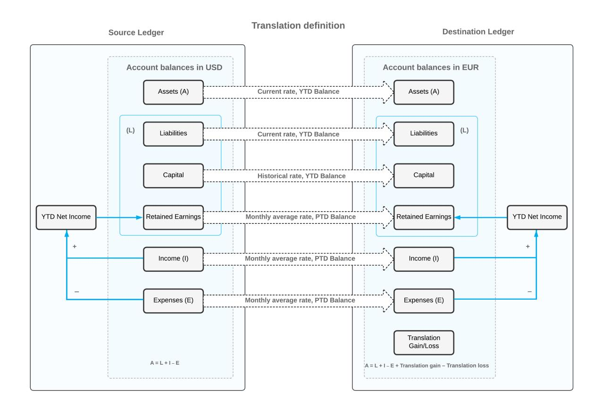
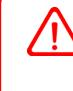
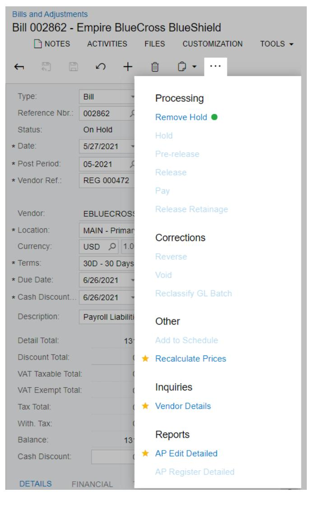

# **Currency Management 2025 R1**


## **Contents**

| Copyright5                                                                                        |  |
|---------------------------------------------------------------------------------------------------|--|
| Overview of Currency Management Processes 6                                                       |  |
| Processing Funds Transfers in Foreign Currencies 7                                                |  |
| Multicurrency Funds Transfers: General Information7                                               |  |
| Multicurrency Funds Transfers: Implementation Checklist8                                          |  |
| Multicurrency Funds Transfers: Generated Transactions 9                                           |  |
| Multicurrency Funds Transfers: Process Activity10                                                 |  |
| Multicurrency Funds Transfers: Mass Processing 12                                                 |  |
| Multicurrency Funds Transfers: Related Report and Forms13                                         |  |
| Processing Invoices in Foreign Currencies14                                                       |  |
| AR Invoices in Foreign Currencies: General Information14                                          |  |
| AR Invoices in Foreign Currencies: Implementation Checklist15                                     |  |
| AR Invoices in Foreign Currencies: Generated Transactions 16                                      |  |
| AR Invoices in Foreign Currencies: Process Activity17                                             |  |
| AR Invoices in Foreign Currencies: Related Reports and Forms 22                                   |  |
| Applying Credit Memos in Foreign Currencies to Invoices24                                         |  |
| Credit Memos in Foreign Currencies: General Information24                                         |  |
| Credit Memos in Foreign Currencies: Implementation Checklist24                                    |  |
| Credit Memos in Foreign Currencies: Generated Transactions 25                                     |  |
| Credit Memos in Foreign Currencies: Process Activity 26                                           |  |
| Paying Multicurrency Invoices 31                                                                  |  |
| Multicurrency Payment of Invoices: General Information31                                          |  |
| Multicurrency Payment of Invoices: Implementation Checklist 32                                    |  |
| Multicurrency Payment of Invoices: Generated Transactions33                                       |  |
| Multicurrency Payment of Invoices: To Pay a Foreign Currency Invoice by Using the Base Currency34 |  |
| Multicurrency Payment of Invoices: To Pay a Foreign Currency Invoice by Using Another Currency37  |  |
| Processing Bills in Foreign Currencies 41                                                         |  |
| AP Bills in Foreign Currencies: General Information 41                                            |  |
| AP Bills in Foreign Currencies: Implementation Checklist 42                                       |  |
| AP Bills in Foreign Currencies: Generated Transactions43                                          |  |
| AP Bills in Foreign Currencies: Process Activity 44                                               |  |
| AP Bills in Foreign Currencies: Related Reports and Form47                                        |  |
| Applying Debit Adjustments in Foreign Currencies to Bills 49                                      |  |
| Debit Adjustments in Foreign Currencies: General Information 49                                   |  |

| Debit Adjustments in Foreign Currencies: Implementation Checklist50                         |  |
|---------------------------------------------------------------------------------------------|--|
| Debit Adjustments in Foreign Currencies: Generated Transactions 51                          |  |
| Debit Adjustments in Foreign Currencies: Process Activity52                                 |  |
| Debit Adjustments in Foreign Currencies: Related Reports 55                                 |  |
| Paying Multicurrency Bills56                                                                |  |
| Multicurrency Payment of Bills: General Information 56                                      |  |
| Multicurrency Payment of Bills: Implementation Checklist57                                  |  |
| Multicurrency Payment of Bills: Generated Transactions 58                                   |  |
| Multicurrency Payment of Bills: To Pay a Foreign Currency Bill by Using the Base Currency59 |  |
| Multicurrency Payment of Bills: To Pay a Foreign Currency Bill by Using Another Currency62  |  |
| Processing Documents Between Companies with Different Base Currencies 66                    |  |
| Documents in Different Base Currencies: General Information66                               |  |
| Documents in Different Base Currencies: Implementation Checklist66                          |  |
| Documents in Different Base Currencies: Generated Transactions 67                           |  |
| Documents in Different Base Currencies: To Process an AR Invoice68                          |  |
| Documents in Different Base Currencies: To Process an AP Bill 70                            |  |
| Revaluing Open AP Documents 73                                                              |  |
| Revaluation of AP Documents: General Information73                                          |  |
| Revaluation of AP Documents: Implementation Checklist 74                                    |  |
| Revaluation of AP Documents: Generated Transactions75                                       |  |
| Revaluation of AP Documents: Process Activity 76                                            |  |
| Revaluation of AP Documents: Related Reports and Inquiry81                                  |  |
| Revaluing Open AR Documents82                                                               |  |
| Revaluation of AR Documents: General Information82                                          |  |
| Revaluation of AR Documents: Implementation Checklist 83                                    |  |
| Revaluation of AR Documents: Generated Transactions84                                       |  |
| Revaluation of AR Documents: Process Activity 85                                            |  |
| Revaluation of AR Documents: Related Report and Inquiry Form89                              |  |
| Revaluing Bank Accounts 91                                                                  |  |
| Revaluation of Bank Accounts: General Information 91                                        |  |
| Revaluation of Bank Accounts: Implementation Checklist 92                                   |  |
| Revaluation of Bank Accounts: Generated Transactions93                                      |  |
| Revaluation of Bank Accounts: Process Activity 94                                           |  |
| Translating Financial Statements97                                                          |  |
| Translation of Financial Statements: General Information 97                                 |  |
| Translation of Financial Statements: Implementation Checklist100                            |  |

| Translation of Financial Statements: Process Activity102                 |  |
|--------------------------------------------------------------------------|--|
| Translation of Financial Statements: Mass Processing106                  |  |
| Translation of Financial Statements: Related Report and Inquiry Form 106 |  |
| Preparing a Consolidated Financial Statement107                          |  |
| Consolidated Financial Statement: General Information107                 |  |
| Consolidated Financial Statement: Implementation Checklist 108           |  |
| Consolidated Financial Statement: Performing a Translation109            |  |
| Consolidated Financial Statement: Creating a Customized Report115        |  |
| Appendix120                                                              |  |
| Reports 120                                                              |  |
| Report Form120                                                           |  |
| Report125                                                                |  |
| Form Toolbar and More Menu127                                            |  |
| Table Toolbar 134                                                        |  |

## <span id="page-4-0"></span>**Copyright**

#### **© 2025 Acumatica, Inc.**

#### **ALL RIGHTS RESERVED.**

No part of this document may be reproduced, copied, or transmitted without the express prior consent of Acumatica, Inc.

3075 112th Avenue NE, Suite 200, Bellevue, WA 98004, USA

#### **Restricted Rights**

The product is provided with restricted rights. Use, duplication, or disclosure by the United States Government is subject to restrictions as set forth in the applicable License and Services Agreement and in subparagraph (c)(1)(ii) of the Rights in Technical Data and Computer Soware clause at DFARS 252.227-7013 or subparagraphs (c)(1) and (c)(2) of the Commercial Computer Soware-Restricted Rights at 48 CFR 52.227-19, as applicable.

#### **Disclaimer**

Acumatica, Inc. makes no representations or warranties with respect to the contents or use of this document, and specifically disclaims any express or implied warranties of merchantability or fitness for any particular purpose. Further, Acumatica, Inc. reserves the right to revise this document and make changes in its content at any time, without obligation to notify any person or entity of such revisions or changes.

#### **Trademarks**

Acumatica is a registered trademark of Acumatica, Inc. HubSpot is a registered trademark of HubSpot, Inc. Microso Exchange and Microso Exchange Server are registered trademarks of Microso Corporation. All other product names and services herein are trademarks or service marks of their respective companies.

Soware Version: 2025 R1 Last Updated: 06/01/2025

## <span id="page-5-0"></span>**Overview of Currency Management Processes**

In Acumatica ERP, you can maintain companies that perform multicurrency accounting. By using this multicurrency functionality, you can enter transactions in different currencies and maintain the history of transactions in both the base currency and the currency of the transactions.

The main processes related to currency management are described in this topic.

#### **Configuring Currencies**

In Acumatica ERP, you specify the base currency—the currency of the primary economic environment in which the company generates and expends cash—when you create the first company on the *[Companies](https://help-2025r1.acumatica.com/Help?ScreenId=ShowWiki&pageid=fedad435-8496-4397-b8a3-50a473629f76)* (CS101500) form.

You can edit the settings of any currency in the system used for accounting and reporting purposes. For details, see the *[Multicurrency Functionality](https://help-2025r1.acumatica.com/Help?ScreenId=ShowWiki&pageid=60149384-b0b5-434c-9660-fc13c586538d)* chapter.

#### **Managing Currency Rates**

Acumatica ERP supports an unlimited number of currency rate types. You can assign different rate types to vendors and customers that use the same foreign currency. You can update exchange rates as frequently as you need, and historical currency rates are stored in the database for all previous financial years. You can set up the process of refreshing the currency rates by using the *[Open Exchange Rates API](https://openexchangerates.org)* online service. For more information, see the *[Currency](https://help-2025r1.acumatica.com/Help?ScreenId=ShowWiki&pageid=73c76cc8-cb93-4261-b5f8-13bc277324eb) Rate Types and Current Rates* chapter.

#### **Managing Translations**

If your company prepares reports in a currency other than the base currency, you can set up translations to accurately reflect your business operations in another currency. For more information, see the *[Translation](#page-96-2) of [Financial Statements: General Information](#page-96-2)* chapter.

#### **Managing Revaluations**

You can maintain any general ledger accounts you select in foreign currencies. At the end of each financial period, you have to revalue in the base currency the balances of general ledger accounts that are denominated to foreign currencies. The revaluation gains and losses are calculated automatically, with the appropriate adjustments posted to the revaluation gain and loss accounts specified for each foreign currency.

You can maintain operations with selected vendors and customers in foreign currencies. At the end of each financial period, you have to revalue all open accounts payable and accounts receivable documents in the base currency. The revaluation gains and losses are calculated automatically, and the appropriate adjusting and reversing batches are generated.

For detailed information, see *[Revaluation of AP Documents: General Information](#page-72-2)*, *[Revaluation of AR Documents:](#page-81-2) [General Information](#page-81-2)*, and *[Revaluation of Bank Accounts: General Information](#page-90-2)*.

## <span id="page-6-0"></span>**Processing Funds Transfers in Foreign Currencies**

The topics of this chapter describe how to process a funds transfer in a foreign currency.

## <span id="page-6-1"></span>**Multicurrency Funds Transfers: General Information**

In Acumatica ERP, you can record cash transfers in foreign currencies from one bank account to another, or between cash accounts that are linked to the same GL account and represent the same bank account.

#### **Learning Objectives**

You will learn how to record a funds transfer in a foreign currency between cash accounts.

#### **Applicable Scenarios**

You record a funds transfer when you need to redistribute funds in foreign currencies between different companies or branches of your organization. You can also move funds from one bank account to another—for example, when you want to deposit funds from one of the company's checking accounts to a savings account.

#### **Processing of a Funds Transfer**

To process a funds transfer, you first create it on the *Funds [Transfers](https://help-2025r1.acumatica.com/Help?ScreenId=ShowWiki&pageid=814c5c8d-45bc-4e4d-98df-1b6785defc6c)* (CA301000) form. Then you release the transfer on any of the following forms:

- *Funds [Transfers](https://help-2025r1.acumatica.com/Help?ScreenId=ShowWiki&pageid=814c5c8d-45bc-4e4d-98df-1b6785defc6c)* (CA301000): You release the funds transfer you are viewing by clicking **Release** on the form toolbar.
- *Release Cash [Transactions](https://help-2025r1.acumatica.com/Help?ScreenId=ShowWiki&pageid=e872692e-5c4c-4141-80f4-2f032e7cc241)* (CA502000): You use this form to release a particular funds transfer or multiple funds transfers. On this form, funds transfers have the *Transfer* type, and transactions that correspond to the same transfer have the same transaction number. To release all transactions of a particular funds transfer, you need to select only one transaction of the funds transfer by selecting the unlabeled check box in the row of the transaction; you then release it by clicking **Release** on the form toolbar. The system releases the other transactions of the funds transfer automatically.
- *[Cash Account Details](https://help-2025r1.acumatica.com/Help?ScreenId=ShowWiki&pageid=79eedc99-0a1b-4aef-a51c-fa4f2cfe7a3b)* (CA303000): You can use this form to release a particular funds transfer or multiple funds transfers. On this form, you first select the cash account that is the source account or destination account of your funds transfer, and then the system displays a list of transactions that includes the funds transfer transaction of the *Transfer Out* or *Transfer In* type, depending on whether the account you selected is a source account or destination account. To release all transactions of the funds transfer, you need to select only one transaction of the funds transfer by selecting the unlabeled check box in the row of the transaction; you then click **Release** on the form toolbar. The system releases the other transactions of the funds transfer automatically.

During processing, a funds transfer can have the following statuses.

| Status   | Description                                          |
|----------|------------------------------------------------------|
| On Hold  | The transfer is being edited and cannot be released. |
| Balanced | The transfer is balanced and can be released.        |
| Released | The transfer has been released.                      |

#### *Table: Statuses of Funds Transfers*

#### **Currency Conversion in Funds Transfers**

If you transfer funds between accounts denominated in different currencies, the system performs currency conversion by using the base currency and the cash-in-transit account and subaccount (if subaccounts are in use in your system) that are specified in the **Cash-In-Transit Account** and **Cash-In-TransitSubaccount** boxes on the *[Cash Management Preferences](https://help-2025r1.acumatica.com/Help?ScreenId=ShowWiki&pageid=47321412-f6f6-4565-a2c5-d24ab8167e4b)* (CA101000) form.

For transfers maintained in different currencies, you can change the exchange rate for a particular transfer, and you can change the amount received to the destination account if the exchange rate of the system differs from the exchange rate of the bank. If you change the received amount, the system calculates the realized gain or loss (RGOL) for the transfer.

## <span id="page-7-0"></span>**Multicurrency Funds Transfers: Implementation Checklist**

The following sections provide details you can use to ensure that the system is configured properly for performing funds transfers in a foreign currency, and to understand (and change, if needed) the settings that affect the processing workflow.

#### **Implementation Checklist**

We recommend that before you initially perform funds transfers, you make sure the needed features have been enabled, settings have been specified, and entities have been created, as summarized in the following checklist.

| Form                                     | Settings to Check                                                                                       | Note                                                                                                                                                                                                   |
|------------------------------------------|---------------------------------------------------------------------------------------------------------|--------------------------------------------------------------------------------------------------------------------------------------------------------------------------------------------------------|
| Enable/Disable Features (CS100000)       | Make sure that the Standard Finan<br>cials and Multicurrency Accounting<br>features have been enabled.  | For details on configuring the mul<br>ticurrency functionality, see Multi<br>currency Functionality: Implementa<br>tion Activity.                                                                      |
| Chart of Accounts (GL202500)             | Check whether the necessary ac<br>counts have been created.                                             |                                                                                                                                                                                                        |
| Cash Accounts (CA202000)                 | Check whether the necessary cash<br>accounts have been configured.                                      | For details on configuring a cash<br>account in a foreign currency, see<br>Multicurrency Cash Accounts: To<br>Configure an Account                                                                     |
| Company Financial Calendar<br>(GL201100) | Make sure that the periods during<br>which funds transfers may occur<br>have a status of Open.          | You can generate the necessary pe<br>riods on the Master Financial Calen<br>dar (GL201000) form.<br>For details on opening financial pe<br>riods, see Opening Financial Peri<br>ods: Process Activity. |
| Currency Rates (CM301000)                | Make sure that the effective curren<br>cy rate for the currency of the AR in<br>voice has been defined. | For details, see Configuration of<br>Rate Types and Rates: To Config<br>ure Rates and Configuration of Rate<br>Types and Rates: To Set Up Re<br>freshing of Rates.                                     |

#### **Other Settings That Affect the Workflow**

You can affect the workflow of configuring foreign currency cash accounts by specifying additional settings on the *[Cash Management Preferences](https://help-2025r1.acumatica.com/Help?ScreenId=ShowWiki&pageid=47321412-f6f6-4565-a2c5-d24ab8167e4b)* (CA101000) form as follows:

- To cause transactions to be posted to the general ledger when cash documents are released, select the **Automatically Post to GL on Release** check box. If this check box is cleared, you have to post the batch aer you release the document.
- To cause new transactions and funds transfers to be assigned the *Balanced* status when they are entered, clear the **Hold Transactions on Entry** check box in the **Data EntrySettings** section. If the **Hold Transactions on Entry** check box is cleared, the transactions and funds transfers are assigned the *On Hold* status.
- To make filling in the **Document Ref.** box on the *Funds [Transfers](https://help-2025r1.acumatica.com/Help?ScreenId=ShowWiki&pageid=814c5c8d-45bc-4e4d-98df-1b6785defc6c)* (CA301000) form mandatory for new funds transfers, select the **Require Document Ref. Nbr. on Entry** check box. If this check box is cleared, you can leave the **Document Ref.** box blank.

### **Validation of Configuration**

To make sure that all configuration has been performed correctly, we recommend that in your system, you perform funds transfers in a foreign currency by performing instructions similar to those described in *[Multicurrency Funds](#page-9-1) [Transfers:](#page-9-1) Process Activity*.

## <span id="page-8-0"></span>**Multicurrency Funds Transfers: Generated Transactions**

The system always generates separate GL transactions for a multicurrency transfer. The following tables show the transactions recorded to the general ledger for the source and destination accounts.

#### *Table: Transactions for Source Account: Multicurrency Transfer*

| Account                 | Debit           | Credit          |
|-------------------------|-----------------|-----------------|
| Source account          | 0.00            | Transfer amount |
| Cash-in-Transit account | Transfer amount | 0.00            |

#### *Table: Transactions for the Destination Account: Multicurrency Transfer*

| Account                 | Debit           | Credit          |
|-------------------------|-----------------|-----------------|
| Destination account     | Transfer amount | 0.00            |
| Cash-in-Transit account | 0.00            | Transfer amount |

If a gain or loss is produced by a multicurrency transfer, the transactions shown in the following tables are recorded to the general ledger for the destination account, depending on whether a gain or loss is produced by the transfer that is, whether the realized gain or loss (RGOL) is positive or negative.

#### *Table: Transactions for Destination Account: Multicurrency Transfer Producing a Gain*

| Account             | Debit           | Credit |
|---------------------|-----------------|--------|
| Destination account | Transfer amount | 0.00   |

| Account                    | Debit       | Credit          |
|----------------------------|-------------|-----------------|
| Cash-in-Transit account    | 0.00        | Transfer amount |
| Realized Gain/Loss account | 0.00        | RGOL amount     |
| Cash-in-Transit account    | RGOL amount | 0.00            |

*Table: Transactions for Destination Account: Multicurrency Transfer Producing a Loss*

| Account                    | Debit           | Credit          |
|----------------------------|-----------------|-----------------|
| Destination account        | Transfer amount | 0.00            |
| Cash-in-Transit account    | 0.00            | Transfer amount |
| Realized Gain/Loss account | RGOL amount     | 0.00            |
| Cash-in-Transit account    | 0.00            | RGOL amount     |

## <span id="page-9-1"></span><span id="page-9-0"></span>**Multicurrency Funds Transfers: Process Activity**

The following activity will walk you through the process of performing a funds transfer in a foreign currency.

#### **Story**

Suppose that on January 30, 2025, SweetLife Fruits & Jams needs to transfer C\$484 to its new cash account to be able to make payments to vendors. The amount transferred from the *10200WH (Wholesale Checking)* account is \$379 (in *USD*), and the amount received to the *10215WH (Checking Account CAD)* is C\$484.21, as reported by the bank.

Acting as a SweetLife accountant, you need to process the cash transfer in the system.

#### **Configuration Overview**

In the *U100* dataset, the following tasks have been performed to support this activity:

- On the *[Enable/Disable Features](https://help-2025r1.acumatica.com/Help?ScreenId=ShowWiki&pageid=c1555e43-1bc5-4f6f-ba9d-b323f94d8a6b)* (CS100000) form, the following features have been enabled:
  - *Standard Financials*, which provides the standard financial functionality
  - *Multibranch Support*, which supports multiple branches in your instance of Acumatica ERP
  - *Multicompany Support*, which supports multiple companies within one tenant.
  - *Multicurrency Accounting*, which enables multicurrency operations in the system
- On the *[Companies](https://help-2025r1.acumatica.com/Help?ScreenId=ShowWiki&pageid=fedad435-8496-4397-b8a3-50a473629f76)* (CS101500) form, the *SWEETLIFE* company has been defined.
- On the *[Branches](https://help-2025r1.acumatica.com/Help?ScreenId=ShowWiki&pageid=b97ab72d-4ab4-4f02-b69c-f7f61b316ced)* (CS102000) form, the *HEADOFFICE* branch of the *SWEETLIFE* company has been created.
- On the *[Chart of Accounts](https://help-2025r1.acumatica.com/Help?ScreenId=ShowWiki&pageid=85557f41-a4af-47a8-b198-2a01461ce9c3)* (GL202500) form, the *10500 (Cash in Transit)* account has been created.
- On the *[Cash Accounts](https://help-2025r1.acumatica.com/Help?ScreenId=ShowWiki&pageid=10f71454-88f9-4d6c-8d09-32856d8c6741)* (CA202000) form, the *10200WH (Wholesale Checking)* bank account has been predefined.

#### **Process Overview**

On the *Funds [Transfers](https://help-2025r1.acumatica.com/Help?ScreenId=ShowWiki&pageid=814c5c8d-45bc-4e4d-98df-1b6785defc6c)* (CA301000) form, you will record a funds transfer in the amount of C\$500.58 from the *10200WH* cash account to the *10215WH* cash account. You will then review the GL transactions generated by the system on the *Journal [Transactions](https://help-2025r1.acumatica.com/Help?ScreenId=ShowWiki&pageid=dda046bc-5946-407f-88f7-1c0c966fbe72)* (GL301000) form. Finally, you will review the balance of the *10215* GL account on the *[Account Details](https://help-2025r1.acumatica.com/Help?ScreenId=ShowWiki&pageid=517044d6-d4e9-406b-a40e-6139b9b53bd9)* (GL404000) form.

#### **System Preparation**

Before you begin performing the steps of this activity, do the following:

- 1. Launch the Acumatica ERP website with the *U100* dataset preloaded, and sign in as an accountant Anna Johnson by using the *johnson* username and the *123* password.
- 2. In the info area, in the upper-right corner of the top pane of the Acumatica ERP screen, make sure that the business date in your system is set to *1/30/2025*. If a different date is displayed, click the Business Date menu button, and select *1/30/2025* from the calendar. For simplicity, in this lesson, you will create and process all documents in the system during this business date.
- 3. On the Company and Branch Selection menu on the top pane of the Acumatica ERP screen, make sure that the *SweetLife Head Office and Wholesale Center* branch is selected. If it is not selected, click the Company and Branch Selection menu button to view the list of branches that you have access to, and then click *SweetLife Head Office and Wholesale Center*.
- 4. Make sure that the multicurrency accounting functionality has been configured as described in *[Multicurrency](https://help-2025r1.acumatica.com/Help?ScreenId=ShowWiki&pageid=b6d51802-f951-44ef-8ecb-f9244ed438bf) [Functionality: Implementation Activity](https://help-2025r1.acumatica.com/Help?ScreenId=ShowWiki&pageid=b6d51802-f951-44ef-8ecb-f9244ed438bf)* and *[Configuration](https://help-2025r1.acumatica.com/Help?ScreenId=ShowWiki&pageid=00d85958-d6ad-4d36-90bc-bf749c6f7213) of Rate Types and Rates: To Configure Rates*.
- 5. Make sure that you have configured an account as described in *[Multicurrency](https://help-2025r1.acumatica.com/Help?ScreenId=ShowWiki&pageid=c5235bc2-af63-40ce-8a7c-5570d3898c4c) Cash Accounts: To Configure an [Account](https://help-2025r1.acumatica.com/Help?ScreenId=ShowWiki&pageid=c5235bc2-af63-40ce-8a7c-5570d3898c4c)*.

#### **Step 1: Recording a Funds Transfer**

To record a funds transfer, do the following:

- 1. Open the *Funds [Transfers](https://help-2025r1.acumatica.com/Help?ScreenId=ShowWiki&pageid=814c5c8d-45bc-4e4d-98df-1b6785defc6c)* (CA301000) form.
- 2. On the form toolbar, click **Add New Record** and in the **Description** box, enter Transfer 484 CAD.
- 3. In the **Source Account** section, specify the following settings:
  - **Account**: *10200WH (Wholesale Checking)*
  - **Transfer Date**: *1/30/2025* (inserted by default)
  - **Document Ref.**: 1302023
  - **Amount**: 379.00
- 4. In the **Destination Account** section, specify the following settings:
  - **Account**: *10215WH (Checking Account CAD)*

You created this cash account in the *[Multicurrency](https://help-2025r1.acumatica.com/Help?ScreenId=ShowWiki&pageid=c5235bc2-af63-40ce-8a7c-5570d3898c4c) Cash Accounts: To Configure an Account* prerequisite activity.

- **Receipt Date**: *1/30/2025* (inserted by default)
- **Document Ref.**: 1302023 (inserted automatically)
- **Amount**: *484.21* (inserted automatically)

The amount transferred from the *10200WH* account is \$379 in the base currency. Based on the effective currency rate, the transferred amount is C\$484.21.

Before you release the funds transfer, you could click the Exchange Rate box (right of the **Currency** box) in the**Source Account** section; in the **RateSelection** dialog box, which opens, you can override the currency rate for this particular document. If the source account is denominated to a foreign currency, the exchange rate in the**Source Account** section (also in the Exchange Rate box right of the **Currency** box) can be overridden as well.

- 5. On the form toolbar, click **Remove Hold**.
- 6. On the form toolbar, click **Release** to release the funds transfer.

When the system transfers amounts, it creates and releases two GL batches, one for each currency.

#### **Step 2: Reviewing the Generated GL Transactions**

To review the GL transactions generated for each currency, do the following:

- 1. While you are still on the *Funds [Transfers](https://help-2025r1.acumatica.com/Help?ScreenId=ShowWiki&pageid=814c5c8d-45bc-4e4d-98df-1b6785defc6c)* (CA301000) form viewing the funds transfer you recorded, in the **Source Account** section, click the link in the **Batch Number** box.
- 2. On the *Journal [Transactions](https://help-2025r1.acumatica.com/Help?ScreenId=ShowWiki&pageid=dda046bc-5946-407f-88f7-1c0c966fbe72)* (GL301000) form, which opens, review the transaction. The batch was created in the base currency, because the *10200WH (Wholesale Checking)* account is denominated to the base currency.
- 3. On the *Funds [Transfers](https://help-2025r1.acumatica.com/Help?ScreenId=ShowWiki&pageid=814c5c8d-45bc-4e4d-98df-1b6785defc6c)* form, in the **Destination Account** section, click the link in the **Batch Number** box to open the batch that was generated when the transfer to the *10215* GL account was received.
- 4. On the *Journal [Transactions](https://help-2025r1.acumatica.com/Help?ScreenId=ShowWiki&pageid=dda046bc-5946-407f-88f7-1c0c966fbe72)* (GL301000) form, which opens, review the transaction in the base and foreign currencies. (To toggle between the base and foreign currency, click the**View Base** or **View Cury** button right of the **Currency** box.)

The accounts are maintained in different currencies, so the system performs the currency conversion by using the cash-in-transit account. The following actions were performed when the system released the transaction:

- The destination account (*10215*) was debited in the transfer amount (C\$484.21, which is \$379.00 based on the current exchange rate).
- The cash-in-transit account (*10500*) was credited in the amount of the transfer out (C\$484.21).

#### **Step 3: Reviewing the Balance of the Account**

To review the balance of *10215 (Checking Account CAD)*, do the following:

- 1. Open the *[Account Details](https://help-2025r1.acumatica.com/Help?ScreenId=ShowWiki&pageid=517044d6-d4e9-406b-a40e-6139b9b53bd9)* (GL404000) form.
- 2. In the Selection area, specify the following settings:
  - **From Period**: *01-2025*
  - **To Period**: *01-2025*
  - **Account**: *10215 (Checking Account CAD)*
  - **Show Currency Details**: Selected
- 3. Review the funds transfer in the table and the ending balance of the *10215* account in the foreign currency and the base currency.

### <span id="page-11-0"></span>**Multicurrency Funds Transfers: Mass Processing**

This topic explains how to release multiple funds transfers at once.

#### **Mass Release of Funds Transfers**

You can release multiple funds transfers as follows:

- *Release Cash [Transactions](https://help-2025r1.acumatica.com/Help?ScreenId=ShowWiki&pageid=e872692e-5c4c-4141-80f4-2f032e7cc241)* (CA502000): You use this form to release a particular funds transfer or multiple funds transfers. On this form, funds transfers have the *Transfer* type, and transactions that correspond to the same transfer have the same transaction number. To release transactions that belong to multiple funds transfers at once, you need to select only one transaction for each funds transfer by selecting the unlabeled check box in the row of the transaction and release it by clicking **Release** on the form toolbar; the system releases the other transactions of the relevant funds transfers automatically. Alternatively, you can release all transactions by clicking **Release All** on the form toolbar.
- *[Cash Account Details](https://help-2025r1.acumatica.com/Help?ScreenId=ShowWiki&pageid=79eedc99-0a1b-4aef-a51c-fa4f2cfe7a3b)* (CA303000): You can use this form to release a particular funds transfer or multiple funds transfers. On this form, you first select a cash account, which can be a source account or a destination account for your funds transfer, then the system displays a list of transactions that includes the funds transfer transaction of the *Transfer Out* or *Transfer In* type, depending on whether the account you selected is a source or destination account. To release transactions tat belong to multiple funds transfers, you need to select only one transaction by selecting the unlabeled check box in the row of the transaction and release it by clicking **Release** on the form toolbar; the system releases the other transactions automatically.

## <span id="page-12-0"></span>**Multicurrency Funds Transfers: Related Report and Forms**

In the following sections, you can find details about the report and forms you may want to review to gather information about multicurrency funds transfers.

If you do not see a particular report or form that is described, you may have signed in to the system with a user account that does not have access rights to the report or form. Contact your system administrator to obtain access to any needed reports or forms.

#### **Reviewing Funds Transfer Details**

On the *Funds [Transfers](https://help-2025r1.acumatica.com/Help?ScreenId=ShowWiki&pageid=814c5c8d-45bc-4e4d-98df-1b6785defc6c)* (CA301000) form, you can review the details of any funds transfer and the associated GL transactions (if the funds transfer has been released) by clicking the batch numbers in the**Source Account** and **Destination Account** sections.

#### **Reviewing Activity on Cash Accounts**

On the *[Cash Account Details](https://help-2025r1.acumatica.com/Help?ScreenId=ShowWiki&pageid=79eedc99-0a1b-4aef-a51c-fa4f2cfe7a3b)* (CA303000) form, you can view all activity on any cash account during the date range you specify, including any transactions of funds transfers generated for the selected cash account.

#### **Reviewing Transactions Generated on Release of Funds Transfers**

For a particular financial period, you can review transactions in a foreign currency that were generated on release of a funds transfer if you run the *[Transactions](https://help-2025r1.acumatica.com/Help?ScreenId=ShowWiki&pageid=deb95b00-b48f-4d53-8551-dd72d367d2fc) for Period* (GL633000) report with the **Include Foreign Currency Details** check box selected on the report form.

## <span id="page-13-0"></span>**Processing Invoices in Foreign Currencies**

The topics of this chapter describe how to process an AR invoice in a foreign currency.

## <span id="page-13-1"></span>**AR Invoices in Foreign Currencies: General Information**

In Acumatica ERP, multicurrency functionality is supported for AR documents. The system recalculates all transactions made in a foreign currency to the company's base currency. To record the difference resulting from rounding during currency conversion, the system uses the rounding gain and loss accounts specified for the document currency on the *[Currencies](https://help-2025r1.acumatica.com/Help?ScreenId=ShowWiki&pageid=533be28d-b9e1-4d77-9b62-b06bb90a8b3b)* (CM202000) form. The small amount resulting from the currency rounding may be posted as a debit or a credit, depending on its sign.

#### **Learning Objectives**

In this chapter, you will learn how to do the following:

- Create and process an invoice in a foreign currency
- Override the default currency rate
- Pay the invoice with a payment in the same foreign currency

#### **Applicable Scenarios**

You process invoices in a foreign currency if your foreign customers need to receive invoices in their own currency, which differs from the base currency in your system. If you have a cash account in the foreign currency used by your customers, you may want to receive payments for the invoices in this currency.

#### **Processing of an Invoice in a Foreign Currency**

In AR documents, the system uses the currency settings of the customer that is specified in the document. The currency settings are the currency, currency rate type, currency override ability, and currency rate override ability. When you create a customer on the *[Customers](https://help-2025r1.acumatica.com/Help?ScreenId=ShowWiki&pageid=652929bc-9606-4056-aa6e-0c2d1147171b)* (AR303000) form, the system inserts the currency settings of the customer class by default. If needed, you can override the default currency settings.

To recalculate the document amounts in the base currency, the system uses the currency exchange rate that was effective on the date of the document unless the rate is overridden in the document. The GL transaction posted to the general ledger on release of the document and the document itself can be reviewed in two currencies: the base currency and the document currency.

The RGOL amount calculated when a payment or credit memo is applied to an invoice is processed as follows:

- If the calculated RGOL amount is positive (which means that the application of the document produces a gain), the realized gain account associated with the invoice currency is credited in the RGOL amount.
- If the calculated RGOL amount is negative (which means that the application of the document produces a loss), the realized loss account associated with the invoice currency is debited in the amount of (–1) \* RGOL.

#### **Formula to Calculate Realized Gains and Losses**

If a payment is issued in the same foreign currency as the currency of the document, the realized gain or loss is calculated in the base currency as the difference in exchange rates multiplied by the payment amount. The following formula is used.

```
RGOL Amount = Round (Payment Amount * Payment Rate) – Round (Payment Amount * Document
 Rate)
```

That is, the system calculates the realized gain or loss as the payment amount it converts into the base currency by using the payment rate minus the payment amount the system converts into the base currency by using the invoice rate. Round () indicates that the amount within parentheses is rounded to the decimal precision that is set for the base currency in the Summary area of the *[Currencies](https://help-2025r1.acumatica.com/Help?ScreenId=ShowWiki&pageid=533be28d-b9e1-4d77-9b62-b06bb90a8b3b)* (CM202000) form.

#### **Changing of the Cross Rate**

When applying a payment to a multicurrency invoice, you can change the cross rate along with the application, if needed.

For instance, suppose you had issued an invoice in a foreign currency, and then you received a payment in this foreign currency. Your company does not have a bank account in the foreign currency, and the bank used some currency rate to translate the payment amount to the currency of your bank account. In this case, you record the payment to a cash account that represents your bank account and apply it to the invoice. The rate used by the bank may differ from the rate you used to record the invoice. To make the payment amount and the invoice amount equal, you can adjust the rate in the **Cross Rate** column for the applied invoice. When you release the payment and its applications, the balance of the realized gain or loss (RGOL) account is updated by the amount resulting from the difference in the exchange rates used to record the invoice and the payment.

If your company has a bank account in the foreign currency (so there is a cash account in the system that represents this bank account), you record the payment in a foreign currency to this cash account. When you release the payment and its applications, the balance of the RGOL account is updated by the amount resulting from the difference in the exchange rate on the invoice date and the payment application date.

### <span id="page-14-0"></span>**AR Invoices in Foreign Currencies: Implementation Checklist**

The following sections provide details you can use to ensure that the system is configured properly for processing AR invoices in a foreign currency, and to understand (and change, if needed) the settings that affect the processing workflow.

#### **Implementation Checklist**

We recommend that before you initially process AR invoices in a foreign currency, you make sure the needed features have been enabled, settings have been specified, and entities have been created, as summarized in the following checklist.

| Form                               | Criteria to Check                                                                                                        |
|------------------------------------|--------------------------------------------------------------------------------------------------------------------------|
| Enable/Disable Features (CS100000) | Make sure that the Standard Financials and Multicurrency Ac<br>counting features have been enabled.                      |
|                                    | For details on configuring the multicurrency functionality, see<br>Multicurrency Functionality: Implementation Activity. |
| Customers (AR303000)               | Make sure that the customer accounts for the customers for<br>which you will create AR documents have been defined.      |

| Form                      | Criteria to Check                                                                                                                                           |
|---------------------------|-------------------------------------------------------------------------------------------------------------------------------------------------------------|
| Currency Rates (CM301000) | Make sure that the effective currency rate for the currency of the<br>AR document has been defined.                                                         |
|                           | For details, see Configuration of Rate Types and Rates: To Config<br>ure Rates and Configuration of Rate Types and Rates: To Set Up<br>Refreshing of Rates. |

#### **Other Settings That Affect the Workflow**

You can affect the workflow of processing AR invoices in a foreign currency by specifying additional settings as follows:

- On the **PostingSettings** tab of the *[General Ledger Preferences](https://help-2025r1.acumatica.com/Help?ScreenId=ShowWiki&pageid=e4913d06-c511-4258-a0f9-f36c1b854e6b)* (GL102000) form:
  - To cause GL batches to be immediately posted aer they are released, select the **Automatically Post on Release** check box.
  - To cause every AR transaction you enter to be posted as an individual batch to the general ledger, clear the **Generate Consolidated Batches** check box. If this check box is selected, the system consolidates into a single batch all transactions in the same currency posted to the same period for all documents being released.
- On the **GeneralSettings** tab of the *[Accounts Receivable Preferences](https://help-2025r1.acumatica.com/Help?ScreenId=ShowWiki&pageid=f7b52067-5299-45e8-b601-485cd709f58b)* (AR101000) form:
  - To cause all created AR invoices to have the *Balanced* status, clear the **Hold Documents on Entry** check box in the **Data EntrySettings** section. If this check box is selected, the created AR invoices are assigned the *On Hold* status.
  - To make entering a payment reference number in the **Payment Ref.** box mandatory when creating a payment on the *[Payments and Applications](https://help-2025r1.acumatica.com/Help?ScreenId=ShowWiki&pageid=ae844bf4-1aef-42cd-9e2f-49b3ee1bc8d7)* (AR302000) form, select the **Require Payment Reference on Entry** check box in the **Data EntrySettings** section. If this check box is cleared, you can leave the **Payment Ref.** box empty when creating a payment.
  - To cause AR invoices to be automatically posted to the general ledger once they are released, select the **Automatically Post on Release** check box in the **PostingSettings** section. If this check box is cleared, you have to post the batch aer you release the document.

#### **Validation of Configuration**

To make sure that all configuration has been performed correctly, we recommend that in your system, you process AR invoices in a foreign currency by performing instructions similar to those described in *[AR Invoices in Foreign](#page-16-1) [Currencies: Process Activity](#page-16-1)*.

## <span id="page-15-0"></span>**AR Invoices in Foreign Currencies: Generated Transactions**

To be able to process an AR invoice in a foreign currency, you create and process an invoice and a payment. To update customer balances, the system generates the GL transactions described in the following sections.

#### **Transaction Generated for an AR Invoice**

When you create and release a one-line AR invoice, the system generates the following GL transaction.

| Account                     | Debit  | Credit |
|-----------------------------|--------|--------|
| Accounts Receivable account | Amount | 0.00   |

| Account                    | Debit                | Credit               |
|----------------------------|----------------------|----------------------|
| Sales Revenue account      | 0.00                 | Amount               |
| Rounding Gain/Loss account | Rounding loss amount | Rounding gain amount |

You can view the reference number of the GL batch on the **Financial** tab of the *[Invoices and Memos](https://help-2025r1.acumatica.com/Help?ScreenId=ShowWiki&pageid=5e6f3b27-b7af-412f-a40a-1d4f4be70cba)* (AR301000) form.

#### **Transactions Generated for an Invoice Payment**

When you create and release a payment in a foreign currency and the currency rate of the payment is greater than that of the invoice, the system generates the following GL transaction.

| Account                     | Debit                         | Credit               |
|-----------------------------|-------------------------------|----------------------|
| Cash account                | Amount + realized gain amount | 0.00                 |
| Accounts Receivable account | 0.00                          | Amount               |
| Realized Gain account       | 0.00                          | Realized gain amount |

When you create and release a payment in a foreign currency and the currency rate of the payment is less than that of the invoice, the system generates the following GL transaction.

| Account                     | Debit                         | Credit |
|-----------------------------|-------------------------------|--------|
| Cash account                | Amount – realized loss amount | 0.00   |
| Accounts Receivable account | 0.00                          | Amount |
| Realized Loss account       | Realized loss amount          | 0.00   |

You can view the reference number of the GL batch on the **Financial** tab of the *[Payments and Applications](https://help-2025r1.acumatica.com/Help?ScreenId=ShowWiki&pageid=ae844bf4-1aef-42cd-9e2f-49b3ee1bc8d7)* (AR302000) form.

## <span id="page-16-1"></span><span id="page-16-0"></span>**AR Invoices in Foreign Currencies: Process Activity**

The following activity will walk you through the processing of an AR invoice in a foreign currency.

#### **Story**

Suppose that on January 30, 2025, SweetLife Fruits & Jams provided juicer installation services to the Mint Store customer, whose currency is the Canadian dollar (*CAD*), and issued an invoice in *CAD*.

Acting as a SweetLife accountant, you need to create the invoice in the system and apply a payment in the same foreign currency to this invoice. Before you perform these actions, you will make changes to the Mint Store customer's settings so that invoice processing can be performed in line with the customer's currency-related preferences.

### **Configuration Overview**

In the *U100* dataset, the following tasks have been performed to support this activity:

- On the *[Enable/Disable Features](https://help-2025r1.acumatica.com/Help?ScreenId=ShowWiki&pageid=c1555e43-1bc5-4f6f-ba9d-b323f94d8a6b)* (CS100000) form, the following features have been enabled:
  - *Standard Financials*, which provides the standard financial functionality
  - *Multibranch Support*, which supports multiple branches in your instance of Acumatica ERP
  - *Multicompany Support*, which supports multiple companies within one tenant.
  - *Multicurrency Accounting*, which enables multicurrency operations in the system
- On the *[Companies](https://help-2025r1.acumatica.com/Help?ScreenId=ShowWiki&pageid=fedad435-8496-4397-b8a3-50a473629f76)* (CS101500) form, the *SWEETLIFE* company has been defined.
- On the *[Branches](https://help-2025r1.acumatica.com/Help?ScreenId=ShowWiki&pageid=b97ab72d-4ab4-4f02-b69c-f7f61b316ced)* (CS102000) form, the *HEADOFFICE* branch of the *SWEETLIFE* company has been created.
- On the *[Chart of Accounts](https://help-2025r1.acumatica.com/Help?ScreenId=ShowWiki&pageid=85557f41-a4af-47a8-b198-2a01461ce9c3)* (GL202500) form, the *11000 (Accounts Receivable)*, *40000 (Sales Revenue)*, and *42010 (Realized Gain CAD)* accounts have been created.
- On the *[Customer Classes](https://help-2025r1.acumatica.com/Help?ScreenId=ShowWiki&pageid=806e39d6-6f89-4e6c-9a24-61c6fb0c9a57)* (AR201000) form, the *INTLCA (Canadian Customers)* customer class has been predefined.
- On the *[Customers](https://help-2025r1.acumatica.com/Help?ScreenId=ShowWiki&pageid=652929bc-9606-4056-aa6e-0c2d1147171b)* (AR303000) form, the *MINTSTORE* customer has been predefined.
- On the *[Payment Methods](https://help-2025r1.acumatica.com/Help?ScreenId=ShowWiki&pageid=509285d1-cfae-4e87-95c3-a968451952e6)* (CA204000) form, the *WIRE* payment method for wire transfers has been created.

#### **Process Overview**

In this activity, you will update the customer's currency-related settings on the *[Customers](https://help-2025r1.acumatica.com/Help?ScreenId=ShowWiki&pageid=652929bc-9606-4056-aa6e-0c2d1147171b)* (AR303000) form to prepare the customer for multicurrency invoice processing, and update the settings of the payment method on the *[Payment Methods](https://help-2025r1.acumatica.com/Help?ScreenId=ShowWiki&pageid=509285d1-cfae-4e87-95c3-a968451952e6)* (CA204000) form. On the *[Invoices and Memos](https://help-2025r1.acumatica.com/Help?ScreenId=ShowWiki&pageid=5e6f3b27-b7af-412f-a40a-1d4f4be70cba)* (AR301000) form, you will then create an invoice in *CAD* and override the rate manually for this particular invoice. You will then post the invoice and review the GL transaction generated by the system on the *Journal [Transactions](https://help-2025r1.acumatica.com/Help?ScreenId=ShowWiki&pageid=dda046bc-5946-407f-88f7-1c0c966fbe72)* (GL301000) form. To review the customer's balance, you will run the *[AR Balance by Customer MC](https://help-2025r1.acumatica.com/Help?ScreenId=ShowWiki&pageid=f5acf36e-cd94-4898-8584-10f334d37dd2)* (AR633000) report. Finally, on the *[Payments and Applications](https://help-2025r1.acumatica.com/Help?ScreenId=ShowWiki&pageid=ae844bf4-1aef-42cd-9e2f-49b3ee1bc8d7)* (AR302000) form, you will pay the invoice in the same currency (*CAD*).

#### **System Preparation**

Before you begin performing the steps of this activity, do the following:

- 1. Launch the Acumatica ERP website with the *U100* dataset preloaded, and sign in as an accountant Anna Johnson by using the *johnson* username and the *123* password.
- 2. In the info area, in the upper-right corner of the top pane of the Acumatica ERP screen, make sure that the business date in your system is set to *1/30/2025*. If a different date is displayed, click the Business Date menu button, and select *1/30/2025* from the calendar.
- 3. On the Company and Branch Selection menu on the top pane of the Acumatica ERP screen, make sure that the *SweetLife Head Office and Wholesale Center* branch is selected. If it is not selected, click the Company and Branch Selection menu button to view the list of branches that you have access to, and then click *SweetLife Head Office and Wholesale Center*.
- 4. Make sure that the multicurrency accounting functionality has been configured as described in *[Multicurrency](https://help-2025r1.acumatica.com/Help?ScreenId=ShowWiki&pageid=b6d51802-f951-44ef-8ecb-f9244ed438bf) [Functionality: Implementation Activity](https://help-2025r1.acumatica.com/Help?ScreenId=ShowWiki&pageid=b6d51802-f951-44ef-8ecb-f9244ed438bf)* and *[Configuration](https://help-2025r1.acumatica.com/Help?ScreenId=ShowWiki&pageid=00d85958-d6ad-4d36-90bc-bf749c6f7213) of Rate Types and Rates: To Configure Rates*.
- 5. Make sure that you have configured an account as described in *[Multicurrency](https://help-2025r1.acumatica.com/Help?ScreenId=ShowWiki&pageid=c5235bc2-af63-40ce-8a7c-5570d3898c4c) Cash Accounts: To Configure an [Account](https://help-2025r1.acumatica.com/Help?ScreenId=ShowWiki&pageid=c5235bc2-af63-40ce-8a7c-5570d3898c4c)*.

#### **Step 1: Updating the Customer's Settings**

To update the currency-related customer settings in preparation for multicurrency invoice processing, do the following:

- 1. Open the *[Customers](https://help-2025r1.acumatica.com/Help?ScreenId=ShowWiki&pageid=652929bc-9606-4056-aa6e-0c2d1147171b)* (AR303000) form.
- 2. In the **Customer ID** box, select *MINTSTORE*.
- 3. On the **Financial** tab (**FinancialSettings** section), do the following:
  - In the **Currency ID** box, select *CAD*.
    - This is the primary currency to be inserted in invoices and memos for this customer.
  - Notice that the **Curr. RateType** box is empty, which is the default value of this setting copied from the customer class.

This setting specifies the currency rate type to be used for the customer. Because you are not specifying a **Curr. RateType** value for the customer, the system will use the *SPOT* rate, which is set as the default rate for accounts receivable on the *[Currency Management Preferences](https://help-2025r1.acumatica.com/Help?ScreenId=ShowWiki&pageid=978e9b8f-a3a3-461f-929f-b83c3407bc49)* (CM101000) form.

• Notice that the **Enable Currency Override** check box is cleared, which is the default state of this check box from the customer class.

With this check box cleared, you cannot override the currency in the invoices and memos to this customer—that is, the setting in the **Currency ID** box specifies the only currency that can be used in documents for this customer.


Select this check box if you need to issue invoices and memos to a customer in a currency other than the default one in certain situations.

- Select the **Enable Rate Override** check box. With this check box selected, you can override the rate type and exchange rate in documents created for this customer.
- 4. On the **Payment Methods** tab, for the *WIRE* method, select the **Is Default** check box.
- 5. On the form toolbar, click**Save** to save your changes.

#### **Step 2: Reviewing the Payment Method Settings**

To review the settings of the payment method for the foreign currency, do the following:

- 1. Open the *[Payment Methods](https://help-2025r1.acumatica.com/Help?ScreenId=ShowWiki&pageid=509285d1-cfae-4e87-95c3-a968451952e6)* (CA204000) form.
- 2. In the **Payment Method ID** box, select *WIRE*.
- 3. On the **Allowed Cash Accounts** tab, make sure that *10215WH (Checking Account CAD)* is listed, and the **Use in AP** and **Use in AR** check boxes are selected. You associated this payment method with the *10215WH* cash account and selected these check boxes when you created the account in *[Multicurrency](https://help-2025r1.acumatica.com/Help?ScreenId=ShowWiki&pageid=c5235bc2-af63-40ce-8a7c-5570d3898c4c) Cash Accounts: To [Configure an Account](https://help-2025r1.acumatica.com/Help?ScreenId=ShowWiki&pageid=c5235bc2-af63-40ce-8a7c-5570d3898c4c)*.

#### **Step 3: Creating and Releasing an Invoice**

To create and release an invoice in the *CAD* currency, do the following:

- 1. Open the *[Invoices and Memos](https://help-2025r1.acumatica.com/Help?ScreenId=ShowWiki&pageid=5e6f3b27-b7af-412f-a40a-1d4f4be70cba)* (AR301000) form.
- 2. On the form toolbar, click **Add New Record**, and in the Summary area, specify the following settings:
  - **Type**: *Invoice*
  - **Customer**: *MINTSTORE*
  - **Currency**: *CAD* (inserted automatically when you selected the customer)

The *CAD* currency is selected in the invoice (and the document amounts are specified in *CAD*) because you specified this currency for the customer. The currency of the invoice cannot be overridden because the **Enable Currency Override** check box is cleared for the customer on the **Financial** tab of the *[Customers](https://help-2025r1.acumatica.com/Help?ScreenId=ShowWiki&pageid=652929bc-9606-4056-aa6e-0c2d1147171b)* (AR303000) form.

• **Date**: *1/30/2025* (inserted automatically)

If you were to override the date, the currency rate in the document changes, because the system uses the effective rate on the selected date.

- **Post Period**: *01-2025*
- **Description**: Juicer installation
- 3. On the **Details** tab, click **Add Row**, and in the added row, specify the following settings:
  - **Transaction Descr.**: Installation
  - **Ext. Price**: 300.01
- 4. Add another row, and specify the following settings:
  - **Transaction Descr.**: Business travel
  - **Ext. Price**: 150.01
- 5. In the Summary area, click the Exchange Rate box (right of the **Currency** box), and review the **Rate Selection** dialog box, which opens.

The **Curr. RateType ID** (*SPOT*) is the default rate type determined by the **AR RateType** setting on the *[Currency Management Preferences](https://help-2025r1.acumatica.com/Help?ScreenId=ShowWiki&pageid=978e9b8f-a3a3-461f-929f-b83c3407bc49)* (CM101000) form, because you haven't specified a rate type for the customer. The system uses the currency rate that became effective on 1/30/2025. You can override the rate type and rate in this document because the **Enable Rate Override** check box is selected for the customer on the *[Customers](https://help-2025r1.acumatica.com/Help?ScreenId=ShowWiki&pageid=652929bc-9606-4056-aa6e-0c2d1147171b)* form.


Any time you need to check which currency rate was effective on a particular date, on the *[Currency Rates](https://help-2025r1.acumatica.com/Help?ScreenId=ShowWiki&pageid=cc4f6c18-cc29-4e58-a5dc-6c41770e6d48)* (CM301000) form, you can select the needed date in the **Effective Date** box and review the **Effective Currency Rates** tab.

- 6. Click **OK** to close the **RateSelection** dialog box.
- 7. In the Summary area, click the**View Base** button (right of the **Currency** box) to review the invoice amounts in the base currency (*USD*).

For converting the invoice total and line amounts, the system uses the *CAD*-to-*USD* rate that was effective on the invoice date. The system computes the detail total and the line amounts in the base currency as follows:

- \$352.24 (**DetailTotal** of the document) = Round (C\$450.02 \* 0.78271760)
- \$234.82 (**Amount** of the first line) = Round (C\$300.01 \* 0.78271760)
- \$117.42 (**Amount** of the second line) = Round (C\$150.01 \* 0.78271760)

When you are reviewing the document in the base currency, you cannot modify the document amounts. To be able to modify invoice amounts, you would have to switch back to viewing the document currency of the invoice by clicking**View Cury**.

- 8. Click **View Cury** to return to the document currency.
- 9. Click the Exchange Rate box (right of the **Currency** box), and in the **RateSelection** dialog box (which opens), enter 0.735 as the *CAD*-to-*USD* rate.

10.Click **OK** to confirm the rate changes and close the dialog box.

11.In the Summary area, click**View Base**, and review the invoice amounts in the base currency.

The **DetailTotal** in the base currency is \$330.76, because the system recalculated the amount by using the exchange rate that you have specified manually (C\$450.02 \* 0.735). The system also recalculated the line amounts in the base currency by using the new rate; now they are \$220.51 for the first line and \$110.26 for the second line. This manually specified currency rate is used in this particular invoice only and does not override the effective currency rate of the *SPOT* type that is specified on the *[Currency Rates](https://help-2025r1.acumatica.com/Help?ScreenId=ShowWiki&pageid=cc4f6c18-cc29-4e58-a5dc-6c41770e6d48)* form.

12.On the form toolbar, click **Remove Hold**.

13.On the form toolbar, click **Release** to release the invoice.

#### **Step 4: Reviewing the Generated GL Transaction**

To review the GL transaction generated by the system, do the following:

- 1. While you are still on the *[Invoices and Memos](https://help-2025r1.acumatica.com/Help?ScreenId=ShowWiki&pageid=5e6f3b27-b7af-412f-a40a-1d4f4be70cba)* (AR301000) form, on the **Financial** tab, click the link in the **Batch Nbr.** box.
- 2. On the *Journal [Transactions](https://help-2025r1.acumatica.com/Help?ScreenId=ShowWiki&pageid=dda046bc-5946-407f-88f7-1c0c966fbe72)* (GL301000) form, which opens, review the generated GL transaction in the document (*CAD*) and base (*USD*) currencies.

When the invoice was released, the following actions were performed in the system:

- The Accounts Receivable account of the customer (*11000*) was debited in the total invoice amount (C\$450.02, which is \$330.76 based on the document exchange rate).
- The sales account of the customer (*40000*) was credited in the invoice amounts specified in the document lines (\$220.51 = C\$300.01 \* 0.735 for the first line, and \$110.26 = C\$150.01 \* 0.735 for the second line).
- The rounding gain/loss account (*83100*) was debited in the amount of the rounding loss (\$0.01 = \$330.77 – \$330.76), which is due to rounding operations. (You specified this account for *CAD* on the *[Currencies](https://help-2025r1.acumatica.com/Help?ScreenId=ShowWiki&pageid=533be28d-b9e1-4d77-9b62-b06bb90a8b3b)* (CM202000) form while performing *[Multicurrency Functionality: Implementation Activity](https://help-2025r1.acumatica.com/Help?ScreenId=ShowWiki&pageid=b6d51802-f951-44ef-8ecb-f9244ed438bf)*.) The rounding loss is caused by the difference between the document balance converted into the base currency (\$330.77 = Round (C\$450.02 \* 0.735)) and the total of the line amounts converted into the base currency (\$330.76 = Round (C\$300.01 \* 0.735) + Round (C\$150.01 \* 0.735)).

#### **Step 5: Reviewing the Customer's Balance**

To review the customer's balance, do the following:

- 1. Open the *[AR Balance by Customer MC](https://help-2025r1.acumatica.com/Help?ScreenId=ShowWiki&pageid=f5acf36e-cd94-4898-8584-10f334d37dd2)* (AR633000) report form.
- 2. On the **Report Parameters** tab, specify the following parameters:
  - **Report Format**: *Open Documents*

This option means that the report will list all the documents that are open at the end of the selected period.

- **Company/Branch**: *HEADOFFICE (SweetLife Head Office and Wholesale Center)*
- **Financial Period**: *01-2025*
- **Customer**: *MINTSTORE*
- **Include Applications**: Cleared
- 3. On the form toolbar, click **Run Report**.
- 4. Review the report, which displays the invoice that you have processed and have not yet paid.

As the report shows, at the end of the period, the customer's outstanding balance is C\$450.02, which is \$330.76 in the base currency.

#### **Step 6: Applying a Payment in the Same Foreign Currency to the Invoice**

To create a payment and apply it to the invoice, do the following:

- 1. Open the *[Payments and Applications](https://help-2025r1.acumatica.com/Help?ScreenId=ShowWiki&pageid=ae844bf4-1aef-42cd-9e2f-49b3ee1bc8d7)* (AR302000) form.
- 2. On the form toolbar, click **Add New Record**, and in the Summary area, specify the following settings:
  - **Type**: *Payment*
  - **Customer**: *MINTSTORE*

- **Payment Method**: *WIRE* (inserted automatically when you select the customer)
- **Cash Account**: *10215WH*
- **Currency**: *CAD* (inserted automatically when you select the cash account)

A payment is always created in the currency of the selected cash account; this currency can differ from the customer's currency and cannot be overridden.

- **Description**: Juicer installation
- **Application Date**: *1/30/2025*
- **Application Period**: *01-2025*

On the **Documents to Apply** tab, the system has loaded the invoice you created for this customer earlier.

- 3. Select the Included check box for the row with the invoice, and in the Summary area, click the Refresh button to the right of the **Payment Amount** box.
- 4. In the Summary area, click the**View Base** button (right of the **Currency** box), and review the payment amount in the base currency. The payment amount is recalculated in the base currency by the exchange rate of the payment and is \$352.24 (C\$450.02 \* 0.7827176, which is the *CAD*-to-*USD* exchange rate that was effective on the payment date of 1/30/2025).
- 5. On the form toolbar, click **Remove Hold**, and then click **Release** to release the payment.
- 6. On the **Financial** tab, click the **Batch Nbr.** link.
- 7. On the *Journal [Transactions](https://help-2025r1.acumatica.com/Help?ScreenId=ShowWiki&pageid=dda046bc-5946-407f-88f7-1c0c966fbe72)* (GL301000) form, which opens, review the generated GL transaction in the document currency.
- 8. In the Summary area, click**View Base** (right of the **Currency** box), and review the transaction in the base currency.

When the payment was released, the following actions were performed in the system:

- The checking account specified in the payment (*10215*), which you created in *[Multicurrency Functionality:](https://help-2025r1.acumatica.com/Help?ScreenId=ShowWiki&pageid=b6d51802-f951-44ef-8ecb-f9244ed438bf) [Implementation Activity](https://help-2025r1.acumatica.com/Help?ScreenId=ShowWiki&pageid=b6d51802-f951-44ef-8ecb-f9244ed438bf)*, was debited in the payment amount, which the system converted to the base currency by using the exchange rate of the payment (\$352.24 = Round (C\$450.02 \* 0.7827176)).
- The Accounts Receivable account of the customer (*11000*) was credited in the payment amount applied to the invoice; the system converted the payment amount to the base currency by using the exchange rate of the invoice (\$330.76 = Round (C\$450.02 \* 0.735).
- The realized gain account associated with the *CAD* currency (*42010*, which you specified when you defined the currency in *[Multicurrency Functionality: Implementation Activity](https://help-2025r1.acumatica.com/Help?ScreenId=ShowWiki&pageid=b6d51802-f951-44ef-8ecb-f9244ed438bf)*), was credited in the amount of the realized gain, which is the result of differences in the rates of the invoice and the payment. The payment rate is greater than the invoice rate. Thus, the result of applying the payment to the invoice is a realized gain in the amount of \$21.48 (\$352.24 – \$330.76).

## <span id="page-21-0"></span>**AR Invoices in Foreign Currencies: Related Reports and Forms**

In the following sections, you can find details about the reports and inquiry form you may want to review to gather information about invoices in a foreign currency.

If you do not see a particular report or form that is described, you may have signed in to the system with a user account that does not have access rights to the report or form. Contact your system administrator to obtain access to any needed reports or forms.

#### **Reviewing Customer Balances in a Foreign Currency**

You can review a customer's balance broken down by document and the current balance in both the base currency and in a foreign currency on the *[Customer Details](https://help-2025r1.acumatica.com/Help?ScreenId=ShowWiki&pageid=2ed5542b-a76c-4cfd-9ee3-52c2f08a2692)* (AR402000) form. The inquiry form shows document amounts in the foreign currency, the same amounts recalculated to the base currency, and the realized gains and losses.

#### **Reviewing AR Balance by Customer in a Foreign Currency**

You can review the outstanding foreign currency balance of a particular customer or all customers for a selected financial period by running the *[AR Balance by Customer MC](https://help-2025r1.acumatica.com/Help?ScreenId=ShowWiki&pageid=f5acf36e-cd94-4898-8584-10f334d37dd2)* (AR633000) report.

#### **Reviewing Invoices Coming Due**

To determine when you should expect to receive payments for the outstanding multicurrency documents, you can use the *[AR Coming Due MC](https://help-2025r1.acumatica.com/Help?ScreenId=ShowWiki&pageid=6786ca09-3fb6-4196-8401-d81569b0d71f)* (AR631600) report. The report shows all open documents recorded in the system, regardless of the current business date or the date specified in the **Date** box on this report form.

#### **Reviewing Invoices Overdue for Payment**

To determine which multicurrency documents are overdue for payment and for how long, you can run the *[AR Aging](https://help-2025r1.acumatica.com/Help?ScreenId=ShowWiki&pageid=3fb84a67-cce3-4efb-94a8-6ba37c15a392) [MC](https://help-2025r1.acumatica.com/Help?ScreenId=ShowWiki&pageid=3fb84a67-cce3-4efb-94a8-6ba37c15a392)* (AR631100) report. The report shows all released AR documents in the system, and the document balances on the date specified in the **Age as of Date** box on this report form.

## <span id="page-23-0"></span>**Applying Credit Memos in Foreign Currencies to Invoices**

The topics of this chapter describe how to apply a credit memo in a foreign currency to an AR invoice in the same foreign currency.

## <span id="page-23-1"></span>**Credit Memos in Foreign Currencies: General Information**

In Acumatica ERP, the amount of a released invoice, which increases a customer's debt, cannot be changed directly in the released document. If you need to decrease the customer's balance, you issue a credit memo.

#### **Learning Objectives**

In this chapter, you will learn how to do the following:

- Create a credit memo in a foreign currency
- Apply the credit memo to an invoice in a foreign currency

#### **Applicable Scenarios**

You create a credit memo in a foreign currency in the following cases:

- You need to adjust the balance of a released multicurrency invoice.
- You need to decrease the amount owed to you by a particular customer.

#### **Use of a Credit Memo to Decrease the Amount of an Invoice**

You issue a credit memo, which will be used to decrease a customer's debt, by using the *[Invoices and Memos](https://help-2025r1.acumatica.com/Help?ScreenId=ShowWiki&pageid=5e6f3b27-b7af-412f-a40a-1d4f4be70cba)* (AR301000) form—the same form you use to create an invoice. The credit memo is independent from the original invoice, with no direct reference to it. The processing of a credit memo includes the application of this credit memo to the applicable invoice, which establishes a link between these two documents. A credit memo may have multiple lines or one summary line. Credit memos do not have due dates and may be numbered differently from invoices, depending on the standards in place in your organization.

The release of a credit memo decreases the customer's balance. The application of a released credit memo against invoices, debit memos, and overdue charges decreases the outstanding amount of these documents by the amount of the credit memo. For details, see *[Credit Memos in Foreign Currencies: Process Activity](#page-25-1)*.

### <span id="page-23-2"></span>**Credit Memos in Foreign Currencies: Implementation Checklist**

The following sections provide details you can use to ensure that the system is configured properly for applying a credit memo in a foreign currency to an invoice, and to understand (and change, if needed) the settings that affect the processing workflow.

#### **Implementation Checklist**

We recommend that before you initially create a credit memo, you make sure the needed features have been enabled, settings have been specified, and entities have been created, as summarized in the following checklist.

| Form                               | Criteria to Check                                                                                                                                           |  |
|------------------------------------|-------------------------------------------------------------------------------------------------------------------------------------------------------------|--|
| Enable/Disable Features (CS100000) | Make sure that the Standard Financials and Multicurrency Ac<br>counting features have been enabled.                                                         |  |
|                                    | For details on configuring the multicurrency functionality, see<br>Multicurrency Functionality: Implementation Activity.                                    |  |
| Customers (AR303000)               | Make sure that the customer accounts for the customers for<br>which you will create AR documents have been defined.                                         |  |
| Currency Rates (CM301000)          | Make sure that the effective currency rate for the currency of the<br>AR document has been defined.                                                         |  |
|                                    | For details, see Configuration of Rate Types and Rates: To Config<br>ure Rates and Configuration of Rate Types and Rates: To Set Up<br>Refreshing of Rates. |  |

#### **Other Settings That Affect the Workflow**

You can affect the workflow of processing credit memos by specifying additional settings as follows:

- On the **PostingSettings** tab of the *[General Ledger Preferences](https://help-2025r1.acumatica.com/Help?ScreenId=ShowWiki&pageid=e4913d06-c511-4258-a0f9-f36c1b854e6b)* (GL102000) form:
  - To cause GL batches to be immediately posted aer they are released, select the **Automatically Post on Release** check box.
  - To cause every AR transaction you enter to be posted as an individual batch to the general ledger, clear the **Generate Consolidated Batches** check box. If this check box is selected, the system consolidates into a single batch all transactions in the same currency posted to the same period for all documents being released.
- On the **GeneralSettings** tab of the *[Accounts Receivable Preferences](https://help-2025r1.acumatica.com/Help?ScreenId=ShowWiki&pageid=f7b52067-5299-45e8-b601-485cd709f58b)* (AR101000) form:
  - To cause all created credit memos to have the *Balanced* status, clear the **Hold Documents on Entry** check box in the **Data EntrySettings** section. If this check box is selected, the created credit memos are assigned the *On Hold* status.
  - To make entering a payment reference number in the **Payment Ref.** box mandatory when creating a payment on the *[Payments and Applications](https://help-2025r1.acumatica.com/Help?ScreenId=ShowWiki&pageid=ae844bf4-1aef-42cd-9e2f-49b3ee1bc8d7)* (AR302000) form, select the **Require Payment Reference on Entry** check box in the **Data EntrySettings** section. If this check box is cleared, you can leave the **Payment Ref.** box empty when creating a payment.
  - To cause credit memos to be automatically posted to the general ledger once they are released, select the **Automatically Post on Release** check box in the **PostingSettings** section. If this check box is cleared, you have to post the batch aer you release the document.

#### **Validation of Configuration**

To make sure that all configuration has been performed correctly, we recommend that in your system, you create and apply credit memos in a foreign currency by performing instructions similar to those described in *[Credit Memos](#page-25-1) [in Foreign Currencies: Process Activity](#page-25-1)*.

## <span id="page-24-0"></span>**Credit Memos in Foreign Currencies: Generated Transactions**

To be able to decrease customer balances in foreign currencies, you create and process credit memos. To update customer balances, the system generates the GL transactions described in the following sections.

#### **Transaction Generated for a Credit Memo**

When you create and release a credit memo, the system generates the following GL transaction.

| Account                     | Debit  | Credit |
|-----------------------------|--------|--------|
| Accounts Receivable account | 0.00   | Amount |
| Sales account               | Amount | 0.00   |

You can view the reference number of the GL batch on the **Financial** tab of the *[Invoices and Memos](https://help-2025r1.acumatica.com/Help?ScreenId=ShowWiki&pageid=5e6f3b27-b7af-412f-a40a-1d4f4be70cba)* (AR301000) form.

#### **Transactions Generated for a Credit Memo Application Producing RGOL**

When you release a credit memo application to an invoice in a foreign currency, the difference in currency rates can produce a realized gain or loss (RGOL).

The following GL transaction is generated if the application produced a realized gain.

| Account                     | Debit       | Credit      |
|-----------------------------|-------------|-------------|
| Accounts Receivable account | Gain amount | 0.00        |
| Realized Gain/Loss account  | 0.00        | Gain amount |

The following GL transaction is generated if the application produced a realized loss.

| Account                     | Debit       | Credit      |
|-----------------------------|-------------|-------------|
| Accounts Receivable account | 0.00        | Loss amount |
| Realized Gain/Loss account  | Loss amount | 0.00        |

You can view the reference number of the GL batch on the **Financial** tab of the *[Payments and Applications](https://help-2025r1.acumatica.com/Help?ScreenId=ShowWiki&pageid=ae844bf4-1aef-42cd-9e2f-49b3ee1bc8d7)* (AR302000) form.

## <span id="page-25-1"></span><span id="page-25-0"></span>**Credit Memos in Foreign Currencies: Process Activity**

The following activity will walk you through the process of creating a credit memo in a foreign currency and applying it to an invoice in the same currency.

#### **Story**

Suppose that on February 1, 2025, SweetLife Fruits & Jams provided consulting services to the EasyDiner customer in the amount of 80 euros (€80). On February 15, 2025, SweetLife gave a discount on these services and issued a €5 credit memo to the customer.

Acting as a SweetLife accountant, you need to create this credit memo and apply it to the invoice.

#### **Configuration Overview**

In the *U100* dataset, the following tasks have been performed to support this activity:

- On the *[Enable/Disable Features](https://help-2025r1.acumatica.com/Help?ScreenId=ShowWiki&pageid=c1555e43-1bc5-4f6f-ba9d-b323f94d8a6b)* (CS100000) form, the following features have been enabled:
  - *Standard Financials*, which provides the standard financial functionality
  - *Multibranch Support*, which supports multiple branches in your instance of Acumatica ERP
  - *Multicompany Support*, which supports multiple companies within one tenant.
  - *Multicurrency Accounting*, which enables multicurrency operations in the system
- On the *[Companies](https://help-2025r1.acumatica.com/Help?ScreenId=ShowWiki&pageid=fedad435-8496-4397-b8a3-50a473629f76)* (CS101500) form, the *SWEETLIFE* company has been defined.
- On the *[Branches](https://help-2025r1.acumatica.com/Help?ScreenId=ShowWiki&pageid=b97ab72d-4ab4-4f02-b69c-f7f61b316ced)* (CS102000) form, the *HEADOFFICE* branch of the *SWEETLIFE* company has been created.
- On the *[Chart of Accounts](https://help-2025r1.acumatica.com/Help?ScreenId=ShowWiki&pageid=85557f41-a4af-47a8-b198-2a01461ce9c3)* (GL202500) form, the *11000 (Accounts Receivable)*, *40000 (Sales Revenue)*, and *83000(Realized Gain/Loss Currency)* accounts have been created.
- On the *[Customer Classes](https://help-2025r1.acumatica.com/Help?ScreenId=ShowWiki&pageid=806e39d6-6f89-4e6c-9a24-61c6fb0c9a57)* (AR201000) form, the *INTLCA (Canadian Customers)* customer class has been predefined.
- On the *[Customers](https://help-2025r1.acumatica.com/Help?ScreenId=ShowWiki&pageid=652929bc-9606-4056-aa6e-0c2d1147171b)* (AR303000) form, the *EASYDINER* customer has been predefined.

#### **Process Overview**

In this activity, you will update the EasyDiner customer's settings on the *[Customers](https://help-2025r1.acumatica.com/Help?ScreenId=ShowWiki&pageid=652929bc-9606-4056-aa6e-0c2d1147171b)* (AR303000) form, specifying the *EUR* currency for this customer. On the *[Invoices and Memos](https://help-2025r1.acumatica.com/Help?ScreenId=ShowWiki&pageid=5e6f3b27-b7af-412f-a40a-1d4f4be70cba)* (AR301000) form, you will create the invoice to which you will later apply the credit memo and then release this invoice.

On the same form, you will create a credit memo for the customer in the *EUR* currency and then release this credit memo. On the *[Payments and Applications](https://help-2025r1.acumatica.com/Help?ScreenId=ShowWiki&pageid=ae844bf4-1aef-42cd-9e2f-49b3ee1bc8d7)* (AR302000) form, you will apply the credit memo to the invoice and release the application. On the *Journal [Transactions](https://help-2025r1.acumatica.com/Help?ScreenId=ShowWiki&pageid=dda046bc-5946-407f-88f7-1c0c966fbe72)* (GL301000) form, you will review the GL transaction generated by the system to record the realized loss for the currency. Finally, on the *[Invoices and Memos](https://help-2025r1.acumatica.com/Help?ScreenId=ShowWiki&pageid=5e6f3b27-b7af-412f-a40a-1d4f4be70cba)* form, you will review the balance of the invoice to make sure it has been decreased by the credit memo.

#### **System Preparation**

Before you begin performing the steps of this activity, do the following:

- 1. Launch the Acumatica ERP website with the *U100* dataset preloaded, and sign in as an accountant Anna Johnson by using the *johnson* username and the *123* password.
- 2. In the info area, in the upper-right corner of the top pane of the Acumatica ERP screen, make sure that the business date in your system is set to *2/1/2025*. If a different date is displayed, click the Business Date menu button, and select *2/1/2025* from the calendar.
- 3. On the Company and Branch Selection menu on the top pane of the Acumatica ERP screen, make sure that the *SweetLife Head Office and Wholesale Center* branch is selected. If it is not selected, click the Company and Branch Selection menu button to view the list of branches that you have access to, and then click *SweetLife Head Office and Wholesale Center*.
- 4. Make sure that the multicurrency accounting functionality has been configured as described in *[Multicurrency](https://help-2025r1.acumatica.com/Help?ScreenId=ShowWiki&pageid=b6d51802-f951-44ef-8ecb-f9244ed438bf) [Functionality: Implementation Activity](https://help-2025r1.acumatica.com/Help?ScreenId=ShowWiki&pageid=b6d51802-f951-44ef-8ecb-f9244ed438bf)* and *[Configuration](https://help-2025r1.acumatica.com/Help?ScreenId=ShowWiki&pageid=aae84e9e-4b5c-4b8a-9c51-a3cd040eb7d1) of Rate Types and Rates: To Set Up Refreshing of [Rates](https://help-2025r1.acumatica.com/Help?ScreenId=ShowWiki&pageid=aae84e9e-4b5c-4b8a-9c51-a3cd040eb7d1)*.
- 5. Make sure that you have configured an account as described in *[Multicurrency](https://help-2025r1.acumatica.com/Help?ScreenId=ShowWiki&pageid=c5235bc2-af63-40ce-8a7c-5570d3898c4c) Cash Accounts: To Configure an [Account](https://help-2025r1.acumatica.com/Help?ScreenId=ShowWiki&pageid=c5235bc2-af63-40ce-8a7c-5570d3898c4c)*.

#### **Step 1: Updating the Customer's Settings**

To update the currency-related customer settings in preparation for the application of a credit memo, do the following:

- 1. Open the *[Customers](https://help-2025r1.acumatica.com/Help?ScreenId=ShowWiki&pageid=652929bc-9606-4056-aa6e-0c2d1147171b)* (AR303000) form.
- 2. In the **Customer ID** box, select *EASYDINER*.
- 3. On the **Financial** tab (**FinancialSettings** section), specify the following settings:
  - **Currency ID**: *EUR*
  - **Enable Rate Override**: Selected
- 4. On the **Payment Methods** tab, for the *WIRE* method, select the **Is Default** check box.
- 5. On the form toolbar, click**Save** to save your changes.

#### **Step 2: Creating and Releasing an Invoice**

To create an AR invoice in the *EUR* currency, do the following:

- 1. Open the *[Invoices and Memos](https://help-2025r1.acumatica.com/Help?ScreenId=ShowWiki&pageid=5e6f3b27-b7af-412f-a40a-1d4f4be70cba)* (AR301000) form.
- 2. On the form toolbar, click **Add New Record**, and in the Summary area, specify the following settings:
  - **Type**: *Invoice*
  - **Customer**: *EASYDINER*
  - **Currency**: *EUR* (inserted automatically when you selected the customer)

The system automatically inserted this currency because you specified it for the customer. The **Enable Currency Override** check box is cleared for the customer on the **Financial** tab of the *[Customers](https://help-2025r1.acumatica.com/Help?ScreenId=ShowWiki&pageid=652929bc-9606-4056-aa6e-0c2d1147171b)* (AR303000) form, so this currency is the only currency that is allowed for the customer. It cannot be overridden in the document.

- **Date**: *2/1/2025*
- **Post Period**: *02-2025*
- **Description**: Consulting services
- 3. On the **Details** tab, click **Add Row**, and in the added row, specify the following settings:
  - **Transaction Descr.**: Consulting services
  - **Ext. Price**: 80.00

The invoice is created with a currency rate of 1.11520018 which is effective on the document date.

- 4. On the form toolbar, click **Remove Hold**.
- 5. On the form toolbar, click **Release** to release the invoice.

#### **Step 3: Creating and Releasing a Credit Memo**

To create a credit memo in the *EUR* currency, do the following:

- 1. On the *[Invoices and Memos](https://help-2025r1.acumatica.com/Help?ScreenId=ShowWiki&pageid=5e6f3b27-b7af-412f-a40a-1d4f4be70cba)* (AR301000) form, click **Add New Record**, and in the Summary area, specify the following settings:
  - **Type**: *Credit Memo*
  - **Customer**: *EASYDINER*
  - **Date**: *2/15/2025*
  - **Post Period**: 02-2025
  - **Description**: Discount on consulting services

- 2. On the **Details** tab, click **Add Row**, and in the added row, specify the following settings:
  - **Transaction Descr.**: Discount on consulting services
  - **Ext. Price**: 5.00

The currency rate specified for the credit memo is 1.1411617, which is the effective rate on the document date. The invoice on which the discount is given was created with a currency rate of 1.11520018. If you apply this credit memo to the invoice, the operation will produce a realized loss, which is due to the difference of the currency rates.

If you want to apply the credit memo to the invoice without a realized gain or loss, you need to change the currency rate of the credit memo to the rate specified in the invoice.

- 3. On the form toolbar, click **Remove Hold**.
- 4. On the form toolbar, click **Release** to release the credit memo.
- 5. On the **Financial** tab, click the **Batch Nbr.** link.
- 6. On the *Journal [Transactions](https://help-2025r1.acumatica.com/Help?ScreenId=ShowWiki&pageid=dda046bc-5946-407f-88f7-1c0c966fbe72)* (GL301000) form, which opens, review the generated batch in the base currency (*USD*).

When the credit memo was released, the following actions were performed in the system:

- The Accounts Receivable account of the customer (*11000*) was credited in the amount of the credit memo; the system converted the amount to the base currency by using the document rate (\$5.71 = Round (€5.00 \* 1.1411617)) to decrease the customer's debt.
- The Sales account of the customer (*40000*) was debited in the amount of the credit memo (\$5.71 = Round (€5.00 \* 1.1411617)) to increase the realized loss produced by the invoice.

#### **Step 4: Applying the Credit Memo to the Invoice**

To apply the credit memo to the invoice, do the following:

- 1. On the form toolbar of the *[Invoices and Memos](https://help-2025r1.acumatica.com/Help?ScreenId=ShowWiki&pageid=5e6f3b27-b7af-412f-a40a-1d4f4be70cba)* (AR301000) form with the credit memo opened, click **Apply**.
- 2. On the *[Payments and Applications](https://help-2025r1.acumatica.com/Help?ScreenId=ShowWiki&pageid=ae844bf4-1aef-42cd-9e2f-49b3ee1bc8d7)* (AR302000) form, which opens, make sure that the following settings are specified:
  - **Application Date**: *2/15/2025*
  - **Application Period**: *02-2025*
- 3. On the table toolbar of the **Documents to Apply** tab, click **Load Documents**. Leave the default settings in the **Load Options** dialog box, which opens, and click **Load**.

When you click **Load**, the dialog box closes. On the **Documents to Apply** tab, the invoice dated 2/1/2025, to which the memo will be applied, is displayed.

- 4. On the form toolbar, click **Release** to release the application.
- 5. Review the **Application History** tab. When the system applied the credit memo to the invoice, it generated a GL transaction, whose reference number is shown in the **Batch Number** column.


If the application did not produce realized gain or loss, no transaction would be generated on release of the application; thus, the **Batch Number** column would be empty for the application on the **Application History** tab.

6. Click the link in the **Batch Number** column, and on the *Journal [Transactions](https://help-2025r1.acumatica.com/Help?ScreenId=ShowWiki&pageid=dda046bc-5946-407f-88f7-1c0c966fbe72)* (GL301000) form, which opens, review the generated GL transaction in the base currency.

When the application was released, the following actions were performed in the system:

• The AR account specified in the invoice (*11000*) was debited in the amount of the realized gain, which has been calculated as follows: \$0.13 = Round (€5.00 \* 1.11520018) – Round (€5.00 \* 1.1411617)).

- The realized gain/loss account of the document currency (*83000*) was credited in the amount of \$0.13 to record the realized gain.
- 7. On the *[Invoices and Memos](https://help-2025r1.acumatica.com/Help?ScreenId=ShowWiki&pageid=5e6f3b27-b7af-412f-a40a-1d4f4be70cba)* (AR301000) form, open the invoice to which you applied the credit memo, and review the **Applications** tab.

The balance of the invoice has decreased by €5.00 and is now €75.00.

## <span id="page-30-0"></span>**Paying Multicurrency Invoices**

The topics of this chapter describe how to pay an invoice in a foreign currency by using the base currency and how to pay an invoice in a foreign currency by using another foreign currency.

## <span id="page-30-1"></span>**Multicurrency Payment of Invoices: General Information**

In Acumatica ERP, you can apply payments created in one currency to documents created in another currency, and payments created in the base currency to documents created in a foreign currency.

#### **Learning Objectives**

In this chapter, you will learn how to do the following:

- Create an invoice in a foreign currency and a payment for it in the base currency
- Create an invoice in a foreign currency and a payment for it in another foreign currency
- Review and analyze how the system applies payments to invoices when the currency of the payment differs from the currency of the invoice
- Override the cross rate used in the payment

#### **Applicable Scenarios**

You process an invoice in a foreign currency by using the base currency in the following cases:

- Your company has received a payment in a foreign currency to its bank account in the base currency and needs to convert the payment to fully close the invoice.
- Your company has received a payment in a foreign currency, but does not have a bank account in this currency.

#### **Application of a Cross Rate**

When the system applies the payment, if the currency of the document differs from the currency of the payment, the system uses a *cross rate* to calculate the amount of the invoice that is being paid. The cross rate determines how to convert the amount paid in the payment currency to the invoice currency.

By default, the cross rate is calculated as the effective rate of the invoice currency on the payment date divided by the payment rate. The default cross rate can be overridden in the payments that are applied to the invoices in the foreign currency.

You cannot override the cross rate of payment application to the documents in the base currency because realized gain or loss (RGOL) is not calculated for these documents.

#### **Calculation and Application of RGOL**

When a payment is applied to an AR invoice, and the payment and the invoice are in different currencies, the system calculates realized gain or loss (RGOL) in the base currency by using the following formula:

```
RGOL Amount = Round (Payment Amount * Payment Rate) – Round (Payment Amount Converted *
Invoice Rate)
```

In this formula, Payment Amount Converted = Round (Payment Amount/Cross Rate)

That is, the realized gain or loss is calculated as the payment amount in the base currency minus the part of the invoice that is being paid (converted to the base currency). To compute the invoice amount that is being paid, the system has to convert the payment amount into the base currency by using the payment rate and then into the invoice currency by using the reciprocal rate of the invoice currency that was effective on the payment date. That is, to convert the payment amount into the invoice currency, the system divides the payment amount by the cross rate. When the payment is applied, the balance of the invoice is reduced by the payment amount converted into the invoice currency by using the cross rate.

The RGOL amount calculated when the system applies a payment to an invoice is processed as follows:

- If the calculated RGOL amount is positive, meaning that the application of this payment produces a gain, the realized gain account associated with the invoice currency is credited in the RGOL amount.
- If the calculated RGOL amount is negative, indicating that the application of this payment produces a loss, the realized loss account associated with the invoice currency is debited in the amount of (–1) \* RGOL.

If a payment is issued in a foreign currency other than the foreign currency of the document, the realized gain or loss is calculated as the amount of the payment in the base currency (calculated using the exchange rate specified for the payment) minus the original amount of the document in the base currency. The following formula is used.

```
RGOL Amount = Round (Payment Amount * Payment Rate) – Round (Payment Amount Converted *
 Document Rate), where
Payment Amount Converted = Round(Payment Amount/Cross Rate), where
```

Cross Rate = Document Rate/Payment Rate (on the payment date)

In these formulas, *Round ()* indicates that the amount within parentheses is rounded to the decimal precision that is set for the base currency in the Summary area of the *[Currencies](https://help-2025r1.acumatica.com/Help?ScreenId=ShowWiki&pageid=533be28d-b9e1-4d77-9b62-b06bb90a8b3b)* (CM202000) form.

### <span id="page-31-0"></span>**Multicurrency Payment of Invoices: Implementation Checklist**

The following sections provide details you can use to ensure that the system is configured properly for processing AR invoices in a foreign currency by using the base currency and another foreign currency, and to understand (and change, if needed) the settings that affect the processing workflow.

#### **Implementation Checklist**

We recommend that before you initially process AR invoices in a foreign currency, you make sure the needed features have been enabled, settings have been specified, and entities have been created, as summarized in the following checklist.

| Form                               | Criteria to Check                                                                                                        |
|------------------------------------|--------------------------------------------------------------------------------------------------------------------------|
| Enable/Disable Features (CS100000) | Make sure that the Standard Financials and Multicurrency Ac<br>counting features have been enabled.                      |
|                                    | For details on configuring the multicurrency functionality, see<br>Multicurrency Functionality: Implementation Activity. |
| Customers (AR303000)               | Make sure that the customer accounts for the customers for<br>which you will create AR documents have been defined.      |

| Form                      | Criteria to Check                                                                                                                                           |
|---------------------------|-------------------------------------------------------------------------------------------------------------------------------------------------------------|
| Currency Rates (CM301000) | Make sure that the effective currency rate for the currency of the<br>AR document has been defined.                                                         |
|                           | For details, see Configuration of Rate Types and Rates: To Config<br>ure Rates and Configuration of Rate Types and Rates: To Set Up<br>Refreshing of Rates. |

#### **Other Settings That Affect the Workflow**

You can affect the workflow of processing AR invoices by specifying additional settings as follows:

- On the **PostingSettings** tab of the *[General Ledger Preferences](https://help-2025r1.acumatica.com/Help?ScreenId=ShowWiki&pageid=e4913d06-c511-4258-a0f9-f36c1b854e6b)* (GL102000) form:
  - To cause GL batches to be immediately posted aer they are released, select the **Automatically Post on Release** check box.
  - To cause every AR transaction you enter to be posted as an individual batch to the general ledger, clear the **Generate Consolidated Batches** check box. If this check box is selected, the system consolidates into a single batch all transactions in the same currency posted to the same period for all documents being released.
- On the **GeneralSettings** tab of the *[Accounts Receivable Preferences](https://help-2025r1.acumatica.com/Help?ScreenId=ShowWiki&pageid=f7b52067-5299-45e8-b601-485cd709f58b)* (AR101000) form:
  - To cause all created AR invoices to have the *Balanced* status, clear the **Hold Documents on Entry** check box in the **Data EntrySettings** section. If this check box is selected, the created AR invoices are assigned the *On Hold* status.
  - To make entering a payment reference number in the **Payment Ref.** box mandatory when creating a payment on the *[Payments and Applications](https://help-2025r1.acumatica.com/Help?ScreenId=ShowWiki&pageid=ae844bf4-1aef-42cd-9e2f-49b3ee1bc8d7)* (AR302000) form, select the **Require Payment Reference on Entry** check box in the **Data EntrySettings** section. If this check box is cleared, you can leave the **Payment Ref.** box empty when creating a payment.
  - To cause AR invoices to be automatically posted to the general ledger once they are released, select the **Automatically Post on Release** check box in the **PostingSettings** section. If this check box is cleared, you have to post the batch aer you release the document.

#### **Validation of Configuration**

To make sure that all configuration has been performed correctly, we recommend that in your system, you process AR invoices in a foreign currency by performing instructions similar to those described in *[Multicurrency Payment of](#page-33-1) Invoices: To Pay a Foreign [Currency](#page-33-1) Invoice by Using the Base Currency* and *[Multicurrency](#page-36-1) Payment of Invoices: To [Pay a Foreign Currency Invoice by Using Another Currency](#page-36-1)*.

## <span id="page-32-0"></span>**Multicurrency Payment of Invoices: Generated Transactions**

To be able to pay an AR invoice in a foreign currency by using the base currency or another foreign currency, you create and process an invoice and a payment. To update customer balances, the system generates the GL transactions described in the following sections.

#### **Transaction Generated for an AR Invoice**

When you create and release a one-line AR invoice, the system generates the following GL transaction.

| Account                     | Debit                | Credit               |
|-----------------------------|----------------------|----------------------|
| Accounts Receivable account | Amount               | 0.00                 |
| Sales Revenue account       | 0.00                 | Amount               |
| Rounding Gain/Loss account  | Rounding loss amount | Rounding gain amount |

You can view the reference number of the GL batch on the **Financial** tab of the *[Invoices and Memos](https://help-2025r1.acumatica.com/Help?ScreenId=ShowWiki&pageid=5e6f3b27-b7af-412f-a40a-1d4f4be70cba)* (AR301000) form.

#### **Transactions Generated for an Invoice Payment**

When you create and release a payment in the base currency, which was converted at a currency rate greater than that of the invoice, the system produces a positive RGOL amount and generates the following GL transaction.

| Account                     | Debit          | Credit               |
|-----------------------------|----------------|----------------------|
| Cash account                | Payment amount | 0.00                 |
| Accounts Receivable account | 0.00           | Invoice amount       |
| Realized Gain account       | 0.00           | Realized gain amount |

When you create and release a payment in the base currency, which was converted at a currency rate less than that of the invoice, the system produces a negative RGOL amount and generates the following GL transaction.

| Account                     | Debit                | Credit         |
|-----------------------------|----------------------|----------------|
| Cash account                | Payment amount       | 0.00           |
| Accounts Receivable account | 0.00                 | Invoice amount |
| Realized Loss account       | Realized loss amount | 0.00           |

You can view the reference number of the GL batch on the **Financial** tab of the *[Payments and Applications](https://help-2025r1.acumatica.com/Help?ScreenId=ShowWiki&pageid=ae844bf4-1aef-42cd-9e2f-49b3ee1bc8d7)* (AR302000) form.

## <span id="page-33-1"></span><span id="page-33-0"></span>**Multicurrency Payment of Invoices: To Pay a Foreign Currency Invoice by Using the Base Currency**

The following activity will walk you through the process of creating an AR invoice in a foreign currency and paying it by using the base currency.

#### **Story**

Suppose that on January 30, 2025, SweetLife Fruits & Jams provided services to the Mint Store customer in the amount of 200 Canadian dollars (C\$200). According to SweetLife's bank records, on February 20, 2025, the company received C\$200 from Mint Store. This amount was converted from *CAD* into *USD* by the bank by using the actual bank exchange rate (0.7913) on the date when the bank received the payment to \$158.26.

Because SweetLife received this amount to its *USD* bank account, the C\$200 sent by the customer to SweetLife must be converted to the correct amount in *USD* so that the C\$200 invoice can be closed.

Acting as a SweetLife accountant, you need to process the invoice and apply the payment to it.

#### **Configuration Overview**

In the *U100* dataset, the following tasks have been performed to support this activity:

- On the *[Enable/Disable Features](https://help-2025r1.acumatica.com/Help?ScreenId=ShowWiki&pageid=c1555e43-1bc5-4f6f-ba9d-b323f94d8a6b)* (CS100000) form, the following features have been enabled:
  - *Standard Financials*, which provides the standard financial functionality
  - *Multibranch Support*, which supports multiple branches in your instance of Acumatica ERP
  - *Multicompany Support*, which supports multiple companies within one tenant.
  - *Multicurrency Accounting*, which enables multicurrency operations in the system
- On the *[Companies](https://help-2025r1.acumatica.com/Help?ScreenId=ShowWiki&pageid=fedad435-8496-4397-b8a3-50a473629f76)* (CS101500) form, the *SWEETLIFE* company has been defined.
- On the *[Branches](https://help-2025r1.acumatica.com/Help?ScreenId=ShowWiki&pageid=b97ab72d-4ab4-4f02-b69c-f7f61b316ced)* (CS102000) form, the *HEADOFFICE* branch of the *SWEETLIFE* company has been created.
- On the *[Chart of Accounts](https://help-2025r1.acumatica.com/Help?ScreenId=ShowWiki&pageid=85557f41-a4af-47a8-b198-2a01461ce9c3)* (GL202500) form, the *10200 (Company Checking Account)*, *11000 (Accounts Receivable)*, *40000 (Sales Revenue)*, and *42010 (Realized Gain CAD)* accounts have been created.
- On the *[Customers](https://help-2025r1.acumatica.com/Help?ScreenId=ShowWiki&pageid=652929bc-9606-4056-aa6e-0c2d1147171b)* (AR303000) form, the *MINTSTORE* customer has been predefined.
- On the *[Payment Methods](https://help-2025r1.acumatica.com/Help?ScreenId=ShowWiki&pageid=509285d1-cfae-4e87-95c3-a968451952e6)* (CA204000) form, the cash account for the *CAD* currency has been added for the *WIRE* payment method.

#### **Process Overview**

In this activity, on the *[Invoices and Memos](https://help-2025r1.acumatica.com/Help?ScreenId=ShowWiki&pageid=5e6f3b27-b7af-412f-a40a-1d4f4be70cba)* (AR301000) form, you will create and post an AR invoice in the *CAD* currency. On the *[Payments and Applications](https://help-2025r1.acumatica.com/Help?ScreenId=ShowWiki&pageid=ae844bf4-1aef-42cd-9e2f-49b3ee1bc8d7)* (AR302000) form, you will create a payment in the base currency and apply it to the invoice in *CAD*. To fully pay the invoice, you will update the cross rate for the invoice, and then release the payment application. Finally, you will review the generated GL transaction on the *Journal [Transactions](https://help-2025r1.acumatica.com/Help?ScreenId=ShowWiki&pageid=dda046bc-5946-407f-88f7-1c0c966fbe72)* (GL301000) form.

#### **System Preparation**

Before you begin performing the steps of this activity, do the following:

- 1. Launch the Acumatica ERP website with the *U100* dataset preloaded, and sign in as an accountant Anna Johnson by using the *johnson* username and the *123* password.
- 2. In the info area, in the upper-right corner of the top pane of the Acumatica ERP screen, make sure that the business date in your system is set to *1/30/2025*. If a different date is displayed, click the Business Date menu button, and select *1/30/2025* from the calendar.
- 3. On the Company and Branch Selection menu on the top pane of the Acumatica ERP screen, make sure that the *SweetLife Head Office and Wholesale Center* branch is selected. If it is not selected, click the Company and Branch Selection menu button to view the list of branches that you have access to, and then click *SweetLife Head Office and Wholesale Center*.
- 4. Make sure that the multicurrency accounting functionality has been configured as described in *[Multicurrency](https://help-2025r1.acumatica.com/Help?ScreenId=ShowWiki&pageid=b6d51802-f951-44ef-8ecb-f9244ed438bf) [Functionality: Implementation Activity](https://help-2025r1.acumatica.com/Help?ScreenId=ShowWiki&pageid=b6d51802-f951-44ef-8ecb-f9244ed438bf)* and *[Configuration](https://help-2025r1.acumatica.com/Help?ScreenId=ShowWiki&pageid=00d85958-d6ad-4d36-90bc-bf749c6f7213) of Rate Types and Rates: To Configure Rates*.
- 5. Make sure that you have configured an account as described in *[Multicurrency](https://help-2025r1.acumatica.com/Help?ScreenId=ShowWiki&pageid=c5235bc2-af63-40ce-8a7c-5570d3898c4c) Cash Accounts: To Configure an [Account](https://help-2025r1.acumatica.com/Help?ScreenId=ShowWiki&pageid=c5235bc2-af63-40ce-8a7c-5570d3898c4c)*.

#### **Step 1: Creating and Releasing an AR Invoice**

To create an AR invoice that you will pay later and then release the invoice, do the following:

- 1. Open the *[Invoices and Memos](https://help-2025r1.acumatica.com/Help?ScreenId=ShowWiki&pageid=5e6f3b27-b7af-412f-a40a-1d4f4be70cba)* (AR301000) form.
- 2. On the form toolbar, click **Add New Record**, and in the Summary area, specify the following settings:
  - **Type**: *Invoice*
  - **Customer**: *MINTSTORE*
  - **Currency**: *CAD* (inserted automatically when you selected the customer; cannot be overridden)
  - **Date**: *1/30/2025*
  - **Post Period**: 01-2025
  - **Description**: Services (January)
- 3. On the **Details** tab, click **Add Row**, and in the added row, specify the following settings:
  - **Transaction Descr.**: Services (January)
  - **Ext. Price**: 200.00

The **Ext. Price** is specified in *CAD*, which is the currency of the invoice.

- 4. On the form toolbar, click **Remove Hold**.
- 5. In the Summary area, click**View Base**, and review the invoice in the base currency. Notice that the **Detail Total** in USD is \$156.54 (C\$200 \* 0.7827176).
- 6. Click **Release** on the form toolbar to release the invoice.
- 7. On the **Financial** tab, click the **Batch Nbr.** link to open the GL transaction generated on release of the invoice.
- 8. On the *Journal [Transactions](https://help-2025r1.acumatica.com/Help?ScreenId=ShowWiki&pageid=dda046bc-5946-407f-88f7-1c0c966fbe72)* (GL301000) form, which opens, review the generated GL transaction in the document currency (*CAD*) and the base currency (*USD*).

When the invoice was released, the following actions were performed in the system:

- The AR account specified in the invoice (*11000*) was debited in the total invoice amount, which the system converted to the base currency by using the document rate (\$156.54 = Round (C\$200 \* 0.7827176)).
- The sales account (*40000*) was credited in the line amount converted to the base currency by the document rate (\$156.54 = Round (C\$200 \* 0.7827176)).

#### **Step 2: Processing a Payment for the Invoice**

To create a payment and apply it to the invoice, do the following:

- 1. Open the *[Payments and Applications](https://help-2025r1.acumatica.com/Help?ScreenId=ShowWiki&pageid=ae844bf4-1aef-42cd-9e2f-49b3ee1bc8d7)* (AR302000) form.
- 2. On the form toolbar, click **Add New Record**, and in the Summary area, specify the following settings:
  - **Type**: *Payment*
  - **Customer**: *MINTSTORE*
  - **Payment Method**: *WIRE* (inserted automatically when you select the customer)
  - **Cash Account**: *10200WH (Wholesale Checking)*
  - **Currency**: *USD* (inserted automatically when you select the cash account)
  - **Description**: Services (January)
  - **Application Date**: *2/20/2025*
  - **Application Period**: *02-2025*
  - **Payment Amount**: 158.26

On the **Documents to Apply** tab, the system has loaded the invoice you created for this customer earlier.

3. Select the Included check box for the row with the invoice to select it, and review the amounts in the Summary area.

The payment is in the base currency because the specified cash account is maintained in the base currency. Its amount is \$158.26, according to the bank records. The cross rate shown in the **Cross Rate** column in the table, which is calculated between the currency of the original document (*CAD*) and the currency of the payment (*USD*), is 0.78758762, which is the *CAD*-to-*USD* exchange rate that was effective on 2/20/2025.

As you can see, when you apply the payment to the invoice, the invoice will be fully paid and its **Balance** will be \$0.00, while the payment will still have an open balance in the amount of \$0.74. The SweetLife accountant knows that the invoice should be fully paid, because Mint Store sent exactly C\$200.00, which is the outstanding balance of the invoice.

To close both the invoice and the payment, you have to set the cross rate equal to the bank exchange rate (0.7913), so that the amount paid for the invoice and the amount applied to the invoice will be equal. Aer you apply the payment to the invoice, both the **Balance** of the invoice and the **Available Balance** of the payment will be *0.00* in both currencies.

4. In the table, enter 0.7913 in the **Cross Rate** column to use this rate in the payment.

Now the amount in the base currency that will be applied to the invoice (**Amount Paid**) is equal to the **Payment Amount** of the payment.

- 5. On the form toolbar, click **Remove Hold**.
- 6. On the form toolbar, click **Release** to release the payment.
- 7. On the **Financial** tab, click the **Batch Nbr.** link, and review the generated transaction on the *[Journal](https://help-2025r1.acumatica.com/Help?ScreenId=ShowWiki&pageid=dda046bc-5946-407f-88f7-1c0c966fbe72) [Transactions](https://help-2025r1.acumatica.com/Help?ScreenId=ShowWiki&pageid=dda046bc-5946-407f-88f7-1c0c966fbe72)* (GL301000) form, which opens.

When the payment and its application were released, the following actions were performed in the system:

- The checking account specified in the payment (*10200*) was debited in the amount of the payment applied to the invoice (\$158.26)
- The AR account of the customer (*11000*) was credited in the total amount of the invoice, which equals the payment amount divided by the cross rate and multiplied by the invoice rate (\$156.54 = Round (\$158.26 / 0.7913 \* 0.7827176)), to decrease the customer's outstanding balance and close the invoice.
- The realized gain account associated with the document currency (*42010*), which you specified when you defined the currency in *[Multicurrency Functionality: Implementation Activity](https://help-2025r1.acumatica.com/Help?ScreenId=ShowWiki&pageid=b6d51802-f951-44ef-8ecb-f9244ed438bf)*, was credited in the amount of the realized gain, which is the amount of the payment in the base currency minus the original amount of the invoice in the base currency (\$1.72 = \$158.26 – \$156.54).

## <span id="page-36-1"></span><span id="page-36-0"></span>**Multicurrency Payment of Invoices: To Pay a Foreign Currency Invoice by Using Another Currency**

The following activity will walk you through the process of paying an invoice in a foreign currency by using another foreign currency.

#### **Story**

Suppose that on January 10, 2025, SweetLife Fruits & Jams provided consulting services to the EasyDiner customer in the amount of 50 euros (*EUR* in the system). By the end of January, the customer informed SweetLife that they were going to pay the invoice in Canadian dollars (*CAD*); SweetLife agreed to use for the payment the following exchange rate: 1 *EUR* = 1.51 *CAD*. On January 31, EasyDiner made the first partial payment in the amount of 20 euros.

Acting as a SweetLife accountant, you need to process the invoice and apply the payment to it. Then you need to print the multicurrency report to review the outstanding balance of the customer.

#### **Configuration Overview**

In the *U100* dataset, the following tasks have been performed to support this activity:

- On the *[Enable/Disable Features](https://help-2025r1.acumatica.com/Help?ScreenId=ShowWiki&pageid=c1555e43-1bc5-4f6f-ba9d-b323f94d8a6b)* (CS100000) form, the following features have been enabled:
  - *Standard Financials*, which provides the standard financial functionality
  - *Multibranch Support*, which supports multiple branches in your instance of Acumatica ERP
  - *Multicompany Support*, which supports multiple companies within one tenant.
  - *Multicurrency Accounting*, which enables multicurrency operations in the system
- On the *[Companies](https://help-2025r1.acumatica.com/Help?ScreenId=ShowWiki&pageid=fedad435-8496-4397-b8a3-50a473629f76)* (CS101500) form, the *SWEETLIFE* company has been defined.
- On the *[Branches](https://help-2025r1.acumatica.com/Help?ScreenId=ShowWiki&pageid=b97ab72d-4ab4-4f02-b69c-f7f61b316ced)* (CS102000) form, the *HEADOFFICE* branch of the *SWEETLIFE* company has been created.
- On the *[Chart of Accounts](https://help-2025r1.acumatica.com/Help?ScreenId=ShowWiki&pageid=85557f41-a4af-47a8-b198-2a01461ce9c3)* (GL202500) form, the *11000 (Accounts Receivable)* and *83000 (Realized Gain/Loss Currency)* accounts have been created.
- On the *[Customers](https://help-2025r1.acumatica.com/Help?ScreenId=ShowWiki&pageid=652929bc-9606-4056-aa6e-0c2d1147171b)* (AR303000) form, the *EASYDINER* customer has been predefined.
- On the *[Payment Methods](https://help-2025r1.acumatica.com/Help?ScreenId=ShowWiki&pageid=509285d1-cfae-4e87-95c3-a968451952e6)* (CA204000) form, the *WIRE* payment method for wire transfers has been created.

#### **Process Overview**

In this activity, on the *[Invoices and Memos](https://help-2025r1.acumatica.com/Help?ScreenId=ShowWiki&pageid=5e6f3b27-b7af-412f-a40a-1d4f4be70cba)* (AR301000) form, you will create and release an invoice in EUR. On the *[Payments and Applications](https://help-2025r1.acumatica.com/Help?ScreenId=ShowWiki&pageid=ae844bf4-1aef-42cd-9e2f-49b3ee1bc8d7)* (AR302000) form, you will partially pay this invoice in the amount of 20 EUR. Finally, you will print the multicurrency report on the *[AR Balance by Customer MC](https://help-2025r1.acumatica.com/Help?ScreenId=ShowWiki&pageid=f5acf36e-cd94-4898-8584-10f334d37dd2)* (AR633000) form to review the outstanding balance of the customer.

#### **System Preparation**

Before you begin performing the steps of this activity, do the following:

- 1. Launch the Acumatica ERP website with the *U100* dataset preloaded, and sign in as an accountant Anna Johnson by using the *johnson* username and the *123* password.
- 2. In the info area, in the upper-right corner of the top pane of the Acumatica ERP screen, make sure that the business date in your system is set to *1/10/2025*. If a different date is displayed, click the Business Date menu button, and select *1/10/2025* from the calendar.
- 3. On the Company and Branch Selection menu on the top pane of the Acumatica ERP screen, make sure that the *SweetLife Head Office and Wholesale Center* branch is selected. If it is not selected, click the Company and Branch Selection menu button to view the list of branches that you have access to, and then click *SweetLife Head Office and Wholesale Center*.
- 4. Make sure that the multicurrency accounting functionality has been configured as described in *[Multicurrency](https://help-2025r1.acumatica.com/Help?ScreenId=ShowWiki&pageid=b6d51802-f951-44ef-8ecb-f9244ed438bf) [Functionality: Implementation Activity](https://help-2025r1.acumatica.com/Help?ScreenId=ShowWiki&pageid=b6d51802-f951-44ef-8ecb-f9244ed438bf)* and *[Configuration](https://help-2025r1.acumatica.com/Help?ScreenId=ShowWiki&pageid=aae84e9e-4b5c-4b8a-9c51-a3cd040eb7d1) of Rate Types and Rates: To Set Up Refreshing of [Rates](https://help-2025r1.acumatica.com/Help?ScreenId=ShowWiki&pageid=aae84e9e-4b5c-4b8a-9c51-a3cd040eb7d1)*.
- 5. Make sure that you have configured an account as described in *[Multicurrency](https://help-2025r1.acumatica.com/Help?ScreenId=ShowWiki&pageid=c5235bc2-af63-40ce-8a7c-5570d3898c4c) Cash Accounts: To Configure an [Account](https://help-2025r1.acumatica.com/Help?ScreenId=ShowWiki&pageid=c5235bc2-af63-40ce-8a7c-5570d3898c4c)*.

#### **Step 1: Creating and Releasing an Invoice**

To create an invoice in a foreign currency and release it, do the following:

- 1. Open the *[Invoices and Memos](https://help-2025r1.acumatica.com/Help?ScreenId=ShowWiki&pageid=5e6f3b27-b7af-412f-a40a-1d4f4be70cba)* (AR301000) form.
- 2. On the form toolbar, click **Add New Record**, and in the Summary area, specify the following settings:
  - **Type**: *Invoice*
  - **Customer**: *EASYDINER*

- **Currency**: *EUR* (automatically inserted; cannot be overridden)
- **Date**: *1/10/2025*
- **Post Period**: 01-2025
- **Description**: Consulting services
- 3. On the **Details** tab, click **Add Row**, and in the added row, specify the following settings:
  - **Transaction Descr.**: Consulting services
  - **Ext. Price**: 50.00
- 4. On the form toolbar, click**Save**.
- 5. In the Summary area, click**View Base** (right of the **Currency** box), and review the invoice in the base currency (*USD*).

The **DetailTotal** in *USD* is \$56.87, based on the currency exchange rate of the document (€50 \* 1.13739763).

- 6. On the form toolbar, click **Remove Hold**.
- 7. On the form toolbar, click **Release** to release the invoice.

#### **Step 2: Processing a Payment for the Invoice**

To create a payment in a foreign currency and apply it to the invoice, do the following:

- 1. Open the *[Payments and Applications](https://help-2025r1.acumatica.com/Help?ScreenId=ShowWiki&pageid=ae844bf4-1aef-42cd-9e2f-49b3ee1bc8d7)* (AR302000) form.
- 2. On the form toolbar, click **Add New Record**, and in the Summary area, specify the following settings:
  - **Type**: *Payment*
  - **Customer**: *EASYDINER*
  - **Payment Method**: *WIRE* (inserted automatically when you selected the customer)
  - **Cash Account**: *10215WH (Checking Account CAD)*
  - **Currency**: *CAD* (inserted automatically when you selected the cash account)
  - **Description**: Partial payment on consulting services
  - **Application Date**: *1/31/2025*
  - **Application Period**: *01-2025*
  - **Payment Amount**: 20.00

On the **Documents to Apply** tab, the system has loaded the invoices you created for this customer in Step 1 of this activity and in a previous activity.

3. Select the Included check box for the invoice dated 1/10/2025 to select it.

The default cross rate for the payment application is calculated as the exchange rate of the invoice currency that was effective on the payment date divided by the currency rate of the payment: 1.424779... = 1.11520018 / 0.7827176.

You have to override this rate to 1.51, which is the *EUR*-to-*CAD* rate that had been agreed on with the customer. Thus, the payment amount converted to *CAD* is C\$30.20 (€20 \* 1.51); this amount is not shown on the form.

- 4. In the **Cross Rate** column, enter 1.51, and review the payment in the invoice currency and in the base currency.
- 5. In the **Amount Paid** column for the invoice, specify 20.00.

Based on the actual exchange rate on the date of the payment, the payment amount in *USD* is \$15.65 (C\$20.00 \* 0.7827176).

The balance that you see in the **Balance** column of the table for the invoice is the open amount of the invoice aer you apply the payment, which is shown in the payment currency and is converted by using the cross rate: (€50.00 – €13.25) \* 1.51 = C\$55.50.

- 6. On the form toolbar, click **Remove Hold**.
- 7. On the form toolbar, click **Release** to release the payment.
- 8. On the **Financial** tab, click the **Batch Nbr.** link.
- 9. On the *Journal [Transactions](https://help-2025r1.acumatica.com/Help?ScreenId=ShowWiki&pageid=dda046bc-5946-407f-88f7-1c0c966fbe72)* (GL301000) form, which opens, review the GL transaction in the base currency (*USD*).

When the payment was released, the following actions were performed in the system:

- The checking account specified in the payment (*10215*, which you created in *[Multicurrency Functionality:](https://help-2025r1.acumatica.com/Help?ScreenId=ShowWiki&pageid=b6d51802-f951-44ef-8ecb-f9244ed438bf) [Implementation Activity](https://help-2025r1.acumatica.com/Help?ScreenId=ShowWiki&pageid=b6d51802-f951-44ef-8ecb-f9244ed438bf)*) was debited in the amount of the payment that the system converted to the base currency by using the payment rate (\$15.65 = Round (€20 \* 0.7827176)).
- The Accounts Receivable account of the customer (*11000*) was credited in the amount in the base currency deducted from the invoice balance (\$15.06 = Round (Round (€20 \* 1.13739505) / 1.51)) to decrease the customer's debt.
- The realized gain/loss account of the document currency (*83000*, which you specified when you defined the currency in *[Multicurrency Functionality: Implementation Activity](https://help-2025r1.acumatica.com/Help?ScreenId=ShowWiki&pageid=b6d51802-f951-44ef-8ecb-f9244ed438bf)*) was credited in the amount of the realized gain, which is the amount of the payment in the base currency minus the amount in the base currency deducted from the invoice balance (\$0.59 = \$15.65 – \$15.06).


If an invoice is issued in the base currency, no gain or loss will be realized on the payment, regardless of the currency of the payment.

10.On the *[Invoices and Memos](https://help-2025r1.acumatica.com/Help?ScreenId=ShowWiki&pageid=5e6f3b27-b7af-412f-a40a-1d4f4be70cba)* (AR301000) form, open the invoice to which you have applied the payment, and review the **Applications** tab.

The payment in *CAD* was applied to the invoice. The balance of the invoice is currently €36.76.

#### **Step 3: Printing the Multicurrency Report**

To review the outstanding balance of all customers and print the multicurrency report, do the following:

- 1. Open the *[AR Balance by Customer MC](https://help-2025r1.acumatica.com/Help?ScreenId=ShowWiki&pageid=f5acf36e-cd94-4898-8584-10f334d37dd2)* (AR633000) form.
- 2. On the **Report Parameters** tab, specify the following settings:
  - **Report Format**: *Open + Current Period*
  - **Company/Branch**: *HEADOFFICE*
  - **Financial Period**: *01-2025*
  - **Include Applications**: Cleared
- 3. On the form toolbar, click **Run Report** and review the report.

The report lists all the documents processed in the 01-2025 period, along with the documents that are open at the end of the period; the listed documents are grouped by customer. For each document, you can review the document balance in the document currency. Also, for each customer, you can review the total of the documents in each currency at the end of the period.

## <span id="page-40-0"></span>**Processing Bills in Foreign Currencies**

The topics of this chapter describe how to process and pay an AP bill in a foreign currency.

## <span id="page-40-1"></span>**AP Bills in Foreign Currencies: General Information**

In Acumatica ERP, the multicurrency functionality is supported for AP documents. The system recalculates all transactions made in a foreign currency to the company's base currency. To record the difference resulting from rounding during currency conversion, the system uses the rounding gain and loss accounts specified for the document currency on the *[Currencies](https://help-2025r1.acumatica.com/Help?ScreenId=ShowWiki&pageid=533be28d-b9e1-4d77-9b62-b06bb90a8b3b)* (CM202000) form. The small amount resulting from the currency rounding may be posted as a debit or a credit, depending on its sign.

#### **Learning Objectives**

In this chapter, you will learn how to do the following:

- Create and process a bill in a foreign currency
- Pay a bill in the same foreign currency

#### **Applicable Scenarios**

You process bills in a foreign currency if your vendors send you bills in this currency and expect you to pay them in the same currency.

#### **Processing of a Bill in a Foreign Currency**

When an AP document is created, the system uses the currency settings of the vendor that is selected in the document. These currency settings are the currency, currency rate type, currency override ability, and currency rate override ability.

The GL transaction posted to the general ledger on release of the AP document, and the document itself can be reviewed in two currencies: the base currency and the document currency. To recalculate the document amounts in the base currency, the system uses the currency exchange rate that was effective on the date of the document, unless the rate is overridden in the document.

The RGOL amount calculated when a payment or debit adjustment is applied to a bill is processed as follows:

- If the calculated RGOL amount is negative, meaning that the application produces a gain, the realized gain account associated with the bill currency is credited in the amount of (–1) \* RGOL.
- If the calculated RGOL amount is positive, which indicates that the application produces a loss, the realized loss account associated with the bill currency is debited in the amount of the calculated RGOL.

#### **Formula to Calculate Realized Gains and Losses**

When a payment is applied to an AP bill, and the payment and the bill are in the same foreign currency, the system calculates the realized gain or loss (RGOL) in the base currency by using the following formula:

RGOL Amount = Round (Payment Amount \* Payment Rate) – Round (Payment Amount \* Bill Rate)

That is, the system calculates the realized gain or loss as the payment amount converted into the base currency by using the payment rate minus the payment amount, which the system has converted into the base currency by using the bill rate. Round () indicates that the amount within parentheses is rounded to the decimal precision that is set for the base currency.

#### **Application of RGOL Amounts to Bills**

A realized gain or loss (RGOL) is calculated when a payment in a foreign currency is applied to an AP bill. The system compares the exchange rate of the bill to the exchange rate of the payment and calculates the realized gain or loss. When the payment is applied to the bill, the RGOL amount is processed by the system as follows:

- If the calculated RGOL amount is negative, meaning that the application of the payment produces a gain, the realized gain account associated with the bill currency is credited in the amount of (–1) \* RGOL.
- If the calculated RGOL amount is positive, meaning that the application of the payment produces a loss, the realized loss account associated with the bill currency is debited in the amount of the calculated RGOL.

## <span id="page-41-0"></span>**AP Bills in Foreign Currencies: Implementation Checklist**

The following sections provide details you can use to ensure that the system is configured properly for processing AP bills in a foreign currency, and to understand (and change, if needed) the settings that affect the processing workflow.

#### **Implementation Checklist**

We recommend that before you initially process AP bills in a foreign currency, you make sure the needed features have been enabled, settings have been specified, and entities have been created, as summarized in the following checklist.

| Form                               | Steps to Perform                                                                                                                                            |  |
|------------------------------------|-------------------------------------------------------------------------------------------------------------------------------------------------------------|--|
| Enable/Disable Features (CS100000) | Make sure that the Standard Financials and Multicurrency Ac<br>counting features have been enabled.                                                         |  |
|                                    | For details on configuring the multicurrency functionality, see<br>Multicurrency Functionality: Implementation Activity.                                    |  |
| Vendors (AP303000)                 | Make sure that the vendor accounts for the vendors for which<br>you will create AP documents have been defined.                                             |  |
| Currency Rates (CM301000)          | Make sure that the effective currency rate for the currency of the<br>AP document has been defined.                                                         |  |
|                                    | For details, see Configuration of Rate Types and Rates: To Config<br>ure Rates and Configuration of Rate Types and Rates: To Set Up<br>Refreshing of Rates. |  |

#### **Other Settings That Affect the Workflow**

You can affect the workflow of processing AP bills by specifying additional settings as follows:

- On the **PostingSettings** tab of the *[General Ledger Preferences](https://help-2025r1.acumatica.com/Help?ScreenId=ShowWiki&pageid=e4913d06-c511-4258-a0f9-f36c1b854e6b)* (GL102000) form:
  - To cause GL batches to be immediately posted aer they are released, select the **Automatically Post on Release** check box.
  - To cause every AP transaction you enter to be posted as an individual batch to the general ledger, clear the **Generate Consolidated Batches** check box. If this check box is selected, the system consolidates

into a single batch all transactions in the same currency posted to the same period for all documents being released.

- On the **GeneralSettings** tab of the *[Accounts Payable Preferences](https://help-2025r1.acumatica.com/Help?ScreenId=ShowWiki&pageid=c3f9353e-95e6-448d-bb3f-e20643879ec7)* (AP101000) form:
  - To cause all created AP bills to have the *Balanced* status, clear the **Hold Documents on Entry** check box in the **Data EntrySettings** section. If this check box is selected, the created AP bills are assigned the *On Hold* status.
  - To make entering a vendor reference number in the**Vendor Ref.** box mandatory when creating an AP bill on the *[Bills and Adjustments](https://help-2025r1.acumatica.com/Help?ScreenId=ShowWiki&pageid=956b4e51-3078-4d2d-85b3-65c080d95234)* (AP301000) form, select the **RequireVendor Reference** check box in the **Data EntrySettings** section. If this check box is cleared, you can leave the**Vendor Ref.** box empty when creating an AP bill.
  - To cause AP bills to be automatically posted to the general ledger once they are released, select the **Automatically Post on Release** check box in the **PostingSettings** section. If this check box is cleared, you have to post the batch aer you release the document.

#### **Validation of Configuration**

To make sure that all configuration has been performed correctly, we recommend that in your system, you process AP bills in a foreign currency by performing instructions similar to those described in *[AP Bills in Foreign Currencies:](#page-43-1) [Process Activity](#page-43-1)*.

## <span id="page-42-0"></span>**AP Bills in Foreign Currencies: Generated Transactions**

To be able to process AP bills in a foreign currency, you create and process a bill and a payment. To update vendor balances, the system generates the GL transactions described in the following sections.

#### **Transaction Generated for an AP Bill**

When you create and release a one-line bill, the following transaction will be recorded to the general ledger when the bill is released.

| Account                  | Debit  | Credit |
|--------------------------|--------|--------|
| Accounts Payable account | 0.00   | Amount |
| Expense account          | Amount | 0.00   |

You can view the reference number of the GL batch on the **Financial** tab of the *[Bills and Adjustments](https://help-2025r1.acumatica.com/Help?ScreenId=ShowWiki&pageid=956b4e51-3078-4d2d-85b3-65c080d95234)* (AP301000) form.

#### **Transactions Generated for a Bill Payment**

When you create and release a payment in a foreign currency and the currency rate of the payment is greater than that of the bill, the system generates the following GL transaction.

| Account                  | Debit                         | Credit |
|--------------------------|-------------------------------|--------|
| Cash account             | 0.00                          | Amount |
| Accounts Payable account | Amount + realized gain amount | 0.00   |

| Account               | Debit | Credit               |
|-----------------------|-------|----------------------|
| Realized Gain account | 0.00  | Realized gain amount |

When you create and release a payment in a foreign currency and the currency rate of the payment is less than that of the bill, the system generates the following GL transaction.

| Account                  | Debit                | Credit                           |
|--------------------------|----------------------|----------------------------------|
| Cash account             | 0.00                 | Amount + realized loss<br>amount |
| Accounts Payable account | Amount               | 0.00                             |
| Realized Loss account    | Realized loss amount | 0.00                             |

You can view the reference number of the GL batch on the **Financial** tab of the *[Checks and Payments](https://help-2025r1.acumatica.com/Help?ScreenId=ShowWiki&pageid=81659f97-cb14-4a27-bc3e-0f67b3945613)* (AP302000) form.

## <span id="page-43-1"></span><span id="page-43-0"></span>**AP Bills in Foreign Currencies: Process Activity**

The following activity will walk you through the processing of an AP bill in a foreign currency.

#### **Story**

Suppose that on January 13, 2025, MapleLeaf Ads Co. provided services to the SweetLife Fruits & Jams company in the amount of 350 Canadian dollars (defined as *CAD* in the system), for which MapleLeaf billed SweetLife. On January 30, 2025, SweetLife paid this bill.

Acting as a SweetLife accountant, you need to create a bill and apply a payment in *CAD* (that is, in the same foreign currency) to the bill. Before you perform these actions, you will make changes to the MapleLeaf vendor's settings so that bill processing can be performed in line with its currency-related preferences.

#### **Configuration Overview**

In the *U100* dataset, the following tasks have been performed to support this activity:

- On the *[Enable/Disable Features](https://help-2025r1.acumatica.com/Help?ScreenId=ShowWiki&pageid=c1555e43-1bc5-4f6f-ba9d-b323f94d8a6b)* (CS100000) form, the following features have been enabled:
  - *Standard Financials*, which provides the standard financial functionality
  - *Multibranch Support*, which supports multiple branches in your instance of Acumatica ERP
  - *Multicompany Support*, which supports multiple companies within one tenant.
  - *Multicurrency Accounting*, which enables multicurrency operations in the system
- On the *[Companies](https://help-2025r1.acumatica.com/Help?ScreenId=ShowWiki&pageid=fedad435-8496-4397-b8a3-50a473629f76)* (CS101500) form, the *SWEETLIFE* company has been defined.
- On the *[Branches](https://help-2025r1.acumatica.com/Help?ScreenId=ShowWiki&pageid=b97ab72d-4ab4-4f02-b69c-f7f61b316ced)* (CS102000) form, the *HEADOFFICE* branch of the *SWEETLIFE* company has been created.
- On the *[Chart of Accounts](https://help-2025r1.acumatica.com/Help?ScreenId=ShowWiki&pageid=85557f41-a4af-47a8-b198-2a01461ce9c3)* (GL202500) form, the *20000 (Accounts Payable)*, *81000 (Other Expenses)*, and *42010 (Realized Gain CAD)* accounts have been created.
- On the *[Vendors](https://help-2025r1.acumatica.com/Help?ScreenId=ShowWiki&pageid=a9584be3-f2bd-4d67-80d4-8041d809df56)* (AP303000) form, the *MAPLELEAF* vendor has been predefined.

#### **Process Overview**

In this activity, you will first update the currency-related settings of the MapleLeaf Co. vendor on the *[Vendors](https://help-2025r1.acumatica.com/Help?ScreenId=ShowWiki&pageid=a9584be3-f2bd-4d67-80d4-8041d809df56)* (AP303000) form. On the *[Bills and Adjustments](https://help-2025r1.acumatica.com/Help?ScreenId=ShowWiki&pageid=956b4e51-3078-4d2d-85b3-65c080d95234)* (AP301000) form, you will then create and release an AP bill in the *CAD* currency. You will then pay this bill on the *[Checks and Payments](https://help-2025r1.acumatica.com/Help?ScreenId=ShowWiki&pageid=81659f97-cb14-4a27-bc3e-0f67b3945613)* (AP302000) form.

#### **System Preparation**

Before you begin performing the steps of this activity, do the following:

- 1. Launch the Acumatica ERP website with the *U100* dataset preloaded, and sign in as an accountant Anna Johnson by using the *johnson* username and the *123* password.
- 2. In the info area, in the upper-right corner of the top pane of the Acumatica ERP screen, make sure that the business date in your system is set to *1/13/2025*. If a different date is displayed, click the Business Date menu button, and select *1/13/2025* from the calendar.
- 3. On the Company and Branch Selection menu on the top pane of the Acumatica ERP screen, make sure that the *SweetLife Head Office and Wholesale Center* branch is selected. If it is not selected, click the Company and Branch Selection menu button to view the list of branches that you have access to, and then click *SweetLife Head Office and Wholesale Center*.
- 4. Make sure that the multicurrency accounting functionality has been configured as described in *[Multicurrency](https://help-2025r1.acumatica.com/Help?ScreenId=ShowWiki&pageid=b6d51802-f951-44ef-8ecb-f9244ed438bf) [Functionality: Implementation Activity](https://help-2025r1.acumatica.com/Help?ScreenId=ShowWiki&pageid=b6d51802-f951-44ef-8ecb-f9244ed438bf)* and *[Configuration](https://help-2025r1.acumatica.com/Help?ScreenId=ShowWiki&pageid=00d85958-d6ad-4d36-90bc-bf749c6f7213) of Rate Types and Rates: To Configure Rates*.
- 5. Make sure that you have configured an account as described in *[Multicurrency](https://help-2025r1.acumatica.com/Help?ScreenId=ShowWiki&pageid=c5235bc2-af63-40ce-8a7c-5570d3898c4c) Cash Accounts: To Configure an [Account](https://help-2025r1.acumatica.com/Help?ScreenId=ShowWiki&pageid=c5235bc2-af63-40ce-8a7c-5570d3898c4c)*.

#### **Step 1: Updating the Vendor's Settings**

To update the currency-related settings of the vendor (which has been preconfigured in the *U100* dataset) in preparation for multicurrency bill processing, do the following:

- 1. Open the *[Vendors](https://help-2025r1.acumatica.com/Help?ScreenId=ShowWiki&pageid=a9584be3-f2bd-4d67-80d4-8041d809df56)* (AP303000) form.
- 2. In the **Vendor ID** box, select *MAPLELEAF*.
- 3. On the **Financial** tab (**FinancialSettings** section), do the following:
  - In the **Currency ID** box, select *CAD*.

This is the primary currency to be inserted in bills and adjustments to this vendor.

• Notice that the **Curr. RateType** box is empty, which is the default value of this setting copied from the settings of the vendor class.

This setting specifies the currency rate type to be used for the vendor. Because you are not specifying a **Curr. RateType** for the vendor, the system will use the *SPOT* rate, which is set as the default rate for accounts payable on the *[Currency Management Preferences](https://help-2025r1.acumatica.com/Help?ScreenId=ShowWiki&pageid=978e9b8f-a3a3-461f-929f-b83c3407bc49)* (CM101000) form.

• Notice that the **Enable Currency Override** check box is cleared, which is the default state of the setting copied from the vendor class.

With this check box cleared, you cannot override the currency in the bills and adjustments to this vendor. That is, the setting in the **Currency ID** box on this form for the vendor is the only currency that may be used in documents for this vendor.

• Make sure that the **Enable Rate Override** check box is cleared.

With this check box cleared, you cannot override the rate type and exchange rate in documents created for this vendor.

- 4. On the **Payment** tab (**Default PaymentSettings** section), specify the following settings:
  - **Payment Method**: *WIRE*

- **Cash Account**: *10215WH (Checking Account CAD)*
- 5. On the form toolbar, click**Save** to save your changes.

#### **Step 2: Creating and Releasing a Bill**

To create and release a bill in the *CAD* currency, do the following:

- 1. Open the *[Bills and Adjustments](https://help-2025r1.acumatica.com/Help?ScreenId=ShowWiki&pageid=956b4e51-3078-4d2d-85b3-65c080d95234)* (AP301000) form.
- 2. On the form toolbar, click **Add New Record**, and in the Summary area, specify the following settings:
  - **Type**: *Bill*
  - **Vendor**: *MAPLELEAF*
  - **Currency**: *CAD* (inserted automatically when you selected the vendor)

The *CAD* currency is selected in the bill because you have assigned this currency to the vendor. Thus, the document amounts are specified in Canadian dollars. You cannot override the currency in this particular bill because the **Enable Currency Override** check box is cleared for the vendor on the *[Vendors](https://help-2025r1.acumatica.com/Help?ScreenId=ShowWiki&pageid=a9584be3-f2bd-4d67-80d4-8041d809df56)* (AP303000) form.

- **Date**: *1/13/2025*
- **Post Period**: *01-2025*
- **Description**: Services
- 3. On the **Details** tab, click **Add Row**, and in the added row, specify the following settings:
  - **Transaction Descr.**: Services
  - **Ext. Cost**: 350.00
- 4. On the form toolbar, click**Save**.
- 5. In the Summary area, click the **Exchange Rate** box (right of the **Currency** box), and review the **Rate Selection** dialog box, which opens. The **Curr. RateType ID** (*SPOT*) is the default rate type determined by the **AP RateType** setting on the *[Currency Management Preferences](https://help-2025r1.acumatica.com/Help?ScreenId=ShowWiki&pageid=978e9b8f-a3a3-461f-929f-b83c3407bc49)* (CM101000) form, because you haven't specified a rate type in the vendor record. The currency rate of the *SPOT* rate type for 1/13/2025 is the currency rate that is effective starting on 1/1/2025. You cannot override the rate type and rate in this document because the **Enable Rate Override** check box is cleared for the vendor on the *[Vendors](https://help-2025r1.acumatica.com/Help?ScreenId=ShowWiki&pageid=a9584be3-f2bd-4d67-80d4-8041d809df56)* form.

Any time you need to check which currency rate was effective on a particular date, on the *[Currency Rates](https://help-2025r1.acumatica.com/Help?ScreenId=ShowWiki&pageid=cc4f6c18-cc29-4e58-a5dc-6c41770e6d48)* (CM301000) form, you can select the needed date in the **Effective Date** box and review the **Effective Currency Rates** tab.

- 6. Click **OK** to close the **RateSelection** dialog box.
- 7. In the Summary area, click the**View Base** button (right of the **Currency** box) to review the bill amounts in the base currency (*USD*). For converting the bill amounts, the system uses the *CAD*-to-*USD* rate that was effective on the bill date; thus, the detail total is C\$350.00 \* 0.78907914 = \$276.18.

You can edit amounts in the document only while viewing the document in the document currency. When you are reviewing the document in the base currency, you cannot modify the document amounts.

- 8. On the form toolbar, click **Remove Hold**.
- 9. On the form toolbar, click **Release** to release the bill.

#### 10.On the **Financial** tab, click the **Batch Nbr.** link.

11.On the *Journal [Transactions](https://help-2025r1.acumatica.com/Help?ScreenId=ShowWiki&pageid=dda046bc-5946-407f-88f7-1c0c966fbe72)* (GL301000) form, review the generated GL transaction in the foreign currency of the document (*CAD*) and in the base currency (*USD*).

When the system released the transaction:

- The AP account specified in the bill (*20000*) was credited in the amount of the bill, which the system converted to the base currency by using the rate specified in the bill (Round (C\$350.00 \* 0.78907914) = \$276.18).
- The expense account specified in the document line (*81000*) was debited in the line amount (Round (C\$350.00 \* 0.78907914) = \$276.18).

#### **Step 3: Applying a Payment in the Same Foreign Currency to the Bill**

To apply a payment in the same foreign currency to the bill, do the following:

- 1. While you are still on the *[Bills and Adjustments](https://help-2025r1.acumatica.com/Help?ScreenId=ShowWiki&pageid=956b4e51-3078-4d2d-85b3-65c080d95234)* (AP301000) form with the bill opened, on the form toolbar, click **Pay**. The *[Checks and Payments](https://help-2025r1.acumatica.com/Help?ScreenId=ShowWiki&pageid=81659f97-cb14-4a27-bc3e-0f67b3945613)* (AP302000) form opens.
- 2. In the Summary area of this form, specify the following settings:
  - **Application Date**: *1/30/2025*
  - **Application Period**: *01-2025*

The payment is created in *CAD*, because the cash account denominated in *CAD* is specified as the default payment account for the vendor.

- 3. Click **View Base** (right of the **Currency** box), and review the payment in the base currency. The payment amount in *USD* is \$273.95 (C\$350 \* 0.78271760, which is the *CAD*-to-*USD* exchange rate that was effective on the payment date *1/30/2025*).
- 4. On the form toolbar, click **Remove Hold**.
- 5. On the form toolbar, click **Release** to release the payment.
- 6. On the **Financial** tab, click the **Batch Nbr.** link.
- 7. On the *Journal [Transactions](https://help-2025r1.acumatica.com/Help?ScreenId=ShowWiki&pageid=dda046bc-5946-407f-88f7-1c0c966fbe72)* (GL301000) form, which opens, review the generated GL transaction in the document currency (*CAD*) and in the base currency (*USD*).

When the payment was released, the following actions were performed in the system:

- The checking account specified in the payment (*10215*) was credited in the payment amount, which the system converted to the base currency by using the payment rate as follows: \$273.95 = Round (C\$350 \* 0.78271760).
- The Accounts Payable account specified in the bill (*20000*) was debited in the payment amount applied to the bill; the system converted the payment amount to the base currency by using the rate specified in the bill (\$276.18 = Round (C\$350 \* 0.78907914)).
- The realized gain account of the document currency (*42010*), which you specified when you defined the currency in *[Multicurrency Functionality: Implementation Activity](https://help-2025r1.acumatica.com/Help?ScreenId=ShowWiki&pageid=b6d51802-f951-44ef-8ecb-f9244ed438bf)*, was credited in the amount of the realized gain, which is the result of the difference between the rates specified in the bill and in the payment. The payment rate is less than the bill rate, so the result of applying the payment is a gain in the amount of \$2.23 (\$276.18 – \$273.95).

### <span id="page-46-0"></span>**AP Bills in Foreign Currencies: Related Reports and Form**

In the following sections, you can find details about the reports and form you may want to review to gather information about vendor balances.

If you do not see a particular report or form that is described, you may have signed in to the system with a user account that does not have access rights to the report or form. Contact your system administrator to obtain access to any needed reports or forms.

#### **Reviewing Vendor Balances in a Foreign Currency**

You can review a vendor's balance broken down by document and the current balance in both the base currency and in a foreign currency on the *[Vendor](https://help-2025r1.acumatica.com/Help?ScreenId=ShowWiki&pageid=22c03d80-cbb0-449d-9325-c12f623aaefd) Details* (AP402000) form. The inquiry form shows document amounts in the foreign currency, the same amounts recalculated to the base currency, and the realized gains and losses.

#### **Reviewing AP Balance by Vendor in a Foreign Currency**

You can review the outstanding foreign currency balance of a particular vendor or all vendors for a selected period by running the *AP [Balance](https://help-2025r1.acumatica.com/Help?ScreenId=ShowWiki&pageid=fd57f96a-5096-4ec0-bc4d-c28a5d1f37b0) by Vendor MC* (AP633000) report.

#### **Reviewing Outstanding Vendor Balances**

To review the list of vendors with outstanding multicurrency balances, you can use the *[AP Coming Due MC](https://help-2025r1.acumatica.com/Help?ScreenId=ShowWiki&pageid=58c82755-2b54-4be5-8f6f-4e1e2db2c8ec)* (AP631600) form. The report shows overdue balances and the balances that are not overdue, arranged by days outstanding.

## <span id="page-48-0"></span>**Applying Debit Adjustments in Foreign Currencies to Bills**

The topics of this chapter describe how to apply a debit adjustment to a bill in a foreign currency.

## <span id="page-48-1"></span>**Debit Adjustments in Foreign Currencies: General Information**

In Acumatica ERP, once an AP document has been released, it cannot be edited or deleted; to correct it, you can issue an adjustment. Debit adjustments decrease the accounts payable balance of a vendor.

#### **Learning Objectives**

In this chapter, you will learn how to do the following:

- Create a debit adjustment in a foreign currency
- Apply a payment and the debit adjustment to a bill in a foreign currency

#### **Applicable Scenarios**

You create a debit adjustment in a foreign currency in the following cases:

- You need to adjust the balance of a released multicurrency bill.
- You need to decrease the amount your company owes to a vendor.

#### **Processing of a Debit Adjustment**

You can enter a debit adjustment by using the *[Bills and Adjustments](https://help-2025r1.acumatica.com/Help?ScreenId=ShowWiki&pageid=956b4e51-3078-4d2d-85b3-65c080d95234)* (AP301000) form. The summary of a debit adjustment includes information about the vendor, the vendor location, and the currency used for the transaction.

Generally, a debit adjustment is not linked to a bill or another document to which the debit adjustment is related. In the Summary area of the form, you may include the reference number of the original document (bill or prepayment) in the description of the adjustment and the reference number of the related vendor document in the **Vendor Reference** box.

Released debit adjustments appear on the *[Checks and Payments](https://help-2025r1.acumatica.com/Help?ScreenId=ShowWiki&pageid=81659f97-cb14-4a27-bc3e-0f67b3945613)* (AP302000) form and can be applied against credit adjustments and bills.

#### **Application of RGOL Amounts to Bills**

A realized gain or loss (RGOL) is calculated when a debit adjustment in a foreign currency is applied to an AP document. The system compares the exchange rate of the document to the exchange rate on the date of settlement and calculates the realized gain or loss. When a debit adjustment is applied to a document, the RGOL amount is processed by the system as follows:

- If the calculated RGOL amount is negative, meaning that the application of the payment produces a gain, the realized gain account associated with the bill currency is credited in the amount of (–1) \* RGOL.
- If the calculated RGOL amount is positive, meaning that the application of the payment produces a loss, the realized loss account associated with the bill currency is debited in the amount of the calculated RGOL.

## <span id="page-49-0"></span>**Debit Adjustments in Foreign Currencies: Implementation Checklist**

The following sections provide details you can use to ensure that the system is configured properly for processing debit adjustments in a foreign currency, and to understand (and change, if needed) the settings that affect the processing workflow.

#### **Implementation Checklist**

We recommend that before you initially process a debit adjustment, you make sure the needed features have been enabled, settings have been specified, and entities have been created, as summarized in the following checklist.

| Form                               | Steps to Perform                                                                                                                                            |  |
|------------------------------------|-------------------------------------------------------------------------------------------------------------------------------------------------------------|--|
| Enable/Disable Features (CS100000) | Make sure that the Standard Financials and Multicurrency Ac<br>counting features have been enabled.                                                         |  |
|                                    | For details on configuring the multicurrency functionality, see<br>Multicurrency Functionality: Implementation Activity.                                    |  |
| Vendors (AP303000)                 | Make sure that the vendor accounts for the vendors for which<br>you will create AP documents have been defined.                                             |  |
| Currency Rates (CM301000)          | Make sure that the effective currency rate for the currency of the<br>AP document has been defined.                                                         |  |
|                                    | For details, see Configuration of Rate Types and Rates: To Config<br>ure Rates and Configuration of Rate Types and Rates: To Set Up<br>Refreshing of Rates. |  |

#### **Other Settings That Affect the Workflow**

You can affect the workflow of processing debit adjustments by specifying additional settings as follows:

- On the **PostingSettings** tab of the *[General Ledger Preferences](https://help-2025r1.acumatica.com/Help?ScreenId=ShowWiki&pageid=e4913d06-c511-4258-a0f9-f36c1b854e6b)* (GL102000) form:
  - To cause GL batches to be immediately posted aer they are released, select the **Automatically Post on Release** check box.
  - To cause every AP transaction you enter to be posted as an individual batch to the general ledger, clear the **Generate Consolidated Batches** check box. If this check box is selected, the system consolidates into a single batch all transactions in the same currency posted to the same period for all documents being released.
- On the **GeneralSettings** tab of the *[Accounts Payable Preferences](https://help-2025r1.acumatica.com/Help?ScreenId=ShowWiki&pageid=c3f9353e-95e6-448d-bb3f-e20643879ec7)* (AP101000) form:
  - To cause all created debit adjustments to have the *Balanced* status, clear the **Hold Documents on Entry** check box in the **Data EntrySettings** section. If this check box is selected, the created debit adjustments are assigned the *On Hold* status.
  - To make entering a vendor reference number in the**Vendor Ref.** box mandatory when creating an AP bill on the *[Bills and Adjustments](https://help-2025r1.acumatica.com/Help?ScreenId=ShowWiki&pageid=956b4e51-3078-4d2d-85b3-65c080d95234)* (AP301000) form, select the **RequireVendor Reference** check box in the **Data EntrySettings** section. If this check box is cleared, you can leave the**Vendor Ref.** box empty when creating an AP bill.
  - To cause AP bills to be automatically posted to the general ledger once they are released, select the **Automatically Post on Release** check box in the **PostingSettings** section. If this check box is cleared, you have to post the batch aer you release the document.

#### **Validation of Configuration**

To make sure that all configuration has been performed correctly, we recommend that in your system, you process debit adjustments in a foreign currency by performing instructions similar to those described in *[Debit Adjustments](#page-51-1) [in Foreign Currencies: Process Activity](#page-51-1)*.

## <span id="page-50-0"></span>**Debit Adjustments in Foreign Currencies: Generated Transactions**

To be able to decrease vendor balances in foreign currencies, you create and process debit adjustments. To update vendor balances, the system generates the GL transactions described in the following sections.

#### **Transaction Generated for a Debit Adjustment**

When you create and release a debit adjustment, the system generates the following GL transaction.

| Account                  | Debit  | Credit |
|--------------------------|--------|--------|
| Accounts Payable account | Amount | 0.00   |
| Expense account          | 0.00   | Amount |

You can view the reference number of the GL batch on the **Financial** tab of the *[Bills and Adjustments](https://help-2025r1.acumatica.com/Help?ScreenId=ShowWiki&pageid=956b4e51-3078-4d2d-85b3-65c080d95234)* (AP301000) form.

#### **Transactions Generated for a Debit Adjustment Application Producing RGOL**

When you release a debit adjustment application to a bill in a foreign currency, the difference in currency rates can produce realized gain or loss (RGOL).

The following GL transaction is generated if the application produced a realized gain.

| Account                          | Debit       | Credit      |
|----------------------------------|-------------|-------------|
| Accounts Payable account         | Gain amount | 0.00        |
| Realized Gain (currency) account | 0.00        | Gain amount |

The following GL transaction is generated if the application produced a realized loss.

| Account                          | Debit       | Credit      |
|----------------------------------|-------------|-------------|
| Accounts Payable account         | 0.00        | Loss amount |
| Realized Loss (currency) account | Loss amount | 0.00        |

You can view the reference number of the GL batch on the **Financial** tab of the *[Checks and Payments](https://help-2025r1.acumatica.com/Help?ScreenId=ShowWiki&pageid=81659f97-cb14-4a27-bc3e-0f67b3945613)* (AP302000) form.

## <span id="page-51-1"></span><span id="page-51-0"></span>**Debit Adjustments in Foreign Currencies: Process Activity**

The following activity will walk you through the process of applying a debit adjustment to an AP bill.

#### **Story**

Suppose that on January 15, 2025, SweetLife Fruits & Jams purchased additional services from the MapleLeaf Co. vendor in the amount of 100 Canadian dollars (C\$100). On January 30, SweetLife received a C\$5 credit memo from MapleLeaf to reduce the cost of the purchased services. SweetLife agreed with the vendor to pay half of the bill amount on February 10.

Acting as a SweetLife accountant, you need to apply this payment and the debit adjustment to the bill.

#### **Configuration Overview**

In the *U100* dataset, the following tasks have been performed to support this activity:

- On the *[Enable/Disable Features](https://help-2025r1.acumatica.com/Help?ScreenId=ShowWiki&pageid=c1555e43-1bc5-4f6f-ba9d-b323f94d8a6b)* (CS100000) form, the following features have been enabled:
  - *Standard Financials*, which provides the standard financial functionality
  - *Multibranch Support*, which supports multiple branches in your instance of Acumatica ERP
  - *Multicompany Support*, which supports multiple companies within one tenant.
  - *Multicurrency Accounting*, which enables multicurrency operations in the system
- On the *[Companies](https://help-2025r1.acumatica.com/Help?ScreenId=ShowWiki&pageid=fedad435-8496-4397-b8a3-50a473629f76)* (CS101500) form, the *SWEETLIFE* company has been defined.
- On the *[Branches](https://help-2025r1.acumatica.com/Help?ScreenId=ShowWiki&pageid=b97ab72d-4ab4-4f02-b69c-f7f61b316ced)* (CS102000) form, the *HEADOFFICE* branch of the *SWEETLIFE* company has been created.
- On the *[Chart of Accounts](https://help-2025r1.acumatica.com/Help?ScreenId=ShowWiki&pageid=85557f41-a4af-47a8-b198-2a01461ce9c3)* (GL202500) form, the *20000 (Accounts Payable)*, *42010 (Realized Gain CAD)*, *81000 (Other Expenses)*, *82010 (Realized Loss CAD)*, and *83100 (Rounding Gain/Loss)* accounts have been created.
- On the *[Vendors](https://help-2025r1.acumatica.com/Help?ScreenId=ShowWiki&pageid=a9584be3-f2bd-4d67-80d4-8041d809df56)* (AP303000) form, the *MAPLELEAF* vendor has been predefined.

#### **Process Overview**

In this activity, on the *[Bills and Adjustments](https://help-2025r1.acumatica.com/Help?ScreenId=ShowWiki&pageid=956b4e51-3078-4d2d-85b3-65c080d95234)* (AP301000) form, you will create and release a bill in the *CAD* currency, and then you will create and release a debit adjustment. On the *[Checks and Payments](https://help-2025r1.acumatica.com/Help?ScreenId=ShowWiki&pageid=81659f97-cb14-4a27-bc3e-0f67b3945613)* (AP302000) form, you will create a payment in *CAD* and apply it and the debit adjustment to the bill to partially pay the bill. Finally, on the *Journal [Transactions](https://help-2025r1.acumatica.com/Help?ScreenId=ShowWiki&pageid=dda046bc-5946-407f-88f7-1c0c966fbe72)* (GL301000) form, you will review the GL transaction generated by the system on release of the payment and the applications.

#### **System Preparation**

Before you begin performing the steps of this activity, do the following:

- 1. Launch the Acumatica ERP website with the *U100* dataset preloaded, and sign in as an accountant Anna Johnson by using the *johnson* username and the *123* password.
- 2. In the info area, in the upper-right corner of the top pane of the Acumatica ERP screen, make sure that the business date in your system is set to *1/15/2025*. If a different date is displayed, click the Business Date menu button, and select *1/15/2025* from the calendar.
- 3. On the Company and Branch Selection menu on the top pane of the Acumatica ERP screen, make sure that the *SweetLife Head Office and Wholesale Center* branch is selected. If it is not selected, click the Company and Branch Selection menu button to view the list of branches that you have access to, and then click *SweetLife Head Office and Wholesale Center*.

- 4. Make sure that the multicurrency accounting functionality has been configured as described in *[Multicurrency](https://help-2025r1.acumatica.com/Help?ScreenId=ShowWiki&pageid=b6d51802-f951-44ef-8ecb-f9244ed438bf) [Functionality: Implementation Activity](https://help-2025r1.acumatica.com/Help?ScreenId=ShowWiki&pageid=b6d51802-f951-44ef-8ecb-f9244ed438bf)* and *[Configuration](https://help-2025r1.acumatica.com/Help?ScreenId=ShowWiki&pageid=00d85958-d6ad-4d36-90bc-bf749c6f7213) of Rate Types and Rates: To Configure Rates*.
- 5. Make sure that you have configured an account as described in *[Multicurrency](https://help-2025r1.acumatica.com/Help?ScreenId=ShowWiki&pageid=c5235bc2-af63-40ce-8a7c-5570d3898c4c) Cash Accounts: To Configure an [Account](https://help-2025r1.acumatica.com/Help?ScreenId=ShowWiki&pageid=c5235bc2-af63-40ce-8a7c-5570d3898c4c)*.

#### **Step 1: Creating and Releasing a Bill**

To create and release a bill, do the following:

- 1. Open the *[Bills and Adjustments](https://help-2025r1.acumatica.com/Help?ScreenId=ShowWiki&pageid=956b4e51-3078-4d2d-85b3-65c080d95234)* (AP301000) form.
- 2. On the form toolbar, click **Add New Record**, and in the Summary area, specify the following settings:
  - **Type**: *Bill*
  - **Vendor**: *MAPLELEAF*
  - **Currency**: *CAD* (inserted automatically when you selected the vendor; cannot be overridden based on your changes to the settings of the *MAPLELEAF* vendor in *[AP Bills in Foreign Currencies: Process Activity](#page-43-1)*)
  - **Date**: *1/15/2025*
  - **Post Period**: *01-2025*
  - **Description**: Additional services
- 3. On the **Details** tab, click **Add Row**, and in the added row, specify the following settings:
  - **Transaction Descr.**: Additional services
  - **Ext. Cost**: 100.00
- 4. On the form toolbar, click**Save** to save your changes.

The bill is created with a currency rate of 0.78419072, which is the rate that was effective on the document date.

- 5. On the form toolbar, click **Remove Hold**.
- 6. On the form toolbar, click **Release** to release the bill.

#### **Step 2: Creating a Debit Adjustment**

To create a debit adjustment, do the following:

- 1. While you are still on the *[Bills and Adjustments](https://help-2025r1.acumatica.com/Help?ScreenId=ShowWiki&pageid=956b4e51-3078-4d2d-85b3-65c080d95234)* (AP301000) form, click **Add New Record** on the form toolbar, and specify the following settings in the Summary area:
  - **Type**: *Debit Adj.*
  - **Vendor**: *MAPLELEAF*
  - **Currency**: *CAD* (inserted automatically when you selected the vendor; cannot be overridden)
  - **Date**: *1/30/2025*
  - **Post Period**: *01-2025*
  - **Description**: Discount on services
- 2. On the **Details** tab, click **Add Row**, and in the added row, specify the following settings:
  - **Transaction Descr.**: Discount on services
  - **Ext. Cost**: 5.00
- 3. On the form toolbar, click**Save** to save your changes.

The currency rate specified for the debit adjustment is 0.7827176, which is the effective rate on the document date. The bill to which you are going to apply the debit adjustment was created with a currency rate of 0.78419072. When you apply the debit adjustment to the bill, the operation will produce a realized gain, which is due to the difference of the currency rates.

- 4. On the form toolbar, click **Remove Hold**.
- 5. On the form toolbar, click **Release** to release the debit adjustment.
- 6. On the **Financial** tab, click the **Batch Nbr.** link.
- 7. On the *Journal [Transactions](https://help-2025r1.acumatica.com/Help?ScreenId=ShowWiki&pageid=dda046bc-5946-407f-88f7-1c0c966fbe72)* (GL301000) form, which opens, review the generated transaction in the base currency (*USD*).

When the debit adjustment was released, the following actions were performed in the system:

- The AP account of the vendor (*20000*) was debited in the debit adjustment amount, which the system converted to the base currency by using the document rate (\$3.91 = Round (C\$5.00 \* 0.7827176)) to decrease the vendor balance.
- The Expenses account of the vendor (*81000*) was credited in the debit adjustment amount (\$3.91 = Round (C\$5.00 \* 0.7827176)).

#### **Step 3: Creating a Payment; Applying the Payment and the Debit Adjustment to the Bill**

To create a payment and to apply it and the debit adjustment to the bill, do the following:

- 1. Open the *[Checks and Payments](https://help-2025r1.acumatica.com/Help?ScreenId=ShowWiki&pageid=81659f97-cb14-4a27-bc3e-0f67b3945613)* (AP302000) form.
- 2. On the form toolbar, click **Add New Record**, and in the Summary area, specify the following settings:
  - **Type**: *Payment*
  - **Vendor**: *MAPLELEAF*
  - **Payment Method**: *WIRE* (inserted automatically when you select the vendor)
  - **Cash Account**: *10215WH (Checking Account CAD)*
  - **Currency**: *CAD* (inserted automatically when you select the cash account)
  - **Application Date**: *2/10/2025*
  - **Application Period**: *02-2025*
  - **Description**: Partial payment on additional services
  - **Payment Amount**: 45.00

The payment is created with a currency rate of 0.78758762, which is the effective rate on the payment date.

3. On the toolbar of the **Documents to Apply** tab, click **Load Documents**.

The bill and debit adjustment that you have prepared earlier appear in the table. For the debit adjustment in the table, when you specify the **Amount Paid**, the payment balance available for application increases by this amount.

- 4. On the form toolbar, click **Remove Hold**.
- 5. On the form toolbar, click **Release** to release the payment and the applications.
- 6. Review the **Application History** tab.

On release of the payment and the applications, the system generated a GL batch that includes the transactions produced by the payment and its applications. The reference number (which is a link) to the generated transaction is shown in the **Batch Number** column.

- 7. Click the link in the **Batch Number** column.
- 8. On the *Journal [Transactions](https://help-2025r1.acumatica.com/Help?ScreenId=ShowWiki&pageid=dda046bc-5946-407f-88f7-1c0c966fbe72)* (GL301000) form, which opens, review the generated transaction in the base currency (*USD*).

When the payment and applications were released, the following actions were performed in the system:

• The checking account specified in the payment (*10215*, which you created in *[Multicurrency Functionality:](https://help-2025r1.acumatica.com/Help?ScreenId=ShowWiki&pageid=b6d51802-f951-44ef-8ecb-f9244ed438bf) [Implementation Activity](https://help-2025r1.acumatica.com/Help?ScreenId=ShowWiki&pageid=b6d51802-f951-44ef-8ecb-f9244ed438bf)*) was credited in the amount of the payment (\$35.44 = Round (C\$45.00 \* 0.78758762)).

- The AP account specified in both the bill and the debit adjustment (*20000*) was debited in the amount deducted from SweetLife's liability to the vendor. This amount is the difference between the debit adjustment amount and the amount to which the bill balance is decreased: (\$35.30 = Round (–C\$5.00 \* 0.7827176) + Round (C\$50.00 \* 0.78419072)).
- The realized gain account was credited to the realized gain account of the currency (*42010*) associated with the bill. You specified this account when you defined the currency in *[Multicurrency Functionality:](https://help-2025r1.acumatica.com/Help?ScreenId=ShowWiki&pageid=b6d51802-f951-44ef-8ecb-f9244ed438bf) [Implementation Activity](https://help-2025r1.acumatica.com/Help?ScreenId=ShowWiki&pageid=b6d51802-f951-44ef-8ecb-f9244ed438bf)*. The system calculated the gain amount as the difference between the application amount converted to the base currency by using the exchange rate of the debit adjustment and the application amount converted to the base currency by using the exchange rate of the payment: (–\$0.03 = Round (C\$5 \* 0.7827176) – Round (C\$5 \* 0.78758762)).
- The realized loss account was debited to the realized loss account of the currency (*82010*, which you specified when you defined the currency in *[Multicurrency Functionality: Implementation Activity](https://help-2025r1.acumatica.com/Help?ScreenId=ShowWiki&pageid=b6d51802-f951-44ef-8ecb-f9244ed438bf)*) associated with the debit adjustment. The system calculated the loss amount as the difference between the application amount converted to the base currency by using the exchange rate of the payment and the application amount converted to the base currency by using the exchange rate of the bill (\$0.17 = Round (C\$50 \* 0.78758762) – Round (C\$50 \* 0.78419072)).

## <span id="page-54-0"></span>**Debit Adjustments in Foreign Currencies: Related Reports**

In the following sections, you can find details about the reports you may want to review to gather information about vendor balances affected by debit adjustment application.

If you do not see a particular report or form that is described, you may have signed in to the system with a user account that does not have access rights to the report or form. Contact your system administrator to obtain access to any needed reports or forms.

#### **Reviewing a Vendor's Balance in the Base Currency**

You can review the outstanding base currency balance of a particular vendor, including a debit adjustment application and the produced RGOL by running the *AP [Balance](https://help-2025r1.acumatica.com/Help?ScreenId=ShowWiki&pageid=0d1c7f3f-90d6-4d12-894f-05fadf489921) by Vendor* (AP632500) report.

#### **Reviewing AP Balance by Vendor in a Foreign Currency**

You can review the outstanding foreign currency balance of a particular vendor or all vendors for a selected period by running the *AP [Balance](https://help-2025r1.acumatica.com/Help?ScreenId=ShowWiki&pageid=fd57f96a-5096-4ec0-bc4d-c28a5d1f37b0) by Vendor MC* (AP633000) report.

## <span id="page-55-0"></span>**Paying Multicurrency Bills**

The topics of this chapter describe how to pay a bill in a foreign currency by using the base currency and how to pay a bill in a foreign currency by using another foreign currency.

## <span id="page-55-1"></span>**Multicurrency Payment of Bills: General Information**

In Acumatica ERP, you can apply payments created in one currency to documents created in another currency, and payments created in the base currency to documents created in a foreign currency.

#### **Learning Objectives**

In this chapter, you will learn how to do the following:

- Create a bill in a foreign currency and a payment for it in the base currency
- Create a bill in a foreign currency and a payment for it in another foreign currency
- Review and analyze how the system applies payments to bills when the currency of the payment differs from the currency of the bill
- Override the cross rate used in the payment

#### **Applicable Scenarios**

You process a bill in a foreign currency in the following cases:

- You have created a bill in a foreign currency, but your company's cash account in this currency does not have enough funds for payment. In this case, you can pay the bill in the base currency.
- You have created a bill in a foreign currency, but your company's cash account in the base currency does not have enough funds for payment. In this case, you can pay the bill in another foreign currency.

#### **Application of a Cross Rate**

When the system applies the payment, if the currency of the document differs from the currency of the payment, the system uses a *cross rate* to calculate the amount of the invoice that is being paid. The cross rate determines how to convert the amount paid in the payment currency to the invoice currency.

By default, the cross rate is calculated as the effective rate of the invoice currency on the payment date divided by the payment rate. The default cross rate can be overridden in the payments that are applied to the invoices in the foreign currency.

You cannot override the cross rate of payment application to the documents in the base currency because realized gain or loss (RGOL) is not calculated for these documents.

#### **Calculation and Application of RGOL**

When the payment is applied to an AP bill, and the payment and the bill are in different currencies, the system calculates realized gain or loss (RGOL) in the base currency by using the following formula:

```
RGOL Amount = Round (Payment Amount * Payment Rate) – Round (Payment Amount Converted *
 Bill Rate)
```

```
where Payment Amount Converted = Round (Payment Amount / Cross Rate)
```

That is, the realized gain or loss is calculated as the payment amount in the base currency minus the part of the bill that is being paid, which the system has converted to the base currency.

To get the amount of the bill that is being paid, the system has to convert the payment amount into the base currency by using the payment rate, and then into the bill currency by using the rate of the bill currency that was effective on the payment date. That is, to convert the payment amount into the bill currency, the system divides the payment amount by the cross rate. When the payment is applied, the balance of the bill is reduced by the payment amount converted into the base currency.

The RGOL amount calculated when a payment is applied to a bill is processed as follows:

- If the calculated RGOL amount is negative, meaning that the application of the payment produces a gain, the realized gain account associated with the bill currency is credited in the amount of (–1) \* RGOL.
- If the calculated RGOL amount is positive, meaning that the application of the payment produces a loss, the realized loss account associated with the bill currency is debited in the amount of the calculated RGOL.

## <span id="page-56-0"></span>**Multicurrency Payment of Bills: Implementation Checklist**

The following sections provide details you can use to ensure that the system is configured properly for paying multicurrency bills, and to understand (and change, if needed) the settings that affect the processing workflow.

#### **Implementation Checklist**

We recommend that before you initially process AP bills in a foreign currency, you make sure the needed features have been enabled, settings have been specified, and entities have been created, as summarized in the following checklist.

| Form                               | Steps to Perform                                                                                                                                            |  |
|------------------------------------|-------------------------------------------------------------------------------------------------------------------------------------------------------------|--|
| Enable/Disable Features (CS100000) | Make sure that the Standard Financials and Multicurrency Ac<br>counting features have been enabled.                                                         |  |
|                                    | For details on configuring the multicurrency functionality, see<br>Multicurrency Functionality: Implementation Activity.                                    |  |
| Vendors (AP303000)                 | Make sure that the vendor accounts for the vendors for which<br>you will create AP documents have been defined.                                             |  |
| Currency Rates (CM301000)          | Make sure that the effective currency rate for the currency of the<br>AP document has been defined.                                                         |  |
|                                    | For details, see Configuration of Rate Types and Rates: To Config<br>ure Rates and Configuration of Rate Types and Rates: To Set Up<br>Refreshing of Rates. |  |

### **Other Settings That Affect the Workflow**

You can affect the workflow of processing AP bills by specifying additional settings as follows:

- On the **PostingSettings** tab of the *[General Ledger Preferences](https://help-2025r1.acumatica.com/Help?ScreenId=ShowWiki&pageid=e4913d06-c511-4258-a0f9-f36c1b854e6b)* (GL102000) form:
  - To cause GL batches to be immediately posted aer they are released, select the **Automatically Post on Release** check box.

- To cause every AP transaction you enter to be posted as an individual batch to the general ledger, clear the **Generate Consolidated Batches** check box. If this check box is selected, the system consolidates into a single batch all transactions in the same currency posted to the same period for all documents being released.
- On the **GeneralSettings** tab of the *[Accounts Payable Preferences](https://help-2025r1.acumatica.com/Help?ScreenId=ShowWiki&pageid=c3f9353e-95e6-448d-bb3f-e20643879ec7)* (AP101000) form:
  - To cause all created AP bills to have the *Balanced* status, clear the **Hold Documents on Entry** check box in the **Data EntrySettings** section. If this check box is selected, the created AP bills are assigned the *On Hold* status.
  - To make entering a vendor reference number in the**Vendor Ref.** box mandatory when creating an AP bill on the *[Bills and Adjustments](https://help-2025r1.acumatica.com/Help?ScreenId=ShowWiki&pageid=956b4e51-3078-4d2d-85b3-65c080d95234)* (AP301000) form, select the **RequireVendor Reference** check box in the **Data EntrySettings** section. If this check box is cleared, you can leave the**Vendor Ref.** box empty when creating an AP bill.
  - To cause AP bills to be automatically posted to the general ledger once they are released, select the **Automatically Post on Release** check box in the **PostingSettings** section. If this check box is cleared, you have to post the batch aer you release the document.

#### **Validation of Configuration**

To make sure that all configuration has been performed correctly, we recommend that in your system, you process AP bills in a foreign currency by performing instructions similar to those described in *[Multicurrency Payment of](#page-58-1) Bills: To Pay a Foreign [Currency](#page-58-1) Bill by Using the Base Currency* and *[Multicurrency](#page-61-1) Payment of Bills: To Pay a Foreign [Currency Bill by Using Another Currency](#page-61-1)*.

## <span id="page-57-0"></span>**Multicurrency Payment of Bills: Generated Transactions**

To be able to pay an AP bill in a foreign currency by using the base currency or another foreign currency, you create and process a bill and a payment. To update vendor balances, the system generates the GL transactions described in the following sections.

#### **Transaction Generated for an AP Bill**

When you create and release a one-line AP bill, the system generates the following GL transaction.

| Account                  | Debit  | Credit |
|--------------------------|--------|--------|
| Accounts Payable account | 0.00   | Amount |
| Expense account          | Amount | 0.00   |

You can view the reference number of the GL batch on the **Financial** tab of the *[Bills and Adjustments](https://help-2025r1.acumatica.com/Help?ScreenId=ShowWiki&pageid=956b4e51-3078-4d2d-85b3-65c080d95234)* (AP301000) form.

#### **Transactions Generated for a Bill Payment**

When you create and release a payment in a foreign currency for a bill in the base currency, the system generates the following GL transaction.

| Account      | Debit | Credit |
|--------------|-------|--------|
| Cash account | 0.00  | Amount |

| Account                                    | Debit                | Credit               |
|--------------------------------------------|----------------------|----------------------|
| Accounts Payable account                   | Amount               | 0.00                 |
| Realized Gain/Loss (bill currency) account | Realized loss amount | Realized gain amount |

When you create and release a payment in a foreign currency for a bill in another foreign currency, the system generates the following GL transaction.

| Account                                           | Debit                | Credit               |  |
|---------------------------------------------------|----------------------|----------------------|--|
| Cash account                                      | 0.00                 | Amount               |  |
| Accounts Payable account                          | Amount               | 0.00                 |  |
| Realized Gain/Loss (payment currency) ac<br>count | Realized loss amount | Realized gain amount |  |

## <span id="page-58-1"></span><span id="page-58-0"></span>**Multicurrency Payment of Bills: To Pay a Foreign Currency Bill by Using the Base Currency**

The following activity will walk you through the process of paying a bill in a foreign currency by using the base currency.

#### **Story**

Suppose that on January 16, 2025, SweetLife Fruits & Jams purchased transport services from Big Green Trucks Ltd. in the amount of 450 in Canadian dollars (C\$450). The chief accountant of SweetLife decided to pay the bill from the company's 10200WH account, which is in *USD*, because there were not enough funds in the account in *CAD* (which is a foreign currency of the company). SweetLife agreed with the vendor to pay the bill in *USD* at the 0.796 exchange rate (1 USD = 1.256 CAD), so that the payment amount of \$358.20 would pay the bill in full. On January 30, 2025, SweetLife paid the bill in *USD* (which is the company's base currency).

Acting as a SweetLife accountant, you need to process the bill in *CAD* and pay it in *USD*.

Before you perform these actions, you will make changes to the Big Green Trucks Ltd. vendor's settings so that bill processing can be performed in line with its currency-related preferences.

#### **Configuration Overview**

In the *U100* dataset, the following tasks have been performed to support this activity:

- On the *[Enable/Disable Features](https://help-2025r1.acumatica.com/Help?ScreenId=ShowWiki&pageid=c1555e43-1bc5-4f6f-ba9d-b323f94d8a6b)* (CS100000) form, the following features have been enabled:
  - *Standard Financials*, which provides the standard financial functionality
  - *Multibranch Support*, which supports multiple branches in your instance of Acumatica ERP
  - *Multicompany Support*, which supports multiple companies within one tenant.
  - *Multicurrency Accounting*, which enables multicurrency operations in the system
- On the *[Companies](https://help-2025r1.acumatica.com/Help?ScreenId=ShowWiki&pageid=fedad435-8496-4397-b8a3-50a473629f76)* (CS101500) form, the *SWEETLIFE* company has been defined.
- On the *[Branches](https://help-2025r1.acumatica.com/Help?ScreenId=ShowWiki&pageid=b97ab72d-4ab4-4f02-b69c-f7f61b316ced)* (CS102000) form, the *HEADOFFICE* branch of the *SWEETLIFE* company has been created.
- On the *[Chart of Accounts](https://help-2025r1.acumatica.com/Help?ScreenId=ShowWiki&pageid=85557f41-a4af-47a8-b198-2a01461ce9c3)* (GL202500) form, the *10200 (Company Checking Account)*, *20000 (Accounts Payable)*, and *82010 (Realized Loss CAD)* accounts have been created.

• On the *[Vendors](https://help-2025r1.acumatica.com/Help?ScreenId=ShowWiki&pageid=a9584be3-f2bd-4d67-80d4-8041d809df56)* (AP303000) form, the *GREENTRUCK* vendor has been predefined.

#### **Process Overview**

Before processing a bill in a foreign currency, you will update the vendor's currency-related settings on the *[Vendors](https://help-2025r1.acumatica.com/Help?ScreenId=ShowWiki&pageid=a9584be3-f2bd-4d67-80d4-8041d809df56)* (AP303000) form. On the *[Bills and Adjustments](https://help-2025r1.acumatica.com/Help?ScreenId=ShowWiki&pageid=956b4e51-3078-4d2d-85b3-65c080d95234)* (AP301000) form, you will create and release a bill in *CAD*. On the *[Checks and Payments](https://help-2025r1.acumatica.com/Help?ScreenId=ShowWiki&pageid=81659f97-cb14-4a27-bc3e-0f67b3945613)* (AP302000) form, you will create a payment in *USD* and apply it to the bill to pay it in full. Finally, you will review the GL transaction generated by the system on the *Journal [Transactions](https://help-2025r1.acumatica.com/Help?ScreenId=ShowWiki&pageid=dda046bc-5946-407f-88f7-1c0c966fbe72)* (GL301000) form.

#### **System Preparation**

Before you begin performing the steps of this activity, do the following:

- 1. Launch the Acumatica ERP website with the *U100* dataset preloaded, and sign in as an accountant Anna Johnson by using the *johnson* username and the *123* password.
- 2. In the info area, in the upper-right corner of the top pane of the Acumatica ERP screen, make sure that the business date in your system is set to *1/16/2025*. If a different date is displayed, click the Business Date menu button, and select *1/16/2025* from the calendar.
- 3. On the Company and Branch Selection menu on the top pane of the Acumatica ERP screen, make sure that the *SweetLife Head Office and Wholesale Center* branch is selected. If it is not selected, click the Company and Branch Selection menu button to view the list of branches that you have access to, and then click *SweetLife Head Office and Wholesale Center*.
- 4. Make sure that the multicurrency accounting functionality has been configured as described in *[Multicurrency](https://help-2025r1.acumatica.com/Help?ScreenId=ShowWiki&pageid=b6d51802-f951-44ef-8ecb-f9244ed438bf) [Functionality: Implementation Activity](https://help-2025r1.acumatica.com/Help?ScreenId=ShowWiki&pageid=b6d51802-f951-44ef-8ecb-f9244ed438bf)* and *[Configuration](https://help-2025r1.acumatica.com/Help?ScreenId=ShowWiki&pageid=00d85958-d6ad-4d36-90bc-bf749c6f7213) of Rate Types and Rates: To Configure Rates*.
- 5. Make sure that you have configured an account as described in *[Multicurrency](https://help-2025r1.acumatica.com/Help?ScreenId=ShowWiki&pageid=c5235bc2-af63-40ce-8a7c-5570d3898c4c) Cash Accounts: To Configure an [Account](https://help-2025r1.acumatica.com/Help?ScreenId=ShowWiki&pageid=c5235bc2-af63-40ce-8a7c-5570d3898c4c)*.

#### **Step 1: Updating the Vendor's Settings**

To update the currency-related settings of the vendor (which has been preconfigured in the U100 dataset) in preparation for multicurrency bill processing, do the following:

- 1. Open the *[Vendors](https://help-2025r1.acumatica.com/Help?ScreenId=ShowWiki&pageid=a9584be3-f2bd-4d67-80d4-8041d809df56)* (AP303000) form.
- 2. In the **Vendor ID** box, select *GREENTRUCK*.
- 3. On the **Financial** tab (**FinancialSettings** section), specify the following settings:
  - **Currency ID**: *CAD*

This is the primary currency to be inserted in bills and adjustments to this vendor.

• **Curr. RateType**: *SPOT*

This setting specifies the currency rate type to be used for the vendor.

- 4. On the **Payment** tab (**Default PaymentSettings** section), in the **Payment Method** box, select *WIRE*.
- 5. On the form toolbar, click**Save** to save your changes.

#### **Step 2: Creating and Releasing a Bill**

To create and release a bill in the *CAD* currency, do the following:

- 1. Open the *[Bills and Adjustments](https://help-2025r1.acumatica.com/Help?ScreenId=ShowWiki&pageid=956b4e51-3078-4d2d-85b3-65c080d95234)* (AP301000) form.
- 2. On the form toolbar, click **Add New Record**, and in the Summary area, specify the following settings:
  - **Type**: *Bill*
  - **Vendor**: *GREENTRUCK*

- **Currency**: *CAD* (inserted automatically when you selected the vendor; cannot be overridden in the bill)
- **Date**: *1/16/2025*
- **Post Period**: *01-2025*
- **Description**: Transport services
- 3. On the **Details** tab, click **Add Row**, and in the added row, specify the following settings:
  - **Transaction Descr.**: Transport services
  - **Ext. Cost**: 450.00
- 4. On the form toolbar, click**Save**.
- 5. In the Summary area, click**View Base** (right of the **Currency** box), and review the bill in the base currency. The **DetailTotal** in *USD* is \$352.89 (C\$450 \* 0.78419072, which is the currency rate that was effective on the document date).
- 6. On the form toolbar, click **Remove Hold**.
- 7. On the form toolbar, click **Release** to release the bill.
- 8. On the **Financial** tab, click the **Batch Nbr.** link.
- 9. On the *Journal [Transactions](https://help-2025r1.acumatica.com/Help?ScreenId=ShowWiki&pageid=dda046bc-5946-407f-88f7-1c0c966fbe72)* (GL301000) form, which opens, review the generated transaction in the base currency (*USD*).

When the bill was released, the following actions were performed in the system:

- The AP account of the vendor (*20000*) was credited in the total bill amount, which the system converted to the base currency by using the document exchange rate (\$352.89 = Round (C\$450 \* 0.78419072)).
- The Expense account specified in the bill (*81000*) was debited in the line amount, which the system converted to the base currency by using the document exchange rate (\$352.89 = Round (C\$450 \* 0.78419072)).

#### **Step 3: Creating a Payment for the Bill**

To create a payment for the bill, do the following:

- 1. Click the Business Date menu button, and select *1/30/2025* from the calendar.
- 2. Open the *[Checks and Payments](https://help-2025r1.acumatica.com/Help?ScreenId=ShowWiki&pageid=81659f97-cb14-4a27-bc3e-0f67b3945613)* (AP302000) form.
- 3. On the form toolbar, click **Add New Record**, and in the Summary area, specify the following settings:
  - **Type**: *Payment*
  - **Vendor**: *GREENTRUCK*
  - **Payment Method**: *WIRE* (inserted automatically when you selected the vendor)
  - **Cash Account**: *10200WH (Wholesale Checking)*
  - **Currency**: *USD* (inserted automatically based on the selected cash account)
  - **Application Date**: *1/30/2025*
  - **Application Period**: *01-2025*
  - **Description**: Transport services
  - **Payment Amount**: 358.20
- 4. On the table toolbar of the **DocumentsTo Apply** tab, click **Load Documents**. The bill dated 1/16/2025 appears in the table.

The payment is in the base currency because the specified cash account is maintained in the base currency. The amount to be applied to the selected document is currently \$352.22 (C\$450 \* 0.7827176), which is the *CAD*-to-*USD* exchange rate that was effective on 1/16/2025. The system uses this rate as the default cross rate between the currency of the payment (*USD*) and currency of the bill (*CAD*).

When the payment is applied to the bill, the bill will be fully paid, and its **Balance** will be equal to *0.00*, while the payment will still have an open balance in the amount of \$5.98. To close both the bill and the payment,

you need to set the appropriate cross rate (0.796). Aer that, both the **Balance** of the bill and the **Unapplied Balance** of the payment will be *0.00* in both currencies.

- 5. In the table, enter 0.796 in the **Cross Rate** column to use this rate in the payment application. Now the amount in the base currency that will be applied to the bill (**Amount Paid**) is equal to the **Payment Amount**.
- 6. On the form toolbar, click **Remove Hold**.
- 7. On the form toolbar, click **Release** to release the payment.
- 8. On the **Financial** tab, click the **Batch Nbr.** link.
- 9. On the *Journal [Transactions](https://help-2025r1.acumatica.com/Help?ScreenId=ShowWiki&pageid=dda046bc-5946-407f-88f7-1c0c966fbe72)* (GL301000) form, which opens, review the generated transaction.

When the payment was released, the following actions were performed in the system:

- The checking account specified in the payment (*10200*) was credited in the amount of the payment (\$358.20).
- The Accounts Payable account specified in the bill (*20000*) was debited in the total amount of the bill, which is the payment amount divided by the cross rate and multiplied by the bill rate, (\$352.89 = Round (\$358.20 / 0.796 \* 0.78419072)), to decrease the vendor's outstanding balance and close the bill.
- The realized loss account of the bill currency (*82010*), which you specified when you defined the *CAD* currency in *[Multicurrency Functionality: Implementation Activity](https://help-2025r1.acumatica.com/Help?ScreenId=ShowWiki&pageid=b6d51802-f951-44ef-8ecb-f9244ed438bf)*) was debited in the amount of the realized loss, which is the amount of the payment in the base currency minus the original amount of the bill in the base currency (\$5.31 = \$358.20 – \$352.89).

## <span id="page-61-1"></span><span id="page-61-0"></span>**Multicurrency Payment of Bills: To Pay a Foreign Currency Bill by Using Another Currency**

The following activity will walk you through the process of paying a bill in a foreign currency by using another foreign currency.

#### **Story**

Suppose that on January 17, 2025, SweetLife Fruits & Jams purchased consulting services from Big Green Trucks Ltd. in the amount of 220 euros (€220). (*EUR* is a foreign currency of the company.) On January 30, SweetLife agreed with the vendor to pay half of the bill in *CAD* (which is the other foreign currency of the company) by using the 1.50 exchange rate (1 EUR = 1.50 CAD), so that the partial payment amount would be C\$165.

Acting as a SweetLife accountant, you need to process the bill in *EUR*, partially pay it with a payment in *CAD*, and then print a multicurrency report. Before you perform these actions, you will make changes to the Big Green Trucks Ltd. vendor's currency-related settings, which you initially specified in *[Multicurrency](#page-58-1) Payment of Bills: To Pay a [Foreign Currency Bill by Using the Base Currency](#page-58-1)*, to allow the vendor's preferred currency to be overridden.

#### **Configuration Overview**

In the *U100* dataset, the following tasks have been performed to support this activity:

- On the *[Enable/Disable Features](https://help-2025r1.acumatica.com/Help?ScreenId=ShowWiki&pageid=c1555e43-1bc5-4f6f-ba9d-b323f94d8a6b)* (CS100000) form, the following features have been enabled:
  - *Standard Financials*, which provides the standard financial functionality
  - *Multibranch Support*, which supports multiple branches in your instance of Acumatica ERP
  - *Multicompany Support*, which supports multiple companies within one tenant.
  - *Multicurrency Accounting*, which enables multicurrency operations in the system
- On the *[Companies](https://help-2025r1.acumatica.com/Help?ScreenId=ShowWiki&pageid=fedad435-8496-4397-b8a3-50a473629f76)* (CS101500) form, the *SWEETLIFE* company has been defined.
- On the *[Branches](https://help-2025r1.acumatica.com/Help?ScreenId=ShowWiki&pageid=b97ab72d-4ab4-4f02-b69c-f7f61b316ced)* (CS102000) form, the *HEADOFFICE* branch of the *SWEETLIFE* company has been created.

- On the *[Chart of Accounts](https://help-2025r1.acumatica.com/Help?ScreenId=ShowWiki&pageid=85557f41-a4af-47a8-b198-2a01461ce9c3)* (GL202500) form, the *20000 (Accounts Payable)*, *83000 (Realized Gain/Loss Currency)* accounts have been created.
- On the *[Vendors](https://help-2025r1.acumatica.com/Help?ScreenId=ShowWiki&pageid=a9584be3-f2bd-4d67-80d4-8041d809df56)* (AP303000) form, the *GREENTRUCK* vendor has been predefined.

#### **Process Overview**

In this activity, *[Vendors](https://help-2025r1.acumatica.com/Help?ScreenId=ShowWiki&pageid=a9584be3-f2bd-4d67-80d4-8041d809df56)* (AP303000) form, you will update the currency-related settings of the vendor to prepare it for bill processing. On the *[Bills and Adjustments](https://help-2025r1.acumatica.com/Help?ScreenId=ShowWiki&pageid=956b4e51-3078-4d2d-85b3-65c080d95234)* (AP301000) form, you will create and release a bill in *EUR*. On the *[Checks and Payments](https://help-2025r1.acumatica.com/Help?ScreenId=ShowWiki&pageid=81659f97-cb14-4a27-bc3e-0f67b3945613)* (AP302000) form, you will partially pay the bill in *CAD*, and review the generated GL transaction on the *Journal [Transactions](https://help-2025r1.acumatica.com/Help?ScreenId=ShowWiki&pageid=dda046bc-5946-407f-88f7-1c0c966fbe72)* (GL301000) form. On the *[Bills and Adjustments](https://help-2025r1.acumatica.com/Help?ScreenId=ShowWiki&pageid=956b4e51-3078-4d2d-85b3-65c080d95234)* form, you will review the balance of the partially paid bill. Finally, you will run the *AP [Balance](https://help-2025r1.acumatica.com/Help?ScreenId=ShowWiki&pageid=fd57f96a-5096-4ec0-bc4d-c28a5d1f37b0) by Vendor MC* (AP633000) report to review the outstanding balances of vendors.

#### **System Preparation**

Before you begin performing the steps of this activity, do the following:

- 1. Launch the Acumatica ERP website with the *U100* dataset preloaded, and sign in as an accountant Anna Johnson by using the *johnson* username and the *123* password.
- 2. In the info area, in the upper-right corner of the top pane of the Acumatica ERP screen, make sure that the business date in your system is set to *1/17/2025*. If a different date is displayed, click the Business Date menu button, and select *1/17/2025* from the calendar.
- 3. On the Company and Branch Selection menu on the top pane of the Acumatica ERP screen, make sure that the *SweetLife Head Office and Wholesale Center* branch is selected. If it is not selected, click the Company and Branch Selection menu button to view the list of branches that you have access to, and then click *SweetLife Head Office and Wholesale Center*.
- 4. Make sure that the multicurrency accounting functionality has been configured as described in *[Multicurrency](https://help-2025r1.acumatica.com/Help?ScreenId=ShowWiki&pageid=b6d51802-f951-44ef-8ecb-f9244ed438bf) [Functionality: Implementation Activity](https://help-2025r1.acumatica.com/Help?ScreenId=ShowWiki&pageid=b6d51802-f951-44ef-8ecb-f9244ed438bf)* and *[Configuration](https://help-2025r1.acumatica.com/Help?ScreenId=ShowWiki&pageid=00d85958-d6ad-4d36-90bc-bf749c6f7213) of Rate Types and Rates: To Configure Rates*.
- 5. Make sure that you have configured an account as described in *[Multicurrency](https://help-2025r1.acumatica.com/Help?ScreenId=ShowWiki&pageid=c5235bc2-af63-40ce-8a7c-5570d3898c4c) Cash Accounts: To Configure an [Account](https://help-2025r1.acumatica.com/Help?ScreenId=ShowWiki&pageid=c5235bc2-af63-40ce-8a7c-5570d3898c4c)*.

#### **Step 1: Updating the Vendor's Settings**

To update the vendor's currency-related settings (which you updated in *[Multicurrency](#page-58-1) Payment of Bills: To Pay a [Foreign Currency Bill by Using the Base Currency](#page-58-1)*) to make it possible to process a bill in *EUR*, do the following:

- 1. Open the *[Vendors](https://help-2025r1.acumatica.com/Help?ScreenId=ShowWiki&pageid=a9584be3-f2bd-4d67-80d4-8041d809df56)* (AP303000) form.
- 2. In the **Vendor ID** box, select *GREENTRUCK*.
- 3. On the **Financial** tab (**FinancialSettings** section), make sure that *CAD* is selected in the **Currency ID** box. This is still the vendor's preferred currency.
- 4. Select the **Enable Currency Override** check box. With this change, although *CAD* will still be initially inserted into bills and adjustments of the vendor, the currency can be overridden (as it will be in this activity to *EUR*).
- 5. On the form toolbar, click**Save** to save your changes.

#### **Step 2: Creating and Releasing a Bill**

To create and release a bill in the *EUR* currency, do the following:

- 1. Open the *[Bills and Adjustments](https://help-2025r1.acumatica.com/Help?ScreenId=ShowWiki&pageid=956b4e51-3078-4d2d-85b3-65c080d95234)* (AP301000) form.
- 2. On the form toolbar, click **Add New Record**, and in the Summary area, specify the following settings:

- **Type**: *Bill*
- **Vendor**: *GREENTRUCK*
- **Currency**: *EUR*
- **Date**: *1/17/2025* (inserted automatically)
- **Post Period**: *01-2025* (inserted automatically)
- **Description**: Consulting services
- 3. On the **Details** tab, click **Add Row**, and in the added row, specify the following settings:
  - **Transaction Descr.**: Consulting services
  - **Ext. Cost**: 220.00
- 4. On the form toolbar, click**Save**.
- 5. In the Summary area, click**View Base** (right of the **Currency** box), and review the bill in the base currency. The **DetailTotal** in *USD* is \$251.14 (Round (€220 \* 1.14155251), where 1.14155251 is the current *EUR* exchange rate effective on the bill date). You cannot override the document rate, because the **Enable Rate Override** check box is cleared on the *[Vendors](https://help-2025r1.acumatica.com/Help?ScreenId=ShowWiki&pageid=a9584be3-f2bd-4d67-80d4-8041d809df56)* (AP303000) form for the vendor.
- 6. On the form toolbar, click **Remove Hold**.
- 7. On the form toolbar, click **Release** to release the bill.

#### **Step 3: Creating a Partial Payment for the Bill**

To create a partial payment for the bill, do the following:

- 1. Open the *[Checks and Payments](https://help-2025r1.acumatica.com/Help?ScreenId=ShowWiki&pageid=81659f97-cb14-4a27-bc3e-0f67b3945613)* (AP302000) form.
- 2. On the form toolbar, click **Add New Record**, and in the Summary area, specify the following settings:
  - **Type**: *Payment*
  - **Vendor**: *GREENTRUCK*
  - **Payment Method**: *WIRE* (inserted automatically when you selected the vendor)
  - **Cash Account**: *10215WH (Checking Account CAD)*
  - **Currency**: *CAD* (inserted automatically based on the selected cash account)
  - **Application Date**: *1/30/2025*
  - **Application Period**: *01-2025*
  - **Description**: Partial payment on consulting services
  - **Payment Amount**: 165.00
- 3. On the table toolbar of the **Documents to Apply** tab, click **Load Documents**. The bill dated 1/17/2025, which you created in Step 2, appears in the table.

The calculated cross rate from *CAD* to *EUR* is 1.42477975 (1.2776 / 0.8967, which is the *CAD* rate that was effective on the payment date divided by the *EUR* rate that was effective on the payment date). The amount to be paid in *EUR* is the **Amount Paid** divided by the **Cross Rate** and is currently €115.81 (Round (C\$165 / 1.42477975)).

- 4. Enter 1.50 in the **Cross Rate** column to change the cross rate to the one agreed on with the vendor, and enter 165.00 in the **Amount Paid** column. The **Balance** of the bill aer payment will be €110.
- 5. On the form toolbar, click **Remove Hold**.
- 6. On the form toolbar, click **Release** to release the payment.
- 7. On the **Financial** tab, click the **Batch Nbr.** link.
- 8. On the *Journal [Transactions](https://help-2025r1.acumatica.com/Help?ScreenId=ShowWiki&pageid=dda046bc-5946-407f-88f7-1c0c966fbe72)* (GL301000) form, which opens, review the generated batch in the base currency. When the payment was released, the following actions were performed in the system:

- The checking account specified in the payment (*10215*), which you created in *[Multicurrency Functionality:](https://help-2025r1.acumatica.com/Help?ScreenId=ShowWiki&pageid=b6d51802-f951-44ef-8ecb-f9244ed438bf) [Implementation Activity](https://help-2025r1.acumatica.com/Help?ScreenId=ShowWiki&pageid=b6d51802-f951-44ef-8ecb-f9244ed438bf)*) was credited in the amount of the payment, which the system converted to the base currency by using the payment rate (\$129.15 = Round (C\$165 \* 0.7827176)).
- The Accounts Payable account of the vendor (*20000*) was debited in the amount in the base currency deducted from the balance of the bill (\$125.57 = Round (Round (C\$165 / 1.5) \* 1.14155251)).
- The realized gain/loss account of the document currency (*83000*), which you specified when you defined the *EUR* currency in *[Multicurrency Functionality: Implementation Activity](https://help-2025r1.acumatica.com/Help?ScreenId=ShowWiki&pageid=b6d51802-f951-44ef-8ecb-f9244ed438bf)*) was debited in the amount of the realized loss, which is the amount of the payment in the base currency minus the amount in the base currency deducted from the balance of the bill (\$3.58 = \$129.15 – \$125.57).

#### **Step 4: Reviewing the Bill Balance**

To review the balance of the partially paid bill, do the following:

- 1. Open the *[Bills and Adjustments](https://help-2025r1.acumatica.com/Help?ScreenId=ShowWiki&pageid=956b4e51-3078-4d2d-85b3-65c080d95234)* (AP301000) form.
- 2. Open the bill to which you have applied the payment and review the **Applications** tab.

The payment in *CAD* with the amount equivalent to €110.00 (C\$129.15) was applied to the bill. The open balance of the bill is €110.00; that is, half of the bill was paid with the payment.

#### **Step 5: Printing a Multicurrency Report**

To review the outstanding balance for the vendors and print a multicurrency report, do the following:

- 1. Open the *AP [Balance](https://help-2025r1.acumatica.com/Help?ScreenId=ShowWiki&pageid=fd57f96a-5096-4ec0-bc4d-c28a5d1f37b0) by Vendor MC* (AP633000) form.
- 2. On the **Report Parameters** tab, specify the following parameters:
  - **Report Format**: *Open + Current Period*
  - **Company/Branch**: *HEADOFFICE (SweetLife Head Office and Wholesale Center)* (inserted by default)
  - **Financial Period**: *01-2025* (inserted by default)
  - **Vendor**: Empty
  - **Include Applications**: Cleared
- 3. On the form toolbar, click **Run Report**.
- 4. Review the generated report.

The report lists all the documents processed in the *01-2025* period, along with the documents that are open at the end of the period; the documents are grouped by vendor. For each document, you can review the document balance in the document currency. Also, for each vendor, you can review the total of the documents in each currency at the end of the period.


In a production environment, you would click **Print** on the form toolbar to print the multicurrency report.

## <span id="page-65-0"></span>**Processing Documents Between Companies with Different Base Currencies**

The topics of this chapter describe how to process an AR invoice and an AP bill between companies that use different base currencies.

## <span id="page-65-1"></span>**Documents in Different Base Currencies: General Information**

If the *Multiple Base Currencies* feature is enabled on the *[Enable/Disable Features](https://help-2025r1.acumatica.com/Help?ScreenId=ShowWiki&pageid=c1555e43-1bc5-4f6f-ba9d-b323f94d8a6b)* (CS100000) form, the system converts each transaction to the base currency of the company by using the exchange rate that is effective on the transaction date.

On data entry forms, all branches involved in the transaction must have the same base currency. The system performs validation for manually created documents and for automatically generated documents.

#### **Learning Objectives**

In this chapter, you will learn how to do the following:

- Process an AR invoice involving branches of companies with different base currencies
- Process an AP bill involving different branches of companies with different base currencies

#### **Applicable Scenarios**

You process intercompany documents between branches with different base currencies if the companies have been implemented in the same tenant but have different base currencies.

## <span id="page-65-2"></span>**Documents in Different Base Currencies: Implementation Checklist**

The following sections provide details you can use to ensure that the system is configured properly for processing documents between companies that use different base currencies, and to understand (and change, if needed) the settings that affect the processing workflow.

#### **Implementation Checklist**

We recommend that before you initially process documents between companies with different base currencies, you make sure the needed features have been enabled, settings have been specified, and entities have been created, as summarized in the following checklist.

| Form                               | Criteria to Check                                                                                                                                                                    |
|------------------------------------|--------------------------------------------------------------------------------------------------------------------------------------------------------------------------------------|
| Enable/Disable Features (CS100000) | The Multibranch Support, Multicompany Support, Customer and Ven<br>dor Visibility Restriction, Multicurrency Accounting, and Multiple Base<br>Currencies features have been enabled. |

| Form                       | Criteria to Check                                                                                                                                                                                                                                                                                                     |
|----------------------------|-----------------------------------------------------------------------------------------------------------------------------------------------------------------------------------------------------------------------------------------------------------------------------------------------------------------------|
| Multiple forms             | The necessary settings have been specified, as demonstrated in the<br>examples of Multiple Base Currencies: Implementation Activity, Compa<br>ny Groups: Implementation Activity,Customer Visibility: To Restrict Visi<br>bility to a New Company, and Vendor Visibility: To Restrict Visibility to a<br>New Company. |
| Non-Stock Items (IN202000) | The CONSULT non-stock item has been defined.                                                                                                                                                                                                                                                                          |

### **Other Settings That Affect the Workflow**

You can affect the workflow of processing AR invoices by specifying additional settings as follows:

- On the **PostingSettings** tab of the *[General Ledger Preferences](https://help-2025r1.acumatica.com/Help?ScreenId=ShowWiki&pageid=e4913d06-c511-4258-a0f9-f36c1b854e6b)* (GL102000) form:
  - To cause GL batches to be immediately posted aer they are released, select the **Automatically Post on Release** check box.
  - To cause every AR and AP transaction you enter to be posted as an individual batch to the general ledger, clear the **Generate Consolidated Batches** check box. If this check box is selected, the system consolidates into a single batch all transactions in the same currency posted to the same period for all documents being released.
- On the **GeneralSettings** tab of the *[Accounts Receivable Preferences](https://help-2025r1.acumatica.com/Help?ScreenId=ShowWiki&pageid=f7b52067-5299-45e8-b601-485cd709f58b)* (AR101000) form:
  - To cause all created AR invoices to have the *Balanced* status, clear the **Hold Documents on Entry** check box in the **Data EntrySettings** section. If this check box is selected, the created AR invoices are assigned the *On Hold* status.
  - To cause AR invoices to be automatically posted to the general ledger once they are released, select the **Automatically Post on Release** check box in the **PostingSettings** section. If this check box is cleared, you have to post the batch aer you release the document.
- On the **GeneralSettings** tab of the *[Accounts Payable Preferences](https://help-2025r1.acumatica.com/Help?ScreenId=ShowWiki&pageid=c3f9353e-95e6-448d-bb3f-e20643879ec7)* (AP101000) form:
  - To cause all created AP bills to have the *Balanced* status, clear the **Hold Documents on Entry** check box in the **Data EntrySettings** section. If this check box is selected, the created AP bills are assigned the *On Hold* status.
  - To cause AP bills to be automatically posted to the general ledger once they are released, select the **Automatically Post on Release** check box in the **PostingSettings** section. If this check box is cleared, you have to post the batch aer you release the document.

#### **Validation of Configuration**

To make sure that all configuration has been performed correctly, we recommend that in your system, you process documents between companies with different base currencies by performing instructions similar to those described in *Documents in Different Base [Currencies:](#page-67-1) To Process an AR Invoice* and *[Documents in Different Base](#page-69-1) [Currencies:](#page-69-1) To Process an AP Bill*.

## <span id="page-66-0"></span>**Documents in Different Base Currencies: Generated Transactions**

As you process AR and AP documents between companies with different base currencies, you create and release an AR invoice and an AP bill. To update the customer and vendor balances, the system generates the GL transactions described in the following sections.

#### **Transaction Generated for an AR Invoice**

When you create and release an AR invoice, the system generates the following general ledger transaction.

| Account                                          | Source of Account                                                                                                                                                                                                                                                                                                                                                                                                                                          | Debit  | Credit |
|--------------------------------------------------|------------------------------------------------------------------------------------------------------------------------------------------------------------------------------------------------------------------------------------------------------------------------------------------------------------------------------------------------------------------------------------------------------------------------------------------------------------|--------|--------|
| 19010 (Accounts Receivable<br>- Related Company) | The customer's AR account specified on the GL Ac<br>counts tab of the Customers (AR303000) form.                                                                                                                                                                                                                                                                                                                                                           | Amount | 00.00  |
| 43000 (Related Company<br>Sales)                 | The customer's sales account specified on the GL Ac<br>counts tab of the Customers form if Customer Loca<br>tion is selected in the Use IntercompanySales Ac<br>count From box on the Accounts Receivable Prefer<br>ences (AR101000) form. If Inventory Item is selected<br>in this box, the system instead uses the sales account<br>of the item specified on the GL Accounts tab of the<br>Non-Stock Items (IN202000) or Stock Items (IN202500)<br>form. | 00.00  | Amount |

You can view the reference number of the GL batch on the **Financial** tab of the *[Invoices and Memos](https://help-2025r1.acumatica.com/Help?ScreenId=ShowWiki&pageid=5e6f3b27-b7af-412f-a40a-1d4f4be70cba)* (AR301000) form.

#### **Transaction Generated for an AP Bill**

When you create and release an AP bill, the system generates the following general ledger transaction:

| Account                                       | Source of Account                                                                                                                                                                                                                                                                                                                                                                                                                                      | Debit  | Credit |
|-----------------------------------------------|--------------------------------------------------------------------------------------------------------------------------------------------------------------------------------------------------------------------------------------------------------------------------------------------------------------------------------------------------------------------------------------------------------------------------------------------------------|--------|--------|
| 26010 (Accounts Payable -<br>Related Company) | The vendor's AP account specified on the GL Ac<br>counts tab of the Vendors (AP303000) form.                                                                                                                                                                                                                                                                                                                                                           | 00.00  | Amount |
| 53100 (Intercompany Ex<br>penses)             | The vendor's expense account specified on the GL<br>Accounts tab of the Vendors form, if Vendor Location<br>is selected in the Use Intercompany Expense Ac<br>count From box on the Accounts Payable Preferences<br>(AP101000) form. If Inventory Item is selected in this<br>box, the system instead uses the expense account<br>of the item specified on the GL Accounts tab of the<br>Non-Stock Items (IN202000) or Stock Items (IN202500)<br>form. | Amount | 00.00  |

You can view the reference number of the GL batch on the **Financial** tab of the *[Bills and Adjustments](https://help-2025r1.acumatica.com/Help?ScreenId=ShowWiki&pageid=956b4e51-3078-4d2d-85b3-65c080d95234)* (AP301000) form.

## <span id="page-67-1"></span><span id="page-67-0"></span>**Documents in Different Base Currencies: To Process an AR Invoice**

The following activity will walk you through the process of processing an invoice between the branches that use different base currencies.

#### **Story**

Suppose that in January 2025, SweetLife Canada (selling company) provided 10 hours of consulting services to the employees of the *MHEAD* branch of the Muffins & Cakes company (purchasing company).

Acting as Kimberly Gibbs, an employee who has access to the Muffins and SweetLife Canada companies, you need to process an AR invoice from SweetLife Canada to *MHEAD*.

#### **Configuration Overview**

In the *U100* dataset, the following tasks have been performed to support this activity:

- On the *[Enable/Disable Features](https://help-2025r1.acumatica.com/Help?ScreenId=ShowWiki&pageid=c1555e43-1bc5-4f6f-ba9d-b323f94d8a6b)* (CS100000) form, the *Multibranch Support*, *Multicompany Support*, *Customer and Vendor Visibility Restriction*, *Multicurrency Accounting*, and *Multiple Base Currencies* features have been enabled.
- On the *[Companies](https://help-2025r1.acumatica.com/Help?ScreenId=ShowWiki&pageid=fedad435-8496-4397-b8a3-50a473629f76)* (CS101500) form, the *MUFFINS* company has been configured.
- On the *[Branches](https://help-2025r1.acumatica.com/Help?ScreenId=ShowWiki&pageid=b97ab72d-4ab4-4f02-b69c-f7f61b316ced)* (CS102000) form, the *MHEAD* branch of the *MUFFINS* company has been created.
- On the *[Non-Stock Items](https://help-2025r1.acumatica.com/Help?ScreenId=ShowWiki&pageid=bf68dd4f-63d4-460d-8dc0-9152f2bd6bf1)* (IN202000) form, the *CONSULT* non-stock item has been configured.

#### **Process Overview**

In this activity, on the *[Invoices and Memos](https://help-2025r1.acumatica.com/Help?ScreenId=ShowWiki&pageid=5e6f3b27-b7af-412f-a40a-1d4f4be70cba)* (AR301000) form, you will create an invoice originating from the *SLCANADA* branch for the *MHEAD* customer and review the invoice amounts in the base currencies of the branches. You will then release the invoice and review the generated GL transaction on the *Journal [Transactions](https://help-2025r1.acumatica.com/Help?ScreenId=ShowWiki&pageid=dda046bc-5946-407f-88f7-1c0c966fbe72)* (GL301000) form.

#### **System Preparation**

Before you begin performing the steps of this activity, do the following:

- 1. Launch the Acumatica ERP website with the *U100* dataset preloaded, and sign in as a system administrator Kimberly Gibbs by using the *gibbs* username and the *123* password.
- 2. In the info area, in the upper-right corner of the top pane of the Acumatica ERP screen, make sure that the business date in your system is set to *1/30/2025*. If a different date is displayed, click the Business Date menu button and select *1/30/2025* on the calendar. For simplicity, in this activity, you will create and process all documents in the system on this business date.
- 3. On the Company and Branch Selection menu on the top pane of the Acumatica ERP screen, select the *SweetLife Canada* branch.
- 4. In the company to which you are signed in, be sure that you have configured the SweetLife Canada company, as described in *[Multiple Base Currencies: Implementation Activity](https://help-2025r1.acumatica.com/Help?ScreenId=ShowWiki&pageid=997e6cef-76c8-4fbb-bdae-a0700125ff66)*, which is a prerequisite activity.
- 5. In the company to which you are signed in, be sure that you have restricted the visibility of a customer to the SweetLife Canada company, as described in *[Customer](https://help-2025r1.acumatica.com/Help?ScreenId=ShowWiki&pageid=786a44af-4e53-4918-a57d-31b2458747d2) Visibility: To Restrict Visibility to a New Company*, which is a prerequisite activity.
- 6. On the *[Company Groups](https://help-2025r1.acumatica.com/Help?ScreenId=ShowWiki&pageid=50e8798a-72c3-4c88-bc14-fe3a49f3d0c8)* (CS102500) form, be sure that you have added the *USCOMP* company group, as described in *[Company Groups: Implementation Activity](https://help-2025r1.acumatica.com/Help?ScreenId=ShowWiki&pageid=a7d31e4c-f4b8-40a7-a347-77b18cd806fd)*, which is a prerequisite activity.
- 7. On the *[Customers](https://help-2025r1.acumatica.com/Help?ScreenId=ShowWiki&pageid=652929bc-9606-4056-aa6e-0c2d1147171b)* form, be sure that the *MHEAD* customer has been extended from a branch, as described in *[Intercompany Sales Setup: Implementation Activity](https://help-2025r1.acumatica.com/Help?ScreenId=ShowWiki&pageid=4f8bfd07-a771-4b94-8b51-92fa2d1da3b0)*, which is a prerequisite activity.
- 8. On the *[Non-Stock Items](https://help-2025r1.acumatica.com/Help?ScreenId=ShowWiki&pageid=bf68dd4f-63d4-460d-8dc0-9152f2bd6bf1)* (IN202000) form, be sure that for the *CONSULT* item, the default price in *CAD* has been defined, as described in *[Prices in Base Currencies: Process Activity](https://help-2025r1.acumatica.com/Help?ScreenId=ShowWiki&pageid=e626a3bd-399b-422b-a3c7-afa75c175318)*, which is a prerequisite activity.

#### **Step: Processing an AR Invoice**

To process an AR invoice between branches that use different base currencies, do the following:

1. Open the *[Invoices and Memos](https://help-2025r1.acumatica.com/Help?ScreenId=ShowWiki&pageid=5e6f3b27-b7af-412f-a40a-1d4f4be70cba)* (AR301000) form.


To open the form for creating a new record, type the form ID in the Search box, and on the Search form, point at the form title and click **New** right of the title.

- 2. Click **Add New Record** on the form toolbar, and specify the following settings in the Summary area:
  - **Type**: *Invoice*
  - **Date**: *1/30/2025* (inserted automatically)
  - **Customer**: *MHEAD*

This is a customer that has been extended from a branch. It can be used by all the companies in the tenant because on the *[Customers](https://help-2025r1.acumatica.com/Help?ScreenId=ShowWiki&pageid=652929bc-9606-4056-aa6e-0c2d1147171b)* (AR303000) form, the **RestrictVisibilityTo** setting (**Financial** tab) for this customer is empty.

- **Currency**: *USD* (inserted by default)
- **Description**: Consulting
- 3. On the **Financial** tab, make sure that *SLCANADA* is selected in the **Branch** box.
- 4. In the **Default Payment Info** section of the tab, specify the following settings:
  - **Payment Method**: *WIRE*
  - **Cash Account**: *10215SL*
- 5. On the **Details** tab, click **Add Row** on the table toolbar, and specify the following settings for the added row:
  - **Branch**: *SLCANADA* (inserted automatically)
  - **Inventory ID**: *CONSULT*
  - **Quantity**: 10
  - **Unit Price**: *50.10* (inserted automatically based on the default price recalculated in *USD*)
  - **Ext. Price**: *501.00* (calculated automatically)
- 6. In the Summary area, click the Currency Toggle button. Notice that the system has recalculated the price for the document line based on the currency rate effective on the document date.
- 7. On the form toolbar, click **Remove Hold** and then click **Release** to release the invoice.
- 8. On the **Financial** tab, click the link in the **Batch Nbr.** box to review the generated GL transaction on the *Journal [Transactions](https://help-2025r1.acumatica.com/Help?ScreenId=ShowWiki&pageid=dda046bc-5946-407f-88f7-1c0c966fbe72)* (GL301000) form.

The transaction has been posted for the *SLCANADA* branch and the *SLCANADA* actual ledger. The transaction currency specified in the **Currency** box is *USD*, because it is the currency assigned to the *MHEAD* customer on the *[Customers](https://help-2025r1.acumatica.com/Help?ScreenId=ShowWiki&pageid=652929bc-9606-4056-aa6e-0c2d1147171b)* (AR303000) form. If you click the Currency Toggle button in the Summary area, the amount of the transaction is displayed in *CAD* (the base currency of the originating branch).

## <span id="page-69-1"></span><span id="page-69-0"></span>**Documents in Different Base Currencies: To Process an AP Bill**

The following activity will walk you through the process of processing a bill between the branches that use different base currencies.

#### **Story**

Suppose that in January 2025, the *MHEAD* branch of the Muffins & Cakes company purchased 10 hours of consulting services from SweetLife Canada. Acting as Kimberly Gibbs, an employee who has access to the Muffins and SweetLife Canada companies, you need to extend the *SLCANADA* branch as a vendor and create an AP bill for the *MHEAD* branch. This bill is based on the invoice from SweetLife Canada. Because SweetLife Canada has an agreement with the *MHEAD* branch that they bill them in the US dollars, the corresponding bill in the *MHEAD* books should be in *USD*.

### **Configuration Overview**

In the *U100* dataset, the following tasks have been performed to support this activity:

- On the *[Enable/Disable Features](https://help-2025r1.acumatica.com/Help?ScreenId=ShowWiki&pageid=c1555e43-1bc5-4f6f-ba9d-b323f94d8a6b)* (CS100000) form, the *Multibranch Support*, *Multicompany Support*, *Customer and Vendor Visibility Restriction*, *Multicurrency Accounting*, and *Multiple Base Currencies* features have been enabled.
- On the *[Companies](https://help-2025r1.acumatica.com/Help?ScreenId=ShowWiki&pageid=fedad435-8496-4397-b8a3-50a473629f76)* (CS101500) form, the *MUFFINS* company has been configured.
- On the *[Branches](https://help-2025r1.acumatica.com/Help?ScreenId=ShowWiki&pageid=b97ab72d-4ab4-4f02-b69c-f7f61b316ced)* (CS102000) form, the *MHEAD* branch of the *MUFFINS* company has been created.

#### **Process Overview**

In this activity, you will extend the *SLCANADA* branch to be a vendor on the *[Vendors](https://help-2025r1.acumatica.com/Help?ScreenId=ShowWiki&pageid=a9584be3-f2bd-4d67-80d4-8041d809df56)* (AP303000) form. You will then generate an AP bill on the *[Bills and Adjustments](https://help-2025r1.acumatica.com/Help?ScreenId=ShowWiki&pageid=956b4e51-3078-4d2d-85b3-65c080d95234)* (AP301000) form, release the bill, and review the generated GL transaction on the *Journal [Transactions](https://help-2025r1.acumatica.com/Help?ScreenId=ShowWiki&pageid=dda046bc-5946-407f-88f7-1c0c966fbe72)* (GL301000) form.

#### **System Preparation**

Before you begin performing the steps of this activity, do the following:

- 1. Launch the Acumatica ERP website with the *U100* dataset preloaded, and sign in as a system administrator Kimberly Gibbs by using the *gibbs* username and the *123* password.
- 2. In the info area, in the upper-right corner of the top pane of the Acumatica ERP screen, make sure that the business date in your system is set to *1/30/2025*. If a different date is displayed, click the Business Date menu button and select *1/30/2025* on the calendar. For simplicity, in this activity, you will create and process all documents in the system on this business date.
- 3. On the Company and Branch Selection menu on the top pane of the Acumatica ERP screen, select the *SweetLife Canada* branch.
- 4. Be sure that you have configured the SweetLife Canada company, as described in *[Multiple Base Currencies:](https://help-2025r1.acumatica.com/Help?ScreenId=ShowWiki&pageid=997e6cef-76c8-4fbb-bdae-a0700125ff66) [Implementation Activity](https://help-2025r1.acumatica.com/Help?ScreenId=ShowWiki&pageid=997e6cef-76c8-4fbb-bdae-a0700125ff66)*, which is a prerequisite activity.
- 5. On the *[Company Groups](https://help-2025r1.acumatica.com/Help?ScreenId=ShowWiki&pageid=50e8798a-72c3-4c88-bc14-fe3a49f3d0c8)* (CS102500) form, be sure that you have added the *USCOMP* company group, as described in *[Company Groups: Implementation Activity](https://help-2025r1.acumatica.com/Help?ScreenId=ShowWiki&pageid=a7d31e4c-f4b8-40a7-a347-77b18cd806fd)*, which is a prerequisite activity.
- 6. On the *[Vendors](https://help-2025r1.acumatica.com/Help?ScreenId=ShowWiki&pageid=a9584be3-f2bd-4d67-80d4-8041d809df56)* (AЗ303000) form, be sure that you have configured the visibility restrictions for regular vendors, as described in *Vendor Visibility: To Restrict Visibility to a New [Company](https://help-2025r1.acumatica.com/Help?ScreenId=ShowWiki&pageid=b07256f2-772c-466a-8629-77725cfcdefb)*, which is a prerequisite activity.
- 7. On the *[Vendors](https://help-2025r1.acumatica.com/Help?ScreenId=ShowWiki&pageid=a9584be3-f2bd-4d67-80d4-8041d809df56)* form, be sure that the *SWEETEQUIP* vendor has been extended from a branch, as described in *[Intercompany Sales Setup: Implementation Activity](https://help-2025r1.acumatica.com/Help?ScreenId=ShowWiki&pageid=4f8bfd07-a771-4b94-8b51-92fa2d1da3b0)*, which is a prerequisite activity.
- 8. On the *[Non-Stock Items](https://help-2025r1.acumatica.com/Help?ScreenId=ShowWiki&pageid=bf68dd4f-63d4-460d-8dc0-9152f2bd6bf1)* (IN202000) form, be sure that you have defined the default price in *CAD* for the *CONSULT* item, as described in *[Prices in Base Currencies: Process Activity](https://help-2025r1.acumatica.com/Help?ScreenId=ShowWiki&pageid=e626a3bd-399b-422b-a3c7-afa75c175318)*, which is a prerequisite activity.
- 9. Be sure that you have created an AR invoice for the *MHEAD* customer, as described in *[Documents in Different](#page-67-1) Base [Currencies:](#page-67-1) To Process an AR Invoice*, which is a prerequisite activity.

#### **Step 1: Extending the** *SLCANADA* **Branch to Be a Vendor**

To extend the *SLCANADA* branch to be a vendor, do the following:

- 1. Open the *[Companies](https://help-2025r1.acumatica.com/Help?ScreenId=ShowWiki&pageid=fedad435-8496-4397-b8a3-50a473629f76)* (CS101500) form.
- 2. In the **Company ID** box, select *SLCANADA*.
- 3. On the More menu (under **Company Management**), click **Extend asVendor**.
- 4. On the *[Vendors](https://help-2025r1.acumatica.com/Help?ScreenId=ShowWiki&pageid=a9584be3-f2bd-4d67-80d4-8041d809df56)* (AP303000) form, which is opened, select *INTERCO - Related Company* in the **Vendor Class** box.
- 5. In the warning dialog box that is displayed, click **Yes**.
- 6. On the **Financial** tab, specify the following settings:
  - **Enable Currency Override**: Selected
  - **Curr. RateType**: *SPOT*
- 7. On the **Payment** tab, specify the following settings:
  - **Payment Method**: *WIRE*
  - **Cash Account**: *10215SL*
- 8. On the form toolbar, click**Save** to save your changes.

#### **Step 2: Creating an Intercompany AP Bill**

To create an AP bill between branches that use different base currencies, do the following:

- 1. On the *[Invoices and Memos](https://help-2025r1.acumatica.com/Help?ScreenId=ShowWiki&pageid=5e6f3b27-b7af-412f-a40a-1d4f4be70cba)* (AR301000) form, open the invoice for the *MHEAD* customer with an amount of *501.00*.
- 2. On the More menu (under **Intercompany**), click **Generate AP Document**.
- 3. On the *[Bills and Adjustments](https://help-2025r1.acumatica.com/Help?ScreenId=ShowWiki&pageid=956b4e51-3078-4d2d-85b3-65c080d95234)* (AP301000) form, which is opened, review the bill settings that the system has inserted automatically based on the AR invoice.
- 4. On the form toolbar, click **Remove Hold** and then click **Release** to release the bill.
- 5. On the **Financial** tab, click the link in the **Batch Nbr.** box to review the generated GL transaction on the *Journal [Transactions](https://help-2025r1.acumatica.com/Help?ScreenId=ShowWiki&pageid=dda046bc-5946-407f-88f7-1c0c966fbe72)* (GL301000) form.

The transaction has been posted for the *MHEAD* branch and the *MACTUAL* actual ledger. The transaction currency specified in the **Currency** box is *USD*, because it is the currency of the original invoice.

## <span id="page-72-0"></span>**Revaluing Open AP Documents**

<span id="page-72-2"></span>The topics of this chapter describe how to revalue open AP documents created in foreign currencies.

## <span id="page-72-1"></span>**Revaluation of AP Documents: General Information**

If your company has vendors that use foreign currencies, you may process AP documents in foreign currencies and post transactions to the general ledger in foreign currencies. Because currency rates are changed over time, you may need to revalue denominated GL accounts and open AP documents.

#### **Learning Objectives**

In this chapter, you will learn how to do the following:

- Perform system setup for the revaluation of AP documents
- Revalue open AP documents

#### **Applicable Scenarios**

You perform the revaluation of open AP documents in the following cases:

- You want to calculate unrealized gains or losses.
- For reporting purposes, you need to determine the current value of AP documents in a foreign currency at the end of a financial period.

#### **Rate Type Setup for Accounts Payable Revaluations**

You specify the default rate types for AP revaluations in the **AP Revaluation Type** box on the *[Currency Management](https://help-2025r1.acumatica.com/Help?ScreenId=ShowWiki&pageid=978e9b8f-a3a3-461f-929f-b83c3407bc49) [Preferences](https://help-2025r1.acumatica.com/Help?ScreenId=ShowWiki&pageid=978e9b8f-a3a3-461f-929f-b83c3407bc49)* (CM101000) form.

You can assign a rate type to each particular vendor in the **Curr. RateType** box on the **Financial** tab of the *[Vendors](https://help-2025r1.acumatica.com/Help?ScreenId=ShowWiki&pageid=a9584be3-f2bd-4d67-80d4-8041d809df56)* (AP303000) form. If a rate type is assigned to a particular vendor, the system uses it for revaluations.

If the default rate type is not specified on the *[Currency Management Preferences](https://help-2025r1.acumatica.com/Help?ScreenId=ShowWiki&pageid=978e9b8f-a3a3-461f-929f-b83c3407bc49)* form or for any vendor for which an account is selected for the revaluation, you will not be able to perform the revaluation.

#### **Revaluation of Open Documents**

If *On Post* is selected in the **Generate Reversing Entries** box on the *[General Ledger Preferences](https://help-2025r1.acumatica.com/Help?ScreenId=ShowWiki&pageid=e4913d06-c511-4258-a0f9-f36c1b854e6b)* (GL102000) form, before you start the revaluation, you should ensure that the next financial period is active on the *[Master Financial](https://help-2025r1.acumatica.com/Help?ScreenId=ShowWiki&pageid=d46a8e03-b211-44c2-b17c-01ae813ead1b) [Calendar](https://help-2025r1.acumatica.com/Help?ScreenId=ShowWiki&pageid=d46a8e03-b211-44c2-b17c-01ae813ead1b)* (GL201000) form. This is because the revaluation batch is an auto-reversing batch—that is, the system will automatically generate a reversing batch whose date is the first day of the next period.

You perform a revaluation of open AP documents on the *[Revalue AP Accounts](https://help-2025r1.acumatica.com/Help?ScreenId=ShowWiki&pageid=2d36331f-18d6-4885-a6aa-f120c14b5367)* (CM504000) form. On the form, you specify the period of revaluation, the date of revaluation, the foreign currency, and a description of the revaluation. You then select the particular accounts whose balances you want to revalue. For revaluation, the system uses the currency rate effective on the date of revaluation.

If needed, you can perform the AP revaluation more than once for the same period. Subsequent revaluation in the same period adjusts the results of the previous revaluation, and each revaluation generates an auto-reversing batch.

#### **Revaluation Batches**

Aer the revaluation is performed, the system creates a GL batch with the results of revaluation. The batch updates the unrealized gain (or loss) account specified for the currency with the calculated gain (or loss) amount. As the offset account, the system uses the AP provisioning account specified for the document currency. If the provisioning account is not specified for the currency for which you are performing the revaluation, the resulting unrealized gain or loss is posted directly to the vendor's AP account.

For details about generated GL batches, see *Revaluation of AP Documents: Generated [Transactions](#page-74-1)*.

#### **Correction of AP Revaluation Transactions**

The batches created on the *[Revalue AP Accounts](https://help-2025r1.acumatica.com/Help?ScreenId=ShowWiki&pageid=2d36331f-18d6-4885-a6aa-f120c14b5367)* (CM504000) cannot be reversed.

If you performed AP revaluation with incorrect settings such as the period or rate and need to correct the revaluation entries, you should run the process once again with correct settings.

## <span id="page-73-0"></span>**Revaluation of AP Documents: Implementation Checklist**

The following sections provide details you can use to ensure that the system is configured properly for performing revaluation of open AP documents, and to understand (and change, if needed) the settings that affect the processing workflow.

#### **Implementation Checklist**

We recommend that before you initially perform revaluation of open AP documents, you make sure the needed features have been enabled, settings have been specified, and entities have been created, as summarized in the following checklist.

| Form                                 | Criteria to Check                                                                                                                                          |
|--------------------------------------|------------------------------------------------------------------------------------------------------------------------------------------------------------|
| Enable/Disable Features (CS100000)   | Make sure that the Standard Financials and Multicur<br>rency Accounting features have been enabled.                                                        |
|                                      | For details on configuring the multicurrency function<br>ality, see Multicurrency Functionality: Implementation Ac<br>tivity.                              |
| Chart of Accounts (GL202500)         | Check whether the necessary accounts have been cre<br>ated.                                                                                                |
| Master Financial Calendar (GL201000) | Make sure that a financial period next to the one dur<br>ing which revaluation will occur has been opened in<br>the master financial calendar.             |
| Currency Rates (CM301000)            | Make sure that the effective currency rates have been<br>defined.                                                                                          |
|                                      | For details, see Configuration of Rate Types and Rates:<br>To Configure Rates and Configuration of Rate Types and<br>Rates: To Set Up Refreshing of Rates. |

| Form                                       | Criteria to Check                                                                                                                                                           |
|--------------------------------------------|-----------------------------------------------------------------------------------------------------------------------------------------------------------------------------|
| Currency Management Preferences (CM101000) | Make sure that the accounts to which unrealized gains<br>and losses are posted have been specified in the Un<br>realized Gain Account and Unrealized Loss Account<br>boxes. |

#### **Other Settings That Affect the Workflow**

You can affect the workflow of revaluing open AP documents by specifying additional settings as follows:

- To cause batches generated from currency management to be automatically posted to the general ledger, on the *[Currency Management Preferences](https://help-2025r1.acumatica.com/Help?ScreenId=ShowWiki&pageid=978e9b8f-a3a3-461f-929f-b83c3407bc49)* (CM101000) form, select the **Automatically Post to GL on Release** check box.
- To cause unrealized gains and losses to be posted to a separate account instead of the AP account of the vendor, specify the AP provisioning account for the needed currency in the **AP Provisioning Account** box on the *[Currency Management Preferences](https://help-2025r1.acumatica.com/Help?ScreenId=ShowWiki&pageid=978e9b8f-a3a3-461f-929f-b83c3407bc49)* form.
- To cause unrealized gains and losses to be posted to the accounts specific for the vendor class, select the needed accounts in the **Unrealized Gain Account** and **Unrealized Loss Account** boxes on the **GL Accounts** tab of the *Vendor [Classes](https://help-2025r1.acumatica.com/Help?ScreenId=ShowWiki&pageid=20dc8b93-d83a-49cf-8cfb-d2ffd2f0db87)* (AP201000) form.


If these boxes on the *Vendor [Classes](https://help-2025r1.acumatica.com/Help?ScreenId=ShowWiki&pageid=20dc8b93-d83a-49cf-8cfb-d2ffd2f0db87)* form are le empty, the system will post unrealized gains and losses to the account for the currency, which is specified in the **Unrealized Gain Account** and **Unrealized Loss Account** box on the **GL Accounts** tab of the *[Currencies](https://help-2025r1.acumatica.com/Help?ScreenId=ShowWiki&pageid=533be28d-b9e1-4d77-9b62-b06bb90a8b3b)* (CM202000) form.

#### **Validation of Configuration**

To make sure that all configuration has been performed correctly, we recommend that in your system, you revalue balances of open AP documents by performing instructions similar to those described in *[Revaluation of AP](#page-75-1) [Documents: Process Activity](#page-75-1)*.

## <span id="page-74-1"></span><span id="page-74-0"></span>**Revaluation of AP Documents: Generated Transactions**

When you a perform revaluation of open AP documents, the system creates a revaluation batch with the results of the revaluation. This auto-reversing batch is automatically reversed on the date at the beginning of the next financial period.

The batch updates the unrealized gain or loss account with the calculated gain or loss amount. The account updated by the batch is selected by the system in the following order of priority:

- 1. The account for the vendor class, which is specified in the **Unrealized Gain Account** or **Unrealized Loss Account** box on the **GL Accounts** tab of the *Vendor [Classes](https://help-2025r1.acumatica.com/Help?ScreenId=ShowWiki&pageid=20dc8b93-d83a-49cf-8cfb-d2ffd2f0db87)* (AP201000) form
- 2. If the applicable box on the *Vendor [Classes](https://help-2025r1.acumatica.com/Help?ScreenId=ShowWiki&pageid=20dc8b93-d83a-49cf-8cfb-d2ffd2f0db87)* form is empty, the account for the currency, which is specified in the **Unrealized Gain Account** or **Unrealized Loss Account** box on the **GL Accounts** tab of the *[Currencies](https://help-2025r1.acumatica.com/Help?ScreenId=ShowWiki&pageid=533be28d-b9e1-4d77-9b62-b06bb90a8b3b)* (CM202000) form

The system calculates the difference between the revalued balance and the original balance in the **Difference** column for each account in the selected currency.

Revaluation gains and losses are included in the net income on the period-end reports.

#### **Transactions Generated for Revaluation Loss**

If the difference between the revalued balance and the original balance is positive, the revaluation has resulted in losses, and the system generates a batch that posts to the accounts shown in the following tables.

Depending on whether the provisioning account has been specified, the system generates either of the following batches.

#### *Table: Revaluation Batch if the Provisioning Account Has Not Been Specified*

| Account                  | Debit  | Credit |
|--------------------------|--------|--------|
| Accounts Payable account | 00.00  | Amount |
| Unrealized Loss account  | Amount | 00.00  |

#### *Table: Revaluation Batch if the Provisioning Account Has Been Specified*

| Account                               | Debit  | Credit |
|---------------------------------------|--------|--------|
| Accounts Payable Provisioning account | 00.00  | Amount |
| Unrealized Loss account               | Amount | 00.00  |

#### **Transactions Generated for Revaluation Gains**

If the difference between the revalued balance and the original balance is negative, the revaluation has resulted in gains, and the system generates a batch that posts to the accounts shown in the following tables.

Depending on whether the provisioning account has been specified, the system generates either of the following batches.

#### *Table: Revaluation Batch if the Provisioning Account Has Not Been Specified*

| Account                  | Debit  | Credit |
|--------------------------|--------|--------|
| Accounts Payable account | Amount | 00.00  |
| Unrealized Loss account  | 00.00  | Amount |

#### *Table: Revaluation Batch if the Provisioning Account Has Been Specified*

| Account                               | Debit  | Credit |
|---------------------------------------|--------|--------|
| Accounts Payable Provisioning account | Amount | 00.00  |
| Unrealized Loss account               | 00.00  | Amount |

## <span id="page-75-1"></span><span id="page-75-0"></span>**Revaluation of AP Documents: Process Activity**

The following activity will walk you through the process of performing the revaluation of open AP documents.

#### **Story**

Suppose that for reporting purposes, the accounting department of SweetLife Fruits & Jams has to revalue the open balances of vendors several times within each financial period. Acting as a SweetLife accountant, you need to revalue open AP documents and post the generated GL transactions for the *01-2025* financial period.

#### **Configuration Overview**

In the *U100* dataset, the following tasks have been performed to support this activity:

- On the *[Enable/Disable Features](https://help-2025r1.acumatica.com/Help?ScreenId=ShowWiki&pageid=c1555e43-1bc5-4f6f-ba9d-b323f94d8a6b)* (CS100000) form, the following features have been enabled:
  - *Standard Financials*, which provides the standard financial functionality
  - *Multibranch Support*, which supports multiple branches in your instance of Acumatica ERP
  - *Multicompany Support*, which supports multiple companies within one tenant.
  - *Multicurrency Accounting*, which enables multicurrency operations in the system
- On the *[Companies](https://help-2025r1.acumatica.com/Help?ScreenId=ShowWiki&pageid=fedad435-8496-4397-b8a3-50a473629f76)* (CS101500) form, the *SWEETLIFE* company has been defined.
- On the *[Branches](https://help-2025r1.acumatica.com/Help?ScreenId=ShowWiki&pageid=b97ab72d-4ab4-4f02-b69c-f7f61b316ced)* (CS102000) form, the *HEADOFFICE* branch of the *SWEETLIFE* company has been created.
- On the *[Chart of Accounts](https://help-2025r1.acumatica.com/Help?ScreenId=ShowWiki&pageid=85557f41-a4af-47a8-b198-2a01461ce9c3)* (GL202500) form, the *20000 (Accounts Payable)* and *84000 (Unrealized Gain/Loss Currency)* accounts have been created.
- On the *Vendor [Classes](https://help-2025r1.acumatica.com/Help?ScreenId=ShowWiki&pageid=20dc8b93-d83a-49cf-8cfb-d2ffd2f0db87)* (AP201000) form, the *INTLCA (Canadian Vendors)* vendor class has been predefined.
- On the *[Vendors](https://help-2025r1.acumatica.com/Help?ScreenId=ShowWiki&pageid=a9584be3-f2bd-4d67-80d4-8041d809df56)* (AP303000) form, the *GREENTRUCK* and *MAPLELEAF* vendors have been predefined.
- On the *[Currency](https://help-2025r1.acumatica.com/Help?ScreenId=ShowWiki&pageid=80b1c979-e0a0-437a-ba45-f3f574952674) Rate Types* (CM201000) form, the *SPOT* rate type has been defined.

#### **Process Overview**

In this activity, on the *[Currency Management Preferences](https://help-2025r1.acumatica.com/Help?ScreenId=ShowWiki&pageid=978e9b8f-a3a3-461f-929f-b83c3407bc49)* (CM101000) form, you will specify the currency management settings that are needed for the revaluation. You will then run the *Trial Balance [Summary](https://help-2025r1.acumatica.com/Help?ScreenId=ShowWiki&pageid=12f38bf9-9ab2-4da3-a99f-df0443a33271)* (GL632000) report to review the AP balance before the revaluation and review the vendors' balances on the *Vendor [Summary](https://help-2025r1.acumatica.com/Help?ScreenId=ShowWiki&pageid=621040cc-666f-4bde-9480-50516e8a95a4)* (AP401000) form. On the *[Revalue AP Accounts](https://help-2025r1.acumatica.com/Help?ScreenId=ShowWiki&pageid=2d36331f-18d6-4885-a6aa-f120c14b5367)* (CM504000) form, you will perform revaluation first of open AP documents in the *EUR* currency, and then of open AP documents in the *CAD* currency.

Aer the revaluation, you will review the unrealized gains on the *[AP Balance by GL Account](https://help-2025r1.acumatica.com/Help?ScreenId=ShowWiki&pageid=92545582-aa05-4b36-9aed-1c894ebfe0d2)* (AP632000) form. Finally, on the *[Account Details](https://help-2025r1.acumatica.com/Help?ScreenId=ShowWiki&pageid=517044d6-d4e9-406b-a40e-6139b9b53bd9)* (GL404000) form, you will review the revaluation batches generated by the system.

#### **System Preparation**

Before you begin performing the steps of this activity, do the following:

- 1. Launch the Acumatica ERP website with the *U100* dataset preloaded, and sign in as an accountant Anna Johnson by using the *johnson* username and the *123* password.
- 2. On the Company and Branch Selection menu on the top pane of the Acumatica ERP screen, make sure that the *SweetLife Head Office and Wholesale Center* branch is selected. If it is not selected, click the Company and Branch Selection menu button to view the list of branches that you have access to, and then click *SweetLife Head Office and Wholesale Center*.
- 3. Make sure that the multicurrency accounting functionality has been configured as described in *[Multicurrency](https://help-2025r1.acumatica.com/Help?ScreenId=ShowWiki&pageid=b6d51802-f951-44ef-8ecb-f9244ed438bf) [Functionality: Implementation Activity](https://help-2025r1.acumatica.com/Help?ScreenId=ShowWiki&pageid=b6d51802-f951-44ef-8ecb-f9244ed438bf)* and *[Configuration](https://help-2025r1.acumatica.com/Help?ScreenId=ShowWiki&pageid=00d85958-d6ad-4d36-90bc-bf749c6f7213) of Rate Types and Rates: To Configure Rates*.
- 4. Make sure that you have configured an account as described in *[Multicurrency](https://help-2025r1.acumatica.com/Help?ScreenId=ShowWiki&pageid=c5235bc2-af63-40ce-8a7c-5570d3898c4c) Cash Accounts: To Configure an [Account](https://help-2025r1.acumatica.com/Help?ScreenId=ShowWiki&pageid=c5235bc2-af63-40ce-8a7c-5570d3898c4c)*.
- 5. Make sure that you have processed AP documents as described in *[AP Bills in Foreign Currencies: Process](#page-43-1) [Activity](#page-43-1)*, *[Debit Adjustments in Foreign Currencies: Process Activity](#page-51-1)*, *[Multicurrency](#page-58-1) Payment of Bills: To Pay*

*[a Foreign Currency Bill by Using the Base Currency](#page-58-1)*, and *[Multicurrency](#page-61-1) Payment of Bills: To Pay a Foreign [Currency Bill by Using Another Currency](#page-61-1)*.

#### **Step 1: Specifying the Needed Currency Management Settings**

To specify the needed currency management settings for revaluation, do the following:

- 1. Open the *[Currency Management Preferences](https://help-2025r1.acumatica.com/Help?ScreenId=ShowWiki&pageid=978e9b8f-a3a3-461f-929f-b83c3407bc49)* (CM101000) form.
- 2. On the form, specify the following settings:
  - **AP Revaluation RateType** (**Default RateTypes** section): *SPOT* This setting specifies the rate type that the system will use for the revaluation of vendor balances.
  - **Automatically Post to GL on Release** (**PostingSettings** section): Selected
- 3. On the form toolbar, click**Save** to save your changes.

#### **Step 2: Running the Trial Balance Summary Report**

To review the balance of the *20000 (Accounts Payable)* account before the revaluation, do the following:

- 1. Open the *Trial Balance [Summary](https://help-2025r1.acumatica.com/Help?ScreenId=ShowWiki&pageid=12f38bf9-9ab2-4da3-a99f-df0443a33271)* (GL632000) form.
- 2. On the **Report Parameters** tab, specify the following parameters:
  - **Company/Branch**: *HEADOFFICE - SweetLife Head Office and Wholesale Center* (inserted automatically)
  - **Ledger**: *ACTUAL*
  - **From Period**: *01-2025*
  - **To Period**: *01-2025*
  - **Suppress Zero Balances**: Selected
- 3. On the form toolbar, click **Run Report**.
- 4. In the generated report, review the balance of the *20000 (Accounts Payable)* account before the revaluation.

#### **Step 3: Reviewing the Vendors' Balances Before Revaluation**

To review the balances of the vendors before revaluation, do the following:

- 1. Open the *Vendor [Summary](https://help-2025r1.acumatica.com/Help?ScreenId=ShowWiki&pageid=621040cc-666f-4bde-9480-50516e8a95a4)* (AP401000) form.
- 2. In the Selection area, specify the following settings:
  - **Company/Branch**: *HEADOFFICE - SweetLife Head Office and Wholesale Center* (inserted by default)
  - **Period**: *01-2025*
  - **Vendor Class**: *INTLCA - Canadian Vendors*
  - **Split by Currency**: Selected
  - **Vendors with Balance Only**: Selected
- 3. Review the balances of the *GREENTRUCK* and *MAPLELEAF* vendors.

For the *GREENTRUCK (Big Green Trucks Ltd.)* vendor, the open balance at the end of the period is €110.00, which is \$125.57 in the base currency. For the *MAPLELEAF (MapleLeaf Ads Co.)* vendor, the open balance at the end of the period is C\$95.00, which is \$74.51 in the base currency.

#### **Step 4: Performing Revaluation of AP Documents in EUR**

To perform revaluation of open AP documents in the *EUR* currency, do the following:

- 1. Open the *[Revalue AP Accounts](https://help-2025r1.acumatica.com/Help?ScreenId=ShowWiki&pageid=2d36331f-18d6-4885-a6aa-f120c14b5367)* (CM504000) form.
- 2. In the Selection area, specify the following settings:
  - **Company/Branch**: *HEADOFFICE - SweetLife Head Office and Wholesale Center* (inserted by default)
  - **Fin. Period**: *01-2025*
  - **Currency Effective Date**: *1/31/2025*
  - **Currency**: *EUR*
  - **Description**: AP Revaluation 01-2025 EUR

For the only listed vendor, the columns of the table provide the following information.

- The **Foreign Currency Balance** column shows the outstanding balance of the vendor in the foreign currency (€110.00).
- The **Original Balance** column shows the outstanding balance of the vendor in the base currency (\$125.57).
- The **Currency Rate** column shows the rate that will be used for revaluation—that is, the rate of the *SPOT* type that was effective on the date of revaluation.
- The **Revalued Balance** column shows the resulting balance aer revaluation: \$122.67 = Round (€110.00 / 0.8967).
- The **Difference** column shows the difference between the **Revalued Balance** and **Original Balance** values, which is the resulting unrealized gain (if the amount is negative) or loss (if the amount is positive). Currently, there is an unrealized gain in the amount of \$2.90 (\$125.57 – \$122.67).
- 3. In the table, select the unlabeled check box for the only row to select *GREENTRUCK* (*Big Green Trucks Ltd.*) for revaluation. The total amount of the unrealized gain or loss posted by the records selected in the table is shown in the **Revaluation Total** box in the Selection area of the form.
- 4. On the form toolbar, click **Revalue** to perform the revaluation.

The system revalues the balances of the open documents of the *GREENTRUCK* vendor based on the currency rate of the *SPOT* type effective on the date of revaluation. Then the system generates and posts the revaluation transaction, and opens it on the *Journal [Transactions](https://help-2025r1.acumatica.com/Help?ScreenId=ShowWiki&pageid=dda046bc-5946-407f-88f7-1c0c966fbe72)* (GL301000) form.

5. On this form, review the transaction that was generated on revaluation in the base currency. Notice that the **Auto Reversing** check box in the Summary area is selected; the generated batch is auto-reversing, because revaluations are performed for reporting purposes. At the start of the next reporting period, the batch will be reversed automatically.

When the revaluation transaction was posted, the following actions were performed in the system:

- The AP account (*20000*) was debited in the amount of unrealized gain (\$2.90) to revalue the account balance.
- The Unrealized Gain/Loss Currency account specified for the *EUR* currency (*84000*), which you specified when you defined the *EUR* currency in *[Multicurrency Functionality: Implementation Activity](https://help-2025r1.acumatica.com/Help?ScreenId=ShowWiki&pageid=b6d51802-f951-44ef-8ecb-f9244ed438bf)*) was credited in the amount of unrealized gain (\$2.90) to record the revaluation.

#### **Step 5: Performing Revaluation of AP Documents in CAD**

To perform revaluation of open AP documents in the *CAD* currency, do the following:

- 1. Open the *[Revalue AP Accounts](https://help-2025r1.acumatica.com/Help?ScreenId=ShowWiki&pageid=2d36331f-18d6-4885-a6aa-f120c14b5367)* (CM504000) form.
- 2. In the Selection area, specify the following settings:
  - **Company/Branch**: *HEADOFFICE - SweetLife Head Office and Wholesale Center* (inserted automatically)
  - **Fin. Period**: *01-2025*
  - **Currency Effective Date**: 1/31/2025
  - **Currency**: *CAD*
  - **Description**: AP Revaluation 01-2025 CAD

- 3. In the table, select the unlabeled check box for the only row to select *MAPLELEAF (MapleLeaf Ads Co.)* for revaluation. The revaluation will produce an unrealized gain in the amount of \$0.15, which is also shown in the **Revaluation Total** box in the Selection area of the form.
- 4. On the form toolbar, click **Revalue** to perform the revaluation.
- 5. On the *Journal [Transactions](https://help-2025r1.acumatica.com/Help?ScreenId=ShowWiki&pageid=dda046bc-5946-407f-88f7-1c0c966fbe72)* (GL301000) form, which opens, review the revaluation transaction in the base currency.

#### **Step 6: Reviewing the Unrealized Gains or Losses**

To review the unrealized gains or losses for the vendor accounts and the Accounts Payable account, do the following:

- 1. Open the *[AP Balance by GL Account](https://help-2025r1.acumatica.com/Help?ScreenId=ShowWiki&pageid=92545582-aa05-4b36-9aed-1c894ebfe0d2)* (AP632000) form.
- 2. On the **Report Parameters** tab, specify the following parameters:
  - **Report Format**: *Vendor Summary*
  - **Company/Branch**: *HEADOFFICE - SweetLife Head Office and Wholesale Center* (inserted automatically)
  - **Financial Period**: *01-2025*
  - **Include Applications**: Cleared
- 3. On the form toolbar, click **Run Report**, and review the report.

For the *GREENTRUCK (Big Green Trucks Ltd.)* vendor, the report shows an unrealized gain in the amount of \$2.90 For the *MAPLELEAF (MapleLeaf Ads Co.)* vendor, the report shows an unrealized gain in the amount of \$0.15. The total unrealized gain for the Accounts Payable account is \$3.05 (\$–2.90 + –\$0.15).

#### **Step 7: Reviewing the Revaluation Transactions**

To review the revaluation transactions posted to the general ledger, do the following:

- 1. Open the *[Account Summary](https://help-2025r1.acumatica.com/Help?ScreenId=ShowWiki&pageid=f54927e5-fec0-400a-bd19-5581de5aae35)* (GL401000) form.
- 2. In the Selection area, specify the following settings:
  - **Company/Branch**: *HEADOFFICE - SweetLife Head Office and Wholesale Center* (inserted automatically)
  - **Ledger**: *ACTUAL*
  - **Period**: *01-2025*
  - **Show Currency Details**: Cleared
- 3. Review the form and the balance of the Accounts Payable account.
- 4. In the table, click the row with the *20000 (Accounts Payable)* account, and on the form toolbar, click **Account Details**.
- 5. On the *[Account Details](https://help-2025r1.acumatica.com/Help?ScreenId=ShowWiki&pageid=517044d6-d4e9-406b-a40e-6139b9b53bd9)* (GL404000) form, which opens, specify *02-2025* in the **To Period** box.
- 6. In the table, click the **Module** column and in the dialog box that opens, clear all the check boxes except **CM** to review only transactions related to currency management. Click **OK**.
- 7. Review the entries displayed in the table.

The table displays the revaluation batches, as well as the corresponding reversing batches, which are automatically generated at the start of the financial period aer the period of revaluation. These batches offset each other, so the balance of the account becomes the same as it was before the revaluation.

### <span id="page-80-0"></span>**Revaluation of AP Documents: Related Reports and Inquiry**

In the following sections, you can find details about reports and an inquiry form you may want to review to gather information about revalued AP documents.

If you do not see a particular report or form that is described, you may have signed in to the system with a user account that does not have access rights to the report or form. Contact your system administrator to obtain access to any needed reports or forms.

#### **Reviewing a Vendor's Balance in a Foreign Currency**

You can review the balance in a foreign currency and unrealized gains or losses for a vendor account for which you have performed revaluation of open AP documents by running the *AP [Balance](https://help-2025r1.acumatica.com/Help?ScreenId=ShowWiki&pageid=fd57f96a-5096-4ec0-bc4d-c28a5d1f37b0) by Vendor MC* (AP633000) report.

#### **Reviewing Unrealized Gains or Losses for a Vendor**

You can review the unrealized gains or losses for a particular vendor for the specified financial period by running the *[AP Balance by GL Account](https://help-2025r1.acumatica.com/Help?ScreenId=ShowWiki&pageid=92545582-aa05-4b36-9aed-1c894ebfe0d2)* (AP632000) report.

## <span id="page-81-0"></span>**Revaluing Open AR Documents**

<span id="page-81-2"></span>The topics of this chapter describe how to revalue open AR documents created in foreign currencies.

## <span id="page-81-1"></span>**Revaluation of AR Documents: General Information**

If your company has customers that use foreign currencies, you may process AR documents in foreign currencies and post transactions to the general ledger in foreign currencies. Because currency rates are changed over time, you may need to revalue denominated GL accounts and open AR documents.

#### **Learning Objectives**

In this chapter, you will learn how to do the following:

- Perform system setup for the revaluation of AR documents
- Revalue open AR documents

#### **Applicable Scenarios**

You perform the revaluation of open AR documents in the following cases:

- You want to calculate unrealized gains or losses.
- For reporting purposes, you need to determine the current value of AR documents in a foreign currency at the end of a financial period.

#### **Rate Type Setup for Accounts Receivable Revaluations**

You specify the default rate types for AR revaluations in the **AR Revaluation Type** box on the *[Currency Management](https://help-2025r1.acumatica.com/Help?ScreenId=ShowWiki&pageid=978e9b8f-a3a3-461f-929f-b83c3407bc49) [Preferences](https://help-2025r1.acumatica.com/Help?ScreenId=ShowWiki&pageid=978e9b8f-a3a3-461f-929f-b83c3407bc49)* (CM101000) form.

You can assign a rate type to each particular customer in the **Curr. RateType** box on the **Financial** tab of the *[Customers](https://help-2025r1.acumatica.com/Help?ScreenId=ShowWiki&pageid=652929bc-9606-4056-aa6e-0c2d1147171b)* (AR303000) form. If a rate type is assigned to a particular customer, the system uses it for revaluations.

If the default rate type is not specified on the *[Currency Management Preferences](https://help-2025r1.acumatica.com/Help?ScreenId=ShowWiki&pageid=978e9b8f-a3a3-461f-929f-b83c3407bc49)* form or for any customer for which an account is selected for the revaluation, you will not be able to perform the revaluation.

#### **Revaluation of Open Documents**

If *On Post* is selected in the **Generate Reversing Entries** box on the *[General Ledger Preferences](https://help-2025r1.acumatica.com/Help?ScreenId=ShowWiki&pageid=e4913d06-c511-4258-a0f9-f36c1b854e6b)* (GL102000) form, before you start the revaluation, you should ensure that the next financial period is active on the *[Master Financial](https://help-2025r1.acumatica.com/Help?ScreenId=ShowWiki&pageid=d46a8e03-b211-44c2-b17c-01ae813ead1b) [Calendar](https://help-2025r1.acumatica.com/Help?ScreenId=ShowWiki&pageid=d46a8e03-b211-44c2-b17c-01ae813ead1b)* (GL201000) form. This is because the revaluation batch is an auto-reversing batch—that is, the system will automatically generate a reversing batch whose date is the first day of the next period.

You perform a revaluation of open AR documents on the *[Revalue AR Accounts](https://help-2025r1.acumatica.com/Help?ScreenId=ShowWiki&pageid=5891bc8e-605e-431a-acfa-f78e93508927)* (CM505000) form. On the form, you specify the period of revaluation, the date of revaluation, the foreign currency, and a description of the revaluation. You then select the particular accounts whose balances you want to revalue. For revaluation, the system uses the currency rate effective on the date of revaluation.

If needed, you can perform the revaluation of AR accounts more than once for the same period. Subsequent revaluation in the same period adjusts the results of the previous revaluation, and each revaluation generates an auto-reversing batch.

#### **Revaluation Batches**

When an AR revaluation is performed, the system creates a GL batch with the results of the revaluation. The batch updates the unrealized gain (or loss) account specified for the currency with the calculated gain (or loss) amount on the *[Currencies](https://help-2025r1.acumatica.com/Help?ScreenId=ShowWiki&pageid=533be28d-b9e1-4d77-9b62-b06bb90a8b3b)* (CM202000) form. The system calculates the difference between the revalued balance and the original balance in the **Difference** column for each account in the selected currency. If the difference is positive, the revaluation has resulted in gains, and if the difference is negative, the revaluation has resulted in losses.

As the offset account, the system uses the AR provisioning account specified for the document currency. If the provisioning account is not specified for the currency for which you are performing the revaluation, the resulting unrealized gain or loss is posted directly to the customer's AR account. For details about generated GL batches, see *Revaluation of AR Documents: Generated [Transactions](#page-83-1)*.

#### **Correction of AR Revaluation Transactions**

The batches created on the *[Revalue AR Accounts](https://help-2025r1.acumatica.com/Help?ScreenId=ShowWiki&pageid=5891bc8e-605e-431a-acfa-f78e93508927)* (CM505000) form cannot be reversed.

If you performed AR revaluation with incorrect settings such as the period or rate and need to correct the revaluation entries, you should run the process once again with correct settings.

## <span id="page-82-0"></span>**Revaluation of AR Documents: Implementation Checklist**

The following sections provide details you can use to ensure that the system is configured properly for performing revaluation of open AR documents, and to understand (and change, if needed) the settings that affect the processing workflow.

#### **Implementation Checklist**

We recommend that before you initially perform revaluation of open AR documents, you make sure the needed features have been enabled, settings have been specified, and entities have been created, as summarized in the following checklist.

| Form                                 | Criteria to Check                                                                                                                                          |  |
|--------------------------------------|------------------------------------------------------------------------------------------------------------------------------------------------------------|--|
| Enable/Disable Features (CS100000)   | Make sure that the Standard Financials and Multicur<br>rency Accounting features have been enabled.                                                        |  |
|                                      | For details on configuring the multicurrency function<br>ality, see Multicurrency Functionality: Implementation Ac<br>tivity.                              |  |
| Chart of Accounts (GL202500)         | Check whether the necessary accounts have been cre<br>ated.                                                                                                |  |
| Master Financial Calendar (GL201000) | Make sure that a financial period next to the one dur<br>ing which revaluation will occur has been opened in<br>the master financial calendar.             |  |
| Currency Rates (CM301000)            | Make sure that the effective currency rates have been<br>defined.                                                                                          |  |
|                                      | For details, see Configuration of Rate Types and Rates:<br>To Configure Rates and Configuration of Rate Types and<br>Rates: To Set Up Refreshing of Rates. |  |

| Form                                       | Criteria to Check                                                                                                                                                           |
|--------------------------------------------|-----------------------------------------------------------------------------------------------------------------------------------------------------------------------------|
| Currency Management Preferences (CM101000) | Make sure that the accounts to which unrealized gains<br>and losses are posted have been specified in the Un<br>realized Gain Account and Unrealized Loss Account<br>boxes. |

#### **Other Settings That Affect the Workflow**

You can affect the workflow of revaluing open AR documents by specifying additional settings as follows:

- To cause batches generated from currency management to be automatically posted to the general ledger, on the *[Currency Management Preferences](https://help-2025r1.acumatica.com/Help?ScreenId=ShowWiki&pageid=978e9b8f-a3a3-461f-929f-b83c3407bc49)* (CM101000) form, select the **Automatically Post to GL on Release** check box.
- To cause unrealized gains and losses to be posted to a separate account instead of the AR account of the customer, specify the AR provisioning account for the needed currency in the **AR Provisioning Account** box on the *[Currency Management Preferences](https://help-2025r1.acumatica.com/Help?ScreenId=ShowWiki&pageid=978e9b8f-a3a3-461f-929f-b83c3407bc49)* form.
- To cause unrealized gains and losses to be posted to the accounts specific for the customer class, select the needed accounts in the **Unrealized Gain Account** and **Unrealized Loss Account** boxes on the **GL Accounts** tab of the *[Customer Classes](https://help-2025r1.acumatica.com/Help?ScreenId=ShowWiki&pageid=806e39d6-6f89-4e6c-9a24-61c6fb0c9a57)* (AR201000) form.

If these boxes on the *[Customer Classes](https://help-2025r1.acumatica.com/Help?ScreenId=ShowWiki&pageid=806e39d6-6f89-4e6c-9a24-61c6fb0c9a57)* form are le empty, the system will post unrealized gains and losses to the account for the currency, which is specified in the **Unrealized Gain Account** and **Unrealized Loss Account** box on the **GL Accounts** tab of the *[Currencies](https://help-2025r1.acumatica.com/Help?ScreenId=ShowWiki&pageid=533be28d-b9e1-4d77-9b62-b06bb90a8b3b)* (CM202000) form.

#### **Validation of Configuration**

To make sure that all configuration has been performed correctly, we recommend that in your system, you revalue balances of open AP documents by performing instructions similar to those described in *[Revaluation of AR](#page-84-1) [Documents: Process Activity](#page-84-1)*.

## <span id="page-83-1"></span><span id="page-83-0"></span>**Revaluation of AR Documents: Generated Transactions**

When you perform a revaluation of open AR documents, the system creates a revaluation batch with the results of the revaluation. This auto-reversing batch is automatically reversed on the date at the beginning of the next financial period.

The batch updates the unrealized gain or loss account with the calculated gain or loss amount. The account updated by the batch is selected by the system in the following order of priority:

- 1. The account for the customer class, which is specified in the **Unrealized Gain Account** or **Unrealized Loss Account** box on the **GL Accounts** tab of the *[Customer Classes](https://help-2025r1.acumatica.com/Help?ScreenId=ShowWiki&pageid=806e39d6-6f89-4e6c-9a24-61c6fb0c9a57)* (AR201000) form
- 2. If the applicable box on the *[Customer Classes](https://help-2025r1.acumatica.com/Help?ScreenId=ShowWiki&pageid=806e39d6-6f89-4e6c-9a24-61c6fb0c9a57)* form is empty, the account for the currency, which is specified in the **Unrealized Gain Account** or **Unrealized Loss Account** box on the **GL Accounts** tab of the *[Currencies](https://help-2025r1.acumatica.com/Help?ScreenId=ShowWiki&pageid=533be28d-b9e1-4d77-9b62-b06bb90a8b3b)* (CM202000) form

The system calculates the difference between the revalued balance and the original balance in the **Difference** column for each account in the selected currency.

Revaluation gains and losses are included in the net income on the period-end reports.

#### **Transactions Generated for Revaluation Loss**

If the difference between the revalued balance and the original balance is negative, the revaluation has resulted in losses, and the system generates a batch that posts to the accounts shown in the following tables.

Depending on whether the provisioning account has been specified, the system generates either of the following batches.

#### *Table: Revaluation Batch if the Provisioning Account Has Not Been Specified*

| Account                     | Debit  | Credit |
|-----------------------------|--------|--------|
| Accounts Receivable account | 00.00  | Amount |
| Unrealized Loss account     | Amount | 00.00  |

#### *Table: Revaluation Batch if the Provisioning Account Has Been Specified*

| Account                                  | Debit  | Credit |
|------------------------------------------|--------|--------|
| Accounts Receivable Provisioning account | 00.00  | Amount |
| Unrealized Loss account                  | Amount | 00.00  |

#### **Transactions Generated for Revaluation Gains**

If the difference between the revalued balance and the original balance is positive, the revaluation has resulted in gains, and the system generates a batch that posts to the accounts shown in the following tables.

Depending on whether the provisioning account has been specified, the system generates either of the following batches.

#### *Table: Revaluation Batch if the Provisioning Account Has Not Been Specified*

| Account                     | Debit  | Credit |
|-----------------------------|--------|--------|
| Accounts Receivable account | Amount | 00.00  |
| Unrealized Gain account     | 00.00  | Amount |

#### *Table: Revaluation Batch if the Provisioning Account Has Been Specified*

| Account                                  | Debit  | Credit |
|------------------------------------------|--------|--------|
| Accounts Receivable Provisioning account | Amount | 00.00  |
| Unrealized Gain account                  | 00.00  | Amount |

## <span id="page-84-1"></span><span id="page-84-0"></span>**Revaluation of AR Documents: Process Activity**

The following activity will walk you through the process of performing the revaluation of open AR documents.

#### **Story**

Suppose that for reporting purposes, the accounting department of SweetLife Fruits & Jams has to revalue the open balances of customers several times within each financial period. Acting as a SweetLife accountant, you need to revalue open AR documents and post the generated GL transactions for the *01-2025* financial period.

### **Configuration Overview**

In the *U100* dataset, the following tasks have been performed to support this activity:

- On the *[Enable/Disable Features](https://help-2025r1.acumatica.com/Help?ScreenId=ShowWiki&pageid=c1555e43-1bc5-4f6f-ba9d-b323f94d8a6b)* (CS100000) form, the following features have been enabled:
  - *Standard Financials*, which provides the standard financial functionality
  - *Multibranch Support*, which supports multiple branches in your instance of Acumatica ERP
  - *Multicompany Support*, which supports multiple companies within one tenant.
  - *Multicurrency Accounting*, which enables multicurrency operations in the system
- On the *[Companies](https://help-2025r1.acumatica.com/Help?ScreenId=ShowWiki&pageid=fedad435-8496-4397-b8a3-50a473629f76)* (CS101500) form, the *SWEETLIFE* company has been defined.
- On the *[Branches](https://help-2025r1.acumatica.com/Help?ScreenId=ShowWiki&pageid=b97ab72d-4ab4-4f02-b69c-f7f61b316ced)* (CS102000) form, the *HEADOFFICE* branch of the *SWEETLIFE* company has been created.
- On the *[Chart of Accounts](https://help-2025r1.acumatica.com/Help?ScreenId=ShowWiki&pageid=85557f41-a4af-47a8-b198-2a01461ce9c3)* (GL202500) form, the *11500 (AR Provisioning)*, *11000 (Accounts Receivable)*, and *84000 (Unrealized Gain/Loss Currency)* accounts have been created.
- On the *[Customers](https://help-2025r1.acumatica.com/Help?ScreenId=ShowWiki&pageid=652929bc-9606-4056-aa6e-0c2d1147171b)* (AR303000) form, the *EASYDINER* and *MINTSTORE* customers have been predefined.
- On the *[Currency](https://help-2025r1.acumatica.com/Help?ScreenId=ShowWiki&pageid=80b1c979-e0a0-437a-ba45-f3f574952674) Rate Types* (CM201000) form, the *SPOT* rate type has been defined.

#### **Process Overview**

In this activity, on the *[Currency Management Preferences](https://help-2025r1.acumatica.com/Help?ScreenId=ShowWiki&pageid=978e9b8f-a3a3-461f-929f-b83c3407bc49)* (CM101000) form, you will specify currency management settings that are needed for the revaluation, and on the *[Currencies](https://help-2025r1.acumatica.com/Help?ScreenId=ShowWiki&pageid=533be28d-b9e1-4d77-9b62-b06bb90a8b3b)* (CM202000) form, you will specify the AR Provisioning account for *CAD*. You will then run the *Trial Balance [Summary](https://help-2025r1.acumatica.com/Help?ScreenId=ShowWiki&pageid=12f38bf9-9ab2-4da3-a99f-df0443a33271)* (GL632000) report to review the Accounts Receivable balance before the revaluation. On the *[Revalue AR Accounts](https://help-2025r1.acumatica.com/Help?ScreenId=ShowWiki&pageid=5891bc8e-605e-431a-acfa-f78e93508927)* (CM505000) form, you will perform revaluation first of open AR documents in the *EUR* currency, and then of open AR documents in the *CAD* currency.

Aer the revaluation, you will review the balance of the Accounts Receivable and AR Provisioning accounts on the *[Account Summary](https://help-2025r1.acumatica.com/Help?ScreenId=ShowWiki&pageid=f54927e5-fec0-400a-bd19-5581de5aae35)*(GL401000) form, and then review revaluation batches on the *[Account Details](https://help-2025r1.acumatica.com/Help?ScreenId=ShowWiki&pageid=517044d6-d4e9-406b-a40e-6139b9b53bd9)* (GL404000) form.

#### **System Preparation**

Before you begin performing the steps of this activity, do the following:

- 1. Launch the Acumatica ERP website with the *U100* dataset preloaded, and sign in as an accountant Anna Johnson by using the *johnson* username and the *123* password.
- 2. On the Company and Branch Selection menu on the top pane of the Acumatica ERP screen, make sure that the *SweetLife Head Office and Wholesale Center* branch is selected. If it is not selected, click the Company and Branch Selection menu button to view the list of branches that you have access to, and then click *SweetLife Head Office and Wholesale Center*.
- 3. Make sure that the multicurrency accounting functionality has been configured as described in *[Multicurrency](https://help-2025r1.acumatica.com/Help?ScreenId=ShowWiki&pageid=b6d51802-f951-44ef-8ecb-f9244ed438bf) [Functionality: Implementation Activity](https://help-2025r1.acumatica.com/Help?ScreenId=ShowWiki&pageid=b6d51802-f951-44ef-8ecb-f9244ed438bf)* and *[Configuration](https://help-2025r1.acumatica.com/Help?ScreenId=ShowWiki&pageid=00d85958-d6ad-4d36-90bc-bf749c6f7213) of Rate Types and Rates: To Configure Rates*.
- 4. Make sure that you have configured an account as described in *[Multicurrency](https://help-2025r1.acumatica.com/Help?ScreenId=ShowWiki&pageid=c5235bc2-af63-40ce-8a7c-5570d3898c4c) Cash Accounts: To Configure an [Account](https://help-2025r1.acumatica.com/Help?ScreenId=ShowWiki&pageid=c5235bc2-af63-40ce-8a7c-5570d3898c4c)*.
- 5. Make sure that you have processed AR documents as described in *[AR Invoices in Foreign Currencies: Process](#page-16-1) [Activity](#page-16-1)*, *[Credit Memos in Foreign Currencies: Process Activity](#page-25-1)*, *[Multicurrency](#page-33-1) Payment of Invoices: To Pay a*

*[Foreign Currency Invoice by Using the Base Currency](#page-33-1)*, and *[Multicurrency](#page-36-1) Payment of Invoices: To Pay a Foreign [Currency Invoice by Using Another Currency](#page-36-1)*.

#### **Step 1: Specifying the Settings Needed for the Revaluation**

To specify the settings needed for the revaluation, do the following:

- 1. Open the *[Currency Management Preferences](https://help-2025r1.acumatica.com/Help?ScreenId=ShowWiki&pageid=978e9b8f-a3a3-461f-929f-b83c3407bc49)* (CM101000) form.
- 2. On the form, specify the following settings:
  - **AR Revaluation RateType** (**Default RateTypes** section): *SPOT* This setting specifies the rate type that the system will use for the revaluation of customer balances.
  - **Automatically Post to GL on Release** (**PostingSettings** section): Selected
- 3. On the form toolbar, click**Save** to save your changes.
- 4. Open the *[Currencies](https://help-2025r1.acumatica.com/Help?ScreenId=ShowWiki&pageid=533be28d-b9e1-4d77-9b62-b06bb90a8b3b)* (CM202000) form.
- 5. In the **Currency ID** box, select *CAD*. You defined this currency in the system in *[Multicurrency Functionality:](https://help-2025r1.acumatica.com/Help?ScreenId=ShowWiki&pageid=b6d51802-f951-44ef-8ecb-f9244ed438bf) [Implementation Activity](https://help-2025r1.acumatica.com/Help?ScreenId=ShowWiki&pageid=b6d51802-f951-44ef-8ecb-f9244ed438bf)*.
- 6. In the **AR Provisioning Account** box on the **GL Accounts** tab, select *11500 (AR Provisioning)*.
- 7. On the form toolbar, click**Save** to save your changes.

#### **Step 2: Running the Trial Balance Summary Report**

To review the balance of the *11000 (Accounts Receivable)* account before the revaluation, do the following:

- 1. Open the *Trial Balance [Summary](https://help-2025r1.acumatica.com/Help?ScreenId=ShowWiki&pageid=12f38bf9-9ab2-4da3-a99f-df0443a33271)* (GL632000) form.
- 2. On the **Report Parameters** tab, specify the following parameters:
  - **Company/Branch**: *HEADOFFICE - SweetLife Head Office and Wholesale Center* (inserted automatically)
  - **Ledger**: *ACTUAL*
  - **From Period**: *01-2025*
  - **To Period**: *01-2025*
  - **Suppress Zero Balances**: Selected
- 3. On the form toolbar, click **Run Report**.
- 4. In the generated report, review the balance of the *11000 (Accounts Receivable)* account before the revaluation.

#### **Step 3: Performing Revaluation of AR Documents in EUR**

To perform revaluation of open AR documents in the *EUR* currency, do the following:

- 1. Open the *[Revalue AR Accounts](https://help-2025r1.acumatica.com/Help?ScreenId=ShowWiki&pageid=5891bc8e-605e-431a-acfa-f78e93508927)* (CM505000) form.
- 2. In the Selection area, specify the following settings:
  - **Company/Branch**: *HEADOFFICE - SweetLife Head Office and Wholesale Center* (inserted by default)
  - **Fin. Period**: *01-2025*
  - **Currency Effective Date**: *1/31/2025*
  - **Currency**: *EUR*
  - **Description**: AR Revaluation 01-2025 EUR

The table in the bottom part of the form shows for which customer and which account there are open balances in the specified currency at the end of the selected period.

- 3. In the table, select the unlabeled check box for the only row to select *EASYDINER (EasyDiner Co.)* for revaluation. The total amount of unrealized loss posted by the records selected in the table is shown in the **Revaluation Total** box in the Selection area of the form.
- 4. On the form toolbar, click **Revalue** to perform the revaluation.

The system revalues the balances of the open documents of the *EASYDINER* customer based on the currency rate of the *SPOT* type effective on the date of revaluation. Then the system generates and posts the revaluation transaction, and opens it on the *Journal [Transactions](https://help-2025r1.acumatica.com/Help?ScreenId=ShowWiki&pageid=dda046bc-5946-407f-88f7-1c0c966fbe72)* (GL301000) form.

5. On this form, review the transaction that was generated on revaluation in the base currency. Notice that the **Auto Reversing** check box in the Summary area is selected; the generated batch is auto-reversing, because revaluations are performed for reporting purposes. At the start of the next reporting period, the batch will be reversed automatically.

When the revaluation transaction was automatically posted, the following actions were performed in the system:

- The AR account (*11000*) was credited in the amount of unrealized loss (\$0.82) to revalue the account balance.
- The Unrealized Gain/Loss Currency account specified for the *EUR* currency (*84000*), which you specified when you defined the *EUR* currency in *[Multicurrency Functionality: Implementation Activity](https://help-2025r1.acumatica.com/Help?ScreenId=ShowWiki&pageid=b6d51802-f951-44ef-8ecb-f9244ed438bf)*) was debited in the amount of the unrealized loss (\$0.82) to record the revaluation.

#### **Step 4: Performing Revaluation of AR Documents in CAD**

To perform revaluation of open AR documents in the *CAD* currency, do the following:

- 1. Open the *[Revalue AR Accounts](https://help-2025r1.acumatica.com/Help?ScreenId=ShowWiki&pageid=5891bc8e-605e-431a-acfa-f78e93508927)* (CM505000) form.
- 2. In the Selection area, specify the following settings:
  - **Company/Branch**: *HEADOFFICE - SweetLife Head Office and Wholesale Center* (inserted by default)
  - **Fin. Period**: *01-2025*
  - **Currency Effective Date**: *1/29/2025*
  - **Currency**: *CAD*
  - **Description**: AR Revaluation 01-2025 CAD

For the only listed customer, the columns of the table provide the following information:

- The **Foreign Currency Balance** column shows the outstanding balance of the customer in the foreign currency (C\$200).
- The **Original Balance** column shows the outstanding balance of the customer in the base currency (\$156.54)
- The **Currency Rate** column shows the rate that will be used for revaluation (1.275200)
- The **Revalued Balance** column shows the resulting balance aer revaluation (\$156.84 = Round (C\$200 / 1.275200)).
- The **Difference** column shows the difference between the **Revalued Balance** and **Original Balance**, which is the resulting unrealized gain (if the amount is positive) or loss (if the amount is negative). Currently, there is an unrealized gain in the amount of \$0.30 (\$156.84 – \$156.54).
- 3. In the table, select the unlabeled check box for the only row to select the *11000* AR account for revaluation. The total amount of the unrealized gain posted by the record selected in the table is shown in the **Revaluation Total** box in the Selection area of the form.
- 4. On the form toolbar, click **Revalue** to perform the revaluation of the selected account.

The system revalues the balances of the open documents of the *MINTSTORE* customer based on the currency rate of the *SPOT* type that was effective on the date of revaluation. Then the system generates the revaluation transaction and opens it on the *Journal [Transactions](https://help-2025r1.acumatica.com/Help?ScreenId=ShowWiki&pageid=dda046bc-5946-407f-88f7-1c0c966fbe72)* (GL301000) form.

5. On the *Journal [Transactions](https://help-2025r1.acumatica.com/Help?ScreenId=ShowWiki&pageid=dda046bc-5946-407f-88f7-1c0c966fbe72)* form, review the transaction generated on revaluation in the base currency. Notice that **Auto-Reversing** check box in the Summary area is selected; the generated batch is autoreversing, because revaluations are performed for reporting purposes. In the start of the next reporting period, the batch will be reversed automatically.

When the revaluation batch was posted, the following actions were performed in the system:

- The AR Provisioning account specified for the currency of revaluation (*11500*) was debited in the amount of the unrealized gain (\$0.30).
- The Unrealized Gain/Loss Currency account (*84000*), which you specified when you defined the *CAD* currency in *[Multicurrency Functionality: Implementation Activity](https://help-2025r1.acumatica.com/Help?ScreenId=ShowWiki&pageid=b6d51802-f951-44ef-8ecb-f9244ed438bf)*) was credited in the amount of the unrealized gain (\$0.30).

#### **Step 5: Reviewing the Accounts Receivable and AR Provisioning Balances Aer the Revaluation**

To review the balances of the Accounts Receivable and AR Provisioning accounts aer the revaluation, do the following:

- 1. Open the *[Account Summary](https://help-2025r1.acumatica.com/Help?ScreenId=ShowWiki&pageid=f54927e5-fec0-400a-bd19-5581de5aae35)* (GL401000) form.
- 2. In the Selection area, specify the following settings:
  - **Company/Branch**: *HEADOFFICE - SweetLife Head Office and Wholesale Center* (inserted automatically)
  - **Ledger**: *ACTUAL*
  - **Period**: *01-2025*
  - **Show Currency Details**: Cleared
- 3. In the table, review the ending balance of the *11000 (Accounts Receivable)* account.

The AR balance is \$15,994.55, because the *EUR* revaluation resulted in a realized gain and was recorded to the Accounts Receivable account. The result of the *CAD* revaluation was a realized gain (\$0.30) and was recorded to the *11500 (AR Provisioning)* account.

- 4. In the table, click the row with the *11500 (AR Provisioning)* account, and on the form toolbar, click **Account Details**.
- 5. On the *[Account Details](https://help-2025r1.acumatica.com/Help?ScreenId=ShowWiki&pageid=517044d6-d4e9-406b-a40e-6139b9b53bd9)* (GL404000) form, which opens, specify *02-2025* in the **To Period** box, and review the entries displayed in the table.

The table displays the revaluation batch, as well as the corresponding reversing batch, which is automatically generated at the start of the financial period aer the period of revaluation. These batches offset each other, so the balance of the account becomes \$0.00, as it was before the revaluation.

## <span id="page-88-0"></span>**Revaluation of AR Documents: Related Report and Inquiry Form**

In the following sections, you can find details about the report and inquiry form you may want to review to gather information about revalued AR documents.

If you do not see a particular report or form that is described, you may have signed in to the system with a user account that does not have access rights to the report or form. Contact your system administrator to obtain access to any needed reports or forms.

#### **Reviewing a Customer's Balance in a Foreign Currency**

You can review the balance in a foreign currency and unrealized gains or losses for a customer account for which you have performed revaluation of open AR documents by running the *[AR Balance by Customer MC](https://help-2025r1.acumatica.com/Help?ScreenId=ShowWiki&pageid=f5acf36e-cd94-4898-8584-10f334d37dd2)* (AR633000) report.

#### **Reviewing Unrealized Gains or Losses for a Customer Account**

On the *[Customer Summary](https://help-2025r1.acumatica.com/Help?ScreenId=ShowWiki&pageid=68d3e18a-1731-430b-9b3f-6703d50d5258)* (AR401000) form, you can review the unrealized gains or losses for a particular customer for the specified financial period.

## <span id="page-90-0"></span>**Revaluing Bank Accounts**

<span id="page-90-2"></span>The topics of this chapter describe how to revalue a bank account denominated in a foreign currency.

## <span id="page-90-1"></span>**Revaluation of Bank Accounts: General Information**

General ledger revaluation is performed for accounts denominated in a foreign currency. Revaluation reflects changes in currency rates between the date when a journal entry in the foreign currency was created and the date of revaluation. GL revaluation is performed with respect to the base currency. Gains or losses resulting from revaluation are posted to the revaluation gain or loss account that is specified for the currency in which the account is denominated.

#### **Learning Objectives**

In this chapter, you will learn how to revalue a bank account denominated in a foreign currency.

#### **Applicable Scenarios**

You perform a revaluation of a GL account denominated in a foreign currency in the following cases:

- You want to calculate unrealized gains or losses.
- You need to update the balance of a bank account denominated in a foreign currency.

#### **Configuration for GL Revaluations**

For each denominated account, you can specify a rate type in the **Revaluation RateType** column on the *[Chart of](https://help-2025r1.acumatica.com/Help?ScreenId=ShowWiki&pageid=85557f41-a4af-47a8-b198-2a01461ce9c3) [Accounts](https://help-2025r1.acumatica.com/Help?ScreenId=ShowWiki&pageid=85557f41-a4af-47a8-b198-2a01461ce9c3)* (GL202500) form, so that for revaluation, the system uses the currency rate of the specified type. If you do not assign a rate type to an account, the system uses the default rate type, which you specify in the **GL Revaluation RateType** box on the *[Currency Management Preferences](https://help-2025r1.acumatica.com/Help?ScreenId=ShowWiki&pageid=978e9b8f-a3a3-461f-929f-b83c3407bc49)* (CM506000) form. For details on the denominated accounts, see *[Denominated Accounts](https://help-2025r1.acumatica.com/Help?ScreenId=ShowWiki&pageid=28ad15c6-5f9b-4cc1-9c05-932b5dcf6a8f)*.

For each foreign currency, you select the accounts to which the system posts gains and losses from revaluations in the **Revaluation Gain and Loss Accounts** section on the *[Currencies](https://help-2025r1.acumatica.com/Help?ScreenId=ShowWiki&pageid=533be28d-b9e1-4d77-9b62-b06bb90a8b3b)* (CM202000) form.

#### **Revaluation of GL Accounts Denominated in a Foreign Currency**

You revalue the GL accounts denominated in a foreign currency on the *[Revalue GL Accounts](https://help-2025r1.acumatica.com/Help?ScreenId=ShowWiki&pageid=83b4d660-773d-4be1-8b86-6529baae2b14)* (CM506000) form. On the form, you specify the period of revaluation, the date of revaluation, the foreign currency, and a description of the revaluation. You can select particular accounts whose balances you want to revalue or perform revaluation for all available accounts on the form. For revaluation, the system uses the currency rate that was effective on the date of revaluation.

Although the *[Revalue GL Accounts](https://help-2025r1.acumatica.com/Help?ScreenId=ShowWiki&pageid=83b4d660-773d-4be1-8b86-6529baae2b14)* form may show inactive accounts—those with the **Active** check box cleared on the *[Chart of Accounts](https://help-2025r1.acumatica.com/Help?ScreenId=ShowWiki&pageid=85557f41-a4af-47a8-b198-2a01461ce9c3)* (GL202500) form—these accounts cannot be selected for revaluation.

You can run GL revaluations as many times as you need to. Each time you perform a revaluation, the balance of the denominated account in the base currency is updated by the calculated difference. Each subsequent revaluation adjusts the results of the previous one.

Gains and losses calculated for GL revaluations are generally included in the net income for the period.

#### **Reversal of Revaluation Transactions**

If a GL transaction generated on the *[Revalue GL Accounts](https://help-2025r1.acumatica.com/Help?ScreenId=ShowWiki&pageid=83b4d660-773d-4be1-8b86-6529baae2b14)* (CM506000) form requires correction, you can reverse it using the *Journal [Transactions](https://help-2025r1.acumatica.com/Help?ScreenId=ShowWiki&pageid=dda046bc-5946-407f-88f7-1c0c966fbe72)* (GL301000) form.

To reverse a GL transaction generated during revaluation of GL accounts, you perform the following actions:

- 1. On the *Journal [Transactions](https://help-2025r1.acumatica.com/Help?ScreenId=ShowWiki&pageid=dda046bc-5946-407f-88f7-1c0c966fbe72)* form, you open the GL revaluation batch that you want to reverse.
- 2. On the More menu, you click **Reverse**. The system creates a reversing batch, which is a copy of the original batch with the debit and credit amounts swapped to offset the original transaction.
- 3. Optional: You edit the **Description** box for the batch. All the other boxes are read-only.
- 4. You release the reversing batch by clicking **Release** on the form toolbar.

For details on reversing transactions, see *Reversing [Transactions:](https://help-2025r1.acumatica.com/Help?ScreenId=ShowWiki&pageid=40b5ea36-6f9a-4fc9-abbf-73e3c4c2bcba) General Information*.

You cannot reverse batches created on the *[Revalue AP Accounts](https://help-2025r1.acumatica.com/Help?ScreenId=ShowWiki&pageid=2d36331f-18d6-4885-a6aa-f120c14b5367)* (CM504000) and *[Revalue AR](https://help-2025r1.acumatica.com/Help?ScreenId=ShowWiki&pageid=5891bc8e-605e-431a-acfa-f78e93508927) [Accounts](https://help-2025r1.acumatica.com/Help?ScreenId=ShowWiki&pageid=5891bc8e-605e-431a-acfa-f78e93508927)* (CM505000) forms.

If you performed AR or AP revaluation with incorrect settings such as the period or rate and need to correct the revaluation entries, you should run the process once again with correct settings. For more details, see *[Revaluation of AP Documents: General Information](#page-72-2)* and *[Revaluation of AR Documents:](#page-81-2) [General Information](#page-81-2)*.

## <span id="page-91-0"></span>**Revaluation of Bank Accounts: Implementation Checklist**

The following sections provide details you can use to ensure that the system is configured properly for performing revaluation of a bank account, and to understand (and change, if needed) the settings that affect the processing workflow.

#### **Implementation Checklist**

We recommend that before you initially revalue a bank account, you make sure the needed features have been enabled, settings have been specified, and entities have been created, as summarized in the following checklist.

| Form                                 | Criteria to Check                                                                                                                              |
|--------------------------------------|------------------------------------------------------------------------------------------------------------------------------------------------|
| Enable/Disable Features (CS100000)   | Make sure that the Standard Financials and Multicur<br>rency Accounting features have been enabled.                                            |
|                                      | For details on configuring the multicurrency function<br>ality, see Multicurrency Functionality: Implementation Ac<br>tivity.                  |
| Chart of Accounts (GL202500)         | Check whether the necessary accounts have been cre<br>ated.                                                                                    |
| Master Financial Calendar (GL201000) | Make sure that a financial period next to the one dur<br>ing which revaluation will occur has been opened in<br>the master financial calendar. |

| Form                                       | Criteria to Check                                                                                                                                                           |
|--------------------------------------------|-----------------------------------------------------------------------------------------------------------------------------------------------------------------------------|
| Currency Rates (CM301000)                  | Make sure that the effective currency rates have been<br>defined.                                                                                                           |
|                                            | For details, see Configuration of Rate Types and Rates:<br>To Configure Rates and Configuration of Rate Types and<br>Rates: To Set Up Refreshing of Rates.                  |
| Currency Management Preferences (CM101000) | Make sure that the accounts to which unrealized gains<br>and losses are posted have been specified in the Un<br>realized Gain Account and Unrealized Loss Account<br>boxes. |

#### **Other Settings That Affect the Workflow**

You can affect the workflow of revaluing bank accounts by specifying additional settings as follows:

- To cause batches generated from currency management to be automatically posted to the general ledger, on the *[Currency Management Preferences](https://help-2025r1.acumatica.com/Help?ScreenId=ShowWiki&pageid=978e9b8f-a3a3-461f-929f-b83c3407bc49)* (CM101000) form, select the **Automatically Post to GL on Release** check box.
- To cause the system to use the default rate for revaluation of a particular account, you clear the **Revaluation RateType** column for this account on the *[Chart of Accounts](https://help-2025r1.acumatica.com/Help?ScreenId=ShowWiki&pageid=85557f41-a4af-47a8-b198-2a01461ce9c3)* (GL202500) form. The system will use the default rate type specified in the **GL Revaluation RateType** box on the *[Currency Management](https://help-2025r1.acumatica.com/Help?ScreenId=ShowWiki&pageid=978e9b8f-a3a3-461f-929f-b83c3407bc49) [Preferences](https://help-2025r1.acumatica.com/Help?ScreenId=ShowWiki&pageid=978e9b8f-a3a3-461f-929f-b83c3407bc49)* form.

#### **Validation of Configuration**

To make sure that all configuration has been performed correctly, we recommend that in your system, you revalue the balance of a bank account by performing instructions similar to those described in *[Revaluation of Bank](#page-93-1) [Accounts: Process Activity](#page-93-1)*.

## <span id="page-92-0"></span>**Revaluation of Bank Accounts: Generated Transactions**

When you perform a revaluation of a bank account, the system calculates the difference between the revalued balance and the original balance in the **Difference** column on the *[Revalue GL Accounts](https://help-2025r1.acumatica.com/Help?ScreenId=ShowWiki&pageid=83b4d660-773d-4be1-8b86-6529baae2b14)* (CM506000) form for each denominated account in the selected currency.

#### **Transaction Generated for Revaluation Gain**

If the difference between the revalued balance and the original balance is positive, the revaluation results in gains, and the system generates a batch that posts to the accounts shown in the following table.

| Account                  | Debit  | Credit |
|--------------------------|--------|--------|
| Denominated account      | Amount | 00.00  |
| Revaluation Gain account | 00.00  | Amount |

#### **Transaction Generated for Revaluation Loss**

If the difference between the revalued balance and the original balance is negative, the revaluation results in losses, and the system generates a batch that posts to the accounts shown in the following table.

| Account                  | Debit  | Credit |
|--------------------------|--------|--------|
| Denominated account      | 00.00  | Amount |
| Revaluation Loss account | Amount | 00.00  |

## <span id="page-93-1"></span><span id="page-93-0"></span>**Revaluation of Bank Accounts: Process Activity**

The following activity will walk you through the process of performing the revaluation of a bank account.

#### **Story**

Suppose that the accounting department of SweetLife Fruits & Jams company has to revalue the company's bank account in *CAD* several times within each financial period. Acting as a SweetLife accountant, on January 24, 2025, you need to revalue the cash account for the *01-2025* financial period and post the generated GL transactions.

#### **Configuration Overview**

In the *U100* dataset, the following tasks have been performed to support this activity:

- On the *[Enable/Disable Features](https://help-2025r1.acumatica.com/Help?ScreenId=ShowWiki&pageid=c1555e43-1bc5-4f6f-ba9d-b323f94d8a6b)* (CS100000) form, the following features have been enabled:
  - *Standard Financials*, which provides the standard financial functionality
  - *Multibranch Support*, which supports multiple branches in your instance of Acumatica ERP
  - *Multicompany Support*, which supports multiple companies within one tenant.
  - *Multicurrency Accounting*, which enables multicurrency operations in the system
- On the *[Companies](https://help-2025r1.acumatica.com/Help?ScreenId=ShowWiki&pageid=fedad435-8496-4397-b8a3-50a473629f76)* (CS101500) form, the *SWEETLIFE* company has been defined.
- On the *[Branches](https://help-2025r1.acumatica.com/Help?ScreenId=ShowWiki&pageid=b97ab72d-4ab4-4f02-b69c-f7f61b316ced)* (CS102000) form, the *HEADOFFICE* branch of the *SWEETLIFE* company has been created.
- On the *[Chart of Accounts](https://help-2025r1.acumatica.com/Help?ScreenId=ShowWiki&pageid=85557f41-a4af-47a8-b198-2a01461ce9c3)* (GL202500) form, the *84010 (Cash Account Revaluation Gain/Loss CAD)* account has been created.

#### **Process Overview**

In this activity, you will review the revaluation rate type specified for the *10215* account on the *[Chart of Accounts](https://help-2025r1.acumatica.com/Help?ScreenId=ShowWiki&pageid=85557f41-a4af-47a8-b198-2a01461ce9c3)* (GL202500) form. On the *[Account Summary](https://help-2025r1.acumatica.com/Help?ScreenId=ShowWiki&pageid=f54927e5-fec0-400a-bd19-5581de5aae35)* (GL401000) form, you will review the balance of the account, which is denominated in *CAD*, before its revaluation. (You created this GL account and the corresponding cash account in *[Multicurrency](https://help-2025r1.acumatica.com/Help?ScreenId=ShowWiki&pageid=c5235bc2-af63-40ce-8a7c-5570d3898c4c) Cash Accounts: To Configure an Account*.) On the *[Revalue GL Accounts](https://help-2025r1.acumatica.com/Help?ScreenId=ShowWiki&pageid=83b4d660-773d-4be1-8b86-6529baae2b14)* (CM506000) form, you will revalue the denominated account and review the GL transaction generated by the system on the *[Journal](https://help-2025r1.acumatica.com/Help?ScreenId=ShowWiki&pageid=dda046bc-5946-407f-88f7-1c0c966fbe72) [Transactions](https://help-2025r1.acumatica.com/Help?ScreenId=ShowWiki&pageid=dda046bc-5946-407f-88f7-1c0c966fbe72)* (GL301000) form. Finally, you will review the updated balance of the denominated account on the *[Account Summary](https://help-2025r1.acumatica.com/Help?ScreenId=ShowWiki&pageid=f54927e5-fec0-400a-bd19-5581de5aae35)* form.

#### **System Preparation**

Before you begin performing the steps of this activity, do the following:

- 1. Launch the Acumatica ERP website with the *U100* dataset preloaded, and sign in as an accountant Anna Johnson by using the *johnson* username and the *123* password.
- 2. On the Company and Branch Selection menu on the top pane of the Acumatica ERP screen, make sure that the *SweetLife Head Office and Wholesale Center* branch is selected. If it is not selected, click the Company and Branch Selection menu button to view the list of branches that you have access to, and then click *SweetLife Head Office and Wholesale Center*.
- 3. Make sure that the multicurrency accounting functionality has been configured as described in *[Multicurrency](https://help-2025r1.acumatica.com/Help?ScreenId=ShowWiki&pageid=b6d51802-f951-44ef-8ecb-f9244ed438bf) [Functionality: Implementation Activity](https://help-2025r1.acumatica.com/Help?ScreenId=ShowWiki&pageid=b6d51802-f951-44ef-8ecb-f9244ed438bf)* and *[Configuration](https://help-2025r1.acumatica.com/Help?ScreenId=ShowWiki&pageid=00d85958-d6ad-4d36-90bc-bf749c6f7213) of Rate Types and Rates: To Configure Rates*.
- 4. Make sure that you have configured an account as described in *[Multicurrency](https://help-2025r1.acumatica.com/Help?ScreenId=ShowWiki&pageid=c5235bc2-af63-40ce-8a7c-5570d3898c4c) Cash Accounts: To Configure an [Account](https://help-2025r1.acumatica.com/Help?ScreenId=ShowWiki&pageid=c5235bc2-af63-40ce-8a7c-5570d3898c4c)*.
- 5. Make sure that you have processed a funds transfer as described in *[Multicurrency](#page-9-1) Funds Transfers: Process [Activity](#page-9-1)*.

#### **Step 1: Reviewing the Revaluation Rate Type**

To review the revaluation rate type for the account denominated in *CAD*, do the following:

- 1. Open the *[Chart of Accounts](https://help-2025r1.acumatica.com/Help?ScreenId=ShowWiki&pageid=85557f41-a4af-47a8-b198-2a01461ce9c3)* (GL202500) form.
- 2. In the **Revaluation RateType** column, review the revaluation rate type in the row with the *10215* account. The revaluation rate type should be *SPOT*.

If the revaluation rate type is not specified for a particular account, for the revaluation of this account, the system uses the default rate specified in the **GL Revaluation RateType** box of the *[Currency Management Preferences](https://help-2025r1.acumatica.com/Help?ScreenId=ShowWiki&pageid=978e9b8f-a3a3-461f-929f-b83c3407bc49)* (CM101000) form.

#### **Step 2: Reviewing the Balance of the Denominated Account Before Revaluation**

To review the balance of the *10215* account, which is denominated in *CAD*, do the following:

- 1. Open the *[Account Summary](https://help-2025r1.acumatica.com/Help?ScreenId=ShowWiki&pageid=f54927e5-fec0-400a-bd19-5581de5aae35)* (GL401000) form.
- 2. In the Selection area, specify the following settings:
  - **Company/Branch**: *HEADOFFICE - SweetLife Head Office and Wholesale Center* (inserted automatically)
  - **Ledger**: *ACTUAL*
  - **Period**: *01-2025*
  - **Show Currency Details**: Selected
- 3. Review the balance of *10215 (Checking Account CAD)*. The balance of the denominated *10215* checking account for the specified period is \$336.75, which is C\$430.23 in the currency of denomination. Notice that the **Currency ID** column contains *CAD* for this account.

#### **Step 3: Revaluing the Bank Account**

To revalue the bank account denominated in *CAD*, do the following:

- 1. Open the *[Revalue GL Accounts](https://help-2025r1.acumatica.com/Help?ScreenId=ShowWiki&pageid=83b4d660-773d-4be1-8b86-6529baae2b14)* (CM506000) form.
- 2. In the Selection area, specify the following settings:
  - **Company/Branch**: *HEADOFFICE - SweetLife Head Office and Wholesale Center* (inserted automatically)
  - **Fin. Period**: *01-2025*
  - **Currency Effective Date**: *1/24/2025*
  - **Currency**: *CAD*

- **Description**: GL Revaluation 01-2025 CAD
- 3. Select the unlabeled check box in the only row in the table, and on the form toolbar, click **Revalue** to perform the revaluation for the selected account. The system generates a revaluation transaction and opens it on the *Journal [Transactions](https://help-2025r1.acumatica.com/Help?ScreenId=ShowWiki&pageid=dda046bc-5946-407f-88f7-1c0c966fbe72)* (GL301000) form.
- 4. On this form, review the revaluation transaction in the base currency. Notice that the **Auto Reversing** check box in the Summary area is cleared; the created batch is not auto-reversing and thus will not be reversed at the start of the next period.

When the revaluation transaction was automatically posted, the following actions were performed in the system:

- The revalued *10215* checking account was debited in the amount of the calculated revaluation gain (\$0.63).
- The revaluation gain/loss account specified for the CAD currency (*84010*), which you specified when you defined the *CAD* currency in *[Multicurrency Functionality: Implementation Activity](https://help-2025r1.acumatica.com/Help?ScreenId=ShowWiki&pageid=b6d51802-f951-44ef-8ecb-f9244ed438bf)*) was credited in the amount of the calculated revaluation gain (\$0.63).

#### **Step 4: Reviewing the Balance of the Denominated Account Aer the Revaluation**

To review the balance of the *10215* account denominated in CAD, do the following:

- 1. Open the *[Account Summary](https://help-2025r1.acumatica.com/Help?ScreenId=ShowWiki&pageid=f54927e5-fec0-400a-bd19-5581de5aae35)* (GL401000) form.
- 2. In the Selection area, specify the following settings:
  - **Company/Branch**: *HEADOFFICE - SweetLife Head Office and Wholesale Center* (inserted automatically)
  - **Ledger**: *ACTUAL*
  - **Period**: *01-2025*
  - **Show Currency Details**: Selected
- 3. Review the table. The balance of the denominated *10215* checking account is now \$337.38, which is C\$430.23 revalued by the system by using the *CAD* exchange rate effective on 1/24/2025.
- 4. Click the row with the *84010 (Cash Account Revaluation Gain/Loss CAD)* account, and on the form toolbar, click **Account Details**.
- 5. Review the *[Account Details](https://help-2025r1.acumatica.com/Help?ScreenId=ShowWiki&pageid=517044d6-d4e9-406b-a40e-6139b9b53bd9)* (GL404000) form, which opens. The revaluation gain amount has been credited to the *84010* account.

## <span id="page-96-0"></span>**Translating Financial Statements**

The topics of this chapter describe how to translate account balances to a foreign currency and to review and analyze the translation worksheets and transactions generated by the system.

## <span id="page-96-2"></span><span id="page-96-1"></span>**Translation of Financial Statements: General Information**

In Acumatica ERP, you may need to restate account balances from the base currency (or a foreign currency) to any foreign currency configured for use in the system. This process of restating account balances from one currency (base or foreign) to another foreign currency is called *translation* and is used for reporting purposes.

For each financial period, to perform a translation, you first prepare the translation—that is, you specify the translation settings and create a translation worksheet in the system. You then check the translation worksheet, make corrections (if necessary), and release the worksheet.

To enable translation of financial statements in the system, the *Multicurrency Accounting* and *Translation of Financial Statements* features must be enabled on the *[Enable/Disable Features](https://help-2025r1.acumatica.com/Help?ScreenId=ShowWiki&pageid=c1555e43-1bc5-4f6f-ba9d-b323f94d8a6b)* (CS100000) form.

#### **Learning Objectives**

In this chapter, you will learn how to do the following:

- Prepare a translation in the system
- Edit the prepared translation worksheet
- Release the translation

#### **Applicable Scenarios**

You perform the translation of financial statements if your company is a subsidiary of a larger entity that operates in a different currency, and your company's financial statements are included in the parent entity's consolidated statements, which are prepared in a different currency.

#### **Translation Steps**

In general, the translation process consists of the following steps:

- 1. You configure the system for translation, as described in *Translation Definitions: [Implementation](https://help-2025r1.acumatica.com/Help?ScreenId=ShowWiki&pageid=7accd9dd-eee8-4737-bbdd-eab5b9b595d7) Activity*.
- 2. You check and update (if necessary) the effective currency rates from the currency of the account to be converted to the reporting currency for the date of translation on the *[Currency Rates](https://help-2025r1.acumatica.com/Help?ScreenId=ShowWiki&pageid=cc4f6c18-cc29-4e58-a5dc-6c41770e6d48)* (CM301000) form. For details on currency rates, see *[Configuration](https://help-2025r1.acumatica.com/Help?ScreenId=ShowWiki&pageid=fce5bf02-bdfc-46d6-96cc-3d7ad15f9820) of Rate Types and Rates: General Information*.
- 3. You prepare a translation for a particular financial period on the *Prepare [Translation](https://help-2025r1.acumatica.com/Help?ScreenId=ShowWiki&pageid=37ee71b4-8414-4fab-b8eb-6e54fadc6f8d)* (CM501000) form. When the system prepares the translation by using the specified translation definition, it generates a translation worksheet and shows it on the *Translation [Worksheets](https://help-2025r1.acumatica.com/Help?ScreenId=ShowWiki&pageid=ae4ccca4-749c-4d3a-89b6-b5af137d4e68)* (CM304000) form. For details, see *[Translation](#page-101-1) of [Financial Statements: Process Activity](#page-101-1)*.
- 4. You review, correct (if necessary), and release the translation worksheet on the *Translation [Worksheets](https://help-2025r1.acumatica.com/Help?ScreenId=ShowWiki&pageid=ae4ccca4-749c-4d3a-89b6-b5af137d4e68)* form.

For a defined translation definition, subsequent translations for the same financial period are incremental: The current translation adjusts the result of the previous released translation to match the current one. When the translation is released, an appropriate batch of adjusting transactions is created.

5. If the **Automatically Post to GL on Release** check box is cleared on the *[Currency Management Preferences](https://help-2025r1.acumatica.com/Help?ScreenId=ShowWiki&pageid=978e9b8f-a3a3-461f-929f-b83c3407bc49)* (CM101000) form, you post the translation batch on the *Post [Transactions](https://help-2025r1.acumatica.com/Help?ScreenId=ShowWiki&pageid=dce8c656-0c7f-4bb9-af68-e9432317964c)* (GL502000) form.

Gains or losses resulting from translation are posted to the translation gain or loss account (and subaccount, if subaccounts are used in your system) specified in the**Translation Gain and Loss Accounts** section of the **GL Accounts** tab of the *[Currencies](https://help-2025r1.acumatica.com/Help?ScreenId=ShowWiki&pageid=533be28d-b9e1-4d77-9b62-b06bb90a8b3b)* (CM202000) form.

6. You review the translated account balances for the ledger and period on the *[Account Summary](https://help-2025r1.acumatica.com/Help?ScreenId=ShowWiki&pageid=f54927e5-fec0-400a-bd19-5581de5aae35)* (GL401000) form.

#### **Translation Preparation**

For each financial period for which you want to translate balances, you prepare a translation on the *[Prepare](https://help-2025r1.acumatica.com/Help?ScreenId=ShowWiki&pageid=37ee71b4-8414-4fab-b8eb-6e54fadc6f8d) [Translation](https://help-2025r1.acumatica.com/Help?ScreenId=ShowWiki&pageid=37ee71b4-8414-4fab-b8eb-6e54fadc6f8d)* (CM501000) form. On this form, you specify the following settings:

- In the **Fin. Period** box: The financial period for which the translation is to be performed
- In the **Translation ID** box: The translation definition to be used for translation
- In the **Currency Effective Date** box: The effective date of the currency exchange rate to be used for translation
- In the **Description** box: A brief description of the translation

In the Summary area of the *Prepare [Translation](https://help-2025r1.acumatica.com/Help?ScreenId=ShowWiki&pageid=37ee71b4-8414-4fab-b8eb-6e54fadc6f8d)* form, the system automatically fills in the settings of the selected translation definition (that is, the source ledger and currency and the destination ledger and currency). The table displays the currency rates that will be used in the translation. These are the rates of different rate types that are effective on the translation date.

Aer you have specified the settings for the translation, you click the **CreateTranslation** button on the form toolbar. The system creates the translation worksheet, which shows the translated account balances, on the *Translation [Worksheets](https://help-2025r1.acumatica.com/Help?ScreenId=ShowWiki&pageid=ae4ccca4-749c-4d3a-89b6-b5af137d4e68)* (CM304000) form.

The system will prevent you from preparing a translation and will display an error message in any of the following cases:

- There is an unreleased translation worksheet for the destination ledger and the branch used in the selected translation ID, if a branch is specified in the translation definition.
- There is an unreleased translation worksheet for the destination ledger in the selected translation ID, if no branch is specified in the translation definition.
- There are unposted batches in the destination ledger for the branch used in the selected translation ID, if a branch is specified in the translation definition.
- There are unposted batches in the destination ledger, if no branch is specified in the translation definition.

#### **Translation Worksheet Editing**

Before you release a translation worksheet, you can view it on the *Translation [Worksheets](https://help-2025r1.acumatica.com/Help?ScreenId=ShowWiki&pageid=ae4ccca4-749c-4d3a-89b6-b5af137d4e68)* (CM304000) form. On this form, the**Source Amount** column shows the amount to be translated: the PTD balance for the accounts translated with the *PTD Balance* method, and the ending balance for the period for the accounts translated with the *YTD Balance* method. These accounts and the translation methods have been specified in a translation definition related to the worksheet on the *[Translation](https://help-2025r1.acumatica.com/Help?ScreenId=ShowWiki&pageid=bf51873b-a20a-4e82-9e3e-9df36e826969) Definition* (CM203000) form.

The **Translated Amount** column shows the source amount that the system converted by using the specified currency rate as follows:

- For the accounts translated with the *YTD Balance* method, this is the account balance at the end of the period in the reporting ledger.
- For the accounts translated with the *PTD Balance* method, this is the account period-to-date balance for the period in the reporting ledger.

The **Transaction Debit Amount** and **Transaction Credit Amount** columns show the amount in which the account will be debited or credited in the translation batch to yield the needed balance.

Before you release a translation worksheet, you can manually edit the worksheet, if needed. To do so, on the *Translation [Worksheets](https://help-2025r1.acumatica.com/Help?ScreenId=ShowWiki&pageid=ae4ccca4-749c-4d3a-89b6-b5af137d4e68)* form, you edit the amounts in the**Transaction Debit Amount** and **Transaction Credit Amount** columns.

As you adjust the values, the credit total and debit total on this form change synchronously to reflect the changes, because one of them contains the translation gain or loss.

#### **Translation Release**

To release a single prepared translation worksheet, while viewing the worksheet on the *Translation [Worksheets](https://help-2025r1.acumatica.com/Help?ScreenId=ShowWiki&pageid=ae4ccca4-749c-4d3a-89b6-b5af137d4e68)* (CM304000) form, you click **Release** on the form toolbar. You can also release multiple prepared translation worksheets on the *Release [Translations](https://help-2025r1.acumatica.com/Help?ScreenId=ShowWiki&pageid=bac90a2c-9b11-4c26-80d4-2e9070b51e53)* (CM502000) form.

Before you release a translation, you should make sure that you have released the translation for the previous periods. If any periods were skipped, you will see incorrect balances of the accounts that have been translated with the *PTD Balance* method selected on the *[Translation](https://help-2025r1.acumatica.com/Help?ScreenId=ShowWiki&pageid=bf51873b-a20a-4e82-9e3e-9df36e826969) Definition* (CM203000) form, and that have nonzero PTD balances for the skipped periods.

On release, the system generates a currency management batch for each translation. If the **Automatically Post to GL on Release** check box is selected on the *[Currency Management Preferences](https://help-2025r1.acumatica.com/Help?ScreenId=ShowWiki&pageid=978e9b8f-a3a3-461f-929f-b83c3407bc49)* (CM101000) form, the batch is posted to the reporting ledger. If this check box is cleared, you need to post the batch manually to the general ledger.

#### **Correction of a Released Translation**

Sometimes aer a translation is performed for a period, some new transactions are posted to the actual ledger in this period. In this case, you have to perform the translation (that is, prepare and release it) one more time for that period; subsequent translations for the same period will adjust the account balance if the account balance has changed.

If you have used the wrong currency rate in the translation, you should change the rate to the correct one and prepare and release the translation.

#### **Translation Workflow**

The diagram below illustrates how the system performs the translation of the account balances by using the *EUR* translation definition. For details on configuring this translation definition, see *Translation [Definitions:](https://help-2025r1.acumatica.com/Help?ScreenId=ShowWiki&pageid=7accd9dd-eee8-4737-bbdd-eab5b9b595d7) [Implementation Activity](https://help-2025r1.acumatica.com/Help?ScreenId=ShowWiki&pageid=7accd9dd-eee8-4737-bbdd-eab5b9b595d7)*. The system translates assets, liabilities, income, and expenses by using the methods and currency rates of the rate types that are specified in the translation definition.



#### *Figure: Translation process*

The Year-to-Date (YTD) Net Income account is not included in the translation definition, because in the reporting ledger, just as in the actual ledger, this account accumulates the difference between amounts posted to income and expense accounts and is updated by every transaction posted to these accounts. Thus, to get the translated balance of the YTD Net Income account in the reporting ledger, you translate the balances of the income and expense accounts, and then the system calculates the account balance based on the translated amounts.

To get the correct translated balance of the Retained Earnings account in the reporting ledger, you need to translate the period-to-date (PTD) balances of income and expense accounts in each period, starting from the very first one. In addition, you need to translate the transactions that were posted manually to the Retained Earnings account (if any). These transactions update the account PTD balance in the transaction period, and the system would translate the account balance by using the PTD Balance method selected for the account in the translation definition. That is why you have to start translations from the first period in which the company begins operations in Acumatica ERP, which is *12-2024* for the company used in the activities of this guide.

## <span id="page-99-0"></span>**Translation of Financial Statements: Implementation Checklist**

The following sections provide details you can use to ensure that the system is configured properly for translating financial statements, and to understand (and change, if needed) the settings that affect the processing workflow.

#### **Implementation Checklist**

We recommend that before you initially translate financial statements, you make sure the needed features have been enabled, settings have been specified, and entities have been created, as summarized in the following checklist.

| Form                                       | Tasks to Perform                                                                                                                                                                                                                                            |
|--------------------------------------------|-------------------------------------------------------------------------------------------------------------------------------------------------------------------------------------------------------------------------------------------------------------|
| Enable/Disable Features (CS100000)         | Make sure that the Standard Financials, Multicurren<br>cy Accounting, and Translation of Financial Statements<br>features have been enabled.                                                                                                                |
|                                            | For details on configuring the multicurrency function<br>ality, see Multicurrency Functionality: Implementation Ac<br>tivity.                                                                                                                               |
| Chart of Accounts (GL202500)               | Make sure that the accounts that will be used for<br>recording translation gains and losses have been cre<br>ated.                                                                                                                                          |
| Company Financial Calendar (GL201100)      | Make sure that the financial period for which you want<br>to configure a translation definition has the Open sta<br>tus.                                                                                                                                    |
| Currency Management Preferences (CM101000) | Make sure that the accounts for recording translation<br>gains and losses have been specified.                                                                                                                                                              |
| Currencies (CM202000)                      | Make sure that the translation gain and loss accounts<br>have been specified for each foreign currency.                                                                                                                                                     |
| Currency Rate Types (CM201000)             | Make sure that the rate types used for translations<br>have been defined.                                                                                                                                                                                   |
| Currency Rates (CM201000)                  | Make sure that the effective exchange rates to be used<br>for translations have been defined. For details, see<br>Configuration of Rate Types and Rates: To Configure<br>Rates and Configuration of Rate Types and Rates: To<br>Set Up Refreshing of Rates. |
| Ledgers (GL201500)                         | You create a ledger of the Reporting type to be used for<br>keeping the results of translations. For details on re<br>porting ledgers, see Reporting Ledgers.                                                                                               |
| Translation Definition (CM203000)          | You create a translation definition that will be used for<br>translating financial statements. For details, see Trans<br>lation Definitions: Implementation Activity.                                                                                       |

#### **Other Settings That Affect the Workflow**

You can affect the workflow of translating financial statements by specifying additional settings as follows:

• To cause translation batches to be automatically posted to the general ledger, on the *[Currency Management](https://help-2025r1.acumatica.com/Help?ScreenId=ShowWiki&pageid=978e9b8f-a3a3-461f-929f-b83c3407bc49) [Preferences](https://help-2025r1.acumatica.com/Help?ScreenId=ShowWiki&pageid=978e9b8f-a3a3-461f-929f-b83c3407bc49)* (CM101000) form, select the **Automatically Post to GL on Release** check box.

#### **Validation of Configuration**

To make sure that all configuration has been performed correctly, we recommend that in your system, you translate financial statements by performing instructions similar to those described in *[Translation](#page-101-1) of Financial [Statements: Process Activity](#page-101-1)*.

## <span id="page-101-1"></span><span id="page-101-0"></span>**Translation of Financial Statements: Process Activity**

The following activity will walk you through the process of translating financial statements into a foreign currency.

#### **Story**

Suppose that aer the configuration of a translation definition, the chief accountant of SweetLife Fruits & Jams has decided to translate account balances from the base currency (*USD*) into a foreign currency (*EUR*) by using the configured translation definition. Acting as a SweetLife accountant, you have to translate the account balances for December 2024 and January 2025.

### **Configuration Overview**

In the *U100* dataset, the following tasks have been performed to support this activity:

- On the *[Enable/Disable Features](https://help-2025r1.acumatica.com/Help?ScreenId=ShowWiki&pageid=c1555e43-1bc5-4f6f-ba9d-b323f94d8a6b)* (CS100000) form, the following features have been enabled:
  - *Standard Financials*, which provides the standard financial functionality
  - *Multibranch Support*, which supports multiple branches in your instance of Acumatica ERP
  - *Multicompany Support*, which supports multiple companies within one tenant.
  - *Multicurrency Accounting*, which enables multicurrency operations in the system
- On the *[Companies](https://help-2025r1.acumatica.com/Help?ScreenId=ShowWiki&pageid=fedad435-8496-4397-b8a3-50a473629f76)* (CS101500) form, the *SWEETLIFE* company has been defined.
- On the *[Branches](https://help-2025r1.acumatica.com/Help?ScreenId=ShowWiki&pageid=b97ab72d-4ab4-4f02-b69c-f7f61b316ced)* (CS102000) form, the *HEADOFFICE* branch of the *SWEETLIFE* company has been created.
- On the *[Chart of Accounts](https://help-2025r1.acumatica.com/Help?ScreenId=ShowWiki&pageid=85557f41-a4af-47a8-b198-2a01461ce9c3)* (GL202500) form, the *32000 (Retained Earnings)* and *33000 (Net Income)* accounts have been created.
- On the *[Currency](https://help-2025r1.acumatica.com/Help?ScreenId=ShowWiki&pageid=80b1c979-e0a0-437a-ba45-f3f574952674) Rate Types* (CM201000) form, the *SPOT* rate type has been defined.

#### **Process Overview**

In this activity, you will prepare a translation for December 2024 on the *Prepare [Translation](https://help-2025r1.acumatica.com/Help?ScreenId=ShowWiki&pageid=37ee71b4-8414-4fab-b8eb-6e54fadc6f8d)* (CM501000) form and release it on the *Translation [Worksheets](https://help-2025r1.acumatica.com/Help?ScreenId=ShowWiki&pageid=ae4ccca4-749c-4d3a-89b6-b5af137d4e68)* (CM304000) form. You will then review the balances of the reporting ledger on the *[Account Summary](https://help-2025r1.acumatica.com/Help?ScreenId=ShowWiki&pageid=f54927e5-fec0-400a-bd19-5581de5aae35)* (GL401000) form.

Next, you will prepare a translation for January 2025 on the *Prepare [Translation](https://help-2025r1.acumatica.com/Help?ScreenId=ShowWiki&pageid=37ee71b4-8414-4fab-b8eb-6e54fadc6f8d)* form, release it on the *[Translation](https://help-2025r1.acumatica.com/Help?ScreenId=ShowWiki&pageid=ae4ccca4-749c-4d3a-89b6-b5af137d4e68) [Worksheets](https://help-2025r1.acumatica.com/Help?ScreenId=ShowWiki&pageid=ae4ccca4-749c-4d3a-89b6-b5af137d4e68)* form, and analyze how the system updated the balances.

#### **System Preparation**

Before you begin performing the steps of this activity, do the following:

- 1. Launch the Acumatica ERP website with the *U100* dataset preloaded, and sign in as an accountant Anna Johnson by using the *johnson* username and the *123* password.
- 2. In the info area, in the upper-right corner of the top pane of the Acumatica ERP screen, click the Business Date menu button, and select *12/31/2024* from the calendar.
- 3. On the Company and Branch Selection menu on the top pane of the Acumatica ERP screen, make sure that the *SweetLife Head Office and Wholesale Center* branch is selected. If it is not selected, click the Company and Branch Selection menu button to view the list of branches that you have access to, and then click *SweetLife Head Office and Wholesale Center*.
- 4. Make sure that the multicurrency accounting functionality has been configured as described in *[Multicurrency](https://help-2025r1.acumatica.com/Help?ScreenId=ShowWiki&pageid=b6d51802-f951-44ef-8ecb-f9244ed438bf) [Functionality: Implementation Activity](https://help-2025r1.acumatica.com/Help?ScreenId=ShowWiki&pageid=b6d51802-f951-44ef-8ecb-f9244ed438bf)* and *[Configuration](https://help-2025r1.acumatica.com/Help?ScreenId=ShowWiki&pageid=00d85958-d6ad-4d36-90bc-bf749c6f7213) of Rate Types and Rates: To Configure Rates*.

5. Make sure that you have created a translation definition as described in *Translation [Definitions:](https://help-2025r1.acumatica.com/Help?ScreenId=ShowWiki&pageid=7accd9dd-eee8-4737-bbdd-eab5b9b595d7) [Implementation Activity](https://help-2025r1.acumatica.com/Help?ScreenId=ShowWiki&pageid=7accd9dd-eee8-4737-bbdd-eab5b9b595d7)*.

#### **Step 1: Preparing a Translation for December 2024**

To prepare a translation for the 12-2024 period, do the following:

- 1. Open the *Prepare [Translation](https://help-2025r1.acumatica.com/Help?ScreenId=ShowWiki&pageid=37ee71b4-8414-4fab-b8eb-6e54fadc6f8d)* (CM501000) form.
- 2. In the Selection area, specify the following settings:
  - **Translation ID**: *EUR*

Here you specify the translation definition to be used for the translation.

• **Fin. Period**: *12-2024*

This is the financial period for which the translation will be performed.

• **Currency Effective Date**: *12/31/2024*

This is the effective date of the currency exchange rate to be used for the translation.

• **Description**: Translation to EUR

The table displays the currency rates that will be used in the translation. These are the rates of different rate types that are effective on the translation date.

When you are performing a translation in a production environment, make sure that you have completed the translation for the previous periods. If any periods were skipped, you will see incorrect balances of the accounts that are translated by the *PTD Balance* method and have nonzero PTD balances for the skipped periods.

3. On the form toolbar, click **CreateTranslation**.

The system prepares the translation worksheet and displays it on the *Translation [Worksheets](https://help-2025r1.acumatica.com/Help?ScreenId=ShowWiki&pageid=ae4ccca4-749c-4d3a-89b6-b5af137d4e68)* (CM304000) form.

#### **Step 2: Reviewing the Balances and Releasing the Translation**

To review the translated balances and release the translation, do the following:

1. While you are still on the *Translation [Worksheets](https://help-2025r1.acumatica.com/Help?ScreenId=ShowWiki&pageid=ae4ccca4-749c-4d3a-89b6-b5af137d4e68)* (CM304000) form, review the prepared translation worksheet.

The system has translated the account balances by using the exchange rates of the appropriate type and the rules of translation specified in the translation definition. The**Source Amount** column shows the amount to be translated: the PTD balance for the accounts translated with the *PTD Balance* method, and the ending balance for the period for the accounts translated with the *YTD Balance* method. The**Translated Amount** column shows the source amount that the system converted by using the specified currency rate as follows:

- For the accounts translated with the *YTD Balance* method, this is the account balance at the end of the period in the reporting ledger.
- For the accounts translated with the *PTD Balance* method, this is the account period-to-date balance for the period in the reporting ledger.

The **Transaction Debit Amount** and **Transaction Credit Amount** columns show the amount in which the account will be debited or credited in the translation batch to get the needed balance. This is the first translation that you have performed in the *EUROTRANS* reporting ledger. (You created this ledger in *Translation Definitions: [Implementation](https://help-2025r1.acumatica.com/Help?ScreenId=ShowWiki&pageid=7accd9dd-eee8-4737-bbdd-eab5b9b595d7) Activity*.)

Thus, all the nonzero account balances were processed, and the debit and credit amounts equal the translated amounts. The **Orig.Translated Amount** column shows account balances (PTD balances or ending balances, depending on the selected translation method) in the reporting ledger before the translation. Currently, the column shows *0.00* for all the accounts, because before the translation, all account balances were equal to zero.

The system translates balances of different accounts by using different currency rates (as the translation definition specifies), so the total of the translated assets and expenses does not match the total of the translated liabilities and incomes. To make the **DebitTotal** equal the **CreditTotal** in the translation worksheet, this discrepancy is posted to the Translation Gain/Loss account specified for the reporting currency. This amount is not translated, and thus the **Currency Rate** for this row is *1.00*. The **DebitTotal** and **CreditTotal** equal the **ControlTotal**.

2. On the form toolbar, click **Release** to release the translation worksheet.

The system generates a transaction and posts it to the *EUROTRANS* reporting ledger.

- 3. Click the **Translation Batch Number** link in the Summary area.
- 4. On the *Journal [Transactions](https://help-2025r1.acumatica.com/Help?ScreenId=ShowWiki&pageid=dda046bc-5946-407f-88f7-1c0c966fbe72)* (GL301000) form, which opens, review the generated transaction.

The amounts from the**Transaction Debit Amount** and **Transaction Credit Amount** columns, which you have reviewed on the translation worksheet, were copied into the **Debit Amount** and **Credit Amount** columns, respectively. Notice that you can review the batch only in *EUR*, because it is the currency assigned to the *EUROTRANS* reporting ledger.

If aer a translation was performed for the period, you have posted some new transactions to the actual ledger in this period, you have to perform the translation one more time; subsequent translations for the same period will adjust the account balance if the account balance has changed.

If you have used the wrong currency rate in the translation, change the rate to the correct one and redo the translation.

The *EUROTRANS* reporting ledger now contains account balances translated to *EUR*, so that you can use it for preparing financial statements and other reports in the *EUR* currency for the *12-2024* period.

#### **Step 3: Reviewing the Balance of the Reporting Ledger**

To review the balances of the *EUROTRANS* reporting ledger, do the following:

- 1. Open the *[Account Summary](https://help-2025r1.acumatica.com/Help?ScreenId=ShowWiki&pageid=f54927e5-fec0-400a-bd19-5581de5aae35)* (GL401000) form.
- 2. In the Selection area, specify the following settings:
  - **Company/Branch**: *HEADOFFICE - SweetLife Head Office and Wholesale Center* (inserted by default)
  - **Ledger**: *EUROTRANS*
  - **Financial Period**: *12-2024*
  - **Show Currency Details**: Cleared
- 3. Review the table. Account balances have been translated to *EUR* and recorded to the reporting ledger. The amounts in the **Ending Balance** column are the same as those in the**Translated Balance** column of the translation worksheet that you released.

#### **Step 4: Preparing and Releasing a Translation for January 2025**

To prepare a translation for the *01-2025* period, do the following:

- 1. In the info area, set the business date to *1/31/2025*.
- 2. Open the *Prepare [Translation](https://help-2025r1.acumatica.com/Help?ScreenId=ShowWiki&pageid=37ee71b4-8414-4fab-b8eb-6e54fadc6f8d)* (CM501000) form.
- 3. In the Selection area, specify the following settings:
  - **Translation ID**: *EUR*

- **Fin. Period**: *01-2025* (inserted automatically)
- **Currency Effective Date**: *1/31/2025* (inserted automatically)
- **Description**: Translation to EUR

**Last Fin. Period** shows the period for which the most recent translation was performed (*12-2024*).



If you have prepared a translation for a period and have not released it, you will not be able to prepare a translation for the next period until you release or delete the prepared translation on the *Translation [Worksheets](https://help-2025r1.acumatica.com/Help?ScreenId=ShowWiki&pageid=ae4ccca4-749c-4d3a-89b6-b5af137d4e68)* (CM304000) form.

4. On the form toolbar, click **CreateTranslation**.

The system prepares the translation and displays it on the *Translation [Worksheets](https://help-2025r1.acumatica.com/Help?ScreenId=ShowWiki&pageid=ae4ccca4-749c-4d3a-89b6-b5af137d4e68)* form. The system prepares the translation that adjusts the results of the previous translation. Notice that not all accounts were processed during this translation: The system processes only accounts with the *PTD Balance* method that have transactions in the translation period, and accounts with the *YTD Balance* method that have nonzero balances. Because the *SPOT* rate at the end of *12-2024* and at the end of *01-2025* differs, the system also translates all assets and liabilities.

The **Transaction Debit Amount** and **Transaction Credit Amount** columns display the adjusting amounts that will be posted to the accounts in the reporting ledger. Thus, the ending balances for the accounts translated with the *YTD Balance* method and the PTD balances for accounts translated with the *PTD Balance* method become equal to the amounts in the**Translated Amount** column.

- 5. On the form toolbar, click **Release**.
- 6. Open the *[Translation](https://help-2025r1.acumatica.com/Help?ScreenId=ShowWiki&pageid=80212185-a34e-4b98-8b31-91e0b12e5e87) Details* (CM651500) report form.
- 7. On the **Report Parameters** tab, specify the following settings:
  - **Financial Period**: *01-2025*
  - **Translation Number**: *000002*
- 8. On the form toolbar, click **Run Report**.
- 9. Review the report. It lists the accounts whose balances were updated with the translation.

#### **Step 5: Reviewing the Balance of the Reporting Ledger**

To review the balance of the reporting ledger updated by the translation, do the following:

- 1. Open the *[Account Summary](https://help-2025r1.acumatica.com/Help?ScreenId=ShowWiki&pageid=f54927e5-fec0-400a-bd19-5581de5aae35)* (GL401000) form.
- 2. In the Selection area, specify the following settings:
  - **Company/Branch**: *HEADOFFICE - SweetLife Head Office and Wholesale Center* (inserted by default)
  - **Ledger**: *EUROTRANS*
  - **Period**: *01-2025*
  - **Show Currency Details**: Cleared
- 3. Review the form. The account balances were updated with the results of the translation in *01-2025*. At the end of the 2024 financial year, the system automatically transferred the net income from the YTD Net Income account to the Retained Earnings account. Therefore, the beginning balance of the *32000* (Retained Earnings) account is €27,682.37, and the balance of the *33000* (Net Income) account at the start of *01-2025* is €0.00. The ending balance of the *33000* account for the *01-2025* period was automatically calculated from the balances of the income and expense accounts, and is now –€37,634.88.

## <span id="page-105-0"></span>**Translation of Financial Statements: Mass Processing**

Aer you have prepared multiple translations on the *Prepare [Translation](https://help-2025r1.acumatica.com/Help?ScreenId=ShowWiki&pageid=37ee71b4-8414-4fab-b8eb-6e54fadc6f8d)* (CM501000) form, you can release them at once on the *Release [Translations](https://help-2025r1.acumatica.com/Help?ScreenId=ShowWiki&pageid=bac90a2c-9b11-4c26-80d4-2e9070b51e53)* (CM502000) form.

#### **To Release Multiple Translations**

- 1. Open the *Release [Translations](https://help-2025r1.acumatica.com/Help?ScreenId=ShowWiki&pageid=bac90a2c-9b11-4c26-80d4-2e9070b51e53)* (CM502000) form.
- 2. Select the unlabeled check box in the row of each translation you want to release. (If you plan to release most of the listed translations, instead select the check box in the column header to select all check boxes on the page, and clear the check boxes in the rows of the translations you don't want to release.)
- 3. Click **Release**.

## <span id="page-105-1"></span>**Translation of Financial Statements: Related Report and Inquiry Form**

In the following sections, you can find details about the report and inquiry form you may want to review to gather information about translations.

If you do not see a particular report or form that is described, you may have signed in to the system with a user account that does not have access rights to the report or form. Contact your system administrator to obtain access to any needed reports or forms.

#### **Reviewing Translation History**

You can review the history of released and unreleased translations in the system on the *[Translation](https://help-2025r1.acumatica.com/Help?ScreenId=ShowWiki&pageid=54e7a1be-b218-49fc-8402-242db036afd6) History* (CM401000) form.

#### **Printing Translation Details**

To prepare a printable form of the translation details form, you use the *[Translation](https://help-2025r1.acumatica.com/Help?ScreenId=ShowWiki&pageid=80212185-a34e-4b98-8b31-91e0b12e5e87) Details* (CM651500) report.

## <span id="page-106-0"></span>**Preparing a Consolidated Financial Statement**

The topics of this chapter describe how to prepare consolidated financial data for a parent company and a subsidiary company that use different base currencies.

## <span id="page-106-1"></span>**Consolidated Financial Statement: General Information**

Acumatica ERP provides the Analytical Report Manager (ARM) toolkit, which you can use to build analytical reports that retrieve amounts posted to particular general ledger accounts and subaccounts. You can configure these reports to display data for a company, a company group, or particular branches of a company.

#### **Learning Objectives**

In this chapter, you will learn how to do the following:

- Perform a translation of account balances from the company base currency (CAD) to the base currency of the parent company (USD)
- Create and configure a unit set and column set and apply them to an analytical report
- Run the analytical report to display consolidated financial data for two companies in USD

#### **Applicable Scenarios**

You create a consolidated financial statement if you need to review the consolidated data of multiple companies that are configured in the same tenant. If these companies have different base currencies, you have to translate them into the same currency first.

#### **Structure of an ARM Report**

An ARM report typically consists of the following elements:

- The row set, which defines the rows to be used in the report.
- The column set, which defines the report title, the column headers, and the columns of the report.
- Unit sets, which give you the ability to quickly filter or consolidate report data. Unit sets are optional for ARM reports in general.
- The report definition, which identifies a particular report. The report definition links the row set, the column set, and the unit set of the report and defines the report parameters. By using the report definition, you can easily add the report to the site map.

You can use each row set, column set, or unit set in one report definition or in multiple definitions.

#### **Filtering of Data with Unit Sets**

You can use a unit set to organize the report structure in the following cases:

- When the groups of rows and columns included in the report use data from different data sources
- When formulas must be applied to calculate the report values based on the data from the explicitly defined groups of columns and rows

A unit set can include one unit or multiple units that specify how the data is selected, calculated, and displayed in reports. In the report, you can view data for each individual unit, which could be a branch or a cost center, as well as data consolidated for all the units.

### **Workflow of Preparing a Consolidated Financial Statement**

When you are preparing a consolidated financial statement of multiple companies using different base currencies, the typical process involves the actions and generated documents shown in the following diagram.

- 1. You perform the necessary configuration and prepare a *translation definition* that will be used to translate the account balances of the company with the *CAD* base currency in *USD*. The translation definition created on the *[Translation](https://help-2025r1.acumatica.com/Help?ScreenId=ShowWiki&pageid=bf51873b-a20a-4e82-9e3e-9df36e826969) Definition* (CM203000) form includes the source ledger and destination ledger, the accounts to be translated, and the rules to be used for translation.
- 2. You prepare a translation for a particular financial period on the *Prepare [Translation](https://help-2025r1.acumatica.com/Help?ScreenId=ShowWiki&pageid=37ee71b4-8414-4fab-b8eb-6e54fadc6f8d)* (CM501000) form. When the system prepares the translation by using the specified translation definition, it generates a translation worksheet and shows it on the *Translation [Worksheets](https://help-2025r1.acumatica.com/Help?ScreenId=ShowWiki&pageid=ae4ccca4-749c-4d3a-89b6-b5af137d4e68)* (CM304000) form. You then review and release the translation worksheet.
- 3. To create a consolidated financial statement based on the *[Profit & Loss](https://help-2025r1.acumatica.com/Help?ScreenId=ShowWiki&pageid=5807a745-abae-423e-8024-3d711b42d003)* (GL635000) report, you create a row set and a column set for the new report by copying a row set on the *[Row Sets](https://help-2025r1.acumatica.com/Help?ScreenId=ShowWiki&pageid=1c797d96-f6d9-49d2-8d19-e4f3b56a476d)* (CS206010) form and a column set on the *[Column Sets](https://help-2025r1.acumatica.com/Help?ScreenId=ShowWiki&pageid=177e3280-6b61-424f-b006-627ee585b855)* (CS206020) form.
- 4. On the *[Report Definitions](https://help-2025r1.acumatica.com/Help?ScreenId=ShowWiki&pageid=3ab2cb25-bcec-4a3e-b095-e4ce351875b5)* (CS206000) form, you create a report definition by copying the report definition of the *[Profit & Loss](https://help-2025r1.acumatica.com/Help?ScreenId=ShowWiki&pageid=5807a745-abae-423e-8024-3d711b42d003)* report, and select the newly created row set and column set for the report definition.
- 5. On the *[Unit Sets](https://help-2025r1.acumatica.com/Help?ScreenId=ShowWiki&pageid=ef00ae8d-9dd8-4f12-8d69-bd601d8becbb)* (CS206030) form, you create a unit set for the new report, where you specify the nodes to be shown in the report and the formula for calculating the consolidated financial data for the entire SweetLife company.
- 6. On the *[Report Definitions](https://help-2025r1.acumatica.com/Help?ScreenId=ShowWiki&pageid=3ab2cb25-bcec-4a3e-b095-e4ce351875b5)* form, you apply the new unit set to the report definition you created.

## <span id="page-107-0"></span>**Consolidated Financial Statement: Implementation Checklist**

The following sections provide details you can use to ensure that the system is configured properly for preparing a consolidated financial statement, and to understand (and change, if needed) the settings that affect the processing workflow.

#### **Implementation Checklist**

We recommend that before you initially perform translation of financial statements and then preparation of a consolidated financial statement, you make sure the needed features have been enabled, settings have been specified, and entities have been created, as summarized in the following checklist.

| Form                               | Criteria to Check                                                                                                                                                                                                                                                  |
|------------------------------------|--------------------------------------------------------------------------------------------------------------------------------------------------------------------------------------------------------------------------------------------------------------------|
| Enable/Disable Features (CS100000) | Make sure that the Standard Financials, Multibranch Support, Multi<br>company Support, Customer and Vendor Visibility Restriction, Multicur<br>rency Accounting, Multiple Base Currencies, and Translation of Finan<br>cial Statements features have been enabled. |
|                                    | For details on configuring multiple base currencies, see Multiple Base<br>Currencies: Implementation Activity, Customer Visibility: To Restrict Visi<br>bility to a New Company, and Vendor Visibility: To Restrict Visibility to a<br>New Company.                |
| Chart of Accounts (GL202500)       | Make sure that the accounts that will be used for recording transla<br>tion gains and losses have been created.                                                                                                                                                    |

| Form                                          | Criteria to Check                                                                                                                                            |  |
|-----------------------------------------------|--------------------------------------------------------------------------------------------------------------------------------------------------------------|--|
| Company Financial Calendar (GL201100)         | Make sure that the financial period for which you want to configure a<br>translation definition has the Open status.                                         |  |
| Currency Management Preferences<br>(CM101000) | Make sure that the accounts for recording translation gains and loss<br>es have been specified.                                                              |  |
| Currencies (CM202000)                         | Make sure that the translation gain and loss accounts have been<br>specified for each base currency.                                                         |  |
| Currency Rate Types (CM201000)                | Make sure that the rate types used for translations have been de<br>fined.                                                                                   |  |
| Currency Rates (CM201000)                     | Make sure that the effective exchange rates to be used for transla<br>tions have been defined.                                                               |  |
| Ledgers (GL201500)                            | You create a ledger of the Reporting type to be used for keeping the<br>results of translations. For details on reporting ledgers, see Reporting<br>Ledgers. |  |
| Translation Definition (CM203000)             | You create a translation definition that will be used for translating fi<br>nancial statements.                                                              |  |

#### **Other Settings That Affect the Workflow**

You can affect the workflow of translating financial statements by specifying additional settings as follows:

• To cause translation batches to be automatically posted to the general ledger, on the *[Currency Management](https://help-2025r1.acumatica.com/Help?ScreenId=ShowWiki&pageid=978e9b8f-a3a3-461f-929f-b83c3407bc49) [Preferences](https://help-2025r1.acumatica.com/Help?ScreenId=ShowWiki&pageid=978e9b8f-a3a3-461f-929f-b83c3407bc49)* (CM101000) form, select the **Automatically Post to GL on Release** check box.

### **Validation of Configuration**

To make sure that all configuration has been performed correctly, we recommend that in your system, you perform a translation of financial statements as described in *[Consolidated](#page-108-1) Financial Statement: Performing a Translation* and prepare a consolidated financial statement as described in *[Consolidated Financial Statement: Creating a Customized](#page-114-1) [Report](#page-114-1)*.

## <span id="page-108-1"></span><span id="page-108-0"></span>**Consolidated Financial Statement: Performing a Translation**

The following activity will walk you through the process of creating a translation definition and performing the translation of the balances of SweetLife Canada in the US dollars.

#### **Story**

Suppose that at the end of January 2025, the managers of SweetLife Fruits & Jams need to review the consolidated financial statement of SweetLife (the parent company) and SweetLife Canada (a subsidiary in Canada). Because the companies use different base currencies—the US dollars for SweetLife and Canadian dollars for SweetLife Canada —the account balances of SweetLife Canada need to be translated into *USD* first.

Further suppose that SweetLife's chief accountant has decided that balances have to be translated based on the following rules:

- Assets and liabilities should be translated by using the current exchange rate.
- The Capital account should be translated by using the historical exchange rate.
- The Retained Earnings account should be translated by using the current exchange rate.
- Revenues, expenses, gains, and losses should be translated by using the average exchange rate for the period that is used for translation.

Acting as Kimberly Gibbs, an employee who has access to both companies, you need to upload transactions for the 01-2025 period and translate the account balances of SweetLife Canada for January 2025 into USD (the base currency of SweetLife Fruits & Jams).

#### **Configuration Overview**

In the *U100* dataset, the following tasks have been performed to support this activity:

- On the *[Enable/Disable Features](https://help-2025r1.acumatica.com/Help?ScreenId=ShowWiki&pageid=c1555e43-1bc5-4f6f-ba9d-b323f94d8a6b)* (CS100000) form, the *Multibranch Support*, *Multicompany Support*, *Customer and Vendor Visibility Restriction*, *Multicurrency Accounting*, and *Multiple Base Currencies* features have been enabled.
- On the *[Companies](https://help-2025r1.acumatica.com/Help?ScreenId=ShowWiki&pageid=fedad435-8496-4397-b8a3-50a473629f76)* (CS101500) form, the *MUFFINS* company has been configured.
- On the *[Branches](https://help-2025r1.acumatica.com/Help?ScreenId=ShowWiki&pageid=b97ab72d-4ab4-4f02-b69c-f7f61b316ced)* (CS102000) form, the *MHEAD* branch of the *MUFFINS* company has been created.
- On the *[Chart of Accounts](https://help-2025r1.acumatica.com/Help?ScreenId=ShowWiki&pageid=85557f41-a4af-47a8-b198-2a01461ce9c3)* (GL202500) form, the following accounts have been created:
  - *10100 - SweetStore Cash Register*
  - *28000 - AP Retainage*
  - *30000 Opening Bal Equity*
  - *32000 - Retained Earnings*
  - *40000 - Sales Revenue*
  - *90000 - Gain / Loss of Fixed Asset*
- On the *[Currency](https://help-2025r1.acumatica.com/Help?ScreenId=ShowWiki&pageid=80b1c979-e0a0-437a-ba45-f3f574952674) Rate Types* (CM201000) form, the *SPOT* type has been created.

#### **Process Overview**

In this activity, you will first enable the *Translation of Financial Statements* feature on the *[Enable/Disable Features](https://help-2025r1.acumatica.com/Help?ScreenId=ShowWiki&pageid=c1555e43-1bc5-4f6f-ba9d-b323f94d8a6b)* (CS100000) form. On the *[Currencies](https://help-2025r1.acumatica.com/Help?ScreenId=ShowWiki&pageid=533be28d-b9e1-4d77-9b62-b06bb90a8b3b)* (CM202000) form, you will specify the GL accounts for the *CAD* and *USD* currencies. On the *[Currency](https://help-2025r1.acumatica.com/Help?ScreenId=ShowWiki&pageid=80b1c979-e0a0-437a-ba45-f3f574952674) Rate Types* (CM201000) form, you will create the *SPOT*, *AVG*, and *HIST* rate types that will be used in translation. On the *[Currency Rates](https://help-2025r1.acumatica.com/Help?ScreenId=ShowWiki&pageid=cc4f6c18-cc29-4e58-a5dc-6c41770e6d48)* (CM301000) form, you will create a currency rate for each rate type for the date when the translation has to be performed. On the *[Ledgers](https://help-2025r1.acumatica.com/Help?ScreenId=ShowWiki&pageid=a5c9f3f5-7dc4-4b1b-a50c-396729a12e4e)* (GL201500) form, you will create a reporting ledger that will be used for translation. On the *Journal [Transactions](https://help-2025r1.acumatica.com/Help?ScreenId=ShowWiki&pageid=dda046bc-5946-407f-88f7-1c0c966fbe72)* (GL301000) form, you will upload the transactions of SweetLife Canada for the *01-2025* financial period.

On the *[Translation](https://help-2025r1.acumatica.com/Help?ScreenId=ShowWiki&pageid=bf51873b-a20a-4e82-9e3e-9df36e826969) Definition* (CM203000) form, you will create a translation rule based on the settings you have created in this activity. You will then prepare a translation on the *Prepare [Translation](https://help-2025r1.acumatica.com/Help?ScreenId=ShowWiki&pageid=37ee71b4-8414-4fab-b8eb-6e54fadc6f8d)* (CM501000) form and release the translation on the *Translation [Worksheets](https://help-2025r1.acumatica.com/Help?ScreenId=ShowWiki&pageid=ae4ccca4-749c-4d3a-89b6-b5af137d4e68)* (CM304000) form. Finally, you will review the GL batch generated by the system on the *Journal [Transactions](https://help-2025r1.acumatica.com/Help?ScreenId=ShowWiki&pageid=dda046bc-5946-407f-88f7-1c0c966fbe72)* (GL301000) form.

#### **System Preparation**

Before you begin performing the steps of this activity, do the following:

- 1. Launch the Acumatica ERP website with the *U100* dataset preloaded, and sign in as a system administrator Kimberly Gibbs by using the *gibbs* username and the *123* password.
- 2. In the info area, in the upper-right corner of the top pane of the Acumatica ERP screen, click the Business Date menu button, and select *1/31/2025* on the calendar.
- 3. On the Company and Branch Selection menu on the top pane of the Acumatica ERP screen, select the *SweetLife Canada* branch.

- 4. In the company to which you are signed in, be sure that you have configured the SweetLife Canada company, as described in *[Multiple Base Currencies: Implementation Activity](https://help-2025r1.acumatica.com/Help?ScreenId=ShowWiki&pageid=997e6cef-76c8-4fbb-bdae-a0700125ff66)*, which is a prerequisite activity.
- 5. On the *[Invoices and Memos](https://help-2025r1.acumatica.com/Help?ScreenId=ShowWiki&pageid=5e6f3b27-b7af-412f-a40a-1d4f4be70cba)* (AR301000) form, be sure that you have processed an invoice in *CAD*, as described in *Documents in Different Base [Currencies:](#page-67-1) To Process an AR Invoice*, which is a prerequisite activity.

#### **Step 1: Enabling the Needed Feature**

To enable the *Translation of Financial Statements* feature, do the following:

- 1. Open the *[Enable/Disable Features](https://help-2025r1.acumatica.com/Help?ScreenId=ShowWiki&pageid=c1555e43-1bc5-4f6f-ba9d-b323f94d8a6b)* (CS100000) form.
- 2. On the form toolbar, click **Modify** to make it possible to change the set of selected features.
- 3. In the **Advanced Financials** group of features, select the**Translation of FinancialStatements** check box.
- 4. On the form toolbar, click **Enable** to enable the selected feature.

#### **Step 2: Specifying the Needed GL Accounts for CAD and USD**

To specify the GL accounts for the *CAD* and *USD* currencies, do the following:

- 1. Open the *[Currencies](https://help-2025r1.acumatica.com/Help?ScreenId=ShowWiki&pageid=533be28d-b9e1-4d77-9b62-b06bb90a8b3b)* (CM202000) form.
- 2. In the **Currency ID** box, select *CAD*.
- 3. On the **GL Accounts** tab, specify the following settings.

| Element                  | Value                                          |  |
|--------------------------|------------------------------------------------|--|
| Realized Gain Account    | 42010 - Realized Gain CAD                      |  |
| Realized Loss Account    | 82010 - Realized Loss CAD                      |  |
| Unrealized Gain Account  | 84000 - Unrealized Gain/Loss Currency          |  |
| Unrealized Loss Account  | 84000 - Unrealized Gain/Loss Currency          |  |
| Revaluation Gain Account | 84010 - Cash Account Revaluation Gain/Loss CAD |  |
| Revaluation Loss Account | 84010 - Cash Account Revaluation Gain/Loss CAD |  |
| Translation Gain Account | 27001 - Translation Gain/Loss                  |  |
| Translation Loss Account | 27001 - Translation Gain/Loss                  |  |
| Rounding Gain Account    | 83100 - Rounding Gain/Loss                     |  |
| Rounding Loss Account    | 83100 - Rounding Gain/Loss                     |  |

- 4. On the form toolbar, click**Save** to save your changes.
- 5. In the **Currency ID** box, select *USD*, and on the **GL Accounts** tab, specify the following settings for *USD*.

| Element               | Value                               |  |
|-----------------------|-------------------------------------|--|
| Realized Gain Account | 83000 - Realized Gain/Loss Currency |  |

| Element                  | Value                                      |  |
|--------------------------|--------------------------------------------|--|
| Realized Loss Account    | 83000 - Realized Gain/Loss Currency        |  |
| Unrealized Gain Account  | 84000 - Unrealized Gain/Loss Currency      |  |
| Unrealized Loss Account  | 84000 - Unrealized Gain/Loss Currency      |  |
| Revaluation Gain Account | 83200 - Cash Account Revaluation Gain/Loss |  |
| Revaluation Loss Account | 83200 - Cash Account Revaluation Gain/Loss |  |
| Translation Gain Account | 27001 - Translation Gain/Loss              |  |
| Translation Loss Account | 27001 - Translation Gain/Loss              |  |
| Rounding Gain Account    | 83100 - Rounding Gain/Loss                 |  |
| Rounding Loss Account    | 83100 - Rounding Gain/Loss                 |  |

6. On the form toolbar, click**Save** to save your changes.

#### **Step 3: Creating Rate Types for Translation**

To create the currency rate types that the system will use for translation, do the following:

- 1. Open the *[Currency](https://help-2025r1.acumatica.com/Help?ScreenId=ShowWiki&pageid=80b1c979-e0a0-437a-ba45-f3f574952674) Rate Types* (CM201000) form.
- 2. On the form toolbar, click **Add Row**, and in the added row, specify the following settings:
  - **RateType ID**: AVG
  - **Description**: Monthly Average Rate
- 3. On the form toolbar, click**Save** to save your changes.
- 4. Click **Add Row** again, and specify the following settings for the added row:
  - **RateType ID**: HIST
  - **Description**: Historical Rate
- 5. On the form toolbar, click**Save** to save your changes.

#### **Step 4: Adding Currency Rates for the Rate Types**

To add the currency rates for the rate types that will be used in translation, do the following:

- 1. Open the *[Currency Rates](https://help-2025r1.acumatica.com/Help?ScreenId=ShowWiki&pageid=cc4f6c18-cc29-4e58-a5dc-6c41770e6d48)* (CM301000) form.
- 2. In the Summary area, specify the following settings:
  - **To Currency**: *USD*
  - **Effective Date**: *1/31/2025*
- 3. On the **Currency Rate Entry** tab, click **Add Row** on the table toolbar, and specify or verify the following settings for the added row:
  - **From Currency**: *CAD*
  - **Currency RateType**: *SPOT*
  - **Currency Effective Date**: *1/31/2025* (inserted automatically)

- **Currency Rate**: 1.2974
- **Mult./Div.**: *Divide*
- 4. Click **Add Row** on the table toolbar, and specify or verify the following settings for the added row:
  - **From Currency**: *CAD*
  - **Currency RateType**: *AVG*
  - **Currency Effective Date**: *1/31/2025* (inserted automatically)
  - **Currency Rate**: 1.3157
  - **Mult./Div.**: *Divide*
- 5. Click **Add Row** on the table toolbar, and specify or verify the following settings for the added row:
  - **From Currency**: *CAD*
  - **Currency RateType**: *HIST*
  - **Currency Effective Date**: *1/31/2025* (inserted automatically)
  - **Currency Rate**: 1.2609
  - **Mult./Div.**: *Divide*
- 6. On the form toolbar, click**Save** to save your changes.

#### **Step 5: Creating a Ledger for Translation**

To create a ledger that will be used for translation, do the following:

- 1. Open the *[Ledgers](https://help-2025r1.acumatica.com/Help?ScreenId=ShowWiki&pageid=a5c9f3f5-7dc4-4b1b-a50c-396729a12e4e)* (GL201500) form.
- 2. On the form toolbar, click **Add New Record**, and in the Summary area, specify the following settings:
  - **Ledger ID**: CONSSLCAN
  - **Description**: Consolidation Ledger for SLCANADA
  - **Type**: *Reporting*
  - **Currency**: *USD*
- 3. On the **Companies** tab, click **Add Row** on the table toolbar, and select *SLCANADA* in the **Company** column.
- 4. On the form toolbar, click**Save** to save your changes.

#### **Step 6: Uploading Transactions for the 01-2025 Period**

To upload the list of transactions for the 01-2025 period in the *SLCANADA* company, do the following:

- 1. Open the *Journal [Transactions](https://help-2025r1.acumatica.com/Help?ScreenId=ShowWiki&pageid=dda046bc-5946-407f-88f7-1c0c966fbe72)* (GL301000) form.
- 2. On the form toolbar, click **Add New Record**, and in the Summary area, specify or verify the following settings:
  - **Module**: *GL* (inserted by default)
  - **Transaction Date**: *01/31/2025* (inserted automatically)
  - **Post Period**: *01-2025* (inserted automatically)
  - **Branch**: *SLCANADA* (inserted automatically)
  - **Ledger**: *SLCANADA* (inserted automatically)
  - **Currency**: *CAD*
  - **Description**: Transactions for 01-2025
- 3. On the table toolbar, click **Load Records from File**.
- 4. In the **File Upload** dialog box, which opens, select the *[SWEETLIFE\\_Canada\\_Transactions\\_01-2025.xlsx](Published/UserGuide/Files/SWEETLIFE_Canada_Transactions_01-2025.xlsx)* file, and click **Open**. Click **Upload** in the dialog box.

- 5. In the **Common Settings** dialog box, which opens, leave the default settings and click **OK**.
- 6. In the dialog box that opens, leave the default settings, and click **OK**.
- 7. On the form toolbar, click **Remove Hold** and then click **Release** to release the transaction.

#### **Step 7: Creating a Translation Rule**

To create a translation rule that will be used for translating the balances of *SLCANADA* in *USD*, do the following:

- 1. Open the *[Translation](https://help-2025r1.acumatica.com/Help?ScreenId=ShowWiki&pageid=bf51873b-a20a-4e82-9e3e-9df36e826969) Definition* (CM203000) form.
- 2. On the form toolbar, click **Add New Record**.
- 3. To create a new definition, specify the following settings in the Summary area:
  - **Translation ID**: CADTOUSD
  - **Source Ledger ID**: *SLCANADA - SLCANADA Actual Ledger*
  - **Destination Ledger ID**: *CONSSLCAN - Consolidation Ledger for SLCANADA*
  - **Branch**: *SLCANADA* (inserted by default)
  - **Description**: SLCANADA: Translation to USD
  - **Source Currency**: *CAD* (inserted automatically based on the selected ledger)
  - **Destination Currency**: *USD* (inserted automatically based on the selected ledger)
- 4. Click **Add Row** on the table toolbar, and specify the following settings for the added row:
  - **Account From**: *10000*
  - **AccountTo**: *28000*
  - **Translation Method**: *YTD Balance*
  - **RateType**: *SPOT*
- 5. Click **Add Row** on the table toolbar, and specify the following settings for the added row:
  - **Account From**: *30000*
  - **AccountTo**: *30000*
  - **Translation Method**: *YTD Balance*
  - **RateType**: *HIST*
- 6. Click **Add Row** on the table toolbar, and specify the following settings for the added row:
  - **Account From**: *32000*
  - **AccountTo**: *32000*
  - **Translation Method**: *PTD Balance*
  - **RateType**: *SPOT*
- 7. Click **Add Row** on the table toolbar, and specify the following settings for the added row:
  - **Account From**: *40000*
  - **AccountTo**: *90000*
  - **Translation Method**: *PTD Balance*
  - **RateType**: *AVG*
- 8. On the form toolbar, click**Save** to save your changes.

#### **Step 8: Performing a Translation of Balances into USD**

To perform the translation of SweetLife Canada balances into USD, do the following:

1. Open the *Prepare [Translation](https://help-2025r1.acumatica.com/Help?ScreenId=ShowWiki&pageid=37ee71b4-8414-4fab-b8eb-6e54fadc6f8d)* (CM501000) form.

- 2. In the Selection area, specify or verify the following settings:
  - **Translation ID**: *CADTOUSD*
  - **Fin. Period**: *01-2025* (inserted automatically)
  - **Currency Effective Date**: *1/31/2025* (inserted automatically)
- 3. On the form toolbar, click **CreateTranslation**.

The system prepares the translation worksheet and displays it on the *Translation [Worksheets](https://help-2025r1.acumatica.com/Help?ScreenId=ShowWiki&pageid=ae4ccca4-749c-4d3a-89b6-b5af137d4e68)* (CM304000) form.

- 4. On the form toolbar of the *Translation [Worksheets](https://help-2025r1.acumatica.com/Help?ScreenId=ShowWiki&pageid=ae4ccca4-749c-4d3a-89b6-b5af137d4e68)* form, click **Release**.
- 5. In the **Translation Batch Number** box in the Summary area, click the link with the reference number to review the generated transaction on the *Journal [Transactions](https://help-2025r1.acumatica.com/Help?ScreenId=ShowWiki&pageid=dda046bc-5946-407f-88f7-1c0c966fbe72)* (GL301000) form.

## <span id="page-114-1"></span><span id="page-114-0"></span>**Consolidated Financial Statement: Creating a Customized Report**

The following activity will walk you through the process of creating a consolidated financial statement for the SweetLife Fruits & Jams and SweetLife Canada companies.

#### **Story**

Suppose that the account balances of the SweetLife Canada company have been translated from Canadian dollars (the company's base currency) into the US dollars (the base currency of the parent company).

Acting as Kimberly Gibbs, an employee who has access to both companies, you need to create an analytical report based on the Profit & Loss report. The created report will include the financial data of both SweetLife companies —SweetLife United States and SweetLife Canada.

#### **Configuration Overview**

In the *U100* dataset, the following tasks have been performed to support this activity:

- On the *[Enable/Disable Features](https://help-2025r1.acumatica.com/Help?ScreenId=ShowWiki&pageid=c1555e43-1bc5-4f6f-ba9d-b323f94d8a6b)* (CS100000) form, the *Multibranch Support*, *Multicompany Support*, *Customer and Vendor Visibility Restriction*, *Multicurrency Accounting*, and *Multiple Base Currencies* features have been enabled.
- On the *[Companies](https://help-2025r1.acumatica.com/Help?ScreenId=ShowWiki&pageid=fedad435-8496-4397-b8a3-50a473629f76)* (CS101500) form, the SweetLife company has been configured.
- On the *[Branches](https://help-2025r1.acumatica.com/Help?ScreenId=ShowWiki&pageid=b97ab72d-4ab4-4f02-b69c-f7f61b316ced)* (CS102000) form, the *HEAD* branch of the SweetLife company has been created.
- On the *[Row Sets](https://help-2025r1.acumatica.com/Help?ScreenId=ShowWiki&pageid=1c797d96-f6d9-49d2-8d19-e4f3b56a476d)* (CS206010) form, the row set with the *DPL* code has been created.
- On the *[Column Sets](https://help-2025r1.acumatica.com/Help?ScreenId=ShowWiki&pageid=177e3280-6b61-424f-b006-627ee585b855)* (CS206020) form, the column set with the *DPLP* code has been created.
- On the *[Report Definitions](https://help-2025r1.acumatica.com/Help?ScreenId=ShowWiki&pageid=3ab2cb25-bcec-4a3e-b095-e4ce351875b5)* (CS206000) form, the report definition with the *DPLP* code has been created.

#### **Process Overview**

In this activity, you will first create a copy of the predefined *[Profit & Loss](https://help-2025r1.acumatica.com/Help?ScreenId=ShowWiki&pageid=5807a745-abae-423e-8024-3d711b42d003)* (GL635000) report by copying its row set, column set, and report definition. Then you will create a unit set so that you can filter the displayed data by company and to review the consolidated data for the entire SweetLife company.


We recommend that you not modify predefined Acumatica ERP reports directly. You should instead create a copy of the report before making any modifications.

#### **System Preparation**

Before you begin performing the steps of this activity, do the following:

- 1. Launch the Acumatica ERP website with the *U100* dataset preloaded, and sign in as a system administrator Kimberly Gibbs by using the *gibbs* username and the *123* password.
- 2. On the Company and Branch Selection menu on the top pane of the Acumatica ERP screen, select the *SweetLife Canada* branch.
- 3. In the company to which you are signed in, be sure that you have configured the SweetLife Canada company, as described in *[Multiple Base Currencies: Implementation Activity](https://help-2025r1.acumatica.com/Help?ScreenId=ShowWiki&pageid=997e6cef-76c8-4fbb-bdae-a0700125ff66)*, which is a prerequisite activity.
- 4. Make sure that you have prepared and released a translation of SweetLife Canada balances into USD, as described in *[Consolidated](#page-108-1) Financial Statement: Performing a Translation*, which is a prerequisite activity.

#### **Step 1: Copying the Row Set of the Report**

To copy the row set of the predefined *[Profit & Loss](https://help-2025r1.acumatica.com/Help?ScreenId=ShowWiki&pageid=5807a745-abae-423e-8024-3d711b42d003)* (GL635000) report, do the following:

- 1. On the *[Row Sets](https://help-2025r1.acumatica.com/Help?ScreenId=ShowWiki&pageid=1c797d96-f6d9-49d2-8d19-e4f3b56a476d)* (CS206010) form, open the row set with the *DPL* code.
- 2. On the form toolbar, click **Copy Row Set**.
- 3. In the **New Row Set Code** dialog box, which is opened, type CONSDPL in the **New Code** box and click **Copy**. The system closes the dialog box and returns you to the form.
- 4. In the **Description** box of the Summary area, type SweetLife Consolidated P&L.
- 5. On the form toolbar, click**Save**.

#### **Step 2: Copying the Column Set of the Report**

To copy the column set of the predefined *[Profit & Loss](https://help-2025r1.acumatica.com/Help?ScreenId=ShowWiki&pageid=5807a745-abae-423e-8024-3d711b42d003)* (GL635000) report, do the following:

- 1. On the *[Column Sets](https://help-2025r1.acumatica.com/Help?ScreenId=ShowWiki&pageid=177e3280-6b61-424f-b006-627ee585b855)* (CS206020) form, open the column set with the *DPLP* code.
- 2. On the form toolbar, click **Copy Column Set**.
- 3. In the **New Column Set Code** dialog box, which is opened, type CONSDPLP in the **New Code** box and click **Copy**. The system closes the dialog box and returns you to the form.
- 4. In the **Description** box of the Summary area, type SweetLife Consolidated P&L.
- 5. On the form toolbar, click**Save**.

### **Step 3: Copying and Updating the Report Definition of the Report**

To copy and update the report definition of the predefined *[Profit & Loss](https://help-2025r1.acumatica.com/Help?ScreenId=ShowWiki&pageid=5807a745-abae-423e-8024-3d711b42d003)* (GL635000) report, do the following:

- 1. On the *[Report Definitions](https://help-2025r1.acumatica.com/Help?ScreenId=ShowWiki&pageid=3ab2cb25-bcec-4a3e-b095-e4ce351875b5)* (CS206000) form, open the report definition with the *DPLP* code.
- 2. On the form toolbar, click **Copy Report**.
- 3. In the **New Report Code** dialog box, which is opened, specify DPLPCONS in the **New Code** box and click **Copy**. The system closes the dialog box and returns you to the form. You are now working with the copied version of the report with the *DPLPCONS* code.
- 4. In the **Report Definition** section, change the settings of the report to the following:
  - **Description**: SweetLife Consolidated Profit & Loss
  - **Row Set**: *CONSDPL*
  - **Column Set**: *CONSDPLP*

- 5. In the **Site Map** section, specify the following settings to add your report to the site map:
  - **Title**: SweetLife Consolidated Profit & Loss
  - **Workspace**: *Finance*
  - **Category**: *Financial Statements*
- 6. In the **Default DataSourceSettings** section, clear the **Request** check box right of the **Ledger** box.
- 7. On the form toolbar, click**Save**.

You have created an ARM report as a copy of the existing *Profit & Loss* report. Next, you need to publish the report to make it visible on the UI.

#### **Step 4: Publishing the ARM Report**

To publish the ARM report, do the following:

- 1. While you are still viewing the report definition on the *[Report Definitions](https://help-2025r1.acumatica.com/Help?ScreenId=ShowWiki&pageid=3ab2cb25-bcec-4a3e-b095-e4ce351875b5)* (CS206000) form, on the form toolbar, click **Publish to the UI**.
- 2. In the **Publish to the UI** dialog box, which is opened by the system, specify the following settings:
  - **Site Map Title**: *SweetLife Consolidated Profit & Loss* (inserted automatically)
  - **Workspace**: *Finance* (inserted automatically)
  - **Category**: *Financial Statements* (inserted automatically)
  - **Screen ID**: *RM.00.00.01* (inserted automatically)
  - **Set to Granted for All Roles**: Selected
- 3. Click **Publish**.

Next, you will add a unit set to the new *SweetLife Consolidated Profit & Loss* report to be able to switch between the consolidated financial information of SweetLife company and the consolidated financial information of both SweetLife Fruits & Jams and SweetLife Canada.

#### **Step 5: Configuring the Unit Set**

To configure a unit set that will give users the ability to filter data in the report by company, do the following:

- 1. Open the *[Unit Sets](https://help-2025r1.acumatica.com/Help?ScreenId=ShowWiki&pageid=ef00ae8d-9dd8-4f12-8d69-bd601d8becbb)* (CS206030) form.
- 2. On the form toolbar, click **Add New Record**, and in the Summary area, specify the following settings:
  - **Code**: CONSDPL
  - **Description**: SweetLife Companies
- 3. In the le pane, select the *ROOT* node of the unit set, which is the topmost system node.
- 4. In the table on the right, click **Add Row** on the table toolbar, and specify the following settings in the added row:
  - **Code**: SWEETLIFE
  - **Description**: SweetLife Consolidated
  - **Value**: =@SWEETUS + @SWEETCAN

When you run the report, the topmost unit of the le pane below *ROOT* is applied to the report by default.

You can use the arrow buttons in the toolbar of the le pane to change the position of a unit in the hierarchy.

You will use the *SWEETLIFE* unit to show the consolidated account balances of the SweetLife and SweetLife Canada companies. You will present the data for the SweetLife United States and SweetLife Canada companies as child units of *SWEETLIFE*.

- 5. On the form toolbar, click**Save** to save your changes to the unit set. The *SWEETLIFE* unit appears in the le pane.
- 6. In the le pane, select the *SWEETLIFE* unit.
- 7. In the table in the right pane, add two rows with the settings shown in the following table.

| Code     | Description      | Data Source                                      |
|----------|------------------|--------------------------------------------------|
| SWEETCAN | SweetLife Canada | •<br>Company: SLCANADA<br>•<br>Ledger: CONSSLCAN |
| SWEETUS  | SweetLife US     | •<br>Company: SWEETLIFE<br>•<br>Ledger: ACTUAL   |

8. On the form toolbar, click**Save** to save your changes.

You have created and configured the unit set shown in the following screenshot.

| <b>Unit Sets</b><br><b>CONSDPL - SweetLife Companies</b>                                                      |                                         |        |                      |                           |       | <b>P</b> NOTES        | <b>FILES</b> | <b>CUSTOMIZATION</b> | TOOLS $\sim$      |
|---------------------------------------------------------------------------------------------------------------|-----------------------------------------|--------|----------------------|---------------------------|-------|-----------------------|--------------|----------------------|-------------------|
| E<br>뭐<br>圎<br>$\Omega$<br>K<br><b>COPY UNIT SET</b><br>$\geq$<br>$\leftarrow$<br>≺<br>$\pm$<br>$\rightarrow$ |                                         |        |                      |                           |       |                       |              |                      |                   |
| * Code:<br>* Description:                                                                                     | CONSDPL P<br><b>SweetLife Companies</b> |        | * Type:              | <b>GL</b><br>$\checkmark$ |       |                       |              |                      |                   |
| $\mathbf{x}$<br>Ò<br>$\mapsto$<br>$\times$<br>$^{+}$<br>$\rightarrow$<br>$\leftarrow$                         |                                         |        |                      |                           |       |                       |              |                      |                   |
| $\Box$ $\Box$ $\Box$ $\Box$ $\Box$ $\Box$ $\Box$ $\Box$                                                       |                                         | 圓<br>0 | $\Box$ * Code        | *Description              | Value | <b>Printing Group</b> |              |                      | Data Source       |
| <b>SWEETLIFE</b>                                                                                              |                                         | 0      | <b>SWEETCAN</b><br>D | SweetLife Canada          |       |                       |              | SLCANADA, CONSSLCAN  |                   |
| $-\mathbb{R}$ SWEETCAN<br>$\blacksquare$ SWEETUS                                                              |                                         | 0      | D SWEETUS            | SweetLife US              |       |                       |              |                      | SWEETLIFE, ACTUAL |
|                                                                                                               |                                         |        |                      |                           |       |                       |              |                      |                   |

*Figure: The unit set of the consolidated financial statement*

#### **Step 6: Applying the Unit Set to the Report**

To apply the unit set that you have created in the previous step, do the following:

- 1. Open the *[Report Definitions](https://help-2025r1.acumatica.com/Help?ScreenId=ShowWiki&pageid=3ab2cb25-bcec-4a3e-b095-e4ce351875b5)* (CS206000) form.
- 2. In the **Code** box of the Summary area, select *DPLPCONS*.
- 3. In the **UnitSet** box, select *CONSDPL* to apply the unit set.
- 4. In the **Start Unit** box, select *SWEETLIFE - SweetLife Consolidated*.
- 5. On the form toolbar, click**Save** to save your changes to the report, and then click **Preview**.

On the **Report Parameters** tab of the pop-up window that opens, notice that you need to specify the **Financial Period** parameter to run the report.

#### **Step 7: Running the** *SweetLife Consolidated Profit & Loss* **Report**

To run the *SweetLife Consolidated Profit & Loss* report, do the following:

- 1. On the Main menu, click **Finance**, and open the *SweetLife Consolidated Profit & Loss* report under the **FinancialStatements** category.
- 2. On the **Report Parameters** tab, select *01-2025* in the **Financial Period** box, and click **Run Report**.

The *SweetLife Consolidated Profit & Loss* report opens with the financial data displayed for the entire SweetLife company.

3. On the form toolbar, click the Groups button to open the le pane with the report units. Notice that the *SweetLife Consolidated* unit is selected by default, as shown in the following screenshot.

| SweetLife Consolidated Profit & Loss                                                                                                                             |                        | TOOLS $\star$                |
|------------------------------------------------------------------------------------------------------------------------------------------------------------------|------------------------|------------------------------|
| ្ត្រី<br>Õ<br>PDF<br>P<br>$\mathsf{R}$<br>$>$  <br><b>PRINT</b><br><b>SEND</b><br>$\rightarrow$<br><b>EXPORT *</b>                                               |                        | Find<br>Type your query here |
| <b>B</b> Print All<br><b>SweetLife Canada</b><br>SWEETLIFE CONSOLIDATED<br><b>Profit &amp; Loss</b><br>As of January 31, 2025<br>· <sup>E</sup> SweetLife Canada | <b>YTD</b>             | <b>PTD</b>                   |
| L R SweetLife US                                                                                                                                                 |                        |                              |
| Sales - Details<br><b>Total Sales</b>                                                                                                                            | 73.388.05<br>73,388.05 | 73.388.05<br>73,388.05       |
|                                                                                                                                                                  |                        |                              |
| <b>Returns and Allowances</b><br>COGS - Details                                                                                                                  | 11.913.71              | 11,913.71                    |
| <b>Total COGS</b>                                                                                                                                                | 11,913.71              | 11,913.71                    |
| <b>Gross Profit</b>                                                                                                                                              | 61,474.34              | 61,474.34                    |
| <b>Salaries</b><br><b>Bank Expenses</b><br><b>Professional Expenses</b>                                                                                          | 21.746.95              | 21,746.95                    |
| Advertising<br><b>Travel</b><br>Insurance<br>Licenses                                                                                                            | 2,520.00               | 2,520.00                     |
| <b>Office and Supplies</b>                                                                                                                                       | 2.112.06               | 2,112.06                     |
| <b>Services and Utilities</b>                                                                                                                                    | 296.80                 | 296.80                       |
| <b>Other Expenses</b><br><b>Total Operating Expenses</b>                                                                                                         | 16.807.26<br>43,483.07 | 16.807.26<br>43,483.07       |
|                                                                                                                                                                  |                        |                              |
| <b>EBITDA</b>                                                                                                                                                    | 17,991.27              | 17,991.27                    |
| <b>EBIT</b>                                                                                                                                                      | 17,991.27              | 17,991.27                    |
| Net Interest Expense/Income<br><b>Income Tax</b>                                                                                                                 | 11.338.38              | 11,338.38                    |
| Net Income (Loss)                                                                                                                                                | 6,652.89               | 6,652.89                     |

#### *Figure: The consolidated financial statement of SweetLife*

- 4. In the le pane, select *SweetLife Canada*, and review the report data related to the selected company.
- 5. In the le pane, select *SweetLife US*, and review the report data related to the selected company.

## <span id="page-119-0"></span>**Appendix**

The appendix provides some reference information relevant for this document. The additional information in this section is a useful source for readers who need some reference material that is related to system forms and tables, as well as running reports.

#### **In this section:**

- *[Reports](#page-119-3)*
- *Form [Toolbar](#page-126-1) and More Menu*
- *Table [Toolbar](#page-133-1)*
- *[Glossary](https://help-2025r1.acumatica.com/Help?ScreenId=ShowWiki&pageid=a2c92852-5ae8-4f4b-bf82-7f70cca0fdfa)*

### <span id="page-119-3"></span><span id="page-119-1"></span>**Reports**

In addition to offering a comprehensive collection of reports, Acumatica ERP gives you a high degree of control over each report.

On a typical report form, described in *[Report Form](#page-119-4)*, you can adjust the report settings to meet your specific informational needs. You can specify sorting and filtering options and select the data by using report-specific settings—such as financial period, ledger, and account—and configure additional processing settings for each report. The settings can be saved as a report template for later use. For details, see *To Run a [Report](https://help-2025r1.acumatica.com/Help?ScreenId=ShowWiki&pageid=d0531b2f-178f-4d70-8c4c-6bc897cd6c0a)* and *To [Create](https://help-2025r1.acumatica.com/Help?ScreenId=ShowWiki&pageid=5adbb4bd-4347-4f81-a1ff-4d4d47d1fb1b) a Report [Template](https://help-2025r1.acumatica.com/Help?ScreenId=ShowWiki&pageid=5adbb4bd-4347-4f81-a1ff-4d4d47d1fb1b)*.

Aer you run a report, the prepared report appears on your screen. You can print the report, export the report to a file, or send the report by email.

This chapter describes a typical report form and the main tasks related to using reports.

#### **In This Chapter**

- *[Report Form](#page-119-4)*
- *To Run a [Report](https://help-2025r1.acumatica.com/Help?ScreenId=ShowWiki&pageid=d0531b2f-178f-4d70-8c4c-6bc897cd6c0a)*
- *To Modify a Filter on a [Report](https://help-2025r1.acumatica.com/Help?ScreenId=ShowWiki&pageid=2513e10e-abb1-432e-85e0-a5e3f6cabf9c) Form*
- *To Create a Report [Template](https://help-2025r1.acumatica.com/Help?ScreenId=ShowWiki&pageid=5adbb4bd-4347-4f81-a1ff-4d4d47d1fb1b)*

## <span id="page-119-4"></span><span id="page-119-2"></span>**Report Form**

Before you run a report, you specify the needed parameters on the report form. You can select a template and manually make selections that affect the information collected. Also, you can specify appropriate settings to print or email the finished report.

The following screenshot shows a typical report form.

| TOOLS $\star$<br><b>Daily Sales Profitability</b> |                                                                                       |   |  |
|---------------------------------------------------|---------------------------------------------------------------------------------------|---|--|
| ↶<br><b>RUN REPORT</b>                            | REMOVE TEMPLATE<br>1<br><b>SAVE TEMPLATE</b>                                          |   |  |
| Template                                          | $\times$ $\scriptstyle\rm\sim$<br>2<br>□ Default □ Shared                             |   |  |
| <b>REPORT PARAMETERS</b>                          | ADDITIONAL SORT AND FILTERS<br>PRINT AND EMAIL SETTINGS<br><b>EMAIL NOTIFICATIONS</b> |   |  |
| <b>Report Format</b>                              | <b>Detailed</b><br>$\checkmark$                                                       |   |  |
| Company/Branch:                                   | HEADOFFICE - SweetLife Head Offi v                                                    |   |  |
| <b>From Date</b>                                  | 2/1/2025<br>Ä                                                                         |   |  |
| <b>To Date</b>                                    | 2/20/2025<br>Ħ                                                                        |   |  |
| <b>Document Type</b>                              | $\checkmark$                                                                          | 3 |  |
| Warehouse:                                        | Q                                                                                     |   |  |
| Customer:                                         | Q                                                                                     |   |  |
| Inventory:                                        | Q                                                                                     |   |  |
|                                                   | Released Transactions Only                                                            |   |  |
|                                                   | Completed Transactions Only                                                           |   |  |
|                                                   |                                                                                       |   |  |

#### *Figure: Report form*

- 1. Report form toolbar
- 2. Selection area
- 3. Details area

#### **Report Form Toolbar**

The following table lists the buttons of the report form toolbar, which appears on the report form when you are configuring a report.

| Button              | Description                                                                                                              |
|---------------------|--------------------------------------------------------------------------------------------------------------------------|
| Cancel              | Clears any changes you have made on the report form and restores the default settings.                                   |
| Run Report          | Initiates data collection for the report and displays the generated report.                                              |
| SaveTemplate        | Gives you the ability to save the currently selected report as a template with all the select<br>ed settings.            |
| Remove Tem<br>plate | Removes the previously saved template.<br>This button is available only when a template is specified on the report form. |

#### **Report Toolbar**

The following table lists the buttons of the report toolbar, which is shown on the generated report that you have run.

| Buttons    | Icon | Description                                                                |
|------------|------|----------------------------------------------------------------------------|
| Parameters |      | Navigates back to the report form to let you change the report parameters. |

| Buttons                 | Icon | Description                                                                                                                                                                                                    |
|-------------------------|------|----------------------------------------------------------------------------------------------------------------------------------------------------------------------------------------------------------------|
| Refresh                 |      | Refreshes the information displayed in the report (if any data changes were made).                                                                                                                             |
| Groups                  |      | Adds to the report a le pane where the report structure is shown. Click a report node<br>to highlight the pertinent data in the right pane.                                                                   |
| View PDF /<br>View HTML | /    | Displays the report as a PDF, or displays the report in HTML format. The available but<br>ton depends on the current report view; if you're viewing a PDF, for instance, you will<br>see the View HTML button. |
| First                   |      | Displays the first page of the report.                                                                                                                                                                         |
| Previous                |      | Displays the previous page.                                                                                                                                                                                    |
| Next                    |      | Displays the next page.                                                                                                                                                                                        |
| Last                    |      | Displays the last page of the report.                                                                                                                                                                          |
| Print                   |      | Opens the browser dialog box so you can print the report.                                                                                                                                                      |
| Send                    |      | Opens the Email Activity dialog box, which you use to send the report file (in the se<br>lected format) to the specified email address.                                                                        |
| Export                  |      | Enables you to export the data in the selected format (Excel or PDF).                                                                                                                                          |

#### **Selection Area**

You use the elements in this area to select an existing template, which you can share with other users or use as your default report settings. You can also select the locale and the localization.

The elements of this area, which are available for all reports, are described in the following table.

| Element  | Description                                                                                                                                            |
|----------|--------------------------------------------------------------------------------------------------------------------------------------------------------|
| Template | The template to be used for the report. If any templates have been created and saved, you<br>can select a template to use its settings for the report. |
| Default  | A check box that indicates (if selected) that the selected template is marked as the default<br>one for you. A default template cannot be shared.      |

| Element      | Description                                                                                                                                                                                                                                                                                                            |
|--------------|------------------------------------------------------------------------------------------------------------------------------------------------------------------------------------------------------------------------------------------------------------------------------------------------------------------------|
| Shared       | A check box that indicates (if selected) that the selected template is shared with other<br>users. A shared template cannot be marked as the default.                                                                                                                                                                  |
| Locale       | A locale that you select to indicate to the system that the report should be prepared with<br>the data translated to the language associated with this locale. This box is displayed if<br>there are multiple active locales in the system. For details, see Locales and Languages.                                    |
| Localization | The localization that is used for the report.                                                                                                                                                                                                                                                                          |
|              | This box appears on the form if the following conditions are met:                                                                                                                                                                                                                                                      |
|              | The Canadian Localization or UK Localization feature is enabled on the Enable/Disable<br>•<br>Features (CS100000) form.                                                                                                                                                                                                |
|              | •<br>A localized version of the report exists in the system.                                                                                                                                                                                                                                                           |
|              | One of the following options can be selected in the box:                                                                                                                                                                                                                                                               |
|              | None (default): Even though the report has a localized version, the report will be printed<br>•<br>without any localization applied.                                                                                                                                                                                   |
|              | •<br>Canada: The Canadian version of the report will be printed. If the company in which you<br>are signed in has Canada selected in the Localization box on the Company Details tab<br>(Configuration Settings section) on the Companies (CS101500) form, this setting is se<br>lected by default in the current box. |
|              | To determine if a localized version of a report exists, the system checks the<br>Site\ReportsDefault directory, the database, the ReportsCus<br>tomized folder, and the ReportsDefault folder.                                                                                                                         |

#### **Report Parameters Tab**

The **Report Parameters** tab has sections where you can specify the contents of the report depending on the current report and vary in the following regards:

- Which elements are available on a particular report
- Whether elements contain default values
- Whether specific elements require values to be selected
- Whether elements may be le blank to let you display a broader range of data

#### **Additional Sort and Filters Tab**

The **AdditionalSort and Filter** tab contains additional sorting and filtering conditions:

- **Additional sorting conditions**: Defines the sorting order. You can add a line, select one of the reportspecific properties, and select the *Descending* or *Ascending* sort order for the column.
- **Additional filtering conditions**: Defines the report filter. You can add a line, select one of the reportspecific properties, and define a condition and its value. The list of conditions include one-operand and two-operand conditions. To create a more complicated logical expression, you can use brackets and logical operations between brackets. For more information on creating filters, see *[Managing Advanced Filters](https://help-2025r1.acumatica.com/Help?ScreenId=ShowWiki&pageid=c621d79a-274d-4b72-a699-0e92d78a7b23)*. For detailed procedures on using ad hoc filters, see *[Reports: Process Activity](https://help-2025r1.acumatica.com/Help?ScreenId=ShowWiki&pageid=2b4d7aa8-25dc-4777-880a-fee2274990c7)*.

#### **Print and Email Settings Tab**

If you plan to print the report or save the report as a PDF, select the appropriate settings in the **PrintSettings** area.

#### *Table: Print Settings Section*

| Element                 | Description                                                          |
|-------------------------|----------------------------------------------------------------------|
| Deleted Records         | Selects the visibility of the data deleted from the database.        |
| Print All Pages         | Causes all pages of the report to be printed.                        |
| Print in PDF format     | Displays the report in PDF format.                                   |
| Compress PDF file       | Indicates that the system will generate a compressed PDF.            |
| Embed fonts in PDF file | Indicates that the system will generate the PDF with fonts embedded. |

If you plan to send the report as an email, in the **EmailSettings** area, specify the format in which the report will be sent, as well as the email subject, the recipients of copies of the report, and the email account of the recipient.

#### *Table: Email Settings Section*

| Field         | Description                                                                                                                                                                                                                 |
|---------------|-----------------------------------------------------------------------------------------------------------------------------------------------------------------------------------------------------------------------------|
| Format        | The format (HTML, PDF, or Excel) in which the report will be emailed.                                                                                                                                                       |
|               | Merge function for reports in Excel format is not supported. If you want to<br>merge a report with other reports and send an aggregated report by email,<br>you should select either the HTML or PDF format for the report. |
| Email Account | The email address of the recipient.                                                                                                                                                                                         |
| CC            | An additional addressee to receive a carbon copy (CC) of the email.                                                                                                                                                         |
| BCC           | The email address of a person to receive a blind carbon copy (BCC) of the email; an address<br>entered in this box will be hidden from other recipients.                                                                    |
| Subject       | The subject of the email.                                                                                                                                                                                                   |

#### **Report Versions Tab**

If the report has multiple versions, you can select one of them.

This tab displays the data only to users assigned with report designer user role.

Report versions are designed in the Report Designer. To activate editing report versions, give the user report designer role.

*Table: Report Versions Tab Toolbar*

| Button  | Description                            |
|---------|----------------------------------------|
| Refresh | Refreshes the list of report versions. |

| Button | Description                                        |
|--------|----------------------------------------------------|
| Select | Temporarily activates the selected report version. |

#### **Email Notifications Tab**

The **Email Notifications** tab lists the email templates used to send the report.

#### *Table: Table Toolbar*

The table toolbar includes standard buttons and buttons that are specific to this table. For the list of standard buttons, see *Table [Toolbar](#page-133-1)*. The table-specific buttons are listed below.

| Button          | Description                                                                                                                                                                     |
|-----------------|---------------------------------------------------------------------------------------------------------------------------------------------------------------------------------|
| Schedule Report | Opens the Email Templates (SM204003) form, where you can select or create a new email<br>template that can be used to send the report and specify a schedule for notifications. |
|                 | The button appears only if the user account to which you are signed in has at least the<br>Insert level of access rights to the Email Templates (SM204003) form.                |

#### *Table: Table Columns*

| Column                   | Description                                                                                                     |
|--------------------------|-----------------------------------------------------------------------------------------------------------------|
| Email Template           | The email template to be used to generate the body of the email notification.                                   |
| Screen ID                | The identifier of the form whose elements are used as the source of specific placeholders<br>for this template. |
| Recipients               | The email addresses of the people to receive the email. Use semicolons as separators be<br>tween addresses.     |
| Report Template          | The template configured for the report.                                                                         |
| Report Template<br>Owner | The name of the user who created the template.                                                                  |

#### **Related Links**

- *To Run a [Report](https://help-2025r1.acumatica.com/Help?ScreenId=ShowWiki&pageid=d0531b2f-178f-4d70-8c4c-6bc897cd6c0a)*
- *To Create a Report [Template](https://help-2025r1.acumatica.com/Help?ScreenId=ShowWiki&pageid=5adbb4bd-4347-4f81-a1ff-4d4d47d1fb1b)*
- *Types of [Filters](https://help-2025r1.acumatica.com/Help?ScreenId=ShowWiki&pageid=9371f240-f73a-4b7a-8f16-72add7be7b62)*
- *[Automation Schedule Statuses](https://help-2025r1.acumatica.com/Help?ScreenId=ShowWiki&pageid=97fb65d2-2303-4993-9351-b6fbe112c37d)*

### <span id="page-124-1"></span><span id="page-124-0"></span>**Report**

Once you click **Run Report**, the prepared report appears on your screen. You can print the report, export the report to a file, or send the report by email.

The prepared report is displayed in the report view of the report form. For more information about setting up the report parameters and the parameters view of the report form, see *[Report Form](#page-119-4)*.

### **Report Toolbar**

The following table lists report toolbar buttons.

| Buttons                 | Icon | Description                                                                                                                                                                                                    |
|-------------------------|------|----------------------------------------------------------------------------------------------------------------------------------------------------------------------------------------------------------------|
| Parameters              |      | Navigates back to the report form to let you change the report parameters.                                                                                                                                     |
| Refresh                 |      | Refreshes the information displayed in the report (if any data changes were made).                                                                                                                             |
| Groups                  |      | Adds to the report a le pane where the report structure is shown. Click a report node<br>to highlight the pertinent data in the right pane.                                                                   |
| View PDF /<br>View HTML | /    | Displays the report as a PDF, or displays the report in HTML format. The available but<br>ton depends on the current report view; if you're viewing a PDF, for instance, you will<br>see the View HTML button. |
| First                   |      | Displays the first page of the report.                                                                                                                                                                         |
| Previous                |      | Displays the previous page.                                                                                                                                                                                    |
| Next                    |      | Displays the next page.                                                                                                                                                                                        |
| Last                    |      | Displays the last page of the report.                                                                                                                                                                          |
| Print                   |      | Opens the browser dialog box so you can print the report.                                                                                                                                                      |
| Send                    |      | Opens the Email Activity dialog box, which you use to send the report file (in the cho<br>sen format) to the specified email address.                                                                          |
| Export                  |      | Enables you to export the data in the chosen format (Excel or PDF).                                                                                                                                            |

#### **Related Links**

- *[Filters](https://help-2025r1.acumatica.com/Help?ScreenId=ShowWiki&pageid=fad0b170-9d7c-4851-8f73-4b841f977c0f)*
- *[Report](#page-124-1)*

## <span id="page-126-1"></span><span id="page-126-0"></span>**Form Toolbar and More Menu**

The form toolbar, which is available on most forms, is located near the top of the form, under the form name (and record title, if the form has one), as shown in the following screenshot.

The form toolbar includes the following:

- Standard buttons (see Item 1 in the following screenshot), with the particular set of buttons depending on the specific form
- On some forms, form-specific buttons (Item 2)
- On some form, the More button (Item 3); clicking this button opens the More menu (Item 4), which contains additional form-specific commands

| Opportunities<br>000004 - A juicer with the installation and training for Lake Cafe<br>3                                                                                                                                                                                                                                                                                                                                                                        |            |                             |                |  |                         |                         |                          |                                                        | <b>PINOTES</b>                                              | <b>FILES</b>  | <b>CUSTOMIZATION</b>             | TOOLS $\blacktriangleright$           |                                                               |            |                                          |  |                     |
|-----------------------------------------------------------------------------------------------------------------------------------------------------------------------------------------------------------------------------------------------------------------------------------------------------------------------------------------------------------------------------------------------------------------------------------------------------------------|------------|-----------------------------|----------------|--|-------------------------|-------------------------|--------------------------|--------------------------------------------------------|-------------------------------------------------------------|---------------|----------------------------------|---------------------------------------|---------------------------------------------------------------|------------|------------------------------------------|--|---------------------|
| - 5<br>$\Box$<br>$\Omega$<br>$\leftarrow$                                                                                                                                                                                                                                                                                                                                                                                                                       |            | $+$                         | $\mathbb{O}$ . |  | 面                       | $\overline{\mathsf{K}}$ | $\overline{\phantom{0}}$ |                                                        | <b>OPEN</b><br>$\geq$                                       |               | <b>CREATE QUOTE</b>              |                                       | $\cdots$                                                      |            |                                          |  |                     |
| Opportunity ID:<br>Status:<br>* Class ID:<br>Stage:                                                                                                                                                                                                                                                                                                                                                                                                             | <b>New</b> | 000004<br>Prospect          |                |  | PROJECT - Project Sales |                         |                          | $\varphi$<br>$\circ$<br>10<br>$\overline{\phantom{a}}$ | <b>Business Account:</b><br>Location:<br>Contact:<br>Owner: |               | 2<br>LAKECAFE -<br>MAIN - Primal |                                       | Processing<br>Open $\bullet$<br>Close as Won<br>Close as Lost | Activities | <b>Create Task</b><br><b>Create Note</b> |  | $\hat{\phantom{a}}$ |
| * Estimated Close Date:<br>1/4/2021<br>Other<br>$\overline{\phantom{a}}$<br><b>Record Creation</b><br><b>Recalculate Prices</b><br>* Subject:<br>A juicer with the installation and training for Lake Cafe<br><b>Create Quote</b><br><b>Validate Addresses</b><br><b>Create Sales Order</b><br><b>ACTIVITIES</b><br><b>DETAILS</b><br><b>CRM INFO</b><br><b>FINANCIAL</b><br><b>SHIPPING</b><br><b>QUOTES</b><br>CONTACT<br><b>ATT</b><br><b>Create Account</b> |            |                             |                |  |                         |                         |                          |                                                        |                                                             |               |                                  |                                       |                                                               |            |                                          |  |                     |
| <b>CREATE TASK</b><br>$\mathcal{C}$<br>$\uparrow \qquad \qquad \uparrow$ $\qquad \qquad$ $\uparrow$ $\qquad$ $\qquad$ $\qquad$ $\qquad$ $\qquad$ $\qquad$ $\qquad$ $\qquad$ $\qquad$ $\qquad$ $\qquad$ $\qquad$ $\qquad$ $\qquad$ $\qquad$ $\qquad$ $\qquad$ $\qquad$ $\qquad$ $\qquad$ $\qquad$ $\qquad$ $\qquad$ $\qquad$ $\qquad$ $\qquad$ $\qquad$ $\qquad$ $\qquad$ $\qquad$ $\qquad$ $\qquad$<br>D.<br>圓<br>$\overline{\mathbf{k}}$                       |            | <b>CREATE EVENT</b><br>Type |                |  | * Summary               | <b>CREATE EMAIL</b>     |                          |                                                        | CREATE ACTIVITY +                                           | <b>Status</b> | <b>PIN/UNPIN</b>                 | $\left  \rightarrow \right $<br>Start | <b>Create Contact</b><br><b>Create Invoice</b>                |            |                                          |  | $\triangledown$     |

#### *Figure: The form toolbar and the More menu*

You use the standard buttons on the form toolbar to navigate through entities that were created by using the current form, insert or delete an entity, use the clipboard, save the data you have entered, or cancel your work on the form.

A form toolbar on a particular form may include form-specific buttons in addition to standard buttons; it may also (or instead) include commands on the More menu. By using these form-specific buttons and commands, users can navigate to related records and forms, initiate specific actions, and perform modifications or processing related to the functionality of the form.

#### **Standard Form Toolbar Buttons**

The following table lists the standard buttons of the form toolbar. A form toolbar may include some or all of these buttons.

#### *Table: Standard Form Toolbar Buttons*

| Button                       | Icon | Description                                                                                                                                                                                                                                                                                                                                                                                                        |
|------------------------------|------|--------------------------------------------------------------------------------------------------------------------------------------------------------------------------------------------------------------------------------------------------------------------------------------------------------------------------------------------------------------------------------------------------------------------|
| Discard Changes<br>and Close |      | Discards any unsaved changes made to the entity, and navigates to the list of<br>records that is related to the current form.                                                                                                                                                                                                                                                                                      |
|                              |      | If the system opened the current form in a pop-up window (from<br>a different form), this button is not displayed. To return to the<br>original form, click Close.                                                                                                                                                                                                                                                 |
| Save & Close                 |      | Saves the changes made to the entity, and navigates to the list of records that<br>is related to the current form.                                                                                                                                                                                                                                                                                                 |
| Save                         |      | Saves the changes made to the entity.                                                                                                                                                                                                                                                                                                                                                                              |
| Cancel                       |      | Depending on the context, does one of the following:                                                                                                                                                                                                                                                                                                                                                               |
|                              |      | •<br>Discards any unsaved changes you have made to entities and retrieves the<br>last saved version.                                                                                                                                                                                                                                                                                                               |
|                              |      | •<br>Clears all changes and restores the default settings.                                                                                                                                                                                                                                                                                                                                                         |
| Add New Record               |      | Clears any values you've specified on the form, restores any default values,<br>and initiates the creation of a new entity.                                                                                                                                                                                                                                                                                        |
| Delete                       |      | Deletes the currently selected entity, clears any values you have specified on<br>the form, and populates elements with the default values that the system in<br>serts when a new entity is created.                                                                                                                                                                                                               |
|                              |      | You can delete an entity only if it is not linked with another enti<br>ty.                                                                                                                                                                                                                                                                                                                                         |
| Archive                      |      | Archives the document that is opened on the form. This button is available<br>if archival is set up on the Archival Policy (SM200400) form for the type of the<br>document open on the form and if the document meets the archival crite<br>ria—that is, if the document is older than the retention period specified on the<br>Archival Policy form and has been processed to completion or canceled.             |
|                              |      | For more information on archiving the documents, see Archiving Old Docu<br>ments in the Acumatica ERP System Administration guide.                                                                                                                                                                                                                                                                                 |
| Extract                      |      | Extracts the archived document from the archive and makes the system use<br>this document in day-to-day operations. This button is available if archival<br>is set up on the Archival Policy (SM200400) form for the type of the document<br>opened on the form is archived.<br>For more information on archiving the documents, see Archiving Old Docu<br>ments in the Acumatica ERP System Administration guide. |

#### Appendix | **129**

| Button                   | Icon | Description                                                                                                                                                                                                                                                                                                                                                                                                                                                                                                                                                                                                                                                           |
|--------------------------|------|-----------------------------------------------------------------------------------------------------------------------------------------------------------------------------------------------------------------------------------------------------------------------------------------------------------------------------------------------------------------------------------------------------------------------------------------------------------------------------------------------------------------------------------------------------------------------------------------------------------------------------------------------------------------------|
| Clipboard                |      | Provides menu commands you can use to do the following:<br>•<br>Copy: Copy the selected entity to the clipboard.<br>•<br>Paste: Paste an entity or template from the clipboard.<br>•<br>Save asTemplate: Create a template based on the selected entity.<br>•<br>Import from XML: Import an entity or a template from an .xml file.<br>•<br>Export to XML: Export the selected entity to an .xml file.<br>For more information on templates and copy-and-paste operations in<br>Acumatica ERP, see Using Forms. For more information on importing and ex<br>porting .xml files, see Importing and Exporting Data to Excel and XML in the<br>Acumatica ERP User Guide. |
| Go to First Record       |      | Displays the first entity (in the list of entities of the specific type) and its de<br>tails.                                                                                                                                                                                                                                                                                                                                                                                                                                                                                                                                                                         |
| Go to Previous<br>Record |      | Displays the previous entity and its details.                                                                                                                                                                                                                                                                                                                                                                                                                                                                                                                                                                                                                         |
| Go to Next Record        |      | Displays the next entity and its details.                                                                                                                                                                                                                                                                                                                                                                                                                                                                                                                                                                                                                             |
| Go to Last Record        |      | Displays the last entity (in the list of entities of the specific type) and its de<br>tails.                                                                                                                                                                                                                                                                                                                                                                                                                                                                                                                                                                          |
| View Schedule            |      | Gives you the ability to schedule the processing. For more information, see<br>Automated Processing: General Information.                                                                                                                                                                                                                                                                                                                                                                                                                                                                                                                                             |

#### **Inquiry Form Toolbar Buttons**

Acumatica ERP inquiry forms present data in a tabular format; they may also have selection criteria you can use to filter the data in the table. Predefined inquiry forms are provided as part of Acumatica ERP out of the box, and inquiry forms can be designed by a user with the appropriate access rights by using the Generic Inquiry tool (for details, see *[Managing Generic Inquiries](https://help-2025r1.acumatica.com/Help?ScreenId=ShowWiki&pageid=5737bca9-aebb-446d-9e1a-bc5fcfad6797)* in the Acumatica ERP Reporting Tools Guide). A form toolbar of an inquiry form contains both the standard form toolbar buttons (described in the table above) and the additional buttons described below.

| Button  | Icon | Description                                                                                                                                                    |
|---------|------|----------------------------------------------------------------------------------------------------------------------------------------------------------------|
| Refresh |      | Refreshes the inquiry data in the table.                                                                                                                       |
| Cancel  |      | Clears all changes (including selection criteria that has been specified, if the<br>generic inquiry form has this criteria) and restores the default settings. |

| Button          | Icon | Description                                                                                                                                                                                                                       |
|-----------------|------|-----------------------------------------------------------------------------------------------------------------------------------------------------------------------------------------------------------------------------------|
| Add New Record  |      | Initiates the creation of a new entity.                                                                                                                                                                                           |
| Edit            |      | Opens the applicable data entry form with the selected record.                                                                                                                                                                    |
| Fit toScreen    |      | Expands the form to fit on the screen and adjusts the column widths propor<br>tionally.                                                                                                                                           |
| Export to Excel |      | Exports the data to an Excel file. For more information, see Integration with Ex<br>cel in the Acumatica ERP Getting Started Guide.                                                                                               |
| Filter Settings |      | Opens the Filter Settings dialog box, which you can use to define a new filter.<br>After the filter has been created and saved, the corresponding tab appears on<br>the table. For more information about filtering, see Filters. |

#### **The More Menu and Form-Specific Buttons**

If there are multiple form-specific commands on the form toolbar, they are displayed on a single menu—the More menu—and listed under descriptive categories, which makes it easier to find the needed menu command. On the More menu, you can easily define your favorite menu commands, which eases access to them.

On some forms, the system places a button (which is highlighted in green) on the form toolbar for the expected next command, which represents the likely next step to be performed on the selected record. The following screenshot, which shows the *Cash [Transactions](https://help-2025r1.acumatica.com/Help?ScreenId=ShowWiki&pageid=1e55821c-556b-4c3e-829c-95383eb2c8e2)* (CA304000) form, illustrates an example of the form toolbar and the More menu, which contains categories and menu commands.

|              | <b>Transactions</b> |                     | Cash Entry 000228 - 10200 Company Checking Account |          |                      |        |                          |   |                |                 |                         |               | $\overline{2}$ | $\lceil 3 \rceil$             | <b>PINOTES</b> | <b>ACTIVITIES</b> | <b>FILES</b>   | <b>CUSTOMIZATION</b> | TOOLS $\sim$           |
|--------------|---------------------|---------------------|----------------------------------------------------|----------|----------------------|--------|--------------------------|---|----------------|-----------------|-------------------------|---------------|----------------|-------------------------------|----------------|-------------------|----------------|----------------------|------------------------|
| $\leftarrow$ | 周                   | $\Box$              | $\Omega$                                           |          | 顶                    | n<br>٠ | $\overline{\mathsf{K}}$  | ∢ | ⋗              | $\geq$          | <b>RELEASE</b>          |               | <b>HOLD</b>    | $\cdots$                      |                |                   | 4              |                      |                        |
|              | Tran. Type:         |                     | <b>Cash Entry</b>                                  |          |                      |        |                          |   | * Tran. Date:  |                 | 5/26/2021               |               |                | Reports                       |                |                   | Corrections    |                      |                        |
|              | Reference Nbr.      |                     | 000228                                             | Q        |                      |        |                          |   | * Fin. Period: |                 | 05-2021                 | $\mathcal{L}$ |                | $\hat{\mathbf{x}}$ Activities |                |                   | Reverse        |                      |                        |
|              | Cash Account:       |                     | 10200 - Company Checking Account                   |          |                      |        |                          |   |                | Entry Type:     | <b>INTEREST - In</b>    |               |                |                               |                |                   |                |                      |                        |
|              | Currency:           |                     | <b>USD</b>                                         | 1.00     |                      |        | - VIEW BASE              |   |                | Disbursement/.  | Receipt                 |               |                | Processing                    |                |                   |                |                      |                        |
| Status:      |                     |                     | Balanced                                           |          |                      |        |                          |   |                | * Document Ref. | <b>INT-145</b>          |               |                | Hold                          |                |                   |                |                      |                        |
|              |                     |                     |                                                    |          |                      |        |                          |   | Owner:         |                 | EP00000002-             |               |                | Remove Hold                   | $6^{\circ}$    |                   |                |                      |                        |
|              | Description:        |                     |                                                    |          |                      |        |                          |   |                |                 |                         |               |                | Release <sup>®</sup>          |                |                   |                |                      |                        |
|              |                     |                     | <b>TRANSACTION DETAILS</b>                         |          | <b>TAX DETAILS</b>   |        | <b>FINANCIAL DETAILS</b> |   |                |                 | <b>APPROVAL DETAILS</b> |               |                |                               |                |                   |                |                      |                        |
|              |                     | 1                   | $\times$                                           | $\vdash$ | $\boxed{\mathbf{x}}$ | 工      |                          |   |                |                 |                         |               |                |                               |                |                   |                |                      |                        |
| B 0          | D.                  | <sup>*</sup> Branch |                                                    | Item ID  |                      |        | <b>Description</b>       |   |                |                 |                         |               |                | Quantity                      | <b>UOM</b>     | Price             | Amount *Offset | Account              | <b>Account Descrip</b> |
| $\Omega$     | $\Box$              | PRODWHOLF           |                                                    |          |                      |        | Interest                 |   |                |                 |                         |               |                | 100                           |                | 20.00             | 20.00          | 49300                | Other Income: In       |

*Figure: The form toolbar of the Transactions form*

The numbered items in the screenshot indicate the following:

- 1. A highlighted button for the expected next command, which represents the next logical step to be performed on the record selected on the form
- 2. Another button for a command that is commonly performed on the form
- 3. The More button, which you click to open the More menu

- 4. The More menu with most form-specific menu commands and descriptive categories on it
- 5. The star icon, which is used to mark the individual user's favorite commands on the form
- 6. An unavailable command

#### **Favorite Commands**

Based on your role in the company and your job duties, you may use some commands more oen than others. On the form toolbar, you can specify these commands as favorites. This will cause the system to duplicate the commands as form toolbar buttons, easing access to them.

To add a command to the form toolbar as a button, you open the More menu, hover over the needed command, and click the star icon when it appears. The yellow color of the star indicates that the command has been added to your favorites, and a button for the command appears on the form toolbar immediately. The following example shows two commands that have been added to the user's favorites on the *[Invoices and Memos](https://help-2025r1.acumatica.com/Help?ScreenId=ShowWiki&pageid=5e6f3b27-b7af-412f-a40a-1d4f4be70cba)* (AR301000) form and thus added as buttons on the form toolbar.

| <b>Invoices and Memos</b><br><b>P</b> NOTES<br><b>FILES</b><br>TOOLS $\blacktriangleright$<br><b>ACTIVITIES</b><br><b>CUSTOMIZATION</b><br>Invoice AR009654 - Alphabetland School Center |                                                          |                                                                        |                                                                                |  |  |  |  |  |  |  |  |  |
|------------------------------------------------------------------------------------------------------------------------------------------------------------------------------------------|----------------------------------------------------------|------------------------------------------------------------------------|--------------------------------------------------------------------------------|--|--|--|--|--|--|--|--|--|
| $\Box$<br>뭐<br>顶<br>$\curvearrowleft$<br>$\pm$<br>$\leftarrow$                                                                                                                           | ۰ ه<br>$\geq$<br>$\overline{\mathcal{K}}$<br>$\sum$<br>ᄾ | <b>RELEASE</b><br><b>HOLD</b><br><b>CUSTOMER DETAILS</b>               | $\cdots$                                                                       |  |  |  |  |  |  |  |  |  |
| Invoice<br>Type:<br>$\overline{\phantom{a}}$<br>AR009654 Q<br>Reference Nbr.:<br><b>Balanced</b><br>Status:<br>5/27/2021<br>* Date:<br>$\mathbf{v}$                                      | Processing<br><b>Remove Hold</b><br>$\star$ Hold         | Intercompany<br><b>Generate AP Document</b><br>Approval                | <b>Related Documents</b><br>SO Invoice<br>Pro Forma                            |  |  |  |  |  |  |  |  |  |
| 05-2021<br>* Post Period:<br>$\mathcal{Q}$<br>Customer Ord                                                                                                                               | Release <sup>O</sup><br>Pay<br>Release Retainage         | <b>Remove Credit Hold</b><br><b>Credit Hold</b>                        | Inquiries<br><b>Customer Details</b><br>$\star$<br><b>Project Transactions</b> |  |  |  |  |  |  |  |  |  |
| Weekly<br>Description:<br><b>FINANCIAL</b><br><b>ADDRES</b><br><b>DETAILS</b>                                                                                                            | Corrections<br>Reverse<br>Reverse and Apply to Memo      | <b>Printing and Emailing</b><br>Print<br>Email<br>Mark as Do not Email | Reports<br><b>AR Edit Detailed</b><br><b>AR Register Detailed</b>              |  |  |  |  |  |  |  |  |  |
| $\times$<br>Ò<br>$\mathscr{D}$<br><b>VIEW DEFE</b><br>ョ<br><b>Inventory ID</b><br>*Branch                                                                                                | Write Off<br><b>Reclassify GL Batch</b>                  | Other<br><b>Add to Schedule</b><br><b>Recalculate Prices</b>           |                                                                                |  |  |  |  |  |  |  |  |  |
| <b>PRODWHOLE</b><br><b>SUPP OFF</b>                                                                                                                                                      |                                                          | <b>Send Email</b>                                                      |                                                                                |  |  |  |  |  |  |  |  |  |

#### *Figure: Favorite commands on the More menu and the corresponding toolbar buttons*

Favorites are individual to each user account, specific to a particular form, and preserved across user sessions.

#### **Highlighted Buttons and Commands**

On some forms, the system applies predefined logic to commands for specific records. Based on this logic, the system may place a button on the form toolbar, highlight it using some color, or do both of these things.

If a command is the expected next command (that is, the command that is most likely to be clicked for a record with the current status), it is shown both on the form toolbar and on the More menu. The primary command on the form toolbar is highlighted in green (see Item 1 in the following screenshot), and on the More menu, it is marked with a green dot (Item 2). Below is an example of a cash transaction on the *Cash [Transactions](https://help-2025r1.acumatica.com/Help?ScreenId=ShowWiki&pageid=1e55821c-556b-4c3e-829c-95383eb2c8e2)* (CA304000) form that has the *On Hold* status (Item 3). Before you can process it, you need to remove it from hold. Because **Remove Hold** is the next logical command, it is displayed as a button on the form toolbar and highlighted in green.

| <b>Transactions</b><br>$\bigcap$ NOTES<br><b>ACTIVITIES</b><br><b>FILES</b><br><b>CUSTOMIZATION</b><br>TOOLS $\blacktriangledown$<br>Cash Entry 000228 - 10200 Company Checking Account<br>Õ<br>$\Xi$<br>$\boxdot$<br>圎<br><b>REMOVE HOLD</b><br>$\lambda$<br>$\mathsf{K}$<br>$\Omega$<br>$\pm$<br>≺<br>$\rightarrow$<br>$\leftarrow$<br>$\cdots$<br>$\overline{\phantom{a}}$ |                                                      |                                                                |                    |                                                                                               |                                                               |                                |            |                        |                 |                |  |  |
|-------------------------------------------------------------------------------------------------------------------------------------------------------------------------------------------------------------------------------------------------------------------------------------------------------------------------------------------------------------------------------|------------------------------------------------------|----------------------------------------------------------------|--------------------|-----------------------------------------------------------------------------------------------|---------------------------------------------------------------|--------------------------------|------------|------------------------|-----------------|----------------|--|--|
| Tran. Type:<br>Reference Nbr.:<br>Cash Account:<br>Currency:<br>Status:<br>Description:                                                                                                                                                                                                                                                                                       | <b>Cash Entry</b><br>000228<br><b>USD</b><br>On Hold | $\mathcal{Q}$<br>10200 - Company Checking Account<br>1.00<br>3 | VIEW BASE          | * Tran. Date:<br>* Fin. Period:<br>Entry Type:<br>Disbursement/<br>* Document Ref.:<br>Owner: | Reports<br><b>Activities</b><br>Processing<br>Hold<br>Release | Remove Hold ●<br>$\mathcal{P}$ |            | Corrections<br>Reverse |                 |                |  |  |
| <b>TRANSACTION DETAILS</b><br><b>TAX DETAILS</b><br><b>FINANCIAL DETAILS</b><br><b>APPROVAL DETAILS</b>                                                                                                                                                                                                                                                                       |                                                      |                                                                |                    |                                                                                               |                                                               |                                |            |                        |                 |                |  |  |
| Ò<br>$^{+}$<br>$\mathscr{D}$<br>n.<br>*Branch                                                                                                                                                                                                                                                                                                                                 | $\times$                                             | $\mathbf{\overline{X}}$<br>土<br>$\vdash$                       |                    |                                                                                               |                                                               |                                | <b>UOM</b> | Price                  | Amount * Offset |                |  |  |
| 9 G                                                                                                                                                                                                                                                                                                                                                                           |                                                      | Item ID                                                        | <b>Description</b> |                                                                                               |                                                               | Quantity                       |            |                        |                 | <b>Account</b> |  |  |
| <b>PRODWHOLE</b><br>$\omega$<br>n                                                                                                                                                                                                                                                                                                                                             |                                                      |                                                                | Interest           |                                                                                               |                                                               | 1.00                           |            | 20.00                  | 20.00           | 49300          |  |  |

*Figure: The highlighted command and the corresponding status*

#### **Unavailable Commands on the More Menu**

By default, on the More menu, the system displays all commands that could be available for the form, based on the system configuration. Some of these commands may be unavailable (that is, they are listed but cannot be clicked). These are the commands that are not applicable to the record based on its current status or other factors.

#### **The Responsive Form Toolbar and More Menu**

The form toolbar and the More menu have a responsive layout, meaning that they dynamically adjust to different screen sizes. When there is enough space, buttons for highlighted and favorite commands are displayed on the form toolbar. When the screen size decreases, the system moves the commands off the form toolbar one by one but keeps them on the More menu.

If there are multiple categories on the More menu, the categories and menu commands can be displayed in multiple columns on the More menu, depending on the screen size and the number of categories. When the screen size decreases, the system moves some categories and menu commands to the le to decrease the number of columns, and in the screens of the smallest size, all categories are displayed in one column. Below are two examples of the same menu in different screen sizes for a record on the *[Bills and Adjustments](https://help-2025r1.acumatica.com/Help?ScreenId=ShowWiki&pageid=956b4e51-3078-4d2d-85b3-65c080d95234)* (AP301000) form.

| <b>Bills and Adjustments</b><br>周<br>$\Box$<br>$\leftarrow$                              | $\curvearrowleft$                                                                                                                                    | Bill 002862 - Empire BlueCross BlueShield<br>O<br>侕<br>$\overline{\phantom{a}}$                               | <b>REMOVE HOLD</b>                                                                                                                              | <b>P</b> NOTES<br><b>ACTIVITIES</b><br><b>RECALCULATE PRICES</b><br><b>VENDOR DETAILS</b> | <b>FILES</b><br><b>CUSTOMIZATION</b><br>AP EDIT DETAILED<br>$\cdots$                                               | TOOLS $\blacktriangleright$ |
|------------------------------------------------------------------------------------------|------------------------------------------------------------------------------------------------------------------------------------------------------|---------------------------------------------------------------------------------------------------------------|-------------------------------------------------------------------------------------------------------------------------------------------------|-------------------------------------------------------------------------------------------|--------------------------------------------------------------------------------------------------------------------|-----------------------------|
| Type:<br>Reference Nbr.:<br>Status:<br>$\star$ Date:<br>* Post Period:<br>* Vendor Ref.: | <b>Bill</b><br>$\mathbf{v}$<br>002862<br>$\mathcal{Q}$<br>On Hold<br>5/27/2021<br>$\overline{\mathbf{v}}$<br>05-2021<br>$\circ$<br><b>REG 000472</b> | Vendor:<br>* Location:<br>Currency:<br>* Terms:<br>* Due Date:<br>* Cash Discount 6/26/2021                   | <b>EBLUECROSS - Empire</b><br><b>MAIN - Primary Location</b><br>$USD \quad \rho$ 1.00<br>30D - 30 Days<br>6/26/2021<br>$\Box$ App<br>$\Box$ Pay | Processing<br>Remove Hold <sup>O</sup><br>Hold<br>Pre-release<br>Release<br>Pay           | Other<br>Add to Schedule<br><b>Recalculate Prices</b><br>÷<br><b>Inquiries</b><br><b>Vendor Details</b><br>$\star$ |                             |
| Description:<br><b>DETAILS</b><br>Ò<br>$\mathscr{Q}$<br>阊<br>*Branch<br>n                | <b>Payroll Liabilities</b><br><b>FINANCIAL</b><br>$\times$                                                                                           | <b>TAXES</b><br><b>APPROVALS</b><br><b>VIEW DEFERRALS</b><br><b>Transaction Descr.</b><br><b>Inventory ID</b> | <b>DISCOUNTS</b><br>AP<br><b>ADD PO RECEIPT</b><br><b>ADD PC</b>                                                                                | Release Retainage<br>Corrections<br>Reverse<br>Void<br><b>Reclassify GL Batch</b>         | Reports<br><b>AP Edit Detailed</b><br>÷<br><b>AP Register Detailed</b>                                             |                             |

*Figure: The form toolbar and More menu on a wide screen*



*Figure: The form toolbar and More menu on a narrow screen*

#### **Related Links**

- *[Integration with Excel](https://help-2025r1.acumatica.com/Help?ScreenId=ShowWiki&pageid=d4e757d5-bdf6-4d82-92e3-f26563d48ad4)*
- *To Copy a [Document](https://help-2025r1.acumatica.com/Help?ScreenId=ShowWiki&pageid=aa2b9a0f-794d-4dc7-80b4-14ed0702aea3) Contents to a New Document*
- *To Create a [Document](https://help-2025r1.acumatica.com/Help?ScreenId=ShowWiki&pageid=480487bd-b225-4065-9d82-97a3b68d7994) with a Template*

## <span id="page-133-1"></span><span id="page-133-0"></span>**Table Toolbar**

Each table on an Acumatica ERP form, tab, dialog box, or page has a table toolbar, which contains the buttons you can use to work with the details or objects of the table. A toolbar, shown in the following screenshot, includes buttons that are specific to the table, standard buttons that most table toolbars have, and the search box (for some tables; for others, the search box is displayed in the filtering area).

|                                                                   | $\mathbf{x}$<br>с<br>⊢<br>∽  |    |                                          |                                   |                          |               |                       |               |                 |               |  |
|-------------------------------------------------------------------|------------------------------|----|------------------------------------------|-----------------------------------|--------------------------|---------------|-----------------------|---------------|-----------------|---------------|--|
|                                                                   | ALL RECORDS<br><b>ACTIVE</b> |    |                                          |                                   |                          |               |                       |               |                 |               |  |
| a<br>Y<br>Drag column header here to configure filter<br>$\cdots$ |                              |    |                                          |                                   |                          |               |                       | ρ             |                 |               |  |
| 髙                                                                 | O,                           | D  | <b>Customer ID</b>                       | <b>Customer Name</b>              | Customer<br><b>Class</b> | Country       | City                  | Currenc<br>ID | <b>Terms</b>    | <b>Status</b> |  |
| $\rightarrow$                                                     | ा                            | I٦ | <b>ABARTENDE</b>                         | <b>USA Bartending School</b>      | <b>KEY</b>               | <b>US</b>     | <b>Little Falls</b>   | USD.          | 30 <sub>D</sub> | Active        |  |
|                                                                   | O                            |    | <b>ABCHOLDING</b>                        | <b>ABC Holdings Inc.</b>          | <b>KEY</b>               | <b>US</b>     | New York              | <b>USD</b>    | 30 <sub>D</sub> | Active        |  |
|                                                                   | ū                            |    | !!!!!!!!!!!!!!!!!!!!!!!!!!!!!!!!!!!!!!!! | <b>ABC Studios Inc.</b>           | <b>KEY</b>               | <b>US</b>     | <b>New York</b>       | <b>USD</b>    | 30 <sub>D</sub> | Active        |  |
|                                                                   | Ù                            |    | <b>ABCVENTURE</b>                        | <b>ABC Capital Ventures</b>       | <b>KEY</b>               | <b>US</b>     | Philadelphia          | <b>USD</b>    | 30 <sub>D</sub> | Active        |  |
|                                                                   | Û                            |    | <b>ACTIVESTAF</b>                        | <b>Active Staffing Service</b>    | <b>LOCAL</b>             | <b>US</b>     | <b>New York</b>       | <b>USD</b>    | 30 <sub>D</sub> | Active        |  |
|                                                                   | Û.                           |    | ALPHABETLD                               | <b>Alphabetland School Center</b> | LOCAL                    | <b>US</b>     | <b>North Bellmore</b> | <b>USD</b>    | 30 <sub>D</sub> | Active        |  |
|                                                                   |                              |    |                                          |                                   |                          |               |                       |               |                 |               |  |
| 1-6 of 103 records<br>K<br>1<br>of 18 pages                       |                              |    |                                          |                                   |                          | $\rightarrow$ |                       |               |                 |               |  |

#### *Figure: Table toolbar*

#### **Standard Table Toolbar Buttons**

The following table describes the standard table toolbar buttons. A table toolbar may include some or all of those buttons. If a table toolbar includes table-specific buttons, they are described in the reference help topic.

| Button                          | Icon | Description                                                                                                                                                                                           |
|---------------------------------|------|-------------------------------------------------------------------------------------------------------------------------------------------------------------------------------------------------------|
| Refresh                         |      | Refreshes the data in the table.                                                                                                                                                                      |
| Switch Between<br>Grid and Form |      | Controls how the elements are displayed: in a table (grid) with rows and columns;<br>or as separately arranged elements for one table row, with navigation tools you use<br>to move between row data. |
| Add Row                         |      | Appends a new row to the table so you can define a new detail or object. The new<br>row may contain some default values.                                                                              |
| Delete Row                      |      | Deletes the selected row or rows.                                                                                                                                                                     |

| Button                    | Icon | Description                                                                                                                                                                                                                                                                                                               |
|---------------------------|------|---------------------------------------------------------------------------------------------------------------------------------------------------------------------------------------------------------------------------------------------------------------------------------------------------------------------------|
| Move Row Up               |      | Moves the selected row one position up.                                                                                                                                                                                                                                                                                   |
| Move Row Down             |      | Moves the selected row one position down.                                                                                                                                                                                                                                                                                 |
| Fit toScreen              |      | Adjusts the table to the screen width and makes the column width proportional.                                                                                                                                                                                                                                            |
| Export to Excel           |      | Exports the data in the table to an Excel file. For more information, see Integration<br>with Excel in the Acumatica ERP Getting Started Guide.                                                                                                                                                                           |
| Filter Settings           |      | Opens the Filter Settings dialog box, which you can use to define a new advanced<br>filter. After you create and save the filter, the corresponding tab appears on the ta<br>ble.<br>For more information about filtering, see Filters. For details on the Filter Settings<br>dialog box, see Filter Settings Dialog Box. |
| Load Records<br>from File |      | Opens the File Upload dialog box, described in detail below, so you can locate and<br>upload a local file for import. You can use this option to import data from an Excel<br>spreadsheet (.xlsx) or .csv file. For the detailed procedure, see To Import Data<br>from a Local File to a Table.                           |
| Search                    |      | A box in which you can type a word, part of a word, or multiple words. As you type,<br>the system filters the contents of the table to display only rows that contain the<br>string you have typed in any column.                                                                                                         |
| Download                  |      | Downloads the selected file.                                                                                                                                                                                                                                                                                              |

### **File Upload Dialog Box**

With the **File Upload** dialog box, you select a file of one of the supported formats (.csv or .xlsx) to import data from the file.

| Element                                  | Description                                                                                                                         |  |  |  |
|------------------------------------------|-------------------------------------------------------------------------------------------------------------------------------------|--|--|--|
| File Path                                | The path to the file you want to upload.<br>To select the file, click Browse, and then find and select the file you want to upload. |  |  |  |
| The dialog box has the following button. |                                                                                                                                     |  |  |  |
| Upload                                   | Closes the dialog box and opens the Common Settings dialog box, where you specify the<br>import settings.                           |  |  |  |

#### **Common Settings Dialog Box**

In the **Common Settings** dialog box, which opens if you click **Upload** in the **File Upload** dialog box, you specify the import settings for a file that you has selected in the **File Upload** dialog box.

| Element                                                                   | Description                                                                                                                                                                    |  |  |  |
|---------------------------------------------------------------------------|--------------------------------------------------------------------------------------------------------------------------------------------------------------------------------|--|--|--|
| Separator Chars                                                           | The character that is used as the separator in the imported file.                                                                                                              |  |  |  |
|                                                                           | By default, the comma is used as the separator. You specify the separator character if the<br>imported file uses any other separator.                                          |  |  |  |
|                                                                           | This box appears only if you import data from a .csv file.                                                                                                                     |  |  |  |
| Null Value                                                                | Optional. The value that is used to mark an empty column in the imported file. You speci<br>fy the null value if the value in the imported file differs from the empty string. |  |  |  |
| Encoding                                                                  | The encoding that is used in the imported file.                                                                                                                                |  |  |  |
|                                                                           | This box appears only if you import data from a .csv file.                                                                                                                     |  |  |  |
| Culture                                                                   | The regional format that has been used to display the time, currency, and other measure<br>ments in the imported file.                                                         |  |  |  |
| Mode                                                                      | The mode that determines which rows of the uploaded file will be imported into the ta<br>ble. The following options are available:                                             |  |  |  |
|                                                                           | Update Existing: The rows already present in the table will be updated, and the rows<br>•<br>not present in the table will be added.                                           |  |  |  |
|                                                                           | •<br>Bypass Existing: Only the new rows that are not present in the table will be imported.<br>The rows that are already present in the table will not be updated.             |  |  |  |
|                                                                           | •<br>Insert All Records: All the rows from the file will be imported into the table.                                                                                           |  |  |  |
|                                                                           | If you select this option, you may get duplicated rows because the sys<br>tem does not check for duplicates when importing rows from the file.                                 |  |  |  |
| The dialog box has the following buttons.                                 |                                                                                                                                                                                |  |  |  |
| OK                                                                        | Closes the dialog box and opens the Columns dialog box.                                                                                                                        |  |  |  |
| Cancel<br>Closes the dialog box without importing the data from the file. |                                                                                                                                                                                |  |  |  |

#### **Columns Dialog Box**

In the **Columns** dialog box, which opens if you click **OK** in the **Common Settings** dialog box, you match the columns in the imported file that you have selected in the **File Upload** dialog box to the columns in the Acumatica ERP table to which you are importing data.

| Element       | Description                                                         |
|---------------|---------------------------------------------------------------------|
| Column Name   | The name of the column in the uploaded file.                        |
| Property Name | The name of the corresponding column in the table in Acumatica ERP. |

| Element                                   | Description                                                     |
|-------------------------------------------|-----------------------------------------------------------------|
| The dialog box has the following buttons. |                                                                 |
| OK                                        | Closes the dialog box and imports the selected file.            |
| Cancel                                    | Closes the dialog box without importing the data from the file. |

#### **Related Links**

- *[Tables](https://help-2025r1.acumatica.com/Help?ScreenId=ShowWiki&pageid=87a128a5-1230-4584-8c7a-ad05bcd08b75)*
- *[Integration with Excel](https://help-2025r1.acumatica.com/Help?ScreenId=ShowWiki&pageid=d4e757d5-bdf6-4d82-92e3-f26563d48ad4)*
- *To [Import](https://help-2025r1.acumatica.com/Help?ScreenId=ShowWiki&pageid=96773e07-5811-474d-a088-243f76f48f61) Data from a Local File to a Table*