**Developer Guide**

# **Customization Guide 2025 R1**


| Copyright12                                                    |  |  |  |
|----------------------------------------------------------------|--|--|--|
| Customization Guide13                                          |  |  |  |
| Introduction14                                                 |  |  |  |
| Getting Started16                                              |  |  |  |
| Knowledge Prerequisites17                                      |  |  |  |
| To Prepare an Environment 17                                   |  |  |  |
| To Assign the Customizer Role to a User Account 18             |  |  |  |
| User Access Rights for Customization 19                        |  |  |  |
| Exploring the Source Code20                                    |  |  |  |
| To Explore the C# Code of a BLC 21                             |  |  |  |
| To Explore the C# Code of a DAC22                              |  |  |  |
| To Explore the ASPX Code of a Form (Classic UI)24              |  |  |  |
| To Explore the HTML Code of a Form (Modern UI) 26              |  |  |  |
| To Explore the TypeScript Code of a Form (Modern UI)27         |  |  |  |
| To Find a Customization of the ASPX Code29                     |  |  |  |
| To Find Source Code by a Fragment 30                           |  |  |  |
| To Develop a Customization Project 30                          |  |  |  |
| To Perform Final Testing of a Customization 31                 |  |  |  |
| To Deploy a Customization Project 32                           |  |  |  |
| Asking Questions 32                                            |  |  |  |
| Acumatica Customization Platform 33                            |  |  |  |
| Customization Project 33                                       |  |  |  |
| Types of Items in a Customization Project34                    |  |  |  |
| Deployment of a Customization Result38                         |  |  |  |
| Publication of Customization Projects in a Multitenant Site 39 |  |  |  |
| Validation of a Customization Project41                        |  |  |  |
| Customization Tools 43                                         |  |  |  |
| Customization Framework 43                                     |  |  |  |
| Changes in Webpages (ASPX) 45                                  |  |  |  |
| Changes in the Application Code (C#)46                         |  |  |  |
| Changes in the Database Schema 77                              |  |  |  |
| Custom Processes During Publication of a Customization 78      |  |  |  |
| Managing Customization Projects 79                             |  |  |  |
| Getting Started with Customization Projects79                  |  |  |  |

| Customization Projects: General Information79                              |  |
|----------------------------------------------------------------------------|--|
| Customization Projects: To Deploy an Instance83                            |  |
| Customization Projects: To Create a Customization Project84                |  |
| To Open a Project 85                                                       |  |
| To Update a Project85                                                      |  |
| To Delete a Project86                                                      |  |
| To Export a Project 86                                                     |  |
| To Replace the Content of a Project from a Package 88                      |  |
| To Check the Certification Status of a Project 90                          |  |
| To Merge Multiple Projects91                                               |  |
| To Detect Whether a Customization Project Is Applied to the Application 92 |  |
| To Manage Prefixes in a Customization Project93                            |  |
| To Add a Custom Feature Switch94                                           |  |
| Custom Feature Switches96                                                  |  |
| The Features.xml File 97                                                   |  |
| Managing Customization Projects by Using the Web API98                     |  |
| Customization Web API: General Information 98                              |  |
| Customization Web API: delete100                                           |  |
| Customization Web API: getPublished 101                                    |  |
| Customization Web API: getProject 103                                      |  |
| Customization Web API: import105                                           |  |
| Customization Web API: publishBegin 107                                    |  |
| Customization Web API: publishEnd 109                                      |  |
| Customization Web API: unpublishAll 111                                    |  |
| Managing Customization Projects by Using the PXCommandLine Tool113         |  |
| PXCommandLine Tool: General Information 113                                |  |
| PXCommandLine Tool: ValidateExtensions115                                  |  |
| PXCommandLine Tool: UploadCustomization115                                 |  |
| PXCommandLine Tool: ValidateCustomization 115                              |  |
| PXCommandLine Tool: RemoveCustomization 116                                |  |
| PXCommandLine Tool: PublishCustomization 116                               |  |
| PXCommandLine Tool: BuildProject 117                                       |  |
| PXCommandLine Tool: DeleteProject 118                                      |  |
| PXCommandLine Tool: MergePackages 118                                      |  |
| PXCommandLine Tool: ExportSnapshot 119                                     |  |
| PXCommandLine Tool: RunUpdatePlugins119                                    |  |
|                                                                            |  |

|                                                                        | PXCommandLine Tool: UpdatePages 119 |
|------------------------------------------------------------------------|-------------------------------------|
| Publishing Customization Projects 121                                  |                                     |
| To Prepare a Project for Publication 121                               |                                     |
| To Publish a Single Project 122                                        |                                     |
| To Publish the Current Project122                                      |                                     |
| To View a Published Customization 123                                  |                                     |
| Publishing Customization Projects124                                   |                                     |
| Project Publication: General Information 124                           |                                     |
| Project Publication: To Deploy a Customization Project128              |                                     |
| Project Publication: To Publish Two Customization Projects 130         |                                     |
| Publishing with the Cleanup Operation 133                              |                                     |
| Publication with Cleanup: General Information133                       |                                     |
| Customizing a Multitenant Instance 135                                 |                                     |
| Multitenant Customization: General Information135                      |                                     |
| Unpublishing Customization Projects 137                                |                                     |
| Project Unpublishing: General Information137                           |                                     |
| Project Unpublishing: To Unpublish a Single Project138                 |                                     |
| Project Unpublishing: To Unpublish All Projects139                     |                                     |
| Managing Items in a Project141                                         |                                     |
|                                                                        |                                     |
| Adding Customization Items to Customization Projects 143               |                                     |
| Customization Items: General Information143                            |                                     |
| Customization Items: To Add Items to the Customization Project 143     |                                     |
| Customization Items: To Update an Item in the Customization Project148 |                                     |
| Customized Screens150                                                  |                                     |
| To Add a Page Item for an Existing Form 151                            |                                     |
| To Delete a Page Item from a Project152                                |                                     |
| To Add a New Custom Form to a Project 153                              |                                     |
| To Delete a Custom Form from a Project 154                             |                                     |
| To Delete Items from the Project on the Edit Project Items Page154     |                                     |
| Customized Data Classes155                                             |                                     |
| To Add a DAC Item for an Existing Data Access Class to a Project156    |                                     |
| To Delete a DAC Item from a Project 158                                |                                     |
| To Convert a DAC Item to a Code Item159                                |                                     |
| To Move a DAC Item to an Extension Library 160                         |                                     |
| To Upgrade Technology for Legacy DAC Customization 161                 |                                     |

| To Create a Custom Business Logic Controller 165          |  |
|-----------------------------------------------------------|--|
| To Create a Custom Data Access Class 165                  |  |
| To Customize an Existing Business Logic Controller 166    |  |
| To Customize an Existing Data Access Class 170            |  |
| To Add Custom Code to a Project170                        |  |
| To Add a Customization Plug-In to a Project 171           |  |
| To Delete a Code Item From a Project173                   |  |
| To Move a Code Item to the Extension Library 173          |  |
| Custom Files176                                           |  |
| To Add a Custom File to a Project 176                     |  |
| To Update a File Item in a Project 177                    |  |
| To Delete a Custom File From a Project 179                |  |
| Generic Inquiries179                                      |  |
| Custom Reports179                                         |  |
| To Add a Custom Report to a Project 180                   |  |
| To Delete a Custom Report from a Project 181              |  |
| To Navigate a Custom Report in a Project 181              |  |
| Dashboards 181                                            |  |
| To Add a Dashboard to a Project182                        |  |
| To Delete a Dashboard from a Project 182                  |  |
| To Update Dashboard Items in a Project 183                |  |
| To Navigate to the Dashboard Form 183                     |  |
| Site Map183                                               |  |
| To Add a Site Map Node to a Project184                    |  |
| To Delete a Site Map Node from a Project 184              |  |
| To Update a Site Map Node in a Project 184                |  |
| To Navigate to the Site Map Form  185                     |  |
| Database Scripts 185                                      |  |
| Best Practices186                                         |  |
| To Add a Custom Table to a Project 186                    |  |
| To Update Custom Tables in the Project187                 |  |
| To Add a Custom Column to an Existing Table 188           |  |
| To Increase the Size of a Column in an Existing Table 189 |  |
| To Add a Custom SQL Script to a Project190                |  |
| To Edit a Custom SQL Script 194                           |  |
| To Delete an Sql or Table Item From a Project 195         |  |
|                                                           |  |

| System Locales195                                       |  |
|---------------------------------------------------------|--|
| To Add a System Locale to a Project 195                 |  |
| To Delete a System Locale from a Project197             |  |
| To Update a Custom System Locale in a Project 198       |  |
| To Navigate to the System Locales Form198               |  |
| Import and Export Scenarios 198                         |  |
| To Add an Integration Scenario to a Project198          |  |
| To Delete an Integration Scenario from a Project 200    |  |
| To Update an Integration Scenario in a Project201       |  |
| To Navigate to the Import Scenarios Form 201            |  |
| Shared Filters 201                                      |  |
| To Add a Shared Filter to a Project202                  |  |
| To Delete a Shared Filter from a Project 203            |  |
| To Update a Shared Filter in a Project 204              |  |
| To Navigate to the Filters Form  204                    |  |
| Access Rights204                                        |  |
| To Add Access Rights to a Project205                    |  |
| To Delete Access Rights from a Project 207              |  |
| To Update Access Rights in a Project 207                |  |
| To Navigate to the Access Rights by Screen Form207      |  |
| Wikis207                                                |  |
| To Add a Custom Wiki to a Project 208                   |  |
| To Delete a Custom Wiki from a Project210               |  |
| To Update a Custom Wiki in a Project210                 |  |
| To Navigate to the Wiki Form  211                       |  |
| Web Service Endpoints211                                |  |
| Analytical Reports211                                   |  |
| To Add a Custom Analytical Report to a Project212       |  |
| To Delete a Custom Analytical Report from a Project 213 |  |
| To Update a Custom Analytical Report in a Project 214   |  |
| To Navigate to the Report Definitions Form  214         |  |
| Push Notifications214                                   |  |
| Business Events214                                      |  |
| To Add Business Events to a Project 215                 |  |
| To Delete Business Events from a Project216             |  |
| To Update Business Events in a Project216               |  |
|                                                         |  |

| To Navigate to the Business Events Form216                 |  |
|------------------------------------------------------------|--|
| Mobile Application217                                      |  |
| To Add a Form To Mobile Site Map217                        |  |
| To Update Main Menu of a Mobile App 219                    |  |
| To Manage the Workspaces of the Mobile App 219             |  |
| To Update a Mobile App Screen  221                         |  |
| To Remove a Screen of a Mobile App221                      |  |
| To Reverse Changes Made to Mobile App 222                  |  |
| User-Defined Fields222                                     |  |
| To Add a User-Defined Field to a Customization Project 223 |  |
| Webhooks225                                                |  |
| Connected Applications 225                                 |  |
| Customizing Elements of the User Interface 226             |  |
| Custom Form228                                             |  |
| To Develop a Custom Form229                                |  |
| To Create a Custom Form Template230                        |  |
| To Delete a Custom Form from a Project 234                 |  |
| Substitute Form 234                                        |  |
| Substitutes for Entry Forms234                             |  |
| To Replace an Entry Form with a Custom Form 236            |  |
| To Activate the Replacement of an Entry Form 237           |  |
| To Cancel the Replacement of an Entry Form 237             |  |
| Existing Form237                                           |  |
| To Start a Customization of a Form238                      |  |
| To Delete a Customization of a Form 239                    |  |
| To Add a Form Container 239                                |  |
| To Add a Grid Container240                                 |  |
| To Add a Tab Container240                                  |  |
| To Add a Dialog Box 243                                    |  |
| To Delete a Container244                                   |  |
| Form Container (PXFormView)244                             |  |
| To Open a Container in the Screen Editor 246               |  |
| To Set a Container Property246                             |  |
| To Add a Nested Container 247                              |  |
| To Add a Box for a Data Field248                           |  |
| To Add a Layout Rule 250                                   |  |
|                                                            |  |

| To Add Another Supported Control251                              |  |
|------------------------------------------------------------------|--|
| To Reorder Child UI Elements252                                  |  |
| To Delete a Child UI Element 253                                 |  |
| Grid Container (PXGrid) 253                                      |  |
| To Add a Column for a Data Field255                              |  |
| To Add a Control to the Form View of a Grid 256                  |  |
| To Provide Hyperlinks for a Grid Column258                       |  |
| Tab Container (PXTab) 258                                        |  |
| Tab Item Container (PXTabItem)259                                |  |
| Dialog Box (PXSmartPanel) 261                                    |  |
| To Open a Smart Panel in the Screen Editor 262                   |  |
| Box (Control for a Data Field) 263                               |  |
| To Select a Box in the Screen Editor 264                         |  |
| To Set a Box Property265                                         |  |
| To Change the Type of a Box 265                                  |  |
| Layout Rule (PXLayoutRule)266                                    |  |
| To Select a Layout Rule in the Screen Editor270                  |  |
| To Set a Layout Rule Property 270                                |  |
| Panel (PXPanel) 271                                              |  |
| Group Box (PXGroupBox) 272                                       |  |
| To Open a Group Box in the Screen Editor 273                     |  |
| To Create a Group Box for a Drop-Down Field273                   |  |
| To Set a Group Box Property 275                                  |  |
| Label (PXLabel) 275                                              |  |
| Radio Button (PXRadioButton) 276                                 |  |
| To Bind a Radio Button to a Value in the List of a Data Field276 |  |
| Button (PXButton)277                                             |  |
| To Use a Button in a Dialog Box 278                              |  |
| To Use a Button to Invoke a Method 279                           |  |
| Java Script (PXJavaScript) 280                                   |  |
| Toolbars, Action Buttons, and Menus280                           |  |
| Other Control Types 281                                          |  |
| Configuring the Layout of Forms281                               |  |
| Form Layout: General Information281                              |  |
| Form Layout: To Add a Box to a Form284                           |  |
| Form Layout: To Add a Section to a Tab 293                       |  |
|                                                                  |  |

| Form Layout: To Add a New Tab to a Form298                             |  |
|------------------------------------------------------------------------|--|
| Form Layout: To Add a Column to a Lookup Table 303                     |  |
| Defining Conditional Properties 304                                    |  |
| Conditional Properties: General Information 304                        |  |
| Conditional Properties: To Disable an Action 306                       |  |
| Conditional Properties: To Require an Element 311                      |  |
| Conditional Properties: To Hide a Element 314                          |  |
| Adding User-Defined Fields to Customization Projects316                |  |
| User-Defined Fields in Customization Projects: General Information 316 |  |
| User-Defined Fields in Customization Projects: Process Activity318     |  |
| Customizing Business Logic 322                                         |  |
| Data Access Class322                                                   |  |
| To Start the Customization of a Data Access Class322                   |  |
| To Add a Custom Data Field324                                          |  |
| To Create a New DAC326                                                 |  |
| To Create a DAC Extension 327                                          |  |
| To Enable a DAC Extension Conditionally (IsActive)328                  |  |
| Data Field 329                                                         |  |
| To Customize a Field on the DAC Level 330                              |  |
| To Customize a Field on the Graph Level332                             |  |
| To Set a Default Value 333                                             |  |
| To Change the Label of a Field 335                                     |  |
| To Make a Field Mandatory336                                           |  |
| To Customize the Table of a Selector Field338                          |  |
| To Add an Event Handler for a Field339                                 |  |
| To Provide Multilanguage Support for a Field 340                       |  |
| Graph 342                                                              |  |
| To Start the Customization of a Graph343                               |  |
| To Create a Custom Graph 347                                           |  |
| To Create a Graph Extension347                                         |  |
| To Add a New Member 348                                                |  |
| To Add an Action349                                                    |  |
| To Add an Event Handler 350                                            |  |
| To Override an Event Handler 353                                       |  |
| To Override a Virtual Method354                                        |  |
| To Enable a Graph Extension Conditionally (IsActive)357                |  |
|                                                                        |  |

| Data View360                                                         |  |
|----------------------------------------------------------------------|--|
| To Override a Data View361                                           |  |
| To Override a Data View Delegate 361                                 |  |
| Adding Actions to Forms 362                                          |  |
| Actions on Forms: General Information 362                            |  |
| Actions on Forms: To Add an Action to Open a Form364                 |  |
| Actions on Forms: To Add an Action to Run a Report368                |  |
| Actions on Forms: To Add a Side Panel371                             |  |
| Workflow373                                                          |  |
| Customizing the Database Schema374                                   |  |
| To Create a Custom Table 374                                         |  |
| To Create a Custom Column in an Existing Table 375                   |  |
| To Create an Extension Table376                                      |  |
| Requirements for an Extension Table Schema 376                       |  |
| DAC Extension Mapped to an Extension Table377                        |  |
| To Add a Custom SQL Script to a Customization Project 383            |  |
| Integrating the Project Editor with Microso Visual Studio 385       |  |
| To Work with a Code Item385                                          |  |
| To Work with Data Access Classes 386                                 |  |
| To Debug the Customization Code 386                                  |  |
| To View and Debug Acumatica ERP Source Code388                       |  |
| To Synchronize Code Changes with the Customization Project 390       |  |
| To Create an Extension Library 390                                   |  |
| Useful Tips391                                                       |  |
| Integrating the Project Editor with a Version Control System 393     |  |
| To Save a Project to a Local Folder 393                              |  |
| To Update the Content of a Project from a Local Folder395            |  |
| To Integrate the Customization Project Editor with Source Control395 |  |
| Troubleshooting Customization 397                                    |  |
| To Discover the Method That Has Thrown an Exception397               |  |
| To Write to the Trace Log from the Code 397                          |  |
| To Log All Exceptions to a File 400                                  |  |
| To Debug the Customization Code 401                                  |  |
| To Validate a BQL Statement 403                                      |  |
| To Measure the Execution Time of a BQL Statement 403                 |  |
| To Discover the Cause of Performance Degradation 404                 |  |

| To Force the Platform to Execute Database Scripts406                                                    |  |
|---------------------------------------------------------------------------------------------------------|--|
| To Resolve Issues While Upgrading a Customized Website406                                               |  |
| To Validate the Compatibility of the Published Customization with a New Version Before an<br>Upgrade407 |  |
| To Resolve an Issue Discovered During the Validation409                                                 |  |
| To Use the Technical Release Notes to Find the Breaking Changes 412                                     |  |
| To Use an Ignore List for the Validation Errors 413                                                     |  |
| Examples415                                                                                             |  |
| Examples of User Interface Customization415                                                             |  |
| Dragging, Moving, and Deleting UI Controls and Grid Columns 415                                         |  |
| Adding Input Controls 422                                                                               |  |
| Adding Advanced Controls424                                                                             |  |
| Adding Columns to a Grid431                                                                             |  |
| Modifying Columns in a Selector434                                                                      |  |
| Examples of Functional Customization 438                                                                |  |
| Adding Data Fields438                                                                                   |  |
| Customizing DAC Attributes 447                                                                          |  |
| Modifying a BLC Action 450                                                                              |  |
| Modifying a BLC Data View 453                                                                           |  |
| Declaring or Altering a BLC Data View Delegate 455                                                      |  |
| Extending BLC Initialization 457                                                                        |  |
| Altering the BLC of a Processing Form459                                                                |  |
| Adding or Altering BLC Event Handlers461                                                                |  |
| Altering BLC Virtual Methods 470                                                                        |  |
| Overriding the Persist Method476                                                                        |  |
| Customizing the Release Process for CA Documents 480                                                    |  |
| Putting a Sales Order on Credit Hold Status Programmatically 485                                        |  |
| Implementing the XML Import and Export Functionality in a Custom Form487                                |  |
| Defining a Workflow 489                                                                                 |  |
| Use Cases 517                                                                                           |  |
| Calculating Field Values (with PXFormula) 517                                                           |  |
| Adding a Field from Another DAC521                                                                      |  |
| Generating an Excel from Code 523                                                                       |  |
| Glossary 529                                                                                            |  |

# <span id="page-11-0"></span>**Copyright**

#### **© 2025 Acumatica, Inc.**

#### **ALL RIGHTS RESERVED.**

No part of this document may be reproduced, copied, or transmitted without the express prior consent of Acumatica, Inc.

3075 112th Avenue NE, Suite 200, Bellevue, WA 98004, USA

### **Restricted Rights**

The product is provided with restricted rights. Use, duplication, or disclosure by the United States Government is subject to restrictions as set forth in the applicable License and Services Agreement and in subparagraph (c)(1)(ii) of the Rights in Technical Data and Computer Soware clause at DFARS 252.227-7013 or subparagraphs (c)(1) and (c)(2) of the Commercial Computer Soware-Restricted Rights at 48 CFR 52.227-19, as applicable.

#### **Disclaimer**

Acumatica, Inc. makes no representations or warranties with respect to the contents or use of this document, and specifically disclaims any express or implied warranties of merchantability or fitness for any particular purpose. Further, Acumatica, Inc. reserves the right to revise this document and make changes in its content at any time, without obligation to notify any person or entity of such revisions or changes.

#### **Trademarks**

Acumatica is a registered trademark of Acumatica, Inc. HubSpot is a registered trademark of HubSpot, Inc. Microso Exchange and Microso Exchange Server are registered trademarks of Microso Corporation. All other product names and services herein are trademarks or service marks of their respective companies.

Soware Version: 2025 R1 Last Updated: 06/01/2025

# <span id="page-12-0"></span>**Customization Guide**

This guide describes the scope of the Acumatica Customization Platform and provides guidelines on how to use the platform capabilities for the customization of Acumatica ERP.

The guide is intended to answer the following questions:

- *How should I start developing a customization project?* (See *[Getting Started](#page-15-1)*.)
- *How does the Acumatica Customization Platform work?* (For information, see *[Acumatica Customization](#page-32-2) [Platform](#page-32-2)*.)
- *How do I create, open, update, delete, publish, unpublish, export, and import a customization project?* (You can find details on these tasks in *[Managing Customization Projects](#page-78-3)*.)
- *How can I create, add, update, and delete each type of item (such as screens, data access classes, code, files, and reports) in a customization project?* (Find these details in *[Managing Items in a Project](#page-140-1)*.)
- *How do I publish a single customization project or multiple projects for a site with a single tenant or multiple tenants?* (For information, refer to *[Publishing Customization Projects](#page-120-2)*.)
- *What do I do to create a custom form and customize the look and behavior of an existing form of Acumatica ERP?* (You can find these details in *[Customizing Elements of the User Interface](#page-225-1)*.)
- *How do I create custom code or extensions for an existing data access class or business logic controller?* (For information about these processes, see *[Customizing Business Logic](#page-321-3)*.)
- *How do I customize an existing table or create a custom table in the database?* (See *[Customizing the Database](#page-373-2) [Schema](#page-373-2)*.)
- *How do I use Microso Visual Studio to develop the customization code?* (Find this information in *[Integrating](#page-384-2) the Project Editor with [Microsoft](#page-384-2) Visual Studio*.)
- *How can I integrate the Project Editor with TFS, Git, or another version control system?* (For details, see *[Integrating](#page-392-2) the Project Editor with a Version Control System*.)
- *What can I do to solve an issue that occurs while I am developing or applying a customization?* (This information is provided in *[Troubleshooting](#page-396-3) Customization*.)
- *Where can I find examples to enhance my understanding of the customization tasks I will perform?* (See *[Examples](#page-414-3)*.)

# <span id="page-13-0"></span>**Introduction**

By using the tools and capabilities of the Acumatica Customization Platform, you can change the user interface and business logic of Acumatica ERP, as well as extend the functionality of the system. The following diagram illustrates the different types of changes that you can make to the system within the scope of the customization process and the tools and capabilities you can use.

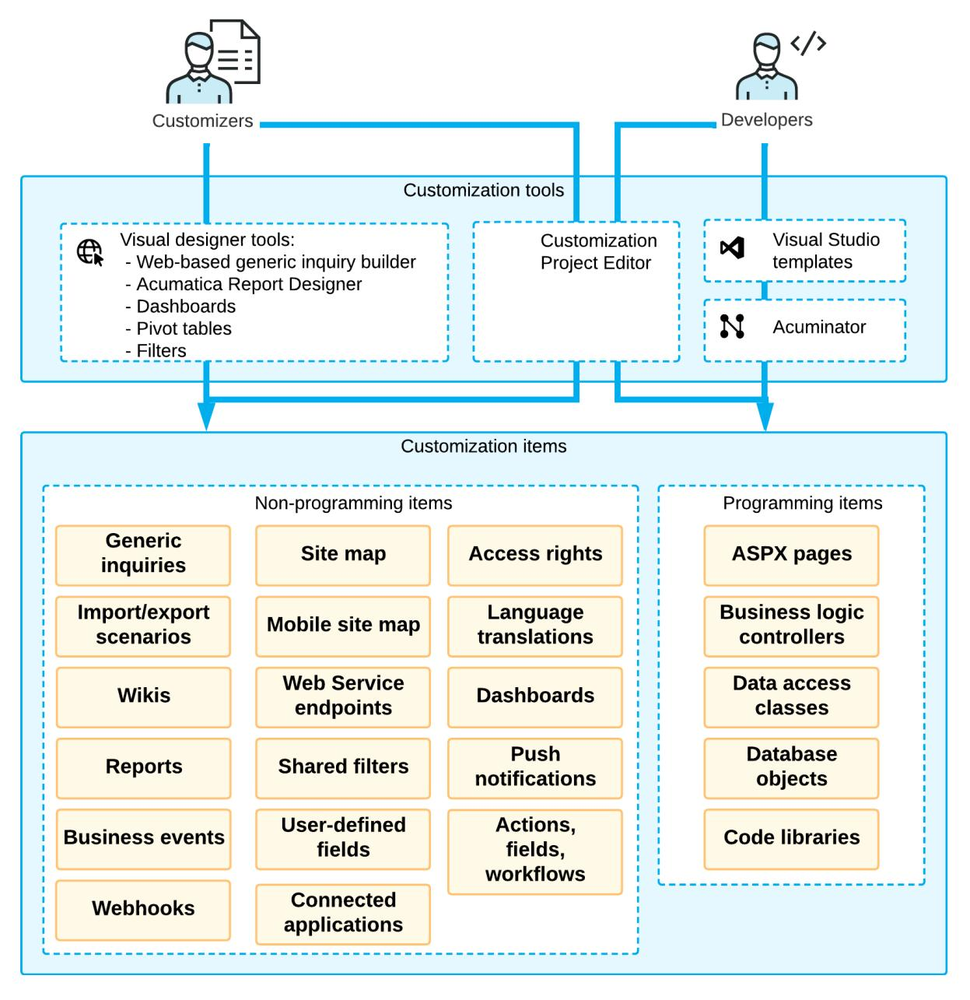

#### *Figure: Customization of Acumatica ERP*

As a value-added reseller (VAR), you can deliver end-user customization that might be very specific to each particular customer. At this level, you might want to add custom reports and data filters, and configure generic inquiries for users. These changes do not involve programming unless you also want to modify the business logic and the user interface of the application. For more information on the web-based Generic Inquiry builder and the Acumatica Report Designer, see *[Managing Generic Inquiries](https://help-2025r1.acumatica.com/Help?ScreenId=ShowWiki&pageid=5737bca9-aebb-446d-9e1a-bc5fcfad6797)* and *[Acumatica Report Designer Guide](https://help-2025r1.acumatica.com/Help?ScreenId=ShowWiki&pageid=24b77bbe-0eb3-4d37-9350-071ae5743571)*.

As an independent soware vendor (ISV), you can develop vertical solutions and add-ons to the core functionality of the system. At this level, you might want to modify the business logic and the UI of the application, which you

can do by using the *[Acumatica Customization Platform](#page-32-2)*. To develop custom application modules, you can use the API that is provided by the Acumatica Framework.

As an original equipment manufacturer (OEM), you can build your own cloud ERP products based on highlevel application objects of Acumatica ERP and the underlying Acumatica Framework technology. This type of customization may involve intensive changes at all levels of the system: modifications of the business logic and UI, development of custom modules, and report building.

# <span id="page-15-1"></span><span id="page-15-0"></span>**Getting Started**

This chapter explains how to start developing a customization project and guides you to various useful chapters about the developing process.

#### **To Start Developing a Customization Project:**

- 1. Make sure you have the prerequired knowledge described in *[Knowledge Prerequisites](#page-16-2)*.
- 2. Review *[Preparation for the Acumatica ERP Installation: General Information](https://help-2025r1.acumatica.com/Help?ScreenId=ShowWiki&pageid=a0ebf94e-830f-4c13-b9f5-6cfc75a5c042)* in the Acumatica ERP Installation Guide.
- 3. Prepare your operating system according to *[System Requirements for the Acumatica ERP Installation](https://help-2025r1.acumatica.com/Help?ScreenId=ShowWiki&pageid=5cf164e5-889f-458b-8757-320c96598ab7)* in the same guide.
- 4. Prepare the environments as described in *[Preparation for the Acumatica ERP Installation: System](https://help-2025r1.acumatica.com/Help?ScreenId=ShowWiki&pageid=4dc90b83-c6fd-4eb0-85ea-c5aa33a71897) [Environment](https://help-2025r1.acumatica.com/Help?ScreenId=ShowWiki&pageid=4dc90b83-c6fd-4eb0-85ea-c5aa33a71897)*.
- 5. In the application instance, assign a *Customizer* role to those who will work on the customization project. See *To Assign the [Customizer](#page-17-1) Role to a User Account* for details.
- 6. If you haven't used version control, set up version control as described in *[Integrating the Project Editor with a](#page-392-2) Version Control [System](#page-392-2)*. If your team already has a customization project and uses version control:
  - a. Create an empty customization project with predefined name.

This step is needed because you can load customization project files from version control only in scope of an existing project.

b. Download the project from version control.

You are ready to develop your customization project.

#### **Implementing Customization**

As a rule, the process of resolving a customization task includes the following steps:

- *Explore the original code* of your Acumatica ERP application instance. This step is executed in the development environment, which must be the same as the production environment. See *[Exploring the](#page-19-1) [Source Code](#page-19-1)* for details.
- *Develop the customization project*. This step is also executed locally in the development environment, which must include all customizations that are included in the production environment. See *To [Develop](#page-29-2) a [Customization Project](#page-29-2)* for details.
- *Perform final testing*. In this step, you test the newly developed customization project in the staging environment, which can be a local copy of the customized production environment. The staging environment must include a copy of the production database. See *To [Perform](#page-30-1) Final Testing of a [Customization](#page-30-1)* for details.
- *Deploy the customization project*. This step must be executed in the production environment. See *To [Deploy](#page-31-2) [a Customization Project](#page-31-2)* for details.

The version number of Acumatica ERP used in the development, staging, and production environments should be the same. If they are not, before deploying and publishing a project on the production instance, you should update the application instances to the same version. If the production application instance has been updated (or will be updated soon) to a particular version, you should update the development and staging instances to the target version and repeat all testing steps. Then, if the tests are successful, you should again create the deployment package to upload it to the production environment.

Also, keep in mind that to carry out the final testing (with the production database) and deployment stages, you must be registered as an internal user with the *Customizer* role assigned.

### <span id="page-16-2"></span><span id="page-16-0"></span>**Knowledge Prerequisites**

To be able to work on a customization of Acumatica ERP, you should have the following knowledge of technology used in Acumatica Customization Platform.

### **Knowledge of the Technology and Programming Language Used in the Acumatica Customization Platform**

You should have the following knowledge of technology and programming language:

- Proficiency with C# language, including but not limited to the following language features: classes, OOP, custom attributes, generics, delegates, anonymous methods and lambda expressions.
- Knowledge of the main concepts of ASP.NET and Web Development: application state, debugging ASP.NET applications using Visual Studio, client and server-side development, Web Forms structure, Web Services.
- Experience with SQL Server: SQL queries (where clause, aggregates, subqueries), database structure (primary keys, data types, denormalization).
- Experience with IIS: configuration and deployment of ASP.NET websites, configuring and securing IIS.

### <span id="page-16-1"></span>**To Prepare an Environment**

As you perform a customization task, you usually need to use three different sites:

- A **development environment**: Your local environment, on which you program and debug the customization code.
- A **production environment**: The target environment of the customer's system that must be customized.
- A **staging (or preproduction) environment**: A copy of the production environment, in which you will test the solution before applying it to the production environment. The staging environment can be created on your local system.

All environments are prepared in the same way as described in the following instruction.

#### **To Prepare an Environment**

- 1. Install Acumatica ERP.
- 2. In the Acumatica ERP Configuration wizard, which opens, select **Deploy a New Acumatica ERP Instance** to create a local instance of Acumatica ERP for the development environment.

- 3. On the *Database Configuration* page (Step 2 of 8 of the process of deploying a new instance), create a new database for the development environment.
- 4. On the *Company Setup* page (Step 3 of 8), specify the desired settings for the company.
- 5. On the *Instance Configuration* page (Step 6 of 8), as the **Local Path to the Instance**, specify a path outside of the C:\Program Files (x86) and C:\Program Files folders to avoid an issue with permission to work in these folders. For example, you could enter C:\AcumaticaSites\MyProject.

The system creates a new Acumatica ERP instance, adds a new company, and loads the selected data. Use the following initial credentials to log in to the new company:

- **Login**: admin
- **Password**: setup

Change the password when the system prompts you to do so.

6. Log in to Acumatica ERP.

### <span id="page-17-1"></span><span id="page-17-0"></span>**To Assign the Customizer Role to a User Account**

Specialists who will work on customization projects should be assigned the *Customizer* role in the application instance that is to be customized and tested, as well as in the production application that should be updated with the customization project. With this role assigned, the specialists can use the customization tools and facilities of the Acumatica Customization Platform, and upload and publish customization projects.

A user with the *Administrator* role has full access rights in the system and can assign the *Customizer* role to the needed users by using the *[Users](https://help-2025r1.acumatica.com/Help?ScreenId=ShowWiki&pageid=834cc181-97fa-4db4-a7e0-3eaba142c166)* (SM201010) form.


The default *admin* user has the *Administrator* role.

If you have the *Administrator* role, do the following to assign the *Customizer* role to a user account:

- 1. Navigate to **Configuration > UserSecurity > Manage > Users**.
- 2. In the **Login** box, select the user account to which the *Customizer* role should be assigned.
- 3. Make sure the user account is not a guest account (in the Summary area) and is not assigned to a guest role (on the **Roles** tab).
- 4. On the **Roles** tab, select the check box for the *Customizer* role, and click**Save** on the form toolbar.

The screenshot below shows the *Johnson* user account assigned to the *Customizer* role. The account is not a guest account and is not assigned to any guest roles.

| <b>Q</b> Acumatica                      | <b>ORGANIZATION</b>                                    | <b>DISTRIBUTION</b><br><b>FINANCE</b>     | $\geq$<br><b>CONFIGURATION</b>                  |  |  |  |  |  |  |  |
|-----------------------------------------|--------------------------------------------------------|-------------------------------------------|-------------------------------------------------|--|--|--|--|--|--|--|
| <b>User Security</b><br>Common Settings |                                                        | Row-Level Security<br>Document Management | Email                                           |  |  |  |  |  |  |  |
| User Security                           |                                                        | <b>C</b> New York - Users $\pm$           |                                                 |  |  |  |  |  |  |  |
| Type your query here Search             | a                                                      | ĸ<br>≺<br>⋋                               | <b>LOG IN AS USER</b><br>Ы<br><b>MEMBERSHIF</b> |  |  |  |  |  |  |  |
| - MANAGF                                | ADD ACTIVE DIRECTORY USER                              |                                           |                                                 |  |  |  |  |  |  |  |
| <b>Users</b>                            |                                                        |                                           |                                                 |  |  |  |  |  |  |  |
| <b>User Roles</b>                       | * Login:                                               | Johnson                                   | ρ<br>Statu:                                     |  |  |  |  |  |  |  |
| <b>User Types</b>                       |                                                        | <b>Guest Account</b>                      |                                                 |  |  |  |  |  |  |  |
| Access Rights By Screen                 | <b>Statistics</b><br>Roles                             | IP filter External Identities             |                                                 |  |  |  |  |  |  |  |
| Access Rights By Role                   |                                                        |                                           | <b>Personal Settings</b>                        |  |  |  |  |  |  |  |
| $\overline{ }$ EXPLORE                  | $\left  \boldsymbol{\mathbf{\mathbf{u}}} \right $<br>с | ⊠                                         |                                                 |  |  |  |  |  |  |  |
| <b>Access History</b>                   | Selected<br>髙                                          | <b>Role Name</b>                          | <b>Role Description</b>                         |  |  |  |  |  |  |  |
| $\overline{\phantom{a}}$ PROCESS        |                                                        | Administrator                             | <b>System Administrator</b>                     |  |  |  |  |  |  |  |
| Certificate Replacement                 | □                                                      | Anonymous                                 | Anonymous                                       |  |  |  |  |  |  |  |
| $-$ PRINT                               | П                                                      | Consultant                                | Consultant                                      |  |  |  |  |  |  |  |
| <b>User List</b>                        | ☑<br>>                                                 | Customizer                                | <b>System Customizer</b>                        |  |  |  |  |  |  |  |
| Role List                               | $\blacktriangledown$                                   | Employee                                  | Employee                                        |  |  |  |  |  |  |  |
| Access Rights By Screen                 | П                                                      | Entry                                     | <b>Entry Clerk</b>                              |  |  |  |  |  |  |  |
| Access Rights By Role                   |                                                        | Field-Level Audit                         | Role that can access Field-Level Audit          |  |  |  |  |  |  |  |
| CONFIGURE                               | □                                                      | Financial                                 | <b>Financial Controller</b>                     |  |  |  |  |  |  |  |
| Security Preferences                    | □                                                      | Guest                                     | <b>External Guest Role</b>                      |  |  |  |  |  |  |  |
| <b>Encryption Certificates</b>          | ☑                                                      | <b>Internal User</b>                      | Allows the user to change personal settings, a  |  |  |  |  |  |  |  |
|                                         | ⊽                                                      | <b>MAIN Users</b>                         | <b>MAIN Users</b>                               |  |  |  |  |  |  |  |
|                                         | П                                                      | Management                                | General Management<br>Office Administrator      |  |  |  |  |  |  |  |
|                                         | $\overline{\mathbf{v}}$                                | OfficeAdministrator                       |                                                 |  |  |  |  |  |  |  |
|                                         | п                                                      | Portal Admin                              | Access to portal configuration                  |  |  |  |  |  |  |  |
|                                         |                                                        | Portal User                               | Portal user                                     |  |  |  |  |  |  |  |
|                                         | $\Box$                                                 | ReportDesigner                            | <b>Report Designer</b>                          |  |  |  |  |  |  |  |
|                                         | П                                                      | Sales                                     | Sales Manager                                   |  |  |  |  |  |  |  |
|                                         |                                                        | Wiki Admin                                | Wiki Administrator to set other users access ri |  |  |  |  |  |  |  |
|                                         |                                                        | Wiki Author                               | Role provides access rights for creating Wiki a |  |  |  |  |  |  |  |

#### *Figure: Assigning the Customizer role to a user account*

Aer you save your changes, the user gets full access for customization of the system as soon as the user refreshes a form in the web browser.

### <span id="page-18-0"></span>**User Access Rights for Customization**

A user account must be granted the *Customizer* role to have the appropriate access needed for customization of Acumatica ERP.

The default *admin* user account is granted this role. Therefore, if you are a developer who is going to work with a customization project, you can install an application instance of Acumatica ERP on the local computer and use the *admin* user account to start doing the customization. For testing and deployment of the customization, you should also assign the *Customizer* role to the appropriate user accounts on the test instance of the application and on the production instance. On the production instance, only the users who manage the deployment of customization packages should be granted the *Customizer* role.

The users who will be granted the *Customizer* role must be Acumatica ERP internal users. You cannot assign the *Customizer* role to a user if either of the following conditions is true (or if both are true):

• The user has a guest account—that is, the user account has the **Guest Account** check box selected on the *[Users](https://help-2025r1.acumatica.com/Help?ScreenId=ShowWiki&pageid=834cc181-97fa-4db4-a7e0-3eaba142c166)* (SM201010) form.

• The user is assigned to a guest role. A guest role has the **Guest Role** check box selected on the *[User Roles](https://help-2025r1.acumatica.com/Help?ScreenId=ShowWiki&pageid=c2879f3c-3739-430a-b02b-c225f5480966)* (SM201005) form. The default guest roles are *Anonymous*, *Guest*, and *Portal User*.

A user account that is assigned to the *Customizer* role has access to the following objects of the system:

- The *[Customization Menu](https://help-2025r1.acumatica.com/Help?ScreenId=ShowWiki&pageid=d6c46870-0c44-4f78-ae20-9bb9ef25dccd)* and *[Element Inspector](https://help-2025r1.acumatica.com/Help?ScreenId=ShowWiki&pageid=5f9d2d33-1a33-4edd-8629-3100d2020335)*, which give this user the ability to inspect the element properties on every form of Acumatica ERP and to add items to a customization project.
- The *[Customization Projects](https://help-2025r1.acumatica.com/Help?ScreenId=ShowWiki&pageid=4d3a1166-826c-414b-a207-3d1669fbf9e5)* (SM204505) form, which is used to manage and publish multiple customization projects.
- The *[Customization Project Editor](https://help-2025r1.acumatica.com/Help?ScreenId=ShowWiki&pageid=0bb97781-e987-4039-962d-457720821bff)*, which is used to manage and develop the content of a selected customization project.

### <span id="page-19-1"></span><span id="page-19-0"></span>**Exploring the Source Code**

Before you start to customize an Acumatica ERP application instance, you should analyze your business requirements to identify the changes in business processes that must be made and to identify the application objects for the customization. We recommend that you learn about the structure of the involved webpages by exploring the .aspx pages (if you are using the Classic UI) or the HTML and TypeScript files (if you are using the Modern UI). Further, we recommend that you explore the code of the business logic controllers (BLCs) and the data access classes (DACs) that are used within the BLCs.

You can use the *[Source Code](https://help-2025r1.acumatica.com/Help?ScreenId=ShowWiki&pageid=2e58bb02-40c0-47c6-8cea-78607cccc4e1)* (SM204570) form to explore the original source code of the application for the following purposes:

- To learn about the structure of the webpages involved in the customization
- To understand which data views are bound with the customized form areas
- To analyze the code that provides the business logic for a form to be customized
- To find and analyze the data views used on a customized webpage
- To understand which data access classes the form being customized is based on
- To learn the attributes of the DAC fields and the relations between DACs

You can use the *[DAC Schema Browser](https://help-2025r1.acumatica.com/Help?ScreenId=ShowWiki&pageid=bad16648-2ba8-4bb7-bc24-19239d09cf81)* to explore the original source code of the application for the following purposes:

- To learn the primary keys of the data tables
- To discover a better way to join data tables
- To obtain detailed information about a DAC
- To learn the dependencies between DACs
- To find where the data is used and understand the origin of the field data
- To determine what fields have been added or modified by customization projects, and find out the names of these projects

This section contains instructions on how to do the following:

- *To [Explore](#page-20-1) the C# Code of a BLC*
- *To [Explore](#page-21-1) the C# Code of a DAC*
- *To Explore the ASPX Code of a Form [\(Classic](#page-23-1) UI)*
- *To Find a [Customization](#page-28-1) of the ASPX Code*
- *To Find Source Code by a [Fragment](#page-29-3)*

### <span id="page-20-1"></span><span id="page-20-0"></span>**To Explore the C# Code of a BLC**

If you need to customize the business logic for a form of Acumatica ERP, you have to explore the original source code of the business logic controller (BLC) that provides the business logic for the form. The goal of exploring the code is to discover the data views, methods, and event handlers of the BLC.

To do this, perform the following actions:

1. On the selected form, click **Customization > Inspect Element** on the form title bar, as shown in the following screenshot, to activate the *[Element Inspector](https://help-2025r1.acumatica.com/Help?ScreenId=ShowWiki&pageid=5f9d2d33-1a33-4edd-8629-3100d2020335)*.

|   | <b>Invoices</b>         |                                                                                            |                   | Invoice 000118 - FourStar Coffee & Sweets Shop |                  |                      |           |              |                      |                     |               |                                |                  | <b>TH NOTES</b>                       |                   | <b>ACTIVITIES</b> |                       | <b>FILES</b>         |                | <b>CUSTOMIZATION</b>                    | TOOLS $\star$                       |
|---|-------------------------|--------------------------------------------------------------------------------------------|-------------------|------------------------------------------------|------------------|----------------------|-----------|--------------|----------------------|---------------------|---------------|--------------------------------|------------------|---------------------------------------|-------------------|-------------------|-----------------------|----------------------|----------------|-----------------------------------------|-------------------------------------|
|   |                         |                                                                                            |                   |                                                |                  |                      |           |              |                      |                     |               |                                |                  |                                       |                   |                   |                       |                      | Select Project |                                         |                                     |
|   | $\leftarrow$            | 뭐                                                                                          | 周                 | ↶                                              |                  | ШI                   | n         | $\checkmark$ | K                    | ≺                   | $\rightarrow$ | Ы                              | .                |                                       |                   |                   |                       |                      |                | <b>Inspect Element (Ctrl+Alt+Click)</b> |                                     |
|   | Type:                   |                                                                                            |                   | Invoice                                        | $\checkmark$     |                      | Customer: |              |                      |                     |               |                                |                  | COFFEESHOP - FourStar Coffee & Swee 2 |                   |                   | Detail 1              |                      |                | Manage User-Defined Fields              |                                     |
|   |                         | Reference Nbr.:                                                                            |                   | 000118                                         | Q                |                      | Location: |              |                      |                     |               | <b>MAIN - Primary Location</b> |                  |                                       |                   |                   | Line Di               |                      | Edit Project   |                                         |                                     |
|   | Status:                 |                                                                                            |                   | Open                                           |                  | Terms:               |           |              |                      | 30D - 30 Days       |               |                                |                  |                                       | Docum             |                   | Manage Customizations |                      |                |                                         |                                     |
|   | Date:                   |                                                                                            |                   | 1/16/2025                                      |                  | * Due Date:          |           |              |                      | 2/15/2025<br>Ä      |               |                                |                  |                                       |                   | Freight           |                       | Convert to Modern UI |                |                                         |                                     |
|   | Post Period:<br>01-2025 |                                                                                            |                   |                                                | * Cash Discount  |                      |           | 2/15/2025    |                      | Ħ                   |               |                                |                  |                                       | <b>Tax Total:</b> |                   |                       | 20.41                |                |                                         |                                     |
|   |                         | Customer Ord                                                                               |                   |                                                |                  |                      |           |              |                      |                     |               |                                |                  |                                       |                   |                   | Amount:               |                      |                | 250.41                                  |                                     |
|   |                         | !!!!!!!!!!!!!!!!!!!!!!!!!!!!!!!!!!!!!!!!                                                   |                   |                                                |                  |                      |           |              |                      |                     | $\triangle$   | Balance:                       |                  | 250.41                                |                   |                   |                       |                      |                |                                         |                                     |
|   |                         | Description:                                                                               |                   |                                                |                  |                      |           |              |                      |                     |               |                                |                  |                                       |                   |                   |                       | Cash Discount:       |                | 0.00                                    |                                     |
|   |                         | <b>DETAILS</b><br><b>O</b> FINANCIAL<br><b>TAXES</b><br><b>FREIGHT</b><br><b>ADDRESSES</b> |                   |                                                |                  |                      |           |              |                      | <b>APPLICATIONS</b> |               |                                | <b>APPROVALS</b> |                                       |                   |                   |                       |                      |                |                                         |                                     |
|   | Ò                       |                                                                                            | P                 | $\times$                                       | <b>ADD ITEMS</b> |                      |           |              | ADD ORDER            |                     | ADD SO LINE   |                                |                  | ADD RETURN LINE                       |                   |                   |                       | <b>RESET ORDER</b>   | $\mathbf{H}$   | 図                                       |                                     |
| 耳 |                         | D                                                                                          | *Branch           |                                                |                  | <b>Shipment Nbr.</b> |           |              | Order<br><b>Type</b> |                     | Order Nbr.    |                                |                  | <b>Inventory ID</b>                   |                   |                   | Svc.<br>Doc.<br>Nbr.  | <b>Related</b>       |                | <b>Transaction Descr.</b>               |                                     |
| ≻ | 0                       | $\Box$                                                                                     | <b>SWEETEQUIP</b> |                                                |                  |                      |           |              |                      |                     |               |                                |                  | <b>INSTALL</b>                        |                   |                   |                       |                      |                |                                         | Installation of equipment at the cu |
|   |                         |                                                                                            |                   |                                                |                  |                      |           |              |                      |                     |               |                                |                  |                                       |                   |                   |                       |                      |                |                                         |                                     |

*Figure: Activating the Element Inspector*

2. Click a control or an area of the form to open the **Element Properties** dialog box for the control or area. (For details, see *[Element Properties Dialog Box](https://help-2025r1.acumatica.com/Help?ScreenId=ShowWiki&pageid=5f9d2d33-1a33-4edd-8629-3100d2020335)*). In the dialog box, click **Actions > View Business LogicSource**, as shown in the following screenshot.

| Invoices<br>Invoice 000118 - FourStar Coffee & Sweets Shop |           |                                                                  |                           |                        |                      |                                   |                                |        | $\Gamma$ NOTES |                                       | <b>ACTIVITIES</b> |                 | <b>FILES</b>   |            | <b>CUSTOMIZATION</b>                |                |      |               | TOOLS $\star$            |
|------------------------------------------------------------|-----------|------------------------------------------------------------------|---------------------------|------------------------|----------------------|-----------------------------------|--------------------------------|--------|----------------|---------------------------------------|-------------------|-----------------|----------------|------------|-------------------------------------|----------------|------|---------------|--------------------------|
| 圖<br>$\mathbb{R}$<br>$\leftarrow$                          | $\Omega$  |                                                                  | 而                         | $\checkmark$           | $\mathsf{K}$         | ◟                                 | $\rightarrow$                  | $\geq$ | $\cdots$       |                                       |                   |                 |                |            |                                     |                |      |               |                          |
| Type:                                                      | Invoice   | $\checkmark$                                                     |                           | Customer:              |                      |                                   |                                |        |                | COFFEESHOP - FourStar Coffee & Swee 2 |                   | Detail Total:   |                |            |                                     | 230.00         |      |               | $\overline{\phantom{a}}$ |
| Reference Nbr.:                                            | 000118    | $\mathsf{Q}% _{T}=\mathsf{Q}_{T}\!\left( a,b\right) ,\mathsf{Q}$ |                           | Location:              |                      |                                   | <b>MAIN - Primary Location</b> |        |                |                                       |                   | Line Discounts: |                |            |                                     |                | 0.00 |               |                          |
| Status:                                                    | Open      |                                                                  |                           | Terms:                 |                      | 30D - 30 Days                     |                                |        |                |                                       |                   | Document Dis    |                |            |                                     |                | 0.00 |               |                          |
| Date:                                                      | 1/16/2025 |                                                                  | <b>Element Properties</b> |                        |                      |                                   |                                |        |                |                                       |                   |                 | $\times$       | al:        |                                     |                | 0.00 |               |                          |
| Post Period:                                               | 01-2025   |                                                                  |                           |                        |                      |                                   |                                |        |                |                                       |                   |                 |                |            |                                     | 20.41          |      |               |                          |
| Customer Ord                                               |           |                                                                  |                           | Control Type:          |                      | Grid                              |                                |        |                |                                       |                   |                 |                |            |                                     | 250.41         |      |               |                          |
| Project/Contract: X - Non-Project (                        |           |                                                                  |                           | Data Class:            |                      | <b>ARTran</b>                     |                                |        |                |                                       |                   |                 |                |            |                                     | 250.41         |      |               |                          |
| Description:                                               |           |                                                                  |                           | View Name:             |                      | <b>Transactions</b>               |                                |        |                |                                       |                   |                 |                | bunt:      |                                     |                | 0.00 |               |                          |
| <b>DETAILS</b><br><b>TAXES</b>                             |           | <b>FREIGH</b>                                                    |                           | <b>Business Logic:</b> |                      | SOInvoiceEntry                    |                                |        |                |                                       |                   |                 |                |            |                                     |                |      |               |                          |
| Ò<br>P                                                     | $\times$  | <b>ADD</b>                                                       |                           | <b>CUSTOMIZE</b>       |                      | ACTIONS -                         |                                | CANCEL |                | A                                     |                   |                 |                | <b>JER</b> | $\vdash$                            | $ \mathbf{x} $ |      |               |                          |
| n.<br>*Branch                                              |           |                                                                  | <b>Shipment Nbr.</b>      |                        | O <sub>1</sub><br>Tv | <b>VIEW ASPX SOURCE</b>           |                                |        |                |                                       |                   | Svc.            | <b>Related</b> |            | <b>Transaction Descr.</b>           |                |      |               |                          |
|                                                            |           |                                                                  |                           |                        |                      | <b>VIEW HTML SOURCE</b>           |                                |        |                |                                       |                   | Doc.<br>Nbr.    |                |            |                                     |                |      |               |                          |
| <b>SWEETEQUIP</b><br>0<br>n.                               |           |                                                                  |                           |                        |                      | <b>VIEW TYPESCRIPT SOURCE</b>     |                                |        |                |                                       |                   |                 |                |            | Installation of equipment at the cu |                |      |               |                          |
|                                                            |           |                                                                  |                           |                        |                      | <b>VIEW BUSINESS LOGIC SOURCE</b> |                                |        |                |                                       |                   |                 |                |            |                                     |                |      |               |                          |
|                                                            |           |                                                                  |                           |                        |                      | <b>VIEW DATA CLASS SOURCE</b>     |                                |        |                |                                       |                   |                 |                |            | $\mathbf{K}$                        | $\langle$      |      | $\rightarrow$ | $>$                      |

*Figure: Selecting the View Business Logic Source command*

3. On the **Business Logic** tab of the *[Source Code](https://help-2025r1.acumatica.com/Help?ScreenId=ShowWiki&pageid=2e58bb02-40c0-47c6-8cea-78607cccc4e1)* (SM204570) form, which opens for the BLC, view the source code in the Source Code pane. Use the navigation pane to find a method or event handler by its name and open it.

Also, you can open the original BLC code in the Source Code browser in the following ways:

- From the *[Code Editor](https://help-2025r1.acumatica.com/Help?ScreenId=ShowWiki&pageid=c2678973-d557-47d4-b8ee-9dd69f55b465)*, by clicking**View Source** on the page toolbar
- From the *[Screen Editor](https://help-2025r1.acumatica.com/Help?ScreenId=ShowWiki&pageid=d60a8270-e2ce-4380-b778-af61a0ca56d2)*, by clicking**View Source** on the toolbar of the **Events** tab

### <span id="page-21-1"></span><span id="page-21-0"></span>**To Explore the C# Code of a DAC**

If you need to customize the attributes of a data field for an existing control or create a new field for a custom control on a form, you may need to explore the original source code of the appropriate DAC.

You can view the source code of a DAC in the following ways:

- On the *[Source Code](https://help-2025r1.acumatica.com/Help?ScreenId=ShowWiki&pageid=2e58bb02-40c0-47c6-8cea-78607cccc4e1)* (SM204570) form
- In the *[DAC Schema Browser](https://help-2025r1.acumatica.com/Help?ScreenId=ShowWiki&pageid=bad16648-2ba8-4bb7-bc24-19239d09cf81)*

#### **To Explore the Source Code on the Source Code Form**

To view the source code of a DAC on the *[Source Code](https://help-2025r1.acumatica.com/Help?ScreenId=ShowWiki&pageid=2e58bb02-40c0-47c6-8cea-78607cccc4e1)* (SM204570) form, perform the following actions:

1. Open the form for which you want to view the DAC source code. On the form title bar, click **Customization > Inspect Element**, as shown in the following screenshot, to activate the *[Element Inspector](https://help-2025r1.acumatica.com/Help?ScreenId=ShowWiki&pageid=5f9d2d33-1a33-4edd-8629-3100d2020335)*.

| <b>Invoices</b><br>Invoice 000118 - FourStar Coffee & Sweets Shop |                                              | <b>PHOTES</b>                           | <b>ACTIVITIES</b>                      | <b>CUSTOMIZATION</b><br><b>FILES</b><br>TOOLS $\star$ |
|-------------------------------------------------------------------|----------------------------------------------|-----------------------------------------|----------------------------------------|-------------------------------------------------------|
| 뭐<br>周<br>↶<br>$\leftarrow$                                       | K<br>∩<br>$\checkmark$                       | $\rightarrow$<br>Ы<br>≺<br>.            |                                        | Select Project                                        |
|                                                                   | ┿<br>Ш                                       |                                         |                                        | <b>Inspect Element (Ctrl+Alt+Click)</b>               |
| Invoice<br>Type:                                                  | Customer:<br>$\checkmark$                    | COFFEESHOP - FourStar Coffee & Swee 2   | Detail T                               | Manage User-Defined Fields                            |
| Reference Nbr.:<br>000118                                         | α<br>Location:                               | <b>MAIN - Primary Location</b>          | <b>Line Dis</b>                        | Edit Project                                          |
| Status:<br>Open                                                   | Terms:                                       | 30D - 30 Days                           | <b>Docume</b>                          | Manage Customizations                                 |
| 1/16/2025<br>Date:                                                | * Due Date:                                  | 2/15/2025                               | Freight                                | Convert to Modern UI                                  |
| Post Period:<br>01-2025                                           | * Cash Discount                              | 2/15/2025                               | <b>Tax Total:</b>                      | 20.41                                                 |
| Customer Ord                                                      |                                              |                                         | Amount:                                | 250.41                                                |
| Project/Contract: X - Non-Project Code.                           |                                              |                                         | Balance:<br>$\hat{\mathscr{D}}$        | 250.41                                                |
| Description:                                                      |                                              |                                         | Cash Discount:                         | 0.00                                                  |
| <b>DETAILS</b><br><b>TAXES</b>                                    | <b>OFINANCIAL</b><br><b>FREIGHT</b>          | <b>ADDRESSES</b><br><b>APPLICATIONS</b> | <b>APPROVALS</b>                       |                                                       |
| رم<br>P<br>$\times$                                               | <b>ADD ITEMS</b><br>ADD ORDER                | ADD SO LINE<br>ADD RETURN LINE          | <b>RESET ORDER</b>                     | $\boxtimes$<br>$\overline{\phantom{a}}$               |
|                                                                   |                                              |                                         |                                        |                                                       |
| $\Box$ * Branch<br>R                                              | <b>Shipment Nbr.</b><br>Order<br><b>Type</b> | Order Nbr.<br><b>Inventory ID</b>       | <b>Related</b><br>Svc.<br>Doc.<br>Nbr. | <b>Transaction Descr.</b>                             |
| <b>SWEETEQUIP</b><br>0<br>n.<br>≻                                 |                                              | <b>INSTALL</b>                          |                                        | Installation of equipment at the cu                   |
|                                                                   |                                              |                                         |                                        |                                                       |
| $\left\langle \cdot \right\rangle$                                |                                              |                                         |                                        | $\mathbf{r}$                                          |

*Figure: Activating the Element Inspector*

- 2. Click a control or an area of the form to open the **Element Properties** dialog box for the control or area. (For details, see *[Element Properties Dialog Box](https://help-2025r1.acumatica.com/Help?ScreenId=ShowWiki&pageid=5f9d2d33-1a33-4edd-8629-3100d2020335)*.)
- 3. In the dialog box, click **Actions > View Data ClassSource**, as shown in the following screenshot.

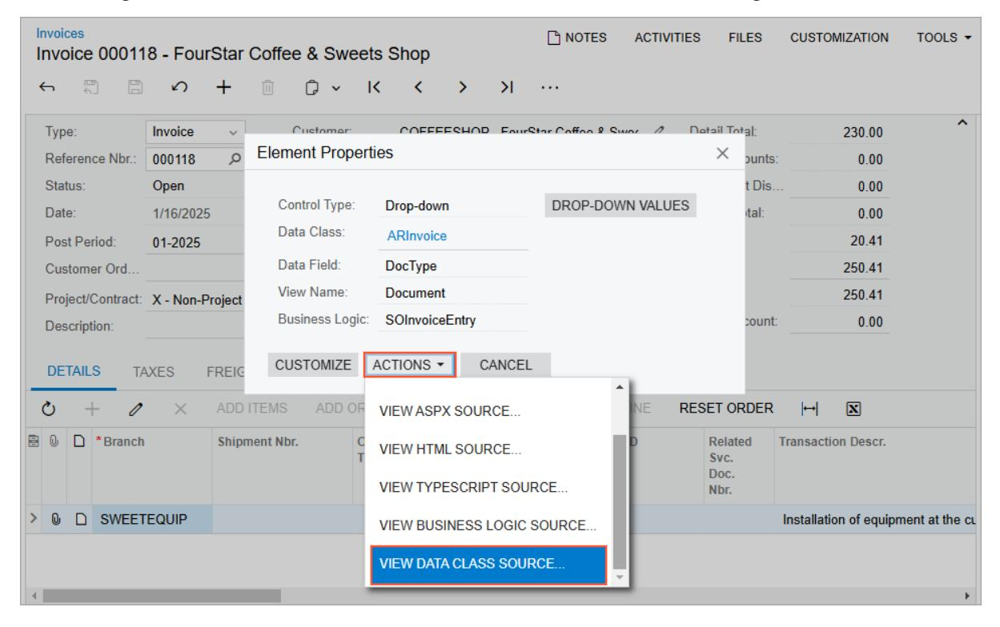

*Figure: Selecting the View Data Class Source command*

4. On the **Data Access** tab of the *[Source Code](https://help-2025r1.acumatica.com/Help?ScreenId=ShowWiki&pageid=2e58bb02-40c0-47c6-8cea-78607cccc4e1)* form, which opens for the DAC, view the data field declarations in the Source Code pane.

Also, you can open the original DAC code in the Source Code browser in the following ways:

- From the *[Data Class](https://help-2025r1.acumatica.com/Help?ScreenId=ShowWiki&pageid=06c038a5-1d75-482b-9b17-f2483ada0154)*, by clicking**View Source** on the page toolbar
- From the *[Screen Editor](https://help-2025r1.acumatica.com/Help?ScreenId=ShowWiki&pageid=d60a8270-e2ce-4380-b778-af61a0ca56d2)*, by clicking**View Source** on the toolbar of the **Attributes** tab

#### **To Explore the Source Code in the DAC Schema Browser**

To view the source code of a DAC in the DAC Schema Browser, perform the following actions:

- 1. Open the **Element Properties** dialog box for the required DAC, as described above.
- 2. Click the link in the **Data Class** box (see the following screenshot).

| <b>Element Properties</b> |                  |        |                  |  |
|---------------------------|------------------|--------|------------------|--|
|                           |                  |        |                  |  |
| Control Type:             | Drop-down        |        | DROP-DOWN VALUES |  |
| Data Class:               | <b>ARInvoice</b> |        |                  |  |
| Data Field:               | DocType          |        |                  |  |
| View Name:                | Document         |        |                  |  |
| Business Logic:           | SOInvoiceEntry   |        |                  |  |
|                           |                  |        |                  |  |
| <b>CUSTOMIZE</b>          | ACTIONS -        | CANCEL |                  |  |
|                           |                  |        |                  |  |

#### *Figure: Opening the DAC Schema Browser from the Element Properties dialog box*

The DAC Schema Browser page opens.

3. In the main information area of the page, click *Source Code*. The source code browser for the selected DAC opens.

<span id="page-23-1"></span>For details, see *[DAC Schema Browser](https://help-2025r1.acumatica.com/Help?ScreenId=ShowWiki&pageid=bad16648-2ba8-4bb7-bc24-19239d09cf81)*.

### <span id="page-23-0"></span>**To Explore the ASPX Code of a Form (Classic UI)**

If you need to look closely at the data views that provide data for control containers on a form or to see the corresponding webpage structure—that is, the layout of the containers and the types and properties of the controls —you may need to explore the original ASPX code of the form.

To explore this code, perform the following actions:

1. On the selected form, click **Customization > Inspect Element** on the form title bar, as shown in the following screenshot, to activate the *[Element Inspector](https://help-2025r1.acumatica.com/Help?ScreenId=ShowWiki&pageid=5f9d2d33-1a33-4edd-8629-3100d2020335)*.

| <b>Invoices</b><br>Invoice 000118 - FourStar Coffee & Sweets Shop |                            |                  |                        |                      |                                                 |                    |                                       | <b>P NOTES</b> | <b>ACTIVITIES</b>                      | <b>FILES</b>              | <b>CUSTOMIZATION</b><br>Select Project      | TOOLS $\sim$ |  |
|-------------------------------------------------------------------|----------------------------|------------------|------------------------|----------------------|-------------------------------------------------|--------------------|---------------------------------------|----------------|----------------------------------------|---------------------------|---------------------------------------------|--------------|--|
| 목<br>阊<br>$\leftarrow$                                            | ↶                          | $\div$           | n<br>πī<br>$\check{ }$ | ĸ                    | ≺<br>⋗                                          | $\geq$<br>$\cdots$ |                                       |                |                                        |                           | <b>Inspect Element (Ctrl+Alt+Click)</b>     |              |  |
| Type:                                                             | Invoice                    | $\checkmark$     | Customer:              |                      |                                                 |                    | COFFEESHOP - FourStar Coffee & Swee 2 |                | <b>Detail Total:</b>                   |                           | Manage User-Defined Fields                  |              |  |
| Reference Nbr.:<br>Status:                                        | 000118<br>Open             | Q                | Location:<br>Terms:    |                      | <b>MAIN - Primary Location</b><br>30D - 30 Days |                    |                                       |                | Line Discounts:<br>Document Dis        |                           | Edit Project<br>Manage Customizations       |              |  |
| Date:                                                             | * Due Date:<br>1/16/2025   |                  |                        |                      | 2/15/2025                                       |                    |                                       |                | <b>Freight Total:</b>                  | Convert to Modern UI      |                                             |              |  |
| Post Period:<br>Customer Ord                                      | * Cash Discount<br>01-2025 |                  |                        |                      | 2/15/2025                                       |                    |                                       |                | <b>Tax Total:</b><br>Amount:           |                           | 2041<br>250.41                              |              |  |
| Project/Contract: X - Non-Project Code.                           |                            |                  |                        |                      |                                                 |                    |                                       |                | Balance:                               | 250.41                    |                                             |              |  |
| Description:                                                      |                            |                  |                        |                      |                                                 |                    |                                       |                | <b>Cash Discount:</b>                  |                           | 0.00                                        |              |  |
| <b>DETAILS</b>                                                    | <b>TAXES</b>               | <b>FREIGHT</b>   | <b>O</b> FINANCIAL     |                      | <b>ADDRESSES</b>                                |                    | <b>APPLICATIONS</b>                   |                | <b>APPROVALS</b>                       |                           |                                             |              |  |
| Õ<br>∥                                                            | $\times$                   | <b>ADD ITEMS</b> | ADD ORDER              |                      | ADD SO LINE                                     |                    | ADD RETURN LINE                       |                | <b>RESET ORDER</b>                     | ы                         | 図                                           |              |  |
| $\Box$ * Branch<br>R.                                             |                            |                  | <b>Shipment Nbr.</b>   | Order<br><b>Type</b> | Order Nbr.                                      |                    | <b>Inventory ID</b>                   |                | <b>Related</b><br>Svc.<br>Doc.<br>Nbr. | <b>Transaction Descr.</b> |                                             |              |  |
| 0<br><b>SWEETEQUIP</b><br>≻<br>n                                  |                            |                  |                        |                      |                                                 |                    | <b>INSTALL</b>                        |                |                                        |                           | Installation of equipment at the customers' |              |  |

*Figure: Activating the Element Inspector*

- 2. Click a control or an area of the form to open the **Element Properties** dialog box for the control or area. (For details, see *[Element Properties Dialog Box](https://help-2025r1.acumatica.com/Help?ScreenId=ShowWiki&pageid=5f9d2d33-1a33-4edd-8629-3100d2020335)*.)
- 3. In the dialog box, click **Actions > View ASPX Source**, as shown in the following screenshot.

| <b>Invoices</b><br>Invoice 000118 - FourStar Coffee & Sweets Shop |                                                                   | <b>TH NOTES</b><br><b>ACTIVITIES</b> | <b>FILES</b><br><b>CUSTOMIZATION</b><br>TOOLS $\sim$ |
|-------------------------------------------------------------------|-------------------------------------------------------------------|--------------------------------------|------------------------------------------------------|
| 周<br>$\Box$<br>$\Omega$<br>而<br>$^+$<br>$\leftarrow$              | Ĥ<br>K<br>$\geq$<br>$\rightarrow$<br>◟<br>$\check{ }$<br>$\cdots$ |                                      |                                                      |
| Invoice<br>Type:<br>$\checkmark$                                  | Customer:<br>COFFEESHOP - FourStar Coffee & Swee /                | <b>Detail Total:</b>                 | $\lambda$<br>230.00                                  |
| Reference Nbr.:<br>$\mathcal{Q}% _{0}$<br>000118                  | Location:<br><b>MAIN - Primary Location</b>                       | Line Discounts:                      | 0.00                                                 |
| Status:<br>Open                                                   | <b>Element Properties</b>                                         | $\times$                             | 0.00                                                 |
| Date:<br>1/16/2025                                                |                                                                   |                                      | 0.00                                                 |
| Post Period:<br>01-2025                                           | Control Type:<br><b>Form View</b>                                 |                                      | 20.41                                                |
| Customer Ord                                                      | Data Class:<br>ARInvoice                                          |                                      | 250.41                                               |
| Project/Contract: X - Non-Project Code                            | View Name:<br><b>Document</b>                                     |                                      | 250.41                                               |
| Description:                                                      | <b>Business Logic:</b><br>SOInvoiceEntry                          |                                      | 0.00                                                 |
|                                                                   |                                                                   |                                      |                                                      |
| <b>DETAILS</b><br><b>FREIGHT</b><br><b>TAXES</b>                  | <b>CUSTOMIZE</b><br>ACTIONS -<br>CANCEL                           |                                      |                                                      |
| <b>ADD ITEMS</b><br>P<br>$\times$                                 | <b>CUSTOMIZE BUSINESS LOGIC</b><br><b>ADD ORDER</b>               | $\Delta$<br><b>RESET ORDER</b>       | $\vdash$<br>図                                        |
| !!!!!!!!!!!!!!!!!!!!!!!!!!!!!!!!!!!!!!!!<br><b>Shipment Nbr.</b>  | Order<br><b>CUSTOMIZE DATA FIELDS</b><br><b>Type</b>              | Related<br>Svc.                      | <b>Transaction Descr.</b>                            |
|                                                                   | <b>VIEW ASPX SOURCE</b>                                           | Doc.<br>Nbr.                         |                                                      |
| <b>SWEETEQUIP</b><br>n                                            | <b>VIEW HTML SOURCE</b>                                           |                                      | Installation of equipment at the customers'          |
|                                                                   | <b>VIEW TYPESCRIPT SOURCE</b>                                     |                                      |                                                      |
|                                                                   | <b>UPULDUAREAA LAAIA AAUBAE</b>                                   |                                      |                                                      |

*Figure: Selecting the View ASPX Source command*

- 4. On the **Screen ASPX** of the *[Source Code](https://help-2025r1.acumatica.com/Help?ScreenId=ShowWiki&pageid=2e58bb02-40c0-47c6-8cea-78607cccc4e1)* (SM204570) form, which opens, view the original ASPX code of the form in the Source Code pane.
- 5. If you need to look closely at the data views that provide data for control containers on the current form, search on the page for the DataMember string. The DataMember property is used to bind a control container of a form to a data view defined in the business logic controller (BLC) of the form. The property value is the name of the data view.

Each DataMember property value can correspond to any data view name of the BLC. Any container (for example, PXTab, PXGridLevel, or PXFormView) must be bound to a data view declared within a BLC. Any data view except for the main data view can be used by an unlimited number of containers. The main data view must be bound to a single container.

### <span id="page-25-0"></span>**To Explore the HTML Code of a Form (Modern UI)**

If you need to look closely at the webpage structure of a form—that is, the layout of the UI elements and the types and properties of the UI controls—you may need to explore the HTML code of the form. For details about the definition of a form's layout in HTML, see *UI Definition in HTML and [TypeScript:](https://help-2025r1.acumatica.com/Help?ScreenId=ShowWiki&pageid=910adc1e-ae5c-42b2-8310-d3bdd35a1e74) General Information*.

To explore this code, perform the following actions:

1. On the selected form, click **Customization > Inspect Element** on the form title bar, as shown in the following screenshot, to activate the *[Element Inspector](https://help-2025r1.acumatica.com/Help?ScreenId=ShowWiki&pageid=5f9d2d33-1a33-4edd-8629-3100d2020335)*.

| <b>Invoices</b>                                     |                            |                  |                      |                    |                      |                                |                  |        |          |                                       | <b>P NOTES</b>          |  | <b>ACTIVITIES</b>                      | <b>FILES</b>              |                         |              | <b>CUSTOMIZATION</b>                    | TOOLS $\sim$                                |
|-----------------------------------------------------|----------------------------|------------------|----------------------|--------------------|----------------------|--------------------------------|------------------|--------|----------|---------------------------------------|-------------------------|--|----------------------------------------|---------------------------|-------------------------|--------------|-----------------------------------------|---------------------------------------------|
| Invoice 000118 - FourStar Coffee & Sweets Shop<br>n |                            |                  |                      |                    |                      |                                |                  |        |          |                                       |                         |  | Select Project                         |                           |                         |              |                                         |                                             |
| 뭐<br>日<br>$\leftarrow$                              | ↶                          | $\div$           | 间                    | $\checkmark$       | K                    | ≺                              | ⋗                | $\geq$ | $\cdots$ |                                       |                         |  |                                        |                           |                         |              | <b>Inspect Element (Ctrl+Alt+Click)</b> |                                             |
| Type:                                               | Invoice                    | $\checkmark$     |                      | Customer:          |                      |                                |                  |        |          | COFFEESHOP - FourStar Coffee & Swee / |                         |  | <b>Detail Total:</b>                   |                           |                         |              | Manage User-Defined Fields              |                                             |
| Reference Nbr.:                                     | 000118                     | Q                |                      | Location:          |                      | <b>MAIN - Primary Location</b> |                  |        |          |                                       |                         |  | Line Discounts:                        |                           |                         | Edit Project |                                         |                                             |
| Status:                                             | Open                       |                  |                      | Terms:             |                      | 30D - 30 Days                  |                  |        |          |                                       |                         |  | Document Dis                           |                           |                         |              | Manage Customizations                   |                                             |
| Date:                                               | 1/16/2025                  |                  | * Due Date:          |                    |                      | 2/15/2025                      | Ä                |        |          |                                       | <b>Freight Total:</b>   |  |                                        |                           | Convert to Modern UI    |              |                                         |                                             |
| Post Period:                                        | * Cash Discount<br>01-2025 |                  |                      |                    |                      | 2/15/2025                      | Ä                |        |          |                                       |                         |  | <b>Tax Total:</b>                      |                           | 20.41                   |              |                                         |                                             |
| Customer Ord                                        |                            |                  |                      |                    |                      |                                |                  |        |          |                                       |                         |  | Amount:                                |                           | 250.41                  |              |                                         |                                             |
| Project/Contract: X - Non-Project Code.             |                            |                  |                      |                    |                      |                                |                  |        |          |                                       | Balance:<br>250.41<br>1 |  |                                        |                           |                         |              |                                         |                                             |
| Description:                                        |                            |                  |                      |                    |                      |                                |                  |        |          |                                       |                         |  | <b>Cash Discount:</b>                  |                           | 0.00                    |              |                                         |                                             |
| <b>DETAILS</b>                                      | <b>TAXES</b>               | <b>FREIGHT</b>   |                      | <b>O</b> FINANCIAL |                      |                                | <b>ADDRESSES</b> |        |          | <b>APPLICATIONS</b>                   |                         |  | <b>APPROVALS</b>                       |                           |                         |              |                                         |                                             |
| Ò<br>0                                              | $\times$                   | <b>ADD ITEMS</b> |                      | ADD ORDER          |                      |                                | ADD SO LINE      |        |          | ADD RETURN LINE                       |                         |  | <b>RESET ORDER</b>                     | $\vdash$                  | $\mathbf{\overline{N}}$ |              |                                         |                                             |
| D<br>圓<br>*Branch                                   |                            |                  | <b>Shipment Nbr.</b> |                    | Order<br><b>Type</b> |                                | Order Nbr.       |        |          | <b>Inventory ID</b>                   |                         |  | <b>Related</b><br>Svc.<br>Doc.<br>Nbr. | <b>Transaction Descr.</b> |                         |              |                                         |                                             |
| 0<br>n<br><b>SWEETEQUIP</b><br>≻                    |                            |                  |                      |                    |                      |                                |                  |        |          | <b>INSTALL</b>                        |                         |  |                                        |                           |                         |              |                                         | Installation of equipment at the customers' |

*Figure: Activating the Element Inspector*

- 2. Click a control or an area of the form to open the **Element Properties** dialog box for the control or area. (For details, see *[Element Properties Dialog Box](https://help-2025r1.acumatica.com/Help?ScreenId=ShowWiki&pageid=5f9d2d33-1a33-4edd-8629-3100d2020335)*.)
- 3. In the dialog box, click **Actions > View HTMLSource**, as shown in the following screenshot.

| <b>Invoices</b><br>Invoice 000118 - FourStar Coffee & Sweets Shop |              |                      |   |           |                           |   |                                |        |                                       | <b>TH NOTES</b> | <b>ACTIVITIES</b>      | <b>FILES</b>              | <b>CUSTOMIZATION</b>                        | TOOLS $\sim$ |
|-------------------------------------------------------------------|--------------|----------------------|---|-----------|---------------------------|---|--------------------------------|--------|---------------------------------------|-----------------|------------------------|---------------------------|---------------------------------------------|--------------|
| 목<br>$\Box$<br>$\leftarrow$                                       | $\Omega$     | $\pm$                | 而 | ∩ิิ ิ     | $\overline{\mathsf{K}}$   | ≺ | $\rightarrow$                  | $\geq$ | $\cdots$                              |                 |                        |                           |                                             |              |
| Type:                                                             | Invoice      | $\checkmark$         |   | Customer: |                           |   |                                |        | COFFEESHOP - FourStar Coffee & Swee 2 |                 | Detail Total:          |                           | 230.00                                      | $\sim$       |
| Reference Nbr.:                                                   | 000118       | Q                    |   | Location: |                           |   | <b>MAIN - Primary Location</b> |        |                                       |                 | Line Discounts:        |                           | 0.00                                        |              |
| Status:                                                           | Open         |                      |   |           | <b>Element Properties</b> |   |                                |        |                                       |                 | $\times$               |                           | 0.00                                        |              |
| Date:                                                             | 1/16/2025    |                      |   |           |                           |   |                                |        |                                       |                 |                        |                           | 0.00                                        |              |
| Post Period:                                                      | 01-2025      |                      |   |           | <b>Control Type:</b>      |   | <b>Form View</b>               |        |                                       |                 |                        |                           | 20.41                                       |              |
| Customer Ord                                                      |              |                      |   |           | Data Class:               |   | ARInvoice                      |        |                                       |                 |                        |                           | 250.41                                      |              |
| Project/Contract: X - Non-Project Code.                           |              |                      |   |           | View Name:                |   | <b>Document</b>                |        |                                       |                 |                        |                           | 250.41                                      |              |
| Description:                                                      |              |                      |   |           | <b>Business Logic:</b>    |   | SOInvoiceEntry                 |        |                                       |                 |                        |                           | 0.00                                        |              |
| <b>DETAILS</b>                                                    | <b>TAXES</b> | <b>FREIGHT</b>       |   |           | <b>CUSTOMIZE</b>          |   | ACTIONS -                      |        | CANCEL                                |                 |                        |                           |                                             |              |
| O<br>$\mathscr{D}$                                                | $\times$     | <b>ADD ITEMS</b>     |   |           | <b>AUD URDER</b>          |   |                                |        | <b>CUSTOMIZE BUSINESS LOGIC</b>       |                 | <b>RESET URDER</b>     | $\mathbf{H}$              | $\sqrt{N}$                                  |              |
| !!!!!!!!!!!!!!!!!!!!!!!!!!!!!!!!!!!!!!!!<br>圓<br>0                |              | <b>Shipment Nbr.</b> |   |           | Order<br><b>Type</b>      |   |                                |        | <b>CUSTOMIZE DATA FIELDS</b>          |                 | <b>Related</b><br>Svc. | <b>Transaction Descr.</b> |                                             |              |
|                                                                   |              |                      |   |           |                           |   | <b>VIEW ASPX SOURCE</b>        |        |                                       |                 | Doc.<br>Nbr.           |                           |                                             |              |
| <b>SWEETEQUIP</b><br>O,<br>n                                      |              |                      |   |           |                           |   | <b>VIEW HTML SOURCE</b>        |        |                                       |                 |                        |                           | Installation of equipment at the customers' |              |
|                                                                   |              |                      |   |           |                           |   |                                |        | <b>VIEW TYPESCRIPT SOURCE</b>         |                 |                        |                           |                                             |              |
|                                                                   |              |                      |   |           |                           |   |                                |        | <b>UPULDUAREAA LAAIA AAUBAF</b>       |                 |                        |                           |                                             |              |

*Figure: Selecting the View HTML Source command*

4. On the **Screen HTML** tab of the *[Source Code](https://help-2025r1.acumatica.com/Help?ScreenId=ShowWiki&pageid=2e58bb02-40c0-47c6-8cea-78607cccc4e1)* (SM204570) form, which opens, view the HTML code of the form in the Source Code pane.

The **Screen HTML** tab of the *[Source Code](https://help-2025r1.acumatica.com/Help?ScreenId=ShowWiki&pageid=2e58bb02-40c0-47c6-8cea-78607cccc4e1)* form shows the combined HTML code for a form that includes the code from all published customizations (if any) for the current tenant.

### <span id="page-26-0"></span>**To Explore the TypeScript Code of a Form (Modern UI)**

If you need to look closely at the presentation logic of a form—that is, the definition of the screen and view classes —you may need to explore the TypeScript code of the form. For details about the definition of the presentation logic in TypeScript, see *UI Definition in HTML and TypeScript: General [Information](https://help-2025r1.acumatica.com/Help?ScreenId=ShowWiki&pageid=910adc1e-ae5c-42b2-8310-d3bdd35a1e74)*.

To explore this code, perform the following actions:

1. On the selected form, click **Customization > Inspect Element** on the form title bar, as shown in the following screenshot, to activate the *[Element Inspector](https://help-2025r1.acumatica.com/Help?ScreenId=ShowWiki&pageid=5f9d2d33-1a33-4edd-8629-3100d2020335)*.

| <b>Invoices</b><br>Invoice 000118 - FourStar Coffee & Sweets Shop                                                                     |                                              |                                          |                     | <b>PINOTES</b> | <b>ACTIVITIES</b>                      | <b>FILES</b>              | <b>CUSTOMIZATION</b><br>Select Project        | TOOLS $\sim$ |  |
|---------------------------------------------------------------------------------------------------------------------------------------|----------------------------------------------|------------------------------------------|---------------------|----------------|----------------------------------------|---------------------------|-----------------------------------------------|--------------|--|
| 冒<br>圕<br>┿<br>↶<br>$\leftarrow$                                                                                                      | 间<br>Ĥ<br>K<br>$\check{ }$                   | ≺<br>$\geq$<br>$\rightarrow$<br>$\cdots$ |                     |                |                                        |                           | <b>Inspect Element (Ctrl+Alt+Click)</b>       |              |  |
| Invoice<br>Type:                                                                                                                      | Customer:<br>$\checkmark$                    | COFFEESHOP - FourStar Coffee & Swee 2    |                     |                | <b>Detail Total:</b>                   |                           | Manage User-Defined Fields                    |              |  |
| Reference Nbr.:<br>000118                                                                                                             | Q<br>Location:                               | <b>MAIN - Primary Location</b>           |                     |                | Line Discounts:                        |                           | Edit Project                                  |              |  |
| Status:<br>Open                                                                                                                       | Terms:                                       | 30D - 30 Days                            |                     |                | Document Dis                           |                           | Manage Customizations<br>Convert to Modern UI |              |  |
| 1/16/2025<br>Date:                                                                                                                    | * Due Date:                                  | 2/15/2025                                |                     |                | <b>Freight Total:</b>                  |                           |                                               |              |  |
| Post Period:<br>01-2025                                                                                                               | * Cash Discount                              | 2/15/2025                                |                     |                | <b>Tax Total:</b>                      |                           | 2041                                          |              |  |
| Customer Ord                                                                                                                          |                                              |                                          |                     |                | Amount:                                |                           | 250.41                                        |              |  |
| Project/Contract: X - Non-Project Code.                                                                                               |                                              |                                          |                     |                | Balance:                               |                           | 250.41                                        |              |  |
| Description:                                                                                                                          |                                              |                                          |                     |                |                                        |                           | 0.00                                          |              |  |
| <b>O</b> FINANCIAL<br><b>DETAILS</b><br><b>TAXES</b><br><b>FREIGHT</b><br><b>ADDRESSES</b><br><b>APPLICATIONS</b><br><b>APPROVALS</b> |                                              |                                          |                     |                |                                        |                           |                                               |              |  |
| Ò<br>$\mathscr{Q}$<br>$\times$                                                                                                        | <b>ADD ITEMS</b><br>ADD ORDER                | ADD SO LINE                              | ADD RETURN LINE     |                | <b>RESET ORDER</b>                     | $\mathbb H$               | $\mathbf{N}$                                  |              |  |
| $\Box$ * Branch<br>0<br>冐                                                                                                             | <b>Shipment Nbr.</b><br>Order<br><b>Type</b> | Order Nbr.                               | <b>Inventory ID</b> |                | <b>Related</b><br>Svc.<br>Doc.<br>Nbr. | <b>Transaction Descr.</b> |                                               |              |  |
| <b>SWEETEQUIP</b><br>O<br>n                                                                                                           |                                              |                                          | <b>INSTALL</b>      |                |                                        |                           | Installation of equipment at the customers'   |              |  |

*Figure: Activating the Element Inspector*

- 2. Click a control or an area of the form to open the **Element Properties** dialog box for the control or area. (For details, see *[Element Properties Dialog Box](https://help-2025r1.acumatica.com/Help?ScreenId=ShowWiki&pageid=5f9d2d33-1a33-4edd-8629-3100d2020335)*.)
- 3. In the dialog box, click **Actions > View TypeScriptSource**, as shown in the following screenshot.

| <b>Invoices</b><br>Invoice 000118 - FourStar Coffee & Sweets Shop |              |                      |                           |                         |             |                                |               |                                       |                  | <b>P</b> NOTES | <b>ACTIVITIES</b>    | <b>FILES</b>              | <b>CUSTOMIZATION</b>                        | TOOLS $\sim$ |
|-------------------------------------------------------------------|--------------|----------------------|---------------------------|-------------------------|-------------|--------------------------------|---------------|---------------------------------------|------------------|----------------|----------------------|---------------------------|---------------------------------------------|--------------|
| 周<br>$\Box$<br>$\leftarrow$                                       | ↶            | 间<br>+               | n<br>$\checkmark$         | $\overline{\mathsf{K}}$ | ∢           | $\mathcal{P}$                  | $\mathcal{H}$ | $\cdots$                              |                  |                |                      |                           |                                             |              |
| Type:                                                             | Invoice      | $\checkmark$         | Customer:                 |                         |             |                                |               | COFFEESHOP - FourStar Coffee & Swee 2 |                  |                | <b>Detail Total:</b> |                           | 230.00                                      | $\lambda$    |
| Reference Nbr.:                                                   | 000118       | $\mathcal{L}$        | Location:                 |                         |             | <b>MAIN - Primary Location</b> |               |                                       |                  |                | Line Discounts:      |                           | 0.00                                        |              |
| Status:                                                           | Open         |                      | <b>Element Properties</b> |                         |             |                                |               |                                       |                  |                | $\times$             |                           | 0.00                                        |              |
| Date:                                                             | 1/16/2025    |                      |                           |                         |             |                                |               |                                       |                  |                |                      |                           | 0.00                                        |              |
| Post Period:                                                      | 01-2025      |                      | Control Type:             |                         |             | <b>Form View</b>               |               |                                       |                  |                |                      |                           | 20.41                                       |              |
| Customer Ord                                                      |              |                      | Data Class:               |                         |             | <b>ARInvoice</b>               |               |                                       |                  |                |                      |                           | 250.41                                      |              |
| Project/Contract: X - Non-Project Code                            |              |                      | View Name:                |                         |             | <b>Document</b>                |               |                                       |                  |                |                      |                           | 250.41                                      |              |
| Description:                                                      |              |                      | <b>Business Logic:</b>    |                         |             | SOInvoiceEntry                 |               |                                       |                  |                |                      |                           | 0.00                                        |              |
| <b>DETAILS</b>                                                    | <b>TAXES</b> | <b>FREIGHT</b>       | <b>CUSTOMIZE</b>          |                         | $ACTIONS -$ |                                |               | CANCEL                                |                  |                |                      |                           |                                             |              |
| $\! +$<br>0<br>O                                                  | $\times$     | <b>ADD ITEMS</b>     |                           | <b>ADD ORDER</b>        |             |                                |               | <b>CUSTOMIZE DATA FIELDS</b>          | $\blacktriangle$ |                | <b>RESET ORDER</b>   | $\mathbf{X}$<br>$\vdash$  |                                             |              |
| !!!!!!!!!!!!!!!!!!!!!!!!!!!!!!!!!!!!!!!!<br>8                     |              | <b>Shipment Nbr.</b> |                           | Order<br><b>Type</b>    |             | <b>VIEW ASPX SOURCE</b>        |               |                                       |                  |                | Related<br>Svc.      | <b>Transaction Descr.</b> |                                             |              |
|                                                                   |              |                      |                           |                         |             | <b>VIEW HTML SOURCE</b>        |               |                                       |                  |                | Doc.<br>Nbr.         |                           |                                             |              |
| <b>SWEETEQUIP</b><br>0<br>ם<br>≻                                  |              |                      |                           |                         |             |                                |               | <b>VIEW TYPESCRIPT SOURCE</b>         |                  |                |                      |                           | Installation of equipment at the customers' |              |
|                                                                   |              |                      |                           |                         |             |                                |               | <b>VIEW BUSINESS LOGIC SOURCE</b>     |                  |                |                      |                           |                                             |              |
|                                                                   |              |                      |                           |                         |             |                                |               | <b>MEMIDATA OLARD POLIDAE</b>         |                  |                |                      |                           |                                             |              |

*Figure: Selecting the View TypeScript Source command*

4. On the **Screen TypeScript** tab of the *[Source Code](https://help-2025r1.acumatica.com/Help?ScreenId=ShowWiki&pageid=2e58bb02-40c0-47c6-8cea-78607cccc4e1)* (SM204570) form, which opens, view the TypeScript code of the form in the Source Code pane.

The **Screen TypeScript** tab of the *[Source Code](https://help-2025r1.acumatica.com/Help?ScreenId=ShowWiki&pageid=2e58bb02-40c0-47c6-8cea-78607cccc4e1)* form shows the combined TypeScript code for a form that includes the code from all published customizations (if any) for the current tenant.

### <span id="page-28-1"></span><span id="page-28-0"></span>**To Find a Customization of the ASPX Code**

If the ASPX code for a form is customized, to explore changes in the code, you use the *[Screen Editor](https://help-2025r1.acumatica.com/Help?ScreenId=ShowWiki&pageid=d60a8270-e2ce-4380-b778-af61a0ca56d2)* of the *[Customization Project Editor](https://help-2025r1.acumatica.com/Help?ScreenId=ShowWiki&pageid=0bb97781-e987-4039-962d-457720821bff)*, which you access by using the *[Customization Projects](https://help-2025r1.acumatica.com/Help?ScreenId=ShowWiki&pageid=4d3a1166-826c-414b-a207-3d1669fbf9e5)* (SM204505) form.

The Source Code browser can display only the original ASPX code of a webpage.

To detect whether a form is currently customized, do the following:

- 1. Open the form in the browser.
- 2. Click **Tools** on the title bar of the form.

If the form has been customized, the screen ID has the *CST.* prefix.

Once you know the form has been customized, to find the customization of the ASPX code of the form, perform the following actions:

- 1. Determine the published customization projects that contain changes for the form as follows:
  - a. Navigate to**System > Customization > Manage > Customization Projects**
  - b. On the form, view the list of the customization projects.
  - c. In the **Screen Names** column, for the published customization projects (those for which the **Published** check box is selected), scan the form IDs to identify the projects that contains changes for this form.
- 2. To explore a published project that contains changes for this form, perform the following actions:
  - a. Click the name of the project to open it in the *[Customization Project Editor](https://help-2025r1.acumatica.com/Help?ScreenId=ShowWiki&pageid=0bb97781-e987-4039-962d-457720821bff)*.
  - b. In the navigation pane of the editor, click**Screens** to open the Customized Screens page.
  - c. On the page (see the screenshot below), click the form ID in the**Screen ID** column to open the *[Screen](https://help-2025r1.acumatica.com/Help?ScreenId=ShowWiki&pageid=d60a8270-e2ce-4380-b778-af61a0ca56d2) [Editor](https://help-2025r1.acumatica.com/Help?ScreenId=ShowWiki&pageid=d60a8270-e2ce-4380-b778-af61a0ca56d2)* for the form.

| <b>Q</b> Acumatica                                     |   |             |                                      |               |                         |                                   |  |  |  |  |
|--------------------------------------------------------|---|-------------|--------------------------------------|---------------|-------------------------|-----------------------------------|--|--|--|--|
| Extension Library<br>Publish<br>Source Control<br>File |   |             |                                      |               |                         |                                   |  |  |  |  |
| <b>Customized Screens</b><br>YogiFon                   |   |             |                                      |               |                         |                                   |  |  |  |  |
| $\overline{\phantom{a}}$ SCREENS                       |   | с<br>a      | $\times$<br>$\blacksquare$<br>÷<br>◢ | ADD SCREEN -  |                         |                                   |  |  |  |  |
| Data Access<br>Code                                    | 圍 | Screen ID   | <b>Title</b>                         | <b>Is New</b> | <b>Last Modified By</b> | <b>Last Modified</b><br><b>On</b> |  |  |  |  |
| Files $(5)$                                            |   | AR.30.30.00 | <b>Customers</b>                     | п             | admin                   | 10/27/2016                        |  |  |  |  |
| Generic Inquiries (1)                                  |   | AR.40.90.01 | <b>Subscription Usage Details</b>    | ✓             | admin                   | 10/27/2016                        |  |  |  |  |
| Reports (1)                                            |   | SO.30.10.00 | Sales Orders                         |               | admin                   | 11/3/2016                         |  |  |  |  |
| Site Map (3)                                           |   | SO.30.30.00 | Invoices                             |               | admin                   | 10/27/2016                        |  |  |  |  |
| <b>DB</b> Scripts                                      |   |             |                                      |               |                         |                                   |  |  |  |  |
| <b>System Locales</b>                                  |   |             |                                      |               |                         |                                   |  |  |  |  |
| Import/Export Scenarios (1)                            |   |             |                                      |               |                         |                                   |  |  |  |  |

*Figure: Viewing the Customized Screens page of the Customization Project Editor*

- d. In the Screen Editor, select the**View ASPX** tab item to view the customized ASPX code of the node that is currently selected in the Control Tree
- e. Explore each node of the tree to find the changes, which are highlighted in yellow, as the following screenshot shows.

| 凰<br>PREVIEW CHANGES<br>⇦                                                                                                                                                                                                                                                                                                                                                                                           | ACTIONS -                                                                                                                                                                                                                                                                                                                                                                                                                                                                                                                                                                                                                                                                                                                                                                                                                                                                                                                                                                                                                                                                                                                                                                                                                                                                                                                                                                                                                                                                                                                                                                                                                                                                                                                                                                                                                                                                                                                                                                                                                                                       |
|---------------------------------------------------------------------------------------------------------------------------------------------------------------------------------------------------------------------------------------------------------------------------------------------------------------------------------------------------------------------------------------------------------------------|-----------------------------------------------------------------------------------------------------------------------------------------------------------------------------------------------------------------------------------------------------------------------------------------------------------------------------------------------------------------------------------------------------------------------------------------------------------------------------------------------------------------------------------------------------------------------------------------------------------------------------------------------------------------------------------------------------------------------------------------------------------------------------------------------------------------------------------------------------------------------------------------------------------------------------------------------------------------------------------------------------------------------------------------------------------------------------------------------------------------------------------------------------------------------------------------------------------------------------------------------------------------------------------------------------------------------------------------------------------------------------------------------------------------------------------------------------------------------------------------------------------------------------------------------------------------------------------------------------------------------------------------------------------------------------------------------------------------------------------------------------------------------------------------------------------------------------------------------------------------------------------------------------------------------------------------------------------------------------------------------------------------------------------------------------------------|
| ∏ो ▼<br>C<br>!!!!!!!!!!!!!!!!!!!!!!!!!!!!!!!!!!!!!!!!                                                                                                                                                                                                                                                                                                                                                               | MAIN PROPERTIES LAYOUT PROPERTIES ATTRIBUTES<br>EVENTS<br>ADD CONTROLS <b>VIEW ASPX</b>                                                                                                                                                                                                                                                                                                                                                                                                                                                                                                                                                                                                                                                                                                                                                                                                                                                                                                                                                                                                                                                                                                                                                                                                                                                                                                                                                                                                                                                                                                                                                                                                                                                                                                                                                                                                                                                                                                                                                                         |
| ▶ <i>■</i> DataSource: CustomerMaint 全<br>▶ <i>■</i> Form: BAccount<br>• 司 Tab: CurrentCustomer<br>▶ <i>□</i> General Info<br>→ <i>O</i> Billing Settings<br>$\bullet$ $\Box$ Column<br><b>P</b> RadioButton: CstRadioE<br>印 Label: CstLabel3<br><sup>36</sup> Same as Main<br>印 Button: Test Button<br>▼ <i>I</i> Form: BillContact<br>▶ <i>□</i> Column<br>▶ <i>□</i> Group<br>▶ <i>的</i> Group<br><i>S</i> Group | <px:pxtabitem text="Billing Settings"><br/><math>&lt;</math>Template&gt;<br/><px:pxradiobutton id="CstRadioButton4" runat="server"></px:pxradiobutton><br/><br :pxlabel="" id="CstLabel3" runat="server"/><br/>&lt;px:PXCheckBox CommitChanges="True" SuppressLabel="True" ID="chkIsBillContSameAsMain" runat='&lt;br&gt;<px:pxbutton id="CstButton2" runat="server" text="Test Button"></px:pxbutton><br/><px:pxformview caption="Test Caption" controlsize="XM" datamember="BillContact&lt;br&gt;&lt;math&gt;&lt;&lt;/math&gt;Template&gt;&lt;br&gt;&lt;px:PXLayoutRule runat=" id="BillContact" labelswidth="SM" runat="server" server"="" startcolumn="True"><px:pxtextedit datafield="FullName" id="edFullName" runat="server"></px:pxtextedit><br/><px:pxtextedit datafield="Attention" id="edAttention" runat="server"></px:pxtextedit><br><px:pxmaskedit datafield="Phone1" id="edPhone1" runat="server"></px:pxmaskedit><br/><px:pxmaskedit datafield="Phone2" id="edPhone2" runat="server"></px:pxmaskedit><br/><px:pxmaskedit datafield="Fax" id="edFax" runat="server"></px:pxmaskedit><br/><br/> <br/> &lt;<br/> &lt;<br/> &lt;<br/> &lt;<br/> &lt;<br/> &lt;&lt;&lt;&lt;&lt;&lt;&lt;&lt;&lt;&lt;&lt;&lt;&lt;&lt;&lt;&lt;&lt;&lt;&lt;&lt;&lt;&lt;&lt;&lt;&lt;&lt;&lt;&lt;&lt;&lt;&lt;&lt;&lt;&lt;&lt;&lt;<br/><px:pxlinkedit commitchanges="True" datafield="WebSite" id="edWebSite" runat="server"><!--<br--><math>\langle</math>/Template&gt;<br/></px:pxlinkedit></br></px:pxformview><br/><px:pxlayoutrule groupcaption="Bill-To Address" runat="server" startgroup="True"><px:pxcheckbox commitchanges="True" id="chkIsBillSameAsMain" runat="sert&lt;/th&gt;&lt;/tr&gt;&lt;tr&gt;&lt;th&gt;▶ &lt;i&gt;□&lt;/i&gt; Column&lt;br&gt;同 Column&lt;/th&gt;&lt;th colspan=8&gt;&lt;px:PXLayoutRule runat=" server"="" suppresslabel="True"></px:pxcheckbox></px:pxlayoutrule><br/><px:pxformview <br="" datamember="BillAddress" id="BillAddress" renderstyle="Simple" runat="server"><math>&lt;</math>Template&gt;</px:pxformview></px:pxtabitem> |

*Figure: Viewing the customization of the ASPX code*

### <span id="page-29-3"></span><span id="page-29-0"></span>**To Find Source Code by a Fragment**

In an instance of Acumatica ERP, a repository with the original C# source code of the application is kept in the \App\_Data\CodeRepository folder of the website. You can use the *[Source Code](https://help-2025r1.acumatica.com/Help?ScreenId=ShowWiki&pageid=2e58bb02-40c0-47c6-8cea-78607cccc4e1)* (SM204570) form to find the source code within the repository by a code fragment.

To do this, perform the following actions:

- 1. Navigate to**System > Customization > Explore >Source Code**.
- 2. Click the **File in Files** tab item.
- 3. In the **Find Text** box, enter (by typing or by copying and pasting) a code fragment.
- 4. Click **Find** to start the procedure.

The results of the code search are displayed on the form. The form displays the results in the following elements:

- A list of the locations of the specified code fragment in the repository files
- A text area with the source code of the location selected in the list
- 5. Explore the use of the code fragment in the original source code by selecting a location in the list and scrolling the code in the text area.

### <span id="page-29-2"></span><span id="page-29-1"></span>**To Develop a Customization Project**

During the development stage, you develop the customization, which involves implementing your planned changes by using the framework and tools provided by the Acumatica Customization Platform.

We recommend that a separate application instance be used for each developer working on a single project or group of projects. Multiple developers should not work simultaneously with the same project or projects. The customization scope should be divided among the developers on a separate areas so each developer works with a separate application instance. The created customization projects can be sequentially imported into the customer's production environment and applied as if all the divided tasks had been resolved as a single common one.

Follow this recommended workflow during the development process:

- 1. In your application instance, create a new customization project or select an existing one.
- 2. Open the project in the *[Customization Project Editor](https://help-2025r1.acumatica.com/Help?ScreenId=ShowWiki&pageid=0bb97781-e987-4039-962d-457720821bff)*.
- 3. Perform the customization steps, such as:
  - Add a UI element. See *[Customizing Elements of the User Interface](#page-225-1)* for details.
  - Extend the business logic. See *[Customizing Business Logic](#page-321-3)* and *[Customizing the Database Schema](#page-373-2)* for details.
  - Customize the database. See *[Customizing the Database Schema](#page-373-2)* for details.

Aer completing each step, validate the changes you have performed.

- 4. Debug your customization project. See *To Debug the [Customization](#page-400-1) Code* for details.
- 5. Publish the project. See *[Publishing Customization Projects](#page-120-2)* for details.
- 6. Test the customized application instance.

You develop and maintain customization projects by using the *[Customization](#page-42-2) Tools* of Acumatica Customization Platform. The platform provides the mechanisms to develop and publish customization projects. Aer the customization project is ready, you prepare the deployment package to distribute the customization project to the staging or production environment (see *[Deployment of a Customization Result](#page-37-1)* for details).

### <span id="page-30-1"></span><span id="page-30-0"></span>**To Perform Final Testing of a Customization**

Aer you finished developing your customization, you test it in the staging environment, which can be a local copy of the production environment. The staging environment must include a copy of the production database.

To apply the customization to the staging environment, you have to do the following:

- 1. Export the deployment package of the customization project in the development environment. See *[To](#page-85-2) [Export a Project](#page-85-2)* for details.
- 2. Prepare the staging environment in accordance with *[System Requirements for the Acumatica ERP](https://help-2025r1.acumatica.com/Help?ScreenId=ShowWiki&pageid=5cf164e5-889f-458b-8757-320c96598ab7) [Installation](https://help-2025r1.acumatica.com/Help?ScreenId=ShowWiki&pageid=5cf164e5-889f-458b-8757-320c96598ab7)*.
- 3. In the staging environment, install a version with the same Acumatica ERP version number that is used in the production environment (see *[Installing Acumatica ERP On-Premises](https://help-2025r1.acumatica.com/Help?ScreenId=ShowWiki&pageid=5e7ed6c4-03f3-4bd3-96e2-aeb6b7d56e0b)* for details). All further actions must be performed in the staging environment.
- 4. Copy the deployment package file to the system where the staging environment was prepared.
- 5. Start the application instance.
- 6. Import the project. See *Project Publication: To Deploy a [Customization](#page-127-1) Project* for details.
- 7. Explore the project content. Ensure that the project items contain appropriate data.
- 8. Publish the project. See *[Publishing Customization Projects](#page-120-2)* for details.
- 9. Test the customization.

If you have developed a complex project for an application with multiple customization projects published and you can't address some issues that have emerged during this stage, try to perform the original installation with all previous updates, and then upload the saved content of the current project to the staging environment.

### <span id="page-31-2"></span><span id="page-31-0"></span>**To Deploy a Customization Project**

Aer you tested your customization project, you deploy it to the production environment.

To apply the customization to the production environment, perform the following actions:

- 1. Export the deployment package of the customization project in the development environment. See *[To](#page-85-2) [Export a Project](#page-85-2)* for details.
- 2. Copy the deployment package file to the file system where the production environment is located.
- 3. Import the project in the production environment, as described in *Project [Publication:](#page-127-1) To Deploy a [Customization Project](#page-127-1)*.
- 4. Publish the project in the production environment to apply the customization. See *[Publishing Customization](#page-120-2) [Projects](#page-120-2)* for details.

#### **Related Links**

• *To Detect Whether a [Customization](#page-91-1) Project Is Applied to the Application*

### <span id="page-31-1"></span>**Asking Questions**

Acumatica provides several pages where you can ask your questions about customization process.

#### **Where to Get Support**

- *[Acumatica Community](https://community.acumatica.com/)*: Use it to ask all possible question and share your knowledge.
- *[GitHub](https://github.com/acumatica)*: Check Acumatica GitHub to get examples.
- *[Technical](http://asiablog.acumatica.com/) Blog*: Search for topics and questions that have been already answered.
- *[Partner Portal](https://portal.acumatica.com/)*: Use the portal to get updates and support.
- Your Acumatica support provider.

# <span id="page-32-2"></span><span id="page-32-0"></span>**Acumatica Customization Platform**

To customize Acumatica ERP, you can use the following parts of the Acumatica Customization Platform:

- The web-based *[Customization](#page-42-2) Tools* to customize the UI and business logic and to gather the changes into a distributable package that can be deployed to and applied on a target system
- The *[Customization Framework](#page-42-3)* to develop customization code that changes the business logic of Acumatica ERP

Since an instance of Acumatica ERP consists of the website and the database, you can use the platform to customize both of these components. The website customization can include custom DLLs, custom and modified ASPX files, and files with custom C# code that modifies the UI and business logic of the product. The database customization can include changes in both the data and the schema of the database.

This part describes in detail the technologies implemented in the Acumatica Customization Platform.

### <span id="page-32-3"></span><span id="page-32-1"></span>**Customization Project**

When you use the tools provided by the Acumatica Customization Platform, the platform uses a customization project as a container that holds each change you make during the customization.

A customization project is a set of changes to the user interface, configuration data, and functionality of Acumatica ERP. As the following diagram shows, a customization project might include any of the following:

- New custom forms and modifications to the existing forms of Acumatica ERP
- Custom C# code
- Custom database scripts
- Custom or modified reports (Acumatica Report Designer reports, generic inquiries, and analytical reports)
- Changes in the application configuration (site map changes, new system locales, integration scenarios, shared reusable filters, access rights of roles to forms, changes of wikis) that are saved in the database for the current tenant
- Additional files that you need for Acumatica ERP customization

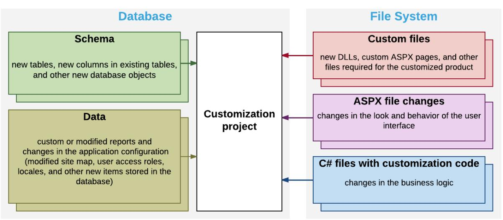

#### *Figure: Content of a customization project*

You develop and maintain customization projects by using the tools of the Acumatica Customization Platform (see *[Customization](#page-42-2) Tools* for details). This platform provides the mechanisms to develop, upgrade, publish, unpublish

(that is, cancel publication), export, and import a customization project. The content of a customization project is stored in the database of the Acumatica ERP instance.

To perform any customization of the UI or to extend the business logic, you have to create a new customization project or modify an existing one.

Once you have selected a customization project for development, the customizations you perform will be added to this project. The customization project holds each change you make during the customization; however before the project is published, the changes exist only in the project and are not yet applied to the product. To apply the content of a customization project to Acumatica ERP, you have to publish the project.

When you need to apply the developed customization to a target environment, you should add all the changes and additional files to the customization project and export the project as a deployment package—a complete redistributable customization package. Then in the target environment, you import the package and publish the project.

You can create as many customization projects as you need and independently develop and maintain each customization project for a specific customization task.

### <span id="page-33-1"></span><span id="page-33-0"></span>**Types of Items in a Customization Project**

When you customize an instance of Acumatica ERP by using the *[Customization Project Editor](https://help-2025r1.acumatica.com/Help?ScreenId=ShowWiki&pageid=0bb97781-e987-4039-962d-457720821bff)*, the platform stores all items of a customization project as records in the CustObject table of the database. Each record in this table contains the data of an item, including the XML code of the item in a specific field. When you add an item to the customization project, the platform adds the new record to the table, creates the XML code of the item, and stores the code within the Content field of the record.

You can view the content of an item of a customization project by using the *[Edit Project Items](https://help-2025r1.acumatica.com/Help?ScreenId=ShowWiki&pageid=36ba1efe-dcbe-4307-b836-0cafae0d1ef9)* of the Customization Project Editor.

#### **XML Code of the Items**

Different item types have XML code that is structured differently. For example, if you create the UsrPersonalID bound custom field in the CR.Contact DAC (which is mapped to the SOOrder table) and the control for the field on the *[Customers](https://help-2025r1.acumatica.com/Help?ScreenId=ShowWiki&pageid=652929bc-9606-4056-aa6e-0c2d1147171b)* (AR303000) form, the customization project might contain the following new objects:

• An item with the following XML code to add the column to the DB table.

```
<Table TableName="Contact">
 <Column TableName="Contact" ColumnName="UsrPersonalID" ColumnType="string" 
 AllowNull="True" MaxLength="15" DecimalPrecision="2"
 DecimalLength="15" IsNewColumn="True" IsUnicode="True" />
</Table>
```

• An item with the following XML code to add the field to the DAC.

```
<DAC type="PX.Objects.CR.Contact">
 <Field FieldName="UsrPersonalID" TypeName="string" MapDbTable="Contact" 
 TextAttributes="#CDATA" StorageName="AddColumn">
 <CDATA name="TextAttributes">
 <![CDATA[[PXDBString(15)][PXUIField(DisplayName="Personal ID")]]]></CDATA>
 </Field>
</DAC>
```

• An item with the following XML code to add the control to the form.

```
<Page path="~/pages/ar/ar303000.aspx" ControlId="5"
```

```
 pageSource="...binary content of the page...">
 <PXFormView ID="DefContact" ParentId="phG_tab_Items#0_DefContact"
 TypeFullName="PX.Web.UI.PXFormView">
 <Children Key="Template">
 <AddItem>
 <PXTextEdit TypeFullName="PX.Web.UI.PXTextEdit">
 <Prop Key="Virtual:ApplyStylesheetSkin" />
 <Prop Key="ID" Value="CstPXTextEdit2" />
 <Prop Key="DataField" Value="UsrPersonalID" />
 <Prop Key="CommitChanges" Value="True" />
 </PXTextEdit>
 </AddItem>
 </Children>
 </PXFormView>
</Page>
```

Note that the items in these code blocks differ by type (Table, DAC, and Page) and structure.

### **Item Types Within a Customization Project**

All the possible types of items in a customization project are summarized in the following table. The value in the **Can Be Unpublished** column identifies whether the changes introduced by the item type are reversed when you unpublish the customization project. For details on which changes are reversed, see *[Project Unpublishing: General](#page-136-2) [Information](#page-136-2)*.

| Item Type (XML Tag, if<br>differs) | Object                                                                          | Description                                                                                                                                                                                                                                                                                                                                                                                                                                                                                                                              | Edited Via          | Can Be Un<br>published |
|------------------------------------|---------------------------------------------------------------------------------|------------------------------------------------------------------------------------------------------------------------------------------------------------------------------------------------------------------------------------------------------------------------------------------------------------------------------------------------------------------------------------------------------------------------------------------------------------------------------------------------------------------------------------------|---------------------|------------------------|
| Page                               | A custom form,<br>or changes<br>to an existing<br>form                          | Any of the following:<br>•<br>For a custom form, the content<br>of the form, and the path to the<br>.aspx file of the form (the path is<br>required for the system to detect<br>changes of the file on the file sys<br>tem in the development environ<br>ment and to deploy the file while<br>publishing the project)<br>•<br>For an existing form, the layout<br>change instructions and the action<br>change instructions that have to<br>be applied by the platform to the<br>ASPX code of the form during the<br>project publication | Screen Edi<br>tor   | Yes                    |
| AutomationScreenCon<br>dition      | A condition<br>that changes<br>the business<br>logic of a cus<br>tomized screen | A data set containing a list of condi<br>tions for a customized screen                                                                                                                                                                                                                                                                                                                                                                                                                                                                   | Condition<br>Editor | Yes                    |
| AUScreenAction                     | An action that<br>changes the<br>business log<br>ic of a cus<br>tomized screen  | A data set containing the properties<br>of an action                                                                                                                                                                                                                                                                                                                                                                                                                                                                                     | Screen Edi<br>tor   | Yes                    |

| Item Type (XML Tag, if<br>differs) | Object                                                                                                                  | Description                                                                                                                                                                                                                                                                                                                                                                                                                                                                                          | Edited Via                                | Can Be Un<br>published |
|------------------------------------|-------------------------------------------------------------------------------------------------------------------------|------------------------------------------------------------------------------------------------------------------------------------------------------------------------------------------------------------------------------------------------------------------------------------------------------------------------------------------------------------------------------------------------------------------------------------------------------------------------------------------------------|-------------------------------------------|------------------------|
| AUScreenNavigationAc<br>tion       | An action that<br>changes the<br>business log<br>ic of a cus<br>tomized screen<br>and navigates<br>to another<br>screen | A data set containing the properties<br>of an action                                                                                                                                                                                                                                                                                                                                                                                                                                                 | Screen Edi<br>tor                         | Yes                    |
| AutomationScreenField              | A field to which<br>conditions are<br>applied                                                                           | A data set containing the properties<br>of a field                                                                                                                                                                                                                                                                                                                                                                                                                                                   | Screen Edi<br>tor                         | Yes                    |
| DAC                                | Changes to an<br>existing data<br>access class                                                                          | The data required to create the cor<br>responding extension for the original<br>data access class                                                                                                                                                                                                                                                                                                                                                                                                    | Data Class                                | Yes                    |
| Table                              | Changes to the<br>schema of an<br>existing data<br>base table                                                           | A definition of the custom columns<br>added to a table for bound custom<br>fields created in the appropriate DAC                                                                                                                                                                                                                                                                                                                                                                                     | Table Editor                              | No                     |
| Code (Graph)                       | Custom C#<br>code                                                                                                       | Any of the following:<br>•<br>A custom DAC, which has the<br>PX.Data.IBqulTable base<br>class<br>•<br>A custom BLC, which has the PX<br>Graph<> base class<br>•<br>An extension for an existing DAC,<br>which has the PXCacheExten<br>sion<> base class<br>•<br>An extension for an existing BLC,<br>which has the PXGraphExten<br>sion<> base class<br>•<br>A customization plug-in, which has<br>the CustomizationPlugin<br>base class<br>•<br>Any custom class, which has no or<br>any base class | Code Editor                               | Yes                    |
| File                               | A custom file                                                                                                           | The path to a custom file and the<br>GUID of the file content in the file<br>storage of the database. The path<br>is relative to the website folder;<br>new custom forms are added to the<br>project as custom files.                                                                                                                                                                                                                                                                                | File Editor                               | Yes                    |
| GenericInquiryScreen               | A custom or<br>customized<br>generic inquiry                                                                            | A data set of a custom or customized<br>generic inquiry form                                                                                                                                                                                                                                                                                                                                                                                                                                         | Gener<br>ic Inquiry<br>(SM208000)<br>form | No                     |

| Item Type (XML Tag, if<br>differs) | Object                                              | Description                                                                                                                                                                                                                                                         | Edited Via                                                                                 | Can Be Un<br>published |
|------------------------------------|-----------------------------------------------------|---------------------------------------------------------------------------------------------------------------------------------------------------------------------------------------------------------------------------------------------------------------------|--------------------------------------------------------------------------------------------|------------------------|
| Report                             | A custom<br>Acumatica Re<br>port Designer<br>report | A data set of a custom report creat<br>ed by using the Acumatica Report De<br>signer                                                                                                                                                                                | Acumatica<br>Report De<br>signer                                                           | No                     |
| Dashboard                          | A custom or<br>customized<br>dashboard              | A data set of a custom or customized<br>dashboard                                                                                                                                                                                                                   | Dashboards<br>(SM208600)<br>form                                                           | No                     |
| SiteMapNode                        | A custom or<br>customized<br>site map node          | A data set of a custom or customized<br>site map node (which includes infor<br>mation about the location of the cus<br>tom form or report); you should cre<br>ate a custom site map node for each<br>custom form or report included in the<br>customization project | Site Map<br>(SM200520)<br>form                                                             | No                     |
| Sql                                | A custom SQL<br>script                              | A custom database table definition or<br>custom SQL script that has to be exe<br>cuted while the customization project<br>is published                                                                                                                              | SQL Script<br>Editor                                                                       | No                     |
| Locale                             | A custom lo<br>cale                                 | A data set of a custom system locale,<br>which is a set of parameters that de<br>fines the language and other local<br>preferences—such as how to display<br>numbers, dates, and times in the user<br>interface—for a group of users                                | System<br>Locales<br>(SM200550)<br>form                                                    | No                     |
| XportScenario                      | A custom in<br>tegration sce<br>nario               | A data set of a custom export or im<br>port scenario used to perform data<br>migration between a legacy applica<br>tion and Acumatica ERP                                                                                                                           | Import<br>Scenarios<br>(SM206025)<br>form and<br>Export<br>Scenarios<br>(SM207025)<br>form | No                     |
| SharedFilter                       | A custom<br>shared filter                           | A data set of a custom reusable<br>shared filter created on a processing<br>or inquiry form                                                                                                                                                                         | Filters<br>(CS209010)<br>form                                                              | No                     |
| ScreenWithRights                   | Custom access<br>rights to a form                   | A data set of the custom access rights<br>of roles to a form, down to the control<br>of form elements, such as buttons,<br>text boxes, and check boxes                                                                                                              | Access<br>Rights by<br>Screen<br>(SM201020)<br>form                                        | No                     |
| WikiArticle                        | A custom wiki<br>module                             | A data set of a custom wiki and all the<br>articles created within this wiki                                                                                                                                                                                        | Wiki<br>(SM202005)<br>form                                                                 | No                     |

| Item Type (XML Tag, if<br>differs) | Object                                                                           | Description                                                                                                                                                       | Edited Via                                                   | Can Be Un<br>published |
|------------------------------------|----------------------------------------------------------------------------------|-------------------------------------------------------------------------------------------------------------------------------------------------------------------|--------------------------------------------------------------|------------------------|
| EntityEndpoint                     | A custom web<br>service end<br>point                                             | A data set of a custom web service<br>endpoint                                                                                                                    | Web Service<br>Endpoints<br>(SM207060)<br>form               | No                     |
| ReportDefinition                   | A custom ana<br>lytical report                                                   | A data set of a custom analytical re<br>port, including the data of the prede<br>fined sets of rows, columns, and units                                           | Report De<br>finitions<br>(CS206000)<br>form                 | No                     |
| PushNotification                   | Push notifica<br>tion configura<br>tion                                          | A data set that includes the push no<br>tification destination and the data<br>query that defines for which data<br>changes Acumatica ERP sends notifi<br>cations | Push No<br>tifications<br>(SM302000)<br>form                 | No                     |
| BpEvent                            | A business<br>event                                                              | A data set of a business event                                                                                                                                    | Business<br>Events<br>(SM302050)<br>form                     | No                     |
| MobileSiteMap                      | A mobile app<br>screen                                                           | A script for adding or changing a mo<br>bile app screen                                                                                                           | Mobile App<br>Editor                                         | Yes                    |
| CSAttribute                        | A user-defined<br>field                                                          | A data set of a user-defined field with<br>a list of screens on which the field is<br>displayed                                                                   | Edit User<br>Defined<br>Fields<br>(CS205020)<br>form         | Yes                    |
| Webhook                            | A webhook                                                                        | A description of a webhook for an ex<br>ternal application and identification<br>parameters of the webhook.                                                       | Webhooks<br>(SM304000)<br>form                               | No                     |
| OAuthClient                        | A connected<br>application                                                       | A data set of properties of a connect<br>ed application and identification pa<br>rameters of the connected applica<br>tion.                                       | Connected<br>Applications<br>(SM303010)<br>form              | No                     |
| DeletedRecordsTrack<br>ingTable    | A data access<br>class for which<br>the system<br>tracks the re<br>moved records | A data set of a data access class for<br>which the system tracks the removed<br>records                                                                           | Tables to<br>Track Delet<br>ed Records<br>(SM207010)<br>form | No                     |

# <span id="page-37-1"></span><span id="page-37-0"></span>**Deployment of a Customization Result**

Once you have finished a customization project, you can export the project as a deployment package that can then be imported and published as a customization project in the end-user systems.

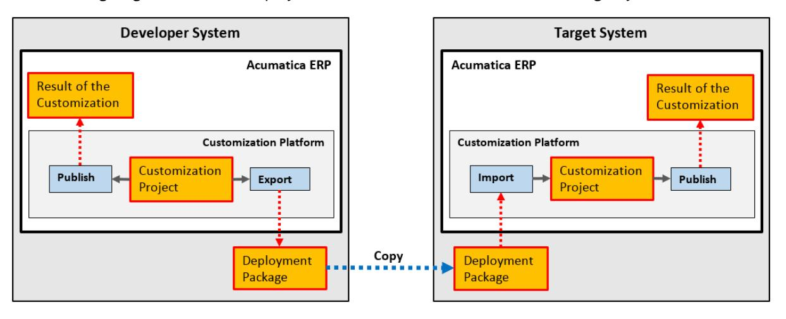

The following diagram shows the deployment of the result of customization to a target system.

#### *Figure: Deployment of a customization result to a target system*

A deployment package is a redistributable .zip file that includes the full content of a customization project. A deployment package consists of the project.xml file and any custom files that you have added to the project, such as external assemblies and custom ASPX pages. You can manually edit the project.xml file in an XML Editor in the file system. However we recommend that you modify the project items in the easiest and most reliable way: by using the *[Customization Project Editor](https://help-2025r1.acumatica.com/Help?ScreenId=ShowWiki&pageid=0bb97781-e987-4039-962d-457720821bff)*.

When the project is finished, you can download the deployment package to deploy the customization to the target system (see *To Export a [Project](#page-85-2)* for details). If you have finished the project, we recommend that you publish the project and test the customization before downloading the deployment package, to ensure that you have no issues. Also, you can download the package to have a backup copy of the customization project you are working on.

You can import a deployment package to work with the customization project or to publish the final customization on the target website (see *Project Publication: To Deploy a [Customization](#page-127-1) Project* for details).

In MySQL, the maximum size of one packet that can be transmitted to or from a server is 4MB by default. If you use MySQL and want to manage a customization project with the size that is larger than the default maximum value, you have to increase the max\_allowed\_packet variable in the server. The largest possible packet size is 1GB.

### <span id="page-38-1"></span><span id="page-38-0"></span>**Publication of Customization Projects in a Multitenant Site**

A customization project is stored in the instance database. The data of each tenant that uses the same instance of Acumatica ERP is isolated from the data of other tenants in the database. However, the website files of the instance are shared by all tenants.

Because the customization project is stored in the database, the data of the customization project is stored in that part of the database where the tenant in which the project is created or imported is stored.

When the project is published, the platform applies the customization project to both the website files and the database. Because a customization project can contain different types of items, the platform uses a specific approach to apply each type of item to the website, database schema, and database data.

Based on this approach, some customization items included in a customization project are applied only to the tenants to which the project is published. Other customization items are applied to the entire website, which means that the changes are made to all tenants. These two types of customization items are described in a greater detail below.

#### **Publishing of Multiple Customization Projects to Multiple Tenants**

You can publish a customization project or multiple projects for multiple tenants at once. On the *[Customization](https://help-2025r1.acumatica.com/Help?ScreenId=ShowWiki&pageid=4d3a1166-826c-414b-a207-3d1669fbf9e5) [Projects](https://help-2025r1.acumatica.com/Help?ScreenId=ShowWiki&pageid=4d3a1166-826c-414b-a207-3d1669fbf9e5)* (SM204505) form, you can select the customization projects that you need to publish to multiple tenants and click **Publish to MultipleTenants** on the More menu (under **Publish**). This opens the **Publish to Multiple Tenants** dialog box, where you then select the required tenants and apply the selected customization projects to the selected tenants. (See *[Multitenant Customization: General Information](#page-134-2)* for details.)

On the *[Customization Projects](https://help-2025r1.acumatica.com/Help?ScreenId=ShowWiki&pageid=4d3a1166-826c-414b-a207-3d1669fbf9e5)* form, you can view all customization projects that affect the entire website—that is, all tenants—by clicking**View Published** on the More menu (under **Publish**).

### **Customization Items That Are Applied to All Tenants**

The following customization items are applied to the entire website (meaning all tenants) aer publication:

• *Page*, *DAC*, *Table*, *SQL*, and *Code*

Initially, these items are stored in the database for a single tenant. However, while the project is being published, depending on the specific items in the project, the platform does either of the following: creates files for these items in the website folder or changes the database schema. The new files and the changed database schema are available from other tenants. As a result, items of these types are applied for multiple tenants.

• *File*

During the publication of the project, for each *File* item, the platform creates the file in the file system, so *File* items are shared with multiple tenants.

For example, suppose you have signed in to the *MyTenant* tenant and have a customization project that contains only items of the *Page*, *DAC*, *Table*, *Code*, and *File* types. When you publish the project, it is applied to each tenant in the instance of Acumatica ERP. However, the customization project data is still available only in the *MyTenant* tenant.

### **Customization Items That Are Applied Only to a Single Tenant**

The following customization items affect only the tenant to which the customization project is published: *GenericInquiryScreen*, *Report*, *Dashboard*, *SiteMapNode*, *Locale*, *XportScenario*, *SharedFilter*, *ScreenWithRights*, *WikiArticle*, *EntityEndpoint*, *ReportDefinition*, *PushNotification*, *BpEvent*, *CSAttribute*, *MobileSiteMap*, *WebHook*, and *OAuthClient*.

If you publish a customization project that contains only items of these types (such as generic inquiries and access rights of roles to forms), the customization does not apply to the website files or to the database schema. This data is stored only in the database, and the application server uses the data from the database at runtime. Because this data is tenant-specific, it is available in only the tenant where it was published.

Suppose that a particular customization project includes only items of these types and is published to only one tenant of a multitenant instance. For the other tenants, on the Sign-In page and in the **About Acumatica** dialog box (which opens when you click**Tools > About** on the form title bar), you can see that the website is customized, but you won't see this published project on the *[Customization Projects](https://help-2025r1.acumatica.com/Help?ScreenId=ShowWiki&pageid=4d3a1166-826c-414b-a207-3d1669fbf9e5)* (SM204505) form. This form displays the customization projects that have been uploaded to the current tenant. Therefore, if a project has been uploaded and published to another tenant, it is not listed on this form.

### **Example of a Customization Project Published from a Different Tenant**

Suppose that on a multitenant site, a particular customization project was created on or uploaded to the *OtherTenant* tenant and published there, and you are signed in to the *MyTenant* tenant. The changes related to the customization project may differ on *MyTenant* based on whether or not the project was also published to *MyTenant*. The following table shows the differences in applying a customization project to a multitenant website depending on whether the customization project that has been published from *OtherTenant* is also published to *MyTenant*. The le column contains various questions related to *MyTenant* in this example, and the other two columns show the different responses based on whether the project is published on *MyTenant*.

| Question                                                                                                                                                                                  | The customization<br>published from<br>OtherTenant is<br>ALSO published to<br>MyTenant | The customization<br>published from<br>OtherTenant is NOT<br>published to My<br>Tenant |
|-------------------------------------------------------------------------------------------------------------------------------------------------------------------------------------------|----------------------------------------------------------------------------------------|----------------------------------------------------------------------------------------|
| Is the customization applied to the application instance (see To<br>Detect Whether a Customization Project Is Applied to the Application<br>for more information) for MyTenant?           | Yes                                                                                    | Yes                                                                                    |
| Do changes in the file system (Page, DAC, and Code items) exist for<br>MyTenant?                                                                                                          | Yes                                                                                    | Yes                                                                                    |
| Do changes of the database schema (Table and SQL items) exist<br>for MyTenant?                                                                                                            | Yes                                                                                    | Yes                                                                                    |
| Do custom reports and configuration (such items as Report,<br>SiteMapNode, and SharedFilter) exist for MyTenant?                                                                          | Yes                                                                                    | No                                                                                     |
| Does the project list on the Customization Projects form contain<br>the project? (That is, can you access the customization project da<br>ta from MyTenant?)                              | No                                                                                     | No                                                                                     |
| Is it necessary to import the customization package to access the<br>customization project data from MyTenant?                                                                            | Yes                                                                                    | Yes                                                                                    |
| After the customization package is imported to MyTenant and<br>added to the list on the Customization Projects form, is the project<br>displayed in the list as an already published one? | Yes                                                                                    | Yes                                                                                    |

# <span id="page-40-0"></span>**Validation of a Customization Project**

A customization project must meet various technical requirements to integrate with and operate within the Acumatica ERP application.

### **Acumatica ERP Capabilities to Validate and Check Customization Project Items**

To help to develop a customization project that complies with technical requirements and to help to check the project for compliance with these requirements, Acumatica ERP and Customization Project Editor provide the following functionality:

- 1. Definition of a prefix for the project. All project item names must start with this prefix. You can define this prefix in the Customization Project Editor. For details on defining the project prefix, see *To [Manage](#page-92-1) Prefixes [in a Customization Project](#page-92-1)*.
- 2. Validation of one customization project or multiple customization projects, causing the platform to check the following criteria:
  - The database schema changes included in a customization project are valid.
  - The customization project does not replace or modify the files distributed as part of the standard Acumatica ERP application.
  - The data types of a custom database column correspond to all data access class (DAC) fields bound to it.

These types of validations should be applied to ISV solutions only.

You can perform this type of validation on the *[Customization Projects](https://help-2025r1.acumatica.com/Help?ScreenId=ShowWiki&pageid=4d3a1166-826c-414b-a207-3d1669fbf9e5)* (SM204505) form. On the More menu (under**Validations**), you click**Validate Highlighted Project** or **Validate Multiple Projects**, depending on whether you want to validate one project or multiple projects correspondingly.

- 3. Validation of the data consistency in published customization projects, which verifies the correspondence between the data types of DAC fields and field states generated by field attributes at runtime. To perform this validation, you invoke the commands on the More menu (under**Validations**) of the *[Customization](https://help-2025r1.acumatica.com/Help?ScreenId=ShowWiki&pageid=4d3a1166-826c-414b-a207-3d1669fbf9e5) [Projects](https://help-2025r1.acumatica.com/Help?ScreenId=ShowWiki&pageid=4d3a1166-826c-414b-a207-3d1669fbf9e5)* form as follows:
  - To verify that the data type of a DAC field matches the field states generated at runtime, click **DAC Field Types (RuntimeValidation)**.
  - To determine whether there are any PXAttributeFamilyAttribute violations on a DAC field, click **DAC Attributes (RuntimeValidation)**.
  - To verify that DAC fields with lookup boxes defined for a segmented key properly handle foreign key segments by means of PXDimensionAttribute, click **Lookup Definitions (RuntimeValidation)**.
- 4. Analysis of custom files included in the customization project.

You can analyze custom files (assemblies) included in the customization project to verify that the customization project does not replace or modify files that are distributed as part of the standard Acumatica ERP application. To do this, on the main menu of the Customization Project Editor, click **Extension Library > Analyze Referenced Assemblies**. A CSV file is downloaded with all references made in the project's custom files.

5. Generation of a workbook with project items.

You can generate this workbook, which is in Excel format, in the Customization Project Editor by clicking **File > Export Project Items Workbook**. The generated workbook contains a list of solution objects and integration scenarios grouped by the following types:

- Site map nodes
- Mobile site map nodes
- BLСs and BLC extensions
- DACs and DAC extensions
- Push notifications
- Import or export scenarios

#### **Customization as Part of an ISV Solution**

The validation of a customization project is especially important when a customization project is part of an independent soware vendor (ISV) solution.

To see technical requirements for a project in the *ISV Soware Certification Program* guidelines, on Acumatica Partner Portal, click **ISV Program > ISVSolution Assessment**.

### **Format of the Validation Results**

If any errors or warnings have been detected during project validation, the validation results have the following format:

- <CustomizationProjectName>
  - <CustomizationRuleName>
    - <PathToTheDLL> | <ProjectItemType> | <NameOfTheProjectItem> List of rules broken by the specified item.


The <PathToTheDLL> field is optional. It appears only if a dll file included in the project is analyzed.

# <span id="page-42-2"></span><span id="page-42-0"></span>**Customization Tools**

Depending on the complexity of the particular customization task, you can employ any the tools implemented in the Acumatica Customization Platform.

For every type of customization, you can use the tools described in the following topics:

- *[Customization Projects](https://help-2025r1.acumatica.com/Help?ScreenId=ShowWiki&pageid=4d3a1166-826c-414b-a207-3d1669fbf9e5)* (SM204505) form
- *[Customization Menu](https://help-2025r1.acumatica.com/Help?ScreenId=ShowWiki&pageid=d6c46870-0c44-4f78-ae20-9bb9ef25dccd)*
- *[Element Inspector](https://help-2025r1.acumatica.com/Help?ScreenId=ShowWiki&pageid=5f9d2d33-1a33-4edd-8629-3100d2020335)*
- *[Customization Project Editor](https://help-2025r1.acumatica.com/Help?ScreenId=ShowWiki&pageid=0bb97781-e987-4039-962d-457720821bff)*
  - *[Screen Editor](https://help-2025r1.acumatica.com/Help?ScreenId=ShowWiki&pageid=d60a8270-e2ce-4380-b778-af61a0ca56d2)*
    - *[ASPX Editor](https://help-2025r1.acumatica.com/Help?ScreenId=ShowWiki&pageid=31a5d453-4b6b-4a68-96c5-b7af2b0e52a9)*
  - *[Data Class](https://help-2025r1.acumatica.com/Help?ScreenId=ShowWiki&pageid=06c038a5-1d75-482b-9b17-f2483ada0154)* Editor
  - *[Code Editor](https://help-2025r1.acumatica.com/Help?ScreenId=ShowWiki&pageid=c2678973-d557-47d4-b8ee-9dd69f55b465)*
  - File Editor (see *[Custom Files](https://help-2025r1.acumatica.com/Help?ScreenId=ShowWiki&pageid=2ea3c168-069f-436a-b3e7-4543c765d0d1)* for details)
  - SQL Script Editor (see *[Edit SQL Script Dialog Box](https://help-2025r1.acumatica.com/Help?ScreenId=ShowWiki&pageid=f7e4fcdf-02dd-4812-b561-1179da5dd30d)* for details)
  - XML Editors:
    - *[Project XML Editor](https://help-2025r1.acumatica.com/Help?ScreenId=ShowWiki&pageid=aa0fc077-1a8a-445c-8a84-5ad86c282a4f)*
    - *[Edit Project Items](https://help-2025r1.acumatica.com/Help?ScreenId=ShowWiki&pageid=36ba1efe-dcbe-4307-b836-0cafae0d1ef9)*
- *[Source Code](https://help-2025r1.acumatica.com/Help?ScreenId=ShowWiki&pageid=2e58bb02-40c0-47c6-8cea-78607cccc4e1)* Browser

### <span id="page-42-3"></span><span id="page-42-1"></span>**Customization Framework**

The programming framework of the Acumatica Customization Platform, like Acumatica Framework, is intended for developers experienced in C#.NET. Because the application objects of Acumatica ERP are built on top of Acumatica Framework, the developers need to learn both the programming frameworks to be able to effectively develop quality customizations.

When you have to customize an instance of Acumatica ERP, first you must determine the scope of the customization. For each form that works with data from the database, the instance of Acumatica ERP must contain at least the following objects (see the diagram below):

- An ASPX page: The page must contain, at minimum, the data source control and a control container with controls for data fields.
- A business logic controller (BLC, also referred to as *graph*): The graph must be specified in the TypeName property of the data source control of the page. The graph must contain at least one data view, which is specified in the PrimaryView property of the data source control as well as in the DataMember property of the control container. The graph instance is created on each round trip and initializes the creation of the data view instance based on a BQL statement. The data view provides data manipulations and data flows between the container control, the cache object of the graph, and the corresponding table of the database. The BQL statement contains a reference to at least one data access class that is required to map the database table to data records in the cache object.
- A data access class (DAC): On each round trip, the DAC instance is created in the cache object when the data view processes any operation with the corresponding data.

• A table in the database: The table is mapped to the data access class that defines the data record type in the cache object of the graph instance.

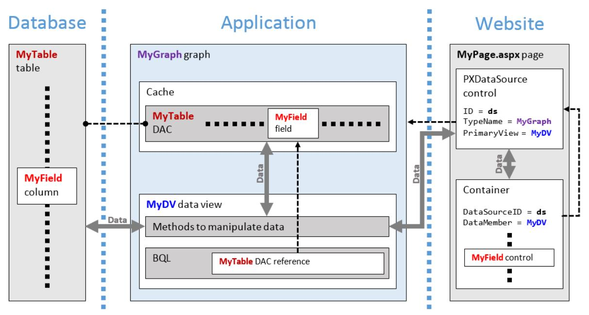

#### *Figure: Objects required for a form that works with data from a database table*

By using the Acumatica Customization Platform, you can create or customize each of the object types listed above.

#### **Customization of ASPX Pages**

To change the layout and behavior of an Acumatica ERP form, you must customize the corresponding ASPX page. However for customizing an ASPX page, the platform uses an approach that does not require you to change the original ASPX code of the Acumatica ERP form. Instead, the platform can apply the .aspx file with the same name from a special subfolder within the website folder, if this file exists. At run time, while the platform is processing a request to open a form, the platform first tries to find the needed .aspx file inside this subfolder to use it instead of the original file. If the file with customized ASPX code is found, the platform opens the customized form. Otherwise, the original form is opened.

To cancel a customization of a page, you need only to delete the file with the appropriate name from the subfolder.

#### **Customization of Application Classes (BLCs and DACs)**

To provide the ability to customize the functionality or business logic of a form, the platform uses the technology based on class extensions. With this technology, to customize a BLC or DAC, the platform does not change the original code of Acumatica ERP. Instead, the platform uses an additional C# file for each class extension.

At run time, the platform automatically detects a class extension during the first initialization of the base (original) class. If an extension is found, the platform replaces the base class with the merged result of the base class and the extension that was found.

To cancel a customization of business logic, you need only to delete the file that contains the appropriate class extension.

This approach makes it easy to apply and cancel any customization of business logic in Acumatica ERP.

#### **Customization of the Database Schema**

The platform provides the following capabilities that you can use to customize the database schema:

- You can create an *[SQL script](#page-375-2)* to execute while the customization is applied to an instance of Acumatica ERP.
- You can create a custom bound field to add the corresponding column to a table while the customization is applied to an instance of Acumatica ERP.
- You can define the UpdateDatabase() method of a class derived from the CustomizationPlugin class to execute an SQL script or a stored procedure from the C# code aer the customization is applied to an instance of Acumatica ERP. (See *[Custom Processes During Publication of a Customization](#page-77-1)* for details.)

### <span id="page-44-1"></span><span id="page-44-0"></span>**Changes in Webpages (ASPX)**

To customize the look and behavior of an Acumatica ERP form, you need to change the ASPX code of the form. Because you need to include all the changes in a customization project, you have to perform the form customization by using the *[Screen Editor](https://help-2025r1.acumatica.com/Help?ScreenId=ShowWiki&pageid=d60a8270-e2ce-4380-b778-af61a0ca56d2)* of the Customization Project Editor.

To collect all the changes that you make while you customize a form, the Screen Editor creates a *Page* item with a name that corresponds to the form ID, and includes the item in the currently selected customization project. This item contains XML code with instructions that have to be applied to the ASPX code of the form during the publication of the project.

For example, the following fragment of a *Page* item contains the XML code with the <AddItem> tag used to add the UsrSIMCardID field as a column to the Transactions grid.

```
<PXGridLevel DataMember="Transactions"
 ParentId="phG_tab_Items#0_grid_Levels#0"
 TypeFullName="PX.Web.UI.PXGridLevel">
 <Children Key="Columns">
 <AddItem>
 <PXGridColumn TypeFullName="PX.Web.UI.PXGridColumn">
 <Prop Key="DataField" Value="UsrSIMCardID" />
 <Prop Key="Width" Value="160" />
 </PXGridColumn>
 </AddItem>
 </Children>
</PXGridLevel>
```

In the XML code above, note that the <Prop> tag is used to set the Width property of the column to *160*.

With the Screen Editor, you can customize any object in the ASPX code of an Acumatica ERP form and save the resulting changeset to the customization project. To apply the customization to the website, you have to publish the project.

For example, at the publication process, the platform transforms the XML code fragment above to the following fragment of ASPX code.

<px:PXGridColumn DataField="UsrSIMCardID" Width="160" />

During the publication of the project, the platform applies the XML changeset to the appropriate form to create a customized version of the .aspx file with the same name in the pages\_xx subfolder of the CstPublished folder of the website. If the form ID contains the *SO* prefix, the customized ASPX code is located in the \CstPublished\pages\_so folder, as the following screenshot shows.

|                                                            |                                                                  |                                    |                                                 | $\mathbf x$<br>$\Box$<br>$\qquad \qquad =$ |
|------------------------------------------------------------|------------------------------------------------------------------|------------------------------------|-------------------------------------------------|--------------------------------------------|
|                                                            | « Local Disk (C:) ▶ Training ▶ YogiFon ▶ CstPublished ▶ pages_so | $\mathbf{v}$ $\mathbf{t}$          | Search pages_so                                 | م                                          |
| Organize $\blacktriangledown$<br>Include in library ▼      | New folder<br>Share with $\blacktriangledown$<br><b>Burn</b>     |                                    | 龍 ▼                                             | ℯ                                          |
| Controls<br>CstDesigner                                    | ≖<br>$\overline{\phantom{0}}$<br>Name                            | Date modified                      | Type                                            | Size                                       |
| <b>CstPublished</b><br>4 II.<br>pages_ar                   | 讀<br>so301000.aspx<br>cl.<br>so301000.aspx.cs                    | 23-Jun-16 15:43<br>23-Jun-16 15:43 | <b>ASP.NET Server Pa</b><br>Visual C# Source fi | 104 KB<br>1 <sub>KB</sub>                  |
| pages_so                                                   | 图 so303000.aspx<br>예<br>so303000.aspx.cs                         | 23-Jun-16 15:43<br>23-Jun-16 15:43 | ASP.NET Server Pa<br>Visual C# Source fi        | 63 KB<br>1 KB                              |
| Customization<br><b>Dashboards</b>                         | 킈                                                                |                                    |                                                 |                                            |
| Frames<br>$\mathbb{E}$ $\mathbb{E}$<br>and the second con- | ÷                                                                |                                    |                                                 |                                            |
| 4 items                                                    |                                                                  |                                    |                                                 |                                            |

*Figure: Viewing the files with customized ASPX code in the CstPublished folder*

Aer the project has been published, when Acumatica ERP has to display a form, first it tries to find the .aspx file of the form in the CstPublished folder. If it finds it, Acumatica ERP opens the customized version of the form instead of the original one.

Any customization of Acumatica ERP can be unpublished. If you unpublish a form customization, the platform deletes the corresponding file in the CstPublished folder of the website.

### <span id="page-45-1"></span><span id="page-45-0"></span>**Changes in the Application Code (C#)**

In this section, you can find information about the customization of the application functionality, which is provided by the application business logic (implemented in C# code) of data access classes and business logic controllers.

#### **BLC and DAC Extensions**

To give you the ability to customize the functionality or behavior of a form, the Acumatica Customization Platform uses technology based on extension models. When you are resolving a typical customization task, you generally create extensions for original data access classes and business logic controllers.

An extension for a business logic controller (BLC, also referred to as *graph*) or a data access class (DAC) is a class derived from a generic class defined in the PX.Data assembly of Acumatica ERP. To declare an extension for a DAC, you derive a class from the PXCacheExtension<T> generic class. To declare an extension of a BLC, you derive a class from the PXGraphExtension<T> generic class. Both types of extensions must be declared with the public access modifier to be correctly recognized by the Acumatica Customization Platform.

If you have created an extension for a BLC or DAC in a customization project and published the project, the platform applies the extension to the base class at run time. During publication of the project, all the code extensions created for an instance of Acumatica ERP in the project are saved as C# source code files in the App\_RuntimeCode folder of the application instance (see the diagram below).

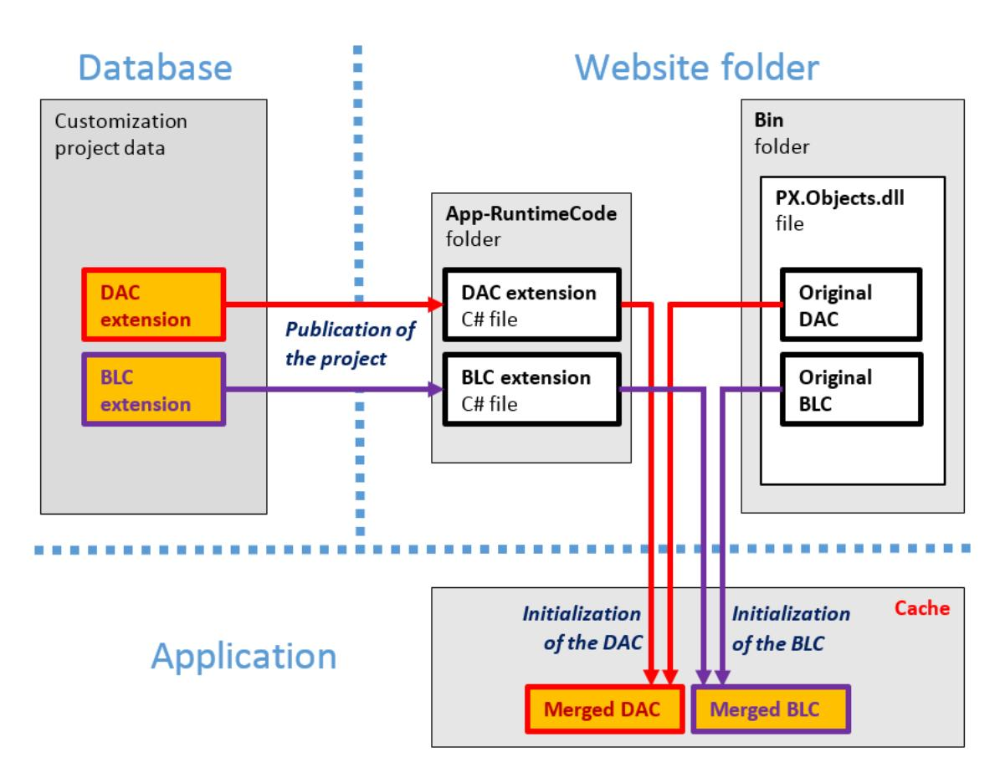

#### *Figure: Use of DAC and BLC extensions for a customization*

At run time, during the first initialization of a base class, the Acumatica Customization Platform automatically finds the extension for the class and applies the customization by replacing the base class with the merged result of the base class and the extension it found.

When you unpublish all customization projects, the platform deletes all the code files from the App\_RuntimeCode folder. As a result, the platform has no custom code to merge at run time.

#### **Multilevel Extensions**

The Acumatica Customization Platform supports multilevel extensions, which are required when you develop offthe-shelf soware that is distributed in multiple editions. Precompiled extensions provide a measure of protection for your source code and intellectual property.

The figure below illustrates the DAC extension model.

#### *Figure: DAC extension levels*

The figure below illustrates the BLC extension model.

#### *Figure: BLC extension levels*

You can use multilevel extensions to develop applications that extend the functionality of Acumatica ERP or other soware based on Acumatica Framework in multiple markets (that is, specified categories of potential client organizations). You may have a base extension that contains the solution common to all markets as well as multiple market-specific extensions. Every market-specific solution is deployed along with the base extension. Moreover, you can later customize deployed extensions for the end user by using DAC and graph extensions.

When extensions can be deployed separately, the application developer should use multiple extension levels. Otherwise, we recommend using a single extension level.

#### **The Order in Which Extensions Are Loaded**

For each DAC or graph type, the system loads and applies extensions at run time as follows:

- 1. The system collects extensions for the DAC or graph type.
- 2. The system sorts the list of extensions in alphabetical order.
- 3. If there is a subscriber to the PX.Data.PXBuildManager.SortExtentions event, the system passes the list of extensions in alphabetical order to this subscriber, which can sort extensions in a custom way. A sample implementation of the subscriber is shown in the following code.

Make sure you use a stable sorting method as the following example does.

```
using System;
using System.Collections.Generic;
using System.Linq;
using System.Web.Compilation;
```

```
using Autofac;
using PX.Data.DependencyInjection;
namespace MyLib
{
 public class ServiceRegistration : Module
 {
 protected override void Load(ContainerBuilder builder)
 {
 builder.ActivateOnApplicationStart<ExtensionSorting>();
 }
 private class ExtensionSorting
 {
 private static readonly Dictionary<Type, int> _order = new Dictionary<Type, int>
 {
 { typeof(MultiCurrency), 4 },
 { typeof(SalesPrice), 3 },
 { typeof(Discount), 2 },
 { typeof(SalesTax), 1 },
 { typeof(MyGraphExt1), -1 },
 { typeof(MyGraphExt2), -2 },
 };
 public ExtensionSorting()
 {
 PXBuildManager.SortExtensions += StableSort;
 }
 private static void StableSort(List<Type> list)
 {
 if (list?.Count > 1)
 {
 var stableSortedList = list.OrderByDescending(item =>
 _order.ContainsKey(item) ? _order[item] : 0).ToList();
 list.Clear();
 list.AddRange(stableSortedList);
 }
 }
 }
 }
}
```

4. The system changes the order of dependent extensions (such as Dac1Ext: PXCacheExtension<Dac1> and Dac1ExtExt: PXCacheExtension<Dac1Ext, Dac1>) so that the higher-level extensions have higher priorities during the merge operation.

Suppose that the website folder contains five extensions of the Contact DAC that are available in the MyLib and ExternalLib namespaces, and the customization project includes an external sorter, which sorts the extensions in a custom way. The following diagram shows how these extensions are sorted. As a result of the sorting in this example, the first extension that is applied is MyLib.ContactExt. The ExternalLib.ExtExtForContact class has the highest priority during the merge operation.

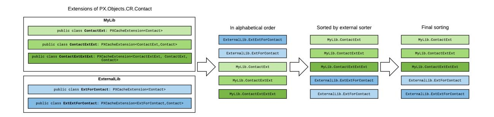

#### *Figure: Extension sorting*

#### **In This Section**

- *[DAC Extensions](#page-49-0)*
- *[Graph Extensions](#page-58-0)*
- *Run-Time [Compilation](#page-73-0)*
- *[Extension Library](#page-73-1)*

### <span id="page-49-0"></span>**DAC Extensions**

This topic explores the ways provided by the Acumatica Customization Platform to define data access class (DAC) extensions (which are also referred to as *cache extensions*) of different levels and shows how different DAC extensions can interact.

To declare a DAC extension, you derive a class from PXCacheExtension<T>. Also, the DAC extension must be declared with the public access modifier to be correctly recognized by the Acumatica Customization Platform.

In the graph extension, you must declare the IsActive method which enables the extension on condition. For details, see *To Enable a DAC Extension [Conditionally](#page-327-1) (IsActive)*.

#### **First-Level DAC Extension**

The example below shows a declaration of a first-level DAC extension.

```
public sealed class BaseDACExtension : PXCacheExtension<BaseDAC>
{
 public static void SomeMethod(BaseDACExtension ext)
 {
 BaseDAC dac = ext.Base;
 }
}
```

The extension class includes the read-only Base property, which returns an instance of the base DAC.

#### **Second-Level DAC Extension**

The example below shows a declaration of a second-level DAC extension.

```
public sealed class BaseDACExtensionOnExtension :
 PXCacheExtension<BaseDACExtension, BaseDAC>
{
 public static void SomeMethod(BaseDACExtensionOnExtension ext2)
 {
 BaseDAC dac = ext2.Base;
 BaseDACExtension dacExt = ext2.Base1;
 }
}
```

The extension class includes the following:

- The read-only Base property, which returns the instance of the base DAC
- The read-only Base1 property, which returns the instance of the first-level DAC extension

#### **Two Variants of a Higher-Level DAC Extension**

A definition of an extension of a higher level has two possible variants. In the first variant, you derive the extension class from the PXCacheExtension generic class with two type parameters, where the first type parameter is set to an extension of the previous level. In the second variant, you derive the extension class from the PXCacheExtension generic class with the same number of type parameters as the level of the extension of the new class. In this case, you set type parameters to extension classes from all lower extension levels, from the previous level down to the base class.

#### **First Variant of a Higher-Level DAC Extension**

The example below shows the declaration of a third- or higher-level DAC extension that derives from the PXCacheExtension generic class with two type parameters.

```
public sealed class BaseDACMultiExtensionOnExtension :
 PXCacheExtension<BaseDACExtensionOnExtension, BaseDAC>
{
 public static void SomeMethod(BaseDACMultiExtensionOnExtension ext3)
 {
 BaseDAC dac = ext3.Base;
 BaseDACExtensionOnExtension dacExtOnExt = ext3.Base1;
 }
}
```

An extension class defined this way includes the following:

- The read-only Base property, which returns the instance of the base DAC
- The read-only Base1 property, which returns the instance of the DAC extension from the previous level

#### **Second Variant of a Higher-Level DAC Extension**

The example below shows a declaration of a third- or higher-level DAC extension that derives from the PXCacheExtension generic class with three or more type parameters.

```
public sealed class BaseDACAdvMultiExtensionOnExtension : 
 PXCacheExtension<BaseDACExtensionOnExtension, BaseDACExtension, BaseDAC>
{
 public static void SomeMethod(BaseDACAdvMultiExtensionOnExtension ext4)
 {
 BaseDAC dac = ext4.Base;
```

```
 BaseDACExtension dacExt = ext4.Base1;
 BaseDACExtensionOnExtension dacExtOnExt = ext4.Base2;
 }
}
```

An extension class defined in this way includes the following:

- The read-only Base property, which returns the instance of the base DAC
- The read-only BaseN properties for all extension levels below the current level, where *N* is the sequence number of an extension level

### **Attributes Hierarchy of a DAC Field**

Conceptually, a DAC extension is a substitution of the base DAC. The base DAC is replaced at run time with the merged result of the base DAC and every extension discovered.

Each extension on another extension completely overrides the DAC field attributes. The attributes declared on the highest-level extension override all previously declared attributes.

For example, suppose that the attributes of the same DAC field are defined on different extension levels as follows:

• In the base DAC, as shown below

```
 [PXUIField(DisplayName = "Base Name")]
 [PXDefault("Default base value")]
```

• In the first-level DAC extension, as the following code shows

```
[PXUIField(DisplayName = "Level1 Name", Visible = false)]
```

• In the second-level DAC extension, as shown below

```
[PXUIField(DisplayName = "Level2 Name")]
[PXDefault("Default 2nd level value")]
```

If all the extensions are applied, any field of the second-level DAC extension will have the following parameters specified by attributes:

- Display name: *Level2 Name*
- Visible: *true*
- Default value: *Default 2nd level value*

You cannot modify the same member of the base DAC in the DAC extensions of the same level. You should use DAC extensions of different levels that successively extend one another.

#### **DAC Field Read and Write Operations**

The Acumatica Framework can access the value of a DAC field only through an instance of the base DAC. The instance of the DAC extension is used to get the field value only when the field is declared in the extension and is not present in the base DAC.

To assign a value to a field, the application developer should use the instance of the base DAC. You must use the instance of a DAC extension to assign a field value when the field is declared within the extension and is not present in the base DAC.

#### **In This Section**

- *[Access to a Custom Field](#page-52-0)*
- *[Customization of Field Attributes in DAC Extensions](#page-54-0)*
- *[Supported DAC Extension Formats](#page-57-0)*

### <span id="page-52-0"></span>**Access to a Custom Field**

You can customize a data access class (DAC) in either of the following ways (see the diagram below):

- By altering the attributes of existing fields. You can use an altered field just as you would any other existing field.
- By declaring new (custom) fields.

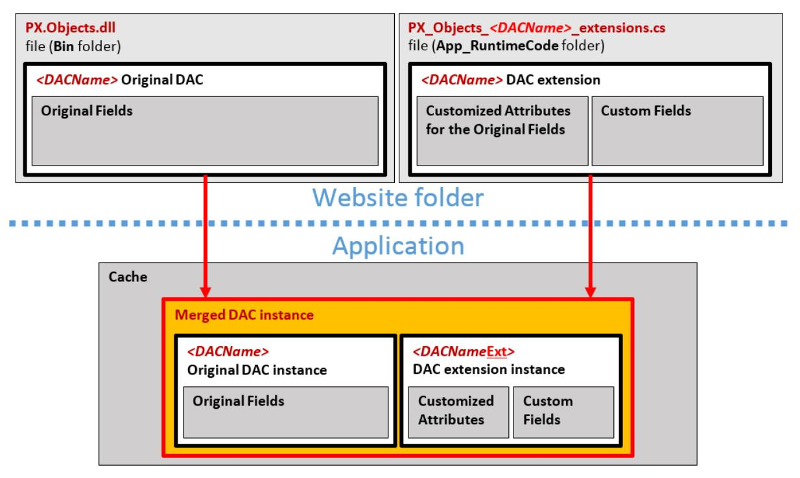

#### *Figure: Analyzing the content of the merged DAC instance in the cache object*

Every custom field is declared within the code of a DAC extension; therefore, at run time, the custom field is accessible only through the DAC extension instance of the cache object.

You can access a custom field:

- *[From a Method](#page-53-0)*
- *[From a BQL Statement](#page-54-1)*
- *[From a Field Attribute](#page-54-2)*

### <span id="page-53-0"></span>**From a Method**

You can access the extension instance through the base (original) DAC object by using one of the following generic methods:

- The GetExtension<T>(object) static generic method of the PXCache<T> generic class
- The GetExtension<T>(object) static generic method declared within the non-generic PXCache class

There are no differences between these generic methods. You can use either one.

For example, you might access an instance of a DAC extension as follows. This example uses the row instance of the base DAC to retrieve the rowExt DAC extension object.

DACNameExt rowExt = PXCache<DACName>.GetExtension<DACNameExt>(row);

To access a custom field, use the instance of a DAC extension that contains the field as follows. The code below illustrates the use of the GetExtension<T>(object) static generic method of the PXCache<T> generic class to access an instance of a DAC extension used to access a custom field.

var fieldValue = PXCache<DACName>.GetExtension<DACNameExt>(row).UsrFieldName;

You can retrieve a DAC extension object or particular field from it by using the methods of PXCache, as shown in the code below. This code demonstrates how you can access a field by using the GetExtension<> method.

```
//Access to the field through the GetExtension<> method
//localCategory gets the value of the usrLocalTaxCategoryID custom field 
//defined in the InventoryItemExtension DAC extension for the InventoryItem class
protected void InventoryItem_RowUpdating(PXCache sender, PXRowUpdatingEventArgs e)
{
 InventoryItem row = e.NewRow as InventoryItem;
 InventoryItemExtension rowExt = sender.GetExtension<InventoryItemExtension>(row);
 string localCategory = rowExt.UsrLocalTaxCategoryID;
...
```

In event handlers, you can also use the GetValue() and GetValueExt() methods to access the custom field by its string name, as the code below shows.

```
//Access to the field through the GetValue() method
//localCategory gets the value of the usrLocalTaxCategoryID custom field 
//defined in a DAC extension for the InventoryItem class
protected void InventoryItem_RowUpdating(PXCache sender, PXRowUpdatingEventArgs e)
{
 InventoryItem row = e.NewRow as InventoryItem;
 string localCategory = (string)sender.GetValue(row, "usrLocalTaxCategoryID");
...
```

For custom fields defined in DAC extensions, you can also use other methods of PXCache classes, such as SetValue() and SetDefaultExt(). For more information, see the PXCache<Table> class in the API Reference Documentation of Acumatica Framework.

You can refer to the custom field by its BQL name in any methods of Acumatica Framework. The example below shows how you can refer to the field in the SetEnabled<T>() method of the PXUIFieldAttribute that you can use to configure the UI representation of the field at run time. For more information on available classes and their methods, see the API Reference Documentation of Acumatica Framework.

```
//The usrLocalTaxCategoryID custom field is defined
//in the InventoryItemExtension DAC extension for the InventoryItem class
protected void InventoryItem_RowSelected(PXCache sender, PXRowSelectedEventArgs e)
{
 InventoryItem row = e.Row as InventoryItem;
 PXUIFieldAttribute.SetEnabled<InventoryItemExtension.usrLocalTaxCategoryID>(sender,
 row, true);
...
```

### <span id="page-54-1"></span>**From a BQL Statement**

In BQL expressions, you have to refer to the custom field by its BQL name in the extension class.

For example, aer you have added the UsrSearchKeywords field to the InventoryItemExtension class, which is a DAC extension for the InventoryItem class, the field is accessible in BQL, as shown in the code below.

```
//The usrLocalTaxCategoryID custom field is defined
//in the InventoryItemExtension DAC extension for the InventoryItem class
PXSelect<InventoryItemExtension, 
 Where<InventoryItemExtension.usrLocalTaxCategoryID, IsNotNull>>
```

### <span id="page-54-2"></span>**From a Field Attribute**

In DAC extensions, you have to refer to a custom field by its BQL name.

Aer you have added the UsrSearchKeywords field to the InventoryItemExtension class, which is a DAC extension for the InventoryItem class, the field is accessible in other DAC extensions.

For example, if you need to specify the type of the custom DAC field. For example, in attributes, you can use the typeof operator, as shown in the code below.

```
//The usrLocalTaxCategoryID custom field is defined
//in the InventoryItemExtension DAC extension for the InventoryItem class
[PXSelector(typeof(InventoryItemExtension.usrLocalTaxCategoryID))]
```

### <span id="page-54-0"></span>**Customization of Field Attributes in DAC Extensions**

If you have a customization that replaces the original attributes of a field with custom attributes, aer you upgrade Acumatica ERP to a new version, new functionality may became unavailable, as the following diagram shows.

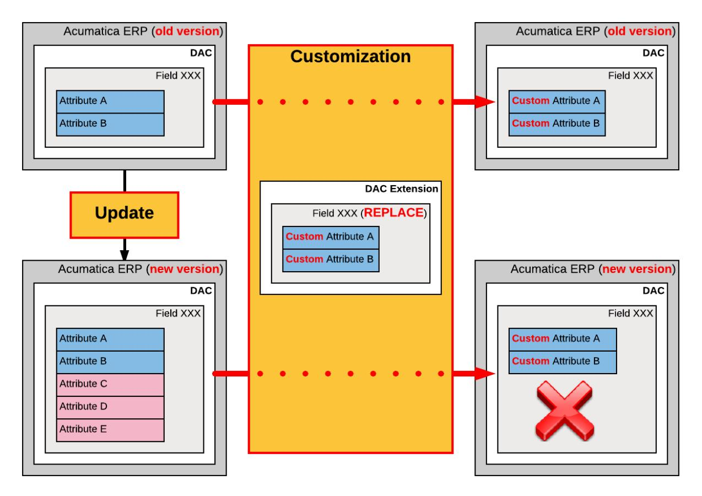

*Figure: Possible result of using the Replace (default) method to customize the attributes of a DAC field*

To address this issue, the customization framework provides advanced possibilities for you to control the field customization by using additional attributes in the DAC extension.

When you customize Acumatica ERP, you can specify how the system should apply the original and custom attributes to the field. Thus, you can make the customizations more flexible and use the collections of original attributes that could be updated between Acumatica ERP versions.

To specify the way the system should apply the field attributes in a DAC extension, you can use the following attributes.

| Attribute                  | Description                                                        |
|----------------------------|--------------------------------------------------------------------|
| PXMergeAttributes          | Specifies how to apply custom attributes to the exist<br>ing ones. |
| PXRemoveBaseAttribute      | Removes the specified existing attribute.                          |
| PXCustomizeBaseAttribute   | Defines a new value for the specified attribute parame<br>ter.     |
| PXCustomizeSelectorColumns | Defines the new set and order of the columns in the se<br>lector.  |

In the following example, the display name of the MyField field of the MyDac DAC is *My Field*, and in the MyDacExt DAC extension the display name of this field is changed to *My Custom Field*.

```
 public abstract class myField: PX.Data.BQL.BqlInt.Field<myField> { }
 [PXDBInt]
 [PXUIField(DisplayName = "My Field")]
 public virtual int? MyField{ get; set; }
}
public class MyDacExt : PXCacheExtension<MyDac>
{
 [PXCustomizeBaseAttribute(typeof(PXUIField), 
 nameof(PXUIFieldAttribute.DisplayName), "My Custom Field)]
 [PXMergeAttributes(Method = MergeMethod.Append)]
 public virtual int? MyField{ get; set; }
}
```

#### **Application Order of the Custom Attributes**

The customization attributes described above are applied in the following order:

- 1. *[PXCustomizeBaseAttribute](https://help.acumatica.com/Help?ScreenId=ShowWiki&pageid=f450cc34-384a-b8d2-a685-5c5e24871902)*
- 2. *[PXRemoveBaseAttribute](https://help.acumatica.com/Help?ScreenId=ShowWiki&pageid=d74c58a7-42e5-6927-6f55-2bebb8ce838a)*
- 3. *[PXMergeAttributes](https://help.acumatica.com/Help?ScreenId=ShowWiki&pageid=dce254b6-4fff-887a-4d0c-914284b2ad8b)*

The *[PXCustomizeSelectorColumns](https://help.acumatica.com/Help?ScreenId=ShowWiki&pageid=8225b692-20e8-8fc4-1cab-e31d78f718db)* works independently of these three attributes.

For details on how to customize field attributes for a particular screen, see the *[Overriding Attributes of a DAC field in](#page-71-0) [the Graph](#page-71-0)* topic.

#### **Adding Attribute to Existing DAC Field**

Suppose that you have a DAC and a DAC extension, and in a DAC extension, you need to add an attribute to the set of inherited attributes of a DAC field. In that case, you will need to override the whole property including the virtual field and the abstract class and define all attributes from scratch. The customization attributes described in the previous section, are not applicable.

In case of an auto-implemented property in the parent DAC, define the auto-implemented property in the DAC extension. In case of a full property in the parent DAC, define the full property in the DAC extension. For example, suppose that you have the following property in the parent DAC.

```
public virtual int? MyProp
{
 get => _FieldValue;
 set => _FieldValue = value;
}
```

The overridden property should looks as shown in the following code.

```
public override int? MyProp
{
 get => base.MyProp;
 set => base.MyProp = value;
}
```

### <span id="page-57-0"></span>**Supported DAC Extension Formats**

You can keep a DAC customization in a customization project in any of the following ways:

• As a *DAC* item of a customization project in XML format. When you publish the project, the platform creates the DAC extension source code and saves the code in the <DACItemName>\_extensions.cs file in the App\_RuntimeCode folder of the website.

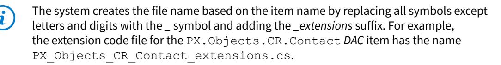

- As a *Code* item of a customization project that is the C# code of the DAC extension wrapped in XML format. When you publish the project, the platform saves the code in the <CodeItemName>.cs file in the App\_RuntimeCode folder of the website.
- As a .dll file of the extension library in the Bin folder of the website. The library contains the binary code of the DAC extension. To deploy the extension library to the production environment along with a customization project, you include the extension library in the project as a *File* item. See *[Extension Library](#page-73-1)* for details.

By using the *[Customization Project Editor](https://help-2025r1.acumatica.com/Help?ScreenId=ShowWiki&pageid=0bb97781-e987-4039-962d-457720821bff)*, you can:

• Convert a *DAC* item to a *Code* item.

The system creates the *Code* name based on the *DAC* item name by using the last word of the name and adding the *Extensions* suffix. For example, the PX.Objects.CR.Contact *DAC* item is converted to the ContactExtensions *Code* item.

• Move a *Code* item to the extension library included in the customization project as a *File* item.

If you have a customized data access class that is added to the project as a *DAC* item, then you can click **Convert to Extension** on the page toolbar of the Customized Data Classes page to convert the class changes into the class extension code used to complete the extension development in either the Code Editor or Microso Visual Studio (see the diagram below).

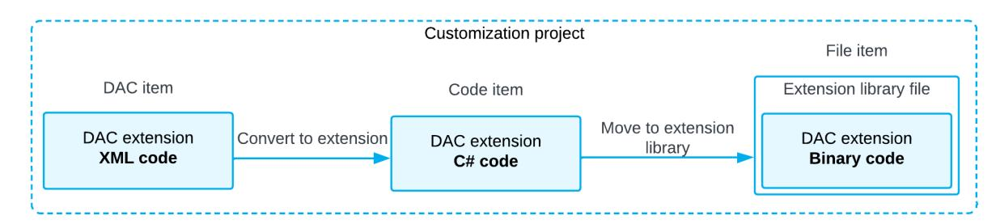

#### *Figure: Converting the code format of a DAC extension in a customization project*

For a *Code* item included in a customization project, if you want to move the code to an extension library to compile it into a .dll file, you can click the **Move to Ext. Library** button on the page toolbar of the *[Code Editor](https://help-2025r1.acumatica.com/Help?ScreenId=ShowWiki&pageid=c2678973-d557-47d4-b8ee-9dd69f55b465)*. Aer the operation is complete, the *Code* item that is currently displayed in the work area of the Code Editor is removed from the customization project. The file with the same source code is appended to the extension library that is bound to the customization project. If the *Code* item name was CodeItemName, the name of the created file will be CodeItemName.cs.

### <span id="page-58-0"></span>**Graph Extensions**

This topic explores the ways provided by the Acumatica Customization Platform to define business logic controller (BLC, also referred as *graph*) extensions of different levels, and shows how different BLC extensions can interact.

To declare an extension of a BLC, you derive a class from PXGraphExtension<T>. Also, this extension of a BLC must be declared with the public access modifier to be correctly recognized by the Acumatica Customization Platform.

In the graph extension, you must declare the IsActive method which enables the extension on condition. For details, see *To Enable a Graph Extension [Conditionally](#page-356-1) (IsActive)*.

#### **First-Level BLC Extension**

The example below shows a declaration of a first-level BLC extension.

```
public class BaseBLCExtension : PXGraphExtension<BaseBLC>
{
 public void SomeMethod()
 {
 BaseBLC baseBLC = Base;
 }
}
```

The extension class includes the read-only Base property, which returns an instance of the base BLC.

#### **Second-Level BLC Extension**

The example below shows a declaration of a second-level BLC extension.

```
public class BaseBLCExtensionOnExtension :
 PXGraphExtension<BaseBLCExtension, BaseBLC>
{
 public void SomeMethod()
 {
 BaseBLC baseBLC = Base;
 BaseBLCExtension ext = Base1;
 }
}
```

The extension class includes the following:

- The read-only Base property, which returns the instance of the base BLC
- The read-only Base1 property, which returns the instance of the first-level BLC extension

#### **Application of a Graph Extension to Graph Inheritors**

The graph extension applies not only to a graph specified in the graph extension's declaration but to all graphs derived from the graph specified in the graph extension's declaration.

Suppose, you have a base graph named ARInvoiceEntry, two graphs named SOInvoiceEntry and ARSpecificInvoiceEntry which are derived from ARInvoiceEntry and a graph extension named ARInvoiceEntryAdvanceTaxesExt declared for ARInvoiceEntry as shown in the following diagram.

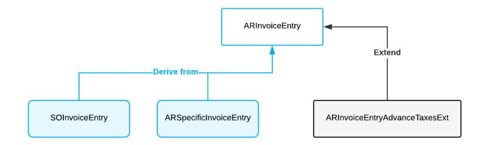

#### *Figure: Relations between graphs*

Acumatica Framework applies members declared in the ARInvoiceEntryAdvanceTaxesExt to all graphs: ARInvoiceEntry, ARSpecificInvoiceEntry, and SOInvoiceEntry.

#### **Two Variants of a Higher-Level BLC Extension**

A definition of a higher-level BLC extension has two possible variants. In the first variant, you derive the extension class from the PXGraphExtension generic class with two type parameters, where the first type parameter is set to an extension of the previous level. In the second variant, you derive the extension class from the PXGraphExtension generic class with the same number of type parameters as the level of the extension of the new class. In this case, you set type parameters to extension classes from all lower extension levels, from the previous level down to the base class.

#### **First Variant of a Higher-Level BLC Extension**

The example below shows a declaration of a third- or higher-level BLC extension that is derived from the PXGraphExtension generic class with two type parameters.

```
public class BaseBLCMultiExtensionOnExtension :
 PXGraphExtension<BaseBLCExtensionOnExtension, BaseBLC>
{
 public void SomeMethod()
 {
 BaseBLC BLC = Base;
 BaseBLCExtensionOnExtension prevExt = Base1;
 }
}
```

An extension class defined in this way includes the following:

- The read-only Base property, which returns the instance of the base BLC
- The read-only Base1 property, which returns the instance of the BLC extension from the previous level

#### **Second Variant of a Higher-Level BLC Extension**

The example below shows a declaration of a third- or higher-level BLC extension that is derived from the PXGraphExtension generic class with three or more type parameters.

```
{
 public void SomeMethod()
 {
 BaseBLC BLC = Base;
 BaseBLCExtension ext = Base1;
 BaseBLCExtensionOnExtension extOnExt = Base2;
 }
}
```

An extension class defined in this way includes the following:

- The read-only Base property, which returns the instance of the base BLC
- The read-only BaseN properties for all extension levels below the current level, where *N* is the sequence number of an extension level

Conceptually, a BLC extension is a substitution of the base BLC. The base BLC is replaced at run time with the merged result of the base BLC and every extension the platform found. The higher level of a declaration an extension has, the higher priority it obtains in the merge operation.

#### **In This Section**

- *[Event Handlers](#page-60-0)*
- *[Customization](#page-64-0) of a Data View*
- *[Customization of an Action](#page-67-0)*
- *[Override of a Method](#page-70-0)*
- *[Overriding Attributes of a DAC field in the Graph](#page-71-0)*

### <span id="page-60-0"></span>**Event Handlers**

The business logic associated with data modifications is implemented through event handlers. Event handlers are methods that are executed when the PXCache objects of a particular data access class (DAC) raise data manipulation events.

Every business logic controller (BLC, also referred to as *graph*) instance has a collection of event handlers for each type of data manipulation event. Every collection is filled automatically with event subscribers that are declared within the base (original) BLC and that meet the naming conventions of Acumatica Framework event handlers.

With Acumatica Customization Platform, you can define new event handlers within BLC extensions. You can define an event handler in two possible ways:

- You define the event handler in the same way as it is defined in the base BLC. As a result, the event handler is added to the appropriate event handler collection. Depending on the event type, the event handler is added to either the end of the collection or the start of it. When the event occurs, all event handlers in the collection are executed, from the first to the last one.
- You define the event handler with an additional parameter, which represents the delegate for one of the following:
  - The event handler with an additional parameter from the extension of the previous level, if such an event handler exists.
  - The first item in the collection of event handlers, if no handlers with additional parameters declared within lower-level extensions exist. The collection contains event handlers without the additional parameter from extensions discovered at all levels.

In either case, you can decide whether to invoke the delegate.

The CacheAttached() event handler declared in the highest-level BLC extension is used to replace base DAC field attributes. Attributes attached to the CacheAttached() event handlers within the base BLC or its extensions are attached to the PXCache object, each time completely replacing the previous ones, from the base BLC to the highest extension discovered.

### **Event Handler Added to the End of the Collection**

The following event handlers are added to the end of the collection:

- FieldUpdated(PXCache sender, PXFieldUpdatedEventArgs e)
- RowSelecting(PXCache sender, PXRowSelectingEventArgs e)
- RowSelected(PXCache sender, PXRowSelectedEventArgs e)
- RowInserted(PXCache sender, PXRowInsertedEventArgs e)
- RowUpdated(PXCache sender, PXRowUpdatedEventArgs e)
- RowDeleted(PXCache sender, PXRowDeletedEventArgs e)
- RowPersisted(PXCache sender, PXRowPersistedEventArgs e)

The system executes event handlers from the base (original) event handler up to the highest extension level (referred to as the *bubbling strategy*). The lower the BLC extension's level of declaration, the earlier the event subscriber is called. The figure below illustrates this principle.

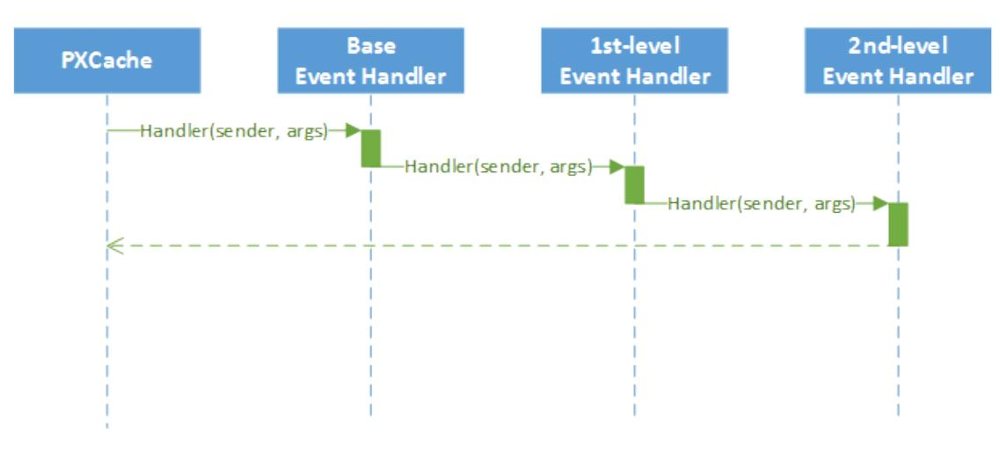

*Figure: Event execution with the bubbling strategy*

#### **Event Handlers Added to the Beginning of the Collection**

The following event handlers are added to the beginning of the collection:

- FieldSelecting(PXCache sender, PXFieldSelectingEventArgs e)
- FieldDefaulting(PXCache sender, PXFieldDefaultingEventArgs e)
- FieldUpdating(PXCache sender, PXFieldUpdatingEventArgs e)
- FieldVerifying(PXCache sender, PXFieldVerifyingEventArgs e)
- RowInserting(PXCache sender, PXRowInsertingEventArgs e)
- RowUpdating(PXCache sender, PXRowUpdatingEventArgs e)
- RowDeleting(PXCache sender, PXRowDeletingEventArgs e)
- RowPersisting(PXCache sender, PXRowPersistingEventArgs e)

- CommandPreparing(PXCache sender, PXCommandPreparingEventArgs e)
- ExceptionHandling(PXCache sender, PXExceptionHandlingEventArgs e)

Event handlers are added by the system to the beginning of the collection by using the *tunneling strategy*. The system executes event handlers from the highest extension level down to the base event handler. The higher the BLC extension's level of declaration, the earlier the event subscriber is called. The figure below illustrates this principle.

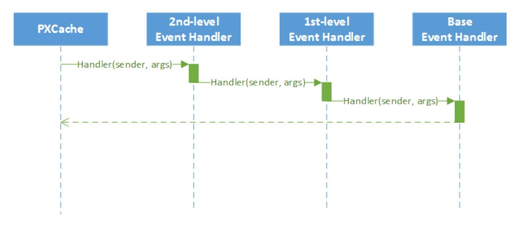

*Figure: Event execution with the tunneling strategy*

#### **Event Handlers with an Additional Parameter**

The event handler with an additional parameter replaces the base BLC event handler collection. When the event is raised, the system calls the event handler with an additional parameter of the highest-level BLC extension. The system passes a link to the event handler with an additional parameter from the extension of the previous level, if such an event handler exists, or to the first item in the event handler collection. You use a delegate as an additional parameter to encapsulate the appropriate event handler.

The Acumatica Framework provides the following delegates to encapsulate event handlers:

- PXFieldSelecting(PXCache sender, PXFieldSelectingEventArgs e)
- PXFieldDefaulting(PXCache sender, PXFieldDefaultingEventArgs e)
- PXFieldUpdating(PXCache sender, PXFieldUpdatingEventArgs e)
- PXFieldVerifying(PXCache sender, PXFieldVerifyingEventArgs e)
- PXFieldUpdated(PXCache sender, PXFieldUpdatedEventArgs e)
- PXRowSelecting(PXCache sender, PXRowSelectingEventArgs e)
- PXRowSelected(PXCache sender, PXRowSelectedEventArgs e)
- PXRowInserting(PXCache sender, PXRowInsertingEventArgs e)
- PXRowInserted(PXCache sender, PXRowInsertedEventArgs e)
- PXRowUpdating(PXCache sender, PXRowUpdatingEventArgs e)
- PXRowUpdated(PXCache sender, PXRowUpdatedEventArgs e)
- PXRowDeleting(PXCache sender, PXRowDeletingEventArgs e)
- PXRowDeleted(PXCache sender, PXRowDeletedEventArgs e)
- PXRowPersisting(PXCache sender, PXRowPersistingEventArgs e)
- PXRowPersisted(PXCache sender, PXRowPersistedEventArgs e)
- PXCommandPreparing(PXCache sender, PXCommandPreparingEventArgs e)
- PXExceptionHandling(PXCache sender, PXExceptionHandlingEventArgs e)

For example, for the FieldVerifying event, the event handler with an additional parameter looks like FieldVerifying(PXCache sender, PXFieldVerifyingEventArgs e, PXFieldVerifying del).

You can execute del() to invoke the event handler to which del points, or you can decide not to invoke it. When del() points to the base BLC event handler collection, its invocation causes the execution of the whole collection. All other event handlers in the collection are invoked sequentially aer the first handler is executed.

Suppose that you have declared event handlers as follows.

```
public class BaseBLC : PXGraph<BaseBLC, DAC>
{
 protected void DAC_RowUpdated(PXCache cache, PXRowUpdatedEventArgs e)
 {
 }
 protected void DAC_Field_FieldVerifying(PXCache sender, PXFieldVerifyingEventArgs e)
 {
 }
}
public class BaseBLCExt : PXGraphExtension<BaseBLC>
{
 protected void DAC_RowUpdated(PXCache cache, PXRowUpdatedEventArgs e)
 {
 }
 protected void DAC_Field_FieldVerifying(PXCache sender, PXFieldVerifyingEventArgs e)
 {
 }
 protected void DAC_RowUpdated(PXCache cache, PXRowUpdatedEventArgs e, PXRowUpdated del)
 {
 if (del != null)
 del(sender, e);
 }
 protected void DAC_Field_FieldVerifying(PXCache sender, PXFieldVerifyingEventArgs e,
 PXFieldVerifying del)
 {
 if (del != null)
 del(sender, e);
 }
}
public class BaseBLCExtOnExt : PXGraphExtension<BaseBLCExt, BaseBLC>
{
 protected void DAC_RowUpdated(PXCache cache, PXRowUpdatedEventArgs e)
 {
 }
 protected void DAC_Field_FieldVerifying(PXCache sender, PXFieldVerifyingEventArgs e)
```

```
 {
 }
 protected void DAC_RowUpdated(PXCache cache, PXRowUpdatedEventArgs e, PXRowUpdated del)
 {
 if (del != null)
 del(sender, e);
 }
 protected void DAC_Field_FieldVerifying(PXCache sender, PXFieldVerifyingEventArgs e,
 PXFieldVerifying del)
 {
 if (del != null)
 del(sender, e);
 }
}
```

In this case, the RowUpdated and FieldVerifying event handlers are invoked in the appropriate sequences, explained below.

The following figure illustrates the order in which the RowUpdated events are invoked.

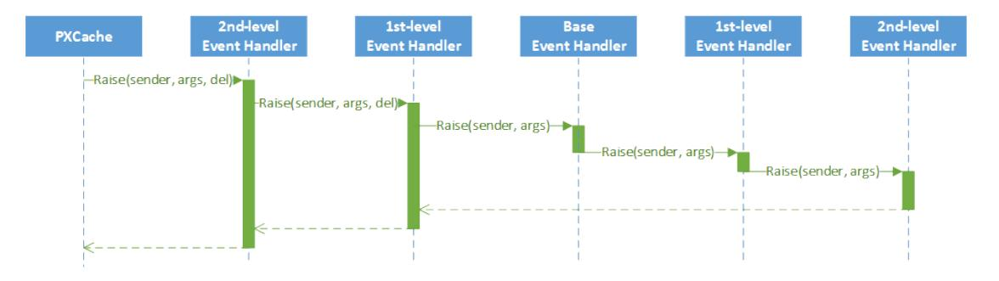

#### *Figure: The order of the RowUpdated event handler execution*

The following figure illustrates the order in which the FieldVerifying events are invoked.

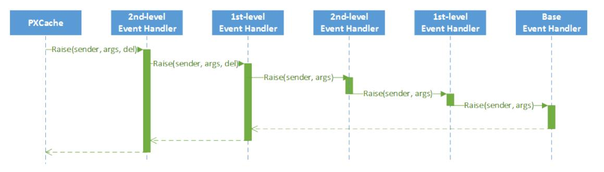

<span id="page-64-0"></span>*Figure: The order of the FieldVerifying event handler invocation*

### **Customization of a Data View**

The platform provides a way to alter or extend the data views defined in a BLC.

A *data view* is a PXSelect BQL expression declared in a BLC for accessing and manipulating data. A data view may contain a delegate, which is an optional graph method that executes when the data view is requested. Every data view is represented by the PXView object and placed in the *Views* collection of the appropriate BLC. To construct an instance of the PXView class, you use a PXSelect BQL expression and an optional delegate from the highest-level extension discovered.

Suppose that you have declared the Objects data view within the base BLC, as shown below.

```
 public class BaseBLC : PXGraph<BaseBLC, DAC>
{
 public PXSelect<DAC> Objects;
}
```

You can alter a data view within a BLC extension in the following ways:

• By altering the data view within a BLC extension. A data view that is redeclared within a BLC extension replaces the base data view in the *Views* collection of the BLC instance. Consider the following example of a first-level BLC extension.

```
public class BaseBLCExt : PXGraphExtension<BaseBLC>
{
 public PXSelectOrderBy<DAC, 
 OrderBy<Asc<DAC.field>>> Objects;
}
```

The *Views* collection of a BLC instance contains the PXView object, which uses the Objects data view declared within the first-level extension, instead of the data view declared within the base BLC.

A data view redeclared within a BLC extension completely replaces the base data view within the *Views* collection of a BLC instance, including all attributes attached to the data view declared within the base BLC. You can either attach the same set of attributes to the data view or completely redeclare the attributes.

• By declaring or altering the data view delegate in a BLC extension. The new delegate is attached to the corresponding data view. Consider the following example of a second-level BLC extension.

```
 public class BaseBLCExtOnExt : PXGraphExtension<BaseBLCExt, BaseBLC>
{
 protected IEnumerable objects()
 {
 return PXSelect<DAC>.Select(Base);
 }
}
```

The *Views* collection of a BLC instance contains the PXView object, which uses the Objects data view declared within the first-level extension, with the objects() delegate declared within the second-level extension (see the screenshot below).

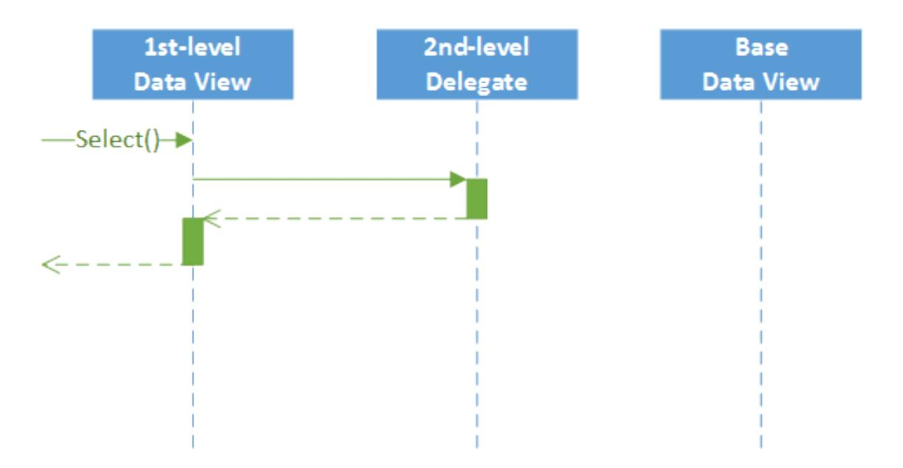

*Figure: The interaction among the levels of a BLC extension*

To query a data view declared within the base BLC or a lower-level extension from the data view delegate, you should redeclare the data view within a BLC extension. You do not need to redeclare a data member when it is not meant to be used from the data view delegate. Consider the following example of a secondlevel BLC extension.

```
public class BaseBLCExtOnExt : PXGraphExtension<BaseBLCExt, BaseBLC>
{
 protected IEnumerable objects()
 {
 return Base.Objects.Select();
 }
}
```

The new delegate queries the data view declared within the base BLC. Having redeclared the data view within the first-level extension, you prevent the data view execution from an infinite loop (see the following screenshot).

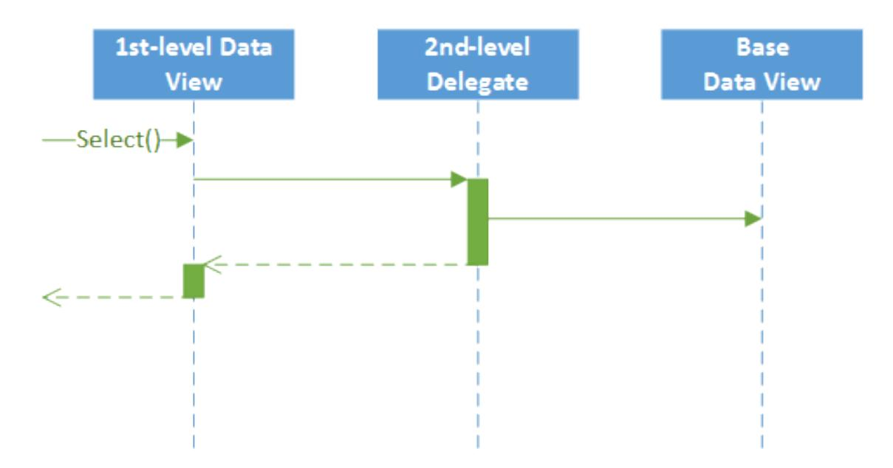

*Figure: The view of the base BLC from the second-level delegate*

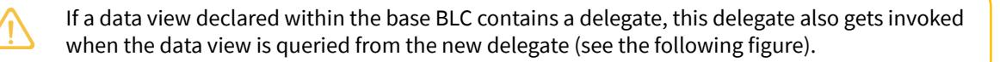

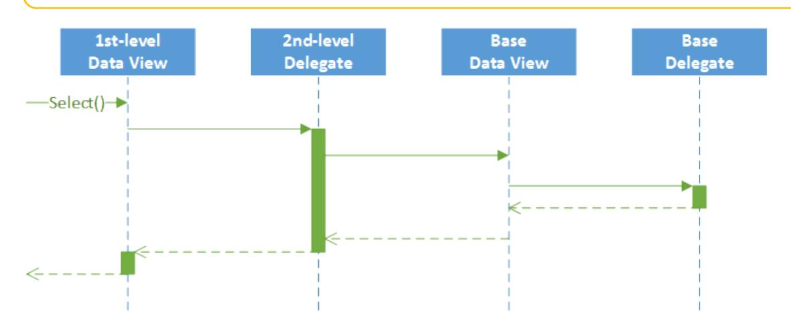

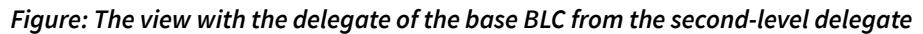

### <span id="page-67-0"></span>**Customization of an Action**

The platform provides a way to alter or extend an action defined in a business logic controller (BLC, also referred as *graph*).

An *action* is a BLC member of the PXAction type. An action always has the delegate defined. Every action is represented by the PXAction object and placed in the *Actions* collection of the appropriate BLC. To construct an instance of the PXAction class, you use a BLC member of the PXAction type and a delegate from the highest-level extension discovered.

Suppose that you have declared the Objects data view and the ValidateObjects action within the base BLC, as shown below.

```
 public class BaseBLC : PXGraph<BaseBLC, DAC>
{
 public PXSelect<DAC> Objects;
 public PXAction<DAC> ValidateObjects;
 [PXButton]
 [PXUIField(DisplayName = "Validate Objects")]
 protected virtual void validateObjects()
 {
 }
}
```

You can alter actions within BLC extensions in the following ways:

• By overriding action attributes within a BLC extension.

To override action attributes in a BLC extension, you should declare both the BLC member of the PXAction type and the delegate. You should attach a new set of attributes to the action delegate. Also, you need to invoke the Press method on the base BLC action. Having redeclared the member of PXAction<>, you prevent the action delegate execution from an infinite loop. Consider the following example of a first-level BLC extension.

```
 public class BaseBLCExt : PXGraphExtension<BaseBLC>
{
 public PXAction<DAC> ValidateObjects;
 [PXButton]
 [PXUIField(DisplayName = "Validate All Objects")]
 protected void validateObjects()
 {
 Base.ValidateObjects.Press();
 }
}
```

The *Actions* collection of a BLC instance contains the ValidateObjects action, which consists of the PXAction type member and the delegate, both of which were declared within the first-level extension (see the following figure).

When overriding an action delegate within a BLC extension, you completely redeclare the attributes attached to the action. Every action delegate must have PXButtonAttribute (or the derived attribute) and PXUIFieldAttribute attached.

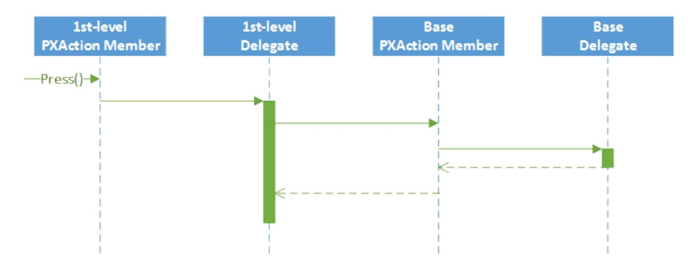

*Figure: The interaction among the first-level and base actions*

• By overriding the action delegate within the BLC extension.

The new delegate is used by the appropriate action. Consider the following example of a second-level BLC extension.

```
 public class BaseBLCExtOnExt : PXGraphExtension<BaseBLCExt, BaseBLC>
{
 [PXButton]
 [PXUIField(DisplayName = "Validate Objects")]
 protected void validateObjects()
 {
 }
}
```

The *Actions* collection of a BLC instance contains the ValidateObjects action, which consists of the PXAction<> type member declared within the first-level extension and the delegate declared within the second-level extension. To use an action declared within the base BLC or the lower-level extension from the action delegate, you should redeclare the action within a BLC extension. You do not need to redeclare an action when it is not meant to be used from the action delegate.

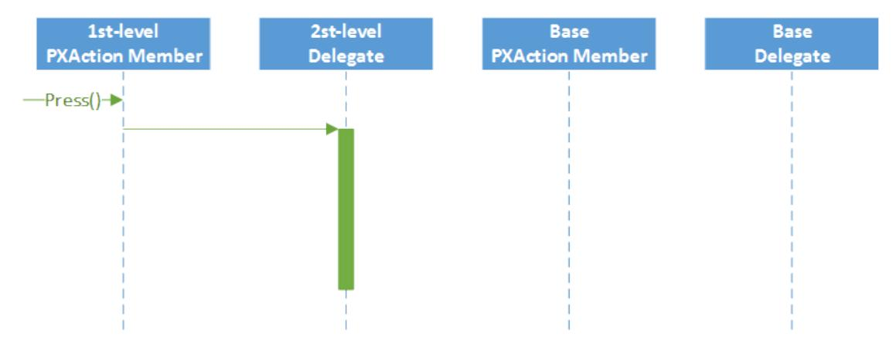


To modify the same member of the base BLC or any BLC extension, you should use extensions of higher levels.

### <span id="page-70-0"></span>**Override of a Method**

The platform provides a way to override a method of a business logic controller (BLC). We recommend that you keep the following guidelines in mind when you are defining the override of such a method:

- You should declare it as public.
- You should not declare it as virtual.
- You should add a comment to its declaration by using the cref property of the <seealso> XML tag. The value of the cref property should reference the original method that you are overriding. Note that this comment should not be included within the <summary> tag, which is used to provide the description of a method.
- If the override of the method contains a base delegate parameter, you should declare this parameter last in the list of parameters. The name of the parameter should begin with base\_, followed by the name of the method, as shown in the following code example.

```
/// <seealso cref="WorksheetPicking.IsWorksheetMode(string)"/>
[PXOverride]
public bool IsWorksheetMode(string modeCode, Func<string, bool> base_IsWorksheetMode)
```

Suppose that you need to override the PrePersist method of the BaseBLC class, which is defined in the code below.

```
public class BaseBLC : PXGraph<BaseBLC>
{
 protected override bool PrePersist()
 {
 if (!base.PrePersist())
 return false;
 ...
 }
}
```

You can override the method within a BLC extension as follows.

```
public class BaseBLC_Extension : PXGraphExtension<BaseBLC>
{
 /// <seealso cref="BaseBLC.PrePersist()"/>
 [PXOverride]
 public bool PrePersist(Func<bool> base_PrePersist)
 {
 if (!base_PrePersist())
 return false;
 ...
 }
}
```

The graph extension should include the declaration of the base delegate parameter, the PXOverride attribute, and the overridden method, which invokes the base delegate parameter, as the code above shows.

Because the PXOverride attribute on the declaration of the method is included in the graph extension, it forces the system to override the original method in the graph instance. Otherwise, both the base method and the overridden method will be invoked.

### <span id="page-71-0"></span>**Overriding Attributes of a DAC field in the Graph**

You can override one attribute or multiple attributes of a DAC field for a particular screen without changing the existing behavior of the attribute or attributes for all other screens.

You can do the following to override the attributes of a DAC field:

- Replace the whole set of attributes
- Append an attribute
- Override a single property of an attribute
- Replace one attribute with another

To override attributes, you should declare a CacheAttached event handler in the graph that corresponds to the screen for which you want to change the DAC field's behavior. With the declared CacheAttached event handler, you use special attributes, depending on what you want to do with the original attributes, as described in the following sections.

#### **Replacing the Whole Set of Attributes**

To override all attributes at once, you should only declare a CacheAttached event handler in the graph.

Suppose that the original DAC field attributes are declared as shown in the following code.

```
public class ARInvoice : PXBqlTable, IBqlTable
{ 
 [PXDBDecimal(4)] 
 [PXDefault(TypeCode.Decimal, "0.0")] 
 [PXUIField(DisplayName = "Commission amount")] 
 public virtual Decimal? CommAmt 
 { 
 get; 
 set; 
 }
}
```

To override a DAC field by using the CacheAttached event handler, in the graph corresponding to the screen whose behavior you want to change, declare the CacheAttached event handler for the field. The event handler must be named according to the standard conventions for naming graph events that is described in the *[Event](https://help-2025r1.acumatica.com/Help?ScreenId=ShowWiki&pageid=cd34176b-2ab9-42cc-890c-b6cb42cd433e) [Handlers](https://help-2025r1.acumatica.com/Help?ScreenId=ShowWiki&pageid=cd34176b-2ab9-42cc-890c-b6cb42cd433e)* topic.

For the CommAmt field, the code for the event handler looks like the following.

```
[PXDBDecimal(4)]
[PXDefault(TypeCode.Decimal, "0.0")]
[PXUIField(DisplayName = "Commission Amount")]
[PXAdditionalAttribute(NecessaryProperty = true)]
protected virtual void ARInvoice_CommAmt_CacheAttached(PXCache sender) { }
```

In this example, we added the PXAdditionalAttribute to the list of the CommAmt field attributes.

The set of attributes on the CacheAttached handler redefines the whole set of attributes placed on the specified DAC field. This results in undesired copying of all unmodified attributes, and the DAC and the graph no longer act synchronously. Therefore, we do not recommend using this method unless you intend to override all attributes of a field.

#### **Appending an Attribute**

Acumatica Framework provides a special attribute called *[PXMergeAttributes](https://help.acumatica.com/Help?ScreenId=ShowWiki&pageid=dce254b6-4fff-887a-4d0c-914284b2ad8b)*. When placed on a CacheAttached event handler for the corresponding DAC field, this attribute allows gives you the ability to reuse the existing attributes of a DAC field.

To append an attribute, you declare the CacheAttached event handler with the PXMergeAttributes attribute and the new attribute (or attributes), as shown in the following code.

```
[PXMergeAttributes(Method = MergeMethod.Append)]
[PXAdditionalAttribute(NecessaryProperty = true)]
protected virtual void ARInvoice_CommAmt_CacheAttached(PXCache sender) { }
```

This example works similarly to the previous one: It adds the PXAdditionalAttribute attribute to the list of the CommAmt field attributes, but without code duplication.

#### **Overriding a Single Property of an Attribute**

Acumatica Framework provides a special attribute called *[PXCustomizeBaseAttribute](https://help.acumatica.com/Help?ScreenId=ShowWiki&pageid=f450cc34-384a-b8d2-a685-5c5e24871902)*. When placed on a CacheAttached event handler for the corresponding DAC field, this attribute gives you the ability to redefine a single property of an attribute.

For example, suppose that you need to change the UI display name from **Commission Amount** to **Base Currency Commission** for only one screen. The code should look like the following.

```
[PXMergeAttributes(Method = MergeMethod.Append)]
[PXCustomizeBaseAttribute(typeof(PXUIFieldAttribute), 
 nameof(PXUIFieldAttribute.DisplayName), "Base Currency Commission")]
protected virtual void ARInvoice_CommAmt_CacheAttached(PXCache sender) { }
```

This example reuses the existing attributes by using the PXMergeAttributes attribute and redefines the PXUIFieldAttribute attribute by using the PXCustomizeBaseAttribute attribute.

#### **Replacing One Attribute with Another**

Acumatica Framework provides a special attribute called *[PXRemoveBaseAttribute](https://help.acumatica.com/Help?ScreenId=ShowWiki&pageid=d74c58a7-42e5-6927-6f55-2bebb8ce838a)*. When placed on a CacheAttached event handler for the corresponding DAC field, this attribute gives you the ability to remove the specified attribute.

For example, suppose that you need to replace PXDefaultAttribute with PXDBDefaultAttribute for only one screen. Further suppose that the original field declaration looks the one shown in the following code.

```
[Site(DisplayName = "Warehouse ID", 
 DescriptionField = typeof(INSite.descr))]
[PXDefault(typeof(SOShipment.siteID), 
 PersistingCheck = PXPersistingCheck.Nothing)]
public virtual Int32? SiteID { get; set; }
```

Then replacing PXDefaultAttribute with PXDBDefaultAttribute looks as shown in the following code.

```
[PXMergeAttributes(Method = MergeMethod.Append)]
[PXRemoveBaseAttribute(typeof(PXDefaultAttribute))]
[PXDBDefault(typeof(SOShipment.siteID), 
 PersistingCheck = PXPersistingCheck.Nothing)]
protected void SOOrderShipment_SiteID_CacheAttached(PXCache sender) { }
```

In this example, all existing attributes are reused by the PXMergeAttributes attribute, the PXDefaultAttribute is removed by the PXRemoveBaseAttribute attribute, and the new PXDBDefault attribute is declared.

#### **Application Order of the Custom Attributes**

The customization attributes described above are applied in the following order:

- 1. *[PXCustomizeBaseAttribute](https://help.acumatica.com/Help?ScreenId=ShowWiki&pageid=f450cc34-384a-b8d2-a685-5c5e24871902)*
- 2. *[PXRemoveBaseAttribute](https://help.acumatica.com/Help?ScreenId=ShowWiki&pageid=d74c58a7-42e5-6927-6f55-2bebb8ce838a)*
- 3. *[PXMergeAttributes](https://help.acumatica.com/Help?ScreenId=ShowWiki&pageid=dce254b6-4fff-887a-4d0c-914284b2ad8b)*

### <span id="page-73-0"></span>**Run-Time Compilation**

If you have created an extension for a business logic controller or a data access class in a customization project, during the project publication, the Acumatica Customization Platform stores the code of the class extension in a .cs file within the App\_RuntimeCode folder of the website.

At run time, the platform compiles the code in a separate library that is dynamically merged with the original classes. Run-time compilation is used by default for the code of the *DAC* and *Code* project items. (See *[Types](#page-33-1) of Items [in a Customization Project](#page-33-1)* for details.)

Publication of a customization updates the files in the App\_RuntimeCode folder of the website. Unlike when the Bin folder is updated, update of files in the App\_RuntimeCode folder doesn't cause the application domain to restart. (See *[Project Publication: General Information](#page-123-2)* for details.)

### <span id="page-73-1"></span>**Extension Library**

An extension library is a Microso Visual Studio project that contains customization code and can be individually developed and tested.

To move your code from your customization project to an extension library, you should first create an extension library and then move desired *Code* and *DAC* items to the extension library. Aer that you can develop your extension library in Visual Studio. See the following topics for details:

- *To Create an [Extension](#page-389-2) Library*
- *To Move a DAC Item to an [Extension](#page-159-1) Library*
- *To Move a Code Item to the [Extension](#page-172-2) Library*

If you need to deploy the customization code of an extension library to another system, you have to add the library to a customization project as a *File* item to include it in a customization package. See *To Add a [Custom](#page-175-2) File to a [Project](#page-175-2)* for details.

An extension library .dll file must be located in the Bin folder of the website. At run time during the website initialization, all the .dll files of the folder are loaded into the server memory for use by the Acumatica ERP application. Therefore, all the code extensions included in a library are accessible from the application.

During the first initialization of a base class, the Acumatica Customization Platform automatically discovers an extension for the class in the memory and applies the customization by replacing the base class with the merged result of the base class and the discovered extension.

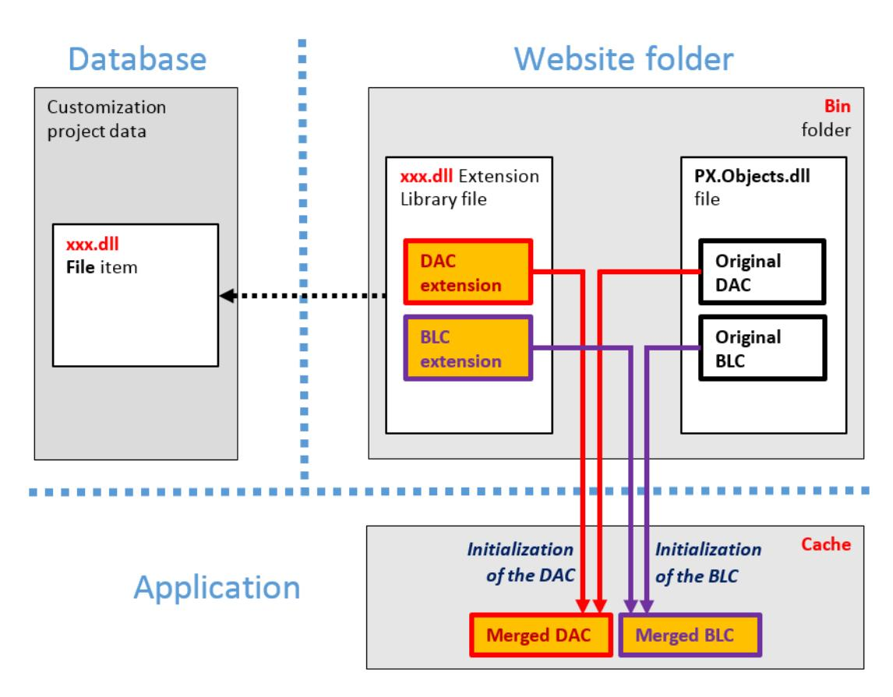

#### *Figure: Actual approach to the use of an extension library for a customization*

The use of extension libraries that are precompiled provides a measure of protection for your source code and intellectual property.

### <span id="page-74-0"></span>**Extension Library (DLL) Versus Code in a Customization Project**

While you are developing source code for a customization task, you can either keep the code in the customization project as *DAC* and *Code* items or move the code to an extension library and include the library in the project as a *File* item.

*DAC* and *Code* items are saved in the database, and, if the customization project is published, in the files located in the App\_RuntimeCode folder of the website. Acumatica Customization Platform compiles all the code located in this folder at run time.

We recommend that you keep the source code in the customization project only if the customization is elementary, such as if the code contains an event handler for a control on a form. When you work with a code item, it is easy to view the code of the applied customization directly in the *[Code Editor](https://help-2025r1.acumatica.com/Help?ScreenId=ShowWiki&pageid=c2678973-d557-47d4-b8ee-9dd69f55b465)* without Microso Visual Studio. However, if you are solving a complex customization task, it is generally better to develop the solution code in an extension library by using Visual Studio.

You can use Visual Studio to develop a *Code* item as well as code in an extension library. But the *IntelliSense* feature in Visual Studio is not available for the source code of a *Code* item if the code either uses custom fields or invokes members of class extensions defined in other *Code* and *DAC* items.

You can later customize deployed extensions for the end user by means of code extensions. Therefore, if the customization is compiled to an extension library, more than one customization can be applied to a single Acumatica ERP form.

If you have a custom DAC or a DAC extension in one customization and an extension of this custom DAC or a higher-level DAC extension in another customization, a publication of the second customization will fail if the customizations are published in the wrong order. To resolve the issue, convert the DAC extension in the second customization to an extension library. With this approach, no code will be generated during publication, and the order of publication is not important. See *To [Move](#page-159-1) [a DAC Item to an Extension Library](#page-159-1)* for details.

The following table shows the differences in the use of the code in *DAC* and *Code* items and in an extension library.

|                                                                             | Code in DAC and Code items                              | Code in an Extension Library                                                           |  |
|-----------------------------------------------------------------------------|---------------------------------------------------------|----------------------------------------------------------------------------------------|--|
| Best for:                                                                   | Quick start of a customization                          | Development of a customization<br>project when more than one devel<br>oper is involved |  |
| Primary storage:                                                            | Database                                                | File system                                                                            |  |
| Location within the website folder:                                         | App_RuntimeCode                                         | Bin                                                                                    |  |
| Intellectual property protection:                                           | No—the source code is open in the<br>deployment package | Yes—the source code is not provid<br>ed in the deployment package                      |  |
| Run-time compilation without the<br>application domain being restart<br>ed: | Yes                                                     | No                                                                                     |  |
| Editor:                                                                     | Code Editor, Visual Studio                              | Visual Studio                                                                          |  |
| IntelliSense feature in Visual Studio:                                      | No                                                      | Yes                                                                                    |  |
| Acuminator extension for Visual<br>Studio:                                  | No                                                      | Yes                                                                                    |  |
| Debugging:                                                                  | Yes                                                     | Yes                                                                                    |  |
| Integration with a version control<br>system:                               | Yes                                                     | Yes                                                                                    |  |
| Additional:                                                                 | Can be moved to an extension li<br>brary when needed    |                                                                                        |  |

To make a decision about how to work with the code, you should consider the following questions:

- How much code will be in the customization project?
- Is there a need for replicability of the customization?
- How many developers will take part in coding?
- Do you need to open the source code in the production environment?

We recommend that you use an extension library if any of the following conditions is met:

- You intend to have more than five class extensions for business logic controllers.
- The customization will be deployed on more than one system.
- The customization code will be developed by a team that needs to use a version control system.
- You have a reason to protect the intellectual property of the source code of the solution.

• You develop a plug-in for Acumatica ERP.

# <span id="page-76-4"></span><span id="page-76-0"></span>**Changes in the Database Schema**

The Acumatica Customization Platform permits the following changes to the database in the scope of a customization project:

- *[Creation of custom tables](#page-76-1)*
- *[Creation of custom columns in existing tables](#page-76-2)*
- *[Creation of views, indexes, and other database objects](#page-76-3)*

### <span id="page-76-1"></span>**Creation of Custom Tables**

We recommend that you create a custom table in the database of your development environment by using a database administration tool, such as SQL Server Management Studio, and then import the table schema from the database to a customization project by using the *[Customization Project Editor](https://help-2025r1.acumatica.com/Help?ScreenId=ShowWiki&pageid=0bb97781-e987-4039-962d-457720821bff)*. The project keeps the schema in XML format. While publishing the customization project, the platform executes a special procedure to create the table by the schema, while meeting all the requirements of Acumatica ERP.

### <span id="page-76-2"></span>**Creation of Custom Columns in Existing Tables**

To create a custom database-bound field, you add a column to the database table and declare the field in the extension of the base (original) DAC.

The new column is appended to the original table by altering the table schema. When you create the databasebound field by using the *[Data Class](https://help-2025r1.acumatica.com/Help?ScreenId=ShowWiki&pageid=06c038a5-1d75-482b-9b17-f2483ada0154)* page, the platform generates the DAC extension code for the new field and adds to the customization project the XML definition of the new column to be created in the database. To be able to create a UI control for the new field to display on a form, you have to publish the project to make the system create the column in the database table and compile the customization code. Aer the publication, you can add the control for the new field to the form by using the *[Screen Editor](https://help-2025r1.acumatica.com/Help?ScreenId=ShowWiki&pageid=d60a8270-e2ce-4380-b778-af61a0ca56d2)* page.

### <span id="page-76-3"></span>**Creation of Views, Indexes, and Other Database Objects**

With the Acumatica Customization Platform, you can add to a customization project an SQL script to be executed during the publication of the project. However, we recommend that you avoid doing this.


A possible result of a custom SQL script is the loss of the integrity and consistency of the application data.

If you do add a custom SQL script, you must adhere to the following requirements for the script:

- Because Acumatica ERP supports multitenancy, you must create an SQL script that correctly creates a database object that properly specifies and uses the company mask.
- You must correctly specify the attributes for the script so that the script can be executed on the target database servers: MySQL Server, Microso SQL Server, or both. For details about attributes, see *[Using the](#page-191-0) [SQL Script Attributes](#page-191-0)*.


If you have created custom database tables or custom fields for a tenant and have created the full-text search index for these elements, you need to add these tables to the pp\_DisableFullText and pp\_EnableFullText stored procedures in your customization project. This step is necessary to avoid errors when administrators copy tenants or create and restore snapshots.

### <span id="page-77-1"></span><span id="page-77-0"></span>**Custom Processes During Publication of a Customization**

The platform provides you the ability to execute custom processes within the instance of Acumatica ERP at the following times during the publication of a customization project:

- Aer website files are updated but before the website is restarted
- Aer the customization has been published and the website is restarted

To implement such processes, you can create a class derived from the CustomizationPlugin class, further referred to as the *customization plug-in*, and override one or both of the following methods, which can be invoked at the end of the publication process:

- The OnPublished() method is executed right aer website files are updated but before the website are restarted. This method is invoked only if run-time compilation is enabled. In a cluster environment, the method is invoked on each cluster node. By using this method, you can update any files within the website except the customization code files located in the /Bin folder. For example, you can set up your own UI styles and skins or log-in images.
- The UpdateDatabase() method is executed aer the customization is published and the website is restarted. In this method, for example, you can already manipulate data in the database by using the business logic implemented in the customization. For example, you can develop source code to import data by using a scenario included in the customization.

In a customization project, you can include multiple classes derived from the CustomizationPlugin class.

The platform does not provide you the ability to set the order of execution of customization plug-ins in a published customization.

For details about how to create a class derived from the CustomizationPlugin class, see *To [Add](#page-170-1) a [Customization Plug-In to a Project](#page-170-1)*.

# <span id="page-78-3"></span><span id="page-78-0"></span>**Managing Customization Projects**

A customization project is a set of changes to the user interface and functionality of Acumatica ERP. A customization project, described more fully in *[Customization Project](#page-32-3)*, might include the following:

- New custom forms and modifications to existing forms of Acumatica ERP
- Extensions for the business logic
- Custom reports
- Custom application configuration
- Additional files that you need for the customization

In Acumatica ERP, you manage customization projects by means of the *[Customization Projects](https://help-2025r1.acumatica.com/Help?ScreenId=ShowWiki&pageid=4d3a1166-826c-414b-a207-3d1669fbf9e5)* (SM204505) form. On this form, you can add a new customization project, open a customization project for editing in the *[Customization](https://help-2025r1.acumatica.com/Help?ScreenId=ShowWiki&pageid=0bb97781-e987-4039-962d-457720821bff) [Project Editor](https://help-2025r1.acumatica.com/Help?ScreenId=ShowWiki&pageid=0bb97781-e987-4039-962d-457720821bff)*, publish any number of customization projects, cancel the publication of customization projects, export a customization project as the deployment package, import a customization project from an existing deployment package, and delete a customization project.

In MySQL, the maximum size of one packet that can be transmitted to or from a server is 4MB by default. If you use MySQL and want to manage a customization project with the size that is larger than the default maximum value, you have to increase the max\_allowed\_packet variable in the server. The largest possible packet size is 1GB.

### <span id="page-78-1"></span>**Getting Started with Customization Projects**

In this chapter, you will learn how to get started in your work with customization projects. This includes learning about the customization items that make up these projects and the tools that are used for the customization process. You will also learn about the system objects that can be modified or added. You will also become familiar with the creation of a customization project.

### <span id="page-78-2"></span>**Customization Projects: General Information**

By using the tools and capabilities of the Acumatica Customization Platform, you can change the user interface and business logic of Acumatica ERP, as well as extend the functionality of the system.

#### **Learning Objectives**

In this chapter, you will learn about the customization of Acumatica ERP forms.

#### **Applicable Scenarios**

You may find the information in this chapter useful when you are responsible for the customization of Acumatica ERP in your company, and you need a general idea of how the customization process works.

#### **Tools for Customization**

You can customize Acumatica ERP so that it optimally supports your company's business processes. The following diagram shows the tools that your customizers and developers can use to customize Acumatica ERP to meet your company's needs. It also illustrates the customization items (described below) that would result from these efforts.

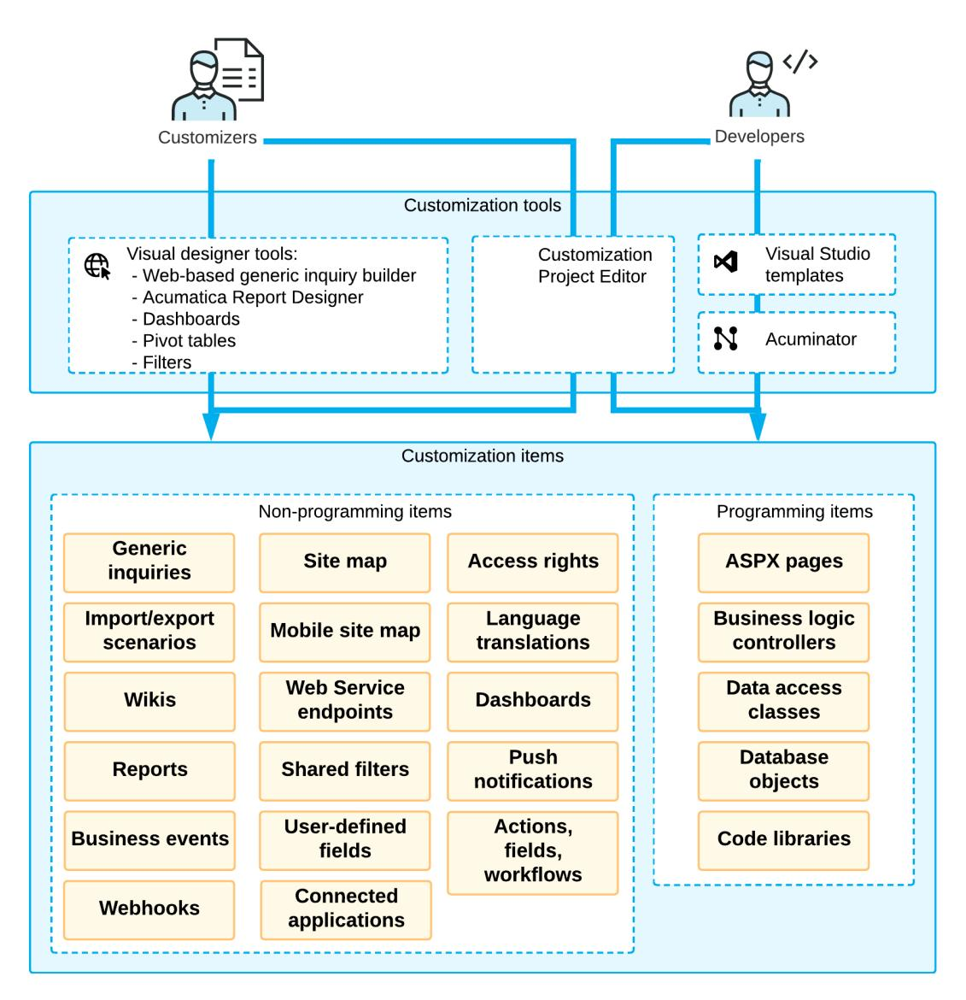

#### *Figure: Customization of Acumatica ERP*

As a customizer, you can use the following tools to modify Acumatica ERP:

- Customization Project Editor
- Generic inquiry builder
- Acumatica Report Designer
- Dashboards
- Pivot tables
- Filters

As a developer, you would typically use the following tools to modify Acumatica ERP:

- Customization Project Editor
- Visual Studio
- Acuminator

### **Customization Projects and Customization Items**

To manage your customization efforts, you create and use customization projects. A *customization project* is a set of changes to the user interface, configuration data, and functionality of Acumatica ERP. You create a customization

project in a single instance. You can apply the customization project you have created to a different instance of Acumatica ERP by exporting the customization project from the original instance and importing it to a new instance.

While customizing Acumatica ERP, you use the *[Customization Project Editor](https://help-2025r1.acumatica.com/Help?ScreenId=ShowWiki&pageid=0bb97781-e987-4039-962d-457720821bff)* to create *customization items*, which are components of various types (shown in the diagram above) that make up a customization project. Customization items fall into the following two categories: programming items and non-programming items. This guide describes working with non-programming items and is designed primarily for customizers.

The Customization Project Editor includes a page to support each type of item in a customization project, and you open these pages by using the navigation pane of the editor.

A customization project contains only the items that have been explicitly saved to it in the Customization Project Editor.

To apply the items of a customization project to Acumatica ERP, you have to *publish* the project. Before the project is published, the changes exist only in the project and have not yet been applied to the instance.

This guide covers the customization of Acumatica ERP by using the Customization Project Editor to create and manage customization items. The lessons of this guide do not involve coding and do not require programming skills.

For details on creating other kinds of customization items, see *[Customizing Elements of the User Interface](#page-225-1)*.

### **Types of Objects**

During the customization process, you modify various system objects and add new objects. Customization changes fall into the following general categories:

- Changes and additions to the metadata of the following types of objects, with the changes affecting a specific tenant:
  - Access rights
  - Actions, fields, and workflows
  - Analytical reports
  - Business events
  - Connected applications
  - Dashboards
  - Generic inquiries
  - Import and export scenarios
  - Mobile application
  - Push notifications
  - Reports
  - Shared filters
  - Site map nodes
  - System locales
  - User-defined fields
  - Webhooks
  - Web service endpoints
  - Wiki articles
- Website changes and additions to the following types of objects, with the changes affecting all tenants:
  - Code
  - Data access classes

- Database scripts
- Files
- Screens (forms)

When you save any of these objects to a customization project, a customization item of the particular type is created. You can see all customization items of the current customization project in the navigation pane of the Customization Project Editor, sorted by their type. For example, you can customize Acumatica ERP by adding or modifying a generic inquiry. You can include this generic inquiry in a customization project as a customization item of the *GenericInquiryScreen* type.

You can add new customization items or modify existing ones. When you publish the customization project on another instance, all objects saved as customization items are also applied to the instance. In this case, you do not need to configure them manually on the instance where you published the project.

For details on types of customization items, see *Types of Items in a [Customization](#page-33-1) Project*.

#### **Application of Changes to the Instance**

When you make changes to form elements by using the Customization Project Editor, the changes are available only in the editor and have not yet been applied to the instance. To apply these changes to the instance, you need to publish the customization project. You can publish any number of projects by using the *[Customization Projects](https://help-2025r1.acumatica.com/Help?ScreenId=ShowWiki&pageid=4d3a1166-826c-414b-a207-3d1669fbf9e5)* (SM204505) form of Acumatica ERP. Also, while you are working on a project in the Customization Project Editor, you can publish it.

When you start the publication of the project from within the Customization Project Editor by clicking **Publish > Publish Current Project**, it proceeds as follows:

- The **Compilation** pane appears at the bottom of the Customization Project Editor window.
- The project is validated. That is, the system checks the syntax and semantics, and makes sure that the changes included in the customization project are compatible with the original application code.
- The project is published. The system displays the *Website updated* line and the **Close Compilation Pane** button in the **Compilation** pane to indicate that the publishing has finished successfully.

#### **Terminology for Internal and External Elements**

The terms that are used to describe elements in the code (that is, the elements' *internal names*) sometimes differ from the terms used to describe these elements on Acumatica ERP forms (the elements' *external names*). The following table lists these elements. In this guide, you will see the internal names and external names of the elements, depending on whether their internal development or external appearance is being discussed.

| Table: Internal and External Names of Elements |
|------------------------------------------------|
|------------------------------------------------|

| External Name | Internal Name |
|---------------|---------------|
| Form          | Screen        |
| Box           | Field         |
| Check box     |               |
| Command       | Action        |
| Button        |               |

### <span id="page-82-1"></span><span id="page-82-0"></span>**Customization Projects: To Deploy an Instance**

This activity will walk you through the process of preparing the environment and deploying an Acumatica ERP instance that you can use to perform the activities of this guide.

#### **Story**

Suppose that you are a customizer in your company. Before you can start working on the customization project, you need to deploy an Acumatica ERP instance.

#### **Process Overview**

You will deploy an Acumatica ERP instance with the *T100* dataset. On the *[Enable/Disable Features](https://help-2025r1.acumatica.com/Help?ScreenId=ShowWiki&pageid=c1555e43-1bc5-4f6f-ba9d-b323f94d8a6b)* (CS100000) form, you will then enable the features that are required to test the customization projects in this guide.

#### **System Preparation**

Before you begin deploying an instance, do the following:

- 1. Make sure that the environment that you are going to use meets the *[System Requirements for the Acumatica](https://help-2025r1.acumatica.com/Help?ScreenId=ShowWiki&pageid=5cf164e5-889f-458b-8757-320c96598ab7) [ERP Installation](https://help-2025r1.acumatica.com/Help?ScreenId=ShowWiki&pageid=5cf164e5-889f-458b-8757-320c96598ab7)*.
- 2. Make sure that the Web Server (IIS) features that are listed in *[Preparation for the Acumatica ERP Installation:](https://help-2025r1.acumatica.com/Help?ScreenId=ShowWiki&pageid=4dc90b83-c6fd-4eb0-85ea-c5aa33a71897) [System Environment](https://help-2025r1.acumatica.com/Help?ScreenId=ShowWiki&pageid=4dc90b83-c6fd-4eb0-85ea-c5aa33a71897)* have been turned on.

### **Step 1: Deploying an Acumatica ERP Instance**

Open the Acumatica ERP Configuration wizard, and deploy a new application instance as follows:

- 1. On the Database Configuration page of the Acumatica ERP, type the name of the database: Yogifon.
- 2. On the Tenant Setup page, define one tenant with the *T100* dataset inserted by specifying the following settings:
  - **Tenant Name**: Yogifon
  - **New**: Selected
  - **Insert Data**: *T100*
  - **ParentTenant ID**: 1
  - **Visible**: Selected

The system creates a new Acumatica ERP instance, adds a new tenant, and loads the selected data.

- 3. Sign in to the new tenant by using the following credentials:
  - **Username**: admin
  - **Password**: setup

Change the password when the system prompts you to do so.

- 4. In the info area in the top right corner of the Acumatica ERP screen, click your username, and click **My Profile**.
- 5. On the **General Info** tab of the *[User Profile](https://help-2025r1.acumatica.com/Help?ScreenId=ShowWiki&pageid=8430c8b2-a79c-4f7b-9768-b0b7fad23a59)* (SM203010) form, which opens, select *YOGIFON* in the **Default Branch** box.
- 6. On the form toolbar, click**Save**.

In subsequent sign-ins to this account, you will be signed in to the *YOGIFON* branch.

#### **Step 2: Enabling the Features**

Enable the features that are required to test the customization projects by doing the following:

- 1. Open the *[Enable/Disable Features](https://help-2025r1.acumatica.com/Help?ScreenId=ShowWiki&pageid=c1555e43-1bc5-4f6f-ba9d-b323f94d8a6b)* (CS100000) form.
- 2. On the form toolbar, click **Modify**.
- 3. Select the following check boxes:
  - **Business Account Locations**
  - **Multicurrency Accounting**
  - **Payment Application by Line**
- 4. On the form toolbar, click **Enable**.

### <span id="page-83-1"></span><span id="page-83-0"></span>**Customization Projects: To Create a Customization Project**

The following activity will walk you through the process of creating a customization project.

#### **Story**

Suppose that you are a customizer in your company, and you have been asked to prepare a customization project as the first task in beginning a customization effort for Acumatica ERP.

#### **Process Overview**

By using the *[Customization Projects](https://help-2025r1.acumatica.com/Help?ScreenId=ShowWiki&pageid=4d3a1166-826c-414b-a207-3d1669fbf9e5)* (SM204505) form, you will create a customization project and open it in the Customization Project Editor.

#### **System Preparation**

Before you begin performing the steps of this activity, you need to prepare an Acumatica ERP instance by performing the *[Customization](#page-82-1) Projects: To Deploy an Instance* prerequisite activity.

#### **Step: Creating a Customization Project**

To create a customization project, do the following:

- 1. In Acumatica ERP, open the *[Customization Projects](https://help-2025r1.acumatica.com/Help?ScreenId=ShowWiki&pageid=4d3a1166-826c-414b-a207-3d1669fbf9e5)* (SM204505) form.
- 2. On the form toolbar, click **Add Row**.
- 3. In the **Project Name** column of the added row, enter the customization project name, Yogifon.
- 4. On the form toolbar, click**Save**.

The *Acumatica ERP* customization project is created. Now you can open the Customization Project Editor for the project by clicking the project name in the table.

## <span id="page-84-2"></span><span id="page-84-0"></span>**To Open a Project**

If you have selected a customization project, you can open the project for editing in the *[Customization Project Editor](https://help-2025r1.acumatica.com/Help?ScreenId=ShowWiki&pageid=0bb97781-e987-4039-962d-457720821bff)* in the following ways:

- On the *[Customization Projects](https://help-2025r1.acumatica.com/Help?ScreenId=ShowWiki&pageid=4d3a1166-826c-414b-a207-3d1669fbf9e5)* (SM204505) form: Click the project name in the table.
- From the *[Customization Menu](https://help-2025r1.acumatica.com/Help?ScreenId=ShowWiki&pageid=d6c46870-0c44-4f78-ae20-9bb9ef25dccd)*: Click **Customization > Edit Project**.
- From the *[Element Properties Dialog Box](https://help-2025r1.acumatica.com/Help?ScreenId=ShowWiki&pageid=5f9d2d33-1a33-4edd-8629-3100d2020335)*: Click **Customize**, **Actions > Customize Business Logic**, or **Actions > Customize Data Fields**.

### <span id="page-84-3"></span><span id="page-84-1"></span>**To Update a Project**

If you have modified an item of a customization project in the file system by using an integrated development environment (IDE), such as Microso Visual Studio, these changes may not be reflected in the customization project yet. You have to update the project in the database before the publication or export of the deployment package of the project.

To update a customization project, perform the following actions:

- 1. Open the project in the *[Customization Project Editor](https://help-2025r1.acumatica.com/Help?ScreenId=ShowWiki&pageid=0bb97781-e987-4039-962d-457720821bff)*. (See *To Open a [Project](#page-84-2)* for details.)
- 2. In navigation pane of the editor, select **Files** to open the Custom Files page.
- 3. On the page toolbar, click **Detect Modified Files**, as shown in the screenshot below, to review the files included in the project that could have been modified in the file system but haven't been updated in the customization project yet.

If at least one conflict is detected, the **Modified Files Detected** dialog box opens (also shown in the following screenshot). The dialog box displays each changed file with the check boxes in the**Selected** and **Conflict** columns selected. See *[Detecting the Project Items Modified in the File System](#page-177-0)* for details.

4. To update the selected files in the project, on the toolbar of the dialog box, click **Update Customization Project**, as the following screenshot shows.

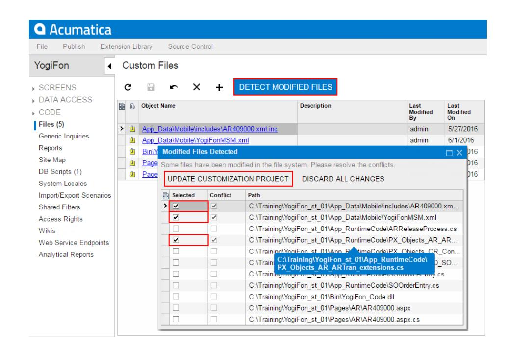

*Figure: Updating files in the project*

### <span id="page-85-0"></span>**To Delete a Project**

If a customization project is not published, you can delete the project from the instance of Acumatica ERP by using the *[Customization Projects](https://help-2025r1.acumatica.com/Help?ScreenId=ShowWiki&pageid=4d3a1166-826c-414b-a207-3d1669fbf9e5)* (SM204505) form.

To delete a customization project, perform the following actions:

- 1. On the *[Customization Projects](https://help-2025r1.acumatica.com/Help?ScreenId=ShowWiki&pageid=4d3a1166-826c-414b-a207-3d1669fbf9e5)* form, in the project list, select the row of the project that has to be deleted, as shown in the screenshot below (item a).
- 2. On the form toolbar, click **Delete Row** to delete the selected project from the list.
- 3. On the form toolbar, click**Save** to save the changes to the database.

When a customization project is deleted, the platform deletes from the database the project data and the data of the project items. The platform does not delete the files and the objects that were added to the projects from the database, such as site map nodes, reports, user access rights, and integration scenarios.

### <span id="page-85-2"></span><span id="page-85-1"></span>**To Export a Project**

You can export (download) a customization project when the project is finished to deploy the customization to the target system. Also, you can download the package to have a backup copy of the customization project you are working on.

Before you download the package, we recommend that you make sure you have included all the needed changes in the customization project. To do this, you take the following actions:

- Make sure that you have added all custom files to the project and uploaded the latest actual version of the files to the project. See *To [Update](#page-84-3) a Project* for details.
- Make sure that the database schema is updated in the customization project. See *To Update [Custom](#page-186-1) Tables [in the Project](#page-186-1)* for details.

- Make sure you have added the needed site map nodes to the project. See *[Site Map](#page-182-3)* for details.
- Publish the project and test the customization before downloading the deployment package, to ensure that you have no issues.

To download the deployment package of a customization project, you should export the project. You can export a customization project in the following ways:

- *[By using the Customization Projects form](#page-86-0)*
- *[Through the Customization Project Editor](#page-86-1)*

The system creates the deployment package of the project and downloads the zip file of the package on your machine. The file has the same name as the customization project. For more information about a deployment package, see *[Deployment of a Customization Result](#page-37-1)*.

### <span id="page-86-0"></span>**Exporting a Customization Project by Using the Customization Projects form**

To export a customization project by using the *[Customization Projects](https://help-2025r1.acumatica.com/Help?ScreenId=ShowWiki&pageid=4d3a1166-826c-414b-a207-3d1669fbf9e5)* (SM204505) form, perform the following actions:

- 1. Navigate to**System > Customization > Manage > Customization Projects**.
- 2. In the project list of the form, click the row of the customization project to be exported.

The row is highlighted in the table, as the screenshot below shows.

3. Click **Export** on the form toolbar to export the highlighted project.

|                                                                                                                                                       | ○ Yogifon - Customization Projects ★<br>$HELP -$<br><b>CUSTOMIZATION</b> |                         |                                          |  |                              |                    |                   |                            |
|-------------------------------------------------------------------------------------------------------------------------------------------------------|--------------------------------------------------------------------------|-------------------------|------------------------------------------|--|------------------------------|--------------------|-------------------|----------------------------|
| <b>EXPORT</b><br><b>UNPUBLISH ALL</b><br>IMPORT $\blacktriangleright$<br><b>VIEW PUBLISHED</b><br>Я<br>$\times$<br>$PUBLISH -$<br>с<br>$\blacksquare$ |                                                                          |                         |                                          |  |                              |                    |                   |                            |
| 自                                                                                                                                                     | L.                                                                       | <b>Published</b>        | <b>Project Name</b>                      |  | Level Screen<br><b>Names</b> | <b>Description</b> | <b>Created By</b> | <b>Last Modified</b><br>On |
|                                                                                                                                                       | Г                                                                        |                         | AdvCstAEF                                |  | PO301000                     |                    | admin             | 6/23/2016                  |
|                                                                                                                                                       | H.                                                                       |                         | AdvUI7                                   |  | IN202500                     |                    | admin             | 6/23/2016                  |
|                                                                                                                                                       |                                                                          |                         | !!!!!!!!!!!!!!!!!!!!!!!!!!!!!!!!!!!!!!!! |  |                              |                    | admin             | 6/23/2016                  |
|                                                                                                                                                       | H.                                                                       | $\overline{\mathbf{v}}$ | FormActionAEF                            |  | SO301000                     |                    | admin             | 6/23/2016                  |
|                                                                                                                                                       | u.                                                                       |                         | GridActionsAEF                           |  | CS203000                     |                    | admin             | 6/23/2016                  |
|                                                                                                                                                       | ⊽                                                                        | $\blacktriangledown$    | <b>KeyWords</b>                          |  | IN202500                     |                    | admin             | 6/23/2016                  |
|                                                                                                                                                       | Г                                                                        |                         | PurchaseOrderWiz                         |  |                              |                    | admin             | 6/23/2016                  |
|                                                                                                                                                       |                                                                          |                         | RapidByte                                |  |                              |                    | admin             | 6/23/2016                  |
| $\rightarrow$                                                                                                                                         |                                                                          |                         | YogiFon                                  |  | AR303000                     |                    | admin             | 6/29/2016                  |
|                                                                                                                                                       |                                                                          |                         |                                          |  |                              |                    |                   |                            |

*Figure: Exporting a customization project*

### <span id="page-86-1"></span>**Exporting the Customization Project Opened in the Customization Project Editor**

To export the customization project that is currently opened in the *[Customization Project Editor](https://help-2025r1.acumatica.com/Help?ScreenId=ShowWiki&pageid=0bb97781-e987-4039-962d-457720821bff)*, click **File > Export Project Package** on the editor menu, as shown in the following screenshot.

| <b>Q</b> Acumatica                                                                                                                             |                |                                   |                         |                         |                         |
|------------------------------------------------------------------------------------------------------------------------------------------------|----------------|-----------------------------------|-------------------------|-------------------------|-------------------------|
| File<br>Publish<br><b>Extension Library</b><br>Source Control                                                                                  |                |                                   |                         |                         |                         |
| Manage Customization Projects<br>lized Screens<br>Edit Project XML<br>ADD SCREEN $\sim$<br>×<br>÷<br>$\blacksquare$<br>◢<br>Edit Project Items |                |                                   |                         |                         |                         |
| <b>Export Project Package</b>                                                                                                                  |                | <b>Title</b>                      | Is New                  | <b>Last Modified By</b> | <b>Last Modified On</b> |
| Replace from Package                                                                                                                           | 0.00           | <b>Customers</b>                  |                         | admin                   | 6/23/2016               |
|                                                                                                                                                | $1.111 - 0.00$ | <b>Subscription Usage Details</b> | $\overline{\checkmark}$ | admin                   | 6/23/2016               |
| SO303000                                                                                                                                       | SO.30.10.00    | Sales Orders                      |                         | admin                   | 6/23/2016               |
| Data Access                                                                                                                                    | SO.30.30.00    | Invoices                          |                         | admin                   | 6/23/2016               |
| Code                                                                                                                                           |                |                                   |                         |                         |                         |
| Files $(5)$                                                                                                                                    |                |                                   |                         |                         |                         |

#### *Figure: Exporting the current customization project*

Also, you can export the customization project from the *[Project XML Editor](https://help-2025r1.acumatica.com/Help?ScreenId=ShowWiki&pageid=aa0fc077-1a8a-445c-8a84-5ad86c282a4f)* of the *[Customization Project Editor](https://help-2025r1.acumatica.com/Help?ScreenId=ShowWiki&pageid=0bb97781-e987-4039-962d-457720821bff)* by clicking **Download Package** on the page toolbar, as shown in the following screenshot.

| <b>Q</b> Acumatica      |                                                                                                                                                                                                                                                                                                                                 |  |  |  |
|-------------------------|---------------------------------------------------------------------------------------------------------------------------------------------------------------------------------------------------------------------------------------------------------------------------------------------------------------------------------|--|--|--|
| File<br><b>Publish</b>  | <b>Extension Library</b><br>Source Control                                                                                                                                                                                                                                                                                      |  |  |  |
| YogiFon                 | YogiFon                                                                                                                                                                                                                                                                                                                         |  |  |  |
| $\sqrt{S}$ CREENS       | Download Package<br>Upload Package<br>Choose File   No file chosen<br>Save to database                                                                                                                                                                                                                                          |  |  |  |
| Data Access             |                                                                                                                                                                                                                                                                                                                                 |  |  |  |
| Code                    | <customization description="" level="0"></customization>                                                                                                                                                                                                                                                                        |  |  |  |
| Files $(5)$             | <page controlid="5" defcontact"="" pagesource="7T3bctvGks8+VecfWNzKPtnWxcc-&lt;/td&gt;&lt;/tr&gt;&lt;tr&gt;&lt;th&gt;Generic Inquiries (1)&lt;/th&gt;&lt;td&gt;&lt;PXFormView ID=" parentid="phG tab Items#0 DefContact" path="~/pages/ar/ar303000.aspx" template"="" typefullname="PX.Web.&lt;br&gt;&lt;Children Key="></page> |  |  |  |
| Reports (1)             | <additem></additem>                                                                                                                                                                                                                                                                                                             |  |  |  |
| Site Map (3)            | <pxdropdown typefullname="PX.Web.UI.PXDropDown"><br/><prop key="Virtual:ApplyStylesheetSkin"></prop></pxdropdown>                                                                                                                                                                                                               |  |  |  |
| <b>DB</b> Scripts       | <prop key="ID" value="CstPXDropDown3"></prop>                                                                                                                                                                                                                                                                                   |  |  |  |
| <b>System Locales</b>   | <prop key="DataField" value="UsrPersonalIDType"></prop><br>                                                                                                                                                                                                                                                                     |  |  |  |
| Import/Export Scenario: |                                                                                                                                                                                                                                                                                                                                 |  |  |  |
| <b>Shared Filters</b>   | <additem></additem>                                                                                                                                                                                                                                                                                                             |  |  |  |
| Associal Dialise        | <pxtextedit typefullname="PX.Web.UI.PXTextEdit"><br/><prop key="Virtual:ApplyStylesheetSkin"></prop></pxtextedit>                                                                                                                                                                                                               |  |  |  |
|                         | <prop key="ID" value="CstPXTextEdit2"></prop>                                                                                                                                                                                                                                                                                   |  |  |  |

<span id="page-87-1"></span>*Figure: Exporting the current customization project from the Project XML Editor*

### <span id="page-87-0"></span>**To Replace the Content of a Project from a Package**

You might need to upload a newer version of the customization project that has been modified outside the system on which you are working, or upload the project from a backup copy.

You can replace the content of a customization project from a deployment package in the following ways:

- *[By using the Customization Projects form](#page-88-0)*
- *[Through the Customization Project Editor](#page-88-1)*

The platform does not verify the content of a deployment package before replacing a customization project in the database.

#### <span id="page-88-0"></span>**Replacing a Customization Project from a File by Using the Customization Projects Form**

To replace the content of a customization project from a file by using the *[Customization Projects](https://help-2025r1.acumatica.com/Help?ScreenId=ShowWiki&pageid=4d3a1166-826c-414b-a207-3d1669fbf9e5)* (SM204505) form, perform the following actions:

- 1. In the project list, click the row of the customization project to be updated.
- 2. On the More menu (under **Import**), click **Replace Highlighted Project Content**.
- 3. In the **Open Package** dialog box, which opens, click **Choose File**.
- 4. In the **Open** dialog box, which opens, select the deployment package file to be uploaded.

The name of the selected file is displayed in the **File path** text box of the **Open Package** dialog box.

5. In the **Open Package** dialog box, click **Upload**.

The platform uploads the selected package and replaces in the database the content of the selected project with the content of the deployment package.

#### <span id="page-88-1"></span>**Replacing the Customization Project Opened in the Customization Project Editor from a File**

To replace the content of a customization project that is currently opened in the *[Customization Project Editor](https://help-2025r1.acumatica.com/Help?ScreenId=ShowWiki&pageid=0bb97781-e987-4039-962d-457720821bff)*, perform the following actions:

- 1. Click **File > Replace from Package** on the editor menu.
- 2. In the **Open Package** dialog box, which opens, click **Choose File**.
- 3. In the **Open** dialog box, which opens, select the deployment package file to be uploaded.

The name of the selected file is displayed in the **File path** text box of the **Open Package**dialog box.

4. In the **Open Package** dialog box, click **Upload**.

The platform uploads the selected package and replaces in the database the content of the selected project with the content of the deployment package.

Also, you can replace the content of the customization project by using the *[Project XML Editor](https://help-2025r1.acumatica.com/Help?ScreenId=ShowWiki&pageid=aa0fc077-1a8a-445c-8a84-5ad86c282a4f)* of the Customization Project Editor. To do this, perform the following actions:

- 1. In the Customization Project Editor, click **File > Edit Project XML** to open the Project XML Editor for the current customization project.
- 2. On the toolbar of the Project XML Editor, click **Choose File**.
- 3. In the **Open** dialog box, which opens, select the deployment package file to be uploaded.

The name of the selected file is displayed in the text box right of the toolbar buttons instead of the *No file chosen* string (which is shown in the screenshot below).

4. On the editor toolbar, click **Upload Package**.

| <b>Q</b> Acumatica                                                                                                                                                                                                   |                                                                                                                                                                                                                                                                                                                                                                                                                                                                                                                                                                                                                                                                                                                                                                                                                                                                                 |  |  |  |  |  |  |  |  |
|----------------------------------------------------------------------------------------------------------------------------------------------------------------------------------------------------------------------|---------------------------------------------------------------------------------------------------------------------------------------------------------------------------------------------------------------------------------------------------------------------------------------------------------------------------------------------------------------------------------------------------------------------------------------------------------------------------------------------------------------------------------------------------------------------------------------------------------------------------------------------------------------------------------------------------------------------------------------------------------------------------------------------------------------------------------------------------------------------------------|--|--|--|--|--|--|--|--|
| Extension Library<br>Source Control<br>File<br>Publish                                                                                                                                                               |                                                                                                                                                                                                                                                                                                                                                                                                                                                                                                                                                                                                                                                                                                                                                                                                                                                                                 |  |  |  |  |  |  |  |  |
| YogiFon                                                                                                                                                                                                              | YogiFon                                                                                                                                                                                                                                                                                                                                                                                                                                                                                                                                                                                                                                                                                                                                                                                                                                                                         |  |  |  |  |  |  |  |  |
| SCREENS<br>Data Access<br>Code<br>Files $(5)$<br>Generic Inquiries (1)<br>Reports (1)<br>Site Map (3)<br><b>DB</b> Scripts<br>System Locales<br>Import/Export Scenario:<br><b>Shared Filters</b><br>Associal Dialise | Download Package<br>Upload Package<br>Save to database<br>Choose File No file chosen<br><customization description="" level="0"><br/><page controlid="5" defcontact"="" pagesource="7T3bctvGks8+VecfWNzKPtnWxcc&lt;br&gt;&lt;PXFormView ID=" parentid="phG_tab_Items#0_DefContact" path="~/pages/ar/ar303000.aspx" template"="" typefullname="PX.Web.&lt;br&gt;&lt;Children Key="><br/><additem><br/><pxdropdown typefullname="PX.Web.UI.PXDropDown"><br/><prop key="Virtual:ApplyStylesheetSkin"></prop><br/><prop key="ID" value="CstPXDropDown3"></prop><br/><prop key="DataField" value="UsrPersonalIDType"></prop><br/></pxdropdown><br/></additem><br/><additem><br/><pxtextedit typefullname="PX.Web.UI.PXTextEdit"><br/><prop key="Virtual:ApplyStylesheetSkin"></prop><br/><prop kev="ID" value="CstPXTextEdit2"></prop></pxtextedit></additem></page></customization> |  |  |  |  |  |  |  |  |

#### *Figure: Replacing the content of a customization project from the Project XML Editor*

The platform uploads the selected package and displays its XML code in the Project XML Editor.

- 5. Explore the content of the uploaded package to ensure that this is the needed one.
- 6. To replace the content of the project that is currently opened in the Customization Project Editor with the content of the uploaded package, click**Save to Database** on the page toolbar.

By using this approach, you can explore the content of the package before replacing the content of the customization project that is currently opened in the Customization Project Editor.

### <span id="page-89-0"></span>**To Check the Certification Status of a Project**

The publication of customization projects that are not certified by Acumatica can affect the performance of Acumatica ERP instances. To prevent this performance degradation, the system verifies the certification status of the customization projects that you create or upload to your Acumatica ERP instances.

This functionality is available for only licensed Acumatica ERP instances and is disabled by default. To use it, you should contact the company's Acumatica ERP support provider.

#### **Validating the Certification Status of Customization Projects**

To validate the certification status of the customization projects, you perform the following steps:

- 1. Open the *[Customization Projects](https://help-2025r1.acumatica.com/Help?ScreenId=ShowWiki&pageid=4d3a1166-826c-414b-a207-3d1669fbf9e5)* (SM204505) form.
- 2. On the More menu (under**Validations**), click **Validate Certification Status**.

The system performs the check and displays the result in the **Certification Status** column on the form.

Currently, a customization project can have one of the following statuses:

- *Certified*: The project has been imported into the Acumatica ERP instance and is available in the database with the certified customization projects.
- *Not Certified*: The project has been imported into the Acumatica ERP instance and is not available in the database with the certified customization projects.
- *Not Verified*: The project has been manually modified or created in the current Acumatica ERP instance.

• *Not Certified for Current Version*: The project has been imported into the Acumatica ERP instance and is available in the database with the certified customization projects, but the major version it has been certified for is not the same as the major version of the current Acumatica ERP instance.

If a project is not certified or its certification status cannot be verified, the system displays a warning icon to the right of the customization project name. The following screenshot shows the warning icons and the warning that is displayed when you hover over the warning.

|   | <b>CUSTOMIZATION</b><br>TOOLS $\sim$<br><b>Customization Projects</b> |                    |           |                                                                                                                     |  |                           |                                |                                   |                 |                   |                            |
|---|-----------------------------------------------------------------------|--------------------|-----------|---------------------------------------------------------------------------------------------------------------------|--|---------------------------|--------------------------------|-----------------------------------|-----------------|-------------------|----------------------------|
| O |                                                                       | $\Box$<br>$\Omega$ | ×<br>+    | PUBLISH<br><b>IMPORT</b><br><b>EXPORT</b><br>                                                                       |  |                           |                                |                                   |                 |                   |                            |
|   | <b>B</b> 0 D                                                          | ш                  | Published | * Project Name                                                                                                      |  | <b>Level Screen Names</b> | <b>Description</b>             | <b>Certification Status</b>       | <b>Initials</b> | <b>Created By</b> | Last<br><b>Modified On</b> |
|   | !!!!!!!!!!!!!!!!!!!!!!!!!!!!!!!!!!!!!!!!<br>$\omega$                  | $\Box$             | $\Box$    | <b>DemoProj</b>                                                                                                     |  | AR303000                  |                                | Certified                         | PROJ            | admin admin       | 2/22/2022                  |
|   | 0 <sub>0</sub>                                                        | п                  | $\Box$    | $\bf{0}$<br>FSUpdateDates2020R1                                                                                     |  |                           | <b>SM Demo Data</b>            | Not verified                      |                 | admin admin       | 3/6/2020                   |
|   | Ю.                                                                    | ш                  | □         | MobileApp                                                                                                           |  |                           |                                | Not verified                      |                 | admin admin       | 2/21/2022                  |
|   | $0$ $\Box$                                                            |                    | □         | Proformalmport The project certification status cannot be                                                           |  | PM304                     |                                | Not certified                     | PROJ            | admin admin       | 2/22/2022                  |
|   | $\mathbf{0}$ D                                                        | ш                  | □         | verified. Unverified projects may contain<br><b>SalesDemoDas</b><br>components that could adversely affect the      |  |                           | Sales Demo Dashboards, incl    | Not verified                      |                 | admin admin       | 10/19/2020                 |
|   | $0 \cap$                                                              | п                  | $\Box$    | stability and performance of your environment.<br><b>SidePanel</b><br>This condition may exist because changes have |  |                           | Side Panel with all cases from | Not certified                     |                 | admin admin       | 2/22/2022                  |
|   | 0 <sub>0</sub>                                                        | ш                  | $\Box$    | been made after the solution was installed.<br>VisualWorkflow<br>Contact your solution provider for assistance.     |  |                           | Purchase Receipt Inspection S  | Not verified                      |                 | admin admin       | 9/27/2021                  |
|   | 0 <sub>0</sub>                                                        | □                  | $\Box$    | <b>WorkflowSequences</b>                                                                                            |  | SO303000                  |                                | Not verified                      |                 | admin admin       | 2/22/2022                  |
|   | - D<br>0                                                              |                    | $\Box$    | SPSMAPADOC[21.100.0127][21r1r09b1] <sup>0</sup>                                                                     |  | ISPS1002.ISPS20           |                                | Not certified for current version | <b>ISPS</b>     | admin admin       | 2/22/2022                  |

#### *Figure: A warning for a customization project*

If you modify a certified customization project, its certification status will change to *Not Verified*.

We recommend that you not publish a customization project with the *Not Certified*, *Not Verified*, or *Not Certified For Current Version* certification status. If you decide to publish such a project, the system also displays a warning during publication.

A customization project may have the *Not Verified* certification status if it has been uploaded to the instance before the upgrade to 2025 R1, if it has been created manually, or if it has already been certified but a customizer has modified it.

### <span id="page-90-0"></span>**To Merge Multiple Projects**

As a rule, it is better to have multiple customization projects instead of a single one. But if you have two or more customization projects that contain changesets with the same items, and if you are sure that each project is valid and that the merged customization applies to the website properly, we recommend that you merge the projects. You use the *[Customization Projects](https://help-2025r1.acumatica.com/Help?ScreenId=ShowWiki&pageid=4d3a1166-826c-414b-a207-3d1669fbf9e5)* (SM204505) form as a starting point.

To merge multiple customization projects, perform the following actions:

- 1. Navigate to**System > Customization > Manage > Customization Projects**.
- 2. In the project list, select the check boxes for only the projects to be merged.
- 3. Click **Publish** on the form toolbar.
- 4. Click **View Published** on the form toolbar to open the *[Published Customization Page](https://help-2025r1.acumatica.com/Help?ScreenId=ShowWiki&pageid=4d3a1166-826c-414b-a207-3d1669fbf9e5)*.
- 5. Click **Download Package** on the page toolbar to download the Customization.zip file, which includes the full content of the merged customization project.

The Customization.zip file is the deployment package of the merged customization project. You can use the merged project to publish the final customization project on the target website. You can rename the .zip file to assign the needed name to the customization project. To upload the deployment package to a target system, import the .zip file, as described in *Project Publication: To Deploy a [Customization](#page-127-1) Project*.

### <span id="page-91-1"></span><span id="page-91-0"></span>**To Detect Whether a Customization Project Is Applied to the Application**

You can see whether a customization project is applied to the application on the Sign-In page, with more detailed information available on the *[Customization Projects](https://help-2025r1.acumatica.com/Help?ScreenId=ShowWiki&pageid=4d3a1166-826c-414b-a207-3d1669fbf9e5)* (SM204505) form. To detect whether an Acumatica ERP instance is customized, perform the following actions:

- 1. Launch the application in the browser.
- 2. At the bottom of the Sign-In page, check for the presence of the **Customized** string.

If the string exists, it is followed by the names of the customization projects that are currently published, as shown in the following screenshot.

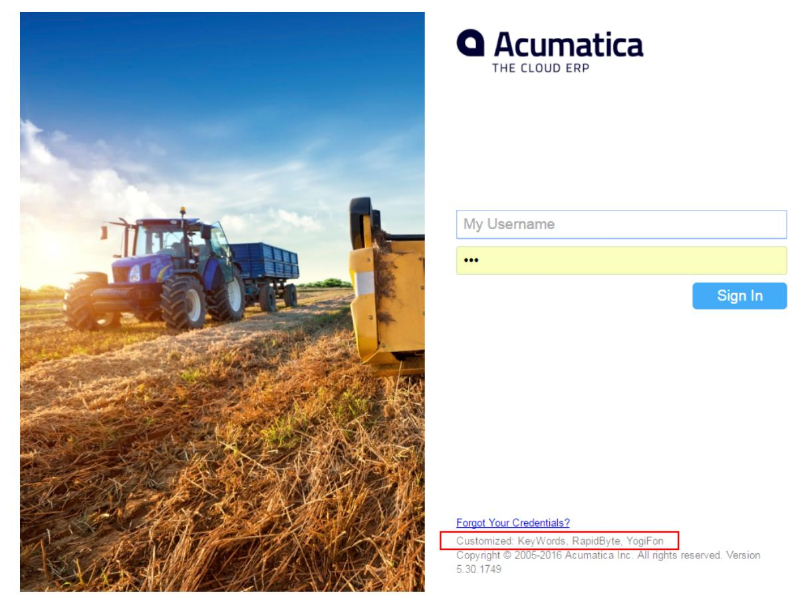

*Figure: Viewing the customization projects that are currently published*

- 3. Enter your credentials and click**Sign In**.
- 4. Navigate to**System > Customization > Manage > Customization Projects**.
- 5. On the form, view the list of the customization projects that are accessible in the application for your tenant (see the following screenshot).

| <b>Q</b> Acumatica                                                                               |   | <b>ORGANIZATION</b>  |   |                  | <b>FINANCE</b>      | <b>DISTRIBUTION</b> |  | <b>CONFIGURATION</b> | <b>SYSTEM</b>      | <b>HELP</b>   | 6/23/2016 10:22 AM    |                         | <b>ADMIN</b> |
|--------------------------------------------------------------------------------------------------|---|----------------------|---|------------------|---------------------|---------------------|--|----------------------|--------------------|---------------|-----------------------|-------------------------|--------------|
| Integration<br>Management                                                                        |   | Automation           |   |                  | Customization       |                     |  |                      |                    |               |                       |                         |              |
| Yogifon - Customization Projects $\pm$<br>o<br>Customization<br>$HELP -$<br><b>CUSTOMIZATION</b> |   |                      |   |                  |                     |                     |  |                      |                    |               |                       |                         |              |
| Type your query her Search                                                                       |   | с                    | a | $\blacksquare$   | ×                   | PUBLISH -           |  | <b>UNPUBLISH ALL</b> | $IMPORT -$         | <b>EXPORT</b> | <b>VIEW PUBLISHED</b> |                         |              |
| $\sim$ MANAGE                                                                                    | 魯 |                      |   | <b>Published</b> | <b>Project Name</b> |                     |  | Level Screen Names   | <b>Description</b> |               | <b>Created By</b>     | <b>Last Modified On</b> |              |
|                                                                                                  |   |                      |   | ✓                | <b>KeyWords</b>     |                     |  | IN202500             |                    |               | admin                 | 6/23/2016               |              |
| <b>Customization Projects</b>                                                                    |   |                      |   | ⊽                | RapidByte           |                     |  |                      |                    |               | admin                 | 6/23/2016               |              |
| Generic Inquiry                                                                                  |   | $\blacktriangledown$ |   | $\checkmark$     | YogiFon             |                     |  | AR303000.S           |                    |               | admin                 | 6/21/2016               |              |
| Lists as Entry Points                                                                            |   |                      |   |                  |                     | YogiFon0withScenGIR |  |                      |                    |               | admin                 | 4/15/2016               |              |
| <b>Pivot Tables</b>                                                                              |   |                      |   |                  |                     |                     |  |                      |                    |               |                       |                         |              |
| <b>Dashboards</b>                                                                                |   |                      |   |                  |                     |                     |  |                      |                    |               |                       |                         |              |
| Site Map                                                                                         |   |                      |   |                  |                     |                     |  |                      |                    |               |                       |                         |              |
| Portal Man                                                                                       |   |                      |   |                  |                     |                     |  |                      |                    |               |                       |                         |              |

*Figure: Viewing the list of customization projects*

If a customization project that you know to be published is absent in the list, the project may be published for another tenant. See *[Publication of Customization Projects in a Multitenant Site](#page-38-1)* for details.

- 6. In the **Published** column of the list, notice which customization projects have the check box selected. These are the projects that are currently published.
- 7. Use the *[Customization Project Editor](https://help-2025r1.acumatica.com/Help?ScreenId=ShowWiki&pageid=0bb97781-e987-4039-962d-457720821bff)* to explore the content of each published customization project. To open a project in the editor, click the name of the project.

You can also view the names of the customization projects that are currently published in the **About Acumatica** dialog box, as the following screenshot shows.

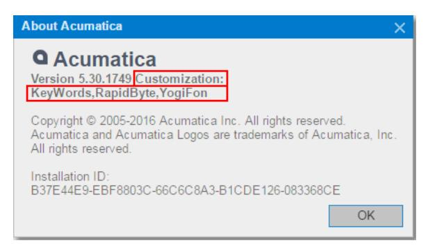

#### *Figure: Viewing the list of the customization projects that are currently published*

<span id="page-92-1"></span>To open the dialog box, click **Help > About** on a form of Acumatica ERP.

### <span id="page-92-0"></span>**To Manage Prefixes in a Customization Project**

You can specify a prefix that should be added to any object of the customization project. When validation of the customization project is performed, the platform checks all objects to be sure they have the added prefix.

To add a prefix for a customization project, do the following:

1. On the main menu of the Customization Project Editor, select **File >Validate Project Prefix**.

The **Customization Project Prefix** dialog box opens.

- 2. In the **Project Prefix** box, add the prefix for the customization project. The prefix is two to four characters in length and can be made up of any of the 26 Latin letters (*A* through *Z*). Only capital letters are allowed.
- 3. Click **Save**.

You can perform validation of the project's items to check for the added prefix. To do this, in the **Customization Project Prefix** dialog box, click the**Validate Project Items** button. In the**Validation Result** area, the result of the validation appears.

#### **Format of the Validation Result**

If errors or warnings have been detected during validation, the validation result has the following format:

- <CustomizationProjectName>
  - <CustomizationRuleName>
    - <PathToTheDLL> | <ProjectItemType> | <NameOfTheProjectItem> List of rules broken by the specified item.

### <span id="page-93-0"></span>**To Add a Custom Feature Switch**

This section explains how to add a custom feature switch into an ISV solution. For details about custom feature switches, see *[Custom Feature Switches](#page-95-1)*.

#### **Before You Proceed**

Before you start adding a switch for a custom feature, the following prerequisite steps should be performed:

- The new custom feature should be developed and integrated into Acumatica ERP.
- You should have Acumatica Developer Network (ADN) Level 2 or Level 3. For details, see the *[Acumatica](https://adn.acumatica.com/why-join-adn/) [Developer Network](https://adn.acumatica.com/why-join-adn/)* website.
- You should contact the Independent Soware Vendor (ISV) team or Technical Contract Manager to create a stock keeping unit (SKU) and sign a contract.

For the custom feature switch to work properly, you also need to make sure that you have done the following:

- Defined access rights for all custom forms if the feature switch you are developing restricts these custom forms partially (that is, it restricts only some caches, actions, or fields on the form, rather than restricting access to the forms as a whole)
- Defined access rights for all standard forms that the custom feature switch restricts completely or partially
- Included the defined access rights in your customization project

For details on access rights, see *[User Roles: General Information](https://help-2025r1.acumatica.com/Help?ScreenId=ShowWiki&pageid=6aca93da-a187-4117-ae0a-bc7bbd39b2ce)*. For details on adding access rights to a customization project, see *[Access Rights](#page-203-3)*.

### **To Add a Custom Feature Switch**

To add a custom feature switch, do the following:

1. Create your Features.xml file with information about your feature, as shown in the following example.

```
<?xml version="1.0" encoding="utf-8"?>
<Features Type="FeatureExtTest.FeaturesSetExt" Key="0">
 <Feature Name="UsrTestFeature">
 <Access ScreenID="CR102000"/>
 <Access ScreenID="TT999999"/>
 <Access ScreenID="SM201510" ActionName="installLicense"/>
 </Feature>
</Features>
```

For details about the structure of the Features.xml file, see *[The Features.xml File](#page-96-1)*.

2. Add the Features.xml file to your C# project, and set the **Build Action** property of the Features.xml file in Visual Studio to *Embedded Resource*, as shown in the following screenshot.

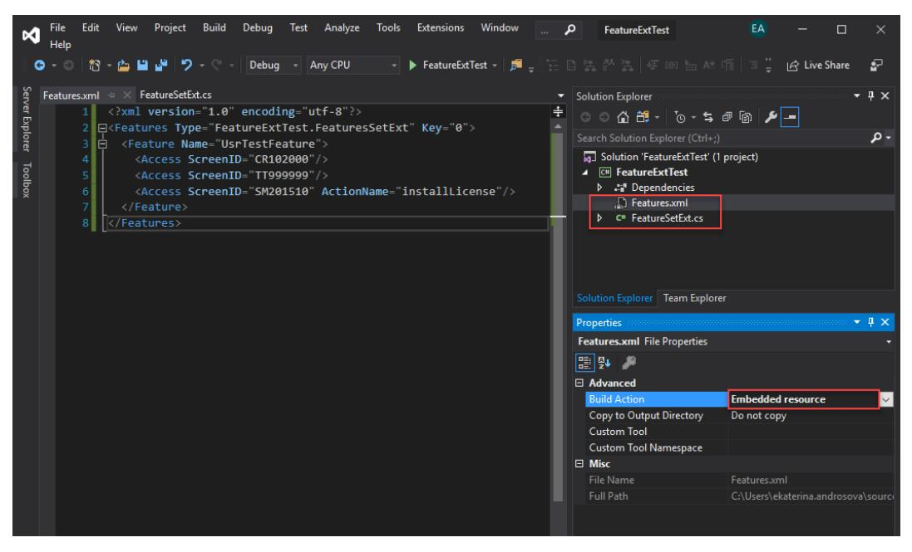


- 3. Add a field to the FeaturesSet DAC by creating a cache extension, and add a related column to the database. The name of the new column must consist of the Usr prefix and the feature name. For details, see *To Add a [Custom](https://help-2022r2.acumatica.com/Wiki/ShowWiki.aspx?wikiname=HelpRoot_Dev_Customization&PageID=5a2bddc7-dd58-4de4-a9f5-f4d5ce073b77) Data Field*. The FeatureSetExt cache extension that you have created for the new field must adhere to the following rules:
  - The same name must be used for the custom feature in the FeaturesSet table column and in the Features.xml file.
  - The FeatureSetExt class must be in the same project as the Features.xml file.
  - The namespace of the FeatureSetExt class must start with the project name followed by the name of the folder in which the Features.xml file is located. For example, if your Features.xml file is located directly in the FeatureExtTest project root, then the namespace of the FeatureSetExt class must be FeatureExtTest. If your Features.xml file is located in the Features/ Resources/ folder of the FeatureExtTest project, the namespace of the FeatureSetExt class must be FeatureExtTest.Features.Resources.
- 4. Customize the *[Enable/Disable Features](https://help-2025r1.acumatica.com/Help?ScreenId=ShowWiki&pageid=c1555e43-1bc5-4f6f-ba9d-b323f94d8a6b)* (CS100000) form by adding a check box with the name of the custom feature on it. For details, see *To Add a Box for a Data [Field](#page-247-1)*.
- 5. Share the feature switch name with a representative of the ISV support team. The name of the feature switch must adhere to [Full\_Name\_Of\_FeaturesSetExt]+[Name\_Of\_The\_DAC\_Property] format. For instance, the feature switch name would be CustomFeatures.CustomObjects.FeaturesSetExt +UsrCustomFeature for the FeatureSetExt class shown in the following code snippet.

```
using PX.Data;
using PX.Objects.CS;
namespace CustomFeatures.CustomObjects
{
 public sealed class FeaturesSetExt : PXCacheExtension<FeaturesSet>
 {
 public abstract class usrCustomFeature : IBqlField { }
```

```
 [Feature(false, typeof(FeaturesSet.inventory), DisplayName = "Custom Feature
 Switch")]
 public bool? UsrCustomFeature { get; set; }
 }
}
```

The feature switch name is case sensitive and must use the exact case that is used by the namespace and the DAC property of the FeatureSetExt class.

## <span id="page-95-1"></span><span id="page-95-0"></span>**Custom Feature Switches**

You can develop a custom feature and integrate it in Acumatica ERP by using a customization project. Aer you develop this custom feature, you might want to add a switch for this feature—that is, a check box that the administrator can select to enable the feature—on the *[Enable/Disable Features](https://help-2025r1.acumatica.com/Help?ScreenId=ShowWiki&pageid=c1555e43-1bc5-4f6f-ba9d-b323f94d8a6b)* (CS100000) form. With this feature switch added, the administrator can enable the feature to make the custom forms associated with the feature available or disable the feature to make the custom forms unavailable.

### **Adding a Custom Feature: Process Overview**

Aer you have developed a custom feature and integrated it in Acumatica ERP, your feature is reviewed by the ISV team, and information about the feature is added to the Acumatica Licensing Server. Aer that, you can customize the *[Enable/Disable Features](https://help-2025r1.acumatica.com/Help?ScreenId=ShowWiki&pageid=c1555e43-1bc5-4f6f-ba9d-b323f94d8a6b)* (CS100000) form, the FeaturesSet table, and the Features.xml file to add information about your feature to the project. The process of exchanging information with the Acumatica Licensing Server is shown in the diagram below.

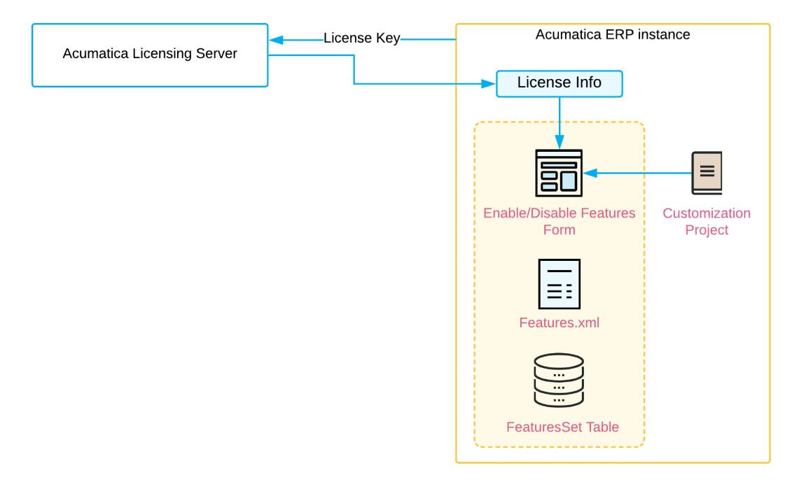

#### *Figure: Adding a custom feature*

Aer you have completed all these steps, when your customer purchases your custom feature, you should notify the ISV team about it (for example, by using your ISV solution's page on the partner portal).

### <span id="page-96-1"></span><span id="page-96-0"></span>**The Features.xml File**

Every instance of Acumatica ERP has a Feature.xml file, located in the PX.Data.dll library. This file contains the description of the out-of-the-box features that are available in the instance and displayed on the Enable/ Disable Features (CS100000) form.

Each feature is represented in the Features.xml file by a Feature element with a number of Access subelements. (For an example, see the following code.)

```
<Feature Name="Branch">
 <Access ScreenID="GL201500"
 CacheName="PX.Objects.GL.Ledger"
 FieldName="DefBranchID" />
 <Access ScreenID="GL101010" />
 <Access FieldClass="BRANCH"/>
</Feature>
```

For all custom features you are implementing, you should create a new Features.xml file of the same structure that contains information about all new features.

#### **Targets for Rules**

By using the Access element, you can set up rules for the following items:

• A specific page, as shown in the following example.

<Access ScreenID="AP506500" />

• All pages whose identifiers start with the provided value; see the following code line.

```
<Access ScreenID="IN" />
```

• A specific data field on a page, as shown below.

```
<Access ScreenID="GL201500"
 CacheName="PX.Objects.GL.Ledger"
 FieldName="PostInterCompany" />
```

• Data fields having a specific field class. (See the following example.)

<Access FieldClass="BRANCH"/>

To apply this rule to a field, you should specify the name of the field class in the PXUIField attribute added to the field definition in the data access class, as follows.

```
[PXUIField(DisplayName = "Active", FieldClass="BRANCH")]
public bool? Active{
 get;
 set;
}
```

• A specific action on a page, as demonstrated in the following code line.

<Access ScreenID="AR303000" ActionName="NewSalesOrder"/>

• A user role, as the following example shows.

<Access Role="Consultant"/>

### <span id="page-97-0"></span>**Managing Customization Projects by Using the Web API**

You can use the web API for managing customization projects from code, such as for automation of deployment of customization packages to local and remote instances of Acumatica ERP. In this chapter, you will learn how to access this API and how you can work with customization projects through the API.

### <span id="page-97-2"></span><span id="page-97-1"></span>**Customization Web API: General Information**

By using the web API to work with customization projects, you can automate the processes that are performed on the *[Customization Projects](https://help-2025r1.acumatica.com/Help?ScreenId=ShowWiki&pageid=4d3a1166-826c-414b-a207-3d1669fbf9e5)* (SM204505) form, such as importing a customization project, publishing customization projects, or unpublishing customization projects.

### **Learning Objectives**

In this chapter, you will learn how to do the following by using the web API:

- Import a customization project
- Delete a customization project
- Publish specified customization projects
- Check whether the publication of customization projects has completed
- Unpublish all customization projects
- Retrieve the list of published customization projects
- Obtain the contents of a customization project

### **Applicable Scenarios**

You use the web API if you need to automate operations with customization projects.

#### **Sign-In to the Service**

Before you can use the web API for manipulation with customization projects, you need to sign in to the instance of Acumatica ERP, as described in *[Sign In to the ServiceSign-In to the Service](https://help-2025r1.acumatica.com/Help?ScreenId=ShowWiki&pageid=0322492a-de9b-4443-b256-923c48aff31d)*.

- The user account that you use to sign in to the service should be assigned the *Customizer* role in the instance of Acumatica ERP, as described in *To Assign the [Customizer](#page-17-1) Role to a User [Account](#page-17-1)*.
  - OAuth 2.0 authorization cannot be used with the web API for the management of customization projects.

#### **Base URL**

To manage the publication of customization projects, you use the following base URL.

http(s)://<Acumatica ERP Instance URL>/CustomizationApi/

You replace *<Acumatica ERP instance URL>* with the URL of your Acumatica ERP instance. For example, *http:// localhost/AcumaticaDB/CustomizationApi/* is the base URL for a local Acumatica ERP instance with the name *AcumaticaDB*.

You can use the web API to publish a customization project to Acumatica ERP or to the Self-Service Portal, depending on where the sign-in has been performed before the start of the publication.

### **Available Methods**

To manage customization projects by using the web API, you can use the methods described in the following topics:

- *[Customization](#page-99-1) Web API: delete*
- *[Customization](#page-100-1) Web API: getPublished*
- *[Customization](#page-102-1) Web API: getProject*
- *[Customization](#page-104-1) Web API: import*
- *[Customization](#page-106-1) Web API: publishBegin*
- *[Customization](#page-108-1) Web API: publishEnd*
- *[Customization](#page-110-1) Web API: unpublishAll*

#### **Request Headers**

You do not need to specify any headers to provide parameters to the methods of the API. However, you need to specify the following standard headers in the request.

| Header       | Description                                                                                                              |
|--------------|--------------------------------------------------------------------------------------------------------------------------|
| Accept       | Specifies the format of the response body, which can be one of the following:<br>•<br>application/json<br>•<br>text/json |
| Content-Type | Specifies the format of the request body, which can be one of the following:<br>•<br>application/json<br>•<br>text/json  |

#### **Response Status Codes**

The following table lists the HTTP status codes that the system returns in a response.

| Code | Description                                                                               |
|------|-------------------------------------------------------------------------------------------|
| 200  | The request has been completed successfully.                                              |
| 400  | The processing of the request has failed.                                                 |
| 401  | The user is not signed in to the system.                                                  |
| 403  | The user has insufficient rights to access the Customization Projects (SM204505)<br>form. |

| Code | Description                            |
|------|----------------------------------------|
| 500  | An internal server error has occurred. |

### <span id="page-99-1"></span><span id="page-99-0"></span>**Customization Web API: delete**

If a customization project is not currently published, you can delete the project in an Acumatica ERP instance through the web API.

When a customization project is deleted, the platform deletes from the database the project data and the data of the project items. The platform does not delete the files and the objects that were added to the projects from the database, such as site map nodes, reports, user access rights, and integration scenarios.

### **HTTP Method and URL**

To delete a customization project in an Acumatica ERP instance, you use the POST HTTP method and the following URL.

POST http(s)://<Acumatica ERP Instance URL>/CustomizationApi/delete

You replace *<Acumatica ERP instance URL>* with the URL of your Acumatica ERP instance.

#### **Request Body**

In the request body in JSON format, you can use the field described in the following table.

| Field       | Description                                                    |
|-------------|----------------------------------------------------------------|
| projectName | Required. The name of the customization project to be removed. |

#### **Response Body**

The following table describes the field that the system returns in the body of the response.

| Field | Description                                                                                                                                                                                                                                                                                                                      |
|-------|----------------------------------------------------------------------------------------------------------------------------------------------------------------------------------------------------------------------------------------------------------------------------------------------------------------------------------|
| log   | An array of log records. Each element of the array has the following fields:<br>•<br>timestamp: The date and time when the information about the performed op<br>eration was added to the log<br>•<br>logType: The type of the log message, which can be one of the following:<br>•<br>trace<br>•<br>information<br>warning<br>• |
|       | error<br>•<br>•<br>message: The log message                                                                                                                                                                                                                                                                                      |

#### **Example**

The following request shows an example of removal of the *PhoneRepairShop* customization project.

In the request example below, <Acumatica ERP instance URL> is the URL of the Acumatica ERP instance (such as *https://my.acumatica.com/MyInstance*). You can omit the instance name in the URL (that is, you can use *https://my.acumatica.com*) if the instance is installed in the root of the website.

```
POST /<Acumatica ERP Instance URL>/CustomizationApi/delete HTTP/1.1
Host: localhost
Accept: application/json
Content-Type: application/json
Content-Length: 42
{
 "projectName": "PhoneRepairShop"
}
```

If the response is *200 OK*, it contains the body, which is shown in the following example.

```
{
 "log": [
 {
 "timestamp": "2022-08-06T19:55:01.0832449Z",
 "logType": "information",
 "message": "Delete project: PhoneRepairShop"
 }
 ]
}
```

#### **Related Links**

• *[Customization](#page-97-2) Web API: General Information*

### <span id="page-100-1"></span><span id="page-100-0"></span>**Customization Web API: getPublished**

You can obtain the list of customization projects that are currently published in an Acumatica ERP instance and the list of customization items in these projects.

#### **HTTP Method and URL**

To obtain the list of customization projects that are currently published in an Acumatica ERP instance, you use the POST HTTP method and the following URL.

```
POST http(s)://<Acumatica ERP Instance URL>/CustomizationApi/getPublished
```

You replace *<Acumatica ERP instance URL>* with the URL of your Acumatica ERP instance.

#### **Request Body**

You do not need to pass any data in the request body.

#### **Response Body**

| Field    | Description                                                                                                                                                                                                                                                                                                                                                                     |
|----------|---------------------------------------------------------------------------------------------------------------------------------------------------------------------------------------------------------------------------------------------------------------------------------------------------------------------------------------------------------------------------------|
| projects | The names of the customization projects that are published in the system.                                                                                                                                                                                                                                                                                                       |
| items    | The information about the customization items from all published projects, which<br>contains the following fields:<br>•<br>key: The identifier of the customization item<br>•<br>screenId: The screen ID for generic inquiries and items that customize                                                                                                                         |
|          | Acumatica ERP forms<br>•<br>type: The type of the customization item                                                                                                                                                                                                                                                                                                            |
| log      | An array of log records. Each element of the array has the following fields:<br>•<br>timestamp: The date and time when the information about the performed op<br>eration was added to the log<br>•<br>logType: The type of the log message, which can be one of the following:<br>•<br>trace<br>•<br>information<br>warning<br>•<br>error<br>•<br>•<br>message: The log message |

The following table lists the fields that the system returns in the body of the response.

#### **Example**

The following request shows an example of the retrieval of the list of currently published customization projects.

In the request example below, <Acumatica ERP instance URL> is the URL of the Acumatica ERP instance (such as *https://my.acumatica.com/MyInstance*). You can omit the instance name in the URL (that is, you can use *https://my.acumatica.com*) if the instance is installed in the root of the website.

```
POST /<Acumatica ERP Instance URL>/CustomizationApi/getPublished HTTP/1.1
Host: localhost
Accept: application/json
Content-Type: application/json
```

If the response is *200 OK*, it contains the body, which is shown in the following example.

```
{
 "projects": [
 {
 "name": "VisualWorkflow"
 },
 {
 "name": "PhoneRepairShop"
 }
 ],
```

```
 "items": [
 {
 "key": "~/pages/po/po302000.aspx",
 "screenId": "PO302000",
 "type": "Page"
 },
 {
 "key": "~/pages/rs/rs201000.aspx",
 "screenId": "RS201000",
 "type": "Page"
 },
 ...
 ],
 "log": []
```

#### **Related Links**

}

• *[Customization](#page-97-2) Web API: General Information*

### <span id="page-102-1"></span><span id="page-102-0"></span>**Customization Web API: getProject**

You can retrieve the contents of a customization project from the database of an Acumatica ERP instance. These capabilities may be useful if you need to automate the retrieval of a customization package from one site and its deployment on another site, such as if you need to obtain the package from the development environment and test it in the testing environment.

#### **HTTP Method and URL**

To retrieve the content of a customization project from the database of an Acumatica ERP instance, you use the POST HTTP method and the following URL.

POST http(s)://<Acumatica ERP Instance URL>/CustomizationApi/getProject

You replace *<Acumatica ERP instance URL>* with the URL of your Acumatica ERP instance.

#### **Request Body**

In the request body in JSON format, you can use the fields listed in the following table.

| Field                      | Description                                                                                                                                                                                                                                                                                                                                                                                                                                                                                                                                                                                   |
|----------------------------|-----------------------------------------------------------------------------------------------------------------------------------------------------------------------------------------------------------------------------------------------------------------------------------------------------------------------------------------------------------------------------------------------------------------------------------------------------------------------------------------------------------------------------------------------------------------------------------------------|
| IsAutoResolveCon<br>flicts | A Boolean value that indicates (if it is set to true) that the system should automati<br>cally update the customization project in the database with the changes from the<br>file system if any files of the customization project have been modified in the file<br>system. The updated package is returned in the response as a ZIP file in Base64 en<br>coding. If the value is false, the system does not update the customization project<br>with any changes in the file system and returns the customization project content<br>as it is in the database in the moment of the request. |
| projectName                | Required. The name of the customization project whose contents you need to ob<br>tain.                                                                                                                                                                                                                                                                                                                                                                                                                                                                                                        |

#### **Response Body**

The following table lists the fields that the system returns in the body of the response.

| Field                    | Description                                                                                                                                                                                                                                                                                                                                                                     |
|--------------------------|---------------------------------------------------------------------------------------------------------------------------------------------------------------------------------------------------------------------------------------------------------------------------------------------------------------------------------------------------------------------------------|
| ProjectContent<br>Base64 | The customization package in Base64 format.                                                                                                                                                                                                                                                                                                                                     |
| HasConflicts             | A Boolean value that indicates (if it is set to true) that the files of the customiza<br>tion project were modified in the file system before the customization package<br>was obtained. The system returned the contents of the customization project with<br>the changes from the file system or without them, depending on the value of the<br>IsAutoResolveConflicts field. |
| log                      | An array of log records. Each element of the array has the following fields:                                                                                                                                                                                                                                                                                                    |
|                          | •<br>timestamp: The date and time when the information about the performed op<br>eration was added to the log                                                                                                                                                                                                                                                                   |
|                          | •<br>logType: The type of the log message, which can be one of the following:                                                                                                                                                                                                                                                                                                   |
|                          | •<br>trace                                                                                                                                                                                                                                                                                                                                                                      |
|                          | •<br>information                                                                                                                                                                                                                                                                                                                                                                |
|                          | •<br>warning                                                                                                                                                                                                                                                                                                                                                                    |
|                          | •<br>error                                                                                                                                                                                                                                                                                                                                                                      |
|                          | •<br>message: The log message                                                                                                                                                                                                                                                                                                                                                   |

#### **Example**

The following request shows an example of the retrieval of the contents of the *PhoneRepairShop* customization project with all the changes that are available in the file system.

In the request example below, <Acumatica ERP instance URL> is the URL of the Acumatica ERP instance (such as *https://my.acumatica.com/MyInstance*). You can omit the instance name in the URL (that is, you can use *https://my.acumatica.com*) if the instance is installed in the root of the website.

```
POST /<Acumatica ERP Instance URL>/CustomizationApi/GetProject HTTP/1.1
Host: localhost
Accept: application/json
Content-Type: application/json
Content-Length: 79
{
 "IsAutoResolveConflicts": true,
 "projectName": "PhoneRepairShop"
}
```

If the response is *200 OK*, it contains the body, which is shown in the following example.

{ "projectContentBase64": "UEsDBBQAAAAIAApRnlWbF8u...", "hasConflicts": false,

```
 "log": []
```

#### **Related Links**

}

• *[Customization](#page-97-2) Web API: General Information*

### <span id="page-104-1"></span><span id="page-104-0"></span>**Customization Web API: import**

You can import a customization package (that is, a ZIP archive) to an Acumatica ERP instance.

During the import, the platform uploads the customization package, creates the corresponding customization project, and saves the project in the database. As a result, the new customization project appears in the list on the *[Customization Projects](https://help-2025r1.acumatica.com/Help?ScreenId=ShowWiki&pageid=4d3a1166-826c-414b-a207-3d1669fbf9e5)* (SM204505) form. Aer the import is completed, you can access the project data and manage the project.

#### **HTTP Method and URL**

To import a customization package to an Acumatica ERP instance, you use the POST HTTP method and the following URL.

POST http()://<Acumatica ERP Instance URL>/CustomizationApi/import

You replace *<Acumatica ERP instance URL>* with the URL of your Acumatica ERP instance.

#### **Request Body**

In the request body in JSON format, you can use the fields listed in the following table.

| Field                    | Description                                                                                                                                                                          |
|--------------------------|--------------------------------------------------------------------------------------------------------------------------------------------------------------------------------------|
| projectLevel             | The level of the customization project that is used to resolve conflicts that can arise<br>if multiple modifications of the same items of the website are merged.                    |
| isReplaceIfExists        | A Boolean value that indicates (if it is set to true) that if a project with the same<br>name exists, it should be removed.                                                          |
| projectName              | Required. The name of the customization project.                                                                                                                                     |
| projectDescription       | The description of the customization project.                                                                                                                                        |
| projectContent<br>Base64 | The contents of the customization package in Base64 format. If you do not speci<br>fy the value of this field, the system will try to remove the specified customization<br>project. |

#### **Response Body**

The following table describes the field that the system returns in the body of the response.

| Field | Description                                                                                                   |
|-------|---------------------------------------------------------------------------------------------------------------|
| log   | An array of log records. Each element of the array has the following fields:                                  |
|       | •<br>timestamp: The date and time when the information about the performed op<br>eration was added to the log |
|       | •<br>logType: The type of the log message, which can be one of the following:                                 |
|       | trace<br>•                                                                                                    |
|       | •<br>information                                                                                              |
|       | •<br>warning                                                                                                  |
|       | •<br>error                                                                                                    |
|       | •<br>message: The log message                                                                                 |

#### **Example**

The following request shows an example of the importing of the *PhoneRepairShop* customization project.

In the request example below, <Acumatica ERP instance URL> is the URL of the Acumatica ERP instance (such as *https://my.acumatica.com/MyInstance*). You can omit the instance name in the URL (that is, you can use *https://my.acumatica.com*) if the instance is installed in the root of the website.

```
POST /<Acumatica ERP Instance URL>/CustomizationApi/import HTTP/1.1
Host: localhost
Content-Type: application/json
{
 "projectLevel": 1,
 "isReplaceIfExists": true,
 "projectName": "PhoneRepairShop",
 "projectDescription": "Customization project for the Smart Fix company",
 "projectContentBase64": "UEsDBBQAAAAIAEymBlVg2QXNohEAANxoA..."
}
```

If the response is *200 OK*, it contains the body, which is shown in the following example.

```
{
 "log": [
 {
 "timestamp": "2022-08-06T17:59:55.6658507Z",
 "logType": "information",
 "message": "Create new project: PhoneRepairShop"
 }
 ]
}
```

#### **Related Links**

• *[Customization](#page-97-2) Web API: General Information*

## <span id="page-106-1"></span><span id="page-106-0"></span>**Customization Web API: publishBegin**

You can initiate the publication of any number of customization projects in an Acumatica ERP instance.

When you publish a customization project, the system applies the changes in the project to the website. Aer the customization project has been published, users see Acumatica ERP with the modifications of the project. The changes apply to the website of Acumatica ERP and therefore affect all tenants in the system (see *[Publication of](#page-38-1) [Customization Projects in a Multitenant Site](#page-38-1)* for details).

For details about the publishing of customization projects, see *[Publishing Customization Projects](#page-120-2)*.

#### **HTTP Method and URL**

To initiate the publication of a customization project in an Acumatica ERP instance, you use the POST HTTP method and the following URL.

POST http(s)://<Acumatica ERP Instance URL>/CustomizationApi/publishBegin

You replace *<Acumatica ERP instance URL>* with the URL of your Acumatica ERP instance.

#### **Request Body**

In the request body in JSON format, you can use the fields listed in the following table.

| Field                                 | Description                                                                                                                                                                                                                                                                                                                                                                                                                     |
|---------------------------------------|---------------------------------------------------------------------------------------------------------------------------------------------------------------------------------------------------------------------------------------------------------------------------------------------------------------------------------------------------------------------------------------------------------------------------------|
| isMergeWithExist<br>ingPackages       | A Boolean value that indicates (if it is set to true) that the currently published<br>projects should be merged with the customization projects listed in the pro<br>jectNames field and the result of the merge should be published. If the value is<br>false, only the projects specified in the projectNames field will be the published<br>projects.                                                                        |
| isOnlyValidation                      | A Boolean value that indicates (if it is set to true) that only validation of the cus<br>tomization project should be performed.                                                                                                                                                                                                                                                                                                |
| isOnlyDbUpdates                       | A Boolean value that indicates (if it is set to true) that the changes should be ap<br>plied only to the database. The field corresponds to the Apply Changes Only to<br>Database (Skip Website Update) check box in the Publish to MultipleTenants di<br>alog box, which appears when you click Publish to MultipleTenants on the form<br>toolbar of the Customization Projects (SM204505) form.                               |
| isReplayPrevious<br>lyExecutedScripts | A Boolean value that indicates (if it is set to true) that the database scripts that were<br>previously applied should be executed again. The field corresponds to the Execute<br>All DatabaseScripts (Including Previously Executed) check box in the Publish<br>to MultipleTenants dialog box, which appears when you click Publish to Multiple<br>Tenants on the form toolbar of the Customization Projects (SM204505) form. |
| projectNames                          | Required. An array of the names of the customization projects that need to be pub<br>lished.                                                                                                                                                                                                                                                                                                                                    |

| Field            | Description                                                                                                                                          |
|------------------|------------------------------------------------------------------------------------------------------------------------------------------------------|
| tenantMode       | The tenant for which the projects should be published. The field can have one of<br>the following values:                                            |
|                  | •<br>Current: The customization projects should be published for the tenant to which<br>the user is currently signed in.                             |
|                  | •<br>All: The customization projects should be published for all tenants.                                                                            |
|                  | •<br>List: The customization projects should be published for the tenants specified in<br>the tenantLoginNames field.                                |
| tenantLoginNames | The list of tenants for which the customization projects should be published. This<br>field is used only if the tenantMode field has the List value. |

### **Response Body**

The following table describes the field that the system returns in the body of the response.

| Field | Description                                                                                                   |
|-------|---------------------------------------------------------------------------------------------------------------|
| log   | An array of log records. Each element of the array has the following fields:                                  |
|       | •<br>timestamp: The date and time when the information about the performed op<br>eration was added to the log |
|       | •<br>logType: The type of the log message, which can be one of the following:                                 |
|       | •<br>trace                                                                                                    |
|       | •<br>information                                                                                              |
|       | •<br>warning                                                                                                  |
|       | •<br>error                                                                                                    |
|       | •<br>message: The log message                                                                                 |

### **Example**

The following request shows an example of the publishing of the *PhoneRepairShop* customization project in the current tenant.

In the request example below, <Acumatica ERP instance URL> is the URL of the Acumatica ERP instance (such as *https://my.acumatica.com/MyInstance*). You can omit the instance name in the URL (that is, you can use *https://my.acumatica.com*) if the instance is installed in the root of the website.

```
POST /<Acumatica ERP Instance URL>/CustomizationApi/PublishBegin HTTP/1.1
Host: localhost
Content-Type: application/json
Content-Length: 250
{
 "isMergeWithExistingPackages": false,
 "isOnlyValidation": false,
 "isOnlyDbUpdates": false,
 "isReplayPreviouslyExecutedScripts": false,
 "projectNames": [ "PhoneRepairShop" ],
```

```
 "tenantMode": "Current"
```

If the response is *200 OK*, it contains the body, which is shown in the following example.

```
{
 "log": [
 {
 "timestamp": "2022-08-09T13:58:12.7753165Z",
 "logType": "information",
 "message": "Publishing has started."
 }
 ]
}
```

#### **Usage Notes**

}

The publication of a customization project through the web API is implemented asynchronously. You should publish a customization project as follows:

1. You start publication by calling the PublishBegin method.

Once the publication has started, a logical lock occurs in the database that prevents multiple publications from running simultaneously on the same database.

2. As soon as you get a successful response, you start calling the PublishEnd method until it returns "isCompleted": true.

To check whether the publishing has been completed successfully, you can check for "isFailed": false in the response to the PublishEnd method.

The calling of the PublishEnd method initiates the execution of customization plug-ins. Therefore, without a call to the PublishEnd method, the publication cannot be completed.

#### **Related Links**

• *[Customization](#page-97-2) Web API: General Information*

### <span id="page-108-1"></span><span id="page-108-0"></span>**Customization Web API: publishEnd**

You can check whether the publishing of customization projects has been completed in an Acumatica ERP instance.

#### **HTTP Method and URL**

To check whether the publishing of customization projects has been completed in an Acumatica ERP instance, you use the POST HTTP method and the following URL.

POST http(s)://<Acumatica ERP Instance URL>/CustomizationApi/publishEnd

You replace *<Acumatica ERP instance URL>* with the URL of your Acumatica ERP instance.

#### **Request Body**

You do not need to pass any data in the request body.

#### **Response Body**

| Field       | Description                                                                                                                                                                                                                                                                                                                                                                     |
|-------------|---------------------------------------------------------------------------------------------------------------------------------------------------------------------------------------------------------------------------------------------------------------------------------------------------------------------------------------------------------------------------------|
| isCompleted | A Boolean value that indicates (if it is set to true) that the publishing has been com<br>pleted.                                                                                                                                                                                                                                                                               |
| isFailed    | A Boolean value that indicates (if it is set to true) that the publishing has been com<br>pleted with at least one error.                                                                                                                                                                                                                                                       |
| log         | An array of log records. Each element of the array has the following fields:<br>•<br>timestamp: The date and time when the information about the performed op<br>eration was added to the log<br>•<br>logType: The type of the log message, which can be one of the following:<br>•<br>trace<br>•<br>information<br>•<br>warning<br>•<br>error<br>•<br>message: The log message |

The following table lists the fields that the system returns in the body of the response.

### **Example**

The following request shows an example of a check for the result of the publication of customization projects.

In the request example below, <Acumatica ERP instance URL> is the URL of the Acumatica ERP instance (such as *https://my.acumatica.com/MyInstance*). You can omit the instance name in the URL (that is, you can use *https://my.acumatica.com*) if the instance is installed in the root of the website.

```
POST /<Acumatica ERP Instance URL>/CustomizationApi/PublishEnd HTTP/1.1
Host: localhost
Content-Type: application/json
```

If the response is *200 OK*, it contains the body, which is shown in the following example. In this example, the publishing has completed (as the isCompleted field indicates) and it has completed successfully (as the isFailed field indicates).

```
{
 "isCompleted": true,
 "isFailed": false,
 "log": [
 {
 "timestamp": "2023-01-04T14:21:31.827",
 "logType": "information",
 "message": "Copying the website C:\\AcumaticaERP\\Customization\
\PhoneRepairShop\\PhoneRepairShopValidation\\PhoneRepairShopWebsite"
 },
 {
 "timestamp": "2023-01-04T14:21:31.83",
```

```
 "logType": "information",
 "message": "Patching the file C:\\AcumaticaERP\\Customization\\PhoneRepairShop\
\PhoneRepairShopValidation\\PhoneRepairShopWebsite\\CstPublished\\Pages_RS\\RS201000.aspx"
 },
 ...
 ]
}
```

#### **Usage Notes**

The publication of a customization project through the web API is implemented asynchronously. You should publish a customization project as follows:

1. You start publication by calling the PublishBegin method.

Once the publication has started, a logical lock occurs in the database that prevents multiple publications from running simultaneously on the same database.

2. As soon as you get a successful response, you start calling the PublishEnd method until it returns "isCompleted": true.

To check whether the publishing has been completed successfully, you can check for "isFailed": false in the response to the PublishEnd method.

The calling of the PublishEnd method initiates the execution of customization plug-ins. Therefore, without a call to the PublishEnd method, the publication cannot be completed.

#### **Related Links**

• *[Customization](#page-97-2) Web API: General Information*

### <span id="page-110-1"></span><span id="page-110-0"></span>**Customization Web API: unpublishAll**

You can unpublish all customization projects that are currently published in an Acumatica ERP instance.

When you unpublish all customization projects, the system reverses the changes introduced by the customization projects, as described in *[Project Unpublishing: General Information](#page-136-2)*.

#### **HTTP Method and URL**

To unpublish projects that are currently published in an Acumatica ERP instance, you use the POST HTTP method and the following URL.

POST http(s)://<Acumatica ERP Instance URL>/CustomizationApi/unpublishAll

You replace *<Acumatica ERP instance URL>* with the URL of your Acumatica ERP instance.

#### **Request Body**

In the request body in JSON format, you can use the fields listed in the following table.

| Field            | Description                                                                                                                              |
|------------------|------------------------------------------------------------------------------------------------------------------------------------------|
| tenantMode       | Required. The tenant for which the projects should be unpublished. The field can<br>have one of the following values:                    |
|                  | •<br>Current: The customization projects should be unpublished for the tenant where<br>the user is currently signed in.                  |
|                  | •<br>All: The customization projects should be unpublished for all tenants.                                                              |
|                  | •<br>List: The customization projects should be unpublished for the tenants specified<br>in the tenantLoginNames field.                  |
| tenantLoginNames | An array of tenants for which the customization projects should be unpublished.<br>This field is used only if tenantMode is set to List. |

#### **Response Body**

The following table describes the field that the system returns in the body of the response.

| Field | Description                                                                                                                                                                                                                                                                                                                                                                     |
|-------|---------------------------------------------------------------------------------------------------------------------------------------------------------------------------------------------------------------------------------------------------------------------------------------------------------------------------------------------------------------------------------|
| log   | An array of log records. Each element of the array has the following fields:<br>•<br>timestamp: The date and time when the information about the performed op<br>eration was added to the log<br>•<br>logType: The type of the log message, which can be one of the following:<br>•<br>trace<br>•<br>information<br>•<br>warning<br>error<br>•<br>•<br>message: The log message |

### **Example**

The following request shows an example of the unpublishing of customization projects in all tenants.

In the request example below, <Acumatica ERP instance URL> is the URL of the Acumatica ERP instance (such as *https://my.acumatica.com/MyInstance*). You can omit the instance name in the URL (that is, you can use *https://my.acumatica.com*) if the instance is installed in the root of the website.

```
POST /<Acumatica ERP Instance URL>/CustomizationApi/unpublishAll HTTP/1.1
Host: localhost
Accept: application/json
Content-Type: application/json
Content-Length: 29
{
 "tenantMode": "All"
}
```

If the response is *200 OK*, it contains the body, which is shown in the following example.

```
{
 "log": [
 {
 "timestamp": "2023-01-04T14:35:55.1162425Z",
 "logType": "information",
 "message": "Unpublish MyTenant"
 },
 {
 "timestamp": "2023-01-04T14:35:55.1432004Z",
 "logType": "information",
 "message": "Cleaning up the database"
 }
 ]
}
```

#### **Related Links**

• *[Customization](#page-97-2) Web API: General Information*

## <span id="page-112-0"></span>**Managing Customization Projects by Using the PXCommandLine Tool**

You can use the PXCommandLine tool for managing customization projects— such as uploading customization packages and validating and publishing customization projects in your Acumatica ERP instance in automated scenarios. You can also use the tool to perform other operations, such as unpublishing customization projects and deleting customization packages from your instance. In this chapter, you will learn how to run this tool and how you can work with customization projects by using it.

### <span id="page-112-1"></span>**PXCommandLine Tool: General Information**

The PX.CommandLine tool is a console application that can be used to work with customization packages in automated scenarios, such as continuous integration (CI) scripts. It gives developers the ability to integrate a number of operations that are performed in the Customization Project Editor into scripts—such as building, uploading, and deleting customization projects.

### **Learning Objectives**

In this chapter, you will learn how to do the following by using the PXCommandLine tool:

- Run validations of all PXGraph and PXCache extensions in the current application domain
- Upload and publish a customization package to the website
- Validate a published customization project before upgrading your Acumatica ERP instance
- Unpublish customization projects from the website
- Build a customization package that uses existing files or is based on a customization project
- Delete a customization project from the instance and from the instance's database
- Merge multiple customization projects into a single customization project
- Export a snapshot
- Run the CustomizationPlugin.UpdateDatabase methods from customization plug-ins of all published customization projects
- Update the pages and files of the website by using a customization package file

#### **Applicable Scenarios**

You use the PXCommandLine tool if you need to work with customization projects in automated scenarios.

#### **Use of the PX.CommandLine Tool**

The PX.CommandLine tool is an executable file (PX.CommandLine.exe) located in the \Bin folder of your customization project.

When you run PX.CommandLine.exe, you supply a set of command-line parameters, with each presented in the following format.

parameter\_name "parameter\_value"


You do not need to use quotation marks for the parameter value if this value does not contain any spaces.

The tool also supports parameters of the Boolean type that do not have a corresponding value, such as the / replace parameter in *PXCommandLine Tool: [UploadCustomization](#page-114-3)*.

The PX.CommandLine tool supports the following syntax.

```
PX.CommandLine.exe 
[/website "path\to\web\site\root"\] 
/method (ValidateExtensions | UploadCustomization | ValidateCustomization |
RemoveCustomization | PublishCustomization |BuildProject | DeleteProject |
MergePackages | ExportSnapshot | RunPluginsUpdate | UpdatePages)
```


Optional parameters are enclosed in square brackets.

You can use the following parameters:

- /website: Optional. This parameter provides a path to a website folder. You use the parameter if the PX.CommandLine.exe executable file is not located in the \Bin folder of your website.
- /method: Required. This parameter indicates the action that should be executed. The following topics describe the possible values for the parameter and their usage:
  - *PXCommandLine Tool: [ValidateExtensions](#page-114-4)*
  - *PXCommandLine Tool: [UploadCustomization](#page-114-3)*
  - *PXCommandLine Tool: [ValidateCustomization](#page-114-5)*
  - *PXCommandLine Tool: [RemoveCustomization](#page-115-2)*
  - *PXCommandLine Tool: [PublishCustomization](#page-115-3)*
  - *[PXCommandLine](#page-116-1) Tool: BuildProject*
  - *[PXCommandLine](#page-117-2) Tool: DeleteProject*
  - *[PXCommandLine](#page-117-3) Tool: MergePackages*
  - *[PXCommandLine](#page-118-3) Tool: ExportSnapshot*
  - *PXCommandLine Tool: [RunUpdatePlugins](#page-118-4)*
  - *[PXCommandLine](#page-118-5) Tool: UpdatePages*

Additionally, each action that is executed by using the /method parameter and the corresponding value has its own set of additional parameters. These are also discussed in the topics that are listed above.

### <span id="page-114-4"></span><span id="page-114-0"></span>**PXCommandLine Tool: ValidateExtensions**

You can use the *ValidateExtensions* value of the /method parameter to run validations of all PXGraph and PXCache extensions in your instance's memory. If a validation error occurs, the tool exits with Code 1, and the validation error is written to the console.

You should also specify the /CustomizationTempFilesPath parameter if the CustomizationTempFilesPath parameter is not specified in the Web.config file. This parameter provides a temporary path to an existing folder that the customization engine uses while performing the validations.

You can call the ValidateExtensions method by using the following syntax.

```
PX.CommandLine.exe [/website "path\to\web\site\root"] 
/method ValidateExtensions
[/CustomizationTempFilesPath "path\to\temp\folder"\]
```

The CustomizationTempFilesPath parameter is generally already defined in the Web.config file.

### <span id="page-114-3"></span><span id="page-114-1"></span>**PXCommandLine Tool: UploadCustomization**

You can use the *UploadCustomization* value of the /method parameter to upload a customization project from a customization package (.zip archive) to an Acumatica ERP instance.

You can use the following required and optional parameters with this method:

- /path: Required. You use this parameter to specify the path to the customization package (.zip archive) that you want to upload to your instance.
- /name: Optional. You use this parameter to specify the custom name for the customization project. If the parameter is unspecified, the name of the archive without the extension will be used.
- /replace: Optional. You specify this parameter to instruct the customization engine to override an existing customization project with the same name as the project you want to upload. The PX.CommandLine tool will throw an error if all of the following conditions are met:
  - You do not specify this parameter
  - You upload a customization project by specifying a name by using the /name parameter
  - A customization project with the same name already exists

You can call the UploadCustomization method by using the following syntax.

```
PX.CommandLine.exe [/website "path\to\web\site\root"\] 
/method UploadCustomization
/path "path\to\zip\archive\package.zip"
[/name "CustomizationName"]
[/replace]
```

### <span id="page-114-5"></span><span id="page-114-2"></span>**PXCommandLine Tool: ValidateCustomization**

You can use the *ValidateCustomization* value of the /method parameter to validate customization projects before upgrading an Acumatica ERP instance. You must have the files of the target version of the website

and of the current version of the website that has all the required customization projects published. You should use the /website parameter to specify the path to the target version of the website and the / src parameter to specify the path to the current version of the website. You should also specify a value for the /CustomizationTempFilesPath parameter, if required, as described in *[PXCommandLine](#page-114-4) Tool: [ValidateExtensions](#page-114-4)*.

When the ValidateCustomization method is called, the tool applies the customization projects from the current version of the website to the target version of the website and validates the result. If a validation errors occurs, the tool exits with Code 1.

You can call the ValidateCustomization method by using the following syntax.

```
PX.CommandLine.exe [/website "path\to\web\site\root"] 
/method ValidateCustomization
/src "path\to\source\website"
[/CustomizationTempFilesPath "path\to\temp\folder"]
```

### <span id="page-115-2"></span><span id="page-115-0"></span>**PXCommandLine Tool: RemoveCustomization**

You can use the *RemoveCustomization* value of the /method parameter to unpublish all customization projects of the current website. The unpublished projects will remain on the website and can be published again.

You can call the RemoveCustomization method by using the following syntax.

```
PX.CommandLine.exe [/website "path\to\web\site\root"] 
/method RemoveCustomization
```

### <span id="page-115-3"></span><span id="page-115-1"></span>**PXCommandLine Tool: PublishCustomization**

You can use the *PublishCustomization* value of the /method parameter to publish a customization project to your Acumatica ERP instance. Starting in Acumatica ERP 2025 R1 Preview 1, you can publish any number of customization projects to your instance. You must use the /name parameter to specify the names of the customization projects that you want to publish, with each separated by the | delimiter, as shown in the following example.

/name "Package1|Package2|Package3"

You can use the optional /merge parameter to specify that all the existing customization projects should remain published. If this parameter is not specified, all existing customization projects will be unpublished except for those specified by the /name parameter. The /merge parameter instructs the customization engine to merge the customization projects specified by the /name parameter with all the currently published customization projects.

Starting in Acumatica ERP 2025 R1 Preview 1, you can also specify the optional / skipPreviouslyExecutedDbScripts parameter to the skip the execution of the database scripts that are included with the customization if they were already executed previously.

You can call the PublishCustomization method by using the following syntax.

```
PX.CommandLine.exe [/website "path\to\web\site\root"] 
/method PublishCustomization
/name "CustomizationName" 
[/merge] 
[/skipPreviouslyExecutedDbScripts]
```

### <span id="page-116-1"></span><span id="page-116-0"></span>**PXCommandLine Tool: BuildProject**

You can use the *BuildProject* value of the /method parameter to build a customization package. You must also specify values for the /in and /out parameters.

You can call the BuildProject method by using the following syntax.

```
PX.CommandLine.exe [/website "path\to\web\site\root"] 
/method BuildProject
/in "path\to\source\folder"
/out "path\to\output\file.zip"
[/include "path\to\additional\files.ext" "relative\package\path\to\file.ext"]
[/includeDirectory "path\to\directory\with\additional\files" 
 "relative\package\path\to\directory\with\additional\files"]
[/system "relative\site\path\to\system\file.ext"]
[/description "Package description"]
[/level "1"]
```


You can run the BuildProject method only if you are running the PXCommandLine tool with administrator privileges. On the Windows operation system, you can right click the executable file (PX.CommandLine.exe) for the tool, and select **Run as administrator** from the context menu.

You can use the following required and optional parameters with this method:

- /in: Required. For this parameter, you specify the path to the folder upon which the new customization package will be based. This folder may contain either a customization package that will be modified or the files that will be included in the new customization project.
- /out: Required. You use this parameter to specify the path to the customization package that you build by using the PX.CommandLine tool. The output is a .zip archive.
- /website: Optional. For this parameter, you specify a path to a website folder. You use this parameter if the PX.CommandLine.exe executable file is not located in the \Bin folder of your website.
- /include: Optional. The parameter consists of two values: the absolute path to a file that should be added to the output package, and the relative path inside the /website folder where the file is copied aer you publish the customization project. This parameter may be repeated any number of times, once for each file.
- /includeDirectory: Optional. The parameter consists of two values: the absolute path to a folder containing files that should be added to the output package, and the relative path to a folder in the website folder where these files are copied aer the customization project is published. This parameter may be repeated any number of times, once for each folder.
- /description: Optional. For this parameter, you specify the description of the output customization package.
- /level: Optional. This is the level of the customization package, which helps the Acumatica Customization Platform to resolve conflicts while multiple customization projects are being merged. The value must be an integer. The level is used to resolve any conflicts that arise if multiple modifications of the same items of the website are merged. You use higher values for projects that contain more important changes. If you do not specify a level, the default value is 0.

For example, if you have a customization package located in the C:\AcumaticaSites\T300 folder and you want to build a customization package based on this project, you use the command shown in the following code.

/in "C:\AcumaticaSites\T300"

PX.CommandLine.exe /method BuildProject

```
/out "C:\AcumaticaSites\MyNewPackage.zip"
```

This command builds a customization package and puts the resulting .zip archive in the C: \AcumaticaSites folder.

You can also build a new customization package based on a project stored in a source control folder. To do that, you execute a command that looks similar to the one shown in the following code.

```
PX.CommandLine.exe [/website "path_to_Acumatica_website"] 
/method BuildProject
/in "path_to_customization_source_control_folder"
/out "full_name_of_customization_file.zip"
```

### <span id="page-117-2"></span><span id="page-117-0"></span>**PXCommandLine Tool: DeleteProject**

You can use the *DeleteProject* value of the /method parameter to delete a customization project from your instance and from the instance's database. You must use the /name parameter to specify the name of the customization project that you want to delete.

You can call the DeleteProject method by using the following syntax.

```
PX.CommandLine.exe [/website "path\to\web\site\root"] 
/method DeleteProject
/name "CustomizationName"
```

Note that deleting a customization project by using this command only deletes the related record of the customization project from the database. It does not revert any changes that the customization project may have made to other existing database objects.

### <span id="page-117-3"></span><span id="page-117-1"></span>**PXCommandLine Tool: MergePackages**

You can use the *MergePackages* value of the /method parameter to merge multiple customization packages into a single package. You can use the following required and optional parameters with this method:

- /website: Optional. You use this parameter to specify the path to the website folder.
- /packages: Required. You use this parameter to specify the customization project names and the path to the corresponding customization packages (.zip or .xml files)—or to the directories that contain these customization packages—that should be merged into one customization project. You should separate the project names by the ; and | delimiters, as shown in the following example: package\_path1;project\_name1|package\_path2;project\_name2| package\_path3;project\_name3.
- /resultPath: Required. You use this parameter to specify the path to the merged customization package.
- /level: Optional. You use this parameter to specify the level of the merged customization package. The value of this parameter is an integer.

You can call the MergePackages method by using the following syntax.

```
PX.CommandLine.exe [/website "c:\repos\repo2\WebSites\Pure\Site"] 
/method MergePackages
/packages "c:\repos\lego1\CcsLego\ConstructionFeatures.zip;ConstructionFeatures|
c:\repos\Construction\shared\ConstructionPackage.zip;ConstructionPackage"
/resultPath "c:\repos\repo2\WebSites\Pure\Site\Bin\MergedConstruction.zip"
[/level "1"]
```

### <span id="page-118-3"></span><span id="page-118-0"></span>**PXCommandLine Tool: ExportSnapshot**

You can use the ExportSnapshot value of the /method parameter to create a snapshot in the XML format by using a snapshot configuration file and to export the snapshot to the Snapshots directory of your Acumatica ERP instance. You must specify the path to the snapshot configuration file that you want to use by using the /config parameter. This file must have the .esc file extension.

You may also use the optional /c parameter to specify the company ID from which the snapshot should be taken. If this parameter is not specified, the *2* company ID is used by default.

You can call the ExportSnapshot method by using the following syntax.

```
PX.CommandLine.exe [/website "path\to\web\site\root"] 
/method ExportSnapshot
/config "path\to\snapshot\export\config.esc"
[/c "3"]
```

### <span id="page-118-4"></span><span id="page-118-1"></span>**PXCommandLine Tool: RunUpdatePlugins**

You can use the RunPluginsUpdate value of the /method parameter to work with the CustomizationPlugin classes of all published customization projects. For more information about customization plug-ins, see *[Custom Processes During Publication of a Customization](#page-77-1)* and *To Add a [Customization](#page-170-1) [Plug-In to a Project](#page-170-1)*.

The RunPluginsUpdate method runs the CustomizationPlugin.UpdateDatabase methods from customization plug-ins of all published customization projects. If the UseRuntimeCompilation key is set to *true* in the Web.config file, then the customization plug-ins are also collected from the App\_RuntimeCode folder.

You must use the RunPluginsUpdate method only if the customization package that you published has a customization plug-in that implements the UpdateDatabase method. You can call the RunPluginsUpdate method by using the following syntax.

```
PX.CommandLine.exe [/website "path\to\web\site\root"]
/method RunPluginsUpdate
```

### <span id="page-118-5"></span><span id="page-118-2"></span>**PXCommandLine Tool: UpdatePages**

You can use the UpdatePages value of the /method parameter to update the pages and files of your Acumatica ERP website from a customization package file. This file can have the .zip or .xml file extension. You must specify the path to this file by using the /path parameter. You can also specify the path to the directory that contains the customization instead of specifying the path to a customization package file.

You may also use the optional /replace parameter to instruct the customization engine to replace the existing pages and files of your website.

You can call the UpdatePages method by using the following syntax.

```
PX.CommandLine.exe [/website "path\to\web\site\root"] 
/method UpdatePages
/path "path\to\package.zip"
```

[/replace]

# <span id="page-120-2"></span><span id="page-120-0"></span>**Publishing Customization Projects**

To apply a customization project to an instance of Acumatica ERP, you have to publish the customization project. You can also publish multiple customization projects at once; see *[Publishing Customization Projects](#page-123-3)* for details.

When you publish a customization project, the system applies the changes in the project to the website. Aer the customization project has been published, users see Acumatica ERP with the modifications of the project. The changes apply to the website of Acumatica ERP and therefore affect all tenants in the system (see *[Publication of](#page-38-1) [Customization Projects in a Multitenant Site](#page-38-1)* for details).

The Acumatica Customization Platform provides the following ways to manage the publication process:

- 1. You can develop and include in a customization project the custom code that is executed during the project publication. See *[Custom Processes During Publication of a Customization](#page-77-1)* for details.
- 2. By using additional attributes in DAC extensions, you can specify how the system should apply the original and custom attributes to the field. See *[Customization of Field Attributes in DAC Extensions](#page-54-0)* for details.
- 3. By using SQL script attributes, you can control the execution of batches in SQL scripts. See *[Using the SQL](#page-191-0) [Script Attributes](#page-191-0)* for details.

You can cancel the publication of the project and publish the project again, which you might do oen during the development and testing of the customization. The application domain does not restart every time you publish the customization project because *Run-Time [Compilation](#page-73-0)* is enabled for the website by default.

We recommend that you lock out the system for the time you publish customization projects (see *[Upgrading of](https://help-2025r1.acumatica.com/Help?ScreenId=ShowWiki&pageid=20186ba0-1542-41fb-b8b6-4589e1469295) [Acumatica](https://help-2025r1.acumatica.com/Help?ScreenId=ShowWiki&pageid=20186ba0-1542-41fb-b8b6-4589e1469295) ERP: To Schedule the System Lockout* for details). Aer the publishing is complete, unlock the system (see *Upgrading of [Acumatica](https://help-2025r1.acumatica.com/Help?ScreenId=ShowWiki&pageid=d2395489-1f30-4f8d-94eb-504a2d34da91) ERP: To Unlock an Acumatica ERP Instance* for details).

### **Publication in Acumatica ERP and on the Self-Service Portal**

You can publish a customization project on the *[Customization Projects](https://help-2025r1.acumatica.com/Help?ScreenId=ShowWiki&pageid=4d3a1166-826c-414b-a207-3d1669fbf9e5)* (SM204505) form of Acumatica ERP and the Self-Service Portal. Although Acumatica ERP and the Self-Service Portal share a database, customization projects published on the Self-Service Portal are independent from the Acumatica ERP instance due to a special column in the database tables that store customization items. This column identifies whether each customization item belongs to Acumatica ERP or to the Self-Service Portal.

When you unpublish a customization project, the system unpublishes all customization projects from Acumatica ERP or the Self-Service Portal, and it removes only those customization items that are related to the site where you are performing unpublishing. This means that if you unpublish customization projects in Acumatica ERP, all customization projects published in the Self-Service Portal will remain in the database. Similarly, when you unpublish projects in the Self-Service Portal, projects in Acumatica ERP will remain in the database.

### <span id="page-120-1"></span>**To Prepare a Project for Publication**

Before you publish a customization project, we recommend that you make sure you have included all the needed changes in the customization project.

To do this, you should take the following actions:

- 1. Make sure that you have added all custom files to the project and uploaded the latest version of the files to the project.
- 2. Make sure that the database schema is updated in the customization project. You may have modified custom tables by using a database management tool, such as SQL Management Studio. On the page toolbar of the Database Scripts page, click **Reload from Database**. This action regenerates the database table schema of the custom tables.

- 3. Open the Site Map page, make sure that you have added the needed site map nodes to the project. If you have modified the site map nodes aer you have added them to the project, click **Reload from Database** to update the customization project.
- 4. Make sure that all other objects (such as generic inquiries, system locales, integration scenarios, shared reusable filters, access rights, wikis, web service endpoints, analytical reports, push notifications) are updated in the project. If an object was changed in the application instance, open the appropriate page of the *[Customization Project Editor](https://help-2025r1.acumatica.com/Help?ScreenId=ShowWiki&pageid=0bb97781-e987-4039-962d-457720821bff)*, and click **Reload from Database** on the page toolbar to update the corresponding item in the project. (See *To [Update](#page-84-3) a Project* for details.)

### <span id="page-121-3"></span><span id="page-121-0"></span>**To Publish a Single Project**

You can publish a single customization project by using the **Publish** command on the *[Customization Projects](https://help-2025r1.acumatica.com/Help?ScreenId=ShowWiki&pageid=4d3a1166-826c-414b-a207-3d1669fbf9e5)* (SM204505) form.

To to do this, perform the following actions:

- 1. Open the *[Customization Projects](https://help-2025r1.acumatica.com/Help?ScreenId=ShowWiki&pageid=4d3a1166-826c-414b-a207-3d1669fbf9e5)* form.
- 2. In the project list, select the check box (in the unlabeled column) for the needed customization project (see Item 1 in the screenshot below).
- 3. Clear any selected check boxes in this column for other customization projects.

All previously published projects that are not selected will be unpublished.

4. On the More menu, click **Publish** to initiate the publication of the selected project (Item 2).

| <b>Customization Projects</b><br>2 |              |    |          |           |                                      |               |                        |                                  |          | <b>CUSTOMIZATION</b>       | TOOLS $\star$        |
|------------------------------------|--------------|----|----------|-----------|--------------------------------------|---------------|------------------------|----------------------------------|----------|----------------------------|----------------------|
|                                    | O            | H  | $\Omega$ |           | ×<br><b>PUBLISH</b><br><b>IMPORT</b> | <b>EXPORT</b> | $\cdots$               |                                  |          |                            |                      |
| 圓                                  | $\mathbb{O}$ | n. |          | Published | * Project Name                       | Level         | Screen<br><b>Names</b> | <b>Description</b>               | Initials | Last<br><b>Modified On</b> | Created<br><b>By</b> |
|                                    | 0            |    |          | u         | FSUpdateDates2020R1                  |               |                        | <b>SM Demo Data</b>              |          | 3/6/2020                   | admin                |
|                                    | 0,           |    |          | u         | MobileApp                            |               |                        |                                  |          | 2/7/2022                   | admin                |
|                                    | 0,           |    |          | ш         | SalesDemoDashboards2020R2            |               |                        | Sales Demo Dashboards, including |          | 10/19/2020                 | admin                |
| $\rightarrow$                      | 0            |    | ☑        |           | <b>VisualWorkflow</b>                |               | PO302000               | Purchase Receipt Inspection Step |          | 9/27/2021                  | admin                |
|                                    | O,           |    |          |           | <b>WorkflowSequences</b>             |               | SO303000               |                                  |          | 2/9/2022                   | admin                |


### <span id="page-121-2"></span><span id="page-121-1"></span>**To Publish the Current Project**

If you create a customization project in the *[Customization Project Editor](https://help-2025r1.acumatica.com/Help?ScreenId=ShowWiki&pageid=0bb97781-e987-4039-962d-457720821bff)*, the best way to publish a customization project that is under development is to use the **Publish Current Project** menu command provided by the editor. This publication does not influence the publication of other customization projects that exist in the application instance.

To publish the customization project that is currently open in the Customization Project Editor, perform one of the following actions:

- Use the Control+Space combination on the keyboard.
- In the editor menu, select **Publish > Publish Current Project**.

When you perform one of these actions, the platform initiates the publication of the project. If another customization project is already published, the platform merges the projects into a single project, and then compiles and validates the merged project. If the validation succeeds, the platform applies the merged customization to the application instance.

<span id="page-122-1"></span>You can publish the customization project as described above again aer you have made any change to the project.

### <span id="page-122-0"></span>**To View a Published Customization**

You can view the merged content of multiple customization projects that are currently published by using the *[Published Customization Page](https://help-2025r1.acumatica.com/Help?ScreenId=ShowWiki&pageid=4d3a1166-826c-414b-a207-3d1669fbf9e5)* of the *[Customization Projects](https://help-2025r1.acumatica.com/Help?ScreenId=ShowWiki&pageid=4d3a1166-826c-414b-a207-3d1669fbf9e5)* (SM204505) form.

When you publish multiple projects at once, the platform merges the projects into a single project and then applies this project to the application instance. (See *[Project Publication: General Information](#page-123-2)* for details.) To view the content of the merged project, perform the following actions:

- 1. Open the *[Customization Projects](https://help-2025r1.acumatica.com/Help?ScreenId=ShowWiki&pageid=4d3a1166-826c-414b-a207-3d1669fbf9e5)* form.
- 2. On the More menu (under **Publish**), click **View Published**, as the following screenshot shows.

| <b>Q</b> Acumatica            | Q<br>$\circlearrowright$<br>Search                                                                                                                                                                        | 8/10/2021<br>$\odot$<br>д<br>admin admin $\sqrt{ }$<br>$\checkmark$<br>9:08 AM |
|-------------------------------|-----------------------------------------------------------------------------------------------------------------------------------------------------------------------------------------------------------|--------------------------------------------------------------------------------|
| ጚን<br>Favorites               | <b>Customization Projects</b>                                                                                                                                                                             | <b>CUSTOMIZATION</b><br>TOOLS $\blacktriangledown$                             |
| ඐ<br>Data Views               | 日<br>$\mathcal{O}$<br>$\sqrt{ }$<br>$\times$<br>$+$<br><b>PUBLISH</b><br><b>EXPORT</b><br><b>IMPORT</b><br><b>UNPUBLISH ALL</b><br>$\cdots$                                                               |                                                                                |
|                               | 圓<br>n.<br><b>Q</b><br>п<br>Published<br>* Project Name<br>Level Screen Names<br>Publish<br>!!!!!!!!!!!!!!!!!!!!!!!!!!!!!!!!!!!!!!!!<br>$\Box$<br>$\Box$<br>$\mathbb{Q}$<br>HardwareViewpoint<br>CR304000 | Export                                                                         |
| <b>Phone Repair Shop</b>      | Publish<br>$\boxed{\vee}$<br>$\omega$<br>$\Box$<br>n<br>IN202500,RS201000<br>PhoneRepairShop<br><b>Unpublish All</b>                                                                                      | Export                                                                         |
| <b>Time and Expenses</b><br>ω | $0$ $\Box$<br>$\Box$<br>$\Box$<br>Workflow2020R2<br>CR304000,SO301000<br><b>View Published</b><br>$\boxed{\triangleright}$<br>$0$ $\Box$<br>$\Box$                                                        | Validations                                                                    |
| 俪<br>Finance                  | AR303000, CR301000,<br>YogifonCST<br>Publish to Multiple Tenants                                                                                                                                          | <b>Validate Highlighted Project</b><br><b>Validate Multiple Projects</b>       |
|                               | Import                                                                                                                                                                                                    | DAC Field Types (Runtime Vali                                                  |
| Banking                       | Import                                                                                                                                                                                                    | DAC Attributes (Runtime Valid                                                  |
| Payables<br>-                 | Replace Highlighted Project C                                                                                                                                                                             | Lookup Definitions (Runtime V                                                  |

#### *Figure: Opening the Published Customization page*

The Published Customization page opens. The screenshot below shows two simultaneously published customization projects, PhoneRepairShop and YogifonCST. The Published Customization page shows the result of merging these projects.

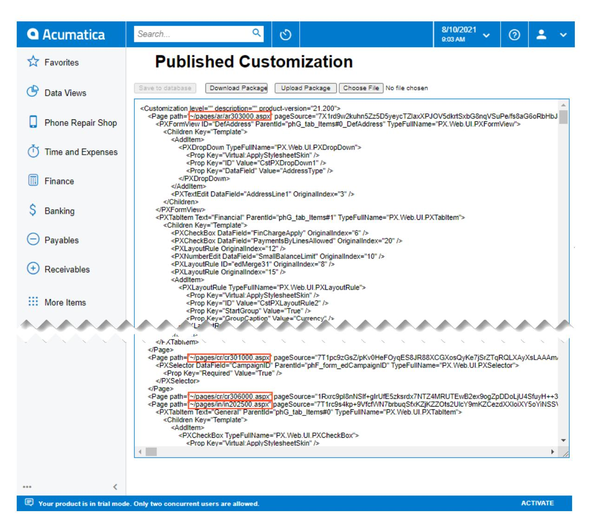

*Figure: Viewing the merged XML code of published customization projects*

# <span id="page-123-3"></span><span id="page-123-0"></span>**Publishing Customization Projects**

In this chapter, you will learn how to deploy a customization project to a different environment. In this case, you will deploy it to a staging environment. You will also learn how to publish multiple customization projects to the same Acumatica ERP instance.

# <span id="page-123-2"></span><span id="page-123-1"></span>**Project Publication: General Information**

When you have made all the needed changes to an Acumatica ERP instance, you can deploy your customization project to another instance.

You can implement planned changes in different customization projects, with related changes grouped in the same project. You can publish multiple customization projects in one instance of Acumatica ERP.

### **Learning Objectives**

In this chapter, you will learn how to do the following:

- Create a deployment package for the customization project
- Export the package to a target system
- Publish the customization project in the target system
- Publish multiple customization projects simultaneously

#### **Applicable Scenarios**

You deploy a customization project to another instance in the following cases:

- You need to copy the changes caused by the customization project from the testing Acumatica ERP instance to the production Acumatica ERP instance.
- You need to deploy another Acumatica ERP instance, and you want to make the same changes to it as you have to an existing instance that has a customization project published.

You publish multiple customization projects when you have been working on separate customization projects in your company, and you need to apply the changes from these projects to a single Acumatica ERP instance.

#### **Deployment of a Customization Project to Another Environment**

As you customize the system, you usually need to use three different environments:

- A *development environment*: Your local environment, in which you create customization items, publish the customization project being developed, and perform initial tests related to the customization items
- A *staging (or pre-production) environment*: A copy of the production environment in which you will perform final testing of the completed customization project before applying it to the production environment
- A *production environment*: The target environment of the system that must be customized

You develop customization projects in the development environment. Aer you have added all customization items to the customization project and done preliminary testing, you prepare a deployment package to distribute the customization project to the staging or production environment, as shown in the following diagram.

| <b>Developer Environment</b>                                                                                                                     | <b>Staging or Production Environment</b>                                                                                                         |
|--------------------------------------------------------------------------------------------------------------------------------------------------|--------------------------------------------------------------------------------------------------------------------------------------------------|
| Acumatica ERP<br>Result of the<br>Customization<br><b>Acumatica Customization Platfrom</b><br>Export<br>Publish<br>Customization<br>啚<br>Project | Acumatica ERP<br>Result of the<br>Customization<br><b>Acumatica Customization Platfrom</b><br>Import<br>Publish<br>Customization<br>啚<br>Project |
| <b>Deployment</b><br>Package                                                                                                                     | Copy<br><b>Deployment</b><br>Package                                                                                                             |

#### *Figure: Deployment of the customization project to a target environment*

A deployment package of a customization project is a redistributable ZIP file that includes the full content of the project. The deployment package consists of the project.xml file and any custom files that you have added to the project, such as external assemblies. The ZIP file has the same name as the exported customization project does.

### **Publication of Multiple Projects to the Same Instance**

When you publish more than one customization project, the Acumatica Customization Platform merges the contents of all projects into a single customization project. If different projects include customization items for the same object, the platform tries to merge the changes by using the following approach:

- If the changes can be merged, the platform merges them. For example, the platform can merge different properties of the same control in an ASPX page.
- If the changes cannot be merged—for example, if the same report has been added to different customization projects—the platform stops the process and displays an error message.


If a customization project contains DLL files that are not .NET Framework DLL files, these DLL files are skipped during the publication process.

The process of publishing multiple projects to the same instance is similar to the process of publishing a single project.

You start the publication on the *[Customization Projects](https://help-2025r1.acumatica.com/Help?ScreenId=ShowWiki&pageid=4d3a1166-826c-414b-a207-3d1669fbf9e5)* (SM204505) by selecting the customization projects you need to publish and clicking **Publish** on the More menu. You can also open this form while you are working in the Customization Project Editor by clicking **Publish > Multiple Projects** on the main menu.

The system opens the **Compilation** pane, which displays the progress of publishing. First, the system performs the validation of the projects. Aer the validation is complete, you need to click **Publish** in this pane. Note that at this stage, all current users will be signed out.

Aer the publication is complete, you can view the content of the merged customization project by clicking the **View Published** on the More menu of the *[Customization Projects](https://help-2025r1.acumatica.com/Help?ScreenId=ShowWiki&pageid=4d3a1166-826c-414b-a207-3d1669fbf9e5)* form. (See *To View a Published [Customization](#page-122-1)* for details.)

We recommend that you make all changes of workflows, actions, and fields for a particular screen within a single customization project.

### **Changes to the Application and Database**

During the publication, the platform applies the changes to the application and database objects and updates the files in the website folder as follows:

- The custom layout is applied to the forms of Acumatica ERP.
- The .cs files with the DAC extension code for the existing data access classes are generated and placed in the file system.
- The .cs files with the BLC extension code for the existing business logic are generated and placed in the file system.
- The .cs files with the custom code (Code items) are generated and placed in the file system.
- The custom files of the project are added to the website folder.
- The custom tables are created in the database, and custom SQL scripts are executed.
- The custom generic inquiries, reports, site map nodes, system locales, integration scenarios, shared reusable filters, access rights, wikis, web service endpoints, and analytical reports are added to the database.

We recommend that you back up the database before you publish customization projects, because canceling publication does not revert the changes made to the database. See *[Unpublishing Customization Projects](#page-136-3)* for details.

Aer the publication is complete, the application domain always restarts if the project includes assemblies, which are placed in the /Bin folder of the website. If you have no assemblies in the project, you can enable run-time compilation, and the publication will not cause a restart.

If a published customization project contains classes derived from the CustomizationPlugin class, the platform launches the implemented custom processes aer website files were updated and aer the website was restarted. (See *[Custom Processes During Publication of a Customization](#page-77-1)* for details.)

Aer you have published the customization project, the files with the customization code are updated in the file system, and you can work with them in MS Visual Studio. The .cs files with code are placed in the App\_RuntimeCode folder of the website.

#### **Validation of Customization Code**

While the Acumatica Customization Platform processes the publication of a customization project, the platform validates the customization code included in the project. This validation of the code provides not only checking for syntax and semantics but also checking of the compatibility of the code included in the customization project with the original application code.

If you have a customization project that works properly for the current version of Acumatica ERP and have upgraded an application instance to a newer version, the customization project might not work properly or might even prevent the website from starting aer the upgrade. This could occur because the code of Acumatica ERP is continuously developed to implement new features or enhance existing functionality. Thus, the code of an updated instance of Acumatica ERP can become inconsistent with the code in a customization project. For example, if the signature of a method that is overridden in the customization code is changed in the original code, a runtime error may occur in the graph extension. As another example, modified or deleted database columns and tables might cause the functionality of a data access class extension to fail.

The platform checks the compatibility of the code included in a customization project with the original application code every time it publishes the project. If there are any compatibility errors, the platform displays the warning and error messages in the **Compilation** window and stops the publication process. See *[Messages](#page-409-0) for Validation Errors* and *To Resolve an Issue [Discovered](#page-408-1) During the Validation* for detailed information about, respectively, the error messages and the ways to fix the validation errors.

#### **Levels of Customization Projects**

On the *[Customization Projects](https://help-2025r1.acumatica.com/Help?ScreenId=ShowWiki&pageid=4d3a1166-826c-414b-a207-3d1669fbf9e5)* (SM204505) form, you can specify an optional number (level) for each customization project, assigning the highest number to the most important change. If the customization projects modify the same items of the website, conflicts can occur when the system tries to merge the changes. In this case, the system uses the specified levels to resolve the conflicts, and adds to the merged project the changes from the project with the highest level.

You can specify whole numbers as levels. We recommend that you use higher values for more important changes. If you do not specify any level, the default value is *0*.

#### **Check for Duplicate Records**

The system checks for duplicate records during the publication of customization projects. Suppose that an item in a customization project has the same key (the primary key, the unique index, or the unique key) as the records that exist in the system. When you publish such a project, the system displays a warning and overwrites the existing records with the item from the project (see the following screenshot).

| <b>Customization Project Editor</b>                                                                                                                                                                                                    |  |                                                                                                                                                                                                                                                                                                           |                                                                                                 |                      |                                                                                                                                                                                                                              |                       |                      |                         | <b>Back</b>             | Reload                            |  |
|----------------------------------------------------------------------------------------------------------------------------------------------------------------------------------------------------------------------------------------|--|-----------------------------------------------------------------------------------------------------------------------------------------------------------------------------------------------------------------------------------------------------------------------------------------------------------|-------------------------------------------------------------------------------------------------|----------------------|------------------------------------------------------------------------------------------------------------------------------------------------------------------------------------------------------------------------------|-----------------------|----------------------|-------------------------|-------------------------|-----------------------------------|--|
| Publish<br><b>Extension Library</b><br>File                                                                                                                                                                                            |  |                                                                                                                                                                                                                                                                                                           | <b>Source Control</b>                                                                           |                      |                                                                                                                                                                                                                              |                       |                      |                         |                         |                                   |  |
| <b>XMLUpdates</b>                                                                                                                                                                                                                      |  |                                                                                                                                                                                                                                                                                                           | <b>Edit Project Items</b>                                                                       |                      |                                                                                                                                                                                                                              |                       |                      |                         |                         |                                   |  |
| <b>Screens</b><br>Data Access                                                                                                                                                                                                          |  | n                                                                                                                                                                                                                                                                                                         | $\sim$<br><b>GET PACKAGE</b>                                                                    |                      |                                                                                                                                                                                                                              |                       |                      |                         |                         |                                   |  |
| Code                                                                                                                                                                                                                                   |  | 圓<br>$^{\circ}$                                                                                                                                                                                                                                                                                           | <b>Object Name</b>                                                                              | <b>Type</b>          | <b>Description</b>                                                                                                                                                                                                           | <b>Created Bv</b>     | <b>Creation Date</b> | <b>Last Modified By</b> | <b>Last Modified On</b> |                                   |  |
| <b>Files</b>                                                                                                                                                                                                                           |  | $\rightarrow$<br>$\omega$                                                                                                                                                                                                                                                                                 | Cust GI1                                                                                        | GenericInquiryScreen |                                                                                                                                                                                                                              | <b>Kimberly Gibbs</b> | 11/18/2024           | <b>Kimberly Gibbs</b>   | 11/18/2024              |                                   |  |
| Modern UL Files                                                                                                                                                                                                                        |  |                                                                                                                                                                                                                                                                                                           |                                                                                                 |                      |                                                                                                                                                                                                                              |                       |                      |                         |                         |                                   |  |
| <b>Generic Inquiries (1)</b>                                                                                                                                                                                                           |  |                                                                                                                                                                                                                                                                                                           |                                                                                                 |                      |                                                                                                                                                                                                                              |                       |                      |                         |                         |                                   |  |
| <b>Reports</b><br><b>Dashboards</b>                                                                                                                                                                                                    |  |                                                                                                                                                                                                                                                                                                           |                                                                                                 |                      |                                                                                                                                                                                                                              |                       |                      |                         |                         |                                   |  |
| <b>Site Map</b>                                                                                                                                                                                                                        |  |                                                                                                                                                                                                                                                                                                           |                                                                                                 |                      |                                                                                                                                                                                                                              |                       |                      |                         |                         |                                   |  |
| <b>Database Scripts</b>                                                                                                                                                                                                                |  |                                                                                                                                                                                                                                                                                                           |                                                                                                 |                      |                                                                                                                                                                                                                              |                       |                      |                         |                         |                                   |  |
| <b>System Locales</b>                                                                                                                                                                                                                  |  |                                                                                                                                                                                                                                                                                                           |                                                                                                 |                      |                                                                                                                                                                                                                              |                       |                      |                         |                         |                                   |  |
| <b>Import/Export Scenarios</b>                                                                                                                                                                                                         |  |                                                                                                                                                                                                                                                                                                           |                                                                                                 |                      |                                                                                                                                                                                                                              |                       |                      |                         |                         |                                   |  |
| <b>Shared Filters</b>                                                                                                                                                                                                                  |  |                                                                                                                                                                                                                                                                                                           |                                                                                                 |                      |                                                                                                                                                                                                                              |                       |                      |                         |                         |                                   |  |
| <b>Access Rights</b>                                                                                                                                                                                                                   |  | <b>Source</b>                                                                                                                                                                                                                                                                                             | soluesian>                                                                                      |                      |                                                                                                                                                                                                                              |                       |                      |                         |                         | $\blacktriangle$ $\blacktriangle$ |  |
| <b>Wikis</b>                                                                                                                                                                                                                           |  | <row <br="" designid="e813554c-a7b0-43b5-85e9-599655267ed7" filtercolcount="3" name="Cust GI1" pagesize="0" primaryscreenidnew="AM208000">"NewRecordCreationEnabled="1" MassDeleteEnabled="0" AutoConfirmDelete="0" MassRecordsUpdateEnabled="0" MassActionsOnRecordsEnabled="0" ExposeViaOData="0"</row> |                                                                                                 |                      |                                                                                                                                                                                                                              |                       |                      |                         |                         |                                   |  |
| <b>Web Service Endpoints</b><br><b>Analytical Reports</b>                                                                                                                                                                              |  | ExposeViaMobile="0" ShowDeletedRecords="1" ShowArchivedRecords="0" MLDetectionEnabled="0" SkipEmptyGroups="0"><br><gifilter <="" datatvpe="string" fieldname="PX.Data.Maintenance.GI.CheckboxCombobox+checkbox" isactive="1" linenbr="3" name="ShowAll" td=""><td></td><td></td></gifilter>               |                                                                                                 |                      |                                                                                                                                                                                                                              |                       |                      |                         |                         |                                   |  |
| <b>Push Notifications</b>                                                                                                                                                                                                              |  |                                                                                                                                                                                                                                                                                                           | DisplayName="Show Active Only" IsExpression="1" DefaultValue="True" ColSpan="1" Required="0" /> |                      | <gifilter <="" colspan="1" datatvpe="string" displayname="Warehouse" fieldname="INSite.siteCD" isactive="1" isexpression="1" linenbr="2" name="Whse" td=""><td></td><td></td><td></td><td></td><td></td><td></td></gifilter> |                       |                      |                         |                         |                                   |  |
| <b>Business Events</b>                                                                                                                                                                                                                 |  |                                                                                                                                                                                                                                                                                                           | Required="0" />                                                                                 |                      | /CIFiltor LinoAlbr="4" leActive="4" Name="ltemClass" FieldName="INItemClass itemClassCD" DataTune="string" DisplayName="ltem_Class"                                                                                          |                       |                      |                         |                         |                                   |  |
| Compilation                                                                                                                                                                                                                            |  |                                                                                                                                                                                                                                                                                                           |                                                                                                 |                      |                                                                                                                                                                                                                              |                       |                      |                         |                         | ▭<br>$\mathsf{X}$                 |  |
| [2024-11-18 11:37:11.736] Validation finished successfully.                                                                                                                                                                            |  |                                                                                                                                                                                                                                                                                                           |                                                                                                 |                      |                                                                                                                                                                                                                              |                       |                      |                         |                         |                                   |  |
| [2024-11-18 11:37:13.840] Cleaning up the database<br>[2024-11-18 11:37:13.984] Updating the database<br>2024-11-18 11:37:14.002] Batch GenericInquiryScreen<br>2024-11-18 11:37:17.698] GenericInquiryScreen#Cust GI1                 |  |                                                                                                                                                                                                                                                                                                           |                                                                                                 |                      |                                                                                                                                                                                                                              |                       |                      |                         |                         |                                   |  |
| [2024-11-18 11:37:17.698] The following duplicate records have been found by the key fields in the following tables.                                                                                                                   |  |                                                                                                                                                                                                                                                                                                           |                                                                                                 |                      |                                                                                                                                                                                                                              |                       |                      |                         |                         |                                   |  |
| The GIDesign table:<br>[XML] DesignID: e813554c-a7b0-43b5-85e9-599655267ed7, Name: Cust GI1, NoteID: 72e8966e-a1a5-ef11-b401-00155d38f104                                                                                              |  |                                                                                                                                                                                                                                                                                                           |                                                                                                 |                      |                                                                                                                                                                                                                              |                       |                      |                         |                         |                                   |  |
| [DB] DesignID: e813554c-a7b0-43b5-85e9-599655267ed7, Name: Cust GI2, NoteID: cb04fe02-a1a5-ef11-b401-00155d38f104<br>[DB] DesignID: 7a8efb31-593f-4079-9448-7a0f20bbbd31, Name: Cust GI1, NoteID: 42aeeccf-a0a5-ef11-b401-00155d38f104 |  |                                                                                                                                                                                                                                                                                                           |                                                                                                 |                      |                                                                                                                                                                                                                              |                       |                      |                         |                         |                                   |  |
| 2024-11-18 11:37:17.991 Updating website files<br>[2024-11-18 11:37:18.402] Starting the website                                                                                                                                       |  |                                                                                                                                                                                                                                                                                                           |                                                                                                 |                      |                                                                                                                                                                                                                              |                       |                      |                         |                         |                                   |  |
| [2024-11-18 11:37:36.039] Plug-in ExternalCarriersCstPlugIn<br>[2024-11-18 11:37:37.933] Website updated.                                                                                                                              |  |                                                                                                                                                                                                                                                                                                           |                                                                                                 |                      |                                                                                                                                                                                                                              |                       |                      |                         |                         |                                   |  |
| Customization project published successfully. You can close the Compilation pane.                                                                                                                                                      |  |                                                                                                                                                                                                                                                                                                           |                                                                                                 |                      |                                                                                                                                                                                                                              |                       |                      |                         |                         |                                   |  |
| <b>Close Compilation pane</b>                                                                                                                                                                                                          |  |                                                                                                                                                                                                                                                                                                           |                                                                                                 |                      |                                                                                                                                                                                                                              |                       |                      |                         |                         |                                   |  |

#### *Figure: Warning during the publication of the customization project*

<span id="page-127-1"></span>For details on XML format, see *[Implementing the XML Import and Export Functionality in a Custom Form](#page-486-1)*.

### <span id="page-127-0"></span>**Project Publication: To Deploy a Customization Project**

The following activity will walk you through the process of deploying a customization project to a staging environment.

#### **Story**

Suppose that your colleague has created and tested the *Yogifon* customization project in their development environment. This project contains the modifications of various elements on the *[Customers](https://help-2025r1.acumatica.com/Help?ScreenId=ShowWiki&pageid=652929bc-9606-4056-aa6e-0c2d1147171b)* (AR303000), *[Cases](https://help-2025r1.acumatica.com/Help?ScreenId=ShowWiki&pageid=a492a091-9649-4826-bcc3-dccdf8765efd)* (CR306000), *[Leads](https://help-2025r1.acumatica.com/Help?ScreenId=ShowWiki&pageid=ce564fa0-baca-4d9b-97a8-ec69910de4c2)* (CR301000), *[Sales Orders](https://help-2025r1.acumatica.com/Help?ScreenId=ShowWiki&pageid=19e4021c-1b84-49fd-be12-0320c5f1c7e5)* (SO301000), and *[Customer Locations](https://help-2025r1.acumatica.com/Help?ScreenId=ShowWiki&pageid=61a8c6de-6a51-434b-8c2d-4304ec982ae0)* (AR303020) forms. Further suppose that you want to make the same changes to the staging environment. You need import the project to your instance and test it.

#### **Process Overview**

By using the *[Customization Projects](https://help-2025r1.acumatica.com/Help?ScreenId=ShowWiki&pageid=4d3a1166-826c-414b-a207-3d1669fbf9e5)* (SM204505) form of your Acumatica ERP instance, you will import the deployment package with the *Yogifon* customization project and then publish this customization project. You will then test the results of the changes on the appropriate forms.

#### **System Preparation**

Before you begin performing the steps of this activity, do the following:

1. Prepare an Acumatica ERP instance called *Yogifon\_Staging* by using the process described in *[Customization](#page-82-1) [Projects:](#page-82-1) To Deploy an Instance*.

- 2. In the *Yogifon\_Staging* instance, enable the following features on the *[Enable/Disable Features](https://help-2025r1.acumatica.com/Help?ScreenId=ShowWiki&pageid=c1555e43-1bc5-4f6f-ba9d-b323f94d8a6b)* (CS100000) form:
  - **Business Account Locations**
  - **Multicurrency Accounting**
  - **Payment Application by Line**
- 3. Download the *Yogifon.zip* file of the deployment package.

#### **Step 1: Applying the Customization Project to the Staging Environment**

To apply the customization project to the staging environment, you will import the deployment package to the staging environment and publish the customization project as follows:

- 1. In the *Yogifon\_Staging* instance, open the *[Customization Projects](https://help-2025r1.acumatica.com/Help?ScreenId=ShowWiki&pageid=4d3a1166-826c-414b-a207-3d1669fbf9e5)* (SM204505) form.
- 2. On the More menu (under **Import**), click **Import**.
- 3. In the **Open Package** dialog box, which opens, select the Yogifon.zip file, which you have downloaded.
- 4. Click **Upload**.

The system uploads the project and adds it to the list on the *[Customization Projects](https://help-2025r1.acumatica.com/Help?ScreenId=ShowWiki&pageid=4d3a1166-826c-414b-a207-3d1669fbf9e5)* form.

- 5. In the table, select the unlabeled check box in the row with the *Yogifon* customization project.
- 6. On the More menu (under **Publish**), click **Publish**.
- 7. Wait until the **Publish** button appears in the **Compilation** pane, and click it.
- 8. Wait until the *Website updated* row appears in the **Compilation** pane, and click **Close Compilation Pane**. The changes of the customization project are applied to the instance.

#### **Step 2: Testing the Changes**

To test the changes in the published customization project, perform the following steps:

- 1. Open the *[Generic Inquiry](https://help-2025r1.acumatica.com/Help?ScreenId=ShowWiki&pageid=5388c653-eac4-4f43-b769-163cd037ab09)* (SM208000) form. In the **InquiryTitle** box, select *SO-OpenByCustomer*.
- 2. On the form toolbar, click**View Inquiry**.

Make sure that the inquiry opens in a new browser tab, and that it contains the **OrderType** column.

- 3. On the *[Customers](https://help-2025r1.acumatica.com/Help?ScreenId=ShowWiki&pageid=652929bc-9606-4056-aa6e-0c2d1147171b)* (AR303000) form, do the following:
  - a. Open the customer with the *C000000003* ID.
  - b. Find the **AddressType** box on the **General** tab, and make sure that it has the *Business*, *Home*, and *Other* options.
  - c. Make sure that the **Financial** tab contains the **Currency** section.
  - d. On the More menu (under **Inquiries**), click **Open SO by Customer**, and make sure that the Open Sales Orders by Customer generic inquiry opens in a new browser tab.
- 4. On the *[Cases](https://help-2025r1.acumatica.com/Help?ScreenId=ShowWiki&pageid=a492a091-9649-4826-bcc3-dccdf8765efd)* (CR306000) form, do the following:
  - a. Open the *000002* case.
  - b. Verify that the form contains the **Problem Summary** tab with the **Problem Type** and **Comments** boxes.
  - c. Click the magnifier button of the **Case ID** box in the Summary area, and make sure that the lookup table contains the **Reported On** column.
- 5. On the *[Leads](https://help-2025r1.acumatica.com/Help?ScreenId=ShowWiki&pageid=ce564fa0-baca-4d9b-97a8-ec69910de4c2)* (CR301000) form, clear the **Email** for the record with the *Smith, Jenny* lead ID, and make sure that the **Accept** command on the More menu is visible but unavailable.
- 6. On the *[Sales Orders](https://help-2025r1.acumatica.com/Help?ScreenId=ShowWiki&pageid=19e4021c-1b84-49fd-be12-0320c5f1c7e5)* (SO301000) form, do the following:

- a. On the Company and Branch Selection menu in the top pane of the screen, select the *MyStore* branch.
- b. In the info area, in the upper-right corner of the top pane of the Acumatica ERP screen, make sure that the business date in your system is set to *10/31/2024*. If a different date is displayed, click the Business Date menu button, and select *10/31/2024* from the calendar.
- c. Open the sales order with the *000002* ID.
- d. Verify that the form toolbar contains the**Sales Orders by Customer** button, and that the More menu contains the**Sales Orders by Customer** command.
- e. Click this button or menu command, and make sure that the report opens in a new browser tab.
- 7. On the *[Customer Locations](https://help-2025r1.acumatica.com/Help?ScreenId=ShowWiki&pageid=61a8c6de-6a51-434b-8c2d-4304ec982ae0)* (AR303020) form, make sure that the **NetworkType** box is displayed on the **User-Defined Fields** tab.

### <span id="page-129-1"></span><span id="page-129-0"></span>**Project Publication: To Publish Two Customization Projects**

The following activity will walk you through the process of publishing two customization projects.

#### **Story**

Suppose that you have two customization projects. The *Yogifon* project contains the modifications of various elements on the *[Customers](https://help-2025r1.acumatica.com/Help?ScreenId=ShowWiki&pageid=652929bc-9606-4056-aa6e-0c2d1147171b)* (AR303000), *[Cases](https://help-2025r1.acumatica.com/Help?ScreenId=ShowWiki&pageid=a492a091-9649-4826-bcc3-dccdf8765efd)* (CR306000), *[Leads](https://help-2025r1.acumatica.com/Help?ScreenId=ShowWiki&pageid=ce564fa0-baca-4d9b-97a8-ec69910de4c2)* (CR301000), *[Sales Orders](https://help-2025r1.acumatica.com/Help?ScreenId=ShowWiki&pageid=19e4021c-1b84-49fd-be12-0320c5f1c7e5)* (SO301000), and *[Customer Locations](https://help-2025r1.acumatica.com/Help?ScreenId=ShowWiki&pageid=61a8c6de-6a51-434b-8c2d-4304ec982ae0)* (AR303020) forms. The *OpportunitiesForm* project adjusts the size of the **Description** box on the *[Opportunities](https://help-2025r1.acumatica.com/Help?ScreenId=ShowWiki&pageid=5cb49cd5-2be8-4617-9341-958f1c5d6d53)* (CR304000) form so that this box has the same length as other boxes in the Summary area. You need to publish these customization projects simultaneously to apply the changes from both projects.

#### **Process Overview**

By using the *[Customization Projects](https://help-2025r1.acumatica.com/Help?ScreenId=ShowWiki&pageid=4d3a1166-826c-414b-a207-3d1669fbf9e5)* (SM204505) form of the *Yogifon\_Staging* instance, you will publish the *Yogifon* and the *OpportunitiesForm* projects.

#### **System Preparation**

Before you begin performing the steps of this activity, do the following:

- 1. Prepare anAcumatica ERP instance called *Yogifon\_Staging* by using the process described in *[Customization](#page-82-1) [Projects:](#page-82-1) To Deploy an Instance*.
- 2. In the *Yogifon\_Staging* instance, enable the following features on the *[Enable/Disable Features](https://help-2025r1.acumatica.com/Help?ScreenId=ShowWiki&pageid=c1555e43-1bc5-4f6f-ba9d-b323f94d8a6b)* (CS100000) form:
  - **Business Account Locations**
  - **Multicurrency Accounting**
  - **Payment Application by Line**
- 3. Download the following files of the deployment packages:
  - *Yogifon.zip*
  - *OpportunitiesForm.zip*

#### **Step 1: Importing the Customization Projects**

To import the deployment packages to the staging environment, do the following:

1. In the *Yogifon\_Staging* instance, open the *[Customization Projects](https://help-2025r1.acumatica.com/Help?ScreenId=ShowWiki&pageid=4d3a1166-826c-414b-a207-3d1669fbf9e5)* (SM204505) form.

- 2. On the More menu (under **Import**), click **Import**.
- 3. In the **Open Package** dialog box, which opens, select the Yogifon.zip file, which you have downloaded.
- 4. Click **Upload**.

The system uploads the project and adds it to the list on the *[Customization Projects](https://help-2025r1.acumatica.com/Help?ScreenId=ShowWiki&pageid=4d3a1166-826c-414b-a207-3d1669fbf9e5)* form.

- 5. On the More menu (under **Import**), click **Import** again.
- 6. In the **Open Package** dialog box, which opens, select the OpportunitiesForm.zip file, which you have downloaded.
- 7. Click **Upload**.

The system uploads the project and adds it to the list on the *[Customization Projects](https://help-2025r1.acumatica.com/Help?ScreenId=ShowWiki&pageid=4d3a1166-826c-414b-a207-3d1669fbf9e5)* form.

#### **Step 2 : Publishing the Yogifon Project and the OpportunitiesForm Project**

To publish multiple customization projects, do the following on the *[Customization Projects](https://help-2025r1.acumatica.com/Help?ScreenId=ShowWiki&pageid=4d3a1166-826c-414b-a207-3d1669fbf9e5)* (SM204505) form:

1. In the table, select the check boxes (in the unlabeled column) for the *Yogifon* and *OpportunitiesForm* projects, as shown in the following screenshot.

|   | <b>Customization Projects</b> |                                                                                                                |                  |           |                   |  |                                     |  |  |                    | <b>CUSTOMIZATION</b> | TOOLS $\sim$  |                                   |
|---|-------------------------------|----------------------------------------------------------------------------------------------------------------|------------------|-----------|-------------------|--|-------------------------------------|--|--|--------------------|----------------------|---------------|-----------------------------------|
|   | Õ                             | n<br>$\Omega$<br>$\mathsf{X}$<br>PUBLISH<br><b>UNPUBLISH ALL</b><br><b>IMPORT</b><br><b>EXPORT</b><br>$\cdots$ |                  |           |                   |  |                                     |  |  |                    |                      |               |                                   |
| 日 |                               | D                                                                                                              |                  | Published | * Project Name    |  | Level Screen Names                  |  |  | <b>Description</b> | Initials             | Created<br>By | <b>Last Modified</b><br><b>On</b> |
|   |                               | $\odot$ di                                                                                                     | $\triangleright$ |           | OpportunitiesForm |  | CR304000                            |  |  |                    |                      | admin ad      | 4/1/2025                          |
|   | 0                             |                                                                                                                | ☑                | ☑         | Yogifon           |  | AR303000.CR301000.CR306000.SO301000 |  |  |                    |                      | admin ad.     | 4/1/2025                          |

*Figure: Selection of the projects for publication*


You can open this form directly in Acumatica ERP; you can also open it while you are working in the Customization Project Editor by clicking **Publish > Multiple Projects**.

- 2. On the form toolbar, click**Save**.
- 3. On the More menu (under **Publish**), click **Publish**.

The **Compilation** pane appears, and the validation of the projects is performed.

4. Aer the validation has completed, click **Publish** (see the following screenshot).

| <b>Customization Projects</b>                                                                                                                                                                                                                                                                                                                                                                                                                                                                                                                                                                                                                                                                                                                                                                                                                                                                                                                                                                                                                                                                                                                                                                                                                                                                                                                                                                                                                                                                                                                                                                                                                                                                                                                                                                                                                                                                       |                                            |                    |          |                   | <b>CUSTOMIZATION</b>    | TOOLS *         |
|-----------------------------------------------------------------------------------------------------------------------------------------------------------------------------------------------------------------------------------------------------------------------------------------------------------------------------------------------------------------------------------------------------------------------------------------------------------------------------------------------------------------------------------------------------------------------------------------------------------------------------------------------------------------------------------------------------------------------------------------------------------------------------------------------------------------------------------------------------------------------------------------------------------------------------------------------------------------------------------------------------------------------------------------------------------------------------------------------------------------------------------------------------------------------------------------------------------------------------------------------------------------------------------------------------------------------------------------------------------------------------------------------------------------------------------------------------------------------------------------------------------------------------------------------------------------------------------------------------------------------------------------------------------------------------------------------------------------------------------------------------------------------------------------------------------------------------------------------------------------------------------------------------|--------------------------------------------|--------------------|----------|-------------------|-------------------------|-----------------|
| $\mathcal{C}$<br>$\mathbb{R}$<br>$\Omega$<br>$\times$<br>$\pm$<br><b>PUBLISH</b><br>UNPUBLISH ALL                                                                                                                                                                                                                                                                                                                                                                                                                                                                                                                                                                                                                                                                                                                                                                                                                                                                                                                                                                                                                                                                                                                                                                                                                                                                                                                                                                                                                                                                                                                                                                                                                                                                                                                                                                                                   | <b>IMPORT</b><br><b>EXPORT</b><br>$\cdots$ |                    |          |                   |                         |                 |
| <b>B</b> 0 D<br>n.<br>* Project Name<br>Published                                                                                                                                                                                                                                                                                                                                                                                                                                                                                                                                                                                                                                                                                                                                                                                                                                                                                                                                                                                                                                                                                                                                                                                                                                                                                                                                                                                                                                                                                                                                                                                                                                                                                                                                                                                                                                                   | Level Screen Names                         | <b>Description</b> | Initials | <b>Created By</b> | <b>Last Modified On</b> |                 |
| Compilation                                                                                                                                                                                                                                                                                                                                                                                                                                                                                                                                                                                                                                                                                                                                                                                                                                                                                                                                                                                                                                                                                                                                                                                                                                                                                                                                                                                                                                                                                                                                                                                                                                                                                                                                                                                                                                                                                         |                                            |                    |          |                   |                         | $\Box$ $\times$ |
| report to the control of the control of the control of the control of the control of the control of the control of the control of the control of the control of the control of the control of the control of the control of th<br>[2024-09-26 18:01:38.331] Building directory '\WebSiteValidationDomain\Customization\'.<br>[2024-09-26 18:01:38.410] Building directory '\WebSiteValidationDomain\ExternalResource\'.<br>[2024-09-26 18:01:38.458] Building directory '\WebSiteValidationDomain\FrontendSources\dist\packages\schedulerpro\locales\'.<br>[2024-09-26 18:01:38.483] Building directory '\WebSiteValidationDomain\FrontendSources\dist\packages\schedulerpro\thin\chunks\'.<br>[2024-09-26 18:01:38.514] Building directory '\WebSiteValidationDomain\FrontendSources\dist\packages\schedulerpro\thin\'.<br>[2024-09-26 18:01:38.537] Building directory "\WebSiteValidationDomain\FrontendSources\dist\packages\schedulerpro\thin-min\chunks\".<br>[2024-09-26 18:01:38.568] Building directory '\WebSiteValidationDomain\FrontendSources\dist\packages\schedulerpro\thin-min\'.<br>[2024-09-26 18:01:38.584] Building directory '\WebSiteValidationDomain\FrontendSources\dist\packages\schedulerpro\'.<br>[2024-09-26 18:01:38.662] Building directory '\WebSiteValidationDomain\FrontendSources\outlook-plugin\test\mock\static\'.<br>[2024-09-26 18:01:46.015] Building directory '\WebSiteValidationDomain\FrontendSources\'.<br>[2024-09-26 18:01:46.079] Building directory '\WebSiteValidationDomain\MasterPages\'.<br>[2024-09-26 18:01:46.206] Building directory '\WebSiteValidationDomain\Pivot\'.<br>[2024-09-26 18:01:46.301] Compiler time, in seconds: 37.3490835<br>[2024-09-26 18:01:46.301] Validating graph and cache extensions<br>[2024-09-26 18:02:25.327] Validation finished successfully.<br>Publish   Warning. Active website users will be logged out. |                                            |                    |          |                   |                         |                 |

*Figure: Selecting Publish in the Compilation pane*

When the *Website updated* line and **Close Compilation Pane** button appear in the **Compilation** pane, the publication has completed.

5. Close the **Compilation** pane.

#### **Step 3: Testing the Changes from the OpportunitiesForm Customization Project**

To test the changes to the**Subject** box, do the following:

- 1. On the *[Opportunities](https://help-2025r1.acumatica.com/Help?ScreenId=ShowWiki&pageid=5cb49cd5-2be8-4617-9341-958f1c5d6d53)* (CR304000) form in Acumatica ERP, open the opportunity with the *000003* ID.
- 2. In the Summary area, make sure that the **Description** box has the same length as other boxes in this area (see the following screenshot).

|                                              | 000003 - Upgrade to existing hardware  |                                                |                                                       | <b>PINOTES</b>     | <b>FILES</b>               | TOOLS $\sim$<br><b>CUSTOMIZATION</b> |
|----------------------------------------------|----------------------------------------|------------------------------------------------|-------------------------------------------------------|--------------------|----------------------------|--------------------------------------|
| 凰<br>圕<br>↶<br>$\leftarrow$                  | 侕<br>$\overline{\mathsf{K}}$<br>≺      | <b>CLOSE AS WON</b><br>$\geq$<br>$\rightarrow$ | $\cdots$                                              |                    |                            |                                      |
| Opportunity ID:                              | Q<br>000003                            | <b>Business Account:</b>                       | C000000096 - Compureconsult, Ltd<br>$\circ$           | $\mathscr{Q}$      |                            | Manual Amount                        |
| Status:                                      | Open                                   | Location:                                      | <b>MAIN - Primary Location</b>                        | Q<br>$\mathscr{Q}$ | Detail Total:              | 0.00                                 |
| * Class ID:                                  | PRODUCT - Product Sales Opportunit Q 2 | Contact:                                       |                                                       | م<br>$\mathscr{Q}$ | Line Discounts:            | 0.00                                 |
| Stage:                                       | Qualification<br>$\checkmark$          | Currency:                                      | 1.00<br>* VIEW BASE<br><b>USD</b>                     |                    | <b>Document Discounts:</b> | 0.00                                 |
| * Estimated Close Date:                      | A<br>2/7/2022                          | Owner:                                         | Q                                                     |                    | <b>Tax Total:</b>          | 0.00                                 |
| * Description:                               | Upgrade to existing hardware           |                                                |                                                       |                    | Total:                     | 0.00                                 |
| <b>ACTIVITIES</b><br><b>DETAILS</b>          | <b>CRM INFO</b><br><b>CONTACT</b>      | <b>SHIPPING</b><br><b>FINANCIAL</b>            | <b>ATTRIBUTES</b><br><b>RELATIONS</b><br><b>TAXES</b> |                    |                            |                                      |
| <b>CRM</b>                                   |                                        | <b>FORECASTING</b>                             |                                                       |                    |                            |                                      |
| Reason:                                      | In Process<br>$\checkmark$             | Probability:                                   | 10                                                    |                    |                            |                                      |
| Workgroup:                                   | Q<br><b>Service and Support</b>        | Wgt. Total:                                    | 0.00                                                  |                    |                            |                                      |
| Parent Account:                              | $\circ$                                | Actual Close Date:                             |                                                       |                    |                            |                                      |
|                                              | Active                                 | <b>SOURCE</b>                                  |                                                       |                    |                            |                                      |
|                                              |                                        | Source:                                        | Campaign<br>$\checkmark$                              |                    |                            |                                      |
| Last Incoming Activity:                      | 2/24/2023 10:04:30 AM                  | Source Campaign:                               | PARTNER - Partnership Campaign                        | $\Omega$           |                            |                                      |
| <b>ACTIVITIES</b><br>Last Outgoing Activity: | 2/24/2023 10:04:30 AM                  | Source Lead:                                   |                                                       |                    |                            |                                      |
| VISUAL +<br>$\Omega$<br>$\Omega$             | в<br>Paragraph *                       | 温                                              | 這<br><b>INSERT</b><br>這<br>巨<br>$\mathcal{Q}$         | LAYOUT             | <b>TABLES</b>              |                                      |

*Figure: Verification of the customized Opportunities form*

#### **Step 4: Testing the Changes in the Yogifon Customization Project**

To test the changes in the published *Yogifon* customization project, perform the following steps:

- 1. Open the *[Generic Inquiry](https://help-2025r1.acumatica.com/Help?ScreenId=ShowWiki&pageid=5388c653-eac4-4f43-b769-163cd037ab09)* (SM208000) form. In the **InquiryTitle** box, select *SO-OpenByCustomer*.
- 2. On the form toolbar, click**View Inquiry**.

Make sure that the inquiry opens in a new browser tab, and that it contains the **OrderType** column.

- 3. On the *[Customers](https://help-2025r1.acumatica.com/Help?ScreenId=ShowWiki&pageid=652929bc-9606-4056-aa6e-0c2d1147171b)* (AR303000) form, do the following:
  - a. Open the customer with the *C000000003* ID.
  - b. Find the **AddressType** box on the **General** tab, and make sure that it has the *Business*, *Home*, and *Other* options.
  - c. Make sure that the **Financial** tab contains the **Currency** section.
  - d. On the More menu (under **Inquiries**), click **Open SO by Customer**, and make sure that the Open Sales Orders by Customer generic inquiry opens in a new browser tab.
- 4. On the *[Cases](https://help-2025r1.acumatica.com/Help?ScreenId=ShowWiki&pageid=a492a091-9649-4826-bcc3-dccdf8765efd)* (CR306000) form, do the following:
  - a. Open the case with the *000002* ID.

- b. Verify that the form contains the **Problem Summary** tab, and that this tab contains the **Problem Type** and **Comments** boxes.
- c. Click the magnifier button of the **Case ID** box in the Summary area, and make sure that the lookup table contains the **Reported On** column.
- 5. On the *[Leads](https://help-2025r1.acumatica.com/Help?ScreenId=ShowWiki&pageid=ce564fa0-baca-4d9b-97a8-ec69910de4c2)* (CR301000) form, clear the **Email** for the record with the *Smith, Jenny* lead ID, and make sure that the **Accept** command on the More menu is visible but unavailable.
- 6. On the *[Sales Orders](https://help-2025r1.acumatica.com/Help?ScreenId=ShowWiki&pageid=19e4021c-1b84-49fd-be12-0320c5f1c7e5)* (SO301000) form, do the following:
  - a. On the Company and Branch Selection menu in the top pane of the screen, select the *MyStore* branch.
  - b. In the info area, in the upper-right corner of the top pane of the Acumatica ERP screen, make sure that the business date in your system is set to *10/31/2024*. If a different date is displayed, click the Business Date menu button, and select *10/31/2024* from the calendar.
  - c. Open the sales order with the *000002* ID.
  - d. Verify that the form toolbar contains the**Sales Orders by Customer** button, and that the More menu contains the**Sales Orders by Customer** command.
  - e. Click this button or menu command, and make sure that the report opens in a new browser tab.
- 7. On the *[Customer Locations](https://help-2025r1.acumatica.com/Help?ScreenId=ShowWiki&pageid=61a8c6de-6a51-434b-8c2d-4304ec982ae0)* (AR303020) form, make sure that the **NetworkType** box is displayed on the **User-Defined Fields** tab.

### <span id="page-132-0"></span>**Publishing with the Cleanup Operation**

In this chapter, you will learn how to publish customization projects with the cleanup operation. This will cause the platform to clean up all information about previously executed scripts of a customization project and execute the scripts once more during the publication of the project.

### <span id="page-132-2"></span><span id="page-132-1"></span>**Publication with Cleanup: General Information**

If a customization project contains customization items (such as *GenericInquiryScreen* customization items) that make the system run scripts in the database, then during the publication of the project, the platform executes the scripts. To avoid the execution of these scripts each time the project is published, the platform saves information about each script that has been executed at least once and has not yet been changed in the database, and omits the repeated execution of such scripts.

You can force the platform to clean up all information about previously executed scripts of a customization project and execute the scripts once more during the publication of the project. That is, you can publish the customization project with the cleanup operation.

You should use publishing with cleanup if you have made changes outside of the Customization Project Editor to the tables that are affected by your custom database scripts. For example, you would use publishing with cleanup if you have modified database tables by using the SQL Server Management Studio, or modified or removed a generic inquiry on the *[Generic Inquiry](https://help-2025r1.acumatica.com/Help?ScreenId=ShowWiki&pageid=5388c653-eac4-4f43-b769-163cd037ab09)* (SM208000) form.

#### **Learning Objectives**

In this chapter, you will learn how to use the cleanup operation when publishing customization projects.

### **Applicable Scenarios**

You publish a customization project with cleanup if you have modified database tables outside of the Customization Project Editor, made some changes to the customization project, and need to publish this project again.

### **Publishing with Cleanup and Database Scripts**

Database scripts fall into two categories:

- *Database-level scripts*, which modify the database schema and are applied to the whole instance.
- *Tenant-level scripts*, which modify data in database tables. These scripts modify the data of only the tenant for which the scripts are published.

During the first (non-cleanup) publication of a customization project that contains items that make the system run scripts in the database, a hash for each script is saved to the database. For a tenant-level script, the system also saves the tenant ID for which this script has been published. When the customization project is published again, the system compares the hash of each database script (and the tenant ID, if applicable) in the current project to the hash (and tenant ID, if applicable) of each database script in the database. If the hashes (and tenant IDs) are equal, the script is not applied. The conditions for which different scripts are applied are shown in the following diagram.

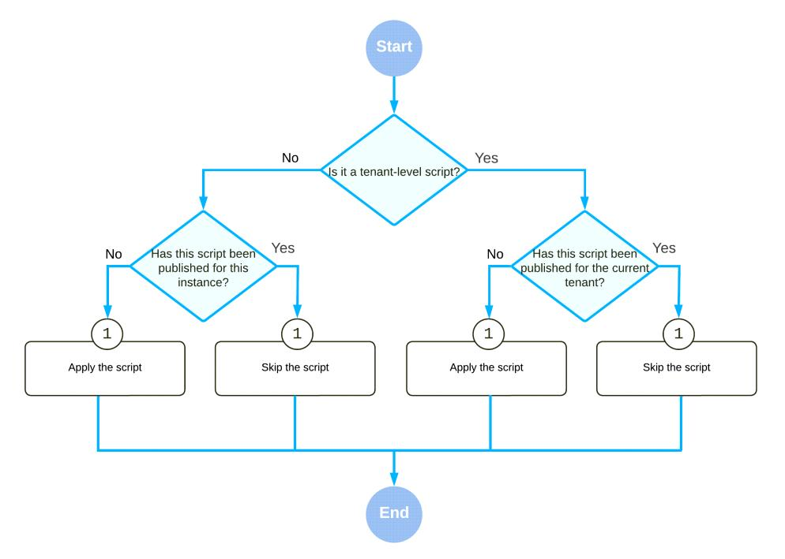

#### *Figure: Conditions for which scripts are applied*

The system behavior with these scripts has the following outcomes:

- Even minor changes in a database script customization item may lead to the script being applied again.
- The same tenant-level script is not applied to the same tenant twice.
- When a customization project is published for another tenant, all tenant-level scripts are applied.
- A database-level script is never applied again for the same instance.

Publishing with cleanup applies all database scripts again, regardless of whether these scripts have been applied before.

For example, suppose that you have added to a customization project a database script that creates a new table in the database. Further suppose that you have published this customization project, and the table has been

added to the database. Then you have removed this table from the database manually. To apply the script in the customization project and create the table again, you need to publish the project with the cleanup operation.

#### **Publishing of a Project with Cleanup**

To publish a customization project with the cleanup operation, you perform the following general steps:

- 1. You open the customization project in the Customization Project Editor.
- 2. On the main menu, you click **Publish > Publish with Cleanup** (see the following screenshot).

| <b>Customization Project Editor</b> |                                                                                                     |  |             |  |                                    |                          | <b>Back</b> | Reload |                                  |                         |  |
|-------------------------------------|-----------------------------------------------------------------------------------------------------|--|-------------|--|------------------------------------|--------------------------|-------------|--------|----------------------------------|-------------------------|--|
| File                                | Publish<br>Source Control<br><b>Extension Library</b>                                               |  |             |  |                                    |                          |             |        |                                  |                         |  |
| Yogif<br>$\triangleright$ SCR       | Publish Current Project (Ctrl+Space)<br><b>Validate Current Project</b><br><b>Multiple Projects</b> |  |             |  | Screens<br>$\times$<br>$^{+}$<br>0 | <b>CREATE NEW SCREEN</b> |             |        | <b>CUSTOMIZE EXISTING SCREEN</b> |                         |  |
| DATA<br>Code                        | Publish with Cleanup                                                                                |  |             |  | Title                              |                          | Is New      |        | <b>Last Modified By</b>          | <b>Last Modified On</b> |  |
| <b>Files</b>                        |                                                                                                     |  | AR.30.30.00 |  | <b>Customers</b>                   |                          | $\Box$      |        | admin admin                      | 4/1/2025                |  |
|                                     | Generic Inquiries (1)                                                                               |  | CR.30.10.00 |  | Leads                              |                          | □           |        | admin admin                      | 4/1/2025                |  |
| Reports                             |                                                                                                     |  | CR.30.60.00 |  | Cases                              |                          | □           |        | admin admin                      | 4/1/2025                |  |
| <b>Dashboards</b><br>Site Map       |                                                                                                     |  | SO.30.10.00 |  | <b>Sales Orders</b>                |                          | П           |        | admin admin                      | 4/1/2025                |  |
|                                     | Database Scripts (1)                                                                                |  |             |  |                                    |                          |             |        |                                  |                         |  |

#### *Figure: Publishing of a customization project with the cleanup operation*

The system cleans all information about previously executed scripts of the customization project and initiates the process of publishing the customization project (executing the scripts during the publication).

### <span id="page-134-0"></span>**Customizing a Multitenant Instance**

<span id="page-134-2"></span>In this chapter, you will learn how to customize an Acumatica ERP instance with multiple tenants.

### <span id="page-134-1"></span>**Multitenant Customization: General Information**

The data of each tenant that uses the same instance of Acumatica ERP is isolated in the database, but website files are shared by tenants. When you publish a customization project, it may affect both the website files and the database.

You can publish a customization project to one tenant or to multiple tenants at once (thus sharing the customization data between these tenants).

#### **Learning Objectives**

In this chapter, you will learn how customization projects are applied to a multitenant site and how to publish customization projects to multiple tenants at once.

#### **Applicable Scenarios**

You customize a multitenant instance when you want to publish your customization project to all tenants or to only certain tenants of your instance.

### **Application of Customization Projects to a Multitenant Instance**

A customization project may add new database tables or fields, add metadata to the database, or introduce changes to the layout and business logic of forms.

If you publish a customization project that only adds metadata to the database, this customization does not affect the website files or the database schema. This data is stored only in the database. Because this data is tenantspecific, it is available in only the tenant where it was published.

The following are added to the website files and therefore are available to other tenants: custom tables, custom code, changes to form layout, and files introduced by the customization project.

When you publish a customization project to a tenant of a multitenant instance, the changes introduced by the custom code of the project are available to all tenants; the changes to the database data are available to only the tenant where the project was published.

Moreover, for all tenants that use the same website, on the Sign-In page and in the **About Acumatica** box, you can see that the website is customized, but you will not see any published projects on the *[Customization Projects](https://help-2025r1.acumatica.com/Help?ScreenId=ShowWiki&pageid=4d3a1166-826c-414b-a207-3d1669fbf9e5)* (SM204505) form. This form displays the customization projects that have been uploaded to the current tenant; therefore, no projects are displayed if they have been uploaded and published under another tenant.

If you publish a customization project to a tenant, the system unpublishes all the previously published customization projects in all the tenants of the instance. We recommend that you use only one tenant for uploading packages and publishing customization projects. The website changes will be available to all tenants anyway, and if you need to share database data, you can publish the customization projects to multiple tenants at once.

### **Publication to Multiple Tenants**

To share database data introduced by a customization project with multiple tenants, you can publish multiple customization projects for multiple tenants at once. On the *[Customization Projects](https://help-2025r1.acumatica.com/Help?ScreenId=ShowWiki&pageid=4d3a1166-826c-414b-a207-3d1669fbf9e5)* (SM204505) form, you can select the customization projects that you need to publish for multiple tenants and on the More menu (under **Publish**), you click **Publish to MultipleTenants** to open the **Publish to MultipleTenants** dialog box. You then select the required tenants and apply the selected customization projects to the selected tenants. If you have published all the selected customization projects in the website for a single tenant at least once, you do not need to update the website files. You can apply only the database changes.

To share customization content that is stored exclusively in the database for multiple tenants, in the **Publish to MultipleTenants** dialog box, you select the **Apply Changes Only to Database (Skip Website Update)** check box to skip updating the site files, and you select the **Execute All DatabaseScrips (Including Previously Executed)** check box to execute all database scripts of the selected customization projects.

The system applies the customization content to each tenant selected in the **Publish to MultipleTenants** dialog box. As a result, the published customization content is saved in the database for each selected tenant.

#### **Sharing of Customization Between Multiple Instances**

By default, when you publish a customization project, the customization is applied only to the Acumatica ERP instance through which you published it. You can change this behavior by enabling the UseSharedCustomization flag in the web.config file. All Acumatica ERP instances that share the same database and have this flag enabled will automatically synchronize their customization. You can publish a new or updated customization project through any of these instances, and the change will be applied to all these instances.

To enable the UseSharedCustomization flag, add a new element to the appSettings section of the web.config file as follows.

```
<appSettings>
 ...
 <add key="UseSharedCustomization" value="True"/>
 </appSettings>
```

### <span id="page-136-3"></span><span id="page-136-0"></span>**Unpublishing Customization Projects**

In this chapter, you will learn how to unpublish customization projects that have been published on an Acumatica ERP instance.

### <span id="page-136-2"></span><span id="page-136-1"></span>**Project Unpublishing: General Information**

If the changes that you have made to the website are no longer required, you can revert them by unpublishing your customization project or projects.

#### **Learning Objectives**

In this chapter, you will learn how to unpublish customization projects.

#### **Applicable Scenarios**

You unpublish customization projects in the following cases:

- You have published multiple customization projects, and you want to unpublish all of them
- You have published multiple customization projects, and you want to unpublish only certain projects

### **Rollback of Changes Made by Customization Projects**

Each time you publish a customization project or multiple projects, the system unpublishes all previously published projects that were not selected for publication. Thus, you can also unpublish any number of projects. To unpublish unneeded projects, you publish all other projects without the projects that you want to unpublish.

During the unpublishing of a customization project, the system reverses the changes that have been introduced by the customization as follows:

- Any Acumatica ERP forms customized within the project return to their original layout, workflow, and functionality.
- The files of the project with customization code are removed from the website folder in the file system.
- The custom files of the project are removed from the website folder on the file system.

Note the following points regarding the changes that are not reversed during the unpublishing of a customization project:

• Database changes remain in the database. Thus, the database still holds any generic inquiries, reports, changes to the site map, custom tables, custom database objects, and custom data from the customization project.

Also, changes to the site map remain in the navigation menu of Acumatica ERP. If you need to remove these changes, you must do so manually.

• The .sln file of the integrated Microso Visual Studio solution and any projects remain in the file system. However, the customization code of the unpublished customization project and the external files added to the customization project are removed from the solution.

For example, if a customization project introduces a new report, aer you publish and unpublish the project, the report stays in the database and remains available in the application, so if you want it to be deleted, you need to remove it manually.

There is no difference in the unpublishing process for a single-tenant site and a multitenant site: The platform deletes the same files in the file system and keeps all the changes in the database.

### **Steps to Unpublish a Customization Project or Multiple Projects**

If there are multiple customization projects published in an instance of Acumatica ERP, you can unpublish all of these projects or some of them.

To unpublish all customization projects, you perform the following general steps:

- 1. You open the *[Customization Projects](https://help-2025r1.acumatica.com/Help?ScreenId=ShowWiki&pageid=4d3a1166-826c-414b-a207-3d1669fbf9e5)* (SM204505) form.
- 2. On the form toolbar, you click **Unpublish All**.

The system removes all published customization projects from the Acumatica ERP instance.

To unpublish some of the customization projects, you perform the following general steps:

- 1. You open the *[Customization Projects](https://help-2025r1.acumatica.com/Help?ScreenId=ShowWiki&pageid=4d3a1166-826c-414b-a207-3d1669fbf9e5)* form.
- 2. In the list of customization projects, you select the check boxes for the projects that you want to remain published, and clear the check boxes for the unnecessary projects.
- 3. On the form toolbar, you click **Publish**.

The system removes all published customization projects from the Acumatica ERP instance, merges the content of the customization projects that are currently selected on the form, and applies the merged content to the instance.

### <span id="page-137-0"></span>**Project Unpublishing: To Unpublish a Single Project**

The following activity will walk you through the process of unpublishing a single customization project.

#### **Story**

Suppose that you have published two customization projects (*Yogifon* and *OpportunitiesForm*) in your Acumatica ERP instance, and you want to revert the changes introduced by the *OpportunitiesForm* project. You need to unpublish this customization project.

#### **Process Overview**

By using the *[Customization Projects](https://help-2025r1.acumatica.com/Help?ScreenId=ShowWiki&pageid=4d3a1166-826c-414b-a207-3d1669fbf9e5)* (SM204505) form of the *Yogifon\_Staging* instance, you will unpublish the *OpportunitiesForm* project.

#### **System Preparation**

Before you begin performing the steps of this activity, do the following:

- 1. Prepare an Acumatica ERP instance called *Yogifon\_Staging* by using the process described in *[Customization](#page-82-1) [Projects:](#page-82-1) To Deploy an Instance*.
- 2. In the *Yogifon\_Staging* instance, enable the following features on the *[Enable/Disable Features](https://help-2025r1.acumatica.com/Help?ScreenId=ShowWiki&pageid=c1555e43-1bc5-4f6f-ba9d-b323f94d8a6b)* (CS100000) form:
  - **Business Account Locations**
  - **Multicurrency Accounting**

#### • **Payment Application by Line**

- 3. Download the following files of the deployment packages.
  - *Yogifon.zip*
  - *OpportunitiesForm.zip*

### **Step 1: Publishing the Customization Projects**

Before unpublishing a customization project, you will import the deployment packages to the staging environment and publish the customization projects as follows:

- 1. In the *Yogifon\_Staging* instance, open the *[Customization Projects](https://help-2025r1.acumatica.com/Help?ScreenId=ShowWiki&pageid=4d3a1166-826c-414b-a207-3d1669fbf9e5)* (SM204505) form.
- 2. On the More menu (under **Import**), click **Import**.
- 3. In the **Open Package** dialog box, which opens, select the Yogifon.zip file, which you have downloaded.
- 4. Click **Upload**.

The system uploads the project and adds it to the list on the *[Customization Projects](https://help-2025r1.acumatica.com/Help?ScreenId=ShowWiki&pageid=4d3a1166-826c-414b-a207-3d1669fbf9e5)* form.

- 5. On the More menu (under **Import**), click **Import** again.
- 6. In the **Open Package** dialog box, which opens, select the OpportunitiesForm.zip file, which you have downloaded.
- 7. Click **Upload**.

The system uploads the project and adds it to the list on the *[Customization Projects](https://help-2025r1.acumatica.com/Help?ScreenId=ShowWiki&pageid=4d3a1166-826c-414b-a207-3d1669fbf9e5)* form.

- 8. In the table on the form, select the check boxes (in the unlabeled column) for the *Yogifon* and *OpportunitiesForm* projects.
- 9. On the More menu (under **Publish**), click **Publish**.

The **Compilation** pane appears, and the validation of the projects is performed.

- 10.Wait until the **Publish** button appears in the **Compilation** pane, and click it.
- 11.Wait until the *Website updated* row appears in the **Compilation** pane, and click **Close Compilation Pane**.

The changes of the customization project are applied to the instance.

### **Step 2: Unpublishing a Customization Project**

To unpublish the *OpportunitiesForm* project, do the following in the *Yogifon\_Staging* instance:

- 1. Open the *[Customization Projects](https://help-2025r1.acumatica.com/Help?ScreenId=ShowWiki&pageid=4d3a1166-826c-414b-a207-3d1669fbf9e5)* (SM204505) form.
- 2. In the list of customization projects, select the unlabeled check box for the *Yogifon* project, and clear the check box for the *OpportunitiesForm* project.
- 3. On the form toolbar, click **Publish**.

The system removes all published customization projects from the Acumatica ERP instance, merges the content of the customization projects that are currently selected on the form, and applies the merged content to the instance.

### <span id="page-138-0"></span>**Project Unpublishing: To Unpublish All Projects**

The following activity will walk you through the process of unpublishing all published customization projects.

#### **Story**

Suppose that you have published two customization projects (*Yogifon* and *OpportunitiesForm*) in your Acumatica ERP instance, and you want to revert the changes that have been introduced by both projects. You need to unpublish these customization projects.

#### **Process Overview**

By using the *[Customization Projects](https://help-2025r1.acumatica.com/Help?ScreenId=ShowWiki&pageid=4d3a1166-826c-414b-a207-3d1669fbf9e5)* (SM204505) form of the *Yogifon\_Staging* instance, you will unpublish the *Yogifon* and *YogifonExtra* projects.

#### **System Preparation**

Before you begin performing the steps of this activity, do the following:

- 1. Make sure that you have completed the *Project Publication: To Publish Two [Customization](#page-129-1) Projects* prerequisite activity.
- 2. Launch the *Yogifon\_Staging* instance, and sign in by using the *admin* username and the password that you have specified for this instance.

#### **Step: Unpublishing All Customization Projects**

To unpublish all customization projects, do the following:

- 1. Open the *[Customization Projects](https://help-2025r1.acumatica.com/Help?ScreenId=ShowWiki&pageid=4d3a1166-826c-414b-a207-3d1669fbf9e5)* (SM204505) form.
- 2. On the form toolbar, you click **Unpublish All**.

The system removes all published customization projects from the Acumatica ERP instance.

# <span id="page-140-1"></span><span id="page-140-0"></span>**Managing Items in a Project**

You use the *[Customization Project Editor](https://help-2025r1.acumatica.com/Help?ScreenId=ShowWiki&pageid=0bb97781-e987-4039-962d-457720821bff)* to manage the items in a customization project. The editor includes a page to support each type of item in a customization project. (See *Types of Items in a [Customization](#page-33-1) Project* for details.) By using the navigation pane of the editor, shown in the following screenshot, you can open these pages (each of which is described in detail in the corresponding part of this guide).

| <b>Customization Project Editor</b>         |                                    |  |  |  |  |  |  |  |
|---------------------------------------------|------------------------------------|--|--|--|--|--|--|--|
| Publish<br><b>Extension Library</b><br>File | Source Control                     |  |  |  |  |  |  |  |
| CustProj                                    | <b>Connected Applications</b><br>∢ |  |  |  |  |  |  |  |
| <b>Screens</b>                              | H<br>Õ<br>∽<br>X.                  |  |  |  |  |  |  |  |
| Data Access                                 |                                    |  |  |  |  |  |  |  |
| !!!!!!!!!!!!!!!!!!!!!!!!!!!!!!!!!!!!!!!!    | <b>B</b> Object Name               |  |  |  |  |  |  |  |
| Files                                       |                                    |  |  |  |  |  |  |  |
| Generic Inquiries                           |                                    |  |  |  |  |  |  |  |
| Reports                                     |                                    |  |  |  |  |  |  |  |
| <b>Dashboards</b>                           |                                    |  |  |  |  |  |  |  |
| Site Map                                    |                                    |  |  |  |  |  |  |  |
| Database Scripts                            |                                    |  |  |  |  |  |  |  |
| <b>System Locales</b>                       |                                    |  |  |  |  |  |  |  |
| Import/Export Scenarios                     |                                    |  |  |  |  |  |  |  |
| <b>Shared Filters</b>                       |                                    |  |  |  |  |  |  |  |
| <b>Access Rights</b>                        |                                    |  |  |  |  |  |  |  |
| Wikis                                       |                                    |  |  |  |  |  |  |  |
| Web Service Endpoints                       |                                    |  |  |  |  |  |  |  |
| <b>Analytical Reports</b>                   |                                    |  |  |  |  |  |  |  |
| <b>Push Notifications</b>                   |                                    |  |  |  |  |  |  |  |
| <b>Business Events</b>                      |                                    |  |  |  |  |  |  |  |
| <b>Mobile Application</b>                   |                                    |  |  |  |  |  |  |  |
| <b>User-Defined Fields</b>                  |                                    |  |  |  |  |  |  |  |
| Webhooks                                    |                                    |  |  |  |  |  |  |  |
| <b>Connected Applications</b>               |                                    |  |  |  |  |  |  |  |

*Figure: Viewing the navigation pane of the editor*

### <span id="page-142-0"></span>**Adding Customization Items to Customization Projects**

In this chapter, you will learn how to use the Customization Project Editor to add customization items to a customization project. These items are the components of different types that make up the customization project.

### <span id="page-142-1"></span>**Customization Items: General Information**

You start customizing Acumatica ERP forms by adding the appropriate customization items to the customization project. A customization item is a programming or non-programming component of a customization project.

For each type of customization item that a customization project can include, the Customization Project Editor provides a page that you can use to add or modify one of these items.

#### **Learning Objectives**

In this chapter, you will learn how to add items to your customization project and how to update these items in the project.

#### **Applicable Scenarios**

You add customization items to a customization project when you need to make certain modifications to these items. You update these items if the items have been updated outside of the project (for example, in an Acumatica ERP instance or in the database).

### **Addition and Update of Items in a Customization Project**

You add items to a customization project by using the Customization Project Editor, which has separate pages that you use to add and manage each type of customization items in the currently opened customization project.

To add an item to the customization project, you open the page that corresponds to the type of item you want to add. Then on the page, you add a new item or an item that already exists in the system.

When you modify an object (such as a generic inquiry, report, or dashboard) that has been added to the customization project, information about the object is saved only to the instance database. Therefore, aer modifying the object, you have to update the corresponding customization item so that the changes are saved to the customization project.

### <span id="page-142-3"></span><span id="page-142-2"></span>**Customization Items: To Add Items to the Customization Project**

The following activity will walk you through the process of adding a generic inquiry and an import scenario to a customization project.

#### **Story**

Suppose that the employees of your company oen need to review all sales orders of a particular customer, and that you have already prepared a generic inquiry to view this information. You need to include this generic inquiry in the *Yogifon* customization project.

Also, you need to include the *Import GL Transactions* import scenario in the customization project. (This import scenario, which employees will use to import general ledger transactions into the system, already exists in the instance.)

#### **Process Overview**

You will open the customization project in the Customization Project Editor, and use the *[Generic Inquiries](https://help-2025r1.acumatica.com/Help?ScreenId=ShowWiki&pageid=f57031d0-64cd-491f-891c-ce6bf71f0f6e)* and *[Import and Export Scenarios](https://help-2025r1.acumatica.com/Help?ScreenId=ShowWiki&pageid=bf3fe22b-9135-4bf0-a0db-a4ef08fef1dd)* pages to add the needed items. You will also use the *[Access Rights](https://help-2025r1.acumatica.com/Help?ScreenId=ShowWiki&pageid=232ce0b3-baaa-4cdb-a43e-714fbee38a4f)* page to add the access rights for one of the added items.

#### **System Preparation**

Before you begin performing the steps of this activity, do the following:

- 1. Prepare an Acumatica ERP instance by performing the *[Customization](#page-82-1) Projects: To Deploy an Instance* prerequisite activity.
- 2. Create the *Yogifon* customization project by performing the *[Customization](#page-83-1) Projects: To Create a [Customization Project](#page-83-1)* prerequisite activity.
- 3. Import the generic inquiry from the *SO-OpenByCustomer.xml* file to your instance as follows:
  - a. Open the *[Generic Inquiry](https://help-2025r1.acumatica.com/Help?ScreenId=ShowWiki&pageid=5388c653-eac4-4f43-b769-163cd037ab09)* (SM208000) form.
  - b. On the form toolbar, click **Clipboard > Import from XML**.
  - c. In the **Upload XML File** dialog box, select the SO-OpenByCustomer.xml file.
  - d. Click **Upload**.
- 4. On the More menu (under **Other**), click **Publish to the UI**.
- 5. In the **Publish to the UI** dialog box, which opens, specify the following settings:
  - **Site Map Title**: Open Sales Orders by Customer
  - **Workspace**: *Receivables*
  - **Category**: *Reports*
  - **Screen ID**: *GI.40.00.01* (inserted automatically)
- 6. In the **Access Rights** section, select the**Set to Granted for All Roles** option button to make the system set the access rights for this generic inquiry to *Granted* for all user roles in the system.
- 7. Click **Publish**.

#### **Step 1: Adding the Imported Generic Inquiry to the Customization Project**

To add the *SO-OpenByCustomer* generic inquiry to the customization project, do the following:

- 1. Open the *[Customization Projects](https://help-2025r1.acumatica.com/Help?ScreenId=ShowWiki&pageid=4d3a1166-826c-414b-a207-3d1669fbf9e5)* (SM204505) form.
- 2. Click the name of the *Yogifon* customization project.

The Customization Project Editor opens for this customization project.

3. In the navigation pane, click **Generic Inquiries**.

The *[Generic Inquiries](https://help-2025r1.acumatica.com/Help?ScreenId=ShowWiki&pageid=f57031d0-64cd-491f-891c-ce6bf71f0f6e)* page opens.

- 4. On the page toolbar, click **Add New Record**.
- 5. In the **Add Generic Inquiries** dialog box, which opens, select the unlabeled check box in the row with the *SO-OpenByCustomer* generic inquiry (see the following screenshot).

| <b>Customization Project Editor</b>                 |                          |                              |                                        |                         |                         |                       | <b>Back</b>             | Reload |
|-----------------------------------------------------|--------------------------|------------------------------|----------------------------------------|-------------------------|-------------------------|-----------------------|-------------------------|--------|
| Publish<br><b>Extension Library</b><br>File         | Source Control           |                              |                                        |                         |                         |                       |                         |        |
| Yogifon<br>$\blacktriangleleft$                     | <b>Generic Inquiries</b> |                              |                                        |                         |                         |                       |                         |        |
| <b>Screens</b>                                      | Ò<br>$\Box$<br>$\Omega$  | $^{+}$<br>$\times$           | <b>RELOAD FROM DATABASE</b>            | <b>MANAGE INQUIRIES</b> |                         |                       |                         |        |
| <b>Data Access</b><br>Code                          | <b>B</b> Object Name     |                              | <b>Description</b>                     | <b>Last Modified By</b> |                         |                       | <b>Last Modified On</b> |        |
| <b>Files</b>                                        |                          |                              |                                        |                         |                         |                       |                         |        |
| <b>Modern UI Files</b>                              |                          | <b>Add Generic Inquiries</b> |                                        |                         |                         | $\Box$ $\times$       |                         |        |
| <b>Generic Inquiries</b>                            |                          | Ò                            |                                        |                         |                         |                       |                         |        |
| <b>Reports</b>                                      |                          |                              |                                        |                         |                         |                       |                         |        |
| <b>Dashboards</b>                                   |                          | 目口                           | *Inquiry Title                         |                         | Last<br><b>Modified</b> | LastModifie           |                         |        |
| Site Map                                            |                          |                              |                                        |                         | By                      |                       |                         |        |
| <b>Database Scripts</b><br><b>System Locales</b>    |                          | □                            | <b>Customer Contacts</b>               |                         | admin ad                | 12/21/2022            |                         |        |
| Import/Export Scenarios                             |                          | $\Box$                       | <b>Item Availability Data</b>          |                         | admin ad                | 12/31/2022            |                         |        |
| <b>Shared Filters</b>                               |                          | □                            | <b>Modified Stock Items</b>            |                         | admin ad                | 12/21/2022            |                         |        |
| <b>Access Rights</b>                                |                          | ☑                            |                                        |                         |                         |                       |                         |        |
| <b>Wikis</b>                                        |                          |                              | SO-OpenByCustomer                      |                         | admin ad                | 4/1/2025              |                         |        |
| <b>Web Service Endpoints</b>                        |                          | $\Box$                       | <b>Stock Item Attachments</b>          |                         | admin ad                | 12/31/2022            |                         |        |
| <b>Analytical Reports</b>                           |                          | $\Box$                       | <b>Stock Items: Last Modified Date</b> |                         | admin ad                | 12/31/2022            |                         |        |
| <b>Push Notifications</b>                           |                          |                              |                                        |                         |                         |                       |                         |        |
| <b>Business Events</b><br><b>Mobile Application</b> |                          |                              |                                        |                         |                         |                       |                         |        |
| <b>User-Defined Fields</b>                          |                          |                              |                                        |                         |                         |                       |                         |        |
| Webhooks                                            |                          |                              |                                        |                         |                         |                       |                         |        |
| <b>Connected Applications</b>                       |                          |                              |                                        |                         |                         | CANCEL<br><b>SAVE</b> |                         |        |
| <b>Tables to Track Deleted Records</b>              |                          |                              |                                        |                         |                         |                       |                         |        |

#### *Figure: Selection of the SO-OpenByCustomer inquiry*

6. Click **Save** to add the generic inquiry to the customization project and return to the *[Generic Inquiries](https://help-2025r1.acumatica.com/Help?ScreenId=ShowWiki&pageid=f57031d0-64cd-491f-891c-ce6bf71f0f6e)* page.

The generic inquiry is saved as a customization item in the customization project, as shown in the following screenshot. Notice that it is listed on the *[Generic Inquiries](https://help-2025r1.acumatica.com/Help?ScreenId=ShowWiki&pageid=f57031d0-64cd-491f-891c-ce6bf71f0f6e)* page and that in the navigation pane, the system has added *(1)* aer **Generic Inquiries**, indicating that the customization project now includes one generic inquiry.

| <b>Customization Project Editor</b><br>Reload<br><b>Back</b> |                                                                                                   |                         |  |  |  |  |  |  |  |
|--------------------------------------------------------------|---------------------------------------------------------------------------------------------------|-------------------------|--|--|--|--|--|--|--|
| Publish<br><b>Extension Library</b><br>File                  | <b>Source Control</b>                                                                             |                         |  |  |  |  |  |  |  |
| Yogifon<br>$\blacktriangleleft$                              | <b>Generic Inquiries</b>                                                                          |                         |  |  |  |  |  |  |  |
| <b>Screens</b><br>Data Access                                | Ò<br>周<br>$\pm$<br>$\Omega$<br>$\times$<br><b>RELOAD FROM DATABASE</b><br><b>MANAGE INQUIRIES</b> |                         |  |  |  |  |  |  |  |
| Code                                                         | <b>B</b> Object Name<br><b>Description</b><br><b>Last Modified By</b>                             | <b>Last Modified On</b> |  |  |  |  |  |  |  |
| <b>Files</b>                                                 | ⋗<br>SO-OpenByCustomer<br>admin admin                                                             | 4/1/2025                |  |  |  |  |  |  |  |
| <b>Modern UI Files</b>                                       |                                                                                                   |                         |  |  |  |  |  |  |  |
| <b>Generic Inquiries (1)</b>                                 |                                                                                                   |                         |  |  |  |  |  |  |  |
| <b>Reports</b>                                               |                                                                                                   |                         |  |  |  |  |  |  |  |
| <b>Dashboards</b>                                            |                                                                                                   |                         |  |  |  |  |  |  |  |
| Site Map                                                     |                                                                                                   |                         |  |  |  |  |  |  |  |
| <b>Database Scripts</b>                                      |                                                                                                   |                         |  |  |  |  |  |  |  |
| <b>System Locales</b>                                        |                                                                                                   |                         |  |  |  |  |  |  |  |
| Import/Export Scenarios                                      |                                                                                                   |                         |  |  |  |  |  |  |  |
| <b>Shared Filters</b>                                        |                                                                                                   |                         |  |  |  |  |  |  |  |
| <b>Access Rights</b>                                         |                                                                                                   |                         |  |  |  |  |  |  |  |
| <b>Wikis</b>                                                 |                                                                                                   |                         |  |  |  |  |  |  |  |
| <b>Web Service Endpoints</b>                                 |                                                                                                   |                         |  |  |  |  |  |  |  |
| <b>Analytical Reports</b>                                    |                                                                                                   |                         |  |  |  |  |  |  |  |
| <b>Push Notifications</b>                                    |                                                                                                   |                         |  |  |  |  |  |  |  |
| <b>Business Events</b>                                       |                                                                                                   |                         |  |  |  |  |  |  |  |
| <b>Mobile Application</b>                                    |                                                                                                   |                         |  |  |  |  |  |  |  |
| <b>User-Defined Fields</b>                                   |                                                                                                   |                         |  |  |  |  |  |  |  |
| Webhooks                                                     |                                                                                                   |                         |  |  |  |  |  |  |  |
| <b>Connected Applications</b>                                |                                                                                                   |                         |  |  |  |  |  |  |  |
| <b>Tables to Track Deleted Records</b>                       |                                                                                                   |                         |  |  |  |  |  |  |  |

#### *Figure: The SO-OpenByCustomer generic inquiry as a customization item*

You do not need to add the *[Generic Inquiry](https://help-2025r1.acumatica.com/Help?ScreenId=ShowWiki&pageid=5388c653-eac4-4f43-b769-163cd037ab09)* (SM208000) form to the customization project because a generic inquiry is an entity created on this form but the *[Generic Inquiry](https://help-2025r1.acumatica.com/Help?ScreenId=ShowWiki&pageid=5388c653-eac4-4f43-b769-163cd037ab09)* form itself is not changed.

For more information on generic inquiries, see *[Managing Generic Inquiries](https://help-2025r1.acumatica.com/Help?ScreenId=ShowWiki&pageid=5737bca9-aebb-446d-9e1a-bc5fcfad6797)*.

#### **Step 2: Specifying Access Rights for the Added Generic Inquiry**

To add the access rights for the *SO-OpenByCustomer* generic inquiry to the customization project, do the following:

- 1. While you are still working in the Customization Project Editor, in the navigation pane, click **Access Rights**. The *[Access Rights](https://help-2025r1.acumatica.com/Help?ScreenId=ShowWiki&pageid=232ce0b3-baaa-4cdb-a43e-714fbee38a4f)* page opens.
- 2. On the page toolbar, click **Add New Record**.
- 3. In the **Add Access Rights forScreen** dialog box, which opens, do the following:
  - In the **Screen Name** box, select *GI400001*. This is the ID of the *SO-OpenByCustomer* generic inquiry.
  - In the **Merge Rule** section, select the **Grant All** option button (see the following screenshot).

| <b>Customization Project Editor</b>                                                                         |                                                                                                                                                                                                      | <b>Back</b>             | Reload |
|-------------------------------------------------------------------------------------------------------------|------------------------------------------------------------------------------------------------------------------------------------------------------------------------------------------------------|-------------------------|--------|
| File<br><b>Publish</b><br><b>Extension Library</b>                                                          | <b>Source Control</b>                                                                                                                                                                                |                         |        |
| Yogifon<br>۰                                                                                                | <b>Access Rights</b>                                                                                                                                                                                 |                         |        |
| <b>Screens</b><br>Data Access<br>Code<br><b>Files</b>                                                       | Ò<br>圕<br>$\Omega$<br>$+$<br>$\times$<br><b>RELOAD FROM DATABASE</b><br><b>MANAGE ACCESS RIGHTS</b><br><b>B</b> Object Name<br><b>Description</b><br><b>Last Modified By</b><br>Merge<br><b>Rule</b> | <b>Last Modified On</b> |        |
| <b>Modern UI Files</b><br>Generic Inquiries (1)                                                             | <b>Add Access Rights for Screen</b><br>$\Box$ $\times$                                                                                                                                               |                         |        |
| Reports<br><b>Dashboards</b><br><b>Site Map</b>                                                             | Screen Name:<br>GI400001<br>م<br><b>MERGE RULE</b><br>Grant All: Set access rights to Granted for all roles                                                                                          |                         |        |
| <b>Database Scripts</b><br><b>System Locales</b><br><b>Import/Export Scenarios</b><br><b>Shared Filters</b> | O Revoke All: Set access rights to Revoked for all roles                                                                                                                                             |                         |        |
| <b>Access Rights</b><br><b>Wikis</b>                                                                        | $\bigcirc$ Apply and Reset: Apply access rights from the customization project and<br>set them to Revoked for the roles that are not included                                                        |                         |        |
| <b>Web Service Endpoints</b>                                                                                | ○ Apply and Keep: Apply access rights from the customization project and<br>keep them for the roles that are not included                                                                            |                         |        |
| <b>Analytical Reports</b><br><b>Push Notifications</b>                                                      | <b>CANCEL</b><br><b>ADD</b>                                                                                                                                                                          |                         |        |
| <b>Business Events</b><br><b>Mobile Application</b>                                                         |                                                                                                                                                                                                      |                         |        |
| <b>User-Defined Fields</b><br>Webhooks                                                                      |                                                                                                                                                                                                      |                         |        |
| <b>Connected Applications</b><br><b>Tables to Track Deleted Records</b>                                     |                                                                                                                                                                                                      |                         |        |

#### *Figure: Addition of access rights*

With this option button selected, the system will set the access rights to *Granted* for all user roles in the system.

4. Click **Add** to add the access rights to the customization project and return to the *[Access Rights](https://help-2025r1.acumatica.com/Help?ScreenId=ShowWiki&pageid=232ce0b3-baaa-4cdb-a43e-714fbee38a4f)* page.

The access rights are saved as a customization item in the customization project.

For more information on access rights, see *To Add [Access](#page-204-1) Rights to a Project*.

#### **Step 3: Adding the Import Scenario to the Customization Project**

To add the *Import GL Transactions* scenario to the customization project, do the following:

1. While you are still working in the Customization Project Editor, in the navigation pane, click **Import/Export Scenarios**.

The *[Import and Export Scenarios](https://help-2025r1.acumatica.com/Help?ScreenId=ShowWiki&pageid=bf3fe22b-9135-4bf0-a0db-a4ef08fef1dd)* page opens.

- 2. On the page toolbar, click **Add New Record**.
- 3. In the **Add Import or ExportScenario** dialog box, which opens, select the unlabeled check box in the row with the *Import GL Transactions* scenario.
- 4. Click **OK** to close the dialog box and return to the *[Import and Export Scenarios](https://help-2025r1.acumatica.com/Help?ScreenId=ShowWiki&pageid=bf3fe22b-9135-4bf0-a0db-a4ef08fef1dd)* page.
- 5. On the page toolbar, click**Save**.

The system adds the import scenario to the customization project as a customization item (see the following screenshot).

| <b>Customization Project Editor</b>         |                                                                                            | Reload<br><b>Back</b>   |
|---------------------------------------------|--------------------------------------------------------------------------------------------|-------------------------|
| Publish<br><b>Extension Library</b><br>File | <b>Source Control</b>                                                                      |                         |
| Yogifon<br>۰                                | Import and Export Scenarios                                                                |                         |
| <b>Screens</b>                              | H<br>Ò<br>$\Omega$<br>×<br>$\pm$<br><b>RELOAD FROM DATABASE</b><br><b>MANAGE SCENARIOS</b> |                         |
| <b>Data Access</b><br>Code                  | <b>B</b> Object Name<br><b>Description</b><br><b>Last Modified By</b>                      | <b>Last Modified On</b> |
| <b>Files</b>                                | ⋗<br><b>Import GL Transactions</b><br>admin admin                                          | 4/1/2025                |
| <b>Modern UI Files</b>                      |                                                                                            |                         |
| Generic Inquiries (1)                       |                                                                                            |                         |
| Reports                                     |                                                                                            |                         |
| <b>Dashboards</b>                           |                                                                                            |                         |
| <b>Site Map</b>                             |                                                                                            |                         |
| <b>Database Scripts</b>                     |                                                                                            |                         |
| <b>System Locales</b>                       |                                                                                            |                         |
| <b>Import/Export Scenarios (1)</b>          |                                                                                            |                         |
| <b>Shared Filters</b>                       |                                                                                            |                         |
| Access Rights (1)                           |                                                                                            |                         |
| <b>Wikis</b>                                |                                                                                            |                         |
| <b>Web Service Endpoints</b>                |                                                                                            |                         |
| <b>Analytical Reports</b>                   |                                                                                            |                         |
| <b>Push Notifications</b>                   |                                                                                            |                         |
| <b>Business Events</b>                      |                                                                                            |                         |
| <b>Mobile Application</b>                   |                                                                                            |                         |
| <b>User-Defined Fields</b>                  |                                                                                            |                         |
| Webhooks                                    |                                                                                            |                         |
| <b>Connected Applications</b>               |                                                                                            |                         |
| <b>Tables to Track Deleted Records</b>      |                                                                                            |                         |

*Figure: The import scenario as a customization item*

### <span id="page-147-0"></span>**Customization Items: To Update an Item in the Customization Project**

The following activity will walk you through the process of updating a customization item in the customization project.

#### **Story**

Suppose that you need to update the *SO-OpenByCustomer* generic inquiry in your Acumatica ERP instance. You need to reflect the changes in the customization project by updating the corresponding customization item.

#### **Process Overview**

You will modify the generic inquiry on the *[Generic Inquiry](https://help-2025r1.acumatica.com/Help?ScreenId=ShowWiki&pageid=5388c653-eac4-4f43-b769-163cd037ab09)* (SM208000) form of the Acumatica ERP instance and then update the customization item in the customization project.

#### **System Preparation**

Before you begin performing the steps of this activity, do the following:

- 1. Prepare an Acumatica ERP instance by performing the *[Customization](#page-82-1) Projects: To Deploy an Instance* prerequisite activity.
- 2. Create the *Yogifon* customization project by performing the *[Customization](#page-83-1) Projects: To Create a [Customization Project](#page-83-1)* prerequisite activity.

3. Make sure that you have completed the *[Customization](#page-142-3) Items: To Add Items to the Customization Project* prerequisite activity.

#### **Step 1: Modifying the Generic Inquiry**

To modify the *SO-OpenByCustomer* generic inquiry and add a column for the sales order type (**OrderType**) to the generic inquiry form, do the following:

- 1. In Acumatica ERP, open the *[Generic Inquiry](https://help-2025r1.acumatica.com/Help?ScreenId=ShowWiki&pageid=5388c653-eac4-4f43-b769-163cd037ab09)* (SM208000) form.
- 2. In the **InquiryTitle** box of the Summary area, select *SO-OpenByCustomer*.
- 3. On the table toolbar of the **Results Grid** tab, click **Add Row**.
- 4. In the new row, specify the following settings:
  - **Active**: Selected
  - **Object**: *SOOrder* (specified automatically)
  - **Data Field**: *OrderType*
- 5. Save your changes.

The following screenshot shows the generic inquiry aer these changes.

|   |               |                                                                                            | Generic Inquiry     |                                    |                               |                        |                                                                 |                   |                   |        |                   |                                                                                                                              |                   |                                                                                                                      | <b>P</b> NOTES |                            | <b>FILES</b>                   |                              | <b>CUSTOMIZATION</b>                                                   | TOOLS $\sim$        | ⊙<br>Preview the                  |
|---|---------------|--------------------------------------------------------------------------------------------|---------------------|------------------------------------|-------------------------------|------------------------|-----------------------------------------------------------------|-------------------|-------------------|--------|-------------------|------------------------------------------------------------------------------------------------------------------------------|-------------------|----------------------------------------------------------------------------------------------------------------------|----------------|----------------------------|--------------------------------|------------------------------|------------------------------------------------------------------------|---------------------|-----------------------------------|
|   | H             | ↶                                                                                          | +                   | 圎                                  | n                             | $\check{~}$            | $\overline{\mathbf{K}}$                                         | ≺                 | $\rightarrow$     | $\geq$ |                   | <b>VIEW INQUIRY</b>                                                                                                          | PUBLISH TO THE UI | <b>UNPUBLISH</b>                                                                                                     |                | .                          |                                |                              |                                                                        |                     | currently<br>selected<br>inquiry. |
|   |               | * Inquiry Title:<br>Site Map Title:<br>Workspace:<br>Category:<br>Screen ID:<br>Row Style: | <b>DATA SOURCES</b> |                                    | Inquiries<br><b>RELATIONS</b> | Data Views<br>GI400001 | SO-OpenByCustomer<br>Open Sales Orders by Customer<br>$\cdot$ 0 | <b>PARAMETERS</b> | Q<br>٩<br>Q       |        | <b>CONDITIONS</b> | □ Show Deleted Records<br>□ Show Archived Records<br>Expose via OData<br>Expose to the Mobile Application<br><b>GROUPING</b> | <b>SORT ORDER</b> | Arrange Parameters in:<br>Select Top:<br>Records per Page:<br>Export Top:<br>Attach Notes To:<br><b>RESULTS GRID</b> |                |                            | <b>ENTRY POINT</b>             | $\bf{0}$<br>$\boldsymbol{0}$ | 2 columns<br>records<br>0 Records<br>$\checkmark$<br><b>NAVIGATION</b> | $\hat{\phantom{1}}$ |                                   |
| 髙 | O<br>$\omega$ | ╄<br>D                                                                                     | $\times$<br>Active  | $\overline{\phantom{a}}$<br>Object | $ \mathbf{x} $                |                        |                                                                 | Data Field        |                   |        |                   | Schema Field                                                                                                                 | Width             |                                                                                                                      |                | Style Visible              | Default                        |                              | Navigate To                                                            |                     |                                   |
|   | 0             | D                                                                                          | ☑                   | SOOrder                            |                               |                        |                                                                 |                   | OrderDate         |        |                   |                                                                                                                              | (px)              |                                                                                                                      |                | $\triangledown$            | Navigation<br>$\triangleright$ |                              |                                                                        |                     |                                   |
|   | 0             | D                                                                                          | ☑                   | Customer                           |                               |                        |                                                                 | AcctCD            |                   |        |                   |                                                                                                                              |                   |                                                                                                                      |                | ☑                          | ☑                              |                              |                                                                        |                     |                                   |
|   | 0             | D                                                                                          | ☑                   | Customer                           |                               |                        |                                                                 |                   | AcctName          |        |                   |                                                                                                                              |                   |                                                                                                                      |                | ☑                          | $\overline{\mathbf{S}}$        |                              |                                                                        |                     |                                   |
|   | 0             | D                                                                                          | ☑                   | SOOrder                            |                               |                        |                                                                 | OrderNbr          |                   |        |                   |                                                                                                                              |                   |                                                                                                                      |                | ☑                          | $\Box$                         |                              |                                                                        |                     |                                   |
|   | 0             | $\Box$                                                                                     | ☑                   | SOOrder                            |                               |                        |                                                                 |                   | OrderWeight       |        |                   |                                                                                                                              |                   |                                                                                                                      |                | ☑                          | ☑                              |                              |                                                                        |                     |                                   |
|   | 0             | D                                                                                          | ☑                   | SOOrder                            |                               |                        |                                                                 |                   | <b>OrderTotal</b> |        |                   |                                                                                                                              |                   |                                                                                                                      |                | $\overline{\triangledown}$ | $\overline{\mathbb{S}}$        |                              |                                                                        |                     |                                   |
|   | 0             | $\Box$                                                                                     | ☑                   | SOOrder                            |                               |                        |                                                                 | <b>Status</b>     |                   |        |                   |                                                                                                                              |                   |                                                                                                                      |                | ☑                          | ☑                              |                              |                                                                        |                     |                                   |
|   | 0             | $\Box$                                                                                     | ☑                   | SOOrder                            |                               |                        |                                                                 |                   | OrderType         |        |                   |                                                                                                                              |                   |                                                                                                                      |                | ☑                          | $\blacksquare$                 |                              |                                                                        |                     |                                   |

#### *Figure: The changed generic inquiry settings*

- 6. On the form toolbar, click**View Inquiry**.
- 7. In the **Date From** box,select *1/1/2024*.

The system displays the resulting Open Sales Orders by Customer (GI400001) generic inquiry form, which reflects the changes you have made. Make sure that the table now contains the **OrderType** column, which you have added (see the following screenshot).

|   | CUSTOMIZATION -<br>TOOLS $\sim$<br>Open Sales Orders by Customer<br>↻<br>$\mathbf{N}$<br>$\overline{\phantom{a}}$<br>↶<br>* Date From:<br>α<br>1/1/2024<br>Customer:<br>Ä<br>Open Only<br>* Date To:<br>12/31/2025<br>户<br>$\Box$<br>Y<br>Drag column header here to configure filter<br>۹<br><br>$\omega$<br>D<br>Order<br>Sales Order Status<br>Date Customer ID<br><b>Customer Name</b><br>Order Nbr.<br>Quantity<br><b>Total</b><br>Type<br>$\omega$<br>□<br>10/14/2024<br>000010<br>0.000000<br>2.480.00<br>Completed<br><b>SO</b><br>C000000003<br><b>Jevy Computers</b><br>$\Box$<br>10/19/2024<br><b>SO</b><br>$\boldsymbol{0}$<br>000008<br>0.000000<br>535.00<br>C000000003<br><b>Jevy Computers</b><br>Completed<br>□<br>10/21/2024<br>000007<br><b>SO</b><br>$\omega$<br>C000000003<br><b>Jevy Computers</b><br>0.000000<br>170.00<br>Completed<br>D<br>SO<br>10/28/2024<br>000003<br>0.000000<br>415.00<br>On Hold<br>$\mathbf{0}$<br>C000000008<br><b>Digitech Printers</b><br>D<br>10/28/2024<br><b>SO</b><br>125.00<br>Open<br>$\omega$<br>C000000008<br><b>Digitech Printers</b><br>000002<br>0.000000<br>$\Box$<br>10/28/2024<br>000001<br>0.000000<br>2,200.00<br>Shipping<br>SO<br><b>Q</b><br>C000000003<br><b>Jevy Computers</b><br>$\Box$<br>$S$<br>10/28/2024<br>000004<br>0.000000<br>420.00<br>$\omega$<br>C000000003<br><b>Jevy Computers</b><br>Open |        |            |            |                       |        |          |          |           |               |
|---|----------------------------------------------------------------------------------------------------------------------------------------------------------------------------------------------------------------------------------------------------------------------------------------------------------------------------------------------------------------------------------------------------------------------------------------------------------------------------------------------------------------------------------------------------------------------------------------------------------------------------------------------------------------------------------------------------------------------------------------------------------------------------------------------------------------------------------------------------------------------------------------------------------------------------------------------------------------------------------------------------------------------------------------------------------------------------------------------------------------------------------------------------------------------------------------------------------------------------------------------------------------------------------------------------------------------------------------------------------------------------------|--------|------------|------------|-----------------------|--------|----------|----------|-----------|---------------|
|   |                                                                                                                                                                                                                                                                                                                                                                                                                                                                                                                                                                                                                                                                                                                                                                                                                                                                                                                                                                                                                                                                                                                                                                                                                                                                                                                                                                                  |        |            |            |                       |        |          |          |           |               |
|   |                                                                                                                                                                                                                                                                                                                                                                                                                                                                                                                                                                                                                                                                                                                                                                                                                                                                                                                                                                                                                                                                                                                                                                                                                                                                                                                                                                                  |        |            |            |                       |        |          |          |           |               |
|   |                                                                                                                                                                                                                                                                                                                                                                                                                                                                                                                                                                                                                                                                                                                                                                                                                                                                                                                                                                                                                                                                                                                                                                                                                                                                                                                                                                                  |        |            |            |                       |        |          |          |           |               |
|   |                                                                                                                                                                                                                                                                                                                                                                                                                                                                                                                                                                                                                                                                                                                                                                                                                                                                                                                                                                                                                                                                                                                                                                                                                                                                                                                                                                                  |        |            |            |                       |        |          |          |           |               |
| B |                                                                                                                                                                                                                                                                                                                                                                                                                                                                                                                                                                                                                                                                                                                                                                                                                                                                                                                                                                                                                                                                                                                                                                                                                                                                                                                                                                                  |        |            |            |                       |        |          |          |           |               |
| ≻ |                                                                                                                                                                                                                                                                                                                                                                                                                                                                                                                                                                                                                                                                                                                                                                                                                                                                                                                                                                                                                                                                                                                                                                                                                                                                                                                                                                                  |        |            |            |                       |        |          |          |           |               |
|   |                                                                                                                                                                                                                                                                                                                                                                                                                                                                                                                                                                                                                                                                                                                                                                                                                                                                                                                                                                                                                                                                                                                                                                                                                                                                                                                                                                                  |        |            |            |                       |        |          |          |           |               |
|   |                                                                                                                                                                                                                                                                                                                                                                                                                                                                                                                                                                                                                                                                                                                                                                                                                                                                                                                                                                                                                                                                                                                                                                                                                                                                                                                                                                                  |        |            |            |                       |        |          |          |           |               |
|   |                                                                                                                                                                                                                                                                                                                                                                                                                                                                                                                                                                                                                                                                                                                                                                                                                                                                                                                                                                                                                                                                                                                                                                                                                                                                                                                                                                                  |        |            |            |                       |        |          |          |           |               |
|   |                                                                                                                                                                                                                                                                                                                                                                                                                                                                                                                                                                                                                                                                                                                                                                                                                                                                                                                                                                                                                                                                                                                                                                                                                                                                                                                                                                                  |        |            |            |                       |        |          |          |           |               |
|   |                                                                                                                                                                                                                                                                                                                                                                                                                                                                                                                                                                                                                                                                                                                                                                                                                                                                                                                                                                                                                                                                                                                                                                                                                                                                                                                                                                                  |        |            |            |                       |        |          |          |           |               |
|   |                                                                                                                                                                                                                                                                                                                                                                                                                                                                                                                                                                                                                                                                                                                                                                                                                                                                                                                                                                                                                                                                                                                                                                                                                                                                                                                                                                                  |        |            |            |                       |        |          |          |           |               |
|   | 0                                                                                                                                                                                                                                                                                                                                                                                                                                                                                                                                                                                                                                                                                                                                                                                                                                                                                                                                                                                                                                                                                                                                                                                                                                                                                                                                                                                | $\Box$ | 10/29/2024 | C000000003 | <b>Jevy Computers</b> | 000011 | 0.000000 | 170.00   | Completed | SO            |
|   | 0                                                                                                                                                                                                                                                                                                                                                                                                                                                                                                                                                                                                                                                                                                                                                                                                                                                                                                                                                                                                                                                                                                                                                                                                                                                                                                                                                                                | □      | 10/29/2024 | C000000003 | <b>Jevy Computers</b> | 000009 | 0.000000 | 50.00    | Completed | <b>SO</b>     |
|   | $\omega$                                                                                                                                                                                                                                                                                                                                                                                                                                                                                                                                                                                                                                                                                                                                                                                                                                                                                                                                                                                                                                                                                                                                                                                                                                                                                                                                                                         | D      | 10/29/2024 | C000000003 | <b>Jevy Computers</b> | 000006 | 0.000000 | 2.200.00 | Open      | <sub>SO</sub> |
|   | $\boldsymbol{0}$                                                                                                                                                                                                                                                                                                                                                                                                                                                                                                                                                                                                                                                                                                                                                                                                                                                                                                                                                                                                                                                                                                                                                                                                                                                                                                                                                                 | D      | 10/29/2024 | C000000003 | <b>Jevy Computers</b> | 000005 | 0.000000 | 25.00    | Completed | <sub>SO</sub> |
|   |                                                                                                                                                                                                                                                                                                                                                                                                                                                                                                                                                                                                                                                                                                                                                                                                                                                                                                                                                                                                                                                                                                                                                                                                                                                                                                                                                                                  |        |            |            |                       |        |          |          |           |               |

*Figure: The generic inquiry form with the added column*

#### **Step 2: Updating the Generic Inquiry in the Customization Project**

In this step, you will update the *GenericInquiryScreen* customization item, which corresponds to the generic inquiry in the customization project. Do the following:

- 1. Open the *Yogifon* project in the Customization Project Editor, as you did in *[Customization](#page-142-3) Items: To Add Items [to the Customization Project](#page-142-3)*.
- 2. In the navigation pane, click **Generic Inquiries**.

The *[Generic Inquiries](https://help-2025r1.acumatica.com/Help?ScreenId=ShowWiki&pageid=f57031d0-64cd-491f-891c-ce6bf71f0f6e)* page opens.

3. On the page toolbar, click **Reload from Database**. The customization item for the *SO-OpenByCustomer* generic inquiry is updated in the project.

> The page contains only one generic inquiry, and it is selected by default. If multiple generic inquiries had been listed on the page, you would have needed to first click the row with the generic inquiry that you want to update and then click **Reload from Database**.

### <span id="page-149-1"></span><span id="page-149-0"></span>**Customized Screens**

You use the Customized Screens page of the *[Customization Project Editor](https://help-2025r1.acumatica.com/Help?ScreenId=ShowWiki&pageid=0bb97781-e987-4039-962d-457720821bff)* to manage the *Page*, *AUScreenAction*, *AUScreenNavigationAction*, and *AutomationScreenField* items in the customization project. The *Page* item for an existing form contains instructions about changes to the layout that have to be applied by the platform to the ASPX code of the form during publication of the project. For a custom form, the *Page* item holds the content of the form and the path to the ASPX file of the form. (The path is required so the platform can detect changes of the file in the file system in the development environment and update the file while you publish the project.)

By using the Customized Screens page, you can do the following:

• Modify the layout and actions on an existing form. When you start to modify the layout of an existing form, to store the changes, the platform adds a *Page* item for the form to the customization project. When you use the *[Screen Editor](https://help-2025r1.acumatica.com/Help?ScreenId=ShowWiki&pageid=d60a8270-e2ce-4380-b778-af61a0ca56d2)* to change the form layout, the platform saves each change to this item. The changed logic

of the form is saved in the *AUScreenAction*, *AUScreenNavigationAction*, and *AutomationScreenField* items. See *Types of Items in a [Customization](#page-33-1) Project* for details about customization project items.

• Create a custom form. To do this, you click the **CreateScreen** command on the *[Customized Screens](https://help-2025r1.acumatica.com/Help?ScreenId=ShowWiki&pageid=98b095c8-14d5-477a-9fc3-cc7c57fee3cd)* page to create the workable template for the form, and add the template to the customization project as a *Page* item, a *Code* item, a *SiteMapNode* item, and two *File* items, as described in *To Add a New [Custom](#page-152-1) Form to a [Project](#page-152-1)*. You can then develop the custom form by using both the Screen Editor and Microso Visual Studio.

The Customized Screens page contains the list of the *Page* items for existing and custom forms added to the customization project.

On the page, you can perform the operations with the customized screens that are described in the following topics:

- *To Add a Page Item for an [Existing](#page-150-1) Form*
- *To Delete a Page Item from a [Project](#page-151-1)*
- *To Add a New [Custom](#page-152-1) Form to a Project*
- *To Delete a [Custom](#page-153-2) Form from a Project*
- *To Delete Items from the [Project](#page-153-3) on the Edit Project Items Page*

You can customize *Page* items for the Self-Service Portal as well. For details on the portal, see *[Self-](https://help-2025r1.acumatica.com/Help?ScreenId=ShowWiki&pageid=37516f24-6bf1-4a2c-8554-49665f71db3d)[Service Portal](https://help-2025r1.acumatica.com/Help?ScreenId=ShowWiki&pageid=37516f24-6bf1-4a2c-8554-49665f71db3d)*.

### <span id="page-150-1"></span><span id="page-150-0"></span>**To Add a Page Item for an Existing Form**

You can add a *Page* item for an existing form to a customization project by using both the *[Customization Menu](https://help-2025r1.acumatica.com/Help?ScreenId=ShowWiki&pageid=d6c46870-0c44-4f78-ae20-9bb9ef25dccd)* and the *[Element Inspector](https://help-2025r1.acumatica.com/Help?ScreenId=ShowWiki&pageid=5f9d2d33-1a33-4edd-8629-3100d2020335)*, or you can add the item in the *[Customization Project Editor](https://help-2025r1.acumatica.com/Help?ScreenId=ShowWiki&pageid=0bb97781-e987-4039-962d-457720821bff)*.

The following sections provide detailed information:

- *To Add a Page Item by Using the Element [Inspector](#page-150-2)*
- *To Add a Page Item on the [Customized](#page-151-2) Screens Page*

#### <span id="page-150-2"></span>**To Add a Page Item by Using the Element Inspector**

To add a *Page* item for an existing form to a customization project by using the *[Element Inspector](https://help-2025r1.acumatica.com/Help?ScreenId=ShowWiki&pageid=5f9d2d33-1a33-4edd-8629-3100d2020335)*, perform the following actions:

- 1. Open the form in the browser.
- 2. On the form title bar, click **Customization > Inspect Element** to launch the Element Inspector.
- 3. On the form, select the UI element (or area) to be customized, to open the *[Element Properties Dialog Box](https://help-2025r1.acumatica.com/Help?ScreenId=ShowWiki&pageid=5f9d2d33-1a33-4edd-8629-3100d2020335)* for the element (or area).
- 4. In the dialog box, click **Customize**.
- 5. If there is no currently selected customization project and the inspector opens the *[Table](https://help-2025r1.acumatica.com/Help?ScreenId=ShowWiki&pageid=d6c46870-0c44-4f78-ae20-9bb9ef25dccd) 1*

*You use the Select Customization Project dialog box to select an existing customization project or to create a new customization project. You open the dialog box in the following ways:*

- *• From the Customization menu of a form by clicking Select Project*
- *• From the Customization menu of a form by clicking Edit Project if there is no currently selected*
- *customization project • From the Element Properties dialog box if you click Customize in the dialog box and there is no currently selected customization project*

, select an existing customization project or create a new one.

Acumatica Customization Platform creates the *Page* item for the form, adds the item to the currently selected customization project, and opens the form in the *[Screen Editor](https://help-2025r1.acumatica.com/Help?ScreenId=ShowWiki&pageid=d60a8270-e2ce-4380-b778-af61a0ca56d2)*.

The platform assigns to the new item a name that corresponds to the form ID.

#### <span id="page-151-2"></span>**To Add a Page Item on the Customized Screens Page**

To add a *Page* item for an existing form to a customization project by using the Customization Project Editor, perform the following actions:

- 1. Open the customization project in the editor. (See *To Open a [Project](#page-84-2)* for details.)
- 2. Click **Screens** in the navigation pane to open the *[Customized Screens](https://help-2025r1.acumatica.com/Help?ScreenId=ShowWiki&pageid=98b095c8-14d5-477a-9fc3-cc7c57fee3cd)* page.
- 3. On the page toolbar, click **Customize ExistingScreen**.
- 4. In the **Customize ExistingScreen** dialog box, which opens, specify the needed form and click **OK**.

As soon as you add the item, the *[Screen Editor](https://help-2025r1.acumatica.com/Help?ScreenId=ShowWiki&pageid=d60a8270-e2ce-4380-b778-af61a0ca56d2)* opens for the form so that you can start changing the form layout.

To go back to the *[Customized Screens](https://help-2025r1.acumatica.com/Help?ScreenId=ShowWiki&pageid=98b095c8-14d5-477a-9fc3-cc7c57fee3cd)* page of the Customization Project Editor, click**Screens** on the navigation pane. You can see that the added form is saved to the list of project items.

If you know the screen ID of the form, you can add the appropriate item directly to the table of the Customized Screens page. To do this, perform the following actions (shown in the screenshot below):

- 1. On the page toolbar, click **Add Row**.
- 2. In the **Screen ID** column of the new row, type the screen ID of the form.
- 3. On the page toolbar, click**Save** to save the item to the project.

The screenshot below shows the screen ID of the Journal Transactions form entered in the table: GL301000. As soon as you specify the screen ID, press Tab on the keyboard to view the name of the form, which appears in the **Title** column; make you sure you are adding the item for the needed form.

|   | <b>Customized Screens</b>          |                                |              |                  |                         |
|---|------------------------------------|--------------------------------|--------------|------------------|-------------------------|
|   | Н<br>с<br>$\overline{\phantom{a}}$ | $+$ $\epsilon$<br>$\mathsf{X}$ | ADD SCREEN ▼ |                  |                         |
| 扂 | Screen ID                          | <b>Title</b>                   | Is New       | Last Modified By | <b>Last Modified On</b> |
| 米 | GL.30.10.00                        |                                |              |                  |                         |
|   | AR.30.30.00                        | Customers                      |              | admin            | 7/27/2016               |
|   | SO.30.10.00                        | Sales Orders                   |              | admin            | 7/27/2016               |
|   | SO.30.30.00                        | Invoices                       |              | admin            | 7/27/2016               |
|   |                                    |                                |              |                  |                         |

#### *Figure: Adding the screen ID of an existing form to the table*

To modify the layout of a form, open the *[Screen Editor](https://help-2025r1.acumatica.com/Help?ScreenId=ShowWiki&pageid=d60a8270-e2ce-4380-b778-af61a0ca56d2)* for the form by clicking the**Screen ID** of the form in the table or in the navigation pane of the Customization Project Editor.

### <span id="page-151-1"></span><span id="page-151-0"></span>**To Delete a Page Item from a Project**

To remove from a customization project a *Page* Item created for an existing or custom form, perform the following actions:

- 1. Open the project in the Customization Project Editor. (See *To Open a [Project](#page-84-2)* for details.)
- 2. Click **Screens** in the navigation pane to open the *[Customized Screens](https://help-2025r1.acumatica.com/Help?ScreenId=ShowWiki&pageid=98b095c8-14d5-477a-9fc3-cc7c57fee3cd)* page.

- 3. In the page table, click the item for the form.
- 4. On the page toolbar, click **Delete Row**.
- 5. On the page toolbar, click**Save** to save the changes to the customization project.

### <span id="page-152-1"></span><span id="page-152-0"></span>**To Add a New Custom Form to a Project**

To add a new custom form to a customization project, perform the following actions:

- 1. Open the customization project in the Customization Project Editor. (See *To Open a [Project](#page-84-2)* for details.)
- 2. Click **Screens** in the navigation pane to open the *[Customized Screens](https://help-2025r1.acumatica.com/Help?ScreenId=ShowWiki&pageid=98b095c8-14d5-477a-9fc3-cc7c57fee3cd)* page.
- 3. On the page toolbar, click **CreateScreen**.
- 4. In the **CreateScreen** dialog box, which opens, specify the following parameters to create the files for the new form:
  - **Screen ID**: The unique identifier of the new form
  - **Graph Name**: The name of the new class of the business logic code for the form (also called *graph*)
  - **Graph Namespace**: The namespace to which the new business logic class should be added
  - **PageTitle**: The title of the new form
  - **Template**: The form template that provides the default set of containers on the form
- 5. In the dialog box, click **OK**.

Before you start editing the created screen in the Screen Editor, you must publish the customization project.

For the new form, the system creates the following items and adds them to the customization project:

- The .aspx and .aspx.cs files, which appear in the **Files** list of the project items.
- The .cs file with the business logic code for the form, which appears in the **Code** list of project items.
- The site map node, which appears in the**Site Map** list of project items.

To give users the ability to navigate to the form in Acumatica ERP, you need to specify the position of the new form in the UI by using Menu Editing mode and update the *SiteMapNode* item, as described in *To [Update](#page-183-3) a Site Map Node in a Project*. For details on Menu Editing mode, see *[Menu Editing Mode](https://help-2025r1.acumatica.com/Help?ScreenId=ShowWiki&pageid=4a789925-f02a-4c88-a7d7-9e1a651966a6)* in the Interface Guide.

• The *Page* item, with a name that corresponds to the new screen ID; this item appears in the**Screens** list of project items. This item contains the link to the new page content, which you can later develop by using the *[Screen Editor](https://help-2025r1.acumatica.com/Help?ScreenId=ShowWiki&pageid=d60a8270-e2ce-4380-b778-af61a0ca56d2)*.

To obtain the actual files in the file system, publish the customization project aer you have added the form to the project. Aer that, the following files are available on the file system:

- The .aspx and .aspx.cs files in the Pages/<First segment of ScreenID>/ folder of the website
- The .cs file with the business logic code in the App\_RuntimeCode folder of the website

You can develop business logic code for the custom form in Microso Visual Studio later.

The screenshot below shows the files of the custom form that has been added to the customization project (through the **CreateScreen** command) with the following parameters:

• **Screen ID**: *KW302010*

• **Graph Name**: *KeywordsMaint*

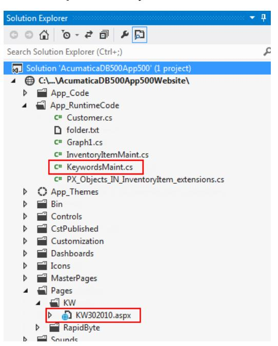

*Figure: Viewing the files of the custom form in Visual Studio solution*

## <span id="page-153-2"></span><span id="page-153-0"></span>**To Delete a Custom Form from a Project**

To remove a custom form from a customization project, you have to delete all the items that have been added to the project for the form.

To do this, perform the following actions:

- Delete from the customization project the *Page* item that was added by the New Screen wizard. (See *[To](#page-151-1) [Delete a Page Item from a Project](#page-151-1)* for details.)
- Delete from the project the *Code* item that was added by the New Screen wizard. (See *To [Delete](#page-172-3) a Code Item [From a Project](#page-172-3)*.)
- Delete from the project the <FormID>.aspx and <FormID>.aspx.cs *File* items that were added by the New Screen wizard. (For more information, see *To Delete a [Custom](#page-178-3) File From a Project*.)
- Delete from the project the *SiteMapNode* item that was added by the New Screen wizard. (See *To [Delete](#page-183-4) a [Site Map Node from a Project](#page-183-4)* for details.)
- If you added other items for the custom form, such as items for the mobile site map or custom files, delete these items.

To delete multiple items from the customization project successively on a single page, you can use the Edit Project Items page of the Customization Project Editor. (See *To Delete Items from the [Project](#page-153-3) on the Edit Project Items Page* for details.)

<span id="page-153-3"></span>The system applies the changes to the file system as soon as you publish the customization project.

### <span id="page-153-1"></span>**To Delete Items from the Project on the Edit Project Items Page**

You can delete multiple items from the customization project on the Edit Project Items page of the Customization Project Editor. To do this, perform the following actions:

- 1. On the menu of the editor, click **File > Edit Project Items**.
- 2. In the table of the Edit Project Items page, which opens, click the item to be deleted, as the following screenshot shows.

| Manage Customization Projects<br>Edit Project XML                                                        |  |                   | <b>Project Items</b>    |               |              |                          |               |                |                              |                           |  |
|----------------------------------------------------------------------------------------------------------|--|-------------------|-------------------------|---------------|--------------|--------------------------|---------------|----------------|------------------------------|---------------------------|--|
| <b>Edit Project Items</b>                                                                                |  |                   | ົ                       |               |              |                          |               |                |                              |                           |  |
| Export Project Package<br>Replace from Package                                                           |  |                   | <b>Object Name</b>      | <b>Type</b>   | <b>Descr</b> | Exc                      | Creater<br>By | Creat<br>Date  | Last<br><b>Modifie</b><br>By | Last<br>Modi<br><b>On</b> |  |
| Generic Inquiries (1)                                                                                    |  | U                 | ~/pages/so/so30         | Page          |              | $\overline{\phantom{a}}$ | admin         | 10/27/20       | admin                        | 11/11/2                   |  |
| Reports (1)<br>Site Map (3)<br><b>DB</b> Scripts<br><b>System Locales</b><br>Import/Export Scenarios (1) |  | Û                 | $\sim$ /pages/so/so30   | Page          |              | □                        | admin         | 10/27/20 admin |                              | 10/27/2                   |  |
|                                                                                                          |  | Û                 | AR650660 RPX            | Report        |              | ш                        | admin         | 10/27/21 admin |                              | 10/27/2                   |  |
|                                                                                                          |  | Û                 | Subscription Billi      | SiteMapNode   |              | □                        | admin         | 10/27/20 admin |                              | 10/27/2                   |  |
|                                                                                                          |  | Û                 | Subscription Us         | SiteMapNode   |              | $\Box$                   | admin         | 11/11/20 admin |                              | 11/11/20                  |  |
|                                                                                                          |  | Û                 | <b>Active Contracts</b> | SiteMapNode   |              | □                        | admin         | 10/27/21 admin |                              | 10/27/2                   |  |
|                                                                                                          |  | Û                 | <b>ARTran</b>           | Table         |              | П                        | admin         | 10/27/20 admin |                              | 10/27/2                   |  |
| <b>Shared Filters</b><br><b>Access Rights</b>                                                            |  | Û                 | Contact                 | Table         |              | П                        | admin         | 10/27/20 admin |                              | 10/27/2                   |  |
|                                                                                                          |  | Û                 | <b>Contract Usage</b>   | XportScenario |              |                          | admin         | 10/27/20       | admin                        | 10/27/2                   |  |
| <b>Wikis</b><br>Web Service Endpoints<br><b>Analytical Reports</b>                                       |  | <b>Source</b><br> |                         |               |              |                          |               |                |                              |                           |  |

  | |  |  |  |  |  |  | |*Figure: Using the Edit Project Items page to delete an item from the customization project*

- 3. Press Delete on the keyboard to delete the selected row from the table.
- 4. If you need to delete multiple items from the project, repeat Steps 2–3 for each item.
- 5. On the page toolbar, click**Save** to save the change in the project.

### <span id="page-154-1"></span><span id="page-154-0"></span>**Customized Data Classes**

You use the Customized Data Classes page of the *[Customization Project Editor](https://help-2025r1.acumatica.com/Help?ScreenId=ShowWiki&pageid=0bb97781-e987-4039-962d-457720821bff)* to manage *DAC* items in a customization project.

A *DAC* item contains data in XML format used by the platform to create an appropriate extension for the original data access class.

The Customized Data Classes page displays the list of *DAC* items for existing data access classes of Acumatica ERP added to the project.

On the page, you can perform several operations with the customized data access classes, as described in the following topics:

- *To Add a DAC Item for an [Existing](#page-155-1) Data Access Class to a Project*
- *To Delete a DAC Item from a [Project](#page-157-1)*
- *To [Convert](#page-158-1) a DAC Item to a Code Item*
- *To Upgrade Technology for Legacy DAC [Customization](#page-160-1)*

You cannot create a custom data access class on this page. Instead, you have to use the *[Code](https://help-2025r1.acumatica.com/Help?ScreenId=ShowWiki&pageid=efc2e3c7-0b30-4785-a22b-727090d4dd62)* (AU204000) page of the editor. Custom classes are added to the project as *Code* items. See *To [Create](#page-164-2) a [Custom Data Access Class](#page-164-2)* for details.

You can use Microso Visual Studio to work with a *DAC* item of a customization project that is currently published. During the project publication, the platform creates the PX\_Objects\_<DACItemName>\_extensions.cs file with the item content in the App\_RuntimeCode folder of the website. If you make changes to the code in Visual Studio, you have to update the item in the customization project. See *[Detecting the Project Items Modified in the File](#page-177-0) [System](#page-177-0)* for details.


You can customize *DAC* items for the Self-Service Portal as well. For details on the portal, see *[Self-](https://help-2025r1.acumatica.com/Help?ScreenId=ShowWiki&pageid=37516f24-6bf1-4a2c-8554-49665f71db3d)[Service Portal](https://help-2025r1.acumatica.com/Help?ScreenId=ShowWiki&pageid=37516f24-6bf1-4a2c-8554-49665f71db3d)*.

## <span id="page-155-1"></span><span id="page-155-0"></span>**To Add a DAC Item for an Existing Data Access Class to a Project**

Before modifying an existing data access class, you have to add a *DAC* item for the class to the customization project. This item is used to store the data of the class extension in XML format. Aer the item is created, you can modify the class members by using the *[Data Class](https://help-2025r1.acumatica.com/Help?ScreenId=ShowWiki&pageid=06c038a5-1d75-482b-9b17-f2483ada0154)*. Aer the customization project is published, the .cs file for the item is created in the file system, and you can develop the C# code of the class extension in Microso Visual Studio. You can use the Data Class Editor as well as Visual Studio to add custom fields to existing data access classes.

You can add a *DAC* item for an existing data access class to a customization project by using the *[Element Inspector](https://help-2025r1.acumatica.com/Help?ScreenId=ShowWiki&pageid=5f9d2d33-1a33-4edd-8629-3100d2020335)*, or you can create and add the item on the Customized Data Classes page of the Customization Project Editor.

The following sections provide detailed information:

- *To Add a DAC Item by Using the Element [Inspector](#page-155-2)*
- *To Add a DAC Item on the [Customized](#page-156-0) Data Classes page*

#### <span id="page-155-2"></span>**To Add a DAC Item by Using the Element Inspector**

- 1. Open the form in the browser.
- 2. On the form title bar, click **Customization > Inspect Element** to open the *[Element Inspector](https://help-2025r1.acumatica.com/Help?ScreenId=ShowWiki&pageid=5f9d2d33-1a33-4edd-8629-3100d2020335)*.
- 3. On the form, select a UI element for a field of the class to be customized to open the *[Element Properties](https://help-2025r1.acumatica.com/Help?ScreenId=ShowWiki&pageid=5f9d2d33-1a33-4edd-8629-3100d2020335) [Dialog Box](https://help-2025r1.acumatica.com/Help?ScreenId=ShowWiki&pageid=5f9d2d33-1a33-4edd-8629-3100d2020335)* for the element.

The dialog box displays the name of the data access class that contains the selected element in the **Data Class** box, as shown in the screenshot below.

4. In the dialog box, click **Actions > Customize Data Fields**.

| Contacts                            |                                                         |                                                             |                                      |                                      |                  |
|-------------------------------------|---------------------------------------------------------|-------------------------------------------------------------|--------------------------------------|--------------------------------------|------------------|
| Aaron Bailey - Grit Industries      |                                                         |                                                             | <b>FINOTES</b>                       | <b>FILES</b><br><b>CUSTOMIZATION</b> | TOOLS            |
| 日<br>圖<br>$\Omega$<br>$\leftarrow$  | 而<br>$\cap$ $\sim$<br>$-15$                             | $\rightarrow$<br>$\sim$ $\sim$<br>$\rightarrow$<br>$\cdots$ |                                      |                                      |                  |
| Contact:<br>Status:                 | <b>Aaron Bai</b><br><b>Element Properties</b><br>Active |                                                             | $\times$                             | dustries<br>$\circ$                  | ۸<br>00          |
| <b>ACTIVITIES</b><br><b>DETAILS</b> | Control Type:<br>Data Class:<br>CRM                     | <b>Text Edit</b><br>-1.<br>Contact                          |                                      | CASES<br><b>CAMPAIGNS</b>            | $\sum_{i=1}^{n}$ |
| <b>CONTACT</b>                      | Data Field:<br>View Name:                               | FirstName<br>ContactCurrent                                 |                                      |                                      |                  |
| <b>First Name:</b><br>* Last Name:  | Aaron<br><b>Business Logic:</b>                         | ContactMaint                                                |                                      |                                      |                  |
| Account Name:                       | Bailey<br><b>CUSTOMIZE</b><br>Grit Indu                 | ACTIONS -<br>CANCEL                                         |                                      | et                                   |                  |
| <b>Job Title:</b>                   | <b>Sales Manager</b>                                    | <b>CUSTOMIZE BUSINESS LOGIC</b>                             |                                      |                                      |                  |
| Email:                              | aaballey@gritindustries.exam                            | <b>CUSTOMIZE DATA FIELDS</b>                                | <b>New York</b>                      |                                      |                  |
| Business $1 - 8$                    | +1-212-555-0201                                         |                                                             | NY - NEW YORK                        |                                      |                  |
| Cell<br>$\vee$                      |                                                         | <b>VIEW ASPX SOURCE</b>                                     | 10011                                |                                      |                  |
| Home<br>$\checkmark$                |                                                         | <b>VIEW HTML SOURCE</b>                                     | <b>US - United States of America</b> |                                      | 0                |
| Fax<br>$\sim$                       |                                                         | VIEW TYPESCRIPT SOURCE                                      |                                      |                                      |                  |
| Web:                                |                                                         | <b>UPULNUMIFAALAAIA.AAURAF</b>                              |                                      |                                      |                  |

*Figure: Using the Element Properties dialog box to start customization of the class*

If there is no currently selected customization project, the inspector opens the *[Table](https://help-2025r1.acumatica.com/Help?ScreenId=ShowWiki&pageid=d6c46870-0c44-4f78-ae20-9bb9ef25dccd) 1*

*You use the Select Customization Project dialog box to select an existing customization project or to create a new customization project. You open the dialog box in the following ways:*

- *• From the Customization menu of a form by clicking Select Project*
- *• From the Customization menu of a form by clicking Edit Project if there is no currently selected*

*customization project • From the Element Properties dialog box if you click Customize in the dialog box and there is no currently selected customization project* to force you to select an existing customization project or to create a new one.

Acumatica Customization Platform creates the *DAC* item for the class, adds the item to the currently selected customization project, and opens the class in the *[Data Class](https://help-2025r1.acumatica.com/Help?ScreenId=ShowWiki&pageid=06c038a5-1d75-482b-9b17-f2483ada0154)*.

The platform assigns the new item the name of the data access class.

### <span id="page-156-0"></span>**To Add a DAC Item on the Customized Data Classes page**

- 1. Open the customization project in the editor. (See *To Open a [Project](#page-84-2)* for details.)
- 2. Click **Data Access** in the navigation pane to open the *[Customized Data Classes](https://help-2025r1.acumatica.com/Help?ScreenId=ShowWiki&pageid=30d9aeeb-a30b-4827-a5e3-8f12b1461154)* page.
- 3. On the page toolbar, click **Add New Record**.
- 4. In the **Select Existing Data Access Class** dialog box, which opens, select the class in the **Class Name** box.

You can type the class name in the **Class Name** box or search for the class by a part of its name, as shown in the screenshot below. As soon as you add the class, the *[Data Class](https://help-2025r1.acumatica.com/Help?ScreenId=ShowWiki&pageid=06c038a5-1d75-482b-9b17-f2483ada0154)* opens for it so that you can modify the fields of this class and add custom fields to it.

| <b>Customized Data Classes</b>                                 |                                               |                       |
|----------------------------------------------------------------|-----------------------------------------------|-----------------------|
| Ы<br>С                                                         | CONVERT TO EXTENSION                          | <b>UPGRADE ALL</b>    |
| <b>Name</b><br>扂                                               | * Class Name                                  | <b>DB Table</b>       |
| CustomerPaymentMethod<br>≯                                     | PX.Objects.AR.CustomerPaymentMethod           | CustomerPaymentMethod |
| Contact                                                        | PX.Objects.CR.Contact                         | Contact               |
| <b>Select Existing Data Access Class</b><br>Class Name:<br>GLt | x<br>ρ                                        |                       |
|                                                                | PX.Objects.FA.AssetGLTransactions+Error       |                       |
| PX.Objects.FA.AssetCLTransactions+CLTran                       |                                               |                       |
|                                                                | PX.Objects.FA.GLTranFilter                    |                       |
|                                                                | PX.Objects.GL.GLBatchDocRelease+GlananDocU    |                       |
|                                                                | PX.Objects.GL.GLTax                           |                       |
|                                                                | PX.Objects.GL.GLTaxTran                       |                       |
|                                                                | PX.Objects.GL.GLTran                          |                       |
|                                                                | PX.Objects.GL.GLIranCode                      |                       |
|                                                                | PX.Objects.GL.GLTranDoc                       |                       |
|                                                                | PX.Objects.GL.GLTranKey                       |                       |
|                                                                | PX.Objects.GL.GLTranR                         |                       |
|                                                                | PX.Objects.GL.CLTrialBalanceImportDetails     |                       |
|                                                                | PX.Objects.GL.CLTrialBalanceImportMap         |                       |
|                                                                | PX.Objects.GL.JournalWithSubEntry+GLTranDocAP |                       |
| ◀                                                              |                                               |                       |

#### *Figure: Adding an existing data access class to the project*

5. On the page toolbar, click**Save** to save the item in the customization project.

As soon as you have modified the attributes of an existing field of the class or added a new field to the class and saved the changes in the Data Class Editor, the class is added to the customization project and appears in the table of the *[Customized Data Classes](https://help-2025r1.acumatica.com/Help?ScreenId=ShowWiki&pageid=30d9aeeb-a30b-4827-a5e3-8f12b1461154)* page.

To go back to the *[Customized Data Classes](https://help-2025r1.acumatica.com/Help?ScreenId=ShowWiki&pageid=30d9aeeb-a30b-4827-a5e3-8f12b1461154)* page of the Customization Project Editor, select **Data Access** on the navigation pane. You can see that the added item is saved to the list of project items.

### <span id="page-157-1"></span><span id="page-157-0"></span>**To Delete a DAC Item from a Project**

To remove changes to an existing data access class from a project, perform the following actions:

- 1. Open the customization project in the Customization Project Editor. (See *To Open a [Project](#page-84-2)* for details.)
- 2. Click **Data Access** in the navigation pane to open the *[Customized Data Classes](https://help-2025r1.acumatica.com/Help?ScreenId=ShowWiki&pageid=30d9aeeb-a30b-4827-a5e3-8f12b1461154)* page.
- 3. In the page table, select the item to be deleted.
- 4. On the page toolbar, click **Delete Row**.
- 5. On the page toolbar, click**Save** to save the changes to the customization project.

If you added a bound custom field to an existing data access class, the platform includes the *DAC* and *Table* items for this class in the customization project.

The *Table* item contains a description of custom columns added to a database table for bound custom fields created in the appropriate data access class.

Aer you publish the customization project at least once, the database schema is changed. Changes to the database schema aren't deleted when you delete the *DAC* and *Table* items and publish the project. You have to remove the changes manually.

You can delete a *DAC* or *Table* item (or another item) from the customization project on the Edit Project Items page of the Customization Project Editor. (See *To Delete Items from the [Project](#page-153-3) on the Edit Project Items Page* for details.)

### <span id="page-158-1"></span><span id="page-158-0"></span>**To Convert a DAC Item to a Code Item**

If you have a customized data access class that is added to the project as a *DAC* item, then you can convert the class changes into the class extension code (a *Code* item) to complete the extension development in the Code Editor or in Microso Visual Studio. (See *[Supported DAC Extension Formats](#page-57-0)* for details.)

To do this, perform the following actions:

- 1. Open the customization project in the Customization Project Editor. (See *To Open a [Project](#page-84-2)* for details.)
- 2. Click **Data Access** in the navigation pane to open the *[Customized Data Classes](https://help-2025r1.acumatica.com/Help?ScreenId=ShowWiki&pageid=30d9aeeb-a30b-4827-a5e3-8f12b1461154)* page.
- 3. In the page table, select the item to be converted, as the screenshot below shows.
- 4. On the page toolbar, click **Convert to Extension**.

This action can be applied for only data access classes customized using the technology based on extensions. If you have legacy DAC customization, upgrade it before converting *DAC* items to class extensions. See *To Upgrade Technology for Legacy DAC [Customization](#page-160-1)* for details.

| <b>Q</b> Acumatica                  |                                     |                                                 |                 |
|-------------------------------------|-------------------------------------|-------------------------------------------------|-----------------|
|                                     |                                     |                                                 |                 |
| Publish<br>Project<br><b>File</b>   | Extension Library<br>Source Control |                                                 |                 |
| 212Upgraded<br>$\blacktriangleleft$ | <b>Customized Data Classes</b>      |                                                 |                 |
|                                     |                                     |                                                 |                 |
| ▶ SCREENS                           | П<br>с<br>$\times$<br>٠<br>∽        | CONVERT TO EXTENSION<br><b>UPGRADE ALL</b><br>◢ |                 |
| <b>JDATA ACCESS</b>                 | <b>B</b> Name                       | * Class Name                                    | <b>DB Table</b> |
| AP.APInvoice                        | APInvoice                           | PX.Objects.AP.APInvoice                         | APRegister      |
| AP.APPayment                        | <b>APPayment</b>                    | PX.Objects.AP.APPayment                         | APRegister      |
| AP.APRegister                       | APRegister                          | PX.Objects.AP.APRegister                        | APRegister      |
| AP APTran                           | APTran                              | PX.Objects.AP.APTran                            | APTran          |
| AP.BalancedAPDocumen                | <b>BalancedAPDocument</b>           | PX.Objects.AP.BalancedAPDocument                | APRegister      |
| AP.Standalone.APQuickO              | APQuickCheck                        | PX.Objects.AP.Standalone.APQuickCheck           | Projection      |
| <b>CR.BAccount</b>                  | <b>BAccount</b>                     | PX.Objects.CR.BAccount                          | <b>BAccount</b> |
| CR.Contact                          | > Contact                           | PX.Objects.CR.Contact                           | Contact         |
| $\sqrt{CODE}$                       |                                     |                                                 |                 |
| APInvoiceEntry                      |                                     |                                                 |                 |
| <b>APPrintChecks</b>                |                                     |                                                 |                 |
| APQuickCheckEntry                   |                                     |                                                 |                 |
| Files                               |                                     |                                                 |                 |
| Generic Inquiries                   |                                     |                                                 |                 |
| Reports                             |                                     |                                                 |                 |
| Site Map                            |                                     |                                                 |                 |
| <b>DB</b> Scripts                   |                                     |                                                 |                 |

*Figure: Converting the DAC item to the Code item*

The platform converts the XML content of the selected item to C# code, deletes the *DAC* item in the customization project, adds the created code to the project as a *Code* item, and opens it in the *[Code Editor](https://help-2025r1.acumatica.com/Help?ScreenId=ShowWiki&pageid=c2678973-d557-47d4-b8ee-9dd69f55b465)*, as shown in the following screenshot.

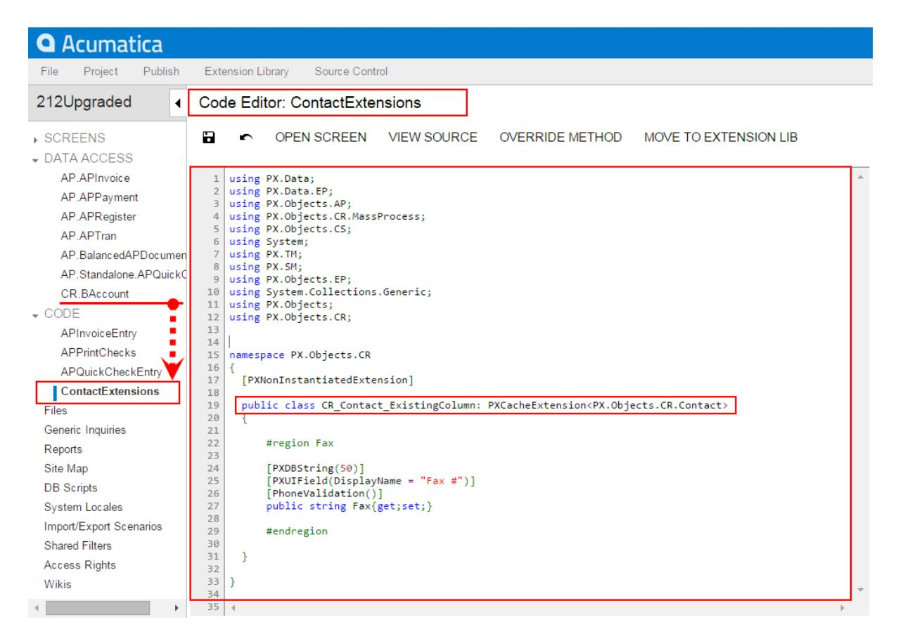

#### *Figure: Viewing the result of the conversion*

This operation is irreversible. Aer you convert the XML data to C# code, you will not be able to work with the item in the Data Class Editor or convert it back to a *DAC* item. You will be able to edit the code in Code Editor and Visual Studio.

The **Convert to Extension** action also affects all the inherited classes of the specified DAC if the classes are customized.

The system obtains the name of the *Code* item from the DAC name by appending the *Extensions* suffix to it. Aer the publication of the customization project, the actual customization code of the class is available in the <DACName>Extensions.cs file in the App\_RuntimeCode folder of the website. For example, if you apply the action to the CR.Contact class, as shown in the screenshots above, the operation converts the *DAC* item to the *Code* item, automatically giving it the name of ContactExtensions. The action removes the CR.Contact *DAC* item class from the project and adds the ContactExtensions *Code* item.

### <span id="page-159-1"></span><span id="page-159-0"></span>**To Move a DAC Item to an Extension Library**

Only *Code* items can be moved to an extension library directly. To move a *DAC* item to an extension library, you should first convert the *DAC* item to a *Code* item.

Also, you might need to complete these instructions if you have a custom DAC or a DAC extension developed in one customization and a DAC extension of this custom DAC or a higher-level DAC extension in another customization. To eliminate dependency and to be able to use the DAC extension in your project, you need to convert the DAC extension to an extension library.

#### **To Convert a DAC Extension to an Extension Library**

- 1. Convert the *DAC* item to a *Code* item, as described in *To [Convert](#page-158-1) a DAC Item to a Code Item*.
- 2. Move the *Code* item to the extension library, as described in *To Move a Code Item to the [Extension](#page-172-2) Library*

## <span id="page-160-1"></span><span id="page-160-0"></span>**To Upgrade Technology for Legacy DAC Customization**

In Acumatica Customization Platform 4.2 and earlier versions, the customization of data access classes was implemented through the direct Microso Intermediate Language (MSIL) injection of custom fields into PX.Objects.dll. This resulted in a complex process of publication in which the original library was replaced with the modified version. In Acumatica Customization Platform 2025 R1, the customization uses the technology based on class extensions and the DAC extension is compiled into a separate library that is dynamically merged with the original DAC by the platform at run time.

If you do not need to change the contents of a customization project, there is no reason to upgrade it. The system will successfully publish the project using the injection of custom fields into PX.Objects.dll in the newer version of the system as well. However if you have to continue the development of the project, we recommend that you upgrade the technology of DAC customization in the project.

The following sections provide detailed information:

- *To Upgrade a Legacy DAC [Customization](#page-160-2)*
- *To Upgrade a Library with a Legacy DAC [Customization](#page-161-0)*

#### <span id="page-160-2"></span>**To Upgrade a Legacy DAC Customization**

To upgrade the legacy DAC customization to the technology based on class extensions, perform the following actions:

- 1. Open the customization project in the Customization Project Editor. (See *To Open a [Project](#page-84-2)* for details.)
- 2. Click **Data Access** in the navigation pane to open the *[Customized Data Classes](https://help-2025r1.acumatica.com/Help?ScreenId=ShowWiki&pageid=30d9aeeb-a30b-4827-a5e3-8f12b1461154)* page.
- 3. On the page toolbar, click **Upgrade All**, as shown in the following screenshot.

| <b>Q</b> Acumatica              |                                                   |                                                        |                 |
|---------------------------------|---------------------------------------------------|--------------------------------------------------------|-----------------|
| Publish<br>File<br>Project      | Source Control<br><b>Extension Library</b>        |                                                        |                 |
| 212Upgraded                     | <b>Customized Data Classes</b>                    |                                                        |                 |
| ▶ SCREENS<br><b>DATA ACCESS</b> | н<br>$\times$<br>с<br>$\ddot{}$<br>$\blacksquare$ | <b>UPGRADE ALL</b><br><b>CONVERT TO EXTENSION</b><br>, |                 |
|                                 | <b>B</b> Name                                     | <b>Class Name</b>                                      | <b>DB</b> Table |
| $\sqrt{CODE}$                   | APInvoice<br>᠈                                    | PX.Objects.AP.APInvoice                                | APRegister      |
| <b>Files</b>                    | APPayment                                         | PX.Objects.AP.APPayment                                | APRegister      |
| Generic Inquiries               | <b>APRegister</b>                                 | PX.Objects.AP.APRegister                               | APRegister      |
| Reports                         | APTran                                            | PX.Objects.AP.APTran                                   | APTran          |
| Site Map                        | <b>BalancedAPDocument</b>                         | PX.Objects.AP.BalancedAPDocument                       | APRegister      |
| <b>DB</b> Scripts               | APQuickCheck                                      | PX.Objects.AP.Standalone.APQuickCheck                  | Projection      |
| <b>System Locales</b>           | <b>BAccount</b>                                   | PX.Objects.CR.BAccount                                 | <b>BAccount</b> |
| Import/Export Scenarios         | Contact                                           | PX.Objects.CR.Contact                                  | Contact         |
| <b>Shared Filters</b>           |                                                   |                                                        |                 |
| <b>Access Rights</b>            |                                                   |                                                        |                 |
| <b>Milie</b>                    |                                                   |                                                        |                 |

*Figure: Upgrading legacy customization*

This action launches the upgrade wizard, which processes all the project items of the *DAC* and *Code* types to discover and update the following cases of DAC customization based on the MSIL injection technology:

• A field of a data access class does not contain the StorageName attribute, which specifies the storage type of the field. For more information about the storage types, see *[Create New Field Dialog Box](https://help-2025r1.acumatica.com/Help?ScreenId=ShowWiki&pageid=06c038a5-1d75-482b-9b17-f2483ada0154)*.


In the Acumatica Customization Platform, you must select the way a custom field will be stored in the database when you add the field to a data access class.

- The code contains a direct reference to a custom field of a row.
- The code contains a direct reference to an abstract class of a DAC field.

See *Using the [Upgrade](#page-162-0) Wizard* for details.

Aer the process is complete, the wizard opens the message box with the list of the items that have been upgraded (see the screenshot below).

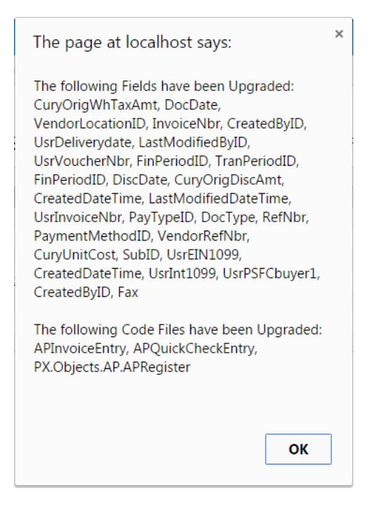

*Figure: Viewing the list of upgraded items*

If there is no legacy customization in the project, the wizard opens a message box with the relevant information (see the screenshot below).

| The page at localhost says:                   | × |
|-----------------------------------------------|---|
| No Legacy Fields in Project                   |   |
| No Field Referenceds were found in Code Files |   |
|                                               |   |
| ОΚ                                            |   |
|                                               |   |

*Figure: Viewing the message box that indicates no legacy customization in the project*

#### <span id="page-161-0"></span>**To Upgrade a Library with a Legacy DAC Customization**

If you have legacy customization of data access classes as a library (.dll) and have to modify the customization project, you can add the source code of the library as *Code* items to the customization project and then upgrade it as follows:

- 1. In the Microso Visual Studio project of the library, for each source code file that contains a data access class customization, do the following:
  - a. In Visual Studio (or any text editor), open the file, select **All**, and copy the source code to the clipboard.
  - b. Create a new *Code* item in the customization project.
  - c. Delete the code template from the created item.
  - d. Paste the clipboard content into the item and save the *Code* item to the customization project.
- 2. Upgrade the customization project.
- 3. Test the upgraded customization project to ensure that the project is valid and applies to the system aer publication.
- 4. If you need to move the source code back to the library, use the clipboard and the copy-paste approach as well.

### <span id="page-162-0"></span>**Using the Upgrade Wizard**

While upgrading the *DAC* items, the wizard does the following:

- Adds the StorageName attribute and sets its value to "ExistingColumn" for an existing field.
- Adds the StorageName attribute and sets its value to "AddColumn" for a custom field.
- Finds and replaces all references to custom fields in the attributes of other customized fields, such as a PXSelector, PXParent or PXFormula. For example, the wizard inserts the typeof(DACNameExt.usrFieldName) reference in the PXSelector declaration instead of the typeof(DACName.usrFileName) reference.

While upgrading items of the *Code* type, the wizard processes each item to find references to the custom fields and replaces the references by using the following approach:

- The wizard updates the references to the abstract class of the DAC field from DACName.usrFieldName to DACNameExt.usrFieldName, where the DACNameExt is the name of the new extension class.
- The wizard replaces the references to the field Row.UsrFieldName with a reference to the field through the DAC extension: Row.GetExtension<DACNameExt>().UsrFieldName.

For example, the following code contains the references to the APRegister.usrVoucherNbr class and doc.UsrVoucherNbr field, which is a field customized based on the MSIL injection technology.

```
 sender.RaiseExceptionHandling<APRegister.usrVoucherNbr>(doc,
 doc.UsrVoucherNbr,
 new PXSetPropertyException("..."));
```

Aer technological upgrade for the customization of DAC classes in the project, the references will look as the following code shows. Now the code refers to the usrVoucherNbr class of the APRegisterExt extension class that will be generated during publication of the project.

```
 sender.RaiseExceptionHandling<APRegisterExt.usrVoucherNbr>(doc,
 doc.GetExtension<APRegisterExt>().UsrVoucherNbr,
 new PXSetPropertyException("..."));
```

There might be a situation when a legacy customization includes two data access classes with custom fields that have the same names, such as DACName1.usrTheSameFieldName and DACName2.usrTheSameFieldName. When you upgrade the customization, the wizard replaces the Row.usrTheSameFieldName references to each field by using the following pattern: Row.GetExtension<DACName1Ext or DACName2Ext>().usrTheSameFieldName. The expression "GetExtension<DACName1Ext or DACName2Ext>" is invalid and causes a compilation error. You are supposed to review these references and insert the correct reference to the needed class, DACName1Ext or DACName2Ext.

# <span id="page-163-1"></span><span id="page-163-0"></span>**Code**

You use the Code page of the *[Customization Project Editor](https://help-2025r1.acumatica.com/Help?ScreenId=ShowWiki&pageid=0bb97781-e987-4039-962d-457720821bff)* to manage *Code* items in the customization project. On the page, you can perform the following operations with items:

- Add a new *Code* item of any of the following subtypes to the project:
  - *New Graph*: A new business logic controller that is derived from the PXGraph<> class
  - *New DAC*: A data access class that is derived from the PXBqlTable class and the IBqlTable interface
  - *Graph Extension*: A graph extension that is derived from the PXGraphExtension<> class
  - *DAC Extension*: A DAC extension (which is also referred to as a *cache extension*) that is derived from the PXCacheExtension<> class
  - *Code File*: Custom C# code
  - *Customization Plug-in*: A class that is derived from the CustomizationPlugin class
- Delete a *Code* item from the project

You can open the *[Code Editor](https://help-2025r1.acumatica.com/Help?ScreenId=ShowWiki&pageid=c2678973-d557-47d4-b8ee-9dd69f55b465)* for a *Code* item by clicking the object name of the item in the page table.

You can develop the customization code in the Code Editor. However, we recommend that you develop the code in Microso Visual Studio (as described in *[Integrating the Project Editor with Microsoft](#page-384-2) Visual [Studio](#page-384-2)*) and use the editor for either minor code correction or the insertion of ready portions of code.

To move the code from a *Code* item to the extension library that is bound to the customization project, use the **Move to Ext. Library** command on the page toolbar of the *[Code Editor](https://help-2025r1.acumatica.com/Help?ScreenId=ShowWiki&pageid=c2678973-d557-47d4-b8ee-9dd69f55b465)*.

For detailed information on working with *Code* items, see the following topics:

- *To Create a Custom Business Logic [Controller](#page-164-3)*
- *To Create a [Custom](#page-164-2) Data Access Class*
- *To [Customize](#page-165-1) an Existing Business Logic Controller*
- *To [Customize](#page-169-2) an Existing Data Access Class*
- *To Add [Custom](#page-169-3) Code to a Project*
- *To Add a [Customization](#page-170-1) Plug-In to a Project*
- *To Delete a Code Item From a [Project](#page-172-3)*
- *To Move a Code Item to the [Extension](#page-172-2) Library*

You can use Visual Studio to work with a *Code* item of a customization project that is currently published. During the publication of the project, the platform creates the <CodeItemName>.cs file with the item content in the App\_RuntimeCode folder of the website. If you make changes to the code in Visual Studio, you have to update the item in the customization project. See *[Detecting the Project Items Modified in the File System](#page-177-0)* for details.


You can customize *Code* items for the Self-Service Portal as well. For details on the portal, see *[Self-](https://help-2025r1.acumatica.com/Help?ScreenId=ShowWiki&pageid=37516f24-6bf1-4a2c-8554-49665f71db3d)[Service Portal](https://help-2025r1.acumatica.com/Help?ScreenId=ShowWiki&pageid=37516f24-6bf1-4a2c-8554-49665f71db3d)*.

### <span id="page-164-3"></span><span id="page-164-0"></span>**To Create a Custom Business Logic Controller**

You can add a custom business logic controller to a customization project on the Code page of the Customization Project Editor.

To do this, perform the following actions:

- 1. Open the customization project in the editor.
- 2. Select **Code** in the navigation pane to open the Code page.
- 3. Click **Add New Record** (+) on the page toolbar.
- 4. In the **Create Code File** dialog box, which opens, select *New Graph* in the **FileTemplate** box, as the screenshot below shows.
- 5. In the **Class Name** box, specify the class name of the business logic controller to be created.
- 6. Click **OK**.

| <b>Create Code File</b> |           |        |
|-------------------------|-----------|--------|
| * File Template:        | New Graph |        |
| * Class Name:           | MyBLC     |        |
|                         | 0K        | CANCEL |
|                         |           |        |

*Figure: Adding a Code item for a custom graph to the project*

The platform creates the code template of the class derived from the PXGraph<> class, saves the code as a *Code* item of the project in the database, and opens the item in the *[Code Editor](https://help-2025r1.acumatica.com/Help?ScreenId=ShowWiki&pageid=c2678973-d557-47d4-b8ee-9dd69f55b465)*.

### <span id="page-164-2"></span><span id="page-164-1"></span>**To Create a Custom Data Access Class**

You can add a new data access class (DAC) to a customization project by generating the code from the definition of a database table.

To create a custom data access class for a custom database table and add the created item to a customization project, you have to generate the class template on the Code page of the Customization Project Editor.

To do this, perform the following actions:

- 1. Create the needed custom table in the database by using a database management tool.
- 2. Generate the DAC code for the customization project as follows:
  - a. Open the customization project in the Project Editor.
  - b. In the navigation pane, click **Code** to open the Code page.
  - c. On the page toolbar, click **Add New Record** (+).
  - d. In the **Create Code File** dialog box, which opens, select *New DAC* in the **FileTemplate** box.
  - e. In the **Class Name** box, specify the class name that corresponds to the name of the table created in the database.

If you have just created the table, restart Internet Information Services (IIS) or recycle the application pool to make sure that Acumatica ERP is aware of the new table, because it caches the database schema once, when the domain starts.

- f. Select the **Generate Members from Database** check box.
- g. Click **OK**.

The platform does the following:

- Generates the data access class with members that correspond to the table columns. The class is added to the namespace of the customization project.
- Adds the class to the customization project as a *Code* item.
- Saves the customization project.
- Opens the created item in the *[Code Editor](https://help-2025r1.acumatica.com/Help?ScreenId=ShowWiki&pageid=c2678973-d557-47d4-b8ee-9dd69f55b465)*.

You can use the Code Editor to modify the generated code. Aer you publish the customization project, you can work with the custom data access class in MS Visual Studio.

3. In the Code Editor, define the key fields in the DAC. To include a data field in the key, in the type attribute of the field, you have to add the IsKey parameter, as the example below shows.

[PXDBString(15, IsKey=true)]

- 4. Add the table definition to the customization project by doing the following:
  - a. In the navigation pane of the Project Editor, click **DatabaseScripts**.
  - b. On the Database Scripts page, which opens, click **Add Custom TableSchema**.
  - c. In the **Add Custom TableSchema** dialog box, which opens, select the custom table in the**Table** box, and click **OK**.

The platform does the following:

- Adds the XML definition of the table to the customization project as an *Sql* item
- Saves the customization project

Every time you publish the customization project, the system checks whether a table with this SQL definition exists in the database. If the table doesn't exist, the system creates the table. If the table exists, the system adjusts the table schema if there is any difference between the existing table schema and the table schema from the customization project (no data is truncated).

### <span id="page-165-1"></span><span id="page-165-0"></span>**To Customize an Existing Business Logic Controller**

You can create the class extension for an existing business logic controller (BLC) and add the *Code* item with the created code to a customization project in several ways, as described in the following sections:

- *To Add a Code Item by Using the Element [Inspector](#page-166-0)*
- *To Add a Code Item by Using the [Screen](#page-167-0) Editor*
- *To Add a [Code](#page-168-0) Item on the Code page*

If you need to extend the code of a BLC that has no webpage associated (such as ARReleaseProcess), follow the instructions described in *To Add a [Code](#page-168-0) Item on the Code page*.

As soon as you add the Code item for customization of the business logic to the project, the system generates an extension class for it and opens the code in the *[Code Editor](https://help-2025r1.acumatica.com/Help?ScreenId=ShowWiki&pageid=c2678973-d557-47d4-b8ee-9dd69f55b465)*. You can work with the extension classes in the Code Editor. Aer you publish the customization project, you can develop the code in MS Visual Studio.

#### <span id="page-166-0"></span>**To Add a Code Item by Using the Element Inspector**

Typically, you want to modify the business logic that is executed for a certain form of Acumatica ERP.

To add a *Code* item for customization of the business logic for an existing form to a customization project by using the *[Element Inspector](https://help-2025r1.acumatica.com/Help?ScreenId=ShowWiki&pageid=5f9d2d33-1a33-4edd-8629-3100d2020335)*, perform the following actions:

- 1. Open the form in the browser.
- 2. On the form title bar, click **Customization > Inspect Element** to launch the Element Inspector.
- 3. On the form, select any UI element to open the *[Element Properties Dialog Box](https://help-2025r1.acumatica.com/Help?ScreenId=ShowWiki&pageid=5f9d2d33-1a33-4edd-8629-3100d2020335)* for the element.

The **Business Logic** box of the dialog box displays the name of the business logic controller that provides business logic for the form, as shown in the screenshot below.

4. In the dialog box, click **Actions > Customize Business Logic**.

| <b>Element Properties</b> |                                 | × |
|---------------------------|---------------------------------|---|
| Control Type:             | Tab                             |   |
| Data Class:               | Customer                        |   |
| View Name:                | <b>CurrentCustomer</b>          |   |
|                           | Business Logic: CustomerMaint   |   |
| <b>CUSTOMIZE</b>          | ACTIONS -<br>CANCEL             |   |
|                           | <b>CUSTOMIZE BUSINESS LOGIC</b> |   |
|                           | <b>CUSTOMIZE DATA FIELDS</b>    |   |
|                           | <b>VIEW ASPX SOURCE</b>         |   |
|                           | <b>VIEW HTML SOURCE</b>         |   |
|                           | <b>VIEW TYPESCRIPT SOURCE</b>   |   |
|                           | <b>UEW BUOKEAS LOOK COURSE</b>  |   |

*Figure: Using the Element Properties dialog box to customize the business logic for the form*

5. If there is no currently selected customization project and the inspector opens the *[Table](https://help-2025r1.acumatica.com/Help?ScreenId=ShowWiki&pageid=d6c46870-0c44-4f78-ae20-9bb9ef25dccd) 1*

*You use the Select Customization Project dialog box to select an existing customization project or to create a new customization project. You open the dialog box in the following ways: • From the Customization menu of a form by clicking Select Project*

- *• From the Customization menu of a form by clicking Edit Project if there is no currently selected*
- *• From the Element Properties dialog box if you click Customize in the dialog box and there is*

*customization project no currently selected customization project* , select an existing customization project or to create a new one.

The platform creates the template of the class that is derived from the PXGraphExtension<> class, saves the code as a *Code* item of the project in the database, and opens the item in the *[Code Editor](https://help-2025r1.acumatica.com/Help?ScreenId=ShowWiki&pageid=c2678973-d557-47d4-b8ee-9dd69f55b465)*, as shown in the following screenshot.

| <b>Q</b> Acumatica                                                                                                                                                                          |                                                                                                                                                                                                                                                                                                                                                                                                                                                     |
|---------------------------------------------------------------------------------------------------------------------------------------------------------------------------------------------|-----------------------------------------------------------------------------------------------------------------------------------------------------------------------------------------------------------------------------------------------------------------------------------------------------------------------------------------------------------------------------------------------------------------------------------------------------|
| <b>Extension Library</b><br>Publish<br>File                                                                                                                                                 | Source Control                                                                                                                                                                                                                                                                                                                                                                                                                                      |
| YogiFon<br>◀                                                                                                                                                                                | Code Editor: NonStockItemMaint (Non-Stock Items)                                                                                                                                                                                                                                                                                                                                                                                                    |
| $\sqrt{\ }$ SCREENS<br>Data Access<br>$\div$ CODE<br>NonStockItemMaint<br>Files $(5)$<br>Generic Inquiries (1)<br>Reports (1)<br>Site Map (3)<br><b>DB</b> Scripts<br><b>System Locales</b> | <b>OPEN SCREEN</b><br><b>VIEW SOURCE</b><br><b>OVERRIDE METHOD</b><br>a<br><b>NEW ACTION</b><br>∽<br><b>MOVE TO EXTENSION LIB</b><br>using CRLocation = PX.Objects.CR.Standalone.Location;<br>21<br>using PX.Objects;<br>22<br>using PX.Objects.IN;<br>23<br>$\overline{24}$<br>25<br>namespace PX.Objects.IN<br>26<br>27<br>public class NonStockItemMaint_Extension:PXGraphExtension <nonstockitemmaint><br/>28<br/>29<br/>30</nonstockitemmaint> |
| Import/Export Scenarios (1)<br><b>Shared Filters</b><br><b>Access Rights</b><br>Wikis<br>Web Service Endpoints<br><b>Analytical Reports</b>                                                 | #region Event Handlers<br>31<br>32<br>33<br>34<br>#endregion<br>35<br>36<br>37<br>38<br>39<br>40                                                                                                                                                                                                                                                                                                                                                    |

*Figure: Viewing the created code template in the Code Editor*

### <span id="page-167-0"></span>**To Add a Code Item by Using the Screen Editor**

Oen, you start a customization of an Acumatica ERP form in the *[Screen Editor](https://help-2025r1.acumatica.com/Help?ScreenId=ShowWiki&pageid=d60a8270-e2ce-4380-b778-af61a0ca56d2)* and you later want to modify the business logic for this form. To customize the business logic of the form, you can add a *Code* item to a customization project from the Screen Editor.

To do this, on the toolbar of the Screen Editor, click the More menu and select **Customize Business Logic**, as the following screenshot shows.

| Screen Editor: AR303000 (Customers)                                                                                                  |                                                                                               |                                          |       |                                       |  |
|--------------------------------------------------------------------------------------------------------------------------------------|-----------------------------------------------------------------------------------------------|------------------------------------------|-------|---------------------------------------|--|
| $\Box$<br><b>PREVIEW CHANGES</b><br><b>EDIT ASPX</b><br>$\Omega$                                                                     | $\cdots$                                                                                      |                                          |       |                                       |  |
| ↻<br>面,<br>▶ <i>□</i> DataSource: CustomerMaint<br>▶ <i>□</i> Form: BAccount<br>▶ <i>□</i> Tab: CurrentCustomer<br>▶ <i></i> Dialogs | Actions<br><b>Edit ASPX</b><br><b>Customize Business Logic</b><br><b>Customize Data Class</b> |                                          | Other | <b>Preview Changes</b><br>Open Screen |  |
|                                                                                                                                      | $\Box$                                                                                        | ID                                       |       | ds                                    |  |
|                                                                                                                                      | $\Box$<br>$\Box$                                                                              | PageLoadBehavior<br>PrimaryView          |       | <b>BAccount</b>                       |  |
|                                                                                                                                      | $\Box$<br>$\Box$                                                                              | <b>TypeName</b><br><b>Visible</b>        |       | PX.Objects.AR.Customer<br><b>True</b> |  |
|                                                                                                                                      | $\Box$<br>$\overline{\phantom{a}}$<br>$\Box$                                                  | <b>Ext Properties</b><br>AttributesFound |       |                                       |  |
|                                                                                                                                      | $\Box$<br>Þ.                                                                                  | <b>ClientEvents</b>                      |       |                                       |  |

*Figure: Starting the customization of the business logic from the Screen Editor*

The platform creates the template of the class that is derived from the PXGraphExtension<> class, saves the code as a *Code* item of the project in the database, and opens the item in the *[Code Editor](https://help-2025r1.acumatica.com/Help?ScreenId=ShowWiki&pageid=c2678973-d557-47d4-b8ee-9dd69f55b465)*.

#### <span id="page-168-0"></span>**To Add a Code Item on the Code page**

If you know the name of the business logic controller to be customized, you can create a *Code* item with the graph extension template on the Code page of the Customization Project Editor by using the **Create Code File** dialog box.

To do this, perform the following actions:

- 1. Open the customization project in the editor.
- 2. Click **Code** in the navigation pane to open the Code page.
- 3. Click **Add New Record** on the page toolbar.
- 4. In the **Create Code File** dialog box, which opens, select *Graph Extension* in the **FileTemplate** box, as the screenshot below shows.
- 5. In the **Base Graph** box, select the class name of the business logic controller to be customized.
- 6. Click **OK**.

| <b>CODE</b>                             |                                                   |                           |               |                         |
|-----------------------------------------|---------------------------------------------------|---------------------------|---------------|-------------------------|
| $\boxplus$<br>$\Omega$<br>$\times$<br>Õ | P                                                 |                           |               |                         |
| <b>B</b> Object Name                    | <b>Description</b>                                | <b>Last Modified By</b>   |               | <b>Last Modified On</b> |
| <b>CustomerMaint</b><br>≻               |                                                   | admin admin               |               | 1/24/2025               |
| <b>Create Code File</b>                 | $\times$                                          |                           |               |                         |
| * File Template:<br>* Base Graph:       | <b>Graph Extension</b><br>Q                       |                           |               |                         |
|                                         | Select - Base Graph                               |                           |               | $\Box$ $\times$         |
|                                         | Ò<br><b>SELECT</b><br>$\vdash$                    | <b>ARDo</b>               |               | Ω                       |
|                                         | <b>B</b> FullName                                 |                           | ÷             |                         |
|                                         | PX.Objects.AR.ARDocumentEnq                       |                           |               |                         |
|                                         | PX.Objects.AR.ARDocumentEnqMultipleBaseCurrencies |                           |               |                         |
|                                         | PX.Objects.AR.ARDocumentEnqRetainage              |                           |               |                         |
|                                         | PX.Objects.AR.ARDocumentRelease                   |                           |               |                         |
|                                         |                                                   | $\mathbb{R}$<br>$\langle$ | $\mathcal{P}$ | $\geq$                  |

*Figure: Adding a Code item with the graph extension to the project*

The platform creates the template of the class that is derived from the PXGraphExtension<> class, saves the code as a *Code* item of the project in the database, and opens the item in the *[Code Editor](https://help-2025r1.acumatica.com/Help?ScreenId=ShowWiki&pageid=c2678973-d557-47d4-b8ee-9dd69f55b465)*.

### <span id="page-169-2"></span><span id="page-169-0"></span>**To Customize an Existing Data Access Class**

If you know the name of the data access class to be customized, you can create a *Code* item with the DAC extension template on the Code page of the Customization Project Editor by using the **Create Code File** dialog box.

To do this, perform the following actions:

- 1. Open the customization project in the editor.
- 2. Click **Code** in the navigation pane to open the Code page.
- 3. Click **Add New Record** (+) on the page toolbar.
- 4. In the **Create Code File** dialog box, which opens, select *DAC Extension* in the **FileTemplate** box, as the screenshot below shows.
- 5. In the **Base DAC** box, select the name of the data access class to be customized.
- 6. Click **OK**.

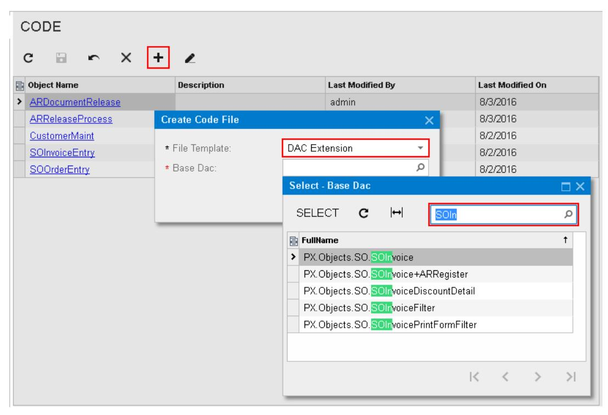

*Figure: Adding a Code item with the DAC extension to the project*

The platform creates the template of the class that is derived from the PXCacheExtension<> class, saves the code as a *Code* item of the project in the database, and opens the item in the *[Code Editor](https://help-2025r1.acumatica.com/Help?ScreenId=ShowWiki&pageid=c2678973-d557-47d4-b8ee-9dd69f55b465)*.

Inside the extension, you must implement the IsActive method which enables the extension on condition. For details, see *To Enable a DAC Extension [Conditionally](#page-327-1) (IsActive)*.

### <span id="page-169-3"></span><span id="page-169-1"></span>**To Add Custom Code to a Project**

You can add a *.cs* file with some custom code to a customization project. To do this, perform the following actions:

- 1. Open the customization project in the editor. (See *To Open a [Project](#page-84-2)* for details.)
- 2. Click **Code** in the navigation pane to open the *[Code](https://help-2025r1.acumatica.com/Help?ScreenId=ShowWiki&pageid=efc2e3c7-0b30-4785-a22b-727090d4dd62)* page.
- 3. Click **Add New Record** on the page toolbar.
- 4. In the **Create Code File** dialog box, which opens, select *Code File* in the **FileTemplate** box, as the screenshot below shows.
- 5. In the **Class Name** box, specify the name of the new class to be added to the project.
- 6. Click **OK**.

| <b>Create Code File</b> |             |        |
|-------------------------|-------------|--------|
| * File Template:        | Code File   |        |
| * Class Name:           | MyClassName |        |
|                         | ΟK          | CANCEL |
|                         |             |        |

*Figure: Adding a Code item for a custom graph to the project*

The platform creates the code template of the new class, saves the code as a *Code* item of the project in the database, and opens the item in the *[Code Editor](https://help-2025r1.acumatica.com/Help?ScreenId=ShowWiki&pageid=c2678973-d557-47d4-b8ee-9dd69f55b465)*, as the following screenshot shows.

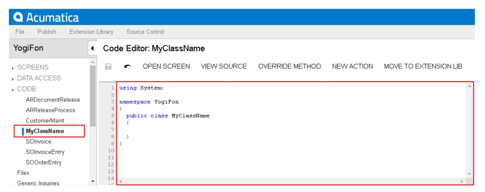

*Figure: Viewing the custom code file added to the project*

### <span id="page-170-1"></span><span id="page-170-0"></span>**To Add a Customization Plug-In to a Project**

As a part of a complex customization, you might need to make changes to the website beyond the customization project. For example, you might need to change the website configuration. In such situations, you can add a customization plug-in to the project with the code to be executed at the end of the publication process.

To add a customization plug-in, perform the following actions:

- 1. Open the customization project in the editor. (See *To Open a [Project](#page-84-2)* for details.)
- 2. Click **Code** in the navigation pane to open the *[Code](https://help-2025r1.acumatica.com/Help?ScreenId=ShowWiki&pageid=efc2e3c7-0b30-4785-a22b-727090d4dd62)* page.
- 3. Click **Add New Record** on the page toolbar.
- 4. In the **Create Code File** dialog box, which opens, select *Customization Plug-in* in the **FileTemplate** box, as the screenshot below shows.
- 5. In the **Class Name** box, enter the name of the plug-in to be added to the project.

6. Click **OK**.

| <b>Create Code File</b>           |                                         |
|-----------------------------------|-----------------------------------------|
| * File Template:<br>* Class Name: | <b>Customization Plugin</b><br>MyPlugin |
|                                   | CANCEL<br>ΟK                            |

#### *Figure: Adding a customization plug-in to the project*

The system generates the plug-in code by template, as shown below.

```
using System;
using PX.Data;
using Customization;
namespace YogiFon
{
 //The customization plug-in is used to execute custom actions after the customization
 project has been published 
 public class MyPlugin: CustomizationPlugin
 {
 //This method is executed right after website files are updated, but before the website
 is restarted
 //The method is invoked on each cluster node in a cluster environment
 //The method is invoked only if runtime compilation is enabled
 //Do not access custom code published to bin folder; it may not be loaded yet
 public override void OnPublished()
 {
 this.WriteLog("OnPublished Event");
 }
 //This method is executed after the customization has been published and the website is
 restarted. 
 public override void UpdateDatabase()
 {
 this.WriteLog("UpdateDatabase Event");
 }
 }
}
```

When a customization project that contains a customization plug-in has been published, the corresponding .cs file is created in the App\_RuntimeCode folder of the website.

The Acumatica Customization Platform uses the App\_RuntimeCode folder to keep the CS code of the *DAC* and *Code* items of all the published customization projects. By default, at run time, the platform compiles the code of this folder in a separate library and dynamically links the library to the Acumatica ERP application. (See *[Run-](#page-73-0)Time [Compilation](#page-73-0)* for details.) If you set the UseRuntimeCompilation key in the <appSettings> section of the web.config file (located in the website folder) to *False*, the platform uses the App\_Code/Caches folder instead the App\_RuntimeCode one for the customization code. In this case, the OnPublished method of a customization plug-in cannot be executed. Execution of the UpdateDatabase method does not depend on the UseRuntimeCompilation key value.

### <span id="page-172-3"></span><span id="page-172-0"></span>**To Delete a Code Item From a Project**

To remove a *Code* item from a project, perform the following actions:

- 1. Open the customization project in the Customization Project Editor. (See *To Open a [Project](#page-84-2)* for details.)
- 2. Click **Code** in the navigation pane to open the *[Code](https://help-2025r1.acumatica.com/Help?ScreenId=ShowWiki&pageid=efc2e3c7-0b30-4785-a22b-727090d4dd62)* page.
- 3. In the page table, click the item to be deleted.
- 4. On the page toolbar, click **Delete Row**.
- 5. On the page toolbar, click**Save** to save the changes to the customization project.

You can delete a *Code* item from the customization project on the Edit Project Items page of the Customization Project Editor. (See *To Delete Items from the [Project](#page-153-3) on the Edit Project Items Page* for details.)

If you are working in Microso Visual Studio, to update the files in the file system, publish the customization project. The .cs file of the deleted *Code* item will be removed from the file system.

## <span id="page-172-2"></span><span id="page-172-1"></span>**To Move a Code Item to the Extension Library**

You can develop customization code either as *Code* items in a customization project or as source code included in an extension library project in Microso Visual Studio. Some part of a customization may exist in the *Code* items of a customization project, while another part can be included in an extension library that is added in the customization project as a dynamic link library (DLL) file. (See *[Extension Library](#page-73-1)* for details.)

If you have a *Code* item in a customization project that you want to move to an extension library to compile it into a DLL file, you can use the **Move to Ext. Library** button on the page toolbar of the *[Code Editor](https://help-2025r1.acumatica.com/Help?ScreenId=ShowWiki&pageid=c2678973-d557-47d4-b8ee-9dd69f55b465)* page.

Aer the operation is complete, the *Code* item that is currently displayed in the work area of the Code Editor is removed from the customization project, and a file with the same source code is appended to the extension library that is bound to the customization project. The system assigns a similar name to the file: For example, if the *Code* item name was CodeItemName, the name of the created file will be CodeItemName.cs.

The operation of moving code to an extension library is irreversible. If you need to move source code from an extension library to a *Code* item of a customization project, use the following approach:

- In Visual Studio (or any text editor), open the file, select the needed source code, and copy it to the clipboard.
- Create a new *Code* item in the customization project.
- Delete the code template from the created item.
- Paste the code from the clipboard, and save the *Code* item to the customization project.
- Delete the source code file from the extension library.

To move the code from a *Code* item to an extension library, you perform the following general actions:

- 1. You open the customization project in the Customization Project Editor. (See *To Open a [Project](#page-84-2)* for details.)
- 2. You click **Code** in the navigation pane to open the *[Code](https://help-2025r1.acumatica.com/Help?ScreenId=ShowWiki&pageid=efc2e3c7-0b30-4785-a22b-727090d4dd62)* page.
- 3. In the page table, you click the name of the item to be moved to open the *[Code Editor](https://help-2025r1.acumatica.com/Help?ScreenId=ShowWiki&pageid=c2678973-d557-47d4-b8ee-9dd69f55b465)* page for the item.
- 4. On the page toolbar, you click **Move to Ext. Library**.


Before you launch the operation, be sure that the customization project is bound to an existing extension library. (See *[Customization Project Editor](https://help-2025r1.acumatica.com/Help?ScreenId=ShowWiki&pageid=0bb97781-e987-4039-962d-457720821bff)* for details.)

For example, suppose you need to move the CustomerMaint *Code* item (see Item 1 in the following screenshot) to the YogiFon extension library (Item 2).

| <b>Customization Project Editor</b>                                                                                                                                                                                                                                                                                                                                                | <b>Back</b>                                                                                                                                                                                                                                                                                                                                                                                                                                                                                                                                                                                                                                                                                                                                                                                                                                                                                                                                                                                                               | Reload |
|------------------------------------------------------------------------------------------------------------------------------------------------------------------------------------------------------------------------------------------------------------------------------------------------------------------------------------------------------------------------------------|---------------------------------------------------------------------------------------------------------------------------------------------------------------------------------------------------------------------------------------------------------------------------------------------------------------------------------------------------------------------------------------------------------------------------------------------------------------------------------------------------------------------------------------------------------------------------------------------------------------------------------------------------------------------------------------------------------------------------------------------------------------------------------------------------------------------------------------------------------------------------------------------------------------------------------------------------------------------------------------------------------------------------|--------|
| Publish<br>File<br><b>Extension Library</b>                                                                                                                                                                                                                                                                                                                                        | <b>Source Control</b>                                                                                                                                                                                                                                                                                                                                                                                                                                                                                                                                                                                                                                                                                                                                                                                                                                                                                                                                                                                                     |        |
| Yogifon<br>∢                                                                                                                                                                                                                                                                                                                                                                       | Code Editor: CustomerMaint (Customers)                                                                                                                                                                                                                                                                                                                                                                                                                                                                                                                                                                                                                                                                                                                                                                                                                                                                                                                                                                                    |        |
| SCREENS<br><b>DATA ACCESS</b><br>$\sqrt{CODE}$<br><b>ARReleaseProcess</b><br>CustomerMaint<br>SOInvoiceEntry<br><b>SOOrderEntry</b><br><b>Files</b><br><b>Generic Inquiries</b><br>Reports<br><b>Dashboards</b><br><b>Site Map</b><br><b>Database Scripts</b><br><b>System Locales</b><br>Import/Export Scenarios<br><b>Shared Filters</b><br><b>Access Rights</b><br><b>Wikis</b> | $\mathbb{F}$<br>MOVE TO EXT. LIBRARY   2<br>↶<br><b>OPEN SCREEN</b><br><b>VIEW SOURCE</b><br><b>OVERRIDE METHOD</b><br><b>NEW ACTION</b><br>using System;<br>$\mathbf{1}$<br>using System.Collections;<br>$\overline{2}$<br>using System.Collections.Generic;<br>3<br>using System. Ling;<br>4<br>5<br>using System.Runtime.Serialization;<br>using PX.Api;<br>6<br>$\overline{7}$<br>using PX.Common;<br>8<br>using PX.Data;<br>9<br>using PX.SM;<br>using PX.Objects.AR.CCPaymentProcessing;<br>10<br>using PX.Objects.AR.Repositories;<br>11<br>using PX.Objects.Common.Discount;<br>12<br>using PX.Objects.CA;<br>13<br>using PX.Objects.CM;<br>14<br>15 using PX.Objects.CR;<br>using PX.Objects.CR.Extensions;<br>16<br>using PX.Objects.CS;<br>17<br>using PX.Objects.SO;<br>18<br>using PX.Objects.AR.CCPaymentProcessing.Helpers;<br>19<br>20 using PX.Data.BQL.Fluent;<br>using PX.Data.BOL;<br>21<br>using PX.Data.Descriptor;<br>22<br>using CashAccountAttribute = PX.Objects.GL.CashAccountAttribute;<br>23 |        |
| <b>Web Service Endpoints</b><br><b>Analytical Reports</b><br><b>Push Notifications</b><br><b>Business Events</b><br><b>Mobile Application</b><br><b>User-Defined Fields</b><br>Webhooks<br><b>Connected Applications</b>                                                                                                                                                           | using PX.Objects.GL.Helpers;<br>24<br>25 using PX.Objects.TX;<br>using PX.Objects.IN;<br>26<br>using PX.Objects.CR.Extensions.Relational;<br>27<br>28 using PX.Objects.CR.Extensions.CRCreateActions;<br>29<br>using PX.Objects.GDPR;<br>30 using PX.Objects.GraphExtensions.ExtendBAccount;<br>using PX.Data.ReferentialIntegrity.Attributes;<br>31<br>using CRLocation = PX.Objects.CR.Standalone.Location;<br>32<br>33<br>using PX.Objects;<br>using PX.Objects.AR;<br>34<br>35<br>36<br>namespace PX.Objects.AR<br>37<br>38<br>public class CustomerMaint Extension : PXGraphExtension <px.objects.ar.customermaint><br/>39<br/>#region Event Handlers<br/>40<br/>41<br/>42<br/>#endregion<br/>43<br/>44</px.objects.ar.customermaint>                                                                                                                                                                                                                                                                                |        |

*Figure: The Code item before the move to the extension library*

When the operation is complete, the CustomerMaint *Code* item is removed from the customization project, as shown in following screenshot.

| <b>Customization Project Editor</b>                                                                                                                                                                                                                                                                                                                                                                                        |                                               |                         | Reload<br><b>Back</b>   |
|----------------------------------------------------------------------------------------------------------------------------------------------------------------------------------------------------------------------------------------------------------------------------------------------------------------------------------------------------------------------------------------------------------------------------|-----------------------------------------------|-------------------------|-------------------------|
| <b>Extension Library</b><br>Publish<br>File                                                                                                                                                                                                                                                                                                                                                                                | <b>Source Control</b>                         |                         |                         |
| Yogifon<br>٠                                                                                                                                                                                                                                                                                                                                                                                                               | CODE                                          |                         |                         |
| $\rightarrow$ SCREENS<br>DATA ACCESS                                                                                                                                                                                                                                                                                                                                                                                       | $\boxdot$<br>Ò<br>$\times$ +<br>$\Omega$<br>0 |                         |                         |
| $\sqrt{CODE}$                                                                                                                                                                                                                                                                                                                                                                                                              | <b>B</b> Object Name<br><b>Description</b>    | <b>Last Modified By</b> | <b>Last Modified On</b> |
| <b>ARReleaseProcess</b>                                                                                                                                                                                                                                                                                                                                                                                                    | $\rightarrow$<br><b>ARReleaseProcess</b>      | <b>Kimberly Gibbs</b>   | 2/17/2023               |
| SOInvoiceEntry                                                                                                                                                                                                                                                                                                                                                                                                             | SOInvoiceEntry                                | <b>Kimberly Gibbs</b>   | 2/17/2023               |
| SOOrderEntry                                                                                                                                                                                                                                                                                                                                                                                                               | <b>SOOrderEntry</b>                           | <b>Kimberly Gibbs</b>   | 2/17/2023               |
| Files<br><b>Generic Inquiries</b><br><b>Reports</b><br><b>Dashboards</b><br>Site Map<br><b>Database Scripts</b><br><b>System Locales</b><br><b>Import/Export Scenarios</b><br><b>Shared Filters</b><br><b>Access Rights</b><br><b>Wikis</b><br><b>Web Service Endpoints</b><br><b>Analytical Reports</b><br><b>Push Notifications</b><br><b>Business Events</b><br><b>Mobile Application</b><br><b>User-Defined Fields</b> |                                               |                         |                         |
| Webhooks                                                                                                                                                                                                                                                                                                                                                                                                                   |                                               |                         |                         |
| <b>Connected Applications</b>                                                                                                                                                                                                                                                                                                                                                                                              |                                               |                         |                         |

#### *Figure: The Code item list aer the operation was performed*

In place of the removed item, the CustomerMaint.cs file with the same source code is appended to the bound extension library project, as shown in the following screenshot.

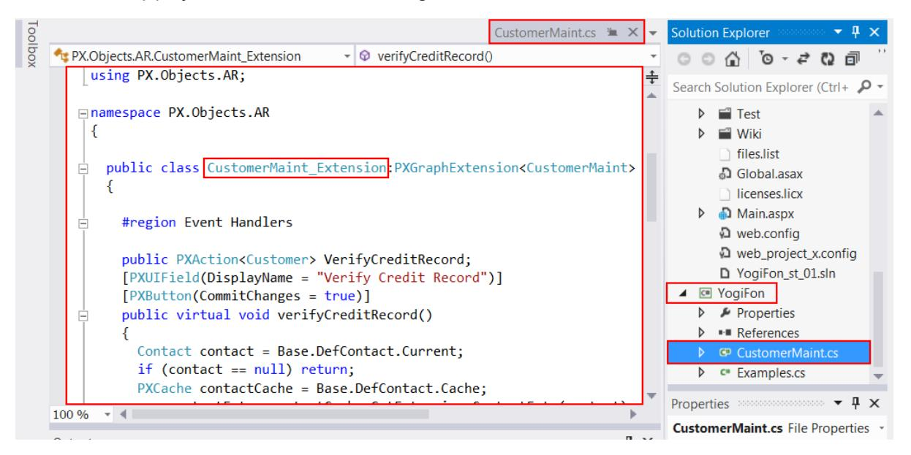

#### *Figure: The content of the source code file added to the extension library*

See *Extension Library (DLL) Versus Code in a [Customization](#page-74-0) Project* for our recommendations about where you should keep your customization code.

# <span id="page-175-0"></span>**Custom Files**

You can add to a customization project any custom file located in the website folder of your instance of Acumatica ERP. When you add a file to a project, the Acumatica Customization Platform stores a copy of the file in the database as a *File* item. A *File* item contains the path to the custom file and the GUID of the file content in the file storage of the database. The path is relative to the website folder. The platform then includes a copy of the file from the database in the deployment package.

You must include in a customization package any custom files that you need to use with your instance of Acumatica ERP and publish this package on this instance. If you instead copy the files to the website folder of your instance of Acumatica ERP manually, the files will be removed while the instance is being updated.

You use the *[Custom Files](https://help-2025r1.acumatica.com/Help?ScreenId=ShowWiki&pageid=2ea3c168-069f-436a-b3e7-4543c765d0d1)* (AU204500) page of the *[Customization Project Editor](https://help-2025r1.acumatica.com/Help?ScreenId=ShowWiki&pageid=0bb97781-e987-4039-962d-457720821bff)* to manage *File* items in the customization project. The page displays the list of *File* items included in the project.

When you publish or export the project, the platform compares each file in the project (in the database) with the original file in the file system and detects the files that have been modified in the file system. If a modified file is found, there is a conflict, and the platform gives you the option to update the files in the project or discard the changes (and use the files from the database). See *[Detecting the Project Items Modified in the File System](#page-177-0)* for details.

On the *[Custom Files](https://help-2025r1.acumatica.com/Help?ScreenId=ShowWiki&pageid=2ea3c168-069f-436a-b3e7-4543c765d0d1)* page, you can perform the operations with items described in the following topics:

- *To Add a [Custom](#page-175-2) File to a Project*
- *To [Update](#page-176-1) a File Item in a Project*
- *To Delete a [Custom](#page-178-3) File From a Project*

You can customize *File* items for the Self-Service Portal as well. For details on the portal, see *[Self-](https://help-2025r1.acumatica.com/Help?ScreenId=ShowWiki&pageid=37516f24-6bf1-4a2c-8554-49665f71db3d)[Service Portal](https://help-2025r1.acumatica.com/Help?ScreenId=ShowWiki&pageid=37516f24-6bf1-4a2c-8554-49665f71db3d)*.

### <span id="page-175-2"></span><span id="page-175-1"></span>**To Add a Custom File to a Project**

Before you can add a custom file to a customization project, you need to place this file in a folder within the website folder. For example, if you need to add an extension library file, you place it in the Bin folder of the website.

To add a custom file, which is placed in a folder within the website folder, to a customization project, do the following:

- 1. Open the customization project in the Customization Project Editor. (See *To Open a [Project](#page-84-2)* for details.)
- 2. Click **Files** in the navigation pane to open the Custom Files page.
- 3. On the page toolbar, click **Add New Record**.
- 4. In the **Add Files** dialog box, which opens, find the file in the table and select the check box in the**Selected** column for it.
  - You can select multiple custom files to add them to the project at the same time.

• For any files other than the ones placed in the Bin folder, you can click **Refresh** on the toolbar of the **Add Files** dialog box to make the system update the list of files in the table. If you have changed files in the Bin folder of the website, you should refresh the page in the browser.

5. In the dialog box, click**Save** to save each selected file to the customization project as a *File* item.

If you modify the file added to a customization project in the file system, you have to update the appropriate *File* item in the project.

### <span id="page-176-1"></span><span id="page-176-0"></span>**To Update a File Item in a Project**

If you have modified a file of a customization project in the file system and need to use the modified version of the file in the project, you have to update the copy of the file in the database. To do this, perform the following actions:

- 1. Open the customization project in the Customization Project Editor. (See *To Open a [Project](#page-84-2)* for details.)
- 2. Click **Files** in the navigation pane to open the *[Custom Files](https://help-2025r1.acumatica.com/Help?ScreenId=ShowWiki&pageid=2ea3c168-069f-436a-b3e7-4543c765d0d1)* page.
- 3. On the page toolbar, click **Detect Modified Files**, as shown in the screenshot below.
- 4. In the **Modified Files Detected** dialog box, which opens, ensure that the **Conflict** check box is selected for the file.

| <b>Q</b> Acumatica             |   |    |                     |                                                            |                                     |                                     |                                           |                                                                                                                           |                               |                               |
|--------------------------------|---|----|---------------------|------------------------------------------------------------|-------------------------------------|-------------------------------------|-------------------------------------------|---------------------------------------------------------------------------------------------------------------------------|-------------------------------|-------------------------------|
| Publish<br>File                |   |    | Extension Library   |                                                            | Source Control                      |                                     |                                           |                                                                                                                           |                               |                               |
| YogiFon                        |   |    | <b>Custom Files</b> |                                                            |                                     |                                     |                                           |                                                                                                                           |                               |                               |
| $\sqrt{\text{SCREENS}}$        |   | с  | A                   |                                                            | ×                                   | ÷                                   | <b>DETECT MODIFIED FILES</b>              |                                                                                                                           |                               |                               |
| ▶ DATA ACCESS<br>$\sqrt{CODE}$ | 阊 | Û  | <b>Object Name</b>  |                                                            |                                     |                                     |                                           | <b>Description</b>                                                                                                        | Last<br><b>Modified</b><br>By | Last<br><b>Modified</b><br>On |
| $\vert$ Files (5)              | , | 面  |                     |                                                            |                                     |                                     | App Data\Mobile\includes\AR409000.xml.inc |                                                                                                                           | admin                         | 5/27/2016                     |
| Generic Inquiries              |   | 面  |                     |                                                            |                                     | App Data\Mobile\YogiFonMSM.xml      |                                           |                                                                                                                           | admin                         | 6/1/2016                      |
| Reports                        |   | û  | <b>Bin\Y</b>        |                                                            |                                     | <b>Modified Files Detected</b>      |                                           |                                                                                                                           |                               | $\Box \times 10^5$            |
| Site Map                       |   | û  |                     |                                                            |                                     |                                     |                                           | Page Some files have been modified in the file system. Please resolve the conflicts.                                      |                               | D16                           |
| DB Scripts (1)                 |   | û, | Page                | UPDATE CUSTOMIZATION PROJECT<br><b>DISCARD ALL CHANGES</b> |                                     |                                     |                                           |                                                                                                                           | <b>D16</b>                    |                               |
| <b>System Locales</b>          |   |    |                     |                                                            |                                     |                                     |                                           |                                                                                                                           |                               |                               |
| Import/Export Scenarios        |   |    |                     | 阊<br>۶L                                                    | Selected<br>$\overline{\mathbf{v}}$ | Conflict<br>$\overline{\mathbf{v}}$ | Path                                      |                                                                                                                           |                               |                               |
| <b>Shared Filters</b>          |   |    |                     |                                                            |                                     | $\overline{\checkmark}$             |                                           | C:\Training\YogiFon st 01\App Data\Mobile\includes\AR409000.xm                                                            |                               |                               |
| <b>Access Rights</b>           |   |    |                     |                                                            | ☑                                   |                                     |                                           | C:\Training\YogiFon st 01\App Data\Mobile\YogiFonMSM.xml<br>C:\Training\YogiFon_st_01\App_RuntimeCode\ARReleaseProcess.cs |                               |                               |
| Wikis                          |   |    |                     |                                                            | ☑                                   | $\overline{\checkmark}$             |                                           | C:\Training\YogiFon_st_01\App_RuntimeCode\PX_Objects_AR_AR                                                                |                               |                               |
| Web Service Endpoints          |   |    |                     |                                                            |                                     | П                                   |                                           | C:\Training\YogiEon_st_01\Ann_RestimeCode\PX_Objects_CR_Con                                                               |                               |                               |
| <b>Analytical Reports</b>      |   |    |                     |                                                            | ×                                   | п                                   | C:\Traini                                 | C:\Training\YogiFon st 01\App RuntimeCode\                                                                                |                               | $b$ so                        |
|                                |   |    |                     |                                                            |                                     | П                                   |                                           | <b>PX Objects AR ARTran extensions.cs</b><br>C:\Training\roginon_st_onv-pp_isunumeoodetoomvoice_nuy.cs                    |                               |                               |
|                                |   |    |                     |                                                            | . I                                 | □                                   |                                           | C:\Training\YogiFon_st_01\App_RuntimeCode\SOOrderEntry.cs                                                                 |                               |                               |
|                                |   |    |                     |                                                            |                                     |                                     |                                           | C:\Training\YogiFon st 01\Bin\YogiFon Code.dll                                                                            |                               |                               |
|                                |   |    |                     |                                                            | . I                                 | $\Box$                              |                                           | C:\Training\YogiFon st 01\Pages\AR\AR409000.aspx                                                                          |                               |                               |
|                                |   |    |                     |                                                            |                                     | П                                   |                                           | C:\Training\YogiFon_st_01\Pages\AR\AR409000.aspx.cs                                                                       |                               |                               |
|                                |   |    |                     |                                                            |                                     |                                     |                                           |                                                                                                                           |                               |                               |

#### *Figure: Updating files in the project*

- 5. If multiple files in the project were changed, and you do not want to update some files at the moment, clear the selection of these files in the**Selected** column.
- 6. Click **Update Customization Project** to update the selected files.

If you click **Discard All Changes**, the Acumatica Customization Platform resolves the conflict by overriding the file in the file system using the file copy in the database.

If you make changes to custom files added to a customization project in the file system, the platform does not publish or export the project while a file in the file system differs its copy in the database. You have to resolve all such conflicts before publication or export of the project. See *[Detecting the Project Items Modified in the File System](#page-177-0)* for details.

### <span id="page-177-0"></span>**Detecting the Project Items Modified in the File System**

In the website folder in the file system, the platform tracks changes that you make to the following files:

- Files with the customization code added to the customization project as DAC items
- Files with the customization code added to the project as Code items
- Custom files added to the project

If you make changes to these files in the file system, you have to update them in the project before you publish the project or export the deployment package of the project.

When you run the project publication process or export the project, the Acumatica Customization Platform compares each file in the project (in the database) with the original file and detects the files modified in the file system. If a modified file is found, there is a conflict, and the platform opens the **Modified Files Detected** dialog box to give you the option to update the files in the project or discard the changes and use the files from the database.

If you have used the File Editor of the Customization Project Editor (see*[Custom Files](https://help-2025r1.acumatica.com/Help?ScreenId=ShowWiki&pageid=2ea3c168-069f-436a-b3e7-4543c765d0d1)* for details) to modify a *File* item in a customization project and saved the changes in the database, the changes are not saved in the original file in the file system. Then if you click **Detect Modified Files** on the toolbar of the Files page, the platform does not detect a conflict because the file in the database is newer. The platform automatically updates the original file during the publication of the customization project.

The **Modified Files Detected** dialog box lists all custom and customized files in the website folder. The **Conflict** check box means that the file version in the file system differs from the file version in the customization project. This could happen, for example, if you have modified the customization code in a file by using MS Visual Studio and the change is not yet reflected in the customization project. You have to resolve all conflicts in the project before you publish the project or export the deployment package of the project.

In the dialog box, you can invoke the following actions for conflicting files:

- **Update Customization Project**: Updates the customization project with the file version from the file system.
- **Discard All Changes**: Keeps the file version that exists in the customization project and discard the changes in the file system.

These actions are performed on the selected files—that is, all conflicting files for which you have selected the check box in the**Selected** column.

You can invoke one action for one individual file and another action for another file. For example, you can first select the files that you want to update in the customization project and click **Update Customization Project**. Then you can click **Discard All Changes** to cancel the changes made to all other conflicting files.

Make sure you have updated all appropriate files before removing all remaining conflicts. If you discard changes, aer you publish the customization project, the platform updates all selected conflicting files from the database, therefore the files will return to the original state in the file system.

No conflicts will appear in the **Modified Files Detected** dialog box until a file included in the customization project is modified in the file system again.

### <span id="page-178-3"></span><span id="page-178-0"></span>**To Delete a Custom File From a Project**

To delete a custom file from a customization project, perform the following actions:

- 1. Open the customization project in the Customization Project Editor. (See *To Open a [Project](#page-84-2)* for details.)
- 2. Click **Files** in the navigation pane to open the *[Custom Files](https://help-2025r1.acumatica.com/Help?ScreenId=ShowWiki&pageid=2ea3c168-069f-436a-b3e7-4543c765d0d1)* page.
- 3. In the page table, click the item to be deleted.
- 4. On the page toolbar, click **Delete Row**.
- 5. On the page toolbar, click**Save** to save the changes to the customization project.

The *File* item is deleted from the project. The file remains in the file system and you can add it back to the project, if needed.


If you either publish the customization project aer the *File* item is deleted or unpublish all customizations of the website, the platform deletes the original file in the file system.

### <span id="page-178-1"></span>**Generic Inquiries**

If you need to use a generic inquiry on another Acumatica ERP instance, you need to include the information about this generic inquiry in a customization project and publish this customization project to this instance.

To include the information about the generic inquiry in a customization project, you use the *[Generic Inquiries](https://help-2025r1.acumatica.com/Help?ScreenId=ShowWiki&pageid=f57031d0-64cd-491f-891c-ce6bf71f0f6e)* page of the Customization Project Editor. For details about generic inquiries in customization projects, see *[Including](https://help-2025r1.acumatica.com/Help?ScreenId=ShowWiki&pageid=03617820-bc32-481c-9e7c-73a0852c19b7) [Generic Inquiries in a Customization Project](https://help-2025r1.acumatica.com/Help?ScreenId=ShowWiki&pageid=03617820-bc32-481c-9e7c-73a0852c19b7)*.

### <span id="page-178-2"></span>**Custom Reports**

You use the Custom Reports page of the *[Customization Project Editor](https://help-2025r1.acumatica.com/Help?ScreenId=ShowWiki&pageid=0bb97781-e987-4039-962d-457720821bff)* to manage *Report* items in the customization project.


A *Report* item contains the dataset of a custom report created with Acumatica Report Designer.

The Custom Reports page displays the list of the custom reports that have been added to the customization project.

On the page, you can perform the operations described in the following topics:

- *To Add a [Custom](#page-179-1) Report to a Project*
- *To Delete a [Custom](#page-180-3) Report from a Project*
- *To [Navigate](#page-180-4) a Custom Report in a Project*


You can customize *Report* items for the Self-Service Portal as well. For details on the portal, see *[Self-](https://help-2025r1.acumatica.com/Help?ScreenId=ShowWiki&pageid=37516f24-6bf1-4a2c-8554-49665f71db3d)[Service Portal](https://help-2025r1.acumatica.com/Help?ScreenId=ShowWiki&pageid=37516f24-6bf1-4a2c-8554-49665f71db3d)*.

## <span id="page-179-1"></span><span id="page-179-0"></span>**To Add a Custom Report to a Project**

You can add an Acumatica Report Designer custom report to a customization project. Before adding a report to a project, you have to construct the report in Acumatica Report Designer and save the report to the database. (For more information about reports, see *[Acumatica Report Designer Guide](https://help-2025r1.acumatica.com/Help?ScreenId=ShowWiki&pageid=24b77bbe-0eb3-4d37-9350-071ae5743571)*.)

To add a custom report to a project, perform the following actions:

- 1. Open the customization project in the Customization Project Editor. (See *To Open a [Project](#page-84-2)* for details.)
- 2. Click **Reports** in the navigation pane to open the *[Reports](https://help-2025r1.acumatica.com/Help?ScreenId=ShowWiki&pageid=4d01e826-7541-41b2-b66f-7c348ea2cde5)* page.
- 3. On the page toolbar, click **Add New Record**, as shown in the screenshot below.
- 4. In **Name** box of the**Select Report from Database** dialog box, which opens, select the report that you want to include in the project.

If a custom report is created in Acumatica Report Designer and saved as a file in the file system, you cannot add the report to a customization project as a *Report* item.

5. In the dialog box, click **OK** to add the selected report to the customization project.

| <b>Q</b> Acumatica               |                               |                                    |                    |                         |                                   |          |   |                              |               |                  |
|----------------------------------|-------------------------------|------------------------------------|--------------------|-------------------------|-----------------------------------|----------|---|------------------------------|---------------|------------------|
| <b>Publish</b><br>File           | Extension Library             | Source Control                     |                    |                         |                                   |          |   |                              |               |                  |
| YogiFon<br>◀                     | <b>Custom Reports</b>         |                                    |                    |                         |                                   |          |   |                              |               |                  |
| $\overline{\phantom{a}}$ SCREENS | a<br>C                        | $\blacksquare$<br>×                | ÷.                 |                         | <b>RELOAD FROM DATABASE</b>       |          |   |                              |               |                  |
| Data Access<br>Code              | <b>B</b> Object Name          |                                    | <b>Description</b> |                         | <b>Last Modified By</b>           |          |   | <b>Last Modified On</b>      |               |                  |
| Files $(5)$                      | AR650660.RPX<br>$\rightarrow$ |                                    |                    |                         | admin                             |          |   | 7/28/2016                    |               |                  |
| Generic Inquiries (2)            |                               | <b>Select Report from Database</b> |                    |                         |                                   | $\times$ |   |                              |               |                  |
| Reports (1)                      |                               | Name:                              |                    | pmactivity.rpx          |                                   | $\circ$  |   |                              |               |                  |
| Site Map (3)                     |                               |                                    |                    | <b>Select - Name</b>    |                                   |          |   |                              |               | $\square \times$ |
| <b>DB</b> Scripts                |                               |                                    |                    |                         |                                   |          |   |                              |               |                  |
| <b>System Locales</b>            |                               |                                    |                    | <b>SELECT</b>           | $\left  \rightarrow \right $<br>c |          |   |                              |               | ρ                |
| Import/Export Scenarios (1)      |                               |                                    |                    | <b>B</b> ReportFileName |                                   |          |   |                              |               | $\uparrow$       |
| <b>Shared Filters</b>            |                               |                                    |                    | ar641000.rpx            |                                   |          |   |                              |               |                  |
| <b>Access Rights</b>             |                               |                                    |                    | ar641001.rpx            |                                   |          |   |                              |               |                  |
| <b>Wikis</b>                     |                               |                                    |                    | ar661000.rpx            |                                   |          |   |                              |               |                  |
| Web Service Endpoints            |                               |                                    |                    | pmactivity.rpx          |                                   |          |   |                              |               |                  |
| <b>Analytical Reports</b>        |                               |                                    |                    |                         | pmbudgetgraph.rpx                 |          |   |                              |               |                  |
|                                  |                               |                                    |                    | pminvoices.rpx          |                                   |          |   |                              |               |                  |
|                                  |                               |                                    |                    | pmpos.rpx               |                                   |          |   |                              |               |                  |
|                                  |                               |                                    |                    |                         |                                   |          | Κ | $\left\langle \right\rangle$ | $\rightarrow$ | $\geq$           |

*Figure: Adding a custom report to the project*

To give users the ability to navigate to the custom report in Acumatica ERP, you have to add the appropriate site map node to the customization project, as described in *To Add a Site Map [Node](#page-183-5) to a [Project](#page-183-5)*.

### <span id="page-180-3"></span><span id="page-180-0"></span>**To Delete a Custom Report from a Project**

To remove a custom report from a project, perform the following actions:

- 1. Open the customization project in the Customization Project Editor. (See *To Open a [Project](#page-84-2)* for details.)
- 2. Click **Reports** in the navigation pane to open the *[Reports](https://help-2025r1.acumatica.com/Help?ScreenId=ShowWiki&pageid=4d01e826-7541-41b2-b66f-7c348ea2cde5)* page.
- 3. In the page table, click the item to be deleted.
- 4. On the page toolbar, click **Delete Row**.
- 5. On the page toolbar, click**Save** to save the changes to the customization project.

If you have added a site map node for the custom report to the project, you also have to delete the appropriate *SiteMapNode* item. (See *To Delete a Site Map Node from a [Project](#page-183-4)* for details.)

### <span id="page-180-4"></span><span id="page-180-1"></span>**To Navigate a Custom Report in a Project**

If you have used Acumatica Report Designer to change a custom report included in the customization project, you have to update the appropriate item in the project. To do this, perform the following actions:

- 1. Open the customization project in the Customization Project Editor. (See *To Open a [Project](#page-84-2)* for details.)
- 2. Click **Reports** in the navigation pane to open the *[Reports](https://help-2025r1.acumatica.com/Help?ScreenId=ShowWiki&pageid=4d01e826-7541-41b2-b66f-7c348ea2cde5)* page.
- 3. On the page toolbar, click **Reload from Database**.

The platform updates all the *Report* items that are added to the customization project.

### <span id="page-180-2"></span>**Dashboards**

You use the Dashboards page of the *[Customization Project Editor](https://help-2025r1.acumatica.com/Help?ScreenId=ShowWiki&pageid=0bb97781-e987-4039-962d-457720821bff)* to manage *Dashboard* items in the customization project.


A *Dashboard* item contains the dataset of a custom or customized dashboard.

The Dashboards page displays the list of the dashboards that have been added to the customization project.

On the page, you can perform the operations described in the following topics:

- *To Add a [Dashboard](#page-181-2) to a Project*
- *To Delete a [Dashboard](#page-181-3) from a Project*
- *To Update [Dashboard](#page-182-4) Items in a Project*
- *To Navigate to the [Dashboard](#page-182-5) Form*

You can customize *Dashboard* items for the Self-Service Portal as well. For details on the portal, see *[Self-Service Portal](https://help-2025r1.acumatica.com/Help?ScreenId=ShowWiki&pageid=37516f24-6bf1-4a2c-8554-49665f71db3d)*.

### <span id="page-181-2"></span><span id="page-181-0"></span>**To Add a Dashboard to a Project**

You can add to a customization project a custom or customized dashboard—the dashboard that is saved in the database for the current tenant. To do this, perform the following actions:

- 1. Open the customization project in the Customization Project Editor. (See *To Open a [Project](#page-84-2)* for details.)
- 2. Click **Dashboards** in the navigation pane to open the *[Dashboards](https://help-2025r1.acumatica.com/Help?ScreenId=ShowWiki&pageid=88b1eab8-9432-43fb-b666-2ba718986ff7)* page.
- 3. On the page toolbar, click **Add New Record**.
- 4. In the list of dashboards in the **Add Dashboards** dialog box, which opens, select the check box for each dashboard that you want to include in the project.

The **Add Dashboards** dialog box displays all the custom and customized dashboards that exist in your instance of Acumatica ERP. You can select multiple dashboards to add them to the project simultaneously.

5. In the dialog box, click**Save** to add the selected dashboards to the customization project.

The system adds to the project the data for each selected dashboard, and you can see each new Dashboard item in the Project Items table of the *[Edit Project Items](https://help-2025r1.acumatica.com/Help?ScreenId=ShowWiki&pageid=36ba1efe-dcbe-4307-b836-0cafae0d1ef9)*.

Alongside with Dashboard item, the system adds Generic Inquiry, Site Map, and Wiki items for inquiries, site map nodes, and wiki pages associated with the dashboard. If an inquiry, a site map node, or a wiki page is already added to the customization project, it is not duplicated.

The system automatically includes in the customization project information about the workspace to which the dashboard have been added in the UI along with other information about the dashboard.

### <span id="page-181-3"></span><span id="page-181-1"></span>**To Delete a Dashboard from a Project**

To remove a *Dashboard* item from a project, perform the following actions:

- 1. Open the customization project in the Customization Project Editor. (See *To Open a [Project](#page-84-2)* for details.)
- 2. Click **Dashboards** in the navigation pane to open the *[Dashboards](https://help-2025r1.acumatica.com/Help?ScreenId=ShowWiki&pageid=88b1eab8-9432-43fb-b666-2ba718986ff7)* page.
- 3. In the page table, click the item to be deleted.
- 4. On the page toolbar, click **Delete Row**.
- 5. On the page toolbar, click**Save** to save the changes to the customization project.

If you delete a *Dashboard* item from the project, the dashboard remains in the system unless you delete the dashboard by using the *[Dashboards](https://help-2025r1.acumatica.com/Help?ScreenId=ShowWiki&pageid=04a14a8d-72c8-47b7-9da6-0722c561e7df)* (SM208600) form.

If a site map node or a generic inquiry was added for a custom dashboard to the project (manually or automatically), and you removed the dashboard from the project, you should delete the appropriate *Site Map*, *Generic Inquiry*, or *Wiki* item manually. (See *To Delete a Site Map Node from a [Project](#page-183-4)* for details.)

### <span id="page-182-4"></span><span id="page-182-0"></span>**To Update Dashboard Items in a Project**

If you have used the *[Dashboards](https://help-2025r1.acumatica.com/Help?ScreenId=ShowWiki&pageid=04a14a8d-72c8-47b7-9da6-0722c561e7df)* (SM208600) form to change a dashboard included in the customization project or changed its design by modifying the set of widgets, you have to update the appropriate item in the project. To do this, perform the following actions:

- 1. Open the customization project in the Customization Project Editor. (See *To Open a [Project](#page-84-2)* for details.)
- 2. Click **Dashboards** in the navigation pane to open the *[Dashboards](https://help-2025r1.acumatica.com/Help?ScreenId=ShowWiki&pageid=88b1eab8-9432-43fb-b666-2ba718986ff7)* page.
- 3. On the page toolbar, click **Reload from Database**.

<span id="page-182-5"></span>The platform updates all the *Dashboard* items of the project by using the appropriate data from the database.

# <span id="page-182-1"></span>**To Navigate to the Dashboard Form**

When you are working with the *[Customization Project Editor](https://help-2025r1.acumatica.com/Help?ScreenId=ShowWiki&pageid=0bb97781-e987-4039-962d-457720821bff)*, you may need to open the *[Dashboards](https://help-2025r1.acumatica.com/Help?ScreenId=ShowWiki&pageid=04a14a8d-72c8-47b7-9da6-0722c561e7df)* (SM208600) form in the browser. You can use this form, for example, to create a new dashboard, to modify settings of an existing one, or to manage existing dashboards in Acumatica ERP.

To open the *[Dashboards](https://help-2025r1.acumatica.com/Help?ScreenId=ShowWiki&pageid=04a14a8d-72c8-47b7-9da6-0722c561e7df)* form from the Customization Project Editor, perform the following actions:

- 1. Select **Dashboards** in the navigation pane to open the *[Dashboards](https://help-2025r1.acumatica.com/Help?ScreenId=ShowWiki&pageid=88b1eab8-9432-43fb-b666-2ba718986ff7)* page.
- 2. On the page toolbar, click **Manage Dashboards**.

As soon as you save a dashboard on the *[Dashboards](https://help-2025r1.acumatica.com/Help?ScreenId=ShowWiki&pageid=04a14a8d-72c8-47b7-9da6-0722c561e7df)* form, you can add the dashboard as a *Dashboard* item to the project.

### <span id="page-182-3"></span><span id="page-182-2"></span>**Site Map**

You use the *[Site Map](https://help-2025r1.acumatica.com/Help?ScreenId=ShowWiki&pageid=7a281be0-7ad1-4b20-8b42-1a1558402e7f)* (AU208000) page of the *[Customization Project Editor](https://help-2025r1.acumatica.com/Help?ScreenId=ShowWiki&pageid=0bb97781-e987-4039-962d-457720821bff)* to manage *SiteMapNode* items in the customization project.

A *SiteMapNode* item contains the dataset of a custom site map node for a custom form or report included in the customization project. The item also includes information about the location of the form or report in the UI (such as workspace to which the form or report included).

The *[Site Map](https://help-2025r1.acumatica.com/Help?ScreenId=ShowWiki&pageid=7a281be0-7ad1-4b20-8b42-1a1558402e7f)* page displays the list of the custom site map nodes that have been added to the customization project.

On the page, you can perform the operations described in the following topics:

- *To Add a Site Map Node to a [Project](#page-183-5)*
- *To Delete a Site Map Node from a [Project](#page-183-4)*
- *To [Update](#page-183-3) a Site Map Node in a Project*
- *To [Navigate](#page-184-2) to the Site Map Form*

To customize *PortalMapNode* items for the Self-Service Portal, you use the *[Portal Map](https://help-2025r1.acumatica.com/Help?ScreenId=ShowWiki&pageid=a93313e7-b50d-4a12-85b8-21e503f0f559)* (SM200521) form. For details on the portal, see *[Self-Service Portal](https://help-2025r1.acumatica.com/Help?ScreenId=ShowWiki&pageid=37516f24-6bf1-4a2c-8554-49665f71db3d)*.

### <span id="page-183-5"></span><span id="page-183-0"></span>**To Add a Site Map Node to a Project**

If, for a custom form or report, you have changed the workspace in the UI and saved these changes in the database for the current tenant, you can add these changes to a customization project as a *SiteMapNode* item. To do this, perform the following actions:

- 1. Open the customization project in the Customization Project Editor. (See *To Open a [Project](#page-84-2)* for details.)
- 2. Click **Site Map** in the navigation pane to open the Site Map page.
- 3. On the page toolbar, click **Add New Record**.
- 4. In the list of site map nodes in the **Add Site Map** dialog box, which opens, select the check box for each screen that you want to include in the project.


The **Add Site Map** dialog box displays all the custom site map nodes that have been created in the site map of Acumatica ERP and the nodes that have been modified in the site map. You can select multiple custom site map nodes to add them to the project simultaneously.

5. In the dialog box, click**Save** to add each selected site map node to the customization project.

The system adds to the project the data from the database for each selected site map node. You can view each new *SiteMapNode* item in the Project Items table of the *[Edit Project Items](https://help-2025r1.acumatica.com/Help?ScreenId=ShowWiki&pageid=36ba1efe-dcbe-4307-b836-0cafae0d1ef9)*.

### <span id="page-183-4"></span><span id="page-183-1"></span>**To Delete a Site Map Node from a Project**

To delete a site map node from a customization project, perform the following actions:

- 1. Open the customization project in the Customization Project Editor. (See *To Open a [Project](#page-84-2)* for details.)
- 2. Click **Site Map** in the navigation pane to open the Site Map page.
- 3. In the page table, click the item to be deleted.
- 4. On the page toolbar, click **Delete Row** (X).
- 5. On the page toolbar, click**Save** to save the changes to the customization project.

If you delete a *SiteMapNode* item from the project, the node remains in the site map unless you delete the node on the *[Site Map](https://help-2025r1.acumatica.com/Help?ScreenId=ShowWiki&pageid=44b364ef-7810-400b-b1c6-8f471c249401)* (SM200520) form.

### <span id="page-183-3"></span><span id="page-183-2"></span>**To Update a Site Map Node in a Project**

If you have used the *[Site Map](https://help-2025r1.acumatica.com/Help?ScreenId=ShowWiki&pageid=44b364ef-7810-400b-b1c6-8f471c249401)* (SM200520) form or a workspace of the UI of Acumatica ERP to change a site map node included in the customization project, you should update this node in the project. To do this, perform the following actions:

- 1. Open the customization project in the Customization Project Editor. (See *To Open a [Project](#page-84-2)* for details.)
- 2. Select**Site Map** in the navigation pane to open the Site Map page.
- 3. On the page toolbar, click **Reload from Database**.

The platform updates all the *SiteMapNode* items of the project by using the appropriate data from the database.

### <span id="page-184-2"></span><span id="page-184-0"></span>**To Navigate to the Site Map Form**

You might need to add to Acumatica ERP a site map node for a custom form, inquiry, or report that you develop for a customization project. To create a custom site map node or modify an existing node, you use the *[Site Map](https://help-2025r1.acumatica.com/Help?ScreenId=ShowWiki&pageid=44b364ef-7810-400b-b1c6-8f471c249401)* (SM200520) form of Acumatica ERP.

To open the *[Site Map](https://help-2025r1.acumatica.com/Help?ScreenId=ShowWiki&pageid=44b364ef-7810-400b-b1c6-8f471c249401)* form from the *[Customization Project Editor](https://help-2025r1.acumatica.com/Help?ScreenId=ShowWiki&pageid=0bb97781-e987-4039-962d-457720821bff)*, perform the following actions:

- 1. Click **Site Map** in the navigation pane to open the Site Map page of the editor.
- 2. On the page toolbar, click **ManageSite Map**.

As soon as you save changes to an existing site map node or create a custom node on the *[Site Map](https://help-2025r1.acumatica.com/Help?ScreenId=ShowWiki&pageid=44b364ef-7810-400b-b1c6-8f471c249401)* form, you can add the node as a *SiteMapNode* item to the customization project.

### <span id="page-184-1"></span>**Database Scripts**

With the Acumatica Customization Platform, you can use custom SQL scripts for the following changes to the database in the scope of a customization project:

- The creation of custom tables
- The creation of views, indexes, and other database objects
- The insertion of data into tables
- The increasing of the size of a text column of a table

See *[Changes in the Database Schema](#page-76-4)* for details.

You use the *[Database Scripts](https://help-2025r1.acumatica.com/Help?ScreenId=ShowWiki&pageid=f7e4fcdf-02dd-4812-b561-1179da5dd30d)* (AU209000) page of the *[Customization Project Editor](https://help-2025r1.acumatica.com/Help?ScreenId=ShowWiki&pageid=0bb97781-e987-4039-962d-457720821bff)* to manage *Sql* and *Table* items in the customization project.

An *Sql* item contains a custom database table definition or a custom SQL script that has to be executed while the customization project is published. A *Table* item contains a description of the custom columns added to a table for bound custom fields created in the appropriate data access class.

The *[Database Scripts](https://help-2025r1.acumatica.com/Help?ScreenId=ShowWiki&pageid=f7e4fcdf-02dd-4812-b561-1179da5dd30d)* page displays the list of the custom SQL scripts and customized tables that have been added to the customization project.

When you create a custom table in the database, we recommend that you add the table schema to the customization project, as described in *To Add a [Custom](#page-185-2) Table to a Project*. To create other database objects or insert data into the tables, you have to compose the corresponding SQL script and add the script to the customization project, as described in *To Add a [Custom](#page-189-1) SQL Script to a Project*.

On the *[Database Scripts](https://help-2025r1.acumatica.com/Help?ScreenId=ShowWiki&pageid=f7e4fcdf-02dd-4812-b561-1179da5dd30d)* page, you can perform various operations, as described in the following topics:

- *To Add a [Custom](#page-185-2) Table to a Project*
- *To Update [Custom](#page-186-1) Tables in the Project*
- *To Add a Custom Column to an [Existing](#page-187-1) Table*
- *To [Increase](#page-188-1) the Size of a Column in an Existing Table*
- *To Add a [Custom](#page-189-1) SQL Script to a Project*
- *To Edit a [Custom](#page-193-1) SQL Script*
- *To Delete an Sql or Table Item From a [Project](#page-194-3)*

### <span id="page-185-3"></span><span id="page-185-0"></span>**Best Practices**

We recommend that you heed the best practices described below when you are customizing a table schema for a customization project.

#### **Adding a Default Value to a Column**

When you are customizing a column in a table schema of your customization project by using the **DatabaseScripts** page of the Customization Project Editor or a custom SQL script, we recommend that you not specify a default value for this new column by using the approach described in *To Add a Custom Column to an [Existing](#page-187-1) Table*. The database engine does not consistently enforce default values at the database level, so adding a default value to a column of an existing table schema does not guarantee that it will be applied when the database is created or upgraded.

We recommend that you specify the default value for a column in a DAC by using the *[PXDefaultAttribute](https://help.acumatica.com/Help?ScreenId=ShowWiki&pageid=96b4e224-d0d2-e2d8-671e-9ba2ed73c21b)* or *[PXDBDefaultAttribute](https://help.acumatica.com/Help?ScreenId=ShowWiki&pageid=c97384f1-fe6e-9c90-c97e-ba2e53af675d)* attribute instead. (For usage examples of these attributes, click their respective links.)

If you want to add a new column with a default value to a table schema that has existing records, you need to write a custom SQL script that adds this new column with the specified default value, and updates this default value for all existing records.

The data for some entities in Acumatica ERP, such as generic inquiries and reports, can be defined and stored in XML format. These entities are described with XML definitions in the /App\_Data/XmlExportDefinitions folder of your application. If you define a new column that does not accept Null values for such an entity, you will need to create a C# class that implements the *[XMLEntityUpgrader](https://help.acumatica.com/Help?ScreenId=ShowWiki&pageid=0376310a-291b-a258-6983-fb56e068ec66)* interface. This class should define the upgrade logic to update all existing records with the specified default value for the new column.

#### **Related Links**

- *[PXDefaultAttribute](https://help.acumatica.com/Help?ScreenId=ShowWiki&pageid=96b4e224-d0d2-e2d8-671e-9ba2ed73c21b)*
- *[PXDBDefaultAttribute](https://help.acumatica.com/Help?ScreenId=ShowWiki&pageid=c97384f1-fe6e-9c90-c97e-ba2e53af675d)*
- *[XMLEntityUpgrader Interface](https://help.acumatica.com/Help?ScreenId=ShowWiki&pageid=0376310a-291b-a258-6983-fb56e068ec66)*

### <span id="page-185-2"></span><span id="page-185-1"></span>**To Add a Custom Table to a Project**

You use the Database Scripts page of the Customization Project Editor to add a custom table to a customization project. You can add a custom table to a project by adding the table schema or by adding a custom SQL script.

Adding the table schema is the optimal way of adding custom tables to the project. When you publish the customization project, the platform executes each SQL script of the project to update the database. If an *Sql* item contains a custom database table definition, to update the database with the table schema, the Acumatica Customization Platform checks whether a table with this name already exists in the database. If the table exists, the platform generates SQL statements to alter the existing table so that it matches the schema. The platform does not drop the existing table, and it keeps any data in it. This helps to deploy a newer version of the customization project to a system that is already in use. If the table does not exist, the platform generates SQL statements to create the table. SQL statements are generated in the SQL dialect of the database management system. Therefore, if you add custom tables to the project by adding the table schema, you keep the customization project independent from the database management system that hosts the database of Acumatica ERP.

Alternatively, you can add custom tables by adding a custom SQL script that creates the table in the project, as described in *To Add a [Custom](#page-189-1) SQL Script to a Project*.

The creation or modification of the System tables is forbidden. A customization project containing such changes will not pass validation tests. For details on the System tables, see *[System and](https://help-2025r1.acumatica.com/Help?ScreenId=ShowWiki&pageid=509aefc2-387b-4284-8ff8-ad5fc9b725be) [Application](https://help-2025r1.acumatica.com/Help?ScreenId=ShowWiki&pageid=509aefc2-387b-4284-8ff8-ad5fc9b725be) Tables*.

#### **To Add a Custom Table to a Customization Project**

Aer you have created the needed table in the database by using a database administration tool, such as SQL Server Management Studio, you do the following:


You have to use a naming convention that provides unique names for your custom tables so that they do not have the names of existing tables of Acumatica ERP.

- 1. Open the customization project in the Customization Project Editor.
- 2. In the navigation pane, click **DatabaseScripts** to open the Database Scripts page.
- 3. On the More menu (under **Actions**), click **Add Custom TableSchema**.
- 4. In the **Add Custom TableSchema** dialog box, which opens, select the custom table in the**Table** box, and click **OK**.

Acumatica Customization Platform generates the table schema and adds the schema to the customization project as an *Sql* item.

Below is an example of the *Sql* item that contains the table schema of the custom table *RBProduct*.

```
 <Sql TableName="RBProduct" TableSchemaXml="#CDATA">
 <CDATA name="TableSchemaXml"><![CDATA[<table name="RBProduct">
 <col name="ProductID" type="Int" identity="true" />
 <col name="ProductCD" type="NVarChar(15)" />
 <col name="ProductName" type="NVarChar(50)" />
 <col name="Active" type="Bit" />
 <col name="StockUnit" type="NVarChar(20)" />
 <col name="UnitPrice" type="Decimal(19,6)" />
 <col name="MinAvailQty" type="Decimal(25,6)" />
 <col name="TStamp" type="Timestamp" />
 <index name="RBProduct_PK" clustered="true" primary="true" unique="true">
 <col name="ProductID" />
 </index>
</table>]]></CDATA>
 </Sql>
```

### <span id="page-186-1"></span><span id="page-186-0"></span>**To Update Custom Tables in the Project**

Aer you have added a custom table to the project, you might want to continue making changes to the table by using a database administration tool, such as SQL Server Management Studio. We recommend that you update the table schema in the customization project before you export the deployment package of the project or publish the project.

#### **To Update the Schema of Custom Tables in the Project**

To update the schema of custom tables, do the following:

1. Open the customization project in the Customization Project Editor. (See *To Open a [Project](#page-84-2)* for details.)

- 2. In the navigation pane, click **DatabaseScripts** to open the *[Database Scripts](https://help-2025r1.acumatica.com/Help?ScreenId=ShowWiki&pageid=f7e4fcdf-02dd-4812-b561-1179da5dd30d)* page.
- 3. On the More menu (under **Other**), click **Reload from Database**.

<span id="page-187-1"></span>The platform regenerates the database table schema of all the custom tables added to the project.

# <span id="page-187-0"></span>**To Add a Custom Column to an Existing Table**

You use the Database Scripts page of the Customization Project Editor to add custom columns of an existing table of Acumatica ERP to a customization project. If you add custom fields to a data access class by using the *[Data](https://help-2025r1.acumatica.com/Help?ScreenId=ShowWiki&pageid=06c038a5-1d75-482b-9b17-f2483ada0154) [Class](https://help-2025r1.acumatica.com/Help?ScreenId=ShowWiki&pageid=06c038a5-1d75-482b-9b17-f2483ada0154)*, you do not need to add the custom columns to the database table manually; the Acumatica Customization Platform adds these columns automatically. You may need to add a column manually if you added a custom field to a data access class in code.

We recommend that you not write custom SQL scripts to add changes to the database schema. If you add a custom SQL script, you must adhere to platform requirements that apply to custom SQL scripts, such as the support of multitenancy and the support of SQL dialects of the target database management systems. If you use the approach described in this topic, during the publication of the customization project, the platform generates SQL statements to alter the existing table so that this statement conforms to all platform requirements.

### **To Add a Custom Column to an Existing Table**

To add a custom column, do the following:

- 1. Open the customization project in the Customization Project Editor. (See *To Open a [Project](#page-84-2)* for details.)
- 2. In the navigation pane, click **DatabaseScripts** to open the *[Database Scripts](https://help-2025r1.acumatica.com/Help?ScreenId=ShowWiki&pageid=f7e4fcdf-02dd-4812-b561-1179da5dd30d)* page.
- 3. On the More menu (under **Actions**), click **Add Custom Column toTable**.
  - The **Add Custom Column toTable** dialog box opens.
- 4. In the dialog box, specify the table to which the column should be added and the name and type of the new column, and click **OK**.

The Acumatica Customization Platform adds the columns to the customization project as a *Table* item.

### **To Specify the Default Value for a Column**

The information in this section is provided for informational purposes only. We recommend that you not use this approach, which goes against established best practices, to specify default values for table columns that you update or add in a table schema of your customization project. This approach could result in these default values not being applied because the internal mechanism of the database engine sometimes fails to set the specified column default values, especially nonzero values, at the database level. Default values of *0* for columns are generally supported, but in some edge cases, they may not be set correctly. To reliably set column default values for a table, you should use the approach described in *[Best Practices](#page-185-3)*.

By default, the system adds a custom column that can have Null values. If you need to add a column that does not allow Null values and you want to specify the default value for this column, do the following:

- 1. Add a custom column, as described in the previous section.
- 2. In the main menu of the Customization Project Editor, click **File > Edit Project Items**.

The Edit Project Items page opens.

3. In the table on the page, click the row with a database table that contains the custom column for which you want to specify the default value.

- 4. In the **Source** section of the page, do the following:
  - Remove the AllowNull attribute, or specify the *False* value for it.
  - Add the DefaultValue attribute.
- 5. Save your changes.

You can also set the default value by running a script. However, we recommend that you not run a script because executing a custom script could compromise the integrity and consistency of the application data. Furthermore, the custom script would work with only the specific database engine (such as MS SQL or MySQL) that it was written for. So the script would need to be rewritten to be compatible with other types of database engines. For more information on how to add a custom script, see *To Add a [Custom](#page-189-1) SQL Script to a Project*.

The following code shows the *0* default value being specified for the UsrFlag column of the ARTran table. The type of the column is bool.

```
<Table TableName="ARTran">
<Column TableName="ARTran" ColumnName="UsrFlag" ColumnType="bool" 
 DefaultValue="0" DecimalPrecision="0" DecimalLength="0" IsNewColumn="True" 
 IsUnicode="True" />
</Table>
```

The following code shows the *test* default value being specified for the usrTest column of the ARTran table. The type of the column is string.

```
<Table TableName="ARTran">
<Column TableName="SOOrder" ColumnName="usrTest" ColumnType="string" 
 DefaultValue="'test'" MaxLength="10" DecimalPrecision="0" 
 DecimalLength="0" IsNewColumn="True" IsUnicode="True" />
</Table>
```

### <span id="page-188-1"></span><span id="page-188-0"></span>**To Increase the Size of a Column in an Existing Table**

You use the Database Scripts page of the Customization Project Editor to increase the size of a text column of an existing table of Acumatica ERP.

If you publish the customization project, the changes remain in the Acumatica ERP database even if you unpublish the project.

#### **To Increase the Size of a Column**

To increase the size of a column, do the following:

- 1. Open the customization project in the Customization Project Editor. (See *To Open a [Project](#page-84-2)* for details.)
- 2. In the navigation pane, click **DatabaseScripts** to open the Database Scripts page.
- 3. On the More menu (under **Actions**), click **Increase Column Length**.
- 4. In the **Column Length Increase** dialog box, which opens, specify the following settings:
  - a. **Table**: The table in which the column should be altered.
  - b. **Field Name**: The name of the column that should be altered.


Only text fields are available in the list because only their length can be changed.

- c. **DataType**: Read-only. The current type and size of the specified column.
- d. **New Length**: The new length of the text field.
- 5. Click **OK** to save your changes and close the dialog box.

The Acumatica Customization Platform creates a script to alter the column in the application database. You can see the change entry on the Database Scripts page with the **Custom Columns** type.

### <span id="page-189-1"></span><span id="page-189-0"></span>**To Add a Custom SQL Script to a Project**

With the Acumatica Customization Platform, you can add to a customization project an SQL script to be executed during the publication of the project. However, we recommend that you avoid doing this.


A possible result of a custom SQL script is the loss of the integrity and consistency of the application data.

If you do add a custom SQL script, you must adhere to the following requirements for the script:

- Because Acumatica ERP supports multitenancy, you must create an SQL script that correctly creates a database object that properly specifies and uses the company mask.
- You must correctly specify the attributes for the script so that the script can be executed on the target database servers: MySQL Server, Microso SQL Server, or both. For details about attributes, see *[Using the](#page-191-0) [SQL Script Attributes](#page-191-0)*.

#### **To Add a Custom SQL Script to a Customization Project**

To add a custom SQL script, do the following:

- 1. Prepare, debug, and test the SQL script with a database administration tool, such as SQL Server Management Studio. (See *[Creating a Custom SQL Script](#page-190-0)* for details.)
- 2. Open the customization project in the Customization Project Editor.
- 3. In the navigation pane, click **DatabaseScripts** to open the Database Scripts page.
- 4. On the More menu (under **Actions**), click **Add Script**.

The *[Edit SQL Script Dialog Box](https://help-2025r1.acumatica.com/Help?ScreenId=ShowWiki&pageid=f7e4fcdf-02dd-4812-b561-1179da5dd30d)* opens.

- 5. In the **Script Name** box of the dialog box, specify the name of the script to be used as the object name of the customization item. (The name can contain only English characters and digits.)
- 6. Optional: In the **Priority** box, specify the priority of the script. By default, the priority is 0.
- 7. For each batch that you want to add, do the following:
  - a. Click **Specify Database Engine**, and in the **Attribute** box, select one of the following options:
    - *Skip Batch on MySQL Server*, which adds the --[mysql: Skip] attribute to the end of the text in the text area of the script editor.
    - *Skip Batch on Microso SQL Server*, which adds the --[mssql: Skip] attribute to the end of the text in the text area of the script editor.
    - *Use Interpreter*, which adds the --[VmSql] attribute to the end of the text in the text area of the script editor.

For more information on the database script attributes, see *[Using the SQL Script Attributes](#page-191-0)*.

- b. In the text area of the editor, below the added attribute, enter the SQL script.
- 8. In the editor, click **OK** to add the script to the customization project.

If a custom script causes an error, the error message will appear during the publication process when the system executes the custom scripts.

#### **Related Links**

- *[Creating a Custom SQL Script](#page-190-0)*
- *[Using the SQL Script Attributes](#page-191-0)*
- *[Writing Custom SQL Scripts for Interpretation](#page-192-0)*

### <span id="page-190-0"></span>**Creating a Custom SQL Script**

To create database objects other than custom tables or to insert data into tables, you can add custom SQL scripts to a customization project.

When you publish a customization project that contains a database script, the Acumatica Customization Platform executes the script during the first publication. The platform keeps information about each script that has been executed at least once and has not since been changed in the database, and omits the repeated execution of these scripts for optimization purposes. If you run the **Publish with Cleanup** operation, the platform cleans all the information about previously executed scripts of the customization project, and executes this script once more while publishing the project. See *[Customization Project Editor](https://help-2025r1.acumatica.com/Help?ScreenId=ShowWiki&pageid=0bb97781-e987-4039-962d-457720821bff)* for details.

#### **Creating Custom Scripts**

As you write scripts, keep the following guidelines in mind:

- You have to use a naming convention that provides unique names for your custom objects so that they do not have the same names as existing database objects do.
- A script can be executed multiple times. Therefore, in the script, you have to check whether an object already exists before you create a new one; otherwise, an error will occur when the script runs on a database that already contains the object.

You can prepare the script directly in the dialect of the target database or prepare the script for on-the-fly interpretation by Microso SQL Server or MySQL, depending on the target database. So you have the following options:

• **Insert theSQL script prepared for the target database, which is Microso SQL or MySQL**: During the publication of the project, the Acumatica Customization Platform executes the script as it is. You can use all the functionality of the SQL dialect of the target database, but this script causes the customization project to depend on the database management system that hosts the database of Acumatica ERP.

You can use SQL script attributes to skip the script batch execution on a database management system. See *[Using the SQL Script Attributes](#page-191-0)* for details.

• **Insert theSQL script with support for interpretation for the target database**: Prepare the script in the Microso SQL Server dialect, and insert the script with the --[VmSql] attribute. During the publication of the project, the system analyzes the script, generates the corresponding SQL statements in the dialect of the target database, and executes the statements. A customization project that includes only these scripts remains independent from the database management system that hosts the database of Acumatica ERP. However, the interpreter supports a relatively limited set of SQL language elements. See *[Writing Custom SQL](#page-192-0) [Scripts for Interpretation](#page-192-0)* for details.

In the script for interpretation, you have to place the --[VmSql] attribute before each batch of the SQL script to be interpreted.

### <span id="page-191-0"></span>**Using the SQL Script Attributes**

You can decorate a batch of an SQL script with various attributes to control the batch execution.


An SQL batch is a portion of an SQL script located between two GO statements.

### **Using the Attributes**

Attributes are based on the line preceding the batch in the following format.

```
--[Attribute(Parameter1 = Value1, Parameter2 = Value2)]
```

Also, it is possible to specify that an attribute is effective only when the script is executed on a particular platform (MySQL Server or Microso SQL Server). To achieve this, add to the beginning of the attribute name a short database platform name followed by a colon, as follows.

```
--[mysql: Attribute(Parameter1 = Value1, Parameter2 = Value2)]
--[mssql: Attribute(Parameter1 = Value1, Parameter2 = Value2)]
```

The currently used platform names are *azure*, *mssql*, and *mysql*.

We recommend that you use the following attributes for batches in SQL scripts.

| Attribute        | Description                                                                                                                                                                                                                                                     | Parameters | Examples          |
|------------------|-----------------------------------------------------------------------------------------------------------------------------------------------------------------------------------------------------------------------------------------------------------------|------------|-------------------|
| Native           | The script batch will be executed against the<br>database without any changes or attempts<br>to parse and interpret it. You can use SQL<br>clauses that are specific to the target plat<br>form.                                                                | -          | --[mssql: Native] |
| Skip             | A script batch can be skipped when the up<br>grade is being executed on a specific plat<br>form.                                                                                                                                                                | -          | --[mysql: Skip]   |
| SmartExe<br>cute | The whole batch will be executed once for<br>every tenant. (Inter-tenant visibility mecha<br>nisms (CompanyMask) are used.) You write<br>your code in T-SQL, and it will be passed to<br>the interpreter.                                                       | -          | --[SmartExecute]  |
| VmSql            | The decorated script batch will be interpret<br>ed as T-SQL, and a corresponding script for<br>the current database engine will be generat<br>ed and executed on the database. The num<br>ber of correctly translated clauses is a limit<br>ed subset of T-SQL. | -          | --[VmSql]         |

You can create an SQL script that is executed properly on the MySQL database platform and Microso SQL database platform, as shown in the example below. This script contains two batches and demonstrates how to use SQL script attributes to control the execution of the batches.

```
--[mysql: Skip]
--[mssql: Native]
IF OBJECT_ID('dbo.View1', 'V') IS NOT NULL DROP VIEW [View1];
CREATE VIEW [View1] AS (SELECT TOP 10 * FROM [AccountClass] )
GO
--[mysql: Native]
--[mssql: Skip]
DROP VIEW IF EXISTS `View1`;
CREATE VIEW `View1` AS (SELECT * FROM `AccountClass` LIMIT 10 )
GO
```

## <span id="page-192-0"></span>**Writing Custom SQL Scripts for Interpretation**

In custom scripts for interpretation, you can use the data types and SQL statements that are listed below.

#### **Data Types**

The following data types of Microso SQL Server are supported for interpretation:

- bit
- char, nchar, varchar, and nvarchar
- smallint, int, and bigint
- date, datetime, and datetime2
- uniqueidentifier
- decimal and double

The following data types of MySQL Server are supported for interpretation:

- binary, varbinary, and longblob
- char, varchar, and longtext
- tinyint, smallint, int, and bigint
- timestamp and datetime
- decimal and double

#### **SQL Statements**

If you prepare a script for interpretation, you can use the following elements of Transact-SQL:

- CREATE, ALTER, and DROP statements
- SELECT, INSERT, UPDATE, and DELETE statements with WHERE clauses
- Logical operators: NOT, AND, OR, and EXISTS
- Control-of-flow keywords: IF...ELSE and BEGIN...END
- Expressions: CASE, COALESCE, and NULLIF
- String functions: LEN, CONCAT, REPLACE, CHAR, RTRIM, LTRIM, SUBSTRING, UPPER, LOWER, REPLICATE, and DATALENGTH
- Arithmetic operators: +, —, \*, and /
- Mathematical functions: CEILING, ROUND, and FLOOR
- Date and time functions: GETDATE, DAYADD, DATEPART, and DATALENGTH

- Aggregate functions: ABS, MIN, MAX, SUM, and COUNT
- Conversion functions: CAST and CONVERT
- System functions: ISNULL and NEWID
- System variables: @@ROWCOUNT, @@IDENTITY, and @@FETCH\_STATUS
- Cryptographic functions: HASHBYTES with MD5 only
- Local variables
- Cursors
- Scalar subselect


The DATALENGTH function can be applied to a string or binary object, and the function returns the object length in bytes.

#### **VmSQL Variables**

In the script for interpretation, you can use the @@@is\_mssql, @@@is\_azure, and @@@is\_mysql variables. The following table contains the values of these variables for Microso SQL Server, Microso Azure SQL Database, and MySQL Server.

| SQL Server            | @@@is_mssql | @@@is_azure | @@@is_mysql |
|-----------------------|-------------|-------------|-------------|
| MS SQL Server         | 1           | 0           | 0           |
| MS Azure SQL Database | 1           | 1           | 0           |
| MySQL Server          | 0           | 0           | 1           |

#### **Error Messages**

Unsupported data types cause the following error: *Cannot figure out DbType for SqlDataTypeOption*.

Unsupported elements can cause the following errors:

- *Date interval ... not recognized*: This indicates that the dates are specified in an unknown format in the functions that work with datetime formats.
- *Unknown algorithm in hashbytes ... not implemented*: If you get this error, an unknown algorithm is specified in the HASHBYTES function. Currently, the interpreter supports MD5 only.
- *Function ... not implemented*: This means that the script contains an unknown function that cannot be interpreted.

### <span id="page-193-1"></span><span id="page-193-0"></span>**To Edit a Custom SQL Script**

You can edit a custom SQL script once it is added to a customization project. To do this, perform the following actions:

- 1. Open the customization project in the Customization Project Editor. (See *To Open a [Project](#page-84-2)* for details.)
- 2. In the navigation pane, click **DatabaseScripts** to open the *[Database Scripts](https://help-2025r1.acumatica.com/Help?ScreenId=ShowWiki&pageid=f7e4fcdf-02dd-4812-b561-1179da5dd30d)* page.
- 3. In the table on the page, click the row of the script to be edited.
- 4. On the page toolbar, click **Edit** to open the *[Edit SQL Script Dialog Box](https://help-2025r1.acumatica.com/Help?ScreenId=ShowWiki&pageid=f7e4fcdf-02dd-4812-b561-1179da5dd30d)* for the selected item.


You can click the name of a *Script* item in the **Object Name** column of the table to open the SQL Script Editor for the item.

# <span id="page-194-3"></span><span id="page-194-0"></span>**To Delete an Sql or Table Item From a Project**

To delete an *Sql* or *Table* item from a customization project, perform the following actions:

- 1. Open the customization project in the Customization Project Editor. (See *To Open a [Project](#page-84-2)* for details.)
- 2. In the navigation pane, click **DatabaseScripts** to open the *[Database Scripts](https://help-2025r1.acumatica.com/Help?ScreenId=ShowWiki&pageid=f7e4fcdf-02dd-4812-b561-1179da5dd30d)* page.
- 3. In the table on the page, click the row of the item to be deleted.
- 4. On the page toolbar, click **Delete**.

The item is removed from the customization project. The database objects that have been created or altered when you published the customization project remain in the database.

### <span id="page-194-1"></span>**System Locales**

You use the *[System Locales](https://help-2025r1.acumatica.com/Help?ScreenId=ShowWiki&pageid=50b138cc-d27b-418a-84f9-145061abf4bf)* (AU205000 page of the *[Customization Project Editor](https://help-2025r1.acumatica.com/Help?ScreenId=ShowWiki&pageid=0bb97781-e987-4039-962d-457720821bff)* to manage *Locale* items in the customization project.

A *Locale* item contains the dataset of a system locale, which is a set of parameters that defines the language and other local preferences—such as how to display numbers, dates, and times in the user interface—for a group of users.

The *[System Locales](https://help-2025r1.acumatica.com/Help?ScreenId=ShowWiki&pageid=50b138cc-d27b-418a-84f9-145061abf4bf)* page displays the list of the system locales that have been added to the customization project.

On the page, you can perform various operations, as described in the following topics:

- *To Add a [System](#page-194-4) Locale to a Project*
- *To Delete a [System](#page-196-1) Locale from a Project*
- *To Update a [Custom](#page-197-4) System Locale in a Project*
- *To [Navigate](#page-197-5) to the System Locales Form*

You can customize *Locale* items for the Self-Service Portal as well. For details on the portal, see *[Self-](https://help-2025r1.acumatica.com/Help?ScreenId=ShowWiki&pageid=37516f24-6bf1-4a2c-8554-49665f71db3d)[Service Portal](https://help-2025r1.acumatica.com/Help?ScreenId=ShowWiki&pageid=37516f24-6bf1-4a2c-8554-49665f71db3d)*.

### <span id="page-194-4"></span><span id="page-194-2"></span>**To Add a System Locale to a Project**

You can add a system locale to a customization project. To do this, perform the following actions:

- 1. Open the customization project in the Customization Project Editor. (See *To Open a [Project](#page-84-2)* for details.)
- 2. Click **System Locales** in the navigation pane to open the System Locales page.
- 3. On the page toolbar, click **Add New Record** (+), as shown in the screenshot below.
- 4. In the list of system locales in the **Add Locale** dialog box, which opens, select the check box for each locale that you want to include in the project.

The **Add Locale** dialog box displays all the system locales that exist in your instance of Acumatica ERP. You can select multiple system locales to add them to the project simultaneously.

- 5. In the dialog box, click **OK** to add each selected locale to the page table.
- 6. On the page toolbar, click**Save** to save the changes to the customization project.

| <b>System Locales</b> |                                        |                                     |                                 |                         |
|-----------------------|----------------------------------------|-------------------------------------|---------------------------------|-------------------------|
| $\blacksquare$<br>c   | $\blacksquare$<br>X<br>$\vert + \vert$ | RELOAD FROM DATABASE MANAGE LOCALES |                                 |                         |
| <b>B</b> Object Name  |                                        | <b>Description</b>                  | <b>Last Modified By</b>         | <b>Last Modified On</b> |
| $\angle$ de-DE        |                                        |                                     | admin                           | 9/15/2016               |
|                       | <b>Add Locale</b>                      |                                     |                                 | $\square$ $\times$      |
|                       | <b>B</b> Selected                      | <b>Locale Name</b>                  | *Locale Name in Locale Language |                         |
|                       |                                        | de-DE                               | German                          |                         |
|                       |                                        | en-US                               | English                         |                         |
|                       | $\blacksquare$<br>٠                    | ja-JP                               | Japanise                        |                         |
|                       |                                        |                                     |                                 |                         |
|                       |                                        |                                     |                                 |                         |
|                       |                                        |                                     |                                 |                         |
|                       |                                        |                                     |                                 |                         |
|                       |                                        |                                     |                                 |                         |
|                       |                                        |                                     |                                 |                         |
|                       |                                        |                                     |                                 |                         |
|                       |                                        |                                     | OK                              | CANCEL                  |
|                       |                                        |                                     |                                 |                         |

*Figure: Adding the system locale to the customization project*

The system adds to the project the data from the database for each selected system locale. You can view each new *Locale* item in the Project Items table of the *[Edit Project Items](https://help-2025r1.acumatica.com/Help?ScreenId=ShowWiki&pageid=36ba1efe-dcbe-4307-b836-0cafae0d1ef9)*, as shown in the following screenshot.

|     | <b>Edit Project Items</b>      |                                                                                                            |                    |                |                   |                         |                                                                                                                                                                                                                                                                                                                                          |                                      |  |  |
|-----|--------------------------------|------------------------------------------------------------------------------------------------------------|--------------------|----------------|-------------------|-------------------------|------------------------------------------------------------------------------------------------------------------------------------------------------------------------------------------------------------------------------------------------------------------------------------------------------------------------------------------|--------------------------------------|--|--|
| a   |                                |                                                                                                            |                    |                |                   |                         |                                                                                                                                                                                                                                                                                                                                          |                                      |  |  |
| BO  | <b>Object Name</b>             | <b>Type</b>                                                                                                | <b>Description</b> | <b>Exclude</b> | <b>Created By</b> | <b>Creation</b><br>Date | <b>Last Modified</b><br>By                                                                                                                                                                                                                                                                                                               | Last<br><b>Modified</b><br><b>On</b> |  |  |
| w   | <b>TWITTZ WEIGHTING</b> DEGE   | ochonemqu                                                                                                  |                    |                | <b>Grammin</b>    | <b>UNITED TO</b>        | Gorrom                                                                                                                                                                                                                                                                                                                                   | <b>UNITED TO</b>                     |  |  |
| Û,  | <b>ARReleaseProcess</b>        | Code                                                                                                       |                    |                | admin             | 9/1/2016                | admin                                                                                                                                                                                                                                                                                                                                    | 9/1/2016                             |  |  |
| ſŪı | CustomerMaint                  | Code                                                                                                       |                    | п              | admin             | 9/1/2016                | admin                                                                                                                                                                                                                                                                                                                                    | 9/1/2016                             |  |  |
| Ū,  | SOInvoiceEntry                 | Code                                                                                                       |                    | п              | admin             | 9/1/2016                | admin                                                                                                                                                                                                                                                                                                                                    | 9/1/2016                             |  |  |
| Û   | SOOrderEntry                   | Code                                                                                                       |                    |                | admin             | 9/1/2016                | admin                                                                                                                                                                                                                                                                                                                                    | 9/1/2016                             |  |  |
| Û   | $de-DE$                        | Locale                                                                                                     |                    |                | admin             | 9/15/2016               | admin                                                                                                                                                                                                                                                                                                                                    | 9/15/2016                            |  |  |
| Û,  | ja-JP                          | Locale                                                                                                     |                    | п              | admin             | 9/15/2016               | admin                                                                                                                                                                                                                                                                                                                                    | 9/15/2016                            |  |  |
| Û,  | $\sim$ /pages/ar/ar303000.aspx | Page                                                                                                       |                    | п              | admin             | 9/1/2016                | admin                                                                                                                                                                                                                                                                                                                                    | 9/1/2016                             |  |  |
| Ū,  | ~/pages/so/so303000.aspx       | Page                                                                                                       |                    | П              | admin             | 9/1/2016                | admin                                                                                                                                                                                                                                                                                                                                    | 9/1/2016                             |  |  |
| Û,  | AR650660.RPX                   | Report                                                                                                     |                    |                | admin             | 9/1/2016                | admin                                                                                                                                                                                                                                                                                                                                    | 9/1/2016                             |  |  |
|     | <br><lavout></lavout>          | <link from="LocalizationResource (IdValue)" to="LocalizationValue (Id)"/><br><table name="Locale"></table> |                    |                |                   |                         | <link (idres,="" from="LocalizationTranslation (IdValue)" idvalue)"="" localizationresourcebyscreen="" localizationtranslation"="" to="LocalizationResource (Id,&lt;/th&gt;&lt;th&gt;&lt;/th&gt;&lt;/tr&gt;&lt;tr&gt;&lt;td colspan=9&gt;&lt;table name=" type="ToMaster&lt;br&gt;&lt;link from=" uplink="(LocaleName) = (Locale)"/><br> |                                      |  |  |

  

<span id="page-196-1"></span>*Figure: Viewing the XML code of the Locale item included in the project*

# <span id="page-196-0"></span>**To Delete a System Locale from a Project**

To remove a *Locale* item from a project, perform the following actions:

- 1. Open the customization project in the Customization Project Editor. (See *To Open a [Project](#page-84-2)* for details.)
- 2. Click **System Locales** in the navigation pane to open the System Locales page.
- 3. In the page table, click the item to be deleted.
- 4. On the page toolbar, click **Delete Row** (X).
- 5. On the page toolbar, click**Save** to save the changes to the customization project.

If you delete a *Locale* item from the project, the system locale remains in the system unless you delete the locale by using the *[System Locales](https://help-2025r1.acumatica.com/Help?ScreenId=ShowWiki&pageid=6b40927b-3288-4ccd-bd7f-786fb246b9ac)* (SM200550) form.

### <span id="page-197-4"></span><span id="page-197-0"></span>**To Update a Custom System Locale in a Project**

If you have used the *[System Locales](https://help-2025r1.acumatica.com/Help?ScreenId=ShowWiki&pageid=6b40927b-3288-4ccd-bd7f-786fb246b9ac)* (SM200550) form to change a system locale included in a customization project, you have to update the appropriate item in the project. To do this, perform the following actions:

- 1. Open the customization project in the Customization Project Editor. (See *To Open a [Project](#page-84-2)* for details.)
- 2. Click **System Locales** in the navigation pane to open the System Locales page.
- 3. On the page toolbar, click **Reload from Database**.

<span id="page-197-5"></span>The platform updates all the *Locale* items of the project by using the appropriate data from the database.

### <span id="page-197-1"></span>**To Navigate to the System Locales Form**

You might need to add a system locale to Acumatica ERP during customization. To manage system locales in Acumatica ERP, you use the *[System Locales](https://help-2025r1.acumatica.com/Help?ScreenId=ShowWiki&pageid=6b40927b-3288-4ccd-bd7f-786fb246b9ac)* (SM200550) form.

In the *[Customization Project Editor](https://help-2025r1.acumatica.com/Help?ScreenId=ShowWiki&pageid=0bb97781-e987-4039-962d-457720821bff)*, to open the *[System Locales](https://help-2025r1.acumatica.com/Help?ScreenId=ShowWiki&pageid=6b40927b-3288-4ccd-bd7f-786fb246b9ac)* form, perform the following actions:

- 1. Click **System Locales** in the navigation pane to open the System Locales page of the editor.
- 2. On the page toolbar, click **Manage Locales**.

As soon as you add a system locale to the system on the *[System Locales](https://help-2025r1.acumatica.com/Help?ScreenId=ShowWiki&pageid=6b40927b-3288-4ccd-bd7f-786fb246b9ac)* form, you can add the locale as a *Locale* item to the customization project. For more information about system locales, see *[System Locales](https://help-2025r1.acumatica.com/Help?ScreenId=ShowWiki&pageid=6b40927b-3288-4ccd-bd7f-786fb246b9ac)* in the User Guide.

### <span id="page-197-2"></span>**Import and Export Scenarios**

You use the *[Import and Export Scenarios](https://help-2025r1.acumatica.com/Help?ScreenId=ShowWiki&pageid=bf3fe22b-9135-4bf0-a0db-a4ef08fef1dd)* (AU205500) page of the *[Customization Project Editor](https://help-2025r1.acumatica.com/Help?ScreenId=ShowWiki&pageid=0bb97781-e987-4039-962d-457720821bff)* to manage *XportScenario* items in the customization project.


An *XportScenario* item contains the data set of a custom export or import scenario used to perform data migration between a legacy application and Acumatica ERP.

The *[Import and Export Scenarios](https://help-2025r1.acumatica.com/Help?ScreenId=ShowWiki&pageid=bf3fe22b-9135-4bf0-a0db-a4ef08fef1dd)* page displays the list of the integration scenarios that have been added to the customization project.

On the page, you can perform a variety of operations, including the following:

- *To Add an [Integration](#page-197-6) Scenario to a Project*
- *To Delete an [Integration](#page-199-1) Scenario from a Project*
- *To Update an [Integration](#page-200-3) Scenario in a Project*
- *To Navigate to the Import [Scenarios](#page-200-4) Form*

### <span id="page-197-6"></span><span id="page-197-3"></span>**To Add an Integration Scenario to a Project**

You can add a custom integration scenario to a customization project. To do this, perform the following actions:

1. Open the customization project in the Customization Project Editor. (See *To Open a [Project](#page-84-2)* for details.)

- 2. Click **Import/ExportScenarios** in the navigation pane to open the *[Import and Export Scenarios](https://help-2025r1.acumatica.com/Help?ScreenId=ShowWiki&pageid=bf3fe22b-9135-4bf0-a0db-a4ef08fef1dd)* page.
- 3. On the page toolbar, click **Add New Record**, as shown in the screenshot below.
- 4. In the list of integration scenarios in the **Add Import or ExportScenario** dialog box, which opens, select the check box for each scenario that you want to include in the project.

The **Add Import or ExportScenario** dialog box displays all the custom integration scenarios that exist in your instance of Acumatica ERP. You can select multiple integration scenarios to add them to the project simultaneously.

- 5. In the dialog box, click **OK** to add each selected integration scenario to the page table.
- 6. On the page toolbar, click**Save** to save the changes to the customization project.

| <b>Q</b> Acumatica                                                                                                                                                                                                                             |                                                                  |                                                                                           |                                                                                                                                                                 |                                  |                                     |
|------------------------------------------------------------------------------------------------------------------------------------------------------------------------------------------------------------------------------------------------|------------------------------------------------------------------|-------------------------------------------------------------------------------------------|-----------------------------------------------------------------------------------------------------------------------------------------------------------------|----------------------------------|-------------------------------------|
| Publish<br>Extension Library<br>File                                                                                                                                                                                                           |                                                                  | Source Control                                                                            |                                                                                                                                                                 |                                  |                                     |
| YogiFon<br>◀                                                                                                                                                                                                                                   |                                                                  | Import and Export Scenarios                                                               |                                                                                                                                                                 |                                  |                                     |
| SCREENS<br><b>DATA ACCESS</b><br>$\triangleright$ CODE<br>Files                                                                                                                                                                                | Ы<br>c<br><b>B</b> Object Name<br>ContractUsage<br>$\rightarrow$ | ×<br>5                                                                                    | RELOAD FROM DATABASE MANAGE SCENARIOS<br><b>Description</b>                                                                                                     | <b>Last Modified By</b><br>admin | <b>Last Modified On</b><br>9/1/2016 |
| Generic Inquiries (2)<br>Reports (1)<br>Site Map (2)<br>DB Scripts (3)<br><b>System Locales</b><br>Import/Export Scenarios (1)<br><b>Shared Filters</b><br><b>Access Rights</b><br>Wikis<br>Web Service Endpoints<br><b>Analytical Reports</b> |                                                                  | <b>Add Import or Export Scenario</b><br><b>B</b> Selected<br>c<br>□<br>П<br>≻∏⊽<br>□<br>□ | Name<br>ContractUsage<br><b>Export ARM Row Set</b><br>Import ARM Column Set<br>Import ARM Row Set<br>Import GL Transactions<br><b>Import Report Definitions</b> |                                  | $\square$ $\times$<br>CANCEL<br>OK  |

*Figure: Adding an integration scenario to the customization project*

The system adds to the project the data from the database for each selected integration scenario. You can view each new *XportScenario* item in the Project Items table of the *[Edit Project Items](https://help-2025r1.acumatica.com/Help?ScreenId=ShowWiki&pageid=36ba1efe-dcbe-4307-b836-0cafae0d1ef9)*, as shown in the following screenshot.

| <b>Edit Project Items</b>                                                                                                                                                                                                                                                                                                                                                                                                                                                                                                                                                                                                                                                                                                                                                                                                                                                                                                                                                                                                                   |                           |                                  |             |               |               |                  |                            |                                |   |  |
|---------------------------------------------------------------------------------------------------------------------------------------------------------------------------------------------------------------------------------------------------------------------------------------------------------------------------------------------------------------------------------------------------------------------------------------------------------------------------------------------------------------------------------------------------------------------------------------------------------------------------------------------------------------------------------------------------------------------------------------------------------------------------------------------------------------------------------------------------------------------------------------------------------------------------------------------------------------------------------------------------------------------------------------------|---------------------------|----------------------------------|-------------|---------------|---------------|------------------|----------------------------|--------------------------------|---|--|
| a<br>∽                                                                                                                                                                                                                                                                                                                                                                                                                                                                                                                                                                                                                                                                                                                                                                                                                                                                                                                                                                                                                                      |                           |                                  |             |               |               |                  |                            |                                |   |  |
| 髙<br>iû,                                                                                                                                                                                                                                                                                                                                                                                                                                                                                                                                                                                                                                                                                                                                                                                                                                                                                                                                                                                                                                    | <b>Object Name</b>        | <b>Type</b>                      | <b>Desc</b> | <b>Exclud</b> | Created<br>By | Creation<br>Date | Last<br><b>Modified By</b> | Last<br><b>Modified</b><br>On. |   |  |
| Û,                                                                                                                                                                                                                                                                                                                                                                                                                                                                                                                                                                                                                                                                                                                                                                                                                                                                                                                                                                                                                                          | <b>APAddress</b>          | Sal                              |             |               | admin         | 9/13/2016        | admin                      | 9/13/2016                      | ▲ |  |
| Û                                                                                                                                                                                                                                                                                                                                                                                                                                                                                                                                                                                                                                                                                                                                                                                                                                                                                                                                                                                                                                           | MyScript                  | Sql                              |             |               | admin         | 9/13/2016        | admin                      | 9/14/2016                      |   |  |
| Û                                                                                                                                                                                                                                                                                                                                                                                                                                                                                                                                                                                                                                                                                                                                                                                                                                                                                                                                                                                                                                           | Script For Interpreter    | Sql                              |             |               | admin         | 9/16/2016        | admin                      | 9/16/2016                      |   |  |
| Ū,                                                                                                                                                                                                                                                                                                                                                                                                                                                                                                                                                                                                                                                                                                                                                                                                                                                                                                                                                                                                                                          | <b>ARTran</b>             | Table                            |             |               | admin         | 9/1/2016         | admin                      | 9/1/2016                       |   |  |
| Û,                                                                                                                                                                                                                                                                                                                                                                                                                                                                                                                                                                                                                                                                                                                                                                                                                                                                                                                                                                                                                                          | Contact                   | Table                            |             |               | admin         | 9/1/2016         | admin                      | 9/1/2016                       |   |  |
| Ū,                                                                                                                                                                                                                                                                                                                                                                                                                                                                                                                                                                                                                                                                                                                                                                                                                                                                                                                                                                                                                                          | SOOrder                   | Table                            |             |               | admin         | 9/1/2016         | admin                      | 9/1/2016                       |   |  |
| Û                                                                                                                                                                                                                                                                                                                                                                                                                                                                                                                                                                                                                                                                                                                                                                                                                                                                                                                                                                                                                                           | <b>HelpRoot Customize</b> | WikiArticle                      |             |               | admin         | 9/19/2016        | admin                      | 9/19/2016                      |   |  |
| Û,                                                                                                                                                                                                                                                                                                                                                                                                                                                                                                                                                                                                                                                                                                                                                                                                                                                                                                                                                                                                                                          | ContractUsage             | XportScenario                    |             |               | admin         | 9/1/2016         | admin                      | 9/19/2016                      |   |  |
| O,                                                                                                                                                                                                                                                                                                                                                                                                                                                                                                                                                                                                                                                                                                                                                                                                                                                                                                                                                                                                                                          | Import ARM Row Set        | XportScenario                    |             |               | admin         | 9/19/2016        | admin                      | 9/19/2016                      |   |  |
| <link from="SYMapping (ProviderID, NoteID)" t<br="" to="SYProvider (ProviderID, NoteID)"/> <link from="SYMapping (NoteID)" to="Note (NoteID)" type="ToMaster"/><br><link from="SYProvider (NoteID)" to="Note (NoteID)" type="ToMaster"/><br><link from="SYProviderField (ProviderID)" to="SYProvider (ProviderID)"/><br><link from="SYProviderField (NoteID)" to="Note (NoteID)" type="Note"/><br><link from="SYProviderObject (ProviderID)" to="SYProvider (ProviderID)"><br/><link from="SYProviderObject (NoteID)" to="Note (NoteID)" type="Note"/><br/><link from="SYProviderParameter (ProviderID)" to="SYProvider (ProviderID)"/><br/><link from="SYProviderParameter (NoteID)" to="Note (NoteID)" type="Note"/><br/><link from="SYMappingCondition (MappingID)" to="SYMapping (MappingID)"/><br/><link from="SYMappingCondition (NoteID)" to="Note (NoteID)" type="Note"/><br/><link from="SYMappingField (MappingID)" to="SYMapping (MappingID)"/><br/><link from="SYMappingField (NoteID)" to="Note (NoteID)" type="Note"/></link> |                           |                                  |             |               |               |                  |                            |                                |   |  |
| <link from="SYImportCondition (MappingID)" to="SYMapping (MappingID)"/><br><link from="SYImportCondition (NoteID)" to="Note (NoteID)" type="Note"/><br><br><layout></layout>                                                                                                                                                                                                                                                                                                                                                                                                                                                                                                                                                                                                                                                                                                                                                                                                                                                                |                           |                                  |             |               |               |                  |                            |                                |   |  |
|                                                                                                                                                                                                                                                                                                                                                                                                                                                                                                                                                                                                                                                                                                                                                                                                                                                                                                                                                                                                                                             |                           | <table name="SYMapping"></table> |             |               |               |                  |                            |                                |   |  |
|                                                                                                                                                                                                                                                                                                                                                                                                                                                                                                                                                                                                                                                                                                                                                                                                                                                                                                                                                                                                                                             |                           |                                  |             |               |               |                  |                            |                                |   |  |

*Figure: Viewing the XML code of the XportScenario item included in the project*

An *XportScenario* item contains all the data required for the integration scenario. Therefore, the item includes the data of the data provider.

### <span id="page-199-1"></span><span id="page-199-0"></span>**To Delete an Integration Scenario from a Project**

To remove an *XportScenario* item from a project, perform the following actions:

- 1. Open the customization project in the Customization Project Editor. (See *To Open a [Project](#page-84-2)* for details.)
- 2. Click **Import/ExportScenarios** in the navigation pane to open the *[Import and Export Scenarios](https://help-2025r1.acumatica.com/Help?ScreenId=ShowWiki&pageid=bf3fe22b-9135-4bf0-a0db-a4ef08fef1dd)* page.
- 3. In the page table, click the item to be deleted.
- 4. On the page toolbar, click **Delete Row**.
- 5. On the page toolbar, click**Save** to save the changes to the customization project.

If you delete an *XportScenario* item from the project, the integration scenario remains in the system unless you delete the scenario by using the *[Import Scenarios](https://help-2025r1.acumatica.com/Help?ScreenId=ShowWiki&pageid=254e8347-6bac-469d-8f14-dbe383740475)* (SM206025) form.

### <span id="page-200-3"></span><span id="page-200-0"></span>**To Update an Integration Scenario in a Project**

If you have used the *[Import Scenarios](https://help-2025r1.acumatica.com/Help?ScreenId=ShowWiki&pageid=254e8347-6bac-469d-8f14-dbe383740475)* (SM206025) form to change an integration scenario included in a customization project, you have to update the appropriate item in the project. To do this, perform the following actions:

- 1. Open the customization project in the Customization Project Editor. (See *To Open a [Project](#page-84-2)* for details.)
- 2. Click **Import/ExportScenarios** in the navigation pane to open the *[Import and Export Scenarios](https://help-2025r1.acumatica.com/Help?ScreenId=ShowWiki&pageid=bf3fe22b-9135-4bf0-a0db-a4ef08fef1dd)* page.
- 3. On the page toolbar, click **Reload from Database**.

<span id="page-200-4"></span>The platform updates all the *XportScenario* items of the project by using the appropriate data from the database.

### <span id="page-200-1"></span>**To Navigate to the Import Scenarios Form**

You might need to add an import or export scenario to Acumatica ERP during customization. To manage import scenarios in Acumatica ERP, you use the *[Import Scenarios](https://help-2025r1.acumatica.com/Help?ScreenId=ShowWiki&pageid=254e8347-6bac-469d-8f14-dbe383740475)* (SM206025) form.

In the *[Customization Project Editor](https://help-2025r1.acumatica.com/Help?ScreenId=ShowWiki&pageid=0bb97781-e987-4039-962d-457720821bff)*, to open this form, perform the following actions:

- 1. Select **Import/ExportScenarios** in the navigation pane to open the *[Import and Export Scenarios](https://help-2025r1.acumatica.com/Help?ScreenId=ShowWiki&pageid=bf3fe22b-9135-4bf0-a0db-a4ef08fef1dd)* page.
- 2. On the page toolbar, click **ManageScenarios**.

To manage export scenarios in Acumatica ERP, you use the *[Export Scenarios](https://help-2025r1.acumatica.com/Help?ScreenId=ShowWiki&pageid=deef5450-afa4-41bf-9eb6-9c47eeca0336)* (SM207025) form.

As soon as you add an integration scenario to the system on the *[Import Scenarios](https://help-2025r1.acumatica.com/Help?ScreenId=ShowWiki&pageid=254e8347-6bac-469d-8f14-dbe383740475)* or *[Export Scenarios](https://help-2025r1.acumatica.com/Help?ScreenId=ShowWiki&pageid=deef5450-afa4-41bf-9eb6-9c47eeca0336)* form, you can add the scenario as an *XportScenario* item to the customization project. For more information about integration scenarios, see the *[Preparing Data for Import and Export by Using Scenarios](https://help-2025r1.acumatica.com/Help?ScreenId=ShowWiki&pageid=f4d438bd-9c2a-40ea-b9bf-6df0c6cbce6a)* in the Integrations guide.

### <span id="page-200-2"></span>**Shared Filters**

Users can create reusable filters, which are available on processing and inquiry forms in Acumatica ERP, to filter the data in the table part of the form; these filters can be reused anytime aer creation. Reusable filters can be shared among all users of the system.

You use the *[Shared Filters](https://help-2025r1.acumatica.com/Help?ScreenId=ShowWiki&pageid=4f42419e-bbe6-401a-9ee8-f820a36fafad)* (AU205100) page of the *[Customization Project Editor](https://help-2025r1.acumatica.com/Help?ScreenId=ShowWiki&pageid=0bb97781-e987-4039-962d-457720821bff)* to manage *SharedFilter* items in the customization project.

A *SharedFilter* item contains the dataset of a custom reusable shared filter created on a processing or inquiry form of Acumatica ERP.

The *[Shared Filters](https://help-2025r1.acumatica.com/Help?ScreenId=ShowWiki&pageid=4f42419e-bbe6-401a-9ee8-f820a36fafad)* page displays the list of the custom reusable shared filters that have been added to the customization project.

On the page, you can perform several operations, as described in the following topics:

- *To Add a [Shared](#page-201-1) Filter to a Project*
- *To Delete a [Shared](#page-202-1) Filter from a Project*
- *To [Update](#page-203-4) a Shared Filter in a Project*
- *To [Navigate](#page-203-5) to the Filters Form*

You can customize *SharedFilter* items for the Self-Service Portal as well. For details on the portal, see *[Self-Service Portal](https://help-2025r1.acumatica.com/Help?ScreenId=ShowWiki&pageid=37516f24-6bf1-4a2c-8554-49665f71db3d)*.

### <span id="page-201-1"></span><span id="page-201-0"></span>**To Add a Shared Filter to a Project**

You can add a custom reusable shared filter to a customization project. To do this, perform the following actions:

- 1. Open the customization project in the Customization Project Editor. (See *To Open a [Project](#page-84-2)* for details.)
- 2. Click **Shared Filters** in the navigation pane to open the *[Shared Filters](https://help-2025r1.acumatica.com/Help?ScreenId=ShowWiki&pageid=4f42419e-bbe6-401a-9ee8-f820a36fafad)* page.
- 3. On the page toolbar, click **Add New Record**, as shown in the screenshot below.
- 4. In the list of integration scenarios in the **Add Shared Filter** dialog box, which opens, select the check box for each filter that you want to include in the project.


The **Add Shared Filter** dialog box displays all the custom shared filters that exist in your instance of Acumatica ERP. You can select multiple shared filters to add them to the project simultaneously.

- 5. In the dialog box, click **OK** to add the selected filter or filters to the page table.
- 6. On the page toolbar, click**Save** to save the changes to the customization project.

| $\times$<br>RELOAD FROM DATABASE MANAGE FILTERS<br>$ + $<br>61<br>$\sim$<br>C                    |                    |
|--------------------------------------------------------------------------------------------------|--------------------|
|                                                                                                  |                    |
| <b>Description</b><br><b>Last Modified On</b><br><b>B</b> Object Name<br><b>Last Modified By</b> |                    |
| Test&GI000001<br>×,<br>admin<br>9/19/2016                                                        |                    |
| <b>Add Shared Filter</b>                                                                         | $\square$ $\times$ |
| <b>UserName</b><br><b>ScreenID</b><br><b>目</b> Selecte<br><b>Name</b>                            |                    |
| <b>Test</b><br>GI000001<br>admin                                                                 |                    |
| $\bullet$ $\boxed{\text{Z}}$<br>MySharedFilter<br>admin<br>GL505510                              |                    |
|                                                                                                  |                    |
| CANCEL<br>OK                                                                                     |                    |

#### *Figure: Adding the shared filter to the customization project*

The system adds to the project the data from the database for each selected shared filter. You can view each new *SharedFilter* item in the Project Items table of the *[Edit Project Items](https://help-2025r1.acumatica.com/Help?ScreenId=ShowWiki&pageid=36ba1efe-dcbe-4307-b836-0cafae0d1ef9)*, as shown in the following screenshot.

| <b>Edit Project Items</b>                                                                                                                                                                                                                                                                                                                               |                                                                       |                                     |                         |               |               |                   |                         |                          |  |  |
|---------------------------------------------------------------------------------------------------------------------------------------------------------------------------------------------------------------------------------------------------------------------------------------------------------------------------------------------------------|-----------------------------------------------------------------------|-------------------------------------|-------------------------|---------------|---------------|-------------------|-------------------------|--------------------------|--|--|
| a                                                                                                                                                                                                                                                                                                                                                       |                                                                       |                                     |                         |               |               |                   |                         |                          |  |  |
| 髙                                                                                                                                                                                                                                                                                                                                                       | iû,                                                                   | <b>Object Name</b>                  | <b>Type</b>             | <b>Descri</b> | <b>Excluc</b> | <b>Created By</b> | <b>Creation</b><br>Date | l ast<br><b>Modified</b> |  |  |
|                                                                                                                                                                                                                                                                                                                                                         | U                                                                     | SUUrderEntry                        | Code                    |               | $\Box$        | agmin             | 500200                  | aurr                     |  |  |
|                                                                                                                                                                                                                                                                                                                                                         | Û,                                                                    | de-DE                               | Locale                  |               | П             | admin             | 9/15/2016               | adn                      |  |  |
|                                                                                                                                                                                                                                                                                                                                                         | Ûı.                                                                   | en-US                               | Locale                  |               |               | admin             | 9/19/2016               | adm                      |  |  |
|                                                                                                                                                                                                                                                                                                                                                         | Û                                                                     | ia-JP                               | Locale                  |               | п             | admin             | 9/15/2016               | adn                      |  |  |
|                                                                                                                                                                                                                                                                                                                                                         | Ū,                                                                    | $\sim$ /pages/ar/ar303000.aspx      | Page                    |               |               | admin             | 9/1/2016                | adm                      |  |  |
|                                                                                                                                                                                                                                                                                                                                                         | Û                                                                     | $\sim$ /pages/so/so303000.aspx      | Page                    |               |               | admin             | 9/1/2016                | adn                      |  |  |
|                                                                                                                                                                                                                                                                                                                                                         | Ū,                                                                    | AR650660.RPX                        | Report                  |               | П             | admin             | 9/19/2016               | adn                      |  |  |
|                                                                                                                                                                                                                                                                                                                                                         | U                                                                     | Profit & Loss Budget Performance    | ReportDefinition        |               |               | admin             | 9/19/2016               | adn                      |  |  |
|                                                                                                                                                                                                                                                                                                                                                         | Û                                                                     | RM000001                            | <b>ScreenWithRights</b> |               | п             | admin             | 9/19/2016               | adn                      |  |  |
| ∣⊁                                                                                                                                                                                                                                                                                                                                                      | Û,                                                                    | MySharedFilter&GL505510             | SharedFilter            |               |               | admin             | 9/19/2016               | adn                      |  |  |
|                                                                                                                                                                                                                                                                                                                                                         | Û,                                                                    | Test&GI000001                       | SharedFilter            |               |               | admin             | 9/19/2016               | adn                      |  |  |
|                                                                                                                                                                                                                                                                                                                                                         | Û,                                                                    | <b>Subscription Billing Details</b> | SiteMapNode             |               | п             | admin             | 9/1/2016                | adn                      |  |  |
|                                                                                                                                                                                                                                                                                                                                                         | Û,                                                                    | Finance                             | SiteMapNode             |               |               | admin             | 9/19/2016               | adm                      |  |  |
|                                                                                                                                                                                                                                                                                                                                                         | ū                                                                     | <b>Active Contracts</b>             | SiteMapNode             |               | п             | admin             | 9/1/2016                | adn $\sqrt{ }$           |  |  |
|                                                                                                                                                                                                                                                                                                                                                         |                                                                       |                                     |                         |               |               |                   |                         |                          |  |  |
|                                                                                                                                                                                                                                                                                                                                                         | Source                                                                |                                     |                         |               |               |                   |                         |                          |  |  |
| <sharedfilter><br/><data-set><br/><relations (filterid)"="" filterrow="" format-version="3" main-table="FilterH&lt;/th&gt;&lt;/tr&gt;&lt;tr&gt;&lt;td colspan=10&gt;&lt;link from=" relations-version="20160101" to="FilterHeader (FilterID)"></relations><br/><br/><layout><br/><table name="FilterHeader"></table></layout></data-set></sharedfilter> |                                                                       |                                     |                         |               |               |                   |                         |                          |  |  |
|                                                                                                                                                                                                                                                                                                                                                         | <table name="FilterRow" uplink="(FilterID) = (FilterID)"></table><br> |                                     |                         |               |               |                   |                         |                          |  |  |

  
|  |  | | | | | | | | | | |
|  |  |  | \bullet |  |  |  |  |  |
|  |  | | | | | | | | | |
<span id="page-202-1"></span>*Figure: Viewing the XML code of the SharedFilter item included in the project*

# <span id="page-202-0"></span>**To Delete a Shared Filter from a Project**

To remove a *SharedFilter* item from a project, perform the following actions:

- 1. Open the customization project in the Customization Project Editor. (See *To Open a [Project](#page-84-2)* for details.)
- 2. Click **Shared Filters** in the navigation pane to open the Shared Filters page.
- 3. In the page table, click the item to be deleted.
- 4. On the page toolbar, click **Delete Row** (X).
- 5. On the page toolbar, click**Save** to save the changes to the customization project.

If you delete a *SharedFilter* item from the project, the custom reusable shared filter remains in the system unless you delete the filter. You can delete the filter by using the *[Filters](https://help-2025r1.acumatica.com/Help?ScreenId=ShowWiki&pageid=ed46ae19-b15e-4383-87de-2f068f42ef2d)* (CS209010) form, as described in *[Advanced Filters:](https://help-2025r1.acumatica.com/Help?ScreenId=ShowWiki&pageid=c4827cff-b65e-4800-91a9-814009ac9c94) To Remove an [Advanced](https://help-2025r1.acumatica.com/Help?ScreenId=ShowWiki&pageid=c4827cff-b65e-4800-91a9-814009ac9c94) Filter*, or by using the form to which the filter is applied, as described in *[Filtering and Sorting](https://help-2025r1.acumatica.com/Help?ScreenId=ShowWiki&pageid=833941e3-38d7-433e-a932-78d7a0cc8467) [Capabilities: Process Activity](https://help-2025r1.acumatica.com/Help?ScreenId=ShowWiki&pageid=833941e3-38d7-433e-a932-78d7a0cc8467)*.

## <span id="page-203-4"></span><span id="page-203-0"></span>**To Update a Shared Filter in a Project**

If you have used the *[Filters](https://help-2025r1.acumatica.com/Help?ScreenId=ShowWiki&pageid=ed46ae19-b15e-4383-87de-2f068f42ef2d)* (CS209010) form or the form to which the filter is applied to change a shared filter included in a customization project, you have to update the appropriate item in the project. To do this, perform the following actions:

- 1. Open the customization project in the Customization Project Editor. (See *To Open a [Project](#page-84-2)* for details.)
- 2. Click **Shared Filters** in the navigation pane to open the Shared Filters page.
- 3. On the page toolbar, click **Reload from Database**.

<span id="page-203-5"></span>The platform updates all the *SharedFilter* items of the project by using the appropriate data from the database.

## <span id="page-203-1"></span>**To Navigate to the Filters Form**

You might need to add or change a reusable shared filter in Acumatica ERP during a customization. To manage shared filters in Acumatica ERP, you use the *[Filters](https://help-2025r1.acumatica.com/Help?ScreenId=ShowWiki&pageid=ed46ae19-b15e-4383-87de-2f068f42ef2d)* (CS209010) form.

In the *[Customization Project Editor](https://help-2025r1.acumatica.com/Help?ScreenId=ShowWiki&pageid=0bb97781-e987-4039-962d-457720821bff)*, to open this form, perform the following actions:

- 1. Click **Shared Filters** in the navigation pane to open the Shared Filters page.
- 2. On the page toolbar, click **Manage Filters**.

For more information about reusable filters, see *[Saving of Filters for Future Use](https://help-2025r1.acumatica.com/Help?ScreenId=ShowWiki&pageid=c5d6bff8-2f29-49af-bb5a-fe876efe07fd)* in the Interface Guide.

### <span id="page-203-3"></span><span id="page-203-2"></span>**Access Rights**

In Acumatica ERP, you can control access to system objects at broad and granular levels, down to the control of form elements, such as buttons, text boxes, and check boxes. Users are assigned the roles, and you give these roles the appropriate levels of access rights to system objects—functional areas, forms, and form elements.

You use the *[Access Rights](https://help-2025r1.acumatica.com/Help?ScreenId=ShowWiki&pageid=232ce0b3-baaa-4cdb-a43e-714fbee38a4f)* (AU205200) page of the *[Customization Project Editor](https://help-2025r1.acumatica.com/Help?ScreenId=ShowWiki&pageid=0bb97781-e987-4039-962d-457720821bff)* to manage *ScreenWithRights* items in the customization project.

A *ScreenWithRights* item contains the data set of custom access rights of roles to a form, down to the control of form elements.

The *[Access Rights](https://help-2025r1.acumatica.com/Help?ScreenId=ShowWiki&pageid=232ce0b3-baaa-4cdb-a43e-714fbee38a4f)* page displays the list of the custom access rights of roles that have been added to the customization project.

On the page, you can perform several operations, as described in the following topics:

- *To Add [Access](#page-204-1) Rights to a Project*
- *To Delete [Access](#page-206-4) Rights from a Project*
- *To [Update](#page-206-5) Access Rights in a Project*
- *To [Navigate](#page-206-6) to the Access Rights by Screen Form*


You can customize *ScreenWithRights* items for the Self-Service Portal as well. For details on the portal, see *[Self-Service Portal](https://help-2025r1.acumatica.com/Help?ScreenId=ShowWiki&pageid=37516f24-6bf1-4a2c-8554-49665f71db3d)*.

### <span id="page-204-1"></span><span id="page-204-0"></span>**To Add Access Rights to a Project**

When you create or change the access rights by screen, role, or user in an instance of Acumatica ERP, these changes are saved in the database for the current tenant.

### **Addition of Access Rights to the Customization Project**

You can add to a customization project the access rights of roles by screen that are saved in the database for the current tenant. To do this, perform the following general actions:

- 1. You open the customization project in the Customization Project Editor. (See *To Open a [Project](#page-84-2)* for details.)
- 2. In the navigation pane, you click **Access Rights**.

The *[Access Rights](https://help-2025r1.acumatica.com/Help?ScreenId=ShowWiki&pageid=232ce0b3-baaa-4cdb-a43e-714fbee38a4f)* page opens.

- 3. On the page toolbar, you click **Add New Record**.
- 4. In the **Screen Name** box of the **Add Access Rights forScreen** dialog box, which opens, you select the form (screen) for which the access rights should be configured (see Item 1 in the screenshot below).
- 5. In the **Merge Rule** section of the **Add Access Rights forScreen** dialog box, you select the way the system applies the access rights from the customization project during its publication. You can select one of the following option buttons (Item 2):
  - **Grant All**: To set the access rights to *Granted* for all user roles in the system
  - **Revoke All**: To set the access rights to *Revoked* for all user roles in the system
  - **Apply and Reset**: To apply the access rights from the customization project and set them to *Revoked* for the roles that are not included in the customization project
  - **Apply and Keep**: To apply the access rights from the customization project and keep them unchanged for the roles that are not included in the customization project

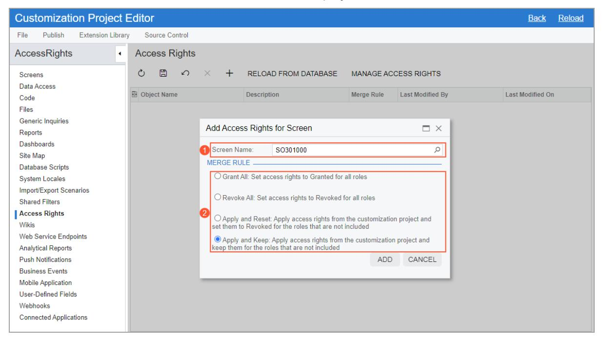

#### *Figure: Adding the access rights to the customization project*

6. You click **Add** to add the selected access rights of roles to the table on the page and close the dialog box.

7. You repeat Instructions 3 through 6 to add the access rights for each needed form (screen).

The system adds to the customization project the data from the database for the selected access rights of roles. You can view the XML source code of each project item on the *[Edit Project Items](https://help-2025r1.acumatica.com/Help?ScreenId=ShowWiki&pageid=36ba1efe-dcbe-4307-b836-0cafae0d1ef9)* page (see the following screenshot).

| <b>Customization Project Editor</b><br><b>Back</b><br>Reload                                                                                                                                                                                                                                                                                                                                                             |                                                                                                                                                                                                                                |                                                                                                                                                                                                                                                                                                                                                                                                                                                                                                                                                                                                                                                                                                                                                                                                                          |                    |                       |                      |                         |                            |              |  |  |
|--------------------------------------------------------------------------------------------------------------------------------------------------------------------------------------------------------------------------------------------------------------------------------------------------------------------------------------------------------------------------------------------------------------------------|--------------------------------------------------------------------------------------------------------------------------------------------------------------------------------------------------------------------------------|--------------------------------------------------------------------------------------------------------------------------------------------------------------------------------------------------------------------------------------------------------------------------------------------------------------------------------------------------------------------------------------------------------------------------------------------------------------------------------------------------------------------------------------------------------------------------------------------------------------------------------------------------------------------------------------------------------------------------------------------------------------------------------------------------------------------------|--------------------|-----------------------|----------------------|-------------------------|----------------------------|--------------|--|--|
| <b>Source Control</b><br>File<br><b>Publish</b><br><b>Extension Library</b>                                                                                                                                                                                                                                                                                                                                              |                                                                                                                                                                                                                                |                                                                                                                                                                                                                                                                                                                                                                                                                                                                                                                                                                                                                                                                                                                                                                                                                          |                    |                       |                      |                         |                            |              |  |  |
| <b>AccessRights</b><br>$\blacktriangleleft$                                                                                                                                                                                                                                                                                                                                                                              | <b>Edit Project Items</b>                                                                                                                                                                                                      |                                                                                                                                                                                                                                                                                                                                                                                                                                                                                                                                                                                                                                                                                                                                                                                                                          |                    |                       |                      |                         |                            |              |  |  |
| <b>Screens</b><br>Data Access                                                                                                                                                                                                                                                                                                                                                                                            | H<br><b>GET PACKAGE</b><br>∽                                                                                                                                                                                                   |                                                                                                                                                                                                                                                                                                                                                                                                                                                                                                                                                                                                                                                                                                                                                                                                                          |                    |                       |                      |                         |                            |              |  |  |
| Code<br><b>Files</b>                                                                                                                                                                                                                                                                                                                                                                                                     | B.<br>0<br><b>Object Name</b>                                                                                                                                                                                                  | <b>Type</b>                                                                                                                                                                                                                                                                                                                                                                                                                                                                                                                                                                                                                                                                                                                                                                                                              | <b>Description</b> | <b>Created Bv</b>     | <b>Creation Date</b> | <b>Last Modified By</b> | <b>Last Modified</b><br>On |              |  |  |
| <b>Generic Inquiries</b>                                                                                                                                                                                                                                                                                                                                                                                                 | $\rightarrow$<br>$\omega$<br>SO301000                                                                                                                                                                                          | <b>ScreenWithRights</b>                                                                                                                                                                                                                                                                                                                                                                                                                                                                                                                                                                                                                                                                                                                                                                                                  |                    | <b>Kimberly Gibbs</b> | 2/12/2024            | <b>Kimberly Gibbs</b>   | 2/12/2024                  |              |  |  |
| Reports<br><b>Dashboards</b><br>Site Map<br><b>Database Scripts</b><br><b>System Locales</b><br>Import/Export Scenarios<br><b>Shared Filters</b><br><b>Access Rights (1)</b><br><b>Wikis</b><br><b>Web Service Endpoints</b><br><b>Analytical Reports</b><br><b>Push Notifications</b><br><b>Business Events</b><br><b>Mobile Application</b><br><b>User-Defined Fields</b><br>Webhooks<br><b>Connected Applications</b> | <b>Source</b><br><screenwithrights accessrightsmergerule="ApplyAndKeep"><br/><data-set><br/><br/><layout><br/><table name="SiteMap"><br/></table><br/><table name="Roles"></table><br/></layout></data-set></screenwithrights> | <relations format-version="3" main-table="SiteMap" relations-version="20190730"><br/><link from="RolesInCache (ScreenID)" to="SiteMap (ScreenID)"/><br/><link from="RolesInGraph (ScreenID)" to="SiteMap (ScreenID)"/><br/><link from="RolesInMember (ScreenID)" to="SiteMap (ScreenID)"/><br/><br/><link from="Roles (Rolename, ApplicationName)" to="RolesInGraph (Rolename, ApplicationName)" type="FromMaster" updateable="False"/><br/><link from="Roles (Rolename, ApplicationName)" to="RolesInMember (Rolename, ApplicationName)" type="FromMaster" updateable="False"/><br/><table name="RolesInCache" uplink="(ScreenID) = (ScreenID)"></table><br/><table name="RolesInGraph" uplink="(ScreenID) = (ScreenID)"></table><br/><table name="RolesInMember" uplink="(ScreenID) = (ScreenID)"></table></relations> |                    |                       |                      |                         |                            | $\checkmark$ |  |  |

#### *Figure: Viewing the XML code of the ScreenWithRights item included in the project*

You can change the merge rule for any added screen by selecting the needed option in the **Merge Rule** column on the *[Access Rights](https://help-2025r1.acumatica.com/Help?ScreenId=ShowWiki&pageid=232ce0b3-baaa-4cdb-a43e-714fbee38a4f)* page.

A customization project may not include explicitly specified access rights on the *[Access Rights](https://help-2025r1.acumatica.com/Help?ScreenId=ShowWiki&pageid=232ce0b3-baaa-4cdb-a43e-714fbee38a4f)* page. In this case, when the customization project is being published, the following rules are applied to each site map node:

- If the site map node does not exist in the target instance, the site map node will not be available for any roles; the access rights will be set to *Revoked*. That is, aer the customization project has been published, you need to grant the access rights explicitly.
- If the site map node already exists in the target instance, the existing access rights remain unchanged.

The site map node corresponds to the screen selected in the**Screen Name** box of the **Add Access Rights forScreen** dialog box. The site map node is considered existing in the target instance if the form (screen) is listed on the *[Site Map](https://help-2025r1.acumatica.com/Help?ScreenId=ShowWiki&pageid=44b364ef-7810-400b-b1c6-8f471c249401)* (SM200520) form.

#### **Publication of Multiple Projects with the Same ScreenWithRights Items**

If you publish multiple customization projects that contain the same *ScreenWithRights* items, the system performs the following actions:

- If a level is specified for each of the projects, merges the projects, adds to the merged project the *ScreenWithRights* items from the project with the highest level, and displays a warning that the *ScreenWithRights* items from other projects will be ignored
- If the projects have the same level or no level is specified for at least one of the projects, does not publish the projects and displays an error

## <span id="page-206-4"></span><span id="page-206-0"></span>**To Delete Access Rights from a Project**

To remove a *ScreenWithRights* item from a project, perform the following actions:

- 1. Open the customization project in the Customization Project Editor. (See *To Open a [Project](#page-84-2)* for details.)
- 2. Click **Access Rights** in the navigation pane to open the *[Access Rights](https://help-2025r1.acumatica.com/Help?ScreenId=ShowWiki&pageid=232ce0b3-baaa-4cdb-a43e-714fbee38a4f)* page.
- 3. In the page table, click the item to be deleted.
- 4. On the page toolbar, click **Delete Row**.
- 5. On the page toolbar, click**Save** to save the changes to the customization project.

If you delete a *ScreenWithRights* item from the project, the customization of the access rights of roles remain in the system unless you delete the changes of access rights from the database.

## <span id="page-206-5"></span><span id="page-206-1"></span>**To Update Access Rights in a Project**

If you have used Acumatica ERP forms to change access rights included in a customization project, you have to update the appropriate items in the project. To do this, perform the following actions:

- 1. Open the customization project in the Customization Project Editor. (See *To Open a [Project](#page-84-2)* for details.)
- 2. Click **Access Rights** in the navigation pane to open the *[Access Rights](https://help-2025r1.acumatica.com/Help?ScreenId=ShowWiki&pageid=232ce0b3-baaa-4cdb-a43e-714fbee38a4f)* page.
- 3. On the page toolbar, click **Reload from Database**.

The platform updates all the *ScreenWithRights* items of the project by using the appropriate data from the database.

### <span id="page-206-6"></span><span id="page-206-2"></span>**To Navigate to the Access Rights by Screen Form**

You might need to change the access rights of roles in Acumatica ERP during customization. To manage access rights of roles by screen in Acumatica ERP, you use the *[Access Rights by Screen](https://help-2025r1.acumatica.com/Help?ScreenId=ShowWiki&pageid=8ee2b0b2-2d66-4e0c-80ce-ac825690c36a)* (SM201020) form.

To open this form from the *[Customization Project Editor](https://help-2025r1.acumatica.com/Help?ScreenId=ShowWiki&pageid=0bb97781-e987-4039-962d-457720821bff)*, perform the following actions:

- 1. Click **Access Rights** in the navigation pane to open the *[Access Rights](https://help-2025r1.acumatica.com/Help?ScreenId=ShowWiki&pageid=232ce0b3-baaa-4cdb-a43e-714fbee38a4f)* page.
- 2. On the page toolbar, click **Manage Access Rights**.

As soon as you change the access rights of roles in Acumatica ERP, the system saves the changes in the database for your tenant, and you can add the access rights as a *ScreenWithRights* item to the customization project. For more information about the access rights of roles, see *[Managing User Access](https://help-2025r1.acumatica.com/Help?ScreenId=ShowWiki&pageid=58acde23-caf5-4a49-9e39-d8bd48779f16)* in the System Administration Guide.

### <span id="page-206-3"></span>**Wikis**

You use the *[Wikis](https://help-2025r1.acumatica.com/Help?ScreenId=ShowWiki&pageid=54cf67d5-4b7c-4323-8d70-ba65627b9c46)* (AU206001) page of the *[Customization Project Editor](https://help-2025r1.acumatica.com/Help?ScreenId=ShowWiki&pageid=0bb97781-e987-4039-962d-457720821bff)* to manage *WikiArticle* items in the customization project.


A *WikiArticle* item contains the dataset of a custom wiki and all the articles created within this wiki.

The *[Wikis](https://help-2025r1.acumatica.com/Help?ScreenId=ShowWiki&pageid=54cf67d5-4b7c-4323-8d70-ba65627b9c46)* page displays the list of the custom wikis that have been added to the customization project.

On the page, you can perform several operations, as described in the following topics:

- *To Add a [Custom](#page-207-1) Wiki to a Project*
- *To Delete a [Custom](#page-209-2) Wiki from a Project*
- *To Update a [Custom](#page-209-3) Wiki in a Project*
- *To [Navigate](#page-210-3) to the Wiki Form*

You can customize *WikiArticle* items for the Self-Service Portal as well. For details on the portal, see *[Self-Service Portal](https://help-2025r1.acumatica.com/Help?ScreenId=ShowWiki&pageid=37516f24-6bf1-4a2c-8554-49665f71db3d)*.

### <span id="page-207-1"></span><span id="page-207-0"></span>**To Add a Custom Wiki to a Project**

In Acumatica ERP, you can create a new wiki or modify the properties of an existing one. For example, you can change the access rights to wiki folders and edit the list of categories available for the wiki. Any change to wikis is saved for the appropriate wiki in the database for the current tenant.

You can add to a customization project the wiki that are saved in the database for the current tenant. To do this, perform the following actions:

- 1. Open the customization project in the Customization Project Editor. (See *To Open a [Project](#page-84-2)* for details.)
- 2. Click **Wikis** in the navigation pane to open the Wikis page.
- 3. On the page toolbar, click **Add New Record** (+), as shown in the screenshot below.
- 4. In the list of custom wikis in the **Add Wiki Page** dialog box, which opens, select the check box for each wiki that you want to include in the project.


The **Add Wiki Page** dialog box displays all the custom wikis that exist in your instance of Acumatica ERP. You can select multiple wikis to add them to the project simultaneously.

- 5. In the dialog box, click **OK** to add the selected wiki to the page table.
- 6. On the page toolbar, click**Save** to save the changes to the customization project.

| HelpRoot_Customize<br><b>Add Wiki Page</b><br>c<br>自口<br>* Wiki ID |                    | * Name    | admin                        |                         | 9/19/2016<br>$\square$ $\times$ |
|--------------------------------------------------------------------|--------------------|-----------|------------------------------|-------------------------|---------------------------------|
|                                                                    |                    |           |                              |                         |                                 |
|                                                                    |                    |           |                              |                         |                                 |
|                                                                    |                    |           |                              |                         |                                 |
|                                                                    |                    |           | Last<br><b>Modifi-</b><br>By | Last<br><b>Modified</b> |                                 |
| ☑                                                                  | HelpRoot_Customize | MyWiki    | admin                        | 9/19/2016               |                                 |
| ∙⊡<br>HelpRoot KB                                                  |                    | MyArticle | admin                        | 9/21/2016               |                                 |
|                                                                    |                    |           |                              |                         |                                 |
|                                                                    |                    |           |                              |                         |                                 |

*Figure: Adding the custom wiki to the customization project*

The system adds to the project each selected wiki. You can view each new *WikiArticle* item in the Project Items table of the *[Edit Project Items](https://help-2025r1.acumatica.com/Help?ScreenId=ShowWiki&pageid=36ba1efe-dcbe-4307-b836-0cafae0d1ef9)*, as shown in the following screenshot.

| <b>Edit Project Items</b>                                                                                                                                                                                                                                                                                                                                                                                                                                                                                                   |                                                                              |                           |               |                  |      |               |                  |                               |                               |  |  |
|-----------------------------------------------------------------------------------------------------------------------------------------------------------------------------------------------------------------------------------------------------------------------------------------------------------------------------------------------------------------------------------------------------------------------------------------------------------------------------------------------------------------------------|------------------------------------------------------------------------------|---------------------------|---------------|------------------|------|---------------|------------------|-------------------------------|-------------------------------|--|--|
| R                                                                                                                                                                                                                                                                                                                                                                                                                                                                                                                           |                                                                              |                           |               |                  |      |               |                  |                               |                               |  |  |
| 自                                                                                                                                                                                                                                                                                                                                                                                                                                                                                                                           |                                                                              | <b>Object Name</b>        | <b>Type</b>   | <b>Descripti</b> | Excl | Created<br>By | Creatic<br>Dafe  | Last<br><b>Modified</b><br>Bv | Last<br><b>Modifie</b><br>On. |  |  |
|                                                                                                                                                                                                                                                                                                                                                                                                                                                                                                                             | Ūı.                                                                          | <b>Active Contracts</b>   | SiteMapNode   |                  |      | admin         | $9/1/2016$ admin |                               | 9/1/2                         |  |  |
|                                                                                                                                                                                                                                                                                                                                                                                                                                                                                                                             | Ûı                                                                           | <b>APAddress</b>          | Sql           |                  |      | admin         | 9/13/2016 admin  |                               | 9/13/                         |  |  |
|                                                                                                                                                                                                                                                                                                                                                                                                                                                                                                                             | Û                                                                            | MyScript                  | Sal           |                  |      | admin         | 9/13/2016 admin  |                               | 9/14/                         |  |  |
|                                                                                                                                                                                                                                                                                                                                                                                                                                                                                                                             | Sql<br>admin<br>9/16/2016 admin<br>9/16/<br>Script For Interpreter<br>Û<br>п |                           |               |                  |      |               |                  |                               |                               |  |  |
|                                                                                                                                                                                                                                                                                                                                                                                                                                                                                                                             | Û,                                                                           | <b>ARTran</b>             | Table         |                  | п    | admin         | $9/1/2016$ admin |                               | 9/1/2                         |  |  |
|                                                                                                                                                                                                                                                                                                                                                                                                                                                                                                                             | Table<br>admin<br>9/1/2016 admin<br>9/1/2<br>Û,<br>Contact<br>п              |                           |               |                  |      |               |                  |                               |                               |  |  |
|                                                                                                                                                                                                                                                                                                                                                                                                                                                                                                                             | Ûı                                                                           | SOOrder                   | Table         |                  |      | admin         | $9/1/2016$ admin |                               | 9/1/2                         |  |  |
|                                                                                                                                                                                                                                                                                                                                                                                                                                                                                                                             | ſŪı                                                                          | <b>HelpRoot Customize</b> | WikiArticle   |                  |      | admin         | 9/19/2016 admin  |                               | 9/19/                         |  |  |
| $\rightarrow$                                                                                                                                                                                                                                                                                                                                                                                                                                                                                                               | Û,                                                                           | HelpRoot KB               | WikiArticle   |                  | п    | admin         | 9/21/2016 admin  |                               | 9/21/                         |  |  |
|                                                                                                                                                                                                                                                                                                                                                                                                                                                                                                                             | Û,                                                                           | ContractUsage             | XportScenario |                  |      | admin         | 9/1/2016 admin   |                               | $9/19$ $\star$                |  |  |
|                                                                                                                                                                                                                                                                                                                                                                                                                                                                                                                             |                                                                              |                           |               |                  |      |               |                  |                               |                               |  |  |
| Source<br><wikiarticle><br/><data-set><br/><relations (pageid)"="" format-version="3" main-table="Wi&lt;br&gt;&lt;link from=" relations-version="20160101" to="WikiPage (PageID)" wikiaccessrights=""></relations><br/><link from="WikiPageLanguage (PageID)" to="WikiPage (PageID)"/><br/><link (uid)"="" from="WikiRevision (PageID, Language, PageRevisionID)" to="Dual (UID)" type="NewUID" wikirevision=""/><br/><link from="WikiPage (PageID)" to="WikiDescriptor (PageID)" type="&lt;/th"/></data-set></wikiarticle> |                                                                              |                           |               |                  |      |               |                  |                               |                               |  |  |
| <link (cssid)"="" from="WikiDescriptor (PageID)" to="WikiDescriptor (CssID)" wikicss=""/><br><link from="WikiFileInPage (PageID, Language, PageRevisionID)" to:<br=""/> <link from="WikiFileInPage (FileID)" to="UploadFile (FileID)" type<br=""/> <link from="UploadFileRevision (FileID, FileRevisionID)" to="Uplo. v</td>                                                                                                                                                                                                |                                                                              |                           |               |                  |      |               |                  |                               |                               |  |  |

*Figure: Viewing the XML code of the WikiArticle item included in the project*

A *WikiArticle* item contains all the data required to recreate the corresponding wiki in any instance of Acumatica ERP.

# <span id="page-209-2"></span><span id="page-209-0"></span>**To Delete a Custom Wiki from a Project**

To remove a *WikiArticle* item from a project, perform the following actions:

- 1. Open the customization project in the Customization Project Editor. (See *To Open a [Project](#page-84-2)* for details.)
- 2. Click **Wikis** in the navigation pane to open the Wikis page.
- 3. In the page table, click the item to be deleted.
- 4. On the page toolbar, click **Delete Row** (X).
- 5. On the page toolbar, click**Save** to save the changes to the customization project.

If you delete a *WikiArticle* item from the project, the custom wiki remains in the system unless you delete the wiki by using the *[Wiki](https://help-2025r1.acumatica.com/Help?ScreenId=ShowWiki&pageid=99e5f44c-69b3-469f-857a-a333882d110b)* (SM202005) form.

### <span id="page-209-3"></span><span id="page-209-1"></span>**To Update a Custom Wiki in a Project**

If you have changed a wiki included in a customization project by using Acumatica ERP forms, you have to update the appropriate item in the project. To do this, perform the following actions:

1. Open the customization project in the Customization Project Editor. (See *To Open a [Project](#page-84-2)* for details.)

- 2. Click **Wikis** in the navigation pane to open the Wikis page.
- 3. On the page toolbar, click **Reload from Database**.

<span id="page-210-3"></span>The platform updates all the *WikiArticle* items of the project by using the appropriate data from the database.

### <span id="page-210-0"></span>**To Navigate to the Wiki Form**

You might need to add a new wiki or edit an existing one in Acumatica ERP during customization. To manage wikis in Acumatica ERP, you use the *[Wiki](https://help-2025r1.acumatica.com/Help?ScreenId=ShowWiki&pageid=99e5f44c-69b3-469f-857a-a333882d110b)* (SM202005) form.

To open this form from the *[Customization Project Editor](https://help-2025r1.acumatica.com/Help?ScreenId=ShowWiki&pageid=0bb97781-e987-4039-962d-457720821bff)*, perform the following actions:

- 1. Click **Wikis** in the navigation pane to open the Wikis page.
- 2. On the page toolbar, click **Manage Wikis**.

As soon as you create or change a wiki in the system, the system saves this wiki in the database for the current tenant, you can add the wiki as a *WikiArticle* item to the customization project. For more information about wikis, see *[Managing](https://help-2025r1.acumatica.com/Help?ScreenId=ShowWiki&pageid=a7187950-7068-464d-8935-ce38c79d789f) Wikis* in the System Administration Guide.

### <span id="page-210-1"></span>**Web Service Endpoints**

Acumatica ERP provides web services for integration with external systems. Through the web services of Acumatica ERP, external systems can get data records from Acumatica ERP and process these records; new or updated records can also be saved to Acumatica ERP. You can configure contract-based web service endpoints in an instance of Acumatica ERP and include the new configuration in a customization project as an *EntityEndpoint* item.

For details about endpoints in a customization project, see *Web Service Endpoints: Endpoint in a [Customization](https://help-2025r1.acumatica.com/Help?ScreenId=ShowWiki&pageid=41ab4560-87c1-4981-9b48-73e60ac95cef) [Project](https://help-2025r1.acumatica.com/Help?ScreenId=ShowWiki&pageid=41ab4560-87c1-4981-9b48-73e60ac95cef)*.

### <span id="page-210-2"></span>**Analytical Reports**

Analytical reports are used to display the consolidated and summarized data in a view defined by the report designer at the report design stage. The analytical reports are used to provide the summarized and aggregated values in a variety of views: the data in the analytical report can be displayed in the monthly, yearly, and quarterly views, and the data can provide information from the point of view of departments, selected account classes, and other dimensions.

In Acumatica ERP, you can modify defined analytical reports, create a new analytical report, and delete existing reports. You can add the analytical reports that have been created or modified to the customization project as *ReportDefinition* items.

You use the *[Analytical Reports](https://help-2025r1.acumatica.com/Help?ScreenId=ShowWiki&pageid=e2cbdc3c-c63c-4204-8792-d66999d31a02)* (AU206003) page of the *[Customization Project Editor](https://help-2025r1.acumatica.com/Help?ScreenId=ShowWiki&pageid=0bb97781-e987-4039-962d-457720821bff)* to manage *ReportDefinition* items in the customization project.

A *ReportDefinition* item contains the data set of a custom analytical report, including the data of a predefined sets of rows, columns, and units.

The *[Analytical Reports](https://help-2025r1.acumatica.com/Help?ScreenId=ShowWiki&pageid=e2cbdc3c-c63c-4204-8792-d66999d31a02)* page displays the list of the custom analytical reports that have been added to the customization project.

On the page, you can perform a variety of operations, as described in the following topics:

• *To Add a Custom [Analytical](#page-211-1) Report to a Project*

- *To Delete a Custom [Analytical](#page-212-1) Report from a Project*
- *To Update a Custom [Analytical](#page-213-4) Report in a Project*
- *To Navigate to the Report [Definitions](#page-213-5) Form*

### <span id="page-211-1"></span><span id="page-211-0"></span>**To Add a Custom Analytical Report to a Project**

You can add a custom analytical report to a customization project. To do this, perform the following actions:

- 1. Open the customization project in the Customization Project Editor. (See *To Open a [Project](#page-84-2)* for details.)
- 2. Click **Analytical Reports** in the navigation pane to open the *[Analytical Reports](https://help-2025r1.acumatica.com/Help?ScreenId=ShowWiki&pageid=e2cbdc3c-c63c-4204-8792-d66999d31a02)* page.
- 3. On the page toolbar, click **Add New Record** (+), as shown in the screenshot below.
- 4. In the list of custom analytical reports in the **Add Report Definition** dialog box, which opens, select the check box for each report that you want to include in the project.


The **Add Report Definition** dialog box displays all the custom analytical reports that exist in your instance of Acumatica ERP. You can select multiple custom analytical reports to add them to the project simultaneously.

- 5. In the dialog box, click **OK** to add each selected analytical report to the page table.
- 6. On the page toolbar, click**Save** to save the changes to the customization project.

|                                                   | <b>Object Name</b> |                                  |                                      | <b>Description</b> | <b>Last Modified By</b> |           | <b>Last Modified On</b>  |  |
|---------------------------------------------------|--------------------|----------------------------------|--------------------------------------|--------------------|-------------------------|-----------|--------------------------|--|
|                                                   |                    | Profit & Loss Budget Performance |                                      |                    | admin                   | 9/19/2016 |                          |  |
|                                                   |                    | <b>Add Report Definition</b>     |                                      |                    |                         |           | $\square$ $\times$       |  |
|                                                   | c                  |                                  |                                      |                    |                         |           |                          |  |
|                                                   | 自口                 | *Code                            | * Description                        |                    | <b>Last Modified By</b> |           | <b>LastModifiedDateT</b> |  |
| <b>CBSS</b><br>Balance Sheet Software & Computers |                    |                                  |                                      |                    | admin                   |           | 12/6/2015                |  |
|                                                   | ☑                  | <b>CPLBUDG</b>                   | Profit & Loss Budget Performance     |                    | admin                   |           | 12/6/2015                |  |
|                                                   |                    | <b>CPLCONS</b>                   | Profit and Loss Software & Computers |                    | admin                   |           | 12/6/2015                |  |
|                                                   |                    | <b>DPL</b>                       | Profit and Loss                      | admin              |                         |           | 12/8/2014                |  |
|                                                   |                    | <b>DPLP</b>                      | Profit & Loss Comparative            |                    | admin<br>admin          |           | 12/8/2014                |  |
|                                                   | ∙∣⊡                | <b>DPLQ</b>                      | P&L - Quarterly                      |                    |                         |           | 12/8/2014                |  |
|                                                   |                    |                                  |                                      |                    |                         |           |                          |  |

#### *Figure: Adding the custom analytical report to the customization project*

The system adds to the project the data from the database for each selected custom analytical report. You can view each new item in the Project Items table of the *[Edit Project Items](https://help-2025r1.acumatica.com/Help?ScreenId=ShowWiki&pageid=36ba1efe-dcbe-4307-b836-0cafae0d1ef9)*, as shown in the following screenshot.

|   | R      | <b>Edit Project Items</b>                                       |                                                                                                                                                                                                                                                                                                                                                                                                                                                                                                                                                                                                                                                                                                                                      |                    |               |                   |                         |                           |
|---|--------|-----------------------------------------------------------------|--------------------------------------------------------------------------------------------------------------------------------------------------------------------------------------------------------------------------------------------------------------------------------------------------------------------------------------------------------------------------------------------------------------------------------------------------------------------------------------------------------------------------------------------------------------------------------------------------------------------------------------------------------------------------------------------------------------------------------------|--------------------|---------------|-------------------|-------------------------|---------------------------|
|   | 自心     | <b>Object Name</b>                                              | <b>Type</b>                                                                                                                                                                                                                                                                                                                                                                                                                                                                                                                                                                                                                                                                                                                          | <b>Description</b> | <b>Exclud</b> | <b>Created By</b> | Creation<br><b>Date</b> | Last<br><b>Modified E</b> |
|   | Û,     | ja-JP                                                           | Locale                                                                                                                                                                                                                                                                                                                                                                                                                                                                                                                                                                                                                                                                                                                               |                    |               | admin             | 9/15/2016               | admir                     |
|   | Û,     | $\sim$ /pages/ar/ar303000.aspx                                  | Page                                                                                                                                                                                                                                                                                                                                                                                                                                                                                                                                                                                                                                                                                                                                 |                    | П             | admin             | 9/1/2016                | admir                     |
|   | Û      | $\sim$ /pages/so/so303000.aspx                                  | Page                                                                                                                                                                                                                                                                                                                                                                                                                                                                                                                                                                                                                                                                                                                                 |                    |               | admin             | 9/1/2016                | admir                     |
|   | Û,     | AR650660 RPX                                                    | Report                                                                                                                                                                                                                                                                                                                                                                                                                                                                                                                                                                                                                                                                                                                               |                    |               | admin             | 9/19/2016               | admir                     |
| ≯ | Û      | P&L - Quarterly                                                 | ReportDefinition                                                                                                                                                                                                                                                                                                                                                                                                                                                                                                                                                                                                                                                                                                                     |                    | п             | admin             | 9/21/2016               | admir                     |
|   | Û,     | Profit & Loss Budget Perf                                       | <b>ReportDefinition</b>                                                                                                                                                                                                                                                                                                                                                                                                                                                                                                                                                                                                                                                                                                              |                    |               | admin             | 9/19/2016               | admir                     |
|   | Û,     | RM000001                                                        | ScreenWithRights                                                                                                                                                                                                                                                                                                                                                                                                                                                                                                                                                                                                                                                                                                                     |                    |               | admin             | 9/19/2016               | admir                     |
|   | Û,     | RM000002                                                        | <b>ScreenWithRights</b>                                                                                                                                                                                                                                                                                                                                                                                                                                                                                                                                                                                                                                                                                                              |                    |               | admin             | 9/20/2016               | admir                     |
|   | Ū,     | RM000003                                                        | ScreenWithRights                                                                                                                                                                                                                                                                                                                                                                                                                                                                                                                                                                                                                                                                                                                     |                    |               | admin             | 9/20/2016               | $admir -$                 |
|   |        |                                                                 |                                                                                                                                                                                                                                                                                                                                                                                                                                                                                                                                                                                                                                                                                                                                      |                    |               |                   |                         |                           |
|   | Source | <reportdefinition><br/><data-set></data-set></reportdefinition> | <relations (columnsetcode)"="" <br="" format-version="3" main-table="RMReport&lt;br&gt;&lt;link from=" relations-version="20160101" rmcolumn="" to="RMColumnSet (ColumnSetCode)"><link from="RMColumn (NoteID)" to="Note (NoteID)" type="Note"/><br/><link (columnsetcode,="" (noteid)"="" columncode)"="" from="RMColumn (NoteID)" rmcolumnheader="" to="Note (NoteID)" type="Note"/><br/><link (datasourceid)"="" from="RMColumnHeader (NoteID)" rmcolumn="" t<br="" to="RMDataSource (DataSourceID)"/><link from="RMRow (DataSourceID)" to="RMDataSource (DataSourceID)" type<br=""/><link from="RMUnit (DataSourceID)" th="" to="RMDataSource (DataSourceID)" typ<=""/><th></th><th></th><th></th><th></th><th></th></relations> |                    |               |                   |                         |                           |
|   |        |                                                                 | <link <math="" from="RMReport (DataSourceID)" t="" to="RMDataSource (DataSourceID)"/> \blacktriangleright                                                                                                                                                                                                                                                                                                                                                                                                                                                                                                                                                                                                                            |                    |               |                   |                         |                           |

*Figure: Viewing the XML code of the ReportDefinition item included in the project*

A *ReportDefinition* item contains all the data required to recreate the corresponding analytical report in any instance of Acumatica ERP.

To give users the ability to navigate to the custom analytical report in Acumatica ERP, you have to add the appropriate site map node to the customization project, as described in *To Add a Site Map [Node](#page-183-5) to [a Project](#page-183-5)*.

# <span id="page-212-1"></span><span id="page-212-0"></span>**To Delete a Custom Analytical Report from a Project**

To remove a *ReportDefinition* item from a project, perform the following actions:

- 1. Open the customization project in the Customization Project Editor. (See *To Open a [Project](#page-84-2)* for details.)
- 2. Click **Analytical Reports** in the navigation pane to open the *[Analytical Reports](https://help-2025r1.acumatica.com/Help?ScreenId=ShowWiki&pageid=e2cbdc3c-c63c-4204-8792-d66999d31a02)* page.
- 3. In the page table, click the item to be deleted.
- 4. On the page toolbar, click **Delete Row**.
- 5. On the page toolbar, click**Save** to save the changes to the customization project.

If you delete a *ReportDefinition* item from the project, the analytical report remains in the system unless you delete the report by using the *[Report Definitions](https://help-2025r1.acumatica.com/Help?ScreenId=ShowWiki&pageid=3ab2cb25-bcec-4a3e-b095-e4ce351875b5)* (CS206000) form.

### <span id="page-213-4"></span><span id="page-213-0"></span>**To Update a Custom Analytical Report in a Project**

If you have used the *[Report Definitions](https://help-2025r1.acumatica.com/Help?ScreenId=ShowWiki&pageid=3ab2cb25-bcec-4a3e-b095-e4ce351875b5)* (CS206000) form to change an analytical report included in a customization project, you have to update the appropriate item in the project. To do this, perform the following actions:

- 1. Open the customization project in the Customization Project Editor. (See *To Open a [Project](#page-84-2)* for details.)
- 2. Click **Analytical Reports** in the navigation pane to open the *[Analytical Reports](https://help-2025r1.acumatica.com/Help?ScreenId=ShowWiki&pageid=e2cbdc3c-c63c-4204-8792-d66999d31a02)* page.
- 3. On the page toolbar, click **Reload from Database**.

<span id="page-213-5"></span>The platform updates all the *ReportDefinition* items of the project by using the appropriate data from the database.

### <span id="page-213-1"></span>**To Navigate to the Report Definitions Form**

You might need to add an analytical report to Acumatica ERP during customization. To manage analytical reports in Acumatica ERP, you use the *[Report Definitions](https://help-2025r1.acumatica.com/Help?ScreenId=ShowWiki&pageid=3ab2cb25-bcec-4a3e-b095-e4ce351875b5)* (CS206000) form.

To open this form from the *[Customization Project Editor](https://help-2025r1.acumatica.com/Help?ScreenId=ShowWiki&pageid=0bb97781-e987-4039-962d-457720821bff)*, perform the following actions:

- 1. Click **Analytical Reports** in the navigation pane to open the *[Analytical Reports](https://help-2025r1.acumatica.com/Help?ScreenId=ShowWiki&pageid=e2cbdc3c-c63c-4204-8792-d66999d31a02)* page.
- 2. On the page toolbar, click **Manage Report Definitions**.

As soon as you add a new analytical report to the system or change an existing analytical report on the *[Report](https://help-2025r1.acumatica.com/Help?ScreenId=ShowWiki&pageid=3ab2cb25-bcec-4a3e-b095-e4ce351875b5) [Definitions](https://help-2025r1.acumatica.com/Help?ScreenId=ShowWiki&pageid=3ab2cb25-bcec-4a3e-b095-e4ce351875b5)* form, the report is saved in the database for the current tenant, and you can add the report to the customization project as a *ReportDefinition* item. For more information about analytical reports, see *[Managing](https://help-2025r1.acumatica.com/Help?ScreenId=ShowWiki&pageid=6998580f-25d2-42ba-bde5-668c2bf1f551) [Analytical Reports](https://help-2025r1.acumatica.com/Help?ScreenId=ShowWiki&pageid=6998580f-25d2-42ba-bde5-668c2bf1f551)* in the Reporting Tools Guide.

### <span id="page-213-2"></span>**Push Notifications**

Push notifications are notifications in JSON format that are sent by Acumatica ERP to notification destinations when specific data changes occur in Acumatica ERP. External applications can receive the notifications and process them to retrieve the information about the changes.

If you need to transfer push notification configuration to another Acumatica ERP instance, you need to include the push notification definitions and related data queries in a customization project and publish this customization project to this instance.

To include push notification definitions in a customization project, you use the *[Push Notifications](https://help-2025r1.acumatica.com/Help?ScreenId=ShowWiki&pageid=db168ac0-acde-4c01-a664-bb98088297be)* (AU210000) page of the Customization Project Editor. For details about push notification in customization projects, see *[Push](https://help-2025r1.acumatica.com/Help?ScreenId=ShowWiki&pageid=a6bc4b93-e961-4965-a8de-030642e9d823) [Notifications: Inclusion in a Customization Project](https://help-2025r1.acumatica.com/Help?ScreenId=ShowWiki&pageid=a6bc4b93-e961-4965-a8de-030642e9d823)*.

### <span id="page-213-3"></span>**Business Events**

To configure the system to monitor a business process, on the *[Business Events](https://help-2025r1.acumatica.com/Help?ScreenId=ShowWiki&pageid=d83a15de-e962-4b94-9f5f-51f501a96b47)* (SM302050) form, you define a *business event* that relates to this business process and that causes the system to perform an action or multiple actions in the system. The business event is a data change or a set of conditions checked for on a schedule. For details on business events, see *[Business Events: Data Change Processing](https://help-2025r1.acumatica.com/Help?ScreenId=ShowWiki&pageid=83582d78-a752-4175-af4f-3cec6150aca0)* and *[Business Events: Scheduled Event](https://help-2025r1.acumatica.com/Help?ScreenId=ShowWiki&pageid=85c42962-1673-41f7-a895-5ec94b1467ca) [Processing](https://help-2025r1.acumatica.com/Help?ScreenId=ShowWiki&pageid=85c42962-1673-41f7-a895-5ec94b1467ca)*.

You can add the business events to a customization project as *BpEvent* items. A *BpEvent* item contains the data set of a business event. The item includes the following information:

- The general information about the business event (such as its name and type)
- The trigger conditions of the business event
- The schedule of the business event (if the conditions of the business event are checked for on a schedule)
- The generic inquiry parameters (if any parameter values have been specified for the business event)
- The email notification templates (if the business event has email notification templates as subscribers)
- The link to the *GenericInquiryScreen* item related to the business event, which the system adds to the customization project as a separate item
- The links to the *XportScenario* items related to the business event, which the system adds to the customization project as separate items (if the business event has import scenarios as subscribers)

You use the *[Business Events](https://help-2025r1.acumatica.com/Help?ScreenId=ShowWiki&pageid=d1d4af58-5fee-4a8a-837f-5e727e400ab4)* (AU210010) page of the *[Customization Project Editor](https://help-2025r1.acumatica.com/Help?ScreenId=ShowWiki&pageid=0bb97781-e987-4039-962d-457720821bff)* to manage *BpEvent* items in the customization project. This page displays the list of the business events that have been added to the customization project.

On the page, you can perform a variety of operations, as described in the following topics:

- *To Add [Business](#page-214-1) Events to a Project*
- *To Delete [Business](#page-215-3) Events from a Project*
- *To Update [Business](#page-215-4) Events in a Project*
- *To Navigate to the [Business](#page-215-5) Events Form*

You can customize *BpEvent* items for the Self-Service Portal as well. For details on the portal, see *[Self-](https://help-2025r1.acumatica.com/Help?ScreenId=ShowWiki&pageid=37516f24-6bf1-4a2c-8554-49665f71db3d)[Service Portal](https://help-2025r1.acumatica.com/Help?ScreenId=ShowWiki&pageid=37516f24-6bf1-4a2c-8554-49665f71db3d)*.

### <span id="page-214-1"></span><span id="page-214-0"></span>**To Add Business Events to a Project**

You can add any number of business events to a customization project as *BpEvent* items. A *BpEvent* item contains all the data required to recreate the corresponding business event in any instance of Acumatica ERP.

To add a business event to the project, perform the following actions:

- 1. Open the customization project in the Customization Project Editor. (See *To Open a [Project](#page-84-2)* for details.)
- 2. In the navigation pane, click **Business Events** to open the *[Business Events](https://help-2025r1.acumatica.com/Help?ScreenId=ShowWiki&pageid=d1d4af58-5fee-4a8a-837f-5e727e400ab4)* page.
- 3. On the page toolbar, click **Add New Record**.
- 4. In the list of business events in the **Add Business Events** dialog box, which has opened, select the unlabeled check box in the row of each business event that you want to include in the project.


The **Add Business Events** dialog box displays all the business events that are configured in your instance of Acumatica ERP.

- 5. Click **OK** to add each selected business event to the page table and close the dialog box.
- 6. Optional: In the Customization Project Editor, click **File > Edit Project Items** on the menu. In the Project Items table of the Item XML Editor, verify that for each selected business event, the system has added to the project the data of the business event from the database (*BpEvent* item), the related generic inquiry (*GenericInquiryScreen* item), and, if the business scenario has any import scenarios as subscribers, the import scenario (*XportScenario* item) for each import scenario subscriber. For details on the Item XML Editor, see *[Edit Project Items](https://help-2025r1.acumatica.com/Help?ScreenId=ShowWiki&pageid=36ba1efe-dcbe-4307-b836-0cafae0d1ef9)*.

### <span id="page-215-3"></span><span id="page-215-0"></span>**To Delete Business Events from a Project**

To remove a *BpEvent* item or multiple *BpEvent* items from a project, perform the following actions:

- 1. Open the customization project in the Customization Project Editor. (See *To Open a [Project](#page-84-2)* for details.)
- 2. In the navigation pane, click **Business Events** to open the *[Business Events](https://help-2025r1.acumatica.com/Help?ScreenId=ShowWiki&pageid=d1d4af58-5fee-4a8a-837f-5e727e400ab4)* page.
- 3. In the page table, click the item to be deleted.
- 4. On the page toolbar, click **Delete Row**.
- 5. Repeat the two previous steps for each item to be deleted.
- 6. On the page toolbar, click**Save** to save your changes to the customization project.

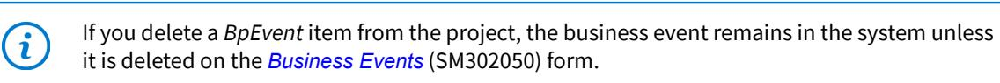

- 7. (Optional) Remove from the customization project the generic inquiry that the removed business event used.
- 8. (Optional) Remove from the customization project any of the import scenario scripts that the removed business event used.

### <span id="page-215-4"></span><span id="page-215-1"></span>**To Update Business Events in a Project**

If a business event included in a customization project has been changed (or if multiple business events have been changed) on the *[Business Events](https://help-2025r1.acumatica.com/Help?ScreenId=ShowWiki&pageid=d83a15de-e962-4b94-9f5f-51f501a96b47)* (SM302050) form, you have to update the appropriate item (or items) in the project. To do this, perform the following actions:

- 1. Open the customization project in the Customization Project Editor. (See *To Open a [Project](#page-84-2)* for details.)
- 2. In the navigation pane, click **Business Events** to open the *[Business Events](https://help-2025r1.acumatica.com/Help?ScreenId=ShowWiki&pageid=d1d4af58-5fee-4a8a-837f-5e727e400ab4)* page.
- 3. On the page toolbar, click **Reload from Database**.

The platform updates all the *BpEvent* items of the project with the data in the database.

If you have changed the generic inquiry used in the business event or the import scenario of the business event, you need to update each changed item separately on the corresponding page of the Customization Project Editor. If you have changed the notification template of the business event, the system updates the notification template in the customization project automatically when you update the business event.

### <span id="page-215-5"></span><span id="page-215-2"></span>**To Navigate to the Business Events Form**

You might need to add a business event to Acumatica ERP during customization. To manage business events in Acumatica ERP, you use the *[Business Events](https://help-2025r1.acumatica.com/Help?ScreenId=ShowWiki&pageid=d83a15de-e962-4b94-9f5f-51f501a96b47)* (SM302050) form. For more information about business events, see *[Using Business Events](https://help-2025r1.acumatica.com/Help?ScreenId=ShowWiki&pageid=85d4ed6e-f498-4683-86f9-bdb5a2164c6d)* in the User Guide.

To open this form directly from the *[Customization Project Editor](https://help-2025r1.acumatica.com/Help?ScreenId=ShowWiki&pageid=0bb97781-e987-4039-962d-457720821bff)*, perform the following actions:

- 1. In the navigation pane, click **Business Events** to open the Business Events page.
- 2. On the page toolbar, click **Manage Business Events**.

This opens the *[Business Events](https://help-2025r1.acumatica.com/Help?ScreenId=ShowWiki&pageid=d83a15de-e962-4b94-9f5f-51f501a96b47)* form where you can select a particular business event or create a new one.

As soon as you add a new business event to the system or change an existing business event on the *[Business Events](https://help-2025r1.acumatica.com/Help?ScreenId=ShowWiki&pageid=d83a15de-e962-4b94-9f5f-51f501a96b47)* form, the business event is saved in the database for the current tenant. You can add the business event to the customization project, as described in *To Add [Business](#page-214-1) Events to a Project*. If you have changed a business event that is already included in a customization project, you have to update the appropriate item in the project, as described in *To Update [Business](#page-215-4) Events in a Project*.

### <span id="page-216-0"></span>**Mobile Application**

An Acumatica mobile client application uses the Mobile API to access the data of the forms that are mapped for mobile apps in the instance of Acumatica ERP. The metadata of the mobile site map is used to configure the user interface of the mobile client application. You can expose any form of Acumatica ERP on your mobile device if the mobile site map includes the metadata for the form. Accessing and using Acumatica ERP mobile app is provided by the Acumatica Mobile Framework.

You can customize the Acumatica ERP mobile app by adding new workspaces, screens, and KPI widgets to it, or updating existing workspaces, screens, and KPI widgets.

You can add to a customization project the following types of items:

- *MobileSitemapWorkspace*: This item contains general data, such as the name of a workspace, its sequential number, and its icon.
- *MobileSitemapWorkspaceItems*: This item contains the screens included in the workspace.
- *MobileSitemapWorkspaceWidgets*: This item contains the KPI widgets included in the workspace and its screens.

You perform customization of the mobile app by using the *[Mobile Application](https://help-2025r1.acumatica.com/Help?ScreenId=ShowWiki&pageid=e3d708a5-a134-43f8-92fd-3fbf8509e88c)* (AU220000) page of the Customization Project Editor. On the page, you can perform a variety of operations, as described in the following topics:

- *To Add a Form To [Mobile](#page-216-2) Site Map*
- *To [Update](#page-218-2) Main Menu of a Mobile App*
- *To [Update](#page-220-2) a Mobile App Screen*
- *To [Remove](#page-220-3) a Screen of a Mobile App*
- *To Reverse [Changes](#page-221-2) Made to Mobile App*

We recommend that you add screens to the workspace of the mobile app in Acumatica ERP. If you were to add a new screen to the mobile app by using the **Add New Screen** command on the Mobile Application page of the Customization Project Editor, the new screen would be added to the **Other** workspace by default. To avoid this, you need to add this screen to one of the workspaces on the *[Mobile Workspace](https://help-2025r1.acumatica.com/Help?ScreenId=ShowWiki&pageid=769f34f8-f804-43ec-97a7-ae98c679d4f0)* (AU220013) form, as described in the *To Add a Screen to a Workspace* section in *To Configure [Workspaces](https://help-2025r1.acumatica.com/Help?ScreenId=ShowWiki&pageid=911d5e97-b703-4e3a-9835-6193add5e719) in the Acumatica ERP Instance*.

For details on how to customize a mobile app using Acumatica Mobile Framework see the *[Working with the Mobile](https://help-2025r1.acumatica.com/Help?ScreenId=ShowWiki&pageid=5dacbf34-ac82-41b4-b498-839c173f587c) [Framework](https://help-2025r1.acumatica.com/Help?ScreenId=ShowWiki&pageid=5dacbf34-ac82-41b4-b498-839c173f587c)* guide.

### <span id="page-216-2"></span><span id="page-216-1"></span>**To Add a Form To Mobile Site Map**

Suppose that you need to add to the Acumatica mobile app a screen that corresponds to an Acumatica ERP form. The form ID is *XXX*. The desired mobile screen has to contain the Date and Description fields and the Insert and Delete actions of the original *XXX* form of Acumatica ERP. Further suppose that you need to add the screen to a workspace.

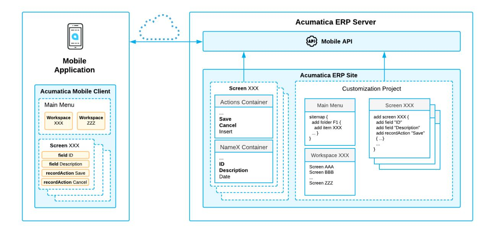

#### *Figure: Use of MSDL to configure a screen in the mobile app*

The diagram above shows how the Acumatica Mobile Framework uses the MSDL code to configure the *XXX* screen in the mobile app. (See *[Configuring the Mobile Site Map](https://help-2025r1.acumatica.com/Help?ScreenId=ShowWiki&pageid=64460c7d-b5da-4872-958f-9c1f290168bc)* for details.) You declare the desired screen, workspace, containers, fields, actions, and other objects by using Mobile Site Map Definition Language (MSDL) in the Customization Project Editor. The objects you want to be displayed on the mobile app screen must be present on the original Acumatica ERP form (see *[Getting the WSDL Schema](https://help-2025r1.acumatica.com/Help?ScreenId=ShowWiki&pageid=a36c007a-a860-4808-8da1-4721f7616acb)*).

Aer you publish your customization project, the screen you have defined by using MSDL appears in the mobile app.

#### **To Add a Screen to the Mobile Site Map**

To add a screen to the mobile site map, perform the following steps:

- 1. Get the WSDL schema for the original *XXX* screen of Acumatica ERP, as described in *[Getting the WSDL](https://help-2025r1.acumatica.com/Help?ScreenId=ShowWiki&pageid=a36c007a-a860-4808-8da1-4721f7616acb) [Schema](https://help-2025r1.acumatica.com/Help?ScreenId=ShowWiki&pageid=a36c007a-a860-4808-8da1-4721f7616acb)*.
- 2. Open the *[Customization Projects](https://help-2025r1.acumatica.com/Help?ScreenId=ShowWiki&pageid=4d3a1166-826c-414b-a207-3d1669fbf9e5)* (SM204505) form, and in the **Project Name** column, click the link of the customization project. The Customization Project Editor opens.
- 3. Open the Mobile Application page.
- 4. On the More menu of the page, click **Add New Screen**.

The **Add New Screen** dialog box opens.

5. In the dialog box, enter the form ID of the Acumatica ERP form (and thus of the corresponding screen in the mobile app) that you want to add to the mobile app, and click **OK**.

The Add: <screen\_name> page opens. The row with the *add* screen and its details appears in the list of modified screens on the Mobile Application page of the Customization Project Editor.

6. Notice that the initial code of the screen includes only one add instruction.

```
add screen <screen_ID> {
# you can add commands here
# ObjectAttribute = Value
}
```

(See *[add](https://help-2025r1.acumatica.com/Help?ScreenId=ShowWiki&pageid=bd8dcd67-29fa-461b-9ccc-f438e53c1b30)* for details about the instruction.)

7. Implement the code of the new screen in the **Commands** area of the Add page. For details, see *[Screens](https://help-2025r1.acumatica.com/Help?ScreenId=ShowWiki&pageid=29a4f3b6-e302-47d7-b714-5fa58c321b05)*.

While implementing the code, use the WSDL schema to understand which actions and fields are available for the form you are adding. For details, see *[Getting the WSDL Schema](https://help-2025r1.acumatica.com/Help?ScreenId=ShowWiki&pageid=a36c007a-a860-4808-8da1-4721f7616acb)*.

8. Save your changes.

Your commands are applied to the site map. If any errors have occurred, you can see them in the **Errors** area of the page. If your changes have been applied successfully, you can see the updated site map of the main menu in the **Result Preview** area of the form.

9. On the Update: MENU page, add a shortcut for the new screen in the main menu, as illustrated in the following code.

```
add item <screen_ID> {
 visible = True 
 displayName = "screen_title" }
```

10.Save your changes, and publish your customization project.

### <span id="page-218-2"></span><span id="page-218-0"></span>**To Update Main Menu of a Mobile App**

In a customization project, you can update the main menu of the customized Acumatica mobile app by using the Customization Project Editor.

#### **To Update the Main Menu of the Mobile App**

- 1. Open the *[Customization Projects](https://help-2025r1.acumatica.com/Help?ScreenId=ShowWiki&pageid=4d3a1166-826c-414b-a207-3d1669fbf9e5)* (SM204505) form, and in the **Project Name** column, click the link of the customization project. The Customization Project Editor opens.
- 2. Open the Mobile Application page.
- 3. On the More menu of the page, click **Update Main Menu**.

The Update: MENU page opens. The *Update MENU* screen appears in the list of modified screens on the Mobile Application page of the Customization Project Editor.

- 4. In the **Result Preview** area of the Update: MENU page, explore the original code of the main menu.
- 5. In the **Commands** area of the Update: MENU page, implement your code by using Mobile Site Map Definition Language (MSDL). For details, see *[Main Menu](https://help-2025r1.acumatica.com/Help?ScreenId=ShowWiki&pageid=c7e5bca7-aebc-4c40-878e-94535fa91c9e)*.
- 6. Save your changes.

Your commands are applied to the menu. If any errors have occurred, you can see them in the **Errors** area of the form. If your changes have been applied successfully, you can see the updated site map of the main menu in the **Result Preview** area of the form.

7. Publish your customization project.

### <span id="page-218-1"></span>**To Manage the Workspaces of the Mobile App**

The main menu of the Acumatica mobile app contains workspaces that are similar to those in your Acumatica ERP instance but that you configure separately.

You manage the workspaces of the main menu by using the Customization Project Editor and the *[Mobile](https://help-2025r1.acumatica.com/Help?ScreenId=ShowWiki&pageid=fa01ef78-1297-4a3f-87ff-fa018f86bc98) [Workspaces](https://help-2025r1.acumatica.com/Help?ScreenId=ShowWiki&pageid=fa01ef78-1297-4a3f-87ff-fa018f86bc98)* (AU220012) and *[Mobile Workspace](https://help-2025r1.acumatica.com/Help?ScreenId=ShowWiki&pageid=769f34f8-f804-43ec-97a7-ae98c679d4f0)* (AU220013) forms in your instance, as well as in the mobile app itself.

If you configure the workspaces on the *[Mobile Workspaces](https://help-2025r1.acumatica.com/Help?ScreenId=ShowWiki&pageid=fa01ef78-1297-4a3f-87ff-fa018f86bc98)* and *[Mobile Workspace](https://help-2025r1.acumatica.com/Help?ScreenId=ShowWiki&pageid=769f34f8-f804-43ec-97a7-ae98c679d4f0)* forms and in your customization project, the system applies these settings to all copies of the Acumatica mobile apps connected to the current

tenant in the Acumatica ERP instance. To configure these settings, you need to have the *Administrator* or *Customizer* predefined role.

If any user configures workspaces, screens, and KPI widgets in the mobile app, these settings are applied to the mobile app for only this user.

#### **To Add a Workspace to a Customization Project**

To add any workspaces to a particular customization project, perform the following steps:

- 1. Open the *[Customization Projects](https://help-2025r1.acumatica.com/Help?ScreenId=ShowWiki&pageid=4d3a1166-826c-414b-a207-3d1669fbf9e5)* (SM204505) form, and in the **Project Name** column, click the link of the customization project. The Customization Project Editor opens.
- 2. In the navigation pane, click **Mobile Application** to open the Mobile Application page.
- 3. On the More menu of the page, click **Manage Workspaces**.

The Mobile Workspace page opens.

4. On the page toolbar, click **Add New Record**.

The **Add Workspace** dialog box opens. The dialog box contains workspaces that you have modified. These include workspaces for which you have added any screens or widgets on the *[Mobile Workspace](https://help-2025r1.acumatica.com/Help?ScreenId=ShowWiki&pageid=769f34f8-f804-43ec-97a7-ae98c679d4f0)* (AU220013) form, new workspaces you have created on the form, as well as workspaces whose order you have changed on the *[Mobile Workspaces](https://help-2025r1.acumatica.com/Help?ScreenId=ShowWiki&pageid=fa01ef78-1297-4a3f-87ff-fa018f86bc98)* (AU220012) form.

5. Select the unlabeled check box in each row with a workspace whose changes you want to add to the project.

In the navigation pane, notice that the Mobile Workspaces page is listed under the **Mobile Application** node. Open this page, and you can see that the More menu of this page contains the **Manage Workspaces** command.

6. Click **Save** to add the selected workspaces to the customization project and save your changes.

#### **To Configure Workspaces from a Customization Project**

To configure workspaces from a customization project, perform the following steps:

- 1. Open the *[Customization Projects](https://help-2025r1.acumatica.com/Help?ScreenId=ShowWiki&pageid=4d3a1166-826c-414b-a207-3d1669fbf9e5)* (SM204505) form, and in the **Project Name** column, click the link of the customization project. The Customization Project Editor opens.
- 2. In the navigation pane, click **Mobile Workspaces** to open the Mobile Application page.
- 3. On the More menu of the page, click **Manage Workspaces**.

The *[Mobile Workspaces](https://help-2025r1.acumatica.com/Help?ScreenId=ShowWiki&pageid=fa01ef78-1297-4a3f-87ff-fa018f86bc98)* (AU220012) form opens in a new window.

- 4. On the form, configure the workspaces as described in *To Configure [Workspaces](https://help-2025r1.acumatica.com/Help?ScreenId=ShowWiki&pageid=911d5e97-b703-4e3a-9835-6193add5e719) in the Acumatica ERP [Instance](https://help-2025r1.acumatica.com/Help?ScreenId=ShowWiki&pageid=911d5e97-b703-4e3a-9835-6193add5e719)*.
- 5. Save your changes, and close the window.

#### **To Update a Workspace in a Customization Project**

To update a workspace in a customization project aer you have modified it in the Acumatica ERP instance, perform the following steps:

- 1. Open the *[Customization Projects](https://help-2025r1.acumatica.com/Help?ScreenId=ShowWiki&pageid=4d3a1166-826c-414b-a207-3d1669fbf9e5)* (SM204505) form, and in the **Project Name** column, click the link of the customization project. The Customization Project Editor opens.
- 2. In the navigation pane, click **Mobile Workspaces** to open the Mobile Application page.
- 3. In the table on the page, click the workspace you want to update.

4. On the More menu, click **Reload from Database**.

#### **To Remove a Workspace from a Customization Project**

To remove a workspace from a customization project, perform the following steps:

- 1. Open the *[Customization Projects](https://help-2025r1.acumatica.com/Help?ScreenId=ShowWiki&pageid=4d3a1166-826c-414b-a207-3d1669fbf9e5)* (SM204505) form, and in the **Project Name** column, click the link of the customization project. The Customization Project Editor opens.
- 2. On the navigation pane, click **Mobile Workspaces** to open the Mobile Application page.
- 3. In the table on the page, click the row with the workspace you want to remove.
- 4. On the page toolbar, click **Delete Row**.
- 5. Save your changes.

### <span id="page-220-2"></span><span id="page-220-0"></span>**To Update a Mobile App Screen**

In a customization project, you can update an existing screen of the customized Acumatica mobile app by using the Customization Project Editor.

#### **To Update a Screen of a Mobile App**

- 1. Open the *[Customization Projects](https://help-2025r1.acumatica.com/Help?ScreenId=ShowWiki&pageid=4d3a1166-826c-414b-a207-3d1669fbf9e5)* (SM204505) form, and in the **Project Name** column, click the link of the customization project. The Customization Project Editor opens.
- 2. Open the Mobile Application page.
- 3. On the More menu of the page, click **Update ExistingScreen**.

The **Update ExistingScreen** dialog box opens.

4. In the dialog box, specify the ID of the screen you want to update, and click **OK**.

The Update: <screen\_name> page opens. The new *update* screen with its details appears in the list of modified screens on the Mobile Application page of the Customization Project Editor.

- 5. Explore the original code of the screen in the **Result Preview** area of the Update: <screen\_name> page.
- 6. Implement your code by using Mobile Site Map Definition Language (MSDL) in the **Commands** area of the page. For details, see *[Screens](https://help-2025r1.acumatica.com/Help?ScreenId=ShowWiki&pageid=29a4f3b6-e302-47d7-b714-5fa58c321b05)*.
- 7. Save your changes.

Your commands are applied to the site map. If any errors have occurred, you can see them in the **Errors** area of the page. If your changes have been applied successfully, you can see the updated site map of the main menu in the **Result Preview** area of the form.

8. Publish the customization project.

### <span id="page-220-3"></span><span id="page-220-1"></span>**To Remove a Screen of a Mobile App**

You can remove a screen of the customized Acumatica mobile app from a customization project by using the Customization Project Editor.

#### **To Remove a Screen of a Mobile App**

- 1. Open the *[Customization Projects](https://help-2025r1.acumatica.com/Help?ScreenId=ShowWiki&pageid=4d3a1166-826c-414b-a207-3d1669fbf9e5)* (SM204505) form, and in the **Project Name** column, click the link of the customization project. The Customization Project Editor opens.
- 2. Open the Mobile Application page.
- 3. On the More menu of the page, click **Remove ExistingScreen**.

The **Remove ExistingScreen** dialog box opens.

4. In the dialog box, specify the ID of the screen you want to remove, and click **OK**.

The selected screen is removed. The *Remove <screen\_name>* row appears in the list of modified screens on the Mobile Application page of the Customization Project Editor.

### <span id="page-221-2"></span><span id="page-221-0"></span>**To Reverse Changes Made to Mobile App**

When you are customizing the mobile site map in a customization project by using the Customization Project Editor, you might need to reverse the changes you have made to the site map of the Acumatica mobile app in this project. You can return to the original site map for one tenant or for all tenants without removing the other changes you have made in the customization project.

### **To Reverse Changes Made to the Mobile Site Map**

To reverse the changes to the mobile site map in a particular customization project, perform the following steps:

- 1. Open the customization project in the Customization Project Editor.
- 2. Click **Mobile Application** in the navigation pane to open the Mobile Application page.
- 3. On the More menu of the page, click **Clear CurrentTenant** if you want to reverse the changes to the current tenant only. If you want to reverse the changes to all tenants, click **Clear AllTenants**.

The mobile app customization is unpublished from the selected tenants.

To return to your changes, publish your customization project, as described in *To Publish the [Current](#page-121-2) Project*.

### <span id="page-221-1"></span>**User-Defined Fields**

The Customization Project Editor includes the *[User-Defined Fields](https://help-2025r1.acumatica.com/Help?ScreenId=ShowWiki&pageid=5f3f740b-6410-42f4-af5b-de2744eb03f2)* (AU230000) page, which is shown in the screenshot below. On this page, you can do the following:

- Update field properties that have been updated by users in an instance of Acumatica ERP by clicking **Reload from Database**.
- Add a new user-defined field based on existing attributes. For details on defining attributes, see *[Attributes](https://help-2025r1.acumatica.com/Help?ScreenId=ShowWiki&pageid=51966695-681a-4ca7-9365-d1b5058a1596)*.
- View detailed information about a user-defined field.
- Modify the list of screens on which the field is displayed.
- Remove an existing user-defined field.

You can add a user-defined field either on the applicable form of Acumatica ERP or on the *[User-Defined Fields](https://help-2025r1.acumatica.com/Help?ScreenId=ShowWiki&pageid=5f3f740b-6410-42f4-af5b-de2744eb03f2)* page of the Customization Project Editor. Any user-defined fields you add in the Customization Project Editor are added to the current customization project with all other items; when the project has been completed, it can be exported and imported.

| <b>ScreenActions</b><br>$\blacktriangleleft$ |   | User-Defined Fields         |                      |       |   |                             |                            |                            |
|----------------------------------------------|---|-----------------------------|----------------------|-------|---|-----------------------------|----------------------------|----------------------------|
| $\sqrt{\text{SCREENS}}$<br>Data Access       |   | H<br>C<br>$\Leftrightarrow$ | $\times$             | $\pm$ | 0 | <b>RELOAD FROM DATABASE</b> | <b>MANAGE</b>              |                            |
| !!!!!!!!!!!!!!!!!!!!!!!!!!!!!!!!!!!!!!!!     |   | Attribute ID                | <b>Description</b>   |       |   | Screen ID                   | <b>Last Modified</b><br>By | Last<br><b>Modified On</b> |
| <b>Files</b>                                 | ⋋ | <b>BURDEN</b>               | Project Burden Perce |       |   | AP301000                    | admin admin                | 1/9/2019                   |
| Generic Inquiries                            |   | <b>COLOR</b>                | Color                |       |   | SO303000,SO302000,SO3010    | admin admin                | 1/9/2019                   |
| Reports                                      |   |                             |                      |       |   |                             |                            |                            |
| <b>Dashboards</b>                            |   |                             |                      |       |   |                             |                            |                            |
| Site Map                                     |   |                             |                      |       |   |                             |                            |                            |
| Database Scripts                             |   |                             |                      |       |   |                             |                            |                            |
| <b>System Locales</b>                        |   |                             |                      |       |   |                             |                            |                            |
| Import/Export Scenarios                      |   |                             |                      |       |   |                             |                            |                            |
| <b>Shared Filters</b>                        |   |                             |                      |       |   |                             |                            |                            |
| <b>Access Rights</b>                         |   |                             |                      |       |   |                             |                            |                            |
| <b>Wikis</b>                                 |   |                             |                      |       |   |                             |                            |                            |
| Web Service Endpoints                        |   |                             |                      |       |   |                             |                            |                            |
| <b>Analytical Reports</b>                    |   |                             |                      |       |   |                             |                            |                            |
| <b>Push Notifications</b>                    |   |                             |                      |       |   |                             |                            |                            |
| <b>Business Events</b>                       |   |                             |                      |       |   |                             |                            |                            |
| <b>Mobile Application</b>                    |   |                             |                      |       |   |                             |                            |                            |
| <b>User-Defined Fields (2)</b>               |   |                             |                      |       |   |                             |                            |                            |

#### *Figure: The User-Defined Fields page*

You can add user-defined fields for the Self-Service Portal as well. For details on the portal, see *[Self-](https://help-2025r1.acumatica.com/Help?ScreenId=ShowWiki&pageid=37516f24-6bf1-4a2c-8554-49665f71db3d)[Service Portal](https://help-2025r1.acumatica.com/Help?ScreenId=ShowWiki&pageid=37516f24-6bf1-4a2c-8554-49665f71db3d)*.

#### **Related Links**

• *[Attributes](https://help-2025r1.acumatica.com/Help?ScreenId=ShowWiki&pageid=51966695-681a-4ca7-9365-d1b5058a1596)*

### <span id="page-222-0"></span>**To Add a User-Defined Field to a Customization Project**

To add a user-defined field to customization project, you can use a field previously defined in Acumatica ERP, or create a field in Customization Project Editor. Aer that you can include the field in the current customization project.

### **To Add a New User-Defined Field**

To add a new user-defined field, proceed as follows:

- 1. On the navigation pane of the Customization Project Editor, click **User-Defined Fields** to open the *[User-](https://help-2025r1.acumatica.com/Help?ScreenId=ShowWiki&pageid=5f3f740b-6410-42f4-af5b-de2744eb03f2)[Defined Fields](https://help-2025r1.acumatica.com/Help?ScreenId=ShowWiki&pageid=5f3f740b-6410-42f4-af5b-de2744eb03f2)* page.
- 2. On the page toolbar, click **Add New Record**.
- 3. In the **Add User-Defined Fields** dialog box, which opens, select an attribute for the user-defined field you are adding, and click**Save**.

The user-defined field appears in the list on the User-Defined Fields page, and the dialog box is closed. Now you need to specify the IDs of the screens on which the field will appear. By default, the added field appears with all screens where it is used in the instance.

4. In the row with the user-defined field, click the link in the **Attribute ID** column.

5. In the **Edit Attribute** dialog box (see the following screenshot), which opens, select the forms for which you want to save the fields in the customization project.

In this dialog box, you can see only the IDs of the screens for which the user-defined field was added. To add a user-defined field to a screen, on the title bar of the screen, select **Customization > Manage User-Defined Fields** and add the field.

| <b>User-Defined Fields</b><br>$+$ 0<br>$\times$<br>Description<br>Project Burden Perce<br>Color<br><b>Edit Attribute</b><br><b>Screen ID</b> | RELOAD FROM DATABASE<br><b>Screen ID</b><br>AP301000<br>SO303000,SO302000,SO3010 | <b>MANAGE</b><br><b>Last Modified</b><br><b>By</b><br>admin admin<br>admin admin<br>$\blacksquare$ $\times$ | Last<br><b>Modified On</b><br>1/9/2019<br>1/9/2019 |
|----------------------------------------------------------------------------------------------------------------------------------------------|----------------------------------------------------------------------------------|-------------------------------------------------------------------------------------------------------------|----------------------------------------------------|
|                                                                                                                                              |                                                                                  |                                                                                                             |                                                    |
|                                                                                                                                              |                                                                                  |                                                                                                             |                                                    |
|                                                                                                                                              |                                                                                  |                                                                                                             |                                                    |
|                                                                                                                                              |                                                                                  |                                                                                                             |                                                    |
|                                                                                                                                              |                                                                                  |                                                                                                             |                                                    |
| $\blacktriangledown$<br>AP.30.10.00<br>SO.30.10.00<br>п<br>SO.30.20.00<br>П<br>$\blacktriangledown$                                          |                                                                                  |                                                                                                             |                                                    |
|                                                                                                                                              |                                                                                  | SO.30.30.00                                                                                                 | SAVE<br>CANCEL                                     |

#### *Figure: The Edit Attribute dialog box*

6. Click **Save** to save your changes, close the dialog box, and return to the User-Defined Fields page.

The selected form IDs are listed in the**Screen ID** column of the user-defined field you edited, as shown in the following screenshot.

| User-Defined Fields |                   |                                          |                      |                     |                            |
|---------------------|-------------------|------------------------------------------|----------------------|---------------------|----------------------------|
|                     | $\mathbf{C}$<br>眉 | $\Leftrightarrow$ $\times$ $+$ $\varphi$ | RELOAD FROM DATABASE | MANAGE              |                            |
|                     | Attribute ID      | <b>Description</b>                       | Screen ID            | Last Modified<br>By | Last<br><b>Modified On</b> |
|                     | <b>BURDEN</b>     | Project Burden Perce                     | AP301000             | admin admin         | 1/9/2019                   |
|                     | <b>COLOR</b>      | Color                                    | SO303000.AP301000    | admin admin         | 1/9/2019                   |

#### *Figure: The list of user-defined fields aer being edited*

7. On the page toolbar, click**Save**.

#### **Related Links**

• *To Add [User-Defined](https://help-2025r1.acumatica.com/Help?ScreenId=ShowWiki&pageid=810b4857-2ffe-4764-aebf-4d657334f0be) Fields to a Form*

### <span id="page-224-0"></span>**Webhooks**

A webhook helps you to integrate external applications that provide data in their own format and need to submit this data to Acumatica ERP. For example, HubSpot collects data about email clicks and can export this data in a specific format to a particular URL. By using a webhook, you can configure Acumatica ERP to process the data submitted to a particular URL and save the data in Acumatica ERP.

If you need to use a webhook on another Acumatica ERP instance, you need to include the information about this webhook in a customization project and publish this customization project to this instance.

For details about how to include webhooks in a customization project, see *Webhooks in a [Customization](https://help-2025r1.acumatica.com/Help?ScreenId=ShowWiki&pageid=f4e3f753-3408-409a-b797-1f6d1adf6182) Project*.

### <span id="page-224-1"></span>**Connected Applications**

If you need to use a client application that implements the OAuth 2.0 or OpenID Connect authorization mechanism with other Acumatica ERP instances, you need to include the information about this client application in a customization project and publish this customization project to these instances. To include the information about the registered client application in a customization project, you use the *[Connected Applications](https://help-2025r1.acumatica.com/Help?ScreenId=ShowWiki&pageid=208caa93-446d-4c4d-8fbe-1c03d31995c6)* page of the Customization Project Editor.

For details on OAuth 2.0 or OpenID Connect authorization mechanism, see *[OAuth 2.0 and OIDC: General](https://help-2025r1.acumatica.com/Help?ScreenId=ShowWiki&pageid=c6294b6b-a460-491e-8130-ae55d063c15c) [Information](https://help-2025r1.acumatica.com/Help?ScreenId=ShowWiki&pageid=c6294b6b-a460-491e-8130-ae55d063c15c)*. For details on registering client applications, see *[Registration of an OAuth 2.0 or OIDC Application:](https://help-2025r1.acumatica.com/Help?ScreenId=ShowWiki&pageid=84e7f6c6-3b0f-4526-a1aa-343e39aeebfe) [General Information](https://help-2025r1.acumatica.com/Help?ScreenId=ShowWiki&pageid=84e7f6c6-3b0f-4526-a1aa-343e39aeebfe)*.

# <span id="page-225-1"></span><span id="page-225-0"></span>**Customizing Elements of the User Interface**

You can customize the user interface by creating a new form or by changing the content and layout of a form that already exists in Acumatica ERP.

This part is intended to describe how to use the visual *[Screen Editor](https://help-2025r1.acumatica.com/Help?ScreenId=ShowWiki&pageid=d60a8270-e2ce-4380-b778-af61a0ca56d2)* to develop the ASPX code of a custom form and modify the ASPX code of an existing form.

The following table lists most of the types of ASPX objects supported in the Acumatica Customization Platform.

| Object       | Description                                                                                                                                                                                                                                                                                                                                                                                                                                     |  |
|--------------|-------------------------------------------------------------------------------------------------------------------------------------------------------------------------------------------------------------------------------------------------------------------------------------------------------------------------------------------------------------------------------------------------------------------------------------------------|--|
| PXDataSource | A data source control that connects to a graph instance on the Acumatica ERP server, re<br>trieves data from the graph instance, and sends data to the graph instance; it also pro<br>vides the data processing for the control containers that are defined in the ASPX page. In<br>Acumatica ERP, a page must contain a single PXDataSource control.                                                                                           |  |
| PXFormView   | A data-bound UI container control that renders a single record from its associated data<br>source.                                                                                                                                                                                                                                                                                                                                              |  |
| PXGrid       | A data-bound UI container control that renders a table with multiple records from its as<br>sociated data source. The object can be displayed in form view mode for a single record<br>and provides paging buttons that can be used to navigate between records. To define<br>form view mode, the PXGrid control must include the RowTemplate element, which<br>can contain controls for the record fields and layout rules for these controls. |  |
| PXGridColumn | In a PXGrid container, an object that defines the data field and properties of a column<br>in the grid.                                                                                                                                                                                                                                                                                                                                         |  |
| RowTemplate  | In a PXGrid container, an object that defines a record field and layout for each control<br>to be rendered in form view mode for the grid.                                                                                                                                                                                                                                                                                                      |  |
| PXTab        | A data-bound UI container control that renders tabs defined by child PXTabItem con<br>tainers.                                                                                                                                                                                                                                                                                                                                                  |  |
| PXTabItem    | In a PXTab container, a container control that renders a single record from the data<br>source specified for the parent PXTab container.                                                                                                                                                                                                                                                                                                        |  |
| PXSmartPanel | An UI container control that renders a dialog box.                                                                                                                                                                                                                                                                                                                                                                                              |  |
| PXLayoutRule | In a container with controls for a single data record, a component that defines a layout<br>rule used to organize the controls within a row or column.                                                                                                                                                                                                                                                                                          |  |
| PXPanel      | In a container with controls for a single data record, a container with a caption used to<br>group controls. In a dialog box, it is often used as a container to display a horizontal row<br>of buttons with right alignment.                                                                                                                                                                                                                   |  |
| PXGroupBox   | In a container with controls for a single data record, a container with a caption used to<br>group controls. It is designed to be used as a radio button container to render a drop<br>down field as a set of radio buttons. It contains scripts with logic to support a nested ra<br>dio button for each value of a drop-down field.                                                                                                           |  |

| Object         | Description                                                                                                                                                                                                                                                  |  |
|----------------|--------------------------------------------------------------------------------------------------------------------------------------------------------------------------------------------------------------------------------------------------------------|--|
| PXRadioButton  | In a PXGroupBox container, a radio button that is used for a single constant value of a<br>drop-down field.                                                                                                                                                  |  |
|                | In Acumatica ERP, a radio button can work properly only in a PXGroupBox<br>container that is used for a drop-down data field.                                                                                                                                |  |
| PXLabel        | In a container with controls for a single data record, an element to display text.                                                                                                                                                                           |  |
| PXButton       | In a container with controls for a single data record, an element to display a button con<br>trol. In a dialog box, it is usually included in a PXPanel container.                                                                                           |  |
| PXJavaScript   | In a container with controls for a single data record, a control to keep JavaScript code.                                                                                                                                                                    |  |
| PXTextEdit     | In a container with controls for a single data record, a text box to display and edit the val<br>ue of a string field.                                                                                                                                       |  |
| PXNumberEdit   | In a container with controls for a single data record, a box to display and edit the value of<br>a decimal or int field.                                                                                                                                     |  |
| PXMaskEdit     | In a container with controls for a single data record, a text box to display and edit the val<br>ue of a string field that has the format specified in the data access class.                                                                                |  |
| PXDateTimeEdit | In a container with controls for a single data record, a box to display and select the value<br>of a datetime field.                                                                                                                                         |  |
| PXCheckBox     | In a container with controls for a single data record, a check box to display and select the<br>value of a bool field.                                                                                                                                       |  |
| PXDropDown     | In a container with controls for a single data record, a combo box to display, edit, and se<br>lect the value of a field with a list attribute, such as PXStringList, PXIntList, or<br>PXDecimalList.                                                        |  |
| PXSelector     | In a container with controls for a single data record, a lookup control to display, search,<br>and select the value of a field with the PXSelector attribute.                                                                                                |  |
| PXSegmentMask  | In a container with controls for a single data record, a lookup control with a specified seg<br>mented key value that identifies a data record and consists of one segment or multiple<br>segments, with a list of possible values defined for each segment. |  |
| PXTreeSelector | In a container with controls for a single data record, a lookup control to select a value for<br>a field with a PXTreeSelector attribute from a tree control.                                                                                                |  |

When you use the Screen Editor to add a UI element to another UI element on a form, you should understand the rules that are used for nesting objects in ASPX code for Acumatica ERP forms. The following diagram shows which ASPX objects can be included in other ASPX objects.

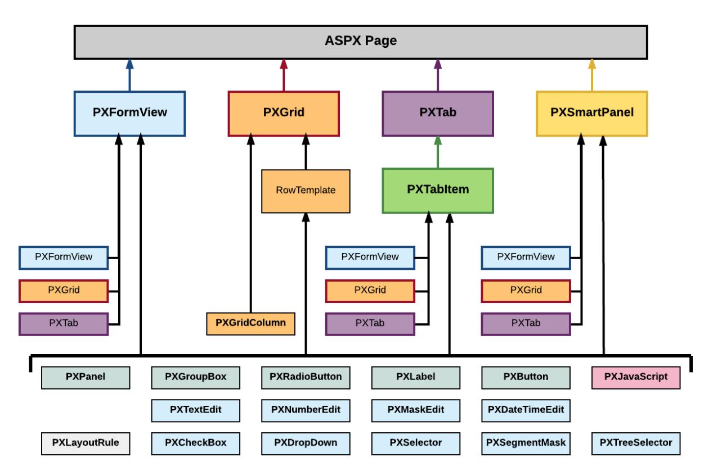

*Figure: Nesting rules for elements of an ASPX page*

In the diagram, if an arrow goes from object A to object B, it means that multiple instances of object A can be included in a single object B. For example, PXTab can contain multiple PXTabItem objects.

• The PXGrid object can contain a single RowTemplate object.

- The PXSmartPanel object is used to describe the content of a dialog box.
- A control for a data field (also referred as *box*)—such as PXTextEdit, PXSelector, and PXCheckBox—can be included in ASPX objects of the following types:
  - PXFormView
  - RowTemplate
  - PXTabItem
  - PXSmartPanel

### <span id="page-227-1"></span><span id="page-227-0"></span>**Custom Form**

By using the Acumatica Customization Platform, you can develop a custom form from scratch and add it to a customization project. To create a new form, you have to create the following types of code:

- ASPX page that contains a description of the UI elements of the form
- CS code that provides the business logic for the form

For each form that works with data from the database, the instance of Acumatica ERP must contain at least the following objects (see the diagram below):

• An ASPX page: The page must contain at least the data source control and a container with controls for data fields.

- A business logic controller (BLC, also referred to as *graph*): The graph must be specified in the TypeName property of the data source control of the page. The graph must contain at least one data view, which is specified in the PrimaryView property of the data source control and in the DataMember property of the container. The graph instance is created on each round trip and initializes the creation of the data view instance based on a BQL statement. The data view provides data manipulation and data flows between the data source control of the ASPX page, the cache object of the graph, and the corresponding table of the database. The BQL statement contains a reference to at least one data access class that is required to map the database table to data records in the cache object.
- A data access class (DAC): On each round trip, the DAC instance is created in the cache object when the data view processes any operation with the corresponding data.
- A table in the database: The table is mapped to the data access class that defines the data record type in the cache object of the graph instance.

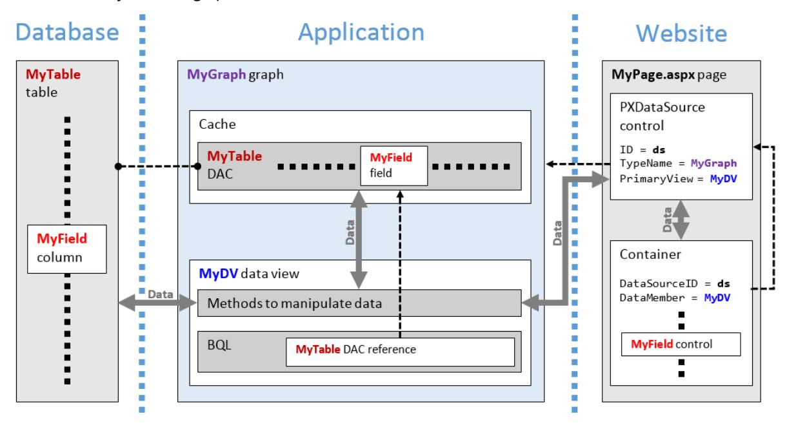

#### *Figure: Objects required for a form that works with data from a database table*

For a custom form to be enabled in an instance of Acumatica ERP, the site map of the instance must contain information about the form.

You use the *[Customization Project Editor](https://help-2025r1.acumatica.com/Help?ScreenId=ShowWiki&pageid=0bb97781-e987-4039-962d-457720821bff)* to perform operations with custom forms, as described in the following topics:

- *To [Develop](#page-228-1) a Custom Form*
- *To Create a Custom Form [Template](#page-229-1)*
- *To Delete a [Custom](#page-153-2) Form from a Project*

#### **Related Links**

- *Changes in [Webpages](#page-44-1) (ASPX)*
- *[Customized Screens](#page-149-1)*

### <span id="page-228-1"></span><span id="page-228-0"></span>**To Develop a Custom Form**

To create and develop a custom form within a customization project, you can use the following approach:

1. Plan the functionality, content, and user interface of the new form.

- 2. If the custom form requires data from a new table, create the table in the database by using a database administration tool, such as SQL Server Management Studio. (See *To Add a [Custom](#page-185-2) Table to a Project* for details.)
- 3. Create a workable form template by using the New Screen wizard, as described in *To Create a [Custom](#page-229-1) Form [Template](#page-229-1)*.

Aer you have created a custom form template and published the customization project, you can develop the form in the same way as you customize an existing form of Acumatica ERP. (See *[Existing Form](#page-236-3)* for details.) Because the code templates are added to the App\_RuntimeCode folder of the Acumatica ERP website, you can develop the code in Microso Visual Studio.

- 4. **C#**: Create data access classes that contain the data field declarations required for the form controls. (See *[To](#page-164-2) [Create a Custom Data Access Class](#page-164-2)* for details.)
- 5. **C#**: In the graph template, define BQL statements in data views to manage data fields declared in data access classes. (See *To Add a New [Member](#page-347-1)* for details.)
- 6. **ASPX**: If needed, add nested containers to the main containers of the form template. (See *To Add a [Nested](#page-246-1) [Container](#page-246-1)* for details.)
- 7. **C#**: For each nested container, in the graph template, define the appropriate data views.
- 8. **ASPX**: For each added container, specify the name of an appropriate data view in the DataMember property. (See *To Set a [Container](#page-245-2) Property* for details.)
- 9. **ASPX**: If required, for each added container, specify other properties. (See *To Set a [Container](#page-245-2) Property* for details.)
- 10.**ASPX**: Add controls for data fields to each container. (See *To Add a Box for a Data [Field](#page-247-1)* for details.)
- 11.**ASPX**: Specify properties for controls. (See *To Set a Box [Property](#page-264-2)* for details.)
- 12.**C#**: Develop business logic for the form in the graph (See *[Customizing Business Logic](#page-321-3)* for details.)
- 13.**ASPX**: If required, add dialog boxes, as described in *To Add a [Dialog](#page-242-1) Box*.

We recommend that you use the *[Screen Editor](https://help-2025r1.acumatica.com/Help?ScreenId=ShowWiki&pageid=d60a8270-e2ce-4380-b778-af61a0ca56d2)* to create the content of an ASPX page and Visual Studio to develop the business logic for a page. (See *[Integrating](#page-384-2) the Project Editor with Microsoft Visual Studio* for details.)

### <span id="page-229-1"></span><span id="page-229-0"></span>**To Create a Custom Form Template**

To create a workable template for a custom form by using the New Screen wizard and include the template in a customization project, perform the following actions:

- 1. Open the customization project in the Customization Project Editor. (See *To Open a [Project](#page-84-2)* for details.)
- 2. Select the**Screens** node in the navigation pane of the editor to open the *[Customized Screens](https://help-2025r1.acumatica.com/Help?ScreenId=ShowWiki&pageid=98b095c8-14d5-477a-9fc3-cc7c57fee3cd)* page.
- 3. On the page toolbar, click **CreateScreen**, as item a in the screenshot below shows.
- 4. In the **CreateScreen** dialog box, which opens, specify values for input controls as follows (item b in the screenshot):
  - a. **Screen ID**: Enter an ID of a custom form in the *XX.\*\*.\*\*.\*\** format, which consists of the following parts:
    - a. Two-letter code of the functional area in Acumatica ERP

You can use a single unique two-letter code for all custom forms in a solution. Please check the Pages folder of the website in the production environment to ensure that the code you want to use is not already used in the instance of Acumatica ERP.

- b. Two-digit code indicating the form type:
  - a. 10: Setup form

- b. 20: Maintenance form
- c. 30: Data entry form
- d. 40: Inquiry form
- e. 50: Processing form
- f. 60: Report form
- c. Two-digit code indicating the form sequential number
- d. Two-digit code indicating the subform sequential number
- b. **Graph Name**: Enter a unique name for the new graph.
- c. **Graph Namespace**: By default, the New Screen wizard specifies the customization project name as the namespace ID. If you want to change the default ID, enter the ID of an existing or a new namespace for the new graph.
- d. **PageTitle**: Enter the title to be used as the form title in Acumatica ERP.
- e. **Template**: Select one of the following ASPX page templates for the custom form.

| Template                  | Description                                                        |  |
|---------------------------|--------------------------------------------------------------------|--|
| Form (FormView)           | A record-editing page with one PXFormView container                |  |
| Grid (GridView)           | A record-editing page with one PXGrid container                    |  |
| Tab (TabView)             | A record-editing page with one PXTab container                     |  |
| FormTab                   | A record-editing page with PXFormView and PXTab containers         |  |
| FormGrid (For<br>mDetail) | A master-detail editing page with PXFormView and PXGrid containers |  |
| TabGrid (TabDe<br>tail)   | A master-detail page with PXTab and PXGrid containers              |  |

- f. **Site Map Parent**: Select a parent site map node to place the form in this location in the site map of Acumatica ERP.
- 5. Click **OK** (item c) to create the new form.

| <b>Q</b> Acumatica                                                                                                                                                                                                                                       |                                                                                                                                                                                                 |                                                                                                |
|----------------------------------------------------------------------------------------------------------------------------------------------------------------------------------------------------------------------------------------------------------|-------------------------------------------------------------------------------------------------------------------------------------------------------------------------------------------------|------------------------------------------------------------------------------------------------|
| Publish<br>Extension Library<br>File                                                                                                                                                                                                                     | Source Control                                                                                                                                                                                  |                                                                                                |
| YogiFon                                                                                                                                                                                                                                                  | <b>Customized Screens</b>                                                                                                                                                                       |                                                                                                |
| SCREENS<br><b>DATA ACCESS</b>                                                                                                                                                                                                                            | с<br>н<br>◢<br>×<br>÷<br>∽<br>圍<br>Title<br>Screen ID                                                                                                                                           | ADD SCREEN -<br>Customize Existing Screen<br>ied By<br><b>Last Modified On</b>                 |
| $\sqrt{CODE}$<br>Files                                                                                                                                                                                                                                   | AR.30.30.00<br>Customers<br>><br>SO.30.30.00<br>Invoices                                                                                                                                        | 12/22/2015<br><b>Create New Screen</b><br>a)<br>12/22/2015<br>admin<br>−                       |
| Generic Inquiries (1)<br>Reports (1)<br>Site Map (1)<br><b>DB</b> Scripts<br><b>System Locales</b><br>Import/Export Scenarios (1)<br><b>Shared Filters</b><br><b>Access Rights</b><br><b>Wikis</b><br>Web Service Endpoints<br><b>Analytical Reports</b> | <b>Create New Screen</b><br>YF.40.10.00<br>* Screen ID:<br>* Graph Name:<br>CUDetailsIng<br>* Graph Namespace:<br>YogiFon<br>* Page Title:<br>* Template:<br>* Site Map Parent:<br>Explore<br>b | ×<br><b>Subscription Usage Details</b><br>FormGrid (FormDetail)<br>÷<br>Ω<br>CANCEL<br>OK<br>с |

#### *Figure: Using the New Screen wizard to create the new form*

| Item        | Description                                                                                                                                                                                                                                                                                                                                                                           |
|-------------|---------------------------------------------------------------------------------------------------------------------------------------------------------------------------------------------------------------------------------------------------------------------------------------------------------------------------------------------------------------------------------------|
| File        | Contains the Pages\XX\XX******.aspx file with the ASPX code template<br>that has been selected for the new form. The name of the file corresponds to the<br>value that is entered in the Screen ID box. The file is located in the Pages\XX<br>folder of the Acumatica ERP website, where XX is the two-letter code of the screen<br>ID.                                              |
| File        | Contains the Pages\XX\XX******.aspx.cs file with the C# code for the<br>ASPX page.                                                                                                                                                                                                                                                                                                    |
| Code        | Contains the code template of the business logic controller (BLC, also referred to<br>as graph) for the new form. This item is saved in the database. When you publish<br>the project, the platform creates a copy of the code in the file with the same name<br>in the App_RuntimeCode folder of the Acumatica ERP website. You can devel<br>op the code in Microsoft Visual Studio. |
| Page        | Contains the link to the new page content, which you can later develop by using<br>the Screen Editor.                                                                                                                                                                                                                                                                                 |
| SiteMapNode | Contains the site map object of the new form.                                                                                                                                                                                                                                                                                                                                         |

The wizard creates the form template and adds the following items to the customization project.

For example, if you enter in the **CreateScreen** dialog box the values that are displayed in the screenshot above, the wizard creates code templates for both the *CUDetailsInq* business logic controller and the *YF401000* page, which contain all the components required for the form template to work properly (see the following diagram).

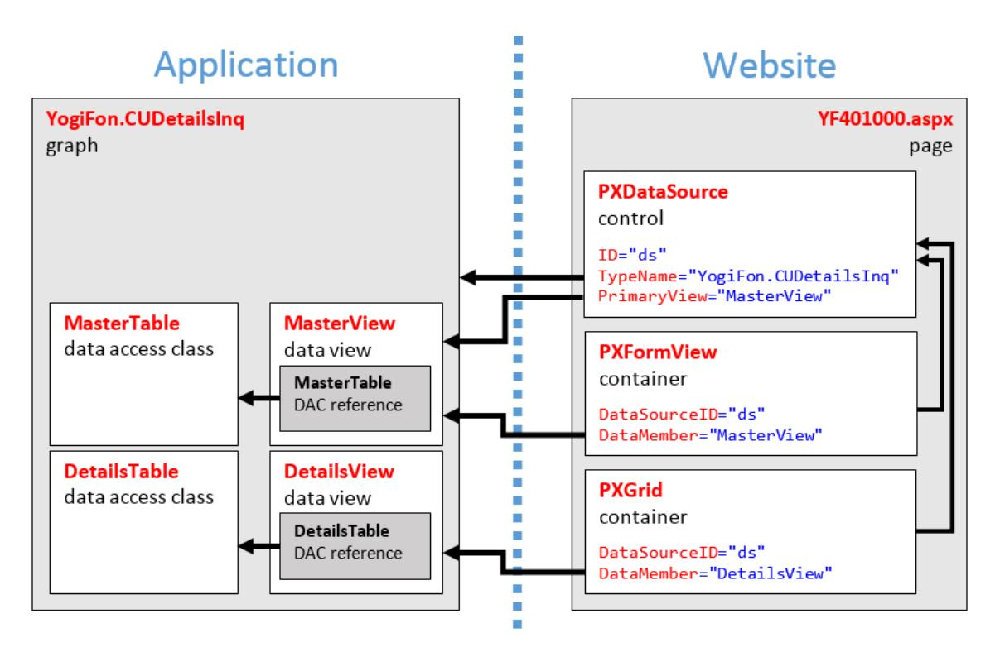

#### *Figure: Analyzing the content of the new form template*

You can publish the customization project to ensure that it is valid and the custom form can be opened in the browser. At the moment, the form does not contain a control for a field, as the following screenshot shows.

|   |                          |     | C Yogifon - Subscription Usage Details * |  |  |  |  | <b>CUSTOMIZATION</b> | $HELP -$                                                                                             |
|---|--------------------------|-----|------------------------------------------|--|--|--|--|----------------------|------------------------------------------------------------------------------------------------------|
| a | $\overline{\phantom{0}}$ |     |                                          |  |  |  |  |                      |                                                                                                      |
|   |                          |     |                                          |  |  |  |  |                      |                                                                                                      |
|   |                          |     |                                          |  |  |  |  |                      |                                                                                                      |
|   |                          |     |                                          |  |  |  |  |                      |                                                                                                      |
| c |                          | $+$ |                                          |  |  |  |  |                      |                                                                                                      |
| E |                          |     |                                          |  |  |  |  |                      |                                                                                                      |
|   |                          |     |                                          |  |  |  |  |                      |                                                                                                      |
|   |                          |     |                                          |  |  |  |  |                      |                                                                                                      |
|   |                          |     |                                          |  |  |  |  |                      |                                                                                                      |
|   |                          |     |                                          |  |  |  |  |                      |                                                                                                      |
|   |                          |     |                                          |  |  |  |  |                      |                                                                                                      |
|   |                          |     |                                          |  |  |  |  |                      | $\begin{array}{ccccccc} \ & \ & \ & \ & \ & \ & \ & \ & \ & \ & \ & \ & \ & \ & \ & \ & \ & \ & \ &$ |

*Figure: Viewing the new form*

### <span id="page-233-0"></span>**To Delete a Custom Form from a Project**

To remove a custom form from a customization project, you have to delete all the items that have been added to the project for the form.

To do this, perform the following actions:

- Delete from the customization project the *Page* item that was added by the New Screen wizard. (See *[To](#page-151-1) [Delete a Page Item from a Project](#page-151-1)* for details.)
- Delete from the project the *Code* item that was added by the New Screen wizard. (See *To [Delete](#page-172-3) a Code Item [From a Project](#page-172-3)*.)
- Delete from the project the <FormID>.aspx and <FormID>.aspx.cs *File* items that were added by the New Screen wizard. (For more information, see *To Delete a [Custom](#page-178-3) File From a Project*.)
- Delete from the project the *SiteMapNode* item that was added by the New Screen wizard. (See *To [Delete](#page-183-4) a [Site Map Node from a Project](#page-183-4)* for details.)
- If you added other items for the custom form, such as items for the mobile site map or custom files, delete these items.

To delete multiple items from the customization project successively on a single page, you can use the Edit Project Items page of the Customization Project Editor. (See *To Delete Items from the [Project](#page-153-3) on the Edit Project Items Page* for details.)

The system applies the changes to the file system as soon as you publish the customization project.

### <span id="page-233-1"></span>**Substitute Form**

When a user entered data by using an applicable data entry form, the user may want to have a way to view a list of these records. The most convenient way is to configure a substitute form of the inquiry type that will serve as an entry point to the entry form.

With a substitute form, when a user clicks the name of the entry form in the navigation pane, the user is automatically redirected to the corresponding substitute form that contains the list of these records in a tabular format. When the user clicks a record, the entry form opens to show the details of the selected record.

<span id="page-233-3"></span>This chapter contains information on the configuration and management of the substitute forms in your system.

### <span id="page-233-2"></span>**Substitutes for Entry Forms**

Sometimes you might need a faster way to access particular information in the system—such as the contacts of a particular vendor or the list of customers. Generally in Acumatica ERP, you can access such information by opening the corresponding data entry or maintenance form and clicking the magnifier icon in the appropriate box; the list of records then opens in the pop-up window. This sequence of events, however, may not give you the information you need quickly enough. The data entry and maintenance forms are convenient for entering new data, but once you have entered most data, you may have a greater need to instead view the list of records created on the data entry form.

In Acumatica ERP, you can create a generic inquiry or custom form that presents the data of a data entry or maintenance form (which is called the *entry form* in this context) in a tabular format. The generic inquiry or custom form that you create is called the *substitute form* in this context. Once you have created the substitute form, you can replace the entry form with it. Thus, when you click the name of the entry form in the navigation pane, you will access the substitute form that contains the list of records. When you click a record name in the list, the entry form (data entry or maintenance) will open.

#### **Configuring a Generic Inquiry to Be Used as a Substitute Form**

To configure a generic inquiry to be used as a substitute form, select the entry form, configure the list of records to be displayed on the substitute form, and then select the place of the form on the site map. You use the *[Generic](https://help-2025r1.acumatica.com/Help?ScreenId=ShowWiki&pageid=5388c653-eac4-4f43-b769-163cd037ab09) [Inquiry](https://help-2025r1.acumatica.com/Help?ScreenId=ShowWiki&pageid=5388c653-eac4-4f43-b769-163cd037ab09)* (SM208000) form to configure an inquiry. For an example of configuring a generic inquiry, see *[Generic Inquiry](https://help-2025r1.acumatica.com/Help?ScreenId=ShowWiki&pageid=b8acf4fb-fbf5-408a-b92c-6658267a5f57) as a [Substitute](https://help-2025r1.acumatica.com/Help?ScreenId=ShowWiki&pageid=b8acf4fb-fbf5-408a-b92c-6658267a5f57) Form: To Configure an Inquiry as an Entry Point*.

For details on configuring a generic inquiry to be used as a substitute form, see *[Making a Generic Inquiry a Substitute](https://help-2025r1.acumatica.com/Help?ScreenId=ShowWiki&pageid=a7f2f111-dfa5-437d-9d2f-ab21a0f188d9) [Form](https://help-2025r1.acumatica.com/Help?ScreenId=ShowWiki&pageid=a7f2f111-dfa5-437d-9d2f-ab21a0f188d9)*.

#### **Configuring a Custom Form to Be Used as a Substitute Form**

With Acumatica ERP, you can design your own custom forms that you can use to replace the entry forms. Each substitute form must include fields that are mapped to the key fields of the corresponding entry form. For more information on designing custom forms, see *To [Develop](#page-228-1) a Custom Form*.

When the custom form is ready, you match the form to the corresponding entry form (that is, specify the entry form that will be replaced with the custom form) by using the *[Lists as Entry Points](https://help-2025r1.acumatica.com/Help?ScreenId=ShowWiki&pageid=c1c04db7-e205-452d-a3b3-e08e19ca508d)* (SM208500) form. For details of configuring such a custom form to be used as a substitute form, see *To [Replace](#page-235-1) an Entry Form with a Custom Form*.

#### **Accessing Substitute Forms**

In Acumatica ERP, every form has its own level of access that you can configure by using the *[Access Rights by](https://help-2025r1.acumatica.com/Help?ScreenId=ShowWiki&pageid=8ee2b0b2-2d66-4e0c-80ce-ac825690c36a) [Screen](https://help-2025r1.acumatica.com/Help?ScreenId=ShowWiki&pageid=8ee2b0b2-2d66-4e0c-80ce-ac825690c36a)* (SM201020) form. You can change the level of access to the entry and substitute forms independently of each other. However, when a substitute form replaces the corresponding entry form, the substitute form inherits the level of access the users have to the entry form. Thus, to change the level of access users have to the substitute form, you change the level of access to the entry form.

If required, you can cancel the replacement, which involves configuring the system to direct users to the entry form (instead of the substitute form) when they try to open the entry form in the navigation pane; canceling the replacement does not involve deleting forms. If you cancel the replacement, the level of access to the substitute form reverts to the initial state (that is, the level of access the substitute form had before you used it to replace an entry form).

#### **Replacing the Entry Form with the Substitute Form**

Aer you have configured a substitute form, you match the substitute form to the corresponding entry form (that is, specify the substitute form that will replace the entry form), with each pair of entry and substitute forms taking its own row on the *[Lists as Entry Points](https://help-2025r1.acumatica.com/Help?ScreenId=ShowWiki&pageid=c1c04db7-e205-452d-a3b3-e08e19ca508d)* (SM208500) form.

A generic inquiry is automatically matched to the entry form when you select the entry form on the **PrimaryScreen** tab on the *[Generic Inquiry](https://help-2025r1.acumatica.com/Help?ScreenId=ShowWiki&pageid=5388c653-eac4-4f43-b769-163cd037ab09)* form. The selection on the *[Generic Inquiry](https://help-2025r1.acumatica.com/Help?ScreenId=ShowWiki&pageid=5388c653-eac4-4f43-b769-163cd037ab09)* form is removed if you delete the row that contains the inquiry on the *[Lists as Entry Points](https://help-2025r1.acumatica.com/Help?ScreenId=ShowWiki&pageid=c1c04db7-e205-452d-a3b3-e08e19ca508d)* form.

You can activate or cancel the replacement of any entry form in the list any time you want. Canceling the replacement does not remove the form pair from the list. For details of activating and canceling the replacement of an entry form, see *To Activate the [Replacement](#page-236-4) of an Entry Form* and *To Cancel the [Replacement](#page-236-5) of an Entry Form*.

If you delete the row containing the entry form and the corresponding substitute form, you remove the matching between the forms; the replacement is canceled, but the forms are not deleted.

#### **Defining the Way the Users Locate Entry and Substitute Forms in the Navigation Pane**

When you configure the substitute form or at a later time, you define the way users can locate this form. The following ways are available:

- You place the substitute form in the **Hidden** folder of the site map and replace the entry form with the substitute form. A user accesses the substitute form by clicking the name of the entry form in the navigation pane. The entry form opens when the user selects a record or creates a new record on the substitute form.
- You place the substitute form in any folder on the site map except the **Hidden** folder and you do not replace the entry form with the substitute form. A user accesses the substitute form by clicking its name in the navigation pane, and the user accesses the entry form by clicking its name in the navigation pane.
- You place the substitute form in the **Hidden** folder on the site map and you do not replace the entry form with the substitute form. A user won't be able to access the substitute form at all. The user accesses the entry form by clicking its name in the navigation pane.

You can see the list of entry forms and the corresponding substitute forms, review and edit the locations of the forms in the list, check which entry forms are replaced with substitute forms, and toggle the replacement by using the *[Lists as Entry Points](https://help-2025r1.acumatica.com/Help?ScreenId=ShowWiki&pageid=c1c04db7-e205-452d-a3b3-e08e19ca508d)* (SM208500) form.

#### **Saving a Substitute Form to a Customization Project**

Aer you configured a substitute form, you can save it to a customization project.

To save a customization form which is generic inquiry, perform the same steps you do to include a generic inquiry to a customization project. For details, see *[Including Generic Inquiries in a Customization Project](https://help-2025r1.acumatica.com/Help?ScreenId=ShowWiki&pageid=03617820-bc32-481c-9e7c-73a0852c19b7)*.

If a substitute form is a custom form, it is already a part of customization project. For the list of customization items which define a custom form, see *[Custom Form](#page-227-1)*.

#### **Related Links**

- *To [Replace](#page-235-1) an Entry Form with a Custom Form*
- *To Activate the [Replacement](#page-236-4) of an Entry Form*
- *To Cancel the [Replacement](#page-236-5) of an Entry Form*

### <span id="page-235-1"></span><span id="page-235-0"></span>**To Replace an Entry Form with a Custom Form**

With Acumatica ERP, you can use your own custom forms as entry points to the entry forms. For more information on substitutes for entry forms, see *[Substitutes for Entry Forms](#page-233-3)*. For more information on designing custom forms, see *To [Develop](#page-228-1) a Custom Form*.

A custom form that you want to use as a substitute to an entry form must be mapped to the entry form.

To use a custom form as a substitute form for an entry form, you match your custom form to the entry form and activate the replacement by using the *[Lists as Entry Points](https://help-2025r1.acumatica.com/Help?ScreenId=ShowWiki&pageid=c1c04db7-e205-452d-a3b3-e08e19ca508d)* (SM208500) form.

### **To Replace an Entry Form with a Custom Form**

- 1. Open the *[Lists as Entry Points](https://help-2025r1.acumatica.com/Help?ScreenId=ShowWiki&pageid=c1c04db7-e205-452d-a3b3-e08e19ca508d)* (SM208500) form.
- 2. On the form toolbar, click **Add Row**.
- 3. In the **EntryScreen Location** box, select the entry form.

The ID of the form is displayed in the **EntryScreen ID** box.

4. In the **ListScreen Location** box, select the substitute form.

The ID of the form is displayed in the **ListScreen ID** box.

- 5. In the table, make sure that the **Active** check box is selected to replace the entry form with the substitute form.
- 6. On the form toolbar, click**Save**.

### <span id="page-236-4"></span><span id="page-236-0"></span>**To Activate the Replacement of an Entry Form**

To replace an entry form with the corresponding substitute form, you enable the replacement on the *[Lists as Entry](https://help-2025r1.acumatica.com/Help?ScreenId=ShowWiki&pageid=c1c04db7-e205-452d-a3b3-e08e19ca508d) [Points](https://help-2025r1.acumatica.com/Help?ScreenId=ShowWiki&pageid=c1c04db7-e205-452d-a3b3-e08e19ca508d)* (SM208500) form. For more information, see *[Substitutes for Entry Forms](#page-233-3)*.

- 1. Open the *[Lists as Entry Points](https://help-2025r1.acumatica.com/Help?ScreenId=ShowWiki&pageid=c1c04db7-e205-452d-a3b3-e08e19ca508d)* (SM208500) form.
- 2. In the table, select the **Active** check box in the row of the entry form that you want to replace.
- 3. On the form toolbar, click**Save**.

### <span id="page-236-5"></span><span id="page-236-1"></span>**To Cancel the Replacement of an Entry Form**

You can temporarily cancel the replacement of the entry forms with the corresponding substitute forms at any time—for example, while you make changes to the substitute form—by using the *[Lists as Entry Points](https://help-2025r1.acumatica.com/Help?ScreenId=ShowWiki&pageid=c1c04db7-e205-452d-a3b3-e08e19ca508d)* (SM208500) form. Later, you can enable the replacement again, as described in *To Activate the [Replacement](#page-236-4) of an Entry Form*. For more information, see *[Substitutes for Entry Forms](#page-233-3)*.

#### **To Cancel the Replacement of an Entry Screen**

- 1. Open the *[Lists as Entry Points](https://help-2025r1.acumatica.com/Help?ScreenId=ShowWiki&pageid=c1c04db7-e205-452d-a3b3-e08e19ca508d)* (SM208500) form.
- 2. In the table, clear the **Active** check box in the row of the entry form for which you want to cancel the replacement.
- 3. On the form toolbar, click**Save**.

### <span id="page-236-3"></span><span id="page-236-2"></span>**Existing Form**

You can customize the user interface of an existing form of Acumatica ERP by using the *[Screen Editor](https://help-2025r1.acumatica.com/Help?ScreenId=ShowWiki&pageid=d60a8270-e2ce-4380-b778-af61a0ca56d2)*. The editor is a visual tool that you can use to perform the following changes in the ASPX code for a form:

- Add or delete a container.
- Add or delete a button or radio button. (See *[Button \(PXButton\)](#page-276-1)* and *[Radio Button \(PXRadioButton\)](#page-275-2)* for details.)
- Add or delete a layout rule. (See *[Layout Rule \(PXLayoutRule\)](#page-265-1)* for details.)
- Add or delete a Java script. (See *[Java Script \(PXJavaScript\)](#page-279-2)* for details.)
- Create or delete a control for a data field. (See *[Box \(Control for a Data Field\)](#page-262-1)* for details.)
- Change the properties of an element in the ASPX code. (See *To Set a [Container](#page-245-2) Property*, *To Set a [Box](#page-264-2) [Property](#page-264-2)* and *To Set a Layout Rule [Property](#page-269-2)* for details.)

In Acumatica ERP, an ASPX page must contain a single PXDataSource control. You can add the following types of containers immediately to the level of an ASPX page, where the PXDataSource control is defined:

• *Form Container [\(PXFormView\)](#page-243-2)*

- *[Grid Container \(PXGrid\)](#page-252-2)*
- *Tab [Container](#page-257-2) (PXTab)*
- *[Dialog Box \(PXSmartPanel\)](#page-260-1)*

The order of containers in the ASPX page defines the order of appropriate areas with controls on the form.

Detailed instructions on the customization of an existing form are provided in the following topics:

- *To Start a [Customization](#page-237-1) of a Form*
- *To Delete a [Customization](#page-238-2) of a Form*
- *To Add a Form [Container](#page-238-3)*
- *To Add a Tab [Container](#page-239-2)*
- *To Add a Grid [Container](#page-239-3)*
- *To Add a [Dialog](#page-242-1) Box*
- *To Delete a [Container](#page-243-3)*

The changeset of a form is stored in the database as a *Page* item of a customization project. During the publication of the project, the Acumatica Customization Platform applies the changeset to the form to create a customized version of the .aspx file with the same name in the pages\_xx subfolder of the CstPublished folder of the website.

For example, if you customize the *[Customers](https://help-2025r1.acumatica.com/Help?ScreenId=ShowWiki&pageid=652929bc-9606-4056-aa6e-0c2d1147171b)* (AR303000) form and publish the project, the platform creates the ar303000.aspx and ar303000.aspx.cs files in the \CstPublished\pages\_ar folder. If you delete these files, Acumatica ERP uses the original files from the \Pages\AR folder to display this form. However if you again publish the customization project, the platform recreates these files, and Acumatica ERP uses the customized version of the form.

We recommend that you use the *[Screen Editor](https://help-2025r1.acumatica.com/Help?ScreenId=ShowWiki&pageid=d60a8270-e2ce-4380-b778-af61a0ca56d2)* to customize the content of an ASPX page, the *[Data Class](https://help-2025r1.acumatica.com/Help?ScreenId=ShowWiki&pageid=06c038a5-1d75-482b-9b17-f2483ada0154)* to modify data access classes, and Microso Visual Studio to extend the business logic for a page. (See *[Integrating the Project](#page-384-2) Editor with [Microsoft](#page-384-2) Visual Studio* for details.)

#### **Related Links**

- *Changes in [Webpages](#page-44-1) (ASPX)*
- *[Customized Screens](#page-149-1)*

### <span id="page-237-1"></span><span id="page-237-0"></span>**To Start a Customization of a Form**

To start the customization of a form, you have to open the form in the *[Screen Editor](https://help-2025r1.acumatica.com/Help?ScreenId=ShowWiki&pageid=d60a8270-e2ce-4380-b778-af61a0ca56d2)*. To do this, you commonly perform the following operations:

- 1. Open the form in the browser.
- 2. On the form title bar, click **Customization > Inspect Element** to launch the *[Element Inspector](https://help-2025r1.acumatica.com/Help?ScreenId=ShowWiki&pageid=5f9d2d33-1a33-4edd-8629-3100d2020335)*.
- 3. On the form, click the UI element (or area) to be customized; this opens the *[Element Properties Dialog Box](https://help-2025r1.acumatica.com/Help?ScreenId=ShowWiki&pageid=5f9d2d33-1a33-4edd-8629-3100d2020335)* for the element (or area).
- 4. In the dialog box, click **Customize**.
- 5. If there is no currently selected customization project and the inspector opens the *[Table](https://help-2025r1.acumatica.com/Help?ScreenId=ShowWiki&pageid=d6c46870-0c44-4f78-ae20-9bb9ef25dccd) 1*

*You use the Select Customization Project dialog box to select an existing customization project or to create a new customization project. You open the dialog box in the following ways:*

- *• From the Customization menu of a form by clicking Select Project*
- *• From the Customization menu of a form by clicking Edit Project if there is no currently selected customization project*

*• From the Element Properties dialog box if you click Customize in the dialog box and there is no currently selected customization project* , select an existing customization project or create a new one.

If the customization project does not contain a changeset for the form, the *[Customization Project Editor](https://help-2025r1.acumatica.com/Help?ScreenId=ShowWiki&pageid=0bb97781-e987-4039-962d-457720821bff)* adds a *Page* item for the form to the project, to keep the changeset to the ASPX code of the form in the database. The form is opened in the *[Screen Editor](https://help-2025r1.acumatica.com/Help?ScreenId=ShowWiki&pageid=d60a8270-e2ce-4380-b778-af61a0ca56d2)*, and you can start customization of the form.

<span id="page-238-2"></span>When you click**Save** on the editor toolbar, the editor updates the *Page* item in the database.

### <span id="page-238-0"></span>**To Delete a Customization of a Form**

If a customization project contains changes to multiple objects of Acumatica ERP, and you need to remove customization for only a single form, perform the following operations:

- 1. Remove from the project the *Page* item for the form. (See *To Delete a Page Item from a [Project](#page-151-1)* for details.)
- 2. Publish the project, as described in *To Publish the [Current](#page-121-2) Project*.

### <span id="page-238-3"></span><span id="page-238-1"></span>**To Add a Form Container**

You can add a new PXFormView container to a form of Acumatica ERP. To do this, perform the following actions:

- 1. Open the form in the *[Screen Editor](https://help-2025r1.acumatica.com/Help?ScreenId=ShowWiki&pageid=d60a8270-e2ce-4380-b778-af61a0ca56d2)*, as described in *To Add a Page Item for an [Existing](#page-150-1) Form*.
- 2. In the editor, click the **Add Controls** tab item.
- 3. From the **Main Containers** group, drag the **Form** container to the required place in the Control Tree, as shown in the following screenshot.

| ⊸ ⊡<br><b>INLIGHTY OF CHANGES</b> ACTIONS                    |                        |                                              |                           |              |                                               |  |  |
|--------------------------------------------------------------|------------------------|----------------------------------------------|---------------------------|--------------|-----------------------------------------------|--|--|
| $C + \dot{m}$                                                |                        | MAIN PROPERTIES LAYOUT PROPERTIES ATTRIBUTES |                           | ADD CONTROLS | $\stackrel{\textstyle\backslash}{\mathbf{v}}$ |  |  |
| ▶ <i>■</i> DataSource: CustomerMaint                         | MAIN CONTAINERS        |                                              | OTHER CONTROLS __________ |              |                                               |  |  |
| ▶ <i>■</i> Form: BAccount<br>▶ <i>a</i> Tab: CurrentCustomer | <b>FORM</b>            |                                              | <b>PANEL</b>              |              |                                               |  |  |
| <b>FORM</b><br>▶ <i><b>IDialogs</b></i>                      | <b>TAB</b>             |                                              | <b>GROUP BOX</b>          |              |                                               |  |  |
| $\frac{\pi}{2}$                                              | TAB ITEM               |                                              | RADIO BUTTON              |              |                                               |  |  |
|                                                              | GRID                   |                                              | LABEL                     |              |                                               |  |  |
|                                                              | POP-UP PANEL           |                                              | <b>BUTTON</b>             |              |                                               |  |  |
|                                                              | <b>LAYOUT RULES</b> __ |                                              | <b>JAVA SCRIPT</b>        |              |                                               |  |  |
|                                                              | <b>ROW</b>             |                                              |                           |              |                                               |  |  |
|                                                              | <b>COLUMN</b>          |                                              |                           |              |                                               |  |  |
|                                                              | <b>GROUP</b>           |                                              |                           |              |                                               |  |  |
|                                                              | <b>MERGE</b>           |                                              |                           |              |                                               |  |  |
|                                                              | <b>EMPTY RULE</b>      |                                              |                           |              |                                               |  |  |
|                                                              |                        |                                              |                           |              |                                               |  |  |

*Figure: Adding a form container to a form*


The area of a form container is visible on a customized form only if it contains at least one visible control.

- 4. In the Control Tree, select the form container that has been added, and specify the item properties. as described in *To Set a [Container](#page-245-2) Property*.
- 5. Click **Save** on the toolbar of the Screen Editor to save your changes to the customization project.

<span id="page-239-3"></span>For more information about PXFormView, see *Form Container [\(PXFormView\)](#page-243-2)*.

### <span id="page-239-0"></span>**To Add a Grid Container**

You can add a new PXGrid container to an existing form of Acumatica ERP. To do this, perform the following actions:

- 1. Open the form in the *[Screen Editor](https://help-2025r1.acumatica.com/Help?ScreenId=ShowWiki&pageid=d60a8270-e2ce-4380-b778-af61a0ca56d2)*, as described in *To Add a Page Item for an [Existing](#page-150-1) Form*.
- 2. In the editor, click the **Add Controls** tab item.
- 3. From the **Main Containers** group, drag the **Grid** container to the required place in the Control Tree, as shown in the following screenshot.

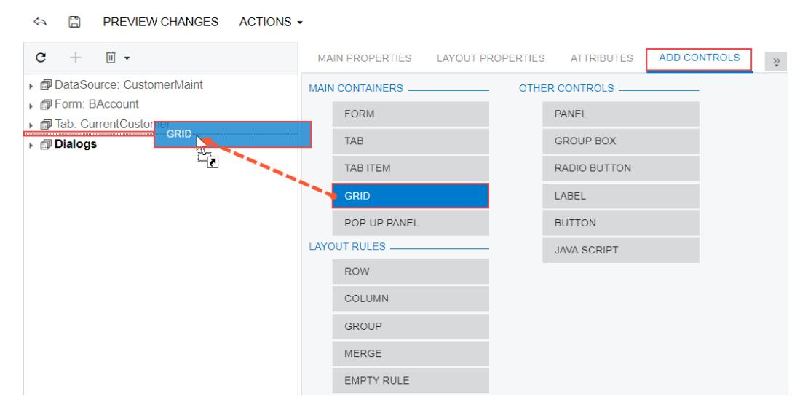

*Figure: Adding a grid container to the tab*

A grid is visible on a customized form only if it contains at least one column for a field.

- 4. In the Control Tree, select the grid that has been added, and specify the item properties, as described in *[To](#page-245-2) [Set a Container Property](#page-245-2)*.
- 5. Click **Save** on the toolbar of the Screen Editor to save your changes to the customization project.

For more information about PXTab, see *Tab [Container](#page-257-2) (PXTab)*.

### <span id="page-239-2"></span><span id="page-239-1"></span>**To Add a Tab Container**

You can add a new PXTab container to an existing form of Acumatica ERP. To do this, perform the following actions:

1. Open the form in the *[Screen Editor](https://help-2025r1.acumatica.com/Help?ScreenId=ShowWiki&pageid=d60a8270-e2ce-4380-b778-af61a0ca56d2)*, as described in *To Add a Page Item for an [Existing](#page-150-1) Form*.

- 2. In the editor, click the **Add Controls** tab item.
- 3. From the **Main Containers** group, drag the**Tab** container to the required place in the Control Tree, as shown in the following screenshot.

| <b>Ociocii Editor: Antoopool (Odstofficis)</b>                |                     |                                                      |                                          |
|---------------------------------------------------------------|---------------------|------------------------------------------------------|------------------------------------------|
| <> B PREVIEW CHANGES ACTIONS ▼                                |                     |                                                      |                                          |
| $C + \bar{m}$                                                 |                     | MAIN PROPERTIES LAYOUT PROPERTIES ATTRIBUTES         | <b>ADD CONTROLS</b><br>$\grave{\varphi}$ |
| ▶ <i><b>I</b>DataSource: CustomerMaint</i>                    |                     | MAIN CONTAINERS ____________________________________ |                                          |
| ▶ <i>■</i> Form: BAccount<br>▶ <i>□</i> Tab: Current Customer | <b>FORM</b>         | <b>PANEL</b>                                         |                                          |
| <b>TAB</b><br>N ------+-<br>▶ <i><b>IDialogs</b></i>          | <b>TAB</b>          | <b>GROUP BOX</b>                                     |                                          |
| ्<br>जन्म                                                     | TAB ITEM            | RADIO BUTTON                                         |                                          |
|                                                               | <b>GRID</b>         | LABEL                                                |                                          |
|                                                               | POP-UP PANEL        | <b>BUTTON</b>                                        |                                          |
|                                                               | <b>LAYOUT RULES</b> | <b>JAVA SCRIPT</b>                                   |                                          |
|                                                               | <b>ROW</b>          |                                                      |                                          |
|                                                               | COLUMN              |                                                      |                                          |
|                                                               | GROUP               |                                                      |                                          |
|                                                               | <b>MERGE</b>        |                                                      |                                          |
|                                                               | <b>EMPTY RULE</b>   |                                                      |                                          |

#### *Figure: Adding a tab container to the tab*

The PXTab container cannot exist without nested PXTabItem containers. Therefore, when you add a PXTab container, the Screen Editor creates a nested PXTabItem container.

A tab container is visible on a customized form only if there is at least one control for a field in a nested PXTabItem container.

- 4. In the Control Tree, select the tab that has been added, and specify the item properties, as described in *[To](#page-245-2) [Set a Container Property](#page-245-2)*.
- 5. Click **Save** on the toolbar of the Screen Editor to save your changes to the customization project.

For more information about PXTab, see *Tab [Container](#page-257-2) (PXTab)*.

### **To Add a New Tab Item to a Tab**

You can add a new PXTabItem container to a tab on an existing form of Acumatica ERP. To do this, perform the following actions:

- 1. Open the form in the *[Screen Editor](https://help-2025r1.acumatica.com/Help?ScreenId=ShowWiki&pageid=d60a8270-e2ce-4380-b778-af61a0ca56d2)*, as described in *To Add a Page Item for an [Existing](#page-150-1) Form*.
- 2. In the editor, click the **Add Controls** tab item.
- 3. From the **Main Containers** group of the tab item, drag the**Tab Item** container above the customized tab, as shown in the following screenshot.

| $C + \bar{m}$                                         |                 |                   | MAIN PROPERTIES LAYOUT PROPERTIES ATTRIBUTES | ADD CONTROLS |             |
|-------------------------------------------------------|-----------------|-------------------|----------------------------------------------|--------------|-------------|
|                                                       |                 |                   |                                              |              | $\grave{ }$ |
| ▶ <i><b>I</b>DataSource: CustomerMaint</i>            |                 | MAIN CONTAINERS   | OTHER CONTROLS                               |              |             |
| ▶ <i>图</i> Form: BAccount                             | <b>FORM</b>     |                   | PANEL                                        |              |             |
| <b>Fab: CurrentCust TABNTEM</b><br>▶ <i>m</i> Dialogs | <b>TAB</b>      |                   | <b>GROUP BOX</b>                             |              |             |
|                                                       | <b>TAB ITEM</b> |                   | RADIO BUTTON                                 |              |             |
|                                                       | GRID            |                   | LABEL                                        |              |             |
|                                                       |                 | POP-UP PANEL      | <b>BUTTON</b>                                |              |             |
|                                                       | LAYOUT RULES _  |                   | <b>JAVA SCRIPT</b>                           |              |             |
|                                                       | <b>ROW</b>      |                   |                                              |              |             |
|                                                       | COLUMN          |                   |                                              |              |             |
|                                                       | <b>GROUP</b>    |                   |                                              |              |             |
|                                                       | <b>MERGE</b>    |                   |                                              |              |             |
|                                                       |                 | <b>EMPTY RULE</b> |                                              |              |             |

#### *Figure: Adding a tab item to the tab*

If the tab contains multiple tab items and you need to add a tab item to a certain position in the tab, you should expand the tab node in the Control Tree to see the existing tab items and drag the**Tab Item** container to the required position, as the following screenshot shows.

| n<br>PREVIEW CHANGES ACTIONS ▼<br>$\Leftrightarrow$                       |                                              |  |  |                             |                     |                      |
|---------------------------------------------------------------------------|----------------------------------------------|--|--|-----------------------------|---------------------|----------------------|
| 间一<br>$\mathbf{C}$                                                        | MAIN PROPERTIES LAYOUT PROPERTIES ATTRIBUTES |  |  |                             | <b>ADD CONTROLS</b> | $\grave{\mathbf{v}}$ |
| ▶ <i>I</i> DataSource: CustomerMaint                                      | MAIN CONTAINERS                              |  |  | OTHER CONTROLS ____________ |                     |                      |
| ▶ <i>□</i> Form: BAccount<br>▼ @ Tab: CurrentCustomer                     | <b>FORM</b>                                  |  |  | PANEL                       |                     |                      |
| ▶ <i>□</i> General Info                                                   | <b>TAB</b>                                   |  |  | <b>GROUP BOX</b>            |                     |                      |
| ▶ <i>I</i> D Billing Settings<br>▶ <b>IDelivery Settings</b>              | TAB ITEM                                     |  |  | <b>RADIO BUTTON</b>         |                     |                      |
| TAB ITEM $\leftarrow -$<br>$\Box$ $\Box$ Locations                        | <b>GRID</b>                                  |  |  | LABEL                       |                     |                      |
| $\frac{1}{\sqrt{2}}$<br>▶ <i>□</i> Payment Methods<br>▶ <i>□</i> Contacts | POP-UP PANEL                                 |  |  | <b>BUTTON</b>               |                     |                      |
| ▶ <i>□</i> Salespersons                                                   | <b>LAYOUT RULES _</b>                        |  |  | <b>JAVA SCRIPT</b>          |                     |                      |
| $\Box$ $\Box$ Child Accounts<br>▶ <i>□</i> Attributes                     | <b>ROW</b>                                   |  |  |                             |                     |                      |
| $\triangleright$ $\oplus$ Activities                                      | COLUMN                                       |  |  |                             |                     |                      |
| $\triangleright$ $\blacksquare$ GL Accounts                               | <b>GROUP</b>                                 |  |  |                             |                     |                      |
| ▶ <i>I</i> Mailing Settings<br>▶ <i>□</i> Service Billing                 | <b>MERGE</b>                                 |  |  |                             |                     |                      |
| ▶ <i>□</i> Dialogs                                                        | <b>EMPTY RULE</b>                            |  |  |                             |                     |                      |

#### *Figure: Adding a tab item to a certain position in the tab*

A tab item is visible if it contains at least one control for a field.

- 4. In the Control Tree, select the tab item that has been added, and specify the item properties, as described in *To Set a [Container](#page-245-2) Property*.
- 5. Click **Save** on the toolbar of the Screen Editor to save your changes to the customization project.

### <span id="page-242-1"></span><span id="page-242-0"></span>**To Add a Dialog Box**

You can add a custom dialog box to an Acumatica ERP form. If the dialog box must contain controls for data fields, you should generally perform the following operations:

- Add a new PXSmartPanel container to the ASPX page, as described in this topic.
- If needed, define a custom data access class with the declaration of the data fields to be used for controls in the dialog box. See *To Create a [Custom](#page-164-2) Data Access Class* for details.
- If needed, in the extension for the graph that is specified in the TypeName property of the PXDataSource control of the ASPX page, add business logic for the dialog box. (See *To [Customize](#page-165-1) an Existing Business Logic [Controller](#page-165-1)* for details.) For example, in the graph extension, you can do the following:
  - Declare a new data view that provides data for the dialog box controls, as described in *To Add a [New](#page-347-1) [Member](#page-347-1)*
  - Add an action (with a button on the form toolbar) to open the dialog box
  - Add other business logic for the dialog box
- If the smart panel container must include a box for a data field, add a data-bound container, such as PXFormView. Then bind the new container to the data view declared in the graph or graph extension (see *[Use of the DataMember Property of Containers](https://help-2025r1.acumatica.com/Help?ScreenId=ShowWiki&pageid=f4e4f1df-64bd-40b9-b487-bdc099ee952c)* in the Acumatica Framework Guide for details) whose BQL statement refers to the data access class with the field declaration.
- If the smart panel must contain a row of buttons, add a nested PXPanel container with the SkinID property set to *Buttons* (see *[Use of the SkinID Property of Containers](https://help-2025r1.acumatica.com/Help?ScreenId=ShowWiki&pageid=ce75ce73-a264-41a6-9545-68ffe2003d45)* in the Acumatica Framework Guide for details), and add the buttons to the nested panel, as described in *To Add Another [Supported](#page-250-1) Control*.

To add a new PXSmartPanel container to an ASPX page, perform the following actions:

- 1. Open the form in the *[Screen Editor](https://help-2025r1.acumatica.com/Help?ScreenId=ShowWiki&pageid=d60a8270-e2ce-4380-b778-af61a0ca56d2)*, as described in *To Add a Page Item for an [Existing](#page-150-1) Form*.
- 2. In the editor, click the **Add Controls** tab item.
- 3. From the **Main Containers** group of the tab item, drag the **Pop-up Panel** container into the **Dialogs** node in the Control Tree, as shown in the following screenshot.

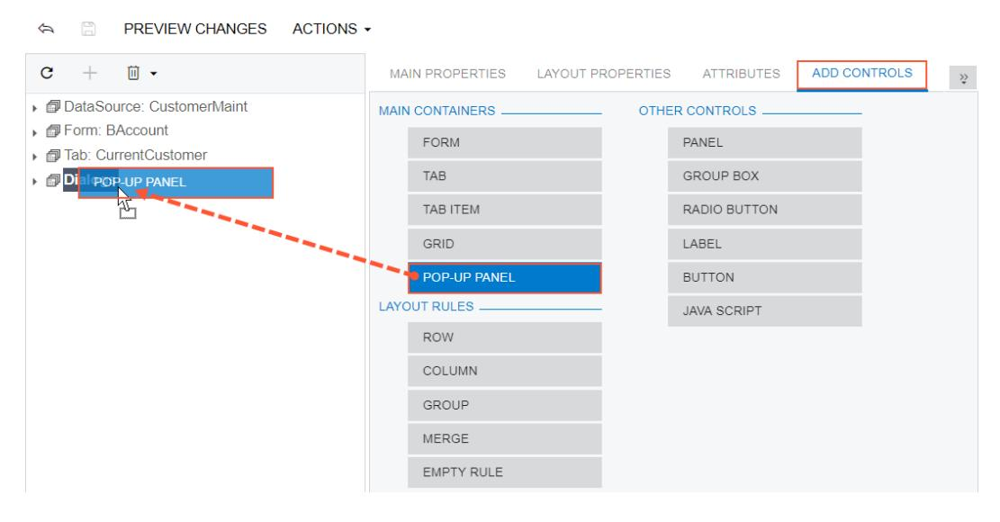

*Figure: Adding a form container to a form*


A dialog box can be displayed if it contains at least one visible control.

- 4. In the Control Tree, select the new container that has been added.
- 5. Specify the item properties, as described in *To Set a [Container](#page-245-2) Property*.
- 6. Click **Save** on the toolbar of the Screen Editor to save your changes to the customization project.

### <span id="page-243-3"></span><span id="page-243-0"></span>**To Delete a Container**

You can delete a container from an Acumatica ERP form. To do this, perform the following actions:

- 1. Open the form in the *[Screen Editor](https://help-2025r1.acumatica.com/Help?ScreenId=ShowWiki&pageid=d60a8270-e2ce-4380-b778-af61a0ca56d2)*, as described in *To Add a Page Item for an [Existing](#page-150-1) Form*.
- 2. In the Control Tree of the editor, select the container to be deleted.
- 3. On the toolbar of the Control Tree, click **Remove > Remove**.
- 4. Click **Save** on the toolbar of the Screen Editor to save your changes to the customization project.

### <span id="page-243-2"></span><span id="page-243-1"></span>**Form Container (PXFormView)**

PXFormView is a data-bound UI container control that renders a single record from its associated data source.

An ASPX page can contain PXFormView as a main container. A form container, as the diagram below shows, can be also included in the following types of containers:

- PXFormView
- PXTabItem
- PXSmartPanel

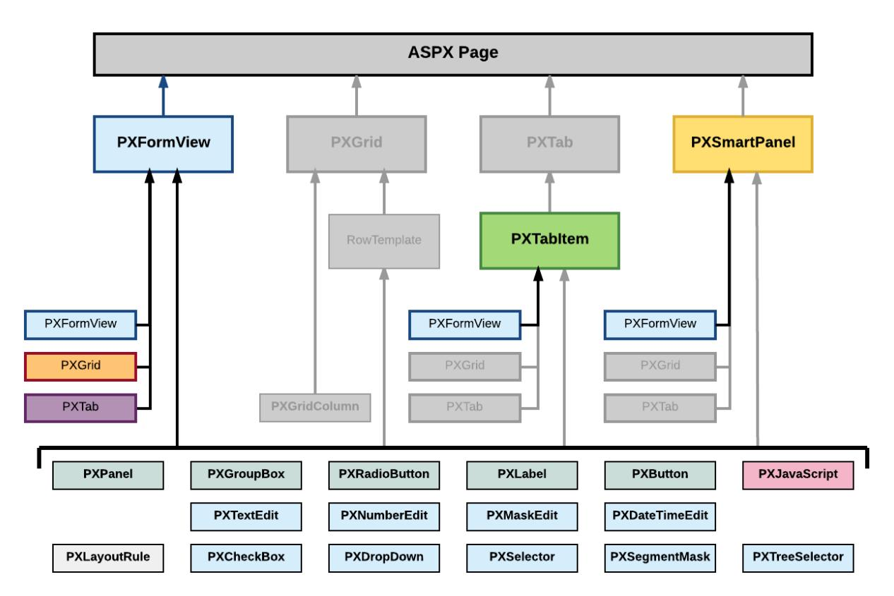

#### *Figure: Nesting rules for a PXFormView container in an ASPX page*

A form container can include multiple ASPX objects of the following types:

- A data-bound UI container control: PXFormView, PXGrid, and PXTab
- A layout rule: PXLayoutRule
- A box for a data field: PXTextEdit, PXNumberEdit, PXMaskEdit, PXDateTimeEdit, PXCheckBox, PXDropDown, PXSelector, PXSegmentMask, and PXTreeSelector
- Another control: PXPanel, PXGroupBox, PXRadioButton, PXLabel, PXButton, and PXJavaScript

A box for a data field can be added to a form container if the container is bound to a data view declared within the graph that provides business logic for the ASPX page. If you want to bind a form container to a data view, you must specify the properties as follows for the appropriate PXFormView object:

- The DataSourceID property value must be equal to the value of the ID property of the PXDataSource control.
- The DataMember property must contain the name of the data view that is declared in the graph and provides data for the controls of the form container.

To create a new form container in an ASPX page, follow the instructions described in *To Add a Form [Container](#page-238-3)*.

To delete a form container from an ASPX page, follow the instructions described in *To Delete a [Container](#page-243-3)*.

For detailed information on working with the content of a form container, see the following topics:

- *To Open a [Container](#page-245-3) in the Screen Editor*
- *To Set a [Container](#page-245-2) Property*
- *To Add a Nested [Container](#page-246-1)*
- *To Add a Box for a Data [Field](#page-247-1)*
- *To Add a [Layout](#page-249-1) Rule*
- *To Add Another [Supported](#page-250-1) Control*

- *To Reorder Child UI [Elements](#page-251-1)*
- *To Delete a Child UI [Element](#page-252-3)*

#### **Related Links**

- *Changes in [Webpages](#page-44-1) (ASPX)*
- *[Customized Screens](#page-149-1)*

## <span id="page-245-3"></span><span id="page-245-0"></span>**To Open a Container in the Screen Editor**

You perform the customization of a container by using the *[Screen Editor](https://help-2025r1.acumatica.com/Help?ScreenId=ShowWiki&pageid=d60a8270-e2ce-4380-b778-af61a0ca56d2)*. To open a container of an Acumatica ERP form in the editor, perform the following actions:

- 1. Open the form in the browser.
- 2. On the form title bar, click **Customization > Inspect Element** to launch the *[Element Inspector](https://help-2025r1.acumatica.com/Help?ScreenId=ShowWiki&pageid=5f9d2d33-1a33-4edd-8629-3100d2020335)*.
- 3. On the form, click the area of the container to be customized, which opens the *[Element Properties Dialog Box](https://help-2025r1.acumatica.com/Help?ScreenId=ShowWiki&pageid=5f9d2d33-1a33-4edd-8629-3100d2020335)* for the container.
- 4. In the dialog box, click **Customize**.
- 5. If there is no currently selected customization project and the inspector opens the *[Table](https://help-2025r1.acumatica.com/Help?ScreenId=ShowWiki&pageid=d6c46870-0c44-4f78-ae20-9bb9ef25dccd) 1*

*You use the Select Customization Project dialog box to select an existing customization project or to create a new customization project. You open the dialog box in the following ways:*

- *• From the Customization menu of a form by clicking Select Project*
- *• From the Customization menu of a form by clicking Edit Project if there is no currently selected • From the Element Properties dialog box if you click Customize in the dialog box and there is*
- *customization project no currently selected customization project* , select an existing customization project or create a new one.

If the customization project does not contain a changeset for the form, the *[Customization Project Editor](https://help-2025r1.acumatica.com/Help?ScreenId=ShowWiki&pageid=0bb97781-e987-4039-962d-457720821bff)* adds to the project a *Page* item for the form to keep the changeset to the ASPX code of the form in the database. The container is opened in the *[Screen Editor](https://help-2025r1.acumatica.com/Help?ScreenId=ShowWiki&pageid=d60a8270-e2ce-4380-b778-af61a0ca56d2)*, and you can start the customization of the container.

<span id="page-245-2"></span>When you click**Save** on the editor toolbar, the editor updates the *Page* item in the database.

### <span id="page-245-1"></span>**To Set a Container Property**

To include in a customization project changes to the properties of a container, you have to modify the properties by using the *[Screen Editor](https://help-2025r1.acumatica.com/Help?ScreenId=ShowWiki&pageid=d60a8270-e2ce-4380-b778-af61a0ca56d2)*. To start setting the properties of a container, perform the following actions:

- 1. Open the container in the Screen Editor, as described in *To Open a [Container](#page-245-3) in the Screen Editor*.
- 2. Ensure that the container node is selected in the Control Tree of the editor. Click the arrow le of the node to expand the node if needed.
- 3. Click the **Layout Properties** tab to open the list of properties for the container.
- 4. Specify values for the required properties.
- 5. Click **Save** to save your changes to the customization project.

For detailed information about the DataMember property, see *[Use of the DataMember Property of Containers](https://help-2025r1.acumatica.com/Help?ScreenId=ShowWiki&pageid=f4e4f1df-64bd-40b9-b487-bdc099ee952c)* in the Acumatica Framework Guide.

In Acumatica ERP, for the PXFormView, PXGrid, and PXPanel containers, there are predefined values for the SkinID property. For details, see *[Use of the SkinID Property of Containers](https://help-2025r1.acumatica.com/Help?ScreenId=ShowWiki&pageid=ce75ce73-a264-41a6-9545-68ffe2003d45)* in the Acumatica Framework Guide.

If you plan to use a container in the mobile site map, specify the Caption property of the container, as described in *[Use of the Caption Property of Containers](https://help-2025r1.acumatica.com/Help?ScreenId=ShowWiki&pageid=16edab7b-9ec3-4383-a92d-253fe8eee07d)* in the Acumatica Framework Guide.

### <span id="page-246-1"></span><span id="page-246-0"></span>**To Add a Nested Container**

A PXGrid container cannot include a nested container. A PXTab container can include only PXTabItem containers. You can add any container as a nested container to a PXFormView, PXTabItem, or PXSmartPanel container, as the following diagram shows.

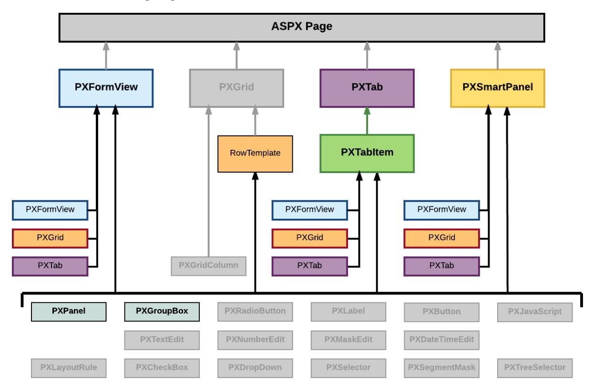

*Figure: Nesting rules for containers on an ASPX page*

You can include the PXPanel and PXGroupBox container controls in the PXFormView, RowTemplate, PXTabItem, and PXSmartPanel containers.

To add a nested container to a parent container, perform the following actions:

- 1. Open the parent container in the Screen Editor, as described in *To Open a [Container](#page-245-3) in the Screen Editor*.
- 2. Ensure that the container node is selected in the Control Tree of the editor. Click the arrow le of the node to expand the node if needed.
- 3. Click the **Add Controls** tab item (see the screenshot below).
- 4. From the **Main Containers** or **Other Controls** group, drag the required type of the nested container into the parent container in the Control Tree, as shown in the following screenshot.

| 周<br>PREVIEW CHANGES ACTIONS +<br>$\Leftrightarrow$                                                                                                                                                                                                      |                                                                                                    |                                                                                       |                     |
|----------------------------------------------------------------------------------------------------------------------------------------------------------------------------------------------------------------------------------------------------------|----------------------------------------------------------------------------------------------------|---------------------------------------------------------------------------------------|---------------------|
| $+$ $\Box$ $\sim$<br>$\mathbf{C}$                                                                                                                                                                                                                        | MAIN PROPERTIES LAYOUT PROPERTIES ATTRIBUTES                                                       | <b>EVENTS</b>                                                                         | <b>ADD CONTROLS</b> |
| ▶ <i>□</i> DataSource: CustomerMaint<br>• <i>@</i> Form: BAccount<br>▶ <i>□</i> Column<br>▶ <i>□</i> Column<br>$\overline{\bullet}$ $\overline{\bullet}$ Column<br>Form: CustomerBala TAR<br><b>TLayout Rule]</b><br>Y.<br><b>M</b> chkServiceManagement | MAIN CONTAINERS<br><b>FORM</b><br>$\bullet$ TAB<br>TAB ITEM<br><b>GRID</b><br>POP-UP PANEL         | OTHER CONTROLS<br>PANEL<br><b>GROUP BOX</b><br>RADIO BUTTON<br>LABEL<br><b>BUTTON</b> |                     |
| ▶ <i>□</i> Tab: CurrentCustomer<br>▶ <i>□</i> Grid: CstPXGrid1<br>▶ <i></i> Dialogs                                                                                                                                                                      | <b>LAYOUT RULES</b> _<br><b>ROW</b><br>COLUMN<br><b>GROUP</b><br><b>MERGE</b><br><b>EMPTY RULE</b> | <b>JAVA SCRIPT</b>                                                                    |                     |

*Figure: Adding a nested container to a parent container*

A nested container is visible on the customized form only if it contains at least one visible control.

- 5. If required, specify properties for the new container, as described in *To Set a [Container](#page-245-2) Property*.
- 6. Click **Save** to save changes in the customization project.

### <span id="page-247-1"></span><span id="page-247-0"></span>**To Add a Box for a Data Field**

The Acumatica Customization Platform supports the following types of boxes for data fields:

- PXTextEdit
- PXNumberEdit
- PXMaskEdit
- PXDateTimeEdit
- PXCheckBox
- PXDropDown
- PXSelector
- PXSegmentMask
- PXTreeSelector

(See the table in *[Customizing Elements of the User Interface](#page-225-1)* for field type descriptions.)

You can add a box for a data field without restrictions immediately to a PXFormView or PXTabItem element that has the DataMember property defined. Also, you can add a box for a data field to a PXPanel or PXGroupBox container that has the DataMember property inherited from the parent container.

Also, you can add a box for a data field to a RowTemplate element of a PXGrid container that is bound to a data view whose BQL statement refers to the data access class that contains the field declaration.

To add a box for a data field to a container that is bound to a data view, perform the following actions:

1. Open the parent container in the Screen Editor, as described in *To Open a [Container](#page-245-3) in the Screen Editor*.

- 2. Ensure that the container node is selected in the Control Tree of the editor. Click the arrow le of the node to expand the node if needed.
- 3. Click the **Add Data Fields** tab item (see the screenshot below).
- 4. If you need to create a control for a data field that is not accessible through the data view specified for the container in the DataMember property but is accessible through another data view of the same graph, and if the **DataView** box is available, select the needed data view in this box. (For details, see *[Use of Multiple](https://help-2025r1.acumatica.com/Help?ScreenId=ShowWiki&pageid=837c9078-dcd9-48f4-bb8b-d3a1fec7fb82) Data Views for Boxes in [Containers](https://help-2025r1.acumatica.com/Help?ScreenId=ShowWiki&pageid=837c9078-dcd9-48f4-bb8b-d3a1fec7fb82)* in the Acumatica Framework Guide.)

On the **Add Data Fields** tab item of the Screen Editor, if you change the predefined data view in the **DataView** box and create a control for a data field from the field list for the selected data view, the editor concatenates the data view name with the field name in the DataField property of the created control.

5. On the tab item, click the **All**, **Visible**, or **Custom** filter for the fields provided by the data view to view the appropriate field list.


You can create a custom field immediately on the **Add Data Fields** tab item by clicking the **New Field** action and then using the *[Create New Field Dialog Box](https://help-2025r1.acumatica.com/Help?ScreenId=ShowWiki&pageid=06c038a5-1d75-482b-9b17-f2483ada0154)*.

6. Find the required data field in the list, and if the field is not used (the check box in the **Used** column is cleared for the field), select the check box for the field in the first (unlabeled) column, as the following screenshot shows.

| Ⅲ ▼<br>C                                                   |                  | <b>MAIN PROPERTIES</b> | LAYOUT PROPERTIES                           | <b>ATTRIBUTES</b> | <b>ADD DATA FIELDS</b> | $\gtrsim$ |
|------------------------------------------------------------|------------------|------------------------|---------------------------------------------|-------------------|------------------------|-----------|
| ▶ <i>■</i> DataSource: CustomerMaint<br>▶ @ Form: BAccount | Data View:       |                        | Lead/Contact(DefContact)                    |                   | $\checkmark$           |           |
| • @ Tab: CurrentCustomer                                   |                  | CREATE CONTROLS        | NEW FIELD                                   | ALL               | <b>VISIBLE</b>         | CUSTOM    |
| <b>图 General Info</b>                                      | п                | Used                   | Field Name                                  |                   | Control                |           |
| $\sqrt{m}$ Column                                          | п                | п                      | DisplayName (Display Name)                  |                   | Selector               |           |
| ▼ <i>I</i> Form: DefContact                                | п                | п                      | DuplicateFound (Duplicate Found)            |                   | CheckBox               |           |
| ▼ <i>即</i> Column                                          | П                | $\checkmark$           | EMail (Email)                               |                   | TextEdit               |           |
| <b>M</b> Company Name<br>abil Attention                    |                  | $\checkmark$           | Fax                                         |                   | TextEdit               |           |
| abl Email                                                  | П                |                        |                                             |                   |                        |           |
| abil Web                                                   | п                | П                      | FaxType (Fax Type)                          |                   | ComboBox               |           |
| abl Phone 1                                                | $\Box$           | $\Box$                 | FirstName (First Name)                      |                   | TextEdit               |           |
| abl Phone 2                                                | п                | $\checkmark$           | FullName (Company Name)                     |                   | <b>TextFdit</b>        |           |
| abl Fax                                                    | $\triangleright$ | п                      | Gender                                      |                   | ComboBox               |           |
| 画 Account Ref.#                                            | $\mathbf{1}$     | п                      | IsActive (Active)                           |                   | CheckBox               |           |
| <b>III BAccount LocaleName</b>                             | $\Box$           | П                      | IsAddressSameAsMain (Same as in Account)    |                   | CheckBox               |           |
| ▶ <i>□</i> Form: DefAddress                                | П                | п                      | IsConvertable (Can Be Converted)            |                   | CheckBox               |           |
| ▶ <i>■</i> Column                                          | $\Box$           | П                      | LanguageID (Language/Locale)                |                   | Selector               |           |
| 图 Billing Settings                                         | п                | п                      | LanguageID_description (Description)        |                   | TextEdit               |           |
| <b>图 Delivery Settings</b>                                 | П                | П                      | LanguageID Locale description (Description) |                   | TextEdit               |           |
| ▶ <i>□</i> Locations                                       |                  |                        |                                             |                   |                        |           |

*Figure: Selecting a data field for which a box to be created*


You can select multiple data fields to create multiple boxes simultaneously.

7. On the list toolbar, click **Create Controls**.

The platform creates a box for the selected data field and adds a node for the box to the Control Tree.

8. Click **Save** to save the changes in the customization project.

You can change the location of a control in a container. See *To Reorder Child UI [Elements](#page-251-1)* for details.

<span id="page-249-1"></span>For more information about boxes, see *[Box \(Control for a Data Field\)](#page-262-1)*.

### <span id="page-249-0"></span>**To Add a Layout Rule**

In a container with multiple controls, the PXLayoutRule component is used to provide the following UI customization capabilities:

- Placing controls in multiple rows to uniformly distribute them on the form or tab area of a form
- Placing controls in multiple columns in a row
- Spanning controls across multiple columns in a row
- Merging controls into one row to align them horizontally
- Adjusting the widths of controls and labels in a column
- Hiding the labels of controls
- Grouping controls for users' convenience

The *[Screen Editor](https://help-2025r1.acumatica.com/Help?ScreenId=ShowWiki&pageid=d60a8270-e2ce-4380-b778-af61a0ca56d2)* supports the following types of the PXLayoutRule component (with the respective predefined properties noted):

- **Row**: A layout rule with the StartRow property, which is set to *True*
- **Column**: A layout rule with the StartColumn property, which is set to *True*
- **Group**: A layout rule with the StartGroup property, which is set to *True*
- **Merge**: A layout rule with the Merge property, which is set to *True*
- **Empty Rule**: A layout rule without predefined properties

To add a layout rule to a container, perform the following actions:

- 1. Open the container in the Screen Editor, as described in *To Open a [Container](#page-245-3) in the Screen Editor*.
- 2. Ensure that the container node is selected in the Control Tree of the editor. Click the arrow le of the node to expand the node if needed.
- 3. Click the **Add Controls** tab item (see the screenshot below).
- 4. From the **Layout Rules** group, drag the required type of the rule to the needed location in the Control Tree within the container, as shown in the following screenshot.

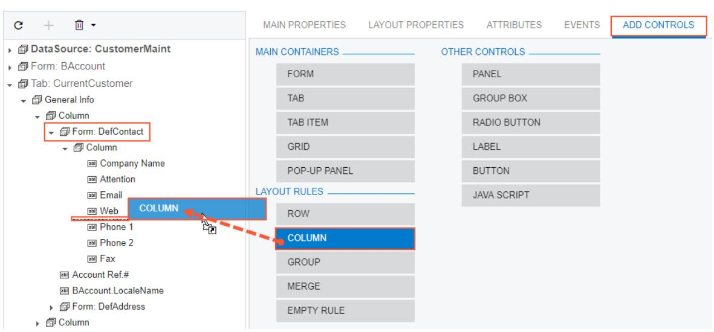

#### *Figure: Adding a layout rule to a container*

A layout rule is visible on the customized form only if it contains at least one visible control.

5. If required, specify properties for the new layout rule.

In any rule, you can configure any properties that you need. Some properties affect only the next control under the PXLayoutRule component, while other properties affect all controls under the rule until the next rule is encountered. Some properties require a corresponding ending rule. See *To Set a Layout Rule [Property](#page-269-2)* for details.

6. Click **Save** to save your changes in the customization project.

If you add a layout rule beneath another layout rule, you can override the properties of the PXLayoutRule component, which apply to the underlying controls. See *[Layout Rule \(PXLayoutRule\)](#page-265-1)* for more information about using layout rules.

### <span id="page-250-1"></span><span id="page-250-0"></span>**To Add Another Supported Control**

You use the *[Screen Editor](https://help-2025r1.acumatica.com/Help?ScreenId=ShowWiki&pageid=d60a8270-e2ce-4380-b778-af61a0ca56d2)* to add to a container a control of any of the following types, which are supported in the Acumatica Customization Platform (listed under **Other Controls** on the **Add Controls** tab item):

- *[Panel \(PXPanel\)](#page-270-1)*
- *[Group Box \(PXGroupBox\)](#page-271-1)*
- *[Label \(PXLabel\)](#page-274-2)*
- *[Radio Button \(PXRadioButton\)](#page-275-2)*
- *[Button \(PXButton\)](#page-276-1)*
- *[Java Script \(PXJavaScript\)](#page-279-2)*

We recommend that you not include a PXRadioButton control in a container that neither is bound to a data view nor inherits the DataMember property from the parent container.

You can nest a control of the listed types in a PXPanel or PXGroupBox container. However the PXGroupBox control type is especially designed to be used as a radio button container to render a drop-down field as a set of radio buttons. It contains scripts with the logic to support a nested radio button for each value of a drop-down field. So we recommend that you use PXGroupBox exclusively to include radio buttons.

To add a control of one of the listed types to a container, perform the following actions:

- 1. Open the container in the Screen Editor, as described in *To Open a [Container](#page-245-3) in the Screen Editor*.
- 2. Ensure that the container node is selected in the Control Tree of the editor. Click the arrow le of the node to expand the node if needed.
- 3. Click the **Add Controls** tab item (see the screenshot below).
- 4. From the **Other Controls** group, drag the required control type to the needed location in the Control Tree within the container, as shown in the following screenshot.

| 圕<br><b>PREVIEW CHANGES</b><br>$AC/IIONS$ $\sim$<br>⇦                                                                                                                                                                                                                       |                                                                                                        |                                                                                                     |  |
|-----------------------------------------------------------------------------------------------------------------------------------------------------------------------------------------------------------------------------------------------------------------------------|--------------------------------------------------------------------------------------------------------|-----------------------------------------------------------------------------------------------------|--|
| 面・<br>C<br>$+$ $-$                                                                                                                                                                                                                                                          | MAIN PROPERTIES LAYOUT PROPERTIES ATTRIBUTES                                                           | <b>ADD CONTROLS</b><br><b>EVENTS</b>                                                                |  |
| ▶ <i>□</i> DataSource: CustomerMaint<br>▶ <i>A</i> Form: BAccount<br>▶ <i>a</i> Tab: CurrentCustomer<br>▶ <i>A</i> Grid: CstPXGrid1<br>→ <i>白</i> Dialogs<br><b><i><u></u> Dialog: Card Definition</i></b><br>← a Dialog: Specify New ID<br>▶ <i>I</i> Form: ChangelDDialog | MAIN CONTAINERS ______________<br><b>FORM</b><br><b>TAB</b><br><b>TAB ITEM</b><br>GRID<br>POP-UP PANEL | OTHER CONTROLS _____________<br>PANEL<br><b>GROUP BOX</b><br>RADIO BUTTON<br>LABEL<br><b>BUTTON</b> |  |
| ← <i>O</i> Panel: pnlChangelDButton<br><b>BUTTON</b><br><b>P</b> Button: OK<br><b>P</b> Button: Cancel<br>Dialog: Generate On-Demand Statement                                                                                                                              | LAYOUT RULES _<br><b>ROW</b><br>COLUMN<br>GROUP<br><b>MERGE</b><br><b>EMPTY RULE</b>                   | <b>JAVA SCRIPT</b>                                                                                  |  |

#### *Figure: Adding a layout rule to a container*

- 5. If required, specify properties for the new control.
- 6. Click **Save** to save your changes in the customization project.

### <span id="page-251-1"></span><span id="page-251-0"></span>**To Reorder Child UI Elements**

You can reorder UI elements in a container manually by dragging them in the Control Tree of the *[Screen Editor](https://help-2025r1.acumatica.com/Help?ScreenId=ShowWiki&pageid=d60a8270-e2ce-4380-b778-af61a0ca56d2)*. However before you start to move elements, note the following simple rules:

- You can move a child element anywhere within its parent container control.
- To move an element within a container, you have to drag the element to the required place.
- Any element moved within a container is automatically aligned according to the nearest PXLayoutRule component placed above it. (See *[Layout Rule \(PXLayoutRule\)](#page-265-1)* for details.)

To move an element within a container, perform the following actions:

- 1. Open the container in the Screen Editor, as described in *To Open a [Container](#page-245-3) in the Screen Editor*.
- 2. Ensure that the container node is selected and expanded in the Control Tree of the editor. Click the arrow le of the node to expand the node if needed.
- 3. In the Control Tree, drag the element to the required position.

The Screen Editor moves the element with all its child elements to the new position in the container.

4. Click **Save** to save your changes to the customization project.

### <span id="page-252-3"></span><span id="page-252-0"></span>**To Delete a Child UI Element**

You can delete a child UI element from a container. To do this, perform the following actions:

- 1. Open the container in the Screen Editor, as described in *To Open a [Container](#page-245-3) in the Screen Editor*.
- 2. In the Control Tree of the editor, click the arrow le of the container node to expand the node.
- 3. Select the UI element to be deleted.
- 4. On the toolbar of the Control Tree, click **Remove > Remove**, as the following screenshot shows.

| 自▼<br>c<br>$\!+\!$                                                                     | <b>MAIN PROPERTIES</b>                        | <b>LAYOUT PROPERTIES</b> | <b>ATTRIBUTES</b><br><b>EVENTS</b> |
|----------------------------------------------------------------------------------------|-----------------------------------------------|--------------------------|------------------------------------|
| Remove<br>▶ <i></i> DataSo<br>$\mathbb{R}^m$<br>▶ <i>@</i> Form: B<br>Reset Properties | C<br>$\mapsto$                                |                          |                                    |
| ← fab: CurrentCustomer                                                                 | Override                                      | Property                 | Value                              |
| ▶ <i>同</i> General Info                                                                | □<br>٠                                        | <b>Base Properties</b>   |                                    |
| ▶ <i>□</i> Billing Settings                                                            | П                                             | BindingContext           |                                    |
| ▶ <i>□</i> Delivery Settings                                                           |                                               | ContentLayout            |                                    |
| ▶ <i>□</i> Locations                                                                   | П<br>!!!!!!!!!!!!!!!!!!!!!!!!!!!!!!!!!!!!!!!! |                          |                                    |
| ▶ <i>同</i> Payment Methods                                                             | □                                             | LoadOnDemand             |                                    |
| ▶ <i>同</i> Contacts                                                                    | $\Box$                                        | RepaintOnDemand          |                                    |
| ▶ <i>□</i> Salespersons                                                                | $\Box$                                        | Text                     | Attributes                         |
| 印 Child Accounts                                                                       | $\Box$                                        | Visible                  |                                    |
| <b><i><u></u></i></b> Attributes<br>$\overline{\phantom{a}}$                           |                                               |                          |                                    |
| • @ Grid: Answers                                                                      | П                                             | VisibleExp               |                                    |
| an Attribute                                                                           | П<br>$\overline{\mathbf{v}}$                  | <b>Ext Properties</b>    |                                    |
| <b>M</b> Required                                                                      | $\Box$<br>Þ                                   | AutoCallBack             |                                    |
| abil Value                                                                             |                                               |                          |                                    |
| $\triangleright \downarrow$ Levels                                                     |                                               |                          |                                    |
| ▶ <i>□</i> Activities                                                                  |                                               |                          |                                    |
| ▶ <i>同</i> GL Accounts                                                                 |                                               |                          |                                    |
| ▶ <i>□</i> Mailing Settings                                                            |                                               |                          |                                    |
| ▶ <i>□</i> Service Billing                                                             |                                               |                          |                                    |
| ▶ <i>同</i> Grid: CstPXGrid1                                                            |                                               |                          |                                    |
| ▶ <i></i> Dialogs                                                                      |                                               |                          |                                    |

#### *Figure: Deleting an UI element*

The platform deletes all child elements of the deleted object.

If you delete a PXLayoutRule component, all the controls under this layout rule are deleted too.

5. Click **Save** on the toolbar of the Screen Editor to save your changes to the customization project.

### <span id="page-252-2"></span><span id="page-252-1"></span>**Grid Container (PXGrid)**

PXGrid is a data-bound UI container control that renders a table with multiple records from its associated data source. For a single record, the object can be displayed in form view mode, which provides navigation buttons to move between records. For form view mode to be defined, PXGrid must include the RowTemplate element, which can contain controls for the record fields and layout rules for these controls.

An ASPX page can contain PXGrid as a main container that is included immediately in the page. A grid container, as the diagram below shows, can also be included in the following types of containers:

- PXFormView
- PXTabItem
- PXSmartPanel

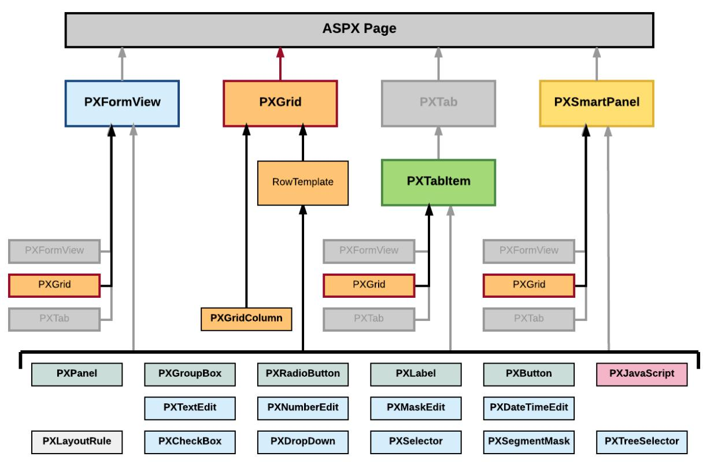

#### *Figure: Nesting rules for a PXGrid container in an ASPX page*

A grid container can include multiple PXGridColumn objects and a single RowTemplate element. In the ASPX code, grid columns are included in the Columns element, whereas controls for the form view of the grid belong to the RowTemplate element, as the following code snippet shows.

```
<px:PXGrid ID="grid" ... DataSourceID="ds" ...>
 ...
 <Columns>
 ...
 <px:PXGridColumn DataField="Qty" TextAlign="Right" Width="81px" AutoCallBack="True" /
>
 ...
 </Columns>
 <RowTemplate>
 ...
 <px:PXNumberEdit ID="edQty" runat="server" DataField="Qty" />
 ...
 </RowTemplate>
 ...
</px:PXGrid>
```

In this code, you can see descriptions of both a grid column and a box for the same Qty data field.

To create a new grid in an ASPX page, follow the instructions described in *To Add a Grid [Container](#page-239-3)*.

To delete a grid from an ASPX page, follow the instructions described in *To Delete a [Container](#page-243-3)*.

For detailed information on working with the content of a grid container, see the following topics in this section:

- *To Add a [Column](#page-254-1) for a Data Field*
- *To Add a [Control](#page-255-1) to the Form View of a Grid*
- *To Provide [Hyperlinks](#page-257-3) for a Grid Column*

The following topics may also be useful as you work with a grid container:

- *To Open a [Container](#page-245-3) in the Screen Editor*
- *To Set a [Container](#page-245-2) Property*
- *To Reorder Child UI [Elements](#page-251-1)*
- *To Delete a Child UI [Element](#page-252-3)*

#### **Related Links**

- *Changes in [Webpages](#page-44-1) (ASPX)*
- *[Customized Screens](#page-149-1)*

### <span id="page-254-1"></span><span id="page-254-0"></span>**To Add a Column for a Data Field**

In a grid, you can create a column for a data field if the grid container is bound to a data view declared within the graph that provides business logic for the ASPX page. To bind a grid container to a data view, you must specify the properties as follows for the appropriate PXGrid object:

- The DataSourceID property value must be equal to the value of the ID property of the PXDataSource control.
- The DataMember property must contain the name of the data view that is declared in the graph and provides data for the grid.

To add a column to a grid that is bound to a data view, perform the following actions:

- 1. Open the grid container in the Screen Editor, as described in *To Open a [Container](#page-245-3) in the Screen Editor*.
- 2. In the Control Tree of the editor, ensure that the grid node is selected. Click the arrow le of the node to expand the node if needed.
- 3. In the editor, click the **Add Data Fields** tab item (see the screenshot below).
- 4. On the tab item, select the **All**, **Visible** (as shown below), or **Custom** filter for the data fields provided by the data view, to open the appropriate field list.


You can create a custom field immediately on the **Add Data Fields** tab item by using the *[Create](https://help-2025r1.acumatica.com/Help?ScreenId=ShowWiki&pageid=06c038a5-1d75-482b-9b17-f2483ada0154) [New Field Dialog Box](https://help-2025r1.acumatica.com/Help?ScreenId=ShowWiki&pageid=06c038a5-1d75-482b-9b17-f2483ada0154)*.

5. Find the required data field in the list, and if the field is not used (that is, if the check box in the **Used** column is cleared for the field), select the check box in the unlabeled first column for the field.

- You can select multiple data fields to create multiple columns simultaneously.
- In the **Field Name** column of the list, a data field of a joined data access class (DAC) has a name that consists of the DAC name, two underscore characters, and the field name, such as *Product\_\_Active*. If you create a grid column for this field, the new PXGridColumn element refers to the field as shown in the following ASPX code.

<px:PXGridColumn DataField="Product\_\_Active" ... />

6. On the list toolbar, click **Create Controls**.

The platform creates a column for the selected data field, appends this column to the end of the grid column list, and adds a node for the column to the appropriate position in the Control Tree.

If you need to locate the new column in a position aer some existing column, you can select this existing column before you click **Create Controls**. Then the editor inserts new grid columns aer the column that is selected in the Control Tree.

At any time, you can change the position of a column in a grid. See *To Reorder Child UI [Elements](#page-251-1)* for details.

- 7. If needed, specify the following properties of the new column:
  - Type—to define a specific type of data in a column (for details, see *Use of the Type [Property](https://help-2025r1.acumatica.com/Help?ScreenId=ShowWiki&pageid=01146ab8-cc7a-4142-a626-95fbb3de4b50) of [PXGridColumn](https://help-2025r1.acumatica.com/Help?ScreenId=ShowWiki&pageid=01146ab8-cc7a-4142-a626-95fbb3de4b50)* in the Acumatica Framework Guide)
  - CommitChanges—to enable callbacks on the column field (for details, see *[Use of the CommitChanges](https://help-2025r1.acumatica.com/Help?ScreenId=ShowWiki&pageid=596c3620-e3d5-4d2f-9c19-3b65486a2761) [Property of Boxes](https://help-2025r1.acumatica.com/Help?ScreenId=ShowWiki&pageid=596c3620-e3d5-4d2f-9c19-3b65486a2761)* in the Acumatica Framework Guide)
  - DisplayMode—to define the mode of displaying a value in the column (for details, see *[Use of the](https://help-2025r1.acumatica.com/Help?ScreenId=ShowWiki&pageid=e375e4ed-73e6-47bc-a8e2-7366bc6eaf5d) [DisplayMode Property of PXGridColumn](https://help-2025r1.acumatica.com/Help?ScreenId=ShowWiki&pageid=e375e4ed-73e6-47bc-a8e2-7366bc6eaf5d)* in the Acumatica Framework Guide)

If you need to provide hyperlinks to redirect the user from a column cell to another Acumatica ERP form, follow the recommendations described in *To Provide [Hyperlinks](#page-257-3) for a Grid Column*.

8. Click **Save** to save your changes to the customization project.

### <span id="page-255-1"></span><span id="page-255-0"></span>**To Add a Control to the Form View of a Grid**

If the AllowFormEdit property of a grid is set to *True*, the user can switch the grid to form view mode to display the grid columns as controls on the form. This mode gives you the capability to edit a single record selected in the grid.

Therefore, to add a box for a data field to the form view of a grid, you have to add the box to the RowTemplate element in the ASPX code. To do this in the *[Screen Editor](https://help-2025r1.acumatica.com/Help?ScreenId=ShowWiki&pageid=d60a8270-e2ce-4380-b778-af61a0ca56d2)*, perform the following actions:

- 1. Open the grid container in the Screen Editor, as described in *To Open a [Container](#page-245-3) in the Screen Editor*.
- 2. In the Control Tree of the editor, click the arrow le of the node to expand the node.
- 3. Click the arrow le of the **Levels** node to expand the node, and then expand the node that appears, which has the same name as the grid does.

In the Control Tree, the Screen Editor assigns to a grid node the *Grid:<DataMember>* name, where the *<DataMember>* is the value of the DataMember property of the grid container. To the node that corresponds to the RowTemplate element of the grid, the editor assigns the same *<DataMember>* name.

4. If the expanded node contains other expandable nodes, such as *Columns* nodes, expand them to see which boxes are currently included in the form view of the grid.

> The RowTemplate element can contain layout rules, which are used to arrange controls in the form view of the grid. Also, you can use this element to provide specific properties of columns in the grid.

- 5. If you need to place the new box in a position below some existing box, select the node of this box in the Control Tree before you add a new control. (In the screenshot below, the *Mailing ID* node is currently selected in the tree.)
- 6. In the editor, click the **Add Data Fields** tab item.
- 7. On the tab item, click the **All**, **Visible**, or **Custom** filter for the data fields provided by the data view to open the appropriate field list.


You can create a custom field immediately on the **Add Data Fields** tab item by using the *[Create](https://help-2025r1.acumatica.com/Help?ScreenId=ShowWiki&pageid=06c038a5-1d75-482b-9b17-f2483ada0154) [New Field Dialog Box](https://help-2025r1.acumatica.com/Help?ScreenId=ShowWiki&pageid=06c038a5-1d75-482b-9b17-f2483ada0154)*.

8. Find the required data field in the list, and if the field is not used (that is, if the check box in the **Used** column is cleared for the field), select the check box for the field in the first column, as the following screenshot shows.

| ∏ा ▼<br>C                       |            | <b>MAIN PROPERTIES</b> | LAYOUT PROPERTIES                                        | <b>ATTRIBUTES</b> | <b>EVENTS</b> |                | <b>ADD DATA FIELDS</b> | $\grave{\mathcal{D}}$ |
|---------------------------------|------------|------------------------|----------------------------------------------------------|-------------------|---------------|----------------|------------------------|-----------------------|
| ▶ @ DataSource: CustomerMaint   | Data View: |                        | Customer Salespersons(SalesPersons)                      |                   |               |                |                        |                       |
| ▶ 俞 Form: BAccount              |            |                        |                                                          |                   |               |                |                        |                       |
| Tab: CurrentCustomer<br>- @     |            | <b>CREATE CONTROLS</b> | <b>NEW FIELD</b>                                         |                   | ALL           | <b>VISIBLE</b> | CUSTOM                 |                       |
| ▶ <i>同</i> General Info         | п          | Used                   | Field Name                                               |                   | Control       |                |                        |                       |
| ▶ <i>□</i> Billing Settings     |            |                        |                                                          |                   | NumberEdit    |                |                        |                       |
| ▶ <i>□</i> Delivery Settings    | $\Box$     | $\checkmark$           | CommisionPct (Commission %)                              |                   |               |                |                        |                       |
| ▶ <i>□</i> Locations            | □          | $\Box$                 | CreatedByID (Created By)                                 |                   | Selector      |                |                        |                       |
| <b><i></i></b> Payment Methods  | □          | $\Box$                 | CreatedByID Creator displayName (Created By)             |                   | TextEdit      |                |                        |                       |
| ▶ <i>同</i> Contacts             | $\Box$     | $\Box$                 | CreatedByID Creator Username (Created By)                |                   | TextEdit      |                |                        |                       |
| • @ Salespersons                | п          | $\Box$                 | CreatedByID description (Created By)                     |                   | TextEdit      |                |                        |                       |
| ▼ 回 Grid: SalesPersons          | □          | $\Box$                 | IsDefault (Default)                                      |                   | CheckBox      |                |                        |                       |
| an Salesperson ID<br>[abi] Name |            |                        |                                                          |                   |               |                |                        |                       |
| an Location ID                  | □          | $\Box$                 | LastModifiedByID (Last Modified By)                      |                   | Selector      |                |                        |                       |
| an Location Name                | □          | $\Box$                 | LastModifiedByID description (Last Modified By)          |                   | TextEdit      |                |                        |                       |
| an Commission %                 | □          | $\Box$                 | LastModifiedByID Modifier displayName (Last Mo TextEdit  |                   |               |                |                        |                       |
| aan Default                     | □          | $\Box$                 | LastModifiedByID_Modifier_Username (Last Modif TextEdit  |                   |               |                |                        |                       |
| $\sim$ $\sqrt{ }$ Levels        | $\Box$     | $\checkmark$           | LocationID (Location ID)                                 |                   | SegmentMask   |                |                        |                       |
| <b>印 SalesPersons</b>           | $\Box$     | $\checkmark$           | LocationID description (Location Name)                   |                   | TextEdit      |                |                        |                       |
| ▼ <i>国</i> Column               |            |                        |                                                          |                   |               |                |                        |                       |
| <b>Bbil</b> Name                | п          | $\Box$                 | LocationID LocationExtAddress descr (Location M TextEdit |                   |               |                |                        |                       |
| <b>M</b> Salesperson ID         | $\Box$     | $\checkmark$           | SalesPersonID (Salesperson ID)                           |                   | SegmentMask   |                |                        |                       |
| [abil Location ID               | п          | $\overline{\smile}$    | SalesPersonID description (Name)                         |                   | TextEdit      |                |                        |                       |
| [35] Location Name              | □          | $\Box$                 | SalesPersonID_SalesPerson_descr (Name)                   |                   | TextEdit      |                |                        |                       |
| an Commission %                 |            |                        |                                                          |                   |               |                |                        |                       |
| <b>图 Child Accounts</b>         |            |                        |                                                          |                   |               |                |                        |                       |
| ▶ <i>fil</i> Attributes         |            |                        |                                                          |                   |               |                |                        |                       |

#### *Figure: Selecting a data field to create a control on the form view of the grid*


You can select multiple data fields to create multiple columns simultaneously.

9. On the list toolbar, click **Create Controls**.

The platform creates a box for the selected data field and adds a node for the box to the appropriate position in the Control Tree. At any time, you can change the position of a column in a grid. See *To [Reorder](#page-251-1) [Child UI Elements](#page-251-1)* for details.

10.If needed, specify properties for the new control.


If you need to provide hyperlinks to redirect the user from a column cell to another Acumatica ERP form, follow the recommendations described in *To Provide [Hyperlinks](#page-257-3) for a Grid Column*.

11.Click **Save** to save your changes to the customization project.

### <span id="page-257-3"></span><span id="page-257-0"></span>**To Provide Hyperlinks for a Grid Column**

To provide hyperlinks for an existing column in a grid, perform the following actions:

- 1. Add the PXSelector attribute for the field used to create the column.
- 2. For the field, create a selector control in the RowTemplate element of the PXGridLevel container of the ASPX page, as described in *To Add a [Control](#page-255-1) to the Form View of a Grid*.
- 3. Set the AllowEdit property of the selector control to *True*.


A selector control contains the value of the key field of a data record from a particular table. Therefore, the control can be used to redirect a user to the form designed to edit the data record.

Aer you have completed these actions:

- The column fields contain hyperlinks to redirect the user to the data entry form for the records defined by the fields.
- If the form view for the grid is available, the following interface elements appear on the form view:
  - The text box created for the field
  - The **Edit** button, which provides the required redirection to the data entry form for the record defined by the value in the text box

### <span id="page-257-2"></span><span id="page-257-1"></span>**Tab Container (PXTab)**

PXTab is a data-bound UI container control that renders tabs defined by child PXTabItem containers.

An ASPX page can contain PXTab as a main container. A tab container, as the diagram below shows, can be also included in the following types of containers:

- PXFormView
- PXTabItem
- PXSmartPanel

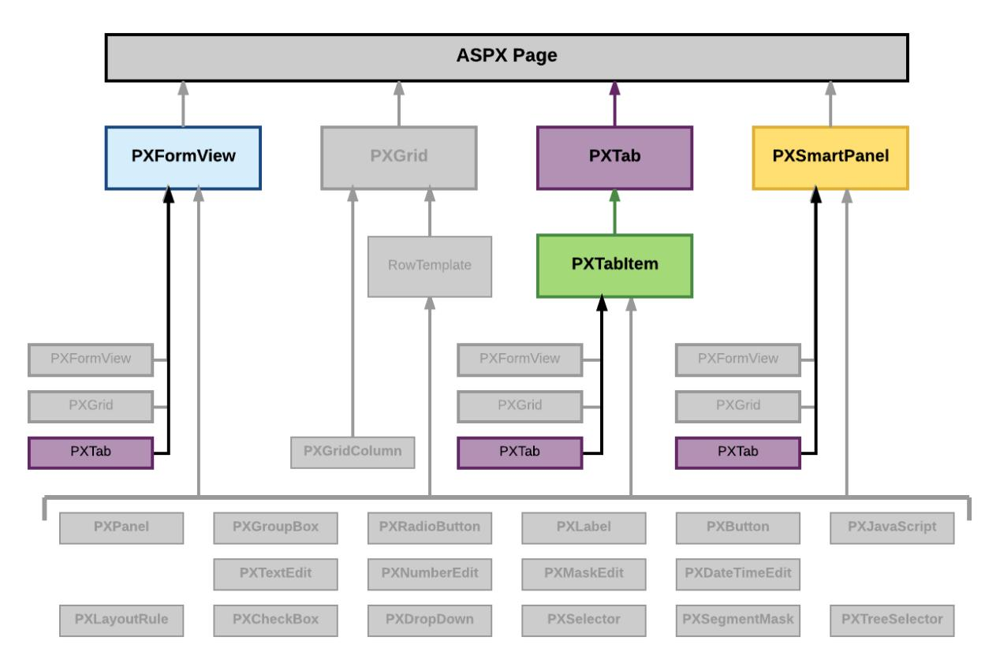

#### *Figure: Nesting rules for a PXTab container in an ASPX page*

A tab container can include only PXTabItem container controls.

A box for a data field can be added immediately to a child PXTabItem container if the parent PXTab container is bound to a data view declared within the graph that provides business logic for the ASPX page. To bind a tab container to a data view, you must specify the properties as follows for the appropriate PXTab object:

- The DataSourceID property value must be equal to the value of the ID property of the PXDataSource control.
- The DataMember property must contain the name of the data view that is declared in the graph and provides data for the controls of a child container that is not a data-bound UI container.

To create a new tab container in an ASPX page, follow the instructions described in *To Add a Tab [Container](#page-239-2)*.

To delete a tab container from an ASPX page, follow the instructions described in *To Delete a [Container](#page-243-3)*.

For detailed information about the PXTabItem container control, see *Tab Item Container [\(PXTabItem\)](#page-258-1)*.

#### **Related Links**

- *Changes in [Webpages](#page-44-1) (ASPX)*
- *[Customized Screens](#page-149-1)*

### <span id="page-258-1"></span><span id="page-258-0"></span>**Tab Item Container (PXTabItem)**

PXTabItem is a container control that can be used to render a single record from the data source specified for the parent PXTab container.

A tab item container, as the diagram below shows, can be included only in a PXTab container.

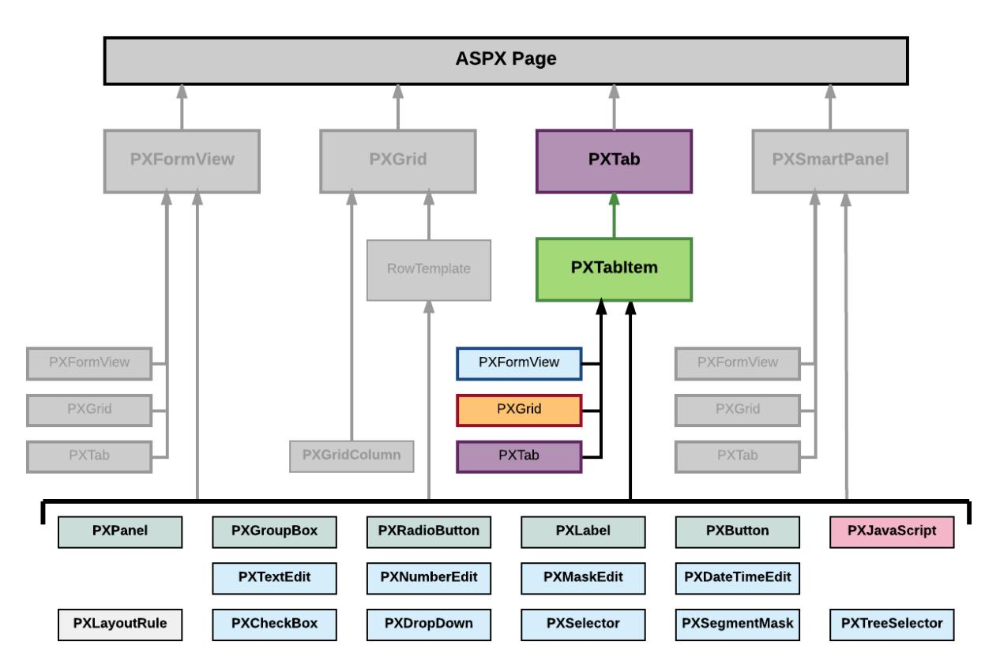

#### *Figure: Nesting rules for a PXTabItem container in an ASPX page*

A tab item container can include multiple ASPX objects of the following types:

- A data-bound UI container control: PXFormView, PXGrid, and PXTab
- A layout rule: PXLayoutRule
- A box for a data field: PXTextEdit, PXNumberEdit, PXMaskEdit, PXDateTimeEdit, PXCheckBox, PXDropDown, PXSelector, PXSegmentMask, and PXTreeSelector
- Another control: PXPanel, PXGroupBox, PXRadioButton, PXLabel, PXButton, and PXJavaScript

A box for a data field can be added to a tab item container if the parent PXTab container is bound to a data view declared within the graph that provides business logic for the ASPX page.

To create a new tab item container in a tab container in an ASPX page, follow the instructions described in *To [Add](#page-246-1) a [Nested Container](#page-246-1)*.

To delete a tab item container from an ASPX page, follow the instructions described in *To Delete a Child UI [Element](#page-252-3)*.

For specific information on working with a tab item container, see the *[Conditional](https://help-2025r1.acumatica.com/Help?ScreenId=ShowWiki&pageid=5e6701bc-1107-42f8-b9c6-9c5a586bc6ab) Hiding of a Tab Item* topic in this section. You will find additional information in the following topics:

- *To Open a [Container](#page-245-3) in the Screen Editor*
- *To Set a [Container](#page-245-2) Property*
- *To Add a Nested [Container](#page-246-1)*
- *To Add a Box for a Data [Field](#page-247-1)*
- *To Add a [Layout](#page-249-1) Rule*
- *To Add Another [Supported](#page-250-1) Control*
- *To Reorder Child UI [Elements](#page-251-1)*
- *To Delete a Child UI [Element](#page-252-3)*

#### **Related Links**

- *Changes in [Webpages](#page-44-1) (ASPX)*
- *[Customized Screens](#page-149-1)*

# <span id="page-260-1"></span><span id="page-260-0"></span>**Dialog Box (PXSmartPanel)**

PXSmartPanel is a UI container control that renders a dialog box.

A PXSmartPanel container does not have the DataMember property; therefore, it cannot contain a UI element for a data field. To add a box for a data field to a dialog box, in the appropriate PXSmartPanel container, you have to include the data-bound container that can contain the required data field.

However without binding a data view, you can create, for example, a message box with the controls that contain all required data in the ASPX code.

A PXSmartPanel container can include multiple ASPX objects of the following types (see the diagram below):

- A data-bound UI container control: PXFormView, PXGrid, and PXTab
- A layout rule: PXLayoutRule
- Another control: PXPanel, PXGroupBox, PXLabel, PXButton, and PXJavaScript

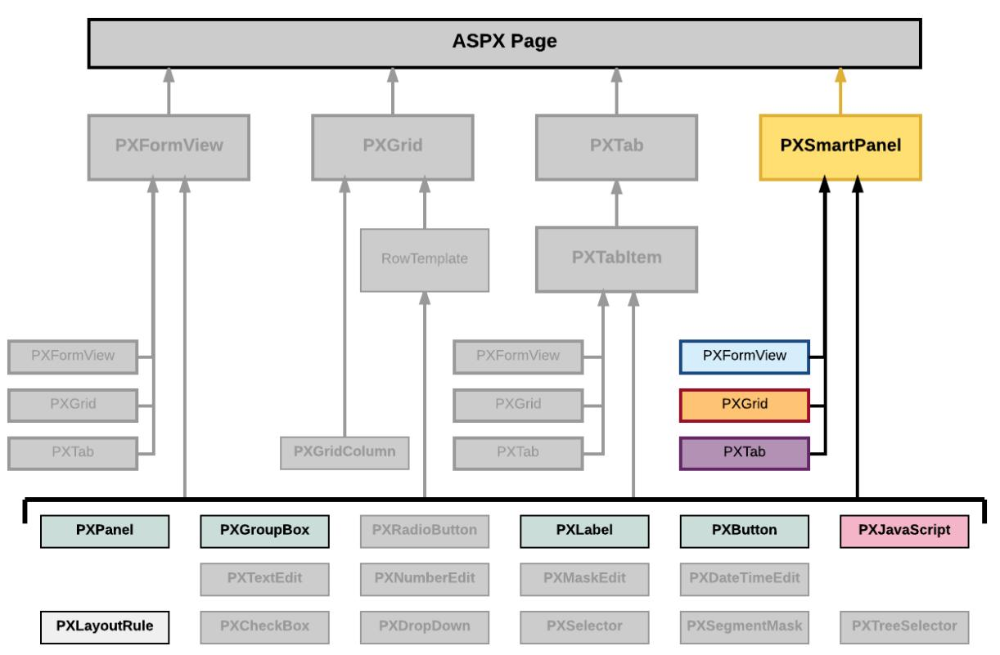

#### *Figure: Nesting rules for a PXSmartPanel container in an ASPX page*

A box for a data field cannot be added immediately to a dialog box because this type of container cannot be bound to a data view.

To create a new dialog box in a form, follow the instructions described in *To Add a [Dialog](#page-242-1) Box*.

To delete a dialog box from a form, follow the instructions described in *To Delete a [Container](#page-243-3)*.

In Acumatica ERP, a dialog box usually contains a container for data fields and a PXPanel container with PXButton elements to get a response from the user. See *[Panel \(PXPanel\)](#page-270-1)* and *To Use a [Button](#page-277-1) in a Dialog Box* for details.

For detailed information on working with the content of a dialog box, see the *To Open a Smart Panel in the [Screen](#page-261-1) [Editor](#page-261-1)* topic in this section. You will find additional information in the following topics:

- *To Set a [Container](#page-245-2) Property*
- *To Add a Nested [Container](#page-246-1)*
- *To Add Another [Supported](#page-250-1) Control*
- *To Reorder Child UI [Elements](#page-251-1)*
- *To Delete a Child UI [Element](#page-252-3)*

#### **Related Links**

- *Changes in [Webpages](#page-44-1) (ASPX)*
- *[Customized Screens](#page-149-1)*

### <span id="page-261-1"></span><span id="page-261-0"></span>**To Open a Smart Panel in the Screen Editor**

If you need to activate the *[Element Inspector](https://help-2025r1.acumatica.com/Help?ScreenId=ShowWiki&pageid=5f9d2d33-1a33-4edd-8629-3100d2020335)* for a pop-up panel, a dialog box, or another UI element that opens in modal mode and makes the *[Customization Menu](https://help-2025r1.acumatica.com/Help?ScreenId=ShowWiki&pageid=d6c46870-0c44-4f78-ae20-9bb9ef25dccd)* unavailable for selection, you can press Control-Alt.

To open a smart panel in the *[Screen Editor](https://help-2025r1.acumatica.com/Help?ScreenId=ShowWiki&pageid=d60a8270-e2ce-4380-b778-af61a0ca56d2)*, perform the following actions:

- 1. Open the form in the browser.
- 2. On the form, open the needed dialog box by using the appropriate action.
- 3. On the keyboard, press the Control-Alt combination.


The Element Inspector is activated while you keep the Control-Alt combination pressed on the keyboard.

- 4. Click anywhere inside the dialog box to open the *[Element Properties Dialog Box](https://help-2025r1.acumatica.com/Help?ScreenId=ShowWiki&pageid=5f9d2d33-1a33-4edd-8629-3100d2020335)*.
- 5. In the dialog box, click **Customize**.
- 6. If there is no currently selected customization project and the inspector opens the *[Table](https://help-2025r1.acumatica.com/Help?ScreenId=ShowWiki&pageid=d6c46870-0c44-4f78-ae20-9bb9ef25dccd) 1*

*You use the Select Customization Project dialog box to select an existing customization project or to create a new customization project. You open the dialog box in the following ways:*

- *• From the Customization menu of a form by clicking Select Project*
- *• From the Customization menu of a form by clicking Edit Project if there is no currently selected*

*customization project • From the Element Properties dialog box if you click Customize in the dialog box and there is no currently selected customization project* , select an existing customization project or create a new one.

If the customization project does not contain a changeset for the form, the *[Customization Project Editor](https://help-2025r1.acumatica.com/Help?ScreenId=ShowWiki&pageid=0bb97781-e987-4039-962d-457720821bff)* adds to the project a *Page* item for the form to keep your changes in the database. The smart panel element is opened in the *[Screen Editor](https://help-2025r1.acumatica.com/Help?ScreenId=ShowWiki&pageid=d60a8270-e2ce-4380-b778-af61a0ca56d2)*, and you can start to customize the dialog box.

When you click**Save** on the editor toolbar, the editor updates the *Page* item in the database.

# <span id="page-262-1"></span><span id="page-262-0"></span>**Box (Control for a Data Field)**

You can use a control for a data field, also referred as a *box*, to display and edit the value of the field on a form.

The Acumatica Customization Platform supports the following types of boxes.

| Object         | Description                                                                                                                                                                                                |
|----------------|------------------------------------------------------------------------------------------------------------------------------------------------------------------------------------------------------------|
| PXTextEdit     | A text box to display and edit the value of a string field.                                                                                                                                                |
| PXNumberEdit   | A box to display and edit the value of a decimal or int field.                                                                                                                                             |
| PXMaskEdit     | A text box to display and edit the value of a string field that has the format specified in<br>the data access class.                                                                                      |
| PXDateTimeEdit | A box to display and select the value of a datetime field.                                                                                                                                                 |
| PXCheckBox     | A check box to display and select the value of a bool field.                                                                                                                                               |
| PXDropDown     | A combo box to display, edit, and select the value of a field with a list attribute, such as<br>PXStringList, PXIntList, or PXDecimalList.                                                                 |
| PXSelector     | A lookup control to display, search for, and select the value of a field with the PXSelec<br>tor attribute.                                                                                                |
| PXSegmentMask  | A lookup control with a specified segmented key value that identifies a data record and<br>consists of one segment or multiple segments, where the list of possible values is defined<br>for each segment. |
| PXTreeSelector | A lookup control to select a value for a field with a PXTreeSelector attribute from a<br>tree control.                                                                                                     |

A box, as the diagram below shows, can be immediately added to the following types of containers:

- PXFormView
- RowTeplate
- PXTabItem

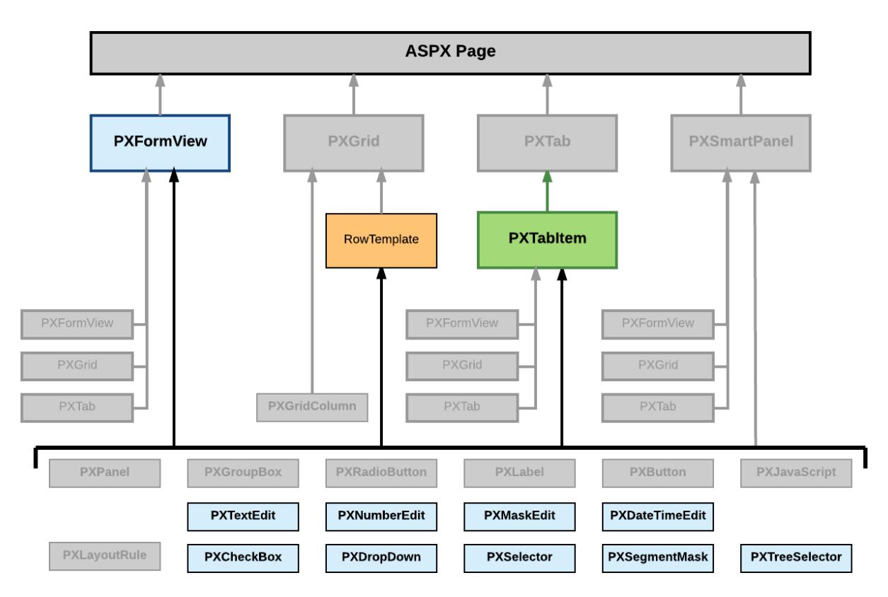

*Figure: Nesting rules for a box bound to a data field*

To create a box in a container, follow the instructions described in *To Add a Box for a Data [Field](#page-247-1)*.

To delete a box from a container, follow the instructions described in *To Delete a Child UI [Element](#page-252-3)*.

For detailed information on customizing a box, see the following topics:

- *To Select a Box in the [Screen](#page-263-1) Editor*
- *To Set a Box [Property](#page-264-2)*
- *To [Change](#page-264-3) the Type of a Box*

### <span id="page-263-1"></span><span id="page-263-0"></span>**To Select a Box in the Screen Editor**

To start the customization of a box, you have to select it in the *[Screen Editor](https://help-2025r1.acumatica.com/Help?ScreenId=ShowWiki&pageid=d60a8270-e2ce-4380-b778-af61a0ca56d2)*. To do this, perform the following actions:

- 1. Open the form that contains the box to be customized so that the box is displayed on the screen.
- 2. On the form title bar, click **Customization > Inspect Element** to launch the *[Element Inspector](https://help-2025r1.acumatica.com/Help?ScreenId=ShowWiki&pageid=5f9d2d33-1a33-4edd-8629-3100d2020335)*.
- 3. On the form, click the box to open the *[Element Properties Dialog Box](https://help-2025r1.acumatica.com/Help?ScreenId=ShowWiki&pageid=5f9d2d33-1a33-4edd-8629-3100d2020335)* for the box.
- 4. In the dialog box, click **Customize**.
- 5. If there is no currently selected customization project and the inspector opens the *[Table](https://help-2025r1.acumatica.com/Help?ScreenId=ShowWiki&pageid=d6c46870-0c44-4f78-ae20-9bb9ef25dccd) 1*

*You use the Select Customization Project dialog box to select an existing customization project or to create a new customization project. You open the dialog box in the following ways:*

- *• From the Customization menu of a form by clicking Select Project*
- *• From the Customization menu of a form by clicking Edit Project if there is no currently selected customization project*

*• From the Element Properties dialog box if you click Customize in the dialog box and there is no currently selected customization project* , select an existing customization project or create a new one.

If the customization project does not contain a changeset for the form, the *[Customization Project Editor](https://help-2025r1.acumatica.com/Help?ScreenId=ShowWiki&pageid=0bb97781-e987-4039-962d-457720821bff)* adds to the project a *Page* item for the form, to keep the changeset to ASPX code of the form in the database. The container of the box is opened in the *[Screen Editor](https://help-2025r1.acumatica.com/Help?ScreenId=ShowWiki&pageid=d60a8270-e2ce-4380-b778-af61a0ca56d2)*, and the box is selected in the Control Tree of the editor. Therefore you can start customization of the box.

<span id="page-264-2"></span>When you click**Save** on the editor toolbar, the editor updates the *Page* item in the database.

### <span id="page-264-0"></span>**To Set a Box Property**

To include in a customization project changes to properties of a box, you have to modify the properties by using the *[Screen Editor](https://help-2025r1.acumatica.com/Help?ScreenId=ShowWiki&pageid=d60a8270-e2ce-4380-b778-af61a0ca56d2)*. To start setting the properties of a box, perform the following actions:

- 1. Select the box in the Screen Editor, as described in *To Select a Box in the [Screen](#page-263-1) Editor*.
- 2. Click the **Layout Properties** tab item to open the list of properties for the box.
- 3. Specify values for the required properties.
- 4. Click **Save** to save your changes to the customization project.

For detailed information about the CommitChanges property, see *[Use of the CommitChanges Property of Boxes](https://help-2025r1.acumatica.com/Help?ScreenId=ShowWiki&pageid=596c3620-e3d5-4d2f-9c19-3b65486a2761)* in the Acumatica Framework Guide.

You can assign a predefined size abbreviation (such as *XXS*, *L* or *XL*) for the LabelsWidth and Size properties of a box. See *[Predefined](https://help-2025r1.acumatica.com/Help?ScreenId=ShowWiki&pageid=ffb4d55f-ef65-4aad-bc01-52bd3df47c6a) Size Values* in the Acumatica Framework Guide for details.

### <span id="page-264-3"></span><span id="page-264-1"></span>**To Change the Type of a Box**

For a data field, you can create a control of any type that is supported in Acumatica ERP. However to avoid issues with rendering controls and processing control values, you have to have an appropriate control for each data field. Therefore, if you have changed the type of a data field, you should recreate all the controls that exist on Acumatica ERP forms for this field.

For example, a text edit box for the *MyFieldName* PXDBString field can be defined in the ASPX code as follows.

<px:PXTextEdit ... DataField="MyFieldName" />

Suppose that you have added the PXStringList attribute for the field in the data access class to use the control for the field as a drop-down box. Then you need to redefine the control as follows.

<px:PXDropDown ... DataField="MyFieldName" />

Because this change must be saved in a customization project, you have to use the *[Screen Editor](https://help-2025r1.acumatica.com/Help?ScreenId=ShowWiki&pageid=d60a8270-e2ce-4380-b778-af61a0ca56d2)* to delete the old definition of the box and to add the new one.

To change the type of a box in a container on a form and to include this modification in a customization project, perform the following actions:

- 1. Select the box in the Screen Editor, as described in *To Select a Box in the [Screen](#page-263-1) Editor*.
- 2. On the toolbar of the Control Tree, select **Remove > Remove**.
- 3. Click the **Add Data Fields** tab item (see the screenshot below).

- 4. If you need to create a control for a data field that is not accessible through the data view specified for the container in the DataMember property, but is accessible through another data view of the same graph, and the **DataView** box gives you the availability to select a data view, select the needed data view in this box. (See *Use of Multiple Data Views for Boxes in [Containers](https://help-2025r1.acumatica.com/Help?ScreenId=ShowWiki&pageid=837c9078-dcd9-48f4-bb8b-d3a1fec7fb82)* in the Acumatica Framework Guide for details.)
- 5. On the tab item, click the **All**, **Visible**, or **Custom** filter for the fields provided by the data view selected in the **DataView** box to view the appropriate field list.
- 6. Find the required data field in the **Field Name** column of the list and select the check box for the field in the unlabeled first column, as the following screenshot shows.

| n<br>⇦ |  | PREVIEW CHANGES | $AC/I$ IONS $\star$ |
|--------|--|-----------------|---------------------|
|--------|--|-----------------|---------------------|

| Ⅲ ▼<br>C                                                                           |   | <b>MAIN PROPERTIES</b>                 | LAYOUT PROPERTIES                           | <b>ATTRIBUTES</b> | <b>ADD DATA FIELDS</b> |        |  |
|------------------------------------------------------------------------------------|---|----------------------------------------|---------------------------------------------|-------------------|------------------------|--------|--|
| ▶ <i>■</i> DataSource: CustomerMaint<br>▶ @ Form: BAccount                         |   | Data View:<br>Lead/Contact(DefContact) |                                             | $\checkmark$      |                        |        |  |
| Tab: CurrentCustomer<br>- @                                                        |   | CREATE CONTROLS                        | NEW FIELD                                   | ALL               | <b>VISIBLE</b>         | CUSTOM |  |
| 图 General Info<br>▼ <i>I</i> Column<br>→ <i>I</i> II Form: DefContact              |   | Field Name<br>Control<br>Used<br>п     |                                             |                   |                        |        |  |
|                                                                                    |   | п                                      | DisplayName (Display Name)<br>Selector      |                   |                        |        |  |
|                                                                                    |   |                                        | DuplicateFound (Duplicate Found)            |                   | CheckBox               |        |  |
| ▼ <i>即</i> Column                                                                  | п | $\Box$                                 |                                             |                   |                        |        |  |
| 画 Company Name                                                                     | п | $\checkmark$                           | EMail (Email)                               |                   | TextEdit               |        |  |
| atil Attention<br>abl Email<br>atil Web<br>abl Phone 1<br>atil Phone 2<br>abil Fax |   | $\overline{\checkmark}$                | Fax                                         |                   | TextEdit               |        |  |
|                                                                                    |   | П                                      | FaxType (Fax Type)                          |                   | ComboBox               |        |  |
|                                                                                    |   | П                                      | FirstName (First Name)                      |                   | TextEdit               |        |  |
|                                                                                    |   | $\overline{\checkmark}$                | FullName (Company Name)                     |                   | TextEdit               |        |  |
|                                                                                    |   | $\Box$                                 | Gender                                      |                   | ComboBox               |        |  |
|                                                                                    |   |                                        |                                             |                   |                        |        |  |
| <b>BU Account Ref #</b>                                                            |   | $\Box$                                 | IsActive (Active)                           |                   | CheckBox               |        |  |
| 画 BAccount.LocaleName                                                              | п | П                                      | IsAddressSameAsMain (Same as in Account)    |                   | CheckBox               |        |  |
| ▶ <i>□</i> Form: DefAddress                                                        | п | п                                      | IsConvertable (Can Be Converted)            |                   | CheckBox               |        |  |
| ▶ <i>图</i> Column                                                                  | п | п                                      | LanguageID (Language/Locale)                |                   | Selector               |        |  |
| 图 Billing Settings                                                                 | П | П                                      | LanguageID description (Description)        |                   | TextEdit               |        |  |
| 图 Delivery Settings                                                                |   |                                        |                                             |                   |                        |        |  |
| ▶ □Locations                                                                       |   |                                        | LanguageID Locale description (Description) |                   | TextEdit               |        |  |

#### *Figure: Selecting a data field for which a box is to be created*

For each data field in the list, the Screen Editor presets the most appropriate control type. However you can select another control type to be created for a field.

The control type must match the field type. Otherwise, the control cannot work properly with the field data. If you create a control that does not match the data field, you have to update the data field in the DAC (see *To [Customize](#page-329-1) a Field on the DAC Level* for details) or in the graph. (See *To [Customize](#page-331-1) a Field on the Graph Level* for details.)

- 7. If you need to change the type of the control to be created, select the needed type in the **Control** column of the selected field.
- 8. On the list toolbar, click **Create Controls**.

The platform creates a box for the selected data field and adds to the Control Tree a node for the box.

9. Click **Save** to save your changes to the customization project.

### <span id="page-265-1"></span><span id="page-265-0"></span>**Layout Rule (PXLayoutRule)**

The layout of a form is organized into a table of controls, with each control located within a certain column and row. The columns and rows are defined by PXLayoutRule components added to the layout of the form. The

properties of the PXLayoutRule component provide the position of the underlying controls and their size and appearance in the UI.

You can use the PXLayoutRule component to do the following to manage the layout of UI elements within a container:

- Place controls in multiple rows and columns to uniformly distribute them on the form or tab area of a form (see the diagram below)
- Cause controls to span multiple columns
- Merge controls into one row of the column to align them horizontally
- Adjust the widths of controls and labels
- Hide the labels of controls
- Group controls for users' convenience

| Container                                |                                                                 |                  |
|------------------------------------------|-----------------------------------------------------------------|------------------|
| StartRow=True<br>StartRow=True           | StartColumn=True StartColumn=True<br>Merge=True<br>ColumnSpan=2 | StartColumn=True |
| <b>StartRow=True</b><br>StartColumn=True |                                                                 |                  |

#### *Figure: Layout rules to arrange controls within a container*

A layout rule, as the diagram below shows, can be immediately added to the following types of containers:

- PXFormView
- RowTeplate
- PXTabItem
- PXSmartPanel

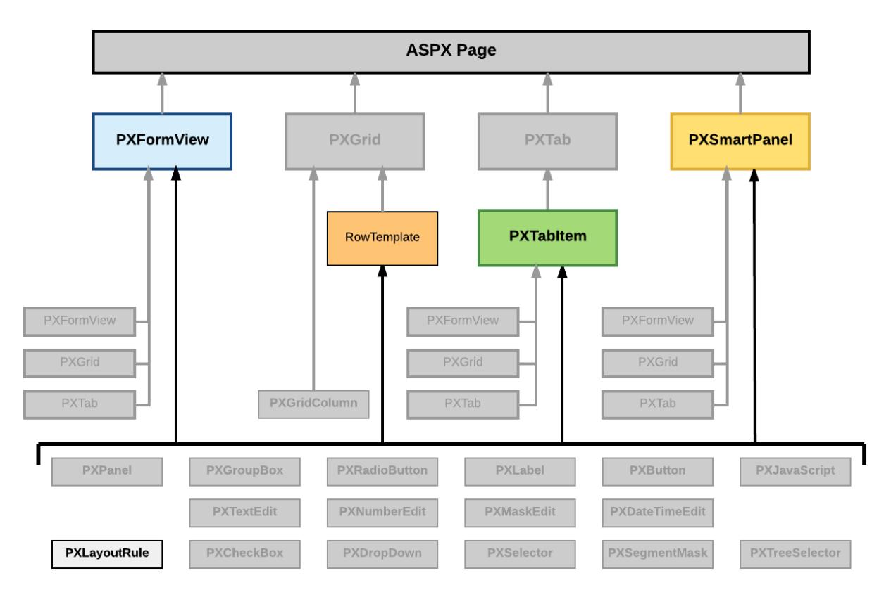

#### *Figure: Nesting rules for a layout rule in an ASPX page*

The Acumatica Customization Platform supports the following properties for a PXLayoutRule component.

| Property    | Description                                                                                                                                                                                                                                                                                                                                                                                                                                                                                                                                                                                                                                   |
|-------------|-----------------------------------------------------------------------------------------------------------------------------------------------------------------------------------------------------------------------------------------------------------------------------------------------------------------------------------------------------------------------------------------------------------------------------------------------------------------------------------------------------------------------------------------------------------------------------------------------------------------------------------------------|
| ColumnSpan  | Specifies the number of columns spanned by a control placed below the target PXLay<br>outRule component. This property applies to a single control that is under the lay<br>out rule in the ASPX code. (See Use of the ColumnSpan Property of PXLayoutRule in the<br>Acumatica Framework Guide for details.)                                                                                                                                                                                                                                                                                                                                  |
| ColumnWidth | Defines the width (in pixels) of a column containing controls. You can set the property<br>to a predefined value (see Predefined Size Values in the Acumatica Framework Guide<br>for details) or to a value in pixels. The specified width is applied to the column and is<br>not changed when the LabelsWidth property value is specified for the same PXLay<br>outRule component and when the Size, Width, or LabelWidth property value is<br>specified for a control contained within a column. (See Use of the ColumnWidth, Con<br>trolSize, and LabelsWidth Properties of PXLayoutRule in the Acumatica Framework Guide<br>for details.) |
| ControlSize | Defines the width for the controls placed within a column. The ControlSize proper<br>ty value is assigned from the predefined list of items. (See Predefined Size Values in the<br>Acumatica Framework Guide for details.) The specified size is applied to all controls con<br>tained within the column if you do not override the size separately for a control by speci<br>fying the Size or Width property values. (See Use of the ColumnWidth, ControlSize, and<br>LabelsWidth Properties of PXLayoutRule in the Acumatica Framework Guide for details.)                                                                                 |

| Property      | Description                                                                                                                                                                                                                                                                                                                                                                                                                                                                                                                                                                                                      |
|---------------|------------------------------------------------------------------------------------------------------------------------------------------------------------------------------------------------------------------------------------------------------------------------------------------------------------------------------------------------------------------------------------------------------------------------------------------------------------------------------------------------------------------------------------------------------------------------------------------------------------------|
| GroupCaption  | Specifies the caption for the group of controls that is started from the control placed un<br>der this rule in the ASPX code. Any rule that has the GroupCaption property value set<br>requires a rule with the EndGroup property value set to True below the last control of<br>the group in the code. All controls between the starting and ending group rules are in<br>cluded in the group. (See Use of the GroupCaption, StartGroup, and EndGroup Properties of<br>PXLayoutRule in the Acumatica Framework Guide for details.)                                                                              |
| EndGroup      | Indicates that the control above the rule in the ASPX code is the last control in the group<br>that starts from the PXLayoutRule component with a specified GroupCaption prop<br>erty value. (See Use of the GroupCaption, StartGroup, and EndGroup Properties of PXLay<br>outRule in the Acumatica Framework Guide for details.)                                                                                                                                                                                                                                                                                |
| LabelsWidth   | Defines the width (in pixels) of the control labels placed within a column. You select the<br>LabelsWidth property value from the predefined list of items (see Predefined Size Val<br>ues in the Acumatica Framework Guide for details) or by typing the width in pixels. The<br>specified size is applied to all control labels contained within the column if you do not<br>override the size separately for a control by specifying the LabelWidth property value.<br>(See Use of the ColumnWidth, ControlSize, and LabelsWidth Properties of PXLayoutRule in<br>the Acumatica Framework Guide for details.) |
| Merge         | Is used to merge controls into one row and to horizontally align the controls that are<br>placed under this rule in the ASPX code. The first PXLayoutRule component added un<br>der this rule in the code stops the merging, and the next control is placed alone beneath<br>the merged controls as the leftmost control of the current column. To cancel merging for<br>all controls that follow, you must add the PXLayoutRule component without the ad<br>justed property value. (See Use of the Merge Property of PXLayoutRule in the Acumatica<br>Framework Guide for details.)                             |
| StartGroup    | Starts the group of controls from the control placed under this rule in the ASPX code. If<br>the GroupCaption property value is not set to True, the group is displayed without a<br>caption. Any rule that has the StartGroup property value set requires a rule with the<br>EndGroup property value set to True below the last control of the group in the code.<br>All controls between the starting and ending group rules in the code are included in the<br>group. (See Use of the GroupCaption, StartGroup, and EndGroup Properties of PXLay<br>outRule in the Acumatica Framework Guide for details.)    |
| StartRow      | If set to True, starts a new row for the controls following this rule. (See Use of the StartRow<br>and StartColumn Properties of PXLayoutRule in the Acumatica Framework Guide for de<br>tails.)                                                                                                                                                                                                                                                                                                                                                                                                                 |
| SuppressLabel | Hides all control labels within a column. All control labels placed within the column are<br>hidden if you do not override them separately for a control by specifying a Suppress<br>Label property value. (See Use of the SuppressLabel Property of PXLayoutRule in the<br>Acumatica Framework Guide for details.)                                                                                                                                                                                                                                                                                              |

By specifying the values of these properties, you can make a variety of changes to the UI. Some properties affect only the next control under the PXLayoutRule component in the ASPX code. Other properties affect all controls under the rule until the next rule is encountered in the code. Still other properties require a corresponding ending rule. For instance, the rule with the GroupCaption property value specified requires that a corresponding rule be set with the EndGroup property value. All controls in the code between the GroupCaption and EndGroup rules become part of the group.

To create a layout rule in a container, follow the instructions described in *To Add a [Layout](#page-249-1) Rule*.

To delete a layout rule from a container, perform the actions described in *To Delete a Child UI [Element](#page-252-3)*.

For detailed information on working with the content of a grid container, see the following topics:

- *To Select a Layout Rule in the [Screen](#page-269-3) Editor*
- *To Set a Layout Rule [Property](#page-269-2)*

### <span id="page-269-3"></span><span id="page-269-0"></span>**To Select a Layout Rule in the Screen Editor**

To start the customization of a layout rule, you have to select it in the *[Screen Editor](https://help-2025r1.acumatica.com/Help?ScreenId=ShowWiki&pageid=d60a8270-e2ce-4380-b778-af61a0ca56d2)*. To do this, perform the following actions.

- 1. Open the form that contains the container with the layout rule, so that the container is displayed on the screen.
- 2. On the form title bar, click **Customization > Inspect Element** to open the *[Element Inspector](https://help-2025r1.acumatica.com/Help?ScreenId=ShowWiki&pageid=5f9d2d33-1a33-4edd-8629-3100d2020335)*.
- 3. On the form, click the area of the container to be customized, to open the *[Element Properties Dialog Box](https://help-2025r1.acumatica.com/Help?ScreenId=ShowWiki&pageid=5f9d2d33-1a33-4edd-8629-3100d2020335)* for the container.
- 4. In the dialog box, click **Customize**.
- 5. If there is no currently selected customization project and the inspector opens the *[Table](https://help-2025r1.acumatica.com/Help?ScreenId=ShowWiki&pageid=d6c46870-0c44-4f78-ae20-9bb9ef25dccd) 1*

*You use the Select Customization Project dialog box to select an existing customization project or to create a new customization project. You open the dialog box in the following ways:*

- *• From the Customization menu of a form by clicking Select Project*
- *• From the Customization menu of a form by clicking Edit Project if there is no currently selected • From the Element Properties dialog box if you click Customize in the dialog box and there is*

*customization project no currently selected customization project* , select an existing customization project or create a new one.

If the customization project does not contain a changeset for the form, the *[Customization Project Editor](https://help-2025r1.acumatica.com/Help?ScreenId=ShowWiki&pageid=0bb97781-e987-4039-962d-457720821bff)* adds to the project a *Page* item for the form to keep in the database the changeset to the ASPX code of the form. The container is opened in the *[Screen Editor](https://help-2025r1.acumatica.com/Help?ScreenId=ShowWiki&pageid=d60a8270-e2ce-4380-b778-af61a0ca56d2)* and selected in the Control Tree of the editor.

- 6. If the required layout rule is not displayed in the Control Tree, expand the subnodes of the container node to display the rule.
- 7. In the Control Tree, select the layout rule to start the customization.

<span id="page-269-2"></span>When you click**Save** on the editor toolbar, the editor updates the *Page* item in the database.

### <span id="page-269-1"></span>**To Set a Layout Rule Property**

To include in a customization project changes to properties of a layout rule, you have to modify the properties by using the *[Screen Editor](https://help-2025r1.acumatica.com/Help?ScreenId=ShowWiki&pageid=d60a8270-e2ce-4380-b778-af61a0ca56d2)*. To start setting the properties of a layout rule, perform the following actions:

- 1. Select the layout rule in the Screen Editor, as described in *To Select a Layout Rule in the [Screen](#page-269-3) Editor*.
- 2. Click the **Layout Properties** tab item to open the list of layout properties for the rule. (See the following screenshot.)

| Ⅲ ▼<br>C<br>$^{+}$                                                          |                          | <b>MAIN PROPERTIES</b>       |                             | <b>LAYOUT PROPERTIES</b> | <b>ATTRIBUTES</b> | <b>EVENTS</b> | ADD |
|-----------------------------------------------------------------------------|--------------------------|------------------------------|-----------------------------|--------------------------|-------------------|---------------|-----|
| ▶ <i>■</i> DataSource: SOOrderEntry<br>• <i>m</i> Form: Document            | C                        | $\left  \rightarrow \right $ |                             |                          |                   |               |     |
| ▶ <i>□</i> Column                                                           |                          | Override                     | Property                    |                          | Value             |               |     |
| ▶ P Column                                                                  | ▼                        |                              | <b>Base Properties</b>      |                          |                   |               |     |
| ▶ <i>@</i> Column                                                           |                          | $\Box$                       | ColumnSpan                  |                          |                   |               |     |
| ▶ n User Defined Fields                                                     |                          | $\Box$                       | ColumnWidth                 |                          |                   |               |     |
| p script                                                                    |                          | $\Box$                       |                             | ControlSize              |                   |               |     |
| ▼ <i>m</i> Tab                                                              |                          | $\Box$                       | EndGroup                    |                          | S                 |               |     |
| ▶ n Document Details                                                        |                          |                              | GroupCaption<br>LabelsWidth |                          |                   |               |     |
| ▶ <i>□</i> Tax Details<br>Commissions<br>而                                  |                          | $\Box$                       |                             |                          |                   |               |     |
| ▶ <i>□</i> Financial Settings                                               |                          | $\Box$                       |                             |                          | S                 |               |     |
| ▶ <i>I</i> D Payment Settings<br>Shipping Settings<br>Discount Details<br>而 |                          | $\Box$                       | Merge                       |                          |                   |               |     |
|                                                                             |                          | $\Box$                       | StartColumn                 |                          | True              |               |     |
|                                                                             |                          | $\Box$                       | StartGroup                  |                          |                   |               |     |
| <b><i></i></b> Shipments                                                    |                          | $\Box$                       | StartRow                    |                          |                   |               |     |
| <b>Payments</b>                                                             |                          | $\Box$                       | SuppressLabel               |                          |                   |               |     |
| <b><i>i</i></b> Totals                                                      | $\overline{\phantom{a}}$ | $\Box$                       | <b>Ext Properties</b>       |                          |                   |               |     |
| ▶ <i>□</i> Approval Details                                                 |                          | $\Box$                       | ClientIDMode                |                          |                   |               |     |
| ▶ <i>■</i> ROT/RUT Details                                                  |                          | $\Box$                       |                             | ValidateRequestMode      |                   |               |     |
| ▶ <i></i> Dialogs                                                           |                          | $\Box$                       | ViewStateMode               |                          |                   |               |     |
|                                                                             |                          |                              |                             |                          |                   |               |     |

*Figure: Viewing the list of layout rule properties in the Screen Editor*

- 3. Specify values for the required properties.
- 4. Click **Save** to save changes in the customization project.

The most important properties of the PXLayoutRule component are described in the following topics of the Acumatica Framework Guide:

- *[Use of the StartRow and StartColumn Properties of PXLayoutRule](https://help-2025r1.acumatica.com/Help?ScreenId=ShowWiki&pageid=0edb26d6-414d-4bbb-8c30-ed1d2e65e0b8)*
- *Use of the ColumnWidth, ControlSize, and LabelsWidth Properties of [PXLayoutRule](https://help-2025r1.acumatica.com/Help?ScreenId=ShowWiki&pageid=40e018a5-16cc-4395-a59f-481b53a5254f)*
- *[Predefined](https://help-2025r1.acumatica.com/Help?ScreenId=ShowWiki&pageid=ffb4d55f-ef65-4aad-bc01-52bd3df47c6a) Size Values*
- *[Use of the ColumnSpan Property of PXLayoutRule](https://help-2025r1.acumatica.com/Help?ScreenId=ShowWiki&pageid=41c31abf-2297-4c31-b5c2-848b95f9288f)*
- *[Use of the Merge Property of PXLayoutRule](https://help-2025r1.acumatica.com/Help?ScreenId=ShowWiki&pageid=325b7979-f32d-40eb-920b-7880245e8a26)*
- *[Use of the GroupCaption, StartGroup, and EndGroup Properties of PXLayoutRule](https://help-2025r1.acumatica.com/Help?ScreenId=ShowWiki&pageid=1341b9b1-1868-4544-9737-6c521506965f)*
- *[Use of the SuppressLabel Property of PXLayoutRule](https://help-2025r1.acumatica.com/Help?ScreenId=ShowWiki&pageid=618baa6a-524a-4e0b-bf1a-dfe28c1205e8)*

### <span id="page-270-1"></span><span id="page-270-0"></span>**Panel (PXPanel)**

In a container with controls for a single data record, you can use a PXPanel element as a container with a caption to group controls. However we recommend that you use the PXLayoutRule component for this purpose. (See *[Layout Rule \(PXLayoutRule\)](#page-265-1)* for details.)

In Acumatica ERP, a panel is used as a container to display a horizontal row of buttons with right alignment in a dialog box (see *[Dialog Box \(PXSmartPanel\)](#page-260-1)* for details), as the following screenshot shows.

| <b>Specify New ID</b>  |  |        |
|------------------------|--|--------|
| * Customer ID:         |  |        |
| <b>PXPanel element</b> |  | CANCEL |
|                        |  |        |

#### *Figure: Using a panel as a button container in a dialog box*

If you open the dialog box displayed in the screenshot above in the Screen Editor, you can see that the panel is located below a form container and contains two buttons.

| 圕<br>ACTIONS +<br>PREVIEW CHANGES<br>⇦                 |                               |                          |                                                             |
|--------------------------------------------------------|-------------------------------|--------------------------|-------------------------------------------------------------|
| Ⅲ ▼<br>C<br>$\pm$                                      | <b>MAIN PROPERTIES</b>        | <b>LAYOUT PROPERTIES</b> | <b>ATTRIBUTES</b><br><b>EVENTS</b><br>$\grave{\mathcal{Z}}$ |
| ▶ 即 DataSource: CustomerMaint<br>▶ @ Form: BAccount    | C<br>$\mapsto$                |                          |                                                             |
| ▶ n Tab: CurrentCustomer                               | Override                      | Property                 | Value                                                       |
| Grid: CstPXGrid1<br>▸ @                                | ш<br>٠                        | <b>Base Properties</b>   |                                                             |
| • @ Dialogs                                            | H                             | Caption                  |                                                             |
| p Dialog: Card Definition                              | П                             | Height                   |                                                             |
| → @ Dialog: Specify New ID<br>▶ @ Form: ChangelDDialog | □                             | ID                       | pnlChangeIDButton                                           |
| ↓ <i>I</i> Panel: pnlChangeIDButton                    | п<br>$\overline{\phantom{a}}$ | <b>Ext Properties</b>    |                                                             |
| 印 Button: OK                                           | П                             | AlreadyLocalized         |                                                             |
| 即 Button: Cancel                                       | П                             | ContentLayout            |                                                             |
| ▶ a Dialog: Generate On-Demand Statement               | П                             | DataMember               |                                                             |
|                                                        |                               | RenderStyle              |                                                             |
|                                                        |                               | Width                    |                                                             |
|                                                        | П                             |                          |                                                             |

#### *Figure: Viewing the panel content in the Screen Editor*

You can add the PXPanel element to a dialog box and buttons to this element, as described in *To Add [Another](#page-250-1) [Supported Control](#page-250-1)* and *To Use a [Button](#page-277-1) in a Dialog Box*. In a panel, to arrange buttons in a horizontal row with right alignment, you can specify the SkinID property of the PXPanel element, as described in *[Use of the SkinID](https://help-2025r1.acumatica.com/Help?ScreenId=ShowWiki&pageid=ce75ce73-a264-41a6-9545-68ffe2003d45) [Property of Containers](https://help-2025r1.acumatica.com/Help?ScreenId=ShowWiki&pageid=ce75ce73-a264-41a6-9545-68ffe2003d45)* in the Acumatica Framework Guide.

### <span id="page-271-1"></span><span id="page-271-0"></span>**Group Box (PXGroupBox)**

In a container with controls for a single data record, you can use a PXGroupBox element as a container with a caption to group controls. However we recommend that you use the PXLayoutRule component for this purpose. (See *[Layout Rule \(PXLayoutRule\)](#page-265-1)* for details.)

In Acumatica ERP, the PXGroupBox element is designed to be exclusively used as a radio button container to render a drop-down data field as a set of radio buttons. It contains scripts with the logic to support a nested radio button for each value of a drop-down field.

A group box for a drop-down data field can be immediately added to the following types of containers:

- PXFormView
- RowTeplate
- PXTabItem

To add a PXGroupBox element to a container, follow the instructions described in *To Add Another [Supported](#page-250-1) [Control](#page-250-1)*.

To delete a group box from a container, follow the instructions described in *To Delete a Child UI [Element](#page-252-3)*.

For detailed information on customizing a group box, see the following topics:

- *To Open a Group Box in the [Screen](#page-272-2) Editor*
- *To Create a Group Box for a [Drop-Down](#page-272-3) Field*
- *To Set a Group Box [Property](#page-274-3)*

### <span id="page-272-2"></span><span id="page-272-0"></span>**To Open a Group Box in the Screen Editor**

To start the customization of a group box on a form, you have to open it in the *[Screen Editor](https://help-2025r1.acumatica.com/Help?ScreenId=ShowWiki&pageid=d60a8270-e2ce-4380-b778-af61a0ca56d2)*. To do this, perform the following actions:

1. Open the form to display the appropriate set of radio buttons in the browser.


In Acumatica ERP, a radio button can work properly only in a PXGroupBox container that is used for a drop-down data field.

2. On the form title bar, click **Customization > Inspect Element** to open the *[Element Inspector](https://help-2025r1.acumatica.com/Help?ScreenId=ShowWiki&pageid=5f9d2d33-1a33-4edd-8629-3100d2020335)*.


If you need to activate the *[Element Inspector](https://help-2025r1.acumatica.com/Help?ScreenId=ShowWiki&pageid=5f9d2d33-1a33-4edd-8629-3100d2020335)* for a pop-up panel, a dialog box, or another UI element that opens in modal mode and makes the *[Customization Menu](https://help-2025r1.acumatica.com/Help?ScreenId=ShowWiki&pageid=d6c46870-0c44-4f78-ae20-9bb9ef25dccd)* unavailable for selection, you can press Control-Alt.

- 3. On the form, click the area with radio buttons to open the *[Element Properties Dialog Box](https://help-2025r1.acumatica.com/Help?ScreenId=ShowWiki&pageid=5f9d2d33-1a33-4edd-8629-3100d2020335)* for the group box.
- 4. In the dialog box, click **Customize**.
- 5. If there is no currently selected customization project and the inspector opens the *[Table](https://help-2025r1.acumatica.com/Help?ScreenId=ShowWiki&pageid=d6c46870-0c44-4f78-ae20-9bb9ef25dccd) 1*

*You use the Select Customization Project dialog box to select an existing customization project or to create a new customization project. You open the dialog box in the following ways:*

- *• From the Customization menu of a form by clicking Select Project*
- *• From the Customization menu of a form by clicking Edit Project if there is no currently selected • From the Element Properties dialog box if you click Customize in the dialog box and there is*
- *customization project* , select an existing customization project or create a new one.

*no currently selected customization project*

If the customization project does not contain a changeset for the form, the *[Customization Project Editor](https://help-2025r1.acumatica.com/Help?ScreenId=ShowWiki&pageid=0bb97781-e987-4039-962d-457720821bff)* adds to the project a *Page* item for the form, to keep the changeset to the ASPX code of the form in the database. The group box is opened in the *[Screen Editor](https://help-2025r1.acumatica.com/Help?ScreenId=ShowWiki&pageid=d60a8270-e2ce-4380-b778-af61a0ca56d2)*, and you can start the customization of the box and the nested radio buttons.

<span id="page-272-3"></span>When you click**Save** on the editor toolbar, the editor updates the *Page* item in the database.

### <span id="page-272-1"></span>**To Create a Group Box for a Drop-Down Field**

In Acumatica ERP, the PXDropDown box type is generally used to display on a form a field with a list attribute, such as PXStringList, PXIntList, or PXDecimalList. However if you want to display such a field as a set of radio buttons, where one radio button is used to display and select each single constant value of the field, you can create a PXGroupBox element and include PXRadioButton elements in it.

To create a group box for a drop-down data field in a container, perform the following actions:

- 1. Open the container in the Screen Editor, as described in *To Open a [Container](#page-245-3) in the Screen Editor*.
- 2. In the container, add a group box, as described in *To Add Another [Supported](#page-250-1) Control*.
- 3. For the new group box, specify the DataField property to bind the box to the data field. See *To [Set](#page-274-3) a [Group Box Property](#page-274-3)* and *[Use of the DataField Property of PXGroupBox](https://help-2025r1.acumatica.com/Help?ScreenId=ShowWiki&pageid=b3d384a1-ada5-4ff1-bf21-ec19eb903f90)* for details.
- 4. If required, specify the Caption and RenderStyle properties of the group box, as the following screenshot shows.

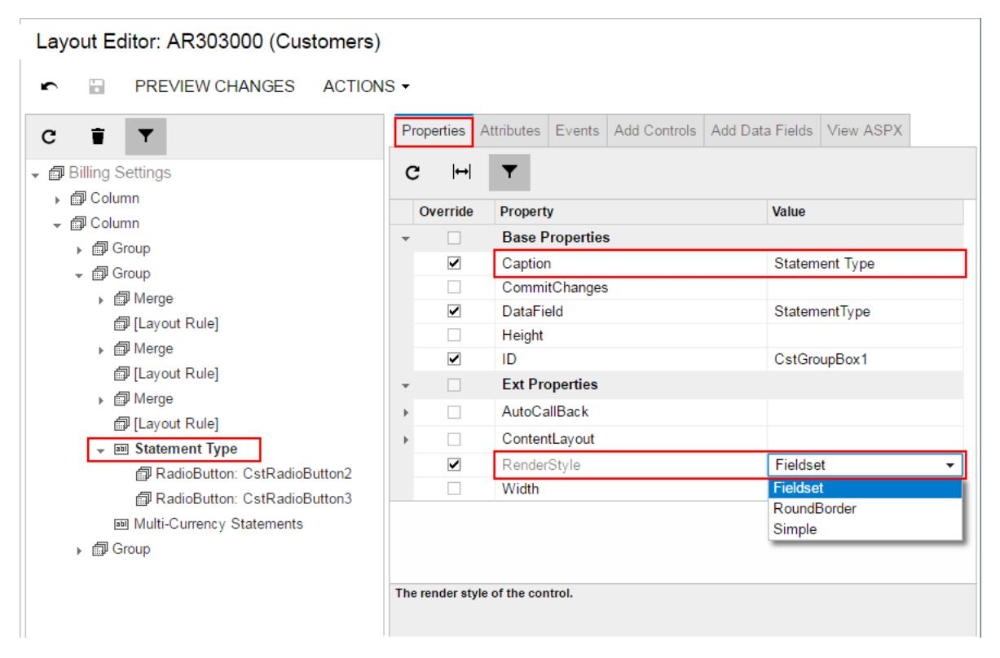

#### *Figure: Setting the properties of a group box*

(See *[Use of the Caption Property of PXGroupBox](https://help-2025r1.acumatica.com/Help?ScreenId=ShowWiki&pageid=1a889473-d65d-41a8-aaaa-f58cee7cf133)* and *[Use of the RenderStyle Property of PXGroupBox](https://help-2025r1.acumatica.com/Help?ScreenId=ShowWiki&pageid=a06a9841-555c-4622-963d-642f096b8ca3)* in the Acumatica Framework Guide for details.)

- 5. For each value defined in the field list, do the following:
  - a. To the group box node of the Control Tree, add a radio button, as described in *To Add Another [Supported](#page-250-1) [Control](#page-250-1)*.
  - b. In the C# code, find the value (usually it is an one-symbol value) in the list.
  - c. On the **Layout Properties** tab item, enter this value in the Value property.
- 6. Click **Save** to save changes in the customization project.

For example, as the result of the described actions for the StatementType data field with the *O* and *B* values defined in the list, you might get the following ASPX code.

```
<px:PXGroupBox runat="server" ID="CstGroupBox1" DataField="StatementType"
 Caption="Statement Type" RenderStyle="Fieldset">
 <Template>
 <px:PXRadioButton runat="server" ID="CstRadioButton2" Value="O" />
 <px:PXRadioButton runat="server" ID="CstRadioButton3" Value="B" />
 </Template>
```

### <span id="page-274-3"></span><span id="page-274-0"></span>**To Set a Group Box Property**

To include changes to the properties of a group box in a customization project, you have to modify the properties by using the *[Screen Editor](https://help-2025r1.acumatica.com/Help?ScreenId=ShowWiki&pageid=d60a8270-e2ce-4380-b778-af61a0ca56d2)*. To start setting the properties of a group box, perform the following actions:

- 1. Select the group box in the Screen Editor, as described in *To Open a Group Box in the [Screen](#page-272-2) Editor*.
- 2. Click the **Layout Properties** tab item to open the list of properties for the group box.
- 3. Specify values for the required properties.
- 4. Click **Save** to save your changes to the customization project.

To bind a group box to a data field, you have to specify the DataField property, as described in *[Use of the](https://help-2025r1.acumatica.com/Help?ScreenId=ShowWiki&pageid=b3d384a1-ada5-4ff1-bf21-ec19eb903f90) [DataField Property of PXGroupBox](https://help-2025r1.acumatica.com/Help?ScreenId=ShowWiki&pageid=b3d384a1-ada5-4ff1-bf21-ec19eb903f90)* in the Acumatica Framework Guide.

To set a caption for a group box, you use the Caption property. (See *[Use of the Caption Property of PXGroupBox](https://help-2025r1.acumatica.com/Help?ScreenId=ShowWiki&pageid=1a889473-d65d-41a8-aaaa-f58cee7cf133)* in the Acumatica Framework Guide for details.)

To define the style of the group box on the form, you have to select a value of the RenderStyle property, see *[Use](https://help-2025r1.acumatica.com/Help?ScreenId=ShowWiki&pageid=a06a9841-555c-4622-963d-642f096b8ca3) [of the RenderStyle Property of PXGroupBox](https://help-2025r1.acumatica.com/Help?ScreenId=ShowWiki&pageid=a06a9841-555c-4622-963d-642f096b8ca3)* in the Acumatica Framework Guide for details.

### <span id="page-274-2"></span><span id="page-274-1"></span>**Label (PXLabel)**

In a container with controls for a single data record, you can use a PXLabel element to display text. For example, you should use a label to render on a form static text that is stored in the ASPX code.

A PXLabel element can be immediately added to the following types of containers:

- PXFormView
- RowTeplate
- PXTabItem
- PXSmartPanel

You can view the use of the PXLabel elements, for example, in the **AgingSettings** group on the Statement Cycles (AR202800) form, shown in the following screenshot.

| Acumatica                                        | <b>ORGANIZATION</b><br><b>FINANCE</b> | <b>DISTRIBUTION</b>                                  | <b>CONFIGURATION</b> | ₹                       |                           | 11/30/2016 9:15 AM |                            | <b>ADMIN</b> |
|--------------------------------------------------|---------------------------------------|------------------------------------------------------|----------------------|-------------------------|---------------------------|--------------------|----------------------------|--------------|
| Cash Management<br>General Ledger                | <b>Accounts Payable</b>               | <b>Accounts Receivable</b>                           | <b>Fixed Assets</b>  | <b>Deferred Revenue</b> | <b>Taxes</b>              |                    | <b>Currency Management</b> |              |
| <b>Accounts Receivable</b>                       | c                                     | Revision Two HQ + Statement Cycles *                 |                      | <b>T</b> NOTES          | <b>ACTIVITIES</b>         | <b>FILES</b>       | <b>CUSTOMIZATION</b>       | $HELP -$     |
| Type your query here<br>Search                   | Ы                                     | к                                                    | $\geq$               |                         | REGENERATE LAST STATEMENT |                    |                            |              |
| $\sqrt{a}$<br>۰                                  | <b>GENERAL SETTINGS</b>               |                                                      |                      |                         |                           |                    |                            |              |
| $\overline{\phantom{a}}$ SETUP                   | * Cycle ID:                           |                                                      |                      | Ω                       |                           |                    |                            |              |
| Accounts Receivable Preferences                  | * Description:                        |                                                      |                      |                         |                           |                    |                            |              |
| <b>Credit Terms</b>                              | Prepare On:                           | End of Month                                         |                      |                         |                           |                    |                            |              |
| <b>Statement Cycles</b>                          | Day Of Month:                         | $\mathbf 0$                                          |                      |                         |                           |                    |                            |              |
| Overdue Charges                                  | Day Of Month 1:                       | $\overline{0}$                                       |                      |                         |                           |                    |                            |              |
| <b>Customer Classes</b>                          | Last Statement Date:                  |                                                      |                      |                         |                           |                    |                            |              |
| <b>Customer Price Classes</b>                    |                                       | Require Payment Application Before Statement Process |                      |                         |                           |                    |                            |              |
| <b>Reason Codes</b><br><b>Item Price Classes</b> | <b>AGING SETTINGS</b>                 |                                                      |                      |                         |                           |                    |                            |              |
| $\bullet$ MANAGF                                 |                                       |                                                      |                      |                         |                           |                    |                            |              |
| Salespersons                                     | Aging Period                          | Days Due                                             | Message Description  |                         |                           |                    |                            |              |
| <b>Contract Templates</b>                        |                                       | $\mathbf{0}$                                         |                      |                         |                           |                    |                            |              |
| <b>Contract Items</b>                            | $\overline{2}$                        | $\mathbf 0$                                          |                      |                         |                           |                    |                            |              |
| <b>Discount Codes</b>                            | $\overline{3}$                        | $\Omega$                                             |                      |                         |                           |                    |                            |              |
| <b>Item Classes</b>                              | $\overline{4}$                        | Over Days                                            |                      |                         |                           |                    |                            |              |
|                                                  | <b>FINANCE CHARGE SETTINGS</b>        |                                                      |                      |                         |                           |                    |                            |              |
|                                                  |                                       | Apply Overdue Charges                                |                      |                         |                           |                    |                            |              |
|                                                  |                                       | Require Overdue Charges Calculation Before Statement |                      |                         |                           |                    |                            |              |
|                                                  |                                       |                                                      |                      |                         |                           |                    |                            |              |
|                                                  | * Overdue Charge ID:                  |                                                      |                      | Ω                       |                           |                    |                            |              |

#### *Figure: Viewing the labels on the Statement Cycles form*

The use of a label can be required when a field contains a quantity, but you need to add a unit type for the value. For example, if you need to display a field as **Duration** [value] **Days**, where *Duration* is the value of the DisplayName parameter of the PXUIField attribute of the field, you have to add a PXLabel element that contains the *Days* string constant. To arrange the label in the same column as the field, you need to use the Merge layout rule, as described in *To Set a Layout Rule [Property](#page-269-2)* and *[Use of the Merge Property of PXLayoutRule](https://help-2025r1.acumatica.com/Help?ScreenId=ShowWiki&pageid=325b7979-f32d-40eb-920b-7880245e8a26)*.

You can add the PXLabel element to a container, as described in *To Add Another [Supported](#page-250-1) Control*.

To delete a label from an ASPX page, follow the instructions described in *To Delete a Child UI [Element](#page-252-3)*.

### <span id="page-275-2"></span><span id="page-275-0"></span>**Radio Button (PXRadioButton)**

In Acumatica ERP, a radio button can work properly only in a PXGroupBox container. (See *[Group Box](#page-271-1) [\(PXGroupBox\)](#page-271-1)* for details.) A PXGroupBox element contains scripts to provide the appropriate logic to use a nested radio button for a single constant value of a bound drop-down data field.

To use a PXRadioButton element on a form, follow the instructions described in *To [Create](#page-272-3) a Group Box for a [Drop-Down Field](#page-272-3)*.

To bind a radio button to a value from the list of a drop-down data field, follow the instructions described in *To [Bind](#page-275-3) a Radio [Button](#page-275-3) to a Value in the List of a Data Field*.

### <span id="page-275-3"></span><span id="page-275-1"></span>**To Bind a Radio Button to a Value in the List of a Data Field**

In the parent group box, to bind a radio button to a value in the list of a drop-down data field that is bound to this group box, perform the following actions:

1. Open the group box in the Screen Editor, as described in *To Open a Group Box in the [Screen](#page-272-2) Editor*.

- 2. In the Control Tree, select the node of the radio button.
- 3. Click the **Layout Properties** tab item to open the list of properties for the radio button.
- 4. Set the Value property to an appropriate value (usually it is a one-symbol value) of the list defined in the C# code, as the following screenshot shows.

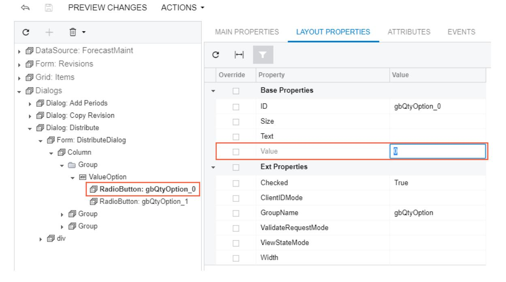

#### *Figure: Setting the Value property of a radio button*

5. Click **Save** to save your changes to the customization project.

### <span id="page-276-1"></span><span id="page-276-0"></span>**Button (PXButton)**

In Acumatica ERP, the PXButton element is used for the following purposes:

- In a dialog box—to display a button that closes the dialog box and returns a predefined DialogResult value
- In a container with controls for a single data record (including a dialog box) of a form—to display a button that invokes a method defined in the graph, which provides the business logic for the form

The most common use case of the PXButton element is in a dialog box.

A button, as the diagram below shows, can be immediately added to the following types of containers:

- PXFormView
- RowTeplate
- PXTabItem
- PXSmartPanel
- PXPanel

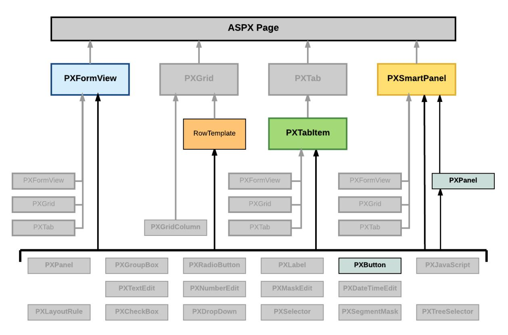

#### *Figure: Nesting rules for a button in an ASPX page*

To create a button in a container, follow the instructions described in *To Add Another [Supported](#page-250-1) Control*.

To delete a button from a container, follow the instructions described in *To Delete a Child UI [Element](#page-252-3)*.

For detailed information about using a button, see the following topics:

- *To Use a [Button](#page-277-1) in a Dialog Box*
- *To Use a Button to Invoke a [Method](#page-278-1)*

### <span id="page-277-1"></span><span id="page-277-0"></span>**To Use a Button in a Dialog Box**

In a dialog box, you can create buttons of the following types:

• A standard button that invokes no method but closes the dialog box and returns a specified predefined value, which can be processed by the method that has opened the dialog box

> To arrange buttons in a horizontal row with right alignment in a dialog box, we recommend that you use the PXPanel container with the SkinID property set to *Buttons*.

• A button that invokes a method of the graph that provides business logic for the form

To add a standard button to a PXPanel container of a dialog box, perform the following actions:

- 1. Add the button to a PXPanel container, as described in *To Add Another [Supported](#page-250-1) Control*.
- 2. In the Control Tree of the Screen Editor, select the node of the new button.
- 3. Click the **Layout Properties** tab item to open the list of properties for the button.
- 4. Specify values for the following properties:

a. DialogResult: Specify the value that is returned when the button closes the dialog box. Set the property to one of the following values defined in the WebDialogResult enumerator.

| Value  | Description                                                             |
|--------|-------------------------------------------------------------------------|
| OK     | The user clicked a button with the DialogResult property set to OK.     |
| Cancel | The user clicked a button with the DialogResult property set to Cancel. |
| Abort  | The user clicked a button with the DialogResult property set to Abort.  |
| Retry  | The user clicked a button with the DialogResult property set to Retry.  |
| Ignore | The user clicked a button with the DialogResult property set to Ignore. |
| Yes    | The user clicked a button with the DialogResult property set to Yes.    |
| No     | The user clicked a button with the DialogResult property set to No.     |

When the user clicks the added button, the dialog box is closed, and the specified value is returned to the method that has opened the dialog box.

b. Text: Specify the text to be displayed on the button.


In the Text property of a standard button, you can define any text, regardless of the value of the DialogResult property.

5. Click **Save** to save changes in the customization project.

The following ASPX code snippet creates a panel with two standard buttons arranged a horizontal row with right alignment.

```
<px:PXPanel ... SkinID="Buttons">
 <px:PXButton ... DialogResult="OK" Text="Next" />
 <px:PXButton ... DialogResult="Cancel" Text="Return" />
</px:PXPanel>
```

If you need to include in the same dialog box a button that invokes a method of the graph, you can add the button to the same PXPanel container and set the button properties as described in *To Use a Button to Invoke a [Method](#page-278-1)*.

### <span id="page-278-1"></span><span id="page-278-0"></span>**To Use a Button to Invoke a Method**

You can use the PXButton element on a form to invoke a method of the graph that provides business logic for the form.

To include in a container a button that invokes a method of the graph, perform the following actions:

- 1. Open the container in the Screen Editor, as described in *To Open a [Container](#page-245-3) in the Screen Editor*.
- 2. Add the button to the container, as described in *To Add Another [Supported](#page-250-1) Control*.
- 3. In the Control Tree of the Screen Editor, select the node of the new button.
- 4. Click the **Layout Properties** tab item to open the list of properties for the button.
- 5. Specify values for the following properties:

- a. CommandSourceID: Set the property to the value specified in the ID property of the PXDataSource control.
- b. CommandName: In the property, specify the name of the method to be invoked when the user clicks the button on the form.


The method must be defined in the graph that is specified in the TypeName property of the PXDataSource control.

- c. Text: Specify the text to be displayed on the button.
- 6. Click **Save** to save your changes to the customization project.

The following ASPX code creates a button that invokes the *MethodName* method referenced in the PXDataSource control with the ID property set to *ds*.

```
<px:PXButton ... CommandName="MethodName" CommandSourceID="ds" Text="ButtonText" />
```

### <span id="page-279-2"></span><span id="page-279-0"></span>**Java Script (PXJavaScript)**

The PXJavaScript element is designed to keep JavaScript code in an ASPX page.

A PXJavaScript control can be immediately added to the following types of containers:

- PXFormView
- RowTeplate
- PXTabItem
- PXSmartPanel
- PXPanel

To create a JavaScript control in a container, follow the instructions described in *To Add Another [Supported](#page-250-1) Control*.

To delete a JavaScript control from a container, follow the instructions described in *To Delete a Child UI [Element](#page-252-3)*.

For a detailed example of using a JavaScript control, see *[How do I play a sound in response to a custom action or](http://stackoverflow.com/questions/39732117/how-do-i-play-a-sound-in-response-to-a-custom-action-or-button-in-acumatica) [button in Acumatica?](http://stackoverflow.com/questions/39732117/how-do-i-play-a-sound-in-response-to-a-custom-action-or-button-in-acumatica)*.

### <span id="page-279-1"></span>**Toolbars, Action Buttons, and Menus**

On an Acumatica ERP form, toolbars, buttons, and menus are the types of UI elements that are created and processed by the graph that is specified in the TypeName property of the PXDataSource control and provides business logic for the form. Therefore, these UI elements cannot be created or customized by using the Screen Editor. See *[Customizing Business Logic](#page-321-3)* for details.

The standard page toolbar buttons include data manipulation (**Insert**, **Delete**, **Save**, and **Cancel**), navigation (**Next**, **Previous**, **First**, and **Last**), and clipboard (**Copy** and **Paste**). Every toolbar button corresponds to an action declared in the graph. You can use explicit or implicit declaration of actions to add standard buttons to the toolbar. To add standard toolbar buttons to the form and add selector controls, in the graph class declaration, specify the main DAC as the second type parameter of PXGraph, as the following code shows.

```
public class GraphName : PXGraph<GraphName, MainDACName>
{
 public PXSelect<MainDACName> PrimaryDataViewName;
}
```

To add a custom action to a form toolbar, you use *[Code Editor](https://help-2025r1.acumatica.com/Help?ScreenId=ShowWiki&pageid=c2678973-d557-47d4-b8ee-9dd69f55b465)* to create the action declaration in the graph extension. See *To Add an [Action](#page-348-1)* for details.

To create a menu on a form toolbar, in the graph or graph extension, you have to declare one action as a menu holder on the toolbar, and then declare all required actions and add these actions to the menu holder by using the AddMenuAction method of the PXAction class.

### <span id="page-280-0"></span>**Other Control Types**

The Acumatica Customization Platform does not support some control types, such as PXSplitContainer and PXTreeView, that are supported by the Acumatica Framework. However the Acumatica Customization Platform gives you the ability to add a control of an unsupported type to an Acumatica ERP form and save the change to a customization project.

To do this, perform the following actions:

- 1. Open the form in the *[Screen Editor](https://help-2025r1.acumatica.com/Help?ScreenId=ShowWiki&pageid=d60a8270-e2ce-4380-b778-af61a0ca56d2)*, as described in *To Start a [Customization](#page-237-1) of a Form*.
- 2. On the editor toolbar, click **Edit ASPX** to open the ASPX code of the form in the *[ASPX Editor](https://help-2025r1.acumatica.com/Help?ScreenId=ShowWiki&pageid=31a5d453-4b6b-4a68-96c5-b7af2b0e52a9)*.
- 3. Modify the code in the editor.
- 4. Click **Generate Customization Script** to save to the customization project the changes to the *Page* item for the form.

Aer you have added a new control to the customization project, you can select the control node in the Control Tree of the Screen Editor and specify the control properties, as described in *To Set a Box [Property](#page-264-2)*.

### <span id="page-280-1"></span>**Configuring the Layout of Forms**

In this chapter, you will learn how to modify the layout of Acumatica ERP forms. This includes adding UI elements, grouping similar UI elements, and moving elements to different parts of the form for the placement that best fits users' needs and methods of working.

### <span id="page-280-3"></span><span id="page-280-2"></span>**Form Layout: General Information**

Customization projects oen include the addition of UI elements and the underlying data fields to a form, and the modification of these elements. You can also change the way elements are arranged on the form: You can add tabs and sections to group similar elements and move elements to different parts of the form.

#### **Learning Objectives**

In this chapter, you will learn how to use the *[Element Inspector](https://help-2025r1.acumatica.com/Help?ScreenId=ShowWiki&pageid=5f9d2d33-1a33-4edd-8629-3100d2020335)* and the pages of the *[Customization Project Editor](https://help-2025r1.acumatica.com/Help?ScreenId=ShowWiki&pageid=0bb97781-e987-4039-962d-457720821bff)* to do the following on a form:

- View the properties of an element on the form
- Add boxes to the form
- Move elements from one part of the form to another
- Add new sections to tabs on the form and add elements to these sections
- Create tabs for a form
- Create boxes and add these boxes to the new tabs
- Add columns to the lookup tables of the boxes on a form

#### **Applicable Scenarios**

You modify the form layout in the following cases:

- You need to add to a form new elements, such as boxes and check boxes.
- You need to remove certain elements from the form because they are not needed.
- You need to change the position of elements on the form or group the elements into sections.
- You want to specify additional information on a data entry form, and the out-of-the-box system does not contain boxes that suit your needs.
- You want to separate the new boxes from the boxes on the existing tabs so that users can quickly find them.
- You want to filter records on the form by using certain values in the lookup table, and the default lookup table does contain the needed values.

### **Configuration of the Form Layout**

When you want to configure the layout of a form, you first need to add this form to the customization project in either of the following ways:

- By adding the form to the list of customized screens on the *[Customized Screens](https://help-2025r1.acumatica.com/Help?ScreenId=ShowWiki&pageid=98b095c8-14d5-477a-9fc3-cc7c57fee3cd)* page of the Customization Project Editor.
- By invoking the *[Element Inspector](https://help-2025r1.acumatica.com/Help?ScreenId=ShowWiki&pageid=5f9d2d33-1a33-4edd-8629-3100d2020335)* dialog box for the needed element or area of the form. From the dialog box, you click **Customize** and select the customization project.

You then use the *[Screen Editor](https://help-2025r1.acumatica.com/Help?ScreenId=ShowWiki&pageid=d60a8270-e2ce-4380-b778-af61a0ca56d2)* page of the Customization Project Editor to change the positions of certain elements on the form, and add elements that exist in the system but are not displayed on the form by default. You use the *[Customized Data Classes](https://help-2025r1.acumatica.com/Help?ScreenId=ShowWiki&pageid=30d9aeeb-a30b-4827-a5e3-8f12b1461154)* and *[Data Class](https://help-2025r1.acumatica.com/Help?ScreenId=ShowWiki&pageid=06c038a5-1d75-482b-9b17-f2483ada0154)* pages to add to the form new elements that do not exist in the system.

For details on how to configure the form layout in the code, see *[Customizing Elements of the User Interface](#page-225-1)* and *[Configuring ASPX Pages and Reports](https://help-2025r1.acumatica.com/Help?ScreenId=ShowWiki&pageid=ca6d5149-db7a-42b9-bce1-d6f26a5c2ca7)*.

#### **Use of the Element Inspector**

You use the *[Element Inspector](https://help-2025r1.acumatica.com/Help?ScreenId=ShowWiki&pageid=5f9d2d33-1a33-4edd-8629-3100d2020335)* to start the customization of a UI element that you inspect on a particular Acumatica ERP form. To activate the *[Element Inspector](https://help-2025r1.acumatica.com/Help?ScreenId=ShowWiki&pageid=5f9d2d33-1a33-4edd-8629-3100d2020335)*, you click **Customization > Inspect Element** on the form title bar. You then click the element that you want to inspect on the form. This opens the **Element Properties** dialog box (shown in the following screenshot).

| <b>Element Properties</b> |                                          |        |                  |  |
|---------------------------|------------------------------------------|--------|------------------|--|
| <b>Control Type:</b>      | Drop-down                                |        | DROP-DOWN VALUES |  |
| Data Class:               | !!!!!!!!!!!!!!!!!!!!!!!!!!!!!!!!!!!!!!!! |        |                  |  |
| Data Field:               | Resolution                               |        |                  |  |
| View Name:                | Case                                     |        |                  |  |
| <b>Business Logic:</b>    | <b>CRCaseMaint</b>                       |        |                  |  |
| <b>CUSTOMIZE</b>          | <b>ACTIONS</b>                           | CANCEL |                  |  |

*Figure: The Element Properties dialog box*

The dialog box displays various properties of the UI element that you clicked, such as its control type, data access class, data field, data view, business logic controller, actions, and drop-down control values. These properties define the visual appearance and business logic of the element. By clicking different buttons and menu commands in the **Element Properties** dialog box, you can view the source code of the element or start customizing it on the Screen Editor page. For more information, see *[Customizing Business Logic](#page-321-3)*.

### **Use of the Screen Editor Page**

The *[Screen Editor](https://help-2025r1.acumatica.com/Help?ScreenId=ShowWiki&pageid=d60a8270-e2ce-4380-b778-af61a0ca56d2)* page, which is a key part of the Customization Project Editor, is a visual editor that you use to customize the visual appearance and business logic of a form.

The *[Screen Editor](https://help-2025r1.acumatica.com/Help?ScreenId=ShowWiki&pageid=d60a8270-e2ce-4380-b778-af61a0ca56d2)* page includes the following parts:

- Page toolbar (see Item 1 in the following screenshot): On the page toolbar and More menu, you click buttons and commands to customize business logic and DACs, and to preview your changes.
- Control tree (Item 2): This tree contains nodes for all UI elements currently displayed on the form, including dialog boxes, and the layout rules that organize the elements into rows and columns. You click the node for a particular element to customize the element.
- Tabs area (Item 3): You use each tab as you customize the UI element selected in the control tree.

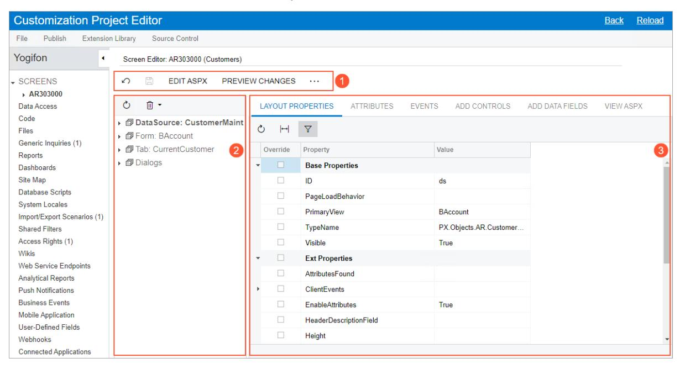

#### *Figure: The Screen Editor page*

In Acumatica ERP, *form* is used to refer to the page the user works with. It is described as a *screen* in the Customization Project Editor to differentiate the underlying screen you are modifying from the resulting form a user works with in Acumatica ERP.

In the tree, you can do the following:

- Select a container, a control, or an action, and then review or customize its settings by using the tabs of the page
- Change the order of controls in a container. To do this, you drag the controls on the control tree within their containers
- Remove the selected item from the webpage or reset the properties of the item to the out-of-the-box state
- See the list of controls that can be added to a form on the **Add Controls** tab

The screenshot below shows the control tree of the *[Customers](https://help-2025r1.acumatica.com/Help?ScreenId=ShowWiki&pageid=652929bc-9606-4056-aa6e-0c2d1147171b)* (AR303000) form. The first element of the control tree is the **DataSource** node (see Item 1 in the screenshot). It contains all the actions defined for the form. The actions with associated buttons on the form toolbar and commands on the More menu are located in the**Toolbar** node (Item 2). This node contains standard actions (the**Standard** node) and form-specific actions (the **Form-Specific** node). Form-specific actions are listed under the category of the associated commands on the More menu. All other actions of the form are located in the **Other** node.

| <b>Customization Project Editor</b>                  |                                                                                  |                          |                              |                                    |                        | <b>Back</b>            | Reload               |
|------------------------------------------------------|----------------------------------------------------------------------------------|--------------------------|------------------------------|------------------------------------|------------------------|------------------------|----------------------|
| File<br>Publish<br><b>Extension Library</b>          | Source Control                                                                   |                          |                              |                                    |                        |                        |                      |
| Yogifon<br>к                                         | Screen Editor: AR303000 (Customers)                                              |                          |                              |                                    |                        |                        |                      |
| $\overline{\phantom{a}}$ SCREENS<br>▶ AR303000       | 圕<br>∽<br><b>EDIT ASPX</b>                                                       |                          | PREVIEW CHANGES              | .                                  |                        |                        |                      |
| Data Access                                          | $\mathbb{m}$ .<br>Ò                                                              |                          | <b>LAYOUT PROPERTIES</b>     | <b>ATTRIBUTES</b><br><b>FVENTS</b> | <b>ADD CONTROLS</b>    | <b>ADD DATA FIELDS</b> | $\ddot{\mathcal{L}}$ |
| Code<br><b>Files</b>                                 | - @ DataSource: CustomerMaint<br>$\overline{\phantom{a}}$ $\overline{=}$ Toolbar | $\circ$                  | $\left  \rightarrow \right $ | $\boldsymbol{\nabla}$              |                        |                        |                      |
| Generic Inquiries (1)<br><b>Reports</b>              | $\sim$ $\Box$ Standard                                                           |                          | Override                     | Property                           | Value                  |                        |                      |
| <b>Dashboards</b>                                    | 同 Save<br>em <sub>cancel</sub>                                                   |                          | $\Box$                       | <b>Base Properties</b>             |                        |                        |                      |
| Site Map                                             | <b><i><u></u></i></b> Insert                                                     |                          | $\Box$                       | ID                                 | ds                     |                        |                      |
| <b>Database Scripts</b>                              | <b><i><u></u></i></b> Delete                                                     |                          | $\Box$                       | PageLoadBehavior                   |                        |                        |                      |
| <b>System Locales</b>                                | <b><i><u></u></i></b> Archive                                                    | $\overline{2}$           | $\Box$                       | PrimaryView                        | <b>BAccount</b>        |                        |                      |
| Import/Export Scenarios (1)<br><b>Shared Filters</b> | <b><i><u></u></i></b> Clipboard                                                  |                          | $\Box$                       | <b>TypeName</b>                    | PX.Objects.AR.Customer |                        |                      |
| Access Rights (1)                                    | <b>印 First</b>                                                                   |                          | $\Box$                       |                                    |                        |                        |                      |
| <b>Wikis</b>                                         | 同 Prev                                                                           |                          |                              | <b>Visible</b>                     | True                   |                        |                      |
| <b>Web Service Endpoints</b>                         | <b><i><u>I</u></i></b> Next<br><b>同 Last</b>                                     | $\overline{\phantom{a}}$ | $\Box$                       | <b>Ext Properties</b>              |                        |                        |                      |
| <b>Analytical Reports</b>                            | ▶ Porm-Specific                                                                  |                          | $\Box$                       | <b>AttributesFound</b>             |                        |                        |                      |
| <b>Push Notifications</b>                            | ▶ <i>ID</i> Other                                                                | ٠                        | $\Box$                       | <b>ClientEvents</b>                |                        |                        |                      |
| <b>Business Events</b><br>3                          | ▶ <i><b>I</b></i> Form: BAccount                                                 |                          | $\Box$                       | <b>EnableAttributes</b>            | True                   |                        |                      |
| <b>Mobile Application</b>                            | ▶ <i><b>I</b></i> Tab: CurrentCustomer                                           | $\overline{4}$           | $\Box$                       | <b>HeaderDescriptionField</b>      |                        |                        |                      |
| <b>User-Defined Fields</b><br>5                      | ▶ <i></i> Dialogs                                                                |                          | $\Box$                       | Height                             |                        |                        |                      |
| Webhooks<br><b>Connected Applications</b>            |                                                                                  |                          |                              |                                    |                        |                        |                      |

#### *Figure: Control tree of the Customers form*

The remaining top-level elements of the control tree of the *[Screen Editor](https://help-2025r1.acumatica.com/Help?ScreenId=ShowWiki&pageid=d60a8270-e2ce-4380-b778-af61a0ca56d2)* page are the following containers:

- **Form: BAccount**: This node (see Item 3 in the screenshot above) represents the Summary area of the form.
- **Tab: CurrentCustomer**: This node (Item 4) represents the tab area of the form and contains the tab items.
- **Dialogs**: This node (Item 5) contains the data for all dialog boxes that are defined in the ASPX code of the page.

The top element of each container is either a nested container or an element of the *Column* or *Row* type that specifies the layout rule for the elements located inside it.

### <span id="page-283-1"></span><span id="page-283-0"></span>**Form Layout: To Add a Box to a Form**

The following activity will walk you through the process of adding a new box to a form.

#### **Story**

Suppose that management has determined that Acumatica ERP would better fit the needs of your company if employees could specify the type of a customer's address on the *[Customers](https://help-2025r1.acumatica.com/Help?ScreenId=ShowWiki&pageid=652929bc-9606-4056-aa6e-0c2d1147171b)* (AR303000) form. The field that contains the address type is already available in the system. You need to add the corresponding box to the form.

#### **Process Overview**

You will do the following to add a box for the customer's address type to the *[Customers](https://help-2025r1.acumatica.com/Help?ScreenId=ShowWiki&pageid=652929bc-9606-4056-aa6e-0c2d1147171b)* (AR303000) form:

- 1. By using the form as a starting point, use the *[Element Inspector](https://help-2025r1.acumatica.com/Help?ScreenId=ShowWiki&pageid=5f9d2d33-1a33-4edd-8629-3100d2020335)* dialog box to open the *[Screen Editor](https://help-2025r1.acumatica.com/Help?ScreenId=ShowWiki&pageid=d60a8270-e2ce-4380-b778-af61a0ca56d2)* page for the form.
- 2. Add the field to the form on the *[Screen Editor](https://help-2025r1.acumatica.com/Help?ScreenId=ShowWiki&pageid=d60a8270-e2ce-4380-b778-af61a0ca56d2)* page.
- 3. Configure the added field's properties on the *[Screen Editor](https://help-2025r1.acumatica.com/Help?ScreenId=ShowWiki&pageid=d60a8270-e2ce-4380-b778-af61a0ca56d2)* page, and then publish the customization project.

4. Test the changes on the *[Customers](https://help-2025r1.acumatica.com/Help?ScreenId=ShowWiki&pageid=652929bc-9606-4056-aa6e-0c2d1147171b)* form.

#### **System Preparation**

Before you begin performing the steps of this activity, do the following:

- 1. Prepare an Acumatica ERP instance by performing the *[Customization](#page-82-1) Projects: To Deploy an Instance* prerequisite activity.
- 2. Create the *Yogifon* customization project by performing the *[Customization](#page-83-1) Projects: To Create a [Customization Project](#page-83-1)* prerequisite activity.

#### **Step 1: Opening the Screen Editor Page from the Form**

To start customizing a form from the form itself, open the *[Screen Editor](https://help-2025r1.acumatica.com/Help?ScreenId=ShowWiki&pageid=d60a8270-e2ce-4380-b778-af61a0ca56d2)* page for the form by doing the following:

- 1. In Acumatica ERP, on the *[Customers](https://help-2025r1.acumatica.com/Help?ScreenId=ShowWiki&pageid=652929bc-9606-4056-aa6e-0c2d1147171b)* (AR303000) form, open the record with the *C000000001* customer ID.
- 2. On the form title bar, click **Customization > Inspect Element**.
- 3. Click anywhere on the **General** tab on the form.

The **Element Properties** dialog box opens (see the following screenshot).

| <b>Customers</b>                                    | C000000001 - Jersey Central Office Equip              | <b>TH NOTES</b><br><b>FILES</b><br><b>CUSTOMIZATION</b><br>TOOLS $\star$                                     |
|-----------------------------------------------------|-------------------------------------------------------|--------------------------------------------------------------------------------------------------------------|
| 圖<br>$\Box$<br>$\Omega$<br>$\overline{\phantom{0}}$ | 血<br>n -<br>$-1<$<br>$\pm$                            | $\left\langle \right\rangle$<br>$\rightarrow$<br>$\mathcal{H}$<br><b>VIEW ACCOUNT</b><br>                    |
|                                                     |                                                       |                                                                                                              |
| * Customer ID:                                      | C000000001 - Jersey Central Office E Q                | $\overline{\phantom{a}}$<br>730.00<br>Balance:                                                               |
| * Customer Status:                                  | Active                                                | Prepayment Balance:<br>0.00                                                                                  |
| * Customer Class:                                   | DEFAULT - Default                                     | $\circ$                                                                                                      |
| <b>O</b> GENERAL                                    | <b>FINANCIAL</b><br><b>SHIPPING</b><br><b>BILLING</b> | <b>LOCATIONS</b><br>PAYMENT METHODS<br><b>CONTACTS</b><br>SALESPERSONS<br><b>ATTRIBUTES</b><br>$\rightarrow$ |
| <b>ACCOUNT INFO</b>                                 |                                                       | <b>Element Properties</b><br>$\times$                                                                        |
| * Account Name:                                     | Jersey Central Office Equip                           | Last Name                                                                                                    |
| <b>ACCOUNT ADDRESS</b>                              |                                                       | Control Type:<br>Tab                                                                                         |
|                                                     | VIEW ON MAP                                           | ⊠<br>Data Class:<br>Customer                                                                                 |
| Address Line 1:                                     | 1 De Villiers & Harrison St. 11-th                    | View Name:<br>CurrentCustomer                                                                                |
| Address Line 2:                                     |                                                       | Business Logic: CustomerMaint                                                                                |
| City:                                               | Johannesburg                                          |                                                                                                              |
| State:                                              |                                                       | rsonal Data<br><b>CUSTOMIZE</b><br>ACTIONS *<br>CANCEL                                                       |
| Postal Code:                                        |                                                       |                                                                                                              |
| * Country:                                          | ZA - South Africa                                     | $\varphi$<br><b>Consent Expires:</b>                                                                         |
| ADDITIONAL ACCOUNT INFO                             |                                                       |                                                                                                              |
| Business 1 -                                        | +1 (777) 283-0414                                     |                                                                                                              |
| Business 2 -                                        |                                                       |                                                                                                              |
| Fax                                                 |                                                       |                                                                                                              |
| <b>Account Email:</b>                               | jersey-equip@mail.con                                 | $\Box$                                                                                                       |
| Web:                                                |                                                       | 忆                                                                                                            |
| Ext Ref Nbr:                                        |                                                       |                                                                                                              |
| ACCOUNT PERSONAL DATA PRIVACY _                     |                                                       |                                                                                                              |
|                                                     | Consented to the Processing of Personal Data          |                                                                                                              |
| Date of Consent:                                    |                                                       |                                                                                                              |
| <b>Consent Expires:</b>                             |                                                       |                                                                                                              |

*Figure: The Element Properties dialog box*

As another way to open the dialog box, you can click the **General** tab while pressing Ctrl + Alt.

- 4. In the **Element Properties** dialog box, click **Customize**.
- 5. In the **Select Customization Project** dialog box, which opens, select the *Yogifon* project name, and click **OK**. The *[Screen Editor](https://help-2025r1.acumatica.com/Help?ScreenId=ShowWiki&pageid=d60a8270-e2ce-4380-b778-af61a0ca56d2)* page opens for the *[Customers](https://help-2025r1.acumatica.com/Help?ScreenId=ShowWiki&pageid=652929bc-9606-4056-aa6e-0c2d1147171b)* form.
- 6. On the page toolbar, click**Save**.

The *[Screen Editor](https://help-2025r1.acumatica.com/Help?ScreenId=ShowWiki&pageid=d60a8270-e2ce-4380-b778-af61a0ca56d2)* page for the *[Customers](https://help-2025r1.acumatica.com/Help?ScreenId=ShowWiki&pageid=652929bc-9606-4056-aa6e-0c2d1147171b)* form is shown in the following screenshot.

| <b>Customization Project Editor</b>                           |                                                                                                              |                                          |                   |                        |       |  | <b>Back</b> | Reload                   |  |  |
|---------------------------------------------------------------|--------------------------------------------------------------------------------------------------------------|------------------------------------------|-------------------|------------------------|-------|--|-------------|--------------------------|--|--|
| Publish<br><b>Extension Library</b><br>Source Control<br>File |                                                                                                              |                                          |                   |                        |       |  |             |                          |  |  |
| Yogifon<br>к                                                  | Screen Editor: AR303000 (Customers)                                                                          |                                          |                   |                        |       |  |             |                          |  |  |
| $\overline{\phantom{a}}$ SCREENS<br>▶ AR303000                | 圖<br>PREVIEW CHANGES<br><b>EDIT ASPX</b><br>∽<br>$\cdots$                                                    |                                          |                   |                        |       |  |             |                          |  |  |
| Data Access                                                   | 立▼<br>Ò<br><b>LAYOUT PROPERTIES</b><br><b>ATTRIBUTES</b><br><b>EVENTS</b><br>ADD CONTROLS<br>ADD DATA FIELDS |                                          |                   |                        |       |  |             |                          |  |  |
| Code<br>Files                                                 | ▶ <i>m</i> DataSource: CustomerMaint<br>▶ <i>I</i> Form: BAccount                                            | $\circ$                                  | $\vdash$          | $\triangledown$        |       |  |             |                          |  |  |
| Generic Inquiries (1)<br>Reports                              | ▶ <i>□</i> Tab: CurrentCustomer<br>▶ <i>□</i> Dialogs                                                        |                                          | Override          | Property               | Value |  |             |                          |  |  |
| <b>Dashboards</b>                                             |                                                                                                              | $\checkmark$                             | п                 | <b>Base Properties</b> |       |  |             | $\Delta$                 |  |  |
| <b>Site Map</b>                                               |                                                                                                              | !!!!!!!!!!!!!!!!!!!!!!!!!!!!!!!!!!!!!!!! | □                 | AutoSize               |       |  |             |                          |  |  |
| <b>Database Scripts</b><br><b>System Locales</b>              |                                                                                                              | □                                        | BindingContext    |                        |       |  |             |                          |  |  |
|                                                               |                                                                                                              | п                                        | <b>DataMember</b> | CurrentCustomer        |       |  |             |                          |  |  |
| Import/Export Scenarios (1)<br><b>Shared Filters</b>          |                                                                                                              |                                          | $\Box$            | EnableExp              |       |  |             |                          |  |  |
|                                                               | Access Rights (1)                                                                                            |                                          | $\Box$            | Height                 | 580px |  |             |                          |  |  |
| <b>Wikis</b>                                                  |                                                                                                              |                                          | $\Box$            | ID                     | tab   |  |             |                          |  |  |
| <b>Web Service Endpoints</b>                                  |                                                                                                              |                                          |                   |                        |       |  |             |                          |  |  |
| <b>Analytical Reports</b>                                     |                                                                                                              |                                          | $\Box$            | TabIndex               |       |  |             |                          |  |  |
| <b>Push Notifications</b>                                     |                                                                                                              |                                          | □                 | Width                  | 100%  |  |             |                          |  |  |
| <b>Business Events</b>                                        |                                                                                                              | $\overline{\phantom{a}}$                 | $\Box$            | <b>Ext Properties</b>  |       |  |             |                          |  |  |
| <b>Mobile Application</b>                                     |                                                                                                              | 0                                        | ActivityIndicator |                        |       |  |             |                          |  |  |
| <b>User-Defined Fields</b><br>Webhooks                        |                                                                                                              |                                          | □                 | AllowCollapse          |       |  |             |                          |  |  |
| <b>Connected Applications</b>                                 |                                                                                                              | $\mathbf{r}$                             | $\Box$            | CallbackCommands       |       |  |             | $\overline{\phantom{a}}$ |  |  |
|                                                               |                                                                                                              |                                          |                   |                        |       |  |             |                          |  |  |

#### *Figure: The Screen Editor page for the Customers form*

Notice that in the name that appears on the page, *Screen Editor: (AR303000) Customers*, *Screen Editor:* is followed by the ID of the form being customized and then the form name in parentheses.

Also notice that the**Screens** node on the navigation pane can be expanded. To open the *[Screen Editor](https://help-2025r1.acumatica.com/Help?ScreenId=ShowWiki&pageid=d60a8270-e2ce-4380-b778-af61a0ca56d2)* page for any form that has been added to the customization project, you expand the**Screens** node and then click the form ID beneath it.

You could instead start the customization of a particular form by adding the form on the *[Customized](https://help-2025r1.acumatica.com/Help?ScreenId=ShowWiki&pageid=98b095c8-14d5-477a-9fc3-cc7c57fee3cd) [Screens](https://help-2025r1.acumatica.com/Help?ScreenId=ShowWiki&pageid=98b095c8-14d5-477a-9fc3-cc7c57fee3cd)* page, as described in Step 1 of *Form [Layout:](#page-297-1) To Add a New Tab to a Form*.

#### **Step 2: Adding the Box to the Form**

In this step, you will add the box containing the address type to the **Account Address** section of the **General** tab of the *[Customers](https://help-2025r1.acumatica.com/Help?ScreenId=ShowWiki&pageid=652929bc-9606-4056-aa6e-0c2d1147171b)* (AR303000) form. Do the following:

1. On the *[Customers](https://help-2025r1.acumatica.com/Help?ScreenId=ShowWiki&pageid=652929bc-9606-4056-aa6e-0c2d1147171b)* form, locate the **Account Address** section (see Item 1 in the following screenshot).

It is located in the first column of the **General** tab (Item 2). Locating the section on the tab will help you to find it in the control tree of the *[Screen Editor](https://help-2025r1.acumatica.com/Help?ScreenId=ShowWiki&pageid=d60a8270-e2ce-4380-b778-af61a0ca56d2)* page.

| <b>Customers</b><br><b>New Record</b>               |                                                       |                                     | <b>PINOTES</b><br><b>FILES</b><br>TOOLS $\sim$<br><b>CUSTOMIZATION</b>           |
|-----------------------------------------------------|-------------------------------------------------------|-------------------------------------|----------------------------------------------------------------------------------|
| $\overline{\mathbb{F}_q}$<br>$\Box$<br>$\leftarrow$ | +<br>$\Omega$                                         |                                     |                                                                                  |
| * Customer ID:                                      |                                                       | $\varnothing$<br>Balance:           | $\sim$<br>0.00                                                                   |
| * Customer Status:                                  | Active                                                | Prepayment Balance:<br>$\checkmark$ | 0.00                                                                             |
| * Customer Class:                                   | <b>DEFAULT - Default</b>                              | $\circ$<br>0                        |                                                                                  |
| 2<br><b>O</b> GENERAL                               | <b>FINANCIAL</b><br><b>BILLING</b><br><b>SHIPPING</b> | <b>LOCATIONS</b><br>PAYMENT METHODS | <b>CONTACTS</b><br><b>SALESPERSONS</b><br><b>ATTRIBUTES</b><br>$\grave{\varphi}$ |
| <b>ACCOUNT INFO</b>                                 |                                                       | PRIMARY CONTACT.                    |                                                                                  |
| * Account Name:                                     |                                                       | Name:                               | <b>First Name</b><br>Last Name                                                   |
| <b>ACCOUNT ADDRESS</b>                              |                                                       | Job Title:                          |                                                                                  |
|                                                     | VIEW ON MAP                                           | Email:                              | ⊠                                                                                |
| Address Type:                                       | <b>Business</b>                                       | Business 1 $\sim$<br>$\checkmark$   |                                                                                  |
| Address Line 1:                                     |                                                       | Cell<br>$\checkmark$                |                                                                                  |
| Address Line 2:                                     |                                                       | CONTACT PERSONAL DATA PRIVACY _     |                                                                                  |
| City:                                               |                                                       |                                     | □ Consented to the Processing of Personal Data                                   |
| State:                                              |                                                       | $\varphi$<br>Date of Consent:       | $\checkmark$                                                                     |
| Postal Code:                                        |                                                       | <b>Consent Expires:</b>             |                                                                                  |
| * Country:                                          | US - United States of America                         | Q                                   |                                                                                  |
| ADDITIONAL ACCOUNT INFO.                            |                                                       |                                     |                                                                                  |
| Business $1 \sim$                                   |                                                       |                                     |                                                                                  |
| Business 2 $\sim$                                   |                                                       |                                     |                                                                                  |
| Fax<br>$\checkmark$                                 |                                                       |                                     |                                                                                  |
| <b>Account Email:</b>                               |                                                       | ⊠                                   |                                                                                  |
| Web:                                                |                                                       | Ø                                   |                                                                                  |
| Ext Ref Nbr:                                        |                                                       |                                     |                                                                                  |
| ACCOUNT PERSONAL DATA PRIVACY                       |                                                       |                                     |                                                                                  |
|                                                     | Consented to the Processing of Personal Data          |                                     |                                                                                  |
| Date of Consent:                                    | $\checkmark$                                          |                                     |                                                                                  |
| <b>Consent Expires:</b>                             | $\checkmark$                                          |                                     |                                                                                  |

#### *Figure: The location of the Account Address section*

2. In the navigation pane of the Customization Project Editor, click**Screens > AR303000**.

The *[Screen Editor](https://help-2025r1.acumatica.com/Help?ScreenId=ShowWiki&pageid=d60a8270-e2ce-4380-b778-af61a0ca56d2)* page for the *[Customers](https://help-2025r1.acumatica.com/Help?ScreenId=ShowWiki&pageid=652929bc-9606-4056-aa6e-0c2d1147171b)* form opens.

3. In the control tree of the page, click the node corresponding to the **Main Address** section as follows:**Tab: CurrentCustomer > General > Column (first) > Group (second) > Form: DefAddress** (see Item 1 in the screenshot below).


If needed, you can use the Element Inspector to open the **Account Address** section in the Screen Editor.

4. Go to the **Add Data Fields** tab.

Make sure that the *Account Address* data view is selected (Item 2) and that you are viewing the**Visible** filter tab (Item 3).

| <b>Customization Project Editor</b><br><b>Back</b><br>Reload                                                                                   |            |                        |                                                          |                              |               |  |  |  |  |
|------------------------------------------------------------------------------------------------------------------------------------------------|------------|------------------------|----------------------------------------------------------|------------------------------|---------------|--|--|--|--|
| Publish<br><b>Extension Library</b><br><b>Source Control</b><br>File                                                                           |            |                        |                                                          |                              |               |  |  |  |  |
| Screen Editor: AR303000 (Customers)<br>٠                                                                                                       |            |                        |                                                          |                              |               |  |  |  |  |
|                                                                                                                                                |            |                        |                                                          |                              |               |  |  |  |  |
| 冒<br><b>EDIT ASPX</b><br>PREVIEW CHANGES<br>↶<br>$\cdots$                                                                                      |            |                        |                                                          |                              |               |  |  |  |  |
| 面·<br>O<br><b>LAYOUT PROPERTIES</b><br><b>ATTRIBUTES</b><br><b>EVENTS</b><br><b>ADD CONTROLS</b><br><b>ADD DATA FIELDS</b><br><b>VIEW ASPX</b> |            |                        |                                                          |                              |               |  |  |  |  |
| 印 DataSource: CustomerMaint                                                                                                                    | Data View: |                        | $\overline{2}$<br><b>Account Address</b><br>$\checkmark$ |                              |               |  |  |  |  |
| <b><i></i></b> Form: BAccount                                                                                                                  |            |                        |                                                          | 3                            |               |  |  |  |  |
| Tab: CurrentCustomer                                                                                                                           |            | <b>CREATE CONTROLS</b> | <b>NEW FIELD</b>                                         | <b>VISIBLE</b><br><b>ALL</b> | <b>CUSTOM</b> |  |  |  |  |
| - <i>m</i> General                                                                                                                             | □          | <b>Used</b>            | <b>Field Name</b>                                        | Control                      |               |  |  |  |  |
| $\bullet$ $\bullet$ Column<br>图 [Layout Rule]                                                                                                  | 0          | ☑                      | AddressLine1 (Address Line 1)                            | <b>TextFdit</b>              |               |  |  |  |  |
| ▶ <i></i> Group                                                                                                                                | □          | ☑                      | AddressLine2 (Address Line 2)                            | <b>TextEdit</b>              |               |  |  |  |  |
| ▼ P Group                                                                                                                                      | п          | □                      | AddressLine3 (Address Line 3)                            | <b>TextEdit</b>              |               |  |  |  |  |
| Form: DefAddress<br>k.                                                                                                                         |            |                        |                                                          |                              |               |  |  |  |  |
| ▶ <i>□</i> Group                                                                                                                               | п          | □                      | AddressType                                              | ComboBox                     |               |  |  |  |  |
| ▶ <i>□</i> Group                                                                                                                               | $\Box$     | ☑                      | City                                                     | <b>TextEdit</b>              |               |  |  |  |  |
| ▶ <i>□</i> Column<br>▶ <i>I</i> Financial                                                                                                      | □          | ☑                      | CountryID (Country)                                      | Selector                     |               |  |  |  |  |
| ▶ <i></i> Billing                                                                                                                              | □          | □                      | CountryID Country description (Country Name)             | <b>TextEdit</b>              |               |  |  |  |  |
| ▶ <i></i> Shipping                                                                                                                             |            | $\Box$                 | CountryID description (Country Name)                     | <b>TextEdit</b>              |               |  |  |  |  |
| ▶ <i>□</i> Balances                                                                                                                            | $\Box$     | о                      | CreatedByID (Created By)                                 | Selector                     |               |  |  |  |  |
| ▶ <i>□</i> Locations                                                                                                                           |            | $\Box$                 | CreatedByID_Creator_displayName (Created By)             | <b>TextEdit</b>              |               |  |  |  |  |
| ▶ <i>I</i> Payment Methods                                                                                                                     | □          | □                      | CreatedByID Creator Username (Created By)                | <b>TextEdit</b>              |               |  |  |  |  |
| $\triangleright$ $\Box$ Contacts<br>▶ <i>I</i> Salespersons                                                                                    | □          | $\Box$                 | CreatedByID description (Created By)                     | <b>TextEdit</b>              |               |  |  |  |  |
| ▶ <i>□</i> Child Accounts                                                                                                                      | $\Box$     | ο                      | DisplayName (Address)                                    | <b>TextEdit</b>              |               |  |  |  |  |
| $\triangleright$ $\Box$ Attributes                                                                                                             | □          | $\Box$                 | LastModifiedByID (Last Modified By)                      | Selector                     |               |  |  |  |  |
| $\triangleright$ $\Box$ Activities                                                                                                             | $\Box$     | $\Box$                 | LastModifiedByID_description (Last Modified By)          | <b>TextEdit</b>              |               |  |  |  |  |
| ▶ <i>□</i> GL Accounts                                                                                                                         | □          | $\Box$                 |                                                          |                              |               |  |  |  |  |
| ▶ <i>I</i> Mailing && Printing                                                                                                                 |            |                        | LastModifiedByID_Modifier_displayName (Last Modified By) | <b>TextEdit</b>              |               |  |  |  |  |
| ▶ <i>I</i> Service Billing<br>▶ <i>I</i> D Compliance                                                                                          | $\Box$     | □                      | LastModifiedByID_Modifier_Username (Last Modified By)    | <b>TextEdit</b>              |               |  |  |  |  |
| <b><i><u></u></i></b> Dialogs                                                                                                                  | □          | $\Box$                 | Latitude                                                 | <b>NumberEdit</b>            |               |  |  |  |  |
|                                                                                                                                                | п          | Π                      | Longitude                                                | <b>NumberFdit</b>            | $\sim$        |  |  |  |  |

*Figure: The Add Data Fields tab*

The table on this tab shows all UI elements that are available for the selected control—in this case, the **Account Address** section of the *[Customers](https://help-2025r1.acumatica.com/Help?ScreenId=ShowWiki&pageid=652929bc-9606-4056-aa6e-0c2d1147171b)* form. These UI elements are determined by the *Account Address* data view. For details on data views, see *Data [View](#page-359-1)*.

- 5. In the table, select the unlabeled check box in the row with the *AddressType* field (which represents the **AddressType** box on the form).
- 6. On the table toolbar, click **Create Controls**.

The **AddressType** node appears in the control tree, as shown in the following screenshot. Notice that it is listed below the other nodes at its level.

| <b>Customization Project Editor</b><br>Reload<br><b>Back</b>                                                                                   |        |                        |                                                          |                 |                                                            |  |  |  |
|------------------------------------------------------------------------------------------------------------------------------------------------|--------|------------------------|----------------------------------------------------------|-----------------|------------------------------------------------------------|--|--|--|
| Publish<br><b>Source Control</b><br>File<br><b>Extension Library</b>                                                                           |        |                        |                                                          |                 |                                                            |  |  |  |
| ×<br>Screen Editor: AR303000 (Customers)                                                                                                       |        |                        |                                                          |                 |                                                            |  |  |  |
|                                                                                                                                                |        |                        |                                                          |                 |                                                            |  |  |  |
| B<br><b>EDIT ASPX</b><br>PREVIEW CHANGES<br>↶<br>$\cdots$                                                                                      |        |                        |                                                          |                 |                                                            |  |  |  |
| 间·<br>O<br><b>LAYOUT PROPERTIES</b><br><b>ATTRIBUTES</b><br><b>EVENTS</b><br><b>ADD CONTROLS</b><br><b>ADD DATA FIELDS</b><br><b>VIEW ASPX</b> |        |                        |                                                          |                 |                                                            |  |  |  |
| 即 DataSource: CustomerMaint<br>Data View:<br><b>Account Address</b><br>$\checkmark$                                                            |        |                        |                                                          |                 |                                                            |  |  |  |
| <b>i</b> Form: BAccount                                                                                                                        |        |                        |                                                          |                 |                                                            |  |  |  |
| 同 Tab: CurrentCustomer                                                                                                                         |        | <b>CREATE CONTROLS</b> | <b>NEW FIELD</b>                                         | <b>ALL</b>      | <b>VISIBLE</b><br>!!!!!!!!!!!!!!!!!!!!!!!!!!!!!!!!!!!!!!!! |  |  |  |
| • <i>i</i> ll General                                                                                                                          | □      | <b>Used</b>            | <b>Field Name</b>                                        | Control         |                                                            |  |  |  |
| $\overline{\phantom{a}}$ $\overline{\phantom{a}}$ Column<br>图 [Layout Rule]                                                                    | □      | ☑                      | AddressLine1 (Address Line 1)                            | <b>TextEdit</b> |                                                            |  |  |  |
| ▶ <i>图</i> Group                                                                                                                               | □      | ☑                      | AddressLine2 (Address Line 2)                            | <b>TextEdit</b> |                                                            |  |  |  |
| ▼ <i>图</i> Group                                                                                                                               | □      | □                      |                                                          | <b>TextEdit</b> |                                                            |  |  |  |
| • <i><b>ID</b></i> Form: DefAddress                                                                                                            |        |                        | AddressLine3 (Address Line 3)                            |                 |                                                            |  |  |  |
| T [Layout Rule]                                                                                                                                | o      | ☑                      | AddressType                                              | ComboBox        |                                                            |  |  |  |
| Button: btnAddressLookup                                                                                                                       | $\Box$ | ☑                      | City                                                     | <b>TextEdit</b> |                                                            |  |  |  |
| Button: View on Map<br>画 Address Line 1                                                                                                        | $\Box$ | ☑                      | CountryID (Country)                                      | Selector        |                                                            |  |  |  |
| 画 Address Line 2                                                                                                                               | п      | 0                      | CountryID_Country_description (Country Name)             | <b>TextEdit</b> |                                                            |  |  |  |
| abil City                                                                                                                                      | $\Box$ | $\Box$                 | CountryID description (Country Name)                     | <b>TextEdit</b> |                                                            |  |  |  |
| aall State                                                                                                                                     | $\Box$ | $\Box$                 | CreatedByID (Created By)                                 | Selector        |                                                            |  |  |  |
| <b>M</b> Postal Code                                                                                                                           | $\Box$ | $\Box$                 | CreatedByID_Creator_displayName (Created By)             | <b>TextEdit</b> |                                                            |  |  |  |
| and Country                                                                                                                                    | □      | □                      | CreatedByID Creator Username (Created By)                | <b>TextEdit</b> |                                                            |  |  |  |
| ani Validated<br>and AddressType                                                                                                               | $\Box$ | $\Box$                 | CreatedByID description (Created By)                     | <b>TextEdit</b> |                                                            |  |  |  |
| ▶ <i>□</i> Group                                                                                                                               | $\Box$ | □                      | DisplayName (Address)                                    | <b>TextEdit</b> |                                                            |  |  |  |
| ▶ <i>□</i> Group                                                                                                                               | $\Box$ | $\Box$                 | LastModifiedByID (Last Modified By)                      | Selector        |                                                            |  |  |  |
| $\mathsf{D}$ $\mathbb{D}$ Column                                                                                                               | □      | □                      | LastModifiedByID_description (Last Modified By)          | <b>TextEdit</b> |                                                            |  |  |  |
| 同 Financial                                                                                                                                    | □      | $\Box$                 |                                                          |                 |                                                            |  |  |  |
| <b><i>a</i></b> Billing                                                                                                                        |        |                        | LastModifiedByID Modifier displayName (Last Modified By) | <b>TextEdit</b> |                                                            |  |  |  |
| <b><i><u>a</u></i></b> Shipping<br><b><i><u></u></i></b> Balances                                                                              |        | о                      | LastModifiedByID_Modifier_Username (Last Modified By)    | <b>TextEdit</b> |                                                            |  |  |  |
| <b>同 Locations</b>                                                                                                                             | □      | □                      | Latitude                                                 | NumberEdit      |                                                            |  |  |  |
| ▶ <sup>1</sup> Payment Methods                                                                                                                 | □      | □                      | Longitude                                                | NumberEdit      |                                                            |  |  |  |

*Figure: Addition of the AddressType field*

7. On the page toolbar, click**Save**.

#### **Step 3: Adjusting the Properties of the New Box**

In this step, you will specify the position and name of the **AddressType** box. Do the following:

- 1. While you are still on the *[Screen Editor](https://help-2025r1.acumatica.com/Help?ScreenId=ShowWiki&pageid=d60a8270-e2ce-4380-b778-af61a0ca56d2)* page, in the control tree, click the **AddressType** node.
- 2. Adjust the position of the node by dragging it: Place the node before the **Address Line 1** node, as shown in the following screenshot.

| <b>Customization Project Editor</b><br><b>Reload</b><br><b>Back</b>                                                                     |        |                         |                                                          |                              |                                          |  |  |  |  |
|-----------------------------------------------------------------------------------------------------------------------------------------|--------|-------------------------|----------------------------------------------------------|------------------------------|------------------------------------------|--|--|--|--|
| Publish<br><b>Extension Library</b><br><b>Source Control</b><br>File                                                                    |        |                         |                                                          |                              |                                          |  |  |  |  |
| Screen Editor: AR303000 (Customers)<br>٠                                                                                                |        |                         |                                                          |                              |                                          |  |  |  |  |
|                                                                                                                                         |        |                         |                                                          |                              |                                          |  |  |  |  |
| 圕<br><b>EDIT ASPX</b><br>PREVIEW CHANGES<br>↶<br>$\cdots$                                                                               |        |                         |                                                          |                              |                                          |  |  |  |  |
| 而一<br>O<br><b>LAYOUT PROPERTIES</b><br><b>ATTRIBUTES</b><br><b>EVENTS</b><br>ADD CONTROLS<br><b>ADD DATA FIELDS</b><br><b>VIEW ASPX</b> |        |                         |                                                          |                              |                                          |  |  |  |  |
| ▶ <i>□</i> DataSource: CustomerMaint<br><b>Account Address</b><br>Data View:<br>$\checkmark$                                            |        |                         |                                                          |                              |                                          |  |  |  |  |
| ▶ <i>■</i> Form: BAccount                                                                                                               |        |                         |                                                          |                              |                                          |  |  |  |  |
| ← <i>m</i> Tab: CurrentCustomer                                                                                                         |        | <b>CREATE CONTROLS</b>  | <b>NEW FIELD</b>                                         | <b>VISIBLE</b><br><b>ALL</b> | !!!!!!!!!!!!!!!!!!!!!!!!!!!!!!!!!!!!!!!! |  |  |  |  |
| - <i><sub>中</sub></i> General                                                                                                           | □      | <b>Used</b>             | <b>Field Name</b>                                        | Control                      |                                          |  |  |  |  |
| $\overline{\phantom{a}}$ $\overline{\phantom{a}}$ Column                                                                                | □      | ☑                       | AddressLine1 (Address Line 1)                            | <b>TextEdit</b>              |                                          |  |  |  |  |
| TLayout Rule]<br>▶ <i></i> Group                                                                                                        | п      |                         |                                                          |                              |                                          |  |  |  |  |
| ▼ <i>图</i> Group                                                                                                                        |        | ☑                       | AddressLine2 (Address Line 2)                            | <b>TextEdit</b>              |                                          |  |  |  |  |
| • 印 Form: DefAddress                                                                                                                    | п      | ◻                       | AddressLine3 (Address Line 3)                            | <b>TextEdit</b>              |                                          |  |  |  |  |
| T [Layout Rule]                                                                                                                         | $\Box$ | ☑                       | AddressType                                              | ComboBox                     |                                          |  |  |  |  |
| Button: btnAddressLookup                                                                                                                | $\Box$ | $\overline{\mathsf{S}}$ | City                                                     | <b>TextEdit</b>              |                                          |  |  |  |  |
| <b>P</b> Button: View on Map                                                                                                            | $\Box$ | ☑                       | CountryID (Country)                                      | Selector                     |                                          |  |  |  |  |
| <b>and AddressType</b><br>画 Address Line 1                                                                                              | $\Box$ | □                       | CountryID_Country_description (Country Name)             | <b>TextEdit</b>              |                                          |  |  |  |  |
| 画 Address Line 2                                                                                                                        | $\Box$ | $\Box$                  | CountryID description (Country Name)                     | <b>TextEdit</b>              |                                          |  |  |  |  |
| aal City                                                                                                                                | $\Box$ | $\Box$                  | CreatedByID (Created By)                                 | Selector                     |                                          |  |  |  |  |
| <b>圖 State</b>                                                                                                                          | $\Box$ |                         | CreatedByID Creator displayName (Created By)             | <b>TextEdit</b>              |                                          |  |  |  |  |
| 画 Postal Code                                                                                                                           | □      | о                       | CreatedByID Creator Username (Created By)                | <b>TextEdit</b>              |                                          |  |  |  |  |
| aail Country<br>an Validated                                                                                                            | □      | $\Box$                  | CreatedByID description (Created By)                     | <b>TextEdit</b>              |                                          |  |  |  |  |
| $\triangleright$ $\Box$ Group                                                                                                           | $\Box$ | □                       | DisplayName (Address)                                    | <b>TextEdit</b>              |                                          |  |  |  |  |
| ▶ <i>□</i> Group                                                                                                                        | $\Box$ | $\Box$                  | LastModifiedByID (Last Modified By)                      | Selector                     |                                          |  |  |  |  |
| ▶ <i>□</i> Column                                                                                                                       | □      | □                       |                                                          | <b>TextEdit</b>              |                                          |  |  |  |  |
| 同 Financial                                                                                                                             |        |                         | LastModifiedByID_description (Last Modified By)          |                              |                                          |  |  |  |  |
| <b>@ Billing</b>                                                                                                                        | □      | $\Box$                  | LastModifiedByID_Modifier_displayName (Last Modified By) | <b>TextEdit</b>              |                                          |  |  |  |  |
| <b><i>a</i></b> Shipping<br><b>Balances</b>                                                                                             | □      | □                       | LastModifiedByID_Modifier_Username (Last Modified By)    | <b>TextEdit</b>              |                                          |  |  |  |  |
| <b><i><u></u></i></b> Locations                                                                                                         | □      | □                       | Latitude                                                 | NumberEdit                   |                                          |  |  |  |  |
| ▶ <sup>1</sup> Payment Methods                                                                                                          | □      | ◻                       | Longitude                                                | NumberEdit                   |                                          |  |  |  |  |

#### *Figure: Placement of the new element in the control tree*

With this placement, the **AddressType** box will be shown above the **Address Line 1** box on the form.

3. Save your changes.

Now you can specify the name for the added field.

4. In the navigation pane, click**Screens > AR303000 > Fields**.

The *[Fields](https://help-2025r1.acumatica.com/Help?ScreenId=ShowWiki&pageid=762d7751-bf75-4713-9525-4305808df02c)* page opens.


In the name that appears on the page, *AR303000 (Customers) Fields*, *Fields* is preceded by the form ID and then the form name in parentheses.

- 5. On the page toolbar, click **Add New Record**.
- 6. In the **Add Field** dialog box, which opens, specify the following settings:
  - **Container**: *DefAddress (General -> Account Address)*
  - **DAC**: *PX.Objects.CR.Address (Address)* (specified automatically)
  - **Field Name**: *AddressType*
- 7. Select the unlabeled check box in the row with the added field.

The settings should look as shown in the following screenshot.

| <b>Customization Project Editor</b>          |             |               |                  |                             |                                         |              |                   |                      |                     |                     |            | <b>Back</b>          | Reload         |
|----------------------------------------------|-------------|---------------|------------------|-----------------------------|-----------------------------------------|--------------|-------------------|----------------------|---------------------|---------------------|------------|----------------------|----------------|
| Publish<br><b>Extension Library</b><br>File  |             |               | Source Control   |                             |                                         |              |                   |                      |                     |                     |            |                      |                |
| Yogifon<br>$\blacktriangleleft$              |             |               |                  | AR303000 (Customers) Fields |                                         |              |                   |                      |                     |                     |            |                      |                |
| $\overline{\bullet}$ SCREENS<br>$-$ AR303000 | Ò           | $\mathbb{R}$  | $\Omega$         | $\times$<br>$+$             | <b>COMBO BOX VALUES</b><br>$\cdots$     |              |                   |                      |                     |                     |            |                      |                |
| <b>Actions</b><br><b>Event Handlers</b>      | Object Name |               |                  | <b>Field Name</b>           | <b>Disabled</b>                         | Hidden       |                   | Required             | <b>Display Name</b> |                     | Fro<br>Sch | <b>Default Value</b> | S <sub>1</sub> |
| Fields<br>Conditions                         |             |               | <b>Add Field</b> |                             |                                         |              |                   |                      |                     |                     |            |                      | $\times$       |
| Workflows                                    |             |               | Container:       |                             | DefAddress (General -> Account Address) | $\checkmark$ |                   | Field Name:          | AddressType         |                     |            | $\checkmark$         |                |
| <b>Dialog Boxes</b>                          |             |               | DAC:             |                             | PX.Objects.CR.Address (Address)         | $\checkmark$ |                   | <b>Display Name:</b> |                     |                     |            |                      |                |
| Data Access<br>Code                          |             | B             | п                | Container                   | <b>DAC</b>                              |              | <b>Field Name</b> |                      |                     | <b>Display Name</b> |            |                      |                |
| Files                                        |             | $\rightarrow$ | ☑                | DefAddress                  | PX.Objects.CR.Address                   |              |                   | <b>ADDRESSTYPE</b>   |                     | AddressType         |            |                      |                |
| Generic Inquiries (1)                        |             |               |                  |                             |                                         |              |                   |                      |                     |                     |            |                      |                |
| Reports<br><b>Dashboards</b>                 |             |               |                  |                             |                                         |              |                   |                      |                     |                     |            |                      |                |
| Site Map                                     |             |               |                  |                             |                                         |              |                   |                      |                     |                     |            |                      |                |
| <b>Database Scripts</b>                      |             |               |                  |                             |                                         |              |                   |                      |                     |                     |            |                      |                |
| <b>System Locales</b>                        |             |               |                  |                             |                                         |              |                   |                      |                     |                     |            |                      |                |
| Import/Export Scenarios (1)                  |             |               |                  |                             |                                         |              |                   |                      |                     |                     |            |                      |                |
| <b>Shared Filters</b>                        |             |               |                  |                             |                                         |              |                   |                      |                     |                     |            |                      |                |
| Access Rights (1)                            |             |               |                  |                             |                                         |              |                   |                      |                     |                     |            |                      |                |
| <b>Wikis</b>                                 |             |               |                  |                             |                                         |              |                   |                      |                     |                     |            |                      |                |
| Web Service Endpoints                        |             |               |                  |                             |                                         |              |                   |                      |                     |                     |            |                      |                |
| <b>Analytical Reports</b>                    |             |               |                  |                             |                                         |              |                   |                      |                     |                     |            |                      |                |
| <b>Push Notifications</b>                    |             |               |                  |                             |                                         |              |                   |                      |                     |                     |            |                      |                |
| <b>Business Events</b>                       |             |               |                  |                             |                                         |              |                   |                      |                     |                     |            |                      |                |
| <b>Mobile Application</b>                    |             |               |                  |                             |                                         |              |                   |                      |                     |                     |            |                      |                |
| <b>User-Defined Fields</b>                   |             |               |                  |                             |                                         |              |                   |                      |                     |                     |            |                      |                |
| Webhooks                                     |             |               |                  |                             |                                         |              |                   |                      |                     |                     |            |                      |                |
| <b>Connected Applications</b>                |             |               |                  |                             |                                         |              |                   |                      |                     | ADD                 |            | ADD & CLOSE CLOSE    |                |
|                                              |             |               |                  |                             |                                         |              |                   |                      |                     |                     |            |                      | $>$            |

#### *Figure: Add Field dialog box*

8. Click **Add & Close** to apply your changes.

The dialog box is closed, and a row for the added field appears in the table on the page.

9. In the **Display Name** column of the row for the field, enter Address Type, as shown in the following screenshot.

This name will be displayed on the *[Customers](https://help-2025r1.acumatica.com/Help?ScreenId=ShowWiki&pageid=652929bc-9606-4056-aa6e-0c2d1147171b)* (AR303000) form for the box that corresponds to the added field.

| <b>Customization Project Editor</b>                                                                                                                                                                                                                                                                  |                                                                                  |                   |                 |        |          |                     |                | <b>Back</b>      | Reload        |
|------------------------------------------------------------------------------------------------------------------------------------------------------------------------------------------------------------------------------------------------------------------------------------------------------|----------------------------------------------------------------------------------|-------------------|-----------------|--------|----------|---------------------|----------------|------------------|---------------|
| <b>Extension Library</b><br>Publish<br>File                                                                                                                                                                                                                                                          | <b>Source Control</b>                                                            |                   |                 |        |          |                     |                |                  |               |
| Yogifon<br>◂                                                                                                                                                                                                                                                                                         | AR303000 (Customers) Fields                                                      |                   |                 |        |          |                     |                |                  |               |
| SCREENS                                                                                                                                                                                                                                                                                              | $\Xi$<br>Ò<br>$\Omega$<br>$+$<br>$\times$<br><b>COMBO BOX VALUES</b><br>$\cdots$ |                   |                 |        |          |                     |                |                  |               |
| $-$ AR303000<br>Actions                                                                                                                                                                                                                                                                              | <b>B</b> Object Name                                                             | <b>Field Name</b> | <b>Disabled</b> | Hidden | Required | <b>Display Name</b> | From<br>Schema | Default<br>Value | <b>Status</b> |
| <b>Event Handlers</b><br>Fields (1)                                                                                                                                                                                                                                                                  | $\rightarrow$<br>PX.Objects.CR.Address                                           | ADDRESSTYPE       |                 |        |          | Address Type        | $\Box$         |                  | <b>New</b>    |
| Conditions<br>Workflows<br><b>Dialog Boxes</b><br>Data Access<br>Code<br><b>Files</b><br>Generic Inquiries (1)<br>Reports<br><b>Dashboards</b><br>Site Map<br><b>Database Scripts</b><br><b>System Locales</b><br>Import/Export Scenarios (1)<br><b>Shared Filters</b><br>Access Rights (1)<br>Wikis |                                                                                  |                   |                 |        |          |                     |                |                  |               |

#### *Figure: Fields page of the screen*

- 10.On the page toolbar, click**Save**.
- 11.To apply the changes to the instance, on the main menu of the Customization Project Editor, click **Publish > Publish Current Project**.

12.Wait until the *Website updated* row appears in the **Compilation** pane, and click **Close Compilation Pane**.

#### **Step 4: Testing the New Element**

To test the box added to the *[Customers](https://help-2025r1.acumatica.com/Help?ScreenId=ShowWiki&pageid=652929bc-9606-4056-aa6e-0c2d1147171b)* (AR303000) form in Acumatica ERP, do the following:

1. On the *[Customers](https://help-2025r1.acumatica.com/Help?ScreenId=ShowWiki&pageid=652929bc-9606-4056-aa6e-0c2d1147171b)* form of Acumatica ERP, open the record with the *C000000001* customer ID.


2. In the **Account Address** section of the **General** tab, make sure the **AddressType** box is displayed above the **Address Line 1** box, and view the list of options (see the following screenshot).

| C000000001 - Jersey Central Office Equip<br>$\overline{\mathbb{C}}$<br>$\Box$<br>↶<br>血<br>$\cap$ $\sim$ $\cap$ $\sim$<br>≺<br>$\left\langle \right\rangle$<br>$\geq$<br><b>VIEW ACCOUNT</b><br>$\pm$<br>$\cdots$<br>$\leftarrow$<br>$\lambda$<br>* Customer ID:<br>C000000001 - Jersey Central Office E Q<br>Balance:<br>730.00<br>* Customer Status:<br>Active<br>Prepayment Balance:<br>0.00<br>$\checkmark$<br>* Customer Class:<br><b>DEFAULT - Default</b><br>$\circ$<br>0<br><b>O</b> GENERAL<br><b>FINANCIAL</b><br><b>BILLING</b><br><b>SHIPPING</b><br><b>LOCATIONS</b><br>PAYMENT METHODS<br><b>CONTACTS</b><br><b>ATTRIBUTES</b><br>SALESPERSONS<br>$\ensuremath{\mathop{\not\supset}\limits_\Psi}$<br><b>ACCOUNT INFO</b><br>PRIMARY CONTACT.<br>* Account Name:<br>Jersey Central Office Equip<br>Name:<br><b>First Name</b><br><b>Last Name</b><br><b>ACCOUNT ADDRESS</b><br>Job Title:<br>VIEW ON MAP<br>◘<br>Email:<br><b>Business</b><br>Address Type:<br>Business 1 $\sim$<br><b>Business</b><br>Address Line 1:<br>Cell<br>$\checkmark$<br>Home<br>Address Line 2:<br>CONTACT PERSONAL DATA PRIVACY _<br>Other<br>Johannesburg<br>City:<br>Consented to the Processing of Personal Data<br>State:<br>₽<br>Date of Consent:<br>Postal Code:<br><b>Consent Expires:</b><br>ZA - South Africa<br>$\varphi$<br>* Country:<br>ADDITIONAL ACCOUNT INFO.<br>Business $1 \sim$<br>+1 (777) 283-0414<br>Business $2 \sim$<br>Fax<br><b>Account Email:</b><br>jersey-equip@mail.con<br>⊠<br>Web:<br>忆<br>Ext Ref Nbr:<br><b>ACCOUNT PERSONAL DATA PRIVACY _</b><br>Consented to the Processing of Personal Data<br>Date of Consent:<br>$\checkmark$ | <b>Customers</b> |  | <b>P NOTES</b> | <b>FILES</b> | <b>CUSTOMIZATION</b> | TOOLS $\star$ |
|---------------------------------------------------------------------------------------------------------------------------------------------------------------------------------------------------------------------------------------------------------------------------------------------------------------------------------------------------------------------------------------------------------------------------------------------------------------------------------------------------------------------------------------------------------------------------------------------------------------------------------------------------------------------------------------------------------------------------------------------------------------------------------------------------------------------------------------------------------------------------------------------------------------------------------------------------------------------------------------------------------------------------------------------------------------------------------------------------------------------------------------------------------------------------------------------------------------------------------------------------------------------------------------------------------------------------------------------------------------------------------------------------------------------------------------------------------------------------------------------------------------------------------------------------------------------------------------------------------------------------------------------------------------|------------------|--|----------------|--------------|----------------------|---------------|
|                                                                                                                                                                                                                                                                                                                                                                                                                                                                                                                                                                                                                                                                                                                                                                                                                                                                                                                                                                                                                                                                                                                                                                                                                                                                                                                                                                                                                                                                                                                                                                                                                                                               |                  |  |                |              |                      |               |
|                                                                                                                                                                                                                                                                                                                                                                                                                                                                                                                                                                                                                                                                                                                                                                                                                                                                                                                                                                                                                                                                                                                                                                                                                                                                                                                                                                                                                                                                                                                                                                                                                                                               |                  |  |                |              |                      |               |
|                                                                                                                                                                                                                                                                                                                                                                                                                                                                                                                                                                                                                                                                                                                                                                                                                                                                                                                                                                                                                                                                                                                                                                                                                                                                                                                                                                                                                                                                                                                                                                                                                                                               |                  |  |                |              |                      |               |
|                                                                                                                                                                                                                                                                                                                                                                                                                                                                                                                                                                                                                                                                                                                                                                                                                                                                                                                                                                                                                                                                                                                                                                                                                                                                                                                                                                                                                                                                                                                                                                                                                                                               |                  |  |                |              |                      |               |
|                                                                                                                                                                                                                                                                                                                                                                                                                                                                                                                                                                                                                                                                                                                                                                                                                                                                                                                                                                                                                                                                                                                                                                                                                                                                                                                                                                                                                                                                                                                                                                                                                                                               |                  |  |                |              |                      |               |
|                                                                                                                                                                                                                                                                                                                                                                                                                                                                                                                                                                                                                                                                                                                                                                                                                                                                                                                                                                                                                                                                                                                                                                                                                                                                                                                                                                                                                                                                                                                                                                                                                                                               |                  |  |                |              |                      |               |
|                                                                                                                                                                                                                                                                                                                                                                                                                                                                                                                                                                                                                                                                                                                                                                                                                                                                                                                                                                                                                                                                                                                                                                                                                                                                                                                                                                                                                                                                                                                                                                                                                                                               |                  |  |                |              |                      |               |
|                                                                                                                                                                                                                                                                                                                                                                                                                                                                                                                                                                                                                                                                                                                                                                                                                                                                                                                                                                                                                                                                                                                                                                                                                                                                                                                                                                                                                                                                                                                                                                                                                                                               |                  |  |                |              |                      |               |
|                                                                                                                                                                                                                                                                                                                                                                                                                                                                                                                                                                                                                                                                                                                                                                                                                                                                                                                                                                                                                                                                                                                                                                                                                                                                                                                                                                                                                                                                                                                                                                                                                                                               |                  |  |                |              |                      |               |
|                                                                                                                                                                                                                                                                                                                                                                                                                                                                                                                                                                                                                                                                                                                                                                                                                                                                                                                                                                                                                                                                                                                                                                                                                                                                                                                                                                                                                                                                                                                                                                                                                                                               |                  |  |                |              |                      |               |
|                                                                                                                                                                                                                                                                                                                                                                                                                                                                                                                                                                                                                                                                                                                                                                                                                                                                                                                                                                                                                                                                                                                                                                                                                                                                                                                                                                                                                                                                                                                                                                                                                                                               |                  |  |                |              |                      |               |
|                                                                                                                                                                                                                                                                                                                                                                                                                                                                                                                                                                                                                                                                                                                                                                                                                                                                                                                                                                                                                                                                                                                                                                                                                                                                                                                                                                                                                                                                                                                                                                                                                                                               |                  |  |                |              |                      |               |
|                                                                                                                                                                                                                                                                                                                                                                                                                                                                                                                                                                                                                                                                                                                                                                                                                                                                                                                                                                                                                                                                                                                                                                                                                                                                                                                                                                                                                                                                                                                                                                                                                                                               |                  |  |                |              |                      |               |
|                                                                                                                                                                                                                                                                                                                                                                                                                                                                                                                                                                                                                                                                                                                                                                                                                                                                                                                                                                                                                                                                                                                                                                                                                                                                                                                                                                                                                                                                                                                                                                                                                                                               |                  |  |                |              |                      |               |
|                                                                                                                                                                                                                                                                                                                                                                                                                                                                                                                                                                                                                                                                                                                                                                                                                                                                                                                                                                                                                                                                                                                                                                                                                                                                                                                                                                                                                                                                                                                                                                                                                                                               |                  |  |                |              |                      |               |
|                                                                                                                                                                                                                                                                                                                                                                                                                                                                                                                                                                                                                                                                                                                                                                                                                                                                                                                                                                                                                                                                                                                                                                                                                                                                                                                                                                                                                                                                                                                                                                                                                                                               |                  |  |                |              |                      |               |
|                                                                                                                                                                                                                                                                                                                                                                                                                                                                                                                                                                                                                                                                                                                                                                                                                                                                                                                                                                                                                                                                                                                                                                                                                                                                                                                                                                                                                                                                                                                                                                                                                                                               |                  |  |                |              |                      |               |
|                                                                                                                                                                                                                                                                                                                                                                                                                                                                                                                                                                                                                                                                                                                                                                                                                                                                                                                                                                                                                                                                                                                                                                                                                                                                                                                                                                                                                                                                                                                                                                                                                                                               |                  |  |                |              |                      |               |
|                                                                                                                                                                                                                                                                                                                                                                                                                                                                                                                                                                                                                                                                                                                                                                                                                                                                                                                                                                                                                                                                                                                                                                                                                                                                                                                                                                                                                                                                                                                                                                                                                                                               |                  |  |                |              |                      |               |
|                                                                                                                                                                                                                                                                                                                                                                                                                                                                                                                                                                                                                                                                                                                                                                                                                                                                                                                                                                                                                                                                                                                                                                                                                                                                                                                                                                                                                                                                                                                                                                                                                                                               |                  |  |                |              |                      |               |
|                                                                                                                                                                                                                                                                                                                                                                                                                                                                                                                                                                                                                                                                                                                                                                                                                                                                                                                                                                                                                                                                                                                                                                                                                                                                                                                                                                                                                                                                                                                                                                                                                                                               |                  |  |                |              |                      |               |
|                                                                                                                                                                                                                                                                                                                                                                                                                                                                                                                                                                                                                                                                                                                                                                                                                                                                                                                                                                                                                                                                                                                                                                                                                                                                                                                                                                                                                                                                                                                                                                                                                                                               |                  |  |                |              |                      |               |
|                                                                                                                                                                                                                                                                                                                                                                                                                                                                                                                                                                                                                                                                                                                                                                                                                                                                                                                                                                                                                                                                                                                                                                                                                                                                                                                                                                                                                                                                                                                                                                                                                                                               |                  |  |                |              |                      |               |
|                                                                                                                                                                                                                                                                                                                                                                                                                                                                                                                                                                                                                                                                                                                                                                                                                                                                                                                                                                                                                                                                                                                                                                                                                                                                                                                                                                                                                                                                                                                                                                                                                                                               |                  |  |                |              |                      |               |
|                                                                                                                                                                                                                                                                                                                                                                                                                                                                                                                                                                                                                                                                                                                                                                                                                                                                                                                                                                                                                                                                                                                                                                                                                                                                                                                                                                                                                                                                                                                                                                                                                                                               |                  |  |                |              |                      |               |
|                                                                                                                                                                                                                                                                                                                                                                                                                                                                                                                                                                                                                                                                                                                                                                                                                                                                                                                                                                                                                                                                                                                                                                                                                                                                                                                                                                                                                                                                                                                                                                                                                                                               |                  |  |                |              |                      |               |
|                                                                                                                                                                                                                                                                                                                                                                                                                                                                                                                                                                                                                                                                                                                                                                                                                                                                                                                                                                                                                                                                                                                                                                                                                                                                                                                                                                                                                                                                                                                                                                                                                                                               |                  |  |                |              |                      |               |
|                                                                                                                                                                                                                                                                                                                                                                                                                                                                                                                                                                                                                                                                                                                                                                                                                                                                                                                                                                                                                                                                                                                                                                                                                                                                                                                                                                                                                                                                                                                                                                                                                                                               |                  |  |                |              |                      |               |
| <b>Consent Expires:</b>                                                                                                                                                                                                                                                                                                                                                                                                                                                                                                                                                                                                                                                                                                                                                                                                                                                                                                                                                                                                                                                                                                                                                                                                                                                                                                                                                                                                                                                                                                                                                                                                                                       |                  |  |                |              |                      |               |

*Figure: The Address Type box on the Customers form*

The list of options available in a box is defined by the [AddressTypes.List()] attribute and the AddressTypes class. The default value is determined by the PXDefault attribute. You can see the list of attributes of a field by exploring the **Attributes** tab of the *[Screen Editor](https://help-2025r1.acumatica.com/Help?ScreenId=ShowWiki&pageid=d60a8270-e2ce-4380-b778-af61a0ca56d2)* page for the **AddressType** element. For details, see *[Working with Attributes](https://help-2025r1.acumatica.com/Help?ScreenId=ShowWiki&pageid=452232d6-60da-4e0e-9fe4-23318464a3b2)* or refer to the *T200 Development: Maintenance Forms* training course.

- 3. In the **AddressType** box, select *Home*.
- 4. On the page toolbar, click**Save**.

### <span id="page-292-0"></span>**Form Layout: To Add a Section to a Tab**

The following activity will walk you through the process of adding a section to a tab of a form and then adding UI elements to this section.

#### **Story**

Suppose that management has determined that Acumatica ERP would better fit the needs of your company if employees could find a customer's currency settings more easily on the **Financial** tab of the *[Customers](https://help-2025r1.acumatica.com/Help?ScreenId=ShowWiki&pageid=652929bc-9606-4056-aa6e-0c2d1147171b)* form. You need to organize the currency-related UI elements on this tab so that they are grouped in a new **Currency** section, which should be placed below the **FinancialSettings** section on the tab.

#### **Process Overview**

On the *[Customized Screens](https://help-2025r1.acumatica.com/Help?ScreenId=ShowWiki&pageid=98b095c8-14d5-477a-9fc3-cc7c57fee3cd)* page, you will add the *[Customers](https://help-2025r1.acumatica.com/Help?ScreenId=ShowWiki&pageid=652929bc-9606-4056-aa6e-0c2d1147171b)* (CR303000) form so that it can be customized.

By using the control tree of the *[Screen Editor](https://help-2025r1.acumatica.com/Help?ScreenId=ShowWiki&pageid=d60a8270-e2ce-4380-b778-af61a0ca56d2)* page, you will do the following:

- 1. Add a new **Currency** section, and move the **Currency ID**, **Curr. RateType**, **Enable Currency Override**, and **Enable Rate Override** boxes to it.
- 2. Move the **Pay by Line** check box above the **Currency** section and below the **Apply Overdue Charges** box. You will also move the **Enable Write-Offs** check box next to the **Write-Off Limit** box.

You will then publish the customization project. Finally, you will test the new layout on the *[Customers](https://help-2025r1.acumatica.com/Help?ScreenId=ShowWiki&pageid=652929bc-9606-4056-aa6e-0c2d1147171b)* form.

#### **System Preparation**

Before you begin performing the steps of this activity, do the following:

- 1. Prepare an Acumatica ERP instance by performing the *[Customization](#page-82-1) Projects: To Deploy an Instance* prerequisite activity.
- 2. Create the *Yogifon* customization project by performing the *[Customization](#page-83-1) Projects: To Create a [Customization Project](#page-83-1)* prerequisite activity.

#### **Step 1: Modifying the List of Customized Screens**

To add a section to a tab of the *[Customers](https://help-2025r1.acumatica.com/Help?ScreenId=ShowWiki&pageid=652929bc-9606-4056-aa6e-0c2d1147171b)* (CR303000) form, you first need to add it to the list of customized screens. Do the following:

- 1. On the *[Customization Projects](https://help-2025r1.acumatica.com/Help?ScreenId=ShowWiki&pageid=4d3a1166-826c-414b-a207-3d1669fbf9e5)* (SM204505) form, click *Yogifon* to open the Customization Project Editor for this customization project.
- 2. In the navigation pane, click**Screens**.

The *[Customized Screens](https://help-2025r1.acumatica.com/Help?ScreenId=ShowWiki&pageid=98b095c8-14d5-477a-9fc3-cc7c57fee3cd)* page opens.

3. On the page toolbar, click **Customize ExistingScreen**.

The **Customize ExistingScreen** dialog box opens.

- 4. In the **SelectScreen** box of the dialog box, click the magnifier button. In the lookup table, type CR303000 in the Search box, and double-click the *Customers* form.
- 5. Click **OK** to close the dialog box.

The *[Customers](https://help-2025r1.acumatica.com/Help?ScreenId=ShowWiki&pageid=652929bc-9606-4056-aa6e-0c2d1147171b)* (AR303000) form is added to the list of forms on the *[Customized Screens](https://help-2025r1.acumatica.com/Help?ScreenId=ShowWiki&pageid=98b095c8-14d5-477a-9fc3-cc7c57fee3cd)* page, and the Screen Editor: CR303000 (Customers page opens.

#### **Step 2: Adding Section Elements**

To add a new **Currency** section to the **Financial** tab of the *[Customers](https://help-2025r1.acumatica.com/Help?ScreenId=ShowWiki&pageid=652929bc-9606-4056-aa6e-0c2d1147171b)* (AR303000) form, do the following:

- 1. Open any record on the *[Customers](https://help-2025r1.acumatica.com/Help?ScreenId=ShowWiki&pageid=652929bc-9606-4056-aa6e-0c2d1147171b)* form, activate the *[Element Inspector](https://help-2025r1.acumatica.com/Help?ScreenId=ShowWiki&pageid=5f9d2d33-1a33-4edd-8629-3100d2020335)*, and click the **Financial** tab.
- 2. In the **Element Properties** dialog box, which opens, click **Customize**.
- 3. In the **Select Customization Project** dialog box, which opens, select the *Yogifon* project name, and click **OK**. The *[Screen Editor](https://help-2025r1.acumatica.com/Help?ScreenId=ShowWiki&pageid=d60a8270-e2ce-4380-b778-af61a0ca56d2)* page opens for the *[Customers](https://help-2025r1.acumatica.com/Help?ScreenId=ShowWiki&pageid=652929bc-9606-4056-aa6e-0c2d1147171b)* form.
- 4. In the control tree of the page, expand the**Tab: CurrentCustomer** node and then the **Financial** node.

The elements of the **Financial** tab are organized into two columns with the **Column** layout rule (as shown by the two **Column** nodes beneath the **Financial** node).

5. Expand the first **Column** node, and then the first **Group** node to view the elements inside it (see the following screenshot).

| <b>Customization Project Editor</b>                                  |                          |                                    |                        | <b>Back</b>                                | Reload               |
|----------------------------------------------------------------------|--------------------------|------------------------------------|------------------------|--------------------------------------------|----------------------|
| File<br>Publish<br><b>Extension Library</b><br><b>Source Control</b> |                          |                                    |                        |                                            |                      |
| ٠<br>Screen Editor: AR303000 (Customers)                             |                          |                                    |                        |                                            |                      |
|                                                                      |                          |                                    |                        |                                            |                      |
| $\Box$<br><b>EDIT ASPX</b><br>PREVIEW CHANGES<br>$\Omega$            | $\cdots$                 |                                    |                        |                                            |                      |
| 面,<br>Ò                                                              | <b>LAYOUT PROPERTIES</b> | <b>ATTRIBUTES</b><br><b>EVENTS</b> | <b>ADD CONTROLS</b>    | <b>ADD DATA FIELDS</b><br><b>VIEW ASPX</b> |                      |
| ▶ <i><b>IDataSource: CustomerMaint</b></i>                           | Ò<br>$\vdash$            | $\boldsymbol{\nabla}$              |                        |                                            |                      |
| ▶ <i>□</i> Form: BAccount                                            |                          |                                    |                        |                                            |                      |
| • <i>@</i> Tab: CurrentCustomer                                      | Override                 | Property                           | Value                  |                                            |                      |
| ▶ <i>□</i> General<br>$\sim$ $\oplus$ Financial                      | $\Box$                   | <b>Base Properties</b>             |                        |                                            |                      |
| $\overline{\phantom{C}}$ $\overline{\phantom{C}}$ Column             | $\Box$<br>b.             | AutoSize                           |                        |                                            |                      |
| TLayout Rule]                                                        | $\Box$                   | BindingContext                     |                        |                                            |                      |
| ▼ <i>l</i> Group                                                     | $\Box$                   | <b>DataMember</b>                  | <b>CurrentCustomer</b> |                                            |                      |
| abil Terms                                                           | $\Box$                   | EnableExp                          |                        |                                            |                      |
| <b>M</b> Statement Cycle ID                                          | □                        | Height                             | 580px                  |                                            |                      |
| <b>M</b> Restrict Visibility To                                      | $\Box$                   | ID                                 | tab                    |                                            |                      |
| <b>M</b> Auto-Apply Payments<br><b>M</b> Apply Overdue Charges       | $\Box$                   | <b>Tablndex</b>                    |                        |                                            |                      |
| <b>M</b> Enable Write-Offs                                           |                          |                                    |                        |                                            |                      |
| ▶ <i>□</i> Merge                                                     | $\Box$                   | Width                              | 100%                   |                                            |                      |
| <sup>T</sup> [Layout Rule]                                           | $\Box$                   | <b>Ext Properties</b>              |                        |                                            |                      |
| ▶ <i>□</i> Merge                                                     | $\Box$                   | ActivityIndicator                  |                        |                                            |                      |
| <b>P</b> [Layout Rule]                                               | $\Box$                   | AllowCollapse                      |                        |                                            |                      |
| ▶ <i>□</i> Merge<br><b>P</b> [Layout Rule]                           | $\Box$                   | <b>CallbackCommands</b>            |                        |                                            |                      |
| 画 Pay by Line                                                        | $\Box$                   | <b>ClientEvents</b>                |                        |                                            |                      |
| ▶ <i>□</i> Column                                                    | $\Box$                   | ClientIDMode                       |                        |                                            |                      |
| ▶ <i>□</i> Billing                                                   | $\Box$                   | DataSourceID                       | ds                     |                                            |                      |
| ▶ <i></i> Shipping                                                   | $\Box$                   | DefaultControllD                   |                        |                                            |                      |
| $\triangleright$ $\oplus$ Balances<br>▶ <i>□</i> Locations           | $\Box$                   | FilesIndicator                     |                        |                                            |                      |
| ▶ Payment Methods                                                    | $\Box$                   | <b>ItemType</b>                    |                        |                                            |                      |
| ▶ <i>□</i> Contacts                                                  |                          |                                    |                        |                                            | $\blacktriangledown$ |
| ▶ <i>□</i> Salespersons<br>$\overline{\phantom{a}}$                  |                          |                                    |                        |                                            |                      |

*Figure: Elements of the first Column node*

6. On the **Add Controls** tab, drag a **Group** element (in the **Layout Rules** section) to the control tree and place it aer the **Group** element of the **Financial** node, as shown in the following screenshot.

| <b>Customization Project Editor</b>                              |                                                                                                          | Reload<br><b>Back</b> |
|------------------------------------------------------------------|----------------------------------------------------------------------------------------------------------|-----------------------|
| Publish<br><b>Extension Library</b><br>Source Control<br>File    |                                                                                                          |                       |
| ¥<br>Screen Editor: AR303000 (Customers)                         |                                                                                                          |                       |
|                                                                  |                                                                                                          |                       |
| $\Box$<br><b>EDIT ASPX</b><br><b>PREVIEW CHANGES</b><br>$\Omega$ | $\cdots$                                                                                                 |                       |
| $\mathbb{m}$ .<br>Ò                                              | <b>LAYOUT PROPERTIES</b><br><b>ATTRIBUTES</b><br><b>EVENTS</b><br><b>ADD CONTROLS</b><br>ADD DATA FIELDS | <b>VIEW ASPX</b>      |
| ▶ <i>I</i> DataSource: CustomerMaint                             |                                                                                                          |                       |
| ▶ 同 Form: BAccount                                               | <b>MAIN CONTAINERS .</b><br><b>OTHER CONTROLS</b>                                                        |                       |
| ▼ 图 Tab: CurrentCustomer                                         | <b>FORM</b><br><b>PANEL</b>                                                                              |                       |
| ▶ <i>□</i> General                                               | <b>TAB</b><br><b>GROUP BOX</b>                                                                           |                       |
| $\cdot$ $\circledR$ Financial                                    | <b>TAB ITEM</b><br><b>RADIO BUTTON</b>                                                                   |                       |
| $\mathbf{v}$ $\mathbf{m}$ Column                                 |                                                                                                          |                       |
| <b>ID</b> [Layout Rule]<br>- <i></i> Group                       | <b>GRID</b><br>LABEL                                                                                     |                       |
| <b>III</b> Terms                                                 | POP-UP PANEL<br><b>BUTTON</b>                                                                            |                       |
| <b>BI Statement Cycle ID</b>                                     | <b>LAYOUT RULES</b> .<br><b>JAVA SCRIPT</b>                                                              |                       |
| <b>图 Restrict Visibility To</b>                                  | <b>ROW</b>                                                                                               |                       |
| <b>M</b> Auto-Apply Payments                                     |                                                                                                          |                       |
| <b>M</b> Apply Overdue Charges                                   | <b>COLUMN</b>                                                                                            |                       |
| <b>M</b> Enable Write-Offs                                       | <b>GROUP</b>                                                                                             |                       |
| ▶ <i>■</i> Merge<br><sup>图</sup> [Layout Rule]                   | <b>MERGE</b>                                                                                             |                       |
| ▶ <i>■</i> Merge                                                 |                                                                                                          |                       |
| <sup>T</sup> Layout Rule]                                        | <b>EMPTY RULE</b>                                                                                        |                       |
| ▶ <i>■</i> Merge                                                 |                                                                                                          |                       |
| 图 [Layout Rule]                                                  |                                                                                                          |                       |
| 画 Pay by L<br><b>GROUP</b>                                       |                                                                                                          |                       |
| ▶ 同 Column                                                       |                                                                                                          |                       |
| ▶ <i>□</i> Billing                                               |                                                                                                          |                       |
| ▶ <i>I</i> Shipping                                              |                                                                                                          |                       |
| ▶ <i>同</i> Balances                                              |                                                                                                          |                       |
| ▶ <i>□</i> Locations                                             |                                                                                                          |                       |
| ▶ <sup>12</sup> Payment Methods                                  |                                                                                                          |                       |
| ▶ <i>□</i> Contacts                                              |                                                                                                          |                       |
| ▶ <i>I</i> Salespersons                                          |                                                                                                          |                       |

*Figure: The Group element being dragged*

A *group* in the control tree defines a section on the tab of a form.

- 7. On the **Add Controls** tab, drag a **Merge** element onto the **Group** element that you added.
- 8. Drag another **Merge** element to the **Group** element you added. (You need to add two **Merge** elements.)
- 9. In the control tree, drag the following elements from the second **Merge** element of the first **Group** node of the **Financial** node to the first added **Merge** element in the second **Group** node (see the screenshot below):
  - **Currency ID**
  - **Enable Currency Override**
- 10.In the control tree, drag the following elements from the third **Merge** element of the first **Group** node of the **Financial** node to the second added **Merge** element in the second **Group** node (see the screenshot below):
  - **Curr. RateType**
  - **Enable Rate Override**

| <b>Customization Project Editor</b>                                            |                                                                                                   | <b>Back</b>      | Reload |
|--------------------------------------------------------------------------------|---------------------------------------------------------------------------------------------------|------------------|--------|
| File<br>Publish<br><b>Extension Library</b><br>Source Control                  |                                                                                                   |                  |        |
| Screen Editor: AR303000 (Customers)<br>٠                                       |                                                                                                   |                  |        |
| $\Box$<br><b>EDIT ASPX</b><br><b>PREVIEW CHANGES</b><br>$\Omega$               | $\cdots$                                                                                          |                  |        |
| Ò<br>$\mathbb{m}$ .                                                            | <b>LAYOUT PROPERTIES</b><br><b>ATTRIBUTES</b><br><b>EVENTS</b><br>ADD CONTROLS<br>ADD DATA FIELDS | <b>VIEW ASPX</b> |        |
| $\sim$ $\circledR$ Financial<br>$\overline{\phantom{a}}$ $\blacksquare$ Column | <b>MAIN CONTAINERS</b><br><b>OTHER CONTROLS</b>                                                   |                  |        |
| <sup>5</sup> [Layout Rule]                                                     | <b>FORM</b><br><b>PANEL</b>                                                                       |                  |        |
| - <i>m</i> Group                                                               | TAB<br><b>GROUP BOX</b>                                                                           |                  |        |
| 画 Terms<br><b>M Statement Cycle ID</b>                                         | <b>TAB ITEM</b><br><b>RADIO BUTTON</b>                                                            |                  |        |
| <b>M Restrict Visibility To</b>                                                | LABEL<br><b>GRID</b>                                                                              |                  |        |
| <b>M</b> Auto-Apply Payments<br><b>M</b> Apply Overdue Charges                 | POP-UP PANEL<br><b>BUTTON</b>                                                                     |                  |        |
| <b>图 Enable Write-Offs</b>                                                     | <b>LAYOUT RULES.</b><br><b>JAVA SCRIPT</b>                                                        |                  |        |
| ▶ <i>■</i> Merge<br>FILayout Rule]                                             | <b>ROW</b>                                                                                        |                  |        |
| Merge                                                                          | <b>COLUMN</b>                                                                                     |                  |        |
| <sup>图</sup> [Layout Rule]                                                     | <b>GROUP</b>                                                                                      |                  |        |
| Merge<br><sup>5</sup> [Layout Rule]                                            | <b>MERGE</b>                                                                                      |                  |        |
| <b>Bill</b> Pay by Line                                                        | <b>EMPTY RULE</b>                                                                                 |                  |        |
| Group<br>- 图 Merge                                                             |                                                                                                   |                  |        |
| <b>M</b> Currency ID                                                           |                                                                                                   |                  |        |
| <b>图 Enable Currency Override</b>                                              |                                                                                                   |                  |        |
| ▼ <i>图</i> Merge<br>画 Curr. Rate Type                                          |                                                                                                   |                  |        |
| <b>III</b> Enable Rate Override                                                |                                                                                                   |                  |        |
| ▶ <i>同</i> Column                                                              |                                                                                                   |                  |        |
| $\triangleright$ $\Box$ Billing                                                |                                                                                                   |                  |        |
| $\triangleright$ $\Box$ Shipping<br>▶ <i>□</i> Balances                        |                                                                                                   |                  |        |
| ▶ <i><b>I</b></i> Locations                                                    |                                                                                                   |                  |        |

#### *Figure: The relocated elements of the second Group node*

- 11.Specify the name of the **Group** element that you have added as follows:
  - a. In the control tree, click the **Group** element.
  - b. On the **Layout Properties** tab, enter Currency as the **GroupCaption** property value.
- 12.Save your changes.

#### **Step 3: Adjusting the Position of the Added Elements**

While you are still working on the *[Screen Editor](https://help-2025r1.acumatica.com/Help?ScreenId=ShowWiki&pageid=d60a8270-e2ce-4380-b778-af61a0ca56d2)* page for the *[Customers](https://help-2025r1.acumatica.com/Help?ScreenId=ShowWiki&pageid=652929bc-9606-4056-aa6e-0c2d1147171b)* (AR303000) form, you need to adjust the positions of the added elements as follows:

1. In the **Financial** node of the control tree, drag the **Enable Write-Offs** element from the first **Group** node to the first **Merge** element in the same node, and place the **Enable Write-Offs** element below the **Write-Off Limit** element, as shown in the following screenshot.

| <b>Customization Project Editor</b>                            |                                                                                            | Reload<br><b>Back</b> |
|----------------------------------------------------------------|--------------------------------------------------------------------------------------------|-----------------------|
| Publish<br>Source Control<br>File<br><b>Extension Library</b>  |                                                                                            |                       |
| ×<br>Screen Editor: AR303000 (Customers)                       |                                                                                            |                       |
| 周<br><b>EDIT ASPX</b><br>$\Omega$<br>PREVIEW CHANGES           | $\cdots$                                                                                   |                       |
| $\mathbb{R}$ .<br>Ò                                            | LAYOUT PROPERTIES<br><b>ATTRIBUTES</b><br><b>EVENTS</b><br>ADD DATA FIELDS<br>ADD CONTROLS | <b>VIEW ASPX</b>      |
| $\sim$ $\oplus$ Financial                                      | <b>OTHER CONTROLS.</b><br><b>MAIN CONTAINERS _</b>                                         |                       |
| $\mathbf{v} \equiv$ Column<br><sup>1</sup> [Layout Rule]       | <b>FORM</b><br>PANEL                                                                       |                       |
| - <i>P</i> Group                                               | <b>TAB</b><br><b>GROUP BOX</b>                                                             |                       |
| <sup>aai</sup> Terms<br><b>图 Statement Cycle ID</b>            | <b>TAB ITEM</b><br><b>RADIO BUTTON</b>                                                     |                       |
| <b>图 Restrict Visibility To</b>                                | <b>GRID</b><br>LABEL                                                                       |                       |
| <b>图 Auto-Apply Payments</b><br><b>图 Apply Overdue Charges</b> | POP-UP PANEL<br><b>BUTTON</b>                                                              |                       |
| • 图 Merge                                                      | <b>LAYOUT RULES </b><br><b>JAVA SCRIPT</b>                                                 |                       |
| 画 SmallBalanceLimit Label                                      | <b>ROW</b>                                                                                 |                       |
| <b>图 Write-Off Limit</b><br><b>图 Enable Write-Offs</b>         | <b>COLUMN</b>                                                                              |                       |
| 图 [Layout Rule]                                                | <b>GROUP</b>                                                                               |                       |
| <b>图</b> Merge                                                 |                                                                                            |                       |
| <sup>T</sup> [Layout Rule]<br><b>图</b> Merge                   | <b>MERGE</b>                                                                               |                       |
| <sup>1</sup> [Layout Rule]                                     | <b>EMPTY RULE</b>                                                                          |                       |
| all Pay by Line                                                |                                                                                            |                       |
| - <i>@</i> Group                                               |                                                                                            |                       |
| - <i>P</i> Merge<br><b>EMI</b> Currency ID                     |                                                                                            |                       |
| <b>图 Enable Currency Override</b>                              |                                                                                            |                       |
| ▼ <i>I</i> Merge                                               |                                                                                            |                       |
| <b>图 Curr. Rate Type</b>                                       |                                                                                            |                       |
| <b>图 Enable Rate Override</b>                                  |                                                                                            |                       |
| ▶ <i>□</i> Column                                              |                                                                                            |                       |
| ▶ <i>□</i> Billing                                             |                                                                                            |                       |
| ▶ <i>□</i> Shipping<br>$\overline{\phantom{a}}$                |                                                                                            |                       |

*Figure: The relocated elements of the first Merge node*

- 2. In the control tree, drag the **Pay By Line** element, and place it below the **Apply Overdue Charges** element.
- 3. Remove each empty **Merge** and **[Layout Rule]** elements by clicking the element and then clicking **Remove** on the control tree toolbar.
- 4. On the page toolbar, click**Save**.
- 5. To preview the resulting layout, click **Preview Changes** on the page toolbar.

The **Financial** tab of the *[Customers](https://help-2025r1.acumatica.com/Help?ScreenId=ShowWiki&pageid=652929bc-9606-4056-aa6e-0c2d1147171b)* form should look as shown in the following screenshot.

| Company2                                                        |                       |                          |                    |                                                     |                 | <b>P</b> NOTES  | <b>FILES</b>        | <b>CUSTOMIZATION</b> | TOOLS $\sim$          |
|-----------------------------------------------------------------|-----------------------|--------------------------|--------------------|-----------------------------------------------------|-----------------|-----------------|---------------------|----------------------|-----------------------|
|                                                                 |                       |                          |                    |                                                     |                 |                 |                     |                      |                       |
| * Customer ID:                                                  |                       | Q                        |                    | Balance:                                            | 0.00            |                 |                     |                      | $\lambda$             |
| * Customer Status:                                              | Active                | $\checkmark$             |                    | Prepayment Balance:                                 | 0.00            |                 |                     |                      |                       |
| * Customer Class:                                               | DEFAULT - Default     | Q                        | $\mathcal O$       |                                                     |                 |                 |                     |                      |                       |
| <b>FINANCIAL</b><br><b>GENERAL</b><br><b>FINANCIAL SETTINGS</b> | <b>BILLING</b>        | <b>SHIPPING</b>          | <b>LOCATIONS</b>   | PAYMENT METHODS<br><b>CREDIT VERIFICATION RULES</b> | <b>CONTACTS</b> |                 | <b>SALESPERSONS</b> | <b>ATTRIBUTES</b>    | $\grave{\mathcal{Z}}$ |
| Terms:                                                          | 30D - Net 30 days     |                          | $\varphi$<br>0     | <b>Credit Verification:</b>                         |                 | <b>Disabled</b> |                     |                      | $\checkmark$          |
| * Statement Cycle ID:                                           | EOM                   |                          | Q<br>$\mathscr{O}$ | Credit Limit:                                       |                 |                 | 0.00                |                      |                       |
|                                                                 | Auto-Apply Payments   |                          |                    | Credit Days Past Due:                               |                 |                 | $\Omega$            |                      |                       |
|                                                                 | Apply Overdue Charges |                          |                    | Unreleased Balance:                                 |                 |                 | 0.00                |                      |                       |
|                                                                 | $\Box$ Pay by Line    |                          |                    | Open Orders Balance:                                |                 |                 | 0.00                |                      |                       |
| Write-Off Limit:                                                | 0.00                  | □ Enable Write-Offs      |                    | Available Credit:                                   |                 |                 | 0.00                |                      |                       |
| <b>CURRENCY</b>                                                 |                       |                          |                    | <b>First Due Date:</b>                              |                 |                 |                     |                      |                       |
| Currency ID:                                                    | Q                     | Enable Currency Override |                    |                                                     |                 |                 |                     |                      |                       |
| Curr. Rate Type:                                                | Q                     | □ Enable Rate Override   |                    |                                                     |                 |                 |                     |                      |                       |

*Figure: The Financial tab*

- 6. To apply the changes to the instance, on the main menu of the Customization Project Editor, click **Publish > Publish Current Project**.
- 7. Wait until the *Website updated* row appears in the **Compilation** pane, and click **Close Compilation Pane**.

#### **Step 4: Testing the Layout**

Now that you have published the customization project, you can test the layout on the *[Customers](https://help-2025r1.acumatica.com/Help?ScreenId=ShowWiki&pageid=652929bc-9606-4056-aa6e-0c2d1147171b)* (AR303000) form of Acumatica ERP by doing the following:

1. Open the record with the *C000000001* customer ID.

If the record is already open, refresh the page.

- 2. On the **Financial** tab, review the layout and make sure that the following criteria are met:
  - The **Currency** section contains the following elements:
    - The **Currency ID** box
    - The **Curr. RateType** box
    - The **Enable Currency Override** check box
    - The **Enable Rate Override** check box
  - The **FinancialSettings** section has the elements grouped as follows:
    - The **Pay by Line** check box is located below the **Apply Overdue Charges** check box.
    - The **Enable Write-Offs** check box is located to the right of the **Write-Off Limit** box.

### <span id="page-297-1"></span><span id="page-297-0"></span>**Form Layout: To Add a New Tab to a Form**

The following activity will walk you through the process of adding a new tab to a form and then adding new boxes to this tab.

#### **Story**

Suppose that you want to add the new **Problem Type** and **Comments** boxes to the *[Cases](https://help-2025r1.acumatica.com/Help?ScreenId=ShowWiki&pageid=a492a091-9649-4826-bcc3-dccdf8765efd)* (CR306000) form. Further suppose that you want to arrange these boxes on a separate **Problem Summary** tab (which should be placed aer the **Closure Notes** tab). By using the added tab and boxes, the employees will be able to specify and view information related to the closure of the case (such as the type of the problem and customer's comments).

Because the boxes do not yet exist in the system, you need to create the underlying fields. Then you need to add the corresponding boxes to the form.

#### **Process Overview**

On the *[Customized Screens](https://help-2025r1.acumatica.com/Help?ScreenId=ShowWiki&pageid=98b095c8-14d5-477a-9fc3-cc7c57fee3cd)* page, you will add the *[Cases](https://help-2025r1.acumatica.com/Help?ScreenId=ShowWiki&pageid=a492a091-9649-4826-bcc3-dccdf8765efd)* (CR306000) form so that it can be customized. By using the *[Customized Data Classes](https://help-2025r1.acumatica.com/Help?ScreenId=ShowWiki&pageid=30d9aeeb-a30b-4827-a5e3-8f12b1461154)* page, you will add the fields that will underlie the new boxes on the *[Cases](https://help-2025r1.acumatica.com/Help?ScreenId=ShowWiki&pageid=a492a091-9649-4826-bcc3-dccdf8765efd)* (CR306000) form. By using the *[Screen Editor](https://help-2025r1.acumatica.com/Help?ScreenId=ShowWiki&pageid=d60a8270-e2ce-4380-b778-af61a0ca56d2)* page, you will add a new tab for this form, and add the created fields to this tab. Finally, you will publish the customization project and test the new layout.

#### **System Preparation**

Before you begin performing the steps of this activity, do the following:

- 1. Prepare an Acumatica ERP instance by performing the *[Customization](#page-82-1) Projects: To Deploy an Instance* prerequisite activity.
- 2. Create the *Yogifon* customization project by performing the *[Customization](#page-83-1) Projects: To Create a [Customization Project](#page-83-1)* prerequisite activity.

### **Step 1: Modifying the List of Customized Screens**

To add a new tab on the *[Cases](https://help-2025r1.acumatica.com/Help?ScreenId=ShowWiki&pageid=a492a091-9649-4826-bcc3-dccdf8765efd)* (CR306000) form, you first need to add the form to the list of customized screens. Do the following:

- 1. On the *[Customization Projects](https://help-2025r1.acumatica.com/Help?ScreenId=ShowWiki&pageid=4d3a1166-826c-414b-a207-3d1669fbf9e5)* (SM204505) form, click *Yogifon* to open the Customization Project Editor for this customization project.
- 2. In the navigation pane of the Customization Project Editor, click**Screens**.

The *[Customized Screens](https://help-2025r1.acumatica.com/Help?ScreenId=ShowWiki&pageid=98b095c8-14d5-477a-9fc3-cc7c57fee3cd)* page opens.

3. On the page toolbar, click **Customize ExistingScreen**.

The **Customize ExistingScreen** dialog box opens.

- 4. In the **SelectScreen** box of the dialog box, click the magnifier button. In the lookup table, type CR306000 in the Search box, and double-click the *Cases* form.
- 5. Click **OK** to close the dialog box.

The *[Cases](https://help-2025r1.acumatica.com/Help?ScreenId=ShowWiki&pageid=a492a091-9649-4826-bcc3-dccdf8765efd)* form is added to the list of forms on the *[Customized Screens](https://help-2025r1.acumatica.com/Help?ScreenId=ShowWiki&pageid=98b095c8-14d5-477a-9fc3-cc7c57fee3cd)* page, and the Screen Editor: CR306000 (Cases) page opens.

Adding a form to the page is an alternative to using the form as a starting point, which is described in Step 1 of *Form [Layout:](#page-283-1) To Add a Box to a Form*.

#### **Step 2: Adding New Fields**

To add new fields, do the following in the Customization Project Editor:

1. In the navigation pane, click **Data Access**.

The *[Customized Data Classes](https://help-2025r1.acumatica.com/Help?ScreenId=ShowWiki&pageid=30d9aeeb-a30b-4827-a5e3-8f12b1461154)* page opens.

- 2. On the page toolbar, click **Add New Record**.
- 3. In the **Select Existing Data Access Class** dialog box, which opens, select *PX.Objects.CR.CRCase* by using the lookup table, and click **OK**.

The *[Data Class](https://help-2025r1.acumatica.com/Help?ScreenId=ShowWiki&pageid=06c038a5-1d75-482b-9b17-f2483ada0154)* page opens.


Notice that the name on the page is *Data Class: CR.CRCase*, with the name of the customized DAC following the page name.

- 4. On the page toolbar, click **Create New Field**.
- 5. In the **Create New Field** dialog box, which opens, specify the following settings:
  - **Field Name**: ProblemType

Notice that the system changes this name to *UsrProblemType* to indicate that this is a user-created field.

- **Display Name**: Problem Type
- **StorageType**: *DBTableColumn*
- **DataType**: *String*
- **Length**: 1

6. Click **OK** to save your changes.

The system creates the field and opens the *[Data Class](https://help-2025r1.acumatica.com/Help?ScreenId=ShowWiki&pageid=06c038a5-1d75-482b-9b17-f2483ada0154)* page for it.

7. In the **Customize Attributes** area of the Source Code pane of the page, add the

[PXStringList("Y;Functionality,L;Licensing,P;Performance,M;Maintenance")] attribute aer the *[PXUIField(DisplayName="Problem Type")]* attribute (see the following screenshot).

This setting will make the added field a drop-down list with the four options.

| <b>Customization Project Editor</b>                       |          |                     |                                           |                                        |                                                                                                                      | <b>Back</b> | Reload |
|-----------------------------------------------------------|----------|---------------------|-------------------------------------------|----------------------------------------|----------------------------------------------------------------------------------------------------------------------|-------------|--------|
| <b>Extension Library</b><br>Publish<br>File               |          | Source Control      |                                           |                                        |                                                                                                                      |             |        |
| Yogifon<br>۰                                              |          |                     | Data Class: CR.CRCase->PX.Data.PXBqlTable |                                        |                                                                                                                      |             |        |
| SCREENS                                                   | $\Omega$ | 周                   | <b>CREATE NEW FIELD</b>                   | <b>CHANGE ATTRIBUTES OF BASE FIELD</b> | $\cdots$                                                                                                             |             |        |
| - DATA ACCESS<br>!!!!!!!!!!!!!!!!!!!!!!!!!!!!!!!!!!!!!!!! | Ò        | $\times$            |                                           | UsrProblemType (New Field)             |                                                                                                                      |             |        |
| !!!!!!!!!!!!!!!!!!!!!!!!!!!!!!!!!!!!!!!!<br><b>Files</b>  |          | <b>B</b> Field Name |                                           | Storage Type:                          | <b>DBTableColumn</b>                                                                                                 |             |        |
| Generic Inquiries (1)                                     | ⇒        | UsrProblemType      |                                           | <b>BQL Field:</b>                      | CRCaseExt.usrProblemType                                                                                             |             |        |
| Reports                                                   |          |                     |                                           |                                        |                                                                                                                      |             |        |
| <b>Dashboards</b>                                         |          |                     |                                           | [PXDBString(1)]                        |                                                                                                                      |             |        |
| Site Map                                                  |          |                     |                                           |                                        | [PXUIField(DisplayName="Problem Type")]<br>[PXStringList("Y;Functionality,L;Licensing,P;Performance;M;Maintenance")] |             |        |
| <b>Database Scripts</b>                                   |          |                     |                                           |                                        |                                                                                                                      |             |        |
| <b>System Locales</b>                                     |          |                     |                                           |                                        |                                                                                                                      |             |        |
| Import/Export Scenarios (1)                               |          |                     |                                           |                                        |                                                                                                                      |             |        |
| <b>Shared Filters</b><br>Access Rights (1)                |          |                     |                                           |                                        |                                                                                                                      |             |        |
| <b>Wikis</b>                                              |          |                     |                                           | Original attributes:                   |                                                                                                                      |             |        |
| <b>Web Service Endpoints</b>                              |          |                     |                                           |                                        |                                                                                                                      |             |        |
| <b>Analytical Reports</b>                                 |          |                     |                                           |                                        |                                                                                                                      |             |        |
| <b>Push Notifications</b>                                 |          |                     |                                           |                                        |                                                                                                                      |             |        |
| <b>Business Events</b>                                    |          |                     |                                           |                                        |                                                                                                                      |             |        |
| <b>Mobile Application</b>                                 |          |                     |                                           |                                        |                                                                                                                      |             |        |
| <b>User-Defined Fields</b>                                |          |                     |                                           |                                        |                                                                                                                      |             |        |
| Webhooks                                                  |          |                     |                                           |                                        |                                                                                                                      |             |        |
| <b>Connected Applications</b>                             |          |                     |                                           |                                        |                                                                                                                      |             |        |

#### *Figure: The Customize Attributes area with the added attribute*

- 8. Save your changes.
- 9. On the page toolbar, click **Create New Field** again.

10.In the **Create New Field** dialog box, which opens, specify the following settings:

• **Field Name**: Comments

Notice that the system changes this name to *UsrComments* to indicate that this is a user-created field.

- **Display Name**: Comments
- **StorageType**: *DBTableColumn*
- **DataType**: *String*
- **Length**: 1024
- 11.Click **OK** to add the field and close the dialog box.

The system creates the field.

- 12.Save your changes.
- 13.On the *[Database Scripts](https://help-2025r1.acumatica.com/Help?ScreenId=ShowWiki&pageid=f7e4fcdf-02dd-4812-b561-1179da5dd30d)* page, notice that the system has generated a script to add the two created fields to the database table (see the following screenshot).

| <b>Customization Project Editor</b>         |                                                                    |                                | <b>Back</b> | Reload   |
|---------------------------------------------|--------------------------------------------------------------------|--------------------------------|-------------|----------|
| <b>Extension Library</b><br>File<br>Publish | Source Control                                                     |                                |             |          |
| Yogifon<br>∢                                | <b>Database Scripts</b>                                            |                                |             |          |
| $\triangleright$ SCREENS                    | Ò<br>$\times$<br><b>ADD SCRIPT</b><br>ADD CUSTOM TABLE SCHEMA<br>0 | $\mathbf{x}$<br>НU<br>$\cdots$ |             |          |
| - DATA ACCESS<br>CR.CRCase                  | <b>B</b> Object Name                                               | Type                           |             | Priority |
| Code                                        | CRCase                                                             | <b>Custom Columns</b>          |             |          |
| Files                                       |                                                                    |                                |             |          |
| Generic Inquiries (1)                       |                                                                    |                                |             |          |
| Reports                                     |                                                                    |                                |             |          |
| <b>Dashboards</b>                           |                                                                    |                                |             |          |
| Site Map                                    |                                                                    |                                |             |          |
| Database Scripts (1)                        |                                                                    |                                |             |          |
| <b>System Locales</b>                       |                                                                    |                                |             |          |
| Import/Export Scenarios (1)                 |                                                                    |                                |             |          |
| <b>Shared Filters</b>                       |                                                                    |                                |             |          |
| Access Rights (1)                           |                                                                    |                                |             |          |
| <b>Wikis</b>                                |                                                                    |                                |             |          |
| <b>Web Service Endpoints</b>                |                                                                    |                                |             |          |

#### *Figure: The generated script on the Database Scripts page*

14.Publish the customization project.

You need to publish your project before you proceed to make the system generate the specified fields, so that you can then add boxes for them to the form.

#### **Step 3: Adding a New Tab**

To add a new tab to the *[Cases](https://help-2025r1.acumatica.com/Help?ScreenId=ShowWiki&pageid=a492a091-9649-4826-bcc3-dccdf8765efd)* (CR306000) form, do the following in the Customization Project Editor:

1. In the navigation pane, click**Screens > CR306000**.

The Screen Editor: CR306000 (Cases) page opens.

- 2. In the control tree, expand the**Tab: CaseCurrent** node.
- 3. On the **Add Controls** tab, drag the**Tab Item** element (in the **Main Containers** section) to the control tree, and place it aer the **Closure Notes** node.
- 4. Specify the name of the **Tab Item** node you have added as follows:
  - a. In the control tree, click the**Tab Item** node.
  - b. On the **Layout Properties** tab, enter Problem Summary as the **Text** property.
- 5. Save your changes.

#### **Step 4: Adding New Boxes to the Tab**

In this step, you will add to the new tab the boxes that correspond to the fields you have created in Step 1. In the Customization Project Editor, do the following:

- 1. In the control tree, click the **Problem Summary** node.
- 2. On the **Add Controls** tab, drag a **Column** element (in the **Layout Rules** section) onto the **Problem Summary** node.
- 3. Specify the size of the **Column** node you have added as follows:
  - a. In the control tree, click the **Column** node.
  - b. On the **Layout Properties** tab, enter XM as the **ControlSize** property.
- 4. Save your changes.

- 5. With the **Column** node still selected in the control tree, on the **Add Data Fields** tab, select the unlabeled check boxes for the UsrProblemType and UsrComments fields, and click **Create Controls**.
- 6. In the control tree, click the **Comments** node.
- 7. On the **Layout Properties** tab, enter the following settings:
  - **Size**: XL
  - **Height**: 55
  - **TextMode**: *MultiLine*
- 8. Save your changes.

#### **Step 5: Testing the Layout**

Finally, you will publish the customization project and then test the layout of the *[Cases](https://help-2025r1.acumatica.com/Help?ScreenId=ShowWiki&pageid=a492a091-9649-4826-bcc3-dccdf8765efd)* (CR306000) form as follows:

- 1. On the main menu of the Customization Project Editor, click **Publish > Publish Current Project**.
- 2. Wait until the *Website updated* row appears in the **Compilation** pane, and click **Close Compilation Pane**.
- 3. On the *[Cases](https://help-2025r1.acumatica.com/Help?ScreenId=ShowWiki&pageid=a492a091-9649-4826-bcc3-dccdf8765efd)* (CR306000) form, open the case with the *000002* ID.
- 4. Go to the **Problem Summary** tab, which you have added to the form (see Item 1 in the following screenshot). Make sure that the tab contains the **Problem Type** and **Comments** boxes (Item 2).

| Cases<br>000002 - Statement request |                                                                             |                                             | $\Box$ NOTES<br>TOOLS $\star$<br><b>FILES</b><br><b>CUSTOMIZATION</b> |
|-------------------------------------|-----------------------------------------------------------------------------|---------------------------------------------|-----------------------------------------------------------------------|
| 뭐<br>周<br>$\Omega$<br>$\leftarrow$  | 冊<br>n<br>$\overline{\mathsf{K}}$<br>$^{+}$<br>$\sim$ $\sim$<br>$\check{ }$ | $\rightarrow$<br>$\geq$<br><b>OPEN</b><br>. |                                                                       |
| Case ID:                            | 000002                                                                      | Q<br>* Business Account:                    | ᄉ<br>Q<br>C000000002 - Microchip Restaurant<br>0                      |
| * Case Class:                       | <b>SERVCONS - Services Consulting</b>                                       | Q<br>0<br>Contact:                          | م<br>0                                                                |
| Status:                             | <b>New</b>                                                                  | Owner:                                      | م<br>Andrews, Michael                                                 |
| Reason:                             | Unassigned                                                                  | $\checkmark$                                |                                                                       |
| * Subject:                          | Statement request                                                           |                                             |                                                                       |
|                                     |                                                                             |                                             |                                                                       |
| Reported On:                        | 12/5/2020 9:09 AM<br>自                                                      |                                             |                                                                       |
| Severity:                           | Medium<br>$\checkmark$                                                      |                                             |                                                                       |
| Priority:                           | Medium<br>$\checkmark$                                                      |                                             |                                                                       |
| <b>CRM INFO</b><br><b>DETAILS</b>   | <b>ATTRIBUTES</b><br><b>ACTIVITIES</b>                                      | <b>RELATED CASES</b><br><b>RELATIONS</b>    | <b>PROBLEM SUMMARY</b><br><b>CLOSURE NOTES</b>                        |
| Problem Type:                       | $\checkmark$                                                                |                                             |                                                                       |
| Comments:                           |                                                                             | 2                                           |                                                                       |

#### *Figure: The added Problem Summary tab*

- 5. In the **Problem Type** box, make sure that the following options are available for selection:
  - *Functionality*
  - *Licensing*
  - *Performance*
  - *Maintenance*

### <span id="page-302-0"></span>**Form Layout: To Add a Column to a Lookup Table**

The following activity will walk you through the process of adding a new column to a lookup table. A lookup table opens when a user clicks the magnifier button for a box that has this button, and the information in the table can help the user find and select the needed record.

#### **Story**

Suppose that you want users to be able to select cases on the *[Cases](https://help-2025r1.acumatica.com/Help?ScreenId=ShowWiki&pageid=a492a091-9649-4826-bcc3-dccdf8765efd)* (CR306000) form by the date on which they have been reported. You need to change the lookup table for the **Case ID** box on the form so that it contains the **Reported On** column.

#### **Process Overview**

By using the *[Customized Data Classes](https://help-2025r1.acumatica.com/Help?ScreenId=ShowWiki&pageid=30d9aeeb-a30b-4827-a5e3-8f12b1461154)* and *[Data Class](https://help-2025r1.acumatica.com/Help?ScreenId=ShowWiki&pageid=06c038a5-1d75-482b-9b17-f2483ada0154)* pages of the Customization Project Editor, you will add the column to the lookup table of the CaseCD field, which corresponds to the **Case ID** box of the *[Cases](https://help-2025r1.acumatica.com/Help?ScreenId=ShowWiki&pageid=a492a091-9649-4826-bcc3-dccdf8765efd)* (CR306000) form. You will then publish the customization project and test the change on the form.

#### **System Preparation**

Before you begin performing the steps of this activity, do the following:

- 1. Prepare an Acumatica ERP instance by performing the *[Customization](#page-82-1) Projects: To Deploy an Instance* prerequisite activity.
- 2. Create the *Yogifon* customization project by performing the *[Customization](#page-83-1) Projects: To Create a [Customization Project](#page-83-1)* prerequisite activity.
- 3. Make sure that you have completed the *Form [Layout:](#page-297-1) To Add a New Tab to a Form* prerequisite activity.

#### **Step 1: Adding the Column to the Lookup Table**

To modify the settings of the lookup table for a box, do the following:

- 1. On the *[Customization Projects](https://help-2025r1.acumatica.com/Help?ScreenId=ShowWiki&pageid=4d3a1166-826c-414b-a207-3d1669fbf9e5)* (SM204505) form, click *Yogifon* to open the Customization Project Editor for this customization project.
- 2. In the navigation pane, click **Data Access**.

The *[Customized Data Classes](https://help-2025r1.acumatica.com/Help?ScreenId=ShowWiki&pageid=30d9aeeb-a30b-4827-a5e3-8f12b1461154)* page opens.

3. In the table on the page, click the link in the row with the CRCase class.

The *[Data Class](https://help-2025r1.acumatica.com/Help?ScreenId=ShowWiki&pageid=06c038a5-1d75-482b-9b17-f2483ada0154)* page opens.

- 4. On the page toolbar, click **Change Attributes of Base Field**.
- 5. In the **Change Existing Field** dialog box, which opens, select *CaseCD*, and click **OK**.
- 6. In the table on the Customized Fields pane, click the added field.
- 7. On the More menu (under **Actions**), click **EditSelector Columns**.
- 8. In the **CustomizeSelector Columns** dialog box, which opens, click **Add Columns** on the table toolbar.
- 9. On the **All** tab of the **Add Columns toSelector** dialog box, which opens, select the unlabeled check box in the row with the *Reported On* column name, and click **OK** to close the dialog box.

10.In the **CustomizeSelector Columns** dialog box, to which you return, click **OK**.

11.Save your changes.

#### **Step 2: Testing the Added Column**

Publish the customization project and test the added column as follows:

- 1. On the main menu of the Customization Project Editor, click **Publish > Publish Current Project**.
- 2. Wait until the *Website updated* row appears in the **Compilation** pane, and click **Close Compilation Pane**.
- 3. On the *[Cases](https://help-2025r1.acumatica.com/Help?ScreenId=ShowWiki&pageid=a492a091-9649-4826-bcc3-dccdf8765efd)* (CR306000) form, click the magnifier button of the **Case ID** box.
- 4. In the lookup table, make sure that the **Reported On** column is displayed, as shown in the following screenshot.

| Cases<br><b>New Record</b><br>$\Box$<br>뭐<br>$\Omega$<br>$\leftarrow$ | $\mathsf{D}$ $\sim$<br>$+$ | 冊<br>$\mathsf{R}$<br>$\sim$ $\sim$ | $\rightarrow$ | $\lambda$<br><b>OPEN</b> |          | <b>TAKE CASE</b><br>$\cdots$             |                         | $D$ NOTES                    | <b>FILES</b><br><b>CUSTOMIZATION</b>                                                         | TOOLS $\sim$ |
|-----------------------------------------------------------------------|----------------------------|------------------------------------|---------------|--------------------------|----------|------------------------------------------|-------------------------|------------------------------|----------------------------------------------------------------------------------------------|--------------|
| Case ID:                                                              | $<$ NEW $>$                |                                    | Q             | <b>Business Account:</b> |          |                                          |                         | $\circ$ $\circ$              |                                                                                              |              |
| * Case Class:                                                         | Select - Case ID           |                                    |               |                          |          |                                          |                         |                              | $\square$ $\times$                                                                           |              |
| Status:<br>Reason:                                                    | <b>SELECT</b>              | Ò<br>$\Delta$<br>$\mathbb{H}$      |               |                          |          |                                          |                         |                              | ٩                                                                                            |              |
| * Subject:                                                            | ■ Case ID ↓                | Subject                            | <b>Status</b> | Priority                 | Severity | <b>Case Class</b>                        | Active                  | <b>Business Account Name</b> | <b>Reported On</b>                                                                           |              |
|                                                                       | 000002<br>$\rightarrow$    | Statement request                  | New           | Medium                   | Medium   | !!!!!!!!!!!!!!!!!!!!!!!!!!!!!!!!!!!!!!!! | ☑                       | <b>Microchip Restaurant</b>  | 12/5/2021 9:09 AM                                                                            |              |
| Reported On:                                                          | 000001                     | <b>Billing plan</b>                | Open          | High                     | High     | !!!!!!!!!!!!!!!!!!!!!!!!!!!!!!!!!!!!!!!! | $\overline{\mathbf{S}}$ | Jersey Central Office Equip  | 12/5/2021 9:08 AM                                                                            |              |
| Severity:                                                             |                            |                                    |               |                          |          |                                          |                         |                              |                                                                                              |              |
| Priority:                                                             |                            |                                    |               |                          |          |                                          |                         |                              |                                                                                              |              |
| <b>DETAILS</b><br><b>CRM INFO</b>                                     |                            |                                    |               |                          |          |                                          |                         |                              | $\begin{array}{ccccccc}\n\multicolumn{1}{c}{} &\times & \times & \times & \times\end{array}$ |              |
| $\mathbf{N}$<br>$\vdash$                                              |                            |                                    |               |                          |          |                                          |                         |                              |                                                                                              |              |
| Ò<br><b>B</b> Attribute                                               | Value<br>Required          |                                    |               |                          |          |                                          |                         |                              |                                                                                              |              |

*Figure: The added Reported On column*

### <span id="page-303-0"></span>**Defining Conditional Properties**

In this chapter, you will learn how to define the properties of fields and actions on a form to depend on whether the conditions that you specify are met.

As a result, you can conditionally determine any of the following for the UI element that corresponds to the field or action:

- Whether the element is displayed or hidden on the form
- Whether the element is required or optional
- Whether the element is available or unavailable for editing
- Which name is used for the element
- What default value is used for the element (if applicable)

### <span id="page-303-1"></span>**Conditional Properties: General Information**

In the Customization Project Editor, you can configure the properties of any field or action to depend on conditions. As a result, depending on whether the condition is met, any of the following may be true of the UI element that corresponds to the field or action:

• It may appear on the form.

- It may be required.
- It may be available for editing.
- A default value may be filled in.
- A different name may be used.

#### **Learning Objectives**

In this chapter, you will learn how to do the following:

- Define different kinds of conditions
- Specify conditions for the properties of UI elements

### **Applicable Scenarios**

You configure conditions in the following cases:

- You need certain elements on a form to be available if a condition is met.
- You need to mark certain form elements as required if a condition is met.
- You need to change the name of an element or specify its default value based on some condition.
- You need to show at least one element on the form conditionally.

#### **Configuration of Conditions**

In the Customization Project Editor, you can change the following properties of the field or action underlying any UI element conditionally:

- **Hidden**: You can make the element visible or invisible.
- **Required**: You can make the element required or optional.
- **Disabled**: You can make the element available or unavailable for editing.
- **Display Name**: You can specify the name of the element as it is displayed on the form.
- **DefaultValue**: You can specify the default value of the corresponding element on the UI (if the element is a box or check box). This value will be inserted for the element when a user adds a new record if the condition is met.

You can enter the needed value for the element or select one of the values available in the database. You can also use the Formula Editor to specify values that depend on the values of other elements, such as Type or Status.

• List of combo box values: If the element is a combo box, you can specify the set of values that are available for selection in the box.

To make these properties dependent on a condition, you first define the condition on the *[Conditions](https://help-2025r1.acumatica.com/Help?ScreenId=ShowWiki&pageid=0e3371f4-6aaf-461b-b52d-3a8cb423a2f9)* page. If the UI element is a button or command (or both), you specify the condition as a property for the underlying action on the *[Actions](https://help-2025r1.acumatica.com/Help?ScreenId=ShowWiki&pageid=4f289a88-5e75-49c1-b8bd-4e80de017ed3)* page. If the element is a box, check box, or option button, you specify the condition as a property for the underlying field on the *[Fields](https://help-2025r1.acumatica.com/Help?ScreenId=ShowWiki&pageid=762d7751-bf75-4713-9525-4305808df02c)* page.

If a condition checks the value of only one field, it is referred to as a *simple condition*. If a condition checks the values of more than one field, it is referred to as a *complex condition*.

Before you start defining a condition, you need to learn the internal name of the element or elements that will be used in this condition. The names of the elements on the UI usually match their internal names defined in the source code, but sometimes the UI name of the element is different. You use the *[Element Inspector](https://help-2025r1.acumatica.com/Help?ScreenId=ShowWiki&pageid=5f9d2d33-1a33-4edd-8629-3100d2020335)* to learn the internal names of elements, as described in *[Form Layout: General Information](#page-280-3)*.

### <span id="page-305-0"></span>**Conditional Properties: To Disable an Action**

The following activity will walk you through the process of conditionally disabling an action, which will cause the corresponding button (and the equivalent command on the More menu) on the form to be unavailable for clicking it.

#### **Story**

Suppose that the employees of your company oen work with the *[Leads](https://help-2025r1.acumatica.com/Help?ScreenId=ShowWiki&pageid=ce564fa0-baca-4d9b-97a8-ec69910de4c2)* (CR301000) form. Further suppose that for a lead to be accepted, you want the email address to be required contact information. That is, if the **Email** box (which is on the **Contact Info** tab of the form) is empty, the **Accept** command should not be available on the More menu. You need to configure the condition for the **Accept** command.

### **Process Overview**

By invoking the **Element Properties** dialog box on the *[Leads](https://help-2025r1.acumatica.com/Help?ScreenId=ShowWiki&pageid=ce564fa0-baca-4d9b-97a8-ec69910de4c2)* (CR301000) form, you will learn the internal name of the element that will be used in the condition. By using the *[Customized Screens](https://help-2025r1.acumatica.com/Help?ScreenId=ShowWiki&pageid=98b095c8-14d5-477a-9fc3-cc7c57fee3cd)* page of the Customization Project Editor, you will add the *[Leads](https://help-2025r1.acumatica.com/Help?ScreenId=ShowWiki&pageid=ce564fa0-baca-4d9b-97a8-ec69910de4c2)* form so that it can be customized. You will create a condition on the *[Conditions](https://help-2025r1.acumatica.com/Help?ScreenId=ShowWiki&pageid=0e3371f4-6aaf-461b-b52d-3a8cb423a2f9)* page. You will specify the created condition for the *Disabled* property of the action underlying the **Accept** command on the *[Actions](https://help-2025r1.acumatica.com/Help?ScreenId=ShowWiki&pageid=4f289a88-5e75-49c1-b8bd-4e80de017ed3)* page; you will then publish the project. Finally, you will test the condition on the *[Leads](https://help-2025r1.acumatica.com/Help?ScreenId=ShowWiki&pageid=ce564fa0-baca-4d9b-97a8-ec69910de4c2)* (CR301000) form.

#### **System Preparation**

Before you begin performing the steps of this activity, do the following:

- 1. Prepare an Acumatica ERP instance by performing the *[Customization](#page-82-1) Projects: To Deploy an Instance* prerequisite activity.
- 2. Create the *Yogifon* customization project by performing the *[Customization](#page-83-1) Projects: To Create a [Customization Project](#page-83-1)* prerequisite activity.

### **Step 1: Learning the Internal Name of the Element**

First, you need to learn the internal name of the element that will be used in the condition; on the *[Leads](https://help-2025r1.acumatica.com/Help?ScreenId=ShowWiki&pageid=ce564fa0-baca-4d9b-97a8-ec69910de4c2)* (CR301000) form, this element is the **Email** box. Do the following:

- 1. On the form title bar of the *[Leads](https://help-2025r1.acumatica.com/Help?ScreenId=ShowWiki&pageid=ce564fa0-baca-4d9b-97a8-ec69910de4c2)* form, select **Customization > Inspect Element**.
- 2. In the **Contact** section of the **Contact Info** tab, click the **Email** box.

The **Element Properties** dialog box opens, as shown in the following screenshot. The internal name of the field is displayed in the **Data Field** box.

| <b>Element Properties</b>  |                               |        |  |  |  |  |  |
|----------------------------|-------------------------------|--------|--|--|--|--|--|
| Control Type:              | Mail Fdit                     |        |  |  |  |  |  |
| Data Class:<br>Data Field: | <b>CRLead</b><br><b>FMail</b> |        |  |  |  |  |  |
| View Name:                 | LeadCurrent                   |        |  |  |  |  |  |
| <b>Business Logic:</b>     | LeadMaint                     |        |  |  |  |  |  |
| <b>CUSTOMIZE</b>           | ACTIONS -                     | CANCEL |  |  |  |  |  |

#### *Figure: The properties of the Email element*

As you can see, the box contains *EMail*. Close the dialog box.

#### **Step 2: Modifying the List of Customized Screens**

To add a new tab on the *[Customers](https://help-2025r1.acumatica.com/Help?ScreenId=ShowWiki&pageid=652929bc-9606-4056-aa6e-0c2d1147171b)* (AR303000) form, you first need to add the form to the list of customized screens. Do the following:

- 1. On the *[Customization Projects](https://help-2025r1.acumatica.com/Help?ScreenId=ShowWiki&pageid=4d3a1166-826c-414b-a207-3d1669fbf9e5)* (SM204505) form, click *Yogifon* to open the Customization Project Editor for this customization project.
- 2. In the navigation pane of the Customization Project Editor, click**Screens**.

The *[Customized Screens](https://help-2025r1.acumatica.com/Help?ScreenId=ShowWiki&pageid=98b095c8-14d5-477a-9fc3-cc7c57fee3cd)* page opens.

3. On the page toolbar, click **Customize ExistingScreen**.

The **Customize ExistingScreen** dialog box opens.

- 4. In the **SelectScreen** box of the dialog box, click the magnifier button. In the lookup table, type CR301000 in the Search box, and double-click the *Leads* form.
- 5. Click **OK** to close the dialog box.

The *[Leads](https://help-2025r1.acumatica.com/Help?ScreenId=ShowWiki&pageid=ce564fa0-baca-4d9b-97a8-ec69910de4c2)* form is added to the list of forms on the *[Customized Screens](https://help-2025r1.acumatica.com/Help?ScreenId=ShowWiki&pageid=98b095c8-14d5-477a-9fc3-cc7c57fee3cd)* page, and the Screen Editor: CR301000 (Leads) page opens.

#### **Step 3: Defining the Condition**

Now that you have learned the name of the element that you plan to use in the condition and added the screen to the customization project, you can define the condition. In the Customization Project Editor, do the following:

1. In the navigation pane, click**Screens > CR301000 > Conditions**.

The *[Conditions](https://help-2025r1.acumatica.com/Help?ScreenId=ShowWiki&pageid=0e3371f4-6aaf-461b-b52d-3a8cb423a2f9)* page opens, as shown in the following screenshot.


In the name that appears on the page, *Conditions: CR301000 (Leads)*, *Conditions* is followed by the form ID and then the form name in parentheses.

| <b>Customization Project Editor</b><br>Reload<br><b>Back</b>  |                                                           |               |  |  |  |  |  |  |  |
|---------------------------------------------------------------|-----------------------------------------------------------|---------------|--|--|--|--|--|--|--|
| Publish<br><b>Extension Library</b><br>Source Control<br>File |                                                           |               |  |  |  |  |  |  |  |
| Yogifon<br>۰                                                  | Conditions: CR301000 (Leads)                              |               |  |  |  |  |  |  |  |
| $\overline{\phantom{a}}$ SCREENS<br>▶ AR303000                | $\boxdot$<br>Ò<br>$\Omega \times 0$<br>$+$                |               |  |  |  |  |  |  |  |
| $\sqrt{CR301000}$                                             | <b>B</b> * Condition Name<br>Expression                   | <b>Status</b> |  |  |  |  |  |  |  |
| Actions                                                       |                                                           |               |  |  |  |  |  |  |  |
| <b>Event Handlers</b>                                         |                                                           |               |  |  |  |  |  |  |  |
| Fields                                                        |                                                           |               |  |  |  |  |  |  |  |
| <b>Conditions</b>                                             |                                                           |               |  |  |  |  |  |  |  |
| ▶ Workflows                                                   |                                                           |               |  |  |  |  |  |  |  |
| <b>Dialog Boxes</b>                                           |                                                           |               |  |  |  |  |  |  |  |
| ▶ CR306000                                                    |                                                           |               |  |  |  |  |  |  |  |
| ▶ SO301000                                                    |                                                           |               |  |  |  |  |  |  |  |
| DATA ACCESS                                                   | $\equiv_{\mathsf{Cx}}^{\mathsf{Lx}}$<br>No records found. |               |  |  |  |  |  |  |  |
| Code                                                          |                                                           |               |  |  |  |  |  |  |  |
| <b>Files</b>                                                  |                                                           |               |  |  |  |  |  |  |  |
| Generic Inquiries (1)                                         |                                                           |               |  |  |  |  |  |  |  |

#### *Figure: The Conditions page*

- 2. On the page toolbar, click **Add New Record**.
- 3. In the **Condition Properties** dialog box, which opens, enter the name of the condition: EmailEmpty.
- 4. On the table toolbar, click **Add Row**.
- 5. In the new row, specify the following settings:
  - **Field Name**: *Email*
  - **Conditions**: *Is Empty*

The resulting condition is shown in the following screenshot.

| <b>Customization Project Editor</b>                                                  |  |                             |                 |             |                   |                         | <b>Back</b> | Reload |  |               |                 |           |  |
|--------------------------------------------------------------------------------------|--|-----------------------------|-----------------|-------------|-------------------|-------------------------|-------------|--------|--|---------------|-----------------|-----------|--|
| Publish<br><b>Extension Library</b><br>File<br><b>Source Control</b>                 |  |                             |                 |             |                   |                         |             |        |  |               |                 |           |  |
| Yogifon<br>$\blacktriangleleft$<br>Conditions: CR301000 (Leads)                      |  |                             |                 |             |                   |                         |             |        |  |               |                 |           |  |
| Ò<br>$\Box$<br>$\Omega$<br>$\times$<br>$\mathscr{O}$<br>$+$<br>SCREENS<br>▶ AR303000 |  |                             |                 |             |                   |                         |             |        |  |               |                 |           |  |
| $\sqrt{CR301000}$                                                                    |  | 图 * Condition Name          |                 |             | Expression        |                         |             |        |  | <b>Status</b> |                 |           |  |
| Actions<br><b>Event Handlers</b>                                                     |  | <b>Condition Properties</b> |                 |             |                   |                         |             |        |  |               |                 |           |  |
| Fields                                                                               |  | * Condition Name:           |                 |             | <b>EmailEmpty</b> |                         |             |        |  |               |                 |           |  |
| <b>Conditions</b>                                                                    |  |                             |                 |             |                   | Append System Condition |             |        |  |               |                 |           |  |
| ▶ Workflows                                                                          |  |                             |                 |             |                   |                         |             |        |  |               |                 |           |  |
| <b>Dialog Boxes</b><br>▶ CR306000                                                    |  | $\circ$                     | $+$<br>$\times$ |             |                   |                         |             |        |  |               |                 |           |  |
| ▶ SO301000                                                                           |  | <b>B</b> Active             | <b>Brac</b>     | *Field Name |                   | *Condition              | From        | Value  |  | Value 2       | <b>Brackets</b> | Operator  |  |
| <b>DATA ACCESS</b>                                                                   |  |                             |                 |             |                   |                         | Schema      |        |  |               |                 |           |  |
| Code                                                                                 |  | $\rightarrow$<br>☑          | ä.              | Email       |                   | Is Empty                | ☑           |        |  |               | ÷               | And       |  |
| Files                                                                                |  |                             |                 |             |                   |                         |             |        |  |               |                 |           |  |
| Generic Inquiries (1)                                                                |  |                             |                 |             |                   |                         |             |        |  |               |                 |           |  |
| Reports                                                                              |  |                             |                 |             |                   |                         |             |        |  |               |                 |           |  |
| <b>Dashboards</b>                                                                    |  |                             |                 |             |                   |                         |             |        |  |               |                 |           |  |
| Site Map                                                                             |  |                             |                 |             |                   |                         |             |        |  |               |                 |           |  |
| Database Scripts (1)                                                                 |  |                             |                 |             |                   |                         |             |        |  |               |                 |           |  |
| <b>System Locales</b>                                                                |  |                             |                 |             |                   |                         |             |        |  |               |                 |           |  |
| Import/Export Scenarios (1)                                                          |  |                             |                 |             |                   |                         |             |        |  |               |                 |           |  |
| <b>Shared Filters</b>                                                                |  |                             |                 |             |                   |                         |             |        |  |               |                 | OK CANCEL |  |
| Access Rights (1)<br>Wikis                                                           |  |                             |                 |             |                   |                         |             |        |  |               |                 |           |  |
| <b>Web Service Endpoints</b>                                                         |  |                             |                 |             |                   |                         |             |        |  |               |                 |           |  |
|                                                                                      |  |                             |                 |             |                   |                         |             |        |  |               |                 |           |  |

#### *Figure: The Condition Properties dialog box*

6. Click **OK** to save your changes and close the dialog box.

#### **Step 4: Specifying the Condition for the Disabled Property**

Now you need to specify the condition that you have defined as the value for the **Disabled** property of the **Accept** command. Do the following:

1. In the navigation pane, click**Screens > CR301000 > Actions**.

The *[Actions](https://help-2025r1.acumatica.com/Help?ScreenId=ShowWiki&pageid=4f289a88-5e75-49c1-b8bd-4e80de017ed3)* page opens, as shown in the following screenshot. Notice that the page contains multiple actions.

In the name that appears on the page, *CR301000 (Leads) Actions*, *Actions* is preceded by the form ID and then the form name in parentheses.

| <b>Customization Project Editor</b>                           |                                                                                  |                               |                     |                 |        |                   |                      |                   | Reload<br><b>Back</b> |  |  |
|---------------------------------------------------------------|----------------------------------------------------------------------------------|-------------------------------|---------------------|-----------------|--------|-------------------|----------------------|-------------------|-----------------------|--|--|
| File<br>Publish<br>Source Control<br><b>Extension Library</b> |                                                                                  |                               |                     |                 |        |                   |                      |                   |                       |  |  |
| Yogifon                                                       | ۰<br>CR301000 (Leads) Actions                                                    |                               |                     |                 |        |                   |                      |                   |                       |  |  |
| $\overline{\phantom{a}}$ SCREENS<br>▶ AR303000                | $\Box$<br>Ò<br>$+$<br>$\Omega$<br>$\times$<br><b>REORDER ACTIONS</b><br>$\cdots$ |                               |                     |                 |        |                   |                      |                   |                       |  |  |
| $\sqrt{CR301000}$<br><b>Actions</b>                           | <b>图 Action Name</b>                                                             | <b>Display Name</b>           | <b>Action Type</b>  | <b>Disabled</b> | Hidden | <b>Dialog Box</b> | Processing<br>Screen | Category          | <b>Status</b>         |  |  |
| <b>Event Handlers</b>                                         | ⇒<br>Accept                                                                      | Accept                        | Workflow            |                 |        | FormAccept        | CR503020             | Processing        | Inherited             |  |  |
| Fields                                                        | <b>CheckForDuplicates</b>                                                        | <b>Check for Duplicates</b>   | <b>Graph Action</b> |                 |        |                   |                      | Validation        | Inherited             |  |  |
| Conditions (1)                                                | CloseAsDuplicate                                                                 | <b>Close as Duplicate</b>     | <b>Graph Action</b> |                 |        |                   |                      | Validation        | Inherited             |  |  |
| » Workflows<br><b>Dialog Boxes</b>                            | <b>ConvertToOpportunityAll</b>                                                   | <b>Convert to Opportunity</b> | <b>Graph Action</b> |                 |        |                   |                      | Processing        | Inherited             |  |  |
| CR306000                                                      | CreateBothContactAnd                                                             | <b>Create Account</b>         | <b>Graph Action</b> |                 |        |                   |                      | RecordCreation    | Inherited             |  |  |
| ▶ SO301000                                                    | <b>CreateContact</b>                                                             | <b>Create Contact</b>         | <b>Graph Action</b> |                 |        |                   |                      | RecordCreation    | Inherited             |  |  |
| <b>DATA ACCESS</b>                                            | <b>Disqualify</b>                                                                | Disqualify                    | Workflow            |                 |        | FormDisqualify    | CR503020             | Processing        | Inherited             |  |  |
| Code<br>Files                                                 | MarkAsConverted                                                                  | Mark as Converted             | Workflow            |                 |        | FormConvert       | CR503020             | Processing        | Inherited             |  |  |
| Generic Inquiries (1)                                         | <b>MarkAsValidated</b>                                                           | Mark as Validated             | <b>Graph Action</b> |                 |        |                   |                      | Validation        | Inherited             |  |  |
| Reports                                                       | NewActivityN Workflow                                                            | <b>Create Note</b>            | <b>Graph Action</b> |                 |        |                   |                      | <b>Activities</b> | Inherited             |  |  |
| <b>Dashboards</b>                                             | NewActivityP Workflow                                                            | <b>Create Phone Call</b>      | <b>Graph Action</b> |                 |        |                   |                      | <b>Activities</b> | Inherited             |  |  |
| Site Map<br>Database Scripts (1)                              | newMailActivity                                                                  | <b>Create Email</b>           | <b>Graph Action</b> |                 |        |                   |                      | <b>Activities</b> | Inherited             |  |  |
| <b>System Locales</b>                                         | <b>NewTask</b>                                                                   | <b>Create Task</b>            | <b>Graph Action</b> |                 |        |                   |                      | <b>Activities</b> | Inherited             |  |  |
| Import/Export Scenarios (1)                                   | Open                                                                             | Open                          | Workflow            |                 |        | FormOpen          | CR503020             | Processing        | Inherited             |  |  |
| <b>Shared Filters</b><br>Access Rights (1)<br><b>Wikis</b>    | Qualify                                                                          | Qualify                       | Workflow            |                 |        | FormQualify       | CR503020             | Processing        | Inherited             |  |  |
|                                                               | ValidateAddress                                                                  | <b>Validate Address</b>       | <b>Graph Action</b> |                 |        |                   |                      | Validation        | Inherited             |  |  |
| <b>Web Service Endpoints</b>                                  |                                                                                  |                               |                     |                 |        |                   |                      |                   |                       |  |  |

#### *Figure: The Actions page*

2. Click the *Accept* link in the **Action Name** column in the table.

The **Action Properties** dialog box opens for the *Accept* action.

3. In the dialog box, select *EmailEmpty* in the **Disabled** box (see the following screenshot).

This setting means that if the *EmailEmpty* condition is met on the *[Leads](https://help-2025r1.acumatica.com/Help?ScreenId=ShowWiki&pageid=ce564fa0-baca-4d9b-97a8-ec69910de4c2)* form (that is, if the **Email** box is empty), the **Accept** command will be disabled on the More menu.

| <b>Customization Project Editor</b>                                                                                                                                                                                      |                                                                                                                                                                                                                                                                                                                                                                                                                                                                                                                                                       | <b>Back</b>   | Reload                 |
|--------------------------------------------------------------------------------------------------------------------------------------------------------------------------------------------------------------------------|-------------------------------------------------------------------------------------------------------------------------------------------------------------------------------------------------------------------------------------------------------------------------------------------------------------------------------------------------------------------------------------------------------------------------------------------------------------------------------------------------------------------------------------------------------|---------------|------------------------|
| Publish<br><b>Extension Library</b><br>File                                                                                                                                                                              | <b>Source Control</b>                                                                                                                                                                                                                                                                                                                                                                                                                                                                                                                                 |               |                        |
| Yogifon<br>$\blacktriangleleft$                                                                                                                                                                                          | CR301000 (Leads) Actions                                                                                                                                                                                                                                                                                                                                                                                                                                                                                                                              |               |                        |
| $\overline{\phantom{a}}$ SCREENS<br>▶ AR303000<br>$\sqrt{CR301000}$                                                                                                                                                      | 周<br>$\circ$<br>$\Omega$<br>$\times$<br>$+$<br><b>REORDER ACTIONS</b><br>$\cdots$<br><b>Action Properties</b><br>圓                                                                                                                                                                                                                                                                                                                                                                                                                                    |               |                        |
| <b>Actions</b><br><b>Event Handlers</b><br>Fields<br>Conditions (1)<br>▶ Workflows<br><b>Dialog Boxes</b><br>▶ CR306000<br>▶ SO301000<br><b>DATA ACCESS</b>                                                              | <b>Action Name:</b><br>Action Type:<br>Workflow<br>Accept<br>$\mathbf{\bar{5}}$<br>Processing<br><b>Display Name:</b><br>Accept<br>Category:<br>$\checkmark$<br>Disabled:<br>EmailEmpty<br>Rights to Enable Action:<br>Update<br>$\checkmark$<br>Hidden <sup>-</sup><br>Rights to View Action:<br>$\checkmark$<br>$\checkmark$<br>Details(FormAccept)<br>Expose to Mobile<br>Dialog Box:<br>$\checkmark$<br>Processing Screen:<br>CR503020 - Update Leads<br>م<br>Display on Toolbar:<br>$\checkmark$<br>□ Batch Mode<br>Connotation:<br>$\checkmark$ |               |                        |
| Code<br><b>Files</b><br>Generic Inquiries (1)<br>Reports<br><b>Dashboards</b>                                                                                                                                            | <b>FIELD UPDATE</b><br>ACTIONS EXECUTED ON SUCCESS<br><b>TRIGGERING ACTIONS</b><br>Ò<br>$^+$<br>$\vdash$<br>$\mathbf{\overline{x}}$<br>$\boldsymbol{\times}$<br>个<br>↓<br>B<br>*Field<br>From<br><b>New Value</b><br><b>Active</b><br>Schema                                                                                                                                                                                                                                                                                                          | <b>Status</b> |                        |
| Site Map<br>Database Scripts (1)                                                                                                                                                                                         | ☑<br>$\rightarrow$<br>☑<br>☑<br>Active<br>☑<br>$\Box$<br>[FormAccept.Reason]<br>Reason                                                                                                                                                                                                                                                                                                                                                                                                                                                                |               | Inherited<br>Inherited |
| <b>System Locales</b><br>Import/Export Scenarios (1)<br><b>Shared Filters</b><br>Access Rights (1)<br>Wikis<br>Web Service Endpoints<br><b>Analytical Reports</b><br><b>Push Notifications</b><br><b>Business Events</b> |                                                                                                                                                                                                                                                                                                                                                                                                                                                                                                                                                       |               |                        |
| <b>Mobile Application</b><br><b>User-Defined Fields</b><br>Webhooks<br><b>Connected Applications</b>                                                                                                                     |                                                                                                                                                                                                                                                                                                                                                                                                                                                                                                                                                       | OK CANCEL     |                        |

*Figure: The Action Properties dialog box*

- 4. Click **OK** to save your changes and close the dialog box.
- 5. To apply the changes to the instance, on the main menu of the Customization Project Editor, click **Publish > Publish Current Project**.
- 6. Wait until the *Website updated* row appears in the **Compilation** pane, and click **Close Compilation Pane**.

### **Step 5: Testing the Configured Condition**

Now you can test the condition. On the *[Leads](https://help-2025r1.acumatica.com/Help?ScreenId=ShowWiki&pageid=ce564fa0-baca-4d9b-97a8-ec69910de4c2)* (CR301000) form in Acumatica ERP, do the following:

1. Open the record with the *Smith, Jenny* lead ID.


If the record is already open, refresh the page.

- 2. In the **Contact** section of the **Contact Info** tab, clear the **Email** box.
- 3. On the More menu, make sure that the **Accept** command under **Processing** is visible but unavailable. This is because no email address is specified for the lead.
- 4. In the **Email** box, enter jsmith@trucksrus.con as the lead's email address.
- 5. On the More menu, make sure that the **Accept** command under **Processing** is now available.

### <span id="page-310-0"></span>**Conditional Properties: To Require an Element**

The following activity will walk you through the process of conditionally making a box required on a form.

#### **Story**

Suppose that employees of your company oen work with the *[Leads](https://help-2025r1.acumatica.com/Help?ScreenId=ShowWiki&pageid=ce564fa0-baca-4d9b-97a8-ec69910de4c2)* (CR301000) form. Further suppose that if a lead comes from a campaign, you want the user to specify the identifier of the marketing campaign from which the lead was generated on the *[Leads](https://help-2025r1.acumatica.com/Help?ScreenId=ShowWiki&pageid=ce564fa0-baca-4d9b-97a8-ec69910de4c2)* (CR301000) form. That is, you need to require the user to select an identifier in the **Source Campaign** box if *Campaign* is selected as the**Source**.

### **Process Overview**

By invoking the **Element Properties** dialog box on the *[Leads](https://help-2025r1.acumatica.com/Help?ScreenId=ShowWiki&pageid=ce564fa0-baca-4d9b-97a8-ec69910de4c2)* (CR301000) form, you will learn the internal name of the element that will be used in the condition (that is, of the**Source Campaign** box). By using the *[Customized](https://help-2025r1.acumatica.com/Help?ScreenId=ShowWiki&pageid=98b095c8-14d5-477a-9fc3-cc7c57fee3cd) [Screens](https://help-2025r1.acumatica.com/Help?ScreenId=ShowWiki&pageid=98b095c8-14d5-477a-9fc3-cc7c57fee3cd)* page of the Customization Project Editor, you will add the *[Leads](https://help-2025r1.acumatica.com/Help?ScreenId=ShowWiki&pageid=ce564fa0-baca-4d9b-97a8-ec69910de4c2)* form so that it can be customized. By using the *[Conditions](https://help-2025r1.acumatica.com/Help?ScreenId=ShowWiki&pageid=0e3371f4-6aaf-461b-b52d-3a8cb423a2f9)* page, you will create a condition that uses the value of the**Source Campaign** box. On the *[Fields](https://help-2025r1.acumatica.com/Help?ScreenId=ShowWiki&pageid=762d7751-bf75-4713-9525-4305808df02c)* page, you will specify the created condition for the *Required* property for the **Owner** box; you will then publish the project. Finally, you will test the condition on the *[Leads](https://help-2025r1.acumatica.com/Help?ScreenId=ShowWiki&pageid=ce564fa0-baca-4d9b-97a8-ec69910de4c2)* (CR301000) form.

#### **System Preparation**

Before you begin performing the steps of this activity, do the following:

- 1. Prepare an Acumatica ERP instance by performing the *[Customization](#page-82-1) Projects: To Deploy an Instance* prerequisite activity.
- 2. Create the *Yogifon* customization project by performing the *[Customization](#page-83-1) Projects: To Create a [Customization Project](#page-83-1)* prerequisite activity.

### **Step 1: Learning the Internal Name of the Element**

First, you need to learn the internal name of the element that will be used in the condition; on the *[Leads](https://help-2025r1.acumatica.com/Help?ScreenId=ShowWiki&pageid=ce564fa0-baca-4d9b-97a8-ec69910de4c2)* (CR301000) form, this is the**Source Campaign** box. Do the following:

- 1. On the form title bar of the *[Leads](https://help-2025r1.acumatica.com/Help?ScreenId=ShowWiki&pageid=ce564fa0-baca-4d9b-97a8-ec69910de4c2)* form, select **Customization > Inspect Element**.
- 2. In the Summary area, click the**Source Campaign** box.

The **Element Properties** dialog box opens, as shown in the following screenshot. The internal name of the field is displayed in the **Data Field** box.

| <b>Element Properties</b>    |                                          |        |  |  |  |  |  |  |
|------------------------------|------------------------------------------|--------|--|--|--|--|--|--|
| Control Type:<br>Data Class: | Selector<br>CRLead                       |        |  |  |  |  |  |  |
| Data Field:                  | CampaignID                               |        |  |  |  |  |  |  |
| View Name:                   | !!!!!!!!!!!!!!!!!!!!!!!!!!!!!!!!!!!!!!!! |        |  |  |  |  |  |  |
| Business Logic:              | LeadMaint                                |        |  |  |  |  |  |  |
| <b>CUSTOMIZE</b>             | $ACTIONS$ $\star$                        | CANCEL |  |  |  |  |  |  |

*Figure: The properties of the Email element*

As you can see, the box contains CampaignID. Close the dialog box.

### **Step 2: Modifying the List of Customized Screens**

To add a condition for a box on the *[Leads](https://help-2025r1.acumatica.com/Help?ScreenId=ShowWiki&pageid=ce564fa0-baca-4d9b-97a8-ec69910de4c2)* (CR301000) form, you need to add the form to the list of customized screens. In the Customization Project Editor, do the following:

- 1. In the navigation pane, click**Screens** to open the *[Customized Screens](https://help-2025r1.acumatica.com/Help?ScreenId=ShowWiki&pageid=98b095c8-14d5-477a-9fc3-cc7c57fee3cd)* page.
- 2. On the page toolbar, click **Customize ExistingScreen**.

The **Customize ExistingScreen** dialog box opens.

- 3. In the **SelectScreen** box of the dialog box, click the magnifier button. In the lookup table, type CR301000 in the Search box, and double-click the *Leads* form.
- 4. Click **OK** to close the dialog box.

Notice that the *[Leads](https://help-2025r1.acumatica.com/Help?ScreenId=ShowWiki&pageid=ce564fa0-baca-4d9b-97a8-ec69910de4c2)* (CR301000) form is added to the list of customized screens on the page.

#### **Step 3: Defining the Condition**

To define the condition, do the following in the Customization Project Editor:

1. In the navigation pane, click**Screens > CR301000 > Conditions**. The *[Conditions](https://help-2025r1.acumatica.com/Help?ScreenId=ShowWiki&pageid=0e3371f4-6aaf-461b-b52d-3a8cb423a2f9)* page opens.


In the name that appears on the page, *Conditions: CR301000 (Leads)*, *Conditions* is followed by the form ID and then the form name in parentheses.

- 2. On the page toolbar, click **Add New Record**.
- 3. In the **Condition Properties** dialog box, which opens, enter the name of the condition: CampaignCondition.
- 4. On the table toolbar, click **Add Row**.
- 5. In the new row, specify the following settings:
  - **Field Name**: *Source*
  - **Conditions**: *Equals*
  - **From Schema**: Selected
  - **Value**: *Campaign*
- 6. Click **OK** to save your changes and close the dialog box.

### **Step 4: Specifying the Condition for the Required Property**

To specify the condition you have defined as the value for the **Required** property of the Source Campaign field, do the following:

1. In the navigation pane, click**Screens > CR301000 > Fields**. The *[Fields](https://help-2025r1.acumatica.com/Help?ScreenId=ShowWiki&pageid=762d7751-bf75-4713-9525-4305808df02c)* page opens.

In the name that appears on the page, *CR301000 (Leads) Fields*, *Fields* is preceded by the form ID and then the form name in parentheses.

- 2. On the page toolbar, click **Add New Record**.
- 3. In the **Add Field** dialog box, which opens, specify the following settings:
  - **Container**: *Lead (Lead Summary)*
  - **DAC**: *PX.Objects.CR.CRLead* (specified automatically)
  - **Field Name**: *Source Campaign*
  - **Display Name**: Source Campaign
- 4. In the table, select the unlabeled check box in the only row, and click **Add & Close** to save your changes.
  - The dialog box is closed, and the added field appears in the table on the *[Fields](https://help-2025r1.acumatica.com/Help?ScreenId=ShowWiki&pageid=762d7751-bf75-4713-9525-4305808df02c)* page.
- 5. In the **Required** column of the *CampaignID* row, select *CampaignCondition*.
- 6. Save your changes.
- 7. To apply the changes to the instance, on the main menu of the Customization Project Editor, click **Publish > Publish Current Project**.
- 8. Wait until the *Website updated* row appears in the **Compilation** pane, and click **Close Compilation Pane**.

### **Step 5: Testing the Condition**

To test the condition, do the following on the *[Leads](https://help-2025r1.acumatica.com/Help?ScreenId=ShowWiki&pageid=ce564fa0-baca-4d9b-97a8-ec69910de4c2)* (CR301000) form of Acumatica ERP:

- 1. Create a lead.
- 2. In the **Contact** section of the **Contact Info** tab, specify the following settings:
  - **First Name**: Sam
  - **Last Name**: Collins
  - **Account Name**: Muffin Secret
- 3. In the **Address** section, specify the following settings:
  - **City**: New York
  - **Country**: *US*
- 4. In the **Lead Class** box of the **CRM Info** tab, select *Lead*.
- 5. In the table on the **Attributes** tab, enter Food, Beverages & Tobacco in the **Industry** row.
- 6. In the Summary area, specify the following settings:
  - **Source**: *Campaign*
  - **Source Campaign**: Empty
- 7. Try to save your changes.
  - An error should be displayed.
- 8. In the **Source Campaign** box, select *Partner*.
- 9. Save your changes.

Make sure that the system does not display the error and that the record is saved.

### <span id="page-313-0"></span>**Conditional Properties: To Hide a Element**

The following activity will walk you through the process of conditionally hiding a box on the form. You will do this by configuring the underlying field to be hidden when the condition is met.

#### **Story**

Suppose that the employees of your company oen work with the *[Cases](https://help-2025r1.acumatica.com/Help?ScreenId=ShowWiki&pageid=a492a091-9649-4826-bcc3-dccdf8765efd)* (CR306000) form. Further suppose that you want to hide the boxes that contain the billable time and overtime of a case if the case is not billable. You need to configure a condition that checks whether the **Billable** check box on the **CRM Info** tab is selected.

#### **Process Overview**

On the *[Customized Screens](https://help-2025r1.acumatica.com/Help?ScreenId=ShowWiki&pageid=98b095c8-14d5-477a-9fc3-cc7c57fee3cd)* page, you will add the *[Cases](https://help-2025r1.acumatica.com/Help?ScreenId=ShowWiki&pageid=a492a091-9649-4826-bcc3-dccdf8765efd)* (CR306000) form so that it can be customized. By using the *[Conditions](https://help-2025r1.acumatica.com/Help?ScreenId=ShowWiki&pageid=0e3371f4-6aaf-461b-b52d-3a8cb423a2f9)* page, you will create a condition. On the *[Fields](https://help-2025r1.acumatica.com/Help?ScreenId=ShowWiki&pageid=762d7751-bf75-4713-9525-4305808df02c)* page, you will specify the created condition as a value for the *Hidden* property for the underlying fields of the **Billable Time** and **Billable Overtime** boxes; these settings will cause the boxes to be hidden if the condition is met. You will then publish the project. Finally, you will test the condition on the *[Cases](https://help-2025r1.acumatica.com/Help?ScreenId=ShowWiki&pageid=a492a091-9649-4826-bcc3-dccdf8765efd)* form.

#### **System Preparation**

Before you begin performing the steps of this activity, do the following:

- 1. Prepare an Acumatica ERP instance by performing the *[Customization](#page-82-1) Projects: To Deploy an Instance* prerequisite activity.
- 2. Create the *Yogifon* customization project by performing the *[Customization](#page-83-1) Projects: To Create a [Customization Project](#page-83-1)* prerequisite activity.

#### **Step 1: Modifying the List of Customized Screens**

To hide a box on the *[Cases](https://help-2025r1.acumatica.com/Help?ScreenId=ShowWiki&pageid=a492a091-9649-4826-bcc3-dccdf8765efd)* (CR306000) form, you first need to add the form (screen) to the list of customized screens. In the Customization Project Editor, do the following:

1. In the navigation pane, click**Screens**.

The *[Customized Screens](https://help-2025r1.acumatica.com/Help?ScreenId=ShowWiki&pageid=98b095c8-14d5-477a-9fc3-cc7c57fee3cd)* page opens.

2. On the page toolbar, click **Customize ExistingScreen**.

The **Customize ExistingScreen** dialog box opens.

- 3. In the **SelectScreen** box of the dialog box, click the magnifier button. In the lookup table, type CR306000 in the Search box and double-click the *Cases* form.
- 4. Click **OK** to close the dialog box.

The *[Cases](https://help-2025r1.acumatica.com/Help?ScreenId=ShowWiki&pageid=a492a091-9649-4826-bcc3-dccdf8765efd)* form is added to the list of forms on the *[Customized Screens](https://help-2025r1.acumatica.com/Help?ScreenId=ShowWiki&pageid=98b095c8-14d5-477a-9fc3-cc7c57fee3cd)* page, and the Screen Editor: CR306000 (Cases) page opens.

#### **Step 2: Defining the Condition**

Suppose that you have already learned that the field name of the **Billable** box of the *[Cases](https://help-2025r1.acumatica.com/Help?ScreenId=ShowWiki&pageid=a492a091-9649-4826-bcc3-dccdf8765efd)* (CR306000) form is the same as the box name. To define the condition, do the following in the Customization Project Editor:

1. In the navigation pane, click**Screens > CR306000 > Conditions**. The *[Conditions](https://help-2025r1.acumatica.com/Help?ScreenId=ShowWiki&pageid=0e3371f4-6aaf-461b-b52d-3a8cb423a2f9)* page opens.


In the name that appears on the page, *Conditions: CR306000 (Cases)*, *Conditions* is followed by the form ID and then the form name in parentheses.

- 2. On the page toolbar, click **Add New Record**.
- 3. In the **Condition Properties** dialog box, which opens, enter the name of the condition: Billable.
- 4. In the table, add a row with the following settings:
  - **Active**: Selected
  - **Field Name**: *Billable*
  - **Condition**: *Equals*
  - **Form Schema**: Selected
  - **Value**: Cleared
- 5. Click **OK** to save your changes and close the dialog box.

### **Step 3: Specifying the Condition for the Property**

Do the following to specify the condition as the value of the **Hidden** property of the Billable Time field and the Billable Overtime field:

1. In the navigation pane, click**Screens > CR306000 > Fields**. The CR306000 (Cases) Fields page opens.


In the name that appears on the page, *CR306000 (Cases) Fields*, *Fields* is preceded by the form ID and then the form name in parentheses.

- 2. On the page toolbar, click **Add New Record**.
- 3. In the **Add Field** dialog box, which opens, specify the following settings:
  - **Container**: *Case (Case Summary)*
  - **DAC**: *PX.Objects.CR.CRCase* (specified automatically)
  - **Field Name**: *Billable Time*
- 4. In the table, select the unlabeled check box in the only row and click **Add & Close** to save your changes.

The dialog box is closed, and the added field appears in the table on the *[Fields](https://help-2025r1.acumatica.com/Help?ScreenId=ShowWiki&pageid=762d7751-bf75-4713-9525-4305808df02c)* page.

- 5. On the page toolbar, click **Add New Record** again.
- 6. In the **Add Field** dialog box, which opens, specify the following settings:
  - **Container**: *Case (Case Summary)*
  - **DAC**: *PX.Objects.CR.CRCase* (specified automatically)
  - **Field Name**: *Billable Overtime*
- 7. Select the unlabeled check box in the only row of the table, and click **Add & Close** to save your changes.

The dialog box is closed, and the added field appears in the table on the *[Fields](https://help-2025r1.acumatica.com/Help?ScreenId=ShowWiki&pageid=762d7751-bf75-4713-9525-4305808df02c)* page.

8. In the **Hidden** column of both the *TimeBillable* row and the *OvertimeBillable* row, select *Billable*.

With these settings, if the *Billable* condition is met on the *[Cases](https://help-2025r1.acumatica.com/Help?ScreenId=ShowWiki&pageid=a492a091-9649-4826-bcc3-dccdf8765efd)* (CR306000) form (that is, if the case is billable), the **Billable Time** and **Billable Overtime** boxes will be hidden.

- 9. Save your changes.
- 10.To apply the changes to the instance, on the main menu of the Customization Project Editor, click **Publish > Publish Current Project**.

11.Wait until the *Website updated* row appears in the **Compilation** pane, and click **Close Compilation Pane**.

#### **Step 4: Testing the Condition**

Now you can test the condition. Do the following on the *[Cases](https://help-2025r1.acumatica.com/Help?ScreenId=ShowWiki&pageid=a492a091-9649-4826-bcc3-dccdf8765efd)* (CR306000) form in Acumatica ERP:

- 1. Create a case, and specify the following settings:
  - **Case Class**: *SERVCONS*
    - According to the settings specified on the *[Case Classes](https://help-2025r1.acumatica.com/Help?ScreenId=ShowWiki&pageid=3831be44-0b11-433c-a2a9-eb2d6183012f)* (CR206000) form, cases of this class are billable.
  - **Business Account**: *C000000094*
  - **Contact**: *Figer, Guillaume* (inserted automatically)
  - **Subject**: Installation consulting
- 2. Save your changes.
- 3. In the **Billing** section of the **CRM Info** tab, notice that the **Billable** check box is selected and that the **Billable Time** and **Billable Overtime** boxes are displayed below the **Billable** check box.
- 4. Create another case, and specify the following settings:
  - **Case Class**: *SUPPORT*

According to the settings specified on the *[Case Classes](https://help-2025r1.acumatica.com/Help?ScreenId=ShowWiki&pageid=3831be44-0b11-433c-a2a9-eb2d6183012f)* (CR206000) form, cases of this class are not billable.

- **Business Account**: *C000000095*
- **Contact**: *Yuan, Yi Xiang* (inserted automatically)
- **Subject**: Scheduled maintenance
- 5. Save your changes.
- 6. In the **Billing** section of the **CRM Info** tab, notice that the **Billable** check box is cleared and that the **Billable Time** and **Billable Overtime** boxes are not displayed.

### <span id="page-315-0"></span>**Adding User-Defined Fields to Customization Projects**

In this chapter, you will learn how to add user-defined fields to Acumatica ERP forms and add user-defined fields to a customization project.

These fields can be added to the applicable forms outside of the scope of a customization project as well.

### <span id="page-315-1"></span>**User-Defined Fields in Customization Projects: General Information**

By using the Acumatica Customization Platform, you can add boxes for fields that were already defined in the database of the Acumatica ERP instance (see *[Form Layout: General Information](#page-280-3)* for details). If you need to add elements to a form that do not exist in an out-of-the-box system, you have the ability to create *user-defined fields*. You can then transfer these user-defined fields to another instance by adding them to your customization project.

#### **Learning Objectives**

In this chapter, you will learn how to do the following:

• Define an attribute for a user-defined field

- Add the user-defined field to a form
- Add the user-defined field to a customization project

#### **Applicable Scenarios**

You add user-defined fields to a customization project if you have made the following changes in your Acumatica ERP instance and you want to replicate these changes in another instance:

- You have added to a form at least one element that does not exist in an out-of-the-box system.
- Because of the user-defined fields you have added, the company has been able to gather additional information about records, and it wants to gather this information in other instances as well.

### **User-Defined Fields and Attributes**

A user-defined field is based on an *attribute*: a property (such as age or industry) that you define in Acumatica ERP so that users can specify additional information for particular entities in the system. Attributes may carry information about such factors as product brand, manufacturer, lead age, gender, or industry. For details, see *[Attributes](https://help-2025r1.acumatica.com/Help?ScreenId=ShowWiki&pageid=51966695-681a-4ca7-9365-d1b5058a1596)*.

For some entities, attributes can be assigned to an entity class and displayed on the **Attributes** tab of the corresponding data entry form. However, the functionality of using the **Attributes** tab is not available for all entities. In the latter case, attributes can be added as boxes to an additional tab (the **User-Defined Fields** tab) of a data entry form. See *[User-Defined Fields](https://help-2025r1.acumatica.com/Help?ScreenId=ShowWiki&pageid=96dd287d-b37f-4f23-b401-b3122cf8a0a1)* for a list of the forms that support user-defined fields.

On any form for which user-defined fields have been added, the elements in the Summary area of the form are displayed on the **Document** tab, while the added user-defined fields are displayed on the **User-Defined Fields** tab.

#### **Settings of User-Defined Fields**

When you want to add user-defined field to a data entry form, you use the **Customization > Manage User-Defined Fields** command on the form title bar. Invoking this command opens the *[Edit User-Defined Fields](https://help-2025r1.acumatica.com/Help?ScreenId=ShowWiki&pageid=5f89ca96-f953-49c9-829f-08a3a22947db)* (CS205020) form for this data entry form.

On the **User-Defined Fields** tab of the *[Edit User-Defined Fields](https://help-2025r1.acumatica.com/Help?ScreenId=ShowWiki&pageid=5f89ca96-f953-49c9-829f-08a3a22947db)* form, you select the user-defined fields that you need to add to the data entry form. On the **Properties** tab, you can make these user-defined fields required by selecting the **Required** check box or hidden on the form by selecting the **Hidden** check box. You can also specify the default value for a user-defined field, and specify the types of documents or entities on the original form to which the settings on the **Properties** tab should be applied.

### **User-Defined Fields in a Customization Project**

The user-defined fields that you have added to your instance initially exist in only this instance. If you need to have the same fields in another instance, you perform the following general actions:

- 1. In the source instance, you add the user-defined fields to a customization project by using the *[User-Defined](https://help-2025r1.acumatica.com/Help?ScreenId=ShowWiki&pageid=5f3f740b-6410-42f4-af5b-de2744eb03f2) [Fields](https://help-2025r1.acumatica.com/Help?ScreenId=ShowWiki&pageid=5f3f740b-6410-42f4-af5b-de2744eb03f2)* page.
- 2. In the source instance, you export this customization project.
- 3. In the target instance, you import the customization project.
- 4. In the target instance, you publish the customization project.

For details on how to export and import projects, see *[Project Publication: General Information](#page-123-2)*.

### <span id="page-317-0"></span>**User-Defined Fields in Customization Projects: Process Activity**

The following activity will walk you through the process of adding a user-defined field to the *[Customer Locations](https://help-2025r1.acumatica.com/Help?ScreenId=ShowWiki&pageid=61a8c6de-6a51-434b-8c2d-4304ec982ae0)* (AR303020) form and then adding this field to a customization project.

#### **Story**

Suppose that for each customer location in the system, you want the user to specify the network type that this customer is using. The box that corresponds to the network type does not yet exist in the system. You need to add it as a user-defined field and make this field part of the customization project.

### **Process Overview**

By using the *[Attributes](https://help-2025r1.acumatica.com/Help?ScreenId=ShowWiki&pageid=de0a353f-40d0-452d-9152-e65605e69788)* (CS205000) form, you will create an attribute. On the *[Edit User-Defined Fields](https://help-2025r1.acumatica.com/Help?ScreenId=ShowWiki&pageid=5f89ca96-f953-49c9-829f-08a3a22947db)* (CS205020) form, you will add a user-defined field that is based on the created attribute to the *[Customer Locations](https://help-2025r1.acumatica.com/Help?ScreenId=ShowWiki&pageid=61a8c6de-6a51-434b-8c2d-4304ec982ae0)* (AR303020) form. In the Customization Project Editor, you will then add the user-defined field to the *[User-Defined Fields](https://help-2025r1.acumatica.com/Help?ScreenId=ShowWiki&pageid=5f3f740b-6410-42f4-af5b-de2744eb03f2)* page.

#### **System Preparation**

Before you begin performing the steps of this activity, do the following:

- 1. Prepare an Acumatica ERP instance by performing the *[Customization](#page-82-1) Projects: To Deploy an Instance* prerequisite activity.
- 2. Create the *Yogifon* customization project by performing the *[Customization](#page-83-1) Projects: To Create a [Customization Project](#page-83-1)* prerequisite activity.

### **Step 1: Defining the Attribute**

To add a new attribute that holds the network type of the customer location, do the following on the *[Attributes](https://help-2025r1.acumatica.com/Help?ScreenId=ShowWiki&pageid=de0a353f-40d0-452d-9152-e65605e69788)* (CS205000) form of Acumatica ERP:

- 1. Add a new attribute and specify the following settings for it:
  - **Attribute ID**: NETTYPE
  - **Description**: Network Type

The description will be used as the name of the element on the **User-Defined Fields** tab of the *[Customer](https://help-2025r1.acumatica.com/Help?ScreenId=ShowWiki&pageid=61a8c6de-6a51-434b-8c2d-4304ec982ae0) [Locations](https://help-2025r1.acumatica.com/Help?ScreenId=ShowWiki&pageid=61a8c6de-6a51-434b-8c2d-4304ec982ae0)* (AR303020) form.

- **ControlType**: *Combo*
- 2. In the table, enter the values that will be available for selection in the **NetworkType** combo box by adding rows and entering the settings listed in each of the following rows.

| Value ID | Description                                     | Sort Order |
|----------|-------------------------------------------------|------------|
| 5G       | 5th generation mobile network                   | 1          |
| EDGE     | Enhanced Data Rates for GSM Evolution           | 2          |
| LTE      | Long-Term Evolution                             | 3          |
| WiMAX    | Worldwide Interoperability for Microwave Access | 4          |

3. On the form toolbar, click**Save**.

#### **Step 2: Adding the User-Defined Field to a Form**

Now you will add the user-defined field to the *[Customer Locations](https://help-2025r1.acumatica.com/Help?ScreenId=ShowWiki&pageid=61a8c6de-6a51-434b-8c2d-4304ec982ae0)* (AR303020) form. The field is based on the attribute that you created in the previous step. On this form, do the following:

1. On the form title bar, click **Customization > Manage User-Defined Fields**.

The *[Edit User-Defined Fields](https://help-2025r1.acumatica.com/Help?ScreenId=ShowWiki&pageid=5f89ca96-f953-49c9-829f-08a3a22947db)* (CS205020) form opens, as shown in the following screenshot.

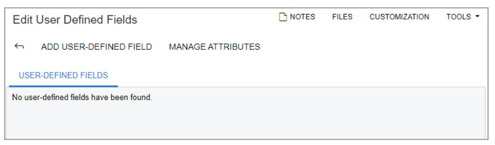

#### *Figure: The Edit User-Defined Fields form*

2. On the form toolbar, click **Add User-Defined Field**.

The **User-Defined Field Parameters** dialog box opens.

3. In the **Attribute ID** box, select *NETTYPE*, as shown in the following screenshot.

| User-Defined Field Parameters |                |    |        |  |  |
|-------------------------------|----------------|----|--------|--|--|
| * Attribute ID:               | <b>NETTYPE</b> |    |        |  |  |
| Column:                       |                |    |        |  |  |
| Row:                          |                |    |        |  |  |
|                               |                | OK | CANCEL |  |  |
|                               |                |    |        |  |  |

#### *Figure: The User-Defined Field Parameters dialog box*

- 4. Click **OK**. The dialog box is closed, and the new field (with the specified attribute) appears on the **User-Defined Fields** tab of the *[Edit User-Defined Fields](https://help-2025r1.acumatica.com/Help?ScreenId=ShowWiki&pageid=5f89ca96-f953-49c9-829f-08a3a22947db)* form.
- 5. On the form toolbar, click **Back** to save your changes and return to the *[Customer Locations](https://help-2025r1.acumatica.com/Help?ScreenId=ShowWiki&pageid=61a8c6de-6a51-434b-8c2d-4304ec982ae0)* form.
- 6. In the Summary area of the form, notice the **User-Defined Fields** tab (see the following screenshot).
- 7. On the **User-Defined Fields** tab, notice the new **NetworkType** box (also shown in the following screenshot).

| <b>Customer Locations</b> |                                                    |                                                               | <b>TH NOTES</b> | <b>FILES</b> | <b>CUSTOMIZATION</b> | TOOLS $\sim$ |
|---------------------------|----------------------------------------------------|---------------------------------------------------------------|-----------------|--------------|----------------------|--------------|
|                           | ←                                                  |                                                               |                 |              |                      |              |
| <b>DOCUMENT</b>           | <b>USER-DEFINED FIELDS</b>                         |                                                               |                 |              |                      |              |
| Network Type:             |                                                    |                                                               |                 |              |                      | ᄉ            |
|                           |                                                    |                                                               |                 |              |                      |              |
|                           | GENERAL SHIPPING GLACCOUNTS                        |                                                               |                 |              |                      |              |
|                           | LOCATION INFO ____________________________________ | ADDITIONAL LOCATION INFO ____________________________________ |                 |              |                      |              |
| Location Name:            |                                                    |                                                               | Override        |              |                      |              |
| <b>LOCATION ADDRESS.</b>  |                                                    | Account Name:                                                 |                 |              |                      |              |
|                           | $\bigcap$ Override                                 | Attention:                                                    |                 |              |                      |              |
|                           | <b>VIEW ON MAP</b>                                 | $\checkmark$                                                  |                 |              |                      |              |
| Address Line 1:           |                                                    | $\checkmark$                                                  |                 |              |                      |              |
| Address Line 2:           |                                                    | $\checkmark$                                                  |                 |              |                      |              |
| City:                     |                                                    | Email:                                                        |                 |              | $\triangleright$     |              |
| State:                    | م                                                  | Web:                                                          |                 |              | Ŋ                    |              |
| Postal Code:              |                                                    | <b>OTHER SETTINGS</b>                                         |                 |              |                      |              |
| * Country:                | م                                                  | Default Branch:                                               |                 |              | م                    |              |
|                           |                                                    | Price Class:                                                  |                 |              | Q                    |              |
|                           |                                                    | External ID:                                                  |                 |              |                      |              |

*Figure: The Network Type box*

#### **Step 3: Testing the User-Defined Field**

To test the added user-defined field, do the following:

- 1. On the *[Customer Locations](https://help-2025r1.acumatica.com/Help?ScreenId=ShowWiki&pageid=61a8c6de-6a51-434b-8c2d-4304ec982ae0)* (AR303020) form in Acumatica ERP, open the *MAIN* customer location for the customer with the *C000000006* customer ID.
- 2. On the **User-Defined Fields** tab, make sure that the **NetworkType** box is displayed.
- 3. In the **NetworkType** box, select *Long-Term Evolution*.
- 4. On the form toolbar, click**Save**.

#### **Step 4: Adding the User-Defined Field to the Customization Project**

To add the **NetworkType** user-defined field to the *Yogifon* customization project, do the following:

- 1. On the *[Customization Projects](https://help-2025r1.acumatica.com/Help?ScreenId=ShowWiki&pageid=4d3a1166-826c-414b-a207-3d1669fbf9e5)* (SM204505) form, click *Yogifon* to open the Customization Project Editor for this customization project.
- 2. In the navigation pane of the Customization Project Editor, click **User-Defined Fields**.

The *[User-Defined Fields](https://help-2025r1.acumatica.com/Help?ScreenId=ShowWiki&pageid=5f3f740b-6410-42f4-af5b-de2744eb03f2)* page opens.

- 3. On the page toolbar, click **Add New Record**.
- 4. In the **Add User-Defined Fields** dialog box, which opens, select the unlabeled check box in the row with the *NETTYPE* attribute ID, as shown in the following screenshot.

| <b>Customization Project Editor</b>                                  |                                                    |                                |                                                                           |                | <b>Back</b><br>Reload |  |
|----------------------------------------------------------------------|----------------------------------------------------|--------------------------------|---------------------------------------------------------------------------|----------------|-----------------------|--|
| <b>Extension Library</b><br>Publish<br><b>Source Control</b><br>File |                                                    |                                |                                                                           |                |                       |  |
| Yogifon<br>$\blacktriangleleft$                                      | <b>User-Defined Fields</b>                         |                                |                                                                           |                |                       |  |
| $\sqrt{\text{SCREENS}}$<br>DATA ACCESS                               | Ò<br>H<br>$\curvearrowleft$<br><b>Attribute ID</b> | <b>Add User-Defined Fields</b> | DELOAD EDOM DATABAGE.<br>MANAGE HOED DEEINED FIELDS<br>$\square$ $\times$ | st Modified By | <b>Last Modified</b>  |  |
| Code                                                                 |                                                    | ↻                              |                                                                           |                | On                    |  |
| <b>Files</b><br>Generic Inquiries (1)                                |                                                    | 圓<br>* Attribute ID            | *Description                                                              |                |                       |  |
| Reports                                                              |                                                    | <b>COMPSIZE</b>                | <b>Number of Employees</b>                                                |                |                       |  |
| <b>Dashboards</b>                                                    |                                                    | <b>CONTRTYPE</b>               | Contract type                                                             |                |                       |  |
| Site Map                                                             |                                                    | <b>INDUSTRY</b><br>⊔           | Industry                                                                  |                |                       |  |
| Database Scripts (1)                                                 |                                                    | ☑<br><b>NETTYPE</b><br>٠       | Network Type                                                              |                |                       |  |
| <b>System Locales</b>                                                |                                                    |                                |                                                                           |                |                       |  |
| Import/Export Scenarios (1)<br><b>Shared Filters</b>                 |                                                    | <b>OPERATSYST</b>              | <b>Operation System</b>                                                   |                |                       |  |
| Access Rights (1)                                                    |                                                    | <b>PHONENUM</b>                | Phone number                                                              |                |                       |  |
| <b>Wikis</b>                                                         |                                                    | <b>PRODREQ</b>                 | Looking for                                                               |                |                       |  |
| <b>Web Service Endpoints</b>                                         |                                                    | <b>SIMCARDID</b>               | SIM Card ID                                                               |                |                       |  |
| <b>Analytical Reports</b>                                            |                                                    | <b>SOFTVER</b>                 | <b>Version of Software</b>                                                |                |                       |  |
| <b>Push Notifications</b>                                            |                                                    |                                |                                                                           |                |                       |  |
| <b>Business Events</b>                                               |                                                    |                                |                                                                           |                |                       |  |
| <b>Mobile Application</b>                                            |                                                    |                                | <b>SAVE</b><br>CANCEL                                                     |                |                       |  |
| <b>User-Defined Fields</b>                                           |                                                    |                                |                                                                           |                |                       |  |
| Webhooks                                                             |                                                    |                                |                                                                           |                |                       |  |
| <b>Connected Applications</b>                                        |                                                    |                                |                                                                           |                |                       |  |

*Figure: The Add User-Defined Fields dialog box*

#### 5. Click **Save**.

The dialog box closes, and a new row with the settings of the **NetworkType** user-defined field (including the associated attribute and the form ID) appears on the *[User-Defined Fields](https://help-2025r1.acumatica.com/Help?ScreenId=ShowWiki&pageid=5f3f740b-6410-42f4-af5b-de2744eb03f2)* page.

# <span id="page-321-3"></span><span id="page-321-0"></span>**Customizing Business Logic**

Business logic is implemented by overloading certain methods invoked by the system in the process of manipulating data. For such procedures as inserting a data record or updating a data record, the cache controllers generate series of events causing invocation of the methods called event handlers. The application is able to interfere in the series of events on different stages. For this purpose, the application implements methods that are executed as event handlers. Business logic can be divided into common logic relevant to different parts of the application and the logic specific to an application form. The common logic is implemented through event handler methods defined in attributes, while the screen-specific logic is implemented as methods in the associated graph.

You use *[Customization](#page-42-2) Tools* of the Acumatica Customization Platform to customize business logic for forms of Acumatica ERP.

The customization of existing business logic is based on the extension technology, which is described in greater detail in *[DAC Extensions](#page-49-0)* and *[Graph Extensions](#page-58-0)*.

This part contains detailed instructions on how to customize a data access class, data field, graph, and a data view of Acumatica ERP and how to include the changeset in a customization project.

### <span id="page-321-1"></span>**Data Access Class**

A data access class (DAC) is used to represent a database table in the code of Acumatica ERP. If a DAC is bound to the database, it must have the same class name as the database table. A DAC must be declared with the public access modifier to be correctly recognized by the Acumatica Customization Platform. A DAC is inherited from the PXBqlTable class and the IBqlTable interface and contains data field declarations.

You can use *[Customization Project Editor](https://help-2025r1.acumatica.com/Help?ScreenId=ShowWiki&pageid=0bb97781-e987-4039-962d-457720821bff)* to do the following:

- Create a new DAC
- Add a custom field to an existing DAC
- Customize the declaration of a data field of an existing DAC

For detailed information on customizing data access classes, see the following topics:

- *To Start the [Customization](#page-321-4) of a Data Access Class*
- *To Add a [Custom](#page-323-1) Data Field*
- *To [Create](#page-325-1) a New DAC*
- *To Create a DAC [Extension](#page-326-1)*

See *[Data Field](#page-328-1)* for detailed instructions on the customization of a data field.

### <span id="page-321-4"></span><span id="page-321-2"></span>**To Start the Customization of a Data Access Class**

Before you start a DAC customization, we recommend that you check the possibility to use the appropriate business entity attributes, which can be defined on the *[Attributes](https://help-2025r1.acumatica.com/Help?ScreenId=ShowWiki&pageid=de0a353f-40d0-452d-9152-e65605e69788)* (CS205000) form, instead of custom fields. See *[Use of Entity Attributes Instead of Custom Fields](#page-323-2)* for details.

You might need to customize an existing data access class in the following cases:

- On a form, you want to create a custom data field to be used for a custom control.
- In Acumatica ERP, you want to change the business logic for a data field in the DAC.


If multiple Acumatica ERP forms contain controls for the same field, changing an attribute of the field in the DAC modifies the behavior of these controls for the field on all forms.

If you know the name of the data access class to be customized, you can first add a *DAC* item for the class on the Customized Data Classes page of the *[Customization Project Editor](https://help-2025r1.acumatica.com/Help?ScreenId=ShowWiki&pageid=0bb97781-e987-4039-962d-457720821bff)* (see *To Add a DAC Item for an [Existing](#page-155-1) Data Access [Class to a Project](#page-155-1)* for details) and then click the item to open it in the *[Data Class](https://help-2025r1.acumatica.com/Help?ScreenId=ShowWiki&pageid=06c038a5-1d75-482b-9b17-f2483ada0154)*.

You usually start the customization of a data access class on a form that contains boxes used by users to work with data of an appropriate business entity, such as a sales order invoice.

#### **To Start DAC Customization**

To start the customization of a DAC from a form, perform the following actions:

- 1. Open the form in the browser.
- 2. On the form title bar, click **Customization > Inspect Element** to open the *[Element Inspector](https://help-2025r1.acumatica.com/Help?ScreenId=ShowWiki&pageid=5f9d2d33-1a33-4edd-8629-3100d2020335)*.


If you need to activate the *[Element Inspector](https://help-2025r1.acumatica.com/Help?ScreenId=ShowWiki&pageid=5f9d2d33-1a33-4edd-8629-3100d2020335)* for a pop-up panel, a dialog box, or another UI element that opens in modal mode and makes the *[Customization Menu](https://help-2025r1.acumatica.com/Help?ScreenId=ShowWiki&pageid=d6c46870-0c44-4f78-ae20-9bb9ef25dccd)* unavailable for selection, you can press Ctrl+Alt.

- 3. On the form, click the area with the boxes that are used for the data of the business entity, to open the *[Element Properties Dialog Box](https://help-2025r1.acumatica.com/Help?ScreenId=ShowWiki&pageid=5f9d2d33-1a33-4edd-8629-3100d2020335)* for the area.
- 4. In the **Data Class** box of the dialog box, view the name of the DAC for the element you clicked (see Item 1 in the following screenshot). If you are not sure that this DAC is the needed one, click **Cancel** and repeat Step 3.
- 5. Click **Actions > Customize Data Fields** (Item 2).

| Contacts<br>Aaron Bailey - Grit Industries                                        |                                                         |                                                                               | <b>P NOTES</b>                     | <b>FILES</b><br><b>CUSTOMIZATION</b> | TOOLS $\star$         |
|-----------------------------------------------------------------------------------|---------------------------------------------------------|-------------------------------------------------------------------------------|------------------------------------|--------------------------------------|-----------------------|
| $\begin{array}{c} \boxed{-1} \\ \boxed{-1} \end{array}$<br>$\Box$<br>$\leftarrow$ | $\bigcap$ $\checkmark$<br>血<br>$\Omega$<br>+            | $\mathbb{R}$ $\mathbb{R}$ $\mathbb{R}$<br>$\geq$<br>$\rightarrow$<br>$\cdots$ |                                    |                                      |                       |
| Contact:<br>Status:                                                               | <b>Aaron Bai</b><br><b>Element Properties</b><br>Active |                                                                               | $\times$                           | <b>ndustries</b><br>$\varphi$        | ㅅ<br>$\rho$           |
| <b>DETAILS</b><br><b>ACTIVITIES</b>                                               | Control Type:<br>Data Class:<br>CRN                     | <b>Text Edit</b><br>Contact                                                   |                                    | <b>CASES</b><br><b>CAMPAIGNS</b>     | $\grave{\mathcal{Z}}$ |
| CONTACT <sub>-</sub><br><b>First Name:</b>                                        | Data Field:<br>View Name:<br>Aaron                      | FirstName<br>ContactCurrent                                                   |                                    |                                      |                       |
| * Last Name:<br>Account Name:                                                     | <b>Bailey</b><br><b>CUSTOMIZE</b><br><b>Grit Indu</b>   | Business Logic: ContactMaint<br>ACTIONS -<br>CANCEL                           |                                    | et                                   |                       |
| Job Title:<br>Email:                                                              | <b>Sales Manager</b><br>aabailey@gritindustries.exam    | <b>CUSTOMIZE BUSINESS LOGIC</b>                                               | <b>New York</b>                    |                                      |                       |
| Business 1 $\sim$<br>Cell<br>$\checkmark$                                         | +1-212-555-0201                                         | <b>CUSTOMIZE DATA FIELDS</b><br><b>VIEW ASPX SOURCE</b>                       | 2<br><b>NY - NEW YORK</b><br>10011 |                                      |                       |
| Home<br>$\checkmark$                                                              |                                                         | <b>VIEW HTML SOURCE</b>                                                       | US - United States of America      |                                      | 0                     |
| Fax<br>$\checkmark$<br>Web:                                                       |                                                         | <b>VIEW TYPESCRIPT SOURCE</b>                                                 |                                    |                                      |                       |
|                                                                                   |                                                         | UITIU DUOILITOO LOOIO OOUDOT                                                  |                                    |                                      |                       |

*Figure: Using the Element Properties dialog box to start the customization of the class*

6. If there is no currently selected customization project and the Element Inspector opens the *[Table](https://help-2025r1.acumatica.com/Help?ScreenId=ShowWiki&pageid=d6c46870-0c44-4f78-ae20-9bb9ef25dccd) 1*

*You use the Select Customization Project dialog box to select an existing customization project or to create a new customization project. You open the dialog box in the following ways:*

*• From the Customization menu of a form by clicking Select Project*

*• From the Customization menu of a form by clicking Edit Project if there is no currently selected customization project • From the Element Properties dialog box if you click Customize in the dialog box and there is no currently selected customization project* , select an existing customization project or create a new one.

If the customization project does not contain a *DAC* item for the data access class, the *[Customization Project Editor](https://help-2025r1.acumatica.com/Help?ScreenId=ShowWiki&pageid=0bb97781-e987-4039-962d-457720821bff)* adds the item to the project to keep the changes in the database. The DAC is opened in the *[Data Class](https://help-2025r1.acumatica.com/Help?ScreenId=ShowWiki&pageid=06c038a5-1d75-482b-9b17-f2483ada0154)*, and you can start the customization of the class.

<span id="page-323-2"></span>When you click**Save** on the editor toolbar, the editor updates the *DAC* item in the database.

# **Use of Entity Attributes Instead of Custom Fields**

Under some circumstances, you will find it best to use entity attributes defined on the *[Attributes](https://help-2025r1.acumatica.com/Help?ScreenId=ShowWiki&pageid=de0a353f-40d0-452d-9152-e65605e69788)* (CS205000) form, while under other circumstances, custom fields will help you better meet the requirements of your customization task.

You might use attributes in the following cases:

- You do not need a complex layout for attribute fields because they are not used for manual input, so you can use the easiest way of creating additional fields.
- You would prefer an approach that helps you to localize customizations that you make to the system to a limited number of spaces, which in turn helps you to avoid having scattered changes throughout the system.

The use of custom fields provides more functionality than attributes do. Using attributes as columns in a grid can present difficulties. For example, in a grid, you can display columns for either all attributes or none of them. Also, you cannot rename a column for an attribute in a grid.

You might use custom fields in the following cases:

- These fields are for manual input, and you need a nice-looking layout for them.
- You also have some business logic of validation based on a custom field, so you might need the customization code for these fields.

### <span id="page-323-1"></span><span id="page-323-0"></span>**To Add a Custom Data Field**

You can add a custom data field to an existing data access class by using the *[Screen Editor](https://help-2025r1.acumatica.com/Help?ScreenId=ShowWiki&pageid=d60a8270-e2ce-4380-b778-af61a0ca56d2)* or *[Data Class](https://help-2025r1.acumatica.com/Help?ScreenId=ShowWiki&pageid=06c038a5-1d75-482b-9b17-f2483ada0154)*, as described in the following sections:

- *[By Using the Data Class Editor](#page-324-0)*
- *[By Using the Screen Editor](#page-324-1)*

Both of the editors opens the *[Create New Field Dialog Box](https://help-2025r1.acumatica.com/Help?ScreenId=ShowWiki&pageid=06c038a5-1d75-482b-9b17-f2483ada0154)* dialog box, which you use to enter the parameters of the new field and to launch the New Field wizard, which includes an XML declaration of the new field in the *DAC* item for the modified data access class. If the *DAC* item for the modified data access class is absent in the customization project, the wizard creates the appropriate item. Also, the wizard creates a *Table* item with a description of the custom column added to the table for the custom field.

You can select the way a custom field will be stored in the database when you add the field to a data access class. You can add a custom field as one of the following:

- Without mapping to the database
- As a new column to the database table by altering the table schema
- As a name-value pair to a dedicated table without altering the table schema

The detailed information is described in the following sections:

- *To Add a Custom Field Without Mapping to the [Database](#page-324-2)*
- *To Add a [Custom](#page-325-2) Field as a New Column*
- *To Add a Custom Field as a [Name-Value](#page-325-3) Pair*
- *To Delete a [Custom](#page-325-4) Field*

To be able to create a control for the new field to be displayed on a form, you have to publish the project to make the system create the column in the database table and compile the customization code. Aer the publication, you can add the control for the new field to a form by using the Screen Editor. See *To Add a Box for a Data [Field](#page-247-1)* or *[To](#page-254-1) [Add a Column for a Data Field](#page-254-1)* for details.

#### <span id="page-324-0"></span>**By Using the Data Class Editor**

You generally use the *[Data Class](https://help-2025r1.acumatica.com/Help?ScreenId=ShowWiki&pageid=06c038a5-1d75-482b-9b17-f2483ada0154)* to add a custom field to a data access class (DAC) and store the changes in the customization project as a *DAC* item. To do this, perform the following actions:

- 1. Start customization of the data access class, as described in *To Start the [Customization](#page-321-4) of a Data Access [Class](#page-321-4)*.
- 2. On the toolbar of the Data Class page, click **Create New Field**.
- 3. In the **New Field** dialog box, which opens, specify the custom field parameters that are described in *[Create](https://help-2025r1.acumatica.com/Help?ScreenId=ShowWiki&pageid=06c038a5-1d75-482b-9b17-f2483ada0154) [New Field Dialog Box](https://help-2025r1.acumatica.com/Help?ScreenId=ShowWiki&pageid=06c038a5-1d75-482b-9b17-f2483ada0154)*.
- 4. Click **OK** to save changes in the customization project.

#### <span id="page-324-1"></span>**By Using the Screen Editor**

If you customize a form by using the *[Screen Editor](https://help-2025r1.acumatica.com/Help?ScreenId=ShowWiki&pageid=d60a8270-e2ce-4380-b778-af61a0ca56d2)*, you may need to create a custom data field to be used to create a new control on the form. By using the editor, you can create a new field in the main DAC of the data view that provides data for the object selected in the Control Tree. To do this, perform the following actions:

- 1. In the Control Tree of the Screen Editor, select the node of a container to which you intend to add a new control, or a subnode within the container node.
- 2. Click the **Add Data Fields** tab item.
- 3. On the table toolbar of the tab item, click **New Field**.
- 4. In the **Create New Field** dialog box, which opens, specify the custom field parameters, which are described in *[Create New Field Dialog Box](https://help-2025r1.acumatica.com/Help?ScreenId=ShowWiki&pageid=06c038a5-1d75-482b-9b17-f2483ada0154)*.
- 5. Click **OK** to save your changes to the customization project.

#### <span id="page-324-2"></span>**To Add a Custom Field Without Mapping to the Database**

To add a custom field without mapping to the database, perform the following actions:

- 1. Open the **Create New Field** dialog box for the data access class *[By Using the Data Class Editor](#page-324-0)* or *[By Using](#page-324-1) [the Screen Editor](#page-324-1)*.
- 2. In the dialog box, specify the custom field parameters and select *NonPersistedField* in **StorageType**.

3. Click **OK** to add the field to the data access class.

The New Field wizard includes an XML declaration of the new field in the *DAC* item for the modified data access class. The new field declaration contains the data type attribute that specifies an unbound field, such as [PXString].

#### <span id="page-325-2"></span>**To Add a Custom Field as a New Column**

To add a custom field as a new column that will be appended to the original table of Acumatica ERP, perform the following actions:

- 1. Open the **Create New Field** dialog box for the data access class *[by using the Data Class Editor](#page-324-0)* or *[by using the](#page-324-1) [Screen Editor](#page-324-1)*.
- 2. In the dialog box, specify the custom field parameters and select *DBTableColumn* in the **StorageType** box to make the system append the column to the original table in the database.
- 3. Click **OK** to add the field to the data access class.

The New Field wizard includes an XML declaration of the new field in the *DAC* item for the modified data access class. If the *DAC* item for the modified data access class is absent in the customization project, the wizard creates the appropriate item. Also, the wizard creates a *Table* item with a description of the custom column to be created in the database table for the custom field.

#### <span id="page-325-3"></span>**To Add a Custom Field as a Name-Value Pair**

To add a custom field a name-value pairs stored in a dedicated table of Acumatica ERP, perform the following actions:

- 1. Open the **Create New Field** dialog box for the data access class *[By Using the Data Class Editor](#page-324-0)* or *[By Using](#page-324-1) [the Screen Editor](#page-324-1)*.
- 2. In the dialog box, specify the custom field parameters and select *NameValuePair* in **StorageType**.
- 3. Click **OK** to add the field to the data access class.

The New Field wizard includes an XML declaration of the new field in the *DAC* item for the modified data access class. If the *DAC* item for the modified data access class is absent in the customization project, the wizard creates the appropriate item. The wizard doesn't generate any definitions to change the database schema.

#### <span id="page-325-4"></span>**To Delete a Custom Field**

To delete a custom field or custom attributes on a field from the data access class, open the data access class in the Data Class Editor and delete the custom field from the field list. If you work in Microso Visual Studio, publish the customization project to update the file with the customized data access class in the file system. Aer the project has been published, the customization will be removed from the data access class.

### <span id="page-325-1"></span><span id="page-325-0"></span>**To Create a New DAC**

You can add a new data access class (DAC) to a customization project by generating the code from the definition of a database table.

To create a custom data access class for a custom database table and add the created item to a customization project, you have to generate the class template on the Code page of the Customization Project Editor.

To do this, perform the following actions:

1. Create the needed custom table in the database by using a database management tool.

- 2. Generate the DAC code for the customization project as follows:
  - a. Open the customization project in the Project Editor.
  - b. In the navigation pane, click **Code** to open the Code page.
  - c. On the page toolbar, click **Add New Record** (+).
  - d. In the **Create Code File** dialog box, which opens, select *New DAC* in the **FileTemplate** box.
  - e. In the **Class Name** box, specify the class name that corresponds to the name of the table created in the database.

If you have just created the table, restart Internet Information Services (IIS) or recycle the application pool to make sure that Acumatica ERP is aware of the new table, because it caches the database schema once, when the domain starts.

- f. Select the **Generate Members from Database** check box.
- g. Click **OK**.

The platform does the following:

- Generates the data access class with members that correspond to the table columns. The class is added to the namespace of the customization project.
- Adds the class to the customization project as a *Code* item.
- Saves the customization project.
- Opens the created item in the *[Code Editor](https://help-2025r1.acumatica.com/Help?ScreenId=ShowWiki&pageid=c2678973-d557-47d4-b8ee-9dd69f55b465)*.

You can use the Code Editor to modify the generated code. Aer you publish the customization project, you can work with the custom data access class in MS Visual Studio.

3. In the Code Editor, define the key fields in the DAC. To include a data field in the key, in the type attribute of the field, you have to add the IsKey parameter, as the example below shows.

[PXDBString(15, IsKey=true)]

- 4. Add the table definition to the customization project by doing the following:
  - a. In the navigation pane of the Project Editor, click **DatabaseScripts**.
  - b. On the Database Scripts page, which opens, click **Add Custom TableSchema**.
  - c. In the **Add Custom TableSchema** dialog box, which opens, select the custom table in the**Table** box, and click **OK**.

The platform does the following:

- Adds the XML definition of the table to the customization project as an *Sql* item
- Saves the customization project

Every time you publish the customization project, the system checks whether a table with this SQL definition exists in the database. If the table doesn't exist, the system creates the table. If the table exists, the system adjusts the table schema if there is any difference between the existing table schema and the table schema from the customization project (no data is truncated).

### <span id="page-326-1"></span><span id="page-326-0"></span>**To Create a DAC Extension**

If you know the name of the data access class to be customized, you can create a *Code* item with the DAC extension template on the Code page of the Customization Project Editor by using the **Create Code File** dialog box.

To do this, perform the following actions:

- 1. Open the customization project in the editor.
- 2. Click **Code** in the navigation pane to open the Code page.
- 3. Click **Add New Record** (+) on the page toolbar.
- 4. In the **Create Code File** dialog box, which opens, select *DAC Extension* in the **FileTemplate** box, as the screenshot below shows.
- 5. In the **Base DAC** box, select the name of the data access class to be customized.
- 6. Click **OK**.

| $\boxdot$<br>$\sim$<br>X<br>c<br><b>Cobject Name</b><br><b>Last Modified By</b><br><b>Last Modified On</b><br><b>Description</b><br><b>ARDocumentRelease</b><br>admin<br>≯<br>8/3/2016<br><b>ARReleaseProcess</b><br><b>Create Code File</b><br>8/3/2016<br>$\times$<br>8/2/2016<br><b>CustomerMaint</b><br>DAC Extension<br>* File Template:<br>÷<br>8/2/2016<br>SOInvoiceEntry<br>Q<br>* Base Dac:<br>8/2/2016<br>SOOrderEntry<br>Select - Base Dac<br>$\square \times$<br><b>SELECT</b><br>$\mapsto$<br>c<br>SOIn<br>ρ<br><b>B</b> FullName<br>t<br>PX.Objects.SO.SOInvoice<br>$\rightarrow$<br>PX.Objects.SO.SOInvoice+ARRegister<br>PX.Objects.SO.SOInvoiceDiscountDetail<br>PX.Objects.SO.SOInvoiceFilter<br>PX.Objects.SO.SOInvoicePrintFormFilter<br>$K$ $\leftarrow$ $\rightarrow$<br>$\rightarrow$ | CODE |  |  |  |  |
|--------------------------------------------------------------------------------------------------------------------------------------------------------------------------------------------------------------------------------------------------------------------------------------------------------------------------------------------------------------------------------------------------------------------------------------------------------------------------------------------------------------------------------------------------------------------------------------------------------------------------------------------------------------------------------------------------------------------------------------------------------------------------------------------------------------|------|--|--|--|--|
|                                                                                                                                                                                                                                                                                                                                                                                                                                                                                                                                                                                                                                                                                                                                                                                                              |      |  |  |  |  |
|                                                                                                                                                                                                                                                                                                                                                                                                                                                                                                                                                                                                                                                                                                                                                                                                              |      |  |  |  |  |
|                                                                                                                                                                                                                                                                                                                                                                                                                                                                                                                                                                                                                                                                                                                                                                                                              |      |  |  |  |  |
|                                                                                                                                                                                                                                                                                                                                                                                                                                                                                                                                                                                                                                                                                                                                                                                                              |      |  |  |  |  |
|                                                                                                                                                                                                                                                                                                                                                                                                                                                                                                                                                                                                                                                                                                                                                                                                              |      |  |  |  |  |
|                                                                                                                                                                                                                                                                                                                                                                                                                                                                                                                                                                                                                                                                                                                                                                                                              |      |  |  |  |  |
|                                                                                                                                                                                                                                                                                                                                                                                                                                                                                                                                                                                                                                                                                                                                                                                                              |      |  |  |  |  |
|                                                                                                                                                                                                                                                                                                                                                                                                                                                                                                                                                                                                                                                                                                                                                                                                              |      |  |  |  |  |
|                                                                                                                                                                                                                                                                                                                                                                                                                                                                                                                                                                                                                                                                                                                                                                                                              |      |  |  |  |  |
|                                                                                                                                                                                                                                                                                                                                                                                                                                                                                                                                                                                                                                                                                                                                                                                                              |      |  |  |  |  |
|                                                                                                                                                                                                                                                                                                                                                                                                                                                                                                                                                                                                                                                                                                                                                                                                              |      |  |  |  |  |
|                                                                                                                                                                                                                                                                                                                                                                                                                                                                                                                                                                                                                                                                                                                                                                                                              |      |  |  |  |  |
|                                                                                                                                                                                                                                                                                                                                                                                                                                                                                                                                                                                                                                                                                                                                                                                                              |      |  |  |  |  |
|                                                                                                                                                                                                                                                                                                                                                                                                                                                                                                                                                                                                                                                                                                                                                                                                              |      |  |  |  |  |
|                                                                                                                                                                                                                                                                                                                                                                                                                                                                                                                                                                                                                                                                                                                                                                                                              |      |  |  |  |  |
|                                                                                                                                                                                                                                                                                                                                                                                                                                                                                                                                                                                                                                                                                                                                                                                                              |      |  |  |  |  |
|                                                                                                                                                                                                                                                                                                                                                                                                                                                                                                                                                                                                                                                                                                                                                                                                              |      |  |  |  |  |

*Figure: Adding a Code item with the DAC extension to the project*

The platform creates the template of the class that is derived from the PXCacheExtension<> class, saves the code as a *Code* item of the project in the database, and opens the item in the *[Code Editor](https://help-2025r1.acumatica.com/Help?ScreenId=ShowWiki&pageid=c2678973-d557-47d4-b8ee-9dd69f55b465)*.

Inside the extension, you must implement the IsActive method which enables the extension on condition. For details, see *To Enable a DAC Extension [Conditionally](#page-327-1) (IsActive)*.

### <span id="page-327-1"></span><span id="page-327-0"></span>**To Enable a DAC Extension Conditionally (IsActive)**

You need to disable a DAC extension when it is not required by the system logic (for example, when the feature that uses the extension is not enabled) because when an extension is constantly active, it can impair the system's performance.

To disable or enable a DAC extension depending on a condition, you need to implement the public static bool IsActive method in the extension. The following code shows an example of the implementation of the IsActive method.

```
public static bool IsActive()
{
 return PXAccess.FeatureInstalled<FeaturesSet.rutRotDeduction>();
```

#### }

In the code above, the extension is enabled when the rutRotDeduction feature is enabled.

If the IsActive method returns false for a DAC extension, this extension is not loaded. This means the following:

- Fields defined in the DAC extension that should be visible on forms will be automatically hidden.
- If a field is used in a generic inquiry as a column in the results grid or in a report as a text box, the field is also hidden. If the field is used in a configuration of a generic inquiry or a report, an error is thrown indicating that the field is not found.
- Database fields defined in the DAC extension will not be in SQL queries generated by the system. So if you have a BQL query that explicitly adds OrderBy, GroupBy, Where, and possibly other statements to such a field, an error is thrown indicating that the field is not found.
- In a graph or a graph extension, if an event handler is declared for a field of a disabled DAC extension, the event handler is not executed.

#### **Related Links**

• *To Enable a Graph Extension [Conditionally](#page-356-1) (IsActive)*

### <span id="page-328-1"></span><span id="page-328-0"></span>**Data Field**

In a data access class (DAC), a data field declaration consists of the following elements:

- A public abstract class (which is also referred to as a *class field* or *BQL field*) that implements the PX.Data.IBqlField interface. This abstract class is used as a *type* to reference the field in the BQL statements specified in the data views and attributes added to data field declarations.
- Attributes that provide the common business logic for the field. On a field, you use attributes to define the data field specification, which includes multiple parameters, such as the data type, default value, and field caption on the UI. The type attribute, such as PXDBString and PXDBDecimal, is the only mandatory attribute of a DAC field.
- A public virtual property (which is also referred to as *property field*) of a nullable data type that corresponds to the data type of this field. This property keeps the value of the data field. The attributes are added to the property and not to the abstract class of the data field declaration.

For a data field, you can customize only field attributes. You do this in one of the following ways:

- In the DAC (on the DAC level)
- In a graph (on the graph level)

On the DAC level, you can customize the attributes of a field by adding, deleting, replacing, or modifying an attribute in the DAC extension by using the *[Data Class](https://help-2025r1.acumatica.com/Help?ScreenId=ShowWiki&pageid=06c038a5-1d75-482b-9b17-f2483ada0154)*.

On the graph level, you can define a new set of attributes for a field and apply changes by means of the DACName\_FieldPropertyName\_CacheAttached() event handler in the graph extension.

The following diagram shows an example that demonstrates how the attributes of a field declared in a data access class can be changed on the DAC and graph levels for two forms.

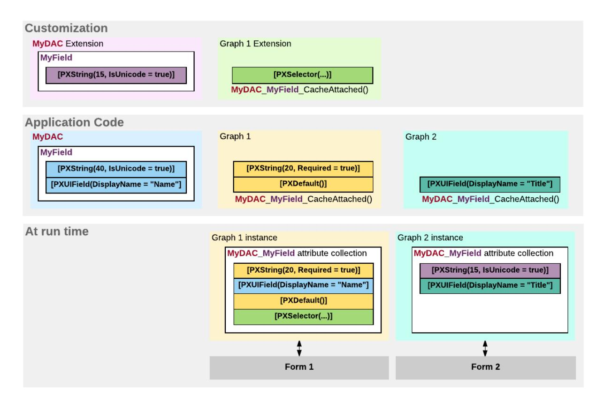

#### *Figure: Example of the customization of attributes for a data field on the DAC and graph levels*

In the example, as recommended in *[Customization of Field Attributes in DAC Extensions](#page-54-0)*, the CacheAttached() event handler is always used to merge the custom attributes of the field with the original ones instead of replacing them on the graph level.

On the diagram, you can see that the attribute collection for the same data field in the cache object can be different for graphs that provide business logic for different forms.

For detailed information on customizing a data field, see the following topics:

- *To [Customize](#page-329-1) a Field on the DAC Level*
- *To [Customize](#page-331-1) a Field on the Graph Level*
- *To Set a [Default](#page-332-1) Value*
- *To [Change](#page-334-1) the Label of a Field*
- *To Make a Field [Mandatory](#page-335-1)*
- *To [Customize](#page-337-1) the Table of a Selector Field*
- *To Add an Event [Handler](#page-338-1) for a Field*
- *To Provide [Multilanguage](#page-339-1) Support for a Field*

#### **Related Links**

• *<http://asiablog.acumatica.com/2017/01/append-and-replace-of-dacs-attributes.html>*

### <span id="page-329-1"></span><span id="page-329-0"></span>**To Customize a Field on the DAC Level**

If an attribute is added to a field declaration within a data access class (DAC), the common business logic of this attribute is applied to each data record of this type for each graph that uses this class. Therefore, if multiple

Acumatica ERP forms contain controls for the same field, a change to an attribute of the field in the DAC modifies the behavior of these controls for the field on all forms.

You can use the *[Data Class](https://help-2025r1.acumatica.com/Help?ScreenId=ShowWiki&pageid=06c038a5-1d75-482b-9b17-f2483ada0154)* to customize the attributes of an existing data field in the DAC and to store the changes in the customization project as a *DAC* item. Because the goal of the customization of a field on the DAC level is to change the behavior or appearance of controls for the field on all forms, you start the customization of a data field from any form that contains a control for the field.

To customize a data field from a form that contains a control for the field, perform the following actions:

- 1. Open the form in the browser and make the control visible on the form.
- 2. On the form title bar, click **Customization > Inspect Element** to launch the *[Element Inspector](https://help-2025r1.acumatica.com/Help?ScreenId=ShowWiki&pageid=5f9d2d33-1a33-4edd-8629-3100d2020335)*.

If you need to activate the *[Element Inspector](https://help-2025r1.acumatica.com/Help?ScreenId=ShowWiki&pageid=5f9d2d33-1a33-4edd-8629-3100d2020335)* for a pop-up panel, a dialog box, or another UI element that opens in modal mode and makes the *[Customization Menu](https://help-2025r1.acumatica.com/Help?ScreenId=ShowWiki&pageid=d6c46870-0c44-4f78-ae20-9bb9ef25dccd)* unavailable for selection, you can press Ctrl + Alt.

- 3. On the form, click the control to open the *[Element Properties Dialog Box](https://help-2025r1.acumatica.com/Help?ScreenId=ShowWiki&pageid=5f9d2d33-1a33-4edd-8629-3100d2020335)* for the control.
- 4. In the dialog box, click **Actions > Customize Data Fields**.
- 5. If there is no currently selected customization project and the inspector opens the *[Table](https://help-2025r1.acumatica.com/Help?ScreenId=ShowWiki&pageid=d6c46870-0c44-4f78-ae20-9bb9ef25dccd) 1*

*You use the Select Customization Project dialog box to select an existing customization project or to create a new customization project. You open the dialog box in the following ways:*

- *• From the Customization menu of a form by clicking Select Project*
- *• From the Customization menu of a form by clicking Edit Project if there is no currently selected customization project • From the Element Properties dialog box if you click Customize in the dialog box and there is no currently selected customization project* , select an existing customization project or create a new one.

If the customization project does not contain a *DAC* item for the data access class, the *[Customization Project](https://help-2025r1.acumatica.com/Help?ScreenId=ShowWiki&pageid=0bb97781-e987-4039-962d-457720821bff) [Editor](https://help-2025r1.acumatica.com/Help?ScreenId=ShowWiki&pageid=0bb97781-e987-4039-962d-457720821bff)* adds the item to the project to keep the changes in the database. The DAC is opened in the *[Data Class](https://help-2025r1.acumatica.com/Help?ScreenId=ShowWiki&pageid=06c038a5-1d75-482b-9b17-f2483ada0154)*, and the needed field is added to list of customized fields of the DAC.

6. In the list of customized fields of the DAC, click the name of the field to be customized.

Now you can start the customization of the field on the DAC level.

The Data Class editor shows the custom and original attributes of the field in the work area, and you can use the following objects:

- The **Customize Attributes** text area: Use this area to define the custom attributes of the field.
- A drop-down list that is visible for only existing customized fields of the data access class: In this list, select one of the following ways of applying the custom attributes to the field:
  - *Keep Original*: The original attributes remain on the field until you select another option in this box.
  - *Replace Original*: The original attributes of the field are replaced with the custom attributes specified in the **Customize Attributes** text area.
  - *Append to Original*: The custom attributes are added to the end of the list of the original attributes of the data field. If you use this option, make sure you do not duplicate the attributes of the field.
- The **EditSelector Columns** command (on the More menu, under **Actions**), which is available for only the fields that are selectors: Use this action to open the *[Customize Selector Columns Dialog Box](https://help-2025r1.acumatica.com/Help?ScreenId=ShowWiki&pageid=06c038a5-1d75-482b-9b17-f2483ada0154)*, in which you can modify the columns in the selector table.
- The **Edit Attributes** command (on the More menu, under **Actions**), which is unavailable for a custom field: Invoke this action to change the values of parameters for the existing original attributes of the selected field.

When you click**Save** on the editor toolbar, the editor updates the *DAC* item in the database.

#### **To Start the Customization of a Field from the Screen Editor**

If you customize a form by using the *[Screen Editor](https://help-2025r1.acumatica.com/Help?ScreenId=ShowWiki&pageid=d60a8270-e2ce-4380-b778-af61a0ca56d2)*, you may need to change the attributes of a data field to change the appearance or behavior of an appropriate control on the form. If the control node is selected in the Control Tree, you can open the *[Data Class](https://help-2025r1.acumatica.com/Help?ScreenId=ShowWiki&pageid=06c038a5-1d75-482b-9b17-f2483ada0154)* for the field immediately from the Screen Editor. To do this, perform the following actions:

- 1. Click the **Attributes** tab item.
- 2. On the tab item, click **Customize Attributes**.

If the *DAC* item for the data access class that contains the field declaration is absent in the customization project, the Acumatica Customization Platform creates an appropriate item and saves it in the database. Then the platform opens the item in the Data Class Editor, and you can customize the attributes of the field.

### <span id="page-331-1"></span><span id="page-331-0"></span>**To Customize a Field on the Graph Level**

If an attribute is added to a field declaration within a graph, the common business logic of this attribute is applied to each data record of this type on the graph level for only this graph. Therefore, if multiple Acumatica ERP forms contain controls for the same field, a change of an attribute of the field within the graph modifies the behavior of a single control for the field on only the form for which the graph provides business logic.

Because the goal of customizing a field on the graph level is to change the behavior or appearance of a specific control for the field on a specific form, you start the customization of a data field from the form.

To customize a field on the graph level, perform the following actions:

- 1. Open the form in the browser and make the control visible on the form.
- 2. On the form title bar, click **Customization > Inspect Element** to launch the *[Element Inspector](https://help-2025r1.acumatica.com/Help?ScreenId=ShowWiki&pageid=5f9d2d33-1a33-4edd-8629-3100d2020335)*.


If you need to activate the *[Element Inspector](https://help-2025r1.acumatica.com/Help?ScreenId=ShowWiki&pageid=5f9d2d33-1a33-4edd-8629-3100d2020335)* for a pop-up panel, a dialog box, or another UI element that opens in modal mode and makes the *[Customization Menu](https://help-2025r1.acumatica.com/Help?ScreenId=ShowWiki&pageid=d6c46870-0c44-4f78-ae20-9bb9ef25dccd)* unavailable for selection, you can click that element while pressing Ctrl + Alt.

- 3. On the form, click the control to open the *[Element Properties Dialog Box](https://help-2025r1.acumatica.com/Help?ScreenId=ShowWiki&pageid=5f9d2d33-1a33-4edd-8629-3100d2020335)* dialog box for the control.
- 4. In the dialog box, click **Customize**.
- 5. If there is no currently selected customization project and the inspector opens the *[Table](https://help-2025r1.acumatica.com/Help?ScreenId=ShowWiki&pageid=d6c46870-0c44-4f78-ae20-9bb9ef25dccd) 1*

*You use the Select Customization Project dialog box to select an existing customization project or to create a new customization project. You open the dialog box in the following ways:*

*• From the Customization menu of a form by clicking Select Project*

*• From the Customization menu of a form by clicking Edit Project if there is no currently selected customization project • From the Element Properties dialog box if you click Customize in the dialog box and there is* , select an existing customization project or create a new one.

*no currently selected customization project* If the customization project does not contain a changeset for the form, the *[Customization Project Editor](https://help-2025r1.acumatica.com/Help?ScreenId=ShowWiki&pageid=0bb97781-e987-4039-962d-457720821bff)* adds to the project a *Page* item for the form, to keep the changeset to the ASPX code of the form in the database. The container of the control is opened in the *[Screen Editor](https://help-2025r1.acumatica.com/Help?ScreenId=ShowWiki&pageid=d60a8270-e2ce-4380-b778-af61a0ca56d2)*, and the control is selected in the Control Tree of the editor.

- 6. Click the **Attributes** tab item, which is used to review and customize the attributes of the DAC field that is bound to the control currently selected in the Control Tree.
- 7. Click **Override on Screen Level** to create in the graph extension the code template, which includes the original attributes of the field and the DACName\_FieldPropertyName\_CacheAttached() event handler, which replaces the attributes within the graph.

If the customization project does not contain an extension for the graph, the *[Customization Project](https://help-2025r1.acumatica.com/Help?ScreenId=ShowWiki&pageid=0bb97781-e987-4039-962d-457720821bff) [Editor](https://help-2025r1.acumatica.com/Help?ScreenId=ShowWiki&pageid=0bb97781-e987-4039-962d-457720821bff)* adds to the project a *Code* item for the graph extension, to keep the code in the database. Then the Acumatica Customization Platform opens the *Code* item in the Code Editor, and you can start the customization of the field on the graph level.

In the graph extension, you can define the field attributes as you need to. However you can use one of the following approaches to customize the attributes of a field on the graph level:

- Define a new set of custom attributes to replace the original attributes of the field (as in the created template).
- Use the PXCustomizeBaseAttribute, PXMergeAttributes, PXRemoveBaseAttribute, and PXCustomizeSelectorColumns attributes to customize the original attributes of a field instead of replacing it with custom ones.

We recommend that you use the second approach, which is described in *[Customization of Field Attributes in DAC](#page-54-0) [Extensions](#page-54-0)*.

When you click**Save** on the Code editor toolbar, the editor updates the *Code* item in the database.

You can develop the customization code in the Code Editor. However we recommend that you develop the code in Microso Visual Studio (as described in *[Integrating the Project Editor with Microsoft](#page-384-2) Visual [Studio](#page-384-2)*) and use the editor for either minor code corrections or the insertion of completed portions of code.

## <span id="page-332-1"></span><span id="page-332-0"></span>**To Set a Default Value**

When a user creates a new record of a business entity through a form of Acumatica ERP, you might need to set a default value for a data field. You use the PXDefault attribute for a data field to set a constant as the default value, or you provide a BQL query to obtain a value from the database or data records from the cache. The default value is assigned to the field when a data record holding this field is inserted into the cache.

If the default value is taken from a field that can be auto-generated by the database (such as an ID), you should use the PXDBDefault attribute instead of the PXDefault attribute.

You can set a default value for an original or custom text field on the DAC and graph levels. The following sections provide detailed information:

- *To Set a Default Value for an [Original](#page-332-2) Field on the DAC Level*
- *To Set a Default Value for an [Original](#page-333-0) Field on the Graph Level*
- *To Set a Default Value for a [Custom](#page-333-1) Field on the DAC Level*

### <span id="page-332-2"></span>**To Set a Default Value for an Original Field on the DAC Level**

To set a default value for a field used on multiple forms, you should customize the original attributes of the field in the data access class extension. To do this, perform the following actions:

- 1. Open the field in the Data Class Editor, as described in *To [Customize](#page-329-1) a Field on the DAC Level*.
- 2. In the **Customize Attributes** box, select *Append to Original*.

- 3. In the edit area below the box, add the PXDefault attribute and define a default value for the attribute.
- 4. Click **Save** on the editor toolbar to save your changes to the customization project.

#### <span id="page-333-0"></span>**To Set a Default Value for an Original Field on the Graph Level**

To set a default value for a field used on a single form, you should customize the original attributes of the field in the graph extension. To do this, perform the following actions:

- 1. Create the code template that includes the original attributes of the field and the DACName\_FieldPropertyName\_CacheAttached() event handler, which replaces the attributes within the graph, as described in *To [Customize](#page-331-1) a Field on the Graph Level*.
- 2. By using the Code editor, replace the original attributes in the template, as shown in the following code snippet.

```
[PXMergeAttributes(Method = MergeMethod.Append)]
[PXDefault(false, PersistingCheck = PXPersistingCheck.Nothing)]
protected void DACName_FieldPropertyName_CacheAttached(PXCache cache)
{
}
```

3. Click **Save** on the editor toolbar to save your changes to the customization project.

#### <span id="page-333-1"></span>**To Set a Default Value for a Custom Field on the DAC Level**

If you need to set a default value for a custom data field on the DAC level, you add the PXDefault attribute and define a default value for the attribute in the edit area of the Data Class Editor, as shown in the following screenshot.

| Data Class: CR.Contact                               |                                                                    |                                                                               |  |  |  |  |  |
|------------------------------------------------------|--------------------------------------------------------------------|-------------------------------------------------------------------------------|--|--|--|--|--|
| ∽                                                    |                                                                    | <b>D</b> ADD FIELD • OPEN SCREEN VIEW SOURCE SELECTOR COLUMNS EDIT ATTRIBUTES |  |  |  |  |  |
| $\times$<br>c<br>UsrCreditRecordVerified (New Field) |                                                                    |                                                                               |  |  |  |  |  |
| <b>B</b> Field Name                                  | <b>DBTableColumn</b><br>Storage Type:                              |                                                                               |  |  |  |  |  |
| Phone1                                               | <b>BOL Field:</b>                                                  | ContactExt.usrCreditRecordVerified                                            |  |  |  |  |  |
| > UsrCreditRecordVerified                            |                                                                    |                                                                               |  |  |  |  |  |
| UsrPersonalID                                        |                                                                    |                                                                               |  |  |  |  |  |
| UsrPersonalIDType                                    | [PXDBBool]                                                         |                                                                               |  |  |  |  |  |
| WebSite                                              | [PXUIField(DisplayName="Credit Record Verified", Enabled = false)] |                                                                               |  |  |  |  |  |
|                                                      | [PXDefault(false, PersistingCheck = PXPersistingCheck.Nothing)]    |                                                                               |  |  |  |  |  |
|                                                      |                                                                    |                                                                               |  |  |  |  |  |
|                                                      |                                                                    |                                                                               |  |  |  |  |  |
|                                                      |                                                                    |                                                                               |  |  |  |  |  |
|                                                      |                                                                    |                                                                               |  |  |  |  |  |
|                                                      |                                                                    |                                                                               |  |  |  |  |  |
|                                                      | Original attributes:                                               |                                                                               |  |  |  |  |  |
|                                                      |                                                                    |                                                                               |  |  |  |  |  |
|                                                      |                                                                    |                                                                               |  |  |  |  |  |

*Figure: Setting a default value for a custom field*

## <span id="page-334-1"></span><span id="page-334-0"></span>**To Change the Label of a Field**

You can change the label for an original data field on the DAC and graph levels. The following sections provide detailed information:

- *To [Change](#page-334-2) the Label of a Field on the DAC Level*
- *To [Change](#page-335-2) the Label of a Field on the Graph Level*

### <span id="page-334-2"></span>**To Change the Label of a Field on the DAC Level**

To change the label of a control for a field used on multiple forms, you should customize the PXUIField attribute of the field in the data access class extension. To do this, perform the following actions:

- 1. Open the field in the Data Class Editor, as described in *To [Customize](#page-329-1) a Field on the DAC Level*.
- 2. In the **Customize Attributes** box, select *Append to Original*.
- 3. On the More menu (under **Actions**), click **Edit Attributes**.
- 4. In the **Attribute** list of the **Customize Attributes** dialog box, which opens, click the PXUIField attribute to select it.
- 5. In the parameter list, specify a new label for the DisplayName parameter, as the screenshot below shows.
- 6. Click **OK** to exit the dialog box.
- 7. Click **Save** on the editor toolbar to save your changes to the customization project.

| $\times$<br>C                                   | WebSite (Customized Existing Field)        |                                    |                   |                    |  |
|-------------------------------------------------|--------------------------------------------|------------------------------------|-------------------|--------------------|--|
| <b>B</b> Field Name                             | Customize Attributes:                      | Append to Original                 |                   |                    |  |
| Phone1<br>UsrCreditRecordVerified               | <b>BQL Field:</b>                          | ContactExt.usrCreditRecordVerified |                   |                    |  |
| UsrPersonalID<br>UsrPersonalIDType<br>I WebSite | <b>Customize Attributes</b><br>×<br>c<br>÷ |                                    | c                 | $\square$ $\times$ |  |
|                                                 | <b>Attribute</b>                           |                                    | <b>目</b> Property | Value              |  |
|                                                 | <b>PXDBWeblink</b>                         | ℐ                                  | DisplayName       | <b>NewName</b>     |  |
|                                                 | PXMassMergableField                        |                                    | Enabled           | True               |  |
|                                                 | PXUIField<br>Þ                             |                                    | ErrorHandling     | WhenVisible        |  |
|                                                 |                                            |                                    | FieldClass        |                    |  |
|                                                 |                                            |                                    | IsReadOnly        | False              |  |
|                                                 |                                            |                                    | MapEnableRights   | Update             |  |
|                                                 |                                            |                                    | MapViewRights     | Select             |  |
|                                                 |                                            |                                    | Required          | False              |  |
|                                                 |                                            |                                    | TabOrder          | 15                 |  |
|                                                 |                                            |                                    | Visibility        | Visible            |  |
|                                                 |                                            |                                    | Visible           | True               |  |

*Figure: Changing the display label of a field*

As a result, the editor adds the following attribute for the field to the DAC extension.

```
[PXCustomizeBaseAttribute(typeof(PXUIFieldAttribute), "DisplayName", "NewName")]
```

### <span id="page-335-2"></span>**To Change the Label of a Field on the Graph Level**

To change the label of a field for a single form, you should customize the PXUIField attribute of the field in the graph extension. To do this, perform the following actions:

- 1. Create the code template that includes the original attributes of the field and the DACName\_FieldPropertyName\_CacheAttached() event handler, which replaces the attributes within the graph, as described in *To [Customize](#page-331-1) a Field on the Graph Level*.
- 2. By using the Code editor, replace the original attributes in the template, as shown in the following code snippet.

```
[PXCustomizeBaseAttribute(typeof(PXUIFieldAttribute), "DisplayName", "NewName")]
protected void DACName_FieldPropertyName_CacheAttached(PXCache cache)
{
}
```

3. Click **Save** on the editor toolbar to save your changes to the customization project.

### <span id="page-335-1"></span><span id="page-335-0"></span>**To Make a Field Mandatory**

If a field is mandatory for input, the user has to specify a value for the field before saving the record that contains the field. To make a field mandatory for input, you use the PXDefault attribute without parameters. A mandatory field is marked by an asterisk (\*) on the form to cue the reader that a value must be specified for it. To mark a control for a mandatory field with an asterisk, you set the Required parameter of the PXUIField attribute to *true*.

You can make an original or custom field mandatory and mark a control for the field with an asterisk on the DAC and graph levels. The following sections provide detailed information:

- *To Make an Original Field [Mandatory](#page-335-3) on the DAC Level*
- *To Make a Custom Field [Mandatory](#page-336-0) on the DAC Level*
- *To Make a Field [Mandatory](#page-336-1) on the Graph Level*

#### <span id="page-335-3"></span>**To Make an Original Field Mandatory on the DAC Level**

To make an original field mandatory and mark the control for the field with an asterisk on multiple forms, you should customize the original attributes of the field in the data access class extension. To do this, perform the following actions:

- 1. Open the field in the Data Class Editor, as described in *To [Customize](#page-329-1) a Field on the DAC Level*.
- 2. In the **Customize Attributes** box, select *Append to Original*.
- 3. In the edit area below the box, add the PXDefault attribute without parameters.
- 4. On the More menu (under **Actions**), click **Edit Attributes**.
- 5. In the **Attribute** list of the **Customize Attributes** dialog box, which opens, click the PXUIField attribute to select it.
- 6. In the parameter list, set the Required parameter to *True*.
- 7. Click **OK** to exit the dialog box.

The edit area of the editor must contain the following code:

```
[PXDefault]
[PXCustomizeBaseAttribute(typeof(PXUIFieldAttribute), "Required", true)]
```

8. Click **Save** on the editor toolbar to save your changes to the customization project.

Note that you can also add a new mandatory field to a data access class extension. However, doing this can result in data consistency issues because the existing records may not have a value set for this field. These records will thus end up having a *null* value for this field, which will prevent a user from modifying or saving the records until a value is set for this field. Acuminator will also raise the *[PX1030](https://github.com/Acumatica/Acuminator/blob/master/docs/diagnostics/PX1030.md)* warning to alert you about this issue. To prevent this issue, you usually need to write a custom script to set the appropriate value for the mandatory field for all existing records, as shown in the following code example.

```
UPDATE MyDac
SET NewField = 'Default Value'
WHERE NewField IS NULL
```

Because these scripts may be executed multiple times, you must ensure that they do not corrupt any existing data. If you are dealing with complex logic, you may need to write a customization plug-in instead.

Making an original field or a custom field mandatory (see the next section) in an existing DAC can also result in the same data consistency issues. To prevent the issue, you can apply the solutions described above.

#### <span id="page-336-0"></span>**To Make a Custom Field Mandatory on the DAC Level**

If you need to set a default value for a custom data field, you add the PXDefault attribute without parameters and set the Required parameter of the PXUIField attribute to *True*, as in the following code snippet.

```
[PXDefault]
[PXUIField(..., Required = true)]
```

#### <span id="page-336-1"></span>**To Make a Field Mandatory on the Graph Level**

To make a field mandatory and mark the field with an asterisk for the field control used on a single form, you should customize the field attributes in the graph extension. To do this, perform the following actions:

- 1. Create the code template that includes the field attributes and the DACName\_FieldPropertyName\_CacheAttached() event handler, which replaces the attributes within the graph, as described in *To [Customize](#page-331-1) a Field on the Graph Level*.
- 2. By using the Code editor, replace the original attributes in the template, as shown in the following code snippet.

```
[PXDefault]
[PXCustomizeBaseAttribute(typeof(PXUIFieldAttribute), "Required", true)]
protected void DACName_FieldPropertyName_CacheAttached(PXCache cache)
{
}
```

3. Click **Save** on the editor toolbar to save your changes to the customization project.

### <span id="page-337-1"></span><span id="page-337-0"></span>**To Customize the Table of a Selector Field**

For a selector field, you use the *[Data Class](https://help-2025r1.acumatica.com/Help?ScreenId=ShowWiki&pageid=06c038a5-1d75-482b-9b17-f2483ada0154)* to add, delete, and sort the columns of the selector table and store the changes in the customization project as a *DAC* item.

You can customize the table of an original selector field on the data access class (DAC) and graph levels. The following sections provide detailed information:

- *To [Customize](#page-337-2) the Table of an Original Selector Field on the DAC Level*
- *To [Customize](#page-338-2) the Table of an Original Selector Field on the Graph Level*

#### <span id="page-337-2"></span>**To Customize the Table of an Original Selector Field on the DAC Level**

To customize the table of an original selector field for all controls for the field, you should customize the PXSelector attribute of the field in the data access class extension. To do this, perform the following actions:

- 1. Open the field in the Data Class Editor, as described in *To [Customize](#page-329-1) a Field on the DAC Level*.
- 2. On the More menu (under **Actions**), click **EditSelector Columns**.
- 3. In the **CustomizeSelector Columns** dialog box, which opens, make the required changes.

You can use this dialog box to add new columns to the selector table and to reorder columns in the table. (See *[Customize Selector Columns Dialog Box](https://help-2025r1.acumatica.com/Help?ScreenId=ShowWiki&pageid=06c038a5-1d75-482b-9b17-f2483ada0154)* for details.)

4. Click **OK** to add the PXCustomizeSelectorColumns attribute for the field in the edit area of the Data Class Editor based on your changes, as shown in the following screenshot.

| Data Class: CR.Address<br>Ы<br>$\blacksquare$<br>$\mathsf{x}$<br>C | ADD FIELD ▼ OPEN SCREEN    VIEW SOURCE    SELECTOR COLUMNS    EDIT ATTRIBUTES<br><b>CountryID (Customized Existing Field)</b>                                                                                                                                                                                                                                        |
|--------------------------------------------------------------------|----------------------------------------------------------------------------------------------------------------------------------------------------------------------------------------------------------------------------------------------------------------------------------------------------------------------------------------------------------------------|
| <b>B</b> Field Name<br>$\sum$ Country ID                           | Append to Original<br>Customize Attributes:<br>$\overline{\phantom{a}}$                                                                                                                                                                                                                                                                                              |
|                                                                    | [PXCustomizeSelectorColumns (<br>typeof(PX.Objects.CS.Country.countryID),<br>typeof(PX.Objects.CS.Country.phoneCountryCode),<br>typeof(PX.Objects.CS.Country.description),<br>typeof(PX.Objects.CS.Country.noteID))]                                                                                                                                                 |
|                                                                    | Original attributes:<br>[PXDefault(typeof(Search <gl.branch.countryid, equal<current<<br="" where<gl.branch.branchid,="">[PXDBString(2, IsFixed = true)]<br/>[PXUIField(DisplayName = "Country")]<br/>[PXSelector (typeof (Search<country.countryid>), DescriptionField = typeof (Country.descr<br/>[PXMassMergableField]</country.countryid></gl.branch.countryid,> |

#### *Figure: Viewing the PXCustomizeSelectorColumns attribute in the Data Class Editor*

5. Click **Save** on the editor toolbar to save your changes to the customization project.

### <span id="page-338-2"></span>**To Customize the Table of an Original Selector Field on the Graph Level**

To customize the selector table for the selector control on a single form, you should customize the PXSelector attribute of the appropriate field in the graph extension. To do this, perform the following actions:

- 1. Create the code template that includes the field attributes and the DACName\_FieldPropertyName\_CacheAttached() event handler that replaces the attributes within the graph, as described in *To [Customize](#page-331-1) a Field on the Graph Level*.
- 2. By using the Code editor, replace the original attributes in the template, as shown in the following code snippet.

```
[PXCustomizeSelectorColumns(<NEW CONTENT OF THE PXSELECTOR ATTRIBUTE>)]
protected void DACName_FieldPropertyName_CacheAttached(PXCache cache)
{
}
```

3. Click **Save** on the editor toolbar to save your changes to the customization project.

### <span id="page-338-1"></span><span id="page-338-0"></span>**To Add an Event Handler for a Field**

You can add an event handler for an original or custom field on the graph and DAC levels. The following sections provide detailed information:

- *To Add an Event [Handler](#page-338-3) for a Field on the Graph Level*
- *To Add an Event [Handler](#page-339-2) for a Field on the DAC Level*

#### <span id="page-338-3"></span>**To Add an Event Handler for a Field on the Graph Level**

To add an event handler for a field control used on a single form, perform the following actions:

- 1. Open the form in the browser and make the control visible on the form.
- 2. On the form title bar, click **Customization > Inspect Element** to launch the *[Element Inspector](https://help-2025r1.acumatica.com/Help?ScreenId=ShowWiki&pageid=5f9d2d33-1a33-4edd-8629-3100d2020335)*.

If you need to activate the *[Element Inspector](https://help-2025r1.acumatica.com/Help?ScreenId=ShowWiki&pageid=5f9d2d33-1a33-4edd-8629-3100d2020335)* for a pop-up panel, a dialog box, or another UI element that opens in modal mode and makes the *[Customization Menu](https://help-2025r1.acumatica.com/Help?ScreenId=ShowWiki&pageid=d6c46870-0c44-4f78-ae20-9bb9ef25dccd)* unavailable for selection, you can press Control-Alt.

- 3. On the form, click the control for which you are adding an event handler to open the *[Element Properties](https://help-2025r1.acumatica.com/Help?ScreenId=ShowWiki&pageid=5f9d2d33-1a33-4edd-8629-3100d2020335) [Dialog Box](https://help-2025r1.acumatica.com/Help?ScreenId=ShowWiki&pageid=5f9d2d33-1a33-4edd-8629-3100d2020335)* for the control.
- 4. In the dialog box, click **Customize**.
- 5. If there is no currently selected customization project and the inspector opens the *[Table](https://help-2025r1.acumatica.com/Help?ScreenId=ShowWiki&pageid=d6c46870-0c44-4f78-ae20-9bb9ef25dccd) 1*

*You use the Select Customization Project dialog box to select an existing customization project or to create a new customization project. You open the dialog box in the following ways:*

- *• From the Customization menu of a form by clicking Select Project*
- *• From the Customization menu of a form by clicking Edit Project if there is no currently selected customization project • From the Element Properties dialog box if you click Customize in the dialog box and there is no currently selected customization project*

, select an existing customization project or create a new one.

If the customization project does not contain a changeset for the form, the *[Customization Project Editor](https://help-2025r1.acumatica.com/Help?ScreenId=ShowWiki&pageid=0bb97781-e987-4039-962d-457720821bff)* adds a *Page* item for the form to the project to keep the changeset to ASPX code of the form in the database. The container of the control is opened in the *[Screen Editor](https://help-2025r1.acumatica.com/Help?ScreenId=ShowWiki&pageid=d60a8270-e2ce-4380-b778-af61a0ca56d2)*, and the control is selected in the Control Tree of the editor.

6. If you need to provide additional business logic to process a control value immediately aer the value is changed, follow the instructions described in *To Add an Event [Handler](#page-349-1)*. If you need to override the existing business logic for the field, follow the instructions described in *To [Override](#page-352-1) an Event Handler*.

#### <span id="page-339-2"></span>**To Add an Event Handler for a Field on the DAC Level**

Typically, you develop an event handler to provide the business logic for a field on the graph level. However if you need to add the same business logic for a field used on multiple forms, you add the event handler on the DAC level as follow:

- 1. Create a custom attribute, as described in *[Custom Attributes](https://help-2025r1.acumatica.com/Help?ScreenId=ShowWiki&pageid=c15d3d56-f7c8-4026-8e06-c72982635451)*.
- 2. Add the needed event handler to the custom attribute.
- 3. Add the custom attribute to the field, as described in *To [Customize](#page-329-1) a Field on the DAC Level*.

### <span id="page-339-1"></span><span id="page-339-0"></span>**To Provide Multilanguage Support for a Field**

Acumatica ERP 5.3 supports locale-specific settings and the translation of the strings used on the application interface. Starting with Version 6, Acumatica ERP also provides the functionality to translate user input to multiple languages and store translations in the database. (See *[Locales and Languages](https://help-2025r1.acumatica.com/Help?ScreenId=ShowWiki&pageid=b43ca9dd-782a-4fdc-b9c3-f3e9ddd2d8ac)* for details.)

For example, if there are multiple active system locales in an instance of Acumatica ERP, and a text field on a form is declared as a multilanguage field, the field control displays the value for the current locale. If the database does not contain a value for the current locale, the control displays the value for the default system locale.

To declare a text field as a multilanguage one, in the data access class, you should use the PXDBLocalizableString attribute instead of PXDBString or PXDBText. The PXDBText attribute has to be replaced with the PXDBLocalizableString one without any length specified.

- Please do not confuse the PXDBLocalizableString attribute with PXDBLocalString. The PXDBLocalString attribute is deprecated and should not be used in the customization code.
  - By default, starting with Acumatica ERP 6, the system supports multilingual user input for some boxes listed in *[Boxes That Have Multilanguage Support](https://help-2025r1.acumatica.com/Help?ScreenId=ShowWiki&pageid=837d92c1-eeba-4023-8f83-23a7023a48c7)*. If the PXDBString attribute for a box from the list was customized in the earlier versions, aer you upgrade to Acumatica ERP 6, the box will not have multilanguage support. To resolve the issue, we recommend that you replace the PXDBString attribute with PXDBLocalizableString in the customization code.

You can provide multilanguage support for an original or custom text field, as described in the following sections.

#### **To Provide Multilanguage Support for an Original Field on the DAC Level**

To provide multilanguage support for a field used on multiple forms, you should customize the original attributes of the field in the data access class extension. To do this, perform the following actions:

- 1. Open the field in the Data Class Editor, as described in *To [Customize](#page-329-1) a Field on the DAC Level*.
- 2. On the More menu (under **Actions**), click **Edit Attributes**.

- 3. In the **Customize Attributes** dialog box, which opens, select the PXDBString (or PXDBText) attribute, and click **Delete Row** (Х) on the toolbar.
- 4. Click **OK** to save your changes and close the dialog box.
- 5. In the **Customize Attributes** box of the editor, select *Append to Original*, as shown in the screenshot below.
- 6. In the work area below the box, add the PXDBLocalizableString attribute, which has the same parameters as the deleted PXDBString (or PXDBText) attribute.
- 7. Click **Save** on the editor toolbar to save your changes to the customization project.

For example, aer you perform these actions for the **Description** field on the Sales Orders (SO301000) form, the **Customize Attributes** area of the Data Class Editor contains the following code (as shown in the screenshot below).

| [PXDBLocalizableString(255, IsUnicode = true)]<br>[PXRemoveBaseAttribute(typeof(PXDBStringAttribute))] |  |  |  |  |
|--------------------------------------------------------------------------------------------------------|--|--|--|--|
|                                                                                                        |  |  |  |  |
|                                                                                                        |  |  |  |  |

*Figure: Providing multilanguage support for the Description field of the Sales Orders form*

#### **To Provide MultiLanguage Support for an Original Field on the Graph Level**

To provide multilanguage support for a field used on a single form, you should customize the original attributes of the field in the graph extension. To do this, perform the following actions:

- 1. Create the code template, which includes the original attributes of the field and the DACName\_FieldPropertyName\_CacheAttached() event handler, which replaces the attributes within the graph, as described in *To [Customize](#page-331-1) a Field on the Graph Level*.
- 2. By using the Code editor, replace the original attributes in the template, as shown in the following code snippet.

```
[PXMergeAttributes(Method = MergeMethod.Merge)]
[PXDBLocalizableString(255, IsUnicode = true)]
protected void DACName_FieldPropertyName_CacheAttached(PXCache cache)
{
}
```

3. Click **Save** on the editor toolbar to save the changes to the customization project.

#### **To Provide Multilanguage Support for a Custom Field**

If you need to create a custom text box with multilanguage support, first you create a custom field with the PXDBString attribute. Then in the DAC, you replace this attribute name with PXDBLocalizableString.

### <span id="page-341-0"></span>**Graph**

A business logic controller (BLC, also referred as *graph*) is used to provide the business logic for an Acumatica ERP form. A graph instance is created when a data request occurs and discarded aer the request is processed.

With Acumatica Framework, the application programmer is restricted from direct database access and from writing SQL queries. Database specifics are hidden for the application behind data access classes, and the SQL queries are constructed declaratively through Business Query Language (BQL). Through a set of generic classes, the BQL library provides a rich syntax for building the equivalents of SQL queries of any complexity. Unlike SQL statements, BQL statements operate with data access classes, rather than database tables, and provide compatibility between different database engines. The BQL library supports MS SQL and MySQL database engines, as well as access to the database through the ODBC provider.

Each graph contains the Caches collection of cache objects and the Views collection of data view objects. The framework handles these objects automatically; you don't have to initialize and control them. A PXView data view object contains two main parts:

- The BQL command, which is defined by the type of the data view
- The optional delegate, which constructs the data set that is returned instead of the BQL command's execution result

PXView objects, like graphs, are initialized and destructed on each round trip.

The order in which data views are defined in a graph is important, because it defines the order of saving data to the database. (This order, however doesn't define the order in which data views are executed.) The data view that you specify in the PrimaryView property should always be defined first in the graph.

If a BQL statement of a data view refers to multiple data access classes (DACs), the data view creates the PXCache object for each DAC to keep appropriate data records, as shown in the following diagram.

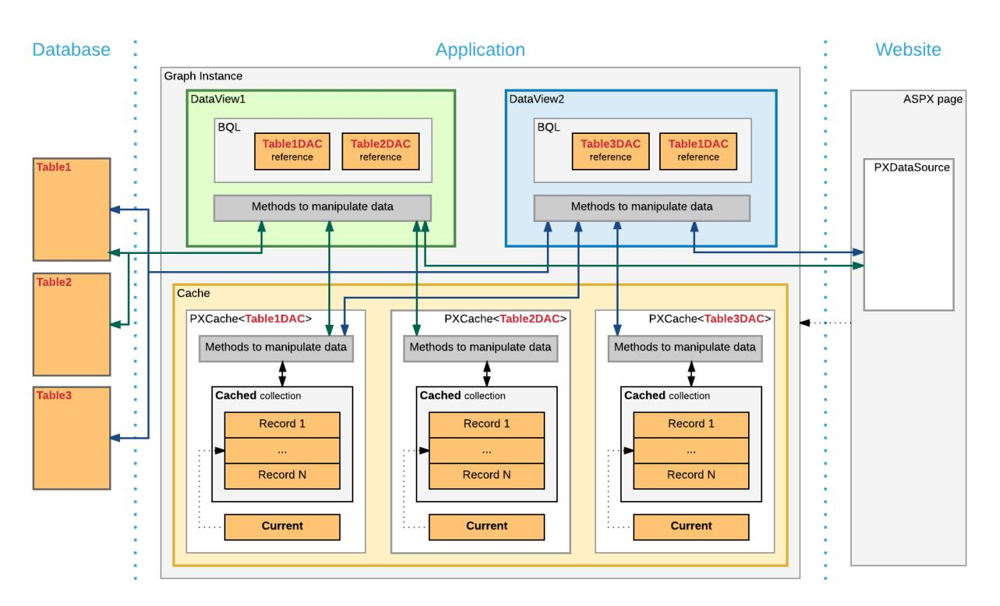

#### *Figure: Example of two data views working with the records of three DACs*

If multiple data views contain a reference to the same DAC, for this DAC, the graph cache contains a single PXCache object that is used by the data views.

On a webpage, you bind each container to a data view that provides data for the container. To bind a container and a data view, you specify the data view name in the DataMember property of the container in the ASPX code. When a webpage requests data, the system invokes the ExecuteSelect() method of the graph with the data view name passed as an argument to execute every data view bound to the containers of the webpage. Note that data views that aren't bound to a container are not executed by a request from the UI.

When a data record is modified on the page, the framework invokes the ExecuteInsert(), ExecuteUpdate(), or ExecuteDelete() method of the graph, passing the name of the data view as an argument. The graph gets the data view by its name and invokes the corresponding method of the data view.

You shouldn't use the ExecuteSelect(), ExecuteInsert(), ExecuteUpdate(), and ExecuteDelete() methods for purposes other than debugging.

You use the *[Customization](#page-42-2) Tools* of the Acumatica Customization Platform to create a custom graph and to create new members and override existing ones in an existing graph.

To declare a custom graph, you derive a class from PXGraph<>. Also, this graph must be declared with the public access modifier to be correctly recognized by the Acumatica Customization Platform.

### <span id="page-342-1"></span><span id="page-342-0"></span>**To Start the Customization of a Graph**

You can create the class extension for an existing business logic controller (BLC) and add the *Code* item with the created code to a customization project in several ways, as described in the following sections:

- *To Add a Code Item by Using the Element [Inspector](#page-343-0)*
- *To Add a Code Item by Using the [Screen](#page-344-0) Editor*
- *To Add a [Code](#page-345-0) Item on the Code page*

If you need to extend the code of a BLC that has no webpage associated (such as ARReleaseProcess), follow the instructions described in *To Add a [Code](#page-345-0) Item on the Code page*.

As soon as you add the Code item for customization of the business logic to the project, the system generates an extension class for it and opens the code in the *[Code Editor](https://help-2025r1.acumatica.com/Help?ScreenId=ShowWiki&pageid=c2678973-d557-47d4-b8ee-9dd69f55b465)*. You can work with the extension classes in the Code Editor. Aer you publish the customization project, you can develop the code in MS Visual Studio.

#### <span id="page-343-0"></span>**To Add a Code Item by Using the Element Inspector**

Typically, you want to modify the business logic that is executed for a certain form of Acumatica ERP.

To add a *Code* item for customization of the business logic for an existing form to a customization project by using the *[Element Inspector](https://help-2025r1.acumatica.com/Help?ScreenId=ShowWiki&pageid=5f9d2d33-1a33-4edd-8629-3100d2020335)*, perform the following actions:

- 1. Open the form in the browser.
- 2. On the form title bar, click **Customization > Inspect Element** to launch the Element Inspector.
- 3. On the form, select any UI element to open the *[Element Properties Dialog Box](https://help-2025r1.acumatica.com/Help?ScreenId=ShowWiki&pageid=5f9d2d33-1a33-4edd-8629-3100d2020335)* for the element.

The **Business Logic** box of the dialog box displays the name of the business logic controller that provides business logic for the form, as shown in the screenshot below.

4. In the dialog box, click **Actions > Customize Business Logic**.

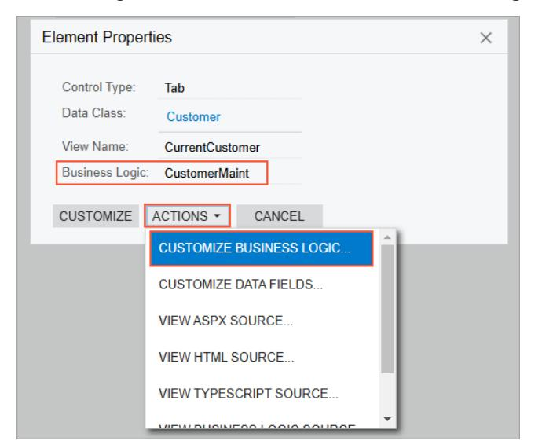

#### *Figure: Using the Element Properties dialog box to customize the business logic for the form*

5. If there is no currently selected customization project and the inspector opens the *[Table](https://help-2025r1.acumatica.com/Help?ScreenId=ShowWiki&pageid=d6c46870-0c44-4f78-ae20-9bb9ef25dccd) 1*

*You use the Select Customization Project dialog box to select an existing customization project or to create a new customization project. You open the dialog box in the following ways:*

- *• From the Customization menu of a form by clicking Select Project*
- *• From the Customization menu of a form by clicking Edit Project if there is no currently selected*

*customization project • From the Element Properties dialog box if you click Customize in the dialog box and there is no currently selected customization project* , select an existing customization project or to create a new one.

The platform creates the template of the class that is derived from the PXGraphExtension<> class, saves the code as a *Code* item of the project in the database, and opens the item in the *[Code Editor](https://help-2025r1.acumatica.com/Help?ScreenId=ShowWiki&pageid=c2678973-d557-47d4-b8ee-9dd69f55b465)*, as shown in the following screenshot.

| <b>Q</b> Acumatica                                                                                                                          |                                                                                                                                                                                                                                                      |  |  |  |
|---------------------------------------------------------------------------------------------------------------------------------------------|------------------------------------------------------------------------------------------------------------------------------------------------------------------------------------------------------------------------------------------------------|--|--|--|
| Extension Library<br>Source Control<br>Publish<br>File                                                                                      |                                                                                                                                                                                                                                                      |  |  |  |
| YogiFon<br>◀                                                                                                                                | Code Editor: NonStockItemMaint (Non-Stock Items)                                                                                                                                                                                                     |  |  |  |
| $\sqrt{\ }$ SCREENS<br>Data Access<br>$\div$ CODE<br>NonStockItemMaint                                                                      | <b>OPEN SCREEN</b><br><b>VIEW SOURCE</b><br><b>OVERRIDE METHOD</b><br>a<br><b>NEW ACTION</b><br>∽<br><b>MOVE TO EXTENSION LIB</b><br>using CRLocation = PX.Objects.CR.Standalone.Location;<br>21                                                     |  |  |  |
| Files $(5)$<br>Generic Inquiries (1)<br>Reports (1)<br>Site Map (3)<br><b>DB</b> Scripts<br><b>System Locales</b>                           | ▴<br>using PX.Objects;<br>22<br>using PX.Objects.IN;<br>23<br>$\overline{24}$<br>25<br>namespace PX.Objects.IN<br>26<br>27<br>public class NonStockItemMaint_Extension:PXGraphExtension <nonstockitemmaint><br/>28<br/>29<br/>30</nonstockitemmaint> |  |  |  |
| Import/Export Scenarios (1)<br><b>Shared Filters</b><br><b>Access Rights</b><br>Wikis<br>Web Service Endpoints<br><b>Analytical Reports</b> | 31<br>#region Event Handlers<br>32<br>33<br>34<br>#endregion<br>35<br>36<br>37<br>38<br>39<br>40                                                                                                                                                     |  |  |  |

*Figure: Viewing the created code template in the Code Editor*

### <span id="page-344-0"></span>**To Add a Code Item by Using the Screen Editor**

Oen, you start a customization of an Acumatica ERP form in the *[Screen Editor](https://help-2025r1.acumatica.com/Help?ScreenId=ShowWiki&pageid=d60a8270-e2ce-4380-b778-af61a0ca56d2)* and you later want to modify the business logic for this form. To customize the business logic of the form, you can add a *Code* item to a customization project from the Screen Editor.

To do this, on the toolbar of the Screen Editor, click the More menu and select **Customize Business Logic**, as the following screenshot shows.

| Screen Editor: AR303000 (Customers)                                                                                                              |                                                                                               |                        |                                                |                        |
|--------------------------------------------------------------------------------------------------------------------------------------------------|-----------------------------------------------------------------------------------------------|------------------------|------------------------------------------------|------------------------|
| $\Box$<br>EDIT ASPX PREVIEW CHANGES<br>$\Omega$                                                                                                  | $\cdots$                                                                                      |                        |                                                |                        |
| ↻<br>面,<br>▶ <i><b>IDataSource: CustomerMaint</b></i><br>▶ <i>□</i> Form: BAccount<br>▶ <i><b>i</b></i> Tab: CurrentCustomer<br>▶ <i>Oialogs</i> | Actions<br><b>Edit ASPX</b><br><b>Customize Business Logic</b><br><b>Customize Data Class</b> |                        | Other<br><b>Preview Changes</b><br>Open Screen |                        |
|                                                                                                                                                  | $\Box$<br>$\Box$                                                                              | ID<br>PageLoadBehavior |                                                | ds                     |
|                                                                                                                                                  | $\Box$                                                                                        | PrimaryView            |                                                | <b>BAccount</b>        |
|                                                                                                                                                  | $\Box$                                                                                        | <b>TypeName</b>        |                                                | PX.Objects.AR.Customer |
|                                                                                                                                                  | $\Box$                                                                                        | <b>Visible</b>         |                                                | True                   |
|                                                                                                                                                  | $\Box$<br>$\overline{\phantom{a}}$                                                            | <b>Ext Properties</b>  |                                                |                        |
|                                                                                                                                                  | $\Box$                                                                                        | AttributesFound        |                                                |                        |
|                                                                                                                                                  | $\Box$<br>Þ.                                                                                  | <b>ClientEvents</b>    |                                                |                        |
|                                                                                                                                                  |                                                                                               |                        |                                                |                        |

*Figure: Starting the customization of the business logic from the Screen Editor*

The platform creates the template of the class that is derived from the PXGraphExtension<> class, saves the code as a *Code* item of the project in the database, and opens the item in the *[Code Editor](https://help-2025r1.acumatica.com/Help?ScreenId=ShowWiki&pageid=c2678973-d557-47d4-b8ee-9dd69f55b465)*.

#### <span id="page-345-0"></span>**To Add a Code Item on the Code page**

If you know the name of the business logic controller to be customized, you can create a *Code* item with the graph extension template on the Code page of the Customization Project Editor by using the **Create Code File** dialog box.

To do this, perform the following actions:

- 1. Open the customization project in the editor.
- 2. Click **Code** in the navigation pane to open the Code page.
- 3. Click **Add New Record** on the page toolbar.
- 4. In the **Create Code File** dialog box, which opens, select *Graph Extension* in the **FileTemplate** box, as the screenshot below shows.
- 5. In the **Base Graph** box, select the class name of the business logic controller to be customized.
- 6. Click **OK**.

| <b>CODE</b>                                                                                   |                                                   |                           |                                        |                         |
|-----------------------------------------------------------------------------------------------|---------------------------------------------------|---------------------------|----------------------------------------|-------------------------|
| $\begin{array}{c} \square \\ \square \end{array}$<br>$\Omega$<br>$\pmb{\times}$<br>$\pm$<br>O | 0                                                 |                           |                                        |                         |
| <b>B</b> Object Name                                                                          | <b>Description</b>                                | <b>Last Modified By</b>   |                                        | <b>Last Modified On</b> |
| <b>CustomerMaint</b><br>≻                                                                     |                                                   | admin admin               | 1/24/2025                              |                         |
| <b>Create Code File</b>                                                                       | $\times$                                          |                           |                                        |                         |
| * File Template:<br>* Base Graph:                                                             | <b>Graph Extension</b><br>$\checkmark$<br>Q       |                           |                                        |                         |
|                                                                                               | Select - Base Graph                               |                           | $\Box$ $\times$                        |                         |
|                                                                                               | Ò<br><b>SELECT</b><br>$\mapsto$                   | <b>ARDo</b>               | ○                                      |                         |
|                                                                                               | <b>B</b> FullName                                 |                           | ٠                                      |                         |
|                                                                                               | ⋋<br>PX.Objects.AR.ARDocumentEnq                  |                           |                                        |                         |
|                                                                                               | PX.Objects.AR.ARDocumentEnqMultipleBaseCurrencies |                           |                                        |                         |
|                                                                                               | PX.Objects.AR.ARDocumentEnqRetainage              |                           |                                        |                         |
|                                                                                               | PX.Objects.AR.ARDocumentRelease                   |                           |                                        |                         |
|                                                                                               |                                                   | $\mathbf{K}$<br>$\langle$ | $\left\langle \right\rangle$<br>$\geq$ |                         |

*Figure: Adding a Code item with the graph extension to the project*

The platform creates the template of the class that is derived from the PXGraphExtension<> class, saves the code as a *Code* item of the project in the database, and opens the item in the *[Code Editor](https://help-2025r1.acumatica.com/Help?ScreenId=ShowWiki&pageid=c2678973-d557-47d4-b8ee-9dd69f55b465)*.

### <span id="page-346-2"></span><span id="page-346-0"></span>**To Create a Custom Graph**

You can add a custom business logic controller to a customization project on the Code page of the Customization Project Editor.

To do this, perform the following actions:

- 1. Open the customization project in the editor.
- 2. Select **Code** in the navigation pane to open the Code page.
- 3. Click **Add New Record** (+) on the page toolbar.
- 4. In the **Create Code File** dialog box, which opens, select *New Graph* in the **FileTemplate** box, as the screenshot below shows.
- 5. In the **Class Name** box, specify the class name of the business logic controller to be created.
- 6. Click **OK**.

| <b>Create Code File</b> |           |        |
|-------------------------|-----------|--------|
| * File Template:        | New Graph | ٠      |
| * Class Name:           | MyBLC     |        |
|                         | 0K        | CANCEL |
|                         |           |        |

#### *Figure: Adding a Code item for a custom graph to the project*

The platform creates the code template of the class derived from the PXGraph<> class, saves the code as a *Code* item of the project in the database, and opens the item in the *[Code Editor](https://help-2025r1.acumatica.com/Help?ScreenId=ShowWiki&pageid=c2678973-d557-47d4-b8ee-9dd69f55b465)*.

### <span id="page-346-1"></span>**To Create a Graph Extension**

In the Customization Project Editor, you can create an extension of a graph or a higher-level extension of a graph extension defined in the source code of Acumatica ERP. You do it by creating a *Code* item with the graph extension template on the Code page of by using the **Create Code File** dialog box.

Before creating a graph extension, you need to know the name of the graph or graph extension to be customized. You can learn the name by using the Element Inspector or by exploring the source code of Acumatica ERP in the Source Code Browser or in Visual Studio.

To create a graph extension, perform the following actions:

- 1. Open the customization project in the editor. (See *To Open a [Project](#page-84-2)* for details.)
- 2. Click **Code** in the navigation pane to open the Code page.
- 3. Click **Add New Record** (+) on the page toolbar.
- 4. In the **Create Code File** dialog box, which opens, select *Graph Extension* in the **FileTemplate** box, as the screenshot below shows.
- 5. In the **Base Graph** box, select the name of the graph or a graph extension to be customized.
- 6. Click **OK**.

| <b>CODE</b>          |                                   |                                                                           |                      |
|----------------------|-----------------------------------|---------------------------------------------------------------------------|----------------------|
| E<br>↶               | 0                                 |                                                                           |                      |
| <b>B</b> Object Name |                                   | <b>Description</b>                                                        | <b>Last Modified</b> |
|                      |                                   |                                                                           |                      |
|                      | Create Code File                  | ×                                                                         |                      |
|                      | * File Template:<br>* Base Graph: | <b>Graph Extension</b><br>Q                                               |                      |
|                      |                                   | Select - Base Graph<br>$\Box$ $\times$                                    |                      |
|                      |                                   | <b>SELECT</b><br>O<br>⊶<br>SOlnv<br>Q                                     |                      |
|                      |                                   | <b>B</b> FullName                                                         |                      |
|                      |                                   | ⋗<br>PX.Objects.FS.SM+SOInvoiceEntry                                      |                      |
|                      |                                   | PX.Objects.RUTROT.SOInvoiceEntryRUTROT                                    |                      |
|                      |                                   | PX.Objects.SO.GraphExtensions.SOInvoiceEntryExt.AddRetu                   |                      |
|                      |                                   | PX.Objects.SO.GraphExtensions.SOInvoiceEntryExt.AddSOLi                   |                      |
|                      |                                   | PX.Objects.SO.GraphExtensions.SOInvoiceEntryExt.Correction<br>ords found. |                      |
|                      |                                   | PX.Objects.SO.GraphExtensions.SOInvoiceEntryExt.CreateP                   |                      |
|                      |                                   | PX.Objects.SO.GraphExtensions.SOInvoiceEntryExt.Interbran                 |                      |
|                      |                                   | PX.Objects.SO.GraphExtensions.SOInvoiceEntryExt.NonDeci                   |                      |
|                      |                                   | !!!!!!!!!!!!!!!!!!!!!!!!!!!!!!!!!!!!!!!!                                  |                      |
|                      |                                   | PX.Objects.SO.SOInvoiceEntry.SOInvoiceEntryAddressLooku                   |                      |
|                      |                                   | PX.Objects.SO.SOInvoiceEntry.SOInvoiceEntryShippingAddre                  |                      |
|                      |                                   | PX.Objects.SO.SOInvoiceEntry+Workflow                                     |                      |
|                      |                                   | PX.Objects.SO.SOInvoiceEntryProjectFieldVisibilityGraphExte               |                      |
|                      |                                   | PX.Objects.SO.SOInvoiceShipment                                           |                      |
|                      |                                   |                                                                           |                      |
|                      |                                   | $\mathcal{K}$<br>$\,<\,$<br>$\rightarrow$<br>>                            |                      |

*Figure: Adding a Code item with the graph extension to the project*

The platform creates the template of the class that is derived from the PXGraphExtension<> class, saves the code as a *Code* item of the project in the database, and opens the item in the *[Code Editor](https://help-2025r1.acumatica.com/Help?ScreenId=ShowWiki&pageid=c2678973-d557-47d4-b8ee-9dd69f55b465)*.

Inside the extension, you must implement the IsActive method which enables the extension on condition. For details, see *To Enable a Graph Extension [Conditionally](#page-356-1) (IsActive)*.

### <span id="page-347-1"></span><span id="page-347-0"></span>**To Add a New Member**

You can add a new member (such as a variable, data view, or method) to a custom graph or to an extension for a graph in Acumatica ERP.

Initially, the code of a custom graph or an extension for an existing graph is saved in the appropriate *Code* item of the customization project. If the project has not been published, you can use only the *[Code Editor](https://help-2025r1.acumatica.com/Help?ScreenId=ShowWiki&pageid=c2678973-d557-47d4-b8ee-9dd69f55b465)* to add a new member to the graph code.

Aer the customization project has been published, the code is also saved in the corresponding C# file in the App\_RuntimeCode folder of the website. (See *[Changes in the Application Code \(C#\)](#page-45-1)* for details.) You can open the file in Microso Visual Studio and use Visual Studio to add a new member to the graph code. To do this, perform the following actions:

- 1. In Visual Studio, click **File > Open > Web Site**, and select your Acumatica ERP development environment.
- 2. Open the App\_RuntimeCode\<CodeItemName>.cs file.
- 3. In the code, add the needed class member.
- 4. Save the file.
- 5. In the Customization Project Editor, select the **Files** node in the navigation pane.
- 6. On the Custom Files page, which opens, click **Detect Modified Files** on the page toolbar.

The customization platform compares the content of each file added to the site with the content of the associated item of the customization project in the database. If a difference is detected, the platform opens the **Modified Files Detected** dialog box so you can resolve the detected conflicts. You can either update the customization project in the database or discard the file changes in the file system to resolve the conflicts.

- 7. In the **Modified Files Detected** dialog box, which opens, ensure that the modified code file is selected.
- 8. Click **Update Customization Project** to update the *Code* item that is saved in the database.

If the graph code is included in an extension library whose binary file is added to the customization project as a *File* item, you can use Visual Studio to add a new member to the graph code in the library solution. (See *[Extension](#page-73-1) [Library](#page-73-1)* for details.) If you make changes to the extension library file in the file system, you have to update the appropriate *File* item in the customization project. See *To [Update](#page-176-1) a File Item in a Project* for details.

### <span id="page-348-1"></span><span id="page-348-0"></span>**To Add an Action**

To add a new action to the toolbar of an original form of Acumatica ERP, you have to add to the appropriate graph extension the action declaration, toolbar button declaration, and action delegate method. (See *To [Start](#page-342-1) the [Customization of a Graph](#page-342-1)* for details.)

To add a new action to the toolbar of a custom form, you have to add the action code to the appropriate custom graph. (See *To Create a Custom Form [Template](#page-229-1)* and *To Create a [Custom](#page-346-2) Graph* for details.)

You can also add an action in the Screen Editor. For details, see *[Action Configuration: General](https://help-2025r1.acumatica.com/Help?ScreenId=ShowWiki&pageid=57a1265a-c8a8-4b0c-ae79-9db03a0e7eee) [Information](https://help-2025r1.acumatica.com/Help?ScreenId=ShowWiki&pageid=57a1265a-c8a8-4b0c-ae79-9db03a0e7eee)*.

You can use the *[Code Editor](https://help-2025r1.acumatica.com/Help?ScreenId=ShowWiki&pageid=c2678973-d557-47d4-b8ee-9dd69f55b465)* to add an action template to the graph extension or custom graph that is saved in a customization project as a *Code* item and currently opened in the editor. To do this, perform the following actions:

- 1. Click the **New Action** button of the Code Editor to open the **Create Action** dialog box.
- 2. In the dialog box, specify the name of the action delegate method in the **Action Name** box and the name of the corresponding button in the **Display Name** box, as shown in the following screenshot.

| Code Editor: SOOrderProcess (Print/Email Orders) |                                      |                      |                                                                      |  |
|--------------------------------------------------|--------------------------------------|----------------------|----------------------------------------------------------------------|--|
| Ы                                                | <b>OPEN SCREEN</b><br>$\blacksquare$ | <b>VIEW SOURCE</b>   | <b>NEW ACTION</b><br><b>OVERRIDE METHOD</b><br>MOVE TO EXTENSION LIB |  |
|                                                  | using PX.Objects.AR;                 |                      |                                                                      |  |
| 8                                                | using PX.Objects.CR;<br>using PX.TM; | <b>Create Action</b> |                                                                      |  |
| 10                                               | using PX.Objects.RQ;                 |                      |                                                                      |  |
| 11                                               | using PX.Objects.CS;                 |                      |                                                                      |  |
| 12                                               | using PX.Objects;                    | Action Name:         | MyActionDelegateMethod                                               |  |
| 13                                               | using PX.Objects.SO;                 |                      |                                                                      |  |
| 14<br>15                                         | namespace PX.Objects.SO              | Display Name:        | <b>MyActionButtonName</b>                                            |  |
| 16                                               |                                      |                      |                                                                      |  |
| 17                                               |                                      |                      | CANCEL<br>OK                                                         |  |
| 18                                               | public class SOOrderProcess Ext      |                      |                                                                      |  |
| 19                                               |                                      |                      |                                                                      |  |
| 20<br>21                                         | #region Event Handlers               |                      |                                                                      |  |
| 22                                               |                                      |                      |                                                                      |  |
| 23                                               |                                      |                      |                                                                      |  |

*Figure: Opening the New Action dialog box*

3. Click **OK** to create the action template and add it to the item.

The system adds to the code a template of the action declaration that includes the following class members:

- The declaration of the action delegate method
- The declaration of the button attributes to add the button to the form toolbar with the specified name
- The template of the action delegate method

The following example shows the template code for an action.

```
public PXAction<DACName> myActionDelegateMethod;
[PXButton]
[PXUIField(DisplayName = "MyActionButtonName")]
protected void MyActionDelegateMethod()
{
 // the body of the action delegate method
}
```

If the code of a graph extension or custom graph is moved to an extension library whose binary file is added to the customization project as a *File* item, you should develop the action code from scratch by using Visual Studio. If you make changes to the extension library file in the file system, you have to update the appropriate *File* item in the customization project. See *To [Update](#page-176-1) a File Item in a Project* for details.

### <span id="page-349-1"></span><span id="page-349-0"></span>**To Add an Event Handler**

If you customize a form, you may need to provide additional business logic for processing a control value immediately aer the value is changed.

To implement business logic for data changed by the user on an original form, you should add event handlers for data fields (or data records) to the extension of the graph that provides business logic for the form.

To process data modification on a custom form, you should add event handlers for data fields (or data records) to the appropriate custom graph.

You can use the *[Screen Editor](https://help-2025r1.acumatica.com/Help?ScreenId=ShowWiki&pageid=d60a8270-e2ce-4380-b778-af61a0ca56d2)* to add to the appropriate customization code a workable template of an event handler for a data field (or data record) that can be modified on a form. To do this, perform the following actions:

1. Open the form in the browser and make the control for the field visible on the form.

2. On the form title bar, click **Customization > Inspect Element** to launch the *[Element Inspector](https://help-2025r1.acumatica.com/Help?ScreenId=ShowWiki&pageid=5f9d2d33-1a33-4edd-8629-3100d2020335)*.

If you need to activate the *[Element Inspector](https://help-2025r1.acumatica.com/Help?ScreenId=ShowWiki&pageid=5f9d2d33-1a33-4edd-8629-3100d2020335)* for a pop-up panel, dialog box, or another UI element that opens in modal mode and makes the *[Customization Menu](https://help-2025r1.acumatica.com/Help?ScreenId=ShowWiki&pageid=d6c46870-0c44-4f78-ae20-9bb9ef25dccd)* unavailable for selection, you can press Control-Alt.

- 3. On the form, click the control to open the *[Element Properties Dialog Box](https://help-2025r1.acumatica.com/Help?ScreenId=ShowWiki&pageid=5f9d2d33-1a33-4edd-8629-3100d2020335)* for the control.
- 4. In the dialog box, click **Customize**.
- 5. If there is no currently selected customization project and the inspector opens the *[Table](https://help-2025r1.acumatica.com/Help?ScreenId=ShowWiki&pageid=d6c46870-0c44-4f78-ae20-9bb9ef25dccd) 1*

*You use the Select Customization Project dialog box to select an existing customization project or to create a new customization project. You open the dialog box in the following ways:*

- *• From the Customization menu of a form by clicking Select Project*
- *• From the Customization menu of a form by clicking Edit Project if there is no currently selected*

*customization project • From the Element Properties dialog box if you click Customize in the dialog box and there is no currently selected customization project* , select an existing customization project or create a new one.

If the customization project does not contain a changeset for the form, the *[Customization Project Editor](https://help-2025r1.acumatica.com/Help?ScreenId=ShowWiki&pageid=0bb97781-e987-4039-962d-457720821bff)* adds to the project a *Page* item for the form, to keep the changeset to the ASPX code of the form in the database. The container of the control is opened in the *[Screen Editor](https://help-2025r1.acumatica.com/Help?ScreenId=ShowWiki&pageid=d60a8270-e2ce-4380-b778-af61a0ca56d2)*, and the control is selected in the Control Tree of the editor.

- 6. Select the node of the control in the Control Tree.
- 7. Click the **Layout Properties** tab item to open the list of properties for the control.
- 8. In the list, set the CommitChange property to *True*. (For detailed information about the property, see *[Use](https://help-2025r1.acumatica.com/Help?ScreenId=ShowWiki&pageid=596c3620-e3d5-4d2f-9c19-3b65486a2761) [of the CommitChanges Property of Boxes](https://help-2025r1.acumatica.com/Help?ScreenId=ShowWiki&pageid=596c3620-e3d5-4d2f-9c19-3b65486a2761)* in the Acumatica Framework Guide.)
- 9. Click **Save** to save your changes in the customization project.
- 10.Click the **Events** tab item to open the list of available event types for the control.
- 11.In the list, click the type of the event that you want to process for the field to highlight the type, as shown in the screenshot below.
- 12.On the list toolbar, click **Add Handler > Keep Base Method**.

| 周<br>PREVIEW CHANGES<br>⇦                                                                                                                                  | ACTIONS -                                                                                                                                                                                  |                               |                  |
|------------------------------------------------------------------------------------------------------------------------------------------------------------|--------------------------------------------------------------------------------------------------------------------------------------------------------------------------------------------|-------------------------------|------------------|
| Ⅲ ▼<br>C<br>$+$                                                                                                                                            | <b>MAIN PROPERTIES</b><br><b>LAYOUT PROPERTIES</b><br><b>ATTRIBUTES</b>                                                                                                                    | <b>EVENTS</b><br>ADD CONTROLS | <b>VIEW ASPX</b> |
| ▶ <i>□</i> DataSource: CustomerMaint<br>▶ <i>□</i> Form: BAccount<br>• @ Tab: CurrentCustomer<br><b>f</b> General Info<br>$\checkmark$<br>• <i></i> Column | Data Class:<br>PX.Objects.CR.Address<br>Field Name:<br><b>IsValidated</b><br><b>Business Logic:</b><br>PX.Objects.AR.CustomerMaint::DefAddress<br>ADD HANDLER -<br>C<br><b>VIEW SOURCE</b> |                               |                  |
| ▼ <i>I</i> Form: DefContact<br>▶ <i></i> Column                                                                                                            | <b>Keep Base Method</b><br>들 Even                                                                                                                                                          | Handled in Source             | Customized       |
| <sup>361</sup> Account Ref.#<br>画 BAccount.LocaleName                                                                                                      | Field<br>Override Base Method<br>Rowlnserting                                                                                                                                              | □<br>$\overline{\smile}$      | п                |
| • p Form: DefAddress                                                                                                                                       | RowInserted                                                                                                                                                                                | ☑                             | п                |
| • <i>@</i> Column<br>abil Validated                                                                                                                        | RowUpdating                                                                                                                                                                                | г                             |                  |
| an Address Line 1                                                                                                                                          | RowUpdated                                                                                                                                                                                 | $\Box$                        | □                |
| an Address Line 2                                                                                                                                          | RowDeleting<br><b>RowDeleted</b>                                                                                                                                                           | П                             |                  |
| <b>BBII</b> City<br><b>M</b> Country                                                                                                                       | FieldDefaulting                                                                                                                                                                            | п<br>$\Box$                   | п                |
| <b>BBI</b> State<br>$\equiv$ $\cdots$                                                                                                                      | FieldUpdating                                                                                                                                                                              | П                             |                  |

*Figure: Adding an event handler for a data field*

If there is no extension for the graph that provides business logic for the form in the customization project, the Acumatica Customization Platform creates a template for the extension and saves it as a *Code* item in the database. Then the platform adds to the graph extension a template for the event handler highlighted in the list and opens the *Code* item in the *[Code Editor](https://help-2025r1.acumatica.com/Help?ScreenId=ShowWiki&pageid=c2678973-d557-47d4-b8ee-9dd69f55b465)*, as shown in the following screenshot.

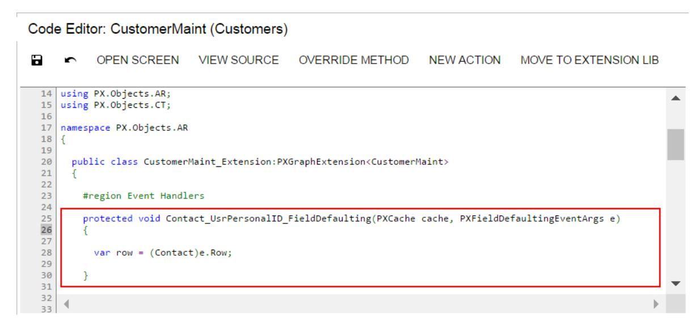

#### *Figure: Viewing the event handler template*

In the template, the event handler has two parameters, as is defined in the base graph. As a result, the event handler is added to the appropriate event handler collection.

When you publish the customization project, the platform saves the graph extension as a C# source code file in the App\_RuntimeCode folder of the website. You can later develop the event handler in Microso Visual Studio. (See *[Integrating](#page-384-2) the Project Editor with Microsoft Visual Studio* for details.)

## <span id="page-352-1"></span><span id="page-352-0"></span>**To Override an Event Handler**

If you customize a form, you may need to override the business logic that processes a control value immediately aer the value is changed.

To implement business logic for data changed by the user on an original form, you should add event handlers for data fields (or data records) to the extension of the graph that provides business logic for the form.

To process data modification on a custom form, you should add event handlers for data fields (or data records) to the appropriate custom graph.

You can use the *[Screen Editor](https://help-2025r1.acumatica.com/Help?ScreenId=ShowWiki&pageid=d60a8270-e2ce-4380-b778-af61a0ca56d2)* to add to the appropriate customization code a workable template of an event handler that overrides the base event handler for a data field (or data record). To do this, perform the following actions:

- 1. Open the form in the browser and make the control for the field visible on the form.
- 2. On the form title bar, click **Customization > Inspect Element** to open the *[Element Inspector](https://help-2025r1.acumatica.com/Help?ScreenId=ShowWiki&pageid=5f9d2d33-1a33-4edd-8629-3100d2020335)*.


If you need to activate the *[Element Inspector](https://help-2025r1.acumatica.com/Help?ScreenId=ShowWiki&pageid=5f9d2d33-1a33-4edd-8629-3100d2020335)* for a pop-up panel, dialog box, or other UI element that opens in modal mode and makes the *[Customization Menu](https://help-2025r1.acumatica.com/Help?ScreenId=ShowWiki&pageid=d6c46870-0c44-4f78-ae20-9bb9ef25dccd)* unavailable for selection, you can press Control-Alt.

- 3. On the form, click the control to open the *[Element Properties Dialog Box](https://help-2025r1.acumatica.com/Help?ScreenId=ShowWiki&pageid=5f9d2d33-1a33-4edd-8629-3100d2020335)* for the control.
- 4. In the dialog box, click **Customize**.
- 5. If there is no currently selected customization project and the inspector opens the *[Table](https://help-2025r1.acumatica.com/Help?ScreenId=ShowWiki&pageid=d6c46870-0c44-4f78-ae20-9bb9ef25dccd) 1*

*You use the Select Customization Project dialog box to select an existing customization project or to create a new customization project. You open the dialog box in the following ways:*

- *• From the Customization menu of a form by clicking Select Project*
- *• From the Customization menu of a form by clicking Edit Project if there is no currently selected*

*customization project • From the Element Properties dialog box if you click Customize in the dialog box and there is no currently selected customization project* , select an existing customization project or create a new one.

If the customization project does not contain a changeset for the form, the *[Customization Project Editor](https://help-2025r1.acumatica.com/Help?ScreenId=ShowWiki&pageid=0bb97781-e987-4039-962d-457720821bff)* adds a *Page* item for the form to the project, to keep the changeset to the ASPX code of the form in the database. The container of the control is opened in the *[Screen Editor](https://help-2025r1.acumatica.com/Help?ScreenId=ShowWiki&pageid=d60a8270-e2ce-4380-b778-af61a0ca56d2)*, and the control is selected in the Control Tree of the editor.

- 6. Select the node of the control in the Control Tree.
- 7. Click the **Layout Properties** tab item to open the list of properties for the control.
- 8. In the list, ensure that the CommitChange property is set to *True*. (For detailed information about the property, see *[Use of the CommitChanges Property of Boxes](https://help-2025r1.acumatica.com/Help?ScreenId=ShowWiki&pageid=596c3620-e3d5-4d2f-9c19-3b65486a2761)* in the Acumatica Framework Guide.)
- 9. Click **Save** to save your changes in the customization project.
- 10.Click the **Events** tab item to open the list of available event types for the control.
- 11.In the list, click the type of the event that you want to process for the field to highlight the type, as shown in the screenshot below.
- 12.On the list toolbar, click **Add Handler > Override Base Method**.

| n<br>PREVIEW CHANGES<br>⇦                                                                                                                     | ACTIONS -                                                                                                                                                                                  |                               |                  |
|-----------------------------------------------------------------------------------------------------------------------------------------------|--------------------------------------------------------------------------------------------------------------------------------------------------------------------------------------------|-------------------------------|------------------|
| 而 -<br>C                                                                                                                                      | <b>MAIN PROPERTIES</b><br><b>LAYOUT PROPERTIES</b><br><b>ATTRIBUTES</b>                                                                                                                    | <b>EVENTS</b><br>ADD CONTROLS | <b>VIEW ASPX</b> |
| ▶ <i>图</i> DataSource: CustomerMaint<br>▶ <i>图</i> Form: BAccount<br>• <i>■</i> Tab: CurrentCustomer<br>• 图 General Info<br>• <i>@</i> Column | Data Class:<br>PX.Objects.CR.Address<br><b>IsValidated</b><br>Field Name:<br><b>Business Logic:</b><br>PX.Objects.AR.CustomerMaint::DefAddress<br>ADD HANDLER -<br>C<br><b>VIEW SOURCE</b> |                               |                  |
| • <i>I</i> Form: DefContact                                                                                                                   | 들 Even<br>Keep Base Method                                                                                                                                                                 | Handled in Source             | Customized       |
| ▶ <i>@</i> Column                                                                                                                             | Field<br><b>Override Base Method</b>                                                                                                                                                       | с                             | □                |
| 圖 Account Ref.#<br><b>图 BAccount LocaleName</b>                                                                                               | Rowlnserting                                                                                                                                                                               | ☑                             |                  |
| 印 Form: DefAddress<br>$\overline{\phantom{a}}$                                                                                                |                                                                                                                                                                                            |                               |                  |
|                                                                                                                                               | Rowlnserted                                                                                                                                                                                | $\boxed{\text{v}}$            | п                |
| • <i>@</i> Column                                                                                                                             | RowUpdating                                                                                                                                                                                | г                             | п                |
| <b>END</b> Validated<br>画 Address Line 1                                                                                                      | RowUpdated                                                                                                                                                                                 | г                             | п                |
| <b>■ Address Line 2</b>                                                                                                                       | <b>RowDeleting</b>                                                                                                                                                                         |                               |                  |
| <b>圖 City</b>                                                                                                                                 | <b>RowDeleted</b>                                                                                                                                                                          | г                             | п                |
| 图 Country                                                                                                                                     | FieldDefaulting                                                                                                                                                                            | г                             |                  |
| <b>BBI</b> State<br>$= 14.4222$                                                                                                               | FieldUpdating                                                                                                                                                                              | c                             |                  |

*Figure: Adding an event handler for a data field*

If there is no extension for the graph that provides business logic for the form in the customization project, the Acumatica Customization Platform creates a template for the extension and saves it as a *Code* item in the database. Then the platform adds to the graph extension a template for the event handler highlighted in the list and opens the *Code* item in the *[Code Editor](https://help-2025r1.acumatica.com/Help?ScreenId=ShowWiki&pageid=c2678973-d557-47d4-b8ee-9dd69f55b465)*, as shown in the following screenshot.

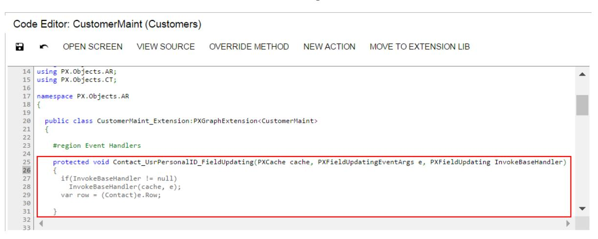

#### *Figure: Viewing the event handler template*

In the template, the event handler has an additional parameter to replace the base event handler collection of the graph.

When you publish the customization project, the platform saves the graph extension as a C# source code file in the App\_RuntimeCode folder of the website. You can later develop the event handler in Microso Visual Studio. (See *[Integrating](#page-384-2) the Project Editor with Microsoft Visual Studio* for details.)

### <span id="page-353-0"></span>**To Override a Virtual Method**

In a graph extension, you can override the virtual methods defined within the base graph. As with the event handlers, you have two options:

• You can define the override method with exactly the same signature—that is, the return value, the name of the method, and all method parameters—as the overridden base virtual method has. As a result, the method is added to the queue of all override methods. When the system invokes the base method, all

methods in the queue are executed sequentially, from the first one to the last one. The lower the level of the graph extension, the earlier the system invokes the override method.

- You can define the override method with an additional parameter, which represents the delegate for one of the following:
  - The override method with an additional parameter from the extension of the previous level, if such a method exists
  - The base virtual method, if no override methods with additional parameters declared within lower-level extensions exist

In both cases, you should attach the PXOverride attribute to the override method declared within the BLC extension, as described in the following sections below:

- *[Override Method That Is Added to the Override Method Queue](#page-354-0)*
- *[Override Method That Replaces the Original Method](#page-354-1)*

### <span id="page-354-0"></span>**Override Method That Is Added to the Override Method Queue**

By declaring an override method with exactly the same signature as the overridden base virtual method has, you extend the base method execution. The base BLC method is replaced at run time with the queue of methods, which starts with the base BLC method. When the system invokes the base method, all methods in the queue are executed sequentially, from the first one to the last one. The lower the level the BLC extension has, the earlier the system invokes the override method. If the system has invoked the base method, you have no option to prevent the override method queue from execution. To prevent the base method executions, see the *[Override Method That](#page-354-1) [Replaces the Original Method](#page-354-1)* section below.

To add an override method that is added to the override method queue, perform the following actions:

- 1. Create the graph extension, as described in *To Start the [Customization](#page-342-1) of a Graph*.
- 2. In the Code Editor, click**View Source** to view the code of the base graph in the *[Source Code](https://help-2025r1.acumatica.com/Help?ScreenId=ShowWiki&pageid=2e58bb02-40c0-47c6-8cea-78607cccc4e1)* browser.


In an instance of Acumatica ERP, a repository with the original C# source code of the application is kept in the \App\_Data\CodeRepository folder of the website.

- 3. In the browser, select and copy the code of the method.
- 4. In the Code Editor, paste the method code in the graph extension.
- 5. In the graph extension, insert the PXOverride attribute immediately before the method signature.
- 6. Clear the method body.
- 7. Develop the code of the method.
- 8. Click **Save** in Code Editor to save your changes.

#### <span id="page-354-1"></span>**Override Method That Replaces the Original Method**

The override method with an additional parameter replaces the base BLC virtual method. When the virtual method is invoked, the system invokes the override method with an additional parameter of the highest-level BLC extension. The system passes a link to the override method with an additional parameter from the extension of the previous level, if such a method exists, or to the base virtual method.

You use a delegate as an additional parameter to encapsulate the method with exactly the same signature as the base virtual method. If the base virtual method contains a list of parameters, then you should not use the same list of parameters when you declare the override method with an additional parameter. To declare a MyMethod override method with an additional parameter within a BLC extension, you can use the following example.

```
{
 public delegate ReturnType MyMethodDelegate([List of Parameters]); 
 [PXOverride]
 public ReturnType MyMethod([List of Parameters,] MyMethodDelegate baseMethod)
 {
 return baseMethod(adapter);
 }
}
```

You can decide whether to call the method pointed to by the delegate. By invoking the base method, you also start the execution of the override method queue.

To add an override method that replaces the base BLC virtual method, perform the following actions:

- 1. Create the graph extension, as described in *To Start the [Customization](#page-342-1) of a Graph*.
- 2. In the Code Editor, click **Override Method**, as shown in the screenshot below.
- 3. In the **Selected** column of the**Select Methods to Override** dialog box, which opens, select the method to be overridden.
- 4. Click **Save** to add the code template for the override method to the graph extension.

|                                          | Code Editor: ContractMaint (Customer Contracts)                                                                      |                          |                    |                                                                      |  |  |  |  |  |  |
|------------------------------------------|----------------------------------------------------------------------------------------------------------------------|--------------------------|--------------------|----------------------------------------------------------------------|--|--|--|--|--|--|
| 8                                        | <b>OPEN SCREEN</b><br>ົ                                                                                              |                          | <b>VIEW SOURCE</b> | <b>OVERRIDE METHOD</b><br><b>NEW ACTION</b><br>MOVE TO EXTENSION LIB |  |  |  |  |  |  |
|                                          |                                                                                                                      |                          |                    |                                                                      |  |  |  |  |  |  |
| $\mathbf{1}$                             | using System;                                                                                                        |                          |                    |                                                                      |  |  |  |  |  |  |
| 3                                        | using System.Collections.Generic;<br>using System.Collections:                                                       |                          |                    |                                                                      |  |  |  |  |  |  |
| 4                                        | using System. Lir Select Methods to Override<br>$\square \times$                                                     |                          |                    |                                                                      |  |  |  |  |  |  |
| 5<br>6                                   | using PX.Common:<br>using PX.Data;                                                                                   | <b>B</b> Selected        | <b>Type</b>        | <b>Method</b>                                                        |  |  |  |  |  |  |
| $\overline{7}$                           | using PX.Objects                                                                                                     |                          | ContractMaint      | Action(PXAdapter adapter, String ActionName)                         |  |  |  |  |  |  |
| 8                                        | using PX.Objects                                                                                                     |                          | ContractMaint      |                                                                      |  |  |  |  |  |  |
| 9                                        | using PX.Objects                                                                                                     | □                        |                    | Activate(PXAdapter adapter)                                          |  |  |  |  |  |  |
| 10<br>11                                 | using PX.Objects<br>using PX.Objects                                                                                 | П                        | ContractMaint      | ActivateUpgrade(PXAdapter adapter)                                   |  |  |  |  |  |  |
| 12                                       | using PX.Objects                                                                                                     | $\Box$                   | ContractMaint      | Bill()                                                               |  |  |  |  |  |  |
| 13                                       | using PX.Objects                                                                                                     | П                        | ContractMaint      | CanClipboardCopyPaste()                                              |  |  |  |  |  |  |
| 14<br>15                                 | using PX.Objects<br>using PX.Objects                                                                                 | □                        | ContractMaint      | CopyContractDetail(ContractDetail source, ContractDet                |  |  |  |  |  |  |
| 16                                       |                                                                                                                      |                          | ContractMaint      | CopyTemplateDetail(ContractDetail source, ContractDet                |  |  |  |  |  |  |
| 17                                       | namespace PX.Ob-<br>$\overline{\phantom{a}}$<br>$\bullet$<br>ContractMaint<br>DefaultFromTemplate(Contract contract) |                          |                    |                                                                      |  |  |  |  |  |  |
| 18<br>19                                 | ContractMaint<br>ExecuteUpdate(String viewName, IDictionary keys, IDi                                                |                          |                    |                                                                      |  |  |  |  |  |  |
| !!!!!!!!!!!!!!!!!!!!!!!!!!!!!!!!!!!!!!!! | public class (<br>ContractMaint<br>GetNextStartDate()<br>Ш                                                           |                          |                    |                                                                      |  |  |  |  |  |  |
| 21<br>22                                 |                                                                                                                      | $\overline{\phantom{a}}$ | ContractMaint      | Inquiry (PXAdapter adapter, String ActionName)                       |  |  |  |  |  |  |
| 23                                       | #region Ever                                                                                                         | П                        | ContractMaint      | Persist()                                                            |  |  |  |  |  |  |
| 24<br>25                                 |                                                                                                                      | $\overline{\phantom{a}}$ | ContractMaint      | Renew(PXAdapter adapter)                                             |  |  |  |  |  |  |
| 26                                       |                                                                                                                      | $\overline{\phantom{a}}$ | ContractMaint      | RenewContract(DateTime renewalDate, Boolean redirect)                |  |  |  |  |  |  |
| 27                                       | #endregion                                                                                                           |                          |                    |                                                                      |  |  |  |  |  |  |
| 28                                       |                                                                                                                      | □                        | ContractMaint      | RenewExpiring(ContractMaint graph, DateTime renewal                  |  |  |  |  |  |  |
| 29<br>30                                 |                                                                                                                      |                          |                    | CANCEL<br><b>SAVE</b>                                                |  |  |  |  |  |  |
| 31                                       |                                                                                                                      |                          |                    |                                                                      |  |  |  |  |  |  |
| 32                                       |                                                                                                                      |                          |                    |                                                                      |  |  |  |  |  |  |
| 33<br>34                                 |                                                                                                                      |                          |                    |                                                                      |  |  |  |  |  |  |
| 35                                       |                                                                                                                      |                          |                    |                                                                      |  |  |  |  |  |  |
| 36                                       |                                                                                                                      |                          |                    |                                                                      |  |  |  |  |  |  |
|                                          |                                                                                                                      |                          |                    |                                                                      |  |  |  |  |  |  |

#### *Figure: Selecting a method to be overridden*

Once the override method template has been created (see the following screenshot), you can implement the needed code within the template.

| Code Editor: ContractMaint (Customer Contracts) |   |                                              |                         |                                                                                            |  |                       |  |  |  |
|-------------------------------------------------|---|----------------------------------------------|-------------------------|--------------------------------------------------------------------------------------------|--|-----------------------|--|--|--|
| a                                               | ∽ |                                              | OPEN SCREEN VIEW SOURCE | OVERRIDE METHOD NEW ACTION                                                                 |  | MOVE TO EXTENSION LIB |  |  |  |
| $\mathbf{1}$                                    |   | using System;                                |                         |                                                                                            |  |                       |  |  |  |
| $\overline{2}$                                  |   | using System.Collections.Generic;            |                         |                                                                                            |  |                       |  |  |  |
| 3                                               |   | using System.Collections;                    |                         |                                                                                            |  |                       |  |  |  |
| 4                                               |   | using System.Linq;                           |                         |                                                                                            |  |                       |  |  |  |
| 5                                               |   | using PX.Common;                             |                         |                                                                                            |  |                       |  |  |  |
| 6                                               |   | using PX.Data;                               |                         |                                                                                            |  |                       |  |  |  |
| $\overline{7}$                                  |   | using PX.Objects.EP;                         |                         |                                                                                            |  |                       |  |  |  |
| 8                                               |   | using PX.Objects.IN;                         |                         |                                                                                            |  |                       |  |  |  |
| 9 <sub>1</sub>                                  |   | using PX.Objects.CR;<br>using PX.Objects.AR; |                         |                                                                                            |  |                       |  |  |  |
| 10<br>11                                        |   | using PX.Objects.GL;                         |                         |                                                                                            |  |                       |  |  |  |
| 12                                              |   | using PX.Objects.CS;                         |                         |                                                                                            |  |                       |  |  |  |
| 13                                              |   | using PX.Objects.CM;                         |                         |                                                                                            |  |                       |  |  |  |
| 14                                              |   | using PX.Objects;                            |                         |                                                                                            |  |                       |  |  |  |
| 15                                              |   | using PX.Objects.CT;                         |                         |                                                                                            |  |                       |  |  |  |
| 16                                              |   |                                              |                         |                                                                                            |  |                       |  |  |  |
| 17                                              |   | namespace PX.Objects.CT                      |                         |                                                                                            |  |                       |  |  |  |
| 18                                              | € |                                              |                         |                                                                                            |  |                       |  |  |  |
| 19                                              |   |                                              |                         |                                                                                            |  |                       |  |  |  |
| 20                                              |   |                                              |                         | public class ContractMaint Extension: PXGraphExtension <contractmaint></contractmaint>     |  |                       |  |  |  |
| 21                                              |   |                                              |                         |                                                                                            |  |                       |  |  |  |
| 22                                              |   |                                              |                         |                                                                                            |  |                       |  |  |  |
| 23                                              |   | #region Event Handlers                       |                         |                                                                                            |  |                       |  |  |  |
| 24                                              |   |                                              |                         | public delegate void DefaultFromTemplateDelegate(Contract contract);                       |  |                       |  |  |  |
| 25                                              |   | [PXOverride]                                 |                         |                                                                                            |  |                       |  |  |  |
| 26                                              |   |                                              |                         | public void DefaultFromTemplate(Contract contract, DefaultFromTemplateDelegate baseMethod) |  |                       |  |  |  |
| 27                                              |   |                                              |                         |                                                                                            |  |                       |  |  |  |
| 28                                              |   | baseMethod(contract);                        |                         |                                                                                            |  |                       |  |  |  |
| 29<br>30                                        |   |                                              |                         |                                                                                            |  |                       |  |  |  |
| 31                                              |   |                                              |                         |                                                                                            |  |                       |  |  |  |
| 32                                              |   |                                              |                         |                                                                                            |  |                       |  |  |  |
| 33                                              |   |                                              |                         |                                                                                            |  |                       |  |  |  |
| 34                                              |   | #endregion                                   |                         |                                                                                            |  |                       |  |  |  |
| 35                                              |   |                                              |                         |                                                                                            |  |                       |  |  |  |
| 36                                              |   |                                              |                         |                                                                                            |  |                       |  |  |  |

#### *Figure: Viewing the override method template in the Code Editor*

When you publish the customization project, the platform saves the graph extension as a C# source code file in the App\_RuntimeCode folder of the website. You can later develop the event handler in Microso Visual Studio. (See *[Integrating](#page-384-2) the Project Editor with Microsoft Visual Studio* for details.)

### <span id="page-356-1"></span><span id="page-356-0"></span>**To Enable a Graph Extension Conditionally (IsActive)**

You need to disable a graph extension when it is not required by the system logic (for example, when the feature that uses the extension is not enabled) because when an extension is constantly active, it can impair the system's performance. You can also disable a graph extension for a specific derived graph.

To disable or enable a graph extension depending on a condition, you need to implement the public static bool IsActive method in the extension. The following code shows an example of the implementation of the IsActive method.

```
public static bool IsActive()
{
 return PXAccess.FeatureInstalled<FeaturesSet.rutRotDeduction>();
}
```

In the code above, the extension is enabled when the rutRotDeduction feature is enabled.

If the IsActive method returns false for an extension, this extension is not loaded. This means the following:

- Form controls bound to views defined in that graph extension are automatically hidden.
- Event handlers implemented in the graph extension are ignored. Overridden event handlers and methods with the PXOverride attribute are also ignored.

• Views defined in the graph extension will not be available.

If a graph extension has higher-level extensions, to disable each higher-level extension, you need to implement the IsActive method in it as well. If the base graph extension is disabled while the higher-level extension is not, an error is thrown. For details on higher-level extensions, refer to *[Graph](#page-58-0) [Extensions](#page-58-0)*.

#### **Disabling a Graph Extension for a Derived Graph**

The graph extension applies not only to the graph specified in the graph extension's declaration but also to all graphs derived from the graph specified in the graph extension's declaration.

Suppose that you have the following graphs (whose relationships are shown in the following diagram):

- A base graph, ARInvoiceEntry
- Two graphs, SOInvoiceEntry and ARSpecificInvoiceEntry, which are derived from ARInvoiceEntry
- A graph extension, ARInvoiceEntryAdvanceTaxesExt, that has been declared for ARInvoiceEntry

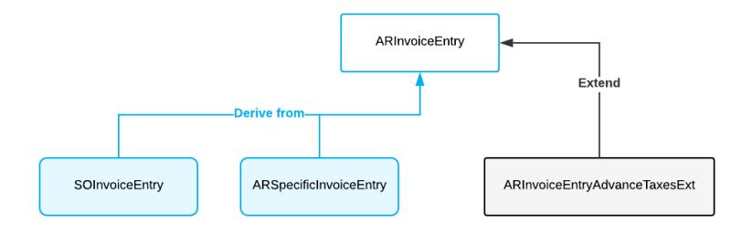

#### *Figure: Relationships between the graphs*

In this example, Acumatica Framework applies the members declared in the

ARInvoiceEntryAdvanceTaxesExt graph extension to all of the following graphs: ARInvoiceEntry, ARSpecificInvoiceEntry, and SOInvoiceEntry.

The IsActive method in a graph extension controls whether the graph extension is enabled and applied to the graph specified in the graph extension's declaration and all of the graph's inheritors. In the current example, if the IsActive method is declared in ARInvoiceEntryAdvanceTaxesExt and returns false, then the ARInvoiceEntryAdvanceTaxesExt graph extension is disabled for all of the following graphs: ARInvoiceEntry, ARSpecificInvoiceEntry, and SOInvoiceEntry.

Sometimes you may need to have more granular control over the graph extension activity. That is, you may want to do the following:

- Disable a graph extension for a specific graph inheritor. For example, you may not want to apply logic from the ARInvoiceEntryAdvanceTaxesExt graph extension to the SOInvoiceEntry graph.
- Disable a graph extension for all derived graphs. For example, you may need the ARInvoiceEntryAdvanceTaxesExt graph extension to be applied to only the ARInvoiceEntry graph.

The IsActive method does not help in these cases. To support these scenarios, you need to declare a public static bool-returning generic method named IsActiveForGraph<TGraph>, as the following code shows.

public static bool IsActiveForGraph<Graph>()

Inside the method, you need to check the type of the graph to which the extension is applied by using the TGraph generic type argument.

You can implement the two cases described above, respectively, as follows:

• Disabling the graph extension for a specific graph inheritor: If you do not want to apply the logic from ARInvoiceEntryAdvanceTaxesExt to SOInvoiceEntry, for example, the implementation of the IsActiveForGraph method should be coded as follows.

```
public static bool IsActiveForGraph<TGraph>() 
 => typeof(TGraph) != typeof(SOInvoiceEntry);
```

• Disabling a graph extension for all derived graphs: If you want the ARInvoiceEntryAdvanceTaxesExt graph extension to be applied to only the ARInvoiceEntry graph, for example, the implementation of the IsActiveForGraph method should be coded as follows.

```
public static bool IsActiveForGraph<TGraph>() 
 => typeof(TGraph) == typeof(ARInvoiceEntry);
```

The full code of the ARInvoiceEntryExt graph extension in this example should look as follows.

```
public class ARInvoiceEntryExt : PXGraphExtension<ARInvoiceEntry>
{
 public static bool IsActive()
 {
 return PXAccess.FeatureInstalled<FeaturesSet.retainage>();
 }
 public static bool IsActiveForGraph<TGraph>()
 where Graph : PXGraph // Constraint is not obligatory
 {
 // Check the type of the graph here
 return typeof(TGraph) == typeof(ARInvoiceEntry);
 }
}
```

#### **Disabling a Generic Graph Extension**

If you have a generic graph extension and graph extensions derived from this generic graph extension, to disable them, you need to implement the IsActive method in each of the derived graph extensions.

For example, suppose you have a generic graph extension declared as shown the following code.

```
public class GraphExtBase<TGraph, TDac> : 
 PXGraphExtension<TGraph>
 where TGraph : PXGraph
 where TDac : class, IBqlTable
```

{ }

The derived graph extension looks as the following code shows.

```
public class GraphExtAPInvoice : 
 GraphExtBase<APInvoiceEntry, APInvoice>{}
```

To disable the GraphExtAPInvoice graph extension, you need to implement the IsActive method as the following code shows.

```
public class GraphExtAPInvoice : 
 GraphExtBase<APInvoiceEntry, APInvoice>
{
 public static bool IsActive()
```

```
 {
 return PXAccess.FeatureInstalled<FeaturesSet.
 AdvancedAPInvoice>();
 }
}
```

For details on generic graph extensions, refer to *[Reusing Business Logic](https://help-2025r1.acumatica.com/Help?ScreenId=ShowWiki&pageid=76b8c160-89bd-4501-9f9f-1dabc648d417)*.

#### **Restrictions in the IsActive Method**

Inside the IsActive method, you should not create a graph instance because it can lead to deadlocks. If you need to read data from the database, you can use database slots by doing the following:

- 1. In a graph extension where you need to define the IsActive method, you also define a database slot that depends on a DAC from which you need to read data. In the slot, you cache data that you need to access.
- 2. In the IsActive method, you access the data from the slot.

For example, suppose that you need to enable the extension in the IsActive method only if the InspectionEnabled property of SOSetup DAC is true. The following code shows how you can access the InspectionEnabled property by using a database slot.

```
private class SOSetupInspection : IPrefetchable
{
 public static bool InspectionEnabled =>
 PXDatabase.GetSlot<SOSetupInspection>("SOSetupInspection",
 typeof(SOSetup))._inspectionEnabled;
 private bool _inspectionEnabled;
 void IPrefetchable.Prefetch()
 {
 using (PXDataRecord soSetup =
 PXDatabase.SelectSingle<SOSetup>(new PXDataField<SOSetup.inspectionEnabled>()))
 if (soSetup != null) _inspectionEnabled = (bool)soSetup.GetBoolean(0);
 }
}
public static bool IsActive() => SOSetupInspection.InspectionEnabled;
```

In the code above, you do the following:

- 1. In the extension, you define the SOSetupInspection database slot which depends on the SOSetup table. In the slot, you cache the SOSetup.InspectionEnabled value.
- 2. In the IsActive method, you check the SOSetupInspection.InspecionEnabled property which holds the cached value of the SOSetup.InspectionEnabled property.

For more information on database slots, see *[Use of Slots to Cache Data Objects](https://help-2025r1.acumatica.com/Help?ScreenId=ShowWiki&pageid=7d60ac9e-ff6c-40fc-a593-52e1545493fe)*.

#### **Related Links**

• *To Enable a DAC Extension [Conditionally](#page-327-1) (IsActive)*

### <span id="page-359-1"></span><span id="page-359-0"></span>**Data View**

In a business logic controller (BLC, also referred to as *graph*), a *data view* is a PXView object that is used to access and manipulate data. In an ASPX page, to obtain data for controls, each container has to be bound to a data view of the BLC that is bound to the PXDataSource control of the page.

A data view object contains two main parts:

- The BQL command, which is defined by the type of the data view
- The optional delegate, which constructs the data set that is returned instead of the result of the execution of the BQL command

In a graph extension, you can include the following member types:

- Declaration of a custom data view
- Redefinition for an existing data view
- Declaration of the delegate for an existing data view
- An override method for an existing data view delegate

To declare a custom data view in a graph extension, you can follow the instructions described in *To Add a [New](#page-347-1) [Member](#page-347-1)*.

For detailed information on customizing a data view, see the following topics:

- *Data View Delegates: General [Information](https://help-2025r1.acumatica.com/Help?ScreenId=ShowWiki&pageid=acecfa2b-90d5-475c-8cf2-b2c5f8e60672)*
- *To [Override](#page-360-2) a Data View*
- *To Override a Data View [Delegate](#page-360-3)*

### <span id="page-360-2"></span><span id="page-360-0"></span>**To Override a Data View**

To modify a data view, you have to redefine the data view in the graph extension class. The data view redefined within a BLC extension completely replaces the base data view within the *Views* collection of a graph instance, including all attributes attached to the data view declared within the base graph. You can either attach the same set of attributes to the data view or completely redeclare the attributes. For details, see *[Graph Extensions](#page-58-0)*. The data view must have exactly the same identifier, which is referred to in the appropriate container in the ASPX page.

To redefine a data view in the graph extension, perform the following actions:

- 1. Create the graph extension, as described in *To Start the [Customization](#page-342-1) of a Graph*, if required.
- 2. In the Code Editor, click**View Source** to view the code of the base graph in the *[Source Code](https://help-2025r1.acumatica.com/Help?ScreenId=ShowWiki&pageid=2e58bb02-40c0-47c6-8cea-78607cccc4e1)* browser.

In an instance of Acumatica ERP, a repository with the original C# source code of the application is kept in the \App\_Data\CodeRepository folder of the website.

- 3. In the browser, select and copy the data view declaration.
- 4. In the Code Editor, paste the data view declaration in the graph extension.
- 5. In the graph extension, redefine the data view declaration as required.
- 6. Click **Save** in the Code Editor to save your changes.

### <span id="page-360-3"></span><span id="page-360-1"></span>**To Override a Data View Delegate**

You can modify the data view delegate—that is, the method that is invoked when the records are retrieved through the data view. To do this, perform the following actions:

- 1. Create the graph extension, as described in *To Start the [Customization](#page-342-1) of a Graph*, if required.
- 2. In the Code Editor, click**View Source** to view the code of the base graph in the *[Source Code](https://help-2025r1.acumatica.com/Help?ScreenId=ShowWiki&pageid=2e58bb02-40c0-47c6-8cea-78607cccc4e1)* browser.


In an instance of Acumatica ERP, a repository with the original C# source code of the application is kept in the \App\_Data\CodeRepository folder of the website.

3. In the browser, select and copy the data view declaration and the data view delegate.


The override data view delegate must have exactly the same signature—the return value, the name of the method, and any method parameters—as the base data view delegate.

4. In the Code Editor, paste the code in the graph extension.

When you declare or alter a data view delegate within a graph extension, the new delegate is attached to the corresponding data view. To query a data view declared within the base graph or a lower-level extension from the data view delegate, you should redeclare the data view within the graph extension. You do not need to redeclare a generic PXSelect<Table> data member in the graph extension when it will not be used from the data view delegate. For details, see *[Graph Extensions](#page-58-0)*.

- 5. In the graph extension, rewrite the data view delegate code as you need to.
- 6. Click **Save** in the Code Editor to save your changes.

### <span id="page-361-0"></span>**Adding Actions to Forms**

In this chapter, you will learn how to add various types of actions to Acumatica ERP forms. You define actions in the Customization Project Editor, and users can invoke them by clicking the corresponding buttons or commands on the form.

### <span id="page-361-2"></span><span id="page-361-1"></span>**Actions on Forms: General Information**

When you customize a form, you might need to add actions that invoke certain operations.

#### **Learning Objectives**

In this chapter, you will learn how to do the following:

- Add actions to a form, which appear on the form as buttons on the form toolbar and commands on the More menu
- Test the buttons and commands associated with the added actions

### **Applicable Scenarios**

You add actions to a form in the following cases:

- The default commands on the More menu and buttons on the form toolbar do not provide the needed functionality
- You want to give users quick access to operations that they need to perform regularly

### **Configuration of Actions for a Form**

Before you start configuring actions for a particular form, you need to make sure that this form has been added to the customization project on the *[Customized Screens](https://help-2025r1.acumatica.com/Help?ScreenId=ShowWiki&pageid=98b095c8-14d5-477a-9fc3-cc7c57fee3cd)* page. You can configure the following types of actions:

- Actions that redirect a user to a different form or report
- Actions that open a side panel with supplementary information
- Actions defined in a graph
- Workflow actions that change the state of the applicable record

In this chapter, you will learn about the configuration of actions of the first two types. You can create graph actions only in the code (see *[Action Customization: General Information](https://help-2025r1.acumatica.com/Help?ScreenId=ShowWiki&pageid=88889cf8-4b17-4f7b-a6a2-a8cf32b7ce94)* for details). For details on how to add actions that perform transitions in a workflow, see topics in the *[Configuring Actions](https://help-2025r1.acumatica.com/Help?ScreenId=ShowWiki&pageid=d9e2d024-e1cf-4e61-90be-9eabdaaddb91)* and *[Implementing Workflow Actions](https://help-2025r1.acumatica.com/Help?ScreenId=ShowWiki&pageid=1aef5b61-9a64-41da-b759-90501045c3d3)* chapters.

#### **Use of the Actions Page**

When you want to add an action to a form, you use the *[Actions](https://help-2025r1.acumatica.com/Help?ScreenId=ShowWiki&pageid=4f289a88-5e75-49c1-b8bd-4e80de017ed3)* page of the Customization Project Editor. The following screenshot shows the *[Actions](https://help-2025r1.acumatica.com/Help?ScreenId=ShowWiki&pageid=4f289a88-5e75-49c1-b8bd-4e80de017ed3)* page for the *[Cases](https://help-2025r1.acumatica.com/Help?ScreenId=ShowWiki&pageid=a492a091-9649-4826-bcc3-dccdf8765efd)* (CR306000) form. This page contains predefined actions —that is, actions that are defined for the form in the out-of-the box system.

| <b>Customization Project Editor</b><br>Reload<br><b>Back</b>         |   |                                |                                  |                     |                 |        |                     |                      |                         |                  |
|----------------------------------------------------------------------|---|--------------------------------|----------------------------------|---------------------|-----------------|--------|---------------------|----------------------|-------------------------|------------------|
| Publish<br><b>Extension Library</b><br><b>Source Control</b><br>File |   |                                |                                  |                     |                 |        |                     |                      |                         |                  |
| Yogifon<br>$\blacktriangleleft$                                      |   | CR306000 (Cases) Actions       |                                  |                     |                 |        |                     |                      |                         |                  |
| SCREENS<br>▶ AR303000                                                |   | Ò<br>圕<br>$\times$<br>$\Omega$ | $^{+}$<br><b>REORDER ACTIONS</b> | .                   |                 |        |                     |                      |                         |                  |
| $-CR306000$<br><b>Actions</b>                                        |   | 图 Action Name                  | <b>Display Name</b>              | <b>Action Type</b>  | <b>Disabled</b> | Hidden | <b>Dialog Box</b>   | Processing<br>Screen | Category                | <b>Status</b>    |
| <b>Event Handlers</b>                                                | ⇒ | assign                         | <b>Apply Assignment Rules</b>    | <b>Graph Action</b> |                 |        |                     |                      | Other                   | <b>Inherited</b> |
| Fields                                                               |   | <b>Close</b>                   | Close                            | <b>Graph Action</b> |                 |        | FormClose           | CR503220             | Processing              | Inherited        |
| Conditions                                                           |   | closeCaseFromPortal            | <b>Close Case from Portal</b>    | <b>Graph Action</b> |                 |        |                     |                      | Other                   | <b>Inherited</b> |
| ▶ Workflows<br><b>Dialog Boxes</b>                                   |   | CreateReturnOrder              | <b>Create Return Order</b>       | <b>Graph Action</b> |                 |        |                     |                      | <b>CustomerServices</b> | Inherited        |
| <b>DATA ACCESS</b>                                                   |   | CreateServiceOrder             | CreateServiceOrder               | <b>Graph Action</b> |                 |        |                     |                      | <b>CustomerServices</b> | Inherited        |
| Code                                                                 |   | NewActivityN Workflow          | <b>Create Note</b>               | <b>Graph Action</b> |                 |        |                     |                      | <b>Activities</b>       | Inherited        |
| <b>Files</b>                                                         |   | NewActivityP Workflow          | <b>Create Phone Call</b>         | <b>Graph Action</b> |                 |        |                     |                      | <b>Activities</b>       | Inherited        |
| Generic Inquiries (1)<br><b>Reports</b>                              |   | NewActivityW Workflow          | <b>Create Work Item</b>          | <b>Graph Action</b> |                 |        |                     |                      | <b>Activities</b>       | Inherited        |
| Dashboards                                                           |   | newMailActivity                | <b>Create Email</b>              | <b>Graph Action</b> |                 |        |                     |                      | <b>Activities</b>       | Inherited        |
| Site Map                                                             |   | <b>NewTask</b>                 | <b>Create Task</b>               | <b>Graph Action</b> |                 |        |                     |                      | <b>Activities</b>       | Inherited        |
| Database Scripts (1)                                                 |   | Open                           | Open                             | <b>Graph Action</b> |                 |        | FormOpen            | CR503220             | Processing              | Inherited        |
| <b>System Locales</b><br>Import/Export Scenarios (1)                 |   | OpenAppointmentBoard           | OpenAppointmentBoard             | <b>Graph Action</b> |                 |        |                     |                      | <b>CustomerServices</b> | Inherited        |
| <b>Shared Filters</b>                                                |   | openCaseFromPortal             | Open Case in Portal              | <b>Graph Action</b> |                 |        |                     |                      | Other                   | Inherited        |
| Access Rights (1)                                                    |   | openCaseFromProcessing         | <b>Reopen Case from Email</b>    | <b>Graph Action</b> |                 |        |                     |                      | Other                   | <b>Inherited</b> |
| <b>Wikis</b>                                                         |   | PendingCustomer                | <b>Pending Customer</b>          | <b>Graph Action</b> |                 |        | FormPendingCustomer | CR503220             | Processing              | <b>Inherited</b> |
| <b>Web Service Endpoints</b><br><b>Analytical Reports</b>            |   | release                        | Release                          | <b>Graph Action</b> |                 |        |                     | CR507000             | Processing              | Inherited        |
| <b>Push Notifications</b>                                            |   | takeCase                       | <b>Take Case</b>                 | <b>Graph Action</b> |                 |        |                     |                      | Processing              | Inherited        |
| <b>Business Events</b>                                               |   | viewInvoice                    | View Invoice                     | <b>Graph Action</b> |                 |        |                     |                      | Other                   | Inherited        |
| <b>Mobile Application</b>                                            |   | ViewServiceOrder               | <b>ViewServiceOrder</b>          | <b>Graph Action</b> |                 |        |                     |                      | <b>CustomerServices</b> | Inherited        |
| <b>User-Defined Fields</b><br>Webhooks                               |   |                                |                                  |                     |                 |        |                     |                      |                         |                  |
| <b>Connected Applications</b>                                        |   |                                |                                  |                     |                 |        |                     |                      |                         |                  |

*Figure: The Actions page of the Cases form*

In the name that appears on the page, which is *CR306000 (Cases) Actions* in the screenshot, *Actions* is preceded by the form ID and then the form name in parentheses, so that you can always see at a glance which form's actions you are customizing.

#### **Modification of the Form's Actions**

You modify a form's actions in any of the following ways:

- Add predefined actions that are not listed on the *[Actions](https://help-2025r1.acumatica.com/Help?ScreenId=ShowWiki&pageid=4f289a88-5e75-49c1-b8bd-4e80de017ed3)* page. These are actions that are predefined in the system for this form but that Acumatica developers have not added to the form's workflow.
- Add actions that you create to meet your users' specific needs.
- Modify the properties of any action defined for the form (and thus listed on the page), regardless of whether it is predefined or created by a customizer.

To understand which of the listed actions are predefined and which are new, you review the**Status** column for each action. Predefined actions that Acumatica developers have added to this page for this form have the *Inherited* status. All actions that you have added to the *[Actions](https://help-2025r1.acumatica.com/Help?ScreenId=ShowWiki&pageid=4f289a88-5e75-49c1-b8bd-4e80de017ed3)* page (including existing graph actions) have the *New* status. If you have modified a predefined action, its status changes to *Modified*.

On the *[Actions](https://help-2025r1.acumatica.com/Help?ScreenId=ShowWiki&pageid=4f289a88-5e75-49c1-b8bd-4e80de017ed3)* page, you add an action by clicking **Add New Action** on the page toolbar, and specifying the action settings in the **Action Properties** dialog box. Depending on the type of the action, you can specify any of the following settings for it:

- The dialog box that the system should display when a user invokes the action
- An indication of whether the action is disabled or hidden on the form
- The category of the More menu in which the menu command associated with the action should be displayed
- An indication of whether the action should be displayed on the form toolbar as a button
- The connotation for the action
- The access rights that a user needs to invoke the action and to be able to view it on the form

Additionally, you can specify the navigation parameters for the action, and the fields that the system should update when the user invokes this action. For the graph actions, on the **Action Parameters** tab, you can specify a set of action parameters and their values; these values should be assigned before the action method is invoked.

The internal name and type of the action cannot be changed aer the action is created.

If you add an existing action to the form, some of the boxes in the **Action Properties** dialog box are unavailable for editing.

You can also change the order in which the menu commands associated with the actions are displayed under categories of the More menu, and manage categories of the More menu. If no category is specified for an action, its command will be listed under the **Other** category. For details, see *[Action Configuration: General Information](https://help-2025r1.acumatica.com/Help?ScreenId=ShowWiki&pageid=57a1265a-c8a8-4b0c-ae79-9db03a0e7eee)*.

If you have modified any predefined actions, you can view the changes by clicking**View Changes** on the More menu of the *[Actions](https://help-2025r1.acumatica.com/Help?ScreenId=ShowWiki&pageid=4f289a88-5e75-49c1-b8bd-4e80de017ed3)* page. You can also return the action properties to the original predefined state by clicking **Reverse Changes** on the More menu (under **Changes**).

#### **Addition of Actions Defined in the Graph**

For a particular Acumatica ERP form, you can add actions that are defined in the graph that corresponds to the form. To add such action, you click **Add Existing Action** on the More menu of the *[Actions](https://help-2025r1.acumatica.com/Help?ScreenId=ShowWiki&pageid=4f289a88-5e75-49c1-b8bd-4e80de017ed3)* page opened for the form. By default, these actions are displayed on the form according to the properties of the *[PXButton](https://help.acumatica.com/(W(124))/Help?ScreenId=ShowWiki&pageid=e1a6f32e-fa9b-010a-b85f-0b2c2ffa0fea)* attribute specified for the action, which the *As Configured in Graph* option in the *[Action Properties Dialog Box](https://help-2025r1.acumatica.com/Help?ScreenId=ShowWiki&pageid=4f289a88-5e75-49c1-b8bd-4e80de017ed3)* indicates.

### <span id="page-363-0"></span>**Actions on Forms: To Add an Action to Open a Form**

The following activity will walk you through the process of adding to a form an action that opens another form.

#### **Story**

Suppose that management has determined that Acumatica ERP would better fit the needs of your company if from the *[Customers](https://help-2025r1.acumatica.com/Help?ScreenId=ShowWiki&pageid=652929bc-9606-4056-aa6e-0c2d1147171b)* (AR303000) form, employees could quickly view the Open Sales Orders by Customer (GI400001)

generic inquiry form for the selected customer. You need to add to the form the action that opens this generic inquiry.

#### **Process Overview**

By using the *[Actions](https://help-2025r1.acumatica.com/Help?ScreenId=ShowWiki&pageid=4f289a88-5e75-49c1-b8bd-4e80de017ed3)* page of the Customization Project Editor, you will add a new action for the *[Customers](https://help-2025r1.acumatica.com/Help?ScreenId=ShowWiki&pageid=652929bc-9606-4056-aa6e-0c2d1147171b)* (AR303000) form. You will then publish the customization project. Finally, you will test the added action on the form.

#### **System Preparation**

Before you begin performing the steps of this activity, do the following:

- 1. Prepare an Acumatica ERP instance by performing the *[Customization](#page-82-1) Projects: To Deploy an Instance* prerequisite activity.
- 2. Create the *Yogifon* customization project by performing the *[Customization](#page-83-1) Projects: To Create a [Customization Project](#page-83-1)* prerequisite activity.
- 3. Import the generic inquiry from the *SO-OpenByCustomer.xml* file to your instance as follows:
  - a. Open the *[Generic Inquiry](https://help-2025r1.acumatica.com/Help?ScreenId=ShowWiki&pageid=5388c653-eac4-4f43-b769-163cd037ab09)* (SM208000) form.
  - b. On the form toolbar, click **Clipboard > Import from XML**.
  - c. In the **Upload XML File** dialog box, select the SO-OpenByCustomer.xml file.
  - d. Click **Upload**.
- 4. On the More menu (under **Other**), click **Publish to the UI**.
- 5. In the **Access Rights** section of the **Publish to the UI**, which opens, select**Set to Granted for All Roles** to make the system set the access rights for this generic inquiry to *Granted* for all user roles in the system.
- 6. Click **Publish**.

#### **Step 1: Modifying the List of Customized Screens**

To add a new tab on the *[Customers](https://help-2025r1.acumatica.com/Help?ScreenId=ShowWiki&pageid=652929bc-9606-4056-aa6e-0c2d1147171b)* (AR303000) form, you first need to add the form to the list of customized screens. Do the following:

- 1. On the *[Customization Projects](https://help-2025r1.acumatica.com/Help?ScreenId=ShowWiki&pageid=4d3a1166-826c-414b-a207-3d1669fbf9e5)* (SM204505) form, click *Yogifon* to open the Customization Project Editor for this customization project.
- 2. In the navigation pane of the Customization Project Editor, click**Screens**.

The *[Customized Screens](https://help-2025r1.acumatica.com/Help?ScreenId=ShowWiki&pageid=98b095c8-14d5-477a-9fc3-cc7c57fee3cd)* page opens.

3. On the page toolbar, click **Customize ExistingScreen**.

The **Customize ExistingScreen** dialog box opens.

- 4. In the **SelectScreen** box of the dialog box, click the magnifier button. In the lookup table, type AR303000 in the Search box, and double-click the *Customers* form.
- 5. Click **OK** to close the dialog box.

The *[Customers](https://help-2025r1.acumatica.com/Help?ScreenId=ShowWiki&pageid=652929bc-9606-4056-aa6e-0c2d1147171b)* form is added to the list of forms on the *[Customized Screens](https://help-2025r1.acumatica.com/Help?ScreenId=ShowWiki&pageid=98b095c8-14d5-477a-9fc3-cc7c57fee3cd)* page, and the Screen Editor: AR303000 (Customers) page opens.

#### **Step 2: Adding an Action to the Customers Form**

To add an action to the *[Customers](https://help-2025r1.acumatica.com/Help?ScreenId=ShowWiki&pageid=652929bc-9606-4056-aa6e-0c2d1147171b)* (AR303000) form that opens a generic inquiry form, do the following in the Customization Project Editor for the *Yogifon* project:

1. In the navigation pane, click**Screens > AR303000 > Actions**. The *[Actions](https://help-2025r1.acumatica.com/Help?ScreenId=ShowWiki&pageid=4f289a88-5e75-49c1-b8bd-4e80de017ed3)* page opens.

- Notice that in the name that appears on the *[Actions](https://help-2025r1.acumatica.com/Help?ScreenId=ShowWiki&pageid=4f289a88-5e75-49c1-b8bd-4e80de017ed3)* page, *AR303000 (Customers) Actions*, *Actions* is preceded by the form ID and then the form name in parentheses.
- 2. On the page toolbar, click **Add New Action**.
- 3. In the **Action Properties** dialog box, which opens, specify the following values, as shown in the screenshot below:
  - **Action Name**: SOOpenByCustomer

This box does not contain the name that is displayed on the UI; it contains the internal name of the action that will be used in the automatically generated code of the action. The name should not be the same as the name of any existing action and should not contain spaces or the *@* symbol.

• **Display Name**: Open SO by Customer

This is the name of the action that will be displayed on the UI.

• **Action Type**: *Navigation: Search Records*

This type of action provides redirection to a form. For details on other types of actions, see *[Action](https://help-2025r1.acumatica.com/Help?ScreenId=ShowWiki&pageid=57a1265a-c8a8-4b0c-ae79-9db03a0e7eee) [Configuration: General Information](https://help-2025r1.acumatica.com/Help?ScreenId=ShowWiki&pageid=57a1265a-c8a8-4b0c-ae79-9db03a0e7eee)*.

• **Category**: *Inquiries*

This setting indicates that the **Open SO by Customer** command is shown under **Inquiries** on the More menu.

• **Destination Screen**: *GI400001* (*Open Sales Orders by Customer*)

This is the screen that will open when a user clicks the associated menu command.

• **Window Mode**: *New Tab*

With this setting, if a user clicks the **Open SO by Customer** command on the More menu, the destination generic inquiry form opens in a new browser tab.

• **Connotation**: *Success*

This setting indicates that the system will mark this command on the More menu with a green dot and highlight the associated button on the form toolbar in green.

4. On the **Navigation Parameters** tab, add two rows with the following settings (also shown in the following screenshot).

| Active   | Parameter Name          | From Schema | Value         |
|----------|-------------------------|-------------|---------------|
| Selected | Customer (form filter)  | Cleared     | [Customer ID] |
| Selected | Date From (form filter) | Selected    | @YearStart    |

These settings indicate that the Open SO by Customer (GI400001) generic inquiry form should be opened for the current customer, and that the date of the sales orders must be January 1 of the current year or later.

| <b>Customization Project Editor</b><br><b>Back</b>                                     |                                         |                                            |                                                                            |                                                    |                                                                         |                      |  |  |  |
|----------------------------------------------------------------------------------------|-----------------------------------------|--------------------------------------------|----------------------------------------------------------------------------|----------------------------------------------------|-------------------------------------------------------------------------|----------------------|--|--|--|
| Publish<br><b>Extension Library</b><br>File<br><b>Source Control</b>                   |                                         |                                            |                                                                            |                                                    |                                                                         |                      |  |  |  |
| Yogifon<br>٠<br>AR303000 (Customers) Actions                                           |                                         |                                            |                                                                            |                                                    |                                                                         |                      |  |  |  |
| $\overline{\phantom{a}}$ SCREENS<br>$\star$ AR303000                                   | 圖<br>Ò                                  | <b>Action Properties</b>                   |                                                                            |                                                    |                                                                         |                      |  |  |  |
| <b>Actions</b><br><b>Event Handlers</b>                                                | <b>B</b> Action Name<br>aRAgedOut       | * Action Name:<br>* Display Name:          | <b>SOOpenByCustomer</b><br>Open SO by Customer                             | Action Type:<br>Category:                          | Navigation: Search records<br>$\checkmark$<br>Inquiries<br>$\checkmark$ | ted                  |  |  |  |
| Fields (1)<br>Conditions<br><b>Workflows</b>                                           | aRAgedPas<br>aRBalanceE                 | Disabled:<br>Hidden:                       | $\checkmark$<br>$\checkmark$                                               | * Destination Screen:<br>Window Mode:              | GI400001 - Open Sales Orde Q<br>New Tab                                 | ted<br>ted           |  |  |  |
| <b>Dialog Boxes</b><br>CR306000<br>DATA ACCESS                                         | aRRegister<br>ChangelD                  | Dialog Box:<br>Processing Screen:          | $\checkmark$<br>Q<br><b>Batch Mode</b>                                     | Rights to Enable Action:<br>Rights to View Action: | <b>Select</b><br>$\checkmark$<br>$\checkmark$<br>□ Expose to Mobile     | ted<br>ted           |  |  |  |
| Code<br><b>Files</b>                                                                   | CreateCont<br>CreateCont                |                                            |                                                                            | Display on Toolbar:<br>Connotation:                | <b>If Available</b><br>$\checkmark$<br><b>Success</b><br>$\checkmark$   | ted<br>ted           |  |  |  |
| Generic Inquiries (1)<br><b>Reports</b><br><b>Dashboards</b>                           | createCusto<br>customerDe               | <b>NAVIGATION PARAMETERS</b>               | <b>FIELD UPDATE</b>                                                        | <b>ACTIONS EXECUTED ON SUCCESS</b>                 | <b>TRIGGERING ACTIONS</b>                                               | ted<br>ted           |  |  |  |
| Site Map                                                                               | customerDo                              | Ò<br>$+$<br>$\times$                       |                                                                            |                                                    |                                                                         | ted                  |  |  |  |
| Database Scripts (1)<br><b>System Locales</b><br>Import/Export Scenarios (1)           | customerHi:<br>customerSt<br>extendToVe | <b>B</b> Active<br>☑<br>$\rightarrow$<br>⊡ | <b>Parameter Name</b><br>Customer (form filter)<br>Date From (form filter) | Value<br>[Customer ID]<br>@YearStart               | From Schema<br>□<br>$\boxdot$                                           | ted<br>ted<br>ted    |  |  |  |
| <b>Shared Filters</b><br>Access Rights (1)<br><b>Wikis</b>                             | generateOn<br>newInvoicel               |                                            |                                                                            |                                                    |                                                                         | ted<br>ted           |  |  |  |
| <b>Web Service Endpoints</b><br><b>Analytical Reports</b><br><b>Push Notifications</b> | newPaymer<br>newSalesO                  |                                            |                                                                            |                                                    |                                                                         | ted<br>ted           |  |  |  |
| <b>Business Events</b><br><b>Mobile Application</b><br><b>User-Defined Fields</b>      | openMultipl<br>openSingle               |                                            |                                                                            |                                                    | <b>OK</b>                                                               | ted<br>CANCEL ted    |  |  |  |
| Webhooks<br><b>Connected Applications</b>                                              | regenerateLas<br>requestCertific        | Regenerate La<br>requestCertific           | <b>Graph Action</b><br>такецепетате<br>NOT(HasCrea<br><b>Graph Action</b>  | <b>IsECMOff</b>                                    | <b>Statementsio</b><br><b>ECMID</b>                                     | mmented<br>Inherited |  |  |  |

*Figure: The Action Properties dialog box with the required settings*

- 5. Click **OK**. The dialog box is closed, and the row for the new action is listed on the *[Actions](https://help-2025r1.acumatica.com/Help?ScreenId=ShowWiki&pageid=4f289a88-5e75-49c1-b8bd-4e80de017ed3)* page.
- 6. On the main menu of the Customization Project Editor, click **Publish > Publish Current Project**.
- 7. Wait until the *Website updated* row appears in the **Compilation** pane, and click **Close Compilation Pane**.

#### **Step 3: Testing the New Action**

To test the action that you have added, do the following in Acumatica ERP:

- 1. On the Company and Branch Selection menu in the top pane of the screen, select the *MyStore* branch.
- 2. On the *[Customers](https://help-2025r1.acumatica.com/Help?ScreenId=ShowWiki&pageid=652929bc-9606-4056-aa6e-0c2d1147171b)* (AR303000) form, open the record with the *C000000003* customer ID.

Notice that the **Open SO by Customer** button on the form toolbar is highlighted in green (see Item 1 in the following screenshot).

3. On the More menu (under **Inquiries**), click **Open SO by Customer**, which has a green dot to the right of it (Item 2).

| <b>Customers</b><br>C000000003 - Jevy Computers                                                                                                                                                                                                   |                                                                                                                                                                                                                                                                                                    |                                                                                                                                                                                                                                                                                                                   | <b>P NOTES</b>                                                                                                                                                                                                                                                                                                       | TOOLS $\star$<br><b>FILES</b><br><b>CUSTOMIZATION</b>                                                                                                                                                                                                     |
|---------------------------------------------------------------------------------------------------------------------------------------------------------------------------------------------------------------------------------------------------|----------------------------------------------------------------------------------------------------------------------------------------------------------------------------------------------------------------------------------------------------------------------------------------------------|-------------------------------------------------------------------------------------------------------------------------------------------------------------------------------------------------------------------------------------------------------------------------------------------------------------------|----------------------------------------------------------------------------------------------------------------------------------------------------------------------------------------------------------------------------------------------------------------------------------------------------------------------|-----------------------------------------------------------------------------------------------------------------------------------------------------------------------------------------------------------------------------------------------------------|
| $\Box$<br>$\Omega$<br>$\mathbb{E}$                                                                                                                                                                                                                | 侕<br>$-12$<br>$\sim$ $\sim$<br>$\bigcap$ $\vee$<br>$\rightarrow$                                                                                                                                                                                                                                   | OPEN SO BY CUSTOMER<br>>I VIEW ACCOUNT                                                                                                                                                                                                                                                                            | $\sim$ .                                                                                                                                                                                                                                                                                                             |                                                                                                                                                                                                                                                           |
| * Customer ID:<br>* Customer Status:<br>* Customer Class:<br><b>O</b> GENERAL<br><b>FINANCIAL</b><br><b>ACCOUNT INFO -</b><br>* Account Name:<br><b>ACCOUNT ADDRESS </b><br>Address Line 1:<br>Address Line 2:<br>City:<br>State:<br>Postal Code: | C000000003 - Jevy Computers<br>$\varphi$<br>Active<br>$\vee$<br><b>DEFAULT - Default</b><br>00<br><b>BILLING</b><br><b>SHIPPING</b><br>Jevy Computers<br>VIEW ON MAP<br>1000 Pennsylvania Ave<br>San Francisco<br><b>CA-CALIFORNIA</b><br>$\varphi$<br>94107-3479<br>US - United States of America | 105.489.00<br>Balance:<br>Prepayment Balance:<br>0.00<br>SALESPEI<br>PAYMENT METHODS<br><b>CONTACTS</b><br>PRIMARY CONTACT -<br>Name:<br><b>First Name</b><br>Job Title:<br>Email:<br>Business 1 $\sim$<br>Cell<br>CONTACT PERSONAL DATA PRIVACY _<br>Consented to the Processing of Personal<br>Date of Consent: | <b>Customer Management</b><br><b>Create Contact</b><br><b>Extend as Vendor</b><br><b>Document Processing</b><br><b>Create Invoice</b><br><b>Create Sales Order</b><br><b>Create Payment</b><br>Write Off Balance<br><b>Statements</b><br>Generate on Demand<br>Regenerate Last Statement<br><b>Statement History</b> | <b>Inquiries</b><br><b>Customer Details</b><br><b>Sales Prices</b><br>Open SO by Customer • 2<br>Reports<br>AR Balance by Customer<br><b>AR Register</b><br><b>Customer History</b><br><b>AR Aging</b><br><b>AR Coming Due</b><br><b>Customer Profile</b> |
| * Country:<br>ADDITIONAL ACCOUNT INFO _<br>Business $1 \sim$<br>Business $2 \sim$<br>Fax<br><b>Account Email:</b><br>Web:<br>Ext Ref Nbr:<br>ACCOUNT PERSONAL DATA PRIVACY<br>Date of Consent:<br><b>Consent Expires:</b>                         | $\mathcal{Q}$<br>+1 (777) 380-0089<br>$\square$<br>info@jevy-comp.con<br>ø<br>OConsented to the Processing of Personal Data                                                                                                                                                                        | <b>Consent Expires:</b>                                                                                                                                                                                                                                                                                           | <b>Print Statement</b><br>Other<br><b>View Account</b><br><b>View Vendor</b><br>Change ID                                                                                                                                                                                                                            |                                                                                                                                                                                                                                                           |

*Figure: The Open SO by Customer action*

- 4. Make sure that the Open Sales Orders by Customer (GI400001) generic inquiry form opens in a new browser tab.
- 5. In the **Date From** box of the Selection area, select *1/1/2024*.
- 6. Make sure that the generic inquiry form displays sales orders for the *C000000003* customer ID with dates starting with January 1, 2024.

### <span id="page-367-0"></span>**Actions on Forms: To Add an Action to Run a Report**

The following activity will walk you through the process of adding an action that a user can invoke to run a report.

#### **Story**

Suppose that management has determined that Acumatica ERP would better fit the needs of your company if from the *[Sales Orders](https://help-2025r1.acumatica.com/Help?ScreenId=ShowWiki&pageid=19e4021c-1b84-49fd-be12-0320c5f1c7e5)* (SO301000) form, employees could quickly access the *[Sales Order Details by Customer](https://help-2025r1.acumatica.com/Help?ScreenId=ShowWiki&pageid=902a6862-8e9b-444c-8f48-c7c908574133)* (SO611000) report for the selected customer. You need to add to the form the action that runs this report.

#### **Process Overview**

On the *[Customized Screens](https://help-2025r1.acumatica.com/Help?ScreenId=ShowWiki&pageid=98b095c8-14d5-477a-9fc3-cc7c57fee3cd)* page, you will add the *[Sales Orders](https://help-2025r1.acumatica.com/Help?ScreenId=ShowWiki&pageid=19e4021c-1b84-49fd-be12-0320c5f1c7e5)* (SO301000) form so that it can be customized. On the *[Actions](https://help-2025r1.acumatica.com/Help?ScreenId=ShowWiki&pageid=4f289a88-5e75-49c1-b8bd-4e80de017ed3)* page, you will add a new action that runs the *[Sales Order Details by Customer](https://help-2025r1.acumatica.com/Help?ScreenId=ShowWiki&pageid=902a6862-8e9b-444c-8f48-c7c908574133)* (SO611000) report. You will then publish the customization project. On the *[Sales Orders](https://help-2025r1.acumatica.com/Help?ScreenId=ShowWiki&pageid=19e4021c-1b84-49fd-be12-0320c5f1c7e5)* form, you will test the added action.

#### **System Preparation**

Before you begin performing the steps of this activity, do the following:

- 1. Prepare an Acumatica ERP instance by performing the *[Customization](#page-82-1) Projects: To Deploy an Instance* prerequisite activity.
- 2. Create the *Yogifon* customization project by performing the *[Customization](#page-83-1) Projects: To Create a [Customization Project](#page-83-1)* prerequisite activity.

#### **Step 1: Modifying the List of Customized Screens**

To add a new tab on the *[Customers](https://help-2025r1.acumatica.com/Help?ScreenId=ShowWiki&pageid=652929bc-9606-4056-aa6e-0c2d1147171b)* (AR303000) form, you first need to add the form to the list of customized screens. Do the following:

- 1. On the *[Customization Projects](https://help-2025r1.acumatica.com/Help?ScreenId=ShowWiki&pageid=4d3a1166-826c-414b-a207-3d1669fbf9e5)* (SM204505) form, click *Yogifon* to open the Customization Project Editor for this customization project.
- 2. In the navigation pane of the Customization Project Editor, click**Screens**.

The *[Customized Screens](https://help-2025r1.acumatica.com/Help?ScreenId=ShowWiki&pageid=98b095c8-14d5-477a-9fc3-cc7c57fee3cd)* page opens.

3. On the page toolbar, click **Customize ExistingScreen**.

The **Customize ExistingScreen** dialog box opens.

- 4. In the **SelectScreen** box of the dialog box, click the magnifier button. In the lookup table, type SO301000 in the Search box, and double-click the *Sales Orders* form.
- 5. Click **OK** to close the dialog box.

The *[Sales Orders](https://help-2025r1.acumatica.com/Help?ScreenId=ShowWiki&pageid=19e4021c-1b84-49fd-be12-0320c5f1c7e5)* form is added to the list of forms on the *[Customized Screens](https://help-2025r1.acumatica.com/Help?ScreenId=ShowWiki&pageid=98b095c8-14d5-477a-9fc3-cc7c57fee3cd)* page, and the Screen Editor: SO301000 (Sales Orders) page opens.

#### **Step 2: Adding the Action**

To add the action to the *[Sales Orders](https://help-2025r1.acumatica.com/Help?ScreenId=ShowWiki&pageid=19e4021c-1b84-49fd-be12-0320c5f1c7e5)* (SO301000) form, perform the following instructions:

1. In the navigation pane of the Customization Project Editor, click**Screens > SO301000 > Actions**.

The SO301000 (Sales Orders) Actions page opens.

- 2. On the page toolbar, click **Add New Action**.
- 3. In the **Action Properties** dialog box, which opens, specify the following settings (see the screenshot below):
  - **Action Name**: SalesOrdersByCustomer

This box does not contain the name that is displayed on the UI; it contains the internal name of the action that will be used in the automatically generated code of the action. The name should not be the same as the name of any existing action and should not contain spaces or the *@* symbol.

• **Display Name**: Sales Orders By Customer

This is the name of the action that will be displayed on the UI.

• **Action Type**: *Run Report*

This type of action provides redirection to a report. For details on other types of actions, see *[Actions on](#page-361-2) [Forms: General Information](#page-361-2)*.

• **Category**: *Other*

The command associated with the action will be displayed under the **Other** category of the More menu.

• **Destination Screen**: *SO611000*

This is the screen that should open when the action is invoked.

• **Window Mode**: *New Tab*

This setting indicates that if a user clicks the**Sales Orders By Customer** button or menu command, this report opens in a new browser tab.

• **Rights to Enable Action**: *Select*

This setting indicates that a user should have the rights to view the report form that the action will open (*[Sales Orders](https://help-2025r1.acumatica.com/Help?ScreenId=ShowWiki&pageid=19e4021c-1b84-49fd-be12-0320c5f1c7e5)* in this case) for the action to be available.

• **Display on Toolbar**: *If Available*

With this option selected, the button associated with the action will be displayed on the form toolbar if the action is available for the selected record based on its state (status), in addition to the associated menu command being displayed on the More menu.

4. On the **Navigation Parameters** tab, add two rows with the following settings (also shown in the following screenshot).

| Active   | Parameter Name | From Schema | Value      |
|----------|----------------|-------------|------------|
| Selected | Customer ID    | Cleared     | [Customer] |
| Selected | Start Date     | Selected    | @YearStart |

These settings indicate that when a user clicks the button or menu command, the report should open for the customer specified in the sales order, and the dates of the sales orders should be January 1 of the current year. (By default, the report displays the sales orders placed within the current month.)

| <b>Customization Project Editor</b>                    |                      |                                 |                          |              |                                    |                               |              |                  | <b>Back</b>      | Reload |
|--------------------------------------------------------|----------------------|---------------------------------|--------------------------|--------------|------------------------------------|-------------------------------|--------------|------------------|------------------|--------|
| File<br>Publish<br><b>Extension Library</b>            |                      | Source Control                  |                          |              |                                    |                               |              |                  |                  |        |
| Yogifon<br>٠                                           |                      | SO301000 (Sales Orders) Actions |                          |              |                                    |                               |              |                  |                  |        |
| SCREENS<br>▶ AR303000                                  | $\Box$<br>Ò          | <b>Action Properties</b>        |                          |              |                                    |                               |              |                  |                  |        |
| ▶ CR306000                                             | <b>图 Action Name</b> | * Action Name:                  | SalesOrdersByCustomer    |              | Action Type:                       | Run report                    | $\checkmark$ |                  | <b>Status</b>    |        |
| $\star$ SO301000<br><b>Actions</b>                     | $\,$<br>approve      | * Display Name:                 | Sales Orders By Customer |              | Category:                          | Other                         |              |                  | Inherited        |        |
| <b>Event Handlers</b>                                  | cancelOrde           | Disabled:                       |                          | $\checkmark$ | * Destination Screen:              | SO611000 - Sales Order Deta O |              |                  | Inherited        |        |
| Fields                                                 | completeOr           | Hidden:                         |                          | $\checkmark$ | Window Mode:                       | New Tab                       |              |                  | Inherited        |        |
| Conditions                                             | copyOrder            | <b>Dialog Box:</b>              |                          | $\checkmark$ | Rights to Enable Action:           | Select                        | $\checkmark$ |                  | Inherited        |        |
| ▶ Workflows                                            |                      | Processing Screen:              |                          | Q            | Rights to View Action:             |                               | $\ddot{}$    |                  | Inherited        |        |
| <b>Dialog Boxes</b>                                    | copyOrderC           | <b>Batch Mode</b>               |                          |              |                                    | Expose to Mobile              |              |                  |                  |        |
| <b>DATA ACCESS</b>                                     | createAndA           |                                 |                          |              | Display on Toolbar:                | If Available                  | $\checkmark$ |                  | Inherited        |        |
| Code<br>Files                                          | createAndC           |                                 |                          |              | Connotation:                       |                               | $\checkmark$ |                  | Inherited        |        |
| Generic Inquiries (1)                                  | createChild          | <b>NAVIGATION PARAMETERS</b>    | <b>FIELD UPDATE</b>      |              | <b>ACTIONS EXECUTED ON SUCCESS</b> | <b>TRIGGERING ACTIONS</b>     |              |                  | Inherited        |        |
| Reports                                                | createLink           |                                 |                          |              |                                    |                               |              |                  | Inherited        |        |
| <b>Dashboards</b>                                      | CreateProd           | Ò<br>$^{+}$<br>$\times$         |                          |              |                                    |                               |              |                  | Inherited        |        |
| Site Map                                               | createPurch          | Active                          | <b>Parameter Name</b>    |              | Value                              | From Schema                   |              |                  | Inherited        |        |
| Database Scripts (1)                                   | CreateServi          | ☑                               | <b>Customer ID</b>       |              | [Customer]                         | $\Box$                        |              |                  | <b>Inherited</b> |        |
| <b>System Locales</b><br>Import/Export Scenarios (1)   | createShipn          | ⊡<br>$\rightarrow$              | <b>Start Date</b>        |              | @YearStart                         | $\boxdot$                     |              |                  | Inherited        |        |
| <b>Shared Filters</b>                                  | createShipn          |                                 |                          |              |                                    |                               |              |                  | Inherited        |        |
| Access Rights (1)                                      | createTrans          |                                 |                          |              |                                    |                               |              |                  | Inherited        |        |
| <b>Wikis</b>                                           | createVend           |                                 |                          |              |                                    |                               |              |                  | Inherited        |        |
| <b>Web Service Endpoints</b>                           | <b>CTPButton</b>     |                                 |                          |              |                                    |                               |              |                  | Inherited        |        |
| <b>Analytical Reports</b><br><b>Push Notifications</b> | emailBlanke          |                                 |                          |              |                                    |                               |              |                  | Inherited        |        |
| <b>Business Events</b>                                 |                      |                                 |                          |              |                                    |                               | <b>OK</b>    | CANCEL           |                  |        |
| <b>Mobile Application</b>                              | emailQuote           |                                 |                          |              |                                    |                               |              |                  | Inherited        |        |
| <b>User-Defined Fields</b>                             | emailSalesCruer      | <b>CITIBII Dates Order</b>      | <b>Старп Асцоп</b>       |              |                                    | <b>UUUZUCUC</b>               |              | Printing and Chi | Inherited        |        |
| Webhooks                                               | initializeState      | <b>Initialize State</b>         | <b>Graph Action</b>      |              |                                    |                               |              |                  | Inherited        |        |
| <b>Connected Applications</b>                          | OpenAppointm.        | OpenAppointm.                   | <b>Graph Action</b>      |              | NOT(IsFSActiv                      |                               |              | Services Categ.  | Inherited        |        |

#### *Figure: The Action Properties dialog box*

5. Click **OK** to close the dialog box.

Notice that the new action has been added to the list of actions, and that its status is *New* (which means that this action has not been inherited from a predefined action, but has instead been created from scratch).

- 6. On the main menu of the Customization Project Editor, click **Publish > Publish Current Project**.
- 7. Wait until the *Website updated* row appears in the **Compilation** pane, and click **Close Compilation Pane**.

#### **Step 3: Testing the New Action**

In Acumatica ERP, test your changes as follows:

1. On the Company and Branch Selection menu on the top pane of the Acumatica ERP screen, make sure that the *MyStore* branch is selected.

If it is not selected, click the selection menu to view the list of branches that you have access to, and then click *MyStore*.

- 2. In the info area, in the upper-right corner of the top pane of the Acumatica ERP screen, make sure that the business date in your system is set to *10/31/2024*. If a different date is displayed, click the Business Date menu button, and select *10/31/2024* from the calendar.
- 3. On the *[Sales Orders](https://help-2025r1.acumatica.com/Help?ScreenId=ShowWiki&pageid=19e4021c-1b84-49fd-be12-0320c5f1c7e5)* (SO301000) form, select the sales order with the *000002* ID. (It has the *Open* status.)

Notice the customer specified for this sales order (*C00000008*).

- 4. Notice that the form toolbar now contains the**Sales Orders By Customer** button, based on the settings that you have specified for the action. On the More menu, notice that the **Other** category also contains the command associated with this action.
- 5. Click the **Sales Orders By Customer** command.

The *[Sales Order Details by Customer](https://help-2025r1.acumatica.com/Help?ScreenId=ShowWiki&pageid=902a6862-8e9b-444c-8f48-c7c908574133)* (SO611000) report opens for the current customer in a new browser tab.

### <span id="page-370-0"></span>**Actions on Forms: To Add a Side Panel**

The following activity will walk you through the process of adding to a form an action that opens a side panel for the record selected on a form. For the selected record, this side panel will display related information.

#### **Story**

Suppose that management has determined that Acumatica ERP would better fit the needs of your company if employees could view the contacts of the business account selected for a case on the *[Cases](https://help-2025r1.acumatica.com/Help?ScreenId=ShowWiki&pageid=a492a091-9649-4826-bcc3-dccdf8765efd)* (CR306000) form. You need to add to the form the side panel that displays this information.

#### **Process Overview**

On the *[Customized Screens](https://help-2025r1.acumatica.com/Help?ScreenId=ShowWiki&pageid=98b095c8-14d5-477a-9fc3-cc7c57fee3cd)* page, you will add the *[Cases](https://help-2025r1.acumatica.com/Help?ScreenId=ShowWiki&pageid=a492a091-9649-4826-bcc3-dccdf8765efd)* (CR306000) form so that it can be customized. On the *[Actions](https://help-2025r1.acumatica.com/Help?ScreenId=ShowWiki&pageid=4f289a88-5e75-49c1-b8bd-4e80de017ed3)* page, you will add a new action that opens a side panel with the contacts of the business account selected for the case. You will then publish the customization project. Finally, you will test the added action.

#### **System Preparation**

Before you begin performing the steps of this activity, do the following:

- 1. Prepare an Acumatica ERP instance by performing the *[Customization](#page-82-1) Projects: To Deploy an Instance* prerequisite activity.
- 2. Create the *Yogifon* customization project by performing the *[Customization](#page-83-1) Projects: To Create a [Customization Project](#page-83-1)* prerequisite activity.

### **Step 1: Modifying the List of Customized Screens**

To add an action to the *[Cases](https://help-2025r1.acumatica.com/Help?ScreenId=ShowWiki&pageid=a492a091-9649-4826-bcc3-dccdf8765efd)* (CR306000) form, you first need to add the form (screen) to the list of customized screens. In the Customization Project Editor for the *Yogifon* project, do the following:

1. In the navigation pane, click**Screens**.

The *[Customized Screens](https://help-2025r1.acumatica.com/Help?ScreenId=ShowWiki&pageid=98b095c8-14d5-477a-9fc3-cc7c57fee3cd)* page opens.

2. On the page toolbar, click **Customize ExistingScreen**.

The **Customize ExistingScreen** dialog box opens.

- 3. In the **SelectScreen** box of the dialog box, click the magnifier button. In the lookup table, type CR306000 in the Search box and double-click the *Cases* form.
- 4. Click **OK** to close the dialog box.

The *[Cases](https://help-2025r1.acumatica.com/Help?ScreenId=ShowWiki&pageid=a492a091-9649-4826-bcc3-dccdf8765efd)* form is added to the list of forms on the *[Customized Screens](https://help-2025r1.acumatica.com/Help?ScreenId=ShowWiki&pageid=98b095c8-14d5-477a-9fc3-cc7c57fee3cd)* page, and the Screen Editor: CR306000 (Cases) page opens.

### **Step 2: Adding the Action**

To add the action to the *[Cases](https://help-2025r1.acumatica.com/Help?ScreenId=ShowWiki&pageid=a492a091-9649-4826-bcc3-dccdf8765efd)* (CR306000) form, perform the following instructions:

1. In the navigation pane of the Customization Project Editor, click**Screens > CR306000 > Actions**.

The CR306000 (Cases) Actions page opens.

- 2. On the page toolbar, click **Add New Action**.
- 3. In the **Action Properties** dialog box, which opens, specify the following settings:
  - **Action Name**: ViewContacts

This box does not contain the name that is displayed on the UI; it contains the internal name of the action that will be used in the automatically generated code of the action. The name should not be the same as the name of any existing action and should not contain spaces or the *@* symbol.

• **Display Name**: View Contacts

This is the name of the action that will be displayed on the form.

• **Action Type**: *Navigation: Side Panel*

This type of action opens a side panel.

• **Destination Screen**: *CR3020PL*

This is the screen that should open when the action is invoked.

• **Icon**: *helmet*

This is the icon that will be displayed for the side panel.

- 4. On the **Navigation Parameters** tab, add a row with the following settings:
  - **Active**: Selected
  - **Parameter Name**: *Business Account*
  - **Value**: *[Business Account]*
  - **From Schema**: Cleared

These settings indicate that the side panel should display the contacts of the business account that is selected for the case.

5. Click **OK** to close the dialog box.

Notice that the new action has been added to the list of actions, and that its status is *New* (which means that this action is not inherited from a predefined action, but is instead created from scratch).

- 6. To apply the changes to the instance, on the main menu of the Customization Project Editor, click **Publish > Publish Current Project**.
- 7. Wait until the *Website updated* row appears in the **Compilation** pane, and click **Close Compilation Pane**.

#### **Step 3: Testing the New Action**

In Acumatica ERP, test your changes on the *[Cases](https://help-2025r1.acumatica.com/Help?ScreenId=ShowWiki&pageid=a492a091-9649-4826-bcc3-dccdf8765efd)* (CR306000) form as follows:

- 1. Create a case with the following settings:
  - **Case Class**: *PRODSUPINC*
  - **Business Account**: *C000000092*
  - **Contact**: *Kabuk, Fadi* (inserted automatically)
  - **Subject**: Product shipping issue
- 2. Save your changes.
- 3. Click the **View Contacts** icon on the side panel (see Item 1 in the following screenshot), and verify that the system displays information about the contacts of the business account that you selected for the case (Items 2 and 3).

| Cases<br>000003 - Product shipping issue  | <b>PINOTES</b><br><b>FILES</b><br><b>CUSTOMIZATION</b>                      | TOOLS $\star$        | $\overline{\mathcal{L}}$<br>View<br>Contacts | Contacts<br>Ò | $\Omega$<br>$\pm$                                   | $\boxed{\mathbf{x}}$<br>$\triangledown$<br>$\mathbb{H}$<br>0 |                            |              |                           | n n<br>×<br><b>Cu</b><br>م |
|-------------------------------------------|-----------------------------------------------------------------------------|----------------------|----------------------------------------------|---------------|-----------------------------------------------------|--------------------------------------------------------------|----------------------------|--------------|---------------------------|----------------------------|
| 日<br>日<br>$\Omega$<br>$\leftarrow$        | <b>TAKE CASE</b><br>0<br><b>OPEN</b><br>$+$<br>⋒<br>$\cdots$<br>$\check{ }$ |                      | 1                                            | 图 0           | !!!!!!!!!!!!!!!!!!!!!!!!!!!!!!!!!!!!!!!!<br>Contact | <b>Account Name</b>                                          | <b>Business</b><br>Account | Job<br>Title | Email                     | Owner                      |
| Case ID:                                  | ٩<br>000003                                                                 | $\hat{\phantom{a}}$  |                                              | > 0           | D Kabuk, Fadi                                       | <b>USA Bartending School</b>                                 | C000000092                 | Dean         | dean@bartending.con       | <b>Baker, Maxwell</b>      |
| * Case Class:                             | PRODSUPINC - Product Support - Inc Q                                        |                      |                                              |               | 3                                                   |                                                              |                            |              |                           |                            |
| Status:                                   | New                                                                         |                      |                                              |               |                                                     |                                                              |                            |              |                           |                            |
| Reason:                                   | Unassigned<br>$\checkmark$                                                  |                      |                                              |               |                                                     |                                                              |                            |              |                           |                            |
| <b>Business Account:</b>                  | C000000092 - Value Bartending<br>$\circ$                                    |                      |                                              |               |                                                     |                                                              |                            |              |                           |                            |
| Location:                                 | 00                                                                          |                      |                                              |               |                                                     |                                                              |                            |              |                           |                            |
| А<br>Contact:                             | ام<br>Kabuk, Fadi<br>0                                                      |                      |                                              |               |                                                     |                                                              |                            |              |                           |                            |
| Owner:                                    | م                                                                           |                      |                                              |               |                                                     |                                                              |                            |              |                           |                            |
| * Subject:                                | Product shipping issue                                                      |                      |                                              |               |                                                     |                                                              |                            |              |                           |                            |
|                                           |                                                                             |                      |                                              |               |                                                     |                                                              |                            |              |                           |                            |
| Reported On:                              | 9/25/2024 2:19 PM 白                                                         |                      |                                              |               |                                                     |                                                              |                            |              |                           |                            |
| Severity:                                 | Medium                                                                      |                      |                                              |               |                                                     |                                                              |                            |              |                           |                            |
| Priority:                                 | Medium<br>$\checkmark$                                                      |                      |                                              |               |                                                     |                                                              |                            |              |                           |                            |
|                                           |                                                                             |                      |                                              |               |                                                     |                                                              |                            |              |                           |                            |
| <b>DETAILS</b><br><b>CRM INFO</b>         | <b>ATTRIBUTES</b><br><b>RELATED CASES</b><br><b>ACTIVITIES</b>              | $\vert \psi \rangle$ |                                              |               |                                                     |                                                              |                            |              |                           |                            |
| VISUAL -<br>$\Omega$<br>$\sim$            | Paragraph *<br>B<br>$U$ +<br>E۰<br>p<br>A<br>$\mathbf{v}$<br>$\cdot$        | $\ddot{\psi}$        |                                              |               |                                                     |                                                              |                            |              |                           |                            |
| One computer was damaged when it arrived, |                                                                             |                      |                                              |               |                                                     |                                                              |                            |              |                           |                            |
|                                           |                                                                             |                      | $\rightarrow$                                |               | 1-1 of 1 records                                    |                                                              |                            |              | $\mathsf{K}$<br>$\, < \,$ | >1<br>$\rightarrow$        |

*Figure: The modified Cases form*

### <span id="page-372-0"></span>**Workflow**

A workflow is a definition of how the state of a record created on a particular form should change as a result of a user performing an action. You can define workflows by using the Customization Project Editor and in code. For details on creating and customizing workflow by using the Customization Project Editor, see *[Getting Started with](https://help-2025r1.acumatica.com/Help?ScreenId=ShowWiki&pageid=7f95facd-7331-45f0-9424-e05082f900d1) [Workflows: General Information](https://help-2025r1.acumatica.com/Help?ScreenId=ShowWiki&pageid=7f95facd-7331-45f0-9424-e05082f900d1)*. For more information about implementation of workflows in code, see *[Getting](https://help-2025r1.acumatica.com/Help?ScreenId=ShowWiki&pageid=cde7606c-6fb8-47ce-ac36-2bf2bf474cc5) [Started with Workflow API: General Information](https://help-2025r1.acumatica.com/Help?ScreenId=ShowWiki&pageid=cde7606c-6fb8-47ce-ac36-2bf2bf474cc5)*.

# <span id="page-373-2"></span><span id="page-373-0"></span>**Customizing the Database Schema**

You can use the platform to customize the database of an Acumatica ERP instance. The database customization can include changes in both the data and the schema of the database.

To change the database schema, you can add to a customization project the following scripts:

- A script to create a custom table
- A script to create a custom column in an existing table
- A script to create an extension table for an existing table
- A custom script

When you publish a customization project with a database script, which changes the database schema, the script is executed. Changes to the database schema aren't deleted when you unpublish the project or delete the script and publish the project once more. You have to remove the changes to the database schema manually.

For detailed information on creating custom database scripts and adding the scripts to a customization project, see the following topics:

- *To Create a [Custom](#page-373-3) Table*
- *To Create a Custom Column in an [Existing](#page-374-1) Table*
- *To Create an [Extension](#page-375-2) Table*
- *To Add a Custom SQL Script to a [Customization](#page-382-1) Project*

#### **Related Links**

- *[Changes in the Database Schema](#page-76-4)*
- *[Edit SQL Script Dialog Box](https://help-2025r1.acumatica.com/Help?ScreenId=ShowWiki&pageid=f7e4fcdf-02dd-4812-b561-1179da5dd30d)*
- *[Creating a Custom SQL Script](#page-190-0)*
- *[Using the SQL Script Attributes](#page-191-0)*
- *[Writing Custom SQL Scripts for Interpretation](#page-192-0)*

### <span id="page-373-3"></span><span id="page-373-1"></span>**To Create a Custom Table**

You use the Database Scripts page of the Customization Project Editor to add a custom table to a customization project. You can add a custom table to a project by adding the table schema or by adding a custom SQL script.

Adding the table schema is the optimal way of adding custom tables to the project. When you publish the customization project, the platform executes each SQL script of the project to update the database. If an *Sql* item contains a custom database table definition, to update the database with the table schema, the Acumatica Customization Platform checks whether a table with this name already exists in the database. If the table exists, the platform generates SQL statements to alter the existing table so that it matches the schema. The platform does not drop the existing table, and it keeps any data in it. This helps to deploy a newer version of the customization project to a system that is already in use. If the table does not exist, the platform generates SQL statements to create the table. SQL statements are generated in the SQL dialect of the database management system. Therefore, if you add custom tables to the project by adding the table schema, you keep the customization project independent from the database management system that hosts the database of Acumatica ERP.

Alternatively, you can add custom tables by adding a custom SQL script that creates the table in the project, as described in *To Add a [Custom](#page-189-1) SQL Script to a Project*.

The creation or modification of the System tables is forbidden. A customization project containing such changes will not pass validation tests. For details on the System tables, see *[System and](https://help-2025r1.acumatica.com/Help?ScreenId=ShowWiki&pageid=509aefc2-387b-4284-8ff8-ad5fc9b725be) [Application](https://help-2025r1.acumatica.com/Help?ScreenId=ShowWiki&pageid=509aefc2-387b-4284-8ff8-ad5fc9b725be) Tables*.

#### **To Add a Custom Table to a Customization Project**

Aer you have created the needed table in the database by using a database administration tool, such as SQL Server Management Studio, you do the following:

You have to use a naming convention that provides unique names for your custom tables so that they do not have the names of existing tables of Acumatica ERP.

- 1. Open the customization project in the Customization Project Editor.
- 2. In the navigation pane, click **DatabaseScripts** to open the Database Scripts page.
- 3. On the More menu (under **Actions**), click **Add Custom TableSchema**.
- 4. In the **Add Custom TableSchema** dialog box, which opens, select the custom table in the**Table** box, and click **OK**.

Acumatica Customization Platform generates the table schema and adds the schema to the customization project as an *Sql* item.

Below is an example of the *Sql* item that contains the table schema of the custom table *RBProduct*.

```
 <Sql TableName="RBProduct" TableSchemaXml="#CDATA">
 <CDATA name="TableSchemaXml"><![CDATA[<table name="RBProduct">
 <col name="ProductID" type="Int" identity="true" />
 <col name="ProductCD" type="NVarChar(15)" />
 <col name="ProductName" type="NVarChar(50)" />
 <col name="Active" type="Bit" />
 <col name="StockUnit" type="NVarChar(20)" />
 <col name="UnitPrice" type="Decimal(19,6)" />
 <col name="MinAvailQty" type="Decimal(25,6)" />
 <col name="TStamp" type="Timestamp" />
 <index name="RBProduct_PK" clustered="true" primary="true" unique="true">
 <col name="ProductID" />
 </index>
</table>]]></CDATA>
 </Sql>
```

### <span id="page-374-1"></span><span id="page-374-0"></span>**To Create a Custom Column in an Existing Table**

Because you can need a new column in an existing database table only for a bound data field, the Acumatica Customization Platform automatically creates a custom column when you create a custom bound data field by using the New Field wizard.

To add a custom field as a new column that will be appended to the original table of Acumatica ERP, perform the following actions:

- 1. Open the **Create New Field** dialog box for the data access class *[by using the Data Class Editor](#page-324-0)* or *[by using the](#page-324-1) [Screen Editor](#page-324-1)*.
- 2. In the dialog box, specify the custom field parameters and select *DBTableColumn* in the **StorageType** box to make the system append the column to the original table in the database.
- 3. Click **OK** to add the field to the data access class.

The New Field wizard includes an XML declaration of the new field in the *DAC* item for the modified data access class. If the *DAC* item for the modified data access class is absent in the customization project, the wizard creates the appropriate item. Also, the wizard creates a *Table* item with a description of the custom column to be created in the database table for the custom field.

Aer you publish the customization project at least once, the database schema is changed. Changes to the database schema aren't deleted when you unpublish the project or delete the *DAC* and *Table* items and publish the project once more. You have to remove the changes manually.

### <span id="page-375-2"></span><span id="page-375-0"></span>**To Create an Extension Table**

The Acumatica Customization Platform provides the following options to create a custom column in a table of the database:

- Add the column to the original table
- Create a separate table that is an extension of the original table, and add the column to the extension table

In some cases, you may need to store new field values in a separate table or use this table independently from the original database table. You can use the Acumatica Customization Platform to create a separate extension database table. This table must include all main key fields from the original database table and your new fields. You should create a DAC extension that holds the new fields and is mapped to the extension table. The platform will automatically synchronize the extension table with the original database table by expanding every create, retrieve, update, and delete operation on the base (original) DAC to each discovered DAC extension that is mapped to an extension table.

To declare a DAC extension that is mapped to an extension table, perform the following actions:

- 1. Create an extension table in the database according to the requirements described in *[Requirements for an](#page-375-3) [Extension](#page-375-3) Table Schema*.
- 2. Declare a DAC extension mapped to the created table, as described in *[DAC Extension Mapped to an](#page-376-1) [Extension](#page-376-1) Table*.

By using the PXTable attribute, you specify that the DAC extension is mapped to the extension table with the same name.

### <span id="page-375-3"></span><span id="page-375-1"></span>**Requirements for an Extension Table Schema**

You should ensure that the following requirements are met when you create an extension table:

- The extension table should have the same set of main key columns as the original database table has.
- The extension table must include the following columns if they are declared within the original database table:
  - [CompanyID][int] NOT NULL
  - [DeletedDatabaseRecord][bit] NOT NULL
- For an extension table that can be used separately, you should also declare the following audit columns:
  - [tstamp][timestamp] NULL
  - [CreatedByID][uniqueidentifier] NOT NULL
  - [CreatedByScreenID][char] ( 8 ) NOT NULL
  - [CreatedDateTime][datetime] NOT NULL
  - [LastModifiedByID][uniqueidentifier] NOT NULL
  - [LastModifiedByScreenID][char] ( 8 ) NOT NULL
  - [LastModifiedDateTime][datetime] NOT NULL

The example below shows the declaration of the InventoryItemTableExtension extension table. Notice that this table will not be used independently from the original database table.

```
CREATE TABLE [dbo].[InventoryItemTableExtension]
(
 [CompanyID] [int] NOT NULL,
 [InventoryID] [int] NOT NULL,
 [DeletedDatabaseRecord] [bit] NOT NULL,
 [ExtTableDescr] [nvarchar](256) NULL
 CONSTRAINT [InventoryItemTableExtension_PK] PRIMARY KEY CLUSTERED 
 (
 [CompanyID] ASC,
 [InventoryID] ASC
 )
 WITH (PAD_INDEX = OFF, 
 STATISTICS_NORECOMPUTE = OFF, 
 IGNORE_DUP_KEY = OFF, 
 ALLOW_ROW_LOCKS = ON, 
 ALLOW_PAGE_LOCKS = ON) 
 ON [PRIMARY]
) ON [PRIMARY]
ALTER TABLE [dbo].[InventoryItemTableExtension] ADD DEFAULT ((0))
 FOR [DeletedDatabaseRecord]
GO
```

### <span id="page-376-1"></span><span id="page-376-0"></span>**DAC Extension Mapped to an Extension Table**

You can define a DAC extension mapped to an extension table by using either the default *Inner Join* way or the optional *Le Outer Join* way. To specify which way is used, you need to set the value for the IsOptional parameter of the PXTable attribute. By default, the system sets this parameter value to *false*. You need to specify the IsOptional parameter value only if you need to set its value to *true*.

```
[PXTable(IsOptional = value)]
public class TableExtension : PXCacheExtension<BaseDAC>
{ ... }
```

If the DAC contains surrogate and natural keys, then the PXTable attribute attached to the DAC extension should reference the surrogate key as well as other database key fields (but not the natural key). If the DAC doesn't have surrogate and natural keys, no key fields should be specified in the PXTable attribute. See the following code example of the declaration of the PXTable attribute with key references.

```
[PXTable(typeof(BaseDAC.surrogateKey),
 typeof(BaseDAC.otherDBKeyField),
 IsOptional = value)]
public class TableExtension : PXCacheExtension<BaseDAC>
{ ... }
```

The natural key is a user-friendly value that is not used as a key in the database. The surrogate key, which is the internal value corresponding to the natural key, is not shown to the user and is assigned by the system. When you use a natural key, the DAC field that serves as a surrogate key is bound to the database key column, but is not marked as key within its attributes.

In the sample code shown below, the Location database table contains both the surrogate LocationID key and the natural LocationCD key. The Location database table main key contains the BAccountID and LocationID columns. Because LocationCD is a natural key, we need to specify the corresponding surrogate key, LocationID, as well as the other database key field, BAccountID, in the PXTable attribute.

```
[PXTable(typeof(Location.locationID),
 typeof(Location.bAccountID))]
public class LocationTableExtension : PXCacheExtension<Location>
{ ... }
```

#### <span id="page-377-0"></span>**The Le Outer Join Way**

The following example shows the declaration of a DAC extension mapped to an extension table with the *Le Outer Join* way. Notice that the IsOptional parameter of the PXTable attribute is set to true.

```
[PXTable(IsOptional = true)]
class LeftJoinTableExtension : PXCacheExtension<BaseDAC>
{
}
```

The *Le Outer Join* way covers the common steps required to add an extension tables to a customization project. For details on populating an extension table with records, see *[Edit SQL Script Dialog Box](https://help-2025r1.acumatica.com/Help?ScreenId=ShowWiki&pageid=f7e4fcdf-02dd-4812-b561-1179da5dd30d)*.

The *Le Outer Join* way:

- Can be used when the original and extension database tables are not necessarily synchronized.
- Causes an extension table record to be created when the appropriate original table record is created or updated.
- Never excludes an original database table record from the result set.
- Calculates the default field values if no extension table record is found.
- Can be used as a standalone DAC.

The following example shows the declaration of the InventoryItemTableExtension DAC extension mapped to the extension table with the *Le Outer Join* way.

```
[PXTable(typeof(InventoryItem.inventoryID), IsOptional = true)]
public class InventoryItemTableExtension : PXCacheExtension<InventoryItem>
{
 #region ExtTableDescr
 public abstract class extTableDescr : PX.Data.IBqlField
 {
 }
 [PXDBString(255)]
 [PXDefault("Additional description")]
 [PXUIField(DisplayName = "Ext_Table Description")]
 public string ExtTableDescr { get; set; }
 #endregion
}
```

Suppose that you have added the corresponding **Ext\_Table Description** control to the header area of the Stock Items (IN202500) form. If you open the form, by clicking navigation buttons on the form toolbar, you can ensure that all the stock items are visible, while the **Ext\_Table Description** control has the default *Additional description* value set, as the screenshot below illustrates.

| <b>Q</b> Acumatica                     | <b>ORGANIZATION</b><br><b>FINANCE</b> | <b>DISTRIBUTION</b>                 | <b>SYSTEM</b>            | $\rightarrow$    | 13(10)                         | 12/12/2014 6:13 AM |                          | ADMIN@CUSTO  |
|----------------------------------------|---------------------------------------|-------------------------------------|--------------------------|------------------|--------------------------------|--------------------|--------------------------|--------------|
| Sales Orders<br>Inventory              | Purchase Orders                       | <b>Purchase Requisitions</b>        |                          |                  |                                |                    |                          |              |
| Inventory                              | New York - Stock Items<br>Ω           |                                     |                          |                  |                                | <b>TH NOTES</b>    | <b>ACTIVITIES</b>        | <b>FILES</b> |
| Type your query here Search            | Я<br>Ĥ                                | î<br>к                              | $\geq$                   | <b>ACTIONS +</b> | <b>INQUIRIES -</b>             |                    |                          |              |
| ٠<br>$\overline{\mathbf{h}}$<br>◢<br>▶ | * Inventory ID:                       | 301KITSTD3                          | Q                        |                  | Product Workgroup:             |                    |                          | ρ            |
| $ FNTFR$                               | Item Status:                          | Active<br>٠                         |                          |                  | Product Manager:               |                    |                          | Ω            |
| Receipts                               | Description:                          | Std kit #3                          |                          |                  |                                |                    |                          |              |
| <b>Issues</b>                          | Ext Table Description:                | Additional description              |                          |                  |                                |                    |                          |              |
| <b>Kit Assembly</b>                    |                                       |                                     |                          |                  |                                |                    |                          |              |
| Transfers                              | <b>General Settings</b>               | Price/Cost Info   Warehouse Details | Vendor Details           |                  | <b>Attributes</b><br>Packaging | Cross-Reference    | Replenishment Info       | Deferred F   |
| Adjustments                            |                                       |                                     |                          |                  |                                |                    |                          |              |
| Physical Inventory Count               | <b>ITEM DEFAULTS</b>                  |                                     |                          |                  | <b>UNIT OF MEASURE</b>         |                    |                          |              |
| Physical Inventory Review              | * Item Class:                         | MISC - Miscellaneous                | Q                        | €                | * Base Unit:                   | PC                 | $\circ$<br>$\mathcal{L}$ |              |
| $-MANAGE$                              | Type:                                 | <b>Finished Good</b>                | $\mathbf{v}$             |                  | PHYSICAL INVENTORY _           |                    |                          |              |
| Non-Stock Items                        |                                       | $\triangleright$ Is a Kit           |                          |                  | PI Cycle:                      |                    |                          | Ω            |
| <b>Stock Items</b>                     | Valuation Method:                     | Standard                            | $\overline{\phantom{a}}$ |                  |                                |                    |                          |              |
| Item Warehouse Details                 |                                       |                                     |                          |                  | ABC Code:                      |                    |                          | ρ            |

*Figure: Exploring the behavior of the customized Stock Items form*

If you update a data record (by changing the value of any control, including **Ext\_Table Description**), a new database record is added to the extension table, as the following two screenshots illustrate.

| <b>Q</b> Acumatica                     | <b>ORGANIZATION</b>      | <b>FINANCE</b>               | <b>DISTRIBUTION</b>                                                                         | <b>SYSTEM</b>                  | ≥ |                  | 13(10)                 | 12/12/2014 6:17 AM |                               |                    | ADMIN@CUSTO  |
|----------------------------------------|--------------------------|------------------------------|---------------------------------------------------------------------------------------------|--------------------------------|---|------------------|------------------------|--------------------|-------------------------------|--------------------|--------------|
| Sales Orders<br>Inventory              | Purchase Orders          | <b>Purchase Requisitions</b> |                                                                                             |                                |   |                  |                        |                    |                               |                    |              |
| Inventory                              | O                        | New York $\sim$ Stock Items  |                                                                                             |                                |   |                  |                        | <b>TH NOTES</b>    |                               | <b>ACTIVITIES</b>  | <b>FILES</b> |
| Type your query here Search            | $\blacksquare$<br>٠<br>r | Ĥ.<br>× ∎                    | K<br>≺                                                                                      | $\rightarrow$<br>$\rightarrow$ |   | <b>ACTIONS +</b> | <b>INQUIRIES -</b>     |                    |                               |                    |              |
| ۰<br>$\overline{\mathbf{H}}$<br>◢<br>▶ | * Inventory ID:          |                              | 301KITSTD3 - Std kit #3                                                                     |                                |   |                  | Product Workgroup:     |                    |                               |                    | ρ            |
| $\overline{\phantom{a}}$ ENTER         | Item Status:             |                              | Active<br>$\overline{\mathbf{v}}$                                                           |                                |   |                  | Product Manager:       |                    |                               |                    | ρ            |
| Receipts                               | Description:             |                              | Std kit #3                                                                                  |                                |   |                  |                        |                    |                               |                    |              |
| <b>Issues</b>                          | Ext Table Description:   |                              | After adding and saving any extension comment, a new record is added to the extension table |                                |   |                  |                        |                    |                               |                    |              |
| <b>Kit Assembly</b>                    |                          |                              |                                                                                             |                                |   |                  |                        |                    |                               |                    |              |
| <b>Transfers</b>                       | <b>General Settings</b>  |                              | Price/Cost Info   Warehouse Details   Vendor Details   Attributes   Packaging               |                                |   |                  |                        | Cross-Reference    |                               | Replenishment Info | Deferred     |
| Adjustments                            |                          |                              |                                                                                             |                                |   |                  |                        |                    |                               |                    |              |
| Physical Inventory Count               | <b>ITEM DEFAULTS</b>     |                              |                                                                                             |                                |   |                  | <b>UNIT OF MEASURE</b> |                    |                               |                    |              |
| Physical Inventory Review              | * Item Class:            |                              | MISC - Miscellaneous                                                                        | Q                              | Ł | * Base Unit:     |                        | <b>PC</b>          | $\mathcal{Q}$<br>$\mathscr Z$ |                    |              |
| $\sqrt{}$ MANAGE                       | Type:                    |                              | <b>Finished Good</b>                                                                        | $\overline{\phantom{a}}$       |   |                  | PHYSICAL INVENTORY     |                    |                               |                    |              |
| Non-Stock Items                        |                          |                              | $\sqrt{ }$ Is a Kit                                                                         |                                |   | PI Cycle:        |                        |                    |                               |                    | Ω            |
| <b>Stock Items</b>                     | Valuation Method:        |                              | Standard                                                                                    |                                |   | ABC Code:        |                        |                    |                               |                    | ρ            |
| <b>Item Warehouse Details</b>          |                          |                              |                                                                                             |                                |   |                  |                        |                    |                               |                    |              |

*Figure: Entering and saving the description in the new control*

| Microsoft SQL Server Management Studio<br>$\begin{array}{c c c c c c c c c c c c c c c c c c c $                                                                                           |  |  |  |  |  |  |  |  |  |  |
|--------------------------------------------------------------------------------------------------------------------------------------------------------------------------------------------|--|--|--|--|--|--|--|--|--|--|
| File Edit View Query Project Debug Tools Window Community Help                                                                                                                             |  |  |  |  |  |  |  |  |  |  |
| $\mathbf{Q}$ New Query $\mathbf{Q}$ $\mathbf{B}$ $\mathbf{B}$ $\mathbf{B}$ $\mathbf{B}$ $\mathbf{B}$<br>BHSBL                                                                              |  |  |  |  |  |  |  |  |  |  |
| ! Execute ▶ ■ ✔ \$   6   6   6   10   10   10   10   12   12   14   14   14   14   14   14<br><b>图 Put AEF Demo</b>                                                                        |  |  |  |  |  |  |  |  |  |  |
| <b>Object Explorer</b><br>$-4 \times$<br>SQLQuery4.sql - (I (INT\VHairov (62)) SQLQuery3.sql - (INT\VHairov (57))* SQLQuery1.sql - (INT\VHairov (56))*<br>$\overline{\mathbf{v}}$ $\times$ |  |  |  |  |  |  |  |  |  |  |
| /****** Script for SelectTopNRows command from SSMS<br>******/<br>Connect 引导 IT S                                                                                                          |  |  |  |  |  |  |  |  |  |  |
| SELECT TOP 1000 [CompanyID]<br>□ <b>Databases</b><br>×                                                                                                                                     |  |  |  |  |  |  |  |  |  |  |
| , [InventoryID]<br><b>ED</b> System Databases<br>. [DeletedDatabaseRecord]                                                                                                                 |  |  |  |  |  |  |  |  |  |  |
| <b>Database Snapshots</b><br>, [ExtTableDescr]                                                                                                                                             |  |  |  |  |  |  |  |  |  |  |
| AaCustPlatf410<br>$\overline{+}$<br>FROM [AEF Demo1]. [dbo]. [InventoryItemTableExtension]                                                                                                 |  |  |  |  |  |  |  |  |  |  |
| Ac CustEngine<br>Ŧ                                                                                                                                                                         |  |  |  |  |  |  |  |  |  |  |
| <b>AcCustPlatf</b><br>Ŧ                                                                                                                                                                    |  |  |  |  |  |  |  |  |  |  |
| AcERP401<br>田                                                                                                                                                                              |  |  |  |  |  |  |  |  |  |  |
| <b>AcERPCust</b><br>$\pm$<br>m.<br>AcERPCustom                                                                                                                                             |  |  |  |  |  |  |  |  |  |  |
| Œ<br>F.<br>亜<br>Results<br><b>AcERPHelp</b><br>Messages                                                                                                                                    |  |  |  |  |  |  |  |  |  |  |
| 田<br><b>ACEUI</b><br><b>ExtTableDescr</b><br>InventoryID<br>Delete<br>$\blacksquare$<br>CompanyID                                                                                          |  |  |  |  |  |  |  |  |  |  |
| <b>ACEUI New</b><br>$\blacksquare$<br>$\overline{2}$<br>280<br>$\mathbf{0}$<br>After adding and saving any extension comment, a new record is added to the extension table                 |  |  |  |  |  |  |  |  |  |  |
| <b>AcLastCustPlatf</b><br>Đ                                                                                                                                                                |  |  |  |  |  |  |  |  |  |  |
| <b>AcumAEF</b><br>Ŧ                                                                                                                                                                        |  |  |  |  |  |  |  |  |  |  |
| AcumAFF2<br>Ŧ                                                                                                                                                                              |  |  |  |  |  |  |  |  |  |  |
| AcumAEE3<br>Π                                                                                                                                                                             |  |  |  |  |  |  |  |  |  |  |
| AcumAEF5<br>Ŧ                                                                                                                                                                              |  |  |  |  |  |  |  |  |  |  |
| AcumaticaDevelopm<br>$\left  + \right $                                                                                                                                                    |  |  |  |  |  |  |  |  |  |  |
| AcumaticaStudioDB<br>$\mathbf{F}$                                                                                                                                                          |  |  |  |  |  |  |  |  |  |  |
| AcumaticaTraining<br>$\overline{+}$                                                                                                                                                        |  |  |  |  |  |  |  |  |  |  |
| m.<br>$\blacktriangleleft$                                                                                                                                                                 |  |  |  |  |  |  |  |  |  |  |
| (local) (10.50 RTM)   INT\VHairov (62)   AEF_Demo   00:00:00   1 rows<br>Ouery executed successfully.<br>Utility Explorer <b>B</b> Object Explorer                                         |  |  |  |  |  |  |  |  |  |  |
| Col1<br><b>INS</b><br>Ln <sub>1</sub><br>Ready                                                                                                                                             |  |  |  |  |  |  |  |  |  |  |

#### *Figure: Analyzing the record added to the new database table*

When you use the *Le Outer Join* way, data records within the original and extension tables are not necessarily synchronized (as the figure below illustrates); data record synchronization works as follows:

- If an appropriate data record does not exist within an extension table when the system queries the original table, the system automatically generates and assigns default values to every field of the DAC extension that is mapped to the extension table; otherwise, DAC extension field values are read from the database.
- When a new record is inserted into the original table, the system automatically inserts a new record into the extension table.
- If a data record does not exist within an extension table when the system updates the original table, the system automatically inserts a data record into the extension table. Otherwise, if there are no modified fields of the DAC extension that is mapped to the extension table, the system does not update the extension table data record.
- When the system deletes the data record in the original table, it automatically deletes the appropriate data record from the extension table, if such a record exists.

To use an extension table independently from the original database table, you should declare a data view by using a DAC extension that is mapped to an extension table as the main DAC, as shown below.

```
public class BaseBLCExt : PXGraphExtension<BaseBLC>
{
 public PXSelect<TableExtension> Objects;
}
```

In the example of the data view declaration above, extension table data records have no reference to the original database table records. You can work with these data records just as you would work with any other DAC instance.

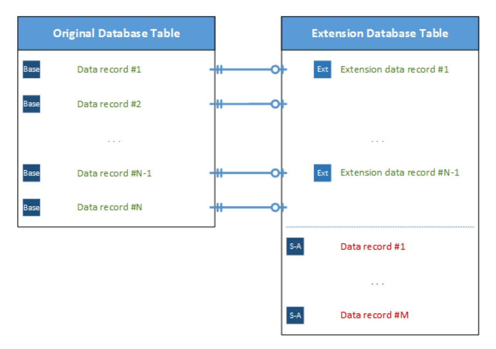

*Figure: Exploring data record synchronization when the Le Outer Join way is used*

#### **The Inner Join Way**

The *Inner Join* is the default way.

The following example shows the declaration of a DAC extension mapped to an extension table with the default *Inner Join* way.

```
[PXTable]
class InnerJoinTableExtension : PXCacheExtension<BaseDAC>
{
}
```

The *Inner Join* way:

- Can be used only when the original table and extension table are always synchronized.
- Causes an extension table record to be automatically created only when the appropriate original database table record is created.
- Requires the main key column values to be copied from the original table to each extension table.
- Excludes an original database table record from the result set when no corresponding extension table record is found.
- Can be used as a standalone DAC.

The sample code below shows the declaration of the InventoryItemTableExtension DAC extension, which is mapped to the extension table by using the default *Inner Join* way.

```
 public class InventoryItemTableExtension : PXCacheExtension<InventoryItem>
{
 #region ExtTableDescr
 public abstract class extTableDescr : PX.Data.IBqlField
 {
 }
 [PXDBString(255)]
 [PXDefault("Additional description")]
 [PXUIField(DisplayName = "Ext_Table Description")]
 public string ExtTableDescr { get; set; }
 #endregion
}
```

If you again open the Stock Items (IN202500) form, by clicking navigation buttons on the form toolbar of the Stock Items form, you will see that only one stock item is visible, and it has the modified **Ext\_Table Description**.

To have access to the other database table records, you need to populate the extension table with the appropriate records. You can do this by using the following script.

```
INSERT INTO [dbo].[InventoryItemTableExtension]
SELECT 
 CompanyID, 
 InventoryID, 
 0, 
 N'Additional description'
FROM [dbo].[InventoryItem]
WHERE NOT EXISTS
(
 SELECT * FROM [dbo].[InventoryItemTableExtension] AS t 
 WHERE t.CompanyID = [dbo].[InventoryItem].CompanyID 
 AND t.InventoryID = [dbo].[InventoryItem].InventoryID
)
GO
```

Aer you copy data records from the InventoryItem database table to the InventoryItemTableExtension user extension table, you will notice that all stock items are visible again.

When you use the *Inner Join* way, the data records within the base and extended tables must always be synchronized (see the screenshot below). With this way, data record synchronization works as follows:

- If an appropriate data record does not exist within an extension table when the system queries the original table, the system excludes the original table record from the result set.
- When a new record is inserted into the original table, the system automatically inserts a new record into the extension table.
- When the system updates the data record in the original table, it does not update the extension table if there are no modified fields of the DAC extension that is mapped to the extension table.
- When it deletes the original table data record, the system automatically deletes the appropriate data record from the extension table, if such a record exists.

To use the extension table independently from the original database table, you should declare a data view by using a DAC extension, which is mapped to an extension table, as the main DAC (for details, see the *The Left [Outer](#page-377-0) Join Way* section).

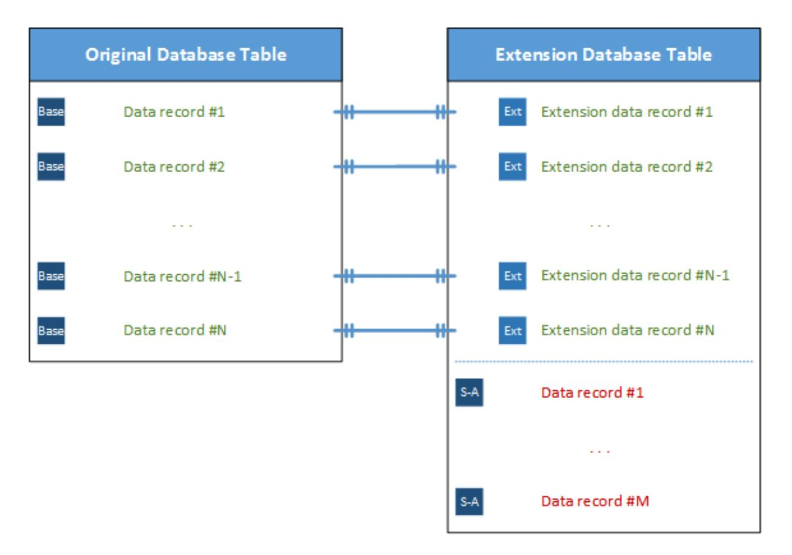

<span id="page-382-1"></span>*Figure: Exploring data record synchronization when you use the Inner Join way*

### <span id="page-382-0"></span>**To Add a Custom SQL Script to a Customization Project**

With the Acumatica Customization Platform, you can add to a customization project an SQL script to be executed during the publication of the project. However, we recommend that you avoid doing this.

A possible result of a custom SQL script is the loss of the integrity and consistency of the application data.

If you do add a custom SQL script, you must adhere to the following requirements for the script:

- Because Acumatica ERP supports multitenancy, you must create an SQL script that correctly creates a database object that properly specifies and uses the company mask.
- You must correctly specify the attributes for the script so that the script can be executed on the target database servers: MySQL Server, Microso SQL Server, or both. For details about attributes, see *[Using the](#page-191-0) [SQL Script Attributes](#page-191-0)*.

#### **To Add a Custom SQL Script to a Customization Project**

To add a custom SQL script, do the following:

- 1. Prepare, debug, and test the SQL script with a database administration tool, such as SQL Server Management Studio. (See *[Creating a Custom SQL Script](#page-190-0)* for details.)
- 2. Open the customization project in the Customization Project Editor.
- 3. In the navigation pane, click **DatabaseScripts** to open the Database Scripts page.

4. On the More menu (under **Actions**), click **Add Script**.

The *[Edit SQL Script Dialog Box](https://help-2025r1.acumatica.com/Help?ScreenId=ShowWiki&pageid=f7e4fcdf-02dd-4812-b561-1179da5dd30d)* opens.

- 5. In the **Script Name** box of the dialog box, specify the name of the script to be used as the object name of the customization item. (The name can contain only English characters and digits.)
- 6. Optional: In the **Priority** box, specify the priority of the script. By default, the priority is 0.
- 7. For each batch that you want to add, do the following:
  - a. Click **Specify Database Engine**, and in the **Attribute** box, select one of the following options:
    - *Skip Batch on MySQL Server*, which adds the --[mysql: Skip] attribute to the end of the text in the text area of the script editor.
    - *Skip Batch on Microso SQL Server*, which adds the --[mssql: Skip] attribute to the end of the text in the text area of the script editor.
    - *Use Interpreter*, which adds the --[VmSql] attribute to the end of the text in the text area of the script editor.

For more information on the database script attributes, see *[Using the SQL Script Attributes](#page-191-0)*.

- b. In the text area of the editor, below the added attribute, enter the SQL script.
- 8. In the editor, click **OK** to add the script to the customization project.

If a custom script causes an error, the error message will appear during the publication process when the system executes the custom scripts.

#### **Related Links**

- *[Creating a Custom SQL Script](#page-190-0)*
- *[Using the SQL Script Attributes](#page-191-0)*
- *[Writing Custom SQL Scripts for Interpretation](#page-192-0)*

# <span id="page-384-2"></span><span id="page-384-0"></span>**Integrating the Project Editor with Microso Visual Studio**

You do not need to install Microso Visual Studio to customize the Acumatica ERP UI or to develop a simple changes of business logic, because the platform includes the *[Customization](#page-42-2) Tools*, which are designed for these purposes and available in your web browser. However you can use Visual Studio to develop the customization code.

If you plan to use Visual Studio on the server that hosts the website of Acumatica ERP 2025 R1, the environment where you install and use Acumatica ERP should meet particular requirements, which are described in *[System](https://help-2025r1.acumatica.com/Help?ScreenId=ShowWiki&pageid=5cf164e5-889f-458b-8757-320c96598ab7) [Requirements for the Acumatica ERP Installation](https://help-2025r1.acumatica.com/Help?ScreenId=ShowWiki&pageid=5cf164e5-889f-458b-8757-320c96598ab7)*.

To use Visual Studio while customizing Acumatica ERP, you can select one of the following approaches:

- Create an *[Extension Library](#page-73-1)*, develop the customization code in Visual Studio, compile the DLL binary file within the Bin folder of the website, and add this custom file to the customization project
- Develop and debug the customization code of a customization project on the fly by using Visual Studio

This part of the guide describes the second approach, because the first one is obvious and does not require any integration between the Customization Project Editor and Visual Studio.

To use the second approach, you should perform the following steps each time you want to use Visual Studio to develop and debug the customization code on the fly:

- 1. In the *[Data Class](https://help-2025r1.acumatica.com/Help?ScreenId=ShowWiki&pageid=06c038a5-1d75-482b-9b17-f2483ada0154)*, create extensions for existing data access classes if required, as described in *To [Create](#page-326-1) a [DAC Extension](#page-326-1)*.
- 2. In the *[Code Editor](https://help-2025r1.acumatica.com/Help?ScreenId=ShowWiki&pageid=c2678973-d557-47d4-b8ee-9dd69f55b465)*, for business logic controllers, create new classes or class extensions that contain required code templates, as described in *To Create a [Custom](#page-346-2) Graph* and *To Start the [Customization](#page-342-1) of a [Graph](#page-342-1)*.
- 3. Publish the customization project to obtain the corresponding C# files within the App\_RuntimeCode website folder. (See *[Project Publication: General Information](#page-123-2)* for details.).
- 4. By using Visual Studio, develop, modify, and debug the customization code in these files on the fly. (See *[To](#page-385-2) [Debug the Customization Code](#page-385-2)* for details.)
- 5. In the Customization Project Editor, update the code in the customization project, as described in *[To](#page-389-3) [Synchronize Code Changes with the Customization Project](#page-389-3)*.

### <span id="page-384-3"></span><span id="page-384-1"></span>**To Work with a Code Item**

The *[Code Editor](https://help-2025r1.acumatica.com/Help?ScreenId=ShowWiki&pageid=c2678973-d557-47d4-b8ee-9dd69f55b465)* does not provide facilities you can use in Microso Visual Studio to develop and debug any source code in customization projects. To start working with a *Code* item in Visual Studio, perform the following instructions:

1. Publish the customization project, as described in *[Publishing Customization Projects](#page-120-2)*.

Aer you have published the customization project, the <CodeItemName>.cs file with the item code is placed in the App\_RuntimeCode folder of the website.

- 2. Launch Visual Studio.
- 3. To open the <CodeItemName>.cs file in Visual Studio, on the main menu, click **File > Open > File**, and select the file in the **Open File** dialog box, which opens.


If you need to debug the customization code, you have to open the website instead of the file. See *To Debug the [Customization](#page-385-2) Code* for details.

4. Aer you have finished editing the source code of the item, click**Save** to save your changes in the file.

Because the App\_RuntimeCode folder contains the customization code that is published, the changes in the file are immediately applied to the application instance.

5. Open or refresh the form that uses the code, to make sure that the business logic has been changed for the form.

If an error exists in the changed file, the website might be corrupted. You can recover the website, for example, in one of the following ways:

- Debug the code
- Undo the changes
- Publish the customization project again to update the files in the App\_RuntimeCode folder
- Delete the file from the App\_RuntimeCode folder
- 6. To update the *Code* item in the customization project, follow the instructions described in *To [Synchronize](#page-389-3) [Code Changes with the Customization Project](#page-389-3)*.

### <span id="page-385-0"></span>**To Work with Data Access Classes**

You can use Microso Visual Studio to work with a data access class (DAC) that has been added to a customization project.

A customization project can contain code for a DAC in the following item types (see *[Supported DAC Extension](#page-57-0) [Formats](#page-57-0)* for details):

- As a *DAC* item with XML data for an existing DAC
- As a *Code* item with the code of an existing DAC extension
- As a *Code* item with the code of a custom DAC
- In a *File* item that keeps a .dll file of the extension library that contains the binary code of a DAC extension or custom DAC

Once a customization project is published, you can use Visual Studio to develop, modify, and debug the customization code of a *Code* item on the fly. However, you cannot use this approach for a *DAC* item.

If you need to work in Visual Studio with the code of the DAC whose changeset is added to a customization project as a *DAC* item in XML format, perform the following actions:

- 1. Follow the instructions described in *To [Convert](#page-158-1) a DAC Item to a Code Item* to convert the item to the *Code* item.
- 2. Follow the instructions described in *To Work with a [Code](#page-384-3) Item* to change the code of the DAC extension.

### <span id="page-385-2"></span><span id="page-385-1"></span>**To Debug the Customization Code**

The *[Code Editor](https://help-2025r1.acumatica.com/Help?ScreenId=ShowWiki&pageid=c2678973-d557-47d4-b8ee-9dd69f55b465)* does not provide facilities you can use to debug a code item of a customization project. We recommend that you use Microso Visual Studio to develop and debug any source code in customization projects. To start debugging using in Visual Studio, you need to perform the following steps, which are described in greater detail below:

- 1. Install Acumatica Debugger Tools.
- 2. Configure the web.config file for your Acumatica ERP instance.
- 3. Perform the debugging.

#### **Install Acumatica Debugger Tools**

The Acumatica debugger tools are PDB files located in the Bin folder of the Acumatica ERP site folder.

The PDB files are copied to the Acumatica ERP/Files/Bin folder during the installation process if the **Install DebuggerTools** option is selected. If you have not selected this option during installation, you should remove Acumatica ERP and install it again with the **Install DebuggerTools** option selected. For details, see *[Acumatica ERP](https://help-2025r1.acumatica.com/Help?ScreenId=ShowWiki&pageid=8c7eb99e-31ca-4c1c-8f44-d6960080a450) Installation [On-Premises:](https://help-2025r1.acumatica.com/Help?ScreenId=ShowWiki&pageid=8c7eb99e-31ca-4c1c-8f44-d6960080a450) To Install the Acumatica ERP Tools (Optional)*.

Every time you install or upgrade any Acumatica ERP instance, the Acumatica ERP Configuration wizard copies data from the Acumatica ERP/Files/Bin folder to replace instance files. These files are not copied to any instance automatically. To be able to debug Acumatica ERP, you must have them in every instance that you need to debug.

To distribute PDB files, you can do one of the following:

- Install a new instance
- Upgrade an existing instance
- Copy files manually from Acumatica ERP/Files/Bin

If you want to copy files manually, note that the most important files are the following:

- PX.Data.pdb (PDB for PX.Data.dll), which contains the platform core code
- PX.Objects.pdb (PDB for PX.Objects.dll), which contains the Acumatica ERP business logic

DLLs and PDBs should be from the same version of Acumatica ERP, so you cannot copy PDB from 2020 R2 Update 8 to 2020 R2 update 9 and use it for debugging.

#### **Prepare the web.config File for Your Acumatica ERP Instance**

When the installation is finished and the instance is ready, you have to specify the debug option by doing the following:

- In the Acumatica ERP folder, open the web.config file (located in the root folder of the your instance) in a text editor.
- In the<system.web> tag of the file, locate the <compilation> element.
- Set the debug attribute of the element to *true* as follows.

<compilation debug="true" ...>


See *Debug mode in ASP.NET [applications](https://learn.microsoft.com/en-us/troubleshoot/developer/webapps/aspnet/site-behavior-performance/debug-mode-applications)* for details.

#### **Perform the Debugging**

To configure Visual Studio to debug the source code of Acumatica ERP, select**Tools > Options > Debugging > General**, and clear the **Enable Just My Code** check box.

To specify the path for PDB files, select**Tools > Options > Debugging > Symbols**, and add a path to your files (which is typically C:\\Program files\Acumatica ERP\Files\Bin).

To browse an existing *Code* item in Visual Studio, perform the following instructions:

- 1. Publish the customization project, as described in *[Publishing Customization Projects](#page-120-2)*.
- 2. Make sure your instance of Acumatica ERP is running by opening any page of the instance in a browser.
- 3. Launch Visual Studio as an administrator.

- 4. To open the website of your instance of Acumatica ERP in Visual Studio, on the main menu, click **File > Open > Web Site**, and select the website folder in the **Open Web Site** dialog box, which opens.
- 5. In the **Solution Explorer** of Visual Studio, expand the App\_RuntimeCode website folder, and double-click the file of the *Code* item to open it.

To debug customization code that has been added from the user interface, see *To [Move](#page-172-2) a Code Item to the [Extension Library](#page-172-2)*.

To start debugging an existing *Code* item in Visual Studio, do the following:

- 1. In the item source code, set a breakpoint on the line of the code where you need to stop the process for debugging.
- 2. On the main menu, click **Debug > Attach to Process**, and in the **Attach to Process** dialog box, which opens, select the w3wp.exe process in the list of **Available Processes**.


In the dialog box, ensure that the**Show processes from all users** check box is selected. If the check box is cleared, the list will not display the w3wp.exe process record.

- 3. In the browser, open the form of Acumatica ERP whose business logic code you want to debug.
- 4. In the browser, run an operation that invokes the fragment of the code that contains the breakpoint.

The process will be stopped at the breakpoint, and you can debug the code in Visual Studio.

### <span id="page-387-0"></span>**To View and Debug Acumatica ERP Source Code**

Acumatica ERP has open source code and you can easily view it with the Source Code browser. For details, see *[Source Code](https://help-2025r1.acumatica.com/Help?ScreenId=ShowWiki&pageid=2e58bb02-40c0-47c6-8cea-78607cccc4e1)* browser.

However, in some cases, for example, when you need to find a method to override, it is helpful to debug Acumatica ERP source code with breakpoints and see which breakpoint is hit in which scenario. To be able to debug Acumatica ERP code, you should configure your extension library in Visual Studio.

#### **Before You Proceed**

You can view and debug Acumatica ERP source code inside an extension library. Before you start configuring your extension library in Visual Studio, create it. For details, see *To Create an [Extension](#page-389-2) Library*.

#### **To Configure the Extension Library**

1. Check whether the Acumatica debugger tools are installed and remember their location.

The Acumatica debugger tools are PDB files located in the Bin folder of the Acumatica ERP site folder.

The PDB files are copied to the Acumatica ERP/Files/Bin folder during the installation process if the **Install DebuggerTools** option is selected. If you haven't selected this option during installation, you should remove Acumatica ERP and install it again with the **Install DebuggerTools** option selected. For details, see *Acumatica ERP Installation [On-Premises:](https://help-2025r1.acumatica.com/Help?ScreenId=ShowWiki&pageid=8c7eb99e-31ca-4c1c-8f44-d6960080a450) To Install the Acumatica ERP Tools (Optional)*.

Every time you install or upgrade any Acumatica ERP instance, the Acumatica ERP Configuration wizard copies data from the Acumatica ERP/Files/Bin folder to replace instance files. These files are not copied to any instance automatically. But to be able to debug Acumatica ERP, you must have them in every instance that you need to debug.

So to distribute these PDB files, you can do one of the following:

- Install a new instance
- Upgrade an existing instance

• Copy files manually from Acumatica ERP/Files/Bin

DLL and PDB files should be from the same version of Acumatica ERP.

- 2. Configure the web.config file of the instance by doing the following:
  - a. In the file system, open in the text editor the web.config file that is located in the root folder of the your instance.
  - b. In the <system.web> tag of the file, locate the <compilation> element.
  - c. Set the debug attribute of the element to *True*, as shown in the following code.

```
<system.web>
 <compilation debug="True" ...>
```

d. Save your changes.


Be careful with this option on production environment, as debug configuration can significantly slow down Acumatica ERP performance.

- 3. Configure the extension library by doing the following:
  - a. In Visual Studio, open the extension library.
  - b. In the main menu, select**Tools > Options**.
  - c. In the **Debugging > General** section, clear the **Enable Just My Code** check box.
  - d. In the **Debugging > Symbols** section, in the**Symbols file (.pdb) locations** list, add the path to the location of the PDB files which you discovered in instruction 1 of the step. For example,

C:\Program Files\Acumatica ERP\Files\Bin

e. Click **OK**.

#### **To Browse and Debug the Source Code**

Aer you have configured the extension library, you can view and debug source code of Acumatica ERP. Do the following:

1. Learn the full name of the graph in which the method you want to debug is located. It is shown in the **Graph Name** box of the Source Code Browser. For details, see *To [Explore](#page-20-1) the C# Code of a BLC*.

For example, suppose you want to debug the **Release** action of the Payments and Applications (AR302000) form. The full graph name is PX.Objects.AR.ARPaymentEntry.

- 2. Open Acumatica ERP source code files. All files are located in the <Site\_folder>/App\_Data/ CodeRepository folder. The CodeRepository.csproj Visual Studio project file which contains references to all of the source code files, is provided in the same folder for easier navigation of the source code. Open the CodeRepository.csproj project file in Visual Studio.
- 3. Navigate to the file with the code of the graph.

For the **Release** action of the Payments and Applications form, the graph is located in PX.Objects/AR/ ARPaymentEntry.cs.

- 4. Add a breakpoint inside the method you want to debug.
- 5. Attach the Visual Studio debugger to a running process.

To do that, on the main menu, click **Debug > Attach to Process**, and in the **Attach to Process** dialog box, which opens, select the w3wp.exe process in the list of **Available Processes**.


In the dialog box, ensure that the**Show processes from all users** check box is selected. If the check box is cleared, the list will not display the w3wp.exe process record.

6. In Acumatica ERP, open a form on which the method being debugged is called and perform actions to hit the added breakpoint.

### **Other Tips on Debugging Acumatica ERP Code**

Besides action methods like the ARPaymentEntry.Release method, you can debug event handlers implemented for attributes (located in the PX.Data namespace) and {Get; Set;} methods of DAC properties.

For debugging Acumatica ERP code, you can also use the following Visual Studio features:

- The Immediate Window where you can debug and evaluate expressions, execute statements, and print variable values. For details, see *[Immediate window](https://docs.microsoft.com/en-us/visualstudio/ide/reference/immediate-window?view=vs-2019)*.
- The Locals Window where you can see and edit variable values. For details, see *[Inspect variables in the Autos](https://docs.microsoft.com/en-us/visualstudio/debugger/autos-and-locals-windows?view=vs-2019) [and Locals windows](https://docs.microsoft.com/en-us/visualstudio/debugger/autos-and-locals-windows?view=vs-2019)*.
- The Call Stack window to view the method calls that are currently on the stack. For details, see *[View](https://docs.microsoft.com/en-us/visualstudio/debugger/how-to-use-the-call-stack-window?view=vs-2019) the call [stack and use the Call Stack window in the debugger](https://docs.microsoft.com/en-us/visualstudio/debugger/how-to-use-the-call-stack-window?view=vs-2019)*.

### <span id="page-389-3"></span><span id="page-389-0"></span>**To Synchronize Code Changes with the Customization Project**

When you create a *Code* item in a customization project, Acumatica Customization Platform performs the following actions:

- Saves the item content in the database as a *Code* item
- Adds the item ID to the customization project

When you publish the project, the platform creates the <CodeItemName>.cs file in the App\_RuntimeCode website folder of the current instance of Acumatica ERP.

If you use the *[Code Editor](https://help-2025r1.acumatica.com/Help?ScreenId=ShowWiki&pageid=c2678973-d557-47d4-b8ee-9dd69f55b465)* to modify a *Code* item and click**Save** on the page toolbar, the platform saves the changes only in the database. To update files in the App\_RuntimeCode folder, you have to publish the project again.

If you have modified the item code in Microso Visual Studio, you have to synchronize the changes with the item in the database. To do that, do the following:

• Follow the instructions described in *To [Update](#page-176-1) a File Item in a Project* to update files in the customization project.

For more information about the synchronization mechanism provided by the Acumatica Customization Platform, see *[Detecting the Project Items Modified in the File System](#page-177-0)*.

### <span id="page-389-2"></span><span id="page-389-1"></span>**To Create an Extension Library**

To develop customization code in an extension library, you should first create this extension library. This topic describes how to create the extension library using the Customization Project Editor.

#### **To Create an Extension Library**

1. On the main menu of the Customization Project Editor, click **Extension Library > Create New**.

The **Create Extension Library** dialog box opens.

- 2. Specify the location and name of the Visual Studio project that will contain the extension library.
- 3. Click **OK** to close the dialog box and start the process of creating the library.

During the process, Acumatica Customization Platform creates the following files in the folder specified in the dialog box.

| File                                                                    | Description                                                                                                                        |
|-------------------------------------------------------------------------|------------------------------------------------------------------------------------------------------------------------------------|
| <project_name>.sln</project_name>                                       | The Microsoft Visual Studio Solution file                                                                                          |
| Solution.bat                                                            | The Windows batch file to open the website solution in Microsoft Vi<br>sual Studio                                                 |
| Solution.lnk                                                            | The shortcut file to the project to open the website solution in Mi<br>crosoft Visual Studio                                       |
| folder.lnk                                                              | The shortcut file to the website folder                                                                                            |
| <project_name>/<br/><project_name>.csproj</project_name></project_name> | The Visual C# Project file                                                                                                         |
| <project_name>/Examples.cs</project_name>                               | The Visual C# Source file that contains examples of source code to<br>customize data access classes and business logic controllers |
| <project_name>/Proper<br/>ties/AssemblyInfo.cs</project_name>           | The Visual C# Source file that contains general information about the<br>assembly                                                  |

The platform also creates the OpenSolution.bat batch file, which is a copy of the Solution.bat file created in the solution project folder. Depending on the settings of your browser, the OpenSolution.bat file is saved either in the Downloads folder or in another location.

# <span id="page-390-0"></span>**Useful Tips**

Here are some tips and tools that you can use to simplify your development process.

#### **Organize team development**

If several developers are working on the customization project, it is important to organize a continuous team development. Here are several essential points for it:

- Organize a centralized source control, where all developers can push the work they've done. To integrate the changes into source control, you can use automation scripts.
- All developers should have a local version of Visual Studio, project's database and repository. This ensures independent development and debugging at all times.
- Every developer should have Acumatica ERP instance in the same directory and with the same name. This helps to maintain the same references of the extension library (DLL) to the project's /bin folder.
- All changes to the customization project and Acumatica ERP related development should be stored in the source control. Code should be stored as a part of Visual Studio project. UI, database, and data changes should be included into a customization project and also stored in source control.
- Developers may work on different features in separate branches and merge their work to the main branch only when the changes are completed and tested.

• You can do parts of continuous integration manually on your local machine and automatically on the build server from centralized repository.

### **Use Acuminator**

You can simplify customization development in Visual Studio by using Acuminator - a static code analysis and colorizer tool. Acuminator provides diagnostics and code fixes for common developer challenges related to Acumatica Framework. Also, Acuminator can colorize and format BQL statements, and can collapse attributes and parts of BQL queries.

To use Acuminator in Visual Studio:

1. Download Acuminator from *the Visual Studio [Marketplace](https://marketplace.visualstudio.com/items?itemName=Acumatica.Acuminator)*.

You get a Visual Studio extension installer (VSIX file).

2. Install Acuminator by launching the downloaded VSIX file.

Acuminator is ready for use. To check it, open your customization project in Visual Studio. BQL statements and DAC code Acumatica Framework should be highlighted.

# <span id="page-392-2"></span><span id="page-392-0"></span>**Integrating the Project Editor with a Version Control System**

If a customization task is large or complex or it is implemented by a group of developers, you might need to use a version control system for the customization project. The platform supports the integration of the *[Customization](https://help-2025r1.acumatica.com/Help?ScreenId=ShowWiki&pageid=0bb97781-e987-4039-962d-457720821bff) [Project Editor](https://help-2025r1.acumatica.com/Help?ScreenId=ShowWiki&pageid=0bb97781-e987-4039-962d-457720821bff)* with a version control system.

The Customization Project Editor includes the**Source Control** menu, which contains the following commands to integrate the editor with a version control system:

- **Save Project to Folder**: Saves the customization project as a set of files to a local folder that is used for integration with a source control system. When you invoke this action, the system opens the**Save Project to Folder** dialog box so that you can select the name and location of the folder inside a repository.
- **Open Project from Folder**: Loads the customization project from the repository.

For detailed information on integrating the editor with a version control system, see the following topics:

- *To Save a [Project](#page-392-3) to a Local Folder*
- *To Update the [Content](#page-394-2) of a Project from a Local Folder*
- *To Integrate the [Customization](#page-394-3) Project Editor with Source Control*

## <span id="page-392-3"></span><span id="page-392-1"></span>**To Save a Project to a Local Folder**

You can save a customization project as set of files to a local folder that can be used for integration with a source control system. To do this, perform the following actions:

- 1. Open the project in the *[Customization Project Editor](https://help-2025r1.acumatica.com/Help?ScreenId=ShowWiki&pageid=0bb97781-e987-4039-962d-457720821bff)*.
- 2. On the editor menu, click**Source Control > Save Project to Folder**.
- 3. In the **Save Project to Folder** dialog box, which opens, do the following:
  - a. In the **Parent Folder** selector, select the parent folder.
  - b. In the **Project Name** box, specify the name of the new folder to be used as the project storage.
- 4. Click **OK**.

Within the selected parent folder, the platform creates the folder with the project name that you have specified. This folder includes at least the \_project subfolder that contains an XML file for each item of the project, as the following screenshot shows.

|                               | « Repository ▶ CustomizationProjects ▶ YogiFon ▶                                          | _project        | $-14$           | Search_project                           |                  |
|-------------------------------|-------------------------------------------------------------------------------------------|-----------------|-----------------|------------------------------------------|------------------|
| Organize $\blacktriangledown$ | Include in library $\blacktriangledown$<br>Share with $\blacktriangledown$<br><b>Burn</b> | New folder      |                 | 鼯 ▼                                      | $\mathbf \Omega$ |
| Devi <sup>A</sup>             | ∞<br>Name                                                                                 | Date modified   | Type            | <b>Size</b>                              |                  |
| inetp                         | ⋍<br>Code_CUDetailsIng.xml                                                                | 24-May-16 12:41 | <b>XML File</b> | <b>5 KB</b>                              |                  |
| Intel                         | Code CustomerMaint.xml                                                                    | 24-May-16 12:41 | <b>XML File</b> | 3 KB                                     |                  |
| <b>MSO</b>                    | Code_InventoryItemMaint.xml                                                               | 24-May-16 12:41 | <b>XML File</b> | 1 KB                                     |                  |
| mult                          | Code_SOInvoiceEntry.xml                                                                   | 24-May-16 12:41 | <b>XML File</b> | 3 KB                                     |                  |
| My                            | Code_SOOrderEntry.xml                                                                     | 24-May-16 12:41 | <b>XML File</b> | 4 KB                                     |                  |
| <b>MyTe</b>                   | Contact.xml                                                                               | 24-May-16 12:41 | <b>XML File</b> | 1 KB                                     |                  |
| <b>PDFE</b>                   | GenericInquiryScreen_Active_Contracts.xml                                                 | 24-May-16 12:41 | <b>XML File</b> | <b>11 KB</b>                             |                  |
| PerfL                         | pages_ar_ar302000_aspx.xml                                                                | 24-May-16 12:41 | <b>XML File</b> | 12 KB                                    |                  |
| Prog                          | pages_ar_ar303000_aspx.xml                                                                | 24-May-16 12:41 | <b>XML File</b> | 14 KB                                    |                  |
| Prog                          | ≘<br>pages_so_so303000_aspx.xml                                                           | 24-May-16 12:41 | <b>XML File</b> | 12 KB                                    |                  |
| Prog                          | ≘<br>pages_yf_yf401000_aspx.xml                                                           | 24-May-16 12:41 | <b>XML File</b> | 2 KB                                     |                  |
| Repo                          | ≘<br>PX_Objects_AR_ARTran.xml                                                             | 24-May-16 12:41 | <b>XML File</b> | 2 KB                                     |                  |
| Repo<br>L.                    | PX_Objects_CR_CaseFilter.xml                                                              | 24-May-16 12:41 | <b>XML File</b> | 1 KB                                     |                  |
| sysin                         | ≘<br>PX_Objects_CR_Contact.xml                                                            | 24-May-16 12:41 | <b>XML File</b> | 2 KB                                     |                  |
| Tem                           | ⊟<br>PX_Objects_SO_SOOrder.xml                                                            | 24-May-16 12:41 | <b>XML File</b> | 1 <sub>KB</sub>                          |                  |
| Train $\equiv$                | ⊟<br>REPORT_AR650660_RPX.xml                                                              | 24-May-16 12:41 | <b>XML File</b> | !!!!!!!!!!!!!!!!!!!!!!!!!!!!!!!!!!!!!!!! |                  |
| User:                         | E<br>SiteMapNode_7ebbbe7a_3e03_4af4_8ba                                                   | 24-May-16 12:41 | <b>XML File</b> | 1 KB                                     |                  |
| <b>Winc</b>                   | ₽<br>SiteMapNode_b1704698_afc4_4087_b77                                                   | 24-May-16 12:41 | <b>XML File</b> | 1 KB                                     |                  |
| Devs (                        | E<br>SiteMapNode_c694bf67_5984_457c_8a4f                                                  | 24-May-16 12:41 | <b>XML File</b> | 1 <sub>KB</sub>                          |                  |
| $\blacktriangleright$ TW (T:  | SiteMapNode_e015faf1_424d_474a_9b00                                                       | 24-May-16 12:41 | <b>XML File</b> | 1 KB                                     |                  |
| Builds                        | ₽<br>SOOrder.xml                                                                          | 24-May-16 12:41 | <b>XML File</b> | 1 KB                                     |                  |
| Share                         | XportScenario_Contract_Usage.xml                                                          | 24-May-16 12:41 | <b>XML File</b> | 5 KB                                     |                  |

#### *Figure: Viewing the content of the .project folder*

If the customization project contains custom files, the platform keeps the paths to these files. Therefore, the project folder includes the corresponding folders for these custom files, as shown in the following screenshot.

|                                 |                                                        |                                                                            |                 |             | $=$ $\Box$     | $\mathbf{x}$ |
|---------------------------------|--------------------------------------------------------|----------------------------------------------------------------------------|-----------------|-------------|----------------|--------------|
| «                               | Repository ▶ CustomizationProjects ▶ YogiFon ▶         |                                                                            |                 | $++$<br>▾∣  | Search YogiFon | م            |
| Organize $\blacktriangledown$   | <b>Open</b>                                            | Include in library $\blacktriangledown$<br>Share with $\blacktriangledown$ | Burn            | New folder  | 體 ▼            | $\mathbf Q$  |
| $\blacksquare$ Perfl $\uparrow$ | Name                                                   | ≖                                                                          | Date modified   | <b>Type</b> | <b>Size</b>    |              |
| Prog                            | _project                                               |                                                                            | 24-May-16 16:17 | File folder |                |              |
| Prog<br>Prog                    | App_Data                                               |                                                                            | 24-May-16 12:41 | File folder |                |              |
| $\blacksquare$ Repc             | <b>Bin</b>                                             |                                                                            | 24-May-16 12:41 | File folder |                |              |
| $Rec_{\equiv}$                  | Pages                                                  |                                                                            | 24-May-16 12:41 | File folder |                |              |
| sysin                           |                                                        |                                                                            |                 |             |                |              |
| Tem                             |                                                        |                                                                            |                 |             |                |              |
| <b>Train</b>                    |                                                        |                                                                            |                 |             |                |              |
|                                 | _project Date modified: 24-May-16 16:17<br>File folder |                                                                            |                 |             |                |              |

<span id="page-394-2"></span>*Figure: Viewing the folders inside the project folder*

### <span id="page-394-0"></span>**To Update the Content of a Project from a Local Folder**

If you have saved a customization project to a local folder by invoking the**Source Control > Save Project to Folder** command of the *[Customization Project Editor](https://help-2025r1.acumatica.com/Help?ScreenId=ShowWiki&pageid=0bb97781-e987-4039-962d-457720821bff)*, you can update the content of the project that is currently opened in the editor with the data from the folder.

To do this, perform the following actions:

- 1. On the editor menu, click**Source Control > Open Project from Folder**.
- 2. In the **Containing Folder** box of the **Open Project from Folder** dialog box, which opens, select the local folder that contains the files of the needed customization project.


If the folder is empty, the content of the project in the database is cleared.

3. Click **OK**.

### <span id="page-394-3"></span><span id="page-394-1"></span>**To Integrate the Customization Project Editor with Source Control**

To start tracking changes in a customization project by using source control, perform the following actions:

- 1. Configure Visual Studio to use source control.
- 2. In Visual Studio, do the following:
  - a. Open your customization project, and add it to the source control.
  - b. Sync your project with the latest server version.

Before starting the project development, you have to do the following each time:

- 1. Get the latest version of the customization project from the server.
- 2. Load the project from the local storage, as described in *To Update the [Content](#page-394-2) of a Project from a Local [Folder](#page-394-2)*.

Aer the project has been modified, you have to do the following:

- 1. Update the project in the local storage, as described in *To Save a [Project](#page-392-3) to a Local Folder*.
- 2. Check in the changes to the server.

#### **Related Links**

• *Use Team [Foundation](https://docs.microsoft.com/en-us/vsts/tfvc/overview?view=vsts) Version Control*

# <span id="page-396-3"></span><span id="page-396-0"></span>**Troubleshooting Customization**

This part is intended to describe how to solve issues that occur while you are developing or applying a customization. It will be under ongoing development to cover all the approaches and ways required to solve each typical issue that is result of an error in customization or a misunderstanding of the platform features.

#### **Related Links**

• *[Troubleshooting](https://help-2025r1.acumatica.com/Help?ScreenId=ShowWiki&pageid=13eeac71-6c88-462b-a645-514422054d70) Acumatica ERP*

### <span id="page-396-1"></span>**To Discover the Method That Has Thrown an Exception**

If an exception has occurred at run time and a message box with an error or a warning has been displayed on the form, you can easily discover the method that has thrown the exception. To do this, perform the following actions:

- 1. Read the message, and close the message box.
- 2. On the title bar of an Acumatica ERP form, click**Tools > Trace**.
- 3. On the Acumatica Trace page, which opens to display the trace log, find the appropriate error message, and click the arrow le of the **Details** label for the message to show the detailed information on the error.

In the list of the method calls that were on the stack at the moment of the error, the upper method is the one that threw the exception.

By default, the trace log is stored on the Acumatica ERP server for the current user session. If the user opens two Acumatica ERP forms simultaneously in two tabs or windows of a browser, the Acumatica ERP server creates a subsession for each opened form and stores the trace logs separately for each subsession. Aer a session or subsession of the user is completed (due to the user logging off or being timed out), the server clears the appropriate log.

To save the trace logs of all subsessions of all users in a single file on the server, a user with the *Administrator* role has to change the web.config file of the Acumatica ERP instance to configure the appropriate trace provider. See the *Trace* section of *[Using Logs](https://help-2025r1.acumatica.com/Help?ScreenId=ShowWiki&pageid=36e00e6e-4cdb-4cc9-a16f-9fc2c295bd4e)* for details.

### <span id="page-396-2"></span>**To Write to the Trace Log from the Code**

When you are developing and troubleshooting the customization code, you may need to know what happens during code execution (for example, an action being called or an event being raised). You can write information to the trace log directly from your code by using one of the following approaches:

- Using the methods of the ILogger<T> interface, which is provided by Microso
- Using the methods of the PXTrace static class

By default, the trace log is stored on the Acumatica ERP server for the current user session. If the user opens two Acumatica ERP forms simultaneously in two tabs or windows of a browser, the Acumatica ERP server creates a subsession for each opened form and stores the trace logs separately for each subsession. Aer a session or subsession of the user is completed (due to the user logging off or being timed out), the server clears the appropriate log.

To save the trace logs of all subsessions of all users in a single file on the server, a user with the *Administrator* role has to change the web.config file of the Acumatica ERP instance to configure the appropriate trace provider. See the *Trace* section of *[Using Logs](https://help-2025r1.acumatica.com/Help?ScreenId=ShowWiki&pageid=36e00e6e-4cdb-4cc9-a16f-9fc2c295bd4e)* for details.

A user can see the log message in the trace log if the user clicks**Tools > Trace** on the form title bar aer the corresponding logic has been executed.

#### **Writing to the Trace Log by Using the Methods of ILogger<T>**

Acumatica ERP supports the logging mechanism provided by the Microsoft.Extensions.Logging.Abstractions NuGet package. You can use this mechanism in custom code to write to the trace log.

To use this mechanism, you should do the following:

- 1. Install the Microsoft.Extensions.Logging.Abstractions NuGet package to the Visual Studio project that contains custom code.
- 2. Add the following using directive to the code file that contains the logic for which you need to write to the log.

```
using Microsoft.Extensions.Logging;
```

3. In the graph that executes the logic, add a property of the ILogger<T> type, and assign the InjectDependency attribute to the property, as shown in the following example. Use the graph as the type parameter.


```
public class RSSVWorkOrderEntry : PXGraph<RSSVWorkOrderEntry, RSSVWorkOrder>
{
 //Other code of the graph
 //The logger
 [InjectDependency]
 private ILogger<RSSVWorkOrderEntry> MyLogger { get; set; }
}
```

4. In the code for which you need to write to the log, such as in an action of the graph, call the methods of the ILogger<T> interface to write to the trace log. For details about the methods of the interface, see *[ILogger<TCategoryName> Interface](https://docs.microsoft.com/en-us/dotnet/api/microsoft.extensions.logging.ilogger-1?view=dotnet-plat-ext-3.1)* in the Microso documentation. The following example shows the call of the LogInformation method.

```
public class RSSVWorkOrderEntry : PXGraph<RSSVWorkOrderEntry, RSSVWorkOrder>
{
 //Other code of the graph
 //The logger
 [InjectDependency]
 private ILogger<RSSVWorkOrderEntry> MyLogger { get; set; }
 //A method in the graph
 public void AssignOrder(RSSVWorkOrder order)
 {
 //Implementation of the method
 //Writing to the log
 MyLogger.LogInformation(
 "The {OrderNbr} work order has been assigned.", order.OrderNbr);
 }
```

```
}
        Do not use string formatting inside the log messages, as is shown in the following code
        example.
         MyLogger.LogInformation(
          string.Format("The {0} work order has been assigned.",
          order.OrderNbr));
         MyLogger.LogInformation(
          $"The {order.OrderNbr} work order has been assigned."));
```

### **Writing to the Trace Log by Using the Methods of PXTrace**

You can write information to the trace log directly from your code by using the following methods of the PXTrace static class:

- public static void WriteError(string message)
- public static void WriteError(Exception e)
- public static void WriteWarning(string message)
- public static void WriteWarning(Exception e)
- public static void WriteInformation(string message)
- public static void WriteInformation(Exception e)
- public static void WriteVerbose(string message)

To manage writing information to the trace log, you can use the following methods of the PXTrace static class:

• public static Serilog.ILogger WithStack()

By default, the stack trace is not collected so that the project does not impair system performance. To turn on the collection of the stack trace, call the WithStack method, as the following code example shows. Note that in the presented code, the stack trace is collected only if the appropriate logging level has been set up.

```
PXTrace.WithStack().Information("some info");
```

• public static Serilog.ILogger WithSourceLocation()

To use the WithStack and WithSourceLocation methods, you must include the external Serilog library. We recommend that you use the Serilog library located in the Bin folder of Acumatica ERP.

The WithStack and WithSourceLocation methods can be chained with Serilog.ILogger methods.

### **Adding a Log Method to the Published Customization Code**

If you want to avoid changes in the customization project, you can add this method to the customization code that has already been applied to the application instance. To do this, perform the following actions:

- 1. Make sure that the customization project that contains the code you are debugging has been published. If the project is unpublished, publish it, as described in *[Publishing Customization Projects](#page-120-2)*.
- 2. Launch Microso Visual Studio.
- 3. In Visual Studio, open the file with the code that is currently saved in the App\_RuntimeCode website folder.

- 4. Add a call of one of the methods listed above to the appropriate code sample.
- 5. Save your changes to the file.
- 6. In the browser, open or refresh the form that you are troubleshooting.
- 7. On the form, perform the sequence of actions that invokes the changed code.
- 8. Click **Tools > Trace** to open the Acumatica Trace page.
- 9. On the page, explore the trace log to make sure that the changed code sample has been executed.

When you publish or export the project, the Acumatica Customization Platform compares the code in the App\_RuntimeCode website folder with the appropriate code in the database and discovers the files that have been changed in the file system. If a modified file is found, there is a conflict, and the platform opens the **Modified Files Detected** dialog box, in which you can direct the system to update the files in the project or discard the changes. See *[Detecting the Project Items Modified in the](#page-177-0) [File System](#page-177-0)* for details.

#### **Specifying the Logging Level**

Events that you log in code have different logging levels. You can specify a logging level in web.config so that only events up to that level will be logged. You set up the logging level by using the following settings in the web.config file:

- system.web/pxtrace/@minimumLevel: An indicator of the overall minimum level of severity of events that can be logged by the providers defined in the pxtrace section.
- system.web/pxtrace/add/@minimumLevel: An indicator of the minimum level of severity of events that a particular provider in the pxtrace section must log. For example, you can specify a different level of severity for a provider that saves log messages to a file.

The logging levels are the following: Fatal, Error, Warning, Information, Debug, Verbose. By default, the Verbose level is specified.

### <span id="page-399-0"></span>**To Log All Exceptions to a File**

Acumatica ERP provides a mechanism you can use for catching and logging all exceptions in the system. (See the *First-Chance Exception Log* section of *[Using Logs](https://help-2025r1.acumatica.com/Help?ScreenId=ShowWiki&pageid=36e00e6e-4cdb-4cc9-a16f-9fc2c295bd4e)* for details.) If you have been assigned the *Administrator* role, you can activate this mechanism and specify the name of the log file. To do this, perform the following actions:

- 1. In the file system, open in a text editor the web.config file located in the website folder.
- 2. Within the <appSettings> tag of the file, turn on the EnableFirstChanceExceptionsLogging key, as follows.

<add key="EnableFirstChanceExceptionsLogging" value="True" />

3. If you need to change the log file name, which is firstchanceexceptions.log by default, you can specify the needed name in the FirstChanceExceptionsLogFileName key, as follows.

<add key="FirstChanceExceptionsLogFileName" value="MyLog.log" />


By default, the first-chance exception log file is saved in the App\_Data folder of the website.

You can open the log file in a text editor to view the content of the first-change exception log, as the following screenshot shows.

| المالد<br>firstchanceexceptions.log - Notepad                                                                                                                                                                                                                                                                                                                                                                                                                                                                                                                                                                                                                                                                                                                                                                                                                                                                                                                                                                                                                                                                                                                                                                                                                                                                                                                                                                                                                                                                                                                                                                                                                                                                                                                                                                |
|--------------------------------------------------------------------------------------------------------------------------------------------------------------------------------------------------------------------------------------------------------------------------------------------------------------------------------------------------------------------------------------------------------------------------------------------------------------------------------------------------------------------------------------------------------------------------------------------------------------------------------------------------------------------------------------------------------------------------------------------------------------------------------------------------------------------------------------------------------------------------------------------------------------------------------------------------------------------------------------------------------------------------------------------------------------------------------------------------------------------------------------------------------------------------------------------------------------------------------------------------------------------------------------------------------------------------------------------------------------------------------------------------------------------------------------------------------------------------------------------------------------------------------------------------------------------------------------------------------------------------------------------------------------------------------------------------------------------------------------------------------------------------------------------------------------|
| File Edit Format View Help                                                                                                                                                                                                                                                                                                                                                                                                                                                                                                                                                                                                                                                                                                                                                                                                                                                                                                                                                                                                                                                                                                                                                                                                                                                                                                                                                                                                                                                                                                                                                                                                                                                                                                                                                                                   |
| -----------------<br>Feb/22 13:38:24.3731<br>System.Reflection.ReflectionTypeLoadException: Unable to load one or more of the requested types. Retrieve the LoaderExceptions<br>at System.Reflection.RuntimeModule.GetTypes(RuntimeModule module)<br>at System.Reflection.RuntimeAssembly.get_DefinedTypes()                                                                                                                                                                                                                                                                                                                                                                                                                                                                                                                                                                                                                                                                                                                                                                                                                                                                                                                                                                                                                                                                                                                                                                                                                                                                                                                                                                                                                                                                                                 |
| Loader exceptions:                                                                                                                                                                                                                                                                                                                                                                                                                                                                                                                                                                                                                                                                                                                                                                                                                                                                                                                                                                                                                                                                                                                                                                                                                                                                                                                                                                                                                                                                                                                                                                                                                                                                                                                                                                                           |
| System.IO.FileLoadException: Could not load file or assembly 'System.Web.Mvc, Version=1.0.0.0, Culture=neutral, PublicKeyToken=<br>File name: 'System.Web.Myc. Version=1.0.0.0. Culture=neutral. PublicKeyToken=31bf3856ad364e35'                                                                                                                                                                                                                                                                                                                                                                                                                                                                                                                                                                                                                                                                                                                                                                                                                                                                                                                                                                                                                                                                                                                                                                                                                                                                                                                                                                                                                                                                                                                                                                            |
| WRN: Assembly binding logging is turned OFF.<br>To enable assembly bind failure logging, set the registry value [HKLM\Software\Microsoft\Fusion!EnableLog] (DWORD) to 1.<br>Note: There is some performance penalty associated with assembly bind failure logging.<br>To turn this feature off, remove the registry value [HKLM\Software\Microsoft\Fusion!EnableLog].                                                                                                                                                                                                                                                                                                                                                                                                                                                                                                                                                                                                                                                                                                                                                                                                                                                                                                                                                                                                                                                                                                                                                                                                                                                                                                                                                                                                                                        |
| at PX Data PXFirstChanceExceptionLogger.a(Object A_0, FirstChanceExceptionEventArgs A_1)<br>lStack trace:<br>at System.Reflection.RuntimeModule.GetTypes(RuntimeModule module)<br>at System.Reflection.RuntimeAssembly.get_DefinedTypes()<br>at Autofac.Util.AssemblyExtensions.GetLoadableTypes(Assembly assembly)<br>at System Ling. Enumerable. <selectmanyiterator>d_16 2. MoveNext()<br/>at System.Ling.Enumerable.WhereEnumerableIterator'1.MoveNext()<br/>at Autofac Features Scanning ScanningRegistrationExtensions ScanTypes (IEnumerable 1 types, IComponentRegistry cr, IRegistrat<br/>at Autofac.ContainerBuilder.Build(IComponentRegistry componentRegistry, Boolean excludeDefaultModules)<br/>at Autofac.ContainerBuilder.Build(ContainerBuildOptions options)<br/>at Autofac.ModuleRegistrationExtensions.RegisterAssemblyModules(IModuleRegistrar registrar, Type moduleType, Assembly[] asser<br/>at PX.Data.DependencyInjection.CompositionRoot.CreateContainer()<br/>at ASP.global_asax.Application_Start(Object sender, EventArgs e)<br/>at System.RuntimeMethodHandle.InvokeMethod(Object target, Object[] arguments, Signature sig, Boolean constructor)<br/>at System.Reflection.RuntimeMethodInfo.UnsafeInvokeInternal(Object obj, Object[] parameters, Object[] arguments)<br/>at System Reflection RuntimeMethodInfo Invoke(Object obj, BindingFlags invokeAttr, Binder binder, Object[] parameters, Cultu<br/>at System.Reflection.MethodBase.Invoke(Object obj, Object[] parameters)<br/>at System.Web.HttpApplication.InvokeMethodWithAssert(MethodInfo method, Int32 paramCount, Object eventSource, EventArgs event<br/>at System.Web.HttpApplication.ProcessSpecialRequest(HttpContext context, MethodInfo method, Int32 paramCount, Object eventSol-</selectmanyiterator> |
| HL.                                                                                                                                                                                                                                                                                                                                                                                                                                                                                                                                                                                                                                                                                                                                                                                                                                                                                                                                                                                                                                                                                                                                                                                                                                                                                                                                                                                                                                                                                                                                                                                                                                                                                                                                                                                                          |
|                                                                                                                                                                                                                                                                                                                                                                                                                                                                                                                                                                                                                                                                                                                                                                                                                                                                                                                                                                                                                                                                                                                                                                                                                                                                                                                                                                                                                                                                                                                                                                                                                                                                                                                                                                                                              |

<span id="page-400-1"></span>*Figure: Viewing the first-chance exception log*

### <span id="page-400-0"></span>**To Debug the Customization Code**

The *[Code Editor](https://help-2025r1.acumatica.com/Help?ScreenId=ShowWiki&pageid=c2678973-d557-47d4-b8ee-9dd69f55b465)* does not provide facilities you can use to debug a code item of a customization project. We recommend that you use Microso Visual Studio to develop and debug any source code in customization projects. To start debugging using in Visual Studio, you need to perform the following steps, which are described in greater detail below:

- 1. Install Acumatica Debugger Tools.
- 2. Configure the web.config file for your Acumatica ERP instance.
- 3. Perform the debugging.

#### **Install Acumatica Debugger Tools**

The Acumatica debugger tools are PDB files located in the Bin folder of the Acumatica ERP site folder.

The PDB files are copied to the Acumatica ERP/Files/Bin folder during the installation process if the **Install DebuggerTools** option is selected. If you have not selected this option during installation, you should remove Acumatica ERP and install it again with the **Install DebuggerTools** option selected. For details, see *[Acumatica ERP](https://help-2025r1.acumatica.com/Help?ScreenId=ShowWiki&pageid=8c7eb99e-31ca-4c1c-8f44-d6960080a450) Installation [On-Premises:](https://help-2025r1.acumatica.com/Help?ScreenId=ShowWiki&pageid=8c7eb99e-31ca-4c1c-8f44-d6960080a450) To Install the Acumatica ERP Tools (Optional)*.

Every time you install or upgrade any Acumatica ERP instance, the Acumatica ERP Configuration wizard copies data from the Acumatica ERP/Files/Bin folder to replace instance files. These files are not copied to any instance automatically. To be able to debug Acumatica ERP, you must have them in every instance that you need to debug.

To distribute PDB files, you can do one of the following:

- Install a new instance
- Upgrade an existing instance
- Copy files manually from Acumatica ERP/Files/Bin

If you want to copy files manually, note that the most important files are the following:

• PX.Data.pdb (PDB for PX.Data.dll), which contains the platform core code

• PX.Objects.pdb (PDB for PX.Objects.dll), which contains the Acumatica ERP business logic

DLLs and PDBs should be from the same version of Acumatica ERP, so you cannot copy PDB from 2020 R2 Update 8 to 2020 R2 update 9 and use it for debugging.

#### **Prepare the web.config File for Your Acumatica ERP Instance**

When the installation is finished and the instance is ready, you have to specify the debug option by doing the following:

- In the Acumatica ERP folder, open the web.config file (located in the root folder of the your instance) in a text editor.
- In the<system.web> tag of the file, locate the <compilation> element.
- Set the debug attribute of the element to *true* as follows.

<compilation debug="true" ...>


See *Debug mode in ASP.NET [applications](https://learn.microsoft.com/en-us/troubleshoot/developer/webapps/aspnet/site-behavior-performance/debug-mode-applications)* for details.

#### **Perform the Debugging**

To configure Visual Studio to debug the source code of Acumatica ERP, select**Tools > Options > Debugging > General**, and clear the **Enable Just My Code** check box.

To specify the path for PDB files, select**Tools > Options > Debugging > Symbols**, and add a path to your files (which is typically C:\\Program files\Acumatica ERP\Files\Bin).

To browse an existing *Code* item in Visual Studio, perform the following instructions:

- 1. Publish the customization project, as described in *[Publishing Customization Projects](#page-120-2)*.
- 2. Make sure your instance of Acumatica ERP is running by opening any page of the instance in a browser.
- 3. Launch Visual Studio as an administrator.
- 4. To open the website of your instance of Acumatica ERP in Visual Studio, on the main menu, click **File > Open > Web Site**, and select the website folder in the **Open Web Site** dialog box, which opens.
- 5. In the **Solution Explorer** of Visual Studio, expand the App\_RuntimeCode website folder, and double-click the file of the *Code* item to open it.

To debug customization code that has been added from the user interface, see *To [Move](#page-172-2) a Code Item to the [Extension Library](#page-172-2)*.

To start debugging an existing *Code* item in Visual Studio, do the following:

- 1. In the item source code, set a breakpoint on the line of the code where you need to stop the process for debugging.
- 2. On the main menu, click **Debug > Attach to Process**, and in the **Attach to Process** dialog box, which opens, select the w3wp.exe process in the list of **Available Processes**.


In the dialog box, ensure that the**Show processes from all users** check box is selected. If the check box is cleared, the list will not display the w3wp.exe process record.

- 3. In the browser, open the form of Acumatica ERP whose business logic code you want to debug.
- 4. In the browser, run an operation that invokes the fragment of the code that contains the breakpoint.

The process will be stopped at the breakpoint, and you can debug the code in Visual Studio.

### <span id="page-402-0"></span>**To Validate a BQL Statement**

Suppose that you have a BQL statement in the customization code that does not work properly or you want to make sure that a BQL statement is correctly converted into an SQL query. To validate the BQL statement, you can use the Request Profiler.

To do this, perform the following actions:

- 1. In the browser, open the form that uses the customization code with the BQL statement.
- 2. Click **Tools > Profiler** on the form title bar, and click**Start Logging** in the **Profiler** dialog box, which opens. The *[Request Profiler](https://help-2025r1.acumatica.com/Help?ScreenId=ShowWiki&pageid=e7612f3f-fc6f-494d-8532-cc2ceef7147b)* starts logging URL requests, SQL queries, exceptions, and warnings and errors.
- 3. On this form, perform the action that executes the BQL statement.
- 4. Click **Tools > Profiler** on the form title bar, and click**Stop and Export** in the **Profiler** dialog box. The *[Request Profiler](https://help-2025r1.acumatica.com/Help?ScreenId=ShowWiki&pageid=e7612f3f-fc6f-494d-8532-cc2ceef7147b)* returns to the default monitoring and exports a ZIP archive with the log files that contain information in JSON format about the performed URL requests, SQL requests, and stack trace.
- 5. On the form toolbar of the *[Request Profiler](https://help-2025r1.acumatica.com/Help?ScreenId=ShowWiki&pageid=e7612f3f-fc6f-494d-8532-cc2ceef7147b)* (SM205070) form, click **Refresh Results** to refresh the log tables.
- 6. On the **SQL** tab, in the list of SQL queries, find the SQL query that corresponds to the BQL statement.


Because you know the name of the table that you are using in the BQL statement, you can specify the name as a filter in the**Tables** column of the**SQL** tab.

- 7. Click the link in the **Statement ID** column for the SQL query you have found. The**SQL Details** dialog box opens.
- 8. In the bottom pane of the dialog box, view the SQL statement, and validate the BQL statement used in the customization code.
- 9. Close the dialog box.
- 10.On the form toolbar of the *[Request Profiler](https://help-2025r1.acumatica.com/Help?ScreenId=ShowWiki&pageid=e7612f3f-fc6f-494d-8532-cc2ceef7147b)* form, click **Clear Log** to delete the SQL request data from the database.

### <span id="page-402-1"></span>**To Measure the Execution Time of a BQL Statement**

Suppose that in the customization code, you have a BQL statement that can affect system performance. To measure the execution time of the BQL statement, you can use the Request Profiler.

To do this, perform the following actions:

- 1. In the browser, open the form that uses the customization code with the BQL statement.
- 2. Click **Tools > Profiler** on the form title bar, and click**Start Logging** in the **Profiler** dialog box, which opens. The *[Request Profiler](https://help-2025r1.acumatica.com/Help?ScreenId=ShowWiki&pageid=e7612f3f-fc6f-494d-8532-cc2ceef7147b)* starts logging URL requests, SQL queries, exceptions, and warnings and errors.
- 3. On this form, perform the action that executes the BQL statement.
- 4. Click **Tools > Profiler** on the form title bar, and click**Stop and Export** in the **Profiler** dialog box. The *[Request Profiler](https://help-2025r1.acumatica.com/Help?ScreenId=ShowWiki&pageid=e7612f3f-fc6f-494d-8532-cc2ceef7147b)* returns to the default monitoring and exports a ZIP archive with the log files that contain information in JSON format about the performed URL requests, SQL requests, and stack trace.
- 5. On the toolbar of the *[Request Profiler](https://help-2025r1.acumatica.com/Help?ScreenId=ShowWiki&pageid=e7612f3f-fc6f-494d-8532-cc2ceef7147b)* (SM205070) form, click **Refresh Results** to refresh the log tables.
- 6. On the **SQL** tab, in the list of SQL queries, find the SQL query that corresponds to the BQL statement.


Because you know the name of the table that you are using in the BQL statement, you can specify the name as a filter in the**Tables** column of the**SQL** tab.

- 7. In the **TotalSQLTime, ms** column, view the total execution time of this SQL query.
- 8. If the SQL query has been executed multiple times (as indicated by the value in the **Executions** column), you can view the time of execution of this query for each particular execution as follows:
  - a. Click the link in the **Statement ID** column for the SQL query. The**SQL Details** dialog box opens.
  - b. In the dialog box, view the values for each execution of the SQL query in the**SQL Time, ms** column of the table.
  - c. Close the dialog box.
- 9. On the form toolbar, click **Clear Log** to delete the SQL request data from the database.

### <span id="page-403-0"></span>**To Discover the Cause of Performance Degradation**

Suppose that aer publishing a customization project, you notice that the Acumatica ERP performance on a customized form is being degraded. To check whether the content of the customization project is the cause of the performance degradation and to find the code fragment that is affecting system performance, you can use the Request Profiler.

#### **To Check Whether a Customization Project Affects System Performance**

To check whether a customization project is degrading the Acumatica ERP performance, perform the following actions:

- 1. Test the performance with the customization project unpublished as follows:
  - a. Unpublish the customization project that you suspect is degrading performance, as described in *[Unpublishing Customization Projects](#page-136-3)*.
  - b. In the browser, open the form that you suspect has experienced performance issues since the customization project was published.
  - c. Click **Tools > Profiler** on the form title bar, and click**Start Logging** in the **Profiler** dialog box, which opens. The *[Request Profiler](https://help-2025r1.acumatica.com/Help?ScreenId=ShowWiki&pageid=e7612f3f-fc6f-494d-8532-cc2ceef7147b)* starts logging URL requests, SQL queries, exceptions, and warnings and errors.
  - d. On the form, sequentially perform each action that has been customized on the form.
  - e. Click **Tools > Profiler** on the form title bar, and click**Stop and Export** in the **Profiler** dialog box. The *[Request Profiler](https://help-2025r1.acumatica.com/Help?ScreenId=ShowWiki&pageid=e7612f3f-fc6f-494d-8532-cc2ceef7147b)* returns to the default monitoring and exports a ZIP archive with the log files that contain information in JSON format about the performed URL requests, SQL requests, and stack trace.
- 2. Test the performance with the customization project published as follows:
  - a. Publish the customization project, as described in *To [Publish](#page-121-3) a Single Project*.
  - b. Open the *[Request Profiler](https://help-2025r1.acumatica.com/Help?ScreenId=ShowWiki&pageid=e7612f3f-fc6f-494d-8532-cc2ceef7147b)* (SM205070) form, and on the form toolbar, click **Clear Log** to clear the table.
  - c. In the browser, open the form that you used for the performance test.
  - d. Click **Tools > Profiler** on the form title bar, and click**Start Logging** in the **Profiler** dialog box, which opens.
  - e. On the form, sequentially perform each action that has been customized on the form.
  - f. Click **Tools > Profiler** on the form title bar, and click**Stop and Export** in the **Profiler** dialog box.
- 3. Open the files with the logs to compare the duration values for the same actions.

The customization of the business logic for a form can degrade the system performance; however, the duration of an action should not increase by more than 10 percent. If the duration of an action on the customized form is more than 10 percent longer than the duration of the same action before customization, we strongly recommend that the customization code be reworked. To do this, follow the instructions described in *To Find the Code Fragment That Is Affecting System [Performance](#page-404-0)*.

4. On the form toolbar of the *[Request Profiler](https://help-2025r1.acumatica.com/Help?ScreenId=ShowWiki&pageid=e7612f3f-fc6f-494d-8532-cc2ceef7147b)* form, click **Clear Log** to delete the logged data from the database.

### <span id="page-404-0"></span>**To Find the Code Fragment That Is Affecting System Performance**

If you have confirmed that the system performance is being degraded on a customized form, you can use the Request Profiler to discover the code fragment that is causing the performance degradation. To do this, perform the following actions:

- 1. Reproduce the performance degradation with the logging turned on as follows:
  - a. In the browser, open the customized form that you have confirmed as experiencing performance degradation.
  - b. Click **Tools > Profiler** on the form title bar, and click**Start Logging** in the **Profiler** dialog box, which opens. The *[Request Profiler](https://help-2025r1.acumatica.com/Help?ScreenId=ShowWiki&pageid=e7612f3f-fc6f-494d-8532-cc2ceef7147b)* starts logging URL requests, SQL queries, exceptions, and warnings and errors.
  - c. On the form, sequentially perform the actions that you identified as executing too slowly.
  - d. Click **Tools > Profiler** on the form title bar, and click**Stop and Export** in the **Profiler** dialog box. The *[Request Profiler](https://help-2025r1.acumatica.com/Help?ScreenId=ShowWiki&pageid=e7612f3f-fc6f-494d-8532-cc2ceef7147b)* returns to the default monitoring and exports a ZIP archive with the log files that contain information in JSON format about the performed URL requests, SQL requests, and stack trace.
- 2. Investigate the logs as follows:
  - a. On the form toolbar of the *[Request Profiler](https://help-2025r1.acumatica.com/Help?ScreenId=ShowWiki&pageid=e7612f3f-fc6f-494d-8532-cc2ceef7147b)* (SM205070) form, click **Refresh Results** to refresh the log table.
  - b. On the **Requests** tab, rearrange the log records in descending order to find the URL requests with the highest values in each of the following columns:
    - **ServerTime, ms**
    - **SQL Time, ms**
    - **Server CPU, ms**
    - **SQL Count**
  - c. Click a record that has an unusually large value in any column listed in the previous instruction (or in multiple columns), and then click**View SQL** on the table toolbar to open the**View SQL** dialog box.
  - d. In the dialog box, use the standard table navigation buttons to explore the list of SQL requests, which are initially ordered by the**StartTime** column.
  - e. If needed, in the table, rearrange records based on the value in the**SQL Time, ms** column in descending order to find the SQL requests with the longest duration.
  - f. To view the SQL statement and the stack trace for the SQL request, click the request in the table and then
    - click **Switch Between Grid and Form** ( ) on the table toolbar.
  - g. In the stack trace, find the method that is causing the performance degradation.
- 3. Analyze and correct the customization code as follows:
  - a. Launch Microso Visual Studio.
  - b. In Visual Studio, open the file with the method; the file is currently saved in the App\_RuntimeCode website folder.
  - c. Analyze the method body to find the code snippet that is causing the issue.

4. On the form toolbar, click **Clear Log** to delete the SQL request data from the database.

### <span id="page-405-0"></span>**To Force the Platform to Execute Database Scripts**

You can discover that the database scripts that are included in a customization project have not been executed by the Acumatica Customization Platform when you publish the project. This issue arises when you have first published the project and then changed the scripts.

When you publish the project, the platform executes all the scripts included in the project. For optimization purposes, to avoid the execution of database scripts during every publication of the project, the platform saves information about each script that has been executed at least once and has not yet been changed in the database, and omits the repeated execution of such scripts.

To force the platform to clean up all such information about previously executed scripts of a customization project and execute the scripts again while publishing the project, follow the instructions described in *[Publication with](#page-132-2) [Cleanup: General Information](#page-132-2)*.

### <span id="page-405-1"></span>**To Resolve Issues While Upgrading a Customized Website**

If you have a customization project that works properly for the current version of Acumatica ERP and you need to upgrade an application instance to a newer version, the customization project might not work properly or might even prevent the website from starting aer the upgrade. This happens because the code of Acumatica ERP is continuously developed to implement new features or enhance existing functionality, so the code of an updated instance of Acumatica ERP can become inconsistent with the code in a customization project. For example, if the signature of a method that is overridden in the customization code is changed in the original code, a run-time error may occur in the graph extension. As another example, modified or deleted database columns and tables might cause the functionality of a data access class extension to fail.

#### **Validation Process**

To prevent these issues between the customization and the current version of Acumatica ERP, before you upgrade a customized instance of Acumatica ERP to a new version, the Acumatica Customization Platform validates the compatibility of the code included in all currently published customization projects with the application code of the update version. This validation process executes the following checks in the code of the published customization to detect the breaking changes in the code of Acumatica ERP:

- In graph extensions:
  - Checking the signature for each method that is overridden by using the PXOverride attribute.
  - Checking the existence of each base graph.
- In data access class extensions, if a field attribute is overridden:
  - Checking the field existence.
  - Checking that the field type is not changed. (If the customization code uses the field value as decimal and the field type is changed, for example, from PXDBDecimal to PXDBString that is currently binding this field to a database column of the string type, an exception will occur on a request to the database.)
- In binary DLL files:
  - Checking all the referenced methods, properties, fields, return types, and signatures.

In some specific cases, a binary file can be updated automatically with a new signature. For example, in a referenced graph, the process updates the BQL statement that is changed for a data view. If a changed signature is detected and cannot be fixed automatically, an error is reported, and the validation fails.

This validation protects a customized website from an update that contains breaking changes and might make the website unworkable.

### **Upgrade of a Customized Website**

You can upgrade an instance of Acumatica ERP in one of the following ways:

- On the Application Maintenance page of the Acumatica ERP Configuration wizard. (See *[Upgrading Acumatica](https://help-2025r1.acumatica.com/Help?ScreenId=ShowWiki&pageid=90c63243-4e03-4906-b92c-fb90a54b85b5) [ERP](https://help-2025r1.acumatica.com/Help?ScreenId=ShowWiki&pageid=90c63243-4e03-4906-b92c-fb90a54b85b5)* for details.)
- On the *[Apply Updates](https://help-2025r1.acumatica.com/Help?ScreenId=ShowWiki&pageid=ef4f5e3f-a91d-4762-8fcd-c517b53f86f0)* (SM203510) form. (See *Updating [Acumatica](https://help-2025r1.acumatica.com/Help?ScreenId=ShowWiki&pageid=755cb8d7-426b-46b2-85b6-41aadebcda3e) ERP by Using the Web Interface* for details.)

You must include in a customization package any custom files that you need to use with your instance of Acumatica ERP and publish this package on this instance. If you instead copy the files to the website folder of your instance of Acumatica ERP manually, the files will be removed while the instance is being updated.

When you start upgrading a customized instance of Acumatica ERP to a newer version, the platform launches the validation process, to check the published customization compatibility with the new version code to detect breaking changes. If the validation fails, the platform cancels the upgrade process and shows an appropriate error message. (See *[Messages](#page-409-0) for Validation Errors* for details.)

To upgrade a customized instance of Acumatica ERP, follow the instructions presented in the following topics:

- *To Validate the Compatibility of the Published [Customization](#page-406-1) with a New Version Before an Upgrade*
- *To Resolve an Issue [Discovered](#page-408-1) During the Validation*
- *To Use the [Technical](#page-411-1) Release Notes to Find the Breaking Changes*
- *To Use an Ignore List for the [Validation](#page-412-1) Errors*

# <span id="page-406-1"></span><span id="page-406-0"></span>**To Validate the Compatibility of the Published Customization with a New Version Before an Upgrade**

You can validate the compatibility of the currently published customization with an updated version before you start the upgrade process.

To do this, perform the following actions:

- 1. Navigate to the *[Apply Updates](https://help-2025r1.acumatica.com/Help?ScreenId=ShowWiki&pageid=ef4f5e3f-a91d-4762-8fcd-c517b53f86f0)* (SM203510) form.
- 2. On the **Updates** tab of the form, in the table of available updates, click the product version to which you want to upgrade your Acumatica ERP instance, as shown in the screenshot below.
- 3. On the table toolbar, click **Download Package**.

When the download is complete, the **Ready to Install** check box is automatically selected.

4. In the table toolbar, click**Validate Customization** to start the process of validating the compatibility of the currently published customization code with the code of the selected product version.

| <b>Q</b> Acumatica               | <b>ORGANIZATION</b>                                        | <b>FINANCE</b><br><b>DISTRIBUTION</b> | <b>CONFIGURATION</b>       | <b>SYSTEM</b>           | <b>HELP</b>            | 8/11/2016 1:14 PM                | <b>ADMIN</b> |
|----------------------------------|------------------------------------------------------------|---------------------------------------|----------------------------|-------------------------|------------------------|----------------------------------|--------------|
| Integration<br>Management        | Automation                                                 | Customization                         |                            |                         |                        |                                  |              |
| Management                       | С<br>Yogifon - Apply Updates $\pm$<br><b>CUSTOMIZATION</b> |                                       |                            |                         |                        | $HELP -$                         |              |
| Search<br>Type your query here   | $\blacksquare$                                             | REPAIR DATABASE                       | <b>RESTART APPLICATION</b> | <b>SCHEDULE LOCKOUT</b> |                        |                                  |              |
| $-$ FXPI ORE<br>Companies        | Current Version:                                           | 5.30.1749                             |                            | Last Update Date:       | 5/26/2016 1:58 AM      |                                  |              |
| $\sim$ MANAGE                    | Updates                                                    | <b>Update History</b>                 |                            |                         |                        |                                  |              |
| Companies                        |                                                            |                                       |                            |                         |                        |                                  |              |
| <b>System Locales</b>            | Major Version:                                             | <b>All Versions</b>                   | $\overline{\phantom{a}}$   |                         |                        |                                  |              |
| <b>Translation Dictionaries</b>  | Restriction Key:                                           |                                       |                            |                         |                        |                                  |              |
| <b>Translation Sets</b>          |                                                            |                                       |                            |                         |                        |                                  |              |
| Rebuild Full-Text Entity Index   | c                                                          | <b>UPLOAD CUSTOM PACKAGE</b>          | DOWNLOAD PACKAGE           | <b>INSTALL UPDATE</b>   | VALIDATE CUSTOMIZATION | $\left  \leftrightarrow \right $ | $\mathbf x$  |
| $\overline{\phantom{a}}$ PROCESS | 魯<br><b>Version</b>                                        | <b>Published Date</b>                 | <b>Restricted</b>          | <b>Ready to Install</b> |                        |                                  |              |
| <b>Apply Updates</b>             | 5.30.2233                                                  | 7/29/2016 4:22 PM                     |                            |                         |                        |                                  |              |
| <b>Request Profiler</b>          | 5 30 2126                                                  | 7/17/2016 6:36 AM                     | п                          | п                       |                        |                                  |              |
| <b>Memory Profiler</b>           | $\big $ > 5.30.2046                                        | 7/7/2016 1:02 PM                      | п                          | п                       |                        |                                  |              |
| <b>Collect Translation Sets</b>  | 5.30.1966                                                  | 6/23/2016 3:35 PM                     | П                          | п                       |                        |                                  |              |
| $\sim$ CONFIGURE.                | 5.30.1869                                                  | 6/9/2016 10:53 AM                     | П                          | п                       |                        |                                  |              |
| <b>Update Preferences</b>        | 5.30.1863                                                  | 6/5/2016 7:46 AM                      | П                          | п                       |                        |                                  |              |

*Figure: Validating the product version*

If the validation succeeds, you know that you can upgrade your Acumatica ERP instance to the selected version without an issue occurring.

If the validation fails, the**Validation Failed** window opens to display the list of the executed checks and discovered errors, as the following screenshot shows.

| <b>Validation Failed</b><br>$\times$                                                                                                                                                                                                                                                                                                                                                                                                                                                                                                                                                                                                                                                                                                                                                                                                                                                                                                                                                                                                                                                                                                                                                                                                                                                                                                                                                                                                                                                                                                                                  |
|-----------------------------------------------------------------------------------------------------------------------------------------------------------------------------------------------------------------------------------------------------------------------------------------------------------------------------------------------------------------------------------------------------------------------------------------------------------------------------------------------------------------------------------------------------------------------------------------------------------------------------------------------------------------------------------------------------------------------------------------------------------------------------------------------------------------------------------------------------------------------------------------------------------------------------------------------------------------------------------------------------------------------------------------------------------------------------------------------------------------------------------------------------------------------------------------------------------------------------------------------------------------------------------------------------------------------------------------------------------------------------------------------------------------------------------------------------------------------------------------------------------------------------------------------------------------------|
| Copy website C:\Program Files (x86)\Acumatica ERP\Customization\app\/alidation\appWebsite<br>Patch file C:\Program Files (x86)\Acumatica ERP\Customization\app\/alidation\appWebsite\CstPublished\pages cs\cs102000.aspx<br>Patch file C:\Program Files (x86)\Acumatica ERP\Customization\app\/alidation\appWebsite\CstPublished\pages cs\cs102000.aspx.cs<br>Patch file C:\Program Files (x86)\Acumatica ERP\Customization\app\/alidation\appWebsite\CstPublished\pages cs\cs209000.aspx<br>Patch file C:\Program Files (x86)\Acumatica ERP\Customization\appValidation\appWebsite\CstPublished\pages_cs\cs209000.aspx.cs<br>Patch file C:\Program Files (x86)\Acumatica ERP\Customization\app\/alidation\appWebsite\CstPublished\pages_ep\ep101000.aspx<br>Patch file C:\Program Files (x86)\Acumatica ERP\Customization\app\/alidation\app\/vebsite\CstPublished\pages_ep\ep101000.aspx.cs<br>Patch file C:\Program Files (x86)\Acumatica ERP\Customization\app\/alidation\appWebsite\CstPublished\pages_ep\ep203000.aspx<br>Patch file C:\Program Files (x86)\Acumatica ERP\Customization\app\/alidation\appWebsite\CstPublished\pages_ep\ep203000.aspx.cs<br>Patch file C:\Program Files (x86)\Acumatica ERP\Customization\appValidation\appWebsite\App_RuntimeCode\CorrectCompanyMask.cs<br>Patch file C:\Program Files (x86)\Acumatica ERP\Customization\app\/alidation\appWebsite\App RuntimeCode\CSCalendarMaint.cs<br>Patch file C:\Program Files (x86)\Acumatica ERP\Customization\app\/alidation\app\/vebsite\App_RuntimeCode\PRPayrollBatchProcessing.cs |
| Building directory '/WebSiteValidationDomain/Scripts/Office/1/sr-cyrl-rs/'.<br>Building directory '/WebSiteValidationDomain/Scripts/Office/1/sr-latn-cs/'.<br>Building directory '/WebSiteValidationDomain/Scripts/Office/1/sr-latn-rs/'.<br>Building directory '/WebSiteValidationDomain/Scripts/Office/1/sv-se/'.<br>Building directory '/WebSiteValidationDomain/Scripts/Office/1/th-th/'.<br>Building directory '/WebSiteValidationDomain/Scripts/Office/1/tr-tr/'.<br>Building directory '/WebSiteValidationDomain/Scripts/Office/1/uk-ua/'.<br>Building directory '/WebSiteValidationDomain/Scripts/Office/1/vi-vn/'.<br>Building directory '/WebSiteValidationDomain/Scripts/Office/1/zh-cn/'.<br>Building directory '/WebSiteValidationDomain/Scripts/Office/1/zh-tw/'.<br>Building directory '/WebSiteValidationDomain/Scripts/Office/1/'.<br>Building directory '/WebSiteValidationDomain/Scripts/'.<br>Building directory '/WebSiteValidationDomain/'.<br>Compiler time, seconds: 46,5655801<br><b>Validating Extensions</b><br>Base property is missing or IBqlField is not defined: UnitRate in extension PX.Objects.PR.PREmployeeJobExt                                                                                                                                                                                                                                                                                                                                                                                                                 |
| OK                                                                                                                                                                                                                                                                                                                                                                                                                                                                                                                                                                                                                                                                                                                                                                                                                                                                                                                                                                                                                                                                                                                                                                                                                                                                                                                                                                                                                                                                                                                                                                    |

#### *Figure: Viewing an error message in the Validation Failed window*

To resolve any discovered issues, we recommend that you use the approach described in *To [Resolve](#page-408-1) an Issue [Discovered](#page-408-1) During the Validation*.

### <span id="page-408-1"></span><span id="page-408-0"></span>**To Resolve an Issue Discovered During the Validation**

If you need to upgrade an Acumatica ERP instance in the production environment, if the validation of the compatibility of the code included in all currently published customization projects with the code of the new product version fails, do the following:

- If the customization was developed by a third-party, please contact their support department directly.
- If you are a developer of this customization:
  - a. Learn what the error message means. (See *[Messages](#page-409-0) for Validation Errors* for details.)
  - b. Find the customization code fragment related to the error, and try to resolve the issue you have discovered yourself by using the error description.
  - c. Check the technical release notes for the selected product version to ensure that the reason of the error is a change in the product code, and find the recommendation to solve the issue. (See *To [Use](#page-411-1) the [Technical](#page-411-1) Release Notes to Find the Breaking Changes* for details.)
  - d. In your development environment:
    - a. Install the needed version of Acumatica ERP and deploy the new application instance. (See *[Installing](https://help-2025r1.acumatica.com/Help?ScreenId=ShowWiki&pageid=5e7ed6c4-03f3-4bd3-96e2-aeb6b7d56e0b) [Acumatica ERP On-Premises](https://help-2025r1.acumatica.com/Help?ScreenId=ShowWiki&pageid=5e7ed6c4-03f3-4bd3-96e2-aeb6b7d56e0b)* for details.)
    - b. Import all customization projects. (See *Project Publication: To Deploy a [Customization](#page-127-1) Project* for details.)
    - c. Validate and fix the customization code in each project.

If you are unable to resolve an issue yourself, please contact Acumatica support. You can create a support case for the issue on the *[Support](https://portal.acumatica.com/support/)* page of the *[Acumatica Partner Portal](https://portal.acumatica.com/)*.

If you are sure that a discovered error is not really an error, you can force the validation process to ignore the error. See *To Use an Ignore List for the [Validation](#page-412-1) Errors* for details.

- e. In the production environment:
  - a. Unpublish all customization projects. (See *[Unpublishing Customization Projects](#page-136-3)* for details.)
  - b. Upgrade the Acumatica ERP instance. (See *Updating [Acumatica](https://help-2025r1.acumatica.com/Help?ScreenId=ShowWiki&pageid=755cb8d7-426b-46b2-85b6-41aadebcda3e) ERP by Using the Web Interface* for details.)
  - c. Update the customization projects. (See *To Replace the Content of a Project from a [Package](#page-87-1)* for details.)
  - d. Publish the fixed customization projects. (See *[Publishing Customization Projects](#page-120-2)* for details.)

The validation that detects breaking changes is by default turned on in an instance of Acumatica ERP. If you need to temporarily omit this validation, you can turn off the CheckCustomizationCompatibility key by including the following string in the <appSettings> section of the web.config file located in the website folder:

<add key="CheckCustomizationCompatibility" value="False" />

We do not recommend that you turn off the validation permanently.

### <span id="page-409-0"></span>**Messages for Validation Errors**

This topic, which is intended to be used by developers, describes the messages that may occur during the validation of the customization code compatibility with the code of Acumatica ERP.

#### **Failed to resolve method reference**

This error occurs if the validation process finds in a custom DLL a reference to a method that is absent with the same signature in the code of Acumatica ERP.

The following example of the error message informs you that the AM.Objects.dll file contains a reference to the System.Void PX.Data.PXLineNbrAttribute::.ctor(System.Type) method, which has not been declared or has another signature in the PX.Data assembly.

```
AM.Objects.dll
Failed to resolve method reference:
System.Void PX.Data.PXLineNbrAttribute::.ctor(System.Type)
declared in
PX.Data, Version=1.0.0.0, Culture=neutral, PublicKeyToken=3b136cac2f602b8e
```

Because the customization code is consistent with the previous version of Acumatica ERP, this error occurs because the method overridden in the customization code has been removed or its signature has been changed in the update. To ensure that this change is implemented in the code of the new version of Acumatica ERP, see the technical release notes for this version, as described in *To Use the [Technical](#page-411-1) Release Notes to Find the Breaking [Changes](#page-411-1)*.

To fix the error, in the code of the specified extension library, you should refer to an appropriate method declared in the assembly.

#### **Failed to resolve type reference**

This error occurs if the validation process finds in a custom DLL a reference to a type whose declaration is absent in the code of Acumatica ERP.

The following example of the error message informs you that the FETempFix.dll file contains the reference to the PX.Data.PXGraphWithActionsBase`2 type that is not declared in the PX.Data assembly.

```
FETempFix.dll
Failed to resolve type reference:
PX.Data.PXGraphWithActionsBase`2
declared in
PX.Data, Version=1.0.0.0, Culture=neutral, PublicKeyToken=3b136cac2f602b8e
```

To fix the error, in the code of the specified extension library, you have to refer to an appropriate type declared in the assembly.

#### **Could not resolve**

This error occurs if the validation process finds a reference to a custom DLL that cannot be found.

The following example of the error message informs you that the FullRegen.dll file contains the ADODB reference, which cannot be resolved.

```
FullRegen.dll
Could not resolve:
ADODB, Version=7.0.3300.0, Culture=neutral, PublicKeyToken=b03f5f7f11d50a3a
```

To fix the error, in the code of the specified extension library, you have to refer to a DLL file located in the Bin folder of the website.

#### **Declaring Type missing**

This error occurs if the validation process finds, in the customization code located in the App\_RuntimeCode folder of the website, a reference to a type whose declaration is absent in the code of Acumatica ERP.

```
The following example of the error message informs you that the
PX.Objects.EP.CRBaseActivityMaint`1<PX.Objects.CR.CRTaskMaint> class contains a
reference to the BaseBAccount type, which is undeclared.
```

```
Declaring Type missing:
BaseBAccount
from
PX.Objects.EP.CRBaseActivityMaint`1<PX.Objects.CR.CRTaskMaint>
```

To fix the error, in the corresponding *Code* or *DAC* item of the customization project, you have to refer to the appropriate type.

#### **Referenced Field missing**

This error occurs if the validation process finds, in the customization code located in the App\_RuntimeCode folder of the website, a reference to a field that is undeclared in the data access class (DAC).

The following example of the error message informs you that the PX.Objects.CS.CSAnswers data access class does not contain the \_EntityID field.

```
Referenced Field missing:
_EntityID
from
PX.Objects.CS.CSAnswers
```

To fix the error, in the corresponding *Code* or *DAC* item of the customization project, you have to refer to the appropriate field.

#### **Base property is missing or IBqlField is not defined**

This error can occur if the validation process finds a data access class extension that contains a reference of a field with both of the following implementation features:

- The field name does not contain the *Usr* prefix.
- The DAC extension does not contain the IBqlField declaration.

For such cases, the validation determines that the DAC extension overrides a field existing in the code of Acumatica ERP. If this field cannot be found in the code of Acumatica ERP, the validation reports about the error.

The following example of the error message informs you that the Age field is referenced in the CQHRIS.ContactExtension extension of the CQHRIS.Contact data access class; however the code of Acumatica ERP does not contain the field declaration.

```
Base property is missing or IBqlField is not defined:
Age
in extension
CQHRIS.ContactExtension
```

If the field is custom, to fix the error, you have to add the IBqlField declaration in the DAC extension. If the code refers to a field that was removed from the code of Acumatica ERP, you should alter the DAC extension to make it consistent with the base class.

## <span id="page-411-1"></span><span id="page-411-0"></span>**To Use the Technical Release Notes to Find the Breaking Changes**

If you need to know all the changes that have been performed in some version of Acumatica ERP and may affect reports, customizations, and integration built in a prior version, see the list of changes in the Technical Release Notes document for the new version.

The Technical Release Notes documents contain the following lists of breaking changes:

- Removed screens
- Removed tables
- Removed fields
- Modified field types
- Removed data access classes
- Removed graphs
- Removed constants
- Other removed classes
- Modified interfaces and abstract classes
- Other breaking changes
- Other breaking fields

To download a Technical Release Notes document for the needed version of Acumatica ERP, perform the following actions:

- 1. In the browser, open *[Acumatica Partner Portal](https://portal.acumatica.com/)*.
- 2. In the **Product Links** list of the webpage, click **Download Acumatica**.
- 3. In the **Links** list at right side of the webpage, which opens, click **Release Notes**.
- 4. On the Release Notes webpage, which opens, select the tab for the needed version of Acumatica ERP, and then click the link for the Technical Release Notes document for this version, as the following screenshot shows.

| Acumatica                                 |                                                                                                                                  |     | Partner Program |     | <b>Training</b> | <b>Sales</b> | Marketing | Support | Services |  |
|-------------------------------------------|----------------------------------------------------------------------------------------------------------------------------------|-----|-----------------|-----|-----------------|--------------|-----------|---------|----------|--|
| <b>Current Products</b><br>Acumatica 5.3  | Release Notes                                                                                                                    |     |                 |     |                 |              |           |         |          |  |
| Acumatica 4.2                             | Acumatica distributes fixes in builds. Builds keep a product current. They include fixes to issues that are reported through     |     |                 |     |                 |              |           |         |          |  |
| <b>Field Services</b>                     | the partner community. Builds may also fix issues that our support, development and product management teams deems<br>important. |     |                 |     |                 |              |           |         |          |  |
| <b>Beta Products</b><br>Acumatica 6 Beta  | Builds are cumulative. Each new build contains all the fixes that are in previous builds, together with any new fixes. You       |     |                 |     |                 |              |           |         |          |  |
| Payroll 5.x Beta                          | do not have to install a previous build before you install the latest build.                                                     |     |                 |     |                 |              |           |         |          |  |
| <b>Previous Versions</b><br>Acumatica 5.2 | Acumatica <sub>5.3</sub>                                                                                                         | 5.2 | 5.1             | 5.0 | 4.2             | 4.1          | 4.0       | 3.0     |          |  |
| Acumatica 5.1                             | Release Notes for Build 5.30.2233 (released on 2016-07-29)                                                                       |     |                 |     |                 |              |           |         |          |  |
| Acumatica 5.0                             | 5.3 Initial Release Notes                                                                                                        |     |                 |     |                 |              |           |         |          |  |
| Acumatica 4.1                             | 5.3 Initial Technical Notes                                                                                                      |     |                 |     |                 |              |           |         |          |  |
| Acumatica 4.0                             | Previous 5.3 Updates                                                                                                             |     |                 |     |                 |              |           |         |          |  |
| Acumatica 3.0                             | Release Notes for Build 5.30.2126 (released on 2016-07-18)                                                                       |     |                 |     |                 |              |           |         |          |  |
| Acumatica Pre 3.0                         |                                                                                                                                  |     |                 |     |                 |              |           |         |          |  |
| <b>Documentation</b>                      | Release Notes for Build 5.30.2046 (released on 2016-07-08)                                                                       |     |                 |     |                 |              |           |         |          |  |
| Product Guides (PDF)                      | Release Notes for Build 5.30.1966 (released on 2016-06-24)                                                                       |     |                 |     |                 |              |           |         |          |  |
| <b>Release Notes</b>                      | Release Notes for Build 5.30.1869 (released on 2016-06-10)                                                                       |     |                 |     |                 |              |           |         |          |  |

#### *Figure: Downloading the Technical Release Notes on the Partner Portal*

Aer you have downloaded the document, you can use it to search for the object that is specified in the error message that occurred during the validation process.

The Technical Release Notes document contains information about the changes in the selected version of Acumatica ERP. If you upgrade an instance of Acumatica ERP, for example, from Version 5.2 to Version 6.0, you should explore the technical release notes for Versions 5.3 and 6.0.

If the object is found, and the document contains information about how to fix the issue, use the information. Otherwise, on the *[Support](https://portal.acumatica.com/support/)* page of the portal, click **New Support Case** to create a support case for the issue.

### <span id="page-412-1"></span><span id="page-412-0"></span>**To Use an Ignore List for the Validation Errors**

If validation of the compatibility of the published customization with the new version fails, the platform cancels the upgrade process and shows an appropriate error message. However, for some cases when you are sure that a discovered error is not really an error, you can force the validation process to ignore the error so that you can continue the process of upgrading of the customized instance of Acumatica ERP. Also, you may need to ignore, for example, an error in a third-party DLL file.

To force the validation process to ignore an error, perform the following actions:

1. In the App\_Data folder of the website, create a .txt file whose name has the *CstValidationIgnore* prefix, such as CstValidationIgnore.txt or CstValidationIgnore\_ProjectName.txt.

> You can create multiple CstValidationIgnore\*.txt files with ignore lists for an instance of Acumatica ERP.

- 2. In the tool used for the upgrade, which may be the Acumatica ERP Configuration wizard or the *[Apply](https://help-2025r1.acumatica.com/Help?ScreenId=ShowWiki&pageid=ef4f5e3f-a91d-4762-8fcd-c517b53f86f0) [Updates](https://help-2025r1.acumatica.com/Help?ScreenId=ShowWiki&pageid=ef4f5e3f-a91d-4762-8fcd-c517b53f86f0)* (SM203510) form, select the error message and copy it to the clipboard.
- 3. In the file, paste the error message from the clipboard.


You can add multiple error messages to each of multiple files with ignore lists.

- 4. Save the file.
- 5. Determine which the customization project has the code that provokes the error message.
- 6. Add the file with the ignore list to the project (see *To Add a [Custom](#page-175-2) File to a Project* for details) so it will ignore the error when you publish the project in the production environment.


While it validates a customization project before the project publication, the Acumatica Customization Platform ignores all the errors that are specified in the CstValidationIgnore\*.txt files with the *CstValidationIgnore* prefix in the file name if these files are located in the App\_Data folder of the website.

As a result, if you publish the customization project or upgrade an Acumatica ERP instance where the project is published, the validation process omits the error that is specified in the file.

# <span id="page-414-3"></span><span id="page-414-0"></span>**Examples**

This part of the guide is intended to describe examples of how you can customize the user interface and business logic of Acumatica ERP forms.

### <span id="page-414-1"></span>**Examples of User Interface Customization**

*UI customization* includes changing the look and behavior of forms, tweaking form design, and manually editing the .aspx code. UI customization is always related to the .aspx code of the corresponding forms and represents *aspx changesets* that are added to the existing .aspx code.

For customization to the layout of existing forms, you can use the *[Screen Editor](https://help-2025r1.acumatica.com/Help?ScreenId=ShowWiki&pageid=d60a8270-e2ce-4380-b778-af61a0ca56d2)* that you open from the Customization Project Editor.

The next topics describe the rules for user interface customization and give examples of typical UI customization tasks:

- *[Dragging, Moving, and Deleting UI Controls and Grid Columns](#page-414-4)*
- *[Adding Input Controls](#page-421-1)*
- *[Adding Advanced Controls](#page-423-1)*
- *[Adding Columns to a Grid](#page-430-1)*
- *[Modifying Columns in a Selector](#page-433-1)*

### <span id="page-414-4"></span><span id="page-414-2"></span>**Dragging, Moving, and Deleting UI Controls and Grid Columns**

This topic describes in detail how to change the placement of UI controls by dragging them and how to use the facilities of the Screen Editor to delete or move UI controls and grid columns.

#### **Dragging and Dropping UI Controls**

Before you start to manually move UI controls by dragging them in the Control Tree of the Screen Editor, note the following simple rules:

- You can move a UI control anywhere within its container control.
- To move a UI control within a container, you have to drag the element to the required place.
- Any UI control moved within a form is automatically aligned according to the nearest **PXLayoutRule** component placed above it. (See *[Layout Rule \(PXLayoutRule\)](#page-265-1)* for details.)

On the *[Stock Items](https://help-2025r1.acumatica.com/Help?ScreenId=ShowWiki&pageid=77786a70-1f1e-4d63-ad98-96f98e4fcb0e)* (IN202500) form, suppose that you want to move up the **Is a Kit** check box, to make it the first control in the first column of the **General** tab area, as the screenshot below illustrates.

| <b>SAVE &amp; CLOSE</b><br>$\leftarrow$ | $\Box$               | 冊<br>$\mathsf{K}$        |                                          | $\geq$<br>≺<br>$\rightarrow$ | ACTIONS -      | INQUIRIES -                           |   |                        |
|-----------------------------------------|----------------------|--------------------------|------------------------------------------|------------------------------|----------------|---------------------------------------|---|------------------------|
| * Inventory ID:                         |                      | α                        |                                          | Product Workgroup:           |                |                                       | م |                        |
| Item Status:                            | Active<br>٠          |                          |                                          | Product Manager:             |                |                                       | α |                        |
| Description:                            |                      |                          |                                          |                              |                |                                       |   |                        |
| <b>GENERAL SETTINGS</b>                 | PRICE/COST INFO      | <b>WAREHOUSE DETAILS</b> |                                          | <b>VENDOR DETAILS</b>        |                | <b>ATTRIBUTES</b><br><b>PACKAGING</b> |   | <b>CROSS-REFERENCE</b> |
| <b>ITEM DEFAULTS</b>                    |                      |                          |                                          | <b>UNIT OF MEASURE</b>       |                |                                       |   |                        |
| * Item Class:                           |                      | Q                        | !!!!!!!!!!!!!!!!!!!!!!!!!!!!!!!!!!!!!!!! | * Base Unit:                 |                | α<br>Ł                                |   |                        |
| Type:                                   | <b>Finished Good</b> |                          |                                          | * Sales Unit:                |                | م<br>È.                               |   |                        |
|                                         | Is a Kit             |                          |                                          | * Purchase Unit:             |                | Q<br>Ł                                |   |                        |
| <b>Valuation Method:</b>                | Standard             |                          |                                          | C<br>$^{+}$<br>$\times$      |                |                                       |   |                        |
| * Tax Category:                         |                      | م                        | Ł                                        | *From                        | Multiply/Divid | <b>Conversion To Unit</b>             |   |                        |
| * Posting Class:                        |                      | Q                        | Ł                                        | Unit                         |                | Factor                                |   |                        |
| * Lot/Serial Class:                     |                      | م                        | Ł                                        |                              |                |                                       |   |                        |
| Auto-Incremental Value:                 |                      |                          |                                          |                              |                |                                       |   |                        |
| Country Of Origin:                      |                      | ρ                        |                                          |                              |                |                                       |   |                        |
| <b>WAREHOUSE DEFAULTS</b>               |                      |                          |                                          |                              |                |                                       |   |                        |
| Default Warehouse:                      |                      | م                        | Ł                                        | PHYSICAL INVENTORY           |                |                                       |   |                        |
| Default Issue From:                     |                      | Q                        | Ł                                        | PI Cycle:                    |                |                                       | م | ◢                      |
| Default Receipt To:                     |                      | Q                        | Ľ                                        | ABC Code:                    |                |                                       | Q | È                      |
|                                         |                      |                          |                                          |                              |                | Fixed ABC Code                        |   |                        |
|                                         |                      |                          |                                          | Movement Class:              |                |                                       | م | È                      |
|                                         |                      |                          |                                          |                              |                | Fixed Movement Class                  |   |                        |

*Figure: Viewing the form before dragging the UI control*

To move the check box:

- 1. Click the **Customization** menu on the form and choose the **Inspect Element** command.
- 2. Click the **Is a Kit** check box.
- 3. Click the **Customize** button on the **Element Properties** dialog box.

The customization item is added to the current project if you have selected one by using the **Customization > Select Project** command, or you will be asked to select the customization project to add the item to it.

- 4. In the Control Tree of the Screen Editor, drag the **Is a Kit** check box to the position above the **Item Class** control.
- 5. Save the changes to the customization project, and publish the customization project.

| ∏ा ▼<br>C<br>$\! +$                                                | <b>MAIN PROPERTIES</b> | LAYOUT PROPERTIES | <b>ATTRIBUTES</b><br><b>EVENTS</b> |
|--------------------------------------------------------------------|------------------------|-------------------|------------------------------------|
| ▶ <i>a</i> DataSource: InventoryItemMaint<br>▶ <i>同</i> Form: Item | C<br>$\mapsto$         |                   |                                    |
| • <i>m</i> Tab: ItemSettings                                       | Override               | Property          | Value                              |
| <b>@</b> General Settings                                          | m                      | Display Name      | Is a Kit                           |
| $\overline{\phantom{a}}$<br>▼ <i>@</i> Column                      | П                      | Enabled           |                                    |
| ▼ <i>@</i> Group<br>Is a Kit                                       | П                      | Visible           |                                    |
| an Item Class                                                      | $\Box$                 | Required          |                                    |
| abil Type<br>abil Is a Kit<br>and Valuation Method                 |                        |                   |                                    |
| an Tax Category                                                    |                        |                   |                                    |
| an Posting Class                                                   |                        |                   |                                    |
| an Lot/Serial Class                                                |                        |                   |                                    |
| an Auto-Incremental Value                                          |                        |                   |                                    |
| 画 Country Of Origin                                                |                        |                   |                                    |
| ▶ <i>的</i> Group                                                   |                        |                   |                                    |
| ▶ <i>同</i> Column                                                  |                        |                   |                                    |
| ▶ <i>□</i> Subitems                                                |                        |                   |                                    |

*Figure: Moving the UI control to the required position*

The check box appears at the new position (see the following screenshot).

| <b>SAVE &amp; CLOSE</b><br>$\leftarrow$         | R<br>ñν<br>$^{+}$<br>⇦ | $\mathsf{K}$<br>ाणि<br>$\overline{\phantom{a}}$ | $\rightarrow$<br>$\rightarrow$         | ACTIONS $\cdot$ INQUIRIES $\cdot$ |                                     |                      |
|-------------------------------------------------|------------------------|-------------------------------------------------|----------------------------------------|-----------------------------------|-------------------------------------|----------------------|
| * Inventory ID:<br>Item Status:<br>Description: | Active<br>٠            | α                                               | Product Workgroup:<br>Product Manager: |                                   | α<br>Ω                              |                      |
| <b>GENERAL SETTINGS</b>                         | PRICE/COST INFO        | <b>WAREHOUSE DETAILS</b>                        | <b>VENDOR DETAILS</b>                  | <b>ATTRIBUTES</b>                 | <b>PACKAGING</b>                    | <b>CROSS-REFEREN</b> |
| <b>ITEM DEFAULTS</b>                            | $\Box$ Is a Kit        |                                                 | <b>UNIT OF MEASURE</b><br>* Base Unit: | Q<br>Ł                            |                                     |                      |
| * Item Class:                                   |                        | $\star$ $\star$ Sales Unit:<br>Ω                |                                        | Q<br>∠                            |                                     |                      |
| Type:                                           | <b>Finished Good</b>   | ٠                                               | * Purchase Unit:                       | Q<br>Ľ                            |                                     |                      |
| Valuation Method:                               | Standard               | ٠                                               | C<br>$^{+}$<br>$\times$                |                                   |                                     |                      |
| * Tax Category:                                 |                        | م<br>⇙                                          |                                        |                                   |                                     |                      |
| * Posting Class:                                |                        | ρ<br>Ž                                          | *From<br>Unit                          | Multiply/Divid                    | <b>Conversion To Unit</b><br>Factor |                      |
| * Lot/Serial Class:                             |                        | Ω<br>Ł                                          |                                        |                                   |                                     |                      |
| Auto-Incremental Value:                         |                        |                                                 |                                        |                                   |                                     |                      |
| Country Of Origin:                              |                        | α                                               |                                        |                                   |                                     |                      |
| <b>WAREHOUSE DEFAULTS</b>                       |                        |                                                 |                                        |                                   |                                     |                      |
| Default Warehouse:                              |                        | α<br>∠                                          | PHYSICAL INVENTORY.                    |                                   |                                     |                      |
| Default Issue From:                             |                        | ρ<br>Ł                                          |                                        |                                   |                                     |                      |
| Default Receipt To:                             |                        | Q<br>Ł                                          | PI Cycle:                              |                                   | Q                                   | i                    |
|                                                 |                        |                                                 | ABC Code:                              |                                   | Q                                   | i                    |
|                                                 |                        |                                                 |                                        | Fixed ABC Code                    |                                     |                      |
|                                                 |                        |                                                 | Movement Class:                        |                                   | م                                   | ∠                    |
|                                                 |                        |                                                 |                                        | Fixed Movement Class              |                                     |                      |

*Figure: Noticing the new placement of the check box*

#### **Moving and Deleting UI Controls and Grid Columns**

You use the Screen Editor to implement advanced customization of a form—for instance, if you need to shi a column within a grid, to delete a UI control or table column from a form area, or to change the position of a UI control on a form while having the capability to change its original container.

Aer changing containers, you should perform functional changes concerning the code of appropriate main data access classes (DACs) or data views of business logic controllers (BLCs, also referred to as *graphs*). For details, see *[Customizing DAC Attributes](#page-446-1)*.

Suppose that you have to customize the **General** and **Warehouses** tabs of the Stock Items (IN202500) form as follows:

- 1. Delete the **Auto-IncrementalValue** input control. (See the first screenshot below.)
- 2. Move down the**Tax Category** control so that it is placed under the **Lot/Serial Class** control, as the first screenshot also illustrates.


The **Lot/Serial Class** field is visible if the **Lot and SerialTracking** feature is enabled on the Enable/Disable Features (CS100000) form.

3. Move to the le the**Status** column of the details table so that it is placed at the right of the **Default** column, as shown in the second screenshot below

| SAVE & CLOSE<br>$\leftarrow$                                                                   | 侕<br>$\mathbb{R}$<br>К<br>$\Leftrightarrow$ |             | $\lambda$<br>≺<br>$\rightarrow$                         | ACTIONS + INQUIRIES +                 |                        |
|------------------------------------------------------------------------------------------------|---------------------------------------------|-------------|---------------------------------------------------------|---------------------------------------|------------------------|
| * Inventory ID:<br>Item Status:<br>Description:                                                | α<br>Active<br>٠                            |             | Product Workgroup:<br>Product Manager:                  | α<br>Ω                                |                        |
| <b>GENERAL SETTINGS</b>                                                                        | PRICE/COST INFO<br><b>WAREHOUSE DETAILS</b> |             | <b>VENDOR DETAILS</b>                                   | <b>ATTRIBUTES</b><br><b>PACKAGING</b> | <b>CROSS-REFERENCE</b> |
| <b>ITEM DEFAULTS</b>                                                                           | $\Box$ Is a Kit                             |             | <b>UNIT OF MEASURE</b><br>* Base Unit:                  | م<br>$\mathbf{z}$                     |                        |
| * Item Class:<br>Type:                                                                         | Q<br><b>Finished Good</b><br>÷              | ◢           | * Sales Unit:<br>* Purchase Unit:                       | م<br>∠<br>ρ<br>∠                      |                        |
| Valuation Method:<br>* Tax Category:<br>* Posting Class:<br>* Lot/Serial Class:                | Standard<br>٠<br>Q<br>α<br>α                | Ł<br>∠<br>∠ | C<br>$+$<br>$\times$<br>*From<br>Multiply/Divid<br>Unit | <b>Conversion To Unit</b><br>Factor   |                        |
| Auto-hnomental Value:<br>Country Of Origin:<br><b>WAREHOUSE DEFAULTS</b><br>Default Warehouse: | م<br>م                                      | Ł           |                                                         |                                       |                        |
| Default Issue From:<br>Default Receipt To:                                                     | Q<br>م                                      | Ł<br>Ł      | PHYSICAL INVENTORY _<br>PI Cycle:<br>ABC Code:          | م<br>م<br>Fixed ABC Code              | ∠<br>Ł                 |
|                                                                                                |                                             |             | Movement Class:                                         | Fixed Movement Class                  | $\Omega$               |

*Figure: Viewing the General tab before changes*

| $\leftarrow$                                    | SAVE & CLOSE               | $\Xi$<br>$\Leftrightarrow$ | $\pm$                | n<br>$\mathbf{v}$      | 冊<br>K                           | ≺<br>⋗           | $\geq$                | $ACTIONS$ $\rightarrow$ | <b>INQUIRIES +</b> |                          |                 |
|-------------------------------------------------|----------------------------|----------------------------|----------------------|------------------------|----------------------------------|------------------|-----------------------|-------------------------|--------------------|--------------------------|-----------------|
| * Inventory ID:<br>Item Status:<br>Description: |                            | Active                     | ٠                    |                        | α                                | Product Manager: | Product Workgroup:    |                         |                    | α<br>α                   |                 |
|                                                 | <b>GENERAL SETTINGS</b>    | PRICE/COST INFO            |                      |                        | <b>WAREHOUSE DETAILS</b>         |                  | <b>VENDOR DETAILS</b> | <b>ATTRIBUTES</b>       |                    | <b>PACKAGING</b>         | CROSS-REFERENCE |
| е<br>$\div$                                     | 1<br>$\times$              |                            | ADD WAREHOUSE DETAIL |                        | $\mathbf X$<br>$\leftrightarrow$ |                  |                       |                         |                    |                          |                 |
| E 0<br>n.                                       | <b>Warehouse</b><br>Defaul |                            | To                   | <b>Default Receipt</b> | Default Issue<br><b>From</b>     |                  | <b>Status</b>         | Inventory<br>Account    | Inventory<br>Sub.  | <b>Product Workgroup</b> | Prod            |

#### *Figure: Viewing the details table of the Warehouses tab before changes*

To open the Screen Editor, open the Stock Items (IN202500) form, click the **Customization** menu, choose the **Inspect Element** command, select the **Auto-IncrementalValue** control on the form, and click the **Customize** button on the **Element Properties** dialog box.

The Control Tree of the editor displays content of the **General** tab item, to which the **Auto-IncrementalValue** control belongs. This control is currently selected and highlighted in bold.

To view all controls and containers of the customized form on the tree, click the filter button of the tree toolbar.

#### To delete the selected control, select **Remove > Remove** of the tree toolbar.

| <b>LELL</b><br>$115271277$ or $17130220$ $100110130$<br>圎<br>c<br>$^{+}$<br>٠ | <b>MAIN PROPERTIES</b> | LAYOUT PROPERTIES | <b>ATTRIBUTES</b><br><b>EVENTS</b> |
|-------------------------------------------------------------------------------|------------------------|-------------------|------------------------------------|
| <b>Remove</b><br>▶ <i>DataSol</i>                                             | $\mapsto$<br>C         |                   |                                    |
| ▶ <i>@</i> Form: It<br>Reset Properties<br>• <i>m</i> Tab: ItemSettings       | Override               | Property          | Value                              |
| ▼ 回 General Settings                                                          | u                      | Display Name      | Auto-Incremental Value             |
| ▼ <i>m</i> Column                                                             | $\Box$                 | Enabled           |                                    |
| ▼ <i>@</i> Group                                                              | $\Box$                 | Visible           |                                    |
| aan Is a Kit                                                                  | $\Box$                 | Required          |                                    |
| an Item Class                                                                 |                        |                   |                                    |
| abil Type                                                                     |                        |                   |                                    |
| <b>BBI</b> Valuation Method                                                   |                        |                   |                                    |
| an Tax Category                                                               |                        |                   |                                    |
| 画 Posting Class                                                               |                        |                   |                                    |
| <b><math>\overline{mn}</math></b> Lot/Serial Class                            |                        |                   |                                    |
| <b>M</b> Auto-Incremental Value                                               |                        |                   |                                    |
| 画 Country Of Origin                                                           |                        |                   |                                    |
| ▶ <i>@</i> Group                                                              |                        |                   |                                    |
| ▶ <i>@</i> Column                                                             |                        |                   |                                    |
| ▶ <i>□</i> Subitems                                                           |                        |                   |                                    |

#### *Figure: Removing the selected UI control*

Now you should move down the**Tax Category** UI control, to place it under the **Lot/Serial Class** control. Select the **Tax Category** UI control on the tree, drag it and drop to the required position, as the screenshot below illustrates.

| <b>Q</b> Acumatica                                                                                                                                   |                                                                 |                                |                        |                                                                  |  |
|------------------------------------------------------------------------------------------------------------------------------------------------------|-----------------------------------------------------------------|--------------------------------|------------------------|------------------------------------------------------------------|--|
| Publish<br>Project<br>File                                                                                                                           | Source Control<br>Visual Studio                                 |                                |                        |                                                                  |  |
| UI_cust02                                                                                                                                            | Layout Editor: IN202500 (Stock Items)                           |                                |                        |                                                                  |  |
| Screens<br>Data Access                                                                                                                               | PREVIEW PAGE ACTIONS .<br>в<br>r                                |                                |                        |                                                                  |  |
| Code                                                                                                                                                 | $\ddot{\phantom{1}}$<br>$\overline{\mathbf{r}}$<br>$\mathbf{c}$ | Properties                     |                        | Attributes   Events   Add Controls   Add Data Fields   View ASPX |  |
| Files<br>• <i>m</i> General Settings<br>Generic Inquiries                                                                                            | $\mathbf{c}$<br>Y<br>$\left  \rightarrow \right $               |                                |                        |                                                                  |  |
| Reports                                                                                                                                              | - 印 Column<br>$\sqrt{m}$ Group                                  | Override                       | Property               | Value                                                            |  |
| Site Map                                                                                                                                             | [abi] Item Class                                                | п.<br>$\overline{\phantom{a}}$ | <b>Base Properties</b> |                                                                  |  |
| <b>DB</b> Scripts                                                                                                                                    | abil Type                                                       | $\Box$                         | CommitChanges          | True                                                             |  |
| Translations                                                                                                                                         | atil Is a Kit                                                   | п                              | DataField              | TaxCategoryID                                                    |  |
| Import/Export Scenarios                                                                                                                              | <b>BBI</b> Valuation Method                                     | п                              | <b>DisplayMode</b>     |                                                                  |  |
| <b>Shared Filters</b>                                                                                                                                | <b>Bill Tax Category</b>                                        | $\Box$                         | ID                     | edTaxCategoryID                                                  |  |
| <b>Access Rights</b><br><b>BBI Posting Class</b><br>ဩ<br>an Lot/Serial Class Tax Category<br>$\overline{\phantom{a}}$ $\overline{\phantom{a}}$ Group |                                                                 | $\Box$                         | <b>Size</b>            |                                                                  |  |
|                                                                                                                                                      |                                                                 | $\Box$                         | TextMode               |                                                                  |  |
|                                                                                                                                                      |                                                                 | $\Box$                         | <b>Ext Properties</b>  |                                                                  |  |
|                                                                                                                                                      | ▶ <i>图</i> Column                                               | $\Box$                         | AllowAddNew            |                                                                  |  |
|                                                                                                                                                      |                                                                 | $\Box$                         | AllowEdit              | True                                                             |  |
|                                                                                                                                                      |                                                                 | $\Box$                         | AutoAdjustColumns      |                                                                  |  |
|                                                                                                                                                      |                                                                 | $\Box$                         | AutoCallBack           |                                                                  |  |
|                                                                                                                                                      |                                                                 | $\Box$                         | AutoComplete           |                                                                  |  |
|                                                                                                                                                      |                                                                 | $\Box$                         | AutoGenerateColumns    |                                                                  |  |
|                                                                                                                                                      |                                                                 | $\Box$                         | AutoRefresh            | True                                                             |  |
|                                                                                                                                                      |                                                                 | $\Box$                         | AutoSuggest            |                                                                  |  |
|                                                                                                                                                      |                                                                 | $\Box$                         | <b>ClientIDMode</b>    |                                                                  |  |

#### *Figure: Moving the control on the Control Tree*

Thus, to change the placement of a UI control, you select it on the Control Tree of the Screen Editor, drag it and drop to place this control appropriately in relation to other UI controls.

Click **Save** on the toolbar of the Screen Editor to save changes to the current customization project.

To begin moving the**Status** column, you can:

- Open the Stock Items (IN202500) form and use the Element Inspector for the**Status** column on the form
- Open the Screen Editor for the form and find the column in the Control Tree

Drag and drop the**Status** control to the required position in the tree, as the screenshot below illustrates.

| 周<br>PREVIEW CHANGES<br>ACTIONS *<br>⇦                                       |                                                    |                                    |
|------------------------------------------------------------------------------|----------------------------------------------------|------------------------------------|
| ∏ा ≁<br>C<br>$\pm$                                                           | <b>MAIN PROPERTIES</b><br><b>LAYOUT PROPERTIES</b> | <b>ATTRIBUTES</b><br><b>EVENTS</b> |
| DataSource: InventoryItemMaint<br>▸ @<br>▶ <i>的</i> Form: Item               | C<br>$\mapsto$                                     |                                    |
| Tab: ItemSettings<br>- @                                                     | Override<br>Property                               | Value                              |
| <b>图 General Settings</b><br>!!!!!!!!!!!!!!!!!!!!!!!!!!!!!!!!!!!!!!!!        | Display Name<br>ш                                  | Status                             |
| <b><i><u></u></i></b> Subitems<br>k                                          | Enabled<br>П                                       |                                    |
| @ Price/Cost Info<br>þ.                                                      | Visible<br>П                                       |                                    |
| 俞 Warehouse Details<br>٠<br>• <i>m</i> Grid: itemsiterecords                 | Required<br>П                                      |                                    |
| an Default<br>Status-<br><b>BBI</b> Warehouse<br><b>M</b> Default Receipt To |                                                    |                                    |
| <b>M</b> Default Issue From<br><b>BDI Status</b>                             |                                                    |                                    |
| <b>M</b> Inventory Account                                                   |                                                    |                                    |
| an Inventory Sub.                                                            |                                                    |                                    |
| <b>M</b> Product Workgroup                                                   |                                                    |                                    |

#### *Figure: Moving the grid column to the le*

Thus, to change the placement of a grid column, you find the column in the Control Tree of the Screen Editor and drag it to the desired position.

Click **Save** on the toolbar of the Screen Editor to save changes to the current customization project.

Aer you publish the project, you will see the modified **General** tab on the Stock Items (IN202500) form, as the following screenshot illustrates.

| <b>OIUUN IIEIIIS</b> M                  |                               |                                            |                                          |                                                        |                       |                    |   |                        |
|-----------------------------------------|-------------------------------|--------------------------------------------|------------------------------------------|--------------------------------------------------------|-----------------------|--------------------|---|------------------------|
| <b>SAVE &amp; CLOSE</b><br>$\leftarrow$ | R<br>$+$<br>$\Leftrightarrow$ | ┌ → ┌ ┌ ┌<br>$\mathsf{K}$                  |                                          | >1<br>$\left\langle \right\rangle$<br>$\sum_{i=1}^{n}$ | ACTIONS • INQUIRIES • |                    |   |                        |
| * Inventory ID:                         |                               | Q                                          |                                          | Product Workgroup:                                     |                       |                    | Q |                        |
| Item Status:                            | Active<br>۰                   |                                            |                                          | Product Manager:                                       |                       |                    | Ω |                        |
| Description:                            |                               |                                            |                                          |                                                        |                       |                    |   |                        |
|                                         |                               |                                            |                                          |                                                        |                       |                    |   |                        |
| <b>GENERAL SETTINGS</b>                 | PRICE/COST INFO               | <b>WAREHOUSE DETAILS</b>                   |                                          | <b>VENDOR DETAILS</b>                                  | <b>ATTRIBUTES</b>     | <b>PACKAGING</b>   |   | <b>CROSS-REFERENCE</b> |
| <b>ITEM DEFAULTS.</b>                   |                               |                                            |                                          | <b>UNIT OF MEASURE</b>                                 |                       |                    |   |                        |
|                                         |                               |                                            |                                          |                                                        |                       |                    |   |                        |
|                                         | $\Box$ Is a Kit               |                                            |                                          | * Base Unit:                                           |                       | α<br>Ł             |   |                        |
| * Item Class:                           |                               | Q                                          | !!!!!!!!!!!!!!!!!!!!!!!!!!!!!!!!!!!!!!!! | * Sales Unit:                                          |                       | م<br>Ł             |   |                        |
| Type:                                   | <b>Finished Good</b>          | ٠                                          |                                          | * Purchase Unit:                                       |                       | Q<br>Ł             |   |                        |
| <b>Valuation Method:</b>                | <b>Standard</b>               | ٠                                          |                                          | $+$<br>e<br>$\times$                                   |                       |                    |   |                        |
| * Posting Class:                        |                               | Q                                          | Ľ                                        | *From                                                  | Multiply/Divid        | Conversion To Unit |   |                        |
| * Lot/Serial Class:                     |                               | م                                          | ⇙                                        | Unit                                                   |                       | Factor             |   |                        |
| * Tax Category:                         |                               | م                                          | Ž                                        |                                                        |                       |                    |   |                        |
| Country Of Origin:                      |                               | م                                          |                                          |                                                        |                       |                    |   |                        |
| <b>WAREHOUSE DEFAULTS</b>               |                               |                                            |                                          |                                                        |                       |                    |   |                        |
| Default Warehouse:                      |                               | Q                                          | È                                        |                                                        |                       |                    |   |                        |
| Default Issue From:                     |                               | $\mathbf{Q}% _{0}\left( \mathbf{Q}\right)$ | Ł                                        | PHYSICAL INVENTORY _                                   |                       |                    |   |                        |
| Default Receipt To:                     |                               | α                                          | Ł                                        |                                                        |                       |                    |   |                        |
|                                         |                               |                                            |                                          | PI Cycle:                                              |                       |                    | Q | ⇙                      |
|                                         |                               |                                            |                                          | ABC Code:                                              |                       |                    | Q | Ĺ                      |
|                                         |                               |                                            |                                          |                                                        | Fixed ABC Code        |                    |   |                        |
|                                         |                               |                                            |                                          | Movement Class:                                        |                       |                    |   | $\Omega$               |
|                                         |                               |                                            |                                          |                                                        | Fixed Movement Class  |                    |   |                        |

*Figure: Viewing the modified General tab of the form*

If you open the **Warehouses** tab of this form, you will see that the column of the details table has been moved to the le, as shown in the screenshot below.

| <b>Stock Items</b> ☆                                      |                                         |                                                 |                                        |                         |                    |                              |      |
|-----------------------------------------------------------|-----------------------------------------|-------------------------------------------------|----------------------------------------|-------------------------|--------------------|------------------------------|------|
| SAVE & CLOSE<br>$\leftarrow$                              | n<br>י ∂<br>$\Leftrightarrow$<br>$^{+}$ | 面<br>$\overline{\mathbf{K}}$<br>$\sim$ $\sim$   | $\geq$<br>$\rightarrow$                | $ACTIONS$ $\rightarrow$ | <b>INQUIRIES +</b> |                              |      |
| * Inventory ID:<br>Item Status:<br>Description:           | Active<br>$\overline{\mathbf{v}}$       | Ω                                               | Product Workgroup:<br>Product Manager: |                         |                    | α<br>α                       |      |
| <b>GENERAL SETTINGS</b><br>C<br>$\mathscr{O}$<br>$\times$ | PRICE/COST INFO<br>ADD WAREHOUSE DETAIL | <b>WAREHOUSE DETAILS</b><br>$\mathbbm{N}$<br>⊢∣ | <b>VENDOR DETAILS</b>                  | <b>ATTRIBUTES</b>       |                    | CROSS-REFERENCE<br>PACKAGING |      |
| <b>Status</b><br>$E_0$<br>Defaul<br>n                     | Warehouse                               | <b>Default Receipt</b><br>To                    | Default Issue<br>From                  | Inventory<br>Account    | Inventory<br>Sub.  | <b>Product Workgroup</b>     | Prod |
|                                                           |                                         |                                                 |                                        |                         |                    |                              |      |

#### *Figure: Viewing the moved column on the Warehouses tab*

If you need to analyze the added content (changeset) of the customization project, open the project in the Project Editor, choose the **Edit Project Items** command on the **File** menu item and select the **Object Name** field of the customized object (see the screenshot below).

| <b>Q</b> Acumatica                                       |                                                                                                                                                                                                                                                                                                                                                          |                                                                                                                                                                                                                                                                |                    |                                                                                                               |                      |                         |                         |  |
|----------------------------------------------------------|----------------------------------------------------------------------------------------------------------------------------------------------------------------------------------------------------------------------------------------------------------------------------------------------------------------------------------------------------------|----------------------------------------------------------------------------------------------------------------------------------------------------------------------------------------------------------------------------------------------------------------|--------------------|---------------------------------------------------------------------------------------------------------------|----------------------|-------------------------|-------------------------|--|
| Publish<br><b>Extension Library</b><br>File              | Source Control                                                                                                                                                                                                                                                                                                                                           |                                                                                                                                                                                                                                                                |                    |                                                                                                               |                      |                         |                         |  |
| Manage Customization Projects<br><b>Edit Project XML</b> | <b>Ilit Project Items</b>                                                                                                                                                                                                                                                                                                                                |                                                                                                                                                                                                                                                                |                    |                                                                                                               |                      |                         |                         |  |
| <b>Edit Project Items</b>                                | ⇦                                                                                                                                                                                                                                                                                                                                                        |                                                                                                                                                                                                                                                                |                    |                                                                                                               |                      |                         |                         |  |
| <b>Export Project Package</b>                            | <b>Object Name</b>                                                                                                                                                                                                                                                                                                                                       | Type                                                                                                                                                                                                                                                           | <b>Description</b> | <b>Created By</b>                                                                                             | <b>Creation Date</b> | <b>Last Modified By</b> | <b>Last Modified On</b> |  |
| Replace from Package                                     | $\sim$ /pages/in/in202500                                                                                                                                                                                                                                                                                                                                | Page                                                                                                                                                                                                                                                           |                    | admin admin                                                                                                   | 2/5/2019             | admin admin             | 2/5/2019                |  |
| Manage ISV Solution Initials                             |                                                                                                                                                                                                                                                                                                                                                          |                                                                                                                                                                                                                                                                |                    |                                                                                                               |                      |                         |                         |  |
| Export ISV Solution Objects Workbook                     |                                                                                                                                                                                                                                                                                                                                                          |                                                                                                                                                                                                                                                                |                    |                                                                                                               |                      |                         |                         |  |
| <b>Liashboard</b><br>Site Map                            |                                                                                                                                                                                                                                                                                                                                                          |                                                                                                                                                                                                                                                                |                    |                                                                                                               |                      |                         |                         |  |
| <b>Database Scripts</b>                                  |                                                                                                                                                                                                                                                                                                                                                          |                                                                                                                                                                                                                                                                |                    |                                                                                                               |                      |                         |                         |  |
| <b>System Locales</b>                                    |                                                                                                                                                                                                                                                                                                                                                          |                                                                                                                                                                                                                                                                |                    |                                                                                                               |                      |                         |                         |  |
| Import/Export Scenarios                                  |                                                                                                                                                                                                                                                                                                                                                          |                                                                                                                                                                                                                                                                |                    |                                                                                                               |                      |                         |                         |  |
| <b>Shared Filters</b>                                    |                                                                                                                                                                                                                                                                                                                                                          |                                                                                                                                                                                                                                                                |                    |                                                                                                               |                      |                         |                         |  |
| <b>Access Rights</b>                                     |                                                                                                                                                                                                                                                                                                                                                          |                                                                                                                                                                                                                                                                |                    |                                                                                                               |                      |                         |                         |  |
| <b>Wikis</b>                                             | Source                                                                                                                                                                                                                                                                                                                                                   |                                                                                                                                                                                                                                                                |                    |                                                                                                               |                      |                         |                         |  |
| <b>Web Service Endpoints</b>                             | <page itemsiterecords"="" pagesource="5T1rc9w2kp+9VfsfWH03W3dVifXwI04iX500I9mq6DGekeVsXV2pqBlIwzWHZEiOrMmH/e2HNwEQBEASM1JyTsqWyCb6At ^&lt;/td&gt;&lt;td&gt;&lt;/td&gt;&lt;td&gt;&lt;/td&gt;&lt;td&gt;&lt;PXGridLevel DataMember=" parentid="phG tab Items#3 grid2 Levels#0" path="~/pages/in/in202500.aspx" typefullname="PX.Web.UI.PXGridLevel"></page> |                                                                                                                                                                                                                                                                |                    |                                                                                                               |                      |                         |                         |  |
| <b>Analytical Reports</b>                                |                                                                                                                                                                                                                                                                                                                                                          | <children key="Columns"></children>                                                                                                                                                                                                                            |                    |                                                                                                               |                      |                         |                         |  |
| <b>Push Notifications</b>                                |                                                                                                                                                                                                                                                                                                                                                          | <pxgridcolumn datafield="IsDefault" originalindex="0"></pxgridcolumn><br><pxgridcolumn datafield="SiteStatus" originalindex="4"></pxgridcolumn>                                                                                                                |                    |                                                                                                               |                      |                         |                         |  |
| <b>Business Events</b>                                   |                                                                                                                                                                                                                                                                                                                                                          |                                                                                                                                                                                                                                                                |                    | <pxgridcolumn datafield="DfltShipLocationID" originalindex="3"></pxgridcolumn>                                |                      |                         |                         |  |
| <b>Mobile Application</b>                                | <br>                                                                                                                                                                                                                                                                                                                                                     |                                                                                                                                                                                                                                                                |                    |                                                                                                               |                      |                         |                         |  |
| <b>User-Defined Fields</b>                               |                                                                                                                                                                                                                                                                                                                                                          | <children key="Template"><br/><pxdropdown datafield="ValMethod" originalindex="5"></pxdropdown><br/><pxselector datafield="LotSerClassID" originalindex="8"></pxselector><br/><pxselector datafield="TaxCategoryID" originalindex="6"></pxselector></children> |                    | <pxtabitem parentid="phG tab Items#0" text="General Settings" typefullname="PX.Web.UI.PXTabItem"></pxtabitem> |                      |                         |                         |  |
|                                                          |                                                                                                                                                                                                                                                                                                                                                          |                                                                                                                                                                                                                                                                |                    | <pxmaskedit datafield="LotSerNumVal" originalindex="9" remove="True"></pxmaskedit>                            |                      |                         |                         |  |
|                                                          | <br>$\langle$ /Page>                                                                                                                                                                                                                                                                                                                                     |                                                                                                                                                                                                                                                                |                    |                                                                                                               |                      |                         |                         |  |

<span id="page-421-1"></span>*Figure: Analyzing the added content of the customization project*

### <span id="page-421-0"></span>**Adding Input Controls**

If you need to add a control onto a form, you use the Screen Editor.

The screenshot below illustrates the original Journal Transactions (GL301000) form. Suppose that you want to add a text field (for instance, the **CreatedByID** selector of the *GL Batch* DAC) below the **Auto Reversing** check box.

#### *Figure: Viewing the original form*

To open the Screen Editor, open the Journal Transactions (GL301000) form, click the **Customization** menu, choose the **Inspect Element** command, select the **Auto Reversing** control, and click the **Customize** button on the **Element Properties** dialog box.

The editor is opened with the **Auto Reversing** control selected and highlighted in bold in the tree of controls.

To create a control below the selected item in the tree:

1. Click on the **Add Data Field** tab.

2. Select the **CreatedByID** field in the list on the tab.

#### 3. Click the **Create Controls** button on the tab toolbar.

| B<br>PREVIEW CHANGES<br>ACTIONS -<br>$\Leftrightarrow$ |            |                         |                                              |                               |                                        |
|--------------------------------------------------------|------------|-------------------------|----------------------------------------------|-------------------------------|----------------------------------------|
| ⋔ ∙<br>C<br>$+$                                        |            | <b>MAIN PROPERTIES</b>  | LAYOUT PROPERTIES<br><b>ATTRIBUTES</b>       | <b>EVENTS</b>                 | ADD CONTROLS<br><b>ADD DATA FIELDS</b> |
| ▶ 图 DataSource: JournalEntry                           | Data View: |                         | GL Batch(BatchModule)                        | ۰                             |                                        |
| • 即 Form: BatchModule                                  |            |                         |                                              |                               |                                        |
| ▶ 即 Column                                             |            | <b>CREATE CONTROLS</b>  | NFW FIFI D                                   |                               |                                        |
| ▼ 图 Column                                             |            |                         |                                              |                               |                                        |
| abil Branch                                            | □<br>U     | Used<br>凹               | Field Name<br>www.crype.crype/               | Control<br><b>Composition</b> |                                        |
| abil Ledger                                            | □          | $\overline{\checkmark}$ | BranchID (Branch)                            | SegmentMask                   |                                        |
| 同 CurrencyRate: CuryID                                 | □          | □                       | BranchID Branch acctName (Branch Name)       | TextEdit                      |                                        |
| - <i>m</i> Merge                                       |            |                         |                                              | TextEdit                      |                                        |
| ani Auto Reversing                                     | $\Box$     | □                       | BranchID description (Branch Name)           |                               |                                        |
| an Reversing Entry                                     | ☑          | $\Box$                  | CreatedByID (Created By)                     | Selector                      |                                        |
| p [Layout Rule]                                        | $\Box$     | $\Box$                  | CreatedByID Creator displayName (Created By) | TextEdit                      |                                        |
| <b>BBI</b> Create Tax Transactions                     | □          | п                       | CreatedByID Creator Username (Created By)    | TextEdit                      |                                        |
| an Skip Tax Amount Validation<br>▶ <i>□</i> Column     | □          | п                       | CreatedByID description (Created By)         | TextEdit                      |                                        |
| ▶ <i>□</i> Column                                      | □          | □                       | CreatedDateTime (Created On)                 | <b>DateTimeEdit</b>           |                                        |
| $\triangleright \bigtriangledown$ Parameters           | □          | $\checkmark$            | CreateTaxTrans (Create Tax Transactions)     | CheckBox                      |                                        |
| style                                                  | □          | $\checkmark$            | CuryControlTotal (Control Total)             | NumberEdit                    |                                        |
| ▶ <i>■</i> Grid: docsTemplate                          | $\Box$     | $\overline{\checkmark}$ | CuryCreditTotal (Credit Total)               | NumberEdit                    |                                        |
| ▶ @ Grid: GLTranModuleBatNbr                           | $\Box$     | $\overline{\checkmark}$ | CuryDebitTotal (Debit Total)                 | NumberEdit                    |                                        |
| Dialogs                                                | $\Box$     | $\Box$                  | $C$ und $D$ ( $C$ urronou)                   | <b>Colontar</b>               |                                        |

*Figure: Creating a control below the selected one in the tree of controls*

Adjust the placement of a UI control so that it is aer the *[Layout Rule]* node by dragging it to the needed place.

Click **Save** on the toolbar of the Screen Editor to save changes to the current customization project.

Aer publishing the customization project, you will see the added field on the *Journal Transactions* form, as the screenshot below illustrates.

|               | Ĥ<br>SAVE & CLOSE<br>间<br>R<br>$\pm$<br><b>RELEASE</b><br>REPORTS •<br>$\mathsf{K}$<br>>1<br>ACTIONS $\star$<br>⇦<br>✓<br>$\rightarrow$<br>$\overline{\phantom{a}}$<br>$\leftarrow$ |   |                  |             |                          |               |                                |              |                          |                  |                     |                |                |              |        |
|---------------|-------------------------------------------------------------------------------------------------------------------------------------------------------------------------------------|---|------------------|-------------|--------------------------|---------------|--------------------------------|--------------|--------------------------|------------------|---------------------|----------------|----------------|--------------|--------|
|               | Module:                                                                                                                                                                             |   |                  | AR          | $\overline{\phantom{a}}$ | * Branch:     | PRODWHOLE - Products Wholesale |              |                          |                  |                     | Type:          | Normal         |              |        |
|               |                                                                                                                                                                                     |   | Batch Number:    | AR004284    | Ω                        | * Ledger:     | ACTUAL - Actual Ledger         |              |                          |                  | Orig. Batch Number: |                |                |              |        |
|               | Status:                                                                                                                                                                             |   |                  | Posted      |                          | Currency:     | <b>USD</b>                     | 1.00         | $\overline{\phantom{a}}$ | <b>VIEW BASE</b> |                     | Debit Total:   |                |              | 500.00 |
|               |                                                                                                                                                                                     |   |                  | <b>Hold</b> |                          |               | Auto Reversing                 |              |                          | Reversing Entry  |                     | Credit Total:  |                |              | 500.00 |
|               | * Transaction D<br>Created By:<br>12/15/2018<br>admin - admin admin                                                                                                                 |   |                  |             |                          |               |                                |              |                          |                  |                     |                |                |              |        |
|               | * Post Period:                                                                                                                                                                      |   |                  | 12-2018     |                          |               |                                |              |                          |                  |                     |                |                |              |        |
|               | Description:                                                                                                                                                                        |   |                  |             |                          |               |                                |              |                          |                  |                     |                |                |              |        |
|               | VIEW SOURCE DOCUMENT<br>C<br>RECLASSIFICATION HISTORY<br>$\overline{\mathbf{x}}$<br>$\uparrow$<br>$\overline{+}$<br>$\mathscr{D}$<br>$\times$<br>$\mapsto$                          |   |                  |             |                          |               |                                |              |                          |                  |                     |                |                |              |        |
| <b>厚 0</b>    |                                                                                                                                                                                     |   | *Branch          |             | *Account                 | Description   |                                | * Subaccount |                          | Project/Con      | Project<br>Task     | Ref.<br>Number | Transa<br>Date | Quantity UOM |        |
| $\rightarrow$ | !!!!!!!!!!!!!!!!!!!!!!!!!!!!!!!!!!!!!!!!                                                                                                                                            | n | <b>PRODWHOLE</b> |             | 10200                    | Company Chec  | 000-000                        |              | X                        |                  |                     | 001403         | 12/15/20       | 0.00         |        |
|               | O,                                                                                                                                                                                  |   | PRODWHOLE        |             | 11000                    | Accounts Rece | 000-000                        |              | X                        |                  |                     | 001403         | 12/15/20       | 0.00         |        |

#### *Figure: Viewing the customized form*

To view the fragment of the .aspx code that represents the customization result, open the form in the Screen Editor and select the**View ASPX** tab. The customized fragment is highlighted in yellow, as the screenshot below illustrates.

| <b>PREVIEW CHANGES</b><br>ACTIONS -<br>е     |                                                                                                                                                                                                                                                                                                                                                                                    |
|----------------------------------------------|------------------------------------------------------------------------------------------------------------------------------------------------------------------------------------------------------------------------------------------------------------------------------------------------------------------------------------------------------------------------------------|
| ालि ≁<br>$+$<br>C.                           | <b>VIFW ASPX</b><br><b>MAIN PROPERTIES</b><br>ADD CONTROLS<br>ADD DATA FIFLDS<br><b>LAYOUT PROPERTIES</b><br><b>ATTRIBUTES</b><br><b>FVFNTS</b>                                                                                                                                                                                                                                    |
| ▶ 图 DataSource: JournalEntry                 |                                                                                                                                                                                                                                                                                                                                                                                    |
| - 印 Form: BatchModule                        | <px:pxformview caption="Batch Summary" datamember="BatchModule" id="form" noteindicator<="" runat="server" td="" width="100%"></px:pxformview>                                                                                                                                                                                                                                     |
| ▶ □ Column                                   | NotifyIndicator="True" DefaultControlID="edModule" DataSourceID="ds" TabIndex="18100" >                                                                                                                                                                                                                                                                                            |
| $\sim$ $\Box$ Column                         | <parameters></parameters>                                                                                                                                                                                                                                                                                                                                                          |
| abil Branch                                  | <br>                                                                                                                                                                                                                                                                                                                                                                               |
| 画 Ledger                                     | <template></template>                                                                                                                                                                                                                                                                                                                                                              |
| <b><i>d</i></b> CurrencyRate: CuryID         | <px:pxlayoutrule controlsize="S" labelswidth="S" runat="server" startcolumn="True"></px:pxlayoutrule><br><px:pxdropdown datafield="Module" id="edModule" runat="server"></px:pxdropdown>                                                                                                                                                                                           |
| $\sim$ $\Box$ Merge                          | <px:pxselector autorefresh="True" datafield="BatchNbr" datasourceid="ds" id="edBatchNbr" runat="server"></px:pxselector>                                                                                                                                                                                                                                                           |
| an Auto Reversing                            | <px:pxdropdown datafield="Status" enabled="False" id="edStatus" runat="server"></px:pxdropdown><br><px:pxcheckbox datafield="Hold" id="chkHold" onvaluechange="Commit" runat="server"></px:pxcheckbox>                                                                                                                                                                             |
| an Reversing Entry                           | <px:pxdatetimeedit datafield="DateEntered" id="edDateEntered" onvaluechange="Commit" runat="server"></px:pxdatetimeedit>                                                                                                                                                                                                                                                           |
| <b><i>I</i></b> [Layout Rule]                | <px:pxselector columnspan="3" datafield="FinPeriodID" datasourceid="d&lt;/td&gt;&lt;/tr&gt;&lt;tr&gt;&lt;td&gt;&lt;b&gt;M&lt;/b&gt; Created By&lt;/td&gt;&lt;td&gt;&lt;px: PXLayoutRule_runat=" id="edFinPeriodID" onvaluechange="Commit" runat="server" server"=""><br/><px:pxtextedit datafield="Description" id="edDescription" runat="server"></px:pxtextedit></px:pxselector> |
| FED Create Tax Transactions                  |                                                                                                                                                                                                                                                                                                                                                                                    |
| 画 Skip Tax Amount Validation                 | <px:pxlayoutrule controlsize="XM" labelswidth="S" runat="server" startcolumn="True"></px:pxlayoutrule><br><px:pxsegmentmask <="" datafield="BranchID" datasourceid="ds" id="edBranchID" onvaluechange="Commit" runat="server" td=""></px:pxsegmentmask>                                                                                                                            |
| ▶ <i>□</i> Column                            | <px:pxselector aut<="" datafield="LedgerID" datasourceid="ds" id="edLedgerID" onvaluechange="Commit" runat="server" td=""></px:pxselector>                                                                                                                                                                                                                                         |
| $\Box$ $\Box$ Column                         | <br><br><<br><<<<<<<<<<<<<<<<<<<<<<<<<<<<<<<<<<<<<br>DataField="CuryID" RateTypeView=" Batch CurrencyInfo " DataSourceID="ds">                                                                                                                                                                                                                                                     |
| $\triangleright \bigtriangledown$ Parameters | <px:pxlayoutrule controlsize="S" labelswidth="S" merge="True" runat="server"></px:pxlayoutrule>                                                                                                                                                                                                                                                                                    |
| <b>同</b> style                               | <px:pxcheckbox datafield="AutoReverse" id="chkAutoReverse" onvaluechange="Commit" runat="server"><px:pxcheckbox datafield="AutoReverseCopy" id="AutoReverseCopy" onvaluechange="Commit" runat="server"></px:pxcheckbox></px:pxcheckbox>                                                                                                                                            |
| ▶ <i>图</i> Grid: docsTemplate                | <px:pxlayoutrule runat="server"></px:pxlayoutrule>                                                                                                                                                                                                                                                                                                                                 |
| ▶ 即 Grid: GLTranModuleBatNbr                 | <px:pxselector_nunat="server"_id="cstpxselector2"_datafield="createdbyid"></px:pxselector_nunat="server"_id="cstpxselector2"_datafield="createdbyid">                                                                                                                                                                                                                              |
| <b>Dialogs</b>                               | <px:pxcheckbox commitchanges="True" datafield="CreateTaxTrans" id="chkCreateTaxTrans" runat="server"><px:pxcheckbox commitchanges="True" datafield="SkipTaxValidation" id="chkSkipTaxValidation" runat="server"></px:pxcheckbox></px:pxcheckbox>                                                                                                                                   |

*Figure: Analyzing the changeset of the .aspx code*

To view the changes to the layout of the form introduced by the new control, open the project in the Project Editor, choose the **Edit Project Items** command on the **File** menu item and select the **Object Name** field of the customized object (see the screenshot below). You can see the new Page item that contains the .aspx code changeset.

| Source Control<br>Publish<br><b>Extension Library</b><br>File<br><b>Manage Customization Projects</b><br><b>Edit Project Items</b><br>٠<br><b>Edit Project XML</b><br>$\Box$<br>$\Leftrightarrow$<br><b>Edit Project Items</b><br><b>Export Project Package</b><br><b>Object Name</b><br>Type<br><b>Description</b><br><b>Created Bv</b><br>區 0.<br>Replace from Package<br>$\sim$ /pages/gl/gl301000.aspx<br>admin admin<br>Page<br>$\Omega$<br>Manage ISV Solution Initials<br>admin admin<br>$0$ , $\sim$ /pages/in/in202500.aspx<br>Page<br><b>Export ISV Solution Objects Workbook</b><br><b>Uashboards</b><br>Site Map<br><b>Database Scripts</b><br><b>System Locales</b><br><b>Import/Export Scenarios</b><br><b>Shared Filters</b><br><b>Access Rights</b><br><b>Source</b><br><b>Wikis</b> |
|------------------------------------------------------------------------------------------------------------------------------------------------------------------------------------------------------------------------------------------------------------------------------------------------------------------------------------------------------------------------------------------------------------------------------------------------------------------------------------------------------------------------------------------------------------------------------------------------------------------------------------------------------------------------------------------------------------------------------------------------------------------------------------------------------|
|                                                                                                                                                                                                                                                                                                                                                                                                                                                                                                                                                                                                                                                                                                                                                                                                      |
|                                                                                                                                                                                                                                                                                                                                                                                                                                                                                                                                                                                                                                                                                                                                                                                                      |
|                                                                                                                                                                                                                                                                                                                                                                                                                                                                                                                                                                                                                                                                                                                                                                                                      |
|                                                                                                                                                                                                                                                                                                                                                                                                                                                                                                                                                                                                                                                                                                                                                                                                      |
|                                                                                                                                                                                                                                                                                                                                                                                                                                                                                                                                                                                                                                                                                                                                                                                                      |
|                                                                                                                                                                                                                                                                                                                                                                                                                                                                                                                                                                                                                                                                                                                                                                                                      |
|                                                                                                                                                                                                                                                                                                                                                                                                                                                                                                                                                                                                                                                                                                                                                                                                      |
|                                                                                                                                                                                                                                                                                                                                                                                                                                                                                                                                                                                                                                                                                                                                                                                                      |
|                                                                                                                                                                                                                                                                                                                                                                                                                                                                                                                                                                                                                                                                                                                                                                                                      |
|                                                                                                                                                                                                                                                                                                                                                                                                                                                                                                                                                                                                                                                                                                                                                                                                      |
|                                                                                                                                                                                                                                                                                                                                                                                                                                                                                                                                                                                                                                                                                                                                                                                                      |
|                                                                                                                                                                                                                                                                                                                                                                                                                                                                                                                                                                                                                                                                                                                                                                                                      |
|                                                                                                                                                                                                                                                                                                                                                                                                                                                                                                                                                                                                                                                                                                                                                                                                      |
|                                                                                                                                                                                                                                                                                                                                                                                                                                                                                                                                                                                                                                                                                                                                                                                                      |
| <page controlid="2" form"="" pagesource="vVtbc9u4FX7endn/w0G0Z7IPtWxn00lSOVNbih23cuyVlMubByIhC&lt;br&gt;&lt;b&gt;Web Service Endpoints&lt;/b&gt;&lt;br&gt;&lt;PXFormView ID=" parentid="phF form" path="~/pages/gl/gl301000.aspx" typefullname="PX.Web.UI.PXFormView"></page>                                                                                                                                                                                                                                                                                                                                                                                                                                                                                                                        |
| <children key="Template"><br/><b>Analytical Reports</b></children>                                                                                                                                                                                                                                                                                                                                                                                                                                                                                                                                                                                                                                                                                                                                   |
| <additem><br/><b>Push Notifications</b><br/><pxselector typefullname="PX.Web.UI.PXSelector"></pxselector></additem>                                                                                                                                                                                                                                                                                                                                                                                                                                                                                                                                                                                                                                                                                  |
| <prop key="Virtual:ApplyStylesheetSkin"></prop><br><b>Business Events</b>                                                                                                                                                                                                                                                                                                                                                                                                                                                                                                                                                                                                                                                                                                                            |
| <prop key="ID" value="CstPXSelector2"></prop><br><b>Mobile Application</b><br><prop key="DataField" value="CreatedByID"></prop>                                                                                                                                                                                                                                                                                                                                                                                                                                                                                                                                                                                                                                                                      |
| <br><b>User-Defined Fields</b>                                                                                                                                                                                                                                                                                                                                                                                                                                                                                                                                                                                                                                                                                                                                                                       |
| <br><pxcheckbox datafield="CreateTaxTrans" originalindex="17"></pxcheckbox>                                                                                                                                                                                                                                                                                                                                                                                                                                                                                                                                                                                                                                                                                                                          |
|                                                                                                                                                                                                                                                                                                                                                                                                                                                                                                                                                                                                                                                                                                                                                                                                      |
| <br>                                                                                                                                                                                                                                                                                                                                                                                                                                                                                                                                                                                                                                                                                                                                                                                                 |

*Figure: Analyzing the added content of the customization project*

As a rule, if you add a new data field, you need to perform some additional actions related to the functional customization. For an example of the creation of a new data field, see *[Adding Data Fields](#page-437-2)*.

### <span id="page-423-1"></span><span id="page-423-0"></span>**Adding Advanced Controls**

Suppose that you need to customize the Stock Items (IN202500) form and you have divided the customization task into the following steps:

- *[Adding a new tab item](#page-424-0)* onto the form.
- *[Adding a panel onto the tab item](#page-425-0)*.
- *[Adding an UI control onto the new panel](#page-426-0)*.

This step is needed to make the added tab and its content visible at run time; otherwise, empty container controls aren't displayed.

The original Stock Items (IN202500) form is shown on the screenshot below.

| <b>SAVE &amp; CLOSE</b><br>$\overline{\phantom{0}}$ | 侕                                           | К      | Ы<br>⋋                                                  | ACTIONS -<br>INQUIRIES $\sim$                  |          |                  |
|-----------------------------------------------------|---------------------------------------------|--------|---------------------------------------------------------|------------------------------------------------|----------|------------------|
| * Inventory ID:                                     | AACOMPUT01                                  | م      | Product Workgroup:                                      |                                                | Q        |                  |
| Item Status:                                        | Active<br>٠                                 |        | Product Manager:                                        |                                                | Q        |                  |
| Description:                                        | <b>Acer Laptop Computer</b>                 |        |                                                         |                                                |          |                  |
| <b>GENERAL SETTINGS</b>                             | PRICE/COST INFO<br><b>WAREHOUSE DETAILS</b> |        | <b>VENDOR DETAILS</b>                                   | <b>ATTRIBUTES</b><br><b>PACKAGING</b>          |          | <b>CROSS-REF</b> |
| <b>ITEM DEFAULTS</b>                                |                                             |        | UNIT OF MEASURE                                         |                                                |          |                  |
| * Item Class:                                       | ELECCOMP -400-COMPUTERS - Co Q              |        | * Base Unit:                                            | EA<br>!!!!!!!!!!!!!!!!!!!!!!!!!!!!!!!!!!!!!!!! |          |                  |
| Type:                                               | <b>Finished Good</b>                        |        | * Sales Unit:                                           | α<br>EA<br>∠                                   |          |                  |
|                                                     | $\Box$ Is a Kit                             |        | * Purchase Unit:                                        | EA<br>Ω<br>Ľ                                   |          |                  |
| <b>Valuation Method:</b>                            | Average                                     | ۰      | $^{+}$<br>е<br>$\times$                                 |                                                |          |                  |
| * Tax Category:                                     | <b>EXEMPT - Exempt Tax Category</b>         | م<br>Ľ |                                                         |                                                |          |                  |
| * Posting Class:                                    | ELE - Electronics & Computers               | م<br>∠ | *From<br>Multiply/Divid<br>Unit                         | <b>Conversion To Unit</b><br>Factor            |          |                  |
| * Lot/Serial Class:                                 | <b>NOTTRACKED - Not Tracked</b>             | Q<br>Ĺ |                                                         |                                                |          |                  |
| Auto-Incremental Value:                             |                                             |        |                                                         |                                                |          |                  |
| Country Of Origin:                                  |                                             | Q      |                                                         |                                                |          |                  |
| <b>WAREHOUSE DEFAULTS</b>                           |                                             |        |                                                         |                                                |          |                  |
| Default Warehouse:                                  | WHOLESALE - HQ Wholesale Wareh O            | Ľ      | PHYSICAL INVENTORY ____________________________________ |                                                |          |                  |
| Default Issue From:                                 | R1S1 - Row 1 Shelf 1                        | م<br>Ł | PI Cycle:                                               |                                                | Q        |                  |
| Default Receipt To:                                 | <b>RECEIVING - Receiving</b>                | Q<br>Ľ | ABC Code:                                               |                                                | Ω        | Ľ                |
|                                                     |                                             |        |                                                         | Fixed ABC Code                                 |          |                  |
|                                                     |                                             |        | Movement Class:                                         |                                                | $\Omega$ |                  |
|                                                     |                                             |        |                                                         | Fixed Movement Class                           |          |                  |
|                                                     |                                             |        |                                                         |                                                |          |                  |

*Figure: Viewing the Stock Items form before changes*

#### <span id="page-424-0"></span>**Adding a New Tab Item**

Suppose that you need to add the **Relative Positioning Layout** tab item to the Stock Items (IN202500) form and set its position as the lemost one.

To do this, perform the following actions:

- 1. On the Stock Items (IN202500) form, click the **Customization > Inspect Element**, select the tab control, and click **Customize** on the **Element Properties** dialog box.
- 2. In the Screen Editor that appears, click the *Tab: ItemSettings* node in the Control Tree to view all items of the tab.
- 3. Open the **Add Controls** tab of the Screen Editor.
- 4. Drag and drop the**Tab Item** (*PXTabItem*) container above the *General Settings* node in the tree, as shown in the screenshot below.

| ▶ <i><b>i</b></i> DataSource: InventoryItemMaint<br>OTHER CONTROLS<br>MAIN CONTAINERS<br>▶ @ Form: Item<br><b>FORM</b><br>PANEL<br>↓ <i>m</i> Tab: Item Settings<br><b>TAB ITEM</b><br><b>TAB</b><br><b>GROUP BOX</b><br>▶ 同 General Setting<br>▶ <i>□</i> Subitems<br><b>TAB ITEM</b><br>RADIO BUTTON<br>▶ <i>□</i> Price/Cost Info<br><b>GRID</b><br>LABEL<br>▶ <i>同</i> Warehouse Details<br>▶ <i>I</i> Vendor Details<br>POP-UP PANEL<br><b>BUTTON</b><br>▶ <i>□</i> Attributes<br>LAYOUT RULES _<br>$\triangleright$ $\oplus$ Packaging<br><b>JAVA SCRIPT</b><br>▶ <i>同</i> Cross-Reference<br><b>ROW</b><br>▶ <i>O</i> Replenishment Info<br><b>COLUMN</b><br>▶ <i>□</i> Deferral Settings<br>▶ <i>□</i> GL Accounts<br>!!!!!!!!!!!!!!!!!!!!!!!!!!!!!!!!!!!!!!!!<br>▶ <i>I</i> Restriction Groups<br>MERGE<br>▶ <i>□</i> Description<br>▶ @ Service Management<br><b>EMPTY RULE</b><br>▶ <i>□</i> Sync Status | 间 -<br>C<br>$+$ | MAIN PROPERTIES LAYOUT PROPERTIES ATTRIBUTES | <b>EVENTS</b> | <b>ADD CONTROLS</b> |
|---------------------------------------------------------------------------------------------------------------------------------------------------------------------------------------------------------------------------------------------------------------------------------------------------------------------------------------------------------------------------------------------------------------------------------------------------------------------------------------------------------------------------------------------------------------------------------------------------------------------------------------------------------------------------------------------------------------------------------------------------------------------------------------------------------------------------------------------------------------------------------------------------------------------|-----------------|----------------------------------------------|---------------|---------------------|
| ▶ <i>同</i> Dialogs                                                                                                                                                                                                                                                                                                                                                                                                                                                                                                                                                                                                                                                                                                                                                                                                                                                                                                  |                 |                                              |               |                     |

#### *Figure: Adding a tab item to the le position on the tab area of the Stock Items form*

- 5. Select the *TabItem* node that has been added.
- 6. Select the **Layout Properties** tab of the Screen Editor.
- 7. Select the**Text** property and enter Relative Positioning Layout to specify the name of the new tab.
- 8. Click **Save** on the toolbar of the Screen Editor to save changes to the current customization project.

Thus, to add a new tab item to a tab, you have to expand the tab node in the Control Tree of the Screen Editor, select the **Add Controls** tab in the editor, drag and drop the**Tab Item** container to place this control appropriately in relation to other items in the tab.

A container is visible on the form if the container contains a visible field control. So at the moment you cannot view the **Relative Positioning Layout** tab item on the Stock Items (IN202500) form even aer the customization project is published or on the form preview that can be opened by clicking **Preview Changes** in the Screen Editor.

#### <span id="page-425-0"></span>**Adding a Panel onto the PXTabItem Container Control**

Now you have to add a panel (a *PXPanel* control) onto the created *PXTabItem* control (that is, onto the new tab item), which is empty at the moment.

Complete the following steps:

- 1. Open the **Add Controls** tab of the Screen Editor.
- 2. On the opened tab item, find and drag the **Panel** (*PXPanel*) control.
- 3. Drop it into the *Relative Positioning Layout* tab item in the tree of controls, as shown in the screenshot below.

| 面 -<br>C<br>$-$                                                                                                                                                                                                        | <b>MAIN PROPERTIES</b>                                                      | LAYOUT PROPERTIES ATTRIBUTES |                                                                                   | <b>EVENTS</b> | <b>ADD CONTROLS</b> |
|------------------------------------------------------------------------------------------------------------------------------------------------------------------------------------------------------------------------|-----------------------------------------------------------------------------|------------------------------|-----------------------------------------------------------------------------------|---------------|---------------------|
| ▶ @ DataSource: InventoryItemMaint<br>▶ <i></i> Form: Item<br>• @ Tab: ItemSettings<br>Relative Position in PANEDUL<br>▶ <i>同</i> General Settings<br>▶ <i>□</i> Subitems                                              | MAIN CONTAINERS ______________<br><b>FORM</b><br>$\mathsf{TAB}$<br>TAB ITEM |                              | OTHER CONTROLS ______________<br><b>PANEL</b><br><b>GROUP BOX</b><br>RADIO BUTTON |               |                     |
| ▶ <i>□</i> Price/Cost Info<br>▶ <i>□</i> Warehouse Details<br>▶ <i>□</i> Vendor Details<br>▶ <i>□</i> Attributes<br>$\triangleright$ $\oplus$ Packaging<br>▶ <i>同</i> Cross-Reference<br>▶ <i>O</i> Replenishment Info | GRID<br>POP-UP PANEL<br><b>LAYOUT RULES</b><br><b>ROW</b><br>COLUMN         |                              | LABEL<br><b>BUTTON</b><br><b>JAVA SCRIPT</b>                                      |               |                     |
| ▶ <i>I</i> Deferral Settings<br>▶ <i>□</i> GL Accounts<br>▶ <i>□</i> Restriction Groups<br>▶ <i>□</i> Description<br>▶ <i>O</i> Service Management<br>▶ <i>□</i> Sync Status<br>▶ <i>□</i> Dialogs                     | GROUP<br><b>MERGE</b><br><b>EMPTY RULE</b>                                  |                              |                                                                                   |               |                     |

#### *Figure: Adding a panel onto the created PXTabItem container control*

- 4. Select the *Panel: CstPanel1* node that has been added.
- 5. Select the **Layout Properties** tab of the Screen Editor.
- 6. Select the **Caption** property and enter Audit to specify the name of the new panel.
- 7. Click **Save** on the toolbar of the Screen Editor to save changes to the current customization project.

Thus, to add a new control to a container, you have to open the Screen Editor, find the container in the Control Tree, select the **Add Controls** tab in the editor, find the required type of the control, and drag and drop the needed control onto the container. Then you can specify the properties of the created control.

#### <span id="page-426-0"></span>**Adding a UI Control onto the** *PXPanel* **Control**

The panel is still not visible on the tab because it doesn't contain any visible controls. Add a control to the panel, as described below:

- 1. Select the *Panel: Audit* node in the tree of controls.
- 2. Open the **Add Data Fields** tab of the Screen Editor.
- 3. Select the **CreatedByID** field in the list that at the moment displays the visible fields of the Inventory Item data access class.
- 4. Click **Create Controls** on the tab toolbar (see the screenshot below).

| ∏ो ▼<br>C                                                |            | <b>MAIN PROPERTIES</b> | <b>LAYOUT PROPERTIES</b><br><b>ATTRIBUTES</b>                                                   | <b>EVENTS</b>               | <b>ADD DATA FIELDS</b> | $\gtrsim$ |
|----------------------------------------------------------|------------|------------------------|-------------------------------------------------------------------------------------------------|-----------------------------|------------------------|-----------|
| ▶ @ DataSource: InventoryItemMaint                       | Data View: |                        | Inventory Item                                                                                  | $\overline{\phantom{a}}$    |                        |           |
| ▶ <i>□</i> Form: Item<br>• @ Tab: ItemSettings           |            | CREATE CONTROLS        | NEW FIELD                                                                                       | <b>ALL</b>                  | <b>VISIBLE</b>         | CUSTOM    |
| ← <i>m</i> Relative Positioning Layout<br>即 Panel: Audit | п<br>□     | Used<br>M              | Field Name<br>Commisionable (Subject to Commission)                                             | Control<br><b>UTIECKDUX</b> |                        |           |
| ▶ <i>同</i> General Settings<br>▶ <i>m</i> Subitems       | $\Box$     | п                      | CompletePOLine (Close PO Line)                                                                  | ComboBox                    |                        |           |
| ▶ 冊 Price/Cost Info                                      | $\Box$     | $\checkmark$           | CountryOfOrigin (Country Of Origin)<br>CountryOfOrigin Country description (Country Na TextEdit | Selector                    |                        |           |
| ▶ n Warehouse Details<br>▶ ndor Details                  | п<br>П     | п<br>п                 | CountryOfOrigin description (Country Name)                                                      | TextEdit                    |                        |           |
| ▶ n Attributes                                           | П          | П                      | CpnyWarrantyType (Company Warranty Type)                                                        | ComboBox                    |                        |           |
| ▶ 即 Packaging<br>同 Cross-Reference                       | $\Box$     | $\Box$                 | CpnyWarrantyValue (Company Warranty)                                                            | NumberEdit                  |                        |           |
| ▶ n Replenishment Info                                   | ☑          | п                      | CreatedByID (Created By)                                                                        | Selector                    |                        |           |
| ▶ <i>I</i> D Deferral Settings<br>▶ n GL Accounts        | □<br>П     | $\Box$<br>$\Box$       | CreatedByID Creator displayName (Created By)<br>CreatedByID Creator Username (Created By)       | TextEdit<br>TextEdit        |                        |           |
| ▶ 冊 Restriction Groups                                   | П          | $\Box$                 | CreatedByID description (Created By)                                                            | TextEdit                    |                        |           |
| ▶ 冊 Description<br>▶ n Service Management                | П          | п                      | CreatedDateTime (Created On)                                                                    | DateTimeFdit                |                        |           |
| ▶ 同 Sync Status                                          | $\Box$     | $\checkmark$           | CycleID (PI Cycle)                                                                              | Selector                    |                        |           |
| ▶ n Dialogs                                              | □          | п                      | CycleID description (Description)                                                               | TextEdit                    |                        |           |

#### *Figure: Adding a UI control to the PXPanel container control*

- 5. Click the *Panel: Audit* node to expand and view the created control in the tree of controls.
- 6. Open the **Add Controls** tab of the Screen Editor.
- 7. Drag the **Empty Rule** (*PXLayoutRule*) control and drop it above the *Created By* control in the tree, as shown in the screenshot below.

| $\overline{m}$ $\overline{ }$<br>$c +$                       | MAIN PROPERTIES LAYOUT PROPERTIES ATTRIBUTES<br><b>EVENTS</b> |                   |  |  |                               |  | <b>ADD CONTROLS</b> |
|--------------------------------------------------------------|---------------------------------------------------------------|-------------------|--|--|-------------------------------|--|---------------------|
| ▶ @ DataSource: InventoryItemMaint                           |                                                               | MAIN CONTAINERS   |  |  | OTHER CONTROLS ______________ |  |                     |
| ▶ <i>A</i> Form: Item                                        |                                                               | <b>FORM</b>       |  |  | PANEL                         |  |                     |
| • <i>m</i> Tab: ItemSettings                                 |                                                               |                   |  |  |                               |  |                     |
| ← <i>I</i> Relative Positioning Layout                       |                                                               | <b>TAB</b>        |  |  | <b>GROUP BOX</b>              |  |                     |
| - Panel: Audit<br><b>EMPTY RULE</b><br><b>EDI</b> Created By |                                                               | <b>TAB ITEM</b>   |  |  | RADIO BUTTON                  |  |                     |
| ▶ <i>□</i> General Settings                                  |                                                               | <b>GRID</b>       |  |  | LABEL                         |  |                     |
| ▶ <i>□</i> Subitems                                          |                                                               | POP-UP PANEL      |  |  | <b>BUTTON</b>                 |  |                     |
| ▶ <i>□</i> Price/Cost Info                                   |                                                               |                   |  |  |                               |  |                     |
| ▶ <i>■</i> Warehouse Details                                 |                                                               | LAYOUT RULES      |  |  | <b>JAVA SCRIPT</b>            |  |                     |
| ▶ <i>□</i> Vendor Details                                    |                                                               | <b>ROW</b>        |  |  |                               |  |                     |
| ▶ <i>□</i> Attributes                                        |                                                               |                   |  |  |                               |  |                     |
| $\triangleright$ $\blacksquare$ Packaging                    |                                                               | COLUMN            |  |  |                               |  |                     |
| ▶ <i>□</i> Cross-Reference                                   |                                                               | GROUP             |  |  |                               |  |                     |
| ▶ <i>I</i> Replenishment Info                                |                                                               |                   |  |  |                               |  |                     |
| ▶ <i>□</i> Deferral Settings                                 |                                                               | <b>MERGE</b>      |  |  |                               |  |                     |
| ▶ <i>□</i> GL Accounts                                       |                                                               | <b>EMPTY RULE</b> |  |  |                               |  |                     |
| ▶ <i><b>ID</b></i> Restriction Groups                        |                                                               |                   |  |  |                               |  |                     |
| ▶ <i>□</i> Description                                       |                                                               |                   |  |  |                               |  |                     |
| ▶ <i>I</i> Service Management                                |                                                               |                   |  |  |                               |  |                     |
| ▶ <i>□</i> Sync Status                                       |                                                               |                   |  |  |                               |  |                     |
| ▶ <i>□</i> Dialogs                                           |                                                               |                   |  |  |                               |  |                     |

#### *Figure: Adding the PXLayoutRule onto the panel*

- 8. In the Control Tree, select the *Layout Rule* node that has been added.
- 9. Select the **Layout Properties** tab of the Screen Editor.
- 10.Type SM as the **ControlSize** property value and S as the **LabelWidth** property value.

#### 11.Set the**StartRow** property to *True*, as shown in the screenshot below.

| $\boxplus$<br>PREVIEW CHANGES<br>ACTIONS -<br>⇦                 |                                                    |                                    |
|-----------------------------------------------------------------|----------------------------------------------------|------------------------------------|
| ∏ो ▼<br>c<br>$\!+\!$                                            | <b>MAIN PROPERTIES</b><br><b>LAYOUT PROPERTIES</b> | <b>ATTRIBUTES</b><br><b>EVENTS</b> |
| ▶ <i>同</i> DataSource: InventoryItemMaint                       | C<br>$\mapsto$                                     |                                    |
| ▶ <i>@</i> Form: Item                                           |                                                    |                                    |
| • <i>m</i> Tab: ItemSettings                                    | Override<br>Property                               | Value                              |
| ↓ <i>m</i> Relative Positioning Layout                          | <b>Base Properties</b>                             |                                    |
| • <i>m</i> Panel: Audit                                         | ColumnSpan<br>□                                    |                                    |
| @ [Layout Rule]                                                 | ColumnWidth<br>П                                   |                                    |
| <b>M</b> Created By                                             | ControlSize                                        | <b>SM</b>                          |
| ▶ <i>同</i> General Settings                                     | $\checkmark$                                       |                                    |
| 印 Subitems                                                      | EndGroup<br>П                                      |                                    |
| 同 Price/Cost Info                                               | GroupCaption<br>□                                  |                                    |
| 同 Warehouse Details                                             | LabelsWidth<br>$\checkmark$                        | S                                  |
| 俞 Vendor Details                                                | Merge<br>П                                         |                                    |
| n Attributes                                                    | StartColumn                                        |                                    |
| <b>印</b> Packaging<br>Cross-Reference                           |                                                    |                                    |
| 同                                                               | StartGroup<br>□                                    |                                    |
| <b><i></i></b> Replenishment Info<br><b>P</b> Deferral Settings | StartRow<br>П                                      | True                               |
| 印 GL Accounts                                                   | SuppressLabel<br>П                                 |                                    |
| <b><i><u></u></i></b> Restriction Groups                        | <b>Ext Properties</b><br>П                         |                                    |
| <b><i><u></u></i></b> Description                               | ClientIDMode                                       |                                    |
| <b><i></i></b> Service Management                               | П                                                  |                                    |
| ▶ <i>□</i> Sync Status                                          | ValidateRequestMode<br>П                           |                                    |
| ▶ 即 Dialogs                                                     | ViewStateMode<br>П                                 |                                    |

#### *Figure: Setting property values for the added PXLayoutRule object*

12.Click **Save** on the toolbar of the Screen Editor to save changes to the customization project.

Aer you save your changes, the Layout Rule transforms into a Control Tree node inside the *Panel:Audit* node according to specified properties. In this case, you see the *Created By* node is now inside the *Row* node which has the Layout Rule's properties.

Thus, to apply a layout rule to controls, you have to place the layout rule above the controls. Then you can specify the properties of the created layout rule.

To view the changes, click **Preview Changes** on the toolbar or publish the project and review the changes on the Stock Items (IN202500) form aer the customization has been applied.

The control is displayed on the panel on the **Relative Positioning Layout** tab (see the screenshot below) that has been added in *[Adding](#page-424-0) a New Tab Item*.

| SAVE & CLOSE 日<br>$\leftarrow$                     |                      | $\Leftrightarrow$ $+$       | - 巾・                    | $\sim$ 1< $\sim$ 30 $\sim$ |                                        | > > H ACTIONS + INQUIRIES + |                       |
|----------------------------------------------------|----------------------|-----------------------------|-------------------------|----------------------------|----------------------------------------|-----------------------------|-----------------------|
| * Inventory ID:<br>Item Status:                    | AACOMPUT01<br>Active | ٠                           |                         | Ω                          | Product Workgroup:<br>Product Manager: |                             | Q<br>Q                |
| Description:<br><b>RELATIVE POSITIONING LAYOUT</b> |                      | <b>Acer Laptop Computer</b> | <b>GENERAL SETTINGS</b> | PRICE/COST INFO            |                                        | <b>WAREHOUSE DETAILS</b>    | <b>VENDOR DETAILS</b> |
| Audit<br>Created By:                               | admin - admin admin  |                             |                         |                            |                                        |                             |                       |

*Figure: Viewing the added UI control at run time*

To view the fragment of the .aspx code that represents the customization result, open the form in the Screen Editor and select the**View ASPX** tab. The customized fragment is highlighted in yellow, as the screenshot below illustrates.

| 日<br>PREVIEW CHANGES<br>ACTIONS -<br>!!!!!!!!!!!!!!!!!!!!!!!!!!!!!!!!!!!!!!!!<br>$\overline{m}$ .<br><b>VIEW ASPX</b><br>$\qquad \qquad \qquad +$<br><b>ADD DATA FIELDS</b><br>C.<br><b>MAIN PROPERTIES</b><br><b>LAYOUT PROPERTIES</b><br><b>ATTRIBUTES</b><br><b>EVENTS</b><br><b>ADD CONTROLS</b><br>▶ 同 DataSource: InventoryItemMaint<br>▶ 同 Form: Item<br>▼ 同 Tab: ItemSettings<br><autosize container="Window" enabled="True" minheight="150"></autosize><br><items><br/>- <b>ID</b> Relative Positioning Layout<br/><px:pxtabitem text="Relative Positioning Layout"><br/>→ 同 Panel: Audit<br/><template><br/><px: caption="Audit" id="CstPanel1" pxpanel="" runat="server"><br/><math> \Box</math> Row<br/><br :="" controlsize="SM" id="CstLavoutRule3" labelswidth="S" pxlavoutrule="" runat="server" startrow="True"/></px:></template></px:pxtabitem></items>                                                                                                                                                                                                                                                                                                                                                                                                                                                                                                                                                                                                                                                                                                                                                                                                                                                                                                                                                                                                                                                                                 | Screen Editor: IN202500 (Stock Items) |                                                                                                                                                                                                                                                                    |
|------------------------------------------------------------------------------------------------------------------------------------------------------------------------------------------------------------------------------------------------------------------------------------------------------------------------------------------------------------------------------------------------------------------------------------------------------------------------------------------------------------------------------------------------------------------------------------------------------------------------------------------------------------------------------------------------------------------------------------------------------------------------------------------------------------------------------------------------------------------------------------------------------------------------------------------------------------------------------------------------------------------------------------------------------------------------------------------------------------------------------------------------------------------------------------------------------------------------------------------------------------------------------------------------------------------------------------------------------------------------------------------------------------------------------------------------------------------------------------------------------------------------------------------------------------------------------------------------------------------------------------------------------------------------------------------------------------------------------------------------------------------------------------------------------------------------------------------------------------------------------------------------------------------------------------------------------------|---------------------------------------|--------------------------------------------------------------------------------------------------------------------------------------------------------------------------------------------------------------------------------------------------------------------|
|                                                                                                                                                                                                                                                                                                                                                                                                                                                                                                                                                                                                                                                                                                                                                                                                                                                                                                                                                                                                                                                                                                                                                                                                                                                                                                                                                                                                                                                                                                                                                                                                                                                                                                                                                                                                                                                                                                                                                            |                                       |                                                                                                                                                                                                                                                                    |
|                                                                                                                                                                                                                                                                                                                                                                                                                                                                                                                                                                                                                                                                                                                                                                                                                                                                                                                                                                                                                                                                                                                                                                                                                                                                                                                                                                                                                                                                                                                                                                                                                                                                                                                                                                                                                                                                                                                                                            |                                       |                                                                                                                                                                                                                                                                    |
| <px:pxtabitem text="General Settings"><br/>▶ <i>□</i> General Settings<br/><template><br/>▶ <i>□</i> Subitems<br/><br/> <br/> <br/> <br/> &lt;<br/> &lt;<br/> &lt;&lt;&lt;&lt;&lt;&lt;&lt;&lt;&lt;&lt;&lt;&lt;&lt;&lt;&lt;&lt;&lt;&lt;&lt;&lt;&lt;&lt;&lt;&lt;&lt;&lt;&lt;&lt;&lt;&lt;&lt;&lt;&lt;&lt;&lt;&lt;<br/><br/> <br/> <br> &lt;<br/> &lt;<br/> &lt;&lt;&lt;&lt;&lt;&lt;&lt;&lt;&lt;&lt;&lt;&lt;&lt;&lt;&lt;&lt;&lt;&lt;&lt;&lt;&lt;&lt;&lt;&lt;&lt;&lt;&lt;&lt;&lt;&lt;&lt;&lt;&lt;&lt;&lt;&lt;<br/>▶ 即 Price/Cost Info<br/>▶ 图 Warehouse Details<br/><br :="" datafield="ItemTvpe" id="edItemTvpe" pxdropdown="" runat="server"/><br/>▶ 图 Vendor Details<br/><px:pxcheckbox datafield="KitItem" id="chkKitItem" runat="server" suppresslabel="True"></px:pxcheckbox><br/><br/> <br/> FXDropDown CommitChanges="True" ID="edValMethod" runat="server" DataField="ValMethod" &gt;<br/>▶ ille Attributes<br/>» 即 Packaging<br>▶ 同 Cross-Reference<br>Replenishment Info<br/><br/> <br/> <br/> &lt;<br/> &lt;<br/> &lt;&lt;&lt;&lt;&lt;&lt;&lt;&lt;&lt;&lt;&lt;&lt;&lt;&lt;&lt;&lt;&lt;&lt;&lt;&lt;&lt;&lt;&lt;&lt;&lt;&lt;&lt;&lt;&lt;&lt;&lt;&lt;&lt;&lt;&lt;&lt;<br/><br> <br/> <br/> &lt;<br/> &lt;<br/> &lt;&lt;&lt;&lt;&lt;&lt;&lt;&lt;&lt;&lt;&lt;&lt;&lt;&lt;&lt;&lt;&lt;&lt;&lt;&lt;&lt;&lt;&lt;&lt;&lt;&lt;&lt;&lt;&lt;&lt;&lt;&lt;&lt;&lt;&lt;&lt;<br/>▶ 司 Deferral Settings<br/>▶ <i>同</i> GL Accounts<br/>▶ <i>I</i> Restriction Groups<br/><px: merge="True" pxlayoutrule="" runat="server"></px:><br/>▶ <i>I</i> Description<br/>▶ 图 Service Management<br/><px:pxcheckbox datafield="DefaultSubItemOnEntry" id="chkDefaultSubItemOnEntry" runat="server"></px:pxcheckbox><br/><br :="" pxlavoutrule="" runat="server"/><br>▶ <i>I</i> Sync Status<br>▶ 同 Dialogs<br><px:pxlayoutrule groupcaption="Unit of Measure" runat="server" startgroup="True"></px:pxlayoutrule></br></br></br></br></br></br></br></template></px:pxtabitem> | <b>Sail Created By</b>                | <br><br><br><br><br>FXTab ID="tab" xunat="server" Width="100%" Height="606px" DataSourceID="ds" DataMember="ItemSettings" FilesIndicator="Fa<br><px:pxselector datafield="CreatedByID" id="CstPXSelector2" runat="server"></px:pxselector><br><br><br><br><br><br> |

*Figure: Viewing the changes to the layout of the form*

If you need to analyze the added content (changeset) of the customization project, in the Customization Project Editor, choose the **Edit Project Items** command on the **File** menu item and select the **Object Name** field of the customized object (see the screenshot below). The Page item represents the changes to the .aspx code.

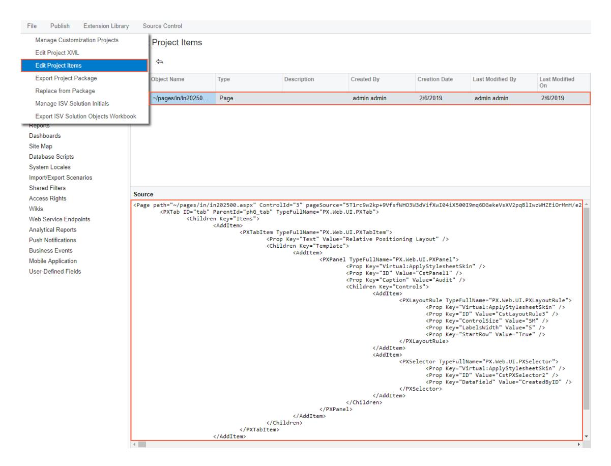

<span id="page-430-1"></span>*Figure: Analyzing the added content of the customization project*

# <span id="page-430-0"></span>**Adding Columns to a Grid**

Suppose that you need to add a column to the details table (grid) of the Journal Transactions (GL301000) form shown in the screenshot below.

| <b>JUUILIAL HANSAVUUNS</b>                                |                                                                                                                                                 |  |                               |                          |               |                                     |                     |                 |                     |                |              |        |                 |
|-----------------------------------------------------------|-------------------------------------------------------------------------------------------------------------------------------------------------|--|-------------------------------|--------------------------|---------------|-------------------------------------|---------------------|-----------------|---------------------|----------------|--------------|--------|-----------------|
| $\leftarrow$                                              |                                                                                                                                                 |  | SAVE & CLOSE                  | 日<br>$\Leftrightarrow$   | ानि<br>$^{+}$ | A - K<br>$\overline{\phantom{a}}$   | >1<br>$\rightarrow$ | RELEASE         | ACTIONS -           | REPORTS -      |              |        |                 |
|                                                           | Module:                                                                                                                                         |  | AR                            | $\overline{\phantom{a}}$ | * Branch:     | PRODWHOLE - Products Wholesale      |                     |                 | Type:               | Normal         |              |        |                 |
|                                                           |                                                                                                                                                 |  | Batch Number:<br>AR004284 Q   |                          | * Ledger:     | ACTUAL - Actual Ledger              |                     |                 | Orig. Batch Number: |                |              |        |                 |
|                                                           | Status:                                                                                                                                         |  | Posted                        |                          | Currency:     | 1.00<br>v   VIEW BASE<br><b>USD</b> |                     |                 | Debit Total:        |                |              | 500.00 |                 |
|                                                           |                                                                                                                                                 |  | <b>Hold</b>                   |                          |               | Auto Reversing                      | Reversing Entry     |                 | Credit Total:       |                |              | 500.00 |                 |
|                                                           |                                                                                                                                                 |  | * Transaction D<br>12/15/2018 |                          |               |                                     |                     |                 |                     |                |              |        |                 |
|                                                           |                                                                                                                                                 |  | * Post Period:<br>12-2018     |                          |               |                                     |                     |                 |                     |                |              |        |                 |
|                                                           | Description:                                                                                                                                    |  |                               |                          |               |                                     |                     |                 |                     |                |              |        |                 |
|                                                           | VIEW SOURCE DOCUMENT<br>RECLASSIFICATION HISTORY<br>$ \mathbf{x} $<br>$\uparrow$<br>C<br>$\mapsto$<br>1<br>$\times$<br>$\overline{\phantom{0}}$ |  |                               |                          |               |                                     |                     |                 |                     |                |              |        |                 |
| E 0                                                       |                                                                                                                                                 |  | * Branch                      | *Account                 | Description   | * Subaccount                        | Project/Con         | Project<br>Task | Ref.<br>Number      | Transa<br>Date | Quantity UOM |        | Debit<br>Amount |
| !!!!!!!!!!!!!!!!!!!!!!!!!!!!!!!!!!!!!!!!<br>$\rightarrow$ |                                                                                                                                                 |  | PRODWHOLE                     | 10200                    | Company Chec  | 000-000                             | X                   |                 | 001403              | 12/15/20       | 0.00         |        | 500.00          |
|                                                           | 0                                                                                                                                               |  | PRODWHOLE                     | 11000                    | Accounts Rece | 000-000                             | X                   |                 | 001403              | 12/15/20       | 0.00         |        | 0.00            |

*Figure: Viewing the original form*

For instance, suppose that you need to add the column for the *CreateDateTime* data field to the position aer the **Ref. Number** column.

To do this, perform the following actions:

- 1. On the Journal Transactions (GL301000) form, click the **Customization > Inspect Element**, select the **Ref. Number** column header, and click **Customize** on the **Element Properties** dialog box.
- 2. In the Screen Editor, open the **Add Data Fields** tab.
- 3. Apply the **All** filter to the list of the fields.
- 4. Select the *CreateDateTime* field in the list, as shown in the screenshot below.
- 5. Click **Create Controls** in the tab toolbar.

New columns are added to the grid in the position aer the item selected in the Control Tree of the Screen Editor. If you need to change the placement of a UI control, select the control on the tree, drag and drop it to the needed place.

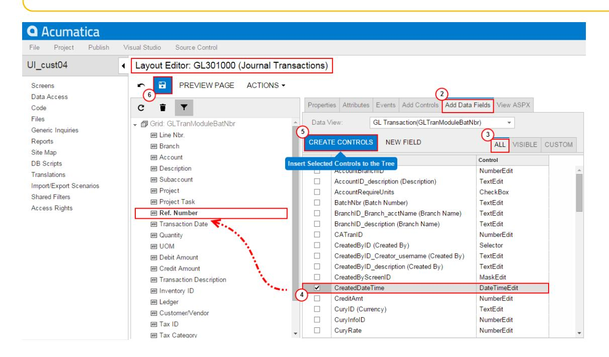

#### *Figure: Adding the column to the grid*

6. Click **Save** on the toolbar of the Screen Editor to save changes to the current customization project.

Thus, to add new columns to a grid, you have to open the grid node on the Control Tree of the Screen, select the **Add Data Fields** tab in the editor, select needed fields in the list on the tab, click **Create Controls**, and then drag and drop new columns to desired positions inside the grid. You can add a column for any field that belongs to any data access class (DAC) of any data view of the business logic controller bound to the form. To select a DAC to view its fields in the list, use the **DataView** drop-down list on the **Add Data Fields** tab.

To view the changes on the form, click **Preview Changes** on the toolbar or publish the project and review the changes on the Journal Transactions (GL301000) form aer the customization has been applied.

|                                                                                                                                           | $\leftarrow$                                |         |                  | SAVE & CLOSE          | E<br>⇦                 | n.<br>$\Box$<br>÷ | $\mathsf{K}$<br>$\blacktriangledown$ | >1<br>ゝ             | RELEASE                          | ACTIONS $\sim$ | REPORTS •       |                     |          |
|-------------------------------------------------------------------------------------------------------------------------------------------|---------------------------------------------|---------|------------------|-----------------------|------------------------|-------------------|--------------------------------------|---------------------|----------------------------------|----------------|-----------------|---------------------|----------|
|                                                                                                                                           |                                             | Module: |                  | AR.<br>* Branch:<br>۰ |                        |                   | PRODWHOLE - Products Wholesale       |                     | Type:                            |                |                 |                     |          |
|                                                                                                                                           | Batch Number:<br>AR004284<br>* Ledger:<br>Q |         |                  |                       | ACTUAL - Actual Ledger |                   |                                      | Orig. Batch Number: |                                  |                |                 |                     |          |
|                                                                                                                                           |                                             | Status: |                  | Posted                |                        | Currency:         | 1.00<br><b>USD</b>                   | $\mathbf{v}$        | <b>VIEW BASE</b><br>Debit Total: |                |                 | 500.00              |          |
|                                                                                                                                           |                                             |         |                  | $\Box$ Hold           |                        |                   | Auto Reversing                       | Reversing Entry     |                                  | Credit Total:  |                 | 500.00              |          |
|                                                                                                                                           |                                             |         | * Transaction D. | 12/15/2018            |                        |                   |                                      |                     |                                  |                |                 |                     |          |
|                                                                                                                                           |                                             |         | * Post Period:   | 12-2018               |                        |                   |                                      |                     |                                  |                |                 |                     |          |
|                                                                                                                                           |                                             |         | Description:     |                       |                        |                   |                                      |                     |                                  |                |                 |                     |          |
| VIEW SOURCE DOCUMENT<br>RECLASSIFICATION HISTORY<br>$\overline{\mathbf{x}}$<br>C<br>土<br>0<br>$\times$<br>$\mapsto$<br>$\hspace{0.1mm} +$ |                                             |         |                  |                       |                        |                   |                                      |                     |                                  |                |                 |                     |          |
|                                                                                                                                           | E 0                                         | n       | *Branch          |                       | *Account               | Description       | * Subaccount                         | Project/Con         | Project<br>Task                  | Ref.<br>Number | CreatedDateTime | Transaction<br>Date | Quantity |
|                                                                                                                                           | $\omega$                                    | n       |                  | <b>PRODWHOLE</b>      | 10200                  | Company Chec      | 000-000                              | X                   |                                  | 001403         | 1/31/2019       | 12/15/2018          | 0.00     |
|                                                                                                                                           | 0                                           |         |                  | PRODWHOLE             | 11000                  | Accounts Rece     | 000-000                              | X                   |                                  | 001403         | 1/31/2019       | 12/15/2018          | 0.00     |

#### *Figure: Viewing the customized form*

To view the fragment of the .aspx code that represents the customization result, open the form in the Screen Editor and select the**View ASPX** tab. The customized fragment is highlighted in yellow, as the screenshot below illustrates.

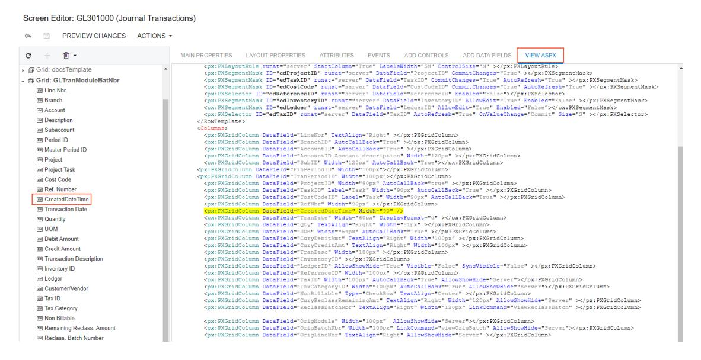

#### *Figure: Analyzing the changeset of the .aspx code*

To analyze the changes to the layout of the form introduced by the new column, in the Customization Project Editor, click **File > Edit Project Items** and select the **Object Name** field of the customized object (see the screenshot below). You can see the new Page item that contains the .aspx code changeset.

| <b>Manage Customization Projects</b><br><b>Edit Project Items</b><br>٠<br><b>Edit Project XML</b><br>$\Box$<br>⇦<br><b>Edit Project Items</b><br><b>Export Project Package</b><br>B.<br><b>Object Name</b><br><b>Type</b><br><b>Description</b><br><b>Created Bv</b><br>$\Omega$<br><b>Replace from Package</b><br>$\sim$ /pages/gl/gl301000.aspx<br>Page<br>admin admin<br>$\mathbf{0}$<br>Manage ISV Solution Initials<br>admin admin<br>$\sim$ /pages/in/in202500.aspx<br>Page<br>0<br>Export ISV Solution Objects Workbook<br><b>Dashboards</b><br><b>Site Map</b><br><b>Database Scripts</b><br><b>System Locales</b><br><b>Import/Export Scenarios</b><br><b>Shared Filters</b><br><b>Access Rights</b><br><b>Source</b><br><b>Wikis</b><br><b>Web Service Endpoints</b><br><pxgridlevel datamember="GLTranModuleBatNbr" parentid="phG grid Levels#0" typefullname="PX.Web.UI.PXGridLevel"><br/><children key="Columns"><br/><b>Analytical Reports</b><br/><additem><br/><b>Push Notifications</b><br/><pxgridcolumn typefullname="PX.Web.UI.PXGridColumn"><br/><prop key="DataField" value="CreatedDateTime"></prop><br/><b>Business Events</b><br/><prop key="Width" value="90"></prop><br/><b>Mobile Application</b><br/></pxgridcolumn><br/><br/><b>User-Defined Fields</b><br/><pxgridcolumn datafield="TranDate" originalindex="11"></pxgridcolumn><br/></additem></children><br/></pxgridlevel><br>$\langle$ /Page> | Source Control<br>Publish<br><b>Extension Library</b><br>File |  |  |  |  |  |  |  |  |  |  |
|----------------------------------------------------------------------------------------------------------------------------------------------------------------------------------------------------------------------------------------------------------------------------------------------------------------------------------------------------------------------------------------------------------------------------------------------------------------------------------------------------------------------------------------------------------------------------------------------------------------------------------------------------------------------------------------------------------------------------------------------------------------------------------------------------------------------------------------------------------------------------------------------------------------------------------------------------------------------------------------------------------------------------------------------------------------------------------------------------------------------------------------------------------------------------------------------------------------------------------------------------------------------------------------------------------------------------------------------------------------------------------------------------------------------------------|---------------------------------------------------------------|--|--|--|--|--|--|--|--|--|--|
| <Page path="~/pages/gl/gl301000.aspx" pageSource="vVtbc9u4FX7endn/w0G0Z7IPtWxn00lSOVNbih23cuyVlMubByIhCTVFqCBoW+20v73nALwAvQ</td> <td></td> <td></td> <td></td> <td></td> <td></td> <td></td>                                                                                                                                                                                                                                                                                                                                                                                                                                                                                                                                                                                                                                                                                                                                                                                                                                                                                                                                                                                                                                                                                                                                                                                                                                    |                                                               |  |  |  |  |  |  |  |  |  |  |
|                                                                                                                                                                                                                                                                                                                                                                                                                                                                                                                                                                                                                                                                                                                                                                                                                                                                                                                                                                                                                                                                                                                                                                                                                                                                                                                                                                                                                                  |                                                               |  |  |  |  |  |  |  |  |  |  |
|                                                                                                                                                                                                                                                                                                                                                                                                                                                                                                                                                                                                                                                                                                                                                                                                                                                                                                                                                                                                                                                                                                                                                                                                                                                                                                                                                                                                                                  |                                                               |  |  |  |  |  |  |  |  |  |  |
|                                                                                                                                                                                                                                                                                                                                                                                                                                                                                                                                                                                                                                                                                                                                                                                                                                                                                                                                                                                                                                                                                                                                                                                                                                                                                                                                                                                                                                  |                                                               |  |  |  |  |  |  |  |  |  |  |
|                                                                                                                                                                                                                                                                                                                                                                                                                                                                                                                                                                                                                                                                                                                                                                                                                                                                                                                                                                                                                                                                                                                                                                                                                                                                                                                                                                                                                                  |                                                               |  |  |  |  |  |  |  |  |  |  |
|                                                                                                                                                                                                                                                                                                                                                                                                                                                                                                                                                                                                                                                                                                                                                                                                                                                                                                                                                                                                                                                                                                                                                                                                                                                                                                                                                                                                                                  |                                                               |  |  |  |  |  |  |  |  |  |  |
|                                                                                                                                                                                                                                                                                                                                                                                                                                                                                                                                                                                                                                                                                                                                                                                                                                                                                                                                                                                                                                                                                                                                                                                                                                                                                                                                                                                                                                  |                                                               |  |  |  |  |  |  |  |  |  |  |
|                                                                                                                                                                                                                                                                                                                                                                                                                                                                                                                                                                                                                                                                                                                                                                                                                                                                                                                                                                                                                                                                                                                                                                                                                                                                                                                                                                                                                                  |                                                               |  |  |  |  |  |  |  |  |  |  |
|                                                                                                                                                                                                                                                                                                                                                                                                                                                                                                                                                                                                                                                                                                                                                                                                                                                                                                                                                                                                                                                                                                                                                                                                                                                                                                                                                                                                                                  |                                                               |  |  |  |  |  |  |  |  |  |  |
|                                                                                                                                                                                                                                                                                                                                                                                                                                                                                                                                                                                                                                                                                                                                                                                                                                                                                                                                                                                                                                                                                                                                                                                                                                                                                                                                                                                                                                  |                                                               |  |  |  |  |  |  |  |  |  |  |
|                                                                                                                                                                                                                                                                                                                                                                                                                                                                                                                                                                                                                                                                                                                                                                                                                                                                                                                                                                                                                                                                                                                                                                                                                                                                                                                                                                                                                                  |                                                               |  |  |  |  |  |  |  |  |  |  |
|                                                                                                                                                                                                                                                                                                                                                                                                                                                                                                                                                                                                                                                                                                                                                                                                                                                                                                                                                                                                                                                                                                                                                                                                                                                                                                                                                                                                                                  |                                                               |  |  |  |  |  |  |  |  |  |  |
|                                                                                                                                                                                                                                                                                                                                                                                                                                                                                                                                                                                                                                                                                                                                                                                                                                                                                                                                                                                                                                                                                                                                                                                                                                                                                                                                                                                                                                  |                                                               |  |  |  |  |  |  |  |  |  |  |
|                                                                                                                                                                                                                                                                                                                                                                                                                                                                                                                                                                                                                                                                                                                                                                                                                                                                                                                                                                                                                                                                                                                                                                                                                                                                                                                                                                                                                                  |                                                               |  |  |  |  |  |  |  |  |  |  |
|                                                                                                                                                                                                                                                                                                                                                                                                                                                                                                                                                                                                                                                                                                                                                                                                                                                                                                                                                                                                                                                                                                                                                                                                                                                                                                                                                                                                                                  |                                                               |  |  |  |  |  |  |  |  |  |  |
|                                                                                                                                                                                                                                                                                                                                                                                                                                                                                                                                                                                                                                                                                                                                                                                                                                                                                                                                                                                                                                                                                                                                                                                                                                                                                                                                                                                                                                  |                                                               |  |  |  |  |  |  |  |  |  |  |
|                                                                                                                                                                                                                                                                                                                                                                                                                                                                                                                                                                                                                                                                                                                                                                                                                                                                                                                                                                                                                                                                                                                                                                                                                                                                                                                                                                                                                                  |                                                               |  |  |  |  |  |  |  |  |  |  |
|                                                                                                                                                                                                                                                                                                                                                                                                                                                                                                                                                                                                                                                                                                                                                                                                                                                                                                                                                                                                                                                                                                                                                                                                                                                                                                                                                                                                                                  |                                                               |  |  |  |  |  |  |  |  |  |  |
|                                                                                                                                                                                                                                                                                                                                                                                                                                                                                                                                                                                                                                                                                                                                                                                                                                                                                                                                                                                                                                                                                                                                                                                                                                                                                                                                                                                                                                  |                                                               |  |  |  |  |  |  |  |  |  |  |
|                                                                                                                                                                                                                                                                                                                                                                                                                                                                                                                                                                                                                                                                                                                                                                                                                                                                                                                                                                                                                                                                                                                                                                                                                                                                                                                                                                                                                                  |                                                               |  |  |  |  |  |  |  |  |  |  |
|                                                                                                                                                                                                                                                                                                                                                                                                                                                                                                                                                                                                                                                                                                                                                                                                                                                                                                                                                                                                                                                                                                                                                                                                                                                                                                                                                                                                                                  |                                                               |  |  |  |  |  |  |  |  |  |  |
|                                                                                                                                                                                                                                                                                                                                                                                                                                                                                                                                                                                                                                                                                                                                                                                                                                                                                                                                                                                                                                                                                                                                                                                                                                                                                                                                                                                                                                  |                                                               |  |  |  |  |  |  |  |  |  |  |
|                                                                                                                                                                                                                                                                                                                                                                                                                                                                                                                                                                                                                                                                                                                                                                                                                                                                                                                                                                                                                                                                                                                                                                                                                                                                                                                                                                                                                                  |                                                               |  |  |  |  |  |  |  |  |  |  |
|                                                                                                                                                                                                                                                                                                                                                                                                                                                                                                                                                                                                                                                                                                                                                                                                                                                                                                                                                                                                                                                                                                                                                                                                                                                                                                                                                                                                                                  |                                                               |  |  |  |  |  |  |  |  |  |  |

<span id="page-433-1"></span>*Figure: Analyzing the added content of the customization project*

## <span id="page-433-0"></span>**Modifying Columns in a Selector**

If you add columns to a selector, you give the user the capability to see more information about each item in the lookup window, so the user can select the appropriate data record.

The screenshot below illustrates the original view of the **Batch Number** lookup window (also referred to as *selector*). The **Batch Number** is a control on the form of the Journal Transactions (GL301000) form. The lookup window of this control includes eight columns, as shown in the screenshot below.

| $\leftarrow$  |              |       | <b>SAVE &amp; CLOSE</b>        |               | n                        | ⇦                   |                | 间 | Ĥ<br>$\overline{\phantom{a}}$ | $\overline{\mathcal{K}}$ | ≺ | ⋋                              | >1 | <b>RELEASE</b>      |               | ACTIONS $\sim$ | REPORTS -   |            |
|---------------|--------------|-------|--------------------------------|---------------|--------------------------|---------------------|----------------|---|-------------------------------|--------------------------|---|--------------------------------|----|---------------------|---------------|----------------|-------------|------------|
|               | Module:      |       |                                | AR            | $\overline{\phantom{a}}$ |                     | * Branch:      |   |                               |                          |   | PRODWHOLE - Products Wholesale |    |                     | Type:         |                | Normal      |            |
|               |              |       | Batch Number:                  | AR004284<br>Ω |                          |                     | * Ledger:      |   | ACTUAL - Actual Ledger        |                          |   |                                |    | Orig. Batch Number: |               |                |             |            |
|               | Status:      |       |                                |               | Select - Batch Number    |                     |                |   |                               |                          |   |                                |    |                     |               |                | Ξ           | 00.00      |
|               |              |       | * Transaction D                |               | <b>SELECT</b>            | C                   | $\mapsto$<br>T |   |                               |                          |   |                                |    |                     | 3             |                | Ω           | 2 00.00    |
|               |              |       | * Post Period:<br>Description: |               | <b>高 Module</b>          | <b>Batch Number</b> |                |   | Ledger                        |                          |   | Transaction<br>Date            |    | Post<br>Period      | <b>Status</b> |                | Debit Total |            |
|               |              |       |                                | $\rightarrow$ | AR.                      | AR004284            |                |   | <b>ACTUAL</b>                 |                          |   | 12/15/2018                     |    | 12-2018             | Posted        |                | 500.00      |            |
| G             |              | $\pm$ | 0                              |               | <b>AR</b>                | AR004283            |                |   | <b>ACTUAL</b>                 |                          |   | 1/30/2019                      |    | 01-2019             | Posted        |                | 15.00       |            |
| B<br>O,       |              | n     | *Branch                        |               | AR.                      | AR004282            |                |   | ACTUAL                        |                          |   | 1/30/2019                      |    | 01-2019             | Posted        |                | 485.00      | lansaction |
|               |              |       |                                |               | <b>AR</b>                | AR004281            |                |   | ACTUAL                        |                          |   | 1/30/2019                      |    | 01-2019             | Posted        |                | 500.00      | lite       |
| $\rightarrow$ | $\mathbb{Q}$ | n     | PRODV                          |               | AR                       | AR004280            |                |   | <b>ACTUAL</b>                 |                          |   | 4/5/2018                       |    | 04-2018             | Posted        |                | 0.00        | 2/15/2018  |
|               | O,           |       | PRODV                          |               | AR.                      | AR004279            |                |   | <b>ACTUAL</b>                 |                          |   | 4/30/2018                      |    | 04-2018             | Posted        |                | 4.098.45    | 2/15/2018  |
|               |              |       |                                |               | AR                       | AR004278            |                |   | ACTUAL                        |                          |   | 4/11/2018                      |    | 04-2018             | Posted        |                | 8,550.00    |            |

*Figure: Viewing the current structure and content of the lookup window*

Suppose the UI customization task for the **Batch Number** selector includes the following steps (see the screenshot above):

- 1. Deleting an existing column, such as the **Ledger** column.
- 2. Adding a column for the **Created By** field to the place aer the **Currency** column.

3. Changing the order of the selector columns, so the**Status** column moves to the position between the **Credit Total** and **Currency** columns.

To do this, perform the following actions:

1. On the Journal Transactions (GL301000) form, click the **Customization > Inspect Element**, select the **Batch Number** control, click **Actions** on the **Element Properties** dialog box and select the **Customize Data Fields** command.

The Data Class Editor appears with only the **BatchNbr** field in the list of the customized fields of the class. The field is already selected in the field; therefore the work area of the editor holds information about the field.

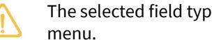

The selected field type is selector, so the **EditSelector Columns** button is enabled on the More menu.

- 2. Click **EditSelector Columns** to open the **CustomizeSelector Columns** dialog box, as shown in the screenshot below.
- 3. In the table of the **CustomizeSelector Columns** dialog box, select the row with the **Ledger** column.
- 4. Click **Delete Row** to delete the selected **Ledger** column from the selector.

| Data Class: GL.Batch        |                                                                          |                                            |  |  |  |  |  |  |
|-----------------------------|--------------------------------------------------------------------------|--------------------------------------------|--|--|--|--|--|--|
| ADD FIELD $\star$<br>圖<br>⇦ | OPEN SCREEN VIEW SOURCE                                                  | SELECTOR COLUMNS<br><b>EDIT ATTRIBUTES</b> |  |  |  |  |  |  |
| C<br>$\times$               | BatchNbr (Customized Existing Field)                                     |                                            |  |  |  |  |  |  |
| Field Name                  | Customize Attributes:<br>Append to Original                              | ۰                                          |  |  |  |  |  |  |
| BatchNbr<br>У               | <b>Customize Selector Columns</b><br><b>DOWN</b>                         |                                            |  |  |  |  |  |  |
|                             | <b>ADD COLUMNS</b><br>C<br><b>UP</b><br>$\times$<br><b>E</b> Column Name | Data Field                                 |  |  |  |  |  |  |
|                             | Module                                                                   | Module                                     |  |  |  |  |  |  |
|                             | <b>Batch Number</b>                                                      | <b>BatchNbr</b>                            |  |  |  |  |  |  |
|                             | Ledger                                                                   | LedgerID                                   |  |  |  |  |  |  |
|                             | <b>Transaction Date</b>                                                  | <b>DateEntered</b>                         |  |  |  |  |  |  |
|                             | <b>Post Period</b>                                                       | iccc<br>FinPeriodID                        |  |  |  |  |  |  |
|                             | <b>Status</b>                                                            | <b>Status</b><br>t <b< td=""></b<>         |  |  |  |  |  |  |
|                             | <b>Debit Total</b>                                                       | 7isi<br>CuryDebitTotal                     |  |  |  |  |  |  |
|                             | <b>Credit Total</b>                                                      | CuryCreditTotal                            |  |  |  |  |  |  |
|                             | Currency                                                                 | CuryID                                     |  |  |  |  |  |  |
|                             |                                                                          |                                            |  |  |  |  |  |  |
|                             |                                                                          | CANCEL<br><b>OK</b>                        |  |  |  |  |  |  |
|                             |                                                                          |                                            |  |  |  |  |  |  |

*Figure: Deleting the selected column from the selector*

- 5. Click **Add Columns** on the toolbar of the **CustomizeSelector Columns** dialog box to open the **Add Columns toSelector** dialog box.
- 6. In the **Add Columns toSelector** dialog box, select the **All** tab to view all fields of the customized data access class (DAC) in the table.
- 7. In the table, select the row with the **Created By** column name.
- 8. Click **OK** to add the selected field to the table of the **CustomizeSelector Columns** dialog box.

| <b>Customize Selector Columns</b>              |                                                |                                | $\times$              |        |  |  |  |  |  |  |
|------------------------------------------------|------------------------------------------------|--------------------------------|-----------------------|--------|--|--|--|--|--|--|
| ADD COLUMNS<br>C<br>$\overline{\mathsf{x}}$    | UP<br><b>DOWN</b>                              |                                |                       |        |  |  |  |  |  |  |
| <b>E</b> Column Name                           |                                                | Add Columns to Selector        |                       |        |  |  |  |  |  |  |
| Module                                         | <b>SELECTOR</b><br><b>ALL</b><br><b>CUSTOM</b> |                                |                       |        |  |  |  |  |  |  |
| <b>Batch Number</b><br><b>Transaction Date</b> | <b>B</b> Selected                              | Column Name                    | Data Field            |        |  |  |  |  |  |  |
| <b>Post Period</b>                             | □                                              | <b>Auto Reversing</b>          | AutoReverse           |        |  |  |  |  |  |  |
| <b>Debit Total</b>                             | о                                              | <b>Reversing Entry</b>         | AutoReverseCopy       |        |  |  |  |  |  |  |
| <b>Credit Total</b>                            | □                                              | Type                           | BatchType             |        |  |  |  |  |  |  |
| <b>Status</b>                                  |                                                | <b>Branch</b>                  | <b>BranchID</b>       |        |  |  |  |  |  |  |
| Currency<br>⋗                                  | □                                              | <b>ControlTotal</b>            | <b>ControlTotal</b>   |        |  |  |  |  |  |  |
|                                                | ☑                                              | <b>Created By</b>              | CreatedByID           |        |  |  |  |  |  |  |
|                                                | □                                              | CreatedByScreenID              | CreatedByScreenID     |        |  |  |  |  |  |  |
|                                                | п                                              | Created On<br>CreatedDateTime  |                       |        |  |  |  |  |  |  |
|                                                | о                                              | <b>Create Tax Transactions</b> | <b>CreateTaxTrans</b> |        |  |  |  |  |  |  |
|                                                | □                                              | <b>CreditTotal</b>             | <b>CreditTotal</b>    |        |  |  |  |  |  |  |
|                                                |                                                |                                | OK                    | CANCEL |  |  |  |  |  |  |

#### *Figure: Adding the column for the field to the table of the Customize Selector Columns dialog box*

New columns are added to the position aer the last existing column of the selector.

The **Created By** column is created in the table of the **CustomizeSelector Columns** dialog box at the rightmost position. Therefore, you do not need to move this column inside the selector. But you still have to move the**Status** column to position between the **CreditTotal** and **Currency** columns.

- 9. Select the row with the**Status** column.
- 10.Click **Down** twice to move the selected row to the required position, as shown in the screenshot below.
- 11.Click **OK** on the **CustomizeSelector Columns** dialog box to apply the changes to the selector.
- 12.Click **Save** on the toolbar of the Data Class Editor to save the changes to the current customization project.

Aer you click **OK** in the **CustomizeSelector Columns** dialog box, the system applies the modifications to the selector table. As a result, the PXCustomizeSelectorColumns attribute is added to the selector field and you can view the attribute in the **Customize Attributes** text area of the Data Class Editor (see the screenshot below). This attribute defines the new set and order of the columns in the selector.

| E)<br>⇦                       | ADD FIELD ▼ OPEN SCREEN VIEW SOURCE SELECTOR COLUMNS<br><b>EDIT ATTRIBUTES</b>                                                                                                                                                                                                                                                                                                                                                                                                                                                                                                                                                                                                                                                                                                                                                     |  |  |  |  |  |  |  |  |
|-------------------------------|------------------------------------------------------------------------------------------------------------------------------------------------------------------------------------------------------------------------------------------------------------------------------------------------------------------------------------------------------------------------------------------------------------------------------------------------------------------------------------------------------------------------------------------------------------------------------------------------------------------------------------------------------------------------------------------------------------------------------------------------------------------------------------------------------------------------------------|--|--|--|--|--|--|--|--|
| $\mathcal{C}$<br>$\mathsf{x}$ | BatchNbr (Customized Existing Field)                                                                                                                                                                                                                                                                                                                                                                                                                                                                                                                                                                                                                                                                                                                                                                                               |  |  |  |  |  |  |  |  |
| <b>hame</b> Field Name        | Customize Attributes:<br><b>Append to Original</b><br>٠                                                                                                                                                                                                                                                                                                                                                                                                                                                                                                                                                                                                                                                                                                                                                                            |  |  |  |  |  |  |  |  |
| BatchNbr                      | [PXCustomizeSelectorColumns (<br>typeof (PX.Objects.GL.Batch.module),<br>typeof (PX.Objects.GL.Batch.batchNbr),<br>typeof (PX.Objects.GL.Batch.dateEntered),<br>typeof (PX.Objects.GL.Batch.finPeriodID),<br>typeof(PX.Objects.GL.Batch.curyDebitTotal),<br>typeof (PX.Objects.GL.Batch.curvCreditTotal),<br>typeof(PX.Objects.GL.Batch.status),<br>typeof (PX.Objects.GL.Batch.curvID),<br>typeof(PX.Objects.GL.Batch.createdByID))]<br>Original attributes:<br>[PXDBString(15, IsUnicode = true, IsKey = true, InputMask = ">CCCCCCCCCCCCCCC")]<br>IPXDefault()<br>[PXSelector (typeof (Search <batch.batchnbr, equal<current<batch.mod<br="" where<batch.module,="">[PXUIField(DisplayName="Batch_Number", Visibilitv=PXUIVisibilitv.SelectorVisible)]<br/>[BatchModule.Numbering()]<br/>[PXFieldDescription]</batch.batchnbr,> |  |  |  |  |  |  |  |  |

*Figure: Viewing the changes in the Customize Attributes text area*

Aer publishing the project, open the Journal Transactions (GL301000) form, click the Magnifier icon of the **Batch Number** control, and view the lookup window. Notice the absence of the deleted column, the position of the moved**Status** column, and the presence of the **Created By** column, as shown in the screenshot below.

| <b>SELECT</b>   | $\rightarrow$<br>C<br>T |                           |                |             |              |        |            | Q          |
|-----------------|-------------------------|---------------------------|----------------|-------------|--------------|--------|------------|------------|
| <b>国</b> Module | <b>Batch Number</b>     | J.<br>Transaction<br>Date | Post<br>Period | Debit Total | Credit Total | Status | Currency   | Created By |
| <b>AR</b>       | AR004284                | 12/15/2018                | 12-2018        | 500.00      | 500.00       | Posted | <b>USD</b> | admin      |
| AR              | AR004283                | 1/30/2019                 | 01-2019        | 15.00       | 15.00        | Posted | <b>USD</b> | admin      |
| AR              | AR004282                | 1/30/2019                 | 01-2019        | 485.00      | 485.00       | Posted | <b>USD</b> | admin      |
| AR              | AR004281                | 1/30/2019                 | 01-2019        | 500.00      | 500.00       | Posted | <b>USD</b> | admin      |
| AR              | AR004280                | 4/5/2018                  | 04-2018        | 0.00        | 0.00         | Posted | <b>USD</b> | admin      |
| AR              | AR004279                | 4/30/2018                 | 04-2018        | 4.098.45    | 4.098.45     | Posted | <b>USD</b> | admin      |
| AR              | AR004278                | 4/11/2018                 | 04-2018        | 8,550.00    | 8,550.00     | Posted | <b>USD</b> | admin      |
| AR              | AR004277                | 4/1/2018                  | 04-2018        | 48.327.28   | 48.327.28    | Posted | <b>USD</b> | admin      |
| AR              | AR004276                | 4/16/2018                 | 04-2018        | 17.600.00   | 17.600.00    | Posted | <b>USD</b> | admin      |
| AR              | AR004275                | 4/4/2018                  | 04-2018        | 6,500.00    | 6,500.00     | Posted | <b>USD</b> | admin      |
| AR.             | AR004274                | 4/3/2018                  | 04-2018        | 286,818.50  | 286,818.50   | Posted | <b>USD</b> | admin      |
| AR.             | AR004273                | 4/1/2018                  | 04-2018        | 27.202.50   | 27.202.50    | Posted | <b>USD</b> | admin      |
| AR              | AR004272                | 4/6/2018                  | 04-2018        | 2,800.00    | 2,800.00     | Posted | <b>USD</b> | admin      |
| AR.             | AR004271                | 4/2/2018                  | 04-2018        | 17,000.00   | 17,000.00    | Posted | <b>USD</b> | admin      |
| AR              | AR004270                | 4/1/2018                  | 04-2018        | 7,840.00    | 7,840.00     | Posted | <b>USD</b> | admin      |
| AR.             | AR004269                | 4/6/2018                  | 04-2018        | 78.427.50   | 78,427.50    | Posted | <b>USD</b> | admin      |
| AR              | AR004268                | 4/19/2018                 | 04-2018        | 18,918.00   | 18,918.00    | Posted | <b>USD</b> | admin      |
| AR              | AR004267                | 4/1/2018                  | 04-2018        | 30,000.00   | 30,000.00    | Posted | <b>USD</b> | admin      |
| AR              | AR004266                | 4/5/2018                  | 04-2018        | 273.302.00  | 273.302.00   | Posted | <b>USD</b> | admin      |
| AR              | AR004265                | 4/2/2018                  | 04-2018        | 18,918.00   | 18,918.00    | Posted | <b>USD</b> | admin      |

#### *Figure: Viewing the modified structure and content of the lookup window*

If you need to analyze the added content (changeset) of the customization project, open the project in the Project Editor, choose the **Edit Project Items** command on the **File** menu item, and select the **Object Name** field of the customized object (see the screenshot below). The *DAC* object represents the changes to the data access class code.

| Publish<br><b>Extension Library</b><br>File                                                                                                                                                                                                                                                                                                                                           | Source Control                                                                                                                                                                                                                                                                                                                                                                                                                                                                                                                                                                |                                                                                                                                                                                                                                                          |                    |                   |                      |                                                                                                                                                       |                         |
|---------------------------------------------------------------------------------------------------------------------------------------------------------------------------------------------------------------------------------------------------------------------------------------------------------------------------------------------------------------------------------------|-------------------------------------------------------------------------------------------------------------------------------------------------------------------------------------------------------------------------------------------------------------------------------------------------------------------------------------------------------------------------------------------------------------------------------------------------------------------------------------------------------------------------------------------------------------------------------|----------------------------------------------------------------------------------------------------------------------------------------------------------------------------------------------------------------------------------------------------------|--------------------|-------------------|----------------------|-------------------------------------------------------------------------------------------------------------------------------------------------------|-------------------------|
| <b>Manage Customization Projects</b>                                                                                                                                                                                                                                                                                                                                                  | <b>lit Project Items</b>                                                                                                                                                                                                                                                                                                                                                                                                                                                                                                                                                      |                                                                                                                                                                                                                                                          |                    |                   |                      |                                                                                                                                                       |                         |
| <b>Edit Project XML</b>                                                                                                                                                                                                                                                                                                                                                               |                                                                                                                                                                                                                                                                                                                                                                                                                                                                                                                                                                               |                                                                                                                                                                                                                                                          |                    |                   |                      |                                                                                                                                                       |                         |
| <b>Edit Project Items</b>                                                                                                                                                                                                                                                                                                                                                             | ⇦                                                                                                                                                                                                                                                                                                                                                                                                                                                                                                                                                                             |                                                                                                                                                                                                                                                          |                    |                   |                      |                                                                                                                                                       |                         |
| <b>Export Project Package</b>                                                                                                                                                                                                                                                                                                                                                         | <b>Object Name</b>                                                                                                                                                                                                                                                                                                                                                                                                                                                                                                                                                            | Type                                                                                                                                                                                                                                                     | <b>Description</b> | <b>Created By</b> | <b>Creation Date</b> | <b>Last Modified By</b>                                                                                                                               | <b>Last Modified On</b> |
| Replace from Package                                                                                                                                                                                                                                                                                                                                                                  | PX Objects GL Batch                                                                                                                                                                                                                                                                                                                                                                                                                                                                                                                                                           | <b>DAC</b>                                                                                                                                                                                                                                               |                    | admin admin       | 2/6/2019             | admin admin                                                                                                                                           | 2/6/2019                |
| Manage ISV Solution Initials                                                                                                                                                                                                                                                                                                                                                          | $\sim$ /pages/gl/gl301000                                                                                                                                                                                                                                                                                                                                                                                                                                                                                                                                                     | Page                                                                                                                                                                                                                                                     |                    | admin admin       | 2/6/2019             | admin admin                                                                                                                                           | 2/6/2019                |
| Export ISV Solution Objects Workbook                                                                                                                                                                                                                                                                                                                                                  | $\sim$ /pages/in/in202500                                                                                                                                                                                                                                                                                                                                                                                                                                                                                                                                                     | Page                                                                                                                                                                                                                                                     |                    | admin admin       | 2/6/2019             | admin admin                                                                                                                                           | 2/6/2019                |
| <b>Reports</b><br><b>Dashboards</b><br>Site Map<br><b>Database Scripts</b><br><b>System Locales</b><br><b>Import/Export Scenarios</b><br><b>Shared Filters</b><br><b>Access Rights</b><br><b>Wikis</b><br><b>Web Service Endpoints</b><br><b>Analytical Reports</b><br><b>Push Notifications</b><br><b>Business Events</b><br><b>Mobile Application</b><br><b>User-Defined Fields</b> | <b>Source</b><br><dac type="PX.Objects.GL.Batch"><br/>[PXCustomizeSelectorColumns(<br/>typeof(PX.Objects.GL.Batch.module),<br/>typeof(PX.Objects.GL.Batch.batchNbr),<br/>typeof(PX.Objects.GL.Batch.dateEntered),<br/>typeof(PX.Objects.GL.Batch.finPeriodID),<br/>typeof(PX.Objects.GL.Batch.curyDebitTotal),<br/>typeof(PX.Objects.GL.Batch.curyCreditTotal),<br/>typeof(PX.Objects.GL.Batch.status),<br/>typeof(PX.Objects.GL.Batch.curyID),<br/>typeof(PX.Objects.GL.Batch.createdByID))]]]&gt;<br/><math>\langle</math>/Field&gt;<br/><math>\langle</math>/DAC&gt;</dac> | <cdata name="TextAttributes"><!--[CDATA]</td--><td></td><td></td><td></td><td>&lt;Field FieldName="BatchNbr" TypeName="string" TextAttributes="#CDATA" OverrideClassName="PX.Objects.GL.Batch" StorageName="ExistingCo.&lt;/td&gt;<td></td></td></cdata> |                    |                   |                      | <Field FieldName="BatchNbr" TypeName="string" TextAttributes="#CDATA" OverrideClassName="PX.Objects.GL.Batch" StorageName="ExistingCo.</td> <td></td> |                         |

*Figure: Analyzing the added content of the customization project*

### <span id="page-437-0"></span>**Examples of Functional Customization**

*Functional customization* means modifications of the data structure and original application business logic. These modifications are related either to the code of the appropriate data access classes (DACs) or business logic controllers (BLCs, also referred to as *graphs*).

The Acumatica Customization Platform provides the tools and the framework that is based on class extensions and provides the following key features:

- You can deploy multiple projects that extend DACs or BLCs.
- Extensions are precompiled, which provides a measure of protection for your source code and intellectual property.
- The framework provides an advanced level of control over the business logic and a multilevel extension model.
- The platform implements an auto-discovery mechanism, which makes the deployment and upgrade processes straightforward.

The topics of this section describe the rules and methods of functional customization and give examples of customization projects that resolve typical functional customization tasks:

- *[Adding Data Fields](#page-437-2)*
- *[Customizing DAC Attributes](#page-446-1)*
- *[Modifying a BLC Action](#page-449-1)*
- *[Modifying](#page-452-1) a BLC Data View*
- *[Declaring](#page-454-1) or Altering a BLC Data View Delegate*
- *[Extending BLC Initialization](#page-456-1)*
- *[Altering the BLC of a Processing Form](#page-458-1)*
- *[Adding or Altering BLC Event Handlers](#page-460-1)*
- *Altering BLC Virtual [Methods](#page-469-1)*
- *[Customizing the Release Process for CA Documents](#page-479-1)*

### <span id="page-437-2"></span><span id="page-437-1"></span>**Adding Data Fields**

You can add to a form a UI control based on a new data field. To do this, you can use the following ways:

- Use the Data Class Editor to create the data field and use the Screen Editor to add the control onto the required area of a form.
- Define the data field in code, add the Table customization item for adding the column to the database table if the field is bound, and use the Screen Editor to add the control onto the required area of a form.

These approaches are described in greater detail below.

- *[Adding a Data Field From the Data Class Editor](#page-437-3)*
- *[Adding a Data Field From Code](#page-442-0)*

#### <span id="page-437-3"></span>**Adding a Data Field From the Data Class Editor**

Suppose that you have to add an input UI text box for a bound data field to the *[Stock Items](https://help-2025r1.acumatica.com/Help?ScreenId=ShowWiki&pageid=77786a70-1f1e-4d63-ad98-96f98e4fcb0e)* (IN202500) form. To do this, you have to (see the diagram below):

• Add a data field to the code of the appropriate DAC (the functional customization step)

• Add a column to the database table (a customization change to the database structure that is a part of functional customization)


You have to add a database column only for bound data fields. Bound data field means the field values are saved in the database. If you define an unbound field, skip this step.

• Add a control for the field onto the form area (the UI customization step)

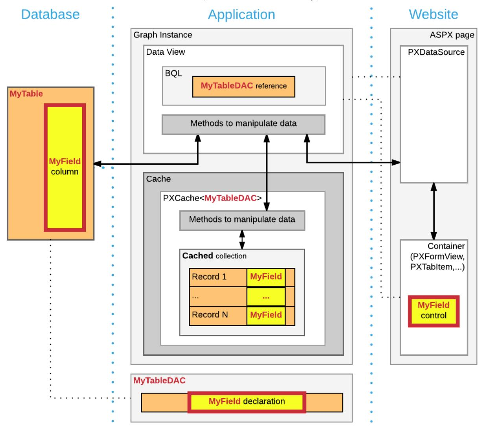

*Figure: Adding a bound field to a webpage*

Suppose you have to add the new **Search Keywords** text box to the Stock Items form to the location shown on the screenshot.

| SAVE & CLOSE $\Box$ $\Leftrightarrow$ $+$ $\Box$ $\Box$ $\bullet$ $\Box$ $\Box$ $\Box$ $K$ $\Diamond$ $\Diamond$ $\Diamond$ $\Diamond$ $\Diamond$ $\Diamond$ ACTIONS $\ast$ INQUIRIES $\ast$<br>$\leftarrow$ |        |   |                         |   |                 |                                        |                          |  |                       |        |
|--------------------------------------------------------------------------------------------------------------------------------------------------------------------------------------------------------------|--------|---|-------------------------|---|-----------------|----------------------------------------|--------------------------|--|-----------------------|--------|
| * Inventory ID:<br>Item Status:                                                                                                                                                                              | Active | ۰ |                         | α |                 | Product Workgroup:<br>Product Manager: |                          |  |                       | Ω<br>Ω |
| Description:                                                                                                                                                                                                 |        |   |                         |   |                 |                                        |                          |  |                       |        |
| --------<br><b>RELATIVE POSITIONING LAYOUT</b>                                                                                                                                                               |        |   | <b>GENERAL SETTINGS</b> |   | PRICE/COST INFO |                                        | <b>WAREHOUSE DETAILS</b> |  | <b>VENDOR DETAILS</b> |        |

#### *Figure: The customization task of adding the new field to the form*

To add this text box, do the following:

- 1. Add the field to the appropriate DAC as follows:
  - a. Open the data access class that provides fields for the form area on the Stock Items form in the Data Class Editor. To do this, open the Stock Items form, select **Customization > Inspect Element** on the form title bar, and click the form area of the Stock Items form.

The following information of the control and the data access class should appear in the **Element Properties** dialog box:

- **ControlType**: *Form View*
- **Data Class**: *InventoryItem*
- **Business Logic**: *InventoryItemMaint*

InventoryItem is the data access class that provides the data fields for UI controls on the form. Therefore, you have to add the new data field to the extension of this class.

b. In the **Element Properties** dialog box, select **Actions > Customize Data Fields** to open the Data Class Editor for the InventoryItem class.

> If you haven't selected the current project yet, you will be asked to select the customization project to which the customization of the data access class will be added. You can select the current project to automatically add all customizations that you initiate from the Element Inspector by using the **Customization > Select Project** menu to the project. For more information, see *[Table](https://help-2025r1.acumatica.com/Help?ScreenId=ShowWiki&pageid=d6c46870-0c44-4f78-ae20-9bb9ef25dccd) 1*

*Yporoujeuc st eotrht eoScer leeact teCaunsteowmc iuzsat toiomnizPartoiojencptrdoi jae lcotg. box to select an existing customization You open the dialog box in the following ways:*

- *• From the Customization menu of a form by clicking Select Project*
- *• From the Customization menu of a form by clicking Edit Project if there is no currently*
- *selected customization project • From the Element Properties dialog box if you click Customize in the dialog box and there*
- *is no currently selected customization project*

- c. In the Data Class Editor, select **Add Field > Create New Field** on the toolbar.
- d. In the **Create New Field** dialog box, specify the following parameters for the new field:
  - **Field Name**: SearchKeywords
  - **DisplayName**: Search Keywords
  - **StorageType**: *DBTableColumn*
  - **DataType**: *string*

.

• **Length**: 255

As soon as you move the focus out of the **Field Name** box, the system adds the *Usr* prefix to the field name (see the screenshot below), which provides the distinction between the base fields and new custom fields that you add to the class. Keep the prefix in the field name and click **OK** to add the data field to the class.

If you select the *DBTableColumn* storage type, the system automatically adds schema for the new database column to the customization project. For more information on parameters that you specify for new fields, see *[Create New Field Dialog Box](https://help-2025r1.acumatica.com/Help?ScreenId=ShowWiki&pageid=06c038a5-1d75-482b-9b17-f2483ada0154)*.

|               | Data Class: IN.InventoryItem |                                   |                 |
|---------------|------------------------------|-----------------------------------|-----------------|
| B<br>⇦        | ADD FIELD $\star$            | OPEN SCREEN<br><b>VIEW SOURCE</b> | <b>SELECTOR</b> |
| $\times$<br>С |                              |                                   |                 |
| Field Name    | <b>Create New Field</b>      | $\times$                          |                 |
|               | Field Name:                  | UsrSearchKeywords                 |                 |
|               | Display Name:                | Search Keywords                   |                 |
|               | Storage Type:                | <b>DBTableColumn</b><br>۰         |                 |
|               | Data Type:                   | string                            |                 |
|               | Length:                      | 255                               |                 |
|               |                              | CANCEL<br>OK                      |                 |
|               |                              | Original attributes:              |                 |

#### *Figure: Adding the new data field to the class*

To the customization project, the system adds the new field as the extension to the InventoryItem data access class, and adds the Table item for adding the corresponding column to the database table.

- e. Click **Save** on the toolbar of the Data Class Editor to save the changes to the project. Aer you save the added field, you can see the added project item in the **DatabaseScripts** page of the Customization Project Editor.
- 2. Publish the customization project. You need to do it at this point to be able to add the UI control for the new field because when the project is published the system compiles the customization code and updates the database schema with the new column. For more information, see *[Publishing Customization Projects](#page-120-2)*.
- 3. Add the control to the form. Do it as follows:
  - a. Add the Stock Items form to the customization project. To do this, you can use the Element Inspector or select**Screens** on the navigation pane of the Customization Project Editor, and add the Stock Items form to the list by clicking **Customize ExistingScreen** on the toolbar.
  - b. Open the form in the Screen Editor. In the Control Tree, expand the **Form: Item** container and select and expand the first column within the container to set up the position to which the new control will be added.
  - c. Select the **Add Data Fields** tab of the Screen Editor.

- d. Leave the **DataView** box empty. (The box specifies the data access class by which the fields are filtered in the table below.)
- e. Select the **Custom** filter on the tab and select the check box for the *UsrSearchKeywords* field in the table, as the following screenshot shows.

| Screen Editor: IN202500 (Stock Items)                                                      |                                                                                          |                                                                   |
|--------------------------------------------------------------------------------------------|------------------------------------------------------------------------------------------|-------------------------------------------------------------------|
| E<br>PREVIEW CHANGES<br>ACTIONS -<br>⇦                                                     |                                                                                          |                                                                   |
| 侕<br>C<br>$\overline{\phantom{a}}$<br>$\overline{\phantom{0}}$                             | <b>MAIN PROPERTIES</b><br><b>LAYOUT PROPERTIES</b><br><b>ATTRIBUTES</b><br><b>EVENTS</b> | <b>ADD DATA FIELDS</b><br>$\grave{z}$                             |
| ▶ @ DataSource: InventoryItemMaint                                                         | Data View:<br>Inventory Item(Item)<br>$\overline{\phantom{a}}$                           |                                                                   |
| • @ Form: Item<br>→ <i>同</i> Column                                                        | CREATE CONTROLS<br>NEW FIELD                                                             | !!!!!!!!!!!!!!!!!!!!!!!!!!!!!!!!!!!!!!!!<br><b>VISIBLE</b><br>ALL |
| and Inventory ID<br>am Item Status                                                         | п<br>Used<br>Field Name<br>Control                                                       |                                                                   |
| 印 [Column Span]                                                                            | UsrSearchKeywords (Search Keywords)<br>$\Box$<br>TextEdit<br>$\boxdot$                   |                                                                   |
| <b>BBI</b> Description<br>▶ <i>同</i> Column<br>▶ <i>□</i> Tab: ItemSettings<br>▶ @ Dialogs |                                                                                          |                                                                   |
|                                                                                            |                                                                                          |                                                                   |

*Figure: Adding the control for the data field*

f. Click **Create Controls** on the toolbar of the tab. The control for the**Search Keywords** field will be added to the tree.

Now you have to adjust the position and size of the control on the form. Drag and drop the**Search Keywords** control at the end of the column aer the **Description** control and click**Save** to save the changes to the project.

- 4. Adjust the size of the control. To do that you have to place an instance of the PXLayoutRule component right above the control and configure it as follows:
  - a. Select the **Add Controls** tab of the Screen Editor and drag and drop an **Empty Rule** component to the position above the**Search Keywords** control in the tree, as the screenshot below shows.

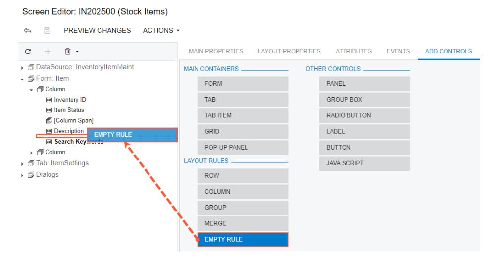

*Figure: Adding an Empty Rule component to the tree to adjust the size of the control*

- b. Select the *[Layout Rule]* node that appears in the Control Tree and switch to the **Layout Properties** tab of the Screen Editor.
- c. On the **Layout Properties** tab, set the **ColumnSpan** property to 2, which specifies the span of the control on two columns of the layout on the form. Click**Save** to save the changes to the project. Aer you save these changes, the *[Layout Rule]* node is renamed to *[Column Span]* according to the property the rule is changing.


The controls are organized in two columns on the form. For more information about positioning controls, see *[Layout Rule \(PXLayoutRule\)](#page-265-1)*.

The customization to the layout of the form is ready.

While working with the Screen Editor, you can click **Preview Changes** to view how the changes will affect the layout of the form.

Publish the project again to view the changes applied to the *[Stock Items](https://help-2025r1.acumatica.com/Help?ScreenId=ShowWiki&pageid=77786a70-1f1e-4d63-ad98-96f98e4fcb0e)* (IN202500) form. Aer you publish the project, verify that the customized Stock Items form looks as needed according to the customization task. The customization items for form layout, data access class, and database schema have been added to the project. The new **Search Keywords** text box will appear on the Stock Items form on every system where you publish the customization project.

The DAC extension code that has been generated for the new field is given below. The system has generated a DAC extension class for InventoryItem and added the data field definition to the class. For more information about extension classes, see *[DAC Extensions](#page-49-0)*.

```
public class PX_Objects_IN_InventoryItem_Extension_AddColumn: 
 PXCacheExtension<PX.Objects.IN.InventoryItem>
{
 #region UsrSearchKeywords
 public abstract class usrSearchKeywords : IBqlField{} 
 [PXDBString(255)]
 [PXUIField(DisplayName="Search Keywords")]
 public virtual string UsrSearchKeywords
 {
 get; set;
 }
 #endregion
}
```

You can open the customization code in MS Visual Studio and work with the code there. For more information, see *[Integrating](#page-384-2) the Project Editor with Microsoft Visual Studio*.

### <span id="page-442-0"></span>**Adding a Data Field From Code**

If you work with the customization code in MS Visual Studio, you can define a new data field in DAC extension code and then create the control on the form.

Suppose that you have to add an input UI text box for a bound data field to the *[Stock Items](https://help-2025r1.acumatica.com/Help?ScreenId=ShowWiki&pageid=77786a70-1f1e-4d63-ad98-96f98e4fcb0e)* (IN202500) form. To do this, you have to:

- Add a data field to the code of the appropriate DAC (the functional customization step)
- Add a column to the database table (a customization change to the database structure that is a part of functional customization)

You have to add a database column only for bound data fields. Bound data field means the field values are saved in the database. If you define an unbound field, skip this step.

• Add an input UI text box onto the form area of the form (the UI customization step)

Suppose you have to add the new **LocalTax Category** selector to the Stock Items form, as the screenshot below shows.

| SAVE & CLOSE                                    | Ħ<br>$\bigcirc$                                                               |   |                                  |                                                  |        | ▼                              |      | $\geq$                                     | AC <sup>-</sup>       |
|-------------------------------------------------|-------------------------------------------------------------------------------|---|----------------------------------|--------------------------------------------------|--------|--------------------------------|------|--------------------------------------------|-----------------------|
| * Inventory ID:<br>Item Status:<br>Description: | AACOMPUT04 Acor Lonton Comput<br>Select - Local Tax Category<br><b>SELECT</b> | Õ | $\left  \leftrightarrow \right $ |                                                  |        |                                |      | <b>Draduet Warkgroup:</b><br>$\times$<br>Ω |                       |
| <b>GENERAL SETTINGS</b>                         | 冒<br><b>Tax Category ID</b><br>⋋<br><b>EXEMPT</b>                             |   | Ť                                | <b>Description</b><br><b>Exempt Tax Category</b> |        |                                |      |                                            | S                     |
| <b>ITEM DEFAULTS</b><br>* Item Class:<br>Type:  | <b>TAXABLE</b>                                                                |   |                                  |                                                  |        | Taxable Goods and Services     |      |                                            |                       |
| Valuation Method:<br>* Tax Category:            |                                                                               |   |                                  |                                                  |        | $K \leftarrow K \rightarrow N$ |      |                                            |                       |
| Local Tax Category:<br>* Posting Class:         | ELE - Electronics & Computers                                                 |   |                                  |                                                  | Ω<br>Ω |                                | Unit |                                            | <del>iviand</del> ply |

#### *Figure: The customization task of adding the new field to the form*

If you want to work with the DAC extension code in the integrated MS Visual Studio solution without use of the Data Class Editor, you can develop the code in a *.cs* file added to the customization project as a custom Code item or in a *.cs* file in a separate add-on project in the solution. We recommend that you use either the Data Class Editor or develop the entire customization code in an add-on project in MS Visual Studio, but do not mix up the approaches. For more information, see *[Integrating](#page-384-2) the Project Editor with Microsoft Visual Studio*.

To add the UI control for the bound data field created from code, perform the following actions:

1. In MS Visual Studio, define the custom usrLocalTaxCategoryID data field in the DAC extension class, as listed below.

```
using PX.Data;
using PX.Objects.IN;
using PX.Objects.TX;
namespace PX.Objects.IN
{
 public class InventoryItemExtension: PXCacheExtension<InventoryItem>
 {
 #region UsrLocalTaxCategoryID
 public abstract class usrLocalTaxCategoryID : PX.Data.IBqlField
 {
 }
 [PXDBString(10, IsUnicode = true)]
 [PXUIField(DisplayName = "Local Tax Category")]
 [PXSelector(typeof(TaxCategory.taxCategoryID),
 DescriptionField = typeof(TaxCategory.descr))]
```

```
 public string UsrLocalTaxCategoryID { get; set; }
 #endregion
```

 } }

> In this example, the *.cs* file with the DAC extension code is added to the customization project as a custom Code item. When you develop extensions in custom Code items, define the extension classes in the namespace of the original class. For more information about adding custom Code items to the project, see *[Code](https://help-2025r1.acumatica.com/Help?ScreenId=ShowWiki&pageid=efc2e3c7-0b30-4785-a22b-727090d4dd62)*.

2. Update the customization project with the new customization code. To do this, open the customization project that corresponds to the MS Visual Studio solution in the Customization Project Editor, select the **Files** list of project items and click **Detect Modified Files**.


If you build an assembly with the DAC extension code, update the assembly file in the customization project. For more information, see *To [Update](#page-176-1) a File Item in a Project*.

In the **Modified Files Detected** dialog box, select the conflicting file of the custom Code item and click **Update Customization Project** to update the code in the project.

- 3. Add the database schema for the custom field to the project as follows:
  - a. On the **DatabaseScripts** page of the Customization Project Editor, on the More menu (under **Actions**), click **Add Custom Column toTable**. In the **Add Custom Column toTable** dialog box which opens, fill in the following values and click **OK**:
    - **Table Name**: *InventoryItem*
    - **Field Name**: LocalTaxCategoryID (without the *Usr* prefix)
    - **Field Type**: *string*
    - **Length**: 10

|                         | <b>Database Scripts</b> |                               |                                                |
|-------------------------|-------------------------|-------------------------------|------------------------------------------------|
| С                       | ADD $\cdot$ $\times$ 0  | RELOAD FROM DATABASE          | $\left  \leftarrow \right $<br>$\vert X \vert$ |
| <b>Object Name</b><br>ь |                         |                               |                                                |
|                         |                         |                               |                                                |
|                         |                         | Add Custom Column to Table    | ×                                              |
|                         | * Table:                | InventoryItem - InventoryItem | Ω                                              |
|                         | * Field Name:           | LocalTaxCategoryID            |                                                |
|                         | * Data Type:            | string                        | ┳                                              |
|                         | * Length:               |                               | 30                                             |
|                         |                         | 0K                            | CANCEL                                         |
|                         |                         |                               |                                                |

#### *Figure: Adding the database schema for a custom DAC field created from code*

We recommend that you add the database schema for the a custom column, as shown above, and do not alter the original schema of the table by a custom SQL script.

- b. Publish the customization project to make the system add the column to the database and compile the customization code. To do this, select **Publish > Publish Current Project** on the menu of Customization Project Editor.
- 4. Add the UI control for the custom field to the Stock Items form. To do this, open the form in the Screen Editor.

You can add an existing form to the customization project by using the Element Inspector or directly from Project Editor. See *[Customized Screens](https://help-2025r1.acumatica.com/Help?ScreenId=ShowWiki&pageid=98b095c8-14d5-477a-9fc3-cc7c57fee3cd)* for details.

- a. Select the**Tax Category** control in the Control Tree to add the new control below it.
- b. On the **Add Data Fields** tab, select the check box for the **LocalTax Category** selector in the table and click **Create Controls** to add the control to the tree (see the screenshot below).

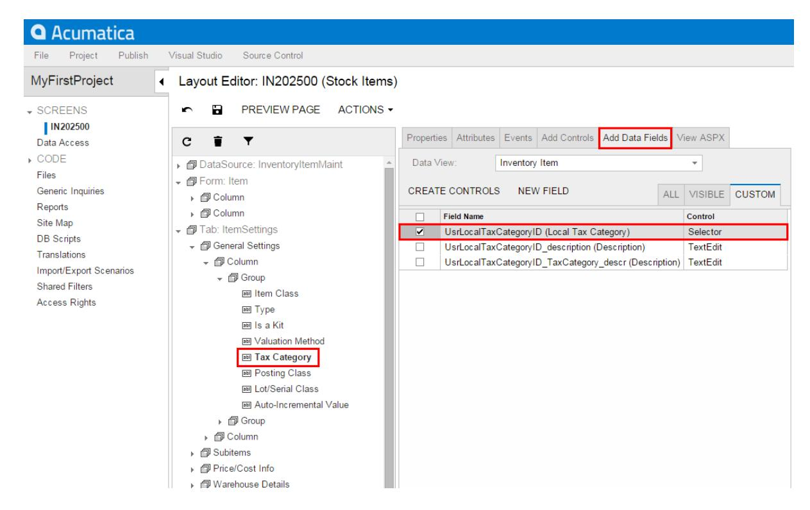

#### *Figure: Adding the control for the data field*

- c. Click **Save** on the toolbar to save the layout changes.
- d. Preview the customized form by clicking **Preview Changes** on the toolbar or publish the customization project to view the changes applied to the *[Stock Items](https://help-2025r1.acumatica.com/Help?ScreenId=ShowWiki&pageid=77786a70-1f1e-4d63-ad98-96f98e4fcb0e)* form.
- 5. Verify that the customized Stock Items form looks as needed according to the customization task (see above). The customization items for the form layout, custom code (or external assembly file), and database schema have been added to the customization project. The new **LocalTax Category** text box will appear on the Stock Items form on every system where you publish the customization project.

### <span id="page-446-1"></span><span id="page-446-0"></span>**Customizing DAC Attributes**

To modify or extend the behavior that is defined within a data access class (DAC), you should append or override the field attributes declared within the DAC.

Suppose that you have a customization task to modify the Invoices (SO303000) form, and that this task consists of the following requirements:

- 1. The **Customer Order** data field on the form area (see the screenshot below) must have the *None* value when the user has not specified the reference number of the customer.
- 2. The values of the **Discount Percent** column must be limited to a range of -30 to 25 percent instead of the original range of -100 to 100 percent.

| 111001003                                                                                                                                                                                                                                                                                                                                    |                        |                                  |            |                                                           |                  |                                          |                            |           |          |                    | $ $ NUILS       | ACTIVILLES | FILES    |
|----------------------------------------------------------------------------------------------------------------------------------------------------------------------------------------------------------------------------------------------------------------------------------------------------------------------------------------------|------------------------|----------------------------------|------------|-----------------------------------------------------------|------------------|------------------------------------------|----------------------------|-----------|----------|--------------------|-----------------|------------|----------|
| $\leftarrow$                                                                                                                                                                                                                                                                                                                                 | SAVE & CLOSE<br>$\Box$ | 面<br>$^{+}$<br>$\Rightarrow$     | n<br>۰     | $\mathsf{K}$<br>$\rightarrow$<br>$\overline{\phantom{a}}$ | ACTIONS +<br>>1  |                                          | REPORTS -                  |           |          |                    |                 |            |          |
| Type:                                                                                                                                                                                                                                                                                                                                        | Invoice<br>$\cdot$     | * Customer:                      |            | ABCSTUDIOS - ABC Studios Inc.                             |                  | !!!!!!!!!!!!!!!!!!!!!!!!!!!!!!!!!!!!!!!! | Detail Total:              | 78,920.00 |          |                    |                 |            |          |
| Reference Nbr.                                                                                                                                                                                                                                                                                                                               | AR005779 Q             | * Location:                      |            | MAIN - Primary Location                                   |                  |                                          | Discount Total:            | 0.00      |          |                    |                 |            |          |
| Status:                                                                                                                                                                                                                                                                                                                                      | Open                   | Currency:                        | <b>USD</b> | 1.00                                                      | v   VIEW BASE    |                                          | VAT Taxable T              | 0.00      |          |                    |                 |            |          |
|                                                                                                                                                                                                                                                                                                                                              | <b>Hold</b>            | * Terms:                         |            | 30D - 30 Days                                             |                  |                                          | VAT Exempt T               | 0.00      |          |                    |                 |            |          |
|                                                                                                                                                                                                                                                                                                                                              | Credit Hold            | * Due Date:                      |            | $5/19/2018$ $\rightarrow$                                 |                  |                                          | Tax Total:                 | 0.00      |          |                    |                 |            |          |
| * Date:                                                                                                                                                                                                                                                                                                                                      | 4/19/2018              | * Cash Discount                  |            | $5/19/2018$ $\rightarrow$                                 |                  |                                          | Write-Off Total:           | 0.00      |          |                    |                 |            |          |
| * Post Period:                                                                                                                                                                                                                                                                                                                               | 04-2018                |                                  |            | * Project/Contract: X - Non-Project Code.                 |                  | !!!!!!!!!!!!!!!!!!!!!!!!!!!!!!!!!!!!!!!! | Balance:                   | 78,920.00 |          |                    |                 |            |          |
| Customer Order:                                                                                                                                                                                                                                                                                                                              | ABCSTUDIOS:            |                                  |            |                                                           |                  |                                          | Amount:                    | 78,920.00 |          |                    |                 |            |          |
| Description:                                                                                                                                                                                                                                                                                                                                 |                        | Electronics - Drop Shipped Order |            |                                                           |                  |                                          | Cash Discount:             | 0.00      |          |                    |                 |            |          |
| <b>DOCUMENT DETAILS</b><br><b>TAX DETAILS</b><br>COMMISSIONS<br><b>FREIGHT DETAILS</b><br><b>FINANCIAL DETAILS</b><br>PAYMENT INFORMATION<br>ADDRESS DETAILS<br><b>APPLICATIONS</b><br><b>DISCOUNT DETAILS</b><br>$\boxed{\mathbf{X}}$<br>ADD ORDER<br><b>VIEW SCHEDULE</b><br><b>RESET ORDER</b><br>$\vdash$<br>C<br>$\!+$<br>P<br>$\times$ |                        |                                  |            |                                                           |                  |                                          |                            |           |          |                    |                 |            |          |
| $\Box$<br><b>Branch</b><br>8.                                                                                                                                                                                                                                                                                                                |                        | Shipment Nbr.<br>Type            | Order      | Order Nbr.                                                | Inventory ID     |                                          | <b>Transaction Descr.</b>  |           | Percent  | Discount Warehouse | Location        |            | Quantity |
| $\mathbb{Q}$<br>n                                                                                                                                                                                                                                                                                                                            | PRODWHOLE              | PR000646<br><b>SO</b>            |            | SO004239                                                  | <b>ELEKINDLE</b> |                                          | Kindle Fire 8.9" Tablet HD |           | 0.000000 | <b>RETAIL</b>      | $<$ SPLIT>      |            | 80.00    |
| $0$ $\Box$                                                                                                                                                                                                                                                                                                                                   | PRODWHOLE              | SO.<br>PR000646                  |            | SO004239                                                  | AACOMPUT01       |                                          | Acer Laptop Computer       |           | 0.000000 | WHOLESALE          | <split></split> |            | 110.00   |

*Figure: Viewing the original form*

To begin implementing the first requirement, inspect the properties of the **Customer Order** UI control. To do this, on the **Customization** menu, select **Inspect Element** and click the box or label of the control on the form. The system should retrieve the following information of the control that will display in the **Element Properties** dialog box:

- **ControlType**: *Text Edit*. The type of the UI control.
- **Data Class**: *ARInvoice*. The data access class that contains the inspected field.
- **Data Field**: *InvoiceNbr*. The field that is represented by the **Customer Order** control on the form.
- **Business Logic**: *SOInvoiceEntry*. The business logic controller (BLC, also referred to as *graph*) that provides the logic executed on the *Invoices* form.

To modify attributes of the DAC field, select **Actions > Customize Data Fields** in the **Element Properties** dialog box. In the**Select Customization Project** dialog box, specify the project to which you want to add the customization item for the data field and click **OK**.

The Data Class Editor opens for customization of the InvoiceNbr field of the ARInvoice data access class.

Suppose that you decided to append an attribute to the DAC field to specify the default value for the field. Do it as follows:

- 1. In the **Customize Attributes** box select *Append to Original*.
- 2. In the text area, type [PXDefault("None")].
- 3. Save your changes in the Data Class Editor.

Acumatica Framework 2025 R1 provides advanced possibilities to control the field customization by using additional attributes in the DAC extension. See the *[Customization of Field Attributes in DAC](#page-54-0) [Extensions](#page-54-0)* for details.

| ⇦ | 圕                   | ADD FIELD $\star$ OPEN SCREEN | <b>VIEW SOURCE</b>    | SELECTOR COLUMNS <b>EDIT ATTRIBUTES</b> |
|---|---------------------|-------------------------------|-----------------------|-----------------------------------------|
| С | $\times$            |                               |                       | InvoiceNbr (Customized Existing Field)  |
|   | <b>B</b> Field Name |                               | Customize Attributes: | Append to Original<br>۰                 |
|   | InvoiceNbr          |                               |                       |                                         |
|   |                     |                               | [PXDefault ("None") ] |                                         |
|   |                     |                               |                       |                                         |
|   |                     |                               |                       |                                         |
|   |                     |                               |                       |                                         |

#### *Figure: Appending an attribute to the DAC field*

The system adds the customized data access class to the **Data Access** list of project items. For more information, see *[Customized Data Classes](#page-154-1)*.

To view the changes applied to the Invoices form, publish the customization project and add a new document on the Invoices form. When you add a new document, the system will insert the *None* default value into the **Customer Order** box as you have specified with the PXDefault attribute.

To implement the second requirement of the task, inspect the **Discount Percent** column on the **Document Details** tab of the Invoices form. To do this, on the **Customization** menu, select **Inspect Element** and click the area of the **Discount Percent** column header. The system should retrieve the following information of the control that will display in the **Element Properties** dialog box:

- **ControlType**: *Grid Column*. The type of the UI control.
- **Data Class**: *ARTran*. The data access class that contains the inspected field.
- **Data Field**: *DiscPct*. The field that is represented by the **Discount Percent** column in the table.
- **Business Logic**: *SOInvoiceEntry*. The business logic controller (BLC, also referred to as *graph*) that provides the logic executed on the *Invoices* form.

To modify attributes of the DAC field, select **Actions > Customize Data Fields** in the **Element Properties** dialog box. In the**Select Customization Project** dialog box, specify the project to which you want to add the customization item for the data field and click **OK**.

The Data Class Editor opens for customization of the DiscPct field of the ARTran data access class.

The PXDBDecimal attribute specifies the range of valid values for the field. According to the customization task, you have to modify the minimum and maximum values specified in the attribute. To do this, you have to replace the original attributes with the custom ones as follows:

- 1. In the **Customize Attributes** box, select *Replace Original*. The original attributes will be copied to the text area where you enter custom attributes.
- 2. For the PXDBDecimal attribute, change the minimum and maximum values, as listed below.

```
[PXDBDecimal(6, MinValue = -30, MaxValue = 25)]
[PXUIField(DisplayName = "Discount Percent")]
[PXDefault(TypeCode.Decimal, "0.0")]
```

3. Click **Save** in the Data Class Editor to save the changes.


If you replace attributes, you have to repeat all attributes that you want to remain on the data field.

| $\Box$<br>⇦            | ADD FIELD • OPEN SCREEN VIEW SOURCE SELECTOR COLUMNS EDIT ATTRIBUTES                                                                                                 |
|------------------------|----------------------------------------------------------------------------------------------------------------------------------------------------------------------|
| C<br>$\mathsf{X}$      | <b>DiscPct (Customized Existing Field)</b>                                                                                                                           |
| <b>hame</b> Field Name | Customize Attributes:<br><b>Replace Original</b>                                                                                                                     |
| $\angle$ Disc $Pct$    | $[PNDBDecimal(6, MinValue = -30, MaxValue = 25)]$<br>[PXUIField(DisplayName = "Discount Percent")]<br>[PXDefault(TypeCode.Decimal, "0.0")]                           |
|                        | Original attributes:<br>$[PNDBDecimal(6, MinValue = -100, MaxValue = 100)]$<br>[PXUIField(DisplayName = "Discount Percent")]<br>[PXDefault(TypeCode.Decimal, "0.0")] |

#### *Figure: Replacing attributes on the data field*

The system adds the customized data access class to the **Data Access** list of project items. For more information, see *[Customized Data Classes](#page-154-1)*.

To test the result of the customization, publish the customization project, open the Invoices form, insert a new document, and add a record to the details table, as shown in the screenshot below. If you try to specify a value in the **Discount** column greater than 25 percent or less than -30 percent, the system will automatically correct the value to the maximum 25 or minimum -30, respectively.

### <span id="page-449-1"></span><span id="page-449-0"></span>**Modifying a BLC Action**

To modify the behavior of an action that is defined within a business logic controller (BLC, also referred to as *graph*), you should override an action delegate.

Suppose that you need to rename the **Release** button to **Extended Release** on the Receipts (IN301000) form, which is shown in the following screenshot.

|  | - |  |
|--|---|--|

|            | $\leftarrow$                                           |        | SAVE & CLOSE     |                    | 圕 | ⇦             | $^{+}$          | 阃              | ロード |              | ≺              | $\rightarrow$ | $\geq$ | <b>RELEASE</b>     |    | REPORTS $\sim$   |              |  |
|------------|--------------------------------------------------------|--------|------------------|--------------------|---|---------------|-----------------|----------------|-----|--------------|----------------|---------------|--------|--------------------|----|------------------|--------------|--|
|            |                                                        |        | Reference Nbr.:  | 000671             | α |               |                 | Transfer Nbr.: |     |              |                |               |        | Total Qty.:        |    | 600.00           |              |  |
|            | Status:                                                |        |                  | <b>Balanced</b>    |   |               |                 | External Ref.: |     |              |                |               |        | <b>Total Cost:</b> |    | 102,344.75       |              |  |
|            |                                                        |        |                  | $\Box$ Hold        |   |               | Description:    |                |     |              |                |               |        |                    |    |                  |              |  |
|            | * Date:                                                |        |                  | 4/6/2018           | ۰ |               |                 |                |     |              |                |               |        |                    |    |                  |              |  |
|            | * Post Period:                                         |        | 04-2018          | α                  |   |               |                 |                |     |              |                |               |        |                    |    |                  |              |  |
|            | <b>TRANSACTION DETAILS</b><br><b>FINANCIAL DETAILS</b> |        |                  |                    |   |               |                 |                |     |              |                |               |        |                    |    |                  |              |  |
|            | C                                                      | $\pm$  | $\times$         | <b>ALLOCATIONS</b> |   |               | <b>ADD ITEM</b> |                | ℍ   | $\mathbf{x}$ | $\mathbf{.1}$  |               |        |                    |    |                  |              |  |
| <b>B</b> 0 |                                                        | n      | *Branch          |                    |   | *Inventory ID |                 | *Warehouse     |     |              | Location       |               |        | Quantity * UOM     |    | <b>Unit Cost</b> | Ext. Cost Lo |  |
|            | $\mathbf{0}$                                           | $\Box$ | <b>PRODWHOLE</b> |                    |   | ELEBOSE1      |                 | <b>RETAIL</b>  |     |              | <b>STORAGE</b> |               |        | 275.00             | EA | 209.30           | 57.557.50    |  |
|            | 0                                                      | D      | <b>PRODWHOLE</b> |                    |   | ELEBOSE2      |                 | <b>RETAIL</b>  |     |              | <b>STORAGE</b> |               |        | 300.00             | EA | 104.97           | 31.491.00    |  |
|            | 0                                                      | n      | <b>PRODWHOLE</b> |                    |   | ELECOMP2      |                 | <b>RETAIL</b>  |     |              | <b>STORAGE</b> |               |        | 25.00              | EA | 531.85           | 13.296.25    |  |

#### *Figure: Viewing the original Receipts form*

To do this, you have to find the business logic controller for the form and modify the display name of the action that corresponds to the **Release** button as follows:

- 1. Find the business logic controller for the form, on the **Customization** menu, select **Inspect Element** and click the button caption on the form. The system should retrieve the following information of the button, which appears in the **Element Properties** dialog box:
  - **ControlType**: *DS Callback Command*. The type of the UI control.
  - **Business Logic**: *INReceiptEntry*. The business logic controller that contains the code of the action that is represented by the **Release** button.

Thus, to rename the button, you have to change the DisplayName parameter of the PXUIField attribute for the Release action in the BLC extension for the *INReceiptEntry* class.

- 2. Modify the attributes of the action, by doing the following:
  - a. Select **Actions > Customize Business Logic** in the Element Properties dialog box
  - b. In the **Select Customization Project** dialog, specify the project to which you want to add the customization item for the business logic controller of the form and click **OK**.

The Code Editor opens for customization of the business logic code of the form (see the screenshot below). The system generates the BLC extension class in which you can develop the customization code. (See *[Graph Extensions](#page-58-0)* for details.)

#### *Figure: The BLC extension class generated for customization of the business logic code executed for the Receipts form*

c. Modify the DisplayName parameter of the PXUIField attribute for the Release action by redefining the action in the BLC extension class, to which the attributes are attached. Insert the code listed below into the INReceiptEntry\_Extension class, as shown in the screenshot below. In the DisplayName parameter, you specify the new name for the button, *"Extended Release"*.

```
#region Customized Actions
 public PXAction<INRegister> release;
 [PXUIField(DisplayName = "Extended Release",
 MapEnableRights = PXCacheRights.Update,
 MapViewRights = PXCacheRights.Update)]
 [PXProcessButton]
 protected IEnumerable Release(PXAdapter adapter)
 {
 return Base.release.Press(adapter);
 }
#endregion
```

The redefined action delegate must have exactly the same signature—that is, the return value, the name of the method, and any method parameters—as the base action delegate has. You always have to redefine the action delegate to alter either its delegate or the attributes attached to the action. To use the action declared within the base BLC or a lower-level extension from the action delegate, you should redefine the generic PXAction<TNode> data member within the BLC extension, as shown in the code above. You do not need to redefine the data member when it is not meant to be used from the action delegate. For details, see *[Graph Extensions](#page-58-0)*. When you redefine an action delegate, you have to repeat the attributes attached to the action. Every action delegate must have PXButtonAttribute (or the derived attribute) and PXUIFieldAttribute attached.

3. Click **Save** in Code Editor to save the changes.

The system adds the customization to the business logic code to the **Code** list of project items. See *[Code](#page-163-1)* for details.

To view the result of the customization, publish the customization project and open the Receipts form. Verify that the button caption has changed to **Extended Release**. Click this button for a document with the *Balanced* status

and verify that the release procedure works exactly as it worked before publication of the current customization project.

### <span id="page-452-1"></span><span id="page-452-0"></span>**Modifying a BLC Data View**

A *data view* is a PXSelect BQL expression declared in a business logic controller (BLC, also referred to as *graph*) for accessing and manipulating data. A data view may contain a delegate that is used to extend data access. To modify the data view, you have to alter the appropriate PXSelect BQL expression.

Suppose that you need to filter the rows on the**Vendors** tab of the Stock Items (IN202500) form. Open the original Stock Items form and create an item that has multiple vendor records on the**Vendors** tab, one or more of which has a **LotSize** column value of *0.00*, as the screenshot below illustrates.

Your task is to modify the selection of records for the**Vendors** tab so that only the records that have a non-zero **LotSize** value are retrieved to the tab. To resolve this customization task, you have to redeclare the data view that provides the data displayed on the tab.

|                                                                                                                                                                                                                                                      | Stock Items                                                                                                                                                                 |               |                                             |             |                  |                 |                           |                     |                                          |                                          |                       |                      |          | $\Box$ $NO$ . |
|------------------------------------------------------------------------------------------------------------------------------------------------------------------------------------------------------------------------------------------------------|-----------------------------------------------------------------------------------------------------------------------------------------------------------------------------|---------------|---------------------------------------------|-------------|------------------|-----------------|---------------------------|---------------------|------------------------------------------|------------------------------------------|-----------------------|----------------------|----------|---------------|
| $\leftarrow$                                                                                                                                                                                                                                         | 侕<br>SAVE & CLOSE<br>圖<br>n<br>ACTIONS -<br>$\mathsf{I}\leq$<br>>1<br>INQUIRIES +<br>$\Leftrightarrow$<br>$\rightarrow$<br>$^{+}$<br>$\check{}$<br>$\overline{\phantom{a}}$ |               |                                             |             |                  |                 |                           |                     |                                          |                                          |                       |                      |          |               |
| Product Workgroup:<br>* Inventory ID:<br>Q<br>AACOMPUT01 - Acer Laptop Comput Q                                                                                                                                                                      |                                                                                                                                                                             |               |                                             |             |                  |                 |                           |                     |                                          |                                          |                       |                      |          |               |
|                                                                                                                                                                                                                                                      | Item Status:                                                                                                                                                                |               | Active<br>$\check{}$                        |             | Product Manager: |                 |                           | Ω                   |                                          |                                          |                       |                      |          |               |
|                                                                                                                                                                                                                                                      | Description:<br>Acer Laptop Computer                                                                                                                                        |               |                                             |             |                  |                 |                           |                     |                                          |                                          |                       |                      |          |               |
| <b>GENERAL SETTINGS</b><br><b>VENDOR DETAILS</b><br>PACKAGING<br>PRICE/COST INFO<br>WAREHOUSE DETAILS<br><b>ATTRIBUTES</b><br>CROSS-REFERENCE<br>REPLENISHMENT INFO<br>$\boxed{\mathbf{X}}$<br>C<br>$\times$<br>$\left  \rightarrow \right $<br>$^+$ |                                                                                                                                                                             |               |                                             |             |                  |                 |                           |                     |                                          |                                          |                       | <b>DEFERRAL</b>      |          |               |
| <b>国 Acti</b>                                                                                                                                                                                                                                        | Def <sub>i</sub>                                                                                                                                                            | *Vendor<br>ID | Vendor Name                                 | Locat       | Warehous         | * Purch<br>Unit | Vendor<br>Inventory<br>ID | Lead Time<br>(days) | Add. Lead<br>Time<br>(Days)              | Min. Order<br>Freq.<br>(Days)            | Min.<br>Order<br>Qty. | Max<br>Order<br>Qty. | Lot Size | EOQ           |
| $\overline{\mathcal{S}}$                                                                                                                                                                                                                             | $\checkmark$                                                                                                                                                                | ELEEAS        | East COM Electronic Supplies<br><b>MAIN</b> |             |                  | EA              | ACERLA                    |                     | $\overline{2}$                           | !!!!!!!!!!!!!!!!!!!!!!!!!!!!!!!!!!!!!!!! | 10.00                 | 100.00               | 1.00     | 0.00          |
| ☑                                                                                                                                                                                                                                                    |                                                                                                                                                                             | ELEEM         | <b>Emperor Office Equipment</b>             | <b>MAIN</b> | EA               |                 | ACERLA                    |                     | 5                                        | !!!!!!!!!!!!!!!!!!!!!!!!!!!!!!!!!!!!!!!! | 0.00                  | 0.00                 | 3.00     | 0.00          |
| $\overline{\textbf{S}}$                                                                                                                                                                                                                              |                                                                                                                                                                             | AAVEN         | Goto Vendor Inc.                            | <b>MAIN</b> |                  | EA              |                           |                     | 5                                        | !!!!!!!!!!!!!!!!!!!!!!!!!!!!!!!!!!!!!!!! | 0.00                  | 0.00                 | 0.00     | 0.00          |
| $\boxed{\checkmark}$                                                                                                                                                                                                                                 |                                                                                                                                                                             | INDICHI       | ICHICO Electronics Industry Co.             | <b>MAIN</b> |                  | EA              |                           |                     | !!!!!!!!!!!!!!!!!!!!!!!!!!!!!!!!!!!!!!!! | $\mathbf 0$                              | 0.00                  | 0.00                 | 5.00     | 0.00          |

#### *Figure: Viewing the original Stock Items form*

The data for the**Vendors** tab is provided by the VendorItems data view that is defined in the InventoryItemMaint class—that is, the business logic controller for the Stock Items form. To resolve the customization task, you have to redefine the VendorItems data view in the BLC extension for the business logic controller of the form as follows:

- 1. Select the business logic controller for customization, on the **Customization** menu, select **Inspect Element** and click the **Vendors** tab. The system should retrieve the following information that appears in the **Element Properties** dialog box:
  - **Business Logic**: *InventoryItemMaint*. The business logic controller that provides the logic for the *Stock Items* form.
- 2. Select **Actions > Customize Business Logic** in the **Element Properties** dialog box.
- 3. In the **Select Customization Project** dialog box, specify the project to which you want to add the customization item for the business logic controller of the form and click **OK**.

The Code Editor opens for customization of the business logic code of the form (see the screenshot below). The system generates the BLC extension class in which you can develop the customization code. (See *[Graph](#page-58-0) [Extensions](#page-58-0)* for details.)

#### *Figure: The BLC extension class generated for customization of the business logic code executed for the Stock Items form*

4. In the BLC extension class for InventoryItemMaint, redefine the VendorItems data view, as listed below.

```
public POVendorInventorySelect<POVendorInventory, 
 LeftJoin<InventoryItem, 
 On<InventoryItem.inventoryID, Equal<POVendorInventory.inventoryID>>, 
 LeftJoin<Vendor, 
 On<Vendor.bAccountID, Equal<POVendorInventory.vendorID>>, 
 LeftJoin<Location, 
 On<Location.bAccountID, Equal<POVendorInventory.vendorID>, 
 And<Location.locationID, Equal<POVendorInventory.vendorLocationID>>>>>>, 
 Where<POVendorInventory.inventoryID, Equal<Current<InventoryItem.inventoryID>>,
 And<POVendorInventory.lotSize, Greater<decimal0>>>, InventoryItem>
 VendorItems;
```

To modify a data view, you have to redefine the data view in the BLC extension class. The data view redefined within a BLC extension completely replaces the base data view within the *Views* collection of a BLC instance, including all attributes attached to the data view declared within the base BLC. You can either attach the same set of attributes to the data view or completely redeclare the attributes. For details, see *[Graph Extensions](#page-58-0)*. The data view must have exactly the same identifier, VendorItems, which is referred in the UI control.

5. Click **Save** in Code Editor to save the changes.

The system adds the customization to the business logic code to the **Code** list of project items. See *[Code](#page-163-1)* for details.

To view the result of the customization, publish the customization project and open the Stock Items form. Verify that the records are filtered on the**Vendors** tab as required according to the customization task (only the records with non-zero **LotSize** are retrieved).

### <span id="page-454-1"></span><span id="page-454-0"></span>**Declaring or Altering a BLC Data View Delegate**

You can modify the data view delegate—that is, the method that is invoked when the records are retrieved through the data view.


For this example, you have to enable the *Warehouses* feature in the system to view the **Warehouses** tab on the Stock Items (IN202500) form.

For the Stock Items form, suppose that you have to make the system display the default warehouse in the **Default ReceiptTo** column for those records for which this column is empty. Your customization task specifies that the default warehouse for such records is the **Default ReceiptTo** warehouse of the default record selected on the **Warehouses** tab.

Open the Stock Items form and select the **Warehouses** tab to view the original tab, which is shown in the screenshot below.

| * Inventory ID:<br>Item Status: |    |   |                              |                  | Active               | AACOMPUT01 - Acer Laptop Comput Q<br>$\overline{\phantom{a}}$ |                                                               | Product Workgroup:<br>Product Manager: |                      |                                |                   |  |                 |  |  |
|---------------------------------|----|---|------------------------------|------------------|----------------------|---------------------------------------------------------------|---------------------------------------------------------------|----------------------------------------|----------------------|--------------------------------|-------------------|--|-----------------|--|--|
| Description:                    |    |   |                              |                  | Acer Laptop Computer |                                                               |                                                               |                                        |                      |                                |                   |  |                 |  |  |
|                                 | С  |   | <b>GENERAL SETTINGS</b><br>/ | $\times$         | PRICE/COST INFO      | ADD WAREHOUSE DETAIL                                          | <b>WAREHOUSE DETAILS</b><br>$\mathbf{x}$<br>$\leftrightarrow$ | <b>VENDOR DETAILS</b>                  |                      | <b>ATTRIBUTES</b><br>PACKAGING |                   |  | CROSS-REFERENCE |  |  |
| $\Xi$ 0                         |    | n | Defaul                       | Warehouse        |                      | Default Receipt<br>To                                         | Default Issue<br>From                                         | <b>Status</b>                          | Inventory<br>Account | Inventory<br>Sub.              | Product Workgroup |  | Pro             |  |  |
|                                 | 0  | D |                              | <b>RETAIL</b>    |                      | STORAGE                                                       | STORAGE                                                       | Active                                 | 12100                | ELE-000                        |                   |  |                 |  |  |
|                                 | O, |   | ▽                            | <b>WHOLESALE</b> |                      | <b>RECEIVING</b>                                              | <b>R1S1</b>                                                   | Active                                 | 12100                | WID-000                        |                   |  |                 |  |  |

*Figure: Viewing the original Stock Items form*

To resolve this task, you have to modify the logic that retrieves the records to the **Warehouses** tab—that is, the modify the delegate of the data view that provides data for the tab. The data view that provides data for the tab is itemsiterecords that is defined in the business logic controller of the form. The business logic controller of the form is the InventoryItemMaint class. Do the following:

- 1. Select the business logic controller for customization, on the **Customization** menu, select **Inspect Element** and click the **Warehouses** tab. The system should retrieve the following information that appears in the **Element Properties** dialog box:
  - **Business Logic**: *InventoryItemMaint*. The business logic controller that provides the logic for the *Stock Items* form.
- 2. Select **Actions > Customize Business Logic** in the **Element Properties** dialog box.
- 3. In the **Select Customization Project** dialog box, specify the project to which you want to add the customization item for the business logic controller of the form and click **OK**.

The Code Editor opens for customization of the business logic code of the form (see the screenshot below). The system generates the BLC extension class in which you can develop the customization code. (See *[Graph](#page-58-0) [Extensions](#page-58-0)* for details.)

#### *Figure: The BLC extension class generated for customization of the business logic code executed for the Stock Items form*

To resolve the customization task, you have to redefine the itemsiterecords data view and implement the needed logic in the itemSiteRecords() data view delegate.

4. Add the code that is listed below to the BLC extension class for InventoryItemMaint

```
#region Customized Data Views
 public PXSelectJoin<INItemSite,
 InnerJoin<INSite,
 On<INSite.siteID, Equal<INItemSite.siteID>>,
 LeftJoin<INSiteStatusSummary,
 On<INSiteStatusSummary.inventoryID, Equal<INItemSite.inventoryID>,
 And<INSiteStatusSummary.siteID, Equal<INItemSite.siteID>>>>>>
 itemsiterecords;
 protected IEnumerable itemSiteRecords()
 {
 int? dfltReceiptLocationID = null;
 foreach (var res in Base.itemsiterecords.Select())
 {
 INItemSite site = (INItemSite)res;
 if (site.DfltReceiptLocationID != null && site.IsDefault == true)
 dfltReceiptLocationID = site.DfltReceiptLocationID;
 else if (site.DfltReceiptLocationID == null && dfltReceiptLocationID != null)
 site.DfltReceiptLocationID = dfltReceiptLocationID;
 yield return res;
 }
 }
```

#endregion

When you declare or alter a data view delegate within a BLC extension, the new delegate is attached to the corresponding data view. To query a data view declared within the base BLC or lower-level extension from the data view delegate, you should redeclare the data view within the BLC extension. You do not need to redeclare a generic PXSelect<Table> data member when it will not be used from the data view delegate. For details, see *[Graph Extensions](#page-58-0)*.

The redeclared data view delegate must have exactly the same signature—the return value, the name of the method, and any method parameters— as the base data view delegate.

5. Click **Save** in Code Editor to save the changes.

The system adds the customization to the business logic code to the **Code** list of project items. See *[Code](#page-163-1)* for details.

To view the result of the customization, publish the customization project and open the Stock Items form. Verify that the default warehouse is displayed for all records as needed according to the customization task. The default warehouse is taken from the **Default ReceiptTo** warehouse of the record selected as *Default* in the table.

### <span id="page-456-1"></span><span id="page-456-0"></span>**Extending BLC Initialization**

During the initialization of a business logic controller (BLC, also referred to as *graph*), you can retrieve additional preferences, change field settings, or configure the processing form. You can extend the BLC initialization by implementing the needed logic in a BLC extension. To extend the initialization process, you have to override the Initialize() method of the PXGraphExtension<T> class and do not use the constructor of the BLC extension class for that. During the BLC initialization, the system calls the Initialize() methods of all extension levels, from the lowest to the highest. See *[Graph Extensions](#page-58-0)* for details.

In this example, you will create an extension of the InventoryItemMaintExtension BLC, which overrides the Initialize() method to change the display name of the InventoryItem data access class (DAC) field from *Inventory ID* to *Inventory Item ID* during the initialization of the base (original) BLC instance.

If you open the Stock Items (IN202500) form, you can see its original view with the **Inventory ID** control (see the following screenshot) that corresponds to the InventoryItem DAC field.

|  | SAVE & CLOSE |  |  |  |  |  |  |  |  |  |  | >I ACTIONS ▼ INQUIRIES ▼ |
|--|--------------|--|--|--|--|--|--|--|--|--|--|--------------------------|
|--|--------------|--|--|--|--|--|--|--|--|--|--|--------------------------|

| I * Inventory ID: 1<br>Item Status:     | AACOMPUT01 - Acer Laptop Comput Q<br>Active<br>$\overline{\phantom{a}}$ |                          | Product Workgroup:<br>Product Manager: |                   | Ω<br>α    |       |
|-----------------------------------------|-------------------------------------------------------------------------|--------------------------|----------------------------------------|-------------------|-----------|-------|
| Description:<br><b>GENERAL SETTINGS</b> | <b>Acer Laptop Computer</b><br>PRICE/COST INFO                          | <b>WAREHOUSE DETAILS</b> | <b>VENDOR DETAILS</b>                  | <b>ATTRIBUTES</b> | PACKAGING | CROSS |

#### *Figure: Viewing the original Stock Items form*

To complete the example, do the following:

- 1. Select the business logic controller for customization, on the **Customization** menu, select **Inspect Element** and click the **Inventory ID** label. The system should retrieve the following information that appears in the **Element Properties** dialog box:
  - **Business Logic**: *InventoryItemMaint*. The business logic controller that provides the logic for the *Stock Items* form.
- 2. Select **Actions > Customize Business Logic** in the **Element Properties** dialog box.

3. In the **Select Customization Project** dialog box, specify the project to which you want to add the customization item for the business logic controller of the form and click **OK**.

The Code Editor opens for customization of the business logic code of the form (see the screenshot below). The system generates the BLC extension class in which you can develop the customization code. (See *[Graph](#page-58-0) [Extensions](#page-58-0)* for details.)

#### *Figure: The BLC extension class generated for customization of the business logic code executed for the Stock Items form*

4. Override the Initialize() method; in the method, set the display name of the InventoryItem data access class (DAC) field to *Inventory Item ID*. (For demonstrative purposes, the code also retrieves the INSetup data record and shows how you can implement the logic depending on values of the record.)


Do not define constructors of BLC extension classes; always use the Initialize() method to implement the needed initialization logic.

Add the code that is listed below to the BLC extension class for InventoryItemMaint.

```
#region Extended initialization
public override void Initialize()
{
 PXUIFieldAttribute.SetDisplayName<InventoryItem.inventoryCD>(
 Base.Item.Cache,
 "Inventory Item ID"); 
 //retrieval of the setup record that stores inventory preferences 
 INSetup setup = Base.insetup.Current;
 if (setup.UpdateGL != true)
 {
 // Do some actions here
```

```
 }
}
#endregion
```

In this method, you change the display name of the InventoryCD field of the InventoryItem DAC. You do this by calling the SetDisplayName() static method of PXUIFieldAttribute. Also, you obtain the INSetup DAC instance by using the Current property of the INSetup data view. In your customization tasks, you may need to perform some actions that depend on field values of this setup DAC instance.

You do not need to explicitly invoke the Initialize() method on the previous extension levels; these methods are called automatically. Invoking base.Initialize() makes no sense, because the base variable points to the base class, which is PXGraphExtension (not the base graph). The PXGraphExtension class defines Initialize() as an empty method.

5. Click **Save** in Code Editor to save the changes.

The system adds the customization to the business logic code to the **Code** list of project items. See *[Code](#page-163-1)* for details.

To view the result of the customization, publish the customization project and open the Stock Items form. Verify that the label has changed to **Inventory Item ID**.

### <span id="page-458-1"></span><span id="page-458-0"></span>**Altering the BLC of a Processing Form**

For most processing forms of Acumatica ERP, the processing method, the button captions that are displayed on the toolbar of the form are set up during the BLC initialization (*business logic controller*, also referred to as *graph*) —that is, in the constructor of the BLC that provides the logic for the processing form, or in the RowSelected event handler of the main view data access class (DAC). To modify the logic that is executed during the BLC initialization, you have to create a BLC extension class and implement the needed logic in the Initialize() method overridden in the extension class; do not use the constructor for that.

For example, to disable the **Release All** button and modify the functionality of the **Release** button of the Release IN Documents (IN501000) form, you create an extension on the INDocumentRelease BLC and override the Initialize() method as follows:

1. Open the Release IN Documents form to see its original view (see the screenshot below). Notice that the **Release** and **Release All** buttons are both available for clicking.

| Release IN Documents ☆ |  |                                                   |        |  |                         |                                                                                  |               |      |  |                |            |  |
|------------------------|--|---------------------------------------------------|--------|--|-------------------------|----------------------------------------------------------------------------------|---------------|------|--|----------------|------------|--|
|                        |  |                                                   |        |  |                         | C $\Leftrightarrow$ $\theta$ RELEASE RELEASE ALL $\circ$ $\cdot$ H $\boxtimes$ T |               |      |  |                |            |  |
|                        |  | $\mathbf{F} \mathbf{0}$ $\mathbf{D}$ $\mathbf{C}$ | Source |  | Document<br><b>Type</b> | Reference<br>Nbr.                                                                | <b>Status</b> | Date |  | Post<br>Period | Total Qty. |  |
|                        |  |                                                   |        |  |                         |                                                                                  |               |      |  |                |            |  |

#### *Figure: Analyzing the original Release IN Documents form*

- 2. Select the business logic controller for customization, on the **Customization** menu, by clicking **Inspect Element** and selecting any element on the form, for example, the **Release** button. The system should retrieve the following information that appears in the **Element Properties** dialog box:
  - **Business Logic**: *INDocumentRelease*. The business logic controller that provides the logic for the *Release IN Documents* form.
- 3. Select **Actions > Customize Business Logic** in the Element Inspector. In the**Select Customization Project** dialog box, specify the project to which you want to add the customization item for the business logic controller of the form and click **OK**.

The Code Editor opens for customization of the business logic code of the form (see the screenshot below). The system generates the BLC extension class in which you can develop the customization code. (See *[Graph](#page-58-0) [Extensions](#page-58-0)* for details.)

| <b>Q</b> Acumatica                                                                                                                                                                                                                                           |                                                                                                                                                                                                                                                                                                                                                                                                                                                                                                                                                                                                                                                                                                                                                                                                                                                                                |
|--------------------------------------------------------------------------------------------------------------------------------------------------------------------------------------------------------------------------------------------------------------|--------------------------------------------------------------------------------------------------------------------------------------------------------------------------------------------------------------------------------------------------------------------------------------------------------------------------------------------------------------------------------------------------------------------------------------------------------------------------------------------------------------------------------------------------------------------------------------------------------------------------------------------------------------------------------------------------------------------------------------------------------------------------------------------------------------------------------------------------------------------------------|
| Publish<br>File<br>Project                                                                                                                                                                                                                                   | Visual Studio<br>Source Control                                                                                                                                                                                                                                                                                                                                                                                                                                                                                                                                                                                                                                                                                                                                                                                                                                                |
| MyFirstProject<br>$\blacktriangleleft$                                                                                                                                                                                                                       | Code Editor: INDocumentRelease (Release IN Documents)                                                                                                                                                                                                                                                                                                                                                                                                                                                                                                                                                                                                                                                                                                                                                                                                                          |
| $\sqrt{\text{SCREENS}}$<br><b>DATA ACCESS</b>                                                                                                                                                                                                                | н<br>OPEN SCREEN<br><b>VIEW SOURCE</b><br><b>OVERRIDE METHOD</b><br>MOVE TO EX                                                                                                                                                                                                                                                                                                                                                                                                                                                                                                                                                                                                                                                                                                                                                                                                 |
| $\sim$ CODE<br><b>INDocumentRelease</b><br><b>INReceiptEntry</b><br>InventoryItemMaint<br>Files<br>Generic Inquiries<br>Reports<br>Site Map<br><b>DB</b> Scripts<br>Translations<br>Import/Export Scenarios<br><b>Shared Filters</b><br><b>Access Rights</b> | using System;<br>1<br>using System.Collections;<br>$\overline{2}$<br>3<br>using System.Collections.Generic;<br>using System.Runtime.Serialization;<br>4<br>using System. Text;<br>5<br>6<br>using PX.Common;<br>using PX.Data;<br>7<br>using PX.Objects.CS;<br>8<br>using PX.Objects.GL;<br>9 <sup>1</sup><br>using PX.Objects.CM;<br>10 <br>using PX.Objects.IN.Overrides.INDocumentRelease;<br>11<br>using PX.Objects.SO;<br>12 <br>using PX.Objects.AP;<br>13 <sup>1</sup><br>using PX.Objects;<br>14<br>15<br>using PX.Objects.IN;<br>16<br>namespace PX.Objects.IN<br>17<br>ſ<br>18<br>19<br>public class INDocumentRelease Extension: PXGraphExtension <indocumentrelease><br/>20<br/>21<br/>₹<br/>22<br/>#region Event Handlers<br/>23<br/>24<br/>25<br/>26<br/>#endregion<br/>27<br/>28<br/>29<br/>!!!!!!!!!!!!!!!!!!!!!!!!!!!!!!!!!!!!!!!!<br/>30</indocumentrelease> |
|                                                                                                                                                                                                                                                              | 31<br>32<br>33                                                                                                                                                                                                                                                                                                                                                                                                                                                                                                                                                                                                                                                                                                                                                                                                                                                                 |

#### *Figure: The BLC extension class generated for customization of the business logic code executed for the Release IN Documents form*

4. Override the Initialize() method. In the method, disable the **Release All** button on the toolbar of the form, set the processing method, and set the method for asking the confirmation from the user before running the process.


Do not define constructors of BLC extension classes; always use the Initialize() method to implement the needed initialization logic.

To the BLC extension class for INDocumentRelease, add the code that is listed below.

```
#region Extended initialization
public override void Initialize()
{
 // Disable the Process All button
 Base.INDocumentList.SetProcessAllEnabled(false);
 //If set by the SetParametersDelegate, the method is executed before the
 processing is run
 //and provides conditional processing depending on the confirmation from the user
 //If the method returns true, the system executes the processing method 
 //that is set by SetProcessDelegate
```

```
 Base.INDocumentList.SetParametersDelegate(delegate(List<INRegister> documents)
 {
 return Base.INDocumentList.Ask("IN Document Release",
 "Are you sure?",
 MessageButtons.YesNo) == WebDialogResult.Yes;
 });
 Base.INDocumentList.SetProcessDelegate(delegate(INRegister doc)
 {
 INDocumentRelease.ReleaseDoc(new List<INRegister>() { doc }, true);
 });
}
#endregion
```

For another example of extending the BLC initialization, see *[Extending BLC Initialization](#page-456-1)*.

5. Click **Save** in Code Editor to save the changes.

The system adds the customization to the business logic code to the **Code** list of project items. See *[Code](#page-163-1)* for details.

To view the result of the customization, publish the customization project and open the Release IN Documents form. Notice that the **Release All** button has become unavailable. Select a few check boxes for documents to be released and click **Release**. The dialog box appears with the question that you have added in the BLC code. Click **Yes** to release the documents or **No** to cancel the operation and exit the dialog box.

### <span id="page-460-1"></span><span id="page-460-0"></span>**Adding or Altering BLC Event Handlers**

The following examples of customization tasks demonstrate how you can implement custom handlers for events in extension classes to business logic controllers (BLCs, also referred to as *graphs*).

- *[Implementing a Handler That is Appended to the Collection of Base Handlers](#page-460-2)*
- *[Implementing a Handler That Replaces the Collection of Base Handlers](#page-464-0)*
- *[Adding an Event Handler From the Screen Editor](#page-465-0)*

#### <span id="page-460-2"></span>**Implementing a Handler That is Appended to the Collection of Base Handlers**

When you define an event handler in the BLC extension class with the same declaration, as it is defined in the base (original) BLC, this handler is added to the appropriate event handler collection. Depending on the event type, the event handler is appended to either the end of the collection or the start of it. When the event occurs, all event handlers in the collection are executed, from the first one to the last one. For details, see *[Event Handlers](#page-60-0)*.

Suppose that you need to add validation of **LocalTax Category** on the **General** tab of the Stock Items (IN202500) form. **LocalTax Category** that is shown in the screenshot below is a custom field that has been added to the form, as described in the example of *[Adding Data Fields](#page-437-2)*. **LocalTax Category** is linked to the custom UsrLocalTaxCategoryID data field defined in the DAC extension for the InventoryItem data access class.

Your task is to check whether the selected **LocalTax Category** is the same as the selected**Tax Category** of the item and add a warning message that appears for the **LocalTax Category** box if they are the same.

| SAVE & CLOSE                                    | Ħ<br>$\Theta$                                      |                                                                      | <b> </b>                                         |                                                           | AC <sup>-</sup><br>$\geq$ |
|-------------------------------------------------|----------------------------------------------------|----------------------------------------------------------------------|--------------------------------------------------|-----------------------------------------------------------|---------------------------|
| * Inventory ID:<br>Item Status:<br>Description: | AACOMPLITO1 Acor Lonton Comput O<br><b>SELECT</b>  | Select - Local Tax Category<br>$\left  \leftrightarrow \right $<br>Õ |                                                  | !!!!!!!!!!!!!!!!!!!!!!!!!!!!!!!!!!!!!!!!                  | X<br>ρ                    |
| <b>GENERAL SETTINGS</b>                         | 81<br><b>Tax Category ID</b><br>⋋<br><b>EXEMPT</b> | ↑                                                                    | <b>Description</b><br><b>Exempt Tax Category</b> |                                                           | S                         |
| <b>ITEM DEFAULTS</b><br>* Item Class:<br>Type:  | <b>TAXABLE</b>                                     |                                                                      | Taxable Goods and Services                       |                                                           |                           |
| Valuation Method:<br>* Tax Category:            |                                                    |                                                                      |                                                  | $\vert \langle \quad \vert \langle \quad \rangle \rangle$ | $\rightarrow$             |
| Local Tax Category:<br>* Posting Class:         | ELE - Electronics & Computers                      |                                                                      | Q<br>Ω                                           | Unit                                                      | <del>manl</del> ply       |

#### *Figure: The control for the custom field on the Stock Items form*

To resolve the task, you implement validation of fields on the RowUpdating event handler that you will add to the BLC extension for the Stock Items form. In this variant of implementation, the validation will occur when the user attempts to save the InventoryItem record. In the handler, you compare the TaxCategoryID and UsrLocalTaxCategoryID fields and return an error message that displays for the **LocalTax Category** box if the values are equal. Do the following:

- 1. Select the business logic controller for customization by clicking **Customization > Inspect Element** and clicking the **Warehouses** tab on the Stock Items form. The system should retrieve the following information that appears in the **Element Properties** dialog box:
  - **Business Logic**: *InventoryItemMaint*. The business logic controller that provides the logic for the Stock Items form.

Select **Actions > Customize Business Logic** in the **Element Properties** dialog box. In the**Select Customization Project** dialog box, specify the project to which you want to add the customization item for the business logic controller of the form and click **OK**.

The Code Editor opens for customization of the business logic code of the form (see the screenshot below). The system generates the BLC extension class in which you can develop the customization code. (See *[Graph Extensions](#page-58-0)* for details.)

| <b>Q</b> Acumatica                                                                                                                                                                                                                                                                                                                                                                                                                                                    |                                                                                                                                                                                                                                                                                                                                                                                                                                                                                                                                                                                                                                                                                                                                                                                                                                                                                                                                                                                                                                                                                                                                                                                                                                               |
|-----------------------------------------------------------------------------------------------------------------------------------------------------------------------------------------------------------------------------------------------------------------------------------------------------------------------------------------------------------------------------------------------------------------------------------------------------------------------|-----------------------------------------------------------------------------------------------------------------------------------------------------------------------------------------------------------------------------------------------------------------------------------------------------------------------------------------------------------------------------------------------------------------------------------------------------------------------------------------------------------------------------------------------------------------------------------------------------------------------------------------------------------------------------------------------------------------------------------------------------------------------------------------------------------------------------------------------------------------------------------------------------------------------------------------------------------------------------------------------------------------------------------------------------------------------------------------------------------------------------------------------------------------------------------------------------------------------------------------------|
| <b>Extension Library</b><br>Publish<br>File                                                                                                                                                                                                                                                                                                                                                                                                                           | Source Control                                                                                                                                                                                                                                                                                                                                                                                                                                                                                                                                                                                                                                                                                                                                                                                                                                                                                                                                                                                                                                                                                                                                                                                                                                |
| AlterEventHandler                                                                                                                                                                                                                                                                                                                                                                                                                                                     | Code Editor: InventoryItemMaint (Stock Items)<br>۰                                                                                                                                                                                                                                                                                                                                                                                                                                                                                                                                                                                                                                                                                                                                                                                                                                                                                                                                                                                                                                                                                                                                                                                            |
| ▶ SCREENS<br>DATA ACCESS<br>$\sqrt{CODE}$<br>InventoryItemMaint<br><b>Files</b><br>Generic Inquiries<br>Reports<br>Dashboards<br>Site Map<br>Database Scripts (1)<br><b>System Locales</b><br>Import/Export Scenarios<br><b>Shared Filters</b><br><b>Access Rights</b><br><b>Wikis</b><br><b>Web Service Endpoints</b><br><b>Analytical Reports</b><br><b>Push Notifications</b><br><b>Business Events</b><br><b>Mobile Application</b><br><b>User-Defined Fields</b> | $\Box$<br><b>OPEN SCREEN</b><br><b>VIEW SOURCE</b><br><b>OVERRIDE METHOD</b><br>↰<br><b>NEW ACTION</b><br>using System;<br>$\mathbf{1}$<br>using System.Collections;<br>$\overline{2}$<br>using System.Collections.Generic;<br>3<br>using System. Ling;<br>4<br>using System. Text;<br>5<br>using System. Text. RegularExpressions;<br>6<br>using PX.Api.Models;<br>using PX.Common;<br>8<br>using PX.Data;<br>9<br>10 using PX.Objects.AP;<br>11 using PX.Objects.AR;<br>using PX.Objects.CR;<br>12<br>13 using PX.Objects.CS;<br>using PX.Objects.DR;<br>14<br>15 using PX.Objects.GL;<br>16 using PX.Objects.PO;<br>using PX.Objects.RUTROT;<br>17<br>18 using PX.Objects.SO;<br>using PX.Objects.Common.Discount;<br>19<br>20 using PX.SM;<br>using PX.Web.UI;<br>21<br>using CRLocation = PX.Objects.CR.Standalone.Location;<br>22<br>using ItemStats = PX.Objects.IN.Overrides.INDocumentRelease.ItemStats;<br>23<br>using PX.Objects;<br>24<br>using PX.Objects.IN;<br>25<br>26<br>namespace PX.Objects.IN<br>27<br>28<br>€<br>public class InventoryItemMaint Extension : PXGraphExtension <inventoryitemmaint><br/>29<br/>30<br/>#region Event Handlers<br/>31<br/>32<br/>#endregion<br/>33<br/>١<br/>34<br/>35</inventoryitemmaint> |

*Figure: The BLC extension class generated for customization of the business logic code executed for the Stock Items form*

2. Add the following code to the BLC extension class for InventoryItemMaint:

```
#region Event Handlers
protected void InventoryItem_RowUpdating(PXCache sender, PXRowUpdatingEventArgs e)
{
 InventoryItem row = e.NewRow as InventoryItem;
 InventoryItemExt rowExt = sender.GetExtension<InventoryItemExt>(row);
 if (row.TaxCategoryID != null && rowExt.UsrLocalTaxCategoryID != null &&
 row.TaxCategoryID == rowExt.UsrLocalTaxCategoryID)
 {
 sender.RaiseExceptionHandling<InventoryItemExt.usrLocalTaxCategoryID>(
 row,
 rowExt.UsrLocalTaxCategoryID,
 new PXSetPropertyException("Tax category and local tax category should
 differ",
 PXErrorLevel.Warning));
 }
}
#endregion
```

The event handler checks whether the TaxCategoryID and UsrLocalTaxCategoryID field values are not null and do not equal each other. If these conditions are not satisfied, the handler issues the warning that will be shown on the **LocalTax Category** box in the UI, which corresponds to the UsrLocalTaxCategoryID field.


The field is accessed by its string name by using the GetValue() method on the cache. There is a number of ways how you can access customization objects from code. See *[Access to](#page-52-0) [a Custom Field](#page-52-0)* for details.

3. Click **Save** in the Code Editor to save the changes.

The system adds the customization to the business logic code to the **Code** list of project items. See *[Code](https://help-2025r1.acumatica.com/Help?ScreenId=ShowWiki&pageid=c2678973-d557-47d4-b8ee-9dd69f55b465) [Editor](https://help-2025r1.acumatica.com/Help?ScreenId=ShowWiki&pageid=c2678973-d557-47d4-b8ee-9dd69f55b465)* for details.

To view the result of the customization, publish the customization project and open the Stock Items form. To test the validation, select an item on the form, set the **LocalTax Category** the same as the **Tax Category** of the item and click **Save**. The warning message appears for the **LocalTax Category** box, as it was required by the task. To view the warning message, point the mouse to the warning icon, as shown on the screenshot below.

|        | SAVE & CLOSE                               |            | ↽                                   |          | Ш                    |   | к |
|--------|--------------------------------------------|------------|-------------------------------------|----------|----------------------|---|---|
|        |                                            |            |                                     |          |                      |   |   |
|        | * Inventory ID:                            |            | AACOMPUT01 - Acer Laptop Comput Q   |          |                      |   |   |
|        | Item Status:                               | Active     | ▼                                   |          |                      |   |   |
|        | Description:                               |            | Acer Laptop Computer                |          |                      |   |   |
|        | <b>O GENERAL SETTINGS</b>                  |            | PRICE/COST INFO                     |          | <b>WAREHOUSE DET</b> |   |   |
|        | <b>ITEM DEFAULTS</b>                       |            |                                     |          |                      |   |   |
|        | * Item Class:                              |            | ELECCOMP -400-COMPUTERS             |          |                      |   |   |
|        | Type:                                      |            | <b>Finished Good</b>                |          |                      |   |   |
|        |                                            | □ Is a Kit |                                     |          |                      |   |   |
|        | Valuation Method:                          | Average    |                                     |          |                      | ┳ |   |
|        | * Tax Category:                            |            | <b>EXEMPT - Exempt Tax Category</b> |          |                      | ρ |   |
|        | <b>D</b> Local Tax Category:               |            | <b>EXEMPT - Exempt Tax Category</b> |          |                      | Q |   |
|        | Tax category and local tax category should |            |                                     | omputers |                      |   |   |
| differ |                                            |            |                                     | Tracked  |                      |   |   |
|        | Auto-Incremental Value:                    |            |                                     |          |                      |   |   |

*Figure: The warning message appears on saving attempt*

### <span id="page-464-0"></span>**Implementing a Handler That Replaces the Collection of Base Handlers**

In a BLC extension, you can define an event handler so that the handler replaces the base BLC event handler collection. To do this, you declare the event handler with an additional parameter, as described below. When the event is raised, the system calls the event handler with an additional parameter of the highest-level BLC extension. The system passes the link to the event handler with an additional parameter from the extension of the previous level, if such an event handler exists, or to the first item in the event handler collection (also described in *[Event Handlers](#page-60-0)*). In the event handler that replaces the collection of handlers of the base BLC, you can invoke the collection of base handlers as well as implement the logic to be executed before and aer the base collection.

Suppose that you need to resolve the same customization task, as described above—that is, you have to add validation of **LocalTax Category** on the **General** tab of the Stock Items form. To resolve the task, you implement validation in the RowUpdating event handler that you define in the BLC extension for the InventoryItemMaint class.

If you define the event handler, as listed below, the handler will replace the collection of handlers of the base BLC. The code of the replacing handler that is given below introduces the same behavior of the Stock Items form as the code of the event handler that is added to the collection, as described above in *[Adding a Handler to the Collection](#page-460-2) [of Base Handlers](#page-460-2)*. In the handler below, you invoke the base handlers first and then validate the TaxCategoryID and UsrLocalTaxCategoryID fields and return an error message that displays for the **LocalTax Category** box if the validation fails.

```
#region Event Handlers
protected void InventoryItem_RowUpdating(
 PXCache cache, PXRowUpdatingEventArgs e, PXRowUpdating InvokeBaseHandler){
 //execute the collection of base handlers
 if(InvokeBaseHandler != null) InvokeBaseHandler(cache, e);
 //add the validation of Local Tax Category
 InventoryItem row = e.NewRow as InventoryItem;
 InventoryItemExt rowExt = cache.GetExtension<InventoryItemExt>(row);
 if (row.TaxCategoryID != null && rowExt.UsrLocalTaxCategoryID != null &&
 row.TaxCategoryID == rowExt.UsrLocalTaxCategoryID)
 {
 cache.RaiseExceptionHandling<InventoryItemExt.usrLocalTaxCategoryID>(
 row,
 rowExt.UsrLocalTaxCategoryID,
 new PXSetPropertyException("Tax category and local tax category should differ",
 PXErrorLevel.Warning));
 }
} 
#endregion
```

Notice the three parameters within the event handler declaration. When the event is raised, the system calls the event handler, passing a link to the first item in the base BLC event handler collection. You execute InvokeBaseHandler() to invoke the collection of event handlers defined in the base BLC. Depending on a customization task, you can skip the execution of base handlers or implement the needed logic before the base handlers are invoked.

#### <span id="page-465-0"></span>**Adding an Event Handler From the Screen Editor**

To add a custom handler for a row or field event to the customization project, you can use the Screen Editor, as described below.

For this example, you have to enable the *Lot and Serial Tracking* feature in the system to view the **Lot/ Serial Class** box on the **General** tab of the *Stock Items* form.

Suppose that on the Stock Items form you need to replace the warning message that appears on the **Lot/Serial Class** box for an incompatible class selected in the box (see the screenshot below) with an error message.

| <b>SAVE &amp; CLOSE</b>                                                                                                                                                                   | 圕          |                      |                      |                                          | к                    |
|-------------------------------------------------------------------------------------------------------------------------------------------------------------------------------------------|------------|----------------------|----------------------|------------------------------------------|----------------------|
| * Inventory ID:<br>Item Status:                                                                                                                                                           | Active     |                      |                      | AACOMPUT01 - Acer Laptop Comput Q        |                      |
| Description:                                                                                                                                                                              |            |                      | Acer Laptop Computer |                                          |                      |
| <b>O</b> GENERAL SETTINGS                                                                                                                                                                 |            |                      | PRICE/COST INFO      |                                          | <b>WAREHOUSE DET</b> |
| <b>ITEM DEFAULTS</b>                                                                                                                                                                      |            |                      |                      |                                          |                      |
| * Item Class:                                                                                                                                                                             |            |                      |                      | ELECCOMP -400-COMPUTERS - Co Q           |                      |
| Type:                                                                                                                                                                                     |            | <b>Finished Good</b> |                      |                                          |                      |
|                                                                                                                                                                                           | ⊟ Is a Kit |                      |                      |                                          |                      |
| Valuation Method:                                                                                                                                                                         | Average    |                      |                      |                                          |                      |
| * Tax Category:                                                                                                                                                                           |            |                      |                      | <b>EXEMPT - Exempt Tax Category</b>      | α                    |
| * Posting Class:                                                                                                                                                                          |            |                      |                      | <b>ELE - Electronics &amp; Computers</b> | Ω                    |
| <b>O</b> Lot/Serial Class:                                                                                                                                                                |            | <b>NOTTRACKED</b>    |                      |                                          | Ω                    |
| IN Error: Lot/serial class cannot be changed<br>when its tracking method is not compatible with<br>the previous class and the item is in use.<br>!!!!!!!!!!!!!!!!!!!!!!!!!!!!!!!!!!!!!!!! |            |                      |                      |                                          | Ω                    |

#### *Figure: The original warning message on the Stock Items form*

To resolve the task, you have to modify the logic of validation of the DAC field that corresponds to the **Lot/Serial Class** box. You have to implement a custom handler for the FieldVerifying event on the DAC field. Do the following:

- 1. Find the DAC field and add the event handler to the customization project for it, open the form in the Screen Editor. To do this, on the **Customization** menu, select **Inspect Element** and click the label or the box area of the **Lot/Serial Class** control. The system should retrieve the following information that appears in the **Element Properties** dialog box:
  - **ControlType**: *Selector*. The type of the inspected UI control.
  - **Data Class**: *InventoryItem*. The data access class that contains the field corresponding to the inspected control.
  - **Data Field**: *LotSerClassID*. The data field that is linked to the inspected control.
  - **Business Logic**: *InventoryItemMaint*. The business logic controller that provides the logic for the Stock Items form.
- 2. Click **Customize** in the Element Inspector. In the**Select Customization Project** dialog box, specify the project to which you want to add the customization item for the business logic controller of the form and click **OK**.

The Screen Editor opens for the form already navigated to the inspected control, as the screenshot below shows.

#### *Figure: The Screen Editor opened for the inspected element*

3. Add the FieldVerifying event handler for data field underlying the **Lot/Serial Class** control. To do this, first select the **Events** tab and find the FieldVerifying event in the grid. The selected check box in the **Handled in Source** column means that the FieldVerifying event is already handled for the LotSerClassID field in the original business logic controller, InventoryItemMaint class.

> The **Events** tab displays the events depending on the control selected in the tree. The tab shows the field events f you select a control that is linked to a data field (that is, has the DataField property specified) and the row events of the parent container that is linked to a data view (that is, has the DataMember property specified). If you select a container that is not linked to a data view or data field, the tab shows no events.

Add a custom handler for the LotSerClassID field to the customization project by clicking the **FieldVerifying** event in the table and then clicking **Add Handler** on the toolbar (see the screenshot below).

| $\Box$<br><b>PREVIEW CHANGES</b><br>ACTIONS +<br>⇆                                                                                                   |                                                                                                                                                                                                   |                                    |                     |  |
|------------------------------------------------------------------------------------------------------------------------------------------------------|---------------------------------------------------------------------------------------------------------------------------------------------------------------------------------------------------|------------------------------------|---------------------|--|
| 血<br>Ò<br>$^{+}$<br>$\mathbf \cdot$                                                                                                                  | <b>MAIN PROPERTIES</b><br><b>LAYOUT PROPERTIES</b>                                                                                                                                                | <b>FVENTS</b><br><b>ATTRIBUTES</b> | <b>ADD CONTROLS</b> |  |
| ▶ a DataSource: InventoryItemMaint<br>, ⊜<br>Form: Item<br>- 印<br>Tab: ItemSettings<br>• 图 General Settings<br>$\sqrt{m}$ Column<br>- <i>m</i> Group | Data Class:<br>PX.Objects.IN.InventoryItem<br>Field Name:<br>LotSerClassID<br><b>Business Logic:</b><br>PX.Objects.IN.InventoryItemMaint:ItemSettings<br>ADD HANDLER -<br><b>VIEW SOURCE</b><br>Ò |                                    |                     |  |
| <b><sub>[an]</sub></b> Item Class                                                                                                                    | Keep Base Method<br><b>B</b> Even                                                                                                                                                                 | <b>Handled in Source</b>           | Customized          |  |
| <b>ENI</b> Type                                                                                                                                      | <b>Override Base Method</b><br>Field.<br>alimi                                                                                                                                                    | п                                  | □                   |  |
| <b>Fail Is a Kit</b><br><b>Bill Valuation Method</b>                                                                                                 | Rowlnserting                                                                                                                                                                                      | п                                  | п                   |  |
| <b>EMI Tax Category</b>                                                                                                                              | Rowlnserted                                                                                                                                                                                       | ☑                                  | П                   |  |
| <b>M</b> UsrLocalTaxCategoryID                                                                                                                       | RowUpdating                                                                                                                                                                                       | п                                  | ☑                   |  |
| <b>M</b> Posting Class<br><b>all</b> Lot/Serial Class                                                                                                | RowUpdated                                                                                                                                                                                        | ☑                                  | □                   |  |
| 圖 Auto-Incremental Value                                                                                                                             | <b>RowDeleting</b>                                                                                                                                                                                | ☑                                  | П                   |  |
| <b>M</b> Country Of Origin                                                                                                                           | <b>RowDeleted</b>                                                                                                                                                                                 | ☑                                  | П                   |  |
| ▶ <i>□</i> Group<br>▶ <i></i> Column<br>▶ <i>同</i> Subitems<br>▶ 冊 Price/Cost Info<br>▶ <i><b>i</b></i> Warehouse Details                            | FieldDefaulting                                                                                                                                                                                   | ☑                                  | п                   |  |
|                                                                                                                                                      | FieldUpdating                                                                                                                                                                                     | □                                  | □                   |  |
|                                                                                                                                                      | FieldVerifying<br>٠                                                                                                                                                                               | ☑                                  | П                   |  |
|                                                                                                                                                      | ExceptionHandling                                                                                                                                                                                 | □                                  | □                   |  |
| ▶ <i>I</i> Vendor Details                                                                                                                            | FieldUpdated                                                                                                                                                                                      | п                                  | п                   |  |
| ▶ <i>□</i> Attributes<br>▶ <i>□</i> Packaging                                                                                                        | RowPersisting                                                                                                                                                                                     | ☑                                  | п                   |  |
| ▶ <i><b>ID Cross-Reference</b></i>                                                                                                                   | <b>RowPersisted</b>                                                                                                                                                                               | ☑                                  | п                   |  |

#### *Figure: Adding an event handler to the customization project*

The system generates the definition of the event handler, adds the definition to the BLC extension class for the form, and opens the Code Editor with the generated code as shown below. The system generates handlers with three input parameters; a handler with such definition replaces the collection of event handlers implemented in the original BLC, which is described in *[Implementing a Handler That Replaces the](#page-464-0) [Collection of Base Handlers](#page-464-0)*. You can modify the generated code as needed.

```
protected void InventoryItem_LotSerClassID_FieldVerifying(
 PXCache cache, 
 PXFieldVerifyingEventArgs e, 
 PXFieldVerifying InvokeBaseHandler)
{
 if(InvokeBaseHandler != null)
 InvokeBaseHandler(cache, e);
 var row = (InventoryItem)e.Row;
}
```

4. Modify the generated code, as listed below, and click**Save** in Code Editor to save the changes to the customization project. In the code, you catch the exception that could be thrown from the original handlers and create another exception with the error message instead of the original one.

```
protected void InventoryItem_LotSerClassID_FieldVerifying(
 PXCache cache, PXFieldVerifyingEventArgs e, PXFieldVerifying InvokeBaseHandler)
{
 try
 {
 if(InvokeBaseHandler != null) InvokeBaseHandler(cache, e);
 }
 catch (PXSetPropertyException ex)
 {
 cache.RaiseExceptionHandling<InventoryItem.lotSerClassID>(
 e.Row,
 e.NewValue,
 new PXSetPropertyException(
 ex.MessageNoPrefix, PXErrorLevel.Error));
```

 } }

5. Publish your customization project.

To view the result of the customization, publish the customization project and open the Stock Items form. To test the validation, select an incompatible class in the **Lot/Serial Class** box, as shown in the screenshot below. The error message appears for the box instead of a warning message.

|                                                                                                                                                                                      | SAVE & CLOSE                                     | m           | ↰                                           |  |                                      | 而                    | к |  |  |
|--------------------------------------------------------------------------------------------------------------------------------------------------------------------------------------|--------------------------------------------------|-------------|---------------------------------------------|--|--------------------------------------|----------------------|---|--|--|
|                                                                                                                                                                                      | * Inventory ID:                                  |             |                                             |  | AAMACHINE1 - Injection molding mar Q |                      |   |  |  |
|                                                                                                                                                                                      | Item Status:                                     | Active      |                                             |  |                                      |                      |   |  |  |
|                                                                                                                                                                                      | Description:                                     |             | Injection molding machine - serial numbered |  |                                      |                      |   |  |  |
|                                                                                                                                                                                      | <b>@GENERAL SETTINGS</b><br><b>ITEM DEFAULTS</b> |             | PRICE/COST INFO                             |  |                                      | <b>WAREHOUSE DET</b> |   |  |  |
|                                                                                                                                                                                      | * Item Class:                                    |             |                                             |  | INDEQUIP -300-MOLDING - Molding Q    |                      |   |  |  |
|                                                                                                                                                                                      | Type:                                            |             | <b>Finished Good</b>                        |  |                                      |                      |   |  |  |
|                                                                                                                                                                                      |                                                  | ∃ls a Kit   |                                             |  |                                      |                      |   |  |  |
|                                                                                                                                                                                      | Valuation Method:                                | Specific    |                                             |  |                                      |                      | ▼ |  |  |
|                                                                                                                                                                                      | * Tax Category:                                  |             |                                             |  | <b>EXEMPT - Exempt Tax Category</b>  |                      | α |  |  |
|                                                                                                                                                                                      | Local Tax Category:                              |             |                                             |  |                                      |                      | α |  |  |
|                                                                                                                                                                                      | * Posting Class:                                 |             | <b>IND - Industrial Equipment</b>           |  |                                      |                      | α |  |  |
|                                                                                                                                                                                      | <b>8</b> Lot/Serial Class:                       | <b>LREX</b> |                                             |  |                                      |                      | α |  |  |
| Lot/serial class cannot be changed when its<br>tracking method is not compatible with the<br>Ω<br>previous class and the item is in use.<br>!!!!!!!!!!!!!!!!!!!!!!!!!!!!!!!!!!!!!!!! |                                                  |             |                                             |  |                                      |                      |   |  |  |

<span id="page-469-1"></span>*Figure: The error message that appears on selecting an incompatible class*

### <span id="page-469-0"></span>**Altering BLC Virtual Methods**

In a BLC extension, you can override virtual methods defined within a business logic controller (BLC, also referred to as *graph*). As with the event handlers, you have two options:

• You can define the override method with exactly the same signature—that is, the return value, the name of the method, and all method parameters—as the overridden base virtual method. As a result, the method is added to the queue of all override methods. When the system invokes the base method, all methods in the queue are executed sequentially, from the first to the last one. The lower the level the BLC extension has, the earlier the system invokes the override method.

- You can define the override method with an additional parameter, which represents the delegate for one of the following:
  - The override method with an additional parameter from the extension of the previous level, if such a method exists.
  - The base virtual method, if no override methods with additional parameters declared within lower-level extensions exist.

In both cases, you should attach the PXOverrideAttribute to the override method declared within the BLC extension. See the topics below for details.

- *[Override Method That is Added to the Override Method Queue](#page-470-0)*
- *[Override Method That Replaces the Original Method](#page-473-0)*

### <span id="page-470-0"></span>**Override Method That is Added to the Override Method Queue**

By declaring an override method with exactly the same signature as the overridden base virtual method, you extend the base method execution. The base BLC method is replaced at run time with the queue of methods that starts with the base BLC method. When the system invokes the base method, all methods in the queue are executed sequentially, from the first to the last one. The lower the level the BLC extension has, the earlier the system invokes the override method. If the system has invoked the base method, you have no option to prevent the override method queue from execution. To prevent the base method executions, see *[Override Method That](#page-473-0) [Replaces the Original Method](#page-473-0)* below.

Suppose that you need to modify the behavior of the Journal Transactions (GL301000) form.

Open the form and explore its original behavior. Start by adding a new journal entry, selecting an account, and setting the **Debit Amount** to *2000.00*. Then add one more journal entry and select a different account. Notice that the **Credit Amount** is set by default to *2000.00* to balance the batch, as the following screenshot illustrates.

| <b>Q</b> Acumatica             | <b>ORGANIZATION</b> |                                 |         |                      | <b>FINANCE</b>            |                          | <b>DISTRIBUTION</b>             | ペ              |                     |                      | 13(10)           |             | 12/19/2014 7:00 AM  |               |                                              |              | ADMIN@CUSTOMIZATIO |
|--------------------------------|---------------------|---------------------------------|---------|----------------------|---------------------------|--------------------------|---------------------------------|----------------|---------------------|----------------------|------------------|-------------|---------------------|---------------|----------------------------------------------|--------------|--------------------|
| General Ledger                 | Cash Management     |                                 |         | Accounts Payable     |                           |                          | <b>Accounts Receivable</b>      |                | <b>Fixed Assets</b> |                      | Deferred Revenue | Taxes       |                     |               | Currency Management                          |              |                    |
| <b>General Ledger</b>          |                     | Ω                               |         |                      |                           |                          | New York - Journal Transactions |                |                     |                      |                  |             | n NOTES             |               | <b>ACTIVITIES</b>                            | <b>FILES</b> | <b>CUSTOMIZA</b>   |
| Type your query here           | Search              | я                               |         | ÷<br>n               | Ĥ<br>$\blacktriangledown$ | т                        | К<br>≺                          | ゝ              | Ы                   | <b>RFI FASE</b>      | <b>ACTIONS -</b> |             | $RFPORTS -$         |               |                                              |              |                    |
| $\mathbf{H}$<br>₽              | ≎                   |                                 | Module: |                      | GL                        | $\overline{\phantom{a}}$ | * Branch:                       |                |                     | MAIN - New York      |                  | ρ           |                     |               | Orig. Batch Number:                          |              |                    |
| $\overline{\phantom{a}}$ ENTER |                     |                                 |         | <b>Batch Number:</b> | $<$ NEW $>$               | ρ                        | * Ledger:                       |                | <b>ACTUAL</b>       |                      |                  | Ω           |                     | Debit Total:  |                                              |              | 2.000.00           |
| <b>Journal Transactions</b>    |                     |                                 | Status: |                      | <b>Balanced</b>           |                          |                                 | Currency:      |                     | 1.00<br>$USD$ $\rho$ |                  | - VIEW BASE |                     | Credit Total: |                                              |              | 2.000.00           |
| <b>Journal Vouchers</b>        |                     |                                 |         |                      | $\Box$ Hold               |                          |                                 |                |                     | Auto Reversing       |                  |             |                     |               |                                              |              |                    |
| <b>Budgets</b>                 |                     |                                 |         | * Transaction D.     |                           | 12/19/2014 $\sim$        |                                 |                |                     | Reversing Entry      |                  |             |                     |               |                                              |              |                    |
| <b>Trial Balance</b>           |                     |                                 |         |                      |                           |                          |                                 |                |                     |                      |                  |             |                     |               |                                              |              |                    |
| $\sim$ MANAGE                  |                     |                                 |         | * Post Period:       | 11-2014                   | ρ                        |                                 |                |                     |                      |                  |             |                     |               |                                              |              |                    |
| <b>Financial Periods</b>       |                     |                                 |         | Description:         |                           |                          |                                 |                |                     |                      |                  |             |                     |               |                                              |              |                    |
| Allocations                    |                     |                                 |         |                      |                           |                          |                                 |                |                     |                      |                  |             |                     |               |                                              |              |                    |
| <b>Recurring Transactions</b>  |                     | c                               |         | ◢                    | $\times$                  |                          | <b>VIEW SOURCE DOCUMENT</b>     |                | $\rightarrow$       | $\mathbf x$          | ⋒                |             |                     |               |                                              |              |                    |
| $-$ EXPLORE                    |                     | BO                              | r       | <b>Branch</b>        |                           | * Account                | <b>Description</b>              |                |                     | <b>Subaccount</b>    |                  |             | <b>Debit Amount</b> |               | <b>Credit Amount Transaction Description</b> |              |                    |
| <b>Account Summary</b>         |                     | Û                               | n       | <b>MAIN</b>          |                           | 100000                   |                                 | Petty Cash USD |                     | US-00-00-00-000      |                  |             | 2,000.00            |               | 0.00                                         |              |                    |
| <b>Account by Period</b>       |                     | Û<br>$\boldsymbol{\mathcal{J}}$ | D       | <b>MAIN</b>          |                           | 710000                   | Office Expense                  |                |                     | US-00-00-00-000      |                  |             | 0.00                |               | 2,000.00                                     |              |                    |
| Account by Subaccount          |                     |                                 |         |                      |                           |                          |                                 |                |                     |                      |                  |             |                     |               |                                              |              |                    |
| <b>Account Details</b>         |                     |                                 |         |                      |                           |                          |                                 |                |                     |                      |                  |             |                     |               |                                              |              |                    |
|                                |                     |                                 |         |                      |                           |                          |                                 |                |                     |                      |                  |             |                     |               |                                              |              |                    |

#### *Figure: The Credit Amount set to balance the batch*

Suppose that you need this form to work differently, so that if the user first enters a debit entry, by default, the **Credit Amount** value is *0.00*, and the user must add the required value manually. If the user first enters a credit entry, the **Debit Amount** value should also be *0.00* by default, so that the user must enter the needed value. You can implement this behavior in the PopulateSubDescr method that you have to override in a BLC extension for the JournalEntry class.

To select the business logic controller for customization, on the **Customization** menu, select **Inspect Element** and click any element on the form, for example, the form area. The system should retrieve the following information that appears in the **Element Properties** dialog box:

• **Business Logic**: *JournalEntry*. The business logic controller that provides the logic for the *Journal Transactions* form.

Select **Actions > Customize Business Logic** in the Element Inspector. In the**Select Customization Project** dialog box, specify the project to which you want to add the customization item for the business logic controller of the form and click **OK**.

The Code Editor opens for customization of the business logic code of the form (see the screenshot below). The system generates the BLC extension class in which you can develop the customization code. (See *[Graph Extensions](#page-58-0)* for details.)

| <b>Q</b> Acumatica                                                                                                                                                                                                                                                  |                                                                                                                                                                                                                                                                                                                                                                                                                                                                                                                                                                                                                                                                                                                                                                                                                                                               |
|---------------------------------------------------------------------------------------------------------------------------------------------------------------------------------------------------------------------------------------------------------------------|---------------------------------------------------------------------------------------------------------------------------------------------------------------------------------------------------------------------------------------------------------------------------------------------------------------------------------------------------------------------------------------------------------------------------------------------------------------------------------------------------------------------------------------------------------------------------------------------------------------------------------------------------------------------------------------------------------------------------------------------------------------------------------------------------------------------------------------------------------------|
| Publish<br>File<br>Project                                                                                                                                                                                                                                          | Visual Studio<br>Source Control                                                                                                                                                                                                                                                                                                                                                                                                                                                                                                                                                                                                                                                                                                                                                                                                                               |
| MyFirstProject                                                                                                                                                                                                                                                      | Code Editor: JournalEntry (Journal Transactions)<br>◀                                                                                                                                                                                                                                                                                                                                                                                                                                                                                                                                                                                                                                                                                                                                                                                                         |
| $\sqrt{\text{SCREENS}}$<br>Data Access                                                                                                                                                                                                                              | н<br>OPEN SCREEN<br><b>VIEW SOURCE</b><br><b>OVERRIDE METHOD</b><br><b>MOV</b>                                                                                                                                                                                                                                                                                                                                                                                                                                                                                                                                                                                                                                                                                                                                                                                |
| $\overline{\phantom{a}}$ CODE<br>InventoryItemExtension<br>InventoryItemMaint<br>JournalEntry<br>Files<br>Generic Inquiries<br>Reports<br>Site Map<br><b>DB</b> Scripts<br>Translations<br>Import/Export Scenarios<br><b>Shared Filters</b><br><b>Access Rights</b> | using System;<br>1<br>using System.Collections;<br>$\overline{2}$<br>3   using System.Collections.Generic;<br>using System. Text;<br>4<br>using System. Text. RegularExpressions;<br>5<br>using System.Web;<br>6<br>using PX.Data;<br>$\overline{7}$<br>8 using PX. Common;<br>using PX.Objects.CS;<br>9<br>using PX.Objects.CM;<br>10<br>using PX.Objects.CA;<br>11<br>using PX.Objects.FA;<br>12<br>using PX.Objects.GL.Overrides.PostGraph;<br>13<br>using PX.Objects.PM;<br>14<br>using PX.Objects.TX;<br>15<br>using PX.Objects;<br>16<br>using PX.Objects.GL;<br>17<br>18<br>namespace PX.Objects.GL<br>19<br>20<br>$\left\{ \right.$<br>21<br>22<br>public class JournalEntry Extension: PXGraphExtension <journalentry><br/>23<br/>24<br/>25<br/>#region Event Handlers<br/>26<br/>27<br/>#endregion<br/>28<br/>29<br/>30<br/>Y<br/>31</journalentry> |
|                                                                                                                                                                                                                                                                     | 32<br>33<br>ł<br>34                                                                                                                                                                                                                                                                                                                                                                                                                                                                                                                                                                                                                                                                                                                                                                                                                                           |

#### *Figure: The BLC extension class generated for customization of the business logic code executed for the Journal Transactions form*

To the BLC extension class for JournalEntry, add the code that is listed below.

{

```
[PXOverride]
public void PopulateSubDescr(PXCache sender, GLTran row, bool externalCall)
{
 decimal difference = (Base.BatchModule.Current.CuryCreditTotal ?? decimal.Zero) 
 (Base.BatchModule.Current.CuryDebitTotal ?? decimal.Zero);
 if (difference != 0)
 {
 if (row.CuryCreditAmt == Math.Abs(difference))
 {
 row.CuryCreditAmt = 0;
 }
 else if (row.CuryDebitAmt == Math.Abs(difference))
```

```
 row.CuryDebitAmt = 0;
 }
 }
}
```

In the code, you override the PopulateSubDescr method of the original BLC by adding the new method to the queue of override methods to be executed. The system invokes the base method first, and then executes the override method. The override method resets the value of the **Credit Amount** or the **Debit Amount** to 0.00.

Click **Save** in Code Editor to save the changes.

|                                                                                                                                              | isual Studio                                     |  | Source Control                                                                                                                                                                                                                                |                                                   |                                                                                                                                                                                       |                                                                                                                                                 |  |  |  |  |  |
|----------------------------------------------------------------------------------------------------------------------------------------------|--------------------------------------------------|--|-----------------------------------------------------------------------------------------------------------------------------------------------------------------------------------------------------------------------------------------------|---------------------------------------------------|---------------------------------------------------------------------------------------------------------------------------------------------------------------------------------------|-------------------------------------------------------------------------------------------------------------------------------------------------|--|--|--|--|--|
|                                                                                                                                              | Code Editor: JournalEntry (Journal Transactions) |  |                                                                                                                                                                                                                                               |                                                   |                                                                                                                                                                                       |                                                                                                                                                 |  |  |  |  |  |
| а                                                                                                                                            |                                                  |  |                                                                                                                                                                                                                                               | OPEN SCREEN VIEW SOURCE                           |                                                                                                                                                                                       | OVERRIDE METHOD MOVE TO EXTENSION LIB                                                                                                           |  |  |  |  |  |
| $\mathcal{I}$<br>8<br>11<br>12 <sup>2</sup><br>13<br>14<br>15<br>16<br>17<br>18<br>19<br>20<br>21<br>22<br>23<br>24                          | using PX.Data;<br>Æ.<br>ſ                        |  | using PX.Common;<br>9 using PX.Objects.CS;<br>10 using PX.Objects.CM;<br>using PX.Objects.CA;<br>using PX.Objects.FA;<br>using PX.Objects.PM;<br>using PX.Objects.TX;<br>using PX.Objects;<br>using PX.Objects.GL;<br>namespace PX.Objects.GL | using PX.Objects.GL.Overrides.PostGraph;          | public class JournalEntry Extension: PXGraphExtension <journalentry></journalentry>                                                                                                   |                                                                                                                                                 |  |  |  |  |  |
| 25<br>26<br>27<br>28<br>29<br>30<br>31<br>32<br>33<br>34<br>35<br>36<br>37<br>38<br>39<br>40<br>41<br>42<br>43<br>44<br>45<br>46<br>47<br>48 | !!!!!!!!!!!!!!!!!!!!!!!!!!!!!!!!!!!!!!!!         |  | #region Event Handlers<br>[PXOverride]<br>if $(difference != 0)$<br>€<br>ſ<br>ł<br>#endregion                                                                                                                                                 | row.CuryCreditAmt = 0;<br>$row.CuryDebitAmt = 0;$ | public void PopulateSubDescr(PXCache sender, GLTran row, bool externalCall)<br>$if (row.CuryCreditAmt == Math.Abs(difference))$<br>else if (row.CuryDebitAmt == Math.Abs(difference)) | decimal difference = (Base.BatchModule.Current.CuryCreditTotal ?? decimal.Zero) -<br>(Base.BatchModule.Current.CuryDebitTotal ?? decimal.Zero); |  |  |  |  |  |

#### *Figure: The override method implemented in the BLC extension class*

To view the result of the customization, publish the customization project and open the Journal Transactions (GL301000) form.

Test the modified behavior of *Journal Transactions*. Add a new journal transaction, select an account, and set the **Debit Amount** to *2000.00*. Then add one more journal transaction and select a different account, and notice that the **Credit Amount** is set by default to 0.00. You must manually specify the amount for every journal entry to make the batch balanced. Otherwise, you will not be able to save the batch with the Balanced status, and you will see the appropriate error message on the **DebitTotal** box.

You should also test the case when the user first adds a transaction with a **Credit Amount**: Then the **Debit Amount** must equal 0.00 by default.

| <b>IIZATION</b>                  | <b>FINANCE</b>                 | <b>DISTRIBUTION</b><br>ペ        |                                                            | 13(10)               | 12/19/2014 7:02 AM                | ADMIN@CUSTOMIZATIONTE                        |
|----------------------------------|--------------------------------|---------------------------------|------------------------------------------------------------|----------------------|-----------------------------------|----------------------------------------------|
| Accounts Payable<br>٦t           |                                | Accounts Receivable             | <b>Fixed Assets</b><br>Deferred Revenue                    | Taxes                | Currency Management               |                                              |
| Ω                                |                                | New York - Journal Transactions |                                                            |                      | <b>NOTES</b><br><b>ACTIVITIES</b> | <b>FILES</b><br><b>CUSTOMIZATION</b>         |
| я<br>r                           | ή÷.<br>▔                       | к<br>><br>∢                     | <b>RFI FASE</b><br>Ы                                       | ACTIONS -<br>RFPORTS |                                   |                                              |
| Module:                          | GL<br>$\overline{\phantom{a}}$ | * Branch:                       | MAIN - New York                                            | Q                    | Orig. Batch Number:               |                                              |
| Batch Number:                    | Ω<br>$<$ NEW $>$               | * Ledger:                       | <b>ACTUAL</b>                                              | Ω                    | <b>O</b> Debit Total:             | 2,000.00                                     |
| Status:                          | Balanced                       | Currency:                       | 1.00<br>USD <sub>p</sub>                                   | - VIEW BASE          | Credit Total:                     | 0.00                                         |
|                                  | $\Box$ Hold                    |                                 | Auto Reversing                                             |                      |                                   |                                              |
| * Transaction D                  | 12/19/2014<br>$\mathbf{v}$     |                                 | Reversing Entry                                            |                      |                                   |                                              |
| * Post Period:                   | 11-2014<br>$\mathcal{Q}$       |                                 |                                                            |                      |                                   |                                              |
| Description:                     |                                |                                 |                                                            |                      |                                   |                                              |
| c<br>٠<br>◢                      | $\times$                       | VIEW SOURCE DOCUMENT            | $\bullet$<br>×<br>$\left  \boldsymbol{\mathsf{H}} \right $ |                      |                                   |                                              |
| 自<br>Ū,<br><b>Branch</b>         | * Account                      | <b>Description</b>              | * Subaccount                                               | <b>Debit Amount</b>  |                                   | <b>Credit Amount Transaction Description</b> |
| Û<br><b>MAIN</b>                 | 100000                         | Petty Cash USD                  | US-00-00-00-000                                            | 2,000.00             | 0.00                              |                                              |
| Ū<br><b>MAIN</b><br>$\mathscr I$ | 710000                         | Office Expense                  | US-00-00-00-000                                            | 0.00                 | 0.00                              |                                              |
|                                  |                                |                                 |                                                            |                      |                                   |                                              |

*Figure: Viewing the result of the customization*

#### <span id="page-473-0"></span>**Override Method That Replaces the Original Method**

The override method with an additional parameter replaces the base BLC virtual method. When the virtual method is invoked, the system invokes the override method with an additional parameter of the highest-level BLC extension. The system passes a link to the override method with an additional parameter from the extension of the previous level, if such a method exists, or to the base virtual method.

You use a delegate as an additional parameter to encapsulate the method with exactly the same signature as the base virtual method. If the base virtual method contains a params parameter, then you should not use the params keyword when you declare the override method with an addition parameter. For example, to declare an ExecuteInsert override method with an additional parameter within a BLC extension, you can use the following code.

```
public class BaseBLCExt : PXGraphExtension<BaseBLC>
{
 [PXOverride]
 public int ExecuteInsert(string viewName, IDictionary values, object[] parameters,
 Func<int, string, IDictionary, object[]> del)
 {
 if (del != null)
 {
 del(viewName, values, parameters)
 }
 }
}
```

You can decide whether to call the method pointed to by the delegate. By invoking the base method, you also start the override method queue execution.

Suppose that you need to modify the logic of generating batches on release of Accounts Receivable documents.

For example, open the Invoices and Memos (AR301000) form and explore its original behavior. Create and save an invoice. On the More menu (under **Processing**), click **Remove Hold** and then **Release**. Notice that a new GL batch has been generated by the system while the system releases the invoice. You can see the batch number on the **Financial Details** tab of the *Invoices and Memos* form, as the following screenshot shows.

| <b>Q</b> Acumatica                                                     | <b>ORGANIZATION</b>  | <b>FINANCE</b>                      | <b>DISTRIBUTION</b><br>$\geq$                                                                                                   |                     |                              | 13(10)      | 12/19/2014 7:36 AM |                     | ADMIN@CUSTOMIZ                     |
|------------------------------------------------------------------------|----------------------|-------------------------------------|---------------------------------------------------------------------------------------------------------------------------------|---------------------|------------------------------|-------------|--------------------|---------------------|------------------------------------|
| General Ledger<br>Cash Management                                      | Accounts Payable     |                                     | Accounts Receivable                                                                                                             | <b>Fixed Assets</b> | Deferred Revenue             |             | Taxes              | Currency Management |                                    |
| <b>Accounts Receivable</b>                                             | С                    |                                     | New York - Invoices and Memos                                                                                                   |                     |                              |             | <b>TH NOTES</b>    | <b>ACTIVITIES</b>   | <b>FILES</b><br><b>CUST</b>        |
| Type your query here<br>Search                                         | 囹                    |                                     | к                                                                                                                               | Ы                   | <b>RELEASE</b>               | ACTIONS -   | $INQUIRIFS -$      | REPORTS -           | $00-0$<br>$\overline{\mathcal{L}}$ |
| O<br>ΙıΙ<br>∕                                                          | Type:                | Invoice<br>$\overline{\phantom{a}}$ | Customer:                                                                                                                       |                     | <b>CUSTOMER1 - Customer1</b> |             | v                  | Detail Total:       | 100.00                             |
| $\overline{\phantom{a}}$ ENTER                                         | Reference Nbr.:      | 001013<br>O                         | Currency:                                                                                                                       | <b>USD</b>          | 1.00                         | - VIEW BASE |                    | Discount Total:     | 0.00                               |
| <b>Invoices and Memos</b>                                              | Status:              | Open                                | Terms:                                                                                                                          |                     | 07D - 7 Days                 |             |                    | VAT Taxable         | 0.00                               |
| Payments and Applications                                              |                      | $\Box$ Hold                         | * Due Date:                                                                                                                     |                     | 12/26/2014 -                 |             |                    | VAT Exempt          | 0.00                               |
| Cash Sales                                                             | Date:                | 12/19/2014                          | * Cash Discoun                                                                                                                  |                     | 12/19/2014 -                 |             |                    | <b>Tax Total:</b>   | 0.00                               |
| <b>Contract Usage</b><br>Sales Price Worksheets                        | Post Period:         | 11-2014                             | Project:                                                                                                                        |                     | X - Non-Project Code.        |             |                    | Balance:            | 100.00                             |
| $-MANAGE$                                                              | Customer Order:      |                                     |                                                                                                                                 |                     |                              |             |                    | Amount:             | 100.00                             |
| Customers                                                              | Description:         |                                     |                                                                                                                                 |                     |                              |             |                    | Cash Discount:      | 0.00                               |
| <b>Customer Payment Methods</b>                                        |                      |                                     |                                                                                                                                 |                     |                              |             |                    |                     |                                    |
| <b>Customer Contracts</b>                                              |                      |                                     |                                                                                                                                 |                     |                              |             |                    |                     |                                    |
| Non-Stock Items                                                        |                      |                                     | Document Details   Financial Details   Billing Address   Tax Details   Salesperson Commission   Discount Details   Applications |                     |                              |             |                    |                     |                                    |
| <b>Recurring Transactions</b>                                          |                      |                                     |                                                                                                                                 |                     |                              |             |                    |                     |                                    |
| <b>Sales Prices</b>                                                    | <b>LINK TO GL</b>    |                                     |                                                                                                                                 |                     | TAX AND COMMISSION           |             |                    |                     |                                    |
| <b>Discounts</b>                                                       | Batch Nbr.:          | 00004482                            |                                                                                                                                 |                     | Customer Tax Zone:           |             |                    |                     |                                    |
| $\overline{\phantom{a}}$ EXPLORE                                       | * Branch:            |                                     | MAIN - New York                                                                                                                 |                     | Customer Usage Type:         |             |                    |                     |                                    |
| <b>Customer Summary</b>                                                | * AR Account:        |                                     | 110000 - AR Trade - Local                                                                                                       |                     | Salesperson ID:              |             |                    |                     |                                    |
| <b>Customer Details</b>                                                | * AR Subaccount:     |                                     | US-00-00-00-000 - US Default                                                                                                    |                     | <b>Total Commissionable:</b> |             | 0.00               |                     |                                    |
| <b>Expiring Customer Contracts</b><br><b>Statement History Summary</b> |                      |                                     |                                                                                                                                 |                     | Commission Amt.:             |             | 0.00               |                     |                                    |
| <b>Statement History Details</b>                                       | DEFAULT PAYMENT INFO |                                     |                                                                                                                                 |                     | <b>ASSIGNED TO</b>           |             |                    |                     |                                    |
| <b>Customer Statement History</b>                                      | Payment Method:      |                                     | CHECK - Check                                                                                                                   |                     | Workgroup:                   |             |                    |                     |                                    |
| <b>Commission Details</b>                                              | Card/Account No:     |                                     |                                                                                                                                 | v                   | Owner:                       |             |                    |                     |                                    |
| Payment Processing Log                                                 | Cash Account:        |                                     |                                                                                                                                 |                     |                              |             |                    |                     |                                    |
| Payment Method Transaction Histo                                       |                      |                                     | 102000 - Bank of America Checl                                                                                                  |                     |                              |             |                    |                     |                                    |

*Figure: The batch has been generated during release of the Accounts Receivable invoice*

Suppose that you need to prevent generation of batches during release of Accounts Receivable documents. You can implement the new behavior in the Persist method that you have to override in a BLC extension for the JournalEntry class. In the override method, you need to handle execution of the Persist method of the original BLC. Therefore, you have to implement the override method with an additional parameter, as described below.

To the BLC extension class for JournalEntry, add the code that is listed below. For example, you can add the override method to the JournalEntry\_Extension BLC extension class generated by the system, as described above in *[Override Method That is Added to the Override Method Queue](#page-470-0)*.

```
[PXOverride]
public void Persist(Action del)
{
 if (Base.BatchModule.Current != null &&
 Base.BatchModule.Cache.GetStatus(Base.BatchModule.Current) ==
 PXEntryStatus.Inserted &&
 Base.BatchModule.Current.Module == "AR")
 return;
 if (del != null) 
 del();
}
```

The code modifies the logic so that the system will not invoke the base virtual method if the batch is being generated from accounts receivable; otherwise, the system executes the base business logic.

To view the result of the customization, publish the customization project and open the Invoices and Memos form.

To test the modified behavior of the Invoices and Memos form, add and save a new invoice, and on the More menu (under **Processing**), click **Remove Hold** and then **Release**. Notice that no new GL batch is generated by the system while it releases the invoice. Open the **Financial Details** tab. No batch number is displayed, as the following screenshot illustrates.

| <b>IIZATION</b>                      | <b>FINANCE</b>      | <b>DISTRIBUTION</b>                                       | $\geq$              | 13(10)                                                                                   |                  | 12/19/2014 8:40 AM |                     | ADMIN@CUSTOMIZA                       |              |
|--------------------------------------|---------------------|-----------------------------------------------------------|---------------------|------------------------------------------------------------------------------------------|------------------|--------------------|---------------------|---------------------------------------|--------------|
| Accounts Payable                     |                     | Accounts Receivable                                       | <b>Fixed Assets</b> | Deferred Revenue                                                                         | Taxes            |                    | Currency Management |                                       |              |
| с                                    |                     | New York - Invoices and Memos                             |                     |                                                                                          |                  | <b>TH NOTES</b>    | <b>ACTIVITIES</b>   | <b>FILES</b>                          | <b>CUSTC</b> |
| ь                                    | ₩                   | к<br>∢                                                    | Я<br>↘              | <b>RELEASE</b>                                                                           | <b>ACTIONS -</b> | <b>INQUIRIES -</b> |                     | REPORTS -<br>$\overline{\mathcal{L}}$ | 00:00        |
| Type:                                | Invoice             | Customer:<br>$\overline{\phantom{a}}$                     |                     | CUSTOMER1 - Customer1                                                                    |                  | v                  | Detail Total:       | 100.00                                |              |
| Reference Nbr.:                      | 001015              | Ω<br>Currency:                                            | <b>USD</b>          | 1.00                                                                                     | - VIEW BASE      |                    | Discount Total:     | 0.00                                  |              |
| Status:                              | Open                | Terms:                                                    |                     | 07D - 7 Davs                                                                             |                  |                    | VAT Taxable         | 0.00                                  |              |
|                                      | $\Box$ Hold         | * Due Date:                                               |                     | 12/26/2014 -                                                                             |                  |                    | VAT Exempt          | 0.00                                  |              |
| Date:                                | 12/19/2014          | * Cash Discoun                                            |                     | $12/19/2014$ $\sim$                                                                      |                  |                    | Tax Total:          | 0.00                                  |              |
| Post Period:                         | 11-2014<br>Project: |                                                           |                     | X - Non-Project Code.                                                                    |                  |                    | Balance:            |                                       | 100.00       |
| Customer Order:                      |                     |                                                           |                     |                                                                                          |                  |                    | Amount:             | 100.00                                |              |
| Description:                         |                     |                                                           |                     |                                                                                          |                  |                    | Cash Discount:      | 0.00                                  |              |
| Document Details   Financial Details |                     |                                                           |                     | Billing Address   Tax Details   Salesperson Commission   Discount Details   Applications |                  |                    |                     |                                       |              |
| LINK TO GL _                         |                     |                                                           |                     | TAX AND COMMISSION _                                                                     |                  |                    |                     |                                       |              |
| Batch Nbr :                          |                     |                                                           |                     | Customer Tax Zone:                                                                       |                  |                    |                     |                                       |              |
| * Branch:                            |                     | MAIN - New York                                           |                     | Customer Usage Type:                                                                     |                  |                    |                     |                                       |              |
| * AR Account:                        |                     | 110000 - AR Trade - Local                                 |                     | Salesperson ID:                                                                          |                  |                    |                     |                                       |              |
| * AR Subaccount:                     |                     | US-00-00-00-000 - US Default                              |                     | Total Commissionable:                                                                    |                  | 0.00               |                     |                                       |              |
|                                      |                     |                                                           |                     | Commission Amt :                                                                         |                  | 0.00               |                     |                                       |              |
|                                      |                     | DEFAULT PAYMENT INFO ____________________________________ |                     | ASSIGNED TO ___________________________________                                          |                  |                    |                     |                                       |              |
| Payment Method:                      |                     | CHECK - Check                                             |                     | Workgroup:                                                                               |                  |                    |                     |                                       |              |
| Card/Account No:                     |                     |                                                           | o                   | Owner:                                                                                   |                  |                    |                     |                                       |              |
| Cash Account:                        |                     | 102000 - Bank of America Check                            |                     |                                                                                          |                  |                    |                     |                                       |              |

*Figure: No batch has been generated by the system for the accounts receivable invoice*

## <span id="page-475-0"></span>**Overriding the Persist Method**

You generally override the PXGraph.Persist method when you need to implement one of the following scenarios:

- Verifying the changes made to records of an entity type before persisting them to the database, and preventing the changes from being persisted if the verification fails.
- Verifying the changes made to records of an entity type that are to be persisted to the database, while adding some changes that should also be persisted in the same transaction in which the persist operation is executed.
- Performing a validation or other operation right before a transaction is closed.
- Performing an operation right aer a change is successfully persisted to the database. These operations usually involve tasks that are not part of the transaction in which the persist operation is executed—such as resetting a custom cache, querying the database, or displaying a message to the user.

However, when you are dealing with these scenarios, we recommend that you not override the PXGraph.Persist method directly because this approach can be error prone. Instead, we recommend that you use the appropriate targeted override of this method. To give you more granular control, the PXGraph.Persist method has the following targeted overrides:

• bool PXGraph.PrePersist(): Makes it possible for you to define the logic that should be executed before the definition of the persisting logic. This method is triggered before a transaction is opened. The base implementation of this method raises the PXGraph.BeforePersist event.

- void PXGraph.PerformPersist(IPersistPerformer persister): Provides the ability for you to change the order and composition of the caches that should be persisted within the definition of the persisting logic. This method is triggered within an open transaction.
- void PXGraph.PreCommit(): Gives you the ability to inject some logic just before a transaction is closed. This method is triggered within an open transaction. The base implementation of this method raises the PXGraph.OnBeforeCommit event.
- void PXGraph.PostPersist(): Delivers the capability for you to define the logic that should be executed aer the definition of the persisting logic. This method is triggered aer a transaction has been closed. The base implementation of this method raises the PXGraph.AfterPersist event.


When you override any of the above methods, you must call the base version of the method. The only exception to this rule is when you need to suppress the base logic for some reason.

By using the methods described in the preceding list, you can inject your logic into the existing logic of the persist process without affecting the existing logic. This approach makes your code less error prone.

The following code shows an example of how you can inject your custom logic in a graph via a graph extension by using the targeted overrides of the PXGraph.Persist method.

```
protected override bool PrePersist()
{
 if (Document.Current != null && Document.Current.Hold == false)
 {
 foreach (POReceiptLine poReceiptLine in transactions.Select())
 if (poReceiptLine.ReceiptQty == 0m && Document.Current.ReceiptType 
 == POReceiptType.TransferReceipt)
 transactions.Delete(poReceiptLine);
 ValidateDuplicateSerialsOnDropship();
 }
 /* Use a graph extension to insert some custom logic
 by overriding the PXGraph.PrePersist method */
 return base.PrePersist();
}
protected override void PostPersist()
{
 base.PostPersist();
 this.poLinesSelection.Cache.Clear();
 this.openOrders.Cache.Clear();
}
```

The following code shows an example of how the bool PXGraph.PrePersist() method can be overridden in a graph extension to define the custom logic for the preceding code example.

```
[PXOverride]
public bool PrePersist(Func<bool> base_PrePersist)
{
 if (!base_PrePersist())
 return false;
 var linesCache = Base.transactions.Cache;
 var modifiedLines = linesCache.Updated.Concat_(linesCache.Inserted);
 foreach (POReceiptLine line in modifiedLines)
 SyncUnassigned(line);
```

```
 return true;
}
```

The following sections provide some usage examples for the methods described in the preceding list.

#### **Using the bool PXGraph.PrePersist() Method**

The following code example shows how you can use the bool PXGraph.PrePersist() method in a graph when you need to perform both a check and an assignment operation before the persist operation.

```
protected override bool PrePersist()
{
 if (setup.Current != null && string.IsNullOrEmpty(setup.Current.DfltLotSerClassID) 
 && !IsFeatureInstalled<FeaturesSet.lotSerialTracking>())
 {
 setup.Current.DfltLotSerClassID = INLotSerClass.GetDefaultLotSerClass(this);
 }
 return base.PrePersist();
}
```

The following code example shows how you may use the bool PXGraph.PrePersist() method in a graph when you need to perform a validation before the persist operation.

```
protected override bool PrePersist()
{
 if (CMSetup.Select().Count == 0)
 throw new PXException(CS.Messages
 .RequiredConfigurationDataIsNotEnteredOnCurrencyManagementPreferencesForm);
 return base.PrePersist();
}
```

#### **Using the void PXGraph.PerformPersist(IPersistPerformer persister) Method**

Suppose that you need to use a graph extension to find some records of some specific entities and persist them to the database in the scope of another graph. This graph extension should first search for those records and store them into a field by overriding the bool PXGraph.PrePersist() method. Then at the end of the void PXGraph.PerformPersist(IPersistPerformer persister) method, the graph extension should pass those stored records to a special method that creates a new graph in which those records should be saved; the graph extension then saves them. Since you are calling this special method in the scope of the void PXGraph.PerformPersist(IPersistPerformer persister) method, it is automatically available in the scope of the same transaction that is used in the initial graph (the one that overrides the persist methods). Hence, you do not need to open another transaction.

#### The following code example shows how you can use the void

PXGraph.PerformPersist(IPersistPerformer persister) method in a graph extension to implement the scenario described above.

```
[PXOverride]
public bool PrePersist(Func<bool> base_PrePersist)
{
 _affectedOrders = GetAffectedEntities().ToArray();
 return base_PrePersist();
}
```

[PXOverride]

```
public void PerformPersist(PXGraph.IPersistPerformer persister,
 Action<PXGraph.IPersistPerformer> base_PerformPersist)
{
 base_PerformPersist(persister);
 if (_affectedOrders != null)
 {
 ProcessAffectedEntities(_affectedOrders);
 _affectedOrders = null;
 }
}
[PXOverride]
public void PostPersist(Action base_PostPersist)
{
 _affectedOrders = null;
}
```

The following example shows how the logic of the void PXGraph.PerformPersist(IPersistPerformer persister) method is overridden. Note that the void

PXGraph.PerformPersist(IPersistPerformer persister) base method is not called anywhere in this code because your goal is to take full control of the persisting process.

```
protected override void PerformPersist(IPersistPerformer persister)
{
 persister.Insert(APPayment_DocType_RefNbr.Cache);
 persister.Update(APPayment_DocType_RefNbr.Cache);
 persister.Update(APDocument.Cache);
 persister.Update(APTran_TranType_RefNbr.Cache);
 persister.Update(APPaymentChargeTran_DocType_RefNbr.Cache);
 persister.Insert(APTaxTran_TranType_RefNbr.Cache);
 persister.Update(APTaxTran_TranType_RefNbr.Cache);
 persister.Insert(SVATConversionHistory.Cache);
 persister.Update(SVATConversionHistory.Cache);
 persister.Insert(APAdjust_AdjgDocType_RefNbr_VendorID.Cache);
 persister.Update(APAdjust_AdjgDocType_RefNbr_VendorID.Cache);
 persister.Delete(APAdjust_AdjgDocType_RefNbr_VendorID.Cache);
 persister.Insert<APHist>();
 persister.Insert<CuryAPHist>();
 persister.Insert<APTranPost>();
 persister.Insert(AP1099Year_Select.Cache);
 persister.Insert(AP1099History_Select.Cache);
 persister.Update(CurrencyInfo_CuryInfoID.Cache);
 persister.Insert<CADailySummary>();
 persister.Insert<PMCommitment>();
 persister.Update<PMCommitment>();
 persister.Delete<PMCommitment>();
 persister.Insert<PMHistoryAccum>();
 persister.Insert<PMBudgetAccum>();
 persister.Insert<PMForecastHistoryAccum>();
 persister.Update<APTax>();
}
```

#### **Using the void PXGraph.PostPersist() Method**

The following code example shows how you can use the void PXGraph.PostPersist() method in a graph when you need to perform some operations aer the persist operation.

```
protected override void PostPersist()
{
 base.PostPersist();
 this.Quotes.Cache.Clear();
 this.Quotes.View.Clear();
 this.Quotes.Cache.ClearQueryCache();
 this.Quotes.View.RequestRefresh();
}
```

### <span id="page-479-1"></span><span id="page-479-0"></span>**Customizing the Release Process for CA Documents**

You can use customize the release process for several forms in the following ways:

- By overriding the Insert\*\*\*Transaction methods. This way you will be able to manage the process of inserting a line to the General Ledger.
- By subscribing to the RowPersisting and RowPersisted events. This way you will be able to access the following caches of the CAReleaseProcess class:

```
public PXSelect<CAAdj> CAAdjastments;
public PXSelect<CATransfer> CAtransfers;
public PXSelect<CATaxTran> TaxTrans;
public PXSelect<CAExpense> TransferExpenses;
public PXSelect<SVATConversionHist> SVATConversionHist;
public PXSelect<CADailySummary> DailySummary;
```

Such customization is available for actions which include the ReleaseDocProc<TCADocument> method cal. These action are the following:

- The **Release** action on the Release Cash Transactions (CA502000) form
- The **Release** action on the Transactions (CA304000) form
- The **Release** action on the Funds Transfers (CA301000) form
- The **Process** action on the Process Bank Transactions (CA306000) form
- The **Release** action on the Journal Vouchers (GL304000) form
- The **Release** action on the Bank Deposits (CA305000) form

#### **Overriding the Insert\*\*\*Transaction methods**

•

•

The following methods are available for customization:

```
public virtual GLTran InsertDocumentTransaction(
JournalEntry, GLTran, GLTranInsertionContext)
```

The method inserts the content of the form header.

```
public virtual GLTran InsertSplitTransaction(
JournalEntry, GLTran, GLTranInsertionContext)
```

The method inserts the lines of the **Document Details** tab of the form.

```
public virtual GLTran InsertRoundingTransaction(
JournalEntry, GLTran, GLTranInsertionContext)
```

•

The method processes the rounding of the document lines sum and document total.

```
•
   public virtual GLTran InsertDepositChargeTransaction(
   JournalEntry, GLTran, GLTranInsertionContext)
```

The method is available only for the Bank Deposits form and inserts the lines of the **Charges** tab of the form.

The GLTranInsertionContext context parameter of the methods contains the context of the release process. That means the kind of record being released is the field of the GLTranInsertionContext class instance, which is not null. The context parameter is assigned the corresponding value by the system. The class members are presented below.

```
public class GLTranInsertionContext
{
 public virtual CAAdj CAAdjRecord { get; set; }
 public virtual CASplit CASplitRecord { get; set; }
 public virtual CATaxTran CATaxTranRecord { get; set; }
 public virtual CATransfer CATransferRecord { get; set; }
 public virtual CAExpense CAExpenseRecord { get; set; }
 public virtual CADeposit CADepositRecord { get; set; }
 public virtual CADepositDetail CADepositDetailRecord { get; set; }
 public virtual CADepositCharge CADepositChargeRecord { get; set; }
 public virtual CATran CATranRecord { get; set; }
}
```

#### **Customizing the Release of a Transaction (an Example)**

Suppose you have a custom field on the Transactions form, and you need to display it on the separate column in the lines of the Journal Transaction form. Then you need to complete the following steps:

1. Add a custom field to the Transactions form. See example in the *[Adding Input Controls](#page-421-1)* topic.

For example, add the *CreatedDateTime* field of the Transactions data view. The customized screen in the Screen Editor is shown on the screenshot below.

| ∏ो ▼<br>$\mathcal{C}$                                                                                                                                                                                                                |                          | <b>MAIN PROPERTIES</b> | <b>LAYOUT PROPERTIES</b> | <b>ATTRIBUTES</b><br><b>EVENTS</b> |  |  |  |
|--------------------------------------------------------------------------------------------------------------------------------------------------------------------------------------------------------------------------------------|--------------------------|------------------------|--------------------------|------------------------------------|--|--|--|
| ▶ <i>■</i> DataSource: CATranEntry<br>▼ <i>a</i> Form: CAAdjRecords<br>!!!!!!!!!!!!!!!!!!!!!!!!!!!!!!!!!!!!!!!!<br>!!!!!!!!!!!!!!!!!!!!!!!!!!!!!!!!!!!!!!!!<br><b><i>i</i></b> Column<br>$\overline{\phantom{a}}$<br>an Cash Account |                          | Ò<br>$\mapsto$         | $\triangledown$          |                                    |  |  |  |
|                                                                                                                                                                                                                                      |                          | Override               | Property                 | Value                              |  |  |  |
|                                                                                                                                                                                                                                      |                          |                        | <b>Base Properties</b>   |                                    |  |  |  |
|                                                                                                                                                                                                                                      |                          |                        | CommitChanges            |                                    |  |  |  |
| tourrencyRate: CuryID<br>圖 Entry Type                                                                                                                                                                                                |                          | $\overline{\smile}$    | <b>DataField</b>         | CreatedDateTime                    |  |  |  |
| 画 Disbursement/Receipt<br>画 Document Ref.                                                                                                                                                                                            |                          | ☑                      | ID                       | CstPXDateTimeEdit1                 |  |  |  |
|                                                                                                                                                                                                                                      |                          | П                      | <b>Size</b>              |                                    |  |  |  |
| an Owner                                                                                                                                                                                                                             |                          | П                      | <b>SkinID</b>            |                                    |  |  |  |
| <sup>301</sup> Created On                                                                                                                                                                                                            | $\overline{\phantom{a}}$ | ш                      | <b>Ext Properties</b>    |                                    |  |  |  |
| 印 Column<br>b.<br>的 style                                                                                                                                                                                                            |                          |                        |                          |                                    |  |  |  |
|                                                                                                                                                                                                                                      |                          | ш                      | AlreadyLocalized         |                                    |  |  |  |
| ▶ <i>A</i> Grid: docsTemplate                                                                                                                                                                                                        |                          |                        | AutoCallBack             |                                    |  |  |  |
| ▶ <i>□</i> Tab: CurrentDocument                                                                                                                                                                                                      |                          | ш                      | <b>DisableSpellcheck</b> |                                    |  |  |  |
| ▶ <i>的</i> Dialogs                                                                                                                                                                                                                   |                          |                        |                          |                                    |  |  |  |

#### *Figure: The customized Transactions screen*

2. Add a custom column to the grid on the Journal Transactions form. See example in the *[Adding Columns to a](#page-430-1) [Grid](#page-430-1)* topic.

For example, add the corresponding *CreatedOn* field to the form grid. The corresponding Data Access is shown on the screenshot below.

| H<br>↽                    | ADD FIELD • OPEN SCREEN VIEW SOURCE SELECTOR COLUMNS |                        |
|---------------------------|------------------------------------------------------|------------------------|
| $\mathcal{C}$<br>$\times$ | UsrCreatedOn (New Field)                             |                        |
| <b>B</b> Field Name       | Storage Type:                                        | <b>DBTableColumn</b>   |
| $\geq$<br>UsrCreatedOn    | <b>BOL Field:</b>                                    | GLTranExt.usrCreatedOn |
|                           | [PXDBDate]<br>[PXUIField(DisplayName="Created On")]  |                        |

#### *Figure: The GLTran DAC extension*

- 3. Customize the business logic of the Transactions form by overriding the InsertDocumentTransaction method as follows:
  - a. Before you start overriding the InsertDocumentTransaction, you should understand which field of the GLTranInsertionContext class is changed depending on which form is used. You are overriding the Release action on the Transactions form, so open Element Inspector for this form's header and see which Data Class and View Name it has. Their names correspond to types and fields of the GLTranInsertionContext class.

So, for the Transactions form, you need the CAAdj DAC as shown on the following screenshot.

| <b>Element Properties</b>   |                  |                   |        |  |  |  |  |  |
|-----------------------------|------------------|-------------------|--------|--|--|--|--|--|
| Control Type:               | Form View        |                   |        |  |  |  |  |  |
| Data Class:<br>CAAdj        |                  |                   |        |  |  |  |  |  |
| View Name:                  | CAAdjRecords     |                   |        |  |  |  |  |  |
| Business Logic: CATranEntry |                  |                   |        |  |  |  |  |  |
|                             | <b>CUSTOMIZE</b> | $ACTIONS$ $\star$ | CANCEL |  |  |  |  |  |

*Figure: The Element Properties dialog box of the Transactions form*

- b. In the Code Editor of the Customization Project Editor, select **Add New Record**.
- c. In the **Create Code File** dialog box that opens, specify the following values and click **OK**.
  - **FileTemplate**: *Graph Extension*
  - **Class Name**: *CAReleaseProcess*

The **Code Editor: CAReleaseProcess** page opens.

- d. On the **Code Editor: CAReleaseProcess** page, select **Override Method**.
- e. On the **Select Methods to Override** panel, select the InsertDocumentTransaction method, and click **Save**.

The code for overriding the InsertDocumentTransaction method is generated as follows.

```
public delegate GLTran InsertDocumentTransactionDelegate(
 JournalEntry je, 
 GLTran tran, 
 CAReleaseProcess.GLTranInsertionContext context);
[PXOverride]
public GLTran InsertDocumentTransaction(
 JournalEntry je, 
 GLTran tran, 
 CAReleaseProcess.GLTranInsertionContext context, 
 InsertDocumentTransactionDelegate baseMethod)
{
 return baseMethod(je,tran,context);
}
```

f. In the method's body, insert the following code where you detect whether the current context (a record of the CAAdj type that was found in paragraph a) is not empty.

```
if (context.CATranRecord!= null)
{
 var adj = PXSelect<CAAdj, Where<CAAdj.tranID,
 Equal<Required<CAAdj.tranID>>>>.Select(Base, context.CATranRecord.TranID);
 if(adj!=null)
 {
```

```
 // some code
 }
}
```

Now you can work with the record's fields inside the if statement.

g. As the original task requires, assign the custom field (CreatedDateTime) to the released transaction's custom field (UsrCreatedOn) as shown in the code below.

```
GLTranExt tranExt = Base.Caches[typeof(GLTran)].GetExtension<GLTranExt>(tran);
tranExt.UsrCreatedOn = context.CATranRecord.CreatedDateTime;
```

The complete code of the CAReleaseProcess\_Extension class should look as follows.

```
public class CAReleaseProcess_Extension : PXGraphExtension<CAReleaseProcess>
{
 #region Event Handlers
 public delegate GLTran InsertDocumentTransactionDelegate(
 JournalEntry je, GLTran tran, CAReleaseProcess.GLTranInsertionContext context);
 [PXOverride]
 public GLTran InsertDocumentTransaction(
 JournalEntry je, 
 GLTran tran, 
 CAReleaseProcess.GLTranInsertionContext context, 
 InsertDocumentTransactionDelegate baseMethod)
 { 
 if (context.CATranRecord!= null)
 {
 var adj = PXSelect<CAAdj, Where<CAAdj.tranID,
 Equal<Required<CAAdj.tranID>>>>.Select(Base, context.CATranRecord.TranID);
 if(adj!=null)
 {
 GLTranExt tranExt =
 Base.Caches[typeof(GLTran)].GetExtension<GLTranExt>(tran);
 tranExt.UsrCreatedOn = context.CATranRecord.CreatedDateTime;
 }
 }
 return baseMethod(je,tran,context);
 }
 #endregion
}
```

4. Publish the customization project.

To test the implemented customization, do the following:

1. Open the Transactions form. Note the **Created On** field in the form's header. Create a transaction and release it. The released transaction is shown on the screenshot below.

| Transactions                           |                       |                              |                                  | P<br><b>NOTES</b>        |                  | <b>ACTIVITIES</b><br><b>FILES</b> |               | <b>NOTIFICATIONS</b> | <b>CUSTOMIZATION</b> |
|----------------------------------------|-----------------------|------------------------------|----------------------------------|--------------------------|------------------|-----------------------------------|---------------|----------------------|----------------------|
| SAVE & CLOSE<br>$\leftarrow$           | Ħ                     | 宜<br>⇘<br>$^{+}$             | ∩ੇ ►<br>ード                       | ≺<br>$\rightarrow$       | >1               | ACTIONS -                         | INQUIRIES -   | $\bullet$            | 00:00:02             |
| Tran. Type:                            | Cash Entry            | * Cash Account:              | 10200 - Company Checking Account |                          |                  | Amount:                           |               | 5.00                 |                      |
| Reference Nbr.:                        | 000159<br>Q           | Currency:                    | 1.00<br><b>USD</b>               | $\overline{\phantom{a}}$ | <b>VIEW BASE</b> |                                   | VAT Taxable T | 0.00                 |                      |
| Status:                                | Released              | * Entry Type:                | <b>BANKFEE - Bank Fees</b>       |                          |                  |                                   | VAT Exempt T  | 0.00                 |                      |
|                                        | $\Box$ Hold           | Disbursement                 | Disbursement                     |                          |                  |                                   | Tax Total:    | 0.00                 |                      |
| * Tran. Date:                          | 2/26/2019             | * Document Ref.:             | 234                              |                          |                  |                                   |               |                      |                      |
| * Fin. Period:                         | 02-2019               | Owner:                       | EP00000002 - Baker Maxwell, Mr.  |                          |                  |                                   |               |                      |                      |
|                                        |                       | Created On:                  | 2/26/2019 8:06                   |                          |                  |                                   |               |                      |                      |
| Description:                           | This is test          |                              |                                  |                          |                  |                                   |               |                      |                      |
| <b>TRANSACTION DETAILS</b>             |                       | <b>TAX DETAILS</b>           | <b>FINANCIAL DETAILS</b>         |                          |                  |                                   |               |                      |                      |
| Ò<br>0                                 | $\mapsto$<br>$\times$ | $ \mathbf{x} $<br>$\uparrow$ |                                  |                          |                  |                                   |               |                      |                      |
| $\Box$<br>$\mathbb{O}$<br>B<br>*Branch | Item ID               | Description                  |                                  | Quantity                 | <b>UOM</b>       | Price                             | Amount        | * Offset<br>Account  | <b>Account Desc</b>  |
| $\omega$<br>n<br>≻<br>PRODW            |                       | <b>Bank Fees</b>             |                                  | 1.00                     |                  | 5.00                              | 5.00          | 61100                | <b>Bank Service</b>  |

*Figure: The released transacrion on the customized Transactions form*

- 2. In the **Financial Details** tab, click the generated batch number.
- 3. The Journal Transactions form opens. Note the **Created On** column in the form's grid. Only the first line corresponding to the transaction's header has the **Created On** column value filled.

| Journal Transactions                                                                                                              |                                                                            | <b>P</b> NOTES<br><b>ACTIVITIES</b>                  | <b>FILES</b>         | <b>NOTIFICATIONS</b> | <b>CUSTOMIZATION</b>   | $HELP$ $\star$        |  |  |  |
|-----------------------------------------------------------------------------------------------------------------------------------|----------------------------------------------------------------------------|------------------------------------------------------|----------------------|----------------------|------------------------|-----------------------|--|--|--|
| ⇘<br>Ħ<br>$\pm$<br>SAVE & CLOSE                                                                                                   | 间<br>$\bigcap$ $\blacktriangleright$<br>$\overline{\mathsf{K}}$<br>$\prec$ | $\geq$<br>$\rightarrow$<br><b>RELEASE</b>            | ACTIONS $\sim$       | REPORTS $\sim$       |                        |                       |  |  |  |
| Module:<br>CA<br>۰                                                                                                                | * Branch:                                                                  | PRODWHOLE - Products Wholesale                       | Type:                |                      | Normal                 | $\sim$                |  |  |  |
| Batch Number:<br>CA000154<br>Q                                                                                                    | * Ledger:                                                                  | <b>ACTUAL - Actual Ledger</b>                        | Orig. Batch Number:  |                      |                        |                       |  |  |  |
| Status:<br>Posted                                                                                                                 | <b>USD</b><br>Currency:                                                    | 1.00<br><b>VIEW BASE</b><br>$\overline{\phantom{a}}$ | Debit Total:         |                      |                        | 5.00                  |  |  |  |
| $\Box$ Hold                                                                                                                       | Auto Reversing                                                             | Reversing Entry                                      | <b>Credit Total:</b> |                      |                        | 5.00                  |  |  |  |
| * Transaction D<br>2/26/2019                                                                                                      |                                                                            |                                                      |                      |                      |                        |                       |  |  |  |
| * Post Period:<br>02-2019                                                                                                         |                                                                            |                                                      | $\heartsuit$         |                      |                        |                       |  |  |  |
| Description:<br>This is test                                                                                                      |                                                                            |                                                      |                      |                      |                        |                       |  |  |  |
| Ò<br>$\mathbf{N}$<br>$\vdash$<br>$\uparrow$<br>$^{+}$<br>0<br>$\times$<br><b>VIEW SOURCE DOCUMENT</b><br>RECLASSIFICATION HISTORY |                                                                            |                                                      |                      |                      |                        |                       |  |  |  |
| $\Box$<br>圓<br>$\mathbb{O}$<br>*Branch<br><b>Created On</b>                                                                       | <b>Description</b><br>* Account                                            |                                                      | *Subaccount          | Project/Con          | Project<br><b>Task</b> | Ref.<br><b>Number</b> |  |  |  |
| 0<br>≻<br>$\Box$<br><b>PRODWHOLE</b><br>2/26/2019                                                                                 | 10200                                                                      | Company Checking Account - HQ                        | 000-000              | $\times$             |                        | 000159                |  |  |  |
| 0<br><b>PRODWHOLE</b><br>n                                                                                                        | 61100<br><b>Bank Service Charges</b>                                       |                                                      | 000-000              | $\mathsf{x}$         |                        | 000159                |  |  |  |

*Figure: The customized Journal Transactions form*

You can use the same approach to customize the process of releasing AP and AR documents.

### <span id="page-484-0"></span>**Putting a Sales Order on Credit Hold Status Programmatically**

When you create a sales order programmatically on the *[Sales Orders](https://help-2025r1.acumatica.com/Help?ScreenId=ShowWiki&pageid=19e4021c-1b84-49fd-be12-0320c5f1c7e5)* (SO301000) form, this sales order is assigned the *Open* status by default.

To force a new sales order that is created programatically to move to the *Credit Hold* status instead of the *Open* status, you should explicitly set the credit rule from the customer profile aer you have populated the needed fields of the sales order. The following code shows an example.

```
public class SoOrderEntryExt : PXGraphExtension<SOOrderEntry>
 {
 public static bool IsActive() => true;
 public PXAction<SOOrder> CreateNewOrder;
 [PXButton(CommitChanges = true)]
 [PXUIField(DisplayName = "Create New Order", 
 Visibility = PXUIVisibility.Visible, Visible = true)]
 public IEnumerable createNewOrder(PXAdapter adapter)
 {
 var graph = PXGraph.CreateInstance<SOOrderEntry>();
 var customer = SelectFrom<Customer>
 .Where<Customer.acctCD.IsEqual<P.AsString>>
 .View.Select(graph, "ALPHABETLD").TopFirst;
 var inventory = SelectFrom<InventoryItem>
 .Where<InventoryItem.inventoryCD.IsEqual<P.AsString>>
 .View.Select(graph, "AM350WINDO").TopFirst;
 if(customer != null && inventory != null)
 {
 var soOrder = new SOOrder { OrderType = "SO", 
 CustomerID = customer.BAccountID };
 graph.Document.Insert(soOrder);
 SOLine line = graph.Transactions.Insert(new SOLine());
 line.OrderQty = 55;
 line.InventoryID = inventory.InventoryID;
 //Explicitly set the credit rule from the customer profile
 graph.customer.Current.CreditRule = customer.CreditRule;
 graph.Transactions.Update(line);
 graph.Save.Press(); 
 graph.releaseFromHold.Press();
 }
 return adapter.Get();
 }
 public virtual void _(Events.RowSelected<SOOrder> args)
 {
 if (args.Row != null)
 {
 CreateNewOrder.SetEnabled(true);
 }
 }
 }
```

Alternatively, you can call the SOOrderEntry.ReloadCustomerCreditRule method aer populating the needed fields of the sales order. Note that this method works only if the current customer cache of the SOOrder instance is not null.

## <span id="page-486-1"></span><span id="page-486-0"></span>**Implementing the XML Import and Export Functionality in a Custom Form**

For a custom form, you can implement importing of the data to this form and exporting of the data from it. To add the XML import and export functionality to the form, you need to perform the following general steps:

- 1. You create an XML file that defines the data to be exported from and imported to the form. For details about the name and format of the file, see the next section.
- 2. You place this file in the App\_Data\XmlExportDefinitions folder of your Acumatica ERP instance.
- 3. Optional: You include this file in your customization project to make it available on other Acumatica ERP instances or to preserve the file during updates.

Once you have performed these steps, the **Export as XML** and **Import from XML** commands become available if you click the **Clipboard** button on the form toolbar. For details about the XML import and export functionality, see *To [Export](https://help.acumatica.com/(W(136))/Help?ScreenId=ShowWiki&pageid=5296d05c-776f-48ea-8137-d1e74c438caa) Data to XML* and *To [Import](https://help.acumatica.com/(W(136))/Help?ScreenId=ShowWiki&pageid=5fa2a144-2f1d-4369-b1fe-adc732accf7e) Data from XML*.

### **How to Define the XML File Name and Format**

The name of the XML file that you create to add the XML import and export functionality to your custom form should be same as the ID of your custom form with the XML extension. For example, if the ID of your custom form is *PR301000*, then the XML file name should be PR301000.xml. The contents of the XML file also need to be in a specific format for you to be able to correctly add the XML import and export functionality to your custom form.

The following table describes the format of the XML file, including the elements and attributes that should be used when you create the file.

| Element   | Description                                                                                                                                                                                                                                                                                                        |
|-----------|--------------------------------------------------------------------------------------------------------------------------------------------------------------------------------------------------------------------------------------------------------------------------------------------------------------------|
| relations | The root element that defines the main DAC and the related DACs to be included in the XML<br>entity definition. This element has the following attributes:                                                                                                                                                         |
|           | •<br>format-version (required): The version of the XML file format. The current version is<br>4. You can specify a value of the xs:unsignedByte type.                                                                                                                                                              |
|           | •<br>main-table (required): The main DAC of the primary data view of the form. You can<br>specify a value of the xs:string type.                                                                                                                                                                                   |
|           | •<br>file-name: The name of the exported XML file. By default, the name of the file is the<br>key (or keys) of the exported record. You can use the fields of the main DAC in the file<br>name by specifying the field names in parentheses. For this attribute, values of the<br>xs:string type can be specified. |
|           | •<br>unique-key: An indicator that the system should check for duplicate records. This at<br>tribute can be specified for parent and child tables.                                                                                                                                                                 |

| Element | Description                                                                                                                                                                                                                                                                                                                                                                                 |  |  |  |
|---------|---------------------------------------------------------------------------------------------------------------------------------------------------------------------------------------------------------------------------------------------------------------------------------------------------------------------------------------------------------------------------------------------|--|--|--|
| link    | A link to the related DAC to be included in the XML entity definition. This element has the<br>following attributes:                                                                                                                                                                                                                                                                        |  |  |  |
|         | •<br>from (required): The related DAC along with its field or fields (in parentheses) that de<br>fine the relationship between the related and parent DACs. This attribute accepts values<br>of the xs:string type.                                                                                                                                                                         |  |  |  |
|         | •<br>to (required): The parent DAC along with its field or fields (in parentheses) that define<br>the relationship between the related and parent DACs. The parent DAC can be the main<br>DAC defined in the main-table attribute of the relations element, or any other<br>DAC to which a link is defined in another link element. This attribute accepts values of<br>the xs:string type. |  |  |  |
|         | •<br>type: The type of the link between the related and parent DACs. The default value is<br>Weak, which works in most cases. This attribute accepts values of the xs:string type.<br>You may also need to use the following types:                                                                                                                                                         |  |  |  |
|         | •<br>Note: To define a relationship with the Note table (see the following example).                                                                                                                                                                                                                                                                                                        |  |  |  |
|         | <link <br="" from="GIDesign (NoteID)"/> to="Note (NoteID)"<br>type="Note" />                                                                                                                                                                                                                                                                                                                |  |  |  |
|         | RowKvExt: To define a relationship with the KvExt tables, which contain the values<br>•<br>of multilanguage fields and user-defined fields (see the following c).                                                                                                                                                                                                                           |  |  |  |
|         | <link <br="" from="GIFilter (NoteID)"/> to="GIFilterKvExt (RecordID)"<br>type="RowKvExt" />                                                                                                                                                                                                                                                                                                 |  |  |  |

The following code shows an example of a XML file that is created to add the XML import and export functionality to a custom form.

```
<?xml version="1.0" encoding="utf-8" standalone="yes"?>
<relations format-version="3" main-table="PRSVWorkOrder" file-name="RepairWorkOrder-
(OrderNbr)">
 <link from="PRSVWorkOrderItem (OrderNbr)" to="PRSVWorkOrder (OrderNbr)" />
 <link from="PRSVWorkOrderLabor (OrderNbr)" to="PRSVWorkOrder (OrderNbr)"/>
</relations>
```

The following code shows an example of a XML file that is obtained as a result of using the export functionality.

```
<?xml version="1.0" encoding="utf-8" standalone="yes"?>
<data-set>
 <relations format-version="3" relations-version="20160101" main-table="PRSVWorkOrder" 
 file-name="RepairWorkOrder-(OrderNbr)">
 <link from="PRSVWorkOrderItem (OrderNbr)" to="PRSVWorkOrder (OrderNbr)" />
 <link from="PRSVWorkOrderLabor (OrderNbr)" to="PRSVWorkOrder (OrderNbr)" />
 </relations>
 <layout>
 <table name="PRSVWorkOrder">
 <table name="PRSVWorkOrderItem" uplink="(OrderNbr) = (OrderNbr)" />
 <table name="PRSVWorkOrderLabor" uplink="(OrderNbr) = (OrderNbr)" />
 </table>
 </layout>
 <data>
```

```
 <PRSVWorkOrder>
 <row OrderNbr="000001" CustomerID="5441" DateCreated="2019-08-21 12:00:00" 
 DateCompleted="2019-10-14 08:00:00" Status="CM" Hold="0" 
 Description="Battery replacement, Nokia 3310" DeviceID="1" ServiceID="1" 
 OrderTotal="40.0000" RepairItemLineCntr="3" 
 Assignee="55deca6a-d50c-4687-8c48-d0d15b5b2606" Priority="M">
 <PRSVWorkOrderItem ServiceID="1" DeviceID="1" LineNbr="3" RepairItemType="BT"
 InventoryID="2609" BasePrice="20.000000" 
 NoteID="f4b92e43-26fa-e911-9fed-4ccc6a8eefea" />
 <PRSVWorkOrderItem ServiceID="1" DeviceID="1" LineNbr="2" RepairItemType="BC" 
 InventoryID="2611" BasePrice="10.000000" 
 NoteID="f3b92e43-26fa-e911-9fed-4ccc6a8eefea" />
 <PRSVWorkOrderLabor InventoryID="35" DeviceID="1" ServiceID="1"
 DefaultPrice="5.000000" 
 Quantity="2.000000" ExtPrice="10.000000" 
 NoteID="09ba2e43-26fa-e911-9fed-4ccc6a8eefea" />
 </row>
 </PRSVWorkOrder>
 </data>
</data-set>
```

## <span id="page-488-0"></span>**Defining a Workflow**

You can customize а form by defining a workflow. By customizing a form in this way, you can simplify and secure the process of changing the state of an entity when a user performs actions with an entity. You do this by enabling and disabling actions and fields, automatically assigning values to fields as a result of actions that the user has performed, and prompting the user to provide values for an action to be performed, if needed. The process of defining a workflow is described in *[Workflow Creation: General Information](https://help-2025r1.acumatica.com/Help?ScreenId=ShowWiki&pageid=7fb3d840-5e77-4d7b-8e33-2c523bb158b4)*.

This section provides examples of creating workflows.

# **Extending the Existing Workflow Without Coding from the Customization Project Editor**

Some forms of Acumatica ERP have predefined workflows. You can extend these workflows in the Customization Project Editor, which gives you the tools and interface to make these changes without coding.

This example demonstrates the extending of the predefined workflow for working with an opportunity. The predefined workflow for the *[Opportunities](https://help-2025r1.acumatica.com/Help?ScreenId=ShowWiki&pageid=5cb49cd5-2be8-4617-9341-958f1c5d6d53)* (CR304000) form includes the states (shown in the blue rectangles and representing statuses) and actions shown in the following diagram.

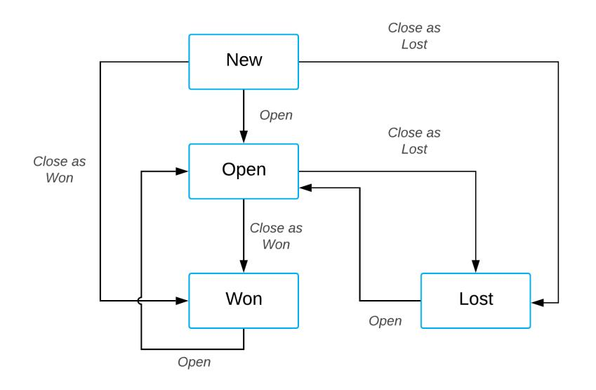

#### *Figure: The predefined statuses and actions of opportunities*

Suppose that you need a new status called *Hold* that can be used for opportunities. Aer you perform customization, a user should be able to change an opportunity's status from *Won* to *Hold* by clicking the **Hold** action, and change the status from *Hold* to *Open* by clicking the predefined **Open** action.

The following diagram presents the possible statuses aer customization and the actions that change statuses.

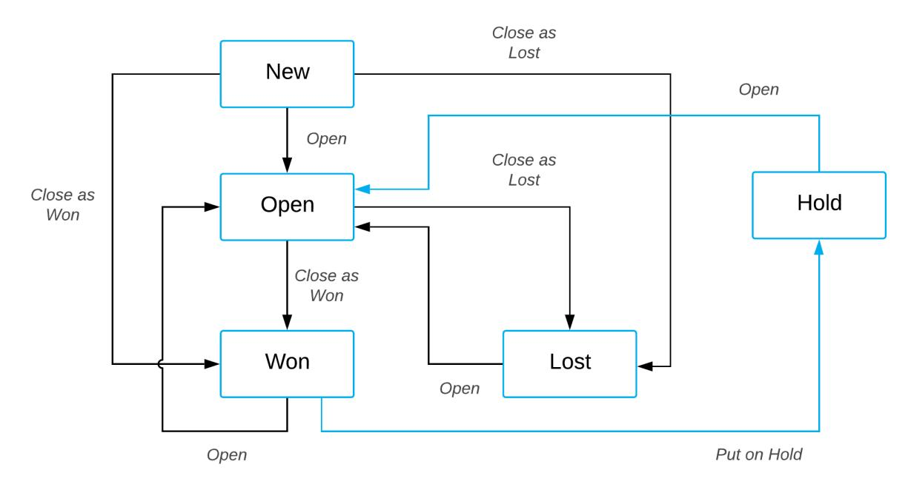

#### *Figure: The customized statuses and actions of opportunities*

Based on these specifications, you will implement the new workflow for opportunities by performing the following general tasks, which are described in greater detail in the sections that follow:

- 1. Adding the *[Opportunities](https://help-2025r1.acumatica.com/Help?ScreenId=ShowWiki&pageid=5cb49cd5-2be8-4617-9341-958f1c5d6d53)* form to the list of customized screens as described in *[Add the Opportunities Form to](#page-490-0) [the List of Customized Screens](#page-490-0)*.
- 2. On the Workflows page, creating a workflow based on the existing one as described in *[Create a Custom](#page-490-1) [Workflow Based on an Existing One](#page-490-1)*.
- 3. In the Workflow Editor, adding the *Hold* state as described in *[Add the Hold State to the Custom Workflow](#page-490-2)*.

- 4. For the *Won* state, defining a transition and the **Hold** action as described in *Create the [Transition](#page-491-0) from the [Won State to the Hold State](#page-491-0)*.
- 5. For the *Hold* state, adding a transition and the **Open** action as described in *Create the [Transition](#page-491-1) from the [Hold State to the Open State](#page-491-1)*.

#### <span id="page-490-0"></span>**Add the Opportunities Form to the List of Customized Screens**

To add the *[Opportunities](https://help-2025r1.acumatica.com/Help?ScreenId=ShowWiki&pageid=5cb49cd5-2be8-4617-9341-958f1c5d6d53)* (CR304000) form in the list of customized screens, do the following:

- 1. Open the Customization Project Editor.
- 2. In the navigation pane, click**Screens**.
- 3. On the page toolbar, click **Customize ExistingScreen**.
- 4. In the **Customize ExistingScreen** dialog box, which opens, select the *[Opportunities](https://help-2025r1.acumatica.com/Help?ScreenId=ShowWiki&pageid=5cb49cd5-2be8-4617-9341-958f1c5d6d53)* form.
- 5. Click **OK**.

The *[Opportunities](https://help-2025r1.acumatica.com/Help?ScreenId=ShowWiki&pageid=5cb49cd5-2be8-4617-9341-958f1c5d6d53)* form is displayed on the Customized Screens page and is listed in the navigation pane under the **Screens** node.

For details on adding a form to the list of customized screens, see *To Add a Page Item for an [Existing](#page-150-1) Form*.

#### <span id="page-490-1"></span>**Create a Custom Workflow Based on an Existing One**

To create a new workflow, do the following:

- 1. In the navigation pane of Customization Project Editor, select**Screens > CR304000 > Workflows**. The CR304000 (Opportunities) Workflows page opens.
- 2. On the form toolbar, click **Add Workflow**.
- 3. In the **Add Workflow** dialog box, which opens, specify the following values:
  - **Operation**: *Extend Predefined Workflow*
  - **Base Workflow**: *Default Workflow*
  - **Workflow Type**: *DEFAULT*
  - **Workflow Name**: The internal name of the workflow
- 4. Click **OK**.

The dialog box is closed, and the workflow appears in the table on the Workflows page. Notice that the workflow's status is *Inherited*.

- 5. Clear the **Active** check box for the predefined workflow, and select the **Active** check box for the created workflow.
- 6. On the page toolbar, click**Save**.
- 7. In the table, click the name of the workflow.

The State Diagram: <Workflow Name> page opens. Now you will add the *Hold* state.

#### <span id="page-490-2"></span>**Add the Hold State to the Custom Workflow**

To add the *Hold* state, do the following:

- 1. On the toolbar of the**States and Transitions** pane, click **Add State**.
- 2. In the **Add State** dialog box, which opens, specify the following values:
  - **Identifier**: H
  - **Description**: Hold

- 3. Click **OK**.
- 4. On the **States and Transitions** pane, place the *Hold* state aer the *Won* state by using the buttons on the toolbar.

#### <span id="page-491-0"></span>**Create the Transition from the Won State to the Hold State**

You need to create a transition from the *Won* to the *Hold* state. To perform this transition, you also need to create the *Put on Hold* action. Do the following:

- 1. In the **States and Transitions** pane, select the *Won* state.
- 2. On the toolbar of the**States and Transitions** pane, click **Add Transition**.
- 3. In the **Add Transition** dialog box, which opens, select *Hold* as the **TargetState**.
- 4. Click **Create**, which is next to the**Trigger Name** box.
- 5. In the **New Action** dialog box, which opens, enter the following values:
  - **Action Name**: PutOnHold
  - **Display Name**: Hold
- 6. To save the action you have created, click **OK**.
- 7. In the **Add Transition** dialog box, make sure the created action is specified in the **Action** box, and click **OK** to close the dialog box.
- 8. On the page toolbar, click**Save**

#### <span id="page-491-1"></span>**Create the Transition from the Hold State to the Open State**

You now need to create a transition from the *Hold* state to the *Open* state. To perform this transition, you can use the existing *Open* action. by perform the following actions:

- 1. In the **States and Transitions** pane, select the *Hold* state.
- 2. On the toolbar of the**States and Transitions** pane, click **Add Transition**.
- 3. In the **Add Transition** dialog box, which opens, specify the following values:
  - **Action Name**: *Open (Open)*
  - **TargetState**: *Open*
- 4. Click **OK** to close the dialog box.
- 5. On the page toolbar, click**Save**.

#### **Related Links**

- *[Customized Screens](#page-149-1)*
- *[Workflow Creation: General Information](https://help-2025r1.acumatica.com/Help?ScreenId=ShowWiki&pageid=7fb3d840-5e77-4d7b-8e33-2c523bb158b4)*
- *[Workflow Creation: General Information](https://help-2025r1.acumatica.com/Help?ScreenId=ShowWiki&pageid=7fb3d840-5e77-4d7b-8e33-2c523bb158b4)*

### **Defining a New Workflow**

In this example, defining workflows for working with a lead is described. Suppose, you need to define a workflow for a process of changing the status of a lead on the Leads (CR301000) form. Statuses and actions that switch the status are presented in the following diagram.

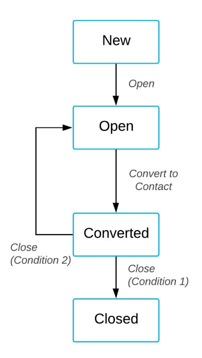

#### *Figure: Statuses and actions of a lead*

A lead can have the following statuses:

- *New*. This is the initial status of a created lead. A user can change a lead's status from *New* to *Open* by selecting the **Open** action.
- *Open*. A user can change a lead's status from *Open* to *Converted* by selecting the **Convert to Contact** action.
- *Converted*. A user can change the lead's status by selecting the **Close** action. The status is changed from *Converted* to *Closed* in case the Attention field of a lead has the *C* value (which is determined by Condition 1), from *Converted* to *Open* if the Attention field of a lead has the *O* value (which is determined by Condition 2).
- *Closed*.

Based on this description, you can define a workflow for a lead by doing the following:

- 1. Add the Leads form to the list of customized screens.
- 2. On the *[Conditions](https://help-2025r1.acumatica.com/Help?ScreenId=ShowWiki&pageid=0e3371f4-6aaf-461b-b52d-3a8cb423a2f9)* page, define conditions depending on which the *Converted* status is changed
- 3. On the *[Dialog Boxes](https://help-2025r1.acumatica.com/Help?ScreenId=ShowWiki&pageid=d7b23e81-67e9-45ae-b162-b196a00b9160)* page, define dialog boxes that request a user to enter values needed to perform actions.
- 4. On the *[Workflows](https://help-2025r1.acumatica.com/Help?ScreenId=ShowWiki&pageid=70fcbfa0-010e-4f44-9ebe-bc9f20e82f9e)* page, create a workflow.
- 5. On the *[Workflow](https://help-2025r1.acumatica.com/Help?ScreenId=ShowWiki&pageid=8a944b6b-0e47-47c9-a6a7-1b266d8feba0) (Tree View)* or *Workflow [\(Diagram](https://help-2025r1.acumatica.com/Help?ScreenId=ShowWiki&pageid=6cc999f0-df33-4db0-9f93-36329ad1de7e) View)* pages, define states of the created workflow.
- 6. For each state, you define a list of actions available for this state.
- 7. For each action, you define a transition that this action performs.

### **Add the Leads form to the List of Customized Screens**

To add the form in the list of customized screens, do the following:

- 1. Open Customization Project Editor.
- 2. In the navigation pane, click**Screens**.
- 3. On the page toolbar, click **Add Screen > Customize ExistingScreen**.

- 4. In the **Customize ExistingScreen** dialog box which opens, select the Leads form.
- 5. Click **OK**.

The Leads form is displayed on the Customized Screens page and in the navigation page under the**Screens** node.

For details on adding a form to the list of customized screens, see *[Workflow](https://help-2025r1.acumatica.com/Help?ScreenId=ShowWiki&pageid=80bba74c-dc72-4817-8070-dc9bed4efdd3) Creation: To Add a Workflow*.

### **Define Conditions**

To define conditions for the **Close** action, do the following:

1. In the navigation pane of Customization Project Editor, select**Screens > CR301000 > Conditions**.

The Conditions: CR301000 (Leads) page opens.

- 2. Add the condition which is fulfilled changes the status to *Closed* by doing the following:
  - a. On the **Conditions** pane, click **Add New Record**.
  - b. In the **Condition Properties** dialog box which opens, type the name of the condition in the **Condition Name** box: Condition Close.
  - c. On the table toolbar, click **Add Row** and specify the following values:
    - **Field Name**: *Attention*
    - **Condition**: *Equals*
    - **Value**: 'C'
  - d. Click **OK**.
- 3. Add the condition which is fulfilled changes the state to *Open*. To do that, repeat the steps from the previous bullet. In the **Condition Properties** dialog box, specify the following values:
  - **Field Name**: *Attention*
  - **Condition**: *Equals*
  - **Value**: 'O'

For details on adding a condition, see *Conditions and [Transitions:](https://help-2025r1.acumatica.com/Help?ScreenId=ShowWiki&pageid=b5055f39-8096-43b4-9020-bfdc0c44b9c6) To Add Conditions* and *Conditions and [Transitions:](https://help-2025r1.acumatica.com/Help?ScreenId=ShowWiki&pageid=d6f815e7-85c2-4010-a4b0-731d4a630c6e) [General Information](https://help-2025r1.acumatica.com/Help?ScreenId=ShowWiki&pageid=d6f815e7-85c2-4010-a4b0-731d4a630c6e)*.

#### **Define Dialog Boxes**

When a user opens a lead, he should specify a reason for opening it. The reason is stored in the Reason field of the Leads form. To request the Reason field value from the user when he selects the **Open** action, you define a dialog box as follows:

1. In the navigation pane of Customization Project Editor, select**Screens > CR301000 > Dialog Boxes**.

The CR301000 (Leads) Dialog Boxes page opens.

2. In the **Dialog Boxes** pane, click **+**.

The **New Dialog Box** dialog box opens.

- 3. In the **Dialog Box Name** box, specify the name of the dialog box: Reason.
- 4. Click **OK**.
- 5. In the **Dialog Box Fields** table, enter the following values:
  - **Schema Field**: *PX.Objects.CR.Contact.Resolution*
  - **Field Name**: *Resolution*
  - **Display Name**: Reason
  - **DefaultValue**: *Assign*

6. On the page toolbar, click**Save**.

For details on creating dialog boxes, see *[Workflow Dialog Boxes: General Information](https://help-2025r1.acumatica.com/Help?ScreenId=ShowWiki&pageid=85b75806-57ba-4298-8e48-4ec4fe13785e)* and *Workflow [Elements:](https://help-2025r1.acumatica.com/Help?ScreenId=ShowWiki&pageid=eb42784b-9a8d-40bb-aa15-e2392c5c6b00) To Add [a Dialog Box](https://help-2025r1.acumatica.com/Help?ScreenId=ShowWiki&pageid=eb42784b-9a8d-40bb-aa15-e2392c5c6b00)*.

#### **Create a Workflow**

To create a new workflow, do the following:

1. In the navigation pane of Customization Project Editor, select**Screens > CR301000 > Workflows**.

The CR301000 (Leads) Workflows page opens.


The Leads form has a predefined workflow for which the**State Identifying** box value is already specified.

- 2. On the page toolbar, click **Add Workflow**.
- 3. In the **Add Workflow** dialog box which opens, specify the following values:
  - **Operation**: *Create New Workflow*
  - **Workflow Type**: *DEFAULT*
  - **Workflow Name**: DEFAULT
- 4. Click **OK**.

In the page table, the new row appears.

- 5. Clear the **Active** box for the predefined workflow, and select the **Active** box for the created workflow.
- 6. On the page toolbar, click**Save**.
- 7. Click the name of the created workflow in the table.

The Workflow Editor page opens. Now you can proceed with defining states of a lead for the new workflow.

#### **Define States for the Workflow**

To define statuses of a lead, do the following:

- 1. In the navigation pane of Customization Project Editor, select**Screens > CR301000 > Workflows > Default** . The CR301000 (Leads) Workflows: Default page opens.
- 2. Define the *New* status of the lead by doing the following:
  - a. In the **States and Transitions** pane, click **+ > Add State**.
  - b. In the **Add State** dialog box which opens, specify the following values:
    - **Identifier**: N
    - **Description**: New
  - c. Click **OK**.

The *New* status appears in the**Statuses and Transitions** navigation pane.

- d. On the **State Properties** tab, select the **InitialState of the Workflow** box. It means that when a lead is created, the Status field (which is selected as a state identifier by default) of the lead is assigned the *New* value.
- e. In the **Fields** table of the**State Properties** tab, add the following rows:

| Object Name  | Field Name      | Disabled | Hide    | Required | Default Value |
|--------------|-----------------|----------|---------|----------|---------------|
| Lead/Contact | Owner           | cleared  | cleared | cleared  | @me           |
| Lead/Contact | Company<br>Name | cleared  | cleared | selected | empty         |
| Lead/Contact | Workgroup       | selected | cleared | cleared  | empty         |

The table rows define the state of boxes on the Leads form when a lead has the *New* status. For example, the @me default value of the Owner field name means the **Owner** box is assigned the name of the current Acumatica ERP user. For details on possible filter values, see *[Managing Advanced Filters](https://help-2025r1.acumatica.com/Help?ScreenId=ShowWiki&pageid=c621d79a-274d-4b72-a699-0e92d78a7b23)*.

- f. On the page toolbar, click**Save**.
- 3. Define the *Open*, *Converted*, and *Closed* states of the workflow by following the same instruction.

### **Define Actions for Each State**

For the *New* state, the **Open** action changes the state of a lead to *Open*. To define this action, do the following:

- 1. In the **States and Transitions** pane, select the **New** state.
- 2. On the tab toolbar, click **Create Action**.
- 3. In the **New Action** dialog box which opens, specify the following values:
  - **Action Name**: Open
  - **Display Name**: Open
  - **Place in Folder**: Actions
- 4. Click **OK**.
- 5. In the row that appears, in the **Dialog Box** column, select the dialog box you defined previously, *Reason*.
- 6. On the **Update Fields** tab, define fields that should be updated before the action method is invoked. Do the following:
  - a. On the tab toolbar, click **Add Row**.
  - b. In the new row, specify the following values:
    - **Field**: *Reason*
    - **Value**: *[Reason.Resolution]*
- 7. On the page toolbar, click**Save**.

According to the diagram of the workflow shown at the beginning of the example, for the rest of the states you should specify the following actions and transitions:

- For the **Open** state: the **Convert to Contact** action
- For the **Converted** state: the **Close** action

#### **Define a Transition for an Action**

For the New action, define a transition as follows:

- 1. In the **States and Transitions** pane, select the **New** state.
- 2. On the pane toolbar, click **+ > Add Transition**.
- 3. In the **Add Transition** dialog box which opens, specify the following values:

- **Transition Name**: Open
- **Action Name**: *Open*
- **Condition**: cleared
- **TargetState**: *Open*
- 4. Click **OK**.

The Open (Open->Open) transition appears in the States and Transitions pane.

5. On the page toolbar, click**Save**.

For the **Convert to Contact** action of the *Open* state, define the Convert (Convert to Contact->Converted) transition. For the **Close** action of the *Converted* state, define two transitions: one with the **Condition** box value set to *Condition 1*, and another with the **Condition** box value set to *Condition 2*.

The resulting**States and Transitions** pane should look as shown in the following screenshot.

#### *Figure: States and Transitions pane*

#### **Related Links**

- *[Customized Screens](#page-149-1)*
- *[Conditions](https://help-2025r1.acumatica.com/Help?ScreenId=ShowWiki&pageid=0e3371f4-6aaf-461b-b52d-3a8cb423a2f9)*
- *[Workflows](https://help-2025r1.acumatica.com/Help?ScreenId=ShowWiki&pageid=70fcbfa0-010e-4f44-9ebe-bc9f20e82f9e)*
- *[Dialog Boxes](https://help-2025r1.acumatica.com/Help?ScreenId=ShowWiki&pageid=d7b23e81-67e9-45ae-b162-b196a00b9160)*
- *[Getting Started with Workflows: General Information](https://help-2025r1.acumatica.com/Help?ScreenId=ShowWiki&pageid=7f95facd-7331-45f0-9424-e05082f900d1)*

### **Customizing a Predefined Workflow from Code**

You can customize a workflow in Visual Studio or in the Code Editor with the help of Acumatica Framework.

This example demonstrates the extending of the workflow for working with an opportunity by using Visual Studio. The predefined workflow for the *[Opportunities](https://help-2025r1.acumatica.com/Help?ScreenId=ShowWiki&pageid=5cb49cd5-2be8-4617-9341-958f1c5d6d53)* (CR304000) form includes the states (shown in the blue rectangles and representing statuses) and actions shown in the following diagram.

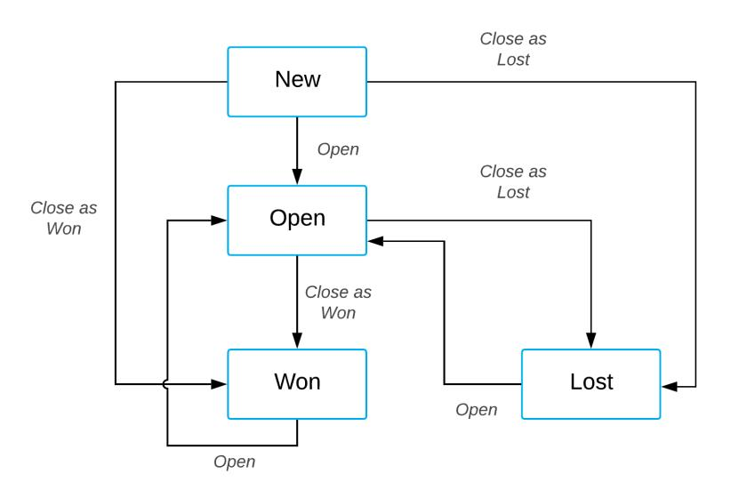

#### *Figure: The predefined statuses and actions of opportunities*

Suppose that in your customization efforts you need to incorporate a process of assigning a new opportunity before opening it. You need a new status for opportunities called *Assigned*. A user should be able to change a status from *New* to *Assigned* by clicking the **Assign** action, change the status from *Assigned* to *Open* by clicking the predefined **Accept** action, and change the status from *Assigned* to *New* by clicking the **Reject** action, which you will add. For an opportunity to be assigned, a user must be selected in the **Owner** box. Also, you need to add an auto-run action named Auto-Assign that is performed if a new opportunity is created and the **Owner** box is not empty. The Auto-Assign action changes the status of the opportunity to *Assigned*.

When a user clicks the **Accept** or **Reject** action, the user should provide the reason for changing the state. When a user clicks the **Assign** action, the user should specify the **Owner** of the opportunity. In both of these situations, you will use a dialog box to obtain this information.

The following diagram presents the possible statuses aer customization and the actions that change statuses.

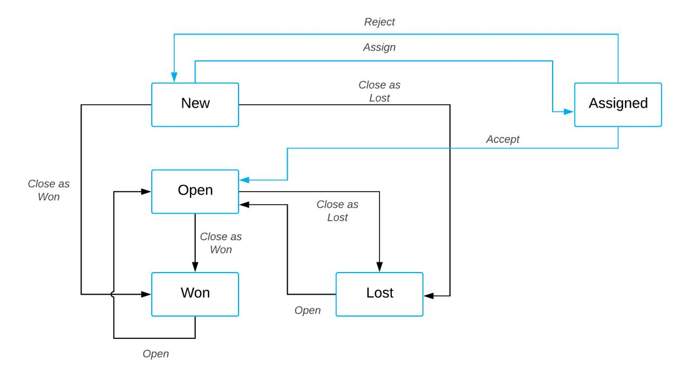

#### *Figure: The customized statuses and actions of opportunities*

Based on these specifications, you will implement the new workflow for opportunities by performing the following general tasks, which are described in greater detail in the sections that follow:

- 1. Adding a new state named Assigned, as described in *[Add a New State Named Assigned](#page-499-0)*.
- 2. Adding the following actions:
  - Assign, which changes the state from *New* to *Assigned*
  - Accept, which changes the state from *Assigned* to *Open*
  - Reject, which changes the state from *Assigned* to *New*
  - AutoAssign, which is performed if the **Owner** box is not empty
  - For details, see *[Add Actions](#page-500-0)*.
- 3. Adding the OwnerNotEmpty condition for the AutoAssign action, as described in *[Add the](#page-500-1) [OwnerNotEmpty Condition](#page-500-1)*.
- 4. Adding dialog boxes for the actions so that a user can provide the required field values. (For instructions, see *[Add the Dialog Boxes](#page-499-1)*.)
- 5. Removing the transition from the *New* to *Open* status.
- 6. Updating the *New* state with the following changes:
  - Update the list of values for the Resolution and Status field
  - Adding the Assign and AutoAssign actions
  - Removing the Open action

- 7. Updating the Open state to make the Owner field required.
- 8. Defining transitions from the *New* to *Assigned* states, from *Assigned* to *New* and *Open* states. For details on implementing Tasks 5–8, see *[Update the Workflow Configuration](#page-501-0)*.

#### **Before You Proceed**

To be able to customize a workflow in Visual Studio, you need to create an extension library for your customization project. For details, see *To Create an [Extension](#page-389-2) Library*.

#### **Prepare the Graph Extension**

To prepare the graph extension, do the following:

1. Add the following using directives.

```
using PX.Data.WorkflowAPI;
using PX.Objects.CR.Workflows;
```

You need the PX.Data.WorkflowAPI namespace to get access to workflow API, and the PX.Objects.CR.Workflows to get access to the OpportunityWorkflow and OpportunityMaint classes.

2. Declare the graph extension, as the following code shows.

```
public class OpportunityWorkflowExt : PX.Data.PXGraphExtension<OpportunityWorkflow,
 OpportunityMaint>
{
}
```

3. In the graph extension, add the following service members. You will use them to declare fields, dialog boxes, and actions.

```
private const string
 _fieldReason = "Reason",
 _fieldStage = "Stage",
 _fieldOwnerID = "OwnerID",
 _fieldDetails = "Details",
 _formAccept = "FormAccept",
 _formAssign = "FormAssign",
 _formReject = "FormReject",
 _actionAccept = "Accept",
 _actionReject = "Reject",
 _actionAssign = "Assign",
 _actionAutoAssign = "AutoAssign",
 _reasonUnassign = "UA",
 _reasonRejected = "RJ",
 _reasonTechnology = "TH",
 _reasonRelationship = "RL",
 _reasonPrice = "PR",
 _reasonOther = "OT",
 _reasonAssign = "NA",
 _reasonInProcess = "IP",
 _reasonFunctionality = "FC",
 _reasonCompanyMaturity = "CM",
 _reasonCanceled = "CL";
```

4. Override the Configure method, as the following code shows.

```
public override void Configure(PXScreenConfiguration config)
{
 var context = config.GetScreenConfigurationContext<OpportunityMaint,
 CROpportunity>();
}
```

#### <span id="page-499-0"></span>**Add a New State Named Assigned**

To add the new *Assigned* state, do the following:

1. In the graph extension, declare the States class, as the following code shows.

```
public static class States
{
 public const string
 New = "N",
 Open = "O",
 Won = "W",
 Lost = "L",
 Assigned = "A";
}
```

2. In the overridden Configure method, declare the following variable.

```
var assignedState = context.FlowStates.Create(States.Assigned, state => state
 .WithFieldStates(fields =>
 {
 fields.AddField<CROpportunity.resolution>(field =>
 field.ComboBoxValues(_reasonAssign));
 fields.AddField<CROpportunity.ownerID>(field =>
 field.IsRequired());
 })
 .WithActions(actions =>
 {
 actions.Add(g => g.createSalesOrder);
 actions.Add(g => g.createInvoice);
 actions.Add(g => g.validateAddresses);
 actions.Add<OpportunityMaint.Discount>(e => e.recalculatePrices);
 actions.Add(actionReject, a => a.IsDuplicatedInToolbar());
 actions.Add(actionAccept, a => a.IsDuplicatedInToolbar());
 }));
```

In the code above, you define the Assigned state, field values to be assigned in this state, and actions available in this state.

#### <span id="page-499-1"></span>**Add the Dialog Boxes**

You need to add dialog boxes that will prompt users for more information when they invoke the Accept, Reject, and Assign actions. The following instructions describe how to declare a dialog box for the Accept action; you will add the other two dialog boxes by performing similar actions.

To accept an opportunity, a user should provide the Resolution and Stage field values. To declare a dialog box for the Accept action, declare a variable for the dialog box in the overridden Configure method:

```
var formAccept = context.Forms.Create(_formAccept, form => form
 .Prompt("Details")
 .WithFields(fields =>
 {
 fields.Add(_fieldReason, field => field
 .WithSchemaOf<CROpportunity.resolution>()
 .IsRequired()
 .Prompt("Reason")
 .DefaultValue(_reasonInProcess)
 .OnlyComboBoxValues(_reasonInProcess));
 fields.Add(_fieldStage, field => field
 .WithSchemaOf<CROpportunity.stageID>()
 .Prompt("Stage"));
 }));
```

In the code above, you create a dialog box with the Details title and add to it the following boxes:

- A box based on the CROpportunity.resolution field, which is required in the dialog box. The title of the corresponding box is **Reason**.
- A box based on the CROpportunity.stageID field. The title of the corresponding box is**Stage**.

For the Assign and Reject actions, you can declare similar dialog boxes named formAssign and formReject. You need to add the Owner field based on the CROpportunity.ownerID field to the formAssign dialog box, and you need to add the Resolution field and the Details field based on the CROpportunity.details field to the formReject dialog box.

### <span id="page-500-1"></span>**Add the OwnerNotEmpty Condition**

To define a new condition, in the overridden Configure method, declare the following variable.

```
var ownerNotNullCondition = context.Conditions.FromExpr(
 opp => opp.OwnerID != null).WithSharedName("OwnerNotEmpty");
```

#### <span id="page-500-0"></span>**Add Actions**

To add the Assign action, declare the following variable in the overridden Configure method.

```
var actionAssign = context.ActionDefinitions.CreateNew(_actionAssign, action => action
 .WithFieldAssignments(fields =>
 {
 fields.Add<CROpportunity.resolution>(f => f.SetFromValue(_reasonAssign));
 fields.Add<CROpportunity.ownerID>(f => f.SetFromFormField(formAssign, _fieldOwnerID));
 })
 .DisplayName("Assign")
 .WithForm(formAssign)
 .InFolder(FolderType.ActionsFolder, "Lost")
 .MassProcessingScreen<UpdateOpportunityMassProcess>());
```

In the code above, you are creating a new action; you are also specifying which field values should change aer the action is performed and which dialog box should be shown to provide these values. Also, you are specifying the location of the action on the form toolbar (ActionsFolder), the title of the action (Assign), and the graph of the processing form where the action should also be displayed (UpdateOpportunityMassProcess).

For the Accept and Reject actions, you can add similar variables named actionAccept and actionReject.

To add the auto-run Auto-Assign , which is performed if the OwnerNotEmpty condition is true, declare the following variable in the overridden Configure method.

The **Auto-Assign** action is performed automatically so it should not be displayed on the form. To hide the action from the form, you call the IsHiddenAlways method.

```
var actionAutoAssign = context.ActionDefinitions.CreateNew(_actionAutoAssign, action =>
 action
 .WithFieldAssignments(fields =>
 {
 fields.Add<CROpportunity.resolution>(f => f.SetFromValue(_reasonAssign));
 })
 .DisplayName("Auto-Assign")
 .IsHiddenAlways()
 );
```

#### <span id="page-501-0"></span>**Update the Workflow Configuration**

To apply all the entities you have declared, you need to call the UpdateScreenConfigurationFor method in the overridden Configure method, as the following code shows.

```
context.UpdateScreenConfigurationFor(screen =>
{
 return screen
 .UpdateDefaultFlow(config1 => config1.WithFlowStates
 (states =>
 {
 states.Update(States.New, state => state
 .WithFieldStates(fields =>
 {
 fields.UpdateField<CROpportunity.resolution>(field =>
 field.WithDefaultValue(_reasonUnassign)
 .ComboBoxValues(_reasonUnassign, _reasonCanceled, _reasonOther,
 _reasonRejected));
 })
 .WithActions(actions =>
 {
 actions.Add(actionAssign, a => a
 .IsDuplicatedInToolbar());
 actions.Add(actionAutoAssign, a => a
 .IsAutoAction(ownerNotNullCondition));
 actions.Remove("Open");
 }));
 states.Add(assignedState);
 states.Update(States.Open, state => state
 .WithFieldStates(fields =>
 {
 fields.AddField<CROpportunity.ownerID>(field =>
 field.IsRequired());
 }));
 })
 .WithTransitions(transitions =>
 {
 transitions.Remove(transition => 
 transition.From(States.New).To(States.Open).IsTriggeredOn("Open"));
```

```
 transitions.Add(transition => transition
 .From(States.New)
 .To(States.Assigned)
 .IsTriggeredOn(actionAssign));
 transitions.Add(transition => transition
 .From(States.New)
 .To(States.Assigned)
 .IsTriggeredOn(actionAutoAssign));
 transitions.Add(transition => transition
 .From(States.Assigned)
 .To(States.New)
 .IsTriggeredOn(actionReject)
 .WithFieldAssignments(fields =>
 {
 fields.Add<CROpportunity.ownerID>(f => f.SetFromExpression(null));
 })
 );
 transitions.Add(transition => transition
 .From(States.Assigned)
 .To(States.Open)
 .IsTriggeredOn(actionAccept));
 })
 )
 .WithActions(actions =>
 {
 actions.Add(actionAssign);
 actions.Add(actionAccept);
 actions.Add(actionReject);
 actions.Add(actionAutoAssign);
 })
 .WithForms(forms =>
 {
 forms.Add(formAssign);
 forms.Add(formReject);
 forms.Add(formAccept);
 })
 .WithFieldStates(fields =>
 {
 fields.Add<CROpportunity.status>(field => field
 .SetComboValues(
 (States.Assigned, "Assigned"),
 (States.New, "New"),
 (States.Open, "Open"),
 (States.Won, "Won"),
 (States.Lost, "Lost")));
 fields.Replace<CROpportunity.resolution>(field => field
 .SetComboValues(
 (_reasonTechnology, "Technology"),
 (_reasonRelationship, "Relationship"),
 (_reasonPrice, "Price"),
 (_reasonOther, "Other"),
 (_reasonAssign, "Assigned"),
 (_reasonInProcess, "In Process"),
 (_reasonFunctionality, "Functionality"),
```

```
 (_reasonCompanyMaturity, "Company Maturity"),
 (_reasonCanceled, "Canceled"),
 (_reasonRejected, "Rejected"),
 (_reasonUnassign, "Unassign")));
 })
 .WithSharedConditions(conditions => conditions.Add(ownerNotNullCondition));
```

});

In the code above, you are updating the workflow by doing the following:

- Updating the list of states as follows:
  - Updating the *New* state by adding new combo box values to the CROpportunity.resolution field, adding the Assign and AutoAssign actions, and removing the Open action
  - Adding the *Assigned* state
  - Updating the *Open* state by making the Owner field required
- Updating the list of transitions as follows:
  - Removing the transition of the *New* state to the *Open* state
  - Adding the transition from the *New* state to the *Assigned* state triggered by the Assign action
  - Adding the transition from the *New* state to the *Assigned* state triggered by the AutoAssign action
  - Adding the transition from the *Assigned* state to the *New* state triggered by the Reject action
  - Adding the transition from the *Assigned* state to the *Open* state triggered by the Accept action
- Adding the Assign, Accept, Reject, and AutoAssign actions
- Adding the formAssign, formReject, and formAccept dialog boxes
- Updating fields as follows:
  - Adding new combo box values to the CROpportunity.status field
  - Replacing the values of the CROpportunity.resolution field with new ones

#### **Test the Customized Workflow**

To test the customized workflow, do the following:

- 1. Build the extension library.
- 2. In Acumatica ERP, open the *[Opportunities](https://help-2025r1.acumatica.com/Help?ScreenId=ShowWiki&pageid=5cb49cd5-2be8-4617-9341-958f1c5d6d53)* (CR304000) form.
- 3. Create a new opportunity with the **Owner** box empty.
- 4. On the form toolbar, click **Actions > Assign**.
- 5. In the **Assign** dialog box, which opens, select an owner of the opportunity and a reason, and click **OK**.
- 6. Notice that the status of the opportunity is changed to *Assigned*. The **Owner** box now contains the owner you specified in the dialog box.
- 7. On the form toolbar, click **Actions > Accept**.
- 8. In the **Accept** dialog box, which opens, specify a reason and a stage, and click **OK**.
- 9. Notice that the status of the opportunity is changed to *Open*.
- 10.Create a new opportunity with the **Owner** box filled in.
- 11.Notice that when the new record is saved, its status is *Assigned* instead of *New*.
- 12.On the form toolbar, click **Actions > Reject**.
- 13.In the **Reject** dialog box, which opens, specify the reason and details, and click **OK**.
- 14.Notice that the status of the opportunity is changed to *New*.

# **Customizing a Predefined Workflow with the Workflow Visual Editor**

You can customize a workflow with the help of the Workflow Visual Editor.

The example in this topic demonstrates how to modify the workflow for working with shipments. The predefined workflow for the *[Shipments](https://help-2025r1.acumatica.com/Help?ScreenId=ShowWiki&pageid=f47cffcc-543e-469c-a204-a9c1e3da346d)* (SO302000) form includes the states and actions shown in the following screenshot.

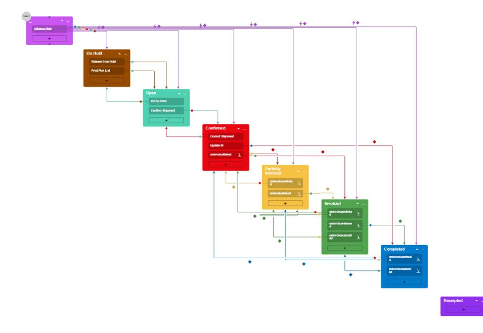

#### *Figure: The predefined states and actions of shipments (diagram view)*

Suppose that you want to add the *Under Inspection* status for your shipments, which should be an intermediate status between *On Hold* and *Open*. When a user clicks the **Release from Hold** action for a new shipment with the *On Hold* status, the status of the shipment should change to *Under Inspection* if the shipment has not passed the inspection yet. If the shipment has already passed the inspection once, its status should change to *Open*. To indicate whether the shipment has passed the inspection, you will add a new field for the shipment. You will also make all fields of a shipment disabled in the *Under Inspection* state, so that a user cannot edit the elements of a shipment that is under inspection.

Aer you customize the workflow, a user should be able to change the status of a shipment by clicking the appropriate action, as described in the following table.

| Initial State    | Action                | Target State     |
|------------------|-----------------------|------------------|
| On Hold          | Release from Hold     | Under Inspection |
| Under Inspection | Inspection Failed     | On Hold          |
| Under Inspection | Inspection Passed     | Open             |
| Open             | Submit for Inspection | Under Inspection |

#### *Table: New Actions and Transitions for Shipments*

Aer customization, the diagram view of the workflow should contain the state, actions, and transitions shown in the following screenshot.

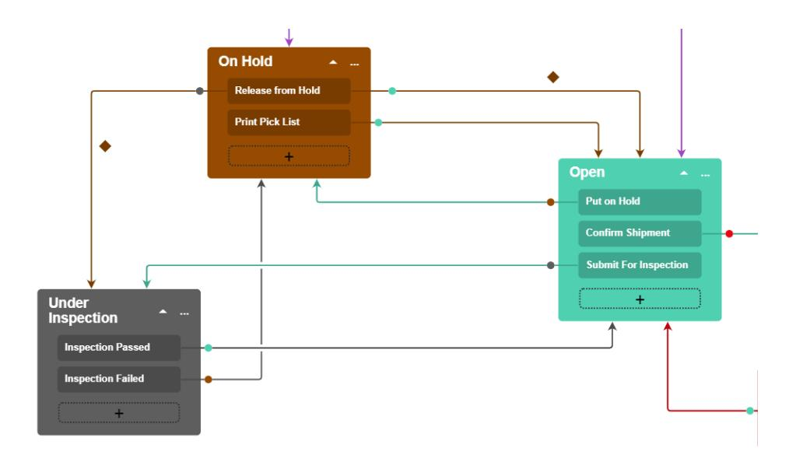

#### *Figure: The customized status, actions, and transitions of shipments*

Based on these specifications, you will implement the new workflow for shipments by performing the following general steps, which are described in greater detail in the sections that follow:

- 1. Adding the *[Shipments](https://help-2025r1.acumatica.com/Help?ScreenId=ShowWiki&pageid=f47cffcc-543e-469c-a204-a9c1e3da346d)* (SO302000) form to the list of customized screens, as described in *[Step 1: Add the](#page-505-0) [Shipments form to the List of Customized Screens](#page-505-0)*
- 2. Creating a new workflow based on the existing one, as described in *[Step 2: Create a Custom Workflow Based](#page-506-0) [on the Existing One](#page-506-0)*
- 3. Creating a new state for the workflow, as described in *[Step 3: Create a New State for the Workflow](#page-506-1)*
- 4. Adding a transition from the *Under Inspection* state to the *Open* state, as described in *Step 4: Add a [Transition](#page-506-2) [from the Under Inspection State to the Open State](#page-506-2)*
- 5. Adding a transition from the *Open* state to the *Under Inspection* state, as described in *Step 5: Add a [Transition](#page-507-0) [from the Open State to the Under Inspection State](#page-507-0)*
- 6. Adding a transition from the *Under Inspection* state to the *On Hold* state, as described in *[Step 6: Add a](#page-507-1) Transition from the Under [Inspection](#page-507-1) State to the On Hold State*
- 7. Adding a transition from the *On Hold* state to the *Under Inspection* state, as described in *[Step 7: Add a](#page-508-0) Transition from the On Hold State to the Under [Inspection](#page-508-0) State*
- 8. Modifying the *Under Inspection* state, as described in *[Step 8: Modify the Under Inspection State](#page-508-1)*
- 9. Modifying the **Release from Hold** transition, as described in *Step 9: Modify the Release from Hold [Transitions](#page-508-2)*
- 10.Modifying the **Submit For Inspection** and **Inspection Passed** transitions, as described in *[Step 10: Modify the](#page-509-0) Submit for Inspection and Inspection Passed [Transitions](#page-509-0)*

#### <span id="page-505-0"></span>**Step 1: Add the Shipments form to the List of Customized Screens**

To add the *[Shipments](https://help-2025r1.acumatica.com/Help?ScreenId=ShowWiki&pageid=f47cffcc-543e-469c-a204-a9c1e3da346d)* form to the list of customized screens, perform the following instructions:

- 1. Open the Customization Project Editor.
- 2. In the navigation pane, click**Screens**.
- 3. On the page toolbar, click **Add Screen > Customize ExistingScreen**.
- 4. In the **Customize ExistingScreen** dialog box, which opens, select *SO302000*, which is the screen that corresponds to the *[Shipments](https://help-2025r1.acumatica.com/Help?ScreenId=ShowWiki&pageid=f47cffcc-543e-469c-a204-a9c1e3da346d)* form.
- 5. Click **OK**.

The row for the *[Shipments](https://help-2025r1.acumatica.com/Help?ScreenId=ShowWiki&pageid=f47cffcc-543e-469c-a204-a9c1e3da346d)* form is displayed in the table on the Customized Screens page, and**SO302000** is listed in the navigation pane under the**Screens** node.

For details on adding a form to the list of customized screens, see *To Add a Page Item for an [Existing](#page-150-1) Form*.

#### <span id="page-506-0"></span>**Step 2: Create a Custom Workflow Based on the Existing One**

To create a new workflow, perform the following instructions:

- 1. In the navigation pane of the Customization Project Editor, select**Screens > SO302000 > Workflows**. The SO302000 (Shipments) Workflows page opens.
- 2. On the page toolbar, click **Add Workflow**.
- 3. In the **Add Workflow** dialog box, which opens, specify the following values:
  - **Operation**: *Extend Predefined Workflow*
  - **Base Workflow**: *Default Workflow*
  - **Workflow Type**: *DEFAULT*
  - **Workflow Name**: The internal name of the workflow
- 4. Click **OK** to close the dialog box.

A row for the workflow appears in the table on the Workflows page. Notice that the workflow's status is *Inherited*.

- 5. Clear the **Active** check box for the predefined workflow, and select the **Active** check box for the created workflow.
- 6. On the page toolbar, click**Save**.
- 7. In the table, click the name of the workflow.
- 8. On the State Diagram: <Workflow Name> page, which opens, click **Diagram View**. Now you will add the new state and transitions.

#### <span id="page-506-1"></span>**Step 3: Create a New State for the Workflow**

To add a new state, perform the following instructions:

- 1. On the page toolbar, click **Add State**.
- 2. In the **Add State** dialog box, which opens, specify the following values:
  - **Identifier**: P
  - **Description**: Under Inspection
- 3. Click **OK** to close the dialog box.

A box with the *Under Inspection* state is added to the diagram. Notice that it does not contain any actions yet.

4. Save your changes.

#### <span id="page-506-2"></span>**Step 4: Add a Transition from the Under Inspection State to the Open State**

You need to create a transition from the *Under Inspection* state to the *Open* state. To do so, perform the following instructions:

- 1. In the box with the *Under Inspection* state, click the plus button.
- 2. While holding down the mouse button, draw a line from the box with the *Under Inspection* state to the box with the *Open* state.

- 3. In the **Add Transition** dialog box, which opens, click **Create** to add a new action.
- 4. In the **New Action** dialog box, which opens, specify the following values:
  - **Action Name**: inspectionPassed
  - **Display Name**: Inspection Passed
- 5. Click **OK** to close the dialog box.
- 6. In the **Add Transition** dialog box, click **OK**, which closes the dialog box.

A new transition is added to the diagram. Notice that the box with the *Under Inspection* state now contains a smaller box with the **Inspection Passed** action.

7. Save your changes.

#### <span id="page-507-0"></span>**Step 5: Add a Transition from the Open State to the Under Inspection State**

To create a transition from the *Open* state to the *Under Inspection* state, perform the following instructions:

- 1. Click the plus button in the box with the *Open* state.
- 2. While holding down the mouse button, draw a line from the box with the *Open* state to the box with the *Under Inspection* state.
- 3. In the **Add Transition** dialog box, which opens, click **Create** to add a new action.
- 4. In the **New Action** dialog box, which opens, specify the following values:
  - **Action Name**: submitForInspection
  - **Display Name**: Submit for Inspection
- 5. Click **OK** to close the dialog box.
- 6. In the **Add Transition** dialog box, click **OK**, which closes the dialog box.

The *Submit for Inspection* transition is added to the diagram. Notice that the box with the *Open* state now contains a smaller box with the *Submit for Inspection* action.

7. Save your changes.

#### <span id="page-507-1"></span>**Step 6: Add a Transition from the Under Inspection State to the On Hold State**

To create a transition from the *Under Inspection* state to the *On Hold* state, perform the following instructions:

- 1. Click the plus button in the box with the *Under Inspection* state.
- 2. While holding down the mouse button, draw a line from the box with the *Under Inspection* state to the box with the *On Hold* state.
- 3. In the **Add Transition** dialog box, which opens, click **Create** to add a new action.
- 4. In the **New Action** dialog box, which opens, specify the following values:
  - **Action Name**: inspectionFailed
  - **Display Name**: Inspection Failed
- 5. Click **OK** to close the dialog box.
- 6. In the **Add Transition** dialog box, click **OK**, which closes the dialog box.

The *Inspection Failed* transition is added to the diagram. Notice that the box with the *Inspection Failed* action is added to the box with the *Under Inspection* state.

7. Save your changes.

#### <span id="page-508-0"></span>**Step 7: Add a Transition from the On Hold State to the Under Inspection State**

To create a transition from the *On Hold* state to the *On Inspection* state, perform the following instructions:

- 1. Click the plus button in the box with the *On Hold* state.
- 2. While holding down the mouse button, draw a line from the box with the *On Hold* state to the box with the *On Inspection* state.
- 3. In the **Add Transition** dialog box, which opens, specify *Release from Hold* in the **Trigger Name** box.
- 4. Click **OK** to close the dialog box.

The *Release from Hold* transition is added to the diagram. Notice that no new box with an action is added to the box with the *On Hold* state. This is because a transition with the *Release from Hold* action has already been added to the *On Hold* state.

5. Save your changes.

### <span id="page-508-1"></span>**Step 8: Modify the Under Inspection State**

Suppose that you want all fields of a shipment to be disabled in the *Under Inspection* state (and the corresponding UI elements unavailable), so that a user cannot edit the shipment. You need to modify the *Under Inspection* state as follows:

- 1. Click the ellipsis in the box with the state, and click **EditState** in the context menu, which opens.
- 2. On the **Fields** tab of the**State** dialog box, which opens, add the following fields:
  - *Shipment*
  - *Shipment Line*
  - *Shipment Line Split*
  - *Shipment Address*
  - *Shipment Contact*
  - *Sales Order Shipment*

For each of the fields, select *<Table>* as the **Field Name**, and select the **Disabled** check box.

- 3. On the **Action** tab of the**State** dialog box, select the **Duplicate on Toolbar** check box for both actions (*Inspection Passed* and *Inspection Failed*). This way, both actions that are available for the state are displayed on the page toolbar (as a button).
- 4. Click **OK** to close the dialog box.
- 5. Save your changes.

### <span id="page-508-2"></span>**Step 9: Modify the Release from Hold Transitions**

You need to add the conditions for the *Release from Hold* transitions that go from the *On Hold* state to the *Open* state, and from the *On Hold* state to the *Under Inspection* state. With the conditions added, if a shipment has already passed an inspection once, clicking **Release from Hold** changes the shipment's status to *Open*. If the shipment has not passed the inspection, clicking **Release from Hold** changes the shipment's status to *Under Inspection*. To implement this, you also need to create a user-defined field that you will use as a status flag for the shipment. This field will indicate whether the shipment has passed the inspection.

Perform the following instructions:

1. On the *[Attributes](https://help-2025r1.acumatica.com/Help?ScreenId=ShowWiki&pageid=de0a353f-40d0-452d-9152-e65605e69788)* (CS205000) form, create an attribute with the *INSPPASSED* name, *Inspection Passed* description, and the *Checkbox* control type (see *[User-Defined Fields](https://help-2025r1.acumatica.com/Help?ScreenId=ShowWiki&pageid=96dd287d-b37f-4f23-b401-b3122cf8a0a1)* for details).

2. On the *[Shipments](https://help-2025r1.acumatica.com/Help?ScreenId=ShowWiki&pageid=f47cffcc-543e-469c-a204-a9c1e3da346d)* (SO302000) form, click **Customization > Manage User-Defined Fields**. On the *[Edit User-](https://help-2025r1.acumatica.com/Help?ScreenId=ShowWiki&pageid=5f89ca96-f953-49c9-829f-08a3a22947db)[Defined Fields](https://help-2025r1.acumatica.com/Help?ScreenId=ShowWiki&pageid=5f89ca96-f953-49c9-829f-08a3a22947db)* (CS205020) form, which opens, add a user-defined field for the created attribute (for details, see *To Add [User-Defined](https://help-2025r1.acumatica.com/Help?ScreenId=ShowWiki&pageid=810b4857-2ffe-4764-aebf-4d657334f0be) Fields to a Form*). On the **Visibility** tab, select the **Required** check box for the added field.

Instead of adding a user-defined field, you can add a field to the DAC (see *To Add a [Custom](#page-323-1) [Data Field](#page-323-1)* for details).

- 3. In the navigation pane of the Customization Project Editor, select**Screens > SO302000 > Conditions**.
- 4. On the Conditions: SO302000 (Shipments) page, which opens, add two conditions with the following values:

#### *Table: Conditions for Transitions*

| Condition Name             | Field Name           | Condition | From Schema | Value    |
|----------------------------|----------------------|-----------|-------------|----------|
| InspectionPassed           | Inspection<br>Passed | Equals    | Selected    | Selected |
| InspectionNot<br>PassedYet | Inspection<br>Passed | Equals    | Selected    | Cleared  |

- 5. In the diagram, double-click the *Release from Hold* transition from the *On Hold* state to the *Open* state. In the **Transition** dialog box, which opens, select the *InspectionPassed* condition in the **Condition** box.
- 6. Click **OK** to close the dialog box.
- 7. Double-click the *Release from Hold* transition from the *On Hold* state to the *Under Inspection* state. In the **Transition** dialog box, which opens, select the *InspectionNotPassedYet* condition in the **Condition** box.
- 8. Click **OK** to close the dialog box.
- 9. Save your changes.

Notice that in the diagram, a diamond appears above each of the transitions.

#### <span id="page-509-0"></span>**Step 10: Modify the Submit for Inspection and Inspection Passed Transitions**

Modify the *Submit for Inspection* transition from the *Open* state to the *Under Inspection* state as follows:

- 1. Double-click the transition.
- 2. In the **Transition** dialog box, which opens, add the following values to the **Fields to Update Aer Transition** table.

| Active   | Field Name        | From Schema | New Value |
|----------|-------------------|-------------|-----------|
| Selected | Inspection Passed | Cleared     | False     |

- 3. Click **OK** to close the dialog box.
- 4. Save your changes.

Modify the *Inspection Passed* transition from the *Under Inspection* state to the *Open* state as follows:

- 1. Double-click the transition.
- 2. In the **Transition** dialog box, which opens, add the following values to the **Fields to Update Aer Transition** table.

#### *Table: Conditions for Transitions*

| Active   | Field Name        | From Schema | New Value |
|----------|-------------------|-------------|-----------|
| Selected | Inspection Passed | Cleared     | True      |

- 3. Click **OK** to close the dialog box.
- 4. Save your changes.

#### **Related Links**

- *[Customized Screens](#page-149-1)*
- *Workflow [\(Diagram](https://help-2025r1.acumatica.com/Help?ScreenId=ShowWiki&pageid=6cc999f0-df33-4db0-9f93-36329ad1de7e) View)*
- *[Getting Started with Workflows: General Information](https://help-2025r1.acumatica.com/Help?ScreenId=ShowWiki&pageid=7f95facd-7331-45f0-9424-e05082f900d1)*
- *Diagram View: General [Information](https://help-2025r1.acumatica.com/Help?ScreenId=ShowWiki&pageid=588b05f1-ac0a-4f5d-846a-13099195f542)*

### **Using a Composite State with the Workflow Editor**

This topic describes an example of the customization of a composite state through the use of the Workflow Editor.

The screenshot below shows the default workflow of the *[Invoices](https://help-2025r1.acumatica.com/Help?ScreenId=ShowWiki&pageid=0acc9738-f141-4ea0-a2be-f34ea9d1b63a)* (SO303000) form on the State Diagram: Default Workflow page of the Customization Project Editor. The composite state (see Item 1 in the screenshot) contains nested states (Item 2) that are part of a typical invoice workflow, as well as transitions (Item 3) to and from the composite state and the nested states. Notice that the *Balanced* nested state also contains transitions (Item 4).

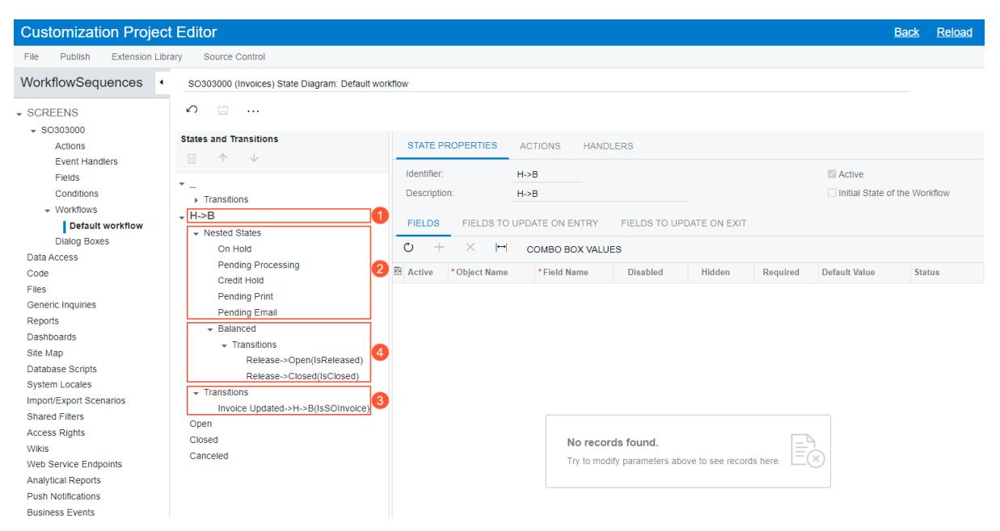

*Figure: A composite state in the invoice workflow*

Suppose that you want to add a new state, *Postponed*, to the workflow for the *[Invoices](https://help-2025r1.acumatica.com/Help?ScreenId=ShowWiki&pageid=0acc9738-f141-4ea0-a2be-f34ea9d1b63a)* form aer the *Credit Hold* state, specify a skip condition for it, and add a transition from this state to the next state in the workflow. The example in this topic demonstrates how you can do this.

### **To Modify a Workflow with Composite States**

To modify the default workflow of the *[Invoices](https://help-2025r1.acumatica.com/Help?ScreenId=ShowWiki&pageid=0acc9738-f141-4ea0-a2be-f34ea9d1b63a)* (SO303000) form, which contains composite states, you would perform the following steps:

- 1. Open the Customization Project Editor for a new or existing customization project, and add the *[Invoices](https://help-2025r1.acumatica.com/Help?ScreenId=ShowWiki&pageid=0acc9738-f141-4ea0-a2be-f34ea9d1b63a)* form to the list of customized screens.
- 2. On the SO303000 (Invoices) Workflows page, create a workflow named *Invoices* for the *[Invoices](https://help-2025r1.acumatica.com/Help?ScreenId=ShowWiki&pageid=0acc9738-f141-4ea0-a2be-f34ea9d1b63a)* form.
- 3. On the Conditions: SO303000 (Invoices) page, create a condition to make sure that the value in the **Cash Discount** box equals *0*.

For details on conditions, see *[Workflow Elements: General Information](https://help-2025r1.acumatica.com/Help?ScreenId=ShowWiki&pageid=ea427fe5-c281-484b-b092-0920f81458be)*

- 4. Open the SO303000 (Invoices) State Diagram: Invoices page, and on the More menu, click **Add State**.
- 5. In the **Add State** dialog box, which opens, specify the following settings:
  - **Identifier**: Y
  - **Description**: Postponed
  - **ParentState**: *H->B*
- 6. Click **OK** to close the dialog box.

In the **States and Transitions** pane, the system adds the *Postponed* state aer the last nested state (*Balanced* in this case).

- 7. With *Postponed* selected in the pane, use the arrows on the pane toolbar to move the added state aer the *Credit Hold* state.
- 8. With the *Postponed* state still selected, select the created condition in the**Skip Condition** box of the**State Properties** tab.

If the condition is fulfilled (that is, if the value in the **Cash Discount** box equals *0*) and a document is ready to enter the *Postponed* state, it then skips this state and automatically moves to the next state (*Pending Print* in this case).

9. On the More menu, click **Add Transition**.

10.In the **Add Transition** dialog box, which is opened, click **Create**.

11.In the **New Action** dialog box, which is opened, specify the following settings for the action:

- **Action Name**: DiscountApproved
- **Display Name**: Discount Approved
- **Category**: *Processing*

12.Click **OK** to close the **New Action** dialog box.

13.In the **TargetState** box of the **Add Transition** dialog box, select *@Next*.

This setting indicates that the transition will lead to the next state in the sequence (*Pending Print* in this case).

14.Click **OK** to close the dialog box.

The system adds the transition to the**Transitions** node of the *Postponed* state.

- 15.In the **States and Transitions** pane, click the *Postponed* state.
- 16.On the **Fields to Update on Exit** tab (in the lower part of the**State Properties** tab) for this state, add the *Cash Discount Date* field, and set its value to *=Now()*.

Each time a document leaves the *Postponed* state—that is, when the document moves to another state because a transition has been triggered (in this case, the transition triggered by the *Discount Approved* action)—the value of the *Cash Discount Date* field changes to the current date.

17.Save your changes.

The workflow with the added state is shown in the following screenshot.

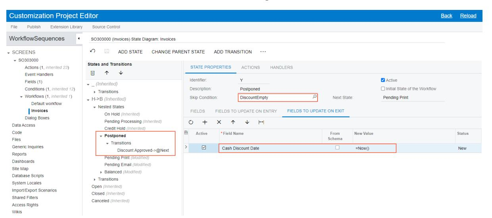

*Figure: The added Postponed state*

#### **Related Links**

- *[Getting Started with Workflows: General Information](https://help-2025r1.acumatica.com/Help?ScreenId=ShowWiki&pageid=7f95facd-7331-45f0-9424-e05082f900d1)*
- *[Workflow](https://help-2025r1.acumatica.com/Help?ScreenId=ShowWiki&pageid=8a944b6b-0e47-47c9-a6a7-1b266d8feba0) (Tree View)*
- *[Conditions](https://help-2025r1.acumatica.com/Help?ScreenId=ShowWiki&pageid=0e3371f4-6aaf-461b-b52d-3a8cb423a2f9)*

### **Customizing a Composite State From Code**

This topic describes customizing a composite state using Workflow API.

Suppose that you need to customize the workflow on the *[Invoices and Memos](https://help-2025r1.acumatica.com/Help?ScreenId=ShowWiki&pageid=5e6f3b27-b7af-412f-a40a-1d4f4be70cba)* (AR301000) form. The workflow on this form includes a composite state that is shown in the following diagram. You need to add the **Pending Approval** state to the composite state and add the following transitions:

- A transition to the beginning of the composite state
- A transition to the next state in the composite state (the **Credit Hold** state) that is triggered by the **Approve** action

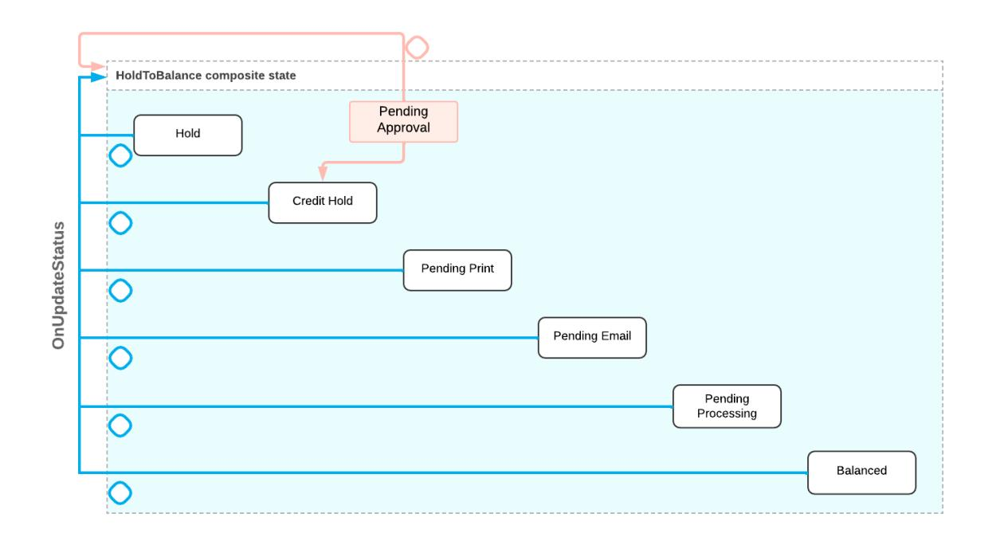

#### *Figure: The workflow on the Invoices and Memos form*

Such customization includes the following steps:

- Adding actions that trigger transitions involving the new state to the form. For that, you need to extend the graph that defines the logic for the form.
- Customizing the workflow for the form. For that, you need to extend the workflow that defines the logic for the form.
- In the customized workflow, you need to do the following:
  - Add a condition that defines when the new state is skipped in the composite state
  - Add the new state to the composite state
  - Add actions that trigger transitions from the new state
  - Add transitions which involve the new state

To implement the proposed customization, do the following:

- 1. Locate and customize the graph and the workflow for the *[Invoices and Memos](https://help-2025r1.acumatica.com/Help?ScreenId=ShowWiki&pageid=5e6f3b27-b7af-412f-a40a-1d4f4be70cba)* form by doing the following:
  - a. By using the Element Inspector for the *[Invoices and Memos](https://help-2025r1.acumatica.com/Help?ScreenId=ShowWiki&pageid=5e6f3b27-b7af-412f-a40a-1d4f4be70cba)* form, learn that the business logic of the form is defined in the ARInvoiceEntry graph. To find a class that defines the workflow for this form, look in the PX.Obejcts.AR namespace for a class that extends the ARInvoiceEntry graph: The names of the class is ARInvoiceEntry\_Workflow.
  - b. In the ARInvoiceEntry\_Workflow class, find the name of the composite state you need to customize: HoldToBalance.
  - c. Extend the ARInvoice\_Entry graph as the following code shows. You will define the **Approve** action their later.

```
namespace PX.Objects.AR
{
 public class ARInvoiceEntry_Extension : PXGraphExtension<ARInvoiceEntry>
 {
 }
}
```

d. Extend the ARInvoiceEntry\_Workflow class as the following code shows.

```
public class ARInvoiceEntry_ApprovalWorkflow 
 : PXGraphExtension<ARInvoiceEntry_Workflow, ARInvoiceEntry>
{
 public override void Configure(PXScreenConfiguration config)
 {
 Configure(config.GetScreenConfigurationContext<ARInvoiceEntry,
 ARInvoice>());
 }
 protected virtual void Configure(WorkflowContext<ARInvoiceEntry, ARInvoice>
 context)
 {
 }
}
```

In the code above, you declare an extension of the ARInvoiceEntry graph and override the Configure method inside it.

2. Define a condition depending on which the **Pending Approval** state is skipped in the composite state.

The **Pending Approval** state is skipped when the document is already approved—that is, the ARRegister.approved flag equals *true*. So, in the ARInvoiceEntry\_ApprovalWorkflow class, define this condition in a condition class and in the Configure method, create the instance of the class as the following code shows.

```
public class Conditions : Condition.Pack
{
 public Condition IsApproved => GetOrCreate(b => b.FromBql<
 ARRegister.approved.IsEqual<True>
 >());
}
protected virtual void Configure(WorkflowContext<ARInvoiceEntry, ARInvoice> context)
{
 var conditions = context.Conditions.GetPack<Conditions>();
}
```

3. Add the **Pending Approval** state to the composite state as the following code shows.

Before adding the state, define the string constant and the class for the state.

```
context.UpdateScreenConfigurationFor(screen => screen
.UpdateDefaultFlow(flow =>
{
 return flow
 .WithFlowStates(states =>
 {
 states.UpdateSequence<State.HoldToBalance>(seq =>
 seq.WithStates(sss =>
 {
 sss.Add<State.pendingApproval>(flowState =>
 {
 return flowState
 .IsSkippedWhen(conditions.IsApproved)
 .WithActions(actions =>
```

```
 {
 actions.Add(approveAction, 
 a => a.IsDuplicatedInToolbar());
 })
 .PlaceAfter<State.hold>();
 });
 }));
```

Inside the Configure method, you call the UpdateScreenConfigurationFor method. In the lambda expression for the method, you call the UpdateDefaultFlow method to modify the workflow for the Invoices and Memos form. In the lambda expression for the UpdateDefaultFlow method, you call the WithFlowStates method to access the states of the workflow. In the lambda expression for the WithFlowStates method, you call the UpdateSequence method to update the composite state. As a type parameter of the UpdateSequence method, you specify the name of the composite state. In the lambda expression for the UpdateSequence method, you call the WithStates method to access the states of the composite state. In the lamda expression for the WithStates method, you add the PendingApproval state.

In the state definition, you call the IsSkippedWhen method to specify a condition when the state should be skipped. By calling the PlaceAer method, you specify that the Pending Approval state should be the next state aer the Hold state.

4. Add the Approve action that triggers the transition from the Pending Approval state.

In the ARInnvoiceEntry\_Extension class, define the Approve action as the following code shows.

```
public PXAction<ARInvoice> Approve;
[PXButton()]
[PXUIField(DisplayName = "Approve", Enabled = false)]
protected virtual IEnumerable approve(PXAdapter adapter) => adapter.Get();
```

In the Configure method, create an action definition using the action defined in the graph and add it to the screen configuration as the following code shows.

```
var approvalCategory =
 context.Categories.Get(ARInvoiceEntry_Workflow.CategoryID.Approval);
var approveAction = context.ActionDefinitions
 .CreateExisting<ARInvoiceEntry_ApprovalWorkflow>(g => g.approve, a => a
 .WithCategory(approvalCategory)
 .PlaceAfter(g => g.releaseFromHold)
 .IsHiddenWhen(conditions.IsApprovalDisabled)
 .WithFieldAssignments(fa => fa.Add<ARRegister.approved>(e =>
 e.SetFromValue(true))));
context.UpdateScreenConfigurationFor(screen =>
{
 return screen
 ...
 .WithActions(actions =>
 {
 actions.Add(approveAction);
 });
});
```

5. Implement transitions from the **Pending Approval** state as the following code shows.

```
.WithTransitions(transitions =>
{
 transitions.AddGroupFrom<State.pendingApproval>(ts =>
```

```
 {
 ts.Add(t => t
 .To<State.HoldToBalance>()
 .IsTriggeredOn(g => g.OnUpdateStatus));
 ts.Add(t => t
 .ToNext()
 .IsTriggeredOn(approveAction)
 .When(conditions.IsApproved));
 });
}
```

In the code above, you implement the following stats:

- A transition that is triggered by the OnUpdateStatus event handler. This transition will allow the workflow engine to start searching for a proper state inside a composite state aer the Pending Approval state.
- A transition that is triggered by the Approve action and happens when document is already approved. The target state of the transition is Credit Hold due to the PlaceAer method called in the Pending Approval state definition.

### <span id="page-516-0"></span>**Use Cases**

The topics of this section present common scenarios of customizing Acumatica ERP. Each topic provides a description of a use case, details on its possible implementation, and links to source code of Acumatica ERP with examples of the same use case.

### <span id="page-516-1"></span>**Calculating Field Values (with PXFormula)**

This topic describes how to calculate values on a form of Acumatica ERP.

#### **Customization Description**

Suppose that you need to calculate the total price of a provided service based on the stock and non-stock items included in the service. For example, suppose that you are developing the custom Service and Prices (RS203000) maintenance form with several tabs, including **Repair Items** and **Labor** (where a user adds the stock items and non-stock items, respectively, included in the service). The total price, displayed in the **Approximate Price** box of the Summary area of the form, is a sum of all stock and non-stock items added to the service.

The following screenshots show an example of this form (which is developed in the *T210 Customized Forms and Master-Detail Relationship* training course). On the **Repair Items** tab (shown in the first screenshot), a user can add stock items. In the second screenshot, you can see the **Labor** tab, where a user can add non-stock items and specify their quantities.

|               | $\leftarrow$                                                            |           |                         | SAVE & CLOSE - [H] | ∽ +                    | 面<br>n a<br>۰   | - 1<<br>Ы                 |               |
|---------------|-------------------------------------------------------------------------|-----------|-------------------------|--------------------|------------------------|-----------------|---------------------------|---------------|
|               | BATTERYREPLACE - Battery O<br>Approximate Price:<br>* Service:<br>35.00 |           |                         |                    |                        |                 |                           |               |
|               |                                                                         | * Device: |                         |                    | NOKIA3310 - Nokia 3310 | Q               |                           |               |
|               | <b>REPAIR ITEMS</b><br><b>LABOR</b><br><b>WARRANTY</b>                  |           |                         |                    |                        |                 |                           |               |
|               | О<br>$\mathbf x$<br>×<br>⊢                                              |           |                         |                    |                        |                 |                           |               |
| 圓             |                                                                         | D.        | <b>Repair Item Type</b> |                    | Required               | *Inventory ID   | <b>Description</b>        | Price Default |
| $\rightarrow$ | 0                                                                       |           | Battery                 |                    | ☑                      | <b>BAT3310</b>  | Battery for Nokia 3310    | ☑<br>20.00    |
|               | 0                                                                       |           | <b>Back Cover</b>       |                    |                        | <b>BCOV3310</b> | Back cover for Nokia 3310 | ☑<br>10.00    |

#### *Figure: The Repair Items tab of the custom form*

|   | OUI VILUS ANU FIILUS |            |                     |              |                    |                            |   |  |                           |  |                      |       |          |  |        |
|---|----------------------|------------|---------------------|--------------|--------------------|----------------------------|---|--|---------------------------|--|----------------------|-------|----------|--|--------|
|   | $\leftarrow$         |            | SAVE & CLOSE 日      |              |                    | つも 血 ゆっ K く ゝ )            |   |  |                           |  |                      |       |          |  |        |
|   |                      | * Service: |                     |              |                    | BATTERYREPLACE - Battery O |   |  | <b>Approximate Price:</b> |  |                      | 35.00 |          |  |        |
|   |                      | * Device:  |                     |              |                    | NOKIA3310 - Nokia 3310     | Q |  |                           |  |                      |       |          |  |        |
|   |                      |            | <b>REPAIR ITEMS</b> | <b>LABOR</b> |                    | <b>WARRANTY</b>            |   |  |                           |  |                      |       |          |  |        |
|   | Č١                   |            | $\times$            | ⊶⊦           | 図                  |                            |   |  |                           |  |                      |       |          |  |        |
| 圓 | 0                    | D.         | <b>Inventory ID</b> |              | <b>Description</b> |                            |   |  |                           |  | <b>Default Price</b> |       | Quantity |  | Ext. P |
| ⋋ | 0                    | ו ו        | <b>CONSULT</b>      |              |                    | Consulting service         |   |  |                           |  | 5.00                 |       | 1.00     |  | 5      |
|   |                      |            |                     |              |                    |                            |   |  |                           |  |                      |       |          |  |        |

#### *Figure: The Labor tab of the custom form*

The value in the **Approximate Price** box should be changed when the user adds a new item or deletes an item on a **Repair Items** or **Labor** tabs.

Suppose that the value of the item price on the **Repair Items** tab is stored in the BasePrice field of the RSSVRepairItem DAC, as the following code shows.

```
[PXCacheName("Repair Item")]
public class RSSVRepairItem : PXBqlTable, IBqlTable
{ 
 ...
 #region BasePrice
 [PXDBDecimal()]
 [PXDefault(TypeCode.Decimal, "0.0")]
 [PXUIField(DisplayName = "Price")]
 public virtual Decimal? BasePrice { get; set; }
 public abstract class basePrice : PX.Data.BQL.BqlDecimal.Field<basePrice> { }
 #endregion
}
```

The extended price on the **Labor** tab (the **Ext. Price** column) is stored in the ExtPrice field of the RSSVLabor DAC, as the following code shows.

```
[PXCacheName("Repair Labor")]
public class RSSVLabor : PXBqlTable, IBqlTable
```

```
{
 ...
 #region ExtPrice
 [PXDBDecimal()]
 [PXDefault(TypeCode.Decimal, "0.0")]
 [PXUIField(DisplayName = "Ext. Price", Enabled = false)]
 public virtual Decimal? ExtPrice { get; set; }
 public abstract class extPrice : PX.Data.BQL.BqlDecimal.Field<extPrice> { }
 #endregion
}
```

The result of the calculation should be stored in the Price field of the RSSVRepairPrice DAC, which is defined as the following code shows.

```
[PXCacheName("Repair Price")]
public class RSSVRepairPrice : PXBqlTable, IBqlTable
{
 ...
 #region Price
 [PXDBDecimal()]
 [PXDefault(TypeCode.Decimal, "0.0")]
 [PXUIField(DisplayName = "Approximate Price", Enabled = false)]
 public virtual Decimal? Price { get; set; }
 public abstract class price : PX.Data.BQL.BqlDecimal.Field<price> { }
 #endregion
}
```

### **Implementation**

You can calculate values in one of the following ways:

• Use the PXFormula or PXUnboundFormula attribute on a field in a DAC.

You can use this approach if the calculations are simple and can be performed by using functions provided by Acumatica Framework, which are listed in *[Calculation](https://help-2025r1.acumatica.com/Help?ScreenId=ShowWiki&pageid=fd20c038-ce71-4429-a84d-f34064263906) of Field Values*.

The difference between the PXFormula and PXUnboundFormula attributes is that the PXFormula attribute writes the result of the calculation to the specified database field, and the PXUnboundFormula attribute writes the result to the field provided by the aggregateType parameter.

• Calculate values in an event handler.

You should use this approach if the calculations are complex and cannot be performed by using functions provided by Acumatica Framework.

In the current case, you can use the PXFormula attribute to implement calculations on the Services and Prices form. Because you are using the PXFormula attribute, you do not need to define any event handlers to implement these calculations.

To implement the calculation of the field values, do the following:

1. Add the PXFormula attribute to the BasePrice field of the RSSVRepairItem DAC, as shown in bold type in the following code.

```
[PXDBDecimal()]
[PXDefault(TypeCode.Decimal, "0.0")]
[PXUIField(DisplayName = "Price")]
[PXFormula(null,
 typeof(SumCalc<RSSVRepairPrice.price>))]
```

```
public virtual Decimal? BasePrice { get; set; }
```

In this code, the PXFormula attribute calculates the Price value of the RSSVRepairPrice DAC as the sum of the BasePrice values of all records in the **Repair Items** tab.

2. Add the PXFormula attribute to the ExtPrice field of the RSSVLabor DAC, as shown in bold type in the following code.

```
[PXDBDecimal()]
[PXUIField(DisplayName = "Ext. Price")]
[PXDefault(TypeCode.Decimal, "0.0")]
[PXFormula(
 typeof(Mult<RSSVLabor.quantity, RSSVLabor.defaultPrice>),
 typeof(SumCalc<RSSVRepairPrice.price>))]
public virtual Decimal? ExtPrice { get; set; }
```

In this code, the PXFormula attribute calculates the ExtPrice value as the product of the Quantity and DefaultPrice values of the same record, and calculates the Price value of the RSSVRepairPrice DAC as the sum of ExtPrice values of all records in the **Labor** tab.

3. In the ASPX file of the form, set the CommitChanges attribute to *True* for the **Quantity** column of the grid to be able to calculate the ExtPrice value.

#### **Summary**

To calculate values, you use the PXFormula attribute on the fields that are used in the calculations. As a parameter of the PXFormula attribute, you provide a function that specifies how to calculate the resulting value and in which field the resulting value should be stored.

You can see the complete list of functions in the *[Calculation](https://help-2025r1.acumatica.com/Help?ScreenId=ShowWiki&pageid=fd20c038-ce71-4429-a84d-f34064263906) of Field Values* topic. For more information on the PXFormula attribute, see the *[PXFormulaAttribute Class](https://help.acumatica.com/(W(2))/Help?ScreenId=ShowWiki&pageid=dbafa6c6-e444-206f-6d5e-8f5606b4b69e)* topic in the API Reference.

#### **Examples in Acumatica ERP Source Code**

| Form                       | Location on the Form                                                                                                                                                                                                             | Location in Source Code         |
|----------------------------|----------------------------------------------------------------------------------------------------------------------------------------------------------------------------------------------------------------------------------|---------------------------------|
| Invoices (SO303000)        | Multiple calculations are made on this form. For<br>example, the value in the Ext. Price box of the<br>Summary area is calculated based on the values in<br>the Quantity and Unit Price columns on the Doc<br>ument Details tab. | The PX.Objects.AR.ARTran<br>DAC |
| Sales Orders<br>(SO301000) | Multiple calculations are made on this form. For<br>example, the value of the Ext. Price box of the<br>Summary area is calculated based on the values in<br>the Quantity and Unit Price columns on the Doc<br>ument Details tab. | The PX.Objects.SO.SOLine<br>DAC |
|                            | You can see more complex calculations that use<br>the PXFormula attribute with the SOLing.Un<br>billedQty field.                                                                                                                 |                                 |

The following table lists similar examples of calculating values in Acumatica ERP forms.

| Form                                 | Location on the Form                                                                                                                                                                                 | Location in Source Code         |
|--------------------------------------|------------------------------------------------------------------------------------------------------------------------------------------------------------------------------------------------------|---------------------------------|
| Bills and Adjust<br>ments (AP301000) | Multiple calculations. For example, the value of the<br>Ext. Cost box of the Summary area is calculated<br>based on the values of the Quantity and Unit Cost<br>columns on the Document Details tab. | The PX.Objects.AP.APTran<br>DAC |

#### **Related Links**

- *[PXFormulaAttribute Class](https://help.acumatica.com/(W(2))/Help?ScreenId=ShowWiki&pageid=dbafa6c6-e444-206f-6d5e-8f5606b4b69e)*
- *[PXUnboundFormulaAttributeClass](https://help.acumatica.com/(W(1))/Help?ScreenId=ShowWiki&pageid=5a7e614d-8489-68d6-3efc-f4aa3af87dcf)*
- *[Calculation](https://help-2025r1.acumatica.com/Help?ScreenId=ShowWiki&pageid=fd20c038-ce71-4429-a84d-f34064263906) of Field Values*

### <span id="page-520-0"></span>**Adding a Field from Another DAC**

This topic describes how to add a UI control to an ASPX from another DAC.

#### **Customization Description**

Suppose that you want to display boxes (or columns in a grid) from multiple DACs. For example, suppose that you are developing the custom Service and Prices (RS203000) maintenance form with several tabs, including the **Repair Items** tab. You have a service item that is defined by a custom DAC called RSSVRepairItem, and it has a corresponding stock item with a unique ID. Suppose you want to display information on this custom item and a description of its corresponding stock item.

The following screenshot shows an example of this form (which is designed in the *T210 Customized Forms and Master-Detail Relationship* training course).

|                         | $\leftarrow$ |   |                         | SAVE & CLOSE 日           | $\circ$ +                                            | ाणि                                      | - 12 - 14 |                    | $\sim$ $\sim$             | $\rightarrow$ | $\rightarrow$ |       |       |               |  |
|-------------------------|--------------|---|-------------------------|--------------------------|------------------------------------------------------|------------------------------------------|-----------|--------------------|---------------------------|---------------|---------------|-------|-------|---------------|--|
| * Service:<br>* Device: |              |   |                         |                          | BATTERYREPLACE - Battery Q<br>NOKIA3310 - Nokia 3310 | Q                                        |           | Approximate Price: |                           |               |               | 35.00 |       |               |  |
| <b>REPAIR ITEMS</b>     |              |   |                         | LABOR<br><b>WARRANTY</b> |                                                      |                                          |           |                    |                           |               |               |       |       |               |  |
| O<br>⊠<br>$\times$<br>ℍ |              |   |                         |                          |                                                      |                                          |           |                    |                           |               |               |       |       |               |  |
| 圓                       | 0            | D | <b>Repair Item Type</b> |                          | Required                                             | *Inventory ID                            |           | <b>Description</b> |                           |               |               |       |       | Price Default |  |
| ≻                       | 0            | D | Battery                 |                          | ☑                                                    | <b>BAT3310</b>                           |           |                    | Battery for Nokia 3310    |               |               |       | 20.00 | ⊡             |  |
|                         | 0            |   | <b>Back Cover</b>       |                          | !!!!!!!!!!!!!!!!!!!!!!!!!!!!!!!!!!!!!!!!             | !!!!!!!!!!!!!!!!!!!!!!!!!!!!!!!!!!!!!!!! |           |                    | Back cover for Nokia 3310 |               |               |       | 10.00 | ⊡             |  |
|                         |              |   |                         |                          |                                                      |                                          |           |                    |                           |               |               |       |       |               |  |

#### *Figure: The Repair Items tab of the custom form*

The RSSVRepairItem DAC includes the InventoryID field, which identifies a stock item. The field is defined as the following code shows.

```
[Inventory]
[PXDefault]
public virtual int? InventoryID { get; set; }
public abstract class inventoryID : PX.Data.BQL.BqlInt.Field<inventoryID> { }
```

The view for the **Repair Items** tab is defined as the following code shows.

```
public SelectFrom<RSSVRepairItem>.
 Where<RSSVRepairItem.serviceID.IsEqual<RSSVRepairPrice.serviceID.FromCurrent>.
 And<RSSVRepairItem.deviceID.IsEqual<RSSVRepairPrice.deviceID.FromCurrent>>>.View
 RepairItems;
```

#### **Implementation**

To display a UI control from a DAC which is not selected in a view, you can use one of the following approaches:

• Adding a control in the ASPX without modifying the view.

You use this approach when a DAC selected in the view includes a field which is a primary key of a table from which you want to display a field. For example, the RSSVRepairItem DAC is selected in the view of the **RepairItems** tab, and the DAC includes a PK field, which is InventoryID.

• Joining the DAC in the view and adding a control in ASPX.

You should use this approach if a DAC selected in the view does not include a field which is a primary key of a table from which you want to display a field.

To display information by configuring the ASPX file only (without modifying the view), do the following:

1. Learn the name of the field you want to display.

For example, to learn the name of the field for the stock item description, go to the *[Stock Items](https://help-2025r1.acumatica.com/Help?ScreenId=ShowWiki&pageid=77786a70-1f1e-4d63-ad98-96f98e4fcb0e)* (IN202500) form and inspect the **Description** box on the Summary area by using the Element Inspector. The field name for the box is descr.

2. In the ASPX for the Services and Prices form, you specify a data field from the selector of another field (in this example, the description of the inventory ID) as two field names separated by one underscore character, such as InventoryID\_descr.

The element in the ASPX file should look as follows.

```
<px:PXGridColumn DataField="InventoryID_description" Width="280" >
</px:PXGridColumn>
```

To display information by configuring both the view and the ASPX file, do the following:

- 1. Learn the name of the field you want to display and its DAC.
- 2. Modify the view by joining the DAC from which you want to display a view.

For example, on the**Tax Details** tab of the *[Sales Orders](https://help-2025r1.acumatica.com/Help?ScreenId=ShowWiki&pageid=19e4021c-1b84-49fd-be12-0320c5f1c7e5)* (SO301000) form, you want to display the TaxType field from the Tax DAC. The view is defined as shown in the following code.

```
public PXSelectJoin<SOTaxTran, LeftJoin<Tax, On<Tax.taxID, Equal<SOTaxTran.taxID>>>,
 Where<SOTaxTran.orderType, Equal<Current<SOOrder.orderType>>,
 And<SOTaxTran.orderNbr, Equal<Current<SOOrder.orderNbr>>>>> Taxes;
```

3. In the form's ASPX file, add the UI element to display the field value.

In the example presented in the previous instruction,in the SO301000.aspx file, add the following column to the**Tax Details** grid.

<px:PXGridColumn AllowNull="False" DataField="Tax\_\_TaxType" Label="Tax Type"/>

Note that to add a field, you specify the DAC name and the field name by separating them with a double underscore.

#### **Summary**

To add a box (or a column) to a form that is mapped to a field from a DAC not used in a view, you use the following formula in the DataField attribute in the ASPX file: <PK\_field\_name>\_<field\_name>.

To add a box (or a column) to a form that is mapped to a field from a DAC selected in a view, you use the following formula in the DataField attribute in the ASPX file: <DAC\_name>\_\_<field\_name>.

### **Examples in Acumatica ERP Source Code**

The following table lists similar examples of displaying fields from different DACs in Acumatica ERP forms.

| Form                                   | Location on the Form                                                                                                                                                                    | Location in Source Code                                                                                    |
|----------------------------------------|-----------------------------------------------------------------------------------------------------------------------------------------------------------------------------------------|------------------------------------------------------------------------------------------------------------|
| Sales Orders (SO301000)                | The following columns on theTax<br>Details tab are mapped by using<br>ASPX and joining DACs in a view:                                                                                  | •<br>SOOrderEntry graph<br>•<br><px:pxgridlevel<br>DataMember="Taxes"&gt;</px:pxgridlevel<br>              |
|                                        | •<br>TaxType<br>•<br>PendingTax<br>•<br>ReverseTax<br>•<br>Include in VATExemptTax<br>•<br>StatisticalTax                                                                               |                                                                                                            |
| Vendor Prices (AP202000)               | The Vendor Name and Descrip<br>tion columns in the form grid are<br>mapped by using ASPX and joining<br>DAC in a view.                                                                  | •<br>APVendorPriceMaint graph<br>•<br><px:pxgridlevel<br>DataMember="Records"&gt;</px:pxgridlevel<br>      |
| Deactivate Expired Cards<br>(AR512500) | The following columns in the form<br>grid are mapped by using ASPX and<br>joining DAC in a view:<br>•<br>Customer Name<br>•<br>Customer Class<br>•<br>Email<br>•<br>Phone 1<br>•<br>Fax | •<br>APExpiringCardsProcess<br>graph<br>•<br><px:pxgridlevel<br>DataMember="Cards"&gt;</px:pxgridlevel<br> |

### <span id="page-522-0"></span>**Generating an Excel from Code**

The following activity will walk you through the process of generating an Excel file using Acumatica Framework.

#### **Story**

On the Sales Orders (SO301000) form, suppose that you need to generate an Excel file with the list of lines of the current sales order (from the **Details** tab of the Sales Orders form) when a user clicks a button, and download the generated file or send it in an email.

#### **Learning Objectives**

In this activity, you will learn how to do the following:

- Generate an Excel file
- Initiate downloading of a file
- Create an email and attach a file to an email based on a notification template

#### **Process Overview**

In the graph extension for the Sales Orders form, you will use the PX.Export.Excel.Core.Package class to generate an Excel file. You will implement an action in which you will either call a method which downloads the file, or send it as an email attachment. For the user to be able to download the file, you will use the PXRedirectToFileException redirection exception. To attach the file to an email, you will use a notification template and TemplateNotificationGenerator.

#### **System Preparation**

Before you begin performing the steps of this activity, do the following:

- 1. Prepare an Acumatica ERP instance with the T100 dataset.
- 2. Create a customization project.
- 3. Create an extension library and open it in Visual Studio (optional).

#### **Step 1: Create a Graph Extension**

To be able to customize logic on the Sales Orders form, you first need to create a graph extension for the graph which determines logic on the Sales Orders form by doing the following:

- 1. Open the Sales Orders form.
- 2. Open the Element Inspector and click the Summary area of the form.

In the Inspect Element dialog box, note the name of the graph in the business logic box: SalesOrderEntry.

3. In the Customization Project Editor or in your extension library, create an extension of the SalesOrderEntry graph as the following code shows.

```
namespace GenerateExcel
{
 public class SOOrderEntryExcelExt : PXGraphExtension<SOOrderEntry>
 {
 }
}
```

#### **Step 2: Learn the Name of the View with Sales Order Lines**

To learn the name of the view from which to save the data to the Excel file, do the following:

- 1. Open the Sales Orders (SO301000) form.
- 2. Open the Element Inspector and click the table on the **Details** tab.

In the Inspect Element dialog box, note the name of the view: Transactions.

### **Step 3: Implement a Method That Downloads a File**

In this step, you will implement a private method that will download the Excel file provided in the method parameter.

An Excel file can be stored in an instance of the PX.Export.Excel.Core.Package class. In order to download the file, you need to convert it into a memory stream, add it to an instance of the PX.SM.FileInfo class, and throw the PXRedirectToFileException with the instance of the PX.SM.FileInfo class.

Do the following:

1. In the SOOrderEntryExcelExt class, add the following method.

```
private void ExportFile(PX.Export.Excel.Core.Package excel)
{
 using (MemoryStream stream = new MemoryStream())
 {
 excel.Write(stream);
 string path = String.Format("SO-{0}-Transaction Info.xlsx", 
 Base.Document.Current.OrderNbr);
 var info = new PX.SM.FileInfo(path, null, stream.ToArray());
 throw new PXRedirectToFileException(info, true);
 }
}
```

In the code above, you create a memory stream where you write the contents of the Excel file provided in the parameter. Then you create an instance of the PX.SM.FileInfo class which store the file name and file contents. To initiate the download, you throw the PXRedirectToFileException exception.

If you get an error that the Excel namespace does not exist, add the reference to the PX.Export.dll manually to your project.

### **Step 4: Implement a Method Which Sends an Email Attachment**

In this step, you will implement a method which sends an Excel file in an email attachment.

In order to create an email, first you need to create a notification template. Then, you can create an email based on this notification template using the PX.Objects.EP.TemplateNotificationGenerator class. Aer that, you write the contents of the Excel file to a stream and add it as an attachment to the email. To send an email, you call the Send method of the PX.Objects.EP.TemplateNotificationGenerator class.

Do the following:

- 1. On the *Email [Templates](https://help-2025r1.acumatica.com/Help?ScreenId=ShowWiki&pageid=ebcda76a-433f-4bde-8aed-efc69474fd03)* (SM204003) form, create a notification template with the following data:
  - **Description**: SOExcelNotification
  - **Screen**: *SO301000*
  - **From**: *admin*
  - **To**:((Document.ContactID.EMail));

The value above means the email is sent to the contact specified for the sales order.

When you send the email, make sure the ContactID field of the sales order is not empty. Otherwise, the email cannot be sent.

This template will be used to generate an email.

2. In the SOOrderEntryExcelExt class, add the following method.

```
//Email generated Excel as an attachment
private void SendEmail(PX.Export.Excel.Core.Package excel)
{
 bool sent = false;
 //Select the notification template created in the previous instruction
 Notification rowNotification = PXSelect<Notification,
 Where<Notification.name,
 Equal<Required<Notification.name>>>>
 .Select(Base, "SOExcelNotification");
 if (rowNotification == null)
 throw new PXException("Notification Template for is not specified.");
 //Create an email
 var sender = PX.Objects.EP.TemplateNotificationGenerator.Create(
 Base.Document.Current, rowNotification.NotificationID.Value);
 // You can adjust settings from the notification template here
 // such as email address and mail account ID
 //Attach Excel
 using (MemoryStream stream = new MemoryStream())
 {
 excel.Write(stream);
 string path = String.Format("SO-{0}-Transaction Info.xlsx", 
 Base.Document.Current.OrderNbr);
 sender.AddAttachment(path, stream.ToArray());
 }
 // Initiate sending of the email
 sent |= sender.Send().Any();
}
```

In the code above, first you have selected the email template for the Sales Orders form. Then you create an email by calling the Create method of the PX.Objects.EP.TemplateNotificationGenerator class. Aer that, you write the contents of the provided Excel file to a stream and add it as an attachment to the email. You send the email by calling the Send method.

#### **Step 5: Implement an Action which Generates the Excel File**

In this step, you will implement an action which either initiates downloading of a generated Excel file or sends it in an email.

To generate an email, you will create an instance of the PX.Export.Excel.Core.Package class. You can add sheets and sheet headers to the file.

Do the following:

1. In the SOOrderEntryExcelExt class, add the following action.

```
public PXAction<SOOrder> ExportToExcelAndSendEmailAttachment;
[PXUIField(DisplayName = "Export To Excel", MapViewRights = PXCacheRights.Select, 
 MapEnableRights = PXCacheRights.Update)]
[PXButton]
protected virtual void exportToExcelAndSendEmailAttachment()
{
 //Check that the record is not empty and is saved to the database
```

```
 if (Base.Document.Current == null ||
 Base.Document.Cache.GetStatus(Base.Document.Current) 
 == PXEntryStatus.Inserted) return;
 var excel = new PX.Export.Excel.Core.Package();
 var sheet = excel.Workbook.Sheets[1];
 //Add Header
 sheet.Add(1, 1, "Line #");
 sheet.Add(1, 2, "Transaction Description");
 sheet.Add(1, 3, "Ordered Quantity");
 //Add Data
 var index = 2;
 foreach (PXResult<SOLine> lineItem in Base.Transactions.Select())
 {
 SOLine dataRow = (SOLine)lineItem;
 sheet.Add(index, 1, Convert.ToString(dataRow.LineNbr));
 sheet.Add(index, 2, dataRow.TranDesc);
 sheet.Add(index, 3, Convert.ToString(dataRow.OrderQty));
 index++;
 }
 sheet.SetColumnWidth(1, 20);
 sheet.SetColumnWidth(2, 45);
 sheet.SetColumnWidth(3, 35);
 ExportFile(excel);
 //SendEmail(excel);
}
```

In the code above, you define the **ExportTo Excel** action. In the action method, first you check that the current record has been saved to the database (PXEntryStatus.Inserted). Then you create an excel file with a single sheet, and define a header line in this sheet. Later, you fill in the sheet with data from the Transactions view of the base class, that is, lines of the current sales order. In the end, you call either the ExportFile method to export the Excel file, or the SendEmail method to send the generated file by email.

2. Save your changes.

#### **Step 6: Test the Action**

To test the implemented action, do the following:

- 1. If you used an extension library, rebuild your project and update the DLL file in your customization project. If you used the Code Editor, publish your customization project.
- 2. In Acumatica ERP, on the Sales Orders form, open a record.
- 3. On the Sales Orders form, click **ExportTo Excel**.

The browser downloads the file.

- 4. Return to your code, comment the ExportFile method and uncomment the SendEmail method. Rebuild your library or publish the customization project.
- 5. On the form toolbar, click the **ExportTo Excel** button.

The systems adds the email to the queue and send it according to the schedule on the *[Send and Receive](https://help-2025r1.acumatica.com/Help?ScreenId=ShowWiki&pageid=96cbe1ef-0e99-49b6-b5ae-863b560b3722) [Email](https://help-2025r1.acumatica.com/Help?ScreenId=ShowWiki&pageid=96cbe1ef-0e99-49b6-b5ae-863b560b3722)* (SM507010) form. You can view the email on the Outgoing Email tab of the *[All Emails](https://help-2025r1.acumatica.com/Help?ScreenId=ShowWiki&pageid=59fc2cfe-b358-47c6-9285-b071a689f7d6)* (CO409070) form.

### **Examples in Acumatica ERP Source Code**

The following table lists Acumatica ERP forms where creation of an email is implemented.

| Form                    | Location in Source Code              |
|-------------------------|--------------------------------------|
| Sales Orders (SO301000) | The PX.Obejcts.SO.SOOrderEntry graph |

# <span id="page-528-0"></span>**Glossary**

The following table contains definitions of the basic terms used in Acumatica Customization Platform.

| Term                                                          | Definition                                                                                                                                                                                                                                          |  |  |  |
|---------------------------------------------------------------|-----------------------------------------------------------------------------------------------------------------------------------------------------------------------------------------------------------------------------------------------------|--|--|--|
| Acumatica mobile application                                  | The native mobile client applications Acumatica provides from App Store<br>and Google Play for iOS and Android devices respectively.                                                                                                                |  |  |  |
| Administrator role                                            | A user account role assigned to specialists involved with system administra<br>tion. This role can assign the Customizer role to the needed users by using<br>the Users (SM201010) form.                                                            |  |  |  |
| Attributes of a business entity in<br>Acumatica ERP           | Data records that contain specific information defined for a particular class,<br>which is a grouping of entities—such as leads, opportunities, customers,<br>cases, projects, and stock and non-stock items—that have similar proper<br>ties.      |  |  |  |
| BLC                                                           | See Business logic controller.                                                                                                                                                                                                                      |  |  |  |
| Bound data field                                              | A field for which the value is stored in the database.                                                                                                                                                                                              |  |  |  |
| Business logic controller (BLC,<br>also referred to as graph) | A class that provides business logic for a form of Acumatica ERP.                                                                                                                                                                                   |  |  |  |
| Code Editor                                                   | A tool of the Customization Project Editor that is designed to edit and man<br>age the customization code added to the customization project. For more<br>information, see Code Editor.                                                             |  |  |  |
| Customization project                                         | A set of changes and additional files that modifies Acumatica ERP or an<br>Acumatica Framework-based application.                                                                                                                                   |  |  |  |
| Customization task                                            | A set of custom requirements to be implemented in Acumatica ERP.                                                                                                                                                                                    |  |  |  |
| Customization Project Editor<br>(Project Editor)              | A tool of Acumatica ERP that is designed to manage a customization project.<br>For more information, see Customization Project Editor.                                                                                                              |  |  |  |
| Customizer role                                               | A user account role assigned to the specialists that can use the customiza<br>tion tools and facilities of the Acumatica Customization Platform, and up<br>load and publish customization projects.                                                 |  |  |  |
| DAC                                                           | See data access class.                                                                                                                                                                                                                              |  |  |  |
| Data access class (DAC)                                       | A class that contains field declarations and provides an abstract interface<br>used for mapping C# objects to the database schema.                                                                                                                  |  |  |  |
| Data Class Editor                                             | A tool of the Project Editor that is designed to customize data access classes.<br>For more information, see Data Class.                                                                                                                            |  |  |  |
| Deployment package                                            | A redistributable .zip file that includes the full content of a customization<br>project. The deployment package consists of the project.xml file and<br>the custom files that you could have added to the project, such as external<br>assemblies. |  |  |  |

| Term                                               | Definition                                                                                                                                                                                                                                                                                                                                                           |  |  |  |
|----------------------------------------------------|----------------------------------------------------------------------------------------------------------------------------------------------------------------------------------------------------------------------------------------------------------------------------------------------------------------------------------------------------------------------|--|--|--|
| Development environment                            | Your local environment in which you solve a customization task.                                                                                                                                                                                                                                                                                                      |  |  |  |
| Extension class                                    | A class that contains the customization code for an original (base) class of<br>Acumatica ERP. At run time, during the first initialization of a base class, the<br>system automatically discovers an extension for the class and applies the<br>customization by replacing the base class with the merged result of the base<br>class and the discovered extension. |  |  |  |
| Extension class for a business<br>logic controller | A class that contains the customization code for an original business log<br>ic controller of Acumatica ERP. An extension class for a business logic con<br>troller is derived from the PXGraphExtension <t> generic class.</t>                                                                                                                                      |  |  |  |
| Extension class for a data ac<br>cess class        | A class that contains the customization code for an original data access<br>class of Acumatica ERP. An extension class for a data access class is derived<br>from the PXCacheExtension <t> generic class.</t>                                                                                                                                                        |  |  |  |
| Extension library                                  | A Microsoft Visual Studio project that is individually developed and tested,<br>and added to the customization project as a DLL.                                                                                                                                                                                                                                     |  |  |  |
| Generic inquiry                                    | An inquiry to the database to get the information you want to view.                                                                                                                                                                                                                                                                                                  |  |  |  |
| Import scenario                                    | A scenario that is a sequence of actions to perform data migration from a<br>legacy application to an instance of Acumatica ERP.                                                                                                                                                                                                                                     |  |  |  |
| Integration scenario                               | An import or export scenario that is a sequence of actions to be executed for<br>a data record to perform data migration between a legacy application and<br>Acumatica ERP.                                                                                                                                                                                          |  |  |  |
| Screen Editor                                      | The visual editor for the source code of an .aspx page. You can use it to<br>configure ASP.NET containers, such as forms and grids, as well as to set the<br>properties of UI controls. For more information, see Screen Editor.                                                                                                                                     |  |  |  |
| Main data access class                             | A data access class that is the first type parameter in a data view declara<br>tion.                                                                                                                                                                                                                                                                                 |  |  |  |
| New Screen wizard                                  | The utility of the Project Editor that is designed to immediately create a<br>workable template for a custom form.                                                                                                                                                                                                                                                   |  |  |  |
| Production environment                             | The environment that must be customized for the end users.                                                                                                                                                                                                                                                                                                           |  |  |  |
| Publication of a customization<br>project          | The process of applying the content of the project to the current instance of<br>Acumatica ERP.                                                                                                                                                                                                                                                                      |  |  |  |
| Source Code browser                                | A tool of the Project Editor that is designed to explore the original source<br>code of Acumatica ERP.                                                                                                                                                                                                                                                               |  |  |  |
| Staging (or testing) environ<br>ment               | The production environment copy in which you will test the solution before<br>applying it to the production environment.                                                                                                                                                                                                                                             |  |  |  |
| Unbound data field                                 | A field that is added only to the data access class and is not mapped to the<br>database.                                                                                                                                                                                                                                                                            |  |  |  |