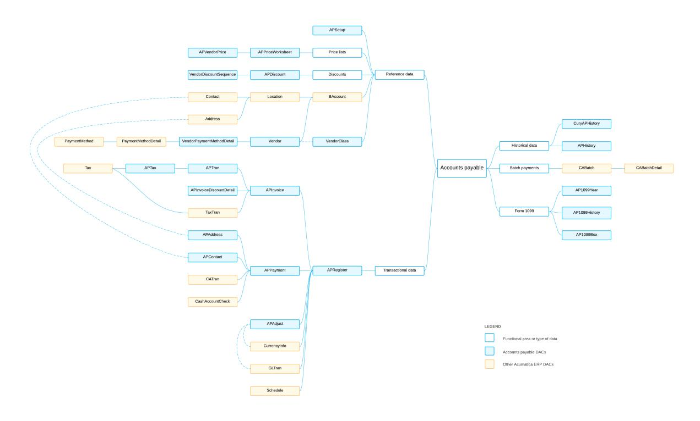
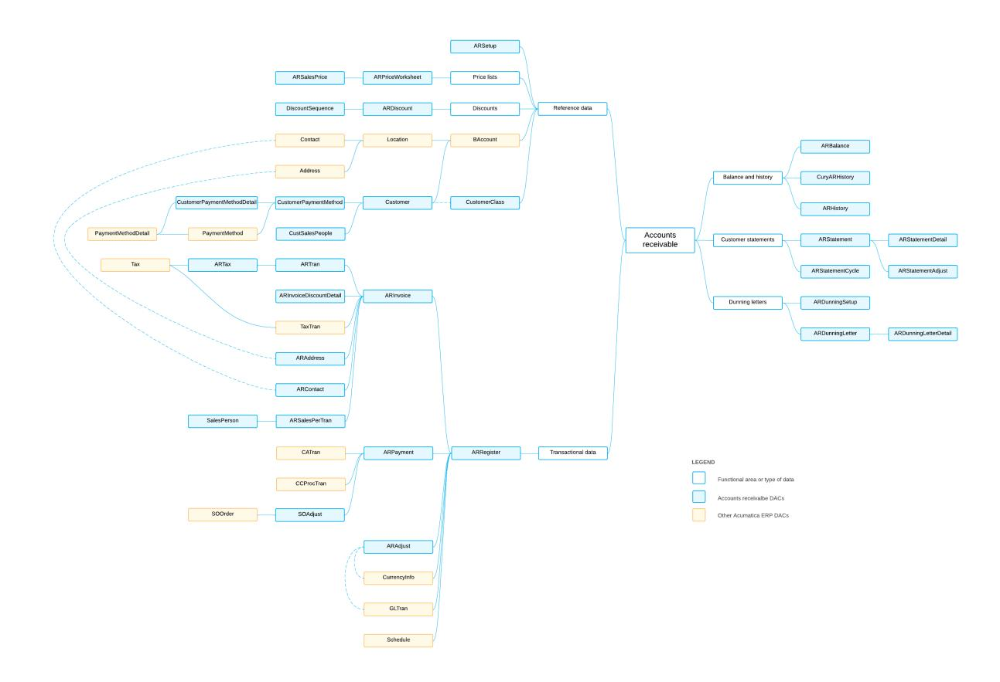
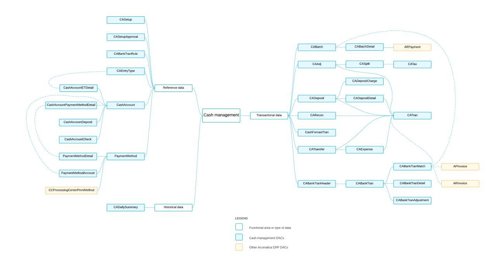
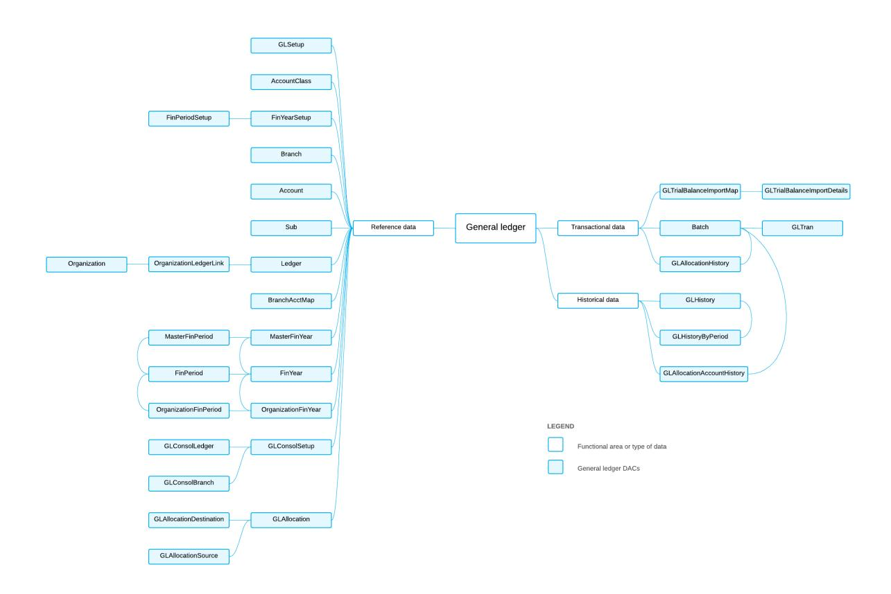
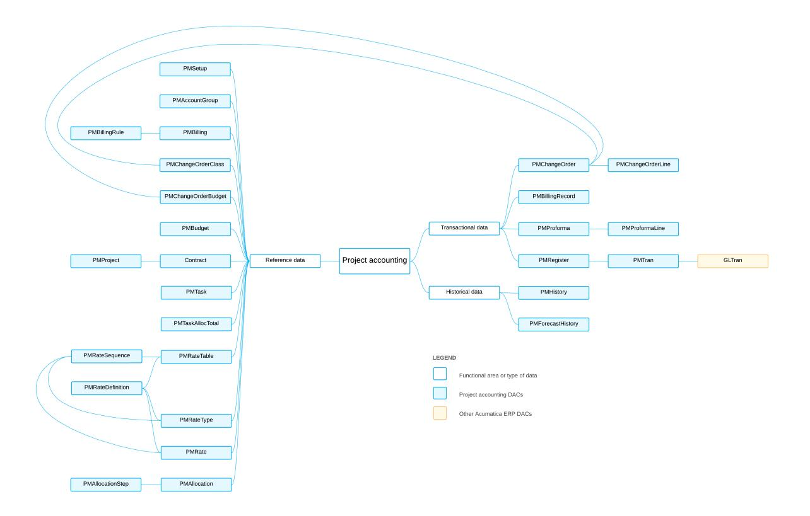
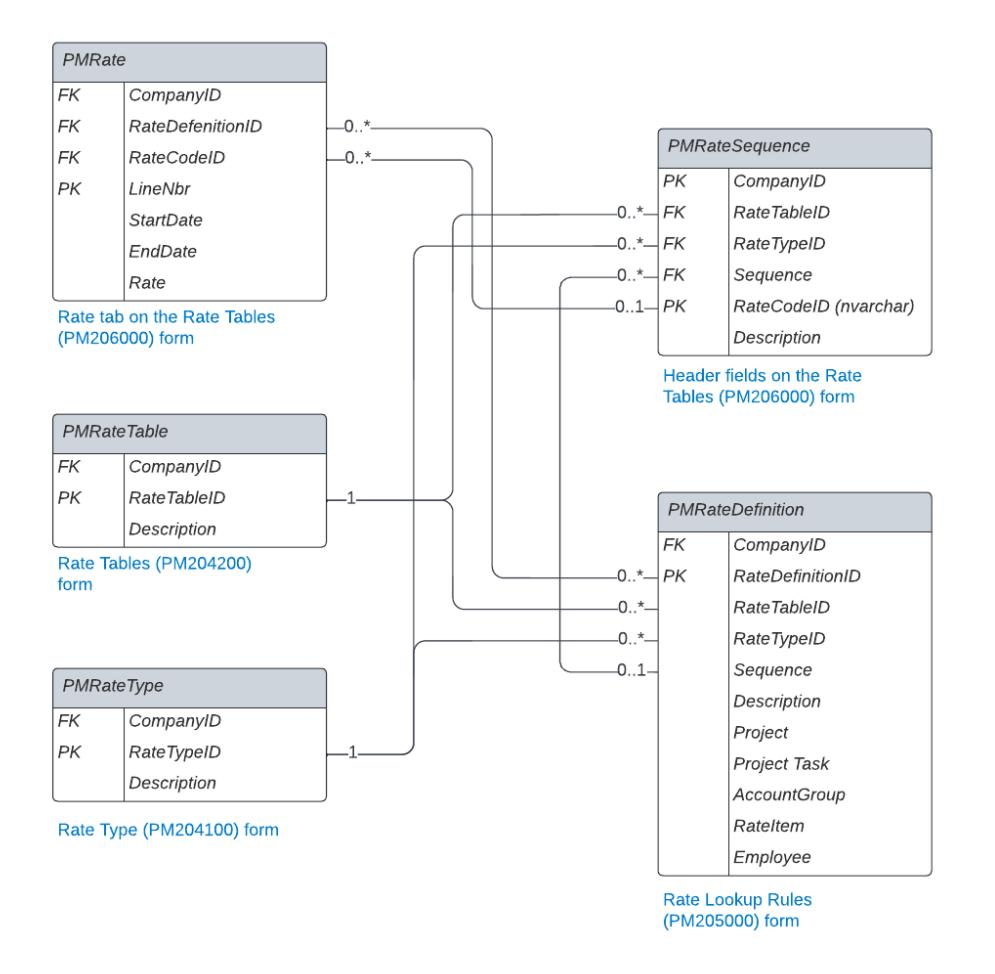
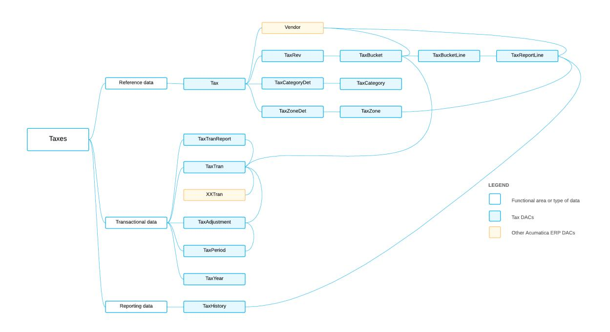

**Developer Guide**

# **DAC Overview 2025 R1**


| Copyright4                             |  |
|----------------------------------------|--|
| DAC Overview 5                         |  |
| Reviewing Accounts Payable DACs 6      |  |
| AP DACs: General Information 6         |  |
| AP DACs: Reference Data7               |  |
| AP DACs: Transactional Data10          |  |
| AP DACs: Historical Data18             |  |
| Reviewing Accounts Receivable DACs 21  |  |
| AR DACs: General Information 21        |  |
| AR DACs: Reference Data22              |  |
| AR DACs: Transactional Data25          |  |
| AR DACs: Balance and Historical Data37 |  |
| AR DACs: Customer Statements 39        |  |
| Reviewing Cash Management DACs 41      |  |
| CA DACs: General Information 41        |  |
| CA DACs: Reference Data42              |  |
| CA DACs: Transactional Data43          |  |
| CA DACs: Historical Data50             |  |
| Reviewing Deferred Revenue DACs51      |  |
| DR DACs: General Information 51        |  |
| DR DACs: Reference Data54              |  |
| DR DACs: Transactional Data55          |  |
| DR DACs: Balance Data57                |  |
| Reviewing General Ledger DACs58        |  |
| GL DACs: General Information 58        |  |
| GL DACs: Reference Data59              |  |
| GL DACs: Transactional Data62          |  |
| GL DACs: Historical Data64             |  |
| Reviewing Project Accounting DACs 66   |  |
| PM DACs: General Information66         |  |
| PM DACs: Reference Data 67             |  |
| PM DACs: Transactional Data 71         |  |
| PM DACs: Historical Data73             |  |
| Reviewing Tax DACs 75                  |  |

| TX DACs: General Information75 |  |
|--------------------------------|--|
| TX DACs: Reference Data 76     |  |
| TX DACs: Transactional Data 77 |  |
| TX DACs: Reporting Data 79     |  |

## <span id="page-3-0"></span>**Copyright**

### **© 2025 Acumatica, Inc.**

#### **ALL RIGHTS RESERVED.**

No part of this document may be reproduced, copied, or transmitted without the express prior consent of Acumatica, Inc.

3075 112th Avenue NE, Suite 200, Bellevue, WA 98004, USA

### **Restricted Rights**

The product is provided with restricted rights. Use, duplication, or disclosure by the United States Government is subject to restrictions as set forth in the applicable License and Services Agreement and in subparagraph (c)(1)(ii) of the Rights in Technical Data and Computer Soware clause at DFARS 252.227-7013 or subparagraphs (c)(1) and (c)(2) of the Commercial Computer Soware-Restricted Rights at 48 CFR 52.227-19, as applicable.

### **Disclaimer**

Acumatica, Inc. makes no representations or warranties with respect to the contents or use of this document, and specifically disclaims any express or implied warranties of merchantability or fitness for any particular purpose. Further, Acumatica, Inc. reserves the right to revise this document and make changes in its content at any time, without obligation to notify any person or entity of such revisions or changes.

### **Trademarks**

Acumatica is a registered trademark of Acumatica, Inc. HubSpot is a registered trademark of HubSpot, Inc. Microso Exchange and Microso Exchange Server are registered trademarks of Microso Corporation. All other product names and services herein are trademarks or service marks of their respective companies.

Soware Version: 2025 R1 Last Updated: 06/01/2025

## <span id="page-4-0"></span>**DAC Overview**

In Acumatica ERP, the data is stored in a database. However, users of Acumatica ERP do not access the database directly. Instead, they access the data access classes (DACs). A DAC is a programming object used to represent and provide access to a database table in the code of Acumatica ERP.

In this guide, you can find an overview of the data access classes (DACs) that are used in various functional areas of Acumatica ERP and learn about their relations.

## <span id="page-5-0"></span>**Reviewing Accounts Payable DACs**

By using the accounts payable functionality in Acumatica ERP, you can efficiently manage your company's liabilities to vendors for purchased or received goods and services. In this chapter, you can find an overview of the data access classes (DACs) that are used in accounts payable and learn about the relationships between them.

### <span id="page-5-1"></span>**AP DACs: General Information**

The system uses the accounts payable data access classes (DACs) to enter, monitor, maintain, and process the payments, invoices, and memos that the organization sends to its vendors. For details about the AP processes, see *[Accounts Payable](https://help-2025r1.acumatica.com/Help?ScreenId=ShowWiki&pageid=578189e0-3d99-4c08-8f5e-1aa1484d2981)*.

### **Learning Objectives**

In this chapter, you will learn about the DACs that are related to the following data:

- Reference data that is used in most of the DACs of accounts payable, such as information about vendors, locations, and addresses
- Transactional data
- Historical data

### **Applicable Scenarios**

You review AP DACs in the following cases:

- You need to create a generic inquiry that uses accounts payable data.
- You need to design a report that uses accounts payable data.
- You need to customize the accounts payable functionality by adjusting it in the *[Customization Project Editor](https://help-2025r1.acumatica.com/Help?ScreenId=ShowWiki&pageid=0bb97781-e987-4039-962d-457720821bff)*.
- You need to customize the accounts payable functionality by writing customization code.

### **Basic Relationships Between AP DACs**

The following diagram illustrates the main relationships between accounts payable DACs. For detailed descriptions of the DACs and DAC fields, look for the needed DAC in the *[DAC Schema Browser](https://help.acumatica.com/dacBrowser)*. (For details about the DAC Schema Browser, see *[Data from Multiple Data Sources: DAC Schema Browser](https://help-2025r1.acumatica.com/Help?ScreenId=ShowWiki&pageid=b6c3f441-a543-4345-a354-a27167f99d27)*.)



*Figure: Relationships between AP DACs*

### <span id="page-6-0"></span>**AP DACs: Reference Data**

In this topic, you can find information about the data access classes (DACs) that contain reference data that is used in most of the DACs in accounts payable, such as information about vendors, locations, and addresses.

#### **Accounts Payable Preferences**

The general preferences for accounts payable are stored in the *[APSetup](https://help.acumatica.com/dacBrowser/PX.Objects.AP/APSetup)* DAC. An administrative user can edit these preferences on the *[Accounts Payable Preferences](https://help-2025r1.acumatica.com/Help?ScreenId=ShowWiki&pageid=c3f9353e-95e6-448d-bb3f-e20643879ec7)* (AP101000) form.

### **Vendors**

The *[Vendors](https://help-2025r1.acumatica.com/Help?ScreenId=ShowWiki&pageid=a9584be3-f2bd-4d67-80d4-8041d809df56)* (AP303000) form is used to define business accounts that satisfy the following condition: BAccount.Type = VE OR BAccount.Type = VC. (That is, the business account is a vendor or both a vendor and a customer.) Business accounts of these types are extended with the information from the *[Vendor](https://help.acumatica.com/dacBrowser/PX.Objects.AP/Vendor)* DAC, as shown in the following SQL query.

```
SELECT 
 * 
FROM 
 BAccount 
 INNER JOIN Vendor 
 ON BAccount.CompanyID = Vendor.CompanyID 
 AND BAccount.BAccountID = Vendor.BAccountID
```

The Vendor DAC contains AP-specific business account data related to vendors, including default currency settings, credit terms, and tax reporting settings for tax agency vendors.

### **Locations**

As is true of any other business account record, a Vendor record can have multiple *[Location](https://help.acumatica.com/dacBrowser/PX.Objects.CR/Location)* records associated with it. The default vendor location is stored in the BAccount.DefLocationID field.

The Location DAC contains multiple AP-specific fields. The names of these fields start with the V prefix. Examples of these fields are shown in the following table.

| Field            | Description                                                                           |
|------------------|---------------------------------------------------------------------------------------|
| VTaxZoneID       | The default vendor TaxZone associated with the location.                              |
| VExpenseAcctID   | The default expense GL account associated with the location.                          |
| VAPAccountID     | The default AP account associated with the location.                                  |
| VPaymentMethodID | The default PaymentMethod that is for use in AP and associated with the loca<br>tion. |

The tax zones and accounts specified in a Location record can be overridden at the document level. For example, if you specify a particular location in a vendor bill, the tax zone (APInvoice.TaxZoneID) has the default value copied from Location.VTaxZoneID, but a user can override this value with any other tax zone.

Vendor locations can be defined on the *Vendor [Locations](https://help-2025r1.acumatica.com/Help?ScreenId=ShowWiki&pageid=aeeccc5c-465f-4bca-9cd7-a3c792da38e1)* (AP303010) form.

### **Addresses and Contacts**

Three types of addresses and contacts are defined for every vendor in the system:

- The main contact and address, which are specified on the **General** tab of the *[Vendors](https://help-2025r1.acumatica.com/Help?ScreenId=ShowWiki&pageid=a9584be3-f2bd-4d67-80d4-8041d809df56)* (AP303000) form. The main contact and address are referenced by the BAccount.DefContactID and BAccount.DefAddressID fields, respectively.
- The default remittance contact and address, which are specified on the **Payment** tab of the *[Vendors](https://help-2025r1.acumatica.com/Help?ScreenId=ShowWiki&pageid=a9584be3-f2bd-4d67-80d4-8041d809df56)* form.

These contact and address are referenced by the Location.VRemitContactID and Location.VRemitAddressID fields of the vendor's default location (which is specified in BAccount.DefLocationID).


The remittance *[Address](https://help.acumatica.com/dacBrowser/PX.Objects.CR/Address)* and *[Contact](https://help.acumatica.com/dacBrowser/PX.Objects.CR/Contact)* records serve as templates for a bill-level address and contact.

• The default shipper's contact and address, which are specified on the **PurchaseSettings** tab of the *[Vendors](https://help-2025r1.acumatica.com/Help?ScreenId=ShowWiki&pageid=a9584be3-f2bd-4d67-80d4-8041d809df56)* form.

These contact and address are referenced by the Location.DefContactID and Location.DefAddressID of the vendor's default location (which is specified in BAccount.DefLocationID).

The selection of particular types of addresses and contacts is illustrated in the following SQL queries:

• Selection of the main vendor address and contact

```
SELECT 
 * 
FROM 
 Vendor 
 INNER JOIN BAccount 
 ON BAccount.CompanyID = Vendor.CompanyID
```

```
 AND BAccount.BAccountID = Vendor.BAccountID 
 INNER JOIN Contact 
 ON Contact.CompanyID = BAccount.CompanyID 
 AND Contact.ContactID = BAccount.DefContactID 
 INNER JOIN Address 
 ON Address.CompanyID = BAccount.CompanyID 
 AND Address.AddressID = BAccount.DefAddressID
```

• Selection of the default remittance and shipper's address and contact

```
SELECT 
 * 
FROM 
 Vendor 
 INNER JOIN BAccount 
 ON BAccount.CompanyID = Vendor.CompanyID 
 AND BAccount.BAccountID = Vendor.BAccountID 
 INNER JOIN Location -- Default Location 
 ON Location.CompanyID = Vendor.CompanyID 
 AND Location.LocationID = BAccount.DefLocationID 
 LEFT JOIN Contact AS DefaultRemittanceContact 
 ON DefaultRemittanceContact.CompanyID = Location.CompanyID 
 AND DefaultRemittanceContact.ContactID = Location.VRemitContactID 
 LEFT JOIN Address AS DefaultRemittanceAddress 
 ON DefaultRemittanceAddress.CompanyID = Location.CompanyID 
 AND DefaultRemittanceAddress.AddressID = Location.VRemitAddressID 
 LEFT JOIN Contact AS DefaultShipperContact 
 ON DefaultShipperContact.CompanyID = Location.CompanyID 
 AND DefaultShipperContact.ContactID = Location.DefContactID 
 LEFT JOIN Address AS DefaultShipperAddress 
 ON DefaultShipperAddress.CompanyID = Location.CompanyID 
 AND DefaultShipperAddress.AddressID = Location.DefAddressID
```

### **Vendor Payment Method Details**

The *[VendorPaymentMethodDetail](https://help.acumatica.com/dacBrowser/PX.Objects.AP/VendorPaymentMethodDetail)* DAC stores vendor-specific values for AP-related payment method settings (which are stored in *[PaymentMethodDetail](https://help.acumatica.com/dacBrowser/PX.Objects.CA/PaymentMethodDetail)*). These settings are edited on the **Payment** tab of the *[Vendor](https://help-2025r1.acumatica.com/Help?ScreenId=ShowWiki&pageid=aeeccc5c-465f-4bca-9cd7-a3c792da38e1) [Locations](https://help-2025r1.acumatica.com/Help?ScreenId=ShowWiki&pageid=aeeccc5c-465f-4bca-9cd7-a3c792da38e1)*(AP303010) form. For the main vendor location, they can also be specified on the **Payment** tab of the *[Vendors](https://help-2025r1.acumatica.com/Help?ScreenId=ShowWiki&pageid=a9584be3-f2bd-4d67-80d4-8041d809df56)* (AP303000) form.

### **Discount Codes and Sequences**

*[APDiscount](https://help.acumatica.com/dacBrowser/PX.Objects.AP/APDiscount)* represents an accounts payable discount code that is used to define discount sequences (which are stored in *[VendorDiscountSequence](https://msk-app-001.int.adds.acumatica.com/tw-2023R1/(W(21))/dacBrowser/PX.Objects.AP/VendorDiscountSequence)*). The primary function of a discount code is to specify the type of discounts that are based on that code. For example, a document discount can be applicable only to specific vendors, or a line discount can be applicable to specific inventory items. The APDiscount records are defined on the *Vendor [Discount](https://help-2025r1.acumatica.com/Help?ScreenId=ShowWiki&pageid=ce1e6f45-97a5-405f-b408-e10e414264c0) Codes* (AP204000) form.

VendorDiscountSequence represents a specific discount sequence based on a discount code. The discount sequence specifies how the discount is calculated based on the amount or quantity of the line item, or on the amount of the document. Discount sequences can be defined on the *Vendor [Discounts](https://help-2025r1.acumatica.com/Help?ScreenId=ShowWiki&pageid=f8d73f7b-49f1-48d7-9097-1ac62b7d6c2d)* (AP205000) form.

In the following examples, a discount code defines a type of discount, including its applicability, while discount sequences based on this code specify to which specific entities the discount applies:

- Suppose that a discount code specifies a type of document-level discounts that are applicable to specific vendors. The discount sequence defines this discount as being applicable to the A, B, and C vendors, and provides a 50% discount if the line amount is greater than \$200.
- Suppose that a discount code specifies a type of line-level discounts that are applicable to specific inventory items. The discount sequence defines this discount as being for the D, E, and F inventory items, and provides a \$25 discount if the document amount is greater than \$1000.

### **Price Lists**

The system uses the *[APVendorPrice](https://help.acumatica.com/dacBrowser/PX.Objects.AP/APVendorPrice)* DAC to suggest the unit cost in document details (that is, the unit cost that is stored in the APTran.UnitCost field) that the user inserts into a bill or adjustment. The records store inventory item prices broken down by the following:

- Vendor
- Warehouse
- Inventory item
- Currency
- Unit of measure
- Break quantity
- An indicator of whether the price is promotional

All these fields form the compound key of vendor price records, meaning that they should be unique across the combination of these dimensions.

All existing vendor prices are defined on the *[Vendor](https://help-2025r1.acumatica.com/Help?ScreenId=ShowWiki&pageid=d14478b3-0718-4632-9fe2-a563f79aa038) Prices* (AP202000) form. Also, a user can update the APVendorPrice records indirectly by creating and releasing AP price worksheets, which are stored in *[APPriceWorksheet](https://help.acumatica.com/dacBrowser/PX.Objects.AP/APPriceWorksheet)* and are editable on the *Vendor Price [Worksheets](https://help-2025r1.acumatica.com/Help?ScreenId=ShowWiki&pageid=793d5d6c-e530-4f19-996d-4a3bfd7ce690)* (AP202010) form. The system uses the details of a price worksheet (which are stored in *[APPriceWorksheetDetail](https://help.acumatica.com/dacBrowser/PX.Objects.AP/APPriceWorksheetDetail)*) to automatically update the APVendorPrice records once the user releases a worksheet.

### <span id="page-9-0"></span>**AP DACs: Transactional Data**

In this topic, you can find an overview of the data access classes (DACs) that provide transactional data—that is, the DACs that store the accounts payable documents and related entities.

### **APRegister, APInvoice, and APPayment**

All AP documents are stored in the *[APRegister](https://help.acumatica.com/dacBrowser/PX.Objects.AP/APRegister)* DAC. Depending on the type of the document (which is specified in APRegister.DocType), the APRegister DAC is extended by *[APInvoice](https://help.acumatica.com/dacBrowser/PX.Objects.AP/APInvoice)*, by *[APPayment](https://help.acumatica.com/dacBrowser/PX.Objects.AP/APPayment)*, or by both DACs. The following table shows how the APRegister DAC is extended depending on the document type specified on the data entry form. In this table, *+* indicates that the corresponding record exists for this document type, and *-* indicates that the record does not exist.

| Document Type | APRegis<br>ter.DocType | Purpose                                                                     | APRegister | APInvoice | APPayment |
|---------------|------------------------|-----------------------------------------------------------------------------|------------|-----------|-----------|
| Bill          | INV                    | A bill from a<br>vendor for<br>goods and ser<br>vices shipped<br>on credit. | +          | +         | -         |

| Document Type            | APRegis<br>ter.DocType | Purpose                                                                                                                                                                      | APRegister | APInvoice                                                  | APPayment |
|--------------------------|------------------------|------------------------------------------------------------------------------------------------------------------------------------------------------------------------------|------------|------------------------------------------------------------|-----------|
| Debit Adj.               | ADR                    | A memo indicat<br>ing that money<br>is owed by the<br>vendor, due to<br>such factors as<br>a mistake in the<br>bill.                                                         | +          | +                                                          | +         |
| Credit Adj.              | ACR                    | A memo that<br>additional mon<br>ey is owed to<br>the vendor, due<br>to such factors<br>as a mistake in<br>the bill.<br>Conceptually,<br>this type is simi<br>lar to a bill. | +          | +                                                          | -         |
| Prepayment               | PPM                    | A payment<br>made in ad<br>vance of goods<br>and services<br>shipped by the<br>vendor.                                                                                       | +          | Optional (see<br>details in AP<br>Prepayment<br>Specifics) | +         |
| Cash Purchase            | QCK                    | A purchase of<br>goods and ser<br>vices for which<br>a payment was<br>made immedi<br>ately.<br>Essentially, this<br>type is a combi<br>nation of a bill<br>and a payment.    | +          | +                                                          | +         |
| Voided Cash Pur<br>chase | VQC                    | A reversing doc<br>ument for a<br>cash purchase.                                                                                                                             | +          | +                                                          | +         |
| Payment                  | CHK                    | A payment<br>made to the<br>vendor for<br>goods or ser<br>vices shipped<br>on credit.                                                                                        | +          | -                                                          | +         |

| Document Type  | APRegis<br>ter.DocType | Purpose                                                                                                | APRegister | APInvoice | APPayment |
|----------------|------------------------|--------------------------------------------------------------------------------------------------------|------------|-----------|-----------|
| Voided Payment | VCK                    | A reversal docu<br>ment for a pay<br>ment, which<br>cancels the pay<br>ment's impact<br>on the system. | +          | -         | +         |
| Refund         | REF                    | A full or partial<br>refund of money<br>received from<br>the vendor.                                   | +          | -         | +         |
| Voided Refund  | VRF                    | A canceled re<br>fund.                                                                                 | +          | -         | +         |

AP documents are defined on the following forms:

- Most documents that store their data in APInvoice: The *[Bills and Adjustments](https://help-2025r1.acumatica.com/Help?ScreenId=ShowWiki&pageid=956b4e51-3078-4d2d-85b3-65c080d95234)* (AP301000) form
- Most documents that store their data in APPayment: The *[Checks and Payments](https://help-2025r1.acumatica.com/Help?ScreenId=ShowWiki&pageid=81659f97-cb14-4a27-bc3e-0f67b3945613)* (AP302000) form
- Cash purchases and voided cash purchases: The *[Cash Purchases](https://help-2025r1.acumatica.com/Help?ScreenId=ShowWiki&pageid=346e1395-7d30-4c25-b28b-7bcd824dcffd)* (AP304000) form
- Debit adjustments: The *[Bills and Adjustments](https://help-2025r1.acumatica.com/Help?ScreenId=ShowWiki&pageid=956b4e51-3078-4d2d-85b3-65c080d95234)* form, on which the debit adjustment is created and released; the *[Checks and Payments](https://help-2025r1.acumatica.com/Help?ScreenId=ShowWiki&pageid=81659f97-cb14-4a27-bc3e-0f67b3945613)* form, on which the debit adjustment is applied to bills and credit adjustments

The selection of the following types of documents is illustrated in the queries shown below:

• The selection of invoices

```
SELECT 
 * 
FROM 
 APRegister 
 INNER JOIN APInvoice 
 ON APRegister.CompanyID = APInvoice.CompanyID 
 AND APRegister.DocType = APInvoice.DocType 
 AND APRegister.RefNbr = APInvoice.RefNbr
```

• The selection of payments

```
SELECT 
 * 
FROM 
 APRegister 
 INNER JOIN APPayment 
 ON APRegister.CompanyID = APPayment.CompanyID 
 AND APRegister.DocType = APPayment.DocType 
 AND APRegister.RefNbr = APPayment.RefNbr
```

• The selection of cash purchases and voided cash purchases

```
SELECT 
 * 
FROM 
 APRegister 
 INNER JOIN APInvoice
```

```
 ON APRegister.CompanyID = APInvoice.CompanyID 
 AND APRegister.DocType = APInvoice.DocType 
 AND APRegister.RefNbr = APInvoice.RefNbr 
 INNER JOIN APPayment 
 ON APRegister.CompanyID = APPayment.CompanyID 
 AND APRegister.DocType = APPayment.DocType 
 AND APRegister.RefNbr = APPayment.RefNbr 
WHERE 
 -- This condition is required because credit memos
 -- have both the invoice part and the payment part. 
 APRegister.DocType IN ('QCK', 'VQC')
```

### <span id="page-12-0"></span>**AP Prepayment Specifics**

A user can create an AP prepayment on the *[Checks and Payments](https://help-2025r1.acumatica.com/Help?ScreenId=ShowWiki&pageid=81659f97-cb14-4a27-bc3e-0f67b3945613)* (AP302000) form. In this case, the full entity consists of the *[APRegister](https://help.acumatica.com/dacBrowser/PX.Objects.AP/APRegister)* record and the corresponding *[APPayment](https://help.acumatica.com/dacBrowser/PX.Objects.AP/APPayment)* record.

However, the user can also create a prepayment request on the *[Bills and Adjustments](https://help-2025r1.acumatica.com/Help?ScreenId=ShowWiki&pageid=956b4e51-3078-4d2d-85b3-65c080d95234)* (AP301000) form. In this case, the prepayment also includes an *[APInvoice](https://help.acumatica.com/dacBrowser/PX.Objects.AP/APInvoice)* record. The APPayment part is created by the system automatically when a user applies a separate payment to the prepayment request. In this scenario, the full prepayment entity consists of three records: APRegister, APInvoice, and APPayment.

The purpose of the prepayment request workflow is to specify the goods and services for which the prepayment is made. (The goods and services are saved as the *[APTran](https://help.acumatica.com/dacBrowser/PX.Objects.AP/APTran)* lines of APInvoice.) The APInvoice part of a prepayment request is a technical entity: It does not generate GL batches upon release.

#### **Applications Between AP Documents**

An *[APAdjust](https://help.acumatica.com/dacBrowser/PX.Objects.AP/APAdjust)* record indicates the application of one AP document to another, which results in an adjustment of the balances of both documents. This record contains the foreign key links between two documents, as well as the application amounts and other auxiliary information.

In most cases, an APAdjust record is an application of a payment-like document (that is, a document that includes an *[APPayment](https://help.acumatica.com/dacBrowser/PX.Objects.AP/APPayment)* record) to an invoice-like document (that is, a document that includes an *[APInvoice](https://help.acumatica.com/dacBrowser/PX.Objects.AP/APInvoice)* record), such as an application of a payment to a bill. Sometimes an APAdjust record can also be an application between two payment-like documents, such as an application of a refund to a prepayment.

A user can create and edit the entities of the APAdjust type on the *[Checks and Payments](https://help-2025r1.acumatica.com/Help?ScreenId=ShowWiki&pageid=81659f97-cb14-4a27-bc3e-0f67b3945613)* (AP302000) form. On this form, applications are displayed as details of APPayment on the **Documents to Apply** tab. You can also see applications on the **Applications** tab of the *[Bills and Adjustments](https://help-2025r1.acumatica.com/Help?ScreenId=ShowWiki&pageid=956b4e51-3078-4d2d-85b3-65c080d95234)* (AP301000) form.

The following SQL query selects released documents with all incoming and outgoing released applications.

```
SELECT 
 APRegister.CompanyID, 
 APRegister.DocType, 
 APRegister.RefNbr, 
 -- The original document amount
 APRegister.OrigDocAmt, 
 -- The open document balance
 APRegister.DocBal, 
 -- The total amount applied to the document
 SUM(ISNULL(IncomingApplication.AdjAmt, 0)) AS AdjdAmt, 
 -- The total cash discount taken on the document 
 SUM(ISNULL(IncomingApplication.AdjDiscAmt, 0)) AS AdjdDiscAmt, 
 -- The total gain or loss realized on the document
 SUM(ISNULL(IncomingApplication.RGOLAmt, 0)) AS AdjdRGOLAmt,
```

```
 -- The total withholding tax amount written off the document during the application to
 it 
 SUM(ISNULL(IncomingApplication.AdjWhTaxAmt, 0)) AS AdjdWhTaxAmt, 
 -- The total amount applied by the document to other documents
 SUM(ISNULL(OutgoingApplication.AdjAmt, 0)) AS AdjgAmt, 
 -- The total cash discount taken on other documents after the application of the
 document 
 SUM(ISNULL(OutgoingApplication.AdjDiscAmt, 0)) AS AdjgDiscAmt, 
 -- The total gain or loss realized on other documents after the application of this
 document
 SUM(ISNULL(OutgoingApplication.RGOLAmt, 0)) AS AdjgRGOLAmt, 
 -- The total withholding tax amount written off other documents 
 -- after the application of this document 
 SUM(ISNULL(OutgoingApplication.AdjWhTaxAmt, 0)) AS AdjgWOAmt
FROM 
 APRegister 
 LEFT JOIN APAdjust AS OutgoingApplication 
 ON APRegister.CompanyID = OutgoingApplication.CompanyID 
 AND APRegister.DocType = OutgoingApplication.AdjgDocType 
 AND APRegister.RefNbr = OutgoingApplication.AdjgRefNbr 
 LEFT JOIN APAdjust AS IncomingApplication 
 ON APRegister.CompanyID = IncomingApplication.CompanyID 
 AND APRegister.DocType = IncomingApplication.AdjdDocType 
 AND APRegister.RefNbr = IncomingApplication.AdjdRefNbr 
WHERE 
 APRegister.Released = 1 
 AND OutgoingApplication.Released = 1 
 AND IncomingApplication.Released = 1 
GROUP BY 
 APRegister.CompanyID, 
 APRegister.DocType, 
 APRegister.RefNbr, 
 APRegister.OrigDocAmt, 
 APRegister.DocBal
```

### **Self-Applications**

In the following cases, the system can create applications of the documents to themselves during the document release process:

- When the document has a nonzero initial migrated balance
- When the document combines the information about both the invoice and the corresponding payment

#### **Currency Information**

A *[CurrencyInfo](https://help.acumatica.com/dacBrowser/PX.Objects.CM/CurrencyInfo)* record stores details about the currency rate of a given currency relative to the base currency, including how the currency rate has been obtained. The CurrencyInfo DAC can be joined to the DACs of accounts payable entities based on the foreign key CuryInfoID field in the entity DAC.

The following query selects currency information references from applications.

```
SELECT 
 -- The balance adjustment in the base currency in adjusting documents.
 APAdjust.AdjAmt, 
 -- The balance adjustment of the adjusted document, such as a bill,
 -- in that document's currency.
```

```
 APAdjust.CuryAdjdAmt, 
 -- The balance adjustment of the adjusting document, such as a payment,
 -- in that document's currency.
 APAdjust.CuryAdjgAmt, 
 -- The references to the CurrencyInfo records that define the conversion rates
 -- that the system uses to calculate the amounts above.
 APAdjust.AdjdCuryInfoID, 
 APAdjust.AdjgCuryInfoID, 
 -- A reference field to the original CurrencyInfo of the adjusted document.
 -- The value is usually the same as AdjdCuryInfoID, but if the user overrides 
 -- the application cross-rate (in APAdjust.AdjdCuryRate), it will be different. 
 APAdjust.AdjdOrigCuryInfoID
FROM 
 APAdjust
```

### **AP Invoice Lines**

The *[APTran](https://help.acumatica.com/dacBrowser/PX.Objects.AP/APTran)* DAC contains detail lines about goods and services associated with the revenue. The detail line number is identified by the APTran.LineNbr field.

A user can edit the detail lines on the **Details** tab of the *[Bills and Adjustments](https://help-2025r1.acumatica.com/Help?ScreenId=ShowWiki&pageid=956b4e51-3078-4d2d-85b3-65c080d95234)* (AP301000) and *[Cash Purchases](https://help-2025r1.acumatica.com/Help?ScreenId=ShowWiki&pageid=346e1395-7d30-4c25-b28b-7bcd824dcffd)* (AP304000) forms.

The following query selects invoices with details.

```
SELECT 
 APRegister.CompanyID, 
 APRegister.DocType, 
 APRegister.RefNbr, 
 APRegister.CuryID, 
 APInvoice.LineTotal, 
 -- The total in the base currency can differ from the line total because of rounding. 
 SUM(APTran.TranAmt), 
 APInvoice.CurylineTotal, 
 -- The total in the foreign currency must be equal to the line total. 
 SUM(APTran.CuryTranAmt) 
FROM 
 APRegister 
 INNER JOIN APInvoice 
 ON APRegister.CompanyID = APInvoice.CompanyID 
 AND APRegister.DocType = APInvoice.DocType 
 AND APRegister.RefNbr = APInvoice.RefNbr 
 -- You should use a left join because the document may contain no details. 
 LEFT JOIN APTran 
 ON APRegister.CompanyID = APTran.CompanyID 
 AND APRegister.DocType = APTran.TranType 
 AND APRegister.RefNbr = APTran.RefNbr 
GROUP BY 
 APRegister.CompanyID, 
 APRegister.DocType, 
 APRegister.RefNbr, 
 APRegister.CuryID, 
 APInvoice.LineTotal, 
 APInvoice.CuryLineTotal
```

### **Tax Details**

The *[APTax](https://help.acumatica.com/dacBrowser/PX.Objects.AP/APTax)* DAC stores auxiliary information about the tax codes and taxable amounts for every corresponding *[APTran](https://help.acumatica.com/dacBrowser/PX.Objects.AP/APTran)* document line.

This DAC is not exposed to the user interface and is only used for intermediate tax calculation and traceability. The entities of this type cannot be edited directly. Instead, TaxBaseAttribute descendants aggregate them to the *[APTaxTran](https://help.acumatica.com/dacBrowser/PX.Objects.AP/APTaxTran)* records. APTaxTran is a projection over *[TaxTran](https://help.acumatica.com/dacBrowser/PX.Objects.TX/TaxTran)*.

The TaxTran DAC stores document-level information of all taxes applied to the document. This DAC is shared across Acumatica ERP and used as a centralized source for tax reporting. APTaxTran records can be edited on the **Taxes** tab of the *[Bills and Adjustments](https://help-2025r1.acumatica.com/Help?ScreenId=ShowWiki&pageid=956b4e51-3078-4d2d-85b3-65c080d95234)* (AP301000) and *[Cash Purchases](https://help-2025r1.acumatica.com/Help?ScreenId=ShowWiki&pageid=346e1395-7d30-4c25-b28b-7bcd824dcffd)* (AP304000) forms.

The following query shows the calculation of the tax total for an invoice.

```
SELECT 
 SUM(APTax.TaxAmt) 
FROM 
 APTax 
WHERE 
 -- Corresponds to APInvoice.CompanyID 
 APTax.CompanyID = 2 
 -- Corresponds to APInvoice.DocType 
 AND APTax.TranType = 'INV' 
 -- Corresponds to APInvoice.RefNbr 
 AND APTax.RefNbr = '000537'
```

#### **Discount Details**

An *[APInvoiceDiscountDetail](https://help.acumatica.com/dacBrowser/PX.Objects.AP/APInvoiceDiscountDetail)* record represents a document-level or group-level discount that has been applied to the bill or adjustment. The records of this type are usually created automatically when a user edits document details. However, these discount details can be edited on the *[Bills and Adjustments](https://help-2025r1.acumatica.com/Help?ScreenId=ShowWiki&pageid=956b4e51-3078-4d2d-85b3-65c080d95234)* (AP301000) form.

Line-level discounts do not create discount details and are specified in the line itself in APTran.DiscPct.

#### **Address and Contact Details**

*[APPayment](https://help.acumatica.com/dacBrowser/PX.Objects.AP/APPayment)* references the *[APAddress](https://help.acumatica.com/dacBrowser/PX.Objects.AP/APAddress)* and *[APContact](https://help.acumatica.com/dacBrowser/PX.Objects.AP/APContact)* DACs. These DACs store payment-specific remittance address and contact information. The default values of these address and contact are copied from the remittance address and contact referenced by the vendor location selected in the document. However, this data can be overridden by a user and is independent of changes to the original address and contact. The payment-specific address and contact information can be edited on the **Remittance** tab of the *[Checks and Payments](https://help-2025r1.acumatica.com/Help?ScreenId=ShowWiki&pageid=81659f97-cb14-4a27-bc3e-0f67b3945613)* (AP302000) and *[Cash Purchases](https://help-2025r1.acumatica.com/Help?ScreenId=ShowWiki&pageid=346e1395-7d30-4c25-b28b-7bcd824dcffd)* (AP304000) forms.

The following query selects the remittance address and contact of payments.

```
SELECT 
 * 
FROM 
 APRegister 
 INNER JOIN APPayment 
 ON APRegister.CompanyID = APPayment.CompanyID 
 AND APRegister.DocType = APPayment.DocType 
 AND APRegister.RefNbr = APPayment.RefNbr 
 INNER JOIN APAddress 
 ON APPayment.CompanyID = APAddress.CompanyID 
 AND APPayment.RemitAddressID = APAddress.AddressID
```

```
 INNER JOIN APContact 
 ON APPayment.CompanyID = APContact.CompanyID 
 AND APPayment.RemitContactID = APContact.ContactID
```

### **Cash Transactions**

The creation or removal of an *[APPayment](https://help.acumatica.com/dacBrowser/PX.Objects.AP/APPayment)* record in the system always involves the creation or removal of a corresponding cash account transaction (*[CATran](https://help.acumatica.com/dacBrowser/PX.Objects.CA/CATran)*).

The cash transaction is referenced by the APPayment.CATranID field. All nonzero AP payments must have a reference to a CATran record. The system passes the CATranID value to the general ledger transaction when the payment is released.

The following query selects payments with cash account transactions.

```
SELECT 
 * 
FROM 
 APPayment 
 LEFT JOIN CATran 
 ON APPayment.CompanyID = CATran.CompanyID 
 AND APPayment.CATranID = CATran.TranID
```

The CATran records are updated by the Acumatica ERP functionality (such as general ledger, accounts payable, and accounts receivable) that works with cash accounts. For details about cash transaction DACs, see *[CA DACs:](#page-42-1) [Transactional](#page-42-1) Data*.

### **Recurring Transactions**

The *[Schedule](https://help.acumatica.com/dacBrowser/PX.Objects.GL/Schedule)* DAC represents a schedule according to which documents are generated on a regular basis from a template document. The Schedule DAC contains the schedule parameters, such as the schedule type (monthly, weekly, daily, or by the financial period) and frequency. The DAC is used by different Acumatica ERP functional areas.

Template AP documents (such as invoices, debit adjustments, and credit adjustments) have the APRegister.Scheduled flag set to *1*. Both the template invoice and the generated invoices keep the reference to the schedule in the APRegister.ScheduleID field.

A user can edit accounts payable schedules on the *Recurring [Transactions](https://help-2025r1.acumatica.com/Help?ScreenId=ShowWiki&pageid=9c56c715-ddc5-4d3b-aaa1-1ac293648482)* (AP203500) form.

### **GL Transactions Generated by the Documents**

Accounts payable documents generate general ledger transactions upon release, such as the following scenarios:

- The release of a bill will debit the purchase expense account and credit the accounts payable liability account.
- The release of a payment will debit the accounts payable account and credit the cash account specified in the payment.

The following SQL query returns the GL transactions that corresponds to the document.

```
SELECT 
 * 
FROM 
 APRegister 
 LEFT JOIN GLTran 
 ON APRegister.CompanyID = GLTran.CompanyID 
 AND APRegister.DocType = GLTran.TranType
```

```
 AND APRegister.RefNbr = GLTran.RefNbr 
 AND GLTran.Module = 'AP' 
 -- The referenceID of GLTran stores the ID of the vendor for AP transactions. 
 AND APRegister.VendorID = GLTran.ReferenceID 
 AND APRegister.BatchNbr = GLTran.BatchNbr
```

### **GL Transactions Generated by Applications**

Normally, the application of a check to a bill is an internal accounts payable operation that does not generate general ledger transactions.

However, GL transactions are generated when any of the following conditions are met:

- APAdjust.RGOLAmt <> 0, such as if realized gains or losses exist due to currency rate differences between the bill and the payment.
- APAdjust.AdjWHTaxAmt <> 0 OR APAdjust.CuryAdjgWHTaxAmt <> 0 OR APAdjust.CuryAdjdWHTaxAmt <> 0, such as if withholding tax amounts have been written off the bill during application.
- APAdjust.AdjDiscAmt <> 0 OR APAdjust.CuryAdjgDiscAmt <> 0 OR APAdjust.CuryAdjdDiscAmt <> 0, such as if a cash discount has been taken on the bill during application.
- The AP account specified in the adjusted document differs from the AP account specified in the adjusting document.

The following SQL query returns the GL transactions that correspond to the release of applications.

```
SELECT 
 * 
FROM 
 APRegister 
 LEFT JOIN APAdjust 
 ON APRegister.CompanyID = APAdjust.CompanyID 
 AND 
 ( 
 -- Outgoing applications of the document 
 APRegister.DocType = APAdjust.AdjgDocType 
 AND APRegister.RefNbr = APAdjust.AdjgRefNbr 
 OR 
 -- Incoming applications to the document 
 APRegister.DocType = APAdjust.AdjdDocType 
 AND APRegister.RefNbr = APAdjust.AdjdRefNbr
 ) 
 LEFT JOIN GLTran 
 ON APAdjust.CompanyID = GLTran.CompanyID 
 AND APAdjust.AdjBatchNbr = GLTran.BatchNbr 
 AND GLTran.Module = 'AP'
```

### <span id="page-17-0"></span>**AP DACs: Historical Data**

Historical data access classes (DACs) keep historical data on vendors' balance and turnover by financial period.

#### **APHistory**

The *[APHistory](https://help.acumatica.com/dacBrowser/PX.Objects.AP/APHistory)* DAC keeps the history of vendor operations and the beginning and ending balances in the base currency. The data is aggregated by vendors, branches, AP accounts, AP subaccounts, and financial periods.

If a financial period does not have any transactions, the historical record is not created for that period. To get the historical balance for such a period, you need to join the last historical record to the desired period. In reports, you can use *[BaseAPHistoryByPeriod](https://help.acumatica.com/dacBrowser/PX.Objects.AP/BaseAPHistoryByPeriod)*, which is a projection over APHistory.

APHistory must be reconciled with the GL transactions posted from the AP functional area, as shown in the following query.

```
SELECT 
 APHistorySum.CompanyID, 
 APHistorySum.FinPeriodID, 
 APHistorySum.AccountID, 
 APHistorySum.VendorID, 
 APHistorySum.SubID, 
 APHistorySum.Turnover, 
 GLTransactionSum.TotalAmount,
 IIF(APHistorySum.Turnover + GLTransactionSum.TotalAmount <> 0, 'false', 'true') 
 AS DoesReconcile
FROM 
 (
 SELECT 
 CompanyID, 
 FinPeriodID, 
 AccountID, 
 VendorID, 
 SubID, 
 Turnover = SUM(FinYtdBalance - FinBegBalance) 
 FROM 
 APHistory 
 GROUP BY 
 CompanyID, 
 FinPeriodID, 
 AccountID, 
 SubID, 
 VendorID
 ) AS APHistorySum 
 LEFT JOIN 
 (
 SELECT 
 CompanyID, 
 FinPeriodID, 
 AccountID, 
 ReferenceID, 
 SubID, 
 TotalAmount = SUM(DebitAmt - CreditAmt) 
 FROM 
 GLTran 
 WHERE 
 Module = 'AP' 
 GROUP BY 
 CompanyID, 
 FinPeriodID, 
 AccountID,
```

```
 SubID, 
 ReferenceID
 ) AS GLTransactionSum 
 ON APHistorySum.CompanyID = GLTransactionSum.CompanyID 
 AND APHistorySum.FinPeriodID = GLTransactionSum.FinPeriodID 
 AND APHistorySum.AccountID = GLTransactionSum.AccountID 
 AND APHistorySum.VendorID = GLTransactionSum.ReferenceID 
 AND APHistorySum.SubID = GLTransactionSum.SubID
```

### **CuryAPHistory**

The *[CuryAPHistory](https://help.acumatica.com/dacBrowser/PX.Objects.AP/CuryAPHistory)* DAC keeps the history of vendor operations and the beginning and ending balances in each currency. The data is aggregated by vendors, branches, AP accounts, AP subaccounts, financial periods, and currency ID.

If a financial period does not have any transactions, the historical record is not created for that period. To get the historical balance for such a period, you need to join the last historical record before the reported period. In reports, you can use *[APHistoryByPeriod](https://help.acumatica.com/dacBrowser/PX.Objects.AP/APHistoryByPeriod)*, which is a projection over CuryAPHistory.

## <span id="page-20-0"></span>**Reviewing Accounts Receivable DACs**

By using the accounts receivable functionality in Acumatica ERP, you can effectively manage receivables and automate customer billing and payment collection. In this chapter, you can find an overview of the data access classes (DACs) that are used in accounts receivable and learn about the relationships between them.

### <span id="page-20-1"></span>**AR DACs: General Information**

The system uses the accounts receivable data access classes (DACs) to enter, monitor, maintain, and process the payments, invoices, and memos that the organization sends to its customers. For details about the AR processes, see *[Accounts Receivable](https://help-2025r1.acumatica.com/Help?ScreenId=ShowWiki&pageid=c1a6f5cf-5894-4b94-ac66-ff799c5913c8)*.

### **Learning Objectives**

In this chapter, you will learn about the DACs that are related to the following data:

- Reference data that is used in most of the DACs of accounts receivable, such as information about customers, locations, or addresses
- Transactional data
- Balance and historical data
- Data that is related to customer statements

### **Applicable Scenarios**

You review the AR DACs in the following cases:

- You need to create a generic inquiry that uses accounts receivable data.
- You need to design a report that uses accounts receivable data.
- You need to customize the accounts receivable functionality by adjusting it in the *[Customization Project](https://help-2025r1.acumatica.com/Help?ScreenId=ShowWiki&pageid=0bb97781-e987-4039-962d-457720821bff) [Editor](https://help-2025r1.acumatica.com/Help?ScreenId=ShowWiki&pageid=0bb97781-e987-4039-962d-457720821bff)*.
- You need to customize the accounts receivable functionality by writing customization code.

### **Basic Relationships Between the AR DACs**

The following diagram illustrates the main relationships between the accounts receivable DACs. For detailed descriptions of the DACs and DAC fields, look for the needed DAC in the *[DAC Schema Browser](https://help.acumatica.com/dacBrowser)*. (For details about the DAC Schema Browser, see *[Data from Multiple Data Sources: DAC Schema Browser](https://help-2025r1.acumatica.com/Help?ScreenId=ShowWiki&pageid=b6c3f441-a543-4345-a354-a27167f99d27)*.)



*Figure: Relationships between the AR DACs*

### <span id="page-21-0"></span>**AR DACs: Reference Data**

In this topic, you can find information about the data access classes (DACs) that contain reference data that is used in most other DACs in accounts receivable. This data includes customers, locations, and addresses.

#### **Accounts Receivable Preferences**

The preferences for accounts receivable are available in the *[ARSetup](https://help.acumatica.com/dacBrowser/PX.Objects.AR/ARSetup)* DAC. An administrative user can edit these preferences on the *[Accounts Receivable Preferences](https://help-2025r1.acumatica.com/Help?ScreenId=ShowWiki&pageid=f7b52067-5299-45e8-b601-485cd709f58b)* (AR101000) form.

#### **Customers**

The *[Customers](https://help-2025r1.acumatica.com/Help?ScreenId=ShowWiki&pageid=652929bc-9606-4056-aa6e-0c2d1147171b)* (AR303000) form is used to define any business account that satisfies the following condition: BAccount.Type = CU OR BAccount.Type = VC. (That is, the business account is a customer or both a vendor and a customer.) Business accounts of these types are extended with the information from the *[Customer](https://help.acumatica.com/dacBrowser/PX.Objects.AR/Customer)* DAC, as shown in the following query.

```
SELECT 
 * 
FROM 
 BAccount 
 INNER JOIN Customer 
 ON BAccount.CompanyID = Customer.CompanyID 
 AND BAccount.BAccountID = Customer.BAccountID
```

A Customer record contains AR-specific business account data related to customer payment methods, statement cycles, and credit verification rules.

### **Locations**

As is true of any other business account, a Customer record can have multiple *[Location](https://help.acumatica.com/dacBrowser/PX.Objects.CR/Location)* records associated with it. The default customer location is stored in the BAccount.DefLocationID field.

The Location DAC contains multiple AR-specific fields whose names start with the *C* prefix. Examples of these fields are shown in the following table.

| Field        | Description                                                           |
|--------------|-----------------------------------------------------------------------|
| CTaxZoneID   | The default TaxZone associated with the customer location.            |
| CSalesAcctID | The default sales revenue GL account associated with the location.    |
| CARAccountID | The default accounts receivable account associated with the location. |

The tax zones and accounts specified in the Location record can be overridden at the document level. For example, if you specify a particular location in a customer invoice, the tax zone (ARInvoice.TaxZoneID) has the default value copied from Location.CTaxZoneID, but a user can override this value with any other tax zone.

Customer locations can be defined on the *[Customer Locations](https://help-2025r1.acumatica.com/Help?ScreenId=ShowWiki&pageid=61a8c6de-6a51-434b-8c2d-4304ec982ae0)* (AR303020) form.

### **Addresses and Contacts**

Three types of addresses and contacts are defined for every customer in the system:

- The main contact and address, which are specified on the **General** tab of the *[Customers](https://help-2025r1.acumatica.com/Help?ScreenId=ShowWiki&pageid=652929bc-9606-4056-aa6e-0c2d1147171b)* (AR303000) form. The main contact and address are referenced by BAccount.DefContactID and BAccount.DefAddressID fields.
- The billing contact and address, which are specified on the **Billing** tab of the *[Customers](https://help-2025r1.acumatica.com/Help?ScreenId=ShowWiki&pageid=652929bc-9606-4056-aa6e-0c2d1147171b)* form.

The billing contact and address are referenced by the Customer.DefBillContactID and Customer.DefBillAddressID fields, respectively.


The billing *[Address](https://help.acumatica.com/dacBrowser/PX.Objects.CR/Address)* and *[Contact](https://help.acumatica.com/dacBrowser/PX.Objects.CR/Contact)* records serve as templates for the invoice-level bill-to address and contact (which are stored in the *[ARAddress](https://help.acumatica.com/dacBrowser/PX.Objects.AR/ARAddress)* and *[ARContact](https://help.acumatica.com/dacBrowser/PX.Objects.AR/ARContact)* DACs).

• The default shipping contact and address, which are specified on the**Shipping** tab of the *[Customers](https://help-2025r1.acumatica.com/Help?ScreenId=ShowWiki&pageid=652929bc-9606-4056-aa6e-0c2d1147171b)* form.

This contact and address are referenced by Location.DefContactID and Location.DefAddressID of the customer's default location (which is identified by the BAccount.DefLocationID field).


The shipping Address and Contact records serve as templates for the ship-to invoice-level address and contact (ARAddress and ARContact).

The selection of the following types of addresses and contacts is illustrated in the queries shown below:

• Selection of the main customer address and contact

```
SELECT 
 * 
FROM 
 Customer
```

```
 INNER JOIN BAccount 
 ON BAccount.CompanyID = Customer.CompanyID 
 AND BAccount.BAccountID = Customer.BAccountID 
 INNER JOIN Contact 
 ON Contact.CompanyID = BAccount.CompanyID 
 AND Contact.ContactID = BAccount.DefContactID 
 INNER JOIN Address 
 ON Address.CompanyID = BAccount.CompanyID 
 AND Address.AddressID = BAccount.DefAddressID
```

• Selection of the default shipping customer address and contact

```
SELECT 
 * 
FROM 
 Customer 
 INNER JOIN BAccount 
 ON BAccount.CompanyID = Customer.CompanyID 
 AND BAccount.BAccountID = Customer.BAccountID 
 -- Default location
 INNER JOIN Location 
 ON Location.CompanyID = Customer.CompanyID 
 AND Location.LocationID = BAccount.DefLocationID 
 LEFT JOIN Contact 
 ON Contact.CompanyID = Location.CompanyID 
 AND Contact.ContactID = Location.DefContactID 
 LEFT JOIN Address 
 ON Address.CompanyID = Location.CompanyID 
 AND Address.AddressID = Location.DefAddressID
```

#### **Customer Payment Methods**

The *[CustomerPaymentMethod](https://help.acumatica.com/dacBrowser/PX.Objects.AR/CustomerPaymentMethod)* and *[CustomerPaymentMethodDetail](https://help.acumatica.com/dacBrowser/PX.Objects.AR/CustomerPaymentMethodDetail)* DACs store the customer-specific settings of a payment method. The general settings of a payment method are stored in the *[PaymentMethod](https://help.acumatica.com/dacBrowser/PX.Objects.CA/PaymentMethod)* DAC, which is defined in cash management. For details on payment methods, see *[CA DACs: Reference Data](#page-41-1)*.

For credit card payment methods, a customer payment method record is required. This record defines all details (that is, CustomerPaymentMethodDetail records) necessary to use the method to record payments (that is, ARPayment records).

For generic payment methods (such as cash payment or wire transfer), the presence of a customer-specific payment method record is optional, but it can nevertheless be defined to override the default payment method settings.

Customer-specific payment methods are defined on the *[Customer Payment Methods](https://help-2025r1.acumatica.com/Help?ScreenId=ShowWiki&pageid=4293eea3-63d3-494e-8ee1-3d3f4a245ee1)* (AR303010) form.

### **Discount Codes and Sequences**

*[ARDiscount](https://help.acumatica.com/dacBrowser/PX.Objects.AR/ARDiscount)* represents an accounts receivable discount code used to define discount sequences (which are stored in *[DiscountSequence](https://help.acumatica.com/dacBrowser/PX.Objects.AR/DiscountSequence)*). The primary function of a discount code is to specify the type of discounts that are based on that code. For example, a document discount can be applicable to only specific customers, or a line discount can be applicable to only specific inventory items. The ARDiscount records are defined on the *[Discount](https://help-2025r1.acumatica.com/Help?ScreenId=ShowWiki&pageid=2c72ab3c-6c27-4891-9d29-8721bd5fbba9) [Codes](https://help-2025r1.acumatica.com/Help?ScreenId=ShowWiki&pageid=2c72ab3c-6c27-4891-9d29-8721bd5fbba9)* (AR209000) form.

DiscountSequence represents a specific discount based on a discount code. The discount sequence specifies how the discount is calculated based on the amount or quantity of the line item, or on the amount of the document. Discount sequences can be defined on the *[Discounts](https://help-2025r1.acumatica.com/Help?ScreenId=ShowWiki&pageid=79dd801c-7289-461e-8daa-44460412e717)* (AR209500) form.

### **Price Lists**

The system uses the *[ARSalesPrice](https://help.acumatica.com/dacBrowser/PX.Objects.AR/ARSalesPrice)* reference DAC to suggest the unit price in document details (that is, in the ARTran.UnitPrice field) that the user inserts into a bill or adjustment. The records store inventory item prices broken down by the following:

- Price type (which is stored in the PriceType field)
- Price code (PriceCode), such as specific customer or customer class, depending on the price type
- Inventory item (InventoryID)
- Warehouse (SiteID)
- Currency (CuryID)
- Unit of measure (UOM)
- Break quantity (BreakQty)
- An indicator of whether the price is promotional (IsPromotionalPrice)

All these fields form the compound key of customer price records, meaning that they should be unique across the combination of these dimensions.

All existing customer prices are defined on the *[Sales Prices](https://help-2025r1.acumatica.com/Help?ScreenId=ShowWiki&pageid=62bfca2c-0893-495b-bb1d-125b64899afc)* (AR202000) form. However, a user can update an ARSalesPrice record indirectly by creating and releasing AR price worksheets, which are stored in *[ARPriceWorksheet](https://help.acumatica.com/dacBrowser/PX.Objects.AR/ARPriceWorksheet)* and are editable on the *[Sales Price Worksheets](https://help-2025r1.acumatica.com/Help?ScreenId=ShowWiki&pageid=6379952d-248a-421d-aa29-285e371be559)* (AR202010) form. The system uses the details of a price worksheet (*[ARPriceWorksheetDetail](https://help.acumatica.com/dacBrowser/PX.Objects.AR/ARPriceWorksheetDetail)*) to automatically update the ARSalesPrice record once the user releases the worksheet.

### <span id="page-24-0"></span>**AR DACs: Transactional Data**

In this topic, you can find an overview of the data access classes (DACs) that provide transactional data—that is, the DACs that store the accounts receivable documents and related entities.

### **ARRegister, ARInvoice, and ARPayment**

All AR documents are stored in the *[ARRegister](https://help.acumatica.com/dacBrowser/PX.Objects.AR/ARRegister)* DAC. Depending on the type of the document (ARRegister.DocType), the ARRegister DAC is extended by *[ARInvoice](https://help.acumatica.com/dacBrowser/PX.Objects.AR/ARInvoice)*, by *[ARPayment](https://help.acumatica.com/dacBrowser/PX.Objects.AR/ARPayment)*, or by both DACs. The following table shows how the ARRegister DAC is extended depending on the document type specified on the data entry form. In this table, *+* indicates that the corresponding record exists for this document type, and  indicates that the record does not exist.

| Document Type | ARRegis<br>ter.DocType | Purpose                                                        | ARRegister | ARInvoice | ARPayment |
|---------------|------------------------|----------------------------------------------------------------|------------|-----------|-----------|
| Invoice       | INV                    | An invoice for<br>goods and ser<br>vices shipped<br>on credit. | +          | +         | -         |

| Document Type  | ARRegis<br>ter.DocType | Purpose                                                                                                                                                                             | ARRegister | ARInvoice | ARPayment |
|----------------|------------------------|-------------------------------------------------------------------------------------------------------------------------------------------------------------------------------------|------------|-----------|-----------|
| Debit Memo     | DRM                    | A memo indicat<br>ing that addi<br>tional money is<br>owed from the<br>customer ac<br>count.<br>Conceptually,<br>this type is simi<br>lar to an invoice.                            | +          | +         | -         |
| Overdue Charge | FCH                    | A financial<br>charge for over<br>due invoices<br>and late pay<br>ments.                                                                                                            | +          | +         | -         |
| Cash Sale      | CSL                    | A sale of goods<br>and services for<br>which a pay<br>ment was re<br>ceived immedi<br>ately.<br>Essentially, this<br>type is a combi<br>nation of an in<br>voice and a pay<br>ment. | +          | +         | +         |
| Cash Return    | RCS                    | A reversing doc<br>ument for a<br>cash sale.                                                                                                                                        | +          | +         | +         |
| Credit WO      | SMC                    | A record of a<br>write-off of<br>money owed to<br>the customer<br>account.                                                                                                          | +          | +         | -         |
| Credit Memo    | CRM                    | A memo indicat<br>ing that addi<br>tional money is<br>owed to the cus<br>tomer account.                                                                                             | +          | +         | +         |
| Payment        | PMT                    | A payment re<br>ceived from the<br>customer for<br>goods or ser<br>vices shipped<br>on credit.                                                                                      | +          | -         | +         |

| Document Type  | ARRegis<br>ter.DocType | Purpose                                                                                                           | ARRegister | ARInvoice | ARPayment |
|----------------|------------------------|-------------------------------------------------------------------------------------------------------------------|------------|-----------|-----------|
| Voided Payment | RPM                    | A reversal doc<br>ument for the<br>payment, which<br>cancels the pay<br>ment's impact<br>on the system.           | +          | -         | +         |
| Refund         | REF                    | A full or partial<br>refund of money<br>received from<br>the customer.                                            | +          | -         | +         |
| Voided Refund  | VRF                    | A document<br>recording a cus<br>tomer refund<br>that was voided.                                                 | +          | -         | +         |
| Prepayment     | PPM                    | A record of mon<br>ey received<br>from the cus<br>tomer in ad<br>vance of goods<br>or services be<br>ing shipped. | +          | -         | +         |
| Balance WO     | SMB                    | A record of a<br>write-off of<br>money owed<br>from the cus<br>tomer account.                                     | +          | -         | +         |

AR documents are defined on the following forms:

- Most documents that store their data in ARInvoice: The *[Invoices and Memos](https://help-2025r1.acumatica.com/Help?ScreenId=ShowWiki&pageid=5e6f3b27-b7af-412f-a40a-1d4f4be70cba)* (AR301000) form
- Most documents that store their data in ARPayment: The *[Payments and Applications](https://help-2025r1.acumatica.com/Help?ScreenId=ShowWiki&pageid=ae844bf4-1aef-42cd-9e2f-49b3ee1bc8d7)* (AR302000) form
- Cash sales and cash returns: The *[Cash Sales](https://help-2025r1.acumatica.com/Help?ScreenId=ShowWiki&pageid=f8e8a35f-4de7-40c0-8030-ebf9f7910119)* (AR304000) form
- Credit memos: The *[Invoices and Memos](https://help-2025r1.acumatica.com/Help?ScreenId=ShowWiki&pageid=5e6f3b27-b7af-412f-a40a-1d4f4be70cba)* form, on which the memo is created and released; the *[Payments and](https://help-2025r1.acumatica.com/Help?ScreenId=ShowWiki&pageid=ae844bf4-1aef-42cd-9e2f-49b3ee1bc8d7) [Applications](https://help-2025r1.acumatica.com/Help?ScreenId=ShowWiki&pageid=ae844bf4-1aef-42cd-9e2f-49b3ee1bc8d7)* form, on which the memo is applied to payments

The selection of the following types of documents is illustrated in the queries shown below:

• Selection of invoices

```
SELECT 
 * 
FROM 
 ARRegister 
 INNER JOIN ARInvoice 
 ON ARRegister.CompanyID = ARInvoice.CompanyID 
 AND ARRegister.DocType = ARInvoice.DocType 
 AND ARRegister.RefNbr = ARInvoice.RefNbr
```

• Selection of payments

SELECT

```
 * 
FROM 
 ARRegister 
 INNER JOIN ARPayment 
 ON ARRegister.CompanyID = ARPayment.CompanyID 
 AND ARRegister.DocType = ARPayment.DocType 
 AND ARRegister.RefNbr = ARPayment.RefNbr
```

• Selection of cash sales and cash returns

```
SELECT 
 * 
FROM 
 ARRegister 
 INNER JOIN ARInvoice 
 ON ARRegister.CompanyID = ARInvoice.CompanyID 
 AND ARRegister.DocType = ARInvoice.DocType 
 AND ARRegister.RefNbr = ARInvoice.RefNbr 
 INNER JOIN ARPayment 
 ON ARRegister.CompanyID = ARPayment.CompanyID 
 AND ARRegister.DocType = ARPayment.DocType 
 AND ARRegister.RefNbr = ARPayment.RefNbr 
WHERE 
 -- This condition is required because credit memos also have 
 -- both the invoice part and the payment part. 
 ARRegister.DocType IN ('CSL', 'VCS')
```

### **Statuses of Documents in ARRegister**

The following table lists the statuses of AR documents that are displayed in the UI and the corresponding values of ARRegister.Status.

| UI Name            | ARRegister.Status Value |
|--------------------|-------------------------|
| Credit Hold        | R                       |
| Pending Processing | W                       |
| On Hold            | H                       |
| Balanced           | B                       |
| Voided             | V                       |
| Scheduled          | S                       |
| Open               | N                       |
| Closed             | C                       |
| Pending Print      | P                       |
| Pending Email      | E                       |
| Reserved           | Z                       |

| UI Name          | ARRegister.Status Value |
|------------------|-------------------------|
| Pending Approval | D                       |
| Rejected         | J                       |
| Canceled         | L                       |

#### **Applications Between Documents**

An *[ARAdjust](https://help.acumatica.com/dacBrowser/PX.Objects.AR/ARAdjust)* record indicates the application of one AR document to another, which results in an adjustment of both documents' balances. This record contains the foreign key links between two documents, as well as the application amounts and other auxiliary information.

In most cases, it is an application of a payment-like document (*[ARPayment](https://help.acumatica.com/dacBrowser/PX.Objects.AR/ARPayment)*) to an invoice-like document (*[ARInvoice](https://help.acumatica.com/dacBrowser/PX.Objects.AR/ARInvoice)*), such as when a payment closes an invoice. Sometimes there can also be applications between two payment-like documents (ARPayment), such as when a refund closes a payment.

The entities of this type are mainly created and edited on the *[Payments and Applications](https://help-2025r1.acumatica.com/Help?ScreenId=ShowWiki&pageid=ae844bf4-1aef-42cd-9e2f-49b3ee1bc8d7)* (AR302000) form. Applications are displayed as details on the **Documents to Apply** tab. They can also be seen on the **Applications** tab of the *[Invoices and Memos](https://help-2025r1.acumatica.com/Help?ScreenId=ShowWiki&pageid=5e6f3b27-b7af-412f-a40a-1d4f4be70cba)* (AR301000) form.

The following SQL query selects released documents with all incoming and outgoing released applications.

```
SELECT 
 ARRegister.CompanyID, 
 ARRegister.DocType, 
 ARRegister.RefNbr, 
 -- Original document amount 
 ARRegister.OrigDocAmt, 
 -- Open document balance 
 ARRegister.DocBal, 
 -- Total amount applied to the document
 SUM(ISNULL(IncomingApplication.AdjAmt, 0)) AS AdjdAmt, 
 -- Total cash discount taken on the document
 SUM(ISNULL(IncomingApplication.AdjDiscAmt, 0)) AS AdjdDiscAmt, 
 -- Total gain or loss realized on the document 
 SUM(ISNULL(IncomingApplication.RGOLAmt, 0)) AS AdjdRGOLAmt, 
 -- Total balance written off the document during application to it 
 SUM(ISNULL(IncomingApplication.AdjWOAmt, 0)) AS AdjdWOAmt, 
 -- Total amount applied by the document to other documents
 SUM(ISNULL(OutgoingApplication.AdjAmt, 0)) AS AdjgAmt, 
 -- Total cash discount taken on other documents after application of the document 
 SUM(ISNULL(OutgoingApplication.AdjDiscAmt, 0)) AS AdjgDiscAmt, 
 -- Total gain or loss realized on other documents after application of this document 
 SUM(ISNULL(OutgoingApplication.RGOLAmt, 0)) AS AdjgRGOLAmt, 
 -- Total amount written off other documents after application of this document
 SUM(ISNULL(OutgoingApplication.AdjWOAmt, 0)) AS AdjgWOAmt
FROM 
 ARRegister 
 LEFT JOIN ARAdjust AS OutgoingApplication 
 ON ARRegister.CompanyID = OutgoingApplication.CompanyID 
 AND ARRegister.DocType = OutgoingApplication.AdjgDocType 
 AND ARRegister.RefNbr = OutgoingApplication.AdjgRefNbr 
 LEFT JOIN ARAdjust AS IncomingApplication 
 ON ARRegister.CompanyID = IncomingApplication.CompanyID 
 AND ARRegister.DocType = IncomingApplication.AdjdDocType
```

```
 AND ARRegister.RefNbr = IncomingApplication.AdjdRefNbr 
WHERE 
 ARRegister.Released = 1 
 AND OutgoingApplication.Released = 1 
 AND IncomingApplication.Released = 1 
GROUP BY 
 ARRegister.CompanyID, 
 ARRegister.DocType, 
 ARRegister.RefNbr, 
 ARRegister.OrigDocAmt, 
 ARRegister.DocBal
```

### **Self-Applications**

In the following cases, the system can create applications of the documents to themselves during the document release process:

- When the document has a nonzero initial migrated balance
- When the document combines the information about both the invoice and the corresponding payment that is, for cash sales and cash returns

### **Currency Info**

A *[CurrencyInfo](https://help.acumatica.com/dacBrowser/PX.Objects.CM/CurrencyInfo)* record stores details about the currency rate of a given currency relative to the base currency, including how the currency rate has been obtained. The CurrencyInfo DAC can be joined to the DACs of accounts receivable entities based on the foreign key CuryInfoID field in the entity DAC.

The following query selects currency information references from applications.

```
SELECT 
 -- The balance adjustment in the base currency in adjusting documents. 
 ARAdjust.AdjAmt, 
 -- The balance adjustment of the adjusted document, such as an invoice, 
 -- in that document's currency. 
 ARAdjust.CuryAdjdAmt, 
 -- The balance adjustment of the adjusting document, such as a payment, 
 -- in that document's currency. 
 ARAdjust.CuryAdjgAmt, 
 -- The system calculates the above amounts by using the conversion rates defined 
 -- by the CurrencyInfo records, which are referenced by the pair of the following
 fields. 
 ARAdjust.AdjdCuryInfoID, 
 ARAdjust.AdjgCuryInfoID, 
 -- A reference field to the original currency info of the adjusted document. 
 -- The value is usually the same as AdjdCuryInfoID, 
 -- but if the user overrides the application cross-rate (in ARAdjust.AdjdCuryRate), 
 -- it will be different. 
FROM 
 ARAdjust
```

#### **Invoice Lines**

Documents that extend the *[ARInvoice](https://help.acumatica.com/dacBrowser/PX.Objects.AR/ARInvoice)* DAC contain detail lines about goods and services associated with the revenue. They are stored in the *[ARTran](https://help.acumatica.com/dacBrowser/PX.Objects.AR/ARTran)* DAC. The detail line number is identified by the ARTran.LineNbr field (which is calculated based on the ARRegister.LineCntr field).

Invoice detail lines can be edited on the **Details** tab of the *[Invoices and Memos](https://help-2025r1.acumatica.com/Help?ScreenId=ShowWiki&pageid=5e6f3b27-b7af-412f-a40a-1d4f4be70cba)* (AR301000) form or the *[Cash Sales](https://help-2025r1.acumatica.com/Help?ScreenId=ShowWiki&pageid=f8e8a35f-4de7-40c0-8030-ebf9f7910119)* (AR304000) form.

The following query selects invoices with details.

```
SELECT 
 ARRegister.CompanyID, 
 ARRegister.DocType, 
 ARRegister.RefNbr, 
 ARRegister.CuryID, 
 ARInvoice.LineTotal, 
 -- Total in base currency can differ from the line total because of rounding. 
 SUM(ARTran.TranAmt), 
 ARInvoice.CurylineTotal, 
 -- Total in foreign currency must be equal to the line total. 
 SUM(ARTran.CuryTranAmt) 
FROM 
 ARRegister 
 INNER JOIN ARInvoice 
 ON ARRegister.CompanyID = ARInvoice.CompanyID 
 AND ARRegister.DocType = ARInvoice.DocType 
 AND ARRegister.RefNbr = ARInvoice.RefNbr 
 -- You should use left join because the document may contain no details. 
 LEFT JOIN ARTran 
 ON ARRegister.CompanyID = ARTran.CompanyID 
 AND ARRegister.DocType = ARTran.TranType 
 AND ARRegister.RefNbr = ARTran.RefNbr 
GROUP BY 
 ARRegister.CompanyID, 
 ARRegister.DocType, 
 ARRegister.RefNbr, 
 ARRegister.CuryID, 
 ARInvoice.LineTotal, 
 ARInvoice.CuryLineTotal
```

### **Address and Contact Details**

*[ARInvoice](https://help.acumatica.com/dacBrowser/PX.Objects.AR/ARInvoice)* references the *[ARAddress](https://help.acumatica.com/dacBrowser/PX.Objects.AR/ARAddress)* and *[ARContact](https://help.acumatica.com/dacBrowser/PX.Objects.AR/ARContact)* DACs. These DACs store invoice-specific bill-to or shipto address and contact information.

Aer a *[Customer](https://help.acumatica.com/dacBrowser/PX.Objects.AR/Customer)* record is selected in the document, the default values of the invoice's bill-to address and contact are copied from the billing *[Address](https://help.acumatica.com/dacBrowser/PX.Objects.CR/Address)* and *[Contact](https://help.acumatica.com/dacBrowser/PX.Objects.CR/Contact)* records, which are referenced by the Customer.DefBillAddressID and Customer.DefBillContactID, respectively. The default values of the invoice's ship-to address and contact are copied from the shipping Address and Contact records that are referenced by the default location (which is specified in Location.DefAddressID and Location.DefContactID). However, this data can be overridden by the user and is independent of changes to the original Address and Contact.

The invoice-specific address and contact information can be edited on the **Addresses** tab of the *[Invoices and](https://help-2025r1.acumatica.com/Help?ScreenId=ShowWiki&pageid=5e6f3b27-b7af-412f-a40a-1d4f4be70cba) [Memos](https://help-2025r1.acumatica.com/Help?ScreenId=ShowWiki&pageid=5e6f3b27-b7af-412f-a40a-1d4f4be70cba)* (AR301000) form or the *[Cash Sales](https://help-2025r1.acumatica.com/Help?ScreenId=ShowWiki&pageid=f8e8a35f-4de7-40c0-8030-ebf9f7910119)* (AR304000) form.

The address and contact information is printed on the invoice.

The selection of the following types of address and contact information is illustrated in the queries shown below:

• Selection of the bill-to address and contact information about the invoices

```
SELECT 
 * 
FROM
```

```
 ARRegister 
 INNER JOIN ARInvoice 
 ON ARRegister.CompanyID = ARInvoice.CompanyID 
 AND ARRegister.DocType = ARInvoice.DocType 
 AND ARRegister.RefNbr = ARInvoice.RefNbr 
 INNER JOIN ARAddress 
 ON ARInvoice.CompanyID = ARAddress.CompanyID 
 AND ARInvoice.BillAddressID = ARAddress.AddressID 
 INNER JOIN ARContact 
 ON ARInvoice.CompanyID = ARContact.CompanyID 
 AND ARInvoice.BillContactID = ARContact.ContactID
```

• Selection of the ship-to address and contact information about the invoices

```
SELECT 
 * 
FROM 
 ARRegister 
 INNER JOIN ARInvoice 
 ON ARRegister.CompanyID = ARInvoice.CompanyID 
 AND ARRegister.DocType = ARInvoice.DocType 
 AND ARRegister.RefNbr = ARInvoice.RefNbr 
 INNER JOIN ARAddress 
 ON ARInvoice.CompanyID = ARAddress.CompanyID 
 AND ARInvoice.ShipAddressID = ARAddress.AddressID 
 INNER JOIN ARContact 
 ON ARInvoice.CompanyID = ARContact.CompanyID 
 AND ARInvoice.ShipContactID = ARContact.ContactID
```

### **Tax Details**

An *[ARTax](https://help.acumatica.com/dacBrowser/PX.Objects.AR/ARTax)* record stores auxiliary information about the tax code and taxable amounts for every corresponding *[ARTran](https://help.acumatica.com/dacBrowser/PX.Objects.AR/ARTran)* document line.

The ARTax DAC is not exposed to the user interface and is only used for intermediate tax calculation and traceability. The entities of this type cannot be edited directly. Instead, TaxBaseAttribute descendants aggregate them to *[ARTaxTran](https://help.acumatica.com/dacBrowser/PX.Objects.AR/ARTaxTran)* records. ARTaxTran is a projection over *[TaxTran](https://help.acumatica.com/dacBrowser/PX.Objects.TX/TaxTran)*.

The TaxTran DAC stores document-level information of all taxes applied to the document. This DAC is shared across Acumatica ERP and used as a centralized source for tax reporting. ARTaxTran records can be edited on the **Taxes** tab of the *[Invoices and Memos](https://help-2025r1.acumatica.com/Help?ScreenId=ShowWiki&pageid=5e6f3b27-b7af-412f-a40a-1d4f4be70cba)* (AR301000) or *[Cash Sales](https://help-2025r1.acumatica.com/Help?ScreenId=ShowWiki&pageid=f8e8a35f-4de7-40c0-8030-ebf9f7910119)* (AR304000) form.

The following query obtains invoice tax totals.

```
SELECT 
 ARRegister.CompanyID, 
 ARRegister.DocType, 
 ARRegister.RefNbr, 
 ARRegister.CuryID, 
 -- The amount in the base currency 
 ARInvoice.TaxTotal, 
 -- The additional tax matches the document tax total 
 SUM
 (CASE 
 WHEN Tax.TaxCalcLevel = 0 THEN 0 
 ELSE TaxTran.TaxAmt 
 END) AS AdditionalTax,
```

```
 -- The inclusive tax is not included in the tax total 
 SUM
 (CASE 
 WHEN Tax.TaxCalcLevel = 0 THEN TaxTran.TaxAmt 
 ELSE 0 
 END) AS InclusiveTax, 
 -- The amount in the currency of the document 
 ARInvoice.CuryTaxTotal, 
 -- The additional tax matches the document tax total 
 SUM
 (CASE 
 WHEN Tax.TaxCalcLevel = 0 THEN 0 
 ELSE TaxTran.CuryTaxAmt 
 END) AS CurrencyAdditionalTax, 
 -- The inclusive tax is not included in the tax total 
 SUM
 (CASE 
 WHEN Tax.TaxCalcLevel = 0 THEN TaxTran.CuryTaxAmt 
 ELSE 0 
 END) AS CurrencyInclusiveTax 
FROM 
 ARRegister 
 INNER JOIN ARInvoice 
 ON ARRegister.CompanyID = ARInvoice.CompanyID 
 AND ARRegister.DocType = ARInvoice.DocType 
 AND ARRegister.RefNbr = ARInvoice.RefNbr 
 LEFT JOIN TaxTran 
 ON ARRegister.CompanyID = TaxTran.CompanyID 
 AND ARRegister.DocType = TaxTran.TranType 
 AND ARRegister.RefNbr = TaxTran.RefNbr 
 AND TaxTran.Module = 'AR' 
 LEFT JOIN Tax 
 ON TaxTran.CompanyID = Tax.CompanyID 
 AND TaxTran.TaxID = Tax.TaxID 
GROUP BY 
 ARRegister.CompanyID, 
 ARRegister.DocType, 
 ARRegister.RefNbr, 
 ARRegister.CuryID, 
 ARInvoice.TaxTotal, 
 ARInvoice.CuryTaxTotal
```

### **Salesperson Commissions**

The *[ARSalesPerTran](https://help.acumatica.com/dacBrowser/PX.Objects.AR/ARSalesPerTran)* DAC stores information on the salesperson commission basis and the commission calculated on the document for each associated salesperson.

The system creates records of this type automatically when a user specifies a salesperson ID in an invoice line on the *[Invoices and Memos](https://help-2025r1.acumatica.com/Help?ScreenId=ShowWiki&pageid=5e6f3b27-b7af-412f-a40a-1d4f4be70cba)* (AR301000) form. (Invoice lines are stored in *[ARTran](https://help.acumatica.com/dacBrowser/PX.Objects.AR/ARTran)*.)

You should use LEFT JOIN to obtain salespeople commissions associated with invoices, as shown in the following query, because documents can contain no commission.

```
SELECT 
 * 
FROM 
 ARRegister
```

```
 INNER JOIN ARInvoice 
 ON ARRegister.CompanyID = ARInvoice.CompanyID 
 AND ARRegister.DocType = ARInvoice.DocType 
 AND ARRegister.RefNbr = ARInvoice.RefNbr 
 LEFT JOIN ARSalesPerTran 
 ON ARRegister.CompanyID = ARSalesPerTran.CompanyID 
 AND ARRegister.DocType = ARSalesPerTran.DocType 
 AND ARRegister.RefNbr = ARSalesPerTran.RefNbr
```

Salesperson commissions can be calculated either on the invoice basic or on the payment basis. If a commission is based on payments, every payment records the paid portion of each original line. The following query obtains the salesperson commissions calculated on payments.

```
SELECT 
 * 
FROM 
 ARRegister 
 INNER JOIN ARPayment 
 ON ARRegister.CompanyID = ARPayment.CompanyID 
 AND ARRegister.DocType = ARPayment.DocType 
 AND ARRegister.RefNbr = ARPayment.RefNbr 
 LEFT JOIN ARSalesPerTran 
 ON ARRegister.CompanyID = ARSalesPerTran.CompanyID 
 AND ARRegister.DocType = ARSalesPerTran.AdjdDocType 
 AND ARRegister.RefNbr = ARSalesPerTran.AdjdRefNbr
```

### **Discount Details**

The *[ARInvoiceDiscountDetail](https://help.acumatica.com/dacBrowser/PX.Objects.AR/ARInvoiceDiscountDetail)* records represent a document- or group-level discount that has been applied to the invoice or memo. The records of this type are created automatically when the user edits document details and are based on the applicable discount sequences. However, all discount details can then be edited manually on the *[Invoices and Memos](https://help-2025r1.acumatica.com/Help?ScreenId=ShowWiki&pageid=5e6f3b27-b7af-412f-a40a-1d4f4be70cba)* (AR301000) form.

Line-level discounts do not create discount details and are specified in the line itself in ARTran.DiscPct.

#### **Cash Transactions**

The creation or removal of an *[ARPayment](https://help.acumatica.com/dacBrowser/PX.Objects.AR/ARPayment)* record in the system always involves the creation or removal of a corresponding cash account transaction (*[CATran](https://help.acumatica.com/dacBrowser/PX.Objects.CA/CATran)*).

The cash account transaction is referenced by the ARPayment.CATranID field. All nonzero AR payments must have a reference to a CATran record. The CATranID value is passed to the general ledger transaction upon payment release.

The following query selects payments with cash account transactions.

```
SELECT 
 * 
FROM 
 ARPayment 
 LEFT JOIN CATran 
 ON ARPayment.CompanyID = CATran.CompanyID 
 AND ARPayment.CATranID = CATran.TranID
```

The CATran records are updated by the Acumatica ERP functionality that works with cash accounts, such as general ledger, accounts payable, and accounts receivable. For details about cash transaction DACs, see *[CA DACs:](#page-42-1) [Transactional](#page-42-1) Data*.

### **Credit Card Processing Transactions**

The *[ARPayment](https://help.acumatica.com/dacBrowser/PX.Objects.AR/ARPayment)* documents that have a credit card payment method referenced by their ARPayment.PaymentMethodID field can have associated credit card processing entities, such as credit card processing transactions (which are stored in *[CCProcTran](https://help.acumatica.com/dacBrowser/PX.Objects.AR/CCProcTran)*).

You can obtain the credit card processing transactions of a payment by the following query.

```
SELECT 
 * 
FROM 
 ARRegister 
 INNER JOIN ARPayment 
 ON ARRegister.CompanyID = ARPayment.CompanyID 
 AND ARRegister.DocType = ARPayment.DocType 
 AND ARRegister.RefNbr = ARPayment.RefNbr 
 LEFT JOIN CCProcTran 
 ON ARRegister.CompanyID = CCProcTran.CompanyID 
 AND (ARRegister.DocType = CCProcTran.TranType 
 OR ARRegister.DocType IN ('REF', 'RCS')) 
 AND ARRegister.RefNbr = CCProcTran.RefNbr
```

Credit card processing transactions are visible on the **Card Processing** tab of the *[Payments and Applications](https://help-2025r1.acumatica.com/Help?ScreenId=ShowWiki&pageid=ae844bf4-1aef-42cd-9e2f-49b3ee1bc8d7)* (AR302000) form or the *[Cash Sales](https://help-2025r1.acumatica.com/Help?ScreenId=ShowWiki&pageid=f8e8a35f-4de7-40c0-8030-ebf9f7910119)* (AR304000) form.

### **Linked SO Orders**

On the **Sales Orders** tab of the *[Payments and Applications](https://help-2025r1.acumatica.com/Help?ScreenId=ShowWiki&pageid=ae844bf4-1aef-42cd-9e2f-49b3ee1bc8d7)* (AR302000) form, a user can link sales orders (which are stored in *[SOOrder](https://help.acumatica.com/dacBrowser/PX.Objects.SO/SOOrder)*) to the payment. These links are stored as *[SOAdjust](https://help.acumatica.com/dacBrowser/PX.Objects.SO/SOAdjust)* records. The purpose of these links is to reserve part of the payment's balance and automatically apply its payment to the AR invoice generated from the order once the order has been billed.

### **Recurring Transactions**

The *[Schedule](https://help.acumatica.com/dacBrowser/PX.Objects.GL/Schedule)* DAC represents a schedule according to which documents are generated on a regular basis from a template document. The Schedule DAC contains the schedule parameters, such as the schedule type (monthly, weekly, daily, or by the financial period) and frequency. The DAC is used by different Acumatica ERP functional areas.

Template AR documents (such as invoices) have ARRegister.Scheduled set to *1*. Both the template document and the generated documents keep the reference to the schedule in the ARRegister.ScheduleID field.

A user can edit accounts receivable schedules on the *Recurring [Transactions](https://help-2025r1.acumatica.com/Help?ScreenId=ShowWiki&pageid=c06571c7-37b4-4b5d-8a48-621ced913ec4)* (AR203500) form.

### **Transactions Generated by Documents**

Accounts receivable documents generate general ledger transactions upon release, such as the following scenarios:

- The release of an invoice will credit the sales revenue account and debit the accounts receivable asset account.
- The release of a payment will credit the accounts receivable account and debit the cash account specified in the payment.

The following SQL query will return the GL transactions that correspond to the document.

SELECT \*

```
FROM 
 ARRegister 
 LEFT JOIN GLTran 
 ON ARRegister.CompanyID = GLTran.CompanyID 
 AND ARRegister.DocType = GLTran.TranType 
 AND ARRegister.RefNbr = GLTran.RefNbr 
 AND GLTran.Module = 'AR' 
 -- The ReferenceID of GLTran stores the ID of the customer for AR transactions 
 AND ARRegister.CustomerID = GLTran.ReferenceID 
 AND ARRegister.BatchNbr = GLTran.BatchNbr
```

### **GL Transactions Generated by Applications**

Normally, the application of a payment to an invoice is an internal AR operation that affects the customer balances but does not generate general ledger transactions.

However, GL transactions are generated when any of the following conditions are met:

- ARAdjust.RGOLAmt <> 0, such as if realized gains or losses exist due to currency rate differences between the invoice and the payment.
- ARAdjust.AdjWOAmt <> 0 OR ARAdjust.CuryAdjgWOAmt <> 0 OR ARAdjust.CuryAdjdWOAmt <> 0, such as if amounts have been written off the invoice during application.
- ARAdjust.AdjDiscAmt <> 0 OR ARAdjust.CuryAdjgDiscAmt <> 0 OR ARAdjust.CuryAdjdDiscAmt <> 0, such as if a cash discount has been taken on the invoice during application.
- The AR account specified in the adjusting document differs from the AR account specified in the adjusted document. (The AR account is specified in ARRegister.ARAccountID.)
- The AR subaccount specified in the adjusting document differs from the AR subaccount specified in the adjusted document (The AR subaccount is specified in ARRegister.ARSubID.)
- The branch specified in the adjusting document differs from the branch specified in the adjusted document (The branch is specified in ARRegister.BranchID.)

The following SQL query returns the GL transactions that correspond to the release of applications.

```
SELECT 
 * 
FROM 
 ARRegister 
 LEFT JOIN ARAdjust 
 ON ARRegister.CompanyID = ARAdjust.CompanyID 
 AND 
 ( 
 -- Outgoing applications of the document 
 ARRegister.DocType = ARAdjust.AdjgDocType 
 AND ARRegister.RefNbr = ARAdjust.AdjgRefNbr 
 OR 
 -- Incoming applications to the document 
 ARRegister.DocType = ARAdjust.AdjdDocType 
 AND ARRegister.RefNbr = ARAdjust.AdjdRefNbr
 ) 
 LEFT JOIN GLTran 
 ON ARAdjust.CompanyID = GLTran.CompanyID 
 AND ARAdjust.AdjBatchNbr = GLTran.BatchNbr 
 AND GLTran.Module = 'AR'
```

### <span id="page-36-0"></span>**AR DACs: Balance and Historical Data**

The system stores information about the customer balance in balance data access classes (DACs). Historical DACs keep historical data on customers' balance and turnover by financial period.

### **ARBalances**

The *[ARBalances](https://help.acumatica.com/dacBrowser/PX.Objects.AR/ARBalances)* DAC stores the information on current customer balances, including unreleased documents and open customer orders. The DAC is used for credit limit verification and quick customer balance lookup. All data is stored in the base currency of the customer location.

### **ARHistory**

The *[ARHistory](https://help.acumatica.com/dacBrowser/PX.Objects.AR/ARHistory)* DAC keeps the history of customer operations and the beginning and ending balances in the base currency.

The DAC accumulates a number of important year-to-date and period-to-date amounts (such as sales, debit and credit adjustments, and gains and losses). The history is accumulated across the following dimensions: branch, GL account, GL subaccount, financial period, and customer. History records are created and updated during the document release process. Various projections over ARHistory are used in AR inquiry forms and reports, such as *[Customer Summary](https://help-2025r1.acumatica.com/Help?ScreenId=ShowWiki&pageid=4d224cd8-6553-4930-872b-d667ddff891e)* (AR401000).

If a financial period does not have any transactions, the historical record is not created for that period. To get the historical balance for such a period, you need to join the last historical record to the desired period. In reports, this is done with *[BaseARHistoryByPeriod](https://help.acumatica.com/dacBrowser/PX.Objects.AR/BaseARHistoryByPeriod)*, which is a projection over ARHistory.

ARHistory records must be reconciled with the GL transactions posted from AR, as shown in the following query.

```
SELECT 
 ARHistorySum.CompanyID, 
 ARHistorySum.FinPeriodID, 
 ARHistorySum.AccountID, 
 ARHistorySum.CustomerID, 
 ARHistorySum.SubID, 
 ARHistorySum.Turnover, 
 GLTransactionSum.TotalAmount, 
 (IIF(ARHistorySum.Turnover <> GLTransactionSum.TotalAmount, 'N', 'Y')) 
 AS DoesReconcile 
FROM 
 ( 
 SELECT 
 CompanyID, 
 FinPeriodID, 
 AccountID, 
 CustomerID, 
 SubID, 
 Turnover = SUM(FinYtdBalance - FinBegBalance) 
 FROM 
 ARHistory 
 GROUP BY 
 CompanyID, 
 FinPeriodID, 
 AccountID, 
 SubID, 
 CustomerID
```

```
 ) AS ARHistorySum 
 LEFT JOIN 
 ( 
 SELECT 
 CompanyID, 
 FinPeriodID, 
 AccountID, 
 ReferenceID, 
 SubID, 
 TotalAmount = SUM(DebitAmt - CreditAmt) 
 FROM 
 GLTran 
 WHERE 
 Module = 'AR' 
 GROUP BY 
 CompanyID, 
 FinPeriodID, 
 AccountID, 
 SubID, 
 ReferenceID
 ) AS GLTransactionSum 
 ON ARHistorySum.CompanyID = GLTransactionSum.CompanyID 
 AND ARHistorySum.FinPeriodID = GLTransactionSum.FinPeriodID 
 AND ARHistorySum.AccountID = GLTransactionSum.AccountID 
 AND ARHistorySum.CustomerID = GLTransactionSum.ReferenceID 
 AND ARHistorySum.SubID = GLTransactionSum.SubID
```

### **CuryARHistory**

The *[CuryARHistory](https://help.acumatica.com/dacBrowser/PX.Objects.AR/CuryARHistory)* DACs keep the history of customer operations and the beginning and ending balances in each currency. Data is accumulated across the currency ID dimension and the same dimensions as are used in the *[ARHistory](https://help.acumatica.com/dacBrowser/PX.Objects.AR/ARHistory)* DAC.

If a financial period does not have any transactions, the historical record is not created for that period. To get the historical balance for such period, you need to join the last historical record before the reported period. In reports, this is done with *[ARHistoryByPeriod](https://help.acumatica.com/dacBrowser/PX.Objects.AR/ARHistoryByPeriod)*, which is a projection over CuryARHistory.

### **Customer Balance Validation**

Rarely (such as because of manually executed SQL scripts), the database may contain discrepancies between customer historical balances (which are stored in the *[ARBalances](https://help.acumatica.com/dacBrowser/PX.Objects.AR/ARBalances)* and *[ARHistory](https://help.acumatica.com/dacBrowser/PX.Objects.AR/ARHistory)* DACs) and real document balances. To fix these inconsistencies, a user can run the recalculation process on the *[Recalculate](https://help-2025r1.acumatica.com/Help?ScreenId=ShowWiki&pageid=59f0827e-c41f-4140-af09-9c8efa9508fa) [Customer Balances](https://help-2025r1.acumatica.com/Help?ScreenId=ShowWiki&pageid=59f0827e-c41f-4140-af09-9c8efa9508fa)* (AR509900) form, which recalculates customer historical balances, document balances (in ARRegister.CuryDocBal and ARRegister.DocBal), and multiple other service fields (such as ARRegister.Status, ARRegister.OpenDoc, ARRegister.ClosedTranPeriodID, and ARRegister.ClosedFinPeriodID). During this process, the system emulates the release process for all selected documents and its applications but without affecting the general ledger.

For document applications, the system can restore the release process history by using the ARRegister.AdjCntr and ARAdjust.AdnNbr fields as follows:

- 1. Set ARRegister.AdjCntr to *0*.
- 2. Select all applications with this value.
- 3. Increment the counter value.
- 4. Repeat the same steps while ARRegister.AdjCntr is less than the original counter value.

All selected documents and applications are processed in the same order as they have been released in the past.

### <span id="page-38-0"></span>**AR DACs: Customer Statements**

By using the customer statement functionality, users can send statements to customers. Each statement shows the open balance (due or overdue) detailed by reference data about either of the following, depending on the statement type of the applicable customer on the *[Customers](https://help-2025r1.acumatica.com/Help?ScreenId=ShowWiki&pageid=652929bc-9606-4056-aa6e-0c2d1147171b)* (AR303000) form:

- Current open documents (for the *Open Item* statement type)
- All document activity since the last statement (for the *Balance Brought Forward* statement type)

#### **ARStatementCycle**

To facilitate statement processing, each *[Customer](https://help.acumatica.com/dacBrowser/PX.Objects.AR/Customer)* record in the system is assigned to a statement cycle (which is stored in *[ARStatementCycle](https://help.acumatica.com/dacBrowser/PX.Objects.AR/ARStatementCycle)*), as the following SQL query shows.

```
SELECT 
 ARStatementCycle.StatementCycleID, 
 BAccount.AcctCD, 
 ARStatementCycle.*, 
 BAccount.*, 
 Customer.* 
FROM 
 ARStatementCycle 
 INNER JOIN Customer 
 ON Customer.CompanyID = ARStatementCycle.CompanyID 
 AND Customer.StatementCycleId = ARStatementCycle.StatementCycleId 
 INNER JOIN BAccount 
 ON Customer.CompanyID = BAccount.CompanyID 
 AND Customer.BAccountID = BAccount.BAccountID
```

The statement cycle defines the general settings for the processing of statements and overdue charges, including the following:

- The boundaries and names of the aging periods of documents
- The schedule type for statement processing, such as monthly, weekly, or by a financial period

The type of statements (*Open Item* or *Balance Brought Forward*) is generated for a particular customer and is indicated by Customer.StatementType.

#### **Statements, Details, and Applications**

The primary entity representing a customer statement in the system is *[ARStatement](https://help.acumatica.com/dacBrowser/PX.Objects.AR/ARStatement)*. It contains general statement information (including aged customer due and overdue balances on the statement date) and serves as a master entity for all document details that are displayed in the statement. Document details are stored in *[ARStatementDetail](https://help.acumatica.com/dacBrowser/PX.Objects.AR/ARStatementDetail)*.

The following query obtains the last customer statement with details.

```
SELECT 
 * 
FROM 
 Customer 
 INNER JOIN BAccount 
 ON Customer.CompanyID = BAccount.CompanyID
```

```
 AND Customer.BAccountID = BAccount.BAccountID 
 LEFT JOIN ARStatement 
 ON ARStatement.CompanyID = Customer.CompanyID 
 AND ARStatement.CustomerID = Customer.BAccountID 
 AND ARStatement.StatementDate = Customer.StatementLastDate 
 LEFT JOIN ARStatementDetail 
 ON ARStatementDetail.CompanyID = ARStatement.CompanyID 
 AND ARStatementDetail.CustomerID = ARStatement.CustomerID 
 AND ARStatementDetail.StatementDate = ARStatement.StatementDate 
 AND ARStatementDetail.CuryID = ARStatement.CuryID
```

During statement processing for a customer on a given date, a separate ARStatement record is created for every combination of branch and currency used in relevant customer documents.

However, in reports, statements are displayed as follows:

- Statements with different ARStatement.CuryID are consolidated for displaying if Customer.PrintCuryStatements = 0.
- Statements with different ARStatement.BranchID are consolidated for displaying if ARSetup.ConsolidatedStatement = 1.

In addition, if customers are in a parent-child relationship, you can consolidate child statements under the parent customer for displaying by using the following condition: BAccount.ParentBAccountID IS NOT NULL AND Customer.ConsolidateStatements = 1. However, separate statements are always prepared for each individual customer in the family.

## <span id="page-40-0"></span>**Reviewing Cash Management DACs**

By using the cash management functionality of Acumatica ERP, you can manage day-to-day cash operations, including funds transfers and daily deposits. In this chapter, you can find an overview of the data access classes (DACs) that are used in cash management and learn about the relationships between them.

### <span id="page-40-1"></span>**CA DACs: General Information**

The system uses the cash management data access classes (DACs), most of which have the *CA* prefix, to manage day-to-day cash operations, including funds transfers and daily deposits. For details about the cash management processes, see *[Cash Management](https://help-2025r1.acumatica.com/Help?ScreenId=ShowWiki&pageid=5c84298f-a971-4859-a663-f7923ed9bc4c)*.

### **Learning Objectives**

In this chapter, you will learn about the DACs that are related to the following data:

- Reference data that is used in most of the DACs of cash management
- Transactional data
- Historical data

### **Applicable Scenarios**

You review cash management DACs in the following cases:

- You need to create a generic inquiry that uses cash management data.
- You need to design a report that uses cash management data.
- You need to customize the cash management functionality by adjusting it in the *[Customization Project Editor](https://help-2025r1.acumatica.com/Help?ScreenId=ShowWiki&pageid=0bb97781-e987-4039-962d-457720821bff)*.
- You need to customize the cash management functionality by writing customization code.

### **Basic Relationships Between CA DACs**

The following diagram illustrates the main relationships between the cash management DACs. For detailed descriptions of the DACs and DAC fields, look for the needed DAC in the *[DAC Schema Browser](https://help.acumatica.com/dacBrowser)*. (For details about the DAC Schema Browser, see *[Data from Multiple Data Sources: DAC Schema Browser](https://help-2025r1.acumatica.com/Help?ScreenId=ShowWiki&pageid=b6c3f441-a543-4345-a354-a27167f99d27)*.)



<span id="page-41-1"></span>*Figure: Relationships between CA DACs*

### <span id="page-41-0"></span>**CA DACs: Reference Data**

In this topic, you can find information about the data access classes (DACs) that contain reference data that is used in most of the DACs in cash management.

### **Cash Management Setup**

The following DACs are used for the configuration of the cash management functionality:

- *[CASetup](https://help.acumatica.com/dacBrowser/PX.Objects.CA/CASetup)*: Stores the general settings of cash management. A user can edit these preferences on the *[Cash](https://help-2025r1.acumatica.com/Help?ScreenId=ShowWiki&pageid=47321412-f6f6-4565-a2c5-d24ab8167e4b) [Management Preferences](https://help-2025r1.acumatica.com/Help?ScreenId=ShowWiki&pageid=47321412-f6f6-4565-a2c5-d24ab8167e4b)* (CA101000) form.
- *[CASetupApproval](https://help.acumatica.com/dacBrowser/PX.Objects.CA/CASetupApproval)*: Stores the map of persons that approve documents in cash management. The map contains a reference to the *[EPAssignmentMap](https://help.acumatica.com/dacBrowser/PX.Objects.EP/EPAssignmentMap)* DAC.
- *[CAEntryType](https://help.acumatica.com/dacBrowser/PX.Objects.CA/CAEntryType)*: Stores the list of entry types that can be used in cash management.

### **Reference DACs**

The following table lists the reference DACs.

| DAC              | Description                                                                                                                              |
|------------------|------------------------------------------------------------------------------------------------------------------------------------------|
| CABankTranRule   | Represents the rule that can be applied to CABankTran in order to auto<br>matically create a cash transaction for that bank transaction. |
| CashAccount      | Stores the details and settings of cash accounts.                                                                                        |
| CashAccountCheck | Maintains the numbers of already printed check forms to avoid duplica<br>tion of the used numbers.                                       |

| DAC                                | Description                                                                                                                                                                                                                                                   |
|------------------------------------|---------------------------------------------------------------------------------------------------------------------------------------------------------------------------------------------------------------------------------------------------------------|
| CashAccountETDetail                | Defines the settings for deposit to the cash account from the clearing ac<br>count or accounts. When this record is defined for the specific cash ac<br>count–deposit account pair, users can post to the cash account from the<br>specific clearing account. |
| CashAccountPayment<br>MethodDetail | Links the CashAccount and PaymentMethodDetail DACs, and<br>stores additional settings for a pair of a cash account and an entry type.                                                                                                                         |
| PaymentMethod                      | Holds the settings of the payment method.                                                                                                                                                                                                                     |
| PaymentMethodAccount               | Links the CashAccount and PaymentMethod DACs and stores addi<br>tional settings for a pair of a cash account and a payment method.                                                                                                                            |
| PaymentMethodDetail                | Stores the additional settings that are required to use the payment<br>method.                                                                                                                                                                                |

### <span id="page-42-1"></span><span id="page-42-0"></span>**CA DACs: Transactional Data**

In this topic, you can find an overview of data access classes (DACs) that store transactional data, such as the data of the cash management documents.

### **CATran**

The *[CATran](https://help.acumatica.com/dacBrowser/PX.Objects.CA/CATran)* DAC stores all cash accounting transactions. It can contain cash transactions originated from cash management and other functional areas, such as accounts payable and accounts receivable.

Almost all CA forms use the CATran DAC for creating, processing, or viewing records.

### **Transactions**

On the *Cash [Transactions](https://help-2025r1.acumatica.com/Help?ScreenId=ShowWiki&pageid=1e55821c-556b-4c3e-829c-95383eb2c8e2)* (CA304000) form, you can directly enter cash transactions and view or edit the details of existing ones. This form works with the DACs listed in the following table.

| DAC     | Description                                                                                                                                                 |
|---------|-------------------------------------------------------------------------------------------------------------------------------------------------------------|
| CAAdj   | Contains manual transactions created in cash management. After the data is saved<br>on a cash management form, the data is also saved in the CATran DAC.    |
| CASplit | Is used for storing the details of cash accounting transactions, and includes the ac<br>counting data of a transaction, such as the account and subaccount. |
| CATax   | Stores tax details of cash transactions.                                                                                                                    |

The following example shows the selection of a record for the *Cash [Transactions](https://help-2025r1.acumatica.com/Help?ScreenId=ShowWiki&pageid=1e55821c-556b-4c3e-829c-95383eb2c8e2)* form. (In this example, @CompanyID, @TranType, and @RefNbr are the values that are passed as parameters to the request.)

```
SELECT 
 * 
FROM 
 CAAdj 
 INNER JOIN CATran
```

```
 ON CAAdj.CompanyID=CATran.CompanyID 
 AND CAAdj.TranID=CATran.TranID 
 LEFT JOIN CASplit 
 ON CASplit.CompanyID=CAAdj.CompanyID 
 AND CASplit.AdjTranType=CAAdj.AdjTranType 
 AND CASplit.AdjRefNbr=CAAdj.AdjRefNbr 
WHERE 
 CAAdj.CompanyID=@CompanyID 
 AND CAAdj.AdjTranType=@TranType 
 AND CAAdj.AdjRefNbr=@RefNbr
```

### **Bank Transactions**

With Acumatica ERP, you can import transactions in various formats into the system and process these transactions further to ease the reconciliation process.

Bank transactions are processed in one of the following ways:

- The transaction is marked as hidden (that is, the Hidden field is set to true). Such transactions will be excluded from the process of matching transactions.
- The transaction is matched to an existing payment in the system.
- The transaction is matched to an existing invoice in the system.
- A new document for the bank transaction is added.

For details about bank transactions, see *[Managing Bank Statements](https://help-2025r1.acumatica.com/Help?ScreenId=ShowWiki&pageid=ad7d2355-5ff4-4898-a938-84b70336df56)*.

The following table lists the DACs related to bank transactions.

| DAC                  | Description                                                                                                                                                                                                                                                                                                                                                                                         |
|----------------------|-----------------------------------------------------------------------------------------------------------------------------------------------------------------------------------------------------------------------------------------------------------------------------------------------------------------------------------------------------------------------------------------------------|
| CABankTranHeader     | Stores the headers of bank statements by account. The records of this<br>type are defined on the Import Bank Transactions (CA306500) form.                                                                                                                                                                                                                                                          |
| CABankTran           | Сontains transactions imported from the bank statement. The following<br>forms are related to this DAC: Process Bank Transactions (CA306000), Im<br>port Bank Transactions, and Bank Transactions History (CA402000).                                                                                                                                                                               |
| CABankTranAdjustment | Represents the adjustments to accounts payable or accounts receivable<br>documents and provides links between adjusted documents and bank<br>transactions.                                                                                                                                                                                                                                          |
|                      | The CABankTranAdjustment DAC contains the records for the bank<br>transactions for which new AR or AP documents are added on the Create<br>Payment tab of the Process Bank Transactions form when the transac<br>tions are processed. However, these records exist only during the creation<br>of documents. When processing is finished, all related CABankTranAd<br>justment records are removed. |
|                      | The values of the fields of the CABankTranAdjustment record are<br>copied to the corresponding fields of the created ARAdjust or APAd<br>just record.                                                                                                                                                                                                                                               |
| CABankTranDetail     | Represents a CA transaction detail for the bank transaction for which a CA<br>document will be created.                                                                                                                                                                                                                                                                                             |
|                      | The values from CABankTranDetail are copied to CASplit, which is<br>created during the bank transaction processing.                                                                                                                                                                                                                                                                                 |

| DAC             | Description                                                                                              |
|-----------------|----------------------------------------------------------------------------------------------------------|
| CABankTranMatch | Represents a match between CABankTran and CATran, CABatch,<br>ARInvoice, or APInvoice.                   |
|                 | For a bank transaction, the CABankTranMatch DAC contains only one<br>record.                             |
|                 | The following forms are related to this DAC: Process Bank Transactions<br>and Bank Transactions History. |

The following SQL query selects all bank transactions related to a particular CABankTranHeader record. (In this example, @CompanyID, @RefNbr, and @CashAccountID are the values that are passed as parameters to the request.)

```
SELECT 
 * 
FROM 
 CABankTRanHeader 
 INNER JOIN CABankTran 
 ON CABankTran.CompanyID=CABankTranHeader.CompanyID 
 AND CABankTran.TranType=CABankTranHeader.TranType 
 AND CABankTran.HeaderRefNbr=CABankTranHeader.RefNbr 
 AND CABankTran.CashAccountID=CABankTranHeader.CashAccountID 
WHERE 
 CABankTranHeader.CompanyID=@CompanyID
 AND CABankTranHeader.RefNbr=@RefNbr
 AND CABankTranHeader.CashAccountID=@CashAccountID
```

The following SQL query selects a document related to a particular bank transaction. (In this example, @CompanyID and @ExtRefNbr are the values that are passed as parameters to the request.)

```
SELECT 
 CATran.OrigModule, 
 CATran.OrigTranType, 
 CATran.OrigRefNbr 
FROM 
 CABankTran 
 INNER JOIN CABankTranMatch 
 ON CABankTranMatch.CompanyID=CABankTran.CompanyID 
 AND CABankTranMatch.TranID=CABankTRan.TranID 
 INNER JOIN CATran 
 ON CATran.CompanyID=CABankTranMatch.CompanyID 
 AND CABankTranMatch.CATranID=CATran.TranID 
WHERE 
 CABankTran.Processed=1 
 AND CABankTran.TranType='S' 
 AND CABankTran.CompanyID=@CompanyID 
 AND CABankTran.ExtRefNbr=@ExtRefNbr
```

The following SQL query finds a document matched to a bank transaction. (In this example, @CompanyID and @BankTranID are the values that are passed as parameters to the request.)

```
SELECT 
 * 
FROM 
 CABankTranMatch 
 LEFT JOIN ARInvoice
```

```
 ON ARInvoice.CompanyID=CABankTranMatch.CompanyID 
 AND CABankTranMatch.DocModule='AR' 
 AND CABankTranMatch.DocType=ARInvoice.DocType 
 AND CABankTranMatch.DocRefNbr=ARInvoice.RefNbr 
 LEFT JOIN APInvoice 
 ON APInvoice.CompanyID=CABankTranMatch.CompanyID 
 AND CABankTranMatch.DocModule='AP' 
 AND CABankTranMatch.DocType=APInvoice.DocType 
 AND CABankTranMatch.DocRefNbr=APInvoice.RefNbr 
 LEFT JOIN CABatch 
 ON CABatch.CompanyID=CABankTranMatch.CompanyID 
 AND CABankTranMatch.DocModule='AP' 
 AND CABankTranMatch.DocType='CBT' 
 AND CABankTranMatch.DocRefNbr=CABatch.BatchNbr 
 LEFT JOIN CATran 
 ON CATran.CompanyID=CABankTranMatch.CompanyID 
 AND CATran.TranID=CABankTranMatch.CATranID 
WHERE 
 CABankTranMatch.CompanyID=@CompanyID
```

AND CABankTranMatch.TranID=@BankTranID

### **Batch Payments**

The *[CABatch](https://help.acumatica.com/dacBrowser/PX.Objects.CA/CABatch)* DAC stores the header of the payment batches. These batches are used for the auto-payment procedure. The *[CABatchDetail](https://help.acumatica.com/dacBrowser/PX.Objects.CA/CABatchDetail)* entity links CABatch and APPayment records.

The CABatch and CABatchDetail records are defined on the *[Batch Payments](https://help-2025r1.acumatica.com/Help?ScreenId=ShowWiki&pageid=765f801c-0b3a-4d5b-8f01-3a1a496934e8)* (AP305000) form. For details about batches, see *[Processing ACH Payments](https://help-2025r1.acumatica.com/Help?ScreenId=ShowWiki&pageid=2b2df838-363f-43fb-bdf7-787b870a3357)*.

The following SQL query selects a batch with details. (In this example, @CompanyID and @BatchNbr are the values that are passed as parameters to the request.)

```
SELECT 
 * 
FROM 
 CABatch 
 LEFT JOIN CABatchDetail 
 ON CABatchDetail.CompanyID=CABatch.CompanyID 
 AND CABatchDetail.BatchNbr=CABatch.BatchNbr 
WHERE 
 CABatch.CompanyID=@CompanyID
```

AND CABatch.BatchNbr=@BatchNbr

The following SQL query searches for a batch number for an AP payment. (In this example, @CompanyID, @CashAccountID, and @ExtRefNbr are the values that are passed as parameters to the request.)

```
SELECT 
 CABatch.BatchNbr 
FROM 
 APPayment 
 INNER JOIN CABatchDetail 
 ON CABatchDetail.OrigModule='AP' 
 AND CABatchDetail.CompanyID=APPayment.CompanyID 
 AND CABatchDetail.OrigDocType=APPayment.DocType 
 AND CABatchDetail.OrigRefNbr=APPayment.RefNbr 
 INNER JOIN CABatch 
 ON CABatch.CompanyID=CABatchDetail.CompanyID
```

```
 AND CABatch.BatchNbr=CABatchDetail.BatchNbr 
WHERE 
 APPayment.CompanyID=@CompanyID
 AND APPayment.CashAccountID=@CashAccountID
 AND APPayment.ExtRefNbr=@ExtRefNbr
```

### **Deposits**

A user can edit bank deposits on the *[Bank Deposits](https://help-2025r1.acumatica.com/Help?ScreenId=ShowWiki&pageid=8e694735-9343-493e-98c0-cb2e5ceb32fd)* (CA305000) form. This form works with the DACs listed in the following table. For details about deposit transactions, see *[Preparation of Deposits](https://help-2025r1.acumatica.com/Help?ScreenId=ShowWiki&pageid=323644f1-ea34-4377-92bc-c1fcb4a86d05)*.

| DAC             | Description                                                                                                  |
|-----------------|--------------------------------------------------------------------------------------------------------------|
| CADeposit       | Stores the headers of deposit transactions.                                                                  |
| CADepositCharge | Stores the additional charges of a deposit and the references to the CADeposit<br>DAC.                       |
| CADepositDetail | Stores the details of deposit transactions, such as the account and a subaccount<br>used in the transaction. |

The following SQL query selects a deposit. (In this example, @CompanyID, @Type, and @RefNbr are the values that are passed as parameters to the request.)

```
SELECT 
 * 
FROM 
 CADeposit 
 INNER JOIN CATran as PrimaryCATran 
 ON PrimaryCATran.CompanyID=CADeposit.CompanyID 
 AND PrimaryCATran.TranID=CADeposit.TranID 
 LEFT JOIN CATran as CashTran 
 ON CashTran.CompanyID=CADeposit.CompanyID 
 AND CashTran.TranID=CADeposit.TranID 
 LEFT JOIN CATran as ChargeTran 
 ON ChargeTran.CompanyID=CADeposit.CompanyID 
 AND ChargeTran.TranID=CADeposit.TranID 
 LEFT JOIN CADepositDetail 
 ON CADepositDetail.CompanyID=CADeposit.CompanyID 
 AND CADepositDetail.TranType=CADeposit.TranType 
 AND CADepositDetail.RefNbr=CADeposit.RefNbr 
 LEFT JOIN CADepositCharge 
 ON CADepositCharge.CompanyID=CADeposit.CompanyID 
 AND CADepositCharge.TranType=CADeposit.TranType 
 AND CADepositCharge.RefNbr=CADeposit.RefNbr 
WHERE 
 CADeposit.CompanyID=@CompanyID 
 AND CADeposit.TranType=@Type
 AND CADeposit.RefNbr=@RefNbr
```

The following SQL query selects deposit details. (In this example, @CompanyID, @Type, and @RefNbr are the values that are passed as parameters to the request.)

SELECT

```
FROM 
 CADepositDetail 
 INNER JOIN CATran 
 ON CATran.CompanyID=CADepositDetail.CompanyID 
 AND CATran.TranID=CADepositDetail.TranID 
 INNER JOIN ARPayment 
 ON ARPayment.CompanyID=CADepositDetail.CompanyID 
 AND 'AR'=CADepositDetail.OrigModule 
 AND ARPayment.DocType=CADepositDetail.OrigDocType 
 AND ARPayment.RefNbr=CADepositDetail.OrigRefNbr 
WHERE 
 CADepositDetail.CompanyID=@CompanyID
 AND CADepositDetail.TranType=@Type
 AND CADepositDetail.RefNbr=@RefNbr
```

#### **Reconciliation Statements**

The *[CARecon](https://help.acumatica.com/dacBrowser/PX.Objects.CA/CARecon)* DAC stores the headers of reconciliation statements. For details about reconciliation statements, see *[Performing Bank Reconciliation](https://help-2025r1.acumatica.com/Help?ScreenId=ShowWiki&pageid=2ae35273-c845-4edb-96ae-68ce6ff0ba54)*.

The CARecon records are defined on the *[Reconciliation Statements](https://help-2025r1.acumatica.com/Help?ScreenId=ShowWiki&pageid=4a3afa05-00a5-422f-be1c-d14827366139)* (CA302000) form.

The following SQL query detects unbalanced reconciliations.

SELECT

```
 CompanyID, 
 ReconNbr, 
 CashAccountID, 
 CashAccountCD, 
 Voided, 
 Reconciled, 
 SkipVoided, 
 ShowBatchPayments, 
 diffDebits - diffCredits as diff, 
 diffDebits, 
 diffCredits,
 reconciledDebits, 
 DrAmt, 
 reconciledCredits, 
 CrAmt, 
 CreatedDateTime 
FROM 
 (
 SELECT 
 CARecon.CompanyID, 
 CARecon.ReconNbr, 
 CARecon.CashAccountID, 
 CARecon.Voided, 
 CARecon.Reconciled, 
 CARecon.SkipVoided, 
 CARecon.ShowBatchPayments, 
 MAX(CashAccount.CashAccountCD) AS CashAccountCD, 
 SUM(CASE WHEN DrCr='C' THEN -CATran.CuryTranAmt ELSE 0 END) AS CrAmt, 
 MAX(CARecon.CuryReconciledCredits ) AS reconciledCredits, 
 SUM(CASE WHEN DrCr='C' THEN -CATran.CuryTranAmt ELSE 0 END) 
 - MAX(CARecon.CuryReconciledCredits ) AS diffCredits, 
 SUM(CASE WHEN DrCr='D' THEN CATran.CuryTranAmt ELSE 0 END) AS DrAmt,
```

```
 MAX(CARecon.CuryReconciledDebits) AS reconciledDebits, 
 SUM(CASE WHEN DrCr='D' THEN CATran.CuryTranAmt ELSE 0 END) 
 - MAX(CARecon.CuryReconciledDebits) AS diffDebits, 
 CARecon.CreatedDateTime 
 FROM 
 CARecon 
 LEFT JOIN CATran 
 ON CATran.CompanyID = CARecon.CompanyID 
 AND CATran.ReconNbr=CARecon.ReconNbr 
 AND CATran.CashAccountID = CARecon.CashAccountID 
 INNER JOIN CashAccount 
 ON CARecon.CompanyID = CashAccount.CompanyID 
 AND CARecon.CashAccountID = CashAccount.CashAccountID 
 WHERE 
 CARecon.CompanyID >0 
 AND CARecon.Voided=0 
 GROUP BY 
 CARecon.CompanyID, 
 CARecon.ReconNbr, 
 CARecon.CashAccountID, 
 CARecon.Voided, 
 CARecon.Reconciled, 
 CARecon.SkipVoided, 
 CARecon.ShowBatchPayments, 
 CARecon.CreatedDateTime
 ) AS recons 
WHERE 
 diffCredits<>diffDebits 
ORDER BY 
 CompanyID, 
 CashAccountCD, 
 ReconNbr
```

### **Cash Flow Forecast**

The *[CashForecastTran](https://help.acumatica.com/dacBrowser/PX.Objects.CA/CashForecastTran)* DAC stores the manually entered transactions for the cash flow forecasts. The CashForecastTran records are defined on the *Anticipated Cash [Transactions](https://help-2025r1.acumatica.com/Help?ScreenId=ShowWiki&pageid=50e43f1b-01b6-4d39-bd97-d49b587aeb79)* (CA305500) form. For details about cash flow forecasts, see *[Cash Flow Forecasting](https://help-2025r1.acumatica.com/Help?ScreenId=ShowWiki&pageid=415c1ecd-615e-4980-96eb-0edc3620a9e1)*.

#### **Transfers**

The *[CATransfer](https://help.acumatica.com/dacBrowser/PX.Objects.CA/CATransfer)* DAC represents a funds transfer from one cash account to another. The CATransfer records are defined on the *Funds [Transfers](https://help-2025r1.acumatica.com/Help?ScreenId=ShowWiki&pageid=814c5c8d-45bc-4e4d-98df-1b6785defc6c)* (CA301000) form. For details about funds transfers, see *[Performing Funds](https://help-2025r1.acumatica.com/Help?ScreenId=ShowWiki&pageid=93af9cb7-d949-4d5e-8430-867875e5608f) [Transfers](https://help-2025r1.acumatica.com/Help?ScreenId=ShowWiki&pageid=93af9cb7-d949-4d5e-8430-867875e5608f)*.

The following SQL query selects a funds transfer. (In this example, @CompanyID and @Nbr are the values that are passed as parameters to the request.)

```
SELECT 
 * 
FROM 
 CATransfer 
 INNER JOIN CATran AS CATranIN 
 ON CATranIN.CompanyID=CATransfer.CompanyID 
 AND CATranIN.TranID=CATransfer.TranIDIn 
 INNER JOIN CATran AS CATranOUT 
 ON CATranOUT.CompanyID=CATransfer.CompanyID
```

```
 AND CATranOUT.TranID=CATransfer.TranIDOut 
 LEFT JOIN CATran AS CATranExpense 
 ON CATranExpense.CompanyID=CATransfer.CompanyID 
 AND CATranExpense.OrigModule='CA' 
 AND CATranExpense.OrigTranType='CTE' 
 AND CATranExpense.OrigRefNbr=CATransfer.TransferNbr 
 LEFT JOIN CAAdj 
 ON CAAdj.CompanyID=CATransfer.CompanyID 
 AND CAAdj.AdjTranType='CTE' 
 AND CAAdj.TranID=CATranExpense.TranID 
WHERE 
 CATransfer.CompanyID=@CompanyID
 AND CATransfer.TransferNbr=@Nbr
```

The *[CAExpense](https://help.acumatica.com/dacBrowser/PX.Objects.CA/CAExpense)* DAC represents CA transfer expenses.

### <span id="page-49-0"></span>**CA DACs: Historical Data**

The *[CADailySummary](https://help.acumatica.com/dacBrowser/PX.Objects.CA/CADailySummary)* data access class (DAC) keeps historical data about daily cash account balances. The CADailySummary records are updated on every *[CATran](https://help.acumatica.com/dacBrowser/PX.Objects.CA/CATran)* update that affects the date or status of a transaction.

The system uses CADailySummary to calculate the cash account balances on the *[Cash Flow Forecast](https://help-2025r1.acumatica.com/Help?ScreenId=ShowWiki&pageid=6a9167bb-5e4b-4f09-818c-4c15f943d8f3)* (CA401000) and *[Cash Account Details](https://help-2025r1.acumatica.com/Help?ScreenId=ShowWiki&pageid=79eedc99-0a1b-4aef-a51c-fa4f2cfe7a3b)* (CA303000) forms.

The following SQL query counts credit and debit amounts for a cash account. (In this example, @CashAccountCD is the value that is passed as a parameter to the request.)

```
SELECT 
 SUM(CADailySummary.AmtReleasedClearedDr)
 + SUM(CADailySummary.AmtReleasedUnclearedDr) AS DrAmount, 
 SUM(CADailySummary.AmtReleasedClearedCr)
 + SUM(CADailySummary.AmtReleasedUnclearedCr) AS CrAmount 
FROM 
 CADailySummary 
 INNER JOIN CashAccount 
 ON CADailySummary.CompanyID=CashAccount.CompanyID 
 AND CADailySummary.CashAccountID=CashAccount.CashAccountID 
WHERE 
 CashAccount.CashAccountCD = @CashAccountCD 
GROUP BY 
 CADailySummary.CompanyID, 
 CADailySummary.CashAccountID
```

## <span id="page-50-0"></span>**Reviewing Deferred Revenue DACs**

The primary purpose of the deferred revenue (DR) functionality in Acumatica ERP is the creation and recognition of deferred revenue and expense transactions. In this chapter, you can find an overview of the data access classes (DACs) that are used in deferred revenue and learn about the relationships between them.

### <span id="page-50-1"></span>**DR DACs: General Information**

Deferred revenue is money that the company receives in advance for products and services that will be delivered or performed later. This means that the revenue amount cannot be recognized in the current financial period because it has not yet been earned. Instead, in the financial period of the delivery, the deferred amount is recognized as revenue.

You may also need to use deferred expenses, which are costs that have already been incurred, even though the products have not been used or consumed or the services have not been delivered. For example, suppose that your company pays upfront for a five-year insurance policy. It would not be correct to recognize the whole expense in a single period. Instead, you spread the expenses over five years, recognizing part of the amount each month.

The system uses the deferred revenue data access classes (DACs), most of which have the *DR* prefix, to give users the ability to view and edit deferral schedules that have been generated for accounts payable and accounts receivable documents. The portions of deferred amount are recognized according to these schedules. For details about the deferred revenue processes, see *[Deferred Revenue](https://help-2025r1.acumatica.com/Help?ScreenId=ShowWiki&pageid=5248fb98-b500-4b24-84b5-5831531bf4c2)*.

### **Learning Objectives**

In this chapter, you will learn about the DACs that are related to the following information:

- Reference data that is used in most of the DACs of deferred revenue
- Transactional data
- Balance data

### **Applicable Scenarios**

You review deferred revenue DACs in the following cases:

- You need to create a generic inquiry that uses deferred revenue data.
- You need to design a report that uses deferred revenue data.
- You need to customize the deferred revenue functionality by adjusting it in the *[Customization Project Editor](https://help-2025r1.acumatica.com/Help?ScreenId=ShowWiki&pageid=0bb97781-e987-4039-962d-457720821bff)*.
- You need to customize the deferred revenue functionality by writing customization code.

### **Key Differences Between Deferred Revenue and Deferred Expenses**

The table below highlights the key differences in the recognition of deferred revenue and deferred expenses.

| Characteristic                                                                                                                       | Deferred Revenue    | Deferred Expenses |
|--------------------------------------------------------------------------------------------------------------------------------------|---------------------|-------------------|
| The functionality with which de<br>ferred revenue or expense func<br>tionality interacts during schedule<br>creation and recognition | Accounts receivable | Accounts payable  |

| Characteristic                                                                                                         | Deferred Revenue                                                                                     | Deferred Expenses                                                                                     |
|------------------------------------------------------------------------------------------------------------------------|------------------------------------------------------------------------------------------------------|-------------------------------------------------------------------------------------------------------|
| The entity that is linked to a non<br>custom deferral schedule (which is<br>a record stored in the DRSched<br>ule DAC) | An invoice line (which is stored in<br>the ARTran DAC)                                               | A bill line (which is stored in the<br>APTran DAC)                                                    |
| Deferral account type                                                                                                  | Liability                                                                                            | Asset                                                                                                 |
| Credit line deferral transactions                                                                                      | A transaction that debits an AR ac<br>count and a transaction that cred<br>its a deferral account    | A transaction that credits an AP ac<br>count and a transaction that debits<br>a deferral account      |
| Recognition deferral transactions                                                                                      | A transaction that debits a defer<br>ral account and a transaction that<br>credits a revenue account | A transaction that credits a defer<br>ral account and a transaction that<br>debits an expense account |
| Deferred amount balance and pro<br>jection tables                                                                      | DRRevenueBalance and DR<br>RevenueProjection                                                         | DRExpenseBalance and DREx<br>penseProjection                                                          |
| Entities for which balances and<br>projections are stored                                                              | Customers                                                                                            | Vendors                                                                                               |
| Ability to use flexible and On Pay<br>ment recognition methods                                                         | Yes                                                                                                  | No                                                                                                    |

### **Deferred Revenue Entities and Processes**

In Acumatica ERP, revenue recognition schedules are associated with individual invoice lines (which are stored as records in the *[ARTran](https://help.acumatica.com/dacBrowser/PX.Objects.AR/ARTran)* DAC). The association is performed automatically upon release if the user specifies a deferral code (that is, a record in the *[DRDeferredCode](https://help.acumatica.com/dacBrowser/PX.Objects.DR/DRDeferredCode)* DAC) in the line.

For example, suppose that a user has created and released an AR invoice (a record in the *[ARInvoice](https://help.acumatica.com/dacBrowser/PX.Objects.AR/ARInvoice)* DAC) with three document lines (ARTran records), which are the following:

- Line 1 corresponds to a product delivered in the current financial period. The document line does not have a deferral code specified.
- Line 2 corresponds to a six-month insurance contract. It contains a deferral code that specifies six recognition occurrences.
- Line 3 corresponds to a five-year long-term contract that begins in three months. It contains another deferral code with 60 recognition occurrences and a recognition offset of three periods.

The Accounting Standards Codification (ASC) is a set of accounting principles documented by the Financial Accounting Standards Board. According to ASC 605, the revenue recognition schedules for the AR invoice in this example will be created as follows:

- Line 1 will not have a revenue recognition schedule created. During release of the AR invoice, the system will directly post the line amount onto the sales income account.
- For lines 2 and 3, the system will post the line amount to the deferred revenue account specified in DRDeferredCode.Account and create two different recognition schedules according to the rules determined by the deferral codes of the respective lines.

For the differences for ASC 606, see the *[Revenue Recognition by IFRS 15/ASC 606](#page-52-0)* section below.

### <span id="page-52-0"></span>**Revenue Recognition by IFRS 15/ASC 606**

International Financial Reporting Standard (IFRS) 15 Revenue from Contracts with Customers was introduced by the International Accounting Standards Board to provide a comprehensive revenue recognition model for all contracts with customers. A user can switch on revenue recognition by IFRS 15/ASC 606 if the user enables the *Revenue Recognition by IFRS 15/ASC 606* feature on the *[Enable/Disable Features](https://help-2025r1.acumatica.com/Help?ScreenId=ShowWiki&pageid=c1555e43-1bc5-4f6f-ba9d-b323f94d8a6b)* (CS100000) form.

ASC 606 mode affects only deferred revenue (which originates from AR and SO documents) and does not change deferred expenses (which originate from AP documents).

Revenue recognition schedules are associated with all invoice lines (*[ARTran](https://help.acumatica.com/dacBrowser/PX.Objects.AR/ARTran)* records) with deferral code (*[DRDeferredCode](https://help.acumatica.com/dacBrowser/PX.Objects.DR/DRDeferredCode)* records) in the lines.

For example, suppose that a user has created and released a sales invoice (an *[ARInvoice](https://help.acumatica.com/dacBrowser/PX.Objects.AR/ARInvoice)* record) with three document lines (ARTran records), which are the following:

- Line 1 corresponds to a product delivered in the current financial period. The document line does not have a deferral code specified.
- Line 2 corresponds to a six-month insurance contract. It contains a deferral code that specifies six recognition occurrences.
- Line 3 corresponds to a five-year long-term contract beginning in three months. It contains another deferral code with 60 recognition occurrences and a recognition offset of three periods.

As a result, the revenue recognition schedules for the AR invoice in this example will be created as follows:

- Line 1 will not have a revenue recognition schedule created. During release of the AR invoice, the system will directly post the line amount onto the sales income account.
- For lines 2 and 3, the system will post the line amounts to deferred revenue accounts specified in DRDeferredCode.Account and create one recognition schedule with two revenue components from line 2 and line 3.

### **Basic Relationships Between Deferred Revenue DACs**

The following diagram illustrates the main relationships between deferred revenue DACs. For detailed descriptions of the DACs and DAC fields, look for the needed DAC in the *[DAC Schema Browser](https://help.acumatica.com/dacBrowser)*. (For details about the DAC Schema Browser, see *[Data from Multiple Data Sources: DAC Schema Browser](https://help-2025r1.acumatica.com/Help?ScreenId=ShowWiki&pageid=b6c3f441-a543-4345-a354-a27167f99d27)*.)

|                 |                           | <b>DRSetup</b>             |                                           |
|-----------------|---------------------------|----------------------------|-------------------------------------------|
|                 | Reference data            | DeferralCode               | InventoryItem<br>INComponent              |
| Defered revenue | <b>Transactional data</b> | <b>DRSchedule</b>          | <b>DRScheduleDetail</b><br>DRScheduleTran |
|                 |                           | ARTran                     |                                           |
|                 |                           | APTran                     | LEGEND<br>Functional area or type of data |
|                 |                           | <b>DRRevenueBalance</b>    | Deferred revenue DACs                     |
|                 |                           |                            | Other Acumatica ERP DACs                  |
|                 | Balance data              | <b>DRRevenueProjection</b> |                                           |
|                 |                           | DRExpenseBalance           |                                           |
|                 |                           | DRExpenseProjection        |                                           |

*Figure: Relations between deferred revenue DACs*

### <span id="page-53-0"></span>**DR DACs: Reference Data**

In this topic, you can find information about the data access classes (DACs) that contain reference data that is used in most of the DACs in deferred revenue functionality.

### **Deferred Revenue Preferences**

The preferences for the deferred revenue documents are stored in the *[DRSetup](https://help.acumatica.com/dacBrowser/PX.Objects.DR/DRSetup)* DAC. A user can edit these preferences on the *[Deferred Revenue Preferences](https://help-2025r1.acumatica.com/Help?ScreenId=ShowWiki&pageid=277d02ce-c039-4291-ba25-8dff00a24dee)* (DR101000) form.

### **Deferred Codes**

A deferral code (which is represented by a *[DRDeferredCode](https://help.acumatica.com/dacBrowser/PX.Objects.DR/DRDeferredCode)* record) is a basic entity of Acumatica ERP deferred revenue functionality. The deferral code determines multiple aspects of how revenue should be recognized, such as the following:

- How the full deferred amount should be distributed between recognition transactions (which is specified in the Method field)
- Onto which liability account (the AccountID field) and subaccount (the SubID field) the deferred amount should be posted upon document line release
- What percentage of revenue (the ReconNowPct field) should be recognized immediately upon document line release and posted to the relevant income account
- How many financial periods should pass (the StartOffset field) between the document line release and the moment of first revenue recognition
- How many times (the Occurrences field) the revenue should be recognized for the full deferral amount to transfer from the deferred revenue account to the income account
- How oen (Frequency) the revenue should be recognized

A user can specify a deferred code in the document line (that is, in an *[ARTran](https://help.acumatica.com/dacBrowser/PX.Objects.AR/ARTran)* record), which indicates that the sales amount associated with the line should not be posted directly to the income account upon release. Instead, it will be deferred and then recognized according to the schedule and rules defined by the deferral code.

### <span id="page-54-0"></span>**DR DACs: Transactional Data**

In this topic, you can find an overview of the DACs that provide transactional data.

### **Revenue Recognition Schedules**

A user can specify a deferral code in the document line (that is, in a *[ARTran](https://help.acumatica.com/dacBrowser/PX.Objects.AR/ARTran)* or *[APTran](https://help.acumatica.com/dacBrowser/PX.Objects.AP/APTran)* record), which indicates that the sales amount associated with the line should not be posted directly to the account when the invoice or bill is released. Instead, it will be deferred and then recognized according to the schedule and the rules defined by the deferral code.

Revenue recognition schedules in Acumatica ERP are stored at the following levels:

- Summary data: In the *[DRSchedule](https://help.acumatica.com/dacBrowser/PX.Objects.DR/DRSchedule)* DAC
- Inventory item data: In the *[DRScheduleDetail](https://help.acumatica.com/dacBrowser/PX.Objects.DR/DRScheduleDetail)* DAC
- Deferral or recognition transaction data: In the *[DRScheduleTran](https://help.acumatica.com/dacBrowser/PX.Objects.DR/DRScheduleTran)* DAC

Schedule components (DRScheduleDetail records) logically correspond to the recognition components of an inventory item (*[INComponent](https://help.acumatica.com/dacBrowser/PX.Objects.IN/INComponent)*). However, if the item is not a multiple-deliverable arrangement, it has no INComponent records, and its only revenue component is the item itself (*[InventoryItem](https://help.acumatica.com/dacBrowser/PX.Objects.IN/InventoryItem)*).

### **DRSchedule**

A *[DRSchedule](https://help.acumatica.com/dacBrowser/PX.Objects.DR/DRSchedule)* record represents a revenue recognition schedule, which is also called deferral schedule. The primary purpose of a DRSchedule record is to link the associated deferral components (which are stored in the *[DRScheduleDetail](https://help.acumatica.com/dacBrowser/PX.Objects.DR/DRScheduleDetail)* DAC) and their transactions (which are stored in the *[DRScheduleTran](https://help.acumatica.com/dacBrowser/PX.Objects.DR/DRScheduleTran)* DAC) with the original invoice line (which is stored in the *[ARTran](https://help.acumatica.com/dacBrowser/PX.Objects.AR/ARTran)* or *[APTran](https://help.acumatica.com/dacBrowser/PX.Objects.AP/APTran)* DAC).

A deferral schedule is usually created automatically upon release of an invoice with document line that have a deferral code specified (in the DeferredCode field of the ARTran or APTran DAC). However, a user can also create a custom deferral schedule directly on the *[Deferral Schedule](https://help-2025r1.acumatica.com/Help?ScreenId=ShowWiki&pageid=c8f8d907-8dd6-47a7-a13d-be9251d361e9)* (DR201500) form. Therefore, the connection between ARTran or APTran and DRSchedule is optional. For details about custom schedules, see *[Custom](#page-56-1) [Schedules](#page-56-1)*.

### **DRScheduleDetail**

A schedule can have any number of components, which are stored in the *[DRScheduleDetail](https://help.acumatica.com/dacBrowser/PX.Objects.DR/DRScheduleDetail)* DAC. The DAC has the following key fields:

- ScheduleID: A reference to the parent deferral schedule.
- ComponentID: A reference to the inventory item or item component from the original document line in *[ARTran](https://help.acumatica.com/dacBrowser/PX.Objects.AR/ARTran)* or *[APTran](https://help.acumatica.com/dacBrowser/PX.Objects.AP/APTran)*. If a line does not have an inventory item associated with it, its corresponding schedule component will also have an empty ComponentID.
- DetailLineNbr: An additional key that is necessary because a deferral schedule in ASC 606 mode can have multiple lines with the same ComponentID.

Additionally, the DAC has the following fields to hold amounts:

- TotalAmt: The total amount of revenue associated with the component.
- DefTotal: The total deferred amount to be recognized by recognition transactions (which are stored in the *[DRScheduleTran](https://help.acumatica.com/dacBrowser/PX.Objects.DR/DRScheduleTran)* DAC) associated with the component. This amount is equal to TotalAmt or *0* if the component is a residual multiple deliverable arrangement (MDA) component.

• DefAmt: The remaining deferred amount to be recognized by recognition transactions. Initially, the amount is equal to DefTotal. The amount is decreased aer the posting of each individual recognition transaction (which is stored in the DRScheduleTran record) associated with the component.

For the deferral components that belong to the same schedule, the sum of the amounts in the TotalAmt field is always equal to the DRSchedule.OrigLineAmt amount.

The DefCodeID field carries over the reference to the deferral code (which is stored in the *[DRDeferredCode](https://help.acumatica.com/dacBrowser/PX.Objects.DR/DRDeferredCode)* DAC) from the original invoice line (which is stored in the ARTran DAC) and defines the recognition schedule structure for the component's recognition transactions.

Typically, in ASC 605 mode, a deferral schedule will have only one DRScheduleDetail, with its ComponentID field equal to ARTran.InventoryID of the original document line. However, it can have multiple components in the following cases:

- When additional DRScheduleDetail components are added manually by the user to a custom deferral schedule. For details about custom schedules, see *[Custom Schedules](#page-56-1)*.
- When the original document line (which is stored in the ARTran DAC) references a MDA deferral code and a bundle inventory item.

Similarly, in ASC 606 mode, a user can manually override DRScheduleDetail components. In this case, each original document line with a multiple deliverable arrangement deferral code can create multiple DRScheduleDetail components.

The components have one of the following statuses:

- *Dra*: The component can be edited or deleted. Its transactions (which are stored in the DRScheduleTran DAC) can be added, edited, or deleted, but they cannot be recognized.
- *Open*: The component is read-only. Its unrecognized transactions can be added, edited, or deleted. Its recognized transactions are read-only.
- *Closed*: The component is read-only. All of its transactions are recognized and cannot be added, modified, or deleted.

### **DRScheduleTran**

Semantically, there are two main types of deferred revenue transactions (which are stored in *[DRScheduleTran](https://help.acumatica.com/dacBrowser/PX.Objects.DR/DRScheduleTran)*) in Acumatica ERP: deferral transactions and recognition transactions.

For non-dra schedules, both types of transactions are created automatically upon the release of the invoice line (that is, *[ARTran](https://help.acumatica.com/dacBrowser/PX.Objects.AR/ARTran)* or *[APTran](https://help.acumatica.com/dacBrowser/PX.Objects.AP/APTran)* record). The process differs slightly for dra schedules (including custom schedules), as described in *[Draft Deferral Schedules](#page-55-0)* and *[Custom Schedules](#page-56-1)*.

### <span id="page-55-0"></span>**Dra Deferral Schedules**

The system creates a dra deferral schedule when a user clicks**View Deferrals** on the toolbar of the **Details** tab of the *[Invoices and Memos](https://help-2025r1.acumatica.com/Help?ScreenId=ShowWiki&pageid=5e6f3b27-b7af-412f-a40a-1d4f4be70cba)* (AR301000) form aer selecting an invoice line on the tab.

By using dra schedules, before the release of the source document, the user can edit the deferred revenue components and transactions, such as change amounts, or the number of transactions that are automatically defined by the deferral code.

Dra schedules differ from non-dra deferral schedules (which are created by the system upon document release) in the following key regards:

- The DRSchedule.IsDraft field of the dra schedule is set to true upon creation.
- The dra schedule components (which are stored in *[DRScheduleDetail](https://help.acumatica.com/dacBrowser/PX.Objects.DR/DRScheduleDetail)*) are created with DRScheduleDetail.Status set to the value of DRScheduleStatus.Draft.
- The dra schedule components are created automatically depending on the deferral code (which is stored in ARTran.DeferredCode or APTran.DeferredCode) and inventory item (which is stored in

ARTran.InventoryID or APTran.InventoryID) of the invoice line. However, the user can edit the set of these components.

- The components cannot be released manually from the *[Deferral Schedule](https://help-2025r1.acumatica.com/Help?ScreenId=ShowWiki&pageid=c8f8d907-8dd6-47a7-a13d-be9251d361e9)* (DR201500) or *[Release Schedules](https://help-2025r1.acumatica.com/Help?ScreenId=ShowWiki&pageid=1d4039a3-2ea1-4153-8583-eab6afca0f68)* (DR503000) form.
- All schedule components are released automatically when the source invoice line (which is stored in ARTran or APTran) is released.

### <span id="page-56-1"></span>**Custom Schedules**

A custom schedule is created when a user manually adds a schedule on the *[Deferral Schedule](https://help-2025r1.acumatica.com/Help?ScreenId=ShowWiki&pageid=c8f8d907-8dd6-47a7-a13d-be9251d361e9)* (DR201500) form. By using a custom schedule, a user can attach deferral schedules to the lines of documents that have already been released.

Custom schedules differ from non-custom deferral schedules in the following regards:

- Both DRSchedule.IsDraft and DRSchedule.IsCustom are set to true when a custom schedule is created.
- A user can edit a custom schedule (*[DRSchedule](https://help.acumatica.com/dacBrowser/PX.Objects.DR/DRSchedule)*) on the *[Deferral Schedule](https://help-2025r1.acumatica.com/Help?ScreenId=ShowWiki&pageid=c8f8d907-8dd6-47a7-a13d-be9251d361e9)* form.
- The set of schedule components and recognition transactions of a custom schedule is completely determined by the user on the *[Deferral Schedule](https://help-2025r1.acumatica.com/Help?ScreenId=ShowWiki&pageid=c8f8d907-8dd6-47a7-a13d-be9251d361e9)* form, regardless of the deferral code in a document line.
- The user can manually release custom schedule components (*[DRScheduleDetail](https://help.acumatica.com/dacBrowser/PX.Objects.DR/DRScheduleDetail)*) on the *[Deferral](https://help-2025r1.acumatica.com/Help?ScreenId=ShowWiki&pageid=c8f8d907-8dd6-47a7-a13d-be9251d361e9) [Schedule](https://help-2025r1.acumatica.com/Help?ScreenId=ShowWiki&pageid=c8f8d907-8dd6-47a7-a13d-be9251d361e9)* (DR201500) or *[Release Schedules](https://help-2025r1.acumatica.com/Help?ScreenId=ShowWiki&pageid=1d4039a3-2ea1-4153-8583-eab6afca0f68)* (DR503000) form.
- Because the referenced document line (if any) has already been released, no credit line deferral transaction is created for the custom schedule.

### <span id="page-56-0"></span>**DR DACs: Balance Data**

*[DRRevenueBalance](https://help.acumatica.com/dacBrowser/PX.Objects.DR/DRRevenueBalance)* and *[DRRevenueProjection](https://help.acumatica.com/dacBrowser/PX.Objects.DR/DRRevenueProjection)* are report DACs that are designed to store the deferred revenue recognition balances and the actual and projected recognition amounts. DRRevenueBalance stores balances and amounts for the deferred revenue account. DRRevenueProjection accumulates amounts for the sales revenue account. The balances of both DACs are updated simultaneously upon the creation, update, and recognition of any deferred revenue transactions.

The system uses both DACs for displaying deferred revenue reports. The DACs have the following dimensions by which the balances are tracked:

- Branch
- Account
- Subaccount
- Customer
- Inventory item or item component
- Project
- Financial period

Similarly, the *[DRExpenseBalance](https://help.acumatica.com/dacBrowser/PX.Objects.DR/DRExpenseBalance)* DAC stores the deferred expense recognition balances, and the *[DRExpenseProjection](https://help.acumatica.com/dacBrowser/PX.Objects.DR/DRExpenseProjection)* DAC stores the actual and projected recognition amounts.

## <span id="page-57-0"></span>**Reviewing General Ledger DACs**

The general ledger is the central functional area of Acumatica ERP, working seamlessly with other parts of the system and giving instant access to mission-critical financial data. In this chapter, you can find an overview of the data access classes (DACs) that are used in the general ledger and learn about the relationships between them.

### <span id="page-57-1"></span>**GL DACs: General Information**

The system uses the general ledger data access classes (DACs) to collect all financial information to be analyzed, summarized, and reported upon. For details about the general ledger processes, see *[General Ledger](https://help-2025r1.acumatica.com/Help?ScreenId=ShowWiki&pageid=4cfa2671-7fca-4a9d-8234-ea34071bcdac)*.

### **Learning Objectives**

In this chapter, you will learn about the DACs that are related to the following data:

- Reference data that is used in most of the DACs of general ledger
- Transactional data
- Historical data

### **Applicable Scenarios**

You review GL DACs in the following cases:

- You need to create a generic inquiry that uses general ledger data.
- You need to design a report that uses general ledger data.
- You need to customize the general ledger functionality by adjusting it in the *[Customization Project Editor](https://help-2025r1.acumatica.com/Help?ScreenId=ShowWiki&pageid=0bb97781-e987-4039-962d-457720821bff)*.
- You need to customize the general ledger functionality by writing customization code.

### **Basic Relationships Between GL DACs**

The following diagram shows the basic general ledger DACs and the relationships between them. For detailed descriptions of the DACs and DAC fields, look for the needed DAC in the *[DAC Schema Browser](https://help.acumatica.com/dacBrowser)*. (For details about the DAC Schema Browser, see *[Data from Multiple Data Sources: DAC Schema Browser](https://help-2025r1.acumatica.com/Help?ScreenId=ShowWiki&pageid=b6c3f441-a543-4345-a354-a27167f99d27)*.)



*Figure: Relationships between GL DACs*

### <span id="page-58-0"></span>**GL DACs: Reference Data**

Reference data access classes (DACs) contain the data, such as branches and accounts, that is used in most of the DACs in general ledger.

#### **General Ledger Preferences**

The general preferences for the general ledger are stored in the *[GLSetup](https://help.acumatica.com/dacBrowser/PX.Objects.GL/GLSetup)* DAC. These settings include numbering sequences for general ledger batches, document and payment processing options, mailing settings, and special accounts that are used in the general ledger.

The basic configuration of the general ledger is stored in the *[FinYearSetup](https://msk-app-001.int.adds.acumatica.com/tw-2023R1/(W(24))/dacBrowser/PX.Objects.GL/FinYearSetup)* and *[AccountClass](https://help.acumatica.com/dacBrowser/PX.Objects.GL/AccountClass)* tables.

The FinYearSetup DAC stores the financial year setup record, which is used to define the template for the actual financial years. Template financial periods of the year are stored in the *[FinPeriodSetup](https://help.acumatica.com/dacBrowser/PX.Objects.GL/FinPeriodSetup)* DAC. Financial year and financial period templates are configured on the *[Financial](https://help-2025r1.acumatica.com/Help?ScreenId=ShowWiki&pageid=9d9ad167-c686-482b-985f-f48dd79cfca1) Year* (GL101000) form.

The AccountClass DAC stores account classes, which are used for the grouping, sorting, and filtering of information associated with general ledger accounts in reports and inquiries. Account classes are edited on the *[Account Classes](https://help-2025r1.acumatica.com/Help?ScreenId=ShowWiki&pageid=a48dac42-a6a7-43b1-88d1-fccda7b1b596)* (GL202000) form.

#### **Reference Data**

The following table lists the reference DACs.

| DAC                    | Description                                                                                                                                                                                                                                                                                                                    |
|------------------------|--------------------------------------------------------------------------------------------------------------------------------------------------------------------------------------------------------------------------------------------------------------------------------------------------------------------------------|
| BranchAcctMap          | Specifies the rules for balancing inter-branch transactions.                                                                                                                                                                                                                                                                   |
| Branch                 | Holds general information about each branch of a company, including the<br>identifier, name, address, default location, and employees.                                                                                                                                                                                         |
| Ledger                 | Stores the accounting ledgers used by the company. Ledgers can be of the<br>following types:                                                                                                                                                                                                                                   |
|                        | •<br>Actual, which is used to post all financial transactions that a company<br>performs                                                                                                                                                                                                                                       |
|                        | •<br>Reporting, which stores the results of financial translations or consoli<br>dation data imported to a parent company from consolidation units<br>•<br>Statistical, which stores statistical information about a company's op                                                                                              |
|                        | erations<br>•<br>Budget, which stores budget information.                                                                                                                                                                                                                                                                      |
| OrganizationLedgerLink | Represents a many-to-many relation link between the Organization<br>and Ledger records.                                                                                                                                                                                                                                        |
| Organization           | Stores the information about companies.                                                                                                                                                                                                                                                                                        |
| Account                | Represents a chart of accounts that are defined in the system. When a<br>user defines the chart of accounts, the user assigns to each account a<br>name, a unique number by which it can be identified, and a type. Ac<br>counts can be of the following types:<br>•<br>Asset<br>•<br>Liability<br>•<br>Income<br>•<br>Expense |
| Sub                    | Represents a subaccount. Subaccounts are used to virtually split ac<br>counts into smaller, more specific accounts to achieve finer classification,<br>for reporting and internal management purposes.                                                                                                                         |
| FinYear                | Stores financial years in the system.                                                                                                                                                                                                                                                                                          |
| MasterFinYear          | Is a projection over the FinYear DAC. Master financial years are stored in<br>the FinYear database table and have an OrganizationID value of 0.<br>The MasterFinYear records are defined on the Master Financial Calen<br>dar (GL201000) form.                                                                                 |
| OrganizationFinYear    | Is a projection over FinYear. The DAC is used on the Company Financial<br>Calendar (GL201100) form.                                                                                                                                                                                                                            |
| FinPeriod              | Stores financial periods in the system.                                                                                                                                                                                                                                                                                        |
| MasterFinPeriod        | Is a projection over the FinPeriod DAC. Master financial periods are<br>stored in the FinPeriod database table and have an Organiza<br>tionID value of 0. The MasterFinPeriod records are defined on the<br>Master Financial Calendar (GL201000) form.                                                                         |

| DAC                   | Description                                                                                            |
|-----------------------|--------------------------------------------------------------------------------------------------------|
| OrganizationFinPeriod | Is a projection over FinPeriod. The DAC is used on the Company Finan<br>cial Calendar (GL201100) form. |

### **GL Consolidation Reference Data**

The importing of consolidation data is a process that imports GL balances (which are represented by *[GLHistory](https://help.acumatica.com/dacBrowser/PX.Objects.GL/GLHistory)* records) by financial period in a special way. For details about the configuration of this process, see *[Configuring GL](https://help-2025r1.acumatica.com/Help?ScreenId=ShowWiki&pageid=bf66b025-fbfb-4d21-900f-d773548d2aaa) [Consolidation](https://help-2025r1.acumatica.com/Help?ScreenId=ShowWiki&pageid=bf66b025-fbfb-4d21-900f-d773548d2aaa)*.

During the import process, the destination tenant connects to the source tenant (or they can be the same single tenant) and requests data for the specified ledger, branch, and mapped accounts and subaccounts. Then it filters data by the specified start and end period and processes it: The system calculates the difference between the last received data and the new data, and then it creates a batch with one *[GLTran](https://help.acumatica.com/dacBrowser/PX.Objects.GL/GLTran)* record per history record. Aerward, the system updates the history records when the batch is posted.

| DAC            | Description                                                                                                                                                                                                                                |
|----------------|--------------------------------------------------------------------------------------------------------------------------------------------------------------------------------------------------------------------------------------------|
| GLConsolSetup  | Represents the consolidation specification: the data about the source tenant, the<br>connection credentials, and the parameters of consolidation, such as the period in<br>terval and the source and the destination branches and ledgers. |
| GLConsolLedger | Represents the ledger that is available for consolidation in the source tenant.                                                                                                                                                            |
| GLConsolBranch | Represents the branch that is available for consolidation in the source tenant.                                                                                                                                                            |

The following tables lists the GL DACs related to the preferences for the import of consolidation data.

### **Allocation Reference Data**

Allocation is the process of transferring amounts from specified account to another accounts by predefined allocation rules. Amounts are deducted from the source or contra account from the source ledger. These amounts are distributed and posted to the destination account in the proportion specified by the allocation ration in the allocation (destination) ledger. The allocation ratio can be fixed for destination accounts or can be calculated dynamically by the period-to-date or year-to-date balances of the base or destination accounts.

The allocation functionality is represented in the system by the following forms:

- *[Allocations](https://help-2025r1.acumatica.com/Help?ScreenId=ShowWiki&pageid=0565e6ca-a142-4c1c-8697-25139065f6f7)* (GL204500), where a user configures allocation rules. On the **Allocation History** tab, the allocation GL batches are listed.
- *[Run Allocations](https://help-2025r1.acumatica.com/Help?ScreenId=ShowWiki&pageid=ef22612c-7cfe-4b73-aeb1-23decc28e6f6)* (GL504500), which is a processing form where a user executes allocation by rules.

The following table lists the GL DACs related to allocation preferences.

| DAC                     | Description                                            |
|-------------------------|--------------------------------------------------------|
| GLAllocation            | Represents the head of allocation rule aggregate.      |
| GLAllocationSource      | Specifies the source part of the allocation rule.      |
| GLAllocationDestination | Specifies the destination part of the allocation rule. |

### <span id="page-61-0"></span>**GL DACs: Transactional Data**

In this topic, you can find an overview of the data access classes (DACs) that store transactional data.

### **Transactional DACs**

Transactional DACs store the general ledger transactions and related entities. The GL DACs that hold transactional data are listed in the following table.

| DAC                 | Description                                                                                                                                                                                                                                                  |
|---------------------|--------------------------------------------------------------------------------------------------------------------------------------------------------------------------------------------------------------------------------------------------------------|
| Batch               | Specifies the general information of the batch, such as the date of the<br>batch, the ledger to which transactions should be posted, the branch (if<br>your company has multiple branches), and the currency (if your company<br>uses different currencies). |
|                     | The DAC is a header for aggregated GLTran records. It makes sure that<br>the set of GLTran records is balanced.                                                                                                                                              |
| GLTran              | Represents a GL entry, which is a basic accounting record. A GLTran<br>record defines which account and subaccount should be credited or deb<br>ited and for how much.                                                                                       |
| GLAllocationHistory | Represents a reference between the allocation rule and the created GL<br>batch.                                                                                                                                                                              |

### **Batch Release**

The batch release process marks *[Batch](https://help.acumatica.com/dacBrowser/PX.Objects.GL/Batch)* and *[GLTran](https://help.acumatica.com/dacBrowser/PX.Objects.GL/GLTran)* records as released and prepares the batch for posting. During the release process, the system performs the following steps:

- 1. Validates the Batch record. For example, it verifies that the Batch record has the correct status and is unreleased.
- 2. Validates financial periods for both the Batch record and the GLTran record.
- 3. Sets GLTran.Released to true.
- 4. Updates the related *[CATran](https://help.acumatica.com/dacBrowser/PX.Objects.CA/CATran)* record.
- 5. Sets Batch.Released to true and sets Batch.Status to *U*, which means that the batch is unposted.
- 6. Creates project transactions that are related to the GLTran.AccountID, GLTran.ProjectID, and GLTran.TaskID fields.
- 7. Creates tax transactions that are related to the GLTran.TaxID field.
- 8. Marks the *[Currency](https://help.acumatica.com/dacBrowser/PX.Objects.CM/Currency)* record from Batch.CuryID as being in use.

### **Batch Posting**

The posting of batches is a key aspect of financial accounting in Acumatica ERP. During batch posting, the system updates the account history and the state of the transaction state. Posting also involves the handling of special options of batches, such as auto-reversing and inter-branch records: The process creates reversing batches with GL entries and balancing GL entries.

A general responsibility of the posting process is to update a set of historical entities related to the batch. The main entry is the *[GLHistory](https://help.acumatica.com/dacBrowser/PX.Objects.GL/GLHistory)* record. The GLHistory DAC stores historical records that contain summarized data for the specified master financial period and accounting unit.

Also, during the posting process, the system calculates and processes the following:

- *[GLConsolHistory](https://help.acumatica.com/dacBrowser/PX.Objects.GL/GLConsolHistory)*, which is used in GL consolidation process
- *[GLAllocationAccountHistory](https://help.acumatica.com/dacBrowser/PX.Objects.GL/GLAllocationAccountHistory)*, which is used for allocations and project accounting entities

During the posting process, the system performs the following steps:

- 1. Validates financial periods for both the Batch record and the GLTran record.
- 2. Updates the account history in GLHistory.
- 3. Updates the allocation balance in GLAllocationAccountHistory.
- 4. Updates the consolidation balance.
- 5. Updates the project balance in *[PMHistory](https://help.acumatica.com/dacBrowser/PX.Objects.PM/PMHistory)*.
- 6. Sets Batch.Posted to true and sets Batch.Status to *P*, which means that the batch has been posted.

### **Trial Balance Import**

By importing the trial balance, a user can reconcile the account balances (of the specified period) to the target balances. The user specifies the target YTD balance for the required account and subaccount. The system then calculates the difference between the current and specified amounts and generates adjusting *[GLTran](https://help.acumatica.com/dacBrowser/PX.Objects.GL/GLTran)* records. On the *Trial [Balance](https://help-2025r1.acumatica.com/Help?ScreenId=ShowWiki&pageid=410758bc-6dfc-41f7-913d-2f27fcb3b2ae)* (GL303010) form, a user can upload data from prepared Excel tables, validate it, and map the data to an existing account and subaccount. For details about the import of trial balances, see *Import of Trial [Balances](https://help-2025r1.acumatica.com/Help?ScreenId=ShowWiki&pageid=0c7e3994-c4dd-4abe-94d1-d609b7c25a94)*.

| DAC                               | Description                                                                                                                                                                                                                                                                                          |
|-----------------------------------|------------------------------------------------------------------------------------------------------------------------------------------------------------------------------------------------------------------------------------------------------------------------------------------------------|
| GLTrialBalanceImportMap           | A header of the trial balance aggregate.                                                                                                                                                                                                                                                             |
| GLTrialBalanceImportDe<br>tails   | A detail record of the trial balance aggregate. Each detail record is shown<br>on the Transaction Details tab of the Trial Balance form and contains da<br>ta for imported and actual account–subaccount pairs.                                                                                      |
| GLHistoryEnquiryWith<br>SubResult | A DAC for intermediate calculations. The DAC holds the balances of the<br>account–subaccount pairs. The system uses this DAC to display data on<br>the Exceptions tab of the Trial Balance form and during the release of trial<br>balances to calculate the amounts of the adjusting GLTran record. |

The following table lists the GL DACs related to import of the trial balance.

A trial balance should be balanced. To enforce this requirement, the system checks the GLTrialBalanceImportMap.DebitTotalBalance and GLTrialBalanceImportMap.CreditTotalBalance fields.

### **Release of Trial Balances**

The release process calculates the difference between existing and specified balances for mapped account– subaccount pairs. It then generates the corresponding *[GLTran](https://help.acumatica.com/dacBrowser/PX.Objects.GL/GLTran)* records and a batch of the special *T* type code. A batch of this type can be out of balance in the foreign currency because a user can import data for different accounts (including denominated ones). The process creates a shared *[CurrencyInfo](https://help.acumatica.com/dacBrowser/PX.Objects.CM/CurrencyInfo)* record for GLTran records with the same account currency, CurrencyInfo.BaseCalc (which is set to *false*), and rate (which is set to *1*).

The system does the following during the release process:

- 1. Creates a batch header.
- 2. Iterates over balances for the specified period to check the list of mapped account–subaccount pairs and select a suitable record.
- 3. If the record was found, generates a GLTran record for the amount of the difference between the actual and desired balances, and deletes the record from the list.
- 4. If a suitable record was not found or there is no difference between the actual and desired balances, proceeds with the next account–subaccount pair.
- 5. Iterates over the remaining mapped records and creates GLTran records for the entire amount.
- 6. Finalizes the batch header and marks the trial balance record as released.

### <span id="page-63-0"></span>**GL DACs: Historical Data**

Historical data access classes (DACs) keep historical information on GL transactions and turnover by period.

### **GLHistory**

A *[GLHistory](https://help.acumatica.com/dacBrowser/PX.Objects.GL/GLHistory)* record is a historical entity that accumulates *[GLTran](https://help.acumatica.com/dacBrowser/PX.Objects.GL/GLTran)* amounts by financial period for a particular account and subaccount for reporting purposes. The GLHistory records are calculated from GLTran records during the posting of a batch.

GLHistory contains fields with the following prefixes:

- Fin: The fields with this prefix contain the amounts that correspond to the amounts of the GLTran records that can be found by the link from GLHistory.FinPeriodID to GLTran.FinPeriodID.
- Tran: The fields with this prefix contain the amounts that correspond to the amounts of GLTran records that can be found by the link from GLHistory.FinPeriodID to GLTran.TranPeriodID.
- Cury: The fields with this prefix contain amounts in the currency of the record.

### **GLHistoryByPeriod**

*[GLHistoryByPeriod](https://help.acumatica.com/dacBrowser/PX.Objects.GL/GLHistoryByPeriod)* is a projection based on a join of the *[GLHistory](https://help.acumatica.com/dacBrowser/PX.Objects.GL/GLHistory)* and *[MasterFinPeriod](https://help.acumatica.com/dacBrowser/PX.Objects.GL.FinPeriods/MasterFinPeriod)* DACs. GLHistoryByPeriod obtains the last period to which each GL entry has been posted (that is, the last period for which a GLHistory record exists) that is earlier than or the same as the specified period for each account– subaccount pair.

The GLHistoryByPeriod projection joins GLHistory records that have FinPeriodID that is earlier than or the same as the particular period to each MasterFinPeriod record. The result of join contains a set of all previous existing periods (including the current period) with posted data for each period. Then the projection groups the obtained set by the MasterFinPeriod.FinPeriodID field and extracts the maximum GLHistory.FinPeriodID as the last activity period for each group. See the calculation scheme in the following diagram.

| MasterFinPeriod    | GLHistory          | GLHistory         | GLHistory         | GLHistory         | GLHistory         |
|--------------------|--------------------|-------------------|-------------------|-------------------|-------------------|
| FinPeriodID        | FinPeriodID        | <b>BranchID</b>   | LedgerID          | AccountID         | SubID             |
| 201611             | 201610             | 16                | 17                | 1233              | 467               |
| 201611             | 201512             | 16                | 17                | 1233              | 467               |
| 201611             | 201308             | 16                | 17                | 1233              | 467               |
| 201610             | 201610             | 16                | 17                | 1233              | 467               |
| 201610             | 201512             | 16                | 17                | 1233              | 467               |
| 201610             | 201308             | 16                | 17                | 1233              | 467               |
|                    |                    |                   |                   |                   |                   |
| GLHistoryByPeriod\ | GLHistoryByPeriod  | GLHistoryByPeriod | GLHistoryByPeriod | GLHistoryByPeriod | GLHistoryByPeriod |
| FinPeriodID        | LastActivityPeriod | BranchID          | LedgerID          | AccountID         | SubID             |
| 201611             | 201610             | 16                | 17                | 1233              | 467               |
| 201610             | 201610             | 16                | 17                | 1233              | 467               |
|                    |                    |                   |                   |                   |                   |

#### *Figure: The calculation scheme*

To obtain the last activity period for the needed period, you should specify the needed period for the GLHistoryByPeriod.FinPeriodID field. GLHistoryByPeriod.LastActivityPeriod will contain the last existing period with data.

### **GLAllocationAccountHistory**

The *[GLAllocationAccountHistory](https://help.acumatica.com/dacBrowser/PX.Objects.GL/GLAllocationAccountHistory)* DAC stores the allocated amount for account–subaccount pair and contains a reference to the corresponding GL batch.

## <span id="page-65-0"></span>**Reviewing Project Accounting DACs**

The project accounting functionality supports and automates the process of managing the organization's projects. In this chapter, you can find an overview of the data access classes (DACs) that are used in the project accounting and learn about the relationships between them.

### <span id="page-65-1"></span>**PM DACs: General Information**

The system uses the project accounting data access classes (DACs), which have the *PM* prefix, to store information about projects and their settings. The settings of a project include the tasks that have been defined for a project and the employees, resources, and equipment assigned to it. For details about the project accounting processes, see *[Project Accounting in Acumatica ERP](https://help-2025r1.acumatica.com/Help?ScreenId=ShowWiki&pageid=119b9bda-651c-43b8-b767-d4567330fa8e)*.

### **Learning Objectives**

In this chapter, you will learn about the DACs that are related to the following data:

- Reference data that is used in most of the DACs of project accounting
- Transactional data
- Historical data

### **Applicable Scenarios**

You review the project accounting DACs in the following cases:

- You need to create a generic inquiry that uses project accounting data.
- You need to design a report that uses project accounting data.
- You need to customize the project accounting functionality by adjusting it in the *[Customization Project](https://help-2025r1.acumatica.com/Help?ScreenId=ShowWiki&pageid=0bb97781-e987-4039-962d-457720821bff) [Editor](https://help-2025r1.acumatica.com/Help?ScreenId=ShowWiki&pageid=0bb97781-e987-4039-962d-457720821bff)*.
- You need to customize the project accounting functionality by writing customization code.

### **Basic Relationships of Project Accounting DACs**

The following diagram illustrates the main relationships between project accounting DACs. For detailed descriptions of the DACs and DAC fields, look for the needed DAC in the *[DAC Schema Browser](https://help.acumatica.com/dacBrowser)*. (For details about the DAC Schema Browser, see *[Data from Multiple Data Sources: DAC Schema Browser](https://help-2025r1.acumatica.com/Help?ScreenId=ShowWiki&pageid=b6c3f441-a543-4345-a354-a27167f99d27)*.)



*Figure: Relationships between project accounting DACs*

### <span id="page-66-0"></span>**PM DACs: Reference Data**

In this topic, you can find information about the data access classes (DACs) that contain reference data that is used in most other DACs in project accounting.

#### **Project Accounting Preferences**

The *[PMSetup](https://help.acumatica.com/dacBrowser/PX.Objects.PM/PMSetup)* DAC contains the general project accounting preferences, which are specified on the *[Projects](https://help-2025r1.acumatica.com/Help?ScreenId=ShowWiki&pageid=de2ca225-4a0c-4129-b09d-3f3ed05198f9) [Preferences](https://help-2025r1.acumatica.com/Help?ScreenId=ShowWiki&pageid=de2ca225-4a0c-4129-b09d-3f3ed05198f9)* (PM101000) form.

You can use the following example to obtain the project preferences of a particular tenant.

```
SELECT 
 * 
FROM 
 PMSetup s 
WHERE 
 s.CompanyID = 2
```

#### **Account Groups**

The *[PMAccountGroup](https://help.acumatica.com/dacBrowser/PX.Objects.PM/PMAccountGroup)* DAC contains account groups for projects. The account groups are defined on the *[Account](https://help-2025r1.acumatica.com/Help?ScreenId=ShowWiki&pageid=94a2cdce-c36a-49a1-b572-9cd33cb5fa73) [Groups](https://help-2025r1.acumatica.com/Help?ScreenId=ShowWiki&pageid=94a2cdce-c36a-49a1-b572-9cd33cb5fa73)* (PM201000) form.

You can use the following example to select the list of active account groups with the *Expense* type.

SELECT

```
 * 
FROM 
 PMAccountGroup a 
WHERE 
 a.IsActive=1 
 AND a.type='E'
```

### **Rules for Project Billing**

The *[PMBillingRule](https://help.acumatica.com/dacBrowser/PX.Objects.PM/PMBillingRule)* DAC contains the list of rules for project billing, which are defined on the *[Billing Rules](https://help-2025r1.acumatica.com/Help?ScreenId=ShowWiki&pageid=6773c79b-216e-4725-b28c-3ce724d9a7c9)* (PM207000) form.

The following example shows how to select all rules with the *Time and Material* type.

```
SELECT 
 * 
FROM 
 PMBillingRule b 
WHERE 
 b.type='T'
```

### **Change Order Classes**

The *[PMChangeOrderClass](https://help.acumatica.com/dacBrowser/PX.Objects.PM/PMChangeOrderClass)* DAC contains the change order class data, which is defined on the *[Change Order](https://help-2025r1.acumatica.com/Help?ScreenId=ShowWiki&pageid=fdac3e07-8ea5-4c44-85bc-bae8850df2f0) [Classes](https://help-2025r1.acumatica.com/Help?ScreenId=ShowWiki&pageid=fdac3e07-8ea5-4c44-85bc-bae8850df2f0)* (PM203000) form.

The following example shows how to select the change order class with the specified ID.

```
SELECT 
 * 
FROM 
 PMChangeOrderClass c 
WHERE 
 c.ClassID = 'DEFAULT'
```

#### **Project Rate Tables**

If a project is billed with the *Time and Material* step of the billing rule and the *@Rate* parameter is used in the billing rule formula, the relevant rate from the configured rate table is used in the pro forma invoices.

A user configures each rate by performing the following steps:

- 1. Adding a rate table code on the *Rate Table [Codes](https://help-2025r1.acumatica.com/Help?ScreenId=ShowWiki&pageid=4ea3e159-73fb-48c6-9091-3b9694e2ccd2)* (PM204200) form. The rate table data is stored in the *[PMRateTable](https://help.acumatica.com/dacBrowser/PX.Objects.PM/PMRateTable)* DAC.
- 2. Adding a rate type on the *Rate [Types](https://help-2025r1.acumatica.com/Help?ScreenId=ShowWiki&pageid=6297e547-7dcc-4815-9c05-383a3f66a5d0)* (PM204100) form. The rate type data is stored in the *[PMRateType](https://help.acumatica.com/dacBrowser/PX.Objects.PM/PMRateType)* DAC.
- 3. Defining a rule on the *[Rate Lookup Rules](https://help-2025r1.acumatica.com/Help?ScreenId=ShowWiki&pageid=00406219-0fa7-4f06-9959-b2265a4cb8da)* (PM205000) form. The rule data is stored in the *[PMRateDefinition](https://help.acumatica.com/dacBrowser/PX.Objects.PM/PMRateDefinition)* DAC. A definition of a rule includes the addition of sequences and the defining of conditions for each combination of a rate table and rate type. Conditions can be defined for the following entities:
  - A project, whose ID is stored in the *[PMProjectRate](https://help.acumatica.com/dacBrowser/PX.Objects.PM/PMProjectRate)* DAC
  - A project task, whose ID is stored in the *[PMTaskRate](https://help.acumatica.com/dacBrowser/PX.Objects.PM/PMTaskRate)* DAC
  - An account group, whose ID is stored in the *[PMAccountGroupRate](https://help.acumatica.com/dacBrowser/PX.Objects.PM/PMAccountGroupRate)* DAC
  - An inventory item, whose ID is stored in the *[PMItemRate](https://help.acumatica.com/dacBrowser/PX.Objects.PM/PMItemRate)* DAC

- An employee, whose ID is stored in the *[PMEmployeeRate](https://help.acumatica.com/dacBrowser/PX.Objects.PM/PMEmployeeRate)* DAC
- 4. Adding a rate sequence for each combination of rate table, rate type, and rate code on the *Rate [Tables](https://help-2025r1.acumatica.com/Help?ScreenId=ShowWiki&pageid=09894686-e56f-4f33-8e95-2b6e9f6a1752)* (PM206000) form. The rate sequence data is stored in the *[PMRateSequence](https://help.acumatica.com/dacBrowser/PX.Objects.PM/PMRateSequence)* DAC.
- 5. Adding a rate on the *Rate [Tables](https://help-2025r1.acumatica.com/Help?ScreenId=ShowWiki&pageid=09894686-e56f-4f33-8e95-2b6e9f6a1752)* (PM206000) form. The rate data is stored in the *[PMRate](https://help.acumatica.com/dacBrowser/PX.Objects.PM/PMRate)* DAC.

For details on the configuration of billing rates, see *[Billing Rates: General Information](https://help-2025r1.acumatica.com/Help?ScreenId=ShowWiki&pageid=45d7ee10-04e3-41fa-befc-51cd732b8552)*.

The following diagram shows the relationships between the project rate tables.



#### *Figure: Project rate tables*

### **Projects, Project Templates, Customer Contracts, and Contract Templates**

The *[Contract](https://help.acumatica.com/dacBrowser/PX.Objects.CT/Contract)* DAC contains the master data of the entities that are created and edited on the following data entry forms:

- *[Projects](https://help-2025r1.acumatica.com/Help?ScreenId=ShowWiki&pageid=81c86417-3bde-444b-8f1c-682928d31a0c)* (PM301000)
- *Project [Templates](https://help-2025r1.acumatica.com/Help?ScreenId=ShowWiki&pageid=11e7c776-03fb-405d-a1f4-26700dd319fc)* (PM208000)
- *[Customer Contracts](https://help-2025r1.acumatica.com/Help?ScreenId=ShowWiki&pageid=63f6e9ef-6dda-4aed-9d23-743ae7a1332c)* (CT301000)
- *Contract [Templates](https://help-2025r1.acumatica.com/Help?ScreenId=ShowWiki&pageid=1d443263-e802-4d25-a166-d08fb31fea9b)* (CT202000)

The following examples show how to obtain entities that satisfy particular conditions:

• The selection of all projects with the *In Planning* status

```
SELECT 
 * 
FROM
```

```
 Contract p 
WHERE 
 p.Status='D' 
 AND p.BaseType='P' 
 AND p.NonProject=0 
 AND IsTemplate=0
```

• The selection of *Non-Project* items

```
SELECT 
 * 
FROM 
 Contract 
WHERE 
 NonProject=1
```

#### **Project Tasks**

The *[PMTask](https://help.acumatica.com/dacBrowser/PX.Objects.PM/PMTask)* DAC contains the tasks that are defined in the table on the**Tasks** tab of the *[Projects](https://help-2025r1.acumatica.com/Help?ScreenId=ShowWiki&pageid=81c86417-3bde-444b-8f1c-682928d31a0c)* (PM301000) form —that is, the tasks of a particular project.

The following examples illustrate the selection of project tasks that meet specific conditions:

• The selection of the tasks for the specified project

```
SELECT 
 * 
FROM 
 PMTask t 
WHERE 
 t.ProjectID = 3312
```

• The selection of all common tasks

```
SELECT 
 * 
FROM 
 PMTask 
 INNER JOIN Contract 
 ON PMTask.ProjectID = Contract.ContractID 
WHERE 
 Contract.NonProject = 1
```

The *[PMTaskAllocTotal](https://help.acumatica.com/dacBrowser/PX.Objects.PM/PMTaskAllocTotal)* DAC contains the quantity and the previously allocated amount for the project tasks with the *Allocate Budget* allocation method specified on the **Calculation Rules** tab of the *[Allocation Rules](https://help-2025r1.acumatica.com/Help?ScreenId=ShowWiki&pageid=0d2e40ad-7ecf-4937-b2bd-dab1d800e0db)* (PM207500) form. (The previously allocated amount, which is expressed in the project currency, is stored in the PMTaskAllocTotal.Amount field.) The class contains data that is not available in the UI but that can be useful for troubleshooting and data migration.

#### **Project Budget Lines**

The *[PMBudget](https://help.acumatica.com/dacBrowser/PX.Objects.PM/PMBudget)* DAC contains the project budget lines that are defined on the following forms:

- *[Projects](https://help-2025r1.acumatica.com/Help?ScreenId=ShowWiki&pageid=81c86417-3bde-444b-8f1c-682928d31a0c)* (PM301000), on the **Revenue Budget** and **Cost Budget** tabs
- *[Project Budget](https://help-2025r1.acumatica.com/Help?ScreenId=ShowWiki&pageid=38eaf3fc-1d95-43f7-9014-d917b58fd8b8)* (PM309000)

Project budget lines aggregate the project balance amounts and quantities by project ID, project task ID, cost code, account group, and inventory ID.

The selection of project budget lines that meet particular conditions is illustrated in the following examples:

• The selection of project budget lines for the specified project with the specified account group

```
SELECT 
 * 
FROM 
 PMBudget b 
WHERE 
 b.ProjectID = 3293 
 AND b.AccountGroupID=23
```

• The selection of the cost project budget of the specified project

```
SELECT 
 * 
FROM 
 PMBudget 
WHERE 
 Type = 'E' 
 AND ProjectID = 3293
```

• The selection of the budget lines entered for the out-of-balance account group

```
SELECT 
 * 
FROM 
 PMBudget 
 INNER JOIN PMAccountGroup 
 ON PMBudget.AccountGroupID = PMAccountGroup.GroupID 
WHERE 
 PMAccountGroup.Type = 'O'
```

### **Change Order Budgets**

The *[PMChangeOrderBudget](https://help.acumatica.com/dacBrowser/PX.Objects.PM/PMChangeOrderBudget)* DAC contains the lines that are defined on the **Revenue Budget** and **Cost Budget** tabs of the *[Change Orders](https://help-2025r1.acumatica.com/Help?ScreenId=ShowWiki&pageid=0c26a0eb-ef8d-4a61-97c8-237aea21cf25)* (PM308000) form.

The following example shows the retrieval of the list of change order budgets with the specified project and account group.

```
SELECT 
 * 
FROM 
 PMChangeOrderBudget c 
WHERE 
 c.ProjectID = 29 
 AND c.AccountGroupID = 2
```

### <span id="page-70-0"></span>**PM DACs: Transactional Data**

In this topic, you can find an overview of the data access classes (DACs) that provide transactional data.

#### **Project Transactions**

The *[PMRegister](https://help.acumatica.com/dacBrowser/PX.Objects.PM/PMRegister)* table contains the transaction data that is defined in the Summary area of the *[Project](https://help-2025r1.acumatica.com/Help?ScreenId=ShowWiki&pageid=382a97fe-b636-44ca-9798-6d478c05b687) [Transactions](https://help-2025r1.acumatica.com/Help?ScreenId=ShowWiki&pageid=382a97fe-b636-44ca-9798-6d478c05b687)* (PM304000) form.

The following example shows the retrieval of the released allocation batches.

```
SELECT 
 * 
FROM 
 PMRegister 
WHERE 
 IsAllocation = 1 
 AND Released = 1
```

The *[PMTran](https://help.acumatica.com/dacBrowser/PX.Objects.PM/PMTran)* DAC contains the transactional data that is displayed in the table on the *Project [Transactions](https://help-2025r1.acumatica.com/Help?ScreenId=ShowWiki&pageid=382a97fe-b636-44ca-9798-6d478c05b687)* (PM304000) form. A project transaction (PMTran) is referenced in a general ledger transaction (GLTran) by the GLTran.PMTranID field.

The selection of project transactions that meet specific conditions is illustrated in the following examples:

• The selection of the unbilled transactions for the project with the specified account group

```
SELECT 
 * 
FROM 
 PMTran t 
WHERE 
 t.AccountGroupID = 23 
 AND t.ProjectID=3295 
 AND t.Billed=0
```

• The selection of the billed transactions from the specified AR invoice

```
SELECT 
 PMTran.* 
FROM 
 PMTran 
 INNER JOIN ARTran 
 ON PMTran.CompanyID = ARTran.CompanyID 
 AND PMTran.ARTranType = ARTran.TranType 
 AND PMTran.ARRefNbr = ARTran.RefNbr 
 AND PMTran.RefLineNbr = ARTran.LineNbr 
WHERE 
 ARTran.TranType='INV' 
 AND ARTran.RefNbr='00013'
```

#### **Pro Forma Invoices**

Pro forma invoices are defined on the *[Pro Forma Invoices](https://help-2025r1.acumatica.com/Help?ScreenId=ShowWiki&pageid=37f1ed00-a7d7-4161-9307-1337662b8550)* (PM307000) form. The *[PMProforma](https://help.acumatica.com/dacBrowser/PX.Objects.PM/PMProforma)* DAC contains the pro forma invoice data, which is specified in the Summary area of the form. The *[PMProformaLine](https://help.acumatica.com/dacBrowser/PX.Objects.PM/PMProformaLine)* DAC stores the pro forma line data, which is displayed on the **Progress Billing** and **Time and Material** tabs of the form.

### **Billing Records**

The *[PMBillingRecord](https://help.acumatica.com/dacBrowser/PX.Objects.PM/PMBillingRecord)* DAC contains the billing record data, which is displayed in the table on the **Invoices** tab of the *[Projects](https://help-2025r1.acumatica.com/Help?ScreenId=ShowWiki&pageid=81c86417-3bde-444b-8f1c-682928d31a0c)* (PM301000) form.

In the following example, you can see how to select a billing record for the specified project.

```
SELECT 
 * 
FROM 
 PMBillingRecord b 
WHERE 
 b.ProjectID=3295
```

### <span id="page-72-0"></span>**PM DACs: Historical Data**

Historical data access classes (DACs) keep historical data on projects' actual amounts and actual quantities.

### **Projects' Actual Amounts and Actual Quantities**

The *[PMHistory](https://help.acumatica.com/dacBrowser/PX.Objects.PM/PMHistory)* DAC contains the projects' actual amounts and actual quantities aggregated by financial periods. The columns with the *Fin* prefix reflect totals for the company-specific financial period, which depends on the branch ID of the aggregated record. The columns with the *Tran* prefix reflect totals by the master financial period, which is global across the tenant.

The following example shows how to select data from the PMHistory DAC for the project with the specified account group.

```
SELECT 
 * 
FROM 
 PMHistory h 
WHERE 
 h.ProjectID = 3295 
 AND h.AccountGroupID = 23
```

### **Change Orders' Amounts and Quantities**

The *[PMForecastHistory](https://help.acumatica.com/dacBrowser/PX.Objects.PM/PMForecastHistory)* DAC holds period-based actual amounts and quantities, and change orders' amounts and quantities in the project budget structure. The data is stored only in the project currency. The data of this DAC is displayed on the *[Project Budget Forecast](https://help-2025r1.acumatica.com/Help?ScreenId=ShowWiki&pageid=3bcc2272-ef23-4331-2520-12edc8babe23)* (PM209600) form. This form is available if the *Budget Forecast* feature is enabled on the *[Enable/Disable Features](https://help-2025r1.acumatica.com/Help?ScreenId=ShowWiki&pageid=c1555e43-1bc5-4f6f-ba9d-b323f94d8a6b)* (CS100000) form. However, the balances are always calculated and stored in the PMForecastHistory table regardless of whether the feature is enabled. The data of this DAC is used for reporting.

*[PMHistory](https://help.acumatica.com/dacBrowser/PX.Objects.PM/PMHistory)* and PMForecastHistory DACs store different data. In the PMHistory DAC, the amounts are stored both in the base currency and in the project currency; no data on change orders or change requests is included.

### **Actual-to-Date Amounts and Budget Amounts in Reports**

You can retrieve actual-to-date values from the *[PMHistory](https://help.acumatica.com/dacBrowser/PX.Objects.PM/PMHistory)* DAC, which you can join with *[PMBudget](https://help.acumatica.com/dacBrowser/PX.Objects.PM/PMBudget)* for the respective budget amounts. To join PMHistory and PMBudget, you can use the project ID, project task ID, and account group ID. This join provides the reports at the project, project task, and account group levels of detail.

A project budget is updated according to the values that are selected in the **Cost Budget Level** and **Revenue Budget Level** boxes on the**Summary** tab of the *[Projects](https://help-2025r1.acumatica.com/Help?ScreenId=ShowWiki&pageid=81c86417-3bde-444b-8f1c-682928d31a0c)* (PM301000) form and the **Cost Budget Update** and **Revenue Budget Update** boxes on the *[Projects Preferences](https://help-2025r1.acumatica.com/Help?ScreenId=ShowWiki&pageid=de2ca225-4a0c-4129-b09d-3f3ed05198f9)* (PM101000) form. A part of the information from project transactions is stored in the PMBudget records aggregated by InventoryID, CostCodeID, or TaskID. For these records, the inventory ID or the cost code ID (or both identifiers) can have a default value instead of the one in the transaction. PMHistory always contains the most detailed information from project transactions. Therefore, the InventoryID and CostCodeID values can be different between PMHistory and PMBudget. Thus, when joining these tables, you should consider the conditions of project budget levels.

## <span id="page-74-0"></span>**Reviewing Tax DACs**

You can use the tax-related functionality of Acumatica ERP for the automatic calculation of tax amounts on documents in Acumatica ERP, such as bills and invoices. In this chapter, you can find an overview of the data access classes (DACs) that are used in tax calculation and reporting and learn about the relationships between these DACs.

### <span id="page-74-1"></span>**TX DACs: General Information**

The system uses the tax DACs, which are available in the *PX.Objects.TX* namespace, for the following main purposes:

- Tax calculation for documents and their lines
- Generation and release of the tax report

The system also uses tax DACs for the configuration of tax calculation and reporting. For details about taxes in Acumatica ERP, see *[Taxes](https://help-2025r1.acumatica.com/Help?ScreenId=ShowWiki&pageid=e81ed34c-1c6d-4a8b-9903-1f326e615bd9)*.

### **Learning Objectives**

In this chapter, you will learn about the DACs that are related to the following information:

- Reference data that is used in most of the tax DACs
- Transactional data
- Reporting data

### **Applicable Scenarios**

You review tax DACs in the following cases:

- You need to create a generic inquiry that uses tax data.
- You need to design a report that uses tax data.
- You need to customize the tax functionality by adjusting it in the *[Customization Project Editor](https://help-2025r1.acumatica.com/Help?ScreenId=ShowWiki&pageid=0bb97781-e987-4039-962d-457720821bff)*.
- You need to customize the tax functionality by writing customization code.

### **Basic Relationships Between TX DACs**

The following diagram shows basic relationships between tax DACs. For detailed descriptions of DACs and DAC fields, look for the needed DAC in the *[DAC Schema Browser](https://help.acumatica.com/dacBrowser)*. (For details about the DAC Schema Browser, see *[Data](https://help-2025r1.acumatica.com/Help?ScreenId=ShowWiki&pageid=b6c3f441-a543-4345-a354-a27167f99d27) [from Multiple Data Sources: DAC Schema Browser](https://help-2025r1.acumatica.com/Help?ScreenId=ShowWiki&pageid=b6c3f441-a543-4345-a354-a27167f99d27)*.)



*Figure: Relationships between TX DACs*

### <span id="page-75-0"></span>**TX DACs: Reference Data**

The following types of DACs provide reference data:

- The common DACs that are used when taxes are configured. These DACs also hold the rules of tax calculation.
- The report configuration DACs that are used for the tax report structure. The DACs also contain the calculation rules.

The following sections describe these DACs in more detail.

### **Common DACs**

The common tax DACs, excluding tax agencies (which are represented by *[Vendor](https://help.acumatica.com/dacBrowser/PX.Objects.AP/Vendor)* records), provide the basis for tax calculation for various documents in the system. Users manually specify the settings that are stored in these DACs, which are listed in the following table.

| DAC Name | Description                                                                                                                                                                                                                                                                                  |
|----------|----------------------------------------------------------------------------------------------------------------------------------------------------------------------------------------------------------------------------------------------------------------------------------------------|
| Tax      | A record of this DAC represents a tax. The Tax properties describe the tax type and<br>its calculation rules.                                                                                                                                                                                |
| TaxRev   | A record of this DAC contains the tax rate that is effective at a certain date. A<br>TaxRev record specifies the reporting group (and in turn report lines because a re<br>porting group is a set of reporting lines) for which tax amounts will be aggregated<br>during report preparation. |

| DAC Name    | Description                                                                                                                                                                                                                                                                                                                                                       |
|-------------|-------------------------------------------------------------------------------------------------------------------------------------------------------------------------------------------------------------------------------------------------------------------------------------------------------------------------------------------------------------------|
| TaxCategory | A record of this DAC represents a tax category. This record is the header of a mas<br>ter-detail aggregate of a set of taxes. This record is used for the definition of the set<br>of taxes that can be applied to a document line. TaxCategoryDet is a detail of<br>TaxCategory. The DAC implements a many-to-many relationship between Tax<br>and TaxCategory.  |
| TaxZone     | A record of this DAC represents a tax zone. This record is the header of the mas<br>ter-detail aggregate of a set of taxes. This record is used for the definition of the set<br>of taxes that can be applied to the document. A TaxZoneDet record is a detail of a<br>TaxZone record. The DAC implements a many-to-many relationship between Tax<br>and TaxZone. |
| Vendor      | A record of this DAC represents the tax agency to which the tax is to be reported and<br>paid. Also, a Vendor record specifies the calendar rules of reporting, default tax GL<br>accounts, and tax report rounding rules. The Vendor.TaxAgency field indicates<br>whether a vendor is a tax agency.                                                              |

In Acumatica ERP, tax zones and tax categories are used to determine the sets of taxes that are applied to a document line. The TaxZone DAC contains the data of each tax zone that has been defined on the *Tax [Zones](https://help-2025r1.acumatica.com/Help?ScreenId=ShowWiki&pageid=361e36b3-a660-4fcb-a0cf-377b5bdb7aec)* (TX206000) form, and the TaxCategory DAC holds the data of each tax category that has been defined on the *Tax [Categories](https://help-2025r1.acumatica.com/Help?ScreenId=ShowWiki&pageid=db5e7fad-054d-467d-877e-2db4ee180ead)* (TX205500) form. A tax zone and a tax category each contain a set of taxes. A tax zone is specified for a document; a tax category is specified for a document line. The resulting set of taxes that will be applied to the document line is the intersection of the tax zone and tax category sets of taxes.

### **Report Configuration DACs**

The *[TaxReportLine](https://help.acumatica.com/dacBrowser/PX.Objects.TX/TaxReportLine)* DAC contains tax report lines. A TaxReportLine record defines the tax report structure for a particular tax agency and is a part of formation amount rules. The DAC is mapped as many-to-many to reporting groups (which are stored in *[TaxBucket](https://help.acumatica.com/dacBrowser/PX.Objects.TX/TaxBucket)*) and through them to taxes.

TaxBucket is the header of the master-detail aggregate, which specifies a set of tax agency report lines to be used for calculated tax amounts aggregation. TaxBucket is linked to Tax as one to many.

A *[TaxBucketLine](https://help.acumatica.com/dacBrowser/PX.Objects.TX/TaxBucketLine)* record is a detail of a TaxBucket. The TaxBucketLine DAC implements the many-tomany relationship between the TaxReportLine and TaxBucket. TaxBucketLine is also created for report lines that are detailed by tax zones.

### <span id="page-76-0"></span>**TX DACs: Transactional Data**

The system calculates taxes for documents and document lines. There are two different types of tax calculation rules: item-level and document-level. The system, however, forms and stores tax data for both a document and its lines, regardless of the tax calculation rule.

The system stores tax calculation results in the following DACs:

- For a document line, in the XXTax DAC, where *XX* stands for the two-letter abbreviation of the functional area, such as *AR* or *AP*
- For a document, in the TaxTran DAC

### **XXTax**

XXTax is a DAC that contains the tax amounts for each tax that is applied to a document line in the *XX* functional area of the document. For example, for AR invoice lines, the DAC is *[ARTax](https://help.acumatica.com/dacBrowser/PX.Objects.AR/ARTax)*.

### **TaxTran**

*[TaxTran](https://help.acumatica.com/dacBrowser/PX.Objects.TX/TaxTran)* is a DAC that serves both of the following purposes at the same time:

- TaxTran is a record of the tax amount that can be reported to a tax period. The tax report is built from these records. Aer the tax report has been prepared, the reportable TaxTran record can belong to multiple tax periods.
- TaxTran is an entity that stores the tax amount for the document for each applied tax. The system includes the following groups of such entities:
  - Reportable TaxTran entities: DACs of this group are descendants of the TaxTran DAC, such as *[APTaxTran](https://help.acumatica.com/dacBrowser/PX.Objects.AP/APTaxTran)* , *[ARTaxTran](https://help.acumatica.com/dacBrowser/PX.Objects.AR/ARTaxTran)*, and *[CATaxTran](https://help.acumatica.com/dacBrowser/PX.Objects.CA/CATaxTran)*. The data of these DACs is stored in the TaxTran database table. In the following special cases, these TaxTran records are not reported:
    - A TaxTran record that represents the amounts of a withholding tax for a simple AP bill or adjustment. These TaxTran records exist only for intermediate tax calculation and to show the tax amount to the user. The reportable TaxTran record for this record is created when the document is paid.
    - A TaxTran record that represents suspended VAT amounts.
    - Lines of a tax bill, tax credit adjustment, or tax debit adjustment.
  - TaxTran entities whose purpose is only to aggregate the tax amount for document that can be shown in a user interface: Records of these DACs do not have a use that pertains to tax accounting. These DACs, such as *[SOTaxTran](https://help.acumatica.com/dacBrowser/PX.Objects.SO/SOTaxTran)* and *[SOTax](https://help.acumatica.com/dacBrowser/PX.Objects.SO/SOTax)*, do not inherit from the TaxTran DAC.

The TaxTran DAC contains amounts without the sign by which this tax report amount will be adjusted. The sign is available in the Sign field of the *[TaxTranReport](https://help.acumatica.com/dacBrowser/PX.Objects.TX/TaxTranReport)* projection DAC.

### **TaxTranReport**

The *[TaxTranReport](https://help.acumatica.com/dacBrowser/PX.Objects.TX/TaxTranReport)* DAC is a projection over *[TaxTran](https://help.acumatica.com/dacBrowser/PX.Objects.TX/TaxTran)*. In addition to the fields of the TaxTran DAC, it contains the following two fields:

- TranTypeInvoiceDiscriminated: A user-friendly value of TranType.
- Sign: A sign multiplier for the calculation of the report amount. To get the amount of the TaxTran with the sign that will be included in the report, you need to multiply all of the following:
  - Sign
  - The sign of LineMult (which is the update rule) of the TaxReportLine record
  - The amount that is specified in the TaxTran record

### **Tax Bill and Adjustments**

A tax bill is a special document that creates a *[TaxTran](https://help.acumatica.com/dacBrowser/PX.Objects.TX/TaxTran)* record for an AP document. A tax bill has an *[APInvoice](https://help.acumatica.com/dacBrowser/PX.Objects.AP/APInvoice)* record as a header and TaxTran records as document lines. The TaxTran lines of a tax bill are not reportable.

A record in the *[TaxAdjustment](https://help.acumatica.com/dacBrowser/PX.Objects.TX/TaxAdjustment)* DAC represents the header of a tax adjustment document. The lines of this document are represented by TaxTran records.

### **Tax Period and Tax Year**

The *[TaxPeriod](https://help.acumatica.com/dacBrowser/PX.Objects.TX/TaxPeriod)* DAC holds the records of the agency tax period for the tenant. The records of this type are created on the *[Prepare](https://help-2025r1.acumatica.com/Help?ScreenId=ShowWiki&pageid=ad116e5a-3f7a-48f8-900c-225e38277df0) Tax Report* (TX501000) form when the user selects a tax agency. All the periods of a year are created at the same time. If the user voids the tax report for the first period of a year, the system deletes all the tax periods for that year.

The *[TaxYear](https://help.acumatica.com/dacBrowser/PX.Objects.TX/TaxYear)* DAC contains the tax year records. A tax year is a supplementary entity for tax period generation.

### <span id="page-78-0"></span>**TX DACs: Reporting Data**

Reporting data is used to generate the next tax report, store the generated data, and represent the tax report itself.

### **Tax Reporting**

Tax reporting consists of the following processes:

- Tax report preparation: The system creates a tax period (which is represented by a *[TaxPeriod](https://help.acumatica.com/dacBrowser/PX.Objects.TX/TaxPeriod)* record) if necessary, and assigns the corresponding *[TaxTran](https://help.acumatica.com/dacBrowser/PX.Objects.TX/TaxTran)* records to the period. The system then generates the tax report by aggregating document-level tax data. That is, TaxTran records are aggregated into a set of *[TaxHistory](https://help.acumatica.com/dacBrowser/PX.Objects.TX/TaxHistory)* records.
- Tax report voiding: The system deletes the previously created tax report and marks the corresponding TaxTran records as unreported.
- Tax report release: The system closes the tax period and generates a tax agency bill.

A released tax report can be altered by a tax adjustment (which is represented by a *[TaxAdjustment](https://help.acumatica.com/dacBrowser/PX.Objects.TX/TaxAdjustment)* record). The report's lines are represented by TaxTran records.

### **Tax Report**

The structure of the tax report is defined by a set of report lines (which are stored in the *[TaxReportLine](https://help.acumatica.com/dacBrowser/PX.Objects.TX/TaxReportLine)* DAC). For tax report generation purposes, they are combined into reporting groups (which are stored in the *[TaxBucket](https://help.acumatica.com/dacBrowser/PX.Objects.TX/TaxBucket)* DAC).

A tax report is represented by a set of *[TaxHistory](https://help.acumatica.com/dacBrowser/PX.Objects.TX/TaxHistory)* records. TaxHistory is a record that contains the detailed data for the report line, and multiple TaxHistory records can exist for one report line. TaxHistory is an aggregation of the corresponding TaxTran records. When a tax report is prepared, TaxTran updates TaxHistory records of multiple report lines. The TaxReportLine records for update are obtained for each tax, its type, and the start date from the reporting group that is specified in the corresponding *[TaxRev](https://help.acumatica.com/dacBrowser/PX.Objects.TX/TaxRev)* record.