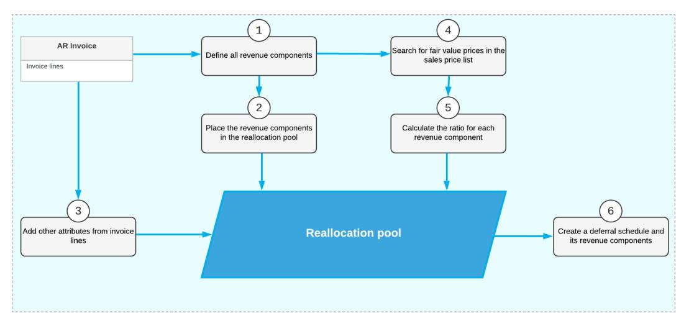
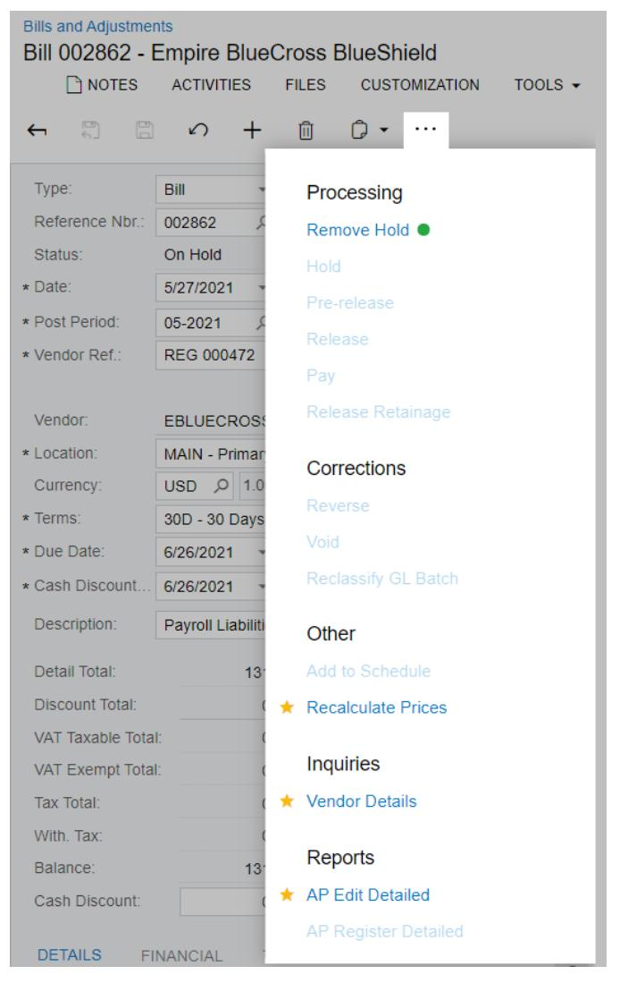

# **Deferred Revenue 2025 R1**


| Copyright3                                             |  |  |  |
|--------------------------------------------------------|--|--|--|
| Deferred Revenue Recognition Overview4                 |  |  |  |
| Setting Up the Recognition Process 5                   |  |  |  |
| Deferral Code Setup 5                                  |  |  |  |
| Recognition Methods for Deferred Revenues or Expenses6 |  |  |  |
| Processing Deferrals 10                                |  |  |  |
| Recognition of Revenue and Expenses10                  |  |  |  |
| Recognition of Deferrals in Previous Periods12         |  |  |  |
| Recognition of Revenue from Customer Contracts 13      |  |  |  |
| Custom Deferral Schedules18                            |  |  |  |
| To Link a Deferral Schedule to a Document 19           |  |  |  |
| Adjustment of Deferrals20                              |  |  |  |
| Creating an Adjustment Document 20                     |  |  |  |
| Managing Recognition for Packages 22                   |  |  |  |
| Configuring a Package22                                |  |  |  |
| To Configure a Package 23                              |  |  |  |
| To Configure a Package for IFRS 15/ASC 606 24          |  |  |  |
| Processing Packages25                                  |  |  |  |
| Appendix29                                             |  |  |  |
| Reports 29                                             |  |  |  |
| Report Form29                                          |  |  |  |
| Report34                                               |  |  |  |
| Form Toolbar and More Menu36                           |  |  |  |
| Table Toolbar 43                                       |  |  |  |

# <span id="page-2-0"></span>**Copyright**

#### **© 2025 Acumatica, Inc.**

#### **ALL RIGHTS RESERVED.**

No part of this document may be reproduced, copied, or transmitted without the express prior consent of Acumatica, Inc.

3075 112th Avenue NE, Suite 200, Bellevue, WA 98004, USA

### **Restricted Rights**

The product is provided with restricted rights. Use, duplication, or disclosure by the United States Government is subject to restrictions as set forth in the applicable License and Services Agreement and in subparagraph (c)(1)(ii) of the Rights in Technical Data and Computer Soware clause at DFARS 252.227-7013 or subparagraphs (c)(1) and (c)(2) of the Commercial Computer Soware-Restricted Rights at 48 CFR 52.227-19, as applicable.

#### **Disclaimer**

Acumatica, Inc. makes no representations or warranties with respect to the contents or use of this document, and specifically disclaims any express or implied warranties of merchantability or fitness for any particular purpose. Further, Acumatica, Inc. reserves the right to revise this document and make changes in its content at any time, without obligation to notify any person or entity of such revisions or changes.

### **Trademarks**

Acumatica is a registered trademark of Acumatica, Inc. HubSpot is a registered trademark of HubSpot, Inc. Microso Exchange and Microso Exchange Server are registered trademarks of Microso Corporation. All other product names and services herein are trademarks or service marks of their respective companies.

Soware Version: 2025 R1 Last Updated: 06/01/2025

# <span id="page-3-0"></span>**Deferred Revenue Recognition Overview**

According to the basic principles of accounting, income should not be recognized until it has been earned, and expenses should not be recognized until they have been spent. For these purposes, the term *deferral* is used in accounting. It refers to the act of delaying the recognition of certain revenues or expenses on the income statement over some specified period range and recording them to balance sheet accounts (liability or asset, respectively) until they are earned or used up. In future periods, they will be moved in portions from the balance sheet accounts to revenues or expenses on the income statement.

In Acumatica ERP, you can manage the processes of recognizing the revenues until you deliver goods and services, and deferring expenses over the defined number of periods until they are used up.

### **Deferral Codes**

By using deferral codes, you can set up various scenarios of revenue and expense recognition. The system generates appropriate recognition transactions for each document line (such as AR invoice detail lines) that require deferrals according to the settings of the specified deferral codes. When the recognition process is run, the system releases and posts recognition transactions that come due, so a portion of the revenue or expenses is recognized. For details, see *[Setting Up the Recognition Process](#page-4-2)*.

### **Recognition of Deferred Revenue in Previous Periods**

In the Deferred Revenue area of Acumatica ERP, you can manage the deferred revenue and expense recognition process. You can set up the recognition of deferrals in future financial periods as well as in previous financial periods (those that are earlier than the period of the date of the related document) by configuring deferral codes with the appropriate settings. For details, see *[Recognition of Deferrals in Previous Periods](#page-11-1)*.

#### **Revenue Recognition for Packages**

If a line item in a document is a package (that is, a stock item or non-stock item that includes multiple components), different deferral codes can be assigned to its components as separate units of accounting to set up more accurate revenue recognition procedures. For more details, see *[Managing Recognition for Packages](#page-21-2)*.

#### **Custom Deferral Schedules**

If a document was released before the decision about deferral had been made, you can manually create custom deferral schedules for its lines and link them to the document. For details on such schedules, see *[Custom Deferral](#page-17-1) [Schedules](#page-17-1)*.

### **Other Features and Options**

Other primary features of the Deferred Revenue area include the following:

- The ability to process schedules in bulk by assigning them to automation schedules
- The ability to process credit memos associated with deferred invoices
- Reports that help you to correctly forecasting revenues and expenses
- The ability to generate reports and inquiries for particular companies and branches, if the *Multibranch Support* feature is enabled.

# <span id="page-4-2"></span><span id="page-4-0"></span>**Setting Up the Recognition Process**

To set up the process of the revenue or expense recognition in Acumatica ERP, you need to first enable the *Deferred Revenue Management* feature on the *[Enable/Disable Features](https://help-2025r1.acumatica.com/Help?ScreenId=ShowWiki&pageid=c1555e43-1bc5-4f6f-ba9d-b323f94d8a6b)* (CS100000) form, and then configure the required deferral codes on the *[Deferral Codes](https://help-2025r1.acumatica.com/Help?ScreenId=ShowWiki&pageid=4c66fc80-e82d-4888-ae15-0e18f8c20cfd)* form.

When the *Deferred Revenue Management* and *Multibranch Support* features are both enabled on the *[Enable/Disable Features](https://help-2025r1.acumatica.com/Help?ScreenId=ShowWiki&pageid=c1555e43-1bc5-4f6f-ba9d-b323f94d8a6b)* form, you can report and track deferrals separately for particular company branches and reconcile balance sheet accounts for deferred amounts. For details, see *[Multiple Branch](https://help-2025r1.acumatica.com/Help?ScreenId=ShowWiki&pageid=633b757d-4d8a-4dde-b7be-4fdb8f2968da) [Support](https://help-2025r1.acumatica.com/Help?ScreenId=ShowWiki&pageid=633b757d-4d8a-4dde-b7be-4fdb8f2968da)*.

Also, in the **Deferred Schedule NumberingSequence** box on the *[Deferred Revenue Preferences](https://help-2025r1.acumatica.com/Help?ScreenId=ShowWiki&pageid=277d02ce-c039-4291-ba25-8dff00a24dee)* (DR101000) form, you can specify a different numbering sequence to be used for numbering schedules. By default, the *Deferral Schedule* sequence is specified. You can modify this sequence on the *[Numbering Sequences](https://help-2025r1.acumatica.com/Help?ScreenId=ShowWiki&pageid=a8d11c23-21f2-42a3-b17d-9637c9cf8031)* (CS201010) form.

For each deferral code, you define such settings as the recognition method to be applied, GL accounts to be used, and schedule settings. You then assign a deferral code to the applicable stock items and non-stock items, or add the code to the required line of a document that requires deferrals. On release of documents with deferral codes specified, the system generates recognition transactions in accordance with the schedules defined by the deferral codes. To make the system release and post recognition transactions that come due, you need to run the recognition process on the *[Run Recognition](https://help-2025r1.acumatica.com/Help?ScreenId=ShowWiki&pageid=8ffcb955-0667-403b-85f5-6366ac64ab51)* form, so that the transactions are posted in each specified period and a portion of the revenue or expenses is recognized. For details, see *[Recognition Methods for Deferred Revenues or](#page-5-1) [Expenses](#page-5-1)*.

In this chapter, you can find information on configuring deferral codes, and examples of creating various recognition scenarios that you can consider while configuring the required deferral codes.

### <span id="page-4-3"></span><span id="page-4-1"></span>**Deferral Code Setup**

In Acumatica ERP, you use deferral codes to make possible the recognition of revenues and expenses over multiple financial periods. You configure the required deferral codes and assign them to the appropriate stock items and non-stock items. The system will then use them to create deferral transactions on release of documents (such as invoices or bills) in which these deferral codes are specified.

### **Configuring a Deferral Code**

You configure a deferral code by using the *[Deferral Codes](https://help-2025r1.acumatica.com/Help?ScreenId=ShowWiki&pageid=4c66fc80-e82d-4888-ae15-0e18f8c20cfd)* (DR202000) form. For each code, you specify the following settings:

- **Recognition Method**: The method that defines how an amount will be distributed over the specified financial periods.
- **CodeType**: The type of the code, which indicates whether it will be used for expense or revenue deferrals.
- **Deferral Account**: The general ledger account to hold the deferred revenue (liability account) or expense (asset account) amount.
- **DeferralSub.**: The subaccount (if applicable in your system), for proper tracking of deferral transactions.
- **Recognize Now %**: The percentage of the document amount (or line amount) that can be recognized immediately.
- **ScheduleSettings**, **Every x Period(s)**: The frequency of generating the recognition transactions.
- **Document DateSelection** (**Start of Financial Period**, **End of Financial Period**, **Fixed Day of Financial Period**): The exact day when the documents for a recognition transaction will be generated.

Once you have specified all required settings based on the selected recognition method, you can save a deferral code. Aer that, this code will be available in the list of deferral codes that can be assigned to documents and used by the system for generating recognition schedules.

#### **Assigning a Deferral Code to a Stock Item or Non-Stock Item**

Any deferral code can be assigned to a stock item or non-stock item. The deferral code specifies how the revenue or expense amount of a document with this item should be deferred over the specified date range. The list of available deferral codes that you have created in Acumatica ERP are available on the **Deferral** tab of the *[Non-Stock](https://help-2025r1.acumatica.com/Help?ScreenId=ShowWiki&pageid=bf68dd4f-63d4-460d-8dc0-9152f2bd6bf1) [Items](https://help-2025r1.acumatica.com/Help?ScreenId=ShowWiki&pageid=bf68dd4f-63d4-460d-8dc0-9152f2bd6bf1)* (IN202000) or *[Stock Items](https://help-2025r1.acumatica.com/Help?ScreenId=ShowWiki&pageid=77786a70-1f1e-4d63-ad98-96f98e4fcb0e)* (IN202500) form. If you do not assign a deferral code to an item, you can still add a deferral code to the required line of a document on the **Document Details** tab when you enter a document into the system.

#### **Related Links**

- *[Adjustment of Deferrals](#page-19-2)*
- *[Managing Recognition for Packages](#page-21-2)*
- *[Processing Packages](#page-24-1)*
- *[Recognition of Revenue and Expenses](#page-9-2)*
- *[Recognition of Deferrals in Previous Periods](#page-11-1)*
- *[Deferral Codes](https://help-2025r1.acumatica.com/Help?ScreenId=ShowWiki&pageid=4c66fc80-e82d-4888-ae15-0e18f8c20cfd)*
- *[Deferral Schedule](https://help-2025r1.acumatica.com/Help?ScreenId=ShowWiki&pageid=c8f8d907-8dd6-47a7-a13d-be9251d361e9)*
- *Deferral [Transaction](https://help-2025r1.acumatica.com/Help?ScreenId=ShowWiki&pageid=f0bfab7a-6ad9-47f1-87b1-b14b6e3ea8ce) Summary*

### <span id="page-5-1"></span><span id="page-5-0"></span>**Recognition Methods for Deferred Revenues or Expenses**

Recognition methods determine how the deferred revenue or expense amount of a particular document will be distributed over the defined number of periods. You specify a particular recognition method in the settings of each deferral code on the *[Deferral Codes](https://help-2025r1.acumatica.com/Help?ScreenId=ShowWiki&pageid=4c66fc80-e82d-4888-ae15-0e18f8c20cfd)* (DR202000) form. You can assign a deferral code to a line of an invoice or bill.

This topic describes the recognition methods available in Acumatica ERP and provides examples of each recognition method.

### **Evenly by Periods**

With the *Evenly by Periods* recognition method, the amount to be recognized is distributed evenly to all included periods. The number of recognition periods is defined by the value you specify in the **Occurrences** box for the deferral code on the *[Deferral Codes](https://help-2025r1.acumatica.com/Help?ScreenId=ShowWiki&pageid=4c66fc80-e82d-4888-ae15-0e18f8c20cfd)* (DR202000) form.

An occurrence is a recognition event for which a recognition transaction is generated. The frequency of recognition events depends on the number (of financial periods) that you select in the **Every X Periods** box. (For example, a *2* in this box would mean that a recognition event occurs every 2 financial periods.) Thus, when you select the *Evenly by Periods* recognition method, you also need to define the number of recognition occurrences for the document amount and their frequency.

The number of occurrences does not include immediate recognition of the revenue or expenses, which is based on the percentage specified in the **Recognize Now %** box.

#### **Example**

Suppose there is an invoice dated January 11, 2015, that contains one line with an amount of \$1,500. The sales revenue should be recognized over six months in equal recognition amounts. (In this example, periods are defined as months in the system.) You apply a deferral code that has the following settings on the *[Deferral Codes](https://help-2025r1.acumatica.com/Help?ScreenId=ShowWiki&pageid=4c66fc80-e82d-4888-ae15-0e18f8c20cfd)* form:

- **Recognition Method**: *Evenly by Periods*
- **Occurrences**: *6*

#### • **ScheduleSettings**: *Every 1 Period(s)*

With this recognition method, the document amount (\$1,500) is divided evenly among six periods: January, February, March, April, May, and June; each portion is equal to \$250.

In this example, the recognition period is equal to the financial period because we set the recognition schedule to *Every 1 Period(s)*. If we had set it to *Every 2 Period(s)*, the recognition period would be equal to two financial periods, which means that the recognition process would be performed once every two months.

### **Evenly by Periods, Prorate by Days**

With the *Evenly by Periods, Prorate by Days* method, the amount to be recognized is distributed evenly among recognition periods. The number of the recongnition periods is defined by the value specified in the **Occurrences** box on the *[Deferral Codes](https://help-2025r1.acumatica.com/Help?ScreenId=ShowWiki&pageid=4c66fc80-e82d-4888-ae15-0e18f8c20cfd)* (DR202000) form. The first and last periods are counted together as one recognition period and the amount to be recognized for each is proportional to the number of days in each period.

An occurrence is a recognition event. The frequency of occurrences depends on the number (of financial periods) you select in the **Every X Period(s)** box. The installment amounts for the first and last periods are calculated based on a full-period amount that is proportional to the number of days each installment should cover.

#### **Example**

Suppose there is an invoice, dated January 11, 2015, that contains one line with an amount of \$1,500. The sales revenue should be recognized over six months. (In this example, periods are defined as months in the system.) You apply a deferral code that has the following settings on the *[Deferral Codes](https://help-2025r1.acumatica.com/Help?ScreenId=ShowWiki&pageid=4c66fc80-e82d-4888-ae15-0e18f8c20cfd)* form:

- **Recognition Method**: *Evenly by Periods, Prorate by Days*
- **Occurrences**: *6*
- **ScheduleSettings**: *Every 1 Period(s)*

With this recognition method, the document amount is divided evenly among five full periods, with each portion equal to \$300. Four of these periods are February, March, April, and May. The fih \$300 portion is divided into two parts, each of which is proportional to the number of days included in the recognition time interval in January (20 days, so \$193.55) and in June (11 days, so \$106.45).

The amounts are rounded according to the base currency precision, which is set to *2*.

### **Evenly by Days in Period**

With the *Evenly by Days in Period* method, the amount to be recognized is distributed by periods with a proportional division by the number of calendar days in each period. The number of recognition periods is defined by the value specified in the **Occurrences** box in the deferral code settings on the *[Deferral Codes](https://help-2025r1.acumatica.com/Help?ScreenId=ShowWiki&pageid=4c66fc80-e82d-4888-ae15-0e18f8c20cfd)* (DR202000) form.

As mentioned, an occurrence is a recurring recognition event for which a recognition transaction is generated. The frequency of occurrences depends on the number (of financial periods) you select in the **Every X Period(s)** box.

#### **Example**

Suppose there is an invoice, dated January 1, 2015, that contains one line with an amount of \$1500. The sales revenue should be recognized over six months. (In this example, periods are defined as months in the system.) You apply a deferral code that has the following settings on the *[Deferral Codes](https://help-2025r1.acumatica.com/Help?ScreenId=ShowWiki&pageid=4c66fc80-e82d-4888-ae15-0e18f8c20cfd)* form:

- **Recognition Method**: *Evenly by Days in Period*
- **Occurrences**: *6*
- **ScheduleSettings**: *Every 1 Period(s)*

With this recognition method, the amount for each recognition period is computed based on the number of calendar days in each period:

- January (31 days): The amount to be recognized is \$256.91.
- February (28 days): The amount to be recognized is \$232.04.
- March (31 days): The amount to be recognized is also \$256.91.
- April (30 days): The amount to be recognized is \$248.62.
- May (31 days): The amount to be recognized is \$256.91.
- June (30 days): The amount to be recognized is \$248.61.

### **Flexible by Periods, Prorate by Days**

With the *Flexible by Periods, Prorate by Days* method, the amount to be recognized is distributed evenly among periods, with a proportional division by days among the first and last periods. The first and the last periods may be less than a full period, depending on the start recognition date and the final recognition date specified in a particular document. The number of recognition periods is defined by the recognition dates specified in a document.

This method can be applied to AR documents with the *Invoice*, *Credit Memo*, *Debit Memo*, and *Cash Sale* types and to AP documents with the *Bill*, *Debit Adjustment*, *Credit Adjustment*, and *Quick Check* types.

#### **Example**

Suppose there is an invoice with a date of 8/1/2015 and a post period of 08-2015 that contains one line with an amount of \$1,500. In this invoice, the start date of the recognition process (in the**Term Start Date** box on the *[Invoices and Memos](https://help-2025r1.acumatica.com/Help?ScreenId=ShowWiki&pageid=5e6f3b27-b7af-412f-a40a-1d4f4be70cba)* (AR301000) form) is set to February 15, 2015, and the final date of the recognition process (in the **Term End Date** box) is set to June 21, 2015. Thus, the document amount should be recognized within the date range defined by the**Term Start Date** and the **Term End Date**.

A deferral code with the following settings on the *[Deferral Codes](https://help-2025r1.acumatica.com/Help?ScreenId=ShowWiki&pageid=4c66fc80-e82d-4888-ae15-0e18f8c20cfd)* (DR202000) form is applied to this invoice:

- **Recognition Method**: *Flexible by Periods, Prorate by Days*
- **ScheduleSettings**: *Every 1 Period(s)*
- **Allow Recognition in Previous Periods**: Selected

With this recognition method, the document amount is distributed over the date range that starts on February 15 (**Term Start Date**) and ends on June 21 (**Term End Date**). The date range covers 14 days of February, three full periods (March, April and May), and 21 days of June. The 14 days of February is 0.5 period (14 days / 28 days = 0.5). The 21 days of June is 0.7 period (21 days / 30 days = 0.7). Thus, February and June together makes 1.2 periods. So that, the revenue amount should be distributed across 4.2 periods, which is 3 periods of March, April and May + 1.2 periods of February and June. The amount recognized in each of the three full periods (March, April, and May) is \$1,500 / 4.2 = \$357.14. The amount recognized in February is 0.5 \* \$357.14 = \$178.57, and the amount recognized in June is 0.7 \* \$357.14 = \$250.01. Thus, the document amounts are allocated as follows:

- February (14 days): The amount is \$178.57. The recognition date is 2/15/2015, and the financial period is 02-2015.
- March (31 days): The amount is \$357.14. The recognition date is 3/1/2015, and the financial period is 03-2015.
- April (30 days): The amount is \$357.14. The recognition date is 4/1/2015, and the financial period is 04-2015.
- May (31 days): The amount is \$357.14. The recognition date is 5/1/2015, and the financial period is 05-2015.
- June (21 days): The amount is \$250.01. The recognition date is 6/1/2015, and the financial period is 06-2015.

If the **Allow Recognition in Previous Periods** check box is cleared in the deferral code settings on the *[Deferral Codes](https://help-2025r1.acumatica.com/Help?ScreenId=ShowWiki&pageid=4c66fc80-e82d-4888-ae15-0e18f8c20cfd)* form, the system will use the document date and post period of the document date for recognition. That is, the system will distribute amounts by the same rule and generate transactions on \$178.57, \$357.14, \$357.14, \$357.14, and \$250.01, with a recognition date of 8/1/2014 and a financial period of 08-2014.

### **Flexible by Days in Period**

With the *Flexible by Days in Period* method, the amount to be recognized is distributed among periods, according to the number of calendar days in each particular period. The start date and the final date of the recognition process is specified individually for each line of a particular document.

This method can be applied to AR documents with the *Invoice*, *Credit Memo*, *Debit Memo*, and *Cash Sale* types and to AP documents with the *Bill*, *Debit Adjustment*, *Credit Adjustment*, and *Quick Check* types.

#### **Example**

Suppose there is an invoice that contains one line with an amount of \$1500 with 8/1/2015 date and 08-2015 post period. In this invoice, the start date of the recognition process (in the**Term Start Date** box on the *[Invoices and](https://help-2025r1.acumatica.com/Help?ScreenId=ShowWiki&pageid=5e6f3b27-b7af-412f-a40a-1d4f4be70cba) [Memos](https://help-2025r1.acumatica.com/Help?ScreenId=ShowWiki&pageid=5e6f3b27-b7af-412f-a40a-1d4f4be70cba)* form) is set to February 15, 2015, and the final date of the recognition process (in the**Term End Date** box) is set to June 21, 2015. Thus, the document amount should be recognized within the specified date range, which is equal to 127 days (the number of days between the**Term Start Date** and the **Term End Date**).

A deferral code that has the following settings on the *[Deferral Codes](https://help-2025r1.acumatica.com/Help?ScreenId=ShowWiki&pageid=4c66fc80-e82d-4888-ae15-0e18f8c20cfd)* (DR202000) form is applied to the invoice:

- **Recognition Method**: *Flexible by Days in Period*
- **ScheduleSettings**: *Every 1 Period(s)*
- **Allow Recognition in Previous Periods**: Selected

With this recognition method, the document amount is spread over the 127 days, with a proportional division by days. Thus, the document amounts are allocated as follows:

- February (14 days): The amount is \$165.35. The recognition date is 2/15/2015, and the financial period is 02-2015.
- March (31 days): The amount is \$366.14. The recognition date is 3/1/2015, and the financial period is 03-2015.
- April (30 days): The amount is \$354.33. The recognition date is 4/1/2015, and the financial period is 04-2015.
- May (31 days): The amount is \$366.14. The recognition date is 5/1/2015, and the financial period is 05-2015.
- June (21 days): The amount is \$248.04. The recognition date is 6/1/2015, and the financial period is 06-2015.

If the **Allow Recognition in Previous Periods** check box is cleared in the deferral code settings on the *[Deferral Codes](https://help-2025r1.acumatica.com/Help?ScreenId=ShowWiki&pageid=4c66fc80-e82d-4888-ae15-0e18f8c20cfd)* form, the system will use the document date and post period of the document date for recognition. That is, the system will distribute amounts by the same rule and generate transactions on \$165.35, \$366.14, \$354.33, \$366.14, and \$248.04 with a recognition date of 8/1/2015 and a financial period of 08-2015.

#### **Related Links**

- *[Adjustment of Deferrals](#page-19-2)*
- *[Deferral Code Setup](#page-4-3)*
- *[Managing Recognition for Packages](#page-21-2)*
- *[Recognition of Revenue and Expenses](#page-9-2)*
- *[Recognition of Deferrals in Previous Periods](#page-11-1)*
- *[Deferral Codes](https://help-2025r1.acumatica.com/Help?ScreenId=ShowWiki&pageid=4c66fc80-e82d-4888-ae15-0e18f8c20cfd)*
- *[Deferral Schedule](https://help-2025r1.acumatica.com/Help?ScreenId=ShowWiki&pageid=c8f8d907-8dd6-47a7-a13d-be9251d361e9)*
- *Deferral [Transaction](https://help-2025r1.acumatica.com/Help?ScreenId=ShowWiki&pageid=f0bfab7a-6ad9-47f1-87b1-b14b6e3ea8ce) Summary*

# <span id="page-9-3"></span><span id="page-9-0"></span>**Processing Deferrals**

<span id="page-9-2"></span>This chapter provides detailed information on how you can manage deferrals in Acumatica ERP.

### <span id="page-9-1"></span>**Recognition of Revenue and Expenses**

In Acumatica ERP, a deferral code, which is assigned to a stock item on the **Deferral** tab on the *[Stock Items](https://help-2025r1.acumatica.com/Help?ScreenId=ShowWiki&pageid=77786a70-1f1e-4d63-ad98-96f98e4fcb0e)* (IN202500) form or to a non-stock item on the *[Non-Stock Items](https://help-2025r1.acumatica.com/Help?ScreenId=ShowWiki&pageid=bf68dd4f-63d4-460d-8dc0-9152f2bd6bf1)* (IN202000) from, defines how the revenue or expenses will be recognized. If no deferral code is assigned to an item in a particular document, the revenue or expenses will be recognized immediately and no deferral schedule will be generated.

### **Assignment of Deferral Codes to Non-Stock Items**

You can assign a deferral code to a needed non-stock item on the **Deferral** tab of the *[Non-Stock Items](https://help-2025r1.acumatica.com/Help?ScreenId=ShowWiki&pageid=bf68dd4f-63d4-460d-8dc0-9152f2bd6bf1)* (IN202000) form, so that when you enter that non-stock item in a detail line of a document, the system inserts the deferral code in the **Deferral Code** column of that line. If a deferral code is not assigned to a non-stock item, or if you want to override the deferral code that is filled in by the system, you can select a required one in the **Deferral Code** column in each required line when you enter a document.

When such a document is released, the system will generate a particular recognition schedule for each line of a document that contains a deferral code.

#### **Recognition of Revenue**

When you enter an invoice on the *[Invoices and Memos](https://help-2025r1.acumatica.com/Help?ScreenId=ShowWiki&pageid=5e6f3b27-b7af-412f-a40a-1d4f4be70cba)* (AR301000) form, each time you select an item in a line on the **Document Details** tab, the deferral code automatically appears in the **Deferral Code** column if a deferral code has been previously defined for the stock item or non-stock item in its settings (if not, you can still select a deferral code in the required document line manually). When an invoice requiring deferral is released, the system generates one deferral schedule for each deferral code in the document. If multiple lines have the same code, one schedule for all lines with the code is generated.

A deferral schedule contains the list of recognition transactions, each of which the system releases in the specified financial period to recognize a portion of the revenue. You can use the *[Deferral Schedule](https://help-2025r1.acumatica.com/Help?ScreenId=ShowWiki&pageid=c8f8d907-8dd6-47a7-a13d-be9251d361e9)* (DR201500) form to view the schedules and adjust them manually if needed. As the revenues are earned, they are moved from the balance sheet liability account (the deferral account) to an income account (the sales account specified in the invoice) in multiple recognition transactions.

If no items on an invoice require deferral (that is, if no deferral codes are defined for the items), the total sales amount of the invoice is recorded to the revenue account upon release of the invoice; that is, the revenue is recognized during the post period. If some items on the invoice require deferral, revenue from the sale of other items (those with no deferral code assigned) is still recognized immediately.

### **Recognition of Expenses**

Generally, for purchased items, costs or expenses are recognized immediately on release of the appropriate bills. Deferrals may be required for services, warranties, and other expenses that are usually defined in the system as non-stock items. When you enter a bill by using the *[Bills and Adjustments](https://help-2025r1.acumatica.com/Help?ScreenId=ShowWiki&pageid=956b4e51-3078-4d2d-85b3-65c080d95234)* (AP301000) form and add a line for a nonstock item with a deferral code assigned, the deferral code appears in the **Deferral Code** column by default (if a deferral code is not specified in the non-stock item settings, you can still select a deferral code in the document line manually). Once the bill is released, the system generates the schedules automatically. The system generates a schedule for each deferral code in the document, and multiple items can be in one schedule.

You can review and manually edit the schedule by using the *[Deferral Schedule](https://help-2025r1.acumatica.com/Help?ScreenId=ShowWiki&pageid=c8f8d907-8dd6-47a7-a13d-be9251d361e9)* form. The schedule shows how many transactions expenses will be recognized in and when these transactions will occur. Expenses are deferred to a

balance sheet asset account (deferral account) until the expenses are used up or expired. At that time, they are moved to the expense account specified in the bill.

#### **Manual Running of a Recognition Schedule**

You can generate recognition transactions for both revenue and expenses on the *[Run Recognition](https://help-2025r1.acumatica.com/Help?ScreenId=ShowWiki&pageid=8ffcb955-0667-403b-85f5-6366ac64ab51)* (DR501000) form. Each time you run a schedule, only one recognition transaction is released and posted—even if, according to the schedule, multiple such transactions for a schedule are due.

You use the *Deferral [Transaction](https://help-2025r1.acumatica.com/Help?ScreenId=ShowWiki&pageid=f0bfab7a-6ad9-47f1-87b1-b14b6e3ea8ce) Summary* (DR402000) form to view the transactions that have been posted. Also, on the *[Deferral Schedule](https://help-2025r1.acumatica.com/Help?ScreenId=ShowWiki&pageid=c8f8d907-8dd6-47a7-a13d-be9251d361e9)* form, you can see which deferral transactions have been posted and which have yet to be posted.

#### **Posting of Recognition Transactions**

Once you have released a document that requires deferrals, the system generates an appropriate deferral schedule. This schedule contains the list of recognition transactions, each of which needs to be posted to a particular financial period. To release and post these recognition transactions, you need to run the recognition process on the *[Run Recognition](https://help-2025r1.acumatica.com/Help?ScreenId=ShowWiki&pageid=8ffcb955-0667-403b-85f5-6366ac64ab51)* (DR501000) form manually, or to set up an automatic schedule (as described in *[Automated](https://help-2025r1.acumatica.com/Help?ScreenId=ShowWiki&pageid=8a6c65f2-2379-48e1-b249-fb70d8122c4e) [Processing: General Information](https://help-2025r1.acumatica.com/Help?ScreenId=ShowWiki&pageid=8a6c65f2-2379-48e1-b249-fb70d8122c4e)*).

On the *[Run Recognition](https://help-2025r1.acumatica.com/Help?ScreenId=ShowWiki&pageid=8ffcb955-0667-403b-85f5-6366ac64ab51)* form, you select the required date and deferral code and, in the table, the transaction to be posted. Note that each time you run the recognition process, only one recognition transaction is released, even if multiple transactions are due according to the appropriate schedule.

The recognition transactions can be released and posted to open financial periods only. To post recognition transactions to closed financial periods, you need to clear the **Restrict AccessTo Closed Periods** check box on the *[General Ledger Preferences](https://help-2025r1.acumatica.com/Help?ScreenId=ShowWiki&pageid=e4913d06-c511-4258-a0f9-f36c1b854e6b)* (GL102000) form.

#### **Enabling of Parallel Processing**

To avoid performance issues on the *[Run Recognition](https://help-2025r1.acumatica.com/Help?ScreenId=ShowWiki&pageid=8ffcb955-0667-403b-85f5-6366ac64ab51)* (DR501000) form when loading deferral schedule records to the table and recognizing the loaded records by clicking **Process** or **Process All**, a user with the administrator rights can enable parallel processing. Parallel processing will increase the speed of these processes.


Parallel processing is not supported for shared SAAS environment.

To enable parallel processing on all the forms that support the parallel processing, including the *[Run Recognition](https://help-2025r1.acumatica.com/Help?ScreenId=ShowWiki&pageid=8ffcb955-0667-403b-85f5-6366ac64ab51)* form, do the following:

1. Modify the following parameters in the <appSettings> section of the web.config file as shown in the following code example.

```
<add key="ParallelProcessingDisabled" value="false" /> 
 <add key="ParallelProcessingBatchSize" value="1000" />
 <add key="EnableAutoNumberingInSeparateConnection" value="false" />
```

2. Optional but strongly recommended: In the <px.core> section, increase the Timeout values to 600 by adding the following attributes to the <px.core/pxdatabase/providers/add> node.

queryTimeout="600" transactionQueryTimeout="600"

For example, see the following code.

<px.core>

```
 <pxdatabase defaultProvider="PXSqlDatabaseProvider">
 <providers>
 <add name="PXSqlDatabaseProvider" type="PX.Data.PXSqlDatabaseProvider, PX.Data"
 connectionStringName="ProjectX" companyID="" secureCompanyID="False"
 queryTimeout="600" transactionQueryTimeout="600"/>
 ...
 </pxdatabase
</px.core>
```

3. Save the web.config file. This will automatically restart the website.

#### **Related Links**

- *[Recognition of Revenue from Customer Contracts](#page-12-1)*
- *[Adjustment of Deferrals](#page-19-2)*
- *[Deferral Code Setup](#page-4-3)*
- *[Managing Recognition for Packages](#page-21-2)*
- *[Recognition of Deferrals in Previous Periods](#page-11-1)*
- *[Bills and Adjustments](https://help-2025r1.acumatica.com/Help?ScreenId=ShowWiki&pageid=956b4e51-3078-4d2d-85b3-65c080d95234)*
- *[Deferral Codes](https://help-2025r1.acumatica.com/Help?ScreenId=ShowWiki&pageid=4c66fc80-e82d-4888-ae15-0e18f8c20cfd)*
- *[Deferral Schedule](https://help-2025r1.acumatica.com/Help?ScreenId=ShowWiki&pageid=c8f8d907-8dd6-47a7-a13d-be9251d361e9)*
- *Deferral [Transaction](https://help-2025r1.acumatica.com/Help?ScreenId=ShowWiki&pageid=f0bfab7a-6ad9-47f1-87b1-b14b6e3ea8ce) Summary*
- *[Non-Stock Items](https://help-2025r1.acumatica.com/Help?ScreenId=ShowWiki&pageid=bf68dd4f-63d4-460d-8dc0-9152f2bd6bf1)*
- *[Invoices and Memos](https://help-2025r1.acumatica.com/Help?ScreenId=ShowWiki&pageid=5e6f3b27-b7af-412f-a40a-1d4f4be70cba)*
- *[Run Recognition](https://help-2025r1.acumatica.com/Help?ScreenId=ShowWiki&pageid=8ffcb955-0667-403b-85f5-6366ac64ab51)*

### <span id="page-11-1"></span><span id="page-11-0"></span>**Recognition of Deferrals in Previous Periods**

In Acumatica ERP, you can enter documents (such as AR invoices) that require recognition of revenue or expenses in previous financial periods—that is, in periods that are earlier than the period of the document date. When these documents are released, the system generates recognition transactions for each line of the document according to the specific set of settings of a deferral code specified for a line.

You can process the recognition of deferrals in different ways, depending on the recognition method that you specify for each particular deferral code. You configure deferral codes on the *[Deferral Codes](https://help-2025r1.acumatica.com/Help?ScreenId=ShowWiki&pageid=4c66fc80-e82d-4888-ae15-0e18f8c20cfd)* (DR202000) form. Depending on the selected recognition method, you specify the particular set of settings for the deferral code.

The sections below describe the configuration of deferral codes that you can use for recognizing deferrals in previous financial periods.

### **Recognizing Deferred Revenue in Previous Periods**

For documents (such as AR invoices and cash sales) that require revenue recognition in previous periods, you can use deferral codes with the *Flexible by Periods, Prorate by Days*, or *Flexible by Days in Period* recognition method specified. The period of the recognition start date can be earlier than the period of the document date. When these deferral codes are specified in a document line, the additional**Term Start Date** and **Term End Date** columns appear in the table on the **Document Details** tab on the document entry form, such as *[Invoices and Memos](https://help-2025r1.acumatica.com/Help?ScreenId=ShowWiki&pageid=5e6f3b27-b7af-412f-a40a-1d4f4be70cba)* (AR301000). In these columns, you can define the required start date and end date of the recognition process for each document line with such a deferral code specified.

The date and posting period of the recognition transactions depend on whether the **Allow Recognition in Previous Periods** check box is selected for the deferral code on the *[Deferral Codes](https://help-2025r1.acumatica.com/Help?ScreenId=ShowWiki&pageid=4c66fc80-e82d-4888-ae15-0e18f8c20cfd)* (DR202000) form:

• If the check box is selected, the deferred revenue will be recognized in periods that are earlier than the period of a document. The first recognition period is the period of the**Term Start Date** specified in a document, and the last recognition period is the period of the**Term End Date**. The dates of recognition transactions are generated based on the **Document DateSelection** setting specified for the deferral code on the *[Deferral Codes](https://help-2025r1.acumatica.com/Help?ScreenId=ShowWiki&pageid=4c66fc80-e82d-4888-ae15-0e18f8c20cfd)* form.

• If the check box is cleared and the period of the recognition date is earlier than the document date, the recognition date of the generated transactions is equal to the document date, and the financial period is the period to which the document date belongs.

### **Recognizing Deferred Revenue and Expenses in Previous and Future Periods**

For recognizing expenses as well as revenues in the periods that differ from the financial period of the document date, you can configure a deferral code with one of the following recognition methods specified: *Evenly by Periods*, *Evenly by Periods, Prorate by Days*, *Evenly by Days in Period*, or *On Payment*. When you use these recognition methods with offset, the system adds the offset to the financial period of the document to determine the start recognition period. For details, see *[Recognition Methods for Deferred Revenues or Expenses](#page-5-1)*.

With these methods specified, you can set up the start recognition period to be either earlier than the period of the document date, or later than the period of the document date.

To define the start recognition period, you need to specify the**Start Offset** parameter while you configure a deferral code. This parameter defines the number of periods between the period of the document date and the start recognition period—that is, the period when recognition process starts. If you specify a negative value in this box (for example, –1), the recognition period will start one period earlier than the period of the document date. If you specify a positive value in this box (for example, 1), the recognition will start one period later than the period of the document date.

#### **Related Links**

- *[Deferral Code Setup](#page-4-3)*
- *[Recognition Methods for Deferred Revenues or Expenses](#page-5-1)*
- *[Recognition of Revenue and Expenses](#page-9-2)*
- *[Deferral Codes](https://help-2025r1.acumatica.com/Help?ScreenId=ShowWiki&pageid=4c66fc80-e82d-4888-ae15-0e18f8c20cfd)*
- *[Deferral Schedule](https://help-2025r1.acumatica.com/Help?ScreenId=ShowWiki&pageid=c8f8d907-8dd6-47a7-a13d-be9251d361e9)*
- *[Non-Stock Items](https://help-2025r1.acumatica.com/Help?ScreenId=ShowWiki&pageid=bf68dd4f-63d4-460d-8dc0-9152f2bd6bf1)*
- *[Release Schedules](https://help-2025r1.acumatica.com/Help?ScreenId=ShowWiki&pageid=1d4039a3-2ea1-4153-8583-eab6afca0f68)*
- *[Run Recognition](https://help-2025r1.acumatica.com/Help?ScreenId=ShowWiki&pageid=8ffcb955-0667-403b-85f5-6366ac64ab51)*
- *[Stock Items](https://help-2025r1.acumatica.com/Help?ScreenId=ShowWiki&pageid=77786a70-1f1e-4d63-ad98-96f98e4fcb0e)*

### <span id="page-12-1"></span><span id="page-12-0"></span>**Recognition of Revenue from Customer Contracts**

Acumatica ERP supports the requirements of the following standards as well as their models of recognizing revenue:

- The International Financial Reporting Standard (IFRS) 15—generally referred to as *IFRS 15*
- The 606 Revenue from Contracts with Customers Generally Accepted Accounting Principles (GAAP) standard —generally referred to as *ASC 606*

Per these requirements and standards, if a contract exists between a seller and a buyer to transfer a package and the contract consists of multiple distinct performance obligations, the transaction price is allocated to each performance obligation based on the relative standalone selling prices of the goods or services being provided to the customer. Revenue is recognized when the performance obligations are satisfied. If a performance obligation is satisfied over time, the related revenue is also recognized over time. If a customer receives a discount, it can be allocated to only one performance obligation or to multiple performance obligations (for example, inventory IDs) in the contract.

### **Example of Revenue Recognition**

Consider the following example, which illustrates how revenue is recognized:

A company sells a package consisting of three items: a soware subscription license, the related support services, and upgrade services. The duration of the contract is two years, and the transaction price is \$1,000. The standalone selling prices (fair value prices) for the license, support, and upgrades are \$750, \$500, and \$250, respectively. The revenue is calculated as shown in the following table.

| Item    | Calculation                     | Revenue  |
|---------|---------------------------------|----------|
| License | 1,000 * 750 / (750 + 500 + 250) | \$500.00 |
| Support | 1,000 * 500 / (750 + 500 + 250) | \$333.33 |
| Upgrade | 1,000 * 250 / (750 + 500 + 250) | \$166.67 |

The revenue of each item will be recognized evenly during two years—one half in the first year and the other half in the second year.

### **Configuration and Workflow of Revenue Recognition**

To use the revenue recognition according to *IFRS 15* and *ASC 606*, you should configure the following settings and create the following documents:

- 1. On the *[Enable/Disable Features](https://help-2025r1.acumatica.com/Help?ScreenId=ShowWiki&pageid=c1555e43-1bc5-4f6f-ba9d-b323f94d8a6b)* (CS100000) form, you enable the *Revenue Recognition by IFRS 15/ASC 606* feature.
- 2. On the *[Sales Prices](https://help-2025r1.acumatica.com/Help?ScreenId=ShowWiki&pageid=62bfca2c-0893-495b-bb1d-125b64899afc)* (AR202000) form, you specify a price for the particular item and select the **FairValue** check box for this price. For details on configuring sales prices, see *[Sales Prices: General Information](https://help-2025r1.acumatica.com/Help?ScreenId=ShowWiki&pageid=d63d6b6c-15ee-4576-bf27-8de69f8f5da6)*. If you are going to use items with the *MDA* type, each item within the package must have a sales price configured. For details on configuring MDA, see *To [Configure](#page-23-1) a Package for IFRS 15/ASC 606*.
- 3. On the *[Invoices and Memos](https://help-2025r1.acumatica.com/Help?ScreenId=ShowWiki&pageid=5e6f3b27-b7af-412f-a40a-1d4f4be70cba)* (AR301000) form, you create an AR invoice with the item that has a fair value price configured. For details on the creation of AR invoices, see *[AR Invoices: General Information](https://help-2025r1.acumatica.com/Help?ScreenId=ShowWiki&pageid=1474c546-53f9-499c-9ef3-88c2c69a893e)*.
- 4. To view how the system has calculated the reallocation of amounts for deferral components, before releasing the invoice, you save the invoice, and then you click**View Deferrals** on the table toolbar of the **Details** tab of the *[Invoices and Memos](https://help-2025r1.acumatica.com/Help?ScreenId=ShowWiki&pageid=5e6f3b27-b7af-412f-a40a-1d4f4be70cba)* form.
- 5. On the *[Deferral Schedule](https://help-2025r1.acumatica.com/Help?ScreenId=ShowWiki&pageid=c8f8d907-8dd6-47a7-a13d-be9251d361e9)* (DR201500) form, which opens in a separate window, you review the table on the **Reallocation Pool** tab.
- 6. You generate transactions for the deferral schedule by clicking **GenerateTransactions** on the **Details** tab of the *[Deferral Schedule](https://help-2025r1.acumatica.com/Help?ScreenId=ShowWiki&pageid=c8f8d907-8dd6-47a7-a13d-be9251d361e9)* form.

The configuration settings described above should be applied for each unreleased document if the *Revenue Recognition by IFRS 15/ASC 606* feature has been enabled on the *[Enable/Disable Features](https://help-2025r1.acumatica.com/Help?ScreenId=ShowWiki&pageid=c1555e43-1bc5-4f6f-ba9d-b323f94d8a6b)* form without posting unreleased documents. If this is the case, when a user tries to release an AR or SO document created before the feature was enabled or view the deferred schedule for such documents, the system displays an error message.

#### **Reallocation Pool**

A *reallocation pool* is a table in the system where the inputs and outputs of the reallocation process are stored. The reallocation process collects data about sold packages from invoice lines and splits these packages into separate performance obligations. Then for each sales order, the process collects the fair value (or best estimated) price from the list of sales prices, and allocates the transaction price among the sales orders in proportion to their standalone prices. The resulting sales orders and their amounts are used to create a deferred schedule and its components.

The share of each component in the transaction price depends on the following:

- The estimated standalone (or fair value) price
- The number of components in a package
- The quantity of packages in an invoice line

The following diagram illustrates how data for the reallocation pool is retrieved and calculated. All these actions are performed automatically by the system.



#### *Figure: Data retrieval and calculation in the reallocation pool*

As the diagram shows, the following steps are involved with the data retrieval and calculation in the reallocation pool:

- 1. For each invoice line with a deferral code, the system defines one revenue component or multiple revenue components.
- 2. Each revenue component is placed in the reallocation pool in a separate row.
- 3. This row is updated with other attributes (such as quantity) from the corresponding invoice line. The transaction price is also calculated.
- 4. For each revenue component (a row in the reallocation pool), the system searches for a fair value price in the sales price list.
- 5. Based on fair value prices, the system calculates the ratio for each revenue component. These ratios or shares are used to reallocate the transaction price to each component.
- 6. The data from the reallocation pool is used to create a deferral schedule (one for each document) and its revenue components (one for each row of the reallocation pool).

The results of these calculations are shown on the **Reallocation Pool** tab of the *[Deferral Schedule](https://help-2025r1.acumatica.com/Help?ScreenId=ShowWiki&pageid=c8f8d907-8dd6-47a7-a13d-be9251d361e9)* (DR201500) form.

#### **Algorithm for Selecting the Fair Value Price**

The system uses the following input data entered on the *[Sales Prices](https://help-2025r1.acumatica.com/Help?ScreenId=ShowWiki&pageid=62bfca2c-0893-495b-bb1d-125b64899afc)* (AR202000) form to select the fair value prices used by the revenue reallocation process:

- The inventory ID (performance obligation) defined by the revenue component—that is, the value in the **Component ID** box on the *[Deferral Schedule](https://help-2025r1.acumatica.com/Help?ScreenId=ShowWiki&pageid=c8f8d907-8dd6-47a7-a13d-be9251d361e9)* (DR201500) form
- The unit of measure of the sales order in the pool (that is, the UOM of the revenue component)
- The document currency and the value of the **Use FairValue Prices in Base Currency** check box on the *[Deferred Revenue Preferences](https://help-2025r1.acumatica.com/Help?ScreenId=ShowWiki&pageid=277d02ce-c039-4291-ba25-8dff00a24dee)* (DR101000) form
- The date on which the price is valid (that is, the document date)
- The customer for which the price is specified

- The customer class to which the customer belongs
- The quantity
- The warehouse (for SO invoices only)

For inventory items, multiple prices with different goals may be available in the system. The system searches for prices according to the price search priority (highest to lowest) and stops the search when an applicable price for an item is found. The system uses the standard Acumatica ERP price priorities when selecting fair value prices with the following exceptions:

- Promotional prices are not selected.
- Default prices are not selected.
- Prices are not applicable if the **FairValue** check box is cleared on the *[Sales Prices](https://help-2025r1.acumatica.com/Help?ScreenId=ShowWiki&pageid=62bfca2c-0893-495b-bb1d-125b64899afc)* form.

If no applicable price is found, the system displays a warning message; a document with a warning message cannot be released.

### **Algorithm for Selecting Fair Value Prices for Inventories Marked by a Deferral Code of Flexible Type**

Invoice lines or revenue components of the inventories with the *MDA* type can contain items marked by deferral codes with flexible types (*Flexible by Period*, *Prorate by Days*, or *Flexible by Days in Period*). In AR invoices containing these items, you have to enter the term start date and the term end date in the**Term Start Date** and **Term End Date** columns on the **Details** tab of the *[Invoices and Memos](https://help-2025r1.acumatica.com/Help?ScreenId=ShowWiki&pageid=5e6f3b27-b7af-412f-a40a-1d4f4be70cba)* (AR301000) form. If fair value prices selected on the *[Sales Prices](https://help-2025r1.acumatica.com/Help?ScreenId=ShowWiki&pageid=62bfca2c-0893-495b-bb1d-125b64899afc)* (AR202000) form have the **Prorated** check boxes selected for them, the effective price for these inventories will be increased or decreased in proportion to the term specified for the invoice line. The following formula will be used for calculating the price:

EP = FVP \* (([Term end] - [Term start] + 1 day) / 365)

The symbols in the formula have the following meanings:

- *EP*: The effective fair value price
- *FVP*: The fair value price from the *[Sales Prices](https://help-2025r1.acumatica.com/Help?ScreenId=ShowWiki&pageid=62bfca2c-0893-495b-bb1d-125b64899afc)* form
- *Term end*: The date specified for the invoice line in the**Term End Date** column on the **Details** tab of the *[Deferral Schedule](https://help-2025r1.acumatica.com/Help?ScreenId=ShowWiki&pageid=c8f8d907-8dd6-47a7-a13d-be9251d361e9)* (DR201500) form
- *Term start*: The date specified for the invoice line in the**Term Start Date** column on the **Details** tab of the *[Deferral Schedule](https://help-2025r1.acumatica.com/Help?ScreenId=ShowWiki&pageid=c8f8d907-8dd6-47a7-a13d-be9251d361e9)* form

#### **Residual Method for ASC606**

Acumatica ERP supports the residual approach for allocating the transaction price to the performance obligations. This approach can be used by companies that cannot establish observable standalone selling prices (fair value prices) for a performance obligation or for multiple performance obligations on the same invoice. In this case, the ASC606 standard allows companies to use the residual approach described in *ASC 606-10-32-34*, where revenue for these performance obligations is allocated on a residual basis.

For revenue components, the *Residual* allocation method is available to be used with ASC606. This allocation method can be used for one of the revenue components of an item with the *MDA* deferral code.

The allocation method for a component can be changed at any time. The updated method will be used in new deferral schedules or when the existing deferral schedules are recalculated.

For fair value prices of selected performance obligations, runtime computation is used. For specific prices, the system can calculate the effective fair value prices at runtime by applying to them the discounts for which the **Apply to Deferred Revenue** check box is selected on the *[Discount Codes](https://help-2025r1.acumatica.com/Help?ScreenId=ShowWiki&pageid=2c72ab3c-6c27-4891-9d29-8721bd5fbba9)* (AR209000) form and the **Discountable** check box is selected on the *[Sales Prices](https://help-2025r1.acumatica.com/Help?ScreenId=ShowWiki&pageid=62bfca2c-0893-495b-bb1d-125b64899afc)* (AR202000) form. These effective fair value prices will be used for revenue allocation.

To configure the *Residual* allocation method, you perform the following actions:

1. On the *[Non-Stock Items](https://help-2025r1.acumatica.com/Help?ScreenId=ShowWiki&pageid=bf68dd4f-63d4-460d-8dc0-9152f2bd6bf1)* (IN202000) and *[Stock Items](https://help-2025r1.acumatica.com/Help?ScreenId=ShowWiki&pageid=77786a70-1f1e-4d63-ad98-96f98e4fcb0e)* (IN202500) forms, for each needed component, you select the *Residual* allocation method in the **Allocation Method** column of the **Revenue Components** table of the **Deferral** tab.

On the *[Stock Items](https://help-2025r1.acumatica.com/Help?ScreenId=ShowWiki&pageid=77786a70-1f1e-4d63-ad98-96f98e4fcb0e)* and *[Non-Stock Items](https://help-2025r1.acumatica.com/Help?ScreenId=ShowWiki&pageid=bf68dd4f-63d4-460d-8dc0-9152f2bd6bf1)* forms, for the same item, you can mix the revenue components whose revenue is allocated based on fair value price (with and without runtime computation) and the component with the *Residual* allocation method.

2. On the *[Deferred Revenue Preferences](https://help-2025r1.acumatica.com/Help?ScreenId=ShowWiki&pageid=277d02ce-c039-4291-ba25-8dff00a24dee)* (DR101000) form, you specify an account and subaccount, if applicable, in the**Suspense Account** and **SuspenseSub.** boxes. If the residual amount or any allocation weight is zero or a negative value, the entire revenue of the invoice will be posted to this suspense account and subaccount.

Revenue components are used in documents according to the following rules:

- If an invoice contains a single revenue component with the *Residual* allocation method, the residual amount is calculated as the invoice amount without taxes minus the revenue of non-residual components. If an invoice contains multiple revenue components with the *Residual* allocation method, the calculated residual amount is distributed among the residual components based on their allocation weights.
- Revenue components with different deferral settings can be used in the same document. For an inventory item,you can specify revenue components with flexible deferral codes and different default terms. For all revenue components of the same inventory item, recognition will start on the**Term Start Date** specified in a document line on data entry forms. In a document line for an inventory item, the default**Term End Date** is based on the maximum default terms of the components.
- A residual component will be included in the deferral schedule created for a document if there is a deferral code associated with the component; the revenue allocated for the component will be recognized based on its schedule. The revenue allocated for a residual component that is not associated with any deferral code will be recognized immediately.

### **Support of Foreign Currencies**

Any document that is subject to revenue reallocation may be in the base currency or a foreign currency. If the document is in the base currency, the best estimated or fair value prices specified on the *[Sales Prices](https://help-2025r1.acumatica.com/Help?ScreenId=ShowWiki&pageid=62bfca2c-0893-495b-bb1d-125b64899afc)* (AR202000) form must also be in the base currency. For documents in a foreign currency, the prices used for reallocation can be in either the base currency or the foreign currency, depending on whether the **Use FairValue Prices in Base Currency** check box on the *[Deferred Revenue Preferences](https://help-2025r1.acumatica.com/Help?ScreenId=ShowWiki&pageid=277d02ce-c039-4291-ba25-8dff00a24dee)* (DR101000) form is selected. Regardless of the currency, the prices must be defined on the document date for all inventories registered in document lines or revenue components; otherwise, the system will not be able to prepare data for the reallocation pool and will display an error.

Deferred schedules are always created in the base currency, as well as further revenue recognition. If a document is in a foreign currency, the system will recalculate its transaction price from the foreign currency to the base currency.

### **Support of Multiple Base Currencies**

If the *Multiple Base Currencies* feature is enabled on the *[Enable/Disable Features](https://help-2025r1.acumatica.com/Help?ScreenId=ShowWiki&pageid=c1555e43-1bc5-4f6f-ba9d-b323f94d8a6b)* (CS100000) form, the system searches for fair value prices according to the following rules:

• For documents in a base currency, the system searched for prices specified in a price list in the base currency of the document's originating branch

• For documents in a foreign currency, the system searched for prices specified in a price list in the base currency of the document's originating branch, if the **Use FairValue Price in Base Currency** check box is selected on the *[Deferred Revenue Preferences](https://help-2025r1.acumatica.com/Help?ScreenId=ShowWiki&pageid=277d02ce-c039-4291-ba25-8dff00a24dee)* (DR101000) form.

If a document has not been released and the status of its automatic schedule is *Dra*, you can change the branch in any document line and the base currency in the document. The system will delete the existing dra of the schedule and create a new schedule with the updated branch and base currency.

#### **Related Links**

- *[Reviewing Sales Prices](https://help-2025r1.acumatica.com/Help?ScreenId=ShowWiki&pageid=665076da-0f4d-452b-96b1-14c6a8d008f3)*
- *[Recognition Methods for Deferred Revenues or Expenses](#page-5-1)*
- *To [Configure](#page-23-1) a Package for IFRS 15/ASC 606*

### <span id="page-17-1"></span><span id="page-17-0"></span>**Custom Deferral Schedules**

During the initialization of your Acumatica ERP system, you may need to process deferrals that have been recognized only partially in your old system. You may also decide to perform recognition of deferrals for documents without deferral codes specified that have been already released. To satisfy these needs in Acumatica ERP, you can manually create a deferral schedule, and process the recognition of the required amounts.

You can either link the schedule to the specific document (in which you select a particular line which amount should be deferred), or associate the schedule with a particular customer or vendor only, and process recognition of the specified amount without linking it to a specific document.

You start creating a custom schedule by using the *[Deferral Schedules](https://help-2025r1.acumatica.com/Help?ScreenId=ShowWiki&pageid=383e5745-b78a-432c-b115-b48d6294f054)* (DR201510) form. On this form, you click **Add New DeferralSchedule** on the form toolbar, which opens the *[Deferral Schedule](https://help-2025r1.acumatica.com/Help?ScreenId=ShowWiki&pageid=c8f8d907-8dd6-47a7-a13d-be9251d361e9)* (DR201500) form. On this form, you specify the parameters of the deferral schedule depending on whether you want to link it to a particular document, or not.

### **Linking a Deferral Schedule to a Document**

Depending on either you should recognize revenue or expenses, in the summary area of the *[Deferral Schedule](https://help-2025r1.acumatica.com/Help?ScreenId=ShowWiki&pageid=c8f8d907-8dd6-47a7-a13d-be9251d361e9)* (DR201500) form, you should select the appropriate type of the document, which amount should be deferred. Then, you select the document by its number in the **Ref. Nbr.** box. Once the document is selected, the customer or vendor details are inserted automatically in the appropriate boxes. In the **Line Nbr.** box, you then need to select a particular line of the document, which amount should be deferred.

In the **Components** table, you need to add a row or multiple rows, in which you specify the amounts to be deferred and the deferral codes to be used for generating recognition transactions. If you create the schedules for the components of the package, you need to specify appropriate inventory IDs in the rows.

Then, by clicking **GenerateTransactions** on the table toolbar, the system generates the list of recognition transactions for each row, and displays them in the**Transactions** table. You can edit the transactions details (if needed), and aer that save and release the schedule.

No GL transactions are generated when you release a deferral schedule.

For step-by-step instructions, see *To Link a Deferral Schedule to a [Document](#page-18-1)*.

#### **Related Links**

- *[Deferral Schedule](https://help-2025r1.acumatica.com/Help?ScreenId=ShowWiki&pageid=c8f8d907-8dd6-47a7-a13d-be9251d361e9)*
- *[Non-Stock Items](https://help-2025r1.acumatica.com/Help?ScreenId=ShowWiki&pageid=bf68dd4f-63d4-460d-8dc0-9152f2bd6bf1)*
- *[Release Schedules](https://help-2025r1.acumatica.com/Help?ScreenId=ShowWiki&pageid=1d4039a3-2ea1-4153-8583-eab6afca0f68)*
- *[Run Recognition](https://help-2025r1.acumatica.com/Help?ScreenId=ShowWiki&pageid=8ffcb955-0667-403b-85f5-6366ac64ab51)*
- *[Stock Items](https://help-2025r1.acumatica.com/Help?ScreenId=ShowWiki&pageid=77786a70-1f1e-4d63-ad98-96f98e4fcb0e)*

### <span id="page-18-1"></span><span id="page-18-0"></span>**To Link a Deferral Schedule to a Document**

You use the *[Deferral Schedule](https://help-2025r1.acumatica.com/Help?ScreenId=ShowWiki&pageid=c8f8d907-8dd6-47a7-a13d-be9251d361e9)* (DR201500) form, which you access by clicking **Add New DeferralSchedule** on the *[Deferral Schedules](https://help-2025r1.acumatica.com/Help?ScreenId=ShowWiki&pageid=383e5745-b78a-432c-b115-b48d6294f054)* (DR201510) form, to create a deferral schedule for a selected document.

To open any form, you can navigate to it or search for it (by its name or by its form ID without periods). For more information about search capabilities, see *[Search](https://help-2025r1.acumatica.com/Help?ScreenId=ShowWiki&pageid=09ed14e6-3600-4d60-8267-66531025f5c3)*.

### **To Link a Deferral Schedule To a Document**

- 1. Open the *[Deferral Schedules](https://help-2025r1.acumatica.com/Help?ScreenId=ShowWiki&pageid=383e5745-b78a-432c-b115-b48d6294f054)* (DR201510) form.
- 2. On the table toolbar, click **Add New DeferralSchedule**.
- 3. In the summary area of the form that opens, specify the following parameters:
  - a. In the **Doc.Type** box, select the type of the document that requires a deferral.
  - b. In the **Ref. Nbr.** box, select the document by its reference number.
  - c. In the **Line Nbr.** box, select the line of the document with the amount for which you want to schedule recognition.
  - d. Optional: On the form toolbar, click**View Document** to make sure that you have selected the document correctly and specified the appropriate line number (if applicable).
- 4. In the **Components** table, click **Add Row** on the table toolbar, and do the following:
  - a. In the **Component ID** column, leave *< NONE>*, or select a required component (by its ID).
  - b. In the **Deferral Code** column, specify the deferral code to be used for generating recognition transactions.
  - c. Optional: In the **Deferral Account** column (and **DeferralSub.**, if subaccounts are used in your system), review the account (and the subaccount, if applicable) taken from the deferral code settings, and edit it (if needed).
  - d. In the **Account** (and **Subaccount**) boxes, select the sales or expense account (depending on the selected document type), and corresponding subaccount (if applicable) to which recognized amounts should be posted.
  - e. In the **Total Amount** column, type the amount to be deferred.

The sum of total amounts of all listed components must be equal to amount of the selected line (**Line Amount**).

f. On the table toolbar, click **GenerateTransactions**, so that the system generates recognition transactions for the selected row, and displays them in the**Transactions** table.

Perform step 3 for all components that requires deferral.

- 5. In the **Transactions** table, edit the transaction details (for example, amounts or dates), if necessary.
- 6. Click **Save** on the form toolbar.
- 7. Click **Release** on the form toolbar.

No GL transactions are generated when you release a deferral schedule.

If you need to release multiple custom schedules at the same time, use the *[Release Schedules](https://help-2025r1.acumatica.com/Help?ScreenId=ShowWiki&pageid=1d4039a3-2ea1-4153-8583-eab6afca0f68)* (DR503000) form.

For custom recognition transactions, you run the recognition process in the same way as you do for automatically generated transactions on the *[Run Recognition](https://help-2025r1.acumatica.com/Help?ScreenId=ShowWiki&pageid=8ffcb955-0667-403b-85f5-6366ac64ab51)* (DR501000) form.

#### **Related Links**

- *[Recognition of Revenue and Expenses](#page-9-2)*
- *[Custom Deferral Schedules](#page-17-1)*
- *[Deferral Schedule](https://help-2025r1.acumatica.com/Help?ScreenId=ShowWiki&pageid=c8f8d907-8dd6-47a7-a13d-be9251d361e9)*
- *[Release Schedules](https://help-2025r1.acumatica.com/Help?ScreenId=ShowWiki&pageid=1d4039a3-2ea1-4153-8583-eab6afca0f68)*
- *[Run Recognition](https://help-2025r1.acumatica.com/Help?ScreenId=ShowWiki&pageid=8ffcb955-0667-403b-85f5-6366ac64ab51)*

### <span id="page-19-2"></span><span id="page-19-0"></span>**Adjustment of Deferrals**

Assume that you have a document (such as AR invoice), for which the deferral schedule has been already generated, but you need to cancel this document or to adjust its document amount. You cannot cancel or delete a document that is already being processed in the system. Instead, you can create an adjusting document, such as a credit memo for an invoice, or a debit adjustment for a bill, which allows you to either reverse the original document or to correct the document amount.

As with the original document that contains items with deferrals, the adjustment document also requires deferrals. Deferral transactions are generated no earlier than the date of the reversing document (a credit adjustment or a debit adjustment) regardless of the value specified in the**Start Offset** box in the Summary area of the *[Deferral](https://help-2025r1.acumatica.com/Help?ScreenId=ShowWiki&pageid=4c66fc80-e82d-4888-ae15-0e18f8c20cfd) [Codes](https://help-2025r1.acumatica.com/Help?ScreenId=ShowWiki&pageid=4c66fc80-e82d-4888-ae15-0e18f8c20cfd)* (DR202000) form.

You can create an adjustment document either manually (and link the deferral schedule of the original document to it), or by reversing an original document (so that the deferral schedule will be associated with the original document automatically). The system generates deferral schedules for credit memos linked to the schedules of the related invoices.

The following topic contains information on how the system manages deferral schedules to be generated for the reversed documents.

### <span id="page-19-1"></span>**Creating an Adjustment Document**

When you need to correct an amount of the document (for example, AR invoice), you can manually create an adjustment document, such as a credit memo, that will adjust the document amount and the amounts of recognition transactions of the deferred schedule generated for this document.

You can create a credit memo with the deferral schedule to be generated either independently from the original document, or in accordance with the schedule generated for the original document. You process these approaches as follows:

- 1. Create an adjusting document (for example, a credit memo on the *[Invoices and Memos](https://help-2025r1.acumatica.com/Help?ScreenId=ShowWiki&pageid=5e6f3b27-b7af-412f-a40a-1d4f4be70cba)* form), and, in its detail lines, add items with the deferral codes assigned or add a deferral code in the **Deferral Code** column in each line manually. This document will be processed by the system independently of the original one according to its own deferral schedule as described in *[Recognition of Revenue and Expenses](#page-9-2)*.
- 2. Link the adjusting document to the deferral schedule generated for the original document (as described below), so that the adjusting amount is divided among the deferred portions of the original document.

### **Linking an Adjustment Document to the Original Document**

You link an adjustment document to the deferral schedule of the original document while creating an adjustment document. For a credit memo, on the *[Invoices and Memos](https://help-2025r1.acumatica.com/Help?ScreenId=ShowWiki&pageid=5e6f3b27-b7af-412f-a40a-1d4f4be70cba)* form, when you add an item that have deferral code assigned, select the schedule of the original document in the **Original DeferralSchedule** column. For a debit adjustment, on the *[Bills and Adjustments](https://help-2025r1.acumatica.com/Help?ScreenId=ShowWiki&pageid=956b4e51-3078-4d2d-85b3-65c080d95234)* form, when you add an item that have deferral code assigned, select the

schedule in the **Original DeferralSchedule** column. Thus, the deferral schedule generated for the adjustment document is associated with the deferral schedule of the original document.

You can view the associated schedules on the **Original Schedules** tab of the *[Deferral Schedule](https://help-2025r1.acumatica.com/Help?ScreenId=ShowWiki&pageid=c8f8d907-8dd6-47a7-a13d-be9251d361e9)* (DR201500) form.

### **Example of Processing of Adjustment Schedules**

Consider an example demonstrating the two ways of processing a credit memo: independently, and as linked to the original document's schedule. This example explores revenue recognition for an invoice of \$1,000 that is dated April 1 and scheduled as follows:

- April 1: Amount to be recognized now of \$0
- May 1: First installment of \$200
- June 1: Second installment of \$200
- July 1: Third installment of \$200
- August 1: Fourth installment of \$200
- September 1: Fih installment of \$200

Suppose further that on June 15, an error on the \$1,000 invoice was detected, and a \$180 credit memo was created to adjust the invoice amount. The credit memo may be processed separately from the invoice, as an independent document (considered below in section I), or it may be linked to the original invoice to be processed according to the schedule of the original invoice (considered below in section II).

I. The credit memo has not been linked to the original invoice. It can be assigned to any deferral code available in the system (except a code with the *By payment* method specified). For example, assume that it was assigned the same deferral code as the original invoice had. Thus, the credit memo amount will be recognized in the following installments:

- July 15: Amount to be recognized now of \$0
- July 1: First installment of \$36
- August 1: Second installment of \$36
- September 1: Third installment of \$36
- October 1: Fourth installment of \$36
- November 1: Fih installment of \$36

II. The credit memo has been linked to the schedule of the original invoice. On June 15, the invoice amount still to be recognized is \$600, and recognition is planned through three future transactions. The memo amount will be divided among these three transactions as follows:

- July 1: \$60
- August 1: \$60
- September 1: \$60

#### **Related Links**

- *[Custom Deferral Schedules](#page-17-1)*
- *[Recognition of Deferrals in Previous Periods](#page-11-1)*
- *[Recognition of Revenue and Expenses](#page-9-2)*
- *[Bills and Adjustments](https://help-2025r1.acumatica.com/Help?ScreenId=ShowWiki&pageid=956b4e51-3078-4d2d-85b3-65c080d95234)*
- *[Deferral Schedules](https://help-2025r1.acumatica.com/Help?ScreenId=ShowWiki&pageid=383e5745-b78a-432c-b115-b48d6294f054)*
- *[Deferral Schedule](https://help-2025r1.acumatica.com/Help?ScreenId=ShowWiki&pageid=c8f8d907-8dd6-47a7-a13d-be9251d361e9)*
- *[Non-Stock Items](https://help-2025r1.acumatica.com/Help?ScreenId=ShowWiki&pageid=bf68dd4f-63d4-460d-8dc0-9152f2bd6bf1)*
- *[Invoices and Memos](https://help-2025r1.acumatica.com/Help?ScreenId=ShowWiki&pageid=5e6f3b27-b7af-412f-a40a-1d4f4be70cba)*
- *[Release Schedules](https://help-2025r1.acumatica.com/Help?ScreenId=ShowWiki&pageid=1d4039a3-2ea1-4153-8583-eab6afca0f68)*
- *[Run Recognition](https://help-2025r1.acumatica.com/Help?ScreenId=ShowWiki&pageid=8ffcb955-0667-403b-85f5-6366ac64ab51)*

# <span id="page-21-2"></span><span id="page-21-0"></span>**Managing Recognition for Packages**

In many industries, selling multiple products and services as packages—or *multiple-deliverable arrangements (MDAs)*—is a common practice. For some time, however, the recognition of revenue resulting from such sales posed an accounting problem. A package has a single price and multiple components (deliverables) included, which are oen delivered at different times but not necessarily at the time of the sale; for example, a package might include a cell phone, its activation, and a one-year service plan. Moreover, it might be permissible to return some components, but not others.

Different countries have different regulations about how to divide an MDA into separate units of accounting and how to allocate revenue to these units. This chapter provides information on how you can configure and process the packages in Acumatica ERP.

## <span id="page-21-3"></span><span id="page-21-1"></span>**Configuring a Package**

In Acumatica ERP, you configure a package as a stock item or non-stock for which you specify an appropriate *Multiple-Deliverable Arrangement* (MDA) deferral code and add several components (stock or non-stock items). The following section describe the package configuration process in details.

### **Package Configuration Parameters**

You configure a package on the *[Stock Items](https://help-2025r1.acumatica.com/Help?ScreenId=ShowWiki&pageid=77786a70-1f1e-4d63-ad98-96f98e4fcb0e)* (IN202500) or *[Non-Stock Items](https://help-2025r1.acumatica.com/Help?ScreenId=ShowWiki&pageid=bf68dd4f-63d4-460d-8dc0-9152f2bd6bf1)* (IN202000) form on the **Deferral** tab. On this tab, you specify the following parameters:

- In the **Deferral Code** box, select an MDA deferral code (the one that has the **Multiple-Deliverable Arrangement** check box selected on the *[Deferral Codes](https://help-2025r1.acumatica.com/Help?ScreenId=ShowWiki&pageid=4c66fc80-e82d-4888-ae15-0e18f8c20cfd)* (DR202000) form), which indicates that an item is a package.
- In the **Revenue Components** table, add the required items (components) to the package (stock items or non-stock items that were previously configured).

While adding components to this table, you need to define how the total package price will be allocated between all components. To do this, for each component of the package, you need to select one of the following options in the **Allocation Method** column:

- *Percentage*: The component price (fair value) is a percentage of the total package price. You need to specify the percentage in the **Percentage** column, which becomes available for editing if you select this option.
- *Fixed Amount*: The component price is a fixed amount, which you should specify in the **Fixed Amount** column. (This column becomes available for editing if you select this option.)
- *Residual*: The price of the component is computed as the difference (residue) between the total package price and the sum of the prices calculated for all other components of the package. The cost for such a component is calculated aer the fair values of all other components are computed.


You can select the *Residual* option for only one component of the package.

In addition to specifying a deferral code for the package, you need to specify a deferral code for each component of the package, because each component may have different deferral periods. If you do not specify a deferral code for a component, the price of the component will be recognized immediately.


The **Deferral Code** column is not available for a component with the *Residual* allocation method selected.

Aer you have specified all required data for a package on the **DeferralSetting** tab, save the item.

#### **Related Links**

- *[Deferral Code Setup](#page-4-3)*
- *[Recognition Methods for Deferred Revenues or Expenses](#page-5-1)*
- *[Recognition of Revenue and Expenses](#page-9-2)*
- *[Deferral Codes](https://help-2025r1.acumatica.com/Help?ScreenId=ShowWiki&pageid=4c66fc80-e82d-4888-ae15-0e18f8c20cfd)*

### <span id="page-22-0"></span>**To Configure a Package**

You use the *[Non-Stock Items](https://help-2025r1.acumatica.com/Help?ScreenId=ShowWiki&pageid=bf68dd4f-63d4-460d-8dc0-9152f2bd6bf1)* (IN202500) or *[Stock Items](https://help-2025r1.acumatica.com/Help?ScreenId=ShowWiki&pageid=77786a70-1f1e-4d63-ad98-96f98e4fcb0e)* (IN202000) form to configure a package (that is, a *multipledeliverable arrangement*) in the system.

### **Before You Proceed**

Before you configure the package, make sure of the following:

- All required deferral codes designed for configuring packages have been created in the system. For details, see *[Managing Recognition for Packages](#page-21-2)*.
- All required items (stock items or non-stock items) to be part of the package have been created in the system.

### **To Create a Package**

This section describes how to configure a package by using the *[Non-Stock Items](https://help-2025r1.acumatica.com/Help?ScreenId=ShowWiki&pageid=bf68dd4f-63d4-460d-8dc0-9152f2bd6bf1)* (IN202000) form. You can create a package similarly on the *[Stock Items](https://help-2025r1.acumatica.com/Help?ScreenId=ShowWiki&pageid=77786a70-1f1e-4d63-ad98-96f98e4fcb0e)* (IN202500) form.

- 1. Open the *[Non-Stock Items](https://help-2025r1.acumatica.com/Help?ScreenId=ShowWiki&pageid=bf68dd4f-63d4-460d-8dc0-9152f2bd6bf1)* (IN202000) form.
- 2. On the form toolbar, click **Add New Record** to create a new non-stock item. For details, see *[Non-Stock Item:](https://help-2025r1.acumatica.com/Help?ScreenId=ShowWiki&pageid=75f0ac95-6782-417e-95a1-d42d3f641a4c) [Implementation Activity](https://help-2025r1.acumatica.com/Help?ScreenId=ShowWiki&pageid=75f0ac95-6782-417e-95a1-d42d3f641a4c)*.
- 3. On the **Deferral** tab, in the **Deferral Code** box, select a deferral code that was created in your system for configuring multiple-deliverable arrangements. (For this code, the **Multiple-Deliverable Arrangement** check box must be selected on the *[Deferral Codes](https://help-2025r1.acumatica.com/Help?ScreenId=ShowWiki&pageid=4c66fc80-e82d-4888-ae15-0e18f8c20cfd)* (DR202000) form.)
- 4. In the **Revenue Components** table of the tab, do the following for each item to be added to the package:
  - a. On the table toolbar, click **Add Row**.
  - b. In the **Inventory ID** column of this row, select the item (by its identifier) that should be included in the package.
  - c. In the **Quantity** column, specify the number of this item that is included in the package.
  - d. In the **Deferral Code** column, select the deferral code, which defines the conditions for deferring this item. If you select a deferral code with the *Flexible by Periods, Prorate by Days* or *Flexible by Days in Period* recognition method specified on the *[Deferral Codes](https://help-2025r1.acumatica.com/Help?ScreenId=ShowWiki&pageid=4c66fc80-e82d-4888-ae15-0e18f8c20cfd)* form, the **DefaultTerm** and **DefaultTerm UOM** columns will be available for editing.
  - e. In the **DefaultTerm** column (if available), specify the period to defer the item (for example, the period that is defined in the maintenance contract).
  - f. In the **DefaultTerm UOM** column (if available), select the unit of measure to be used for the default term. Possible values are the following: *year(s)*, *month(s)*, *week(s)*, or *day(s)*.
  - g. In the **Allocation Method** column, select the method to be used to allocate the total document amount between the components of the package: *Percentage*, *Fixed Amount*, or *Residual*. For details, see *[Managing Recognition for Packages](#page-21-2)*.

- h. Optional: If you have selected the *Percentage* option in the **Allocation Method** column (which makes the **Percentage** column available for editing), specify the percentage that defines the component portion of the total package price.
- j. Optional: If you have selected the *Fixed Amount* option in the **Allocation Method** column (which makes the **Fixed Amount** column available for editing), specify the fixed price of this component.
- 5. On the form toolbar, click**Save**.

### <span id="page-23-1"></span><span id="page-23-0"></span>**To Configure a Package for IFRS 15/ASC 606**

You use the *[Non-Stock Items](https://help-2025r1.acumatica.com/Help?ScreenId=ShowWiki&pageid=bf68dd4f-63d4-460d-8dc0-9152f2bd6bf1)* (IN202500) or *[Stock Items](https://help-2025r1.acumatica.com/Help?ScreenId=ShowWiki&pageid=77786a70-1f1e-4d63-ad98-96f98e4fcb0e)* (IN202000) form to configure a package.

One of the following standards can be used for packages:

- The International Financial Reporting Standard (IFRS) 15—generally referred to as *IFRS 15*
- The 606 Revenue from Contracts with Customers Generally Accepted Accounting Principles (GAAP) standard —generally referred to as *ASC 606*

Based on these standards, the revenue of each item is recognized in proportion to the fair value price of each item within the package.

### **Before You Proceed**

Before you configure the package, make sure of the following:

- The *Revenue Recognition by IFRS 15/ASC 606* feature has been enabled on the *[Enable/Disable Features](https://help-2025r1.acumatica.com/Help?ScreenId=ShowWiki&pageid=c1555e43-1bc5-4f6f-ba9d-b323f94d8a6b)* (CS100000) form.
- All required deferral codes designed for configuring packages have been created in the system on the *[Deferral Codes](https://help-2025r1.acumatica.com/Help?ScreenId=ShowWiki&pageid=4c66fc80-e82d-4888-ae15-0e18f8c20cfd)* (DR202000) form. For details, see *[Managing Recognition for Packages](#page-21-2)*.
- All required items (stock items or non-stock items) to be included in the package have been created in the system on the *[Non-Stock Items](https://help-2025r1.acumatica.com/Help?ScreenId=ShowWiki&pageid=bf68dd4f-63d4-460d-8dc0-9152f2bd6bf1)* (IN202500) or *[Stock Items](https://help-2025r1.acumatica.com/Help?ScreenId=ShowWiki&pageid=77786a70-1f1e-4d63-ad98-96f98e4fcb0e)* (IN202000) form.
- All stock or non-stock items that are included in the package have fair value prices configured on the *[Sales](https://help-2025r1.acumatica.com/Help?ScreenId=ShowWiki&pageid=62bfca2c-0893-495b-bb1d-125b64899afc) [Prices](https://help-2025r1.acumatica.com/Help?ScreenId=ShowWiki&pageid=62bfca2c-0893-495b-bb1d-125b64899afc)* (AR202000) form.

### **To Create a Package Based on Fair Value Prices**

- 1. Open the *[Non-Stock Items](https://help-2025r1.acumatica.com/Help?ScreenId=ShowWiki&pageid=bf68dd4f-63d4-460d-8dc0-9152f2bd6bf1)* (IN202000) form.
- 2. On the form toolbar, click **Add New Record** to create a new non-stock item. For details, see *[Non-Stock Item:](https://help-2025r1.acumatica.com/Help?ScreenId=ShowWiki&pageid=75f0ac95-6782-417e-95a1-d42d3f641a4c) [Implementation Activity](https://help-2025r1.acumatica.com/Help?ScreenId=ShowWiki&pageid=75f0ac95-6782-417e-95a1-d42d3f641a4c)*.
- 3. On the **Deferral** tab, in the **Deferral Code** box, select a deferral code that has been created in your system for configuring multiple-deliverable arrangements.


For this code, the **Multiple-Deliverable Arrangement** check box must be selected on the *[Deferral Codes](https://help-2025r1.acumatica.com/Help?ScreenId=ShowWiki&pageid=4c66fc80-e82d-4888-ae15-0e18f8c20cfd)* (DR202000) form.

- 4. In the **Revenue Components** table of the tab, do the following for each item to be added to the package:
  - a. On the table toolbar, click **Add Row**.
  - b. In the **Inventory ID** column of this row, select the item (by its identifier) that should be included in the package.
  - c. In the **Quantity** column, specify the number of this item that is included in the package.

- d. In the **Deferral Code** column, select the deferral code, which defines the conditions for deferring this item.
- 5. On the form toolbar, click**Save**.

#### **Notes About the Procedure**

The notes in this section describe the nuances of the UI elements available on the form, such as when an element is required and when it is not, and when the system fills in settings by default. This section can include other notes.

Note the following about the **Deferral** tab:

- With the *Revenue Recognition by IFRS 15/ASC 606* feature enabled on the *[Enable/Disable Features](https://help-2025r1.acumatica.com/Help?ScreenId=ShowWiki&pageid=c1555e43-1bc5-4f6f-ba9d-b323f94d8a6b)* (CS100000) form, the **DefaultTerm**, **DefaultTerm UOM**, **Allocation Method**, **Fixed Amount**, and **Percentage** columns become unavailable.
- The settings you enter on this tab, together with the configured fair value prices, will be a source of the reallocation pool calculations shown on the **Reallocation Pool** tab of the *[Deferral Schedule](https://help-2025r1.acumatica.com/Help?ScreenId=ShowWiki&pageid=c8f8d907-8dd6-47a7-a13d-be9251d361e9)* (DR201500) form for an automatic deferral schedule that the system creates for an invoice with this package.

### <span id="page-24-1"></span><span id="page-24-0"></span>**Processing Packages**

When you sell a package, you enter an invoice on the *[Invoices and Memos](https://help-2025r1.acumatica.com/Help?ScreenId=ShowWiki&pageid=5e6f3b27-b7af-412f-a40a-1d4f4be70cba)* (AR301000) form and include the package (appropriate non-stock item) to the invoice detail line. Once the invoice is released, the system will generate as many schedules for the line as there are components in the package.

You can use the *[Deferral Schedule](https://help-2025r1.acumatica.com/Help?ScreenId=ShowWiki&pageid=c8f8d907-8dd6-47a7-a13d-be9251d361e9)* (DR201500) form to view the schedules and adjust them manually if needed. Because the revenue amounts are considered to be earned, they will be moved from the balance sheet liability account (the deferral account) to an income account (the sales account specified in the invoice) in multiple recognition transactions.

The system performs processing of the packages described later when the *Revenue Recognition by IFRS 15/ASC 606* feature is disabled on the *[Enable/Disable Features](https://help-2025r1.acumatica.com/Help?ScreenId=ShowWiki&pageid=c1555e43-1bc5-4f6f-ba9d-b323f94d8a6b)* (CS100000) form. For details on processing packages with this feature enabled, see *[Recognition of Revenue from Customer Contracts](#page-12-1)*.

#### **Packages and Discounts**

In Acumatica ERP, you can configure a discount that will be applied not only to the total package price but also to the value of the package components.

To configure such a discount, you need to create a discount code on the *[Discount Codes](https://help-2025r1.acumatica.com/Help?ScreenId=ShowWiki&pageid=2c72ab3c-6c27-4891-9d29-8721bd5fbba9)* (AR209000) form and select the **Apply to Deferred Revenue** check box for this code. With this check box selected, the discount based on this discount code will be applied to the value of the non-residual package components, so that the discount will be applied to the deferred revenue or expense amount. Otherwise (if the **Apply to Deferred Revenue** check box is cleared), the discount will be applied to the document total amount and will be reflected in the residual component amount that will be recognized immediately.

On the *[Discount Codes](https://help-2025r1.acumatica.com/Help?ScreenId=ShowWiki&pageid=2c72ab3c-6c27-4891-9d29-8721bd5fbba9)* form, you need also to define the entities to which the discount may be applied (the **ApplicableTo** column), so that in the documents (such as bills or invoices) with these entities specified (for example, a specific customer), this discount will be applied by the system automatically.

Aer creating the discount code, on the *[Discounts](https://help-2025r1.acumatica.com/Help?ScreenId=ShowWiki&pageid=79dd801c-7289-461e-8daa-44460412e717)* (AR209500) form, you need to select this code and define all required parameters, such as the percent of discount and a particular customer or item this discount should be applied to.

The stock item or non-stock item that you assign to such a discount should be a package.

For details on managing discounts in the system, see *[Configuring and Applying Customer Discounts](https://help-2025r1.acumatica.com/Help?ScreenId=ShowWiki&pageid=ef656bd9-688b-4c13-bedc-271d9c07d083)*.

When you have configured such a discount, the system will automatically insert this discount in the **Discount Percent** column of the document (for example, on the *[Invoices and Memos](https://help-2025r1.acumatica.com/Help?ScreenId=ShowWiki&pageid=5e6f3b27-b7af-412f-a40a-1d4f4be70cba)* (AR301000) form), in which a particular customer or item is specified. The system will then use this discount while it calculates the value of a component of the package.

If you manually edit the discount amount in the invoice, the system will apply the new discount to the total amount of the invoice only (so that the amount of the residual component will be affected). However, the new discount does not affect the value of a non-residual component, which will be calculated by using the discount percent recorded in the system on the *[Discounts](https://help-2025r1.acumatica.com/Help?ScreenId=ShowWiki&pageid=79dd801c-7289-461e-8daa-44460412e717)* form.

### **Component Value**

Oen, a package contains two or more components, such as a product and some accompanying service (for example, a maintenance contract). Although these components can be sold separately and are configured in the system as separate items, in common practice, they are usually offered as a package, which has a price that is less than the sum of the individual prices of each component.

When you configure a package that consists of separate items (components), you need to define which portion of the package price each component has—that is, define the value of each component. You need to do this when the cost of at least one component should be recognized immediately (for example, the cost of a product), and the cost of at least one other component should be deferred over some period (such as the cost of a 12-month maintenance license).

The package price is considered to be 100 percent. For a package that contains two components, you can calculate the percentage of the total package price for each component by using the following formulas:

```
The percentage of Item1 = Item1 Price / (Item1 Price + Item2 Price) * 100%
```

The percentage of Item2 = *Item2 Price* / (*Item1 Price* + *Item2 Price*) \* 100%

In these formulas:

- *Item1 Price* is the price of the first component according to your price list.
- *Item2 Price* is the price of the second component according to your price list.

Examples of these calculations are considered in the next sections of this topic.

### **Calculation of the Component Value**

Suppose that you sell a \$1000 package that includes a product and a 12-month maintenance contract. The product and contract can be sold together in a package (with two components included) or as two separate items. When the items are sold separately, the product has a \$950 price, and the contract has \$100 price.

Standard accounting practices do not allow you to recognize the revenue from the sales of such a package when it is sold, even if you have already collected full payment from the customer.

To set up appropriate revenue recognition, you need to know the value of each component in the package. Thus, you can evaluate the values proportionally to component prices as follows:

• For the product (*Component1*), the percentage of the package price is: \$950 / (\$950+\$100) \* 100% = 90.5%. Thus, the value of the *Component1* in the package is \$1000 \* (90.5% / 100%) = \$905.

• For the contract (*Component2*), the percentage of the package price is: \$100 / (\$950+\$100) \* 100% = 9.5%. Thus, the value of the *Component2* in the package is \$1000 \* (9.5% / 100%) = \$95.

In a package, different deferral codes may be assigned to each component, in accordance with the established accounting requirements in your company. Generally, the sales amount for a product can be recognized immediately or just aer the return period expires, while the contract prepayment value should be recorded to a deferral account, because you have not yet rendered that service and earned the money. The contract amount should be recognized in equal portions over its lifetime (12 months in the example of this section).

In this example, you should assign to the contract component a deferral code so that the system can divide the amount into 12 equal portions and generate a recognition transaction once a month for 12 consecutive months.

To recognize the sales amount of the product aer the return period expires, you must determine the deferral code to be used for the product by considering the return policies you offer to customers. If such policies exist, analyze the return statistics and evaluate the amount of sales returns (return allowance) at the end of each reporting period. Then you can create a deferral code for the product by using the *[Deferral Codes](https://help-2025r1.acumatica.com/Help?ScreenId=ShowWiki&pageid=4c66fc80-e82d-4888-ae15-0e18f8c20cfd)* (DR202000) form. On this form, you should specify the percentage of the line amount to be recognized immediately on the document date (**Recognize Now %**). This percentage, which we will designate in its decimal form as *R*, is the share of final sales, which is calculated as follows:

*R* = (amount of sales – returns allowance) / (sales amount)

Once the return period expires, you can recognize the remainder (1 – *R*) portion of the product's value.

### **Calculation of Component Value with the Residual Allocation Method Specified**

Suppose that you sell a \$2,000 package that includes a product and a 12-month maintenance contract. You have configured a package by creating an item and adding two components, *Component1* and *Component2*, to that item. Also, suppose that you have defined settings for these components as follows:

- For *Component1*, you have specified the *Percentage* allocation method, and defined the component's portion as 18% of the total package cost. You have selected the *Code1* deferral code for the component.
- For *Component2*, you have selected the *Residual* allocation method.

If a customer buys this package, the total invoice amount is equal to \$2,000 because the sales price specified for this package on the *[Sales Prices](https://help-2025r1.acumatica.com/Help?ScreenId=ShowWiki&pageid=62bfca2c-0893-495b-bb1d-125b64899afc)* (AR202000) form is \$2,000.

To set up the revenue recognition schedule correctly, the system computes the values of the components. First, the system calculates the value of *Component1*. For *Component2*, which has the residual allocation method specified, the amount will then be calculated and will be recognized immediately. Thus, the system makes the following calculations:

- 1. For *Component1*, the value is \$2,000 \* 18% = \$360. This amount will be deferred over the periods (covered by the maintenance contract) according to the schedule created for the *Code1* deferral code.
- 2. For *Component2*, the system computes the amount as the difference between the total package amount (\$2,000) and the value calculated for *Component1*: \$2,000 – \$360 = \$1,640.

The *Component1* amount will be posted to the deferred account. The *Component2* amount will be posted to the sales account.

#### **Calculation of Component Values When a Discount Should be Applied**

Suppose that you sell a \$1,000 package (which includes a product and a 12-month maintenance contract, as in the previous examples) to a distributor to which you always provide a 10% discount. You now want this discount to be applied to not only the total invoice amount, but also to the value of the non-residual components of the package. To apply the discount in this way, you have to perform the following steps in the system:

• Configure a package by creating a non-stock item and adding two components (suppose these are called *Component1* and *Component2*) to that item as follows:

- For *Component1*, specify the *Percentage* allocation method and the component portion (suppose, for example, that we specify 18% of the total package cost). Select the *Code1* deferral code.
- For *Component2*, select the *Residual* allocation method. (The residual amount calculated for this component will be recognized immediately.)
- Configure a discount code with the **Apply to Deferral Revenue** check box selected.
- Create a discount based on this code on the *[Discounts](https://help-2025r1.acumatica.com/Help?ScreenId=ShowWiki&pageid=79dd801c-7289-461e-8daa-44460412e717)* form, and define a 10% discount percent for it.
- Assign this discount to the distributor and to the package to which it should be applied.

Now you can create an invoice for this distributor. In the invoice, the system will automatically insert the discount percent (10%) and calculate the discount amount (\$100) in the line of the **Document Details** tab. The total amount of the invoice is equal to \$900: that is, the \$1,000 package price – the \$100 discount.

To set up the revenue recognition schedule correctly, the system computes the value for *Component1* (the only non-residual component in this example). It is \$1,000 \* 0.9 \* 0.18 = \$162.

The system then computes the residual amount for *Component2* (for which the *Residual* allocation method was specified): \$900 (discounted package price) – \$162 (the value of the *Component1*) = \$738.

The *Component1* amount will be posted to the deferred account. The *Component2* amount, which is recognized immediately, is posted to the sales account.

#### **Related Links**

- *[Configuring a Package](#page-21-3)*
- *[Deferral Code Setup](#page-4-3)*
- *[Processing Deferrals](#page-9-3)*
- *[Recognition of Revenue and Expenses](#page-9-2)*
- *[Invoices and Memos](https://help-2025r1.acumatica.com/Help?ScreenId=ShowWiki&pageid=5e6f3b27-b7af-412f-a40a-1d4f4be70cba)*
- *[Deferral Schedule](https://help-2025r1.acumatica.com/Help?ScreenId=ShowWiki&pageid=c8f8d907-8dd6-47a7-a13d-be9251d361e9)*
- *[Deferral Schedule Summary](https://help-2025r1.acumatica.com/Help?ScreenId=ShowWiki&pageid=6b1992fa-1346-4773-9f83-5fd7fc49add2)*
- *Deferral [Transaction](https://help-2025r1.acumatica.com/Help?ScreenId=ShowWiki&pageid=f0bfab7a-6ad9-47f1-87b1-b14b6e3ea8ce) Summary*
- *[Non-Stock Items](https://help-2025r1.acumatica.com/Help?ScreenId=ShowWiki&pageid=bf68dd4f-63d4-460d-8dc0-9152f2bd6bf1)*
- *[Run Recognition](https://help-2025r1.acumatica.com/Help?ScreenId=ShowWiki&pageid=8ffcb955-0667-403b-85f5-6366ac64ab51)*
- *[Stock Items](https://help-2025r1.acumatica.com/Help?ScreenId=ShowWiki&pageid=77786a70-1f1e-4d63-ad98-96f98e4fcb0e)*

# <span id="page-28-0"></span>**Appendix**

The appendix provides some reference information relevant for this document. The additional information in this section is a useful source for readers who need some reference material that is related to system forms and tables, as well as running reports.

#### **In this section:**

- *[Reports](#page-28-3)*
- *Form [Toolbar](#page-35-1) and More Menu*
- *Table [Toolbar](#page-42-1)*
- *[Glossary](https://help-2025r1.acumatica.com/Help?ScreenId=ShowWiki&pageid=a2c92852-5ae8-4f4b-bf82-7f70cca0fdfa)*

### <span id="page-28-3"></span><span id="page-28-1"></span>**Reports**

In addition to offering a comprehensive collection of reports, Acumatica ERP gives you a high degree of control over each report.

On a typical report form, described in *[Report Form](#page-28-4)*, you can adjust the report settings to meet your specific informational needs. You can specify sorting and filtering options and select the data by using report-specific settings—such as financial period, ledger, and account—and configure additional processing settings for each report. The settings can be saved as a report template for later use. For details, see *To Run a [Report](https://help-2025r1.acumatica.com/Help?ScreenId=ShowWiki&pageid=d0531b2f-178f-4d70-8c4c-6bc897cd6c0a)* and *To [Create](https://help-2025r1.acumatica.com/Help?ScreenId=ShowWiki&pageid=5adbb4bd-4347-4f81-a1ff-4d4d47d1fb1b) a Report [Template](https://help-2025r1.acumatica.com/Help?ScreenId=ShowWiki&pageid=5adbb4bd-4347-4f81-a1ff-4d4d47d1fb1b)*.

Aer you run a report, the prepared report appears on your screen. You can print the report, export the report to a file, or send the report by email.

This chapter describes a typical report form and the main tasks related to using reports.

#### **In This Chapter**

- *[Report Form](#page-28-4)*
- *To Run a [Report](https://help-2025r1.acumatica.com/Help?ScreenId=ShowWiki&pageid=d0531b2f-178f-4d70-8c4c-6bc897cd6c0a)*
- *To Modify a Filter on a [Report](https://help-2025r1.acumatica.com/Help?ScreenId=ShowWiki&pageid=2513e10e-abb1-432e-85e0-a5e3f6cabf9c) Form*
- *To Create a Report [Template](https://help-2025r1.acumatica.com/Help?ScreenId=ShowWiki&pageid=5adbb4bd-4347-4f81-a1ff-4d4d47d1fb1b)*

### <span id="page-28-4"></span><span id="page-28-2"></span>**Report Form**

Before you run a report, you specify the needed parameters on the report form. You can select a template and manually make selections that affect the information collected. Also, you can specify appropriate settings to print or email the finished report.

The following screenshot shows a typical report form.

| TOOLS $\tau$<br><b>Daily Sales Profitability</b> |                                                                                       |                |  |
|--------------------------------------------------|---------------------------------------------------------------------------------------|----------------|--|
| ↶<br><b>RUN REPORT</b>                           | REMOVE TEMPLATE<br>4<br><b>SAVE TEMPLATE</b>                                          |                |  |
| Template                                         | $\times\hspace{0.1cm} \vee$<br>2<br>Default Shared                                    |                |  |
| <b>REPORT PARAMETERS</b>                         | ADDITIONAL SORT AND FILTERS<br><b>EMAIL NOTIFICATIONS</b><br>PRINT AND EMAIL SETTINGS |                |  |
| <b>Report Format</b>                             | <b>Detailed</b><br>$\checkmark$                                                       |                |  |
| Company/Branch:                                  | HEADOFFICE - SweetLife Head Offi v                                                    |                |  |
| <b>From Date</b>                                 | 2/1/2025<br>Ä                                                                         |                |  |
| <b>To Date</b>                                   | 2/20/2025<br>Ħ                                                                        |                |  |
| <b>Document Type</b>                             | $\checkmark$                                                                          | $\overline{3}$ |  |
| Warehouse:                                       | Q                                                                                     |                |  |
| <b>Customer:</b>                                 | Q                                                                                     |                |  |
| Inventory:                                       | Q                                                                                     |                |  |
|                                                  | Released Transactions Only                                                            |                |  |
|                                                  | Completed Transactions Only                                                           |                |  |

#### *Figure: Report form*

- 1. Report form toolbar
- 2. Selection area
- 3. Details area

#### **Report Form Toolbar**

The following table lists the buttons of the report form toolbar, which appears on the report form when you are configuring a report.

| Button              | Description                                                                                                              |
|---------------------|--------------------------------------------------------------------------------------------------------------------------|
| Cancel              | Clears any changes you have made on the report form and restores the default settings.                                   |
| Run Report          | Initiates data collection for the report and displays the generated report.                                              |
| SaveTemplate        | Gives you the ability to save the currently selected report as a template with all the select<br>ed settings.            |
| Remove Tem<br>plate | Removes the previously saved template.<br>This button is available only when a template is specified on the report form. |

#### **Report Toolbar**

The following table lists the buttons of the report toolbar, which is shown on the generated report that you have run.

| Buttons    | Icon | Description                                                                |
|------------|------|----------------------------------------------------------------------------|
| Parameters |      | Navigates back to the report form to let you change the report parameters. |

| Buttons                 | Icon | Description                                                                                                                                                                                                    |
|-------------------------|------|----------------------------------------------------------------------------------------------------------------------------------------------------------------------------------------------------------------|
| Refresh                 |      | Refreshes the information displayed in the report (if any data changes were made).                                                                                                                             |
| Groups                  |      | Adds to the report a le pane where the report structure is shown. Click a report node<br>to highlight the pertinent data in the right pane.                                                                   |
| View PDF /<br>View HTML | /    | Displays the report as a PDF, or displays the report in HTML format. The available but<br>ton depends on the current report view; if you're viewing a PDF, for instance, you will<br>see the View HTML button. |
| First                   |      | Displays the first page of the report.                                                                                                                                                                         |
| Previous                |      | Displays the previous page.                                                                                                                                                                                    |
| Next                    |      | Displays the next page.                                                                                                                                                                                        |
| Last                    |      | Displays the last page of the report.                                                                                                                                                                          |
| Print                   |      | Opens the browser dialog box so you can print the report.                                                                                                                                                      |
| Send                    |      | Opens the Email Activity dialog box, which you use to send the report file (in the se<br>lected format) to the specified email address.                                                                        |
| Export                  |      | Enables you to export the data in the selected format (Excel or PDF).                                                                                                                                          |

### **Selection Area**

You use the elements in this area to select an existing template, which you can share with other users or use as your default report settings. You can also select the locale and the localization.

The elements of this area, which are available for all reports, are described in the following table.

| Element  | Description                                                                                                                                            |
|----------|--------------------------------------------------------------------------------------------------------------------------------------------------------|
| Template | The template to be used for the report. If any templates have been created and saved, you<br>can select a template to use its settings for the report. |
| Default  | A check box that indicates (if selected) that the selected template is marked as the default<br>one for you. A default template cannot be shared.      |

| Element      | Description                                                                                                                                                                                                                                                                                                            |
|--------------|------------------------------------------------------------------------------------------------------------------------------------------------------------------------------------------------------------------------------------------------------------------------------------------------------------------------|
| Shared       | A check box that indicates (if selected) that the selected template is shared with other<br>users. A shared template cannot be marked as the default.                                                                                                                                                                  |
| Locale       | A locale that you select to indicate to the system that the report should be prepared with<br>the data translated to the language associated with this locale. This box is displayed if<br>there are multiple active locales in the system. For details, see Locales and Languages.                                    |
| Localization | The localization that is used for the report.                                                                                                                                                                                                                                                                          |
|              | This box appears on the form if the following conditions are met:                                                                                                                                                                                                                                                      |
|              | •<br>The Canadian Localization or UK Localization feature is enabled on the Enable/Disable<br>Features (CS100000) form.                                                                                                                                                                                                |
|              | •<br>A localized version of the report exists in the system.                                                                                                                                                                                                                                                           |
|              | One of the following options can be selected in the box:                                                                                                                                                                                                                                                               |
|              | •<br>None (default): Even though the report has a localized version, the report will be printed<br>without any localization applied.                                                                                                                                                                                   |
|              | Canada: The Canadian version of the report will be printed. If the company in which you<br>•<br>are signed in has Canada selected in the Localization box on the Company Details tab<br>(Configuration Settings section) on the Companies (CS101500) form, this setting is se<br>lected by default in the current box. |
|              | To determine if a localized version of a report exists, the system checks the<br>Site\ReportsDefault directory, the database, the ReportsCus<br>tomized folder, and the ReportsDefault folder.                                                                                                                         |

#### **Report Parameters Tab**

The **Report Parameters** tab has sections where you can specify the contents of the report depending on the current report and vary in the following regards:

- Which elements are available on a particular report
- Whether elements contain default values
- Whether specific elements require values to be selected
- Whether elements may be le blank to let you display a broader range of data

### **Additional Sort and Filters Tab**

The **AdditionalSort and Filter** tab contains additional sorting and filtering conditions:

- **Additional sorting conditions**: Defines the sorting order. You can add a line, select one of the reportspecific properties, and select the *Descending* or *Ascending* sort order for the column.
- **Additional filtering conditions**: Defines the report filter. You can add a line, select one of the reportspecific properties, and define a condition and its value. The list of conditions include one-operand and two-operand conditions. To create a more complicated logical expression, you can use brackets and logical operations between brackets. For more information on creating filters, see *[Managing Advanced Filters](https://help-2025r1.acumatica.com/Help?ScreenId=ShowWiki&pageid=c621d79a-274d-4b72-a699-0e92d78a7b23)*. For detailed procedures on using ad hoc filters, see *[Reports: Process Activity](https://help-2025r1.acumatica.com/Help?ScreenId=ShowWiki&pageid=2b4d7aa8-25dc-4777-880a-fee2274990c7)*.

### **Print and Email Settings Tab**

If you plan to print the report or save the report as a PDF, select the appropriate settings in the **PrintSettings** area.

#### *Table: Print Settings Section*

| Element                 | Description                                                          |
|-------------------------|----------------------------------------------------------------------|
| Deleted Records         | Selects the visibility of the data deleted from the database.        |
| Print All Pages         | Causes all pages of the report to be printed.                        |
| Print in PDF format     | Displays the report in PDF format.                                   |
| Compress PDF file       | Indicates that the system will generate a compressed PDF.            |
| Embed fonts in PDF file | Indicates that the system will generate the PDF with fonts embedded. |

If you plan to send the report as an email, in the **EmailSettings** area, specify the format in which the report will be sent, as well as the email subject, the recipients of copies of the report, and the email account of the recipient.

#### *Table: Email Settings Section*

| Field         | Description                                                                                                                                                                                                                 |
|---------------|-----------------------------------------------------------------------------------------------------------------------------------------------------------------------------------------------------------------------------|
| Format        | The format (HTML, PDF, or Excel) in which the report will be emailed.                                                                                                                                                       |
|               | Merge function for reports in Excel format is not supported. If you want to<br>merge a report with other reports and send an aggregated report by email,<br>you should select either the HTML or PDF format for the report. |
| Email Account | The email address of the recipient.                                                                                                                                                                                         |
| CC            | An additional addressee to receive a carbon copy (CC) of the email.                                                                                                                                                         |
| BCC           | The email address of a person to receive a blind carbon copy (BCC) of the email; an address<br>entered in this box will be hidden from other recipients.                                                                    |
| Subject       | The subject of the email.                                                                                                                                                                                                   |

### **Report Versions Tab**

If the report has multiple versions, you can select one of them.

This tab displays the data only to users assigned with report designer user role.

Report versions are designed in the Report Designer. To activate editing report versions, give the user report designer role.

*Table: Report Versions Tab Toolbar*

| Button  | Description                            |
|---------|----------------------------------------|
| Refresh | Refreshes the list of report versions. |

| Button | Description                                        |
|--------|----------------------------------------------------|
| Select | Temporarily activates the selected report version. |

#### **Email Notifications Tab**

The **Email Notifications** tab lists the email templates used to send the report.

#### *Table: Table Toolbar*

The table toolbar includes standard buttons and buttons that are specific to this table. For the list of standard buttons, see *Table [Toolbar](#page-42-1)*. The table-specific buttons are listed below.

| Button          | Description                                                                                                                                                                     |
|-----------------|---------------------------------------------------------------------------------------------------------------------------------------------------------------------------------|
| Schedule Report | Opens the Email Templates (SM204003) form, where you can select or create a new email<br>template that can be used to send the report and specify a schedule for notifications. |
|                 | The button appears only if the user account to which you are signed in has at least the<br>Insert level of access rights to the Email Templates (SM204003) form.                |

#### *Table: Table Columns*

| Column                   | Description                                                                                                     |
|--------------------------|-----------------------------------------------------------------------------------------------------------------|
| Email Template           | The email template to be used to generate the body of the email notification.                                   |
| Screen ID                | The identifier of the form whose elements are used as the source of specific placeholders<br>for this template. |
| Recipients               | The email addresses of the people to receive the email. Use semicolons as separators be<br>tween addresses.     |
| Report Template          | The template configured for the report.                                                                         |
| Report Template<br>Owner | The name of the user who created the template.                                                                  |

#### **Related Links**

- *To Run a [Report](https://help-2025r1.acumatica.com/Help?ScreenId=ShowWiki&pageid=d0531b2f-178f-4d70-8c4c-6bc897cd6c0a)*
- *To Create a Report [Template](https://help-2025r1.acumatica.com/Help?ScreenId=ShowWiki&pageid=5adbb4bd-4347-4f81-a1ff-4d4d47d1fb1b)*
- *Types of [Filters](https://help-2025r1.acumatica.com/Help?ScreenId=ShowWiki&pageid=9371f240-f73a-4b7a-8f16-72add7be7b62)*
- *[Automation Schedule Statuses](https://help-2025r1.acumatica.com/Help?ScreenId=ShowWiki&pageid=97fb65d2-2303-4993-9351-b6fbe112c37d)*

### <span id="page-33-1"></span><span id="page-33-0"></span>**Report**

Once you click **Run Report**, the prepared report appears on your screen. You can print the report, export the report to a file, or send the report by email.

The prepared report is displayed in the report view of the report form. For more information about setting up the report parameters and the parameters view of the report form, see *[Report Form](#page-28-4)*.

### **Report Toolbar**

The following table lists report toolbar buttons.

| Buttons                 | Icon | Description                                                                                                                                                                                                    |
|-------------------------|------|----------------------------------------------------------------------------------------------------------------------------------------------------------------------------------------------------------------|
| Parameters              |      | Navigates back to the report form to let you change the report parameters.                                                                                                                                     |
| Refresh                 |      | Refreshes the information displayed in the report (if any data changes were made).                                                                                                                             |
| Groups                  |      | Adds to the report a le pane where the report structure is shown. Click a report node<br>to highlight the pertinent data in the right pane.                                                                   |
| View PDF /<br>View HTML | /    | Displays the report as a PDF, or displays the report in HTML format. The available but<br>ton depends on the current report view; if you're viewing a PDF, for instance, you will<br>see the View HTML button. |
| First                   |      | Displays the first page of the report.                                                                                                                                                                         |
| Previous                |      | Displays the previous page.                                                                                                                                                                                    |
| Next                    |      | Displays the next page.                                                                                                                                                                                        |
| Last                    |      | Displays the last page of the report.                                                                                                                                                                          |
| Print                   |      | Opens the browser dialog box so you can print the report.                                                                                                                                                      |
| Send                    |      | Opens the Email Activity dialog box, which you use to send the report file (in the cho<br>sen format) to the specified email address.                                                                          |
| Export                  |      | Enables you to export the data in the chosen format (Excel or PDF).                                                                                                                                            |

#### **Related Links**

- *[Filters](https://help-2025r1.acumatica.com/Help?ScreenId=ShowWiki&pageid=fad0b170-9d7c-4851-8f73-4b841f977c0f)*
- *[Report](#page-33-1)*

### <span id="page-35-1"></span><span id="page-35-0"></span>**Form Toolbar and More Menu**

The form toolbar, which is available on most forms, is located near the top of the form, under the form name (and record title, if the form has one), as shown in the following screenshot.

The form toolbar includes the following:

- Standard buttons (see Item 1 in the following screenshot), with the particular set of buttons depending on the specific form
- On some forms, form-specific buttons (Item 2)
- On some form, the More button (Item 3); clicking this button opens the More menu (Item 4), which contains additional form-specific commands

| Opportunities<br><b>PINOTES</b><br><b>CUSTOMIZATION</b><br><b>FILES</b><br>000004 - A juicer with the installation and training for Lake Cafe                                                                                                                                                                                                                                                                                                                          |                                                        |           |                                                     |                           | TOOLS $\blacktriangledown$                        |                                               |                                                |                                                        |        |
|------------------------------------------------------------------------------------------------------------------------------------------------------------------------------------------------------------------------------------------------------------------------------------------------------------------------------------------------------------------------------------------------------------------------------------------------------------------------|--------------------------------------------------------|-----------|-----------------------------------------------------|---------------------------|---------------------------------------------------|-----------------------------------------------|------------------------------------------------|--------------------------------------------------------|--------|
| - 3<br>$\Box$<br>$\Omega$<br>$\leftarrow$                                                                                                                                                                                                                                                                                                                                                                                                                              | $Q -$<br>$+$                                           | 面         | $\overline{\mathsf{K}}$<br>$\overline{\phantom{0}}$ |                           | <b>OPEN</b><br>$\lambda$                          | <b>CREATE QUOTE</b>                           | $\cdots$                                       |                                                        |        |
| Opportunity ID:<br>Status:<br>* Class ID:                                                                                                                                                                                                                                                                                                                                                                                                                              | 000004<br><b>New</b><br><b>PROJECT - Project Sales</b> |           |                                                     | $\varphi$<br>$\circ$<br>0 | <b>Business Account:</b><br>Location:<br>Contact: | $\overline{2}$<br>LAKECAFE -<br>MAIN - Primal | Processing<br>Open $\bullet$<br>Close as Won   | Activities<br><b>Create Task</b><br><b>Create Note</b> | $\sim$ |
| Stage:<br>* Estimated Close Date:                                                                                                                                                                                                                                                                                                                                                                                                                                      | Prospect<br>1/4/2021<br>$\overline{\phantom{a}}$       |           |                                                     | $\overline{\phantom{a}}$  | Owner:                                            |                                               | Close as Lost<br><b>Record Creation</b>        | Other                                                  |        |
| <b>Recalculate Prices</b><br>* Subject:<br>A juicer with the installation and training for Lake Cafe<br><b>Create Quote</b><br><b>Validate Addresses</b><br><b>Create Sales Order</b><br><b>ACTIVITIES</b><br><b>DETAILS</b><br><b>QUOTES</b><br><b>CRM INFO</b><br><b>FINANCIAL</b><br><b>SHIPPING</b><br><b>ATT</b><br>CONTACT<br><b>Create Account</b><br><b>CREATE TASK</b><br><b>CREATE EVENT</b><br><b>CREATE EMAIL</b><br>CREATE ACTIVITY +<br><b>PIN/UNPIN</b> |                                                        |           |                                                     |                           | $\triangledown$                                   |                                               |                                                |                                                        |        |
| $\mathcal{C}$<br>$\uparrow \qquad \qquad \uparrow$ $\uparrow$ $\uparrow$ $\uparrow$<br>D.<br>图 0<br>$\overline{\mathbf{k}}$                                                                                                                                                                                                                                                                                                                                            | Type                                                   | * Summary |                                                     |                           | <b>Status</b>                                     | $\mathbb{H}$<br>Start                         | <b>Create Contact</b><br><b>Create Invoice</b> |                                                        |        |

#### *Figure: The form toolbar and the More menu*

You use the standard buttons on the form toolbar to navigate through entities that were created by using the current form, insert or delete an entity, use the clipboard, save the data you have entered, or cancel your work on the form.

A form toolbar on a particular form may include form-specific buttons in addition to standard buttons; it may also (or instead) include commands on the More menu. By using these form-specific buttons and commands, users can navigate to related records and forms, initiate specific actions, and perform modifications or processing related to the functionality of the form.

#### **Standard Form Toolbar Buttons**

The following table lists the standard buttons of the form toolbar. A form toolbar may include some or all of these buttons.

#### *Table: Standard Form Toolbar Buttons*

| Button                       | Icon | Description                                                                                                                                                                                                                                                                                                                                                                                            |
|------------------------------|------|--------------------------------------------------------------------------------------------------------------------------------------------------------------------------------------------------------------------------------------------------------------------------------------------------------------------------------------------------------------------------------------------------------|
| Discard Changes<br>and Close |      | Discards any unsaved changes made to the entity, and navigates to the list of<br>records that is related to the current form.                                                                                                                                                                                                                                                                          |
|                              |      | If the system opened the current form in a pop-up window (from<br>a different form), this button is not displayed. To return to the<br>original form, click Close.                                                                                                                                                                                                                                     |
| Save & Close                 |      | Saves the changes made to the entity, and navigates to the list of records that<br>is related to the current form.                                                                                                                                                                                                                                                                                     |
| Save                         |      | Saves the changes made to the entity.                                                                                                                                                                                                                                                                                                                                                                  |
| Cancel                       |      | Depending on the context, does one of the following:                                                                                                                                                                                                                                                                                                                                                   |
|                              |      | •<br>Discards any unsaved changes you have made to entities and retrieves the<br>last saved version.                                                                                                                                                                                                                                                                                                   |
|                              |      | •<br>Clears all changes and restores the default settings.                                                                                                                                                                                                                                                                                                                                             |
| Add New Record               |      | Clears any values you've specified on the form, restores any default values,<br>and initiates the creation of a new entity.                                                                                                                                                                                                                                                                            |
| Delete                       |      | Deletes the currently selected entity, clears any values you have specified on<br>the form, and populates elements with the default values that the system in<br>serts when a new entity is created.                                                                                                                                                                                                   |
|                              |      | You can delete an entity only if it is not linked with another enti<br>ty.                                                                                                                                                                                                                                                                                                                             |
| Archive                      |      | Archives the document that is opened on the form. This button is available<br>if archival is set up on the Archival Policy (SM200400) form for the type of the<br>document open on the form and if the document meets the archival crite<br>ria—that is, if the document is older than the retention period specified on the<br>Archival Policy form and has been processed to completion or canceled. |
|                              |      | For more information on archiving the documents, see Archiving Old Docu<br>ments in the Acumatica ERP System Administration guide.                                                                                                                                                                                                                                                                     |
| Extract                      |      | Extracts the archived document from the archive and makes the system use<br>this document in day-to-day operations. This button is available if archival<br>is set up on the Archival Policy (SM200400) form for the type of the document<br>opened on the form is archived.                                                                                                                           |
|                              |      | For more information on archiving the documents, see Archiving Old Docu<br>ments in the Acumatica ERP System Administration guide.                                                                                                                                                                                                                                                                     |

#### Appendix | **38**

| Button                   | Icon | Description                                                                                                                                                                                                                                                 |
|--------------------------|------|-------------------------------------------------------------------------------------------------------------------------------------------------------------------------------------------------------------------------------------------------------------|
| Clipboard                |      | Provides menu commands you can use to do the following:<br>•<br>Copy: Copy the selected entity to the clipboard.<br>•<br>Paste: Paste an entity or template from the clipboard.                                                                             |
|                          |      | •<br>Save asTemplate: Create a template based on the selected entity.<br>•<br>Import from XML: Import an entity or a template from an .xml file.                                                                                                            |
|                          |      | •<br>Export to XML: Export the selected entity to an .xml file.                                                                                                                                                                                             |
|                          |      | For more information on templates and copy-and-paste operations in<br>Acumatica ERP, see Using Forms. For more information on importing and ex<br>porting .xml files, see Importing and Exporting Data to Excel and XML in the<br>Acumatica ERP User Guide. |
| Go to First Record       |      | Displays the first entity (in the list of entities of the specific type) and its de<br>tails.                                                                                                                                                               |
| Go to Previous<br>Record |      | Displays the previous entity and its details.                                                                                                                                                                                                               |
| Go to Next Record        |      | Displays the next entity and its details.                                                                                                                                                                                                                   |
| Go to Last Record        |      | Displays the last entity (in the list of entities of the specific type) and its de<br>tails.                                                                                                                                                                |
| View Schedule            |      | Gives you the ability to schedule the processing. For more information, see<br>Automated Processing: General Information.                                                                                                                                   |

### **Inquiry Form Toolbar Buttons**

Acumatica ERP inquiry forms present data in a tabular format; they may also have selection criteria you can use to filter the data in the table. Predefined inquiry forms are provided as part of Acumatica ERP out of the box, and inquiry forms can be designed by a user with the appropriate access rights by using the Generic Inquiry tool (for details, see *[Managing Generic Inquiries](https://help-2025r1.acumatica.com/Help?ScreenId=ShowWiki&pageid=5737bca9-aebb-446d-9e1a-bc5fcfad6797)* in the Acumatica ERP Reporting Tools Guide). A form toolbar of an inquiry form contains both the standard form toolbar buttons (described in the table above) and the additional buttons described below.

| Button  | Icon | Description                                                                                                                                                    |
|---------|------|----------------------------------------------------------------------------------------------------------------------------------------------------------------|
| Refresh |      | Refreshes the inquiry data in the table.                                                                                                                       |
| Cancel  |      | Clears all changes (including selection criteria that has been specified, if the<br>generic inquiry form has this criteria) and restores the default settings. |

| Button          | Icon | Description                                                                                                                                                                                                                       |
|-----------------|------|-----------------------------------------------------------------------------------------------------------------------------------------------------------------------------------------------------------------------------------|
| Add New Record  |      | Initiates the creation of a new entity.                                                                                                                                                                                           |
| Edit            |      | Opens the applicable data entry form with the selected record.                                                                                                                                                                    |
| Fit toScreen    |      | Expands the form to fit on the screen and adjusts the column widths propor<br>tionally.                                                                                                                                           |
| Export to Excel |      | Exports the data to an Excel file. For more information, see Integration with Ex<br>cel in the Acumatica ERP Getting Started Guide.                                                                                               |
| Filter Settings |      | Opens the Filter Settings dialog box, which you can use to define a new filter.<br>After the filter has been created and saved, the corresponding tab appears on<br>the table. For more information about filtering, see Filters. |

#### **The More Menu and Form-Specific Buttons**

If there are multiple form-specific commands on the form toolbar, they are displayed on a single menu—the More menu—and listed under descriptive categories, which makes it easier to find the needed menu command. On the More menu, you can easily define your favorite menu commands, which eases access to them.

On some forms, the system places a button (which is highlighted in green) on the form toolbar for the expected next command, which represents the likely next step to be performed on the selected record. The following screenshot, which shows the *Cash [Transactions](https://help-2025r1.acumatica.com/Help?ScreenId=ShowWiki&pageid=1e55821c-556b-4c3e-829c-95383eb2c8e2)* (CA304000) form, illustrates an example of the form toolbar and the More menu, which contains categories and menu commands.

|   |              | <b>Transactions</b> |               | Cash Entry 000228 - 10200 Company Checking Account |               |                      |                               |                         |                          |                 |                      |   | 2.          | $\left\lceil 3 \right\rceil$  | <b>PINOTES</b> |             | <b>ACTIVITIES</b> | <b>FILES</b> | <b>CUSTOMIZATION</b>      | TOOLS $\sim$           |
|---|--------------|---------------------|---------------|----------------------------------------------------|---------------|----------------------|-------------------------------|-------------------------|--------------------------|-----------------|----------------------|---|-------------|-------------------------------|----------------|-------------|-------------------|--------------|---------------------------|------------------------|
|   | $\leftarrow$ | 霜                   | $\Box$        | $\Omega$                                           |               | 而                    | n<br>$\overline{\phantom{a}}$ | $\overline{\mathsf{K}}$ | ⋗                        | $\geq$          | <b>RELEASE</b>       |   | <b>HOLD</b> | $\cdots$                      |                |             |                   | 4            |                           |                        |
|   |              | Tran. Type:         |               | <b>Cash Entry</b>                                  |               |                      |                               |                         | * Tran. Date:            |                 | 5/26/2021            |   |             | Reports                       |                |             |                   | Corrections  |                           |                        |
|   |              | Reference Nbr.      |               | 000228                                             | $\mathcal{Q}$ |                      |                               |                         | * Fin. Period:           |                 | 05-2021              | ρ |             | $\hat{\mathbf{x}}$ Activities |                |             |                   | Reverse      |                           |                        |
|   |              | Cash Account:       |               | 10200 - Company Checking Account                   |               |                      |                               |                         |                          | Entry Type:     | <b>INTEREST - In</b> |   |             |                               |                |             |                   |              |                           |                        |
|   | Currency:    |                     |               | <b>USD</b>                                         | 1.00          |                      | $\overline{\phantom{0}}$      | <b>VIEW BASE</b>        |                          | Disbursement/.  | Receipt              |   |             | Processing                    |                |             |                   |              |                           |                        |
|   | Status:      |                     |               | Balanced                                           |               |                      |                               |                         |                          | * Document Ref. | <b>INT-145</b>       |   |             | Hold                          |                |             |                   |              |                           |                        |
|   |              |                     |               |                                                    |               |                      |                               |                         | Owner:                   |                 | EP00000002-          |   |             | Remove Hold                   |                | $6^{\circ}$ |                   |              |                           |                        |
|   |              | Description:        |               |                                                    |               |                      |                               |                         |                          |                 |                      |   |             | Release <sup>®</sup>          |                |             |                   |              |                           |                        |
|   |              |                     |               | <b>TRANSACTION DETAILS</b>                         |               | <b>TAX DETAILS</b>   |                               |                         | <b>FINANCIAL DETAILS</b> |                 | APPROVAL DETAILS     |   |             |                               |                |             |                   |              |                           |                        |
|   |              |                     | $\mathscr{Q}$ | $\times$                                           | $\vdash$      | $\boxed{\mathbf{x}}$ | 工                             |                         |                          |                 |                      |   |             |                               |                |             |                   |              |                           |                        |
| a | <b>D</b>     | n                   | *Branch       |                                                    | Item ID       |                      |                               | <b>Description</b>      |                          |                 |                      |   |             | Quantity                      | <b>UOM</b>     |             | Price             |              | Amount *Offset<br>Account | <b>Account Descrip</b> |
|   | $\Omega_1$   | $\Box$              | PRODWHOLF     |                                                    |               |                      |                               | Interest                |                          |                 |                      |   |             | 100                           |                |             | 20.00             | 20.00        | 49300                     | Other Income: In       |

*Figure: The form toolbar of the Transactions form*

The numbered items in the screenshot indicate the following:

- 1. A highlighted button for the expected next command, which represents the next logical step to be performed on the record selected on the form
- 2. Another button for a command that is commonly performed on the form
- 3. The More button, which you click to open the More menu

- 4. The More menu with most form-specific menu commands and descriptive categories on it
- 5. The star icon, which is used to mark the individual user's favorite commands on the form
- 6. An unavailable command

#### **Favorite Commands**

Based on your role in the company and your job duties, you may use some commands more oen than others. On the form toolbar, you can specify these commands as favorites. This will cause the system to duplicate the commands as form toolbar buttons, easing access to them.

To add a command to the form toolbar as a button, you open the More menu, hover over the needed command, and click the star icon when it appears. The yellow color of the star indicates that the command has been added to your favorites, and a button for the command appears on the form toolbar immediately. The following example shows two commands that have been added to the user's favorites on the *[Invoices and Memos](https://help-2025r1.acumatica.com/Help?ScreenId=ShowWiki&pageid=5e6f3b27-b7af-412f-a40a-1d4f4be70cba)* (AR301000) form and thus added as buttons on the form toolbar.

| <b>RELEASE</b><br>$\Box$<br>$\bigcirc$ -<br>$\geq$<br><b>HOLD</b><br><b>CUSTOMER DETAILS</b><br>周<br>冊<br>$\pm$<br>$\overline{\mathsf{K}}$<br>$\rightarrow$<br>$\curvearrowleft$<br>ᄾ<br>$\leftarrow$<br>Invoice<br>Type:<br>$\overline{\phantom{a}}$<br>Processing<br>Intercompany | $\cdots$                                                                                         |
|-------------------------------------------------------------------------------------------------------------------------------------------------------------------------------------------------------------------------------------------------------------------------------------|--------------------------------------------------------------------------------------------------|
|                                                                                                                                                                                                                                                                                     |                                                                                                  |
| AR009654 Q<br>Reference Nbr.:<br>!!!!!!!!!!!!!!!!!!!!!!!!!!!!!!!!!!!!!!!!<br><b>Generate AP Document</b><br><b>Balanced</b><br>Status:<br>$\star$ Hold                                                                                                                              | <b>Related Documents</b><br>SO Invoice<br>Pro Forma                                              |
| Approval<br>5/27/2021<br>* Date:<br>$\overline{\phantom{a}}$<br>Release <sup>O</sup><br>05-2021<br>* Post Period:<br><b>Remove Credit Hold</b><br>$\mathcal{Q}$<br>Pay<br>Customer Ord<br><b>Credit Hold</b><br>$\star$<br>Release Retainage                                        | <b>Inquiries</b><br><b>Customer Details</b>                                                      |
| <b>Printing and Emailing</b><br>Weekly<br>Description:<br>Corrections<br>Print<br>Reverse<br>Email<br>Reverse and Apply to Memo<br><b>FINANCIAL</b><br><b>DETAILS</b><br><b>ADDRES</b><br>Mark as Do not Email                                                                      | <b>Project Transactions</b><br>Reports<br><b>AR Edit Detailed</b><br><b>AR Register Detailed</b> |
| Write Off<br>$\mathcal{C}_{1}$<br>$\times$<br>P<br><b>VIEW DEFE</b><br>Reclassify GL Batch<br>Other<br>ョ<br><b>Inventory ID</b><br>*Branch<br><b>Add to Schedule</b><br><b>Recalculate Prices</b><br><b>Send Email</b><br><b>PRODWHOLE</b><br><b>SUPP OFF</b><br>$\mathbf{0}$<br>n  |                                                                                                  |

#### *Figure: Favorite commands on the More menu and the corresponding toolbar buttons*

Favorites are individual to each user account, specific to a particular form, and preserved across user sessions.

### **Highlighted Buttons and Commands**

On some forms, the system applies predefined logic to commands for specific records. Based on this logic, the system may place a button on the form toolbar, highlight it using some color, or do both of these things.

If a command is the expected next command (that is, the command that is most likely to be clicked for a record with the current status), it is shown both on the form toolbar and on the More menu. The primary command on the form toolbar is highlighted in green (see Item 1 in the following screenshot), and on the More menu, it is marked with a green dot (Item 2). Below is an example of a cash transaction on the *Cash [Transactions](https://help-2025r1.acumatica.com/Help?ScreenId=ShowWiki&pageid=1e55821c-556b-4c3e-829c-95383eb2c8e2)* (CA304000) form that has the *On Hold* status (Item 3). Before you can process it, you need to remove it from hold. Because **Remove Hold** is the next logical command, it is displayed as a button on the form toolbar and highlighted in green.

| <b>Transactions</b><br>Cash Entry 000228 - 10200 Company Checking Account<br>$\Xi$<br>$\boxdot$<br>$\curvearrowleft$<br>$\leftarrow$            | Ô<br>血<br>$\mathsf{K}$<br>$\pm$<br>$\overline{\phantom{a}}$                 | <b>REMOVE HOLD</b><br>$\geq$<br>≺<br>$\rightarrow$                                                                                               | <b>P</b> NOTES<br>$\cdots$                  | <b>ACTIVITIES</b> | <b>FILES</b>           | <b>CUSTOMIZATION</b> | TOOLS $\blacktriangleright$ |  |  |  |
|-------------------------------------------------------------------------------------------------------------------------------------------------|-----------------------------------------------------------------------------|--------------------------------------------------------------------------------------------------------------------------------------------------|---------------------------------------------|-------------------|------------------------|----------------------|-----------------------------|--|--|--|
| Tran. Type:<br><b>Cash Entry</b><br>Reference Nbr.:<br>000228<br>Cash Account:<br><b>USD</b><br>Currency:<br>Status:<br>On Hold<br>Description: | $\mathcal{Q}$<br>10200 - Company Checking Account<br>1.00<br>VIEW BASE<br>3 | * Tran. Date:<br>Reports<br>* Fin. Period:<br><b>Activities</b><br>Entry Type:<br>Disbursement/<br>* Document Ref.:<br>Hold<br>Owner:<br>Release | Processing<br>Remove Hold ●<br>$\mathbf{2}$ |                   | Corrections<br>Reverse |                      |                             |  |  |  |
| <b>TRANSACTION DETAILS</b><br><b>APPROVAL DETAILS</b><br><b>TAX DETAILS</b><br><b>FINANCIAL DETAILS</b>                                         |                                                                             |                                                                                                                                                  |                                             |                   |                        |                      |                             |  |  |  |
| Ò<br>$^{+}$<br>$\times$<br>$\mathscr{D}$                                                                                                        | $\mathbf{\overline{X}}$<br>土<br>$\vdash$                                    |                                                                                                                                                  |                                             |                   |                        |                      |                             |  |  |  |
| 90<br>n<br>*Branch                                                                                                                              | Item ID<br><b>Description</b>                                               |                                                                                                                                                  | Quantity                                    | <b>UOM</b>        | Price                  | Amount * Offset      | <b>Account</b>              |  |  |  |
| <b>PRODWHOLE</b><br>n                                                                                                                           | Interest                                                                    |                                                                                                                                                  | 1.00                                        |                   | 20.00                  | 20.00                | 49300                       |  |  |  |

*Figure: The highlighted command and the corresponding status*

### **Unavailable Commands on the More Menu**

By default, on the More menu, the system displays all commands that could be available for the form, based on the system configuration. Some of these commands may be unavailable (that is, they are listed but cannot be clicked). These are the commands that are not applicable to the record based on its current status or other factors.

### **The Responsive Form Toolbar and More Menu**

The form toolbar and the More menu have a responsive layout, meaning that they dynamically adjust to different screen sizes. When there is enough space, buttons for highlighted and favorite commands are displayed on the form toolbar. When the screen size decreases, the system moves the commands off the form toolbar one by one but keeps them on the More menu.

If there are multiple categories on the More menu, the categories and menu commands can be displayed in multiple columns on the More menu, depending on the screen size and the number of categories. When the screen size decreases, the system moves some categories and menu commands to the le to decrease the number of columns, and in the screens of the smallest size, all categories are displayed in one column. Below are two examples of the same menu in different screen sizes for a record on the *[Bills and Adjustments](https://help-2025r1.acumatica.com/Help?ScreenId=ShowWiki&pageid=956b4e51-3078-4d2d-85b3-65c080d95234)* (AP301000) form.

| <b>Bills and Adjustments</b><br>周<br>$\Box$<br>$\leftarrow$                          | $\curvearrowleft$                                                                                                                                                | Bill 002862 - Empire BlueCross BlueShield<br>n<br>侕<br>$\overline{\phantom{a}}$             | <b>REMOVE HOLD</b>                                                                                                                              | <b>P</b> NOTES<br><b>RECALCULATE PRICES</b><br><b>VENDOR DETAILS</b>              | <b>ACTIVITIES</b><br>TOOLS $\blacktriangleright$<br><b>FILES</b><br><b>CUSTOMIZATION</b><br>AP EDIT DETAILED<br>$\cdots$ |
|--------------------------------------------------------------------------------------|------------------------------------------------------------------------------------------------------------------------------------------------------------------|---------------------------------------------------------------------------------------------|-------------------------------------------------------------------------------------------------------------------------------------------------|-----------------------------------------------------------------------------------|--------------------------------------------------------------------------------------------------------------------------|
| Type:<br>Reference Nbr.:<br>Status:<br>* Date:<br>* Post Period:<br>* Vendor Ref.:   | <b>Bill</b><br>$\overline{\mathbf{v}}$<br>$\mathcal{Q}$<br>002862<br>On Hold<br>5/27/2021<br>$\overline{\mathbf{v}}$<br>05-2021<br>$\Omega$<br><b>REG 000472</b> | Vendor:<br>* Location:<br>Currency:<br>* Terms:<br>* Due Date:<br>* Cash Discount 6/26/2021 | <b>EBLUECROSS - Empire</b><br><b>MAIN - Primary Location</b><br>$USD \quad \rho$ 1.00<br>30D - 30 Days<br>6/26/2021<br>$\Box$ App<br>$\Box$ Pay | Processing<br>Remove Hold <sup>O</sup><br>Hold<br>Pre-release<br>Release<br>Pay   | Other<br>Add to Schedule<br><b>Recalculate Prices</b><br>*<br><b>Inquiries</b><br><b>Vendor Details</b><br>$\star$       |
| Description:<br><b>DETAILS</b><br>$\mathscr{D}$<br>ΕΙ<br>$\omega$<br>$\Box$ * Branch | <b>Payroll Liabilities</b><br><b>FINANCIAL</b><br>$\times$<br><b>Inventory ID</b>                                                                                | <b>TAXES</b><br><b>APPROVALS</b><br><b>VIEW DEFERRALS</b><br><b>Transaction Descr.</b>      | <b>DISCOUNTS</b><br>AP<br>ADD PO RECEIPT<br><b>ADD PC</b>                                                                                       | Release Retainage<br>Corrections<br>Reverse<br>Void<br><b>Reclassify GL Batch</b> | Reports<br><b>AP Edit Detailed</b><br>$\star$<br><b>AP Register Detailed</b>                                             |

*Figure: The form toolbar and More menu on a wide screen*



*Figure: The form toolbar and More menu on a narrow screen*

#### **Related Links**

- *[Integration with Excel](https://help-2025r1.acumatica.com/Help?ScreenId=ShowWiki&pageid=d4e757d5-bdf6-4d82-92e3-f26563d48ad4)*
- *To Copy a [Document](https://help-2025r1.acumatica.com/Help?ScreenId=ShowWiki&pageid=aa2b9a0f-794d-4dc7-80b4-14ed0702aea3) Contents to a New Document*
- *To Create a [Document](https://help-2025r1.acumatica.com/Help?ScreenId=ShowWiki&pageid=480487bd-b225-4065-9d82-97a3b68d7994) with a Template*

### <span id="page-42-1"></span><span id="page-42-0"></span>**Table Toolbar**

Each table on an Acumatica ERP form, tab, dialog box, or page has a table toolbar, which contains the buttons you can use to work with the details or objects of the table. A toolbar, shown in the following screenshot, includes buttons that are specific to the table, standard buttons that most table toolbars have, and the search box (for some tables; for others, the search box is displayed in the filtering area).

|                                                                   | с                                                      | ∽ | I<br>⊢                                   | $\mathbf{x}$                   |                          |               |                       |               |                 |               |  |
|-------------------------------------------------------------------|--------------------------------------------------------|---|------------------------------------------|--------------------------------|--------------------------|---------------|-----------------------|---------------|-----------------|---------------|--|
|                                                                   | ALL RECORDS<br><b>ACTIVE</b>                           |   |                                          |                                |                          |               |                       |               |                 |               |  |
| R<br>Y<br>Drag column header here to configure filter<br>$\cdots$ |                                                        |   |                                          |                                |                          |               | ρ                     |               |                 |               |  |
| 髙                                                                 | O,                                                     | D | <b>Customer ID</b>                       | <b>Customer Name</b>           | Customer<br><b>Class</b> | Country       | City                  | Currenc<br>ID | <b>Terms</b>    | <b>Status</b> |  |
| $\rightarrow$                                                     | $\mathbf{a}$                                           | n | <b>ABARTENDE</b>                         | <b>USA Bartending School</b>   | <b>KEY</b>               | <b>US</b>     | <b>Little Falls</b>   | USD.          | 30 <sub>D</sub> | Active        |  |
|                                                                   | O                                                      |   | <b>ABCHOLDING</b>                        | <b>ABC Holdings Inc.</b>       | <b>KEY</b>               | <b>US</b>     | New York              | <b>USD</b>    | 30 <sub>D</sub> | Active        |  |
|                                                                   | ū                                                      |   | !!!!!!!!!!!!!!!!!!!!!!!!!!!!!!!!!!!!!!!! | <b>ABC Studios Inc.</b>        | <b>KEY</b>               | <b>US</b>     | New York              | <b>USD</b>    | 30 <sub>D</sub> | Active        |  |
|                                                                   | û,                                                     |   | <b>ABCVENTURE</b>                        | <b>ABC Capital Ventures</b>    | <b>KEY</b>               | <b>US</b>     | Philadelphia          | <b>USD</b>    | 30 <sub>D</sub> | Active        |  |
|                                                                   | Û                                                      |   | <b>ACTIVESTAF</b>                        | <b>Active Staffing Service</b> | LOCAL                    | <b>US</b>     | <b>New York</b>       | <b>USD</b>    | 30 <sub>D</sub> | Active        |  |
|                                                                   | Û                                                      |   | <b>ALPHABETLD</b>                        | Alphabetland School Center     | LOCAL                    | <b>US</b>     | <b>North Bellmore</b> | <b>USD</b>    | 30 <sub>D</sub> | Active        |  |
|                                                                   |                                                        |   |                                          |                                |                          |               |                       |               |                 |               |  |
|                                                                   | 1-6 of 103 records<br>K<br>$\mathbf{1}$<br>of 18 pages |   |                                          |                                |                          | $\rightarrow$ |                       |               |                 |               |  |

#### *Figure: Table toolbar*

### **Standard Table Toolbar Buttons**

The following table describes the standard table toolbar buttons. A table toolbar may include some or all of those buttons. If a table toolbar includes table-specific buttons, they are described in the reference help topic.

| Button                          | Icon | Description                                                                                                                                                                                           |
|---------------------------------|------|-------------------------------------------------------------------------------------------------------------------------------------------------------------------------------------------------------|
| Refresh                         |      | Refreshes the data in the table.                                                                                                                                                                      |
| Switch Between<br>Grid and Form |      | Controls how the elements are displayed: in a table (grid) with rows and columns;<br>or as separately arranged elements for one table row, with navigation tools you use<br>to move between row data. |
| Add Row                         |      | Appends a new row to the table so you can define a new detail or object. The new<br>row may contain some default values.                                                                              |
| Delete Row                      |      | Deletes the selected row or rows.                                                                                                                                                                     |

| Button                    | Icon | Description                                                                                                                                                                                                                                                                                                               |
|---------------------------|------|---------------------------------------------------------------------------------------------------------------------------------------------------------------------------------------------------------------------------------------------------------------------------------------------------------------------------|
| Move Row Up               |      | Moves the selected row one position up.                                                                                                                                                                                                                                                                                   |
| Move Row Down             |      | Moves the selected row one position down.                                                                                                                                                                                                                                                                                 |
| Fit toScreen              |      | Adjusts the table to the screen width and makes the column width proportional.                                                                                                                                                                                                                                            |
| Export to Excel           |      | Exports the data in the table to an Excel file. For more information, see Integration<br>with Excel in the Acumatica ERP Getting Started Guide.                                                                                                                                                                           |
| Filter Settings           |      | Opens the Filter Settings dialog box, which you can use to define a new advanced<br>filter. After you create and save the filter, the corresponding tab appears on the ta<br>ble.<br>For more information about filtering, see Filters. For details on the Filter Settings<br>dialog box, see Filter Settings Dialog Box. |
| Load Records<br>from File |      | Opens the File Upload dialog box, described in detail below, so you can locate and<br>upload a local file for import. You can use this option to import data from an Excel<br>spreadsheet (.xlsx) or .csv file. For the detailed procedure, see To Import Data<br>from a Local File to a Table.                           |
| Search                    |      | A box in which you can type a word, part of a word, or multiple words. As you type,<br>the system filters the contents of the table to display only rows that contain the<br>string you have typed in any column.                                                                                                         |
| Download                  |      | Downloads the selected file.                                                                                                                                                                                                                                                                                              |

### **File Upload Dialog Box**

With the **File Upload** dialog box, you select a file of one of the supported formats (.csv or .xlsx) to import data from the file.

| Element                                  | Description                                                                                                                         |  |  |  |
|------------------------------------------|-------------------------------------------------------------------------------------------------------------------------------------|--|--|--|
| File Path                                | The path to the file you want to upload.<br>To select the file, click Browse, and then find and select the file you want to upload. |  |  |  |
| The dialog box has the following button. |                                                                                                                                     |  |  |  |
| Upload                                   | Closes the dialog box and opens the Common Settings dialog box, where you specify the<br>import settings.                           |  |  |  |

### **Common Settings Dialog Box**

In the **Common Settings** dialog box, which opens if you click **Upload** in the **File Upload** dialog box, you specify the import settings for a file that you has selected in the **File Upload** dialog box.

| Element                                   | Description                                                                                                                                                                    |  |  |  |
|-------------------------------------------|--------------------------------------------------------------------------------------------------------------------------------------------------------------------------------|--|--|--|
| Separator Chars                           | The character that is used as the separator in the imported file.                                                                                                              |  |  |  |
|                                           | By default, the comma is used as the separator. You specify the separator character if the<br>imported file uses any other separator.                                          |  |  |  |
|                                           | This box appears only if you import data from a .csv file.                                                                                                                     |  |  |  |
| Null Value                                | Optional. The value that is used to mark an empty column in the imported file. You speci<br>fy the null value if the value in the imported file differs from the empty string. |  |  |  |
| Encoding                                  | The encoding that is used in the imported file.                                                                                                                                |  |  |  |
|                                           | This box appears only if you import data from a .csv file.                                                                                                                     |  |  |  |
| Culture                                   | The regional format that has been used to display the time, currency, and other measure<br>ments in the imported file.                                                         |  |  |  |
| Mode                                      | The mode that determines which rows of the uploaded file will be imported into the ta<br>ble. The following options are available:                                             |  |  |  |
|                                           | Update Existing: The rows already present in the table will be updated, and the rows<br>•<br>not present in the table will be added.                                           |  |  |  |
|                                           | •<br>Bypass Existing: Only the new rows that are not present in the table will be imported.<br>The rows that are already present in the table will not be updated.             |  |  |  |
|                                           | •<br>Insert All Records: All the rows from the file will be imported into the table.                                                                                           |  |  |  |
|                                           | If you select this option, you may get duplicated rows because the sys<br>tem does not check for duplicates when importing rows from the file.                                 |  |  |  |
| The dialog box has the following buttons. |                                                                                                                                                                                |  |  |  |
| OK                                        | Closes the dialog box and opens the Columns dialog box.                                                                                                                        |  |  |  |
| Cancel                                    | Closes the dialog box without importing the data from the file.                                                                                                                |  |  |  |

### **Columns Dialog Box**

In the **Columns** dialog box, which opens if you click **OK** in the **Common Settings** dialog box, you match the columns in the imported file that you have selected in the **File Upload** dialog box to the columns in the Acumatica ERP table to which you are importing data.

| Element       | Description                                                         |
|---------------|---------------------------------------------------------------------|
| Column Name   | The name of the column in the uploaded file.                        |
| Property Name | The name of the corresponding column in the table in Acumatica ERP. |

| Element                                   | Description                                                     |
|-------------------------------------------|-----------------------------------------------------------------|
| The dialog box has the following buttons. |                                                                 |
| OK                                        | Closes the dialog box and imports the selected file.            |
| Cancel                                    | Closes the dialog box without importing the data from the file. |

#### **Related Links**

- *[Tables](https://help-2025r1.acumatica.com/Help?ScreenId=ShowWiki&pageid=87a128a5-1230-4584-8c7a-ad05bcd08b75)*
- *[Integration with Excel](https://help-2025r1.acumatica.com/Help?ScreenId=ShowWiki&pageid=d4e757d5-bdf6-4d82-92e3-f26563d48ad4)*
- *To [Import](https://help-2025r1.acumatica.com/Help?ScreenId=ShowWiki&pageid=96773e07-5811-474d-a088-243f76f48f61) Data from a Local File to a Table*