# **Equipment Management 2025 R1**

# **Contents**

| Copyright5                                                                        |  |
|-----------------------------------------------------------------------------------|--|
| Overview of the Equipment Management Functionality 6                              |  |
| Overview of Equipment Types7                                                      |  |
| Managing Equipment9                                                               |  |
| Equipment Types 9                                                                 |  |
| Resource Equipment 10                                                             |  |
| Item Classes for Equipment and Components 11                                      |  |
| Target Equipment 12                                                               |  |
| Model Equipment 14                                                                |  |
| Configuring Stock Items to Be Tracked Post-Sale17                                 |  |
| Stock Items to Be Tracked Post-Sale: General Information 17                       |  |
| Stock Items to Be Tracked Post-Sale: To Create a Stock Item with No Components 18 |  |
| Stock Items to Be Tracked Post-Sale: To Create Components 20                      |  |
| Stock Items to Be Tracked Post-Sale: To Create Stock Items with Components23      |  |
| Stock Items to Be Tracked Post-Sale: To Record the Receipt of Stock Items27       |  |
| Creating Target Equipment30                                                       |  |
| Target Equipment: General Information 30                                          |  |
| Target Equipment: To Sell a Stock Item as Target Equipment31                      |  |
| Target Equipment: To Manually Create Equipment35                                  |  |
| Target Equipment: To Create a Service Appointment 37                              |  |
| Target Equipment: Related Report and Inquiry Forms 39                             |  |
| Selling a Piece of Equipment and an Optional Component 40                         |  |
| Selling a Piece of Equipment and an Optional Component: General Information 40    |  |
| Selling a Piece of Equipment and an Optional Component: Process Activity42        |  |
| Selling an Optional Component of Target Equipment 46                              |  |
| Selling an Optional Component of Target Equipment: General Information46          |  |
| Selling an Optional Component of Target Equipment: Process Activity 48            |  |
| Upgrading Default Component of Equipment to Be Sold 51                            |  |
| Upgrading a Default Component of Equipment to Be Sold: General Information51      |  |
| Upgrading a Default Component of Equipment to Be Sold: Process Activity 53        |  |
| Replacing Target Equipment56                                                      |  |
| Replacing Target Equipment: General Information56                                 |  |
| Replacing Target Equipment: Process Activity58                                    |  |
| Replacing a Component of Target Equipment 62                                      |  |

| Replacing a Component of Target Equipment: General Information 62                                                         |  |
|---------------------------------------------------------------------------------------------------------------------------|--|
| Replacing a Component of Target Equipment: Process Activity64                                                             |  |
| Creating Service Contracts 67                                                                                             |  |
| Service Contracts: General Information 67                                                                                 |  |
| Service Contracts: Billing Type Setup70                                                                                   |  |
| Service Contracts: To Create and Process a Service Contract Billed at Time of Service73                                   |  |
| Service Contracts: To Create and Process an End-Period Billing Service Contract (Appointment with No Overage Items) 76 |  |
| Service Contracts with End-Period Billing: To Bill a Period with No Appointments 80                                       |  |
| Service Contracts: To Create and Process a Service Contract with Beginning-Period Fixed Billing 82                        |  |
| To Activate the Next Period for the End-Period Billing Contracts86                                                        |  |
| Service Contracts: Activation, Cancellation, and Suspension of a Contract 87                                              |  |
| Service Contracts: Status Update 89                                                                                       |  |
| Service Contracts: Related Inquiry Forms89                                                                                |  |
| Renewing Service Contracts 92                                                                                             |  |
| Renewal of Service Contracts: General Information92                                                                       |  |
| Renewal of Service Contracts: Process Activity 93                                                                         |  |
| Copying Service Contracts97                                                                                               |  |
| Copying Service Contracts: General Information 97                                                                         |  |
| Copying Service Contracts: Process Activity 98                                                                            |  |
| Managing Service Templates102                                                                                             |  |
| Service Templates102                                                                                                      |  |
| To Create a Service Template 102                                                                                          |  |
| Managing Manufacturers 104                                                                                                |  |
| Manufacturers: General Information 104                                                                                    |  |
| Manufacturers: To Create a Manufacturer105                                                                                |  |
| Equipment Management Use Cases 107                                                                                        |  |
| Selling Model Equipment 107                                                                                               |  |
| Selling a Model Equipment Entity and Optional Component110                                                                |  |
| Selling an Optional Component of Target Equipment 113                                                                     |  |
| Upgrading a Default Component of Model Equipment to Be Sold116                                                            |  |
| Replacing Target Equipment119                                                                                             |  |
| Replacing a Component of Target Equipment122                                                                              |  |
| Selling a Stock Item that Does Not Require Record in Equipment Management125                                              |  |
| Appendix129                                                                                                               |  |
| Reports 129                                                                                                               |  |

| Report Form129                |  |
|-------------------------------|--|
| Report134                     |  |
| Form Toolbar and More Menu136 |  |
| Table Toolbar 143             |  |

# **Copyright**

#### **© 2025 Acumatica, Inc.**

#### **ALL RIGHTS RESERVED.**

No part of this document may be reproduced, copied, or transmitted without the express prior consent of Acumatica, Inc.

3075 112th Avenue NE, Suite 200, Bellevue, WA 98004, USA

## **Restricted Rights**

The product is provided with restricted rights. Use, duplication, or disclosure by the United States Government is subject to restrictions as set forth in the applicable License and Services Agreement and in subparagraph (c)(1)(ii) of the Rights in Technical Data and Computer Soware clause at DFARS 252.227-7013 or subparagraphs (c)(1) and (c)(2) of the Commercial Computer Soware-Restricted Rights at 48 CFR 52.227-19, as applicable.

## **Disclaimer**

Acumatica, Inc. makes no representations or warranties with respect to the contents or use of this document, and specifically disclaims any express or implied warranties of merchantability or fitness for any particular purpose. Further, Acumatica, Inc. reserves the right to revise this document and make changes in its content at any time, without obligation to notify any person or entity of such revisions or changes.

## **Trademarks**

Acumatica is a registered trademark of Acumatica, Inc. HubSpot is a registered trademark of HubSpot, Inc. Microso Exchange and Microso Exchange Server are registered trademarks of Microso Corporation. All other product names and services herein are trademarks or service marks of their respective companies.

Soware Version: 2025 R1 Last Updated: 06/01/2025

# **Overview of the Equipment Management Functionality**

By using the equipment management functionality, you can maintain and track information about the equipment that your company uses to provide services or for which your company provides services. For frequently maintained equipment, you can create service contracts in which you can add schedules of customer visits and set the specific billing period for the customer. With the integration between the equipment management functionality and the service management functionality of Acumatica ERP, you can process service orders and appointments related to contracts of equipment maintenance.

You use equipment management functionality to perform a variety of procedures related to managing equipment, which are briefly described in the following sections of this topic.

## **Managing and Tracking Equipment**

You can enter, maintain, and track information on the equipment that is involved in the service delivery process. In Acumatica ERP, equipment is divided into two major categories, resource equipment and target equipment, based on how the equipment is related to the service. Resource equipment is a resource of your company that is used to perform services, while target equipment is serviced by your company. In the system, you can easily track the resource equipment used during appointments, keep information and arrange appointments for maintenance of target equipment.

In Acumatica ERP, you can track the serial numbers of equipment aer it is sold. You can track the warranties, upgrades, and all other pertinent information for the equipment by using its serial number. You can also track the service history for the equipment, including every part that has been added to it. The system also supports tracking multiple serial numbers for the same equipment and tracking serial numbers for different components. An unlimited number of serial numbers can be tracked.

For details, see *[Managing Equipment](#page-8-2)*.

## **Processing Service Contracts**

In Acumatica ERP, you can create service contracts with the following types of billing:

- *At Time of Service*: The service contract billing is performed aer each appointment based on what was done during the appointment.
- *End-Period Plus*: The service contract billing is performed at the end of the contract period based on what is covered by the contract plus overage items.
- *Beginning-Period Fixed*: The service contract billing is performed at the beginning of the billing period based on what is covered by the contract. The overage items used in appointments during the period are not billed.
- *Beginning-Period Plus*: The service contract billing is performed at the beginning of the billing period. The overage items used in appointments during the period are also billed.

For service contracts, you can create one or multiple schedules for delivering equipment services to a customer. By using these schedules, the system will generate service orders or appointments.. For details, see *[Service Contracts:](#page-66-2) [General Information](#page-66-2)*.

# **Overview of Equipment Types**

By using the equipment management functionality, you can maintain and track information about the equipment that your company uses to provide services, as well as the equipment for which your company provides services. For equipment that requires regular maintenance, you can create service contracts that include customer visit schedules and specify the billing period for each customer. Additionally, you can manage service orders and appointments associated with equipment maintenance contracts.

## **Equipment Categories in Acumatica ERP**

In Acumatica ERP, equipment is divided into two major categories, based on how the equipment is related to the service:

- Resource equipment is a resource of your company that is used to perform services. In the system, you can easily track the resource equipment that is used during appointments.
- Target equipment is serviced by your company. In Acumatica ERP, you can keep information about target equipment and arrange appointments for its maintenance.

In some cases, one piece of equipment can be both target equipment and resource equipment. For example, when you create appointments for a customer, you might include a drill as resource equipment, but if you want to repair your own drill, you could create an internal appointment and select the same drill as target equipment.

The following sections describe both of these types of equipment in greater detail.

## **Resource Equipment Creation**

In Acumatica ERP, you can enter and keep information about resource equipment. Resource equipment is a physical resource of your company that staff members use to perform services.

You add each specific piece of resource equipment (for example, a specific screwdriver or drill) that will be used to perform services as a record on the *[Equipment](https://help-2025r1.acumatica.com/Help?ScreenId=ShowWiki&pageid=43b7c838-3051-4238-87db-e9b9c213894e)* (FS205000) form. In the Summary area of the form, you define this record as resource equipment by selecting the **Resource Equipment** check box; you also select the equipment type, and specify that your company owns the equipment by selecting the **Company** option button (under **Owner**). To maintain the relevant details of each equipment record that you add to the system, you can enter additional information, such as general, manufacturing, and purchase settings.

## **Target Equipment Creation and Tracking**

In Acumatica ERP, you can enter and maintain information about target equipment: equipment that needs to be serviced at the customer site or at your company. This equipment can be created in the system in the following ways:

- On the *[Stock Items](https://help-2025r1.acumatica.com/Help?ScreenId=ShowWiki&pageid=77786a70-1f1e-4d63-ad98-96f98e4fcb0e)* (IN202500) form, you create stock items based on an item class defined for model equipment—equipment that your company expects to sell and later service. This item class is a class with the **Model Equipment** option button selected on the**Service Management** tab of the *[Item Classes](https://help-2025r1.acumatica.com/Help?ScreenId=ShowWiki&pageid=80a3301b-4eb2-4ce2-94c5-0407c786a0f1)* (IN201000) form. When a stock item with an equipment class for model equipment is sold to a customer and the corresponding invoice is released, the system automatically creates an equipment record on the *[Equipment](https://help-2025r1.acumatica.com/Help?ScreenId=ShowWiki&pageid=43b7c838-3051-4238-87db-e9b9c213894e)* form.
- On the *[Equipment](https://help-2025r1.acumatica.com/Help?ScreenId=ShowWiki&pageid=43b7c838-3051-4238-87db-e9b9c213894e)* (FS205000) form, you create a record for each piece of equipment that will be either serviced (target equipment) or used to perform a service (resource equipment). This may include equipment purchased from a third party.

A piece of target equipment may have components for which stock items with the **Component** equipment class are created on the *[Stock Items](https://help-2025r1.acumatica.com/Help?ScreenId=ShowWiki&pageid=77786a70-1f1e-4d63-ad98-96f98e4fcb0e)* (IN202500) form. A component is a part of a piece of equipment that may have its own warranty and serial number.

In Acumatica ERP, you can track the serial numbers of equipment aer it is sold. You can track the warranties, upgrades, and other pertinent information for the equipment. You can also track its service history, including every part that has been added to it. The system also supports the tracking of multiple serial numbers for the same equipment record and the tracking of serial numbers for different components.

# **Managing Equipment**

In Acumatica ERP, you can maintain all the necessary information about the equipment that your company uses to perform services and equipment for which service is needed. You can enter the information about each piece of equipment, such as its serial number, registration information, manufacturing information, purchase information, components and warranty information, owner, and location.

This chapter describes how to manage equipment in the system.

# **Equipment Types**

In Acumatica ERP, you can enter equipment types, which are categories that are used for grouping equipment and associating a group of equipment with a service. You create equipment types, specify the appropriate type for each resource or target equipment, and assign equipment types to services. These steps ensure that the right equipment will later be selected to perform these services.

In this topic, you will read about how equipment types are created and assigned to services in the system.

## **Creating Equipment Types**

Equipment types structure the data in the system and make it easier to select the right equipment for performing services. Equipment of one equipment type is used for similar types of work. For instance, if your company provides installation services, you might create the first equipment type for all drills of the company and the second equipment type for screwdrivers. You create equipment types on the *[Equipment](https://help-2025r1.acumatica.com/Help?ScreenId=ShowWiki&pageid=2e5708ed-4a13-4949-846c-1d46348753d0) Types* (FS200800) form.

If you need to specify properties for the equipment of the type beyond those tracked by predefined settings, you can add a list of attributes for the equipment type. When equipment of the equipment type is created in the system, the user specifies the values of these attributes.

Once you have created the equipment types, you can assign them to the appropriate resource or target equipment. You can also specify an equipment type for a manufacturer model.

## **Setting Up Attributes for Equipment Type**

To give users the ability to specify additional properties (that is, attributes) that your organization wants to track for equipment of a particular type, you list those attributes and their settings on the **Attributes** tab of the *[Equipment](https://help-2025r1.acumatica.com/Help?ScreenId=ShowWiki&pageid=2e5708ed-4a13-4949-846c-1d46348753d0) [Types](https://help-2025r1.acumatica.com/Help?ScreenId=ShowWiki&pageid=2e5708ed-4a13-4949-846c-1d46348753d0)* (FS200800) form. The active attributes you define for the equipment type are listed for equipment of this type on the **Attributes** tab of the *[Equipment \(FS205000\)](https://help-2025r1.acumatica.com/Help?ScreenId=ShowWiki&pageid=cc04639e-ab2f-401e-8161-6c0f69f7d7a0)* (FS205000) form.

On this tab, you can select attributes only if they have already been defined in the system. If you need an attribute that is not defined in the system, you can use the *[Attributes](https://help-2025r1.acumatica.com/Help?ScreenId=ShowWiki&pageid=de0a353f-40d0-452d-9152-e65605e69788)* (CS205000) form to create the attribute. Then you will be able to select the new attribute for any equipment type.

You can specify whether each attribute of the equipment type is required. When creating a piece of equipment of the type, a user must specify values for all the required attributes. Also, you can specify default values for any attributes of the type; users can overwrite these values for a particular piece of equipment.

You can deactivate an obsolete attribute for equipment of a particular type by clearing the **Active** check box on this tab. If you do, the deactivated attribute will no longer be displayed for the equipment of the type, but all attribute values that have already been specified for existing equipment will still be stored in the database. If you reactivate the attribute, its values (where specified) will become visible in the system again.

However, if it is not necessary to preserve the data related to an obsolete attribute, you can deactivate the attribute and then delete it by using the **Delete Row** button on the table toolbar. In this case, the attribute will be permanently deleted from the type and all attribute values will be deleted from the database.

## **Assigning Equipment Types to Services**

You can specify which types of resource equipment are needed for each service. Services are defined in the system as non-stock items of the *Service* type on the *[Non-Stock Items](https://help-2025r1.acumatica.com/Help?ScreenId=ShowWiki&pageid=bf68dd4f-63d4-460d-8dc0-9152f2bd6bf1)* (IN202000) form. You assign the appropriate equipment types to the service on the **Resource EquipmentTypes** tab of this form.

## **Resource Equipment**

In Acumatica ERP, you can enter and keep information about *resource equipment*. Resource equipment is a physical resource of your company that staff members use to perform services. You specify the appropriate equipment type for each resource equipment to ensure that the right equipment will later be selected to perform these services.

In this topic, you will read about how resource equipment is added to the system, and how this equipment is assigned to appointments.

## **Adding Resource Equipment**

You add each specific entity of resource equipment (for example, a specific screwdriver or drill) that will be used to perform services on the *[Equipment](https://help-2025r1.acumatica.com/Help?ScreenId=ShowWiki&pageid=43b7c838-3051-4238-87db-e9b9c213894e)* (FS205000) form. In the Summary area of the form, you define this item as a resource equipment by selecting the **Resource Equipment** check box, select the equipment type, and specify that your company owns the equipment by selecting the **Company** option button (under **Owner**).

To maintain the relevant details of each equipment entity you add to the system, you can record additional information, such as general, manufacturing, and purchase information. For details on manufacturing information, see *[Manufacturers: General Information](#page-103-2)*.

Also Acumatica ERP includes the *[Equipment](https://help-2025r1.acumatica.com/Help?ScreenId=ShowWiki&pageid=63a27688-733c-45bb-b85a-780964fe7b43)* (EP208000) form, which is generally used to specify equipment. For any equipment that has been added to your system by using this form, you can make it available for use with the field services functionality by clicking **Extend toSM Equipment** on the form toolbar and then specifying the necessary information on the *[Equipment](https://help-2025r1.acumatica.com/Help?ScreenId=ShowWiki&pageid=43b7c838-3051-4238-87db-e9b9c213894e)* (FS205000) form in the Equipment Management functional area, which the system brings up.

You can view information about equipment in the system on multiple forms. For details, see *Target [Equipment:](#page-38-1) [Related Report and Inquiry Forms](#page-38-1)*.

## **Specification of Attributes**

To give users the ability to specify additional information for a piece of equipment so that your company can track this information, attributes have to be defined for the related equipment type on the *[Equipment](https://help-2025r1.acumatica.com/Help?ScreenId=ShowWiki&pageid=2e5708ed-4a13-4949-846c-1d46348753d0) Types* (FS200800) form.

When you create a piece of equipment on the *[Equipment](https://help-2025r1.acumatica.com/Help?ScreenId=ShowWiki&pageid=43b7c838-3051-4238-87db-e9b9c213894e)* (FS205000) form and select its equipment type, the system populates the **Attributes** tab with the attributes (and any default values) defined for the equipment type on the *[Equipment](https://help-2025r1.acumatica.com/Help?ScreenId=ShowWiki&pageid=2e5708ed-4a13-4949-846c-1d46348753d0) Types* form. You can specify or modify equipment attribute values in the**Values** column. If the **Required** check box is selected for an attribute, the value has to be specified before you save the new equipment you are creating.

Also on the **Attributes** tab of the *[Equipment](https://help-2025r1.acumatica.com/Help?ScreenId=ShowWiki&pageid=43b7c838-3051-4238-87db-e9b9c213894e)* form are the **Image** set of elements, which you can use to attach an image of the piece of equipment.

## **Assigning Resource Equipment to Appointments**

You can assign the necessary resource equipment to the appointments of a service order on the *[Service Orders](https://help-2025r1.acumatica.com/Help?ScreenId=ShowWiki&pageid=6e5277d3-274e-45f5-b77d-4410ed736d21)* (FS300100) form or to a particular appointment on the *[Appointments](https://help-2025r1.acumatica.com/Help?ScreenId=ShowWiki&pageid=ac486e9c-f5df-4829-94f0-2df8821361a0)* (FS300200) form. You use the **Resource Equipment** tab of either form to assign the resource equipment. On this tab, for each equipment entity you want to add, you add a row and select the necessary equipment entity from the list in the **Equipment ID** column.

# **Item Classes for Equipment and Components**

In Acumatica ERP, if you use the equipment management functionality to keep track of stock items and their parts aer they are sold, you need to create appropriate item classes. Item classes, which are created and maintained on the *[Item Classes](https://help-2025r1.acumatica.com/Help?ScreenId=ShowWiki&pageid=80a3301b-4eb2-4ce2-94c5-0407c786a0f1)* (IN201000) form, are used to group stock or non-stock items with similar properties and to provide default settings for new items.

In this topic, you will read about the equipment and component item classes that you can create in the system.

## **Part or Other Inventory Item Class**

You create an item class of the **Part or Other Inventory** type in one of the following situations:

- You need to create an item class of this type for stock items that are not related to equipment entities and should not be tracked in the Equipment Management functional area.
- Your company has stock items that can be sold as parts of equipment entities and can be covered as a part of the equipment entity warranty. For example, suppose that a vehicle purchased by a customer is defined in the system as target equipment under warranty. You want to register that a sale of a spark plug for this vehicle is covered by the vehicle warranty. You have to create at least one item class of the **Part or Other Inventory** equipment type and assign an item class of this type to the spark plug stock item.

To create this type of item class on the *[Item Classes](https://help-2025r1.acumatica.com/Help?ScreenId=ShowWiki&pageid=80a3301b-4eb2-4ce2-94c5-0407c786a0f1)* (IN201000) form, you select the **Part or Other Inventory** option button under **Equipment Item Class** in the **Equipment Management** section on the**Service Management** tab.

## **Model Equipment Item Class**

You create at least one model equipment item class if aer stock items are sold, you want to track them (and their components if necessary) for preventive maintenance or warranty handling. When you create this item class, to specify that it is a model equipment item class, you select the **Model Equipment** option button under **Equipment Item Class** in the **Equipment Management** section on the**Service Management** tab of the *[Item](https://help-2025r1.acumatica.com/Help?ScreenId=ShowWiki&pageid=80a3301b-4eb2-4ce2-94c5-0407c786a0f1) [Classes](https://help-2025r1.acumatica.com/Help?ScreenId=ShowWiki&pageid=80a3301b-4eb2-4ce2-94c5-0407c786a0f1)* (IN201000) form.

If you need to track the components of model equipment and perform actions (such as selling and replacing) upon these components, you should first create at least one component item class (for details, see the next section of this topic). In the table on the**Service Management** tab of the *[Item Classes](https://help-2025r1.acumatica.com/Help?ScreenId=ShowWiki&pageid=80a3301b-4eb2-4ce2-94c5-0407c786a0f1)* form for the model equipment item class, you then specify these components and assign them component item classes. You also specify the default quantity of each component and whether it is optional. Then when a stock item is created on the *[Stock Items](https://help-2025r1.acumatica.com/Help?ScreenId=ShowWiki&pageid=77786a70-1f1e-4d63-ad98-96f98e4fcb0e)* (IN202500) form and the model equipment class is selected, the system fills in the components in the table on the **Service Management** tab.

You can create model equipment with components only if components have been specified for its item class.

For instructions on how to create a model equipment item class, see *Stock Items to Be Tracked [Post-Sale:](#page-17-1) To Create [a Stock Item with No Components](#page-17-1)*.

## **Component Item Class**

You create at least one component item class if a stock item, defined as a model equipment in the system, has components that you want to keep track of for preventive maintenance or warranty handling. Each component that you need to track and perform actions upon (that is, selling and replacing them) has to be defined on the *[Stock Items](https://help-2025r1.acumatica.com/Help?ScreenId=ShowWiki&pageid=77786a70-1f1e-4d63-ad98-96f98e4fcb0e)* (IN202500) form as a stock item assigned to a component item class. You define each component item class on the *[Item Classes](https://help-2025r1.acumatica.com/Help?ScreenId=ShowWiki&pageid=80a3301b-4eb2-4ce2-94c5-0407c786a0f1)* (IN201000) form. To specify that the item class is a component item class, you select the **Component** option button under **Equipment Item Class** in the **Equipment Management** section on the**Service Management** tab.

You need to associate a component with a stock item only if you will need to reflect in the system selling and replacing components.

For instructions on how to create a component item class, see *Stock Items to Be Tracked [Post-Sale:](#page-19-1) To Create [Components](#page-19-1)*.

## **Consumable Item Class**

You create at least one consumable item class for items that are sold as parts of equipment entities but are not under a warranty. To specify that the item class is a consumable item class, you select the **Consumable** option button under **Equipment Item Class** in the **Equipment Management** section on the**Service Management** tab of the *[Item Classes](https://help-2025r1.acumatica.com/Help?ScreenId=ShowWiki&pageid=80a3301b-4eb2-4ce2-94c5-0407c786a0f1)* (IN201000) form.

For example, a vehicle is a customer's target equipment under warranty. You want to register in the system an oil change for the vehicle. To do this, you have to assign an item class of the **Consumable** equipment type to the stock item representing the oil.

## **Target Equipment**

In Acumatica ERP, you can enter and maintain information about *target equipment*. Target equipment is equipment that needs to be serviced at the customer site or at your company. You can enter this equipment into the system manually, or it can be created automatically when a stock item that is model equipment (that is, a stock item intended to be tracked by your company aer its sale) is sold by your company.

A piece of target equipment may have components. A component is a part of an equipment entity that can have a warranty and a serial number that are independent of the related equipment entity.

If your company sells equipment that it expects to service later, you should define at least one item class to be assigned to stock items that will become equipment. You should also define any components of the stock item in the item class.

In this topic, you will read about how to add target equipment to the system, how to create target equipment for sold stock items, how to define components and warranties, and how to assign target equipment to services.

## **Adding Target Equipment**

You add each specific entity of target equipment to the system to track all the equipment for which your company provides services. You can add it manually in one of the following ways:

- If the equipment is not already defined in your system, you enter this new equipment on the *[Equipment](https://help-2025r1.acumatica.com/Help?ScreenId=ShowWiki&pageid=43b7c838-3051-4238-87db-e9b9c213894e)* (FS205000) form.
- If the equipment was already defined on the *[Equipment](https://help-2025r1.acumatica.com/Help?ScreenId=ShowWiki&pageid=63a27688-733c-45bb-b85a-780964fe7b43)* (EP208000) form, you can click **Extend toSM Equipment** on the form toolbar to add this equipment to the Equipment Management functional area.

The system brings up the *[Equipment](https://help-2025r1.acumatica.com/Help?ScreenId=ShowWiki&pageid=43b7c838-3051-4238-87db-e9b9c213894e)* form in the Equipment Management functional area with the relevant information filled in, and you can add or change any information and save your changes.

If your company routinely sells a stock item that your company personnel then service, you can configure the system to automatically create the target equipment entity when an invoice is released for a sales order that includes the stock item.

#### **Creating Target Equipment for Sold Items**

For target equipment that your company sells as stock items and that you want to track in the system aer its sale, you have to define the stock items as model equipment. If a stock item defined as model equipment is added to a sales order on the *[Sales Orders](https://help-2025r1.acumatica.com/Help?ScreenId=ShowWiki&pageid=19e4021c-1b84-49fd-be12-0320c5f1c7e5)* (SO301000) form, and the *Selling Target Equipment* action is selected in the **Equipment Action** column for this model equipment, when an invoice related to the sales order is released, the system converts the entity of model equipment to an entity of target equipment.

To convert to target equipment a stock item that was not defined as model equipment and was sold, you do the following:

- 1. On the *[Stock Items](https://help-2025r1.acumatica.com/Help?ScreenId=ShowWiki&pageid=77786a70-1f1e-4d63-ad98-96f98e4fcb0e)* (IN202500) form, select the stock item and assign a model equipment item class to it in the **Item Classes** box.
- 2. On the *[Create Equipment for Sold Items](https://help-2025r1.acumatica.com/Help?ScreenId=ShowWiki&pageid=f7e00c4b-904d-4e54-bae0-089e09a28133)* (FS500900) form, create target equipment entity to be tracked in the Equipment Management functional area for the stock item.

Regardless of when the stock item was converted to target equipment, it may have components; that is, you may have specified components for the item class on the**Service Management** tab of the *[Item Classes](https://help-2025r1.acumatica.com/Help?ScreenId=ShowWiki&pageid=80a3301b-4eb2-4ce2-94c5-0407c786a0f1)* form. In this case, aer you convert the stock items to target equipment, for each piece of equipment created, you should specify the details of its components on the **Component and Warranties** tab of the *[Equipment](https://help-2025r1.acumatica.com/Help?ScreenId=ShowWiki&pageid=43b7c838-3051-4238-87db-e9b9c213894e)* (FS205000) form.

#### **Defining Components and Their Warranties**

You can keep details on the components of each piece of target equipment and their warranties. To add components to a piece of target equipment, in the **Model** box on the **General Info** tab of the *[Equipment](https://help-2025r1.acumatica.com/Help?ScreenId=ShowWiki&pageid=43b7c838-3051-4238-87db-e9b9c213894e)* (FS205000) form, select the identifier of the model equipment (that is, the inventory ID of the stock item that is defined as model equipment) related to this piece of target equipment. The system adds to the piece of equipment the components that have been assigned to the model equipment on the**Service Management** tab of the *[Stock Items](https://help-2025r1.acumatica.com/Help?ScreenId=ShowWiki&pageid=77786a70-1f1e-4d63-ad98-96f98e4fcb0e)* (IN202500) form.

You can view the components that are defined in the system and their warranty information on the *[Component](https://help-2025r1.acumatica.com/Help?ScreenId=ShowWiki&pageid=fc02e8ff-1945-4d4a-a554-e9486d065ed6) [Summary](https://help-2025r1.acumatica.com/Help?ScreenId=ShowWiki&pageid=fc02e8ff-1945-4d4a-a554-e9486d065ed6)* (FS400700) form.

#### **Specification of Attributes**

To give users the ability to specify additional information for a piece of equipment so that your company can track this information, attributes have to be defined for the related equipment type on the *[Equipment](https://help-2025r1.acumatica.com/Help?ScreenId=ShowWiki&pageid=2e5708ed-4a13-4949-846c-1d46348753d0) Types* (FS200800) form.

When you create a piece of equipment on the *[Equipment](https://help-2025r1.acumatica.com/Help?ScreenId=ShowWiki&pageid=43b7c838-3051-4238-87db-e9b9c213894e)* (FS205000) form and select its equipment type, the system populates the **Attributes** tab with the attributes (and any default values) defined for the equipment type on the *[Equipment](https://help-2025r1.acumatica.com/Help?ScreenId=ShowWiki&pageid=2e5708ed-4a13-4949-846c-1d46348753d0) Types* form. You can specify or modify equipment attribute values in the**Values** column. If the **Required** check box is selected for an attribute, the value has to be specified before you save the new equipment you are creating.

Also on the **Attributes** tab of the *[Equipment](https://help-2025r1.acumatica.com/Help?ScreenId=ShowWiki&pageid=43b7c838-3051-4238-87db-e9b9c213894e)* form are the **Image** set of elements, which you can use to attach an image of the piece of equipment.

## **Assigning Target Equipment and Components to Services**

You can assign the necessary target equipment to the services of a service order on the *[Service Orders](https://help-2025r1.acumatica.com/Help?ScreenId=ShowWiki&pageid=6e5277d3-274e-45f5-b77d-4410ed736d21)* (FS300100) form or to the services of an appointment on the *[Appointments](https://help-2025r1.acumatica.com/Help?ScreenId=ShowWiki&pageid=ac486e9c-f5df-4829-94f0-2df8821361a0)* (FS300200) form. On the **Details** tab of either form, in the in the **Target Equipment ID** column of the row for each service that is performed on equipment, you select the identifier of the target equipment entity from the list.

You can also assign target equipment to a schedule of a service contract in the **Equipment ID** column on the **Details** tab of the *[Service Contract Schedules](https://help-2025r1.acumatica.com/Help?ScreenId=ShowWiki&pageid=f435f472-2bdd-4d76-9e41-08591b878f3a)* (FS305100) form. Aer you have done this, when you generate service orders or appointments for the contract, the service orders will already contain the target equipment assigned to the schedule of the applicable contract. Similarly, you can assign components to schedules.

Also, while viewing a piece of target equipment on the *[Equipment](https://help-2025r1.acumatica.com/Help?ScreenId=ShowWiki&pageid=43b7c838-3051-4238-87db-e9b9c213894e)* (FS205000) form, you can schedule an appointment for servicing the equipment by using the**Schedule Appointments** menu.

## **Performing Actions on Target Equipment**

Aer you have created target equipment in the system, while you are working with a sales order, service order, or appointment, you can easily register the following actions if they are performed upon particular target equipment entities:

- Selling an optional component of target equipment
- Replacing target equipment
- Replacing components of target equipment

## **Model Equipment**

In Acumatica ERP, you can keep track of a stock item aer it has been sold to a customer. To do that, you create a piece of *model equipment*—that is, a stock item with the **Model Equipment** equipment class specified.

A piece of model equipment is a stock item that can be sold to a customer and tracked by your company aer it is sold. When an invoice is released, the system automatically converts it into target equipment that you can track. You can also keep track of the details of the components of model equipment, such as the serial numbers of these components.

In this topic, you will read about adding a piece of model equipment, defining the components of the model equipment, selling the model equipment, and performing additional actions on the equipment.

## **Understanding the Process of Model Equipment Creation**

To create a piece of model equipment in the system, you perform the following steps:

- 1. If you want to track the components of a piece of model equipment in the system, you create at least one item class for components on the *[Item Classes](https://help-2025r1.acumatica.com/Help?ScreenId=ShowWiki&pageid=80a3301b-4eb2-4ce2-94c5-0407c786a0f1)* (IN201000) form.
- 2. You create an item class for model equipment on the *[Item Classes](https://help-2025r1.acumatica.com/Help?ScreenId=ShowWiki&pageid=80a3301b-4eb2-4ce2-94c5-0407c786a0f1)* form. If the model equipment has components, you have to specify them in the item class and assign them a component item class.
- 3. If your company is going to register the selling and replacing of components in the system while employees work with either service orders or sales orders, you create stock items for the components of this model equipment entity on the *[Stock Items](https://help-2025r1.acumatica.com/Help?ScreenId=ShowWiki&pageid=77786a70-1f1e-4d63-ad98-96f98e4fcb0e)* (IN202500) form. For details on selling and replacing components, see the component-related topics in the *[Equipment Management Use Cases](#page-106-2)* chapter.
- 4. You create a piece of model equipment on the *[Stock Items](https://help-2025r1.acumatica.com/Help?ScreenId=ShowWiki&pageid=77786a70-1f1e-4d63-ad98-96f98e4fcb0e)* form.

## **Defining Components and Warranties**

If components are defined for a model equipment item class on the *[Item Classes](https://help-2025r1.acumatica.com/Help?ScreenId=ShowWiki&pageid=80a3301b-4eb2-4ce2-94c5-0407c786a0f1)* (IN201000) form, the system adds the components with the default settings when you create a model equipment entity on the *[Stock Items](https://help-2025r1.acumatica.com/Help?ScreenId=ShowWiki&pageid=77786a70-1f1e-4d63-ad98-96f98e4fcb0e)* (IN202500) form and select this item class. In the Components table of the**Service Management** tab, you can view the details of the components and change them if necessary.

You can add only components that are defined for the model equipment item class.

If you are going to perform sales or replacement of these components and track them in the system, stock items should be created in the system for them. If stock items have been created for any of the components listed for a model equipment entity, you select the default inventory identifier of each such component in the **Inventory ID** column in the Components table.

On this tab, you can also specify the warranty period provided for the model equipment in the **Equipment General Warranty** section, and for its components in the table. Based on the information provided in this section, the system calculates the warranty period for target equipment that is created for this model equipment. Depending on the setting in the **EquipmentSettings** section of the *[Equipment Management Preferences](https://help-2025r1.acumatica.com/Help?ScreenId=ShowWiki&pageid=fb95289b-df2a-4e32-aff5-76a6fa644425)* (FS100300) form, the system uses an installation date or the sales date to calculate the warranty period.

## **Selling Equipment**

When you sell equipment, you create a sales order that includes the equipment being sold for (with the *Selling Model Equipment* action selected) on the **Details** tab of the *[Sales Orders](https://help-2025r1.acumatica.com/Help?ScreenId=ShowWiki&pageid=19e4021c-1b84-49fd-be12-0320c5f1c7e5)* (SO301000) form. You then process the sales order, as described in *[Processing Sales of Stock Items](https://help-2025r1.acumatica.com/Help?ScreenId=ShowWiki&pageid=0b6162b3-56ae-48e2-b738-801ba7b7bacb)*.

When you release the invoice for the sales order, the system creates a target equipment entity on the *[Equipment](https://help-2025r1.acumatica.com/Help?ScreenId=ShowWiki&pageid=43b7c838-3051-4238-87db-e9b9c213894e)* (FS205000) form with the customer location assigned based on the customer location that was assigned to the model equipment on the *[Stock Items](https://help-2025r1.acumatica.com/Help?ScreenId=ShowWiki&pageid=77786a70-1f1e-4d63-ad98-96f98e4fcb0e)* (IN202500) form. For details on target equipment, see *Target [Equipment](#page-11-1)*.

Alternatively, you can reflect a sell of a piece of model equipment in an appointment or service order on the *[Appointments](https://help-2025r1.acumatica.com/Help?ScreenId=ShowWiki&pageid=ac486e9c-f5df-4829-94f0-2df8821361a0)* (FS30.02.00) or *[Service Orders](https://help-2025r1.acumatica.com/Help?ScreenId=ShowWiki&pageid=6e5277d3-274e-45f5-b77d-4410ed736d21)* (FS300100) form, respectively. If you use these forms, you can schedule the installation of the equipment along with the sale.

## **Defining Attributes for Model Equipment**

While you are creating a stock item that is defined as model equipment, you can specify a type related to the equipment in the **EquipmentType** box on the**Service Management** tab of the *[Stock Items](https://help-2025r1.acumatica.com/Help?ScreenId=ShowWiki&pageid=77786a70-1f1e-4d63-ad98-96f98e4fcb0e)* (IN202500) form.

When the system converts the model equipment to target equipment from the sale of the stock item, the attributes (and any values) that the system copies to the **Attributes** tab of the *[Equipment](https://help-2025r1.acumatica.com/Help?ScreenId=ShowWiki&pageid=43b7c838-3051-4238-87db-e9b9c213894e)* form are determined based on whether the attributes (and values) of the equipment and the stock item are the same as follows:

- If they are the same, the system copies these common attributes and values to the tab.
- If they are not the same--that is, if attributes or values (or both) differ --the system copies the attributes of the selected equipment type and ignores the attributes of the stock item.

## **Performing Actions on Equipment**

Aer you have created target equipment in the system, while you are working with a sales order, service order, or appointment, you can easily register the following actions being performed upon particular target equipment entities:

• Selling a piece of equipment (for details, see *Target [Equipment:](#page-30-1) To Sell a Stock Item as Target Equipment*)

- Selling equipment and optional component for it (for details, see *[Selling a Piece of Equipment and an](#page-41-1) [Optional Component: Process Activity](#page-41-1)*)
- Selling an equipment with a replaced default component (as described in *[Upgrading a Default Component of](#page-52-1) [Equipment to Be Sold: Process Activity](#page-52-1)*)

# **Configuring Stock Items to Be Tracked Post-Sale**

In Acumatica ERP, you can track equipment aer it has been sold to a customer.

# **Stock Items to Be Tracked Post-Sale: General Information**

To track equipment aer a sale in Acumatica ERP, on the *[Stock Items](https://help-2025r1.acumatica.com/Help?ScreenId=ShowWiki&pageid=77786a70-1f1e-4d63-ad98-96f98e4fcb0e)* (IN202500) form, you need to create a stock item of an equipment class that is designated for model equipment. A stock item of this class represents a piece of equipment that can be sold to a customer and subsequently tracked by your company.

A piece of equipment may or may not include components, which are stock items that belong to an equipment class that is designated for components. You can sell these components along with the equipment or separately, such as when a component of the equipment needs to be replaced or upgraded.

## **Learning Objectives**

In this lesson, you will learn how to do the following:

- Create a manufacturer record, which will be specified in the stock item settings.
- Create a stock item of a model equipment class without components (that is, a record for a piece of equipment to be sold without components).
- Create a stock item of a model equipment class with components (that is, a record for a piece of equipment to be sold with components). You will also create components (stock items of a component equipment class).
- Record the receipt of stock items to add them to the warehouse inventory.

## **Applicable Scenarios**

You configure stock items for post-sale tracking in the following scenarios:

- Your company needs to track equipment aer it has been sold to a customer, ensuring proper maintenance, service, or warranty handling.
- You sell equipment that includes components and need to manage the sale and tracking of these components as part of the equipment.
- A customer requires the replacement or upgrade of a component in existing equipment, and the components must be created and managed as separate stock items.
- Components are sold separately from the equipment—such as for repairs, upgrades, or replacements—and need to be properly recorded in the system.

## **Equipment-Related Options of a Stock Item**

Before you can create a stock item of a model equipment or component equipment class, you first have to create the applicable item classes on the *[Item Classes](https://help-2025r1.acumatica.com/Help?ScreenId=ShowWiki&pageid=80a3301b-4eb2-4ce2-94c5-0407c786a0f1)* (IN201000) form.

In Acumatica ERP, item classes are used to group stock or non-stock items with similar properties and to provide default settings for new items. When you create a new stock or non-stock item, you select the appropriate item class, and the item's settings are populated with those defined by the item class.

For an item class intended for equipment to be tracked aer the sale, you select one of the following option buttons (see Item 2 in the following screenshot) on the**Service Management** tab (Item 1) of the *[Item Classes](https://help-2025r1.acumatica.com/Help?ScreenId=ShowWiki&pageid=80a3301b-4eb2-4ce2-94c5-0407c786a0f1)* form:

- **Part or Other Inventory** (default): Stock items are either equipment parts without warranty and maintenance tracking or stock items not related to equipment records.
- **Model Equipment**: Stock items that are tracked aer the sale, either for preventive maintenance or for warranty purposes.
- **Component**: Stock items that can be sold as equipment parts. Components may have warranties, serial numbers, and other settings that are independent from those of the equipment.
- **Consumable**: Stock items that are sold as equipment parts but are not covered by a warranty.

By selecting one of these option buttons, you define the item class as an equipment class.

| Item Classes                                                                                                                                                                                                                                                                                                                                                                                                                                                                                                                                                                                                                                                                                                                                                                                                                                                                                                                                                          |                                                                                                                                                                                                                                             | <b>NOTES</b>                                        | <b>ACTIVITIES</b> | <b>FILES</b> | <b>CUSTOMIZATION</b> | TOOLS * |
|-----------------------------------------------------------------------------------------------------------------------------------------------------------------------------------------------------------------------------------------------------------------------------------------------------------------------------------------------------------------------------------------------------------------------------------------------------------------------------------------------------------------------------------------------------------------------------------------------------------------------------------------------------------------------------------------------------------------------------------------------------------------------------------------------------------------------------------------------------------------------------------------------------------------------------------------------------------------------|---------------------------------------------------------------------------------------------------------------------------------------------------------------------------------------------------------------------------------------------|-----------------------------------------------------|-------------------|--------------|----------------------|---------|
| の + 面 H)                                                                                                                                                                                                                                                                                                                                                                                                                                                                                                                                                                                                                                                                                                                                                                                                                                                                                                                                                           | <b> </b>                                                                                                                                                                                                                                    |                                                     |                   |              |                      |         |
| <b>Item Class Tree</b> $\blacktriangleleft$ - ALLOTHER** All Other <b>BLADE***** Blade Holders</b> - E CHARGE**** Miscellaneous Charges - R COACHING** Coaching "  la COMPUTERS* Computers and Accessori - R CONTAINER* Juicer Containers and Trav. · F COVER***** Juicer Covers - In DELIVERING Delivery Services · E FOOD****** Food Class · Ill FURNITURE* Office furniture and accesso In INSTALLING Installation Services <b>In JAM******* Jam</b> - B JCRCFGPRT* Parts of configurable juicer DE JCRSPRPRT* Juicer spare parts In JUICER**** High Speed Juicers · A JUICERCFG* Configurable juicers - E JUICERLOW* Low Speed Juicers In JUICERMED* Medium Speed Juicers · 图 LABOR***** Labor - In MFGEXPENCE Expences in manufacturir "  In MJUICE**** Fruit and vegetable juices <b>E MNUTS***** Nuts</b> … https://www.web.ir.maintenace, and Oper □ DTHERPARTS Juicer Spare Parts | * Class ID: Description: <b>GENERAL</b> <b>RESTRICTION GROUPS</b> <b>EQUIPMENT MANAGEMENT</b> $\overline{2}$ <b>Equipment Class</b> Reart or Other Inventory O Model Equipment O Component $\circ$ Consumable | Q <b>ATTRIBUTES</b> <b>SERVICE MANAGEMENT</b> |                   |              |                      |         |
| " PACKAGE*** Package Class                                                                                                                                                                                                                                                                                                                                                                                                                                                                                                                                                                                                                                                                                                                                                                                                                                                                                                                                            |                                                                                                                                                                                                                                             |                                                     |                   |              |                      |         |

#### *Figure: An equipment item class*

#### **Warranty Settings**

For a stock item with warranties, you can specify the warranty settings on the**Service Management** tab of the *[Stock Items](https://help-2025r1.acumatica.com/Help?ScreenId=ShowWiki&pageid=77786a70-1f1e-4d63-ad98-96f98e4fcb0e)* (IN202500) form. You can specify the following warranty durations:

- **Company Warranty**: The duration of the warranty that your company provides to the customer for the stock item
- **Vendor Warranty**: The duration of the warranty that the vendor provides to your company for the stock item

For each stock item of an equipment class with the **Model Equipment** or **Component** option button selected, you can specify the duration for either of the warranties, both of them, or neither of them.

Also, on the *[Equipment Management Preferences](https://help-2025r1.acumatica.com/Help?ScreenId=ShowWiki&pageid=fb95289b-df2a-4e32-aff5-76a6fa644425)* (FS100300) form, you can select whether the warranty duration is calculated based on the sales order date, the installation date, the earliest of these dates, or the latest of these dates.

## **Stock Items to Be Tracked Post-Sale: To Create a Stock Item with No Components**

In this activity, you will create a stock item with no components that will be tracked aer the item is sold. To do this, you will first create an item class with the **Model Equipment** equipment class specified, which indicates that the

stock items of this class will be tracked post-sale. Then you will create a piece of equipment—a stock item of an equipment class designed for model equipment without components—based on the newly created item class.

### **Story**

Suppose that the SweetLife Service and Equipment Sales Center is planning to sell a range of centrifugal juicers, including models with features like automatic pulp ejection, and to track these items aer the sale. Acting as an administrative user, you will create the *CENTRIFJUC - Centrifugal Juicers* item class with the **Model Equipment** option button selected. Various centrifugal juicer models will belong to this equipment class, which is intended for items sold without components.

You will then create a specific stock item, *JUICE\_J22C - Multifruit Centrifugal Juicer J22C*, based on this item class. This juicer model, featuring automatic pulp ejection, will be tracked aer the sale.

## **Process Overview**

On the *[Item Classes](https://help-2025r1.acumatica.com/Help?ScreenId=ShowWiki&pageid=80a3301b-4eb2-4ce2-94c5-0407c786a0f1)* (IN201000) form, you will create an item class with the **Model Equipment** option button selected. Then on the *[Stock Items](https://help-2025r1.acumatica.com/Help?ScreenId=ShowWiki&pageid=77786a70-1f1e-4d63-ad98-96f98e4fcb0e)* (IN202500) form, you will create a piece of equipment with no components based on the created item class.

### **System Preparation**

Before you begin performing the steps of this activity, on the Acumatica ERP website, sign in to a company with the *U100* dataset preloaded. You should sign in as a system administrator by using the *gibbs* username and the *123* password.

## **Step 1: Creating an Item Class for Equipment**

To create an item class, do the following:

- 1. On the *[Item Classes](https://help-2025r1.acumatica.com/Help?ScreenId=ShowWiki&pageid=80a3301b-4eb2-4ce2-94c5-0407c786a0f1)* (IN201000) form, add a new record and specify the following settings in the Summary area:
  - **Class ID**: CENTRIFJUC
  - **Description**: Centrifugal Juicers
- 2. On the **General** tab (**GeneralSettings** section), specify the following settings:
  - **Stock Item**: Selected
  - **Item Type**: *Finished Good*
  - **Tax Category**: *EXEMPT*
  - **Posting Class**: *AOL*
  - **Default Warehouse**: *EQUIPHOUSE*
  - **Availability Calculation Rule**: *ALLOTHER*
- 3. In the **Unit of Measure** section of the tab, specify the following settings:
  - **Base Unit**: *ITEM*
  - **Sales Unit**: *ITEM*
  - **Purchase Unit**: *ITEM*
- 4. On the **Service Management** tab, select **Model Equipment** under **Equipment Class**. A stock item of the *CENTRIFJUC* item class will be tracked aer it is sold.
- 5. On the form toolbar, click**Save**.

## **Step 2: Creating a Stock Item with No Components**

To create a stock item with no components that will be tracked aer it is sold, do the following:

- 1. On the *[Stock Items](https://help-2025r1.acumatica.com/Help?ScreenId=ShowWiki&pageid=77786a70-1f1e-4d63-ad98-96f98e4fcb0e)* (IN202500) form, add a new record and specify the following settings in the Summary area:
  - **Inventory ID**: JUICE\_J22C
  - **Item Status**: *Active*
  - **Description**: Multifruit Centrifugal Juicer J22C
- 2. On the **General** tab (**Item Defaults** section), select *CENTRIFJUC* as the **Item Class**.

The **Type**, **Tax Category**, **Posting Class**, and **Default Warehouse** boxes, as well as the boxes in the **Unit of Measure** section, have been populated with the values from the item class you selected.

3. On the **Service Management** tab, in the **Manufacturer** box, select *JUICEAPP*.

Notice that the **Model Equipment** option button on this tab (under **Equipment Class**) has been selected because this option button is selected for the item class. Unlike most settings specified for the item class, this setting cannot be overridden.

4. On the form toolbar, click**Save**.

# **Stock Items to Be Tracked Post-Sale: To Create Components**

In this activity, you will create components for a stock item. To do this, you will first create an item class that is intended to group and provide similar settings to components (that is, stock items of a component equipment class). Then you will create stock items based on this item class. You will also specify warranty settings for these components.

### **Story**

Suppose that the SweetLife Service and Equipment Sales Center is planning to sell cold press juicers with components. Acting as an administrative user, you will create the *CPRESSCOMP - Cold press juicer components* item class designed for components, which will group the components of cold press juicers. You will then create stock items based on this item class to represent the individual components for the cold press juicers.

## **Process Overview**

On the *[Item Classes](https://help-2025r1.acumatica.com/Help?ScreenId=ShowWiki&pageid=80a3301b-4eb2-4ce2-94c5-0407c786a0f1)* (IN201000) form, you will create an item class with the **Component** option button selected on the **Service Management** tab. Then on the *[Stock Items](https://help-2025r1.acumatica.com/Help?ScreenId=ShowWiki&pageid=77786a70-1f1e-4d63-ad98-96f98e4fcb0e)* (IN202500) form, you will create stock items based on the newly created item class.

## **System Preparation**

Before you begin performing the steps of this activity, on the Acumatica ERP website, sign in to a company with the *U100* dataset preloaded. You should sign in as a system administrator by using the *gibbs* username and the *123* password.

## **Step 1: Creating an Item Class for Components**

To create an item class for components, do the following:

- 1. On the *[Item Classes](https://help-2025r1.acumatica.com/Help?ScreenId=ShowWiki&pageid=80a3301b-4eb2-4ce2-94c5-0407c786a0f1)* (IN201000) form, add a new record and specify the following settings in the Summary area:
  - **Class ID**: CPRESSCOMP
  - **Description**: Cold press juicer components
- 2. On the **General** tab (**GeneralSettings** section), specify the following settings:
  - **Stock Item**: Selected
  - **Item Type**: *Finished Good*
  - **Tax Category**: *EXEMPT*
  - **Posting Class**: *AOL*
  - **Default Warehouse**: *EQUIPHOUSE*
  - **Availability Calculation Rule**: *ALLOTHER*
- 3. In the **Unit of Measure** section, specify the following settings:
  - **Base Unit**: *ITEM*
  - **Sales Unit**: *ITEM*
  - **Purchase Unit**: *ITEM*
- 4. On the **Service Management** tab, select **Component** under **Equipment Class**.
- 5. On the form toolbar, click**Save**.

Now you can create the stock items (that is, the individual components) in the item class that you have created.

#### **Step 2: Creating Components**

In this step, you will create the components listed in the table below.

| Description                                | Inventory ID | Company Warranty | Vendor Warranty |
|--------------------------------------------|--------------|------------------|-----------------|
| Juice Cup H30J                             | CUPH300J     | 6 months         | 3 months        |
| Hopper for cold press juicers (plastic) | HOPPERH3     | 3 months         | N/A             |
| Hopper H30J metallic                       | 30HOPPERJK   | 3 months         | N/A             |
| Plunger H30J                               | PLUNGERH30J  | 6 months         | 12 months       |
| Auger H30J                                 | AUGERH30J    | 12 months        | 12 months       |
| Drum H30J                                  | DRUMH30J     | 12 months        | 6 months        |

To create the components, do the following:

- 1. On the *[Stock Items](https://help-2025r1.acumatica.com/Help?ScreenId=ShowWiki&pageid=77786a70-1f1e-4d63-ad98-96f98e4fcb0e)* (IN202500) form, add a new record and specify the following settings in the Summary area:
  - **Inventory ID**: CUPH300J
  - **Item Status**: *Active*
  - **Description**: Juice Cup H30J
- 2. On the **General** tab, in the **Item Class** box (**Item Defaults** section), select *CPRESSCOMP*.

The **Type**, **Tax Category**, **Posting Class**, and **Default Warehouse** boxes, as well as those in the **Unit of Measure** section, have been populated with the values from the selected item class.

- 3. On the **Price/Cost** tab, set the **Default Price** to 50.
- 4. On the **Service Management** tab, do the following:
  - In the **Manufacturer** box, select *JUICEAPP*.
  - In the **Equipment General Warranty** section, set **Company Warranty** to 6 *Months* and **Vendor Warranty** to 3 *Months*.

Notice that the **Component** option button (under **Equipment Class**) has been selected based on the settings of the item class you selected, and you cannot change this setting.

- 5. On the form toolbar, click**Save**.
- 6. On the form toolbar, click **Add New Record** to create a new component and specify the following settings:
  - **Inventory ID**: HOPPERH3
  - **Item Status**: *Active*
  - **Description**: Hopper for cold press juicers (plastic)
- 7. On the **General** tab, select *CPRESSCOMP* as the **Item Class**.
- 8. On the **Price/Cost** tab, set the **Default Price** to 40.
- 9. On the **Service Management** tab, do the following:
  - In the **Manufacturer** box, select *JUICEAPP*.
  - In the **Company Warranty** box, specify 3 *Months*, and in the **Vendor Warranty** box, leave *0*. Notice that the **Component** option button is again selected and unavailable.

#### 10.On the form toolbar, click**Save**.

- 11.On the form toolbar, click **Add New Record** to create a new component and specify the following settings in the Summary area:
  - **Inventory ID**: 30HOPPERJK
  - **Item Status**: *Active*
  - **Description**: Hopper H30J metallic
- 12.On the **General** tab, select *CPRESSCOMP* as the **Item Class**.
- 13.On the **Price/Cost** tab, set the **Default Price** to 50.
- 14.On the **Service Management** tab, do the following:
  - In the **Manufacturer** box, select *JUICEAPP*.
  - In the **Company Warranty** box, specify 3 *Months*, and in the **Vendor Warranty** box, leave *0*. Notice that the **Component** option button is again selected and unavailable.
- 15.On the form toolbar, click**Save**.
- 16.On the form toolbar, click **Add New Record** to create a new component and specify the following settings:
  - **Inventory ID**: PLUNGERH30J
  - **Item Status**: *Active*
  - **Description**: Plunger H30J

17.On the **General** tab, select *CPRESSCOMP* as the **Item Class**.

18.On the **Price/Cost** tab, set the **Default Price** to 25.

19.On the **Service Management** tab, do the following:

- In the **Manufacturer** box, select *JUICEAPP*.
- In the **Company Warranty** box, specify 6 *Months*, and in the **Vendor Warranty** box, specify 12 *Months*. Notice that the **Component** option button is again selected and unavailable.

20.On the form toolbar, click**Save**.

21.On the form toolbar, click **Add New Record** to create a new component, and specify the following settings:

- **Inventory ID**: AUGERH30J
- **Item Status**: *Active*
- **Description**: Auger H30J

22.On the **General** tab, select *CPRESSCOMP* as the **Item Class**.

23.On the **Price/Cost** tab, set the **Default Price** to 70.

24.On the **Service Management** tab, do the following:

- In the **Manufacturer** box, select *JUICEAPP*.
- In the **Company Warranty** box, specify 12 *Months*, and in the **Vendor Warranty** box, specify 12 *Months*. Notice that the **Component** option button is again selected and unavailable.
- 25.On the form toolbar, click**Save**.

26.On the form toolbar, click **Add New Record** to create a new component and specify the following settings in the Summary area:

- **Inventory ID**: DRUMH30J
- **Item Status**: *Active*
- **Description**: Drum H30J

27.On the **General** tab, select *CPRESSCOMP* as the **Item Class**.

28.On the **Price/Cost** tab, set the **Default Price** to 100.

29.On the **Service Management** tab, do the following:

- In the **Manufacturer** box, select *JUICEAPP*.
- In the **Company Warranty** box, specify 12 *Months*, and in the **Vendor Warranty** box, specify 6 *Months*. Notice that the Component option button is again selected and unavailable.

30.On the form toolbar, click**Save**.

Now you can create a piece of equipment with components, but first, you need to create the appropriate item class for it.

# **Stock Items to Be Tracked Post-Sale: To Create Stock Items with Components**

In this activity, you will create a piece of equipment with components that will be tracked aer the equipment is sold. To accomplish this, you will first create an item class to group similar equipment with components. For the item class, you will define the components, including one optional component (that is, the equipment can be sold without this particular component). You will also specify the quantity required for each component in each piece of equipment.

You will then create a stock item for a piece of equipment with components, based on the newly created item class.

### **Story**

Suppose the SweetLife Service and Equipment Sales Center plans to sell commercial cold press juicers with various components and to track these juicers aer they are sold. As the administrative user, you will create the *COLDPRESS - Commercial Cold Press Juicers* item class for model equipment; this class is specifically designed to manage equipment with components. Next, you will create the *CPRESS30J - Cold Press Juicer H30J* stock item based on this item class and define the components included with this piece of equipment.

## **Process Overview**

On the *[Item Classes](https://help-2025r1.acumatica.com/Help?ScreenId=ShowWiki&pageid=80a3301b-4eb2-4ce2-94c5-0407c786a0f1)* (IN201000) form, you will create an item class with the **Model Equipment** setting and specify the necessary components for this class. Then on the *[Stock Items](https://help-2025r1.acumatica.com/Help?ScreenId=ShowWiki&pageid=77786a70-1f1e-4d63-ad98-96f98e4fcb0e)* (IN202500) form, you will create a piece of equipment with components based on the newly created item class.

## **System Preparation**

Before you begin performing the steps of this lesson, do the following:

- 1. On the Acumatica ERP website, sign in to a company with the *U100* dataset preloaded. You should sign in as a system administrator by using the *gibbs* username and the *123* password.
- 2. In the info area, in the upper-right corner of the top pane of the Acumatica ERP screen, set the business date to *1/30/2025*. For simplicity, in this activity, you will create and process all documents in the system on this business date.
- 3. To perform this activity, make sure that you have performed the following prerequisite activity: *[Stock Items](#page-19-1) to Be Tracked Post-Sale: To Create [Components](#page-19-1)*.

## **Step 1: Creating an Item Class for Equipment with Components**

To create an item class for equipment that has components, do the following:

- 1. On the *[Item Classes](https://help-2025r1.acumatica.com/Help?ScreenId=ShowWiki&pageid=80a3301b-4eb2-4ce2-94c5-0407c786a0f1)* (IN201000) form, add a new record and specify the following settings in the Summary area:
  - **Class ID**: COLDPRESS
  - **Description**: Commercial Cold Press Juicers
- 2. On the **General** tab (**GeneralSettings** section), specify the following settings:
  - **Stock Item**: Selected
  - **Item Type**: *Finished Good*
  - **Tax Category**: *EXEMPT*
  - **Posting Class**: *AOL*
  - **Default Warehouse**: *EQUIPHOUSE*
  - **Availability Calculation Rule**: *ALLOTHER*
- 3. In the **Unit of Measure** section of the tab, specify the following settings:
  - **Base Unit**: *ITEM*
  - **Sales Unit**: *ITEM*
  - **Purchase Unit**: *ITEM*
- 4. On the **Service Management** tab, select **Model Equipment** under **Equipment Class**.
- 5. On the form toolbar, click**Save**.
- 6. On the table toolbar of the table on the**Service Management** tab, click **Add Row**, and specify the following settings in the added row to add a component to the item class:
  - **Component ID**: JUICECUP
  - **Active**: Selected
  - **Optional**: Cleared
  - **Quantity**: 1
  - **Description**: Juice Cup
  - **Item Class ID**: *CPRESSCOMP*

- 7. On the table toolbar, click **Add Row** again, and specify the following settings in the added row to add another component to the item class:
  - **Component ID**: HOPPER
  - **Active**: Selected
  - **Optional**: Cleared
  - **Quantity**: 1
  - **Description**: Hopper
  - **Item Class ID**: *CPRESSCOMP*
- 8. On the table toolbar, click **Add Row** again, and specify the following settings in the added row to add the third component to the item class:
  - **Component ID**: HOPPER\_O
  - **Active**: Selected
  - **Optional**: Selected

With this check box selected, you can sell equipment of the class without this component.

- **Quantity**: 1
- **Description**: Hopper (optional)
- **Item Class ID**: *CPRESSCOMP*
- 9. On the table toolbar, click **Add Row** again, and specify the following settings in the row to add the fourth component to the item class:
  - **Component ID**: PLUNGER
  - **Active**: Selected
  - **Optional**: Cleared
  - **Quantity**: 1
  - **Description**: Plunger
  - **Item Class ID**: *CPRESSCOMP*

10.Click **Add Row**, and specify the following settings in the row to add the fih component to the item class:

- **Component ID**: AUGER
- **Active**: Selected
- **Optional**: Cleared
- **Quantity**: 1
- **Description**: Auger
- **Item Class ID**: *CPRESSCOMP*

11.Click **Add Row**, and specify the following settings to add the sixth component to the item class:

- **Component ID**: DRUM
- **Active**: Selected
- **Optional**: Cleared
- **Quantity**: 1
- **Description**: Drum
- **Class ID**: *CPRESSCOMP*
- 12.On the form toolbar, click**Save**.

You have added the components to the *COLDPRESS* item class, as shown in the following screenshot.

| $\Box$ $\bigcap$ $\checkmark$ 尙 $\mathbb{R}$ $\leq$ $\rightarrow$ <b>&gt;1</b> $\Omega$ $^+$ <b>Item Class Tree</b> $\blacktriangleleft$ COLDPRESS - Commercial Cold Pres O * Class ID: - PALLOTHER** All Other <b>Commercial Cold Press Juicers</b> Description: - R BLADE***** Blade Holders E CENTRIFJUC Centrifugal Juicers <b>GENERAL</b> <b>RESTRICTION GROUPS</b> <b>ATTRIBUTES</b> <b>SERVICE MANAGEMENT</b> - E CHARGE**** Miscellaneous Charges - R COACHING** Coaching <b>FOUIPMENT MANAGEMENT</b> COLDPRESS* Commercial Cold Press. <b>Equipment Class</b> 一面 COMPUTERS* Computers and Accessori O Part or Other Inventory - In CONTAINER* Juicer Containers and Trav. ● Model Equipment 一图 COVER***** Juicer Covers O Component - E CPRESSCOMP Cold press juicer compon $\circ$ Consumable - R DELIVERING Delivery Services - Ill FOOD****** Food Class $\mathbf{\overline{x}}$ $\times$ $\mathbb{H}$ O $+$ - R FURNITURE* Office furniture and accesso <b>B</b> 0 D *Component ID <b>Quantity Description</b> * Item Class ID Optional Active - In INSTALLING Installation Services $\overline{\mathbf{S}}$ $\Box$ 0 D AUGER 1 Auger <b>CPRESSCOMP</b> - la JAM******* Jam - La JCRCFGPRT* Parts of configurable juicer $\overline{\mathbf{z}}$ $\Box$ $0$ D <b>DRUM</b> 1 Drum !!!!!!!!!!!!!!!!!!!!!!!!!!!!!!!!!!!!!!!! 一图 JCRSPRPRT* Juicer spare parts ☑ $\Box$ 0 <b>HOPPER</b> !!!!!!!!!!!!!!!!!!!!!!!!!!!!!!!!!!!!!!!! 1 Hopper <b>CPRESSCOMP</b> - la JUICER**** High Speed Juicers ⊠ ☑ <b>0</b> D HOPPER O !!!!!!!!!!!!!!!!!!!!!!!!!!!!!!!!!!!!!!!! 1 Hopper (optional) 图 JUICERCFG* Configurable juicers о ☑ 0 D JUICECUP !!!!!!!!!!!!!!!!!!!!!!!!!!!!!!!!!!!!!!!! 1 Juice Cup - In JUICERLOW* Low Speed Juicers $\boxtimes$ <b>0 D PLUNGER</b> $\Box$ - E JUICERMED* Medium Speed Juicers 1 Plunger <b>CPRESSCOMP</b> - la LABOR***** Labor - R MFGEXPENCE Expences in manufacturir - [B] MJUICE**** Fruit and vegetable juices - E MNUTS***** Nuts | Item Classes |  |  | $\Box$ NOTES | <b>ACTIVITIES</b> | <b>FILES</b> | <b>CUSTOMIZATION</b> | TOOLS $\blacktriangledown$ |
|---------------------------------------------------------------------------------------------------------------------------------------------------------------------------------------------------------------------------------------------------------------------------------------------------------------------------------------------------------------------------------------------------------------------------------------------------------------------------------------------------------------------------------------------------------------------------------------------------------------------------------------------------------------------------------------------------------------------------------------------------------------------------------------------------------------------------------------------------------------------------------------------------------------------------------------------------------------------------------------------------------------------------------------------------------------------------------------------------------------------------------------------------------------------------------------------------------------------------------------------------------------------------------------------------------------------------------------------------------------------------------------------------------------------------------------------------------------------------------------------------------------------------------------------------------------------------------------------------------------------------------------------------------------------------------------------------------------------------------------------------------------------------------------------------------------------------------------------------------------------------------------------------------------------------------------------------------------------------------------------------------------------------------------------------------------------------------------------------------------------------------------------------------------------------------------------------------------------------------------------------------------------|--------------|--|--|--------------|-------------------|--------------|----------------------|----------------------------|
|                                                                                                                                                                                                                                                                                                                                                                                                                                                                                                                                                                                                                                                                                                                                                                                                                                                                                                                                                                                                                                                                                                                                                                                                                                                                                                                                                                                                                                                                                                                                                                                                                                                                                                                                                                                                                                                                                                                                                                                                                                                                                                                                                                                                                                                                     |              |  |  |              |                   |              |                      |                            |
|                                                                                                                                                                                                                                                                                                                                                                                                                                                                                                                                                                                                                                                                                                                                                                                                                                                                                                                                                                                                                                                                                                                                                                                                                                                                                                                                                                                                                                                                                                                                                                                                                                                                                                                                                                                                                                                                                                                                                                                                                                                                                                                                                                                                                                                                     |              |  |  |              |                   |              |                      |                            |
|                                                                                                                                                                                                                                                                                                                                                                                                                                                                                                                                                                                                                                                                                                                                                                                                                                                                                                                                                                                                                                                                                                                                                                                                                                                                                                                                                                                                                                                                                                                                                                                                                                                                                                                                                                                                                                                                                                                                                                                                                                                                                                                                                                                                                                                                     |              |  |  |              |                   |              |                      |                            |
|                                                                                                                                                                                                                                                                                                                                                                                                                                                                                                                                                                                                                                                                                                                                                                                                                                                                                                                                                                                                                                                                                                                                                                                                                                                                                                                                                                                                                                                                                                                                                                                                                                                                                                                                                                                                                                                                                                                                                                                                                                                                                                                                                                                                                                                                     |              |  |  |              |                   |              |                      |                            |
|                                                                                                                                                                                                                                                                                                                                                                                                                                                                                                                                                                                                                                                                                                                                                                                                                                                                                                                                                                                                                                                                                                                                                                                                                                                                                                                                                                                                                                                                                                                                                                                                                                                                                                                                                                                                                                                                                                                                                                                                                                                                                                                                                                                                                                                                     |              |  |  |              |                   |              |                      |                            |
|                                                                                                                                                                                                                                                                                                                                                                                                                                                                                                                                                                                                                                                                                                                                                                                                                                                                                                                                                                                                                                                                                                                                                                                                                                                                                                                                                                                                                                                                                                                                                                                                                                                                                                                                                                                                                                                                                                                                                                                                                                                                                                                                                                                                                                                                     |              |  |  |              |                   |              |                      |                            |
|                                                                                                                                                                                                                                                                                                                                                                                                                                                                                                                                                                                                                                                                                                                                                                                                                                                                                                                                                                                                                                                                                                                                                                                                                                                                                                                                                                                                                                                                                                                                                                                                                                                                                                                                                                                                                                                                                                                                                                                                                                                                                                                                                                                                                                                                     |              |  |  |              |                   |              |                      |                            |
|                                                                                                                                                                                                                                                                                                                                                                                                                                                                                                                                                                                                                                                                                                                                                                                                                                                                                                                                                                                                                                                                                                                                                                                                                                                                                                                                                                                                                                                                                                                                                                                                                                                                                                                                                                                                                                                                                                                                                                                                                                                                                                                                                                                                                                                                     |              |  |  |              |                   |              |                      |                            |
|                                                                                                                                                                                                                                                                                                                                                                                                                                                                                                                                                                                                                                                                                                                                                                                                                                                                                                                                                                                                                                                                                                                                                                                                                                                                                                                                                                                                                                                                                                                                                                                                                                                                                                                                                                                                                                                                                                                                                                                                                                                                                                                                                                                                                                                                     |              |  |  |              |                   |              |                      |                            |
|                                                                                                                                                                                                                                                                                                                                                                                                                                                                                                                                                                                                                                                                                                                                                                                                                                                                                                                                                                                                                                                                                                                                                                                                                                                                                                                                                                                                                                                                                                                                                                                                                                                                                                                                                                                                                                                                                                                                                                                                                                                                                                                                                                                                                                                                     |              |  |  |              |                   |              |                      |                            |
|                                                                                                                                                                                                                                                                                                                                                                                                                                                                                                                                                                                                                                                                                                                                                                                                                                                                                                                                                                                                                                                                                                                                                                                                                                                                                                                                                                                                                                                                                                                                                                                                                                                                                                                                                                                                                                                                                                                                                                                                                                                                                                                                                                                                                                                                     |              |  |  |              |                   |              |                      |                            |
|                                                                                                                                                                                                                                                                                                                                                                                                                                                                                                                                                                                                                                                                                                                                                                                                                                                                                                                                                                                                                                                                                                                                                                                                                                                                                                                                                                                                                                                                                                                                                                                                                                                                                                                                                                                                                                                                                                                                                                                                                                                                                                                                                                                                                                                                     |              |  |  |              |                   |              |                      |                            |
|                                                                                                                                                                                                                                                                                                                                                                                                                                                                                                                                                                                                                                                                                                                                                                                                                                                                                                                                                                                                                                                                                                                                                                                                                                                                                                                                                                                                                                                                                                                                                                                                                                                                                                                                                                                                                                                                                                                                                                                                                                                                                                                                                                                                                                                                     |              |  |  |              |                   |              |                      |                            |
| - E MRO******* Repair, Maintenace, and Oper                                                                                                                                                                                                                                                                                                                                                                                                                                                                                                                                                                                                                                                                                                                                                                                                                                                                                                                                                                                                                                                                                                                                                                                                                                                                                                                                                                                                                                                                                                                                                                                                                                                                                                                                                                                                                                                                                                                                                                                                                                                                                                                                                                                                                         |              |  |  |              |                   |              |                      |                            |

*Figure: The item class with components*

## **Step 2: Creating a Piece of Equipment with Components**

To create a piece of model equipment with components, do the following:

- 1. On the *[Stock Items](https://help-2025r1.acumatica.com/Help?ScreenId=ShowWiki&pageid=77786a70-1f1e-4d63-ad98-96f98e4fcb0e)* (IN202500) form, add a new record and specify the following settings in the Summary area:
  - **Inventory ID**: CPRESS30J
  - **Item Status**: *Active*
  - **Description**: Cold Press Juicer H30J
- 2. On the **General** tab, select *COLDPRESS* as the **Item Class**.

The **Type**, **Tax Category**, **Posting Class**, and **Default Warehouse** boxes, as well as the boxes in the **Unit of Measure** section, have been populated with the values from the selected item class.

- 3. On the **Price/Cost** tab, set the **Default Price** to 800.
- 4. On the **Service Management** tab, do the following:
  - In the **Manufacturer** box, select *JUICEAPP*.
  - In the **Company Warranty** box, specify 12 *Months*, and in the **Vendor Warranty** box, specify 6 *Months*. Notice that the **Model Equipment** option button has been selected based on the settings of the item class, and you cannot change this setting.
- 5. On the form toolbar, click**Save**.
- 6. In the table of the**Service Management** tab, specify the following identifiers in the **Inventory ID** column for the rows with the mentioned **Component ID** values, so that you are specifying the stock items corresponding to the required components:
  - *AUGERH30J* in the row with the *AUGER* component
  - *DRUMH30J* in the row with the *DRUM* component
  - *HOPPERH3* in the row with the *HOPPER* component
  - *30HOPPERJK* in the row with the *HOPPER\_O* component
  - *CUPH300J* in the row with the *JUICECUP* component

• *PLUNGERH30J* in the row with the *PLUNGER* component

Notice that as you select the inventory IDs, the system updates the warranty settings.

- 7. Clear the **RequiresSerial** check box in all rows except the row with the *DRUM* component.
- 8. In the row with the *AUGERH30J* component, select *SQUEEZO* in the **Vendor ID** column.
- 9. On the form toolbar, click**Save**.
- 10.Navigate to the *[Model Equipment and Component Summary](https://help-2025r1.acumatica.com/Help?ScreenId=ShowWiki&pageid=a799765e-96c3-4900-9777-1e7423eb47c5)* (FS400400) form, and verify that both pieces of model equipment that you have created are listed. Notice that all the components you have created are also listed here.

|            |                 |                                                            |              | Model Equipment and Component Summary |                    |                                          |                 |                           |
|------------|-----------------|------------------------------------------------------------|--------------|---------------------------------------|--------------------|------------------------------------------|-----------------|---------------------------|
|            | Ò               | $\Omega$ $\left\vert \left\vert \leftarrow \right\vert$ | $\mathbf{x}$ |                                       |                    |                                          |                 |                           |
|            |                 |                                                            |              |                                       |                    |                                          |                 |                           |
|            |                 | Item Class ID:                                             |              |                                       | $\varphi$          |                                          |                 |                           |
|            |                 | Drag column header here to configure filter                |              |                                       |                    |                                          |                 |                           |
| <b>B</b> 0 |                 | $\Box$ Inventory ID                                        |              | <b>Equipment Class</b>                | <b>Item Status</b> | Class ID                                 | Manufacturer ID | <b>Manufacturer Model</b> |
|            | $^{\circ}$ D | 30HOPPERJK                                                 |              | Component                             | Active             | !!!!!!!!!!!!!!!!!!!!!!!!!!!!!!!!!!!!!!!! | <b>JUICEAPP</b> |                           |
|            | 0 D             | AUGERH30J                                                  |              | Component                             | Active             | !!!!!!!!!!!!!!!!!!!!!!!!!!!!!!!!!!!!!!!! | <b>JUICEAPP</b> |                           |
|            | 0 D             | <b>BASKET</b>                                              |              | Component                             | Active             | <b>OTHERPARTS</b>                        |                 |                           |
|            | 0 D             | BLADE12                                                    |              | Component                             | Active             | <b>BLADE</b>                             |                 |                           |
|            | $0$ D           | BLADE20                                                    |              | Component                             | Active             | <b>BLADE</b>                             |                 |                           |
|            | 0 D             | <b>CONTAINER</b>                                           |              | Component                             | Active             | <b>CONTAINER</b>                         |                 |                           |
|            | 0 D             | <b>COVERPRO</b>                                            |              | Component                             | Active             | <b>COVER</b>                             |                 |                           |
|            | 0 D             | CPRESS30J                                                  |              | <b>Model Equipment</b>                | Active             | <b>COLDPRESS</b>                         | <b>JUICEAPP</b> |                           |
|            | $0$ D           | CUPH300J                                                   |              | Component                             | Active             | CPRESSCOMP                               | <b>JUICEAPP</b> |                           |
|            | 0 D             | DRUMH30J                                                   |              | Component                             | Active             | !!!!!!!!!!!!!!!!!!!!!!!!!!!!!!!!!!!!!!!! | <b>JUICEAPP</b> |                           |
|            | 0 D             | EJECTOR03                                                  |              | Component                             | Active             | <b>OTHERPARTS</b>                        |                 |                           |
|            | 0 D             | EJECTOR05                                                  |              | Component                             | Active             | <b>OTHERPARTS</b>                        |                 |                           |
|            |                 | <b>0 D HOPPERH3</b>                                        |              | Component                             | Active             | !!!!!!!!!!!!!!!!!!!!!!!!!!!!!!!!!!!!!!!! | <b>JUICEAPP</b> |                           |
|            |                 | <b>0 D</b> JUICE J22C                                      |              | <b>Model Equipment</b>                | Active             | <b>CENTRIFJUC</b>                        | <b>JUICEAPP</b> |                           |
|            | 0 D             | <b>JUICER05</b>                                            |              | <b>Model Equipment</b>                | Active             | <b>JUICERLOW</b>                         | <b>SQUEEZO</b>  |                           |
|            | 0 D             | <b>JUICER05C</b>                                           |              | <b>Model Equipment</b>                | Active             | <b>JUICERLOW</b>                         |                 |                           |
|            | 0 D             | JUICER10                                                   |              | <b>Model Equipment</b>                | Active             | <b>JUICERMED</b>                         | <b>SQUEEZO</b>  |                           |
|            | 0 D             | <b>JUICER10C</b>                                           |              | <b>Model Equipment</b>                | Active             | <b>JUICERMED</b>                         |                 |                           |
|            |                 | <b>0 D JUICER15</b>                                        |              | <b>Model Equipment</b>                | Active             | <b>JUICER</b>                            | <b>SQUEEZO</b>  |                           |
|            |                 | 1-19 of 28 records                                         |              |                                       |                    |                                          |                 |                           |

*Figure: The defined model equipment*

## **Stock Items to Be Tracked Post-Sale: To Record the Receipt of Stock Items**

When new stock items are created in Acumatica ERP, you enter a purchase order (optional) and a receipt to record the items in the warehouse, making them available for further processing and sale.

#### **Story**

Suppose that the SweetLife Service and Equipment Sales Center purchased equipment from the vendor and needs to register the purchase in the system so that the items will be reflected in the warehouse.

Acting as an accountant, you will add a receipt to the system indicating the purchase of the equipment. (To keep this training streamlined, you do not need to sign in as the accountant; you will complete this step while signed in to the service manager's user account.)

#### **Process Overview**

On the *[Receipts](https://help-2025r1.acumatica.com/Help?ScreenId=ShowWiki&pageid=d6ecad5b-155f-44bf-baba-9ed006d298b5)* (IN301000) form, you will create and release a receipt listing purchased items so that the items are available in your warehouse.

## **System Preparation**

Before you begin performing the steps of this lesson, do the following:

- 1. On the Acumatica ERP website, sign in to a company with the *U100* dataset preloaded. You should sign in as a service manager by using the *davis* username and the *123* password.
- 2. In the info area, in the upper-right corner of the top pane of the Acumatica ERP screen, set the business date to *1/30/2025*. For simplicity, in this activity, you will create and process all documents in the system on this business date.
- 3. To perform this activity, make sure that you have performed the following prerequisite activities: *[Stock](#page-17-1) Items to Be Tracked Post-Sale: To Create a Stock Item with No [Components](#page-17-1)*, *Stock Items to Be [Tracked](#page-19-1) Post-Sale: To Create [Components](#page-19-1)*, and *Stock Items to Be Tracked [Post-Sale:](#page-22-1) To Create Stock Items with [Components](#page-22-1)*.

## **Step: Recording the Receipt of Stock Items**

Perform the following instructions:

- 1. On the *[Receipts](https://help-2025r1.acumatica.com/Help?ScreenId=ShowWiki&pageid=d6ecad5b-155f-44bf-baba-9ed006d298b5)* (IN301000) form, click **Add New Record**.
- 2. On the **Details** tab, add a new row with the following settings:
  - **Inventory ID**: *CPRESS30J*
  - **Quantity**: 20
  - **Unit Cost**: 800
- 3. Again click **Add Row**, and specify the following settings in the row:
  - **Inventory ID**: *JUICE\_J22C*
  - **Quantity**: 20
  - **Unit Cost**: 700
- 4. Again click **Add Row**, and specify the following settings in the row:
  - **Inventory ID**: *CUPH300J*
  - **Quantity**: 20
  - **Unit Cost**: 50
- 5. Click **Add Row** again, and specify the following settings in the row:
  - **Inventory ID**: *HOPPERH3*
  - **Quantity**: 20
  - **Unit Cost**: 40
- 6. Click **Add Row** again, and specify the following settings in the row:
  - **Inventory ID**: *30HOPPERJK*
  - **Quantity**: 20
  - **Unit Cost**: 50
- 7. Again click **Add Row**, and specify the following settings in the row:
  - **Inventory ID**: *PLUNGERH30J*
  - **Quantity**: 20
  - **Unit Cost**: 25
- 8. Click **Add Row** once again, and specify the following settings in the row:
  - **Inventory ID**: *AUGERH30J*
  - **Quantity**: 20

- **Unit Cost**: 70
- 9. Click **Add Row** once again, and specify the following settings in the row:
  - **Inventory ID**: *DRUMH30J*
  - **Quantity**: 20
  - **Unit Cost**: 100
- 10.On the form toolbar, click**Save**.

You have created the receipt for the model equipment in the system.

#### 11.On the form toolbar, click **Release**.

Once the receipt is released, the items of each row are available in your warehouse, as the following screenshot shows.

| Receipts The operation has 000107 completed. $\overline{\mathcal{L}}$ $\boxdot$ 间 n. $\Omega$ $\geq$ $+$ $\overline{\phantom{a}}$ $\left\langle \right\rangle$ $\rightarrow$ $\leftarrow$ $\checkmark$ $\cdots$    | $\times$ |
|--------------------------------------------------------------------------------------------------------------------------------------------------------------------------------------------------------------------------------------------------------------------|----------|
| Reference Nbr. 000107 $\varphi$ Transfer Nbr.: Total Qty.: 160.00 Released External Ref. <b>Total Cost:</b> Status: 36,700.00 Date: 1/30/2025 Description: Post Period: 01-2025 <b>DETAILS</b> <b>FINANCIAL</b> | $\sim$   |
| <b>LINE DETAILS</b> ADD ITEMS $\mathbf{X}$ $\mathbb{H}$ Ò 土 $+$                                                                                                                                                                                  |          |
| B 0 D *Inventory ID Ext. Cost Reason Code * Project *Warehouse Quantity *UOM <b>Unit Cost</b> <b>Project Task</b> Cost <b>Description</b> Location Cost Code Layer Type                                                     |          |
| CPRESS30J 20.00 ITEM $\mathsf{x}$ <b>EQUIPHOUSE</b> <b>MAIN</b> 800,0000 16,000.00 INRECEIPT Cold Press Juicer H30J !!!!!!!!!!!!!!!!!!!!!!!!!!!!!!!!!!!!!!!! Normal 0                                                                |          |
| <b>EQUIPHOUSE</b> 20.00 ITEM x !!!!!!!!!!!!!!!!!!!!!!!!!!!!!!!!!!!!!!!! <b>JUICE J22C</b> <b>MAIN</b> 700,0000 14.000.00 INRECEIPT Multifruit Centrifugal Juicer J22C Normal                                                            |          |
| 20.00 ITEM x !!!!!!!!!!!!!!!!!!!!!!!!!!!!!!!!!!!!!!!! CUPH300J <b>EQUIPHOUSE</b> <b>INRECEIPT</b> Juice Cup H30J 0 <b>MAIN</b> 50.0000 1,000.00 Normal                                                                            |          |
| <b>ITEM</b> x !!!!!!!!!!!!!!!!!!!!!!!!!!!!!!!!!!!!!!!! HOPPERH3 <b>EQUIPHOUSE</b> <b>MAIN</b> 20.00 0 40,0000 800.00 <b>INRECEIPT</b> Hopper for cold press juicers (plastic) Normal                                           |          |
| x <b>EQUIPHOUSE</b> 20.00 ITEM 30HOPPERJK <b>MAIN</b> 50.0000 1,000.00 <b>INRECEIPT</b> Hopper H30J metallic 0. !!!!!!!!!!!!!!!!!!!!!!!!!!!!!!!!!!!!!!!! Normal                                                                   |          |
| <b>EQUIPHOUSE</b> 20.00 ITEM x PLUNGERH30J <b>MAIN</b> 25.0000 500.00 INRECEIPT Plunger H30J $\Box$ Normal 0.                                                                                                                        |          |
| x 6 D <b>EQUIPHOUSE</b> 20.00 ITEM AUGERH30J 70,0000 1,400.00 INRECEIPT Auger H30J <b>MAIN</b> Normal                                                                                                                                   |          |
| <b>EQUIPHOUSE</b> 20.00 ITEM x 6 D DRUMH30J 100,0000 2,000.00 INRECEIPT Drum H30J <b>MAIN</b> Normal                                                                                                                                    |          |
| On Hand 20.00 ITEM, Available 20.00 ITEM, Available for Shipping 20.00 ITEM, Available for Issue 20.00 ITEM $K$ $\leftarrow$ $\rightarrow$                                                                                                                      | >        |

#### *Figure: The receipt for the equipment items*

Now you can proceed to creating a sales order for equipment.

# **Creating Target Equipment**

In Acumatica ERP, target equipment is equipment that your staff members will service at the customer site or at your company.

In this chapter, you will learn how to create target equipment in Acumatica ERP.

# **Target Equipment: General Information**

In this lesson, you will learn how to work with target equipment in Acumatica ERP. Target equipment refers to items that your company tracks for maintenance, service, or warranty purposes. This includes equipment sold directly to customers and equipment purchased from third parties but serviced by your company.

## **Learning Objectives**

In this lesson, you will learn how to do the following:

- Create a sales order and an invoice to record the sale of a stock item. On release of the invoice related to the sales order, the system automatically creates a target equipment record.
- Create a piece of target equipment manually.
- Create an appointment for services performed on the customer's target equipment.

## **Applicable Scenarios**

You create target equipment in the following scenarios:

- A customer requests to purchase equipment along with installation services, with plans for ongoing regular maintenance services on this equipment.
- Your company needs to service equipment that was originally purchased from a third party, requiring the entry of the equipment record in Acumatica ERP to enable tracking, scheduling, and servicing.

## **Target Equipment Creation**

You can create target equipment in the following ways:

- By selling a stock item with the **Model Equipment** equipment class, which causes the system to create the corresponding target equipment record on the *[Equipment](https://help-2025r1.acumatica.com/Help?ScreenId=ShowWiki&pageid=43b7c838-3051-4238-87db-e9b9c213894e)* (FS205000) form. The record is created when you release the invoice associated with this sale on the *[Invoices](https://help-2025r1.acumatica.com/Help?ScreenId=ShowWiki&pageid=0acc9738-f141-4ea0-a2be-f34ea9d1b63a)* (SO303000) form.
- By creating a target equipment record directly on the *[Equipment](https://help-2025r1.acumatica.com/Help?ScreenId=ShowWiki&pageid=43b7c838-3051-4238-87db-e9b9c213894e)* form (when your company plans to provide services for equipment purchased by a customer from another company).
- By modifying the item class of the stock items that you have already sold to indicate that these stock items will now be handled as model equipment, and then converting these stock items into target equipment on the *[Create Equipment for Sold Items](https://help-2025r1.acumatica.com/Help?ScreenId=ShowWiki&pageid=f7e00c4b-904d-4e54-bae0-089e09a28133)* (FS500900) form.

### **Workflow of Sales Order Processing**

The steps involved in the sale of a piece of model equipment are shown in the diagram below.

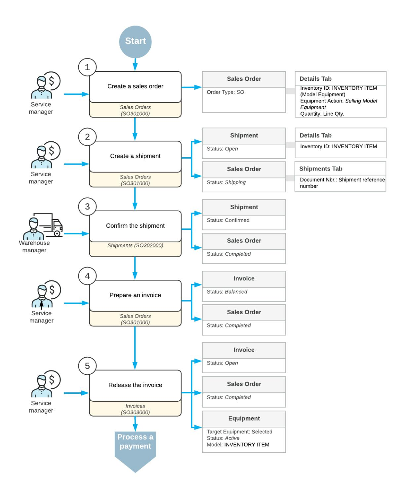

*Figure: Selling a piece of model equipment from a sales order*

# **Target Equipment: To Sell a Stock Item as Target Equipment**

The following activity will walk you through the process of selling two stock items with the **Model Equipment** equipment class. When you release the invoice for the sale, the system will automatically create a target equipment record. You will then verify that the stock items sold to the customer are listed as target equipment owned by this customer.

## **Story**

Suppose that the *GOODFOOD (GoodFood One Restaurant)* customer would like to purchase two pieces of equipment, along with installation services, from the SweetLife Service and Equipment Sales Center.

Acting as a service manager, you will receive the request and create a sales order. Then acting as an accountant, you will prepare and release an invoice. (To keep this training simple, you will perform all instructions by using the user account of the service manager, Maia Davis.)

## **Process Overview**

On the *[Sales Orders](https://help-2025r1.acumatica.com/Help?ScreenId=ShowWiki&pageid=19e4021c-1b84-49fd-be12-0320c5f1c7e5)* (SO301000) form, you will create a new sales order. In this sales order, you will add stock items and specify the *Selling Model Equipment* equipment action for them. Then you will prepare and release a sales invoice. By releasing the invoice, the system will create the target equipment.

## **System Preparation**

Before you begin performing the steps of this activity, do the following:

- 1. On the Acumatica ERP website, sign in to a company with the *U100* dataset preloaded. You should sign in as a service manager by using the *davis* username and the *123* password.
- 2. In the info area, in the upper-right corner of the top pane of the Acumatica ERP screen, set the business date to *1/30/2025*. For simplicity, in this activity, you will create and process all documents in the system on this business date.

## **Step 1: Creating a Sales Order for Equipment**

To create a sales order, perform the following instructions:

- 1. On the *[Sales Orders](https://help-2025r1.acumatica.com/Help?ScreenId=ShowWiki&pageid=19e4021c-1b84-49fd-be12-0320c5f1c7e5)* (SO301000) form, add a new sales order and specify the following settings in the Summary area:
  - **OrderType**: *SO*
  - **Customer**: *GOODFOOD - GoodFood One Restaurant*
- 2. On the form toolbar, click**Save**.
- 3. On the **Details** tab, click **Add Row** on the table toolbar, and add a piece of model equipment to the sales order by specifying the following settings in the row:
  - **Inventory ID**: *JUICE\_J22C*
  - **Equipment Action**: *Selling Model Equipment*
  - **Quantity**: 1.00
  - **Unit Price**: 700.0000
- 4. On the table toolbar, again click **Add Row**, and specify the following settings in the row to add another piece of model equipment to the sales order:
  - **Inventory ID**: *CPRESS30J*
  - **Equipment Action**: *Selling Model Equipment*
  - **Quantity**: 1.00
  - **Unit Price**: 800.0000
- 5. On the form toolbar, click**Save**.
- 6. On the form toolbar, click **CreateShipment**.

7. In the **SpecifyShipment Parameters** dialog box, click **OK** to create a shipment for the business date (*1/30/2025*) and the default warehouse of your branch location (which is *EQUIPHOUSE*).

The system has opened the *[Shipments](https://help-2025r1.acumatica.com/Help?ScreenId=ShowWiki&pageid=f47cffcc-543e-469c-a204-a9c1e3da346d)* (SO302000) form with the details copied from the corresponding sales order.

- 8. On the form toolbar, click **Confirm Shipment** to change the shipment's status to *Confirmed*.
- 9. On the form toolbar, click **Prepare Invoice**; the system has opened the *[Invoices](https://help-2025r1.acumatica.com/Help?ScreenId=ShowWiki&pageid=0acc9738-f141-4ea0-a2be-f34ea9d1b63a)* (SO303000) form with the details copied from the shipment.

10.On the form toolbar of the opened form, click **Release**.

By releasing the invoice related to the sales order that included the items for which you specified the *Selling Model Equipment* action, you cause the system to create the target equipment in the system that corresponds to the stock items. The system inserts the reference numbers of the equipment in the**Target Equipment ID** column.

| Invoices                                |                 | Invoice 000119 - GoodFood One Restaurant                    |                                             |                                         |                           |                           |                            |                                 |                                    |                   |             | $\bullet$ completed. | The operation has | $\times$      |        |
|-----------------------------------------|-----------------|-------------------------------------------------------------|---------------------------------------------|-----------------------------------------|---------------------------|---------------------------|----------------------------|---------------------------------|------------------------------------|-------------------|-------------|-------------------------|-------------------|---------------|--------|
| 의 B $\leftarrow$                  | $\Omega$ $+$ | 面 !!!!!!!!!!!!!!!!!!!!!!!!!!!!!!!!!!!!!!!! $_{\rm v}$ | $\mathbb{R}$ $\epsilon$ $\rightarrow$ | $\mathcal{H}$ $\cdots$               |                           |                           |                            |                                 |                                    |                   |             |                         |                   |               |        |
| Type:                                   | Invoice         | Customer: $\mathcal{L}$                                  |                                             | GOODFOOD - GoodFood One Restaurar /     | <b>Detail Total:</b>      | 1,500.00                  |                            |                                 |                                    |                   |             |                         |                   |               | $\sim$ |
| Reference Nbr.                          | 000119          | $\circ$ Location:                                        | <b>MAIN - Primary Location</b>              |                                         | Line Discounts:           | 0.00                      |                            |                                 |                                    |                   |             |                         |                   |               |        |
| Status:                                 | Open            | Terms:                                                      | 30D - 30 Days                               |                                         | Document Dis              | 0.00                      |                            |                                 |                                    |                   |             |                         |                   |               |        |
| Date:                                   | 1/30/2025       | * Due Date:                                                 | 自 3/1/2025                               |                                         | Freight Total:            | 0.00                      |                            |                                 |                                    |                   |             |                         |                   |               |        |
| Post Period:                            | 01-2025         | * Cash Discount.                                            | $\Box$ 3/1/2025                          |                                         | <b>Tax Total:</b>         | 0.00                      |                            |                                 |                                    |                   |             |                         |                   |               |        |
| Customer Ord.                           |                 |                                                             |                                             |                                         | Amount:                   | 1,500.00                  |                            |                                 |                                    |                   |             |                         |                   |               |        |
| Project/Contract: X - Non-Project Code. |                 |                                                             |                                             |                                         | Balance: $\mathscr{Q}$ | 1,500.00                  |                            |                                 |                                    |                   |             |                         |                   |               |        |
| Description:                            |                 |                                                             |                                             |                                         | Cash Discount:            | 0.00                      |                            |                                 |                                    |                   |             |                         |                   |               |        |
|                                         |                 |                                                             |                                             |                                         |                           |                           |                            |                                 |                                    |                   |             |                         |                   |               |        |
| <b>DETAILS</b>                          | <b>TAXES</b>    | <b>FREIGHT</b> <b>FINANCIAL</b>                          | <b>ADDRESSES</b>                            | <b>APPLICATIONS</b>                     |                           |                           |                            |                                 |                                    |                   |             |                         |                   |               |        |
| Ò $+$ P                           |                 | ADD ITEMS ADD ORDER                                      | ADD SO LINE                                 | ADD RETURN LINE                         | <b>RESET ORDER</b>        | н $\boxed{\mathbf{x}}$ |                            |                                 |                                    |                   |             |                         |                   |               |        |
| B 0 D Shipment Nbr.                     | Order Type   | Order Nbr.                                                  | Inventory ID                                | <b>Suspended Target</b> Equipment ID | <b>Equipment Action</b>   | Component ID              | <b>Target Equipment ID</b> | Related Svc. Doc. Nbr. | <b>Transaction Descr.</b>          | Warehouse         | Location    | Quantity UOM            |                   | Unit Price Ma | P      |
| $0$ D 000068                         | SO   | 000074                                                      | JUICE J22C                                  |                                         | Selling Model Equi        |                           | FSE00010                   |                                 | Multifruit Centrifugal Juicer J22C | <b>EQUIPHOUSE</b> | <b>MAIN</b> |                         | 1.00 ITEM         | 700,0000      |        |
| $0$ D 000068                         | <b>SO</b>       | 000074                                                      | CPRESS30J                                   |                                         | Selling Model Equi        |                           | FSE00011                   |                                 | Cold Press Juicer H30J             | <b>EQUIPHOUSE</b> | <b>MAIN</b> | 1.00                    | <b>ITEM</b>       | 800.0000      |        |
|                                         |                 |                                                             |                                             |                                         |                           |                           |                            |                                 |                                    |                   |             |                         |                   |               |        |
|                                         |                 |                                                             |                                             |                                         |                           |                           |                            |                                 |                                    |                   |             |                         |                   |               |        |

*Figure: Target equipment created on release of the invoice*

#### **Step 2: Reviewing the Target Equipment List**

To verify that the equipment has been created, perform the following instructions:

1. Open the *[Equipment Summary](https://help-2025r1.acumatica.com/Help?ScreenId=ShowWiki&pageid=ed67c9dc-a63a-4937-886c-7511c7644030)* (FS400200) form.

This form shows you all the equipment that has been created in the system. Notice that the**Target Equipment** check boxes are selected for the pieces of equipment you have created in the previous step, meaning that your company expects to service this equipment. In the **Model Equipment** column, you can view the inventory ID of the stock item corresponding to the target equipment.

Notice that the **Customer ID** column displays *GOODFOOD* for both pieces of equipment.

2. In the table row with *Multifruit Centrifugal Juicer J22C*, click the *FSE00010* link in the **Equipment Nbr.** column.

The *[Equipment](https://help-2025r1.acumatica.com/Help?ScreenId=ShowWiki&pageid=43b7c838-3051-4238-87db-e9b9c213894e)* (FS205000) form has been opened in a new window with this target equipment selected.

3. On the **General** tab, notice that the **Installation Date** box has been filled with the date of the sales invoice (as shown in the following screenshot).

| Equipment                                                                   |                                    |                           |                                               |                          |                                                |              |
|-----------------------------------------------------------------------------|------------------------------------|---------------------------|-----------------------------------------------|--------------------------|------------------------------------------------|--------------|
| FSE00010 - Multifruit Centrifugal Juicer J22C ㅋ $\boxdot$ $\Omega$ | 甸 $+$                           | $D \times K$              | $\left\langle \right\rangle$ $\rightarrow$ | $\lambda$                |                                                |              |
|                                                                             |                                    |                           |                                               |                          |                                                |              |
| Equipment Nbr.: FSE00010                                                    |                                    | $\varphi$                 | $\Box$ Vehicle                                |                          |                                                |              |
| Equipment Type:                                                             |                                    | $\circ$                   | $\mathscr{O}$                                 | V Target Equipment       |                                                |              |
| Status:                                                                     | Active $\checkmark$             |                           |                                               | Resource Equipment       |                                                |              |
| Serial Nbr.:                                                                |                                    |                           |                                               |                          |                                                |              |
| Description:                                                                | Multifruit Centrifugal Juicer J22C |                           |                                               |                          |                                                |              |
| Owner                                                                       |                                    |                           |                                               | Location                 |                                                |              |
| $\bigcirc$ Company                                                          |                                    |                           |                                               | $\bigcirc$ Company       |                                                |              |
| © Customer                                                                  |                                    |                           |                                               | Customer                 |                                                |              |
| * Customer:                                                                 |                                    | GOODFOOD - Good $\oslash$ |                                               | * Customer:              | GOODFOOD - Good $\varnothing$                  |              |
|                                                                             |                                    |                           |                                               | Location:                | MAIN - Primary Loca Q 2                        |              |
|                                                                             |                                    |                           |                                               |                          |                                                |              |
| <b>GENERAL</b>                                                              | <b>PURCHASE</b>                    | COMPONENTS AND WARRANTIES |                                               |                          | SOURCE <b>ATTRIBUTES</b>                    |              |
|                                                                             |                                    |                           |                                               |                          |                                                |              |
| Registered Date:                                                            | Ö.                                 |                           |                                               | <b>MANUFACTURER INFO</b> |                                                |              |
| Registration N                                                              |                                    |                           |                                               | Manufacturer:            | JUICEAPP - Juice Appliances C 2                |              |
| Barcode:                                                                    |                                    |                           |                                               | Manufacturer             |                                                | 0            |
| Tag Nbr.:                                                                   |                                    |                           |                                               | Manufacturing            |                                                |              |
| Sales Date:                                                                 | 1/30/2025 $\Box$                |                           |                                               | <b>INVENTORY INFO</b>    |                                                |              |
| Color:                                                                      |                                    | $\checkmark$              |                                               |                          | Model Equipm JUICE J22C - Multifruit Centr Q 2 |              |
| <b>INSTALLATION INFO.</b>                                                   |                                    |                           |                                               | Warehouse:               | EQUIPHOUSE - Warehouse for 2                   |              |
| Installation Date: 1/30/2025                                                | $\Box$                             |                           |                                               | Warehouse Lo             |                                                | $\mathcal O$ |
| Service Order                                                               |                                    |                           |                                               | Model Serial N           |                                                |              |
| Appointment N                                                               |                                    |                           |                                               |                          |                                                |              |
| <b>DISPOSAL INFO</b>                                                        |                                    |                           |                                               |                          |                                                |              |
| <b>Disposal Date:</b>                                                       | $\Box$                             |                           |                                               |                          |                                                |              |
| Replacement                                                                 |                                    |                           | $\rho$                                        |                          |                                                |              |
| Service Order                                                               |                                    |                           |                                               |                          |                                                |              |
| Appointment N                                                               |                                    |                           |                                               |                          |                                                |              |
|                                                                             |                                    |                           |                                               |                          |                                                |              |
|                                                                             |                                    |                           |                                               |                          |                                                |              |
|                                                                             |                                    |                           |                                               |                          |                                                |              |

*Figure: Settings of the target equipment*

- 4. On the **Components and Warranties** tab, verify that no settings have been filled in. This is because this target equipment has no parts or warranties.
- 5. On the **Source** tab, verify that the **Document Ref. Nbr.** and **Sales Order Nbr.** boxes contain links to the documents, which confirm the purchase of this equipment by the customer.
- 6. Close the window with the *[Equipment](https://help-2025r1.acumatica.com/Help?ScreenId=ShowWiki&pageid=43b7c838-3051-4238-87db-e9b9c213894e)* form.
- 7. On the *[Equipment Summary](https://help-2025r1.acumatica.com/Help?ScreenId=ShowWiki&pageid=ed67c9dc-a63a-4937-886c-7511c7644030)* form, for the row with *Cold Press Juicer H30J*, click the *FSE00011* link in the **Equipment Nbr.** column.
- 8. On the *[Equipment](https://help-2025r1.acumatica.com/Help?ScreenId=ShowWiki&pageid=43b7c838-3051-4238-87db-e9b9c213894e)* form, which the system has opened, click the **Components and Warranties** tab.

Notice that the components of the *Cold Press Juicer H30J* equipment are listed on this tab, as shown in the following screenshot. The warranty end dates for the components that have warranties are automatically calculated based on the equipment invoice date and the warranty duration that you defined for the corresponding model equipment. You entered these components and their warranty durations in Lesson 1.2.

| Equipment FSE00011 - Cold Press Juicer H30J                                       |                                                                                                                 |                                          |              |             |           |                                    |                             |                  |           |                             |                | NOTES ACTIVITIES FILES |                                 | $TOOLS$ $\star$     |
|--------------------------------------------------------------------------------------|-----------------------------------------------------------------------------------------------------------------|------------------------------------------|--------------|-------------|-----------|------------------------------------|-----------------------------|------------------|-----------|-----------------------------|----------------|------------------------|---------------------------------|---------------------|
| $\circ$ + $\mathbb{m}$ 뭐 $\Box$                                                | $\Box$ $\Box$ $\vee$ $\Box$ $\vee$ $\Diamond$ $\Diamond$ $\Diamond$ $\Diamond$ $\Diamond$ $\Diamond$ $\Diamond$ |                                          |              |             |           |                                    |                             |                  |           |                             |                |                        |                                 |                     |
| Equipment Nbr.: FSE00011 $\circ$                                                  | Vehicle                                                                                                         |                                          |              |             |           |                                    |                             |                  |           |                             |                |                        |                                 | $\hat{\phantom{a}}$ |
| $\mathcal{D}$ Equipment Type:                                                     | 7 Target Equipment                                                                                              |                                          |              |             |           |                                    |                             |                  |           |                             |                |                        |                                 |                     |
| Status: Active $\sim$                                                          | Resource Equipment                                                                                              |                                          |              |             |           |                                    |                             |                  |           |                             |                |                        |                                 |                     |
| Serial Nbr.:                                                                         |                                                                                                                 |                                          |              |             |           |                                    |                             |                  |           |                             |                |                        |                                 |                     |
| Description: Cold Press Juicer H30J                                               |                                                                                                                 |                                          |              |             |           |                                    |                             |                  |           |                             |                |                        |                                 |                     |
| Owner                                                                                | Location                                                                                                        |                                          |              |             |           |                                    |                             |                  |           |                             |                |                        |                                 |                     |
| Company                                                                              | Company                                                                                                         |                                          |              |             |           |                                    |                             |                  |           |                             |                |                        |                                 |                     |
| Customer                                                                             | © Customer                                                                                                      |                                          |              |             |           |                                    |                             |                  |           |                             |                |                        |                                 |                     |
| * Customer: GOODFOOD - Good P                                                     | * Customer:                                                                                                     | GOODFOOD - Good Q                        |              |             |           |                                    |                             |                  |           |                             |                |                        |                                 |                     |
|                                                                                      | Location:                                                                                                       | MAIN - Primary Loca Q                    |              |             |           |                                    |                             |                  |           |                             |                |                        |                                 |                     |
|                                                                                      |                                                                                                                 |                                          |              |             |           |                                    |                             |                  |           |                             |                |                        |                                 |                     |
| COMPONENTS AND WARRANTIES <b>PURCHASE</b> <b>GENERAL</b>                       | <b>ATTRIBUTES</b>                                                                                               | SOURCE                                   |              |             |           |                                    |                             |                  |           |                             |                |                        |                                 |                     |
|                                                                                      |                                                                                                                 |                                          |              |             |           |                                    |                             |                  |           |                             |                |                        |                                 |                     |
| COMPANY GENERAL WARRANTY                                                             | <b>VENDOR GENERAL WARRANTY</b>                                                                                  |                                          |              |             |           |                                    |                             |                  |           |                             |                |                        |                                 |                     |
| 12 Months Company Warr $\sim$                                                  | Vendor Warran                                                                                                   | Months 6 $\sim$                    |              |             |           |                                    |                             |                  |           |                             |                |                        |                                 |                     |
| Company Warr 1/30/2026                                                               | Vendor Warran 7/30/2025                                                                                         |                                          |              |             |           |                                    |                             |                  |           |                             |                |                        |                                 |                     |
|                                                                                      |                                                                                                                 |                                          |              |             |           |                                    |                             |                  |           |                             |                |                        |                                 |                     |
| <b>REPLACE COMPONENT</b> $\left  \cdot \right $ $\circ$ $+$ $\mathsf{X}$ | $\mathbf{x}$                                                                                                    |                                          |              |             |           |                                    |                             |                  |           |                             |                |                        |                                 |                     |
| 图 8 D Ref. Component ID <b>Status</b> Nbr.                                  | <b>Description</b>                                                                                              | Item Class ID                            | Inventory ID | Serial Nbr. |           | Compan Company Warrant Warranty | Company                     | Vendor Vendor    |           | Vendor                      | Vendor ID      |                        | <b>Equipment Action Comment</b> |                     |
|                                                                                      |                                                                                                                 |                                          |              |             |           | Type                               | Warranty <b>End Date</b> | Warrant Warranty | Type      | Warranty <b>End Date</b> |                |                        |                                 |                     |
| $> 0$ 0 00001 <b>JUICECUP</b> Active                                           | Juice Cup                                                                                                       | CPRESSCOMP                               | CUPH300J     |             |           | 6 Months                           | 7/30/2025                   |                  | 3 Months  | 4/30/2025                   |                |                        |                                 |                     |
| $0 - 0.00002$ <b>HOPPER</b> Active                                             | Hopper                                                                                                          | CPRESSCOMP                               | HOPPERH3     |             |           | 3 Months                           | 4/30/2025                   |                  | 0 Months  |                             |                |                        |                                 |                     |
| $0$ 0 00003 <b>PLUNGER</b> Active                                              | Plunger                                                                                                         | <b>CPRESSCOMP</b>                        | PLUNGERH30J  |             |           | 6 Months                           | 7/30/2025                   |                  | 12 Months | 1/30/2026                   |                |                        |                                 |                     |
| 0 0 00004 <b>AUGER</b> Active                                                  | Auger                                                                                                           | !!!!!!!!!!!!!!!!!!!!!!!!!!!!!!!!!!!!!!!! | AUGERH30J    |             |           | 12 Months                          | 1/30/2026                   |                  | 12 Months | 1/30/2026                   | <b>SQUEEZO</b> |                        |                                 |                     |
| $0 - 100005$ <b>DRUM</b> Active                                                | Drum                                                                                                            | CPRESSCOMP                               | DRUMH30J     |             | $\bullet$ | 12 Months                          | 1/30/2026                   |                  | 6 Months  | 7/30/2025                   |                |                        |                                 |                     |
|                                                                                      |                                                                                                                 |                                          |              |             |           |                                    |                             |                  |           |                             |                |                        |                                 |                     |

#### *Figure: Components and warranties of the equipment*

- 9. Close the window with the *[Equipment](https://help-2025r1.acumatica.com/Help?ScreenId=ShowWiki&pageid=43b7c838-3051-4238-87db-e9b9c213894e)* form.
- 10.On the *[Component Summary](https://help-2025r1.acumatica.com/Help?ScreenId=ShowWiki&pageid=fc02e8ff-1945-4d4a-a554-e9486d065ed6)* (FS400700) form, view the list of components serviced by SweetLife.

Notice that the target equipment records now all have the *Active* status.

## **Target Equipment: To Manually Create Equipment**

In this activity, you will create in the system a piece of equipment that the customer already has and that SweetLife will be servicing.

#### **Story**

Suppose that the SweetLife Service and Equipment Sales Center needs to perform services on the equipment that was sold to the *HMBAKERY - HM's Bakery & Cafe* customer by a third party. Acting as a service manager, you will enter this equipment record in Acumatica ERP.

#### **Process Overview**

On the *[Equipment](https://help-2025r1.acumatica.com/Help?ScreenId=ShowWiki&pageid=43b7c838-3051-4238-87db-e9b9c213894e)* (FS205000) form, you will add a new piece of equipment to be serviced.

#### **System Preparation**

Before you begin performing the steps of this activity, do the following:

- 1. On the Acumatica ERP website, sign in to a company with the *U100* dataset preloaded. You should sign in as a service manager by using the *davis* username and the *123* password.
- 2. In the info area, in the upper-right corner of the top pane of the Acumatica ERP screen, set the business date to *1/30/2025*. For simplicity, in this activity, you will create and process all documents in the system on this business date.

#### **Step: Creating Target Equipment**

To create this piece of target equipment, perform the following instructions:

- 1. On the *[Equipment](https://help-2025r1.acumatica.com/Help?ScreenId=ShowWiki&pageid=43b7c838-3051-4238-87db-e9b9c213894e)* (FS205000) form, add a new record and specify the following settings in the Summary area:
  - **Description**: Multifruit Centrifugal Juicer J22C (see Item 1 in the following screenshot)
  - **Target Equipment**: Selected (Item 2)
- 2. Under **Owner**, select the **Customer** option button, and in the **Customer** box, select *HMBAKERY - HM's Bakery & Cafe* (Item 3).
- 3. Under **Location**, in the **Customer** box, select *HMBAKERY - HM's Bakery & Cafe* (Item 4).
- 4. On the **General** tab (**Installation Info** section), in the **Installation Date** box (Item 5), select the current business date (*1/30/2025*).
- 5. In the **Model Equipment** box of the **Inventory Info** section, select *JUICE\_J22C* (Item 6).

|                                                      | $\Box$ Vehicle Q |                                                                                |   |
|------------------------------------------------------|---------------------|--------------------------------------------------------------------------------|---|
| Equipment Type:                                      | 00                  | 7 Target Equipment                                                             |   |
| Status: Active $\checkmark$                    |                     | Resource Equipment                                                             |   |
| Serial Nbr.:                                         |                     |                                                                                |   |
| Description: Multifruit Centrifugal Juicer J22C   |                     |                                                                                |   |
| Owner                                                |                     | Location                                                                       |   |
| $\bigcirc$ Company                                   |                     | $\bigcirc$ Company                                                             |   |
| Customer                                             |                     | © Customer                                                                     |   |
| HMBAKERY - HM's E O * Customer:                   |                     | HMBAKERY - HM's [ O   0 * Customer: Location: MAIN - Primary Loca Q 2 |   |
|                                                      |                     |                                                                                |   |
| Registered Date: a. Registration N Barcode: | Manufacturer:       | MANUFACTURER INFO - JUICEAPP - Juice Appliances C 2 Manufacturer         | 0 |
|                                                      |                     |                                                                                |   |
| Tag Nbr.:                                            |                     | Manufacturing                                                                  |   |
| Sales Date: Ö.                                    |                     | <b>INVENTORY INFO</b>                                                          |   |
| Color:                                               | $\checkmark$        | JUICE J22C - Multifruit Centr Q Model Equipm                                |   |
| <b>INSTALLATION INFO</b>                             | Warehouse:          |                                                                                | 0 |
| 5 Installation Date: 1/30/2025 Π               |                     | Warehouse Lo                                                                   | 0 |
| Service Order                                        |                     | Model Serial N                                                                 |   |
| Appointment N                                        |                     |                                                                                |   |
| <b>DISPOSAL INFO</b>                                 |                     |                                                                                |   |
| <b>Disposal Date:</b> $\Box$                      |                     |                                                                                |   |
| Replacement Service Order                         | $\rho$ $\rho$       |                                                                                |   |

#### *Figure: Manual creation of target equipment*

- 6. On the form toolbar, click**Save**.
- 7. On the *[Equipment Summary](https://help-2025r1.acumatica.com/Help?ScreenId=ShowWiki&pageid=ed67c9dc-a63a-4937-886c-7511c7644030)* (FS400200) form, in the **Customer** box of the Summary area, select *HMBAKERY*.
- 8. In the table, make sure the *FSE00012* equipment record is listed, as shown in the screenshot below.

| $\mathcal{L}$             |
|---------------------------|
| <b>Branch Location ID</b> |
|                           |
|                           |
|                           |
|                           |
|                           |
|                           |

#### *Figure: The created target equipment*

If you click the *FSE00012* link in the **Equipment Nbr.** column, the system will open the *[Equipment](https://help-2025r1.acumatica.com/Help?ScreenId=ShowWiki&pageid=43b7c838-3051-4238-87db-e9b9c213894e)* form, where you just created the target equipment.

## **Target Equipment: To Create a Service Appointment**

In this activity, you will create an appointment to deliver setup services for target equipment located at the customer's premises.

#### **Story**

Suppose that the *GOODFOOD (GoodFood One Restaurant)* customer wants the SweetLife Service and Equipment Sales Center to perform installation and repair services at the customer's location on the cold press and centrifugal juicers it has purchased. Acting as a service manager, you will receive the request and create and process an appointment.

#### **Process Overview**

On the *[Appointments](https://help-2025r1.acumatica.com/Help?ScreenId=ShowWiki&pageid=ac486e9c-f5df-4829-94f0-2df8821361a0)* (FS300200) form, you will create a new appointment. In this appointment, you will specify the services and the target equipment that will be serviced. You will also assign a staff member with the appropriate skills and, on behalf of a staff member, process the appointment.

## **System Preparation**

Before you begin performing the steps of this activity, do the following:

- 1. On the Acumatica ERP website, sign in to a company with the *U100* dataset preloaded. You should sign in as a service manager by using the *davis* username and the *123* password.
- 2. In the info area, in the upper-right corner of the top pane of the Acumatica ERP screen, set the business date to *1/30/2025*. For simplicity, in this activity, you will create and process all documents in the system on this business date.

### **Step: Creating an Appointment for the Servicing of Target Equipment**

Do the following:

- 1. On the *[Appointments](https://help-2025r1.acumatica.com/Help?ScreenId=ShowWiki&pageid=ac486e9c-f5df-4829-94f0-2df8821361a0)* (FS300200) form, click **Add New Record**.
- 2. Specify the following settings in the Summary area:
  - **Service OrderType**: *INST*
  - **Customer**: *GOODFOOD (GoodFood One Restaurant)*

- **Description**: Installation and training services
- 3. On the form toolbar, click**Save**.
- 4. On the **Details** tab, click **Add Row** and specify the following settings in the row:
  - **Inventory ID**: *INSTALL*
  - **Target Equipment ID**: *FSE00010* (this target equipment is the *Multifruit Centrifugal Juicer J22C* stock item)
- 5. On the form toolbar, click**Save**.
- 6. Click **Add Row** again and specify the following settings in the row:
  - **Inventory ID**: *REPAIR*
  - **Target Equipment ID**: *FSE00011* (this target equipment is the *Cold Press Juicer H30J* stock item)
- 7. On the form toolbar, click**Save**.
- 8. On the **Staff** tab, click **Add Row**, and in the **Staff Member** column, select *EP00000003 - Jon Waite*. This staff member has the *INSTALLING - Juicer installation skills* and *REPAIRING - Repair of juicers* skills assigned on the **Skills** tab on the *[Employees](https://help-2025r1.acumatica.com/Help?ScreenId=ShowWiki&pageid=dae5144b-49b3-43a4-bce0-93f31b3f2321)* (EP203000) form.
- 9. On the form toolbar, click**Save**.

10.On the form toolbar, click**Start**. In this instruction, you are acting as Jon Waite arriving at the appointment.

11.On the **Details** tab, click the *FSE00010* link in the **Target Equipment ID** column.

The system has opened the *[Equipment](https://help-2025r1.acumatica.com/Help?ScreenId=ShowWiki&pageid=43b7c838-3051-4238-87db-e9b9c213894e)* (FS205000) form, where the staff member attending the appointment can view the settings of the equipment scheduled for service.

#### 12.On the More menu (under **Inquiries**), click **Target Equipment History**.

The system opens the *[Appointment Details](https://help-2025r1.acumatica.com/Help?ScreenId=ShowWiki&pageid=59d8c9d8-27cc-4463-9df8-2ad5b715a4ae)* (FS400500) form. You can see the appointment created for the selected piece of equipment. (See the following screenshot.)

| <b>Appointment Details</b>       |                                             |               |                    |                      |                 |               |                          |                                |                             |                                          |                                  |            |           |                | CUSTOMIZATION . TOOLS .       |                |
|----------------------------------|---------------------------------------------|---------------|--------------------|----------------------|-----------------|---------------|--------------------------|--------------------------------|-----------------------------|------------------------------------------|----------------------------------|------------|-----------|----------------|-------------------------------|----------------|
| $\circ$ $\circ$ $\mathscr{Q}$ | $\mathbf{\overline{x}}$ $\mathbb{H}$     |               |                    |                      |                 |               |                          |                                |                             |                                          |                                  |            |           |                |                               |                |
| Branch:                          | SWEETEQUIP - Service and Q                  |               |                    | Service Order Type:  |                 | $\circ$       | Item:                    |                                |                             |                                          | $\circ$                          |            |           |                |                               | $\sim$         |
| Branch Location:                 | WEST BRIGHTON - Office in P                 |               |                    | Service Order Nbr.:  |                 | ø             | <b>Target Equipment:</b> |                                | FSE00010                    |                                          | $\circ$                          |            |           |                |                               |                |
| Customer:                        |                                             |               | $\circ$            | Service Contract ID: |                 | $\circ$       |                          | From Scheduled Date:           |                             | $\Box$                                   |                                  |            |           |                |                               |                |
| Location:                        |                                             |               | o Schedule ID:  |                      |                 | $\mathcal{Q}$ |                          | To Scheduled Date:             |                             | !!!!!!!!!!!!!!!!!!!!!!!!!!!!!!!!!!!!!!!! |                                  |            |           |                |                               |                |
|                                  | Drag column header here to configure filter |               |                    |                      |                 |               |                          |                                |                             |                                          |                                  |            |           |                | $\nabla$ $\Box$               | $\circ$        |
| <b>R</b> Branch ID               | <b>Branch Location ID</b>                   | Order Type | Service Order Nbr. | Appointment Nbr.     | Customer ID     | Location ID   |                          | Scheduled <b>Start Date</b> | Actual <b>Start Date</b> | Actual <b>Start Time</b>              | <b>Actual End Status</b> Time |            | Line Type | Inventory ID   | <b>Target Equipment</b> ID | Equipment Nbr. |
| SWEETEQUIP                       | <b>WEST BRIGHTON</b>                        | <b>INST</b>   | 000045             | 000045-1             | <b>GOODFOOD</b> | <b>MAIN</b>   |                          | 1/30/2025                      | 1/30/2025                   |                                          |                                  | In Process | Service   | <b>INSTALL</b> | FSE00010                      |                |
|                                  |                                             |               |                    |                      |                 |               |                          |                                |                             |                                          |                                  |            |           |                |                               |                |

*Figure: Appointment history for the target equipment*

- 13.Return to the *[Appointments](https://help-2025r1.acumatica.com/Help?ScreenId=ShowWiki&pageid=ac486e9c-f5df-4829-94f0-2df8821361a0)* (FS300200) form.
- 14.On the **Details** tab, click the *FSE00011* link in the **Target Equipment ID** column to view the settings of the *Cold Press Juicer H30J* to be assembled.
- 15.On the *[Equipment](https://help-2025r1.acumatica.com/Help?ScreenId=ShowWiki&pageid=43b7c838-3051-4238-87db-e9b9c213894e)* form, which the system opens, click the **Components and Warranties** tab.
- 16.In the **Serial Nbr.** column of the components table, enter 12345 for the *DRUM* component (which has a warning indicating that the serial number is missing).
- 17.On the form toolbar, click**Save**.
- 18.Close the window with the *[Equipment](https://help-2025r1.acumatica.com/Help?ScreenId=ShowWiki&pageid=43b7c838-3051-4238-87db-e9b9c213894e)* form and return to the *[Appointments](https://help-2025r1.acumatica.com/Help?ScreenId=ShowWiki&pageid=ac486e9c-f5df-4829-94f0-2df8821361a0)* form.
- 19.On the **Settings** tab, in the **Actual Date and Time** section, enter the actual start and end times (for simplicity in this training, set them to match the scheduled start and end times). Select the **Finished** check box.
- 20.On the form toolbar, click **Complete** and then **Close**.

Now an accountant can run billing for the appointment.

## **Target Equipment: Related Report and Inquiry Forms**

In Acumatica ERP, you can easily view the needed details of the equipment that your company services and the appointments in which the equipment was involved.

If you do not see a particular report or form that is described, you may have signed in to the system with a user account that does not have access rights to the report or form. Contact your system administrator to obtain access to any needed reports or forms.

## **Viewing Equipment-Related Stock Items**

On the *[Model Equipment and Component Summary](https://help-2025r1.acumatica.com/Help?ScreenId=ShowWiki&pageid=a799765e-96c3-4900-9777-1e7423eb47c5)* (FS400400) form, you can view the list of all the stock items defined in the system as model equipment or components. You can filter the list by item class ID.

## **Viewing Equipment Details**

On the *[Equipment Summary](https://help-2025r1.acumatica.com/Help?ScreenId=ShowWiki&pageid=ed67c9dc-a63a-4937-886c-7511c7644030)* (FS400200) form, you can view the list of all equipment added to the system and its general information, such as type, description, serial number, owner information, model, and installation date. You can filter the list by equipment type, customer (for equipment owned by customers rather than your company), customer location, and model (stock item ID).

To view the details of a particular piece of equipment , you can click its equipment number in the **Equipment Nbr.** column. The system navigates to the *[Equipment](https://help-2025r1.acumatica.com/Help?ScreenId=ShowWiki&pageid=43b7c838-3051-4238-87db-e9b9c213894e)* (FS205000) form.

## **Viewing Component Details**

On the *[Component Summary](https://help-2025r1.acumatica.com/Help?ScreenId=ShowWiki&pageid=fc02e8ff-1945-4d4a-a554-e9486d065ed6)* (FS400700) form, you can view the list of all components related to target equipment in your system You can filter the list by equipment entity, customer (for equipment owned by customers rather than your company), customer location, and model (stock item ID).

To view the details of the equipment related to a particular component, you can click the equipment number in the **Equipment Nbr.** column. The system navigates to the *[Equipment](https://help-2025r1.acumatica.com/Help?ScreenId=ShowWiki&pageid=43b7c838-3051-4238-87db-e9b9c213894e)* (FS205000) form.

### **Viewing Equipment Appointments**

On the *[Appointment Details](https://help-2025r1.acumatica.com/Help?ScreenId=ShowWiki&pageid=59d8c9d8-27cc-4463-9df8-2ad5b715a4ae)* (FS400500) form, you can filter the list of appointments by the particular equipment that was used during the appointments. You can go directly to this form and filter the list as needed, or you can invoke this form on the *[Equipment](https://help-2025r1.acumatica.com/Help?ScreenId=ShowWiki&pageid=43b7c838-3051-4238-87db-e9b9c213894e)* (FS205000) form to view the history of the selected equipment as follows:

- On the form toolbar, on the More menu (under **Inquiries**), click **Resource Equipment History** if the selected equipment is resource equipment.
- On the form toolbar, on the More menu (under **Inquiries**), click **Target Equipment History** if the selected equipment is target equipment.

# **Selling a Piece of Equipment and an Optional Component**

In Acumatica ERP, you can sell equipment and its components. To do this, you will specify the *Selling Model Equipment* and *Selling Optional Component* equipment-related actions for the selected stock item in an appointment created on the *[Appointments](https://help-2025r1.acumatica.com/Help?ScreenId=ShowWiki&pageid=ac486e9c-f5df-4829-94f0-2df8821361a0)* (FS300200) form.

# **Selling a Piece of Equipment and an Optional Component: General Information**

With Acumatica ERP, you can sell a piece of equipment along with services and continue to provide services for the equipment aer the sale.

## **Learning Objectives**

In this lesson, you will learn how to sell a piece of equipment, an optional component, and installation services through an appointment.

## **Applicable Scenarios**

You sell a piece of equipment and an optional component in the following scenarios:

- A customer has asked your company to sell a new piece of equipment.
- A customer has requested optional components for equipment serviced by your company, along with installation services.

## **Workflow of Model Equipment Sale with Optional Component**

In the diagram below, you can see the process of selling a piece of equipment and its optional component by using a service order.

#### Selling a Piece of Equipment and an Optional Component | **41**

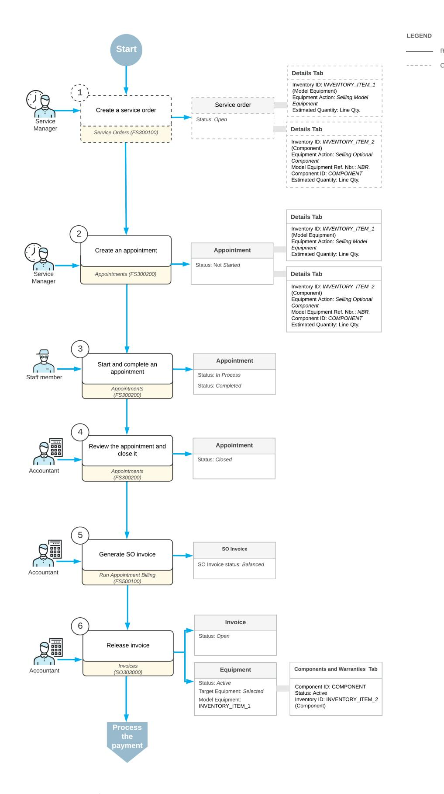

*Figure: The sale of model equipment and its optional component in a service order*

When a customer request is received, a service manager enters a service order by using the *[Service Orders](https://help-2025r1.acumatica.com/Help?ScreenId=ShowWiki&pageid=6e5277d3-274e-45f5-b77d-4410ed736d21)* (FS300100) form. In the service order, the service manager specifies the customer from which the request has been received, the branch and branch location to provide services, and the services that should be performed.

The service manager can instead start by creating an appointment with all these settings, and the service order will be created automatically. In *[Selling a Piece of Equipment and an Optional Component: Process Activity](#page-41-1)*, the appointment will be created first.

On the **Details** tab of the *[Appointments](https://help-2025r1.acumatica.com/Help?ScreenId=ShowWiki&pageid=ac486e9c-f5df-4829-94f0-2df8821361a0)* (FS300200) form, the service manager does the following to add the model equipment record and the optional component to be sold:

- 1. In the row with the equipment record (*CPRESS30J*), the service manager selects *Selling Model Equipment* in the **Equipment Action** column.
- 2. In the row with the optional component (*30HOPPERJK*), the service manager selects *Selling Optional Component* in the **Equipment Action** column, specifies the related equipment in the **Model Equipment Ref. Nbr.** column, and selects the identifier of the equipment component in the **Component ID** column.

# **Selling a Piece of Equipment and an Optional Component: Process Activity**

The following activity will walk you through the process of selling a piece of equipment, an optional component, and the associated installation service.

## **Story**

Suppose that the customer has contacted the SweetLife Service and Equipment Sales Center to request the following:

- A cold press juicer—that is, the *CPRESS30J - Cold Press Juicer H30J* equipment (a stock item of the *Model Equipment* type)
- An optional component for the juicer—the *30HOPPERJK - Hopper H30J metallic* component (a stock item of the *Component* type)
- Installation services

Acting as a service manager, you will create an appointment. Further processing will then be performed by the assigned staff member and the accountant, who will prepare and process the billing documents for the customer. To keep this training simple, you will perform all instructions while you are signed in to the user account of the service manager (Maia Davis).

## **Process Overview**

On the *[Appointments](https://help-2025r1.acumatica.com/Help?ScreenId=ShowWiki&pageid=ac486e9c-f5df-4829-94f0-2df8821361a0)* (FS300200) form, you will create a new appointment, add the required items, specify the equipment-related actions for each item, and process the appointment.

## **System Preparation**

Before you begin performing the steps of this activity, do the following:

- 1. On the Acumatica ERP website, sign in to a company with the *U100* dataset preloaded. You should sign in as a service manager by using the *davis* username and the *123* password.
- 2. In the info area, in the upper-right corner of the top pane of the Acumatica ERP screen, set the business date to *1/30/2025*. For simplicity, in this activity, you will create and process all documents in the system on this business date.

3. To perform this activity, make sure that you have performed the following prerequisite activities: *[Stock](#page-19-1) Items to Be Tracked Post-Sale: To Create [Components](#page-19-1)* and *Stock Items to Be Tracked [Post-Sale:](#page-22-1) To Create [Stock Items with Components](#page-22-1)*.

## **Step: Selling a Piece of Model Equipment and an Optional Component**

In this step, you will create an appointment (causing the system to create the corresponding service order) that includes the installation service *INST*, the *CPRESS30J - Cold Press Juicer H30J* equipment, and the optional *30HOPPERJK - Hopper H30J metallic* component. You will go through the whole process until you generate an invoice for both the service and the sold equipment.

Perform the following instructions:

- 1. On the *[Appointments](https://help-2025r1.acumatica.com/Help?ScreenId=ShowWiki&pageid=ac486e9c-f5df-4829-94f0-2df8821361a0)* (FS300200) form, click **Add New Record**.
- 2. In the Summary area, specify the following settings:
  - **Service OrderType**: *INST*
  - **Customer**: *TOMYUM - Thai Food Restaurant*
  - **Description**: Selling a juicer with optional component
- 3. On the form toolbar, click**Save**.
- 4. On the **Details** tab, add a row, and in the **Inventory ID** column of the row, select *INSTALL*.

Notice that you do not specify target equipment IDs because the corresponding records in the system have not yet been created.

- 5. On the **Details** tab, add a row, and specify the following settings in the row to add a piece of model equipment (a juicer) to the appointment:
  - **Inventory ID**: *CPRESS30J*
  - **Equipment Action**: *Selling Model Equipment*
  - **Estimated Quantity**: 1.00
  - **Unit Price**: 800.0000
- 6. On the form toolbar, click**Save**.
- 7. Click **Add Row** again, and specify the following settings in the row to add another piece of equipment (an additional component) to the appointment:
  - **Inventory ID**: *30HOPPERJK*
  - **Equipment Action**: *Selling Optional Component*
  - **Model Equipment Ref. Nbr.**: *0002*
  - **Component ID**: *HOPPER O*
  - **Estimated Quantity**: 1.00
  - **Unit Price**: 50.0000
- 8. On the form toolbar, click**Save**.

Notice that for the optional component, you have specified the related model equipment number in the **Model Equipment Ref. Nbr.** column and selected the identifier of the equipment component in the **Component ID** column.

Now you can assign the appointment and proceed with the services. At this stage, the target equipment corresponding to the model equipment has not yet been created.

9. On the **Staff** tab, click **Add Row**, and specify *EP00000043 - Edward Smith* as the **Staff Member**.

10.On the form toolbar, click**Save**.

11.On the form toolbar, click**Start**.

As you perform this instruction and the next two, you are acting as Edward Smith at the appointment.

- 12.On the **Settings** tab, in the **Actual Date and Time** section, enter the actual start and end times (for simplicity in this training, set them to match the scheduled start and end times). Select **Finished**.
- 13.Click **Complete**.

As you perform the remaining instructions in this step, you are now acting as an accountant.

- 14.On the form toolbar, click **Close**.
- 15.On the form toolbar, click **Run Billing**. The *[Invoices](https://help-2025r1.acumatica.com/Help?ScreenId=ShowWiki&pageid=0acc9738-f141-4ea0-a2be-f34ea9d1b63a)* (SO303000) form opens with the details of the invoice.

Notice that the **Related Svc. Doc. Nbr.** column contains the link to the appointment document from which the sales invoice has originated.

You can also open the *[Invoices](https://help-2025r1.acumatica.com/Help?ScreenId=ShowWiki&pageid=0acc9738-f141-4ea0-a2be-f34ea9d1b63a)* form by clicking the link of the invoice in the **Reference Nbr.** column of the **Billing Documents** tab on the *[Appointments](https://help-2025r1.acumatica.com/Help?ScreenId=ShowWiki&pageid=ac486e9c-f5df-4829-94f0-2df8821361a0)* form.

#### 16.On the form toolbar of the *[Invoices](https://help-2025r1.acumatica.com/Help?ScreenId=ShowWiki&pageid=0acc9738-f141-4ea0-a2be-f34ea9d1b63a)* form, click **Remove Hold** and then **Release**.

When the invoice was released, the target equipment record was created (as shown in the following screenshot).

| Invoices 6. 2.                                                                                              | Invoice 000120 - Thai Food Restaurant 2 $\circ$ + $\circ$                                                                           | $D \times K$                                                                                                               | $\left\langle \cdot\right\rangle$                                             | $31 - 11$                                            |                                                                                                                                                          |                                                                    |                              |                                 |              |                        |                                              | $N$ NOTES         | ACTIVITI        | The operation has completed. | $\times$          |
|----------------------------------------------------------------------------------------------------------------|-------------------------------------------------------------------------------------------------------------------------------------------|----------------------------------------------------------------------------------------------------------------------------|-------------------------------------------------------------------------------|------------------------------------------------------|----------------------------------------------------------------------------------------------------------------------------------------------------------|--------------------------------------------------------------------|------------------------------|---------------------------------|--------------|------------------------|----------------------------------------------|-------------------|-----------------|---------------------------------|-------------------|
| Type: Reference Nbr. Status: Date: Post Period: Customer Ord. Description: <b>DETAILS</b> | Invoice 000120 $\circ$ Open 1/30/2025 01-2025 Project/Contract: X - Non-Project Code. <b>TAXES</b> <b>FREIGHT</b> | Customer Location: Terms: * Due Date: * Cash Discount Selling a juicer with optional component FINANCIAL | MAIN - Primary Location 30D - 30 Days 3/1/2025 3/1/2025 ADDRESSES | TOMYUM - Thai Food Restaurant <b>APPLICATIONS</b> | Detail Total: 0 <b>Line Discounts:</b> Document Dis Freight Total: <b>Tax Total:</b> Amount Balance: $\lambda$ Cash Discount: | 950.00 0.00 0.00 0.00 0.00 960.00 950.00 0.00 |                              |                                 |              |                        |                                              |                   |                 |                                 | $\sim$            |
| $\circ$ +                                                                                                      | ADD ITEMS $\mathcal{L}$                                                                                                                | ADD ORDER                                                                                                                  | ADD SO LINE                                                                   | ADD RETURN LINE                                      | <b>RESET ORDER</b>                                                                                                                                       | $H$ $\boxtimes$                                                    |                              |                                 |              |                        |                                              |                   |                 |                                 |                   |
| <b>B B</b> D 'Branch                                                                                           | Shipment Nbr.                                                                                                                             | Order Type                                                                                                              | Order Nbr.                                                                    | Inventory ID                                         | Suspended Target Equipment ID                                                                                                                         | <b>Target Equipment ID</b>                                         | <b>Equipment Action</b>      | Model Equipment Line Nbr. | Component ID | Related Syc. Doc. Nbr. | <b>Transaction Descr.</b>                    | Warehouse         | Location        | Quantity UOM                    | <b>Unit Price</b> |
| <b>8 D HEADOFFICE</b>                                                                                          |                                                                                                                                           |                                                                                                                            |                                                                               | <b>INSTALL</b>                                       |                                                                                                                                                          |                                                                    | N/A                          |                                 |              | INST.000046-1          | Installation of equipment at the customers'. | WHOLESALE         | <split></split> | 1.00 HOUR                       | 100.0000          |
| <b>6 D HEADOFFICE</b>                                                                                          |                                                                                                                                           |                                                                                                                            |                                                                               | CPRESS30J                                            |                                                                                                                                                          | <b>FSE00013</b>                                                    | Seling Model Equipment       |                                 |              | INST.000046-1          | Cold Press Juicer H30J                       | <b>EQUIPHOUSE</b> | <b>MAIN</b>     | 1.00 ITEM                       | 800.0000          |
| <b>6 D HEADOFFICE</b>                                                                                          |                                                                                                                                           |                                                                                                                            |                                                                               | 30HOPPERJK                                           |                                                                                                                                                          |                                                                    | Selling Optional Component 2 |                                 | HOPPER O     | INST.000046-1          | Hopper H30J metallic                         | <b>EQUIPHOUSE</b> | <b>MAIN</b>     | 1.00 ITEM                       | 50,0000           |
|                                                                                                                |                                                                                                                                           |                                                                                                                            |                                                                               |                                                      |                                                                                                                                                          |                                                                    |                              |                                 |              |                        |                                              |                   |                 |                                 |                   |

#### *Figure: Released invoice showing the created target equipment*

- 17.In the **Target Equipment ID** column, click the equipment reference number link to open the *[Equipment](https://help-2025r1.acumatica.com/Help?ScreenId=ShowWiki&pageid=43b7c838-3051-4238-87db-e9b9c213894e)* (FS205000) form.
- 18.On the **Components and Warranties** tab (see Item 1 in the following screenshot), verify that the system has added the additional component of the model equipment record that has been sold within the same order (Item 2).

| Equipment FSE00013 - Cold Press Juicer H30J                                                    |                                                                            |                                          |              |             |           |  |                                    | <b>TH NOTES</b>             | <b>ACTIVITIES</b> | <b>FILES</b>     | <b>CUSTOMIZATION</b>        | TOOLS $\star$  |
|---------------------------------------------------------------------------------------------------|----------------------------------------------------------------------------|------------------------------------------|--------------|-------------|-----------|--|------------------------------------|-----------------------------|-------------------|------------------|-----------------------------|----------------|
| E $\blacksquare$ $\Box$ $\sim$ 자 $+$ $\overline{\mathbf{K}}$ $\Omega$ $\sim$ | $\rightarrow$ $\lambda$                                                 |                                          |              |             |           |  |                                    |                             |                   |                  |                             |                |
|                                                                                                   |                                                                            |                                          |              |             |           |  |                                    |                             |                   |                  |                             | $\sim$         |
| Equipment Nbr.: FSE00013 $\mathcal{L}$                                                         | $\Box$ Vehicle                                                             |                                          |              |             |           |  |                                    |                             |                   |                  |                             |                |
| Equipment Type: $\rho$                                                                         | 7 Target Equipment                                                         |                                          |              |             |           |  |                                    |                             |                   |                  |                             |                |
| Active Status: $\sim$                                                                       | Resource Equipment                                                         |                                          |              |             |           |  |                                    |                             |                   |                  |                             |                |
| Serial Nbr.:                                                                                      |                                                                            |                                          |              |             |           |  |                                    |                             |                   |                  |                             |                |
| Description: Cold Press Juicer H30J Owner                                                   | Location                                                                   |                                          |              |             |           |  |                                    |                             |                   |                  |                             |                |
|                                                                                                   |                                                                            |                                          |              |             |           |  |                                    |                             |                   |                  |                             |                |
| Company © Customer                                                                             | Company Customer                                                        |                                          |              |             |           |  |                                    |                             |                   |                  |                             |                |
|                                                                                                   |                                                                            |                                          |              |             |           |  |                                    |                             |                   |                  |                             |                |
| TOMYUM - Thai Foo Q * Customer:                                                                | TOMYUM - Thai Foo Q * Customer: MAIN - Primary Loca Q 2 Location: |                                          |              |             |           |  |                                    |                             |                   |                  |                             |                |
|                                                                                                   |                                                                            |                                          |              |             |           |  |                                    |                             |                   |                  |                             |                |
| COMPONENTS AND WARRANTIES <b>GENERAL</b> PURCHASE                                           | SOURCE <b>ATTRIBUTES</b>                                                |                                          |              |             |           |  |                                    |                             |                   |                  |                             |                |
|                                                                                                   |                                                                            |                                          |              |             |           |  |                                    |                             |                   |                  |                             |                |
| <b>COMPANY GENERAL WARRANTY</b>                                                                   | <b>VENDOR GENERAL WARRANTY</b>                                             |                                          |              |             |           |  |                                    |                             |                   |                  |                             |                |
| 12 Company Warr <b>Months</b> $\sim$                                                     | Vendor Warran <b>Months</b> !!!!!!!!!!!!!!!!!!!!!!!!!!!!!!!!!!!!!!!! | $\sim$                                   |              |             |           |  |                                    |                             |                   |                  |                             |                |
| Company Warr 1/30/2026                                                                            | Vendor Warran 7/30/2025                                                    |                                          |              |             |           |  |                                    |                             |                   |                  |                             |                |
|                                                                                                   |                                                                            |                                          |              |             |           |  |                                    |                             |                   |                  |                             |                |
| <b>REPLACE COMPONENT</b> $\mathbf{x}$ $\vdash$ $+$ $\times$ O                      |                                                                            |                                          |              |             |           |  |                                    |                             |                   |                  |                             |                |
| B 0 D Ref. <b>Status</b> Component ID                                                       | Description                                                                | Item Class ID                            | Inventory ID | Serial Nbr. |           |  | Compan Company Warrant Warranty | Company                     | Vendor Vendor     | Warrant Warranty | Vendor                      | Vendor ID      |
| Nbr.                                                                                              |                                                                            |                                          |              |             |           |  | Type                               | Warranty <b>End Date</b> |                   | Type             | Warranty <b>End Date</b> |                |
| $> 0$ D 00001 <b>JUICECUP</b> Active                                                     | Juice Cup                                                                  | CPRESSCOMP                               | CUPH300J     |             |           |  | 6 Months                           | 7/30/2025                   |                   | 3 Months         | 4/30/2025                   |                |
| <b>HOPPER</b> $0 \quad \Box \quad 00002$ Active                                             | Hopper                                                                     | <b>CPRESSCOMP</b>                        | HOPPERH3     |             |           |  | 3 Months                           | 4/30/2025                   |                   | 0 Months         |                             |                |
| 00003 <b>PLUNGER</b> !!!!!!!!!!!!!!!!!!!!!!!!!!!!!!!!!!!!!!!! Active e.               | Plunger                                                                    | <b>CPRESSCOMP</b>                        | PLUNGERH30J  |             |           |  | 6 Months                           | 7/30/2025                   |                   | 12 Months        | 1/30/2026                   |                |
| 00004 <b>AUGER</b> $0$ D Active                                                          | Auger                                                                      | !!!!!!!!!!!!!!!!!!!!!!!!!!!!!!!!!!!!!!!! | AUGERH30J    |             |           |  | 12 Months                          | 1/30/2026                   |                   | 12 Months        | 1/30/2026                   | <b>SQUEEZO</b> |
| $0 - 0 00005$ <b>DRUM</b> Active                                                            | <b>Drum</b>                                                                | !!!!!!!!!!!!!!!!!!!!!!!!!!!!!!!!!!!!!!!! | DRUMH30J     |             | $\bullet$ |  | 12 Months                          | 1/30/2026                   |                   | 6 Months         | 7/30/2025                   |                |
| $0 \quad \Box \quad 00006$ <b>HOPPER O</b> Active                                           | Hopper (optional)                                                          | !!!!!!!!!!!!!!!!!!!!!!!!!!!!!!!!!!!!!!!! | 30HOPPERJK   |             |           |  | 3 Months                           | 4/30/2025                   |                   | 0 Months         |                             |                |
|                                                                                                   |                                                                            |                                          |              |             |           |  |                                    |                             |                   |                  |                             |                |

*Figure: The equipment record with the additional component*

# **Selling an Optional Component of Target Equipment**

In Acumatica ERP, you can process an appointment to provide the installation of optional components to existing equipment at a customer's site, along with installation services. To do this, you will specify the *Selling Optional Component* equipment-related action for the selected stock item in an appointment created on the *[Appointments](https://help-2025r1.acumatica.com/Help?ScreenId=ShowWiki&pageid=ac486e9c-f5df-4829-94f0-2df8821361a0)* (FS300200) form.

# **Selling an Optional Component of Target Equipment: General Information**

With Acumatica ERP, you can install optional components for existing equipment at a customer site and provide associated installation services as requested.

## **Learning Objectives**

In this lesson, you will learn how to sell an optional component that will upgrade target equipment.

## **Applicable Scenarios**

You sell an optional component that can become target equipment in the following scenarios:

- When a customer requests the installation of an optional component for existing equipment already in use at their site.
- When a customer requires both the component installation and associated installation services to be provided by your company.

In these situations, the service manager initiates the appointment, assigns necessary staff, and coordinates with the accountant to prepare and process billing documents for the customer.

## **Workflow of a Sales of an Optional Component for Target Equipment**

In the following diagram, you can see the process of selling an optional component for target equipment.

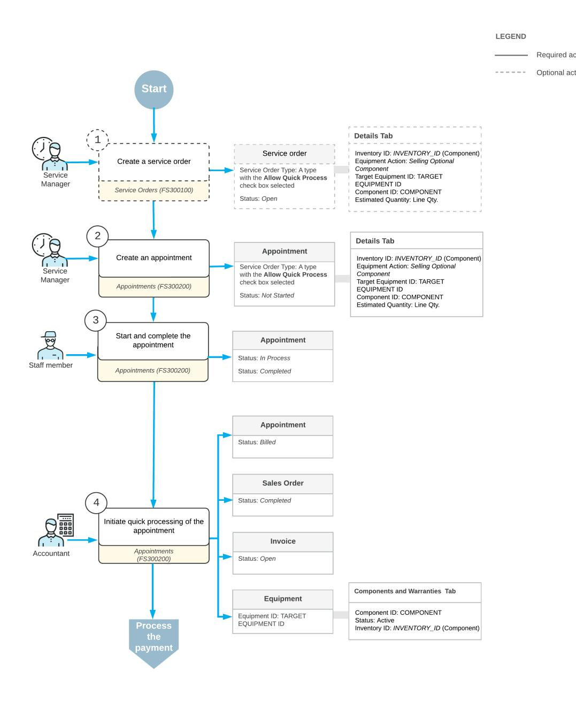

#### *Figure: The sale of an optional component of target equipment*

When a customer request is received, a service manager enters a service order by using the *[Service Orders](https://help-2025r1.acumatica.com/Help?ScreenId=ShowWiki&pageid=6e5277d3-274e-45f5-b77d-4410ed736d21)* (FS300100) form; see 1 in the diagram above. In the service order, the service manager specifies the customer from which the request has been received, the branch and branch location to provide services, and the services that should be performed.

The service manager can instead start by creating an appointment with all these settings; the service order will be created automatically.

On the *[Appointments](https://help-2025r1.acumatica.com/Help?ScreenId=ShowWiki&pageid=ac486e9c-f5df-4829-94f0-2df8821361a0)* (FS300200) form, the service manager adds the general setting. On the **Details** tab, the service manager adds the optional component to be sold. In the row of this component, the service manager selects *Selling Optional Component* in the **Equipment Action** column, specifies the related target equipment in the**Target Equipment ID** column, and selects the identifier of the equipment component in the **Component ID** column.

# **Selling an Optional Component of Target Equipment: Process Activity**

The following activity will guide you through the process of installing an optional component for existing equipment at a customer site and providing the related installation service.

## **Story**

Suppose that the customer has requested that an optional component (*30HOPPERJK*) of target equipment (*CPRESS30J - Cold Press Juicer H30J*, which the company already has) be installed at the customer site, along with installation services from SweetLife Service and Equipment Sales Center.

Acting as a service manager, you will create an appointment. The assigned staff member will process it further, and the accountant will prepare billing documents for the customer and process them in the system. To simplify this training, you will perform all instructions while signed in to the user account of the service manager (Maia Davis).

## **Process Overview**

On the *[Appointments](https://help-2025r1.acumatica.com/Help?ScreenId=ShowWiki&pageid=ac486e9c-f5df-4829-94f0-2df8821361a0)* (FS300200) form, you will create a new appointment, add the service along with the required stock item of a component equipment class, specify the equipment-related action for this item, and process the appointment.

## **System Preparation**

Before you begin performing the steps of this activity, do the following:

- 1. On the Acumatica ERP website, sign in to a company with the *U100* dataset preloaded. You should sign in as a service manager by using the *davis* username and the *123* password.
- 2. In the info area, in the upper-right corner of the top pane of the Acumatica ERP screen, set the business date to *1/30/2025*. For simplicity, in this activity, you will create and process all documents in the system on this business date.
- 3. To perform this activity, make sure that you have performed the following prerequisite activities: *[Stock](#page-19-1) Items to Be Tracked Post-Sale: To Create [Components](#page-19-1)* and *Stock Items to Be Tracked [Post-Sale:](#page-22-1) To Create [Stock Items with Components](#page-22-1)*.

## **Step: Selling an Optional Component of Target Equipment**

In this step, you will create an appointment (causing the system to create the corresponding service order) that includes the installation service (*INSTALL*) and an additional component, *30HOPPERJK*. You will then generate a sales invoice by using the **Quick Process** button.

Perform the following instructions:

- 1. On the *[Appointments](https://help-2025r1.acumatica.com/Help?ScreenId=ShowWiki&pageid=ac486e9c-f5df-4829-94f0-2df8821361a0)* (FS300200) form, click **Add New Record**.
- 2. Specify the following settings in the Summary area:
  - **Service OrderType**: *EQUP*
  - **Customer**: *TOMYUM - Thai Food Restaurant*
  - **Description**: Selling optional component
- 3. On the form toolbar, click**Save**.
- 4. On the **Details** tab, add a row, and in the **Inventory ID** column of the row, select the *INSTALL* service.

- 5. Add another row, and specify the following settings in the row to add a component (a hopper) to the appointment:
  - **Inventory ID**: *30HOPPERJK*
  - **Equipment Action**: *Selling Optional Component*
  - **Target Equipment ID**: *FSE00013* (*Cold Press Juicer H30J*)
  - **Component ID**: *HOPPER\_O*
  - **Estimated Quantity**: 1.00
  - **Unit Price**: 50.0000
- 6. Save your changes.
- 7. On the table toolbar of the**Staff** tab, click **Add Row**; specify *EP00000003 - Jon Waite* as the **Staff Member**.
- 8. Save your changes.
- 9. On the form toolbar, click**Start**.

As you perform this instruction (and the next three instructions), you are acting as Jon Waite at the appointment.

- 10.On the **Settings** tab, in the **Actual Date and Time** section, enter the actual start and end times (for simplicity in this training, set them to match the scheduled start and end times). Select the **Finished** check box.
- 11.On the form toolbar, click **Complete**.
- 12.On the form toolbar, click **Close**.
- 13.On the form toolbar, click **Quick Process**.

You are now acting as an accountant.

- 14.In the **Process Appointment** dialog box, which opens, ensure that the following check boxes are selected:
  - **Prepare Invoice**
  - **Release Invoice**
- 15.Click **OK**. Once the billing process has completed, the billing document reference numbers appear in the **Processing Results** dialog box. Close the dialog box, and notice that the appointment now has the *Billed* status.
- 16.On the **Billing Documents** tab, review the list of generated documents, and click the reference number of the sales invoice in the **Reference Nbr.** column.

The system opens the *[Invoices](https://help-2025r1.acumatica.com/Help?ScreenId=ShowWiki&pageid=0acc9738-f141-4ea0-a2be-f34ea9d1b63a)* (SO303000) form. Review the details of the generated invoice. Notice that the invoice has been released and has the *Open* status, which means that the target equipment record has been updated.

- 17.In the **Target Equipment** column, click the reference number link of the equipment to open the *[Equipment](https://help-2025r1.acumatica.com/Help?ScreenId=ShowWiki&pageid=43b7c838-3051-4238-87db-e9b9c213894e)* (FS205000) form.
- 18.Click the **Components and Warranties** tab to verify that the system has added the optional component to the target equipment record (see the following screenshot).

| Equipment                                          | FSE00013 - Cold Press Juicer H30J    |                     |                                                                           |                                          |                              |             |                 |                           |                                        |               |                          |                                       |                | <b>NOTES</b>                       | <b>ACTIVITIES</b>                  | <b>FILES</b> | TOOLS                            |
|----------------------------------------------------|--------------------------------------|---------------------|---------------------------------------------------------------------------|------------------------------------------|------------------------------|-------------|-----------------|---------------------------|----------------------------------------|---------------|--------------------------|---------------------------------------|----------------|------------------------------------|------------------------------------|--------------|----------------------------------|
| R B                                                | 血 $\Omega$ $+$                 | $D \times K$        | !!!!!!!!!!!!!!!!!!!!!!!!!!!!!!!!!!!!!!!! $\rightarrow$ $\mathbf{M}$ |                                          |                              |             |                 |                           |                                        |               |                          |                                       |                |                                    |                                    |              |                                  |
|                                                    | Equipment Nbr.: FSE00013             | $\mathcal{L}$       | Vehicle                                                                   |                                          |                              |             |                 |                           |                                        |               |                          |                                       |                |                                    |                                    |              | $\hat{\phantom{a}}$              |
| Equipment Type:                                    |                                      | $\Omega$            | 7 Target Equipment                                                        |                                          |                              |             |                 |                           |                                        |               |                          |                                       |                |                                    |                                    |              |                                  |
| Status:                                            | Active $\vee$                     |                     | Resource Equipment                                                        |                                          |                              |             |                 |                           |                                        |               |                          |                                       |                |                                    |                                    |              |                                  |
| Serial Nbr.:                                       |                                      |                     |                                                                           |                                          |                              |             |                 |                           |                                        |               |                          |                                       |                |                                    |                                    |              |                                  |
| Description:                                       | Cold Press Juicer H30J               |                     |                                                                           |                                          |                              |             |                 |                           |                                        |               |                          |                                       |                |                                    |                                    |              |                                  |
| Owner                                              |                                      |                     | Location                                                                  |                                          |                              |             |                 |                           |                                        |               |                          |                                       |                |                                    |                                    |              |                                  |
| Company Customer                                |                                      |                     | Company Customer                                                       |                                          |                              |             |                 |                           |                                        |               |                          |                                       |                |                                    |                                    |              |                                  |
| * Customer:                                        |                                      | TOMYUM - Thai Foo P | <b>Customer</b>                                                           | TOMYUM - Thai Foo Q Q                    |                              |             |                 |                           |                                        |               |                          |                                       |                |                                    |                                    |              |                                  |
|                                                    |                                      |                     | Location:                                                                 | MAIN - Primary Loca Q 0                  |                              |             |                 |                           |                                        |               |                          |                                       |                |                                    |                                    |              |                                  |
|                                                    |                                      |                     |                                                                           |                                          |                              |             |                 |                           |                                        |               |                          |                                       |                |                                    |                                    |              |                                  |
| <b>GENERAL</b>                                     | <b>PURCHASE</b>                      |                     | COMPONENTS AND WARRANTIES                                                 | <b>ATTRIBUTES</b> SOURCE              |                              |             |                 |                           |                                        |               |                          |                                       |                |                                    |                                    |              |                                  |
|                                                    |                                      |                     |                                                                           |                                          |                              |             |                 |                           |                                        |               |                          |                                       |                |                                    |                                    |              |                                  |
|                                                    | <b>COMPANY GENERAL WARRANTY</b>      |                     | <b>VENDOR GENERAL WARRANTY</b>                                            |                                          |                              |             |                 |                           |                                        |               |                          |                                       |                |                                    |                                    |              |                                  |
| Company Warr                                       | 12                                   | <b>Months</b>       | Vendor Warran. $\sim$                                                  | 6                                        | <b>Months</b> $\check{~}$ |             |                 |                           |                                        |               |                          |                                       |                |                                    |                                    |              |                                  |
|                                                    | Company Warr 1/30/2026               |                     | Vendor Warran 7/30/2025                                                   |                                          |                              |             |                 |                           |                                        |               |                          |                                       |                |                                    |                                    |              |                                  |
| !!!!!!!!!!!!!!!!!!!!!!!!!!!!!!!!!!!!!!!! $^{+}$ | <b>REPLACE COMPONENT</b> $\times$ |                     | $\overline{\mathbf{x}}$ н                                              |                                          |                              |             |                 |                           |                                        |               |                          |                                       |                |                                    |                                    |              |                                  |
| $\Box$ Ref. Nbr.                                | Component ID                         | <b>Status</b>       | Description                                                               | Item Class ID                            | Inventory ID                 | Serial Nbr. | Company Company | Warranty Warranty Type | Company Warranty <b>End Date</b> | Vendor Vendor | Warrant Warranty Type | Vendor Warranty <b>End Date</b> | Vendor ID      | <b>Equipment Action</b> Comment | Installation Service Order Nbr. |              | Installation Appointment Nbr. |
| $D = 00001$                                        | <b>JUICECUP</b>                      | Active              | Juice Cup                                                                 | CPRESSCOMP                               | CUPH300J                     |             |                 | 6 Months                  | 7/30/2025                              |               | 3 Months                 | 4/30/2025                             |                |                                    | 000046                             |              | 000046-1                         |
| $D = 00002$                                        | <b>HOPPER</b>                        | Active              | Hopper                                                                    | <b>CPRESSCOMP</b>                        | HOPPERH3                     |             |                 | 3 Months                  | 4/30/2025                              |               | 0 Months                 |                                       |                |                                    | 000046                             |              | 000046-1                         |
| $D = 00003$                                        | <b>PLUNGER</b>                       | Active              | Plunger                                                                   | CPRESSCOMP                               | PLUNGERH30J                  |             |                 | 6 Months                  | 7/30/2025                              |               | 12 Months                | 1/30/2026                             |                |                                    | 000046                             |              | 000046-1                         |
| $D = 00004$                                        | <b>AUGER</b>                         | Active              | Auger                                                                     | CPRESSCOMP                               | AUGERH30J                    |             |                 | 12 Months                 | 1/30/2026                              |               | 12 Months                | 1/30/2026                             | <b>SQUEEZO</b> |                                    | 000046                             |              | 000046-1                         |
| $D = 00005$                                        | <b>DRUM</b>                          | Active              | Drum                                                                      | <b>CPRESSCOMP</b>                        | DRUMH30J                     | $\bullet$   |                 | 12 Months                 | 1/30/2026                              |               | 6 Months                 | 7/30/2025                             |                |                                    | 000046                             |              | 000046-1                         |
| $D = 00006$                                        | HOPPER O                             | Active              | Hopper (optional)                                                         | CPRESSCOMP                               | 30HOPPERJK                   |             |                 | 3 Months                  | 4/30/2025                              |               | 0 Months                 |                                       |                |                                    |                                    | 000046-1     |                                  |
| $D$ 00007                                          | <b>HOPPER Q</b>                      | Active              | Hopper (optional)                                                         | !!!!!!!!!!!!!!!!!!!!!!!!!!!!!!!!!!!!!!!! | 30HOPPERJK                   |             |                 | 3 Months                  | 4/30/2025                              |               | 0 Months                 |                                       |                |                                    |                                    | 000047-1     |                                  |

*Figure: Equipment record with the additional component*

# **Upgrading Default Component of Equipment to Be Sold**

In Acumatica ERP, you can process the sale of a stock item of the *Model Equipment* class to upgrade a default component of existing equipment at a customer's site. To do this, you will specify the *Selling Model Equipment* equipment-related action for the selected stock item in an appointment created on the *[Appointments](https://help-2025r1.acumatica.com/Help?ScreenId=ShowWiki&pageid=ac486e9c-f5df-4829-94f0-2df8821361a0)* (FS300200) form.

# **Upgrading a Default Component of Equipment to Be Sold: General Information**

With Acumatica ERP, you can handle customer requests for purchasing and installing equipment, upgrading default components (as described in this topic), and providing on-site installation services.

## **Learning Objectives**

In this lesson, you will learn how to upgrade a default component of a piece of equipment being sold.

## **Applicable Scenarios**

You upgrade a default component of equipment in the following cases:

- A customer requests the sale and installation of a piece of equipment, including an upgrade of one of its default components.
- A customer requests an upgrade to a component of equipment they already own.

## **Workflow of Model Equipment Sale and Default Component Upgrade**

In the diagram below, you can see the process of selling a piece of equipment and upgrading one of its default components.

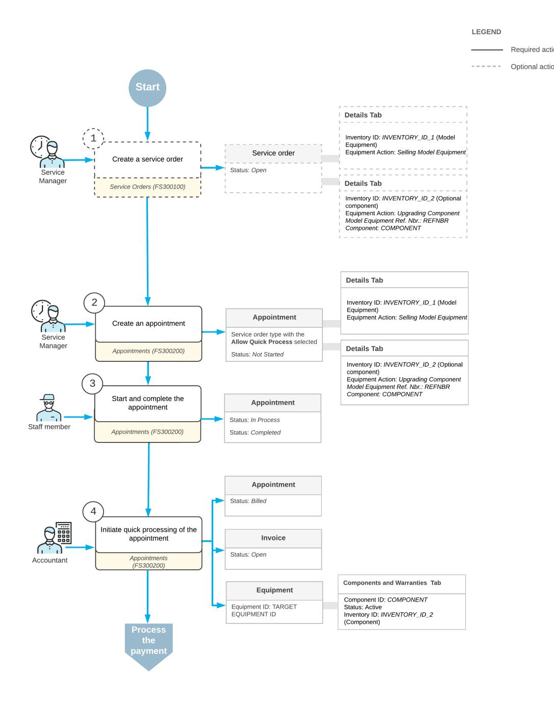

#### *Figure: The sale of model equipment and the upgrading of a default component*

When a customer request is received, a service manager enters a service order on the *[Service Orders](https://help-2025r1.acumatica.com/Help?ScreenId=ShowWiki&pageid=6e5277d3-274e-45f5-b77d-4410ed736d21)* (FS300100) form. In the service order, the service manager specifies the customer from which the request has been received, the branch and branch location to provide services, and the services that should be performed.

The service manager can instead start by creating an appointment with all these settings, and the service order will be created automatically. In *[Upgrading a Default Component of Equipment to Be Sold: Process Activity](#page-52-1)*, the appointment will be created first.

On the *[Appointments](https://help-2025r1.acumatica.com/Help?ScreenId=ShowWiki&pageid=ac486e9c-f5df-4829-94f0-2df8821361a0)* (FS300200) form, in addition to specifying the general settings, the service manager does the following on the **Details** tab to add the model equipment record and the optional component to be sold:

1. In the row with the model equipment record, the service manager selects *Selling Model Equipment* in the **Equipment Action** column.

2. In the row with the component, the service manager selects *Upgrading Component* in the **Equipment Action** column, specifies the related model equipment in the **Model Equipment Ref. Nbr.** column, and selects the identifier of the equipment component in the **Component ID** column.

# **Upgrading a Default Component of Equipment to Be Sold: Process Activity**

The following activity will walk you through the process of selling model equipment, upgrading a default component, and providing installation services at the customer site.

## **Story**

Suppose that the customer has requested the following from the SweetLife Service and Equipment Sales Center:

- The *CPRESS30J - Cold Press Masticating Juicer H3000J* model equipment.
- A replacement of one of the default components of the juicer. The customer wants the *30HOPPERJK - Hopper H30J metallic* component instead of the *HOPPERH3 - Hopper for cold press juicers (plastic)* component.
- Installation services for the juicer and component.

Acting as a service manager, you will create an appointment. You will then perform further processing, acting as the assigned staff member and then as the accountant who will prepare billing documents for the customer and will process them in the system. To keep this training simple, you will perform all instructions while signed in to the account of the service manager (Maia Davis).

## **Process Overview**

On the *[Appointments](https://help-2025r1.acumatica.com/Help?ScreenId=ShowWiki&pageid=ac486e9c-f5df-4829-94f0-2df8821361a0)* (FS300200) form, you will create a new appointment, add the service along with the model equipment and component stock items, specify the equipment-related actions for each item, and process the appointment.

## **System Preparation**

Before you begin performing the steps of this activity, do the following:

- 1. On the Acumatica ERP website, sign in to a company with the *U100* dataset preloaded. You should sign in as a service manager by using the *davis* username and the *123* password.
- 2. In the info area, in the upper-right corner of the top pane of the Acumatica ERP screen, set the business date to *1/30/2025*. For simplicity, in this activity, you will create and process all documents in the system on this business date.
- 3. To perform this activity, make sure that you have performed the following prerequisite activities: *[Stock](#page-19-1) Items to Be Tracked Post-Sale: To Create [Components](#page-19-1)* and *Stock Items to Be Tracked [Post-Sale:](#page-22-1) To Create [Stock Items with Components](#page-22-1)*.

## **Step: Upgrading a Default Component of Equipment to Be Sold**

In this step, you will create an appointment (causing the system to create the corresponding service order) that includes the following items:

- The *INSTALL* installation service
- The *CPRESS30J* inventory item
- The *30HOPPERJK - Hopper H30J metallic hopper*, which replaces the *HOPPERH3 - Hopper for cold press juicers (plastic)* default hopper

You will go through the whole process until you release the corresponding invoice for both the service and the sold equipment.

Perform the following instructions:

- 1. On the *[Appointments](https://help-2025r1.acumatica.com/Help?ScreenId=ShowWiki&pageid=ac486e9c-f5df-4829-94f0-2df8821361a0)* (FS300200) form, click **Add New Record**.
- 2. Specify the following settings in the Summary area:
  - **Service OrderType**: *INST*
  - **Customer ID**: *HMBAKERY - HM's Bakery & Cafe*
  - **Description**: Selling a juicer with upgraded hopper
- 3. On the form toolbar, click**Save**.
- 4. On the **Details** tab, add a row and select the *INSTALL* service in the **Inventory ID** column of the row.
- 5. To add a piece of equipment to this appointment, add another row and specify the following settings in the row:
  - **Inventory ID**: *CPRESS30J*
  - **Equipment Action**: *Selling Model Equipment*
  - **Estimated Quantity**: 1.00
  - **Unit Price**: 800.0000
- 6. On the form toolbar, click**Save**.
- 7. To add another piece of equipment (an optional component) to the appointment, click **Add Row** again and specify the following settings in the row:
  - **Inventory ID**: *30HOPPERJK*
  - **Equipment Action**: *Upgrading Component*

This action registers the component (which replaces the default component) of the piece of model equipment.

• **Model Equipment Ref. Nbr.**: *0002*

This is the piece of model equipment that is being upgraded during the sale of the model equipment.

• **Component ID**: *HOPPER*

This is the identifier of the component being upgraded in the model equipment.

- **Estimated Quantity**: 1.00
- **Unit Price**: 50.0000
- 8. On the form toolbar, click**Save**.
- 9. On the **Staff** tab, click **Add Row** and specify *EP00000003 - Jon Waite* as the **Staff Member**.
- 10.On the form toolbar, click**Save**.
- 11.On the form toolbar, click**Start**.

As you perform this instruction and the next two instructions, you are acting as Jon Waite at the appointment.

- 12.On the **Settings** tab, in the **Actual Date and Time** section, enter the actual start and end times (for simplicity in this training, set them to match the scheduled start and end times). Select the **Finished** check box.
- 13.Click **Complete**.
- 14.Click **Close**.

As you perform this instruction and the remaining instructions of the activity, you are now acting as an accountant.

15.On the form toolbar, click **Quick Process**.

In the **Process Appointment** dialog box, which opens, ensure that the following check boxes are selected:

- **Run Billing**
- **Release Invoice**

16.Click **OK**.

Once the billing process is completed, the reference numbers of the billing documents appear in the **Processing Results** dialog box. Click **OK**.

Notice that the appointment now has the *Billed* status.

- 17.On the **Billing Documents** tab, click the reference number of the sales invoice in the **Reference Nbr.** column. The system opens the *[Invoices](https://help-2025r1.acumatica.com/Help?ScreenId=ShowWiki&pageid=0acc9738-f141-4ea0-a2be-f34ea9d1b63a)* (SO303000) form. Review the details of the generated invoice. Notice that the invoice has been released and has the *Open* status, which means that the target equipment record has been created.
- 18.In the **Target Equipment** column, click the reference number (which is also a link) of the equipment to open the *[Equipment](https://help-2025r1.acumatica.com/Help?ScreenId=ShowWiki&pageid=43b7c838-3051-4238-87db-e9b9c213894e)* (FS205000) form.
- 19.On the **Components and Warranties** tab, verify that the system has replaced the default hopper with the component (*30HOPPERJK - Hopper H30J metallic*) that you selected when you created the appointment (see the following screenshot).

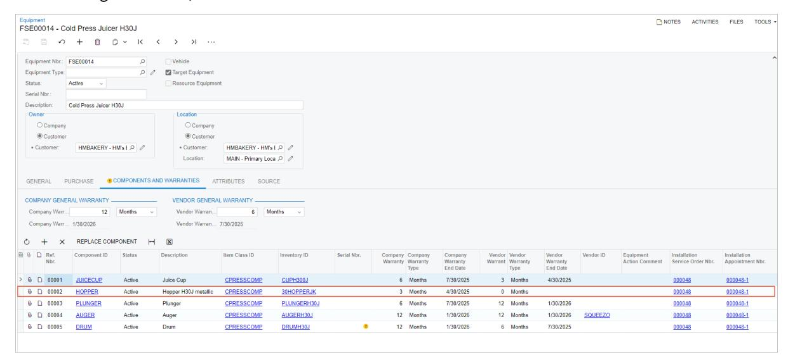

*Figure: The equipment record with the non-default component*

# **Replacing Target Equipment**

In Acumatica ERP, you can process the replacement of old equipment with new models and manage the associated services. To do this, you will specify the *Replacing Target Equipment* equipment-related action for the selected stock item in an appointment created on the *[Appointments](https://help-2025r1.acumatica.com/Help?ScreenId=ShowWiki&pageid=ac486e9c-f5df-4829-94f0-2df8821361a0)* (FS300200) form.

# **Replacing Target Equipment: General Information**

With Acumatica ERP, you can efficiently manage customer requests for replacing old target equipment with new models and performing the associated services.

## **Learning Objectives**

In this lesson, you will learn how to replace target equipment.

## **Applicable Scenarios**

You process the replacement of target equipment in the following scenarios:

- A customer requests a new piece of equipment to replace an older model that is already in use.
- Replacement services are required to ensure seamless equipment transition at the customer's location.

In these situations, the service manager schedules an appointment, coordinates service actions, and collaborates with accounting to prepare and process billing documents for the customer.

## **Workflow of Target Equipment Replacement**

In the following diagram, you can see the complete process of replacing target equipment.

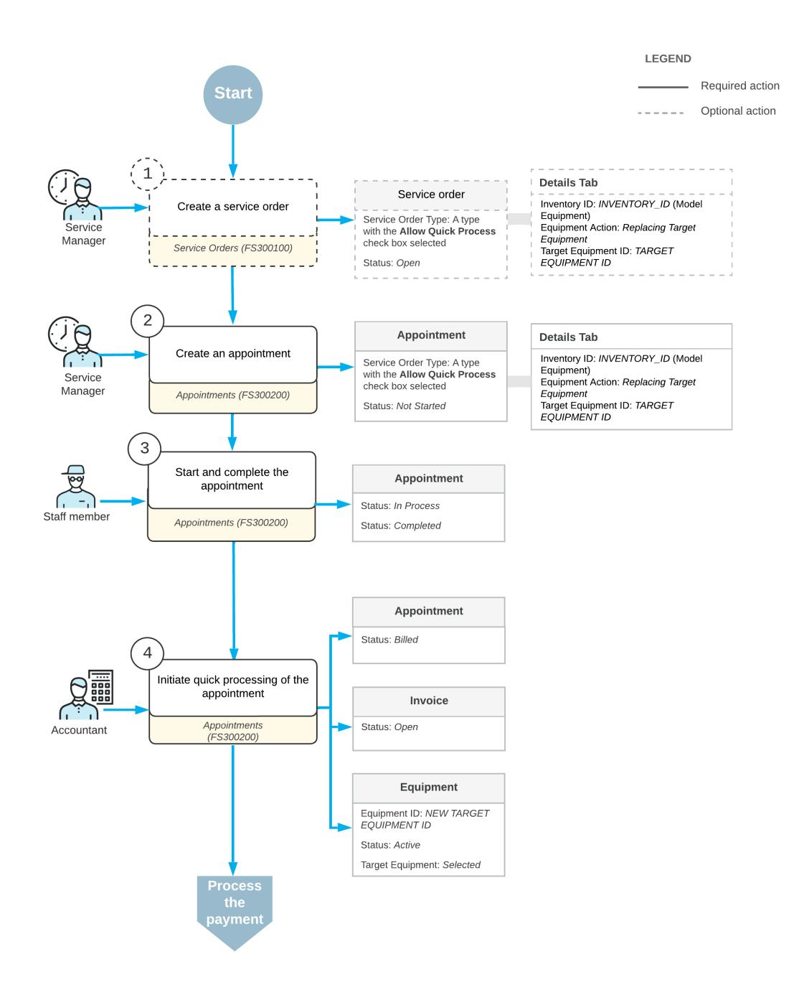

#### *Figure: Replacement of target equipment*

When a customer request is received, a service manager enters a service order by using the *[Service Orders](https://help-2025r1.acumatica.com/Help?ScreenId=ShowWiki&pageid=6e5277d3-274e-45f5-b77d-4410ed736d21)* (FS300100) form. In the service order, the service manager specifies the customer from which the request has been received, the branch and branch location to provide services, and the services that should be performed.

The service manager can instead start by creating an appointment with all these settings; the service order will be created automatically. In *Replacing Target [Equipment:](#page-57-1) Process Activity*, the appointment will be created first.

On the *[Appointments](https://help-2025r1.acumatica.com/Help?ScreenId=ShowWiki&pageid=ac486e9c-f5df-4829-94f0-2df8821361a0)* (FS300200) form, the service manager enters the general settings. On the **Details** tab, the service manager adds the equipment record that will replace the old target equipment record. To specify that the replacement is being performed, for the equipment record, the service manager selects *Replacing Target Equipment* in the **Equipment Action** column and specifies the target equipment record to be replaced in the**Target Equipment ID** column.

# **Replacing Target Equipment: Process Activity**

The following activity will walk you through the process of replacing old equipment with a new model and managing the associated service.

## **Story**

Suppose that the HM's Bakery & Cafe customer has requested a new piece of equipment (*J22C Multifruit Centrifugal Juicer*) to replace an old one, along with replacement services from SweetLife Service and Equipment Sales Center.

Acting as a service manager, you will create an appointment. You will then perform further processing, acting as the assigned staff member and then as the accountant who will prepare billing documents for the customer and will process them in the system. To keep this training simple, you will perform all instructions while signed in to the user account of the service manager (Maia Davis).

## **Process Overview**

On the *[Appointments](https://help-2025r1.acumatica.com/Help?ScreenId=ShowWiki&pageid=ac486e9c-f5df-4829-94f0-2df8821361a0)* (FS300200) form, you will create a new appointment, add the service along with the necessary stock item (which is defined as model equipment), specify the required equipment-related action for the item, and then process the appointment.

## **System Preparation**

Before you begin performing the steps of this activity, do the following:

- 1. On the Acumatica ERP website, sign in to a company with the *U100* dataset preloaded. You should sign in as a service manager by using the *davis* username and the *123* password.
- 2. In the info area, in the upper-right corner of the top pane of the Acumatica ERP screen, set the business date to *1/30/2025*. For simplicity, in this activity, you will create and process all documents in the system on this business date.
- 3. To perform this activity, make sure that you have performed the following prerequisite activities: *[Stock](#page-17-1) Items to Be Tracked Post-Sale: To Create a Stock Item with No [Components](#page-17-1)*, *Stock Items to Be [Tracked](#page-19-1) Post-Sale: To Create [Components](#page-19-1)*, and *Stock Items to Be Tracked [Post-Sale:](#page-22-1) To Create Stock Items with [Components](#page-22-1)*.

## **Step: Replacing Target Equipment**

In this step, you will create an appointment (which causes the system to create the corresponding service order) that includes the *INSTALL* service and the *Multifruit Centrifugal Juicer J22C* inventory item, which replaces the target equipment. You will go through the whole process until you release the corresponding invoice for both the service and the sold equipment.

Perform the following instructions:

- 1. On the *[Appointments](https://help-2025r1.acumatica.com/Help?ScreenId=ShowWiki&pageid=ac486e9c-f5df-4829-94f0-2df8821361a0)* (FS300200) form, click **Add New Record**.
- 2. Specify the following settings in the Summary area:
  - **Service OrderType**: *INST*
  - **Customer**: *HMBAKERY - HM's Bakery & Cafe*
  - **Description**: Replacing a juicer
- 3. On the form toolbar, click**Save**.
- 4. On the **Details** tab, do the following:

- a. Add a row and select *INSTALL* in the **Inventory ID** column.
- b. To add model equipment to this appointment, add another row and specify the following settings in the row:
  - **Inventory ID**: *JUICE\_J22C*
  - **Equipment Action**: *Replacing Target Equipment*
  - **Target Equipment ID**: *FSE00012* (*Multifruit Centrifugal Juicer J22C*)
  - **Estimated Quantity**: 1.00
  - **Unit Price**: 700.0000
- 5. On the form toolbar, click**Save**.

Now you can assign the appointment and proceed with the service.

- 6. On the **Staff** tab, click **Add Row** and specify *EP00000003 - Jon Waite* as the **Staff Member**.
- 7. On the form toolbar, click**Save**.
- 8. On the form toolbar, click**Start**.

As you perform this instruction and the next two instructions, you are acting as Jon Waite at the appointment.

- 9. On the **Settings** tab, in the **Actual Date and Time** section, enter the actual start and end times (for simplicity in this training, set them to match the scheduled start and end times). Select the **Finished** check box.
- 10.On the form toolbar, click **Complete**.
- 11.On the form toolbar, click **Close**.

As you perform this instruction and the remaining instructions of the activity, you are now acting as an accountant.

12.On the form toolbar, click **Quick Process**.

In the **Process Appointment** dialog box, which opens, ensure that the following check boxes are selected:

- **Run Billing**
- **Release Invoice**
- 13.In the dialog box, click **OK**.

Once the billing process is completed, the reference number of the invoice appears in the **Processing Results** dialog box.

Notice that the appointment now has the *Billed* status.

- 14.In the **Processing Results** dialog box, click the reference number of the invoice. The *[Invoices](https://help-2025r1.acumatica.com/Help?ScreenId=ShowWiki&pageid=0acc9738-f141-4ea0-a2be-f34ea9d1b63a)* (SO303000) form opens. Notice that the invoice has been released and has the *Open* status, which means that the target equipment record has been assigned the *Disposed* status and the new equipment has been created.
- 15.On the *[Invoices](https://help-2025r1.acumatica.com/Help?ScreenId=ShowWiki&pageid=0acc9738-f141-4ea0-a2be-f34ea9d1b63a)* form, in the**Suspended Target Equipment ID** column, click the reference number of the equipment (which is a link) to open the *[Equipment](https://help-2025r1.acumatica.com/Help?ScreenId=ShowWiki&pageid=43b7c838-3051-4238-87db-e9b9c213894e)* (FS205000) form.

16.Verify that the status of the equipment is *Disposed* (see the following screenshot).

|                                                             | FSE00012 - Multifruit Centrifugal Juicer J22C |                                                                            |                                              |   |
|-------------------------------------------------------------|-----------------------------------------------|----------------------------------------------------------------------------|----------------------------------------------|---|
| 뭐 $\Box$ ↶                                            | 冊 n v К                                 | $\checkmark$ >1 $\rightarrow$                                        | .                                            |   |
| Equipment Nbr.: FSE00012                                    | $\varnothing$                                 | Vehicle                                                                    |                                              |   |
| Equipment Type:                                             | $\mathcal{Q}$ 0                            | V Target Equipment                                                         |                                              |   |
| Status:                                                     | <b>Disposed</b> $\checkmark$               | Resource Equipment                                                         |                                              |   |
| Serial Nbr.:                                                |                                               |                                                                            |                                              |   |
| Description:                                                | Multifruit Centrifugal Juicer J22C            |                                                                            |                                              |   |
| Owner                                                       |                                               | Location                                                                   |                                              |   |
| $\bigcirc$ Company                                          |                                               | $\bigcirc$ Company                                                         |                                              |   |
| © Customer                                                  |                                               | Customer                                                                   |                                              |   |
| * Customer:                                                 | HMBAKERY - HM's [ O   O                       | * Customer:                                                                | HMBAKERY - HM's [ O   O                      |   |
|                                                             |                                               | Location:                                                                  | MAIN - Primary Loca Q 2                      |   |
| Registered Date: Registration N Barcode: Tag Nbr.: | $\Box$                                        | <b>MANUFACTURER INFO</b> Manufacturer: Manufacturer Manufacturing | JUICEAPP - Juice Appliances C 2              | 0 |
| Sales Date:                                                 | 自                                             | <b>INVENTORY INFO</b>                                                      |                                              |   |
| Color:                                                      | $\checkmark$                                  |                                                                            | Model Equipm JUICE J22C - Multifruit Centr Q | 0 |
|                                                             |                                               |                                                                            |                                              | 0 |
| <b>INSTALLATION INFO _</b>                                  |                                               | Warehouse:                                                                 |                                              |   |
| Installation Date: 1/30/2025                                | 自                                             | Warehouse Lo                                                               |                                              | 0 |
| Service Order                                               |                                               | Model Serial N                                                             |                                              |   |
| Appointment N                                               |                                               |                                                                            |                                              |   |
| <b>DISPOSAL INFO</b>                                        |                                               |                                                                            |                                              |   |
| <b>Disposal Date:</b>                                       | 1/30/2025 ₿                                |                                                                            |                                              |   |
| Replacement                                                 | FSE00015 - Multifruit Centrifu Q 2            |                                                                            |                                              |   |
| Service Order                                               | 000049 - Replacing a juicer                   |                                                                            |                                              |   |

#### *Figure: Disposed equipment*

- 17.Close the *[Equipment](https://help-2025r1.acumatica.com/Help?ScreenId=ShowWiki&pageid=43b7c838-3051-4238-87db-e9b9c213894e)* form.
- 18.On the *[Invoices](https://help-2025r1.acumatica.com/Help?ScreenId=ShowWiki&pageid=0acc9738-f141-4ea0-a2be-f34ea9d1b63a)* form, click the equipment reference number in the**Target Equipment ID** column.
- 19.On the *[Equipment](https://help-2025r1.acumatica.com/Help?ScreenId=ShowWiki&pageid=43b7c838-3051-4238-87db-e9b9c213894e)* that opens, review the details of the created equipment. In the **Installation Info** section of the **General** tab, you can find the reference numbers of the related service order and appointment.
- 20.Go to the**Source** tab (see Item 1 in the following screenshot). In the **Equipment Replaced** box (Item 2), you can find the reference number of the equipment that was replaced with the current one.

| Equipment FSE00015 - Multifruit Centrifugal Juicer J22C 풔 $\boxdot$ $\Omega$ | $+$                                | 冊            | $\bigcap$ $\checkmark$                              | $\overline{\mathsf{K}}$ | $\sim$ $\sim$ | $\rightarrow$                 | $\rightarrow$                                                          | $\cdots$           |                                                  |  |  |  |  |
|------------------------------------------------------------------------------------------|------------------------------------|--------------|-----------------------------------------------------|-------------------------|---------------|-------------------------------|------------------------------------------------------------------------|--------------------|--------------------------------------------------|--|--|--|--|
| Equipment Nbr.: FSE00015 Equipment Type: Status: Serial Nbr.:                   | Active                             | $\checkmark$ |                                                     | $\varnothing$ 00     |               | Vehicle V Target Equipment |                                                                        | Resource Equipment |                                                  |  |  |  |  |
| Description: Owner $\bigcirc$ Company © Customer * Customer:                 | Multifruit Centrifugal Juicer J22C |              | HMBAKERY - HM's [ O   O                             |                         |               |                               | Location $\bigcirc$ Company Customer * Customer: Location: |                    | HMBAKERY - HM's I Q Q MAIN - Primary Loca Q 2 |  |  |  |  |
| <b>GENERAL</b> Document Type: Document Ref. Nbr.:                                  | <b>PURCHASE</b>                    |              | COMPONENTS AND WARRANTIES AR - Invoice 000124 |                         |               |                               |                                                                        |                    | <b>SOURCE</b> <b>ATTRIBUTES</b>               |  |  |  |  |
| Sales Order Nbr.: Equipment Replaced:                                                 |                                    |              | FSE00012                                            |                         |               |                               |                                                                        |                    |                                                  |  |  |  |  |
|                                                                                          |                                    |              |                                                     |                         |               |                               |                                                                        |                    |                                                  |  |  |  |  |
|                                                                                          |                                    |              |                                                     |                         |               |                               |                                                                        |                    |                                                  |  |  |  |  |

*Figure: Settings related to the replaced equipment*

# **Replacing a Component of Target Equipment**

In Acumatica ERP, you can process the replacement of a component in existing equipment and coordinate the associated replacement services. To do this, you will specify the *Replacing Component* equipment-related action for the selected stock item in an appointment created on the *[Appointments](https://help-2025r1.acumatica.com/Help?ScreenId=ShowWiki&pageid=ac486e9c-f5df-4829-94f0-2df8821361a0)* (FS300200) form.

# **Replacing a Component of Target Equipment: General Information**

With Acumatica ERP, you can manage customer requests for replacing components in existing equipment and performing the necessary replacement services on-site.

## **Learning Objectives**

In this lesson, you will learn how to replace a component of target equipment.

## **Applicable Scenarios**

You replace a component of target equipment in the following cases:

- A customer requests the replacement of a specific component within existing target equipment they already own.
- Replacement services are required to install the new component in the equipment at the customer's site.

## **Workflow of Target Equipment Component Replacement**

In the following diagram, you can see the entire process of a component of target equipment being replaced.

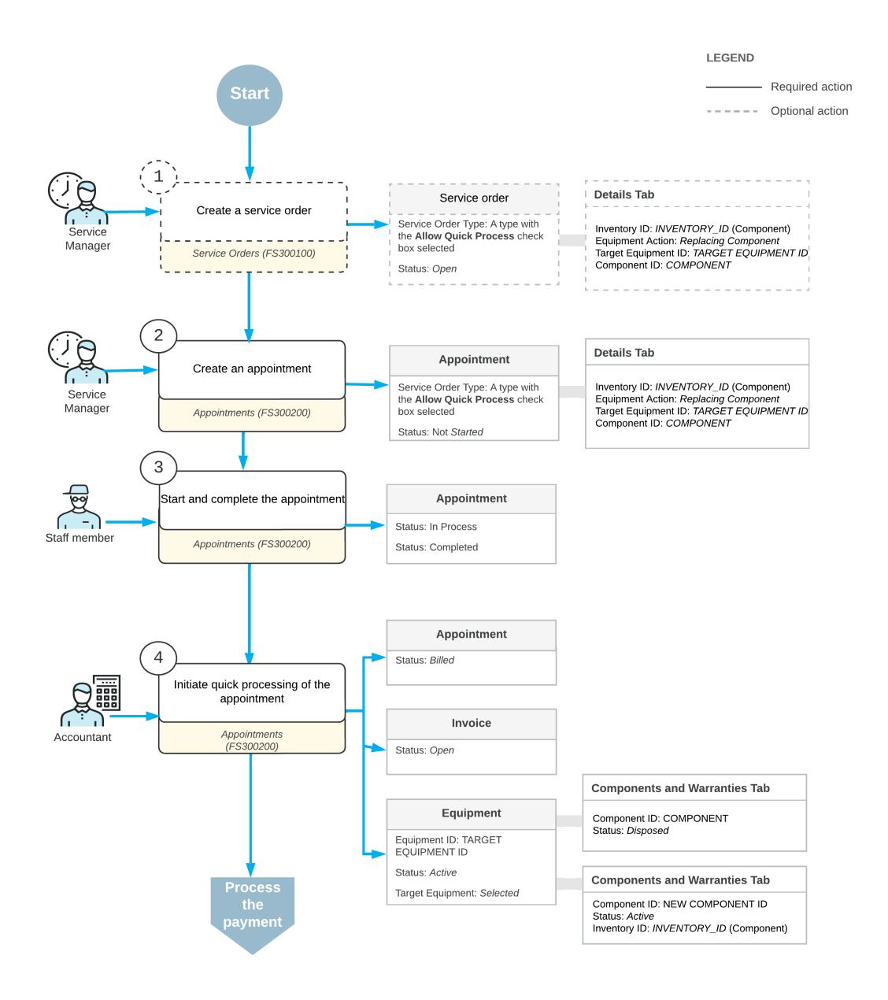

#### *Figure: Replacement of a component of target equipment*

When a customer request is received, a service manager enters a service order by using the *[Service Orders](https://help-2025r1.acumatica.com/Help?ScreenId=ShowWiki&pageid=6e5277d3-274e-45f5-b77d-4410ed736d21)* (FS300100) form. In the service order, the service manager specifies the customer from which the request has been received, the branch and branch location to provide services, and the services that should be performed.

The service manager can instead start by creating an appointment with all these settings; the service order will be created automatically. In *Replacing a [Component](#page-63-1) of Target Equipment: Process Activity*, the appointment will be created first.

On the *[Appointments](https://help-2025r1.acumatica.com/Help?ScreenId=ShowWiki&pageid=ac486e9c-f5df-4829-94f0-2df8821361a0)* (FS300200) form, the service manager enters the general settings. On the **Details** tab, the service manager adds the component that will replace the old component. To specify that the replacement is being performed, for the new component, the service manager selects *Replacing Component* in the **Equipment Action** column, specifies the target equipment record in which the component has to be replaced in the**Target Equipment ID** column and specifies the component to be replaced in the **Component Ref. Nbr.** column.

The remainder of the process of target equipment being replaced is identical to the process of model equipment being replaced.

# **Replacing a Component of Target Equipment: Process Activity**

The following activity will walk you through the process of replacing a component in existing equipment and coordinating the associated replacement services.

## **Story**

Suppose that the GoodFood One Restaurant customer has requested a new component (a new drum) to replace an old one in the existing target equipment (*CPRESS30J - Cold Press Juicer H30J*), along with replacement services from SweetLife Service and Equipment Sales Center.

Acting as a service manager, you will create an appointment. You will then perform further processing, acting as the assigned staff member and then as the accountant who will prepare billing documents for the customer and will process them in the system. To keep this training simple, you will perform all instructions while signed in to the user account of the service manager (Maia Davis).

## **Process Overview**

On the *[Appointments](https://help-2025r1.acumatica.com/Help?ScreenId=ShowWiki&pageid=ac486e9c-f5df-4829-94f0-2df8821361a0)* (FS300200) form, you will create a new appointment, add the service along with the stock item of the **Component** equipment class, specify the required equipment-related action for the item, and then process the appointment.

## **System Preparation**

Before you begin performing the steps of this activity, do the following:

- 1. On the Acumatica ERP website, sign in to a company with the *U100* dataset preloaded. You should sign in as a service manager by using the *davis* username and the *123* password.
- 2. In the info area, in the upper-right corner of the top pane of the Acumatica ERP screen, set the business date to *1/30/2025*. For simplicity, in this activity, you will create and process all documents in the system on this business date.
- 3. To perform this activity, make sure that you have performed the following prerequisite activity: *[Stock Items](#page-19-1) to Be Tracked Post-Sale: To Create [Components](#page-19-1)*, *Stock Items to Be Tracked [Post-Sale:](#page-22-1) To Create Stock Items [with Components](#page-22-1)*.

## **Step: Replacing a Component of Target Equipment**

In this step, you will create an appointment (causing the system to create the corresponding service order) that includes the *REPAIR* service and the *DRUMH30J* inventory item, which replaces the target equipment. You will go through the whole process until you release the corresponding invoice for both the service and the replaced component.

Perform the following instructions:

- 1. On the *[Appointments](https://help-2025r1.acumatica.com/Help?ScreenId=ShowWiki&pageid=ac486e9c-f5df-4829-94f0-2df8821361a0)* (FS300200) form, click **Add New Record**.
- 2. Specify the following settings in the Summary areas:
  - **Service OrderType**: *INST*
  - **Customer ID**: *GOODFOOD - GoodFood One Restaurant*
  - **Description**: Replacing a part of a juicer
- 3. On the form toolbar, click**Save**.
- 4. On the **Details** tab, add a row with the following settings:

- **Inventory ID**: *REPAIR*
- **Target Equipment ID**: *FSE00011* (Cold Press Juicer H30J)
- 5. On the form toolbar, click**Save**.
- 6. To add a component to this appointment, add another row, and specify the following settings in the row:
  - **Inventory ID**: *DRUMH30J*
  - **Equipment Action**: *Replacing Component*
  - **Target Equipment ID**: *FSE00011* (Cold Press Juicer H30J)
  - **Component ID**: *DRUM*
  - **Component Ref. Nbr.**: *00005*
  - **Estimated Quantity**: 1.00
  - **Unit Price**: 100.0000
- 7. On the form toolbar, click**Save**.

Notice that the **Warranty** check box is selected in the *DRUM* row, meaning that it is under warranty.

- 8. On the **Staff** tab, click **Add Row**, and specify *EP00000044 - Ricardo Martinez* as the **Staff Member**.
- 9. On the form toolbar, click**Save**.
- 10.On the form toolbar, click**Start**.

(As you perform this instruction, you are acting as Ricardo Martinez at the appointment.)

- 11.On the **Settings** tab, in the **Actual Date and Time** section, enter the actual start and end times (for simplicity in this training, set them to match the scheduled start and end times). Select the **Finished** check box.
- 12.On the form toolbar, click **Complete**.
- 13.On the form toolbar, click **Close**.

(As you perform this instruction, you are now acting as an accountant.)

14.On the form toolbar, click **Quick Process**.

In the **Process Appointment** dialog box, which opens, ensure that the following check boxes are selected:

- **Run Billing**
- **Release Invoice**
- 15.In the dialog box, click **OK**.

Once the billing process is completed, the reference number of the invoice appears in the **Processing Results** dialog box.

Notice that the appointment now has the *Billed* status.

- 16.In the **Processing Results** dialog box, click the reference number of the invoice. The *[Invoices](https://help-2025r1.acumatica.com/Help?ScreenId=ShowWiki&pageid=0acc9738-f141-4ea0-a2be-f34ea9d1b63a)* (SO303000) form opens. Notice the invoice has been released and has the *Open* status, which means that the target equipment record has been updated.
- 17.In the **Target Equipment** column on the **Details** tab, click the equipment reference number (which is a link) to open the *[Equipment](https://help-2025r1.acumatica.com/Help?ScreenId=ShowWiki&pageid=43b7c838-3051-4238-87db-e9b9c213894e)* (FS205000) form.
- 18.On the **Components and Warranties** tab, verify that the status of the *00005* line is *Disposed* (see the following screenshot). It has been replaced with line *00006*.

You can also replace a component of a piece of target equipment by clicking the **Replace Component** button on the table toolbar of the **Components and Warranties** tab on the *[Equipment](https://help-2025r1.acumatica.com/Help?ScreenId=ShowWiki&pageid=43b7c838-3051-4238-87db-e9b9c213894e)* form. In the dialog box that opens, you can manually select the installation and sales dates of the component being replaced.

| Equipment <b>NOTES</b> <b>ACTIVITIES</b> <b>FILES</b> $TOOLS$ $\star$ FSE00011 - Cold Press Juicer H30J a a 面 $\begin{array}{cccccccccccccccccccccccccccccccccccccccccccccccccccccccccccccccccccccccccccccccccccccccccccccccccccccccccccccccccccccccccccccccccccccccccccccccc$ $+$ $\Omega$ $\hat{\phantom{a}}$ Equipment Nbr.: FSE00011 $\Box$ Vehicle $\mathcal{L}$ $\Omega$ Target Equipment Equipment Type: Active Resource Equipment Status: $\sim$ Serial Nbr. Description: Cold Press Juicer H30J Owner Location Company Company Customer Customer GOODFOOD - Good Q * Customer: GOODFOOD - Good P * Customer: MAIN - Primary Loca Q Q Location: <b>COMPONENTS AND WARRANTIES</b> PURCHASE <b>ATTRIBUTES</b> SOURCE <b>GENERAL</b> COMPANY GENERAL WARRANTY <b>VENDOR GENERAL WARRANTY</b> 12 Months Vendor Warran Months ~ Company Warr 6 $\sim$ Vendor Warran 7/30/2025 Company Warr 1/30/2026 <b>REPLACE COMPONENT</b> $\mathbb{H}$ $\overline{\mathbf{x}}$ Ò $\times$ $\pm$ D Ref. Item Class ID Vendor <b>Status</b> Inventory ID Serial Nbr. Vendor Vendor Vendor ID Installation Component ID <b>Description</b> Company Company Company Equipment Installation Component Warranty Warranty Nbr. Warranty Warrant Warranty Warranty <b>Action Comment</b> Service Order Nbr. Appointment Nbr. Replaced <b>End Date</b> <b>End Date</b> Type Type <b>JUICECUP</b> !!!!!!!!!!!!!!!!!!!!!!!!!!!!!!!!!!!!!!!! CUPH300J 6 Months $D = 00001$ Juice Cup 7/30/2025 3 Months 4/30/2025 Active 4/30/2025 $\Box$ 00002 <b>HOPPER</b> Active Hopper !!!!!!!!!!!!!!!!!!!!!!!!!!!!!!!!!!!!!!!! 3 Months 0 Months HOPPERH3 $\Box$ 00003 <b>PLUNGER</b> CPRESSCOMP PLUNGERH30J 6 Months 7/30/2025 12 Months 1/30/2026 Active Plunger 1/30/2026 1/30/2026 <b>SQUEEZO</b> $D = 00004$ <b>AUGER</b> Active !!!!!!!!!!!!!!!!!!!!!!!!!!!!!!!!!!!!!!!! AUGERH30J 12 Months 12 Months Auger 12345 !!!!!!!!!!!!!!!!!!!!!!!!!!!!!!!!!!!!!!!! !!!!!!!!!!!!!!!!!!!!!!!!!!!!!!!!!!!!!!!! !!!!!!!!!!!!!!!!!!!!!!!!!!!!!!!!!!!!!!!! DRUMH30J 12 Months 1/30/2026 6 Months 7/30/2025 <b>DRUM</b> <b>Disposed</b> Drum 1/30/2026 000050-1 $\Box$ 00006 <b>DRUM</b> Active Drum H30J CPRESSCOMP DRUMH30J 12 Months 6 Months 7/30/2025 |     |  |  |  |  |  |  |  |  |  |  |  |  |  |  |  |  |  |
|------------------------------------------------------------------------------------------------------------------------------------------------------------------------------------------------------------------------------------------------------------------------------------------------------------------------------------------------------------------------------------------------------------------------------------------------------------------------------------------------------------------------------------------------------------------------------------------------------------------------------------------------------------------------------------------------------------------------------------------------------------------------------------------------------------------------------------------------------------------------------------------------------------------------------------------------------------------------------------------------------------------------------------------------------------------------------------------------------------------------------------------------------------------------------------------------------------------------------------------------------------------------------------------------------------------------------------------------------------------------------------------------------------------------------------------------------------------------------------------------------------------------------------------------------------------------------------------------------------------------------------------------------------------------------------------------------------------------------------------------------------------------------------------------------------------------------------------------------------------------------------------------------------------------------------------------------------------------------------------------------------------------------------------------------------------------------------------------------------------------------------------------------------------------------------------------------------------------------------------------------------------------------------------------------------------------------------------------------------------------------------------------------------------------------------------------------------------------------------------------------------------------------------------------------------------------------------------------------------------------------------------------------------------------------------|-----|--|--|--|--|--|--|--|--|--|--|--|--|--|--|--|--|--|
|                                                                                                                                                                                                                                                                                                                                                                                                                                                                                                                                                                                                                                                                                                                                                                                                                                                                                                                                                                                                                                                                                                                                                                                                                                                                                                                                                                                                                                                                                                                                                                                                                                                                                                                                                                                                                                                                                                                                                                                                                                                                                                                                                                                                                                                                                                                                                                                                                                                                                                                                                                                                                                                                                    |     |  |  |  |  |  |  |  |  |  |  |  |  |  |  |  |  |  |
|                                                                                                                                                                                                                                                                                                                                                                                                                                                                                                                                                                                                                                                                                                                                                                                                                                                                                                                                                                                                                                                                                                                                                                                                                                                                                                                                                                                                                                                                                                                                                                                                                                                                                                                                                                                                                                                                                                                                                                                                                                                                                                                                                                                                                                                                                                                                                                                                                                                                                                                                                                                                                                                                                    |     |  |  |  |  |  |  |  |  |  |  |  |  |  |  |  |  |  |
|                                                                                                                                                                                                                                                                                                                                                                                                                                                                                                                                                                                                                                                                                                                                                                                                                                                                                                                                                                                                                                                                                                                                                                                                                                                                                                                                                                                                                                                                                                                                                                                                                                                                                                                                                                                                                                                                                                                                                                                                                                                                                                                                                                                                                                                                                                                                                                                                                                                                                                                                                                                                                                                                                    |     |  |  |  |  |  |  |  |  |  |  |  |  |  |  |  |  |  |
|                                                                                                                                                                                                                                                                                                                                                                                                                                                                                                                                                                                                                                                                                                                                                                                                                                                                                                                                                                                                                                                                                                                                                                                                                                                                                                                                                                                                                                                                                                                                                                                                                                                                                                                                                                                                                                                                                                                                                                                                                                                                                                                                                                                                                                                                                                                                                                                                                                                                                                                                                                                                                                                                                    |     |  |  |  |  |  |  |  |  |  |  |  |  |  |  |  |  |  |
|                                                                                                                                                                                                                                                                                                                                                                                                                                                                                                                                                                                                                                                                                                                                                                                                                                                                                                                                                                                                                                                                                                                                                                                                                                                                                                                                                                                                                                                                                                                                                                                                                                                                                                                                                                                                                                                                                                                                                                                                                                                                                                                                                                                                                                                                                                                                                                                                                                                                                                                                                                                                                                                                                    |     |  |  |  |  |  |  |  |  |  |  |  |  |  |  |  |  |  |
|                                                                                                                                                                                                                                                                                                                                                                                                                                                                                                                                                                                                                                                                                                                                                                                                                                                                                                                                                                                                                                                                                                                                                                                                                                                                                                                                                                                                                                                                                                                                                                                                                                                                                                                                                                                                                                                                                                                                                                                                                                                                                                                                                                                                                                                                                                                                                                                                                                                                                                                                                                                                                                                                                    |     |  |  |  |  |  |  |  |  |  |  |  |  |  |  |  |  |  |
|                                                                                                                                                                                                                                                                                                                                                                                                                                                                                                                                                                                                                                                                                                                                                                                                                                                                                                                                                                                                                                                                                                                                                                                                                                                                                                                                                                                                                                                                                                                                                                                                                                                                                                                                                                                                                                                                                                                                                                                                                                                                                                                                                                                                                                                                                                                                                                                                                                                                                                                                                                                                                                                                                    |     |  |  |  |  |  |  |  |  |  |  |  |  |  |  |  |  |  |
|                                                                                                                                                                                                                                                                                                                                                                                                                                                                                                                                                                                                                                                                                                                                                                                                                                                                                                                                                                                                                                                                                                                                                                                                                                                                                                                                                                                                                                                                                                                                                                                                                                                                                                                                                                                                                                                                                                                                                                                                                                                                                                                                                                                                                                                                                                                                                                                                                                                                                                                                                                                                                                                                                    |     |  |  |  |  |  |  |  |  |  |  |  |  |  |  |  |  |  |
|                                                                                                                                                                                                                                                                                                                                                                                                                                                                                                                                                                                                                                                                                                                                                                                                                                                                                                                                                                                                                                                                                                                                                                                                                                                                                                                                                                                                                                                                                                                                                                                                                                                                                                                                                                                                                                                                                                                                                                                                                                                                                                                                                                                                                                                                                                                                                                                                                                                                                                                                                                                                                                                                                    |     |  |  |  |  |  |  |  |  |  |  |  |  |  |  |  |  |  |
|                                                                                                                                                                                                                                                                                                                                                                                                                                                                                                                                                                                                                                                                                                                                                                                                                                                                                                                                                                                                                                                                                                                                                                                                                                                                                                                                                                                                                                                                                                                                                                                                                                                                                                                                                                                                                                                                                                                                                                                                                                                                                                                                                                                                                                                                                                                                                                                                                                                                                                                                                                                                                                                                                    |     |  |  |  |  |  |  |  |  |  |  |  |  |  |  |  |  |  |
|                                                                                                                                                                                                                                                                                                                                                                                                                                                                                                                                                                                                                                                                                                                                                                                                                                                                                                                                                                                                                                                                                                                                                                                                                                                                                                                                                                                                                                                                                                                                                                                                                                                                                                                                                                                                                                                                                                                                                                                                                                                                                                                                                                                                                                                                                                                                                                                                                                                                                                                                                                                                                                                                                    |     |  |  |  |  |  |  |  |  |  |  |  |  |  |  |  |  |  |
|                                                                                                                                                                                                                                                                                                                                                                                                                                                                                                                                                                                                                                                                                                                                                                                                                                                                                                                                                                                                                                                                                                                                                                                                                                                                                                                                                                                                                                                                                                                                                                                                                                                                                                                                                                                                                                                                                                                                                                                                                                                                                                                                                                                                                                                                                                                                                                                                                                                                                                                                                                                                                                                                                    |     |  |  |  |  |  |  |  |  |  |  |  |  |  |  |  |  |  |
|                                                                                                                                                                                                                                                                                                                                                                                                                                                                                                                                                                                                                                                                                                                                                                                                                                                                                                                                                                                                                                                                                                                                                                                                                                                                                                                                                                                                                                                                                                                                                                                                                                                                                                                                                                                                                                                                                                                                                                                                                                                                                                                                                                                                                                                                                                                                                                                                                                                                                                                                                                                                                                                                                    |     |  |  |  |  |  |  |  |  |  |  |  |  |  |  |  |  |  |
|                                                                                                                                                                                                                                                                                                                                                                                                                                                                                                                                                                                                                                                                                                                                                                                                                                                                                                                                                                                                                                                                                                                                                                                                                                                                                                                                                                                                                                                                                                                                                                                                                                                                                                                                                                                                                                                                                                                                                                                                                                                                                                                                                                                                                                                                                                                                                                                                                                                                                                                                                                                                                                                                                    |     |  |  |  |  |  |  |  |  |  |  |  |  |  |  |  |  |  |
|                                                                                                                                                                                                                                                                                                                                                                                                                                                                                                                                                                                                                                                                                                                                                                                                                                                                                                                                                                                                                                                                                                                                                                                                                                                                                                                                                                                                                                                                                                                                                                                                                                                                                                                                                                                                                                                                                                                                                                                                                                                                                                                                                                                                                                                                                                                                                                                                                                                                                                                                                                                                                                                                                    |     |  |  |  |  |  |  |  |  |  |  |  |  |  |  |  |  |  |
|                                                                                                                                                                                                                                                                                                                                                                                                                                                                                                                                                                                                                                                                                                                                                                                                                                                                                                                                                                                                                                                                                                                                                                                                                                                                                                                                                                                                                                                                                                                                                                                                                                                                                                                                                                                                                                                                                                                                                                                                                                                                                                                                                                                                                                                                                                                                                                                                                                                                                                                                                                                                                                                                                    |     |  |  |  |  |  |  |  |  |  |  |  |  |  |  |  |  |  |
|                                                                                                                                                                                                                                                                                                                                                                                                                                                                                                                                                                                                                                                                                                                                                                                                                                                                                                                                                                                                                                                                                                                                                                                                                                                                                                                                                                                                                                                                                                                                                                                                                                                                                                                                                                                                                                                                                                                                                                                                                                                                                                                                                                                                                                                                                                                                                                                                                                                                                                                                                                                                                                                                                    |     |  |  |  |  |  |  |  |  |  |  |  |  |  |  |  |  |  |
|                                                                                                                                                                                                                                                                                                                                                                                                                                                                                                                                                                                                                                                                                                                                                                                                                                                                                                                                                                                                                                                                                                                                                                                                                                                                                                                                                                                                                                                                                                                                                                                                                                                                                                                                                                                                                                                                                                                                                                                                                                                                                                                                                                                                                                                                                                                                                                                                                                                                                                                                                                                                                                                                                    |     |  |  |  |  |  |  |  |  |  |  |  |  |  |  |  |  |  |
|                                                                                                                                                                                                                                                                                                                                                                                                                                                                                                                                                                                                                                                                                                                                                                                                                                                                                                                                                                                                                                                                                                                                                                                                                                                                                                                                                                                                                                                                                                                                                                                                                                                                                                                                                                                                                                                                                                                                                                                                                                                                                                                                                                                                                                                                                                                                                                                                                                                                                                                                                                                                                                                                                    |     |  |  |  |  |  |  |  |  |  |  |  |  |  |  |  |  |  |
|                                                                                                                                                                                                                                                                                                                                                                                                                                                                                                                                                                                                                                                                                                                                                                                                                                                                                                                                                                                                                                                                                                                                                                                                                                                                                                                                                                                                                                                                                                                                                                                                                                                                                                                                                                                                                                                                                                                                                                                                                                                                                                                                                                                                                                                                                                                                                                                                                                                                                                                                                                                                                                                                                    |     |  |  |  |  |  |  |  |  |  |  |  |  |  |  |  |  |  |
|                                                                                                                                                                                                                                                                                                                                                                                                                                                                                                                                                                                                                                                                                                                                                                                                                                                                                                                                                                                                                                                                                                                                                                                                                                                                                                                                                                                                                                                                                                                                                                                                                                                                                                                                                                                                                                                                                                                                                                                                                                                                                                                                                                                                                                                                                                                                                                                                                                                                                                                                                                                                                                                                                    |     |  |  |  |  |  |  |  |  |  |  |  |  |  |  |  |  |  |
|                                                                                                                                                                                                                                                                                                                                                                                                                                                                                                                                                                                                                                                                                                                                                                                                                                                                                                                                                                                                                                                                                                                                                                                                                                                                                                                                                                                                                                                                                                                                                                                                                                                                                                                                                                                                                                                                                                                                                                                                                                                                                                                                                                                                                                                                                                                                                                                                                                                                                                                                                                                                                                                                                    |     |  |  |  |  |  |  |  |  |  |  |  |  |  |  |  |  |  |
|                                                                                                                                                                                                                                                                                                                                                                                                                                                                                                                                                                                                                                                                                                                                                                                                                                                                                                                                                                                                                                                                                                                                                                                                                                                                                                                                                                                                                                                                                                                                                                                                                                                                                                                                                                                                                                                                                                                                                                                                                                                                                                                                                                                                                                                                                                                                                                                                                                                                                                                                                                                                                                                                                    |     |  |  |  |  |  |  |  |  |  |  |  |  |  |  |  |  |  |
|                                                                                                                                                                                                                                                                                                                                                                                                                                                                                                                                                                                                                                                                                                                                                                                                                                                                                                                                                                                                                                                                                                                                                                                                                                                                                                                                                                                                                                                                                                                                                                                                                                                                                                                                                                                                                                                                                                                                                                                                                                                                                                                                                                                                                                                                                                                                                                                                                                                                                                                                                                                                                                                                                    |     |  |  |  |  |  |  |  |  |  |  |  |  |  |  |  |  |  |
|                                                                                                                                                                                                                                                                                                                                                                                                                                                                                                                                                                                                                                                                                                                                                                                                                                                                                                                                                                                                                                                                                                                                                                                                                                                                                                                                                                                                                                                                                                                                                                                                                                                                                                                                                                                                                                                                                                                                                                                                                                                                                                                                                                                                                                                                                                                                                                                                                                                                                                                                                                                                                                                                                    | lo. |  |  |  |  |  |  |  |  |  |  |  |  |  |  |  |  |  |
|                                                                                                                                                                                                                                                                                                                                                                                                                                                                                                                                                                                                                                                                                                                                                                                                                                                                                                                                                                                                                                                                                                                                                                                                                                                                                                                                                                                                                                                                                                                                                                                                                                                                                                                                                                                                                                                                                                                                                                                                                                                                                                                                                                                                                                                                                                                                                                                                                                                                                                                                                                                                                                                                                    |     |  |  |  |  |  |  |  |  |  |  |  |  |  |  |  |  |  |
|                                                                                                                                                                                                                                                                                                                                                                                                                                                                                                                                                                                                                                                                                                                                                                                                                                                                                                                                                                                                                                                                                                                                                                                                                                                                                                                                                                                                                                                                                                                                                                                                                                                                                                                                                                                                                                                                                                                                                                                                                                                                                                                                                                                                                                                                                                                                                                                                                                                                                                                                                                                                                                                                                    |     |  |  |  |  |  |  |  |  |  |  |  |  |  |  |  |  |  |

#### *Figure: Disposed component*

19.On the More menu (under **Inquiries**), click **Target Equipment History**. On the *[Appointment Details](https://help-2025r1.acumatica.com/Help?ScreenId=ShowWiki&pageid=59d8c9d8-27cc-4463-9df8-2ad5b715a4ae)* (FS400500) form, which has opened, verify that the information about the replaced drum is in the list, along with other details related to this equipment.

# **Creating Service Contracts**

Acumatica ERP's service contract billing is flexible to the timing that best fits your company's processes, including billing at the time the services are provided. The service contract billing depends on the options you specify when you create a service contract.

The topics of this chapter describe how to create and process service contracts with different billing options specified.

# **Service Contracts: General Information**

#### *Service [Contracts:](#page-69-1) Billing Type Setup*

In Acumatica ERP, you can create and process contracts for the services requested by your company's customers. A service contract is a document that contains information about the customer, the services to be provided, and the schedule or schedules determining when your service staff will perform these services. You can use service contracts for creating appointment schedules for a piece of target equipment and generating periodic appointments.

In Acumatica ERP, you can create service contracts with different billing options, which you set up depending on the company's needs.

### **Learning Objectives**

In this chapter, you will learn how to create and process a service contract by doing the following:

- Creating a service contract that is billed at the time of service
- Creating a service contract that is billed at the end of the billing period and processing an appointment with no additional items (those that are not covered by a service contract)
- Creating and processing a service contract that is billed at the beginning of the billing period

## **Applicable Scenarios**

You create a service contract when a customer requires services to be performed periodically at the customer's place.

### **Processing Workflow**

The following steps and optional steps are involved in the creation and processing of a service contract:

- 1. Creating the service contract: On the *[Service Contracts](https://help-2025r1.acumatica.com/Help?ScreenId=ShowWiki&pageid=11932f17-56fe-4a4e-8b66-e839bb21f402)* (FS305700) form, a service manager enters the service contract.
- 2. Creating at least one schedule: By using the *[Service Contract Schedules](https://help-2025r1.acumatica.com/Help?ScreenId=ShowWiki&pageid=f435f472-2bdd-4d76-9e41-08591b878f3a)* (FS305100) form, the service manager creates a schedule (or multiple schedules) for the delivery of the services covered by the contract.
- 3. Activating the service contract: The service manager activates the service contract so that service orders or appointments can be generated for the contract schedules.
- 4. Generating the service orders or appointments: The service manager generates service orders or appointments, which can then be processed.
- 5. Generating and processing billing documents: An accountant approves the service orders or appointments of the service contract for the generation of billing documents. The accountant then generates billing documents for the service documents and processes them in the system.

- 6. Suspending the contract (optional): If it is necessary to pause the service delivery and billing for the contract temporarily, the service manager can suspend the contract.
- 7. Canceling the contract (optional): If the service manager has activated the contract but the services for the contract will no longer be provided for some reason, the contract can be canceled. This step can be performed before or aer your company has started to provide services according to the contract.

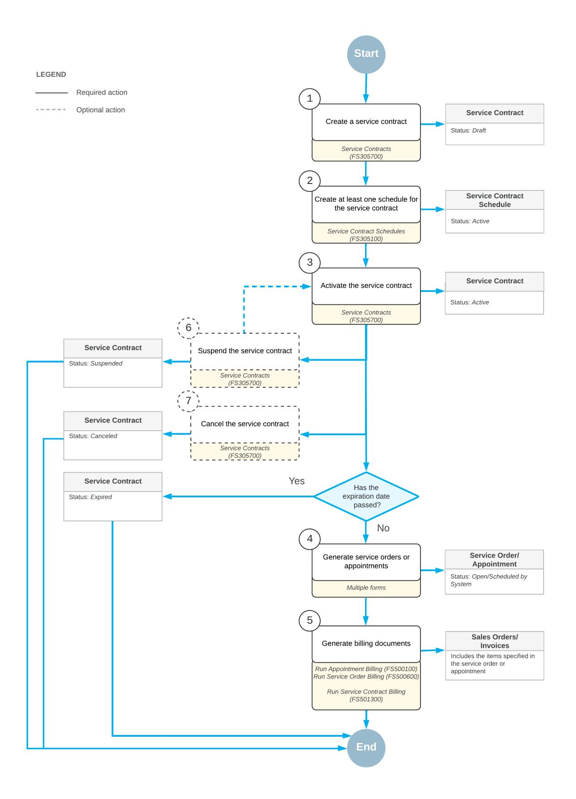

*Figure: Processing a service contract billed at the time of service*

## **Service Contract Billing Types**

When you create a service contract, you can select how its billing is performed. On the *[Service Contracts](https://help-2025r1.acumatica.com/Help?ScreenId=ShowWiki&pageid=11932f17-56fe-4a4e-8b66-e839bb21f402)* (FS305700) form, four options are available in the **BillingType** box:

- *At Time of Service*: The billing is performed aer each appointment based on what was done during the appointment (that is, the service contract is billed at the time when the services are performed).
- *End-Period Plus*: The billing is performed based on what is covered by the contract at the end of the billing period, plus any overage items.
- *Beginning-Period Fixed*: The billing is performed at the beginning of the billing period at the fixed price specified in the contract. Any usage and overage items used in appointments are covered by the fixed contract price.
- *Beginning-Period Plus*: The billing is performed at the beginning of the billing period at the fixed price specified in the contract. The overage items used in appointments are billed separately at the time of service.

## **Service Contracts: Billing Type Setup**

In Acumatica ERP, you can create service contracts with different billing types. When you create a service contract, you specify the billing type that corresponds to your company needs. In this topic, you will learn in more details about available billing types.

In the following sections of this topic, these capabilities are described in detail for service contracts created on the *[Service Contracts](https://help-2025r1.acumatica.com/Help?ScreenId=ShowWiki&pageid=11932f17-56fe-4a4e-8b66-e839bb21f402)* form. The capabilities work similarly for a route service contract created on the *[Route Service](https://help-2025r1.acumatica.com/Help?ScreenId=ShowWiki&pageid=9036b4a6-98fe-42dd-bf5d-f1808e6bb122) [Contracts](https://help-2025r1.acumatica.com/Help?ScreenId=ShowWiki&pageid=9036b4a6-98fe-42dd-bf5d-f1808e6bb122)* form.

## **Service Contracts Billed at the Time of Service**

You can create service contracts to be billed at the time of service, and perform the contract billing based on what was done in appointments when each particular appointment took place, or based on what was estimated in the service order. For this type of a service contract, on the**Summary** tab of the *[Service Contracts](https://help-2025r1.acumatica.com/Help?ScreenId=ShowWiki&pageid=11932f17-56fe-4a4e-8b66-e839bb21f402)* (FS305700) form, you select *At Time of Service* in the **BillingType** box.

When creating a service contract, you define either appointments or service orders will be generated for the service contract. In the**Schedule Generation Type** box of the**Summary** tab on the *[Service Contracts](https://help-2025r1.acumatica.com/Help?ScreenId=ShowWiki&pageid=11932f17-56fe-4a4e-8b66-e839bb21f402)* form, you specify one of the following options:

- *Appointments*. You select this option if you know the date and time when the visit to a customer should occur. Aer the system generates an appointment, the date and time can be changed.
- *Service Orders*. You select this option if you do not know the exact date and time when the visit to a customer should happen but you know the time frame. Aer the service order is generated, you define the date and time when the visit will occur according to the employees availability, and the confirmation from the customer.

Then you define which prices will be used for the items specified in the service contract. In the**Take Prices From** box on the**Summary** tab of the *[Service Contracts](https://help-2025r1.acumatica.com/Help?ScreenId=ShowWiki&pageid=11932f17-56fe-4a4e-8b66-e839bb21f402)* form, you specify one of the following options:

- *Contract*. When you select this option, the system copies the rows from the **Details** tab of the *[Service](https://help-2025r1.acumatica.com/Help?ScreenId=ShowWiki&pageid=f435f472-2bdd-4d76-9e41-08591b878f3a) [Contract Schedules](https://help-2025r1.acumatica.com/Help?ScreenId=ShowWiki&pageid=f435f472-2bdd-4d76-9e41-08591b878f3a)* form to the **Prices** tab of the *[Service Contracts](https://help-2025r1.acumatica.com/Help?ScreenId=ShowWiki&pageid=11932f17-56fe-4a4e-8b66-e839bb21f402)* form. On this tab, you can manually specify the price for each item in the contract, and save your changes to the contract.
- *Regular Price*. When you select this option, the system uses the prices according to the rules of automatic price selection, that is the prices specified form a service or inventory item in the **Default Price** box of the *[Non-Stock Items](https://help-2025r1.acumatica.com/Help?ScreenId=ShowWiki&pageid=bf68dd4f-63d4-460d-8dc0-9152f2bd6bf1)* (IN202000) or *[Stock Items](https://help-2025r1.acumatica.com/Help?ScreenId=ShowWiki&pageid=77786a70-1f1e-4d63-ad98-96f98e4fcb0e)* (IN202500) form, or in the price list on the *[Sales Prices](https://help-2025r1.acumatica.com/Help?ScreenId=ShowWiki&pageid=62bfca2c-0893-495b-bb1d-125b64899afc)* (AR202000) form at the date when an appointment or a service order is created.

The prices agreed by the service contract will only be applied to the line items added to the **Details** tab on the *[Service Contract Schedules](https://help-2025r1.acumatica.com/Help?ScreenId=ShowWiki&pageid=f435f472-2bdd-4d76-9e41-08591b878f3a)* form. If an additional item is added manually to the service order or appointment when it has been already generated, the system will use the price selected according to the standard rules of automatic price selection.

On the **Schedules** tab, you create a schedule for generating appointments or service orders. On the table toolbar, you click **Add Schedule**, the system opens the *[Service Contract Schedules](https://help-2025r1.acumatica.com/Help?ScreenId=ShowWiki&pageid=f435f472-2bdd-4d76-9e41-08591b878f3a)* (FS305100) form. On the **Details** tab of this form, you specify the services or inventory items (or both) to be included in the appointments or services, and on the **Recurrence** tab, you set up schedule settings. Then, you save the schedule and close the form. The system returns you on the *[Service Contracts](https://help-2025r1.acumatica.com/Help?ScreenId=ShowWiki&pageid=11932f17-56fe-4a4e-8b66-e839bb21f402)* form, and adds a line with the created schedule on the**Schedules** tab.

Then you click **Activate** on the More menu to assign the service contract the *Active* status.

## **Service Contracts Billed at the End of the Period**

You can create and process service contracts that are billed at the end of the billing period. This billing type assumes that at the end of the billing period, for the service contract, you generate an invoice, which includes a fixed price for a service or services (for example, for a fixed number of hours or visits) specified in the contract plus an amount for an overage number of hours, visits, or materials that has been added to the service document (an appointment or service order) during the billing period but has not been covered by the service contract.

For this type of a service contract, on the**Summary** tab of the *[Service Contracts](https://help-2025r1.acumatica.com/Help?ScreenId=ShowWiki&pageid=11932f17-56fe-4a4e-8b66-e839bb21f402)* (FS305700) form, you select *End-Period Plus* in the **BillingType** box, and in the **BillingTypeSettings** section, specify the billing period (*Week*, *Month*, *Quarter*, *Half a Year*, or *Year*) in the **Period** box.

On the **Services per Period** tab of the *[Service Contracts](https://help-2025r1.acumatica.com/Help?ScreenId=ShowWiki&pageid=11932f17-56fe-4a4e-8b66-e839bb21f402)* form, you add a line for each service to be provided during each billing period. In each line, you select a service or non-stock item. For each item, you specify the quantity in the **Value** column, and the price that is paid for the specified quantity of the items in the **Recurring Item Price** column. You also specify the price to be used when the specified quantity has been exceeded during the period in the **Overage Item Price** column.

On the **Schedules** tab, you create a schedule for generating appointments or service orders. On the table toolbar, you click **Add Schedule**, the system opens the *[Service Contract Schedules](https://help-2025r1.acumatica.com/Help?ScreenId=ShowWiki&pageid=f435f472-2bdd-4d76-9e41-08591b878f3a)* (FS305100) form. On the **Details** tab of this form, you specify the services or inventory items (or both) to be included in the appointments or service orders, and on the **Recurrence** tab, you set up schedule settings. Then, you save the schedule and close the form. The system returns you on the *[Service Contracts](https://help-2025r1.acumatica.com/Help?ScreenId=ShowWiki&pageid=11932f17-56fe-4a4e-8b66-e839bb21f402)* form, and adds a line with the created schedule on the**Schedules** tab.

Besides appointments and service orders generated from a schedule or schedules, a service order or an appointment can also be created on the fly, and assigned to the service contract.

At the end of each billing period, you generate an invoice for a service contract. The invoice includes a fixed number of hours or visits at a price predefined in the service contract. If the number of hours or visits defined in the service contract has been exceeded during the billing period, the price that has been specified for overage items is applied. The items that are not covered by the service contract but have been used in appointments or service orders during the billing period are also included in the invoice generated at the end of the period.

### **Service Contracts with Beginning-Period Fixed Billing**

You can create and manage service contracts with fixed billing at the beginning of the billing period. This billing type assumes that at the beginning of the billing period, for a service contract, you generate an invoice that includes a fixed price specified in the contract. This fixed price covers all services and inventory items listed in the contract, and provided to the customer during the billing period. If any additional services or materials are used in appointments (that is, are added to service documents) during the billing period, these items are not billed once you have run billing for an appointment or a service order, the generated invoice will have a zero total amount specified. For this type of a service contract, on the**Summary** tab of the *[Service Contracts](https://help-2025r1.acumatica.com/Help?ScreenId=ShowWiki&pageid=11932f17-56fe-4a4e-8b66-e839bb21f402)* (FS305700) form, you select *Beginning-Period Fixed* in the **BillingType** box, and specify the billing period (*Week*, *Month*, *Quarter*, *Half a Year*, or *Year*) in the **Period** box. On the**Services per Period** tab of the form, for each service to be provided during

each period, you add an item (for example, a non-stock item that represents a contract deposit) and specify the flat-rate price that has to be paid at the beginning of each billing period.

On the **Schedules** tab, you create a schedule for generating appointments or service orders. On the table toolbar, you click **Add Schedule**, the system opens the *[Service Contract Schedules](https://help-2025r1.acumatica.com/Help?ScreenId=ShowWiki&pageid=f435f472-2bdd-4d76-9e41-08591b878f3a)* (FS305100) form. On the **Details** tab of this form, you specify the services or inventory items (or both) to be included in the appointments or service orders, and on the **Recurrence** tab, you set up schedule settings. Then, you save the schedule and close the form. The system returns you on the *[Service Contracts](https://help-2025r1.acumatica.com/Help?ScreenId=ShowWiki&pageid=11932f17-56fe-4a4e-8b66-e839bb21f402)* form, and adds a line with the created schedule on the**Schedules** tab.

Note that for a service contract with the *Beginning-Period Fixed* billing type, you can either generate appointments or service orders based on a schedule, or create a service document (appointment or service order) on the fly, and associate it with the service contract by specifying the service contract reference number in the**Service Contract** box on the Summary area of the *[Appointments](https://help-2025r1.acumatica.com/Help?ScreenId=ShowWiki&pageid=ac486e9c-f5df-4829-94f0-2df8821361a0)* (FS300200) or *[Service Orders](https://help-2025r1.acumatica.com/Help?ScreenId=ShowWiki&pageid=6e5277d3-274e-45f5-b77d-4410ed736d21)* (FS300100) form.

You can set up the deferral of the invoice amount by specifying the code in the **Deferral Code** column so that aer the service contract invoice has been released, the system creates a deferral schedule.

At the beginning of each billing period, on the *[Run Service Contract Billing](https://help-2025r1.acumatica.com/Help?ScreenId=ShowWiki&pageid=4c8c5909-b5b4-4339-af44-6f565fb0a905)* (FS501300) form, you generate an invoice that contains the fixed contract price.

When you run billing for a service order or an appointment during the billing period, the system generates an invoice with the total amount set to zero because the items specified in the service order or appointment linked to the service contract are covered by the contract price.

On occasion, a service may be needed that is not covered by the fixed contract price. If this happens, you can edit the appointment or service order by clearing the **Free Item** check box in the needed detail line on the **Details** tab of the *[Appointments](https://help-2025r1.acumatica.com/Help?ScreenId=ShowWiki&pageid=ac486e9c-f5df-4829-94f0-2df8821361a0)* (FS300200) or *[Service Orders](https://help-2025r1.acumatica.com/Help?ScreenId=ShowWiki&pageid=6e5277d3-274e-45f5-b77d-4410ed736d21)* (FS300100) form. This causes the system to update the total amount of the appointment (and thus update the related billing document).

#### **Service Contracts with Beginning-Period Plus Billing**

You can create and manage service contracts with fixed billing at the beginning of the billing period for the items specified in the service contract only. This billing type assumes that at the beginning of the billing period, for a service contract, you generate an invoice, which includes a fixed price specified in the contract. This fixed price covers all services and inventory items listed in the contract, and provided to the customer during the billing period. If any additional items (those that are not included in the service contract) have been used in appointments (that is, have been added to the service document) during the billing period, these items are billed separately.

For this type of a service contract, on the *[Service Contracts](https://help-2025r1.acumatica.com/Help?ScreenId=ShowWiki&pageid=11932f17-56fe-4a4e-8b66-e839bb21f402)* (FS305700) form, you specify the *Beginning-Period Plus* option in the **BillingType** box. On the**Services per Period** tab, you add an item (for example, a non-stock item that represents a contract deposit), and specify its flat-rate price that have to be paid at the beginning of each billing period. On the **BillingTypeSettings** section of the**Summary** tab, you specify the length of the billing period.

On the **Schedules** tab, you create a schedule for generating appointments or service orders. On the table toolbar, you click **Add Schedule**, the system opens the *[Service Contract Schedules](https://help-2025r1.acumatica.com/Help?ScreenId=ShowWiki&pageid=f435f472-2bdd-4d76-9e41-08591b878f3a)* (FS305100) form. On the **Details** tab of this form, you specify the services or inventory items (or both) to be included in the appointments or service orders, and on the **Recurrence** tab, you set up schedule settings. Then, you save the schedule and close the form. The system returns you on the *[Service Contracts](https://help-2025r1.acumatica.com/Help?ScreenId=ShowWiki&pageid=11932f17-56fe-4a4e-8b66-e839bb21f402)* form, and adds a line with the created schedule on the**Schedules** tab.

For a service contract with the *Beginning-Period Plus* billing type, you can either generate appointments or service orders based on a schedule, or create a service document (appointment or service order) on the fly, and associate it with the service contract by specifying the service contract reference number in the**Service Contract** box on the Summary area of the *[Appointments](https://help-2025r1.acumatica.com/Help?ScreenId=ShowWiki&pageid=ac486e9c-f5df-4829-94f0-2df8821361a0)* (FS300200) or *[Service Orders](https://help-2025r1.acumatica.com/Help?ScreenId=ShowWiki&pageid=6e5277d3-274e-45f5-b77d-4410ed736d21)* (FS300100) form. Note that if you need certain predefined services to occur periodically, on the *[Service Contract Schedules](https://help-2025r1.acumatica.com/Help?ScreenId=ShowWiki&pageid=f435f472-2bdd-4d76-9e41-08591b878f3a)*, create a schedule or schedules, and on the **Details** tab, add these services, and in the detail lines, specify *None* in the **Billing Rule** column.

You can set up the deferral of the invoice amount by specifying the code in the **Deferral Code** column so that aer the service contract invoice has been released, the system creates a deferral schedule.

At the beginning of the billing period, on the *[Run Service Contract Billing](https://help-2025r1.acumatica.com/Help?ScreenId=ShowWiki&pageid=4c8c5909-b5b4-4339-af44-6f565fb0a905)* (FS501300) form, you generate an invoice that contains the fixed contract price. During the billing period, for an appointment or a service order (depending on the option specified in the**Schedule Generation Type** box on the *[Service Contracts](https://help-2025r1.acumatica.com/Help?ScreenId=ShowWiki&pageid=11932f17-56fe-4a4e-8b66-e839bb21f402)* box), you generate additional billing document.

# **Service Contracts: To Create and Process a Service Contract Billed at Time of Service**

In this activity, you will create and process a service contract that is billed aer each appointment has taken place based on what was done during the appointment.

This activity is based on the *U100* dataset. If you are using another dataset, or if any system settings have been changed in *U100*, these changes can affect the workflow of the activity and the results of the processing. To avoid any issues, restore the *U100* dataset to its initial state.

## **Story**

Suppose that the GoodFood One Restaurant customer requires appointments on Mondays and Fridays of each week for one year, starting next week, and is willing to sign a contract. The service to be performed is the cleaning of the customer's equipment. The service manager of the SweetLife Service and Equipment Sales Center (Maia Davis) needs to create a service contract in Acumatica ERP, and create a schedule of appointments, which will allow employees to generate appointments for each upcoming week.

Acting as the service manager, you need to create a contract, create a schedule for the appointment generation, activate the contract, and generate the appointments for the first two weeks.

#### **Configuration Overview**

In the *U100* dataset, the following configuration tasks have been performed to prepare the system for this activity to be performed:

- On the *[Enable/Disable Features](https://help-2025r1.acumatica.com/Help?ScreenId=ShowWiki&pageid=c1555e43-1bc5-4f6f-ba9d-b323f94d8a6b)* (CS100000) form, the *Equipment Management* feature (under *Service Management*) has been enabled.
- On the *[Branch Locations](https://help-2025r1.acumatica.com/Help?ScreenId=ShowWiki&pageid=ebef097e-9e47-4c7b-b0b0-c381251b48cf)* (FS202500) form, the *WEST BRIGHTON* branch location has been configured.
- On the *[Service](https://help-2025r1.acumatica.com/Help?ScreenId=ShowWiki&pageid=06fd8a36-dd81-4df9-b609-92c3d552c542) Order Types* (FS202300) form, the *MRO* service order type has been configured to generate sales orders to bill customers for provided services. That is, the**Sales Orders** option has been selected under **Generated Billing Documents** in the **BillingSettings** section. Also in this section, the *IN* sales order type has been selected as the **OrderType for Invoice** so that the processing of sales orders does not require shipments.
- On the *[Billing Cycles](https://help-2025r1.acumatica.com/Help?ScreenId=ShowWiki&pageid=273739f9-4e18-4e81-949b-128b02e37810)* (FS206000) form, the following settings have been specified for the *AP AP* billing cycle:
  - **Run Billing For**: **Appointments**
  - **Group Billing Documents By**: **Appointments**

Based on these billing cycle settings, a separate billing document is generated for each appointment; this document presents the details of each service of the appointment.

- On the *[Customers](https://help-2025r1.acumatica.com/Help?ScreenId=ShowWiki&pageid=652929bc-9606-4056-aa6e-0c2d1147171b)* (AR303000) form, the *GOODFOOD (GoodFood One Restaurant)* customer has been defined. The *AP AP* billing cycle has been specified for the customer on the **Billing** tab.
- On the *[Non-Stock Items](https://help-2025r1.acumatica.com/Help?ScreenId=ShowWiki&pageid=bf68dd4f-63d4-460d-8dc0-9152f2bd6bf1)* (IN202000) form, the *CLEANING* non-stock item has been created. For this item, the *Service* is selected in the**Type** box on the **General** tab, and *Time* is selected in the **Billing Rule** box on the **Price/Cost** tab.
- On the *[Equipment](https://help-2025r1.acumatica.com/Help?ScreenId=ShowWiki&pageid=43b7c838-3051-4238-87db-e9b9c213894e)* (FS205000) form, the *FSE00007 (Commercial citrus juicer with a production rate of 1.5 litres per minute)* target equipment has been defined.

- On the *[Employees](https://help-2025r1.acumatica.com/Help?ScreenId=ShowWiki&pageid=dae5144b-49b3-43a4-bce0-93f31b3f2321)* (EP203000) form, *EP00000040 (Maia Davis)* has been created, and the**Staff Member in Service Management** check box has been selected on the **General Info** tab.
- On the *[User Profile](https://help-2025r1.acumatica.com/Help?ScreenId=ShowWiki&pageid=8430c8b2-a79c-4f7b-9768-b0b7fad23a59)* (SM203010) form, the *SWEETEQUIP* default branch and *WEST BRIGHTON* default branch location have been specified for *Maia Davis*.

## **Process Overview**

In this activity, you will create a service contract on the *[Service Contracts](https://help-2025r1.acumatica.com/Help?ScreenId=ShowWiki&pageid=11932f17-56fe-4a4e-8b66-e839bb21f402)* (FS305700) form, create an appointment schedule on the *[Service Contract Schedules](https://help-2025r1.acumatica.com/Help?ScreenId=ShowWiki&pageid=f435f472-2bdd-4d76-9e41-08591b878f3a)* (FS305100) form, and then activate the contract on the *[Service](https://help-2025r1.acumatica.com/Help?ScreenId=ShowWiki&pageid=11932f17-56fe-4a4e-8b66-e839bb21f402) [Contracts](https://help-2025r1.acumatica.com/Help?ScreenId=ShowWiki&pageid=11932f17-56fe-4a4e-8b66-e839bb21f402)* form. You will then generate appointments for the contract on the *[Generate Maintenance from Contract](https://help-2025r1.acumatica.com/Help?ScreenId=ShowWiki&pageid=28585e20-4cfa-4235-bfda-a6e0ecb0d5a8) [Schedules](https://help-2025r1.acumatica.com/Help?ScreenId=ShowWiki&pageid=28585e20-4cfa-4235-bfda-a6e0ecb0d5a8)* (FS500300) form.

## **Step 1: Creating the Service Contract**

To create the service contract billed at the time of service for the GoodFood One Restaurant, do the following:

- 1. On the *[Service Contracts](https://help-2025r1.acumatica.com/Help?ScreenId=ShowWiki&pageid=11932f17-56fe-4a4e-8b66-e839bb21f402)* (FS305700) form, click **Add New Record**.
- 2. In the Summary area, specify the following settings:
  - **Customer**: *GOODFOOD - GoodFood One Restaurant*
  - **Description**: Cleaning contract
- 3. On the **Summary** tab (**ContractSettings** section), specify the following settings for the contract:
  - **Start Date**: 1/30/2025
  - **Expiration Type**: *Expiring*
  - **Duration**: 1 *Year*
  - **Schedule Generation Type**: *Appointments*
- 4. In the **BillingType** box of the **BillingSettings** section, make sure that *At Time of Service* is selected. This setting means that the service contract will be billed aer an appointment generated for it has taken place, based on what was done during the appointment.
- 5. On the form toolbar, click**Save**.

## **Step 2: Creating an Appointment Schedule and Activating the Contract**

Add a schedule to the service contract and activate the contract as follows:

1. While you are still viewing the service contract on the *[Service Contracts](https://help-2025r1.acumatica.com/Help?ScreenId=ShowWiki&pageid=11932f17-56fe-4a4e-8b66-e839bb21f402)* (FS305700) form, on the**Schedules** tab, click **Add Schedule**.

The *[Service Contract Schedules](https://help-2025r1.acumatica.com/Help?ScreenId=ShowWiki&pageid=f435f472-2bdd-4d76-9e41-08591b878f3a)* (FS305100) form opens in a pop-up window.

- 2. In the Summary area, in the**Service OrderType** box, make sure that *MRO* is selected.
- 3. In the **Scheduled StartTime** box, select *10:00 AM*.
- 4. On the **Details** tab, add a row and specify the following settings in the row:
  - **Inventory ID**: *CLEANING*
  - **Target Equipment ID**: *FSE00007*
- 5. On the **Recurrence** tab, in the **Frequency** box, select **Weekly** and do the following in the **WeeklySettings** section:
  - Leave **Every** *1* **Week(s)**.
  - Select the **Monday** and **Friday** check boxes. Clear**Sunday**.
  - Leave the check boxes cleared for the remaining days of the week.
- 6. Save your changes and close the pop-up window.

The system has created the schedule and added it to the**Schedules** tab of the *[Service Contracts](https://help-2025r1.acumatica.com/Help?ScreenId=ShowWiki&pageid=11932f17-56fe-4a4e-8b66-e839bb21f402)* form.

7. On the *[Service Contracts](https://help-2025r1.acumatica.com/Help?ScreenId=ShowWiki&pageid=11932f17-56fe-4a4e-8b66-e839bb21f402)* form (to which you returned when you closed the window with the *[Service Contract](https://help-2025r1.acumatica.com/Help?ScreenId=ShowWiki&pageid=f435f472-2bdd-4d76-9e41-08591b878f3a) [Schedules](https://help-2025r1.acumatica.com/Help?ScreenId=ShowWiki&pageid=f435f472-2bdd-4d76-9e41-08591b878f3a)* form), on the More menu, click **Activate**.

The system changes the status of the contract from *Dra* to *Active*.

#### **Step 3: Generating Appointments from the Contract**

To generate appointments from the service contract, do the following:

- 1. Open the *[Generate Maintenance from Contract Schedules](https://help-2025r1.acumatica.com/Help?ScreenId=ShowWiki&pageid=28585e20-4cfa-4235-bfda-a6e0ecb0d5a8)* (FS500300) form.
- 2. In the Summary area, specify the following settings:
  - **Customer**: *GOODFOOD - GoodFood One Restaurant*
  - **Generate Up To**: *2/13/2025*
- 3. In the table, select the check box in the row with the schedule that you have created in the previous step.
- 4. On the form toolbar, click **Process**.

The system opens the **Processing** dialog box, in which you can see the status of the process.

5. Aer the processing has successfully completed, in the **Processing** dialog box, click **Close**.

The appointments have been generated for the service contract until *2/13/2025*.

#### **Step 4: Reviewing the Appointments Generated for the Service Contract**

Review the appointments that have been generated for the service contract as follows:

- 1. On the *[Service Contracts](https://help-2025r1.acumatica.com/Help?ScreenId=ShowWiki&pageid=11932f17-56fe-4a4e-8b66-e839bb21f402)* (FS305700) form, open the service contract that you created in the previous step.
- 2. On the More menu (under **Inquiries**), click **Appointment History**.
- 3. On the *[Appointment Summary](https://help-2025r1.acumatica.com/Help?ScreenId=ShowWiki&pageid=773bf6ec-a6d8-4bd2-917f-c3297f1cec66)* (FS400100) form, which opens, clear the**Staff Member** box in the Selection area.
- 4. In the **ToScheduled Date** box, select *2/13/2025*.

The list of appointments generated for the selected service contract is displayed in the table (see the following screenshot).

|                                                                                           | $TOOLS$ - <b>Appointment Summary</b>                                                                             |                          |                                                                              |                  |                              |                                                                                         |                          |                                |                                |                             |                    |          |                          |  |  |
|-------------------------------------------------------------------------------------------|---------------------------------------------------------------------------------------------------------------------|--------------------------|------------------------------------------------------------------------------|------------------|------------------------------|-----------------------------------------------------------------------------------------|--------------------------|--------------------------------|--------------------------------|-----------------------------|--------------------|----------|--------------------------|--|--|
| !!!!!!!!!!!!!!!!!!!!!!!!!!!!!!!!!!!!!!!! $\Omega$ $+$ $\leftarrow$               | $\overline{\mathbf{x}}$ Y $\mathbb{H}$ $\mathscr{O}$                                                       |                          |                                                                              |                  |                              |                                                                                         |                          |                                |                                |                             |                    |          | o                        |  |  |
| Branch: <b>Branch Location:</b> <b>Customer</b> Location: Service Order Nbr.: | SWEETEQUIP - Service and Eqr. WEST BRIGHTON - Office in P GOODFOOD - GoodFood On P MAIN - Primary Location | $\mathcal{L}$ ρ       | Service Contract ID: Schedule ID: Staff Member: Resource Equipment: | FCT00000005      | Q $\circ$ ø $\circ$ | From Scheduled Date: 1/1/2025 $\overline{m}$ To Scheduled Date: 2/13/2025 日 |                          |                                |                                |                             |                    |          | $\overline{\phantom{a}}$ |  |  |
| ALL RECORDS <b>B 0 D</b> *Branch                                                       | TODAY <b>Branch Location</b>                                                                                     | Service Order Type | Service Order Nbr.                                                           | Appointment Nbr. | <b>Description</b>           | *Customer                                                                               | Location                 | Scheduled <b>Start Date</b> | Scheduled <b>Start Time</b> | Actual <b>Start Date</b> | <b>Status</b>      | Finished | Confirm                  |  |  |
| $\geq 0$ $\Box$ SWEETEQUIP                                                                | <b>WEST BRIGHTON</b>                                                                                                | <b>MRO</b>               | 000051                                                                       | 000051-1         | Cleaning contract            | GOODFOOD - GoodFood One Restaurant                                                      | MAIN - Primary           | 1/31/2025                      | 10:00 AM                       |                             | Not Started        | False    | False                    |  |  |
| $0$ D SWEETEQUIP                                                                       | <b>WEST BRIGHTON</b>                                                                                                | <b>MRO</b>               | 000052                                                                       | 000052-1         | <b>Cleaning contract</b>     | <b>GOODFOOD - GoodFood One Restaurant</b>                                               | MAIN - Primary           | 2/3/2025                       | 10:00 AM                       |                             | Not Started        | False    | False                    |  |  |
| $0$ $\Box$ SWEETEQUIP                                                                  | <b>WEST BRIGHTON</b>                                                                                                | <b>MRO</b>               | 000053                                                                       | 000053-1         | <b>Cleaning contract</b>     | <b>GOODFOOD - GoodFood One Restaurant</b>                                               | MAIN - Primary           | 2/7/2025                       | 10:00 AM                       |                             | <b>Not Started</b> | False    | False                    |  |  |
| 0 □ SWEETEQUIP                                                                            | <b>WEST BRIGHTON</b>                                                                                                | <b>MRO</b>               | 000054                                                                       | 000054-1         | <b>Cleaning contract</b>     | <b>GOODFOOD - GoodFood One Restaurant</b>                                               | MAIN - Primary 2/10/2025 |                                | 10:00 AM                       |                             | Not Started        | False    | False                    |  |  |

*Figure: The appointments generated for the service contract*

5. Click an appointment reference number in the **Appointment Nbr.** column. The system opens the *[Appointments](https://help-2025r1.acumatica.com/Help?ScreenId=ShowWiki&pageid=ac486e9c-f5df-4829-94f0-2df8821361a0)* (FS300200) form. On the **Details** tab, confirm that the system has added the line from the **Details** tab of the *[Service Contract Schedules](https://help-2025r1.acumatica.com/Help?ScreenId=ShowWiki&pageid=f435f472-2bdd-4d76-9e41-08591b878f3a)* (FS305100) form. On the **Other** tab, notice that the reference numbers of the source service contract and source schedule are specified.

# **Service Contracts: To Create and Process an End-Period Billing Service Contract (Appointment with No Overage Items)**

In this activity, you will create a service contract that is billed at the end of each billing period for the following:

- The services and inventory items specified in the contract
- An overage number of services (or inventory items) that has been added to the service document during the billing period but was not covered by the service contract

You will also create a schedule for this service contract and generate appointments from the schedule.

This activity is based on the *U100* dataset. If you are using another dataset, or if any system settings have been changed in *U100*, these changes can affect the workflow of the activity and the results of the processing. To avoid any issues, restore the *U100* dataset to its initial state.

## **Story**

Suppose that the HM's Bakery and Cafe customer has agreed to enter into a contract with the SweetLife Service and Equipment Sales Center for one hour of cleaning a juicer every week. The contract states that one hour of service is paid every week at a price of \$70; for overage cleaning services (which are occasionally required), a price of \$85 per hour should be paid. The customer will pay at the end of each week based on the prices that are defined in the contract.

The appointment schedule needs to be specified for the contract, and an appointment for the next week should be generated. You will perform the needed actions in the system, acting as the service manager, Maia Davis.

## **Configuration Overview**

In the *U100* dataset, the following configuration tasks have been performed to prepare the system for this activity to be performed:

- On the *[Enable/Disable Features](https://help-2025r1.acumatica.com/Help?ScreenId=ShowWiki&pageid=c1555e43-1bc5-4f6f-ba9d-b323f94d8a6b)* (CS100000) form, the *Service Management* and *Equipment Management* features have been enabled.
- On the *[Branch Locations](https://help-2025r1.acumatica.com/Help?ScreenId=ShowWiki&pageid=ebef097e-9e47-4c7b-b0b0-c381251b48cf)* (FS202500) form, the *WEST BRIGHTON* branch location has been configured.
- On the *[Service](https://help-2025r1.acumatica.com/Help?ScreenId=ShowWiki&pageid=06fd8a36-dd81-4df9-b609-92c3d552c542) Order Types* (FS202300) form, the *MRO* service order type has been configured to generate sales orders to bill customers for provided services. That is, the *Sales Orders* option has been selected in the **Generated Billing Documents** box in the **BillingSettings** section. Also in this section, the *IN* sales order type has been selected as the **OrderType for Invoice** so that the processing of sales orders does not require shipments.
- On the *[Billing Cycles](https://help-2025r1.acumatica.com/Help?ScreenId=ShowWiki&pageid=273739f9-4e18-4e81-949b-128b02e37810)* (FS206000) form, the following settings have been specified for the *AP AP* billing cycle:
  - **Run Billing For**: **Appointments**
  - **Group Billing Documents By**: **Appointments**

Based on these billing cycle settings, a separate billing document is generated for each appointment; this document presents the details of each service of the appointment.

- On the *[Customers](https://help-2025r1.acumatica.com/Help?ScreenId=ShowWiki&pageid=652929bc-9606-4056-aa6e-0c2d1147171b)* (AR303000) form, the *HMBAKERY (HM's Bakery and Cafe)* customer has been defined. The *AP AP* billing cycle has been specified for the customer on the **Billing** tab.
- On the *[Employees](https://help-2025r1.acumatica.com/Help?ScreenId=ShowWiki&pageid=dae5144b-49b3-43a4-bce0-93f31b3f2321)* (EP203000) form, *EP00000040 (Maia Davis)* has been created, and the**Staff Member in Service Management** check box has been selected on the **General Info** tab.
- On the *[User Profile](https://help-2025r1.acumatica.com/Help?ScreenId=ShowWiki&pageid=8430c8b2-a79c-4f7b-9768-b0b7fad23a59)* (SM203010) form, the *SWEETEQUIP* default branch and *WEST BRIGHTON* default branch location have been specified for *Maia Davis*.

- On the *[Non-Stock Items](https://help-2025r1.acumatica.com/Help?ScreenId=ShowWiki&pageid=bf68dd4f-63d4-460d-8dc0-9152f2bd6bf1)* (IN202000) form, the *CLEANING* non-stock item has been created. For this item, the *Service* is selected in the**Type** box on the **General** tab, and *Time* is selected in the **Billing Rule** box on the **Price/Cost** tab.
- On the *[Equipment](https://help-2025r1.acumatica.com/Help?ScreenId=ShowWiki&pageid=43b7c838-3051-4238-87db-e9b9c213894e)* (FS205000) form, the *FSE00006 (Commercial citrus juicer with a production rate of 1.5 liters per minute)* target equipment has been defined.

## **Process Overview**

You will create a service contract with the *End-Period Plus* billing type on the *[Service Contracts](https://help-2025r1.acumatica.com/Help?ScreenId=ShowWiki&pageid=11932f17-56fe-4a4e-8b66-e839bb21f402)* (FS305700) form. In this service contract, you will specify the services to be provided during each billing period, along with the prices for the items covered by the contract and for any overage items. Next, on the *[Service Contract Schedules](https://help-2025r1.acumatica.com/Help?ScreenId=ShowWiki&pageid=f435f472-2bdd-4d76-9e41-08591b878f3a)* (FS305100) form, you will create a contract schedule that includes the services to be provided in appointments. Finally, you will generate an appointment based on the schedule by using the *[Generate Maintenance from Contract Schedules](https://help-2025r1.acumatica.com/Help?ScreenId=ShowWiki&pageid=28585e20-4cfa-4235-bfda-a6e0ecb0d5a8)* (FS500300) form.

## **System Preparation**

To prepare the system for this activity to be performed, do the following:

- 1. Launch the Acumatica ERP website, and sign in to a company with the *U100* dataset preloaded. You should sign in as a service manager by using the *davis* username, and the *123* password.
- 2. In the info area, in the upper-right corner of the top pane of the Acumatica ERP screen, click the Business Date menu button, and select the 1/30/2025 date. For simplicity, in this activity, you will create and process all documents in the system on this business date.

## **Step 1: Creating a Service Contract with End-Period Billing**

To create the service contract with end-period billing for HM's Bakery and Cafe, do the following:

- 1. On the *[Service Contracts](https://help-2025r1.acumatica.com/Help?ScreenId=ShowWiki&pageid=11932f17-56fe-4a4e-8b66-e839bb21f402)* (FS305700) form, click **Add New Record**.
- 2. In the Summary area, specify the following settings:
  - **Customer**: *HMBAKERY - HM's Bakery and Cafe*
  - **Description**: Cleaning contract
- 3. On the **Summary** tab (**ContractSettings** section), specify the following settings for the contract:
  - **Start Date**: 1/30/2025
  - **Expiration Type**: *Expiring*
  - **Duration**: 1 *Year*
  - **Schedule Generation Type**: *Appointments*
- 4. In the **BillingType** box of the **BillingSettings** section, select *End-Period Plus*.
- 5. In the **Period** box of the **BillingTypeSettings** section, select *Week*.
- 6. On the form toolbar, click**Save**.
- 7. On the **Services per Period** tab, add a row and specify the following settings in the added row:
  - **Inventory ID**: *CLEANING*
  - **Target Equipment ID**: *FSE00006*
  - **Value**: 1h 00m
  - **Recurring Item Price**: 70
  - **Overage Item Price**: 85
- 8. On the form toolbar, click**Save**.

9. On the More menu (under **Processing**), click **Activate**.

The first billing period (1/30/2025 - 02/05/2025) has been activated during contract activation, as the following screenshot shows.

| <b>Service Contracts</b> FCT00000006 - HM's Bakery & Cafe |                                                                                                                               |                                  |                          |                                     |                                |                                 |                        |                               |                          | <b>P</b> NOTES | <b>ACTIVITIES</b>                   | <b>FILES</b> | TOOLS $\sim$ |  |  |
|--------------------------------------------------------------|-------------------------------------------------------------------------------------------------------------------------------|----------------------------------|--------------------------|-------------------------------------|--------------------------------|---------------------------------|------------------------|-------------------------------|--------------------------|----------------|-------------------------------------|--------------|--------------|--|--|
| 뭐 $\Xi$ $\leftarrow$                                   | 血 O $+$ $\Omega$ $\mathsf{K}$ $\lambda$ $\left\langle \right\rangle$ $\rightarrow$ $\sim$ $\cdots$ |                                  |                          |                                     |                                |                                 |                        |                               |                          |                |                                     |              |              |  |  |
| Service Contract ID:                                         | !!!!!!!!!!!!!!!!!!!!!!!!!!!!!!!!!!!!!!!!                                                                                      | $\circ$                          | Status:                  | Active                              |                                |                                 |                        |                               |                          |                |                                     |              | $\sim$       |  |  |
| Customer:                                                    | HMBAKERY - HM's Bakery & Cafe                                                                                                 |                                  | Effective From Date:     | 1/30/2025                           |                                |                                 |                        |                               |                          |                |                                     |              |              |  |  |
| * Location:                                                  | <b>MAIN - Primary Location</b>                                                                                                | $\varphi$                        | <b>Upcoming Status:</b>  | Expired                             |                                |                                 |                        |                               |                          |                |                                     |              |              |  |  |
| <b>Customer Contract Nbr.</b>                                | 000003                                                                                                                        |                                  | Effective Until Date:    | 1/29/2026                           |                                |                                 |                        |                               |                          |                |                                     |              |              |  |  |
| Project:                                                     | X - Non-Project Code.                                                                                                         | $\mathscr{O}$                    |                          |                                     |                                |                                 |                        |                               |                          |                |                                     |              |              |  |  |
| Master Contract:                                             |                                                                                                                               | $\mathcal{Q}% _{0}$              |                          |                                     |                                |                                 |                        |                               |                          |                |                                     |              |              |  |  |
| Description:                                                 | Cleaning contract                                                                                                             |                                  |                          |                                     |                                |                                 |                        |                               |                          |                |                                     |              |              |  |  |
| SUMMARY <b>SCHEDULES</b>                                  |                                                                                                                               | <b>SERVICES PER PERIOD</b>       | <b>BILLING DOCUMENTS</b> | <b>HISTORY</b> <b>ATTRIBUTES</b> |                                |                                 |                        |                               |                          |                |                                     |              |              |  |  |
|                                                              |                                                                                                                               |                                  |                          |                                     |                                |                                 |                        |                               |                          |                |                                     |              |              |  |  |
| Actions:                                                     | Search by Billing Periods                                                                                                     | <b>Billing Period:</b> $\sim$ | 01/30/2025 - 02/05/2025  | $\circ$                             | Reference Nbr.:                |                                 | <b>Contract Total:</b> |                               | 70.00                    |                |                                     |              |              |  |  |
| $\circ$ + $\mathbb{H}$ $\times$                        | $\boxed{\mathbf{x}}$                                                                                                          |                                  |                          |                                     |                                |                                 |                        |                               |                          |                |                                     |              |              |  |  |
| El Line Type                                                 | * Inventory ID                                                                                                                | <b>Target Equipment ID</b>       | <b>Billing Rule</b>      | Value *UOM                          | <b>Recurring Item</b> Price | <b>Total Recurring</b> Price | Overage Item Price  | <b>Remaining Period Value</b> | <b>Used Period Value</b> |                | Scheduled Period Value Project Task |              | Cost Code |  |  |
| Service                                                      | <b>CLEANING</b>                                                                                                               | <b>FSE00006</b>                  | Time                     | 1h00 m HOUR                         | 70.0000                        | 70.00                           | 85.0000                | 1 h 00 m                      | 0 h 00 m                 |                | 0 h 00 m                            |              |              |  |  |
|                                                              |                                                                                                                               |                                  |                          |                                     |                                |                                 |                        |                               |                          |                |                                     |              |              |  |  |
|                                                              |                                                                                                                               |                                  |                          |                                     |                                |                                 |                        |                               |                          |                |                                     |              |              |  |  |

*Figure: The service contract*

## **Step 2: Creating a Contract Schedule and Generating Appointments from the Schedule**

Now you will add a schedule for the service contract and generate the first two appointments of that schedule. Do the following:

1. While you are still viewing the service contract on the *[Service Contracts](https://help-2025r1.acumatica.com/Help?ScreenId=ShowWiki&pageid=11932f17-56fe-4a4e-8b66-e839bb21f402)* (FS305700) form, on the**Schedules** tab, click **Add Schedule**.

The *[Service Contract Schedules](https://help-2025r1.acumatica.com/Help?ScreenId=ShowWiki&pageid=f435f472-2bdd-4d76-9e41-08591b878f3a)* (FS305100) form opens.

- 2. In the Summary area, do the following:
  - In the **Service OrderType** box, ensure that *MRO* is selected.
  - In the **Scheduled StartTime** box, select *11:00 AM*.
- 3. On the **Details** tab, add a row and specify the following settings in the row:
  - **LineType**: *Service*
  - **Inventory ID**: *CLEANING*
  - **Target Equipment ID**: *FSE00006*
- 4. On the **Recurrence** tab, in the **Frequency** box, select **Weekly** and do the following in the **WeeklySettings** section:
  - Specify **Every** *1* **Weeks**.
  - Select the**Tuesday** check box. Clear**Sunday**.
  - Leave the check boxes cleared for the remaining days of the week.
- 5. On the form toolbar, click**Save**.
- 6. On the form toolbar, click **Generate from Service Contracts**.

The *[Generate Maintenance from Contract Schedules](https://help-2025r1.acumatica.com/Help?ScreenId=ShowWiki&pageid=28585e20-4cfa-4235-bfda-a6e0ecb0d5a8)* (FS500300) form opens.

- 7. In the **Generate Up To** box of the Summary area, select *2/12/2025*.
- 8. In the table, select the unlabeled check box in the row with the schedule you have created.
- 9. On the form toolbar, click **Process**.

The system opens the **Processing** dialog box, in which you can see the status of the processing.

- 10.Aer the processing has successfully completed, in the **Processing** dialog box, click **Close**.
- 11.Close the *[Generate Maintenance from Contract Schedules](https://help-2025r1.acumatica.com/Help?ScreenId=ShowWiki&pageid=28585e20-4cfa-4235-bfda-a6e0ecb0d5a8)* (FS500300) form.

- 12.Close the *[Service Contract Schedules](https://help-2025r1.acumatica.com/Help?ScreenId=ShowWiki&pageid=f435f472-2bdd-4d76-9e41-08591b878f3a)* (FS305100) form.
- 13.On the **Services Per Period** tab of the *[Service Contracts](https://help-2025r1.acumatica.com/Help?ScreenId=ShowWiki&pageid=11932f17-56fe-4a4e-8b66-e839bb21f402)* (FS305700) form, notice that the**Scheduled Period Value** is now *1 h 00 m* (as the following screenshot shows). This means that 1 hour of services has been scheduled for the selected billing period.

| <b>Service Contracts</b>                                                    | <b>R</b> NOTES <b>ACTIVITIES</b> <b>FILES</b> TOOLS $\sim$ FCT00000006 - HM's Bakery & Cafe |                                  |                             |                |                   |                         |                                 |                        |                               |                          |  |                                     |  |              |  |
|-----------------------------------------------------------------------------|---------------------------------------------------------------------------------------------------------|----------------------------------|-----------------------------|----------------|-------------------|-------------------------|---------------------------------|------------------------|-------------------------------|--------------------------|--|-------------------------------------|--|--------------|--|
| $\mathbb{R}$ - $\mathbb{R}$ E.                                           | . ⊜ $\Box$ $\lambda$ $\mathsf{K}$ $\Omega$ $\langle \quad \rangle$ $+$                |                                  |                             |                |                   |                         |                                 |                        |                               |                          |  |                                     |  |              |  |
| Service Contract ID:                                                        | FCT00000006                                                                                             | Q                                | Status:                     | Active         |                   |                         |                                 |                        |                               |                          |  |                                     |  | $\sim$       |  |
| Customer:                                                                   | HMBAKERY - HM's Bakery & Cafe                                                                           | 1                                | <b>Effective From Date:</b> | 1/30/2025      |                   |                         |                                 |                        |                               |                          |  |                                     |  |              |  |
| * Location:                                                                 | <b>MAIN - Primary Location</b>                                                                          | $\circ$                          | <b>Upcoming Status:</b>     | Expired        |                   |                         |                                 |                        |                               |                          |  |                                     |  |              |  |
| Customer Contract Nbr.:                                                     | 000003                                                                                                  |                                  | Effective Until Date:       | 1/29/2026      |                   |                         |                                 |                        |                               |                          |  |                                     |  |              |  |
| Project:                                                                    | X - Non-Project Code.                                                                                   | $\mathscr{O}$                    |                             |                |                   |                         |                                 |                        |                               |                          |  |                                     |  |              |  |
| Master Contract:                                                            |                                                                                                         | $\alpha$                         |                             |                |                   |                         |                                 |                        |                               |                          |  |                                     |  |              |  |
| Description:                                                                | <b>Cleaning contract</b>                                                                                |                                  |                             |                |                   |                         |                                 |                        |                               |                          |  |                                     |  |              |  |
| <b>SCHEDULES</b> <b>SUMMARY</b>                                          |                                                                                                         | <b>SERVICES PER PERIOD</b>       | <b>BILLING DOCUMENTS</b>    | <b>HISTORY</b> | <b>ATTRIBUTES</b> |                         |                                 |                        |                               |                          |  |                                     |  |              |  |
|                                                                             |                                                                                                         |                                  |                             |                |                   |                         |                                 |                        |                               |                          |  |                                     |  |              |  |
| Actions:                                                                    | Search by Billing Periods                                                                               | <b>Billing Period:</b> $\sim$ | 01/30/2025 - 02/05/2025     | $\circ$        |                   | Reference Nbr.:         |                                 | <b>Contract Total:</b> |                               | 70.00                    |  |                                     |  |              |  |
| !!!!!!!!!!!!!!!!!!!!!!!!!!!!!!!!!!!!!!!! $\mathbb{H}$ $+$ $\times$ | $\boxed{\mathbf{x}}$                                                                                    |                                  |                             |                |                   |                         |                                 |                        |                               |                          |  |                                     |  |              |  |
| E Line Type                                                                 | *Inventory ID                                                                                           | <b>Target Equipment ID</b>       | <b>Billing Rule</b>         |                | Value *UOM        | Recurring Item Price | <b>Total Recurring</b> Price | Overage Item Price  | <b>Remaining Period Value</b> | <b>Used Period Value</b> |  | Scheduled Period Value Project Task |  | Cost Code |  |
| Service                                                                     | <b>CLEANING</b>                                                                                         | FSE00006                         | Time                        | 1h00 m HOUR    |                   | 70.0000                 | 70.00                           | 85,0000                | 1h00m                         | 0h00m                    |  | 1 h 00 m                            |  |              |  |
|                                                                             |                                                                                                         |                                  |                             |                |                   |                         |                                 |                        |                               |                          |  |                                     |  |              |  |

*Figure: One hour of service scheduled for the billing period*

## **Step 3: Reviewing the Generated Appointments**

Review the appointments generated from the schedule on the previous step by doing the following:

- 1. While you are still viewing the service contract on the *[Service Contracts](https://help-2025r1.acumatica.com/Help?ScreenId=ShowWiki&pageid=11932f17-56fe-4a4e-8b66-e839bb21f402)* (FS305700) form, on the More menu, click **Appointment History**. The *[Appointment Summary](https://help-2025r1.acumatica.com/Help?ScreenId=ShowWiki&pageid=773bf6ec-a6d8-4bd2-917f-c3297f1cec66)* (FS400100) form opens.
- 2. Clear the**Staff Member** box in the Selection area.
- 3. In the **From Scheduled Date** box, ensure that 1/30/2025 is selected.
- 4. In the **ToScheduled Date** box, select *2/12/2025*.

The form displays the appointments generated from the service contract. Notice that the appointment generated for the active billing period has the *Not Started* status, and the appointment generated for the future billing period has the *Awaiting* status (see the following screenshot).

|                                                                                             | $TOOLS$ $\star$ <b>Appointment Summary</b>                                                                                 |                          |                                                                                              |                  |                          |                                                                                  |                         |                                |                         |                             |               |          |           |                            |             |                                     |
|---------------------------------------------------------------------------------------------|-------------------------------------------------------------------------------------------------------------------------------|--------------------------|----------------------------------------------------------------------------------------------|------------------|--------------------------|----------------------------------------------------------------------------------|-------------------------|--------------------------------|-------------------------|-----------------------------|---------------|----------|-----------|----------------------------|-------------|-------------------------------------|
| -Ò. $\Omega$ $\leftarrow$                                                             | $\overline{\mathbf{x}}$ $\mathbf{\nabla}$ $\blacksquare$ $+$ $\mathscr{Q}$                                        |                          |                                                                                              |                  |                          |                                                                                  |                         |                                |                         |                             |               |          |           |                            |             | $\circ$                             |
| Branch: Branch Location: Customer: Location: Service Order Nbr.: ALL RECORDS | SWEETEQUIP - Service and Eq. WEST BRIGHTON - Office in P HMBAKERY - HM's Bakery & P MAIN - Primary Location TODAY |                          | Service Contract ID: Schedule ID: Staff Member: Resource Equipment: $\circ$ o |                  | FCT00000006              | $\circ$ From Scheduled Date: $\circ$ To Scheduled Date: o $\circ$ | 1/1/2025 日 2/12/2025 |                                |                         |                             |               |          |           |                            |             | $\hat{\phantom{a}}$                 |
| <b>Branch</b>                                                                               | <b>Branch Location</b>                                                                                                        | Service Order Type | Service Order Nbr.                                                                           | Appointment Nbr. | Description              | *Customer                                                                        | Location                | Scheduled <b>Start Date</b> | Scheduled Start Time | Actual <b>Start Date</b> | <b>Status</b> | Finished | Confirmer | Base Estimated Total | Price Total | Base Ext. Billing Cycle             |
| SWEETEQUIP                                                                                  | <b>WEST BRIGHTON</b>                                                                                                          | <b>MRO</b>               | 000055                                                                                       | 000055-1         | <b>Cleaning contract</b> | <b>HMBAKERY - HM's Bakery &amp; Cafe</b>                                         | MAIN - Primary          | 2/4/2025                       | 11:00 AM                |                             | Not Started   | False    | False     | 70.00                      |             | 0.00 AP AP - Generate Invoices from |
| <b>SWEETEQUIP</b>                                                                           | <b>WEST BRIGHTON</b>                                                                                                          | <b>MRO</b>               | 000056                                                                                       | 000056-1         | <b>Cleaning contract</b> | HMBAKERY - HM's Bakery & Cafe                                                    | MAIN - Primary          | 2/11/2025                      | 11:00 AM                |                             | Awaiting      | False    | False     | 70.00                      |             | 0.00 AP AP - Generate Invoices from |
|                                                                                             |                                                                                                                               |                          |                                                                                              |                  |                          |                                                                                  |                         |                                |                         |                             |               |          |           |                            |             |                                     |

*Figure: The appointments generated from the contract schedule*

#### **Step 4: Processing an Appointment**

To process an appointment, do the following:

- 1. On the *[Appointment Summary](https://help-2025r1.acumatica.com/Help?ScreenId=ShowWiki&pageid=773bf6ec-a6d8-4bd2-917f-c3297f1cec66)* (FS400100) form, click the reference number of the appointment with the *Not Started* status. The *[Appointments](https://help-2025r1.acumatica.com/Help?ScreenId=ShowWiki&pageid=ac486e9c-f5df-4829-94f0-2df8821361a0)* (FS300200) form opens.
- 2. On the form toolbar, click**Start**.

(As you perform this instruction and the next two instructions, you are acting as a staff member at the appointment.)

- 3. On the **Settings** tab, in the **Actual Date and Time** section, enter the actual start and end times (for simplicity in this training, set them to match the scheduled start and end times). Select **Finished**.
- 4. On the form toolbar, click **Complete**.
- 5. On the form toolbar, click **Close**.

(As you perform this instruction and the remaining instructions in this activity, you are now acting as an accountant.)

- 6. Open the *[Run Service Contract Billing](https://help-2025r1.acumatica.com/Help?ScreenId=ShowWiki&pageid=4c8c5909-b5b4-4339-af44-6f565fb0a905)* (FS501300) form.
- 7. In the **Up to Date** box, specify *2/12/2025*.
- 8. In the list, select a service contract related to an appointment that you have completed, and click **Process** on the form toolbar.
- 9. Once the billing process is completed, in the **Processing** dialog box, click the reference number in the **Batch Nbr.** column. The *[Service Contract Billing Batches](https://help-2025r1.acumatica.com/Help?ScreenId=ShowWiki&pageid=2feb4394-0729-403c-acfd-f1aca1336f38)* (FS306100) form opens in a pop-up window.
- 10.In the **Document Nbr.** column, click the reference number link. The *[Invoices and Memos](https://help-2025r1.acumatica.com/Help?ScreenId=ShowWiki&pageid=5e6f3b27-b7af-412f-a40a-1d4f4be70cba)* (AR301000) form opens, and you can review the generated invoice. Notice that the line in the invoice is for the service covered by the contract. It includes a fixed number of hours at a predefined price, and the number of hours defined in the service contract has not been exceeded, so the invoice amount is equal to the contract's predefined price.

## **Service Contracts with End-Period Billing: To Bill a Period with No Appointments**

In this activity, you will learn how to generate an invoice for the billing period of a service contract with the endperiod billing if no appointments took place in this period.

#### **Story**

Suppose that the second billing period (February 6, 2025 through February 12, 2025) of the contract with the HM's Bakery and Cafe customer has passed. No appointments have been scheduled because it was canceled by the customer. The accountant of Service Equipment and Sales Center (Yona Jones) is generating an invoice for the second billing period. Acting as Yona Jones, you will perform the needed actions in the system.

## **Configuration Overview**

In the *U100* dataset, the following configuration tasks have been performed to prepare the system for this activity to be performed:

- On the *[Enable/Disable Features](https://help-2025r1.acumatica.com/Help?ScreenId=ShowWiki&pageid=c1555e43-1bc5-4f6f-ba9d-b323f94d8a6b)* (CS100000) form, the *Service Management* and *Equipment Management* features have been enabled.
- On the *[Branch Locations](https://help-2025r1.acumatica.com/Help?ScreenId=ShowWiki&pageid=ebef097e-9e47-4c7b-b0b0-c381251b48cf)* (FS202500) form, the *WEST BRIGHTON* branch location has been configured.
- On the *[Billing Cycles](https://help-2025r1.acumatica.com/Help?ScreenId=ShowWiki&pageid=273739f9-4e18-4e81-949b-128b02e37810)* (FS206000) form, the following settings have been specified for the *AP AP* billing cycle:
  - **Run Billing For**: **Appointments**
  - **Group Billing Documents By**: **Appointments**

Based on these billing cycle settings, a separate billing document is generated for each appointment; this document presents the details of each service of the appointment.

- On the *[Customers](https://help-2025r1.acumatica.com/Help?ScreenId=ShowWiki&pageid=652929bc-9606-4056-aa6e-0c2d1147171b)* (AR303000) form, the *HMBAKERY (HM's Bakery and Cafe)* customer has been configured.
- On the *[Employees](https://help-2025r1.acumatica.com/Help?ScreenId=ShowWiki&pageid=dae5144b-49b3-43a4-bce0-93f31b3f2321)* (EP203000) form, *EP00000040 (Maia Davis)* has been configured, and the**Staff Member in Service Management** check box has been selected on the **General Info** tab.
- On the *[User Profile](https://help-2025r1.acumatica.com/Help?ScreenId=ShowWiki&pageid=8430c8b2-a79c-4f7b-9768-b0b7fad23a59)* (SM203010) form, the *SWEETEQUIP* default branch, and *WEST BRIGHTON* default branch location has been specified for *Maia Davis*.

- On the *[Employees](https://help-2025r1.acumatica.com/Help?ScreenId=ShowWiki&pageid=dae5144b-49b3-43a4-bce0-93f31b3f2321)* (EP203000) form, the *EP00000012 - Yona Jones* employee has been configured.
- A service contract has been created according to *Service Contracts: To Create and Process an [End-Period](#page-75-1) [Billing Service Contract \(Appointment with No Overage Items\)](#page-75-1)*. For the service contract, the schedule has been created, and two appointments have been generated (for the next two weeks) according to the schedule. Then the appointment for *2/7/2025* has been canceled.

### **Process Overview**

In this activity, you will specify the start and end date of the billing period and generate an invoice for the service contract by using the *[Run Service Contract Billing](https://help-2025r1.acumatica.com/Help?ScreenId=ShowWiki&pageid=4c8c5909-b5b4-4339-af44-6f565fb0a905)* (FS501300) form.

### **System Preparation**

Do the following:

- 1. Launch the Acumatica ERP website, and sign in to a company with the *U100* dataset preloaded. You should sign in as an accountant by using the *jones* username, and the *123* password.
- 2. In the info area, in the upper-right corner of the top pane of the Acumatica ERP screen, click the Business Date menu button, and select the *2/13/2025* date. For simplicity, in this activity, you will create and process all documents in the system on this business date.
- 3. On the Company and Branch Selection menu, also on the top pane of the Acumatica ERP screen, select the *Service and Equipment Sales Center* branch under the *SweetLife Fruits & Jams* company.

### **Step 1: Reviewing Appointments For the Second Billing Period**

To review an appointment generated for the second billing period of the service contract, do the following:

- 1. Open the *[Appointment Summary](https://help-2025r1.acumatica.com/Help?ScreenId=ShowWiki&pageid=773bf6ec-a6d8-4bd2-917f-c3297f1cec66)* (FS400100) form.
- 2. In the **Customer** box of the Selection area, select *HMBAKERY (HM's Bakery and Cafe)*.
- 3. In the **Service Contract ID** box, select *FCT00000002*.
- 4. In the **From Scheduled Date** box, select *2/6/2025.*
- 5. In the **ToScheduled Date** box, select *2/12/2025.*
- 6. Make sure the**Staff Member** box is cleared.

Notice that only an appointment with *Canceled* status is in the list. It was generated according to contract schedule, but later it was canceled.

#### **Step 2: Generating a Billing Document for the Second Billing Period**

To generate a billing document for the second billing period, do the following:

- 1. Open the *[Run Service Contract Billing](https://help-2025r1.acumatica.com/Help?ScreenId=ShowWiki&pageid=4c8c5909-b5b4-4339-af44-6f565fb0a905)* (FS501300) form.
- 2. In the **Billing Customer** box of the Selection area, select *HMBAKERY (HM's Bakery and Cafe)*.
- 3. In the **Up To Date** box, select 02/12/2025.
- 4. In the table, select the unlabeled check box in the row with the service contract.
- 5. On the form toolbar, click **Process**.

The system opens the **Processing** pop-up window, in which you can see the status of the process.

6. Aer the processing has successfully completed, click the **Processed** card.

The system displays a table in the dialog box with the processed record.

7. Click the link in the **Batch Nbr.** column in the row with the processed record.

The *[Service Contract Billing Batches](https://help-2025r1.acumatica.com/Help?ScreenId=ShowWiki&pageid=2feb4394-0729-403c-acfd-f1aca1336f38)* (FS306100) form opens with the details of the selected batch.

8. In the table of this form, click the link in the **Document Nbr.** column.

The *[Invoices and Memos](https://help-2025r1.acumatica.com/Help?ScreenId=ShowWiki&pageid=5e6f3b27-b7af-412f-a40a-1d4f4be70cba)* (AR301000) form opens, and you can review the generated invoice. The invoice includes the item that has been covered by the contract, as the following screenshot shows. It means that even if there are no appointments in the period, the contract item is billed.

| <b>Invoices and Memos</b> Invoice 000127 - HM's Bakery & Cafe E m. $\Omega$ | $\pm$                                                                                                         | 甸                        | к Ω÷ $\overline{\phantom{a}}$       | Я                                                                                  | <b>REMOVE HOLD</b> $\cdots$            |        |                                                 |                       |           |            |            |                     |                    |       | $D$ notes       | <b>ACTIVITIES</b> | <b>FILES</b> - 1 |
|-----------------------------------------------------------------------------------------|---------------------------------------------------------------------------------------------------------------|--------------------------|-------------------------------------------|------------------------------------------------------------------------------------|-------------------------------------------|--------|-------------------------------------------------|-----------------------|-----------|------------|------------|---------------------|--------------------|-------|-----------------|-------------------|---------------------|
| Type: Reference Nbr.                                                                 | Invoice 000127                                                                                             | ۰ $\circ$             | Customer: * Location:                  | HMBAKERY - HM's Bakery & Cafe MAIN - Primary Location                           | $\circ$                                   | 0      | Detail Total: <b>Discount Total:</b>         | 70.00 0.00         |           |            |            |                     |                    |       |                 |                   |                     |
| Status: * Date:                                                                      | On Hold 2/13/2021                                                                                          | $\overline{\phantom{a}}$ | * Terms: * Due Date:                   | 30D - 30 Days 3/15/2021 $\overline{\phantom{a}}$                             | o □ Apply Retainage                    |        | VAT Taxable T VAT Exempt T                   | 0.00 0.00          |           |            |            |                     |                    |       |                 |                   |                     |
| * Post Period: Customer Ord                                                          | 02-2021                                                                                                       | $\circ$                  | * Cash Discount.                          | 3/15/2021 $\overline{\phantom{a}}$ * Project/Contract: X - Non-Project Code. | Pay by Line                               | $\rho$ | <b>Tax Total:</b> Balance: Cash Discount: | 0.00 70.00 0.00 |           |            |            |                     |                    |       |                 |                   |                     |
| Description:                                                                            | End-Period Plus Contract: FCT00000017                                                                         |                          |                                           |                                                                                    |                                           |        |                                                 |                       |           |            |            |                     |                    |       |                 |                   |                     |
| <b>DETAILS</b>                                                                          | <b>FINANCIAL</b> <b>TAXES</b> <b>ADDRESSES</b> <b>APPROVALS</b> <b>APPLICATIONS</b> COMPLIANCE |                          |                                           |                                                                                    |                                           |        |                                                 |                       |           |            |            |                     |                    |       |                 |                   |                     |
| !!!!!!!!!!!!!!!!!!!!!!!!!!!!!!!!!!!!!!!! 0 $+$                                    | $\times$                                                                                                      |                          | VIEW DEFERRALS $\left  \cdots \right $ | $\boxed{\mathbf{X}}$ 土                                                          |                                           |        |                                                 |                       |           |            |            |                     |                    |       |                 |                   |                     |
| <b>B</b> 0 □ *Branch                                                                    |                                                                                                               | Inventory ID             |                                           | Related Syc. Doc. Nbr.                                                             | Transaction Descr.                        |        |                                                 | Quantity UOM          |           | Unit Price | Ext. Price | Discount Percent | Discount Amount |       | Amount *Account | Description       |                     |
| $\bullet$ SWEETEQUIP                                                                 |                                                                                                               | <b>CLEANING</b>          |                                           | FCT00000017                                                                        | Contract Coverage: Service on cleaning of |        |                                                 |                       | 1.00 HOUR | 70,0000    | 70.00      | 0.000000            | 0.00               | 70.00 | 40000           | Sales Revenue     |                     |

*Figure: The invoice for the second billing period of the service contract*

- 9. On the form toolbar, click **Remove Hold**, and then **Release**.
- 10.On the *[Service Contracts](https://help-2025r1.acumatica.com/Help?ScreenId=ShowWiki&pageid=11932f17-56fe-4a4e-8b66-e839bb21f402)* form, select the contract. On the **Billing Documents** tab, review the reference number of the invoice. On the**Service Per Period** tab, in the **Billing Period** box, click the lookup icon. Review that the status of the *02/06/2025 - 02/12/2025* period is *Invoiced*, and the next billing period is automatically created and set as *Active*.

# **Service Contracts: To Create and Process a Service Contract with Beginning-Period Fixed Billing**

In this activity, you will create a service contract with fixed billing at the beginning of the period, and you will generate appointments for the service contract.

This activity is based on the *U100* dataset. If you are using another dataset, or if any system settings have been changed in *U100*, these changes can affect the workflow of the activity and the results of the processing. To avoid any issues, restore the *U100* dataset to its initial state.

### **Story**

Suppose that the GoodFood One Restaurant customer has decided to sign an annual maintenance contract with the SweetLife Service and Equipment Sales Center for a fixed price, which will be billed at the beginning of each billing period (a month). The contract will cover the full assistance during the contract period. The list of services covered by the service contract has been agreed upon; it includes the cleaning of a customer's equipment twice a week on Tuesday and Friday.

The service manager (Maia Davis) needs to create a service contract with fixed billing at the beginning of each month, and to add schedules for the generation of appointments.

## **Configuration Overview**

In the *U100* dataset, the following configuration tasks have been performed to prepare the system for this activity to be performed:

- On the *[Enable/Disable Features](https://help-2025r1.acumatica.com/Help?ScreenId=ShowWiki&pageid=c1555e43-1bc5-4f6f-ba9d-b323f94d8a6b)* (CS100000) form, the *Equipment Management* feature (under *Service Management*) has been enabled.
- On the *[Branch Locations](https://help-2025r1.acumatica.com/Help?ScreenId=ShowWiki&pageid=ebef097e-9e47-4c7b-b0b0-c381251b48cf)* (FS202500) form, the *WEST BRIGHTON* branch location has been configured.
- On the *[Service](https://help-2025r1.acumatica.com/Help?ScreenId=ShowWiki&pageid=06fd8a36-dd81-4df9-b609-92c3d552c542) Order Types* (FS202300) form, the *MRO* service order type has been configured to generate sales orders to bill customers for provided services. That is, the *Sales Orders* option has been selected in the **Generated Billing Documents** box in the **BillingSettings** section. Also in this section, the *IN* sales order type has been selected as the **OrderType for Invoice** so that the processing of sales orders does not require shipments.
- On the *[Billing Cycles](https://help-2025r1.acumatica.com/Help?ScreenId=ShowWiki&pageid=273739f9-4e18-4e81-949b-128b02e37810)* (FS206000) form, the following settings have been specified for the *AP AP* billing cycle:
  - **Run Billing For**: **Appointments**
  - **Group Billing Documents By**: **Appointments**

Based on these billing cycle settings, a separate billing document is generated for each appointment; this document presents the details of each service of the appointment.

- On the *[Customers](https://help-2025r1.acumatica.com/Help?ScreenId=ShowWiki&pageid=652929bc-9606-4056-aa6e-0c2d1147171b)* (AR303000) form, the *GOODFOOD (GoodFood One Restaurant)* customer has been defined. The *AP AP* billing cycle has been specified for the customer on the **Billing** tab.
- On the *[Non-Stock Items](https://help-2025r1.acumatica.com/Help?ScreenId=ShowWiki&pageid=bf68dd4f-63d4-460d-8dc0-9152f2bd6bf1)* (IN202000) form, the *CLEANING* and *TRAINING* non-stock items have been created. For the items, *Service* is selected in the**Type** box on the **General** tab, and *Time* is selected in the **Billing Rule** box on the **Price/Cost** tab.
- On the *[Non-Stock Items](https://help-2025r1.acumatica.com/Help?ScreenId=ShowWiki&pageid=bf68dd4f-63d4-460d-8dc0-9152f2bd6bf1)* (IN202000) form, the *DEPOSIT* non-stock item has been created.
- On the *[Equipment](https://help-2025r1.acumatica.com/Help?ScreenId=ShowWiki&pageid=43b7c838-3051-4238-87db-e9b9c213894e)* (FS205000) form, the *FSE00007 (Commercial citrus juicer with a production rate of 1.5 litres per minute)* target equipment has been defined.
- On the *[Employees](https://help-2025r1.acumatica.com/Help?ScreenId=ShowWiki&pageid=dae5144b-49b3-43a4-bce0-93f31b3f2321)* (EP203000) form, *EP00000040 (Maia Davis)* has been defined, and the **Staff Member in Service Management** check box has been selected on the **General Info** tab.
- On the *[User Profile](https://help-2025r1.acumatica.com/Help?ScreenId=ShowWiki&pageid=8430c8b2-a79c-4f7b-9768-b0b7fad23a59)* (SM203010) form, the *SWEETEQUIP* default branch and *WEST BRIGHTON* default branch location have been specified for *Maia Davis*.

## **Process Overview**

In this activity, you will create a service contract on the *[Service Contracts](https://help-2025r1.acumatica.com/Help?ScreenId=ShowWiki&pageid=11932f17-56fe-4a4e-8b66-e839bb21f402)* (FS305700) form. Next, you will create two schedules for appointment generation on the *[Service Contract Schedules](https://help-2025r1.acumatica.com/Help?ScreenId=ShowWiki&pageid=f435f472-2bdd-4d76-9e41-08591b878f3a)* (FS305100) form, and activate the contract on the *[Service Contracts](https://help-2025r1.acumatica.com/Help?ScreenId=ShowWiki&pageid=11932f17-56fe-4a4e-8b66-e839bb21f402)* form. You will then generate a billing document for the first billing period on the *[Run Service Contract Billing](https://help-2025r1.acumatica.com/Help?ScreenId=ShowWiki&pageid=4c8c5909-b5b4-4339-af44-6f565fb0a905)* (FS501300) form. Finally, you will review the scheduled appointments on the *[Appointment Summary](https://help-2025r1.acumatica.com/Help?ScreenId=ShowWiki&pageid=773bf6ec-a6d8-4bd2-917f-c3297f1cec66)* (FS400100) form.

## **System Preparation**

Before you begin performing the steps of this activity, do the following:

- 1. Launch the Acumatica ERP website, and sign in to a company with the *U100* dataset preloaded. You should sign in as a service manager by using the *davis* username, and the *123* password.
- 2. In the info area, in the upper-right corner of the top pane of the Acumatica ERP screen, click the Business Date menu button, and select the 1/30/2025 date. For simplicity, in this activity, you will create and process all documents in the system on this business date.

## **Step 1: Creating a Service Contract with Fixed Billing at the Beginning of the Period**

To create the service contract with fixed billing at the beginning of the contract period for the GoodFood One Restaurant, do the following:

- 1. On the *[Service Contracts](https://help-2025r1.acumatica.com/Help?ScreenId=ShowWiki&pageid=11932f17-56fe-4a4e-8b66-e839bb21f402)* (FS305700) form, click **Add New Record**.
- 2. In the Summary area, specify the following settings:
  - **Customer**: *GOODFOOD - GoodFood One Restaurant*
  - **Description**: Juicer cleaning contract
- 3. On the **Summary** tab (**ContractSettings** section), specify the following settings for the contract:
  - **Start Date**: 1/30/2025
  - **Expiration Type**: *Expiring*
  - **Duration**: 1 *Year*
  - **Schedule Generation Type**: *Appointments*
- 4. In the **BillingType** box of the **BillingSettings** section, select *Beginning-Period Fixed*.
- 5. In the **Period** of the **BillingTypeSettings** section, make sure that *Month* is selected.
- 6. On the **Services per Period** tab, add a row and specify the following settings in the added row:
  - **LineType**: *Non-Stock Item*
  - **Inventory ID**: *DEPOSIT*
  - **Recurring Item Price**: 150
- 7. On the form toolbar, click**Save**.
- 8. On the More menu (under **Processing**), click **Activate**.

The system changes the status of the contract from *Dra* to *Active*.

The first billing period for the contract is *1/30/2025*–*2/27/2025*, as the following screenshot shows.

| <b>Service Contracts</b> FCT00000007 - GoodFood One Restaurant |                                   |                                      |                          |                                     |                                |                                              |                               |        | NOTES | <b>ACTIVITIES</b> | <b>FILES</b> | $TOOLS$ $\sim$ |
|-------------------------------------------------------------------|-----------------------------------|--------------------------------------|--------------------------|-------------------------------------|--------------------------------|----------------------------------------------|-------------------------------|--------|-------|-------------------|--------------|----------------|
| $\Theta = \Box$ B $\Omega$                                  | $\circ$ 一向 $+$              | $\sim$ K. $\rightarrow$ $\sim$ | $\geq$ $\cdots$       |                                     |                                |                                              |                               |        |       |                   |              |                |
| Service Contract ID:                                              | FCT00000007                       | $\circ$                              | Status:                  | Active                              |                                |                                              |                               |        |       |                   |              | $\sim$         |
| Customer:                                                         | GOODFOOD - GoodFood One Restaurar |                                      | Effective From Date:     | 1/30/2025                           |                                |                                              |                               |        |       |                   |              |                |
| * Location:                                                       | MAIN - Primary Location           | $\mathcal{L}$                        | <b>Upcoming Status:</b>  | Expired                             |                                |                                              |                               |        |       |                   |              |                |
| Customer Contract Nbr.                                            | 000003                            |                                      | Effective Until Date:    | 1/29/2026                           |                                |                                              |                               |        |       |                   |              |                |
| Project:                                                          | X - Non-Project Code.             | $\mathscr{O}$                        |                          |                                     |                                |                                              |                               |        |       |                   |              |                |
| Master Contract:                                                  |                                   | $\varphi$                            |                          |                                     |                                |                                              |                               |        |       |                   |              |                |
| Description:                                                      | Juicer cleaning contract          |                                      |                          |                                     |                                |                                              |                               |        |       |                   |              |                |
| <b>SUMMARY</b> <b>SCHEDULES</b>                                |                                   | <b>SERVICES PER PERIOD</b>           | <b>BILLING DOCUMENTS</b> | <b>HISTORY</b> <b>ATTRIBUTES</b> |                                |                                              |                               |        |       |                   |              |                |
| Actions:                                                          | Search by Billing Periods         | <b>Billing Period:</b> $\sim$     | 01/30/2025 - 02/27/2025  | $\circ$                             | Reference Nbr.:                |                                              | <b>Contract Total:</b>        | 150.00 |       |                   |              |                |
| H !!!!!!!!!!!!!!!!!!!!!!!!!!!!!!!!!!!!!!!! $\times$ $+$  | $\mathbf{x}$                      |                                      |                          |                                     |                                |                                              |                               |        |       |                   |              |                |
| El Line Type                                                      | *Inventory ID                     | <b>Target Equipment ID</b>           | <b>Billing Rule</b>      | Value *UOM                          | <b>Recurring Item</b> Price | <b>Total Recurring Project Task</b> Price | Deferral Code Cost Code |        |       |                   |              |                |
| > Non-Stock Item                                                  | <b>DEPOSIT</b>                    |                                      | Flat Rate                | 1.00 ITEM                           | 150,0000                       | 150.00                                       |                               |        |       |                   |              |                |
|                                                                   |                                   |                                      |                          |                                     |                                |                                              |                               |        |       |                   |              |                |

*Figure: The active billing period*

# **Step 2: Creating an Appointment Schedule for the Cleaning Service and Generating Appointments**

To add a schedule for the cleaning service to the contract and generate an appointment for the first billing period, do the following:

1. While you are still viewing the service contract on the *[Service Contracts](https://help-2025r1.acumatica.com/Help?ScreenId=ShowWiki&pageid=11932f17-56fe-4a4e-8b66-e839bb21f402)* (FS305700) form, on the**Schedules** tab, click **Add Schedule**.

The *[Service Contract Schedules](https://help-2025r1.acumatica.com/Help?ScreenId=ShowWiki&pageid=f435f472-2bdd-4d76-9e41-08591b878f3a)* (FS305100) form opens.

- 2. In the Summary area, do the following:
  - In the **Service OrderType** box, ensure that *MRO* is selected.
  - In the **Scheduled StartTime** box, select *12:00 PM*.
- 3. On the **Details** tab, add a row and specify the following settings in the row:
  - **Inventory ID**: *CLEANING*
  - **Target Equipment ID**: *FSE00007*
- 4. On the **Recurrence** tab, in the **Frequency** box, select **Weekly**, and do the following in the **WeeklySettings** section:
  - Leave **Every** *1* **Weeks**.
  - Select the**Tuesday** and **Friday** check boxes. Clear**Sunday**.
  - Leave the check boxes cleared for the remaining days of the week.
- 5. On the form toolbar, click**Save**.
- 6. On the form toolbar, click **Generate from Service Contracts**.

The *[Generate Maintenance from Contract Schedules](https://help-2025r1.acumatica.com/Help?ScreenId=ShowWiki&pageid=28585e20-4cfa-4235-bfda-a6e0ecb0d5a8)* (FS500300) form opens.

- 7. In the **Customer** box of the Summary area, select *GOODFOOD - GoodFood One Restaurant*.
- 8. In the **Generate Up To** box, select *2/27/2025*.
- 9. In the table, select the check box in the row with the schedule you have created (with the *Juicer cleaning contract* description).
- 10.On the form toolbar, click **Process**.

The system opens the **Processing** dialog box, in which you can see the status of the processing.

11.Aer the processing has successfully completed, in the **Processing** dialog box, click **Close**.

12.Close the *[Generate Maintenance from Contract Schedules](https://help-2025r1.acumatica.com/Help?ScreenId=ShowWiki&pageid=28585e20-4cfa-4235-bfda-a6e0ecb0d5a8)* form and the *[Service Contract Schedules](https://help-2025r1.acumatica.com/Help?ScreenId=ShowWiki&pageid=f435f472-2bdd-4d76-9e41-08591b878f3a)* form.

The system has created a schedule and added it to the**Schedules** tab of the *[Service Contracts](https://help-2025r1.acumatica.com/Help?ScreenId=ShowWiki&pageid=11932f17-56fe-4a4e-8b66-e839bb21f402)* form.

### **Step 3: Reviewing the Generated Appointments**

To review the generated appointments for the service contract, do the following:

- 1. On the *[Service Contracts](https://help-2025r1.acumatica.com/Help?ScreenId=ShowWiki&pageid=11932f17-56fe-4a4e-8b66-e839bb21f402)* (FS305700) form (to which you returned), on the More menu (under **Inquiries**), click **Appointment History**.
- 2. On the *[Appointment Summary](https://help-2025r1.acumatica.com/Help?ScreenId=ShowWiki&pageid=773bf6ec-a6d8-4bd2-917f-c3297f1cec66)* (FS400100) form, which opens, in the Selection area, specify the following settings:
  - **Staff Member**: Cleared
  - **ToScheduled Date**: *2/27/2025*

The list of appointments generated for the selected service contract is shown in the table. The appointments for the cleaning services are generated to be performed each week on Tuesday and Friday during the billing period (*1/30/2025*–*2/27/2025*). Open the first appointment by clicking its reference number in the **Appointment Nbr.** column. The *[Appointments](https://help-2025r1.acumatica.com/Help?ScreenId=ShowWiki&pageid=ac486e9c-f5df-4829-94f0-2df8821361a0)* (FS300200) form opens. In the appointment, notice that the *CLEANING* service has been added on the **Details** tab and the **Free Item** check box is selected for it, indicating that this service is covered by the service contract. Notice that in the**Summary** area, the appointment total is set to *0*.

### **Step 4: Running the Service Contract Billing**

To run service contract billing at the beginning of the contract period, do the following:

- 1. On the *[Run Service Contract Billing](https://help-2025r1.acumatica.com/Help?ScreenId=ShowWiki&pageid=4c8c5909-b5b4-4339-af44-6f565fb0a905)* (FS501300) form, in the **Billing Customer** box, select *GOODFOOD - GoodFood One Restaurant*.
- 2. In the **Up to Date** box of the Summary area, select *1/30/2025*.
- 3. Select the unlabeled check box next to the *Juicer cleaning contract* you have just created.
- 4. On the form toolbar, click **Process**.
- 5. Once the processing is finished, in the **Processing** dialog box, click the link in the**Service Contract ID** column.
- 6. On the *[Service Contracts](https://help-2025r1.acumatica.com/Help?ScreenId=ShowWiki&pageid=11932f17-56fe-4a4e-8b66-e839bb21f402)* (FS305700) form, which opens, on the **Billing Documents** tab, ensure that the generated invoice for the first billing period of the contract is listed.
- 7. Click the invoice number in the **Reference Nbr.** column. The *[Invoices and Memos](https://help-2025r1.acumatica.com/Help?ScreenId=ShowWiki&pageid=5e6f3b27-b7af-412f-a40a-1d4f4be70cba)* (AR301000) form opens.

In the Summary area, review the invoice's total balance, which is *150.00*. This is the fixed price specified in the service contract to be paid in each billing period for the services covered by the contract.

8. Close the *[Invoices and Memos](https://help-2025r1.acumatica.com/Help?ScreenId=ShowWiki&pageid=5e6f3b27-b7af-412f-a40a-1d4f4be70cba)* and *[Service Contracts](https://help-2025r1.acumatica.com/Help?ScreenId=ShowWiki&pageid=11932f17-56fe-4a4e-8b66-e839bb21f402)* forms.

## **Step 5: To Run Billing for the First Appointment of the Billing Period**

In this step, you will run billing for the first appointment of the billing period and review the generated billing documents. Do the following:

- 1. Open the *[Appointment Summary](https://help-2025r1.acumatica.com/Help?ScreenId=ShowWiki&pageid=773bf6ec-a6d8-4bd2-917f-c3297f1cec66)* (FS400100) form.
- 2. In the Summary area, specify the following settings:
  - **Customer**: *GOODFOOD - GoodFood One Restaurant*
  - **Service Contract ID**: *FCT00000007 - Juicer cleaning contract*
  - **Staff Member**: Cleared
  - **ToScheduled Date**: *2/4/2025*
- 3. In the **Appointment Nbr.** column, click the link of the appointment in the list (the appointment scheduled for *1/31/2025*).

The appointment opens on the *[Appointments](https://help-2025r1.acumatica.com/Help?ScreenId=ShowWiki&pageid=ac486e9c-f5df-4829-94f0-2df8821361a0)* (FS300200) form.

- 4. On the form toolbar, click**Start**.
- 5. On the **Details** tab, in the row with the *CLEANING* service, notice that the **Free Item** check box is selected.
- 6. On the **Settings** tab, in the **Actual Date and Time** section, enter the actual start and end times (for simplicity in this training, set them to match the scheduled start and end times). Select the **Finished** check box.
- 7. On the form toolbar, click **Complete**. (You perform this action on behalf of a staff member.)
- 8. On the form toolbar, click **Close**. (You perform this instruction and the remaining instructions on behalf of an accountant.)
- 9. On the form toolbar, click **Run Billing**.
- 10.On the *[Invoices](https://help-2025r1.acumatica.com/Help?ScreenId=ShowWiki&pageid=0acc9738-f141-4ea0-a2be-f34ea9d1b63a)* (SO303000) form, which opens, notice that the total of the invoice is *0*. Close the form.

## **To Activate the Next Period for the End-Period Billing Contracts**

You can activate the next billing period for a contract billed at the end of the billing period.

## **To Activate the Next Period for a Particular Contract**

- 1. Open the *[Service Contracts](https://help-2025r1.acumatica.com/Help?ScreenId=ShowWiki&pageid=11932f17-56fe-4a4e-8b66-e839bb21f402)* (FS305700) form.
- 2. In the **Service Contract ID** box of the Summary area, select the contract for which you want to activate the period.
- 3. On the **Services per Period** tab, make sure that *Modify Upcoming Billing Period* is selected in the **Actions** box.
- 4. On the table toolbar, click **Activate Period**.

Now you can generate a billing document for the activated period.

## **To Activate the Next Period for Multiple Contracts**

- 1. Open the *[Process Service Contracts](https://help-2025r1.acumatica.com/Help?ScreenId=ShowWiki&pageid=0c365261-43a6-4805-860c-0bc6558267af)* (FS501200) form.
- 2. In the **Action** box of the Summary area, select *Activate Upcoming Billing Period*.
- 3. Optional: In the **Branch** box, select the branch whose employees provide the services of the service contracts whose billing period you want to activate.
- 4. Optional: In the **Branch Location** box, select the branch location of the service contracts whose billing period you want to activate.
- 5. Optional: In the **Customer** box, select the customer for which services are performed in the service contracts whose billing period you want to activate.
- 6. Optional: In the **Contract Nbr.** box, select the service contract related to the service contracts whose billing period you want to activate.
- 7. Do one of the following:
  - Click **Process All** to activate the next period for all the listed service contracts.
  - Select the unlabeled check box in the row of each service contract whose billing period you want to activate. Click **Process**.

You can configure the system to automatically activate the period when a billing document is generated on the *[Run Service Contract Billing](https://help-2025r1.acumatica.com/Help?ScreenId=ShowWiki&pageid=4c8c5909-b5b4-4339-af44-6f565fb0a905)* (FS501300) form. To do this, you select the **Automatically Activate Upcoming Period** check box on the *[Equipment Management Preferences](https://help-2025r1.acumatica.com/Help?ScreenId=ShowWiki&pageid=fb95289b-df2a-4e32-aff5-76a6fa644425)* (FS100300) form.

# **Service Contracts: Activation, Cancellation, and Suspension of a Contract**

In Acumatica ERP, you can activate, cancel, or suspend a service contract.

## **Activating a Service Contract with the Dra Status**

When you create a service contract in the system, the contract is automatically assigned the *Dra* status. When you finish entering the necessary information for the contract, you should activate the contract so that you can generate service orders, appointments, or invoices for it.

You activate the contract on the *[Service Contracts](https://help-2025r1.acumatica.com/Help?ScreenId=ShowWiki&pageid=11932f17-56fe-4a4e-8b66-e839bb21f402)* (FS305700) form by clicking **Activate** on the More menu (under **Processing**). The system changes the status of the service contract to *Active*.

## **Activating a Service Contract with the Suspended Status**

Contracts with the *Suspended* status can be activated again starting on a particular date (whether or not it is the current date). To activate a suspended service contract, you open the necessary contract on the *[Service Contracts](https://help-2025r1.acumatica.com/Help?ScreenId=ShowWiki&pageid=11932f17-56fe-4a4e-8b66-e839bb21f402)* (FS305700) form and click **Activate** on the More menu (under **Processing**). The system opens the **Activation Contract** dialog box, in which you specify the starting date when the contract has to be activated.

If schedules have been generated for the service contract, you can view them in the table of the **Activation Contract** dialog box. You can change the date of the service orders or appointments to be generated when the contract is active. To do so, for each schedule, you select the check box in the **Change Recurrence** column. You then specify the date since which the service orders or appointments will be generated according to the schedule for the active contract in the **Effective RecurrenceStart Date** column. The system recalculates the **Next Execution** date.

If the activation date is later than the current date, when you click **OK** to close the dialog box and return to the form, the **UpcomingStatus** box contains *Active* (indicating that the service contract will be active) and the **Effective Until Date** box contains the activation date (indicating that the current status of *Suspended* is effective until the activation date.

## **Canceling a Service Contract**

In Acumatica ERP, if for some reason the services will no longer be provided for the customer, you can cancel the service contract if it has the *Active* or *Suspended* status. When you cancel the service contract, the system deletes any documents that were generated for the dates that are the same as or later than the cancellation date.

To cancel a service contract, you open the necessary contract on the *[Service Contracts](https://help-2025r1.acumatica.com/Help?ScreenId=ShowWiki&pageid=11932f17-56fe-4a4e-8b66-e839bb21f402)* (FS305700) form, and on the More menu, click **Cancel**. The system opens the**Terminate Contract** dialog box, where you specify the date since which the contract has to be canceled.

If this date is later than the current date, when you click **OK** in the dialog box to close it and return to the form, the system inserts *Canceled* in the **UpcomingStatus** box (to indicate that the contract will be canceled) and inserts the cancellation date in the **Effective Until Date** box (to indicate that the current status is effective until this date). If the cancellation date is the same as the current date, when you click **OK** in the dialog box, the system assigns the *Canceled* status to the service contract.

A contract with the *Canceled* status is read-only and cannot be deleted.

## **Suspending a Service Contract**

In Acumatica ERP, you can suspend an active contract so that it is no longer active during the time it is suspended. When you suspend the contract, the system deletes any documents that were generated on the suspension date or the dates that are aer it. You cannot generate service orders, appointments, or invoices from contracts with the *Suspended* status. The suspended contract can then be activated again or canceled.

To suspend the contract, you open the necessary contract on the *[Service Contracts](https://help-2025r1.acumatica.com/Help?ScreenId=ShowWiki&pageid=11932f17-56fe-4a4e-8b66-e839bb21f402)* (FS305700) form, and on the More menu, click**Suspend**. The system opens the**Suspend Contract** dialog box, where you specify the date since which the contract has to be suspended.

If this date is later than the current date, when you click **OK** in the dialog box to close the dialog box and return to the form, the system inserts *Suspended* into the **UpcomingStatus** box and the suspension date into the **Effective Until Date** box (indicating that the current status is effective until the suspension date). If the suspension date is the same as the current date, when you click **OK** in the dialog box, the system assigns the *Suspended* status to the service contract.

# **Service Contracts: Status Update**

In Acumatica ERP, the system does not change the current status of a service contract when the effective date has arrived. You can update the status manually on or aer the date or use an automation schedule to update the contract status on this date.

If you know the particular date in the future when a service contract is going to be canceled, or suspended, you can specify the cancellation or suspension date on the *[Service Contracts](https://help-2025r1.acumatica.com/Help?ScreenId=ShowWiki&pageid=11932f17-56fe-4a4e-8b66-e839bb21f402)* (FS305700) form, so the future status will be shown in the **UpcomingStatus** box of the Summary area. Then, on or aer the effective date, you can update the contract's status on the *[Process Service Contracts](https://help-2025r1.acumatica.com/Help?ScreenId=ShowWiki&pageid=0c365261-43a6-4805-860c-0bc6558267af)* (FS501200) form so that the system automatically changes the status of the contract. If the contract has an expiration date, when you are entering the service contract into the system, the system specifies *Expired* as the upcoming status on that date.

## **Updating a Status Manually**

To change the current status of a service contract (or multiple service contracts) to upcoming (whose effective date came) of one or multiple service contracts, you use the *[Process Service Contracts](https://help-2025r1.acumatica.com/Help?ScreenId=ShowWiki&pageid=0c365261-43a6-4805-860c-0bc6558267af)* (FS501200) form. On this form, you select the *Update Upcoming Status* option in the **Action** box of the form; you then specify the selection criteria to display the necessary service contract (or multiple contracts) in the table and process the contract or contracts. The system updates the statuses of the processed contracts.

Acumatica ERP provides an automation schedule to automatically invoke this action, as the section below explains.

## **Updating the Status by Automation Schedule**

To cause the system automatically invoke the *Update Upcoming Status* action on the *[Process Service Contracts](https://help-2025r1.acumatica.com/Help?ScreenId=ShowWiki&pageid=0c365261-43a6-4805-860c-0bc6558267af)* (FS501200) form for contracts in the system, the *Update Service Contract Status* automation schedule has been created on the *[Automation Schedules](https://help-2025r1.acumatica.com/Help?ScreenId=ShowWiki&pageid=76757610-2d0f-4ead-a948-d67da24ec116)* (SM205020) form. To use this schedule, you should ensure that this schedule is active in the system (that is, make sure the **Active** check box is selected for the schedule on the *[Automation](https://help-2025r1.acumatica.com/Help?ScreenId=ShowWiki&pageid=76757610-2d0f-4ead-a948-d67da24ec116) [Schedules](https://help-2025r1.acumatica.com/Help?ScreenId=ShowWiki&pageid=76757610-2d0f-4ead-a948-d67da24ec116)* form). This schedule runs daily, and you can modify this schedule if necessary.

## **Service Contracts: Related Inquiry Forms**

In the following sections, you can find details about the inquiry forms you may want to review to gather information about processing the service contracts.

If you do not see a particular report or form that is described, you may have signed in to the system with a user account that does not have access rights to the report or form. Contact your system administrator to obtain access to any needed reports or forms.

## **Searching for a Billing Document**

On the *[Service Contract Billing Batches](https://help-2025r1.acumatica.com/Help?ScreenId=ShowWiki&pageid=2feb4394-0729-403c-acfd-f1aca1336f38)* (FS306100) form, you can find the list of billing documents generated for the service contracts with the following billing options: *End-Period Plus*, *Beginning-Period Plus* and *Beginning-Period Fixed*. These options are specified in the **BillingType** box on the**Summary** tab of the *[Service Contracts](https://msk-app-001.int.adds.acumatica.com/tw-2022r1/(W(28))/Wiki/ShowWiki.aspx?wikiname=HelpRoot_FormReference&PageID=11932f17-56fe-4a4e-8b66-e839bb21f402)* (FS305700) or *[Route Service Contracts](https://msk-app-001.int.adds.acumatica.com/tw-2022r1/(W(28))/Wiki/ShowWiki.aspx?wikiname=HelpRoot_FormReference&PageID=9036b4a6-98fe-42dd-bf5d-f1808e6bb122)* (FS300800) form.

### **Reviewing Appointments Generated from a Service Contract**

To review the appointments that have been generated for a particular service contract, on the *[Service Contracts](https://help-2025r1.acumatica.com/Help?ScreenId=ShowWiki&pageid=11932f17-56fe-4a4e-8b66-e839bb21f402)* (FS305700) form, on the More menu (under **Inquiries**), click **Appointment History**. The *[Appointment Summary](https://help-2025r1.acumatica.com/Help?ScreenId=ShowWiki&pageid=773bf6ec-a6d8-4bd2-917f-c3297f1cec66)* (FS400100) form opens with the appointments generated for the selected service contract.

You can also open the *[Appointment Summary](https://help-2025r1.acumatica.com/Help?ScreenId=ShowWiki&pageid=773bf6ec-a6d8-4bd2-917f-c3297f1cec66)* form directly. In the Selection area of the form, specify a customer, a service contract, and other needed selection criteria. As a result, the system displays the list of appointments (if any) in the table below.

## **Reviewing Service Orders Generated from a Service Contract**

To review the service orders that have been generated for a particular service contract, on the *[Service Contracts](https://help-2025r1.acumatica.com/Help?ScreenId=ShowWiki&pageid=11932f17-56fe-4a4e-8b66-e839bb21f402)* (FS305700) form, on the More menu (under **Inquiries**), click **Service Order History**. The *[Service Order History](https://help-2025r1.acumatica.com/Help?ScreenId=ShowWiki&pageid=845b4f89-1294-4d19-b515-e07466b60b03)* (FS400300) form opens with the service orders generated for the selected service contract.

You can also open the *[Service Order History](https://help-2025r1.acumatica.com/Help?ScreenId=ShowWiki&pageid=845b4f89-1294-4d19-b515-e07466b60b03)* form directly. In the Selection area of the form, specify a customer, a service contract, and other needed selection criteria. As a result, the system displays the list of service orders (if any) in the table below.

## **Generating a Service Contract Quote**

You can prepare the service contract quote report, which contains the forecast data related to the service contract by clicking **Forecast & Print Quote** on the More menu on the *[Service Contracts](https://help-2025r1.acumatica.com/Help?ScreenId=ShowWiki&pageid=11932f17-56fe-4a4e-8b66-e839bb21f402)* (FS305700) form (or on the *[Route](https://help-2025r1.acumatica.com/Help?ScreenId=ShowWiki&pageid=9036b4a6-98fe-42dd-bf5d-f1808e6bb122) [Service Contracts](https://help-2025r1.acumatica.com/Help?ScreenId=ShowWiki&pageid=9036b4a6-98fe-42dd-bf5d-f1808e6bb122)* (FS300800) form). Once you have clicked the command, the system opens a dialog box in which you specify the start and end date for forecasting. Then the system generates the *Service Contract Quote* report, and opens it in a print-friendly form.

The quote report shows the expected quantity of visits that should occur during the forecast contract duration, the price for each scheduled visit, the total price of all forecast visits, and the expected number of billing documents to be generated during the contract duration. (Depending on the billing type specified for the service contract, some of these settings may not be shown in the report.) Note that the taxes and discounts are not considered in the quote report.

## **Emailing a Service Contract Quote**

You can email the service contract quote report to the customer by clicking **Email Quote** on the More menu on the *[Service Contracts](https://help-2025r1.acumatica.com/Help?ScreenId=ShowWiki&pageid=11932f17-56fe-4a4e-8b66-e839bb21f402)* form (or on the *[Route Service Contracts](https://help-2025r1.acumatica.com/Help?ScreenId=ShowWiki&pageid=9036b4a6-98fe-42dd-bf5d-f1808e6bb122)* (FS300800) form).

The **Email Quote** command is available if the selected service contract has at least one service contract quote report generated.

You can also email the service contract quote report by clicking**Send** on the toolbar of the printable report form.

The quote report can be emailed immediately aer generation or at any later time.

For service contracts with billing type settings other than the *At Time of Service* billing type and the *Contract* option selected in the**Take Prices From** box on the**Summary** tab of the *[Service Contracts](https://help-2025r1.acumatica.com/Help?ScreenId=ShowWiki&pageid=11932f17-56fe-4a4e-8b66-e839bb21f402)* (*[Route Service Contracts](https://help-2025r1.acumatica.com/Help?ScreenId=ShowWiki&pageid=9036b4a6-98fe-42dd-bf5d-f1808e6bb122)*) form, for the quote report, the system uses the prices specified on the *[Stock](https://help-2025r1.acumatica.com/Help?ScreenId=ShowWiki&pageid=77786a70-1f1e-4d63-ad98-96f98e4fcb0e) [Items](https://help-2025r1.acumatica.com/Help?ScreenId=ShowWiki&pageid=77786a70-1f1e-4d63-ad98-96f98e4fcb0e)* (IN202500) or *[Non-Stock Items](https://help-2025r1.acumatica.com/Help?ScreenId=ShowWiki&pageid=bf68dd4f-63d4-460d-8dc0-9152f2bd6bf1)* (IN202000) form, in the **Default Price** box of the **Price/Cost** tab. Thus, the prices in the quote reports may vary during the contract duration.

## **Viewing Customer's Contract Schedules**

On the More menu (under **Inquiries**) of the *[Customers](https://help-2025r1.acumatica.com/Help?ScreenId=ShowWiki&pageid=652929bc-9606-4056-aa6e-0c2d1147171b)* (AR303000) form, click **ContractScheduleSummary**. The *[Contract Schedule Summary](https://help-2025r1.acumatica.com/Help?ScreenId=ShowWiki&pageid=ea9289b8-8793-4b3b-acef-7c411c7c947c)* (FS401100) form opens. On this form, you can view the list of contract schedules registered in the system for a selected customer.

# **Renewing Service Contracts**

The topics of this chapter describe how to create and process a renewable service contract.

# **Renewal of Service Contracts: General Information**

In Acumatica ERP, you can create and process a renewable service contract.

In the following sections of this topic, the capability is described in detail for service contracts created on the *[Service Contracts](https://help-2025r1.acumatica.com/Help?ScreenId=ShowWiki&pageid=11932f17-56fe-4a4e-8b66-e839bb21f402)* (FS305700) form. The capability works similarly for a route service contract created on the *[Route](https://help-2025r1.acumatica.com/Help?ScreenId=ShowWiki&pageid=9036b4a6-98fe-42dd-bf5d-f1808e6bb122) [Service Contracts](https://help-2025r1.acumatica.com/Help?ScreenId=ShowWiki&pageid=9036b4a6-98fe-42dd-bf5d-f1808e6bb122)* (FS300800) form.

## **Learning Objectives**

In this chapter, you will learn how to do the following:

- Create a renewable service contract
- Renew the service contract
- Update the status of the service contract

## **Applicable Scenarios**

You create or renew a renewable service contract in the following cases:

- When you need to create a long-term service contract that automatically updates its expiration date based on a specified duration.
- When you need to renew an active service contract before or aer its expiration, maintaining the original contract settings and schedules.

## **Creation of a Renewable Service Contract**

You create a renewable service contract on the *[Service Contracts](https://help-2025r1.acumatica.com/Help?ScreenId=ShowWiki&pageid=11932f17-56fe-4a4e-8b66-e839bb21f402)* (FS305700) form. When creating a service contract, on the **Summary** tab of the form, you select the *Renewable* option in the **Expiration Type** box, which causes the **Duration** box to appear on the form. In this box, you specify the time period until the next expiration date. Once you save and activate the service contract, the system inserts the date in the **Expiration Date** box, which is calculated based on the specified duration.

## **Renewal of a Service Contract**

You can renew a service contract with the *Active* status before or aer its expiration date. On the More menu of the *[Service Contracts](https://help-2025r1.acumatica.com/Help?ScreenId=ShowWiki&pageid=11932f17-56fe-4a4e-8b66-e839bb21f402)* (FS305700) form, you click the **Renew** command (under **Processing**). This command is available when a renewable service contract—one with *Renewable* selected in the **Expiration Type** box in the **Contract Settings** section—has been activated.

When you renew a service contract, its expiration date is moved forward by the specified duration. A renewed service contract keeps the settings of the original contract, including the schedules that have been generated. When you click **Renew**, the system determines the contract renewal date based on the contract expiration date. The new renewal date is the day aer the previous expiration date. The system inserts this date in the **Renewal Date** box and updates the date in the **Expiration Date** box based on the period specified in the **Duration** box.

A service contract can be renewed multiple times. Each time you click **Renew**, the system moves the renewal and expiration dates forward by the amount of time specified in the **Duration** box.

You can renew multiple service contracts at once by using the *[Process Service Contracts](https://help-2025r1.acumatica.com/Help?ScreenId=ShowWiki&pageid=0c365261-43a6-4805-860c-0bc6558267af)* (FS501200) form. In the **Action** box of the Selection area, select *Renew*, then in the list of contracts, select service contracts to be renewed, and on the form toolbar, click **Process All**.

## **Renewal of Service Contracts: Process Activity**

The following activity will walk you through the process of renewing a service contract.

This activity is based on the *U100* dataset. If you are using another dataset, or if any system settings have been changed in *U100*, these changes can affect the workflow of the activity and the results of the processing. To avoid any issues, restore the *U100* dataset to its initial state.

### **Story**

Suppose that SweetLife Fruits & Jams company has signed in a service contract with the GoodFood One Restaurant customer. The customer wants to be able to extend the contract for one year aer the contract expiration date.

Acting as the service manager of *Service and Equipment Sales Center* (Maia Davis), you need to create a renewable service contract, renew the contract, and then manually update the status of the service contract to *Expired*.

## **Configuration Overview**

In the *U100* dataset, the following configuration tasks have been performed to prepare the system for this activity to be performed:

- On the *[Enable/Disable Features](https://help-2025r1.acumatica.com/Help?ScreenId=ShowWiki&pageid=c1555e43-1bc5-4f6f-ba9d-b323f94d8a6b)* (CS100000) form, the *Service Management* and *Equipment Management* features have been enabled.
- On the *[Branch Locations](https://help-2025r1.acumatica.com/Help?ScreenId=ShowWiki&pageid=ebef097e-9e47-4c7b-b0b0-c381251b48cf)* (FS202500) form, the *WEST BRIGHTON* branch location has been configured.
- On the *[Billing Cycles](https://help-2025r1.acumatica.com/Help?ScreenId=ShowWiki&pageid=273739f9-4e18-4e81-949b-128b02e37810)* (FS206000) form, the following settings have been specified for the *AP AP* billing cycle:
  - **Run Billing For**: **Appointments**
  - **Group Billing Documents By**: **Appointments**

Based on these billing cycle settings, a separate billing document is generated for each appointment; this document presents the details of each service of the appointment.

- On the *[Customers](https://help-2025r1.acumatica.com/Help?ScreenId=ShowWiki&pageid=652929bc-9606-4056-aa6e-0c2d1147171b)* (AR303000) form, the *GOODFOOD (GoodFood One Restaurant)* customer has been defined. The *AP AP* billing cycle has been specified for the customer on the **Billing** tab.
- On the *[Service](https://help-2025r1.acumatica.com/Help?ScreenId=ShowWiki&pageid=06fd8a36-dd81-4df9-b609-92c3d552c542) Order Types* (FS202300) form, the *MRO* service order type has been configured to generate sales orders to bill customers for provided services. That is, the *Sales Orders* option has been selected in the **Generated Billing Documents** box in the **BillingSettings** section. Also in this section, the *IN* sales order type has been selected as the **OrderType for Invoice** so that the processing of sales orders does not require shipments.
- On the *[Employees](https://help-2025r1.acumatica.com/Help?ScreenId=ShowWiki&pageid=dae5144b-49b3-43a4-bce0-93f31b3f2321)* (EP203000) form, *EP00000040 (Maia Davis)* has been created, and the**Staff Member in Service Management** check box has been selected on the **General Info** tab.
- On the *[User Profile](https://help-2025r1.acumatica.com/Help?ScreenId=ShowWiki&pageid=8430c8b2-a79c-4f7b-9768-b0b7fad23a59)* (SM203010) form, the *SWEETEQUIP* default branch and *WEST BRIGHTON* default branch location have been specified for *Maia Davis*.

## **Process Overview**

On the *[Service Contracts](https://help-2025r1.acumatica.com/Help?ScreenId=ShowWiki&pageid=11932f17-56fe-4a4e-8b66-e839bb21f402)* (FS305700) form, you will create a renewable service contract. Then on the same form, you will renew the service contract so that its expiration date will be moved forward by the duration specified in the **Duration** box, and its start date will be modified. Once it is done, you will update the service contract status by using the *[Process Service Contracts](https://help-2025r1.acumatica.com/Help?ScreenId=ShowWiki&pageid=0c365261-43a6-4805-860c-0bc6558267af)* (FS501200) form.

## **System Preparation**

Before you begin performing the steps of this activity, do the following:

- 1. Launch the Acumatica ERP website, and sign in to a company with the *U100* dataset preloaded. You should sign in as a service manager by using the *davis* username, and the *123* password.
- 2. In the info area, in the upper-right corner of the top pane of the Acumatica ERP screen, click the Business Date menu button, and select the 1/30/2025 date. For simplicity, in this activity, you will create and process all documents in the system on this business date.

## **Step 1: Creating a Renewable Service Contract**

To create a renewable service contract, do the following:

- 1. On the *[Service Contracts](https://help-2025r1.acumatica.com/Help?ScreenId=ShowWiki&pageid=11932f17-56fe-4a4e-8b66-e839bb21f402)* (FS305700) form, click **Add New Record**.
- 2. In the Summary area, specify the following settings:
  - **Customer**: *GOODFOOD - GoodFood One Restaurant*
  - **Description**: Maintenance Contract
- 3. On the **Summary** tab (**ContractSettings** section), specify the following settings for the contract:
  - **Start Date**: *1/30/2025*
  - **Expiration Type**: *Renewable*
  - **Duration**: 1 Year
  - **Schedule Generation Type**: *Appointments*
- 4. In the **BillingType** box of the **BillingSettings** section, make sure that *At Time of Service* is selected. This setting means that the service contract will be billed aer each appointment has taken place, based on what was done during the appointment.
- 5. In the **BillingTypeSettings** section, leave the *Regular Price* in the **Take Prices From** box. This option means that the system will use the price of the service or inventory item specified in the price list on the *[Sales Prices](https://help-2025r1.acumatica.com/Help?ScreenId=ShowWiki&pageid=62bfca2c-0893-495b-bb1d-125b64899afc)* (AR202000) form or in the **Default Price** box on the *[Non-Stock Items](https://help-2025r1.acumatica.com/Help?ScreenId=ShowWiki&pageid=bf68dd4f-63d4-460d-8dc0-9152f2bd6bf1)* (IN202000) or *[Stock Items](https://help-2025r1.acumatica.com/Help?ScreenId=ShowWiki&pageid=77786a70-1f1e-4d63-ad98-96f98e4fcb0e)* (IN202500) form.
- 6. On the form toolbar, click**Save**.
- 7. On the More menu, click **Activate**. The system has inserted *1/30/2025* in the **Effective From Date** box of the Summary area.

## **Step 2: Renewing the Service Contract**

Assume that one year has passed since contract activation, the contract expiration date has come, and you, acting as a service manager, are renewing the service contract. Do the following:

1. While you are still viewing the service contract, on the More menu, click **Renew**.

The system has updated the dates in the **Renewal Date** and **Expiration Date** boxes. The system has inserted *1/30/2026* in the **Renewal Date** box; this is the day aer the previous expiration date. It has also inserted *1/29/2027* in the **Expiration Date** box—the date calculated based on the new renewal date and the period specified in the **Duration** box.

2. On the **History** tab, review the list of actions that have been performed with the service contract (see the following screenshot).

| <b>Service Contracts</b>                                                       |                  |                         | FCT00000008 - GoodFood One Restaurant |                               |                         |                     |                                 |                                  |                              |                   | <b>DINOTES</b> | <b>ACTIVITIES</b> | <b>FILES</b> | $TOOLS$ - |
|--------------------------------------------------------------------------------|------------------|-------------------------|---------------------------------------|-------------------------------|-------------------------|---------------------|---------------------------------|----------------------------------|------------------------------|-------------------|----------------|-------------------|--------------|-----------|
| 周 圖 $\leftarrow$                                                            |                  | $\Omega$ + 一向        |                                       | $D \times K \times N$         | $\lambda$               |                     |                                 |                                  |                              |                   |                |                   |              |           |
| Service Contract ID:                                                           |                  | FCT00000008             |                                       | $\circ$                       | Status:                 | Active              |                                 |                                  |                              |                   |                |                   |              | $\sim$    |
| Customer:                                                                      |                  |                         | GOODFOOD - GoodFood One Restaurar /   |                               | Effective From Date:    |                     | 1/30/2025                       |                                  |                              |                   |                |                   |              |           |
| * Location:                                                                    |                  | MAIN - Primary Location |                                       | $\circ$                       | <b>Upcoming Status:</b> | Expired             |                                 |                                  |                              |                   |                |                   |              |           |
| Customer Contract Nbr.:                                                        |                  | 000004                  |                                       |                               | Effective Until Date:   |                     | 1/29/2027                       |                                  |                              |                   |                |                   |              |           |
| Project:                                                                       |                  | X - Non-Project Code.   |                                       | $\mathcal O$                  |                         |                     |                                 |                                  |                              |                   |                |                   |              |           |
| Master Contract:                                                               |                  |                         |                                       | $\varphi$                     |                         |                     |                                 |                                  |                              |                   |                |                   |              |           |
| Description:                                                                   |                  | Maintenance Contract    |                                       |                               |                         |                     |                                 |                                  |                              |                   |                |                   |              |           |
| SUMMARY                                                                        | <b>SCHEDULES</b> |                         | <b>HISTORY</b> <b>PRICES</b>       | <b>ATTRIBUTES</b>             |                         |                     |                                 |                                  |                              |                   |                |                   |              |           |
| $\left  - \right $ $\mathbf{x}$ !!!!!!!!!!!!!!!!!!!!!!!!!!!!!!!!!!!!!!!! |                  |                         |                                       |                               |                         |                     |                                 |                                  |                              |                   |                |                   |              |           |
| 图 Type                                                                         | Action           |                         | Date                                  | Effective Schedule ID Date |                         | Change Recurrent | Recurrence <b>Start Date</b> | Effective Recurrence Description | Orig. Service Contract ID | Orig. Schedule ID |                |                   |              |           |
| Contract                                                                       | Create (New)     |                         | 1/30/2025                             |                               |                         | $\Box$              |                                 |                                  |                              |                   |                |                   |              |           |
| Contract                                                                       | Activate         |                         | 1/30/2025                             | 1/30/2025                     |                         | $\Box$              |                                 |                                  |                              |                   |                |                   |              |           |
| Contract                                                                       | Renew            |                         | 1/30/2025                             | 1/30/2026                     |                         | $\Box$              |                                 |                                  |                              |                   |                |                   |              |           |
|                                                                                |                  |                         |                                       |                               |                         |                     |                                 |                                  |                              |                   |                |                   |              |           |
|                                                                                |                  |                         |                                       |                               |                         |                     |                                 |                                  |                              |                   |                |                   |              |           |
|                                                                                |                  |                         |                                       |                               |                         |                     |                                 |                                  |                              |                   |                |                   |              |           |
|                                                                                |                  |                         |                                       |                               |                         |                     |                                 |                                  |                              |                   |                |                   |              |           |

*Figure: The History tab on the Service Contracts form*

#### **Step 3: Updating the Status of the Service Contract to Expired**

Suppose that once two years have passed, the customer does not want to prolong the service contract. Thus, you need to mark the contract status as *Expired* in the system. In the Summary area of the *[Service Contracts](https://help-2025r1.acumatica.com/Help?ScreenId=ShowWiki&pageid=11932f17-56fe-4a4e-8b66-e839bb21f402)* (FS305700) form, notice that the upcoming status of the contract is *Expired*. To update the status of the contract manually, do the following:

- 1. In the info area, in the upper-right corner of the top pane of the Acumatica ERP screen, set the business date to *1/29/2027*; this is the contract expiration date.
- 2. Open the *[Process Service Contracts](https://help-2025r1.acumatica.com/Help?ScreenId=ShowWiki&pageid=0c365261-43a6-4805-860c-0bc6558267af)* (FS501200) form.
- 3. In the **Action** box of the Selection area, select *Update to Upcoming Status*.
- 4. In the table, select the unlabeled check box in the row of the contract to be updated.
- 5. Click **Process** on the form toolbar.
- 6. In the **Processing** dialog box, click the service contract ID in the**Service Contract ID** column.
- 7. On the *[Service Contracts](https://help-2025r1.acumatica.com/Help?ScreenId=ShowWiki&pageid=11932f17-56fe-4a4e-8b66-e839bb21f402)* (FS305700) form, which opens, notice that the status of the contract has changed to *Expired* (see Item 1 in the following screenshot).
- 8. On the **History** tab of the form, notice that the *Expire* action has been performed on the service contract on *1/29/2027* (Item 2).

| <b>Service Contracts</b>                    | FCT00000008 - GoodFood One Restaurant |                  |                                   |           |                |               |                         |                       |           |                                 |                                         |  |               |                   |
|---------------------------------------------|---------------------------------------|------------------|-----------------------------------|-----------|----------------|---------------|-------------------------|-----------------------|-----------|---------------------------------|-----------------------------------------|--|---------------|-------------------|
| $\Xi$ ㅋ                                  | $\Omega$ +                            | $\hfill \square$ | $D \times K$ $K$                  |           |                | $\rightarrow$ | $\lambda$ $\cdots$   |                       |           |                                 |                                         |  |               |                   |
| Service Contract ID:                        |                                       | FCT00000008      |                                   |           |                | $\varphi$     | Status:                 |                       | Expired   |                                 |                                         |  |               |                   |
| Customer:                                   |                                       |                  | GOODFOOD - GoodFood One Restaurar |           |                |               |                         | Effective From Date:  | 1/29/2027 |                                 |                                         |  |               |                   |
| Location:                                   |                                       |                  | MAIN - Primary Location           |           |                |               | <b>Upcoming Status:</b> |                       |           |                                 |                                         |  |               |                   |
| Customer Contract Nbr.: 000004              |                                       |                  |                                   |           |                |               |                         | Effective Until Date: |           |                                 |                                         |  |               |                   |
| Project:                                    |                                       |                  | X - Non-Project Code.             |           |                |               | 0                       |                       |           |                                 |                                         |  |               |                   |
| Master Contract:                            |                                       |                  |                                   |           |                |               |                         |                       |           |                                 |                                         |  |               |                   |
| Description:                                |                                       |                  | Maintenance Contract              |           |                |               |                         |                       |           |                                 |                                         |  |               |                   |
| <b>SUMMARY</b>                              | <b>SCHEDULES</b>                      |                  | <b>PRICES</b>                     |           | <b>HISTORY</b> |               | <b>ATTRIBUTES</b>       |                       |           |                                 |                                         |  |               |                   |
| $\boxed{\mathbf{N}}$ $\vdash$ $\circ$ |                                       |                  |                                   |           |                |               |                         |                       |           |                                 |                                         |  |               |                   |
| 图 Type                                      | Action                                |                  |                                   | Date      |                |               | Effective Schedule ID   |                       | Change    |                                 | <b>Effective Recurrence Description</b> |  | Orig. Service | Orig. Schedule ID |
|                                             |                                       |                  |                                   |           |                | Date          |                         |                       | Recurrenc | Recurrence <b>Start Date</b> |                                         |  | Contract ID   |                   |
| Contract                                    | Create (New)                          |                  |                                   | 1/30/2025 |                |               |                         |                       | $\Box$    |                                 |                                         |  |               |                   |
| Contract                                    | Activate                              |                  |                                   | 1/30/2025 |                | 1/30/2025     |                         |                       | $\Box$    |                                 |                                         |  |               |                   |
| Contract                                    | Renew                                 |                  |                                   | 1/30/2025 |                | 1/30/2026     |                         |                       | $\Box$    |                                 |                                         |  |               |                   |
| Contract                                    | Expire                                | 2                |                                   | 1/29/2027 |                | 1/29/2027     |                         |                       | $\Box$    |                                 |                                         |  |               |                   |
|                                             |                                       |                  |                                   |           |                |               |                         |                       |           |                                 |                                         |  |               |                   |
|                                             |                                       |                  |                                   |           |                |               |                         |                       |           |                                 |                                         |  |               |                   |
|                                             |                                       |                  |                                   |           |                |               |                         |                       |           |                                 |                                         |  |               |                   |
|                                             |                                       |                  |                                   |           |                |               |                         |                       |           |                                 |                                         |  |               |                   |

*Figure: The history of actions performed on the service contract*

# **Copying Service Contracts**

The topics in this chapter explain how to create a new service contract by copying an existing service contract.

# **Copying Service Contracts: General Information**

A service contract can be copied. You may need to copy a service contract when a customer is due for renewal but some settings of the existing contract should be changed, or you just need another service contract with the similar settings.

In the following sections of this topic, the capability is described in detail for service contracts created on the *[Service Contracts](https://help-2025r1.acumatica.com/Help?ScreenId=ShowWiki&pageid=11932f17-56fe-4a4e-8b66-e839bb21f402)* form. The capability work similarly for a route service contract created on the *[Route Service](https://help-2025r1.acumatica.com/Help?ScreenId=ShowWiki&pageid=9036b4a6-98fe-42dd-bf5d-f1808e6bb122) [Contracts](https://help-2025r1.acumatica.com/Help?ScreenId=ShowWiki&pageid=9036b4a6-98fe-42dd-bf5d-f1808e6bb122)* form.

## **Learning Objectives**

In this chapter, you will learn how to do the following:

- Copy a service contract
- Modify the settings in the copied service contract
- Generate and email a forecast report

## **Applicable Scenarios**

You copy a service contract the following cases:

- When you need to create a new service contract with similar settings and schedules to an existing one, saving time and effort in setup.
- When you need to replicate an existing service contract for a different customer, location, or project while retaining the flexibility to modify key details such as start and end dates.

## **Copying a Service Contract**

You copy a service contract by clicking **Copy** on the More menu on the *[Service Contracts](https://help-2025r1.acumatica.com/Help?ScreenId=ShowWiki&pageid=11932f17-56fe-4a4e-8b66-e839bb21f402)* (FS305700) form (or on the *[Route Service Contracts](https://help-2025r1.acumatica.com/Help?ScreenId=ShowWiki&pageid=9036b4a6-98fe-42dd-bf5d-f1808e6bb122)* (FS300800) form). Once you click **Copy**, the **Copy Contract** dialog box opens. In the dialog box, you specify the start date of the new service contract and of any schedules that have been generated for the service contract.

When you copy a service contract, the system creates a new contract with the *Dra* status with most of the same settings (and similar generated schedules) as those specified in the original service contract. In the copied service contract, you can modify the following settings (even if the service contract has schedules associated with it): **Customer**, **Location**, **Billing Customer**, **Billing Location**, **Project**, **Start Date**, **Expiration Type**, and **Expiration Date**.

On the **History** tab of the *[Service Contracts](https://help-2025r1.acumatica.com/Help?ScreenId=ShowWiki&pageid=11932f17-56fe-4a4e-8b66-e839bb21f402)* form, you can review which actions have been performed for the contract and when, as well as view the reference numbers of the original service contract and schedule.

When you change the contract start date or end date (or both), the schedule start date or end date (or both) are updated accordingly if the contract start date is equal to the schedule start date, and the contract end date is equal to the schedule end date. If the contract start date differs from the start date of the schedule, or the contract end date differs from the contract end date, you should ensure that the new contract start date is not later than the schedule start date, and the contract end date is not earlier than the schedule end date.

# **Copying Service Contracts: Process Activity**

The following activity will walk you through the process of copying a service contract.

This activity is based on the *U100* dataset. If you are using another dataset, or if any system settings have been changed in *U100*, these changes can affect the workflow of the activity and the results of the processing. To avoid any issues, restore the *U100* dataset to its initial state.

## **Story**

Suppose that HM's Bakery and Cafe customer has opened a new office in a new location, and wants to create a service contract for a new location with similar conditions as those specified in the existing service contract. Acting as the service manager (Maia Davis) of the *Service and Equipment Sales Center* branch, you need to make a copy of the service contract. In the copied contract, you need to update the start and end dates, the customer location, and schedule frequency settings. Then you will generate and send the forecast quote report to the customer for approve, and aer the customer approves the changes, you will activate the new service contract.

## **Configuration Overview**

In the *U100* dataset, the following configuration tasks have been performed to prepare the system for this activity to be performed:

- On the *[Enable/Disable Features](https://help-2025r1.acumatica.com/Help?ScreenId=ShowWiki&pageid=c1555e43-1bc5-4f6f-ba9d-b323f94d8a6b)* (CS100000) form, the *Service Management* and *Equipment Management* features have been enabled.
- On the *[Branch Locations](https://help-2025r1.acumatica.com/Help?ScreenId=ShowWiki&pageid=ebef097e-9e47-4c7b-b0b0-c381251b48cf)* (FS202500) form, the *WEST BRIGHTON* branch location has been configured.
- On the *[Billing Cycles](https://help-2025r1.acumatica.com/Help?ScreenId=ShowWiki&pageid=273739f9-4e18-4e81-949b-128b02e37810)* (FS206000) form, the following settings have been specified for the *AP AP* billing cycle:
  - **Run Billing For**: **Appointments**
  - **Group Billing Documents By**: **Appointments**

Based on these billing cycle settings, a separate billing document is generated for each appointment; this document presents the details of each service of the appointment.

- On the *[Service](https://help-2025r1.acumatica.com/Help?ScreenId=ShowWiki&pageid=06fd8a36-dd81-4df9-b609-92c3d552c542) Order Types* (FS202300) form, the *MRO* service order type has been configured to generate sales orders to bill customers for provided services. That is, the**Sales Orders** option has been selected under **Generated Billing Documents** in the **BillingSettings** section. Also in this section, the *IN* sales order type has been selected as the **OrderType for Invoice** so that the processing of sales orders does not require shipments.
- On the *[Customers](https://help-2025r1.acumatica.com/Help?ScreenId=ShowWiki&pageid=652929bc-9606-4056-aa6e-0c2d1147171b)* (AR303000) form, the *HMBAKERY (HM's Bakery and Cafe)* customer has been configured. The *AP AP* billing cycle has been specified for a customer on the **Billing** tab.
- On the *[Customer Locations](https://help-2025r1.acumatica.com/Help?ScreenId=ShowWiki&pageid=61a8c6de-6a51-434b-8c2d-4304ec982ae0)* (AR303020) form, the *MAIN2* location has been configured.
- On the *[Service Contracts](https://help-2025r1.acumatica.com/Help?ScreenId=ShowWiki&pageid=11932f17-56fe-4a4e-8b66-e839bb21f402)* (FS305700) form, the *FCT00000001* contract has been created.

### **Process Overview**

On the *[Service Contracts](https://help-2025r1.acumatica.com/Help?ScreenId=ShowWiki&pageid=11932f17-56fe-4a4e-8b66-e839bb21f402)* (FS305700) form, you will copy a service contract. In the copied service contract, on the *[Service Contracts](https://help-2025r1.acumatica.com/Help?ScreenId=ShowWiki&pageid=11932f17-56fe-4a4e-8b66-e839bb21f402)* form, you will change the customer location, and on the *[Service Contract Schedules](https://help-2025r1.acumatica.com/Help?ScreenId=ShowWiki&pageid=f435f472-2bdd-4d76-9e41-08591b878f3a)* (FS305100) form, you will change the schedule settings. Then, on the *[Service Contracts](https://help-2025r1.acumatica.com/Help?ScreenId=ShowWiki&pageid=11932f17-56fe-4a4e-8b66-e839bb21f402)* form, you will generate a forecast report, and send it to customer for approve. We assume that a customer has approved the new service contract, so that on the *[Service Contracts](https://help-2025r1.acumatica.com/Help?ScreenId=ShowWiki&pageid=11932f17-56fe-4a4e-8b66-e839bb21f402)* form, you will activate the contract.

## **System Preparation**

Do the following:

- 1. Launch the Acumatica ERP website, and sign in to a company with the *U100* dataset preloaded. You should sign in as service manager by using the *davis* username and the *123* password.
- 2. In the info area, in the upper-right corner of the top pane of the Acumatica ERP screen, make sure that the business date in your system is set to *1/30/2025*. If a different date is displayed, click the Business Date menu button and select *1/30/2025* on the calendar. For simplicity, in this activity, you will create and process all documents in the system on this business date.
- 3. On the Company and Branch Selection menu, also on the top pane of the Acumatica ERP screen, ensure the *Service and Equipment Sales Center* branch under the *SweetLife Fruits & Jams* company is selected.

### **Step 1: Copying a Service Contract**

To copy a service contract, do the following:

- 1. Open the *[Service Contracts](https://help-2025r1.acumatica.com/Help?ScreenId=ShowWiki&pageid=11932f17-56fe-4a4e-8b66-e839bb21f402)* (FS305700) form.
- 2. In the **Service Contract ID** box, select the service contract to be copied: *FCT00000004*
- 3. On the More menu (under **Other**), click **Copy**.
- 4. In the **Copy** dialog box that opens, specify the start date for the new service contract *02/01/2025*, and click **OK**.

The system has opened a new service contract with the *Dra* status assigned. The system copied the settings of the original service contract including the summary information (such as a customer, description, and project), the schedule generated for the contract added on the**Schedules** tab, and the service included in the contract on the**Services per Period** tab.

## **Step 2: Modifying the Settings in the Copied Service Contract**

The customer has asked to specify a new location in the service contract, and to change the frequency settings of the schedule. Do the following:

- 1. While you are viewing the service contract on the *[Service Contracts](https://help-2025r1.acumatica.com/Help?ScreenId=ShowWiki&pageid=11932f17-56fe-4a4e-8b66-e839bb21f402)* (FS305700) form, in the Summary area, in the **Location** box, select *MAIN2*.
- 2. On the **Schedules** tab, click the reference number of the schedule in the**Schedule ID** column.
- 3. On the *[Service Contract Schedules](https://help-2025r1.acumatica.com/Help?ScreenId=ShowWiki&pageid=f435f472-2bdd-4d76-9e41-08591b878f3a)* (FS305100) form that opens, on the **Recurrence** tab, clear **Monday** check box, and select**Tuesday** and **Friday**.
- 4. On the form toolbar, click**Save**, and close the *[Service Contract Schedules](https://help-2025r1.acumatica.com/Help?ScreenId=ShowWiki&pageid=f435f472-2bdd-4d76-9e41-08591b878f3a)* form.

## **Step 3: Generating and Emailing a Forecast Report**

Before activating the new service contract, you want to send a service contract quote report to the customer to get approve for the contract terms. To generate a forecast report, and email it to the customer, do the following:

1. While you are viewing the service contract on the *[Service Contracts](https://help-2025r1.acumatica.com/Help?ScreenId=ShowWiki&pageid=11932f17-56fe-4a4e-8b66-e839bb21f402)* (FS305700) form, on the More menu, click **Forecast & Print Quote**.

The **Contract Quote** dialog box opens.

2. In the dialog box, specify the start and end dates for the quote report as *2/2/2025* for the start date, and *1/2/2026* for the end date, and click **OK**.

The system has generated and opened the quote report in the printed view (as the following screenshot shows).

|                                                                                                           |                                     |                             |                |                       | <b>Service Contract Quote</b>                                                                      |                                     |                                                                        |                                                           |
|-----------------------------------------------------------------------------------------------------------|-------------------------------------|-----------------------------|----------------|-----------------------|----------------------------------------------------------------------------------------------------|-------------------------------------|------------------------------------------------------------------------|-----------------------------------------------------------|
|                                                                                                           | PROSTON USE ONLY                    |                             |                |                       | <b>Service Contract ID:</b> <b>Contract Start Date:</b> <b>Contract End Date:</b> Status: |                                     |                                                                        | <b>NON PIECT00000009</b> 2/2/2022 2/1/2023 Draft |
| Service and Equipment Sales Center 218 Oakwood AvenUU New York, NY, 10007 Phone: +1 212 667 1506 |                                     |                             | NON PRODUCTIO  |                       | <b>Forecast Duration:</b> <b>Billing Type:</b> <b>Payment Terms:</b> <b>Sales Person:</b> |                                     |                                                                        | 2/2/2022 - 2/1/2023 <b>End-Period Plus</b> Week     |
| NON PRODUCTION USE ONLY                                                                                   |                                     |                             |                |                       | Customer ID: U                                                                                     |                                     |                                                                        | <b>BISBARCITY</b>                                         |
| <b>ISSUED TO:</b>                                                                                         |                                     |                             |                |                       | NON PRODUCTION USE ONLY                                                                            |                                     |                                                                        | NON PRODUCTIO                                             |
| Customer: BISBARCITY - Biscuit City Cafe Location: MAIN - Primary Location                             |                                     |                             |                |                       |                                                                                                    |                                     |                                                                        |                                                           |
| <b>SCHEDULES</b>                                                                                          | <b>CODUCTION USE ONLY</b>           |                             |                |                       | <b>RODUCTION USE ONLY</b>                                                                          |                                     |                                                                        |                                                           |
| NON ITEM NO.                                                                                           | <b>RECURRENCE</b> DESCR.         | TARGET FO.O BILLING R.      |                | <b>PRICE</b>          | UNIT OTY, PER                                                                                      |                                     | <b>PRICE VISITS PER PRICE PER</b> VISIT PER VISIT FORECAST FORECAST |                                                           |
| FSC00000006 CLEANING - Service on cleaning of juicers Friday.                                       | Occurs every 1 Weeks on Tuesday. |                             |                | Time 70,0000          | 1.00 NON PRODUCTION USE ONLY                                                                    | 70.0000                             | 104                                                                    | 0.0000 NON PRODUCTIO                                   |
| <b>BILLING PERIOD</b>                                                                                     |                                     |                             |                |                       |                                                                                                    |                                     |                                                                        |                                                           |
| <b>ITFM</b> <b>TARGET EQ.</b>                                                                          | <b>BILLING R.</b>                   | <b>UNIT</b> <b>PRICE</b> | QTY.           | ΤΟΤΑΙ <b>PRICE</b> | <b>OVERAGE</b> <b>UNIT PRICE</b>                                                                | <b>BILLS PER</b> <b>FORECAST</b> |                                                                        | <b>PRICE PER</b> <b>FORECAST</b>                       |
| on cleaning of juicers UCTION USE ONLY                                                                    | Time                                | 70.0000                     | 1.00           |                       | 70.0000 15 85.0000                                                                                 |                                     | 52                                                                     | 3.640.0000                                                |
| NON PRO                                                                                                   |                                     |                             | NON PRODUCTION |                       |                                                                                                    |                                     |                                                                        | NON PRODUCTI                                              |
| NON PRODUCTION USE ONLY                                                                                   |                                     |                             |                |                       | NON PRODUCTION USE ONLY                                                                            |                                     |                                                                        | NON PRODUCTIO                                             |

#### *Figure: Service Contract Quote report*

- 3. Return to the *[Service Contracts](https://help-2025r1.acumatica.com/Help?ScreenId=ShowWiki&pageid=11932f17-56fe-4a4e-8b66-e839bb21f402)* form, and on the More menu, click **Email Report**.
- 4. Click **Activities** at the right top corner of the *[Service Contracts](https://help-2025r1.acumatica.com/Help?ScreenId=ShowWiki&pageid=11932f17-56fe-4a4e-8b66-e839bb21f402)* form. In the**Tasks & Activities** dialog box that opens, click the link, and review the email sent to the customer.

The copy of the service contract quote has been attached to the email, and sent to the customer.

If you have made any changes in the contract aer generating the quote, you need to use the **Forecast & Print Quote** command once again before emailing the quote report to the customer.

## **Step 4: Activating a Service Contract**

Once the customer has approved the new service contract, you activate the contract. Do the following:

- 1. Return to the *[Service Contracts](https://help-2025r1.acumatica.com/Help?ScreenId=ShowWiki&pageid=11932f17-56fe-4a4e-8b66-e839bb21f402)* (FS305700) form and in the**Service Contract ID** box, select the new service contract. Notice that it has the *Dra* status assigned.
- 2. On the More menu, click **Activate**.

The contract status has changed to *Active*.

# **Managing Service Templates**

Acumatica ERP provides you with functionality that helps you manage the services for which equipment is used or sold when you process customers' orders. You can create service templates that group services that are usually provided together for the contracts, to speed the entry of services in service contracts.

This chapter describes the service templates, as well as the process of adding service templates to the system.

# **Service Templates**

A *service template* is a set of services and inventory items that is used to create service contract schedules. Using service templates helps to reduce the time that would be spent entering the service data into the contract when the appropriate user creates the schedule.

In this topic, you will read about creating service templates in the system and adding them to a contract schedule.

## **Creating a Service Template**

You can create a service template on the *Service [Templates](https://help-2025r1.acumatica.com/Help?ScreenId=ShowWiki&pageid=a9b066ee-d519-454a-98d3-51706c09f894)* (FS204900) form. On this form, you enter the identifier of the template, the description, the service order type, and you add the services (and any stock items) that will be used with this template. For details, see *To Create a Service [Template](#page-101-3)*.

You can use the service templates when you schedule service contracts on the *[Service Contract Schedules](https://help-2025r1.acumatica.com/Help?ScreenId=ShowWiki&pageid=f435f472-2bdd-4d76-9e41-08591b878f3a)* (FS305100) form.

## **Adding Service Templates to a Schedule**

To speed up the process of adding services and inventory items to the service contract schedule, on the **Details** tab of the *[Service Contract Schedules](https://help-2025r1.acumatica.com/Help?ScreenId=ShowWiki&pageid=f435f472-2bdd-4d76-9e41-08591b878f3a)* (FS305100) form, you add an appropriate service template by selecting *Service Template* in the **LineType** column and selecting the service template in the**ServiceTemplate ID** column.

On the *[Service Contracts](https://help-2025r1.acumatica.com/Help?ScreenId=ShowWiki&pageid=11932f17-56fe-4a4e-8b66-e839bb21f402)* (FS305700) form, you can view the services, service templates, and inventory items that were added to the schedules of a particular contract on the**Services** and **Details** tabs. You can also view the prices of the services and the stock items of the contract on the**Service Prices** and **Inventory Item Prices** tabs of the *[Service Contracts](https://help-2025r1.acumatica.com/Help?ScreenId=ShowWiki&pageid=11932f17-56fe-4a4e-8b66-e839bb21f402)* form, respectively.

# **To Create a Service Template**

You use the *Service [Templates](https://help-2025r1.acumatica.com/Help?ScreenId=ShowWiki&pageid=a9b066ee-d519-454a-98d3-51706c09f894)* (FS204900) form to create a service template in the system. For details on service templates, see *Service [Templates](#page-101-4)*.

## **Before You Proceed**

Before you begin creating a service template, make sure that the necessary types of equipment-related service orders have been created on the *[Service](https://help-2025r1.acumatica.com/Help?ScreenId=ShowWiki&pageid=06fd8a36-dd81-4df9-b609-92c3d552c542) Order Types* (FS202300) form and services for the orders have been created on the *[Non-Stock Items](https://help-2025r1.acumatica.com/Help?ScreenId=ShowWiki&pageid=bf68dd4f-63d4-460d-8dc0-9152f2bd6bf1)* (IN202000) form.

## **To Create a Service Template**

- 1. Open the *Service [Templates](https://help-2025r1.acumatica.com/Help?ScreenId=ShowWiki&pageid=a9b066ee-d519-454a-98d3-51706c09f894)* (FS204900) form.
- 2. On the form toolbar, click **Add New Record**.

- 3. In the **ServiceTemplate ID** box, enter the identifier of the service template.
- 4. In the **Description** box, enter a brief description of the service template.
- 5. In the **Service OrderType** box, select the service order type related to the services of the template.
- 6. On the **Details** tab, do the following for each service you want to add to the template:
  - a. On the table toolbar, click **Add Row**.
  - b. In the **Service ID** column, select the service you want to add.
  - c. In the **Quantity** column, change the quantity of service items (which is 1 by default) if necessary.
- 7. Optional: On the **Details** tab, perform the following steps for each stock item you need to add:
  - a. On the table toolbar, click **Add Row**.
  - b. In the **Inventory ID** column, select the stock item you want to add.
  - c. In the **Quantity** column, check the quantity of stock items and change it if necessary. By default, 1 is specified.
- 8. Click **Save**.

#### **Notes About the Procedure**

The notes in this section describe the nuances of the UI elements available on the form, such as when an element is required and when it is not, and when the system fills in settings by default. This section can include other notes.

You can add items on the **Details** tab only if the *Sales Orders* option is selected in the **Generated Billing Documents** box on the **General** tab of the *[Service](https://help-2025r1.acumatica.com/Help?ScreenId=ShowWiki&pageid=06fd8a36-dd81-4df9-b609-92c3d552c542) Order Types* (FS202300) form for the selected service order type. The necessary stock items have to be created on the *[Stock Items](https://help-2025r1.acumatica.com/Help?ScreenId=ShowWiki&pageid=77786a70-1f1e-4d63-ad98-96f98e4fcb0e)* (IN202500) form in order to be added on this tab.

# **Managing Manufacturers**

In Acumatica ERP, you can maintain information about manufacturers and the equipment that they produce (referred to as *manufacturer models*). The information about manufacturers includes addresses and contacts. The information about manufacturer models includes the model names and the equipment type.

This chapter describes how to manage manufacturers and their models.

# **Manufacturers: General Information**

In Acumatica ERP, you can enter and maintain information about manufacturers and the equipment that they produce. Once you create a manufacturer in the system, you can specify it for any piece of equipment that is added to the system. Also, for any piece of equipment, you can specify the related manufacturer model. The details specified for manufacturers and their models are used for informational purposes only; no specific functionality in the system is associated with this information.

In this topic, you will read about how manufacturers are created and assigned to equipment in the system.

## **Learning Objectives**

In this chapter, you will learn how to create a manufacturer in Acumatica ERP.

## **Applicable Scenarios**

You create a manufacturer in Acumatica ERP when your company needs to maintain detailed information about equipment manufacturers, including assigning a manufacturer to each piece of equipment added to the system.

## **Adding Manufacturers**

When you create equipment in the system, you can select any manufacturer defined in the system. You define a manufacturer that produces equipment on the *[Manufacturers](https://help-2025r1.acumatica.com/Help?ScreenId=ShowWiki&pageid=a505654e-1bba-4cc1-82c8-bc62af9d482b)* (FS204400) form. When you define the manufacturer, you specify its address and main contact information, such as the identifier of the contact person, the contact's email address, and the contact's phone and fax numbers. For details on how to add a manufacturer, see *[Manufacturers:](#page-104-1) To Create a Manufacturer*.

You can assign manufacturers to new and existing equipment. For each manufacturer, you can also add its model information to the system.

## **Adding Manufacturer Models**

A *manufacturer model* is equipment that is produced by a specific manufacturer. In Acumatica ERP, you can add a manufacturer model on the *[Manufacturer Models](https://help-2025r1.acumatica.com/Help?ScreenId=ShowWiki&pageid=cb2c3ad4-70b8-45ab-95fb-c53ff4a187c7)* (FS204800) form. On this form, you specify the manufacturer, the identifier of the model, and its description. You can also assign to the model an equipment type defined in the system.

Aer you have entered the model, you can assign it to appropriate equipment.

## **Assigning a Manufacturer and Model to Equipment**

You assign a manufacturer and its model to equipment in the **Manufacturer Info** section on the **General** tab of the *[Equipment](https://help-2025r1.acumatica.com/Help?ScreenId=ShowWiki&pageid=43b7c838-3051-4238-87db-e9b9c213894e)* (FS205000) form. You select the manufacturer of the equipment in the **Manufacturer** box, and you associate the manufacturer model with the equipment in the **Manufacturing Model** box. You can also specify the year when the equipment was produced in the **Manufacturing Year** box.

# **Manufacturers: To Create a Manufacturer**

To keep information about the company that produced certain stock items, you specify the manufacturer in the stock item settings during item creation. In this activity, you will create a manufacturer record in the system.

## **Story**

Suppose that SweetLife Service and Equipment Sales Center has in stocks equipment of the *Juice Appliances Co.* manufacturer, a producer of the juicers, and sells this equipment to its customers. Acting as an administrative user, you will create a manufacturer record in the system.

## **Process Overview**

On the *[Manufacturers](https://help-2025r1.acumatica.com/Help?ScreenId=ShowWiki&pageid=a505654e-1bba-4cc1-82c8-bc62af9d482b)* (FS204400) form, you will create a manufacturer.

## **System Preparation**

Before you start creating a manufacturer, do the following:

- 1. On the Acumatica ERP website, sign in to a company with the *U100* dataset preloaded. You should sign in as a system administrator by using the *gibbs* username and the *123* password.
- 2. On the Company and Branch Selection menu on the top pane of the Acumatica ERP screen, select the *SWEETEQUIP - Service and Equipment Sales Center* branch.

## **Step: Creating a Manufacturer**

To create a manufacturer, do the following:

- 1. On the *[Manufacturers](https://help-2025r1.acumatica.com/Help?ScreenId=ShowWiki&pageid=a505654e-1bba-4cc1-82c8-bc62af9d482b)* (FS204400) form, add a new record and specify the following settings:
  - **Manufacturer ID**: JuiceApp (see Item 1 in the following screenshot)
  - **Description**: Juice Appliances Co. (Item 2)
  - **Country** (in the **Main Address** section): *US* (Item 3)

| Manufacturers JUICEAPP - Juice Appliances Co. |                                          |                |  |  |  | NOTES FILES CUSTOMIZATION | TOOLS $\star$       |
|--------------------------------------------------|------------------------------------------|----------------|--|--|--|---------------------------|---------------------|
| $\leftarrow$                                     | □ □ の + □ D × K く > > X                  |                |  |  |  |                           |                     |
| * Manufacturer ID:                               | !!!!!!!!!!!!!!!!!!!!!!!!!!!!!!!!!!!!!!!! | $\circ$        |  |  |  |                           | $\hat{\phantom{a}}$ |
| * Description:                                   | Juice Appliances Co.                     | $\overline{2}$ |  |  |  |                           |                     |
| Contact:                                         |                                          | Q              |  |  |  |                           |                     |
| <b>GENERAL</b>                                   |                                          |                |  |  |  |                           |                     |
| Override                                         |                                          |                |  |  |  |                           |                     |
| MAIN CONTACT                                     |                                          |                |  |  |  |                           |                     |
| Account Name:                                    |                                          |                |  |  |  |                           |                     |
| Attention:                                       |                                          |                |  |  |  |                           |                     |
| Email:                                           |                                          | $\Box$         |  |  |  |                           |                     |
| Web:                                             |                                          | Ø              |  |  |  |                           |                     |
| <b>Business 1</b> $\checkmark$                |                                          |                |  |  |  |                           |                     |
| <b>Business 2</b> $\checkmark$                |                                          |                |  |  |  |                           |                     |
| Fax $\checkmark$                              |                                          |                |  |  |  |                           |                     |
| <b>MAIN ADDRESS</b>                              |                                          |                |  |  |  |                           |                     |
|                                                  | VIEW ON MAP                              |                |  |  |  |                           |                     |
| Address Line 1:                                  |                                          |                |  |  |  |                           |                     |
| Address Line 2:                                  |                                          |                |  |  |  |                           |                     |
| City:                                            |                                          |                |  |  |  |                           |                     |
| * Country:                                       | US - United States of America            | P(3)           |  |  |  |                           |                     |
| State:                                           |                                          | $\varphi$      |  |  |  |                           |                     |
| Postal Code:                                     |                                          |                |  |  |  |                           |                     |

#### *Figure: Creation of a manufacturer*

2. On the form toolbar, click**Save**.

# **Equipment Management Use Cases**

With the equipment management functionality, you can perform equipment-related actions while you are working with sales orders, service orders, or appointments.

In this chapter, you will read about some possible use cases of registering sales and replacements of equipment or components in the equipment management functional area, as well as selling stock items without creating or modifying records in the equipment management functional area.

# **Selling Model Equipment**

In Acumatica ERP, while you are working with a sales order, service order, or appointment on the applicable form, you can easily register the sale of model equipment entities.

For the use case considered in this topic, suppose that the customer has requested a model equipment entity, along with installation services from your company. A service manager of your company then receives the request and enters it into Acumatica ERP. Further processing is then performed by the scheduler, the assigned staff members, and the accountant who prepares invoices for the customer and processes them in the system.

In this topic, you will read about the steps involved in processing the service order along with the sale of the target equipment.

## **Applying the System Settings of the Use Case**

In this example, settings are applied in the system as follows:

- On the *[Billing Cycles](https://help-2025r1.acumatica.com/Help?ScreenId=ShowWiki&pageid=273739f9-4e18-4e81-949b-128b02e37810)* (FS206000) form, the billing cycle assigned to the customer is configured to generate billing documents and group them by appointment (that is, in the Summary area, the **Appointments** option button is selected under both **Run Billing For** and **Group Billing Documents By**).
- For the service order type, on the **General** tab of the *[Service](https://help-2025r1.acumatica.com/Help?ScreenId=ShowWiki&pageid=06fd8a36-dd81-4df9-b609-92c3d552c542) Order Types* (FS202300) form, the applicable service order type is configured as follows:
  - In the **BillingSettings** section, the option button to create sales orders (**Sales Orders** under **Generated Billing Documents**) is selected.
  - In the **GeneralSettings** section, the **CompleteService Order When Its Appointments Are Completed** check box is selected, so that service orders of the type are completed automatically when their appointments are completed. Also, the **CompleteService Order When Its Appointments Are Closed** check box is selected, meaning that service orders of the type are closed automatically when their appointments are closed.

In the diagram below, you can see the entire process of selling model equipment within a service order.

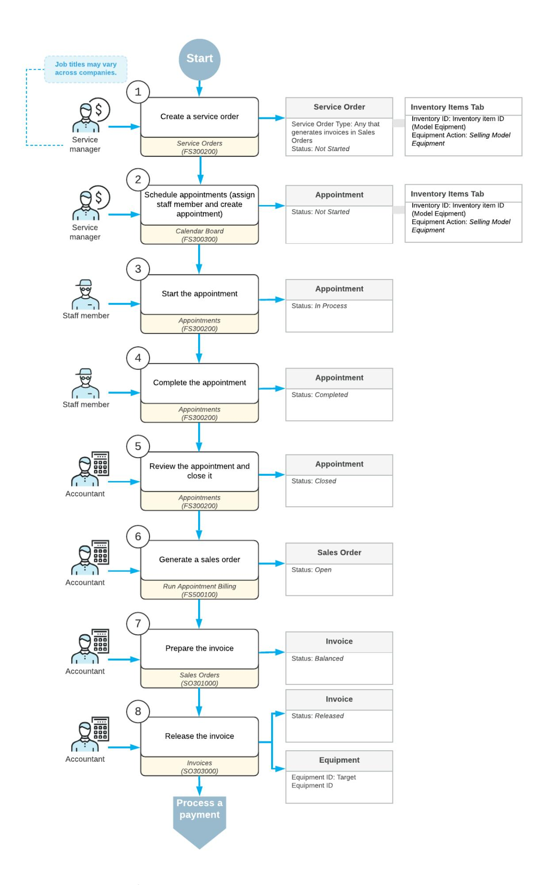

In the following sections, you will read about each step of the process.

#### **Entering an Order**

When a service manager receives a customer request, he or she enters a service order by using the *[Service Orders](https://help-2025r1.acumatica.com/Help?ScreenId=ShowWiki&pageid=6e5277d3-274e-45f5-b77d-4410ed736d21)* (FS300100) form (see 1 in the diagram above). In the service order, the service manager specifies the customer from which the request has been received, the branch and branch location where the services are delivered, the services that should be performed. For instructions on how to create a service order, see *[Service Orders with a](https://help-2025r1.acumatica.com/Help?ScreenId=ShowWiki&pageid=134b0c71-2e0b-4270-9b4e-53c8c958ce81) [Single Appointment: Process Activity](https://help-2025r1.acumatica.com/Help?ScreenId=ShowWiki&pageid=134b0c71-2e0b-4270-9b4e-53c8c958ce81)*.

In addition, on the **Inventory Item** tab of this form, the service manager adds a model equipment entity that is sold. For the model equipment entity, the service manager selects *Selling Model Equipment* in the **Equipment Action** column.

#### **Creating Appointments**

Aer the service order has been created in the system, a scheduler of your company (that is, a person who is responsible for planning the appointments) uses the *[Calendar Board](https://help-2025r1.acumatica.com/Help?ScreenId=ShowWiki&pageid=00cc92c3-408f-4fe3-b6bf-e801559f74f9)* (FS300300) form to schedule the appointments (2 in the diagram above) that are needed to perform the services requested by the customer.

When the scheduler selects a staff member to attend an appointment, he or she takes into consideration the work schedule of the staff member and filters the displayed staff members by the skills and licenses needed to perform the service and the service area where the services are provided. The scheduler checks the information on each appointment and enters additional information, such as the resource equipment used to perform the services and the stock items purchased by the customer along with the service. (The system assigns the *Not Started* status to the created appointments.)

#### **Attending an Appointment**

The staff member who is assigned to an appointment looks through his or her upcoming appointments on the *[Staff Calendar Board](https://help-2025r1.acumatica.com/Help?ScreenId=ShowWiki&pageid=b1d15e47-fba9-4bbf-a7fa-2f7c396c8df4)* (FS300400) form, identifies which appointment he or she has to attend currently, and goes to the location where the service has to be performed, which usually is the customer location). When the staff member starts to perform the service, he or she starts the appointment on the *[Appointments](https://help-2025r1.acumatica.com/Help?ScreenId=ShowWiki&pageid=ac486e9c-f5df-4829-94f0-2df8821361a0)* (FS300200) form (3 in the diagram above). The appointment is assigned the *In Process* status.

While the services are being performed, the staff member adds the information on services (such as statuses, quantities, and extra stock items that were used) to the appointment on the *[Appointments](https://help-2025r1.acumatica.com/Help?ScreenId=ShowWiki&pageid=ac486e9c-f5df-4829-94f0-2df8821361a0)* form. When the services are done, the staff member checks the details of the appointment. When everything is correct and complete, the staff member completes the appointment (4), which gives it the *Completed* status.

When all appointments of a particular service order are completed, the system assigns the service order the *Completed* status.

#### **Processing Invoices**

Further processing of the service order is performed by an accountant. On the *[Appointments](https://help-2025r1.acumatica.com/Help?ScreenId=ShowWiki&pageid=ac486e9c-f5df-4829-94f0-2df8821361a0)* (FS300200) form, the accountant opens the completed appointment and verifies quantities and prices. When all information is verified and the appointments are ready for invoicing, the accountant closes the appointments and the service order (5). (The appointments and service order get the *Closed* status.)

The accountant generates a sales order document with the *Open* status by using the *[Run Appointment Billing](https://help-2025r1.acumatica.com/Help?ScreenId=ShowWiki&pageid=f1d027ae-c546-47ab-b861-1b7670532bd9)* (FS500100) form (6 in the diagram above).

The accountant then prepares the invoice (7) by using the *[Sales Orders](https://help-2025r1.acumatica.com/Help?ScreenId=ShowWiki&pageid=19e4021c-1b84-49fd-be12-0320c5f1c7e5)* (SO301000) form, and processes and releases the invoice on the *[Invoices](https://help-2025r1.acumatica.com/Help?ScreenId=ShowWiki&pageid=0acc9738-f141-4ea0-a2be-f34ea9d1b63a)* (SO303000) form (8).

When the invoice related to the service order is released, the sold model equipment converts to a target equipment, and the system adds a record for the new target equipment entity with the *Active* status on the *[Equipment](https://help-2025r1.acumatica.com/Help?ScreenId=ShowWiki&pageid=43b7c838-3051-4238-87db-e9b9c213894e)* (FS205000) form.

# **Selling a Model Equipment Entity and Optional Component**

In Acumatica ERP, while you are working with a sales order, service order, or appointment on the applicable form, you can easily register the sale of model equipment entities and optional components of it.

For the use case considered in this topic, suppose that the customer has requested a model equipment entity and an optional component for it, along with installation services from your company. A service manager of your company receives the request and enters it into Acumatica ERP. Further processing is then performed by the scheduler, the assigned staff members, and the accountant who prepares invoices for the customer and processes them in the system.

In this topic, you will read about the steps involved in processing the service order that includes the sale of model equipment and its optional component.

## **Applying the System Settings of the Use Case**

In this example, settings are applied in the system as follows:

- On the *[Billing Cycles](https://help-2025r1.acumatica.com/Help?ScreenId=ShowWiki&pageid=273739f9-4e18-4e81-949b-128b02e37810)* (FS206000) form, the billing cycle assigned to the customer is configured to generate billing documents and group them by appointment (that is, in the Summary area, the **Appointments** option button is selected under both **Run Billing For** and **Group Billing Documents By**).
- For the service order type, on the **General** tab of the *[Service](https://help-2025r1.acumatica.com/Help?ScreenId=ShowWiki&pageid=06fd8a36-dd81-4df9-b609-92c3d552c542) Order Types* (FS202300) form, the applicable service order type is configured as follows:
  - In the **BillingSettings** section, the option button to create sales orders (**Sales Orders** under **Generated Billing Documents**) is selected.
  - In the **GeneralSettings** section, the **CompleteService Order When Its Appointments Are Completed** check box is selected, so that service orders of the type are completed automatically when their appointments are completed. Also, the **CompleteService Order When Its Appointments Are Closed** check box is selected, meaning that service orders of the type are closed automatically when their appointments are closed.

In the diagram below, you can see the entire process of selling model equipment and its optional component within a service order.

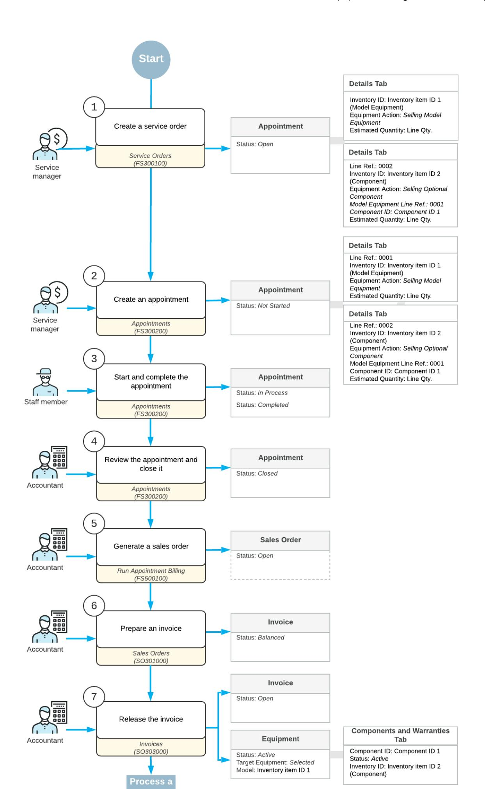

In the following sections, you will read about each step of the process.

#### **Entering an Order**

When a service manager receives a customer request, he or she enters a service order by using the *[Service Orders](https://help-2025r1.acumatica.com/Help?ScreenId=ShowWiki&pageid=6e5277d3-274e-45f5-b77d-4410ed736d21)* (FS300100) form (see 1 in the diagram above). In the service order, the service manager specifies the customer from which the request has been received, the branch and branch location where the services are delivered, the services that should be performed.

In addition, on the **Inventory Item** tab of this form, the service manager adds the model equipment entity and the optional component to be sold as follows:

- 1. For the model equipment entity, the service manager selects *Selling Model Equipment* in the **Equipment Action** column.
- 2. For the optional component, the service manager selects *Selling Optional Component* in the **Equipment Action** column, specifies the related model equipment in the **Model Equipment Line Nbr.** column, and selects the identifier of the equipment component in the **Component ID** column.

## **Creating Appointments**

Aer the service order has been created in the system, a scheduler of your company (that is, a person who is responsible for planning the appointments) uses the *[Calendar Board](https://help-2025r1.acumatica.com/Help?ScreenId=ShowWiki&pageid=00cc92c3-408f-4fe3-b6bf-e801559f74f9)* (FS300300) form to schedule the appointments (2 in the diagram above) that are needed to perform the services requested by the customer.

When the scheduler selects a staff member to attend an appointment, he or she takes into consideration the work schedule of the staff member and filters the displayed staff members by the skills and licenses needed to perform the service and the service area where the services are provided. The scheduler checks the information on each appointment and enters additional information, such as the resource equipment used to perform the services and the stock items purchased by the customer along with the service. (The system assigns the *Not Started* status to the created appointments.)

#### **Attending an Appointment**

The staff member who is assigned to an appointment looks through his or her upcoming appointments on the *[Staff Calendar Board](https://help-2025r1.acumatica.com/Help?ScreenId=ShowWiki&pageid=b1d15e47-fba9-4bbf-a7fa-2f7c396c8df4)* (FS300400) form, identifies which appointment he or she has to attend currently, and goes to the location where the service has to be performed, which usually is the customer location). When the staff member starts to perform the service, he or she starts the appointment on the *[Appointments](https://help-2025r1.acumatica.com/Help?ScreenId=ShowWiki&pageid=ac486e9c-f5df-4829-94f0-2df8821361a0)* (FS300200) form (3 in the diagram above). The appointment is assigned the *In Process* status.

While the services are being performed, the staff member adds the information on services (such as statuses, quantities, and extra stock items that were used) to the appointment on the *[Appointments](https://help-2025r1.acumatica.com/Help?ScreenId=ShowWiki&pageid=ac486e9c-f5df-4829-94f0-2df8821361a0)* form. When the services are done, the staff member checks the details of the appointment. When everything is correct and complete, the staff member completes the appointment (4), which gives it the *Completed* status.

When all appointments of a particular service order are completed, the system assigns the service order the *Completed* status.

## **Processing Invoices**

Further processing of the service order is performed by an accountant. On the *[Appointments](https://help-2025r1.acumatica.com/Help?ScreenId=ShowWiki&pageid=ac486e9c-f5df-4829-94f0-2df8821361a0)* (FS300200) form, the accountant opens the completed appointment and verifies quantities and prices. When all information is verified and the appointments are ready for invoicing, the accountant closes the appointments and the service order (5). (The appointments and service order get the *Closed* status.)

The accountant generates a sales order document with the *Open* status by using the *[Run Appointment Billing](https://help-2025r1.acumatica.com/Help?ScreenId=ShowWiki&pageid=f1d027ae-c546-47ab-b861-1b7670532bd9)* (FS500100) form (6 in the diagram above).

The accountant then prepares the invoice (7) by using the *[Sales Orders](https://help-2025r1.acumatica.com/Help?ScreenId=ShowWiki&pageid=19e4021c-1b84-49fd-be12-0320c5f1c7e5)* (SO301000) form, and processes and releases the invoice on the *[Invoices](https://help-2025r1.acumatica.com/Help?ScreenId=ShowWiki&pageid=0acc9738-f141-4ea0-a2be-f34ea9d1b63a)* (SO303000) form (8).

When the invoice related to the service order is released, the system automatically adds a record for the new target equipment entity with the *Active* status on the *[Equipment](https://help-2025r1.acumatica.com/Help?ScreenId=ShowWiki&pageid=43b7c838-3051-4238-87db-e9b9c213894e)* (FS205000) form, including an optional component of the *Active* status on the **Components and Warranties** tab.

## **Selling an Optional Component of Target Equipment**

In Acumatica ERP, while you are working with a sales order, service order, or appointment on the applicable form, you can easily register a sale of an optional component of target equipment.

For the use case considered in this topic, suppose that the customer has requested that an optional component of target equipment (which the company already has) be installed at the customer site, along with installation services from your company. A service manager of your company receives the request and enters it into Acumatica ERP. Further processing is then performed by the scheduler, the assigned staff members, and the accountant who prepares invoices for the customer and processes them in the system.

In this topic, you will read about the steps involved in processing the service order that includes the sale of an optional component of target equipment.

## **Applying the System Settings of the Use Case**

In this example, settings are applied in the system as follows:

- On the *[Billing Cycles](https://help-2025r1.acumatica.com/Help?ScreenId=ShowWiki&pageid=273739f9-4e18-4e81-949b-128b02e37810)* (FS206000) form, the billing cycle assigned to the customer is configured to generate billing documents and group them by appointment (that is, in the Summary area, the **Appointments** option button is selected under both **Run Billing For** and **Group Billing Documents By**).
- For the service order type, on the **General** tab of the *[Service](https://help-2025r1.acumatica.com/Help?ScreenId=ShowWiki&pageid=06fd8a36-dd81-4df9-b609-92c3d552c542) Order Types* (FS202300) form, the applicable service order type is configured as follows:
  - In the **BillingSettings** section, the option button to create sales orders (**Sales Orders** under **Generated Billing Documents**) is selected.
  - In the **GeneralSettings** section, the **CompleteService Order When Its Appointments Are Completed** check box is selected, so that service orders of the type are completed automatically when their appointments are completed. Also, the **CompleteService Order When Its Appointments Are Closed** check box is selected, meaning that service orders of the type are closed automatically when their appointments are closed.

In the diagram below, you can see the entire process of selling an optional component of target equipment within a service order.

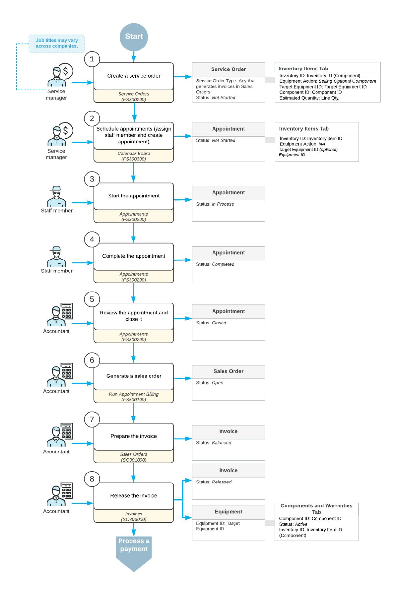

*Figure: Selling an optional component of target equipment within a service order*

In the following sections, you will read about each step of the process.

### **Entering an Order**

When a service manager receives a customer request, he or she enters a service order by using the *[Service Orders](https://help-2025r1.acumatica.com/Help?ScreenId=ShowWiki&pageid=6e5277d3-274e-45f5-b77d-4410ed736d21)* (FS300100) form (see 1 in the diagram above). In the service order, the service manager specifies the customer from which the request has been received, the branch and branch location where the services are delivered, the services that should be performed.

In addition, on the **Inventory Item** tab of this form, the service manager adds the optional component to be sold. For the optional component, the service manager selects *Selling Optional Component* in the **Equipment Action** column, specifies the related target equipment in the**Target Equipment ID** column, and selects the identifier of the equipment component in the **Component ID** column.

## **Creating Appointments**

Aer the service order has been created in the system, a scheduler of your company (that is, a person who is responsible for planning the appointments) uses the *[Calendar Board](https://help-2025r1.acumatica.com/Help?ScreenId=ShowWiki&pageid=00cc92c3-408f-4fe3-b6bf-e801559f74f9)* (FS300300) form to schedule the appointments (2 in the diagram above) that are needed to perform the services requested by the customer.

When the scheduler selects a staff member to attend an appointment, he or she takes into consideration the work schedule of the staff member and filters the displayed staff members by the skills and licenses needed to perform the service and the service area where the services are provided. The scheduler checks the information on each appointment and enters additional information, such as the resource equipment used to perform the services and the stock items purchased by the customer along with the service. (The system assigns the *Not Started* status to the created appointments.)

#### **Attending an Appointment**

The staff member who is assigned to an appointment looks through his or her upcoming appointments on the *[Staff Calendar Board](https://help-2025r1.acumatica.com/Help?ScreenId=ShowWiki&pageid=b1d15e47-fba9-4bbf-a7fa-2f7c396c8df4)* (FS300400) form, identifies which appointment he or she has to attend currently, and goes to the location where the service has to be performed, which usually is the customer location). When the staff member starts to perform the service, he or she starts the appointment on the *[Appointments](https://help-2025r1.acumatica.com/Help?ScreenId=ShowWiki&pageid=ac486e9c-f5df-4829-94f0-2df8821361a0)* (FS300200) form (3 in the diagram above). The appointment is assigned the *In Process* status.

While the services are being performed, the staff member adds the information on services (such as statuses, quantities, and extra stock items that were used) to the appointment on the *[Appointments](https://help-2025r1.acumatica.com/Help?ScreenId=ShowWiki&pageid=ac486e9c-f5df-4829-94f0-2df8821361a0)* form. When the services are done, the staff member checks the details of the appointment. When everything is correct and complete, the staff member completes the appointment (4), which gives it the *Completed* status.

When all appointments of a particular service order are completed, the system assigns the service order the *Completed* status.

### **Processing Invoices**

Further processing of the service order is performed by an accountant. On the *[Appointments](https://help-2025r1.acumatica.com/Help?ScreenId=ShowWiki&pageid=ac486e9c-f5df-4829-94f0-2df8821361a0)* (FS300200) form, the accountant opens the completed appointment and verifies quantities and prices. When all information is verified and the appointments are ready for invoicing, the accountant closes the appointments and the service order (5). (The appointments and service order get the *Closed* status.)

The accountant generates a sales order document with the *Open* status by using the *[Run Appointment Billing](https://help-2025r1.acumatica.com/Help?ScreenId=ShowWiki&pageid=f1d027ae-c546-47ab-b861-1b7670532bd9)* (FS500100) form (6 in the diagram above).

The accountant then prepares the invoice (7) by using the *[Sales Orders](https://help-2025r1.acumatica.com/Help?ScreenId=ShowWiki&pageid=19e4021c-1b84-49fd-be12-0320c5f1c7e5)* (SO301000) form, and processes and releases the invoice on the *[Invoices](https://help-2025r1.acumatica.com/Help?ScreenId=ShowWiki&pageid=0acc9738-f141-4ea0-a2be-f34ea9d1b63a)* (SO303000) form (8).

When the invoices related to the service order is released, the system automatically adds a component with the *Active* status to the target equipment record on the **Components and Warranties** tab of the *[Equipment](https://help-2025r1.acumatica.com/Help?ScreenId=ShowWiki&pageid=43b7c838-3051-4238-87db-e9b9c213894e)* (FS205000) form.

# **Upgrading a Default Component of Model Equipment to Be Sold**

In Acumatica ERP, while you are working with a sales order, service order, or appointment on the applicable form, you can easily register the sale of model equipment and replacement of a default component in it.

For the use case considered in this topic, suppose that the customer has requested a model equipment entity and a replacement of one of the default components of this equipment entity, along with installation services from your company. A service manager of your company receives the request and enters it into Acumatica ERP. Further processing is then performed by the scheduler, the assigned staff members, and the accountant who prepares invoices for the customer and processes them in the system.

In this topic, you will read about the steps involved in processing the service order that includes the sale of model equipment and the upgrade of its default component.

## **Applying the System Settings of the Use Case**

In this example, settings are applied in the system as follows:

- On the *[Billing Cycles](https://help-2025r1.acumatica.com/Help?ScreenId=ShowWiki&pageid=273739f9-4e18-4e81-949b-128b02e37810)* (FS206000) form, the billing cycle assigned to the customer is configured to generate billing documents and group them by appointment (that is, in the Summary area, the **Appointments** option button is selected under both **Run Billing For** and **Group Billing Documents By**).
- For the service order type, on the **General** tab of the *[Service](https://help-2025r1.acumatica.com/Help?ScreenId=ShowWiki&pageid=06fd8a36-dd81-4df9-b609-92c3d552c542) Order Types* (FS202300) form, the applicable service order type is configured as follows:
  - In the **BillingSettings** section, the option button to create sales orders (**Sales Orders** under **Generated Billing Documents**) is selected.
  - In the **GeneralSettings** section, the **CompleteService Order When Its Appointments Are Completed** check box is selected, so that service orders of the type are completed automatically when their appointments are completed. Also, the **CompleteService Order When Its Appointments Are Closed** check box is selected, meaning that service orders of the type are closed automatically when their appointments are closed.

In the diagram below, you can see the entire process of selling a piece of model equipment and upgrading a default component of model equipment within a service order.

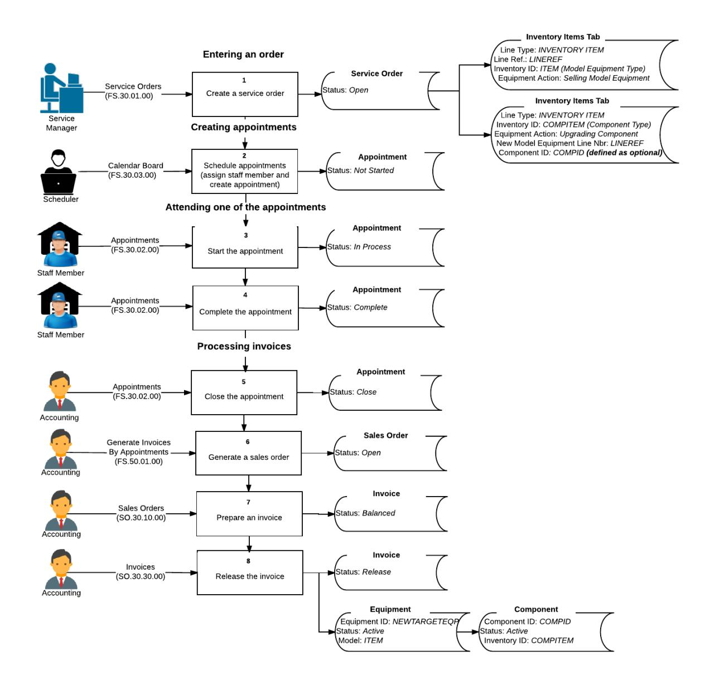

#### *Figure: Selling model equipment and upgrading a default component within a service order*

In the following sections, you will read about each step of the process.

## **Entering an Order**

When a service manager receives a customer request, he or she enters a service order by using the *[Service Orders](https://help-2025r1.acumatica.com/Help?ScreenId=ShowWiki&pageid=6e5277d3-274e-45f5-b77d-4410ed736d21)* (FS300100) form (see 1 in the diagram above). In the service order, the service manager specifies the customer from which the request has been received, the branch and branch location where the services are delivered, the services that should be performed.

In addition, on the **Inventory Item** tab of this form, the service manager adds the model equipment entity and the component to be sold as follows:

- 1. For the model equipment entity, the service manager selects *Selling Model Equipment* in the **Equipment Action** column.
- 2. For the component, the service manager selects *Upgrading Component* in the **Equipment Action** column, specifies the related model equipment in the **Model Equipment Line Nbr.** column, and selects the identifier of the equipment component in the **Component ID** column.

## **Creating Appointments**

Aer the service order has been created in the system, a scheduler of your company (that is, a person who is responsible for planning the appointments) uses the *[Calendar Board](https://help-2025r1.acumatica.com/Help?ScreenId=ShowWiki&pageid=00cc92c3-408f-4fe3-b6bf-e801559f74f9)* (FS300300) form to schedule the appointments (2 in the diagram above) that are needed to perform the services requested by the customer.

When the scheduler selects a staff member to attend an appointment, he or she takes into consideration the work schedule of the staff member and filters the displayed staff members by the skills and licenses needed to perform the service and the service area where the services are provided. The scheduler checks the information on each appointment and enters additional information, such as the resource equipment used to perform the services and the stock items purchased by the customer along with the service. (The system assigns the *Not Started* status to the created appointments.)

## **Attending an Appointment**

The staff member who is assigned to an appointment looks through his or her upcoming appointments on the *[Staff Calendar Board](https://help-2025r1.acumatica.com/Help?ScreenId=ShowWiki&pageid=b1d15e47-fba9-4bbf-a7fa-2f7c396c8df4)* (FS300400) form, identifies which appointment he or she has to attend currently, and goes to the location where the service has to be performed, which usually is the customer location). When the staff member starts to perform the service, he or she starts the appointment on the *[Appointments](https://help-2025r1.acumatica.com/Help?ScreenId=ShowWiki&pageid=ac486e9c-f5df-4829-94f0-2df8821361a0)* (FS300200) form (3 in the diagram above). The appointment is assigned the *In Process* status.

While the services are being performed, the staff member adds the information on services (such as statuses, quantities, and extra stock items that were used) to the appointment on the *[Appointments](https://help-2025r1.acumatica.com/Help?ScreenId=ShowWiki&pageid=ac486e9c-f5df-4829-94f0-2df8821361a0)* form. When the services are done, the staff member checks the details of the appointment. When everything is correct and complete, the staff member completes the appointment (4), which gives it the *Completed* status.

When all appointments of a particular service order are completed, the system assigns the service order the *Completed* status.

## **Processing Invoices**

Further processing of the service order is performed by an accountant. On the *[Appointments](https://help-2025r1.acumatica.com/Help?ScreenId=ShowWiki&pageid=ac486e9c-f5df-4829-94f0-2df8821361a0)* (FS300200) form, the accountant opens the completed appointment and verifies quantities and prices. When all information is verified and the appointments are ready for invoicing, the accountant closes the appointments and the service order (5). (The appointments and service order get the *Closed* status.)

The accountant generates a sales order document with the *Open* status by using the *[Run Appointment Billing](https://help-2025r1.acumatica.com/Help?ScreenId=ShowWiki&pageid=f1d027ae-c546-47ab-b861-1b7670532bd9)* (FS500100) form (6 in the diagram above).

The accountant then prepares the invoice (7) by using the *[Sales Orders](https://help-2025r1.acumatica.com/Help?ScreenId=ShowWiki&pageid=19e4021c-1b84-49fd-be12-0320c5f1c7e5)* (SO301000) form, and processes and releases the invoice on the *[Invoices](https://help-2025r1.acumatica.com/Help?ScreenId=ShowWiki&pageid=0acc9738-f141-4ea0-a2be-f34ea9d1b63a)* (SO303000) form (8).

When the invoice related to the service order is released, the system adds a record for the new target equipment entity with the *Active* status on the *[Equipment](https://help-2025r1.acumatica.com/Help?ScreenId=ShowWiki&pageid=43b7c838-3051-4238-87db-e9b9c213894e)* (FS205000) form, including a new component of the *Active* status on the **Components and Warranties** tab.

## **Replacing Target Equipment**

In Acumatica ERP, while you are working with a sales order, service order, or appointment on the applicable form, you can easily register the replacement of an existing target equipment entity with a new entity.

For the use case considered in this topic, suppose that the customer has requested a new equipment entity to replace an old one, along with replacement services from your company. A service manager of your company receives the request and enters it into Acumatica ERP. Further processing is then performed by the scheduler, the assigned staff members, and the accountant who prepares invoices for the customer and processes them in the system.

In this topic, you will read about the steps involved in processing the service order and replacing the target equipment.

## **Applying the System Settings of the Use Case**

In this example, settings are applied in the system as follows:

- On the *[Billing Cycles](https://help-2025r1.acumatica.com/Help?ScreenId=ShowWiki&pageid=273739f9-4e18-4e81-949b-128b02e37810)* (FS206000) form, the billing cycle assigned to the customer is configured to generate billing documents and group them by appointment (that is, in the Summary area, the **Appointments** option button is selected under both **Run Billing For** and **Group Billing Documents By**).
- For the service order type, on the **General** tab of the *[Service](https://help-2025r1.acumatica.com/Help?ScreenId=ShowWiki&pageid=06fd8a36-dd81-4df9-b609-92c3d552c542) Order Types* (FS202300) form, the applicable service order type is configured as follows:
  - In the **BillingSettings** section, the option button to create sales orders (**Sales Orders** under **Generated Billing Documents**) is selected.
  - In the **GeneralSettings** section, the **CompleteService Order When Its Appointments Are Completed** check box is selected, so that service orders of the type are completed automatically when their appointments are completed. Also, the **CompleteService Order When Its Appointments Are Closed** check box is selected, meaning that service orders of the type are closed automatically when their appointments are closed.

In the diagram below, you can see the entire process of replacing target equipment within a service order.

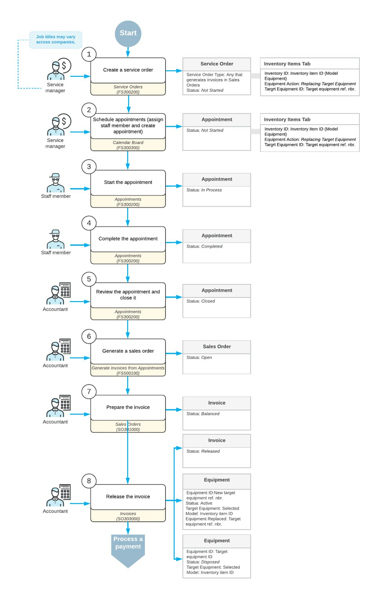

In the following sections, you will read about each step of the process.

#### **Entering an Order**

When a service manager receives a customer request for replacement of target equipment, he or she enters a service order by using the *[Service Orders](https://help-2025r1.acumatica.com/Help?ScreenId=ShowWiki&pageid=6e5277d3-274e-45f5-b77d-4410ed736d21)* (FS300100) form (see 1 in the diagram above). In the service order, the service manager specifies the customer from which the request has been received, the branch and branch location where the services are delivered, the services that should be performed.

In addition, on the **Inventory Item** tab of this form, the service manager adds a model equipment entity that will replace the old target equipment entity. To specify that the replacement is being performed, for the model equipment entity, the service manager selects *Replacing Target Equipment* in the **Equipment Action** column and specifies the target equipment entity to be replaced in the**Target Equipment ID** column.

### **Creating Appointments**

Aer the service order has been created in the system, a scheduler of your company (that is, a person who is responsible for planning the appointments) uses the *[Calendar Board](https://help-2025r1.acumatica.com/Help?ScreenId=ShowWiki&pageid=00cc92c3-408f-4fe3-b6bf-e801559f74f9)* (FS300300) form to schedule the appointments (2 in the diagram above) that are needed to perform the services requested by the customer.

When the scheduler selects a staff member to attend an appointment, he or she takes into consideration the work schedule of the staff member and filters the displayed staff members by the skills and licenses needed to perform the service and the service area where the services are provided. The scheduler checks the information on each appointment and enters additional information, such as the resource equipment used to perform the services and the stock items purchased by the customer along with the service. (The system assigns the *Not Started* status to the created appointments.)

#### **Attending an Appointment**

The staff member who is assigned to an appointment looks through his or her upcoming appointments on the *[Staff Calendar Board](https://help-2025r1.acumatica.com/Help?ScreenId=ShowWiki&pageid=b1d15e47-fba9-4bbf-a7fa-2f7c396c8df4)* (FS300400) form, identifies which appointment he or she has to attend currently, and goes to the location where the service has to be performed, which usually is the customer location). When the staff member starts to perform the service, he or she starts the appointment on the *[Appointments](https://help-2025r1.acumatica.com/Help?ScreenId=ShowWiki&pageid=ac486e9c-f5df-4829-94f0-2df8821361a0)* (FS300200) form (3 in the diagram above). The appointment is assigned the *In Process* status.

While the services are being performed, the staff member adds the information on services (such as statuses, quantities, and extra stock items that were used) to the appointment on the *[Appointments](https://help-2025r1.acumatica.com/Help?ScreenId=ShowWiki&pageid=ac486e9c-f5df-4829-94f0-2df8821361a0)* form. When the services are done, the staff member checks the details of the appointment. When everything is correct and complete, the staff member completes the appointment (4), which gives it the *Completed* status.

When all appointments of a particular service order are completed, the system assigns the service order the *Completed* status.

#### **Processing Invoices**

Further processing of the service order is performed by an accountant. On the *[Appointments](https://help-2025r1.acumatica.com/Help?ScreenId=ShowWiki&pageid=ac486e9c-f5df-4829-94f0-2df8821361a0)* (FS300200) form, the accountant opens the completed appointment and verifies quantities and prices. When all information is verified and the appointments are ready for invoicing, the accountant closes the appointments and the service order (5). (The appointments and service order get the *Closed* status.)

The accountant generates a sales order document with the *Open* status by using the *[Run Appointment Billing](https://help-2025r1.acumatica.com/Help?ScreenId=ShowWiki&pageid=f1d027ae-c546-47ab-b861-1b7670532bd9)* (FS500100) form (6 in the diagram above).

The accountant then prepares the invoice (7) by using the *[Sales Orders](https://help-2025r1.acumatica.com/Help?ScreenId=ShowWiki&pageid=19e4021c-1b84-49fd-be12-0320c5f1c7e5)* (SO301000) form, and processes and releases the invoice on the *[Invoices](https://help-2025r1.acumatica.com/Help?ScreenId=ShowWiki&pageid=0acc9738-f141-4ea0-a2be-f34ea9d1b63a)* (SO303000) form (8).

When the invoice related to the service order is released, the system adds a record for the new target equipment entity on the *[Equipment](https://help-2025r1.acumatica.com/Help?ScreenId=ShowWiki&pageid=43b7c838-3051-4238-87db-e9b9c213894e)* (FS205000) form and changes the status of replaced target equipment entity to *Disposed* on the same form.

# **Replacing a Component of Target Equipment**

In Acumatica ERP, while you are working with a sales order, service order, or appointment on the applicable form, you can register the replacement of components of target equipment with new components.

For the use case considered in this topic, suppose that the customer has requested a new component to replace an old one in the existing target equipment, along with replacement services from your company. A service manager of your company receives the request and enters it into Acumatica ERP. Further processing is then performed by the scheduler, the assigned staff members, and the accountant who prepares invoices for the customer and processes them in the system.

In this topic, you will read about the steps involved in processing the service order and replacing the component.

## **Applying the System Settings of the Use Case**

In this example, settings are applied in the system as follows:

- On the *[Billing Cycles](https://help-2025r1.acumatica.com/Help?ScreenId=ShowWiki&pageid=273739f9-4e18-4e81-949b-128b02e37810)* (FS206000) form, the billing cycle assigned to the customer is configured to generate billing documents and group them by appointment (that is, in the Summary area, the **Appointments** option button is selected under both **Run Billing For** and **Group Billing Documents By**).
- For the service order type, on the **General** tab of the *[Service](https://help-2025r1.acumatica.com/Help?ScreenId=ShowWiki&pageid=06fd8a36-dd81-4df9-b609-92c3d552c542) Order Types* (FS202300) form, the applicable service order type is configured as follows:
  - In the **BillingSettings** section, the option button to create sales orders (**Sales Orders** under **Generated Billing Documents**) is selected.
  - In the **GeneralSettings** section, the **CompleteService Order When Its Appointments Are Completed** check box is selected, so that service orders of the type are completed automatically when their appointments are completed. Also, the **CompleteService Order When Its Appointments Are Closed** check box is selected, meaning that service orders of the type are closed automatically when their appointments are closed.

In the diagram below, you can see the entire process of replacing a component of target equipment within a service order.

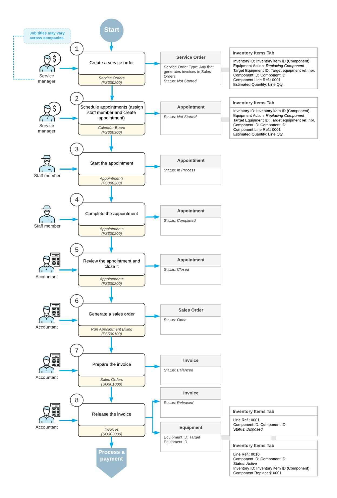

In the following sections, you will read about each step of the process.

#### **Entering an Order**

When a service manager receives a customer request for replacement of target equipment, he or she enters a service order by using the *[Service Orders](https://help-2025r1.acumatica.com/Help?ScreenId=ShowWiki&pageid=6e5277d3-274e-45f5-b77d-4410ed736d21)* (FS300100) form (see 1 in the diagram above). In the service order, the service manager specifies the customer from which the request has been received, the branch and branch location where the services are delivered, the services that should be performed.

In addition, on the **Inventory Item** tab of this form, the service manager adds a component that will replace the old component. To specify that the replacement is performed, for the new component, the service manager selects *Replacing Component* in the **Equipment Action** column, specifies the target equipment entity in which the component has to be replaced in the**Target Equipment ID** column, and specifies the component to be replaced in the **Component Ref. Nbr.** column.

#### **Creating Appointments**

Aer the service order has been created in the system, a scheduler of your company (that is, a person who is responsible for planning the appointments) uses the *[Calendar Board](https://help-2025r1.acumatica.com/Help?ScreenId=ShowWiki&pageid=00cc92c3-408f-4fe3-b6bf-e801559f74f9)* (FS300300) form to schedule the appointments (2 in the diagram above) that are needed to perform the services requested by the customer.

When the scheduler selects a staff member to attend an appointment, he or she takes into consideration the work schedule of the staff member and filters the displayed staff members by the skills and licenses needed to perform the service and the service area where the services are provided. The scheduler checks the information on each appointment and enters additional information, such as the resource equipment used to perform the services and the stock items purchased by the customer along with the service. (The system assigns the *Not Started* status to the created appointments.)

#### **Attending an Appointment**

The staff member who is assigned to an appointment looks through his or her upcoming appointments on the *[Staff Calendar Board](https://help-2025r1.acumatica.com/Help?ScreenId=ShowWiki&pageid=b1d15e47-fba9-4bbf-a7fa-2f7c396c8df4)* (FS300400) form, identifies which appointment he or she has to attend currently, and goes to the location where the service has to be performed, which usually is the customer location). When the staff member starts to perform the service, he or she starts the appointment on the *[Appointments](https://help-2025r1.acumatica.com/Help?ScreenId=ShowWiki&pageid=ac486e9c-f5df-4829-94f0-2df8821361a0)* (FS300200) form (3 in the diagram above). The appointment is assigned the *In Process* status.

While the services are being performed, the staff member adds the information on services (such as statuses, quantities, and extra stock items that were used) to the appointment on the *[Appointments](https://help-2025r1.acumatica.com/Help?ScreenId=ShowWiki&pageid=ac486e9c-f5df-4829-94f0-2df8821361a0)* form. When the services are done, the staff member checks the details of the appointment. When everything is correct and complete, the staff member completes the appointment (4), which gives it the *Completed* status.

When all appointments of a particular service order are completed, the system assigns the service order the *Completed* status.

#### **Processing Invoices**

Further processing of the service order is performed by an accountant. On the *[Appointments](https://help-2025r1.acumatica.com/Help?ScreenId=ShowWiki&pageid=ac486e9c-f5df-4829-94f0-2df8821361a0)* (FS300200) form, the accountant opens the completed appointment and verifies quantities and prices. When all information is verified and the appointments are ready for invoicing, the accountant closes the appointments and the service order (5). (The appointments and service order get the *Closed* status.)

The accountant generates a sales order document with the *Open* status by using the *[Run Appointment Billing](https://help-2025r1.acumatica.com/Help?ScreenId=ShowWiki&pageid=f1d027ae-c546-47ab-b861-1b7670532bd9)* (FS500100) form (6 in the diagram above).

The accountant then prepares the invoice (7) by using the *[Sales Orders](https://help-2025r1.acumatica.com/Help?ScreenId=ShowWiki&pageid=19e4021c-1b84-49fd-be12-0320c5f1c7e5)* (SO301000) form, and processes and releases the invoice on the *[Invoices](https://help-2025r1.acumatica.com/Help?ScreenId=ShowWiki&pageid=0acc9738-f141-4ea0-a2be-f34ea9d1b63a)* (SO303000) form (8).

When the invoice related to the service order is released, the system modifies a record for the target equipment entity on the *[Equipment](https://help-2025r1.acumatica.com/Help?ScreenId=ShowWiki&pageid=43b7c838-3051-4238-87db-e9b9c213894e)* (FS205000) form. That is, the system changes the status of replaced component to *Disposed* and adds a record for a new component on the **Components and Warranties** tab.

# **Selling a Stock Item that Does Not Require Record in Equipment Management**

In Acumatica ERP, while employees are working with a sales order, service order, or appointment on the applicable form, they can reflect the sales of stock items without creating or modifying records in the equipment management functional area.

For the use case to be considered in this topic, suppose that the customer has requested additional component of a target equipment. Your company is not going to keep record of the sold component in the system. The request is received and entered into Acumatica ERP by a service manager of your company. Further processing of a service order is then performed by the scheduler, the assigned staff members, and the accountant who prepares invoices for the customer and processes them in the system.

In this topic, you will read about the steps involved in the processing of the service order that includes the sale of stock item that do not require recording in the system.

## **Applying the System Settings of the Use Case**

In this example, settings are applied in the system as follows:

- On the *[Billing Cycles](https://help-2025r1.acumatica.com/Help?ScreenId=ShowWiki&pageid=273739f9-4e18-4e81-949b-128b02e37810)* (FS206000) form, the billing cycle assigned to the customer is configured to generate billing documents and group them by appointment (that is, in the Summary area, the **Appointments** option button is selected under both **Run Billing For** and **Group Billing Documents By**).
- For the service order type, on the **General** tab of the *[Service](https://help-2025r1.acumatica.com/Help?ScreenId=ShowWiki&pageid=06fd8a36-dd81-4df9-b609-92c3d552c542) Order Types* (FS202300) form, the applicable service order type is configured as follows:
  - In the **BillingSettings** section, the option button to create sales orders (**Sales Orders** under **Generated Billing Documents**) is selected.
  - In the **GeneralSettings** section, the **CompleteService Order When Its Appointments Are Completed** check box is selected, so that service orders of the type are completed automatically when their appointments are completed. Also, the **CompleteService Order When Its Appointments Are Closed** check box is selected, meaning that service orders of the type are closed automatically when their appointments are closed.

In the diagram below, you can see the entire process of replacing target equipment within a service order.

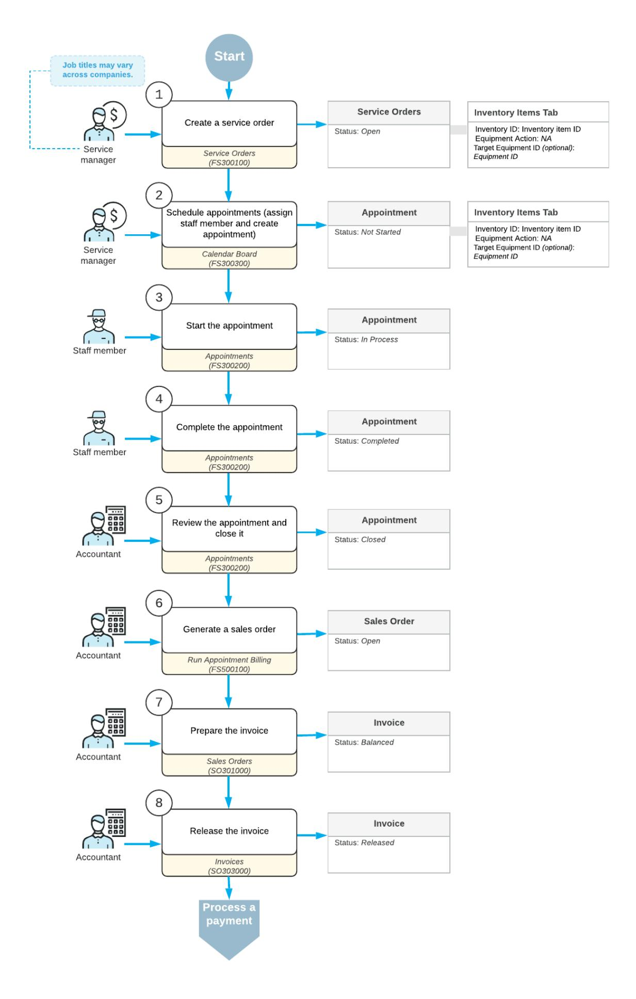

In the following sections, you will read about each step of the process

## **Entering an Order**

When a service manager receives a customer request, he or she enters a service order by using the *[Service Orders](https://help-2025r1.acumatica.com/Help?ScreenId=ShowWiki&pageid=6e5277d3-274e-45f5-b77d-4410ed736d21)* (FS300100) form (see 1 in the diagram above). In the service order, the service manager specifies the customer from which the request has been received, the branch and branch location where the services are delivered, and the services that should be performed.

The service manager adds the stock item to be sold on the **Details** tab of this form and selects *N/A* in the **Equipment Action** column.

In addition, the service manager adds the optional component to be sold on the **Details** tab. For the component, the service manager selects *N/A* in the **Equipment Action** column, specifies the related target equipment in the **Target Equipment ID** column, and selects the identifier of the equipment component in the **Component ID** column.

## **Creating Appointments**

Aer the service order has been created in the system, a scheduler of your company (that is, a person who is responsible for planning the appointments) uses the *[Calendar Board](https://help-2025r1.acumatica.com/Help?ScreenId=ShowWiki&pageid=00cc92c3-408f-4fe3-b6bf-e801559f74f9)* (FS300300) form to schedule the appointments (2 in the diagram above) that are needed to perform the services requested by the customer.

When the scheduler selects a staff member to attend an appointment, he or she takes into consideration the work schedule of the staff member and filters the displayed staff members by the skills and licenses needed to perform the service and the service area where the services are provided. The scheduler checks the information on each appointment and enters additional information, such as the resource equipment used to perform the services and the stock items purchased by the customer along with the service. (The system assigns the *Not Started* status to the created appointments.)

## **Attending an Appointment**

The staff member who is assigned to an appointment looks through his or her upcoming appointments on the *[Staff Calendar Board](https://help-2025r1.acumatica.com/Help?ScreenId=ShowWiki&pageid=b1d15e47-fba9-4bbf-a7fa-2f7c396c8df4)* (FS300400) form, identifies which appointment he or she has to attend currently, and goes to the location where the service has to be performed, which usually is the customer location). When the staff member starts to perform the service, he or she starts the appointment on the *[Appointments](https://help-2025r1.acumatica.com/Help?ScreenId=ShowWiki&pageid=ac486e9c-f5df-4829-94f0-2df8821361a0)* (FS300200) form (3 in the diagram above). The appointment is assigned the *In Process* status.

While the services are being performed, the staff member adds the information on services (such as statuses, quantities, and extra stock items that were used) to the appointment on the *[Appointments](https://help-2025r1.acumatica.com/Help?ScreenId=ShowWiki&pageid=ac486e9c-f5df-4829-94f0-2df8821361a0)* form. When the services are done, the staff member checks the details of the appointment. When everything is correct and complete, the staff member completes the appointment (4), which gives it the *Completed* status.

When all appointments of a particular service order are completed, the system assigns the service order the *Completed* status.

## **Processing Invoices**

Further processing of the service order is performed by an accountant. On the *[Appointments](https://help-2025r1.acumatica.com/Help?ScreenId=ShowWiki&pageid=ac486e9c-f5df-4829-94f0-2df8821361a0)* (FS300200) form, the accountant opens the completed appointment and verifies quantities and prices. When all information is verified and the appointments are ready for invoicing, the accountant closes the appointments and the service order (5). (The appointments and service order get the *Closed* status.)

The accountant generates a sales order document with the *Open* status by using the *[Run Appointment Billing](https://help-2025r1.acumatica.com/Help?ScreenId=ShowWiki&pageid=f1d027ae-c546-47ab-b861-1b7670532bd9)* (FS500100) form (6 in the diagram above).

The accountant then prepares the invoice (7) by using the *[Sales Orders](https://help-2025r1.acumatica.com/Help?ScreenId=ShowWiki&pageid=19e4021c-1b84-49fd-be12-0320c5f1c7e5)* (SO301000) form, and processes and releases it on the *[Invoices](https://help-2025r1.acumatica.com/Help?ScreenId=ShowWiki&pageid=0acc9738-f141-4ea0-a2be-f34ea9d1b63a)* (SO303000) form (8).

When the invoice related to the service order is released, the system does not add any records on the *[Equipment](https://help-2025r1.acumatica.com/Help?ScreenId=ShowWiki&pageid=43b7c838-3051-4238-87db-e9b9c213894e)* (FS205000) form.

# **Appendix**

The appendix provides some reference information relevant for this document. The additional information in this section is a useful source for readers who need some reference material that is related to system forms and tables, as well as running reports.

#### **In this section:**

- *[Reports](#page-128-3)*
- *Form [Toolbar](#page-135-1) and More Menu*
- *Table [Toolbar](#page-142-1)*
- *[Glossary](https://help-2025r1.acumatica.com/Help?ScreenId=ShowWiki&pageid=a2c92852-5ae8-4f4b-bf82-7f70cca0fdfa)*

## **Reports**

In addition to offering a comprehensive collection of reports, Acumatica ERP gives you a high degree of control over each report.

On a typical report form, described in *[Report Form](#page-128-4)*, you can adjust the report settings to meet your specific informational needs. You can specify sorting and filtering options and select the data by using report-specific settings—such as financial period, ledger, and account—and configure additional processing settings for each report. The settings can be saved as a report template for later use. For details, see *To Run a [Report](https://help-2025r1.acumatica.com/Help?ScreenId=ShowWiki&pageid=d0531b2f-178f-4d70-8c4c-6bc897cd6c0a)* and *To [Create](https://help-2025r1.acumatica.com/Help?ScreenId=ShowWiki&pageid=5adbb4bd-4347-4f81-a1ff-4d4d47d1fb1b) a Report [Template](https://help-2025r1.acumatica.com/Help?ScreenId=ShowWiki&pageid=5adbb4bd-4347-4f81-a1ff-4d4d47d1fb1b)*.

Aer you run a report, the prepared report appears on your screen. You can print the report, export the report to a file, or send the report by email.

This chapter describes a typical report form and the main tasks related to using reports.

## **In This Chapter**

- *[Report Form](#page-128-4)*
- *To Run a [Report](https://help-2025r1.acumatica.com/Help?ScreenId=ShowWiki&pageid=d0531b2f-178f-4d70-8c4c-6bc897cd6c0a)*
- *To Modify a Filter on a [Report](https://help-2025r1.acumatica.com/Help?ScreenId=ShowWiki&pageid=2513e10e-abb1-432e-85e0-a5e3f6cabf9c) Form*
- *To Create a Report [Template](https://help-2025r1.acumatica.com/Help?ScreenId=ShowWiki&pageid=5adbb4bd-4347-4f81-a1ff-4d4d47d1fb1b)*

# **Report Form**

Before you run a report, you specify the needed parameters on the report form. You can select a template and manually make selections that affect the information collected. Also, you can specify appropriate settings to print or email the finished report.

The following screenshot shows a typical report form.

| TOOLS $\star$ <b>Daily Sales Profitability</b>                      |                                                                                       |   |  |
|------------------------------------------------------------------------|---------------------------------------------------------------------------------------|---|--|
| ↶ REMOVE TEMPLATE <b>RUN REPORT</b> 1 <b>SAVE TEMPLATE</b> |                                                                                       |   |  |
| Template $\times$ $\scriptstyle\rm\sim$ 2 □ Default □ Shared  |                                                                                       |   |  |
| <b>REPORT PARAMETERS</b>                                               | ADDITIONAL SORT AND FILTERS PRINT AND EMAIL SETTINGS <b>EMAIL NOTIFICATIONS</b> |   |  |
| <b>Report Format</b>                                                   | <b>Detailed</b> $\checkmark$                                                       |   |  |
| Company/Branch:                                                        | HEADOFFICE - SweetLife Head Offi v                                                    |   |  |
| <b>From Date</b>                                                       | 2/1/2025 Ä                                                                         |   |  |
| <b>To Date</b>                                                         | 2/20/2025 Ħ                                                                        |   |  |
| <b>Document Type</b>                                                   | $\checkmark$                                                                          | 3 |  |
| Warehouse:                                                             | Q                                                                                     |   |  |
| Customer:                                                              | Q                                                                                     |   |  |
| Inventory:                                                             | Q                                                                                     |   |  |
|                                                                        | Released Transactions Only                                                            |   |  |
|                                                                        | Completed Transactions Only                                                           |   |  |
|                                                                        |                                                                                       |   |  |

#### *Figure: Report form*

- 1. Report form toolbar
- 2. Selection area
- 3. Details area

## **Report Form Toolbar**

The following table lists the buttons of the report form toolbar, which appears on the report form when you are configuring a report.

| Button              | Description                                                                                                              |
|---------------------|--------------------------------------------------------------------------------------------------------------------------|
| Cancel              | Clears any changes you have made on the report form and restores the default settings.                                   |
| Run Report          | Initiates data collection for the report and displays the generated report.                                              |
| SaveTemplate        | Gives you the ability to save the currently selected report as a template with all the select ed settings.            |
| Remove Tem plate | Removes the previously saved template. This button is available only when a template is specified on the report form. |

#### **Report Toolbar**

The following table lists the buttons of the report toolbar, which is shown on the generated report that you have run.

| Buttons    | Icon | Description                                                                |
|------------|------|----------------------------------------------------------------------------|
| Parameters |      | Navigates back to the report form to let you change the report parameters. |

| Buttons                 | Icon | Description                                                                                                                                                                                                    |
|-------------------------|------|----------------------------------------------------------------------------------------------------------------------------------------------------------------------------------------------------------------|
| Refresh                 |      | Refreshes the information displayed in the report (if any data changes were made).                                                                                                                             |
| Groups                  |      | Adds to the report a le pane where the report structure is shown. Click a report node to highlight the pertinent data in the right pane.                                                                   |
| View PDF / View HTML | /    | Displays the report as a PDF, or displays the report in HTML format. The available but ton depends on the current report view; if you're viewing a PDF, for instance, you will see the View HTML button. |
| First                   |      | Displays the first page of the report.                                                                                                                                                                         |
| Previous                |      | Displays the previous page.                                                                                                                                                                                    |
| Next                    |      | Displays the next page.                                                                                                                                                                                        |
| Last                    |      | Displays the last page of the report.                                                                                                                                                                          |
| Print                   |      | Opens the browser dialog box so you can print the report.                                                                                                                                                      |
| Send                    |      | Opens the Email Activity dialog box, which you use to send the report file (in the se lected format) to the specified email address.                                                                        |
| Export                  |      | Enables you to export the data in the selected format (Excel or PDF).                                                                                                                                          |

## **Selection Area**

You use the elements in this area to select an existing template, which you can share with other users or use as your default report settings. You can also select the locale and the localization.

The elements of this area, which are available for all reports, are described in the following table.

| Element  | Description                                                                                                                                            |
|----------|--------------------------------------------------------------------------------------------------------------------------------------------------------|
| Template | The template to be used for the report. If any templates have been created and saved, you can select a template to use its settings for the report. |
| Default  | A check box that indicates (if selected) that the selected template is marked as the default one for you. A default template cannot be shared.      |

| Element      | Description                                                                                                                                                                                                                                                                                                            |
|--------------|------------------------------------------------------------------------------------------------------------------------------------------------------------------------------------------------------------------------------------------------------------------------------------------------------------------------|
| Shared       | A check box that indicates (if selected) that the selected template is shared with other users. A shared template cannot be marked as the default.                                                                                                                                                                  |
| Locale       | A locale that you select to indicate to the system that the report should be prepared with the data translated to the language associated with this locale. This box is displayed if there are multiple active locales in the system. For details, see Locales and Languages.                                    |
| Localization | The localization that is used for the report.                                                                                                                                                                                                                                                                          |
|              | This box appears on the form if the following conditions are met:                                                                                                                                                                                                                                                      |
|              | The Canadian Localization or UK Localization feature is enabled on the Enable/Disable • Features (CS100000) form.                                                                                                                                                                                                |
|              | • A localized version of the report exists in the system.                                                                                                                                                                                                                                                           |
|              | One of the following options can be selected in the box:                                                                                                                                                                                                                                                               |
|              | None (default): Even though the report has a localized version, the report will be printed • without any localization applied.                                                                                                                                                                                   |
|              | • Canada: The Canadian version of the report will be printed. If the company in which you are signed in has Canada selected in the Localization box on the Company Details tab (Configuration Settings section) on the Companies (CS101500) form, this setting is se lected by default in the current box. |
|              | To determine if a localized version of a report exists, the system checks the Site\ReportsDefault directory, the database, the ReportsCus tomized folder, and the ReportsDefault folder.                                                                                                                         |

## **Report Parameters Tab**

The **Report Parameters** tab has sections where you can specify the contents of the report depending on the current report and vary in the following regards:

- Which elements are available on a particular report
- Whether elements contain default values
- Whether specific elements require values to be selected
- Whether elements may be le blank to let you display a broader range of data

## **Additional Sort and Filters Tab**

The **AdditionalSort and Filter** tab contains additional sorting and filtering conditions:

- **Additional sorting conditions**: Defines the sorting order. You can add a line, select one of the reportspecific properties, and select the *Descending* or *Ascending* sort order for the column.
- **Additional filtering conditions**: Defines the report filter. You can add a line, select one of the reportspecific properties, and define a condition and its value. The list of conditions include one-operand and two-operand conditions. To create a more complicated logical expression, you can use brackets and logical operations between brackets. For more information on creating filters, see *[Managing Advanced Filters](https://help-2025r1.acumatica.com/Help?ScreenId=ShowWiki&pageid=c621d79a-274d-4b72-a699-0e92d78a7b23)*. For detailed procedures on using ad hoc filters, see *[Reports: Process Activity](https://help-2025r1.acumatica.com/Help?ScreenId=ShowWiki&pageid=2b4d7aa8-25dc-4777-880a-fee2274990c7)*.

## **Print and Email Settings Tab**

If you plan to print the report or save the report as a PDF, select the appropriate settings in the **PrintSettings** area.

#### *Table: Print Settings Section*

| Element                 | Description                                                          |
|-------------------------|----------------------------------------------------------------------|
| Deleted Records         | Selects the visibility of the data deleted from the database.        |
| Print All Pages         | Causes all pages of the report to be printed.                        |
| Print in PDF format     | Displays the report in PDF format.                                   |
| Compress PDF file       | Indicates that the system will generate a compressed PDF.            |
| Embed fonts in PDF file | Indicates that the system will generate the PDF with fonts embedded. |

If you plan to send the report as an email, in the **EmailSettings** area, specify the format in which the report will be sent, as well as the email subject, the recipients of copies of the report, and the email account of the recipient.

#### *Table: Email Settings Section*

| Field         | Description                                                                                                                                                                                                                 |
|---------------|-----------------------------------------------------------------------------------------------------------------------------------------------------------------------------------------------------------------------------|
| Format        | The format (HTML, PDF, or Excel) in which the report will be emailed.                                                                                                                                                       |
|               | Merge function for reports in Excel format is not supported. If you want to merge a report with other reports and send an aggregated report by email, you should select either the HTML or PDF format for the report. |
| Email Account | The email address of the recipient.                                                                                                                                                                                         |
| CC            | An additional addressee to receive a carbon copy (CC) of the email.                                                                                                                                                         |
| BCC           | The email address of a person to receive a blind carbon copy (BCC) of the email; an address entered in this box will be hidden from other recipients.                                                                    |
| Subject       | The subject of the email.                                                                                                                                                                                                   |

## **Report Versions Tab**

If the report has multiple versions, you can select one of them.

This tab displays the data only to users assigned with report designer user role.

Report versions are designed in the Report Designer. To activate editing report versions, give the user report designer role.

*Table: Report Versions Tab Toolbar*

| Button  | Description                            |
|---------|----------------------------------------|
| Refresh | Refreshes the list of report versions. |

| Button | Description                                        |
|--------|----------------------------------------------------|
| Select | Temporarily activates the selected report version. |

## **Email Notifications Tab**

The **Email Notifications** tab lists the email templates used to send the report.

#### *Table: Table Toolbar*

The table toolbar includes standard buttons and buttons that are specific to this table. For the list of standard buttons, see *Table [Toolbar](#page-142-1)*. The table-specific buttons are listed below.

| Button          | Description                                                                                                                                                                     |
|-----------------|---------------------------------------------------------------------------------------------------------------------------------------------------------------------------------|
| Schedule Report | Opens the Email Templates (SM204003) form, where you can select or create a new email template that can be used to send the report and specify a schedule for notifications. |
|                 | The button appears only if the user account to which you are signed in has at least the Insert level of access rights to the Email Templates (SM204003) form.                |

#### *Table: Table Columns*

| Column                   | Description                                                                                                     |
|--------------------------|-----------------------------------------------------------------------------------------------------------------|
| Email Template           | The email template to be used to generate the body of the email notification.                                   |
| Screen ID                | The identifier of the form whose elements are used as the source of specific placeholders for this template. |
| Recipients               | The email addresses of the people to receive the email. Use semicolons as separators be tween addresses.     |
| Report Template          | The template configured for the report.                                                                         |
| Report Template Owner | The name of the user who created the template.                                                                  |

#### **Related Links**

- *To Run a [Report](https://help-2025r1.acumatica.com/Help?ScreenId=ShowWiki&pageid=d0531b2f-178f-4d70-8c4c-6bc897cd6c0a)*
- *To Create a Report [Template](https://help-2025r1.acumatica.com/Help?ScreenId=ShowWiki&pageid=5adbb4bd-4347-4f81-a1ff-4d4d47d1fb1b)*
- *Types of [Filters](https://help-2025r1.acumatica.com/Help?ScreenId=ShowWiki&pageid=9371f240-f73a-4b7a-8f16-72add7be7b62)*
- *[Automation Schedule Statuses](https://help-2025r1.acumatica.com/Help?ScreenId=ShowWiki&pageid=97fb65d2-2303-4993-9351-b6fbe112c37d)*

## **Report**

Once you click **Run Report**, the prepared report appears on your screen. You can print the report, export the report to a file, or send the report by email.

The prepared report is displayed in the report view of the report form. For more information about setting up the report parameters and the parameters view of the report form, see *[Report Form](#page-128-4)*.

## **Report Toolbar**

The following table lists report toolbar buttons.

| Buttons                 | Icon | Description                                                                                                                                                                                                    |
|-------------------------|------|----------------------------------------------------------------------------------------------------------------------------------------------------------------------------------------------------------------|
| Parameters              |      | Navigates back to the report form to let you change the report parameters.                                                                                                                                     |
| Refresh                 |      | Refreshes the information displayed in the report (if any data changes were made).                                                                                                                             |
| Groups                  |      | Adds to the report a le pane where the report structure is shown. Click a report node to highlight the pertinent data in the right pane.                                                                   |
| View PDF / View HTML | /    | Displays the report as a PDF, or displays the report in HTML format. The available but ton depends on the current report view; if you're viewing a PDF, for instance, you will see the View HTML button. |
| First                   |      | Displays the first page of the report.                                                                                                                                                                         |
| Previous                |      | Displays the previous page.                                                                                                                                                                                    |
| Next                    |      | Displays the next page.                                                                                                                                                                                        |
| Last                    |      | Displays the last page of the report.                                                                                                                                                                          |
| Print                   |      | Opens the browser dialog box so you can print the report.                                                                                                                                                      |
| Send                    |      | Opens the Email Activity dialog box, which you use to send the report file (in the cho sen format) to the specified email address.                                                                          |
| Export                  |      | Enables you to export the data in the chosen format (Excel or PDF).                                                                                                                                            |

#### **Related Links**

- *[Filters](https://help-2025r1.acumatica.com/Help?ScreenId=ShowWiki&pageid=fad0b170-9d7c-4851-8f73-4b841f977c0f)*
- *[Report](#page-133-1)*

# **Form Toolbar and More Menu**

The form toolbar, which is available on most forms, is located near the top of the form, under the form name (and record title, if the form has one), as shown in the following screenshot.

The form toolbar includes the following:

- Standard buttons (see Item 1 in the following screenshot), with the particular set of buttons depending on the specific form
- On some forms, form-specific buttons (Item 2)
- On some form, the More button (Item 3); clicking this button opens the More menu (Item 4), which contains additional form-specific commands

| Opportunities <b>PINOTES</b> <b>FILES</b> <b>CUSTOMIZATION</b> 000004 - A juicer with the installation and training for Lake Cafe 3                                                                                                     |                                                                                                   |  |                |  |   |                                                                                                  |   |  |  | TOOLS $\blacktriangleright$                                  |                                                        |  |          |  |  |  |  |        |  |  |  |  |  |
|--------------------------------------------------------------------------------------------------------------------------------------------------------------------------------------------------------------------------------------------------------|---------------------------------------------------------------------------------------------------|--|----------------|--|---|--------------------------------------------------------------------------------------------------|---|--|--|--------------------------------------------------------------|--------------------------------------------------------|--|----------|--|--|--|--|--------|--|--|--|--|--|
| $\Box$ $\Omega$ $\leftarrow$                                                                                                                                                                                                                     | $+$                                                                                               |  | $\mathbb{O}$ . |  | 面 | $\overline{\mathsf{K}}$                                                                          | ◟ |  |  | <b>OPEN</b> $\geq$                                        | <b>CREATE QUOTE</b>                                    |  | $\cdots$ |  |  |  |  |        |  |  |  |  |  |
| 000004 <b>Business Account:</b> Opportunity ID: $\circ$ <b>New</b> Location: Status: $\circ$ $\sqrt{2}$ PROJECT - Project Sales Contact: * Class ID: Stage: Owner: Prospect $\overline{\phantom{a}}$      |                                                                                                   |  |                |  |   | 2 LAKECAFE - Processing MAIN - Prima Open $\bullet$ Close as Won Close as Lost |   |  |  |                                                              | Activities <b>Create Task</b> <b>Create Note</b> |  |          |  |  |  |  | $\sim$ |  |  |  |  |  |
| * Estimated Close Date: * Subject:                                                                                                                                                                                                                  | 1/4/2021 $\overline{\phantom{a}}$ A juicer with the installation and training for Lake Cafe |  |                |  |   |                                                                                                  |   |  |  | Other <b>Record Creation</b> <b>Recalculate Prices</b> |                                                        |  |          |  |  |  |  |        |  |  |  |  |  |
| <b>Validate Addresses</b> <b>Create Quote</b> <b>Create Sales Order</b> <b>ACTIVITIES</b> <b>DETAILS</b> <b>QUOTES</b> <b>FINANCIAL</b> <b>SHIPPING</b> CONTACT <b>CRM INFO</b> AT 1 <b>Create Account</b> |                                                                                                   |  |                |  |   |                                                                                                  |   |  |  |                                                              |                                                        |  |          |  |  |  |  |        |  |  |  |  |  |
| <b>CREATE TASK</b> <b>CREATE EVENT</b> <b>CREATE EMAIL</b> CREATE ACTIVITY + PIN/UNPIN $\mathbb{H}$ $\mathcal{C}$ <b>Create Contact</b>                                                                                           |                                                                                                   |  |                |  |   |                                                                                                  |   |  |  |                                                              | $\triangledown$                                        |  |          |  |  |  |  |        |  |  |  |  |  |
| $\uparrow \qquad \qquad \uparrow$ $\uparrow$ $\uparrow$ $\uparrow$ D. 图 0 Type * Summary Start <b>Status</b> <b>Create Invoice</b> $\overline{\mathbf{k}}$                                                                     |                                                                                                   |  |                |  |   |                                                                                                  |   |  |  |                                                              |                                                        |  |          |  |  |  |  |        |  |  |  |  |  |
|                                                                                                                                                                                                                                                        |                                                                                                   |  |                |  |   |                                                                                                  |   |  |  |                                                              |                                                        |  |          |  |  |  |  |        |  |  |  |  |  |
|                                                                                                                                                                                                                                                        |                                                                                                   |  |                |  |   |                                                                                                  |   |  |  |                                                              |                                                        |  |          |  |  |  |  |        |  |  |  |  |  |

#### *Figure: The form toolbar and the More menu*

You use the standard buttons on the form toolbar to navigate through entities that were created by using the current form, insert or delete an entity, use the clipboard, save the data you have entered, or cancel your work on the form.

A form toolbar on a particular form may include form-specific buttons in addition to standard buttons; it may also (or instead) include commands on the More menu. By using these form-specific buttons and commands, users can navigate to related records and forms, initiate specific actions, and perform modifications or processing related to the functionality of the form.

### **Standard Form Toolbar Buttons**

The following table lists the standard buttons of the form toolbar. A form toolbar may include some or all of these buttons.

#### *Table: Standard Form Toolbar Buttons*

| Button                       | Icon | Description                                                                                                                                                                                                                                                                                                                                                                                                        |
|------------------------------|------|--------------------------------------------------------------------------------------------------------------------------------------------------------------------------------------------------------------------------------------------------------------------------------------------------------------------------------------------------------------------------------------------------------------------|
| Discard Changes and Close |      | Discards any unsaved changes made to the entity, and navigates to the list of records that is related to the current form.                                                                                                                                                                                                                                                                                      |
|                              |      | If the system opened the current form in a pop-up window (from a different form), this button is not displayed. To return to the original form, click Close.                                                                                                                                                                                                                                                 |
| Save & Close                 |      | Saves the changes made to the entity, and navigates to the list of records that is related to the current form.                                                                                                                                                                                                                                                                                                 |
| Save                         |      | Saves the changes made to the entity.                                                                                                                                                                                                                                                                                                                                                                              |
| Cancel                       |      | Depending on the context, does one of the following:                                                                                                                                                                                                                                                                                                                                                               |
|                              |      | • Discards any unsaved changes you have made to entities and retrieves the last saved version.                                                                                                                                                                                                                                                                                                               |
|                              |      | • Clears all changes and restores the default settings.                                                                                                                                                                                                                                                                                                                                                         |
| Add New Record               |      | Clears any values you've specified on the form, restores any default values, and initiates the creation of a new entity.                                                                                                                                                                                                                                                                                        |
| Delete                       |      | Deletes the currently selected entity, clears any values you have specified on the form, and populates elements with the default values that the system in serts when a new entity is created.                                                                                                                                                                                                               |
|                              |      | You can delete an entity only if it is not linked with another enti ty.                                                                                                                                                                                                                                                                                                                                         |
| Archive                      |      | Archives the document that is opened on the form. This button is available if archival is set up on the Archival Policy (SM200400) form for the type of the document open on the form and if the document meets the archival crite ria—that is, if the document is older than the retention period specified on the Archival Policy form and has been processed to completion or canceled.             |
|                              |      | For more information on archiving the documents, see Archiving Old Docu ments in the Acumatica ERP System Administration guide.                                                                                                                                                                                                                                                                                 |
| Extract                      |      | Extracts the archived document from the archive and makes the system use this document in day-to-day operations. This button is available if archival is set up on the Archival Policy (SM200400) form for the type of the document opened on the form is archived. For more information on archiving the documents, see Archiving Old Docu ments in the Acumatica ERP System Administration guide. |

#### Appendix | **138**

| Button                   | Icon | Description                                                                                                                                                                                                                                                                                                                                                                                                                                                                                                                                                                                                                                                           |
|--------------------------|------|-----------------------------------------------------------------------------------------------------------------------------------------------------------------------------------------------------------------------------------------------------------------------------------------------------------------------------------------------------------------------------------------------------------------------------------------------------------------------------------------------------------------------------------------------------------------------------------------------------------------------------------------------------------------------|
| Clipboard                |      | Provides menu commands you can use to do the following: • Copy: Copy the selected entity to the clipboard. • Paste: Paste an entity or template from the clipboard. • Save asTemplate: Create a template based on the selected entity. • Import from XML: Import an entity or a template from an .xml file. • Export to XML: Export the selected entity to an .xml file. For more information on templates and copy-and-paste operations in Acumatica ERP, see Using Forms. For more information on importing and ex porting .xml files, see Importing and Exporting Data to Excel and XML in the Acumatica ERP User Guide. |
| Go to First Record       |      | Displays the first entity (in the list of entities of the specific type) and its de tails.                                                                                                                                                                                                                                                                                                                                                                                                                                                                                                                                                                         |
| Go to Previous Record |      | Displays the previous entity and its details.                                                                                                                                                                                                                                                                                                                                                                                                                                                                                                                                                                                                                         |
| Go to Next Record        |      | Displays the next entity and its details.                                                                                                                                                                                                                                                                                                                                                                                                                                                                                                                                                                                                                             |
| Go to Last Record        |      | Displays the last entity (in the list of entities of the specific type) and its de tails.                                                                                                                                                                                                                                                                                                                                                                                                                                                                                                                                                                          |
| View Schedule            |      | Gives you the ability to schedule the processing. For more information, see Automated Processing: General Information.                                                                                                                                                                                                                                                                                                                                                                                                                                                                                                                                             |

## **Inquiry Form Toolbar Buttons**

Acumatica ERP inquiry forms present data in a tabular format; they may also have selection criteria you can use to filter the data in the table. Predefined inquiry forms are provided as part of Acumatica ERP out of the box, and inquiry forms can be designed by a user with the appropriate access rights by using the Generic Inquiry tool (for details, see *[Managing Generic Inquiries](https://help-2025r1.acumatica.com/Help?ScreenId=ShowWiki&pageid=5737bca9-aebb-446d-9e1a-bc5fcfad6797)* in the Acumatica ERP Reporting Tools Guide). A form toolbar of an inquiry form contains both the standard form toolbar buttons (described in the table above) and the additional buttons described below.

| Button  | Icon | Description                                                                                                                                                    |
|---------|------|----------------------------------------------------------------------------------------------------------------------------------------------------------------|
| Refresh |      | Refreshes the inquiry data in the table.                                                                                                                       |
| Cancel  |      | Clears all changes (including selection criteria that has been specified, if the generic inquiry form has this criteria) and restores the default settings. |

| Button          | Icon | Description                                                                                                                                                                                                                       |
|-----------------|------|-----------------------------------------------------------------------------------------------------------------------------------------------------------------------------------------------------------------------------------|
| Add New Record  |      | Initiates the creation of a new entity.                                                                                                                                                                                           |
| Edit            |      | Opens the applicable data entry form with the selected record.                                                                                                                                                                    |
| Fit toScreen    |      | Expands the form to fit on the screen and adjusts the column widths propor tionally.                                                                                                                                           |
| Export to Excel |      | Exports the data to an Excel file. For more information, see Integration with Ex cel in the Acumatica ERP Getting Started Guide.                                                                                               |
| Filter Settings |      | Opens the Filter Settings dialog box, which you can use to define a new filter. After the filter has been created and saved, the corresponding tab appears on the table. For more information about filtering, see Filters. |

## **The More Menu and Form-Specific Buttons**

If there are multiple form-specific commands on the form toolbar, they are displayed on a single menu—the More menu—and listed under descriptive categories, which makes it easier to find the needed menu command. On the More menu, you can easily define your favorite menu commands, which eases access to them.

On some forms, the system places a button (which is highlighted in green) on the form toolbar for the expected next command, which represents the likely next step to be performed on the selected record. The following screenshot, which shows the *Cash [Transactions](https://help-2025r1.acumatica.com/Help?ScreenId=ShowWiki&pageid=1e55821c-556b-4c3e-829c-95383eb2c8e2)* (CA304000) form, illustrates an example of the form toolbar and the More menu, which contains categories and menu commands.

| <b>Transactions</b> Cash Entry 000228 - 10200 Company Checking Account $\lceil 3 \rceil$ $\overline{2}$ |              |                |                     |                                  |          |                      |        |                          |   |                      |                 | <b>PINOTES</b> | <b>ACTIVITIES</b>       | <b>FILES</b>  | <b>CUSTOMIZATION</b> | TOOLS $\sim$                  |             |       |                |         |                        |
|------------------------------------------------------------------------------------------------------------------|--------------|----------------|---------------------|----------------------------------|----------|----------------------|--------|--------------------------|---|----------------------|-----------------|----------------|-------------------------|---------------|----------------------|-------------------------------|-------------|-------|----------------|---------|------------------------|
|                                                                                                                  | $\leftarrow$ | 周              | $\Box$              | $\Omega$                         |          | 顶                    | n ٠ | $\overline{\mathsf{K}}$  | ∢ | ⋗                    | $\geq$          |                | <b>RELEASE</b>          |               | <b>HOLD</b>          | $\cdots$                      |             |       | 4              |         |                        |
|                                                                                                                  |              | Tran. Type:    |                     | <b>Cash Entry</b>                |          |                      |        |                          |   | * Tran. Date:        |                 |                | 5/26/2021               |               |                      | Reports                       |             |       | Corrections    |         |                        |
|                                                                                                                  |              | Reference Nbr. |                     | 000228                           | Q        |                      |        |                          |   | * Fin. Period:       |                 |                | 05-2021                 | $\mathcal{L}$ |                      | $\hat{\mathbf{x}}$ Activities |             |       | Reverse        |         |                        |
| Cash Account:                                                                                                    |              |                |                     | 10200 - Company Checking Account |          |                      |        | Entry Type:              |   | <b>INTEREST - In</b> |                 |                |                         |               |                      |                               |             |       |                |         |                        |
|                                                                                                                  |              | Currency:      |                     | <b>USD</b>                       | 1.00     |                      |        | - VIEW BASE              |   |                      | Disbursement/.  |                | Receipt                 |               |                      | Processing                    |             |       |                |         |                        |
|                                                                                                                  | Status:      |                |                     | Balanced                         |          |                      |        |                          |   |                      | * Document Ref. |                | <b>INT-145</b>          |               |                      | Hold                          |             |       |                |         |                        |
|                                                                                                                  |              |                |                     |                                  |          |                      |        |                          |   | Owner:               |                 |                | EP00000002-             |               |                      | Remove Hold                   | $6^{\circ}$ |       |                |         |                        |
|                                                                                                                  |              | Description:   |                     |                                  |          |                      |        |                          |   |                      |                 |                |                         |               |                      | Release ®          |             |       |                |         |                        |
|                                                                                                                  |              |                |                     | <b>TRANSACTION DETAILS</b>       |          | <b>TAX DETAILS</b>   |        | <b>FINANCIAL DETAILS</b> |   |                      |                 |                | <b>APPROVAL DETAILS</b> |               |                      |                               |             |       |                |         |                        |
|                                                                                                                  |              |                | 1                   | $\times$                         | $\vdash$ | $\boxed{\mathbf{x}}$ | 工      |                          |   |                      |                 |                |                         |               |                      |                               |             |       |                |         |                        |
|                                                                                                                  | B 0          | D.             | * Branch |                                  | Item ID  |                      |        | <b>Description</b>       |   |                      |                 |                |                         |               |                      | Quantity                      | <b>UOM</b>  | Price | Amount *Offset | Account | <b>Account Descrip</b> |
|                                                                                                                  | $\Omega$     | $\Box$         | PRODWHOLF           |                                  |          |                      |        | Interest                 |   |                      |                 |                |                         |               |                      | 100                           |             | 20.00 | 20.00          | 49300   | Other Income: In       |

*Figure: The form toolbar of the Transactions form*

The numbered items in the screenshot indicate the following:

- 1. A highlighted button for the expected next command, which represents the next logical step to be performed on the record selected on the form
- 2. Another button for a command that is commonly performed on the form
- 3. The More button, which you click to open the More menu

- 4. The More menu with most form-specific menu commands and descriptive categories on it
- 5. The star icon, which is used to mark the individual user's favorite commands on the form
- 6. An unavailable command

### **Favorite Commands**

Based on your role in the company and your job duties, you may use some commands more oen than others. On the form toolbar, you can specify these commands as favorites. This will cause the system to duplicate the commands as form toolbar buttons, easing access to them.

To add a command to the form toolbar as a button, you open the More menu, hover over the needed command, and click the star icon when it appears. The yellow color of the star indicates that the command has been added to your favorites, and a button for the command appears on the form toolbar immediately. The following example shows two commands that have been added to the user's favorites on the *[Invoices and Memos](https://help-2025r1.acumatica.com/Help?ScreenId=ShowWiki&pageid=5e6f3b27-b7af-412f-a40a-1d4f4be70cba)* (AR301000) form and thus added as buttons on the form toolbar.

| <b>Invoices and Memos</b> <b>T</b> NOTES <b>ACTIVITIES</b> <b>FILES</b> <b>CUSTOMIZATION</b> TOOLS $\blacktriangleright$ Invoice AR009654 - Alphabetland School Center |                                                                            |                                                            |                                                                            |  |  |  |  |  |
|------------------------------------------------------------------------------------------------------------------------------------------------------------------------------------------|----------------------------------------------------------------------------|------------------------------------------------------------|----------------------------------------------------------------------------|--|--|--|--|--|
| 周 $\Box$ 顶 $^+$ $\curvearrowleft$ $\leftarrow$                                                                                                                            | $\bigcirc$ - $\lambda$ $\overline{\mathsf{K}}$ $\rightarrow$ ≺ | <b>HOLD</b> <b>RELEASE</b> <b>CUSTOMER DETAILS</b>   | $\cdots$                                                                   |  |  |  |  |  |
| Type: Invoice $\overline{\phantom{a}}$ AR009654 Q Reference Nbr.: <b>Balanced</b> Status: 5/27/2021 * Date: $\overline{\phantom{a}}$                          | Processing <b>Remove Hold</b> $\star$ Hold                           | Intercompany <b>Generate AP Document</b> Approval    | <b>Related Documents</b> SO Invoice Pro Forma                        |  |  |  |  |  |
| 05-2021 * Post Period: $\mathcal{Q}$ Customer Ord                                                                                                                               | Release O Pay Release Retainage                           | <b>Remove Credit Hold</b> <b>Credit Hold</b> $\star$ | <b>Inquiries</b> <b>Customer Details</b> <b>Project Transactions</b> |  |  |  |  |  |
| Weekly Description: <b>DETAILS</b> <b>ADDRES</b>                                                                                                                                | Corrections Reverse Reverse and Apply to Memo                        | <b>Printing and Emailing</b> Print Email             | Reports <b>AR Edit Detailed</b>                                         |  |  |  |  |  |
| <b>FINANCIAL</b> $\mathcal{C}_{1}$ $\times$ P <b>VIEW DEFE</b> ョ <b>Inventory ID</b> *Branch                                                                        | Write Off Reclassify GL Batch                                           | Mark as Do not Email Other <b>Add to Schedule</b>    | <b>AR Register Detailed</b>                                                |  |  |  |  |  |
| <b>PRODWHOLE</b> <b>SUPP OFF</b> $\mathbf{0}$ n                                                                                                                                 |                                                                            | <b>Recalculate Prices</b> <b>Send Email</b>             |                                                                            |  |  |  |  |  |

#### *Figure: Favorite commands on the More menu and the corresponding toolbar buttons*

Favorites are individual to each user account, specific to a particular form, and preserved across user sessions.

## **Highlighted Buttons and Commands**

On some forms, the system applies predefined logic to commands for specific records. Based on this logic, the system may place a button on the form toolbar, highlight it using some color, or do both of these things.

If a command is the expected next command (that is, the command that is most likely to be clicked for a record with the current status), it is shown both on the form toolbar and on the More menu. The primary command on the form toolbar is highlighted in green (see Item 1 in the following screenshot), and on the More menu, it is marked with a green dot (Item 2). Below is an example of a cash transaction on the *Cash [Transactions](https://help-2025r1.acumatica.com/Help?ScreenId=ShowWiki&pageid=1e55821c-556b-4c3e-829c-95383eb2c8e2)* (CA304000) form that has the *On Hold* status (Item 3). Before you can process it, you need to remove it from hold. Because **Remove Hold** is the next logical command, it is displayed as a button on the form toolbar and highlighted in green.

| <b>Transactions</b> <b>P</b> NOTES <b>ACTIVITIES</b> <b>FILES</b> TOOLS $\blacktriangleright$ <b>CUSTOMIZATION</b> Cash Entry 000228 - 10200 Company Checking Account $\Xi$ Ô <b>REMOVE HOLD</b> $\boxdot$ 血 $\mathsf{K}$ $\geq$ $\curvearrowleft$ $\pm$ ≺ $\rightarrow$ $\cdots$ $\leftarrow$ $\overline{\phantom{a}}$ |                                                                             |                                                                                                                                                  |                                             |            |                        |                 |                |  |  |  |
|-------------------------------------------------------------------------------------------------------------------------------------------------------------------------------------------------------------------------------------------------------------------------------------------------------------------------------------------------------------------------------------|-----------------------------------------------------------------------------|--------------------------------------------------------------------------------------------------------------------------------------------------|---------------------------------------------|------------|------------------------|-----------------|----------------|--|--|--|
| Tran. Type: <b>Cash Entry</b> Reference Nbr.: 000228 Cash Account: <b>USD</b> Currency: Status: On Hold Description:                                                                                                                                                                                                                                     | $\mathcal{Q}$ 10200 - Company Checking Account 1.00 VIEW BASE 3 | * Tran. Date: Reports * Fin. Period: <b>Activities</b> Entry Type: Disbursement/ * Document Ref.: Hold Owner: Release | Processing Remove Hold ● $\mathbf{2}$ |            | Corrections Reverse |                 |                |  |  |  |
| <b>TRANSACTION DETAILS</b> <b>APPROVAL DETAILS</b> <b>TAX DETAILS</b> <b>FINANCIAL DETAILS</b>                                                                                                                                                                                                                                                                             |                                                                             |                                                                                                                                                  |                                             |            |                        |                 |                |  |  |  |
| Ò $^{+}$ $\times$ $\mathscr{D}$                                                                                                                                                                                                                                                                                                                                            | $\mathbf{\overline{X}}$ 土 $\vdash$                                    |                                                                                                                                                  |                                             |            |                        |                 |                |  |  |  |
| 90 n *Branch                                                                                                                                                                                                                                                                                                                                                                  | <b>Item ID</b> <b>Description</b>                                        |                                                                                                                                                  | Quantity                                    | <b>UOM</b> | Price                  | Amount * Offset | <b>Account</b> |  |  |  |
| <b>PRODWHOLE</b> n                                                                                                                                                                                                                                                                                                                                                               | Interest                                                                    |                                                                                                                                                  | 1.00                                        |            | 20.00                  | 20.00           | 49300          |  |  |  |

*Figure: The highlighted command and the corresponding status*

## **Unavailable Commands on the More Menu**

By default, on the More menu, the system displays all commands that could be available for the form, based on the system configuration. Some of these commands may be unavailable (that is, they are listed but cannot be clicked). These are the commands that are not applicable to the record based on its current status or other factors.

#### **The Responsive Form Toolbar and More Menu**

The form toolbar and the More menu have a responsive layout, meaning that they dynamically adjust to different screen sizes. When there is enough space, buttons for highlighted and favorite commands are displayed on the form toolbar. When the screen size decreases, the system moves the commands off the form toolbar one by one but keeps them on the More menu.

If there are multiple categories on the More menu, the categories and menu commands can be displayed in multiple columns on the More menu, depending on the screen size and the number of categories. When the screen size decreases, the system moves some categories and menu commands to the le to decrease the number of columns, and in the screens of the smallest size, all categories are displayed in one column. Below are two examples of the same menu in different screen sizes for a record on the *[Bills and Adjustments](https://help-2025r1.acumatica.com/Help?ScreenId=ShowWiki&pageid=956b4e51-3078-4d2d-85b3-65c080d95234)* (AP301000) form.

| <b>Bills and Adjustments</b> <b>P</b> NOTES <b>ACTIVITIES</b> TOOLS $\blacktriangleright$ <b>FILES</b> <b>CUSTOMIZATION</b> Bill 002862 - Empire BlueCross BlueShield |                                                                                                                                           |                                                                                                               |                                                                                                                     |                          |                                                                                          |  |                       |                                           |                                                                       |          |  |
|-----------------------------------------------------------------------------------------------------------------------------------------------------------------------------------------|-------------------------------------------------------------------------------------------------------------------------------------------|---------------------------------------------------------------------------------------------------------------|---------------------------------------------------------------------------------------------------------------------|--------------------------|------------------------------------------------------------------------------------------|--|-----------------------|-------------------------------------------|-----------------------------------------------------------------------|----------|--|
| 周 $\mathbb{R}$ $\leftarrow$                                                                                                                                                       | ↶                                                                                                                                         | O 侕 $\overline{\phantom{a}}$                                                                            | <b>REMOVE HOLD</b>                                                                                                  |                          | <b>RECALCULATE PRICES</b>                                                                |  | <b>VENDOR DETAILS</b> |                                           | AP EDIT DETAILED                                                      | $\cdots$ |  |
| Type: Reference Nbr.: Status: $\star$ Date: * Post Period: * Vendor Ref.:                                                                                                | <b>Bill</b> $\mathbf{v}$ 002862 $\mathcal{Q}$ On Hold 5/27/2021 $\overline{\mathbf{v}}$ 05-2021 <b>REG 000472</b> | Vendor: * Location: Currency: * Terms: * Due Date: $\circ$ * Cash Discount 6/26/2021        | <b>EBLUECROSS - Empire</b> <b>MAIN - Primary Location</b> $USD \quad \rho$ 1.00 30D - 30 Days 6/26/2021 | $\Box$ App $\Box$ Pay | Processing Remove Hold O Hold Pre-release Release                 |  |                       | Other ÷ <b>Inquiries</b> $\star$ | Add to Schedule <b>Recalculate Prices</b> <b>Vendor Details</b> |          |  |
| Description: <b>DETAILS</b> $\circ$ $\mathscr{O}$ 哥 *Branch n                                                                                                         | <b>Payroll Liabilities</b> <b>FINANCIAL</b> $\times$                                                                                | <b>TAXES</b> <b>APPROVALS</b> <b>VIEW DEFERRALS</b> <b>Transaction Descr.</b> <b>Inventory ID</b> | <b>DISCOUNTS</b> ADD PO RECEIPT                                                                                  | AP <b>ADD PC</b>      | Pay Release Retainage Corrections Reverse Void <b>Reclassify GL Batch</b> |  |                       | Reports $\star$                        | <b>AP Edit Detailed</b> <b>AP Register Detailed</b>                |          |  |

*Figure: The form toolbar and More menu on a wide screen*

*Figure: The form toolbar and More menu on a narrow screen*

#### **Related Links**

- *[Integration with Excel](https://help-2025r1.acumatica.com/Help?ScreenId=ShowWiki&pageid=d4e757d5-bdf6-4d82-92e3-f26563d48ad4)*
- *To Copy a [Document](https://help-2025r1.acumatica.com/Help?ScreenId=ShowWiki&pageid=aa2b9a0f-794d-4dc7-80b4-14ed0702aea3) Contents to a New Document*
- *To Create a [Document](https://help-2025r1.acumatica.com/Help?ScreenId=ShowWiki&pageid=480487bd-b225-4065-9d82-97a3b68d7994) with a Template*

# **Table Toolbar**

Each table on an Acumatica ERP form, tab, dialog box, or page has a table toolbar, which contains the buttons you can use to work with the details or objects of the table. A toolbar, shown in the following screenshot, includes buttons that are specific to the table, standard buttons that most table toolbars have, and the search box (for some tables; for others, the search box is displayed in the filtering area).

|               | $\mathbf{x}$ с ⊢ ∽                                            |    |                                          |                                   |                          |           |                       |               |                 |               |               |
|---------------|------------------------------------------------------------------------|----|------------------------------------------|-----------------------------------|--------------------------|-----------|-----------------------|---------------|-----------------|---------------|---------------|
|               | ALL RECORDS <b>ACTIVE</b>                                           |    |                                          |                                   |                          |           |                       |               |                 |               |               |
|               | a ρ Y Drag column header here to configure filter $\cdots$ |    |                                          |                                   |                          |           |                       |               |                 |               |               |
| 髙             | O,                                                                     | D  | <b>Customer ID</b>                       | <b>Customer Name</b>              | Customer <b>Class</b> | Country   | City                  | Currenc ID | <b>Terms</b>    | <b>Status</b> |               |
| $\rightarrow$ | ा                                                                      | I٦ | <b>ABARTENDE</b>                         | <b>USA Bartending School</b>      | <b>KEY</b>               | <b>US</b> | <b>Little Falls</b>   | USD.          | 30 D | Active        |               |
|               | O                                                                      |    | <b>ABCHOLDING</b>                        | <b>ABC Holdings Inc.</b>          | <b>KEY</b>               | <b>US</b> | New York              | <b>USD</b>    | 30 D | Active        |               |
|               | ū                                                                      |    | !!!!!!!!!!!!!!!!!!!!!!!!!!!!!!!!!!!!!!!! | <b>ABC Studios Inc.</b>           | <b>KEY</b>               | <b>US</b> | <b>New York</b>       | <b>USD</b>    | 30 D | Active        |               |
|               | Ù                                                                      |    | <b>ABCVENTURE</b>                        | <b>ABC Capital Ventures</b>       | <b>KEY</b>               | <b>US</b> | Philadelphia          | <b>USD</b>    | 30 D | Active        |               |
|               | Û                                                                      |    | <b>ACTIVESTAF</b>                        | <b>Active Staffing Service</b>    | <b>LOCAL</b>             | <b>US</b> | <b>New York</b>       | <b>USD</b>    | 30 D | Active        |               |
|               | Û.                                                                     |    | ALPHABETLD                               | <b>Alphabetland School Center</b> | LOCAL                    | <b>US</b> | <b>North Bellmore</b> | <b>USD</b>    | 30 D | Active        |               |
|               |                                                                        |    |                                          |                                   |                          |           |                       |               |                 |               |               |
|               |                                                                        |    | 1-6 of 103 records                       |                                   |                          |           |                       | K             | 1               | of 18 pages   | $\rightarrow$ |

#### *Figure: Table toolbar*

## **Standard Table Toolbar Buttons**

The following table describes the standard table toolbar buttons. A table toolbar may include some or all of those buttons. If a table toolbar includes table-specific buttons, they are described in the reference help topic.

| Button                          | Icon | Description                                                                                                                                                                                           |
|---------------------------------|------|-------------------------------------------------------------------------------------------------------------------------------------------------------------------------------------------------------|
| Refresh                         |      | Refreshes the data in the table.                                                                                                                                                                      |
| Switch Between Grid and Form |      | Controls how the elements are displayed: in a table (grid) with rows and columns; or as separately arranged elements for one table row, with navigation tools you use to move between row data. |
| Add Row                         |      | Appends a new row to the table so you can define a new detail or object. The new row may contain some default values.                                                                              |
| Delete Row                      |      | Deletes the selected row or rows.                                                                                                                                                                     |

| Button                    | Icon | Description                                                                                                                                                                                                                                                                                                               |
|---------------------------|------|---------------------------------------------------------------------------------------------------------------------------------------------------------------------------------------------------------------------------------------------------------------------------------------------------------------------------|
| Move Row Up               |      | Moves the selected row one position up.                                                                                                                                                                                                                                                                                   |
| Move Row Down             |      | Moves the selected row one position down.                                                                                                                                                                                                                                                                                 |
| Fit toScreen              |      | Adjusts the table to the screen width and makes the column width proportional.                                                                                                                                                                                                                                            |
| Export to Excel           |      | Exports the data in the table to an Excel file. For more information, see Integration with Excel in the Acumatica ERP Getting Started Guide.                                                                                                                                                                           |
| Filter Settings           |      | Opens the Filter Settings dialog box, which you can use to define a new advanced filter. After you create and save the filter, the corresponding tab appears on the ta ble. For more information about filtering, see Filters. For details on the Filter Settings dialog box, see Filter Settings Dialog Box. |
| Load Records from File |      | Opens the File Upload dialog box, described in detail below, so you can locate and upload a local file for import. You can use this option to import data from an Excel spreadsheet (.xlsx) or .csv file. For the detailed procedure, see To Import Data from a Local File to a Table.                           |
| Search                    |      | A box in which you can type a word, part of a word, or multiple words. As you type, the system filters the contents of the table to display only rows that contain the string you have typed in any column.                                                                                                         |
| Download                  |      | Downloads the selected file.                                                                                                                                                                                                                                                                                              |

## **File Upload Dialog Box**

With the **File Upload** dialog box, you select a file of one of the supported formats (.csv or .xlsx) to import data from the file.

| Element                                  | Description                                                                                                                         |  |  |
|------------------------------------------|-------------------------------------------------------------------------------------------------------------------------------------|--|--|
| File Path                                | The path to the file you want to upload. To select the file, click Browse, and then find and select the file you want to upload. |  |  |
| The dialog box has the following button. |                                                                                                                                     |  |  |
| Upload                                   | Closes the dialog box and opens the Common Settings dialog box, where you specify the import settings.                           |  |  |

## **Common Settings Dialog Box**

In the **Common Settings** dialog box, which opens if you click **Upload** in the **File Upload** dialog box, you specify the import settings for a file that you has selected in the **File Upload** dialog box.

| Element                                   | Description                                                                                                                                                                    |  |  |
|-------------------------------------------|--------------------------------------------------------------------------------------------------------------------------------------------------------------------------------|--|--|
| Separator Chars                           | The character that is used as the separator in the imported file.                                                                                                              |  |  |
|                                           | By default, the comma is used as the separator. You specify the separator character if the imported file uses any other separator.                                          |  |  |
|                                           | This box appears only if you import data from a .csv file.                                                                                                                     |  |  |
| Null Value                                | Optional. The value that is used to mark an empty column in the imported file. You speci fy the null value if the value in the imported file differs from the empty string. |  |  |
| Encoding                                  | The encoding that is used in the imported file.                                                                                                                                |  |  |
|                                           | This box appears only if you import data from a .csv file.                                                                                                                     |  |  |
| Culture                                   | The regional format that has been used to display the time, currency, and other measure ments in the imported file.                                                         |  |  |
| Mode                                      | The mode that determines which rows of the uploaded file will be imported into the ta ble. The following options are available:                                             |  |  |
|                                           | Update Existing: The rows already present in the table will be updated, and the rows • not present in the table will be added.                                           |  |  |
|                                           | • Bypass Existing: Only the new rows that are not present in the table will be imported. The rows that are already present in the table will not be updated.             |  |  |
|                                           | • Insert All Records: All the rows from the file will be imported into the table.                                                                                           |  |  |
|                                           | If you select this option, you may get duplicated rows because the sys tem does not check for duplicates when importing rows from the file.                                 |  |  |
| The dialog box has the following buttons. |                                                                                                                                                                                |  |  |
| OK                                        | Closes the dialog box and opens the Columns dialog box.                                                                                                                        |  |  |
| Cancel                                    | Closes the dialog box without importing the data from the file.                                                                                                                |  |  |

## **Columns Dialog Box**

In the **Columns** dialog box, which opens if you click **OK** in the **Common Settings** dialog box, you match the columns in the imported file that you have selected in the **File Upload** dialog box to the columns in the Acumatica ERP table to which you are importing data.

| Element       | Description                                                         |
|---------------|---------------------------------------------------------------------|
| Column Name   | The name of the column in the uploaded file.                        |
| Property Name | The name of the corresponding column in the table in Acumatica ERP. |

| Element                                   | Description                                                     |  |
|-------------------------------------------|-----------------------------------------------------------------|--|
| The dialog box has the following buttons. |                                                                 |  |
| OK                                        | Closes the dialog box and imports the selected file.            |  |
| Cancel                                    | Closes the dialog box without importing the data from the file. |  |

#### **Related Links**

- *[Tables](https://help-2025r1.acumatica.com/Help?ScreenId=ShowWiki&pageid=87a128a5-1230-4584-8c7a-ad05bcd08b75)*
- *[Integration with Excel](https://help-2025r1.acumatica.com/Help?ScreenId=ShowWiki&pageid=d4e757d5-bdf6-4d82-92e3-f26563d48ad4)*
- *To [Import](https://help-2025r1.acumatica.com/Help?ScreenId=ShowWiki&pageid=96773e07-5811-474d-a088-243f76f48f61) Data from a Local File to a Table*