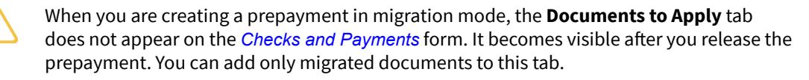
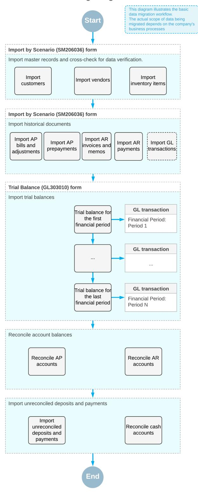
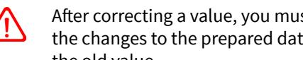

# **Finance Data Migration 2025 R1**


| Copyright3                                                                            |  |
|---------------------------------------------------------------------------------------|--|
| Migrating Documents to Acumatica ERP4                                                 |  |
| Activating Migration Mode 4                                                           |  |
| Processing Documents in Migration Mode4                                               |  |
| Predefined Import Scenarios for Migrating Financial Data7                             |  |
| Preparing System to Migrating Data12                                                  |  |
| Data Migration Process: General Information12                                         |  |
| Data Migration Process: Migration of Financial Data13                                 |  |
| Data Migration Process: To Prepare the System for Migrating Financial Data 16         |  |
| Data Migration Process: Recommendations for Data Verification 17                      |  |
| Data Migration Process: Migrating Multicurrency Documents 18                          |  |
| Migrating Master Records 20                                                           |  |
| Migration of Master Records: General Information20                                    |  |
| Migration of Master Records: To Import Master Records21                               |  |
| Migrating Financial Documents27                                                       |  |
| Migration of Financial Documents: General Information27                               |  |
| Migration of Financial Documents: To Import AP Documents28                            |  |
| Migration of Financial Documents: To Import AR Documents34                            |  |
| Importing Trial Balances 39                                                           |  |
| Migration of Trial Balances: General Information39                                    |  |
| Migration of Trial Balances: To Import Trial Balances 42                              |  |
| Reconciling Financial Balances 46                                                     |  |
| Balance Reconciliation: General Information 46                                        |  |
| Balance Reconciliation: To Reconcile Balances Aer Data Migration47                   |  |
| Importing Unreconciled Payments 50                                                    |  |
| Migration of Unreconciled Payments: General Information50                             |  |
| Migration of Unreconciled Payments: To Import Payments and Reconcile a Cash Account52 |  |
| Appendix57                                                                            |  |
| Reports 57                                                                            |  |
| Report Form57                                                                         |  |
| Report62                                                                              |  |
| Form Toolbar and More Menu64                                                          |  |
| Table Toolbar 71                                                                      |  |

### <span id="page-2-0"></span>**Copyright**

### **© 2025 Acumatica, Inc.**

### **ALL RIGHTS RESERVED.**

No part of this document may be reproduced, copied, or transmitted without the express prior consent of Acumatica, Inc.

3075 112th Avenue NE, Suite 200, Bellevue, WA 98004, USA

### **Restricted Rights**

The product is provided with restricted rights. Use, duplication, or disclosure by the United States Government is subject to restrictions as set forth in the applicable License and Services Agreement and in subparagraph (c)(1)(ii) of the Rights in Technical Data and Computer Soware clause at DFARS 252.227-7013 or subparagraphs (c)(1) and (c)(2) of the Commercial Computer Soware-Restricted Rights at 48 CFR 52.227-19, as applicable.

### **Disclaimer**

Acumatica, Inc. makes no representations or warranties with respect to the contents or use of this document, and specifically disclaims any express or implied warranties of merchantability or fitness for any particular purpose. Further, Acumatica, Inc. reserves the right to revise this document and make changes in its content at any time, without obligation to notify any person or entity of such revisions or changes.

### **Trademarks**

Acumatica is a registered trademark of Acumatica, Inc. HubSpot is a registered trademark of HubSpot, Inc. Microso Exchange and Microso Exchange Server are registered trademarks of Microso Corporation. All other product names and services herein are trademarks or service marks of their respective companies.

Soware Version: 2025 R1 Last Updated: 06/01/2025

### <span id="page-3-0"></span>**Migrating Documents to Acumatica ERP**

If you need to move historical data to Acumatica ERP, you can enter fully or partially settled documents into the system. To load documents without affecting the general ledger, you have to first activate migration mode. You can activate this mode in the accounts receivable subledger or in the accounts payable subledger (or in both subledgers), depending on the documents to be migrated. Also, you can activate this mode for projects to import the initial project balances.

When entering a document to the system in migration mode, you need to specify the open balance of the document, its original amount, and the document date. When these documents are released, migrated documents update customer or vendor balances but do not update the general ledger.

The topics of this chapter describe how you can activate migration mode in the needed Acumatica ERP subledger, how to prepare documents for migration, and how to use predefined import scenarios to import data.

### <span id="page-3-1"></span>**Activating Migration Mode**

To add accounts receivable or accounts payable documents to Acumatica ERP without affecting the general ledger, you need to activate migration mode in the needed Acumatica ERP subledger (or in both subledgers). Also, if you need to migrate project balances, you need to activate migration mode for projects, as described below.

### **Activating Migration Mode for Accounts Receivable**

To turn on migration mode for the accounts receivable subledger, you use the *[Accounts Receivable Preferences](https://help-2025r1.acumatica.com/Help?ScreenId=ShowWiki&pageid=f7b52067-5299-45e8-b601-485cd709f58b)* (AR101000) form. On this form, in the **PostingSettings** section of the **General** tab, you select the **Activate Migration Mode** check box; you then click**Save** on the form toolbar. You can select or clear this check box at any time.


If migration mode has been activated, auto-application of payments to outstanding documents is not supported by the system.

### **Activating Migration Mode for Accounts Payable**

To turn on migration mode for the accounts payable subledger, you use the *[Accounts Payable Preferences](https://help-2025r1.acumatica.com/Help?ScreenId=ShowWiki&pageid=c3f9353e-95e6-448d-bb3f-e20643879ec7)* (AP101000) form. On this form, in the **PostingSettings** section of the **General** tab, you select the **Activate Migration Mode** check box; you then click**Save** on the form toolbar. You can select or clear this check box at any time.

### **Activating Migration Mode for Projects**

To turn on migration mode for projects, you use the *[Projects Preferences](https://help-2025r1.acumatica.com/Help?ScreenId=ShowWiki&pageid=de2ca225-4a0c-4129-b09d-3f3ed05198f9)* (PM101000) form. On this form, in the **GeneralSettings** section of the **General** tab, you select the **Activate Migration Mode** check box. Then you click **Save** on the form toolbar.

### <span id="page-3-2"></span>**Processing Documents in Migration Mode**

Before you start the migration process in Acumatica ERP, you need to prepare the list of all documents that you want to migrate to the system. This list can contain both outstanding and closed documents. For each document, you need to specify its original amount, document date, currency, exchange rate, and open balance on the migration date.

The documents that are added when migration mode is activated do not update the general ledger. If you need to update account balances, you can import either the trial balance (for details, see *[Importing Financial Data](https://help-2025r1.acumatica.com/Help?ScreenId=ShowWiki&pageid=6ef1dca7-4ca7-47b4-9adc-b67de5231d4f)*) or the general ledger transactions.

### **Types of Documents That Can Be Migrated**

The following types of documents can be entered when migration mode has been activated for the accounts receivable subledger:

- *Invoice*, *Debit Memo*, and *Credit Memo*: You add these documents by using the *[Invoices and Memos](https://help-2025r1.acumatica.com/Help?ScreenId=ShowWiki&pageid=5e6f3b27-b7af-412f-a40a-1d4f4be70cba)* (AR301000) form.
- *Payment*, *Prepayment*, and *Refund*: You add these documents by using the *[Payments and Applications](https://help-2025r1.acumatica.com/Help?ScreenId=ShowWiki&pageid=ae844bf4-1aef-42cd-9e2f-49b3ee1bc8d7)* (AR302000) form.
- *Cash Sale* and *Cash Return*: You add these documents by using the *[Cash Sales](https://help-2025r1.acumatica.com/Help?ScreenId=ShowWiki&pageid=f8e8a35f-4de7-40c0-8030-ebf9f7910119)* (AR304000) form.

The following types of documents can be entered when migration mode has been activated for the accounts payable subledger:

- *Bill*, *Debit Adjustment*, and *Credit Adjustment*: You add these types of documents by using the *[Bills and](https://help-2025r1.acumatica.com/Help?ScreenId=ShowWiki&pageid=956b4e51-3078-4d2d-85b3-65c080d95234) [Adjustments](https://help-2025r1.acumatica.com/Help?ScreenId=ShowWiki&pageid=956b4e51-3078-4d2d-85b3-65c080d95234)* (AP301000) form.
- *Payment*, *Prepayment*, and *Refund*: You add these types of documents by using the *[Checks and Payments](https://help-2025r1.acumatica.com/Help?ScreenId=ShowWiki&pageid=81659f97-cb14-4a27-bc3e-0f67b3945613)* (AP302000) form.

You cannot create payments with an open balance in migration mode. Thus, you will not be able to apply other documents to these migrated payments. When you create a payment in migration mode, this document will have the *Closed* status and will affect the vendor's balance.


If you need to enter an AP payment with an application in migration mode, you should use the *Prepayment* document type.

- *Cash Purchase*: You add this type of a document by using the *[Cash Purchases](https://help-2025r1.acumatica.com/Help?ScreenId=ShowWiki&pageid=346e1395-7d30-4c25-b28b-7bcd824dcffd)* (AP304000) form.
- Subcontracts: You add this type of documents by using the *[Subcontracts](https://help-2025r1.acumatica.com/Help?ScreenId=ShowWiki&pageid=dc6a00f9-3913-47bb-b28d-105be0e0d20a)* (SC301000) form.

The following types of documents and transactions can be entered when migration mode has been activated for projects:

- Pro forma invoices: You add this type of documents by using the *[Pro Forma Invoices](https://help-2025r1.acumatica.com/Help?ScreenId=ShowWiki&pageid=37f1ed00-a7d7-4161-9307-1337662b8550)* (PM307000) form.
- Project transactions: You add this type of documents by using the *Project [Transactions](https://help-2025r1.acumatica.com/Help?ScreenId=ShowWiki&pageid=382a97fe-b636-44ca-9798-6d478c05b687)* (PM304000) form.

In migration mode, you add the needed documents with the *On Hold* or *Balanced* status. These documents can be edited and released only when migration mode is activated.

### **Entry of a Document's Open Balance**

When you are adding an accounts receivable or accounts payable document, you specify the open balance of a migrated document on the document entry form as follows:

- In the **Balance** box, which is available for editing on the *[Invoices and Memos](https://help-2025r1.acumatica.com/Help?ScreenId=ShowWiki&pageid=5e6f3b27-b7af-412f-a40a-1d4f4be70cba)* (AR301000) and *[Bills and](https://help-2025r1.acumatica.com/Help?ScreenId=ShowWiki&pageid=956b4e51-3078-4d2d-85b3-65c080d95234) [Adjustments](https://help-2025r1.acumatica.com/Help?ScreenId=ShowWiki&pageid=956b4e51-3078-4d2d-85b3-65c080d95234)* (AP301000) forms
- In the **Available Balance** box on the *[Payments and Applications](https://help-2025r1.acumatica.com/Help?ScreenId=ShowWiki&pageid=ae844bf4-1aef-42cd-9e2f-49b3ee1bc8d7)* (AR302000) form
- In the **Unapplied Balance** box on the *[Checks and Payments](https://help-2025r1.acumatica.com/Help?ScreenId=ShowWiki&pageid=81659f97-cb14-4a27-bc3e-0f67b3945613)* (AP301000) form (for documents of the *Prepayment* type only)

If you need to migrate historical documents that have been already settled in full, enter zero as the open balance of these migrated documents.

When you save a document, the system validates that the open balance does not exceed the document's original amount; if it does, the system displays an error.

An open balance that you specify in a document in migration mode will be displayed in the **Migrated Balance** box on the **Financial** tab on the document entry form once you save a document. This box is available for migrated documents only.

In documents entered in migration mode, the system calculates taxes based on the tax zone and tax category specified in the documents.

### **Entry of Migrated Documents with Unreleased Retainage**

On the *[Invoices and Memos](https://help-2025r1.acumatica.com/Help?ScreenId=ShowWiki&pageid=5e6f3b27-b7af-412f-a40a-1d4f4be70cba)* (AR301000) and *[Bills and Adjustments](https://help-2025r1.acumatica.com/Help?ScreenId=ShowWiki&pageid=956b4e51-3078-4d2d-85b3-65c080d95234)* (AP301000) forms, you can enter migrated AR documents and AP documents, respectively, with unreleased retainage.

You enter a document with unreleased retainage on the *[Invoices and Memos](https://help-2025r1.acumatica.com/Help?ScreenId=ShowWiki&pageid=5e6f3b27-b7af-412f-a40a-1d4f4be70cba)* or *[Bills and Adjustments](https://help-2025r1.acumatica.com/Help?ScreenId=ShowWiki&pageid=956b4e51-3078-4d2d-85b3-65c080d95234)* form by performing the following steps:

- 1. You create the document.
- 2. You specify its settings in the Summary area, including the selection of the **Apply Retainage** check box.
- 3. You add a document line on the **Details** tab and specify the retainage percent in the **Retainage Percent** column.

On the **Retainage** tab, the system displays the calculated retainage amount in the **Unreleased Retainage** and **Unpaid Retainage** boxes.


For the lines of AP bills, you can also specify links to the related subcontracts in the **Subcontract Nbr.** box.

For details on creating a document with retainage, see *[Processing AP Documents with Retainage](https://help-2025r1.acumatica.com/Help?ScreenId=ShowWiki&pageid=cd6fb519-2a85-4a64-984a-12fb5d9b22f3)* and *[Processing AR](https://help-2025r1.acumatica.com/Help?ScreenId=ShowWiki&pageid=ee50be22-1467-4a32-abb5-5fab7e1f1e47) [Documents with Retainage](https://help-2025r1.acumatica.com/Help?ScreenId=ShowWiki&pageid=ee50be22-1467-4a32-abb5-5fab7e1f1e47)*.

### **Release of Migrated Documents**

The release of migrated accounts receivable documents causes customer balances to be updated; similarly, the accounts payable documents update vendor balances. These released documents do not produce batches in the general ledger. Thus, on the **Financial** tab of the corresponding document entry forms, instead of the link to the general ledger batch, the word *Migrated* will be displayed for a migrated document in the **Batch Nbr.** box.

On release of a historical accounts receivable or accounts payable document with an open balance of zero, the system adds a line with this document to the **Applications** tab on the document entry form and assigns the *Closed* status to the document. On the **Financial** tab, the **Migrated Balance** box shows *0.00*, which means that the document was closed before migration.

If you are importing AP bills with links to subcontracts, on release of the migrated AP bills, the system will update the **Billed Amount** and **Unbilled Amount** values in the subcontract lines on the *[Subcontracts](https://help-2025r1.acumatica.com/Help?ScreenId=ShowWiki&pageid=dc6a00f9-3913-47bb-b28d-105be0e0d20a)* (SC301000) form.

Migrated documents cannot be edited or released when migration mode is deactivated, and documents created in Acumatica ERP cannot be edited or released when migration mode is activated.

### **Migration of Project Balances**

If migration mode is activated for projects, you can import pro forma invoices and the corresponding project transactions—along with their balances, original amounts, and dates—without affecting the general ledger. Also, you must link these pro forma invoices and project transactions to the AR documents that correspond to them. Then you need to release the migrated pro forma invoices and project transactions.

In order to correctly update project balances without affecting the general ledger, in the lines of the project transactions being imported, you must specify only the debit account and debit subaccount, and leave the credit account and credit subaccount empty. As a result, the release of these project transactions will not produce general ledger transactions.

If the migrated pro forma invoice is linked to the corresponding AR document, a line with this pro forma invoice and AR invoice appears in the related project on the **Invoices** tab of the *[Projects](https://help-2025r1.acumatica.com/Help?ScreenId=ShowWiki&pageid=81c86417-3bde-444b-8f1c-682928d31a0c)* (PM301000) form. The system shows a line for each pro forma invoice that corresponds to the project, along with the corresponding AR document, which is shown in the same row. Also, on the **Revenue Budget** tab of this form, project budget values will be calculated based on the imported data.

To indicate that a pro forma invoice has been migrated, the system selects the **Migrated** check box on the **Financial** tab of the *[Pro Forma Invoices](https://help-2025r1.acumatica.com/Help?ScreenId=ShowWiki&pageid=37f1ed00-a7d7-4161-9307-1337662b8550)* (PM307000) form.

### **Known Limitations**

The following limitations are applied in the system for creating document in migration mode:

- When AP bills are entered in migration mode on the *[Bills and Adjustments](https://help-2025r1.acumatica.com/Help?ScreenId=ShowWiki&pageid=956b4e51-3078-4d2d-85b3-65c080d95234)* (AP301000) form, the links to related purchase orders cannot be specified in the **PO Number** columns on the **Details** tab because there is no migration mode for purchase orders. This information also cannot be imported when AP bills are imported in migration mode by using import scenarios.
- AP payments with applications to other documents cannot be entered in migration mode. You can import them as documents with the *Prepayment* type instead.

To do this, you perform the following general steps:

a. On the *[Checks and Payments](https://help-2025r1.acumatica.com/Help?ScreenId=ShowWiki&pageid=81659f97-cb14-4a27-bc3e-0f67b3945613)* (AP302000) form, you create a prepayment and specify its balance in the **Unapplied Balance** box. When you release the prepayment, it will have the *Open* status.



- b. On the *[Bills and Adjustments](https://help-2025r1.acumatica.com/Help?ScreenId=ShowWiki&pageid=956b4e51-3078-4d2d-85b3-65c080d95234)* (AP301000) form, you create a bill and specify its open balance in the **Balance** box. When you release the bill, it will have the *Open* status.
- c. On the *[Checks and Payments](https://help-2025r1.acumatica.com/Help?ScreenId=ShowWiki&pageid=81659f97-cb14-4a27-bc3e-0f67b3945613)* form, you open the prepayment that you created in Step 1. On the **Documents to Apply** tab, you apply the bill that you created in Step 2 to the prepayment, and release the prepayment with the application.

### <span id="page-6-1"></span><span id="page-6-0"></span>**Predefined Import Scenarios for Migrating Financial Data**

To save time on entering documents from your legacy system into Acumatica ERP, you can use the import scenarios that are supplied with the system.

### **Overview of the Predefined Import Scenarios**

Predefined import scenarios are designed to help you prepare for the migration of financial data from a legacy system. You can use them as they are supplied or customize them to suit your implementation needs.

The table below lists the predefined import scenarios that are available on the *[Import Scenarios](https://help-2025r1.acumatica.com/Help?ScreenId=ShowWiki&pageid=254e8347-6bac-469d-8f14-dbe383740475)* (SM206025) form for creating an import scenario and on the *[Import by Scenario](https://help-2025r1.acumatica.com/Help?ScreenId=ShowWiki&pageid=88ac7166-2cc0-4201-ab3e-659ada2d74f2)* (SM206036) form for importing the data based on the selected scenario. Each of these scenarios can be used to import data to a specific Acumatica ERP form, which is listed in the second column.

| Name of Import Scenario                  | Form to Which Data Is Imported       |
|------------------------------------------|--------------------------------------|
| ACU Import AP Bills                      | Bills and Adjustments (AP301000)     |
| ACU Import AP Cash Purchases             | Cash Purchases (AP304000)            |
| ACU Import AP Payments with Applications | Checks and Payments (AP302000)       |
| ACU Import AP Prepayments                | Checks and Payments                  |
| ACU Import AR Cash Sales                 | Cash Sales (AR304000)                |
| ACU Import AR Invoices                   | Invoices and Memos (AR301000)        |
| ACU Import AR Payments                   | Payments and Applications (AR302000) |
| ACU Import AR Payments with Applications | Payments and Applications            |
| ACU Import Customer Locations            | Customer Locations (AR303020)        |
| ACU Import Customers                     | Customers (AR303000)                 |
| ACU Import Deferral Schedules            | Deferral Schedule (DR201500)         |
| ACU Import Fixed Assets                  | Fixed Assets (FA303000)              |
| ACU Import GL Transactions               | Journal Transactions (GL301000)      |
| ACU Import Proforma                      | Pro Forma Invoices (PM307000)        |
| ACU Import Project Income                | Project Transactions (PM304000)      |
| ACU Import Vendor Locations              | Vendor Locations (AP303010)          |
| ACU Import Vendors                       | Vendors (AP303000)                   |

*Table: Predefined Import Scenarios for Migrating Financial Data*

The predefined import scenarios listed in the table are inactive by default. That is, by default, for each of them, the **Active** check box is cleared on the *[Import Scenarios](https://help-2025r1.acumatica.com/Help?ScreenId=ShowWiki&pageid=254e8347-6bac-469d-8f14-dbe383740475)* form. Before you can use any of these scenarios for data import on the *[Import by Scenario](https://help-2025r1.acumatica.com/Help?ScreenId=ShowWiki&pageid=88ac7166-2cc0-4201-ab3e-659ada2d74f2)* form, the **Active** check box must be selected on the *[Import Scenarios](https://help-2025r1.acumatica.com/Help?ScreenId=ShowWiki&pageid=254e8347-6bac-469d-8f14-dbe383740475)* form.

### **Import Templates**

Because the structure of the uploaded data file must match the structure that is defined in the data provider and used in the import scenario, a data template is provided for each of the predefined import scenarios.

You can download the data template, populate it with the data to be migrated, and then use the prepared file on the *[Import by Scenario](https://help-2025r1.acumatica.com/Help?ScreenId=ShowWiki&pageid=88ac7166-2cc0-4201-ab3e-659ada2d74f2)* (SM206036) form with the corresponding import scenario. The file names of the data templates correspond to the names of the predefined import scenarios with which they are intended to be used. To download the data template, you first select the required import scenario on the *[Import Scenarios](https://help-2025r1.acumatica.com/Help?ScreenId=ShowWiki&pageid=254e8347-6bac-469d-8f14-dbe383740475)* (SM206025) or *[Import by Scenario](https://help-2025r1.acumatica.com/Help?ScreenId=ShowWiki&pageid=88ac7166-2cc0-4201-ab3e-659ada2d74f2)* form and then click **Files** on the title bar. In the **Files** dialog box, which opens, you click the template file to be downloaded and then save it to the needed location.

### **ACU Import AP Bills**

You use the *ACU Import AP Bills* import scenario to import AP bills to the *[Bills and Adjustments](https://help-2025r1.acumatica.com/Help?ScreenId=ShowWiki&pageid=956b4e51-3078-4d2d-85b3-65c080d95234)* (AP301000) form. You can use this import scenario when migration mode is turned on or off—that is, when the **Activate Migration Mode** check box is selected or cleared, respectively, in the **PostingSettings** section of the **General** tab on the *[Accounts](https://help-2025r1.acumatica.com/Help?ScreenId=ShowWiki&pageid=c3f9353e-95e6-448d-bb3f-e20643879ec7) [Payable Preferences](https://help-2025r1.acumatica.com/Help?ScreenId=ShowWiki&pageid=c3f9353e-95e6-448d-bb3f-e20643879ec7)* (AP101000) form.

When migration mode is turned off, AP bills are imported as unpaid; that is, in the Summary area of the *[Bills and](https://help-2025r1.acumatica.com/Help?ScreenId=ShowWiki&pageid=956b4e51-3078-4d2d-85b3-65c080d95234) [Adjustments](https://help-2025r1.acumatica.com/Help?ScreenId=ShowWiki&pageid=956b4e51-3078-4d2d-85b3-65c080d95234)* form, the **Balance** amount of each of the imported bills is equal to its **DetailTotal**. Any outstanding document amount specified in the import source file is ignored. If you want to migrate documents with open balances, migration mode should be activated.

When migration mode is turned on, documents are migrated with their outstanding balances. Be sure that you specify the outstanding balance in the relevant column of the import source file; otherwise, the documents will be migrated with zero open balances and will have the *Closed* status on release.

### **ACU Import AP Payments with Applications**

The *ACU Import AP Payments with Applications* import scenario is used to import information about historical AP payments, along with their applications, to the *[Checks and Payments](https://help-2025r1.acumatica.com/Help?ScreenId=ShowWiki&pageid=81659f97-cb14-4a27-bc3e-0f67b3945613)* (AP302000) form. You use this import scenario when migration mode is turned off—that is, when the **Activate Migration Mode** check box is cleared on the *[Accounts Payable Preferences](https://help-2025r1.acumatica.com/Help?ScreenId=ShowWiki&pageid=c3f9353e-95e6-448d-bb3f-e20643879ec7)* (AP101000) form.

If the **Activate Migration Mode** check box is selected on the *[Accounts Payable Preferences](https://help-2025r1.acumatica.com/Help?ScreenId=ShowWiki&pageid=c3f9353e-95e6-448d-bb3f-e20643879ec7)* form, you cannot import payments with an open balance. Instead, you can import them as prepayments by using the *ACU Import AP Prepayments* import scenario.

### **ACU Import AP Prepayments**

You use the *ACU Import AP Prepayments* import scenario to migrate prepayments, including balances that have not yet been applied to AP documents, to the *[Checks and Payments](https://help-2025r1.acumatica.com/Help?ScreenId=ShowWiki&pageid=81659f97-cb14-4a27-bc3e-0f67b3945613)* (AP302000) form. You import payments with unapplied balances when migration mode is turned on—that is, when the **Activate Migration Mode** check box is selected on the *[Accounts Payable Preferences](https://help-2025r1.acumatica.com/Help?ScreenId=ShowWiki&pageid=c3f9353e-95e6-448d-bb3f-e20643879ec7)* (AP101000) form. Be sure to specify the unapplied balances in the relevant column of the import source file; otherwise, the AP prepayments will be migrated with zero unapplied amounts and will have the *Closed* status on release.

### **ACU Import AP Cash Purchases**

You use the *ACU Import AP Cash Purchases* import scenario to migrate information about historical cash purchases to the *[Cash Purchases](https://help-2025r1.acumatica.com/Help?ScreenId=ShowWiki&pageid=346e1395-7d30-4c25-b28b-7bcd824dcffd)* (AP304000) form.

### **ACU Import Vendor Locations**

The *ACU Import Vendor Locations* import scenario is used to import vendor locations to the *Vendor [Locations](https://help-2025r1.acumatica.com/Help?ScreenId=ShowWiki&pageid=aeeccc5c-465f-4bca-9cd7-a3c792da38e1)* (AP303010) form.

We strongly recommend that vendor locations be imported separately from the main vendor data.

### **ACU Import Vendors**

You use the *ACU Import Vendors* import scenario to import vendor records to the *[Vendors](https://help-2025r1.acumatica.com/Help?ScreenId=ShowWiki&pageid=a9584be3-f2bd-4d67-80d4-8041d809df56)* (AP303000) form.

Vendor locations are excluded from the data template provided for this import scenario. We strongly recommend that you import vendor locations separately from the main vendor data by using the *ACU Import Vendor Locations* import scenario.

### **ACU Import AR Cash Sales**

The *ACU Import AR Cash Sales* import scenario is used to import historical information about cash sales to the *[Cash](https://help-2025r1.acumatica.com/Help?ScreenId=ShowWiki&pageid=f8e8a35f-4de7-40c0-8030-ebf9f7910119) [Sales](https://help-2025r1.acumatica.com/Help?ScreenId=ShowWiki&pageid=f8e8a35f-4de7-40c0-8030-ebf9f7910119)* (AR304000) form.

### **ACU Import Customer Locations**

You use the *ACU Import Customer Locations* import scenario to import customer locations to the *[Customer Locations](https://help-2025r1.acumatica.com/Help?ScreenId=ShowWiki&pageid=61a8c6de-6a51-434b-8c2d-4304ec982ae0)* (AR303020) form.

We strongly recommend that customer locations be imported separately from the main customer data.

### **ACU Import Customers**

You use the *ACU Import Customers* import scenario to import customer records to the *[Customers](https://help-2025r1.acumatica.com/Help?ScreenId=ShowWiki&pageid=652929bc-9606-4056-aa6e-0c2d1147171b)* (AR303000) form.

Customer locations are excluded from the data template provided for this import scenario. We strongly recommend that you import customer locations separately from the main customer data by using the *ACU Import Customer Locations* import scenario.

### **ACU Import AR Invoices**

You use the *ACU Import AR Invoices* import scenario to import AR invoices to the *[Invoices and Memos](https://help-2025r1.acumatica.com/Help?ScreenId=ShowWiki&pageid=5e6f3b27-b7af-412f-a40a-1d4f4be70cba)* (AR301000) form. You can use this import scenario when migration mode is turned on or off—that is, when the **Activate Migration Mode** check box is selected or cleared, respectively, in the **PostingSettings** section on the **General** tab of the *[Accounts Receivable Preferences](https://help-2025r1.acumatica.com/Help?ScreenId=ShowWiki&pageid=f7b52067-5299-45e8-b601-485cd709f58b)* (AR101000) form.

When migration mode is turned off, documents are imported as unpaid; that is, in the Summary area of the *[Invoices](https://help-2025r1.acumatica.com/Help?ScreenId=ShowWiki&pageid=5e6f3b27-b7af-412f-a40a-1d4f4be70cba) [and Memos](https://help-2025r1.acumatica.com/Help?ScreenId=ShowWiki&pageid=5e6f3b27-b7af-412f-a40a-1d4f4be70cba)* form, the **Balance** amount of each of the imported invoices is equal to its **DetailTotal**. Any outstanding document amount specified in the import source file is ignored. If you want to migrate documents with open balances, migration mode should be activated.

When migration mode is turned on, documents are migrated with their outstanding balances. Be sure that you specify the outstanding balance in the relevant column of the import source file; otherwise, the documents will be migrated with zero open balances and will have the *Closed* status on release.

### **ACU Import AR Payments**

You use *ACU Import AR Payments* import scenario to migrate AR payments, including balances that have not yet been applied to AR documents, to the *[Payments and Applications](https://help-2025r1.acumatica.com/Help?ScreenId=ShowWiki&pageid=ae844bf4-1aef-42cd-9e2f-49b3ee1bc8d7)* (AR302000) form. Payments with available balances are imported when migration mode is turned on—that is, when the **Activate Migration Mode** check box is selected on the *[Accounts Receivable Preferences](https://help-2025r1.acumatica.com/Help?ScreenId=ShowWiki&pageid=f7b52067-5299-45e8-b601-485cd709f58b)* (AR101000) form. Be sure to specify the available balances in the relevant column of the import source file; otherwise, the AR payments will be migrated with zero available balances and will have the *Closed* status on release.

### **ACU Import AR Payments with Applications**

The *ACU Import AR Payments with Applications* import scenario is used to import information about historical AR payments, along with their applications, to the *[Payments and Applications](https://help-2025r1.acumatica.com/Help?ScreenId=ShowWiki&pageid=ae844bf4-1aef-42cd-9e2f-49b3ee1bc8d7)* (AR302000) form. This import scenario is used when migration mode is turned off—that is, when the **Activate Migration Mode** check box is cleared on the *[Accounts Receivable Preferences](https://help-2025r1.acumatica.com/Help?ScreenId=ShowWiki&pageid=f7b52067-5299-45e8-b601-485cd709f58b)* (AR101000) form.

### **ACU Import Deferral Schedules**

You use the *ACU Import Deferral Schedules* import scenario to import previously configured deferral schedules to the *[Deferral Schedule](https://help-2025r1.acumatica.com/Help?ScreenId=ShowWiki&pageid=c8f8d907-8dd6-47a7-a13d-be9251d361e9)* (DR201500) form so that revenues and expenses that were deferred in the legacy system could continue to be recognized in Acumatica ERP.

### **ACU Import Fixed Assets**

The *ACU Import Fixed Assets* import scenario is used to import information about fixed assets to the *[Fixed Assets](https://help-2025r1.acumatica.com/Help?ScreenId=ShowWiki&pageid=0bde54fb-c293-4759-931b-5ecbff784cd1)* (FA303000) form. If you want to allow the import of accumulated depreciation along with other fixed asset data, the **Update GL** check box must first be cleared in the **PostingSettings** section on the *[Fixed Assets Preferences](https://help-2025r1.acumatica.com/Help?ScreenId=ShowWiki&pageid=f56d17a8-2729-496b-b8ac-8fb0732ee0a5)* (FA101000) form.

The template provided for this predefined import scenario is designed for importing information about fixed assets to three books. However, the template can be adjusted to reflect the settings of the fixed asset classes to which the imported assets belong.

### **ACU Import GL Transactions**

You use the *ACU Import GL Transactions* import scenario to import to the *Journal [Transactions](https://help-2025r1.acumatica.com/Help?ScreenId=ShowWiki&pageid=dda046bc-5946-407f-88f7-1c0c966fbe72)* (GL301000) form general ledger transactions that have been exported from a legacy system.

### **ACU Import Proforma**

You use the *ACU Import Proforma* import scenario to import to the *[Pro Forma Invoices](https://help-2025r1.acumatica.com/Help?ScreenId=ShowWiki&pageid=37f1ed00-a7d7-4161-9307-1337662b8550)* (PM307000) form pro forma invoices that have been exported from a legacy system. Pro forma invoices are imported when migration mode is turned on—that is, when the **Activate Migration Mode** check box is selected on the *[Projects Preferences](https://help-2025r1.acumatica.com/Help?ScreenId=ShowWiki&pageid=de2ca225-4a0c-4129-b09d-3f3ed05198f9)* (PM101000) form.

### **ACU Import Project Income**

You use the *ACU Import Project Income* import scenario to import to the *Project [Transactions](https://help-2025r1.acumatica.com/Help?ScreenId=ShowWiki&pageid=382a97fe-b636-44ca-9798-6d478c05b687)* (PM304000) form project transactions that have been exported from a legacy system. Project transactions are imported when migration mode is turned on—that is, when the **Activate Migration Mode** check box is selected on the *[Projects](https://help-2025r1.acumatica.com/Help?ScreenId=ShowWiki&pageid=de2ca225-4a0c-4129-b09d-3f3ed05198f9) [Preferences](https://help-2025r1.acumatica.com/Help?ScreenId=ShowWiki&pageid=de2ca225-4a0c-4129-b09d-3f3ed05198f9)* (PM101000) form.

### <span id="page-11-0"></span>**Preparing System to Migrating Data**

This lesson describes the basic steps that you need to perform before you start to migrate company data to Acumatica ERP, describes the minimal system configuration that you need to implement before migrating financial and inventory data, explains the basic flow of the data migration, and lists the financial data that you should prepare for data migration.

### <span id="page-11-1"></span>**Data Migration Process: General Information**

Data migration is a crucial process that is performed before the company goes live on a new ERP platform. The process involves moving data from the old system to the new one while ensuring data integrity and minimizing disruptions.

### **Learning Objectives**

In this chapter, you will learn how to do the following:

- Plan the needed steps of data migration based on your organization's business requirements
- Create a company in Acumatica ERP that is ready for the migration of financial data from the legacy system
- Prepare the import scenarios and the data to be uploaded

### **Applicable Scenario**

You are planning to migrate data from a legacy system before you start to use Acumatica ERP as an ERP system. You want to prepare carefully for this process to keep the history of company operations that preceded the transition to new system and to ensure the continuity of business processes.

### **Configuration of the Basic System**

Prior to data migration, you need to plan and configure the company's structure and perform the basic configuration in Acumatica ERP based on the business requirements of the company. To do this, you perform the following general steps:

- 1. You prepare the instance, enable the features, and activate the license, as described in *[Preparing an Instance](https://help-2025r1.acumatica.com/Help?ScreenId=ShowWiki&pageid=882fe280-df5b-4c25-a76c-7ecf2c7e826a) [for Implementation](https://help-2025r1.acumatica.com/Help?ScreenId=ShowWiki&pageid=882fe280-df5b-4c25-a76c-7ecf2c7e826a)*.
- 2. You configure the company's structure in the system, as described in *[Preparing a Company for](https://help-2025r1.acumatica.com/Help?ScreenId=ShowWiki&pageid=59d8b6a4-fc87-44e8-a3a6-d971eef04253) [Implementation](https://help-2025r1.acumatica.com/Help?ScreenId=ShowWiki&pageid=59d8b6a4-fc87-44e8-a3a6-d971eef04253)*.
- 3. You configure the basic financial settings in the system, as described in *[Implementing Basic Financials](https://help-2025r1.acumatica.com/Help?ScreenId=ShowWiki&pageid=1cc687f2-d52a-4672-9380-fd948b2603fe)*.

The complete set of configuration tasks depends on the company's business processes. For more information about configuring other system areas, see *[Acumatica ERP Implementation](https://help-2025r1.acumatica.com/Help?ScreenId=ShowWiki&pageid=a4be22b4-ae3b-43e0-a004-150a98b7cda8) [Guide](https://help-2025r1.acumatica.com/Help?ScreenId=ShowWiki&pageid=a4be22b4-ae3b-43e0-a004-150a98b7cda8)*.

### **Data Preparation and Migration Stages**

Once the tenant is ready, you perform data migration in the following general steps:

- 1. You assess the legacy ERP system and identify data to be migrated.
- 2. You extract data from the legacy ERP system, taking into account data integrity, quality, and compatibility with the new system. This process involves identifying and cleansing duplicate, outdated, or irrelevant data.

You ensure that all existing information is accurate and up-to-date. Also, you remove incorrect, redundant, or out-of-date data (such as discontinued vendors, contacts that are no longer with the company, and discontinued products).

- 3. You transform and map the extracted data to fit the structure and format of the new ERP system (that is, prepare the data providers that will be used with the import scenarios).
- 4. You prepare import scenarios and test them with sample data to ensure that all needed information is included and mapped correctly.
- 5. You transfer the data to the new system.
- 6. You cross-check the uploaded data to ensure completeness, correctness, and integrity. This involves running test scenarios, reconciling data, and resolving any discrepancies or errors to ensure that legacy data has been moved and is accessible. For recommendation on data verification, see *[Data Migration Process:](#page-16-1) [Recommendations](#page-16-1) for Data Verification*.

Once the data migration is complete and the data is verified for consistency, the system is ready to use.

### **Preparation of Import Scenarios**

To speed up data migration, you use import scenarios to import business accounts and financial data other than trial balances. An import scenario is a set of instructions for the system that specifies the actions to be executed for each record of the imported data as if the data is being entered manually on the specified form.

To import data by using an import scenario, you do the following:

- 1. You convert the data in the external format to data in the format of Acumatica ERP. For this purpose, on the *[Data Providers](https://help-2025r1.acumatica.com/Help?ScreenId=ShowWiki&pageid=b77248de-191c-47b7-9c40-773c7cc11d5b)* (SM206015) form, you create a data provider. The data provider defines the data source type (Excel), the name of the spreadsheet that should be used for the data import, the list of the columns on the spreadsheet, and the data type of each column.
- 2. On the *[Import Scenarios](https://help-2025r1.acumatica.com/Help?ScreenId=ShowWiki&pageid=254e8347-6bac-469d-8f14-dbe383740475)* (SM206025) form, you prepare the import scenario that uses the data provider. An import scenario defines the mapping of the source columns to the destination fields of the entry in the system. The **Mapping** tab of the *[Import Scenarios](https://help-2025r1.acumatica.com/Help?ScreenId=ShowWiki&pageid=254e8347-6bac-469d-8f14-dbe383740475)* form holds the list of steps of the scenario that imports the records into the system as if each record is being manually entered through the corresponding data entry form.

Acumatica ERP provides a set of predefined import scenarios that you can use to migrate financial data, adapting them for your needs. For more information, see *[Predefined Import Scenarios for Migrating Financial](#page-6-1) [Data](#page-6-1)*.

3. On the *[Import by Scenario](https://help-2025r1.acumatica.com/Help?ScreenId=ShowWiki&pageid=88ac7166-2cc0-4201-ab3e-659ada2d74f2)* (SM206036) form, you prepare and import the data. For each imported record, the system executes the mapping steps one aer another in the order in which they are listed in the executed import scenario on the *[Import Scenarios](https://help-2025r1.acumatica.com/Help?ScreenId=ShowWiki&pageid=254e8347-6bac-469d-8f14-dbe383740475)* form.

### <span id="page-12-0"></span>**Data Migration Process: Migration of Financial Data**

This topic describes the general process of migrating data from a legacy system to Acumatica ERP.

The complete list of data to be imported depends on company's business processes.

### **Migration of Financial Data**

To import the data completely and accurately and to minimize import errors, you import documents and balances by performing the following general steps in the listed order:

1. You import the following master records:

- Customers
- Vendors
- Non-stock items
- 2. You import financial documents. For each type of document, you use the same import scenario to import both closed documents and documents with an open balance.

To import accounts receivable or accounts payable documents to Acumatica ERP, you need to activate migration mode in the accounts receivable subledger and accounts payable subledger, respectively. The documents that are created when migration mode is activated do not update the general ledger.

3. You upload and release the trial balances for the needed financial periods. When this process is complete, you make sure that the final trial balance in Acumatica ERP matches the trial balance in the legacy system.


Though you can import historical GL transactions instead of importing trial balances, the import of trial balances is the preferable way of migrating financial data. Importing the trial balances helps to limit the number of historical transactions in the database.

- 4. You perform the reconciliation of account balances for the accounts receivable and accounts payable subledger.
- 5. You import outstanding checks and deposits in progress and then reconcile the cash account balance.

The following diagram illustrates the basic workflow for migrating financial data for a company with one branch.



### <span id="page-15-0"></span>**Data Migration Process: To Prepare the System for Migrating Financial Data**

The following activity will walk you through the preparation of the system for the migration of financial data.

This activity is based on the *U100 Basic Company* dataset. If you are using another dataset, or if any system settings have been changed in *U100 Basic Company*, these changes can affect the workflow of the activity and the results of the processing. To avoid any issues, restore the *U100 Basic Company* dataset to its initial state.

### **Story**

Suppose that you are an implementation consultant of the SweetLife Fruits & Jams company, and you will be performing data migration from the legacy system to Acumatica ERP. In the system, you have configured the tenant, activated the license, and performed the basic financial configuration. Now you need to make sure the system is ready for data migration.

Before you start importing data into the system, you need to perform the following operations:

- Making sure the financial periods are ready to data migration
- Verifying that the cash account is configured for reconciliation
- Activating predefined import scenarios
- Uploading and activating an additional import scenario that will be used for migrating non-stock items

### **Configuration Overview**

In the *U100 Basic Company* dataset, the following tasks have been performed for the purposes of this activity:

- On the *[Enable/Disable Features](https://help-2025r1.acumatica.com/Help?ScreenId=ShowWiki&pageid=c1555e43-1bc5-4f6f-ba9d-b323f94d8a6b)* (CS100000) form, the minimum set of financial features has been enabled.
- On the *[Companies](https://help-2025r1.acumatica.com/Help?ScreenId=ShowWiki&pageid=fedad435-8496-4397-b8a3-50a473629f76)* (CS101500) form, the SweetLife company without branches has been configured by performing the steps described in *Company Without [Branches:](https://help-2025r1.acumatica.com/Help?ScreenId=ShowWiki&pageid=082a5d06-0e65-44c0-8049-4df32ebf59d3) To Configure a Company Without Branches*.
- On the *[Chart of Accounts](https://help-2025r1.acumatica.com/Help?ScreenId=ShowWiki&pageid=85557f41-a4af-47a8-b198-2a01461ce9c3)* (GL202500) form, the company's chart of accounts has been created.
- On multiple forms, the required financial configuration has been performed, as described in the *[Implementing Basic Financials](https://help-2025r1.acumatica.com/Help?ScreenId=ShowWiki&pageid=1cc687f2-d52a-4672-9380-fd948b2603fe)* chapter of the Implementation Guide, including the creation of cash accounts, credit terms, and payment methods.

### **Process Overview**

On the *[Manage Financial Periods](https://help-2025r1.acumatica.com/Help?ScreenId=ShowWiki&pageid=eedf2adf-6ddc-4c33-932b-de60275c547f)* (GL503000) form, you will ensure that the financial periods to which the historical data will be uploaded have been generated and are open. On the *[Cash Accounts](https://help-2025r1.acumatica.com/Help?ScreenId=ShowWiki&pageid=10f71454-88f9-4d6c-8d09-32856d8c6741)* (CA202000) form, you will verify that the *10200WH* cash account is configured for reconciliation. On the *[Import Scenarios](https://help-2025r1.acumatica.com/Help?ScreenId=ShowWiki&pageid=254e8347-6bac-469d-8f14-dbe383740475)* (SM206025) form, you will activate the predefined import scenarios that will be used for data migration. You will also upload and activate an additional import scenario for importing non-stock items.

### **System Preparation**

To prepare to perform the instructions of this activity, do the following:

- 1. Launch the Acumatica ERP website with the *U100 Basic Company* dataset preloaded.
- 2. Sign in to the system by using the *gibbs* username and the *123* password.

3. Download the DMImportNonStockItems.xml file, which was provided with the course.

### **Step 1: Verifying the Financial Periods**

To ensure that all needed financial periods are ready to import the data, do the following:

- 1. Open the *[Master Financial Calendar](https://help-2025r1.acumatica.com/Help?ScreenId=ShowWiki&pageid=d46a8e03-b211-44c2-b17c-01ae813ead1b)* (GL201000) form.
- 2. In the **Financial Year** box in the Summary area, select *2024*. Review the periods in the table and make sure that the following periods have been generated and now have the *Open* status:
  - The periods from 01-2024 to 11-2024, which are the periods to which the data will be migrated
  - The 12-2024 financial period, which is the first period in which the company will start operating in Acumatica ERP

### **Step 2: Reviewing the Cash Account Settings**

To be able to reconcile the balance of the *10200WH* cash account aer data migration, open the *10200WH* cash account on the *[Cash Accounts](https://help-2025r1.acumatica.com/Help?ScreenId=ShowWiki&pageid=10f71454-88f9-4d6c-8d09-32856d8c6741)* (CA202000) form. Make sure the following settings are specified:

- **Requires Reconciliation**: Selected
- **Reconciliation NumberingSequence**: *CARECON*

### **Step 3: Activating Import Scenarios**

Before you start importing data, you need to activate the predefined import scenarios and create an additional scenario as follows:

- 1. Open the *[Import Scenarios](https://help-2025r1.acumatica.com/Help?ScreenId=ShowWiki&pageid=254e8347-6bac-469d-8f14-dbe383740475)* (SM206025) form.
- 2. In the Summary area of the form, for each of the following predefined scenarios, select the **Active** check box and save your changes:
  - *ACU Import Vendors*
  - *ACU Import Customers*
  - *ACU Import AP Bills*
  - *ACU Import AP Prepayments*
  - *ACU Import AR Invoices*
  - *ACU Import AR Payments*
- 3. On the form toolbar of the *[Import Scenarios](https://help-2025r1.acumatica.com/Help?ScreenId=ShowWiki&pageid=254e8347-6bac-469d-8f14-dbe383740475)* (SM206025) form, click **Clipboard > Import from XML**.
- 4. In the **Upload XML File** dialog box, click **Choose File** and select the DMImportNonStockItems.xml file, which you downloaded earlier.
- 5. In the dialog box, click **Upload**. The system uploads the *DM Import Non-Stock Items* import scenario. This scenario maps the internal fields of the *[Non-Stock Items](https://help-2025r1.acumatica.com/Help?ScreenId=ShowWiki&pageid=bf68dd4f-63d4-460d-8dc0-9152f2bd6bf1)* (IN202000) form to the external fields that are defined in the SweetLifeNonStockItemsList.xlsx file, which has been supplied with the course.
- 6. Make sure that the **Active** check box is selected in the Summary area of the form for the created scenario.

### <span id="page-16-1"></span><span id="page-16-0"></span>**Data Migration Process: Recommendations for Data Verification**

Aer migrating data to a new ERP system, you should verify its accuracy, consistency, and completeness. This process helps ensure a smooth transition from a legacy system.

To verify the data that has been imported into the system, use the following methods:

• For customers and vendors, make sure that the total number of master records that have been imported into the system is equal to the number of customers and vendors in the source file.

You can review a summary of all imported vendor accounts by using the *Vendor [Summary](https://help-2025r1.acumatica.com/Help?ScreenId=ShowWiki&pageid=b61831e2-2f54-45d0-af17-b07fa1595890)* (AP655000) report. For customer accounts, you can use the *[Customer Summary](https://help-2025r1.acumatica.com/Help?ScreenId=ShowWiki&pageid=68d3e18a-1731-430b-9b3f-6703d50d5258)* (AR650500) report.

• Randomly verify the information imported into particular customer accounts and particular vendor accounts. We recommend verifying the first account in the file for import, the last account, and a number of additional accounts.

For example, if you have imported 90 customers, you should verify 9 customers: the first one, the last one, and 7 chosen at random. You can review the information of the imported vendor accounts by using the *[Vendors](https://help-2025r1.acumatica.com/Help?ScreenId=ShowWiki&pageid=a9584be3-f2bd-4d67-80d4-8041d809df56)* (AP303000) form or the *Vendor [Profiles](https://help-2025r1.acumatica.com/Help?ScreenId=ShowWiki&pageid=b0af5d32-8f95-4747-9326-2e6eb22b3850)* (AP655500) report. For customer accounts, you can use the *[Customers](https://help-2025r1.acumatica.com/Help?ScreenId=ShowWiki&pageid=652929bc-9606-4056-aa6e-0c2d1147171b)* (AR303000) form or the *[Customer Profiles](https://help-2025r1.acumatica.com/Help?ScreenId=ShowWiki&pageid=5ccded3d-8f60-46a3-b1f1-554bfe2b4359)* (AR651000) report.

- Verify open balances of the customers and vendors and make sure they match with the records in the legacy system.
- For AP and AR documents, verify that the total number of the imported documents in the system is equal to the number of the documents in the corresponding source file.
- Verify a randomly selected group of the imported AP and AR documents. To review the documents, use the following reports:
  - The *[AP Edit](https://help-2025r1.acumatica.com/Help?ScreenId=ShowWiki&pageid=2b988b47-20ec-4806-a04c-fdf531f21af9)* (AP610700) report for AP documents that are balanced and on hold
  - The *[AR Edit](https://help-2025r1.acumatica.com/Help?ScreenId=ShowWiki&pageid=5b376528-bcbc-4b88-b055-57aa86da4635)* (AR611000) report for AR documents that are balanced and on hold
  - The *[AP Register](https://help-2025r1.acumatica.com/Help?ScreenId=ShowWiki&pageid=ee113a56-f6d6-4555-85e2-9dcac30a2639)* (AP621500) report for released AP documents
  - The *[AR Register](https://help-2025r1.acumatica.com/Help?ScreenId=ShowWiki&pageid=052d83b2-b676-4ebc-9ec5-6f616a98484c)* (AR621500) report for released AR documents
- Verify the balances of a randomly selected group of the imported AP and AR documents on the following lists of records:
  - Bills and Adjustments (AP3010PL)
  - Checks and Payments (AP3020PL)
  - Invoices and Memos (AR3010PL)
  - Payments and Applications (AR3020PL)

To review the open balances in the document's currency, review the **Balance** column. This column is hidden by default; you can add it by using the **Column Configuration** dialog box.

### <span id="page-17-1"></span><span id="page-17-0"></span>**Data Migration Process: Migrating Multicurrency Documents**

If your company works with foreign vendors and customers, when migrating from a legacy system, you need to first configure Acumatica ERP for working with multiple currencies, and then import the documents and upload the balances of any accounts denominated in a foreign currency.

### **Support of Multiple Currencies**

Acumatica ERP supports the processing of documents and transactions in foreign currencies in the following functional areas:

- General ledger
- Cash management
- Accounts payable
- Accounts receivable
- Contracts

- Taxes (you could report taxes in a currency other than the base currency)
- Sales orders
- Purchase orders
- Purchase requisitions
- Time and expenses
- Projects

Transactions involving fixed assets, deferred revenue, and inventory can be processed in the base currency only.

### **Import of Documents in Foreign Currencies**

To prepare the system for importing documents in foreign currencies to the system, the following requirements must be met:

- The *Multicurrency Accounting* feature must be enabled on the *[Enable/Disable Features](https://help-2025r1.acumatica.com/Help?ScreenId=ShowWiki&pageid=c1555e43-1bc5-4f6f-ba9d-b323f94d8a6b)* (CS100000) form.
- The currency rate types and currencies specified in the import data must be activated on the *[Currency Rate](https://help-2025r1.acumatica.com/Help?ScreenId=ShowWiki&pageid=80b1c979-e0a0-437a-ba45-f3f574952674) [Types](https://help-2025r1.acumatica.com/Help?ScreenId=ShowWiki&pageid=80b1c979-e0a0-437a-ba45-f3f574952674)* (CM201000) form and the *[Currencies](https://help-2025r1.acumatica.com/Help?ScreenId=ShowWiki&pageid=533be28d-b9e1-4d77-9b62-b06bb90a8b3b)* (CM202000) form, respectively.
- Currency rate override must be allowed for the vendors and customers for which you are going to import documents in foreign currencies. Currency settings are specified for these records on the *[Vendors](https://help-2025r1.acumatica.com/Help?ScreenId=ShowWiki&pageid=a9584be3-f2bd-4d67-80d4-8041d809df56)* (AP303000) form and the *[Customers](https://help-2025r1.acumatica.com/Help?ScreenId=ShowWiki&pageid=652929bc-9606-4056-aa6e-0c2d1147171b)* (AR303000) form, respectively. This is needed so that the system can change the rate in the imported documents to upload exactly the same document amounts in the base and in foreign currencies as you have in your legacy system.
- In import scenarios that will be used for import, the appropriate fields with the currency, currency rate type, and currency rate must be mapped to the appropriate columns in the files with the data to be imported.

Aer you import the documents to the system, you need to verify the balances of customers and vendors in the base and foreign currencies to make sure that all data was imported correctly.

### **Import of Trial Balances**

If you have accounts maintained in a foreign currency (or accounts denominated in a foreign currency), you need to import balances in both base and foreign currencies for each of these accounts. Thus, in the Excel file with the data, you need to create two columns with balances: *YTD Balance*, which holds the balance of accounts in the base currency, and *Currency YTD Balance*, which contains the balance of accounts in the foreign currencies assigned to these accounts. Both columns must have the currency or text format. For the accounts that are not denominated or are denominated in the base currency, the *YTD Balance* and *Currency YTD Balance* columns hold the same value.

Aer you have released the imported trial balance with multiple currencies, the generated batch on the *[Journal](https://help-2025r1.acumatica.com/Help?ScreenId=ShowWiki&pageid=dda046bc-5946-407f-88f7-1c0c966fbe72) [Transactions](https://help-2025r1.acumatica.com/Help?ScreenId=ShowWiki&pageid=dda046bc-5946-407f-88f7-1c0c966fbe72)* (GL301000) form has the following specifics:

- The only currency available in the **Currency** box in the generated batch is the base currency of the company. The system always shows the base currency as the transaction currency in the trial balance batches, even though the imported account balances might be denominated in different currencies.
- When you open the trial balance batch on the form, the amounts are shown in the transaction currency which may be different for different accounts: the currency of the denomination for denominated accounts and the base currency for other accounts. In this currency mode, the debit total is not supposed to be equal to the credit total, because the summed amounts are the balances in different currencies. When you toggle the currency in the batch to the base currency, the debit total becomes equal to the credit total because in this mode all the amounts are reflected in the base currency.
- In the records with the denominated accounts specified in the lines, the debit and credit amounts are shown in the currency of denomination. In all other records in the table, the debit and credit amounts are shown in the base currency.

### <span id="page-19-0"></span>**Migrating Master Records**

In this chapter, you will learn how to import business accounts and non-stock items into the system by using predefined import scenarios.

### <span id="page-19-1"></span>**Migration of Master Records: General Information**

You import master records from the old system with their IDs that were exported from the old system. For customers and vendors, you can then enable auto-numbering so that new vendor and customer accounts will automatically get new IDs from the specified sequence.

### **Learning Objectives**

In this chapter, you will learn how to do the following:

- Prepare import scenarios and data to be uploaded
- Import customers to the system
- Import vendors to the system
- Import non-stock items to the system
- Enable auto-numeration for the master records

### **Applicable Scenarios**

You migrate master records from a legacy system before you start to use Acumatica ERP as an ERP system.

### **Import of Master Records**

You can review the predefined import scenarios on the *[Import Scenarios](https://help-2025r1.acumatica.com/Help?ScreenId=ShowWiki&pageid=254e8347-6bac-469d-8f14-dbe383740475)* (SM206025) form and update them according to the needs of the company being migrated. To import master records into the system, the following predefined import scenarios are provided with the system:

• The *ACU Import Customers* import scenario, which is used to import customer records to the *[Customers](https://help-2025r1.acumatica.com/Help?ScreenId=ShowWiki&pageid=652929bc-9606-4056-aa6e-0c2d1147171b)* (AR303000) form.


Customer locations are excluded from the data template provided for this import scenario. We strongly recommend that you import customer locations separately from the main customer data by using the *ACU Import Customer Locations* import scenario.

• The *ACU Import Vendors* import scenario, which is used to import vendor records to the *[Vendors](https://help-2025r1.acumatica.com/Help?ScreenId=ShowWiki&pageid=a9584be3-f2bd-4d67-80d4-8041d809df56)* (AP303000) form.


Vendor locations are excluded from the data template provided for this import scenario. We strongly recommend that you import vendor locations separately from the main vendor data by using the *ACU Import Vendor Locations* import scenario.

### **Auto-Numbering of the Master Records**

If in the previous system, the master records (vendors, customer, or inventory items) were auto-numbered, you may want to keep the original IDs from the legacy system and continue the numeration in the newly implemented system by using the established format. To keep the original identifiers, you need to disable the auto-numbering of particular types of records before the import.

Aer the records are imported, you enable auto-numbering and configure the numbering sequence to start with the number that follows the last imported record identifier. For example, to enable the auto-numbering of vendor records, you perform the following general steps:

- 1. On the *[Numbering Sequences](https://help-2025r1.acumatica.com/Help?ScreenId=ShowWiki&pageid=a8d11c23-21f2-42a3-b17d-9637c9cf8031)* (CS201010) form, you create the numbering sequence for numbering of vendors (for example, *VENDORNUM*).
- 2. In the Summary area of the form, you make sure that the **Manual Numbering** check box is cleared to enable the auto-numbering of vendor records. In the only row of the table, you specify the ID of the last imported vendor in the **Last Number** column and save your changes.
- 3. On the *[Segmented Keys](https://help-2025r1.acumatica.com/Help?ScreenId=ShowWiki&pageid=78bd7bd1-6bf6-409e-a8a5-8b18e8b80722)* (CS202000) form, you select the *VENDOR* segmented key. You review the structure of the segmented key to make sure that the key has the needed length and edit mask. Also, you make sure that *VENDORNUM* is selected in the **Numbering ID** box.
- 4. In the only row of the table, you select the check box in the **Auto Number** column.

As new vendor records are created, their numeration will proceed starting from the next ID according to the settings of the numbering sequence.


For the customer records, you perform the same sequence of steps with the *CUSTOMER* segmented key and *CUSTNUM* numbering sequence, respectively.

For more information about numbering sequences and segmented keys, see *[Managing Segmented Keys](https://help-2025r1.acumatica.com/Help?ScreenId=ShowWiki&pageid=f56166d3-7509-4572-b83c-1a7ca3b3f6d0)*.

### **Import of Inventory Items**

To simplify the process of importing stock and non-stock items, you can use item classes. Item classes are available in the system if the *Inventory* feature is enabled on the *[Enable/Disable Features](https://help-2025r1.acumatica.com/Help?ScreenId=ShowWiki&pageid=c1555e43-1bc5-4f6f-ba9d-b323f94d8a6b)* (CS100000) form. In an item class, you predefine common item settings, such as the valuation method, the base unit of measure, and the posting class. You can plan item classes so that they contain the maximum possible settings for the groups of similar inventory items.

You then include the item class of each item among the settings to be imported for a non-stock item or stock item. When each item is imported, the system uses the settings specified for the item class to fill in the corresponding elements on the *[Stock Items](https://help-2025r1.acumatica.com/Help?ScreenId=ShowWiki&pageid=77786a70-1f1e-4d63-ad98-96f98e4fcb0e)* (IN202500) or *[Non-Stock Items](https://help-2025r1.acumatica.com/Help?ScreenId=ShowWiki&pageid=bf68dd4f-63d4-460d-8dc0-9152f2bd6bf1)* (IN202000) form. You can then specify a small number of settings to be inserted by an import scenario for each imported item, because the rest of the settings have been automatically inserted based on the item classes.

### <span id="page-20-1"></span><span id="page-20-0"></span>**Migration of Master Records: To Import Master Records**

The following activity will walk you through the process of importing master records to Acumatica ERP.

This activity is based on the *U100 Basic Company* dataset. If you are using another dataset, or if any system settings have been changed in *U100 Basic Company*, these changes can affect the workflow of the activity and the results of the processing. To avoid any issues, restore the *U100 Basic Company* dataset to its initial state.

### **Story**

Suppose that you are an implementation consultant of the SweetLife Fruits & Jams company, and you will be performing data migration from the legacy ERP system to Acumatica ERP. You have configured the tenant, activated the license, and performed the basic financial configuration so that the system is ready for data migration. Now you need to import the following master records: vendors, customers, and non-stock items.

### **Configuration Overview**

In the *U100 Basic Company* dataset, the following tasks have been performed for the purposes of this activity:

- On the *[Enable/Disable Features](https://help-2025r1.acumatica.com/Help?ScreenId=ShowWiki&pageid=c1555e43-1bc5-4f6f-ba9d-b323f94d8a6b)* (CS100000) form, the minimum set of financial features has been enabled.
- On the *[Companies](https://help-2025r1.acumatica.com/Help?ScreenId=ShowWiki&pageid=fedad435-8496-4397-b8a3-50a473629f76)* (CS101500) form, the SweetLife company without branches has been configured by performing the steps described in *Company Without [Branches:](https://help-2025r1.acumatica.com/Help?ScreenId=ShowWiki&pageid=082a5d06-0e65-44c0-8049-4df32ebf59d3) To Configure a Company Without Branches*.
- On multiple forms, the required financial configuration has been performed, as described in the *[Implementing Basic Financials](https://help-2025r1.acumatica.com/Help?ScreenId=ShowWiki&pageid=1cc687f2-d52a-4672-9380-fd948b2603fe)* chapter of the Implementation Guide.
- On the *Vendor [Classes](https://help-2025r1.acumatica.com/Help?ScreenId=ShowWiki&pageid=20dc8b93-d83a-49cf-8cfb-d2ffd2f0db87)* (AP201000) form, the *DEFAULT* vendor class has been created.
- On the *[Customer Classes](https://help-2025r1.acumatica.com/Help?ScreenId=ShowWiki&pageid=806e39d6-6f89-4e6c-9a24-61c6fb0c9a57)* (AR201000) form, the *DEFAULT* customer class has been created.

### **Process Overview**

On the *[Import by Scenario](https://help-2025r1.acumatica.com/Help?ScreenId=ShowWiki&pageid=88ac7166-2cc0-4201-ab3e-659ada2d74f2)* (SM206036) form, you will import vendors by using a predefined import scenario. During the import, you will correct the errors that have occurred in the data being imported. Then you will review the list of imported vendors on the Vendors (AP3030PL) list of records and make sure that all records are presented.

Aer that, you will import customers by using the predefined import scenario and review the list of customers on the Customer (AR3030PL) list of records. Finally, you will import the non-stock items by using an import scenario provided with the course and review the results of the import on the Non-Stock Items (IN2020PL) list of records.

### **System Preparation**

To prepare to perform the instructions of this activity, do the following:

- 1. Launch the Acumatica ERP website with the *U100 Basic Company* dataset preloaded.
- 2. Sign in to the system by using the *gibbs* username and the *123* password.
- 3. Download the SweetLifeCustomersList.xlsx, SweetLifeVendorsList.xlsx, and SweetLifeNonStockItemsList.xlsx files, which are supplied with the course.

For training purposes, a few errors were intentionally made in the SweetLifeVendorsList.xlsx file so that you can gain experience correcting data.

### **Step 1: Importing Vendors**

To import vendors into the system, do the following:

- 1. On the *[Import by Scenario](https://help-2025r1.acumatica.com/Help?ScreenId=ShowWiki&pageid=88ac7166-2cc0-4201-ab3e-659ada2d74f2)* (SM206036) form, select the *ACU Import Vendors* scenario.
- 2. On the More menu, click **Upload FileVersion**. The **Upload New Revision** dialog box opens.
- 3. In the dialog box, click **Choose File**, select the SweetLifeVendorsList.xlsx file and click **Upload**. The system uploads the file and closes the dialog box.
- 4. On the form toolbar, click **Prepare** to upload the data from the file.

Before you import data into the system, you can review the uploaded data on the **Prepared Data** tab and change any value.

5. On the form toolbar, click **Import** to import the vendor records listed on the **Prepared Data** tab into the system. For the imported rows, the system selects the check box in the **Processed** column. For the rows that the system was unable to import, the **Processed** check box is cleared, and the system shows an exception in the **Error** column.

- 6. To correct errors in the prepared data in the table, do the following:
  - a. In the line with the *4* line number, enter DEFAULT in the **Vendor Class** column (because this is the only predefined vendor class currently available in the system). Save your changes.


The system will continue to display an error next to the column until you complete the next step of these instructions, which is to initiate error clearing.

b. In the line numbered *14*, enter CASH in the **Payment Method** column (because this is the payment method that should be used). Save your changes.



Aer correcting a value, you must click**Save** before running the import process. Otherwise, the changes to the prepared data will not be saved, and the system will attempt to import the old value.

- 7. On the table toolbar, click **Clear Errors**.
- 8. Save your changes.
- 9. On the form toolbar, click **Import** to retry the import.

The system will upload the rest of the records that have not been processed yet (that is, those with the **Active** check box selected and the **Processed** check box cleared).

10.On the Vendors (AP3030PL) list of records, review the list of the uploaded vendor records. Make sure that the table footer indicates that 22 vendor records are available in the table, which means that all vendors have been imported successfully. The vendors have been imported with their IDs from the legacy system (as shown in the following screenshot).

| <b>Vendors</b>    |  |   |                                          |                                     |                     |           |                      |            |                 |               |              |  |  |
|-------------------|--|---|------------------------------------------|-------------------------------------|---------------------|-----------|----------------------|------------|-----------------|---------------|--------------|--|--|
|                   |  | ∽ | 0                                        | $\mathbf{\overline{x}}$<br>ℍ        |                     |           |                      |            |                 |               |              |  |  |
|                   |  |   | Vendor Class: All ~                      | Vendor Status: All ~                |                     |           |                      |            |                 |               |              |  |  |
| 80                |  | D | Vendor                                   | <b>Vendor Name</b>                  | <b>Vendor Class</b> | Country   | City                 | Currency   | <b>Terms</b>    | Vendor        | <b>State</b> |  |  |
|                   |  |   |                                          |                                     |                     |           |                      | ID         |                 | <b>Status</b> |              |  |  |
| $\mathbf{0}$<br>⋟ |  | D | <b>ACMEDO</b>                            | <b>Acme Doors &amp; Glass</b>       | <b>DEFAULT</b>      | <b>US</b> | <b>New York</b>      | <b>USD</b> | 30 <sub>D</sub> | Active        | <b>NY</b>    |  |  |
| 0                 |  | D | <b>ALLFRUITS</b>                         | <b>All Fruits Mall</b>              | <b>DEFAULT</b>      | <b>US</b> | <b>New York</b>      | <b>USD</b> | 30 <sub>D</sub> | Active        | <b>NY</b>    |  |  |
| 0                 |  | D | <b>ARCINS</b>                            | Arc Insurance                       | <b>DEFAULT</b>      | <b>US</b> | <b>New York</b>      | <b>USD</b> | 30 <sub>D</sub> | Active        | <b>NY</b>    |  |  |
| 0                 |  | D | <b>BLUELINE</b>                          | <b>Blueline Advertisement</b>       | <b>DEFAULT</b>      | <b>US</b> | Albuquerque          | <b>USD</b> | 30 <sub>D</sub> | Active        | <b>NY</b>    |  |  |
| 0                 |  | D | <b>COMPULINK</b>                         | <b>Compulink and Co</b>             | <b>DEFAULT</b>      | <b>US</b> | Albany               | <b>USD</b> | 30 <sub>D</sub> | Active        | <b>NY</b>    |  |  |
| 0                 |  | D | <b>CSEMBLY</b>                           | <b>Custom Assembly Services</b>     | <b>DEFAULT</b>      | <b>US</b> | <b>New York</b>      | <b>USD</b> | 310N30          | Active        | <b>NY</b>    |  |  |
| 0                 |  | D | <b>EASTOR</b>                            | East Orange Office                  | <b>DEFAULT</b>      | <b>US</b> | <b>New York</b>      | <b>USD</b> | 30 <sub>D</sub> | Active        | <b>NY</b>    |  |  |
| 0                 |  | D | <b>EVERTIX</b>                           | <b>Evertix Electricity</b>          | <b>DEFAULT</b>      | <b>US</b> | <b>New York</b>      | <b>USD</b> | 30 <sub>D</sub> | Active        | <b>NY</b>    |  |  |
| 0                 |  | D | <b>FRONTSRC</b>                          | Frontsource Ltd.                    | <b>DEFAULT</b>      | <b>US</b> | <b>New York</b>      | <b>USD</b> | 30 <sub>D</sub> | Active        | <b>NY</b>    |  |  |
| 0                 |  | D | <b>GINKGO</b>                            | <b>Ginkgo Tree Printing Company</b> | <b>DEFAULT</b>      | <b>US</b> | <b>New York</b>      | <b>USD</b> | 30 <sub>D</sub> | Active        | <b>NY</b>    |  |  |
| 0                 |  | D | <b>GLORYFRUIT</b>                        | <b>Glory Fruit Case</b>             | <b>DEFAULT</b>      | <b>US</b> | <b>New York</b>      | <b>USD</b> | 30 <sub>D</sub> | Active        | <b>NY</b>    |  |  |
| 0                 |  | ◘ | <b>GOODFRUITS</b>                        | <b>Good Fruits More</b>             | <b>DEFAULT</b>      | <b>US</b> | <b>New York</b>      | <b>USD</b> | 30 <sub>D</sub> | Active        | <b>NY</b>    |  |  |
| 0                 |  | D | <b>JALOOZA</b>                           | Jalooza Inc.                        | <b>DEFAULT</b>      | <b>US</b> | <b>New York</b>      | <b>USD</b> | 310N30          | Active        | <b>NY</b>    |  |  |
| 0                 |  | D | <b>JARCO</b>                             | Jar Co.                             | <b>DEFAULT</b>      | <b>US</b> | <b>New York</b>      | <b>USD</b> | 30 <sub>D</sub> | Active        | <b>NY</b>    |  |  |
| 0                 |  | D | <b>KADESIGN</b>                          | Karn Design Inc.                    | <b>DEFAULT</b>      | <b>US</b> | Hicksville           | <b>USD</b> | 30 <sub>D</sub> | Active        | <b>NY</b>    |  |  |
| 0                 |  | D | <b>OFFICEUP</b>                          | OfficeUp Original                   | <b>DEFAULT</b>      | <b>US</b> | Riverhead            | <b>USD</b> | 30 <sub>D</sub> | Active        | <b>NY</b>    |  |  |
| 0                 |  | D | <b>PRINTICO</b>                          | <b>Wingman Printing Company</b>     | <b>DEFAULT</b>      | <b>US</b> | Islip                | <b>USD</b> | 30 <sub>D</sub> | Active        | <b>NY</b>    |  |  |
| 0                 |  | D | !!!!!!!!!!!!!!!!!!!!!!!!!!!!!!!!!!!!!!!! | Space Computers Ltd.                | <b>DEFAULT</b>      | <b>US</b> | <b>Buffalo</b>       | <b>USD</b> | 30 <sub>D</sub> | Active        | <b>NY</b>    |  |  |
| 0                 |  | D | <b>SQUEEZO</b>                           | Squeezo Inc.                        | <b>DEFAULT</b>      | <b>US</b> | <b>New Brunswick</b> | <b>USD</b> | 310N30          | Active        | NJ           |  |  |
| 0                 |  | D | <b>STATOFFICE</b>                        | <b>Spectra Stationery Office</b>    | <b>DEFAULT</b>      | <b>US</b> | <b>New York</b>      | <b>USD</b> | 310N30          | Active        | <b>NY</b>    |  |  |
| 0                 |  | D | <b>TEACOMPANY</b>                        | <b>Tea Company Syndicate</b>        | <b>DEFAULT</b>      | <b>US</b> | Pleasantville        | <b>USD</b> | 30 <sub>D</sub> | Active        | NY.          |  |  |
| 0                 |  | D | <b>TRANSIT</b>                           | <b>Wheels Transit Company</b>       | <b>DEFAULT</b>      | <b>US</b> | <b>New York</b>      | <b>USD</b> | 30 <sub>D</sub> | Active        | <b>NY</b>    |  |  |
|                   |  |   | 1-22 of 22 records                       |                                     |                     |           |                      |            |                 |               |              |  |  |

### *Figure: The imported vendors*

The vendors' balances have not yet been initialized in the system. The first vendor document that you create or import into the system for each vendor initializes the vendor balance, and aer that, the vendor appears on inquiries and in reports.

### **Step 2: Importing Customers**

To import customers into the system, do the following:

- 1. On the *[Import by Scenario](https://help-2025r1.acumatica.com/Help?ScreenId=ShowWiki&pageid=88ac7166-2cc0-4201-ab3e-659ada2d74f2)* (SM206036) form, select the *ACU Import Customers* scenario.
- 2. On the More menu, click **Upload FileVersion**. The **Upload New Revision** dialog box opens.
- 3. In the dialog box, click **Choose File**, select the SweetLifeCustomersList.xlsx file, and click **Upload**. The system uploads the file and closes the dialog box.
- 4. On the form toolbar, click **Prepare** to upload the data from the file.
- 5. On the form toolbar, click **Import** to import the customer records from the table on the **Prepared Data** tab into the system. The system uploads all the records. For the imported rows, on the **Prepared Data** tab, the system selects the check box in the **Processed** column.
- 6. On the Customers (AR3030PL) list of records, review the list of uploaded customer records. Make sure that the table footer indicates that 22 customer records are available in the table, which means that all customers have been imported successfully. The customer have been imported with their IDs from the legacy system (as shown in the following screenshot).

|                                                 | Customers |   |                                          |                                    |                       |           |                 |                |                 |                           |  |  |  |
|-------------------------------------------------|-----------|---|------------------------------------------|------------------------------------|-----------------------|-----------|-----------------|----------------|-----------------|---------------------------|--|--|--|
|                                                 |           |   |                                          | $\mathbf{\overline{x}}$<br>Н       |                       |           |                 |                |                 |                           |  |  |  |
|                                                 |           |   |                                          |                                    |                       |           |                 |                |                 |                           |  |  |  |
| Customer Class: All v<br>Customer Status: All + |           |   |                                          |                                    |                       |           |                 |                |                 |                           |  |  |  |
| 8.                                              | 0         | ◻ | <b>Customer ID</b>                       | <b>Customer Name</b>               | <b>Customer Class</b> | Country   | City            | Currency<br>ID | <b>Terms</b>    | Customer<br><b>Status</b> |  |  |  |
| ≻                                               | 0         | D | <b>ABAKERY</b>                           | Allen's Bakery                     | <b>DEFAULT</b>        | <b>US</b> | <b>New York</b> | <b>USD</b>     | 30 <sub>D</sub> | Active                    |  |  |  |
|                                                 | 0         | D | <b>BISCCITY</b>                          | <b>Biscuit City Café</b>           | <b>DEFAULT</b>        | <b>US</b> | <b>New York</b> | <b>USD</b>     | 30 <sub>D</sub> | Active                    |  |  |  |
|                                                 | 0         | ◘ | <b>BLUECAFE</b>                          | <b>Blue Cafe</b>                   | <b>DEFAULT</b>        | <b>US</b> | New York        | <b>USD</b>     | 30 <sub>D</sub> | Active                    |  |  |  |
|                                                 | 0         | D | <b>CAKEADO</b>                           | Cakeado Cafe                       | <b>DEFAULT</b>        | <b>US</b> | <b>New York</b> | <b>USD</b>     | 30 <sub>D</sub> | Active                    |  |  |  |
|                                                 | 0         | D | CANDYY                                   | Candyy Cafe                        | <b>DEFAULT</b>        | <b>US</b> | <b>New York</b> | <b>USD</b>     | 30 <sub>D</sub> | Active                    |  |  |  |
|                                                 | 0         | D | <b>CITRUS</b>                            | <b>Citrus Store</b>                | <b>DEFAULT</b>        | <b>US</b> | Middletown      | <b>USD</b>     | 30 <sub>D</sub> | Active                    |  |  |  |
|                                                 | 0         | D | <b>COFFEESHOP</b>                        | FourStar Coffee & Sweets Shop      | <b>DEFAULT</b>        | <b>US</b> | New York        | <b>USD</b>     | 30 <sub>D</sub> | Active                    |  |  |  |
|                                                 | 0         | D | <b>DELIENERGY</b>                        | <b>Delicious Energy Restaurant</b> | <b>DEFAULT</b>        | <b>US</b> | <b>New York</b> | <b>USD</b>     | 30 <sub>D</sub> | Active                    |  |  |  |
|                                                 | 0         | D | <b>FOODCLVR</b>                          | <b>Food Clever</b>                 | <b>DEFAULT</b>        | <b>US</b> | <b>New York</b> | <b>USD</b>     | 30 <sub>D</sub> | Active                    |  |  |  |
|                                                 | 0         | D | <b>FRBUN</b>                             | Cafe French Bun                    | <b>DEFAULT</b>        | <b>US</b> | <b>New York</b> | <b>USD</b>     | 30 <sub>D</sub> | Active                    |  |  |  |
|                                                 | 0         | D | !!!!!!!!!!!!!!!!!!!!!!!!!!!!!!!!!!!!!!!! | GoodFood One Restaurant            | <b>DEFAULT</b>        | <b>US</b> | <b>New York</b> | <b>USD</b>     | 30 <sub>D</sub> | Active                    |  |  |  |
|                                                 | 0         | ◘ | <b>GREENCAFE</b>                         | Cuisine Green Cafe                 | <b>DEFAULT</b>        | <b>US</b> | New York        | <b>USD</b>     | 30 <sub>D</sub> | Active                    |  |  |  |
|                                                 | 0         | D | <b>GROCERIEX</b>                         | Groceriex                          | <b>DEFAULT</b>        | <b>US</b> | <b>New York</b> | <b>USD</b>     | 30 <sub>D</sub> | Active                    |  |  |  |
|                                                 | 0         | D | <b>HDALLEY</b>                           | <b>Healthy Drink Alley</b>         | <b>DEFAULT</b>        | <b>US</b> | <b>New York</b> | <b>USD</b>     | 30 <sub>D</sub> | Active                    |  |  |  |
|                                                 | 0         | ◧ | <b>HMBAKERY</b>                          | HM's Bakery & Cafe                 | <b>DEFAULT</b>        | <b>US</b> | <b>New York</b> | <b>USD</b>     | 30 <sub>D</sub> | Active                    |  |  |  |
|                                                 | 0         | D | <b>JAMBREE</b>                           | <b>Jambree Sweet Events</b>        | <b>DEFAULT</b>        | <b>US</b> | New York        | <b>USD</b>     | 30 <sub>D</sub> | Active                    |  |  |  |
|                                                 | 0         | D | <b>MORNINGCAF</b>                        | <b>Morning Cafe</b>                | <b>DEFAULT</b>        | <b>US</b> | Scarsdale       | <b>USD</b>     | 30 <sub>D</sub> | Active                    |  |  |  |
|                                                 | 0         | D | <b>STORECART</b>                         | <b>Store Cart</b>                  | <b>DEFAULT</b>        | <b>US</b> | <b>New York</b> | <b>USD</b>     | 30 <sub>D</sub> | Active                    |  |  |  |
|                                                 | 0         | D | <b>STOREHUT</b>                          | Storehut                           | <b>DEFAULT</b>        | <b>US</b> | <b>New York</b> | <b>USD</b>     | 30 <sub>D</sub> | Active                    |  |  |  |
|                                                 | 0         | ◻ | <b>TOMYUM</b>                            | <b>Thai Food Restaurant</b>        | <b>DEFAULT</b>        | <b>US</b> | <b>New York</b> | <b>USD</b>     | 30 <sub>D</sub> | Active                    |  |  |  |
|                                                 | 0         | D | <b>UNIFRUIT</b>                          | <b>Unifruit LLC</b>                | <b>DEFAULT</b>        | <b>US</b> | Astoria         | <b>USD</b>     | 30 <sub>D</sub> | Active                    |  |  |  |
|                                                 | 0         | ם | <b>WESTBBQ</b>                           | <b>West BBQ Restaurant</b>         | <b>DEFAULT</b>        | <b>US</b> | <b>New York</b> | <b>USD</b>     | 30 <sub>D</sub> | Active                    |  |  |  |
|                                                 |           |   | 1-22 of 22 records                       |                                    |                       |           |                 |                |                 |                           |  |  |  |

### *Figure: The imported customers*

The customers' balances have not yet been initialized in the system. The first customer document that you create or import into the system for each customer initializes the customer balance, and aer that, the customer appears on inquiries and in reports.

### **Step 3: Importing Non-Stock Items**

To import non-stock items into the system, do the following:

- 1. On the *[Import by Scenario](https://help-2025r1.acumatica.com/Help?ScreenId=ShowWiki&pageid=88ac7166-2cc0-4201-ab3e-659ada2d74f2)* (SM206036) form, select the *DM Import Non-Stock Items* import scenario.
- 2. On the More menu, click **Upload FileVersion**. The **Upload New Revision** dialog box opens.
- 3. In the dialog box, click **Choose File**, select the SweetLifeNonStockItemsList.xlsx file, and click **Upload**. The system uploads the file and closes the dialog box.
- 4. On the form toolbar, click **Prepare** to upload the data from the file.
- 5. On the form toolbar, click **Import** to import the non-stock item records from the table on the **Prepared Data** tab into the system. The system will upload all the records. For the imported rows, on the **Prepared Data** tab, the system selects the check box in the **Processed** column.
- 6. On the Non-Stock Items (IN2020PL) list of records, review the list of uploaded non-stock item records and make sure that all items have been imported. Make sure that the table footer shows that 29 records are

available in the table, which means that all non-stock items have been imported successfully. The non-stock items have been imported with their IDs from the legacy system (as shown in the following screenshot).

|    |                                               | Non-Stock Items    |                                              |                |                   |                     |              |                                  |              |                 |   |          | CUSTOMIZATION +            | TOOLS $\star$ |           |
|----|-----------------------------------------------|--------------------|----------------------------------------------|----------------|-------------------|---------------------|--------------|----------------------------------|--------------|-----------------|---|----------|----------------------------|---------------|-----------|
| O  |                                               | $\sim$             | $\mathbf{x}$<br>⊢                            |                |                   |                     |              |                                  |              |                 |   |          |                            |               |           |
|    | Type: All +                                   | Item Class: All -  | Item Status: All +                           |                |                   |                     |              |                                  |              | $\triangledown$ | 日 | $\cdots$ |                            |               | $\varphi$ |
| 80 | D                                             | Inventory ID       | <b>Description</b>                           | Type           | <b>Item Class</b> | <b>Tax Category</b> | Base<br>Unit | <b>Default Price Item Status</b> |              |                 |   |          |                            |               |           |
| 0  | DΙ                                            | <b>ADVERT</b>      | <b>Billboard Advertising</b>                 | Non-Stock Item |                   | <b>EXEMPT</b>       | PIECE        | 0.0000 Active                    |              |                 |   |          |                            |               |           |
|    | 0                                             | <b>BILLBDESIG</b>  | <b>Billboard Design</b>                      | Non-Stock Item |                   | <b>EXEMPT</b>       | <b>PIECE</b> | 0.0000                           | Active       |                 |   |          |                            |               |           |
|    | 0<br>ום                                       | <b>BILLBINSTA</b>  | <b>Billboard Installation</b>                | Non-Stock Item |                   | <b>EXEMPT</b>       | <b>HOUR</b>  | 0.0000                           | Active       |                 |   |          |                            |               |           |
|    | 0<br>D.                                       | <b>BILLBPROD</b>   | <b>Billboard Production</b>                  | Non-Stock Item |                   | <b>EXEMPT</b>       | PIECE        | 0.0000                           | Active       |                 |   |          |                            |               |           |
|    | 0<br>▫                                        | <b>CAMPAIGN</b>    | Advertising campaign                         | Non-Stock Item |                   | <b>EXEMPT</b>       | PIECE        | 0.0000                           | Active       |                 |   |          |                            |               |           |
|    | 0<br>D                                        | <b>CLEANING</b>    | Service on cleaning of juicers               | Non-Stock Item |                   | <b>EXEMPT</b>       | <b>HOUR</b>  | 70,0000                          | Active       |                 |   |          |                            |               |           |
|    | 0<br>D                                        | <b>CONSULT</b>     | Consulting (advertisement)                   | Non-Stock Item |                   | <b>EXEMPT</b>       | <b>HOUR</b>  | 0.0000                           | Active       |                 |   |          |                            |               |           |
|    | 0<br>D                                        | <b>CONSULTJR</b>   | <b>Junior Consultant</b>                     | Non-Stock Item |                   | <b>TAXABLE</b>      | <b>HOUR</b>  | 0.0000                           | Active       |                 |   |          |                            |               |           |
|    | 0<br>D                                        | <b>CONSULTPM</b>   | <b>Project Manager</b>                       | Non-Stock Item |                   | <b>TAXABLE</b>      | <b>HOUR</b>  | 0.0000                           | Active       |                 |   |          |                            |               |           |
|    | 0<br>D                                        | <b>CONSULTSR</b>   | <b>Senior Consultant</b>                     | Non-Stock Item |                   | <b>TAXABLE</b>      | <b>HOUR</b>  | 0.0000                           | Active       |                 |   |          |                            |               |           |
|    | 0<br>≏                                        | <b>DUNNINGFEE</b>  | <b>Dunning Fee</b>                           | Non-Stock Item |                   | <b>EXEMPT</b>       | EA           | 0.0000                           | Active       |                 |   |          |                            |               |           |
|    | 0<br>D                                        | <b>GIFTCERT</b>    | <b>Gift Certificate</b>                      | Non-Stock Item |                   | <b>EXEMPT</b>       | EA           | 0.0000                           | Active       |                 |   |          |                            |               |           |
|    | 0<br>D                                        | <b>GIFTWRAP</b>    | <b>Gift Wrapping</b>                         | Non-Stock Item |                   | <b>EXEMPT</b>       | EA           | 0.0000                           | Active       |                 |   |          |                            |               |           |
|    | 0<br>D                                        | <b>HVAC</b>        | Heating, Ventilation, Air, Conditioning (Sub | Non-Stock Item |                   | <b>EXEMPT</b>       | EA           | 0.0000                           | Active       |                 |   |          |                            |               |           |
|    | 0<br>D                                        | <b>INSTALL</b>     | Installation of equipment at the customers'  | Non-Stock Item |                   | <b>EXEMPT</b>       | <b>HOUR</b>  | 100.0000                         | Active       |                 |   |          |                            |               |           |
|    | 0<br>D                                        | <b>MAGNETS</b>     | A box of magnets with company advertise      | Non-Stock Item |                   | <b>EXEMPT</b>       | EA           | 0.0000                           | Active       |                 |   |          |                            |               |           |
|    | 0<br>D                                        | <b>MAINTENANC</b>  | Repair of hardware                           | Non-Stock Item |                   | <b>EXEMPT</b>       | <b>HOUR</b>  | 0.0000                           | Active       |                 |   |          |                            |               |           |
|    | 0<br>D                                        | <b>MAINTSERV</b>   | Juicer maintenance service                   | Non-Stock Item |                   | <b>TAXABLE</b>      | <b>HOUR</b>  | 80.0000                          | Active       |                 |   |          |                            |               |           |
|    | 0<br>!!!!!!!!!!!!!!!!!!!!!!!!!!!!!!!!!!!!!!!! | <b>MEAL</b>        | Meal and drinks                              | Non-Stock Item |                   | <b>EXEMPT</b>       | PIECE        | 0.0000                           | Active       |                 |   |          |                            |               |           |
|    | 0<br>D.                                       | <b>OFLCOURSE</b>   | Home canning courses at customer's place     | Non-Stock Item |                   | <b>EXEMPT</b>       | PIECE        | 45.0000                          | Active       |                 |   |          |                            |               |           |
|    | 0 D I                                         | <b>ONLCOURSE</b>   | Home canning courses online (website ses     | Non-Stock Item |                   | <b>EXEMPT</b>       | PIECE        | 15.0000                          | Active       |                 |   |          |                            |               |           |
|    |                                               | 1-21 of 29 records |                                              |                |                   |                     |              |                                  | $\mathbb{R}$ |                 |   |          | 1 of 2 pages $\rightarrow$ |               | $\geq$    |

*Figure: The imported non-stock items*

You have finished importing master records.

## <span id="page-26-0"></span>**Migrating Financial Documents**

This chapter explains how you can migrate accounts payable and accounts receivable documents using the predefined import scenarios.

### <span id="page-26-1"></span>**Migration of Financial Documents: General Information**

When migrating company data from a legacy system to Acumatica ERP, you need to import into the system accounts payable and accounts receivable documents; these documents may have already been settled in full or partially.

### **Learning Objectives**

In this chapter, you will learn how to do the following:

- Prepare AP and AR documents for import
- Activate migration mode for the accounts payable and accounts receivable subledgers
- Import AP document in migration mode by using predefined import scenarios
- Import AR documents in migration mode by using predefined import scenarios

### **Applicable Scenarios**

You import financial documents from a legacy system before you start to use Acumatica ERP as an ERP system to keep the history of documents and continue processing open documents in the new system. To import the documents without affecting the balances of general ledger accounts, you use data migration mode.

### **Preparation of Documents for Import**

Before you start the migration process in Acumatica ERP, you need to prepare the list of all accounts receivable and accounts payable documents that you want to migrate to the system. This list can contain both outstanding and closed documents (the ones that have been already settled in full but you want to keep them in the new system as well for audit purposes). For each document, you need to specify its original amount, document date, document line details, and the unpaid balance on the migration date. If the open balance of a document is *0*, the document will be assigned the *Closed* status aer you release it.

If an open balance is not specified for a document in the import file, then the system will set this balance to *0*; on release, the document will get the *Closed* status.

### **Import of Accounts Receivable Documents**

To load AR documents without affecting the general ledger, you have to first activate migration mode for the accounts receivable subledger. To turn on migration mode for the AR subledger, you select the **Activate Migration Mode** check box on the **General** tab of the *[Accounts Receivable Preferences](https://help-2025r1.acumatica.com/Help?ScreenId=ShowWiki&pageid=f7b52067-5299-45e8-b601-485cd709f58b)* (AR101000) form and save your changes.


If migration mode has been activated, the system does not support automatic application of payments to outstanding documents. Also, you cannot create pay-by-line documents in migration mode.

In migration mode, you import the needed documents with the *Balanced* status. The following types of accounts receivable documents can be entered in migration mode:

- Invoices, debit memos, and credit memos entered by using the *[Invoices and Memos](https://help-2025r1.acumatica.com/Help?ScreenId=ShowWiki&pageid=5e6f3b27-b7af-412f-a40a-1d4f4be70cba)* (AR301000) form
- Payments, prepayments, and refunds entered by using the *[Payments and Applications](https://help-2025r1.acumatica.com/Help?ScreenId=ShowWiki&pageid=ae844bf4-1aef-42cd-9e2f-49b3ee1bc8d7)* (AR302000) form
- Cash sales and cash returns entered by using the *[Cash Sales](https://help-2025r1.acumatica.com/Help?ScreenId=ShowWiki&pageid=f8e8a35f-4de7-40c0-8030-ebf9f7910119)* (AR304000) form

The documents created in migration mode can be edited and released only when migration mode is activated. You can mass-release the imported documents on the *[Release AR Documents](https://help-2025r1.acumatica.com/Help?ScreenId=ShowWiki&pageid=78ad2d21-b6a8-46d0-8f2d-98dd0a23f75e)* (AR501000) form. When the documents are released in migration mode, these documents update the customer balances only; they do not update GL account balances. Aer you have finished the import and released the imported AR documents, you deactivate migration mode.

### **Import of Accounts Payable Documents**

To load AP documents without affecting the general ledger, you have to first activate migration mode for the accounts payable subledger. To turn on migration mode for the AP subledger, you select the **Activate Migration Mode** check box on the **General** tab of the *[Accounts Payable Preferences](https://help-2025r1.acumatica.com/Help?ScreenId=ShowWiki&pageid=c3f9353e-95e6-448d-bb3f-e20643879ec7)* (AP101000) form and save your changes.

In migration mode, you import the needed documents with the *Balanced* status. The following types of accounts payable documents can be entered in migration mode:

- Bills, debit adjustments, and credit adjustments created by using the *[Bills and Adjustments](https://help-2025r1.acumatica.com/Help?ScreenId=ShowWiki&pageid=956b4e51-3078-4d2d-85b3-65c080d95234)* (AP301000) form.
- Payments, prepayments, and refunds created by using the *[Checks and Payments](https://help-2025r1.acumatica.com/Help?ScreenId=ShowWiki&pageid=81659f97-cb14-4a27-bc3e-0f67b3945613)* (AP302000) form.

You cannot create payments and refunds with open balances in migration mode. Thus, you will not be able to apply other documents to these migrated payments. When you create a payment in migration mode, this document will have the *Closed* status and will affect the vendor's balance. If you need to enter an AP payment with an application in migration mode, you should use the *Prepayment* document type.

• Cash purchases and cash returns created by using the *[Cash Purchases](https://help-2025r1.acumatica.com/Help?ScreenId=ShowWiki&pageid=346e1395-7d30-4c25-b28b-7bcd824dcffd)* (AP304000) form.

The documents created in migration mode can be edited and released only when migration mode is activated. You can mass-release the imported documents on the *[Release AR Documents](https://help-2025r1.acumatica.com/Help?ScreenId=ShowWiki&pageid=78ad2d21-b6a8-46d0-8f2d-98dd0a23f75e)* (AR501000) form. When the documents are released in migration mode, these migrated documents update vendor balances only; they do not update GL account balances. Aer you have finished the import and released the imported AP documents, you deactivate migration mode.

When you upload taxable documents in migration mode, the taxes calculated for the migrated documents will be included in the tax reports for the corresponding tax periods. If you have already submitted tax reports for a period, clear the **Automatically GenerateTax Bill** check box on the**Tax AgencySettings** tab of the *[Vendors](https://help-2025r1.acumatica.com/Help?ScreenId=ShowWiki&pageid=a9584be3-f2bd-4d67-80d4-8041d809df56)* (AP303000) form for the tax agency before you release the tax reports for this period.

### <span id="page-27-1"></span><span id="page-27-0"></span>**Migration of Financial Documents: To Import AP Documents**

The following activity will walk you through the process of importing AP documents to Acumatica ERP.

This activity is based on the *U100 Basic Company* dataset. If you are using another dataset, or if any system settings have been changed in *U100 Basic Company*, these changes can affect the workflow of the activity and the results of the processing. To avoid any issues, restore the *U100 Basic Company* dataset to its initial state.

### **Story**

Suppose that you are an implementation consultant of the SweetLife Fruits & Jams company, and you are performing data migration from the legacy ERP system to Acumatica ERP. You have imported the following master records: customer, vendors, and non-stock items.

Now you need to import accounts payable documents. Specifically, you will import open and closed bills, along with prepayments with an open balance.

### **Configuration Overview**

In the *U100 Basic Company* dataset, the following tasks have been performed for the purposes of this activity:

- On the *[Enable/Disable Features](https://help-2025r1.acumatica.com/Help?ScreenId=ShowWiki&pageid=c1555e43-1bc5-4f6f-ba9d-b323f94d8a6b)* (CS100000) form, the minimum set of financial features has been enabled.
- On the *[Companies](https://help-2025r1.acumatica.com/Help?ScreenId=ShowWiki&pageid=fedad435-8496-4397-b8a3-50a473629f76)* (CS101500) form, the SweetLife company without branches has been configured by performing the steps described in *Company Without [Branches:](https://help-2025r1.acumatica.com/Help?ScreenId=ShowWiki&pageid=082a5d06-0e65-44c0-8049-4df32ebf59d3) To Configure a Company Without Branches*.
- On multiple forms, the required financial configuration has been performed, as described in the *[Implementing Basic Financials](https://help-2025r1.acumatica.com/Help?ScreenId=ShowWiki&pageid=1cc687f2-d52a-4672-9380-fd948b2603fe)* chapter of the Implementation Guide.

### **Process Overview**

You will review the Excel file with the open and closed bills to be imported. On the *[Import by Scenario](https://help-2025r1.acumatica.com/Help?ScreenId=ShowWiki&pageid=88ac7166-2cc0-4201-ab3e-659ada2d74f2)* (SM206036) form, you will import the prepared bills. You will release the imported bills on the *[Bills and Adjustments](https://help-2025r1.acumatica.com/Help?ScreenId=ShowWiki&pageid=956b4e51-3078-4d2d-85b3-65c080d95234)* (AP301000) and *[Release AP Documents](https://help-2025r1.acumatica.com/Help?ScreenId=ShowWiki&pageid=b0977bf2-a93e-408f-8fb1-fbbbb812df0a)* (AP501000) forms.

Aer that, you will review the Excel file with the prepayments to be imported. You will import prepayments on the *[Import by Scenario](https://help-2025r1.acumatica.com/Help?ScreenId=ShowWiki&pageid=88ac7166-2cc0-4201-ab3e-659ada2d74f2)* form. You will release the imported prepayments on the *[Checks and Payments](https://help-2025r1.acumatica.com/Help?ScreenId=ShowWiki&pageid=81659f97-cb14-4a27-bc3e-0f67b3945613)* (AP302000) and the *[Release AP Documents](https://help-2025r1.acumatica.com/Help?ScreenId=ShowWiki&pageid=b0977bf2-a93e-408f-8fb1-fbbbb812df0a)* forms. Aer all documents have been imported, you will verify imported vendor balances on the *Vendor [Summary](https://help-2025r1.acumatica.com/Help?ScreenId=ShowWiki&pageid=621040cc-666f-4bde-9480-50516e8a95a4)* (AP401000) inquiry form. Finally, you will deactivate migration mode for the AP subledger on the *[Accounts Payable Preferences](https://help-2025r1.acumatica.com/Help?ScreenId=ShowWiki&pageid=c3f9353e-95e6-448d-bb3f-e20643879ec7)* (AP101000) form.

### **System Preparation**

To prepare to perform the instructions of this activity, do the following:

- 1. Download the SweetLifeAPDocumentLines.xlsx and SweetLifeAPPrepayments.xlsx files provided with the course.
- 2. As a prerequisite activity, complete *[Migration](#page-20-1) of Master Records: To Import Master Records* to import nonstock items and vendors into the system.
- 3. In the **PostingSettings** section on the **General** tab of the *[Accounts Payable Preferences](https://help-2025r1.acumatica.com/Help?ScreenId=ShowWiki&pageid=c3f9353e-95e6-448d-bb3f-e20643879ec7)* (AP101000) form, select the **Activate Migration Mode** check box.
- 4. In the **Data EntrySettings** section on the same tab, make sure that the**Validate DocumentTotals on Entry** check box is cleared.

This check box is generally selected to minimize errors during manual data entry of the documents received from vendors. You do not need to verify the control totals when importing the documents by using import scenarios.

5. Save your changes.

### **Step 1: Migrating AP Bills**

To migrate AP bills, do the following:

- 1. Open and review the SweetLifeAPDocumentLines.xlsx file, which contains the AP documents to be imported. The file has one spreadsheet with the bill information required for the import scenario, which includes the document type, vendor ID, date and post period of the document, document description, and inventory ID (if applicable). Notice that the line amount is specified in the **Amount** column, while the open balance is specified in the **Balance** column. The documents that have an open balance of *0* will be closed on release.
- 2. On the *[Import by Scenario](https://help-2025r1.acumatica.com/Help?ScreenId=ShowWiki&pageid=88ac7166-2cc0-4201-ab3e-659ada2d74f2)* (SM206036) form, select the *ACU Import AP Bills* scenario.
- 3. On the More menu, click **Upload FileVersion**. The **Upload New Revision** dialog box opens.
- 4. In the dialog box, click **Choose File**, select the SweetLifeAPDocumentLines.xlsx file and click **Upload**. The system uploads the file and closes the dialog box.
- 5. On the form toolbar, click **Prepare** to upload the data from the file.
- 6. On the form toolbar, click **Import** to import the document data listed on the **Prepared Data** tab into the system; wait until the processing completes. On the Bills and Adjustments (AP3010PL) list of records, review the uploaded records. Ensure that the table footer indicates that 69 records have been imported.
- 7. On the *[Bills and Adjustments](https://help-2025r1.acumatica.com/Help?ScreenId=ShowWiki&pageid=956b4e51-3078-4d2d-85b3-65c080d95234)* (AP301000) form, open the imported bill with the *000042* reference number and review its details. The bill has the *Balanced* status (see the screenshot below). The total amount of the bill lines before deductions (\$1,568.33) is shown in the **DetailTotal** box of the Summary area. The open balance of the bill is \$0, which means that the bill will be closed on release.

You can review the amount of the document aer application of taxes and discounts in the **Amount** column on the Bills and Adjustments (AP3010PL) list of records. This amount will appear in the Summary area of the *[Bills and Adjustments](https://help-2025r1.acumatica.com/Help?ScreenId=ShowWiki&pageid=956b4e51-3078-4d2d-85b3-65c080d95234)* (AP301000) form aer the bill release.

On the **Financial** tab, notice that the system has inserted the default payment method and cash account that are specified for the vendor selected in the bill (the *CHECK* payment method and the *10200WH* cash account). Also, on the same tab, notice that *MIGRATED* is specified in the **Batch Nbr.** box, indicating that this document has been imported in migration mode.

| <b>Bills and Adjustments</b><br>Bill 000042 - Evertix Electricity |                       |                 |              |                          |                         |                                              |               |           |                                            |   |                                   |                      |  |          |
|-------------------------------------------------------------------|-----------------------|-----------------|--------------|--------------------------|-------------------------|----------------------------------------------|---------------|-----------|--------------------------------------------|---|-----------------------------------|----------------------|--|----------|
| 뭐<br>n<br>$\leftarrow$                                            | ↶                     |                 | 侕            | ∩ v                      | $\overline{\mathsf{K}}$ | $\left\langle \right\rangle$                 | $\rightarrow$ | $\lambda$ | <b>RELEASE</b>                             | . |                                   |                      |  |          |
| Type:                                                             | Bill                  | $\checkmark$    |              | Vendor:                  |                         | <b>EVERTIX - Evertix Electricity</b>         |               |           |                                            |   |                                   | Detail Total:        |  | 1,568.33 |
| Reference Nbr:                                                    | 000042                | Q               |              | * Terms:                 |                         | 30D - 30 Days                                |               |           |                                            | Q |                                   | Line Discounts:      |  | 0.00     |
| Status:                                                           | <b>Balanced</b>       |                 |              | * Due Date:              |                         | 9/21/2024                                    | 户             |           |                                            |   |                                   | Document Discou      |  | 0.00     |
| * Date:                                                           | 8/22/2024             | A               |              | * Cash Discount          |                         | 9/21/2024                                    | 户             |           |                                            |   |                                   | Tax Total:           |  | 0.00     |
| * Post Period:                                                    | 08-2024               | $\circ$         |              |                          |                         |                                              |               |           |                                            |   |                                   | With, Tax:           |  | 0.00     |
| Vendor Ref.:                                                      | PWR2024-08            |                 |              |                          |                         |                                              |               |           |                                            |   |                                   | <b>D</b> Balance:    |  | 0.00     |
| Description:                                                      | Power bill for August |                 |              |                          |                         |                                              |               |           |                                            |   |                                   | Cash Discount:       |  | 0.00     |
| <b>DETAILS</b>                                                    | <b>FINANCIAL</b>      |                 | <b>TAXES</b> |                          |                         |                                              |               |           |                                            |   |                                   |                      |  |          |
| LINK TO GL ___________________________________                    |                       |                 |              |                          |                         |                                              |               |           | <b>DEFAULT PAYMENT INFO</b>                |   |                                   |                      |  |          |
| Batch Nbr.:                                                       |                       | <b>MIGRATED</b> |              |                          |                         |                                              |               |           |                                            |   |                                   | Pay Separately       |  |          |
| * AP Account:                                                     |                       |                 |              | 20000 - Accounts Payable |                         | $\varnothing$                                |               |           |                                            |   |                                   | Approved for Payment |  |          |
| <b>Original Document:</b>                                         |                       |                 |              |                          |                         |                                              |               |           | * Pay Date:                                |   |                                   | 9/21/2024<br>$\Box$  |  |          |
| <b>ASSIGNED TO</b>                                                |                       |                 |              |                          |                         | Payment Method:                              |               |           |                                            |   | <b>CHECK - Check Payment</b><br>Q |                      |  |          |
| Workgroup ID:                                                     |                       |                 |              | $\varnothing$            |                         | Cash Account:<br>10200WH - Wholesale Check Q |               |           |                                            |   |                                   |                      |  |          |
| Owner:                                                            |                       |                 |              |                          |                         | Q                                            |               |           | $TAX$ ____________________________________ |   |                                   |                      |  |          |
|                                                                   |                       |                 |              |                          |                         |                                              |               |           | Vendor Tax Zone:                           |   |                                   |                      |  | Q        |

#### *Figure: The imported bill*

- 8. On the same form, open the bill with the *000068* reference number and review its details. The **DetailTotal** is \$1,255.00, while the open balance of the bill is \$750.00.
- 9. On the form toolbar, click **Release**. On release of the bill, the system assigns it the *Open* status, as shown in the following screenshot. On the **Applications** tab, review the application that the system has created to record the partial payment of the bill. The amount of *505.00* has been paid, while the balance of *750.00* is still open. On release of the bill, the system has updated the vendor balance without producing any general ledger transactions.

| 목<br>$\Box$<br>$\leftarrow$                     | $^+$<br>$\curvearrowleft$                             | Ô<br>$\overline{  }$<br>$\overline{\mathsf{K}}$<br>$\checkmark$ | $\sim$ $\sim$<br>$\rightarrow$               | $\geq$<br>$\cdots$            |  |                            |                 |                |                 |               |
|-------------------------------------------------|-------------------------------------------------------|-----------------------------------------------------------------|----------------------------------------------|-------------------------------|--|----------------------------|-----------------|----------------|-----------------|---------------|
| Type:                                           | Bill<br>$\checkmark$                                  | Vendor:                                                         |                                              | <b>ARCINS - Arc Insurance</b> |  | 0                          | Detail Total:   |                | 1.255.00        |               |
| Reference Nbr :                                 | 000068<br>Q                                           | Terms:                                                          | 30D - 30 Days                                |                               |  |                            | Line Discounts: |                |                 |               |
| Status:                                         | Open                                                  | * Due Date:                                                     | 12/28/2024                                   | 自                             |  |                            | Document Discou |                | 0.00            |               |
| Date:                                           | 11/28/2024                                            | * Cash Discount                                                 | 12/28/2024                                   | Ä                             |  | Tax Total:                 |                 |                |                 |               |
| Post Period:                                    | 11-2024                                               |                                                                 |                                              | With, Tax:                    |  | 0.00                       |                 |                |                 |               |
| <b>INS2024-11</b><br>Vendor Ref.:               |                                                       |                                                                 |                                              |                               |  |                            | Amount:         |                | 1,255.00        |               |
| Description:                                    | <b>Insurance Nov</b>                                  |                                                                 |                                              |                               |  | Balance:                   |                 |                | 750.00          |               |
|                                                 |                                                       |                                                                 |                                              |                               |  |                            | Cash Discount:  |                | 0.00            |               |
| <b>DETAILS</b><br>$\circ$<br>$^{+}$<br>$\times$ | <b>FINANCIAL</b><br><b>TAXES</b><br><b>AUTO APPLY</b> | <b>APPLICATIONS</b><br>$ \mathbf{x} $<br>$\vdash$               |                                              |                               |  |                            |                 |                |                 |               |
| $\mathbf{0}$<br>D.<br>Doc. Type                 | Reference<br>Nbr.                                     | <b>Amount Paid</b>                                              | Cash Date<br><b>Discount</b><br><b>Taken</b> |                               |  | <b>Balance Description</b> |                 | Post<br>Period | Payment<br>Ref. | <b>Status</b> |
|                                                 |                                                       |                                                                 |                                              |                               |  |                            |                 |                |                 |               |

*Figure: The imported bill with the partially paid balance*


The open balance of the imported bill is also shown in the **Migrated Balance** box on the **Financial** tab of the form.

10.On the form toolbar of the *[Release AP Documents](https://help-2025r1.acumatica.com/Help?ScreenId=ShowWiki&pageid=b0977bf2-a93e-408f-8fb1-fbbbb812df0a)* (AP501000) form, click **Release All** to release the other imported bills at once.

### **Step 2: Migrating Open AP Prepayments**

To import the vendor prepayments with open balances, do the following:

1. Open and review the SweetLifeAPPrepayments.xlsx file, which contains the open AP prepayments to be imported. The file has one spreadsheet with the prepayment information required for the import scenario, including the payment reference number, vendor, payment method, cash account, and payment date and period. Notice that the prepayment amount is specified in the **Payment Amount** column, while the open balance is specified in the **Unapplied Balance** column.


The payment reference number may be required for a payment method; if an imported prepayment does not have a payment reference number, the system will not be able to save it during import.

- 2. On the *[Import by Scenario](https://help-2025r1.acumatica.com/Help?ScreenId=ShowWiki&pageid=88ac7166-2cc0-4201-ab3e-659ada2d74f2)* (SM206036) form, select the *ACU Import AP Prepayments* scenario.
- 3. On the More menu, click **Upload FileVersion**. The **Upload New Revision** dialog box opens.
- 4. In the dialog box, click **Choose File**, select the SweetLifeAPPrepayments.xlsx file, and click **Upload**. The system uploads the file and closes the dialog box.
- 5. On the form toolbar, click **Prepare** to upload the data from the file.
- 6. On the form toolbar, click **Import** to import the document data from the **Prepared Data** tab into the system; wait until the processing completes. You have imported six documents.
- 7. On the *[Checks and Payments](https://help-2025r1.acumatica.com/Help?ScreenId=ShowWiki&pageid=81659f97-cb14-4a27-bc3e-0f67b3945613)* (AP302000) form, open the imported prepayment with the *000003* reference number, and review its details. (See the following screenshot.) The prepayment has the *Balanced* status. Notice that on the **Financial** tab, *MIGRATED* is shown in the **Batch Nbr.** box, which indicates that this document has been imported in migration mode. In the Summary area, the **Unapplied Balance** box shows the open balance of the prepayment, which is \$300.50. The **Payment Amount** box shows the total amount of the prepayment, which is \$1,300.50.

| <b>Checks and Payments</b><br>!!!!!!!!!!!!!!!!!!!!!!!!!!!!!!!!!!!!!!!! |                   |                 |   |                           |                |                              |                         |        |                                      |                |                                                       |                            |  |  |          |
|------------------------------------------------------------------------|-------------------|-----------------|---|---------------------------|----------------|------------------------------|-------------------------|--------|--------------------------------------|----------------|-------------------------------------------------------|----------------------------|--|--|----------|
| 뭐<br>阊<br>$\leftarrow$                                                 | ↶                 | $^{+}$          | 冊 | ∂                         | - IK           | $\left\langle \right\rangle$ | $\rightarrow$           | $\geq$ |                                      | <b>RELEASE</b> | .                                                     |                            |  |  |          |
| Type:                                                                  | Prepayme ~        |                 |   | * Vendor:                 |                |                              |                         |        | <b>EVERTIX - Evertix Electricity</b> |                | $\varphi$<br>!!!!!!!!!!!!!!!!!!!!!!!!!!!!!!!!!!!!!!!! | Payment Amount:            |  |  | 1,300.50 |
| Reference Nbr.:                                                        | 000003            | Q               |   |                           | * Payment Meth | <b>CHECK</b>                 |                         |        |                                      |                | $\varnothing$                                         | <b>Unapplied Balance:</b>  |  |  | 300.50   |
| Status:                                                                | Balanced          |                 |   | * Cash Account:           |                |                              |                         |        | 10200WH - Wholesale Checking         |                | $\varphi$                                             | <b>Application Amount:</b> |  |  | 0.00     |
| * Application Date: 11/22/2024                                         |                   | Ö               |   |                           |                |                              |                         |        |                                      |                |                                                       | Finance Charges:           |  |  | 0.00     |
| * Application Pe                                                       | 11-2024           | Q               |   | Description:              |                |                              | Power bill for November |        |                                      |                |                                                       |                            |  |  |          |
| * Payment Ref.:                                                        | Prep22            |                 |   |                           |                |                              |                         |        |                                      |                |                                                       |                            |  |  |          |
| <b>FINANCIAL</b>                                                       | <b>REMITTANCE</b> |                 |   |                           |                |                              |                         |        |                                      |                |                                                       |                            |  |  |          |
| <b>GL LINK.</b>                                                        |                   |                 |   |                           |                |                              |                         |        |                                      |                |                                                       |                            |  |  |          |
| Batch Nbr.:                                                            |                   | <b>MIGRATED</b> |   |                           |                |                              |                         |        |                                      |                |                                                       |                            |  |  |          |
| * AP Account:                                                          |                   |                 |   | 13200 - Deposit to Vendor |                |                              | Q                       |        |                                      |                |                                                       |                            |  |  |          |
| Payment Date:                                                          |                   | 11/22/2024      |   |                           |                |                              |                         |        |                                      |                |                                                       |                            |  |  |          |
| Payment Period:                                                        |                   | 11-2024         |   |                           |                |                              |                         |        |                                      |                |                                                       |                            |  |  |          |
|                                                                        |                   | □ Cleared       |   |                           |                |                              |                         |        |                                      |                |                                                       |                            |  |  |          |

#### *Figure: The imported prepayment*

8. On the form toolbar of the *[Release AP Documents](https://help-2025r1.acumatica.com/Help?ScreenId=ShowWiki&pageid=b0977bf2-a93e-408f-8fb1-fbbbb812df0a)* (AP501000) form, click **Release All** to release all the imported prepayments at once.

### **Step 3: Reviewing Vendor Balances**

To review how imported documents affected vendor balances, do the following:

1. On the *Vendor [Summary](https://help-2025r1.acumatica.com/Help?ScreenId=ShowWiki&pageid=621040cc-666f-4bde-9480-50516e8a95a4)* (AP401000) inquiry form, clear the**Vendors with Balance Only** check box, select the 11-2024 financial period and review the list of vendors. The vendor balances have been initialized for the vendors for which you have imported documents, as the **Ending Balance** and **Prepayment Balance** columns indicate. In the Selection area, make sure that the total amount of the imported prepayments is –\$2,970.55 and the total vendor balance is \$5,921.55.

| <b>Vendor Summary</b>                            |                                                                                     |                                     |                      |                           |                                                    |                         |                        |                                                    |                     |                                  | <b>CUSTOMIZATION</b>                   | TOOLS $\sim$       |
|--------------------------------------------------|-------------------------------------------------------------------------------------|-------------------------------------|----------------------|---------------------------|----------------------------------------------------|-------------------------|------------------------|----------------------------------------------------|---------------------|----------------------------------|----------------------------------------|--------------------|
| Ò<br>$\Omega$<br>$\hat{\mathbf{v}}$              | $\mathbf{x}$<br>$\overline{\mathbf{Y}}$<br>$\mathbb H$<br>$\rightarrow$<br>$\cdots$ |                                     |                      |                           |                                                    |                         |                        |                                                    |                     |                                  |                                        | $\varphi$          |
| * Period:<br>Vendor Class:<br><b>AP Account:</b> | 11-2024                                                                             | $\varphi$<br>$\varphi$<br>$\varphi$ |                      | Vendors with Balance Only | <b>Total Balance:</b><br><b>Total Prepayments:</b> |                         |                        | 5,921.55<br>$-2.970.55$                            |                     |                                  |                                        |                    |
| Vendor ID                                        | <b>Vendor Name</b>                                                                  | Last<br>Activity<br>Period          | Beginning<br>Balance | Ending<br><b>Balance</b>  | Prepayment<br>Balance                              | <b>PTD</b><br>Purchases | <b>PTD</b><br>Payments | <b>PTD Cash</b><br><b>Discount</b><br><b>Taken</b> | PTD Tax<br>Withheld | <b>PTD Credit</b><br>Adjustments | <b>PTD Debit</b><br><b>Adjustments</b> | PTD<br>Prepayments |
| <b>ACMEDO</b>                                    | Acme Doors & Glass                                                                  | 10-2024                             | 0.00                 | 0.00                      | 0.00                                               | 0.00                    | 0.00                   | 0.00                                               | 0.00                | 0.00                             | 0.00                                   | 0.00               |
| <b>ALLFRUITS</b>                                 | <b>All Fruits Mall</b>                                                              | 09-2024                             | 0.00                 | 0.00                      | 0.00                                               | 0.00                    | 0.00                   | 0.00                                               | 0.00                | 0.00                             | 0.00                                   | 0.00               |
| <b>ARCINS</b>                                    | Arc Insurance                                                                       | 11-2024                             | 0.00                 | 750.00                    | $-750.00$                                          | 1,255.00                | 505.00                 | 0.00                                               | 0.00                | 0.00                             | 0.00                                   | 750.00             |
| <b>BLUELINE</b>                                  | <b>Blueline Advertisement</b>                                                       | 03-2024                             | 0.00                 | 0.00                      | 0.00                                               | 0.00                    | 0.00                   | 0.00                                               | 0.00                | 0.00                             | 0.00                                   | 0.00               |
| <b>COMPULINK</b>                                 | Compulink and Co.                                                                   | 09-2024                             | 0.00                 | 0.00                      | 0.00                                               | 0.00                    | 0.00                   | 0.00                                               | 0.00                | 0.00                             | 0.00                                   | 0.00               |
| <b>CSEMBLY</b>                                   | <b>Custom Assembly Services</b>                                                     | 11-2024                             | 0.00                 | 150.00                    | 0.00                                               | 150.00                  | 0.00                   | 0.00                                               | 0.00                | 0.00                             | 0.00                                   | 0.00               |
| <b>EASTOR</b>                                    | East Orange Office                                                                  | 09-2024                             | 0.00                 | 0.00                      | 0.00                                               | 0.00                    | 0.00                   | 0.00                                               | 0.00                | 0.00                             | 0.00                                   | 0.00               |
| <b>EVERTIX</b>                                   | <b>Evertix Electricity</b>                                                          | 11-2024                             | 0.00                 | 820.50                    | $-820.50$                                          | 2.820.50                | 2.000.00               | 0.00                                               | 0.00                | 0.00                             | 0.00                                   | 820.50             |
| <b>FRONTSRC</b>                                  | Frontsource Ltd.                                                                    | 11-2024                             | 0.00                 | 1.200.00                  | 0.00                                               | 2.500.00                | 0.00                   | 0.00                                               | 0.00                | 0.00                             | 1,300.00                               | 0.00               |
| <b>GINKGO</b>                                    | <b>Ginkgo Tree Printing Company</b>                                                 | 11-2024                             | 0.00                 | 1.000.00                  | 0.00                                               | 1.000.00                | 0.00                   | 0.00                                               | 0.00                | 0.00                             | 0.00                                   | 0.00               |
| <b>JALOOZA</b>                                   | Jalooza Inc.                                                                        | 07-2024                             | 0.00                 | 0.00                      | 0.00                                               | 0.00                    | 0.00                   | 0.00                                               | 0.00                | 0.00                             | 0.00                                   | 0.00               |
| <b>JARCO</b>                                     | Jar Co.                                                                             | 11-2024                             | 0.00                 | 500.00                    | $-500.00$                                          | 1,750.36                | 1.250.36               | 0.00                                               | 0.00                | 0.00                             | 0.00                                   | 500.00             |
| <b>KADESIGN</b>                                  | Karn Design Inc.                                                                    | 09-2024                             | 0.00                 | 0.00                      | 0.00                                               | 0.00                    | 0.00                   | 0.00                                               | 0.00                | 0.00                             | 0.00                                   | 0.00               |
| <b>OFFICEUP</b>                                  | OfficeUp Original                                                                   | 11-2024                             | 0.00                 | 266.00                    | 0.00                                               | 386.00                  | 0.00                   | 0.00                                               | 0.00                | 0.00                             | 120.00                                 | 0.00               |
| <b>PRINTICO</b>                                  | Wingman Printing Company                                                            | 11-2024                             | 0.00                 | 200.00                    | $-100.00$                                          | 200.00                  | 100.00                 | 0.00                                               | 0.00                | 0.00                             | $-100.00$                              | 100.00             |
| !!!!!!!!!!!!!!!!!!!!!!!!!!!!!!!!!!!!!!!!         | <b>Space Computers Ltd.</b>                                                         | 11-2024                             | 0.00                 | 200.00                    | 0.00                                               | 200.00                  | 0.00                   | 0.00                                               | 0.00                | 0.00                             | 0.00                                   | 0.00               |

*Figure: Vendor balances in the 11-2024 period*

- 2. On the *[Accounts Payable Preferences](https://help-2025r1.acumatica.com/Help?ScreenId=ShowWiki&pageid=c3f9353e-95e6-448d-bb3f-e20643879ec7)* (AP101000) form, clear the **Activate Migration Mode** check box. You are done migrating AP documents, so this mode no longer needs to be used.
- 3. In the **Data EntrySettings** section, select the**Validate DocumentTotals on Entry** check box to make the system require the control total to be entered for every manually entered AP document, such as bills, credit adjustments, and debit adjustments.
- 4. Save your changes to the form.

<span id="page-33-1"></span>You have finished importing AP documents in migration mode.

### <span id="page-33-0"></span>**Migration of Financial Documents: To Import AR Documents**

The following activity will walk you through the process of importing AR documents to Acumatica ERP.

This activity is based on the *U100 Basic Company* dataset. If you are using another dataset, or if any system settings have been changed in *U100 Basic Company*, these changes can affect the workflow of the activity and the results of the processing. To avoid any issues, restore the *U100 Basic Company* dataset to its initial state.

### **Story**

Suppose that you are an implementation consultant of the SweetLife Fruits & Jams company, and you are performing data migration from the legacy ERP system to Acumatica ERP. You have imported the following master records: customers, vendors, and non-stock items.

Now you need to import accounts receivable documents: open and closed invoices, along with open and closed AR payments. Also suppose that you have decided to import all AR invoices with their original reference numbers and then continue numbering new invoices starting with the reference number that follows the number of the last imported document.

### **Configuration Overview**

In the *U100 Basic Company* dataset, the following tasks have been performed for the purposes of this activity:

- On the *[Enable/Disable Features](https://help-2025r1.acumatica.com/Help?ScreenId=ShowWiki&pageid=c1555e43-1bc5-4f6f-ba9d-b323f94d8a6b)* (CS100000) form, the minimum set of financial features has been enabled.
- On the *[Companies](https://help-2025r1.acumatica.com/Help?ScreenId=ShowWiki&pageid=fedad435-8496-4397-b8a3-50a473629f76)* (CS101500) form, the SweetLife company without branches has been configured by performing the steps described in *Company Without [Branches:](https://help-2025r1.acumatica.com/Help?ScreenId=ShowWiki&pageid=082a5d06-0e65-44c0-8049-4df32ebf59d3) To Configure a Company Without Branches*.
- On multiple forms, the required financial configuration has been performed, as described in the *[Implementing Basic Financials](https://help-2025r1.acumatica.com/Help?ScreenId=ShowWiki&pageid=1cc687f2-d52a-4672-9380-fd948b2603fe)* chapter of the Implementation Guide.

### **Process Overview**

You will review the Excel file with the open and closed invoices to be imported. On the *[Import by Scenario](https://help-2025r1.acumatica.com/Help?ScreenId=ShowWiki&pageid=88ac7166-2cc0-4201-ab3e-659ada2d74f2)* (SM206036) form, you will import the prepared invoices. You will release the imported invoices on the *[Release AR](https://help-2025r1.acumatica.com/Help?ScreenId=ShowWiki&pageid=78ad2d21-b6a8-46d0-8f2d-98dd0a23f75e) [Documents](https://help-2025r1.acumatica.com/Help?ScreenId=ShowWiki&pageid=78ad2d21-b6a8-46d0-8f2d-98dd0a23f75e)* (AR501000) forms. Then on the *[Numbering Sequences](https://help-2025r1.acumatica.com/Help?ScreenId=ShowWiki&pageid=a8d11c23-21f2-42a3-b17d-9637c9cf8031)* (CS201010) form, you will update the settings of the numbering sequences for invoices so that they are numbered automatically.

Aer that, you will review the Excel file with the payments to be imported. You will import open and closed payments on the *[Import by Scenario](https://help-2025r1.acumatica.com/Help?ScreenId=ShowWiki&pageid=88ac7166-2cc0-4201-ab3e-659ada2d74f2)* form. You will release the imported payments on the *[Release AR Documents](https://help-2025r1.acumatica.com/Help?ScreenId=ShowWiki&pageid=78ad2d21-b6a8-46d0-8f2d-98dd0a23f75e)* forms. Aer all documents are imported, you will review imported customer balances on the *[Customer Summary](https://help-2025r1.acumatica.com/Help?ScreenId=ShowWiki&pageid=4d224cd8-6553-4930-872b-d667ddff891e)* (AR401000) inquiry form. Finally, you will deactivate migration mode for the AR subledger on the *[Accounts](https://help-2025r1.acumatica.com/Help?ScreenId=ShowWiki&pageid=f7b52067-5299-45e8-b601-485cd709f58b) [Receivable Preferences](https://help-2025r1.acumatica.com/Help?ScreenId=ShowWiki&pageid=f7b52067-5299-45e8-b601-485cd709f58b)* form.

### **System Preparation**

To prepare to perform the instructions of this activity, do the following:

- 1. Download the SweetLifeARInvoiceLines.xlsx and SweetLifeARPayments.xlsx files provided with the course.
- 2. As a prerequisite activity, complete *[Migration](#page-20-1) of Master Records: To Import Master Records* to import nonstock items and customers into the system.
- 3. On the *[Accounts Receivable Preferences](https://help-2025r1.acumatica.com/Help?ScreenId=ShowWiki&pageid=f7b52067-5299-45e8-b601-485cd709f58b)* (AR101000) form, select the **Activate Migration Mode** check box.
- 4. Save your changes.
- 5. On the *[Numbering Sequences](https://help-2025r1.acumatica.com/Help?ScreenId=ShowWiki&pageid=a8d11c23-21f2-42a3-b17d-9637c9cf8031)* (CS201010) form, select the *ARINVOICE* numbering sequence.

The *ARINVOICE* numbering sequence is specified for the auto-numbering of invoices on the *[Accounts](https://help-2025r1.acumatica.com/Help?ScreenId=ShowWiki&pageid=f7b52067-5299-45e8-b601-485cd709f58b) [Receivable Preferences](https://help-2025r1.acumatica.com/Help?ScreenId=ShowWiki&pageid=f7b52067-5299-45e8-b601-485cd709f58b)* form.

- 6. In the Summary area, select the **Manual Numbering** check box.
- 7. In the table, delete the only row with the subsequence from the table.
- 8. Save your changes. With these settings, the documents will be imported with the reference number from the legacy system.

### **Step 1: Migrating AR Invoices**

To import AR invoices into the system, do the following:

- 1. Open and review the SweetLifeARInvoiceLines.xlsx file, which contains the AR documents to be imported. The file has one spreadsheet with the invoice information that is required for the import scenario, which includes the document type, customer ID, date and post period of the document, document description, and inventory ID (if applicable). Notice that the line amount is specified in the **Ext. Price** column, while the open balance of the document is specified in the **Balance** column. The documents that have an open balance of *0* will be closed on release.
- 2. On the *[Import by Scenario](https://help-2025r1.acumatica.com/Help?ScreenId=ShowWiki&pageid=88ac7166-2cc0-4201-ab3e-659ada2d74f2)* (SM206036) form, select the *ACU Import AR Invoices* scenario.
- 3. On the form toolbar, click **Upload FileVersion**. The **Upload New Revision** dialog box opens.
- 4. In the dialog box, click **Choose File**, select the SweetLifeARInvoiceLines.xlsx file and click **Upload**. The system uploads the file and closes the dialog box.
- 5. On the form toolbar, click **Prepare** to upload the data from the file.
- 6. On the form toolbar, click **Import** to import the documents listed on the **Prepared Data** tab into the system. You have imported 33 invoices.
- 7. On the *[Invoices and Memos](https://help-2025r1.acumatica.com/Help?ScreenId=ShowWiki&pageid=5e6f3b27-b7af-412f-a40a-1d4f4be70cba)* (AR301000) form, open the imported invoice with the *INV000006* reference number and review its details. (See the following screenshot.) The invoice has the *Balanced* status. The total amount of the invoice lines before deductions (\$18,900.00) is shown in the **DetailTotal** box of the Summary area. The open balance of the invoice is \$0, which means that the invoice will be closed when it is released.

Notice that on the **Financial** tab, *MIGRATED* is shown in the **Batch Nbr.** box, which indicates that this document has been imported in migration mode.

| <b>Invoices and Memos</b><br>Invoice INV000006 - West BBQ Restaurant |                              |              |                  |                    |                         |                               |               |        |                               |   |   |                              |           |
|----------------------------------------------------------------------|------------------------------|--------------|------------------|--------------------|-------------------------|-------------------------------|---------------|--------|-------------------------------|---|---|------------------------------|-----------|
| 뭐<br>E)<br>$\leftarrow$                                              | $\Omega$                     | $^{+}$       | ग्रि             | n.<br>$\checkmark$ | $\overline{\mathbf{K}}$ | $\langle$ $\rangle$           | $\rightarrow$ | $\geq$ | <b>RELEASE</b>                | . |   |                              |           |
| Type:                                                                | Invoice                      | $\checkmark$ |                  | Customer:          |                         |                               |               |        | WESTBBQ - West BBQ Restaurant |   | 0 | Detail Total:                | 18,900.00 |
| Reference Nbr.:                                                      | <b>INV000006</b>             | $\circ$      |                  | $*$ Terms:         |                         | 30D - 30 Days                 |               |        |                               | Q |   | Line Discounts:              | 0.00      |
| Status:                                                              | Balanced                     |              |                  | * Due Date:        |                         | 3/26/2024                     | Ä             |        |                               |   |   | Document Dis                 | 0.00      |
| * Date:                                                              | 2/25/2024                    | Ä            |                  | * Cash Discount    |                         | 3/26/2024                     | Ä             |        |                               |   |   | Tax Total:                   | 0.00      |
| * Post Period:                                                       | 02-2024                      | Q            |                  |                    |                         |                               |               |        |                               |   |   | <b>O</b> Balance:            | 0.00      |
| Customer Ord                                                         |                              |              |                  |                    |                         |                               |               |        |                               |   |   | Cash Discount:               | 0.00      |
| Description:                                                         | Training at customer's place |              |                  |                    |                         |                               |               |        |                               |   |   |                              |           |
|                                                                      |                              |              |                  |                    |                         |                               |               |        |                               |   |   |                              |           |
| <b>DETAILS</b>                                                       | <b>FINANCIAL</b>             |              | <b>ADDRESSES</b> |                    | <b>TAXES</b>            |                               |               |        |                               |   |   |                              |           |
|                                                                      |                              |              |                  |                    |                         |                               |               |        |                               |   |   |                              |           |
| LINK TO GL                                                           |                              |              | <b>MIGRATED</b>  |                    |                         |                               |               |        | <b>DEFAULT PAYMENT INFO</b>   |   |   |                              |           |
| Batch Nbr.:                                                          |                              |              |                  |                    |                         |                               |               |        | Payment Method:               |   |   | <b>CHECK - Check Payment</b> | $\varphi$ |
| * AR Account:                                                        |                              |              |                  |                    |                         | 11000 - Accounts Receivable Q |               |        | Card/Account Nbr.:            |   |   |                              |           |
|                                                                      |                              |              |                  |                    |                         |                               |               |        |                               |   |   |                              |           |

### *Figure: The imported AR invoice*

- 8. On the same form, open the invoice with the *INV000033* reference number and review its details. The total amount of the invoice in the **DetailTotal** box of the Summary area is \$23,400.00, while the open balance of the invoice is \$2,400. On release of the invoice, the system will assign it the *Open* status and update the customer balance without producing any general ledger transactions.
- 9. On the form toolbar of the *[Release AR Documents](https://help-2025r1.acumatica.com/Help?ScreenId=ShowWiki&pageid=78ad2d21-b6a8-46d0-8f2d-98dd0a23f75e)* (AR501000) form, click **Release All** to release all the imported documents at once.

You have finished importing invoices, so now you need to enable the auto-numbering of new invoices starting from *INV000034*.

10.On the *[Numbering Sequences](https://help-2025r1.acumatica.com/Help?ScreenId=ShowWiki&pageid=a8d11c23-21f2-42a3-b17d-9637c9cf8031)* (CS201010) form, select the *ARINVOICE* numbering sequence.

11.In the table, add a row for a subsequence, and specify the following settings in the row:

- **Start Number**: INV000001
- **Last Number**: INV000033

The last number is the reference number of the last imported invoice.

- 12.In the Summary area, clear the **Manual Numbering** check box to enable auto-numbering.
- 13.Save your changes.
- 14.On the *[Invoices and Memos](https://help-2025r1.acumatica.com/Help?ScreenId=ShowWiki&pageid=5e6f3b27-b7af-412f-a40a-1d4f4be70cba)* form, click **Add New Row**. Make sure that *<NEW>* is displayed in the **Reference Nbr.** box.

This indicates that the next invoice will be automatically assigned a number based on the *ARINVOICE* numbering sequence that you have configured.

### **Step 2: Migrating AR Payments**

To import the accounts receivable payments with open balances, proceed as follows:

1. Open and review the SweetLifeARPayments.xlsx file, which contains the open and closed AR payments to be imported. The file has one spreadsheet with the payment information that is required for the import scenario, including the payment reference number, customer, payment method, cash account, and payment date and period. Notice that the full payment amount is specified in the **Payment Amount** column, while the open payment balance is specified in the **Available Balance** column.

- 2. On the *[Import by Scenario](https://help-2025r1.acumatica.com/Help?ScreenId=ShowWiki&pageid=88ac7166-2cc0-4201-ab3e-659ada2d74f2)* (SM206036) form, select the *ACU Import AR Payments* scenario.
- 3. On the form toolbar, click **Upload FileVersion**. The **Upload New Revision** dialog box opens.
- 4. In the dialog box, click **Choose File**, select the SweetLifeARPayments.xlsx file, and click **Upload**. The system uploads the file and closes the dialog box.
- 5. On the form toolbar, click **Prepare** to upload the data from the file.
- 6. On the form toolbar, click **Import** to import the documents from the **Prepared Data** tab into the system. You have imported 28 payments.
- 7. On the *[Payments and Applications](https://help-2025r1.acumatica.com/Help?ScreenId=ShowWiki&pageid=ae844bf4-1aef-42cd-9e2f-49b3ee1bc8d7)* (AR302000) form, open the payment with the *000026* reference number and review its details. (See the following screenshot.) The payment has the *Balanced* status. The unapplied balance of the payment in the **Available Balance** box of the Summary area is \$0, which means that the payment will be closed on release. The total amount of the payment (\$13,000) is shown in the **Payment Amount** box.

Notice that on the **Financial** tab, *MIGRATED* is shown in the **Batch Nbr.** box, which indicates that this document has been imported in migration mode.

| <b>Payments and Applications</b><br>Payment 000026 - Jambree Sweet Events |                   |                 |   |                               |                          |               |                              |                 |                                |           |   |                |           |
|---------------------------------------------------------------------------|-------------------|-----------------|---|-------------------------------|--------------------------|---------------|------------------------------|-----------------|--------------------------------|-----------|---|----------------|-----------|
| 뭐<br>Ħ<br>$\leftarrow$                                                    | $\curvearrowleft$ | $\pm$           | 侕 | ∩ v                           | $\overline{\phantom{1}}$ | $\sim$ $\sim$ | $\rightarrow$                | $\geq$          | <b>RELEASE</b>                 | .         |   |                |           |
| Type:                                                                     | Payment           | $\checkmark$    |   | * Customer:                   |                          |               |                              |                 | JAMBREE - Jambree Sweet Events | Q         | 0 | Payment Amo    | 13,000.00 |
| Reference Nbr.:                                                           | 000026            | Q               |   | Payment Meth                  |                          |               | <b>CHECK - Check Payment</b> |                 |                                | Q         |   | Applied to Doc | 0.00      |
| Status:                                                                   | Balanced          |                 |   | Card/Account                  |                          |               |                              |                 |                                |           |   | Available Bala | 0.00      |
| * Application Date:                                                       | 9/20/2024         |                 |   | * Cash Account:               |                          |               |                              |                 | 10200WH - Wholesale Checking   | $\varphi$ |   | Write-Off Amo  | 0.00      |
| * Application Pe                                                          | 09-2024           | Q               |   |                               |                          |               |                              |                 |                                |           |   | Finance Charg  | 0.00      |
| Payment Ref.:                                                             | <b>JAM920</b>     |                 |   |                               |                          |               |                              |                 |                                |           |   | Deducted Cha   | 0.00      |
|                                                                           |                   |                 |   | Description:                  |                          |               | Consulting - September       |                 |                                |           |   |                |           |
| <b>FINANCIAL</b>                                                          |                   |                 |   |                               |                          |               |                              |                 |                                |           |   |                |           |
| LINK TO GL.                                                               |                   |                 |   |                               |                          |               |                              |                 | PAYMENT INFORMATION            |           |   |                |           |
| Batch Nbr.:                                                               |                   | <b>MIGRATED</b> |   |                               |                          |               |                              | Payment Date:   |                                | 9/20/2024 |   |                |           |
| * AR Account:                                                             |                   |                 |   | 11000 - Accounts Receivable Q |                          |               |                              | Payment Period: |                                | 09-2024   |   |                |           |
| Original Document:                                                        |                   |                 |   |                               |                          |               |                              |                 |                                | □ Cleared |   |                |           |
|                                                                           |                   |                 |   |                               |                          |               |                              | Clear Date:     |                                |           |   |                |           |

### *Figure: The imported payment*

8. On the form toolbar of the *[Release AR Documents](https://help-2025r1.acumatica.com/Help?ScreenId=ShowWiki&pageid=78ad2d21-b6a8-46d0-8f2d-98dd0a23f75e)* (AR501000) form, click **Release All** to release all the imported payments at once.

### **Step 3: Reviewing Customer Balances**

To review how imported documents affected customer balances, do the following:

1. On the *[Customer Summary](https://help-2025r1.acumatica.com/Help?ScreenId=ShowWiki&pageid=4d224cd8-6553-4930-872b-d667ddff891e)* (AR401000) inquiry form, select the 11-2024 financial period, clear the **Customers with Balance Only** check box, and review the list of customers and customer balances that have been initialized aer you imported the documents. In the Selection area, make sure that the total customer balance is \$18,200, as shown in the following screenshot.

| <b>Customer Summary</b> |                                                              |                                   |                             |                             |                        |                                                                 |                        |                                  |                                             |                                   |                                  |                                |                           |
|-------------------------|--------------------------------------------------------------|-----------------------------------|-----------------------------|-----------------------------|------------------------|-----------------------------------------------------------------|------------------------|----------------------------------|---------------------------------------------|-----------------------------------|----------------------------------|--------------------------------|---------------------------|
| Ò<br>$\Omega$           | $\overline{\mathbf{x}}$<br>Y<br>$\mathbb H$<br>$\cdots$<br>> |                                   |                             |                             |                        |                                                                 |                        |                                  |                                             |                                   |                                  |                                |                           |
|                         |                                                              |                                   |                             |                             |                        |                                                                 |                        |                                  |                                             |                                   |                                  |                                |                           |
| * Period:               | 11-2024                                                      | Q<br>Q                            |                             | Customers with Balance Only |                        | <b>Total Balance:</b><br>18,200.00<br><b>Total Prepayments:</b> |                        |                                  |                                             |                                   |                                  |                                |                           |
|                         | Customer Class:<br><b>AR Account:</b>                        |                                   |                             |                             |                        | <b>Total Unrealized Gain/Loss:</b>                              |                        | 0.00<br>0.00                     |                                             |                                   |                                  |                                |                           |
|                         |                                                              |                                   |                             |                             |                        |                                                                 |                        |                                  |                                             |                                   |                                  |                                |                           |
| <b>El</b> Customer ID   | <b>Customer Name</b>                                         | Last<br><b>Activity</b><br>Period | Beginning<br><b>Balance</b> | Ending<br><b>Balance</b>    | Prepayments<br>Balance | <b>PTD Sales</b>                                                | <b>PTD</b><br>Payments | <b>PTD</b><br>Overdue<br>Charges | <b>PTD Cash</b><br><b>Discount</b><br>Taken | <b>PTD Credit</b><br><b>Memos</b> | <b>PTD Debit</b><br><b>Memos</b> | <b>Unrealized</b><br>Gain/Loss | <b>PTD</b><br>Prepayments |
| <b>ABAKERY</b>          | Allen's Bakery                                               | 04-2024                           | 0.00                        | 0.00                        | 0.00                   | 0.00                                                            | 0.00                   | 0.00                             | 0.00                                        | 0.00                              | 0.00                             | 0.00                           | 0.00                      |
| <b>BISCCITY</b>         | <b>Biscuit City Café</b>                                     | 03-2024                           | 0.00                        | 0.00                        | 0.00                   | 0.00                                                            | 0.00                   | 0.00                             | 0.00                                        | 0.00                              | 0.00                             | 0.00                           | 0.00                      |
| <b>BLUECAFE</b>         | <b>Blue Cafe</b>                                             | 11-2024                           | 0.00                        | $-1,000,00$                 | 0.00                   | 0.00                                                            | 1,000.00               | 0.00                             | 0.00                                        | 0.00                              | 0.00                             | 0.00                           | 0.00                      |
| CAKEADO                 | Cakeado Cafe                                                 | 08-2024                           | 0.00                        | 0.00                        | 0.00                   | 0.00                                                            | 0.00                   | 0.00                             | 0.00                                        | 0.00                              | 0.00                             | 0.00                           | 0.00                      |
| <b>CANDYY</b>           | Candyy Cafe                                                  | 09-2024                           | 0.00                        | 0.00                        | 0.00                   | 0.00                                                            | 0.00                   | 0.00                             | 0.00                                        | 0.00                              | 0.00                             | 0.00                           | 0.00                      |
| <b>CITRUS</b>           | <b>Citrus Store</b>                                          | 05-2024                           | 0.00                        | 0.00                        | 0.00                   | 0.00                                                            | 0.00                   | 0.00                             | 0.00                                        | 0.00                              | 0.00                             | 0.00                           | 0.00                      |
| <b>COFFEESHOP</b>       | FourStar Coffee & Sweets Shop                                | 09-2024                           | 0.00                        | 0.00                        | 0.00                   | 0.00                                                            | 0.00                   | 0.00                             | 0.00                                        | 0.00                              | 0.00                             | 0.00                           | 0.00                      |
| <b>FRBUN</b>            | Cafe French Bun                                              | 07-2024                           | 0.00                        | 0.00                        | 0.00                   | 0.00                                                            | 0.00                   | 0.00                             | 0.00                                        | 0.00                              | 0.00                             | 0.00                           | 0.00                      |
| <b>GOODFOOD</b>         | GoodFood One Restaurant                                      | 07-2024                           | 0.00                        | 0.00                        | 0.00                   | 0.00                                                            | 0.00                   | 0.00                             | 0.00                                        | 0.00                              | 0.00                             | 0.00                           | 0.00                      |
| <b>GREENCAFE</b>        | <b>Cuisine Green Cafe</b>                                    | 06-2024                           | 0.00                        | 0.00                        | 0.00                   | 0.00                                                            | 0.00                   | 0.00                             | 0.00                                        | 0.00                              | 0.00                             | 0.00                           | 0.00                      |
| <b>HDALLEY</b>          | <b>Healthy Drink Alley</b>                                   | 06-2024                           | 0.00                        | 0.00                        | 0.00                   | 0.00                                                            | 0.00                   | 0.00                             | 0.00                                        | 0.00                              | 0.00                             | 0.00                           | 0.00                      |
| <b>JAMBREE</b>          | <b>Jambree Sweet Events</b>                                  | 11-2024                           | 7,500.00                    | 12.000.00                   | 0.00                   | 14.500.00                                                       | 0.00                   | 0.00                             | 0.00                                        | 10,000.00                         | 0.00                             | 0.00                           | 0.00                      |
| <b>MORNINGCAF</b>       | <b>Morning Cafe</b>                                          | 11-2024                           | 0.00                        | 2.400.00                    | 0.00                   | 23.400.00                                                       | 0.00                   | 0.00                             | 0.00                                        | 21.000.00                         | 0.00                             | 0.00                           | 0.00                      |
| <b>STOREHUT</b>         | Storehut                                                     | 11-2024                           | 0.00                        | 2.400.00                    | 0.00                   | 18.900.00                                                       | 0.00                   | 0.00                             | 0.00                                        | 16.500.00                         | 0.00                             | 0.00                           | 0.00                      |

### *Figure: Customer balances in the 11-2024 period*

- 2. On the *[Accounts Receivable Preferences](https://help-2025r1.acumatica.com/Help?ScreenId=ShowWiki&pageid=f7b52067-5299-45e8-b601-485cd709f58b)* (AR101000) form, clear the **Activate Migration Mode** check box. You are done migrating the AR documents, so this mode is no longer needed.
- 3. Save your changes to the form.

You have finished importing AR documents.

### <span id="page-38-0"></span>**Importing Trial Balances**

This chapter describes how you migrate account balances from the legacy system using the trial balance import functionality.

### <span id="page-38-1"></span>**Migration of Trial Balances: General Information**

When migrating company data from a legacy system to Acumatica ERP, you import trial balances to the system to initialize the open balances of the general ledger accounts without migrating general ledger transactions for each historical period.

### **Learning Objectives**

In this chapter, you will learn how to do the following:

- Prepare Acumatica ERP for importing trial balances
- Prepare the trial balance to be imported
- Import the trial balance
- Review the generated general ledger transactions

### **Applicable Scenarios**

You import trial balances to migrate account balances to the system for each period and to be able to prepare accurate financial statements for the periods that precede migration to the new system.

### **System Configuration Before Import of the Trial Balance**

Before importing the trial balance, you need to choose the period to start keeping records in Acumatica ERP and decide for which periods you want to import the history of balances. We recommend that you import trial balances for at least a year to be able to produce comparative financial statements for the company later. For example, if you start using Acumatica ERP in *01-2025*, you should import the trial balance for the 2024 financial year. In the legacy system, you should prepare the data to be imported—that is, run the trial balance report for each period that you are going to import.

Depending on the way the account balances are presented in the legacy system, you select the**Sign of theTrial Balance** option on the *[General Ledger Preferences](https://help-2025r1.acumatica.com/Help?ScreenId=ShowWiki&pageid=e4913d06-c511-4258-a0f9-f36c1b854e6b)* (GL102000) form as follows:

- If the *Normal* sign is selected for the trial balance representation in the system, then debit balances of asset and expense accounts and credit balances of liability and income accounts are shown with the plus sign.
- If the *Reversed* sign is selected, then debit balances of asset and expense accounts are shown with the plus sign, and credit balances of liability and income accounts are shown with the minus sign.

You specify the sign of the trial balances based on the following equations:

• If credit balances of liability and income accounts are presented with a plus sign, you select the *Normal* option. Normal balances satisfy the following validation criterion:

```
Total Balance of (Asset Accounts + Expense Accounts) = Total Balance of (Income
Accounts + Liability Accounts)
```

• If the credit balances of liability and income accounts are presented with a minus sign, you select the *Reversed* option. Reversed credit balances, which are implemented in some applications, satisfy the following validation criterion.

Total Balance of (Asset Accounts + Expense Accounts) = – Total Balance of (Income Accounts + Liability Accounts)

This criterion can also be expressed as follows.

```
Total Balance of (Asset Accounts + Liability Accounts + Income Accounts + Expense
Accounts) = 0
```

The **Sign of theTrial Balance** setting on the *[General Ledger Preferences](https://help-2025r1.acumatica.com/Help?ScreenId=ShowWiki&pageid=e4913d06-c511-4258-a0f9-f36c1b854e6b)* form also affects the representation of the trial balance reports and inquiries. Aer you have finished the trial balance import, you may change the**Sign of theTrial Balance** option to have the needed representation of reports and inquires.

### **Preparation and Editing of the File to Be Imported**

You prepare the trial balances for each company or branch, considering the following rules:

- If you are migrating data to a company whose type is *Without Branches*, you import the trial balance for entire company—that is, in the created trial balance entry, you select the company in the **Company/Branch** box on the *Trial [Balance](https://help-2025r1.acumatica.com/Help?ScreenId=ShowWiki&pageid=410758bc-6dfc-41f7-913d-2f27fcb3b2ae)* form.
- If you are migrating data to a company whose type is *With Branches Not Requiring Balancing*, you import the trial balance for entire company. In the created trial balance entry, you select the company in the **Company/ Branch** box on the *Trial [Balance](https://help-2025r1.acumatica.com/Help?ScreenId=ShowWiki&pageid=410758bc-6dfc-41f7-913d-2f27fcb3b2ae)* form. The prepared trial balance must contain account balances for all company branches.
- If you are migrating data to a company that has branches requiring balancing (that is, if the company type is *With Branches Requiring Balancing*), in the created trial balance entry, you select an individual branch in the **Company/Branch** box and import data to each branch separately. The prepared trial balances should contain account balances for each of the company branches.

From the legacy ERP soware, you should export the prepared trial balance data to a CSV file or to an Excel spreadsheet. The prepared file should include the following columns:

• *Account*: This column contains the numbers of the accounts whose balances will be imported. Do not include the balance of the YTD Net Income account because it is calculated automatically from the imported balances of income and expense accounts.

If you use subaccounts to record your financial data, the *Subaccount* column is also required for import. For more information about subaccounts, see *[Subaccounts: General Information](https://help-2025r1.acumatica.com/Help?ScreenId=ShowWiki&pageid=0506cdb6-617d-414e-89fc-73f662ded3ab)*.

- *YTD Balance*: The ending balance of the account-subaccount pair for the period in the base currency. For this column, the *Currency* or *Text* format setting can be specified in the Excel file. You can specify normal balances or reversed balances of accounts.
- *Currency YTD Balance*: The ending balance of the account-subaccount pair in the currency of denomination specified for the account for the period. For this column, the *Currency* or *Text* format setting can be specified in the Excel file.

This column is required if you plan to use multiple currencies—that is, if the *Multicurrency Accounting* or *Multiple Base Currencies* feature is enabled on the *[Enable/Disable Features](https://help-2025r1.acumatica.com/Help?ScreenId=ShowWiki&pageid=c1555e43-1bc5-4f6f-ba9d-b323f94d8a6b)* form.

Make sure that you have specified the currency YTD Balance for the accounts denominated to a foreign currency. Otherwise, the balances in the account currency will be incorrect, and you will not be able to reconcile the account balances with the bank statements.

If the account is not denominated or is denominated to the base currency, the *YTD Balance* and *Currency YTD Balance* columns hold the same value.

• *Description* (optional): An optional description of the account that you can add for your convenience while you work with the file. The description will not be uploaded to the system.


You can include multiple columns with the balances for different financial periods in one file.

### **Import of Trial Balances**

If you are importing multiple trial balances, you have to import the trial balances one by one, from the earliest period to the latest one, because each subsequent general ledger batch is generated in the amount of the difference between the trial balance for the previous period and the current imported balance.

You import trial balances by performing the following operations:

1. You import the trial balance and validate the imported data on the *Trial [Balance](https://help-2025r1.acumatica.com/Help?ScreenId=ShowWiki&pageid=410758bc-6dfc-41f7-913d-2f27fcb3b2ae)* (GL303010) form.

As a result of the validation process, the system maps the accounts (or account-subaccount pairs, if applicable) of the trial balance to the internal accounts (or account-subaccount pairs, if applicable) in the system. The system shows an error for the records that cannot be mapped during validation.

- 2. Aer you complete the mapping and make sure the debit total and credit total are in balance, you release the trial balance on the same form.
- 3. You release the generated batch on the *Journal [Transactions](https://help-2025r1.acumatica.com/Help?ScreenId=ShowWiki&pageid=dda046bc-5946-407f-88f7-1c0c966fbe72)* (GL301000) form. If the **Automatically Post on Release** check box is cleared on the *[General Ledger Preferences](https://help-2025r1.acumatica.com/Help?ScreenId=ShowWiki&pageid=e4913d06-c511-4258-a0f9-f36c1b854e6b)* (GL102000) form, you also need to post the generated batch on the *Post [Transactions](https://help-2025r1.acumatica.com/Help?ScreenId=ShowWiki&pageid=dce8c656-0c7f-4bb9-af68-e9432317964c)* (GL502000) form. For details on processing batches, see *[GL](https://help-2025r1.acumatica.com/Help?ScreenId=ShowWiki&pageid=35393020-6269-466d-8a08-df558cd43367) [Transactions:](https://help-2025r1.acumatica.com/Help?ScreenId=ShowWiki&pageid=35393020-6269-466d-8a08-df558cd43367) General Information*. On release and posting of the batch, the system does the following:
  - Updates the account balances to match those in the imported trial balance data
  - Sets to 0 the account balances for which no data was imported

If you are importing the trial balance in multiple currencies, the debit total may be not equal the credit total in the general ledger transaction generated on release of the trial balance. For more information, see *[Data Migration Process: Migrating Multicurrency Documents](#page-17-1)*.

4. You verify the imported balances by using the *Trial Balance [Summary](https://help-2025r1.acumatica.com/Help?ScreenId=ShowWiki&pageid=12f38bf9-9ab2-4da3-a99f-df0443a33271)* (GL632000) or *Trial Balance [Detailed](https://help-2025r1.acumatica.com/Help?ScreenId=ShowWiki&pageid=0231cb61-a732-4527-bfae-c42642dd8983)* (GL632500) report.

> If you have uploaded and released an incorrect trial balance or if you skip a period during import, an incorrect batch might be generated from the imported trial balance for the next period. You can delete the generated general ledger batch before it is released. If you have already released an incorrect batch, you can again import the correct trial balance so that the balances will be adjusted.

5. You import the next trial balance by performing these same actions in the stated order. For each subsequent trial balance, review the accounts listed on the **Exceptions** tab, if any.

### **Review of the Exceptions Tab**

Records on the **Exceptions** tab of the *Trial [Balance](https://help-2025r1.acumatica.com/Help?ScreenId=ShowWiki&pageid=410758bc-6dfc-41f7-913d-2f27fcb3b2ae)* (GL303010) form do not reflect mistakes. When you import the second trial balances (or the first balance for the second time), the **Exceptions** tab shows the accounts that have a nonzero balance for the period in the system, but their balance for the currently selected period has not been uploaded from the file. (Each subsequent import works similarly.)

If accounts appear on the **Exceptions** tab, make sure the balance of these accounts is *0.00* for the period for which you are importing the trial balance. If the balance should be nonzero, verify the account balances in the Excel file from which you are importing the trial balance. If the **Exceptions** tab is empty, this means that all accounts that have a nonzero balance in the system for the period are listed on the**Transaction Details** tab for import.

On release of the trial balance, for each account listed on the **Exceptions** tab, the system generates a transaction that makes the account balance *0.00* for the period for which you are importing the trial balance.

### <span id="page-41-0"></span>**Migration of Trial Balances: To Import Trial Balances**

The following activity will walk you through the process of importing trial balances into the system.

This activity is based on the *U100 Basic Company* dataset. If you are using another dataset, or if any system settings have been changed in *U100 Basic Company*, these changes can affect the workflow of the activity and the results of the processing. To avoid any issues, restore the *U100 Basic Company* dataset to its initial state.

### **Story**

Suppose that you are an implementation consultant who is performing data migration from the legacy system to Acumatica ERP. You have imported master records and historical documents.

Now you need to upload the actual balances of the general ledger accounts to the system. You have decided to upload the trial balances for the last two financial periods in which the company has operated in the legacy system (October and November 2024).

### **Configuration Overview**

In the *U100 Basic Company* dataset, the following tasks have been performed for the purposes of this activity:

- On the *[Enable/Disable Features](https://help-2025r1.acumatica.com/Help?ScreenId=ShowWiki&pageid=c1555e43-1bc5-4f6f-ba9d-b323f94d8a6b)* (CS100000) form, the minimum set of financial features has been enabled.
- On the *[Companies](https://help-2025r1.acumatica.com/Help?ScreenId=ShowWiki&pageid=fedad435-8496-4397-b8a3-50a473629f76)* (CS101500) form, the SweetLife company without branches has been configured by performing the steps described in *Company Without [Branches:](https://help-2025r1.acumatica.com/Help?ScreenId=ShowWiki&pageid=082a5d06-0e65-44c0-8049-4df32ebf59d3) To Configure a Company Without Branches*.
- On multiple forms, the required financial configuration has been performed, as described in the *[Implementing Basic Financials](https://help-2025r1.acumatica.com/Help?ScreenId=ShowWiki&pageid=1cc687f2-d52a-4672-9380-fd948b2603fe)* chapter of the Implementation Guide, including the chart of accounts uploaded on the *[Chart of Accounts](https://help-2025r1.acumatica.com/Help?ScreenId=ShowWiki&pageid=85557f41-a4af-47a8-b198-2a01461ce9c3)* (GL202500) form.

### **Process Overview**

You will upload the company's trial balance for October and November on the *Trial [Balance](https://help-2025r1.acumatica.com/Help?ScreenId=ShowWiki&pageid=410758bc-6dfc-41f7-913d-2f27fcb3b2ae)* (GL303010) form. You will validate the trial balances, correct the error you find, and release the trial balances. Then you will review and release the generated GL transactions on the *Journal [Transactions](https://help-2025r1.acumatica.com/Help?ScreenId=ShowWiki&pageid=dda046bc-5946-407f-88f7-1c0c966fbe72)* (GL301000) form. On the *Trial Balance [Detailed](https://help-2025r1.acumatica.com/Help?ScreenId=ShowWiki&pageid=0231cb61-a732-4527-bfae-c42642dd8983)* (GL632500) form, you will prepare the trial balance report to verify the results of the import.

### **System Preparation**

To prepare to perform the instructions of this activity, do the following:

- 1. As a prerequisite activity, complete *Migration of Financial [Documents:](#page-33-1) To Import AR Documents* and *[Migration](#page-27-1) of Financial [Documents:](#page-27-1) To Import AP Documents*.
- 2. Download the SweetLife\_TrialBalance.xlsx file with the trial balances provided with the course.
- 3. On the *[General Ledger Preferences](https://help-2025r1.acumatica.com/Help?ScreenId=ShowWiki&pageid=e4913d06-c511-4258-a0f9-f36c1b854e6b)* (GL102000) form, in the **Chart of AccountsSettings** section, make sure the **Sign of theTrial Balance** option is set to *Normal*.

If the sign of the trial balance does not correspond to the option that is selected on the *[General](https://help-2025r1.acumatica.com/Help?ScreenId=ShowWiki&pageid=e4913d06-c511-4258-a0f9-f36c1b854e6b) [Ledger Preferences](https://help-2025r1.acumatica.com/Help?ScreenId=ShowWiki&pageid=e4913d06-c511-4258-a0f9-f36c1b854e6b)* form, aer you validate the trial balance, the **CreditTotal** box will contain the value in the **DebitTotal** box, but with the opposite sign. In this case, you need to change the **Sign of theTrial Balance** option value and upload the trial balance again.

### **Step 1: Importing the First Trial Balance**

Import the trial balance for October 2024 by doing the following:

- 1. On the *Trial [Balance](https://help-2025r1.acumatica.com/Help?ScreenId=ShowWiki&pageid=410758bc-6dfc-41f7-913d-2f27fcb3b2ae)* (GL303010) form, create a trial balance import entry and specify the following settings in the Summary area:
  - **Import Date**: *10/31/2024*
  - **Period**: *10-2024*
  - **Description:** TB import 10-2024
- 2. On the table toolbar of the**Transaction Details** tab, click **Load Records from File**.
- 3. In the **File Upload** dialog box, which opens, click **Choose File** and select the SweetLife\_TrialBalance.xlsx file. Click **Upload**.
- 4. In the **Common Settings** dialog box, which opens, leave the default settings, and click **OK**.
- 5. In the **Columns** dialog box, map the source columns to the destination columns as follows:
  - **Account** to **Account**
  - **YTD Balance October** to **YTD Balance**
- 6. Click **OK**. The system uploads the data from the file to the table.
- 7. On the table toolbar of the**Transaction Details** tab, make sure that the *Validate* action is selected, and click **Process All** to validate all records at once.
- 8. Find the line with an error, which has *Error* in the **Status** column, and change the *44030* account to *40300*. Save your changes.
- 9. Click **Process All** on the table toolbar to validate all records again. Aer all records have been validated successfully, the **DebitTotal** in the Summary area must be the same as the **CreditTotal** (\$1,041,106.86) so that the trial balance can be released.
- 10.On the form toolbar, click **Remove Hold** to remove the trial balance entry from hold and then **Release** to release the trial balance.

On release of the trial balance, the system generates a batch of general ledger transactions and opens it on the *Journal [Transactions](https://help-2025r1.acumatica.com/Help?ScreenId=ShowWiki&pageid=dda046bc-5946-407f-88f7-1c0c966fbe72)* (GL301000) form. The credit and debit totals, which are the totals of debit and credit amounts for all transactions in the batch, are \$1,041,106.86 (as shown in the following screenshot).

| <b>Journal Transactions</b><br>圖<br>$\begin{array}{ c } \hline \hline \hline \hline \hline \hline \hline \hline \hline \hline \hline \hline \hline \$<br>$\leftarrow$ | GL 000001 - TB import 10-2024<br>↶                                 | Ĥ<br>侕<br>$\check{ }$              | $\mathsf{K}$<br>$\checkmark$<br>>1<br>$\rightarrow$             | <b>RELEASE</b><br>$\cdots$   |                                                                      |                                                        |  |
|-----------------------------------------------------------------------------------------------------------------------------------------------------------------------|--------------------------------------------------------------------|------------------------------------|-----------------------------------------------------------------|------------------------------|----------------------------------------------------------------------|--------------------------------------------------------|--|
| Module:<br>Batch Number:<br>Status:<br>Transaction D                                                                                                                  | GL<br>$\checkmark$<br>Q<br>000001<br><b>Balanced</b><br>10/31/2024 | Ledger:                            | <b>ACTUAL - Actual Ledger</b><br>Auto Reversing Reversing Entry |                              | Type:<br>Orig. Batch Number:<br>Debit Total:<br><b>Credit Total:</b> | <b>Trial Balance</b><br>1,041,106.86<br>1,041,106.86   |  |
| Post Period:<br>Description:<br><b>DETAILS</b>                                                                                                                        | 10-2024<br>TB import 10-2024                                       |                                    |                                                                 |                              |                                                                      |                                                        |  |
| Ò<br>0                                                                                                                                                                | ×                                                                  | <b>VIEW SOURCE DOCUMENT</b>        | RECLASSIFICATION HISTORY                                        | $\left  \rightarrow \right $ | $\mathbf{x}$<br>土                                                    |                                                        |  |
| D <sup>*</sup> Account<br>8 O                                                                                                                                         | Description                                                        |                                    | Ref. Number                                                     | Quantity UOM                 | <b>Debit</b><br>Amount                                               | <b>Credit Transaction Description</b><br><b>Amount</b> |  |
| 10200<br>0<br>D                                                                                                                                                       |                                                                    | Company Checking Account           | 000001                                                          | 0.00                         | 235,205.51                                                           | 0.00                                                   |  |
| 10300<br>0<br>D                                                                                                                                                       |                                                                    | <b>Company Savings Account</b>     | 000001                                                          | 0.00                         | 471,318.67                                                           | 0.00                                                   |  |
| 11000<br>D<br>0,                                                                                                                                                      |                                                                    | <b>Accounts Receivable</b>         | 000001                                                          | 0.00                         | 15,948.77                                                            | 0.00                                                   |  |
| 13200<br>D<br>0                                                                                                                                                       | <b>Deposit to Vendor</b>                                           |                                    | 000001                                                          | 0.00                         | 350.12                                                               | 0.00                                                   |  |
| 20000<br>0<br>D                                                                                                                                                       | <b>Accounts Payable</b>                                            |                                    | 000001                                                          | 0.00                         | 0.00                                                                 | 12,918.67                                              |  |
| 24050<br>D<br>0                                                                                                                                                       |                                                                    | Payroll Liabilities: Taxes         | 000001                                                          | 0.00                         | 0.00                                                                 | 2,766.80                                               |  |
| 24100<br>D<br>0                                                                                                                                                       | <b>Tax Payable</b>                                                 |                                    | 000001                                                          | 0.00                         | 0.00                                                                 | 5,922.28                                               |  |
| 30100<br>0,<br>D                                                                                                                                                      | <b>Capital Stock</b>                                               |                                    | 000001                                                          | 0.00                         | 0.00                                                                 | 300,000.00                                             |  |
| 32000<br>0                                                                                                                                                            | <b>Retained Earnings</b>                                           |                                    | 000001                                                          | 0.00                         | 0.00                                                                 | 145,859.53                                             |  |
| 40000<br>0<br>D                                                                                                                                                       | <b>Sales Revenue</b>                                               |                                    | 000001                                                          | 0.00                         | 0.00                                                                 | 331,280.00                                             |  |
| 40010<br>ם<br>0                                                                                                                                                       | Sales - Freight                                                    |                                    | 000001                                                          | 0.00                         | 0.00                                                                 | 48,913.00                                              |  |
| 40300<br>n<br>0                                                                                                                                                       |                                                                    | <b>Sales - Consulting Services</b> | 000001                                                          | 0.00                         | 0.00                                                                 | 171,833.00                                             |  |
| 49000<br>$\boldsymbol{0}$<br>$\Box$                                                                                                                                   | <b>Discount Taken</b>                                              |                                    | 000001                                                          | 0.00                         | 0.00                                                                 | 9.875.00                                               |  |

*Figure: General ledger transaction generated for the first trial balance*

11.On the form toolbar, click **Release** to release the batch of GL transactions.

### **Step 2: Importing the Second Trial Balance**

Now you need to import the trial balance for November 2024 by doing the following:

- 1. On the *Trial [Balance](https://help-2025r1.acumatica.com/Help?ScreenId=ShowWiki&pageid=410758bc-6dfc-41f7-913d-2f27fcb3b2ae)* (GL303010) form, create a trial balance entry and specify the following settings in the Summary area:
  - **Import Date**: *11/30/2024*
  - **Period**: *11-2024*
  - **Description:** TB import 11-2024
- 2. On the table toolbar of the**Transaction Details** tab, click **Load Records from File**.
- 3. In the **File Upload** dialog box, again upload the SweetLife\_TrialBalance.xlsx file and map the source columns to the destination columns as follows:
  - **Account** to **Account**
  - **YTD Balance November** to **YTD Balance**
- 4. In the line with the incorrect account, change the *44030* account to *40300*. Save your changes.
- 5. On the table toolbar of the**Transaction Details** tab, make sure that the *Validate* action is selected and click **Process All** to validate all records at once. Aer all records have been validated, the **DebitTotal** in the Summary area must be the same as the **CreditTotal** (\$1,087,746.29) so that the trial balance can be released.

On the **Exceptions** tab, notice that there are no lines. This means that all accounts that have a nonzero balance in the system for the period are listed on the**Transaction Details** tab for import.

- 6. On the form toolbar, click **Remove Hold** to remove the trial balance from hold and then **Release** to release the trial balance.
- 7. On the *Journal [Transactions](https://help-2025r1.acumatica.com/Help?ScreenId=ShowWiki&pageid=dda046bc-5946-407f-88f7-1c0c966fbe72)* (GL301000) form that opens, review the batch generated on release of the trial balance entry. Make sure that **DebitTotal** and **CreditTotal** in the Summary area contain *95,274.68*. Notice that the debit and credit total of the generated batch are not equal to the debit and credit total of the trial balance. For each account, the system calculates the difference between the balance in the system and the balance being imported and debits or credits the account based on the sign of the difference and the account type.
- 8. On the form toolbar, click **Release** to release the GL transaction.
- 9. On the *Trial Balance [Detailed](https://help-2025r1.acumatica.com/Help?ScreenId=ShowWiki&pageid=0231cb61-a732-4527-bfae-c42642dd8983)* (GL632500) report form, specify *11-2024* in the **From Period** and **To Period** boxes.

10.On the report form toolbar, click **Run Report**.

The generated report (see the following screenshot) shows the normal balance representation of accounts. The trial balance shows the balance of the *33000 (Net Income)* account, which has been calculated based on the imported data and is \$275,011.60. The total YTD Net Income is included in the **LiabilityTotal**; therefore, the **AssetsTotal** is equal to the **LiabilityTotal** in the report.

| <b>Trial Balance Detailed</b><br>Company/Branch:<br>Ledger: | <b>SWEETLIFE</b><br><b>ACTUAL</b> |             |                   | From Period:<br><b>To Period:</b><br><b>Suppress Zero Balances</b> | 11-2024<br>11-2024                 |                          |              | Page:<br>Date:<br>User: | $1$ of $1$<br>11/27/2024 1:16 PM<br><b>Kimberly Gibbs</b> |
|-------------------------------------------------------------|-----------------------------------|-------------|-------------------|--------------------------------------------------------------------|------------------------------------|--------------------------|--------------|-------------------------|-----------------------------------------------------------|
| <b>Account</b>                                              |                                   | <b>Type</b> | <b>Subaccount</b> |                                                                    | <b>Description</b>                 | <b>Beginning Balance</b> | <b>Debit</b> | <b>Credit</b>           | <b>Ending Balance</b>                                     |
| 10200                                                       |                                   | Asset       | $\mathbf 0$       |                                                                    | Company Checking Account           | 235.205.51               | 49.210.74    | 0.00                    | 284.416.25                                                |
| 10300                                                       |                                   | Asset       | $\bf{0}$          |                                                                    | <b>Company Savings Account</b>     | 471.318.67               | 0.00         | 41.185.07               | 430.133.60                                                |
| 11000                                                       |                                   | Asset       | 0                 |                                                                    | <b>Accounts Receivable</b>         | 15.948.77                | 2.251.23     | 0.00                    | 18.200.00                                                 |
| 13200                                                       |                                   | Asset       | 0                 |                                                                    | <b>Deposit to Vendor</b>           | 350.12                   | 2.620.43     | 0.00                    | 2.970.55                                                  |
|                                                             |                                   |             |                   |                                                                    | <b>Assets Total</b>                | 722,823.07               | 54,082.40    | 41,185.07               | 735,720.40                                                |
| 20000                                                       |                                   | Liability   | $\mathbf 0$       |                                                                    | <b>Accounts Payable</b>            | 12.918.67                | 6.997.12     | 0.00                    | 5.921.55                                                  |
| 24050                                                       |                                   | Liability   | $\mathbf 0$       |                                                                    | <b>Pavroll Liabilities: Taxes</b>  | 2.766.80                 | 0.00         | 691.70                  | 3.458.50                                                  |
| 24100                                                       |                                   | Liability   | $\mathbf 0$       |                                                                    | <b>Tax Payable</b>                 | 5.922.28                 | 453.06       | 0.00                    | 5,469.22                                                  |
| 30100                                                       |                                   | Liability   | $\mathbf 0$       |                                                                    | <b>Capital Stock</b>               | 300,000.00               | 0.00         | 0.00                    | 300.000.00                                                |
| 32000                                                       |                                   | Liability   | $\mathbf 0$       |                                                                    | <b>Retained Earnings</b>           | 145.859.53               | 0.00         | 0.00                    | 145.859.53                                                |
| 33000                                                       |                                   | Liability   | $\mathbf 0$       |                                                                    | Net Income                         | 255,355.79               | 33,742.10    | 53.397.91               | 275,011.60                                                |
|                                                             |                                   |             |                   |                                                                    | <b>Liability Total</b>             | 722.823.07               | 41.192.28    | 54,089.61               | 735.720.40                                                |
| 40000                                                       |                                   | Income      | 0                 |                                                                    | <b>Sales Revenue</b>               | 331.280.00               | 0.00         | 34.115.00               | 365.395.00                                                |
| 40010                                                       |                                   | Income      | $\bf{0}$          |                                                                    | Sales - Freight                    | 48.913.00                | 0.00         | 3.130.00                | 52.043.00                                                 |
| 40300                                                       |                                   | Income      | $\mathbf 0$       |                                                                    | <b>Sales - Consulting Services</b> | 171.833.00               | 0.00         | 13.080.00               | 184.913.00                                                |
| 49000                                                       |                                   | Income      | 0                 |                                                                    | <b>Discount Taken</b>              | 9.875.00                 | 0.00         | 1,120.00                | 10.995.00                                                 |
| 49300                                                       |                                   | Income      | $\bf{0}$          |                                                                    | <b>Interest Income</b>             | 11,738.58                | 0.00         | 1,952.91                | 13.691.49                                                 |
|                                                             |                                   |             |                   |                                                                    | <b>Income Total</b>                | 573.639.58               | 0.00         | 53,397.91               | 627.037.49                                                |
| 61000                                                       |                                   | Expense 0   |                   |                                                                    | <b>Advertising Expense</b>         | 17.588.00                | 2.250.00     | 0.00                    | 19.838.00                                                 |
| 61100                                                       |                                   | Expense 0   |                   |                                                                    | <b>Bank Service Charges</b>        | 9.900.00                 | 1.100.00     | 0.00                    | 11.000.00                                                 |
| 61500                                                       |                                   | Expense 0   |                   |                                                                    | <b>Freight Expense</b>             | 13.585.00                | 874.00       | 0.00                    | 14.459.00                                                 |
| 61700                                                       |                                   | Expense 0   |                   |                                                                    | Insurance                          | 12,600.00                | 1.400.00     | 0.00                    | 14.000.00                                                 |
| 62400                                                       |                                   | Expense 0   |                   |                                                                    | Office Expense                     | 18.102.00                | 0.00         | 0.00                    | 18.102.00                                                 |
| 62900                                                       |                                   | Expense 0   |                   |                                                                    | <b>Rent or Lease Expense</b>       | 42.300.00                | 4.700.00     | 0.00                    | 47.000.00                                                 |
| 62950                                                       |                                   | Expense 0   |                   |                                                                    | <b>Repairs</b>                     | 1.819.00                 | 1,327.00     | 0.00                    | 3.146.00                                                  |
| 63000                                                       |                                   | Expense 0   |                   |                                                                    | <b>Supplies</b>                    | 12.414.00                | 1.208.00     | 0.00                    | 13.622.00                                                 |
| 63300                                                       |                                   | Expense 0   |                   |                                                                    | <b>Utilities</b>                   | 21.213.00                | 2.503.00     | 0.00                    | 23.716.00                                                 |
| 65100                                                       |                                   | Expense 0   |                   |                                                                    | Other Tax Expenses                 | 48,988.79                | 4,555.10     | 0.00                    | 53.543.89                                                 |
| 65400                                                       |                                   | Expense 0   |                   |                                                                    | Wages: Wages - Office Staff        | 27.000.00                | 3,000.00     | 0.00                    | 30,000.00                                                 |
| 69500                                                       |                                   | Expense 0   |                   |                                                                    | <b>Salaries and Wages</b>          | 66.150.00                | 7.350.00     | 0.00                    | 73.500.00                                                 |
| 70000                                                       |                                   | Expense 0   |                   |                                                                    | <b>Travel - Tickets</b>            | 2.310.00                 | 655.00       | 0.00                    | 2.965.00                                                  |
| 70010                                                       |                                   | Expense 0   |                   |                                                                    | Travel - Accommodation             | 2.499.00                 | 0.00         | 0.00                    | 2,499.00                                                  |
| 70020                                                       |                                   | Expense 0   |                   |                                                                    | <b>Travel - Meals</b>              | 850.00                   | 120.00       | 0.00                    | 970.00                                                    |
| 81000                                                       |                                   | Expense 0   |                   |                                                                    | <b>Other Expenses</b>              | 20.965.00                | 2.700.00     | 0.00                    | 23.665.00                                                 |
|                                                             |                                   |             |                   |                                                                    | <b>Expense Total</b>               | 318,283.79               | 33,742.10    | 0.00                    | 352.025.89                                                |

*Figure: Trial Balance Detailed report for 11-2024*

You have finished the import of trial balances into the system.

### <span id="page-45-0"></span>**Reconciling Financial Balances**

This chapter explains how you reconcile the balances of GL accounts with the bank statements aer you finished migration of the financial data.

### <span id="page-45-1"></span>**Balance Reconciliation: General Information**

Aer you have imported data to the system, you need to reconcile the balances.

### **Learning Objectives**

In this chapter, you will learn how to do the following:

- Identify which accounts should be reconciled aer data migration
- Reconcile the balance of accounts aer data migration

### **Applicable Scenarios**

To verify the results of data migration and to ensure that data is complete and accurate and the system is ready to be used in a production environment, you need to make sure that the uploaded balances are the same as those in the legacy system.

### **Reconciliation of Migrated Data**

The process of reconciling the data migrated from a legacy system includes the following general steps:

• You reconcile the accounts payable subledger with the general ledger.

For the last imported period, you compare the balances of the Accounts Payable account, according to the trial balance, with the balance of this account based on the open accounts payable documents (bills and prepayments) that you have imported.

• You reconcile the accounts receivable subledger with the general ledger.

For the last imported period, you compare the balances of the Accounts Receivable account, according to the trial balance, with the balance of this account based on the open accounts receivable documents (invoices and payments) that you have imported.

• You reconcile the fixed asset subledger with the general ledger (if the *Fixed Assets Management* feature is in use).

You need to compare the balances of the fixed assets and accumulated depreciation accounts, according to the trial balance, with the records in the fixed asset subledger aer you have migrated the fixed assets data. For more information, see *[Migrating Fixed Assets](https://help-2025r1.acumatica.com/Help?ScreenId=ShowWiki&pageid=90dc788a-99b7-4770-811b-2723b6f5b54e)*.

• You reconcile the inventory subledger with the general ledger (if the *Inventory and Order Management* feature is in use).

For the last imported period, you compare the balances of the Inventory account, according to the trial balance, with the balance of this account based on the sales and purchase documents that you have imported.


Migration of inventory is out of the scope of this course.

Also, you compare the account balances with the balances from the legacy system.

### <span id="page-46-0"></span>**Balance Reconciliation: To Reconcile Balances Aer Data Migration**

The following activity will walk you through the process of reconciling account balances aer data import.

This activity is based on the *U100 Basic Company* dataset. If you are using another dataset, or if any system settings have been changed in *U100 Basic Company*, these changes can affect the workflow of the activity and the results of the processing. To avoid any issues, restore the *U100 Basic Company* dataset to its initial state.

### **Story**

Suppose that you are an implementation consultant, and you have finished data migration from the legacy system to Acumatica ERP. That is, you have imported vendors, customers, non-stock items, accounts payable documents, and accounts receivable documents. Also, you have imported trial balances.

Now you need to reconcile the balances of the accounts payable and accounts receivable subledgers with the balances of the corresponding GL accounts to make sure that the balances of imported documents match the account balances.

### **Configuration Overview**

In the *U100 Basic Company* dataset, the following tasks have been performed for the purposes of this activity:

- On the *[Enable/Disable Features](https://help-2025r1.acumatica.com/Help?ScreenId=ShowWiki&pageid=c1555e43-1bc5-4f6f-ba9d-b323f94d8a6b)* (CS100000) form, the minimum set of financial features has been enabled.
- On the *[Companies](https://help-2025r1.acumatica.com/Help?ScreenId=ShowWiki&pageid=fedad435-8496-4397-b8a3-50a473629f76)* (CS101500) form, the SweetLife company without branches has been configured by performing the steps described in *Company Without [Branches:](https://help-2025r1.acumatica.com/Help?ScreenId=ShowWiki&pageid=082a5d06-0e65-44c0-8049-4df32ebf59d3) To Configure a Company Without Branches*.
- On multiple forms, the required financial configuration has been performed, as described in the *[Implementing Basic Financials](https://help-2025r1.acumatica.com/Help?ScreenId=ShowWiki&pageid=1cc687f2-d52a-4672-9380-fd948b2603fe)* chapter of the Implementation Guide.

### **Process Overview**

You will reconcile the balance of the Prepaid Expenses, Accounts Payable, and Accounts Receivable accounts by using the *Trial Balance [Summary](https://help-2025r1.acumatica.com/Help?ScreenId=ShowWiki&pageid=12f38bf9-9ab2-4da3-a99f-df0443a33271)* (GL632000), *[AP Balance by GL Account](https://help-2025r1.acumatica.com/Help?ScreenId=ShowWiki&pageid=92545582-aa05-4b36-9aed-1c894ebfe0d2)* (AP632000), and *[AR Balance by GL Account](https://help-2025r1.acumatica.com/Help?ScreenId=ShowWiki&pageid=709cd1e7-4550-42ee-b820-1ba01f2046ac)* (AR632000) reports.

### **System Preparation**

As a prerequisite activity, complete *Migration of [Unreconciled](#page-51-1) Payments: To Import Payments and Reconcile a Cash [Account](#page-51-1)*.

### **Step 1: Reconciling Accounts Payable with the General Ledger**

To reconcile the AP balances, do the following:

- 1. On the *Trial Balance [Summary](https://help-2025r1.acumatica.com/Help?ScreenId=ShowWiki&pageid=12f38bf9-9ab2-4da3-a99f-df0443a33271)* (GL632000) report form, specify the following report parameters:
  - **Ledger:** *ACTUAL*
  - **From Period**: *11-2024*
  - **To Period**: *11-2024*
- 2. On the report form toolbar, click **Run Report**.

In the report, review the ending balances of the *13200 (Deposit to Vendor)* and *20000 (Accounts Payable)* accounts. The ending balance of the *20000 (Accounts Payable)* account for the period is \$5,921.55. The ending balance of the *13200 (Deposit to Vendor)* account for the period is \$2,970.55, as shown in the following screenshot.

| <b>Trial Balance Summary</b><br>Company/Branch: SWEETLIFE<br>Ledger: | <b>ACTUAL</b>  |                                    | <b>From Period:</b><br><b>To Period:</b><br><b>Suppress Zero Balances</b> | 11-2024<br>11-2024 |                          |              | Page:<br>Date:<br>User: | $1$ of $1$<br>11/27/2024 1:24 PM<br><b>Kimberly Gibbs</b> |
|----------------------------------------------------------------------|----------------|------------------------------------|---------------------------------------------------------------------------|--------------------|--------------------------|--------------|-------------------------|-----------------------------------------------------------|
| <b>Account</b>                                                       | <b>Type</b>    | <b>Description</b>                 |                                                                           |                    | <b>Beginning Balance</b> | <b>Debit</b> | Credit                  | <b>Ending Balance</b>                                     |
| 10200                                                                | Asset          | <b>Company Checking Account</b>    |                                                                           |                    | 235,205.51               | 49.210.74    | 0.00                    | 284,416.25                                                |
| 10300                                                                | Asset          | <b>Company Savings Account</b>     |                                                                           |                    | 471.318.67               | 0.00         | 41.185.07               | 430.133.60                                                |
| 11000                                                                | Asset          | <b>Accounts Receivable</b>         |                                                                           |                    | 15,948.77                | 2.251.23     | 0.00                    | 18,200.00                                                 |
| 13200                                                                | Asset          | <b>Deposit to Vendor</b>           |                                                                           |                    | 350.12                   | 2.620.43     | 0.00                    | 2,970.55                                                  |
|                                                                      |                | <b>Assets Total</b>                |                                                                           |                    | 722,823.07               | 54,082.40    | 41,185.07               | 735,720.40                                                |
| 20000                                                                | Liability      | <b>Accounts Pavable</b>            |                                                                           |                    | 12.918.67                | 6.997.12     | 0.00                    | 5,921.55                                                  |
| 24050                                                                | Liability      | <b>Payroll Liabilities: Taxes</b>  |                                                                           |                    | 2.766.80                 | 0.00         | 691.70                  | 3.458.50                                                  |
| 24100                                                                | Liability      | <b>Tax Payable</b>                 |                                                                           |                    | 5.922.28                 | 453.06       | 0.00                    | 5.469.22                                                  |
| 30100                                                                | Liability      | <b>Capital Stock</b>               |                                                                           |                    | 300,000.00               | 0.00         | 0.00                    | 300,000.00                                                |
| 32000                                                                | Liability      | <b>Retained Earnings</b>           |                                                                           |                    | 145.859.53               | 0.00         | 0.00                    | 145.859.53                                                |
| 33000                                                                | Liability      | Net Income                         |                                                                           |                    | 255.355.79               | 33.742.10    | 53.397.91               | 275.011.60                                                |
|                                                                      |                | <b>Liability Total</b>             |                                                                           |                    | 722,823.07               | 41,192.28    | 54.089.61               | 735,720.40                                                |
| 40000                                                                | Income         | <b>Sales Revenue</b>               |                                                                           |                    | 331.280.00               | 0.00         | 34.115.00               | 365,395.00                                                |
| 40010                                                                | Income         | Sales - Freight                    |                                                                           |                    | 48.913.00                | 0.00         | 3.130.00                | 52.043.00                                                 |
| 40300                                                                | Income         | <b>Sales - Consulting Services</b> |                                                                           |                    | 171,833.00               | 0.00         | 13,080.00               | 184,913.00                                                |
| 49000                                                                | Income         | <b>Discount Taken</b>              |                                                                           |                    | 9.875.00                 | 0.00         | 1.120.00                | 10,995.00                                                 |
| 49300                                                                | Income         | Interest Income                    |                                                                           |                    | 11.738.58                | 0.00         | 1.952.91                | 13,691.49                                                 |
|                                                                      |                | <b>Income Total</b>                |                                                                           |                    | 573,639.58               | 0.00         | 53,397.91               | 627,037.49                                                |
| 61000                                                                | Expense        | <b>Advertising Expense</b>         |                                                                           |                    | 17.588.00                | 2.250.00     | 0.00                    | 19,838.00                                                 |
| 61100                                                                | Expense        | <b>Bank Service Charges</b>        |                                                                           |                    | 9.900.00                 | 1.100.00     | 0.00                    | 11.000.00                                                 |
| 61500                                                                | <b>Expense</b> | <b>Freight Expense</b>             |                                                                           |                    | 13.585.00                | 874.00       | 0.00                    | 14,459.00                                                 |
| 61700                                                                | <b>Expense</b> | Insurance                          |                                                                           |                    | 12.600.00                | 1,400.00     | 0.00                    | 14,000.00                                                 |
| 62400                                                                | <b>Expense</b> | Office Expense                     |                                                                           |                    | 18.102.00                | 0.00         | 0.00                    | 18,102.00                                                 |
| 62900                                                                | <b>Expense</b> | Rent or Lease Expense              |                                                                           |                    | 42.300.00                | 4.700.00     | 0.00                    | 47.000.00                                                 |
| 62950                                                                | <b>Expense</b> | Repairs                            |                                                                           |                    | 1.819.00                 | 1,327.00     | 0.00                    | 3.146.00                                                  |
| 63000                                                                | <b>Expense</b> | <b>Supplies</b>                    |                                                                           |                    | 12.414.00                | 1,208.00     | 0.00                    | 13,622.00                                                 |
| 63300                                                                | <b>Expense</b> | <b>Utilities</b>                   |                                                                           |                    | 21.213.00                | 2.503.00     | 0.00                    | 23.716.00                                                 |
| 65100                                                                | Expense        | <b>Other Tax Expenses</b>          |                                                                           |                    | 48.988.79                | 4.555.10     | 0.00                    | 53.543.89                                                 |
| 65400                                                                | <b>Expense</b> | Wages: Wages - Office Staff        |                                                                           |                    | 27.000.00                | 3,000.00     | 0.00                    | 30,000.00                                                 |
| 69500                                                                | <b>Expense</b> | <b>Salaries and Wages</b>          |                                                                           |                    | 66.150.00                | 7,350.00     | 0.00                    | 73,500.00                                                 |
| 70000                                                                | <b>Expense</b> | <b>Travel - Tickets</b>            |                                                                           |                    | 2.310.00                 | 655.00       | 0.00                    | 2.965.00                                                  |
| 70010                                                                | <b>Expense</b> | <b>Travel - Accommodation</b>      |                                                                           |                    | 2.499.00                 | 0.00         | 0.00                    | 2.499.00                                                  |
| 70020                                                                | Expense        | <b>Travel - Meals</b>              |                                                                           |                    | 850.00                   | 120.00       | 0.00                    | 970.00                                                    |
| 81000                                                                | <b>Expense</b> | <b>Other Expenses</b>              |                                                                           |                    | 20,965.00                | 2,700.00     | 0.00                    | 23,665.00                                                 |
|                                                                      |                | <b>Expense Total</b>               |                                                                           |                    | 318,283.79               | 33,742.10    | 0.00                    | 352,025.89                                                |
|                                                                      |                |                                    |                                                                           |                    |                          |              |                         |                                                           |

*Figure: AP account balances in the trial balance for 11-2024*

- 3. On the *[AP Balance by GL Account](https://help-2025r1.acumatica.com/Help?ScreenId=ShowWiki&pageid=92545582-aa05-4b36-9aed-1c894ebfe0d2)* (AP632000) report form, specify the following parameters:
  - **Report Format**: *Account Summary*
  - **Financial Period**: *11-2024*
- 4. On the report form toolbar, click **Run Report**.

In the report, review the total balance of the open accounts payable documents that you have imported.

The total balance of the open documents posted to the *20000 (Accounts Payable)* account for the period is \$5,921.55; the total balance of open documents posted to the *13200 (Deposit to Vendor)* account for the period is –\$2,970.55. (See the following screenshot.)

| Company/Branch: SWEETLIFE                | AP Balance by Account (Account Summary) |                          | Financial Period: 11-2024<br><b>Include Applications</b> | Page:<br>Date:<br>User: | $1$ of $1$<br>9/6/2024 3:07 PM<br><b>Kimberly Gibbs</b> |
|------------------------------------------|-----------------------------------------|--------------------------|----------------------------------------------------------|-------------------------|---------------------------------------------------------|
| <b>Account</b>                           | Subaccount                              | <b>Description</b>       |                                                          |                         | <b>Balance</b>                                          |
| 13200                                    |                                         | <b>Deposit to Vendor</b> |                                                          |                         | $-2,970.55$                                             |
| !!!!!!!!!!!!!!!!!!!!!!!!!!!!!!!!!!!!!!!! |                                         | <b>Accounts Payable</b>  |                                                          |                         | 5,921.55                                                |

### *Figure: The total balance of open AP bills and prepayments for 11-2024*

The balances are equal to the balances of the accounts in the general ledger, and thus are reconciled.

### **Step 2: Reconciling Accounts Receivable with the General Ledger**

To reconcile the AR balances, do the following:

- 1. On the *Trial Balance [Summary](https://help-2025r1.acumatica.com/Help?ScreenId=ShowWiki&pageid=12f38bf9-9ab2-4da3-a99f-df0443a33271)* (GL632000) report form, specify the following report parameters:
  - **Ledger:** *ACTUAL*
  - **From Period**: *11-2024*
  - **To Period**: *11-2024*
- 2. On the report form toolbar, click **Run Report**.

In the report, review the balance of the *11000 (Accounts Receivable)* account. The ending balance of this account is \$18,200.00. (See the following screenshot.)

| <b>Trial Balance Summary</b><br>Company/Branch: SWEETLIFE |                |                                    | <b>From Period:</b><br>11-2024<br>11-2024<br>To Period: |                          |              | Page:<br>Date: | $1$ of $1$<br>11/27/2024 1:29 PM |
|-----------------------------------------------------------|----------------|------------------------------------|---------------------------------------------------------|--------------------------|--------------|----------------|----------------------------------|
| Ledger:                                                   | <b>ACTUAL</b>  |                                    | <b>Suppress Zero Balances</b>                           |                          |              | User:          | <b>Kimberly Gibbs</b>            |
| <b>Account</b>                                            | <b>Type</b>    | <b>Description</b>                 |                                                         | <b>Beginning Balance</b> | <b>Debit</b> | Credit         | <b>Ending Balance</b>            |
| 10200                                                     | Asset          | <b>Company Checking Account</b>    |                                                         | 235.205.51               | 49.210.74    | 0.00           | 284.416.25                       |
| 10300                                                     | Asset          | <b>Company Savings Account</b>     |                                                         | 471.318.67               | 0.00         | 41.185.07      | 430.133.60                       |
| 11000                                                     | Asset          | <b>Accounts Receivable</b>         |                                                         | 15.948.77                | 2.251.23     | 0.00           | 18.200.00                        |
| 13200                                                     | Asset          | <b>Deposit to Vendor</b>           |                                                         | 350.12                   | 2,620.43     | 0.00           | 2.970.55                         |
|                                                           |                | <b>Assets Total</b>                |                                                         | 722,823.07               | 54,082.40    | 41.185.07      | 735,720.40                       |
| 20000                                                     | Liability      | <b>Accounts Pavable</b>            |                                                         | 12.918.67                | 6.997.12     | 0.00           | 5.921.55                         |
| 24050                                                     | Liability      | <b>Payroll Liabilities: Taxes</b>  |                                                         | 2,766.80                 | 0.00         | 691.70         | 3.458.50                         |
| 24100                                                     | Liability      | <b>Tax Payable</b>                 |                                                         | 5.922.28                 | 453.06       | 0.00           | 5.469.22                         |
| 30100                                                     | Liability      | <b>Capital Stock</b>               |                                                         | 300.000.00               | 0.00         | 0.00           | 300.000.00                       |
| 32000                                                     | Liability      | <b>Retained Earnings</b>           |                                                         | 145.859.53               | 0.00         | 0.00           | 145,859.53                       |
| 33000                                                     | Liability      | Net Income                         |                                                         | 255,355.79               | 33,742.10    | 53.397.91      | 275.011.60                       |
|                                                           |                | <b>Liability Total</b>             |                                                         | 722,823.07               | 41,192.28    | 54,089.61      | 735,720.40                       |
| 40000                                                     | Income         | <b>Sales Revenue</b>               |                                                         | 331,280.00               | 0.00         | 34,115.00      | 365.395.00                       |
| 40010                                                     | Income         | Sales - Freight                    |                                                         | 48.913.00                | 0.00         | 3.130.00       | 52.043.00                        |
| 40300                                                     | Income         | <b>Sales - Consulting Services</b> |                                                         | 171.833.00               | 0.00         | 13.080.00      | 184.913.00                       |
| 49000                                                     | Income         | <b>Discount Taken</b>              |                                                         | 9.875.00                 | 0.00         | 1.120.00       | 10.995.00                        |
| 49300                                                     | Income         | <b>Interest Income</b>             |                                                         | 11,738.58                | 0.00         | 1.952.91       | 13.691.49                        |
|                                                           |                | <b>Income Total</b>                |                                                         | 573,639.58               | 0.00         | 53.397.91      | 627.037.49                       |
| 61000                                                     | <b>Expense</b> | <b>Advertising Expense</b>         |                                                         | 17,588.00                | 2.250.00     | 0.00           | 19.838.00                        |
| 61100                                                     | Expense        | <b>Bank Service Charges</b>        |                                                         | 9.900.00                 | 1,100.00     | 0.00           | 11.000.00                        |
| 61500                                                     | <b>Expense</b> | <b>Freight Expense</b>             |                                                         | 13.585.00                | 874.00       | 0.00           | 14.459.00                        |
| 61700                                                     | <b>Expense</b> | Insurance                          |                                                         | 12.600.00                | 1.400.00     | 0.00           | 14.000.00                        |
| 62400                                                     | <b>Expense</b> | Office Expense                     |                                                         | 18,102.00                | 0.00         | 0.00           | 18.102.00                        |
| 62900                                                     | <b>Expense</b> | Rent or Lease Expense              |                                                         | 42,300.00                | 4,700.00     | 0.00           | 47.000.00                        |
| 62950                                                     | Expense        | <b>Repairs</b>                     |                                                         | 1.819.00                 | 1.327.00     | 0.00           | 3.146.00                         |
| 63000                                                     | Expense        | <b>Supplies</b>                    |                                                         | 12,414.00                | 1.208.00     | 0.00           | 13.622.00                        |
| 63300                                                     | <b>Expense</b> | <b>Utilities</b>                   |                                                         | 21.213.00                | 2,503.00     | 0.00           | 23.716.00                        |
| 65100                                                     | Expense        | <b>Other Tax Expenses</b>          |                                                         | 48.988.79                | 4.555.10     | 0.00           | 53.543.89                        |
| 65400                                                     | Expense        | Wages: Wages - Office Staff        |                                                         | 27.000.00                | 3.000.00     | 0.00           | 30.000.00                        |
| 69500                                                     | <b>Expense</b> | <b>Salaries and Wages</b>          |                                                         | 66.150.00                | 7.350.00     | 0.00           | 73.500.00                        |
| 70000                                                     | <b>Expense</b> | <b>Travel - Tickets</b>            |                                                         | 2,310.00                 | 655.00       | 0.00           | 2.965.00                         |
| 70010                                                     | Expense        | Travel - Accommodation             |                                                         | 2,499.00                 | 0.00         | 0.00           | 2.499.00                         |
| 70020                                                     | <b>Expense</b> | <b>Travel - Meals</b>              |                                                         | 850.00                   | 120.00       | 0.00           | 970.00                           |
| 81000                                                     | Expense        | <b>Other Expenses</b>              |                                                         | 20.965.00                | 2.700.00     | 0.00           | 23.665.00                        |
|                                                           |                | <b>Expense Total</b>               |                                                         | 318,283.79               | 33,742.10    | 0.00           | 352.025.89                       |

### *Figure: AR account balances in the trial balance for 11-2024*

- 3. On the *[AR Balance by GL Account](https://help-2025r1.acumatica.com/Help?ScreenId=ShowWiki&pageid=709cd1e7-4550-42ee-b820-1ba01f2046ac)* (AR632000) report form, specify the following parameters:
  - **Report Format**: *Account Summary*
  - **Financial Period**: *11-2024*
- 4. On the report form toolbar, click **Run Report**.

Review the total of open accounts receivable documents posted to the *11000 (Accounts Receivable)* account. This total balance is \$18,200.00. (See the following screenshot.)

| Subaccount<br>Account | Company/Branch: SWEETLIFE | <b>AR Balance by Account (Account Summary)</b> | Financial Period: 11-2024<br><b>Include Applications</b> | Page:<br>Date:<br>User: | $1$ of $1$<br>9/6/2024 3:10 PM<br><b>Kimberly Gibbs</b> |
|-----------------------|---------------------------|------------------------------------------------|----------------------------------------------------------|-------------------------|---------------------------------------------------------|
|                       |                           |                                                |                                                          |                         | <b>Balance</b>                                          |
| 11000                 |                           |                                                |                                                          |                         | 18,200.00                                               |

#### *Figure: The total balance of open AR documents for 11-2024*

The balance is equal to the balance of the account in the general ledger, and thus the balances are reconciled.

You have finalized balance reconciliation and ensured that all data has been migrated correctly.

### <span id="page-49-0"></span>**Importing Unreconciled Payments**

This chapters explains how you import unreconciled payments and deposits in process to be able to perform bank reconciliation aer all financial data has been migrated.

### <span id="page-49-1"></span>**Migration of Unreconciled Payments: General Information**

If you are reconciling an account from a financial institution, you compare its statement to the transactions of the cash account as tracked in your system. Regular reconciliations can reduce the number of errors on accounts and make it easier to find overlooked transactions, such as missing payments or checks that have not been deposited or cashed. Aer the initial balances have been imported into the system, you need to import outstanding checks and deposits in progress and perform an initial reconciliation for the cash accounts.

### **Learning Objectives**

In this chapter, you will learn how to do the following:

- Import the outstanding checks and deposits in transit into the system
- Create a first reconciliation statement

### **Applicable Scenarios**

You import unreconciled payments during the data migration process to prepare the system for bank reconciliation to be performed before the beginning of Acumatica ERP usage. Then you match the balances in the company's accounting records for a cash account to the corresponding information on a bank statement to perform the first bank reconciliation.

### **Creation of GL Transaction with Unreconciled Payments**

The initial balance of the cash accounts is imported into the system with the trial balance import procedure. When you import payments with open balances in migration mode, these payments affect neither cash account balances nor account balances in the general ledger. If you are planning to perform bank reconciliation, you must post general ledger transactions for all unreconciled checks and deposits so that these GL transactions posted to the bank account will be available for further reconciliation.

To create a journal transaction with the outstanding checks and the deposits in transit, you should add the following lines:

- A line that credits the cash account with its GL balance
- A line that debits the cash account with the cash account balance from the bank statement
- A line or lines that credit the cash account with the outstanding checks
- A line or lines that debit the cash account with the deposits in transit

If you have added all outstanding checks and deposits in transit, in the resulting GL transaction, **DebitTotal** must be equal to **CreditTotal**.

### **Steps of the Reconciliation Process**

Reconciliation generally has the following goals:

• To find discrepancies between account balances that have been tracked by different means (by your company in Acumatica ERP, and by a third-party financial institution through its soware)

- To identify any errors
- To make the needed corrections or adjustments

Aer you import the cash account balances and outstanding payments, you perform the first bank reconciliation in the system. In general, you perform the following steps when you reconcile a cash account:

- 1. *Preparing for the reconciliation*: During or aer each financial period, on the *Process Bank [Transactions](https://help-2025r1.acumatica.com/Help?ScreenId=ShowWiki&pageid=5266e9a7-81af-4153-9907-3881fc710792)* (CA306000) form, you clear transactions for the account as you receive information that the financial institution has processed them. For details, see *[Bank Reconciliation: Uploading and Processing of Bank](https://help-2025r1.acumatica.com/Help?ScreenId=ShowWiki&pageid=c9810aa3-dbf2-41fb-a260-eaeb6c4e91e9) [Transactions](https://help-2025r1.acumatica.com/Help?ScreenId=ShowWiki&pageid=c9810aa3-dbf2-41fb-a260-eaeb6c4e91e9)*.
- 2. *Verifying the beginning balance of the cash account*: At the end of the financial period, on the *[Reconciliation](https://help-2025r1.acumatica.com/Help?ScreenId=ShowWiki&pageid=4a3afa05-00a5-422f-be1c-d14827366139) [Statements](https://help-2025r1.acumatica.com/Help?ScreenId=ShowWiki&pageid=4a3afa05-00a5-422f-be1c-d14827366139)* (CA302000) form, you verify that the beginning balance of the cash account in Acumatica ERP matches the beginning balance on the bank statement (or on your record of the petty cash account); if they do not match, you void the earlier statement and fix all errors. Also, you can review unreconciled transactions from previous financial periods and see which of them have been preliminarily cleared.

If a transaction has been matched to an entry on a bank statement on the *[Process Bank](https://help-2025r1.acumatica.com/Help?ScreenId=ShowWiki&pageid=5266e9a7-81af-4153-9907-3881fc710792) [Transactions](https://help-2025r1.acumatica.com/Help?ScreenId=ShowWiki&pageid=5266e9a7-81af-4153-9907-3881fc710792)* form, the **Cleared** check box is selected for the transaction on the *[Reconciliation](https://help-2025r1.acumatica.com/Help?ScreenId=ShowWiki&pageid=4a3afa05-00a5-422f-be1c-d14827366139) [Statements](https://help-2025r1.acumatica.com/Help?ScreenId=ShowWiki&pageid=4a3afa05-00a5-422f-be1c-d14827366139)* form. Also, a transaction is cleared if a user has selected the **Cleared** check box for it on the form where the transaction was entered.

- 3. *Creating the reconciliation statement*: You create a new reconciliation statement for the cash account on the *[Reconciliation Statements](https://help-2025r1.acumatica.com/Help?ScreenId=ShowWiki&pageid=4a3afa05-00a5-422f-be1c-d14827366139)* form and enter the statement balance—for instance, the ending balance from the bank statement.
- 4. *Clearing the transactions*: If you have used the *Process Bank [Transactions](https://help-2025r1.acumatica.com/Help?ScreenId=ShowWiki&pageid=5266e9a7-81af-4153-9907-3881fc710792)* form to clear bank transactions, on the *[Reconciliation Statements](https://help-2025r1.acumatica.com/Help?ScreenId=ShowWiki&pageid=4a3afa05-00a5-422f-be1c-d14827366139)* form, you click the **Reconcile Processed** button on the table toolbar, and the system selects the **Reconciled** check boxes in the table for all released documents that were processed on the *Process Bank [Transactions](https://help-2025r1.acumatica.com/Help?ScreenId=ShowWiki&pageid=5266e9a7-81af-4153-9907-3881fc710792)* form.

If you have been manually clearing transactions during the financial period for which you have created the reconciliation statement and are sure that the clearing is valid, you select the **Reconciled** check box for each cleared transaction.

If no transactions have been cleared, by using a bank statement or other paper documents confirming transactions, you compare the transactions to the lines of the bank statement by using transaction identifiers, dates, and amounts. For each confirmed transaction, you select the **Reconciled** check box.


You can perform reconciliation in as many sessions as you need. You can save the reconciliation statement at any time to continue to work with it later.

- 5. *Adjusting the cash account balance*: As you progress through the list on the *[Reconciliation Statements](https://help-2025r1.acumatica.com/Help?ScreenId=ShowWiki&pageid=4a3afa05-00a5-422f-be1c-d14827366139)* form, you can view the updated value of the difference between the reconciled balance of the cash account and the balance of the statement you have entered. You can create cash adjustments for transactions (such as bank interest or service charges) that have occurred but were not recorded to the account in Acumatica ERP. The reconciliation is finished when the difference between the reconciled balance of the cash account and the balance of the statement is 0.
- 6. *Confirming the reconciliation results*: When you have finished comparing the cash account transactions to a bank statement on the *[Reconciliation Statements](https://help-2025r1.acumatica.com/Help?ScreenId=ShowWiki&pageid=4a3afa05-00a5-422f-be1c-d14827366139)* form and the reconciled balance of the cash account is the same as the balance of the statement, you save the reconciliation statement. You can now release the reconciliation statement, which confirms that the cash account balance is reconciled for the financial period.

If you need to learn about bank reconciliation that is performed on a regular basis, see the topics of the *[Performing Bank Reconciliation](https://help-2025r1.acumatica.com/Help?ScreenId=ShowWiki&pageid=2ae35273-c845-4edb-96ae-68ce6ff0ba54)* chapter.

### <span id="page-51-1"></span><span id="page-51-0"></span>**Migration of Unreconciled Payments: To Import Payments and Reconcile a Cash Account**

The following activity will walk you through the process of importing to Acumatica ERP unreconciled payments (outstanding checks or deposits in transit) and then reconciling the cash account balance.

This activity is based on the *U100 Basic Company* dataset. If you are using another dataset, or if any system settings have been changed in *U100 Basic Company*, these changes can affect the workflow of the activity and the results of the processing. To avoid any issues, restore the *U100 Basic Company* dataset to its initial state.

### **Story**

Suppose that on 11/30/2024, the accountant received a bank statement with an ending balance of \$288,416.25 for the *10200WH* checking account. The ending balance of the checking account for *11-2024* is \$284,416.25. Aer the review of the bank statement dated *11/30/2024*, the accountant realized that the amounts of three outstanding checks are not included in the bank statement and that a deposit in transit has not yet arrived at the bank account. They will appear in the next bank statement, which the accountant will receive on 12/31/2024.

You need to create the transactions for currently unreconciled documents in the *10200WH* cash account in the system and create the first reconciliation statement corresponding to the bank statement dated *11/30/2024*.

### **Configuration Overview**

In the *U100 Basic Company* dataset, the following tasks have been performed for the purposes of this activity:

- On the *[Enable/Disable Features](https://help-2025r1.acumatica.com/Help?ScreenId=ShowWiki&pageid=c1555e43-1bc5-4f6f-ba9d-b323f94d8a6b)* (CS100000) form, the minimum set of financial features has been enabled.
- On the *[Companies](https://help-2025r1.acumatica.com/Help?ScreenId=ShowWiki&pageid=fedad435-8496-4397-b8a3-50a473629f76)* (CS101500) form, the SweetLife company without branches has been configured by performing the steps described in *Company Without [Branches:](https://help-2025r1.acumatica.com/Help?ScreenId=ShowWiki&pageid=082a5d06-0e65-44c0-8049-4df32ebf59d3) To Configure a Company Without Branches*.
- On multiple forms, the required financial configuration has been performed, as described in the *[Implementing Basic Financials](https://help-2025r1.acumatica.com/Help?ScreenId=ShowWiki&pageid=1cc687f2-d52a-4672-9380-fd948b2603fe)* chapter of the Implementation Guide, including the creation of the *10200WH* cash account on the *[Cash Accounts](https://help-2025r1.acumatica.com/Help?ScreenId=ShowWiki&pageid=10f71454-88f9-4d6c-8d09-32856d8c6741)* (CA202000) form.

In the provided dataset, multiple cash accounts have been configured for the SweetLife company. For training purposes, you will perform the reconciliation procedure for only one cash account (*10200WH*).

### **Process Overview**

You will review the prepared Excel file with the data. Then on the *Journal [Transactions](https://help-2025r1.acumatica.com/Help?ScreenId=ShowWiki&pageid=dda046bc-5946-407f-88f7-1c0c966fbe72)* (GL301000) form, you will create and release a GL transaction that represents the unreconciled payments. On the *[Reconciliation Statements](https://help-2025r1.acumatica.com/Help?ScreenId=ShowWiki&pageid=4a3afa05-00a5-422f-be1c-d14827366139)* (CA302000) form, you will create the first reconciliation statement for the checking account and reconcile its balance.

### **System Preparation**

1. As a prerequisite activity, complete *Migration of Financial [Documents:](#page-33-1) To Import AR Documents* and *[Migration](#page-27-1) of Financial [Documents:](#page-27-1) To Import AP Documents*.

2. Download the SweetLifeUnreconciledTransactions.xlsx file with the list of unreconciled transactions provided with the course.

### **Step 1: Importing Outstanding Checks and Deposits**

To create the needed batch of transactions for the outstanding checks and the deposit in transit, do the following:

- 1. On the *Journal [Transactions](https://help-2025r1.acumatica.com/Help?ScreenId=ShowWiki&pageid=dda046bc-5946-407f-88f7-1c0c966fbe72)* (GL301000) form, create a new transaction batch and specify the following settings in the Summary area:
  - **Module**: *GL*
  - **Transaction Date:** *11/30/2024*
  - **Post Period:** *11-2024*
  - **Description:** Unreconciled transactions for 10200WH as of 11/30/2024
- 2. On the table toolbar, click **Load Records From File** and upload the transactions from the SweetLifeUnreconciledTransactions.xlsx file. Make sure that the batch has the rows shown in the following screenshot.

|               | <b>Journal Transactions</b><br><b>NOTES</b><br>GL 000003 - Unreconciled transactions for 10200WH as of 11/30/2024 |                  |                                 |                    |    |                                 |              |                                                        |                               | <b>ACTIVITIES</b> |                          |                        |                                                 |                     |            |  |                                         |  |
|---------------|-------------------------------------------------------------------------------------------------------------------|------------------|---------------------------------|--------------------|----|---------------------------------|--------------|--------------------------------------------------------|-------------------------------|-------------------|--------------------------|------------------------|-------------------------------------------------|---------------------|------------|--|-----------------------------------------|--|
| ←             | 霌                                                                                                                 | E                | $\curvearrowleft$               | ┿                  | Πī | n<br>$\checkmark$               | $\mathsf{K}$ | ≺                                                      | $\rightarrow$                 | $\lambda$         |                          | <b>REMOVE HOLD</b>     | .                                               |                     |            |  |                                         |  |
|               | Module:                                                                                                           |                  | GL                              | $\checkmark$       |    | * Ledger:                       |              |                                                        | <b>ACTUAL - Actual Ledger</b> |                   |                          | Q                      | Type:                                           |                     | Normal     |  |                                         |  |
|               |                                                                                                                   | Batch Number:    | 000003                          | Q                  |    |                                 |              |                                                        | □ Auto Reversing              |                   |                          | Reversing Entry        |                                                 | Orig. Batch Number: |            |  |                                         |  |
|               | Status:                                                                                                           |                  | On Hold                         |                    |    |                                 |              |                                                        |                               |                   | Debit Total:             |                        | 295.416.25                                      |                     |            |  |                                         |  |
|               |                                                                                                                   | * Transaction D. | 自<br>11/30/2024                 |                    |    |                                 |              |                                                        | Credit Total:                 |                   | 295.416.25               |                        |                                                 |                     |            |  |                                         |  |
|               | * Post Period:                                                                                                    |                  | 11-2024                         | Q                  |    |                                 |              |                                                        |                               |                   |                          |                        |                                                 |                     |            |  |                                         |  |
|               |                                                                                                                   |                  |                                 |                    |    |                                 |              |                                                        |                               |                   |                          |                        |                                                 |                     |            |  |                                         |  |
|               | Description:                                                                                                      |                  |                                 |                    |    |                                 |              | Unreconciled transactions for 10200WH as of 11/30/2024 |                               |                   |                          |                        |                                                 |                     |            |  |                                         |  |
|               | <b>DETAILS</b>                                                                                                    |                  |                                 |                    |    |                                 |              |                                                        |                               |                   |                          |                        |                                                 |                     |            |  |                                         |  |
|               |                                                                                                                   | ↗                |                                 |                    |    | <b>VIEW SOURCE DOCUMENT</b>     |              |                                                        |                               |                   | RECLASSIFICATION HISTORY |                        |                                                 |                     |            |  |                                         |  |
| O             |                                                                                                                   |                  | $\times$                        |                    |    |                                 |              |                                                        |                               |                   |                          | $\vdash$               | $\mathbf{\overline{x}}$                         | 土                   |            |  |                                         |  |
| 圓             | D                                                                                                                 | * Account        |                                 | <b>Description</b> |    |                                 |              | Ref. Number                                            |                               | Quantity UOM      |                          | <b>Debit</b><br>Amount | <b>Credit Transaction Description</b><br>Amount |                     |            |  |                                         |  |
| $\omega$<br>↘ | ם                                                                                                                 | 10200            |                                 |                    |    | <b>Company Checking Account</b> |              |                                                        |                               |                   |                          | 0.00                   |                                                 | 0.00                | 284.416.25 |  | Reverse entry for trial balance 11-2024 |  |
| 0             |                                                                                                                   | 10200            |                                 |                    |    | <b>Company Checking Account</b> |              |                                                        |                               |                   |                          | 0.00                   |                                                 | 288,416.25          | 0.00       |  | Bank statement as of 11/30/2024         |  |
| 0             |                                                                                                                   | 10200            | <b>Company Checking Account</b> |                    |    | 0155                            |              |                                                        | 0.00                          |                   | 0.00                     | 1,700.00               | Outstanding check #0001 11/30/2024              |                     |            |  |                                         |  |
| 0             | D                                                                                                                 | 10200            |                                 |                    |    | <b>Company Checking Account</b> |              | 0002                                                   |                               |                   |                          | 0.00                   |                                                 | 0.00                | 6,500.00   |  | Outstanding check #0002 11/30/2024      |  |
| 0             |                                                                                                                   | 10200            |                                 |                    |    | Company Checking Account        |              | 1114                                                   |                               |                   |                          | 0.00                   |                                                 | 7,000.00            | 0.00       |  | Deposit #1114 in transit 11/30/2024     |  |
| 0             | D                                                                                                                 | 10200            |                                 |                    |    | <b>Company Checking Account</b> |              | 0004                                                   |                               |                   |                          | 0.00                   |                                                 | 0.00                | 2,800.00   |  | Outstanding check #0003 11/30/2024      |  |

### *Figure: GL batch with unreconciled transactions*

- 3. In the Summary area, make sure the batch total (in the **DebitTotal** and **CreditTotal** boxes) is \$295,416.25.
- 4. On the form toolbar, click **Remove Hold** and then **Release**.
- 5. On the *[Cash Account Details](https://help-2025r1.acumatica.com/Help?ScreenId=ShowWiki&pageid=79eedc99-0a1b-4aef-a51c-fa4f2cfe7a3b)* (CA303000) form, select the *10200WH* cash account, and specify start and end dates of *11/1/2024* and *11/30/2024*, respectively. Review the transactions for the cash account and the date range. (See the following screenshot.)

|   | <b>Cash Account Details</b>                      |                |                                 |                                   |                         |                         |                         |                                  |                     |               |            |                     |                                        |         |                   |           |                                    |                                         |
|---|--------------------------------------------------|----------------|---------------------------------|-----------------------------------|-------------------------|-------------------------|-------------------------|----------------------------------|---------------------|---------------|------------|---------------------|----------------------------------------|---------|-------------------|-----------|------------------------------------|-----------------------------------------|
|   | E.<br>$\Omega$<br><b>RELEASE</b><br><b>CLEAR</b> |                |                                 |                                   |                         |                         |                         |                                  |                     |               |            |                     |                                        |         |                   |           |                                    |                                         |
|   |                                                  | * Cash Account |                                 | 10200WH - Wholesale Checking      |                         |                         | $\circ$                 | <b>ALL TRANSACTIONS</b>          |                     | CLEARED ONLY  |            |                     |                                        |         |                   |           |                                    |                                         |
|   | Start Date:                                      |                |                                 | 11/1/2024 ( Show Summary          |                         |                         | Beginning Balance:      |                                  | 235,205.51          |               | 0.00       |                     |                                        |         |                   |           |                                    |                                         |
|   | End Date:                                        |                |                                 | 11/30/2024   Malnclude Unreleased |                         |                         |                         | Acct. Debit Total:<br>344,626.99 |                     |               | 0.00       |                     |                                        |         |                   |           |                                    |                                         |
|   | Currency:                                        |                | <b>USD</b>                      |                                   |                         |                         |                         | Acct. Credit Total:              | 295.416.25          |               | 0.00       |                     |                                        |         |                   |           |                                    |                                         |
|   |                                                  |                |                                 |                                   |                         |                         |                         | Ending Balance:                  | 284.416.25          |               | 0.00       |                     |                                        |         |                   |           |                                    |                                         |
|   |                                                  |                |                                 |                                   |                         |                         |                         |                                  |                     |               |            |                     |                                        |         |                   |           |                                    |                                         |
| Ò |                                                  | $\times$       | <b>CREATE TRANSACTION</b>       |                                   | $\left  \cdots \right $ | $\mathbf{\overline{N}}$ |                         |                                  |                     |               |            |                     |                                        |         |                   |           |                                    |                                         |
|   | <b>B 8 D</b>                                     |                | D *Doc. Date                    | *Post<br>Period                   | Modul                   | *Orig. Doc.<br>Number   | <b>Document</b><br>Ref. | Tran, Type                       | <b>Batch Number</b> | <b>Status</b> | Receipt    | <b>Disbursement</b> | Ending Batch<br><b>Balance Payment</b> | Cleared | <b>Clear Date</b> | Reconcile | <b>CA Deposit Nbr.</b> Description |                                         |
|   |                                                  |                |                                 |                                   |                         |                         |                         |                                  |                     |               |            |                     | Nbr.                                   |         |                   |           |                                    |                                         |
|   |                                                  |                | 0 □ 11/30/2024                  | 11-2024                           | GL                      | 000002                  | 000002                  | <b>GL Entry</b>                  | 000002              | Posted        | 49.210.74  | 0.00                | 284,416.25                             | $\Box$  |                   | $\Box$    |                                    |                                         |
|   |                                                  | $0$ D $\Box$   | 11/30/2024                      | 11-2024                           | GL                      | 000003                  |                         | <b>GL Entry</b>                  | 000003              | Posted        | 0.00       | 284,416.25          | 0.00                                   | $\Box$  |                   | $\Box$    |                                    | Reverse entry for trial balance 11-2024 |
|   |                                                  | $0$ D $\Box$   | 11/30/2024                      | 11-2024                           | GL                      | 000003                  |                         | <b>GL Entry</b>                  | 000003              | Posted        | 288,416.25 | 0.00                | 288,416.25                             | $\Box$  |                   | $\Box$    |                                    | Bank statement as of 11/30/2024         |
|   |                                                  |                | 0 □ 11/30/2024                  | 11-2024                           | GL                      | 000003                  | 0155                    | <b>GL Entry</b>                  | 000003              | Posted        | 0.00       | 1,700.00            | 286,716.25                             | $\Box$  |                   | $\Box$    |                                    | Outstanding check #0001 11/30/2024      |
|   |                                                  |                | 0 □ 11/30/2024                  | 11-2024                           | GL                      | 000003                  | 0002                    | <b>GL Entry</b>                  | 000003              | Posted        | 0.00       | 6,500.00            | 280,216.25                             | $\Box$  |                   | $\Box$    |                                    | Outstanding check #0002 11/30/2024      |
|   |                                                  |                | $0 \quad \Box \quad 11/30/2024$ | 11-2024                           | GL                      | 000003                  | 1114                    | <b>GL Entry</b>                  | 000003              | Posted        | 7.000.00   | 0.00                | 287.216.25                             | $\Box$  |                   | $\Box$    |                                    | Deposit #1114 in transit 11/30/2024     |
|   |                                                  | <b>8 D D</b>   | 11/30/2024                      | 11-2024                           | GL                      | 000003                  | 0004                    | <b>GL Entry</b>                  | 000003              | Posted        | 0.00       | 2,800.00            | 284.416.25                             | $\Box$  |                   | П.        |                                    | Outstanding check #0003 11/30/2024      |

### *Figure: Transactions and balances of the 10200WH cash account*

6. Save your changes to the form.

### **Step 2: Reconciling the Cash Account Balance with the Bank Statement**

To create the reconciliation statement for the *10200WH* cash account in the system for the November bank statement, do the following:

- 1. On the *[Reconciliation Statements](https://help-2025r1.acumatica.com/Help?ScreenId=ShowWiki&pageid=4a3afa05-00a5-422f-be1c-d14827366139)* (CA302000) form, create a reconciliation statement and specify the following settings in the Summary area:
  - **Cash Account**: *10200WH*
  - **Reconciliation Date**: *11/30/2024*
  - **Load Documents Up To**: *11/30/2024*
  - **Statement Balance**: 288,416.25

On this form, you reconcile the total amount of the transactions in the cash account in the system with the balance shown in the bank statement for this period. By selecting a transaction or multiple transactions in the table, you reconcile the total amount of the transactions for the *10200WH* cash account in the system with the balance of the bank statement for 11/30/2024.

- 2. In the table, select the **Reconciled** check box for the following rows:
  - The row with the 10/31/2024 date and the 235,205.51 amount in the **Receipt** column. This is the result of the trial balance import for 10-2024.
  - The row with the 11/30/2024 date and the 49,210.74 amount in the **Receipt** column. This is the result of the trial balance import for 11-2024.
  - The row with the 11/30/2024 date and the 284,416.25 amount in the **Disbursement** column. This is the offset entry for the bank statement balance for 11-2024, which you have imported with the list of unreconciled transactions.
  - The row with the 11/30/2024 date and the 288,416.25 amount in the **Receipt** column. This is the bank statement balance for 11-2024, which you have imported with the list of unreconciled transactions.
- 3. Make sure the **Cleared** check box is cleared for the other listed transactions (see the following screenshot). These transactions are the outstanding checks and the deposit in transit that you have imported; they will probably be available for reconciliation with the bank statement for December 2024.

|                        | <b>Reconciliation Statements</b> |                                                       |                                                          |                     |                                |                          |                                                         |                     | <b>NOTES</b>  | <b>ACTIVITIES</b> | <b>FILES</b> | <b>CUSTOMIZATION</b>                    | TOOLS $\sim$                               |
|------------------------|----------------------------------|-------------------------------------------------------|----------------------------------------------------------|---------------------|--------------------------------|--------------------------|---------------------------------------------------------|---------------------|---------------|-------------------|--------------|-----------------------------------------|--------------------------------------------|
|                        |                                  | 10200WH Wholesale Checking                            |                                                          |                     |                                |                          |                                                         |                     |               |                   |              |                                         |                                            |
| 霌<br>$\leftarrow$      | n                                | 侕<br>↶                                                | $\mathbb{R}$<br>$\overline{\left\langle \right\rangle }$ | >1<br>$\rightarrow$ | <b>REMOVE HOLD</b><br>$\cdots$ |                          |                                                         |                     |               |                   |              |                                         |                                            |
|                        |                                  |                                                       |                                                          |                     |                                |                          |                                                         |                     |               |                   |              |                                         | $\hat{\phantom{a}}$                        |
| * Cash Account:        |                                  |                                                       | 10200WH - Wholesale Checking                             | $\circ$             | Beginning Balance:             | 0.00                     | Document Count                                          |                     |               |                   |              |                                         |                                            |
| * Ref. Number:         |                                  | <new><br/><math display="inline">\varphi</math></new> |                                                          |                     | <b>Reconciled Receipts:</b>    | 572.832.50               | 3                                                       |                     |               |                   |              |                                         |                                            |
| Status:                |                                  | On Hold                                               |                                                          |                     | Reconciled Disb.               | 284.416.25               | $\blacktriangleleft$                                    |                     |               |                   |              |                                         |                                            |
|                        | Last Reconciliation Date:        |                                                       |                                                          |                     | Reconciled Balance:            | 288.416.25               |                                                         |                     |               |                   |              |                                         |                                            |
| * Reconciliation Date: |                                  | 11/30/2024 户                                          |                                                          |                     | Statement Balance:             | 288,416.25               |                                                         |                     |               |                   |              |                                         |                                            |
| Load Documents Up To:  |                                  | 11/30/2024 一                                          |                                                          |                     | Difference:                    | 0.00                     |                                                         |                     |               |                   |              |                                         |                                            |
|                        |                                  |                                                       |                                                          |                     |                                |                          |                                                         |                     |               |                   |              |                                         |                                            |
| <b>DETAILS</b>         | <b>APPROVALS</b>                 |                                                       |                                                          |                     |                                |                          |                                                         |                     |               |                   |              |                                         |                                            |
|                        |                                  |                                                       |                                                          |                     |                                |                          |                                                         |                     |               |                   |              |                                         |                                            |
| Ò<br>0                 |                                  | <b>TOGGLE RECONCILED</b>                              | <b>TOGGLE CLEARED</b>                                    |                     | <b>RECONCILE PROCESSED</b>     | <b>CREATE ADJUSTMENT</b> | $\mathbf{\overline{N}}$<br>$\left  \rightarrow \right $ |                     |               |                   | All Records  |                                         | $\overline{Y}$<br>$\overline{\phantom{a}}$ |
| 图 Reconcile            | Cleared                          | <b>Clear Date</b>                                     | Receipt                                                  |                     | Disbursemen Document Ref.      | Module                   | Tran. Type                                              | * Orig. Doc. Number | <b>Status</b> | *Doc. Date        | Description  |                                         |                                            |
|                        |                                  |                                                       |                                                          |                     |                                |                          |                                                         |                     |               |                   |              |                                         |                                            |
| ☑                      | ☑                                | 11/30/2024                                            | 235,205.51                                               | 0.00                | 000001                         | GL                       | <b>GL</b> Entry                                         | 000001              | Posted        | 10/31/2024        |              |                                         |                                            |
| ☑                      | ☑                                | 11/30/2024                                            | 49,210.74                                                | 0.00                | 000002                         | GL                       | <b>GL</b> Entry                                         | 000002              | Posted        | 11/30/2024        |              |                                         |                                            |
| ☑                      | ☑                                | 11/30/2024                                            | 0.00                                                     | 284,416.25          |                                | GL                       | <b>GL Entry</b>                                         | 000003              | Posted        | 11/30/2024        |              | Reverse entry for trial balance 11-2024 |                                            |
| ☑                      | ⊡                                | 11/30/2024                                            | 288,416.25                                               | 0.00                |                                | GL                       | <b>GL Entry</b>                                         | 000003              | Posted        | 11/30/2024        |              | Bank statement as of 11/30/2024         |                                            |
| п                      | $\Box$                           |                                                       | 0.00                                                     | 1,700.00            | 0155                           | GL                       | <b>GL Entry</b>                                         | 000003              | Posted        | 11/30/2024        |              | Outstanding check #0001 11/30/2024      |                                            |
| о                      | $\Box$                           |                                                       | 0.00                                                     | 6,500.00            | 0002                           | GL                       | <b>GL</b> Entry                                         | 000003              | Posted        | 11/30/2024        |              | Outstanding check #0002 11/30/2024      |                                            |
| п                      | п                                |                                                       | 7,000.00                                                 | 0.00                | 1114                           | GL                       | <b>GL</b> Entry                                         | 000003              | Posted        | 11/30/2024        |              | Deposit #1114 in transit 11/30/2024     |                                            |
| п                      | $\Box$                           |                                                       | 0.00                                                     | 2.800.00            | 0004                           | GL                       | <b>GL Entry</b>                                         | 000003              | Posted        | 11/30/2024        |              | Outstanding check #0003 11/30/2024      |                                            |
|                        |                                  |                                                       |                                                          |                     |                                |                          |                                                         |                     |               |                   |              |                                         |                                            |

#### *Figure: First reconciliation statement*

- 4. Save your changes.
- 5. On the form toolbar, click **Remove Hold** and then click **Release** to release the reconciliation statement.


If you find an error in the last released statement for a cash account, you can void this statement. This removes the reconciliation marks from the documents and makes the documents available again for proper reconciliation.

- 6. On the *[Reconciliation Statement](https://help-2025r1.acumatica.com/Help?ScreenId=ShowWiki&pageid=7e76dfb0-e559-4906-922d-5bccfc8a43bf)* (CA627000) report form, select *10200WH* as the cash account and *000001* (the reference number of the reconciliation statement that you have just released) as the **Ref. Number**.
- 7. Click **Run Report** on the report form toolbar.

As the following screenshot shows, the reconciled balance of the *10200WH* cash account for the *11-2024* period is \$284,416.25; this balance is the same as the account's balance in the general ledger. Four GL transactions for the outstanding checks and deposits in transit that have not shown up in the bank statement (with the balance difference of –\$4,000) still remain unreconciled and will most likely appear in the bank statement for the next period.

|                                        | <b>Reconciliation Statement Report</b>     |                                             |           |                             |                        | Page: | 1 of 1                |  |
|----------------------------------------|--------------------------------------------|---------------------------------------------|-----------|-----------------------------|------------------------|-------|-----------------------|--|
| Company:                               | Company                                    |                                             |           | Ref. Number:                | 000001                 | Date: | 9/6/2024 12:45 PM     |  |
| Cash Account: 10200WH                  |                                            |                                             |           | <b>Reconciliation Date:</b> | 11/30/2024             | User: | <b>Kimberly Gibbs</b> |  |
|                                        |                                            |                                             |           |                             |                        |       |                       |  |
| Last Reconciliation Date:              |                                            |                                             |           |                             |                        |       |                       |  |
|                                        | <b>Statement Beginning Balance:</b>        |                                             |           |                             | 0.00                   |       |                       |  |
|                                        | <b>Reconciled Disbursements (1 items):</b> |                                             |           |                             | $-284.416.25$          |       |                       |  |
|                                        | <b>Reconciled Receipts (3 items):</b>      |                                             |           |                             | 572,832.50             |       |                       |  |
|                                        | <b>Statement Ending Balance:</b>           |                                             |           |                             | 288,416.25             |       |                       |  |
|                                        | <b>Unreconciled Disbursements:</b>         |                                             |           |                             | $-11,000,00$           |       |                       |  |
|                                        | <b>Unreconciled Receipts:</b>              |                                             |           |                             | 7.000.00               |       |                       |  |
| <b>Cash Account Balance:</b>           |                                            |                                             |           |                             | 284,416.25             |       |                       |  |
| Difference:                            |                                            |                                             |           |                             | 0.00                   |       |                       |  |
|                                        |                                            | Unreconciled Disbursements as of 11/30/2024 |           |                             |                        |       |                       |  |
| <b>Tran. Date</b>                      | <b>Type</b>                                | Doc. Number                                 | Ext. Ref. |                             | <b>Customer/Vendor</b> |       | <b>Amount</b>         |  |
| 11/30/2024                             | <b>GL Entry</b>                            | 000003                                      | 0155      |                             |                        |       | $-1,700.00$           |  |
| 11/30/2024                             | <b>GL Entry</b>                            | 000003                                      | 0002      |                             |                        |       | $-6,500.00$           |  |
| 11/30/2024                             | <b>GL Entry</b>                            | 000003                                      | 0004      |                             |                        |       | $-2,800.00$           |  |
|                                        |                                            |                                             |           |                             | Total (3 items):       |       | $-11,000.00$          |  |
| Unreconciled Receipts as of 11/30/2024 |                                            |                                             |           |                             |                        |       |                       |  |
| <b>Tran. Date</b>                      | <b>Type</b>                                | Doc. Number                                 | Ext. Ref. |                             | <b>Customer/Vendor</b> |       | <b>Amount</b>         |  |
| 11/30/2024                             | <b>GL Entry</b>                            | 000003                                      | 1114      |                             |                        |       | 7.000.00              |  |
|                                        |                                            |                                             |           |                             | Total (1 items):       |       | 7.000.00              |  |

### *Figure: Reconciliation statement report for the 10200WH cash account*

You have imported unreconciled transactions for the cash account and reconciled its balance with the bank statement.

## <span id="page-56-0"></span>**Appendix**

The appendix provides some reference information relevant for this document. The additional information in this section is a useful source for readers who need some reference material that is related to system forms and tables, as well as running reports.

### **In this section:**

- *[Reports](#page-56-3)*
- *Form [Toolbar](#page-63-1) and More Menu*
- *Table [Toolbar](#page-70-1)*
- *[Glossary](https://help-2025r1.acumatica.com/Help?ScreenId=ShowWiki&pageid=a2c92852-5ae8-4f4b-bf82-7f70cca0fdfa)*

### <span id="page-56-3"></span><span id="page-56-1"></span>**Reports**

In addition to offering a comprehensive collection of reports, Acumatica ERP gives you a high degree of control over each report.

On a typical report form, described in *[Report Form](#page-56-4)*, you can adjust the report settings to meet your specific informational needs. You can specify sorting and filtering options and select the data by using report-specific settings—such as financial period, ledger, and account—and configure additional processing settings for each report. The settings can be saved as a report template for later use. For details, see *To Run a [Report](https://help-2025r1.acumatica.com/Help?ScreenId=ShowWiki&pageid=d0531b2f-178f-4d70-8c4c-6bc897cd6c0a)* and *To [Create](https://help-2025r1.acumatica.com/Help?ScreenId=ShowWiki&pageid=5adbb4bd-4347-4f81-a1ff-4d4d47d1fb1b) a Report [Template](https://help-2025r1.acumatica.com/Help?ScreenId=ShowWiki&pageid=5adbb4bd-4347-4f81-a1ff-4d4d47d1fb1b)*.

Aer you run a report, the prepared report appears on your screen. You can print the report, export the report to a file, or send the report by email.

This chapter describes a typical report form and the main tasks related to using reports.

### **In This Chapter**

- *[Report Form](#page-56-4)*
- *To Run a [Report](https://help-2025r1.acumatica.com/Help?ScreenId=ShowWiki&pageid=d0531b2f-178f-4d70-8c4c-6bc897cd6c0a)*
- *To Modify a Filter on a [Report](https://help-2025r1.acumatica.com/Help?ScreenId=ShowWiki&pageid=2513e10e-abb1-432e-85e0-a5e3f6cabf9c) Form*
- *To Create a Report [Template](https://help-2025r1.acumatica.com/Help?ScreenId=ShowWiki&pageid=5adbb4bd-4347-4f81-a1ff-4d4d47d1fb1b)*

### <span id="page-56-4"></span><span id="page-56-2"></span>**Report Form**

Before you run a report, you specify the needed parameters on the report form. You can select a template and manually make selections that affect the information collected. Also, you can specify appropriate settings to print or email the finished report.

The following screenshot shows a typical report form.

| TOOLS $\tau$<br><b>Daily Sales Profitability</b> |                                                                                              |                |  |  |  |  |
|--------------------------------------------------|----------------------------------------------------------------------------------------------|----------------|--|--|--|--|
| $\Omega$<br><b>RUN REPORT</b>                    | REMOVE TEMPLATE<br><b>SAVE TEMPLATE</b><br>$\mathbf{1}$                                      |                |  |  |  |  |
| Template                                         | $\times$ $\scriptstyle\rm\sim$<br>2<br>□ Default □ Shared                                    |                |  |  |  |  |
| <b>REPORT PARAMETERS</b>                         | <b>ADDITIONAL SORT AND FILTERS</b><br><b>EMAIL NOTIFICATIONS</b><br>PRINT AND EMAIL SETTINGS |                |  |  |  |  |
| <b>Report Format</b>                             | <b>Detailed</b><br>$\checkmark$                                                              |                |  |  |  |  |
| Company/Branch:                                  | HEADOFFICE - SweetLife Head Offi v                                                           |                |  |  |  |  |
| <b>From Date</b>                                 | 2/1/2025<br>户                                                                                |                |  |  |  |  |
| <b>To Date</b>                                   | 2/20/2025<br>Ħ                                                                               |                |  |  |  |  |
| <b>Document Type</b>                             | $\checkmark$                                                                                 | $\overline{3}$ |  |  |  |  |
| Warehouse:                                       | Q                                                                                            |                |  |  |  |  |
| Customer:                                        | Q                                                                                            |                |  |  |  |  |
| Inventory:                                       | Q                                                                                            |                |  |  |  |  |
|                                                  | Released Transactions Only                                                                   |                |  |  |  |  |
|                                                  | Completed Transactions Only                                                                  |                |  |  |  |  |
|                                                  |                                                                                              |                |  |  |  |  |

#### *Figure: Report form*

- 1. Report form toolbar
- 2. Selection area
- 3. Details area

### **Report Form Toolbar**

The following table lists the buttons of the report form toolbar, which appears on the report form when you are configuring a report.

| Button              | Description                                                                                                              |
|---------------------|--------------------------------------------------------------------------------------------------------------------------|
| Cancel              | Clears any changes you have made on the report form and restores the default settings.                                   |
| Run Report          | Initiates data collection for the report and displays the generated report.                                              |
| SaveTemplate        | Gives you the ability to save the currently selected report as a template with all the select<br>ed settings.            |
| Remove Tem<br>plate | Removes the previously saved template.<br>This button is available only when a template is specified on the report form. |

### **Report Toolbar**

The following table lists the buttons of the report toolbar, which is shown on the generated report that you have run.

| Buttons    | Icon | Description                                                                |
|------------|------|----------------------------------------------------------------------------|
| Parameters |      | Navigates back to the report form to let you change the report parameters. |

| Buttons                 | Icon | Description                                                                                                                                                                                                    |
|-------------------------|------|----------------------------------------------------------------------------------------------------------------------------------------------------------------------------------------------------------------|
| Refresh                 |      | Refreshes the information displayed in the report (if any data changes were made).                                                                                                                             |
| Groups                  |      | Adds to the report a le pane where the report structure is shown. Click a report node<br>to highlight the pertinent data in the right pane.                                                                   |
| View PDF /<br>View HTML | /    | Displays the report as a PDF, or displays the report in HTML format. The available but<br>ton depends on the current report view; if you're viewing a PDF, for instance, you will<br>see the View HTML button. |
| First                   |      | Displays the first page of the report.                                                                                                                                                                         |
| Previous                |      | Displays the previous page.                                                                                                                                                                                    |
| Next                    |      | Displays the next page.                                                                                                                                                                                        |
| Last                    |      | Displays the last page of the report.                                                                                                                                                                          |
| Print                   |      | Opens the browser dialog box so you can print the report.                                                                                                                                                      |
| Send                    |      | Opens the Email Activity dialog box, which you use to send the report file (in the se<br>lected format) to the specified email address.                                                                        |
| Export                  |      | Enables you to export the data in the selected format (Excel or PDF).                                                                                                                                          |

### **Selection Area**

You use the elements in this area to select an existing template, which you can share with other users or use as your default report settings. You can also select the locale and the localization.

The elements of this area, which are available for all reports, are described in the following table.

| Element  | Description                                                                                                                                            |
|----------|--------------------------------------------------------------------------------------------------------------------------------------------------------|
| Template | The template to be used for the report. If any templates have been created and saved, you<br>can select a template to use its settings for the report. |
| Default  | A check box that indicates (if selected) that the selected template is marked as the default<br>one for you. A default template cannot be shared.      |

| Element      | Description                                                                                                                                                                                                                                                                                                            |
|--------------|------------------------------------------------------------------------------------------------------------------------------------------------------------------------------------------------------------------------------------------------------------------------------------------------------------------------|
| Shared       | A check box that indicates (if selected) that the selected template is shared with other<br>users. A shared template cannot be marked as the default.                                                                                                                                                                  |
| Locale       | A locale that you select to indicate to the system that the report should be prepared with<br>the data translated to the language associated with this locale. This box is displayed if<br>there are multiple active locales in the system. For details, see Locales and Languages.                                    |
| Localization | The localization that is used for the report.                                                                                                                                                                                                                                                                          |
|              | This box appears on the form if the following conditions are met:                                                                                                                                                                                                                                                      |
|              | •<br>The Canadian Localization or UK Localization feature is enabled on the Enable/Disable<br>Features (CS100000) form.                                                                                                                                                                                                |
|              | •<br>A localized version of the report exists in the system.                                                                                                                                                                                                                                                           |
|              | One of the following options can be selected in the box:                                                                                                                                                                                                                                                               |
|              | •<br>None (default): Even though the report has a localized version, the report will be printed<br>without any localization applied.                                                                                                                                                                                   |
|              | •<br>Canada: The Canadian version of the report will be printed. If the company in which you<br>are signed in has Canada selected in the Localization box on the Company Details tab<br>(Configuration Settings section) on the Companies (CS101500) form, this setting is se<br>lected by default in the current box. |
|              | To determine if a localized version of a report exists, the system checks the<br>Site\ReportsDefault directory, the database, the ReportsCus<br>tomized folder, and the ReportsDefault folder.                                                                                                                         |

### **Report Parameters Tab**

The **Report Parameters** tab has sections where you can specify the contents of the report depending on the current report and vary in the following regards:

- Which elements are available on a particular report
- Whether elements contain default values
- Whether specific elements require values to be selected
- Whether elements may be le blank to let you display a broader range of data

### **Additional Sort and Filters Tab**

The **AdditionalSort and Filter** tab contains additional sorting and filtering conditions:

- **Additional sorting conditions**: Defines the sorting order. You can add a line, select one of the reportspecific properties, and select the *Descending* or *Ascending* sort order for the column.
- **Additional filtering conditions**: Defines the report filter. You can add a line, select one of the reportspecific properties, and define a condition and its value. The list of conditions include one-operand and two-operand conditions. To create a more complicated logical expression, you can use brackets and logical operations between brackets. For more information on creating filters, see *[Managing Advanced Filters](https://help-2025r1.acumatica.com/Help?ScreenId=ShowWiki&pageid=c621d79a-274d-4b72-a699-0e92d78a7b23)*. For detailed procedures on using ad hoc filters, see *[Reports: Process Activity](https://help-2025r1.acumatica.com/Help?ScreenId=ShowWiki&pageid=2b4d7aa8-25dc-4777-880a-fee2274990c7)*.

### **Print and Email Settings Tab**

If you plan to print the report or save the report as a PDF, select the appropriate settings in the **PrintSettings** area.

### *Table: Print Settings Section*

| Element                 | Description                                                          |
|-------------------------|----------------------------------------------------------------------|
| Deleted Records         | Selects the visibility of the data deleted from the database.        |
| Print All Pages         | Causes all pages of the report to be printed.                        |
| Print in PDF format     | Displays the report in PDF format.                                   |
| Compress PDF file       | Indicates that the system will generate a compressed PDF.            |
| Embed fonts in PDF file | Indicates that the system will generate the PDF with fonts embedded. |

If you plan to send the report as an email, in the **EmailSettings** area, specify the format in which the report will be sent, as well as the email subject, the recipients of copies of the report, and the email account of the recipient.

### *Table: Email Settings Section*

| Field         | Description                                                                                                                                                                                                                 |  |
|---------------|-----------------------------------------------------------------------------------------------------------------------------------------------------------------------------------------------------------------------------|--|
| Format        | The format (HTML, PDF, or Excel) in which the report will be emailed.                                                                                                                                                       |  |
|               | Merge function for reports in Excel format is not supported. If you want to<br>merge a report with other reports and send an aggregated report by email,<br>you should select either the HTML or PDF format for the report. |  |
| Email Account | The email address of the recipient.                                                                                                                                                                                         |  |
| CC            | An additional addressee to receive a carbon copy (CC) of the email.                                                                                                                                                         |  |
| BCC           | The email address of a person to receive a blind carbon copy (BCC) of the email; an address<br>entered in this box will be hidden from other recipients.                                                                    |  |
| Subject       | The subject of the email.                                                                                                                                                                                                   |  |

### **Report Versions Tab**

If the report has multiple versions, you can select one of them.

This tab displays the data only to users assigned with report designer user role.

Report versions are designed in the Report Designer. To activate editing report versions, give the user report designer role.

*Table: Report Versions Tab Toolbar*

| Button  | Description                            |
|---------|----------------------------------------|
| Refresh | Refreshes the list of report versions. |

| Button | Description                                        |
|--------|----------------------------------------------------|
| Select | Temporarily activates the selected report version. |

### **Email Notifications Tab**

The **Email Notifications** tab lists the email templates used to send the report.

### *Table: Table Toolbar*

The table toolbar includes standard buttons and buttons that are specific to this table. For the list of standard buttons, see *Table [Toolbar](#page-70-1)*. The table-specific buttons are listed below.

| Button          | Description                                                                                                                                                                     |
|-----------------|---------------------------------------------------------------------------------------------------------------------------------------------------------------------------------|
| Schedule Report | Opens the Email Templates (SM204003) form, where you can select or create a new email<br>template that can be used to send the report and specify a schedule for notifications. |
|                 | The button appears only if the user account to which you are signed in has at least the<br>Insert level of access rights to the Email Templates (SM204003) form.                |

### *Table: Table Columns*

| Column                   | Description                                                                                                     |  |  |  |  |  |  |
|--------------------------|-----------------------------------------------------------------------------------------------------------------|--|--|--|--|--|--|
| Email Template           | The email template to be used to generate the body of the email notification.                                   |  |  |  |  |  |  |
| Screen ID                | The identifier of the form whose elements are used as the source of specific placeholders<br>for this template. |  |  |  |  |  |  |
| Recipients               | The email addresses of the people to receive the email. Use semicolons as separators be<br>tween addresses.     |  |  |  |  |  |  |
| Report Template          | The template configured for the report.                                                                         |  |  |  |  |  |  |
| Report Template<br>Owner | The name of the user who created the template.                                                                  |  |  |  |  |  |  |

### **Related Links**

- *To Run a [Report](https://help-2025r1.acumatica.com/Help?ScreenId=ShowWiki&pageid=d0531b2f-178f-4d70-8c4c-6bc897cd6c0a)*
- *To Create a Report [Template](https://help-2025r1.acumatica.com/Help?ScreenId=ShowWiki&pageid=5adbb4bd-4347-4f81-a1ff-4d4d47d1fb1b)*
- *Types of [Filters](https://help-2025r1.acumatica.com/Help?ScreenId=ShowWiki&pageid=9371f240-f73a-4b7a-8f16-72add7be7b62)*
- *[Automation Schedule Statuses](https://help-2025r1.acumatica.com/Help?ScreenId=ShowWiki&pageid=97fb65d2-2303-4993-9351-b6fbe112c37d)*

### <span id="page-61-1"></span><span id="page-61-0"></span>**Report**

Once you click **Run Report**, the prepared report appears on your screen. You can print the report, export the report to a file, or send the report by email.

The prepared report is displayed in the report view of the report form. For more information about setting up the report parameters and the parameters view of the report form, see *[Report Form](#page-56-4)*.

### **Report Toolbar**

The following table lists report toolbar buttons.

| Buttons                 | Icon | Description                                                                                                                                                                                                    |
|-------------------------|------|----------------------------------------------------------------------------------------------------------------------------------------------------------------------------------------------------------------|
| Parameters              |      | Navigates back to the report form to let you change the report parameters.                                                                                                                                     |
| Refresh                 |      | Refreshes the information displayed in the report (if any data changes were made).                                                                                                                             |
| Groups                  |      | Adds to the report a le pane where the report structure is shown. Click a report node<br>to highlight the pertinent data in the right pane.                                                                   |
| View PDF /<br>View HTML | /    | Displays the report as a PDF, or displays the report in HTML format. The available but<br>ton depends on the current report view; if you're viewing a PDF, for instance, you will<br>see the View HTML button. |
| First                   |      | Displays the first page of the report.                                                                                                                                                                         |
| Previous                |      | Displays the previous page.                                                                                                                                                                                    |
| Next                    |      | Displays the next page.                                                                                                                                                                                        |
| Last                    |      | Displays the last page of the report.                                                                                                                                                                          |
| Print                   |      | Opens the browser dialog box so you can print the report.                                                                                                                                                      |
| Send                    |      | Opens the Email Activity dialog box, which you use to send the report file (in the cho<br>sen format) to the specified email address.                                                                          |
| Export                  |      | Enables you to export the data in the chosen format (Excel or PDF).                                                                                                                                            |

### **Related Links**

- *[Filters](https://help-2025r1.acumatica.com/Help?ScreenId=ShowWiki&pageid=fad0b170-9d7c-4851-8f73-4b841f977c0f)*
- *[Report](#page-61-1)*

### <span id="page-63-1"></span><span id="page-63-0"></span>**Form Toolbar and More Menu**

The form toolbar, which is available on most forms, is located near the top of the form, under the form name (and record title, if the form has one), as shown in the following screenshot.

The form toolbar includes the following:

- Standard buttons (see Item 1 in the following screenshot), with the particular set of buttons depending on the specific form
- On some forms, form-specific buttons (Item 2)
- On some form, the More button (Item 3); clicking this button opens the More menu (Item 4), which contains additional form-specific commands

| Opportunities<br>000004 - A juicer with the installation and training for Lake Cafe                                         |                                                                                                               |           |                                                     |                           |                                                   |                                                   |                                                                           | <b>PINOTES</b><br><b>CUSTOMIZATION</b><br><b>FILES</b>        | TOOLS $\blacktriangledown$ |
|-----------------------------------------------------------------------------------------------------------------------------|---------------------------------------------------------------------------------------------------------------|-----------|-----------------------------------------------------|---------------------------|---------------------------------------------------|---------------------------------------------------|---------------------------------------------------------------------------|---------------------------------------------------------------|----------------------------|
| - 3<br>$\Box$<br>$\Omega$<br>$\leftarrow$                                                                                   | $Q -$<br>$+$                                                                                                  | 面         | $\overline{\mathsf{K}}$<br>$\overline{\phantom{0}}$ |                           | <b>OPEN</b><br>$\lambda$                          | <b>CREATE QUOTE</b>                               | $\cdots$                                                                  |                                                               |                            |
| Opportunity ID:<br>Status:<br>* Class ID:                                                                                   | 000004<br><b>New</b><br><b>PROJECT - Project Sales</b>                                                        |           |                                                     | $\varphi$<br>$\circ$<br>0 | <b>Business Account:</b><br>Location:<br>Contact: | $\overline{2}$<br>LAKECAFE -<br>MAIN - Primal     | Processing<br>Open $\bullet$<br>Close as Won                              | <b>Activities</b><br><b>Create Task</b><br><b>Create Note</b> | $\sim$                     |
| Stage:<br>* Estimated Close Date:<br>* Subject:                                                                             | Prospect<br>1/4/2021<br>$\overline{\phantom{a}}$<br>A juicer with the installation and training for Lake Cafe |           |                                                     | $\overline{\phantom{a}}$  | Owner:                                            |                                                   | Close as Lost<br><b>Record Creation</b>                                   | Other<br><b>Recalculate Prices</b>                            |                            |
| <b>ACTIVITIES</b><br><b>DETAILS</b><br><b>CREATE TASK</b>                                                                   | <b>QUOTES</b><br><b>CREATE EVENT</b>                                                                          | CONTACT   | <b>CREATE EMAIL</b>                                 | <b>CRM INFO</b>           | <b>FINANCIAL</b><br>CREATE ACTIVITY +             | <b>SHIPPING</b><br><b>ATT</b><br><b>PIN/UNPIN</b> | <b>Create Quote</b><br><b>Create Sales Order</b><br><b>Create Account</b> | <b>Validate Addresses</b>                                     | $\triangledown$            |
| $\mathcal{C}$<br>$\uparrow \qquad \qquad \uparrow$ $\uparrow$ $\uparrow$ $\uparrow$<br>D.<br>图 0<br>$\overline{\mathbf{k}}$ | Type                                                                                                          | * Summary |                                                     |                           | <b>Status</b>                                     | $\mathbb{H}$<br>Start                             | <b>Create Contact</b><br><b>Create Invoice</b>                            |                                                               |                            |

### *Figure: The form toolbar and the More menu*

You use the standard buttons on the form toolbar to navigate through entities that were created by using the current form, insert or delete an entity, use the clipboard, save the data you have entered, or cancel your work on the form.

A form toolbar on a particular form may include form-specific buttons in addition to standard buttons; it may also (or instead) include commands on the More menu. By using these form-specific buttons and commands, users can navigate to related records and forms, initiate specific actions, and perform modifications or processing related to the functionality of the form.

### **Standard Form Toolbar Buttons**

The following table lists the standard buttons of the form toolbar. A form toolbar may include some or all of these buttons.

### *Table: Standard Form Toolbar Buttons*

| Button                       | Icon | Description                                                                                                                                                                                                                                                                                                                                                                                            |  |  |  |  |  |  |
|------------------------------|------|--------------------------------------------------------------------------------------------------------------------------------------------------------------------------------------------------------------------------------------------------------------------------------------------------------------------------------------------------------------------------------------------------------|--|--|--|--|--|--|
| Discard Changes<br>and Close |      | Discards any unsaved changes made to the entity, and navigates to the list of<br>records that is related to the current form.                                                                                                                                                                                                                                                                          |  |  |  |  |  |  |
|                              |      | If the system opened the current form in a pop-up window (from<br>a different form), this button is not displayed. To return to the<br>original form, click Close.                                                                                                                                                                                                                                     |  |  |  |  |  |  |
| Save & Close                 |      | Saves the changes made to the entity, and navigates to the list of records that<br>is related to the current form.                                                                                                                                                                                                                                                                                     |  |  |  |  |  |  |
| Save                         |      | Saves the changes made to the entity.                                                                                                                                                                                                                                                                                                                                                                  |  |  |  |  |  |  |
| Cancel                       |      | Depending on the context, does one of the following:                                                                                                                                                                                                                                                                                                                                                   |  |  |  |  |  |  |
|                              |      | •<br>Discards any unsaved changes you have made to entities and retrieves the<br>last saved version.                                                                                                                                                                                                                                                                                                   |  |  |  |  |  |  |
|                              |      | •<br>Clears all changes and restores the default settings.                                                                                                                                                                                                                                                                                                                                             |  |  |  |  |  |  |
| Add New Record               |      | Clears any values you've specified on the form, restores any default values,<br>and initiates the creation of a new entity.                                                                                                                                                                                                                                                                            |  |  |  |  |  |  |
| Delete                       |      | Deletes the currently selected entity, clears any values you have specified on<br>the form, and populates elements with the default values that the system in<br>serts when a new entity is created.                                                                                                                                                                                                   |  |  |  |  |  |  |
|                              |      | You can delete an entity only if it is not linked with another enti<br>ty.                                                                                                                                                                                                                                                                                                                             |  |  |  |  |  |  |
| Archive                      |      | Archives the document that is opened on the form. This button is available<br>if archival is set up on the Archival Policy (SM200400) form for the type of the<br>document open on the form and if the document meets the archival crite<br>ria—that is, if the document is older than the retention period specified on the<br>Archival Policy form and has been processed to completion or canceled. |  |  |  |  |  |  |
|                              |      | For more information on archiving the documents, see Archiving Old Docu<br>ments in the Acumatica ERP System Administration guide.                                                                                                                                                                                                                                                                     |  |  |  |  |  |  |
| Extract                      |      | Extracts the archived document from the archive and makes the system use<br>this document in day-to-day operations. This button is available if archival<br>is set up on the Archival Policy (SM200400) form for the type of the document<br>opened on the form is archived.                                                                                                                           |  |  |  |  |  |  |
|                              |      | For more information on archiving the documents, see Archiving Old Docu<br>ments in the Acumatica ERP System Administration guide.                                                                                                                                                                                                                                                                     |  |  |  |  |  |  |

### Appendix | **66**

| Button                   | Icon | Description                                                                                                                                                                                                                                                                                                                                                                                                                                                                                                                                                                                                                                                           |  |  |  |  |  |  |
|--------------------------|------|-----------------------------------------------------------------------------------------------------------------------------------------------------------------------------------------------------------------------------------------------------------------------------------------------------------------------------------------------------------------------------------------------------------------------------------------------------------------------------------------------------------------------------------------------------------------------------------------------------------------------------------------------------------------------|--|--|--|--|--|--|
| Clipboard                |      | Provides menu commands you can use to do the following:<br>•<br>Copy: Copy the selected entity to the clipboard.<br>•<br>Paste: Paste an entity or template from the clipboard.<br>•<br>Save asTemplate: Create a template based on the selected entity.<br>•<br>Import from XML: Import an entity or a template from an .xml file.<br>•<br>Export to XML: Export the selected entity to an .xml file.<br>For more information on templates and copy-and-paste operations in<br>Acumatica ERP, see Using Forms. For more information on importing and ex<br>porting .xml files, see Importing and Exporting Data to Excel and XML in the<br>Acumatica ERP User Guide. |  |  |  |  |  |  |
| Go to First Record       |      | Displays the first entity (in the list of entities of the specific type) and its de<br>tails.                                                                                                                                                                                                                                                                                                                                                                                                                                                                                                                                                                         |  |  |  |  |  |  |
| Go to Previous<br>Record |      | Displays the previous entity and its details.                                                                                                                                                                                                                                                                                                                                                                                                                                                                                                                                                                                                                         |  |  |  |  |  |  |
| Go to Next Record        |      | Displays the next entity and its details.                                                                                                                                                                                                                                                                                                                                                                                                                                                                                                                                                                                                                             |  |  |  |  |  |  |
| Go to Last Record        |      | Displays the last entity (in the list of entities of the specific type) and its de<br>tails.                                                                                                                                                                                                                                                                                                                                                                                                                                                                                                                                                                          |  |  |  |  |  |  |
| View Schedule            |      | Gives you the ability to schedule the processing. For more information, see<br>Automated Processing: General Information.                                                                                                                                                                                                                                                                                                                                                                                                                                                                                                                                             |  |  |  |  |  |  |

### **Inquiry Form Toolbar Buttons**

Acumatica ERP inquiry forms present data in a tabular format; they may also have selection criteria you can use to filter the data in the table. Predefined inquiry forms are provided as part of Acumatica ERP out of the box, and inquiry forms can be designed by a user with the appropriate access rights by using the Generic Inquiry tool (for details, see *[Managing Generic Inquiries](https://help-2025r1.acumatica.com/Help?ScreenId=ShowWiki&pageid=5737bca9-aebb-446d-9e1a-bc5fcfad6797)* in the Acumatica ERP Reporting Tools Guide). A form toolbar of an inquiry form contains both the standard form toolbar buttons (described in the table above) and the additional buttons described below.

| Button  | Icon | Description                                                                                                                                                    |
|---------|------|----------------------------------------------------------------------------------------------------------------------------------------------------------------|
| Refresh |      | Refreshes the inquiry data in the table.                                                                                                                       |
| Cancel  |      | Clears all changes (including selection criteria that has been specified, if the<br>generic inquiry form has this criteria) and restores the default settings. |
|         |      |                                                                                                                                                                |

| Button          | Icon | Description                                                                                                                                                                                                                       |  |  |  |  |  |
|-----------------|------|-----------------------------------------------------------------------------------------------------------------------------------------------------------------------------------------------------------------------------------|--|--|--|--|--|
| Add New Record  |      | Initiates the creation of a new entity.                                                                                                                                                                                           |  |  |  |  |  |
| Edit            |      | Opens the applicable data entry form with the selected record.                                                                                                                                                                    |  |  |  |  |  |
| Fit toScreen    |      | Expands the form to fit on the screen and adjusts the column widths propor<br>tionally.                                                                                                                                           |  |  |  |  |  |
| Export to Excel |      | Exports the data to an Excel file. For more information, see Integration with Ex<br>cel in the Acumatica ERP Getting Started Guide.                                                                                               |  |  |  |  |  |
| Filter Settings |      | Opens the Filter Settings dialog box, which you can use to define a new filter.<br>After the filter has been created and saved, the corresponding tab appears on<br>the table. For more information about filtering, see Filters. |  |  |  |  |  |

### **The More Menu and Form-Specific Buttons**

If there are multiple form-specific commands on the form toolbar, they are displayed on a single menu—the More menu—and listed under descriptive categories, which makes it easier to find the needed menu command. On the More menu, you can easily define your favorite menu commands, which eases access to them.

On some forms, the system places a button (which is highlighted in green) on the form toolbar for the expected next command, which represents the likely next step to be performed on the selected record. The following screenshot, which shows the *Cash [Transactions](https://help-2025r1.acumatica.com/Help?ScreenId=ShowWiki&pageid=1e55821c-556b-4c3e-829c-95383eb2c8e2)* (CA304000) form, illustrates an example of the form toolbar and the More menu, which contains categories and menu commands.

|              | <b>Transactions</b> |                     | Cash Entry 000228 - 10200 Company Checking Account |          |                      |        |                          |   |                                     |                 |  |                                                | $\overline{2}$ | $\lceil 3 \rceil$    | <b>PINOTES</b> | <b>ACTIVITIES</b> |  | <b>FILES</b>   | <b>CUSTOMIZATION</b> | TOOLS $\sim$           |
|--------------|---------------------|---------------------|----------------------------------------------------|----------|----------------------|--------|--------------------------|---|-------------------------------------|-----------------|--|------------------------------------------------|----------------|----------------------|----------------|-------------------|--|----------------|----------------------|------------------------|
| $\leftarrow$ | 周                   | $\Box$              | $\Omega$                                           |          | 顶                    | n<br>٠ | $\overline{\mathsf{K}}$  | ∢ | ⋗                                   | $\geq$          |  | <b>RELEASE</b>                                 | <b>HOLD</b>    | $\cdots$             |                |                   |  | 4              |                      |                        |
|              | Tran. Type:         |                     | <b>Cash Entry</b>                                  |          |                      |        |                          |   | * Tran. Date:                       |                 |  | 5/26/2021                                      |                | Reports              |                |                   |  | Corrections    |                      |                        |
|              | Reference Nbr.      |                     | 000228                                             | Q        |                      |        |                          |   | * Fin. Period:<br>05-2021           |                 |  | $\mathcal{L}$<br>$\hat{\mathbf{x}}$ Activities |                |                      |                | Reverse           |  |                |                      |                        |
|              | Cash Account:       |                     | 10200 - Company Checking Account                   |          |                      |        |                          |   | <b>INTEREST - In</b><br>Entry Type: |                 |  |                                                |                |                      |                |                   |  |                |                      |                        |
|              | Currency:           |                     | <b>USD</b>                                         | 1.00     |                      |        | - VIEW BASE              |   |                                     | Disbursement/.  |  | Receipt                                        |                | Processing           |                |                   |  |                |                      |                        |
| Status:      |                     |                     | Balanced                                           |          |                      |        |                          |   |                                     | * Document Ref. |  | <b>INT-145</b>                                 |                | Hold                 |                |                   |  |                |                      |                        |
|              |                     |                     |                                                    |          |                      |        |                          |   | Owner:                              |                 |  | EP00000002-                                    |                | Remove Hold          | $6^{\circ}$    |                   |  |                |                      |                        |
|              | Description:        |                     |                                                    |          |                      |        |                          |   |                                     |                 |  |                                                |                | Release <sup>®</sup> |                |                   |  |                |                      |                        |
|              |                     |                     | <b>TRANSACTION DETAILS</b>                         |          | <b>TAX DETAILS</b>   |        | <b>FINANCIAL DETAILS</b> |   |                                     |                 |  | <b>APPROVAL DETAILS</b>                        |                |                      |                |                   |  |                |                      |                        |
|              |                     | 1                   | $\times$                                           | $\vdash$ | $\boxed{\mathbf{x}}$ | 工      |                          |   |                                     |                 |  |                                                |                |                      |                |                   |  |                |                      |                        |
| B 0          | D.                  | <sup>*</sup> Branch |                                                    | Item ID  |                      |        | <b>Description</b>       |   |                                     |                 |  |                                                |                | Quantity             | <b>UOM</b>     | Price             |  | Amount *Offset | Account              | <b>Account Descrip</b> |
| $\Omega$     | $\Box$              | PRODWHOLF           |                                                    |          |                      |        | Interest                 |   |                                     |                 |  |                                                |                | 100                  |                | 20.00             |  | 20.00          | 49300                | Other Income: In       |

*Figure: The form toolbar of the Transactions form*

The numbered items in the screenshot indicate the following:

- 1. A highlighted button for the expected next command, which represents the next logical step to be performed on the record selected on the form
- 2. Another button for a command that is commonly performed on the form
- 3. The More button, which you click to open the More menu

- 4. The More menu with most form-specific menu commands and descriptive categories on it
- 5. The star icon, which is used to mark the individual user's favorite commands on the form
- 6. An unavailable command

### **Favorite Commands**

Based on your role in the company and your job duties, you may use some commands more oen than others. On the form toolbar, you can specify these commands as favorites. This will cause the system to duplicate the commands as form toolbar buttons, easing access to them.

To add a command to the form toolbar as a button, you open the More menu, hover over the needed command, and click the star icon when it appears. The yellow color of the star indicates that the command has been added to your favorites, and a button for the command appears on the form toolbar immediately. The following example shows two commands that have been added to the user's favorites on the *[Invoices and Memos](https://help-2025r1.acumatica.com/Help?ScreenId=ShowWiki&pageid=5e6f3b27-b7af-412f-a40a-1d4f4be70cba)* (AR301000) form and thus added as buttons on the form toolbar.

| <b>Invoices and Memos</b><br><b>P</b> NOTES<br><b>FILES</b><br>TOOLS $\blacktriangleright$<br><b>ACTIVITIES</b><br><b>CUSTOMIZATION</b><br>Invoice AR009654 - Alphabetland School Center |                                                          |                                                                        |                                                                                |  |  |  |  |  |  |  |
|------------------------------------------------------------------------------------------------------------------------------------------------------------------------------------------|----------------------------------------------------------|------------------------------------------------------------------------|--------------------------------------------------------------------------------|--|--|--|--|--|--|--|
| $\Box$<br>뭐<br>顶<br>$\curvearrowleft$<br>$\pm$<br>$\leftarrow$                                                                                                                           | ۰ ه<br>$\geq$<br>$\overline{\mathcal{K}}$<br>$\sum$<br>ᄾ | <b>RELEASE</b><br><b>HOLD</b><br><b>CUSTOMER DETAILS</b>               | $\cdots$                                                                       |  |  |  |  |  |  |  |
| Invoice<br>Type:<br>$\overline{\phantom{a}}$<br>AR009654 Q<br>Reference Nbr.:<br><b>Balanced</b><br>Status:<br>5/27/2021<br>* Date:<br>$\mathbf{v}$                                      | Processing<br><b>Remove Hold</b><br>$\star$ Hold         | Intercompany<br><b>Generate AP Document</b><br>Approval                | <b>Related Documents</b><br>SO Invoice<br>Pro Forma                            |  |  |  |  |  |  |  |
| 05-2021<br>* Post Period:<br>$\mathcal{Q}$<br>Customer Ord                                                                                                                               | Release <sup>O</sup><br>Pay<br>Release Retainage         | <b>Remove Credit Hold</b><br><b>Credit Hold</b>                        | Inquiries<br><b>Customer Details</b><br>$\star$<br><b>Project Transactions</b> |  |  |  |  |  |  |  |
| Weekly<br>Description:<br><b>FINANCIAL</b><br><b>ADDRES</b><br><b>DETAILS</b>                                                                                                            | Corrections<br>Reverse<br>Reverse and Apply to Memo      | <b>Printing and Emailing</b><br>Print<br>Email<br>Mark as Do not Email | Reports<br><b>AR Edit Detailed</b><br><b>AR Register Detailed</b>              |  |  |  |  |  |  |  |
| $\times$<br>Ò<br>$\mathscr{D}$<br><b>VIEW DEFE</b><br>ョ<br><b>Inventory ID</b><br>*Branch                                                                                                | Write Off<br><b>Reclassify GL Batch</b>                  | Other<br><b>Add to Schedule</b><br><b>Recalculate Prices</b>           |                                                                                |  |  |  |  |  |  |  |
| <b>PRODWHOLE</b><br><b>SUPP OFF</b>                                                                                                                                                      |                                                          | <b>Send Email</b>                                                      |                                                                                |  |  |  |  |  |  |  |

### *Figure: Favorite commands on the More menu and the corresponding toolbar buttons*

Favorites are individual to each user account, specific to a particular form, and preserved across user sessions.

### **Highlighted Buttons and Commands**

On some forms, the system applies predefined logic to commands for specific records. Based on this logic, the system may place a button on the form toolbar, highlight it using some color, or do both of these things.

If a command is the expected next command (that is, the command that is most likely to be clicked for a record with the current status), it is shown both on the form toolbar and on the More menu. The primary command on the form toolbar is highlighted in green (see Item 1 in the following screenshot), and on the More menu, it is marked with a green dot (Item 2). Below is an example of a cash transaction on the *Cash [Transactions](https://help-2025r1.acumatica.com/Help?ScreenId=ShowWiki&pageid=1e55821c-556b-4c3e-829c-95383eb2c8e2)* (CA304000) form that has the *On Hold* status (Item 3). Before you can process it, you need to remove it from hold. Because **Remove Hold** is the next logical command, it is displayed as a button on the form toolbar and highlighted in green.

| <b>Transactions</b><br>Cash Entry 000228 - 10200 Company Checking Account<br>$\Xi$<br>$\boxdot$<br>$\Omega$<br>$\pm$<br>$\leftarrow$                                                                              | Õ<br>血<br>$\mathsf{K}$<br>$\geq$<br>≺<br>$\mathcal{P}$<br>$\overline{\phantom{a}}$                                               | $\bigcap$ NOTES<br><b>REMOVE HOLD</b><br>$\cdots$                                     | <b>ACTIVITIES</b><br><b>FILES</b> | TOOLS $\blacktriangleright$<br><b>CUSTOMIZATION</b> |
|-------------------------------------------------------------------------------------------------------------------------------------------------------------------------------------------------------------------|----------------------------------------------------------------------------------------------------------------------------------|---------------------------------------------------------------------------------------|-----------------------------------|-----------------------------------------------------|
| Tran. Type:<br><b>Cash Entry</b><br>Reference Nbr.:<br>000228<br>$\mathcal{Q}$<br>Cash Account:<br>10200 - Company Checking Account<br>1.00<br><b>USD</b><br>Currency:<br>Status:<br>On Hold<br>3<br>Description: | * Tran. Date:<br>* Fin. Period:<br>Entry Type:<br>$\blacktriangleright$ VIEW BASE<br>Disbursement/<br>* Document Ref.:<br>Owner: | Reports<br><b>Activities</b><br>Processing<br>Hold<br>12.<br>Remove Hold ●<br>Release | Reverse                           | Corrections                                         |
| <b>TRANSACTION DETAILS</b>                                                                                                                                                                                        | <b>FINANCIAL DETAILS</b><br><b>APPROVAL DETAILS</b><br><b>TAX DETAILS</b>                                                        |                                                                                       |                                   |                                                     |
| Ò<br>$^{+}$<br>$\times$<br>$\vdash$<br>$\mathscr{D}$                                                                                                                                                              | $\mathbf{\overline{X}}$<br>土                                                                                                     |                                                                                       |                                   |                                                     |
| 90<br>n<br>*Branch<br>Item ID                                                                                                                                                                                     | <b>Description</b>                                                                                                               | Quantity                                                                              | <b>UOM</b><br>Price               | Amount * Offset<br><b>Account</b>                   |
| <b>PRODWHOLE</b><br>n                                                                                                                                                                                             | Interest                                                                                                                         | 1.00                                                                                  | 20.00                             | 20.00<br>49300                                      |

*Figure: The highlighted command and the corresponding status*

### **Unavailable Commands on the More Menu**

By default, on the More menu, the system displays all commands that could be available for the form, based on the system configuration. Some of these commands may be unavailable (that is, they are listed but cannot be clicked). These are the commands that are not applicable to the record based on its current status or other factors.

### **The Responsive Form Toolbar and More Menu**

The form toolbar and the More menu have a responsive layout, meaning that they dynamically adjust to different screen sizes. When there is enough space, buttons for highlighted and favorite commands are displayed on the form toolbar. When the screen size decreases, the system moves the commands off the form toolbar one by one but keeps them on the More menu.

If there are multiple categories on the More menu, the categories and menu commands can be displayed in multiple columns on the More menu, depending on the screen size and the number of categories. When the screen size decreases, the system moves some categories and menu commands to the le to decrease the number of columns, and in the screens of the smallest size, all categories are displayed in one column. Below are two examples of the same menu in different screen sizes for a record on the *[Bills and Adjustments](https://help-2025r1.acumatica.com/Help?ScreenId=ShowWiki&pageid=956b4e51-3078-4d2d-85b3-65c080d95234)* (AP301000) form.

| <b>Bills and Adjustments</b><br>周<br>$\Box$<br>$\leftarrow$                                                  | ↶<br>+                                                                        | Bill 002862 - Empire BlueCross BlueShield<br>O<br>面<br>$\overline{\phantom{0}}$                                                                                                | <b>REMOVE HOLD</b>                                                                                                                       | <b>P</b> NOTES<br><b>RECALCULATE PRICES</b><br><b>VENDOR DETAILS</b>              | <b>ACTIVITIES</b><br><b>FILES</b><br><b>CUSTOMIZATION</b><br>AP EDIT DETAILED<br>$\cdots$                    | TOOLS $\blacktriangleright$ |
|--------------------------------------------------------------------------------------------------------------|-------------------------------------------------------------------------------|--------------------------------------------------------------------------------------------------------------------------------------------------------------------------------|------------------------------------------------------------------------------------------------------------------------------------------|-----------------------------------------------------------------------------------|--------------------------------------------------------------------------------------------------------------|-----------------------------|
| Type:<br>Reference Nbr.:<br>Status:<br>* Date:<br>* Post Period:<br>* Vendor Ref.:                           | <b>Bill</b><br>002862<br>On Hold<br>5/27/2021<br>05-2021<br><b>REG 000472</b> | Vendor:<br>$\overline{\mathbf{v}}$<br>$\mathcal{Q}$<br>* Location:<br>Currency:<br>* Terms:<br>$\overline{\mathbf{v}}$<br>* Due Date:<br>$\Omega$<br>* Cash Discount 6/26/2021 | <b>EBLUECROSS - Empire</b><br><b>MAIN - Primary Location</b><br>$USD$ $Q$ 1.00<br>30D - 30 Days<br>6/26/2021<br>$\Box$ App<br>$\Box$ Pay | Processing<br>Remove Hold <sup>O</sup><br>Hold<br>Pre-release<br>Release<br>Pay   | Other<br>Add to Schedule<br><b>Recalculate Prices</b><br>*<br><b>Inquiries</b><br><b>Vendor Details</b><br>* |                             |
| Description:<br><b>DETAILS</b><br>$\mathscr{D}$<br>팈<br>$\omega$<br>!!!!!!!!!!!!!!!!!!!!!!!!!!!!!!!!!!!!!!!! | <b>Payroll Liabilities</b><br><b>FINANCIAL</b><br>$\times$                    | <b>TAXES</b><br><b>APPROVALS</b><br><b>VIEW DEFERRALS</b><br><b>Transaction Descr.</b><br><b>Inventory ID</b>                                                                  | <b>DISCOUNTS</b><br>AP<br><b>ADD PO RECEIPT</b><br><b>ADD PC</b>                                                                         | Release Retainage<br>Corrections<br>Reverse<br>Void<br><b>Reclassify GL Batch</b> | Reports<br><b>AP Edit Detailed</b><br>۰.<br><b>AP Register Detailed</b>                                      |                             |

*Figure: The form toolbar and More menu on a wide screen*


*Figure: The form toolbar and More menu on a narrow screen*

### **Related Links**

- *[Integration with Excel](https://help-2025r1.acumatica.com/Help?ScreenId=ShowWiki&pageid=d4e757d5-bdf6-4d82-92e3-f26563d48ad4)*
- *To Copy a [Document](https://help-2025r1.acumatica.com/Help?ScreenId=ShowWiki&pageid=aa2b9a0f-794d-4dc7-80b4-14ed0702aea3) Contents to a New Document*
- *To Create a [Document](https://help-2025r1.acumatica.com/Help?ScreenId=ShowWiki&pageid=480487bd-b225-4065-9d82-97a3b68d7994) with a Template*

### <span id="page-70-1"></span><span id="page-70-0"></span>**Table Toolbar**

Each table on an Acumatica ERP form, tab, dialog box, or page has a table toolbar, which contains the buttons you can use to work with the details or objects of the table. A toolbar, shown in the following screenshot, includes buttons that are specific to the table, standard buttons that most table toolbars have, and the search box (for some tables; for others, the search box is displayed in the filtering area).

| с             |    | ∽ | ∣⇔∣                                         | $\mathbf{x}$                      |                          |           |                       |               |                 |               |               |
|---------------|----|---|---------------------------------------------|-----------------------------------|--------------------------|-----------|-----------------------|---------------|-----------------|---------------|---------------|
|               |    |   | ALL RECORDS<br><b>ACTIVE</b>                |                                   |                          |           |                       |               |                 |               |               |
|               |    |   | Drag column header here to configure filter |                                   |                          |           |                       | R             |                 |               | ρ             |
| 髙             | O, | n | <b>Customer ID</b>                          | <b>Customer Name</b>              | Customer<br><b>Class</b> | Country   | City                  | Currenc<br>ID | <b>Terms</b>    | <b>Status</b> |               |
| $\rightarrow$ | ा  | n | <b>ABARTENDE</b>                            | <b>USA Bartending School</b>      | <b>KEY</b>               | <b>US</b> | <b>Little Falls</b>   | USD.          | 30 <sub>D</sub> | Active        |               |
|               | O  |   | <b>ABCHOLDING</b>                           | <b>ABC Holdings Inc.</b>          | <b>KEY</b>               | <b>US</b> | New York              | <b>USD</b>    | 30 <sub>D</sub> | Active        |               |
|               | û, |   | !!!!!!!!!!!!!!!!!!!!!!!!!!!!!!!!!!!!!!!!    | <b>ABC Studios Inc.</b>           | <b>KEY</b>               | <b>US</b> | New York              | <b>USD</b>    | 30 <sub>D</sub> | Active        |               |
|               | Û  |   | <b>ABCVENTURE</b>                           | <b>ABC Capital Ventures</b>       | <b>KEY</b>               | <b>US</b> | Philadelphia          | <b>USD</b>    | 30 <sub>D</sub> | Active        |               |
|               | Û  |   | <b>ACTIVESTAF</b>                           | <b>Active Staffing Service</b>    | <b>LOCAL</b>             | <b>US</b> | <b>New York</b>       | <b>USD</b>    | 30 <sub>D</sub> | Active        |               |
|               | Û  |   | ALPHABETLD                                  | <b>Alphabetland School Center</b> | LOCAL                    | <b>US</b> | <b>North Bellmore</b> | <b>USD</b>    | 30 <sub>D</sub> | Active        |               |
|               |    |   |                                             |                                   |                          |           |                       |               |                 |               |               |
|               |    |   | 1-6 of 103 records                          |                                   |                          |           |                       | К             | 1.              | of 18 pages   | $\rightarrow$ |

### *Figure: Table toolbar*

### **Standard Table Toolbar Buttons**

The following table describes the standard table toolbar buttons. A table toolbar may include some or all of those buttons. If a table toolbar includes table-specific buttons, they are described in the reference help topic.

| Button                          | Icon | Description                                                                                                                                                                                           |
|---------------------------------|------|-------------------------------------------------------------------------------------------------------------------------------------------------------------------------------------------------------|
| Refresh                         |      | Refreshes the data in the table.                                                                                                                                                                      |
| Switch Between<br>Grid and Form |      | Controls how the elements are displayed: in a table (grid) with rows and columns;<br>or as separately arranged elements for one table row, with navigation tools you use<br>to move between row data. |
| Add Row                         |      | Appends a new row to the table so you can define a new detail or object. The new<br>row may contain some default values.                                                                              |
| Delete Row                      |      | Deletes the selected row or rows.                                                                                                                                                                     |

| Button                    | Icon | Description                                                                                                                                                                                                                                                                                                               |
|---------------------------|------|---------------------------------------------------------------------------------------------------------------------------------------------------------------------------------------------------------------------------------------------------------------------------------------------------------------------------|
| Move Row Up               |      | Moves the selected row one position up.                                                                                                                                                                                                                                                                                   |
| Move Row Down             |      | Moves the selected row one position down.                                                                                                                                                                                                                                                                                 |
| Fit toScreen              |      | Adjusts the table to the screen width and makes the column width proportional.                                                                                                                                                                                                                                            |
| Export to Excel           |      | Exports the data in the table to an Excel file. For more information, see Integration<br>with Excel in the Acumatica ERP Getting Started Guide.                                                                                                                                                                           |
| Filter Settings           |      | Opens the Filter Settings dialog box, which you can use to define a new advanced<br>filter. After you create and save the filter, the corresponding tab appears on the ta<br>ble.<br>For more information about filtering, see Filters. For details on the Filter Settings<br>dialog box, see Filter Settings Dialog Box. |
| Load Records<br>from File |      | Opens the File Upload dialog box, described in detail below, so you can locate and<br>upload a local file for import. You can use this option to import data from an Excel<br>spreadsheet (.xlsx) or .csv file. For the detailed procedure, see To Import Data<br>from a Local File to a Table.                           |
| Search                    |      | A box in which you can type a word, part of a word, or multiple words. As you type,<br>the system filters the contents of the table to display only rows that contain the<br>string you have typed in any column.                                                                                                         |
| Download                  |      | Downloads the selected file.                                                                                                                                                                                                                                                                                              |

### **File Upload Dialog Box**

With the **File Upload** dialog box, you select a file of one of the supported formats (.csv or .xlsx) to import data from the file.

| Element                                  | Description                                                                                                                         |  |
|------------------------------------------|-------------------------------------------------------------------------------------------------------------------------------------|--|
| File Path                                | The path to the file you want to upload.<br>To select the file, click Browse, and then find and select the file you want to upload. |  |
| The dialog box has the following button. |                                                                                                                                     |  |
| Upload                                   | Closes the dialog box and opens the Common Settings dialog box, where you specify the<br>import settings.                           |  |

### **Common Settings Dialog Box**

In the **Common Settings** dialog box, which opens if you click **Upload** in the **File Upload** dialog box, you specify the import settings for a file that you has selected in the **File Upload** dialog box.

| Element                                   | Description                                                                                                                                                                    |
|-------------------------------------------|--------------------------------------------------------------------------------------------------------------------------------------------------------------------------------|
| Separator Chars                           | The character that is used as the separator in the imported file.                                                                                                              |
|                                           | By default, the comma is used as the separator. You specify the separator character if the<br>imported file uses any other separator.                                          |
|                                           | This box appears only if you import data from a .csv file.                                                                                                                     |
| Null Value                                | Optional. The value that is used to mark an empty column in the imported file. You speci<br>fy the null value if the value in the imported file differs from the empty string. |
| Encoding                                  | The encoding that is used in the imported file.                                                                                                                                |
|                                           | This box appears only if you import data from a .csv file.                                                                                                                     |
| Culture                                   | The regional format that has been used to display the time, currency, and other measure<br>ments in the imported file.                                                         |
| Mode                                      | The mode that determines which rows of the uploaded file will be imported into the ta<br>ble. The following options are available:                                             |
|                                           | Update Existing: The rows already present in the table will be updated, and the rows<br>•<br>not present in the table will be added.                                           |
|                                           | •<br>Bypass Existing: Only the new rows that are not present in the table will be imported.<br>The rows that are already present in the table will not be updated.             |
|                                           | •<br>Insert All Records: All the rows from the file will be imported into the table.                                                                                           |
|                                           | If you select this option, you may get duplicated rows because the sys<br>tem does not check for duplicates when importing rows from the file.                                 |
| The dialog box has the following buttons. |                                                                                                                                                                                |
| OK                                        | Closes the dialog box and opens the Columns dialog box.                                                                                                                        |
| Cancel                                    | Closes the dialog box without importing the data from the file.                                                                                                                |

### **Columns Dialog Box**

In the **Columns** dialog box, which opens if you click **OK** in the **Common Settings** dialog box, you match the columns in the imported file that you have selected in the **File Upload** dialog box to the columns in the Acumatica ERP table to which you are importing data.

| Element       | Description                                                         |
|---------------|---------------------------------------------------------------------|
| Column Name   | The name of the column in the uploaded file.                        |
| Property Name | The name of the corresponding column in the table in Acumatica ERP. |

| Element                                   | Description                                                     |  |
|-------------------------------------------|-----------------------------------------------------------------|--|
| The dialog box has the following buttons. |                                                                 |  |
| OK                                        | Closes the dialog box and imports the selected file.            |  |
| Cancel                                    | Closes the dialog box without importing the data from the file. |  |

### **Related Links**

- *[Tables](https://help-2025r1.acumatica.com/Help?ScreenId=ShowWiki&pageid=87a128a5-1230-4584-8c7a-ad05bcd08b75)*
- *[Integration with Excel](https://help-2025r1.acumatica.com/Help?ScreenId=ShowWiki&pageid=d4e757d5-bdf6-4d82-92e3-f26563d48ad4)*
- *To [Import](https://help-2025r1.acumatica.com/Help?ScreenId=ShowWiki&pageid=96773e07-5811-474d-a088-243f76f48f61) Data from a Local File to a Table*