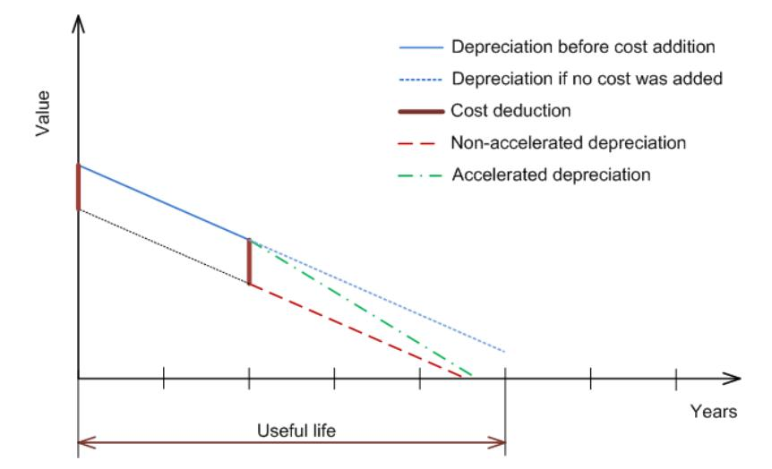
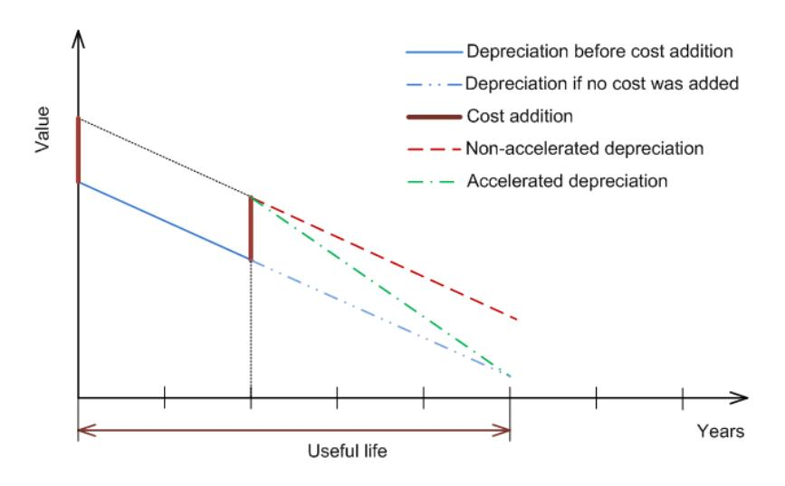
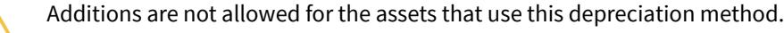
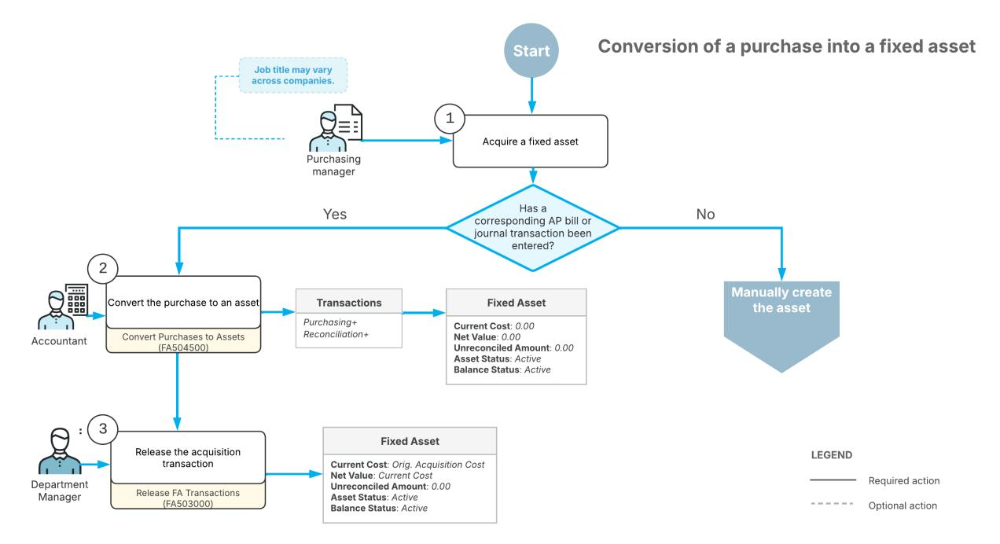
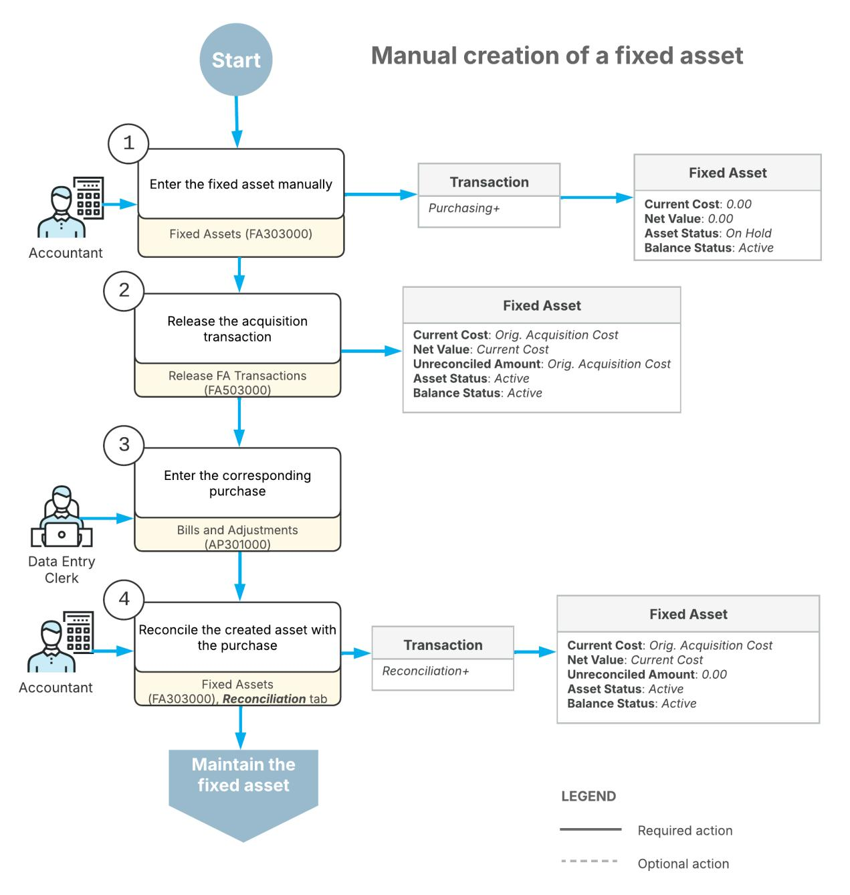
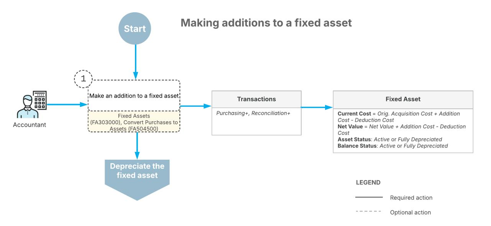
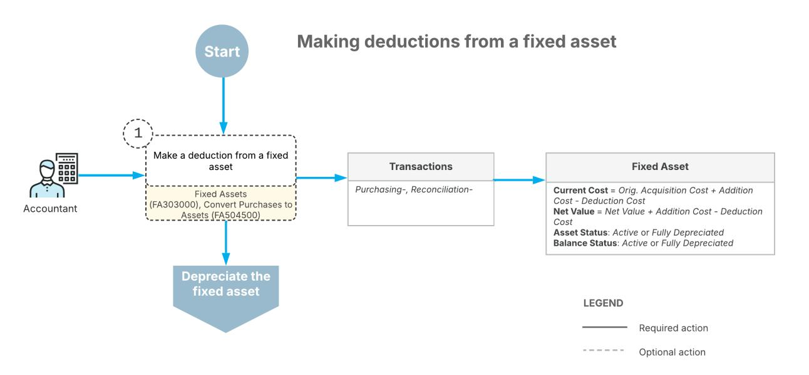
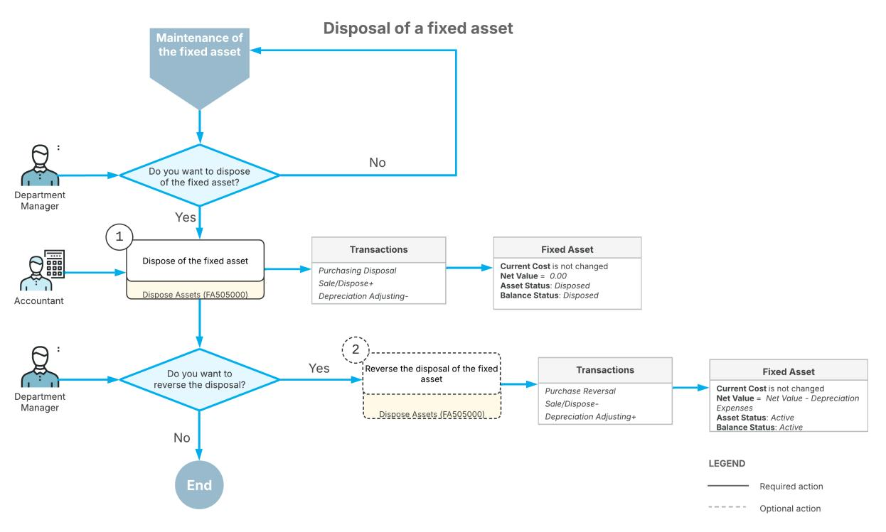
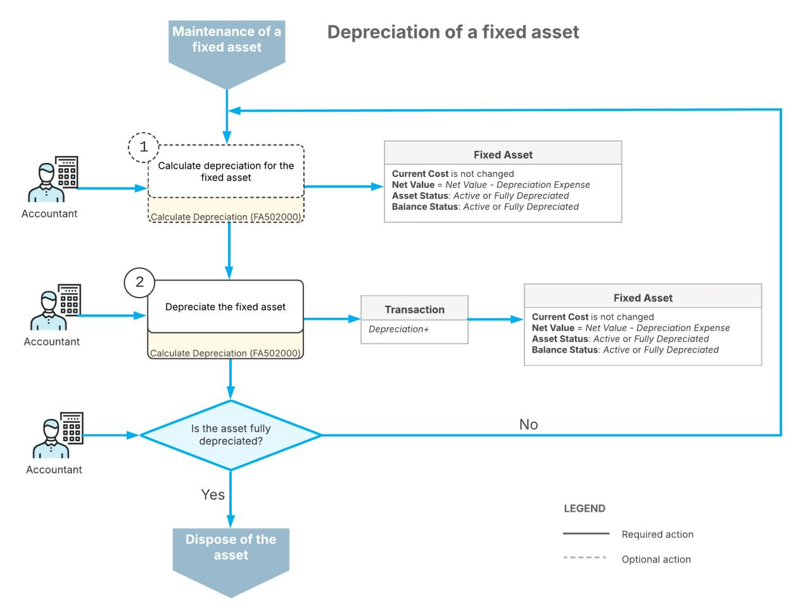
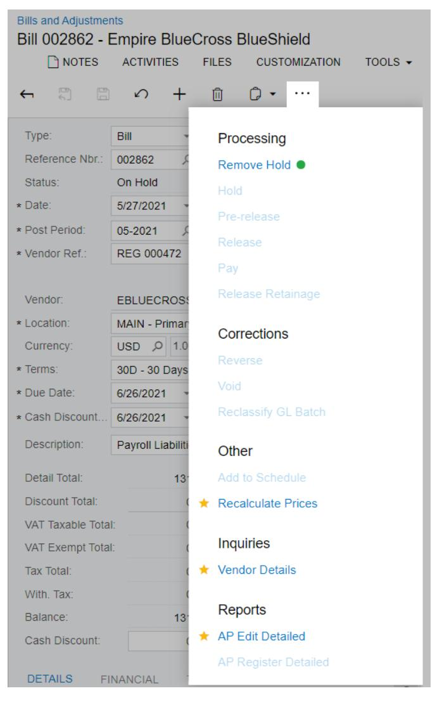

# **Fixed Assets 2025 R1**


| Copyright6                                                           |  |  |  |
|----------------------------------------------------------------------|--|--|--|
| Fixed Assets Overview 7                                              |  |  |  |
| Types of Fixed Asset Transactions9                                   |  |  |  |
| Depreciation Configuration 16                                        |  |  |  |
| Predefined Depreciation Methods17                                    |  |  |  |
| To Configure Formula-Based Depreciation Methods21                    |  |  |  |
| Dutch Depreciation Methods 24                                        |  |  |  |
| To Configure Dutch Depreciation Methods 25                           |  |  |  |
| Australian Depreciation Methods 25                                   |  |  |  |
| To Configure Australian Depreciation Methods 28                      |  |  |  |
| New Zealand Depreciation Methods 28                                  |  |  |  |
| To Configure New Zealand Depreciation Methods 33                     |  |  |  |
| Table Depreciation Methods 34                                        |  |  |  |
| To Configure Table Methods of Class Type 35                          |  |  |  |
| To Configure Table Methods of Asset Type35                           |  |  |  |
| To Configure Table Methods with Annual Depreciation36                |  |  |  |
| Averaging Conventions36                                              |  |  |  |
| U.S.-Based Fixed Asset Depreciation38                                |  |  |  |
| Converting Purchases to Fixed Assets 40                              |  |  |  |
| Conversion of a Purchase: General Information40                      |  |  |  |
| Conversion of a Purchase: Implementation Checklist 43                |  |  |  |
| Conversion of a Purchase: Generated Transactions44                   |  |  |  |
| Conversion of a Purchase: To Convert a Purchase to an Asset45        |  |  |  |
| Conversion of a Purchase: To Convert a Purchase to Multiple Assets48 |  |  |  |
| Conversion of a Purchase: Related Reports and Inquiry Form 53        |  |  |  |
| Creating Fixed Assets55                                              |  |  |  |
| Fixed Asset Creation: General Information 55                         |  |  |  |
| Fixed Asset Creation: Implementation Checklist59                     |  |  |  |
| Fixed Asset Creation: Generated Transactions61                       |  |  |  |
| Fixed Asset Creation: To Create and Reconcile an Asset62             |  |  |  |
| Fixed Asset Creation: To Create an Asset Under Construction65        |  |  |  |
| Fixed Asset Creation: To Create an Asset with Multiple Units68       |  |  |  |
| Changing an Asset's Default Settings 71                              |  |  |  |
| Non-Default Asset Settings: General Information71                    |  |  |  |

| Non-Default Asset Settings: Implementation Checklist 72             |  |
|---------------------------------------------------------------------|--|
| Non-Default Asset Settings: Generated Transactions73                |  |
| Non-Default Asset Settings: Process Activity 74                     |  |
| Making Additions to Fixed Assets 78                                 |  |
| Additions to Assets: General Information 78                         |  |
| Additions to Assets: Implementation Checklist 79                    |  |
| Additions to Assets: Generated Transactions80                       |  |
| Additions to Assets: To Make an Addition by Converting a Purchase81 |  |
| Additions to Assets: To Make a Manual Addition83                    |  |
| Making Deductions from Fixed Assets 86                              |  |
| Deductions from Assets: General Information86                       |  |
| Deductions from Assets: Implementation Checklist87                  |  |
| Deductions from Assets: Generated Transactions 88                   |  |
| Deductions from Assets: Process Activity89                          |  |
| Deductions from Assets: Related Report91                            |  |
| Transferring Fixed Assets 93                                        |  |
| Asset Transfers: General Information 93                             |  |
| Asset Transfers: Implementation Checklist94                         |  |
| Asset Transfers: Generated Transactions 96                          |  |
| Asset Transfers: Process Activity96                                 |  |
| Asset Transfers: Mass Processing99                                  |  |
| Splitting Fixed Assets 101                                          |  |
| Splitting of Assets: General Information 101                        |  |
| Splitting of Assets: Implementation Checklist 102                   |  |
| Splitting of Assets: Process Activity103                            |  |
| Splitting of Assets: Related Reports and Inquiry Form106            |  |
| Disposing of Fixed Assets107                                        |  |
| Asset Disposal: General Information 107                             |  |
| Asset Disposal: Implementation Checklist109                         |  |
| Asset Disposal: Generated Transactions 110                          |  |
| Asset Disposal: Process Activity111                                 |  |
| Asset Disposal: Mass Processing114                                  |  |
| Asset Disposal: Related Report and Inquiry Forms 114                |  |
| To Reverse Asset Disposal115                                        |  |
| Depreciating Fixed Assets116                                        |  |
| Asset Depreciation: General Information116                          |  |

| Asset Depreciation: Implementation Checklist119                          |  |
|--------------------------------------------------------------------------|--|
| Asset Depreciation: Generated Transactions 120                           |  |
| Asset Depreciation: To Calculate Depreciation120                         |  |
| Asset Depreciation: To Depreciate Assets 122                             |  |
| Asset Depreciation: To Calculate Depreciation in Two Books 125           |  |
| Asset Depreciation: Related Reports 129                                  |  |
| To Suspend Asset Depreciation 129                                        |  |
| To Resume Asset Depreciation 129                                         |  |
| Depreciating Additions to Fixed Assets 131                               |  |
| Depreciation of Additions: General Information131                        |  |
| Depreciation of Additions: Implementation Checklist 133                  |  |
| Depreciation of Additions: Generated Transactions134                     |  |
| Depreciation of Additions: Process Activity 135                          |  |
| Managing Fixed Assets with Depreciation 140                              |  |
| Assets with Depreciation: General Information140                         |  |
| Assets with Depreciation: Implementation Checklist142                    |  |
| Assets with Depreciation: Generated Transactions 143                     |  |
| Assets with Depreciation: To Split an Asset 144                          |  |
| Assets with Depreciation: To Transfer Assets147                          |  |
| Assets with Depreciation: To Dispose of an Asset 150                     |  |
| Closing Financial Periods in Fixed Assets 153                            |  |
| Fixed Asset Period Closing: General Information 153                      |  |
| Fixed Asset Period Closing: Process Activity 154                         |  |
| To Reopen a Financial Period in Fixed Assets156                          |  |
| Migrating Fixed Assets157                                                |  |
| Asset Migration: General Information157                                  |  |
| Asset Migration: Implementation Checklist 159                            |  |
| Asset Migration: To Create a Partially Depreciated Asset160              |  |
| Asset Migration: To Migrate Fixed Assets164                              |  |
| Asset Migration: To Apply the Section 179 Deduction (Optional) 168       |  |
| Asset Migration: Related Reports171                                      |  |
| Troubleshooting Fixed Assets172                                          |  |
| Fixed Asset Troubleshooting: General Information 172                     |  |
| Fixed Asset Troubleshooting: To Change the Useful Life of an Asset 174   |  |
| Fixed Asset Troubleshooting: To Change the Salvage Value of an Asset 176 |  |
| Fixed Asset Troubleshooting: To Reverse an Asset176                      |  |

| Fixed Asset Troubleshooting: To Change Net Book Value of an Asset176                   |  |
|----------------------------------------------------------------------------------------|--|
| Fixed Asset Troubleshooting: To Shi the First Year One Year Earlier 177               |  |
| Fixed Asset Troubleshooting: To Delete an Unreleased Fixed Asset Transaction177        |  |
| Fixed Asset Troubleshooting: To Delete Multiple Unreleased Fixed Asset Transactions178 |  |
| Appendix179                                                                            |  |
| Reports 179                                                                            |  |
| Report Form179                                                                         |  |
| Report184                                                                              |  |
| Form Toolbar and More Menu186                                                          |  |
| Table Toolbar 193                                                                      |  |

## <span id="page-5-0"></span>**Copyright**

#### **© 2025 Acumatica, Inc.**

#### **ALL RIGHTS RESERVED.**

No part of this document may be reproduced, copied, or transmitted without the express prior consent of Acumatica, Inc.

3075 112th Avenue NE, Suite 200, Bellevue, WA 98004, USA

## **Restricted Rights**

The product is provided with restricted rights. Use, duplication, or disclosure by the United States Government is subject to restrictions as set forth in the applicable License and Services Agreement and in subparagraph (c)(1)(ii) of the Rights in Technical Data and Computer Soware clause at DFARS 252.227-7013 or subparagraphs (c)(1) and (c)(2) of the Commercial Computer Soware-Restricted Rights at 48 CFR 52.227-19, as applicable.

## **Disclaimer**

Acumatica, Inc. makes no representations or warranties with respect to the contents or use of this document, and specifically disclaims any express or implied warranties of merchantability or fitness for any particular purpose. Further, Acumatica, Inc. reserves the right to revise this document and make changes in its content at any time, without obligation to notify any person or entity of such revisions or changes.

## **Trademarks**

Acumatica is a registered trademark of Acumatica, Inc. HubSpot is a registered trademark of HubSpot, Inc. Microso Exchange and Microso Exchange Server are registered trademarks of Microso Corporation. All other product names and services herein are trademarks or service marks of their respective companies.

Soware Version: 2025 R1 Last Updated: 06/01/2025

## <span id="page-6-0"></span>**Fixed Assets Overview**

By using the fixed asset functionality, you can create fixed assets, track them through their useful life, depreciate them, and dispose of them.

The primary features of the fixed asset functionality are described briefly below and extensively in other topics.

## **Quick Conversion from Acquired Items to Fixed Assets**

In Acumatica ERP, if your company has acquired new assets, you can quickly convert these items into fixed assets. The acquired items can be converted as separate assets or as components of an existing asset. Alternatively, you can add a fixed asset by entering the required information manually. For more details, see *[Conversion of a](#page-39-2) [Purchase: General Information](#page-39-2)*.

## **Fixed Asset Classes**

You can configure fixed asset classes, which let you group similar fixed assets for processing and reporting. Once you assign a new asset to a specific class, the default values from the class are automatically filled in, streamlining the creation of the fixed asset. Many essential settings—such as the asset's useful life, the depreciation method, and the depreciation books that can be used to depreciate the asset—must be defined for a fixed asset class.

To be able to maintain a fixed asset in Acumatica ERP, on acquiring the asset, you need to create a fixed asset record in the system. When you create a fixed asset, you select the fixed asset class to which it belongs, and the system automatically fills in the type of asset, the recovery period, the depreciation settings, and the GL accounts that are specified for the selected fixed asset class. For more information, see *[Fixed Assets: Fixed Asset Classes](https://help-2025r1.acumatica.com/Help?ScreenId=ShowWiki&pageid=942695f5-8de5-4daf-af9d-9b267878a3e4)*.

## **Fixed Asset Hierarchy**

In Acumatica ERP, the fixed asset hierarchy is a group of relationships between parent and child assets. A fixed asset can have an unlimited number of child assets (also referred to as *components*) and only one parent asset. For example, the renovation of a unit of equipment or a building represents an individual fixed asset that is a component of the equipment or building, which is the parent fixed asset.

To build a fixed asset hierarchy, you should take into account what assets consist of or make up, as well as how assets will be replaced at the end of their useful life. The hierarchy is implemented on a provisional basis. For example, if the parent asset is disposed of, the asset's components will remain active.

The asset hierarchy can be built for tangible assets only—that is, for fixed assets with physical substance. Intangible assets must be individually recorded in the system.

In Acumatica ERP, you can use the following forms to organize the hierarchy of fixed assets: *[Fixed Asset Classes](https://help-2025r1.acumatica.com/Help?ScreenId=ShowWiki&pageid=6b58176c-f1db-4fe4-b267-c657dc50eca0)* (FA201000), *[Fixed Assets](https://help-2025r1.acumatica.com/Help?ScreenId=ShowWiki&pageid=0bde54fb-c293-4759-931b-5ecbff784cd1)* (FA303000), and *[Convert Purchases to Assets](https://help-2025r1.acumatica.com/Help?ScreenId=ShowWiki&pageid=8dec96f6-16f3-4533-8abf-ab916687535b)* (FA504500).

On the *[Fixed Asset Classes](https://help-2025r1.acumatica.com/Help?ScreenId=ShowWiki&pageid=6b58176c-f1db-4fe4-b267-c657dc50eca0)* form, you can create a parent fixed asset class that is designed to hold particular parent assets, such as computers. Then when you create a child fixed asset class, you specify the parent class in the **Parent Class** box of the Summary area of this form. You can then specify these classes when you create parent assets and child assets.

When you define a child asset on the *[Fixed Assets](https://help-2025r1.acumatica.com/Help?ScreenId=ShowWiki&pageid=0bde54fb-c293-4759-931b-5ecbff784cd1)* form, you can select a parent asset for the fixed asset in the Summary area. Then when you open the parent asset on the same form, the child asset will be listed on the **Components** tab.


An asset cannot be a parent and a child of the same fixed asset.

You can also organize the hierarchy of fixed assets as you convert purchased items into fixed assets. You can specify units of items that you want to convert as components of selected assets on the *[Convert Purchases to Assets](https://help-2025r1.acumatica.com/Help?ScreenId=ShowWiki&pageid=8dec96f6-16f3-4533-8abf-ab916687535b)* form on the **Reconciliation** tab of the *[Fixed Assets](https://help-2025r1.acumatica.com/Help?ScreenId=ShowWiki&pageid=0bde54fb-c293-4759-931b-5ecbff784cd1)* form.

#### **Depreciation Methods**

Acumatica ERP provides multiple built-in depreciation methods that are allowed by law in the United States. Additionally, you can configure your own depreciation methods. For the same asset, different depreciation methods can be used for financial reporting and tax reporting. For details, see *[Depreciation Configuration](#page-15-1)*.

#### **Built-in Averaging Conventions**

Acumatica ERP provides a number of built-in averaging conventions to be used for calculating depreciation for the financial periods within which an asset was acquired or disposed. You can select the averaging convention that suits the specific depreciation method. For more information, see *Averaging [Conventions](#page-35-2)*.

## **Flexible Options for Depreciation Calculation**

You can automate depreciation calculations for all types of assets by creating schedules for depreciation. You can run these schedules for a particular asset or for multiple assets. If needed, you can suspend the depreciation of specific assets for an unspecified number of periods. For more details, see *[Asset Depreciation: General Information](#page-115-2)*.

#### **Support for Fixed Asset Depreciation in the United States**

Acumatica ERP fully supports United States-based tax reporting requirements, and you can perform depreciation according to the requirements of the tax authorities of your country. For information on how to set up tax benefits to be calculated during fixed asset depreciation, see *[U.S.-Based Fixed Asset Depreciation](#page-37-1)*.

#### **Mass-Transfer of Fixed Assets**

By using Acumatica ERP, you can transfer the assets between branches one by one or through mass processing. For details, see *Asset Transfers: Mass [Processing](#page-98-1)*.

#### **Mass-Disposal of Fixed Assets**

By using Acumatica ERP, you can perform mass disposal and one-by-one disposal of fixed assets. To learn more about the disposal methods and the ways fixed assets can be disposed of with Acumatica ERP, see *[Asset Disposal:](#page-106-2) [General Information](#page-106-2)*.

#### **Other Features and Options**

The fixed asset functionality, you can also do the following:

- Create custom depreciation methods
- Schedule depreciation
- Easily track fixed assets by branch, department, and custodian
- View the depreciation history of an asset in multiple ways and change the views at any time
- Use a wide variety of fixed-asset reports that provide accounting and management information
- Assign multiple depreciation books (for example, one for tax reporting and one for financial management) to the fixed assets
- Split and transfer assets
- Delete empty transaction documents

## <span id="page-8-0"></span>**Types of Fixed Asset Transactions**

When users perform actions involving fixed assets, the system automatically creates fixed asset transactions, which you can view on the *Fixed Asset [Transactions](https://help-2025r1.acumatica.com/Help?ScreenId=ShowWiki&pageid=2528ad57-5f6c-49bc-aa18-674d2fe2a9e2)* (FA301000) form. (All of these transactions are recorded in the base currency.) You can also use this form to manually create fixed asset transactions and to view the asset's transaction history.

Depending on the type of generated transaction, the system may use some of the following accounts:

- Fixed Assets account: The account specified for a fixed asset in the **Fixed Assets Account** box on the **GL Accounts** tab of the *[Fixed Assets](https://help-2025r1.acumatica.com/Help?ScreenId=ShowWiki&pageid=0bde54fb-c293-4759-931b-5ecbff784cd1)* (FA303000) form. By default, the system copies this account from the fixed asset class selected for the fixed asset.
- Fixed Assets Accrual account: This is an asset account that is used to record the cost of purchased items that have not been put into service yet. The account is specified for a fixed asset in the **FA Accrual Account** box on the **GL Accounts** tab of the *[Fixed Assets](https://help-2025r1.acumatica.com/Help?ScreenId=ShowWiki&pageid=0bde54fb-c293-4759-931b-5ecbff784cd1)* form. By default, the system copies this account from the **FA Accrual Account** box on the *[Fixed Assets Preferences](https://help-2025r1.acumatica.com/Help?ScreenId=ShowWiki&pageid=f56d17a8-2729-496b-b8ac-8fb0732ee0a5)* (FA101000) form.
- Document line account: The account that has been specified in the document (such as an AP bill) and that has been debited by purchasing of the item that then was converted to a fixed asset.

Oen, the default fixed asset accrual account (specified in the **FA Accrual Account** box on the *[Fixed Assets Preferences](https://help-2025r1.acumatica.com/Help?ScreenId=ShowWiki&pageid=f56d17a8-2729-496b-b8ac-8fb0732ee0a5)* (FA101000) form) is used in a document (for example, in the AP bill) because the item that is supposed to be a fixed asset has been purchased. In that case, the same account will be debited and credited by the *Reconciliation+* or *Reconciliation*transaction.

- Accumulated Depreciation account: The account specified for a fixed asset in the **Accumulated Depreciation Account** box on the **GL Accounts** tab of the *[Fixed Assets](https://help-2025r1.acumatica.com/Help?ScreenId=ShowWiki&pageid=0bde54fb-c293-4759-931b-5ecbff784cd1)* form. By default, the system copies this account from the fixed asset class selected for the fixed asset.
- Depreciation Expense account: The account specified for a fixed asset in the **Depreciation Expense Account** box on the **GL Accounts** tab of the *[Fixed Assets](https://help-2025r1.acumatica.com/Help?ScreenId=ShowWiki&pageid=0bde54fb-c293-4759-931b-5ecbff784cd1)* form. By default, the system copies this account from the fixed asset class selected for the fixed asset.
- Gain account: The account specified for a fixed asset in the **Gain Account** box on the **GL Accounts** tab of the *[Fixed Assets](https://help-2025r1.acumatica.com/Help?ScreenId=ShowWiki&pageid=0bde54fb-c293-4759-931b-5ecbff784cd1)* form. By default, the system copies this account from the fixed asset class selected for the fixed asset.
- Loss account: The account specified for a fixed asset in the **Loss Account** box on the **GL Accounts** tab of the *[Fixed Assets](https://help-2025r1.acumatica.com/Help?ScreenId=ShowWiki&pageid=0bde54fb-c293-4759-931b-5ecbff784cd1)* form. By default, the system copies this account from the fixed asset class selected for the fixed asset.
- Proceeds account: The account specified for a fixed asset in the **Proceeds Account** box on the **GL Accounts** tab of the *[Fixed Assets](https://help-2025r1.acumatica.com/Help?ScreenId=ShowWiki&pageid=0bde54fb-c293-4759-931b-5ecbff784cd1)* form. By default, the system copies this account from the fixed asset class selected for the fixed asset. If the proceeds account is not specified for a fixed asset, the system copies it from the selected disposal method.

The types of fixed asset transactions are shown in the**Transaction Type** column for every transaction line on the *Fixed Asset [Transactions](https://help-2025r1.acumatica.com/Help?ScreenId=ShowWiki&pageid=2528ad57-5f6c-49bc-aa18-674d2fe2a9e2)* form. These types are described in detail in the remainder of this topic.

In each of chapter of this guide about user actions that cause fixed asset transactions to be produced, you can refer to the *Generated Transactions* topic, which describes the specific transactions that are generated.

#### *Purchasing+*

A transaction of the *Purchasing+* type is created when a new asset has been acquired. Through this transaction, the cost of the asset is transferred from the Fixed Asset Accrual account to the Fixed Assets account. The system generates the following fixed asset transaction.

| Account              | Debit  | Credit |
|----------------------|--------|--------|
| Fixed Assets account | Amount | 0.00   |
| FA Accrual account   | 0.00   | Amount |

The system generates a *Purchasing+* transaction when a user creates an asset in the system either manually on the *[Fixed Assets](https://help-2025r1.acumatica.com/Help?ScreenId=ShowWiki&pageid=0bde54fb-c293-4759-931b-5ecbff784cd1)* (FA303000) form or by converting a purchase to an asset on the *[Convert Purchases to Assets](https://help-2025r1.acumatica.com/Help?ScreenId=ShowWiki&pageid=8dec96f6-16f3-4533-8abf-ab916687535b)* (FA504500) form, or when the user increases the net book value of a fixed asset. To populate the date and period of the *Purchasing+* transaction, the system uses the date (and its financial period) of the purchase document (AP bill or purchase order) that reflects the fixed asset's purchase. This date is specified in the **Receipt Date** box in the lower table on the *[Convert Purchases to Assets](https://help-2025r1.acumatica.com/Help?ScreenId=ShowWiki&pageid=8dec96f6-16f3-4533-8abf-ab916687535b)* form.

A user can also create a *Purchasing+* transaction manually on the *Fixed Asset [Transactions](https://help-2025r1.acumatica.com/Help?ScreenId=ShowWiki&pageid=2528ad57-5f6c-49bc-aa18-674d2fe2a9e2)* (FA301000) form to adjust the cost for a fixed asset in a particular book.

#### *Purchasing–*

A transaction of this type is created automatically when a user reverses the acquisition of a fixed asset or decreases the net book value of a fixed asset.

Through this transaction, the cost of the asset is transferred from the Fixed Assets account to the account specified in the acquisition document (by default, the FA Accrual account). The system generates the following fixed asset transaction.

| Account              | Debit  | Credit |
|----------------------|--------|--------|
| FA Accrual account   | Amount | 0.00   |
| Fixed Assets account | 0.00   | Amount |

If a user reverses a fixed asset, the corresponding purchase becomes available to be converted to a fixed asset again on the *[Convert Purchases to Assets](https://help-2025r1.acumatica.com/Help?ScreenId=ShowWiki&pageid=8dec96f6-16f3-4533-8abf-ab916687535b)* (FA504500) form.

#### *Reconciliation+*

The system generates a *Reconciliation+* transaction automatically when a user converts a fixed asset from a purchase, increases the net book value of a fixed asset by making an addition, or enters a fixed asset in initialization mode.

Through this transaction, the cost of the fixed asset is reconciled with the appropriate purchasing transaction or transactions. The system generates the following fixed asset transaction.

| Account            | Debit  | Credit |
|--------------------|--------|--------|
| FA Accrual account | Amount | 0.00   |

| Account               | Debit | Credit |
|-----------------------|-------|--------|
| Document line account | 0.00  | Amount |

The *Reconciliation+* transaction debits the Fixed Assets Accrual account and credits the account that has been debited by the purchase of the corresponding item.

#### *Reconciliation–*

The system generates a *Reconciliation–* transaction automatically when a user decreases the net book value of an asset by making a deduction. The system generates the following fixed asset transaction.

| Account               | Debit  | Credit |
|-----------------------|--------|--------|
| Document line account | Amount | 0.00   |
| FA Accrual account    | 0.00   | Amount |

The *Reconciliation–* transaction credits the Fixed Assets Accrual account and debits the account that has been credited by the GL entry that corresponds to the asset's cost deduction.

#### *Calculated+*

This system-generated transaction occurs automatically when a user calculates depreciation for an asset or makes an addition to a fully depreciated asset. This transaction exists only temporarily: When the transaction is released, the *Calculated+* transaction type is changed to the *Depreciation+* type.

The system generates a *Calculated+* transaction in the following cases:

- On the *[Calculate Depreciation](https://help-2025r1.acumatica.com/Help?ScreenId=ShowWiki&pageid=4e66f6bf-ef4c-4763-98ce-0115e766b5ba)* (FA502000) form, a user runs the depreciation process (that is, the user selects *Depreciate* in the **Action** box and clicks **Process** or **Process All**) for a fixed asset.
- On the *[Convert Purchases to Assets](https://help-2025r1.acumatica.com/Help?ScreenId=ShowWiki&pageid=8dec96f6-16f3-4533-8abf-ab916687535b)* (FA504500) or *[Fixed Assets](https://help-2025r1.acumatica.com/Help?ScreenId=ShowWiki&pageid=0bde54fb-c293-4759-931b-5ecbff784cd1)* (FA303000) form, a user makes an addition to an asset that has been fully depreciated. Before the transaction is released, the system creates a *Calculated+* transaction so that the net value of the asset will not change aer the transaction is released.

#### *Calculated–*

This system-generated transaction occurs automatically when the user disposes of an asset or makes a deduction from a fully depreciated asset. This transaction exists only temporarily: When the transaction is released, the *Calculated–* transaction type is changed to the *Depreciation–* type.

The system generates a *Calculated–* transaction in the following cases:

- A user disposes of an asset that must be depreciated in the disposal period. That is, the **Depreciate in Disposal Period** check box is selected on the *[Fixed Assets Preferences](https://help-2025r1.acumatica.com/Help?ScreenId=ShowWiki&pageid=f56d17a8-2729-496b-b8ac-8fb0732ee0a5)* (FA101000) form, and the depreciation amount is negative.
- A user makes a deduction from an asset that has been fully depreciated. Before the transaction is released, the system creates a *Calculated–* transaction so that the net value of the asset will not change aer the transaction is released.

#### *Depreciation+*

This transaction type is used to record the depreciation incurred during the financial period. The system generates the following fixed asset transaction.

| Account                          | Debit  | Credit |
|----------------------------------|--------|--------|
| Depreciation Expense account     | Amount | 0.00   |
| Accumulated Depreciation account | 0.00   | Amount |

The system changes a transaction of the *Calculated+* type to the *Depreciation+* type when you release a *Calculated +* transaction that you have previously prepared for the fixed asset by running the depreciation process (that is, by selecting *Depreciate* in the **Action** box and clicking **Process** or **Process All**) for this fixed asset on the *[Calculate](https://help-2025r1.acumatica.com/Help?ScreenId=ShowWiki&pageid=4e66f6bf-ef4c-4763-98ce-0115e766b5ba) [Depreciation](https://help-2025r1.acumatica.com/Help?ScreenId=ShowWiki&pageid=4e66f6bf-ef4c-4763-98ce-0115e766b5ba)* (FA502000) form.

A user can also create a *Depreciation+* transaction manually on the *Fixed Asset [Transactions](https://help-2025r1.acumatica.com/Help?ScreenId=ShowWiki&pageid=2528ad57-5f6c-49bc-aa18-674d2fe2a9e2)*(FA301000) form to adjust the depreciation for a fixed asset in a particular book.

A manual *Depreciation+* transaction can be created only for a period in which depreciation has already been calculated. If an asset has not been depreciated yet, the system does not allow you to specify any period for the transaction.

You depreciate an asset on the *[Calculate Depreciation](https://help-2025r1.acumatica.com/Help?ScreenId=ShowWiki&pageid=4e66f6bf-ef4c-4763-98ce-0115e766b5ba)* (FA502000) form by selecting *Depreciate* in the **Action** box and processing the needed asset. For details, see *Asset [Depreciation:](#page-119-2) To Calculate Depreciation*.

You can then create an adjusting *Depreciation+* transaction on the *Fixed Asset [Transactions](https://help-2025r1.acumatica.com/Help?ScreenId=ShowWiki&pageid=2528ad57-5f6c-49bc-aa18-674d2fe2a9e2)* form.

#### *Depreciation–*

This transaction type indicates that the accumulated depreciation amount was decreased on the Accumulated Depreciation account—for example, as a result of the reversal of the asset. The system generates the following fixed asset transaction.

| Account                          | Debit  | Credit |
|----------------------------------|--------|--------|
| Accumulated Depreciation account | Amount | 0.00   |
| Depreciation Expense account     | 0.00   | Amount |

#### *Depreciation Adjusting+*

Transactions of this type are generated when the system updates the balance of the Accumulated Depreciation account, for example when the system adjusts the accumulated depreciation amount of an asset in some operations, such as split or reverse disposal of the asset. For example, the system generates this transaction when a user splits a fixed asset with depreciation to transfer a part of the accumulated depreciation to a newly created fixed asset.

The system generates the following fixed asset transaction.

| Account                          | Debit  | Credit |
|----------------------------------|--------|--------|
| Accumulated Depreciation account | Amount | 0.00   |
| Accumulated Depreciation account | 0.00   | Amount |

When a user reverses the disposal of an asset, the system generates the *Depreciation Adjusting+* transaction as follows:

| Account                          | Debit  | Credit |
|----------------------------------|--------|--------|
| Gain account or Loss account     | Amount | 0.00   |
| Accumulated Depreciation account | 0.00   | Amount |

#### *Depreciation Adjusting–*

Transactions of this type are generated when the system adjusts the accumulated depreciation amount of an asset in some operations, such as the split or disposal of the asset. For example, the system generates this transaction when you split a fixed asset with depreciation to decrease the accumulated depreciation for this asset by the amount that is transferred to a newly created fixed asset.

| Account                          | Debit  | Credit |
|----------------------------------|--------|--------|
| Accumulated Depreciation account | Amount | 0.00   |
| Accumulated Depreciation account | 0.00   | Amount |

When a user disposes of an asset, the system generates the following fixed asset transaction.

| Account                          | Debit  | Credit |
|----------------------------------|--------|--------|
| Accumulated Depreciation account | Amount | 0.00   |
| Gain account or Loss account     | 0.00   | Amount |

#### *Purchasing Disposal* **and** *Sale/Dispose+*

Through these transactions, the system records the proceeds from the sale or disposal of the asset.

The system generates a *Purchasing Disposal* transaction to record the proceeds from the sale or disposal of the asset. The *Purchasing Disposal* transaction transfers the asset cost from the Fixed Assets account to the expense account (Gain account if the disposal proceeds amount is a gain, or Loss account if the disposal proceeds amount is a loss) to record the cost disposal.

The system generates the following fixed asset transaction.

| Account                      | Debit  | Credit |
|------------------------------|--------|--------|
| Gain account or Loss account | Amount | 0.00   |
| Fixed Assets account         | 0.00   | Amount |

The system generates a transaction of the *Sale/Dispose+* type to record the proceeds amount from the sale or disposal of the asset. The system generates the following fixed asset transaction.

| Account          | Debit  | Credit |
|------------------|--------|--------|
| Proceeds account | Amount | 0.00   |

| Account                      | Debit | Credit |
|------------------------------|-------|--------|
| Gain account or Loss account | 0.00  | Amount |

#### *Purchase Reversal* **and** *Sale/Dispose–*

The system generates a *Purchase Reversal* transaction to record the reverse of the asset disposal. The *Purchasing Reversal* transaction transfers the asset cost from the expense account to which it was previously recorded by the *Purchasing Disposal* transaction to the Fixed Assets account to record the reversal of the cost disposal. The system generates the following fixed asset transaction.

| Account                      | Debit  | Credit |
|------------------------------|--------|--------|
| Fixed Assets account         | Amount | 0.00   |
| Gain account or Loss account | 0.00   | Amount |

The system generates a *Sale/Dispose–* transaction to record the reverse of the asset disposal. The system generates the following fixed asset transaction.

| Account                      | Debit  | Credit |
|------------------------------|--------|--------|
| Gain account or Loss account | Amount | 0.00   |
| Proceeds account             | 0.00   | Amount |

#### *Transfer Purchasing*

This transaction type, which is generated for a newly acquired asset that has not yet been depreciated, indicates that the location, custodian, or department of the asset has been changed. The system generates a transaction of this type when a user transfers the fixed asset to another branch, account, or subaccount, if subaccounts are used in the system. If a user changes the subaccount of a fixed asset, the system generates the following fixed asset transaction.

| Account                                                     | Debit  | Credit |
|-------------------------------------------------------------|--------|--------|
| Fixed Assets account, destination subaccount                | Amount | 0.00   |
| Fixed Assets or FA Accrual account, original subac<br>count | 0.00   | Amount |

#### *Transfer Depreciation*

This transaction type, which is generated for an asset that has been depreciated, indicates that the location, custodian, or department of the asset has been changed. The system generates a transaction of this type when a user transfers the accumulated depreciation of a fixed asset to another branch, account, or subaccount, if subaccounts are used in the system. If a user changes the subaccount of a fixed asset, the system generates the following fixed asset transaction.

| Account                                                      | Debit  | Credit |
|--------------------------------------------------------------|--------|--------|
| Accumulated Depreciation account, destination sub<br>account | Amount | 0.00   |
| Accumulated Depreciation account, original subac<br>count    | 0.00   | Amount |

## <span id="page-15-1"></span><span id="page-15-0"></span>**Depreciation Configuration**

You have to select an appropriate depreciation method and select certain depreciation settings for each fixed asset you add to the system. In the topics of this section you can find information on the depreciation methods available in Acumatica ERP and the details on setting up asset depreciation.

## **Using Depreciation Methods**

The depreciation method determines how the asset cost is allocated over the useful life of the asset. Acumatica ERP provides multiple built-in depreciation methods, and you can create custom methods. You use the *[Depreciation](https://help-2025r1.acumatica.com/Help?ScreenId=ShowWiki&pageid=aae97500-b831-4ee2-b9b3-dea523b2afb1) [Methods](https://help-2025r1.acumatica.com/Help?ScreenId=ShowWiki&pageid=aae97500-b831-4ee2-b9b3-dea523b2afb1)* (FA202500) form to manage formula-based methods and the *[Depreciation](https://help-2025r1.acumatica.com/Help?ScreenId=ShowWiki&pageid=45ae0821-5e32-48e6-a614-c657cf061c52) Table Methods* (FA202600) form to manage table based methods.

For details on the calculation methods available in the Acumatica ERP, see *[Predefined Depreciation Methods](#page-16-1)*, *[Dutch](#page-23-1) [Depreciation Methods](#page-23-1)*, *[Australian Depreciation Methods](#page-24-2)*, and *[New Zealand Depreciation Methods](#page-27-2)*. For details on the averaging conventions that determine how fixed assets must be depreciated for the financial period within which they are acquired or disposed of, see *Averaging [Conventions](#page-35-2)*. For more information on the methods that are permitted by law in the United States, see *[U.S.-Based Fixed Asset Depreciation](#page-37-1)*.

## **Using Accelerated Depreciation for the Straight-Line Depreciation Method**

If you change the settings for an asset—for example, you revalue the asset or change its useful life—the system uses the revalued amount as the basis for the depreciation in periods aer revaluation.

You can configure the system to accelerate the depreciation for the assets that use the *Straight-Line* method, or you can use the *Remaining Value* method. In this case, the asset depreciation will be reported throughout the entire life of the asset, as shown in the following graphics below.



*Figure: Depreciation aer the net book value of an asset is decreased*



#### *Figure: Depreciation aer the net book value of an asset is increased*

You can switch on the accelerated depreciation for an asset class, and the setting will be applied to all the assets of the class.

To switch on the accelerated depreciation for the assets that use the *Straight-Line* method, select the **Accelerated Depreciation forSL Depr. Method** check box on the **General** tab of the *[Fixed Asset Classes](https://help-2025r1.acumatica.com/Help?ScreenId=ShowWiki&pageid=6b58176c-f1db-4fe4-b267-c657dc50eca0)* (FA201000) form.

For depreciation methods that use the *Straight-Line* calculation method with the *Full Period* and *Full Day* averaging conventions, the state of the **Accelerated Depreciation forSL Depr. Method** check box is ignored by the system. If these settings are specified in Acumatica ERP, the asset's net value may not become zero at the end of its useful life if the useful life was changed or the asset was revalued.

For the asset's net value to become zero at the end of its useful life, you should change the depreciation method to a method based on the *Remaining Value* calculation method. To do this, you change the option in the **Depreciation Method** column on the **Balance** tab of the *[Fixed Assets](https://help-2025r1.acumatica.com/Help?ScreenId=ShowWiki&pageid=0bde54fb-c293-4759-931b-5ecbff784cd1)* form for every needed asset.

## **Configuring the Depreciation of an Asset**

The choice of a depreciation method depends on what your company policy is and how accurately the method reflects the physical depreciation of an asset. Acumatica ERP supports assigning multiple books to one asset, with each book using its own depreciation method for different purposes. For more information about setting up books, see *Fixed Assets: To Configure the Fixed Asset [Functionality](https://help-2025r1.acumatica.com/Help?ScreenId=ShowWiki&pageid=e8f45b0f-90d0-44fc-b858-af04447e056e)*. You assign a class to the asset, and then specify the books to be assigned to the asset from the books associated with the asset class. Note that the asset must be assigned to the book that updates the general ledger. Additionally, aer you assign a book to an asset, you can change the default depreciation method of the book for the selected asset by using the *[Fixed Assets](https://help-2025r1.acumatica.com/Help?ScreenId=ShowWiki&pageid=0bde54fb-c293-4759-931b-5ecbff784cd1)* (FA303000) form.

## <span id="page-16-1"></span><span id="page-16-0"></span>**Predefined Depreciation Methods**

A depreciation method defines how the cost of a tangible asset is allocated over its expected useful life. In Acumatica ERP, you can use multiple depreciation methods for calculating depreciation for the same asset; for example, you may need to apply different depreciation methods for tax reporting and financial management purposes. To depreciate the same asset by using different methods, you must use a separate depreciation book for each method. For details, see *[Asset Depreciation: General Information](#page-115-2)*.

In Acumatica ERP, you can configure and use formula-based depreciation methods on the *[Depreciation Methods](https://help-2025r1.acumatica.com/Help?ScreenId=ShowWiki&pageid=aae97500-b831-4ee2-b9b3-dea523b2afb1)* (FA202500) form and table-based depreciation methods on the *[Depreciation](https://help-2025r1.acumatica.com/Help?ScreenId=ShowWiki&pageid=45ae0821-5e32-48e6-a614-c657cf061c52) Table Methods* (FA202600) form. Acumatica ERP provides several predefined depreciation methods, and you can configure custom depreciation methods. The predefined depreciation methods can only be viewed; they cannot be edited.

Depreciation methods differ from one another depending on the calculation method used for calculating the depreciation expense. The sections of this topic describe the available methods of calculating depreciation in Acumatica ERP.

## **Straight-Line Calculation Method**

The *Straight-Line* method of calculating depreciation is the simplest and most popular method. With this method, the depreciation expense is spread evenly over the estimated useful life of the asset. This method assumes that the physical obsolescence of an asset occurs evenly from the time the asset has been placed into service until the full write-off of its cost.

When you use the *Straight-Line* calculation method, the depreciation expense is calculated by using the following parameters:

- The depreciable basis, which is the asset acquisition cost minus the asset salvage amount (if one is specified)
- The straight-line rate *(SL rate)*, which is calculated as *100% \* (1 / N useful life)*

This calculation method is expressed in the following formula.

D = (Ac - Sa) \* SL rate

where

SL rate = 100% \* (1 / N useful life)

The symbols in the formula have the following meanings:

- *D*: The depreciation expense (for a year or an accounting period)
- *Ac*: The acquisition cost of the asset
- *Sa*: The salvage amount (or the residual value) specified for the asset on the *[Fixed Assets](https://help-2025r1.acumatica.com/Help?ScreenId=ShowWiki&pageid=0bde54fb-c293-4759-931b-5ecbff784cd1)* (FA303000) form
- *N useful life*: The estimated time period that the asset is expected to be used, starting from the placed-inservice date

To configure the depreciation method based on this calculation method, you need to select *Straight-Line* in the **Calculation Method** box on the *[Depreciation Methods](https://help-2025r1.acumatica.com/Help?ScreenId=ShowWiki&pageid=aae97500-b831-4ee2-b9b3-dea523b2afb1)* (FA202500) form.

## **Declining-Balance Calculation Method**

By using the *Declining-Balance* calculation method, you can mostly depreciate an asset in the early years of its useful life, so that by using this method, you accelerate the depreciation of the asset. Practically, it means that a company writes off the cost of the asset while the asset is relatively new. This method is expedient for the assets that become obsolete very quickly because of, for example, technological innovations.

The acceleration of depreciation is performed by applying the acceleration rate. A company can set the acceleration rate up to 200%. The calculation formula of this method uses the following parameters:

- The net book value of the asset.
- The depreciation rate, which is calculated as *100% \* (1 / N useful life)* for the straight-line method, but with respect to the declining-balance method, in which the acceleration factor should be applied, you can use the increased multiplier (in percent) depending on the acceleration factor that your company setup. Thus, the multiplier can be set as 125%, 150% or 200%. In Acumatica ERP, you enter this value in the **DB**

**Multiplier** box while you configure the *Declining-Balance* depreciation method on the *[Depreciation Methods](https://help-2025r1.acumatica.com/Help?ScreenId=ShowWiki&pageid=aae97500-b831-4ee2-b9b3-dea523b2afb1)* (FA202500) form.

Thus, the formula of calculating the depreciation expense by using the *Declining-Balance* depreciation method is the following.

D = NBV \* DB rate

The declining-balance rate (*DB rate*) is calculated as follows.

DB rate = DB Multiplier \* (1 / N useful life)

The symbols in the formula have the following meanings:

- *D*: The depreciation expense (for a year or an accounting period)
- *NBV*: The net book value of the asset at the beginning of the year or period (that is, the asset cost minus the accumulated depreciation)
- *DB Multiplier*: The percent of depreciation acceleration that a company sets up for the asset


The depreciation method in which you use 200% as the multiplication factor is known as the *double declining-balance* (DDB) depreciation method.

• *N*: The asset useful life, in years (of accounting periods)

To configure the depreciation method based on this calculation method, you need to select *Declining-Balance* in the **Calculation Method** box on the *[Depreciation Methods](https://help-2025r1.acumatica.com/Help?ScreenId=ShowWiki&pageid=aae97500-b831-4ee2-b9b3-dea523b2afb1)* form.

For fixed assets acquired during a financial year, which use custom declining-balance depreciation methods, if the averaging convention is *Full Period*, the annual depreciation amount is prorated based on the number of periods in the year of acquisition and in the year of disposal. Thus, the annual depreciation for such an asset is calculated based on the following formula:

Da = Ac / N useful life \* DB multiplier / 12 \* N year

The symbols in the formula have the following meanings:

- *Da*: The annual depreciation expense
- *Ac*: The acquisition cost of the asset
- *N*: The asset useful life, in years
- *DB Multiplier*: The percent of depreciation acceleration set up for the asset in the **DB Multiplier** box on the *[Depreciation Methods](https://help-2025r1.acumatica.com/Help?ScreenId=ShowWiki&pageid=aae97500-b831-4ee2-b9b3-dea523b2afb1)* form.
- *N year*: The number of months in the financial year

This calculation method does not depreciate the asset to zero. Thus, if you need to fully depreciate the asset, you can set the system to switch the calculation method to *Straight-Line* when the depreciation amount calculated by using the *Straight-Line* method is greater than the depreciation amount calculated for the *Declining-Balance* method. To set the system to switch the calculation method, select the**Switch toSL** check box on the *[Depreciation](https://help-2025r1.acumatica.com/Help?ScreenId=ShowWiki&pageid=aae97500-b831-4ee2-b9b3-dea523b2afb1) [Methods](https://help-2025r1.acumatica.com/Help?ScreenId=ShowWiki&pageid=aae97500-b831-4ee2-b9b3-dea523b2afb1)* form when you configure the depreciation method based on the *Declining-Balance* calculation method.

#### **Examples of Calculating Depreciation Expenses for Declining Balance**

Consider a fixed asset with the following settings:

- Acquisition cost: \$10000
- Salvage amount: 0
- Business use: 100%
- Useful life: 5 years
- Placed-in-service date: 1/1/2016

- Averaging convention: Full period
- DB multiplier: 125

The following table compares two methods of calculating the depreciation expense for the asset's first year of useful life, depending on whether the **Yearly Accountancy** check box on the *[Depreciation Methods](https://help-2025r1.acumatica.com/Help?ScreenId=ShowWiki&pageid=aae97500-b831-4ee2-b9b3-dea523b2afb1)* (FA202500) form is selected or cleared.

|         |          | Yearly Accoun<br>tancy cleared |          |                                | Yearly Accoun<br>tancy selected |
|---------|----------|--------------------------------|----------|--------------------------------|---------------------------------|
| Period  | NBV      | Period Depreci<br>ation Amount | NBV      | Yearly Deprecia<br>tion Amount | Period Depreci<br>ation Amount  |
| 01-2016 | 10000.00 | 208.33                         | 10000.00 | 2500.00                        | 208.33                          |
| 02-2016 | 9791.67  | 203.99                         | 9791.67  |                                | 208.33                          |
| 03-2016 | 9587.68  | 199.74                         | 9583.34  |                                | 208.33                          |
| 04-2016 | 9387.94  | 195.58                         | 9375.01  |                                | 208.34                          |
| 05-2016 | 9192.36  | 191.51                         | 9166.67  |                                | 208.33                          |
| 06-2016 | 9000.85  | 187.52                         | 8958.34  |                                | 208.33                          |
| 07-2016 | 8813.33  | 183.61                         | 8750.01  |                                | 208.34                          |
| 08-2016 | 8629.72  | 179.79                         | 8541.67  |                                | 208.33                          |
| 09-2016 | 8449.93  | 176.04                         | 8333.34  |                                | 208.33                          |
| 10-2016 | 8273.89  | 172.37                         | 8125.01  |                                | 208.34                          |
| 11-2016 | 8101.52  | 168.78                         | 7916.67  |                                | 208.33                          |
| 12-2016 | 7932.74  | 165.27                         | 7708.34  |                                | 208.34                          |

In the table, the following terms and formulas are used:

- *NBV* is the net book value
- When the **Yearly Accountancy** check box is cleared, the *Period Depreciation Amount* is calculated according to the following formula:

Period Depreciation Amount = NBV \* DB multiplier \* (1/N Useful Life, periods)

In this formula, NBV is the net book value at the beginning of the financial period.

• When the **Yearly Accountancy** check box is selected, the *Yearly Depreciation Amount* is calculated according to the following formula

Yearly Depreciation Amount = NBV \* DB multiplier \* (1/n Useful Life, years)

In this formula, NBV is the net book value at the beginning of the financial year.

• When the **Yearly Accountancy** check box is selected, the *Period Depreciation Amount* is calculated according to the following formula:

```
Period Depreciation Amount = Yearly Depreciation Amount / Number of periods in the
 year
```

## **Sum-of-the-Years'-Digits Calculation Method**

The *Sum-of-the-Years'-Digits* calculation method accelerates depreciation more than the straight-line method but less than the declining-balance method. The depreciation expense per year is equal to the depreciable basis multiplied by the depreciation rate, where the depreciation rate is the ratio of the number of years remaining to depreciate the asset to the sum of the years' digits. For example, suppose that an asset's useful life is 3 years. In the first year, the depreciation rate is 3 / (1 + 2 + 3) = 1/2. Thus, the asset would be depreciated by 50% in the first year of its useful life.

To configure the depreciation method based on this calculation method, you need to select *Sum-of-the-Years'- Digits* in the **Calculation Method** box on the *[Depreciation Methods](https://help-2025r1.acumatica.com/Help?ScreenId=ShowWiki&pageid=aae97500-b831-4ee2-b9b3-dea523b2afb1)* (FA202500) form.

## **Remaining Value Calculation Method**

The *Remaining Value* calculation method is similar to the *Straight-Line* method. The difference between the two methods is that the remaining value method always depreciates the asset by the end of its useful life, so that the depreciable basis minus the accumulated depreciation will be zero.

The remaining value calculation method is used if, for example, the useful life of an asset will end earlier than had been planned. Regardless of which depreciation method was used to depreciate the asset, the user can switch the method to the *Remaining Value* method at any time. As a result, the asset will be fully depreciated to the amount of zero by the end of its useful life.

To configure the depreciation method based on this calculation method, you need to select *Remaining Value* in the **Calculation Method** box on the *[Depreciation Methods](https://help-2025r1.acumatica.com/Help?ScreenId=ShowWiki&pageid=aae97500-b831-4ee2-b9b3-dea523b2afb1)* (FA202500) form.

#### **Related Links**

- *[Depreciation Methods](https://help-2025r1.acumatica.com/Help?ScreenId=ShowWiki&pageid=aae97500-b831-4ee2-b9b3-dea523b2afb1)*
- *[Dutch Depreciation Methods](#page-23-1)*
- *[Australian Depreciation Methods](#page-24-2)*
- *[New Zealand Depreciation Methods](#page-27-2)*
- *Table [Depreciation](#page-33-1) Methods*
- *To Configure [Formula-Based](#page-20-1) Depreciation Methods*
- *To Configure Dutch [Depreciation](#page-24-3) Methods*
- *[Australian Depreciation Methods](#page-24-2)*
- *To [Configure](#page-34-2) Table Methods of Class Type*
- *To [Configure](#page-34-3) Table Methods of Asset Type*
- *To Configure Table Methods with Annual [Depreciation](#page-35-3)*

## <span id="page-20-1"></span><span id="page-20-0"></span>**To Configure Formula-Based Depreciation Methods**

On the *[Depreciation Methods](https://help-2025r1.acumatica.com/Help?ScreenId=ShowWiki&pageid=aae97500-b831-4ee2-b9b3-dea523b2afb1)* (FA202500) form, you can configure a formula-based depreciation method by using any of the available depreciation calculation methods, which are described in detail in *[Predefined Depreciation](#page-16-1) [Methods](#page-16-1)*.

## **To Configure the Straight-Line Depreciation Method**

- 1. Open the *[Depreciation Methods](https://help-2025r1.acumatica.com/Help?ScreenId=ShowWiki&pageid=aae97500-b831-4ee2-b9b3-dea523b2afb1)* (FA202500) form.
- 2. In the **Depreciation Method ID** box, type the name of the new method.
- 3. In the **Calculation Method** box, select *Straight-Line*.

- 4. Optional: In the **Description** box, enter a useful description of the depreciation method that you are configuring. The description will make it easy to find this method in the list of available depreciation methods.
- 5. Optional: In the **Averaging Convention** box, select the convention that determines how fixed assets must be depreciated for the financial year within which they are acquired or disposed of. The following options are available: *Full Period*, *Mid Period*, *Next Period*, *Modified Half Period*, *Modified Half Period 2*, *Full Quarter*, *Mid Quarter*, *Full Year*, *Mid Year*, and *Full Day*. For details, see *Averaging [Conventions](#page-35-2)*.
- 6. Optional: Select the **Yearly Accountancy** check box to configure the system to calculate the depreciation amount on a yearly basis, so that the system will calculate the depreciation expense for a year and then divide this amount evenly by the number of periods in a year.
- 7. On the form toolbar, click**Save**.

## **To Configure the Declining-Balance Depreciation Method**

- 1. Open the *[Depreciation Methods](https://help-2025r1.acumatica.com/Help?ScreenId=ShowWiki&pageid=aae97500-b831-4ee2-b9b3-dea523b2afb1)* (FA202500) form.
- 2. In the **Depreciation Method ID** box, type the name of the new method.
- 3. In the **Calculation Method** box, select *Declining-Balance*.
- 4. Optional: In the **Description** box, enter a useful description of the depreciation method that you are configuring. The description will make it easy to find this method in the list of available depreciation methods.
- 5. In the **DB Multiplier** box, enter the value (that is, the percentage of depreciation acceleration that you have decided to use in this method). For details, see the description of the *Declining-Balance* calculation method available in *[Predefined Depreciation Methods](#page-16-1)*.
- 6. Optional: Select the**Switch toSL** check box to configure the system to switch the calculation method to *Straight-Line* in order to depreciate an asset to zero or to its salvage value (if specified).
- 7. Optional: In the **Averaging Convention** box, select the convention that determines how fixed assets must be depreciated for the financial year within which they are acquired or disposed of. The following options are available: *Full Period*, *Mid Year*, *Mid Quarter*, and *Full Day*. For details, see *Averaging [Conventions](#page-35-2)*.
- 8. Optional: Select the **Yearly Accountancy** check box to configure the system to calculate the depreciation amount on a yearly basis, so that the system will calculate the depreciation expense for a year and then divide this amount evenly by the number of periods in a year.
- 9. On the form toolbar, click**Save**.

## **To Configure the Sum-of-the-Years'-Digits Depreciation Method**

- 1. Open the *[Depreciation Methods](https://help-2025r1.acumatica.com/Help?ScreenId=ShowWiki&pageid=aae97500-b831-4ee2-b9b3-dea523b2afb1)* (FA202500) form.
- 2. In the **Depreciation Method ID** box, type the name of the new method.
- 3. In the **Calculation Method** box, select *Sum-of-the-Years'-Digits*.
- 4. Optional: In the **Description** box, enter a useful description of the depreciation method that you are configuring. The description will make it easy to find this method in the list of available depreciation methods.
- 5. Optional: In the **Averaging Convention** box, select the convention that determines how fixed assets must be depreciated for the financial year within which they are acquired or disposed of. The following options are available: *Full Period* and *Full Day*. For details, see *Averaging [Conventions](#page-35-2)*.
- 6. Select the **Yearly Accountancy** check box to configure the system to calculate the depreciation amount on a yearly basis, so that the system will calculate the depreciation expense for a year and then divide this amount evenly by the number of periods in a year.

7. On the form toolbar, click**Save**.

## **To Configure the Remaining Value Depreciation Method**

- 1. Open the *[Depreciation Methods](https://help-2025r1.acumatica.com/Help?ScreenId=ShowWiki&pageid=aae97500-b831-4ee2-b9b3-dea523b2afb1)* (FA202500) form.
- 2. In the **Depreciation Method ID** box, type the name of the new method.
- 3. In the **Calculation Method** box, select *Remaining Value*.
- 4. Optional: In the **Description** box, enter a useful description of the depreciation method that you are configuring. The description will make it easy to find this method in the list of available depreciation methods.
- 5. Optional: In the **Averaging Convention** box, select the convention that determines how fixed assets must be depreciated for the financial year within which they are acquired or disposed of. The following options are available: *Full Period*, *Mid Period*, *Next Period*, *Modified Half Period*, *Modified Half Period 2*, *Full Quarter*, *Mid Quarter*, *Full Year*, *Mid Year*, and *Full Day*. For details, see *Averaging [Conventions](#page-35-2)*.
- 6. Optional: Select the **Yearly Accountancy** check box to configure the system to calculate the depreciation amount on a yearly basis, so that the system will calculate the depreciation expense for a year and then divide this amount evenly by the number of periods in a year.
- 7. On the form toolbar, click**Save**.

## **To Configure the Declining Balance by Days in Period Depreciation Method**

The formula used by the system to calculate the depreciation expenses with this depreciation method is described in *[Predefined Depreciation Methods](#page-16-1)*.

- 1. Open the *[Depreciation Methods](https://help-2025r1.acumatica.com/Help?ScreenId=ShowWiki&pageid=aae97500-b831-4ee2-b9b3-dea523b2afb1)* (FA202500) form.
- 2. In the **Depreciation Method ID** box, type the name of the new method.
- 3. In the **Calculation Method** box, select *Declining Balance by Days in Period*.
- 4. Optional: In the **Description** box, enter a useful description of the depreciation method that you are configuring. The description will make it easy to find this method in the list of available depreciation methods.
- 5. In the **DB Multiplier** box, enter the value (that is, the percentage of depreciation acceleration that you have decided to use in this method). For details, see the description of the *Declining-Balance* calculation method available in *[Predefined Depreciation Methods](#page-16-1)*.
- 6. In the **Averaging Convention** box, select *Full Day*.
- 7. Optional: Select the **Yearly Accountancy** check box to configure the system to calculate the depreciation amount on a yearly basis, so that the system will calculate depreciation for each period of the year based on the net book value at the beginning of the year.
- 8. On the form toolbar, click**Save**.

#### **Related Links**

- *[Predefined Depreciation Methods](#page-16-1)*
- *Averaging [Conventions](#page-35-2)*
- *[Depreciation Methods](https://help-2025r1.acumatica.com/Help?ScreenId=ShowWiki&pageid=aae97500-b831-4ee2-b9b3-dea523b2afb1)*
- *[Fixed Assets](https://help-2025r1.acumatica.com/Help?ScreenId=ShowWiki&pageid=0bde54fb-c293-4759-931b-5ecbff784cd1)*

## <span id="page-23-1"></span><span id="page-23-0"></span>**Dutch Depreciation Methods**

*Dutch Method 1* and *Dutch Method 2* are custom depreciation methods and are commonly used for calculating depreciation in the Netherlands. These methods are similar to the declining balance calculation method, which provides the ability to mostly depreciate an asset in the earlier years of its useful life.

To configure a depreciation method based on these calculation methods, you need to select either *Dutch Method 1* or *Dutch Method 2* in the **Calculation Method** box on the *[Depreciation Methods](https://help-2025r1.acumatica.com/Help?ScreenId=ShowWiki&pageid=aae97500-b831-4ee2-b9b3-dea523b2afb1)* (FA202500) form.

With these methods, the depreciation expenses are calculated by using the following formula.

D = NBV \* D rate

The symbols in the formula have the following meanings:

- *D*: The depreciation expenses (per period).
- *NBV*: The net book value of the asset at the beginning of the period. The net book value is calculated as the asset's acquisition cost minus the total accumulated depreciation by the beginning of the period.
- *D rate*: The depreciation rate.

It follows from the formula that both of these methods involve applying the specific depreciation rate. The difference between these methods is that different parameters are required for calculating this depreciation rate, as described below.

## **Calculation Formula of Dutch Method 1**

The depreciation rate for the *Dutch Method 1* method is calculated by using the asset salvage amount and the asset useful life (number of periods). The rate, in this case, is calculated in a way that makes it possible to fully depreciate an asset during its expected useful life.

The *Dutch Method 1* uses the following calculation formula.

D rate = 1 - (Sa / Ac) ^ (1/n)

The symbols in the formula have the following meanings:

- *D rate*: The depreciation rate
- *Sa*: The salvage amount of the asset
- *Ac*: The asset acquisition cost
- *n*: The number of periods of asset useful life

## **Calculation Formula of Dutch Method 2**

The depreciation rate for the *Dutch Method 2* method is calculated by using the constant percentage and the number of periods in a year. The constant percentage defines the part of the asset's net book value that should be depreciated during this year.

The *Dutch Method 2* uses the following calculation formula:

D rate = 1 - (1 - Percentage / 100) ^ (1/N)

The symbols in the formula have the following meanings:

• *D rate*: The depreciation rate.

- *Percentage*: The constant percent that defines which part of the asset net book value should be depreciated (on the *[Depreciation Methods](https://help-2025r1.acumatica.com/Help?ScreenId=ShowWiki&pageid=aae97500-b831-4ee2-b9b3-dea523b2afb1)* form, you should enter this value in the **Percent per Year** box).
- *N*: The number of periods in a year

#### **Related Links**

- *[Predefined Depreciation Methods](#page-16-1)*
- *To Configure [Formula-Based](#page-20-1) Depreciation Methods*
- *To Configure Dutch [Depreciation](#page-24-3) Methods*

## <span id="page-24-3"></span><span id="page-24-0"></span>**To Configure Dutch Depreciation Methods**

On the *[Depreciation Methods](https://help-2025r1.acumatica.com/Help?ScreenId=ShowWiki&pageid=aae97500-b831-4ee2-b9b3-dea523b2afb1)* (FA202500) form, you can configure formula-based depreciation methods by using any of the available depreciation calculation methods, which are described in detail in *[Predefined Depreciation Methods](#page-16-1)*.

## **To Configure Dutch Method 1**

- 1. Open the *[Depreciation Methods](https://help-2025r1.acumatica.com/Help?ScreenId=ShowWiki&pageid=aae97500-b831-4ee2-b9b3-dea523b2afb1)* (FA202500) form.
- 2. In the **Depreciation Method ID** box, type the name of the new method.
- 3. In the **Calculation Method** box, select *Dutch Method 1*.
- 4. Optional: In the **Description** box, enter a useful description of the depreciation method that you are configuring. The description will make it easy to find this method in the list of available depreciation methods.
- 5. Leave the **Yearly Accountancy** check box cleared.
- 6. On the form toolbar, click**Save**.

## **To Configure Dutch Method 2**

- 1. Open the *[Depreciation Methods](https://help-2025r1.acumatica.com/Help?ScreenId=ShowWiki&pageid=aae97500-b831-4ee2-b9b3-dea523b2afb1)* (FA202500) form.
- 2. In the **Depreciation Method ID** box, type the name of the new method.
- 3. In the **Calculation Method** box, select *Dutch Method 2*.
- 4. Optional: In the **Description** box, enter a useful description of the depreciation method that you are configuring. The description will make it easy to find this method in the list of available depreciation methods.
- 5. In the **Percent per Year** box, specify the value (in percent) that defines which part of the asset net book value should be depreciated for one year.
- 6. Leave the **Yearly Accountancy** check box cleared.
- 7. On the form toolbar, click**Save**.

## <span id="page-24-2"></span><span id="page-24-1"></span>**Australian Depreciation Methods**

The sections of this topic describe custom depreciation methods for Australia, which can be configured in Acumatica ERP.

## **Remaining Value by Days in Period**

This method, a modification of the *Straight-Line* method, is used in some Asia Pacific (APAC) countries, such as Australia, New Zealand, and Thailand. With this method, depreciation is calculated based on the exact number of days in each period within a financial year.

Depreciation for each period of an asset's useful life is calculated according to the following formula.

D = (Ac - Sa - Ad) \* SL rate \* N

The symbols in the formula have the following meanings:

- *D*: The depreciation expense for an accounting period.
- *Ac*: The acquisition cost of the asset.
- *Sa*: The salvage amount (or the residual value) specified for the asset on the *[Fixed Assets](https://help-2025r1.acumatica.com/Help?ScreenId=ShowWiki&pageid=0bde54fb-c293-4759-931b-5ecbff784cd1)* (FA303000) form.
- *Ad*: The accumulated depreciation of the asset.
- *SL rate*: The straight-line depreciation rate, which is calculated as follows.
- SL rate = 100% \* (1/ N Remaining Useful Life)

In this calculation, *N Remaining Useful Life* is the useful life in days minus the number of days in the previous period for which depreciation was calculated.

• *N* (number of days held in period): The exact number of days the asset is held in the fiscal period.

This depreciation method is a custom one and should be added to the system manually. For details, see *[To](#page-27-3) Configure the [Remaining](#page-27-3) Value by Days in Period Method*.

## **Australian Prime Cost**

•

This method, a modification of the *Straight-Line* method, calculates depreciation based on the specified**Percent per Year** setting of each particular asset. With this depreciation method specified, additions and deductions are not allowed.

For each period of an asset's useful life, depreciation is calculated based on the following formula.

D = Depr. Base \* (Percent per Year / 100) \* (N / 365)

where

Depr. Base = (Ac – Sa) \* Business Use, %

The symbols in the formulas have the following meanings:

- *D*: The depreciation expense for an accounting period.
- *Depr. Base*: The depreciation base of the asset.
- *Percent per Year*: The depreciation rate of the asset.
- *N*: The exact number of days the asset is held in the fiscal period. The number of days held is calculated as follows for the listed periods:
  - The first depreciation period that is specified for the book (**Depr. From Period**): Last day of the period – Placed-in-Service Date + 1
  - The disposal period: Disposal Date First date of the period + 1
  - All other periods: Length of the period in days
- *Ac*: The acquisition cost of the asset.
- *Sa*: The salvage amount (or the residual value) specified for the asset on the *[Fixed Assets](https://help-2025r1.acumatica.com/Help?ScreenId=ShowWiki&pageid=0bde54fb-c293-4759-931b-5ecbff784cd1)* (FA303000) form.

• *Business Use*: The use of the asset for business purposes, expressed as a percentage. This value is specified in the table on the **Balance** tab of the *[Fixed Assets](https://help-2025r1.acumatica.com/Help?ScreenId=ShowWiki&pageid=0bde54fb-c293-4759-931b-5ecbff784cd1)* form.

This is a custom depreciation method that should be added to the system manually if it is needed. For details, see *To Configure the [Australian-Specific](#page-27-4) Methods*.

## **Australian Diminishing Value**

This method, a modification of the *Declining Balance* method, calculates depreciation based on the specified **Percent per Year** setting of each particular asset.

For each period of an asset's useful life, depreciation is calculated based on the following formula.

```
D = NBV_year * Percent per Year * (N / 365)
```

The symbols in the formula have the following meanings:

- *D*: The depreciation expense for an accounting period.
- *NBV\_year*: The net book value of the asset for the financial year. This value is calculated as follows for the listed financial years:
  - The first financial year (the year to which the **Depr. From Period** belongs): NBV = (Ac Sa) \* Business Use %
  - All other financial years: NBV = NBV of the previous financial year Ad
- *Ac*: The acquisition cost of the asset.
- *Sa*: The salvage amount (or the residual value) specified for the asset on the *[Fixed Assets](https://help-2025r1.acumatica.com/Help?ScreenId=ShowWiki&pageid=0bde54fb-c293-4759-931b-5ecbff784cd1)* (FA303000) form.
- *Business Use*: The use of the asset for business purposes, expressed as a percentage. This value is specified in the table on the **Balance** tab of the *[Fixed Assets](https://help-2025r1.acumatica.com/Help?ScreenId=ShowWiki&pageid=0bde54fb-c293-4759-931b-5ecbff784cd1)* form.
- *Ad*: The accumulated depreciation of the asset.
- *Percent per Year*: The depreciation rate of the asset.
- *N*: The exact number of days the asset is held in the fiscal period. The number of days held is calculated as follows for the following periods:
  - The first depreciation period that is specified for the book (**Depr. From Period**: Last day of the period – Placed-in-Service Date + 1
  - The disposal period: Disposal Date First date of the period + 1
  - The other periods: Length of the period in days

Because this method can be used to depreciate assets for an indefinite time, you should define when the calculation should stop as follows:

- If the useful life of the asset is known and its depreciation should be stopped aer some period, you enter the real useful life in the **Useful Life, Years** box on the **General** tab of the *[Fixed Asset Classes](https://help-2025r1.acumatica.com/Help?ScreenId=ShowWiki&pageid=6b58176c-f1db-4fe4-b267-c657dc50eca0)* (FA201000) form. This value will be inserted as the default value in the **Useful Life, Years** box on the **GeneralSettings** tab of the *[Fixed Assets](https://help-2025r1.acumatica.com/Help?ScreenId=ShowWiki&pageid=0bde54fb-c293-4759-931b-5ecbff784cd1)* form.
- If the useful life of the asset is unknown and its depreciation should be performed until the asset is disposed of, you enter an unrealistically large number (for example, 100) in the **Useful Life, Years** box on the **General** tab of the *[Fixed Asset Classes](https://help-2025r1.acumatica.com/Help?ScreenId=ShowWiki&pageid=6b58176c-f1db-4fe4-b267-c657dc50eca0)* form.

If a legitimate estimation of the asset's useful life needs to be entered (for informational or reporting purposes) that differs from the large value you need to specify in the **Useful Life, Years** box, a separate customization box should be used.

This is a custom depreciation method that should be added to the system manually if it is needed. For details, see *To Configure the [Australian-Specific](#page-27-4) Methods*.

#### **Related Links**

• *[Predefined Depreciation Methods](#page-16-1)*

• *To Configure Australian [Depreciation](#page-27-5) Methods*

## <span id="page-27-5"></span><span id="page-27-0"></span>**To Configure Australian Depreciation Methods**

On the *[Depreciation Methods](https://help-2025r1.acumatica.com/Help?ScreenId=ShowWiki&pageid=aae97500-b831-4ee2-b9b3-dea523b2afb1)* (FA202500) form, you can configure formula-based depreciation methods by using any of the available depreciation calculation methods, which are described in detail in *[Predefined Depreciation Methods](#page-16-1)*.

## <span id="page-27-3"></span>**To Configure the Remaining Value by Days in Period Method**

The formula used by the system to calculate the depreciation expenses by using this depreciation method is described in *[Australian Depreciation Methods](#page-24-2)*.

- 1. Open the *[Depreciation Methods](https://help-2025r1.acumatica.com/Help?ScreenId=ShowWiki&pageid=aae97500-b831-4ee2-b9b3-dea523b2afb1)* (FA202500) form.
- 2. On the form toolbar, click **Add New Record**.
- 3. In the **Depreciation Method ID** box, type the name of the new method.
- 4. In the **Calculation Method** box, select *Remaining Value by Days in Period*.
- 5. Optional: In the **Description** box, enter a description of the depreciation method that will help users to easily find this method in the list of available depreciation methods.
- 6. In the **Averaging Convention** box, select *Full Day*.
- 7. On the form toolbar, click**Save**.

## <span id="page-27-4"></span>**To Configure the Australian-Specific Methods**

The formulas used by the system to calculate the depreciation expenses with the *Australian Prime Cost* and *Australian Diminishing Value* depreciation methods are described in *[Australian Depreciation](#page-24-2) [Methods](#page-24-2)*.

- 1. Open the *[Depreciation Methods](https://help-2025r1.acumatica.com/Help?ScreenId=ShowWiki&pageid=aae97500-b831-4ee2-b9b3-dea523b2afb1)* (FA202500) form.
- 2. In the **Depreciation Method ID** box, type the name of the new method.
- 3. In the **Calculation Method** box, select *Australian Prime Cost* or *Australian Diminishing Value*.
- 4. Optional: In the **Description** box, enter a useful description of the depreciation method that you are configuring. The description will make it easy for users to find this method in the list of available depreciation methods.
- 5. In the **Percent per Year** box, specify the part of the asset net book value (as a percent) that should be depreciated for each year.
- 6. On the form toolbar, click**Save**.

## <span id="page-27-2"></span><span id="page-27-1"></span>**New Zealand Depreciation Methods**

The sections of this topic describe custom depreciation methods for New Zealand, which are available for configuration in Acumatica ERP.

New Zealand uses depreciation methods similar to the *Straight-Line* and *Declining Balance* methods, which are predefined in Acumatica ERP. However, the methods of calculating depreciation in New Zealand involve a percentage calculation being performed—that is, the yearly depreciation amount is calculated as a percent of the depreciation base. This yearly depreciation amount can be spread over the year's periods in either of the following ways:

- As prorated to the exact number of days in each period within a financial year, based on the *Full Period* averaging convention and without regard to leap years (that is, February is always treated as though it contains 28 days)
- Evenly across the year's periods

The four New Zealand depreciation methods—New Zealand Straight-Line, New Zealand Diminishing Value, New Zealand Straight-Line Evenly by Periods, and New Zealand Diminishing Value Evenly by Periods—are described in detail in the sections that follow.

## **New Zealand Straight-Line**

With this depreciation method, the depreciation expense is spread evenly over the estimated useful life of the asset, and the yearly depreciation amount is distributed based on the number of days in a period.


Additions are not allowed for the assets that use this depreciation method.

For this method, the following rules are applied:

- The last depreciation period is calculated based on the values in the **Percent per Year** box on the *[Depreciation Methods](https://help-2025r1.acumatica.com/Help?ScreenId=ShowWiki&pageid=aae97500-b831-4ee2-b9b3-dea523b2afb1)* (FA202500) form, the **Orig. Acquisition Cost** and **Salvage Amount** boxes on the **General** tab of the *[Fixed Assets](https://help-2025r1.acumatica.com/Help?ScreenId=ShowWiki&pageid=0bde54fb-c293-4759-931b-5ecbff784cd1)* (FA303000) form, and the **Business Use, %** column on the **Balance** tab of the *[Fixed Assets](https://help-2025r1.acumatica.com/Help?ScreenId=ShowWiki&pageid=0bde54fb-c293-4759-931b-5ecbff784cd1)* form.
- The **Useful Life, Years** setting of the asset on the *[Fixed Assets](https://help-2025r1.acumatica.com/Help?ScreenId=ShowWiki&pageid=0bde54fb-c293-4759-931b-5ecbff784cd1)* form and the asset class on the *[Fixed Asset](https://help-2025r1.acumatica.com/Help?ScreenId=ShowWiki&pageid=6b58176c-f1db-4fe4-b267-c657dc50eca0) [Classes](https://help-2025r1.acumatica.com/Help?ScreenId=ShowWiki&pageid=6b58176c-f1db-4fe4-b267-c657dc50eca0)* (FA201000) form are not used for the calculation of the last deprecation period; these values are used for informational and reporting purposes.
- The value in the **Useful Life, Years** column on the **Balance** tab of the *[Fixed Assets](https://help-2025r1.acumatica.com/Help?ScreenId=ShowWiki&pageid=0bde54fb-c293-4759-931b-5ecbff784cd1)* form is calculated and cannot be changed by the user.

If the current period is not the last period of the financial year, the period depreciation is calculated based on the following formula.

D = Depr. Base \* (Percent per Year / 100) \* (Np / Ntemp) \* (Nd / Days held)

If the current period is the last period of the financial year, the depreciation of the period is calculated based on the following formula.

D = Depr. Base \* (Percent per Year / 100) \* (Np / Ntemp) - Depr. amount

In this formula, the depreciation base is calculated as follows.

Depr. Base = (Ac – Sa) \* Business Use, %

The symbols in the formulas have the following meanings:

- *D*: The depreciation expense (for a year or an accounting period).
- *Depr. Base*: The depreciation base of the asset.
- *Percent per Year*: The depreciation rate of the asset.
- *Np*: The exact number of periods the asset is held in the financial year to which the current period belongs. The number of periods held is calculated as follows for the listed years:
  - For the financial year to which both the **Depr. From** period and the **Depr.To** period belong: Number of the Depr. To period – Number of the Depr. From period + 1
  - For the financial year to which the **Depr. From** period belongs: Number of periods in the fin. year - Number of the Depr. From period + 1

- For the financial year to which the **Depr.To** period belongs: The period number of the **Depr.To** period in the financial year
- For other financial years: The number of periods in the financial year
- *Ntemp*: The number of periods in the financial year template specified on the *[Financial](https://help-2025r1.acumatica.com/Help?ScreenId=ShowWiki&pageid=9d9ad167-c686-482b-985f-f48dd79cfca1) Year* (GL101000) form for the posting book or on the *[Book Calendar Setup](https://help-2025r1.acumatica.com/Help?ScreenId=ShowWiki&pageid=c623f01e-2146-47f7-bc63-8f4dd5455c78)* (FA206000) form for a non-posting book, excluding the adjustment period.
- *Nd*: The number of days in a financial period. It is calculated as follows:
  - If the period type is *Month* and the first day of the period is in February, this value is equal to *28*.
  - For the rest of the periods, this value is calculated using the following formula: Last period date First period date + 1.
- *Days held*: The number of days the asset is used in the financial year to which the current period belongs. The number of days held is calculated as follows for the listed years:
  - For the financial year to which both the **Depr. From** period and the **Depr.To** period belong: Sum of Nd values for the periods in the range (Depr. From Period - Depr. To Period)
  - For the financial year to which the **Depr. From** period belongs: Sum of Nd values for the periods in the range (Depr. From Period - Last Fin. Year's period)
  - For the financial year to which the **Depr.To** period belongs: Sum of Nd values for the periods in the range (First Fin. Year's period - Depr. To Period)
  - For other financial years: Sum of Nd values for the periods in the range (First Fin. Year's period - Last Fin. Year's period)
- *Depr. amount*: The sum of the depreciation amounts in the previous periods of the current financial year.

If the current financial period is the **Depr.To** period, Period Depreciation = NBV (Net Book Value). The net book value is calculated as follows:

- For the **Depr. From** period, NBV = Depreciation Base
- For other periods, NBV = NBV calculated for the previous period Depreciation Amount calculated for the previous period

## **New Zealand Diminishing Value**

This depreciation method, a modification of the *Declining Balance* method, calculates depreciation based on the specified **Percent per Year** setting of each particular asset.

The last depreciation period for this method is calculated based on the value in the **Useful Life, Years** box on the **General** tab of the *[Fixed Assets](https://help-2025r1.acumatica.com/Help?ScreenId=ShowWiki&pageid=0bde54fb-c293-4759-931b-5ecbff784cd1)* (FA303000) form for a fixed asset. Because this method can theoretically be used for infinite depreciation of an asset, the user defining the fixed asset in the system is responsible for defining the period when the calculation should be stopped, according to the following rules:

- If the useful life of the asset is known and the depreciation should be stopped aer some period, the user should specify the real useful life in the **Useful Life, Years** box on the *[Fixed Asset Classes](https://help-2025r1.acumatica.com/Help?ScreenId=ShowWiki&pageid=6b58176c-f1db-4fe4-b267-c657dc50eca0)* (FA201000) form for the fixed asset class, and then this setting is used as the default setting of the fixed asset on the **General** and the **Balance** tabs of the *[Fixed Assets](https://help-2025r1.acumatica.com/Help?ScreenId=ShowWiki&pageid=0bde54fb-c293-4759-931b-5ecbff784cd1)* form.
- If the useful life of the asset is unknown and depreciation should be performed until the asset is disposed of, the user specifies a large number in the **Useful Life, Years** box on the **General** tab, such as *100*, for the asset.
- The **Useful Life, Years** box on the **General** tab of the *[Fixed Assets](https://help-2025r1.acumatica.com/Help?ScreenId=ShowWiki&pageid=0bde54fb-c293-4759-931b-5ecbff784cd1)* form can be used for informational or reporting purposes, while the **Useful Life, Years** column on the **Balance** tab can be overridden and may contain a greater number.

If the current period is not the last period of the financial year, the period depreciation is calculated based on the following formula.

If the current period is the last period of the financial year, the period depreciation is calculated based on the following formula.

D = NBV\_year \* (Percent per Year / 100) \* (Np / Ntemp) - Depr. amount

The symbols in the formulas have the following meanings:

- *D*: The depreciation expense (for a year or an accounting period).
- *NBV\_year*: The net book value of the asset at the beginning of the year to which the current period belongs, calculated for each addition as follows:
  - For the first financial year (to which the **Depr. From** period belongs): NBV\_year = (Acquisition Cost – Salvage Amount) \* Business Use(%)
  - For other financial years: NBV\_year = NBV\_year calculated for the previous fin. year - Accumulated depreciation amount of the previous fin. year
- *Percent per Year*: The depreciation rate of the asset.
- *Np*: The exact number of periods the asset is used in the financial year to which the current period belongs. The number of periods held is calculated as follows for the listed years:
  - For the financial year to which both the **Depr. From** period and the **Depr.To** period belong: Number of the Depr. To period – Number of the Depr. From period + 1
  - For the financial year to which the **Depr. From** period belongs: Number of periods in the fin. year - Number of the Depr. From period + 1
  - For the financial year to which the **Depr.To** period belongs: The number of the **Depr.To** period in the financial year
  - For other financial years: The number of periods in the financial year
- *Ntemp*: The number of periods in the financial year template specified on the *[Financial](https://help-2025r1.acumatica.com/Help?ScreenId=ShowWiki&pageid=9d9ad167-c686-482b-985f-f48dd79cfca1) Year* (GL101000) form for the posting book or on the *[Book Calendar Setup](https://help-2025r1.acumatica.com/Help?ScreenId=ShowWiki&pageid=c623f01e-2146-47f7-bc63-8f4dd5455c78)* (FA206000) form for a non-posting book, excluding the adjustment period.
- *Nd*: The number of days in a financial period. It is calculated as follows:
  - If the period type is *Month* and the first day of the period is in February, this value is equal to *28*.
  - For the rest of the periods, the value is calculated using the following formula: Last period date First period date + 1.
- *Days held*: The number of days the asset is used in the financial year to which the current period belongs. The number of days held is calculated as follows for the listed years:
  - For the financial year to which both the **Depr. From** period and the **Depr.To** period belong: Sum of Nd values for the periods in the range (Depr. From Period - Depr. To Period)
  - For the financial year to which the **Depr. From** period belongs: Sum of Nd values for the periods in the range (Depr. From Period - Last Fin. Year's period)
  - For the financial year to which the **Depr.To** period belongs: Sum of Nd values for the periods in the range (First Fin. Year's period - Depr. To Period)
  - For other financial years: Sum of Nd values for the periods in the range (First Fin. Year's period - Last Fin. Year's period)
- *Depr. amount*: The sum of the depreciation amounts in the previous periods of the current financial year

## **New Zealand Straight-Line Evenly by Periods**

With this method, the depreciation expense is spread evenly over the estimated useful life of the asset, and the yearly depreciation amount is evenly allocated over the periods of the year.



If the current period is not the last period of the financial year, the period depreciation is calculated based on the following formula.

D = Depr. Base \* (Percent per Year / 100) / Ntemp

If the current period is the last period of the financial year, the period depreciation is calculated based on the following formula.

D = Depr. Base \* (Percent per Year / 100) \* (Np / Ntemp) - Depr. amount

The symbols in the formulas have the following meanings:

- *D*: The depreciation expense (for a year or an accounting period).
- *Depr. Base*: The depreciation base of the asset.
- *Percent per Year*: The depreciation rate of the asset.
- *Np*: The exact number of periods the asset is held in the financial year to which the current period belongs. The number of periods held is calculated as follows for the listed years:
  - For the financial year to which both the **Depr. From** period and the **Depr.To** period belong: Number of the Depr. To period – Number of the Depr. From period + 1
  - For the financial year to which the **Depr. From** period belongs: Number of periods in the fin. year - Number of the Depr. From period + 1
  - For the financial year to which the **Depr.To** period belongs: The number of the **Depr.To** period in the financial year
  - For other financial years: The number of periods in the financial year
- *Ntemp*: The number of periods in the financial year template specified on the *[Financial](https://help-2025r1.acumatica.com/Help?ScreenId=ShowWiki&pageid=9d9ad167-c686-482b-985f-f48dd79cfca1) Year* (GL101000) form for the posting book or on the *[Book Calendar Setup](https://help-2025r1.acumatica.com/Help?ScreenId=ShowWiki&pageid=c623f01e-2146-47f7-bc63-8f4dd5455c78)* (FA206000) form for a non-posting book, excluding the adjustment period.
- *Depr. amount*: The sum of the depreciation amounts in the previous periods of the current financial year.

If the current financial period is the **Depr.To** period, Period Depreciation = NBV (Net Book Value). The net book value at the beginning of the period is calculated as follows:

- For the **Depr. From** period, NBV = Depreciation Base
- For other periods, NBV = NBV calculated for the previous period Depreciation Amount calculated for the previous period

#### **New Zealand Diminishing Value Evenly by Periods**

With this method, the depreciation is calculated based on the specified **Percent per Year** setting of each particular asset. The annual depreciation amount is calculated as a yearly percent applied to the **Net BookValue** of the asset at the beginning of the year.

If the current period is not the last period of the financial year, the period depreciation is calculated based on the following formula.

D = NBV\_year \* (Percent per Year / 100) / Ntemp

If the current period is the last period of the financial year, the period depreciation is calculated based on the following formula.

D = NBV\_year \* (Percent per Year / 100) \* (Np / Ntemp) - Depr. amount

The symbols in the formulas have the following meanings:

• *D*: The depreciation expense (for a year or an accounting period).

- *NBV\_year*: The net book value of the asset at the beginning of the year to which the current period belongs, calculated for each addition as follows:
  - For the first financial year (to which the **Depr. From** period belongs): NBV\_year = (Acquisition Cost – Salvage Amount) \* Business Use(%)
  - For other financial years: NBV\_year = NBV\_year calculated for the previous fin. year - Accumulated depreciation amount of the previous fin. year
- *Percent per Year*: The depreciation rate of the asset.
- *Ntemp*: The number of periods in the financial year template specified on the *[Financial](https://help-2025r1.acumatica.com/Help?ScreenId=ShowWiki&pageid=9d9ad167-c686-482b-985f-f48dd79cfca1) Year* (GL101000) form for the posting book or on the *[Book Calendar Setup](https://help-2025r1.acumatica.com/Help?ScreenId=ShowWiki&pageid=c623f01e-2146-47f7-bc63-8f4dd5455c78)* (FA206000) form for a non-posting book, excluding the adjustment period.
- *Np*: The exact number of periods the asset is held in the financial year to which the current period belongs. The number of periods held is calculated as follows for the listed years:
  - For the financial year to which both the **Depr. From** period and the **Depr.To** period belong: Number of the Depr. To period – Number of the Depr. From period + 1
  - For the financial year to which the **Depr. From** period belongs: Number of periods in the fin. year - Number of the Depr. From period + 1
  - For the financial year to which the **Depr.To** period belongs: The number of the **Depr.To** period in the financial year
  - For other financial years: The number of periods in the financial year
- *Depr. amount*: The sum of the depreciation amounts in the previous periods of the current financial year.

#### **Related Links**

- *[Predefined Depreciation Methods](#page-16-1)*
- *To Configure New Zealand [Depreciation](#page-32-1) Methods*

## <span id="page-32-1"></span><span id="page-32-0"></span>**To Configure New Zealand Depreciation Methods**

On the *[Depreciation Methods](https://help-2025r1.acumatica.com/Help?ScreenId=ShowWiki&pageid=aae97500-b831-4ee2-b9b3-dea523b2afb1)* (FA202500) form, you can configure formula-based depreciation methods by using any of the available depreciation calculation methods, which are described in detail in *[Predefined Depreciation Methods](#page-16-1)*.

This procedure describes how to configure depreciation methods that are commonly used in New Zealand.

The formulas used by the system to calculate the depreciation expenses by using these depreciation method are described in *[New Zealand Depreciation Methods](#page-27-2)*.

## **To Configure the New Zealand Straight-Line Depreciation Method**

- 1. Open the *[Depreciation Methods](https://help-2025r1.acumatica.com/Help?ScreenId=ShowWiki&pageid=aae97500-b831-4ee2-b9b3-dea523b2afb1)* (FA202500) form.
- 2. On the form toolbar, click **Add New Record**.
- 3. In the **Depreciation Method ID** box, type the name of the new method.
- 4. In the **Calculation Method** box, select *New Zealand Straight-Line*.
- 5. In the **Description** box, enter a description of the depreciation method that will help users to easily find this method in the list of available depreciation methods.
- 6. In the **Percent per Year** box, specify the part of the asset's depreciation base (as a percent) that should be depreciated each year.
- 7. On the form toolbar, click**Save**.

## **To Configure the New Zealand Diminishing Value Depreciation Method**

- 1. Open the *[Depreciation Methods](https://help-2025r1.acumatica.com/Help?ScreenId=ShowWiki&pageid=aae97500-b831-4ee2-b9b3-dea523b2afb1)* (FA202500) form.
- 2. On the form toolbar, click **Add New Record**.
- 3. In the **Depreciation Method ID** box, type the name of the new method.
- 4. In the **Calculation Method** box, select *New Zealand Diminishing Value*.
- 5. In the **Description** box, enter a description of the depreciation method that will help users to easily find this method in the list of available depreciation methods.
- 6. In the **Percent per Year** box, specify the part of the asset's depreciation base (as a percent) that should be depreciated each year.
- 7. On the form toolbar, click**Save**.

## **To Configure the New Zealand Straight-Line Evenly by Periods Depreciation Method**

- 1. Open the *[Depreciation Methods](https://help-2025r1.acumatica.com/Help?ScreenId=ShowWiki&pageid=aae97500-b831-4ee2-b9b3-dea523b2afb1)* (FA202500) form.
- 2. On the form toolbar, click **Add New Record**.
- 3. In the **Depreciation Method ID** box, type the name of the new method.
- 4. In the **Calculation Method** box, select *New Zealand Straight-Line Evenly by Periods*.
- 5. In the **Description** box, enter a description of the depreciation method that will help users to easily find this method in the list of available depreciation methods.
- 6. In the **Percent per Year** box, specify the part of the asset's depreciation base (as a percent) that should be depreciated each year.
- 7. On the form toolbar, click**Save**.

## **To Configure the New Zealand Diminishing Value Evenly by Periods Depreciation Method**

- 1. Open the *[Depreciation Methods](https://help-2025r1.acumatica.com/Help?ScreenId=ShowWiki&pageid=aae97500-b831-4ee2-b9b3-dea523b2afb1)* (FA202500) form.
- 2. On the form toolbar, click **Add New Record**.
- 3. In the **Depreciation Method ID** box, type the name of the new method.
- 4. In the **Calculation Method** box, select *New Zealand Diminishing Value Evenly by Periods*.
- 5. In the **Description** box, enter a description of the depreciation method that will help users to easily find this method in the list of available depreciation methods.
- 6. In the **Percent per Year** box, specify the part of the asset's depreciation base (as a percent) that should be depreciated each year.
- 7. On the form toolbar, click**Save**.

## <span id="page-33-1"></span><span id="page-33-0"></span>**Table Depreciation Methods**

Acumatica ERP supports using the depreciation tables in which the depreciation method and allowed depreciation expense per year are fixed. You can use the predefined table-based depreciation methods or add your own custom depreciation methods by using the *[Depreciation](https://help-2025r1.acumatica.com/Help?ScreenId=ShowWiki&pageid=45ae0821-5e32-48e6-a614-c657cf061c52) Table Methods* (FA202600) form.

To create a custom table-based method, you need to specify the depreciation percent of the depreciable basis that will be allocated over every year of the asset's useful life. First you add a table method of the class type that will

be used to aggregate methods of the asset type. Then you add methods of asset type that are used to specify the annual percentage for the selected convention period. The rates you enter must fully specify the depreciation of an asset over its useful life. For details, see *To [Configure](#page-34-2) Table Methods of Class Type* and *To [Configure](#page-34-3) Table Methods of [Asset](#page-34-3) Type*. If assets must be depreciated once a year, you specify all the settings for the table method in one record, as described in *To Configure Table Methods with Annual [Depreciation](#page-35-3)*.

#### **Related Links**

- *[Predefined Depreciation Methods](#page-16-1)*
- *[Depreciation Methods](https://help-2025r1.acumatica.com/Help?ScreenId=ShowWiki&pageid=aae97500-b831-4ee2-b9b3-dea523b2afb1)*
- *[Depreciation](https://help-2025r1.acumatica.com/Help?ScreenId=ShowWiki&pageid=45ae0821-5e32-48e6-a614-c657cf061c52) Table Methods*

## <span id="page-34-2"></span><span id="page-34-0"></span>**To Configure Table Methods of Class Type**

To add a new depreciation table method, first you use the *[Depreciation](https://help-2025r1.acumatica.com/Help?ScreenId=ShowWiki&pageid=45ae0821-5e32-48e6-a614-c657cf061c52) Table Methods* (FA202600) form to add a method of the class type that will be used to aggregate methods of asset type, as described in this topic.

## **To Configure a Table Method of the Class Type**

- 1. Open the *[Depreciation](https://help-2025r1.acumatica.com/Help?ScreenId=ShowWiki&pageid=45ae0821-5e32-48e6-a614-c657cf061c52) Table Methods* (FA202600) form.
- 2. On the form toolbar, click **Add New Record**.
- 3. In the **Depreciation Method ID** box, type the name of the new method.
- 4. In the **Record Type** box, select the *Class* type.
- 5. In the **Useful Life, Years** box, specify the supposed asset useful life in years.
- 6. In the **Recovery Period** box, review the setting automatically calculated by the system based on the useful life.
- 7. In the **Description** box, specify the description of the asset.
- 8. In the **Averaging Convention** box, select the averaging convention to be used for the method. For more information, see *Averaging [Conventions](#page-35-2)*
- 9. In the **Convention Period** box, type 1.
- 10.On the form toolbar, click**Save**.

Aer you have added a method of class type, you configure the methods of assets type, as described in *To [Configure](#page-34-3) Table [Methods](#page-34-3) of Asset Type*.

## <span id="page-34-3"></span><span id="page-34-1"></span>**To Configure Table Methods of Asset Type**

Aer you configured a table method of class type, as described in *To [Configure](#page-34-2) Table Methods of Class Type*, you use the *[Depreciation](https://help-2025r1.acumatica.com/Help?ScreenId=ShowWiki&pageid=45ae0821-5e32-48e6-a614-c657cf061c52) Table Methods* (FA202600) form to configure table methods of asset type. Table methods of asset type specify the annual percentage in the convention periods for the methods of class type.

## **To Configure a Table Method of the Asset Type**

- 1. Open the *[Depreciation](https://help-2025r1.acumatica.com/Help?ScreenId=ShowWiki&pageid=45ae0821-5e32-48e6-a614-c657cf061c52) Table Methods* (FA202600) form.
- 2. On the form toolbar, click **Add New Record**.
- 3. In the **Depreciation Method ID** box, type the name of the new method.
- 4. In the **Record Type** box, select the *Asset* type.

- 5. In the **Class Method**, box, specify the table method of class type.
- 6. In the **Useful Life, Years** box, review the setting copied from the selected class method.
- 7. In the **Recovery Period** box, review the setting automatically calculated by the system based on the useful life.
- 8. In the **Description** box, specify the description of the method.
- 9. In the **Averaging Convention** box, select an averaging convention to be used for the table method.
- 10.In the **Convention Period**, type the convention period for which this method specifies the annual percentage.
- 11.In the table, type the rates for the recovery years.

The sum of the rates specified for each row in the **Percent per Year** column, displayed in the**Total Percent** box, must be less than or equal to *100*.

12.On the form toolbar, click**Save**.

## <span id="page-35-3"></span><span id="page-35-0"></span>**To Configure Table Methods with Annual Depreciation**

To add a new depreciation table method with annual depreciation, you use the *[Depreciation](https://help-2025r1.acumatica.com/Help?ScreenId=ShowWiki&pageid=45ae0821-5e32-48e6-a614-c657cf061c52) Table Methods* (FA202600) form to add a method of the *both* type that is used to specify both the settings of the depreciation methods and the annual depreciation rates. Such methods use the *Full Year* or *Mid Year* averaging conventions.

## **To Configure Table Methods with Annual Depreciation**

- 1. Open the *[Depreciation](https://help-2025r1.acumatica.com/Help?ScreenId=ShowWiki&pageid=45ae0821-5e32-48e6-a614-c657cf061c52) Table Methods* (FA202600) form.
- 2. In the **Depreciation Method ID** box, type the name of the new method.
- 3. In the **Record Type** box, select the *Both* type.
- 4. In the **Useful Life, Years** and **Recovery Period** boxes, specify the supposed asset useful life in years and month accordingly.
- 5. In the **Description** box, specify the description of the asset.
- 6. In the **Averaging Convention** box, select a *Full Year* or *Mid Year* averaging convention. For more information, see *Averaging [Conventions](#page-35-2)*
- 7. In the **Convention Period** box, type 1.
- 8. In the table, type the rates for the recovery years.

The sum of rates, displayed in the**Total Percents** box, must be 100 percent.

9. On the form toolbar, click**Save**.

## <span id="page-35-2"></span><span id="page-35-1"></span>**Averaging Conventions**

Averaging conventions determine how fixed assets must be depreciated for the financial period within which they are acquired or disposed of. Assets usually are not put into service on the first date of the financial period; similarly, they are seldom disposed of on the last date of the financial period.

Acumatica ERP provides built-in averaging conventions, which significantly simplify the calculation of depreciation. On the *[Depreciation Methods](https://help-2025r1.acumatica.com/Help?ScreenId=ShowWiki&pageid=aae97500-b831-4ee2-b9b3-dea523b2afb1)* (FA202500) form, you specify the averaging conventions that best fit the selected depreciation method. If you select a built-in depreciation method, the system automatically assigns the statutoryallowed averaging convention for the depreciation book; however, you can manually change the convention.

Some averaging conventions require the system to determine the middle of the financial period. You can specify the rule for determining the middle of the period for averaging conventions assigned to each depreciation book by using the **Mid-Period Type** and **Mid-Period Day** columns on the *[Books](https://help-2025r1.acumatica.com/Help?ScreenId=ShowWiki&pageid=1014c10a-4bb9-4220-a4d5-c1b63bc9cf2c)* (FA205000) form.

The built-in options for averaging conventions in Acumatica ERP are described below.

## **Full Period**

With this option specified, depreciation is calculated for the full financial period when the asset was acquired. When the asset is disposed of, no depreciation is calculated for the period of disposal.

## **Mid-Period**

The *Mid-Period* option means that when an asset is acquired (or disposed of), depreciation is calculated for the half financial period when the asset is acquired (or disposed of).

#### **Next Period**

If you have specified this option, no depreciation is calculated for the financial period when the asset is acquired; depreciation is instead calculated starting from the period aer the acquisition period. Depreciation is then calculated for the full financial period in which the asset is disposed of.

## **Modified Half Period**

With this option chosen, if an asset was acquired within the first half of the financial period, depreciation is calculated for a full period, and no extra periods are added for asset depreciation. If an asset was acquired during the second half of the financial period, depreciation is calculated for half the amount for that period. It is also calculated for half the amount of the last asset life period, and this period is added to the end of the asset's lifetime. That is, the number of depreciation periods increases by 1, and the depreciation is calculated for half of the first period and for half of the last one.

## **Modified Half Period 2**

If the asset was acquired within the first half of the financial period, depreciation is calculated for a full period, and no extra periods are added for asset depreciation. If the asset was acquired within the second half of the financial period, depreciation is not calculated for that period. Also, if depreciation is calculated for the extra asset life period, this period is added to the end of the asset's lifetime. That is, the number of depreciation periods increases by 1, and depreciation is not calculated for the first period but is fully calculated for the last one.

#### **Full Quarter**

If you select the *Full Quarter* averaging convention, depreciation is calculated by using the appropriate percentage of annual depreciation (acquisition and disposal), which depends on the quarter when the asset was acquired or disposed, as shown in the following table.

| Quarter the Asset Was Put in Use | Acquisition Percentage of Annual<br>Depreciation | Disposal Percentage of Annual<br>Depreciation |
|----------------------------------|--------------------------------------------------|-----------------------------------------------|
| 1                                | 100%                                             | 0%                                            |
| 2                                | 75%                                              | 25%                                           |
| 3                                | 50%                                              | 50%                                           |

| Quarter the Asset Was Put in Use | Acquisition Percentage of Annual<br>Depreciation | Disposal Percentage of Annual<br>Depreciation |
|----------------------------------|--------------------------------------------------|-----------------------------------------------|
| 4                                | 25%                                              | 75%                                           |

## **Mid Quarter**

This option indicates that the depreciation calculation is based on the acquisition or disposal percentage of annual depreciation, which depends on the quarter when the asset was acquired or disposed of, as shown below.

| Quarter Asset Was Put in Use | Acquisition Percentage of Annual<br>Depreciation | Disposal Percentage of Annual<br>Depreciation |
|------------------------------|--------------------------------------------------|-----------------------------------------------|
| 1                            | 87.5%                                            | 12.5%                                         |
| 2                            | 62.5%                                            | 37.5%                                         |
| 3                            | 37.5%                                            | 62.5%                                         |
| 4                            | 12.5%                                            | 87.5%                                         |

## **Full Year**

The *Full Year* option means that depreciation is calculated for the full year during which the asset was acquired. No depreciation is calculated for the year the asset was disposed of.

## **Mid Year**

With this option selected, depreciation is calculated for the half year when the asset was acquired or disposed of.

## **Full Day**

The *Full Day* option is the most accurate calculation method. With it selected, depreciation is calculated for the days in the period starting from the day when the asset was acquired or disposed of.

#### **Related Links**

- *[Fixed Asset Classes](https://help-2025r1.acumatica.com/Help?ScreenId=ShowWiki&pageid=6b58176c-f1db-4fe4-b267-c657dc50eca0)*
- *[Books](https://help-2025r1.acumatica.com/Help?ScreenId=ShowWiki&pageid=1014c10a-4bb9-4220-a4d5-c1b63bc9cf2c)*

## <span id="page-37-1"></span><span id="page-37-0"></span>**U.S.-Based Fixed Asset Depreciation**

This topic discusses some peculiarities of the United States tax system related to fixed asset depreciation.

## **Varieties of Tax Benefits**

One of the features of the U.S. tax system is Section 179 of the United States Internal Revenue Code. If this section is applied for an asset, you may deduct the full cost of an asset in the first year of its useful life, instead of depreciating the asset over its useful life. However, Section 179 has some limitations and can vary from year to year.

The other tax benefit related to fixed asset depreciation is the bonus depreciation deduction. The bonus amount, which reduces the depreciable basis in the first year of asset's useful life, is the bonus rate multiplied by the depreciable basis. The United States Internal Revenue Code can limit the maximum allowable bonus amount.

By using Acumatica ERP, you can create an unlimited number of bonuses and specify appropriate settings for each, such as the bonus rate and the maximum bonus amount. A bonus is applied to an asset if the start depreciation date is within the specified date range for the bonus. You can create bonuses on the *[Bonuses](https://help-2025r1.acumatica.com/Help?ScreenId=ShowWiki&pageid=87a5b3e5-6665-4bd7-9c78-cb0168f44f58)* (FA208000) form.

## **Tax Benefit Setup**

In Acumatica ERP, you can define each bonus. For each fixed asset class, which you use to group fixed assets and provide some default settings when users create new fixed assets, you can specify whether any tax benefits will be used to depreciate assets related to particular books. Then, for the fixed asset of the class, you specify the bonus that is used.

To assign a qualified bonus to an asset, perform the following steps:

- 1. On the *[Bonuses](https://help-2025r1.acumatica.com/Help?ScreenId=ShowWiki&pageid=87a5b3e5-6665-4bd7-9c78-cb0168f44f58)* form, create a bonus and specify the appropriate settings for it.
- 2. On the **Depreciation** tab of the *[Fixed Asset Classes](https://help-2025r1.acumatica.com/Help?ScreenId=ShowWiki&pageid=6b58176c-f1db-4fe4-b267-c657dc50eca0)* (FA201000) form for the applicable class, select the **Bonus** check box.
- 3. On the **Balance** tab of the *[Fixed Assets](https://help-2025r1.acumatica.com/Help?ScreenId=ShowWiki&pageid=0bde54fb-c293-4759-931b-5ecbff784cd1)* (FA303000) form for the asset, in the **Bonus** column, select the bonus you defined. The bonus rate and bonus amount are calculated based on the bonus you selected.

To apply the Section 179 deduction to the asset's depreciation, perform the following steps:

- 1. On the **Depreciation** tab of the *[Fixed Asset Classes](https://help-2025r1.acumatica.com/Help?ScreenId=ShowWiki&pageid=6b58176c-f1db-4fe4-b267-c657dc50eca0)* form for the applicable class, select the**Sect. 179** check box.
- 2. On the *[Fixed Assets](https://help-2025r1.acumatica.com/Help?ScreenId=ShowWiki&pageid=0bde54fb-c293-4759-931b-5ecbff784cd1)* form for the asset, enter the Section 179 amount in the**Tax 179 Amount** column of the **Balance** tab. The amount is deducted from the depreciable basis in the first year of the asset's life.

## **Tax Benefit Recapture**

If you are subject to a tax benefit recapture rule (for example, the Section 179 benefit must be recaptured if the asset was disposed of during the first two years of its useful life), Acumatica ERP provides relevant columns that you can use to remove the tax benefits as needed. On the **Balance** tab of the *[Fixed Assets](https://help-2025r1.acumatica.com/Help?ScreenId=ShowWiki&pageid=0bde54fb-c293-4759-931b-5ecbff784cd1)* form, you can do the following:

- To recapture the Section 179 amount, enter the appropriate amount in the**Tax 179 Recapture** column. As a result, the specified amount is added back to the depreciable basis of the asset.
- To recapture the bonus amount, enter the amount in the **Bonus Recapture** column. As a result, the specified amount is added back to the depreciable basis of the asset.

#### **Related Links**

- *[Fixed Asset Classes](https://help-2025r1.acumatica.com/Help?ScreenId=ShowWiki&pageid=6b58176c-f1db-4fe4-b267-c657dc50eca0)*
- *[Bonuses](https://help-2025r1.acumatica.com/Help?ScreenId=ShowWiki&pageid=87a5b3e5-6665-4bd7-9c78-cb0168f44f58)*
- *[Fixed Assets](https://help-2025r1.acumatica.com/Help?ScreenId=ShowWiki&pageid=0bde54fb-c293-4759-931b-5ecbff784cd1)*

## <span id="page-39-3"></span><span id="page-39-0"></span>**Converting Purchases to Fixed Assets**

Acumatica ERP gives you the ability to convert purchases to fixed assets, so that most of the asset's data is copied and you do not need to reenter it.

## <span id="page-39-2"></span><span id="page-39-1"></span>**Conversion of a Purchase: General Information**

When you purchase an item, you can enter it as a fixed asset in Acumatica ERP in either of the following ways:

- You can create the asset manually and further reconcile its cost with the appropriate financial transactions. This approach is described in the *[Creating Fixed Assets](#page-54-2)* chapter.
- You can convert an existing purchase into a fixed asset or multiple fixed assets, as described in this chapter. This is easiest way to create a fixed asset. Once your company has purchased any property that is supposed to be a fixed asset, you enter an AP bill or a GL transaction in the system on the *[Bills and Adjustments](https://help-2025r1.acumatica.com/Help?ScreenId=ShowWiki&pageid=956b4e51-3078-4d2d-85b3-65c080d95234)* (AP301000) or *Journal [Transactions](https://help-2025r1.acumatica.com/Help?ScreenId=ShowWiki&pageid=dda046bc-5946-407f-88f7-1c0c966fbe72)* (GL301000) form respectively. Then on the *[Convert Purchases to Assets](https://help-2025r1.acumatica.com/Help?ScreenId=ShowWiki&pageid=8dec96f6-16f3-4533-8abf-ab916687535b)* (FA504500) form, you direct the system to create the corresponding fixed asset with the appropriate settings. On this form, you can convert to a fixed asset any debit entry posted in the general ledger to any account.

## **Learning Objectives**

In this chapter, you will learn how to do the following:

- Convert a purchase to a fixed asset
- Convert a purchase to multiple fixed assets

## **Applicable Scenarios**

You convert purchases to fixed assets in the following cases:

- You have purchased an item and need to record it in the system as a fixed asset
- You have purchased multiple items that were processed with one AP bill or journal transaction and need to record each item as a fixed asset

During the conversion, the system will generate a *Purchasing+* transaction that records the asset acquisition and a *Reconciliation+* transaction that will reconcile the converted amount and link the created asset to the appropriate purchase.

## **Conversion of Items into Fixed Assets**

All the transactions that are associated with converting acquired items into fixed assets are aggregated by default on one account (and subaccount, if subaccounts are used in the system). You specify the FA Accrual account and subaccount on the *[Fixed Assets Preferences](https://help-2025r1.acumatica.com/Help?ScreenId=ShowWiki&pageid=f56d17a8-2729-496b-b8ac-8fb0732ee0a5)* (FA101000) form, and it is used as the default account and subaccount for these transactions.

If the purchase of multiple items was processed with one transaction, when you convert this purchase to fixed assets, the system creates one fixed asset of the specified class for each item.

On the *[Convert Purchases to Assets](https://help-2025r1.acumatica.com/Help?ScreenId=ShowWiki&pageid=8dec96f6-16f3-4533-8abf-ab916687535b)* (FA504500) form, you select the appropriate Fixed Asset Accrual account in the **Account** box in the Selection area, and the GL transactions associated with the selected account appear in the upper table of the current form. You can convert one item or multiple items at once, each into one asset or multiple assets. In the lower table, you can add a line for each particular asset manually. Alternatively, you can

simultaneously add all required asset lines that correspond to the quantity of items specified in the transaction in the upper table by selecting an asset class for the transaction in the upper table.

You can specify the conversion settings to be used for the fixed assets on three different levels:

- In the Selection area, which has the **Branch**, **Custodian**, and **Department** boxes.
- In the lines of the upper table. The settings in the Selection area are inserted by default for the bills in the upper table.
- For the assets in the lower table. The settings in the line of the upper table are inserted by default for the assets in the lower table. You can override any default settings by changing them in this table for each new asset individually.

If you use the FA accrual account and subaccount to aggregate not only the items for conversion but also other items, you should hide the items that you do not want to convert. In this case, you select the **Reconciled** check box for those items in the upper table. The items will be hidden when you process the conversion of the new assets.

In the lower table, you select the check box in the **Create Asset** column for each unit for which you want to create a fixed asset. You then click **Process** on the form toolbar to create the fixed assets.

If some of the transactions that are posted to the account should not be converted to fixed assets, you can also mark them as reconciled to hide them from the upper table and thus eliminate them from conversion. To hide a particular transaction, you select the **Reconciled** check box for this transaction in the upper table before you create the fixed assets. If you want to review all the transactions that match the selection criteria, including the reconciled ones, you select the**Show Transactions Marked as Reconciled** check box in the Selection area.

You can review the settings of any converted fixed asset on the *[Fixed Assets](https://help-2025r1.acumatica.com/Help?ScreenId=ShowWiki&pageid=0bde54fb-c293-4759-931b-5ecbff784cd1)* (FA303000) form. You can also modify the settings unless the acquisition transaction has been released.

Converting a purchase into a fixed asset creates *Purchasing +* and *Reconciliation +* transactions. For more information about transaction types, see *Types of Fixed Asset [Transactions](#page-8-0)*.

## **Support of Multiple Base Currencies**

If the *Multiple Base Currencies* feature is enabled on the *[Enable/Disable Features](https://help-2025r1.acumatica.com/Help?ScreenId=ShowWiki&pageid=c1555e43-1bc5-4f6f-ba9d-b323f94d8a6b)* (CS100000) form, the following rules are applied when a user is converting a purchase to an asset on the *[Convert Purchases to Assets](https://help-2025r1.acumatica.com/Help?ScreenId=ShowWiki&pageid=8dec96f6-16f3-4533-8abf-ab916687535b)* form:

- It is not possible to create an asset in a branch based on a purchasing transaction posted for another branch that has a different base currency.
- If a user is adding a new asset, the upper table shows only the GL transactions in the same base currency as the base currency of the selected branch.
- If a user is making an addition to a fixed asset, the lookup table in the **Asset ID** column of the lower table shows only the assets whose currency is the same as the base currency of the selected branch.

## **Fixed Asset Statuses**

The status of a fixed asset is shown on the **General** tab of the *[Fixed Assets](https://help-2025r1.acumatica.com/Help?ScreenId=ShowWiki&pageid=0bde54fb-c293-4759-931b-5ecbff784cd1)* (FA303000) form. During its lifecycle, an asset can have any of the following statuses.

| Status  | Description                                                                                                                                                                    |
|---------|--------------------------------------------------------------------------------------------------------------------------------------------------------------------------------|
| On Hold | The asset can still be edited, but cannot be depreciated or disposed of. An asset has this<br>status if the user clicks Hold on the More menu of the Fixed Assets form for it. |
|         | The asset can be deleted.                                                                                                                                                      |

| Status            | Description                                                                                                                                                                                                                                                                                                                                                                  |
|-------------------|------------------------------------------------------------------------------------------------------------------------------------------------------------------------------------------------------------------------------------------------------------------------------------------------------------------------------------------------------------------------------|
| Active            | The asset can be depreciated and disposed of, but some of its settings cannot be changed.<br>The asset receives this status by default when a new asset is created or when the user<br>clicks Remove Hold on the More menu of the Fixed Assets form for an asset with the On<br>Hold status.<br>The asset can be deleted if the acquisition transaction is not released yet. |
| Fully Depreciated | The asset's cost was fully depreciated over the useful life of the asset in all depreciation<br>books assigned to the asset.                                                                                                                                                                                                                                                 |
| Disposed          | The asset has been disposed of (for example, sold or abandoned).                                                                                                                                                                                                                                                                                                             |
| Suspended         | The depreciation has been temporarily stopped for the asset.                                                                                                                                                                                                                                                                                                                 |
| Reversed          | The asset has been reversed.                                                                                                                                                                                                                                                                                                                                                 |

The status of the fixed asset balance is shown in the**Status** column on the **Balance** tab of the *[Fixed Assets](https://help-2025r1.acumatica.com/Help?ScreenId=ShowWiki&pageid=0bde54fb-c293-4759-931b-5ecbff784cd1)* form, which displays a row for each depreciation book. The status may vary for different depreciation books. The fixed asset balance for each book can have one of the following statuses:

- *Active*: This is a newly created asset.
- *Fully Depreciated*: The asset's cost was fully depreciated over the useful life of the asset in this particular book. In most cases, the net book value of the fully depreciated asset is zero (or is the same as the salvage amount, if it is specified).
- *Disposed*: The asset was disposed of. If the asset has multiple books, this status is the same for all books.
- *Suspended*: Depreciation has been temporarily stopped for the asset. This status is the same for all books.
- *Reversed*: The asset has been reversed. If the asset has multiple books, this status is the same for all books.

## **Workflow of Fixed Asset Conversion**

The following diagram shows the conversion of a purchase into a fixed asset.



As the diagram shows, the conversion of a purchase involves these steps:

1. Your company acquires the fixed asset. The original acquisition cost includes the cost of the purchase plus the cost of the preparations to deploy the asset; the asset can later be reconciled with the appropriate financial transactions.

You manually create the fixed asset if its purchase has not been recorded in the system with a corresponding AP bill on the *[Bills and Adjustments](https://help-2025r1.acumatica.com/Help?ScreenId=ShowWiki&pageid=956b4e51-3078-4d2d-85b3-65c080d95234)* (AP301000) form or journal transaction on the *Journal [Transactions](https://help-2025r1.acumatica.com/Help?ScreenId=ShowWiki&pageid=dda046bc-5946-407f-88f7-1c0c966fbe72)* (GL301000) form.

2. If an AP bill or a journal transaction has been entered for the purchased items, you create the asset by converting an existing purchased item on the *[Convert Purchases to Assets](https://help-2025r1.acumatica.com/Help?ScreenId=ShowWiki&pageid=8dec96f6-16f3-4533-8abf-ab916687535b)* (FA504500) form. Most settings for conversion are copied by default from the fixed asset class that you specify for the asset. You can change only some of the fixed asset's settings before conversion.

During the conversion, the system generates a *Purchasing+* transaction that records the asset acquisition and a *Reconciliation+* transaction that reconciles the converted amount and links the created asset to the appropriate purchase.

3. On the *Release FA [Transactions](https://help-2025r1.acumatica.com/Help?ScreenId=ShowWiki&pageid=326481a6-adbb-4321-a1d0-73f94b95fb26)* (FA503000) form, you release the acquisition transaction that was created during the conversion.

## <span id="page-42-0"></span>**Conversion of a Purchase: Implementation Checklist**

The following sections provide details you can use to ensure that the system is configured properly for converting a purchase to a fixed asset, and to understand (and change, if needed) the settings that affect the processing workflow.

## **Implementation Checklist**

We recommend that before you initially convert a purchase, you make sure the needed features have been enabled, settings have been specified, and entities have been created, as summarized in the following checklist.

| Form                               | Criteria to Check                                                                                                                                                                                                                                                                       |
|------------------------------------|-----------------------------------------------------------------------------------------------------------------------------------------------------------------------------------------------------------------------------------------------------------------------------------------|
| Enable/Disable Features (CS100000) | The Standard Financials and Fixed Asset Management features have been<br>enabled.                                                                                                                                                                                                       |
| Multiple forms                     | The minimum configuration of the company has been performed, as de<br>scribed in Company Without Branches: General Information, Company with<br>Branches that Do Not Require Balancing: General Information, and Compa<br>ny with Branches that Require Balancing: General Information. |
| Multiple forms                     | The general ledger functionality has been implemented, as described in<br>General Ledger: General Information.                                                                                                                                                                          |
| Vendors (AP303000)                 | Vendor accounts exist for the vendors for which you will create AP bills.<br>For details, see Vendors: Implementation Activity.                                                                                                                                                         |

## **Other Settings That Affect the Workflow**

The processing of fixed assets causes batches to be produced by the system on the *Journal [Transactions](https://help-2025r1.acumatica.com/Help?ScreenId=ShowWiki&pageid=dda046bc-5946-407f-88f7-1c0c966fbe72)* (GL301000) form. A user can also manually create batches on this form. The settings on the *[General Ledger Preferences](https://help-2025r1.acumatica.com/Help?ScreenId=ShowWiki&pageid=e4913d06-c511-4258-a0f9-f36c1b854e6b)* (GL102000) form can affect the processing workflow of each batch as follows:

- If the **Hold Batches on Entry** check box is selected, a batch is saved with the *On Hold* status by default. If the batch is on hold, the user should click **Remove Hold** on the form toolbar of the *Journal [Transactions](https://help-2025r1.acumatica.com/Help?ScreenId=ShowWiki&pageid=dda046bc-5946-407f-88f7-1c0c966fbe72)* form for the batch so that they can process it further. If the check box is cleared, the batch is saved with the *Balanced* status.
- If the **Validate Batch ControlTotals on Entry** check box is selected, the user has to enter the control total of the batch before you save the batch on the *Journal [Transactions](https://help-2025r1.acumatica.com/Help?ScreenId=ShowWiki&pageid=dda046bc-5946-407f-88f7-1c0c966fbe72)* form. If this check box is cleared and the status of the batch is *Balanced*, the system automatically validates the batch.
- If the **Automatically Post on Release** check box is selected, the system posts batches on release. If this check box is cleared, the user has to post the batches aer release.

AP bills are typically created on the *[Bills and Adjustments](https://help-2025r1.acumatica.com/Help?ScreenId=ShowWiki&pageid=956b4e51-3078-4d2d-85b3-65c080d95234)* (AP301000) form to record the purchase of items that will be converted to fixed assets. The workflow of processing AP bills can be affected based on the settings on the *[Accounts Payable Preferences](https://help-2025r1.acumatica.com/Help?ScreenId=ShowWiki&pageid=c3f9353e-95e6-448d-bb3f-e20643879ec7)* (AP101000) form as follows:

- You select the **Hold Documents on Entry** check box in the **Data EntrySettings** section if you want the created AP bills to be assigned the *On Hold* status. You clear the check box to cause these bills to be assigned the *Balanced* status.
- You clear the **RequireVendor Reference** check box in the **Data EntrySettings** section if you want users to avoid entering a vendor reference number in the**Vendor Ref.** box on the *[Bills and Adjustments](https://help-2025r1.acumatica.com/Help?ScreenId=ShowWiki&pageid=956b4e51-3078-4d2d-85b3-65c080d95234)* form. If your company requires this data to be entered, you select the check box.
- If you want AP bills to be automatically posted to the general ledger once they are entered, make sure that the **Automatically Post on Release** check box is selected in the **PostingSettings** section. Otherwise, you should clear this check box.

The following settings on the *[Fixed Assets Preferences](https://help-2025r1.acumatica.com/Help?ScreenId=ShowWiki&pageid=f56d17a8-2729-496b-b8ac-8fb0732ee0a5)* (FA101000) form can affect the processing workflow as follows:

- If the **Automatically Release Acquisition Transactions** check box is selected, the acquisition transactions are posted automatically. If this check box is cleared, acquisition transactions are created with the *On Hold* status. The user will have to release these transactions manually on the *Release FA [Transactions](https://help-2025r1.acumatica.com/Help?ScreenId=ShowWiki&pageid=326481a6-adbb-4321-a1d0-73f94b95fb26)* (FA503000) form.
- If the **Update GL** check box is selected, transactions associated with fixed assets are posted to the general ledger and affect the GL balances. If this check box is cleared, transactions associated with fixed assets are not posted to the general ledger.
- If the **Automatically Post on Release** check box is selected, transactions associated with fixed assets are automatically posted to the general ledger when they are released. This check box is selected by default.

## **Validation of Configuration**

To make sure that all configuration has been performed correctly, we recommend that in your system, you convert purchases to fixed assets by performing instructions similar to those described in *[Conversion](#page-44-1) of a Purchase: To [Convert a Purchase to an Asset](#page-44-1)* and *[Conversion](#page-47-1) of a Purchase: To Convert a Purchase to Multiple Assets*.

## <span id="page-43-0"></span>**Conversion of a Purchase: Generated Transactions**

As you convert a purchase to a fixed asset, you create and process an acquisition transaction. To update the GL balances, the system generates the general ledger transaction described in the following section.

## **Transaction Generated for Fixed Asset Acquisition**

When you create a fixed asset and release an acquisition transaction, the system generates the following GL transaction.

| Account             | Source of Account                                                                                                       | Debit      | Credit     |
|---------------------|-------------------------------------------------------------------------------------------------------------------------|------------|------------|
| Fixed Asset account | The Fixed Asset Account box on the GL<br>Accounts tab of the Fixed Asset Classes<br>(FA201000) form for the asset class | Asset cost | 0.00       |
| FA Accrual account  | The FA Accrual Account on the Fixed Assets<br>Preferences (FA101000) form                                               | 0.00       | Asset cost |
| FA Accrual account  | The FA Accrual Account on the Fixed Assets<br>Preferences form                                                          | Asset cost | 0.00       |
| FA Accrual account  | The FA Accrual Account on the Fixed Assets<br>Preferences form                                                          | 0.00       | Asset cost |

You can view the reference number of the GL batch in the **Batch Nbr.** column of the table on the *[Fixed Asset](https://help-2025r1.acumatica.com/Help?ScreenId=ShowWiki&pageid=2528ad57-5f6c-49bc-aa18-674d2fe2a9e2) [Transactions](https://help-2025r1.acumatica.com/Help?ScreenId=ShowWiki&pageid=2528ad57-5f6c-49bc-aa18-674d2fe2a9e2)* (FA301000) form. The reference number is also a link that you can click to view the GL batch on the *Journal [Transactions](https://help-2025r1.acumatica.com/Help?ScreenId=ShowWiki&pageid=dda046bc-5946-407f-88f7-1c0c966fbe72)* (GL301000) form.

## <span id="page-44-1"></span><span id="page-44-0"></span>**Conversion of a Purchase: To Convert a Purchase to an Asset**

The following activity will walk you through the process of creating a fixed asset by converting the purchase of an item.

## **Story**

Suppose that on January 10, 2025, the *HEADOFFICE* branch of SweetLife Fruits & Jams purchased an office building and the land that holds and surrounds it. Acting as a SweetLife accountant, you need to create a fixed asset in the system by converting this purchase.

## **Configuration Overview**

In the *U100* dataset, the following tasks have been performed to support this activity:

- On the *[Enable/Disable Features](https://help-2025r1.acumatica.com/Help?ScreenId=ShowWiki&pageid=c1555e43-1bc5-4f6f-ba9d-b323f94d8a6b)* (CS100000) form, the *Fixed Asset Management* feature has been enabled.
- On the *[Chart of Accounts](https://help-2025r1.acumatica.com/Help?ScreenId=ShowWiki&pageid=85557f41-a4af-47a8-b198-2a01461ce9c3)* (GL202500) form, the needed GL accounts have been created.
- On the *[Fixed Assets Preferences](https://help-2025r1.acumatica.com/Help?ScreenId=ShowWiki&pageid=f56d17a8-2729-496b-b8ac-8fb0732ee0a5)* (FA101000) form, the **Automatically Release Acquisition Transactions** check box has been cleared. With this check box cleared, acquisition transactions are created with the *On Hold* status, and you will have to release these transactions manually on the *Release FA [Transactions](https://help-2025r1.acumatica.com/Help?ScreenId=ShowWiki&pageid=326481a6-adbb-4321-a1d0-73f94b95fb26)* (FA503000) form.

## **Process Overview**

In this activity, you will first create and release a purchasing transaction on the *Journal [Transactions](https://help-2025r1.acumatica.com/Help?ScreenId=ShowWiki&pageid=dda046bc-5946-407f-88f7-1c0c966fbe72)* (GL301000) form. On the *[Convert Purchases to Assets](https://help-2025r1.acumatica.com/Help?ScreenId=ShowWiki&pageid=8dec96f6-16f3-4533-8abf-ab916687535b)* (FA504500) form, you will convert the purchased land to the *Land* fixed asset. On the *Release FA [Transactions](https://help-2025r1.acumatica.com/Help?ScreenId=ShowWiki&pageid=326481a6-adbb-4321-a1d0-73f94b95fb26)* (FA503000) form, you will release the purchasing transaction. Finally, you will review the settings of the created fixed asset on the *[Fixed Assets](https://help-2025r1.acumatica.com/Help?ScreenId=ShowWiki&pageid=0bde54fb-c293-4759-931b-5ecbff784cd1)* (FA303000) form.

## **System Preparation**

Before you begin converting a purchase to a fixed asset, do the following:

- 1. Launch the Acumatica ERP website with the *U100* dataset preloaded, and sign in as an accountant by using the *johnson* username and the *123* password.
- 2. In the info area, in the upper-right corner of the top pane of the Acumatica ERP screen, click the Business Date menu button, and select *1/10/2025* on the calendar.
- 3. In the company to which you are signed in, be sure that you have implemented the fixed asset functionality by performing the following prerequisite activities: *Fixed Assets: To [Configure](https://help-2025r1.acumatica.com/Help?ScreenId=ShowWiki&pageid=76cf52c2-081d-4d4b-b111-28ddc97315c2) the System for Fixed Asset [Management](https://help-2025r1.acumatica.com/Help?ScreenId=ShowWiki&pageid=76cf52c2-081d-4d4b-b111-28ddc97315c2)*, *Fixed Assets: To Configure the Fixed Asset [Functionality](https://help-2025r1.acumatica.com/Help?ScreenId=ShowWiki&pageid=e8f45b0f-90d0-44fc-b858-af04447e056e)*, and *Fixed [Assets:](https://help-2025r1.acumatica.com/Help?ScreenId=ShowWiki&pageid=c99bf5f7-a59b-4624-b06e-18f40609a4a0) To Create Fixed [Asset Classes](https://help-2025r1.acumatica.com/Help?ScreenId=ShowWiki&pageid=c99bf5f7-a59b-4624-b06e-18f40609a4a0)*.
- 4. On the Company and Branch Selection menu on the top pane of the Acumatica ERP screen, select the *SweetLife Head Office and Wholesale Center* branch.

## **Step 1: Creating a Purchasing Transaction**

To create a purchasing transaction, do the following:

- 1. On the *Journal [Transactions](https://help-2025r1.acumatica.com/Help?ScreenId=ShowWiki&pageid=dda046bc-5946-407f-88f7-1c0c966fbe72)* (GL301000) form, add a new record.
- 2. In the Summary area, specify the following settings:
  - **Module**: *GL*
  - **Transaction Date**: *1/10/2025* (inserted automatically)
  - **Post Period**: *01-2025* (inserted automatically)
  - **Description**: Purchasing office building and land
- 3. On the **Details** tab, click **Add Row** on the table toolbar, and specify the following settings in the added row:
  - **Branch**: *HEADOFFICE*
  - **Account**: *30100 (Capital Stock)*
  - **Credit Amount**: 285000
  - **Transaction Description**: Land and office building
- 4. Click **Add Row** on the table toolbar again, and specify the following settings in the added row:
  - **Branch**: *HEADOFFICE*
  - **Account**: *15010 (Accrued Purchases: Fixed Assets)*
  - **Debit Amount**: 120000
  - **Transaction Description**: Land
- 5. Click **Add Row** on the table toolbar again, and specify the following settings in the third row:
  - **Branch**: *HEADOFFICE*
  - **Account**: *15010 (Accrued Purchases: Fixed Assets)*
  - **Debit Amount**: 165000
  - **Transaction Description**: Office building

The *15010* account is the accrual account that aggregates the cost of purchased fixed assets that have not been placed in service yet.

- 6. On the form toolbar, click**Save**.
- 7. On the form toolbar, click **Remove Hold**, and then click **Release** to release the transaction.

#### **Step 2: Converting the Purchase to a Fixed Asset**

To create a fixed asset that corresponds to the purchased land, do the following:

- 1. Open the *[Convert Purchases to Assets](https://help-2025r1.acumatica.com/Help?ScreenId=ShowWiki&pageid=8dec96f6-16f3-4533-8abf-ab916687535b)* (FA504500) form.
- 2. In the Selection area, make sure that the following settings are specified:

- **Account**: *15010*
- **Branch**: *HEADOFFICE*
- **Department**: *ADMIN*

The system automatically inserts *ADMIN* in the **Department** column for both rows of the upper table.

The upper table displays transactions from purchase receipts. The **Department** column of the upper table contains the ID of the department to be used for multiple assets created from the selected purchase. The lower table displays a list of units of the item selected in the upper table. The **Department** column of the lower table contains the department to which each individual created asset should be assigned.

- 3. Select the unlabeled check box in the row with the \$120,000 transaction in the upper table.
- 4. In the **Asset Class** column for the row you have selected, select *LAND*. In the lower table, the system shows the asset to be created.

By default, the system selects the entire amount of the line to be converted to a fixed asset. If needed, you can change the**Transaction Amount** to convert only part of the purchase to a fixed asset.

By default, the receipt date and the placed-in-service date of the created asset are set to the**Transaction Date** of the selected purchase. The transaction description copied from the description of the GL entry corresponding to the purchase, which is the**Transaction Description** of the line on the *Journal [Transactions](https://help-2025r1.acumatica.com/Help?ScreenId=ShowWiki&pageid=dda046bc-5946-407f-88f7-1c0c966fbe72)* (GL301000) form, is used as the description of the asset that you are creating. You can modify any of these default settings, if needed. The following screenshot shows the fixed asset that will be converted from the purchase.

|            | <b>Convert Purchases to Assets</b> |                         |                          |                                                                                    |                 |                                        |                              |                                                                           |            |                      |                                           |                               |                 | $TOOLS$ -         |                         |             |                                |                       |
|------------|------------------------------------|-------------------------|--------------------------|------------------------------------------------------------------------------------|-----------------|----------------------------------------|------------------------------|---------------------------------------------------------------------------|------------|----------------------|-------------------------------------------|-------------------------------|-----------------|-------------------|-------------------------|-------------|--------------------------------|-----------------------|
| ↶          | <b>PROCESS</b>                     |                         |                          |                                                                                    |                 |                                        |                              |                                                                           |            |                      |                                           |                               |                 |                   |                         |             |                                |                       |
|            | <b>Account:</b>                    |                         |                          | 15010 - Accrued Purchases: Fixed Ass Q<br>□ Show Transactions Marked as Reconciled |                 | * Branch:<br>Custodian:<br>Department: |                              | HEADOFFICE - SweetLife Head Offici Q<br>ADMIN - Administrative department | ام<br>Q    |                      |                                           |                               |                 |                   |                         |             |                                | $\sim$                |
| Ò          | Н                                  | $\mathbf{\overline{x}}$ |                          |                                                                                    |                 |                                        |                              |                                                                           |            |                      |                                           |                               |                 |                   |                         | All Records |                                | $\mathbf{v} = \nabla$ |
| 日目         | <b>Branch</b>                      |                         | Asset<br>Class           | Department                                                                         | Custodian       | Reconciled                             | Transaction<br><b>Branch</b> | Inventory ID                                                              | <b>UOM</b> | Selected<br>Quantity | Selected<br>Amount                        | Open<br>Quantity              | Open<br>Amount  | Orig.<br>Quantity | <b>Unit Cost</b>        | Amount Date | Orig. Transaction              | Module                |
| ⊡          |                                    | <b>HEADOFFICE</b>       | LAND                     | <b>ADMIN</b>                                                                       |                 | $\Box$                                 | <b>HEADOFFICE</b>            |                                                                           |            | 1.00                 | 120.000.00                                | $-1.00$                       | 0.00            | 0.00              | 120.000.00              | 120.000.00  | 1/10/2025                      | GL                    |
| $\Box$     |                                    | <b>HEADOFFICE</b>       |                          | <b>ADMIN</b>                                                                       |                 | $\Box$                                 | <b>HEADOFFICE</b>            |                                                                           |            | 0.00                 | 0.00                                      | 0.00                          | 165,000.00      | 0.00              | 165,000.00              | 165,000.00  | 1/10/2025                      | GL                    |
|            |                                    |                         |                          |                                                                                    |                 |                                        |                              |                                                                           |            |                      |                                           |                               |                 |                   |                         |             |                                |                       |
|            |                                    |                         |                          |                                                                                    |                 |                                        |                              |                                                                           |            |                      |                                           |                               |                 |                   |                         |             |                                |                       |
|            |                                    |                         |                          |                                                                                    |                 |                                        |                              |                                                                           |            |                      |                                           |                               |                 |                   |                         |             | $\mathsf{K}$<br>$\langle$      | $\rightarrow$         |
| Ò          | $\ddot{}$                          | $\times$                | $\mathbf{x}$<br>$\vdash$ |                                                                                    |                 |                                        |                              |                                                                           |            |                      |                                           |                               |                 |                   |                         |             |                                |                       |
| <b>B</b> 0 | $\Box$                             | Create<br>Asset         | <b>New Asset</b><br>ID   | *Branch                                                                            | *Asset<br>Class | *Department                            | Component                    | Asset ID                                                                  | Quantity   |                      | <b>Transaction Receipt</b><br>Amount Date | Placed-in-<br>Service<br>Date | Tran.<br>Period | Custodian         | <b>Transaction Type</b> |             | <b>Transaction Description</b> |                       |
| > 0        | D                                  | ☑                       |                          | <b>HEADOFFICE</b>                                                                  | LAND            | <b>ADMIN</b>                           | $\Box$                       |                                                                           | 1.00       | 120.000.00           | 1/10/2025                                 | 1/10/2025                     | 01-2025         |                   | Purchasing+             |             | Land                           |                       |

#### *Figure: The new fixed asset that will be created from the purchase*

5. On the form toolbar, click **Process**.

The system creates the fixed asset and generates the acquisition transaction.

#### **Step 3: Releasing the Fixed Asset Transaction**

To release the fixed asset transaction, do the following:

- 1. Open the *Release FA [Transactions](https://help-2025r1.acumatica.com/Help?ScreenId=ShowWiki&pageid=326481a6-adbb-4321-a1d0-73f94b95fb26)* (FA503000) form.
- 2. In the table, select the unlabeled check box for the only transaction.
- 3. On the form toolbar, click **Release**.
- 4. Open the Fixed Asset Transactions (FA3010PL) list of records, and click the **Reference Number** link of the only transaction.
- 5. On the *Fixed Asset [Transactions](https://help-2025r1.acumatica.com/Help?ScreenId=ShowWiki&pageid=2528ad57-5f6c-49bc-aa18-674d2fe2a9e2)* (FA301000) form, which is opened, review the generated transactions.

On release of the transaction, the system generated the following fixed asset transactions:

- A *Purchasing+* transaction: With this transaction, the system updates the FA Accrual account that has been specified on the *[Fixed Assets Preferences](https://help-2025r1.acumatica.com/Help?ScreenId=ShowWiki&pageid=f56d17a8-2729-496b-b8ac-8fb0732ee0a5)* (FA101000) form and the Fixed Assets account that has been specified for the fixed asset class of the fixed asset. This transaction credits the *15010* account in the amount of \$120,000 and debits the *15100* account in the same amount.
- A *Reconciliation+* transaction: With this transaction, the system updates the FA Accrual account and the account debited by the FA purchase to reconcile the converted amount. In this particular transaction, the FA Accrual account and the account debited by the FA purchase are the same. Because the full amount of the purchase has been reconciled, the purchase of \$120,000 will not be available for further conversion on the *[Convert Purchases to Assets](https://help-2025r1.acumatica.com/Help?ScreenId=ShowWiki&pageid=8dec96f6-16f3-4533-8abf-ab916687535b)* (FA504500) form.

## **Step 4: Reviewing the** *Land* **Fixed Asset**

To review the settings of the new fixed asset that was converted from a purchase, do the following:

- 1. While you are still on the *Fixed Asset [Transactions](https://help-2025r1.acumatica.com/Help?ScreenId=ShowWiki&pageid=2528ad57-5f6c-49bc-aa18-674d2fe2a9e2)* (FA301000) form, click the link in the **Asset** column for one of the rows.
- 2. On the *[Fixed Assets](https://help-2025r1.acumatica.com/Help?ScreenId=ShowWiki&pageid=0bde54fb-c293-4759-931b-5ecbff784cd1)* (FA303000) form, which is opened, review the fixed asset.

The **Description** box displays the description of the fixed asset, which was copied from the**Transaction Description** specified for the purchase transaction on the *Journal [Transactions](https://help-2025r1.acumatica.com/Help?ScreenId=ShowWiki&pageid=dda046bc-5946-407f-88f7-1c0c966fbe72)* (GL301000) form, which you created in Step 1. The **Placed-in-Service Date** of the *Land* asset (the **General** tab) is *1/10/2025*. (You can override this date if you want to place the asset in service later.) Because the land has an indefinite life span, the **Useful Life, Years** box is empty.

3. Review the settings of the created asset on the **Balance** tab, as shown in the screenshot below.

The asset is assigned to the *FIN* book and has the **Orig. Acquisition Cost** of \$120,000. The **Placed-in-Service Period** is calculated based on the **Placed-in-Service Date** according to the book calendar; the *Purchasing +* transaction is posted to this period. The land is not depreciated, so other settings are not specified for this fixed asset.

|            | <b>Fixed Assets</b><br>00000001 - Land<br>周<br>$\Box$<br>圎<br>n<br>$\Omega$<br>K<br>$\geq$<br>$\leftarrow$<br>$\hat{\mathbf{C}}$<br>$\checkmark$<br>$\rightarrow$<br>$\cdots$<br>$\pm$                                       |        |             |                                     |                        |                               |                                 |                              |                        |                           |              |                       |                     |                            | <b>ACTIVITIES</b><br><b>FILES</b> | TOOLS $\sim$       |
|------------|------------------------------------------------------------------------------------------------------------------------------------------------------------------------------------------------------------------------------|--------|-------------|-------------------------------------|------------------------|-------------------------------|---------------------------------|------------------------------|------------------------|---------------------------|--------------|-----------------------|---------------------|----------------------------|-----------------------------------|--------------------|
|            | ٩<br>Asset ID:<br>00000001<br>Parent Asset:<br>$\circ$<br>Description:<br>Land<br><b>BALANCE</b><br><b>GLACCOUNTS</b><br><b>GENERAL</b><br><b>COMPONENTS</b><br><b>OTHER INFO</b><br><b>LOCATIONS</b><br><b>TRANSACTIONS</b> |        |             |                                     |                        |                               |                                 |                              |                        |                           |              | <b>RECONCILIATION</b> |                     |                            |                                   | $\sim$             |
| O          |                                                                                                                                                                                                                              | $^{+}$ | $\times$    | $\mathbf{\overline{x}}$<br>$\vdash$ |                        |                               |                                 |                              |                        |                           |              |                       |                     |                            |                                   |                    |
| <b>B</b> 0 |                                                                                                                                                                                                                              | D      | *Book       | <b>Status</b>                       | Posting<br><b>Book</b> | Placed-in-<br>Service<br>Date | Placed-in-<br>Service<br>Period | Orig.<br>Acquisition<br>Cost | <b>Current</b><br>Cost | <b>Business</b><br>Use, % | <b>Basis</b> | <b>Net Value</b>      | Gain/Loss<br>Amount | <b>Percent</b><br>per Year | <b>Useful</b><br>Life, Years      | ADS Life,<br>Years |
|            |                                                                                                                                                                                                                              |        | $> 0$ D FIN | Active                              | ☑                      | 1/10/2025                     | 01-2025                         | 120,000.00                   | 120,000.00             | 100,0000                  | 120,000.00   | 120,000.00            | 0.00                |                            |                                   |                    |

*Figure: Fixed asset settings on the Balance tab*

## <span id="page-47-1"></span><span id="page-47-0"></span>**Conversion of a Purchase: To Convert a Purchase to Multiple Assets**

The following activity will walk you through the process of converting a purchase to multiple fixed assets.

#### **Story**

Suppose that on February 1, 2025, SweetLife Fruits & Jams purchased three desktop computers for the *HEADOFFICE* branch, one server, and five anti-virus soware licenses. Acting as a SweetLife accountant, you need to convert this purchase to multiple fixed assets.

## **Configuration Overview**

In the *U100* dataset, the following tasks have been performed to support this activity:

- On the *[Enable/Disable Features](https://help-2025r1.acumatica.com/Help?ScreenId=ShowWiki&pageid=c1555e43-1bc5-4f6f-ba9d-b323f94d8a6b)* (CS100000) form, the *Fixed Asset Management* feature has been enabled.
- On the *[Chart of Accounts](https://help-2025r1.acumatica.com/Help?ScreenId=ShowWiki&pageid=85557f41-a4af-47a8-b198-2a01461ce9c3)* (GL202500) form, the needed GL accounts have been created.
- On the *[Vendors](https://help-2025r1.acumatica.com/Help?ScreenId=ShowWiki&pageid=a9584be3-f2bd-4d67-80d4-8041d809df56)* (AP303000) form, the *COMPULINK* vendor has been created.
- On the *[Fixed Assets Preferences](https://help-2025r1.acumatica.com/Help?ScreenId=ShowWiki&pageid=f56d17a8-2729-496b-b8ac-8fb0732ee0a5)* (FA101000) form, the **Automatically Release Acquisition Transactions** check box has been cleared. With this check box cleared, acquisition transactions are created with the *On Hold* status, and you will have to release these transactions manually on the *Release FA [Transactions](https://help-2025r1.acumatica.com/Help?ScreenId=ShowWiki&pageid=326481a6-adbb-4321-a1d0-73f94b95fb26)* (FA503000) form.

## **Process Overview**

In this activity, on the *[Bills and Adjustments](https://help-2025r1.acumatica.com/Help?ScreenId=ShowWiki&pageid=956b4e51-3078-4d2d-85b3-65c080d95234)* (AP301000) form, you will create an AP bill with three lines for the purchase of computer equipment. On the *[Convert Purchases to Assets](https://help-2025r1.acumatica.com/Help?ScreenId=ShowWiki&pageid=8dec96f6-16f3-4533-8abf-ab916687535b)* (FA504500) form, you will convert the bill lines to fixed assets. On the *Release FA [Transactions](https://help-2025r1.acumatica.com/Help?ScreenId=ShowWiki&pageid=326481a6-adbb-4321-a1d0-73f94b95fb26)* (FA503000) form, you will release the purchasing transactions. Finally, on the *[Fixed Assets](https://help-2025r1.acumatica.com/Help?ScreenId=ShowWiki&pageid=0bde54fb-c293-4759-931b-5ecbff784cd1)* (FA303000) form, you will review one of the created assets; then you will review the settings of its depreciation method on the *[Depreciation](https://help-2025r1.acumatica.com/Help?ScreenId=ShowWiki&pageid=45ae0821-5e32-48e6-a614-c657cf061c52) Table Methods* (FA202600) form.

## **System Preparation**

Before you begin converting a purchase to multiple fixed assets, do the following:

- 1. Launch the Acumatica ERP website with the *U100* dataset preloaded, and sign in as an accountant by using the *johnson* username and the *123* password.
- 2. In the info area, in the upper-right corner of the top pane of the Acumatica ERP screen, click the Business Date menu button, and select *2/1/2025* on the calendar.
- 3. In the company to which you are signed in, be sure that you have implemented the fixed asset functionality by performing the following prerequisite activities: *Fixed Assets: To [Configure](https://help-2025r1.acumatica.com/Help?ScreenId=ShowWiki&pageid=76cf52c2-081d-4d4b-b111-28ddc97315c2) the System for Fixed Asset [Management](https://help-2025r1.acumatica.com/Help?ScreenId=ShowWiki&pageid=76cf52c2-081d-4d4b-b111-28ddc97315c2)*, *Fixed Assets: To Configure the Fixed Asset [Functionality](https://help-2025r1.acumatica.com/Help?ScreenId=ShowWiki&pageid=e8f45b0f-90d0-44fc-b858-af04447e056e)*, and *Fixed [Assets:](https://help-2025r1.acumatica.com/Help?ScreenId=ShowWiki&pageid=c99bf5f7-a59b-4624-b06e-18f40609a4a0) To Create Fixed [Asset Classes](https://help-2025r1.acumatica.com/Help?ScreenId=ShowWiki&pageid=c99bf5f7-a59b-4624-b06e-18f40609a4a0)*.
- 4. On the Company and Branch Selection menu on the top pane of the Acumatica ERP screen, select the *SweetLife Head Office and Wholesale Center* branch.

## **Step 1: Creating a Purchasing Transaction**

In this step, you will create an AP bill to record the purchase of the items. This bill causes the purchasing transaction to be generated. To create the bill, do the following:

- 1. On the *[Bills and Adjustments](https://help-2025r1.acumatica.com/Help?ScreenId=ShowWiki&pageid=956b4e51-3078-4d2d-85b3-65c080d95234)* (AP301000) form, add a new record.
- 2. In the Summary area, specify the following settings:
  - **Type**: *Bill*
  - **Vendor**: *COMPULINK*
  - **Date**: *2/1/2025*
  - **Post Period**: *02-2025* (inserted automatically)
  - **Description**: Purchased computers and software
- 3. On the **Details** tab, click **Add Row** on the table toolbar, and specify the following settings in the first row:
  - **Branch**: *HEADOFFICE*
  - **Transaction Descr.**: Desktop computer

- **Quantity**: 3
- **Unit Cost**: 450
- **Account**: *15010 (Accrued Purchases: Fixed Assets)*
- 4. Click **Add Row** on the table toolbar again, and specify the following settings in the second row:
  - **Branch**: *HEADOFFICE*
  - **Transaction Descr.**: Server
  - **Quantity**: 1
  - **Unit Cost**: 915
  - **Account**: *15010 (Accrued Purchases: Fixed Assets)*
- 5. Click **Add Row** on the table toolbar again, and specify the following settings in the third row:
  - **Branch**: *HEADOFFICE*
  - **Transaction Descr.**: Anti-virus software
  - **Quantity**: 5
  - **Unit Cost**: 330
  - **Account**: *15010 (Accrued Purchases: Fixed Assets)*
- 6. On the form toolbar, click**Save** to save your changes.
- 7. On the form toolbar, click **Remove Hold**, and then click **Release** to release the AP bill.

## **Step 2: Converting Fixed Assets**

To covert the lines of the AP bill to fixed assets, do the following:

- 1. Open the *[Convert Purchases to Assets](https://help-2025r1.acumatica.com/Help?ScreenId=ShowWiki&pageid=8dec96f6-16f3-4533-8abf-ab916687535b)* (FA504500) form.
- 2. In the **Department** box of the Selection area, select *ADMIN*.
- 3. In the upper table, in the row with an **Orig. Amount** of *3,915.00*, select *COMPUTERS* in the **Asset Class** column, and then select the unlabeled check box for the row.

The system adds a line in the lower table with the **Create Asset** check box selected.

- 4. In the lower table, in the**Transaction Amount** column, specify 450.
- 5. In the **Transaction Description** column for the new row, specify Desktop computer.
- 6. In the lower table, click **Add Row** on the table toolbar, and specify the following settings in the row:
  - **Asset Class**: *COMPUTERS* (inserted automatically)
  - **Transaction Amount**: 450
  - **Transaction Description**: Desktop computer
- 7. Click **Add Row** again on the table toolbar to add the third row, and specify the following settings for the row:
  - **Asset Class**: *COMPUTERS* (inserted automatically)
  - **Transaction Amount**: 450
  - **Transaction Description**: Desktop computer

Notice that in the upper table, the**Selected Amount** is now *1,350.00*. The following screenshot shows the three converted fixed assets.

|                |                                                                                                         |                              |                                        |                   |                  |              |                                   |              |            |                                           |                    |                               |                 |                |                         |                  |                                                          | $TOOLS$ -                 |
|----------------|---------------------------------------------------------------------------------------------------------|------------------------------|----------------------------------------|-------------------|------------------|--------------|-----------------------------------|--------------|------------|-------------------------------------------|--------------------|-------------------------------|-----------------|----------------|-------------------------|------------------|----------------------------------------------------------|---------------------------|
|                | <b>Convert Purchases to Assets</b>                                                                      |                              |                                        |                   |                  |              |                                   |              |            |                                           |                    |                               |                 |                |                         |                  |                                                          |                           |
|                | <b>PROCESS</b><br>$\Omega$                                                                              |                              |                                        |                   |                  |              |                                   |              |            |                                           |                    |                               |                 |                |                         |                  |                                                          |                           |
|                | 15010 - Accrued Purchases: Fixed Ass Q<br>* Branch:<br>HEADOFFICE - SweetLife Head Office O<br>Account: |                              |                                        |                   |                  |              |                                   |              |            |                                           |                    |                               |                 |                | $\hat{\phantom{a}}$     |                  |                                                          |                           |
|                |                                                                                                         |                              | Show Transactions Marked as Reconciled |                   |                  | Custodian:   |                                   |              | o          |                                           |                    |                               |                 |                |                         |                  |                                                          |                           |
|                |                                                                                                         |                              |                                        |                   |                  | Department:  | ADMIN - Administrative department |              | Q          |                                           |                    |                               |                 |                |                         |                  |                                                          |                           |
|                | ↻                                                                                                       | $\mathbf{X}$<br>$\mathbb{H}$ |                                        |                   |                  |              |                                   |              |            |                                           |                    |                               |                 |                |                         | All Records      |                                                          | $\triangledown$<br>$\sim$ |
| 8 O            |                                                                                                         | <b>Branch</b>                | <b>Asset Class</b>                     | Department        | Custodian        | Reconciled   | Transaction<br><b>Branch</b>      | Inventory ID | <b>UOM</b> | Selected<br>Quantity                      | Selected<br>Amount | Open<br>Quantity              |                 | Open<br>Amount | Orig.<br>Quantity       | <b>Unit Cost</b> | Amount Date                                              | Orig. Transaction         |
|                |                                                                                                         | <b>HEADOFFICE</b>            |                                        | <b>ADMIN</b>      |                  | $\Box$       | <b>HEADOFFICE</b>                 |              |            | 0.00                                      | 0.00               | 0.00                          | 165,000.00      |                | 0.00                    | 165,000.00       | 165,000.00                                               | 1/10/2025                 |
|                | ☑                                                                                                       | <b>HEADOFFICE</b>            | <b>COMPUTERS</b>                       | <b>ADMIN</b>      |                  | $\Box$       | <b>HEADOFFICE</b>                 |              |            | 3.00                                      | 1.350.00           | $-3.00$                       | 2.565.00        |                | 0.00                    | 3.915.00         | 3,915.00 2/1/2025                                        |                           |
|                |                                                                                                         |                              |                                        |                   |                  |              |                                   |              |            |                                           |                    |                               |                 |                |                         |                  |                                                          | $\mathbb{R}$              |
|                |                                                                                                         |                              |                                        |                   |                  |              |                                   |              |            |                                           |                    |                               |                 |                |                         |                  | $\mathsf{K}$<br>!!!!!!!!!!!!!!!!!!!!!!!!!!!!!!!!!!!!!!!! | >1                        |
|                | O                                                                                                       | $\times$                     | $\boxed{\mathbf{x}}$<br>$\vdash$       |                   |                  |              |                                   |              |            |                                           |                    |                               |                 |                |                         |                  |                                                          |                           |
| $\mathbb{R}$ 0 |                                                                                                         | D<br>Create<br>Asset         | New Asset<br>ID                        | *Branch           | * Asset Class    | *Department  | Component                         | Asset ID     | Quantity   | <b>Transaction Receipt</b><br>Amount Date |                    | Placed-in-<br>Service<br>Date | Tran.<br>Period | Custodian      | <b>Transaction Type</b> |                  | <b>Transaction Description</b>                           |                           |
|                | $0$ D                                                                                                   | ☑                            |                                        | <b>HEADOFFICE</b> | <b>COMPUTERS</b> | <b>ADMIN</b> | $\Box$                            |              | 1.00       | 450.00                                    | 2/1/2025           | 2/1/2025                      | 02-2025         |                | Purchasing+             |                  | Desktop computer                                         |                           |
|                | $0$ D                                                                                                   | ☑                            |                                        | <b>HEADOFFICE</b> | <b>COMPUTERS</b> | <b>ADMIN</b> | $\Box$                            |              | 1.00       | 450.00                                    | 2/1/2025           | 2/1/2025                      | 02-2025         |                | Purchasing+             |                  | Desktop computer                                         |                           |
|                | $0$ D                                                                                                   | ☑                            |                                        | <b>HEADOFFICE</b> | <b>COMPUTERS</b> | <b>ADMIN</b> | $\Box$                            |              | 1.00       | 450.00 2/1/2025                           |                    | 2/1/2025                      | 02-2025         |                | Purchasing+             |                  | Desktop computer                                         |                           |

#### *Figure: A bill converted into three fixed assets*

- 8. To convert the server to a fixed asset, in the lower table, click **Add Row** on the table toolbar, and specify the following settings in the added row:
  - **Asset Class**: *COMPUTERS* (inserted automatically)
  - **Transaction Amount**: 915
  - **Transaction Description**: Server
- 9. To convert the five soware licenses to fixed assets, perform the following instruction five times: Click **Add Row** on the table toolbar, and specify the following settings in each row:
  - **Asset Class**: *SOFTWARE*
  - **Transaction Amount**: 330
  - **Transaction Description**: Anti-virus software

The following screenshot shows all the purchased items converted to fixed assets.

|                                                                                                | $TOOLS$ -<br><b>Convert Purchases to Assets</b>        |                                  |              |                    |                   |                     |                         |                              |                                       |            |                                           |                    |                               |                 |           |                         |                    |                                         |                                |
|------------------------------------------------------------------------------------------------|--------------------------------------------------------|----------------------------------|--------------|--------------------|-------------------|---------------------|-------------------------|------------------------------|---------------------------------------|------------|-------------------------------------------|--------------------|-------------------------------|-----------------|-----------|-------------------------|--------------------|-----------------------------------------|--------------------------------|
|                                                                                                | <b>PROCESS</b><br>$\Omega$                             |                                  |              |                    |                   |                     |                         |                              |                                       |            |                                           |                    |                               |                 |           |                         |                    |                                         |                                |
| 15010 - Accrued Purchases: Fixed Ass O<br>Account:<br>□ Show Transactions Marked as Reconciled |                                                        |                                  |              |                    |                   |                     | * Branch:<br>Custodian: |                              | HEADOFFICE - Sweetl ife Head Office O | Q          |                                           |                    |                               |                 |           |                         |                    |                                         | $\hat{\phantom{a}}$            |
|                                                                                                |                                                        |                                  |              |                    |                   |                     | Department:             |                              | ADMIN - Administrative department     | م          |                                           |                    |                               |                 |           |                         |                    |                                         |                                |
|                                                                                                | Ò                                                      | $\boxed{\mathbf{X}}$<br>$\vdash$ |              |                    |                   |                     |                         |                              |                                       |            |                                           |                    |                               |                 |           |                         | <b>All Records</b> |                                         | $-7$                           |
|                                                                                                | 8 O                                                    | <b>Branch</b>                    |              | <b>Asset Class</b> | Department        | Custodian           | Reconciled              | Transaction<br><b>Branch</b> | <b>Inventory ID</b>                   | <b>UOM</b> | Selected<br>Quantity                      | Selected<br>Amount | Open<br>Quantity              | Amount          | Open      | Orig.<br>Quantity       | <b>Unit Cost</b>   | Amount Date                             | Orig. Transaction              |
|                                                                                                | п                                                      | <b>HEADOFFICE</b>                |              |                    | <b>ADMIN</b>      |                     | п                       | <b>HEADOFFICE</b>            |                                       |            | 0.00                                      | 0.00               | 0.00                          | 165,000.00      |           | 0.00                    | 165,000.00         | 165,000.00                              | 1/10/2025                      |
|                                                                                                | ⊠                                                      | <b>HEADOFFICE</b>                |              | <b>COMPUTERS</b>   | <b>ADMIN</b>      |                     | $\Box$                  | <b>HEADOFFICE</b>            |                                       |            | 9.00                                      | 3.915.00           | $-9.00$                       |                 | 0.00      | 0.00                    | 3.915.00           | 3.915.00                                | 2/1/2025                       |
|                                                                                                |                                                        |                                  |              |                    |                   |                     |                         |                              |                                       |            |                                           |                    |                               |                 |           |                         |                    | $\mathbb{R}$<br>$\langle \cdot \rangle$ | $\rightarrow$                  |
|                                                                                                | Ò                                                      | $^{+}$<br>$\times$               | $\mathbb{H}$ | $\boxtimes$        |                   |                     |                         |                              |                                       |            |                                           |                    |                               |                 |           |                         |                    |                                         |                                |
| 8 B                                                                                            | D                                                      | Create<br>Asset                  | ID           | <b>New Asset</b>   | *Branch           | * Asset Class       | *Department             | Component                    | Asset ID                              | Quantity   | <b>Transaction Receipt</b><br>Amount Date |                    | Placed-in-<br>Service<br>Date | Tran.<br>Period | Custodian | <b>Transaction Type</b> |                    | <b>Transaction Description</b>          |                                |
| Ŷ.                                                                                             | $^{\circ}$<br>!!!!!!!!!!!!!!!!!!!!!!!!!!!!!!!!!!!!!!!! | ☑                                |              |                    | <b>HEADOFFICE</b> | <b>COMPUTERS</b>    | <b>ADMIN</b>            | $\Box$                       |                                       | 1.00       | 450.00                                    | 2/1/2025           | 2/1/2025                      | 02-2025         |           | Purchasing+             |                    | Desktop computer                        |                                |
|                                                                                                | 0<br>!!!!!!!!!!!!!!!!!!!!!!!!!!!!!!!!!!!!!!!!          | ☑                                |              |                    | <b>HEADOFFICE</b> | <b>COMPUTERS</b>    | <b>ADMIN</b>            | $\Box$                       |                                       | 1.00       | 450.00                                    | 2/1/2025           | 2/1/2025                      | 02-2025         |           | Purchasing+             |                    | Desktop computer                        |                                |
|                                                                                                | $\omega$<br>D                                          | ☑                                |              |                    | <b>HEADOFFICE</b> | <b>COMPUTERS</b>    | <b>ADMIN</b>            | $\Box$                       |                                       | 1.00       | 450.00                                    | 2/1/2025           | 2/1/2025                      | 02-2025         |           | Purchasing+             |                    | Desktop computer                        |                                |
|                                                                                                | 0<br>!!!!!!!!!!!!!!!!!!!!!!!!!!!!!!!!!!!!!!!!          | ☑                                |              |                    | <b>HEADOFFICE</b> | <b>COMPUTERS</b>    | <b>ADMIN</b>            | $\Box$                       |                                       | 1.00       | 915.00                                    | 2/1/2025           | 2/1/2025                      | 02-2025         |           | Purchasing+             |                    | Server                                  |                                |
|                                                                                                | $\omega$<br>n                                          | ☑                                |              |                    |                   | HEADOFFICE SOFTWARE | <b>ADMIN</b>            | $\Box$                       |                                       | 1.00       | 330.00 2/1/2025                           |                    | 2/1/2025                      | 02-2025         |           | Purchasing+             |                    | Anti-virus software                     |                                |
|                                                                                                |                                                        |                                  |              |                    |                   |                     |                         |                              |                                       |            |                                           |                    |                               |                 |           |                         |                    |                                         |                                |
|                                                                                                |                                                        |                                  |              |                    |                   |                     |                         |                              |                                       |            |                                           |                    |                               |                 |           |                         |                    | $\mathsf{K}$<br>$\langle$               | $\rightarrow$<br>$\rightarrow$ |

*Figure: List of converted fixed assets*

10.On the form toolbar, click **Process**.

11.Open the *[Asset Summary](https://help-2025r1.acumatica.com/Help?ScreenId=ShowWiki&pageid=088b1911-cf2d-4a14-8113-078b630c764b)* (FA402000) form to review the converted assets.

## **Step 3: Releasing the Purchasing Transactions**

To release the purchasing transactions, do the following:

- 1. Open the *Release FA [Transactions](https://help-2025r1.acumatica.com/Help?ScreenId=ShowWiki&pageid=326481a6-adbb-4321-a1d0-73f94b95fb26)* (FA503000) form.
- 2. Select the unlabeled check box for the only *Purchasing* transaction in the table and on the form toolbar, click **Release**.

## **Step 4: Reviewing the Fixed Asset Settings**

To review the settings of one of the new fixed assets, do the following:

- 1. On the *[Fixed Assets](https://help-2025r1.acumatica.com/Help?ScreenId=ShowWiki&pageid=0bde54fb-c293-4759-931b-5ecbff784cd1)* (FA303000) form, open the *Server* fixed asset.
- 2. On the **Balance** tab, review the asset's depreciation method.

For the assets of the *COMPUTERS* class, you have selected the *MACRS5-MQ* table method as the depreciation method. Depreciation amounts calculated by the table methods depend on the date when the asset was acquired. The *MACRS5-MQ* method is the class method that groups four *MACRS5* methods that are used based on the quarter in which the asset was acquired.

The *Server* asset was acquired in the first quarter; that is why *MACRS5-MQ1* is specified as the depreciation method for this asset.

3. Click the link in the **Depreciation Method** column, and on the *[Depreciation](https://help-2025r1.acumatica.com/Help?ScreenId=ShowWiki&pageid=45ae0821-5e32-48e6-a614-c657cf061c52) Table Methods* (FA202600) form, which the system has opened, review the settings of the depreciation method, as shown in the screenshot below.

The averaging convention for this method is *Mid Quarter*; it defines the depreciation percent for the first and last year of the asset's life based on the quarter in which the asset was acquired. The **Class Method** box shows the class for this depreciation method, which is *MACRS5-MQ*. The **Useful Life** for each method of the *MACRS5-MQ* class is 5 years. The **Recovery Period** is the useful life in months.

The table at the bottom of the form lists fixed deprecation percents for each recovery year. Year 1 is the year when the asset is acquired, and Year 6 is the year when the asset will be disposed of.

| <b>Depreciation Table Methods</b><br>MACRS5-MQ1 - MACRS 5 YEAR QUARTER 1 |   |        |               |                     |                           |                |   |             |                               | <b>TH NOTES</b> | <b>ACTIVITIES</b> | <b>FILES</b>                 | TOOLS $\star$ |                    |         |   |  |
|--------------------------------------------------------------------------|---|--------|---------------|---------------------|---------------------------|----------------|---|-------------|-------------------------------|-----------------|-------------------|------------------------------|---------------|--------------------|---------|---|--|
|                                                                          | 뭐 | 周      |               | $\Omega$            | $^{+}$                    | 血              | ∩ | $\check{~}$ | K                             | ≺               | $\rightarrow$     | Ы                            |               |                    |         |   |  |
|                                                                          |   |        |               |                     | * Depreciation Method ID: |                |   |             | MACRS5-MQ1 - MACRS 5 YI O     |                 |                   | <b>Averaging Convention:</b> |               | <b>Mid Quarter</b> |         | ́ |  |
|                                                                          |   |        | Record Type:  |                     |                           | Asset          |   |             |                               |                 |                   | Convention Period:           |               |                    | 1       |   |  |
|                                                                          |   |        | Class Method: |                     |                           |                |   |             | MACRS5-MQ - MACRS 5 YEAR      |                 |                   | <b>Total Percent:</b>        |               |                    | 100.000 |   |  |
|                                                                          |   |        |               | Useful Life, Years: |                           |                |   | 5.00        |                               |                 |                   | Source:                      |               | Predefined         |         |   |  |
|                                                                          |   |        |               | Recovery Period:    |                           |                |   | 60          |                               |                 |                   |                              |               |                    |         |   |  |
|                                                                          |   |        | Description:  |                     |                           |                |   |             | <b>MACRS 5 YEAR QUARTER 1</b> |                 |                   |                              |               |                    |         |   |  |
|                                                                          | Ò |        |               | $\times$            | $\overline{\phantom{a}}$  | $\mathbf{x}$   |   |             |                               |                 |                   |                              |               |                    |         |   |  |
| 目                                                                        | 0 | D      |               |                     | <b>Recovery Year</b>      |                |   |             |                               |                 | Percent per Year  |                              |               |                    |         |   |  |
| ⋟                                                                        | 0 | D      |               |                     |                           | 1              |   |             |                               |                 | 35.000            |                              |               |                    |         |   |  |
|                                                                          | 0 | D      |               |                     |                           | $\overline{2}$ |   |             |                               |                 | 26.000            |                              |               |                    |         |   |  |
|                                                                          | 0 | D      |               |                     |                           | 3              |   |             |                               |                 | 15.600            |                              |               |                    |         |   |  |
|                                                                          | 0 | $\Box$ |               |                     |                           | $\overline{4}$ |   |             |                               |                 | 11.010            |                              |               |                    |         |   |  |
|                                                                          | 0 | D      |               |                     |                           | 5              |   |             |                               |                 | 11.010            |                              |               |                    |         |   |  |
|                                                                          | 0 | D      |               |                     |                           | 6              |   |             |                               |                 | 1.380             |                              |               |                    |         |   |  |

*Figure: Settings of the MACRS5 table method*

## <span id="page-52-0"></span>**Conversion of a Purchase: Related Reports and Inquiry Form**

In the following sections, you can find details about the reports and inquiry form you may want to review to gather information about the fixed assets converted from purchases.

If you do not see a particular report or form that is described, you may have signed in to the system with a user account that does not have access rights to the report or form. Contact your system administrator to obtain access to any needed reports or forms.

#### **Reviewing Acquisitions**

You can review a list of fixed assets converted from acquisitions for a particular range of financial periods by running the *[Acquisitions](https://help-2025r1.acumatica.com/Help?ScreenId=ShowWiki&pageid=5b65f150-ec24-4916-8ba0-7179135ffcac)* (FA611000) report.

#### **Reviewing Fixed Assets**

You can review a list of fixed assets for a particular branch and a particular range of periods by running the *[Fixed](https://help-2025r1.acumatica.com/Help?ScreenId=ShowWiki&pageid=58b0334f-4fe5-4689-abc9-4b635c1011fd) [Assets List](https://help-2025r1.acumatica.com/Help?ScreenId=ShowWiki&pageid=58b0334f-4fe5-4689-abc9-4b635c1011fd)* (FA610500) report.

#### **Reviewing Fixed Asset Transactions**

You can review a list of transactions related to a specific fixed asset on the *Asset [Transaction](https://help-2025r1.acumatica.com/Help?ScreenId=ShowWiki&pageid=718544cf-7437-4bdb-94c5-f3137e4f188c) History* (FA404000) form. You can review transactions for the posting book or any other book of the fixed asset.

## **Reviewing Transactions for a Fixed Asset**

You can review a list of transactions associated with a specific fixed asset for a specified range of periods by running the *[Transactions](https://help-2025r1.acumatica.com/Help?ScreenId=ShowWiki&pageid=6351c2c7-d7c0-4637-9463-a0ef534f69bc) by Asset* (FA631020) report.

## <span id="page-54-2"></span><span id="page-54-0"></span>**Creating Fixed Assets**

In this chapter, you will learn about manually creating fixed asset records. You may want to create fixed assets manually before the corresponding AP bill is received or when you are migrating fixed asset data from a legacy system.

## <span id="page-54-1"></span>**Fixed Asset Creation: General Information**

You can create a fixed asset by converting an existing purchase into a fixed asset, as described in *[Converting](#page-39-3) [Purchases to Fixed Assets](#page-39-3)*, or by manually creating the fixed asset record, as described in this chapter.

To enter an individual fixed asset, you use the *[Fixed Assets](https://help-2025r1.acumatica.com/Help?ScreenId=ShowWiki&pageid=0bde54fb-c293-4759-931b-5ecbff784cd1)* (FA303000) form. On the **Reconciliation** tab of this form, you can also reconcile a created asset with any number of purchasing transactions. You can use this form to create fixed assets before the corresponding AP bill is received, and you can migrate the fixed asset data from a legacy system.

## **Learning Objectives**

In this chapter, you will learn how to do the following:

- Reconcile the created fixed asset
- Create a fixed asset that is under construction
- Create a fixed asset with multiple units

## **Applicable Scenarios**

You create a fixed asset manually if you have more than one transaction for a fixed asset or the needed transactions have not been entered in the system yet (for example, if the AP bill has not yet been received). When you create the fixed asset manually, the system generates a *Purchasing+* transaction. Later, aer the needed transactions are processed in the system, you have to reconcile the cost of the created asset with the appropriate GL entries.

You create a fixed asset that is under construction if the asset does not require depreciation until the construction is complete and does not need to have a **Placed-in-Service Date** specified on the *[Fixed Assets](https://help-2025r1.acumatica.com/Help?ScreenId=ShowWiki&pageid=0bde54fb-c293-4759-931b-5ecbff784cd1)* (FA303000) form.

## **Entry of a Fixed Asset**

To enter assets one at a time, you use the *[Fixed Assets](https://help-2025r1.acumatica.com/Help?ScreenId=ShowWiki&pageid=0bde54fb-c293-4759-931b-5ecbff784cd1)* (FA303000) form, the primary data entry form for the fixed asset functional area, and enter all pertinent information. For a new asset, you specify at least the following settings:

- The asset class. Once you select a class, the system fills in the fixed asset settings that have been specified for the class such as the property type, asset type, useful life, depreciation book or books, and GL accounts that can be used for an asset to be created. You can change most of the default settings.
- The acquisition information, such as the receipt date, the original acquisition cost, and the quantity of units in the asset.
- The start date of the depreciation (for a depreciable asset) or the placed-in-service date (for a nondepreciable asset).
- The department to which the asset belongs.

You can change the acquisition cost of the asset only before you release the purchasing transaction, so that the data on the **Balance** tab of the *[Fixed Assets](https://help-2025r1.acumatica.com/Help?ScreenId=ShowWiki&pageid=0bde54fb-c293-4759-931b-5ecbff784cd1)* form will be updated correctly. When the purchasing transaction is released, the data is posted to the books and cannot be modified even though the **Orig. Acquisition Cost** box on the **General** tab of the form is available for editing.

When you enter a fixed asset, the system creates a *Purchasing +* transaction. The cost of the asset is recorded as an unreconciled amount, which you can view on the **Reconciliation** tab of the *[Fixed Assets](https://help-2025r1.acumatica.com/Help?ScreenId=ShowWiki&pageid=0bde54fb-c293-4759-931b-5ecbff784cd1)* form. You can later reconcile the acquisition cost of the asset with the financial documents documenting the asset's acquisition. For details, see *Fixed Asset [Troubleshooting:](#page-171-2) General Information*.

For more information about transaction types, see *Types of Fixed Asset [Transactions](#page-8-0)*.

## **Entry of a Non-Depreciable Fixed Asset**

Non-depreciable assets are assets that cannot be depreciated—that is, assets that do not lose their value over their useful time. Land and most intangible assets are considered non-depreciable assets because they have an unlimited useful life.

When you create a non-depreciable fixed asset by using the *[Fixed Assets](https://help-2025r1.acumatica.com/Help?ScreenId=ShowWiki&pageid=0bde54fb-c293-4759-931b-5ecbff784cd1)* (FA303000) form or a non-depreciable fixed asset class by using the *[Fixed Asset Classes](https://help-2025r1.acumatica.com/Help?ScreenId=ShowWiki&pageid=6b58176c-f1db-4fe4-b267-c657dc50eca0)* (FA201000) form, you need to clear the **Depreciable** check box so that users will not be required to fill in the **Useful Life, Years** box.

Aer saving an asset and releasing the *Purchasing +* transaction, you can perform any common operation with a non-depreciable asset, such as disposing of it, splitting it, transferring it, and creating additions and deductions. However, depreciation will not be calculated for such an asset.

## **Entry of a Fixed Asset Under Construction**

Fixed assets under construction are those that do not require depreciation until the construction is complete and that do not need to have a **Placed-in-Service Date** specified on the **General** tab (**AssetSummary** section) of the *[Fixed Assets](https://help-2025r1.acumatica.com/Help?ScreenId=ShowWiki&pageid=0bde54fb-c293-4759-931b-5ecbff784cd1)* (FA303000) form. The cost of assets under construction is recorded in a dedicated asset account. While an asset is under construction, you can process cost additions and deductions, as well as perform other fixed asset operations, except for depreciation.

To create an asset under construction, you perform the following general steps:

- 1. You make sure that at least one fixed asset class has been created with the **Under Construction** check box selected on the *[Fixed Asset Classes](https://help-2025r1.acumatica.com/Help?ScreenId=ShowWiki&pageid=6b58176c-f1db-4fe4-b267-c657dc50eca0)* (FA201000) form. For more details, see *Fixed [Assets:](https://help-2025r1.acumatica.com/Help?ScreenId=ShowWiki&pageid=c99bf5f7-a59b-4624-b06e-18f40609a4a0) To Create Fixed [Asset Classes](https://help-2025r1.acumatica.com/Help?ScreenId=ShowWiki&pageid=c99bf5f7-a59b-4624-b06e-18f40609a4a0)*.
- 2. On the *[Fixed Assets](https://help-2025r1.acumatica.com/Help?ScreenId=ShowWiki&pageid=0bde54fb-c293-4759-931b-5ecbff784cd1)* form, you create a fixed asset assigned to a fixed asset class for assets that are under construction. For more details, see *Fixed Asset Creation: To Create an Asset Under [Construction](#page-64-1)*.

Optionally, you can specify the **Placed-in-Service Date** for this asset. The **Placed-in-Service Date** box is available for editing and can be le empty for a fixed asset associated with an under-construction asset class. If the **Placed-in-Service Date** box is empty, the asset can be transferred only to another underconstruction asset class.

If an addition has been made to a fixed asset under construction, the **Placed-in-Service Date** must have a period that is the same as or later than that of the latest addition to the asset. You cannot transfer the asset in a period that is earlier than the period of the latest addition. For details about additions to assets, see *[Additions to Assets: General Information](#page-77-2)*. For details about asset transfers, see *Asset [Transfers:](#page-92-2) General [Information](#page-92-2)*.

When the construction of the fixed asset has been completed, you do the following:

1. Specify the **Placed-in-Service Date** for the fixed asset on the *[Fixed Assets](https://help-2025r1.acumatica.com/Help?ScreenId=ShowWiki&pageid=0bde54fb-c293-4759-931b-5ecbff784cd1)* form, if it has not been specified.

2. On the *[Transfer](https://help-2025r1.acumatica.com/Help?ScreenId=ShowWiki&pageid=b2ab5ebc-905a-42d8-baf3-4b3a56bb3e46) Assets* (FA507000) form, transfer the asset to a fixed asset class that is not used for underconstruction assets, as described in *Asset [Transfers:](#page-95-2) Process Activity*. This process will post the following entry, transferring the asset cost to the Fixed Assets account.

| GL Account                      | Debit      | Credit     |
|---------------------------------|------------|------------|
| Fixed Assets                    | Asset cost | 00.00      |
| Fixed Assets Under Construction | 00.00      | Asset cost |

For details about asset transfers, see *Asset Transfers: General [Information](#page-92-2)*.

3. Start depreciating the fixed asset on the *[Calculate Depreciation](https://help-2025r1.acumatica.com/Help?ScreenId=ShowWiki&pageid=4e66f6bf-ef4c-4763-98ce-0115e766b5ba)* (FA502000) form by selecting *Depreciate* in the **Action** box of the Summary area, selecting the needed asset, and clicking **Process** on the form toolbar. For more details, see *Asset [Depreciation:](#page-121-1) To Depreciate Assets*.

## **Entry of a Fixed Asset with Multiple Units**

A fixed asset may contain more than one unit. You can specify the quantity of units when you create the record for the asset.

Later, you can split the asset (if, for example, you want to dispose of part of the asset). For more information, see *[Splitting of Assets: General Information](#page-100-2)*.

## **Workflow of Fixed Asset Creation**

The following diagram shows the manual creation of a fixed asset.



As the diagram shows, manually creating a fixed asset involves these steps:

- 1. If a corresponding AP bill or journal transaction has not been entered in the system yet, you create the fixed asset manually on the *[Fixed Assets](https://help-2025r1.acumatica.com/Help?ScreenId=ShowWiki&pageid=0bde54fb-c293-4759-931b-5ecbff784cd1)* (FA303000) form. When you create the fixed asset manually, the system generates a *Purchasing+* transaction that records the asset acquisition.
- 2. On the *Release FA [Transactions](https://help-2025r1.acumatica.com/Help?ScreenId=ShowWiki&pageid=326481a6-adbb-4321-a1d0-73f94b95fb26)* (FA503000) form, you release the acquisition transaction.
- 3. You record the purchased fixed asset by creating one of the following:
  - An AP bill on the *[Bills and Adjustments](https://help-2025r1.acumatica.com/Help?ScreenId=ShowWiki&pageid=956b4e51-3078-4d2d-85b3-65c080d95234)* (AP301000) form for the purchased asset
  - A GL transaction on the *Journal [Transactions](https://help-2025r1.acumatica.com/Help?ScreenId=ShowWiki&pageid=dda046bc-5946-407f-88f7-1c0c966fbe72)* (GL301000) form to directly enter a purchase transaction
- 4. On the **Reconciliation** tab of the *[Fixed Assets](https://help-2025r1.acumatica.com/Help?ScreenId=ShowWiki&pageid=0bde54fb-c293-4759-931b-5ecbff784cd1)* form, you reconcile the cost of the created asset with the appropriate GL entries. During reconciliation, the system generates a *Reconciliation+* transaction. When you create fixed assets manually, you can change any of their settings before you release the acquisition transaction.

## **Maintenance of Fixed Assets with Multiple Base Currencies Enabled in the System**

The fixed asset functionality does not support documents in a foreign currency; documents are processed only in the base currency. If the *Multiple Base Currencies* feature is enabled on the *[Enable/Disable Features](https://help-2025r1.acumatica.com/Help?ScreenId=ShowWiki&pageid=c1555e43-1bc5-4f6f-ba9d-b323f94d8a6b)* (CS100000) form, on all fixed asset-related forms that produce GL transactions, the system verifies that the branches specified in a transaction have the same base currency. You can review the currency of amounts and total amounts in all fixed asset transactions on multiple data entry forms and reports.

On the *[Fixed Assets](https://help-2025r1.acumatica.com/Help?ScreenId=ShowWiki&pageid=0bde54fb-c293-4759-931b-5ecbff784cd1)* (FA303000) form, if you change the branch of the asset in the **Branch** box on the **General** tab and no *Purchasing+* transaction has been released for the asset, the system will insert the base currency of the selected branch in the **Currency** box.

You cannot change the asset's branch to a branch in a different currency if any of the following conditions is met:

- If the asset has produced at least one GL transaction with the *Purchasing+* transaction type
- If a user created the asset by clicking**Split** on the More menu of the *[Fixed Assets](https://help-2025r1.acumatica.com/Help?ScreenId=ShowWiki&pageid=0bde54fb-c293-4759-931b-5ecbff784cd1)* form, even if no GL transaction was generated
- If the asset was created on the *[Convert Purchases to Assets](https://help-2025r1.acumatica.com/Help?ScreenId=ShowWiki&pageid=8dec96f6-16f3-4533-8abf-ab916687535b)* (FA504500) form, even if no GL transaction has been generated yet
- If a reconciliation transaction has been created for the asset
- If the asset was migrated

## **Deletion of an Asset**

You can delete a fixed asset from the system if it does not have any transactions associated with it. If transactions were made but were not released, you can first delete the transactions and then delete the fixed asset.

When you delete an asset, the asset record is completely removed from the system and the system can later reuse the asset ID.

## <span id="page-58-0"></span>**Fixed Asset Creation: Implementation Checklist**

The following sections provide details you can use to ensure that the system is configured properly for creating a fixed asset, and to understand (and change, if needed) the settings that affect the processing workflow.

## **Implementation Checklist**

We recommend that before you initially create a fixed asset, you make sure the needed features have been enabled, settings have been specified, and entities have been created, as summarized in the following checklist.

| Form                                  | Criteria to Check                                                                                                                                                                                                                                                                      |
|---------------------------------------|----------------------------------------------------------------------------------------------------------------------------------------------------------------------------------------------------------------------------------------------------------------------------------------|
| Enable/Disable Features<br>(CS100000) | The Standard Financials and Fixed Asset Management features have been en<br>abled.                                                                                                                                                                                                     |
| Multiple forms                        | The minimum configuration of the company has been performed, as de<br>scribed in Company Without Branches: General Information, Company with<br>Branches that Do Not Require Balancing: General Information, and Company<br>with Branches that Require Balancing: General Information. |
| Multiple forms                        | The general ledger functionality has been implemented, as described in Gen<br>eral Ledger: General Information.                                                                                                                                                                        |

| Form               | Criteria to Check                                                                                                                                             |
|--------------------|---------------------------------------------------------------------------------------------------------------------------------------------------------------|
| Vendors (AP303000) | The vendor accounts for the vendors for which you will create AP bills have<br>been created in the system. For details, see Vendors: Implementation Activity. |

## **Other Settings That Affect the Workflow**

The processing of fixed assets causes batches to be produced by the system on the *Journal [Transactions](https://help-2025r1.acumatica.com/Help?ScreenId=ShowWiki&pageid=dda046bc-5946-407f-88f7-1c0c966fbe72)* (GL301000) form. A user can also manually create batches on this form. The settings on the *[General Ledger Preferences](https://help-2025r1.acumatica.com/Help?ScreenId=ShowWiki&pageid=e4913d06-c511-4258-a0f9-f36c1b854e6b)* (GL102000) form can affect the processing workflow of each batch as follows:

- If the **Hold Batches on Entry** check box is selected, a batch is saved with the *On Hold* status by default. If the batch is on hold, the user should click **Remove Hold** on the form toolbar of the *Journal [Transactions](https://help-2025r1.acumatica.com/Help?ScreenId=ShowWiki&pageid=dda046bc-5946-407f-88f7-1c0c966fbe72)* (GL301000) form for the batch so that they can process it further. If the check box is cleared, the batch is saved with the *Balanced* status.
- If the **Validate Batch ControlTotals on Entry** check box is selected, the user has to enter the control total of a batch before they save the batch on the *Journal [Transactions](https://help-2025r1.acumatica.com/Help?ScreenId=ShowWiki&pageid=dda046bc-5946-407f-88f7-1c0c966fbe72)* form. If this check box is cleared and the status of the batch is *Balanced*, the system automatically validates the batch.
- If the **Automatically Post on Release** check box is selected, the system posts batches on release. If this check box is cleared, the user has to post the batches aer release.

AP bills are typically created on the *[Bills and Adjustments](https://help-2025r1.acumatica.com/Help?ScreenId=ShowWiki&pageid=956b4e51-3078-4d2d-85b3-65c080d95234)* (AP301000) form to record the purchase of items that will be converted to fixed assets. The workflow of processing AP bills can be affected based on the settings on the *[Accounts Payable Preferences](https://help-2025r1.acumatica.com/Help?ScreenId=ShowWiki&pageid=c3f9353e-95e6-448d-bb3f-e20643879ec7)* (AP101000) form as follows:

- You select the **Hold Documents on Entry** check box in the **Data EntrySettings** section if you want the created AP bills to be assigned the *On Hold* status. You clear the check box to cause these bills to be assigned the *Balanced* status.
- You clear the **RequireVendor Reference** check box in the **Data EntrySettings** section if you want users to avoid entering a vendor reference number in the**Vendor Ref.** box on the *[Bills and Adjustments](https://help-2025r1.acumatica.com/Help?ScreenId=ShowWiki&pageid=956b4e51-3078-4d2d-85b3-65c080d95234)* form. If your company requires this number to be entered, you select the check box.
- If you want AP bills to be automatically posted to the general ledger once they are entered, make sure that the **Automatically Post on Release** check box is selected in the **PostingSettings** section. Otherwise, you should clear this check box.

The following settings on the *[Fixed Assets Preferences](https://help-2025r1.acumatica.com/Help?ScreenId=ShowWiki&pageid=f56d17a8-2729-496b-b8ac-8fb0732ee0a5)* (FA101000) form can affect the processing workflow as follows:

- If the **Automatically Release Acquisition Transactions** check box is selected, the acquisition transactions are posted automatically. If this check box is cleared, acquisition transactions are created with the *On Hold* status. The user will have to release these transactions manually on the *Release FA [Transactions](https://help-2025r1.acumatica.com/Help?ScreenId=ShowWiki&pageid=326481a6-adbb-4321-a1d0-73f94b95fb26)* (FA503000) form.
- If the **Update GL** check box is selected, transactions associated with fixed assets are posted to the general ledger and affect the GL balances. If this check box is cleared, transactions associated with fixed assets are not posted to the general ledger.
- If the **Automatically Post on Release** check box is selected, transactions associated with fixed assets are automatically posted to the general ledger when they are released. This check box is selected by default.

## **Validation of Configuration**

To make sure that all configuration has been performed correctly, we recommend that in your system, you create fixed assets by performing instructions similar to those described in *Fixed Asset Creation: To Create and [Reconcile](#page-61-1) [an Asset](#page-61-1)* and *Fixed Asset Creation: To Create an Asset Under [Construction](#page-64-1)*.

## <span id="page-60-0"></span>**Fixed Asset Creation: Generated Transactions**

As you enter fixed assets, the system creates and processes fixed asset transactions. To update the GL balances, the system generates the general ledger transactions described in the following sections.

## **Transaction Generated for Fixed Asset Acquisition**

When you create a fixed asset (whether or not it is under construction) and release the acquisition transaction, the system generates the following general ledger transaction.

| Account             | Source of Account                                                                                                        | Debit      | Credit     |
|---------------------|--------------------------------------------------------------------------------------------------------------------------|------------|------------|
| Fixed Asset account | The Fixed Asset Account box on the GL Accounts tab<br>of the Fixed Asset Classes (FA201000) form for the as<br>set class | Asset cost | 0.00       |
| FA Accrual account  | The FA Accrual Account on the Fixed Assets Prefer<br>ences (FA101000) form                                               | 0.00       | Asset cost |

You can view the reference number of the GL batch in the **Batch Nbr.** column on the *Fixed Asset [Transactions](https://help-2025r1.acumatica.com/Help?ScreenId=ShowWiki&pageid=2528ad57-5f6c-49bc-aa18-674d2fe2a9e2)* (FA301000) form. The reference number is also a link that you can click to view the GL batch on the *[Journal](https://help-2025r1.acumatica.com/Help?ScreenId=ShowWiki&pageid=dda046bc-5946-407f-88f7-1c0c966fbe72) [Transactions](https://help-2025r1.acumatica.com/Help?ScreenId=ShowWiki&pageid=dda046bc-5946-407f-88f7-1c0c966fbe72)* (GL301000) form.

## **Transaction Generated for Fixed Asset Reconciliation**

When you reconcile a fixed asset to two GL transactions and release the reconciliation transaction, the system generates the following general ledger transaction.

| Account            | Source of Account                                                          | Debit           | Credit             |
|--------------------|----------------------------------------------------------------------------|-----------------|--------------------|
| FA Accrual account | The FA Accrual Account on the Fixed Assets Prefer<br>ences (FA101000) form | Cost of asset 1 | 0.00               |
| FA Accrual account | The FA Accrual Account on the Fixed Assets Prefer<br>ences form            | 0.00            | Cost of asset<br>1 |
| FA Accrual account | The FA Accrual Account on the Fixed Assets Prefer<br>ences form            | Cost of asset 2 | 0.00               |
| FA Accrual account | The FA Accrual Account on the Fixed Assets Prefer<br>ences form            | 0.00            | Cost of asset<br>2 |

You can view the reference number of the GL batch in the **Batch Nbr.** column on the *Fixed Asset [Transactions](https://help-2025r1.acumatica.com/Help?ScreenId=ShowWiki&pageid=2528ad57-5f6c-49bc-aa18-674d2fe2a9e2)* (FA301000) form. The reference number is also a link that you can click to view the GL batch on the *[Journal](https://help-2025r1.acumatica.com/Help?ScreenId=ShowWiki&pageid=dda046bc-5946-407f-88f7-1c0c966fbe72) [Transactions](https://help-2025r1.acumatica.com/Help?ScreenId=ShowWiki&pageid=dda046bc-5946-407f-88f7-1c0c966fbe72)* (GL301000) form.

## **Transaction Generated for Reconciliation of a Fixed Asset Under Construction**

When you reconcile a fixed asset under construction with a GL transaction and release the reconciliation transaction, the system generates the following general ledger transaction.

| Account            | Source of Account                                                          | Debit      | Credit     |  |
|--------------------|----------------------------------------------------------------------------|------------|------------|--|
| FA Accrual account | The FA Accrual Account on the Fixed Assets Prefer<br>ences (FA101000) form | Asset cost | 0.00       |  |
| FA Accrual account | The FA Accrual Account on the Fixed Assets Prefer<br>ences form            | 0.00       | Asset cost |  |

## <span id="page-61-1"></span><span id="page-61-0"></span>**Fixed Asset Creation: To Create and Reconcile an Asset**

The following activity will walk you through the process of manually creating and reconciling a fixed asset.

## **Story**

Suppose that on January 10, 2025, SweetLife Fruits & Jams invested in an office building for its Head Office, which it purchased for \$165,000. However, at the time of purchase, the building was not ready for use. To prepare the building, SweetLife paid \$15,000 to the Frontsource Ltd. company. Aer the work was completed, the building was ready to be placed in use on February 15, 2025.

Acting as a SweetLife accountant, you need to manually create a fixed asset for the office building and reconcile the acquisition cost of the asset with the appropriate financial transactions for the asset acquisition (the \$165,000 GL entry and the \$15,000 AP bill).

## **Configuration Overview**

In the *U100* dataset, the following tasks have been performed to support this activity:

- On the *[Enable/Disable Features](https://help-2025r1.acumatica.com/Help?ScreenId=ShowWiki&pageid=c1555e43-1bc5-4f6f-ba9d-b323f94d8a6b)* (CS100000) form, the *Fixed Asset Management* feature has been enabled.
- On the *[Chart of Accounts](https://help-2025r1.acumatica.com/Help?ScreenId=ShowWiki&pageid=85557f41-a4af-47a8-b198-2a01461ce9c3)* (GL202500) form, the needed GL accounts have been created.
- On the *[Vendors](https://help-2025r1.acumatica.com/Help?ScreenId=ShowWiki&pageid=a9584be3-f2bd-4d67-80d4-8041d809df56)* (AP303000) form, the *FRONTSRC* vendor has been created.
- On the *[Fixed Assets Preferences](https://help-2025r1.acumatica.com/Help?ScreenId=ShowWiki&pageid=f56d17a8-2729-496b-b8ac-8fb0732ee0a5)* (FA101000) form, the **Automatically Release Acquisition Transactions** check box has been cleared. With this check box cleared, acquisition transactions are created with the *On Hold* status. You will have to release these transactions manually on the *Release FA [Transactions](https://help-2025r1.acumatica.com/Help?ScreenId=ShowWiki&pageid=326481a6-adbb-4321-a1d0-73f94b95fb26)* (FA503000) form.

## **Process Overview**

In this activity, you will first update the fixed asset preferences on the *[Fixed Assets Preferences](https://help-2025r1.acumatica.com/Help?ScreenId=ShowWiki&pageid=f56d17a8-2729-496b-b8ac-8fb0732ee0a5)* (FA101000) form. On the *[Bills and Adjustments](https://help-2025r1.acumatica.com/Help?ScreenId=ShowWiki&pageid=956b4e51-3078-4d2d-85b3-65c080d95234)* (AP301000) form, you will create an AP bill for the vendor that prepared the acquired building. On the *[Fixed Assets](https://help-2025r1.acumatica.com/Help?ScreenId=ShowWiki&pageid=0bde54fb-c293-4759-931b-5ecbff784cd1)* (FA303000) form, you will create the *BUILDING* asset and reconcile it with two GL transactions on the **Reconciliation** tab.

## **System Preparation**

Before you begin creating a fixed asset, do the following:

- 1. Launch the Acumatica ERP website with the *U100* dataset preloaded, and sign in as an accountant by using the *johnson* username and the *123* password.
- 2. In the info area, in the upper-right corner of the top pane of the Acumatica ERP screen, click the Business Date menu button, and select *1/12/2025* on the calendar.

- 3. In the company to which you are signed in, be sure that you have implemented the fixed asset functionality by performing the following prerequisite activities: *Fixed Assets: To [Configure](https://help-2025r1.acumatica.com/Help?ScreenId=ShowWiki&pageid=76cf52c2-081d-4d4b-b111-28ddc97315c2) the System for Fixed Asset [Management](https://help-2025r1.acumatica.com/Help?ScreenId=ShowWiki&pageid=76cf52c2-081d-4d4b-b111-28ddc97315c2)*, *Fixed Assets: To Configure the Fixed Asset [Functionality](https://help-2025r1.acumatica.com/Help?ScreenId=ShowWiki&pageid=e8f45b0f-90d0-44fc-b858-af04447e056e)*, and *Fixed [Assets:](https://help-2025r1.acumatica.com/Help?ScreenId=ShowWiki&pageid=c99bf5f7-a59b-4624-b06e-18f40609a4a0) To Create Fixed [Asset Classes](https://help-2025r1.acumatica.com/Help?ScreenId=ShowWiki&pageid=c99bf5f7-a59b-4624-b06e-18f40609a4a0)*.
- 4. Be sure that you have performed the *[Conversion](#page-44-1) of a Purchase: To Convert a Purchase to an Asset* prerequisite activity to create a purchasing transaction for the building.
- 5. On the Company and Branch Selection menu on the top pane of the Acumatica ERP screen, select the *SweetLife Head Office and Wholesale Center* branch.

## **Step 1: Updating the Fixed Asset Preferences**

To update the fixed asset preferences, do the following:

- 1. Open the *[Fixed Assets Preferences](https://help-2025r1.acumatica.com/Help?ScreenId=ShowWiki&pageid=f56d17a8-2729-496b-b8ac-8fb0732ee0a5)* (FA101000) form.
- 2. In the **PostingSettings** section, select the **Automatically Release Acquisition Transactions** check box to make the system automatically release the acquisition transactions that you will create later.
- 3. On the form toolbar, click**Save** to save your changes.

## **Step 2: Creating an AP Bill**

To create an AP bill for the building preparation, do the following:

- 1. On the *[Bills and Adjustments](https://help-2025r1.acumatica.com/Help?ScreenId=ShowWiki&pageid=956b4e51-3078-4d2d-85b3-65c080d95234)* (AP301000) form, add a new record.
- 2. In the Summary area, specify the following settings for the AP bill:
  - **Type**: *Bill*
  - **Vendor**: *FRONTSRC*
  - **Date**: *1/12/2025* (inserted automatically)
  - **Post Period**: *01-2025* (inserted automatically)
  - **Description**: Preparing building for use (materials and work)
- 3. On the **Details** tab, click **Add Row** on the table toolbar, and specify the following settings in the added row:
  - **Branch**: *HEADOFFICE* (inserted automatically)
  - **Transaction Descr.**: Preparing building for use (materials and work)
  - **Ext. Cost**: 15000
  - **Account**: *15010 (Accrued Purchases: Fixed Assets)*
- 4. On the form toolbar, click**Save**.
- 5. On the form toolbar, click **Remove Hold**, and click **Release** to release the AP bill.

#### **Step 3: Creating a Fixed Asset**

To create the *BUILDING* fixed asset, do the following:

- 1. On the *[Fixed Assets](https://help-2025r1.acumatica.com/Help?ScreenId=ShowWiki&pageid=0bde54fb-c293-4759-931b-5ecbff784cd1)* (FA303000) form, add a new record.
- 2. In the Summary area, specify Head Office Building in the **Description** box.
- 3. On the **General** tab, specify the following settings:
  - **Asset Class**: *BUILDING*
  - **AssetType**: *BUILDING* (inserted automatically based on the fixed asset class settings)
  - **Useful Life, Years**: *39.0000* (inserted automatically based on the fixed asset class settings)
  - **Receipt Date**: *1/10/2025*

- **Placed-in-Service Date**: *2/15/2025*
- **Orig. Acquisition Cost**: 180000
- **Branch**: *HEADOFFICE* (the current branch is inserted by default)
- **Department**: *ADMIN*

You can change any asset setting except for the state of the**Tangible** check box until the acquisition transaction is released.

4. On the form toolbar, click**Save** to save the asset.

The system has generated the acquisition transaction and saved it with the *Balanced* status. (You can review the transaction on the**Transactions** tab.)

5. Review the **Balance** tab. Notice that the system has inserted the depreciation method (*Straight-Line*) and averaging convention (*Mid Period*), which it has copied from the settings of the fixed asset class.

**Depr. From Period** is the period when the asset has been placed in service and starting from which the asset will be depreciated. By default, this period is calculated by using the **Placed-in-Service Date** according to the book calendar. You can change the **Depr. From** date and the **Placed-in-Service Date** before the first depreciation transaction is generated for the asset. The **Depr. to Period** is the last period for which depreciation is calculated for the asset.

- 6. On the form toolbar, click **Remove Hold** to remove the fixed asset from hold, and save it.
- 7. Review the**Transactions** tab, shown in the following screenshot. Because you have configured the system to automatically release acquisition transactions, the system automatically released the acquisition transaction when you released the asset from hold and saved your changes.

| $\leftarrow$                                                                                                                                                                               | <b>Fixed Assets</b><br>NOTES <sub>1</sub><br>$TOOLS$ -<br><b>ACTIVITIES</b><br><b>FILES</b><br>00000011 - Head Office Building<br>E.<br>$\Box$<br>n.<br>fîi.<br>K<br>$\Omega$<br>$\geq$<br>!!!!!!!!!!!!!!!!!!!!!!!!!!!!!!!!!!!!!!!!<br>$+$<br>$\check{~}$<br>$\rightarrow$<br>$\cdots$ |  |                             |              |                  |                      |                  |                                   |                   |                                        |                              |               |            |          |        |
|--------------------------------------------------------------------------------------------------------------------------------------------------------------------------------------------|----------------------------------------------------------------------------------------------------------------------------------------------------------------------------------------------------------------------------------------------------------------------------------------|--|-----------------------------|--------------|------------------|----------------------|------------------|-----------------------------------|-------------------|----------------------------------------|------------------------------|---------------|------------|----------|--------|
| 00000011 Q<br>Parent Asset:<br>Asset ID:<br>o                                                                                                                                              |                                                                                                                                                                                                                                                                                        |  |                             |              |                  |                      |                  |                                   | $\sim$            |                                        |                              |               |            |          |        |
| Description:                                                                                                                                                                               |                                                                                                                                                                                                                                                                                        |  | <b>Head Office Building</b> |              |                  |                      |                  |                                   |                   |                                        |                              |               |            |          |        |
| <b>TRANSACTIONS</b><br><b>OTHER INFO</b><br><b>GENERAL</b><br><b>GLACCOUNTS</b><br><b>BALANCE</b><br><b>COMPONENTS</b><br><b>LOCATIONS</b><br><b>RECONCILIATION</b><br><b>DEPRECIATION</b> |                                                                                                                                                                                                                                                                                        |  |                             |              |                  |                      |                  |                                   |                   |                                        |                              |               |            |          |        |
| Book:<br>α                                                                                                                                                                                 |                                                                                                                                                                                                                                                                                        |  |                             |              |                  |                      |                  |                                   |                   |                                        |                              |               |            |          |        |
| $\boxed{\mathbf{x}}$<br>$\vdash$<br>Ò<br>$\times$<br>$+$                                                                                                                                   |                                                                                                                                                                                                                                                                                        |  |                             |              |                  |                      |                  |                                   |                   |                                        |                              |               |            |          |        |
| <b>B D</b> *Book                                                                                                                                                                           |                                                                                                                                                                                                                                                                                        |  | *Branch                     | * Tran, Date | *Tran.<br>Period | *Transaction<br>Type | Debit<br>Account | Description                       | Credit<br>Account | <b>Description</b>                     | <b>Transaction Reference</b> | Amount Number | Batch Nbr. | Released | Method |
| $> 0$ D FIN                                                                                                                                                                                |                                                                                                                                                                                                                                                                                        |  | <b>HEADOFFICE</b>           | 1/10/2025    | 01-2025          | Purchasing+          | 15200            | <b>Buildings and Improvements</b> | 15010             | <b>Accrued Purchases: Fixed Assets</b> | 180,000.00                   | 000003        | GL000049   | 図        |        |

#### *Figure: The generated acquisition transaction*

The GL accounts to be used in transactions were copied from the fixed asset class when the asset was created. You can review the GL accounts specified for the asset on the **GL Accounts** tab of the *[Fixed Assets](https://help-2025r1.acumatica.com/Help?ScreenId=ShowWiki&pageid=0bde54fb-c293-4759-931b-5ecbff784cd1)* form. The Fixed Asset account can be changed for a fixed asset with the *Active* status before a *Purchasing+* transaction is released; the Accumulated Depreciation account can be changed for an asset before the first *Depreciation+* transaction is released. Also, income and expense accounts can be changed for an asset at any time.

## **Step 4: Reconciling the Created Fixed Asset**

To reconcile the created fixed asset, do the following:

- 1. While you are still viewing the fixed asset on the *[Fixed Assets](https://help-2025r1.acumatica.com/Help?ScreenId=ShowWiki&pageid=0bde54fb-c293-4759-931b-5ecbff784cd1)* (FA303000) form, go to the **Reconciliation** tab.
- 2. In the **Account** box, make sure that *15010 (Accrued Purchases: Fixed Assets)* is selected.
- 3. In the table, select the unlabeled check boxes in the rows with **Orig. Amount** values of *165,000.00* and *15,000.00*, as shown in the following screenshot.
- 4. On the table toolbar, click **Process** to generate the reconciliation transactions.

| <b>Fixed Assets</b>                                                                              |                                                                     |                        |                                    |                       |                  |             |                   | NOTES<br><b>ACTIVITIES</b>        | <b>FILES</b> | $TOOLS$ -                 |
|--------------------------------------------------------------------------------------------------|---------------------------------------------------------------------|------------------------|------------------------------------|-----------------------|------------------|-------------|-------------------|-----------------------------------|--------------|---------------------------|
| 00000011 - Head Office Building                                                                  |                                                                     |                        |                                    |                       |                  |             |                   |                                   |              |                           |
| a<br>俞<br>n<br>n<br>$\overline{\mathbf{K}}$<br>$\leftarrow$<br>$\Omega$<br>$\pm$<br>$\checkmark$ | $\geq$<br>$\left\langle \right\rangle$<br>$\rightarrow$<br>$\cdots$ |                        |                                    |                       |                  |             |                   |                                   |              |                           |
| 00000011 Q<br>Parent Asset:<br>Asset ID:                                                         | ۹                                                                   |                        |                                    |                       |                  |             |                   |                                   |              | $\sim$                    |
| Description:<br><b>Head Office Building</b>                                                      |                                                                     |                        |                                    |                       |                  |             |                   |                                   |              |                           |
| <b>GENERAL</b><br><b>GLACCOUNTS</b><br><b>BALANCE</b><br><b>COMPONENTS</b>                       | <b>DEPRECIATION</b><br><b>OTHER INFO</b>                            | <b>TRANSACTIONS</b>    | LOCATIONS                          | <b>RECONCILIATION</b> |                  |             |                   |                                   |              |                           |
| Addition<br>Reconciliation                                                                       | <b>Acquisition Cost:</b><br>180,000.00                              | <b>Selection Total</b> | 180.000.00                         |                       |                  |             |                   |                                   |              |                           |
| 15010 - Accrued Purchases: Fixed Ass O<br>Account:                                               | <b>Current Cost:</b><br>180,000.00                                  | <b>Expected Cost:</b>  | 180,000.00                         |                       |                  |             |                   |                                   |              |                           |
| * Tran. Date:<br>1/12/2025 日                                                                     | Accrual Balance:<br>0.00                                            | Expected Accr          | 180,000.00                         |                       |                  |             |                   |                                   |              |                           |
| $\circ$<br><b>Addition Period:</b><br>01-2025                                                    | Unreconciled<br>180,000.00                                          |                        | REDUCE UNRECONCILED COST           |                       |                  |             |                   |                                   |              |                           |
| Show Transactions Marked as Reconciled                                                           |                                                                     |                        |                                    |                       |                  |             |                   |                                   |              |                           |
| $\mathbf{\overline{x}}$<br>Ò<br>$\mathbb{H}$<br><b>PROCESS</b>                                   |                                                                     |                        |                                    |                       |                  |             |                   | <b>All Records</b>                |              | $\triangledown$<br>$\sim$ |
| ▩<br>▫<br>Component<br>Asset<br>Reconciled<br>Transaction<br>Class<br><b>Branch</b>              | <b>UOM</b><br>Inventory<br>Selected<br>ID<br>Quantity               | Selected<br>Amount     | Open<br>Open<br>Quantity<br>Amount | Orig.<br>Quantity     | <b>Unit Cost</b> | Amount Date | Orig. Transaction | Transaction<br><b>Description</b> | Module       | <b>Batch</b><br>Number    |
| ☑<br>$\Box$<br>$\Box$<br><b>HEADOFFICE</b>                                                       | 0.00                                                                | 165,000.00             | 0.00<br>0.00                       | 0.00                  | 165,000.00       | 165,000.00  | 1/10/2025         | Office building                   | GL           | GL000046                  |
| $\Box$<br>$\Box$<br>☑                                                                            | 0.00                                                                | 15,000.00              | 0.00<br>0.00                       | 0.00                  | 15.000.00        | 15,000.00   |                   |                                   |              |                           |

*Figure: The fixed asset cost before reconciliation*

5. On the form toolbar, click**Save** to save the created reconciliation transactions, and review them on the **Transactions** tab (see the screenshot below). The generated *Reconciliation+* transactions were automatically released because the **Automatically Release Acquisition Transactions** check box (which is selected) also applies to the reconciliation transactions that correspond to asset acquisition. The **Batch. Nbr.** box displays the number of the corresponding GL batch.

| <b>Fixed Assets</b><br>00000011 - Head Office Building |                                                                                                                                                                   |                        |                            |                                     |                  |                                   |                   |                                        |                              | <b>P</b> NOTES | <b>ACTIVITIES</b> | <b>FILES</b> | $TOOLS$ $\sim$ |
|--------------------------------------------------------|-------------------------------------------------------------------------------------------------------------------------------------------------------------------|------------------------|----------------------------|-------------------------------------|------------------|-----------------------------------|-------------------|----------------------------------------|------------------------------|----------------|-------------------|--------------|----------------|
| $\mathbb{R}$<br>$\leftarrow$                           | 圖<br>$\Omega$<br>$\pm$                                                                                                                                            | n<br>画<br>$\checkmark$ | $\mathsf{K}$<br>$\epsilon$ | $\geq$<br>$\rightarrow$<br>$\cdots$ |                  |                                   |                   |                                        |                              |                |                   |              |                |
| Asset ID:                                              | 00000011 Q                                                                                                                                                        | Parent Asset:          |                            |                                     | ۹                |                                   |                   |                                        |                              |                |                   |              | $\sim$         |
| Description:                                           | <b>Head Office Building</b>                                                                                                                                       |                        |                            |                                     |                  |                                   |                   |                                        |                              |                |                   |              |                |
| <b>GENERAL</b>                                         | <b>TRANSACTIONS</b><br><b>GLACCOUNTS</b><br><b>BALANCE</b><br><b>DEPRECIATION</b><br>OTHER INFO<br><b>COMPONENTS</b><br><b>LOCATIONS</b><br><b>RECONCILIATION</b> |                        |                            |                                     |                  |                                   |                   |                                        |                              |                |                   |              |                |
| Book:                                                  | Q                                                                                                                                                                 |                        |                            |                                     |                  |                                   |                   |                                        |                              |                |                   |              |                |
| Ò<br>$\div$                                            | $\mathbf{x}$<br>$\times$<br>$\vdash$                                                                                                                              |                        |                            |                                     |                  |                                   |                   |                                        |                              |                |                   |              |                |
| B O D *Book                                            | *Branch                                                                                                                                                           | *Tran. Date            | *Tran.<br>Period           | *Transaction<br>Type                | Debit<br>Account | <b>Description</b>                | Credit<br>Account | <b>Description</b>                     | <b>Transaction Reference</b> | Amount Number  | Batch Nbr.        | Released     | Method         |
| $0$ D<br>FIN                                           | <b>HEADOFFICE</b>                                                                                                                                                 | 1/10/2025              | 01-2025                    | Purchasing+                         | 15200            | <b>Buildings and Improvements</b> | 15010             | Accrued Purchases: Fixed Assets        | 180,000.00 000003            |                | GL000049          | ☑            |                |
| $0$ D FIN                                              | <b>HEADOFFICE</b>                                                                                                                                                 | 1/10/2025              | 01-2025                    | Reconciliation+                     | 15010            | Accrued Purchases: Fixed A        | 15010             | <b>Accrued Purchases: Fixed Assets</b> | 165,000.00                   | 000004         | GL000050          | ☑            |                |
| $0$ D FIN                                              | <b>HEADOFFICE</b>                                                                                                                                                 | 1/12/2025              | 01-2025                    | Reconciliation+                     | 15010            | Accrued Purchases: Fixed A        | 15010             | Accrued Purchases: Fixed Assets        | 15,000.00                    | 000004         | GL000050          | ☑            |                |

*Figure: The reconciliation transactions generated for the fixed asset*

6. On the **Reconciliation** tab, review the **Unreconciled Amount**. It is now *0.00*—that is, the full amount of the asset has been reconciled.

> If the amount of the received bill is less than the acquisition cost of the fixed asset, you could click the **Reduce Unreconciled Cost** button on this tab to decrease the asset's cost on the unreconciled amount. If you clicked the button, the system would generate the *Purchasing–* transaction, which sets the cost of the fixed asset to the reconciled amount.

## <span id="page-64-1"></span><span id="page-64-0"></span>**Fixed Asset Creation: To Create an Asset Under Construction**

The following activity will walk you through the process of creating a fixed asset under construction.

## **Story**

Suppose that in January 2025, SweetLife Fruits & Jams started the construction of a warehouse near its office building. According to the company's policy, the cost of such assets must be recorded to a dedicated asset account. The warehouse is expected to be placed in service on April 20, 2025.

Acting as a SweetLife accountant, you need to create a GL transaction, a fixed asset class for assets under construction, and the *Office Warehouse* asset. You then need to reconcile this asset with the GL transaction.

## **Configuration Overview**

In the *U100* dataset, the following tasks have been performed to support this activity:

- On the *[Enable/Disable Features](https://help-2025r1.acumatica.com/Help?ScreenId=ShowWiki&pageid=c1555e43-1bc5-4f6f-ba9d-b323f94d8a6b)* (CS100000) form, the *Fixed Asset Management* feature has been enabled.
- On the *[Chart of Accounts](https://help-2025r1.acumatica.com/Help?ScreenId=ShowWiki&pageid=85557f41-a4af-47a8-b198-2a01461ce9c3)* (GL202500) form, the needed GL accounts have been created.
- On the *[Fixed Assets Preferences](https://help-2025r1.acumatica.com/Help?ScreenId=ShowWiki&pageid=f56d17a8-2729-496b-b8ac-8fb0732ee0a5)* (FA101000) form, the **Automatically Release Acquisition Transactions** check box has been selected.

## **Process Overview**

In this activity, on the *Journal [Transactions](https://help-2025r1.acumatica.com/Help?ScreenId=ShowWiki&pageid=dda046bc-5946-407f-88f7-1c0c966fbe72)* (GL301000) form, you will enter a GL transaction to record the acquisition of the office warehouse. On the *[Fixed Asset Classes](https://help-2025r1.acumatica.com/Help?ScreenId=ShowWiki&pageid=6b58176c-f1db-4fe4-b267-c657dc50eca0)* (FA201000) form, you will create a fixed asset class for assets under construction. On the *[Fixed Assets](https://help-2025r1.acumatica.com/Help?ScreenId=ShowWiki&pageid=0bde54fb-c293-4759-931b-5ecbff784cd1)* (FA303000) form, you will create the needed fixed asset and reconcile it with the created GL transaction.

#### **System Preparation**

Before you begin creating a fixed asset under construction, do the following:

- 1. Launch the Acumatica ERP website with the *U100* dataset preloaded, and sign in as an accountant by using the *johnson* username and the *123* password.
- 2. In the info area, in the upper-right corner of the top pane of the Acumatica ERP screen, click the Business Date menu button, and select *1/30/2025* on the calendar.
- 3. In the company to which you are signed in, be sure that you have implemented the fixed asset functionality by performing the following prerequisite activities: *Fixed Assets: To [Configure](https://help-2025r1.acumatica.com/Help?ScreenId=ShowWiki&pageid=76cf52c2-081d-4d4b-b111-28ddc97315c2) the System for Fixed Asset [Management](https://help-2025r1.acumatica.com/Help?ScreenId=ShowWiki&pageid=76cf52c2-081d-4d4b-b111-28ddc97315c2)*, *Fixed Assets: To Configure the Fixed Asset [Functionality](https://help-2025r1.acumatica.com/Help?ScreenId=ShowWiki&pageid=e8f45b0f-90d0-44fc-b858-af04447e056e)*, and *Fixed [Assets:](https://help-2025r1.acumatica.com/Help?ScreenId=ShowWiki&pageid=c99bf5f7-a59b-4624-b06e-18f40609a4a0) To Create Fixed [Asset Classes](https://help-2025r1.acumatica.com/Help?ScreenId=ShowWiki&pageid=c99bf5f7-a59b-4624-b06e-18f40609a4a0)*.
- 4. On the Company and Branch Selection menu on the top pane of the Acumatica ERP screen, select the *SweetLife Head Office and Wholesale Center* branch.

## **Step 1: Creating a GL Transaction**

To create a GL transaction that reflects the construction of the office warehouse, do the following:

- 1. On the *Journal [Transactions](https://help-2025r1.acumatica.com/Help?ScreenId=ShowWiki&pageid=dda046bc-5946-407f-88f7-1c0c966fbe72)* (GL301000) form, add a new record.
- 2. In the Summary area, specify the following settings:
  - **Module**: *GL*
  - **Transaction Date**: *1/30/2025* (inserted automatically)
  - **Post Period**: *01-2025* (inserted automatically)
  - **Description**: Construction of office warehouse
- 3. On the **Details** tab, click **Add Row** on the table toolbar, and specify the following settings in the added row:
  - **Branch**: *HEADOFFICE*
  - **Account**: *15010 (Accrued Purchases: Fixed Assets)*
  - **Debit Amount**: 38000
  - **Transaction Description**: Office warehouse
- 4. Click **Add Row** on the table toolbar again, and specify the following settings in the second row:

- **Branch**: *HEADOFFICE*
- **Account**: *30100 (Capital Stock)*
- **Credit Amount**: 38000
- **Transaction Description**: Office warehouse
- 5. On the form toolbar, click**Save**.
- 6. On the form toolbar, click **Remove Hold**, and then click **Release** to release the transaction.

## **Step 2: Creating a Fixed Asset Class**

To create a fixed asset class for assets under construction, do the following:

- 1. On the *[Fixed Asset Classes](https://help-2025r1.acumatica.com/Help?ScreenId=ShowWiki&pageid=6b58176c-f1db-4fe4-b267-c657dc50eca0)* (FA201000) form, add a new record.
- 2. In the Summary area, specify the following settings:
  - **Asset Class ID**: UNDERCON
  - **Description**: Assets Under Construction
  - **Active**: Selected
- 3. On the **General** tab, specify the following settings:
  - **AssetType**: *BUILDING*
  - **Depreciable**: Selected
  - **Under Construction**: Selected
  - **Useful Life, Years**: 20
- 4. On the **GL Accounts** tab, specify the following settings:
  - **Fixed Assets Account**: *15500 (Assets under Construction)*
  - **Gain Account**: *90000 (Gain/Loss of Fixed Asset Disposal)*
  - **Loss Account**: *90000 (Gain/Loss of Fixed Asset Disposal)*
- 5. On the **Depreciation** tab, specify the following settings:
  - **Class Method**: *SL (Straight-Line)*
  - **Averaging Convention**: *Mid Period*
- 6. On the form toolbar, click**Save** to save your changes.

## **Step 3: Creating a Fixed Asset Under Construction**

To create the *Office Warehouse* fixed asset that is under construction, do the following:

- 1. On the *[Fixed Assets](https://help-2025r1.acumatica.com/Help?ScreenId=ShowWiki&pageid=0bde54fb-c293-4759-931b-5ecbff784cd1)* (FA303000) form, add a new record.
- 2. In the Summary area, specify Office Warehouse in the **Description** box.
- 3. On the **General** tab, specify the following settings:
  - **Asset Class**: *UNDERCON*
  - **AssetType**: *BUILDING* (inserted automatically from the fixed asset class settings)
  - **Useful Life, Years**: *20.0000* (inserted automatically from the fixed asset class settings)
  - **Receipt Date**: *1/30/2025*
  - **Placed-in-Service Date**: *4/20/2025*

Notice that as soon as you specify the placed-in-service date, the system displays a warning message that the fixed asset is under construction and cannot be depreciated.

- **Orig. Acquisition Cost**: 38000
- **Branch**: *HEADOFFICE* (the current branch is inserted by default)

#### • **Department**: *ADMIN*

4. On the form toolbar, click**Save** to save the asset.

The system has generated the acquisition transaction and saved it with the *Balanced* status. (You can review the transaction on the**Transactions** tab.)

5. On the form toolbar, click **Remove Hold** to remove the fixed asset from hold, and save it.

The following screenshot shows the created fixed asset under construction.

| <b>Fixed Assets</b><br>00000012 - Office Warehouse |                                                           |                                |                      |                                | <b>PINOTES</b>    | <b>ACTIVITIES</b> | <b>FILES</b>            | TOOLS $\div$ |
|----------------------------------------------------|-----------------------------------------------------------|--------------------------------|----------------------|--------------------------------|-------------------|-------------------|-------------------------|--------------|
| 뭐<br>圕<br>$\Omega$<br>$\overline{\phantom{0}}$     | 俞<br>$\cap$ $\sim$<br>$\overline{\mathsf{R}}$<br>$^{+}$   | $\sim$ $\sim$<br>$\rightarrow$ | $\lambda$            |                                |                   |                   |                         |              |
| Asset ID:                                          | Parent Asset:<br>!!!!!!!!!!!!!!!!!!!!!!!!!!!!!!!!!!!!!!!! |                                |                      | Q                              |                   |                   |                         | $\lambda$    |
| Description:                                       | Office Warehouse                                          |                                |                      |                                |                   |                   |                         |              |
| <b>O</b> GENERAL                                   | <b>GLACCOUNTS</b><br><b>BALANCE</b>                       | <b>COMPONENTS</b>              | OTHER INFO           | <b>TRANSACTIONS</b>            | <b>LOCATIONS</b>  |                   | <b>O</b> RECONCILIATION |              |
| <b>ASSET SUMMARY </b>                              |                                                           |                                | <b>TRACKING INFO</b> |                                |                   |                   |                         |              |
| * Asset Class:                                     | UNDERCON - Assets Under ( O                               | * Branch:<br>/                 |                      | HEADOFFICE - SweetLife He O    | 1                 |                   |                         |              |
| * Property Type:                                   | Property<br>$\checkmark$                                  | Building:                      |                      |                                | Q<br>0            |                   |                         |              |
| Status:                                            | Active                                                    | Floor:                         |                      |                                |                   |                   |                         |              |
| * Asset Type:                                      | <b>BUILDING - Building</b>                                | Room:<br>$\circ$<br>0          |                      |                                |                   |                   |                         |              |
|                                                    | <b>Tangible</b>                                           | Custodian:                     |                      |                                | $\mathsf{Q}$<br>0 |                   |                         |              |
| Quantity:                                          | 1.00                                                      | * Department:                  |                      | ADMIN - Administrative depar Q | 0                 |                   |                         |              |
|                                                    | Depreciable                                               | Reason:                        |                      |                                |                   |                   |                         |              |
| Useful Life, Years:                                | 20,0000                                                   |                                | Tag Number:          |                                |                   |                   |                         |              |
| * Receipt Date:                                    | 1/30/2025<br>自                                            |                                |                      |                                |                   |                   |                         |              |
| <b>O</b> Placed-in-Service Date:                   | 4/20/2025<br>户                                            |                                |                      |                                |                   |                   |                         |              |
| Orig. Acquisition Cost:                            | 38,000.00                                                 |                                |                      |                                |                   |                   |                         |              |
| Salvage Amount:                                    | 0.00                                                      |                                |                      |                                |                   |                   |                         |              |
| Replacement Cost:                                  | 0.00                                                      |                                |                      |                                |                   |                   |                         |              |
| <b>Disposal Date:</b>                              |                                                           |                                |                      |                                |                   |                   |                         |              |
| <b>Disposal Method:</b>                            |                                                           |                                |                      |                                |                   |                   |                         |              |
| Disposal Amount:                                   | 0.00                                                      |                                |                      |                                |                   |                   |                         |              |

*Figure: The fixed asset under construction*

## **Step 4: Reconciling the Created Fixed Asset**

To reconcile the *Office Warehouse* fixed asset, do the following:

- 1. While you are still viewing the fixed asset on the *[Fixed Assets](https://help-2025r1.acumatica.com/Help?ScreenId=ShowWiki&pageid=0bde54fb-c293-4759-931b-5ecbff784cd1)* (FA303000) form, go to the **Reconciliation** tab.
- 2. In the **Account** box, make sure that *15010 (Accrued Purchases: Fixed Assets)* is selected.
- 3. In the table, select the unlabeled check box in the row with the **Orig. Amount** value of *38,000.00*.
- 4. Click **Process** on the table toolbar to generate the reconciliation transaction.
- 5. On the form toolbar, click**Save** to save the created reconciliation transaction, and review it on the **Transactions** tab.

The generated *Reconciliation+* transaction was automatically released because the **Automatically Release Acquisition Transactions** check box (which is selected) also applies to the reconciliation transactions that correspond to asset acquisition. The **Batch. Nbr.** box displays the number of the corresponding GL batch.

6. On the **Reconciliation** tab, review the **Unreconciled Amount**. It is *0.00*, indicating that the full amount of the asset has been reconciled.

## <span id="page-67-1"></span><span id="page-67-0"></span>**Fixed Asset Creation: To Create an Asset with Multiple Units**

The following activity will walk you through the process of creating and reconciling a fixed asset with multiple units.

## **Story**

Suppose that on May 5, 2025, SweetLife Fruits & Jams purchased five office soware licenses. This should be defined in the system as one fixed asset that contains multiple units. Acting as a SweetLife accountant, you need to manually create the asset, specify a quantity of five units for the asset, and reconcile the asset with this purchase.

## **Configuration Overview**

In the *U100* dataset, the following tasks have been performed to support this activity:

- On the *[Enable/Disable Features](https://help-2025r1.acumatica.com/Help?ScreenId=ShowWiki&pageid=c1555e43-1bc5-4f6f-ba9d-b323f94d8a6b)* (CS100000) form, the *Fixed Asset Management* feature has been enabled.
- On the *[Chart of Accounts](https://help-2025r1.acumatica.com/Help?ScreenId=ShowWiki&pageid=85557f41-a4af-47a8-b198-2a01461ce9c3)* (GL202500) form, the needed GL accounts have been created.
- On the *[Vendors](https://help-2025r1.acumatica.com/Help?ScreenId=ShowWiki&pageid=a9584be3-f2bd-4d67-80d4-8041d809df56)* (AP303000) form, the *OFFICEUP* vendor has been created.
- On the *[Fixed Assets Preferences](https://help-2025r1.acumatica.com/Help?ScreenId=ShowWiki&pageid=f56d17a8-2729-496b-b8ac-8fb0732ee0a5)* (FA101000) form, the **Automatically Release Acquisition Transactions** check box has been selected.

## **Process Overview**

In this activity, on the *[Bills and Adjustments](https://help-2025r1.acumatica.com/Help?ScreenId=ShowWiki&pageid=956b4e51-3078-4d2d-85b3-65c080d95234)* (AP301000) form, you will first create and release an AP bill for the purchase of the soware licenses. On the *[Fixed Assets](https://help-2025r1.acumatica.com/Help?ScreenId=ShowWiki&pageid=0bde54fb-c293-4759-931b-5ecbff784cd1)* (FA303000) form, you will create the needed soware asset with five units. On the **Reconciliation** tab of the same form, you will reconcile the fixed asset with the purchase transaction.

## **System Preparation**

Before you begin creating a fixed asset with multiple units, do the following:

- 1. Launch the Acumatica ERP website with the *U100* dataset preloaded, and sign in as an accountant by using the *johnson* username and the *123* password.
- 2. In the info area, in the upper-right corner of the top pane of the Acumatica ERP screen, click the Business Date menu button, and select *5/15/2025* on the calendar.
- 3. In the company to which you are signed in, be sure that you have implemented the fixed asset functionality by performing the following prerequisite activities: *Fixed Assets: To [Configure](https://help-2025r1.acumatica.com/Help?ScreenId=ShowWiki&pageid=76cf52c2-081d-4d4b-b111-28ddc97315c2) the System for Fixed Asset [Management](https://help-2025r1.acumatica.com/Help?ScreenId=ShowWiki&pageid=76cf52c2-081d-4d4b-b111-28ddc97315c2)*, *Fixed Assets: To Configure the Fixed Asset [Functionality](https://help-2025r1.acumatica.com/Help?ScreenId=ShowWiki&pageid=e8f45b0f-90d0-44fc-b858-af04447e056e)*, and *Fixed [Assets:](https://help-2025r1.acumatica.com/Help?ScreenId=ShowWiki&pageid=c99bf5f7-a59b-4624-b06e-18f40609a4a0) To Create Fixed [Asset Classes](https://help-2025r1.acumatica.com/Help?ScreenId=ShowWiki&pageid=c99bf5f7-a59b-4624-b06e-18f40609a4a0)*.
- 4. On the Company and Branch Selection menu on the top pane of the Acumatica ERP screen, select the *SweetLife Head Office and Wholesale Center* branch.

## **Step 1: Creating an AP Bill**

To create the AP bill that will produce the purchasing transaction, do the following:

- 1. On the *[Bills and Adjustments](https://help-2025r1.acumatica.com/Help?ScreenId=ShowWiki&pageid=956b4e51-3078-4d2d-85b3-65c080d95234)* (AP301000) form, add a new record.
- 2. In the Summary area, specify the following settings:
  - **Type**: *Bill*
  - **Vendor**: *OFFICEUP*
  - **Date**: *5/15/2025* (inserted automatically)
  - **Post Period**: *05-2025* (inserted automatically)
  - **Description**: Office software
- 3. On the **Details** tab, click **Add Row** on the table toolbar, and specify the following settings in the added row:

- **Branch**: *HEADOFFICE*
- **Transaction Descr.**: Office software
- **Quantity**: 5
- **Unit Cost**: 150
- **Account**: *15010 (Accrued Purchases: Fixed Assets)*
- 4. On the form toolbar, click **Remove Hold**, and then click **Release** to release the AP bill.

## **Step 2: Creating a Fixed Asset with Multiple Units**

To create a fixed asset, do the following:

- 1. On the *[Fixed Assets](https://help-2025r1.acumatica.com/Help?ScreenId=ShowWiki&pageid=0bde54fb-c293-4759-931b-5ecbff784cd1)* (FA303000) form, add a new record.
- 2. In the Summary area, specify Office Software in the **Description** box.
- 3. On the **General** tab, specify the following settings:
  - **Asset Class**: *SOFTWARE*
  - **AssetType**: *SOFTWARE* (inserted automatically from the fixed asset class settings)
  - **Quantity**: 5
  - **Useful Life, Years**: *3.0000* (inserted automatically from the fixed asset class settings)
  - **Receipt Date**: *5/15/2025*
  - **Placed-in-Service Date**: *5/15/2025*
  - **Orig. Acquisition Cost**: 750
  - **Branch**: *HEADOFFICE*
  - **Department**: *ADMIN*
- 4. On the form toolbar, click**Save**.
- 5. On the form toolbar, click **Remove Hold**, which causes the asset to be assigned the *Active* status.
- 6. On the form toolbar, click**Save** to save the asset.

#### **Step 3: Reconciling the Fixed Asset**

To reconcile the asset with the purchase, do the following:

- 1. While you are still on the *[Fixed Assets](https://help-2025r1.acumatica.com/Help?ScreenId=ShowWiki&pageid=0bde54fb-c293-4759-931b-5ecbff784cd1)* (FA303000) form with the asset opened, go to the **Reconciliation** tab.
- 2. In the **Account** box, make sure that *15010 (Accrued Purchases: Fixed Assets)* is selected.
- 3. In the row with the **Orig. Amount** of *750.00*, select the unlabeled check box, and make sure that the **Selected Quantity** is set to *5.00* and the **Selected Amount** is set to *750.00*.
- 4. On the table toolbar, click **Process**.
- 5. On the form toolbar, click**Save** to save the generated transaction and reconcile the asset.


You can skip reconciliation for any fixed asset if the **Require Full Reconciliation Before Disposal** check box is cleared on the *[Fixed Assets Preferences](https://help-2025r1.acumatica.com/Help?ScreenId=ShowWiki&pageid=f56d17a8-2729-496b-b8ac-8fb0732ee0a5)* (FA101000) form.

## <span id="page-70-0"></span>**Changing an Asset's Default Settings**

In this chapter, you will learn about changing the default settings of a new fixed asset. These default settings are based on the settings of the fixed asset class that was selected when the asset was created.

## <span id="page-70-1"></span>**Non-Default Asset Settings: General Information**

When you are creating a fixed asset on the *[Fixed Assets](https://help-2025r1.acumatica.com/Help?ScreenId=ShowWiki&pageid=0bde54fb-c293-4759-931b-5ecbff784cd1)* (FA303000) form, you specify the needed fixed asset class, and the system fills in the default settings for the created fixed asset with the settings of the class. You can change most of these default settings before you release the acquisition transaction of the fixed asset.

## **Learning Objectives**

In this chapter, you will learn how to create and reconcile a fixed asset with settings that differ from those copied by the system from the fixed asset class.

## **Applicable Scenarios**

You change the default settings when creating a fixed asset if the asset should have some settings that are different from those provided by its asset class.

## **Class Settings That Can Be Overridden**

When creating a fixed asset on the *[Fixed Assets](https://help-2025r1.acumatica.com/Help?ScreenId=ShowWiki&pageid=0bde54fb-c293-4759-931b-5ecbff784cd1)* (FA303000) form, you can override the following settings that have been copied from the selected fixed asset class.

| Tab     | UI Element That Can be<br>Overridden | Comments                                                                                                                                                                                                                                               |  |  |  |  |  |
|---------|--------------------------------------|--------------------------------------------------------------------------------------------------------------------------------------------------------------------------------------------------------------------------------------------------------|--|--|--|--|--|
| General | AssetType                            | You can create the required fixed asset type or edit an<br>existing one by using the Fixed Asset Types (FA201010)<br>form.                                                                                                                             |  |  |  |  |  |
|         | Useful Life, Years                   | If you change the useful life for an existing asset that<br>was already depreciated for some periods, the system<br>recalculates the depreciation starting from the placed<br>in-service date and generates a Depreciation Adjust<br>ment transaction. |  |  |  |  |  |
|         |                                      | The useful life cannot be changed for the<br>fixed assets that are depreciated by using<br>any of the table depreciation methods.                                                                                                                      |  |  |  |  |  |
|         | Depreciable                          |                                                                                                                                                                                                                                                        |  |  |  |  |  |
|         | Placed-in-Service Date               | For a depreciable fixed asset, this box will be unavail<br>able for editing once the first depreciation transaction<br>(of the Depreciation+ type) has been created.                                                                                   |  |  |  |  |  |

| Tab         | UI Element That Can be<br>Overridden | Comments                                                                                                                                                                                  |
|-------------|--------------------------------------|-------------------------------------------------------------------------------------------------------------------------------------------------------------------------------------------|
| GL Accounts | All boxes available on this<br>tab   |                                                                                                                                                                                           |
| Balance     | Depreciation Method                  | On this tab, you can also add other depreciation books<br>that are assigned to the fixed asset class.                                                                                     |
|             | Averaging Convention                 | This column is not available for a non-depreciable fixed<br>asset (one for which the Depreciate box is cleared on<br>the General tab).                                                    |
|             | Useful Life, Years                   | This column is unavailable for editing for listed books<br>that have the Australian Prime Cost, New Zealand<br>Straight-Line, and New Zealand Straight-Line Evenly by<br>Periods methods. |

## <span id="page-71-0"></span>**Non-Default Asset Settings: Implementation Checklist**

The following sections provide details that you can use to ensure that the system is configured properly for creating a fixed asset and changing its default settings, and to understand (and change, if needed) the settings that affect the processing workflow.

## **Implementation Checklist**

We recommend that before you initially create a fixed asset, you make sure that the needed features have been enabled, settings have been specified, and entities have been created, as summarized in the following checklist.

| Form                                  | Criteria to Check                                                                                                                                                                                                                                                                      |
|---------------------------------------|----------------------------------------------------------------------------------------------------------------------------------------------------------------------------------------------------------------------------------------------------------------------------------------|
| Enable/Disable Features<br>(CS100000) | The Standard Financials and Fixed Asset Management features have been en<br>abled.                                                                                                                                                                                                     |
| Multiple forms                        | The minimum configuration of the company has been performed, as de<br>scribed in Company Without Branches: General Information, Company with<br>Branches that Do Not Require Balancing: General Information, and Company<br>with Branches that Require Balancing: General Information. |
| Multiple forms                        | The general ledger functionality has been implemented, as described in Gen<br>eral Ledger: General Information.                                                                                                                                                                        |
| Vendors (AP303000)                    | Vendor accounts have been created for the vendors for which you will create<br>AP bills. For details, see Vendors: Implementation Activity.                                                                                                                                            |

## **Other Settings That Affect the Workflow**

The processing of fixed assets causes batches to be produced by the system on the *Journal [Transactions](https://help-2025r1.acumatica.com/Help?ScreenId=ShowWiki&pageid=dda046bc-5946-407f-88f7-1c0c966fbe72)* (GL301000) form. A user can also manually create batches on this form. The settings on the *[General Ledger Preferences](https://help-2025r1.acumatica.com/Help?ScreenId=ShowWiki&pageid=e4913d06-c511-4258-a0f9-f36c1b854e6b)* (GL102000) form can affect the processing workflow of each batch as follows:

- If the **Hold Batches on Entry** check box is selected, a batch is saved with the *On Hold* status by default. If the batch is on hold, the user should click **Remove Hold** on the toolbar of the *Journal [Transactions](https://help-2025r1.acumatica.com/Help?ScreenId=ShowWiki&pageid=dda046bc-5946-407f-88f7-1c0c966fbe72)* (GL301000) form for the batch so that they can process it further. If the check box is cleared, the batch is saved with the *Balanced* status.
- If the **Validate Batch ControlTotals on Entry** check box is selected, the user has to enter the batch control total before you save the batch on the *Journal [Transactions](https://help-2025r1.acumatica.com/Help?ScreenId=ShowWiki&pageid=dda046bc-5946-407f-88f7-1c0c966fbe72)* form. If this check box is cleared and the status of the batch is *Balanced*, the system automatically validates the batch.
- If the **Automatically Post on Release** check box is selected, the system posts batches on release. If this check box is cleared, the user has to post the batches aer release.

AP bills are typically created on the *[Bills and Adjustments](https://help-2025r1.acumatica.com/Help?ScreenId=ShowWiki&pageid=956b4e51-3078-4d2d-85b3-65c080d95234)* (AP301000) form to record the purchase of items that will be converted to fixed assets. The workflow of processing AP bills can be affected based on the settings on the *[Accounts Payable Preferences](https://help-2025r1.acumatica.com/Help?ScreenId=ShowWiki&pageid=c3f9353e-95e6-448d-bb3f-e20643879ec7)* (AP101000) form as follows:

- You select the **Hold Documents on Entry** check box in the **Data EntrySettings** section if you want the created AP bills to be assigned the *On Hold* status. You clear the check box to cause these bills to be assigned the *Balanced* status.
- You clear the **RequireVendor Reference** check box in the **Data EntrySettings** section if you do not need users to enter a vendor reference number in the**Vendor Ref.** box on the *[Bills and Adjustments](https://help-2025r1.acumatica.com/Help?ScreenId=ShowWiki&pageid=956b4e51-3078-4d2d-85b3-65c080d95234)* form. If your company requires this data to be entered, you select the check box.
- If you want AP bills to be automatically posted to the general ledger once they are entered, make sure that the **Automatically Post on Release** check box is selected in the **PostingSettings** section. Otherwise, you should clear this check box.

The following settings on the *[Fixed Assets Preferences](https://help-2025r1.acumatica.com/Help?ScreenId=ShowWiki&pageid=f56d17a8-2729-496b-b8ac-8fb0732ee0a5)* (FA101000) form can affect the processing workflow as follows:

- If the **Automatically Release Acquisition Transactions** check box is selected, the acquisition transactions are posted automatically. If this check box is cleared, acquisition transactions are created with the *On Hold* status. The user will have to release these transactions manually on the *Release FA [Transactions](https://help-2025r1.acumatica.com/Help?ScreenId=ShowWiki&pageid=326481a6-adbb-4321-a1d0-73f94b95fb26)* (FA503000) form.
- If the **Update GL** check box is selected, transactions associated with fixed assets are posted to the general ledger and affect the GL balances. If this check box is cleared, transactions associated with fixed assets are not posted to the general ledger.
- If the **Automatically Post on Release** check box is selected, transactions associated with fixed assets are automatically posted to the general ledger when they are released. This check box is selected by default.

## **Validation of Configuration**

To make sure that all configuration has been performed correctly, we recommend that in your system, you create a fixed asset changing its default settings by performing instructions similar to those described in *[Non-Default Asset](#page-73-1) [Settings: Process Activity](#page-73-1)*.

## <span id="page-72-0"></span>**Non-Default Asset Settings: Generated Transactions**

As you create a fixed asset, you create and process purchasing transactions. To update GL balances, the system generates the GL transactions described in the following sections.

## **Transaction Generated for the Fixed Asset Purchase**

When you create a fixed asset on the *[Fixed Assets](https://help-2025r1.acumatica.com/Help?ScreenId=ShowWiki&pageid=0bde54fb-c293-4759-931b-5ecbff784cd1)* (FA303000) form, the system generates the following general ledger transaction.

| Account             | Source of Account                                                                                                        | Debit      | Credit     |
|---------------------|--------------------------------------------------------------------------------------------------------------------------|------------|------------|
| Fixed Asset account | The Fixed Asset Account box on the GL Accounts tab<br>of the Fixed Asset Classes (FA201000) form for the as<br>set class | Asset cost | 0.00       |
| FA Accrual account  | The FA Accrual Account on the Fixed Assets Prefer<br>ences (FA101000) form                                               | 0.00       | Asset cost |

You can view the reference number of the GL batch in the **Batch Nbr.** column on the *Fixed Asset [Transactions](https://help-2025r1.acumatica.com/Help?ScreenId=ShowWiki&pageid=2528ad57-5f6c-49bc-aa18-674d2fe2a9e2)* (FA301000) form. The reference number is also a link that you can click to view the GL batch on the *[Journal](https://help-2025r1.acumatica.com/Help?ScreenId=ShowWiki&pageid=dda046bc-5946-407f-88f7-1c0c966fbe72) [Transactions](https://help-2025r1.acumatica.com/Help?ScreenId=ShowWiki&pageid=dda046bc-5946-407f-88f7-1c0c966fbe72)* (GL301000) form.

## **Transaction Generated for Fixed Asset Reconciliation**

When you reconcile a fixed asset with the GL account generated on release of an AP bill, the system generates the following general ledger transaction.

| Account            | Source of Account                                                                                                                            | Debit  | Credit |
|--------------------|----------------------------------------------------------------------------------------------------------------------------------------------|--------|--------|
| FA Accrual account | The FA Accrual Account on the Fixed Assets Prefer<br>ences (FA101000) form                                                                   | Amount | 0.00   |
| Expense account    | The expense account specified in the Account col<br>umn on the Details tab of the Bills and Adjustments<br>(AP301000) form for the bill line | 0.00   | Amount |

You can view the reference number of the GL batch in the **Batch Nbr.** column on the *Fixed Asset [Transactions](https://help-2025r1.acumatica.com/Help?ScreenId=ShowWiki&pageid=2528ad57-5f6c-49bc-aa18-674d2fe2a9e2)* (FA301000) form. The reference number is also a link that you can click to view the GL batch on the *[Journal](https://help-2025r1.acumatica.com/Help?ScreenId=ShowWiki&pageid=dda046bc-5946-407f-88f7-1c0c966fbe72) [Transactions](https://help-2025r1.acumatica.com/Help?ScreenId=ShowWiki&pageid=dda046bc-5946-407f-88f7-1c0c966fbe72)* (GL301000) form.

## <span id="page-73-1"></span><span id="page-73-0"></span>**Non-Default Asset Settings: Process Activity**

The following activity will walk you through the process of changing the default settings of a fixed asset when you are creating the fixed asset.

## **Story**

Suppose that on March 12, 2025, SweetLife Fruits & Jams purchased materials to use them for repairs in the office building. In March, the Frontsource Ltd. company repaired the roof by using part of the purchased materials; the company also installed downspouts. SweetLife paid for this work on March 30, 2025. The accountants have decided to capitalize the roof repair expense—that is, to create a fixed asset of the *BUILDING* class and depreciate it for five years.

Acting as a SweetLife accountant, you need to create a fixed asset for the roof repair, with some settings that differ from those that the system copies from the *BUILDING* fixed asset class.

## **Configuration Overview**

In the *U100* dataset, the following tasks have been performed to support this activity:

• On the *[Enable/Disable Features](https://help-2025r1.acumatica.com/Help?ScreenId=ShowWiki&pageid=c1555e43-1bc5-4f6f-ba9d-b323f94d8a6b)* (CS100000) form, the *Fixed Asset Management* feature has been enabled.

- On the *[Chart of Accounts](https://help-2025r1.acumatica.com/Help?ScreenId=ShowWiki&pageid=85557f41-a4af-47a8-b198-2a01461ce9c3)* (GL202500) form, the needed GL accounts have been created.
- On the *[Vendors](https://help-2025r1.acumatica.com/Help?ScreenId=ShowWiki&pageid=a9584be3-f2bd-4d67-80d4-8041d809df56)* (AP303000) form, the *FRONTSRC* vendor has been created.
- On the *[Fixed Assets Preferences](https://help-2025r1.acumatica.com/Help?ScreenId=ShowWiki&pageid=f56d17a8-2729-496b-b8ac-8fb0732ee0a5)* (FA101000) form, the **Automatically Release Acquisition Transactions** check box has been selected.

#### **Process Overview**

In this activity, on the *[Bills and Adjustments](https://help-2025r1.acumatica.com/Help?ScreenId=ShowWiki&pageid=956b4e51-3078-4d2d-85b3-65c080d95234)* (AP301000) form, you will create two AP bills: one for repair materials, and one for work. You will then release the bills on the *[Release AP Documents](https://help-2025r1.acumatica.com/Help?ScreenId=ShowWiki&pageid=b0977bf2-a93e-408f-8fb1-fbbbb812df0a)* (AP501000) form. On the *[Fixed Assets](https://help-2025r1.acumatica.com/Help?ScreenId=ShowWiki&pageid=0bde54fb-c293-4759-931b-5ecbff784cd1)* (FA303000) form, you will create a fixed asset and change a default setting that has been copied from the asset class. Finally, on the same form, you will reconcile the fixed asset with the purchasing transaction.

#### **System Preparation**

Before you begin creating a fixed asset, do the following:

- 1. Launch the Acumatica ERP website with the *U100* dataset preloaded, and sign in as an accountant by using the *johnson* username and the *123* password.
- 2. In the info area, in the upper-right corner of the top pane of the Acumatica ERP screen, click the Business Date menu button, and select *3/12/2025* on the calendar.
- 3. In the company to which you are signed in, be sure that you have implemented the fixed asset functionality by performing the following prerequisite activities: *Fixed Assets: To [Configure](https://help-2025r1.acumatica.com/Help?ScreenId=ShowWiki&pageid=76cf52c2-081d-4d4b-b111-28ddc97315c2) the System for Fixed Asset [Management](https://help-2025r1.acumatica.com/Help?ScreenId=ShowWiki&pageid=76cf52c2-081d-4d4b-b111-28ddc97315c2)*, *Fixed Assets: To Configure the Fixed Asset [Functionality](https://help-2025r1.acumatica.com/Help?ScreenId=ShowWiki&pageid=e8f45b0f-90d0-44fc-b858-af04447e056e)*, and *Fixed [Assets:](https://help-2025r1.acumatica.com/Help?ScreenId=ShowWiki&pageid=c99bf5f7-a59b-4624-b06e-18f40609a4a0) To Create Fixed [Asset Classes](https://help-2025r1.acumatica.com/Help?ScreenId=ShowWiki&pageid=c99bf5f7-a59b-4624-b06e-18f40609a4a0)*.
- 4. Be sure that you have created a purchasing transaction for the building by performing the *[Fixed Asset](#page-61-1) Creation: To Create and [Reconcile](#page-61-1) an Asset* prerequisite activity.
- 5. On the Company and Branch Selection menu on the top pane of the Acumatica ERP screen, select the *SweetLife Head Office and Wholesale Center* branch.

#### **Step 1: Creating Purchasing Transactions**

To create the purchasing transactions (that is, the needed AP bills), do the following:

- 1. On the *[Bills and Adjustments](https://help-2025r1.acumatica.com/Help?ScreenId=ShowWiki&pageid=956b4e51-3078-4d2d-85b3-65c080d95234)* (AP301000) form, add a new record.
- 2. In the Summary area, specify the following settings for the new AP bill:
  - **Type**: *Bill*
  - **Vendor**: *FRONTSRC*
  - **Date**: *3/12/2025* (inserted automatically)
  - **Post Period**: *03-2025*
  - **Description**: Materials for repair work
- 3. On the **Details** tab, click **Add Row** on the table toolbar, and specify the following settings in the added row:
  - **Branch**: *HEADOFFICE*
  - **Transaction Descr.**: Materials for repair work
  - **Ext. Cost**: 6750
  - **Account**: *62950 (Repairs)*
- 4. On the form toolbar, click **Remove Hold** and then click **Save** to save the bill with the *Balanced* status.
- 5. On the form toolbar, click **Add New Record**.
- 6. In the Summary area, specify the following settings for the new bill:

- **Type**: *Bill*
- **Vendor**: *CSEMBLY*
- **Date**: *3/30/2025*
- **Post Period**: *03-2025*
- **Description**: Repair work
- 7. On the **Details** tab, click **Add Row** on the table toolbar, and specify the following settings in the added row:
  - **Branch**: *HEADOFFICE*
  - **Transaction Descr.**: Roof repair
  - **Ext. Cost**: 4400
  - **Account**: *15010 (Accrued Purchases: Fixed Assets)*
- 8. Click **Add Row** on the table toolbar again, and specify the following settings in the second row:
  - **Branch**: *HEADOFFICE*
  - **Transaction Descr.**: Downspout installation
  - **Ext. Cost**: 1400
  - **Account**: *15010 (Accrued Purchases: Fixed Assets)*
- 9. On the form toolbar, click **Remove Hold** and then click **Save** to save the bill with the *Balanced* status.
- 10.Open the *[Release AP Documents](https://help-2025r1.acumatica.com/Help?ScreenId=ShowWiki&pageid=b0977bf2-a93e-408f-8fb1-fbbbb812df0a)* (AP501000) form and select the unlabeled check boxes in the rows of the \$6,750 bill for *FRONTSRC* and the \$5,800 bill for *CSEMBLY*.
- 11.On the form toolbar, click **Release** to release the two AP bills and create purchasing transactions.

## **Step 2: Entering and Reconciling a Fixed Asset**

To create a fixed asset record for roof repair and reconcile the fixed asset, do the following:

- 1. On the *[Fixed Assets](https://help-2025r1.acumatica.com/Help?ScreenId=ShowWiki&pageid=0bde54fb-c293-4759-931b-5ecbff784cd1)* (FA303000) form, add a new record.
- 2. In the Summary area, enter Roof repair (Head Office building) in the **Description** box.
- 3. On the **General** tab, specify the following settings:
  - **Asset Class**: *BUILDING*
  - **AssetType**: *BUILDING* (inserted automatically based on the asset class)
  - **Depreciable**: Selected (inserted automatically based on the asset class)
  - **Receipt Date**: *3/30/2025*
  - **Placed-in-Service Date**: *3/30/2025*
  - **Orig. Acquisition Cost**: 8000
  - **Branch**: *HEADOFFICE*
  - **Department**: *ADMIN*
- 4. While you are still on the **General** tab, change the **Useful Life, Years** to 5 and save the fixed asset.
- 5. On the **Balance** tab, review the asset's settings. The recovery period for the asset is five years, so the fixed asset will be depreciated from the 03-2025 period to the 03-2030 period.
- 6. On the form toolbar, click**Save** to save the asset.
- 7. On the form toolbar, click **Remove Hold** to remove the fixed asset from hold, and then click**Save**. The system releases the acquisition transaction, and now you can reconcile the cost of the asset.
- 8. On the **Reconciliation** tab, make sure that *15010* is selected in the **Account** box.
- 9. In the table, select the unlabeled check box in the row of the \$5,800 entry.
- 10.On the table toolbar, click **Process**.

- 11.On the form toolbar, click**Save**. The unreconciled amount is reduced to \$2,200.
- 12.In the **Account** box, select *62950* to process the rest of the amount by using another account.
- 13.In the table, select the unlabeled check box in the row of the \$6,750 transaction. The system automatically fills the **Selected Amount** column with *2,200.00*.

The **Selected Amount** is the amount to be reconciled with the cost of the asset; the *Reconciliation+* transaction is generated for this amount. You can change the**Selected Amount** to any needed value. If the amount you specify exceeds the unreconciled amount of the asset, the system will automatically create an addition to the cost of the asset.

14.On the table toolbar, click **Process**.

15.On the form toolbar, click**Save**.

16.On the **Transactions** tab, review the generated reconciliation transactions (see the following screenshot).

With the *Reconciliation+* transaction, the system updates the FA Accrual account and the account debited by the fixed asset purchase to reconcile the asset's cost with the corresponding GL transactions. For the \$4,400 and \$1,400 transactions, these accounts are the same, so these transactions are combined into one \$5,800 transaction. For the \$2,200 transaction, the system debits the *15010* account and credits the *62950* account to link the existing roof repair asset with the purchasing transaction.

|                                                                                                                         | <b>Fixed Assets</b><br>00000014 - Roof repair (Head Office building) |              |                   |              |                  |                             |                         |                                   |                   |                                        | <b>PINOTES</b>               | <b>ACTIVITIES</b> | <b>FILES</b> | $TOOLS$ - |        |
|-------------------------------------------------------------------------------------------------------------------------|----------------------------------------------------------------------|--------------|-------------------|--------------|------------------|-----------------------------|-------------------------|-----------------------------------|-------------------|----------------------------------------|------------------------------|-------------------|--------------|-----------|--------|
| 圕<br>$\Box$<br>Ω<br>面<br>K<br>$\lambda$<br>$\Omega$<br>$\leftarrow$<br>$+$<br>$\checkmark$<br>$\rightarrow$<br>$\cdots$ |                                                                      |              |                   |              |                  |                             |                         |                                   |                   |                                        |                              |                   |              |           |        |
| Asset ID:<br>00000014 Q<br>Parent Asset:<br>o.                                                                          |                                                                      |              |                   |              |                  |                             |                         |                                   |                   |                                        |                              |                   |              |           | $\sim$ |
| Description:<br>Roof repair (Head Office building)                                                                      |                                                                      |              |                   |              |                  |                             |                         |                                   |                   |                                        |                              |                   |              |           |        |
| <b>GENERAL</b><br><b>GLACCOUNTS</b><br><b>OTHER INFO</b><br><b>BALANCE</b><br><b>COMPONENTS</b><br><b>DEPRECIATION</b>  |                                                                      |              |                   |              |                  |                             |                         | <b>TRANSACTIONS</b>               | <b>LOCATIONS</b>  | <b>RECONCILIATION</b>                  |                              |                   |              |           |        |
| Book:<br>Q                                                                                                              |                                                                      |              |                   |              |                  |                             |                         |                                   |                   |                                        |                              |                   |              |           |        |
|                                                                                                                         | $\mathbf{x}$<br>Ò<br>$\times$<br>$\vdash$<br>$\pm$                   |              |                   |              |                  |                             |                         |                                   |                   |                                        |                              |                   |              |           |        |
|                                                                                                                         | <b>B</b> 0 D                                                         | *Book        | *Branch           | * Tran. Date | *Tran.<br>Period | *Transaction<br><b>Type</b> | <b>Debit</b><br>Account | <b>Description</b>                | Credit<br>Account | <b>Description</b>                     | <b>Transaction Reference</b> | Amount Number     | Batch Nbr.   | Released  | Method |
|                                                                                                                         | $0$ $\Box$ FIN                                                       |              | <b>HEADOFFICE</b> | 3/30/2025    | 03-2025          | Purchasing+                 | 15200                   | <b>Buildings and Improvements</b> | 15010             | Accrued Purchases: Fixed Assets        | 8,000.00 000009              |                   | GL000056     | ☑         |        |
|                                                                                                                         |                                                                      | <b>6</b> DEN | <b>HEADOFFICE</b> | 3/30/2025    | 03-2025          | Reconciliation+             | 15010                   | Accrued Purchases: Fixed A.,      | 15010             | <b>Accrued Purchases: Fixed Assets</b> | 5,800.00 000010              |                   | GL000057     | ☑         |        |
|                                                                                                                         | $0$ D                                                                | <b>FIN</b>   | <b>HEADOFFICE</b> | 3/12/2025    | 03-2025          | Reconciliation+             | 15010                   | Accrued Purchases: Fixed A        | 62950             | Repairs                                | 2,200.00 000011              |                   | GL000058     | ☑         |        |

#### *Figure: Reconciliation transactions*

17.On the **Reconciliation** tab, review the **Unreconciled Amount**. Now it is equal to *0.00*, indicating that the asset has been reconciled.

## <span id="page-77-0"></span>**Making Additions to Fixed Assets**

In this chapter, you will learn about making an addition to a fixed asset, which increases its current cost and the net value. You will learn about both methods of making an addition to a fixed assets: by converting a purchase into an addition and by making an addition manually.

## <span id="page-77-2"></span><span id="page-77-1"></span>**Additions to Assets: General Information**

You can change the cost of fixed assets by making additions to and deductions from fixed assets. This chapter is focused on making additions to fixed assets.

## **Learning Objectives**

In this chapter, you will learn how to do the following:

- Create an addition to an existing fixed asset by converting a purchase
- Create an addition to an existing fixed asset manually

## **Applicable Scenarios**

You make additions to fixed assets if you want to capitalize additional expenses related to a fixed asset.

## **Additions to Fixed Assets**

When an addition is made to a fixed asset, it increases the current cost and the net value of the asset. The depreciation expenses for the next periods are calculated based on the new current cost, and the system also makes depreciation adjustments for the already-depreciated periods, if needed.

You can make an addition to a fixed asset in two ways:

• By converting a purchase into an addition:

You convert a purchase into an addition to an existing asset on the *[Convert Purchases to Assets](https://help-2025r1.acumatica.com/Help?ScreenId=ShowWiki&pageid=8dec96f6-16f3-4533-8abf-ab916687535b)* (FA504500) form. For the unit you want to convert to a fixed asset, in the lower table of the form, you clear the check box in the **Create Asset** column and select the needed asset in the **Asset ID** column.

• By making an addition manually:

You make an addition to a fixed asset manually on the **Reconciliation** tab of the *[Fixed Assets](https://help-2025r1.acumatica.com/Help?ScreenId=ShowWiki&pageid=0bde54fb-c293-4759-931b-5ecbff784cd1)* (FA303000) form.

For both ways of making an addition to an asset, when the acquisition transaction is released, the system creates *Purchasing+* and *Reconciliation+* transactions. The *Purchasing+* transaction is posted to the period specified in the **Tran. Period** column for the addition. This is the period in which the current cost of the asset will be increased. The *Reconciliation+* transaction is posted to the period of the GL transaction that is used for reconciliation. If the *Purchasing+* and *Reconciliation+* transactions are posted to different periods, the addition amount will be kept in the FA Accrual account until the start of the later period.

## **Workflow of Fixed Asset Additions**

The following diagram shows the process of making additions to fixed assets.



Optionally, you can make additions to fixed assets on the *[Fixed Assets](https://help-2025r1.acumatica.com/Help?ScreenId=ShowWiki&pageid=0bde54fb-c293-4759-931b-5ecbff784cd1)* (FA303000) or *[Convert Purchases to Assets](https://help-2025r1.acumatica.com/Help?ScreenId=ShowWiki&pageid=8dec96f6-16f3-4533-8abf-ab916687535b)* (FA504500) form to capitalize additional expenses. An addition increases the current cost and the net value of the asset.

The system calculates the depreciation expenses for the next periods based on the new current cost; if needed, it makes depreciation adjustments for the already-depreciated periods.

## <span id="page-78-0"></span>**Additions to Assets: Implementation Checklist**

The following sections provide details that you can use to ensure that the system is configured properly for making additions to fixed assets, and to understand (and change, if needed) the settings that affect the processing workflow.

## **Implementation Checklist**

We recommend that before you initially make an addition to a fixed asset, you make sure that the needed features have been enabled, settings have been specified, and entities have been created, as summarized in the following checklist.

| Form                                  | Criteria to Check                                                                                                                                                                                                                                                                      |
|---------------------------------------|----------------------------------------------------------------------------------------------------------------------------------------------------------------------------------------------------------------------------------------------------------------------------------------|
| Enable/Disable Features<br>(CS100000) | The Standard Financials and Fixed Asset Management features have been en<br>abled.                                                                                                                                                                                                     |
| Multiple forms                        | The minimum configuration of the company has been performed, as de<br>scribed in Company Without Branches: General Information, Company with<br>Branches that Do Not Require Balancing: General Information, and Company<br>with Branches that Require Balancing: General Information. |
| Multiple forms                        | The general ledger functionality has been implemented, as described in Gen<br>eral Ledger: General Information.                                                                                                                                                                        |
| Vendors (AP303000)                    | The vendors for which you will create AP bills have been defined in the sys<br>tem. For details, see Vendors: Implementation Activity.                                                                                                                                                 |

## **Other Settings That Affect the Workflow**

During the processing of fixed assets, the system produces batches on the *Journal [Transactions](https://help-2025r1.acumatica.com/Help?ScreenId=ShowWiki&pageid=dda046bc-5946-407f-88f7-1c0c966fbe72)* (GL301000) form. A user can also manually create batches on this form. The settings on the *[General Ledger Preferences](https://help-2025r1.acumatica.com/Help?ScreenId=ShowWiki&pageid=e4913d06-c511-4258-a0f9-f36c1b854e6b)* (GL102000) form can affect the processing workflow of each batch as follows:

- If the **Hold Batches on Entry** check box is selected, a batch is saved with the *On Hold* status by default. If the batch is on hold, a user should click **Remove Hold** on the form toolbar of the *Journal [Transactions](https://help-2025r1.acumatica.com/Help?ScreenId=ShowWiki&pageid=dda046bc-5946-407f-88f7-1c0c966fbe72)* (GL301000) form for the batch so that they can process it further. If the check box is cleared, the batch is saved with the *Balanced* status.
- If the **Validate Batch ControlTotals on Entry** check box is selected, the user has to enter the control total of the batch before they save the batch on the *Journal [Transactions](https://help-2025r1.acumatica.com/Help?ScreenId=ShowWiki&pageid=dda046bc-5946-407f-88f7-1c0c966fbe72)* form. If this check box is cleared and the status of the batch is *Balanced*, the system automatically validates the batch.
- If the **Automatically Post on Release** check box is selected, the system posts batches on release. If this check box is cleared, the user has to post the batches aer release.

AP bills are typically created on the *[Bills and Adjustments](https://help-2025r1.acumatica.com/Help?ScreenId=ShowWiki&pageid=956b4e51-3078-4d2d-85b3-65c080d95234)* (AP301000) form to record the purchase of items that will be converted to fixed assets. The workflow of processing AP bills can be affected based on the settings on the *[Accounts Payable Preferences](https://help-2025r1.acumatica.com/Help?ScreenId=ShowWiki&pageid=c3f9353e-95e6-448d-bb3f-e20643879ec7)* (AP101000) form as follows:

- You select the **Hold Documents on Entry** check box in the **Data EntrySettings** section if you want the created AP bills to be assigned the *On Hold* status. You clear the check box to cause these bills to be assigned the *Balanced* status.
- You clear the **RequireVendor Reference** check box in the **Data EntrySettings** section if you do not need users to enter a vendor reference number in the**Vendor Ref.** box on the *[Bills and Adjustments](https://help-2025r1.acumatica.com/Help?ScreenId=ShowWiki&pageid=956b4e51-3078-4d2d-85b3-65c080d95234)* form. If your company requires this data to be entered, you select the check box.
- If you want AP bills to be automatically posted to the general ledger once they are entered, make sure that the **Automatically Post on Release** check box is selected in the **PostingSettings** section. Otherwise, you should clear this check box.

The following settings on the *[Fixed Assets Preferences](https://help-2025r1.acumatica.com/Help?ScreenId=ShowWiki&pageid=f56d17a8-2729-496b-b8ac-8fb0732ee0a5)* (FA101000) form can affect the processing workflow as described below:

- If the **Automatically Release Acquisition Transactions** check box is selected, the acquisition transactions are posted automatically. If this check box is cleared, acquisition transactions are created with the *On Hold* status. The user will have to release these transactions manually on the *Release FA [Transactions](https://help-2025r1.acumatica.com/Help?ScreenId=ShowWiki&pageid=326481a6-adbb-4321-a1d0-73f94b95fb26)* (FA503000) form.
- If the **Update GL** check box is selected, transactions associated with fixed assets are posted to the general ledger and affect the GL balances. If this check box is cleared, transactions associated with fixed assets are not posted to the general ledger.
- If the **Automatically Post on Release** check box is selected, transactions associated with fixed assets are automatically posted to the general ledger when they are released. This check box is selected by default.

## **Validation of Configuration**

To make sure that all configuration has been performed correctly, we recommend that in your system, you make additions to fixed assets by performing instructions similar to those described in *[Additions](#page-80-1) to Assets: To Make an [Addition by Converting a Purchase](#page-80-1)* and *[Additions](#page-82-1) to Assets: To Make a Manual Addition*.

## <span id="page-79-0"></span>**Additions to Assets: Generated Transactions**

As you make an addition to an asset, the system creates *Purchasing+* and *Reconciliation+* transactions. To update the cost of the fixed asset, the system generates the GL transaction described in the following sections.

## **Transactions Generated for An Addition to a Fixed Asset**

When you release a transaction that records an addition to an asset, the system generates the following general ledger transaction.

| Account             | Source of Account                                                                                                       | Debit              | Credit             |
|---------------------|-------------------------------------------------------------------------------------------------------------------------|--------------------|--------------------|
| Fixed Asset account | The Fixed Asset Account box on the GL Accounts<br>tab of the Fixed Asset Classes (FA201000) form for<br>the asset class | Addition<br>amount | 0.00               |
| FA Accrual account  | The FA Accrual Account on the Fixed Assets Prefer<br>ences (FA101000) form                                              | 0.00               | Addition<br>amount |
| FA Accrual account  | The FA Accrual Account on the Fixed Assets Prefer<br>ences form                                                         | Addition<br>amount | 0.00               |
| Expense account     | The expense account specified for the AP bill line<br>on the Bills and Adjustments (AP301000) form                      | 0.00               | Addition<br>amount |

You can view the reference number of the GL batch in the **Batch Nbr.** column on the *Fixed Asset [Transactions](https://help-2025r1.acumatica.com/Help?ScreenId=ShowWiki&pageid=2528ad57-5f6c-49bc-aa18-674d2fe2a9e2)* (FA301000) form or on the**Transactions** tab of the *[Fixed Assets](https://help-2025r1.acumatica.com/Help?ScreenId=ShowWiki&pageid=0bde54fb-c293-4759-931b-5ecbff784cd1)* (FA303000) form. The reference number is also a link that you can click to view the GL batch on the *Journal [Transactions](https://help-2025r1.acumatica.com/Help?ScreenId=ShowWiki&pageid=dda046bc-5946-407f-88f7-1c0c966fbe72)* (GL301000) form.

## <span id="page-80-1"></span><span id="page-80-0"></span>**Additions to Assets: To Make an Addition by Converting a Purchase**

The following activity will walk you through the process of making an addition to a fixed asset. You will make this addition by converting a purchase.

## **Story**

Suppose that the accountant of SweetLife Fruits & Jams recognized that Frontsource Ltd. used materials for roof repair in the amount of \$4,700. A portion of this amount, \$2,200, was reconciled earlier. The accountant has decided to process the rest of this amount as an addition to the existing roof repair asset in order to depreciate this cost. Acting as the SweetLife accountant, you need to make this addition to the existing fixed asset.

## **Configuration Overview**

In the *U100* dataset, the following tasks have been performed to support this activity:

- On the *[Enable/Disable Features](https://help-2025r1.acumatica.com/Help?ScreenId=ShowWiki&pageid=c1555e43-1bc5-4f6f-ba9d-b323f94d8a6b)* (CS100000) form, the *Fixed Asset Management* feature has been enabled.
- On the *[Chart of Accounts](https://help-2025r1.acumatica.com/Help?ScreenId=ShowWiki&pageid=85557f41-a4af-47a8-b198-2a01461ce9c3)* (GL202500) form, the needed GL accounts have been created.
- On the *[Fixed Assets Preferences](https://help-2025r1.acumatica.com/Help?ScreenId=ShowWiki&pageid=f56d17a8-2729-496b-b8ac-8fb0732ee0a5)* (FA101000) form (**PostingSettings** section), the **Automatically Release Acquisition Transactions** check box has been selected.

## **Process Overview**

In this activity, on the *[Convert Purchases to Assets](https://help-2025r1.acumatica.com/Help?ScreenId=ShowWiki&pageid=8dec96f6-16f3-4533-8abf-ab916687535b)* (FA504500) form, you will convert a purchasing transaction to an addition to an existing fixed asset. On the *[Fixed Assets](https://help-2025r1.acumatica.com/Help?ScreenId=ShowWiki&pageid=0bde54fb-c293-4759-931b-5ecbff784cd1)* (FA303000) form, you will review the updated cost of the fixed asset. Then you will review the generated GL transaction on the *Journal [Transactions](https://help-2025r1.acumatica.com/Help?ScreenId=ShowWiki&pageid=dda046bc-5946-407f-88f7-1c0c966fbe72)* (GL301000) form.

## **System Preparation**

Before you begin making an addition to a fixed asset by converting a purchase, do the following:

- 1. Launch the Acumatica ERP website with the *U100* dataset preloaded, and sign in as an accountant by using the *johnson* username and the *123* password.
- 2. In the info area, in the upper-right corner of the top pane of the Acumatica ERP screen, click the Business Date menu button, and select *3/12/2025* on the calendar.
- 3. In the company to which you are signed in, be sure that you have implemented the fixed asset functionality by performing the following prerequisite activities: *Fixed Assets: To [Configure](https://help-2025r1.acumatica.com/Help?ScreenId=ShowWiki&pageid=76cf52c2-081d-4d4b-b111-28ddc97315c2) the System for Fixed Asset [Management](https://help-2025r1.acumatica.com/Help?ScreenId=ShowWiki&pageid=76cf52c2-081d-4d4b-b111-28ddc97315c2)*, *Fixed Assets: To Configure the Fixed Asset [Functionality](https://help-2025r1.acumatica.com/Help?ScreenId=ShowWiki&pageid=e8f45b0f-90d0-44fc-b858-af04447e056e)*, and *Fixed [Assets:](https://help-2025r1.acumatica.com/Help?ScreenId=ShowWiki&pageid=c99bf5f7-a59b-4624-b06e-18f40609a4a0) To Create Fixed [Asset Classes](https://help-2025r1.acumatica.com/Help?ScreenId=ShowWiki&pageid=c99bf5f7-a59b-4624-b06e-18f40609a4a0)*.
- 4. Make sure that you have entered the purchasing transaction for repair work by performing *[Non-Default](#page-73-1) [Asset Settings: Process Activity](#page-73-1)*, which is also a prerequisite activity.
- 5. On the Company and Branch Selection menu on the top pane of the Acumatica ERP screen, select the *SweetLife Head Office and Wholesale Center* branch.

## **Step 1: Converting a Purchase to an Addition to a Fixed Asset**

To make an addition to an existing fixed asset, do the following:

- 1. Open the *[Convert Purchases to Assets](https://help-2025r1.acumatica.com/Help?ScreenId=ShowWiki&pageid=8dec96f6-16f3-4533-8abf-ab916687535b)* (FA504500) form.
- 2. In the **Account** box of the Selection area, select *62950 (Repairs)*.
- 3. In the upper table, select the unlabeled check box in the row with the original amount of \$6,750 posted to the *62950* account. (See the following screenshot.) The open amount of this entry is currently \$4,550.
- 4. In the lower table (which provides a list of units of the item selected for conversion in the upper table), click **Add Row** on the table toolbar, and clear the **Create Asset** check box in the added row, because you are going to make an addition to an existing asset.
- 5. In the **Asset ID** column of the added row, select the *Roof repair (Head Office building)* asset, and specify 2500 (\$4,700 – \$2,200) in the **Transaction Amount** column (also shown in the following screenshot).

The system automatically inserts *ADMIN* in the **Department** column and *BUILDING* in the **Asset Class** column, because these are the settings of the fixed asset that you selected in the upper table.

|               | TOOLS $\sim$<br><b>Convert Purchases to Assets</b> |                           |                                                           |                   |                 |                                        |                                      |                 |            |                                           |                    |                               |                 |                   |                     |                                |                   |                     |
|---------------|----------------------------------------------------|---------------------------|-----------------------------------------------------------|-------------------|-----------------|----------------------------------------|--------------------------------------|-----------------|------------|-------------------------------------------|--------------------|-------------------------------|-----------------|-------------------|---------------------|--------------------------------|-------------------|---------------------|
| $\Omega$      | <b>PROCESS</b>                                     |                           |                                                           |                   |                 |                                        |                                      |                 |            |                                           |                    |                               |                 |                   |                     |                                |                   |                     |
|               | <b>Account:</b>                                    |                           | 62950 - Repairs<br>Show Transactions Marked as Reconciled |                   | Q               | * Branch:<br>Custodian:<br>Department: | HEADOFFICE - SweetLife Head Offici Q |                 | ٩<br>م     |                                           |                    |                               |                 |                   |                     |                                |                   | $\hat{\phantom{a}}$ |
| $\circ$       | $\vdash$                                           | $\boxed{\mathbf{N}}$      |                                                           |                   |                 |                                        |                                      |                 |            |                                           |                    |                               |                 |                   | All Records         |                                | $\mathbf{v}$ .    | $\triangledown$     |
| BD.           | <b>Branch</b>                                      |                           | Asset<br>Class                                            | Department        | Custodian       | Reconciled                             | Transaction<br><b>Branch</b>         | Inventory<br>ID | <b>UOM</b> | Selected<br>Quantity                      | Selected<br>Amount | Open<br>Quantity              | Open<br>Amount  | Orig.<br>Quantity | <b>Unit Cost</b>    | Amount Date                    | Orig. Transaction |                     |
|               |                                                    | <b>Z</b> HEADOFFICE       |                                                           |                   |                 | $\Box$                                 | <b>HEADOFFICE</b>                    |                 |            | 1.00                                      | 2.500.00           | $-1.00$                       | 2.050.00        | 0.00              | 6.750.00            | 6.750.00 3/12/2025             |                   |                     |
|               |                                                    |                           |                                                           |                   |                 |                                        |                                      |                 |            |                                           |                    |                               |                 |                   |                     |                                |                   |                     |
|               |                                                    |                           |                                                           |                   |                 |                                        |                                      |                 |            |                                           |                    |                               |                 |                   |                     |                                |                   | $\overline{ }$      |
|               |                                                    |                           |                                                           |                   |                 |                                        |                                      |                 |            |                                           |                    |                               |                 |                   |                     | $K = 3$                        |                   | $\rightarrow$       |
| $\circ$       |                                                    | $\boldsymbol{\mathsf{x}}$ | $\boxtimes$<br>$\vdash$                                   |                   |                 |                                        |                                      |                 |            |                                           |                    |                               |                 |                   |                     |                                |                   |                     |
| 同 0           |                                                    | Create<br>Asset           | <b>New Asset</b><br>ID                                    | *Branch           | *Asset Class    | *Department                            | Component                            | <b>Asset ID</b> | Quantity   | <b>Transaction Receipt</b><br>Amount Date |                    | Placed-in-<br>Service<br>Date | Tran.<br>Period | Custodian         | Transaction<br>Type | <b>Transaction Description</b> |                   |                     |
| $\mathcal{P}$ | $0$ D                                              | $\Box$                    |                                                           | <b>HEADOFFICE</b> | <b>BUILDING</b> | <b>ADMIN</b>                           | $\Box$                               | 00000014        | 1.00       |                                           | 2.500.00 3/12/2025 | 3/12/2025                     | 03-2025         |                   | Purchasing+         | Materials for repair work      |                   |                     |

*Figure: Addition to the existing roof repair asset*

6. In the **Transaction Description** column of this row, type Additional materials used.

7. Click **Process** on the form toolbar to add the cost of these materials to the asset.

## **Step 2: Reviewing the Updated Fixed Asset**

To review the *Roof repair (Head Office building)* asset, which has been updated with an addition, do the following:

- 1. On the *[Fixed Assets](https://help-2025r1.acumatica.com/Help?ScreenId=ShowWiki&pageid=0bde54fb-c293-4759-931b-5ecbff784cd1)* (FA303000) form, open the *Roof repair (Head Office building)* asset.
- 2. Go to the **Balance** tab. Notice that the current cost of the fixed asset has been increased by the amount of the addition and is now \$10,500 (\$8,000 + \$2,500), while the **Orig. Acquisition Cost** remains unchanged.
- 3. On the **Transactions** tab, review the transactions that were generated when the addition was processed, as shown in the following screenshot.

| $\leftarrow$                                           | <b>Fixed Assets</b>                      | 圕<br>阊              | 00000014 - Roof repair (Head Office building)<br>尙<br>↶ | O<br>$\checkmark$   | $\mathsf{K}$<br>≺ | Ы<br>$\cdots$        |                         |                                          |                   |                                        | <b>PINOTES</b>               |               | <b>ACTIVITIES</b><br><b>FILES</b> | $TOOLS$ $\sim$          |
|--------------------------------------------------------|------------------------------------------|---------------------|---------------------------------------------------------|---------------------|-------------------|----------------------|-------------------------|------------------------------------------|-------------------|----------------------------------------|------------------------------|---------------|-----------------------------------|-------------------------|
| Parent Asset:<br>Asset ID:<br>00000014<br>$\circ$<br>Q |                                          |                     |                                                         |                     |                   |                      |                         |                                          |                   |                                        |                              |               |                                   | $\sim$                  |
| Description:<br>Roof repair (Head Office building)     |                                          |                     |                                                         |                     |                   |                      |                         |                                          |                   |                                        |                              |               |                                   |                         |
|                                                        | <b>GENERAL</b><br>Book:                  |                     | <b>GLACCOUNTS</b>                                       | <b>BALANCE</b><br>م | <b>COMPONENTS</b> | <b>DEPRECIATION</b>  |                         | <b>TRANSACTIONS</b><br><b>OTHER INFO</b> | <b>LOCATIONS</b>  | <b>RECONCILIATION</b>                  |                              |               |                                   |                         |
| Ò                                                      |                                          | $\mathsf{x}$<br>$+$ | $\boxed{\mathbf{x}}$<br>ℍ                               |                     |                   |                      |                         |                                          |                   |                                        |                              |               |                                   |                         |
| 80                                                     | !!!!!!!!!!!!!!!!!!!!!!!!!!!!!!!!!!!!!!!! | *Book               | *Branch                                                 | *Tran, Date         | *Tran.<br>Period  | *Transaction<br>Type | <b>Debit</b><br>Account | <b>Description</b>                       | Credit<br>Account | <b>Description</b>                     | <b>Transaction Reference</b> | Amount Number | Batch Nbr.                        | Released                |
|                                                        | $\omega$<br>D.                           | <b>FIN</b>          | <b>HEADOFFICE</b>                                       | 3/30/2025           | 03-2025           | Purchasing+          | 15200                   | <b>Buildings and Improvements</b>        | 15010             | Accrued Purchases: Fixed Assets        | 8,000.00 000009              |               | GL000056                          | ☑                       |
|                                                        | $0$ D                                    | FIN                 | <b>HEADOFFICE</b>                                       | 3/30/2025           | 03-2025           | Reconciliation+      | 15010                   | Accrued Purchases: Fixed A               | 15010             | <b>Accrued Purchases: Fixed Assets</b> | 5,800.00                     | 000010        | GL000057                          | $\overline{\mathbf{z}}$ |
|                                                        | 0 D                                      | <b>FIN</b>          | <b>HEADOFFICE</b>                                       | 3/12/2025           | 03-2025           | Reconciliation+      | 15010                   | Accrued Purchases: Fixed A               | 62950             | <b>Repairs</b>                         | 2.200.00                     | 000011        | GL000058                          | ☑                       |
|                                                        | $0$ D                                    | <b>FIN</b>          | <b>HEADOFFICE</b>                                       | 3/12/2025           | 03-2025           | Purchasing+          | 15200                   | <b>Buildings and Improvements</b>        | 15010             | Accrued Purchases: Fixed Assets        | 2,500.00                     | 000012        | GL000059                          | ☑                       |
|                                                        | $\mathbf{0}$<br>- D                      | <b>FIN</b>          | <b>HEADOFFICE</b>                                       | 3/12/2025           | 03-2025           | Reconciliation+      | 15010                   | Accrued Purchases: Fixed A               | 62950             | Repairs                                | 2,500.00                     | 000012        | GL000059                          | ☑                       |

*Figure: Generated transactions*

4. Click the link in the **Batch Number** column, and review the generated batch on the *Journal [Transactions](https://help-2025r1.acumatica.com/Help?ScreenId=ShowWiki&pageid=dda046bc-5946-407f-88f7-1c0c966fbe72)* (GL301000) form.

The system has created and released the following transactions:

- A *Purchasing+* transaction that updates the current cost and the basis of the asset, and generates a GL transaction that debits the Fixed Assets account (*15200*) and credits the FA Accrual account (*15010*).
- A *Reconciliation+* transaction that updates the unreconciled amount of the asset, debits the FA Accrual account (15010), and credits the GL account that was used in the AP bill (*62950*). The transaction also decreases the open amount of the reconciled GL entry to avoid converting the same amount to a fixed asset multiple times.

## <span id="page-82-1"></span><span id="page-82-0"></span>**Additions to Assets: To Make a Manual Addition**

The following activity will walk you through the process of making a manual addition to an existing fixed asset.

#### **Story**

Suppose that on May 30, 2025, the system administrator of SweetLife Fruits & Jams installed a new SSD hard drive on the server. The accountant of SweetLife decided to add this cost to the current cost of the *Server* asset. Acting as the SweetLife accountant, you need to create a purchasing transaction and reconcile the transaction amount.

## **Configuration Overview**

In the *U100* dataset, the following tasks have been performed to support this activity:

• On the *[Enable/Disable Features](https://help-2025r1.acumatica.com/Help?ScreenId=ShowWiki&pageid=c1555e43-1bc5-4f6f-ba9d-b323f94d8a6b)* (CS100000) form, the *Fixed Asset Management* feature has been enabled.

- On the *[Chart of Accounts](https://help-2025r1.acumatica.com/Help?ScreenId=ShowWiki&pageid=85557f41-a4af-47a8-b198-2a01461ce9c3)* (GL202500) form, the needed GL accounts have been created.
- On the *[Vendors](https://help-2025r1.acumatica.com/Help?ScreenId=ShowWiki&pageid=a9584be3-f2bd-4d67-80d4-8041d809df56)* (AP303000) form, the *COMPULINK* vendor has been created.
- On the *[Fixed Assets Preferences](https://help-2025r1.acumatica.com/Help?ScreenId=ShowWiki&pageid=f56d17a8-2729-496b-b8ac-8fb0732ee0a5)* (FA101000) form (**PostingSettings** section), the **Automatically Release Acquisition Transactions** check box has been selected.

## **Process Overview**

In this activity, you will create a purchasing transaction on the *[Bills and Adjustments](https://help-2025r1.acumatica.com/Help?ScreenId=ShowWiki&pageid=956b4e51-3078-4d2d-85b3-65c080d95234)* (AP301000) form. On the **Reconciliation** tab of the *[Fixed Assets](https://help-2025r1.acumatica.com/Help?ScreenId=ShowWiki&pageid=0bde54fb-c293-4759-931b-5ecbff784cd1)* (FA303000) form, you will manually create an addition to the fixed asset and reconcile the amount. On the **Balance** tab of this form, you will review the updated cost of the fixed asset.

## **System Preparation**

Before you begin making a manual addition to a fixed asset, do the following:

- 1. Launch the Acumatica ERP website with the *U100* dataset preloaded, and sign in as an accountant by using the *johnson* username and the *123* password.
- 2. In the info area, in the upper-right corner of the top pane of the Acumatica ERP screen, click the Business Date menu button, and select *5/30/2025* on the calendar.
- 3. In the company to which you are signed in, be sure that you have implemented the fixed asset functionality by performing the following prerequisite activities: *Fixed Assets: To [Configure](https://help-2025r1.acumatica.com/Help?ScreenId=ShowWiki&pageid=76cf52c2-081d-4d4b-b111-28ddc97315c2) the System for Fixed Asset [Management](https://help-2025r1.acumatica.com/Help?ScreenId=ShowWiki&pageid=76cf52c2-081d-4d4b-b111-28ddc97315c2)*, *Fixed Assets: To Configure the Fixed Asset [Functionality](https://help-2025r1.acumatica.com/Help?ScreenId=ShowWiki&pageid=e8f45b0f-90d0-44fc-b858-af04447e056e)*, and *Fixed [Assets:](https://help-2025r1.acumatica.com/Help?ScreenId=ShowWiki&pageid=c99bf5f7-a59b-4624-b06e-18f40609a4a0) To Create Fixed [Asset Classes](https://help-2025r1.acumatica.com/Help?ScreenId=ShowWiki&pageid=c99bf5f7-a59b-4624-b06e-18f40609a4a0)*.
- 4. Make sure that you have created the *Server* fixed asset by performing the *[Conversion](#page-47-1) of a Purchase: To [Convert a Purchase to Multiple Assets](#page-47-1)* prerequisite activity.
- 5. On the Company and Branch Selection menu on the top pane of the Acumatica ERP screen, select the *SweetLife Head Office and Wholesale Center* branch.

## **Step 1: Creating a Purchasing Transaction**

To create an AP bill to record a purchasing transaction, do the following:

- 1. On the *[Bills and Adjustments](https://help-2025r1.acumatica.com/Help?ScreenId=ShowWiki&pageid=956b4e51-3078-4d2d-85b3-65c080d95234)* (AP301000) form, add a new record.
- 2. In the Summary area, specify the following settings:
  - **Type**: *Bill*
  - **Vendor**: *COMPULINK*
  - **Date**: *5/30/2025* (inserted automatically)
  - **Post Period**: *05-2025*
  - **Description**: SSD hard drive
- 3. On the **Details** tab, click **Add Row**, and specify the following settings in the added row:
  - **Branch**: *HEADOFFICE*
  - **Transaction Descr.**: SSD hard drive
  - **Ext. Cost**: 300
  - **Account**: *15010 (Accrued Purchases: Fixed Assets)*
- 4. On the form toolbar, click **Remove Hold**, and then click **Release** to release the AP bill.

## **Step 2: Reconciling the Transaction Amount**

To make the addition to the cost of the *Server* fixed asset, do the following:

- 1. On the *[Fixed Assets](https://help-2025r1.acumatica.com/Help?ScreenId=ShowWiki&pageid=0bde54fb-c293-4759-931b-5ecbff784cd1)* (FA303000) form, open the *Server* fixed asset.
- 2. In the Summary area of the **Reconciliation** tab, specify the following settings:
  - **Reconciliation Type**: *Addition*
  - **Account**: *15010*
  - **Tran. Date**: *5/30/2025* (the date of the *Purchasing+* transaction generated for the addition)
  - **Addition Period**: *05-2025* (the period to which the *Purchasing+* transaction generated for the addition is posted)
- 3. In the table on this tab, select the unlabeled check box in the row with the original amount of \$300, and specify 300 in the **Selected Amount** column, as shown in the following screenshot.

| <b>Fixed Assets</b><br>00000005 - Server |                                           |                                     |                                            |            |                                            |                  |                          |                       |                  |             | <b>PINOTES</b>    | <b>ACTIVITIES</b>                 | <b>FILES</b> | TOOLS $\sim$ |                 |
|------------------------------------------|-------------------------------------------|-------------------------------------|--------------------------------------------|------------|--------------------------------------------|------------------|--------------------------|-----------------------|------------------|-------------|-------------------|-----------------------------------|--------------|--------------|-----------------|
| 周<br>e<br>$\leftarrow$                   | 侕<br>O.<br>$\Omega$<br>÷<br>$\check{~}$   | K<br>$\left\langle \right\rangle$   | $\mathcal{H}$<br>$\rightarrow$<br>$\cdots$ |            |                                            |                  |                          |                       |                  |             |                   |                                   |              |              |                 |
| Asset ID:                                | 00000005<br>α<br>Parent Asset:            |                                     |                                            | Q          |                                            |                  |                          |                       |                  |             |                   |                                   |              |              | $\sim$          |
| Description:                             | Server                                    |                                     |                                            |            |                                            |                  |                          |                       |                  |             |                   |                                   |              |              |                 |
| <b>GENERAL</b>                           | <b>GLACCOUNTS</b><br><b>BAI ANCE</b>      | <b>COMPONENTS</b>                   | <b>DEPRECIATION</b>                        | OTHER INFO | <b>TRANSACTIONS</b>                        |                  | <b>LOCATIONS</b>         | <b>RECONCILIATION</b> |                  |             |                   |                                   |              |              |                 |
| Reconciliation.                          | Addition                                  | $\checkmark$                        | Acquisition Cost:                          | 915.00     | <b>Selection Total:</b>                    |                  | 300.00                   |                       |                  |             |                   |                                   |              |              |                 |
| Account:                                 | 15010 - Accrued Purchases: Fixed Ass Q    |                                     | <b>Current Cost:</b>                       | 915.00     | <b>Expected Cost:</b>                      | 1.215.00         |                          |                       |                  |             |                   |                                   |              |              |                 |
| * Tran, Date:                            | 5/30/2025<br>O.                           |                                     | Accrual Balance:                           | 915.00     | Expected Accr.                             | 1.215.00         |                          |                       |                  |             |                   |                                   |              |              |                 |
| <b>Addition Period:</b>                  | 05-2025                                   | ا م                                 | Unreconciled                               | 0.00       |                                            |                  | REDUCE UNRECONCILED COST |                       |                  |             |                   |                                   |              |              |                 |
|                                          | Show Transactions Marked as Reconciled    |                                     |                                            |            |                                            |                  |                          |                       |                  |             |                   |                                   |              |              |                 |
| Ò<br><b>PROCESS</b>                      | $\mathbf{x}$<br>$\mathbb{H}$              |                                     |                                            |            |                                            |                  |                          |                       |                  |             |                   | <b>All Records</b>                |              | $\sim$       | $\triangledown$ |
| п<br>8                                   | Reconciled<br>Component<br>Asset<br>Class | <b>Transaction</b><br><b>Branch</b> | Inventory<br>ID                            | <b>UOM</b> | Selected<br>Selected<br>Quantity<br>Amount | Open<br>Quantity | Open<br>Amount           | Orig.<br>Quantity     | <b>Unit Cost</b> | Amount Date | Orig. Transaction | Transaction<br><b>Description</b> |              | Module       |                 |
| $\boxdot$                                | $\Box$<br>$\Box$                          |                                     |                                            |            | 0.00<br>300.00                             | 0.00             | 0.00                     | 0.00                  | 300.00           | 300.00      |                   |                                   |              |              |                 |
|                                          |                                           |                                     |                                            |            |                                            |                  |                          |                       |                  |             |                   |                                   |              |              |                 |

#### *Figure: The amount to be processed as an addition*

- 4. On the table toolbar, click **Process**.
- 5. On the form toolbar, click**Save** to save the transactions generated by the reconciliation process.
- 6. On the **Transactions** tab, review the transactions that were created when the addition was processed.
- 7. Click the link in the **Batch Nbr.** column, and review the generated batch on the *Journal [Transactions](https://help-2025r1.acumatica.com/Help?ScreenId=ShowWiki&pageid=dda046bc-5946-407f-88f7-1c0c966fbe72)* (GL301000) form. In the generated batch, the first two rows were generated by the *Reconciliation+* transaction, and the next two rows were generated by the *Purchasing+* transaction.

The system has created and released the following transactions:

- A *Purchasing+* transaction that updates the current cost and the basis of the asset, and generates a GL transaction that debits the Fixed Assets account (*15300*) and credits the FA Accrual account (*15010*).
- A *Reconciliation+* transaction that updates the unreconciled amount of the asset, debits the FA Accrual account (*15010*), and credits the GL account (*15010*) that was used in the AP bill. The transaction also decreases the open amount of the converted GL entry to avoid converting the same amount to a fixed asset multiple times.

## <span id="page-85-0"></span>**Making Deductions from Fixed Assets**

In this chapter, you will learn about making a deduction from a fixed asset, which reduces its cost and net value.

## <span id="page-85-1"></span>**Deductions from Assets: General Information**

You can change the cost of fixed assets by making additions to and deductions from fixed assets. This chapter focuses on making deductions from fixed assets.

## **Learning Objectives**

In this chapter, you will learn how to do the following:

- Create a debit adjustment
- Make a deduction from a fixed asset

## **Applicable Scenarios**

You make a deduction from a fixed asset in the following cases:

- You need to decrease the cost of the asset to reflect its impairment.
- You need to process a credit note from the vendor related to the asset.

## **Deductions from Fixed Assets**

When a deduction is made from a fixed asset, it reduces the current cost and the net value of the asset. The depreciation expenses for the next periods are calculated based on the new current cost, and the system also makes depreciation adjustments for the already-depreciated periods, if needed.

You use the **Reconciliation** tab of the *[Fixed Assets](https://help-2025r1.acumatica.com/Help?ScreenId=ShowWiki&pageid=0bde54fb-c293-4759-931b-5ecbff784cd1)* (FA303000) form to make a deduction from an asset. When you decrease the net book value of an asset, *Reconciliation–* transactions are generated automatically.

## **Workflow of Fixed Asset Deductions**

The following diagram shows the process of making deductions from fixed assets.



Optionally, you can make deductions from fixed assets on the *[Fixed Assets](https://help-2025r1.acumatica.com/Help?ScreenId=ShowWiki&pageid=0bde54fb-c293-4759-931b-5ecbff784cd1)* (FA303000) or *[Convert Purchases to](https://help-2025r1.acumatica.com/Help?ScreenId=ShowWiki&pageid=8dec96f6-16f3-4533-8abf-ab916687535b) [Assets](https://help-2025r1.acumatica.com/Help?ScreenId=ShowWiki&pageid=8dec96f6-16f3-4533-8abf-ab916687535b)* (FA504500) form to record the assets' impairment. A deduction reduces the current cost and the net value of the asset.

The system calculates the depreciation expenses for the next periods based on the new current cost; if needed, it makes depreciation adjustments for the already-depreciated periods.

## <span id="page-86-0"></span>**Deductions from Assets: Implementation Checklist**

The following sections provide details you can use to ensure that the system is configured properly for making deductions from fixed assets, and to understand (and change, if needed) the settings that affect the processing workflow.

## **Implementation Checklist**

We recommend that before you initially make a deduction from a fixed asset, you make sure that the needed features have been enabled, settings have been specified, and entities have been created, as summarized in the following checklist.

| Form                                  | Criteria to Check                                                                                                                                                                                                                                                                      |
|---------------------------------------|----------------------------------------------------------------------------------------------------------------------------------------------------------------------------------------------------------------------------------------------------------------------------------------|
| Enable/Disable Features<br>(CS100000) | The Standard Financials and Fixed Asset Management features have been en<br>abled.                                                                                                                                                                                                     |
| Multiple forms                        | The minimum configuration of the company has been performed, as de<br>scribed in Company Without Branches: General Information, Company with<br>Branches that Do Not Require Balancing: General Information, and Company<br>with Branches that Require Balancing: General Information. |
| Multiple forms                        | The general ledger functionality has been implemented, as described in Gen<br>eral Ledger: General Information.                                                                                                                                                                        |
| Vendors (AP303000)                    | The vendors for which you will create AP bills have been defined in the sys<br>tem. For details, see Vendors: Implementation Activity.                                                                                                                                                 |

## **Other Settings That Affect the Workflow**

During the processing of fixed assets, the system produces batches on the *Journal [Transactions](https://help-2025r1.acumatica.com/Help?ScreenId=ShowWiki&pageid=dda046bc-5946-407f-88f7-1c0c966fbe72)* (GL301000) form. A user can also manually create batches on this form. The settings on the *[General Ledger Preferences](https://help-2025r1.acumatica.com/Help?ScreenId=ShowWiki&pageid=e4913d06-c511-4258-a0f9-f36c1b854e6b)* (GL102000) form can affect the processing workflow of each batch as follows:

- If the **Hold Batches on Entry** check box is selected, a batch is saved with the *On Hold* status by default. If the batch is on hold, the user should click **Remove Hold** on the form toolbar of the *Journal [Transactions](https://help-2025r1.acumatica.com/Help?ScreenId=ShowWiki&pageid=dda046bc-5946-407f-88f7-1c0c966fbe72)* form for the batch so that they can process it further. If the check box is cleared, the batch is saved with the *Balanced* status.
- If the **Validate Batch ControlTotals on Entry** check box is selected, the user has to enter the batch control total before you save the batch on the *Journal [Transactions](https://help-2025r1.acumatica.com/Help?ScreenId=ShowWiki&pageid=dda046bc-5946-407f-88f7-1c0c966fbe72)* form. If this check box is cleared and the status of the batch is *Balanced*, the system automatically validates the batch.
- If the **Automatically Post on Release** check box is selected, the system posts batches on release. If this check box is cleared, the user has to post the batches aer release.

AP bills are typically created on the *[Bills and Adjustments](https://help-2025r1.acumatica.com/Help?ScreenId=ShowWiki&pageid=956b4e51-3078-4d2d-85b3-65c080d95234)* (AP301000) form to record the purchase of items that will be converted to fixed assets. You can affect the workflow of processing documents created on this form based on the settings on the *[Accounts Payable Preferences](https://help-2025r1.acumatica.com/Help?ScreenId=ShowWiki&pageid=c3f9353e-95e6-448d-bb3f-e20643879ec7)* (AP101000) form as follows:

- You select the **Hold Documents on Entry** check box in the **Data EntrySettings** section if you want the created AP documents to be assigned the *On Hold* status. You clear the check box to cause these documents to be assigned the *Balanced* status.
- You clear the **RequireVendor Reference** check box in the **Data EntrySettings** section if you do not need users to enter a vendor reference number in the**Vendor Ref.** box on the *[Bills and Adjustments](https://help-2025r1.acumatica.com/Help?ScreenId=ShowWiki&pageid=956b4e51-3078-4d2d-85b3-65c080d95234)* form. If your company requires this data to be entered, you select the check box.
- If you want AP documents to be automatically posted to the general ledger once they are entered, make sure that the **Automatically Post on Release** check box is selected in the **PostingSettings** section. Otherwise, you should clear this check box.

The following settings on the *[Fixed Assets Preferences](https://help-2025r1.acumatica.com/Help?ScreenId=ShowWiki&pageid=f56d17a8-2729-496b-b8ac-8fb0732ee0a5)* (FA101000) form can affect the processing workflow as follows:

- If the **Automatically Release Acquisition Transactions** check box is selected, the acquisition transactions are posted automatically. If this check box is cleared, acquisition transactions are created with the *On Hold* status. The user has to release these transactions manually on the *Release FA [Transactions](https://help-2025r1.acumatica.com/Help?ScreenId=ShowWiki&pageid=326481a6-adbb-4321-a1d0-73f94b95fb26)* (FA503000) form.
- If the **Update GL** check box is selected, transactions associated with fixed assets are posted to the general ledger and affect the GL balances. If this check box is cleared, transactions associated with fixed assets are not posted to the general ledger.
- If the **Automatically Post on Release** check box is selected, transactions associated with fixed assets are automatically posted to the general ledger when they are released. This check box is selected by default.

## **Validation of Configuration**

To make sure that all configuration has been performed correctly, we recommend that in your system, you process deductions by performing instructions similar to those described in *[Deductions from Assets: Process Activity](#page-88-1)*.

## <span id="page-87-0"></span>**Deductions from Assets: Generated Transactions**

To process deductions from fixed assets, you create and process a debit adjustment. When making a deduction, the system creates a *Purchasing–* transaction and a *Reconciliation–* transaction. The system generates the GL transactions described in the following sections.

## **Transaction Generated for** *Purchasing–*

When you process a deduction from a fixed asset, the system generates the following general ledger transaction.

| Account             | Source of Account                                                                                                       | Debit  | Credit |
|---------------------|-------------------------------------------------------------------------------------------------------------------------|--------|--------|
| FA Accrual account  | The FA Accrual Account box on the Fixed As<br>sets Preferences (FA101000) form                                          | Amount | 0.00   |
| Fixed Asset account | The Fixed Asset Account box on the GL<br>Accounts tab of the Fixed Asset Classes<br>(FA201000) form for the asset class | 0.00   | Amount |

You can view the reference number of the GL batch in the **Batch Nbr.** column on the**Transactions** tab of the *[Fixed](https://help-2025r1.acumatica.com/Help?ScreenId=ShowWiki&pageid=0bde54fb-c293-4759-931b-5ecbff784cd1) [Assets](https://help-2025r1.acumatica.com/Help?ScreenId=ShowWiki&pageid=0bde54fb-c293-4759-931b-5ecbff784cd1)* (FA303000) form. The reference number is also a link that you can click to view the GL batch on the *[Journal](https://help-2025r1.acumatica.com/Help?ScreenId=ShowWiki&pageid=dda046bc-5946-407f-88f7-1c0c966fbe72) [Transactions](https://help-2025r1.acumatica.com/Help?ScreenId=ShowWiki&pageid=dda046bc-5946-407f-88f7-1c0c966fbe72)* (GL301000) form.

## **Transaction Generated for** *Reconciliation–*

When you process a deduction from a fixed asset, the system generates the following general ledger transaction.

| Account            | Source of Account                                                                                                                                   | Debit  | Credit |
|--------------------|-----------------------------------------------------------------------------------------------------------------------------------------------------|--------|--------|
| Expense account    | The expense account specified in the Account<br>column on the Details tab of the Bills and Adjust<br>ments (AP301000) form for the debit adjustment | Amount | 0.00   |
| FA Accrual account | The FA Accrual Account box on the Fixed Assets<br>Preferences (FA101000) form                                                                       | 0.00   | Amount |

You can view the reference number of the GL batch in the **Batch Nbr.** column on the**Transactions** tab of the *[Fixed](https://help-2025r1.acumatica.com/Help?ScreenId=ShowWiki&pageid=0bde54fb-c293-4759-931b-5ecbff784cd1) [Assets](https://help-2025r1.acumatica.com/Help?ScreenId=ShowWiki&pageid=0bde54fb-c293-4759-931b-5ecbff784cd1)* (FA303000) form. The reference number is also a link that you can click to view the GL batch on the *[Journal](https://help-2025r1.acumatica.com/Help?ScreenId=ShowWiki&pageid=dda046bc-5946-407f-88f7-1c0c966fbe72) [Transactions](https://help-2025r1.acumatica.com/Help?ScreenId=ShowWiki&pageid=dda046bc-5946-407f-88f7-1c0c966fbe72)* (GL301000) form.

## <span id="page-88-1"></span><span id="page-88-0"></span>**Deductions from Assets: Process Activity**

The following activity will walk you through the process of making a deduction from a fixed asset.

## **Story**

Suppose that on April 5, 2025, SweetLife Fruits & Jams received a credit memo of \$1,375 from Frontsource, Ltd., which gave SweetLife a large discount on materials purchased in March. The accountant of SweetLife decided to process \$850 of this amount as a deduction from the roof repair cost. Acting as the SweetLife accountant, you need to create a debit adjustment and make a deduction from the asset.

## **Configuration Overview**

In the *U100* dataset, the following tasks have been performed to support this activity:

- On the *[Enable/Disable Features](https://help-2025r1.acumatica.com/Help?ScreenId=ShowWiki&pageid=c1555e43-1bc5-4f6f-ba9d-b323f94d8a6b)* (CS100000) form, the *Fixed Asset Management* feature has been enabled.
- On the *[Chart of Accounts](https://help-2025r1.acumatica.com/Help?ScreenId=ShowWiki&pageid=85557f41-a4af-47a8-b198-2a01461ce9c3)* (GL202500) form, the needed GL accounts have been created.

- On the *[Fixed Assets Preferences](https://help-2025r1.acumatica.com/Help?ScreenId=ShowWiki&pageid=f56d17a8-2729-496b-b8ac-8fb0732ee0a5)* (FA101000) form (**PostingSettings** section), the **Automatically Release Acquisition Transactions** check box has been selected.
- On the *[Vendors](https://help-2025r1.acumatica.com/Help?ScreenId=ShowWiki&pageid=a9584be3-f2bd-4d67-80d4-8041d809df56)* (AP303000) form, the *FRONTSRC* vendor has been configured.

## **Process Overview**

In this activity, you will create and release a debit adjustment on the *[Bills and Adjustments](https://help-2025r1.acumatica.com/Help?ScreenId=ShowWiki&pageid=956b4e51-3078-4d2d-85b3-65c080d95234)* (AP301000) form. On the *[Fixed Assets](https://help-2025r1.acumatica.com/Help?ScreenId=ShowWiki&pageid=0bde54fb-c293-4759-931b-5ecbff784cd1)* (FA303000) form, you will make a deduction from the *Roof repair (Head Office building)* asset. On the **Transactions** tab, you will review the transactions created for the deduction, and on the **Balance** tab, you will review the updated current cost of the asset.

## **System Preparation**

Before you begin making a deduction from a fixed asset, do the following:

- 1. Launch the Acumatica ERP website with the *U100* dataset preloaded, and sign in as an accountant by using the *johnson* username and the *123* password.
- 2. In the info area, in the upper-right corner of the top pane of the Acumatica ERP screen, click the Business Date menu button, and select *4/5/2025* on the calendar.
- 3. In the company to which you are signed in, be sure that you have implemented the fixed asset functionality by performing the following prerequisite activities: *Fixed Assets: To [Configure](https://help-2025r1.acumatica.com/Help?ScreenId=ShowWiki&pageid=76cf52c2-081d-4d4b-b111-28ddc97315c2) the System for Fixed Asset [Management](https://help-2025r1.acumatica.com/Help?ScreenId=ShowWiki&pageid=76cf52c2-081d-4d4b-b111-28ddc97315c2)*, *Fixed Assets: To Configure the Fixed Asset [Functionality](https://help-2025r1.acumatica.com/Help?ScreenId=ShowWiki&pageid=e8f45b0f-90d0-44fc-b858-af04447e056e)*, and *Fixed [Assets:](https://help-2025r1.acumatica.com/Help?ScreenId=ShowWiki&pageid=c99bf5f7-a59b-4624-b06e-18f40609a4a0) To Create Fixed [Asset Classes](https://help-2025r1.acumatica.com/Help?ScreenId=ShowWiki&pageid=c99bf5f7-a59b-4624-b06e-18f40609a4a0)*.
- 4. Make sure that you have entered an addition to the roof repair materials by converting a purchase by performing the *Additions to Assets: To Make an Addition by [Converting](#page-80-1) a Purchase* prerequisite activity.
- 5. On the Company and Branch Selection menu on the top pane of the Acumatica ERP screen, select the *SweetLife Head Office and Wholesale Center* branch.

## **Step 1: Creating a Debit Adjustment**

To create and release a debit adjustment, do the following:

- 1. On the *[Bills and Adjustments](https://help-2025r1.acumatica.com/Help?ScreenId=ShowWiki&pageid=956b4e51-3078-4d2d-85b3-65c080d95234)* (AP301000) form, add a new record.
- 2. In the Summary area, specify the following settings:
  - **Type**: *Debit Adj.*
  - **Vendor**: *FRONTSRC*
  - **Date**: *4/5/2025* (inserted automatically)
  - **Post Period**: *04-2025* (inserted automatically)
  - **Description**: Discount on purchased materials
- 3. On the **Details** tab, click **Add Row** on the table toolbar, and specify the following settings in the added row:
  - **Branch**: *HEADOFFICE*
  - **Transaction Descr.**: Discount from vendor
  - **Ext. Cost**: 1375
  - **Account**: *62950 (Repairs)*
- 4. On the form toolbar, click **Remove Hold**, and then click **Release** to release the debit adjustment.

## **Step 2: Making a Deduction**

To make a deduction from the roof repair asset, do the following:

- 1. On the *[Fixed Assets](https://help-2025r1.acumatica.com/Help?ScreenId=ShowWiki&pageid=0bde54fb-c293-4759-931b-5ecbff784cd1)* (FA303000) form, open the *Roof repair (Head Office building)* asset.
- 2. On the **Reconciliation** tab, specify the following settings:
  - **Reconciliation Type**: *Deduction*
  - **Account**: *62950*
  - **Tran. Date**: *3/1/2025*
  - **Addition Period**: *03-2025*
- 3. In the row with the original amount of \$1,375 posted to the *62950* account, enter 850 in the **Selected Amount** column, as shown in the following screenshot.

| <b>Fixed Assets</b>     | 00000014 - Roof repair (Head Office building) |                                                   |                                          |            |                      |                       |                          |                  |                       |                  |             | $\Box$ NOTES      | <b>ACTIVITIES</b>                 | <b>FILES</b> | TOOLS $\sim$              |
|-------------------------|-----------------------------------------------|---------------------------------------------------|------------------------------------------|------------|----------------------|-----------------------|--------------------------|------------------|-----------------------|------------------|-------------|-------------------|-----------------------------------|--------------|---------------------------|
| 圕<br>圕<br>$\leftarrow$  | $\Omega$<br>÷                                 | O<br>圎<br>$\overline{\mathbf{K}}$<br>$\checkmark$ | $\lambda$<br>$\rightarrow$<br>≺          | $\cdots$   |                      |                       |                          |                  |                       |                  |             |                   |                                   |              |                           |
| Asset ID:               | 00000014<br>$\Omega$                          | Parent Asset:                                     |                                          |            | Q                    |                       |                          |                  |                       |                  |             |                   |                                   |              | $\sim$                    |
| Description:            | Roof repair (Head Office building)            |                                                   |                                          |            |                      |                       |                          |                  |                       |                  |             |                   |                                   |              |                           |
| <b>GENERAL</b>          | <b>GLACCOUNTS</b>                             | <b>BALANCE</b>                                    | <b>COMPONENTS</b><br><b>DEPRECIATION</b> |            | <b>OTHER INFO</b>    | <b>TRANSACTIONS</b>   |                          | <b>LOCATIONS</b> | <b>RECONCILIATION</b> |                  |             |                   |                                   |              |                           |
| Reconciliation          | Deduction                                     | $\checkmark$                                      | Acquisition Cost:                        | 8,000.00   |                      | Selection Total:      | 850.00                   |                  |                       |                  |             |                   |                                   |              |                           |
| <b>Account:</b>         | 62950 - Repairs                               | ۹                                                 | <b>Current Cost:</b>                     | 10,500.00  |                      | <b>Expected Cost:</b> | 9,650.00                 |                  |                       |                  |             |                   |                                   |              |                           |
| * Tran. Date:           | Ö<br>3/1/2025                                 |                                                   | Accrual Balance:                         | 10,500.00  |                      | Expected Accr         | 9.650.00                 |                  |                       |                  |             |                   |                                   |              |                           |
| <b>Addition Period:</b> | 03-2025                                       | Q                                                 | Unreconciled                             |            | 0.00                 |                       | REDUCE UNRECONCILED COST |                  |                       |                  |             |                   |                                   |              |                           |
|                         |                                               | Show Transactions Marked as Reconciled            |                                          |            |                      |                       |                          |                  |                       |                  |             |                   |                                   |              |                           |
| Ò<br><b>PROCESS</b>     | $\mathbf x$<br>$\left  \rightarrow \right $   |                                                   |                                          |            |                      |                       |                          |                  |                       |                  |             |                   | All Records                       |              | $\triangledown$<br>$\sim$ |
| п<br>8                  | Component<br>Asset<br>Class                   | Reconciled<br><b>Branch</b>                       | Transaction<br>Inventory<br>ID           | <b>UOM</b> | Selected<br>Quantity | Selected<br>Amount    | Open<br>Quantity         | Open<br>Amount   | Orig.<br>Quantity     | <b>Unit Cost</b> | Amount Date | Orig. Transaction | Transaction<br><b>Description</b> |              | Module                    |
| $\boxdot$               | $\Box$                                        | $\Box$                                            |                                          |            | 0.00                 | 850.00                | 0.00                     | 525.00           | 0.00                  | 1.375.00         | 1.375.00    |                   |                                   |              |                           |

*Figure: Selection of the line to be processed as a deduction*

- 4. On the table toolbar, click **Process** to process the deduction.
- 5. On the form toolbar, click**Save** to save the created transactions.
- 6. On the **Transactions** tab, review the transactions created for the deduction.

The system has created and released the following transactions:

- A *Purchasing–* transaction that updates the current cost and the basis of the asset, and generates a GL transaction that debits the FA Accrual account (*15010*) and credits the Fixed Asset account (*15200*).
- A *Reconciliation–* transaction that credits the FA Accrual account (*15010*) and debits the GL account that was used in the AP bill (*62950*). The transaction also decreases the open amount of the reconciled GL entry to avoid converting the same amount to a fixed asset multiple times. *Reconciliation–* transactions are generated automatically when you decrease the net book value of an asset.
- 7. On the **Balance** tab, review the current cost of the fixed asset. The current cost of the asset has been decreased and is now \$9,650 (\$10,500 – \$850).

## <span id="page-90-0"></span>**Deductions from Assets: Related Report**

In the following section, you can find details about a report that you may want to review to gather information about additions to and deductions from fixed assets.

If you do not see a particular report or form that is described, you may have signed in to the system with a user account that does not have access rights to the report or form. Contact your system administrator to obtain access to any needed reports or forms.

## **Reviewing Reconciliation History**

You can review the reconciliation history of a particular asset by running the *[Reconciliation History by Account](https://help-2025r1.acumatica.com/Help?ScreenId=ShowWiki&pageid=f621f77c-0e30-4412-8b87-823386c41774)* (FA620020) report.

The report shows the transactions that have been posted to a selected account in a specific period. For each transaction, you can see the original amount of the transaction, the amount that was reconciled with a particular fixed asset, and the open amount, which is still available for reconciliation.

A positive amount means that this transaction debits the selected account and could be reconciled as an acquisition of the asset or an addition to the fixed asset's cost; a negative amount means that this transaction credits the selected account and could be reconciled as a deduction from the fixed asset's cost. Below each transaction, you can see the list of the fixed assets that have been reconciled with the transaction.

## <span id="page-92-0"></span>**Transferring Fixed Assets**

In this chapter, you will find general information on how to transfer fixed assets, a checklist for system implementation, and an activity that describes how to transfer a fixed asset to another asset class and department.

## <span id="page-92-2"></span><span id="page-92-1"></span>**Asset Transfers: General Information**

When you create a fixed asset, you assign it to a specific company department in one of the company branches. The branch and the department to which a particular fixed asset belongs are shown on the **General** tab of the *[Fixed](https://help-2025r1.acumatica.com/Help?ScreenId=ShowWiki&pageid=0bde54fb-c293-4759-931b-5ecbff784cd1) [Assets](https://help-2025r1.acumatica.com/Help?ScreenId=ShowWiki&pageid=0bde54fb-c293-4759-931b-5ecbff784cd1)* (FA303000) form for the selected fixed asset. If the location of the fixed asset changes, you need to transfer the fixed asset from one department to another, or from one company branch to another.

## **Learning Objectives**

In this chapter, you will learn how to do the following:

- Transfer fixed assets
- Release transfer transactions

## **Applicable Scenarios**

You transfer a fixed asset in the following cases:

- A department of your company gives an asset to another department. For example, you might move a computer from one location or department to another, or change the owner of the building.
- An asset is moved from one branch to another.
- The asset class of an asset is changed. For example, a building that was under construction is ready for use and you need to move it from the asset class for under-construction assets to the *Building* asset class to start depreciating it.

## **Fixed Asset Transfers**

There are two possible ways of performing asset transfer in Acumatica ERP:

- Individual asset transfer: You can change the location of an individual asset on the *[Fixed Assets](https://help-2025r1.acumatica.com/Help?ScreenId=ShowWiki&pageid=0bde54fb-c293-4759-931b-5ecbff784cd1)* (FA303000) form. You can use this option to change the custodian of the asset or to move the asset within the branch. The date of the transfer transaction, which is generated by the system when the asset is transferred, is the current business date. You cannot specify a transfer period on the *[Fixed Assets](https://help-2025r1.acumatica.com/Help?ScreenId=ShowWiki&pageid=0bde54fb-c293-4759-931b-5ecbff784cd1)* form; the system creates the transfer transaction in the period following the period of the latest depreciation. For details, see *[Asset](#page-95-2) [Transfers:](#page-95-2) Process Activity*.
- Mass-transfer of assets: You can transfer any number of assets from one location to another by using the *[Transfer](https://help-2025r1.acumatica.com/Help?ScreenId=ShowWiki&pageid=b2ab5ebc-905a-42d8-baf3-4b3a56bb3e46) Assets* (FA507000) form, where you can select the date and period of the transfer before starting the transfer. You can use this form for inter-branch transactions. For details, see *Asset [Transfers:](#page-95-2) Process Activity*.

The following assets cannot be transferred on the *[Fixed Assets](https://help-2025r1.acumatica.com/Help?ScreenId=ShowWiki&pageid=0bde54fb-c293-4759-931b-5ecbff784cd1)* and *[Transfer](https://help-2025r1.acumatica.com/Help?ScreenId=ShowWiki&pageid=b2ab5ebc-905a-42d8-baf3-4b3a56bb3e46) Assets* form:

- Assets with the *Suspended* and *On Hold* statuses
- Assets with the *Active* status in the posting book, whose **Depr. to Period** specified on the **Balance** tab of the *[Fixed Assets](https://help-2025r1.acumatica.com/Help?ScreenId=ShowWiki&pageid=0bde54fb-c293-4759-931b-5ecbff784cd1)* form is later than the**Transfer Period** specified on the *[Transfer](https://help-2025r1.acumatica.com/Help?ScreenId=ShowWiki&pageid=b2ab5ebc-905a-42d8-baf3-4b3a56bb3e46) Assets* form

If the *Multiple Base Currencies* feature is enabled on the *[Enable/Disable Features](https://help-2025r1.acumatica.com/Help?ScreenId=ShowWiki&pageid=c1555e43-1bc5-4f6f-ba9d-b323f94d8a6b)* (CS100000) form, assets can be transferred only between the branches with the same base currencies. If the currencies are different, an asset has to be disposed of in the source branch on the *[Dispose Assets](https://help-2025r1.acumatica.com/Help?ScreenId=ShowWiki&pageid=3b6342ae-7097-486c-9cd7-d856d86524d9)* (FA505000) form and acquired in the destination branch on the *[Fixed Assets](https://help-2025r1.acumatica.com/Help?ScreenId=ShowWiki&pageid=0bde54fb-c293-4759-931b-5ecbff784cd1)* form.

All final asset transfers affect the general ledger. Aer release of a fixed asset transaction reflecting the transfer, a historical record of the transactions is created. You can view the details of this record on the **Locations** tab of the *[Fixed Assets](https://help-2025r1.acumatica.com/Help?ScreenId=ShowWiki&pageid=0bde54fb-c293-4759-931b-5ecbff784cd1)* form, in the *[Transfers](https://help-2025r1.acumatica.com/Help?ScreenId=ShowWiki&pageid=72c32304-9d3e-420b-ac03-e4823263a8dc)* (FA640000) report, and in other reports.

## **Categories of Asset Transfers**

In Acumatica ERP, any transfer of assets falls into one of the following categories:

- Non-accounting: Some transfers of fixed assets are solely related to their physical location, such as building or department, and they do not affect fixed asset accounts. This category includes any changes in the **Branch**, **Building**, **Floor**, **Room**, **Custodian**, and **Department** boxes on the **General** tab (**Tracking Info** section) of the *[Fixed Assets](https://help-2025r1.acumatica.com/Help?ScreenId=ShowWiki&pageid=0bde54fb-c293-4759-931b-5ecbff784cd1)* (FA303000) form.
- Accounting: Other transfers of fixed assets involve changes to the GL accounts that store the cost and the accumulated depreciation balance. Once the account is changed, all the actual costs and depreciation amounts will be posted to the account and subaccount of the new location and owner of the asset. This category includes the following changes to the asset on the *[Fixed Assets](https://help-2025r1.acumatica.com/Help?ScreenId=ShowWiki&pageid=0bde54fb-c293-4759-931b-5ecbff784cd1)* form: any changes to the accounts and subaccounts on the **GL Accounts** tab, and the selection of a class in the **Asset Class** box on the **General** tab (**AssetSummary** section).

When a user saves a change in one of these categories, the system creates an additional location record or revision for the asset and logs this record on the **Locations** tab of the *[Fixed Assets](https://help-2025r1.acumatica.com/Help?ScreenId=ShowWiki&pageid=0bde54fb-c293-4759-931b-5ecbff784cd1)* form.

The most recent revision is also updated with changes in the following boxes on the *[Fixed Assets](https://help-2025r1.acumatica.com/Help?ScreenId=ShowWiki&pageid=0bde54fb-c293-4759-931b-5ecbff784cd1)* form:

- **Depreciation Expense Account** (**GL Accounts** tab)
- **Depreciation ExpenseSubaccount** (**GL Accounts** tab)
- **Proceeds Account** (**GL Accounts** tab)
- **ProceedsSubaccount** (**GL Accounts** tab)
- **Gain Account** (**GL Accounts** tab)
- **Gain Subaccount** (**GL Accounts** tab)
- **Loss Account** (**GL Accounts** tab)
- **LossSubaccount** (**GL Accounts** tab)
- **Reason** (**General** tab,**Tracking Info** section)

## <span id="page-93-0"></span>**Asset Transfers: Implementation Checklist**

The following sections provide details you can use to ensure that the system is configured properly for transferring fixed assets, and to understand (and change, if needed) the settings that affect the processing workflow.

## **Implementation Checklist**

We recommend that before you initially transfer fixed assets, you make sure that the needed features have been enabled, settings have been specified, and entities have been created, as summarized in the following checklist.

| Form                    | Criteria to Check                                                        |
|-------------------------|--------------------------------------------------------------------------|
| Enable/Disable Features | The Standard Financials and Fixed Asset Management features have been en |
| (CS100000)              | abled.                                                                   |

| Form                    | Criteria to Check                                                                                                                                                                                                                                                                                                                                                                                                                             |  |  |  |  |  |
|-------------------------|-----------------------------------------------------------------------------------------------------------------------------------------------------------------------------------------------------------------------------------------------------------------------------------------------------------------------------------------------------------------------------------------------------------------------------------------------|--|--|--|--|--|
| Multiple forms          | The minimum configuration of the company has been performed, as de<br>scribed in Company Without Branches: General Information, Company with<br>Branches that Do Not Require Balancing: General Information, and Company<br>with Branches that Require Balancing: General Information.                                                                                                                                                        |  |  |  |  |  |
| Multiple forms          | The general ledger functionality has been implemented, as described in Gen<br>eral Ledger: General Information.                                                                                                                                                                                                                                                                                                                               |  |  |  |  |  |
| Fixed Assets (FA303000) | The fixed assets that you are going to transfer have been created in the sys<br>tem, as demonstrated in the examples of Conversion of a Purchase: To Con<br>vert a Purchase to an Asset, Conversion of a Purchase: To Convert a Purchase<br>to Multiple Assets, Fixed Asset Creation: To Create and Reconcile an Asset,<br>Fixed Asset Creation: To Create an Asset with Multiple Units, and Non-Default<br>Asset Settings: Process Activity. |  |  |  |  |  |

## **Other Settings That Affect the Workflow**

The processing of fixed assets causes batches to be produced by the system on the *Journal [Transactions](https://help-2025r1.acumatica.com/Help?ScreenId=ShowWiki&pageid=dda046bc-5946-407f-88f7-1c0c966fbe72)* (GL301000) form. A user can also manually create batches on this form. The settings on the *[General Ledger Preferences](https://help-2025r1.acumatica.com/Help?ScreenId=ShowWiki&pageid=e4913d06-c511-4258-a0f9-f36c1b854e6b)* (GL102000) form can affect the processing workflow of each batch as follows:

- If the **Hold Batches on Entry** check box is selected, a batch is saved with the *On Hold* status by default. If the batch is on hold, the user should click **Remove Hold** on the form toolbar of the *Journal [Transactions](https://help-2025r1.acumatica.com/Help?ScreenId=ShowWiki&pageid=dda046bc-5946-407f-88f7-1c0c966fbe72)* form for the batch so that they can process it further. If the check box is cleared, the batch is saved with the *Balanced* status.
- If the **Validate Batch ControlTotals on Entry** check box is selected, the user has to enter the control total of the batch before you save the batch on the *Journal [Transactions](https://help-2025r1.acumatica.com/Help?ScreenId=ShowWiki&pageid=dda046bc-5946-407f-88f7-1c0c966fbe72)* form. If this check box is cleared and the status of the batch is *Balanced*, the system automatically validates the batch.
- If the **Automatically Post on Release** check box is selected, the system posts batches on release. If this check box is cleared, the user has to post the batches aer release.

The following settings on the *[Fixed Assets Preferences](https://help-2025r1.acumatica.com/Help?ScreenId=ShowWiki&pageid=f56d17a8-2729-496b-b8ac-8fb0732ee0a5)* (FA101000) form can affect the processing workflow as follows:

- If the **Automatically Release Acquisition Transactions** check box is selected, the transfer transactions are posted automatically. If this check box is cleared, the transfer transactions are created with the *On Hold* status. The user has to release these transactions manually on the *Release FA [Transactions](https://help-2025r1.acumatica.com/Help?ScreenId=ShowWiki&pageid=326481a6-adbb-4321-a1d0-73f94b95fb26)* (FA503000) form.
- If the **Update GL** check box is selected, transactions associated with fixed assets are posted to the general ledger and affect the GL balances. If this check box is cleared, transactions associated with fixed assets are not posted to the general ledger.
- If the **Automatically Post on Release** check box is selected, transactions associated with fixed assets are automatically posted to the general ledger when they are released. This check box is selected by default.

## **Validation of Configuration**

To make sure that all configuration has been performed correctly, we recommend that in your system, you transfer fixed assets by performing instructions similar to those described in *Asset [Transfers:](#page-95-2) Process Activity*.

## <span id="page-95-0"></span>**Asset Transfers: Generated Transactions**

As you transfer fixed assets, you create and process transfer transactions. To track the locations of items and update the GL balances, the system generates the GL transactions described in the following sections.

## **Transaction Generated for Asset Transfer**

When you create and release a transfer transaction from one branch to another branch, the system generates the following general ledger transaction.

| Branch                | Account                 | Source of Account                                                                                                       | Debit      | Credit     |
|-----------------------|-------------------------|-------------------------------------------------------------------------------------------------------------------------|------------|------------|
| Destination<br>branch | Fixed Asset ac<br>count | The Fixed Asset Account box on the GL<br>Accounts tab of the Fixed Asset Classes<br>(FA201000) form for the asset class | Asset cost | 0.00       |
| Source<br>branch      | Fixed Asset ac<br>count | The Fixed Asset Account box on the GL Ac<br>counts tab of the Fixed Asset Classes form<br>for the asset class           | 0.00       | Asset cost |

You can view the reference number of the GL batch in the **Batch Nbr.** column on the**Transactions** tab of the *[Fixed](https://help-2025r1.acumatica.com/Help?ScreenId=ShowWiki&pageid=0bde54fb-c293-4759-931b-5ecbff784cd1) [Assets](https://help-2025r1.acumatica.com/Help?ScreenId=ShowWiki&pageid=0bde54fb-c293-4759-931b-5ecbff784cd1)* (FA303000) form for the transferred asset. The reference number is also a link that you can click to view the GL batch on the *Journal [Transactions](https://help-2025r1.acumatica.com/Help?ScreenId=ShowWiki&pageid=dda046bc-5946-407f-88f7-1c0c966fbe72)* (GL301000) form.

## <span id="page-95-2"></span><span id="page-95-1"></span>**Asset Transfers: Process Activity**

The following activity will walk you through the process of transferring fixed assets.

## **Story**

Suppose that on April 30, 2025, one of the computers and one anti-virus soware license were transferred from the Administrative department of the Head Office branch of SweetLife Fruits & Jams to the Sales department of the company's Retail branch. Acting as a SweetLife accountant, you need to record this transfer in the system.

## **Configuration Overview**

In the *U100* dataset, the following tasks have been performed to support this activity:

- On the *[Enable/Disable Features](https://help-2025r1.acumatica.com/Help?ScreenId=ShowWiki&pageid=c1555e43-1bc5-4f6f-ba9d-b323f94d8a6b)* (CS100000) form, the *Fixed Asset Management* feature has been enabled.
- On the *[Chart of Accounts](https://help-2025r1.acumatica.com/Help?ScreenId=ShowWiki&pageid=85557f41-a4af-47a8-b198-2a01461ce9c3)* (GL202500) form, the needed GL accounts have been created.
- On the *[Fixed Assets Preferences](https://help-2025r1.acumatica.com/Help?ScreenId=ShowWiki&pageid=f56d17a8-2729-496b-b8ac-8fb0732ee0a5)* (FA101000) form, the **Automatically ReleaseTransferTransactions** check box has been cleared, which means that transfer transactions will be created with the *On Hold* status. You will have to release these transactions manually on the *Release FA [Transactions](https://help-2025r1.acumatica.com/Help?ScreenId=ShowWiki&pageid=326481a6-adbb-4321-a1d0-73f94b95fb26)* (FA503000) form.

## **Process Overview**

In this activity, you will first update the fixed asset preferences on the *[Fixed Assets Preferences](https://help-2025r1.acumatica.com/Help?ScreenId=ShowWiki&pageid=f56d17a8-2729-496b-b8ac-8fb0732ee0a5)* (FA101000) form. You will then transfer one of the assets on the *[Fixed Assets](https://help-2025r1.acumatica.com/Help?ScreenId=ShowWiki&pageid=0bde54fb-c293-4759-931b-5ecbff784cd1)* (FA303000) form and review the generated transfer transactions. On the *[Transfer](https://help-2025r1.acumatica.com/Help?ScreenId=ShowWiki&pageid=b2ab5ebc-905a-42d8-baf3-4b3a56bb3e46) Assets* (FA507000) form, you will transfer the other asset. On the *Journal [Transactions](https://help-2025r1.acumatica.com/Help?ScreenId=ShowWiki&pageid=dda046bc-5946-407f-88f7-1c0c966fbe72)* (GL301000) form, you will review the generated GL transaction. You will return to the *[Fixed Assets](https://help-2025r1.acumatica.com/Help?ScreenId=ShowWiki&pageid=0bde54fb-c293-4759-931b-5ecbff784cd1)* form and review the location of one of the transferred assets. Finally, you will review the list of assets for a specific branch on the *[Asset Summary](https://help-2025r1.acumatica.com/Help?ScreenId=ShowWiki&pageid=088b1911-cf2d-4a14-8113-078b630c764b)* (FA402000) form.

## **System Preparation**

Before you begin transferring a fixed asset, do the following:

- 1. Launch the Acumatica ERP website with the *U100* dataset preloaded, and sign in as an accountant by using the *johnson* username and the *123* password.
- 2. In the info area, in the upper-right corner of the top pane of the Acumatica ERP screen, click the Business Date menu button, and select *4/30/2025* on the calendar.
- 3. In the company to which you are signed in, be sure that you have implemented the fixed asset functionality by performing the following prerequisite activities: *Fixed Assets: To [Configure](https://help-2025r1.acumatica.com/Help?ScreenId=ShowWiki&pageid=76cf52c2-081d-4d4b-b111-28ddc97315c2) the System for Fixed Asset [Management](https://help-2025r1.acumatica.com/Help?ScreenId=ShowWiki&pageid=76cf52c2-081d-4d4b-b111-28ddc97315c2)*, *Fixed Assets: To Configure the Fixed Asset [Functionality](https://help-2025r1.acumatica.com/Help?ScreenId=ShowWiki&pageid=e8f45b0f-90d0-44fc-b858-af04447e056e)*, and *Fixed [Assets:](https://help-2025r1.acumatica.com/Help?ScreenId=ShowWiki&pageid=c99bf5f7-a59b-4624-b06e-18f40609a4a0) To Create Fixed [Asset Classes](https://help-2025r1.acumatica.com/Help?ScreenId=ShowWiki&pageid=c99bf5f7-a59b-4624-b06e-18f40609a4a0)*.
- 4. Make sure that you have entered the needed fixed assets by performing the *[Conversion](#page-47-1) of a Purchase: To [Convert a Purchase to Multiple Assets](#page-47-1)* prerequisite activity.
- 5. On the Company and Branch Selection menu on the top pane of the Acumatica ERP screen, select the *SweetLife Head Office and Wholesale Center* branch.

## **Step 1: Updating the Fixed Asset Preferences**

To update the fixed asset preferences, do the following:

- 1. Open the *[Fixed Assets Preferences](https://help-2025r1.acumatica.com/Help?ScreenId=ShowWiki&pageid=f56d17a8-2729-496b-b8ac-8fb0732ee0a5)* (FA101000) form.
- 2. In the **PostingSettings** section, select the **Automatically ReleaseTransferTransactions** check box to make the system automatically release the transfer transactions that you will create later.
- 3. On the form toolbar, click**Save** to save your changes.

## **Step 2: Transferring the** *Desktop computer* **Asset**

To transfer the *Desktop computer* asset, do the following:

- 1. On the *[Fixed Assets](https://help-2025r1.acumatica.com/Help?ScreenId=ShowWiki&pageid=0bde54fb-c293-4759-931b-5ecbff784cd1)* (FA303000) form, open one of the *Desktop computer* assets.
- 2. On the **General** tab, in the **Branch** box, select *RETAIL*.
- 3. In the **Department** box, select *SALES*.
- 4. On the form toolbar, click**Save** to save the changes.
- 5. Review the generated and released transfer transactions on the**Transactions** tab, as shown in the following screenshot.

| <b>Fixed Assets</b><br>00000002 - Desktop computer<br>圕<br>$\Box$<br>$\leftarrow$ | $\Omega$<br>÷            | 動<br>Ô<br>$\check{~}$ | -IK<br>$\epsilon$ | $\lambda$<br>$\rightarrow$<br>$\cdots$ |                   |                            |                   |                                 | <b>FINOTES</b>                                | <b>ACTIVITIES</b> | <b>FILES</b> | $TOOLS$ -           |
|-----------------------------------------------------------------------------------|--------------------------|-----------------------|-------------------|----------------------------------------|-------------------|----------------------------|-------------------|---------------------------------|-----------------------------------------------|-------------------|--------------|---------------------|
| Asset ID:                                                                         | 00000002 Q               | Parent Asset:         |                   |                                        | م                 |                            |                   |                                 |                                               |                   |              | $\hat{\phantom{a}}$ |
| Description:<br><b>Desktop computer</b>                                           |                          |                       |                   |                                        |                   |                            |                   |                                 |                                               |                   |              |                     |
| <b>GENERAL</b>                                                                    | <b>GLACCOUNTS</b>        | <b>BALANCE</b>        | <b>COMPONENTS</b> | <b>DEPRECIATION</b>                    | <b>OTHER INFO</b> | <b>TRANSACTIONS</b>        | <b>LOCATIONS</b>  | <b>RECONCILIATION</b>           |                                               |                   |              |                     |
| Book:                                                                             |                          | ٩                     |                   |                                        |                   |                            |                   |                                 |                                               |                   |              |                     |
| Ò<br>$\times$<br>$+$                                                              | $\mathbf{x}$<br>$\vdash$ |                       |                   |                                        |                   |                            |                   |                                 |                                               |                   |              |                     |
| 80<br>D<br>*Book                                                                  | *Branch                  | *Tran. Date           | *Tran.<br>Period  | * Transaction Type                     | Debit<br>Account  | Description                | Credit<br>Account | <b>Description</b>              | <b>Transaction Reference</b><br>Amount Number |                   | Batch Nbr.   | Released            |
| > 0<br>!!!!!!!!!!!!!!!!!!!!!!!!!!!!!!!!!!!!!!!!<br><b>FIN</b>                     | <b>HEADOFFICE</b>        | 2/1/2025              | 02-2025           | Purchasing+                            | 15300             | Computers                  | 15010             | Accrued Purchases: Fixed Assets | 450.00                                        | 000002            | GL000048     | ☑                   |
| $\begin{array}{cc} 0 & D \end{array}$<br><b>FIN</b>                               | <b>HEADOFFICE</b>        | 2/1/2025              | 02-2025           | Reconciliation+                        | 15010             | Accrued Purchases: Fixed A | 15010             | Accrued Purchases: Fixed Assets | 450.00                                        | 000002            | GL000048     | ☑                   |
| $\begin{bmatrix} 0 & D \end{bmatrix}$ FIN                                         | <b>RETAIL</b>            | 2/1/2025              | 02-2025           | <b>Transfer Purchasing</b>             | 15300             | <b>Computers</b>           | 15300             | Computers                       | 450.00                                        | 000015            | GL000063     | ☑                   |
| $\begin{bmatrix} 0 & D \end{bmatrix}$ FIN                                         | <b>RETAIL</b>            | 2/1/2025              | 02-2025           | <b>Transfer Depreciation</b>           | 16300             | Accumulated Depreciation:  | 16300             | Accumulated Depreciation: Co    | 0.00                                          | 000015            |              | ☑                   |

#### *Figure: The generated transfer transactions*

The system has generated the following transfer transactions:

- The *Transfer Purchasing* transaction debits the Fixed Assets account (*15300*) and credits the same account (*15300*) to transfer the cost between departments.
- The *Transfer Depreciation* transaction debits the Accumulated Depreciation account (*16300*) and credits the same account (*16300*) to transfer the accumulated depreciation. Because the asset has not yet been depreciated, the transaction amount is 0.00.

Both transactions are posted to the asset's current period—the nearest period in which the asset should be depreciated.

### **Step 3: Transferring the** *Anti-virus Soware* **Asset**

To transfer the *Anti-virus soware* asset, do the following:

- 1. Open the *[Transfer](https://help-2025r1.acumatica.com/Help?ScreenId=ShowWiki&pageid=b2ab5ebc-905a-42d8-baf3-4b3a56bb3e46) Assets* (FA507000) form.
- 2. In the Selection area, specify the following settings:
  - **Transfer Date**: *4/30/2025* (inserted automatically)
  - **Transfer Period**: *04-2025* (inserted automatically)
  - **Reason**: Antivirus software for desktop
- 3. In the **AssetTransfer From** section, specify the following settings:
  - **Branch**: *HEADOFFICE*
  - **Department**: *ADMIN*
- 4. In the **AssetTransferTo** section, specify the following settings:
  - **Branch**: *RETAIL*
  - **Department**: *SALES*
- 5. In the table, select the unlabeled check box in the row of the *Anti-virus soware* asset, as shown in the following screenshot.

| <b>Transfer Assets</b>                            |          |                                          |                         |               |                            |                                      |                                |                              | $TOOLS$ - |                                 |              |                 |                    |                        |                            |                   |                                             |
|---------------------------------------------------|----------|------------------------------------------|-------------------------|---------------|----------------------------|--------------------------------------|--------------------------------|------------------------------|-----------|---------------------------------|--------------|-----------------|--------------------|------------------------|----------------------------|-------------------|---------------------------------------------|
|                                                   | Ò        |                                          | ↶                       |               | <b>PROCESS</b>             | <b>PROCESS ALL</b>                   | $\circ$ $\sim$<br>$\mathbb{H}$ | $\mathbf{\overline{x}}$<br>Y |           |                                 |              |                 |                    |                        |                            |                   | $\mathcal{Q}$                               |
| SWEETLIFE - SweetLife Fruits & Jam: O<br>Company: |          |                                          |                         |               |                            |                                      |                                |                              |           |                                 |              |                 |                    | $\hat{\phantom{a}}$    |                            |                   |                                             |
|                                                   |          |                                          | * Transfer Date:        |               | 4/30/2025                  | 自                                    |                                |                              |           |                                 |              |                 |                    |                        |                            |                   |                                             |
|                                                   |          |                                          | <b>Transfer Period:</b> |               | 04-2025                    | ۹                                    |                                |                              |           |                                 |              |                 |                    |                        |                            |                   |                                             |
|                                                   |          | Reason:                                  |                         |               |                            | Antivirus software for desktop       |                                |                              |           |                                 |              |                 |                    |                        |                            |                   |                                             |
|                                                   |          |                                          |                         |               | <b>ASSET TRANSFER FROM</b> |                                      |                                | <b>TO</b>                    |           |                                 |              |                 |                    |                        |                            |                   |                                             |
|                                                   |          | Branch:                                  |                         |               |                            | HEADOFFICE - SweetLife Head Office Q |                                | Branch:                      |           | <b>RETAIL - SweetLife Store</b> | ۹            |                 |                    |                        |                            |                   |                                             |
|                                                   |          |                                          | Department:             |               |                            | ADMIN - Administrative department    | ۹                              | Department:                  |           | SALES - Sales department        | م            |                 |                    |                        |                            |                   |                                             |
|                                                   |          |                                          | Asset Class:            |               |                            |                                      | م                              | Q<br>Asset Class:            |           |                                 |              |                 |                    |                        |                            |                   |                                             |
|                                                   | 图 0      | $\Box$                                   | $\Box$                  | <b>Branch</b> |                            | <b>Asset Class</b>                   | Asset ID                       | <b>Description</b>           |           | <b>Parent Asset</b>             | <b>Basis</b> | Receipt<br>Date | Life, Years Period | <b>Useful Transfer</b> | Fixed<br>Assets<br>Account | <b>Tag Number</b> | <b>Fixed Assets</b><br><b>Account Class</b> |
|                                                   | o.       | Ð                                        | п                       |               | <b>HEADOFFICE</b>          | LAND                                 | 00000001                       | Land                         |           |                                 | 120,000.00   | 1/10/2025       |                    | 01-2025                | 15100                      |                   | <b>FIXEDASSET</b>                           |
|                                                   | 0        | D                                        |                         |               | <b>HEADOFFICE</b>          | <b>COMPUTERS</b>                     | 00000003                       | Desktop computer             |           |                                 | 450.00       | 2/1/2025        | 5.0000             | 02-2025                | 15300                      |                   | <b>FIXEDASSET</b>                           |
|                                                   | 0        | D                                        | Ω                       |               | <b>HEADOFFICE</b>          | <b>COMPUTERS</b>                     | 00000004                       | <b>Desktop computer</b>      |           |                                 | 450.00       | 2/1/2025        | 5.0000             | 02-2025                | 15300                      |                   | <b>FIXEDASSET</b>                           |
|                                                   | 0        | D                                        |                         |               | <b>HEADOFFICE</b>          | <b>COMPUTERS</b>                     | 00000005                       | Server                       |           |                                 | 1,215.00     | 2/1/2025        | 5.0000             | 02-2025                | 15300                      |                   | <b>FIXEDASSET</b>                           |
|                                                   | $\bf{0}$ | D                                        | ☑                       |               | <b>HEADOFFICE</b>          | <b>SOFTWARE</b>                      | 00000006                       | Anti-virus software          |           |                                 | 330.00       | 2/1/2025        | 3.0000             | 02-2025                | 15400                      |                   | <b>FIXEDASSET</b>                           |
|                                                   | 0        | D                                        |                         |               | <b>HEADOFFICE</b>          | <b>SOFTWARE</b>                      | 00000007                       | Anti-virus software          |           |                                 | 330.00       | 2/1/2025        | 3.0000             | 02-2025                | 15400                      |                   | <b>FIXEDASSET</b>                           |
|                                                   | 0        | D                                        |                         |               | <b>HEADOFFICE</b>          | <b>SOFTWARE</b>                      | 00000008                       | Anti-virus software          |           |                                 | 330.00       | 2/1/2025        | 3.0000             | 02-2025                | 15400                      |                   | <b>FIXEDASSET</b>                           |
|                                                   | 0        | D                                        | п                       |               | <b>HEADOFFICE</b>          | <b>SOFTWARE</b>                      | 00000009                       | Anti-virus software          |           |                                 | 330.00       | 2/1/2025        | 3.0000             | 02-2025                | 15400                      |                   | <b>FIXEDASSET</b>                           |
|                                                   |          | !!!!!!!!!!!!!!!!!!!!!!!!!!!!!!!!!!!!!!!! | □                       |               | <b>HEADOFFICE</b>          | <b>SOFTWARE</b>                      | 00000010                       | Anti-virus software          |           |                                 | 330.00       | 2/1/2025        | 3.0000             | 02-2025                | 15400                      |                   | <b>FIXEDASSET</b>                           |
|                                                   |          |                                          |                         |               |                            |                                      |                                |                              |           |                                 |              |                 |                    |                        |                            |                   |                                             |

#### *Figure: Transfer settings*

- 6. On the form toolbar, click **Process**. The system generates the transfer transactions.
- 7. On the *[Fixed Assets](https://help-2025r1.acumatica.com/Help?ScreenId=ShowWiki&pageid=0bde54fb-c293-4759-931b-5ecbff784cd1)* (FA303000) form, open the *Anti-virus soware* fixed asset, and go to the**Transactions** tab.
- 8. Click the link in the **Batch Nbr.** column in the row for the *Transfer Purchasing* transaction, and review the generated GL transaction on the *Journal [Transactions](https://help-2025r1.acumatica.com/Help?ScreenId=ShowWiki&pageid=dda046bc-5946-407f-88f7-1c0c966fbe72)* (GL301000) form, which is opened.

The cost of the fixed asset was transferred from the *HEADOFFICE* branch to the *RETAIL* branch.

## **Step 4: Reviewing the Settings of the Transferred Asset**

To review the settings of the transferred fixed assets, do the following:

- 1. On the *[Fixed Assets](https://help-2025r1.acumatica.com/Help?ScreenId=ShowWiki&pageid=0bde54fb-c293-4759-931b-5ecbff784cd1)* (FA303000) form with the *Anti-virus soware* asset opened, go to the **Locations** tab.
- 2. Review the list of locations. The fixed asset has been located in the *ADMIN* department of the *HEADOFFICE* branch since 2/1/2025 (the placed-in-service date of the asset). On 4/30/2025, the fixed asset was transferred to the *SALES* department of the *RETAIL* branch. The most recent location is displayed at the top of the list of locations.
- 3. Open the *[Asset Summary](https://help-2025r1.acumatica.com/Help?ScreenId=ShowWiki&pageid=088b1911-cf2d-4a14-8113-078b630c764b)* (FA402000) form, and specify the following settings in the Selection area:
  - **Company/Branch**: *RETAIL*
  - **Department**: *SALES*

The table displays the fixed assets that currently belong to the Sales department of the Retail branch.

## <span id="page-98-1"></span><span id="page-98-0"></span>**Asset Transfers: Mass Processing**

This topic explains how to transfer multiple fixed assets simultaneously.

#### **Mass Transfer of Fixed Assets**

You use the *[Transfer](https://help-2025r1.acumatica.com/Help?ScreenId=ShowWiki&pageid=b2ab5ebc-905a-42d8-baf3-4b3a56bb3e46) Assets* (FA507000) form for the mass transfer of multiple fixed assets from one location to another. In the **AssetTransfer From** and **AssetTransferTo** sections of the Summary area, you specify these

locations. To transfer some of the listed assets, you select the fixed assets to be transferred in the table and click **Prepare** on the form toolbar. To transfer all assets listed on the form, you click **Prepare All**.

# <span id="page-100-0"></span>**Splitting Fixed Assets**

In this chapter, you will find general information on how to split fixed assets, a checklist for system implementation, an activity that describes how to split a fixed asset, and the reports and inquiry forms that can be useful to find and view created transactions.

## <span id="page-100-2"></span><span id="page-100-1"></span>**Splitting of Assets: General Information**

You can split an asset into parts to divide a single fixed asset consisting of a group of items into two or more separate assets. You can also use splitting in advance of disposal and transfer of a part of the asset.

## **Learning Objectives**

In this chapter, you will learn how to do the following:

- Split a fixed asset
- Release the split transaction

## **Applicable Scenarios**

You split a fixed asset in the following cases:

- You need to divide a fixed asset consisting of a group of items into two or more separate assets. For example, you may need to sell a portion of the asset and still use the rest of the asset.
- You need to divide an asset by only cost and depreciation, that is, divide it into multiple assets with different costs and depreciation.
- You need to partially dispose of or transfer an asset in preparation of getting rid of a portion of the asset. This can occur when, for example, you determine that a portion of the asset has become useless or you simply decide that selling part of the asset would be profitable.

## **Fixed Asset Splits**

When splitting assets, you define the cost and the quantity of units for the asset components being removed from the fixed asset. A new asset record is created that contains the appropriate percentage of the original asset cost, the specified quantity, and the depreciation adjustments. The salvage amount of the original asset will also be split by using the ratio you specify.

An asset can contain one unit or multiple units. You can split an asset regardless of the quantity of units, even if the original quantity was 1.

Due to the split, the original asset that you divide retains the original asset ID, but its cost, depreciation, and salvage amount are reduced by the cost, depreciation, and salvage amount of the asset that you created by splitting the original one. The new asset is a separate asset with a new unique identifier. As the asset's description, the system automatically adds *Split from* and the number of the original asset.

Aer you split an asset, you must release the associated transactions that signify the asset and asset depreciation split. Aer you release a split transaction, you cannot reverse the corresponding split.


The system prevents splits of disposed assets aer their disposal date. You can split an asset only before its disposal date.

You can view the history of the splits of an asset on the *[Asset Splits](https://help-2025r1.acumatica.com/Help?ScreenId=ShowWiki&pageid=786246ce-9ba0-4b2d-bf78-bcde8eb767fc)* (FA405000) form.

## **Release of Transactions**

When you split an asset, the system generates the following transactions:

- For the original asset:
  - *Purchasing –* with the total removed cost
  - *Depreciation Adjusting –* with the total removed amount of the accumulated depreciation
- For each new asset:
  - *Purchasing +* with the cost of the new asset
  - *Depreciation Adjusting +* with the appropriate percentage of the accumulated depreciation
- For reconciled assets:
  - *Reconciliation–* for the original asset, which decreases the net book value of this asset by making a deduction
  - *Reconciliation+* for each new asset, which increases the net book value by making an addition

The transactions are nominal transactions signifying the split; they are not posted to the general ledger. For more information on transaction types, see *Types of Fixed Asset [Transactions](#page-8-0)*.

## **Example**

Suppose that you purchase 100 units of office chairs for \$3,000 total, and that you set up one fixed asset with an original quantity of 100 units and a useful life of three years. Further suppose that you use the straight-line method, with a depreciation cost of \$83.30 monthly as a whole. Then on the third month aer the asset's purchase, you want to sell part of the asset: 20 of the 100 chairs. The accumulated depreciation of the original asset is \$250 and the net value is \$2,750.

For this operation, you split the asset into two assets:

- The original asset, the quantity of which is reduced from 100 units to 80, with the ratio equal to 80%. The asset ID is not changed. The accumulated depreciation is reduced to \$200 and the net value is reduced to \$2,200.
- The new asset, which has a quantity of 20 items and a ratio of 20%. This asset has a unique asset ID generated by the system if auto-numbering is in use. Otherwise, the ID has to be specified in the **Asset ID** column of the *[Split Assets](https://help-2025r1.acumatica.com/Help?ScreenId=ShowWiki&pageid=55cd3d70-138c-42fe-89ad-f64488b04e91)* (FA506000) form. The asset gets the accumulated depreciation of \$50, and the net value is \$550. This is the asset that you sell.

## <span id="page-101-0"></span>**Splitting of Assets: Implementation Checklist**

The following sections provide details you can use to ensure that the system is configured properly for splitting fixed assets, and to understand (and change, if needed) the settings that affect the processing workflow.

## **Implementation Checklist**

We recommend that before you split a fixed asset, you make sure that the needed features have been enabled, settings have been specified, and entities have been created, as summarized in the following checklist.

| Form                    | Criteria to Check                                                        |
|-------------------------|--------------------------------------------------------------------------|
| Enable/Disable Features | The Standard Financials and Fixed Asset Management features have been en |
| (CS100000)              | abled.                                                                   |

| Form                    | Criteria to Check                                                                                                                                                                                                                                                                                                                                                                                                                           |
|-------------------------|---------------------------------------------------------------------------------------------------------------------------------------------------------------------------------------------------------------------------------------------------------------------------------------------------------------------------------------------------------------------------------------------------------------------------------------------|
| Multiple forms          | The minimum configuration of the company has been performed, as de<br>scribed in Company Without Branches: General Information, Company with<br>Branches that Do Not Require Balancing: General Information, and Company<br>with Branches that Require Balancing: General Information.                                                                                                                                                      |
| Multiple forms          | The general ledger functionality has been implemented, as described in Gen<br>eral Ledger: General Information.                                                                                                                                                                                                                                                                                                                             |
| Fixed Assets (FA303000) | The fixed assets that you are going to split have been created in the system,<br>as demonstrated in the examples of Conversion of a Purchase: To Convert a<br>Purchase to an Asset, Conversion of a Purchase: To Convert a Purchase to Mul<br>tiple Assets, Fixed Asset Creation: To Create and Reconcile an Asset, Fixed As<br>set Creation: To Create an Asset with Multiple Units, and Non-Default Asset Set<br>tings: Process Activity. |

## **Other Settings That Affect the Workflow**

The processing of fixed assets causes batches to be produced by the system on the *Journal [Transactions](https://help-2025r1.acumatica.com/Help?ScreenId=ShowWiki&pageid=dda046bc-5946-407f-88f7-1c0c966fbe72)* (GL301000) form. A user can also manually create batches on this form. The settings on the *[General Ledger Preferences](https://help-2025r1.acumatica.com/Help?ScreenId=ShowWiki&pageid=e4913d06-c511-4258-a0f9-f36c1b854e6b)* (GL102000) form can affect the processing workflow of each batch as follows:

- If the **Hold Batches on Entry** check box is selected, a batch is saved with the *On Hold* status by default. If the batch is on hold, the user should click **Remove Hold** on the form toolbar of the *Journal [Transactions](https://help-2025r1.acumatica.com/Help?ScreenId=ShowWiki&pageid=dda046bc-5946-407f-88f7-1c0c966fbe72)* form for the batch so that you can process it further. If the check box is cleared, the batch is saved with the *Balanced* status.
- If the **Validate Batch ControlTotals on Entry** check box is selected, the user has to enter the control total of the batch before they save the batch on the *Journal [Transactions](https://help-2025r1.acumatica.com/Help?ScreenId=ShowWiki&pageid=dda046bc-5946-407f-88f7-1c0c966fbe72)* form. If this check box is cleared and the status of the batch is *Balanced*, the system automatically validates the batch.
- If the **Automatically Post on Release** check box is selected, the system posts batches on release. If this check box is cleared, the user has to post the batches aer release.

The following settings on the *[Fixed Assets Preferences](https://help-2025r1.acumatica.com/Help?ScreenId=ShowWiki&pageid=f56d17a8-2729-496b-b8ac-8fb0732ee0a5)* (FA101000) form can affect the processing workflow as follows:

- If the **Automatically ReleaseSplitTransactions** check box is selected, the split transactions are posted automatically. If this check box is cleared, split transactions are created with the *On Hold* status. The user has to release these transactions manually on the *Release FA [Transactions](https://help-2025r1.acumatica.com/Help?ScreenId=ShowWiki&pageid=326481a6-adbb-4321-a1d0-73f94b95fb26)* (FA503000) form.
- If the **Update GL** check box is selected, transactions associated with fixed assets are posted to the general ledger and affect the GL balances. If this check box is cleared, transactions associated with fixed assets are not posted to the general ledger.
- If the **Automatically Post on Release** check box is selected, transactions associated with fixed assets are automatically posted to the general ledger when they are released. This check box is selected by default.

## **Validation of Configuration**

To make sure that all configuration has been performed correctly, we recommend that in your system, you split fixed assets by performing instructions similar to those described in *[Splitting of Assets: Process Activity](#page-102-1)*.

## <span id="page-102-1"></span><span id="page-102-0"></span>**Splitting of Assets: Process Activity**

The following activity will walk you through the process of splitting a fixed asset.

## **Story**

Suppose that on September 1, 2025, the management of SweetLife Fruits & Jams decided to sell a part of the land near the office building. Earlier, an accountant had recorded the land near and under the office building as a single fixed asset. To process the sale of the part of the land, acting as the SweetLife accountant, you need to split the *Land* fixed asset into two assets.

## **Configuration Overview**

In the *U100* dataset, the following tasks have been performed to support this activity:

- On the *[Enable/Disable Features](https://help-2025r1.acumatica.com/Help?ScreenId=ShowWiki&pageid=c1555e43-1bc5-4f6f-ba9d-b323f94d8a6b)* (CS100000) form, the *Fixed Asset Management* feature has been enabled.
- On the *[Chart of Accounts](https://help-2025r1.acumatica.com/Help?ScreenId=ShowWiki&pageid=85557f41-a4af-47a8-b198-2a01461ce9c3)* (GL202500) form, the needed GL accounts have been created.
- On the *[Fixed Assets Preferences](https://help-2025r1.acumatica.com/Help?ScreenId=ShowWiki&pageid=f56d17a8-2729-496b-b8ac-8fb0732ee0a5)* (FA101000) form, the **Automatically ReleaseSplitTransactions** check box has been cleared. Thus, split transactions are created with the *On Hold* status, and you will have to release these transactions manually on the *Release FA [Transactions](https://help-2025r1.acumatica.com/Help?ScreenId=ShowWiki&pageid=326481a6-adbb-4321-a1d0-73f94b95fb26)* (FA503000) form.

## **Process Overview**

In this activity, you will open the original asset on the *[Fixed Assets](https://help-2025r1.acumatica.com/Help?ScreenId=ShowWiki&pageid=0bde54fb-c293-4759-931b-5ecbff784cd1)* (FA303000) form and initiate the splitting process; you will split it on the *[Split Assets](https://help-2025r1.acumatica.com/Help?ScreenId=ShowWiki&pageid=55cd3d70-138c-42fe-89ad-f64488b04e91)* (FA506000) form. You will then release the split transaction on the *Release FA [Transactions](https://help-2025r1.acumatica.com/Help?ScreenId=ShowWiki&pageid=326481a6-adbb-4321-a1d0-73f94b95fb26)* (FA503000) form and review the current cost of the original asset on the *[Fixed Assets](https://help-2025r1.acumatica.com/Help?ScreenId=ShowWiki&pageid=0bde54fb-c293-4759-931b-5ecbff784cd1)* form.

## **System Preparation**

Before you begin splitting a fixed asset, do the following:

- 1. Launch the Acumatica ERP website with the *U100* dataset preloaded, and sign in as an accountant by using the *johnson* username and the *123* password.
- 2. In the info area, in the upper-right corner of the top pane of the Acumatica ERP screen, click the Business Date menu button, and select *9/1/2025* on the calendar.
- 3. In the company to which you are signed in, be sure that you have implemented the fixed asset functionality by performing the following prerequisite activities: *Fixed Assets: To [Configure](https://help-2025r1.acumatica.com/Help?ScreenId=ShowWiki&pageid=76cf52c2-081d-4d4b-b111-28ddc97315c2) the System for Fixed Asset [Management](https://help-2025r1.acumatica.com/Help?ScreenId=ShowWiki&pageid=76cf52c2-081d-4d4b-b111-28ddc97315c2)*, *Fixed Assets: To Configure the Fixed Asset [Functionality](https://help-2025r1.acumatica.com/Help?ScreenId=ShowWiki&pageid=e8f45b0f-90d0-44fc-b858-af04447e056e)*, and *Fixed [Assets:](https://help-2025r1.acumatica.com/Help?ScreenId=ShowWiki&pageid=c99bf5f7-a59b-4624-b06e-18f40609a4a0) To Create Fixed [Asset Classes](https://help-2025r1.acumatica.com/Help?ScreenId=ShowWiki&pageid=c99bf5f7-a59b-4624-b06e-18f40609a4a0)*.
- 4. Make sure that you have created the *Land* fixed asset by converting a purchase by performing the *[Conversion](#page-44-1) of a Purchase: To Convert a Purchase to an Asset* prerequisite.
- 5. On the Company and Branch Selection menu on the top pane of the Acumatica ERP screen, select the *SweetLife Head Office and Wholesale Center* branch.

## **Step 1: Splitting a Fixed Asset**

To split the *Land* fixed asset, do the following:

- 1. On the *[Fixed Assets](https://help-2025r1.acumatica.com/Help?ScreenId=ShowWiki&pageid=0bde54fb-c293-4759-931b-5ecbff784cd1)* (FA303000) form, open the *Land* fixed asset.
- 2. On the More menu (under **Processing**), click **Split**. The system opens the *[Split Assets](https://help-2025r1.acumatica.com/Help?ScreenId=ShowWiki&pageid=55cd3d70-138c-42fe-89ad-f64488b04e91)* (FA506000) form with the *Land* asset selected.
- 3. In the Selection area of this form, make sure that the following settings are selected:
  - **Split Date**: *9/1/2025*
  - **Split Period**: *09-2025*

4. On the table toolbar, click **Add Row**, and specify 72000 in the **Cost** column of the added row. Aer you specify the cost, the system will automatically calculate the ratio and quantity for the row (see the screenshot below).


Instead of specifying the cost, you could have specified the ratio of a new asset (that is, the percentage of the original asset cost to be assigned to the new asset) or its quantity.

Aer the split, the cost of the original asset will be decreased by the specified cost, and a new asset with the specified cost will be created. The asset created by the split belongs to the same branch and department as those of the original asset.

|               |              | <b>Split Assets</b> |              |                          |                 |          |   |                   |                |          |   | TOOLS $\star$ |
|---------------|--------------|---------------------|--------------|--------------------------|-----------------|----------|---|-------------------|----------------|----------|---|---------------|
|               | $\leftarrow$ | $\Omega$            | <b>SPLIT</b> |                          | ৩ ~             |          |   |                   |                |          |   |               |
|               |              | Fixed Asset:        |              |                          | 00000001 - Land |          | م | Split Date:       |                | 9/1/2025 | A | $\lambda$     |
|               |              | Cost:               |              |                          | 120,000.00      |          |   |                   | Split Period:  | 09-2025  | م |               |
|               |              | Quantity:           |              |                          | 1.00            |          |   |                   |                |          |   |               |
|               | Ò            |                     | $\times$     | $\overline{\phantom{a}}$ | $ \mathbf{x} $  |          |   |                   |                |          |   |               |
| 冒             | $\mathbb{O}$ | $\Box$              |              | Cost                     |                 | Quantity |   |                   | Ratio Asset ID |          |   |               |
| $\rightarrow$ | $\mathbb{O}$ | $\Box$              |              | 72,000.00                |                 | 0.60     |   | 60.00000000000000 |                |          |   |               |

#### *Figure: Percentage of the asset to be split*

5. On the form toolbar, click**Split**. The system creates the new fixed asset and shows its ID in the **Asset ID** column. Although the asset has been created, the split transactions have not been released yet.

## **Step 2: Releasing the Split Transaction**

To release the split transaction, do the following:

- 1. Open the *Release FA [Transactions](https://help-2025r1.acumatica.com/Help?ScreenId=ShowWiki&pageid=326481a6-adbb-4321-a1d0-73f94b95fb26)* (FA503000) form.
- 2. Click the link in the **Reference Number** column of the only row, and review the generated split transaction on the *Fixed Asset [Transactions](https://help-2025r1.acumatica.com/Help?ScreenId=ShowWiki&pageid=2528ad57-5f6c-49bc-aa18-674d2fe2a9e2)* (FA301000) form, which the system has opened.

The generated transaction creates a new fixed asset and transfers the selected cost (\$72,000) from the original asset to the new asset. The created asset belongs to the same department and branch as those of the original asset. The amount of the original asset is decreased by the specified cost. Because you have split the non-depreciable asset, no transaction has been generated to update the accumulated depreciation account.

3. On the *Release FA [Transactions](https://help-2025r1.acumatica.com/Help?ScreenId=ShowWiki&pageid=326481a6-adbb-4321-a1d0-73f94b95fb26)* form, select the unlabeled check box for the split transaction, and click **Release** on the form toolbar. The account balances remain the same aer the release of the transaction, which is why no GL batch is generated for this transaction. Aer you release the transaction, it has the *Unposted* status, and the **Batch Nbr.** column is empty.

## **Step 3: Reviewing the Original Asset**

To review the original fixed asset, do the following:

- 1. On the *[Fixed Assets](https://help-2025r1.acumatica.com/Help?ScreenId=ShowWiki&pageid=0bde54fb-c293-4759-931b-5ecbff784cd1)* (FA303000) form, open the *Land* fixed asset.
- 2. On the **Balance** tab, review the current cost of the asset. The current cost of the asset has decreased by \$72,000 and is now \$48,000.

## <span id="page-105-0"></span>**Splitting of Assets: Related Reports and Inquiry Form**

In the following sections, you can find details about the reports and inquiry form that you may want to review to gather information about splits of fixed assets.

If you do not see a particular report or form that is described, you may have signed in to the system with a user account that does not have access rights to the report or form. Contact your system administrator to obtain access to any needed reports or forms.

## **Reviewing Split Transactions**

To review the transactions resulting from the splitting of fixed assets, you run the report on the *[Splits](https://help-2025r1.acumatica.com/Help?ScreenId=ShowWiki&pageid=9a66d091-3d4d-4a9b-b03e-0bc4ecf30cf2)* (FA641000) report form. On the **Report Parameters** tab, you specify the company or branch and the needed range of periods.

## **Reviewing the Net Value of Assets**

You can review the changes in the net value of fixed assets aer splitting the assets by running the *[Fixed Assets Net](https://help-2025r1.acumatica.com/Help?ScreenId=ShowWiki&pageid=94f454bb-01df-444f-b188-72c228a971b2) [Value](https://help-2025r1.acumatica.com/Help?ScreenId=ShowWiki&pageid=94f454bb-01df-444f-b188-72c228a971b2)* (FA613000) report. On the **Report Parameters** tab, you specify the needed fixed asset class and the range of periods. The printed report form will show a list of the included assets with the changes in their net value.

#### **Reviewing Asset Splits**

To review the splits of a particular fixed asset, you use the *[Asset Splits](https://help-2025r1.acumatica.com/Help?ScreenId=ShowWiki&pageid=786246ce-9ba0-4b2d-bf78-bcde8eb767fc)* (FA405000) form. In the Selection area, you specify the **Asset ID** of the original asset and a book. The table will show a list of split transactions for the selected asset.

## <span id="page-106-0"></span>**Disposing of Fixed Assets**

In this chapter, you will find general information on how to dispose of fixed assets, a checklist for system implementation, an activity that describes how to dispose of a single a fixed asset, and the reports and inquiry forms that can be useful to find and view created transactions.

## <span id="page-106-2"></span><span id="page-106-1"></span>**Asset Disposal: General Information**

Acumatica ERP supports a variety of fixed asset disposal methods, and you can dispose of assets individually or through mass processing. Acumatica ERP updates the appropriate GL accounts as a result of disposal.

If necessary, you can reverse disposal.

## **Learning Objectives**

In this chapter, you will learn how to do dispose of a single fixed asset.

## **Applicable Scenarios**

You dispose of a fixed asset in the following cases:

- The asset reached the end of its useful life.
- The asset has a reduced productivity at the end of its life.
- The asset has been sold.

## **Disposal Methods**

As a first step, you configure the disposal methods; then you select the required disposal method when you dispose of an asset. For an example that demonstrates the configuration of disposal methods, see *Fixed [Assets:](https://help-2025r1.acumatica.com/Help?ScreenId=ShowWiki&pageid=e8f45b0f-90d0-44fc-b858-af04447e056e) To [Configure the Fixed Asset Functionality](https://help-2025r1.acumatica.com/Help?ScreenId=ShowWiki&pageid=e8f45b0f-90d0-44fc-b858-af04447e056e)*.

## **Asset Disposal**

You can dispose of fixed assets in either of the following ways:

- To dispose of an individual asset, you generally use the *[Fixed Assets](https://help-2025r1.acumatica.com/Help?ScreenId=ShowWiki&pageid=0bde54fb-c293-4759-931b-5ecbff784cd1)* (FA303000) form. Alternatively, you can use the *[Asset Summary](https://help-2025r1.acumatica.com/Help?ScreenId=ShowWiki&pageid=088b1911-cf2d-4a14-8113-078b630c764b)* (FA402000) form.
- To perform mass disposal of assets with the same disposal method (or dispose of a single asset), you use the *[Dispose Assets](https://help-2025r1.acumatica.com/Help?ScreenId=ShowWiki&pageid=3b6342ae-7097-486c-9cd7-d856d86524d9)* (FA505000) form.

The status of the disposed asset is changed from *Active* to *Disposed*. Aer asset disposal, the system automatically displays the following information on the **General** tab of the *[Fixed Assets](https://help-2025r1.acumatica.com/Help?ScreenId=ShowWiki&pageid=0bde54fb-c293-4759-931b-5ecbff784cd1)* form: the date of disposal, the disposal method, and the proceeds amount from the disposal of the asset.

## **Updated GL Accounts as a Result of Fixed Asset Disposal**

When a fixed asset is disposed of, the system records the proceeds from the disposal, as well as any gain or loss in its disposal. The system generates *Sales/Disposal+*, *Depreciation Adjusting–*, and *Purchasing Disposal* transactions. Generally, the accounting transactions can be illustrated as follows.

| Account                              | Debit                                                                                                            | Credit                                                                                                          |
|--------------------------------------|------------------------------------------------------------------------------------------------------------------|-----------------------------------------------------------------------------------------------------------------|
| Gain Account / Loss ac<br>count      | 0.00 or loss amount (book value – pro<br>ceeds amount, if the book value is<br>greater than the proceeds amount) | Gain amount (proceeds amount – book<br>value, if the book value is smaller than<br>the proceeds amount) or 0.00 |
| Fixed Assets account                 | 0.00                                                                                                             | Acquisition cost                                                                                                |
| Accumulated Deprecia<br>tion account | Accumulated depreciation amount                                                                                  | 0.00                                                                                                            |
| Proceeds account                     | Proceeds amount                                                                                                  | 0.00                                                                                                            |

The gain or loss is calculated and recorded in the Gain Account or Loss account. To calculate the gain or loss amount, the system deducts the accumulated depreciation amount plus the salvage amount from the acquisition cost and compares the calculated amount with the proceeds from disposal. If there is a gain on disposal, the Gain account is updated. If there is a loss on disposal, the Loss account is updated.

## **Workflow of Fixed Asset Disposal**

The following diagram shows the process of disposing of a fixed asset.



As the diagram shows, the disposal of a fixed asset involves these steps:

- 1. On the *[Dispose Assets](https://help-2025r1.acumatica.com/Help?ScreenId=ShowWiki&pageid=3b6342ae-7097-486c-9cd7-d856d86524d9)* (FA505000) form, you dispose of the asset. Reasons for disposal include the sale of the asset, damage to the asset, a reduction of the asset's productivity, or the asset being taken out of service. Aer the asset is disposed of, it has a net value of *0.00* and the *Disposed* status.
- 2. Optionally, you can reverse the disposal of the fixed asset if you have specified disposal parameters incorrectly or erroneously disposed of the asset. When you reverse disposal, the system reverses the transactions of the disposal. Aer the reversal of the disposal, the status of the asset changes from *Disposed* to *Active*.

For details, see *To Reverse Asset [Disposal](#page-114-1)*.

## <span id="page-108-0"></span>**Asset Disposal: Implementation Checklist**

The following sections provide details you can use to ensure that the system is configured properly for disposing of fixed assets, and to understand (and change, if needed) the settings that affect the processing workflow.

## **Implementation Checklist**

We recommend that before you dispose of a fixed asset, you make sure that the needed features have been enabled, settings have been specified, and entities have been created, as summarized in the following checklist.

| Form                                  | Criteria to Check                                                                                                                                                                                                                                                                                                                                                                                                                               |
|---------------------------------------|-------------------------------------------------------------------------------------------------------------------------------------------------------------------------------------------------------------------------------------------------------------------------------------------------------------------------------------------------------------------------------------------------------------------------------------------------|
| Enable/Disable Features<br>(CS100000) | The Standard Financials and Fixed Asset Management features have been en<br>abled.                                                                                                                                                                                                                                                                                                                                                              |
| Multiple forms                        | The minimum configuration of the company has been performed, as de<br>scribed in Company Without Branches: General Information, Company with<br>Branches that Do Not Require Balancing: General Information, and Company<br>with Branches that Require Balancing: General Information.                                                                                                                                                          |
| Multiple forms                        | The general ledger functionality has been implemented, as described in Gen<br>eral Ledger: General Information.                                                                                                                                                                                                                                                                                                                                 |
| Customers (AR303000)                  | Customer accounts have been created in the system for all customers to<br>which you will sell items that have been disposed of and for which you will<br>create an AR invoice. For details, see Customers: Implementation Activity.                                                                                                                                                                                                             |
| Fixed Assets (FA303000)               | The fixed assets that you are going to dispose of have been created in the sys<br>tem, as demonstrated in the examples of Conversion of a Purchase: To Con<br>vert a Purchase to an Asset, Conversion of a Purchase: To Convert a Purchase<br>to Multiple Assets, Fixed Asset Creation: To Create and Reconcile an Asset,<br>Fixed Asset Creation: To Create an Asset with Multiple Units, and Non-Default<br>Asset Settings: Process Activity. |

## **Other Settings That Affect the Workflow**

The processing of fixed assets causes batches to be produced by the system on the *Journal [Transactions](https://help-2025r1.acumatica.com/Help?ScreenId=ShowWiki&pageid=dda046bc-5946-407f-88f7-1c0c966fbe72)* (GL301000) form. A user can also manually create batches on this form. The settings on the *[General Ledger Preferences](https://help-2025r1.acumatica.com/Help?ScreenId=ShowWiki&pageid=e4913d06-c511-4258-a0f9-f36c1b854e6b)* (GL102000) form can affect the processing workflow of each batch as follows:

- If the **Hold Batches on Entry** check box is selected, a batch is saved with the *On Hold* status by default. If the batch is on hold, the user should click **Remove Hold** on the form toolbar of the *Journal [Transactions](https://help-2025r1.acumatica.com/Help?ScreenId=ShowWiki&pageid=dda046bc-5946-407f-88f7-1c0c966fbe72)* form for the batch so that they can process it further. If the check box is cleared, the batch is saved with the *Balanced* status.
- If the **Validate Batch ControlTotals on Entry** check box is selected, the user has to enter the control total of the batch before they save the batch on the *Journal [Transactions](https://help-2025r1.acumatica.com/Help?ScreenId=ShowWiki&pageid=dda046bc-5946-407f-88f7-1c0c966fbe72)* form. If this check box is cleared and the status of the batch is *Balanced*, the system automatically validates the batch.
- If the **Automatically Post on Release** check box is selected, the system posts batches on release. If this check box is cleared, the user has to post the batches aer release.

AR invoices are typically created on the *[Invoices and Memos](https://help-2025r1.acumatica.com/Help?ScreenId=ShowWiki&pageid=5e6f3b27-b7af-412f-a40a-1d4f4be70cba)* (AR301000) form to record the sale of items that have been disposed of. The workflow of processing AR invoices can be affected based on the settings on the *[Accounts](https://help-2025r1.acumatica.com/Help?ScreenId=ShowWiki&pageid=f7b52067-5299-45e8-b601-485cd709f58b) [Receivable Preferences](https://help-2025r1.acumatica.com/Help?ScreenId=ShowWiki&pageid=f7b52067-5299-45e8-b601-485cd709f58b)* (AR101000) form as follows:

- You select the **Hold Documents on Entry** check box in the **Data EntrySettings** section if you want the created AR invoices to be assigned the *On Hold* status. You clear the check box to cause these invoices to be assigned the *Balanced* status.
- If you want AR invoices to be automatically posted to the general ledger once they are entered, make sure that the **Automatically Post on Release** check box is selected in the **PostingSettings** section. Otherwise, you should clear this check box.

The following settings on the *[Fixed Assets Preferences](https://help-2025r1.acumatica.com/Help?ScreenId=ShowWiki&pageid=f56d17a8-2729-496b-b8ac-8fb0732ee0a5)* (FA101000) form can affect the processing workflow as follows:

- If the **Automatically Release Acquisition Transactions** check box is selected, the disposal transactions are posted automatically. If this check box is cleared, the disposal transactions are created with the *On Hold* status. The user has to release these transactions manually on the *Release FA [Transactions](https://help-2025r1.acumatica.com/Help?ScreenId=ShowWiki&pageid=326481a6-adbb-4321-a1d0-73f94b95fb26)* (FA503000) form.
- If the **Update GL** check box is selected, transactions associated with fixed assets are posted to the general ledger and affect the GL balances. If this check box is cleared, transactions associated with fixed assets are not posted to the general ledger.
- If the **Automatically Post on Release** check box is selected, transactions associated with fixed assets are automatically posted to the general ledger when they are released. This check box is selected by default.

## **Validation of Configuration**

To make sure that all configuration has been performed correctly, we recommend that in your system, you dispose of fixed assets by performing instructions similar to those described in *[Asset Disposal: Process Activity](#page-110-1)*.

## <span id="page-109-0"></span>**Asset Disposal: Generated Transactions**

As you dispose of a fixed asset, you create and process disposal transactions. To update the balances of GL accounts, the system generates the GL transactions described in the following sections.

## **Transactions Generated for Asset Disposal**

When you create and release a disposal transaction, the system generates the following general ledger transaction.

| Account                                      | Source of Account                                                                                             | Debit           | Credit             |
|----------------------------------------------|---------------------------------------------------------------------------------------------------------------|-----------------|--------------------|
| Gain/Loss of Fixed Asset<br>Disposal account | The Gain Account and Loss Account boxes<br>on the Fixed Asset Classes (FA201000) form<br>for the asset class  | Asset cost      | 0.00               |
| Fixed Asset account                          | The Fixed Asset Account box on the GL Ac<br>counts tab of the Fixed Asset Classes form<br>for the asset class | 0.00            | Asset cost         |
| AR Accrual account                           | The Proceeds Account box on the Disposal<br>Methods (FA207000) form                                           | Proceeds amount | 0.00               |
| Gain/Loss of Fixed Asset<br>Disposal account | The Gain Account and Loss Account boxes<br>on the Fixed Asset Classes form for the asset<br>class             | 0.00            | Proceeds<br>amount |

For the asset that was disposed of, you can view the reference number of the GL batch in the **Batch Nbr.** column on the **Transactions** tab of the *[Fixed Assets](https://help-2025r1.acumatica.com/Help?ScreenId=ShowWiki&pageid=0bde54fb-c293-4759-931b-5ecbff784cd1)* (FA303000) form. The reference number is also a link that you can click to view the GL batch on the *Journal [Transactions](https://help-2025r1.acumatica.com/Help?ScreenId=ShowWiki&pageid=dda046bc-5946-407f-88f7-1c0c966fbe72)* (GL301000) form.

## <span id="page-110-1"></span><span id="page-110-0"></span>**Asset Disposal: Process Activity**

The following activity will walk you through the process of disposing of a fixed asset.

## **Story**

Suppose that the management of SweetLife Fruits & Jams has decided to sell a part of the land near the Head Office building for \$75,000. Aer the split of the original *Land* asset, the land near the building is now represented by the *Land - split from 00000001* fixed asset, which has a current cost of \$72,000.

To process the sale of the land, acting as a SweetLife accountant, you need to dispose of the fixed asset by using the *SOLD* disposal method, which you created earlier.

## **Configuration Overview**

In the *U100* dataset, the following tasks have been performed to support this activity:

- On the *[Enable/Disable Features](https://help-2025r1.acumatica.com/Help?ScreenId=ShowWiki&pageid=c1555e43-1bc5-4f6f-ba9d-b323f94d8a6b)* (CS100000) form, the *Fixed Asset Management* feature has been enabled.
- On the *[Chart of Accounts](https://help-2025r1.acumatica.com/Help?ScreenId=ShowWiki&pageid=85557f41-a4af-47a8-b198-2a01461ce9c3)* (GL202500) form, the needed GL accounts have been created.
- On the *[Fixed Assets Preferences](https://help-2025r1.acumatica.com/Help?ScreenId=ShowWiki&pageid=f56d17a8-2729-496b-b8ac-8fb0732ee0a5)* (FA101000) form, the **Automatically Release DisposalTransactions** check box has been cleared. Thus, disposal transactions are created with the *On Hold* status, and you will have to release these transactions manually on the *Release FA [Transactions](https://help-2025r1.acumatica.com/Help?ScreenId=ShowWiki&pageid=326481a6-adbb-4321-a1d0-73f94b95fb26)* (FA503000) form.

## **Process Overview**

In this activity, on the *[Fixed Assets](https://help-2025r1.acumatica.com/Help?ScreenId=ShowWiki&pageid=0bde54fb-c293-4759-931b-5ecbff784cd1)* (FA303000) form, you will dispose of a fixed asset and release the disposal transaction on the *Release FA [Transactions](https://help-2025r1.acumatica.com/Help?ScreenId=ShowWiki&pageid=326481a6-adbb-4321-a1d0-73f94b95fb26)* (FA503000) form. On the *[Invoices and Memos](https://help-2025r1.acumatica.com/Help?ScreenId=ShowWiki&pageid=5e6f3b27-b7af-412f-a40a-1d4f4be70cba)* (AR301000) form, you will create an AR invoice to account for the sale of the asset. Finally, on the *[Account Summary](https://help-2025r1.acumatica.com/Help?ScreenId=ShowWiki&pageid=f54927e5-fec0-400a-bd19-5581de5aae35)* (GL401000) form, you will review the balances of the GL accounts involved in the disposal of the asset.

### **System Preparation**

Before you begin disposing of a fixed asset, do the following:

- 1. Launch the Acumatica ERP website with the *U100* dataset preloaded, and sign in as an accountant by using the *johnson* username and the *123* password.
- 2. In the info area, in the upper-right corner of the top pane of the Acumatica ERP screen, click the Business Date menu button, and select *9/1/2025* on the calendar.
- 3. In the company to which you are signed in, be sure that you have implemented the fixed asset functionality by performing the following prerequisite activities:*Fixed Assets: To [Configure](https://help-2025r1.acumatica.com/Help?ScreenId=ShowWiki&pageid=76cf52c2-081d-4d4b-b111-28ddc97315c2) the System for Fixed Asset [Management](https://help-2025r1.acumatica.com/Help?ScreenId=ShowWiki&pageid=76cf52c2-081d-4d4b-b111-28ddc97315c2)*, *Fixed Assets: To Configure the Fixed Asset [Functionality](https://help-2025r1.acumatica.com/Help?ScreenId=ShowWiki&pageid=e8f45b0f-90d0-44fc-b858-af04447e056e)*, and *Fixed [Assets:](https://help-2025r1.acumatica.com/Help?ScreenId=ShowWiki&pageid=c99bf5f7-a59b-4624-b06e-18f40609a4a0) To Create Fixed [Asset Classes](https://help-2025r1.acumatica.com/Help?ScreenId=ShowWiki&pageid=c99bf5f7-a59b-4624-b06e-18f40609a4a0)*.
- 4. Make sure that you have created the *Land* fixed asset by converting a purchase by performing the *[Conversion](#page-44-1) of a Purchase: To Convert a Purchase to an Asset* prerequisite activity.
- 5. Make sure that you have split the *Land* fixed asset by performing *[Splitting of Assets: Process Activity](#page-102-1)*, which is also a prerequisite.

6. On the Company and Branch Selection menu on the top pane of the Acumatica ERP screen, select the *SweetLife Head Office and Wholesale Center* branch.

## **Step 1: Disposing of a Fixed Asset**

To dispose of a fixed asset, do the following:

- 1. On the *[Fixed Assets](https://help-2025r1.acumatica.com/Help?ScreenId=ShowWiki&pageid=0bde54fb-c293-4759-931b-5ecbff784cd1)* (FA303000) form, open the *Land - split from 00000001* fixed asset that has the current cost of \$72,000.
- 2. On the More menu (under **Processing**), click **Dispose**.
- 3. In the **Disposal Parameters** dialog box, which is opened, specify the following settings:
  - **Disposal Date**: *9/1/2025* (inserted automatically)
  - **Disposal Period**: *09-2025* (inserted automatically)
  - **Proceeds Amount**: 75000
  - **Disposal Method**: *SOLD*
  - **Proceeds Account**: *11010 (AR Accrual Account)* (inserted automatically)
  - **Reason**: Sold
- 4. Click **OK**. The system generates the disposal transactions, which have not been released yet.
- 5. Open the *Release FA [Transactions](https://help-2025r1.acumatica.com/Help?ScreenId=ShowWiki&pageid=326481a6-adbb-4321-a1d0-73f94b95fb26)* (FA503000) form.
- 6. Select the unlabeled check box for the only transaction, and click **Release** on the form toolbar.
- 7. In the **Processing** dialog box, click **Processed**, and click the link in the **Reference Number** column. On the *Fixed Asset [Transactions](https://help-2025r1.acumatica.com/Help?ScreenId=ShowWiki&pageid=2528ad57-5f6c-49bc-aa18-674d2fe2a9e2)* (FA301000) form, which the system has opened, review the disposal transactions that have been generated:
  - A *Purchasing Disposal* transaction that credits the Fixed Assets account (*15100*) in the amount of \$72,000 (the asset's acquisition cost) and debits the Gain/Loss on Fixed Asset Disposal account (*90000*) to dispose of the cost of the asset.
  - A *Sale/Dispose+* transaction that credits the Gain/Loss on Fixed Asset Disposal account (*90000*) in the amount of \$75,000 (proceeds amount), and debits the Proceeds account (*11010*) in the proceeds amount of \$75,000. Because you have disposed of a non-depreciable asset, no transaction has been generated to update the accumulated depreciation account.
- 8. On the *[Fixed Assets](https://help-2025r1.acumatica.com/Help?ScreenId=ShowWiki&pageid=0bde54fb-c293-4759-931b-5ecbff784cd1)* (FA303000) form, open the *Land - split from 00000001* asset. Notice that this asset now has a status of *Disposed*, as shown in the following screenshot.

| <b>Fixed Assets</b><br>00000015 - Land - split from 00000001 |                                             |                                |               |                               | $\Gamma$ NOTES | <b>ACTIVITIES</b>                  | <b>FILES</b><br>TOOLS $\sim$ |
|--------------------------------------------------------------|---------------------------------------------|--------------------------------|---------------|-------------------------------|----------------|------------------------------------|------------------------------|
| 릡<br>阊<br>↶<br>$\leftarrow$                                  | 血<br>$\pm$                                  | $\mathsf{D} \times \mathsf{K}$ |               | $\langle \quad \rangle$<br>>1 | .              |                                    |                              |
| Asset ID:<br>00000015 Q<br>Description:                      | Parent Asset:<br>Land - split from 00000001 |                                |               |                               |                |                                    | ㅅ                            |
| <b>GENERAL</b><br><b>GLACCOUNTS</b>                          | <b>BALANCE</b>                              | <b>COMPONENTS</b>              |               | OTHER INFO                    |                | <b>TRANSACTIONS</b>                | <b>LOCATIONS</b>             |
| <b>ASSET SUMMARY </b>                                        |                                             |                                |               | TRACKING INFO ____________    |                |                                    |                              |
| Asset Class:                                                 | LAND - Land                                 |                                | P             | Branch:                       |                | <b>HEADOFFICE - SweetLife Head</b> | 0                            |
| Property Type:                                               | Property                                    |                                |               | Building:                     |                |                                    | ∥                            |
| Status:                                                      | <b>Disposed</b>                             |                                |               | Floor:                        |                |                                    |                              |
| Asset Type:                                                  | LAND - Land                                 |                                | $\mathscr{D}$ | Room:                         |                |                                    |                              |
|                                                              | Tangible                                    |                                |               | Custodian:                    |                |                                    | P                            |
| Quantity:                                                    | 0.60                                        |                                |               | * Department:                 |                | ADMIN - Administrative departm /   |                              |
|                                                              | Depreciable                                 |                                |               | Reason:                       |                |                                    |                              |
| Useful Life, Years:                                          |                                             |                                |               | Tag Number:                   |                |                                    |                              |
| Receipt Date:                                                | 1/10/2025                                   |                                |               |                               |                |                                    |                              |
| Placed-in-Service Date:                                      | 1/10/2025                                   |                                |               |                               |                |                                    |                              |
| Orig. Acquisition Cost:                                      | 72.000.00                                   |                                |               |                               |                |                                    |                              |
| Salvage Amount:                                              | 0.00                                        |                                |               |                               |                |                                    |                              |
| Replacement Cost:                                            | 0.00                                        |                                |               |                               |                |                                    |                              |
| Disposal Date:                                               | 9/1/2025                                    |                                |               |                               |                |                                    |                              |
| Disposal Method:                                             | SOLD - Sold                                 |                                |               |                               |                |                                    |                              |
| Disposal Amount:                                             | 75.000.00                                   |                                |               |                               |                |                                    |                              |

*Figure: Status of the disposed asset*

#### **Step 2: Creating an AR Invoice**

To create an AR invoice for the buyer of the land, do the following:

- 1. On the *[Invoices and Memos](https://help-2025r1.acumatica.com/Help?ScreenId=ShowWiki&pageid=5e6f3b27-b7af-412f-a40a-1d4f4be70cba)* (AR301000) form, create a new record.
- 2. In the Summary area, specify the following settings:
  - **Customer**: *FRUITICO*
  - **Date**: *9/1/2025* (inserted automatically)
  - **Post Period**: *09-2025* (inserted automatically)
  - **Description**: Selling land near the Head Office building
- 3. On the **Details** tab, click **Add Row** on the table toolbar, and specify the following settings in the added row:
  - **Branch**: *HEADOFFICE* (inserted automatically)
  - **Transaction Descr.**: Selling land near the Head Office building
  - **Ext. Price**: 75000
  - **Account**: *11010 (AR Accrual Account)*
- 4. On the form toolbar, click **Remove Hold**, and click **Release** to release the invoice.

#### **Step 3: Reviewing the Account Balances**

To review the account balances, do the following:

- 1. Open the *[Account Summary](https://help-2025r1.acumatica.com/Help?ScreenId=ShowWiki&pageid=f54927e5-fec0-400a-bd19-5581de5aae35)* (GL401000) form.
- 2. In the **Period** box, specify *09-2025*.
- 3. Review the balances of the *11000 (Accounts Receivable)*, *11010 (AR Accrual Account)*, *15100 (Land)*, and *90000 (Gain/Loss of Fixed Asset Disposal)* accounts.

The ending balance of the *11010 (AR Accrual Account)* account now equals the beginning balance because you have released an invoice when the land was sold, so this amount was recorded to the *11000 (Accounts Receivable)* account.

The balance of the *15100 (Land)* account was decreased by \$72,000, which is the cost of the disposed asset. The resulting balance of the *90000 (Gain/Loss of Fixed Asset Disposal)* expense account is –\$3,000, which means that disposing of the asset yields a profit of \$3,000.

## <span id="page-113-0"></span>**Asset Disposal: Mass Processing**

This topic describes how to dispose of multiple fixed assets simultaneously.

## **Disposing of Multiple Assets**

You use the *[Dispose Assets](https://help-2025r1.acumatica.com/Help?ScreenId=ShowWiki&pageid=3b6342ae-7097-486c-9cd7-d856d86524d9)* (FA505000) form to dispose of any number of assets. You can dispose of multiple assets that are associated with the same branch if the disposal parameters are the same for all assets; the only setting you may specify for each asset individually is the proceeds amount.

To dispose of multiple assets, you perform the following general steps on the form:

- 1. In the Selection area, you specify the selection criteria of the assets to be listed in the table and available for disposal.
- 2. On the right side of the Selection area, you specify the disposal parameters.

If you plan to enter the proceeds amount for each asset individually, in the **Disposal Amount Entry** box, you select *Manual*.

3. If you want to depreciate the assets up to the disposal period (which is the current financial period), in the **Before Disposal** box, you select *Depreciate*.

> The system can depreciate the assets automatically during disposal only if the system is configured to release fixed asset transactions automatically—that is, if the **Automatically Release Depreciation Transactions** check box is selected on the *[Fixed Assets Preferences](https://help-2025r1.acumatica.com/Help?ScreenId=ShowWiki&pageid=f56d17a8-2729-496b-b8ac-8fb0732ee0a5)* (FA101000) form. Otherwise, you need to manually depreciate the assets before disposal.

- 4. If you want to suspend the assets before disposal, in the **Before Disposal** box, you select *Suspend*.
- 5. To dispose of only some of the listed assets, you select them in the table and click **Prepare** on the form toolbar.
- 6. To dispose of all listed assets, you proceed as follows:
  - a. If you have opted to enter the proceeds amount for each asset manually, you enter the proceeds amount in the **Proceeds Amount** box for every listed asset.
  - b. You click **Prepare All** on the form toolbar.
- 7. You release the resulting transactions as dictated by your company's workflow.

## <span id="page-113-1"></span>**Asset Disposal: Related Report and Inquiry Forms**

In the following sections, you can find details about the report and inquiry forms that you may want to review to gather information about the disposal of fixed assets.

If you do not see a particular report or form that is described, you may have signed in to the system with a user account that does not have access rights to the report or form. Contact your system administrator to obtain access to any needed reports or forms.

## **Reviewing Fixed Asset Disposals**

You can review a list of disposed fixed assets by running the *[Disposals](https://help-2025r1.acumatica.com/Help?ScreenId=ShowWiki&pageid=1243cb3e-d9a8-4c6b-a25d-fb02e7d8f214)* (FA612010) report.

## **Reviewing the Balances of GL Accounts**

To review the balances of the GL accounts involved in the fixed asset disposals, you can use the *[Account Summary](https://help-2025r1.acumatica.com/Help?ScreenId=ShowWiki&pageid=f54927e5-fec0-400a-bd19-5581de5aae35)* (GL401000) and *[Account Details](https://help-2025r1.acumatica.com/Help?ScreenId=ShowWiki&pageid=517044d6-d4e9-406b-a40e-6139b9b53bd9)* (GL404000) forms.

## <span id="page-114-1"></span><span id="page-114-0"></span>**To Reverse Asset Disposal**

If you have specified disposal parameters incorrectly or erroneously disposed of an asset, you can reverse the disposal of this asset by using the *[Fixed Assets](https://help-2025r1.acumatica.com/Help?ScreenId=ShowWiki&pageid=0bde54fb-c293-4759-931b-5ecbff784cd1)* (FA303000) form.

#### **To Reverse Asset Disposal**

- 1. On the *[Fixed Assets](https://help-2025r1.acumatica.com/Help?ScreenId=ShowWiki&pageid=0bde54fb-c293-4759-931b-5ecbff784cd1)* (FA303000) form, open the fixed asset whose disposal you want to reverse.
- 2. On the More menu (under **Corrections**), click **Reverse Disposal**.
- 3. In the **Reverse Disposal Info** dialog box, specify the financial period for the reversal of the disposal.
- 4. Click **OK**.
- 5. Release the resulting transactions as directed by your company's workflow.

The disposal of the asset is reversed; the status of the asset is changed to *Active*.

This process does not reverse the depreciation.

## <span id="page-115-0"></span>**Depreciating Fixed Assets**

In this chapter, you will find general information on how to depreciate fixed assets, a checklist for system implementation, an activity that describes how to calculate depreciation for fixed assets, an activity that describes how to depreciate fixed assets, an activity that describes how to depreciate a fixed asset in two books, and details about the reports that can be useful to find and view created transactions.

## <span id="page-115-2"></span><span id="page-115-1"></span>**Asset Depreciation: General Information**

A fixed asset's lifecycle differs slightly depending on whether it has been depreciated. You depreciate fixed assets to match the expense recognition for an asset to the revenue generated by that asset.

Some assets, such as land and some intangibles, have an infinite useful life and are not depreciated; these are called *non-depreciable* assets.

You can calculate the depreciation and depreciate an asset only aer you have released the fixed asset transactions related to an asset's acquisition. These transactions might include, for example, the *Purchasing+* transaction that the system generates aer you have created an asset by using the *[Fixed Assets](https://help-2025r1.acumatica.com/Help?ScreenId=ShowWiki&pageid=0bde54fb-c293-4759-931b-5ecbff784cd1)* (FA303000) form, or the *Purchasing +* and *Reconciliation+* transactions that the system generates aer you have created an asset by using the *[Convert](https://help-2025r1.acumatica.com/Help?ScreenId=ShowWiki&pageid=8dec96f6-16f3-4533-8abf-ab916687535b) [Purchases to Assets](https://help-2025r1.acumatica.com/Help?ScreenId=ShowWiki&pageid=8dec96f6-16f3-4533-8abf-ab916687535b)* (FA504500) form. (For details on transaction types, see *Types of Fixed Asset [Transactions](#page-8-0)*.)

## **Learning Objectives**

In this chapter, you will learn how to do the following:

- Calculate depreciation for a single fixed asset
- Depreciate multiple fixed assets
- Calculate depreciation in two depreciation books

## **Applicable Scenarios**

Depreciation is used to spread the cost of an asset over its entire useful service life—that is, the period over which the asset is used. By depreciating a fixed asset, you match the expenses—that is, the asset's cost allocated to the years in which the asset is used—to the revenues earned from using this asset during the asset's useful life.

## **Processing the Calculation of Depreciation**

You process the calculation of the depreciation expenses for fixed assets by using the *[Calculate Depreciation](https://help-2025r1.acumatica.com/Help?ScreenId=ShowWiki&pageid=4e66f6bf-ef4c-4763-98ce-0115e766b5ba)* (FA502000) form. On this form, you specify selection criteria for the fixed assets to be listed, and the period to which the depreciation should be calculated. You also specify the action to be performed on the processed fixed assets. To do this, you select one of the following options in the **Action** box:

- *Calculate Only*: The system calculates depreciation expenses for the processed fixed assets, and generates no transactions. Aer this processing, you can view the calculated amounts for each processed fixed asset in the **Calculated** column on the **Depreciation** tab of the *[Fixed Assets](https://help-2025r1.acumatica.com/Help?ScreenId=ShowWiki&pageid=0bde54fb-c293-4759-931b-5ecbff784cd1)* form. You can use these amounts for planning purposes.
- *Depreciate*: For the processed fixed assets, the system calculates depreciation expenses and generates the *Calculated+* transactions. Once these transactions are released, their type automatically changes to *Depreciation+*. Aer this processing, you can view the calculated and depreciated amounts for each processed fixed asset in the **Calculated** and **Depreciated** columns on the **Depreciation** tab of the *[Fixed](https://help-2025r1.acumatica.com/Help?ScreenId=ShowWiki&pageid=0bde54fb-c293-4759-931b-5ecbff784cd1) [Assets](https://help-2025r1.acumatica.com/Help?ScreenId=ShowWiki&pageid=0bde54fb-c293-4759-931b-5ecbff784cd1)* form.


For the *Depreciate* option to be available for selection, make sure that the **Update GL** check box is selected in the **PostingSettings** section on the *[Fixed Assets Preferences](https://help-2025r1.acumatica.com/Help?ScreenId=ShowWiki&pageid=f56d17a8-2729-496b-b8ac-8fb0732ee0a5)* (FA101000) form.

Once you have selected the needed action, you can start processing for all the listed assets or only those you select. You can process all listed fixed assets by clicking **Process All** on the form toolbar. To perform the selected action on only some fixed assets listed in the table, you select the check boxes next to the required assets and then click **Process** on the form toolbar.

You can also calculate depreciation for a particular fixed asset on the *[Fixed Assets](https://help-2025r1.acumatica.com/Help?ScreenId=ShowWiki&pageid=0bde54fb-c293-4759-931b-5ecbff784cd1)* form. On this form, you select the required asset, and on the More menu (under **Processing**), you click **Calculate Depreciation**. No transactions are generated with this process. To depreciate the asset, you need to use the *[Calculate Depreciation](https://help-2025r1.acumatica.com/Help?ScreenId=ShowWiki&pageid=4e66f6bf-ef4c-4763-98ce-0115e766b5ba)* form.

## **Depreciation Calculation in Multiple Books**

If a fixed asset belongs to an asset class with multiple books, you can calculate depreciation of this fixed asset in all these books at once.

A fixed asset can be assigned to only the depreciation books that are assigned to the class to which this fixed asset belongs. If you create a new book and the asset class for it has already been created, you have to assign the newly created book to this class (and, optionally, other existing classes) manually.

If you create a new class aer you have defined a new book, the system will automatically assign this new class to all books defined in the system. If needed, you can remove any specified book from the settings of the fixed asset class.

You calculate depreciation in multiple books by selecting the needed asset on the *[Fixed Assets](https://help-2025r1.acumatica.com/Help?ScreenId=ShowWiki&pageid=0bde54fb-c293-4759-931b-5ecbff784cd1)* (FA303000) form and clicking **Calculate Depreciation** on the More menu.

The system displays the calculated depreciation on the **Depreciation** tab of this form.

## **Depreciation History**

You can view the depreciation history of an asset on the **Depreciation** tab of the *[Fixed Assets](https://help-2025r1.acumatica.com/Help?ScreenId=ShowWiki&pageid=0bde54fb-c293-4759-931b-5ecbff784cd1)* (FA303000) form. You can view an asset's depreciation history differently, depending on the **Depreciation HistoryView** option selected on the *[Fixed Assets Preferences](https://help-2025r1.acumatica.com/Help?ScreenId=ShowWiki&pageid=f56d17a8-2729-496b-b8ac-8fb0732ee0a5)* (FA101000) form:

- If the *By Book* option is selected, you can filter depreciation history by book. In this case, you select a book to display its information on the form. The depreciation history is a table that has years as columns and periods per year as rows.
- If the *Side by Side* option is selected, all the books to which the asset is assigned are displayed simultaneously. In this case, depreciation history is represented as a table with depreciation periods as rows and books as columns.

## **Suspending of Depreciation**

Sometimes it is necessary to stop calculating the depreciation of a fixed asset for some number of financial periods. In this case, you can suspend the depreciation of the asset. Suspension stops depreciation; then when you restart depreciation, the system resumes depreciation calculation and extends the asset life for the number of periods the asset has been suspended to ensure full depreciation. Suspension can be used if, for example, some asset is not used (but is not disposed of) and becomes temporarily inactive.

In Acumatica ERP, you can suspend an asset with the *Active* status starting from the current business date. Aer you suspend an asset, the system stops posting the depreciation transactions to the books, thus suspending the depreciation process. The asset status is changed to *Suspended*.

The system generates a line to the asset depreciation history for suspended assets with the amount of *0* for each period that you did not depreciate. You can view the history of asset depreciation on the **Depreciation** tab of the *[Fixed Assets](https://help-2025r1.acumatica.com/Help?ScreenId=ShowWiki&pageid=0bde54fb-c293-4759-931b-5ecbff784cd1)* (FA303000) form.

To start the depreciating the asset again, you resume the depreciation of the asset starting at the beginning of the financial period you specified.

## **Workflow of Fixed Asset Depreciation**

The following diagram shows the process of depreciating a fixed asset.



As the diagram shows, the depreciation of a fixed asset involves these steps:

- 1. When the asset has been placed in use, you start to depreciate the fixed asset on the *[Calculate Depreciation](https://help-2025r1.acumatica.com/Help?ScreenId=ShowWiki&pageid=4e66f6bf-ef4c-4763-98ce-0115e766b5ba)* (FA502000) form. Optionally, you can first calculate depreciation for the asset by selecting *Calculate Only* in the **Action** box of the form. The calculated depreciation will be shown in the **Calculated** column on the **Depreciation** tab of the *[Fixed Assets](https://help-2025r1.acumatica.com/Help?ScreenId=ShowWiki&pageid=0bde54fb-c293-4759-931b-5ecbff784cd1)* (FA303000) form.
- 2. You depreciate the fixed asset on the *[Calculate Depreciation](https://help-2025r1.acumatica.com/Help?ScreenId=ShowWiki&pageid=4e66f6bf-ef4c-4763-98ce-0115e766b5ba)* form by selecting *Depreciate* in the **Action** box, selecting the asset in the table, and clicking **Process**.

You can depreciate fixed assets by using different depreciation methods for different depreciation books. If the asset has been fully depreciated in a book through its entire life, its balance is assigned the *Fully Depreciated* status in this book. You repeat these steps as needed until it is time to dispose of the asset.

## <span id="page-118-0"></span>**Asset Depreciation: Implementation Checklist**

The following sections provide details you can use to ensure that the system is configured properly for performing asset depreciation, and to understand (and change, if needed) the settings that affect the processing workflow.

## **Implementation Checklist**

We recommend that before you depreciate fixed assets, you make sure that the needed features have been enabled, settings have been specified, and entities have been created, as summarized in the following checklist.

| Form                                  | Criteria to Check                                                                                                                                                                                                                                                                      |
|---------------------------------------|----------------------------------------------------------------------------------------------------------------------------------------------------------------------------------------------------------------------------------------------------------------------------------------|
| Enable/Disable Features<br>(CS100000) | The Standard Financials and Fixed Asset Management features have been en<br>abled.                                                                                                                                                                                                     |
| Multiple forms                        | The minimum configuration of the company has been performed, as de<br>scribed in Company Without Branches: General Information, Company with<br>Branches that Do Not Require Balancing: General Information, and Company<br>with Branches that Require Balancing: General Information. |
| Multiple forms                        | The general ledger functionality has been implemented, as described in Gen<br>eral Ledger: General Information.                                                                                                                                                                        |
| Vendors (AP303000)                    | Vendor accounts have been created for the vendors for which you will create<br>AP bills. For details, see Vendors: Implementation Activity.                                                                                                                                            |

## **Other Settings That Affect the Workflow**

The processing of fixed assets causes batches to be produced by the system on the *Journal [Transactions](https://help-2025r1.acumatica.com/Help?ScreenId=ShowWiki&pageid=dda046bc-5946-407f-88f7-1c0c966fbe72)* (GL301000) form. A user can also manually create batches on this form. The settings on the *[General Ledger Preferences](https://help-2025r1.acumatica.com/Help?ScreenId=ShowWiki&pageid=e4913d06-c511-4258-a0f9-f36c1b854e6b)* (GL102000) form can affect the processing workflow of each batch as follows:

- If the **Hold Batches on Entry** check box is selected, a batch is saved with the *On Hold* status by default. If the batch is on hold, the user should click **Remove Hold** on the form toolbar of the *Journal [Transactions](https://help-2025r1.acumatica.com/Help?ScreenId=ShowWiki&pageid=dda046bc-5946-407f-88f7-1c0c966fbe72)* form for the batch so that they can process it further. If the check box is cleared, the batch is saved with the *Balanced* status.
- If the **Validate Batch ControlTotals on Entry** check box is selected, the user has to enter the control total of the batch before they save the batch on the *Journal [Transactions](https://help-2025r1.acumatica.com/Help?ScreenId=ShowWiki&pageid=dda046bc-5946-407f-88f7-1c0c966fbe72)* form. If this check box is cleared and the status of the batch is *Balanced*, the system automatically validates the batch.
- If the **Automatically Post on Release** check box is selected, the system posts batches on release. If this check box is cleared, the user has to post the batches aer release.

AP documents are typically created on the *[Bills and Adjustments](https://help-2025r1.acumatica.com/Help?ScreenId=ShowWiki&pageid=956b4e51-3078-4d2d-85b3-65c080d95234)* (AP301000) form to record the purchase of items that will be converted to fixed assets. The workflow of processing AP documents can be affected based on the settings on the *[Accounts Payable Preferences](https://help-2025r1.acumatica.com/Help?ScreenId=ShowWiki&pageid=c3f9353e-95e6-448d-bb3f-e20643879ec7)* (AP101000) form as follows:

- You select the **Hold Documents on Entry** check box in the **Data EntrySettings** section if you want the created AP documents to be assigned the *On Hold* status. You clear the check box to cause these documents to be assigned the *Balanced* status.
- You clear the **RequireVendor Reference** check box in the **Data EntrySettings** section if you do not need users to enter a vendor reference number in the**Vendor Ref.** box on the *[Bills and Adjustments](https://help-2025r1.acumatica.com/Help?ScreenId=ShowWiki&pageid=956b4e51-3078-4d2d-85b3-65c080d95234)* form. If your company requires this data to be entered, you select the check box.

• If you want AP documents to be automatically posted to the general ledger once they are entered, make sure that the **Automatically Post on Release** check box is selected in the **PostingSettings** section. Otherwise, you should clear this check box.

The following settings on the *[Fixed Assets Preferences](https://help-2025r1.acumatica.com/Help?ScreenId=ShowWiki&pageid=f56d17a8-2729-496b-b8ac-8fb0732ee0a5)* (FA101000) form can affect the processing workflow as follows:

- If the **Automatically Release Acquisition Transactions** check box is selected, the acquisition transactions are posted automatically. If this check box is cleared, acquisition transactions are created with the *On Hold* status. The user has to release these transactions manually on the *Release FA [Transactions](https://help-2025r1.acumatica.com/Help?ScreenId=ShowWiki&pageid=326481a6-adbb-4321-a1d0-73f94b95fb26)* (FA503000) form.
- If the **Update GL** check box is selected, transactions associated with fixed assets are posted to the general ledger and affect the GL balances. If this check box is cleared, transactions associated with fixed assets are not posted to the general ledger.
- If the **Automatically Post on Release** check box is selected, transactions associated with fixed assets are automatically posted to the general ledger when they are released. This check box is selected by default.

## **Validation of Configuration**

To make sure that all configuration has been performed correctly, we recommend that in your system, you calculate depreciation and depreciate fixed assets by performing instructions similar to those described in *[Asset](#page-119-2) [Depreciation:](#page-119-2) To Calculate Depreciation*, *Asset [Depreciation:](#page-121-1) To Depreciate Assets* and *Asset [Depreciation:](#page-124-1) To Calculate [Depreciation](#page-124-1) in Two Books*.

## <span id="page-119-0"></span>**Asset Depreciation: Generated Transactions**

As you depreciate fixed assets, you create and process depreciation transactions. To update the balances of GL accounts, the system generates the GL transaction described in the following section.

## **Transaction Generated for Depreciation**

When you depreciate a fixed asset and release the depreciation transaction, the system generates the following general ledger transaction.

| Account                              | Source of Account                                                                                                                           | Debit                  | Credit                 |
|--------------------------------------|---------------------------------------------------------------------------------------------------------------------------------------------|------------------------|------------------------|
| Depreciation Ex<br>pense account     | The Depreciation Expense Account specified<br>for the asset on the GL Accounts tab of the Fixed<br>Assets (FA303000) form                   | Depreciation<br>amount | 0.00                   |
| Accumulated De<br>preciation account | The Accumulated Depreciation Account speci<br>fied for the asset class on the GL Accounts tab of<br>the Fixed Asset Classes (FA201000) form | 0.00                   | Depreciation<br>amount |

You can view the reference number of the GL batch in the **Batch Nbr.** column on the**Transactions** tab of the *[Fixed](https://help-2025r1.acumatica.com/Help?ScreenId=ShowWiki&pageid=0bde54fb-c293-4759-931b-5ecbff784cd1) [Assets](https://help-2025r1.acumatica.com/Help?ScreenId=ShowWiki&pageid=0bde54fb-c293-4759-931b-5ecbff784cd1)* form. The reference number is also a link that you can click to view the GL batch on the *Journal [Transactions](https://help-2025r1.acumatica.com/Help?ScreenId=ShowWiki&pageid=dda046bc-5946-407f-88f7-1c0c966fbe72)* (GL301000) form.

## <span id="page-119-2"></span><span id="page-119-1"></span>**Asset Depreciation: To Calculate Depreciation**

The following activity will walk you through the process of calculating depreciation for fixed assets.

## **Story**

Suppose that the fixed assets belonging to SweetLife Fruits & Jams have to be depreciated through September 2025. Acting as a SweetLife accountant, you need to calculate depreciation for the fixed assets that you have created through the specified period.

## **Configuration Overview**

In the *U100* dataset, the following tasks have been performed to support this activity:

- On the *[Enable/Disable Features](https://help-2025r1.acumatica.com/Help?ScreenId=ShowWiki&pageid=c1555e43-1bc5-4f6f-ba9d-b323f94d8a6b)* (CS100000) form, the *Fixed Asset Management* feature has been enabled.
- On the *[Chart of Accounts](https://help-2025r1.acumatica.com/Help?ScreenId=ShowWiki&pageid=85557f41-a4af-47a8-b198-2a01461ce9c3)* (GL202500) form, the needed GL accounts have been created.

## **Process Overview**

In this activity, on the *[Calculate Depreciation](https://help-2025r1.acumatica.com/Help?ScreenId=ShowWiki&pageid=4e66f6bf-ef4c-4763-98ce-0115e766b5ba)* (FA502000) form, you will calculate depreciation for all fixed assets through September 2025. On the *[Fixed Assets](https://help-2025r1.acumatica.com/Help?ScreenId=ShowWiki&pageid=0bde54fb-c293-4759-931b-5ecbff784cd1)* (FA303000) form, you will review the calculated depreciation of one fixed asset. Finally, on the *FA Balance [Projection](https://help-2025r1.acumatica.com/Help?ScreenId=ShowWiki&pageid=aa457979-f242-4bd4-9831-a730780f143f) by Account* (FA670010) form, you will run a report and review the calculated accumulated depreciation and net balance for all fixed assets.

## **System Preparation**

Before you begin calculating depreciation, do the following:

- 1. Launch the Acumatica ERP website with the *U100* dataset preloaded, and sign in as an accountant by using the *johnson* username and the *123* password.
- 2. In the info area, in the upper-right corner of the top pane of the Acumatica ERP screen, click the Business Date menu button, and select *9/30/2025* on the calendar.
- 3. In the company to which you are signed in, be sure that you have implemented the fixed asset functionality by performing the following prerequisite activities: *Fixed Assets: To [Configure](https://help-2025r1.acumatica.com/Help?ScreenId=ShowWiki&pageid=76cf52c2-081d-4d4b-b111-28ddc97315c2) the System for Fixed Asset [Management](https://help-2025r1.acumatica.com/Help?ScreenId=ShowWiki&pageid=76cf52c2-081d-4d4b-b111-28ddc97315c2)*, *Fixed Assets: To Configure the Fixed Asset [Functionality](https://help-2025r1.acumatica.com/Help?ScreenId=ShowWiki&pageid=e8f45b0f-90d0-44fc-b858-af04447e056e)*, and *Fixed [Assets:](https://help-2025r1.acumatica.com/Help?ScreenId=ShowWiki&pageid=c99bf5f7-a59b-4624-b06e-18f40609a4a0) To Create Fixed [Asset Classes](https://help-2025r1.acumatica.com/Help?ScreenId=ShowWiki&pageid=c99bf5f7-a59b-4624-b06e-18f40609a4a0)*.
- 4. Make sure that you have created the fixed assets by performing the following prerequisite activities: *[Conversion](#page-44-1) of a Purchase: To Convert a Purchase to an Asset*, *[Conversion](#page-47-1) of a Purchase: To Convert a [Purchase to Multiple Assets](#page-47-1)*, *Fixed Asset Creation: To Create and [Reconcile](#page-61-1) an Asset*, *Fixed Asset [Creation:](#page-67-1) To [Create an Asset with Multiple Units](#page-67-1)*, and *[Non-Default Asset Settings: Process Activity](#page-73-1)*.
- 5. Make sure that you have split the *Land* fixed asset by performing the *[Splitting of Assets: Process Activity](#page-102-1)* prerequisite activity.
- 6. On the Company and Branch Selection menu on the top pane of the Acumatica ERP screen, select the *SweetLife Head Office and Wholesale Center* branch.

## **Step: Calculating Depreciation**

To calculate depreciation for fixed assets, do the following:

- 1. Open the *[Calculate Depreciation](https://help-2025r1.acumatica.com/Help?ScreenId=ShowWiki&pageid=4e66f6bf-ef4c-4763-98ce-0115e766b5ba)* (FA502000) form.
- 2. In the Selection area, specify the following settings:
  - **Company/Branch**: *HEADOFFICE*
  - **To Period**: *09-2025* (inserted automatically) This is the financial period through which the system will calculate depreciation.
  - **Action**: *Calculate Only*

When the system performs this action, it will not generate depreciation transactions.

- 3. On the form toolbar, click **Process All**. The system calculates depreciation through the specified period for each fixed asset.
- 4. On the *[Fixed Assets](https://help-2025r1.acumatica.com/Help?ScreenId=ShowWiki&pageid=0bde54fb-c293-4759-931b-5ecbff784cd1)* (FA303000) form, open the *Desktop computer* asset and review the **Depreciation** tab, as shown in the following screenshot.

| 뿤<br>圖<br>$D \times K$<br>侕<br>$\Omega$<br>$^{+}$<br>$\rightarrow$<br>$\lambda$<br>$\prec$<br>$\leftarrow$<br>Parent Asset:<br>Q<br>Asset ID:<br>00000003 Q                                |                           | $\sim$  |
|--------------------------------------------------------------------------------------------------------------------------------------------------------------------------------------------|---------------------------|---------|
|                                                                                                                                                                                            |                           |         |
|                                                                                                                                                                                            |                           |         |
| Description:<br>Desktop computer                                                                                                                                                           |                           |         |
| <b>DEPRECIATION</b><br><b>GENERAL</b><br><b>GLACCOUNTS</b><br><b>BALANCE</b><br><b>COMPONENTS</b><br><b>OTHER INFO</b><br><b>TRANSACTIONS</b><br><b>RECONCILIATION</b><br><b>LOCATIONS</b> |                           |         |
| م<br>FIN - Posting Book<br>Book:                                                                                                                                                           |                           |         |
| Ò<br>$+$<br>$\vdash$<br>$\mathbf{X}$<br>$\times$                                                                                                                                           |                           |         |
| <b>图 Period</b><br>Depreciated Period<br>Depreciated Period<br>Depreciated Period<br>Calculated<br>Calculated<br>Calculated<br>Calculated                                                  | <b>Depreciated Period</b> |         |
| 01-2025<br>01-2026<br>01-2027<br>01-2028<br>⇒                                                                                                                                              |                           | 01-2029 |
| 0.00<br>02-2026<br>02-2025<br>14.32<br>02-2027<br>02-2028                                                                                                                                  |                           | 02-2029 |
| 14.32<br>03-2027<br>03-2028<br>03-2025<br>0.00<br>03-2026                                                                                                                                  |                           | 03-2029 |
| 14.32<br>04-2026<br>04-2027<br>04-2028<br>04-2025<br>0.00                                                                                                                                  |                           | 04-2029 |
| 05-2025<br>14.32<br>05-2027<br>05-2028<br>0.00<br>05-2026                                                                                                                                  |                           | 05-2029 |
| 14.32<br>06-2026<br>06-2027<br>06-2028<br>06-2025<br>0.00                                                                                                                                  |                           | 06-2029 |
| 07-2025<br>14.31<br>07-2026<br>07-2027<br>07-2028<br>0.00                                                                                                                                  |                           | 07-2029 |
| 14.32<br>08-2027<br>08-2025<br>0.00<br>08-2026<br>08-2028                                                                                                                                  |                           | 08-2029 |
| 14.32<br>09-2027<br>09-2028<br>09-2025<br>0.00<br>09-2026                                                                                                                                  |                           | 09-2029 |
| 10-2025<br>10-2026<br>10-2027<br>10-2028                                                                                                                                                   |                           | 10-2029 |
| 11-2025<br>11-2026<br>11-2027<br>11-2028                                                                                                                                                   |                           | 11-2029 |
| 12-2025<br>12-2026<br>12-2027<br>12-2028                                                                                                                                                   |                           | 12-2029 |

#### *Figure: Depreciation calculated for a desktop computer*

The system calculates depreciation from the period the fixed asset was put into use (**Depr. from Period** on the **Balance** tab) through the period you specified in the**To Period** box. The **Depreciated** column currently shows *0.00* for the calculated periods, because no depreciation transactions have been released.

- 5. Open the *FA Balance [Projection](https://help-2025r1.acumatica.com/Help?ScreenId=ShowWiki&pageid=aa457979-f242-4bd4-9831-a730780f143f) by Account* (FA670010) report form.
- 6. On the **Report Parameters** tab, specify the following settings:
  - **Company/Branch**: *HEADOFFICE*
  - **Book**: *FIN (Posting Book)*
  - **Period From**: *02-2025*
  - **Period To**: *09-2025*
- 7. Click **Run Report**, and review the generated report.

The generated report displays the projection of fixed asset balances for the specified financial periods, grouped by account-subaccount pairs. The calculated accumulated depreciation is also shown on the report.

## <span id="page-121-1"></span><span id="page-121-0"></span>**Asset Depreciation: To Depreciate Assets**

The following activity will walk you through the process of depreciating fixed assets.

#### **Story**

Suppose that the accountant of SweetLife Fruits & Jams has calculated the depreciation of the company's fixed assets through September 2025 and made sure that the calculation is correct. Acting as the SweetLife accountant, you need to depreciate the fixed assets through February 2025.

## **Configuration Overview**

In the *U100* dataset, the following tasks have been performed to support this activity:

- On the *[Enable/Disable Features](https://help-2025r1.acumatica.com/Help?ScreenId=ShowWiki&pageid=c1555e43-1bc5-4f6f-ba9d-b323f94d8a6b)* (CS100000) form, the *Fixed Asset Management* feature has been enabled.
- On the *[Chart of Accounts](https://help-2025r1.acumatica.com/Help?ScreenId=ShowWiki&pageid=85557f41-a4af-47a8-b198-2a01461ce9c3)* (GL202500) form, the needed GL accounts have been created.
- On the *[Fixed Assets Preferences](https://help-2025r1.acumatica.com/Help?ScreenId=ShowWiki&pageid=f56d17a8-2729-496b-b8ac-8fb0732ee0a5)* (FA101000) form, the **Automatically Release Depreciation Transactions** check box has been cleared. Depreciation transactions are created with the *On Hold* status and you will have to release these transactions manually on the *Release FA [Transactions](https://help-2025r1.acumatica.com/Help?ScreenId=ShowWiki&pageid=326481a6-adbb-4321-a1d0-73f94b95fb26)* (FA503000) form.

## **Process Overview**

In this activity, you will depreciate fixed assets on the *[Calculate Depreciation](https://help-2025r1.acumatica.com/Help?ScreenId=ShowWiki&pageid=4e66f6bf-ef4c-4763-98ce-0115e766b5ba)* (FA502000) form. On the *[Release](https://help-2025r1.acumatica.com/Help?ScreenId=ShowWiki&pageid=326481a6-adbb-4321-a1d0-73f94b95fb26) FA [Transactions](https://help-2025r1.acumatica.com/Help?ScreenId=ShowWiki&pageid=326481a6-adbb-4321-a1d0-73f94b95fb26)* (FA503000) form, you will release the depreciation transactions. On the *[Fixed Assets](https://help-2025r1.acumatica.com/Help?ScreenId=ShowWiki&pageid=0bde54fb-c293-4759-931b-5ecbff784cd1)* (FA303000) form, you will review the depreciation amount for one of the assets.

## **System Preparation**

Before you begin depreciating fixed assets, do the following:

- 1. Launch the Acumatica ERP website with the *U100* dataset preloaded, and sign in as an accountant by using the *johnson* username and the *123* password.
- 2. In the info area, in the upper-right corner of the top pane of the Acumatica ERP screen, click the Business Date menu button, and select *2/28/2025* on the calendar.
- 3. In the company to which you are signed in, be sure that you have implemented the fixed asset functionality by performing the following prerequisite activities: *Fixed Assets: To [Configure](https://help-2025r1.acumatica.com/Help?ScreenId=ShowWiki&pageid=76cf52c2-081d-4d4b-b111-28ddc97315c2) the System for Fixed Asset [Management](https://help-2025r1.acumatica.com/Help?ScreenId=ShowWiki&pageid=76cf52c2-081d-4d4b-b111-28ddc97315c2)*, *Fixed Assets: To Configure the Fixed Asset [Functionality](https://help-2025r1.acumatica.com/Help?ScreenId=ShowWiki&pageid=e8f45b0f-90d0-44fc-b858-af04447e056e)*, and *Fixed [Assets:](https://help-2025r1.acumatica.com/Help?ScreenId=ShowWiki&pageid=c99bf5f7-a59b-4624-b06e-18f40609a4a0) To Create Fixed [Asset Classes](https://help-2025r1.acumatica.com/Help?ScreenId=ShowWiki&pageid=c99bf5f7-a59b-4624-b06e-18f40609a4a0)*.
- 4. Make sure that you have created the fixed assets by performing the following prerequisite activities: *[Conversion](#page-44-1) of a Purchase: To Convert a Purchase to an Asset*, *[Conversion](#page-47-1) of a Purchase: To Convert a [Purchase to Multiple Assets](#page-47-1)*, *Fixed Asset Creation: To Create and [Reconcile](#page-61-1) an Asset*, *Fixed Asset [Creation:](#page-67-1) To [Create an Asset with Multiple Units](#page-67-1)*, and *[Non-Default Asset Settings: Process Activity](#page-73-1)*.
- 5. Make sure that you have split the *Land* fixed asset by performing the *[Splitting of Assets: Process Activity](#page-102-1)* prerequisite.
- 6. On the Company and Branch Selection menu on the top pane of the Acumatica ERP screen, select the *SweetLife Head Office and Wholesale Center* branch.

## **Step 1: Depreciating Fixed Assets**

To depreciate fixed assets, do the following:

- 1. Open the *[Calculate Depreciation](https://help-2025r1.acumatica.com/Help?ScreenId=ShowWiki&pageid=4e66f6bf-ef4c-4763-98ce-0115e766b5ba)* (FA502000) form.
- 2. In the Selection area, specify the following settings:
  - **Company/Branch**: *HEADOFFICE*
  - **Book**: *FIN (Posting Book)*
  - **To Period**: *02-2025* (inserted automatically) This is the financial period through which the system will depreciate assets.
  - **Action**: *Depreciate*

When the system performs this action, it will calculate depreciation and generate depreciation transactions.

3. On the form toolbar, click **Process All**. For each asset in the table, the system calculates depreciation through the specified period and generates the depreciation transaction, which is not released yet.

## **Step 2: Releasing the Depreciation Transactions**

To release the generated depreciation transactions, do the following:

- 1. Open the *Release FA [Transactions](https://help-2025r1.acumatica.com/Help?ScreenId=ShowWiki&pageid=326481a6-adbb-4321-a1d0-73f94b95fb26)* (FA503000) form.
- 2. Click the link in the **Reference Number** column for the only row displayed in the table.
- 3. On the *Fixed Asset [Transactions](https://help-2025r1.acumatica.com/Help?ScreenId=ShowWiki&pageid=2528ad57-5f6c-49bc-aa18-674d2fe2a9e2)* (FA301000) form, which the system has opened, review the entries of the fixed asset transaction generated for the 02-2025 period, as shown in the following screenshot.

| <b>Fixed Asset Transactions</b><br>000019 - Depreciation                                                      |                                           |                   |                      |                  |                             |                   |                                            |                                         | <b>R</b> NOTES<br><b>ACTIVITIES</b> | <b>FILES</b><br>TOOLS |  |
|---------------------------------------------------------------------------------------------------------------|-------------------------------------------|-------------------|----------------------|------------------|-----------------------------|-------------------|--------------------------------------------|-----------------------------------------|-------------------------------------|-----------------------|--|
| $\Box$<br>a<br>û<br>Ô<br><b>RELEASE</b><br><b>HOLD</b><br>к<br>$\Omega$<br>$\geq$<br>$\checkmark$<br>$\cdots$ |                                           |                   |                      |                  |                             |                   |                                            |                                         |                                     |                       |  |
| $\hat{\phantom{a}}$<br>Reference Nu.<br>000019<br>Q<br><b>Document Total:</b><br>286.74                       |                                           |                   |                      |                  |                             |                   |                                            |                                         |                                     |                       |  |
| * Document Date:<br>2/28/2025                                                                                 | A                                         |                   |                      |                  |                             |                   |                                            |                                         |                                     |                       |  |
| Balanced<br>Status:                                                                                           |                                           |                   |                      |                  |                             |                   |                                            |                                         |                                     |                       |  |
| Depreciation<br>Origin:                                                                                       |                                           |                   |                      |                  |                             |                   |                                            |                                         |                                     |                       |  |
| Description:<br><b>Fixed Asset Depreciation</b>                                                               |                                           |                   |                      |                  |                             |                   |                                            |                                         |                                     |                       |  |
|                                                                                                               |                                           |                   |                      |                  |                             |                   |                                            |                                         |                                     |                       |  |
| Ò<br>$\times$<br>$\left  \rightarrow \right $<br>↗<br>÷                                                       | $\mathbf{x}$                              |                   |                      |                  |                             |                   |                                            |                                         |                                     |                       |  |
| 图 0<br>D.<br>Asset<br><b>Description</b>                                                                      | $*$ Book                                  | * Branch          | *Transaction<br>Type | Debit<br>Account | <b>Description</b>          | Credit<br>Account | <b>Description</b>                         | <b>Transaction Batch</b><br>Amount Nbr. | <b>Transaction Description</b>      | * Tran.<br>Period     |  |
| $\Box$<br>00000003<br>$\mathbf{0}$                                                                            | <b>FIN</b><br>Desktop computer            | <b>HEADOFFICE</b> | Calculated+          | 64000            | <b>Depreciation Expense</b> | 16300             | <b>Accumulated Depreciation: Computers</b> | 14.32                                   | Depreciation for Asset 00000003     | 02-2025               |  |
| $0$ D<br>00000004                                                                                             | <b>FIN</b><br>Desktop computer            | <b>HEADOFFICE</b> | Calculated+          | 64000            | <b>Depreciation Expense</b> | 16300             | <b>Accumulated Depreciation: Computers</b> | 14.32                                   | Depreciation for Asset 00000004     | 02-2025               |  |
| $0$ D<br>00000005<br>Server                                                                                   | <b>FIN</b>                                | <b>HEADOFFICE</b> | Calculated+          | 64000            | <b>Depreciation Expense</b> | 16300             | <b>Accumulated Depreciation: Computers</b> | 29.11                                   | Depreciation for Asset 00000005     | 02-2025               |  |
| $0$ D<br>00000007                                                                                             | <b>FIN</b><br>Anti-virus software         | <b>HEADOFFICE</b> | Calculated+          | 64000            | <b>Depreciation Expense</b> | 16400             | Accumulated Depreciation: Software         | 9.17                                    | Depreciation for Asset 00000007     | 02-2025               |  |
| $0$ D<br>00000008                                                                                             | Anti-virus software<br><b>FIN</b>         | <b>HEADOFFICE</b> | Calculated+          | 64000            | <b>Depreciation Expense</b> | 16400             | <b>Accumulated Depreciation: Software</b>  | 9.17                                    | Depreciation for Asset 00000008     | 02-2025               |  |
| $0$ D<br>00000009                                                                                             | <b>FIN</b><br>Anti-virus software         | <b>HEADOFFICE</b> | Calculated+          | 64000            | <b>Depreciation Expense</b> | 16400             | Accumulated Depreciation: Software         | 9.17                                    | Depreciation for Asset 00000009     | 02-2025               |  |
| $0$ D<br>00000010                                                                                             | Anti-virus software<br><b>FIN</b>         | <b>HEADOFFICE</b> | Calculated+          | 64000            | <b>Depreciation Expense</b> | 16400             | <b>Accumulated Depreciation: Software</b>  | 9.17                                    | Depreciation for Asset 00000010     | 02-2025               |  |
| $0$ D<br>00000011                                                                                             | <b>FIN</b><br><b>Head Office Building</b> | <b>HEADOFFICE</b> | Calculated+          | 64000            | <b>Depreciation Expense</b> | 16200             | Accumulated Depreciation: Buildings        | 192.31                                  | Depreciation for Asset 00000011     | 02-2025               |  |
|                                                                                                               |                                           |                   |                      |                  |                             |                   |                                            |                                         |                                     |                       |  |

#### *Figure: Depreciation calculated for fixed assets*

The generated fixed asset transaction includes entries of the *Calculated+* type—one for each fixed asset for the *02-2025* period.

4. On the form toolbar of the *Fixed Asset [Transactions](https://help-2025r1.acumatica.com/Help?ScreenId=ShowWiki&pageid=2528ad57-5f6c-49bc-aa18-674d2fe2a9e2)* (FA301000) form, click **Release**.

The system has released and posted the fixed asset transaction and displayed the corresponding GL batch number in the **Batch Nbr.** column for each depreciation entry, as the following screenshot shows. The type of each entry was changed from *Calculated+* to *Depreciation+* as these entries were posted. Each *Depreciation+* entry debits the Depreciation Expense account (*64000*) in the amount of the depreciation calculated for the period for the particular asset, and credits the Accumulated Depreciation contra account specified for the fixed asset in the same amount.

|                  | <b>Fixed Asset Transactions</b><br>notes<br><b>ACTIVITIES</b><br><b>FILES</b><br>000019 - Depreciation<br>圕<br>倫<br>Ô<br>뭐<br>$^{+}$<br>Ы<br>↶<br>K<br>۰,<br>$\checkmark$<br>≺<br>$\cdots$             |               |                             |            |                   |                      |                         |                             |                   |                                            |                                         | TOOLS $\sim$ |                                 |                  |
|------------------|--------------------------------------------------------------------------------------------------------------------------------------------------------------------------------------------------------|---------------|-----------------------------|------------|-------------------|----------------------|-------------------------|-----------------------------|-------------------|--------------------------------------------|-----------------------------------------|--------------|---------------------------------|------------------|
|                  | $\circ$<br>Reference Nu<br><b>Document Total</b><br>000019<br>286.74<br>Document Date:<br>2/28/2025<br>Posted<br>Status:<br>Depreciation<br>Origin:<br>Description:<br><b>Fixed Asset Depreciation</b> |               |                             |            |                   |                      |                         |                             |                   |                                            | $\lambda$                               |              |                                 |                  |
| Ò                |                                                                                                                                                                                                        | $\mathscr{D}$ | $\mathbf{x}$<br>$\vdash$    |            |                   |                      |                         |                             |                   |                                            |                                         |              |                                 |                  |
| 田 0              | D                                                                                                                                                                                                      | Asset         | <b>Description</b>          | *Book      | *Branch           | *Transaction<br>Type | Debit<br><b>Account</b> | <b>Description</b>          | Credit<br>Account | <b>Description</b>                         | <b>Transaction Batch</b><br>Amount Nbr. |              | <b>Transaction Description</b>  | *Tran.<br>Period |
| $\boldsymbol{0}$ | D                                                                                                                                                                                                      | 00000003      | <b>Desktop computer</b>     | <b>FIN</b> | <b>HEADOFFICE</b> | Depreciation+        | 64000                   | <b>Depreciation Expense</b> | 16300             | <b>Accumulated Depreciation: Computers</b> | 14.32                                   | GL000066     | Depreciation for Asset 00000003 | 02-2025          |
| 0                | !!!!!!!!!!!!!!!!!!!!!!!!!!!!!!!!!!!!!!!!                                                                                                                                                               | 00000004      | Desktop computer            | <b>EIN</b> | <b>HEADOFFICE</b> | Depreciation+        | 64000                   | <b>Depreciation Expense</b> | 16300             | <b>Accumulated Depreciation: Computers</b> | 14.32                                   | GL000066     | Depreciation for Asset 00000004 | 02-2025          |
| 0                | !!!!!!!!!!!!!!!!!!!!!!!!!!!!!!!!!!!!!!!!                                                                                                                                                               | 00000005      | Server                      | <b>FIN</b> | <b>HEADOFFICE</b> | Depreciation+        | 64000                   | <b>Depreciation Expense</b> | 16300             | <b>Accumulated Depreciation: Computers</b> | 29.11                                   | GL000066     | Depreciation for Asset 00000005 | 02-2025          |
| 0                | !!!!!!!!!!!!!!!!!!!!!!!!!!!!!!!!!!!!!!!!                                                                                                                                                               | 00000007      | Anti-virus software         | <b>FIN</b> | <b>HEADOFFICE</b> | Depreciation+        | 64000                   | <b>Depreciation Expense</b> | 16400             | <b>Accumulated Depreciation: Software</b>  | 9.17                                    | GL000066     | Depreciation for Asset 00000007 | 02-2025          |
| 0                | !!!!!!!!!!!!!!!!!!!!!!!!!!!!!!!!!!!!!!!!                                                                                                                                                               | 00000008      | Anti-virus software         | <b>FIN</b> | <b>HEADOFFICE</b> | Depreciation+        | 64000                   | <b>Depreciation Expense</b> | 16400             | <b>Accumulated Depreciation: Software</b>  | 9.17                                    | GL000066     | Depreciation for Asset 00000008 | 02-2025          |
| 0                | D                                                                                                                                                                                                      | 00000009      | Anti-virus software         | FIN        | <b>HEADOFFICE</b> | Depreciation+        | 64000                   | <b>Depreciation Expense</b> | 16400             | <b>Accumulated Depreciation: Software</b>  | 9.17                                    | GL000066     | Depreciation for Asset 00000009 | 02-2025          |
| 0                | !!!!!!!!!!!!!!!!!!!!!!!!!!!!!!!!!!!!!!!!                                                                                                                                                               | 00000010      | Anti-virus software         | <b>FIN</b> | <b>HEADOFFICE</b> | Depreciation+        | 64000                   | <b>Depreciation Expense</b> | 16400             | Accumulated Depreciation: Software         | 9.17                                    | GL000066     | Depreciation for Asset 00000010 | 02-2025          |
|                  | $0$ D                                                                                                                                                                                                  | 00000011      | <b>Head Office Building</b> | <b>FIN</b> | <b>HEADOFFICE</b> | Depreciation+        | 64000                   | <b>Depreciation Expense</b> | 16200             | Accumulated Depreciation: Buildings        | 192.31                                  | GL000066     | Depreciation for Asset 00000011 | 02-2025          |

*Figure: Released depreciation transactions*

## **Step 3: Reviewing a Depreciated Fixed Asset**

To review a depreciated fixed asset, do the following:

- 1. On the *[Fixed Assets](https://help-2025r1.acumatica.com/Help?ScreenId=ShowWiki&pageid=0bde54fb-c293-4759-931b-5ecbff784cd1)* (FA303000) form, open the *Head Office Building* asset.
- 2. Review the **Depreciation** tab.

The **Calculated** column shows the calculated depreciation for the 02-2025 period. Because the depreciation transaction was released for 02-2025, the **Depreciated** column shows the actual depreciation amount.

## <span id="page-124-1"></span><span id="page-124-0"></span>**Asset Depreciation: To Calculate Depreciation in Two Books**

The following activity will walk you through the process of depreciating fixed assets by using two depreciation books.

#### **Story**

Suppose that on May 2, 2025, SweetLife Fruits & Jams paid \$9,000 to Blueline Advertisement for the development of a new website. You want to process the website as a new fixed asset of the *SOFTWARE* type and depreciate it through three years. For the company's internal accounting, you want to use the straight-line depreciation method, and for tax reporting, you want to depreciate the asset by using the *MACRS3-Y* method.

To be able to depreciate the fixed asset with two different methods at the same time, acting as a SweetLife accountant, you need to create a separate book to be used for taxes and depreciate this asset in two books.

## **Configuration Overview**

In the *U100* dataset, the following tasks have been performed to support this activity:

- On the *[Enable/Disable Features](https://help-2025r1.acumatica.com/Help?ScreenId=ShowWiki&pageid=c1555e43-1bc5-4f6f-ba9d-b323f94d8a6b)* (CS100000) form, the *Fixed Asset Management* feature has been enabled.
- On the *[Chart of Accounts](https://help-2025r1.acumatica.com/Help?ScreenId=ShowWiki&pageid=85557f41-a4af-47a8-b198-2a01461ce9c3)* (GL202500) form, the needed GL accounts have been created.
- On the *[Fixed Assets Preferences](https://help-2025r1.acumatica.com/Help?ScreenId=ShowWiki&pageid=f56d17a8-2729-496b-b8ac-8fb0732ee0a5)* (FA101000) form, the **Automatically Release Depreciation Transactions** check box has been cleared.

## **Process Overview**

In this activity, you will create a non-posting book on the *[Books](https://help-2025r1.acumatica.com/Help?ScreenId=ShowWiki&pageid=1014c10a-4bb9-4220-a4d5-c1b63bc9cf2c)* (FA205000) form, generate a calendar on the *[Book](https://help-2025r1.acumatica.com/Help?ScreenId=ShowWiki&pageid=c0a12bf2-2949-4c90-90a5-417b6499f61c) [Calendars](https://help-2025r1.acumatica.com/Help?ScreenId=ShowWiki&pageid=c0a12bf2-2949-4c90-90a5-417b6499f61c)* (FA206000) form, and generate years for the calendar on the *[Generate Book Calendars](https://help-2025r1.acumatica.com/Help?ScreenId=ShowWiki&pageid=4fd3c2b5-8405-415d-ae5b-abd5c3821792)* (FA501000) form. On the *[Fixed Asset Classes](https://help-2025r1.acumatica.com/Help?ScreenId=ShowWiki&pageid=6b58176c-f1db-4fe4-b267-c657dc50eca0)* (FA201000) form, you will update the *SOFTWARE* asset class by adding the non-posting book to it.

On the *[Bills and Adjustments](https://help-2025r1.acumatica.com/Help?ScreenId=ShowWiki&pageid=956b4e51-3078-4d2d-85b3-65c080d95234)* (AP301000) form, you will create a purchase of the website; then you will convert this purchase to a fixed asset on the *[Convert Purchases to Assets](https://help-2025r1.acumatica.com/Help?ScreenId=ShowWiki&pageid=8dec96f6-16f3-4533-8abf-ab916687535b)* (FA504500) form. Finally, on the *[Fixed Assets](https://help-2025r1.acumatica.com/Help?ScreenId=ShowWiki&pageid=0bde54fb-c293-4759-931b-5ecbff784cd1)* (FA303000) form, you will calculate depreciation of the fixed asset in the posting book and non-posting book.

#### **System Preparation**

Before you begin calculating the depreciation of an asset in two books, do the following:

- 1. Launch the Acumatica ERP website with the *U100* dataset preloaded, and sign in as an accountant by using the *johnson* username and the *123* password.
- 2. In the info area, in the upper-right corner of the top pane of the Acumatica ERP screen, click the Business Date menu button, and select *5/2/2025* on the calendar.

- 3. In the company to which you are signed in, be sure that you have implemented the fixed asset functionality by performing the following prerequisite activities: *Fixed Assets: To [Configure](https://help-2025r1.acumatica.com/Help?ScreenId=ShowWiki&pageid=76cf52c2-081d-4d4b-b111-28ddc97315c2) the System for Fixed Asset [Management](https://help-2025r1.acumatica.com/Help?ScreenId=ShowWiki&pageid=76cf52c2-081d-4d4b-b111-28ddc97315c2)*, *Fixed Assets: To Configure the Fixed Asset [Functionality](https://help-2025r1.acumatica.com/Help?ScreenId=ShowWiki&pageid=e8f45b0f-90d0-44fc-b858-af04447e056e)*, and *Fixed [Assets:](https://help-2025r1.acumatica.com/Help?ScreenId=ShowWiki&pageid=c99bf5f7-a59b-4624-b06e-18f40609a4a0) To Create Fixed [Asset Classes](https://help-2025r1.acumatica.com/Help?ScreenId=ShowWiki&pageid=c99bf5f7-a59b-4624-b06e-18f40609a4a0)*.
- 4. Make sure that you have created the fixed assets by performing the following prerequisite activities: *[Conversion](#page-44-1) of a Purchase: To Convert a Purchase to an Asset*, *[Conversion](#page-47-1) of a Purchase: To Convert a [Purchase to Multiple Assets](#page-47-1)*, *Fixed Asset Creation: To Create and [Reconcile](#page-61-1) an Asset*, *Fixed Asset [Creation:](#page-67-1) To [Create an Asset with Multiple Units](#page-67-1)*, and *[Non-Default Asset Settings: Process Activity](#page-73-1)*.
- 5. On the Company and Branch Selection menu on the top pane of the Acumatica ERP screen, select the *SweetLife Head Office and Wholesale Center* branch.

## **Step 1: Creating a Non-Posting Book**

To create a new book for calculating depreciation for tax reporting and to generate the calendar, do the following:

- 1. Open the *[Books](https://help-2025r1.acumatica.com/Help?ScreenId=ShowWiki&pageid=1014c10a-4bb9-4220-a4d5-c1b63bc9cf2c)* (FA205000) form.
- 2. On the form toolbar, click **Add Row** on the table toolbar, and specify the following settings in the added row:
  - **Book ID**: TAX
  - **Description**: Tax Book
  - **Posting Book**: Cleared
  - **Mid-Period Type**: *Fixed Day*
  - **Mid-Period Day**: 15
- 3. On the form toolbar, click**Save** to save your changes.
- 4. On the form toolbar, click **Calendar**.
- 5. On the *[Book Calendars](https://help-2025r1.acumatica.com/Help?ScreenId=ShowWiki&pageid=c0a12bf2-2949-4c90-90a5-417b6499f61c)* (FA206000) form, which the system has opened, enter *1/1/2025* in the **YearStarts On** box, leave *Month* in the **Period Type** box, and click **Create Periods** on the form toolbar.

The calendar for the year 2025 is set up.


The calendar generated for the tax book can differ from the posting book calendar and does not have to match the general ledger calendar.

- 6. On the form toolbar, click**Save** to save your changes.
- 7. Open the *[Generate Book Calendars](https://help-2025r1.acumatica.com/Help?ScreenId=ShowWiki&pageid=4fd3c2b5-8405-415d-ae5b-abd5c3821792)* (FA501000) form.
- 8. In the **From Year** box, enter *2025*, and in the **To Year** box, enter 2029.
- 9. Select the unlabeled check box in the row of the *TAX* book, and click **Process** on the form toolbar. The system generates the calendar for the *TAX* book from 2025 through 2029.

## **Step 2: Updating the Settings of the Fixed Asset Class**

To depreciate a fixed asset in two books, you must assign the corresponding fixed asset class to both books. Because the *SOFTWARE* fixed asset class has already been created, you need to update its settings and assign it to the new depreciation book. Do the following:

- 1. On the *[Fixed Asset Classes](https://help-2025r1.acumatica.com/Help?ScreenId=ShowWiki&pageid=6b58176c-f1db-4fe4-b267-c657dc50eca0)* (FA201000) form, open the *SOFTWARE* fixed asset class.
- 2. On the **Depreciation** tab, click **Add Row** on the table toolbar, and specify the following settings in the row:
  - **Book**: *TAX*
  - **Posting Book**: Cleared
  - **Class Method**: *MACRS3-Y*

- **Useful Life, Years**: 3
- **Averaging Convention**: *Mid Year*
- 3. On the form toolbar, click**Save** to save your changes.

## **Step 3: Creating a Fixed Asset for the Website**

To create a fixed asset for the website, do the following:

- 1. Open the *[Bills and Adjustments](https://help-2025r1.acumatica.com/Help?ScreenId=ShowWiki&pageid=956b4e51-3078-4d2d-85b3-65c080d95234)* (AP301000) form, add a new record.
- 2. In the Summary area, specify the following settings for an AP bill:
  - **Type**: *Bill*
  - **Vendor**: *BLUELINE*
  - **Date**: *5/2/2025* (inserted automatically)
  - **Post Period**: *05-2025* (inserted automatically)
  - **Description**: Website development
- 3. On the **Details** tab, click **Add Row** on the table toolbar, and specify the following settings in the added row:
  - **Branch**: *HEADOFFICE*
  - **Transaction Descr.**: SweetLife website
  - **Ext. Cost**: 9000
  - **Account**: *15010 (Accrued Purchases: Fixed Assets)*
- 4. On the form toolbar, click **Remove Hold**, and then click **Release** to release the bill.
- 5. Open the *[Convert Purchases to Assets](https://help-2025r1.acumatica.com/Help?ScreenId=ShowWiki&pageid=8dec96f6-16f3-4533-8abf-ab916687535b)* (FA504500) form.
- 6. In the Selection area, make sure that *15010* is selected in the **Account** box.
- 7. In the upper table, in the row with the **Orig. Amount** set to *9,000*, do the following:
  - a. In the **Asset Class** column, select *SOFTWARE*.
  - b. In the **Department** column, select *ADMIN*.
  - c. Select the unlabeled check box.
- 8. On the form toolbar, click **Process** to convert the purchase to an asset.
- 9. On the *[Fixed Assets](https://help-2025r1.acumatica.com/Help?ScreenId=ShowWiki&pageid=0bde54fb-c293-4759-931b-5ecbff784cd1)* (FA303000) form, select the *SweetLife website* fixed asset.
- 10.On the **Balance** tab, review the settings for both books. The **Balance** tab displays the settings of the fixed asset and the actual balance for each book.
- 11.On the **Transactions** tab, review the generated transactions.

The system has generated a pair of reconciliation and acquisition transactions for each book. All transactions were released automatically, because the **Automatically Release Acquisition Transactions** check box is selected on the *[Fixed Assets Preferences](https://help-2025r1.acumatica.com/Help?ScreenId=ShowWiki&pageid=f56d17a8-2729-496b-b8ac-8fb0732ee0a5)* (FA101000) form. The transactions generated for the *TAX* book are not posted to the general ledger, so they do not have batch numbers specified in the **Batch Nbr.** column.

## **Step 4: Updating the Fixed Asset Preferences**

To update the fixed asset preferences, do the following:

- 1. Open the *[Fixed Assets Preferences](https://help-2025r1.acumatica.com/Help?ScreenId=ShowWiki&pageid=f56d17a8-2729-496b-b8ac-8fb0732ee0a5)* (FA101000) form.
- 2. Select the **Automatically Release Depreciation Transactions** check box to cause future depreciation transactions to be released automatically aer they are generated.
- 3. In the **Depreciation HistoryView** box, select *Side by Side*.

This option specifies the way the depreciation history is displayed on the **Depreciation** tab of the *[Fixed](https://help-2025r1.acumatica.com/Help?ScreenId=ShowWiki&pageid=0bde54fb-c293-4759-931b-5ecbff784cd1) [Assets](https://help-2025r1.acumatica.com/Help?ScreenId=ShowWiki&pageid=0bde54fb-c293-4759-931b-5ecbff784cd1)* (FA303000) form. With *Side by Side* selected, the system shows the calculated and depreciated amounts for all configured books in separate columns.

4. On the form toolbar, click**Save**.

## **Step 5: Calculating Depreciation in Two Books**

To calculate depreciation for the *SweetLife website* asset, do the following:

- 1. On the *[Fixed Assets](https://help-2025r1.acumatica.com/Help?ScreenId=ShowWiki&pageid=0bde54fb-c293-4759-931b-5ecbff784cd1)* (FA303000) form, open the *SweetLife website* asset.
- 2. On the More menu (under **Processing**), click **Calculate Depreciation**.
- 3. Review the **Depreciation** tab, which is shown in the following screenshot.

The **FIN Calculated** column displays the depreciation that was calculated for the *FIN* book. Because the book uses the straight-line method, the system spreads the amount of \$9,000 across 36 months (3 years) that is, the depreciation expense for each month is \$250 (\$9,000 / 36 = \$250). The **TAX Calculated** column displays the depreciation that was calculated for the *TAX* book. The system uses a different method of calculating depreciation for the *TAX* book (*MACRS3-Y*), so the depreciation expenses differ from those calculated for the *FIN* book.

|   | <b>Fixed Assets</b>          | 00000016 - SweetLife website    |                                         | $\Gamma$ NOTES        | <b>ACTIVITIES</b><br><b>FILES</b> | TOOLS $\star$ |
|---|------------------------------|---------------------------------|-----------------------------------------|-----------------------|-----------------------------------|---------------|
|   | 即<br>$\overline{\mathbf{y}}$ | 圕<br>$\pm$<br>↶                 | ∩ิิิ่ ∼<br>$\overline{\mathsf{K}}$<br>侕 | ≺<br>$\rightarrow$    | $\geq$<br>.                       |               |
|   | Asset ID:                    | 00000016<br>Q                   | Parent Asset:                           |                       |                                   | ^<br>α        |
|   | Description:                 | SweetLife website               |                                         |                       |                                   |               |
|   | <b>GENERAL</b>               | <b>GLACCOUNTS</b>               | BALANCE                                 | <b>COMPONENTS</b>     | <b>DEPRECIATION</b>               | 珍             |
|   | Ò<br>$\pm$                   | $ \mathbf{x} $<br>ℍ<br>$\times$ |                                         |                       |                                   |               |
|   | <b>目 Period</b>              | <b>FIN Calculated</b>           | <b>FIN Depreciated</b>                  | <b>TAX Calculated</b> | <b>TAX Depreciated</b>            |               |
| ⋟ | 05-2025                      | 250.00                          | 0.00                                    | 374.96                | 0.00                              |               |
|   | 06-2025                      | 250.00                          | 0.00                                    | 374.96                | 0.00                              |               |
|   | 07-2025                      | 250.00                          | 0.00                                    | 374.96                | 0.00                              |               |
|   | 08-2025                      | 250.00                          | 0.00                                    | 374.97                | 0.00                              |               |
|   | 09-2025                      | 250.00                          | 0.00                                    | 374.96                | 0.00                              |               |
|   | 10-2025                      | 250.00                          | 0.00                                    | 374.96                | 0.00                              |               |
|   | 11-2025                      | 250.00                          | 0.00                                    | 374.96                | 0.00                              |               |
|   | 12-2025                      | 250.00                          | 0.00                                    | 374.97                | 0.00                              |               |
|   | 01-2026                      | 250.00                          | 0.00                                    | 333.38                | 0.00                              |               |
|   | 02-2026                      | 250.00                          | 0.00                                    | 333.37                | 0.00                              |               |
|   | 03-2026                      | 250.00                          | 0.00                                    | 333.38                | 0.00                              |               |
|   | 04-2026                      | 250.00                          | 0.00                                    | 333.37                | 0.00                              |               |
|   | 05-2026                      | 250.00                          | 0.00                                    | 333.38                | 0.00                              |               |
|   | 06-2026                      | 250.00                          | 0.00                                    | 333.37                | 0.00                              |               |

*Figure: Depreciation calculated for the SweetLife website fixed asset*

## <span id="page-128-0"></span>**Asset Depreciation: Related Reports**

In the following sections, you can find details about the reports you may want to review to gather information about the depreciation of fixed assets.

If you do not see a particular report or form that is described, you may have signed in to the system with a user account that does not have access rights to the report or form. Contact your system administrator to obtain access to any needed reports or forms.

## **Reviewing the Balances of Accumulated Depreciation Accounts**

You can run a report on the *FA [Balance](https://help-2025r1.acumatica.com/Help?ScreenId=ShowWiki&pageid=9381c6d4-ef8f-4426-b93a-78218f40ce2e) by GL Account* (FA643000) form to review the balances of the Accumulated Depreciation accounts. The report shows the actual balances of the accumulated depreciation accounts aer you have released the depreciation transactions for a specified period. The report also displays the account balance (split by subaccounts) for each fixed asset and the total balance for each subaccount, if subaccounts are used in your system.

## **Reviewing the Net Value of Depreciated Fixed Assets**

To can run a report on the *Fixed [Assets](https://help-2025r1.acumatica.com/Help?ScreenId=ShowWiki&pageid=94f454bb-01df-444f-b188-72c228a971b2) Net Value* (FA613000) form to review the net value of the depreciated fixed assets. In this report, the **Ending Net** column shows the net value of the assets at the end of the specified period that is, **Beginning Net** plus **Addition** minus **Disposal** minus **Depreciation**. The **End. Depr.** column shows the total accumulated depreciation for each asset.

## <span id="page-128-1"></span>**To Suspend Asset Depreciation**

You can suspend the depreciation of an asset by using the *[Fixed Assets](https://help-2025r1.acumatica.com/Help?ScreenId=ShowWiki&pageid=0bde54fb-c293-4759-931b-5ecbff784cd1)* (FA303000) form.

You can suspend the depreciation of an active asset—that is, an asset with the *Active* status.

## **To Suspend Asset Depreciation**

- 1. Open the *[Fixed Assets](https://help-2025r1.acumatica.com/Help?ScreenId=ShowWiki&pageid=0bde54fb-c293-4759-931b-5ecbff784cd1)* (FA303000) form.
- 2. In the **Asset ID** box, select the fixed asset whose depreciation you want to suspend.
- 3. On the More menu (under **Processing**), click **Suspend**.

Alternatively, on the **Balance** tab, you can click**Suspend** on the table toolbar.

The depreciation of the selected asset is suspended starting on the current business date.

## <span id="page-128-2"></span>**To Resume Asset Depreciation**

You can reinstate the depreciation of an asset by using the *[Fixed Assets](https://help-2025r1.acumatica.com/Help?ScreenId=ShowWiki&pageid=0bde54fb-c293-4759-931b-5ecbff784cd1)* form.

## **To Reinstate Asset Depreciation**

- 1. Open the *[Fixed Assets](https://help-2025r1.acumatica.com/Help?ScreenId=ShowWiki&pageid=0bde54fb-c293-4759-931b-5ecbff784cd1)* (FA303000) form.
- 2. In the **Asset ID** box, select the asset for which depreciation has been suspended.
- 3. On the More menu (under **Processing**), click **Unsuspend**.

Alternatively, on the **Balance** tab, you can click **Unsuspend** on the table toolbar.

- 4. In the **Suspend Parameters** dialog box, specify the period in which you want to reinstate the asset.
- 5. Click **OK**.

The asset depreciation is reinstated, and the status of the asset is changed to *Active* starting at the beginning of the period you have specified.

## <span id="page-130-0"></span>**Depreciating Additions to Fixed Assets**

In this chapter, you will find general information on how to fully depreciate fixed assets with additions, a checklist for system implementation, and an activity that shows you how to make an addition to a fixed asset and fully depreciate it.

## <span id="page-130-1"></span>**Depreciation of Additions: General Information**

When you make an addition to a fixed asset, you can depreciate it along with this asset. You can fully depreciate the asset in one particular book or in multiple books. Aer you fully depreciate an asset though its lifetime, the net value of the asset becomes *0.00*. If additions were made to the asset during its lifetime, you may need to change the asset's depreciation method and make a manual depreciation adjustment so that at the end of the lifetime, the asset and its additions are fully depreciated.

## **Learning Objectives**

In this chapter, you will learn how to do the following:

- Perform full depreciation of an addition to a fixed asset
- Fully depreciate the fixed asset
- Make a depreciation adjustment

## **Applicable Scenarios**

You depreciate additions to fixed assets if you need to capitalize these expenses. You make manual adjustment transactions to change fixed asset amounts posted in the system, such as the following:

- The amount of the depreciation of the selected fixed asset in a particular period (for example, when you need to allocate the depreciation expenses between the financial periods)
- The depreciable basis for the asset (when the cost of an asset has been changed, usually decreased, since you acquired it)

## **Depreciation of Additions to Fixed Assets**

You fully depreciate additions to fixed assets by performing the following actions:

1. On the *[Calculate Depreciation](https://help-2025r1.acumatica.com/Help?ScreenId=ShowWiki&pageid=4e66f6bf-ef4c-4763-98ce-0115e766b5ba)* (FA502000) form, select the needed period in the**To Period** box and select *Depreciate* in the **Action** box. You can calculate or depreciate the asset in one particular book or in multiple books.

> If you have two or more depreciation books, to get up-to-date depreciation in all these books, in the **To Period** box, you should select the period that corresponds to the date through which you need to depreciate the assets. If you have two or more depreciation books with different book calendars, we recommend that you depreciate the fixed assets separately in each book.

- 2. In the Selection area, you specify any other needed selection criteria to narrow the range of listed assets.
- 3. In the table, you select the fixed assets whose additions you want to depreciate.
- 4. You click **Process** on the form toolbar to depreciate the selected assets. For each processed asset, the system generates depreciation transactions for the selected books for all periods, from the asset being placed into service through the end of its useful life.

5. You run the report on the *FA [Balance](https://help-2025r1.acumatica.com/Help?ScreenId=ShowWiki&pageid=b55b872a-fe88-4269-a71b-86a1e51ff3e8)* (FA630000) form to make sure that the net value of the asset is *0.00* in the selected books.

Depending on the depreciation method of the book, some amount of the addition may not be depreciated at the end of the asset's lifetime. In this case, you can depreciate this amount manually by making an adjustment transaction.

An asset gets the *Fully Depreciated* status in a book aer it has been depreciated in the **Depr.To Period**, which is the last period of its useful life. Once it gets the *Fully Depreciated* status in all books, the asset itself gets the *Fully Depreciated* status which is shown on the **General** tab of the *[Fixed Assets](https://help-2025r1.acumatica.com/Help?ScreenId=ShowWiki&pageid=0bde54fb-c293-4759-931b-5ecbff784cd1)* (FA303000) form.

If an asset has multiple additions in the middle of its useful life and is using the *Straight-Line* depreciation method, the system calculates depreciation separately for each of the additions by using the specified depreciation method and the asset's useful life. To get the amount of monthly depreciation for the asset, the system adds up the depreciation amounts calculated for each of the additions.

If you want the asset to have a zero net value at the end of its useful life, you can do either of the following:

• Switch from the *Straight-Line* depreciation method to the *Remaining Value* depreciation method that allocates the remaining net value evenly among the remaining periods. The *Remaining Value* depreciation method can be used to completely recover the cost of the addition during the rest of the useful life of the original asset to which the addition has been made.

For more details, see *[Predefined Depreciation Methods](#page-16-1)*.

• Process the additions on the **Reconciliation** tab of the *[Fixed Assets](https://help-2025r1.acumatica.com/Help?ScreenId=ShowWiki&pageid=0bde54fb-c293-4759-931b-5ecbff784cd1)* form only. By default, the system will use the asset's placed-in-service period as the addition period. It means that the depreciation base will be increased in this period. If the period is closed in the fixed asset subledger, the batch corresponding to the addition will be created in the earliest open period, but the depreciation base will be increased in the selected period anyway.

You cannot use the *[Convert Purchases to Assets](https://help-2025r1.acumatica.com/Help?ScreenId=ShowWiki&pageid=8dec96f6-16f3-4533-8abf-ab916687535b)* (FA504500) form to process such additions, because the addition period is unavailable on this form and is the same as the period of the transaction.

## **Adjustment Transactions**

Generally, transactions related to fixed asset maintenance (such as the acquisition or depreciation of assets) are created in the system automatically right aer you create or depreciate an asset. You can review the list of transactions related to a particular asset on the**Transactions** tab of the *[Fixed Assets](https://help-2025r1.acumatica.com/Help?ScreenId=ShowWiki&pageid=0bde54fb-c293-4759-931b-5ecbff784cd1)* (FA303000) form.

You create an adjusting transaction manually by using the *Fixed Asset [Transactions](https://help-2025r1.acumatica.com/Help?ScreenId=ShowWiki&pageid=2528ad57-5f6c-49bc-aa18-674d2fe2a9e2)* (FA301000) form. The amount of the transaction that you create on this form will update a required amount (depending on the transaction type that you have specified).

When you create a new transaction, you need to select the asset, the book that will be affected, and the type of transaction being created; you should also specify the transaction amount.

You can manually create the following types of adjusting transactions:

• *Purchasing+*: Through this transaction, the depreciable basis of the fixed asset specified in the transaction will be updated, so that since the period of this transaction, the depreciation will be calculated according to the recalculated depreciable basis.

This transaction can be illustrated as follows (if the default accounts are selected).

| Account              | Debit  | Credit |
|----------------------|--------|--------|
| Fixed Assets Account | Amount | 0.00   |
| FA Accrual Account   | 0.00   | Amount |

As a result of this transaction, the system updates the current cost of the fixed asset (in the **Current Cost** box on the **Balance** tab of the *[Fixed Assets](https://help-2025r1.acumatica.com/Help?ScreenId=ShowWiki&pageid=0bde54fb-c293-4759-931b-5ecbff784cd1)* form) and the depreciable basis (in the **Basis** box on the **Balance** tab of the *[Fixed Assets](https://help-2025r1.acumatica.com/Help?ScreenId=ShowWiki&pageid=0bde54fb-c293-4759-931b-5ecbff784cd1)* form) to calculate the depreciation expenses of the selected asset. The changes will affect the selected book only.

• *Depreciation+*: Through this transaction, the depreciation amount calculated in a particular period for the fixed asset specified in this transaction will be updated. This transaction can be illustrated as follows.

| Account                          | Debit  | Credit |
|----------------------------------|--------|--------|
| Depreciation Expense Account     | Amount | 0.00   |
| Accumulated Depreciation Account | 0.00   | Amount |

Immediately aer you have released the *Depreciation+* transaction, the system updates the amount in the corresponding cell of the table (in the **Depreciated** column on the **Depreciation** tab on the *[Fixed Assets](https://help-2025r1.acumatica.com/Help?ScreenId=ShowWiki&pageid=0bde54fb-c293-4759-931b-5ecbff784cd1)* form). This adjusting transaction will affect the selected book only.

## <span id="page-132-0"></span>**Depreciation of Additions: Implementation Checklist**

The following sections provide details you can use to ensure that the system is configured properly for performing full depreciation of a fixed asset and its additions, and to understand (and change, if needed) the settings that affect the processing workflow.

## **Implementation Checklist**

We recommend that before you depreciate fixed assets, you make sure that the needed features have been enabled, settings have been specified, and entities have been created, as summarized in the following checklist.

| Form                                  | Criteria to Check                                                                                                                                                                                                                                                                      |
|---------------------------------------|----------------------------------------------------------------------------------------------------------------------------------------------------------------------------------------------------------------------------------------------------------------------------------------|
| Enable/Disable Features<br>(CS100000) | The Standard Financials and Fixed Asset Management features have been en<br>abled.                                                                                                                                                                                                     |
| Multiple forms                        | The minimum configuration of the company has been performed, as de<br>scribed in Company Without Branches: General Information, Company with<br>Branches that Do Not Require Balancing: General Information, and Company<br>with Branches that Require Balancing: General Information. |
| Multiple forms                        | The general ledger functionality has been implemented, as described in Gen<br>eral Ledger: General Information.                                                                                                                                                                        |
| Vendors (AP303000)                    | Vendor accounts exist for the vendors for which you will create AP bills. For<br>details, see Vendors: Implementation Activity.                                                                                                                                                        |

## **Other Settings That Affect the Workflow**

The processing of fixed assets causes batches to be produced by the system on the *Journal [Transactions](https://help-2025r1.acumatica.com/Help?ScreenId=ShowWiki&pageid=dda046bc-5946-407f-88f7-1c0c966fbe72)* (GL301000) form. A user can also manually create batches on this form. The settings on the *[General Ledger Preferences](https://help-2025r1.acumatica.com/Help?ScreenId=ShowWiki&pageid=e4913d06-c511-4258-a0f9-f36c1b854e6b)* (GL102000) form can affect the processing workflow of each batch as follows:

• If the **Hold Batches on Entry** check box is selected, a batch is saved with the *On Hold* status by default. If the batch is on hold, the user should click **Remove Hold** on the form toolbar of the *Journal [Transactions](https://help-2025r1.acumatica.com/Help?ScreenId=ShowWiki&pageid=dda046bc-5946-407f-88f7-1c0c966fbe72)* form for

the batch so that they can process it further. If the check box is cleared, the batch is saved with the *Balanced* status.

- If the **Validate Batch ControlTotals on Entry** check box is selected, the user has to enter the control total of the batch before they save the batch on the *Journal [Transactions](https://help-2025r1.acumatica.com/Help?ScreenId=ShowWiki&pageid=dda046bc-5946-407f-88f7-1c0c966fbe72)* form. If this check box is cleared and the status of the batch is *Balanced*, the system automatically validates the batch.
- If the **Automatically Post on Release** check box is selected, the system posts batches on release. If this check box is cleared, the user has to post the batches aer release.

AP documents are typically created on the *[Bills and Adjustments](https://help-2025r1.acumatica.com/Help?ScreenId=ShowWiki&pageid=956b4e51-3078-4d2d-85b3-65c080d95234)* (AP301000) form to record the purchase of items that will be converted to fixed assets. The workflow of processing AP documents can be affected based on the settings on the *[Accounts Payable Preferences](https://help-2025r1.acumatica.com/Help?ScreenId=ShowWiki&pageid=c3f9353e-95e6-448d-bb3f-e20643879ec7)* (AP101000) form as follows:

- You select the **Hold Documents on Entry** check box in the **Data EntrySettings** section if you want the created AP documents to be assigned the *On Hold* status. You clear the check box to cause these documents to be assigned the *Balanced* status.
- You clear the **RequireVendor Reference** check box in the **Data EntrySettings** section if you do not need users to enter a vendor reference number in the**Vendor Ref.** box on the *[Bills and Adjustments](https://help-2025r1.acumatica.com/Help?ScreenId=ShowWiki&pageid=956b4e51-3078-4d2d-85b3-65c080d95234)* form. If your company requires this data to be entered, you select the check box.
- If you want AP documents to be automatically posted to the general ledger once they are entered, make sure that the **Automatically Post on Release** check box is selected in the **PostingSettings** section. Otherwise, you should clear this check box.

The following settings on the *[Fixed Assets Preferences](https://help-2025r1.acumatica.com/Help?ScreenId=ShowWiki&pageid=f56d17a8-2729-496b-b8ac-8fb0732ee0a5)* (FA101000) form can affect the processing workflow as follows:

- If the **Automatically Release Acquisition Transactions** check box is selected, the acquisition transactions are posted automatically. If this check box is cleared, acquisition transactions are created with the *On Hold* status. The user has to release these transactions manually on the *Release FA [Transactions](https://help-2025r1.acumatica.com/Help?ScreenId=ShowWiki&pageid=326481a6-adbb-4321-a1d0-73f94b95fb26)* (FA503000) form.
- If the **Update GL** check box is selected, transactions associated with fixed assets are posted to the general ledger and affect the GL balances. If this check box is cleared, transactions associated with fixed assets are not posted to the general ledger.
- If the **Automatically Post on Release** check box is selected, transactions associated with fixed assets are automatically posted to the general ledger when they are released. This check box is selected by default.

## **Validation of Configuration**

To make sure that all configuration has been performed correctly, we recommend that in your system, you fully depreciate fixed assets with additions by performing instructions similar to those described in *[Depreciation of](#page-134-1) [Additions: Process Activity](#page-134-1)*.

## <span id="page-133-0"></span>**Depreciation of Additions: Generated Transactions**

As you fully depreciate additions to a fixed asset, you create a manual transaction with the *Depreciation+* type to adjust depreciation. To update the balances of GL accounts, the system generates the GL transaction described in the following section.

## **Transaction Generated for the Adjustment Transaction**

When you create and release a *Depreciation+* transaction, the system generates the following general ledger transaction.

| Account                              | Source of Account                                                                                                                             | Debit  | Credit |
|--------------------------------------|-----------------------------------------------------------------------------------------------------------------------------------------------|--------|--------|
| Depreciation Expense account         | The Depreciation Expense Account spec<br>ified for the asset on the GL Accounts tab<br>of the Fixed Assets (FA303000) form                    | Amount | 0.00   |
| Accumulated Depreciation ac<br>count | The Accumulated Depreciation Account<br>specified for the asset class on the GL<br>Accounts tab of the Fixed Asset Classes<br>(FA201000) form | 0.00   | Amount |

You can view the reference number of the GL batch in the **Batch Nbr.** column on the**Transactions** tab of the *[Fixed](https://help-2025r1.acumatica.com/Help?ScreenId=ShowWiki&pageid=0bde54fb-c293-4759-931b-5ecbff784cd1) [Assets](https://help-2025r1.acumatica.com/Help?ScreenId=ShowWiki&pageid=0bde54fb-c293-4759-931b-5ecbff784cd1)* form. The reference number is also a link that you can click to view the GL batch on the *Journal [Transactions](https://help-2025r1.acumatica.com/Help?ScreenId=ShowWiki&pageid=dda046bc-5946-407f-88f7-1c0c966fbe72)* (GL301000) form.

## <span id="page-134-1"></span><span id="page-134-0"></span>**Depreciation of Additions: Process Activity**

The following activity will walk you through the process of performing full depreciation of an addition to a fixed asset.

## **Story**

Suppose that on May 2, 2026, SweetLife Fruits & Jams paid for the additional search engine optimization of the website. The company's management has decided to capitalize these expenses.

To capitalize the additional site optimization, acting as a SweetLife accountant, you need to make an addition to the fixed asset for the website; the addition should be made on the start of the second year of website usage. Then you need to calculate depreciation for the entire useful life of the asset. To make the asset's net value in the *FIN* book 0 at the end of the useful life, you need to switch the depreciation method for this particular asset to the *Remaining Value* method. Aer that, you need to completely depreciate the website asset in two books and make a depreciation adjustment for the *TAX* book.

## **Configuration Overview**

In the *U100* dataset, the following tasks have been performed to support this activity:

- On the *[Enable/Disable Features](https://help-2025r1.acumatica.com/Help?ScreenId=ShowWiki&pageid=c1555e43-1bc5-4f6f-ba9d-b323f94d8a6b)* (CS100000) form, the *Fixed Asset Management* feature has been enabled.
- On the *[Chart of Accounts](https://help-2025r1.acumatica.com/Help?ScreenId=ShowWiki&pageid=85557f41-a4af-47a8-b198-2a01461ce9c3)* (GL202500) form, the needed GL accounts have been created.
- On the *[Fixed Assets Preferences](https://help-2025r1.acumatica.com/Help?ScreenId=ShowWiki&pageid=f56d17a8-2729-496b-b8ac-8fb0732ee0a5)* (FA101000) form, the **Automatically Release Depreciation Transactions** check box has been selected.

## **Process Overview**

In this activity, you will create an AP bill on the *[Bills and Adjustments](https://help-2025r1.acumatica.com/Help?ScreenId=ShowWiki&pageid=956b4e51-3078-4d2d-85b3-65c080d95234)* (AP301000) form and convert this purchase on the *[Convert Purchases to Assets](https://help-2025r1.acumatica.com/Help?ScreenId=ShowWiki&pageid=8dec96f6-16f3-4533-8abf-ab916687535b)* (FA504500) form. On the *[Fixed Assets](https://help-2025r1.acumatica.com/Help?ScreenId=ShowWiki&pageid=0bde54fb-c293-4759-931b-5ecbff784cd1)* form, you will calculate depreciation for the *SweetLife website* asset. On the *[Calculate Depreciation](https://help-2025r1.acumatica.com/Help?ScreenId=ShowWiki&pageid=4e66f6bf-ef4c-4763-98ce-0115e766b5ba)* (FA502000) form, you will recalculate depreciation for the fixed asset. Finally, on the *Fixed Asset [Transactions](https://help-2025r1.acumatica.com/Help?ScreenId=ShowWiki&pageid=2528ad57-5f6c-49bc-aa18-674d2fe2a9e2)* (FA301000) form, you will create and release a depreciation adjustment transaction.

## **System Preparation**

Before you begin performing the full depreciation of an addition to a fixed asset, do the following:

- 1. Launch the Acumatica ERP website with the *U100* dataset preloaded, and sign in as an accountant by using the *johnson* username and the *123* password.
- 2. In the info area, in the upper-right corner of the top pane of the Acumatica ERP screen, click the Business Date menu button, and select *5/2/2026* on the calendar.
- 3. In the company to which you are signed in, be sure that you have implemented the fixed asset functionality by performing the following prerequisite activities: *Fixed Assets: To [Configure](https://help-2025r1.acumatica.com/Help?ScreenId=ShowWiki&pageid=76cf52c2-081d-4d4b-b111-28ddc97315c2) the System for Fixed Asset [Management](https://help-2025r1.acumatica.com/Help?ScreenId=ShowWiki&pageid=76cf52c2-081d-4d4b-b111-28ddc97315c2)*, *Fixed Assets: To Configure the Fixed Asset [Functionality](https://help-2025r1.acumatica.com/Help?ScreenId=ShowWiki&pageid=e8f45b0f-90d0-44fc-b858-af04447e056e)*, and *Fixed [Assets:](https://help-2025r1.acumatica.com/Help?ScreenId=ShowWiki&pageid=c99bf5f7-a59b-4624-b06e-18f40609a4a0) To Create Fixed [Asset Classes](https://help-2025r1.acumatica.com/Help?ScreenId=ShowWiki&pageid=c99bf5f7-a59b-4624-b06e-18f40609a4a0)*.
- 4. Make sure that you have created the fixed assets by performing the following prerequisite activities: *[Conversion](#page-44-1) of a Purchase: To Convert a Purchase to an Asset*, *[Conversion](#page-47-1) of a Purchase: To Convert a [Purchase to Multiple Assets](#page-47-1)*, *Fixed Asset Creation: To Create and [Reconcile](#page-61-1) an Asset*, *Fixed Asset [Creation:](#page-67-1) To [Create an Asset with Multiple Units](#page-67-1)*, and *[Non-Default Asset Settings: Process Activity](#page-73-1)*.
- 5. Make sure that you have created the *SweetLife website* fixed asset and calculated its depreciation in two books by performing the *Asset [Depreciation:](#page-124-1) To Calculate Depreciation in Two Books* prerequisite activity.
- 6. On the Company and Branch Selection menu on the top pane of the Acumatica ERP screen, select the *SweetLife Head Office and Wholesale Center* branch.

## **Step 1: Updating the Fixed Asset Preferences**

To update the fixed asset preferences, do the following:

- 1. Open the *[Fixed Assets Preferences](https://help-2025r1.acumatica.com/Help?ScreenId=ShowWiki&pageid=f56d17a8-2729-496b-b8ac-8fb0732ee0a5)* (FA101000) form.
- 2. In the **Depreciation HistoryView** box, select *By Book*.
- 3. On the form toolbar, click**Save** to save your changes.

## **Step 2: Calculating Depreciation with the** *Remaining Value* **Method**

To create an addition to the fixed asset and calculate its depreciation with the *Remaining Value* method, do the following:

- 1. On the *[Bills and Adjustments](https://help-2025r1.acumatica.com/Help?ScreenId=ShowWiki&pageid=956b4e51-3078-4d2d-85b3-65c080d95234)* (AP301000) form, add a new record.
- 2. In the Summary area, specify the following settings for the new record:
  - **Type**: *Bill*
  - **Vendor**: *BLUELINE*
  - **Date**: *5/2/2026* (inserted automatically)
  - **Post Period**: *05-2026* (inserted automatically)
  - **Description**: Website optimization
- 3. On the **Details** tab, click **Add Row** on the table toolbar, and specify the following settings in the added row:
  - **Branch**: *HEADOFFICE*
  - **Transaction Descr.**: Website optimization
  - **Ext. Cost**: 720
  - **Account**: *15010 (Accrued Purchases: Fixed Assets)*
- 4. On the form toolbar, click **Remove Hold**, and then click **Release** to release the AP bill.
- 5. Open the *[Convert Purchases to Assets](https://help-2025r1.acumatica.com/Help?ScreenId=ShowWiki&pageid=8dec96f6-16f3-4533-8abf-ab916687535b)* (FA504500) form.

- 6. In the **Account** box, make sure that *15010* is selected.
- 7. In the upper table, select the unlabeled check box in the row with the **Orig. Amount** set to *720*.
- 8. In the lower table, do the following:
  - a. Click **Add Row** on the table toolbar.
  - b. In the table, clear the **Create Asset** check box for the new row.
  - c. In the **Asset ID** column of the row, select *SweetLife website*; leave the other settings of the row unchanged.
- 9. Click **Process** on the form toolbar to make the addition.
- 10.On the *[Fixed Assets](https://help-2025r1.acumatica.com/Help?ScreenId=ShowWiki&pageid=0bde54fb-c293-4759-931b-5ecbff784cd1)* (FA303000) form, open the *SweetLife website* fixed asset.
- 11.On the More menu, click **Calculate Depreciation**.
- 12.Review the **Depreciation** tab, as shown in the following screenshot.

| <b>Fixed Assets</b>      | 00000016 - SweetLife website |                                          |                      |                                         |                     |                   |                     | <b>PINOTES</b>     | <b>ACTIVITIES</b>     | TOOLS $\sim$<br><b>FILES</b> |
|--------------------------|------------------------------|------------------------------------------|----------------------|-----------------------------------------|---------------------|-------------------|---------------------|--------------------|-----------------------|------------------------------|
| 뭐<br>$\leftarrow$        | 周<br>$^{+}$<br>$\Omega$      | !!!!!!!!!!!!!!!!!!!!!!!!!!!!!!!!!!!!!!!! | $\cap$ $\vee$ $\vee$ | $\checkmark$<br>$\geq$<br>$\rightarrow$ | $\cdots$            |                   |                     |                    |                       |                              |
| Asset ID:                | 00000016 Q                   |                                          | Parent Asset:        |                                         |                     | م                 |                     |                    |                       | $\hat{\phantom{a}}$          |
| Description:             | SweetLife website            |                                          |                      |                                         |                     |                   |                     |                    |                       |                              |
| <b>GENERAL</b>           | <b>GLACCOUNTS</b>            | <b>BALANCE</b>                           | <b>COMPONENTS</b>    |                                         | <b>DEPRECIATION</b> | <b>OTHER INFO</b> | <b>TRANSACTIONS</b> | <b>LOCATIONS</b>   | <b>RECONCILIATION</b> |                              |
| Book:                    | FIN - Posting Book           |                                          | Q                    |                                         |                     |                   |                     |                    |                       |                              |
| Ò<br>$+$                 | 図<br>$\vdash$<br>$\times$    |                                          |                      |                                         |                     |                   |                     |                    |                       |                              |
| <b>B</b> Period          | Calculated                   | Depreciated Period                       |                      | Calculated                              | Depreciated Period  |                   | Calculated          | Depreciated Period | Calculated            | Depreciated                  |
| 01-2025<br>$\rightarrow$ |                              |                                          | 01-2026              | 250.00                                  | 0.00                | 01-2027           | 270.00              | 01-2028<br>0.00    | 270.00                | 0.00                         |
| 02-2025                  |                              |                                          | 02-2026              | 250.00                                  | 0.00                | 02-2027           | 270.00              | 0.00<br>02-2028    | 270.00                | 0.00                         |
| 03-2025                  |                              |                                          | 03-2026              | 250.00                                  | 0.00                | 03-2027           | 270.00              | 03-2028<br>0.00    | 270.00                | 0.00                         |
| 04-2025                  |                              |                                          | 04-2026              | 250.00                                  |                     | $0.00 04-2027$    | 270.00              | 0.00<br>04-2028    | 270.00                | 0.00                         |
| 05-2025                  | 250.00                       | 0.00                                     | 05-2026              | 270.00                                  | 0.00                | 05-2027           | 270.00              | 05-2028<br>0.00    |                       |                              |
| 06-2025                  | 250.00                       | 0.00                                     | 06-2026              | 270.00                                  | 0.00                | 06-2027           | 270.00              | 06-2028<br>0.00    |                       |                              |
| 07-2025                  | 250.00                       | 0.00                                     | 07-2026              | 270.00                                  | 0.00                | 07-2027           | 270.00              | 07-2028<br>0.00    |                       |                              |
| 08-2025                  | 250.00                       |                                          | $0.00 08 - 2026$     | 270.00                                  | 0.00                | 08-2027           | 270.00              | 08-2028<br>0.00    |                       |                              |
| 09-2025                  | 250.00                       |                                          | $0.00 09 - 2026$     | 270.00                                  | $0.00 -$            | 09-2027           | 270.00              | 09-2028<br>0.00    |                       |                              |
| 10-2025                  | 250.00                       |                                          | $0.00 10 - 2026$     | 270.00                                  |                     | $0.00$ 10-2027    | 270.00              | $0.00$ 10-2028     |                       |                              |
| 11-2025                  | 250.00                       | 0.00                                     | 11-2026              | 270.00                                  | 0.00                | 11-2027           | 270.00              | 11-2028<br>0.00    |                       |                              |
| 12-2025                  | 250.00                       |                                          | $0.00 12 - 2026$     | 270.00                                  |                     | $0.00$ 12-2027    | 270.00              | 12-2028<br>0.00    |                       |                              |

#### *Figure: Recalculated depreciation of the website aer the addition*

When you are depreciating a fixed asset with an addition, the depreciation amount is calculated as follows:

- Before the addition is made, the system calculates depreciation based on the cost of the original asset. For the *SweetLife website* asset for the periods before the addition (from 05-2025 through 04-2026), the calculated depreciation in the *FIN* book is \$250 (\$9000 / 36).
- Starting from the date when the addition was made (5/2/2026), the depreciation for the period is calculated as the sum of the depreciation of the original asset plus the depreciation of the addition calculated for the period. The addition is depreciated as if it is a separate asset acquired on the addition date, with the basis equal to the addition cost (\$720) and the same depreciation method and recovery period that the original asset has. In the *FIN* book, the addition is depreciated using the *SL (Straight-Line)* method, so the cost of the addition is spread among 36 months; the calculated depreciation expense for the addition is \$20 (\$720 / 36) per month.

Thus, the resulting depreciation expenses in the *FIN* book for each period from 05-2026 through 04-2028 total \$270 (\$250 + \$20). The addition amount is not completely depreciated at the end of the useful life of the asset, because the addition period is later than the asset's acquisition period. At the end of the recovery period of the asset (04-2028), the addition is depreciated by \$480 (\$20 \* 24). That is, the addition's net value of \$240 (\$720 – 24 \* \$20) will be undepreciated at the end of the life of the asset.

To completely recover the cost of the addition during the rest of the useful life of the original asset, you can change the *Straight-Line* method to the *Remaining Value* method for this particular asset.

- 13.On the **Balance** tab, select *RV* in the **Depreciation Method** column for the first row.
- 14.Save your changes.

This will make the system fully depreciate the additions until the end of the recovery period of this fixed asset.

- 15.On the More menu, click **Calculate Depreciation**.
- 16.Review the **Depreciation** tab (see the screenshot below). Because the system fully depreciates the addition through 24 months (from 05-2026 through 04-2028), the depreciation expenses for the addition are \$30 (\$720 / 24), and the total depreciation expenses are \$280 per month. At the end of the asset's life, the entire cost of the asset and the asset addition will be fully depreciated.

| <b>Fixed Assets</b><br>圖<br>$\leftarrow$ | 00000016 - SweetLife website<br>日<br>$+$<br>$\Omega$                           | 冊<br>$\bigcap$ $\checkmark$<br>$\overline{\mathbf{K}}$ | $\sim$<br>$\rightarrow$ | >1                  |                   |                     | <b>PINOTES</b>     | <b>ACTIVITIES</b>     | TOOLS $\sim$<br><b>FILES</b> |
|------------------------------------------|--------------------------------------------------------------------------------|--------------------------------------------------------|-------------------------|---------------------|-------------------|---------------------|--------------------|-----------------------|------------------------------|
| Asset ID:<br>Description:                | 00000016<br>م<br>SweetLife website                                             | Parent Asset:                                          |                         |                     | ٩                 |                     |                    |                       | $\sim$                       |
| <b>GENERAL</b><br>Book:<br>↻<br>$+$      | <b>GLACCOUNTS</b><br>FIN - Posting Book<br>$\boxtimes$<br>$\vdash$<br>$\times$ | <b>BALANCE</b><br>٩                                    | <b>COMPONENTS</b>       | <b>DEPRECIATION</b> | <b>OTHER INFO</b> | <b>TRANSACTIONS</b> | <b>LOCATIONS</b>   | <b>RECONCILIATION</b> |                              |
| <b>图 Period</b>                          | Calculated                                                                     | Depreciated Period                                     | Calculated              | Depreciated Period  |                   | Calculated          | Depreciated Period | Calculated            | Depreciated                  |
| 01-2025                                  |                                                                                | 01-2026                                                | 250.00                  |                     | $0.00$ $01-2027$  | 280.00              | $0.00 01 - 2028$   | 280.00                | 0.00                         |
| 02-2025                                  |                                                                                | 02-2026                                                | 250.00                  | 0.00                | 02-2027           | 280.00              | 02-2028<br>0.00    | 280.00                | 0.00                         |
| 03-2025                                  |                                                                                | 03-2026                                                | 250.00                  | 0.00                | 03-2027           | 280.00              | 03-2028<br>0.00    | 280.00                | 0.00                         |
| 04-2025                                  |                                                                                | 04-2026                                                | 250.00                  | 0.00                | 04-2027           | 280.00              | 04-2028<br>0.00    | 280.00                | 0.00                         |
| 05-2025                                  | 250.00                                                                         | 05-2026<br>0.00                                        | 280.00                  | 0.00                | 05-2027           | 280.00              | 05-2028<br>0.00    |                       |                              |
| 06-2025                                  | 250.00                                                                         | 06-2026<br>0.00                                        | 280.00                  |                     | $0.00 06 - 2027$  | 280.00              | 06-2028<br>0.00    |                       |                              |
| 07-2025                                  | 250.00                                                                         | 07-2026<br>0.00                                        | 280.00                  | 0.00                | 07-2027           | 280.00              | 07-2028<br>0.00    |                       |                              |
| 08-2025                                  | 250.00                                                                         | 08-2026<br>0.00                                        | 280.00                  | 0.00                | 08-2027           | 280.00              | 08-2028<br>0.00    |                       |                              |
| 09-2025                                  | 250.00                                                                         | 09-2026<br>0.00                                        | 280.00                  | 0.00                | 09-2027           | 280.00              | 09-2028<br>0.00    |                       |                              |
| 10-2025                                  | 250.00                                                                         | 10-2026<br>0.00                                        | 280.00                  | 0.00                | 10-2027           | 280.00              | 10-2028<br>0.00    |                       |                              |
| 11-2025                                  | 250.00                                                                         | $0.00$ 11-2026                                         | 280.00                  |                     | $0.00$ 11-2027    | 280.00              | $0.00$ 11-2028     |                       |                              |
| 12-2025                                  | 250.00                                                                         | $0.00$ 12-2026                                         | 280.00                  |                     | 0.00 12-2027      | 280.00              | $0.00$ 12-2028     |                       |                              |

*Figure: Depreciation of the website calculated with the Remaining Value method*

## **Step 3: Fully Depreciating the Fixed Asset**

To depreciate the *SweetLife website* asset through its entire life, do the following:

- 1. Open the *[Calculate Depreciation](https://help-2025r1.acumatica.com/Help?ScreenId=ShowWiki&pageid=4e66f6bf-ef4c-4763-98ce-0115e766b5ba)* (FA502000) form.
- 2. In the **To Period** box, select *05-2028*, and in the **Action** box, select *Depreciate*.

Notice that you have two records for the *SweetLife website* asset in the table: one for the *FIN* book, and the other for the *TAX* book.

- 3. Select the check boxes in the rows of both records for the *SweetLife website* asset in the table to generate depreciation transactions for both books.
- 4. On the form toolbar, click **Process**. The system will generate depreciation transactions for both books for all periods, from the asset being placed into service through the end of its useful life. The generated transactions will be automatically released, because the **Automatically Release Depreciation Transactions** check box is selected on the *[Fixed Assets Preferences](https://help-2025r1.acumatica.com/Help?ScreenId=ShowWiki&pageid=f56d17a8-2729-496b-b8ac-8fb0732ee0a5)* (FA101000) form.
- 5. Open the *FA [Balance](https://help-2025r1.acumatica.com/Help?ScreenId=ShowWiki&pageid=b55b872a-fe88-4269-a71b-86a1e51ff3e8)* (FA630000) report form.
- 6. On the **Report Parameters** tab, clear the **Book** box.
- 7. On the report form toolbar, click **Run Report**.
- 8. Review the generated report.

The *SweetLife website* asset's balance now has the *Fully Depreciated* status for both books. This means that the asset was depreciated through all the periods of its useful life. The status of the asset on the **General** tab of the *[Fixed Assets](https://help-2025r1.acumatica.com/Help?ScreenId=ShowWiki&pageid=0bde54fb-c293-4759-931b-5ecbff784cd1)* (FA303000) form is also *Fully Depreciated*.

As you can see, the net value of the *SweetLife website* asset is \$0.00 in the *FIN* book. In the *TAX* book, you have a small undepreciated expense of \$115.55, which is the undepreciated amount of the addition that has been done on 5/2/2026. You can depreciate this amount manually by making an adjustment transaction.

## **Step 4: Making a Depreciation Adjustment**

To manually create a depreciation adjustment transaction, do the following:

- 1. Open the *Fixed Asset [Transactions](https://help-2025r1.acumatica.com/Help?ScreenId=ShowWiki&pageid=2528ad57-5f6c-49bc-aa18-674d2fe2a9e2)* (FA301000) form.
- 2. On the form toolbar, click **Add New Record**, and specify the following settings in the Summary area:
  - **Document Date**: *4/30/2028*
  - **Description**: Depreciation adjustment
- 3. Click **Add Row** on the table toolbar, and specify the following settings in the added row:
  - **Asset**: *SweetLife website*
  - **Book**: *TAX*
  - **Transaction Type**: *Depreciation+*
  - **Transaction Amount**: 115.55
  - **Transaction Description**: Website depreciation adjustment
- 4. On the form toolbar, click**Save** to save your changes.

Aer you select the transaction type, the system automatically populates the needed debit and credit accounts, as shown in the following screenshot.

| <b>Fixed Asset Transactions</b><br>000059 - Adjustment                                  |                                                                   |                                               |                   |                                    |                                         | <b>NOTES</b> | <b>ACTIVITIES</b>               | <b>FILES</b> | TOOLS $\sim$        |  |
|-----------------------------------------------------------------------------------------|-------------------------------------------------------------------|-----------------------------------------------|-------------------|------------------------------------|-----------------------------------------|--------------|---------------------------------|--------------|---------------------|--|
| $\mathbb{R}$<br>a<br>O.<br>⋒<br>$\leftarrow$<br>$\Omega$<br>$+$<br>$\checkmark$         | <b>RELEASE</b><br>$\overline{\mathbf{K}}$<br>$\geq$<br>$\epsilon$ | <b>HOLD</b><br>$\cdots$                       |                   |                                    |                                         |              |                                 |              |                     |  |
| 000059<br>Reference Nu<br>$\circ$<br>Document Total:<br>* Document Date:<br>4/30/2028 日 | 115.55                                                            |                                               |                   |                                    |                                         |              |                                 |              | $\hat{\phantom{a}}$ |  |
| Balanced<br>Status:                                                                     |                                                                   |                                               |                   |                                    |                                         |              |                                 |              |                     |  |
| Origin:<br>Adjustment                                                                   |                                                                   |                                               |                   |                                    |                                         |              |                                 |              |                     |  |
| Description:<br>Depreciation adjustment                                                 |                                                                   |                                               |                   |                                    |                                         |              |                                 |              |                     |  |
| $\mathbf{x}$<br>$\mathbf{H}$<br>Ò<br>$\times$<br>$+$<br>I                               |                                                                   |                                               |                   |                                    |                                         |              |                                 |              |                     |  |
| $\Box$ Asset<br>图 0<br>*Book<br><b>Description</b>                                      | *Branch<br>*Transaction<br>Type                                   | Debit<br><b>Description</b><br><b>Account</b> | Credit<br>Account | <b>Description</b>                 | <b>Transaction Batch</b><br>Amount Nbr. |              | <b>Transaction Description</b>  | * Tran.      | Period              |  |
| $> 0$ 0 00000016<br><b>TAX</b><br>SweetLife website                                     | <b>HEADOFFICE</b><br>Depreciation+                                | 64000<br>Depreciation Expense                 | 16400             | Accumulated Depreciation: Software | 115.55                                  |              | Website depreciation adjustment |              | 04-2028             |  |

*Figure: Depreciation adjustment transaction*

- 5. On the form toolbar, click **Release** to release the transaction.
- 6. On the *FA [Balance](https://help-2025r1.acumatica.com/Help?ScreenId=ShowWiki&pageid=b55b872a-fe88-4269-a71b-86a1e51ff3e8)* (FA630000) report form, clear the **Book** box on the **Report Parameters** tab.
- 7. Click **Run Report** on the report form toolbar.
- 8. Review the generated report. The net value of the *SweetLife website* asset is now \$0.00 in both books.

## <span id="page-139-0"></span>**Managing Fixed Assets with Depreciation**

In this chapter, you will find general information on how manage fixed assets with depreciation, a checklist for system implementation, an activity that describes how to split a part of a fixed asset with depreciation, an activity that describes how to transfer a fixed asset with depreciation from one branch to another, and an activity that describes how to dispose of a fixed asset with depreciation.

## <span id="page-139-1"></span>**Assets with Depreciation: General Information**

Assets with accumulated depreciation can be managed in the same way as assets that have not been depreciated yet. You can split them, transfer them, or dispose of them. When you split assets, the accumulated depreciation is also split in the specified proportions. When you transfer assets between branches, the accumulated depreciation is also transferred between the branches. When you dispose of a fixed asset with depreciation, the accumulated depreciation amount is recorded to the Gain/Loss of Fixed Asset Disposal account.

## **Learning Objectives**

In this chapter, you will learn how to perform the following operations over assets with accumulated depreciation:

- Split a part of a fixed asset
- Transfer a fixed asset
- Dispose of a fixed asset

## **Applicable Scenarios**

You perform additional operations with a fixed asset with depreciation in the following cases:

- You split the asset if you need to sell or transfer a portion of the asset and still use the rest of the asset
- You transfer the asset if you need to move it from one department to another one or from one branch to another one
- You dispose of the asset if the asset is being taken out of service, was damaged, has had a reduction in productivity, or was sold

## **Splitting of a Part of an Asset with Depreciation**

You use the *[Split Assets](https://help-2025r1.acumatica.com/Help?ScreenId=ShowWiki&pageid=55cd3d70-138c-42fe-89ad-f64488b04e91)* (FA506000) form to split an asset into parts—that is, to divide a single fixed asset consisting of a group of items into two or more separate assets. You can also use splitting for partial asset disposals and transfers.

If the **Automatically Release Depreciation Transactions** check box is selected on the *[Fixed Assets Preferences](https://help-2025r1.acumatica.com/Help?ScreenId=ShowWiki&pageid=f56d17a8-2729-496b-b8ac-8fb0732ee0a5)* (FA101000) form, when you are splitting assets, you can select the **Depreciate BeforeSplit** check box on the *[Split](https://help-2025r1.acumatica.com/Help?ScreenId=ShowWiki&pageid=55cd3d70-138c-42fe-89ad-f64488b04e91) [Assets](https://help-2025r1.acumatica.com/Help?ScreenId=ShowWiki&pageid=55cd3d70-138c-42fe-89ad-f64488b04e91)* form. Thus, the system will automatically generate depreciation transactions for the undepreciated periods before splitting the asset.

For the asset that was created when the system split the original asset, the system generates the following transactions:

- A *Purchasing+* transaction that debits the Fixed Assets account and credits the FA Accrual account in the amount of the asset's cost to record the acquisition of the asset.
- A *Reconciliation+* transaction that updates the FA Accrual account to reconcile the cost of the split.

• A *Depreciation Adjusting+* transaction that records the amount of depreciation that was added to the new asset. The transaction debits the Accumulated Depreciation account specified for the new asset and credits the Accumulated Depreciation account specified for the original asset.

For the original asset, the system generates the appropriate *Purchasing–*, *Reconciliation–*, and *Depreciation Adjusting–* transactions to record the split of the asset's cost and the accumulated depreciation.

## **Transfer of an Asset with Depreciation**

When it is acquired, an asset belongs to a specific department under a particular company branch. The history of asset locations is displayed on the **Locations** tab of the *[Fixed Assets](https://help-2025r1.acumatica.com/Help?ScreenId=ShowWiki&pageid=0bde54fb-c293-4759-931b-5ecbff784cd1)* (FA303000) form.

On the *[Transfer](https://help-2025r1.acumatica.com/Help?ScreenId=ShowWiki&pageid=b2ab5ebc-905a-42d8-baf3-4b3a56bb3e46) Assets* (FA507000) form, you can transfer an asset from one department to another, from one branch to another, or from both the department and branch to a different department and branch. If the asset has accumulated depreciation, this amount will be transferred as well.

You can also specify the reason for the transfer in the **Reason** box on the *[Transfer](https://help-2025r1.acumatica.com/Help?ScreenId=ShowWiki&pageid=b2ab5ebc-905a-42d8-baf3-4b3a56bb3e46) Assets* form. Aer the transfer has been completed, the reason will be shown in the **Reason** box on the **General** tab of the *[Fixed Assets](https://help-2025r1.acumatica.com/Help?ScreenId=ShowWiki&pageid=0bde54fb-c293-4759-931b-5ecbff784cd1)* form for the transferred asset.

When the asset is transferred, the system creates the following transactions:

• A *Transfer Purchasing* transaction that records the transfer of the asset from one department to another or from one branch to another. This transaction debits the Fixed Assets account in the amount of the asset's current cost, and credits the Fixed Assets account in the same amount.

> If subaccounts are used in the system and a subaccount mask is defined for each department, this transaction debits the Fixed Assets account with the subaccount of the destination location in the amount of the asset's current cost, and credits the Fixed Assets account with the subaccount of the original location in the same amount.

• A *Transfer Depreciation* transaction that transfers the accumulated depreciation between the branches. This transaction credits the Accumulated Depreciation account in the amount of the depreciation accumulated for the asset, and debits the Accumulated Depreciation account in the same amount.

If subaccounts are used in the system and a subaccount mask is defined for each department, this transaction credits the Accumulated Depreciation account with the subaccount of the destination location in the amount of the depreciation accumulated for the asset, and debits the Accumulated Depreciation account with the subaccount of the original location in the same amount.

Aer the transfer transactions are released, the Fixed Asset subaccount and Accumulated Depreciation subaccount are changed on the **GL Accounts** tab on the *[Fixed Assets](https://help-2025r1.acumatica.com/Help?ScreenId=ShowWiki&pageid=0bde54fb-c293-4759-931b-5ecbff784cd1)* form.

## **Disposal of an Asset with Depreciation**

On the *[Dispose Assets](https://help-2025r1.acumatica.com/Help?ScreenId=ShowWiki&pageid=3b6342ae-7097-486c-9cd7-d856d86524d9)* (FA505000) form, you can dispose of an asset at any time for any reason. Aer the asset is disposed of, it has the net value of *0* and is assigned the *Disposed* status. If the fixed asset is assigned to multiple books, when you dispose of this asset, it is assigned the *Disposed* status in all these books.

The *[Dispose Assets](https://help-2025r1.acumatica.com/Help?ScreenId=ShowWiki&pageid=3b6342ae-7097-486c-9cd7-d856d86524d9)* form is intended for mass disposal of fixed assets. The **Proceeds Allocation** setting determines the way the disposal amount is entered. If *Automatic* is selected in this box, the**Total Proceeds Amount** value will be distributed among the disposed assets automatically in proportion to their current cost. If you select *Manual*, you will need to manually specify the disposal proceeds amount for each of the assets in the **Proceeds Amount** column in the table.

When an asset is disposed of, the system generates the following transactions:

- *Depreciation+* transactions that debit the Depreciation Expense account for the depreciation amount and credit the Accumulated Depreciation account for the same amount. The system generates a *Depreciation+* transaction for each period in which the asset is depreciated until the disposal date.
- A *Purchasing Disposal* transaction that credits the Fixed Asset account and debits the Gain/Loss of Fixed Asset Disposal account in the asset's cost to record the cost disposal.
- A *Depreciation Adjusting–* transaction that debits the Accumulated Depreciation account in the total amount of the accumulated depreciation for all the depreciation periods, and credits the Gain/Loss of Fixed Asset Disposal account in the same amount.
- A *Sale/Dispose+* transaction that credits the Gain/Loss of Fixed Asset Disposal account and debits the Proceeds account in the proceeds amount.

## <span id="page-141-0"></span>**Assets with Depreciation: Implementation Checklist**

The following sections provide details you can use to ensure that the system is configured properly for performing additional operations with fixed assets, and to understand (and change, if needed) the settings that affect the processing workflow.

## **Implementation Checklist**

We recommend that before you initially manage fixed assets with depreciation, you make sure that the needed features have been enabled, settings have been specified, and entities have been created, as summarized in the following checklist.

| Form                                  | Criteria to Check                                                                                                                                                                                                                                                                      |
|---------------------------------------|----------------------------------------------------------------------------------------------------------------------------------------------------------------------------------------------------------------------------------------------------------------------------------------|
| Enable/Disable Features<br>(CS100000) | The Standard Financials and Fixed Asset Management features have been en<br>abled.                                                                                                                                                                                                     |
| Multiple forms                        | The minimum configuration of the company has been performed, as de<br>scribed in Company Without Branches: General Information, Company with<br>Branches that Do Not Require Balancing: General Information, and Company<br>with Branches that Require Balancing: General Information. |
| Multiple forms                        | The general ledger functionality has been implemented, as described in Gen<br>eral Ledger: General Information.                                                                                                                                                                        |
| Customers (AR303000)                  | Customer accounts exist for all customers for which you will create an AR in<br>voice. For details, see Customers: Implementation Activity.                                                                                                                                            |

## **Other Settings That Affect the Workflow**

The processing of fixed assets causes batches to be produced by the system on the *Journal [Transactions](https://help-2025r1.acumatica.com/Help?ScreenId=ShowWiki&pageid=dda046bc-5946-407f-88f7-1c0c966fbe72)* (GL301000) form. A user can also manually create batches on this form. The settings on the *[General Ledger Preferences](https://help-2025r1.acumatica.com/Help?ScreenId=ShowWiki&pageid=e4913d06-c511-4258-a0f9-f36c1b854e6b)* (GL102000) form can affect the processing workflow of each batch as follows:

- If the **Hold Batches on Entry** check box is selected, a batch is saved with the *On Hold* status by default. If the batch is on hold, the user should click **Remove Hold** on the form toolbar of the *Journal [Transactions](https://help-2025r1.acumatica.com/Help?ScreenId=ShowWiki&pageid=dda046bc-5946-407f-88f7-1c0c966fbe72)* form for the batch so that they can process it further. If the check box is cleared, the batch is saved with the *Balanced* status.
- If the **Validate Batch ControlTotals on Entry** check box is selected, the user has to enter the control total of the batch before they save the batch on the *Journal [Transactions](https://help-2025r1.acumatica.com/Help?ScreenId=ShowWiki&pageid=dda046bc-5946-407f-88f7-1c0c966fbe72)* form. If this check box is cleared and the status of the batch is *Balanced*, the system automatically validates the batch.

• If the **Automatically Post on Release** check box is selected, the system posts batches on release. If this check box is cleared, the user has to post the batches aer release.

AR documents are typically created on the *[Invoices and Memos](https://help-2025r1.acumatica.com/Help?ScreenId=ShowWiki&pageid=5e6f3b27-b7af-412f-a40a-1d4f4be70cba)* (AR301000) form to record the sale of items that have been disposed of. The workflow of processing AR documents can be affected based on the settings on the *[Accounts Receivable Preferences](https://help-2025r1.acumatica.com/Help?ScreenId=ShowWiki&pageid=f7b52067-5299-45e8-b601-485cd709f58b)* (AR101000) form as follows:

- You select the **Hold Documents on Entry** check box in the **Data EntrySettings** section if you want the created AR documents to be assigned the *On Hold* status. You clear the check box to cause these invoices to be assigned the *Balanced* status.
- If you want AR documents to be automatically posted to the general ledger once they are entered, make sure that the **Automatically Post on Release** check box is selected in the **PostingSettings** section. Otherwise, you should clear this check box.

The following settings on the *[Fixed Assets Preferences](https://help-2025r1.acumatica.com/Help?ScreenId=ShowWiki&pageid=f56d17a8-2729-496b-b8ac-8fb0732ee0a5)* (FA101000) form can affect the processing workflow as follows:

- If the **Automatically Release DisposalTransactions** check box is selected, the disposal transactions are posted automatically. If this check box is cleared, disposal transactions are created with the *On Hold* status. The user has to release these transactions manually on the *Release FA [Transactions](https://help-2025r1.acumatica.com/Help?ScreenId=ShowWiki&pageid=326481a6-adbb-4321-a1d0-73f94b95fb26)* (FA503000) form.
- If the **Update GL** check box is selected, transactions associated with fixed assets are posted to the general ledger and affect the GL balances. If this check box is cleared, transactions associated with fixed assets are not posted to the general ledger.
- If the **Automatically Post on Release** check box is selected, transactions associated with fixed assets are automatically posted to the general ledger when they are released. This check box is selected by default.

## **Validation of Configuration**

To make sure that all configuration has been performed correctly, we recommend that in your system, you manage fixed assets with depreciation by performing instructions similar to those described in *Assets with [Depreciation:](#page-143-1) To [Split an Asset](#page-143-1)*, *Assets with [Depreciation:](#page-146-1) To Transfer Assets*, and *Assets with [Depreciation:](#page-149-1) To Dispose of an Asset*.

## <span id="page-142-0"></span>**Assets with Depreciation: Generated Transactions**

As you transfer and dispose of assets, the system creates fixed asset transactions. To update the balances of GL accounts, the system generates the GL transactions described in the following sections.

For any of these transactions, you can view the reference number of the GL batch in the **Batch Nbr.** column on the **Transactions** tab of the *[Fixed Assets](https://help-2025r1.acumatica.com/Help?ScreenId=ShowWiki&pageid=0bde54fb-c293-4759-931b-5ecbff784cd1)* (FA303000) form. The reference number is also a link that you can click to view the GL batch on the *Journal [Transactions](https://help-2025r1.acumatica.com/Help?ScreenId=ShowWiki&pageid=dda046bc-5946-407f-88f7-1c0c966fbe72)* (GL301000) form.

Split transactions are not posted to the general ledger, because they do not change the balances of the GL accounts.

## **Transaction Generated for Asset Transfer**

When you transfer a fixed asset with accumulated depreciation from one branch to another branch, the system generates the following general ledger transaction.

| Branch                | Account                 | Source of Account                                                                                                       | Debit      | Credit |
|-----------------------|-------------------------|-------------------------------------------------------------------------------------------------------------------------|------------|--------|
| Destination<br>branch | Fixed Asset ac<br>count | The Fixed Asset Account box on the GL<br>Accounts tab of the Fixed Asset Classes<br>(FA201000) form for the asset class | Asset cost | 0.00   |

| Branch                | Account                                 | Source of Account                                                                                                                | Debit                       | Credit                           |
|-----------------------|-----------------------------------------|----------------------------------------------------------------------------------------------------------------------------------|-----------------------------|----------------------------------|
| Source<br>branch      | Fixed Asset ac<br>count                 | The Fixed Asset Account box on the GL Ac<br>counts tab of the Fixed Asset Classes form<br>for the asset class                    | 0.00                        | Asset cost                       |
| Source<br>branch      | Accumulated<br>Depreciation ac<br>count | The Accumulated Depreciation Account<br>specified for the asset class on the GL Ac<br>counts tab of the Fixed Asset Classes form | Accumulated<br>depreciation | 0.00                             |
| Destination<br>branch | Accumulated<br>Depreciation ac<br>count | The Accumulated Depreciation Account<br>specified for the asset class on the GL Ac<br>counts tab of the Fixed Asset Classes form | 0.00                        | Accumulat<br>ed deprecia<br>tion |

## **Transaction Generated for Asset Disposal**

When you dispose of a fixed asset with accumulated depreciation by selling it, the system generates the following general ledger transaction.

| Account                                          | Source of Account                                                                                                                | Debit                        | Credit                       |
|--------------------------------------------------|----------------------------------------------------------------------------------------------------------------------------------|------------------------------|------------------------------|
| Gain/Loss of Fixed<br>Asset Disposal ac<br>count | The Gain Account and Loss Account boxes on<br>the Fixed Asset Classes (FA201000) form for the<br>asset class                     | Asset cost                   | 0.00                         |
| Fixed Asset ac<br>count                          | The Fixed Asset Account box on the GL Ac<br>counts tab of the Fixed Asset Classes form for<br>the asset class                    | 0.00                         | Asset cost                   |
| Accumulated De<br>preciation account             | The Accumulated Depreciation Account speci<br>fied for the asset class on the GL Accounts tab of<br>the Fixed Asset Classes form | Accumulated de<br>preciation | 0.00                         |
| Gain/Loss of Fixed<br>Asset Disposal ac<br>count | The Gain Account and Loss Account boxes on<br>the Fixed Asset Classes form for the asset class                                   | 0.00                         | Accumulated de<br>preciation |
| AR Accrual account                               | The Proceeds Account box on the Disposal<br>Methods (FA207000) form                                                              | Proceeds amount              | 0.00                         |
| Gain/Loss of Fixed<br>Asset Disposal ac<br>count | The Gain Account and Loss Account boxes on<br>the Fixed Asset Classes form for the asset class                                   | 0.00                         | Proceeds amount              |

## <span id="page-143-1"></span><span id="page-143-0"></span>**Assets with Depreciation: To Split an Asset**

The following activity will walk you through the process of splitting an asset with depreciation.

## **Story**

Suppose that on July 15, 2025, the management of SweetLife Fruits & Jams decided to transfer one computer and one office soware license from the Head Office branch to the Retail branch of the company. Previously, a SweetLife accountant processed five office soware licenses as one *Office Soware* fixed asset with a quantity of *5*. To be able to transfer one license to another department, you need to split this license so that you have an individual fixed asset with a quantity of *1*.

## **Configuration Overview**

In the *U100* dataset, the following tasks have been performed to support this activity:

- On the *[Enable/Disable Features](https://help-2025r1.acumatica.com/Help?ScreenId=ShowWiki&pageid=c1555e43-1bc5-4f6f-ba9d-b323f94d8a6b)* (CS100000) form, the *Fixed Asset Management* feature has been enabled.
- On the *[Chart of Accounts](https://help-2025r1.acumatica.com/Help?ScreenId=ShowWiki&pageid=85557f41-a4af-47a8-b198-2a01461ce9c3)* (GL202500) form, the needed GL accounts have been created.
- On the *[Fixed Assets Preferences](https://help-2025r1.acumatica.com/Help?ScreenId=ShowWiki&pageid=f56d17a8-2729-496b-b8ac-8fb0732ee0a5)* (FA101000) form, the **Automatically ReleaseSplitTransactions** check box has been cleared.

## **Process Overview**

In this activity, you will depreciate the original fixed asset on the *[Calculate Depreciation](https://help-2025r1.acumatica.com/Help?ScreenId=ShowWiki&pageid=4e66f6bf-ef4c-4763-98ce-0115e766b5ba)* (FA502000) form. On the *[Split Assets](https://help-2025r1.acumatica.com/Help?ScreenId=ShowWiki&pageid=55cd3d70-138c-42fe-89ad-f64488b04e91)* (FA506000) form, you will split the asset. For the new asset, you will review the generated transactions on the **Transactions** tab of the *[Fixed Assets](https://help-2025r1.acumatica.com/Help?ScreenId=ShowWiki&pageid=0bde54fb-c293-4759-931b-5ecbff784cd1)* (FA303000) form. On the **Balance** tab, you will review the accumulated depreciation for the asset split from the original asset.

## **System Preparation**

Before you begin splitting an asset with depreciation, do the following:

- 1. Launch the Acumatica ERP website with the *U100* dataset preloaded, and sign in as an accountant by using the *johnson* username and the *123* password.
- 2. In the info area, in the upper-right corner of the top pane of the Acumatica ERP screen, click the Business Date menu button, and select *7/15/2025* on the calendar.
- 3. In the company to which you are signed in, be sure that you have implemented the fixed asset functionality by performing the following prerequisite activities: *Fixed Assets: To [Configure](https://help-2025r1.acumatica.com/Help?ScreenId=ShowWiki&pageid=76cf52c2-081d-4d4b-b111-28ddc97315c2) the System for Fixed Asset [Management](https://help-2025r1.acumatica.com/Help?ScreenId=ShowWiki&pageid=76cf52c2-081d-4d4b-b111-28ddc97315c2)*, *Fixed Assets: To Configure the Fixed Asset [Functionality](https://help-2025r1.acumatica.com/Help?ScreenId=ShowWiki&pageid=e8f45b0f-90d0-44fc-b858-af04447e056e)*, and *Fixed [Assets:](https://help-2025r1.acumatica.com/Help?ScreenId=ShowWiki&pageid=c99bf5f7-a59b-4624-b06e-18f40609a4a0) To Create Fixed [Asset Classes](https://help-2025r1.acumatica.com/Help?ScreenId=ShowWiki&pageid=c99bf5f7-a59b-4624-b06e-18f40609a4a0)*.
- 4. Make sure that you have created the fixed assets by performing the following prerequisite activities: *[Conversion](#page-44-1) of a Purchase: To Convert a Purchase to an Asset*, *[Conversion](#page-47-1) of a Purchase: To Convert a [Purchase to Multiple Assets](#page-47-1)*, *Fixed Asset Creation: To Create and [Reconcile](#page-61-1) an Asset*, *Fixed Asset [Creation:](#page-67-1) To [Create an Asset with Multiple Units](#page-67-1)*, and *[Non-Default Asset Settings: Process Activity](#page-73-1)*.
- 5. Make sure that you have created the *Office soware* asset by performing the *Fixed Asset [Creation:](#page-67-1) To Create [an Asset with Multiple Units](#page-67-1)* prerequisite activity.
- 6. On the Company and Branch Selection menu on the top pane of the Acumatica ERP screen, select the *SweetLife Head Office and Wholesale Center* branch.

## **Step 1: Updating the Fixed Asset Preferences**

To update the fixed asset preferences so that split transactions are released by the system, do the following:

- 1. Open the *[Fixed Assets Preferences](https://help-2025r1.acumatica.com/Help?ScreenId=ShowWiki&pageid=f56d17a8-2729-496b-b8ac-8fb0732ee0a5)* (FA101000) form.
- 2. In the **PostingSettings** section, select the **Automatically ReleaseSplitTransactions** check box.
- 3. On the form toolbar, click**Save** to save your changes.

## **Step 2: Depreciating the Fixed Asset**

To depreciate the *Office soware* asset through 06-2025, do the following:

- 1. On the *[Calculate Depreciation](https://help-2025r1.acumatica.com/Help?ScreenId=ShowWiki&pageid=4e66f6bf-ef4c-4763-98ce-0115e766b5ba)* (FA502000) form, specify the following settings in the Selection area:
  - **Book**: *FIN*
  - **To Period**: *06-2025*
  - **Action**: *Depreciate*
- 2. In the table, select the unlabeled check box for the *Office Soware* asset, and on the form toolbar, click **Process**.
- 3. On the *[Fixed Assets](https://help-2025r1.acumatica.com/Help?ScreenId=ShowWiki&pageid=0bde54fb-c293-4759-931b-5ecbff784cd1)* (FA303000) form, open the *Office Soware* asset.
- 4. On the **Depreciation** tab, review the **Depreciated** column for periods from 05-2025 to 06-2025.

## **Step 3: Splitting the Fixed Asset**

To split the *Office Soware* fixed asset, do the following:

- 1. Open the *[Split Assets](https://help-2025r1.acumatica.com/Help?ScreenId=ShowWiki&pageid=55cd3d70-138c-42fe-89ad-f64488b04e91)* (FA506000) form.
- 2. In the Selection area, specify the following settings:
  - **Fixed Asset**: *Office Soware*
  - **Split Date**: *7/15/2025* (inserted automatically)
  - **Split Period**: *07-2025* (inserted automatically)
- 3. On the table toolbar, click **Add Row**, and in the **Quantity** column of the new row, enter 1.

The system automatically inserts *150* in the **Cost** column and *20* in the **Ratio** column.

- 4. On the form toolbar, click**Split**.
- 5. On the *[Fixed Assets](https://help-2025r1.acumatica.com/Help?ScreenId=ShowWiki&pageid=0bde54fb-c293-4759-931b-5ecbff784cd1)* (FA303000) form, open the new asset that was created from the split and review the transactions generated for the split on the**Transactions** tab (see the screenshot below).

Note that split transactions are released, but they are not posted to the general ledger, because they do not change the balances of the GL accounts.

| <b>Fixed Assets</b><br>圕<br>日<br>$\leftarrow$ | <b>PINOTES</b><br><b>ACTIVITIES</b><br><b>FILES</b><br>00000017 - Office software - split from 00000013<br>o<br>û<br>к<br>$\geq$<br>$\Omega$<br>÷<br>$\check{~}$<br>$\rightarrow$<br>$\cdots$ |                |                   |                         |                  |                             |                   |                                 |                                               |               | $TOOLS -$  |          |
|-----------------------------------------------|-----------------------------------------------------------------------------------------------------------------------------------------------------------------------------------------------|----------------|-------------------|-------------------------|------------------|-----------------------------|-------------------|---------------------------------|-----------------------------------------------|---------------|------------|----------|
| Asset ID:                                     | $\Omega$<br>00000017                                                                                                                                                                          | Parent Asset:  |                   |                         | م                |                             |                   |                                 |                                               |               |            | $\sim$   |
| Description:                                  | Office software - split from 00000013                                                                                                                                                         |                |                   |                         |                  |                             |                   |                                 |                                               |               |            |          |
| <b>GENERAL</b>                                | <b>GLACCOUNTS</b>                                                                                                                                                                             | <b>BALANCE</b> | <b>COMPONENTS</b> | <b>DEPRECIATION</b>     | OTHER INFO       | <b>TRANSACTIONS</b>         | <b>LOCATIONS</b>  | <b>RECONCILIATION</b>           |                                               |               |            |          |
| Book:<br>Q                                    |                                                                                                                                                                                               |                |                   |                         |                  |                             |                   |                                 |                                               |               |            |          |
| Ò<br>$\times$<br>$+$                          | $\mathbf{\overline{N}}$<br>$\mathbf{H}$                                                                                                                                                       |                |                   |                         |                  |                             |                   |                                 |                                               |               |            |          |
| B 0 D *Book                                   | *Branch                                                                                                                                                                                       | *Tran. Date    | *Tran.<br>Period  | * Transaction Type      | Debit<br>Account | <b>Description</b>          | Credit<br>Account | <b>Description</b>              | <b>Transaction Reference</b><br>Amount Number |               | Batch Nbr. | Released |
| $0$ D FIN                                     | <b>HEADOFFICE</b>                                                                                                                                                                             | 7/15/2025      | 07-2025           | Purchasing+             | 15400            | Software                    | 15010             | Accrued Purchases: Fixed Assets |                                               | 150.00 000062 |            | ☑        |
| $0$ $D$ FIN                                   | <b>HEADOFFICE</b>                                                                                                                                                                             | 7/15/2025      | 07-2025           | Reconciliation+         | 15010            | Accrued Purchases: Fixed A  | 15010             | Accrued Purchases: Fixed Assets |                                               | 150.00 000062 |            | ☑        |
| $0$ $D$ FIN                                   | <b>HEADOFFICE</b>                                                                                                                                                                             | 7/15/2025      | 07-2025           | Depreciation Adjusting+ | 64000            | <b>Depreciation Expense</b> | 16400             | Accumulated Depreciation: Soft  |                                               | 8.33 000062   |            | ☑        |

*Figure: Transactions generated for the split*

6. On the **Balance** tab, review the accumulated depreciation for the asset split from *Office soware*, as shown in the following screenshot.

| $\leftarrow$                             | <b>Fixed Assets</b><br>00000017 - Office software - split from 00000013<br>은<br>$\Xi$<br>$\circ$<br>ū<br>$\overline{\mathbf{K}}$<br>$\Omega$<br>Ы<br>$+$<br>$\sim$ $\sim$<br>$\cdots$ |                    |                                                  |                |                        |                |                         |                         |                    |                              |                        |                           |                       |                   |                 | NOTES     | <b>ACTIVITIES</b>   | <b>FILES</b>        | TOOLS $\sim$                 |
|------------------------------------------|---------------------------------------------------------------------------------------------------------------------------------------------------------------------------------------|--------------------|--------------------------------------------------|----------------|------------------------|----------------|-------------------------|-------------------------|--------------------|------------------------------|------------------------|---------------------------|-----------------------|-------------------|-----------------|-----------|---------------------|---------------------|------------------------------|
| Asset ID:<br>Parent Asset:<br>00000017 Q |                                                                                                                                                                                       |                    |                                                  |                |                        |                |                         |                         |                    |                              |                        |                           |                       |                   |                 |           |                     |                     | $\sim$                       |
|                                          |                                                                                                                                                                                       | Description:       | Office software - split from 00000013            |                |                        |                |                         |                         |                    |                              |                        |                           |                       |                   |                 |           |                     |                     |                              |
|                                          | <b>GENERAL</b>                                                                                                                                                                        |                    | <b>GLACCOUNTS</b>                                | <b>BALANCE</b> | <b>COMPONENTS</b>      |                | <b>DEPRECIATION</b>     | OTHER INFO              |                    | <b>TRANSACTIONS</b>          | <b>LOCATIONS</b>       |                           | <b>RECONCILIATION</b> |                   |                 |           |                     |                     |                              |
| $\circ$                                  |                                                                                                                                                                                       | $\times$<br>÷      | $\boxed{\mathbf{N}}$<br>$\overline{\phantom{a}}$ |                |                        |                |                         |                         |                    |                              |                        |                           |                       |                   |                 |           |                     |                     |                              |
| <b>B</b> 0                               |                                                                                                                                                                                       | D <sup>*Book</sup> | Depreciation<br>Method                           | <b>Status</b>  | Posting<br><b>Book</b> | *Depr.<br>From | Depr.<br>From<br>Period | Last<br>Depr.<br>Period | Depr. to<br>Period | Orig.<br>Acquisition<br>Cost | <b>Current</b><br>Cost | <b>Business</b><br>Use, % | <b>Basis</b>          | Salvage<br>Amount | Accum.<br>Depr. | Net Value | Gain/Loss<br>Amount | Percent<br>per Year | <b>Useful</b><br>Life, Years |
|                                          |                                                                                                                                                                                       | <b>0 D EIN</b>     | <b>SL</b>                                        | Active         | ☑                      | 5/15/2025      | 05-2025                 | 06-2025                 | 04-2028            | 150.00                       | 150.00                 | 100.0000                  | 150.00                | 0.00              | 8.33            | 141.67    | 0.00                |                     | 3.0000                       |

#### *Figure: Accumulated depreciation for the asset created by the split*

The accumulated depreciation amount for two months is \$8.33, which is split to the new asset from the *Office soware* asset by the specified ratio (20% of \$20.83).

## <span id="page-146-1"></span><span id="page-146-0"></span>**Assets with Depreciation: To Transfer Assets**

The following activity will walk you through the process of transferring an asset with depreciation from one branch to another branch.

#### **Story**

Suppose that now that the soware license has been split, you need to transfer one computer and one office soware license from the Administrative department of the Head Office branch to the Development department of the Retail branch of SweetLife Fruits & Jams. Acting as a SweetLife accountant, you need to perform this transfer.

#### **Configuration Overview**

In the *U100* dataset, the following tasks have been performed to support this activity:

- On the *[Enable/Disable Features](https://help-2025r1.acumatica.com/Help?ScreenId=ShowWiki&pageid=c1555e43-1bc5-4f6f-ba9d-b323f94d8a6b)* (CS100000) form, the *Fixed Asset Management* feature has been enabled.
- On the *[Chart of Accounts](https://help-2025r1.acumatica.com/Help?ScreenId=ShowWiki&pageid=85557f41-a4af-47a8-b198-2a01461ce9c3)* (GL202500) form, the needed GL accounts have been created.
- On the *[Fixed Assets Preferences](https://help-2025r1.acumatica.com/Help?ScreenId=ShowWiki&pageid=f56d17a8-2729-496b-b8ac-8fb0732ee0a5)* (FA101000) form, the **Automatically ReleaseTransferTransactions** check box has been selected.

#### **Process Overview**

In this activity, you will transfer assets to another branch on the *[Transfer](https://help-2025r1.acumatica.com/Help?ScreenId=ShowWiki&pageid=b2ab5ebc-905a-42d8-baf3-4b3a56bb3e46) Assets* (FA507000) form and review the generated transactions on the**Transactions** tab of this form. On the *[Asset Balance by Accounts](https://help-2025r1.acumatica.com/Help?ScreenId=ShowWiki&pageid=d1d56026-ac81-4b6e-8952-bd6a03df7adf)* (FA403000) form, you will review the settings of one of the transferred assets, and on the *Asset [Transaction](https://help-2025r1.acumatica.com/Help?ScreenId=ShowWiki&pageid=718544cf-7437-4bdb-94c5-f3137e4f188c) History* (FA404000) form, you will review the transactions that updated this fixed asset.

#### **System Preparation**

Before you begin transferring assets with depreciation, do the following:

- 1. Launch the Acumatica ERP website with the *U100* dataset preloaded, and sign in as an accountant by using the *johnson* username and the *123* password.
- 2. In the info area, in the upper-right corner of the top pane of the Acumatica ERP screen, click the Business Date menu button, and select *7/15/2025* on the calendar.
- 3. In the company to which you are signed in, be sure that you have implemented the fixed asset functionality by performing the following prerequisite activities: *Fixed Assets: To [Configure](https://help-2025r1.acumatica.com/Help?ScreenId=ShowWiki&pageid=76cf52c2-081d-4d4b-b111-28ddc97315c2) the System for Fixed Asset*

*[Management](https://help-2025r1.acumatica.com/Help?ScreenId=ShowWiki&pageid=76cf52c2-081d-4d4b-b111-28ddc97315c2)*, *Fixed Assets: To Configure the Fixed Asset [Functionality](https://help-2025r1.acumatica.com/Help?ScreenId=ShowWiki&pageid=e8f45b0f-90d0-44fc-b858-af04447e056e)*, and *Fixed [Assets:](https://help-2025r1.acumatica.com/Help?ScreenId=ShowWiki&pageid=c99bf5f7-a59b-4624-b06e-18f40609a4a0) To Create Fixed [Asset Classes](https://help-2025r1.acumatica.com/Help?ScreenId=ShowWiki&pageid=c99bf5f7-a59b-4624-b06e-18f40609a4a0)*.

- 4. Make sure that you have created the fixed assets by performing the following prerequisite activities: *[Conversion](#page-44-1) of a Purchase: To Convert a Purchase to an Asset*, *[Conversion](#page-47-1) of a Purchase: To Convert a [Purchase to Multiple Assets](#page-47-1)*, *Fixed Asset Creation: To Create and [Reconcile](#page-61-1) an Asset*, *Fixed Asset [Creation:](#page-67-1) To [Create an Asset with Multiple Units](#page-67-1)*, and *[Non-Default Asset Settings: Process Activity](#page-73-1)*.
- 5. Make sure that you have created the *Office soware* asset by performing the *Fixed Asset [Creation:](#page-67-1) To Create [an Asset with Multiple Units](#page-67-1)* prerequisite activity.
- 6. Make sure that you have split the *Office soware* asset by performing the *Assets with [Depreciation:](#page-143-1) To Split an [Asset](#page-143-1)* prerequisite activity.
- 7. On the Company and Branch Selection menu on the top pane of the Acumatica ERP screen, select the *SweetLife Head Office and Wholesale Center* branch.

## **Step 1: Reviewing the Fixed Asset Preferences**

To review the fixed asset preferences, do the following:

- 1. Open the *[Fixed Assets Preferences](https://help-2025r1.acumatica.com/Help?ScreenId=ShowWiki&pageid=f56d17a8-2729-496b-b8ac-8fb0732ee0a5)* (FA101000) form.
- 2. In the **PostingSettings** section, make sure that the **Automatically ReleaseTransferTransactions** check box is selected.
- 3. On the form toolbar, click**Save**.

## **Step 2: Transferring the Assets**

To transfer the assets from the Head Office branch to the Retail branch, do the following:

- 1. Open the *[Transfer](https://help-2025r1.acumatica.com/Help?ScreenId=ShowWiki&pageid=b2ab5ebc-905a-42d8-baf3-4b3a56bb3e46) Assets* (FA507000) form.
- 2. In the Selection area, specify the following settings:
  - **Company**: *SWEETLIFE*
  - **Transfer Date**: *7/15/2025*
  - **Transfer Period**: *07-2025*
- 3. In the **AssetTransfer From** section, specify the following settings:
  - **Branch**: *HEADOFFICE*
  - **Department**: *ADMIN*
  - **Asset Class**: Cleared
- 4. In the **AssetTransferTo** section, specify the following settings:
  - **Branch**: *RETAIL*
  - **Department**: *DEV*
  - **Asset Class**: Cleared

The system narrows the fixed assets displayed in the table based on the values specified in the **Branch**, **Department**, and **Asset Class** boxes of the **AssetTransfer From** section. Aer you specify these settings, the system displays the fixed assets that belong to the Administrative department of the *HEADOFFICE* branch.

- 5. In the table, select the unlabeled check boxes in the rows of a *Desktop computer* asset and the *Office soware - split from 00000013* asset.
- 6. On the form toolbar, click **Process**. The system generates the transfer transactions; it also releases them because the **Automatically ReleaseTransferTransactions** check box is selected on the *[Fixed Assets](https://help-2025r1.acumatica.com/Help?ScreenId=ShowWiki&pageid=f56d17a8-2729-496b-b8ac-8fb0732ee0a5) [Preferences](https://help-2025r1.acumatica.com/Help?ScreenId=ShowWiki&pageid=f56d17a8-2729-496b-b8ac-8fb0732ee0a5)* (FA101000) form.

7. On the *[Fixed Assets](https://help-2025r1.acumatica.com/Help?ScreenId=ShowWiki&pageid=0bde54fb-c293-4759-931b-5ecbff784cd1)* (FA303000) form, open the *Desktop computer* asset and review the**Transactions** tab, as shown in the following screenshot.

| <b>Fixed Assets</b> |                                               |                                              | 00000003 - Desktop computer          |                       |                   |                                        |                  |                                            |                   |                                 | <b>P</b> NOTES                                | <b>ACTIVITIES</b>                        | <b>FILES</b> | TOOLS $\sim$ |  |
|---------------------|-----------------------------------------------|----------------------------------------------|--------------------------------------|-----------------------|-------------------|----------------------------------------|------------------|--------------------------------------------|-------------------|---------------------------------|-----------------------------------------------|------------------------------------------|--------------|--------------|--|
| $\leftarrow$        | 回                                             | $\Box$                                       | $+$<br>$\Omega$                      | 俞<br>n<br>$\check{~}$ | $\mathsf{K}$<br>≺ | $\lambda$<br>$\rightarrow$<br>$\cdots$ |                  |                                            |                   |                                 |                                               |                                          |              |              |  |
|                     | Q<br>00000003 Q<br>Asset ID:<br>Parent Asset: |                                              |                                      |                       |                   |                                        |                  |                                            |                   |                                 |                                               |                                          |              |              |  |
|                     | Description:<br>Desktop computer              |                                              |                                      |                       |                   |                                        |                  |                                            |                   |                                 |                                               |                                          |              |              |  |
| <b>GENERAL</b>      |                                               |                                              | <b>GLACCOUNTS</b>                    | <b>BALANCE</b>        | <b>COMPONENTS</b> | <b>DEPRECIATION</b>                    | OTHER INFO       | <b>TRANSACTIONS</b><br>LOCATIONS           |                   | <b>RECONCILIATION</b>           |                                               |                                          |              |              |  |
| Book:               |                                               |                                              |                                      | ۹                     |                   |                                        |                  |                                            |                   |                                 |                                               |                                          |              |              |  |
| $\circ$             | $+$                                           | $\times$                                     | $\boxed{\mathbf{x}}$<br>$\mathbb{H}$ |                       |                   |                                        |                  |                                            |                   |                                 |                                               |                                          |              |              |  |
| 图 0                 | D                                             | *Book                                        | *Branch                              | *Tran, Date           | *Tran.<br>Period  | *Transaction Type                      | Debit<br>Account | <b>Description</b>                         | Credit<br>Account | <b>Description</b>              | <b>Transaction Reference</b><br>Amount Number |                                          | Batch Nbr.   | Released     |  |
|                     |                                               | $0$ $D$ FIN                                  | <b>HEADOFFICE</b>                    | 2/1/2025              | 02-2025           | Purchasing+                            | 15300            | Computers                                  | 15010             | Accrued Purchases: Fixed Assets | 450.00                                        | 000002                                   | GL000048     | ☑            |  |
|                     |                                               | $0$ $D$ FIN                                  | <b>HEADOFFICE</b>                    | 2/1/2025              | 02-2025           | Reconciliation+                        | 15010            | Accrued Purchases: Fixed Assets            | 15010             | Accrued Purchases: Fixed Assets | 450.00                                        | !!!!!!!!!!!!!!!!!!!!!!!!!!!!!!!!!!!!!!!! | GL000048     | ☑            |  |
|                     |                                               | $0$ $\Box$ FIN                               | <b>HEADOFFICE</b>                    | 2/28/2025             | 02-2025           | Depreciation+                          | 64000            | <b>Depreciation Expense</b>                | 16300             | Accumulated Depreciation: Co    |                                               | 14.32 000019                             | GL000066     | ☑            |  |
|                     |                                               | $\begin{bmatrix} 0 & \Box \end{bmatrix}$ FIN | <b>RETAIL</b>                        | 7/15/2025             | 07-2025           | <b>Transfer Purchasing</b>             | 15300            | Computers                                  | 15300             | Computers                       | 450.00                                        | 000063                                   | GL000107     | ☑            |  |
|                     |                                               | $\begin{bmatrix} 0 & D \end{bmatrix}$ FIN    | <b>RETAIL</b>                        | 7/15/2025             | 07-2025           | <b>Transfer Depreciation</b>           | 16300            | <b>Accumulated Depreciation: Computers</b> | 16300             | Accumulated Depreciation: Co    |                                               | 14.32 000063                             | GL000107     | ☑            |  |

#### *Figure: Transfer transactions on the Transactions tab*

The system has created and released two transactions:

- A *Transfer Purchasing* transaction that records the transfer of the asset from one branch to another branch. This transaction debits the Fixed Asset account (*15300*) in the amount of the asset's current cost, and credits the Fixed Asset account (*15300*) in the same amount.
- A *Transfer Depreciation* transaction that transfers the accumulated depreciation between the branches. This transaction credits the Accumulated Depreciation account (*16300*) in the amount of the depreciation accumulated for the asset, and debits the Accumulated Depreciation account (*16300*) in the same amount.

## **Step 3: Reviewing the Account Balances for an Asset**

To review the account balances for one of the transferred assets, do the following:

- 1. Open the *[Asset Balance by Accounts](https://help-2025r1.acumatica.com/Help?ScreenId=ShowWiki&pageid=d1d56026-ac81-4b6e-8952-bd6a03df7adf)* (FA403000) form.
- 2. In the Selection area, specify the following settings:
  - **Asset ID**: *Office soware - split from 00000013*
  - **Fin Period**: *07-2025*
  - **Book**: *FIN*

In the selected period, the values in the **Period to Date** column convey that the amount of \$150 (the asset's cost) was depreciated in the amount of \$8.33 (the accumulated depreciation).

- 3. In the table, click the line for the *15400* account, and on the form toolbar, click **AssetTransaction History**.
- 4. On the *Asset [Transaction](https://help-2025r1.acumatica.com/Help?ScreenId=ShowWiki&pageid=718544cf-7437-4bdb-94c5-f3137e4f188c) History* (FA404000) form, which the system has opened, review the transactions that update the selected account through the *07-2025* period, as shown in the following screenshot.

|            | $TOOLS$ $\sim$<br><b>Asset Transaction History</b> |                                          |                     |                                           |            |              |                   |                            |                                        |                                        |              |        |                 |  |  |
|------------|----------------------------------------------------|------------------------------------------|---------------------|-------------------------------------------|------------|--------------|-------------------|----------------------------|----------------------------------------|----------------------------------------|--------------|--------|-----------------|--|--|
| Ò          |                                                    |                                          | Q                   |                                           |            |              |                   |                            |                                        |                                        |              |        |                 |  |  |
|            |                                                    | * Asset ID:                              |                     | 00000017 - Office software - split from Q |            |              | Book:             | FIN - Posting Book         |                                        | م                                      |              |        | $\sim$          |  |  |
|            |                                                    |                                          | Period From:        | Ω<br>07-2025<br>α                         |            |              | Account:          | 15400 - Software           |                                        | Q                                      |              |        |                 |  |  |
|            |                                                    | Period To:                               |                     |                                           |            |              |                   |                            |                                        |                                        |              |        |                 |  |  |
| <b>B</b> 0 |                                                    |                                          | D <sup>*</sup> Book | Reference<br>Number                       | Batch Nbr. | * Tran, Date | * Tran.<br>Period | *Branch                    | *Transaction Type                      | <b>Transaction Description</b>         | <b>Debit</b> |        | Credit *Account |  |  |
| > 0        |                                                    | !!!!!!!!!!!!!!!!!!!!!!!!!!!!!!!!!!!!!!!! | <b>FIN</b>          | 000062                                    |            | 7/15/2025    | 07-2025           | <b>HEADOFFICE</b>          | Purchasing+                            | Split of Asset 00000013                | 150.00       | 0.00   | 15400           |  |  |
|            |                                                    | $\bullet$ D                              | <b>FIN</b>          | 000063<br>7/15/2025<br>GL000107           |            | 07-2025      | <b>RETAIL</b>     | <b>Transfer Purchasing</b> | Transfer Purchasing for Asset 00000017 | 150.00                                 | 0.00         | 15400  |                 |  |  |
|            | $\bf \omega$                                       | !!!!!!!!!!!!!!!!!!!!!!!!!!!!!!!!!!!!!!!! | <b>FIN</b>          | 000063                                    | GL000107   | 7/15/2025    | 07-2025           | <b>RETAIL</b>              | <b>Transfer Purchasing</b>             | Transfer Purchasing for Asset 00000017 | 0.00         | 150.00 | 15400           |  |  |

*Figure: Transactions for the selected account*

## <span id="page-149-1"></span><span id="page-149-0"></span>**Assets with Depreciation: To Dispose of an Asset**

The following activity will walk you through the process of disposing of an asset with accumulated depreciation.

## **Story**

Suppose that on August 1, 2026, the management of the SweetLife Fruits & Jams company decided to sell one desktop computer for \$75 to Cakeado Cafe. Acting as a SweetLife accountant, you need to dispose of the asset and create an invoice for the buyer of the computer.

## **Configuration Overview**

In the *U100* dataset, the following tasks have been performed to support this activity:

- On the *[Enable/Disable Features](https://help-2025r1.acumatica.com/Help?ScreenId=ShowWiki&pageid=c1555e43-1bc5-4f6f-ba9d-b323f94d8a6b)* (CS100000) form, the *Fixed Asset Management* feature has been enabled.
- On the *[Chart of Accounts](https://help-2025r1.acumatica.com/Help?ScreenId=ShowWiki&pageid=85557f41-a4af-47a8-b198-2a01461ce9c3)* (GL202500) form, the needed GL accounts have been created.
- On the *[Fixed Assets Preferences](https://help-2025r1.acumatica.com/Help?ScreenId=ShowWiki&pageid=f56d17a8-2729-496b-b8ac-8fb0732ee0a5)* (FA101000) form, the **Automatically Release DisposalTransactions** check box has been cleared.

## **Process Overview**

In this activity, you will dispose of the fixed asset on the *[Dispose Assets](https://help-2025r1.acumatica.com/Help?ScreenId=ShowWiki&pageid=3b6342ae-7097-486c-9cd7-d856d86524d9)* (FA505000) form. On the *[Fixed Assets](https://help-2025r1.acumatica.com/Help?ScreenId=ShowWiki&pageid=0bde54fb-c293-4759-931b-5ecbff784cd1)* (FA303000) form, you will review the settings of the disposed asset and the generated transactions. Finally, on the *[Invoices and Memos](https://help-2025r1.acumatica.com/Help?ScreenId=ShowWiki&pageid=5e6f3b27-b7af-412f-a40a-1d4f4be70cba)* (AR301000) form, you will create an AR invoice to record the sale of this fixed asset.

## **System Preparation**

Before you begin disposing of a fixed asset with depreciation, do the following:

- 1. Launch the Acumatica ERP website with the *U100* dataset preloaded, and sign in as an accountant by using the *johnson* username and the *123* password.
- 2. In the info area, in the upper-right corner of the top pane of the Acumatica ERP screen, click the Business Date menu button, and select *8/1/2026* on the calendar.
- 3. In the company to which you are signed in, be sure that you have implemented the fixed asset functionality by performing the following prerequisite activities: *Fixed Assets: To [Configure](https://help-2025r1.acumatica.com/Help?ScreenId=ShowWiki&pageid=76cf52c2-081d-4d4b-b111-28ddc97315c2) the System for Fixed Asset [Management](https://help-2025r1.acumatica.com/Help?ScreenId=ShowWiki&pageid=76cf52c2-081d-4d4b-b111-28ddc97315c2)*, *Fixed Assets: To Configure the Fixed Asset [Functionality](https://help-2025r1.acumatica.com/Help?ScreenId=ShowWiki&pageid=e8f45b0f-90d0-44fc-b858-af04447e056e)*, and *Fixed [Assets:](https://help-2025r1.acumatica.com/Help?ScreenId=ShowWiki&pageid=c99bf5f7-a59b-4624-b06e-18f40609a4a0) To Create Fixed [Asset Classes](https://help-2025r1.acumatica.com/Help?ScreenId=ShowWiki&pageid=c99bf5f7-a59b-4624-b06e-18f40609a4a0)*.

- 4. Make sure that you have created the fixed assets by performing the *[Conversion](#page-47-1) of a Purchase: To Convert a [Purchase to Multiple Assets](#page-47-1)* prerequisite activity.
- 5. On the Company and Branch Selection menu on the top pane of the Acumatica ERP screen, select the *SweetLife Head Office and Wholesale Center* branch.

## **Step 1: Updating the Fixed Asset Preferences**

To update the fixed asset preferences so that the system releases disposal transactions, do the following:

- 1. Open the *[Fixed Assets Preferences](https://help-2025r1.acumatica.com/Help?ScreenId=ShowWiki&pageid=f56d17a8-2729-496b-b8ac-8fb0732ee0a5)* (FA101000) form.
- 2. In the **PostingSettings** section, select the **Automatically Release DisposalTransactions** check box.
- 3. On the form toolbar, click**Save** to save your changes.

## **Step 2: Disposing of the Fixed Asset**

To dispose of the fixed asset, do the following:

- 1. Open the *[Dispose Assets](https://help-2025r1.acumatica.com/Help?ScreenId=ShowWiki&pageid=3b6342ae-7097-486c-9cd7-d856d86524d9)* (FA505000) form.
- 2. In the Selection area, specify the following settings:
  - **Company/Branch**: *HEADOFFICE*
  - **Disposal Date**: *8/1/2026* (inserted automatically)
  - **Disposal Period**: *08-2026* (inserted automatically)
  - **Disposal Method**: *SOLD*
  - **Total Proceeds Amount**: 75
  - **Proceeds Allocation**: *Automatic*
  - **Proceeds Account**: *11010 (AR Accrual Account)*
  - **Before Disposal**: *Depreciate*
- 3. Select the unlabeled check box in the row of the *Desktop computer* asset in the table, and click **Process** on the form toolbar. The system generates depreciation and disposal transactions and releases them automatically.

If the **Automatically Release Depreciation Transactions** check box had been cleared on the *[Fixed Assets Preferences](https://help-2025r1.acumatica.com/Help?ScreenId=ShowWiki&pageid=f56d17a8-2729-496b-b8ac-8fb0732ee0a5)* (FA101000) form, you would have had to depreciate the asset by using the *[Calculate Depreciation](https://help-2025r1.acumatica.com/Help?ScreenId=ShowWiki&pageid=4e66f6bf-ef4c-4763-98ce-0115e766b5ba)* (FA502000) form before disposing of it.

4. In the **Processing** dialog box, click the link in the **Asset ID** column, and on the *[Fixed Assets](https://help-2025r1.acumatica.com/Help?ScreenId=ShowWiki&pageid=0bde54fb-c293-4759-931b-5ecbff784cd1)* (FA303000) form, which the system has opened, review the generated transactions on the**Transactions** tab.

The system has automatically depreciated the asset from the *02-2025* to *08-2026* periods, and then disposed of the asset. The following transactions have been generated and released:

- *Depreciation+* transactions that debit the Depreciation Expense account (*64000*) for the depreciation amount and credit the Accumulated Depreciation account (*16300*) for the same amount. The system has generated multiple *Depreciation+* transactions to depreciate the asset until the disposal date.
- A *Purchasing Disposal* transaction that credits the Fixed Asset account (*15300*) and debits the Gain/Loss of Fixed Asset Disposal account (*90000*) in the asset's cost (\$450) to record the cost disposal.
- A *Depreciation Adjusting–* transaction that debits the Accumulated Depreciation account in the total amount of the accumulated depreciation (\$235.50) for all the depreciation periods, and credits the Gain/ Loss of Fixed Asset Disposal account (*90000*) in the same amount.
- A *Sale/Dispose+* transaction that credits the Gain/Loss of Fixed Asset Disposal account (*90000*) and debits the Proceeds account (*11010*) in the proceeds amount of \$75.

5. Review the **General** tab (see the screenshot below). The status of the fixed asset has changed to *Disposed*, and the **Disposal Date**, **Disposal Method**, and **Disposal Amount** boxes show disposal information for this asset.

| <b>Fixed Assets</b><br>00000004 - Desktop computer |                                     |                   |               |                        | <b>TH NOTES</b>                 | <b>ACTIVITIES</b>   | <b>FILES</b>     | TOOLS $\sim$ |
|----------------------------------------------------|-------------------------------------|-------------------|---------------|------------------------|---------------------------------|---------------------|------------------|--------------|
| 回<br>日<br>$\pm$<br>↶                               | 血<br>$\overline{\mathsf{K}}$<br>n v | $\sim$ $\sim$     | $\rightarrow$ | >1 …                   |                                 |                     |                  |              |
| Asset ID:<br>00000004 Q<br>Description:            | Desktop computer                    | Parent Asset:     |               |                        |                                 |                     |                  | $\sim$       |
| <b>GENERAL</b><br><b>GLACCOUNTS</b>                | <b>BALANCE</b>                      | <b>COMPONENTS</b> |               | <b>DEPRECIATION</b>    | OTHER INFO                      | <b>TRANSACTIONS</b> | <b>LOCATIONS</b> |              |
| <b>ASSET SUMMARY _</b>                             |                                     |                   |               | <b>TRACKING INFO _</b> |                                 |                     |                  |              |
| Asset Class:                                       | COMPUTERS - Computers and 2         |                   |               | Branch:                | HEADOFFICE - SweetLife Head 2   |                     |                  |              |
| Property Type:                                     | Property                            |                   |               | Building:              |                                 | 0                   |                  |              |
| Status:                                            | <b>Disposed</b>                     |                   |               | Floor:                 |                                 |                     |                  |              |
| Asset Type:                                        | COMPUTERS - Computers and   0       |                   |               | Room:                  |                                 |                     |                  |              |
|                                                    | Tangible                            |                   |               | Custodian:             |                                 | 0                   |                  |              |
| Quantity:                                          | 1.00                                |                   |               | * Department:          | ADMIN - Administrative departme |                     |                  |              |
|                                                    | Depreciable                         |                   |               | Reason:                |                                 |                     |                  |              |
| Useful Life, Years:                                | 5.0000                              |                   |               | Tag Number:            |                                 |                     |                  |              |
| Receipt Date:                                      | 2/1/2025                            |                   |               |                        |                                 |                     |                  |              |
| Placed-in-Service Date:                            | 2/1/2025                            |                   |               |                        |                                 |                     |                  |              |
| Orig. Acquisition Cost:                            | 450.00                              |                   |               |                        |                                 |                     |                  |              |
| Salvage Amount:                                    | 0.00                                |                   |               |                        |                                 |                     |                  |              |
| Replacement Cost:                                  | 0.00                                |                   |               |                        |                                 |                     |                  |              |
| Disposal Date:                                     | 8/1/2026                            |                   |               |                        |                                 |                     |                  |              |
| Disposal Method:                                   | SOLD - Sold                         |                   |               |                        |                                 |                     |                  |              |
| Disposal Amount:                                   | 75.00                               |                   |               |                        |                                 |                     |                  |              |
|                                                    |                                     |                   |               |                        |                                 |                     |                  |              |

*Figure: Asset with the Disposed status*

## **Step 3: Creating an Invoice for the Sale of the Fixed Asset**

To create an invoice to record the sale of the desktop computer, do the following:

- 1. On the *[Invoices and Memos](https://help-2025r1.acumatica.com/Help?ScreenId=ShowWiki&pageid=5e6f3b27-b7af-412f-a40a-1d4f4be70cba)* (AR301000) form, create a new record.
- 2. In the Summary area, specify the following settings:
  - **Type**: *Invoice*
  - **Customer**: *CAKEADO*
  - **Date**: *8/1/2026* (inserted automatically)
  - **Post Period**: *08-2026* (inserted automatically)
  - **Description**: Sale of desktop computer
- 3. On the **Details** tab, click **Add Row** on the table toolbar, and specify the following settings in the added row:
  - **Branch**: *HEADOFFICE*
  - **Transaction Descr.**: Sale of desktop computer
  - **Ext. Price**: 75
  - **Account**: *11010 (AR Accrual Account)*
- 4. On the form toolbar, click **Remove Hold**, and then click **Release** to release the invoice.

## <span id="page-152-0"></span>**Closing Financial Periods in Fixed Assets**

In this chapter, you will find information on how to close financial periods in the fixed asset subledger. You will also learn how to reconcile fixed asset and general ledger balances and close the financial period.

## <span id="page-152-1"></span>**Fixed Asset Period Closing: General Information**

To close any number of financial period in the fixed asset subledger, you use the *[Close Financial Periods](https://help-2025r1.acumatica.com/Help?ScreenId=ShowWiki&pageid=616e67c8-d189-449a-ab96-75ff4465df94)* (FA509000) form. You can close a financial period only if there are no unreleased documents dated in this period.

- In Acumatica ERP, if the **Restrict Access to Closed Periods** check box is selected on the *[General Ledger Preferences](https://help-2025r1.acumatica.com/Help?ScreenId=ShowWiki&pageid=e4913d06-c511-4258-a0f9-f36c1b854e6b)* (GL102000) form, only users to which the *Financial Supervisor* role is assigned on the *[User Roles](https://help-2025r1.acumatica.com/Help?ScreenId=ShowWiki&pageid=c2879f3c-3739-430a-b02b-c225f5480966)* (SM201005) form can post transactions to closed periods. If this check box is cleared, other users can post to closed periods as well.
  - Alternatively, you can close the periods in any subledger on the *[Manage Financial Periods](https://help-2025r1.acumatica.com/Help?ScreenId=ShowWiki&pageid=eedf2adf-6ddc-4c33-932b-de60275c547f)* (GL503000) form when you close the periods in the general ledger.

## **Learning Objectives**

In this chapter, you will learn how to do the following:

- Reconcile the fixed asset subledger with the general ledger
- Close the financial periods in the fixed asset subledger

## **Applicable Scenarios**

You close active financial periods in the fixed asset subledger in the following cases:

- To prevent transactions from being posted to these periods
- To be able to close these financial periods in the general ledger

## **Workflow of Period Closing**

To close a financial period in the fixed asset subledger, you perform the following general steps:

- 1. You review the *[Unreconciled](https://help-2025r1.acumatica.com/Help?ScreenId=ShowWiki&pageid=7b896ecc-0738-4b4d-93de-49c3e7ba8185) Transactions for Period* (FA620010) report for the needed period to recognize the transactions that have been posted to the FA Accrual account in the period but have not been converted to fixed assets yet.
- 2. Optional: You convert purchases to assets.
- 3. You review the *[Unreleased](https://help-2025r1.acumatica.com/Help?ScreenId=ShowWiki&pageid=7b0560e1-85e8-48e8-98b6-1c180a15012c) FA Documents* (FA651000) report for the needed period to find the fixed asset transactions that were created in this period but not released.
- 4. You release the unreleased fixed asset transactions.
- 5. You depreciate all the needed fixed assets for the period that you are going to close. To review the list of fixed assets that must be depreciated in a certain period, you generate and review the *[Non-Depreciated](https://help-2025r1.acumatica.com/Help?ScreenId=ShowWiki&pageid=340b36f0-335e-49d6-a09b-694f90d79f7e) [Fixed Assets](https://help-2025r1.acumatica.com/Help?ScreenId=ShowWiki&pageid=340b36f0-335e-49d6-a09b-694f90d79f7e)* (FA652000) report for this period.
- 6. You reconcile fixed assets with the GL account balances by using the *FA [Balance](https://help-2025r1.acumatica.com/Help?ScreenId=ShowWiki&pageid=9381c6d4-ef8f-4426-b93a-78218f40ce2e) by GL Account*(FA643000) and *Trial Balance [Detailed](https://help-2025r1.acumatica.com/Help?ScreenId=ShowWiki&pageid=0231cb61-a732-4527-bfae-c42642dd8983)* (GL632500) reports. You compare the balances of all Fixed Asset and Accumulated Depreciation accounts that are in use in the fixed asset subledger.

7. On the *[Close Financial Periods](https://help-2025r1.acumatica.com/Help?ScreenId=ShowWiki&pageid=616e67c8-d189-449a-ab96-75ff4465df94)* (FA509000) form, you close the financial period in the fixed asset subledger.

In the closed periods, new assets cannot be acquired, existing assets cannot be disposed of, and depreciation cannot be calculated, even if the **Allow Posting to Closed Periods** check box is selected on the *[General Ledger Preferences](https://help-2025r1.acumatica.com/Help?ScreenId=ShowWiki&pageid=e4913d06-c511-4258-a0f9-f36c1b854e6b)* (GL102000) form.

## <span id="page-153-0"></span>**Fixed Asset Period Closing: Process Activity**

The following activity will walk you through the process of closing a financial period aer reconciling the fixed asset subledger with the general ledger.

## **Story**

Suppose that January 2025 should be closed in the fixed asset subledger. Acting as a SweetLife accountant, you need to prepare for closing the period by reconciling the fixed asset subledger with the general ledger. You will do that by comparing the fixed asset balance of the GL accounts with the account balances in the trial balance report. Finally, you will close the *01-2025* period in the fixed asset subledger.

## **Configuration Overview**

In the *U100* dataset, the following tasks have been performed to support this activity:

- On the *[Enable/Disable Features](https://help-2025r1.acumatica.com/Help?ScreenId=ShowWiki&pageid=c1555e43-1bc5-4f6f-ba9d-b323f94d8a6b)* (CS100000) form, the *Fixed Asset Management* feature has been enabled.
- On the *[Chart of Accounts](https://help-2025r1.acumatica.com/Help?ScreenId=ShowWiki&pageid=85557f41-a4af-47a8-b198-2a01461ce9c3)* (GL202500) form, the needed GL accounts have been created.

### **Process Overview**

In this activity, you will first run the *[Unreconciled](https://help-2025r1.acumatica.com/Help?ScreenId=ShowWiki&pageid=7b896ecc-0738-4b4d-93de-49c3e7ba8185) Transactions for Period* (FA620010), *[Unreleased](https://help-2025r1.acumatica.com/Help?ScreenId=ShowWiki&pageid=7b0560e1-85e8-48e8-98b6-1c180a15012c) FA Documents* (FA651000), and *[Non-Depreciated Fixed Assets](https://help-2025r1.acumatica.com/Help?ScreenId=ShowWiki&pageid=340b36f0-335e-49d6-a09b-694f90d79f7e)* (FA652000) reports. You will then reconcile fixed asset accounts with GL accounts by comparing balances on the *FA [Balance](https://help-2025r1.acumatica.com/Help?ScreenId=ShowWiki&pageid=9381c6d4-ef8f-4426-b93a-78218f40ce2e) by GL Account* (FA643000) and *Trial Balance [Detailed](https://help-2025r1.acumatica.com/Help?ScreenId=ShowWiki&pageid=0231cb61-a732-4527-bfae-c42642dd8983)* (GL632500) reports. On the *[Close Financial Periods](https://help-2025r1.acumatica.com/Help?ScreenId=ShowWiki&pageid=616e67c8-d189-449a-ab96-75ff4465df94)* (FA509000) form, you will close the 01-2025 period and all the preceding periods.

## **System Preparation**

Before you begin reconciling accounts and closing the period in the fixed asset subledger, do the following:

- 1. Launch the Acumatica ERP website with the *U100* dataset preloaded, and sign in as an accountant by using the *johnson* username and the *123* password.
- 2. In the info area, in the upper-right corner of the top pane of the Acumatica ERP screen, click the Business Date menu button, and select *1/31/2025* on the calendar.
- 3. In the company to which you are signed in, be sure that you have implemented the fixed asset functionality by performing the following prerequisite activities: *Fixed Assets: To [Configure](https://help-2025r1.acumatica.com/Help?ScreenId=ShowWiki&pageid=76cf52c2-081d-4d4b-b111-28ddc97315c2) the System for Fixed Asset [Management](https://help-2025r1.acumatica.com/Help?ScreenId=ShowWiki&pageid=76cf52c2-081d-4d4b-b111-28ddc97315c2)*, *Fixed Assets: To Configure the Fixed Asset [Functionality](https://help-2025r1.acumatica.com/Help?ScreenId=ShowWiki&pageid=e8f45b0f-90d0-44fc-b858-af04447e056e)*, and *Fixed [Assets:](https://help-2025r1.acumatica.com/Help?ScreenId=ShowWiki&pageid=c99bf5f7-a59b-4624-b06e-18f40609a4a0) To Create Fixed [Asset Classes](https://help-2025r1.acumatica.com/Help?ScreenId=ShowWiki&pageid=c99bf5f7-a59b-4624-b06e-18f40609a4a0)*.
- 4. Make sure that you have created the fixed assets by performing the following prerequisite activities: *[Conversion](#page-44-1) of a Purchase: To Convert a Purchase to an Asset*, *[Conversion](#page-47-1) of a Purchase: To Convert a [Purchase to Multiple Assets](#page-47-1)*, *Fixed Asset Creation: To Create and [Reconcile](#page-61-1) an Asset*, *Fixed Asset [Creation:](#page-67-1) To [Create an Asset with Multiple Units](#page-67-1)*, and *[Non-Default Asset Settings: Process Activity](#page-73-1)*.
- 5. Make sure that you have depreciated assets by performing the following prerequisite activities: *[Asset](#page-121-1) [Depreciation:](#page-121-1) To Depreciate Assets*, *Asset [Depreciation:](#page-124-1) To Calculate Depreciation in Two Books*, and *[Depreciation of Additions: Process Activity](#page-134-1)*.

6. On the Company and Branch Selection menu on the top pane of the Acumatica ERP screen, select the *SweetLife Head Office and Wholesale Center* branch.

## **Step 1: Reconciling Fixed Asset Accounts with GL Accounts**

To reconcile the fixed asset subledger with the general ledger, do the following:

- 1. Run the *[Unreconciled](https://help-2025r1.acumatica.com/Help?ScreenId=ShowWiki&pageid=7b896ecc-0738-4b4d-93de-49c3e7ba8185) Transactions for Period* (FA620010) report as follows:
  - a. On the **Report Parameters** tab of the *[Unreconciled](https://help-2025r1.acumatica.com/Help?ScreenId=ShowWiki&pageid=7b896ecc-0738-4b4d-93de-49c3e7ba8185) Transactions for Period* form, specify the following settings:
    - **Company/Branch**: Cleared
    - **Period From**: *01-2025*
    - **Period To**: *01-2025*
    - **Account**: *15010 (Accrued Purchases: Fixed Assets)*
  - b. On the report form toolbar, click **Run Report**, and notice that the generated report is empty. This means that there are no purchases posted to the *15010* account that must be converted to fixed assets.
- 2. Run the *[Unreleased](https://help-2025r1.acumatica.com/Help?ScreenId=ShowWiki&pageid=7b0560e1-85e8-48e8-98b6-1c180a15012c) FA Documents* (FA651000) report as follows:
  - a. On the **Report Parameters** tab of the *[Unreleased](https://help-2025r1.acumatica.com/Help?ScreenId=ShowWiki&pageid=7b0560e1-85e8-48e8-98b6-1c180a15012c) FA Documents* form, specify the following settings:
    - **From Period**: *01-2025*
    - **To Period**: *01-2025*
  - b. On the report form toolbar, click **Run Report**, and review the generated report. Notice that there are no documents that should be released in 01-2025.
- 3. Run the *[Non-Depreciated Fixed Assets](https://help-2025r1.acumatica.com/Help?ScreenId=ShowWiki&pageid=340b36f0-335e-49d6-a09b-694f90d79f7e)* (FA652000) report as follows:
  - a. On the **Report Parameters** tab of the *[Non-Depreciated Fixed Assets](https://help-2025r1.acumatica.com/Help?ScreenId=ShowWiki&pageid=340b36f0-335e-49d6-a09b-694f90d79f7e)* form, specify the following settings:
    - **From Period**: *01-2025*
    - **To Period**: *01-2025*
  - b. On the report form toolbar, click **Run Report**, and review the generated report. Notice that there are no assets that must be depreciated through the *01-2025* period, because you have depreciated all of these assets earlier. Now you can reconcile the account balances.
- 4. On the **Report Parameters** tab of the *Trial Balance [Detailed](https://help-2025r1.acumatica.com/Help?ScreenId=ShowWiki&pageid=0231cb61-a732-4527-bfae-c42642dd8983)* (GL632500) report form, specify the following settings:
  - **Company/Branch**: Cleared
  - **Ledger**: *ACTUAL*
  - **From Period**: *01-2025*
  - **To Period**: *01-2025*
  - **Suppress Zero Balances**: Selected
- 5. On the report form toolbar, click **Run Report**, and review the report. Notice the amounts in the **Ending Balance** column for Fixed Asset accounts (*15100*, *15200*, and *15500*).
- 6. On the **Report Parameters** tab of the *FA [Balance](https://help-2025r1.acumatica.com/Help?ScreenId=ShowWiki&pageid=9381c6d4-ef8f-4426-b93a-78218f40ce2e) by GL Account* (FA643000) report form, specify the following settings:
  - **Report Format**: *Summary*
  - **Branch**: *HEADOFFICE*
  - **Financial Period**: *01-2025*
- 7. On the report form toolbar, click **Run Report**, and review the report.
- 8. Compare the balance of Fixed Asset accounts (*15100*, *15200*, and *15500*) by using the *Trial Balance [Detailed](https://help-2025r1.acumatica.com/Help?ScreenId=ShowWiki&pageid=0231cb61-a732-4527-bfae-c42642dd8983)* and *FA [Balance](https://help-2025r1.acumatica.com/Help?ScreenId=ShowWiki&pageid=9381c6d4-ef8f-4426-b93a-78218f40ce2e) by GL Account* reports. Both reports show the same balances for each account, so the

balances are reconciled for the *01-2025* period. Now you can close the financial period along with all preceding periods.

## **Step 2: Closing a Financial Period**

To close the *01-2025* period, do the following:

- 1. Open the *[Close Financial Periods](https://help-2025r1.acumatica.com/Help?ScreenId=ShowWiki&pageid=616e67c8-d189-449a-ab96-75ff4465df94)* (FA509000) form.
- 2. In the Selection area, specify the following settings:
  - **Company**: *SWEETLIFE*
  - **Action**: *Close*
  - **To Year**: *2025*
- 3. In the table, select the unlabeled check box in the row with *01-2025*. Notice that the system selects the check boxes for all the previous periods as well.


To review the list of unreleased documents for the selected periods, on the form toolbar, you can click **Unreleased Documents**.

4. On the form toolbar, click **Process**.

Now the *01-2025* period and all the preceding periods are closed.

## <span id="page-155-0"></span>**To Reopen a Financial Period in Fixed Assets**

You may need to reopen a financial period if it has been closed by mistake or if you need to post any adjustments to this period. To reopen a financial period in the fixed asset subledger, you use the *[Close Financial Periods](https://help-2025r1.acumatica.com/Help?ScreenId=ShowWiki&pageid=616e67c8-d189-449a-ab96-75ff4465df94)* (FA509000) form.

### **To Reopen a Financial Period in Fixed Assets**

- 1. Open the *[Close Financial Periods](https://help-2025r1.acumatica.com/Help?ScreenId=ShowWiki&pageid=616e67c8-d189-449a-ab96-75ff4465df94)* (FA509000) form.
- 2. In the **Company** box of the Selection area, select the company for which you want to reopen a financial period.

This box appears on the form if your organization does not use centralized management of financial periods—that is, if the *Centralized Period Management* feature is disabled on the *[Enable/Disable Features](https://help-2025r1.acumatica.com/Help?ScreenId=ShowWiki&pageid=c1555e43-1bc5-4f6f-ba9d-b323f94d8a6b)* (CS100000) form.

3. In the **Action** box, select *Reopen*.

If the **Restrict Access to Closed Periods** check box is selected on the *[General Ledger](https://help-2025r1.acumatica.com/Help?ScreenId=ShowWiki&pageid=e4913d06-c511-4258-a0f9-f36c1b854e6b) [Preferences](https://help-2025r1.acumatica.com/Help?ScreenId=ShowWiki&pageid=e4913d06-c511-4258-a0f9-f36c1b854e6b)* (GL102000) form, this action is available to only users assigned to the *Financial Supervisor* role.

- 4. In the **From Year** box, select the year in which you want to reopen the financial period.
- 5. In the table, select the unlabeled check box in the row of the earliest period you want to reopen. The periods following this period will be selected automatically.
- 6. Click **Process** on the form toolbar.

## <span id="page-156-0"></span>**Migrating Fixed Assets**

In this chapter, you will find information on how to migrate fixed assets from a legacy system to Acumatica ERP. This migration can be done through manual entry or an import scenario. You will learn how to manually create a partially depreciated asset, migrate fixed assets by using an import scenario, and apply a Section 179 deduction to a fixed asset's cost.

## <span id="page-156-2"></span><span id="page-156-1"></span>**Asset Migration: General Information**

You can migrate assets with accumulated depreciation into Acumatica ERP without updating the general ledger. To migrate these assets, you can create a record for each asset manually or create an import scenario to import the existing records from another application.

## **Learning Objectives**

In this chapter, you will learn how to do the following:

- Manually create a partially depreciated asset
- Migrate multiple fixed assets from an Excel file to the system
- Apply the Section 179 deduction

## **Applicable Scenarios**

You create partially depreciated assets and migrate assets if you want to import assets from a legacy system so that you can maintain them in Acumatica ERP.

## **Manual Entry of Fixed Assets**

Migration involves adding a fixed asset with accumulated depreciation to Acumatica ERP. If your company has a small number of fixed assets, you might decide to migrate these assets by manually entering them. Also, if you plan to create an import scenario, you typically begin the process by manually entering an asset so that you can learn the sequence of actions involved in entry.

To add an asset with accumulated depreciation manually, you first need to switch the fixed asset subledger to initialization mode. To manually import any number of fixed assets, you perform the following general steps:

- 1. On the *[Fixed Assets Preferences](https://help-2025r1.acumatica.com/Help?ScreenId=ShowWiki&pageid=f56d17a8-2729-496b-b8ac-8fb0732ee0a5)* (FA101000) form, you turn on initialization mode by clearing the **Update GL** box. Optionally, you can select the**Show Accurate Depreciation** check box, as described below.
- 2. On the *[Fixed Assets](https://help-2025r1.acumatica.com/Help?ScreenId=ShowWiki&pageid=0bde54fb-c293-4759-931b-5ecbff784cd1)* (FA303000) form, you add each new asset record and specify the asset's settings, such as the date when the asset was acquired, the original acquisition cost, the start of the depreciation, and the asset class.

Also, you must specify the accumulated depreciation amount and the last depreciation period. When you create fixed assets in initialization mode, acquisition and reconciliation transactions are marked as released. However, they do not update the general ledger and thus will not affect account balances.

The original acquisition cost is used as the basis for depreciation of the asset. Aer you save the asset for the first time, you will not be able to change the depreciation basis, even if you change the original acquisition cost.

You can select the**Show Accurate Depreciation** check box on the *[Fixed Assets Preferences](https://help-2025r1.acumatica.com/Help?ScreenId=ShowWiki&pageid=f56d17a8-2729-496b-b8ac-8fb0732ee0a5)* form. When this check box is selected, on the **Depreciation** tab of the *[Fixed Assets](https://help-2025r1.acumatica.com/Help?ScreenId=ShowWiki&pageid=0bde54fb-c293-4759-931b-5ecbff784cd1)* form, the system shows the depreciation

amounts recorded for the previous financial periods along with the depreciation adjustment calculated for the current period.

If the calculated depreciation for the previous periods is not equal to the entered accumulated depreciation, the system calculates the depreciation adjustment and posts it the next time you run depreciation for the asset. If the**Show Accurate Depreciation** check box is selected on the *[Fixed Assets Preferences](https://help-2025r1.acumatica.com/Help?ScreenId=ShowWiki&pageid=f56d17a8-2729-496b-b8ac-8fb0732ee0a5)* form, you can review the depreciation adjustment on the **Depreciation** tab of the *[Fixed Assets](https://help-2025r1.acumatica.com/Help?ScreenId=ShowWiki&pageid=0bde54fb-c293-4759-931b-5ecbff784cd1)* form before you depreciate the asset in the current period.

3. On the *[Fixed Assets](https://help-2025r1.acumatica.com/Help?ScreenId=ShowWiki&pageid=0bde54fb-c293-4759-931b-5ecbff784cd1)* form, you calculate the depreciation and check the results. If the resulting depreciation amounts match the depreciation in the legacy application, you can turn off initialization mode on the *[Fixed](https://help-2025r1.acumatica.com/Help?ScreenId=ShowWiki&pageid=f56d17a8-2729-496b-b8ac-8fb0732ee0a5) [Assets Preferences](https://help-2025r1.acumatica.com/Help?ScreenId=ShowWiki&pageid=f56d17a8-2729-496b-b8ac-8fb0732ee0a5)* form.

For details, see *Asset Migration: To Create a Partially [Depreciated](#page-159-1) Asset*.

## **Fixed Asset Migration by Using an Import Scenario**

To speed data migration, you can use an import scenario. An import scenario is a set of instructions for the system that specifies the actions to be executed for each record of the imported data as if the data is being entered manually on the specified form.

To import fixed assets by using an import scenario, you perform the following instructions:

- 1. You convert the data in the external format to data in the format of Acumatica ERP. For this purpose, on the *[Data Providers](https://help-2025r1.acumatica.com/Help?ScreenId=ShowWiki&pageid=b77248de-191c-47b7-9c40-773c7cc11d5b)* (SM206015) form, you create a data provider. The data provider defines the data source type (Excel), the name of the spreadsheet that should be used for the data import, the list of the columns on the spreadsheet, and the data type of each column.
- 2. You need to prepare the import scenario that uses the data provider. An import scenario defines the mapping of the source columns to the destination fields of the entry in the system. On the *[Import Scenarios](https://help-2025r1.acumatica.com/Help?ScreenId=ShowWiki&pageid=254e8347-6bac-469d-8f14-dbe383740475)* (SM206025) form, you create a new scenario or update a predefined scenario by specifying this data provider for it.
- 3. On the *[Import by Scenario](https://help-2025r1.acumatica.com/Help?ScreenId=ShowWiki&pageid=88ac7166-2cc0-4201-ab3e-659ada2d74f2)* (SM206036) form, you prepare and import the data.


In a production environment, aer you have imported the data, you need to reconcile the fixed assets with the general ledger to make sure that all account balances are correct.

## **Application of the Section 179 Deduction**

This section covers concepts that are relevant for only businesses with operations in the United States.

One of the features of the U.S. tax system is Section 179 of the United States Internal Revenue Code. If this section is applied for an asset, you may deduct the full cost of the asset in the first year of its useful life instead of depreciating the asset over its useful life, or deduct a part of the cost and depreciate the remaining amount. For details on how to apply the Section 179 deduction to a fixed asset, see *Asset [Migration:](#page-167-1) To Apply the Section 179 [Deduction \(Optional\)](#page-167-1)*.

To apply the Section 179 deduction to a fixed asset, you perform the following general steps:

1. On the *[Fixed Asset Classes](https://help-2025r1.acumatica.com/Help?ScreenId=ShowWiki&pageid=6b58176c-f1db-4fe4-b267-c657dc50eca0)* (FA201000) form, for the needed asset class, you select the**Sect. 179** check box for a specific book.

If the **Sect. 179** check box is selected for a specific book in a particular class, you can specify the deduction amount to be applied in this book for an asset of this class on the **Balance** tab of the *[Fixed Assets](https://help-2025r1.acumatica.com/Help?ScreenId=ShowWiki&pageid=0bde54fb-c293-4759-931b-5ecbff784cd1)* (FA303000) form.

- 2. You create an asset on the *[Fixed Assets](https://help-2025r1.acumatica.com/Help?ScreenId=ShowWiki&pageid=0bde54fb-c293-4759-931b-5ecbff784cd1)* form, specifying the asset class that has the**Sect. 179** check box selected.
- 3. On the *[Calculate Depreciation](https://help-2025r1.acumatica.com/Help?ScreenId=ShowWiki&pageid=4e66f6bf-ef4c-4763-98ce-0115e766b5ba)* (FA502000) form, you depreciate the asset and make sure that the deduction has been applied on the **Depreciation** tab.

Another possible way to enter a Section 179 deduction is to disable the auto-release of acquisition transactions on the *[Fixed Assets Preferences](https://help-2025r1.acumatica.com/Help?ScreenId=ShowWiki&pageid=f56d17a8-2729-496b-b8ac-8fb0732ee0a5)* (FA101000) form by clearing the **Automatically Release Acquisition Transactions** check box; you then convert the related purchase to an asset on the *[Convert Purchases to Assets](https://help-2025r1.acumatica.com/Help?ScreenId=ShowWiki&pageid=8dec96f6-16f3-4533-8abf-ab916687535b)* (FA504500) form. Aer converting the purchase, you need to open the created asset on the *[Fixed Assets](https://help-2025r1.acumatica.com/Help?ScreenId=ShowWiki&pageid=0bde54fb-c293-4759-931b-5ecbff784cd1)* form. On the **Balance** tab, you can enter the**Tax 179 Amount** for the appropriate book.

## <span id="page-158-0"></span>**Asset Migration: Implementation Checklist**

The following sections provide details you can use to ensure that the system is configured properly for migrating fixed assets, and to understand (and change, if needed) the settings that affect the processing workflow.

## **Implementation Checklist**

We recommend that before you initially migrate fixed assets, you make sure that the needed features have been enabled, settings have been specified, and entities have been created, as summarized in the following checklist.

| Form                                  | Criteria to Check                                                                                                                                                                                                                                                                      |
|---------------------------------------|----------------------------------------------------------------------------------------------------------------------------------------------------------------------------------------------------------------------------------------------------------------------------------------|
| Enable/Disable Features<br>(CS100000) | The Standard Financials and Fixed Asset Management features have been en<br>abled.                                                                                                                                                                                                     |
| Multiple forms                        | The minimum configuration of the company has been performed, as de<br>scribed in Company Without Branches: General Information, Company with<br>Branches that Do Not Require Balancing: General Information, and Company<br>with Branches that Require Balancing: General Information. |
| Multiple forms                        | The general ledger functionality has been implemented, as described in Gen<br>eral Ledger: General Information.                                                                                                                                                                        |
| Vendors (AP303000)                    | The vendor accounts for the vendors for which you will create AP bills have<br>been defined in the system. For details, see Vendors: Implementation Activity.                                                                                                                          |

## **Other Settings That Affect the Workflow**

The processing of fixed assets causes batches to be produced by the system on the *Journal [Transactions](https://help-2025r1.acumatica.com/Help?ScreenId=ShowWiki&pageid=dda046bc-5946-407f-88f7-1c0c966fbe72)* (GL301000) form. A user can also manually create batches on this form. The settings on the *[General Ledger Preferences](https://help-2025r1.acumatica.com/Help?ScreenId=ShowWiki&pageid=e4913d06-c511-4258-a0f9-f36c1b854e6b)* (GL102000) form can affect the processing workflow of each batch as follows:

- If the **Hold Batches on Entry** check box is selected, a batch is saved with the *On Hold* status by default. If the batch is on hold, the user should click **Remove Hold** on the form toolbar of the *Journal [Transactions](https://help-2025r1.acumatica.com/Help?ScreenId=ShowWiki&pageid=dda046bc-5946-407f-88f7-1c0c966fbe72)* form for the batch so that they can process it further. If the check box is cleared, the batch is saved with the *Balanced* status.
- If the **Validate Batch ControlTotals on Entry** check box is selected, the user has to enter the control total of the batch before they save the batch on the *Journal [Transactions](https://help-2025r1.acumatica.com/Help?ScreenId=ShowWiki&pageid=dda046bc-5946-407f-88f7-1c0c966fbe72)* form. If this check box is cleared and the status of the batch is *Balanced*, the system automatically validates the batch.

• If the **Automatically Post on Release** check box is selected, the system posts batches on release. If this check box is cleared, the user has to post the batches aer release.

AP bills are typically created on the *[Bills and Adjustments](https://help-2025r1.acumatica.com/Help?ScreenId=ShowWiki&pageid=956b4e51-3078-4d2d-85b3-65c080d95234)* (AP301000) form to record the purchase of items that will be converted to fixed assets. The workflow of processing AP bills can be affected based on the settings on the *[Accounts Payable Preferences](https://help-2025r1.acumatica.com/Help?ScreenId=ShowWiki&pageid=c3f9353e-95e6-448d-bb3f-e20643879ec7)* (AP101000) form as follows:

- You select the **Hold Documents on Entry** check box in the **Data EntrySettings** section if you want the created AP bills to be assigned the *On Hold* status. You clear the check box to cause these bills to be assigned the *Balanced* status.
- You clear the **RequireVendor Reference** check box in the **Data EntrySettings** section if you want to avoid entering a vendor reference number in the**Vendor Ref.** box on the *[Bills and Adjustments](https://help-2025r1.acumatica.com/Help?ScreenId=ShowWiki&pageid=956b4e51-3078-4d2d-85b3-65c080d95234)* form. If your company requires this data to be entered, you select the check box.
- If you want AP bills to be automatically posted to the general ledger once they are entered, you make sure that the **Automatically Post on Release** check box is selected in the **PostingSettings** section. Otherwise, you should clear this check box.

The following settings on the *[Fixed Assets Preferences](https://help-2025r1.acumatica.com/Help?ScreenId=ShowWiki&pageid=f56d17a8-2729-496b-b8ac-8fb0732ee0a5)* (FA101000) form can affect the processing workflow as follows:

- If the **Automatically Release Acquisition Transactions** check box is selected, the acquisition transactions are posted automatically. If this check box is cleared, acquisition transactions are created with the *On Hold* status. The user has to release these transactions manually on the *Release FA [Transactions](https://help-2025r1.acumatica.com/Help?ScreenId=ShowWiki&pageid=326481a6-adbb-4321-a1d0-73f94b95fb26)* (FA503000) form.
- If the **Update GL** check box is selected, transactions associated with fixed assets are posted to the general ledger and affect the GL balances. If this check box is cleared, transactions associated with fixed assets are not posted to the general ledger.
- If the **Automatically Post on Release** check box is selected, transactions associated with fixed assets are automatically posted to the general ledger when they are released. This check box is selected by default.

## **Validation of Configuration**

To make sure that all configuration has been performed correctly, we recommend that in your system, you migrate fixed assets by performing instructions similar to those described in *Asset [Migration:](#page-159-1) To Create a Partially [Depreciated Asset](#page-159-1)*, *Asset [Migration:](#page-163-1) To Migrate Fixed Assets*, and *Asset Migration: To Apply the Section 179 [Deduction](#page-167-1) [\(Optional\)](#page-167-1)*.

## <span id="page-159-1"></span><span id="page-159-0"></span>**Asset Migration: To Create a Partially Depreciated Asset**

The following activity will walk you through the process of manually creating a partially depreciated fixed asset while migrating assets from a legacy system.

## **Story**

The accountant of SweetLife Fruits & Jams wants to start using Acumatica ERP for production use on 7/1/2025. Before this date, multiple fixed assets of SweetLife Fruits & Jams were maintained in the legacy system from 1/1/2024 through 6/30/2025 and data should be migrated through this date.

Acting as the SweetLife accountant, you need to migrate the existing assets with accumulated depreciation without updating the general ledger. You have decided to manually create the asset for the SweetLife office building, which has been in use since 1/1/2024. It has an acquisition cost of \$117,000 and accumulated depreciation of \$4,375.

## **Configuration Overview**

In the *U100* dataset, the following tasks have been performed to support this activity:

- On the *[Enable/Disable Features](https://help-2025r1.acumatica.com/Help?ScreenId=ShowWiki&pageid=c1555e43-1bc5-4f6f-ba9d-b323f94d8a6b)* (CS100000) form, the *Fixed Asset Management* feature has been enabled.
- On the *[Chart of Accounts](https://help-2025r1.acumatica.com/Help?ScreenId=ShowWiki&pageid=85557f41-a4af-47a8-b198-2a01461ce9c3)* (GL202500) form, the needed GL accounts have been created.

## **Process Overview**

In this activity, you will turn on initialization mode on the *[Fixed Assets Preferences](https://help-2025r1.acumatica.com/Help?ScreenId=ShowWiki&pageid=f56d17a8-2729-496b-b8ac-8fb0732ee0a5)* (FA101000) form. On the *[Fixed](https://help-2025r1.acumatica.com/Help?ScreenId=ShowWiki&pageid=0bde54fb-c293-4759-931b-5ecbff784cd1) [Assets](https://help-2025r1.acumatica.com/Help?ScreenId=ShowWiki&pageid=0bde54fb-c293-4759-931b-5ecbff784cd1)* (FA303000) form, you will create a fixed asset and specify the accumulated depreciation amount for it. You will then calculate depreciation for the asset on the same form. On the *[Fixed Assets Preferences](https://help-2025r1.acumatica.com/Help?ScreenId=ShowWiki&pageid=f56d17a8-2729-496b-b8ac-8fb0732ee0a5)* form, you will select the**Show Accurate Depreciation** check box and review the calculated depreciation amounts for the asset. Finally, you will clear the**Show Accurate Depreciation** check box on the *[Fixed Assets Preferences](https://help-2025r1.acumatica.com/Help?ScreenId=ShowWiki&pageid=f56d17a8-2729-496b-b8ac-8fb0732ee0a5)* form.

## **System Preparation**

Before you begin creating a partially depreciated fixed asset, do the following:

- 1. Launch the Acumatica ERP website with the *U100* dataset preloaded, and sign in as an accountant by using the *johnson* username and the *123* password.
- 2. In the info area, in the upper-right corner of the top pane of the Acumatica ERP screen, click the Business Date menu button, and select *1/1/2024* on the calendar.
- 3. In the company to which you are signed in, be sure that you have implemented the fixed asset functionality by performing the following prerequisite activities: *Fixed Assets: To [Configure](https://help-2025r1.acumatica.com/Help?ScreenId=ShowWiki&pageid=76cf52c2-081d-4d4b-b111-28ddc97315c2) the System for Fixed Asset [Management](https://help-2025r1.acumatica.com/Help?ScreenId=ShowWiki&pageid=76cf52c2-081d-4d4b-b111-28ddc97315c2)*, *Fixed Assets: To Configure the Fixed Asset [Functionality](https://help-2025r1.acumatica.com/Help?ScreenId=ShowWiki&pageid=e8f45b0f-90d0-44fc-b858-af04447e056e)*, and *Fixed [Assets:](https://help-2025r1.acumatica.com/Help?ScreenId=ShowWiki&pageid=c99bf5f7-a59b-4624-b06e-18f40609a4a0) To Create Fixed [Asset Classes](https://help-2025r1.acumatica.com/Help?ScreenId=ShowWiki&pageid=c99bf5f7-a59b-4624-b06e-18f40609a4a0)*.
- 4. On the Company and Branch Selection menu on the top pane of the Acumatica ERP screen, select the *SweetLife Head Office and Wholesale Center* branch.

## **Step 1: Turning On Initialization Mode**

To turn on initialization mode, do the following:

- 1. Open the *[Fixed Assets Preferences](https://help-2025r1.acumatica.com/Help?ScreenId=ShowWiki&pageid=f56d17a8-2729-496b-b8ac-8fb0732ee0a5)* (FA101000) form.
- 2. In the **PostingSettings** section, clear the **Update GL** check box.
- 3. On the form toolbar, click**Save**.

## **Step 2: Creating a Fixed Asset**

To create a partially depreciated fixed asset, do the following:

- 1. On the *[Fixed Assets](https://help-2025r1.acumatica.com/Help?ScreenId=ShowWiki&pageid=0bde54fb-c293-4759-931b-5ecbff784cd1)* (FA303000) form, create a new record.
- 2. In the Summary area, specify the following settings for the new asset:
  - **Asset ID**: Inserted automatically
  - **Description**: SweetLife office building
  - **Asset Class**: *BUILDING*
  - **AssetType**: *BUILDING* (inserted automatically based on the fixed asset class)
  - **Useful Life, Years**: *39* (inserted automatically based on the fixed asset class)
  - **Receipt Date**: *1/1/2024*
  - **Placed-in-Service Date**: *1/1/2024*
  - **Orig. Acquisition Cost**: 117000
  - **Branch**: *HEADOFFICE*
  - **Department**: *ADMIN*

- 3. On the **Balance** tab, specify the following settings in the row for the *FIN* book:
  - **Last Depr. Period**: *06-2025*
  - **Accum. Depr.**: 4375
- 4. On the form toolbar, click**Save** to save the asset.
- 5. On the form toolbar, click **Remove Hold** and then click **Save** to save the asset with the *Active* status.
- 6. Review the**Transactions** tab, which is shown in the screenshot below.

The system has generated the *Purchasing+* and *Depreciation+* transactions to register the asset's acquisition cost and the accumulated depreciation amount, and the *Reconciliation+* transaction to set the unreconciled cost to *0*. Although the transactions are marked as released, they do not update the general ledger, so the **Batch Nbr.** column is empty.

| <b>Fixed Assets</b><br>$\leftarrow$ | 圕   | $\Box$          | 00000018 - SweetLife office building<br>$\Omega$<br>÷ | n<br>而<br>$\checkmark$ | $\mathsf{K}$<br>╭ | ы<br>$\mathcal{L}$<br>$\cdots$ |                         |                                   |                   |                                        | <b>PINOTES</b>                                | <b>ACTIVITIES</b> | <b>FILES</b> | TOOLS $\sim$ |
|-------------------------------------|-----|-----------------|-------------------------------------------------------|------------------------|-------------------|--------------------------------|-------------------------|-----------------------------------|-------------------|----------------------------------------|-----------------------------------------------|-------------------|--------------|--------------|
| Asset ID:<br>Description:           |     |                 | 00000018 Q<br>SweetLife office building               | Parent Asset:          |                   |                                | Q                       |                                   |                   |                                        |                                               |                   |              | $\sim$       |
| <b>GENERAL</b>                      |     |                 | <b>GLACCOUNTS</b>                                     | <b>BALANCE</b>         | <b>COMPONENTS</b> | <b>DEPRECIATION</b>            | OTHER INFO              | <b>TRANSACTIONS</b>               | <b>LOCATIONS</b>  | <b>O</b> RECONCILIATION                |                                               |                   |              |              |
| Book:                               |     |                 |                                                       | م                      |                   |                                |                         |                                   |                   |                                        |                                               |                   |              |              |
| Ò                                   | $+$ | $\times$        | $\mathbf{\overline{x}}$<br>$\vdash$                   |                        |                   |                                |                         |                                   |                   |                                        |                                               |                   |              |              |
|                                     |     | <b>BOD</b> Book | *Branch                                               | *Tran, Date            | * Tran.<br>Period | *Transaction Type              | <b>Debit</b><br>Account | <b>Description</b>                | Credit<br>Account | <b>Description</b>                     | <b>Transaction Reference</b><br>Amount Number |                   | Batch Nbr.   | Released     |
| $0$ D FIN                           |     |                 | <b>HEADOFFICE</b>                                     | 1/1/2024               | 01-2024           | Purchasing+                    | 15200                   | <b>Buildings and Improvements</b> | 15010             | Accrued Purchases: Fixed Assets        | 117,000.00 000082                             |                   |              | ☑            |
| $0$ $D$ FIN                         |     |                 | <b>HEADOFFICE</b>                                     | 1/1/2024               | 01-2024           | Reconciliation+                | 15010                   | Accrued Purchases: Fixed Assets   | 15010             | <b>Accrued Purchases: Fixed Assets</b> | 117,000.00                                    | 000082            |              | ☑            |
| $0$ $\Box$ FIN                      |     |                 | <b>HEADOFFICE</b>                                     | 6/30/2025              | 06-2025           | Depreciation+                  | 64000                   | <b>Depreciation Expense</b>       | 16200             | Accumulated Depreciation: Buil         | 4,375.00                                      | 000082            |              | ☑            |

*Figure: Transactions generated for the partially depreciated asset*

### **Step 3: Calculating Depreciation for the Fixed Asset**

To calculate depreciation for the fixed asset, do the following:

1. While you are still reviewing the asset on the *[Fixed Assets](https://help-2025r1.acumatica.com/Help?ScreenId=ShowWiki&pageid=0bde54fb-c293-4759-931b-5ecbff784cd1)* (FA303000) form, click **Calculate Depreciation** on the More menu.

The system calculates the depreciation by using the depreciation method and recovery period specified for the asset. If the entered accumulated depreciation does not equal the calculated value, the system calculates the depreciation adjustment to be posted in the first open period.

2. On the **Depreciation** tab, select *FIN* in the **Book** box, and review the calculated depreciation amounts (see the screenshot below).

The **Calculated** column displays the calculated depreciation amounts for the periods. The total calculated depreciation for the periods from 01-2024 through 06-2025 is \$4,375 (\$125 + \$250 \* 17). The **Depreciated** column shows the recorded depreciation amounts. For the periods from 01-2024 through 06-2025, the recorded depreciation is \$0.00. The accumulated depreciation that you have entered (\$4,375) is recorded to the last depreciation period (06-2025).

| <b>Fixed Assets</b> | 00000018 - SweetLife office building   |                                     |                         |                           |                   |                     |                    |                  | <b>PI NOTES</b>         | <b>ACTIVITIES</b>   | <b>FILES</b> | TOOLS $\sim$ |
|---------------------|----------------------------------------|-------------------------------------|-------------------------|---------------------------|-------------------|---------------------|--------------------|------------------|-------------------------|---------------------|--------------|--------------|
| 昌<br>$\leftarrow$   | 日<br>$\Omega$                          | 侕<br>K<br>D<br>≺<br>$\check{~}$     | $\geq$<br>$\rightarrow$ | $\cdots$                  |                   |                     |                    |                  |                         |                     |              |              |
| Asset ID:           | 00000018<br>م                          | Parent Asset:                       |                         |                           | ٩                 |                     |                    |                  |                         |                     |              | $\sim$       |
| Description:        | SweetLife office building              |                                     |                         |                           |                   |                     |                    |                  |                         |                     |              |              |
| <b>GENERAL</b>      | <b>GLACCOUNTS</b>                      | <b>BALANCE</b><br><b>COMPONENTS</b> |                         | <b>DEPRECIATION</b>       | <b>OTHER INFO</b> | <b>TRANSACTIONS</b> | LOCATIONS          |                  | <b>C</b> RECONCILIATION |                     |              |              |
| Book:               | <b>FIN - Posting Book</b>              | Q                                   |                         |                           |                   |                     |                    |                  |                         |                     |              |              |
| $\pm$<br>O          | $\boxtimes$<br>$\times$<br>$\mathbb H$ |                                     |                         |                           |                   |                     |                    |                  |                         |                     |              |              |
| <b>图 Period</b>     | Calculated                             | <b>Depreciated Period</b>           | Calculated              | <b>Depreciated Period</b> |                   | Calculated          | Depreciated Period |                  | Calculated              | Depreciated Period  |              | Calculated   |
| $\geq 01 - 2024$    | 125.00                                 | $0.00$ $01-2025$                    | 250.00                  | 0.00                      | 01-2026           | 250.00              |                    | $0.00$ 01-2027   | 250.00                  | $0.00$ $01-2028$    |              | 250.00       |
| 02-2024             | 250.00                                 | 0.00<br>02-2025                     | 250.00                  | 0.00                      | 02-2026           | 250.00              | 0.00               | 02-2027          | 250.00                  | 02-2028<br>0.00     |              | 250.00       |
| 03-2024             | 250.00                                 | 03-2025<br>0.00                     | 250.00                  | 0.00                      | 03-2026           | 250.00              | 0.00               | 03-2027          | 250.00                  | 03-2028<br>0.00     |              | 250.00       |
| 04-2024             | 250.00                                 | 0.00 04-2025                        | 250.00                  | 0.00                      | 04-2026           | 250.00              | 0.00               | 04-2027          | 250.00                  | $0.00 04 - 2028$    |              | 250.00       |
| 05-2024             | 250.00                                 | 0.00<br>05-2025                     | 250.00                  | 0.00                      | 05-2026           | 250.00              | 0.00               | 05-2027          | 250.00                  | 05-2028<br>0.00     |              | 250.00       |
| 06-2024             | 250.00                                 | 06-2025<br>0.00                     | 250.00                  | 4,375.00                  | 06-2026           | 250.00              |                    | $0.00 06 - 2027$ | 250.00                  | 06-2028<br>$0.00 -$ |              | 250.00       |
| 07-2024             | 250.00                                 | 07-2025<br>0.00                     | 250.00                  | 0.00                      | 07-2026           | 250.00              | 0.00               | 07-2027          | 250.00                  | 07-2028<br>0.00     |              | 250.00       |
| 08-2024             | 250.00                                 | 08-2025<br>0.00                     | 250.00                  | 0.00                      | 08-2026           | 250.00              | 0.00               | 08-2027          | 250.00                  | 08-2028<br>0.00     |              | 250.00       |
| 09-2024             | 250.00                                 | 09-2025<br>0.00                     | 250.00                  | 0.00                      | 09-2026           | 250.00              | 0.00               | 09-2027          | 250.00                  | 09-2028<br>0.00     |              | 250.00       |
| 10-2024             | 250.00                                 | 0.00<br>10-2025                     | 250.00                  | 0.00                      | 10-2026           | 250.00              |                    | $0.00 10 - 2027$ | 250.00                  | 10-2028<br>0.00     |              | 250.00       |
| 11-2024             | 250.00                                 | 11-2025<br>0.00                     | 250.00                  | 0.00                      | 11-2026           | 250.00              |                    | $0.00$ 11-2027   | 250.00                  | 11-2028<br>0.00     |              | 250.00       |
| 12-2024             | 250.00                                 | 12-2025<br>0.00                     | 250.00                  | 0.00                      | 12-2026           | 250.00              | 0.00               | 12-2027          | 250.00                  | 12-2028<br>0.00     |              | 250.00       |

*Figure: The depreciation calculated for the partially depreciated asset*

- 3. Open the *[Fixed Assets Preferences](https://help-2025r1.acumatica.com/Help?ScreenId=ShowWiki&pageid=f56d17a8-2729-496b-b8ac-8fb0732ee0a5)* (FA101000) form.
- 4. Select the**Show Accurate Depreciation** check box in the **Other** section, and save your changes.

When this check box is selected, on the **Depreciation** tab of the *[Fixed Assets](https://help-2025r1.acumatica.com/Help?ScreenId=ShowWiki&pageid=0bde54fb-c293-4759-931b-5ecbff784cd1)* form, the system shows the depreciation amounts recorded for the previous financial periods, along with the depreciation adjustment calculated for the current period.

5. On the *[Fixed Assets](https://help-2025r1.acumatica.com/Help?ScreenId=ShowWiki&pageid=0bde54fb-c293-4759-931b-5ecbff784cd1)* form, open the *SweetLife office building* asset, and review the **Depreciation** tab, as shown in the screenshot below.

For the periods listed before the current period, in the **Depreciated** column, the system shows the depreciation amounts that have been recorded to the Accumulated Depreciation account for the asset: \$0.00 for the periods through 05-2025, and \$4,375 for the last depreciation period (06-2025). For the current period (07-2025), in the **Calculated** column, the system shows the calculated depreciation plus the calculated depreciation adjustment. Because the calculated depreciation amount (\$4,375) is equal to the entered accumulated depreciation, no adjustment is needed for the asset in 07-2025. For the periods aer the current period, in the **Calculated** column, the system shows the depreciation amounts calculated according to the settings of the asset. If no changes to the asset's cost are made, when the asset is depreciated, these amounts will be posted to the Accumulated Depreciation account.

| <b>Fixed Assets</b> | 00000018 - SweetLife office building                     |                                        |                    |                     |                   |                     |                    |                  | <b>TH NOTES</b>         | <b>ACTIVITIES</b>  | <b>FILES</b> | TOOLS $\sim$        |
|---------------------|----------------------------------------------------------|----------------------------------------|--------------------|---------------------|-------------------|---------------------|--------------------|------------------|-------------------------|--------------------|--------------|---------------------|
|                     |                                                          |                                        |                    |                     |                   |                     |                    |                  |                         |                    |              |                     |
| 周<br>$\leftarrow$   | $\Box$<br>↶                                              | 侕<br>n<br>$\mathsf{K}$<br>$\checkmark$ | ≺<br>$\rightarrow$ | $\geq$<br>$\cdots$  |                   |                     |                    |                  |                         |                    |              |                     |
| Asset ID:           | 00000018 Q                                               | Parent Asset:                          |                    |                     | م                 |                     |                    |                  |                         |                    |              | $\hat{\phantom{a}}$ |
| Description:        | SweetLife office building                                |                                        |                    |                     |                   |                     |                    |                  |                         |                    |              |                     |
|                     |                                                          |                                        |                    |                     |                   |                     |                    |                  |                         |                    |              |                     |
| <b>GENERAL</b>      | <b>GLACCOUNTS</b>                                        | <b>BALANCE</b>                         | <b>COMPONENTS</b>  | <b>DEPRECIATION</b> | <b>OTHER INFO</b> | <b>TRANSACTIONS</b> |                    | <b>LOCATIONS</b> | <b>O</b> RECONCILIATION |                    |              |                     |
| Book:               | FIN - Posting Book                                       |                                        | ۹                  |                     |                   |                     |                    |                  |                         |                    |              |                     |
| $+$<br>↻            | $\mathbf{x}$<br>$\left  \rightarrow \right $<br>$\times$ |                                        |                    |                     |                   |                     |                    |                  |                         |                    |              |                     |
| <b>B</b> Period     | Calculated                                               | Depreciated Period                     | Calculated         | Depreciated Period  |                   | Calculated          | Depreciated Period |                  | Calculated              | Depreciated Period |              | Calculated          |
| 01-2024             | 0.00                                                     | $0.00$ $01-2025$                       | 0.00               |                     | $0.00$ 01-2026    | 250.00              |                    | $0.00$ $01-2027$ | 250.00                  | $0.00$ $01-2028$   |              | 250.00              |
| 02-2024             | 0.00                                                     | 0.00<br>02-2025                        | 0.00               | 0.00                | 02-2026           | 250.00              | 0.00               | 02-2027          | 250.00                  | 0.00               | 02-2028      | 250.00              |
| 03-2024             | 0.00                                                     | 03-2025<br>0.00                        | 0.00               | 0.00                | 03-2026           | 250.00              | 0.00               | 03-2027          | 250.00                  | 0.00               | 03-2028      | 250.00              |
| 04-2024             | 0.00                                                     | 04-2025<br>0.00                        | 0.00               | 0.00                | 04-2026           | 250.00              | 0.00               | 04-2027          | 250.00                  | 0.00               | 04-2028      | 250.00              |
| 05-2024             | 0.00                                                     | 0.00<br>05-2025                        | 0.00               | 0.00                | 05-2026           | 250.00              | 0.00               | 05-2027          | 250.00                  | 0.00               | 05-2028      | 250.00              |
| 06-2024             | 0.00                                                     | 0.00<br>06-2025                        | 4,375.00           | 4,375.00            | 06-2026           | 250.00              | 0.00               | 06-2027          | 250.00                  | 0.00               | 06-2028      | 250.00              |
| 07-2024             | 0.00                                                     | 07-2025<br>0.00                        | 250.00             | 0.00                | 07-2026           | 250.00              | 0.00               | 07-2027          | 250.00                  | 0.00               | 07-2028      | 250.00              |
| 08-2024             | 0.00                                                     | 08-2025<br>0.00                        | 250.00             | 0.00                | 08-2026           | 250.00              | 0.00               | 08-2027          | 250.00                  | 0.00               | 08-2028      | 250.00              |
| 09-2024             | 0.00                                                     | 09-2025<br>0.00                        | 250.00             | 0.00                | 09-2026           | 250.00              | 0.00               | 09-2027          | 250.00                  | 0.00               | 09-2028      | 250.00              |
| 10-2024             | 0.00                                                     | 0.00<br>10-2025                        | 250.00             | 0.00                | 10-2026           | 250.00              | 0.00               | 10-2027          | 250.00                  | 0.00               | 10-2028      | 250.00              |
| 11-2024             | 0.00                                                     | 11-2025<br>0.00                        | 250.00             | 0.00                | 11-2026           | 250.00              | 0.00               | 11-2027          | 250.00                  | 0.00               | 11-2028      | 250.00              |
| 12-2024             | 0.00                                                     | 12-2025<br>0.00                        | 250.00             |                     | 0.00 12-2026      | 250.00              |                    | 0.00 12-2027     | 250.00                  | $0.00$ 12-2028     |              | 250.00              |

#### *Figure: Accurate depreciation shown for the fixed asset*

6. On the *[Fixed Assets Preferences](https://help-2025r1.acumatica.com/Help?ScreenId=ShowWiki&pageid=f56d17a8-2729-496b-b8ac-8fb0732ee0a5)* form, clear the**Show Accurate Depreciation** check box, and click**Save** to save your changes.

## <span id="page-163-1"></span><span id="page-163-0"></span>**Asset Migration: To Migrate Fixed Assets**

The following activity will walk you through the process of preparing an import scenario for data migration and using it to migrate fixed assets.

#### **Story**

Suppose that in the middle of 2025, SweetLife Fruits & Jams is migrating its fixed assets to Acumatica ERP from a legacy system. The trial balances for the previous periods have already been imported into Acumatica ERP.

Because the company has been maintaining its fixed assets since 2024, it has multiple fixed assets in the old database, and the depreciation of these assets has been accumulated from the start of their useful life through June 2025.

Acting as a SweetLife administrator, you need to import these assets along with the accumulated depreciation and start fully operating in Acumatica ERP on 7/1/2025.

#### **Configuration Overview**

In the *U100* dataset, the following tasks have been performed to support this activity:

- On the *[Enable/Disable Features](https://help-2025r1.acumatica.com/Help?ScreenId=ShowWiki&pageid=c1555e43-1bc5-4f6f-ba9d-b323f94d8a6b)* (CS100000) form, the *Fixed Asset Management* feature has been enabled.
- On the *[Chart of Accounts](https://help-2025r1.acumatica.com/Help?ScreenId=ShowWiki&pageid=85557f41-a4af-47a8-b198-2a01461ce9c3)* (GL202500) form, the needed GL accounts have been created.

#### **Process Overview**

In this activity, you will do the following:

1. On the *[Numbering Sequences](https://help-2025r1.acumatica.com/Help?ScreenId=ShowWiki&pageid=a8d11c23-21f2-42a3-b17d-9637c9cf8031)* (CS201010) form, you will disable the auto-numbering of fixed assets.

- 2. On the *[Fixed Asset Classes](https://help-2025r1.acumatica.com/Help?ScreenId=ShowWiki&pageid=6b58176c-f1db-4fe4-b267-c657dc50eca0)* (FA201000) form, you will update the settings of an asset class by adding a book to it. On the *[Generate Book Calendars](https://help-2025r1.acumatica.com/Help?ScreenId=ShowWiki&pageid=4fd3c2b5-8405-415d-ae5b-abd5c3821792)* (FA501000) form, you will generate book calendars for this book.
- 3. On the *[Data Providers](https://help-2025r1.acumatica.com/Help?ScreenId=ShowWiki&pageid=b77248de-191c-47b7-9c40-773c7cc11d5b)* (SM206015) form, you will create a new data provider and upload the *[ACU\\_Import\\_Fixed\\_Assets\\_F310.xlsx file](Published/UserGuide/Files/ACU_Import_Fixed_Assets_F310.xlsx)* file for it.
- 4. On the *[Import Scenarios](https://help-2025r1.acumatica.com/Help?ScreenId=ShowWiki&pageid=254e8347-6bac-469d-8f14-dbe383740475)* (SM206025) form, you will create an import scenario based on an XML file.
- 5. On the *[Import by Scenario](https://help-2025r1.acumatica.com/Help?ScreenId=ShowWiki&pageid=88ac7166-2cc0-4201-ab3e-659ada2d74f2)* (SM206036) form, you will migrate the fixed assets to the system.
- 6. Finally, you will run the *FA [Balance](https://help-2025r1.acumatica.com/Help?ScreenId=ShowWiki&pageid=b55b872a-fe88-4269-a71b-86a1e51ff3e8)* (FA630000) report and review one of the imported assets on the *[Fixed](https://help-2025r1.acumatica.com/Help?ScreenId=ShowWiki&pageid=0bde54fb-c293-4759-931b-5ecbff784cd1) [Assets](https://help-2025r1.acumatica.com/Help?ScreenId=ShowWiki&pageid=0bde54fb-c293-4759-931b-5ecbff784cd1)* (FA303000) form.

## **System Preparation**

Before you begin creating a partially depreciated fixed asset, do the following:

- 1. Launch the Acumatica ERP website with the *U100* dataset preloaded, and sign in as an accountant by using the *gibbs* username and the *123* password.
- 2. In the info area, in the upper-right corner of the top pane of the Acumatica ERP screen, click the Business Date menu button, and select *7/1/2025* on the calendar.
- 3. In the company to which you are signed in, be sure that you have implemented the fixed asset functionality by performing the following prerequisite activities: *Fixed Assets: To [Configure](https://help-2025r1.acumatica.com/Help?ScreenId=ShowWiki&pageid=76cf52c2-081d-4d4b-b111-28ddc97315c2) the System for Fixed Asset [Management](https://help-2025r1.acumatica.com/Help?ScreenId=ShowWiki&pageid=76cf52c2-081d-4d4b-b111-28ddc97315c2)*, *Fixed Assets: To Configure the Fixed Asset [Functionality](https://help-2025r1.acumatica.com/Help?ScreenId=ShowWiki&pageid=e8f45b0f-90d0-44fc-b858-af04447e056e)*, and *Fixed [Assets:](https://help-2025r1.acumatica.com/Help?ScreenId=ShowWiki&pageid=c99bf5f7-a59b-4624-b06e-18f40609a4a0) To Create Fixed [Asset Classes](https://help-2025r1.acumatica.com/Help?ScreenId=ShowWiki&pageid=c99bf5f7-a59b-4624-b06e-18f40609a4a0)*.
- 4. On the Company and Branch Selection menu on the top pane of the Acumatica ERP screen, select the *SweetLife Head Office and Wholesale Center* branch.
- 5. Download the *[ACU\\_Import\\_Fixed\\_Assets\\_F310.xlsx](Published/UserGuide/Files/ACU_Import_Fixed_Assets_F310.xlsx)* file that you will import in Step 2 and the *FA303000- Import\_SweetLife\_Fixed\_Assets.xml* file that you will import in Step 3.

## **Step 1: Disabling Auto-Numbering for Fixed Assets**

To keep the original asset IDs as they have been specified in the imported file, you need to disable auto-numbering of the *FASSET* numbering sequence before you import the data. To disable auto-numbering, do the following:

- 1. Open the *[Numbering Sequences](https://help-2025r1.acumatica.com/Help?ScreenId=ShowWiki&pageid=a8d11c23-21f2-42a3-b17d-9637c9cf8031)* (CS201010) form.
- 2. In the **Numbering ID** box, select *FASSET*.
- 3. Select the **Manual Numbering** check box.
- 4. On the form toolbar, click**Save** to save the changes.

## **Step 2: Updating Class Settings and Generating a Calendar**

Because the migrated assets have two books, you need to add book 2 (*TAX*) to the *COMPUTERS* fixed asset class. Also, for the *TAX* book, you need to generate a book calendar that matches that of the *FIN* book. To add the book and generate a calendar for it, do the following:

- 1. On the *[Fixed Asset Classes](https://help-2025r1.acumatica.com/Help?ScreenId=ShowWiki&pageid=6b58176c-f1db-4fe4-b267-c657dc50eca0)* (FA201000) form, open the *COMPUTERS* class.
- 2. On the **Depreciation** tab, click **Add Row** on the table toolbar and specify the following settings for the new row:
  - **Book**: *TAX*
  - **Posting Book**: Cleared
  - **Class Method**: *MACRS5-MQ*
  - **Useful Life, Years**: *5* (inserted automatically)

- **Averaging Convention**: *Mid Quarter* (inserted automatically)
- **Mid-Period Type**: *Fixed Day* (inserted automatically)
- **Mid-Period Day**: *15* (inserted automatically)
- 3. On the form toolbar, click**Save** to save your changes.
- 4. On the *[Generate Book Calendars](https://help-2025r1.acumatica.com/Help?ScreenId=ShowWiki&pageid=4fd3c2b5-8405-415d-ae5b-abd5c3821792)* (FA501000) form, specify the following settings in the Selection area:
  - **From Year**: *2024*
  - **To Year**: *2064*
- 5. In the table, select the unlabeled check box for the *TAX* book and click **Process** on the form toolbar.

## **Step 3: Preparing the Data Provider**

To create the data provider, do the following:

- 1. On the *[Data Providers](https://help-2025r1.acumatica.com/Help?ScreenId=ShowWiki&pageid=b77248de-191c-47b7-9c40-773c7cc11d5b)* (SM206015) form, add a new record.
- 2. In the **Name** box, type Import Fixed Assets.
- 3. In the **ProviderType** box, select *Excel Provider*.
- 4. On the form toolbar, click**Save** to save the changes.
- 5. On the form title bar, click **Files**, and upload the *[ACU\\_Import\\_Fixed\\_Assets\\_F310.xlsx](Published/UserGuide/Files/ACU_Import_Fixed_Assets_F310.xlsx)* file, which you have downloaded earlier.
- 6. Open the **Schema** tab, and in the table of the**Source Objects** pane, select the **Active** check box in the *Template* row.
- 7. On the toolbar of the**Source Objects** pane, click **FillSchema Objects**.
- 8. On the toolbar of the**Source Fields** pane, click **Fill Schema Fields**. The system populates the schema fields copied from the uploaded file.
- 9. On the form toolbar, click**Save** to save your changes.

## **Step 4: Preparing the** *Import SweetLife Fixed Assets* **Scenario**

To import fixed assets, you will use a scenario that is based on the predefined *ACU Import Fixed Assets* scenario and defines how the data from the source file should be imported into the system as fixed asset records. To prepare the *Import SweetLife Fixed Assets* scenario, do the following:

- 1. Open the *[Import Scenarios](https://help-2025r1.acumatica.com/Help?ScreenId=ShowWiki&pageid=254e8347-6bac-469d-8f14-dbe383740475)* (SM206025) form and create a new record.
- 2. On the form toolbar, click **Clipboard** and select **Import from XML**.
- 3. In the **Upload XML File** dialog box, which is displayed, click **Choose file** and select the *FA303000- Import\_SweetLife\_Fixed\_Assets.xml* file that you downloaded earlier.
- 4. Click **Open** and click **Upload** to upload the file.

The system uploads the import scenario from the XML file.

## **Step 5: Importing the Data**

To import the data, do the following:

- 1. Open the *[Import by Scenario](https://help-2025r1.acumatica.com/Help?ScreenId=ShowWiki&pageid=88ac7166-2cc0-4201-ab3e-659ada2d74f2)* (SM206036) form.
- 2. In the **Name** box, select *Import SweetLife Fixed Assets*. This is the import scenario that you have created.
- 3. On the form title bar, click **Files**, and upload the *[ACU\\_Import\\_Fixed\\_Assets\\_F310.xlsx](Published/UserGuide/Files/ACU_Import_Fixed_Assets_F310.xlsx)* file, which you have downloaded earlier.

4. On the form toolbar, click **Prepare** to prepare the already-uploaded list of fixed assets for import. The system uploads the data to the table (see the following screenshot).

| Ħ | ↶                                                                                                                                                                                                                                                                                                                                     | Import by Scenario<br>÷. | к              | $\mathbf{v}$<br>≺ | $\lambda$               | <b>PREPARE</b> | <b>IMPORT</b>            | $\cdots$                            |                    |                          |               |                     |                                     | <b>PINOTES</b>      | FILES(2)                         | <b>CUSTOMIZATION</b>         |                   | TOOLS $\sim$    |
|---|---------------------------------------------------------------------------------------------------------------------------------------------------------------------------------------------------------------------------------------------------------------------------------------------------------------------------------------|--------------------------|----------------|-------------------|-------------------------|----------------|--------------------------|-------------------------------------|--------------------|--------------------------|---------------|---------------------|-------------------------------------|---------------------|----------------------------------|------------------------------|-------------------|-----------------|
|   | Number of Records:<br>Import SweetLife Fixed Asset O<br>$\overline{9}$<br>□ Break on Error<br>* Name:<br>Screen Name:<br>Simple Scenario<br>□ Break on Incorrect Target<br><b>Fixed Assets</b><br>Prepared<br>Parallel Processing<br>□ Discard Previous Result<br>Status:<br><b>PREPARED DATA</b><br><b>HISTORY</b><br><b>DETAILS</b> |                          |                |                   |                         |                |                          |                                     |                    |                          |               |                     |                                     |                     |                                  | $\sim$                       |                   |                 |
| O | $\pm$                                                                                                                                                                                                                                                                                                                                 |                          | <b>REPLACE</b> |                   | <b>ADD SUBSTITUTION</b> |                | <b>TOGGLE ACTIVATION</b> | <b>CLEAR ACTIVATION UNTIL ERROR</b> |                    | <b>TOGGLE PROCESSING</b> |               | <b>CLEAR ERRORS</b> | $\mathbf{\overline{x}}$<br>$\vdash$ |                     |                                  | <b>All Records</b>           | $\sim$ 100 $\pm$  | $\triangledown$ |
|   | <b>B</b> 0 D                                                                                                                                                                                                                                                                                                                          | Number                   | Active         | Processed         | Error                   | Asset ID       | Parent<br>Asset          | <b>Description</b>                  | <b>Asset Class</b> | <b>Property Type</b>     | Asset<br>Type | Quantity            | Useful<br>Life                      | <b>Receipt Date</b> | Place-in-<br><b>Service Date</b> | Orig.<br>Acquisition<br>Cost | <b>Branch</b>     |                 |
|   | $> 0$ D                                                                                                                                                                                                                                                                                                                               |                          | $\blacksquare$ | $\Box$            |                         | 00000041       |                          | Server (imported)                   | <b>COMPUTERS</b>   | Property                 |               |                     | 5                                   | 2/1/2024            | 2/1/2024                         | 750                          | <b>HEADOFFICE</b> |                 |
|   | $0$ D                                                                                                                                                                                                                                                                                                                                 | $\overline{2}$           | ☑              | $\Box$            |                         | 00000042       |                          | Desktop computer (imported)         | <b>COMPUTERS</b>   | Property                 |               | 1                   | 5.                                  | 2/1/2024            | 2/1/2024                         | 280                          | <b>HEADOFFICE</b> |                 |
|   | $0$ D                                                                                                                                                                                                                                                                                                                                 | 3                        | ☑              | $\Box$            |                         | 00000043       |                          | Desktop computer (imported)         | <b>COMPUTERS</b>   | Property                 |               | 1                   | 5.                                  | 2/1/2024            | 2/1/2024                         | 280                          | <b>HEADOFFICE</b> |                 |
|   | $0$ D                                                                                                                                                                                                                                                                                                                                 | 4                        | ☑              | $\Box$            |                         | 00000044       |                          | Desktop computer (imported)         | <b>COMPUTERS</b>   | Property                 |               | -1                  | 5.                                  | 2/1/2024            | 2/1/2024                         | 280                          | <b>HEADOFFICE</b> |                 |
|   | $0$ D                                                                                                                                                                                                                                                                                                                                 | 5                        | ☑              | $\Box$            |                         | 00000045       |                          | Desktop computer (imported)         | <b>COMPUTERS</b>   | Property                 |               | 1                   | 5.                                  | 12/1/2024           | 1/1/2025                         | 415                          | <b>HEADOFFICE</b> |                 |
|   | $0$ D                                                                                                                                                                                                                                                                                                                                 | 6                        | ☑              | $\Box$            |                         | 00000046       |                          | Desktop computer (imported)         | <b>COMPUTERS</b>   | Property                 |               | -1                  | 5.                                  | 12/1/2024           | 1/1/2025                         | 415                          | <b>HEADOFFICE</b> |                 |
|   | $0$ D                                                                                                                                                                                                                                                                                                                                 | 7                        | ☑              | $\Box$            |                         | 00000047       |                          | Antivirus license (imported)        | <b>SOFTWARE</b>    | Property                 |               | 1                   | $\overline{\mathbf{3}}$             | 1/1/2025            | 1/1/2025                         | 330                          | <b>HEADOFFICE</b> |                 |
|   | $0$ $\Box$                                                                                                                                                                                                                                                                                                                            | 8                        | ☑              | $\Box$            |                         | 00000048       |                          | Antivirus license (imported)        | <b>SOFTWARE</b>    | Property                 |               | 1                   | $\overline{\mathbf{3}}$             | 2/1/2025            | 2/1/2025                         | 330                          | <b>HEADOFFICE</b> |                 |
|   | $0$ D                                                                                                                                                                                                                                                                                                                                 | 9                        | ☑              | $\Box$            |                         | 00000049       |                          | Graphics editor (imported)          | <b>SOFTWARE</b>    | Property                 |               |                     | $\overline{\mathbf{3}}$             | 1/1/2025            | 1/1/2025                         | 2500                         | <b>HEADOFFICE</b> |                 |

#### *Figure: The prepared data*

5. On the form toolbar, click **Import**. The system processes the records and creates the fixed assets. The processed records have the **Processed** check boxes selected on the **Prepared Data** tab.

## **Step 6: Reviewing the Results of the Import**

To review the results of the data import, do the following:

- 1. Open the *FA [Balance](https://help-2025r1.acumatica.com/Help?ScreenId=ShowWiki&pageid=b55b872a-fe88-4269-a71b-86a1e51ff3e8)* (FA630000) report form.
- 2. On the **Report Parameters** tab, specify the following settings:
  - **Company/Branch**: *HEADOFFICE*
  - **Book**: *FIN*
- 3. On the report form toolbar, click **Run Report**; review the report. The report lists the fixed assets that you have uploaded from the import scenario in the previous step.
- 4. On the *[Fixed Assets](https://help-2025r1.acumatica.com/Help?ScreenId=ShowWiki&pageid=0bde54fb-c293-4759-931b-5ecbff784cd1)* (FA303000) form, open the *Graphics editor (imported)* asset, and review the **Balance** tab to make sure that the accumulated depreciation has been imported with all other data, as shown in the following screenshot.

| <b>Fixed Assets</b><br>$\leftarrow$                                                                                                                                                                                   | 圕   | $\Box$      | 00000049 - Graphics editor (imported)<br>$\Omega$<br>÷ | û<br>Ô<br>$\checkmark$ | к                      | $\rightarrow$  | $\cdots$                |                         |                    |                              |                     |                           | <b>TH NOTES</b> | <b>ACTIVITIES</b> | <b>FILES</b>    | <b>CUSTOMIZATION</b> | $TOOLS$ -           |
|-----------------------------------------------------------------------------------------------------------------------------------------------------------------------------------------------------------------------|-----|-------------|--------------------------------------------------------|------------------------|------------------------|----------------|-------------------------|-------------------------|--------------------|------------------------------|---------------------|---------------------------|-----------------|-------------------|-----------------|----------------------|---------------------|
| ۹<br>Asset ID:<br>00000049 Q<br>Parent Asset:<br>Description:<br>Graphics editor (imported)<br><b>BALANCE</b><br><b>GLACCOUNTS</b><br><b>COMPONENTS</b><br><b>DEPRECIATION</b><br><b>OTHER INFO</b><br><b>GENERAL</b> |     |             |                                                        |                        |                        |                |                         |                         |                    | <b>TRANSACTIONS</b>          | <b>LOCATIONS</b>    | <b>O</b> RECONCILIATION   |                 |                   |                 |                      | $\sim$              |
| Ò                                                                                                                                                                                                                     | $+$ | $\times$    | $\mathbf{x}$<br>$\vdash$                               |                        |                        |                |                         |                         |                    |                              |                     |                           |                 |                   |                 |                      |                     |
|                                                                                                                                                                                                                       |     | B 0 D Book  | Depreciation<br>Method                                 | <b>Status</b>          | Posting<br><b>Book</b> | *Depr.<br>From | Depr.<br>From<br>Period | Last<br>Depr.<br>Period | Depr. to<br>Period | Orig.<br>Acquisition<br>Cost | <b>Current Cost</b> | <b>Business</b><br>Use, % | <b>Basis</b>    | Salvage<br>Amount | Accum.<br>Depr. | <b>Net Value</b>     | Gain/Loss<br>Amount |
|                                                                                                                                                                                                                       |     | $> 0$ D FIN | <b>SL</b>                                              | Active                 | ☑                      | 1/1/2025       | 01-2025                 | 06-2025                 | 12-2027            | 2.500.00                     | 2,500.00            | 100,0000                  | 2.500.00        | 0.00              | 500.00          | 2.000.00             | 0.00                |
|                                                                                                                                                                                                                       |     | $0$ D TAX   | <b>SL</b>                                              | Active                 | $\Box$                 | 1/1/2025       | 01-2025                 | 06-2025                 | 01-2028            | 2,500.00                     | 2.500.00            | 100,0000                  | 2.500.00        | 0.00              | 800.00          | 1,700.00             | 0.00                |

*Figure: Imported accumulated depreciation*

- 5. On the *[Fixed Assets Preferences](https://help-2025r1.acumatica.com/Help?ScreenId=ShowWiki&pageid=f56d17a8-2729-496b-b8ac-8fb0732ee0a5)* (FA101000) form, select the **Update GL** box.
- 6. Click **Save** to save your changes. Now you can maintain the imported fixed assets.
- 7. On the *[Numbering Sequences](https://help-2025r1.acumatica.com/Help?ScreenId=ShowWiki&pageid=a8d11c23-21f2-42a3-b17d-9637c9cf8031)* (CS201010) form, select *FASSET* in the **Numbering ID** box, and clear the **Manual Numbering** check box.

8. On the form toolbar, click**Save** to save your changes.

## <span id="page-167-1"></span><span id="page-167-0"></span>**Asset Migration: To Apply the Section 179 Deduction (Optional)**

The following activity will walk you through the process of applying the Section 179 deduction to a fixed asset.

## **Story**

Suppose that on July 1, 2025, SweetLife Fruits & Jams purchased a 10-user license of the TextEditor word processor to be used by the workers of the Sales department. The accountant of SweetLifedecided to apply the Section 179 deduction for this soware. Acting as the SweetLife accountant, you need to create this fixed asset in the system, depreciate it, and recover the asset's cost.

## **Configuration Overview**

In the *U100* dataset, the following tasks have been performed to support this activity:

- On the *[Enable/Disable Features](https://help-2025r1.acumatica.com/Help?ScreenId=ShowWiki&pageid=c1555e43-1bc5-4f6f-ba9d-b323f94d8a6b)* (CS100000) form, the *Fixed Asset Management* feature has been enabled.
- On the *[Chart of Accounts](https://help-2025r1.acumatica.com/Help?ScreenId=ShowWiki&pageid=85557f41-a4af-47a8-b198-2a01461ce9c3)* (GL202500) form, the needed GL accounts have been created.
- On the *[Fixed Assets Preferences](https://help-2025r1.acumatica.com/Help?ScreenId=ShowWiki&pageid=f56d17a8-2729-496b-b8ac-8fb0732ee0a5)* (FA101000) form, the **Automatically Release Acquisition Transactions** check box has been selected.
- On the *[Vendors](https://help-2025r1.acumatica.com/Help?ScreenId=ShowWiki&pageid=a9584be3-f2bd-4d67-80d4-8041d809df56)* (AP303000) form, the *COMPULINK* vendor has been created.

## **Process Overview**

In this activity, you will first update the settings of an asset class on the *[Fixed Asset Classes](https://help-2025r1.acumatica.com/Help?ScreenId=ShowWiki&pageid=6b58176c-f1db-4fe4-b267-c657dc50eca0)* (FA201000) form. On the *[Bills and Adjustments](https://help-2025r1.acumatica.com/Help?ScreenId=ShowWiki&pageid=956b4e51-3078-4d2d-85b3-65c080d95234)* (AP301000) form, you will record a purchase of soware licenses. On the *[Fixed Assets](https://help-2025r1.acumatica.com/Help?ScreenId=ShowWiki&pageid=0bde54fb-c293-4759-931b-5ecbff784cd1)* (FA303000) form, you will create a fixed asset and reconcile it with this purchase. On the *[Calculate Depreciation](https://help-2025r1.acumatica.com/Help?ScreenId=ShowWiki&pageid=4e66f6bf-ef4c-4763-98ce-0115e766b5ba)* (FA502000) form, you will depreciate the asset in both books and review how its cost is recovered under Section 179 deduction in one of the books.

## **System Preparation**

Before you begin creating a partially depreciated fixed asset, do the following:

- 1. Launch the Acumatica ERP website with the *U100* dataset preloaded, and sign in as an accountant by using the *johnson* username and the *123* password.
- 2. In the info area, in the upper-right corner of the top pane of the Acumatica ERP screen, click the Business Date menu button, and select *7/1/2025* on the calendar.
- 3. In the company to which you are signed in, be sure that you have implemented the fixed asset functionality by performing the following prerequisite activities: *Fixed Assets: To [Configure](https://help-2025r1.acumatica.com/Help?ScreenId=ShowWiki&pageid=76cf52c2-081d-4d4b-b111-28ddc97315c2) the System for Fixed Asset [Management](https://help-2025r1.acumatica.com/Help?ScreenId=ShowWiki&pageid=76cf52c2-081d-4d4b-b111-28ddc97315c2)*, *Fixed Assets: To Configure the Fixed Asset [Functionality](https://help-2025r1.acumatica.com/Help?ScreenId=ShowWiki&pageid=e8f45b0f-90d0-44fc-b858-af04447e056e)*, and *Fixed [Assets:](https://help-2025r1.acumatica.com/Help?ScreenId=ShowWiki&pageid=c99bf5f7-a59b-4624-b06e-18f40609a4a0) To Create Fixed [Asset Classes](https://help-2025r1.acumatica.com/Help?ScreenId=ShowWiki&pageid=c99bf5f7-a59b-4624-b06e-18f40609a4a0)*.
- 4. On the Company and Branch Selection menu on the top pane of the Acumatica ERP screen, select the *SweetLife Head Office and Wholesale Center* branch.

## **Step 1: Updating the Settings of the Fixed Asset Class**

To update the settings of the *SOFTWARE* asset class, do the following:

1. On the *[Fixed Asset Classes](https://help-2025r1.acumatica.com/Help?ScreenId=ShowWiki&pageid=6b58176c-f1db-4fe4-b267-c657dc50eca0)* (FA201000) form, open the *SOFTWARE* class.

- 2. On the **Depreciation** tab, select the**Sect. 179** check box in the row for the *TAX* book.
- 3. On the form toolbar, click**Save** to save your changes.

## **Step 2: Creating a Bill for the Purchased Soware**

To create a bill for the purchased soware, do the following:

- 1. On the *[Bills and Adjustments](https://help-2025r1.acumatica.com/Help?ScreenId=ShowWiki&pageid=956b4e51-3078-4d2d-85b3-65c080d95234)* (AP301000) form, create a new record.
- 2. In the Summary area, specify the following settings:
  - **Type**: *Bill*
  - **Vendor**: *COMPULINK*
  - **Date**: *7/1/2025* (inserted automatically)
  - **Post Period**: *07-2025*
  - **Description**: TextEditor 10-user license
- 3. On the **Details** tab, click **Add Row** on the table toolbar, and specify the following settings for the added row:
  - **Branch**: *HEADOFFICE*
  - **Transaction Descr.**: TextEditor 10-user license
  - **Ext. Cost**: 5000
  - **Account**: *15010 (Accrued Purchases: Fixed Assets)*
- 4. On the form toolbar, click **Remove Hold**, and then click **Release** to release the bill.

## **Step 3: Creating and Reconciling a Fixed Asset**

To create a fixed asset and reconcile it with the purchase, do the following:

- 1. On the *[Fixed Assets](https://help-2025r1.acumatica.com/Help?ScreenId=ShowWiki&pageid=0bde54fb-c293-4759-931b-5ecbff784cd1)* (FA303000) form, create a new record.
- 2. In the Summary area, specify the following settings:
  - **Asset ID**: Inserted automatically
  - **Description**: TextEditor 10-user license
- 3. On the **General** tab, specify the following settings:
  - **Asset Class**: *SOFTWARE*
  - **AssetType**: *SOFTWARE* (inserted automatically when you select the fixed asset class)
  - **Useful Life, Years**: *3* (inserted automatically when you select the fixed asset class)
  - **Receipt Date**: *7/1/2025*
  - **Placed-in-Service Date**: *7/1/2025*
  - **Orig. Acquisition Cost**: 5000
  - **Branch**: *HEADOFFICE*
  - **Department**: *SALES*
- 4. On the **Balance** tab, in the row for the *TAX* book, enter 5000 in the **Tax 179 Amount** column, as shown in the following screenshot.

|                                          | <b>Fixed Assets</b><br><b>TH NOTES</b><br><b>ACTIVITIES</b><br><b>FILES</b><br>$TOOLS$ +<br>TextEditor 10-user license<br>$\epsilon$ $\epsilon$<br>B<br>û<br>$\Omega$ .<br>>I REMOVE HOLD<br>$\mathbf{K}$<br>$\Omega$<br>$+$<br>≺<br>$\cdots$ |                    |                                                   |                  |                 |                      |                         |                         |                    |                              |                     |                           |              |                         |                 |              |                            |                       |                          |       |                                   |                               |                       |                          |
|------------------------------------------|-----------------------------------------------------------------------------------------------------------------------------------------------------------------------------------------------------------------------------------------------|--------------------|---------------------------------------------------|------------------|-----------------|----------------------|-------------------------|-------------------------|--------------------|------------------------------|---------------------|---------------------------|--------------|-------------------------|-----------------|--------------|----------------------------|-----------------------|--------------------------|-------|-----------------------------------|-------------------------------|-----------------------|--------------------------|
|                                          | <b>Q</b><br><new> <sub>P</sub><br/>Parent Asset:<br/>Asset ID:<br/>Description:<br/>TextEditor 10-user license</new>                                                                                                                          |                    |                                                   |                  |                 |                      |                         |                         |                    |                              |                     |                           |              |                         |                 |              |                            |                       |                          |       |                                   |                               |                       |                          |
| !!!!!!!!!!!!!!!!!!!!!!!!!!!!!!!!!!!!!!!! | <b>GENERAL</b><br>$\pm$                                                                                                                                                                                                                       | $\times$           | <b>GLACCOUNTS</b><br>$\mathbf{x}$<br>$\mathbb{H}$ | <b>BALANCE</b>   |                 | <b>COMPONENTS</b>    | <b>DEPRECIATION</b>     |                         | OTHER INFO         |                              | <b>TRANSACTIONS</b> | <b>LOCATIONS</b>          |              | <b>O</b> RECONCILIATION |                 |              |                            |                       |                          |       |                                   |                               |                       |                          |
|                                          |                                                                                                                                                                                                                                               | <b>B</b> 0 □ *Book | Depreciation<br>Method                            | <b>Status</b>    | Posting<br>Book | *Depr.<br>From       | Depr.<br>From<br>Period | Last<br>Depr.<br>Period | Depr. to<br>Period | Orig.<br>Acquisition<br>Cost | Current<br>Cost     | <b>Business</b><br>Use, % | Basis        | Salvage<br>Amount       | Accum.<br>Depr. | Net<br>Value | <b>Gain/Loss</b><br>Amount | Percen<br>per<br>Year | Useful<br>Life.<br>Years | Years | ADS Averaging<br>Life, Convention | Mid-<br>Period<br>Type        | Mid-<br>Period<br>Day | <b>Tax 179</b><br>Amount |
|                                          | <b>8 D EIN</b>                                                                                                                                                                                                                                | $> 0$ D TAX        | <b>SL</b><br>MACRS3-Y                             | Active<br>Active | ☑               | 7/1/2025<br>7/1/2025 | 07-2025<br>07-2025      |                         | 06-2028<br>06-2028 | 5.000.00<br>5,000.00         | 0.00<br>0.00        | 100,0000<br>100,0000      | 0.00<br>0.00 | 0.00<br>0.00            | 0.00<br>0.00    | 0.00<br>0.00 | 0.00<br>0.00               |                       | 3.0000<br>3.0000         | 3,00  | 3.00 Full Period<br>Mid Year      | <b>Fixed Day</b><br>Fixed Day | 15<br>15              | 0.00<br>5,000.00         |

#### *Figure: Entry of tax 179 deduction for the asset*

- 5. On the form toolbar, click**Save** to save the asset.
- 6. On the form toolbar, click **Remove Hold** to give the asset the *Active* status.
- 7. On the form toolbar, click**Save** to save the asset again.
- 8. On the **Reconciliation** tab, reconcile the asset's cost with the \$5,000 bill as follows:
  - a. Select the unlabeled check box in the row with the **Orig. Amount** of \$5,000.
  - b. On the table toolbar, click **Process**.
  - c. On the form toolbar, click**Save** to save your changes.

#### **Step 4: Depreciating the Asset**

To depreciate the fixed asset, do the following:

- 1. Open the *[Calculate Depreciation](https://help-2025r1.acumatica.com/Help?ScreenId=ShowWiki&pageid=4e66f6bf-ef4c-4763-98ce-0115e766b5ba)* (FA502000) form.
- 2. In the **To Period** box, enter *07-2025*.
- 3. In the **Action** box, select *Depreciate*.
- 4. In the table, select both rows with the *TextEditor 10-user license* asset (one for the *FIN* book, and one for the *TAX* book).
- 5. On the form toolbar, click **Process**.
- 6. On the *[Fixed Assets](https://help-2025r1.acumatica.com/Help?ScreenId=ShowWiki&pageid=0bde54fb-c293-4759-931b-5ecbff784cd1)* (FA303000) form, review the **Depreciation** tab for the *FIN* book and for the *TAX* book. (To do this, in the box above the table, you select the book you want to review.)

The depreciation for the *FIN* book is calculated by the usual rule because you have not selected the**Sect. 179** check box for this book in the settings of the *SOFTWARE* class.

In the *TAX* book, the cost of the *TextEditor 10-user license* asset has been fully recovered in the first period of the first year, as shown in the following screenshot.

| <b>Fixed Assets</b> |                       | 00000019 - TextEditor 10-user license |                                  |                          |                         |                   |                     | <b>P</b> NOTES     | <b>ACTIVITIES</b> | <b>FILES</b>          | TOOLS $\star$ |
|---------------------|-----------------------|---------------------------------------|----------------------------------|--------------------------|-------------------------|-------------------|---------------------|--------------------|-------------------|-----------------------|---------------|
| 의<br>$\leftarrow$   | 圕<br>$\Omega$         | 血<br>$^{+}$                           | $\bigcap$ $\vee$<br>$\mathsf{K}$ | $\overline{\phantom{a}}$ | $>$ $>$ $>$<br>$\cdots$ |                   |                     |                    |                   |                       |               |
| Asset ID:           | 00000019 Q            |                                       | Parent Asset:                    |                          |                         | م                 |                     |                    |                   |                       | $\sim$        |
| Description:        |                       | TextEditor 10-user license            |                                  |                          |                         |                   |                     |                    |                   |                       |               |
| <b>GENERAL</b>      | <b>GLACCOUNTS</b>     | <b>BALANCE</b>                        |                                  | <b>COMPONENTS</b>        | <b>DEPRECIATION</b>     | <b>OTHER INFO</b> | <b>TRANSACTIONS</b> |                    | <b>LOCATIONS</b>  | <b>RECONCILIATION</b> |               |
| Book:               | <b>TAX - Tax Book</b> |                                       | $\circ$                          |                          |                         |                   |                     |                    |                   |                       |               |
| Ò<br>$+$            | $\vdash$<br>$\times$  | $\boxed{\mathbf{x}}$                  |                                  |                          |                         |                   |                     |                    |                   |                       |               |
| <b>B</b> Period     | Calculated            | Depreciated Period                    |                                  | Calculated               | Depreciated Period      |                   | Calculated          | Depreciated Period |                   | Calculated            | Depreciated   |
| 01-2025             |                       |                                       | 01-2026                          |                          |                         | 01-2027           |                     |                    | 01-2028           |                       |               |
| 02-2025             |                       |                                       | 02-2026                          |                          |                         | 02-2027           |                     |                    | 02-2028           |                       |               |
| 03-2025             |                       |                                       | 03-2026                          |                          |                         | 03-2027           |                     |                    | 03-2028           |                       |               |
| 04-2025             |                       |                                       | 04-2026                          |                          |                         | 04-2027           |                     |                    | 04-2028           |                       |               |
| 05-2025             |                       |                                       | 05-2026                          |                          |                         | 05-2027           |                     |                    | 05-2028           |                       |               |
| 06-2025             |                       |                                       | 06-2026                          |                          |                         | 06-2027           |                     |                    | 06-2028           |                       |               |
| 07-2025             | 5.000.00              | 5.000.00                              | 07-2026                          |                          |                         | 07-2027           |                     |                    | 07-2028           |                       |               |
| 08-2025             | 0.00                  | 0.00                                  | 08-2026                          |                          |                         | 08-2027           |                     |                    | 08-2028           |                       |               |
| 09-2025             |                       |                                       | 09-2026                          |                          |                         | 09-2027           |                     |                    | 09-2028           |                       |               |
| 10-2025             |                       |                                       | 10-2026                          |                          |                         | 10-2027           |                     |                    | 10-2028           |                       |               |
| 11-2025             |                       |                                       | 11-2026                          |                          |                         | 11-2027           |                     |                    | 11-2028           |                       |               |
| 12-2025             |                       |                                       | 12-2026                          |                          |                         | 12-2027           |                     |                    | 12-2028           |                       |               |

*Figure: Depreciation calculated for 07-2025 for the TAX book*

7. On the **Balance** tab, review the **Accum. Depr.** and **NetValue** columns, and notice that the net value in the *TAX* book is now *0.00*.

## <span id="page-170-0"></span>**Asset Migration: Related Reports**

In the following sections, you can find details about the reports you may want to review to gather information about imported assets.

If you do not see a particular report or form that is described, you may have signed in to the system with a user account that does not have access rights to the report or form. Contact your system administrator to obtain access to any needed reports or forms.

#### **Reviewing the Results of Data Migration**

Aer you have migrated fixed assets from a legacy system, you can review the list of migrated assets by running the *FA [Balance](https://help-2025r1.acumatica.com/Help?ScreenId=ShowWiki&pageid=b55b872a-fe88-4269-a71b-86a1e51ff3e8)* (FA630000) report. The report shows the migrated assets with their accumulated depreciation and net value.

You can also run the *FA [Balance](https://help-2025r1.acumatica.com/Help?ScreenId=ShowWiki&pageid=9381c6d4-ef8f-4426-b93a-78218f40ce2e) by GL Account* (FA643000) report to make sure that the total balances of GL accounts are correct aer the import process.

## <span id="page-171-0"></span>**Troubleshooting Fixed Assets**

In this chapter, you will find general information on how to troubleshoot issues with fixed assets, a checklist for system implementation, an activity that describes how to change the useful life of an asset.

## <span id="page-171-2"></span><span id="page-171-1"></span>**Fixed Asset Troubleshooting: General Information**

This chapter described how you can correct errors in existing fixed asset records.

## **Learning Objectives**

In this chapter, you will learn how to troubleshoot issues with fixed assets.

## **Applicable Scenarios**

You perform troubleshooting if issues occur during the lifetime of fixed assets or as a result of maintenance operations.

## **Change of the Useful Life of a Fixed Asset**

Adding a fixed asset involves determining the estimated useful life and salvage amount of the asset. By their nature, estimates are subjective and may require revisions during the life of the asset. For example, the rapid technological advances may result in the actual useful life and salvage amount differing from your company's current estimates.

In Acumatica ERP, you can account for changes in the following estimates:

- The useful life of a fixed asset. For details, see *Fixed Asset [Troubleshooting:](#page-173-1) To Change the Useful Life of an [Asset](#page-173-1)*.
- The salvage amount of a fixed asset. For details, see *Fixed Asset [Troubleshooting:](#page-175-3) To Change the Salvage Value of an [Asset](#page-175-3)*.

You cannot change the useful life of the fixed asset if a table depreciation method is selected for the asset.

If the estimation of the useful life of an asset has changed, you change the estimated useful life in the asset record accordingly. You use the **General** tab of the *[Fixed Assets](https://help-2025r1.acumatica.com/Help?ScreenId=ShowWiki&pageid=0bde54fb-c293-4759-931b-5ecbff784cd1)* (FA303000) form to change the useful life of the selected asset.

The resulting transactions affect the net book value and the current cost of the selected asset displayed on the **Balance** and **Reconciliation** tabs.

The changes in estimates effect the current and future periods. The system uses the revised value for the depreciation throughout entire asset life in periods aer the change. You can configure the system to accelerate the depreciation for the assets that use the *Straight-Line* method. In this case, during the asset depreciation the system uses the revised amount as the basis for the depreciation only in the periods aer revaluation. For more information, see *[Depreciation Configuration](#page-15-1)*.

## **Fixed Asset Reversal**

In Acumatica ERP, if a fixed asset has released transactions associated with it, you cannot delete this asset from the system. In this case, you can reverse the transactions and then annul the asset.

If a fixed asset was created in migration mode, it can be deleted if this asset has no transactions posted to the general ledger. A migrated asset that produced at least one GL transaction cannot be deleted. For details, see *[Asset Migration: General Information](#page-156-2)*.

For example, suppose that you have created a new asset by converting a purchase to a fixed asset. Then you have realized that the wrong receipt date is specified in the fixed asset record. This date cannot be edited because the corresponding transactions (*Purchasing +* and *Reconciliation +* ) have already been released (for details, see *[Types](#page-8-0) of Fixed Asset [Transactions](#page-8-0)*). In this case, you can annul this asset and again convert a purchase to a fixed asset with the correct settings.

You annul the asset by using the reverse procedure. When you invoke this procedure, all transactions associated with the fixed asset are reversed in the corresponding book in which the original transactions are posted, and the asset gets the *Reversed* status. For transactions recorded in the non-posting book, the reversal transactions are posted to the same financial period as the period of the original transactions. For transactions recorded in the posting book—that is, in the book that updates the general ledger—the reversal transactions are posted to the period of the original transactions only if this period is open; if the period of the original transactions is closed, the reversal transactions are posted to the nearest open financial period.

To reverse a fixed asset, on the *[Fixed Assets](https://help-2025r1.acumatica.com/Help?ScreenId=ShowWiki&pageid=0bde54fb-c293-4759-931b-5ecbff784cd1)* (FA303000) form, you select the required fixed asset in the **Asset ID** box, and on the More menu (under **Corrections**), click **Reverse**.

Reversal of an asset yields the following results:

- Reversal transactions are generated for all original fixed asset transactions in the corresponding fixed asset book.
- The annulled asset is displayed as *Reversed* on reports, with the depreciable basis and the amount of accumulated depreciation equal to zero.

The status of the asset at the moment of the reversal must be *Active*. The reversed asset cannot be deleted or edited.

## **Reconversion of Purchases to Assets**

Suppose that you have converted a purchase to a fixed asset; the acquisition transaction is released for the asset. Then you have realized that you have converted the full purchase amount instead of the partial amount you intended to convert. You cannot correct the asset's acquisition cost, because the acquisition transaction has been released. To correct the asset, perform the following steps:

- 1. On the form toolbar of the *[Fixed Assets](https://help-2025r1.acumatica.com/Help?ScreenId=ShowWiki&pageid=0bde54fb-c293-4759-931b-5ecbff784cd1)* (FA303000) form, you click **Reverse** on the More menu to reverse the wrongly created fixed asset. For details, see *Fixed Asset [Troubleshooting:](#page-175-4) To Reverse an Asset*.
- 2. Release the generated reversal transaction. Aer you do, the corresponding purchase or purchases will reappear on the *[Convert Purchases to Assets](https://help-2025r1.acumatica.com/Help?ScreenId=ShowWiki&pageid=8dec96f6-16f3-4533-8abf-ab916687535b)* (FA504500) form.
- 3. On the *[Fixed Assets Preferences](https://help-2025r1.acumatica.com/Help?ScreenId=ShowWiki&pageid=f56d17a8-2729-496b-b8ac-8fb0732ee0a5)* (FA101000) form, clear the **Automatically Release Acquisition Transactions** check box to be able to review the newly created fixed asset before acquisition.
- 4. On the *[Convert Purchases to Assets](https://help-2025r1.acumatica.com/Help?ScreenId=ShowWiki&pageid=8dec96f6-16f3-4533-8abf-ab916687535b)* form, again convert the needed purchase with the correct settings.
- 5. Review the created fixed asset to make sure that all settings are correct now, and release the generated acquisition transaction.

## **Assets with a Placed-in-Service Date Earlier Than the First Calendar Year**

If a fixed asset was acquired before your company started using Acumatica ERP and you need the depreciation to be posted before the system start date, you can shi the first book calendar one year earlier.

In Acumatica ERP, you can shi the first year by using the *[Book Calendar Setup](https://help-2025r1.acumatica.com/Help?ScreenId=ShowWiki&pageid=c623f01e-2146-47f7-bc63-8f4dd5455c78)* (FA206000) form, and then generate periods for the book calendar on the *[Generate Book Calendars](https://help-2025r1.acumatica.com/Help?ScreenId=ShowWiki&pageid=4fd3c2b5-8405-415d-ae5b-abd5c3821792)* (FA501000) form.


Shiing the first year to an earlier date can affect statistics and data on reports.

### **Revaluation of an Asset**

In Acumatica ERP, you can increase or decrease the net book value of the asset by reconciling the asset record with the financial documents that declare the change in asset value. In that case, the process generates the *Purchasing+* and the *Reconciliation+* transactions.

For details, see *Fixed Asset [Troubleshooting:](#page-175-5) To Change Net Book Value of an Asset*.

Aer you revalue the asset, the system uses the revalued amount as the basis for the depreciation throughout the entire asset life in periods aer revaluation. You can configure the system to accelerate the depreciation for the assets that use the *Straight-Line* method. In this case, during the asset depreciation the system uses the revalued amount as the basis for the depreciation only in the periods aer revaluation. For more information, see *[Depreciation Configuration](#page-15-1)*.

## **Change of the Depreciable Basis for an Asset**

You can increase and decrease the depreciable basis of a fixed asset. Do do this, you perform the following steps:

- 1. On the *Fixed Asset [Transactions](https://help-2025r1.acumatica.com/Help?ScreenId=ShowWiki&pageid=2528ad57-5f6c-49bc-aa18-674d2fe2a9e2)* (FA301000) form, you create and release a *Purchasing+* transaction with the **Transaction Amount** a negative value to decrease the depreciable basis or a positive value to increase the depreciable basis.
- 2. On the *[Fixed Assets](https://help-2025r1.acumatica.com/Help?ScreenId=ShowWiki&pageid=0bde54fb-c293-4759-931b-5ecbff784cd1)* (FA303000) form, you review the **Balance** tab to make sure that the amounts in the **Basis** and **NetValue** columns for the needed book have been updated.

For a posting book, a GL batch will be generated and its number shown in the **Batch Nbr.** column on the **Transactions** tab of the *[Fixed Assets](https://help-2025r1.acumatica.com/Help?ScreenId=ShowWiki&pageid=0bde54fb-c293-4759-931b-5ecbff784cd1)* form. For a non-posting book, no GL batch will be generated and shown in the **Batch Nbr.** column

## <span id="page-173-1"></span><span id="page-173-0"></span>**Fixed Asset Troubleshooting: To Change the Useful Life of an Asset**

The following activity will walk you through the process of changing the useful life of an asset.

#### **Story**

Suppose that an accountant at SweetLife Fruits & Jams created the *Office soware* fixed asset with an acquisition cost of \$750, a useful life of three years, and the *SL* (Straight-Line) depreciation method, and depreciated the asset for two periods. Then the accountant decided to increase the useful life of the asset to five years. Acting as the SweetLife accountant, you need to change the useful life of the asset and depreciate the asset from 07-2025 to 08-2025.

## **Configuration Overview**

In the *U100* dataset, the following tasks have been performed to support this activity:

- On the *[Enable/Disable Features](https://help-2025r1.acumatica.com/Help?ScreenId=ShowWiki&pageid=c1555e43-1bc5-4f6f-ba9d-b323f94d8a6b)* (CS100000) form, the *Fixed Asset Management* feature has been enabled.
- On the *[Chart of Accounts](https://help-2025r1.acumatica.com/Help?ScreenId=ShowWiki&pageid=85557f41-a4af-47a8-b198-2a01461ce9c3)* (GL202500) form, the needed GL accounts have been created.

## **Process Overview**

In this activity, you will change the useful life of an asset on the *[Fixed Assets](https://help-2025r1.acumatica.com/Help?ScreenId=ShowWiki&pageid=0bde54fb-c293-4759-931b-5ecbff784cd1)* (FA303000) form. On the *[Calculate](https://help-2025r1.acumatica.com/Help?ScreenId=ShowWiki&pageid=4e66f6bf-ef4c-4763-98ce-0115e766b5ba) [Depreciation](https://help-2025r1.acumatica.com/Help?ScreenId=ShowWiki&pageid=4e66f6bf-ef4c-4763-98ce-0115e766b5ba)* (FA502000) form, you will depreciate the asset for two periods and review the depreciation amounts on the **Depreciation** tab of the *[Fixed Assets](https://help-2025r1.acumatica.com/Help?ScreenId=ShowWiki&pageid=0bde54fb-c293-4759-931b-5ecbff784cd1)* form.

## **System Preparation**

Before you begin changing the useful life of the asset, do the following:

- 1. Launch the Acumatica ERP website with the *U100* dataset preloaded, and sign in as an accountant by using the *johnson* username and the *123* password.
- 2. In the info area, in the upper-right corner of the top pane of the Acumatica ERP screen, click the Business Date menu button, and select *7/1/2025* on the calendar.
- 3. In the company to which you are signed in, be sure that you have implemented the fixed asset functionality by performing the following prerequisite activities: *Fixed Assets: To [Configure](https://help-2025r1.acumatica.com/Help?ScreenId=ShowWiki&pageid=76cf52c2-081d-4d4b-b111-28ddc97315c2) the System for Fixed Asset [Management](https://help-2025r1.acumatica.com/Help?ScreenId=ShowWiki&pageid=76cf52c2-081d-4d4b-b111-28ddc97315c2)*, *Fixed Assets: To Configure the Fixed Asset [Functionality](https://help-2025r1.acumatica.com/Help?ScreenId=ShowWiki&pageid=e8f45b0f-90d0-44fc-b858-af04447e056e)*, and *Fixed [Assets:](https://help-2025r1.acumatica.com/Help?ScreenId=ShowWiki&pageid=c99bf5f7-a59b-4624-b06e-18f40609a4a0) To Create Fixed [Asset Classes](https://help-2025r1.acumatica.com/Help?ScreenId=ShowWiki&pageid=c99bf5f7-a59b-4624-b06e-18f40609a4a0)*.
- 4. Make sure that you have completed the *Fixed Asset [Creation:](#page-67-1) To Create an Asset with Multiple Units* prerequisite activity to create the *Office soware* fixed asset.
- 5. On the Company and Branch Selection menu on the top pane of the Acumatica ERP screen, select the *SweetLife Head Office and Wholesale Center* branch.

## **Step 1: Changing the Useful Life of the Asset**

To change the useful life of the fixed asset, do the following:

- 1. On the *[Fixed Assets](https://help-2025r1.acumatica.com/Help?ScreenId=ShowWiki&pageid=0bde54fb-c293-4759-931b-5ecbff784cd1)* (FA303000) form, open the *Office soware* fixed asset.
- 2. On the **General** tab, enter 5 in the **Useful Life, Years** box.
- 3. On the form toolbar, click**Save** to save the changes.

## **Step 2: Depreciating the Asset**

To depreciate the fixed asset, do the following:

- 1. Open the *[Calculate Depreciation](https://help-2025r1.acumatica.com/Help?ScreenId=ShowWiki&pageid=4e66f6bf-ef4c-4763-98ce-0115e766b5ba)* (FA502000) form.
- 2. In the Selection area, specify the following settings:
  - **Company/Branch**: *HEADOFFICE*
  - **Book**: *FIN*
  - **To Period**: *08-2025*
  - **Action**: *Depreciate*
- 3. In the table, select the unlabeled check box for the *Office soware* asset and click **Process** on the form toolbar.
- 4. On the *[Fixed Assets](https://help-2025r1.acumatica.com/Help?ScreenId=ShowWiki&pageid=0bde54fb-c293-4759-931b-5ecbff784cd1)* (FA303000) form, open the *Office soware* fixed asset.
- 5. Review the **Depreciation** tab.

The system has calculated depreciation for 07-2025 and 08-2025, and recalculated depreciation for the previous periods. Because the depreciation expenses for 07-2025 exceed the newly calculated amount, the system posts a negative depreciation amount in 07-2025.

## <span id="page-175-3"></span><span id="page-175-0"></span>**Fixed Asset Troubleshooting: To Change the Salvage Value of an Asset**

If the estimation of the salvage value of an asset has changed, you change the estimated salvage value in the asset record accordingly. You use the **General** tab of the *[Fixed Assets](https://help-2025r1.acumatica.com/Help?ScreenId=ShowWiki&pageid=0bde54fb-c293-4759-931b-5ecbff784cd1)* (FA303000) form to change the salvage value of the selected asset.

## **To Change the Salvage Value of an Asset**

- 1. Open the *[Fixed Assets](https://help-2025r1.acumatica.com/Help?ScreenId=ShowWiki&pageid=0bde54fb-c293-4759-931b-5ecbff784cd1)* (FA303000) form.
- 2. In the **Asset ID** box, select the asset whose net book value you want to change.
- 3. On the **General** tab (**AssetSummary** section), in the**Salvage Amount** box, specify the new estimation of the asset's book value at the end of its useful life.
- 4. On the form toolbar, click**Save**.

## <span id="page-175-4"></span><span id="page-175-1"></span>**Fixed Asset Troubleshooting: To Reverse an Asset**

You use the *[Fixed Assets](https://help-2025r1.acumatica.com/Help?ScreenId=ShowWiki&pageid=0bde54fb-c293-4759-931b-5ecbff784cd1)* (FA303000) form to annul a fixed asset in Acumatica ERP by using the reverse procedure.

## **To Reverse a Fixed Asset**

- 1. Open the *[Fixed Assets](https://help-2025r1.acumatica.com/Help?ScreenId=ShowWiki&pageid=0bde54fb-c293-4759-931b-5ecbff784cd1)* (FA303000) form.
- 2. In the **Asset ID** box of the summary area, select the asset you need to reverse.


You can reverse an asset with the *Active* status only.

3. On the More menu (under **Corrections**), click **Reverse**.

The asset is reversed; reversal transactions are generated for all released transactions associated with this fixed asset and posted to the same book as the original transactions.


In the posting book, if the financial period of the original fixed asset transactions is already closed, the reversal transactions will be posted to the nearest open financial period.

4. Release the resulting transactions as dictated by your company workflow.

## <span id="page-175-5"></span><span id="page-175-2"></span>**Fixed Asset Troubleshooting: To Change Net Book Value of an Asset**

You use the **Reconciliation** tab of the *[Fixed Assets](https://help-2025r1.acumatica.com/Help?ScreenId=ShowWiki&pageid=0bde54fb-c293-4759-931b-5ecbff784cd1)* form to change the net book value of the selected asset.

## **To Change Net Book Value of an Asset**

- 1. Open the *[Fixed Assets](https://help-2025r1.acumatica.com/Help?ScreenId=ShowWiki&pageid=0bde54fb-c293-4759-931b-5ecbff784cd1)* (FA303000) form.
- 2. In the **Asset ID** box, select the asset whose net book value you want to change.
- 3. On the **Reconciliation** tab, in the **Reconciliation Type** box, specify if you want to increase or decrease the net book value of the asset.

- 4. Set up the criteria to select the document declaring the change in the net book value of the asset. Do the following:
  - a. In the **Account** box, specify the account of the document.
  - b. In the **Subaccount** box, specify the subaccount of the document.
- 5. In the **Tran. Date** box, specify the date of the reconciliation transaction.
- 6. In the **Addition Period** box, specify the financial period of the reconciliation transaction.
- 7. In the table, select the Selected check box for the document to be used.
- 8. Make sure the **Component** check box is cleared.
- 9. In the **Selected Amount** box, specify the amount of the transaction.
- 10.Click **Process** on the table toolbar to process the transaction.
- 11.On the form toolbar, click**Save**.
- 12.Release the resulting transactions as directed by your company workflow.

The resulting transactions affect the net book value and the current cost of the selected asset displayed on the **Balance** and **Reconciliation** tabs.

## <span id="page-176-0"></span>**Fixed Asset Troubleshooting: To Shi the First Year One Year Earlier**

If a fixed asset was acquired before your company started using Acumatica ERP and you need the depreciation to be posted before the system start date, you can shi the first book calendar one year earlier.

In Acumatica ERP, you can shi the first year by using the *[Book Calendar Setup](https://help-2025r1.acumatica.com/Help?ScreenId=ShowWiki&pageid=c623f01e-2146-47f7-bc63-8f4dd5455c78)* (FA206000) form, and then generate periods for the book calendar on the *[Generate Book Calendars](https://help-2025r1.acumatica.com/Help?ScreenId=ShowWiki&pageid=4fd3c2b5-8405-415d-ae5b-abd5c3821792)* (FA501000) form.

## **To Shi the First Year**

- 1. Open the *[Book Calendar Setup](https://help-2025r1.acumatica.com/Help?ScreenId=ShowWiki&pageid=c623f01e-2146-47f7-bc63-8f4dd5455c78)* (FA206000) form.
- 2. In the **Book** box, select the book whose book calendar you want to shi.
- 3. On the form toolbar, click**Shi the First Year**. This brings up a message that warns you about the consequences of such an action.


Shiing the first year to an earlier date can affect statistics and data on reports.

- 4. Click **Yes** to shi the first year and close the message box.
- 5. On the form toolbar, click**Save**.
- 6. Open the *[Generate Book Calendars](https://help-2025r1.acumatica.com/Help?ScreenId=ShowWiki&pageid=4fd3c2b5-8405-415d-ae5b-abd5c3821792)* (FA501000) form.
- 7. In the Summary area, specify the range of financial years in the **From Year** and **To Year** boxes.
- 8. In the table, select the row for the book whose calendar you shied one year earlier.
- 9. On the form toolbar, click **Process**.

## <span id="page-176-1"></span>**Fixed Asset Troubleshooting: To Delete an Unreleased Fixed Asset Transaction**

You can use the *[Fixed Assets](https://help-2025r1.acumatica.com/Help?ScreenId=ShowWiki&pageid=0bde54fb-c293-4759-931b-5ecbff784cd1)* (FA303000) form to delete an incorrect transaction (associated with a selected asset) that was not released.

## **How to Delete a Fixed Asset Transaction**

- 1. Open the *[Fixed Assets](https://help-2025r1.acumatica.com/Help?ScreenId=ShowWiki&pageid=0bde54fb-c293-4759-931b-5ecbff784cd1)* (FA303000) form.
- 2. In the **Asset ID** box, select the fixed asset the incorrect transaction is associated with.
- 3. On the **Transactions** tab, in the **Reference Number** column, click the number of the unreleased transaction you want to delete.
- 4. On the table toolbar, click **Delete Row**.
- 5. On the form toolbar, click**Save**.

The deleted transaction is removed from the system.

## <span id="page-177-0"></span>**Fixed Asset Troubleshooting: To Delete Multiple Unreleased Fixed Asset Transactions**

You can use the *Delete Unreleased [Transactions](https://help-2025r1.acumatica.com/Help?ScreenId=ShowWiki&pageid=914d1d69-bae6-4936-b3dc-7fcfeaa2ee4f)* (FA508000) form to delete the transactions that have not been released. On this form, you can delete one transaction or multiple transactions at once.

## **How to Delete Multiple Unreleased Fixed Asset Transactions**

- 1. Open the *Delete Unreleased [Transactions](https://help-2025r1.acumatica.com/Help?ScreenId=ShowWiki&pageid=914d1d69-bae6-4936-b3dc-7fcfeaa2ee4f)* (FA508000) form.
- 2. To delete only particular listed transactions, do the following:
  - a. For each transaction that you want to delete, select the appropriate Selected check box.
  - b. On the form toolbar, click **Process**.
- 3. To delete all listed transactions, click **Process All** on the form toolbar.

# <span id="page-178-0"></span>**Appendix**

The appendix provides some reference information relevant for this document. The additional information in this section is a useful source for readers who need some reference material that is related to system forms and tables, as well as running reports.

#### **In this section:**

- *[Reports](#page-178-3)*
- *Form [Toolbar](#page-185-1) and More Menu*
- *Table [Toolbar](#page-192-1)*
- *[Glossary](https://help-2025r1.acumatica.com/Help?ScreenId=ShowWiki&pageid=a2c92852-5ae8-4f4b-bf82-7f70cca0fdfa)*

## <span id="page-178-3"></span><span id="page-178-1"></span>**Reports**

In addition to offering a comprehensive collection of reports, Acumatica ERP gives you a high degree of control over each report.

On a typical report form, described in *[Report Form](#page-178-4)*, you can adjust the report settings to meet your specific informational needs. You can specify sorting and filtering options and select the data by using report-specific settings—such as financial period, ledger, and account—and configure additional processing settings for each report. The settings can be saved as a report template for later use. For details, see *To Run a [Report](https://help-2025r1.acumatica.com/Help?ScreenId=ShowWiki&pageid=d0531b2f-178f-4d70-8c4c-6bc897cd6c0a)* and *To [Create](https://help-2025r1.acumatica.com/Help?ScreenId=ShowWiki&pageid=5adbb4bd-4347-4f81-a1ff-4d4d47d1fb1b) a Report [Template](https://help-2025r1.acumatica.com/Help?ScreenId=ShowWiki&pageid=5adbb4bd-4347-4f81-a1ff-4d4d47d1fb1b)*.

Aer you run a report, the prepared report appears on your screen. You can print the report, export the report to a file, or send the report by email.

This chapter describes a typical report form and the main tasks related to using reports.

## **In This Chapter**

- *[Report Form](#page-178-4)*
- *To Run a [Report](https://help-2025r1.acumatica.com/Help?ScreenId=ShowWiki&pageid=d0531b2f-178f-4d70-8c4c-6bc897cd6c0a)*
- *To Modify a Filter on a [Report](https://help-2025r1.acumatica.com/Help?ScreenId=ShowWiki&pageid=2513e10e-abb1-432e-85e0-a5e3f6cabf9c) Form*
- *To Create a Report [Template](https://help-2025r1.acumatica.com/Help?ScreenId=ShowWiki&pageid=5adbb4bd-4347-4f81-a1ff-4d4d47d1fb1b)*

## <span id="page-178-4"></span><span id="page-178-2"></span>**Report Form**

Before you run a report, you specify the needed parameters on the report form. You can select a template and manually make selections that affect the information collected. Also, you can specify appropriate settings to print or email the finished report.

The following screenshot shows a typical report form.

| TOOLS $\star$<br><b>Daily Sales Profitability</b>                        |                                                                                       |   |  |  |
|--------------------------------------------------------------------------|---------------------------------------------------------------------------------------|---|--|--|
| ↶<br>REMOVE TEMPLATE<br><b>RUN REPORT</b><br>1<br><b>SAVE TEMPLATE</b>   |                                                                                       |   |  |  |
| Template<br>$\times$ $\scriptstyle\mathtt{v}$<br>2<br>□ Default □ Shared |                                                                                       |   |  |  |
| <b>REPORT PARAMETERS</b>                                                 | ADDITIONAL SORT AND FILTERS<br>PRINT AND EMAIL SETTINGS<br><b>EMAIL NOTIFICATIONS</b> |   |  |  |
| <b>Report Format</b>                                                     | <b>Detailed</b><br>$\checkmark$                                                       |   |  |  |
| Company/Branch:                                                          | HEADOFFICE - SweetLife Head Offi v                                                    |   |  |  |
| <b>From Date</b>                                                         | 2/1/2025<br>Ä                                                                         |   |  |  |
| <b>To Date</b>                                                           | 2/20/2025<br>Ħ                                                                        |   |  |  |
| <b>Document Type</b>                                                     | $\checkmark$                                                                          | 3 |  |  |
| Warehouse:                                                               | Q                                                                                     |   |  |  |
| Customer:                                                                | Q                                                                                     |   |  |  |
| Inventory:                                                               | Q                                                                                     |   |  |  |
|                                                                          | Released Transactions Only                                                            |   |  |  |
|                                                                          | Completed Transactions Only                                                           |   |  |  |

#### *Figure: Report form*

- 1. Report form toolbar
- 2. Selection area
- 3. Details area

## **Report Form Toolbar**

The following table lists the buttons of the report form toolbar, which appears on the report form when you are configuring a report.

| Button              | Description                                                                                                              |
|---------------------|--------------------------------------------------------------------------------------------------------------------------|
| Cancel              | Clears any changes you have made on the report form and restores the default settings.                                   |
| Run Report          | Initiates data collection for the report and displays the generated report.                                              |
| SaveTemplate        | Gives you the ability to save the currently selected report as a template with all the select<br>ed settings.            |
| Remove Tem<br>plate | Removes the previously saved template.<br>This button is available only when a template is specified on the report form. |

## **Report Toolbar**

The following table lists the buttons of the report toolbar, which is shown on the generated report that you have run.

| Buttons    | Icon | Description                                                                |
|------------|------|----------------------------------------------------------------------------|
| Parameters |      | Navigates back to the report form to let you change the report parameters. |

| Buttons                 | Icon | Description                                                                                                                                                                                                    |
|-------------------------|------|----------------------------------------------------------------------------------------------------------------------------------------------------------------------------------------------------------------|
| Refresh                 |      | Refreshes the information displayed in the report (if any data changes were made).                                                                                                                             |
| Groups                  |      | Adds to the report a le pane where the report structure is shown. Click a report node<br>to highlight the pertinent data in the right pane.                                                                   |
| View PDF /<br>View HTML | /    | Displays the report as a PDF, or displays the report in HTML format. The available but<br>ton depends on the current report view; if you're viewing a PDF, for instance, you will<br>see the View HTML button. |
| First                   |      | Displays the first page of the report.                                                                                                                                                                         |
| Previous                |      | Displays the previous page.                                                                                                                                                                                    |
| Next                    |      | Displays the next page.                                                                                                                                                                                        |
| Last                    |      | Displays the last page of the report.                                                                                                                                                                          |
| Print                   |      | Opens the browser dialog box so you can print the report.                                                                                                                                                      |
| Send                    |      | Opens the Email Activity dialog box, which you use to send the report file (in the se<br>lected format) to the specified email address.                                                                        |
| Export                  |      | Enables you to export the data in the selected format (Excel or PDF).                                                                                                                                          |

## **Selection Area**

You use the elements in this area to select an existing template, which you can share with other users or use as your default report settings. You can also select the locale and the localization.

The elements of this area, which are available for all reports, are described in the following table.

| Element  | Description                                                                                                                                            |
|----------|--------------------------------------------------------------------------------------------------------------------------------------------------------|
| Template | The template to be used for the report. If any templates have been created and saved, you<br>can select a template to use its settings for the report. |
| Default  | A check box that indicates (if selected) that the selected template is marked as the default<br>one for you. A default template cannot be shared.      |

| Element      | Description                                                                                                                                                                                                                                                                                                            |
|--------------|------------------------------------------------------------------------------------------------------------------------------------------------------------------------------------------------------------------------------------------------------------------------------------------------------------------------|
| Shared       | A check box that indicates (if selected) that the selected template is shared with other<br>users. A shared template cannot be marked as the default.                                                                                                                                                                  |
| Locale       | A locale that you select to indicate to the system that the report should be prepared with<br>the data translated to the language associated with this locale. This box is displayed if<br>there are multiple active locales in the system. For details, see Locales and Languages.                                    |
| Localization | The localization that is used for the report.                                                                                                                                                                                                                                                                          |
|              | This box appears on the form if the following conditions are met:                                                                                                                                                                                                                                                      |
|              | •<br>The Canadian Localization or UK Localization feature is enabled on the Enable/Disable<br>Features (CS100000) form.                                                                                                                                                                                                |
|              | •<br>A localized version of the report exists in the system.                                                                                                                                                                                                                                                           |
|              | One of the following options can be selected in the box:                                                                                                                                                                                                                                                               |
|              | •<br>None (default): Even though the report has a localized version, the report will be printed<br>without any localization applied.                                                                                                                                                                                   |
|              | Canada: The Canadian version of the report will be printed. If the company in which you<br>•<br>are signed in has Canada selected in the Localization box on the Company Details tab<br>(Configuration Settings section) on the Companies (CS101500) form, this setting is se<br>lected by default in the current box. |
|              | To determine if a localized version of a report exists, the system checks the<br>Site\ReportsDefault directory, the database, the ReportsCus<br>tomized folder, and the ReportsDefault folder.                                                                                                                         |

## **Report Parameters Tab**

The **Report Parameters** tab has sections where you can specify the contents of the report depending on the current report and vary in the following regards:

- Which elements are available on a particular report
- Whether elements contain default values
- Whether specific elements require values to be selected
- Whether elements may be le blank to let you display a broader range of data

## **Additional Sort and Filters Tab**

The **AdditionalSort and Filter** tab contains additional sorting and filtering conditions:

- **Additional sorting conditions**: Defines the sorting order. You can add a line, select one of the reportspecific properties, and select the *Descending* or *Ascending* sort order for the column.
- **Additional filtering conditions**: Defines the report filter. You can add a line, select one of the reportspecific properties, and define a condition and its value. The list of conditions include one-operand and two-operand conditions. To create a more complicated logical expression, you can use brackets and logical operations between brackets. For more information on creating filters, see *[Managing Advanced Filters](https://help-2025r1.acumatica.com/Help?ScreenId=ShowWiki&pageid=c621d79a-274d-4b72-a699-0e92d78a7b23)*. For detailed procedures on using ad hoc filters, see *[Reports: Process Activity](https://help-2025r1.acumatica.com/Help?ScreenId=ShowWiki&pageid=2b4d7aa8-25dc-4777-880a-fee2274990c7)*.

## **Print and Email Settings Tab**

If you plan to print the report or save the report as a PDF, select the appropriate settings in the **PrintSettings** area.

#### *Table: Print Settings Section*

| Element                 | Description                                                          |
|-------------------------|----------------------------------------------------------------------|
| Deleted Records         | Selects the visibility of the data deleted from the database.        |
| Print All Pages         | Causes all pages of the report to be printed.                        |
| Print in PDF format     | Displays the report in PDF format.                                   |
| Compress PDF file       | Indicates that the system will generate a compressed PDF.            |
| Embed fonts in PDF file | Indicates that the system will generate the PDF with fonts embedded. |

If you plan to send the report as an email, in the **EmailSettings** area, specify the format in which the report will be sent, as well as the email subject, the recipients of copies of the report, and the email account of the recipient.

#### *Table: Email Settings Section*

| Field         | Description                                                                                                                                                                                                                 |
|---------------|-----------------------------------------------------------------------------------------------------------------------------------------------------------------------------------------------------------------------------|
| Format        | The format (HTML, PDF, or Excel) in which the report will be emailed.                                                                                                                                                       |
|               | Merge function for reports in Excel format is not supported. If you want to<br>merge a report with other reports and send an aggregated report by email,<br>you should select either the HTML or PDF format for the report. |
| Email Account | The email address of the recipient.                                                                                                                                                                                         |
| CC            | An additional addressee to receive a carbon copy (CC) of the email.                                                                                                                                                         |
| BCC           | The email address of a person to receive a blind carbon copy (BCC) of the email; an address<br>entered in this box will be hidden from other recipients.                                                                    |
| Subject       | The subject of the email.                                                                                                                                                                                                   |

## **Report Versions Tab**

If the report has multiple versions, you can select one of them.

This tab displays the data only to users assigned with report designer user role.

Report versions are designed in the Report Designer. To activate editing report versions, give the user report designer role.

*Table: Report Versions Tab Toolbar*

| Button  | Description                            |
|---------|----------------------------------------|
| Refresh | Refreshes the list of report versions. |

| Button | Description                                        |
|--------|----------------------------------------------------|
| Select | Temporarily activates the selected report version. |

## **Email Notifications Tab**

The **Email Notifications** tab lists the email templates used to send the report.

#### *Table: Table Toolbar*

The table toolbar includes standard buttons and buttons that are specific to this table. For the list of standard buttons, see *Table [Toolbar](#page-192-1)*. The table-specific buttons are listed below.

| Button          | Description                                                                                                                                                                     |
|-----------------|---------------------------------------------------------------------------------------------------------------------------------------------------------------------------------|
| Schedule Report | Opens the Email Templates (SM204003) form, where you can select or create a new email<br>template that can be used to send the report and specify a schedule for notifications. |
|                 | The button appears only if the user account to which you are signed in has at least the<br>Insert level of access rights to the Email Templates (SM204003) form.                |

#### *Table: Table Columns*

| Column                   | Description                                                                                                     |
|--------------------------|-----------------------------------------------------------------------------------------------------------------|
| Email Template           | The email template to be used to generate the body of the email notification.                                   |
| Screen ID                | The identifier of the form whose elements are used as the source of specific placeholders<br>for this template. |
| Recipients               | The email addresses of the people to receive the email. Use semicolons as separators be<br>tween addresses.     |
| Report Template          | The template configured for the report.                                                                         |
| Report Template<br>Owner | The name of the user who created the template.                                                                  |

#### **Related Links**

- *To Run a [Report](https://help-2025r1.acumatica.com/Help?ScreenId=ShowWiki&pageid=d0531b2f-178f-4d70-8c4c-6bc897cd6c0a)*
- *To Create a Report [Template](https://help-2025r1.acumatica.com/Help?ScreenId=ShowWiki&pageid=5adbb4bd-4347-4f81-a1ff-4d4d47d1fb1b)*
- *Types of [Filters](https://help-2025r1.acumatica.com/Help?ScreenId=ShowWiki&pageid=9371f240-f73a-4b7a-8f16-72add7be7b62)*
- *[Automation Schedule Statuses](https://help-2025r1.acumatica.com/Help?ScreenId=ShowWiki&pageid=97fb65d2-2303-4993-9351-b6fbe112c37d)*

## <span id="page-183-1"></span><span id="page-183-0"></span>**Report**

Once you click **Run Report**, the prepared report appears on your screen. You can print the report, export the report to a file, or send the report by email.

The prepared report is displayed in the report view of the report form. For more information about setting up the report parameters and the parameters view of the report form, see *[Report Form](#page-178-4)*.

## **Report Toolbar**

The following table lists report toolbar buttons.

| Buttons                 | Icon | Description                                                                                                                                                                                                    |
|-------------------------|------|----------------------------------------------------------------------------------------------------------------------------------------------------------------------------------------------------------------|
| Parameters              |      | Navigates back to the report form to let you change the report parameters.                                                                                                                                     |
| Refresh                 |      | Refreshes the information displayed in the report (if any data changes were made).                                                                                                                             |
| Groups                  |      | Adds to the report a le pane where the report structure is shown. Click a report node<br>to highlight the pertinent data in the right pane.                                                                   |
| View PDF /<br>View HTML | /    | Displays the report as a PDF, or displays the report in HTML format. The available but<br>ton depends on the current report view; if you're viewing a PDF, for instance, you will<br>see the View HTML button. |
| First                   |      | Displays the first page of the report.                                                                                                                                                                         |
| Previous                |      | Displays the previous page.                                                                                                                                                                                    |
| Next                    |      | Displays the next page.                                                                                                                                                                                        |
| Last                    |      | Displays the last page of the report.                                                                                                                                                                          |
| Print                   |      | Opens the browser dialog box so you can print the report.                                                                                                                                                      |
| Send                    |      | Opens the Email Activity dialog box, which you use to send the report file (in the cho<br>sen format) to the specified email address.                                                                          |
| Export                  |      | Enables you to export the data in the chosen format (Excel or PDF).                                                                                                                                            |

#### **Related Links**

- *[Filters](https://help-2025r1.acumatica.com/Help?ScreenId=ShowWiki&pageid=fad0b170-9d7c-4851-8f73-4b841f977c0f)*
- *[Report](#page-183-1)*

## <span id="page-185-1"></span><span id="page-185-0"></span>**Form Toolbar and More Menu**

The form toolbar, which is available on most forms, is located near the top of the form, under the form name (and record title, if the form has one), as shown in the following screenshot.

The form toolbar includes the following:

- Standard buttons (see Item 1 in the following screenshot), with the particular set of buttons depending on the specific form
- On some forms, form-specific buttons (Item 2)
- On some form, the More button (Item 3); clicking this button opens the More menu (Item 4), which contains additional form-specific commands

| Opportunities<br>000004 - A juicer with the installation and training for Lake Cafe                                                                                                                                                                                                                                                                                    |            |                    |                |  |                         |                         | 3 |                                                                                                     | <b>PINOTES</b>                                              | <b>FILES</b>                                           | <b>CUSTOMIZATION</b> | TOOLS $\blacktriangleright$ |                                                               |  |                                                        |  |                     |
|------------------------------------------------------------------------------------------------------------------------------------------------------------------------------------------------------------------------------------------------------------------------------------------------------------------------------------------------------------------------|------------|--------------------|----------------|--|-------------------------|-------------------------|---|-----------------------------------------------------------------------------------------------------|-------------------------------------------------------------|--------------------------------------------------------|----------------------|-----------------------------|---------------------------------------------------------------|--|--------------------------------------------------------|--|---------------------|
| - 5<br>$\Box$<br>$\Omega$<br>$\leftarrow$                                                                                                                                                                                                                                                                                                                              |            | $+$                | $\mathbb{O}$ . |  | 面                       | $\overline{\mathsf{K}}$ | ≺ |                                                                                                     | <b>OPEN</b><br>$\geq$                                       | <b>CREATE QUOTE</b>                                    |                      | $\cdots$                    |                                                               |  |                                                        |  |                     |
| Opportunity ID:<br>Status:<br>* Class ID:<br>Stage:                                                                                                                                                                                                                                                                                                                    | <b>New</b> | 000004<br>Prospect |                |  | PROJECT - Project Sales |                         |   | $\varphi$<br>$\circ$<br>10<br>$\overline{\phantom{a}}$                                              | <b>Business Account:</b><br>Location:<br>Contact:<br>Owner: | 2<br>LAKECAFE -<br>MAIN - Primal                       |                      |                             | Processing<br>Open $\bullet$<br>Close as Won<br>Close as Lost |  | Activities<br><b>Create Task</b><br><b>Create Note</b> |  | $\hat{\phantom{a}}$ |
| * Estimated Close Date:<br>1/4/2021<br>$\mathbf{v}$<br>* Subject:<br>A juicer with the installation and training for Lake Cafe<br><b>ACTIVITIES</b><br><b>DETAILS</b><br><b>CRM INFO</b><br><b>FINANCIAL</b><br><b>SHIPPING</b><br><b>QUOTES</b><br>CONTACT<br><b>ATT</b>                                                                                              |            |                    |                |  |                         |                         |   | <b>Record Creation</b><br><b>Create Quote</b><br><b>Create Sales Order</b><br><b>Create Account</b> | Other                                                       | <b>Recalculate Prices</b><br><b>Validate Addresses</b> |                      |                             |                                                               |  |                                                        |  |                     |
| <b>CREATE TASK</b><br>$\left  \rightarrow \right $<br><b>CREATE EVENT</b><br><b>CREATE EMAIL</b><br>CREATE ACTIVITY +<br><b>PIN/UNPIN</b><br>O<br><b>Create Contact</b><br>$\uparrow \qquad \qquad \uparrow$ $\uparrow$ $\uparrow$ $\uparrow$ $\uparrow$<br>D.<br>Type<br>圓<br>* Summary<br><b>Status</b><br>Start<br><b>Create Invoice</b><br>$\overline{\mathbf{R}}$ |            |                    |                |  |                         |                         |   | $\mathbf{v}$                                                                                        |                                                             |                                                        |                      |                             |                                                               |  |                                                        |  |                     |

#### *Figure: The form toolbar and the More menu*

You use the standard buttons on the form toolbar to navigate through entities that were created by using the current form, insert or delete an entity, use the clipboard, save the data you have entered, or cancel your work on the form.

A form toolbar on a particular form may include form-specific buttons in addition to standard buttons; it may also (or instead) include commands on the More menu. By using these form-specific buttons and commands, users can navigate to related records and forms, initiate specific actions, and perform modifications or processing related to the functionality of the form.

#### **Standard Form Toolbar Buttons**

The following table lists the standard buttons of the form toolbar. A form toolbar may include some or all of these buttons.

#### *Table: Standard Form Toolbar Buttons*

| Button                       | Icon | Description                                                                                                                                                                                                                                                                                                                                                                                            |
|------------------------------|------|--------------------------------------------------------------------------------------------------------------------------------------------------------------------------------------------------------------------------------------------------------------------------------------------------------------------------------------------------------------------------------------------------------|
| Discard Changes<br>and Close |      | Discards any unsaved changes made to the entity, and navigates to the list of<br>records that is related to the current form.                                                                                                                                                                                                                                                                          |
|                              |      | If the system opened the current form in a pop-up window (from<br>a different form), this button is not displayed. To return to the<br>original form, click Close.                                                                                                                                                                                                                                     |
| Save & Close                 |      | Saves the changes made to the entity, and navigates to the list of records that<br>is related to the current form.                                                                                                                                                                                                                                                                                     |
| Save                         |      | Saves the changes made to the entity.                                                                                                                                                                                                                                                                                                                                                                  |
| Cancel                       |      | Depending on the context, does one of the following:                                                                                                                                                                                                                                                                                                                                                   |
|                              |      | •<br>Discards any unsaved changes you have made to entities and retrieves the<br>last saved version.                                                                                                                                                                                                                                                                                                   |
|                              |      | •<br>Clears all changes and restores the default settings.                                                                                                                                                                                                                                                                                                                                             |
| Add New Record               |      | Clears any values you've specified on the form, restores any default values,<br>and initiates the creation of a new entity.                                                                                                                                                                                                                                                                            |
| Delete                       |      | Deletes the currently selected entity, clears any values you have specified on<br>the form, and populates elements with the default values that the system in<br>serts when a new entity is created.                                                                                                                                                                                                   |
|                              |      | You can delete an entity only if it is not linked with another enti<br>ty.                                                                                                                                                                                                                                                                                                                             |
| Archive                      |      | Archives the document that is opened on the form. This button is available<br>if archival is set up on the Archival Policy (SM200400) form for the type of the<br>document open on the form and if the document meets the archival crite<br>ria—that is, if the document is older than the retention period specified on the<br>Archival Policy form and has been processed to completion or canceled. |
|                              |      | For more information on archiving the documents, see Archiving Old Docu<br>ments in the Acumatica ERP System Administration guide.                                                                                                                                                                                                                                                                     |
| Extract                      |      | Extracts the archived document from the archive and makes the system use<br>this document in day-to-day operations. This button is available if archival<br>is set up on the Archival Policy (SM200400) form for the type of the document<br>opened on the form is archived.                                                                                                                           |
|                              |      | For more information on archiving the documents, see Archiving Old Docu<br>ments in the Acumatica ERP System Administration guide.                                                                                                                                                                                                                                                                     |

#### Appendix | **188**

| Button                   | Icon | Description                                                                                                                                                                                                                                                                                                                                                                                                                                                                                                                                                                                                                                                           |
|--------------------------|------|-----------------------------------------------------------------------------------------------------------------------------------------------------------------------------------------------------------------------------------------------------------------------------------------------------------------------------------------------------------------------------------------------------------------------------------------------------------------------------------------------------------------------------------------------------------------------------------------------------------------------------------------------------------------------|
| Clipboard                |      | Provides menu commands you can use to do the following:<br>•<br>Copy: Copy the selected entity to the clipboard.<br>•<br>Paste: Paste an entity or template from the clipboard.<br>•<br>Save asTemplate: Create a template based on the selected entity.<br>•<br>Import from XML: Import an entity or a template from an .xml file.<br>•<br>Export to XML: Export the selected entity to an .xml file.<br>For more information on templates and copy-and-paste operations in<br>Acumatica ERP, see Using Forms. For more information on importing and ex<br>porting .xml files, see Importing and Exporting Data to Excel and XML in the<br>Acumatica ERP User Guide. |
| Go to First Record       |      | Displays the first entity (in the list of entities of the specific type) and its de<br>tails.                                                                                                                                                                                                                                                                                                                                                                                                                                                                                                                                                                         |
| Go to Previous<br>Record |      | Displays the previous entity and its details.                                                                                                                                                                                                                                                                                                                                                                                                                                                                                                                                                                                                                         |
| Go to Next Record        |      | Displays the next entity and its details.                                                                                                                                                                                                                                                                                                                                                                                                                                                                                                                                                                                                                             |
| Go to Last Record        |      | Displays the last entity (in the list of entities of the specific type) and its de<br>tails.                                                                                                                                                                                                                                                                                                                                                                                                                                                                                                                                                                          |
| View Schedule            |      | Gives you the ability to schedule the processing. For more information, see<br>Automated Processing: General Information.                                                                                                                                                                                                                                                                                                                                                                                                                                                                                                                                             |

## **Inquiry Form Toolbar Buttons**

Acumatica ERP inquiry forms present data in a tabular format; they may also have selection criteria you can use to filter the data in the table. Predefined inquiry forms are provided as part of Acumatica ERP out of the box, and inquiry forms can be designed by a user with the appropriate access rights by using the Generic Inquiry tool (for details, see *[Managing Generic Inquiries](https://help-2025r1.acumatica.com/Help?ScreenId=ShowWiki&pageid=5737bca9-aebb-446d-9e1a-bc5fcfad6797)* in the Acumatica ERP Reporting Tools Guide). A form toolbar of an inquiry form contains both the standard form toolbar buttons (described in the table above) and the additional buttons described below.

| Button  | Icon | Description                                                                                                                                                    |
|---------|------|----------------------------------------------------------------------------------------------------------------------------------------------------------------|
| Refresh |      | Refreshes the inquiry data in the table.                                                                                                                       |
| Cancel  |      | Clears all changes (including selection criteria that has been specified, if the<br>generic inquiry form has this criteria) and restores the default settings. |

| Button          | Icon | Description                                                                                                                                                                                                                       |
|-----------------|------|-----------------------------------------------------------------------------------------------------------------------------------------------------------------------------------------------------------------------------------|
| Add New Record  |      | Initiates the creation of a new entity.                                                                                                                                                                                           |
| Edit            |      | Opens the applicable data entry form with the selected record.                                                                                                                                                                    |
| Fit toScreen    |      | Expands the form to fit on the screen and adjusts the column widths propor<br>tionally.                                                                                                                                           |
| Export to Excel |      | Exports the data to an Excel file. For more information, see Integration with Ex<br>cel in the Acumatica ERP Getting Started Guide.                                                                                               |
| Filter Settings |      | Opens the Filter Settings dialog box, which you can use to define a new filter.<br>After the filter has been created and saved, the corresponding tab appears on<br>the table. For more information about filtering, see Filters. |

## **The More Menu and Form-Specific Buttons**

If there are multiple form-specific commands on the form toolbar, they are displayed on a single menu—the More menu—and listed under descriptive categories, which makes it easier to find the needed menu command. On the More menu, you can easily define your favorite menu commands, which eases access to them.

On some forms, the system places a button (which is highlighted in green) on the form toolbar for the expected next command, which represents the likely next step to be performed on the selected record. The following screenshot, which shows the *Cash [Transactions](https://help-2025r1.acumatica.com/Help?ScreenId=ShowWiki&pageid=1e55821c-556b-4c3e-829c-95383eb2c8e2)* (CA304000) form, illustrates an example of the form toolbar and the More menu, which contains categories and menu commands.

|               |              | <b>Transactions</b> |                     | Cash Entry 000228 - 10200 Company Checking Account |          |                      |        |                          |             |                |                 |                      |                         |               | $\overline{2}$ | $\lceil 3 \rceil$             | <b>PINOTES</b> | <b>ACTIVITIES</b> |       | <b>FILES</b>   | <b>CUSTOMIZATION</b> | TOOLS $\sim$           |
|---------------|--------------|---------------------|---------------------|----------------------------------------------------|----------|----------------------|--------|--------------------------|-------------|----------------|-----------------|----------------------|-------------------------|---------------|----------------|-------------------------------|----------------|-------------------|-------|----------------|----------------------|------------------------|
|               | $\leftarrow$ | 周                   | $\Box$              | $\Omega$                                           |          | 顶                    | n<br>٠ | $\overline{\mathsf{K}}$  | ∢           | ⋗              | $\geq$          |                      | <b>RELEASE</b>          |               | <b>HOLD</b>    | $\cdots$                      |                |                   |       | 4              |                      |                        |
|               |              | Tran. Type:         |                     | <b>Cash Entry</b>                                  |          |                      |        |                          |             | * Tran. Date:  |                 |                      | 5/26/2021               |               |                | Reports                       |                |                   |       | Corrections    |                      |                        |
|               |              | Reference Nbr.      |                     | 000228                                             | Q        |                      |        |                          |             | * Fin. Period: |                 |                      | 05-2021                 | $\mathcal{L}$ |                | $\hat{\mathbf{x}}$ Activities |                |                   |       | Reverse        |                      |                        |
| Cash Account: |              |                     |                     | 10200 - Company Checking Account                   |          |                      |        |                          | Entry Type: |                |                 | <b>INTEREST - In</b> |                         |               |                |                               |                |                   |       |                |                      |                        |
|               |              | Currency:           |                     | <b>USD</b>                                         | 1.00     |                      |        | - VIEW BASE              |             |                | Disbursement/.  |                      | Receipt                 |               |                | Processing                    |                |                   |       |                |                      |                        |
|               | Status:      |                     |                     | Balanced                                           |          |                      |        |                          |             |                | * Document Ref. |                      | <b>INT-145</b>          |               |                | Hold                          |                |                   |       |                |                      |                        |
|               |              |                     |                     |                                                    |          |                      |        |                          |             | Owner:         |                 |                      | EP00000002-             |               |                | Remove Hold                   | 6              |                   |       |                |                      |                        |
|               |              | Description:        |                     |                                                    |          |                      |        |                          |             |                |                 |                      |                         |               |                | Release <sup>®</sup>          |                |                   |       |                |                      |                        |
|               |              |                     |                     | <b>TRANSACTION DETAILS</b>                         |          | <b>TAX DETAILS</b>   |        | <b>FINANCIAL DETAILS</b> |             |                |                 |                      | <b>APPROVAL DETAILS</b> |               |                |                               |                |                   |       |                |                      |                        |
|               |              |                     | 0                   | $\times$                                           | $\vdash$ | $\boxed{\mathbf{x}}$ | 工      |                          |             |                |                 |                      |                         |               |                |                               |                |                   |       |                |                      |                        |
| B 0           |              | D.                  | <sup>*</sup> Branch |                                                    | Item ID  |                      |        | <b>Description</b>       |             |                |                 |                      |                         |               |                | Quantity                      | <b>UOM</b>     |                   | Price | Amount *Offset | Account              | <b>Account Descrip</b> |
|               | $\Omega$     | $\Box$              | PRODWHOLF           |                                                    |          |                      |        | Interest                 |             |                |                 |                      |                         |               |                | 100                           |                | 20.00             |       | 20.00          | 49300                | Other Income: In       |

*Figure: The form toolbar of the Transactions form*

The numbered items in the screenshot indicate the following:

- 1. A highlighted button for the expected next command, which represents the next logical step to be performed on the record selected on the form
- 2. Another button for a command that is commonly performed on the form
- 3. The More button, which you click to open the More menu

- 4. The More menu with most form-specific menu commands and descriptive categories on it
- 5. The star icon, which is used to mark the individual user's favorite commands on the form
- 6. An unavailable command

## **Favorite Commands**

Based on your role in the company and your job duties, you may use some commands more oen than others. On the form toolbar, you can specify these commands as favorites. This will cause the system to duplicate the commands as form toolbar buttons, easing access to them.

To add a command to the form toolbar as a button, you open the More menu, hover over the needed command, and click the star icon when it appears. The yellow color of the star indicates that the command has been added to your favorites, and a button for the command appears on the form toolbar immediately. The following example shows two commands that have been added to the user's favorites on the *[Invoices and Memos](https://help-2025r1.acumatica.com/Help?ScreenId=ShowWiki&pageid=5e6f3b27-b7af-412f-a40a-1d4f4be70cba)* (AR301000) form and thus added as buttons on the form toolbar.

| <b>Invoices and Memos</b><br><b>TH</b> NOTES<br><b>ACTIVITIES</b><br><b>FILES</b><br><b>CUSTOMIZATION</b><br>TOOLS $\blacktriangleright$<br>Invoice AR009654 - Alphabetland School Center |                                                                            |                                                                                   |                                                                            |  |  |  |  |  |
|-------------------------------------------------------------------------------------------------------------------------------------------------------------------------------------------|----------------------------------------------------------------------------|-----------------------------------------------------------------------------------|----------------------------------------------------------------------------|--|--|--|--|--|
| 周<br>$\Box$<br>顶<br>$\mathrm{+}$<br>$\curvearrowleft$<br>$\leftarrow$                                                                                                                     | $\bigcirc$ -<br>$\lambda$<br>$\overline{\mathsf{K}}$<br>$\rightarrow$<br>≺ | <b>HOLD</b><br><b>RELEASE</b><br><b>CUSTOMER DETAILS</b>                          | $\cdots$                                                                   |  |  |  |  |  |
| Type:<br>Invoice<br>$\overline{\phantom{a}}$<br>AR009654 Q<br>Reference Nbr.:<br><b>Balanced</b><br>Status:<br>5/27/2021<br>* Date:<br>$\mathbf{v}$                                       | Processing<br><b>Remove Hold</b><br>$\star$ Hold<br>Release <sup>O</sup>   | Intercompany<br><b>Generate AP Document</b><br>Approval                           | <b>Related Documents</b><br>SO Invoice<br>Pro Forma                        |  |  |  |  |  |
| 05-2021<br>* Post Period:<br>$\mathcal{Q}$<br>Customer Ord                                                                                                                                | Pay<br>Release Retainage                                                   | <b>Remove Credit Hold</b><br><b>Credit Hold</b><br>$\star$                        | <b>Inquiries</b><br><b>Customer Details</b><br><b>Project Transactions</b> |  |  |  |  |  |
| Weekly<br>Description:<br><b>DETAILS</b><br><b>FINANCIAL</b><br><b>ADDRES</b>                                                                                                             | Corrections<br>Reverse<br>Reverse and Apply to Memo                        | <b>Printing and Emailing</b><br>Print<br>Email<br>Mark as Do not Email            | Reports<br><b>AR Edit Detailed</b><br><b>AR Register Detailed</b>          |  |  |  |  |  |
| Õ<br>$\times$<br>P<br><b>VIEW DEFE</b><br>틺<br><b>Inventory ID</b><br>*Branch<br><b>PRODWHOLE</b><br><b>SUPP OFF</b><br>$\mathbf{0}$<br>D                                                 | Write Off<br>Reclassify GL Batch                                           | Other<br><b>Add to Schedule</b><br><b>Recalculate Prices</b><br><b>Send Email</b> |                                                                            |  |  |  |  |  |

#### *Figure: Favorite commands on the More menu and the corresponding toolbar buttons*

Favorites are individual to each user account, specific to a particular form, and preserved across user sessions.

## **Highlighted Buttons and Commands**

On some forms, the system applies predefined logic to commands for specific records. Based on this logic, the system may place a button on the form toolbar, highlight it using some color, or do both of these things.

If a command is the expected next command (that is, the command that is most likely to be clicked for a record with the current status), it is shown both on the form toolbar and on the More menu. The primary command on the form toolbar is highlighted in green (see Item 1 in the following screenshot), and on the More menu, it is marked with a green dot (Item 2). Below is an example of a cash transaction on the *Cash [Transactions](https://help-2025r1.acumatica.com/Help?ScreenId=ShowWiki&pageid=1e55821c-556b-4c3e-829c-95383eb2c8e2)* (CA304000) form that has the *On Hold* status (Item 3). Before you can process it, you need to remove it from hold. Because **Remove Hold** is the next logical command, it is displayed as a button on the form toolbar and highlighted in green.

| <b>Transactions</b><br>$\bigcap$ NOTES<br><b>FILES</b><br>TOOLS $\blacktriangleright$<br><b>ACTIVITIES</b><br><b>CUSTOMIZATION</b><br>Cash Entry 000228 - 10200 Company Checking Account<br>同<br>$\mathbb{O}$<br>$\boxdot$<br>血<br><b>REMOVE HOLD</b><br>$\geq$<br>$\mathsf{K}$<br>$\Omega$<br>≺<br>$\rightarrow$<br>$\pm$<br>$\leftarrow$<br>$\overline{\phantom{a}}$<br>$\cdots$ |                                                                |                     |                                                                                                                                        |                                                         |            |                        |                 |         |  |  |  |
|------------------------------------------------------------------------------------------------------------------------------------------------------------------------------------------------------------------------------------------------------------------------------------------------------------------------------------------------------------------------------------|----------------------------------------------------------------|---------------------|----------------------------------------------------------------------------------------------------------------------------------------|---------------------------------------------------------|------------|------------------------|-----------------|---------|--|--|--|
| Tran. Type:<br><b>Cash Entry</b><br>000228<br>Reference Nbr.:<br>Cash Account:<br><b>USD</b><br>Currency:<br>Status:<br>On Hold<br>Description:                                                                                                                                                                                                                                    | $\mathcal{Q}$<br>10200 - Company Checking Account<br>1.00<br>3 | VIEW BASE<br>Owner: | * Tran. Date:<br>Reports<br>* Fin. Period:<br><b>Activities</b><br>Entry Type:<br>Disbursement/<br>* Document Ref.:<br>Hold<br>Release | Processing<br>Remove Hold <sup>O</sup><br>$\mathcal{P}$ |            | Corrections<br>Reverse |                 |         |  |  |  |
| <b>TRANSACTION DETAILS</b><br><b>TAX DETAILS</b><br><b>FINANCIAL DETAILS</b><br><b>APPROVAL DETAILS</b>                                                                                                                                                                                                                                                                            |                                                                |                     |                                                                                                                                        |                                                         |            |                        |                 |         |  |  |  |
| Ò<br>$\times$<br>$^{+}$<br>$\mathscr{Q}$                                                                                                                                                                                                                                                                                                                                           | $\mathbf{\overline{X}}$<br>土<br>$\vdash$                       |                     |                                                                                                                                        |                                                         |            |                        |                 |         |  |  |  |
| 90<br>D.<br>*Branch                                                                                                                                                                                                                                                                                                                                                                | Item ID                                                        | <b>Description</b>  |                                                                                                                                        | Quantity                                                | <b>UOM</b> | Price                  | Amount * Offset | Account |  |  |  |
| <b>PRODWHOLE</b><br>n                                                                                                                                                                                                                                                                                                                                                              |                                                                | Interest            |                                                                                                                                        | 1.00                                                    |            | 20.00                  | 20.00           | 49300   |  |  |  |

*Figure: The highlighted command and the corresponding status*

## **Unavailable Commands on the More Menu**

By default, on the More menu, the system displays all commands that could be available for the form, based on the system configuration. Some of these commands may be unavailable (that is, they are listed but cannot be clicked). These are the commands that are not applicable to the record based on its current status or other factors.

#### **The Responsive Form Toolbar and More Menu**

The form toolbar and the More menu have a responsive layout, meaning that they dynamically adjust to different screen sizes. When there is enough space, buttons for highlighted and favorite commands are displayed on the form toolbar. When the screen size decreases, the system moves the commands off the form toolbar one by one but keeps them on the More menu.

If there are multiple categories on the More menu, the categories and menu commands can be displayed in multiple columns on the More menu, depending on the screen size and the number of categories. When the screen size decreases, the system moves some categories and menu commands to the le to decrease the number of columns, and in the screens of the smallest size, all categories are displayed in one column. Below are two examples of the same menu in different screen sizes for a record on the *[Bills and Adjustments](https://help-2025r1.acumatica.com/Help?ScreenId=ShowWiki&pageid=956b4e51-3078-4d2d-85b3-65c080d95234)* (AP301000) form.

| <b>Bills and Adjustments</b><br><b>TH</b> NOTES<br><b>ACTIVITIES</b><br>TOOLS $\blacktriangleright$<br><b>FILES</b><br><b>CUSTOMIZATION</b><br>Bill 002862 - Empire BlueCross BlueShield |                                                                        |                                                                                                                                                                                |                                                                                                                     |                          |                                                                                   |                       |                                 |                                                                       |  |
|------------------------------------------------------------------------------------------------------------------------------------------------------------------------------------------|------------------------------------------------------------------------|--------------------------------------------------------------------------------------------------------------------------------------------------------------------------------|---------------------------------------------------------------------------------------------------------------------|--------------------------|-----------------------------------------------------------------------------------|-----------------------|---------------------------------|-----------------------------------------------------------------------|--|
| $\mathbb{R}$<br>周<br>$\leftarrow$                                                                                                                                                        | $\curvearrowleft$                                                      | O<br>侕<br>$\overline{\phantom{a}}$                                                                                                                                             | <b>REMOVE HOLD</b>                                                                                                  |                          | <b>RECALCULATE PRICES</b>                                                         | <b>VENDOR DETAILS</b> |                                 | AP EDIT DETAILED<br>$\cdots$                                          |  |
| Type:<br>Reference Nbr.:<br>Status:<br>* Date:<br>* Post Period:<br>* Vendor Ref.:                                                                                                       | Bill<br>002862<br>On Hold<br>5/27/2021<br>05-2021<br><b>REG 000472</b> | Vendor:<br>$\overline{\mathbf{v}}$<br>$\mathcal{Q}$<br>* Location:<br>Currency:<br>* Terms:<br>$\overline{\mathbf{v}}$<br>* Due Date:<br>$\Omega$<br>* Cash Discount 6/26/2021 | <b>EBLUECROSS - Empire</b><br><b>MAIN - Primary Location</b><br>$USD \quad \rho$ 1.00<br>30D - 30 Days<br>6/26/2021 | $\Box$ App<br>$\Box$ Pay | Processing<br>Remove Hold <sup>O</sup><br>Hold<br>Pre-release<br>Release<br>Pay   |                       | Other<br><b>Inquiries</b><br>۰. | Add to Schedule<br><b>Recalculate Prices</b><br><b>Vendor Details</b> |  |
| Description:<br><b>DETAILS</b><br>$\mathscr{O}$<br>島<br>0<br>n.<br>$*B$ ranch                                                                                                            | <b>Payroll Liabilities</b><br><b>FINANCIAL</b><br>$\times$             | <b>TAXES</b><br><b>APPROVALS</b><br><b>VIEW DEFERRALS</b><br><b>Inventory ID</b>                                                                                               | <b>DISCOUNTS</b><br><b>ADD PO RECEIPT</b><br><b>Transaction Descr.</b>                                              | AP<br><b>ADD PC</b>      | Release Retainage<br>Corrections<br>Reverse<br>Void<br><b>Reclassify GL Batch</b> |                       | Reports                         | <b>AP Edit Detailed</b><br><b>AP Register Detailed</b>                |  |

*Figure: The form toolbar and More menu on a wide screen*



*Figure: The form toolbar and More menu on a narrow screen*

#### **Related Links**

- *[Integration with Excel](https://help-2025r1.acumatica.com/Help?ScreenId=ShowWiki&pageid=d4e757d5-bdf6-4d82-92e3-f26563d48ad4)*
- *To Copy a [Document](https://help-2025r1.acumatica.com/Help?ScreenId=ShowWiki&pageid=aa2b9a0f-794d-4dc7-80b4-14ed0702aea3) Contents to a New Document*
- *To Create a [Document](https://help-2025r1.acumatica.com/Help?ScreenId=ShowWiki&pageid=480487bd-b225-4065-9d82-97a3b68d7994) with a Template*

## <span id="page-192-1"></span><span id="page-192-0"></span>**Table Toolbar**

Each table on an Acumatica ERP form, tab, dialog box, or page has a table toolbar, which contains the buttons you can use to work with the details or objects of the table. A toolbar, shown in the following screenshot, includes buttons that are specific to the table, standard buttons that most table toolbars have, and the search box (for some tables; for others, the search box is displayed in the filtering area).

|               | $\mathbf{x}$<br>с<br>⊢<br>┏                                            |    |                                          |                                   |                          |           |                       |               |                 |               |               |
|---------------|------------------------------------------------------------------------|----|------------------------------------------|-----------------------------------|--------------------------|-----------|-----------------------|---------------|-----------------|---------------|---------------|
|               | ALL RECORDS<br><b>ACTIVE</b>                                           |    |                                          |                                   |                          |           |                       |               |                 |               |               |
|               | a<br>ρ<br>Y<br>Drag column header here to configure filter<br>$\cdots$ |    |                                          |                                   |                          |           |                       |               |                 |               |               |
| 髙             | O,                                                                     | D  | <b>Customer ID</b>                       | <b>Customer Name</b>              | Customer<br><b>Class</b> | Country   | City                  | Currenc<br>ID | <b>Terms</b>    | <b>Status</b> |               |
| $\rightarrow$ | ा                                                                      | I٦ | <b>ABARTENDE</b>                         | <b>USA Bartending School</b>      | <b>KEY</b>               | <b>US</b> | <b>Little Falls</b>   | USD.          | 30 <sub>D</sub> | Active        |               |
|               | O.                                                                     |    | <b>ABCHOLDING</b>                        | <b>ABC Holdings Inc.</b>          | <b>KEY</b>               | <b>US</b> | New York              | <b>USD</b>    | 30 <sub>D</sub> | Active        |               |
|               | ū                                                                      |    | !!!!!!!!!!!!!!!!!!!!!!!!!!!!!!!!!!!!!!!! | <b>ABC Studios Inc.</b>           | <b>KEY</b>               | <b>US</b> | <b>New York</b>       | <b>USD</b>    | 30 <sub>D</sub> | Active        |               |
|               | Ū.                                                                     |    | <b>ABCVENTURE</b>                        | <b>ABC Capital Ventures</b>       | <b>KEY</b>               | <b>US</b> | Philadelphia          | <b>USD</b>    | 30 <sub>D</sub> | Active        |               |
|               | Û                                                                      |    | <b>ACTIVESTAF</b>                        | <b>Active Staffing Service</b>    | <b>LOCAL</b>             | <b>US</b> | <b>New York</b>       | <b>USD</b>    | 30 <sub>D</sub> | Active        |               |
|               | Û.                                                                     |    | ALPHABETLD                               | <b>Alphabetland School Center</b> | LOCAL                    | <b>US</b> | <b>North Bellmore</b> | <b>USD</b>    | 30 <sub>D</sub> | Active        |               |
|               |                                                                        |    |                                          |                                   |                          |           |                       |               |                 |               |               |
|               |                                                                        |    | 1-6 of 103 records                       |                                   |                          |           |                       | K             | 1               | of 18 pages   | $\rightarrow$ |

#### *Figure: Table toolbar*

## **Standard Table Toolbar Buttons**

The following table describes the standard table toolbar buttons. A table toolbar may include some or all of those buttons. If a table toolbar includes table-specific buttons, they are described in the reference help topic.

| Button                          | Icon | Description                                                                                                                                                                                           |
|---------------------------------|------|-------------------------------------------------------------------------------------------------------------------------------------------------------------------------------------------------------|
| Refresh                         |      | Refreshes the data in the table.                                                                                                                                                                      |
| Switch Between<br>Grid and Form |      | Controls how the elements are displayed: in a table (grid) with rows and columns;<br>or as separately arranged elements for one table row, with navigation tools you use<br>to move between row data. |
| Add Row                         |      | Appends a new row to the table so you can define a new detail or object. The new<br>row may contain some default values.                                                                              |
| Delete Row                      |      | Deletes the selected row or rows.                                                                                                                                                                     |

| Button                    | Icon | Description                                                                                                                                                                                                                                                                                                               |
|---------------------------|------|---------------------------------------------------------------------------------------------------------------------------------------------------------------------------------------------------------------------------------------------------------------------------------------------------------------------------|
| Move Row Up               |      | Moves the selected row one position up.                                                                                                                                                                                                                                                                                   |
| Move Row Down             |      | Moves the selected row one position down.                                                                                                                                                                                                                                                                                 |
| Fit toScreen              |      | Adjusts the table to the screen width and makes the column width proportional.                                                                                                                                                                                                                                            |
| Export to Excel           |      | Exports the data in the table to an Excel file. For more information, see Integration<br>with Excel in the Acumatica ERP Getting Started Guide.                                                                                                                                                                           |
| Filter Settings           |      | Opens the Filter Settings dialog box, which you can use to define a new advanced<br>filter. After you create and save the filter, the corresponding tab appears on the ta<br>ble.<br>For more information about filtering, see Filters. For details on the Filter Settings<br>dialog box, see Filter Settings Dialog Box. |
| Load Records<br>from File |      | Opens the File Upload dialog box, described in detail below, so you can locate and<br>upload a local file for import. You can use this option to import data from an Excel<br>spreadsheet (.xlsx) or .csv file. For the detailed procedure, see To Import Data<br>from a Local File to a Table.                           |
| Search                    |      | A box in which you can type a word, part of a word, or multiple words. As you type,<br>the system filters the contents of the table to display only rows that contain the<br>string you have typed in any column.                                                                                                         |
| Download                  |      | Downloads the selected file.                                                                                                                                                                                                                                                                                              |

## **File Upload Dialog Box**

With the **File Upload** dialog box, you select a file of one of the supported formats (.csv or .xlsx) to import data from the file.

| Element                                  | Description                                                                                                                         |  |  |
|------------------------------------------|-------------------------------------------------------------------------------------------------------------------------------------|--|--|
| File Path                                | The path to the file you want to upload.<br>To select the file, click Browse, and then find and select the file you want to upload. |  |  |
| The dialog box has the following button. |                                                                                                                                     |  |  |
| Upload                                   | Closes the dialog box and opens the Common Settings dialog box, where you specify the<br>import settings.                           |  |  |

## **Common Settings Dialog Box**

In the **Common Settings** dialog box, which opens if you click **Upload** in the **File Upload** dialog box, you specify the import settings for a file that you has selected in the **File Upload** dialog box.

| Element                                   | Description                                                                                                                                                                    |  |
|-------------------------------------------|--------------------------------------------------------------------------------------------------------------------------------------------------------------------------------|--|
| Separator Chars                           | The character that is used as the separator in the imported file.                                                                                                              |  |
|                                           | By default, the comma is used as the separator. You specify the separator character if the<br>imported file uses any other separator.                                          |  |
|                                           | This box appears only if you import data from a .csv file.                                                                                                                     |  |
| Null Value                                | Optional. The value that is used to mark an empty column in the imported file. You speci<br>fy the null value if the value in the imported file differs from the empty string. |  |
| Encoding                                  | The encoding that is used in the imported file.                                                                                                                                |  |
|                                           | This box appears only if you import data from a .csv file.                                                                                                                     |  |
| Culture                                   | The regional format that has been used to display the time, currency, and other measure<br>ments in the imported file.                                                         |  |
| Mode                                      | The mode that determines which rows of the uploaded file will be imported into the ta<br>ble. The following options are available:                                             |  |
|                                           | •<br>Update Existing: The rows already present in the table will be updated, and the rows<br>not present in the table will be added.                                           |  |
|                                           | •<br>Bypass Existing: Only the new rows that are not present in the table will be imported.<br>The rows that are already present in the table will not be updated.             |  |
|                                           | •<br>Insert All Records: All the rows from the file will be imported into the table.                                                                                           |  |
|                                           | If you select this option, you may get duplicated rows because the sys<br>tem does not check for duplicates when importing rows from the file.                                 |  |
| The dialog box has the following buttons. |                                                                                                                                                                                |  |
| OK                                        | Closes the dialog box and opens the Columns dialog box.                                                                                                                        |  |
| Cancel                                    | Closes the dialog box without importing the data from the file.                                                                                                                |  |

## **Columns Dialog Box**

In the **Columns** dialog box, which opens if you click **OK** in the **Common Settings** dialog box, you match the columns in the imported file that you have selected in the **File Upload** dialog box to the columns in the Acumatica ERP table to which you are importing data.

| Element       | Description                                                         |
|---------------|---------------------------------------------------------------------|
| Column Name   | The name of the column in the uploaded file.                        |
| Property Name | The name of the corresponding column in the table in Acumatica ERP. |

| Element                                   | Description                                                     |  |
|-------------------------------------------|-----------------------------------------------------------------|--|
| The dialog box has the following buttons. |                                                                 |  |
| OK                                        | Closes the dialog box and imports the selected file.            |  |
| Cancel                                    | Closes the dialog box without importing the data from the file. |  |

#### **Related Links**

- *[Tables](https://help-2025r1.acumatica.com/Help?ScreenId=ShowWiki&pageid=87a128a5-1230-4584-8c7a-ad05bcd08b75)*
- *[Integration with Excel](https://help-2025r1.acumatica.com/Help?ScreenId=ShowWiki&pageid=d4e757d5-bdf6-4d82-92e3-f26563d48ad4)*
- *To [Import](https://help-2025r1.acumatica.com/Help?ScreenId=ShowWiki&pageid=96773e07-5811-474d-a088-243f76f48f61) Data from a Local File to a Table*